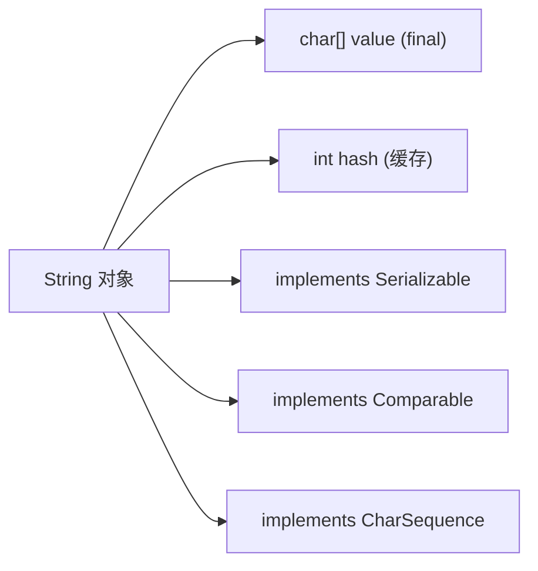

---
title: 深入理解 Java String 类型
date: 2020-12-25 18:43:11
order: 42
categories:
  - Java
  - JavaCore
  - 基础特性
tags:
  - Java
  - JavaCore
  - 工具类
  - 字符串
permalink: /pages/51a6ed6e/
---

# 深入理解 Java String 类型

## 简介

`String` 是 Java 中应用最频繁的引用类型，几乎所有 Java 程序都离不开字符串的操作。深入理解 String 的内部机制，对于编写高性能、安全的 Java 程序至关重要。

`String` 类定义在 `java.lang` 包中，被声明为 `final class`，这意味着它不能被继承，其内部实现也不可被篡改。

```java
public final class String
    implements java.io.Serializable, Comparable<String>, CharSequence {
    /** The value is used for character storage. */
    private final char value[];
```

> JDK 9 之后，`String` 内部存储从 `char[]` 改为 `byte[]`，并引入了 Compact Strings 优化，对 Latin-1 字符只占用 1 字节，节省内存。

## 特性

### 不可变性（Immutable）

`String` 类被 `final` 关键字修饰，表示**不可继承 `String` 类**。

`String` 类的数据存储于 `char[]` 数组，这个数组被 `final` 关键字修饰，表示 **`String` 对象不可被更改**。

```java
String str = "Hello";
str = str + " World";  // 并非修改原对象，而是创建了新的 String 对象
```

不可变性带来的好处：

1. **线程安全**：不可变对象天然线程安全，无需同步操作。
2. **hash 值缓存**：String 的 hashCode 只需计算一次，之后可缓存使用，非常适合作为 HashMap 的 key。
3. **字符串常量池**：相同内容的字符串可以共享同一个对象，节约内存。
4. **安全性**：作为类加载器、网络连接等参数时不会被篡改。

### 字符串常量池（String Pool）

JVM 维护了一个特殊的内存区域——字符串常量池，用于存储所有字符串字面量：

```mermaid
graph TB
    A["String str1 = \"abc\""] -->|检查常量池| B{常量池中是否有 \"abc\"?}
    B -->|有| C[返回已有对象引用]
    B -->|没有| D[在常量池创建新对象]
    D --> C
    E["String str2 = new String(\"abc\")"] -->|在堆中创建新对象| F[堆中的 String 对象]
    F -->|引用常量池| G[常量池中的 \"abc\"]
```

### 比较方式

```java
String s1 = "abc";
String s2 = "abc";
String s3 = new String("abc");

System.out.println(s1 == s2);      // true - 同一常量池对象
System.out.println(s1 == s3);      // false - 不同堆对象
System.out.println(s1.equals(s3)); // true - 内容相同
```

## 原理

### String 的内部结构



### 字符串创建机制

创建 String 对象有两种主要方式，其内存分配机制不同：

```mermaid
graph TB
    A[创建字符串] --> B{创建方式}
    B -->|"字面量 \"abc\""| C[检查字符串常量池]
    C -->|已存在| D[返回池中对象引用]
    C -->|不存在| E[在池中创建新对象]
    E --> D
    B -->|"new String(\"abc\")"| F[在堆中创建新对象]
    F --> G[同时在常量池中创建/复用]
    F --> H[返回堆中对象引用]
```

### String.intern() 工作原理

`intern()` 方法用于将字符串放入常量池：

- 如果常量池中已存在相同内容的字符串，返回池中已有对象的引用。
- 如果不存在，将当前字符串加入常量池并返回其引用。

## 典型应用场景

### 场景一：字符串拼接与性能优化

在循环中拼接字符串时，必须使用 `StringBuilder` 而非 `+` 操作符：

```java
// ❌ 错误方式 - 每次循环创建新对象
String result = "";
for (int i = 0; i < 10000; i++) {
    result += i;  // 每次都创建新的 String 对象
}

// ✅ 正确方式 - 使用 StringBuilder
StringBuilder sb = new StringBuilder(10000);
for (int i = 0; i < 10000; i++) {
    sb.append(i);
}
String result = sb.toString();
```

### 场景二：作为 HashMap 的 Key

String 是 HashMap 最常用的 Key 类型，得益于其不可变性和 hashCode 缓存：

```java
Map<String, Object> config = new HashMap<>();
config.put("database.url", "jdbc:mysql://localhost:3306/mydb");
config.put("database.username", "root");
config.put("database.poolSize", 10);

// 由于 String 不可变，hashCode 被缓存，查询效率高
Object url = config.get("database.url");
```

### 场景三：模板字符串处理

在代码生成、邮件模板等场景中，使用 String 的 replace 或第三方模板引擎处理动态内容：

```java
String template = "尊敬的 {name}，您的订单 {orderId} 已发货，预计 {days} 天到达。";
String message = template
    .replace("{name}", "张三")
    .replace("{orderId}", "ORD20240101001")
    .replace("{days}", "3");
// 输出：尊敬的 张三，您的订单 ORD20240101001 已发货，预计 3 天到达。
```

### 场景四：JSON/XML 数据解析

在微服务架构中，字符串作为 JSON 数据的载体，需要高效地进行解析和序列化：

```java
// 接收到的 JSON 字符串
String jsonStr = "{\"name\":\"Alice\",\"age\":25,\"city\":\"Beijing\"}";

// 使用 Jackson 解析
ObjectMapper mapper = new ObjectMapper();
User user = mapper.readValue(jsonStr, User.class);
```

## String 的性能考量

### 字符串拼接

**字符串常量的拼接，编译器会将其优化为一个常量字符串**。

```java
public static void main(String[] args) {
    // 编译器优化后等价于：String str = "abc";
    String str = "a" + "b" + "c";
    System.out.println("str = " + str);
}
```

**字符串变量的拼接，编译器会优化成 `StringBuilder` 的方式**。

```java
public static void main(String[] args) {
    String str = "";
    for(int i=0; i<1000; i++) {
        // 编译器优化为：
        // str = (new StringBuilder(String.valueOf(str))).append(i).toString();
        str = str + i;
    }
}
```

但每次循环都会生成新的 `StringBuilder` 实例，同样会降低性能。正确做法是手动使用 `StringBuilder`。

### 字符串分割

**`String` 的 `split()` 方法使用正则表达式实现分割功能**。正则表达式的性能不稳定，使用不当会引起回溯问题，导致 CPU 居高不下。

可以考虑用 `String.indexOf()` 方法代替 `split()` 方法完成简单场景的字符串分割：

```java
// 使用 indexOf 手动分割 "key=value" 格式
String input = "database.url=jdbc:mysql://localhost";
int index = input.indexOf('=');
String key = input.substring(0, index);
String value = input.substring(index + 1);
```

### String.intern

**使用 `intern` 方法可以在常量池中复用相同内容的字符串对象**，减少内存占用。但需要注意控制驻留字符串的数量，因为常量池的实现类似于 HashTable，数据过大会增加查找时间。

## String、StringBuffer、StringBuilder 对比

| 特性 | String | StringBuffer | StringBuilder |
| --- | --- | --- | --- |
| 可变性 | 不可变 | 可变 | 可变 |
| 线程安全 | 安全（不可变） | 安全（synchronized） | 不安全 |
| 性能 | 拼接产生新对象，低 | 中等（锁开销） | 最高 |
| 适用场景 | 少量操作 | 多线程环境 | 单线程环境（首选） |

**最佳选择策略**：

- 少量字符串操作 → `String`
- 大量字符串拼接（单线程）→ `StringBuilder`
- 大量字符串拼接（多线程）→ `StringBuffer`

### 初始化容量

`StringBuffer` 和 `StringBuilder` 的默认初始容量为 16。如果预知拼接结果较长，应指定初始容量避免多次扩容：

```java
// ✅ 指定初始容量，避免扩容开销
StringBuilder sb = new StringBuilder(1024);
```

## 最佳实践

1. **循环拼接必须用 StringBuilder**：永远不要在循环中使用 `+` 拼接字符串。
2. **避免不必要的 String 对象创建**：不要写 `String s = new String("abc")`，直接使用字面量 `String s = "abc"`。
3. **split 方法慎用正则**：简单分隔场景优先使用 `indexOf` + `substring`。
4. **intern 要控制数量**：大量字符串调用 intern 时，需设置 `-XX:StringTableSize` 参数。
5. **使用 `String.format` 或 `MessageFormat`**：在需要格式化输出时，使用专门的格式化工具而非手动拼接。
6. **注意编码问题**：字符串与字节数组转换时，始终显式指定字符集 `StandardCharsets.UTF_8`。
7. **使用 `StringUtils` 工具类**：Apache Commons Lang 或 Spring 提供的工具方法可以简化判空、截取等常见操作。

## 常见问题

### Q1：`String s = new String("abc")` 创建了几个对象？

在字符串常量池中创建 1 个对象（如果池中不存在），在堆中创建 1 个对象。所以最多创建 2 个对象，最少 1 个（池中已有则只创建堆中对象）。

### Q2：String 真的是不可变的吗？

是的，`String` 类被 `final` 修饰不可继承，内部 `char[]`（JDK9 后为 `byte[]`）也被 `final` 修饰。所有"修改"操作（如 `concat`、`replace`）实际上都返回了新对象。不过通过反射可以修改内部数组，但这属于破坏封装的非常规操作。

### Q3：为什么 `"abc" == "abc"` 为 true，而 `new String("abc") == new String("abc")` 为 false？

字面量 `"abc"` 使用常量池机制，相同内容的字面量共享同一个对象。而 `new` 总是在堆中创建新对象，两个新对象的地址不同，`==` 比较地址返回 false。

### Q4：String、StringBuilder、StringBuffer 如何选择？

- **String**：适用于少量操作或字符串不可变的场景（如 Map 的 key）。
- **StringBuilder**：适用于大量字符串操作的单线程场景，性能最优。
- **StringBuffer**：适用于多线程环境下需要线程安全的字符串操作。

### Q5：`String.intern()` 在什么场景下有用？

当程序中存在大量重复字符串（如日志中的固定标识、协议中的固定字段）时，使用 `intern()` 可以显著减少内存占用。但不适合对大量不重复的字符串调用，否则会增加常量池压力。

## 参考资料

- [《Java 编程思想（Thinking in Java）》](https://book.douban.com/subject/2130190/)
- [《Java 核心技术 卷 I 基础知识》](https://book.douban.com/subject/26880667/)
- [极客时间教程 - Java 性能调优实战](https://time.geekbang.org/column/intro/100028001)
- [极客时间教程 - Java 核心技术面试精讲](https://time.geekbang.org/column/intro/82)
- [JEP 254: Compact Strings](https://openjdk.org/jeps/254)
- [深入解析 String 的 intern 方法](https://blog.csdn.net/soonfly/article/details/70147205)
