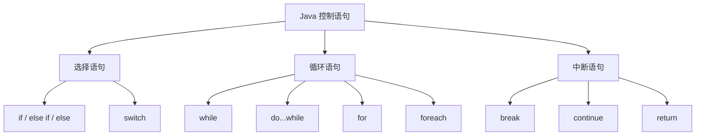
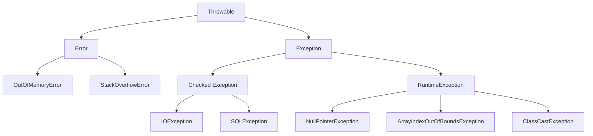
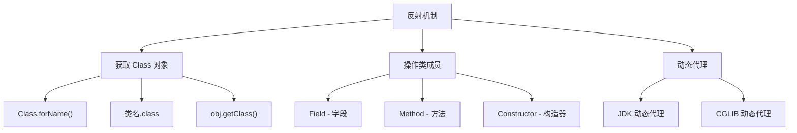
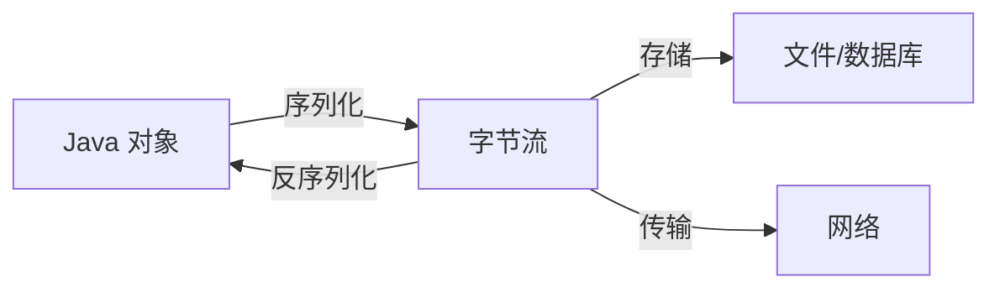

---
title: Java 基础语法特性
date: 2022-01-25 07:31:16
order: 01
categories:
  - Java
  - JavaCore
  - 基础特性
tags:
  - Java
  - JavaCore
permalink: /pages/0b9785ab/
---

# Java 基础语法特性

## 简介

Java 是一门强类型、面向对象的编程语言，由 Sun Microsystems（现为 Oracle）于 1995 年推出。Java 的基础语法是学习 Java 编程的基石，涵盖了数据类型、变量、操作符、控制流、方法等核心概念。掌握这些基础语法特性，是编写高质量 Java 程序的前提。

Java 语言的设计目标包括：简单性、面向对象、分布式、健壮性、安全性、平台无关性、可移植性、高性能、多线程和动态性。

### Java 程序的基本结构

一个 Java 程序由一个或多个类组成，每个类定义在一个 `.java` 文件中。程序从 `main` 方法开始执行。

```java
public class HelloWorld {
    public static void main(String[] args) {
        System.out.println("Hello, World!");
    }
}
```

## 注释

空白行，或者注释的内容，都会被 Java 编译器忽略掉。

Java 支持三种注释方式：

| 注释类型 | 语法 | 说明 |
| --- | --- | --- |
| 单行注释 | `// 注释内容` | 从 `//` 到行尾的内容被忽略 |
| 多行注释 | `/* 注释内容 */` | 可以跨越多行 |
| 文档注释 | `/** 注释内容 */` | 用于生成 Javadoc 文档 |

下面的示例展示了各种注释的使用方式：

```java
public class HelloWorld {
    /**
     * JavaDoc 注释 - 用于生成 API 文档
     * @param args 命令行参数
     */
    public static void main(String[] args) {
        // 单行注释
        /* 多行注释：
           1. 注意点a
           2. 注意点b
         */
        System.out.println("Hello World");
    }
}
```

### 最佳实践

- 使用 JavaDoc 注释为类、方法和公共 API 编写文档。
- 单行注释用于解释代码逻辑，而非重复代码本身。
- 避免嵌套多行注释（`/* */` 不可嵌套）。
- 保持注释与代码同步更新，过时的注释比没有注释更糟糕。

## 基本数据类型

Java 是强类型语言，每个变量都必须声明其类型。Java 提供了 8 种基本数据类型（值类型），分为四大类：

| 分类 | 类型 | 大小 | 默认值 | 说明 |
| --- | --- | --- | --- | --- |
| **布尔型** | `boolean` | - | `false` | 只有 true/false 两个值 |
| **字符型** | `char` | 16 bit | `'\u0000'` | 存储 Unicode 码 |
| **整数型** | `byte` / `short` / `int` / `long` | 8/16/32/64 bit | `0` | 有符号整数 |
| **浮点型** | `float` / `double` | 32/64 bit | `0.0` | IEEE 754 浮点数 |


### 特点

- **强类型检查**：编译器在编译期进行类型检查，防止类型错误。
- **固定大小**：基本数据类型的大小是固定的，与平台无关，保证了 Java 程序的可移植性。
- **栈上分配**：基本类型的局部变量直接存储在栈中，访问速度快。
- **自动初始化**：成员变量有默认值，局部变量必须显式初始化。

> 👉 扩展阅读：[深入理解 Java 基本数据类型](https://dunwu.github.io/waterdrop/pages/cba76603/)

## 变量和常量

Java 支持的变量类型有：

- `局部变量` - 类方法中的变量。
- `成员变量（也叫实例变量）` - 类方法外的变量，不过没有 `static` 修饰。
- `静态变量（也叫类变量）` - 类方法外的变量，用 `static` 修饰。

特性对比：

| 局部变量                                                                                                                   | 实例变量（也叫成员变量）                                                                                                                                | 类变量（也叫静态变量）                                                                                                                                                                          |
| -------------------------------------------------------------------------------------------------------------------------- | ------------------------------------------------------------------------------------------------------------------------------------------------------- | ----------------------------------------------------------------------------------------------------------------------------------------------------------------------------------------------- |
| 局部变量声明在方法、构造方法或者语句块中。                                                                                 | 实例变量声明在方法、构造方法和语句块之外。                                                                                                              | 类变量声明在方法、构造方法和语句块之外。并且以 static 修饰。                                                                                                                                    |
| 局部变量在方法、构造方法、或者语句块被执行的时候创建，当它们执行完成后，变量将会被销毁。                                   | 实例变量在对象创建的时候创建，在对象被销毁的时候销毁。                                                                                                  | 类变量在第一次被访问时创建，在程序结束时销毁。                                                                                                                                                  |
| 局部变量没有默认值，所以必须经过初始化，才可以使用。                                                                       | 实例变量具有默认值。数值型变量的默认值是 0，布尔型变量的默认值是 false，引用类型变量的默认值是 null。变量的值可以在声明时指定，也可以在构造方法中指定。 | 类变量具有默认值。数值型变量的默认值是 0，布尔型变量的默认值是 false，引用类型变量的默认值是 null。变量的值可以在声明时指定，也可以在构造方法中指定。此外，静态变量还可以在静态语句块中初始化。 |
| 对于局部变量，如果是基本类型，会把值直接存储在栈；如果是引用类型，会把其对象存储在堆，而把这个对象的引用（指针）存储在栈。 | 实例变量存储在堆。                                                                                                                                      | 类变量存储在静态存储区。                                                                                                                                                                        |
| 访问修饰符不能用于局部变量。                                                                                               | 访问修饰符可以用于实例变量。                                                                                                                            | 访问修饰符可以用于类变量。                                                                                                                                                                      |
| 局部变量只在声明它的方法、构造方法或者语句块中可见。                                                                       | 实例变量对于类中的方法、构造方法或者语句块是可见的。一般情况下应该把实例变量设为私有。通过使用访问修饰符可以使实例变量对子类可见。                      | 与实例变量具有相似的可见性。但为了对类的使用者可见，大多数静态变量声明为 public 类型。                                                                                                          |
|                                                                                                                            | 实例变量可以直接通过变量名访问。但在静态方法以及其他类中，就应该使用完全限定名：ObejectReference.VariableName。                                         | 静态变量可以通过：ClassName.VariableName 的方式访问。                                                                                                                                           |
|                                                                                                                            |                                                                                                                                                         | 无论一个类创建了多少个对象，类只拥有类变量的一份拷贝。                                                                                                                                          |
|                                                                                                                            |                                                                                                                                                         | 类变量除了被声明为常量外很少使用。                                                                                                                                                              |

**变量修饰符**

- **访问级别修饰符**
  - 如果变量是实例变量或类变量，可以添加访问级别修饰符（public/protected/private）
- **静态修饰符**
  - 如果变量是类变量，需要添加 static 修饰
- **final**
  - 如果变量使用 `final` 修饰符，就表示这是一个常量，不能被修改。

### 常量

常量是在程序运行过程中值不可改变的量。Java 中使用 `final` 关键字声明常量：

```java
// 声明常量
final double PI = 3.14159265358979;
final int MAX_SIZE = 100;
final String APP_NAME = "MyApp";

// 静态常量（类常量）
public static final String VERSION = "1.0.0";
```

## 操作符

Java 中支持的操作符类型如下：


### 操作符分类

| 操作符类型 | 操作符 | 说明 |
| --- | --- | --- |
| 算术操作符 | `+` `-` `*` `/` `%` `++` `--` | 基本数学运算 |
| 关系操作符 | `==` `!=` `>` `<` `>=` `<=` | 比较运算，返回 boolean |
| 逻辑操作符 | `&&` `\|\|` `!` | 逻辑与、或、非 |
| 位操作符 | `&` `\|` `^` `~` `<<` `>>` `>>>` | 位级运算 |
| 赋值操作符 | `=` `+=` `-=` `*=` `/=` 等 | 赋值运算 |
| 三元操作符 | `?:` | 条件表达式 |

### 操作符优先级

操作符的优先级决定了表达式中运算的执行顺序。从高到低排列：

1. 后缀：`()` `[]` `.`
2. 一元：`++` `--` `+` `-` `~` `!`
3. 乘性：`*` `/` `%`
4. 加性：`+` `-`
5. 移位：`<<` `>>` `>>>`
6. 关系：`<` `>` `<=` `>=` `instanceof`
7. 相等：`==` `!=`
8. 按位与：`&`
9. 按位异或：`^`
10. 按位或：`|`
11. 逻辑与：`&&`
12. 逻辑或：`||`
13. 三元：`?:`
14. 赋值：`=` `+=` `-=` 等

> 👉 扩展阅读：[Java 操作符](http://www.runoob.com/java/java-operators.html)

## 数组

数组是一种用于存储固定大小的同类型元素的数据结构。Java 中数组本质是对象，具有以下特点：

- 数组长度在创建后不可改变
- 数组可以存储基本类型和引用类型
- 数组元素通过下标（从 0 开始）访问
- 数组的效率高于容器（如 ArrayList）

```java
// 创建数组的两种方式
int[] arr1 = new int[5];            // 指定大小
int[] arr2 = {1, 2, 3, 4, 5};       // 直接初始化

// 访问数组元素
int first = arr2[0];  // 获取第一个元素
arr2[2] = 10;         // 修改第三个元素
```


> 👉 扩展阅读：[深入理解 Java 数组](https://dunwu.github.io/waterdrop/pages/ae0740ef/)

## 枚举

枚举（enum）是 JDK5 引入的特性，用于将一组相关的常量组织在一起统一管理。枚举本质上是 `java.lang.Enum` 的子类，具有类型安全性。

```java
// 定义枚举
enum Season {
    SPRING, SUMMER, AUTUMN, WINTER
}

// 带属性的枚举
enum ErrorCode {
    SUCCESS(0, "成功"),
    NOT_FOUND(404, "未找到"),
    SERVER_ERROR(500, "服务器错误");

    private final int code;
    private final String message;

    ErrorCode(int code, String message) {
        this.code = code;
        this.message = message;
    }
}
```


> 👉 扩展阅读：[深入理解 Java 枚举](https://dunwu.github.io/waterdrop/pages/2f0a1ca4/)

## 方法

方法是程序中执行特定任务的代码块。Java 方法的定义包含修饰符、返回值类型、方法名、参数列表和方法体。

```java
// 方法定义
public static int add(int a, int b) {
    return a + b;
}

// 方法调用
int result = add(3, 5);  // result = 8
```


> 👉 扩展阅读：[深入理解 Java 方法](https://dunwu.github.io/waterdrop/pages/e70c4bf9/)

## 控制语句

Java 控制语句用于控制程序的执行流程，分为三大类：




> 👉 扩展阅读：[Java 控制语句](https://dunwu.github.io/waterdrop/pages/36fd1ce8/)

## 异常

异常是程序在运行过程中出现的非正常情况。Java 通过异常机制来处理程序运行时的错误，保证程序的健壮性。




> 👉 扩展阅读：[深入理解 Java 异常](https://dunwu.github.io/waterdrop/pages/07ac0613/)

## 泛型

泛型是 JDK5 引入的特性，提供了编译时类型安全检测机制。泛型使得类、接口和方法可以操作任意类型的数据，同时保持类型安全。

```java
// 泛型类
public class Box<T> {
    private T value;
    public T getValue() { return value; }
    public void setValue(T value) { this.value = value; }
}

// 使用泛型 - 编译时类型检查
Box<String> stringBox = new Box<>();
stringBox.setValue("Hello");  // 类型安全
```


> 👉 扩展阅读：[深入理解 Java 泛型](https://dunwu.github.io/waterdrop/pages/ddc68bb5/)

## 反射

反射是 Java 在运行时动态获取类信息、创建对象、调用方法的机制。它是许多框架（Spring、MyBatis 等）的核心技术。




> 👉 扩展阅读：[深入理解 Java 反射和动态代理](https://dunwu.github.io/waterdrop/pages/6ef470ed/)

## 注解

注解（Annotation）是 JDK5 引入的元数据机制，以 `@` 字符开始的修饰符。注解本身不影响程序逻辑，但可以被编译器或框架在编译期、运行时读取和处理。

```java
// 内置注解
@Override
public String toString() { ... }

// 自定义注解
@Target(ElementType.METHOD)
@Retention(RetentionPolicy.RUNTIME)
public @interface Log {
    String value() default "";
}
```


> 👉 扩展阅读：[深入理解 Java 注解](https://dunwu.github.io/waterdrop/pages/56a4a49d/)

## 序列化

序列化是将对象状态转换为可存储或可传输格式的过程。Java 通过 `Serializable` 接口实现对象的序列化和反序列化。




### 序列化要点

- 实现 `Serializable` 接口的类才能被序列化。
- `serialVersionUID` 用于验证序列化与反序列化的版本一致性。
- `transient` 关键字修饰的字段不参与序列化。
- 静态字段不属于对象状态，不参与序列化。

> 👉 扩展阅读：[Java 序列化](https://dunwu.github.io/waterdrop/pages/ce9efc62/)

## 典型应用场景

### 场景一：命令行工具程序

利用 Java 基础语法编写一个简单的命令行计算器，综合运用变量、操作符、控制语句和方法：

```java
public class Calculator {
    public static double calculate(double a, String operator, double b) {
        switch (operator) {
            case "+": return a + b;
            case "-": return a - b;
            case "*": return a * b;
            case "/":
                if (b == 0) throw new ArithmeticException("除数不能为零");
                return a / b;
            default: throw new IllegalArgumentException("不支持的操作符: " + operator);
        }
    }

    public static void main(String[] args) {
        System.out.println("3 + 5 = " + calculate(3, "+", 5));
        System.out.println("10 / 3 = " + calculate(10, "/", 3));
    }
}
```

### 场景二：数据模型定义

综合运用类、变量、方法、枚举定义一个订单数据模型：

```java
public class Order {
    enum Status { CREATED, PAID, SHIPPED, DELIVERED, CANCELLED }

    private final String orderId;
    private final double amount;
    private Status status;
    private final LocalDateTime createTime;

    public Order(String orderId, double amount) {
        this.orderId = orderId;
        this.amount = amount;
        this.status = Status.CREATED;
        this.createTime = LocalDateTime.now();
    }

    public void pay() {
        if (status != Status.CREATED) {
            throw new IllegalStateException("订单状态不允许支付");
        }
        this.status = Status.PAID;
    }
}
```

### 场景三：配置读取与解析

利用泛型、注解和反射实现简单的配置注入：

```java
@Target(ElementType.FIELD)
@Retention(RetentionPolicy.RUNTIME)
@interface ConfigValue {
    String key();
    String defaultValue() default "";
}

public class AppConfig {
    @ConfigValue(key = "app.name", defaultValue = "MyApp")
    private String appName;

    @ConfigValue(key = "app.port", defaultValue = "8080")
    private int port;
}
// 通过反射读取注解并注入配置值
```

## 最佳实践

1. **命名规范**：类名用 PascalCase，方法名和变量名用 camelCase，常量用全大写加下划线。
2. **最小作用域原则**：变量声明应尽可能靠近使用处，减小作用域范围。
3. **避免魔法数字**：使用命名常量（`final` 变量或枚举）替代代码中的硬编码数值。
4. **防御性编程**：对方法参数进行合法性检查，对可能出现的异常进行处理。
5. **代码简洁**：一个方法只做一件事，保持方法短小精悍，提高可读性和可维护性。
6. **避免过深嵌套**：嵌套超过 3 层时应考虑提取方法或使用提前返回（early return）。
7. **善用增强 for 循环**：优先使用 foreach 遍历集合和数组，减少索引相关的错误。

## 常见问题

### Q1：Java 中 `==` 和 `equals()` 有什么区别？

- `==` 对于基本类型比较的是值，对于引用类型比较的是内存地址（是否同一对象）。
- `equals()` 默认行为与 `==` 相同（Object 类），但 String、Integer 等类覆写了 `equals()` 方法，用于比较内容是否相等。

### Q2：为什么 Java 中 `String` 是不可变的？

- `String` 类被 `final` 修饰，不可继承。
- 内部 `char[]` 数组也被 `final` 修饰，引用不可变。
- 不可变性保证了线程安全、hash 值稳定（适用于 HashMap 键）、字符串常量池的实现。

### Q3：`final`、`finally`、`finalize` 有什么区别？

- `final`：修饰类（不可继承）、方法（不可覆写）、变量（不可重新赋值）。
- `finally`：异常处理中的代码块，无论是否发生异常都会执行。
- `finalize`：Object 类的方法，在垃圾回收前被调用（已不推荐使用）。

### Q4：自动装箱/拆箱有什么陷阱？

- 自动装箱会调用 `valueOf()` 方法，在缓存范围（-128~127）外的值会创建新对象。
- 包装类比较应使用 `equals()` 而非 `==`。
- 自动拆箱时如果包装类为 `null`，会抛出 `NullPointerException`。

## 参考资料

- [《Java 编程思想（Thinking in Java）》](https://book.douban.com/subject/2130190/)
- [《Java 核心技术 卷 I 基础知识》](https://book.douban.com/subject/26880667/)
- [《Effective Java》](https://book.douban.com/subject/30412517/)
- [Oracle Java 教程 - 语言基础](https://docs.oracle.com/javase/tutorial/java/nutsandbolts/index.html)
- [Runoob Java 教程](https://www.runoob.com/java/java-tutorial.html)
