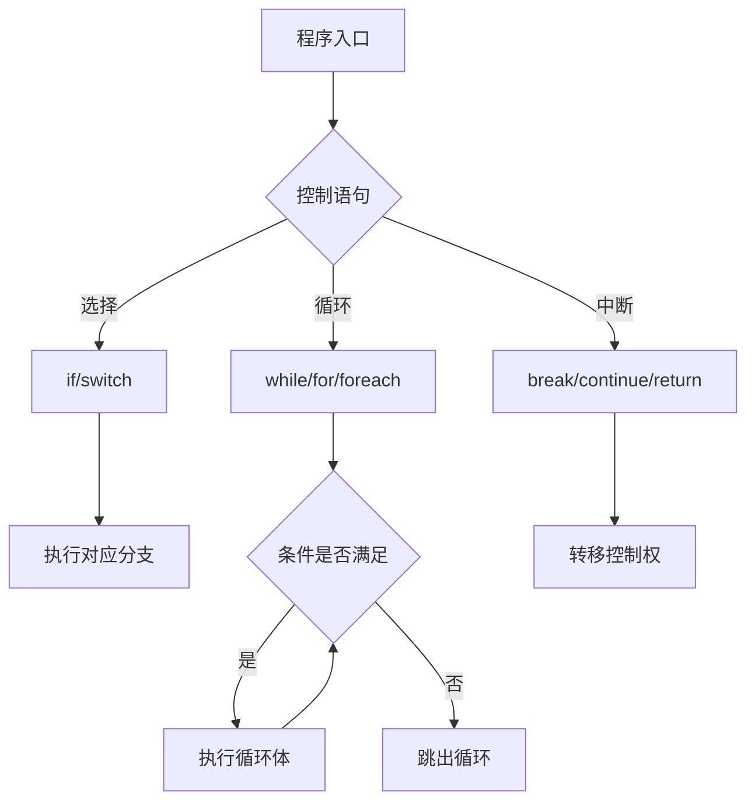

---
title: Java 控制语句
date: 2020-10-17 19:13:25
order: 07
categories:
  - Java
  - JavaCore
  - 基础特性
tags:
  - Java
  - JavaCore
  - 控制语句
permalink: /pages/c67f25cc/
---

# Java 控制语句

## 简介

控制语句是 Java 程序的核心流程控制工具，决定了程序执行的顺序和路径。通过控制语句，程序可以实现条件判断、循环迭代和流程跳转。掌握控制语句的正确使用方式，是编写清晰、高效、无 bug 代码的基础。

> Java 控制语句大致可分为三大类：
>
> - 选择语句
>   - if, else-if, else
>   - switch
> - 循环语句
>   - while
>   - do...while
>   - for
>   - foreach
> - 中断语句
>   - break
>   - continue
>   - return

### 控制流概览



## 选择语句

### if 语句

`if` 语句会判断括号中的条件是否成立，如果成立则执行 `if` 语句中的代码块，否则跳过代码块继续执行。

**语法**

```java
if(布尔表达式) {
   //如果布尔表达式为true将执行的语句
}
```

**示例**

```java
public class IfDemo {
    public static void main(String args[]) {
        int x = 10;
        if (x < 20) {
            System.out.print("这是 if 语句");
        }
    }
}
// output:
// 这是 if 语句
```

### if...else 语句

`if` 语句后面可以跟 `else` 语句，当 `if` 语句的布尔表达式值为 `false` 时，`else` 语句块会被执行。

**语法**

```java
if(布尔表达式) {
   //如果布尔表达式的值为true
} else {
   //如果布尔表达式的值为false
}
```

**示例**

```java
public class IfElseDemo {
    public static void main(String args[]) {
        int x = 30;
        if (x < 20) {
            System.out.print("这是 if 语句");
        } else {
            System.out.print("这是 else 语句");
        }
    }
}
// output:
// 这是 else 语句
```

### if...else if...else 语句

- `if` 语句至多有 1 个 `else` 语句，`else` 语句在所有的 `else if` 语句之后。
- `If` 语句可以有若干个 `else if` 语句，它们必须在 `else` 语句之前。
- 一旦其中一个 `else if` 语句检测为 `true`，其他的 `else if` 以及 `else` 语句都将跳过执行。

**语法**

```java
if (布尔表达式 1) {
   //如果布尔表达式 1的值为true执行代码
} else if (布尔表达式 2) {
   //如果布尔表达式 2的值为true执行代码
} else if (布尔表达式 3) {
   //如果布尔表达式 3的值为true执行代码
} else {
   //如果以上布尔表达式都不为true执行代码
}
```

**示例**

```java
public class IfElseifElseDemo {
    public static void main(String args[]) {
        int x = 3;

        if (x == 1) {
            System.out.print("Value of X is 1");
        } else if (x == 2) {
            System.out.print("Value of X is 2");
        } else if (x == 3) {
            System.out.print("Value of X is 3");
        } else {
            System.out.print("This is else statement");
        }
    }
}
// output:
// Value of X is 3
```

### 嵌套的 if…else 语句

使用嵌套的 `if else` 语句是合法的。也就是说你可以在另一个 `if` 或者 `else if` 语句中使用 `if` 或者 `else if` 语句。

**语法**

```java
if (布尔表达式 1) {
   ////如果布尔表达式 1的值为true执行代码
   if (布尔表达式 2) {
      ////如果布尔表达式 2的值为true执行代码
   }
}
```

**示例**

```java
public class IfNestDemo {
    public static void main(String args[]) {
        int x = 30;
        int y = 10;

        if (x == 30) {
            if (y == 10) {
                System.out.print("X = 30 and Y = 10");
            }
        }
    }
}
// output:
// X = 30 and Y = 10
```

### switch 语句

`switch` 语句判断一个变量与一系列值中某个值是否相等，每个值称为一个分支。

`switch` 语句有如下规则：

- `switch` 语句中的变量类型只能为 `byte`、`short`、`int`、`char` 或者 `String`。
- `switch` 语句可以拥有多个 `case` 语句。每个 `case` 后面跟一个要比较的值和冒号。
- `case` 语句中的值的数据类型必须与变量的数据类型相同，而且只能是常量或者字面常量。
- 当变量的值与 `case` 语句的值相等时，那么 `case` 语句之后的语句开始执行，直到 `break` 语句出现才会跳出 `switch` 语句。
- 当遇到 `break` 语句时，`switch` 语句终止。程序跳转到 `switch` 语句后面的语句执行。`case` 语句不必须要包含 `break` 语句。如果没有 `break` 语句出现，程序会继续执行下一条 `case` 语句，直到出现 `break` 语句。
- `switch` 语句可以包含一个 `default` 分支，该分支必须是 `switch` 语句的最后一个分支。`default` 在没有 `case` 语句的值和变量值相等的时候执行。`default` 分支不需要 `break` 语句。

**语法**

```java
switch(expression){
    case value :
       //语句
       break; //可选
    case value :
       //语句
       break; //可选
    //你可以有任意数量的case语句
    default : //可选
       //语句
       break; //可选，但一般建议加上
}
```

**示例**

```java
public class SwitchDemo {
    public static void main(String args[]) {
        char grade = 'C';

        switch (grade) {
        case 'A':
            System.out.println("Excellent!");
            break;
        case 'B':
        case 'C':
            System.out.println("Well done");
            break;
        case 'D':
            System.out.println("You passed");
        case 'F':
            System.out.println("Better try again");
            break;
        default:
            System.out.println("Invalid grade");
            break;
        }
        System.out.println("Your grade is " + grade);
    }
}
// output:
// Well done
// Your grade is C
```

## 循环语句

### while 循环

只要布尔表达式为 `true`，`while` 循环体会一直执行下去。

**语法**

```java
while( 布尔表达式 ) {
    //循环内容
}
```

**示例**

```java
public class WhileDemo {
    public static void main(String args[]) {
        int x = 10;
        while (x < 20) {
            System.out.print("value of x : " + x);
            x++;
            System.out.print("\n");
        }
    }
}
// output:
// value of x : 10
// value of x : 11
// value of x : 12
// value of x : 13
// value of x : 14
// value of x : 15
// value of x : 16
// value of x : 17
// value of x : 18
// value of x : 19
```

### do while 循环

对于 `while` 语句而言，如果不满足条件，则不能进入循环。但有时候我们需要即使不满足条件，也至少执行一次。

`do while` 循环和 `while` 循环相似，不同的是，`do while` 循环至少会执行一次。

**语法**

```java
do {
    //代码语句
} while (布尔表达式);
```

布尔表达式在循环体的后面，所以语句块在检测布尔表达式之前已经执行了。 如果布尔表达式的值为 true，则语句块一直执行，直到布尔表达式的值为 false。

**示例**

```java
public class DoWhileDemo {
    public static void main(String args[]) {
        int x = 10;

        do {
            System.out.print("value of x : " + x);
            x++;
            System.out.print("\n");
        } while (x < 20);
    }
}
// output:
// value of x:10
// value of x:11
// value of x:12
// value of x:13
// value of x:14
// value of x:15
// value of x:16
// value of x:17
// value of x:18
// value of x:19
```

### for 循环

虽然所有循环结构都可以用 `while` 或者 `do while` 表示，但 Java 提供了另一种语句 —— `for` 循环，使一些循环结构变得更加简单。
`for` 循环执行的次数是在执行前就确定的。

**语法**

```java
for (初始化; 布尔表达式; 更新) {
    //代码语句
}
```

- 最先执行初始化步骤。可以声明一种类型，但可初始化一个或多个循环控制变量，也可以是空语句。
- 然后，检测布尔表达式的值。如果为 true，循环体被执行。如果为 false，循环终止，开始执行循环体后面的语句。
- 执行一次循环后，更新循环控制变量。
- 再次检测布尔表达式。循环执行上面的过程。

**示例**

```java
public class ForDemo {
    public static void main(String args[]) {
        for (int x = 10; x < 20; x = x + 1) {
            System.out.print("value of x : " + x);
            System.out.print("\n");
        }
    }
}
// output:
// value of x : 10
// value of x : 11
// value of x : 12
// value of x : 13
// value of x : 14
// value of x : 15
// value of x : 16
// value of x : 17
// value of x : 18
// value of x : 19
```

### foreach 循环

Java5 引入了一种主要用于数组的增强型 for 循环。

**语法**

```java
for (声明语句 : 表达式) {
    //代码句子
}
```

**声明语句**：声明新的局部变量，该变量的类型必须和数组元素的类型匹配。其作用域限定在循环语句块，其值与此时数组元素的值相等。

**表达式**：表达式是要访问的数组名，或者是返回值为数组的方法。

**示例**

```java
public class ForeachDemo {
    public static void main(String args[]) {
        int[] numbers = { 10, 20, 30, 40, 50 };

        for (int x : numbers) {
            System.out.print(x);
            System.out.print(",");
        }

        System.out.print("\n");
        String[] names = { "James", "Larry", "Tom", "Lacy" };

        for (String name : names) {
            System.out.print(name);
            System.out.print(",");
        }
    }
}
// output:
// 10,20,30,40,50,
// James,Larry,Tom,Lacy,
```

## 中断语句

### break 关键字

`break` 主要用在循环语句或者 `switch` 语句中，用来跳出整个语句块。

`break` 跳出最里层的循环，并且继续执行该循环下面的语句。

**示例**

```java
public class BreakDemo {
    public static void main(String args[]) {
        int[] numbers = { 10, 20, 30, 40, 50 };

        for (int x : numbers) {
            if (x == 30) {
                break;
            }
            System.out.print(x);
            System.out.print("\n");
        }

        System.out.println("break 示例结束");
    }
}
// output:
// 10
// 20
// break 示例结束
```

### continue 关键字

`continue` 适用于任何循环控制结构中。作用是让程序立刻跳转到下一次循环的迭代。在 `for` 循环中，`continue` 语句使程序立即跳转到更新语句。在 `while` 或者 `do while` 循环中，程序立即跳转到布尔表达式的判断语句。

**示例**

```java
public class ContinueDemo {
    public static void main(String args[]) {
        int[] numbers = { 10, 20, 30, 40, 50 };

        for (int x : numbers) {
            if (x == 30) {
                continue;
            }
            System.out.print(x);
            System.out.print("\n");
        }
    }
}
// output:
// 10
// 20
// 40
// 50
```

### return 关键字

跳出整个函数体，函数体后面的部分不再执行。

示例

```java
public class ReturnDemo {
    public static void main(String args[]) {
        int[] numbers = { 10, 20, 30, 40, 50 };

        for (int x : numbers) {
            if (x == 30) {
                return;
            }
            System.out.print(x);
            System.out.print("\n");
        }

        System.out.println("return 示例结束");
    }
}
// output:
// 10
// 20
```

> 🔔 注意：请仔细体会一下 `return` 和 `break` 的区别。

## 典型应用场景

### 场景一：多级权限判断

在权限控制系统中，使用 if-else if-else 进行多级别权限判断：

```java
public String getAccessLevel(User user) {
    if (user.isAdmin()) {
        return "FULL_ACCESS";
    } else if (user.isManager()) {
        return "MANAGE_ACCESS";
    } else if (user.isActive()) {
        return "READ_ACCESS";
    } else {
        return "NO_ACCESS";
    }
}
```

### 场景二：状态机处理

使用 switch 语句实现订单状态机：

```java
public void handleOrderEvent(Order order, OrderEvent event) {
    switch (order.getStatus()) {
        case CREATED:
            if (event == OrderEvent.PAY) order.setStatus(Status.PAID);
            break;
        case PAID:
            if (event == OrderEvent.SHIP) order.setStatus(Status.SHIPPED);
            break;
        case SHIPPED:
            if (event == OrderEvent.CONFIRM) order.setStatus(Status.COMPLETED);
            break;
        case COMPLETED:
        case CANCELLED:
            throw new IllegalStateException("订单已结束，无法操作");
        default:
            throw new IllegalArgumentException("未知状态: " + order.getStatus());
    }
}
```

### 场景三：数据过滤与转换

使用 foreach + continue 实现高效的数据过滤：

```java
public List<User> getActiveUsers(List<User> allUsers) {
    List<User> activeUsers = new ArrayList<>();
    for (User user : allUsers) {
        if (!user.isActive()) continue;       // 跳过非活跃用户
        if (user.isBanned()) continue;         // 跳过封禁用户
        activeUsers.add(user);
    }
    return activeUsers;
}
```

## 常见问题

### Q1：switch 语句中不写 break 会怎样？

如果不写 break，程序会继续执行下一个 case 的代码（称为"穿透"或"fall-through"）。这有时是故意的（如多个 case 共享逻辑），但大多数时候是程序员的疏忽，会导致逻辑错误。建议每个 case 都加上 break，或者使用 JDK 14 的 switch 表达式（自动不穿透）。

### Q2：foreach 循环中能否删除集合元素？

不能直接在 foreach 循环中调用集合的 `remove()` 方法，否则会抛出 `ConcurrentModificationException`。正确做法是使用 `Iterator` 的 `remove()` 方法，或使用 `Collection.removeIf()` (JDK8)。

### Q3：for 和 while 怎么选择？

- **for**：适合已知循环次数的场景（如遍历数组、执行 N 次操作）。
- **while**：适合不确定循环次数、根据条件判断是否继续的场景。
- **do-while**：保证至少执行一次的场景（如菜单显示、输入验证）。
- **foreach**：遍历集合或数组时的首选，代码最简洁且不易出错。

## 最佳实践

- 选择分支特别多的情况下，`switch` 语句优于 `if...else if...else` 语句。
- `switch` 语句不要吝啬使用 `default`。
- `switch` 语句中的 `default` 要放在最后。
- `foreach` 循环优先于传统的 `for` 循环
- 不要循环遍历容器元素，然后删除特定元素。正确姿势应该是遍历容器的迭代器（`Iterator`），删除元素。

## 参考资料

- [Java 编程思想](https://book.douban.com/subject/2130190/)
- [Java 核心技术（卷 1）](https://book.douban.com/subject/3146174/)
