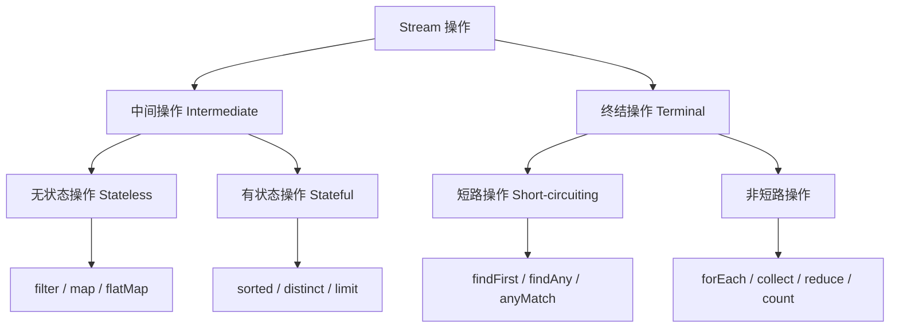
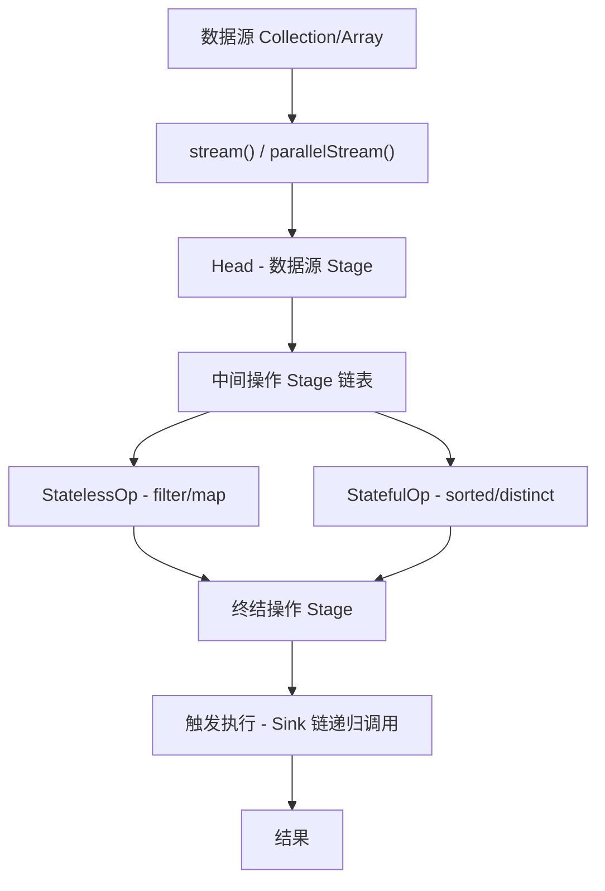

---
title: Java 容器之 Stream
date: 2020-12-05 18:30:22
order: 06
categories:
  - Java
  - JavaCore
  - 容器
tags:
  - Java
  - JavaCore
  - 容器
  - Stream
permalink: /pages/c7769e0d/
---

# Java 容器之 Stream

## 简介

`Stream` 是 Java 8 引入的核心特性之一，位于 `java.util.stream` 包中。它提供了一种高效且可声明的方式来处理数据序列（集合、数组、文件行等），支持链式操作、函数式编程风格和并行处理。

Stream 不是数据结构，它不会存储数据，而是对 `Collection` 或数组等数据源进行**惰性求值**（Lazy Evaluation）的操作管道。Stream 操作不会修改数据源，而是返回一个新的 Stream 或结果。

> 在 Java 8 中，`Collection` 新增了两个流方法：`stream()` 和 `parallelStream()`。

## 特性

### 声明式编程

Stream API 让代码更加简洁、可读，开发者只需声明"做什么"而非"怎么做"：

```java
// 传统方式：找出所有偶数并求和
int sum = 0;
for (int n : numbers) {
    if (n % 2 == 0) {
        sum += n;
    }
}

// Stream 方式
int sum = numbers.stream()
    .filter(n -> n % 2 == 0)
    .mapToInt(Integer::intValue)
    .sum();
```

### 链式操作

Stream 支持方法链（Fluent API），多个操作可以串联成一条管道：

```java
List<String> result = users.stream()
    .filter(u -> u.getAge() > 18)
    .sorted(Comparator.comparing(User::getName))
    .map(User::getName)
    .collect(Collectors.toList());
```

### 惰性求值

中间操作不会立即执行，只有在终结操作触发时才会真正计算。这使得 Stream 能够进行短路优化（如 `findFirst`、`limit`），避免不必要的计算。

### 可并行化

通过 `parallelStream()` 可以轻松实现并行处理，底层基于 Fork/Join 框架：

```java
long count = list.parallelStream()
    .filter(n -> n > 0)
    .count();
```

## 原理

### Stream 操作分类

Stream 操作分为两大类：



- **中间操作**：返回一个新的 Stream，支持链式调用。分为无状态（`filter`、`map`）和有状态（`sorted`、`distinct`）操作。
- **终结操作**：触发管道执行并产生结果或副作用，如 `collect`、`forEach`、`reduce`。

### Stream 内部架构



`ReferencePipeline` 是核心实现类，定义了 `Head`、`StatelessOp`、`StatefulOp` 三个内部类。整个 Stream 管道通过 `Sink` 接口协议串联，终结操作触发时从最后一个 Stage 开始递归生成 Sink 链。

## 典型应用场景

### 场景一：数据过滤与转换

从用户列表中筛选活跃用户并提取邮箱：

```java
List<String> emails = users.stream()
    .filter(User::isActive)
    .map(User::getEmail)
    .collect(Collectors.toList());
```

### 场景二：分组与聚合统计

按部门分组并统计各部门人数和平均薪资：

```java
Map<String, DoubleSummaryStatistics> stats = employees.stream()
    .collect(Collectors.groupingBy(
        Employee::getDepartment,
        Collectors.summarizingDouble(Employee::getSalary)
    ));
```

### 场景三：日志分析与统计

处理大量日志数据，统计各状态码的请求数：

```java
Map<Integer, Long> statusCount = logEntries.stream()
    .filter(entry -> entry.getTimestamp() > yesterday)
    .collect(Collectors.groupingBy(
        LogEntry::getStatusCode,
        Collectors.counting()
    ));
```

### 场景四：文件内容处理

读取文件并统计词频：

```java
Map<String, Long> wordCount = Files.lines(Path.of("data.txt"))
    .flatMap(line -> Arrays.stream(line.split("\\s+")))
    .map(String::toLowerCase)
    .collect(Collectors.groupingBy(Function.identity(), Collectors.counting()));
```

## 最佳实践

1. **避免嵌套 Stream**：过度嵌套会使代码难以阅读和调试，考虑拆分为多个方法。
2. **注意并行 Stream 的开销**：对于小数据量，并行 Stream 可能比串行更慢（线程创建和协调开销）。数据量大于 10000 且操作耗时才考虑并行。
3. **优先使用方法引用**：`User::getName` 比 `u -> u.getName()` 更简洁。
4. **避免副作用**：不要在 `filter`/`map` 中修改外部状态，保持函数无副作用。
5. **使用 `Optional` 处理空值**：`findFirst()`、`max()` 等返回 `Optional`，避免 NPE。
6. **终结操作只执行一次**：Stream 是一次性使用的，终结操作后不能再复用。
7. **合理选择收集器**：`toList()`、`toMap()`、`groupingBy()` 各有适用场景，避免手动循环收集。

## 常见问题

### Q1：Stream 和 Iterator 有什么区别？

| 特性 | Stream | Iterator |
| --- | --- | --- |
| 遍历方式 | 内部迭代（声明式） | 外部迭代（命令式） |
| 惰性求值 | 支持 | 不支持 |
| 并行处理 | 原生支持 parallelStream | 不支持 |
| 可复用性 | 一次性使用 | 可多次遍历 |
| 函数式操作 | 支持 filter/map/reduce | 不支持 |

### Q2：parallelStream 一定比 stream 快吗？

不一定。并行 Stream 适用于数据量大且每个元素处理耗时较长的场景。对于小数据集，线程切换和协调开销可能抵消并行收益。此外，某些有状态操作（如 `sorted`、`distinct`）在并行模式下性能可能更差。

### Q3：Stream 中 `map` 和 `flatMap` 有什么区别？

- `map`：一对一映射，每个元素转换为一个新元素。
- `flatMap`：一对多映射，每个元素转换为一个 Stream，然后将所有 Stream 扁平化合并。

```java
// map: List<String> -> List<String>
list.stream().map(String::toUpperCase);

// flatMap: List<List<Integer>> -> List<Integer>
nestedList.stream().flatMap(Collection::stream);
```

## 参考资料

- [Java 编程思想（第 4 版）](https://item.jd.com/10058164.html)
- [《Java 8 实战》](https://book.douban.com/subject/26993074/)
- [java8-tutorial - Stream](https://github.com/winterbe/java8-tutorial)
- [Java Stream API 官方文档](https://docs.oracle.com/javase/8/docs/api/java/util/stream/Stream.html)
---
title: Java 容器之 Stream
date: 2020-12-05 18:30:22
order: 06
categories:
  - Java
  - JavaCore
  - 容器
tags:
  - Java
  - JavaCore
  - 容器
permalink: /pages/c7769e0d/
---

# Java 容器之 Stream

## Stream 简介

在 Java8 中，`Collection` 新增了两个流方法，分别是 `stream()` 和 `parallelStream()`。

`Stream` 相当于高级版的 `Iterator`，他可以通过 Lambda 表达式对集合进行各种非常便利、高效的聚合操作（Aggregate Operation），或者大批量数据操作 (Bulk Data Operation)。

## Stream 操作分类

官方将 Stream 中的操作分为两大类：中间操作（Intermediate operations）和终结操作（Terminal operations）。

中间操作又可以分为无状态（Stateless）与有状态（Stateful）操作，前者是指元素的处理不受之前元素的影响，后者是指该操作只有拿到所有元素之后才能继续下去。

终结操作又可以分为短路（Short-circuiting）与非短路（Unshort-circuiting）操作，前者是指遇到某些符合条件的元素就可以得到最终结果，后者是指必须处理完所有元素才能得到最终结果。

## Stream 源码实现


`BaseStream` 和 `Stream` 是最顶层的接口类。`BaseStream` 主要定义了流的基本接口方法，例如，spliterator、isParallel 等；`Stream` 则定义了一些流的常用操作方法，例如，map、filter 等。

`Sink` 接口是定义每个 `Stream` 操作之间关系的协议，他包含 `begin()`、`end()`、`cancellationRequested()`、`accpt()` 四个方法。`ReferencePipeline` 最终会将整个 `Stream` 流操作组装成一个调用链，而这条调用链上的各个 `Stream` 操作的上下关系就是通过 `Sink` 接口协议来定义实现的。

`ReferencePipeline` 是一个结构类，他通过定义内部类组装了各种操作流。他定义了 `Head`、`StatelessOp`、`StatefulOp` 三个内部类，实现了 `BaseStream` 与 `Stream` 的接口方法。Head 类主要用来定义数据源操作，在初次调用 names.stream() 方法时，会加载 Head 对象，此时为加载数据源操作；接着加载的是中间操作，分别为无状态中间操作 StatelessOp 对象和有状态操作 StatefulOp 对象，此时的 Stage 并没有执行，而是通过 AbstractPipeline 生成了一个中间操作 Stage 链表；当我们调用终结操作时，会生成一个最终的 Stage，通过这个 Stage 触发之前的中间操作，从最后一个 Stage 开始，递归产生一个 Sink 链。

## Stream 并行处理

Stream 处理数据的方式有两种，串行处理和并行处理。

## 4. 参考资料

- [Java 编程思想（第 4 版）](https://item.jd.com/10058164.html)
