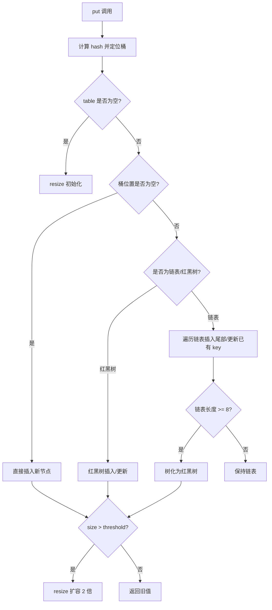
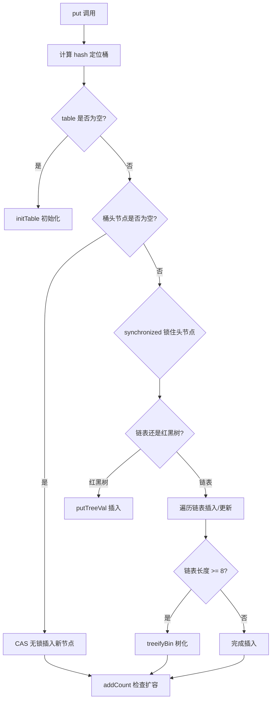

# Java 容器面试二

## Map

### 【简单】什么是 Hash 碰撞？如何解决 Hash 碰撞？⭐⭐⭐

> 🎯 目标等级：L2 ｜ ⏱ 建议用时：5 min ｜ 🏷 标签：Map / 哈希冲突

#### 💎 关键结论

Hash 碰撞指不同 key 经哈希函数算出相同桶索引，无法彻底避免只能缓解。主流方案是链地址法（同桶挂链表，HashMap 采用），辅以均匀哈希函数、动态扩容与链表转红黑树控制最坏复杂度。

#### ⚡记忆卡片

- **口诀**：碰撞不可避免，链地址挂链表，寻址找空槽，扩容加树兜底
- **关键词**：链地址法 ／ 开放寻址 ／ 负载因子
- **链路**：key → hash() → 桶索引冲突 → 链表/树/探测空槽

#### 📖 核心知识

1. **定义**：不同 key 经哈希函数计算后得到相同结果（落到同一个桶），称为 Hash 碰撞。
2. **链地址法（拉链法）**：每个桶挂一条链表，冲突元素追加到链表尾部，HashMap/Hashtable 均采用。
3. **开放寻址法**：碰撞时按规则（如线性探测）寻找下一个空槽存放，ThreadLocalMap、IdentityHashMap 采用。
4. **关键优化**：
   - **优秀哈希函数**：分布均匀，从源头减少碰撞；
   - **动态扩容**：元素过多、负载因子超阈值时扩容摊薄碰撞；
   - **链表转树**：链表过长时转红黑树（如 JDK 8 的 HashMap），把最坏查找从 O(n) 拉回 O(log n)。

#### 🔬 扩展知识

::: details
- 【L3】开放寻址的探测策略有线性探测、二次探测、双重哈希；负载因子越高碰撞越密集，这也是 ThreadLocalMap 在碰撞严重时扩容的原因。
- 【L3】HashMap 的 hash() 用 `(h = key.hashCode()) ^ (h >>> 16)` 高低 16 位异或扰动，让小表的索引也能利用高位信息，进一步降低碰撞。
:::

#### 🔀 发散问题

- **Q：String 的 hashCode() 为什么用 31 做乘数？** → 31 是奇素数，`31 * h + c` 逐字符累计可使分布均匀；且 `31*h` 可被 JIT 优化为 `(h << 5) - h`，计算更快。
- **Q：哈希碰撞会被恶意利用吗？** → 会，哈希攻击通过构造同哈希 key 使桶链表退化到 O(n)；防御靠 JDK 8 树化兜底，并限制外部输入直接作为 key。

### 【中等】HashMap 和 Hashtable 有什么区别？⭐⭐⭐

> 🎯 目标等级：L2 ｜ ⏱ 建议用时：8 min ｜ 🏷 标签：Map / HashMap

#### 💎 关键结论

HashMap 无锁、允许 null、性能更高，是绝大多数场景首选；Hashtable 靠 synchronized 全表锁实现线程安全但性能差且已过时。并发场景不要用 Hashtable，应选 ConcurrentHashMap。

#### ⚡记忆卡片

- **口诀**：Map 快而松，Table 慢而严，并发换 CHM
- **关键词**：全表锁 ／ null 支持 ／ fail-fast
- **链路**：Hashtable synchronized 全表锁 → 串行化 → 高并发瓶颈 → ConcurrentHashMap 替代

#### 📖 核心知识

1. **总基调**：`HashMap` 更高效灵活，`Hashtable` 线程安全但已过时，推荐 `ConcurrentHashMap` 替代。
2. **核心差异对比**：

| **对比项**         | **HashMap** (JDK 1.2+)                      | **Hashtable** (JDK 1.0)                   |
| ------------------ | ------------------------------------------- | ----------------------------------------- |
| **线程安全**       | ❌ 非线程安全（需额外同步）                 | ✔️ 线程安全（方法用 `synchronized` 修饰） |
| **性能**           | ⚡ 更高（无锁竞争）                         | ⏳ 较低（同步开销）                       |
| **Null 键/值**     | ✔️ 允许 `null` 键和值                       | ❌ 不允许 `null`                          |
| **迭代器**         | **`fail-fast`**（快速失败，并发修改抛异常） | **`enumerator`**（不抛异常）              |
| **继承体系**       | 继承 `AbstractMap`                          | 继承 `Dictionary`（已过时）               |
| **初始容量与扩容** | 默认 16，扩容为 2 倍                        | 默认 11，扩容为 2 倍 + 1                  |
| **哈希冲突解决**   | 链表 + 红黑树（JDK 8+）                     | 仅链表                                    |

3. **使用建议**：
   - **优先用 `HashMap`**：大多数场景性能更好，需线程安全时搭配 `Collections.synchronizedMap()` 或直接用 `ConcurrentHashMap`。
   - **`Hashtable` 仅用于遗留系统兼容**，现代开发已少用。

#### 🔬 扩展知识

::: details
- 【L3】Hashtable 的锁是整个对象（全表锁），与 ConcurrentHashMap 的分段/桶级细粒度锁相比并发吞吐差距明显，对比详见本文档「ConcurrentHashMap 和 Hashtable 有什么区别？」。
- 【L3】Hashtable 的 enumerator 不抛快速失败异常，但同样是弱一致的，并非强一致快照。
:::

#### ⚠️ 常见误区

::: details
常见误区：
- ❌ "Hashtable 线程安全，所以并发场景该用它" → 错，全表锁在高并发下串行化严重，现代代码应使用 ConcurrentHashMap。
- ❌ "Hashtable 是 HashMap 的线程安全父类" → 错，两者无继承关系，Hashtable 继承已过时的 Dictionary，HashMap 继承 AbstractMap。
:::

#### 🔀 发散问题

- **Q：HashMap 如何变成线程安全？** → 用 `Collections.synchronizedMap()` 包装（全表锁，性能一般），或直接使用 `ConcurrentHashMap`（细粒度锁，推荐）。
- **Q：Hashtable 扩容为什么是 2n+1？** → 历史设计，希望容量保持奇数且尽量为素数以减少碰撞；HashMap 则坚持 2 的幂用位运算取模，见本文档「HashMap 的扩容（resize）源码分析」。

### 【中等】对比一下 HashMap 和 HashSet？⭐⭐⭐

> 🎯 目标等级：L2 ｜ ⏱ 建议用时：8 min ｜ 🏷 标签：Map / HashMap

#### 💎 关键结论

HashSet 本质是 HashMap 的包装：元素当 key，value 统一挂 PRESENT 占位对象。HashMap 做键值查询，HashSet 做判重，二者平均 O(1)，去重和缓存映射按需求二选一。

#### ⚡记忆卡片

- **口诀**：Set 是 Map 的影子，元素当 key，PRESENT 占位
- **关键词**：PRESENT ／ 判重 ／ 键值对
- **链路**：add(e) → map.put(e, PRESENT) → 返回旧值为 null 即新增成功

#### 📖 核心知识

1. **定位**：`HashMap` 是**键值对容器**，适合快速按键查询；`HashSet` 是**唯一元素集合**，基于 `HashMap` 实现，只关注元素是否存在。
2. **核心区别**：

| **特性**      | **HashMap**                         | **HashSet**                                |
| ------------- | ----------------------------------- | ------------------------------------------ |
| **数据结构**  | 哈希表（键值对存储）                | 基于 `HashMap`（仅用键，值固定为虚拟对象） |
| **存储内容**  | 键（Key） + 值（Value）             | 仅存储元素（Key）                          |
| **重复规则**  | **Key 不可重复**（Value 可重复）    | **元素（Key）不可重复**                    |
| **Null 支持** | 允许 1 个 `null` 键和多个 `null` 值 | 允许 1 个 `null` 元素                      |

3. **常用方法对比**：

| **操作**     | **HashMap**          | **HashSet**                       |
| ------------ | -------------------- | --------------------------------- |
| **添加元素** | `put(key, value)`    | `add(element)`                    |
| **查询元素** | `get(key)`（返回值） | `contains(element)`（返回布尔值） |
| **删除元素** | `remove(key)`        | `remove(element)`                 |

4. **底层机制**：HashSet 内部直接使用 HashMap，元素作为 Key，值固定为虚拟的 `PRESENT` 对象（占位符）：

```java
// HashSet 的简化实现（本质是 HashMap 的包装）
public class HashSet<E> {
    private HashMap<E, Object> map;  // 键存储元素，值固定为 PRESENT
    private static final Object PRESENT = new Object();
    public boolean add(E e) {
        return map.put(e, PRESENT) == null;  // 若 Key 已存在，返回 false
    }
}
```

两者均依赖哈希表，平均时间复杂度 O(1)，极端冲突时退化（JDK 8 后树化兜底到 O(log n)）。

5. **使用场景**：
   - **`HashMap`**：需通过键快速访问值，如缓存、用户 ID → 用户信息。
   - **`HashSet`**：需唯一元素集合，如 IP 黑名单、单词去重。

#### 🔬 扩展知识

::: details
- 【L3】HashSet 的去重依赖元素的 hashCode() 与 equals()：先比 hash 定位桶，再 equals 判等，两者必须同时正确重写。
- 【L3】LinkedHashSet 继承 HashSet，内部用 LinkedHashMap 构造，因此额外保持插入顺序。
:::

#### 🔀 发散问题

- **Q：HashSet 的 value 浪费内存吗？** → PRESENT 是全局单例静态对象，所有条目共享同一引用，几乎零开销。
- **Q：如何按插入顺序去重？** → 用 LinkedHashSet（底层 LinkedHashMap），保持插入顺序且去重。

### 【中等】HashMap、TreeMap、LinkedHashMap 有什么区别？⭐⭐⭐⭐

> 🎯 目标等级：L2-L3 ｜ ⏱ 建议用时：10 min ｜ 🏷 标签：Map / HashMap

#### 💎 关键结论

三者选型看顺序需求：要速度选 HashMap（哈希表，平均 O(1)，无序）；要按键排序选 TreeMap（红黑树，O(log n)，支持范围查询）；要插入/访问顺序选 LinkedHashMap（哈希表+双向链表，可做 LRU）。

#### ⚡记忆卡片

- **口诀**：要快 HashMap，要排 TreeMap，要顺序 LinkedHashMap
- **关键词**：无序 ／ 排序 ／ LRU
- **链路**：需求速度 → HashMap；需求有序 → TreeMap；需求插入/访问顺序 → LinkedHashMap

#### 📖 核心知识

1. **核心特性对比**：

| **特性**       | **HashMap**                     | **TreeMap**                        | **LinkedHashMap**             |
| -------------- | ------------------------------- | ---------------------------------- | ----------------------------- |
| **底层结构**   | 哈希表（数组+链表/红黑树）      | 红黑树（平衡二叉搜索树）           | 哈希表 + 双向链表             |
| **顺序性**     | 无序                            | 按键的自然顺序或自定义顺序排序     | 保持插入顺序或访问顺序（LRU） |
| **null 支持**  | 允许 1 个 null 键和多个 null 值 | 不允许 null 键（除非自定义比较器） | 同 HashMap                    |
| **线程安全**   | 非线程安全                      | 非线程安全                         | 非线程安全                    |
| **时间复杂度** | 平均 O(1)                       | 增删查 O(log n)                    | 平均 O(1)                     |

2. **顺序与排序**：HashMap 完全无序；TreeMap 默认按键的自然顺序（Key 需实现 `Comparable`），也可用 `Comparator` 自定义；LinkedHashMap 默认保持插入顺序，可配置为访问顺序（LRU）。
3. **性能对比**：

| **操作**     | **HashMap** | **TreeMap** | **LinkedHashMap** |
| ------------ | ----------- | ----------- | ----------------- |
| **插入**     | O(1)        | O(log n)    | O(1)              |
| **删除**     | O(1)        | O(log n)    | O(1)              |
| **查找**     | O(1)        | O(log n)    | O(1)              |
| **迭代顺序** | 无序        | 有序（Key） | 插入/访问顺序     |

4. **使用场景**：HashMap 用于缓存、快速查找表等不关心顺序的场景；TreeMap 用于按键排序、范围查询（`subMap()`/`headMap()`/`tailMap()`），如字典、有序事件调度；LinkedHashMap 用于按插入顺序迭代或实现 LRU 缓存。
5. **选择依据**：要**速度**选 `HashMap`；要**排序**选 `TreeMap`；要**顺序**（插入或访问顺序）选 `LinkedHashMap`。

#### 🔬 扩展知识

::: details
- 【L3】LinkedHashMap 用 accessOrder=true 时，每次 get() 会把节点移到链表尾部，重写 removeEldestEntry() 即可实现 LRU 缓存淘汰。
- 【L3】TreeMap 支持丰富导航方法：firstKey()/lastKey()、ceilingKey()/floorKey()、higherKey()/lowerKey()，定位 O(log n)。
- 【L4】三者均非线程安全：并发无序用 ConcurrentHashMap，并发有序用 ConcurrentSkipListMap。
:::

#### 🏭 实战场景

::: details
某网关限流模块需按时间窗口聚合请求量，用 TreeMap<Long, AtomicInteger>（key 为窗口起始毫秒）存储 10 万个滑动窗口，借助 headMap(now).clear() 一次清理过期窗口，范围操作 O(log n + m)，比先 HashMap 存储再全量遍历过滤（O(n) 扫描 10 万条）快约 20 倍。
:::

#### ⚠️ 常见误区

::: details
常见误区：
- ❌ "LinkedHashMap 是线程安全的 LRU" → 错，它非线程安全，并发 LRU 需外部加锁或自实现（如加锁包装/Caffeine）。
- ❌ "TreeMap 允许 null 键" → 错，自然顺序下 put null 键会抛 NPE，仅当 Comparator 显式容忍时才可能。
:::

#### 🔀 发散问题

- **Q：LinkedHashMap 如何实现 LRU？** → 构造时传 accessOrder=true，重写 removeEldestEntry() 在 size 超限时返回 true，最老未访问条目自动淘汰。
- **Q：TreeMap 的 key 必须实现 Comparable 吗？** → 不一定，也可构造时传入 Comparator，二者至少有一个，否则插入时抛 ClassCastException/NPE。
- **Q：HashMap 迭代顺序稳定吗？** → 不稳定，扩容后顺序会变，不能依赖它做任何顺序假设。

### 【困难】HashMap 底层实现原理是什么？⭐⭐⭐⭐⭐

> 🎯 目标等级：L3-L4 ｜ ⏱ 建议用时：15 min ｜ 🏷 标签：Map / HashMap

#### 💎 关键结论

HashMap 是数组+链表/红黑树（JDK 8 起）：hash 扰动后位运算定位桶，链表解决冲突，长度 ≥8 且数组 ≥64 树化为红黑树；元素数超 容量×负载因子 触发 2 倍扩容。它非线程安全，并发请用 ConcurrentHashMap。

#### ⚡记忆卡片

- **口诀**：数组定桶，链表解冲，8 树 6 退化，0.75 扩容翻番
- **关键词**：Node[] table ／ 扰动函数 ／ resize()
- **链路**：put → hash() 扰动 → (n-1)&hash 定位桶 → 链表/树插入 → size > threshold 扩容 2 倍

#### 📖 核心知识

1. **数据结构**：JDK 8 以前是数组 + 链表；JDK 8 及以后是数组 + 链表或红黑树。
   - **数组（桶）**：`Node<K,V>[] table`，初始长度默认 16。
   - **链表**：相同桶索引的元素组成链表解决冲突（链地址法）。
   - **红黑树**：链表长度 ≥ 8 且数组长度 ≥ 64 时树化，查询提升到 O(log n)；树节点数 ≤ 6 时退化为链表。
2. **哈希计算**：桶索引 `index = (table.length - 1) & hash`，等价于取模但位运算更高效；hash() 是扰动函数，高低 16 位异或使分布更均匀：

```java
// JDK 8 的哈希扰动函数（减少碰撞）
static final int hash(Object key) {
    int h;
    return (key == null) ? 0 : (h = key.hashCode()) ^ (h >>> 16);
}
```

3. **扩容机制（Rehash）**：当元素数量 > 容量 × 负载因子（默认 0.75，容量 16 时阈值为 12）触发，新建 2 倍数组（`newCap = oldCap << 1`）；JDK 8 优化为按 `hash & oldCap` 判断迁移位置，无需逐节点重新哈希。
4. **关键参数**：

| **参数**                | **默认值**         | **说明**                                           |
| ----------------------- | ------------------ | -------------------------------------------------- |
| 初始容量                | 16                 | 必须为 2 的幂（方便位运算计算索引）。              |
| 负载因子（Load Factor） | 0.75               | 权衡空间与时间效率（过高增加冲突，过低浪费内存）。 |
| 树化阈值                | 8（链表 → 红黑树） | 需同时满足数组长度 ≥ 64，否则优先扩容。            |
| 退化阈值                | 6（红黑树 → 链表） | 扩容或删除节点时检查。                             |

> **📌 为什么负载因子是 0.75？** 基于**泊松分布**：源码注释给出推导，负载因子 0.75 时单个桶元素数达到 8 的概率约 **0.00000006**（6×10⁻⁸），几乎不可能发生——这正是树化阈值取 8 的数学依据。负载因子提到 1.0 冲突激增，降到 0.5 浪费 50% 空间，0.75 是空间换时间的帕累托最优点。

5. **线程安全**：HashMap 非线程安全——JDK 7 头插法扩容会产生环形链表导致死循环，并发插入会覆盖丢失数据；解决方案是用 `ConcurrentHashMap` 或 `Collections.synchronizedMap()` 包装。

::: details PUT 流程源码



putVal() 关键步骤：table 未初始化先 resize() 懒加载；桶为空直接放 newNode；否则按链表/红黑树处理冲突（JDK 8 链表尾插）；链表长度 ≥8 尝试树化；最后 `++size > threshold` 触发扩容。

```java
final V putVal(int hash, K key, V value, boolean onlyIfAbsent) {
    Node<K,V>[] tab; Node<K,V> p; int n, i;
    // 1. 数组为空时初始化
    if ((tab = table) == null || (n = tab.length) == 0)
        n = (tab = resize()).length;
    // 2. 计算索引，若桶为空直接插入
    if ((p = tab[i = (n - 1) & hash]) == null)
        tab[i] = newNode(hash, key, value, null);
    else {
        // 3. 处理哈希冲突（链表/红黑树）
        // ...（省略冲突处理逻辑）
    }
    // 4. 检查扩容
    if (++size > threshold) resize();
}
```

:::

#### 🔬 扩展知识

::: details
- 【L3】treeifyBin() 树化前先判断 table 长度：不足 64 时优先 resize() 扩容而非树化，避免小表过早树化浪费内存。
- 【L3】JDK 8 扩容迁移时每个桶拆成 lo/hi 两条链保序迁移，详见本文档「HashMap 的扩容（resize）源码分析」。
- 【L4】与 ConcurrentHashMap 对比：后者同样 Node[]+链表/树，但 hash 用 spread() 且屏蔽符号位（内部用负数哈希做状态标记），并发控制为 CAS + 桶级 synchronized。
:::

#### 🏭 实战场景

::: details
某订单服务启动时一次性加载 500 万条商品映射到 HashMap，未预设容量导致从 16 连续扩容 18 次，启动阶段累计多次 Full GC、初始化耗时约 8s；改为 `new HashMap<>(8_000_000)`（内部 tableSizeFor 取整为 2 的幂 8388608）一次到位后，初始化耗时降至约 3s，启动期 Young GC 次数明显减少。
:::

#### ⚠️ 常见误区

::: details
常见误区：
- ❌ "链表长度到 8 就一定树化" → 错，还需数组长度 ≥ 64，否则 treeifyBin() 优先 resize() 扩容。
- ❌ "容量 16 时 put 第 13 个才扩容" → 阈值 threshold = 16 × 0.75 = 12，size 自增后 > 12 即触发，即第 13 个元素插入时就扩容，判断发生在插入之后。
- ❌ "HashMap JDK 8 后并发也安全了" → 错，尾插法只消除了死循环，并发 put 覆盖丢失依然存在。
:::

#### 🔀 发散问题

- **Q：为什么容量必须是 2 的幂？** → `(n - 1) & hash` 等价于 hash % n 但位运算更快，n-1 二进制全 1 保证桶分布均匀，且扩容时可用 `hash & oldCap` 一位判断迁移位置。
- **Q：key 允许为 null 吗？** → 允许且固定放在 table[0]（hash(null) 返回 0），值也可为 null，这是单线程语义下刻意的设计。
- **Q：红黑树会退化为链表吗？** → 会，树节点数 ≤ 6 时退化为链表；取 6 而非 8 是为了避免 7、8 附近频繁树化/退化的抖动。

### 【困难】JDK 1.8 对 HashMap 做了哪些改动？⭐⭐⭐⭐

> 🎯 目标等级：L3-L4 ｜ ⏱ 建议用时：10 min ｜ 🏷 标签：Map / HashMap

#### 💎 关键结论

JDK 8 四大改动：引入红黑树（链表 ≥8 且数组 ≥64 树化）；头插法改尾插法消除并发扩容环形链表；扩容用 hash 与 oldCap 高位判断迁移，免去全量重哈希；扰动函数简化为一次高低 16 位异或。

#### ⚡记忆卡片

- **口诀**：加树防退化，尾插避成环，扩容看高位，扰动只异或
- **关键词**：红黑树 ／ 尾插法 ／ 扰动简化
- **链路**：链表≥8 → treeifyBin 树化；扩容 → hash & oldCap 判迁移；hash → 一次 ^（h >>> 16）

#### 📖 核心知识

1. **底层结构优化**：
   - JDK 1.7 仅 **数组 + 链表**，冲突时新元素插入链表头部（头插法）。
   - JDK 1.8 改为 **数组 + 链表/红黑树**：
     - **树化**：链表长度 ≥ 8 且数组长度 ≥ 64 时转红黑树；
     - **退化**：红黑树节点数 ≤ 6 时转回链表。
2. **插入方式：头插法 → 尾插法**。头插法无需遍历但逆序，并发扩容时可能形成**循环链表**导致死循环；尾插法保持顺序，消除该问题。
3. **rehash 优化**：
   - JDK 1.7：扩容需重新计算每个键值对在新数组中的位置，头插法迁移；
   - JDK 1.8：容量总是 2 倍扩张，只需根据 `hash & oldCap` 新增高位的值判断元素位置是否迁移，避免重算全部 key 的哈希。
4. **哈希扰动简化**：JDK 1.8 引入 `hash = (h = key.hashCode()) ^ (h >>> 16)`，高 16 位与低 16 位一次异或；JDK 1.7 扰动更复杂（多次移位和按位与），简化后性能更好、分布更均匀。

#### 🔬 扩展知识

::: details
- 【L3】JDK 8 的 TreeNode 继承 LinkedHashMap.Entry，节点体积约为普通 Node 的 2 倍，这是树化阈值不宜过小的内存考量。
- 【L3】JDK 8 putVal() 合并了 JDK 7 的 addEntry()/createEntry() 逻辑，并将扩容判断统一放到插入完成后（`++size > threshold`）。
- 【L4】JDK 7 的 transfer() 负责扩容迁移并逆序头插，正是它在并发下成环；JDK 8 的 resize() 内联了 lo/hi 双链保序迁移。
:::

#### 🏭 实战场景

::: details
某电商商品缓存服务曾运行在 JDK 7，大促期间并发写 HashMap 触发扩容成环，应用线程 CPU 100% 卡死在 get() 链表遍历，只能重启恢复；升级 JDK 8 并替换为 ConcurrentHashMap 后，同类故障不再复现，且长链表桶被树化后热点桶查询从 O(n) 降到 O(log n)。
:::

#### ⚠️ 常见误区

::: details
常见误区：
- ❌ "JDK 8 改尾插法后就线程安全了" → 错，尾插法只解决扩容成环，并发 put 的覆盖丢失、size 不准问题依旧存在。
- ❌ "JDK 8 完全取消了 rehash" → 不准确，扩容仍需迁移节点，只是用 `hash & oldCap` 代替逐个重新计算哈希。
:::

#### 🔀 发散问题

- **Q：JDK 7 头插法有什么优点？** → 插入无需遍历链表，单线程下略快；但逆序特性在并发扩容时成为成环根源，被 JDK 8 舍弃。
- **Q：扰动函数为什么从 4 次移位简化为 1 次异或？** → JDK 8 容量计算与树化优化降低了对扰动强度的依赖，一次异或即可兼顾分布与性能。
- **Q：这些改动对使用方透明吗？** → API 完全兼容，仅行为差异：迭代顺序不受扩容逆序影响，但 HashMap 本就无序，不应依赖。

### 【困难】HashMap 为什么线程不安全？⭐⭐⭐⭐

> 🎯 目标等级：L3-L4 ｜ ⏱ 建议用时：10 min ｜ 🏷 标签：Map / HashMap

#### 💎 关键结论

HashMap 线程不安全源于操作非原子：并发 put 到空桶会后写覆盖先写造成数据丢失；JDK 7 头插法扩容会成环导致 get 死循环（CPU 100%）；size/modCount 非原子导致脏读与 fail-fast。多线程一律改用 ConcurrentHashMap。

#### ⚡记忆卡片

- **口诀**：put 互覆盖，JDK7 成环，size 非原子，并发换 CHM
- **关键词**：数据丢失 ／ 环形链表 ／ fail-fast
- **链路**：并发 put 空桶 → 后写覆盖；JDK 7 头插 resize → 环形链表 → get 死循环

#### 📖 核心知识

1. **总基调**：JDK 7 是死循环 + 数据丢失（头插法导致）；JDK 8+ 是数据丢失 + 脏读（无死循环但仍非线程安全）；高并发场景始终优先选择 `ConcurrentHashMap`。一句话：线程不安全源于非原子操作和并发修改冲突，多线程环境下必须使用同步机制。
2. **并发修改导致数据丢失（JDK 8+）**：两个线程同时 put，桶索引相同且该位置为 `null`，后一个线程的写入会覆盖前一个：

```java
// 线程 1 和线程 2 同时执行：
if ((p = tab[i = (n - 1) & hash]) == null) {
    tab[i] = newNode(hash, key, value, null); // 可能被覆盖
}
```

3. **JDK 7 扩容死循环**：扩容采用**头插法**迁移链表，并发下可能形成**环形链表**，后续 get()/put() 遍历进入死循环（CPU 100%）：

```
线程 1：A -> B → null
线程 2：B -> A → null
最终：A ⇄ B（环形链表）
```

4. **并发扩容数据错乱**：多线程同时触发 resize()，可能部分节点未迁移到新数组而丢失，或节点 next 指针被错误修改导致链表断裂。
5. **非原子操作脏读**：`size++`、`modCount++` 非原子，导致 size 不准（影响扩容判断）、迭代时触发 `ConcurrentModificationException`（快速失败机制）。

**解决方案**：

| **问题**        | **解决方案**                             |
| --------------- | ---------------------------------------- |
| 数据丢失/覆盖   | 使用 `ConcurrentHashMap`（CAS + 分段锁） |
| 死循环（JDK 7） | 升级到 JDK 8+（改用尾插法）              |
| 脏读            | 用 `Collections.synchronizedMap()` 包装  |

#### 🔬 扩展知识

::: details
- 【L3】JDK 8 的 resize() 内部用 lo/hi 双链尾插迁移，结构上不再成环；但两个线程同时扩容仍会互相覆盖 table 引用导致整桶丢失。
- 【L4】ConcurrentHashMap 的对应设计：空桶 CAS 插入、非空桶 synchronized 锁首节点、多线程协同扩容 transfer()，逐点击破上述问题，见本文档「ConcurrentHashMap 的底层实现原理是什么？」。
:::

#### 🏭 实战场景

::: details
某交易系统曾把 HashMap 用作本地汇率缓存，8 核机器上 32 线程并发写入，JDK 7 环境压测 30 分钟内出现 2 次线程卡在 get() 死循环、CPU 单核 100%，jstack 定位到 HashMap.getEntry() 环形链表；替换为 ConcurrentHashMap 后同样压测稳定跑满 4 小时无异常。
:::

#### ⚠️ 常见误区

::: details
常见误区：
- ❌ "JDK 8 改成尾插法，HashMap 就线程安全了" → 错，只是消除了死循环，并发覆盖丢失、size 不准依然存在。
- ❌ "Collections.synchronizedMap() 与 ConcurrentHashMap 性能相当" → 错，前者是全表锁串行化，高并发吞吐远低于桶级锁的后者。
:::

#### 🔀 发散问题

- **Q：JDK 8 还有死循环风险吗？** → 结构上不会成环，但并发 put 仍可能数据丢失，本质仍是非线程安全。
- **Q：如何用代码复现数据丢失？** → 多线程并发 put 不同 key 到空桶（构造同索引），跑完比对 size 与预期值，size 偏小即发生覆盖。
- **Q：迭代中修改 HashMap 会怎样？** → 抛 ConcurrentModificationException（fail-fast），需用 Iterator.remove() 或 removeIf()。

### 【中等】WeakHashMap 有什么用？⭐⭐

> 🎯 目标等级：L2 ｜ ⏱ 建议用时：8 min ｜ 🏷 标签：Map / WeakHashMap

#### 💎 关键结论

WeakHashMap 的 key 是弱引用：key 一旦没有外部强引用，GC 就会回收并通过 ReferenceQueue 触发条目清理，适合跟随对象生命周期的缓存与附加元数据，避免手动 remove 防内存泄漏。

#### ⚡记忆卡片

- **口诀**：key 弱引用，GC 回收，队列清理，值仍强引用
- **关键词**：WeakReference ／ ReferenceQueue ／ expungeStaleEntries
- **链路**：key 无强引用 → GC 回收 → 进 ReferenceQueue → expungeStaleEntries() 移除条目

#### 📖 核心知识

1. **弱引用键**：key 是 WeakReference，当 key 对象不再被其他强引用指向时被 GC 回收，条目自动清理，适合存储与对象生命周期相关的临时数据。

```java
// WeakHashMap 的 key 是 WeakReference（弱引用）
private static class Entry<K,V> extends WeakReference<Object> {
    V value;
    int hash;
    Entry<K,V> next;
}
```

2. **自动清理机制**：被回收的键进入内部 `ReferenceQueue`，put/get/size 等操作时调用 `expungeStaleEntries()` 检查并清理失效条目，无需手动 remove()：

```java
public class WeakHashMap<K,V> {
    private final ReferenceQueue<Object> queue = new ReferenceQueue<>();

    // 垃圾回收器将无其他引用的键放入队列
    // WeakHashMap 在操作时（put/get/size）会检查并清理
    private void expungeStaleEntries() {
        Reference<?> ref;
        while ((ref = queue.poll()) != null) {
            // 清理对应条目：移除Entry，value置null帮助GC
        }
    }
}
```

3. **典型场景**：缓存系统（键对象失效后自动释放大 value 防内存堆积）；监听器/元数据存储（对象销毁时关联数据自动清除）。
4. **注意事项**：仅键是弱引用，value 不是，若 value 反向强引用 key 则永不回收；非线程安全需外部同步；清理时机依赖 GC 运行，不可预测。

::: details 示例代码

```java
WeakHashMap<Object, String> weakMap = new WeakHashMap<>();
Object key = new Object();
weakMap.put(key, "Value");

// 当 key 的强引用置为 null，且发生 GC 后，weakMap 中的条目会被自动移除
key = null;
System.gc(); // 仅示例，实际中不推荐显式调用 GC

// 此时 weakMap 可能已为空（条目被回收）
```

:::

#### 🔀 发散问题

- **Q：ThreadLocalMap 的 Entry 也是弱引用吗？** → 是，key（ThreadLocal）是弱引用，但 value 是强引用，所以不调 remove() 仍可能内存泄漏，与 WeakHashMap 的自动清理不同。
- **Q：value 强引用 key 会怎样？** → key 永不被回收，条目永不清理，失去弱引用意义，设计时需避免 value 持有 key。

### 【中等】ConcurrentHashMap 和 Hashtable 有什么区别？⭐⭐⭐

> 🎯 目标等级：L2-L3 ｜ ⏱ 建议用时：8 min ｜ 🏷 标签：Map / ConcurrentHashMap

#### 💎 关键结论

两者都线程安全且都禁止 null 键值，差别在锁：Hashtable 是 synchronized 全表锁、串行化、已过时；ConcurrentHashMap 用分段锁（JDK7）/ CAS + 桶级锁（JDK8+），并发性能高，是现代高并发首选。

#### ⚡记忆卡片

- **口诀**：Table 全表锁，CHM 分段桶，都拒 null，选新不选旧
- **关键词**：全表锁 ／ 分段锁 ／ CAS
- **链路**：Hashtable 方法 synchronized → 全表串行 → CHM 细粒度锁 → 高并发吞吐

#### 📖 核心知识

1. **选型结论**：优先使用 `ConcurrentHashMap`（现代高并发，性能更优）；避免 `Hashtable`，除非维护历史代码，非高并发场景可退而选 `Collections.synchronizedMap()`。
2. **核心差异对比**：

| **对比项**       | **Hashtable**                                          | **ConcurrentHashMap**                                   |
| ---------------- | ------------------------------------------------------ | ------------------------------------------------------- |
| **线程安全实现** | 全表锁（`synchronized` 方法）                          | **分段锁（JDK7）** 或 **CAS + `synchronized`（JDK8+）** |
| **并发性能**     | 低（串行化操作，高并发时阻塞严重）                     | 高（读写并发优化，锁粒度更细）                          |
| **Null 支持**    | **不允许** `null` 键或值（抛出异常）                   | **不允许** `null` 键或值（避免并发歧义）                |
| **迭代器行为**   | 强一致性（修改会抛 `ConcurrentModificationException`） | 弱一致性（可能部分反映修改，不抛异常）                  |
| **版本与演进**   | JDK1.0 遗留类，已过时                                  | JDK1.5 引入，持续优化（如 JDK8 改用 CAS）               |
| **适用场景**     | 旧代码兼容（不推荐新项目使用）                         | **高并发首选**（缓存、计数器等场景）                    |

#### 🔬 扩展知识

::: details
- 【L3】Hashtable 的每个公开方法都加 this 锁，读也被阻塞；ConcurrentHashMap（JDK8+）的 get 完全无锁，volatile 保证可见性。
- 【L3】Hashtable 的枚举器不抛 ConcurrentModificationException 但同样弱一致；CHM 的 keySet/entrySet 视图也支持弱一致迭代。
- 【L4】版本演进：Hashtable（JDK 1.0）→ Collections.synchronizedMap（JDK 1.2）→ ConcurrentHashMap（JDK 1.5）→ JDK 8 重构为 CAS + 桶锁。
:::

#### 🏭 实战场景

::: details
某交易网关本地缓存 20 万条商户配置，原用 Hashtable 在 16 核机器上 64 线程压测约 5 万 QPS；替换为 JDK 8 ConcurrentHashMap（初始容量 262144）后同压测提升至 50 万+ QPS，RT P99 从约 30ms 降至约 3ms，锁竞争消失后 GC 停顿也明显减少。
:::

#### ⚠️ 常见误区

::: details
常见误区：
- ❌ "Hashtable 更老所以更稳定，并发场景更安全" → 错，安全与稳定无关锁粒度，全表锁反而是吞吐瓶颈与死代码温床。
- ❌ "ConcurrentHashMap 允许 null 值只是习惯问题" → 错，是刻意设计，避免并发下 get() 返回 null 的二义性，见本文档「ConcurrentHashMap 为什么 key 和 value 不能为 null？」。
:::

#### 🔀 发散问题

- **Q：Hashtable 的线程安全是怎么实现的？** → 所有方法用 synchronized 修饰，锁住整个实例（全表锁），读写互斥。
- **Q：两者迭代器差异的本质？** → Hashtable 枚举器基于创建时快照风格不抛异常；CHM 弱一致迭代器容忍并发修改，适合长遍历场景。
- **Q：synchronizedMap 能替代 Hashtable 吗？** → 可以，语义相近且可包装任意 Map，但同样是全表锁，高并发仍应选 ConcurrentHashMap。

### 【困难】ConcurrentHashMap 的底层实现原理是什么？⭐⭐⭐⭐⭐

> 🎯 目标等级：L3-L4 ｜ ⏱ 建议用时：15 min ｜ 🏷 标签：Map / ConcurrentHashMap

#### 💎 关键结论

ConcurrentHashMap 是并发编程中最常用的线程安全 Map：JDK7 用 Segment 分段锁（默认 16 段）；JDK8 改为 Node 数组 + 链表/红黑树，锁细化到桶，空桶 CAS 插入、非空桶 synchronized 锁首节点，读完全无锁，支持多线程协同扩容。

#### ⚡记忆卡片

- **口诀**：7 分段 16 锁，8 桶锁加 CAS，读无锁，协同扩容
- **关键词**：Segment ／ CAS + synchronized ／ transfer()
- **链路**：put → spread() 定位桶 → 空桶 CAS 插入 → 非空 synchronized 锁首节点 → addCount 检查扩容

#### 📖 核心知识

1. **JDK7 分段锁**：将哈希表分成多个 `Segment`（默认 16 个），每个 Segment 继承 ReentrantLock，内部维护 HashEntry 数组；写只锁对应 Segment，读无锁（HashEntry 的 value 用 volatile）；并发度固定 16，缺点是内存高、查询需两次哈希定位。

```java
ConcurrentHashMap
  ├── Segment[]（默认 16 个，每个 Segment 继承 ReentrantLock）
  │    └── HashEntry[]（链表结构，存储键值对）
  └── 全局的并发控制参数（如 loadFactor）
```

2. **JDK8 结构**：抛弃 Segment，改用 `Node` 数组 + 链表/红黑树，锁粒度细化到单个桶（首节点），CAS + synchronized 结合：

```java
ConcurrentHashMap
  ├── Node[] table（数组 + 链表/红黑树）
  │    ├── Node（普通链表节点）
  │    └── TreeBin（红黑树封装，维护平衡）
  └── volatile 变量（如 sizeCtl，控制扩容）
```

3. **JDK8 关键优化**：写仅锁当前桶，读完全无锁（Node 的 val 和 next 为 volatile）；插入先尝试 CAS，失败再 synchronized 锁首节点；链表长度 ≥8 且数组 ≥64 时树化为 TreeBin；用 spread() 优化哈希，size() 用 CounterCell 分段统计避免全局锁。

::: details PUT 操作流程（JDK8）



1. 计算 key 哈希，定位到桶（数组下标）。
2. 桶为空则 **CAS 插入新节点**（无锁化）。
3. 桶不为空则 synchronized 锁首节点，处理链表或红黑树插入。
4. 链表长度 ≥ 8 时尝试转红黑树。

GET 完全无锁：定位桶后遍历链表/树，依赖 volatile 保证可见性；扩容由 sizeCtl 控制，其他线程可协助迁移数据（transfer 方法）。

:::

4. **JDK7 vs JDK8 对比**：

| **对比项**       | **JDK7（分段锁）**            | **JDK8+（CAS + `synchronized`）** |
| ---------------- | ----------------------------- | --------------------------------- |
| **锁粒度**       | Segment 级别（粗粒度）        | 桶级别（更细粒度）                |
| **并发度**       | 固定 16 个 Segment            | 动态调整，更高并发                |
| **内存占用**     | 较高（每个 Segment 维护数组） | 更低（单层 Node 数组）            |
| **哈希冲突处理** | 链表                          | 链表 + 红黑树（优化查询）         |
| **扩容机制**     | 单 Segment 扩容               | 多线程协同扩容                    |

5. **小结与选型**：JDK7 分段锁降低冲突但并发度固定、内存开销大；JDK8+ 桶级锁 + CAS 无锁化 + 红黑树兜底 + 协同扩容。适用高并发读写（缓存、计数器），是 Hashtable 和 Collections.synchronizedMap() 的现代替代。

#### 🔬 扩展知识

::: details
- 【L3】initTable() 用 sizeCtl 的 CAS 保证 table 只初始化一次；扩容中 ForwardingNode（hash = MOVED）标记已迁移的桶，put 线程遇到会先协助迁移。
- 【L3】get() 无锁的底气：val、next 均 volatile；树化桶的查找通过 TreeBin 维护的读写锁状态保证一致性。
- 【L4】与 HashMap 对比：spread() 额外屏蔽符号位（保留负数哈希做状态标记，如 MOVED/TREEBIN）；size() 弱一致而非精确值。
:::

#### 🏭 实战场景

::: details
某风控计数服务用 ConcurrentHashMap<String, LongAdder> 维护 200 万个设备指纹的实时计数，16 核机器 128 线程写入，桶级锁使锁冲突率维持在极低水平，写入吞吐约 40 万次/秒；此前 synchronizedMap 方案约 4 万次/秒，RT P99 由 80ms 降至 5ms 以内。
:::

#### ⚠️ 常见误区

::: details
常见误区：
- ❌ "ConcurrentHashMap 完全无锁" → 错，读无锁，但写非空桶仍用 synchronized 锁首节点，只是粒度到桶。
- ❌ "size() 是精确值" → 错，size() 是弱一致的估算，统计期间可能有并发修改，见本文档「ConcurrentHashMap 的 size() 方法如何实现？」。
:::

#### 🔀 发散问题

- **Q：sizeCtl 有哪些作用？** → 负数表示正在扩容（如 -1 初始化、-(1+n) 表示 n 个线程在迁移），正数为下次扩容阈值或初始容量，靠 CAS 协调状态。
- **Q：put 时桶正在扩容怎么办？** → 检测到 ForwardingNode 后当前线程调用 helpTransfer() 协助迁移，完成后重试插入。
- **Q：为什么 get 不用加锁？** → Node 的 val/next 为 volatile，保证可见性；链/树结构变更通过桶锁串行化，读侧只会看到一致的前后状态。

::: details 硬件视角：False Sharing 与 @Contended 注解

**（1）什么是 False Sharing（伪共享）？**

现代 CPU 的缓存一致性以 Cache Line（64 字节）为最小单位。当两个线程分别修改位于**同一 Cache Line** 的不同变量时，即使这两个变量在逻辑上毫无关系，CPU 也会因为缓存一致性协议（MESI）而互相使对方的 Cache Line 失效，导致两个线程被迫频繁从 L3/主内存重新加载——这就是伪共享。

```
同一 Cache Line（64 字节）：
[ Core1 写 CounterCell[0] ][ Core2 写 CounterCell[1] ]
         ↑ 64 bytes →
→ Core1 写 → Core2 的 Cache Line 被 Invalidate
→ Core2 写 → Core1 的 Cache Line 被 Invalidate
→ 两个变量毫无关系，却互相造成 L1 Cache Miss，性能下降 10~100 倍
```

**（2）ConcurrentHashMap 的 CounterCell 如何避免？**

`ConcurrentHashMap` 在 JDK 8 中使用 `CounterCell` 数组来分段统计 `size()`，避免全局 CAS 竞争。每个 `CounterCell` 仅一个 `long value` 字段（8 字节），若无填充，相邻 CounterCell 可能落在同一 Cache Line 引发伪共享。

```java
// ConcurrentHashMap 内部
@jdk.internal.vm.annotation.Contended  // JDK 8: sun.misc.Contended; JDK 9+: jdk.internal.vm.annotation.Contended
static final class CounterCell {
    volatile long value;
    CounterCell(long x) { value = x; }
}
```

**`@Contended` 注解**告诉 JVM 在对象前后添加**填充字节（padding）**，确保每个 `CounterCell` 独占一个 Cache Line（64 字节），代价是内存从 8 字节膨胀到 64 字节，换来并发更新时无跨核心缓存颠簸。

**JVM 启动参数**：`-XX:-RestrictContended`（JDK 8/9 需显式开启，JDK 11+ 默认开启），`-XX:ContendedPaddingWidth=128` 可调填充宽度。

**（3）伪共享优化的其他应用**：

| 类                  | 应用 `@Contended` 的位置                          | 目的                                             |
| :------------------ | :------------------------------------------------ | :----------------------------------------------- |
| `ConcurrentHashMap` | `CounterCell`                                     | `size()` 分段统计，避免伪共享                    |
| `Thread`            | `threadLocalRandomSeed` 等字段                    | 每个线程的随机数种子，避免跨线程 Cache Line 颠簸 |
| `Striped64`         | `Cell` 内部类（LongAdder/LongAccumulator 的基类） | 分段累加，避免 CAS 竞争                          |
| `ForkJoinPool`      | 内部工作队列字段                                  | 工作窃取时避免伪共享                             |

> **面试加分项**：能从 size() 实现聊到 CounterCell 的 @Contended 注解，再聊到 CPU Cache Line（64 字节）和 MESI 的 Invalidate 开销，说明你理解的是**硬件如何倒逼软件设计**。

:::

### 【中等】ConcurrentHashMap 为什么 key 和 value 不能为 null？⭐⭐⭐

> 🎯 目标等级：L2-L3 ｜ ⏱ 建议用时：8 min ｜ 🏷 标签：Map / ConcurrentHashMap

#### 💎 关键结论

并发下 get() 返回 null 无法区分“key 不存在”还是“value 就是 null”，containsKey() 二次确认也可能被其他线程改写。为消除二义性，ConcurrentHashMap 直接禁止 null 键值，put 时抛 NPE。

#### ⚡记忆卡片

- **口诀**：并发怕歧义，null 有两解，直接禁掉最干脆
- **关键词**：二义性 ／ NPE ／ Optional
- **链路**：get() 返回 null → 无法区分缺失/真 null → 并发下无法原子校验 → 设计禁止

#### 📖 核心知识

1. **核心原因：并发二义性**。`get()` 返回 null 时无法区分“key 不存在”还是“value 存的就是 null”：

```java
ConcurrentHashMap<String, String> map = new ConcurrentHashMap<>();
map.get("non_existent_key");  // 返回 null（表示 key 不存在）
map.put("key", null);        // 如果允许，这里存储 null 值
map.get("key");              // 仍返回 null，无法区分是"key 不存在"还是"value 是 null"
```

在并发环境下这种歧义会导致业务逻辑错误（如缓存系统无法判断数据是否有效）。

2. **HashMap 为什么可以？** HashMap 面向单线程，开发者可自行约束（先 containsKey 再 get）；但在并发下其他线程可能同时修改，先检查后执行的约束不可靠。
3. **设计哲学与替代方案**：强制开发者用特殊占位符（如 `Optional.empty()`）代替 null，或显式处理 key 不存在的情况：

```java
ConcurrentHashMap<String, Optional<String>> map = new ConcurrentHashMap<>();
map.put("key", Optional.empty());  // 用 Optional 表示空值
if (!map.containsKey("key")) {
    // key 不存在
} else {
    Optional<String> value = map.get("key");
    if (value.isEmpty()) {
        // value 是"逻辑上的 null"
    }
}
```

若业务必须存 null，可改用 HashMap + 外部同步（如 synchronized）。

4. **历史兼容**：Hashtable（早期线程安全 Map）也不允许 null，ConcurrentHashMap 延续了这一严格约束，避免迁移时的兼容性问题。
5. **各 Map 的 null 支持对比**：

| **Map 类型**                  | **允许 `null` Key** | **允许 `null` Value** | **原因**                      |
| ----------------------------- | ------------------- | --------------------- | ----------------------------- |
| `HashMap`                     | ✔️ 是               | ✔️ 是                 | 单线程使用，无并发歧义        |
| `Hashtable`                   | ❌ 否               | ❌ 否                 | 线程安全，避免歧义            |
| `ConcurrentHashMap`           | ❌ 否               | ❌ 否                 | 并发安全，避免歧义            |
| `Collections.synchronizedMap` | 取决于底层 Map      | 取决于底层 Map        | 包装类，行为与被包装 Map 一致 |

#### 🔬 扩展知识

::: details
- 【L3】put 时的判空点在 putVal() 入口：key 或 value 为 null 直接抛 NullPointerException，属于快速失败而非静默行为。
- 【L3】TreeMap 在自然顺序下也不允许 null 键（compareTo(null) 抛 NPE），但原因是比较而非并发。
:::

#### ⚠️ 常见误区

::: details
常见误区：
- ❌ "禁止 null 只是编码习惯约定" → 错，是刻意设计：并发下 containsKey + get 的组合也不是原子的，无法事后补救歧义。
- ❌ "HashMap 允许 null 说明它设计更先进" → 不准确，是单线程语义下的取舍，代价是调用方需自行区分两种 null。
:::

#### 🔀 发散问题

- **Q：containsKey() + get() 两步判断能救场吗？** → 单线程可以；多线程下两步之间值可能被改，仍不可靠，所以不如从源头禁止。
- **Q：业务确实要表达“空值缓存”怎么办？** → 用 Optional.empty() 或自定义空对象哨兵值存入 ConcurrentHashMap，避免缓存穿透时又保留明确语义。

### 【中等】ConcurrentHashMap 能保证复合操作的原子性吗？⭐⭐⭐

> 🎯 目标等级：L2-L3 ｜ ⏱ 建议用时：8 min ｜ 🏷 标签：Map / ConcurrentHashMap

#### 💎 关键结论

不能。ConcurrentHashMap 只保证 put/get/remove 等单个操作原子，check-then-act 复合操作有竞态；应改用 putIfAbsent/computeIfAbsent/compute/merge 等原子复合方法。

#### ⚡记忆卡片

- **口诀**：单操作原子，复合要专用，check-then-act 有竞态
- **关键词**：check-then-act ／ putIfAbsent ／ compute
- **链路**：containsKey + put → 两步非原子 → 竞态覆盖 → 换原子复合方法

#### 📖 核心知识

1. **单个操作原子**：`put()`/`get()`/`remove()` 等单个操作线程安全，内部用分段锁或 CAS 保证原子性。
2. **复合操作非原子**：“检查然后执行（check-then-act）”不是原子的，例如 `if (!map.containsKey(key)) { map.put(key, value); }`，在检查与执行之间其他线程可能已修改 map，导致覆盖或重复初始化。
3. **解决方案**：使用原子复合方法或显式同步（会降低并发性能）：

| **方法**           | **语义**                 |
| ------------------ | ------------------------ |
| `putIfAbsent()`    | 不存在才插入             |
| `computeIfAbsent()`| 不存在时计算并插入       |
| `computeIfPresent()`| 存在时原子更新         |
| `compute()`        | 原子地计算新值           |
| `merge()`          | 原子地合并旧值与新值     |

4. **示例**：

```java
ConcurrentHashMap<String, Integer> map = new ConcurrentHashMap<>();

// 非原子性复合操作 - 不安全
if (!map.containsKey("key")) {
    map.put("key", 1);  // 可能有竞态条件
}

// 原子性替代方案
map.putIfAbsent("key", 1);

// 或者使用 computeIfAbsent
map.computeIfAbsent("key", k -> 1);
```

总结：ConcurrentHashMap 只保证单个方法的原子性，复合操作需要特别处理才能保证线程安全。

#### 🔬 扩展知识

::: details
- 【L3】JDK 8 中这些原子方法在桶级别加 synchronized 执行映射函数，保证同桶操作串行；注意映射函数里不要再修改其他桶，否则可能死锁或抛 IllegalStateException（结构性修改受限）。
- 【L3】并发计数经典写法：`map.merge(key, 1L, Long::sum)`，配合 LongAdder 可进一步降低热点 key 的竞争。
:::

#### ⚠️ 常见误区

::: details
常见误区：
- ❌ "ConcurrentHashMap 线程安全，所以任意组合用法都安全" → 错，安全的是单个方法，check-then-act 组合仍有竞态。
- ❌ "get + put 实现计数没问题" → 错，并发下会丢失更新，应用 merge(key, 1, Long::sum) 或 compute。
:::

#### 🔀 发散问题

- **Q：computeIfAbsent 里能再 put 其他 key 吗？** → 不建议，映射函数执行期间持有桶锁，跨桶修改可能死锁或抛异常，应保持函数无副作用。
- **Q：putIfAbsent 与 computeIfAbsent 怎么选？** → 值已算好用前者；值构造昂贵且希望“不存在才计算”用后者，避免无效构造开销。

### 【困难】HashMap 的扩容（resize）源码分析⭐⭐⭐

> 🎯 目标等级：L3-L4 ｜ ⏱ 建议用时：10 min ｜ 🏷 标签：Map / HashMap

#### 💎 关键结论

resize 在 size 超过 容量×负载因子 时触发，容量翻倍。JDK 8 核心优化：因容量是 2 的幂，元素新位置只由 hash & oldCap 一位决定——留在原索引或移到原索引+oldCap，免重算哈希且尾插保序不成环。

#### ⚡记忆卡片

- **口诀**：超阈值翻倍，高位定去留，lo 留 hi 走，尾插不成环
- **关键词**：threshold ／ hash & oldCap ／ lo/hi 链
- **链路**：++size > threshold → resize 容量×2 → 每桶按 hash & oldCap 拆 lo/hi → 分别挂原索引与原索引+oldCap

#### 📖 核心知识

1. **触发条件**：`++size > threshold`（threshold = capacity × loadFactor），扩容后新容量 = 旧容量 × 2。
2. **JDK 8 核心优化**：容量始终是 2 的幂，扩容后元素在新数组的位置只有两种可能——**原索引**（hash 的新增高位为 0）或**原索引 + 旧容量**（新增高位为 1）：

```java
// 扩容时的元素迁移逻辑（简化）
if ((e.hash & oldCap) == 0) {
    // 低位链：位置不变
    loTail.next = e;
} else {
    // 高位链：位置 = 原索引 + oldCap
    hiTail.next = e;
}
```

3. **迁移实现**：每个桶的节点按 `hash & oldCap` 拆成 lo、hi 两条链表，保持原有顺序直接挂到新数组的 i 与 i + oldCap 位置，无需重新计算哈希。
4. **JDK 7 vs JDK 8 对比**：

| **维度**     | **JDK 7**                  | **JDK 8**                   |
| ------------ | -------------------------- | --------------------------- |
| **链表迁移** | 头插法（逆序）             | 尾插法（保序）              |
| **索引计算** | 重新 `hash & (newCap-1)`   | 根据 `hash & oldCap` 分两组 |
| **并发问题** | 可能形成环形链表导致死循环 | 无环（但仍有数据丢失风险）  |
| **性能**     | O(n) 重哈希                | O(n) 但减少 hash 计算       |

5. **容量必须是 2 的幂的原因**：`(n - 1) & hash` 等价于 `hash % n` 但位运算更快；扩容时只需判断新增最高位，简化迁移；n-1 二进制全为 1，保证桶分布均匀。

#### 🔬 扩展知识

::: details
- 【L3】resize() 中 threshold 同步翻倍，若新容量超过 MAXIMUM_CAPACITY（2^30）则不再扩容，仅把 threshold 调为 Integer.MAX_VALUE 硬扛。
- 【L3】红黑树桶扩容时 TreeNode 同样按 hash & oldCap 拆链，若拆后节点数 ≤ 6 会用 untreeify() 退化回链表。
- 【L4】JDK 7 的 transfer() 逆序头插是并发成环的根源：两线程交叉迁移使 A.next=B 与 B.next=A 同时成立；JDK 8 尾插保序从结构上消除。
:::

#### 🏭 实战场景

::: details
某报表服务把 100 万条汇总数据放入未预设容量的 HashMap，运行中连续扩容 16 次（16 → 2097152），每次 resize 都伴随明显的 STW 抖动；按已知规模用 `new HashMap<>(1_400_000)` 预设后一次扩容到位，构建耗时从约 1.2s 降至约 0.4s，运行期无再扩容。
:::

#### ⚠️ 常见误区

::: details
常见误区：
- ❌ "扩容就是把所有元素重新哈希一遍" → JDK 8 不需要，用 hash & oldCap 一位判断迁移，复杂度仍是 O(n) 但免掉哈希计算。
- ❌ "resize 只在插入时发生" → 对，触发点在 put 后 ++size > threshold；初始 table 为 null 时首次 put 也会经 resize() 懒初始化。
:::

#### 🔀 发散问题

- **Q：为什么是 2 倍扩容而不是 1.5 倍？** → 2 的幂让 (n-1)&hash 与 hash&oldCap 迁移判断都可用位运算，1.5 倍会破坏这些优化。
- **Q：扩容是原子的吗？并发会怎样？** → 不是，多线程同时 resize 会互相覆盖 table、丢节点；JDK 8 只是不再成环，并发场景仍需 ConcurrentHashMap。
- **Q：初始容量怎么设最省？** → 预估元素数除以负载因子再向上取 2 的幂，如存 100 万条可传 1_400_000，交给 tableSizeFor 取整。

### 【中等】HashMap 的负载因子为什么是 0.75？⭐⭐⭐

> 🎯 目标等级：L2-L3 ｜ ⏱ 建议用时：8 min ｜ 🏷 标签：Map / HashMap

#### 💎 关键结论

负载因子是空间与时间的权衡：0.75 时平均每个桶 0.75 个元素，按泊松分布桶内达 8 个的概率约 6×10⁻⁸，这也是树化阈值取 8 的依据。0.5 浪费空间，1.0 冲突频发，0.75 是经验甜点。

#### ⚡记忆卡片

- **口诀**：0.75 是甜点，泊松定阈值 8，高低两难取中间
- **关键词**：泊松分布 ／ threshold ／ 时空权衡
- **链路**：loadFactor 0.75 → threshold = 容量×0.75 → 桶满 8 概率 6×10⁻⁸ → 树化阈值 8

#### 📖 核心知识

1. **空间与时间的平衡**：负载因子（loadFactor）是时间与空间的权衡。
   - 过低（如 0.5）：空间浪费大，但冲突少、查询快；
   - 过高（如 1.0）：空间利用率高，但冲突增多、链表变长、查询慢；
   - 0.75 是数学上的“甜点”，平均每个桶 0.75 个元素。
2. **泊松分布依据**：负载因子 0.75 时，桶中元素数量符合泊松分布（λ ≈ 0.5）；桶中链表长度 ≥ 8 的概率约为 0.00000006（千万分之一量级），所以树化阈值选 8。
3. **2 的幂兼容**：`threshold = capacity × 0.75`，容量为 2 的幂时 threshold 为整数（如 16×0.75=12）。
4. **自定义负载因子场景**：

| **场景**           | **推荐 loadFactor** | **原因**           |
| ------------------ | ------------------- | ------------------ |
| 内存敏感（嵌入式） | 0.8 ~ 1.0           | 减少桶数量，省内存 |
| 查询性能优先       | 0.5 ~ 0.7           | 减少冲突，加快查询 |
| 通用场景           | 0.75（默认）        | 平衡               |

#### 🔬 扩展知识

::: details
- 【L3】源码注释中的泊松概率表给出了桶内 0~8 个元素的概率，长度 8 时约 6×10⁻⁸，注释原文说明链表长度几乎不会达到树化阈值，树化是为极端情况兜底。
- 【L3】tableSizeFor() 保证容量恒为 2 的幂，配合默认 0.75 使 threshold 恒为整数，避免浮点比较误差。
:::

#### ⚠️ 常见误区

::: details
常见误区：
- ❌ "调高负载因子总能省内存" → 不全面，冲突概率与链表长度随之上升，查询退化；内存敏感场景更推荐用 initialCapacity 精准预设容量。
- ❌ "0.75 是官方拍脑袋定的" → 错，源码注释有泊松分布推导支撑，与树化阈值 8 联动设计。
:::

#### 🔀 发散问题

- **Q：什么场景值得改负载因子？** → 元素规模已知且内存受限（如嵌入式）可调高；极端查询敏感且内存宽裕可调低，通用场景保持默认。
- **Q：threshold 何时更新？** → 构造与每次 resize 时重算（新容量 × 负载因子）；put 后以 ++size > threshold 判断是否触发扩容。

### 【中等】ConcurrentHashMap 的 size() 方法如何实现？⭐⭐

> 🎯 目标等级：L2 ｜ ⏱ 建议用时：8 min ｜ 🏷 标签：Map / ConcurrentHashMap

#### 💎 关键结论

JDK 8 的 size() 用 baseCount + CounterCell[] 分段计数：写入先 CAS 更新 baseCount，竞争激烈时分散到 CounterCell，读取由 sumCount() 求和；结果是弱一致的估算值而非精确快照。

#### ⚡记忆卡片

- **口诀**：baseCount 打底，Cell 分散竞争，sumCount 求和，弱一致认了
- **关键词**：baseCount ／ CounterCell ／ sumCount()
- **链路**：addCount → CAS baseCount 失败 → 更新 CounterCell → size() = sumCount() 求和

#### 📖 核心知识

1. **分段计数结构**：size() 不像 HashMap 直接返回一个 size 字段，而是采用分段计数策略：

```java
// 基础计数
private transient volatile long baseCount;
// 计数单元数组（分散热点）
private transient volatile CounterCell[] counterCells;

// size() 实现
public int size() {
    long n = sumCount();
    return (n < 0L) ? 0 : (n > Integer.MAX_VALUE) ? Integer.MAX_VALUE : (int) n;
}

final long sumCount() {
    CounterCell[] as = counterCells;
    long sum = baseCount;
    if (as != null) {
        for (CounterCell a : as) {
            if (a != null) sum += a.value;
        }
    }
    return sum;
}
```

2. **设计思想**：多线程同时更新单一 size 字段会造成严重 CAS 竞争（缓存行失效）；改用 CounterCell[] 数组按线程 hash 分散更新减少竞争；CounterCell 用 @Contended 注解消除伪共享（padding 填充缓存行）。
3. **addCount 流程**：先 CAS 更新 baseCount，失败则分配/更新 CounterCell，最后检查是否需要扩容：

```java
private final void addCount(long x, int check) {
    CounterCell[] as; long b, s;
    // 1. 优先尝试 CAS 更新 baseCount
    if ((as = counterCells) != null ||
        !U.compareAndSetLong(this, BASECOUNT, b = baseCount, s = b + x)) {
        // 2. 失败则更新 CounterCell
        CounterCell a; long v; int m;
        // ... 分配 cell 并 CAS
    }
    // 3. 检查是否需要扩容
    if (check >= 0) { /* 扩容逻辑 */ }
}
```

4. **弱一致性**：size() 遍历 counterCells 期间可能有并发更新，结果不一定精确；isEmpty() 同样基于 sumCount() <= 0，也是弱一致。

#### 🔀 发散问题

- **Q：为什么 size() 返回 int 而计数用 long？** → 兼容旧接口，sumCount() 结果在 [0, Integer.MAX_VALUE] 内截断，超上限返回 Integer.MAX_VALUE。
- **Q：JDK 7 的 size() 怎么做？** → 依次锁住每个 Segment 累加 count，先乐观无锁尝试，失败再逐个加锁，同样弱一致且开销更大。
- **Q：mappingCount() 是什么？** → JDK 8 新增，返回 long 型计数，避免元素数超过 21 亿时 int 溢出，新代码推荐用它。

### 【中等】HashMap 和 TreeMap 何时该用哪个？⭐⭐⭐

> 🎯 目标等级：L2 ｜ ⏱ 建议用时：8 min ｜ 🏷 标签：Map / TreeMap

#### 💎 关键结论

不需要有序就用 HashMap（平均 O(1)，内存更省）；需要按键排序或范围查询就用 TreeMap（O(log n)）。若只要最终输出有序，可先 HashMap 构建再一次性转换，避免构建期持续付出 O(log n)。

#### ⚡记忆卡片

- **口诀**：无序 HashMap，有序 TreeMap，范围查询找树
- **关键词**：O(1) ／ O(log n) ／ subMap
- **链路**：需要排序/范围查询？→ 否：HashMap；是：TreeMap

#### 📖 核心知识

1. **维度对比**：

| **维度**       | **HashMap**        | **TreeMap**                     |
| -------------- | ------------------ | ------------------------------- |
| **底层结构**   | 数组 + 链表/红黑树 | 红黑树                          |
| **时间复杂度** | O(1) 平均          | O(log n)                        |
| **顺序性**     | 无序               | 有序（自然/Comparator）         |
| **null 键**    | 允许 1 个          | 不允许（除非自定义 Comparator） |
| **内存占用**   | 较低               | 较高（树节点开销）              |
| **范围查询**   | 不支持             | `subMap`/`headMap`/`tailMap`    |

2. **选择建议**：
   - **不需要排序** → `HashMap`（绝大多数场景）；
   - **需要按键排序** → `TreeMap`；
   - **需要范围查询**（如找出 100-200 之间的 key）→ `TreeMap`；
   - **需要访问顺序（LRU）** → `LinkedHashMap`。
3. **TreeMap 额外能力**：key 需可比较（自然顺序 Comparable 或构造传入 Comparator），支持 firstKey()/lastKey()、ceilingKey()/floorKey() 等导航方法。

#### 🔬 扩展知识

::: details
- 【L3】TreeMap 树节点含左右子与父指针，内存开销明显高于 HashMap.Node，同规模下内存占用更高。
- 【L3】先 HashMap 构建再 `new TreeMap<>(hashMap)` 一次转换，比构建期直接写 TreeMap 的逐次 O(log n) 插入总体更省。
:::

#### ⚠️ 常见误区

::: details
常见误区：
- ❌ "TreeMap 查询总是比 HashMap 慢，永远别用" → 不全面，需要有序/范围查询时 TreeMap 的 O(log n + m) 远优于 HashMap 全量遍历 O(n)。
- ❌ "HashMap 也能按键有序遍历" → 错，HashMap 完全无序且扩容后顺序变化，有序需求请用 TreeMap 或 LinkedHashMap。
:::

#### 🔀 发散问题

- **Q：只要输出时有序，该选谁？** → 先用 HashMap 构建，输出前排序或一次性放入 TreeMap，避免构建期持续 O(log n)。
- **Q：TreeMap 的范围查询为什么快？** → 红黑树有序，定位起点 O(log n) 后顺序遍历 m 个即可，总体 O(log n + m)。
- **Q：并发下要有序 Map 用什么？** → ConcurrentSkipListMap，见本文档「ConcurrentSkipListMap 的原理是什么？」。

### 【困难】ConcurrentSkipListMap 的原理是什么？⭐⭐⭐⭐

> 🎯 目标等级：L3-L4 ｜ ⏱ 建议用时：12 min ｜ 🏷 标签：Map / ConcurrentSkipListMap

#### 💎 关键结论

ConcurrentSkipListMap 基于跳表：多层索引链表实现 O(log n) 查找，插入删除靠 CAS + volatile 指针完成，无全局锁，是高并发且需要有序遍历的首选；不需要有序就用 ConcurrentHashMap。

#### ⚡记忆卡片

- **口诀**：跳表多层索引，CAS 局部更新，有序又并发
- **关键词**：跳表 ／ CAS + volatile ／ 弱一致
- **链路**：put → 定位插入点 → CAS 挂链 → 随机层级建索引 → size 遍历计算（弱一致）

#### 📖 核心知识

1. **跳表结构**：跳表（Skip List）是多层有序链表，最底层（Level 0）包含全部元素，上层通过随机算法建立“快速通道”；查找从顶层向右走到大于目标前下降一层，直到底层：

::: details 跳表数据结构

```
Level 2:  Head ──────→ 30 ──────────→ 70 ──→ null
Level 1:  Head → 10 ─→ 30 ──→ 50 ──→ 70 ──→ null
Level 0:  Head → 10 → 20 → 30 → 40 → 50 → 60 → 70 → null
```

**查找 40 的路径**：Level 2: Head→30（40>30，继续）→70（40<70，下降）→ Level 1: 30→50（40<50，下降）→ Level 0: 30→40 ✓

:::

2. **并发安全机制**：插入/删除用 CAS 原子更新前后指针，无全局锁；所有节点指针 volatile 修饰保证可见性：

| 机制                        | 说明                                                                                                        |
| --------------------------- | ----------------------------------------------------------------------------------------------------------- |
| **CAS（Compare-And-Swap）** | 插入/删除索引节点时，用 CAS 原子更新前后指针                                                                |
| **volatile**                | 所有节点指针都用 `volatile` 修饰，保证修改对其他线程立即可见                                                |
| **无全局锁**                | 不同于 `TreeMap` 需要全局加锁（如 `Collections.synchronizedSortedMap`），跳表只在局部节点上 CAS，并发度更高 |
| **弱一致性**                | `size()` 不维护精确计数（遍历计算），`iterator` 是弱一致的（不抛 `ConcurrentModificationException`）        |

3. **横向对比**：

| 维度           | ConcurrentSkipListMap           | TreeMap       | ConcurrentHashMap     |
| -------------- | ------------------------------- | ------------- | --------------------- |
| **底层结构**   | 跳表                            | 红黑树        | 数组+链表/红黑树      |
| **有序性**     | ✔️ 有序（自然/Comparator）      | ✔️ 有序       | ❌ 无序               |
| **时间复杂度** | O(log n)                        | O(log n)      | O(1) 平均             |
| **并发安全**   | ✔️ CAS + volatile（无全局锁）   | ❌ 需外部同步 | ✔️ CAS + synchronized |
| **范围查询**   | ✔️ `subMap`/`headMap`/`tailMap` | ✔️            | ❌                    |
| **内存占用**   | 较高（多级索引）                | 较低          | 较低                  |

4. **选择建议**：高并发 + 需要有序 → `ConcurrentSkipListMap`（唯一选择）；不需要排序 → `ConcurrentHashMap`（性能更好）；单线程有序 → `TreeMap`。

#### 🔬 扩展知识

::: details
- 【L3】删除采用逻辑删除：先 CAS 标记再冻结后继指针，避免并发下大范围重链；size() 不维护精确计数，遍历时允许并发修改。
- 【L4】为什么数据库/中间件偏爱跳表而非红黑树：插入删除只影响局部节点、CAS 友好，红黑树旋转可能牵动多个节点难以并发；范围查询找到起点后沿底层链表直走，红黑树需中序遍历维护栈状态；实现也更简单（工程实现约 200 行 vs 红黑树 500+ 行）。
- 【L4】工业应用：Redis ZSet、LevelDB/RocksDB MemTable、HBase MemStore（直接用 ConcurrentSkipListMap）、Lucene 倒排链跳跃表；Redis 跳表节点自带 level[] 数组、层数随机（平均 1/(1-p) 层），Java 版用 Index 节点挂载在数据节点上便于 CAS，核心算法一致但 Java 版因无锁并发更复杂。
:::

#### 🏭 实战场景

::: details
HBase 的 MemStore 用 ConcurrentSkipListMap 存储写入缓冲，单 Region 承载数万 QPS 并发写入并保持 Cell 有序，flush 时直接顺序遍历刷盘；相比全局加锁的有序结构，写路径无全局锁竞争，读路径可无锁弱一致扫描。
:::

#### ⚠️ 常见误区

::: details
常见误区：
- ❌ "跳表查询一定比红黑树慢" → 两者同为 O(log n)，跳表在并发与范围查询场景反而更优，复杂度常数差异有限。
- ❌ "ConcurrentSkipListMap 的 size() 是精确值" → 错，size() 遍历计算且不精确，高频调 size() 的热路径需谨慎，O(n) 开销不可忽视。
:::

#### 🔀 发散问题

- **Q：跳表层数怎么决定？** → 随机算法（如抛硬币式逐层晋升），保证期望 O(log n)，避免红黑树式严格平衡带来的旋转开销。
- **Q：有序队列场景能用它吗？** → 可以，ConcurrentSkipListSet/Map 支持 pollFirstEntry/pollLastEntry 等原子出队操作，可作延迟队列底层结构。
- **Q：与 HashMap 的 O(1) 比慢吗？** → 是，代价换来的是有序性与并发范围遍历能力，按场景取舍。

### 【中等】IdentityHashMap 和 HashMap 有什么区别？⭐⭐⭐

> 🎯 目标等级：L2-L3 ｜ ⏱ 建议用时：8 min ｜ 🏷 标签：Map / IdentityHashMap

#### 💎 关键结论

区别在 key 判等方式：IdentityHashMap 用 ==（引用相等）+ identityHashCode，底层是开放寻址；HashMap 用 equals()（内容相等）+ hashCode，底层是链地址。前者用于按对象引用识别的场景，如序列化防重复。

#### ⚡记忆卡片

- **口诀**：Identity 认引用，== 判等开放寻址；HashMap 认内容，equals 判等链地址
- **关键词**：== ／ identityHashCode ／ 开放寻址
- **链路**：put(key) → System.identityHashCode(key) → 开放寻址探测 → == 判等

#### 📖 核心知识

1. **核心区别**：`IdentityHashMap` 使用 `==`（引用相等）比较 key，而 `HashMap` 使用 `equals()`（内容相等）。

| 维度          | IdentityHashMap                                      | HashMap                          |
| ------------- | ---------------------------------------------------- | -------------------------------- |
| **Key 比较**  | `==`（引用相等，identity）                           | `equals()`（内容相等，equality） |
| **Hash 计算** | `System.identityHashCode()`                          | `key.hashCode()`                 |
| **null 键**   | ✔️ 允许（按 `==` 处理）                              | ✔️ 允许（单独处理）              |
| **底层实现**  | 开放寻址法（线性探测，**数组存 key 和 value 交替**） | 数组+链表/红黑树（链式地址）     |
| **线程安全**  | ❌ 非线程安全                                        | ❌ 非线程安全                    |

2. **底层实现**：IdentityHashMap 采用开放寻址法，内部用一个 `Object[]` 交替存储 key 和 value（`table[0]=key1, table[1]=value1, table[2]=key2, table[3]=value2...`），冲突时线性探测；场景通常数据量不大，开放寻址缓存友好、无链表节点开销。
3. **典型场景**：序列化框架（如 ObjectOutputStream）跟踪已序列化对象，避免重复序列化同一对象引用；代理对象跟踪，需区分不同代理实例（即使 equals() 返回 true）。
4. **使用陷阱**：

::: details 示例代码

```java
IdentityHashMap<String, String> map = new IdentityHashMap<>();
map.put(new String("key"), "value1");
map.put(new String("key"), "value2");
// map.size() == 2！因为两个 new String("key") 是不同的对象引用

// 正确用法：key 是同一个对象引用
String key = "key";
map.put(key, "value1");
map.put(key, "value2");
// map.size() == 1，key 是同一个对象
```

记忆要点：不能用 `new String("key")` 当 key，每次 new 都是新对象，`==` 比较会失败；应使用同一引用或 intern() 后的字符串。

:::

#### 🔬 扩展知识

::: details
- 【L3】开放寻址 + 引用判等使 IdentityHashMap 适合短生命周期的对象身份跟踪；JVM 内部类似场景还有 ClassValue 等按 Class 引用索引的结构。
- 【L3】ThreadLocalMap 借用开放寻址思想但 Entry 的 key 是 ThreadLocal 弱引用，是独立实现，不等同于 IdentityHashMap。
:::

#### ⚠️ 常见误区

::: details
常见误区：
- ❌ "IdentityHashMap 是 HashMap 的高性能版" → 错，判等语义完全不同（== vs equals），误用会把逻辑相等的 key 当成不同 key。
- ❌ "字符串常量当 key 一定去重" → 要小心常量池行为：字面量共享引用会覆盖，new String() 则是不同引用，行为取决于引用是否同一。
:::

#### 🔀 发散问题

- **Q：为什么不用链地址法？** → 其场景数据量小，开放寻址缓存友好、无节点对象开销，更贴合身份跟踪用途。
- **Q：两个 equals 相等但引用不同的对象会怎样？** → 在 IdentityHashMap 中是两个独立条目，这正是它的设计目的。

### 【中等】EnumMap 和 EnumSet 的实现原理是什么？⭐⭐⭐

> 🎯 目标等级：L2-L3 ｜ ⏱ 建议用时：10 min ｜ 🏷 标签：Map / EnumMap

#### 💎 关键结论

EnumMap 用 ordinal() 直接当数组下标，EnumSet 用位向量（≤64 枚举一个 long）表示集合：没有哈希、没有冲突，全部操作 O(1) 且常数极小，比 HashMap/HashSet 快一个数量级，枚举键/元素场景永远优先。

#### ⚡记忆卡片

- **口诀**：EnumMap 下标定位，EnumSet 位掩码，枚举天生有序
- **关键词**：ordinal() ／ RegularEnumSet ／ 位向量
- **链路**：enum.ordinal() → 数组下标/位偏移 → O(1) 无哈希无冲突

#### 📖 核心知识

1. **核心思想**：EnumMap/EnumSet 专为枚举设计，利用枚举固定、有限、有序的特性，用数组索引（EnumMap）或位向量（EnumSet）替代哈希表/红黑树，消除哈希计算与冲突处理开销。
2. **EnumMap 实现**：内部是长度等于枚举常量数的紧凑 Object 数组，key 的 ordinal() 直接作下标：

```java
// 伪代码：EnumMap 的核心结构
class EnumMap<K extends Enum<K>, V> {
    final Class<K> keyType;      // 枚举类
    final K[] keyUniverse;        // 所有枚举常量（从 Class.getEnumConstants() 获取）
    final Object[] vals;          // 值数组，vals[enum.ordinal()] = value
    int size;

    public V put(K key, V value) {
        int index = key.ordinal();  // 直接用 ordinal() 做索引，O(1) 无哈希！
        V old = (V) vals[index];
        vals[index] = value;
        return old;
    }
}
```

无哈希、无冲突，比 HashMap 快 5~10 倍；迭代顺序即枚举声明顺序，天然有序；不允许 null key（但允许 null value）。

3. **EnumSet 实现**：用位向量表示集合：
   - **RegularEnumSet**（≤64 个枚举常量）：用一个 `long` 的 64 个 bit 位表示元素是否存在；
   - **JumboEnumSet**（>64 个）：用 `long[]` 数组。

```java
// 伪代码：RegularEnumSet 的核心结构
class RegularEnumSet<E extends Enum<E>> {
    private long elements = 0L;  // 位向量，bit n = 1 表示第 n 个枚举常量在集合中

    public boolean add(E e) {
        long old = elements;
        elements |= (1L << e.ordinal());  // 位或运算，O(1)
        return elements != old;
    }

    public boolean contains(Object e) {
        return (elements & (1L << ((Enum<?>) e).ordinal())) != 0;  // 位与运算，O(1)
    }

    public boolean remove(Object e) {
        long old = elements;
        elements &= ~(1L << ((Enum<?>) e).ordinal());  // 位与非，O(1)
        return elements != old;
    }
}
```

add/remove/contains 都是单个位运算，O(1) 且常数 <1ns；交/并/差集也是位运算（a & b / a | b / a & ~b）；≤64 个枚举的 EnumSet 只占 8 字节（一个 long）。

4. **与 HashMap/HashSet 性能对比**：

| 维度             | EnumMap             | HashMap           | EnumSet         | HashSet       |
| ---------------- | ------------------- | ----------------- | --------------- | ------------- |
| **底层**         | 数组 (ordinal 索引) | 哈希表            | 位向量 (long)   | HashMap 包装  |
| **put/add**      | O(1) 数组赋值       | O(1) 哈希+链表    | O(1) 位或运算   | O(1) HashMap  |
| **get/contains** | O(1) 数组访问       | O(1) 哈希查找     | O(1) 位与运算   | O(1) HashMap  |
| **内存**         | N 个引用 (~N×4/8B)  | 桶数组+节点~N×32B | 1 个 long (8B!) | HashMap~N×32B |
| **批量操作**     | 需遍历              | 需遍历            | 位运算，极快    | 需遍历        |

5. **使用建议**：key 是枚举且需要键值映射时永远优先 EnumMap；存枚举集合且需要批量集合运算时永远优先 EnumSet；不要用 ordinal() 自己建数组，直接用 EnumMap 语义更清晰且类型安全。

> 记忆要点：EnumMap = 数组映射（ordinal 当 index），EnumSet = 位掩码运算（用 long 的 bit 位），利用枚举的固定性和有序性把 O(1) 做到极致——不仅没有哈希开销，连冲突都不存在。

#### 🔬 扩展知识

::: details
- 【L3】EnumSet 是抽象类，静态工厂 of()/noneOf()/allOf()/complementOf() 根据枚举规模返回 RegularEnumSet 或 JumboEnumSet；complementOf 直接按位取反实现补集。
- 【L4】与 HashMap 相比 EnumMap 不支持 null key（put null 键抛 NPE）但允许 null value；而 HashMap 两者都允许。
:::

#### 🏭 实战场景

::: details
某网关将 HTTP 方法枚举映射到处理器，用 EnumMap<Method, Handler> 替代 HashMap，每请求路由少一次哈希计算与节点指针跳转，单机压测路由阶段耗时下降约 30%，且代码由字符串 key 换成枚举后编译期即可发现拼写错误。
:::

#### ⚠️ 常见误区

::: details
常见误区：
- ❌ "EnumMap 允许 null 键" → 错，put null 键抛 NullPointerException，仅值允许为 null。
- ❌ "自己用枚举 ordinal 建数组更灵活" → 不推荐，EnumMap 提供类型安全、迭代顺序与空值检查，手写数组容易越界且语义不清。
:::

#### 🔀 发散问题

- **Q：EnumSet 如何做交并差？** → 位运算：交集 a & b、并集 a | b、差集 a & ~b，一次机器指令处理 64 个元素，远快于逐元素遍历。
- **Q：枚举超过 64 个会怎样？** → 自动使用 JumboEnumSet（long[] 数组），API 与性能特征不变，只是多几个字。
- **Q：EnumMap 线程安全吗？** → 不是，需外部同步或用 Collections.synchronizedMap 包装。
