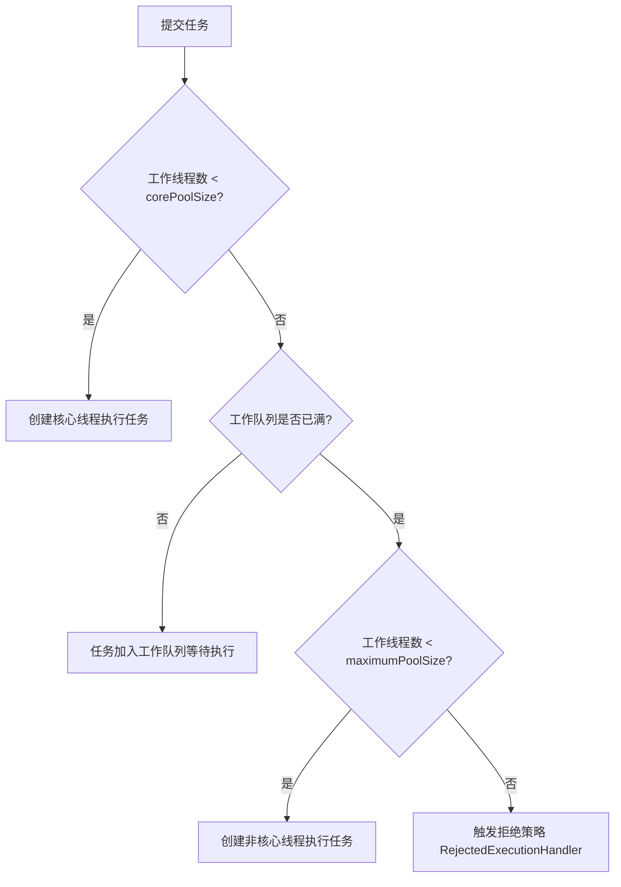
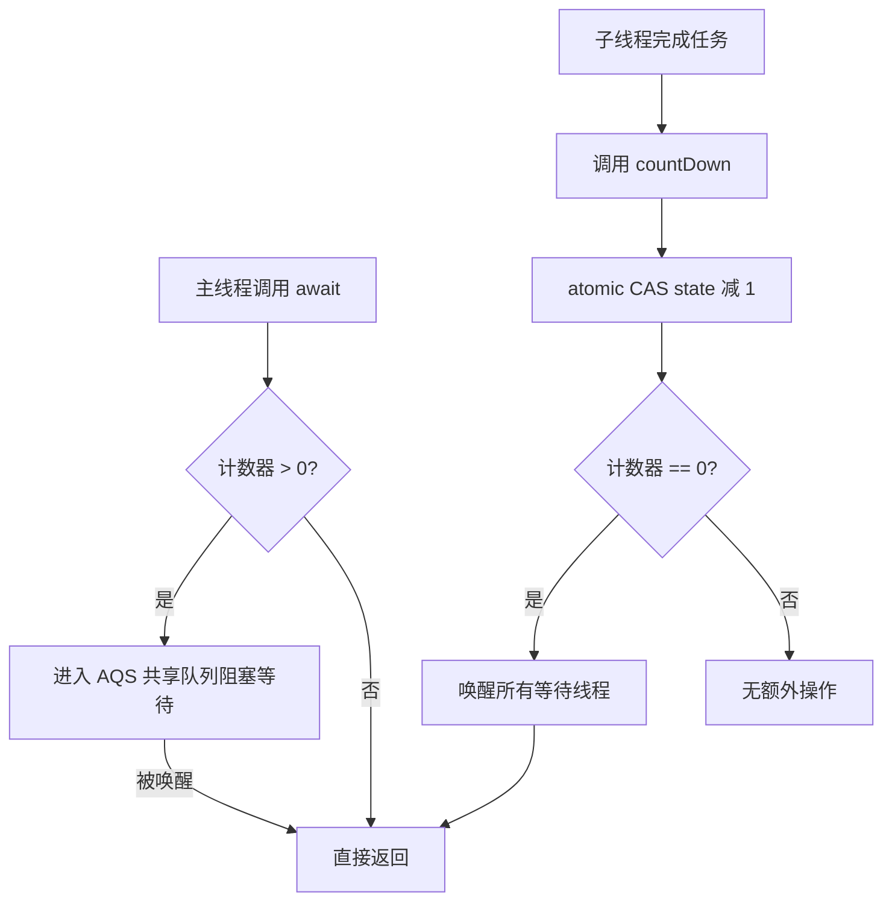
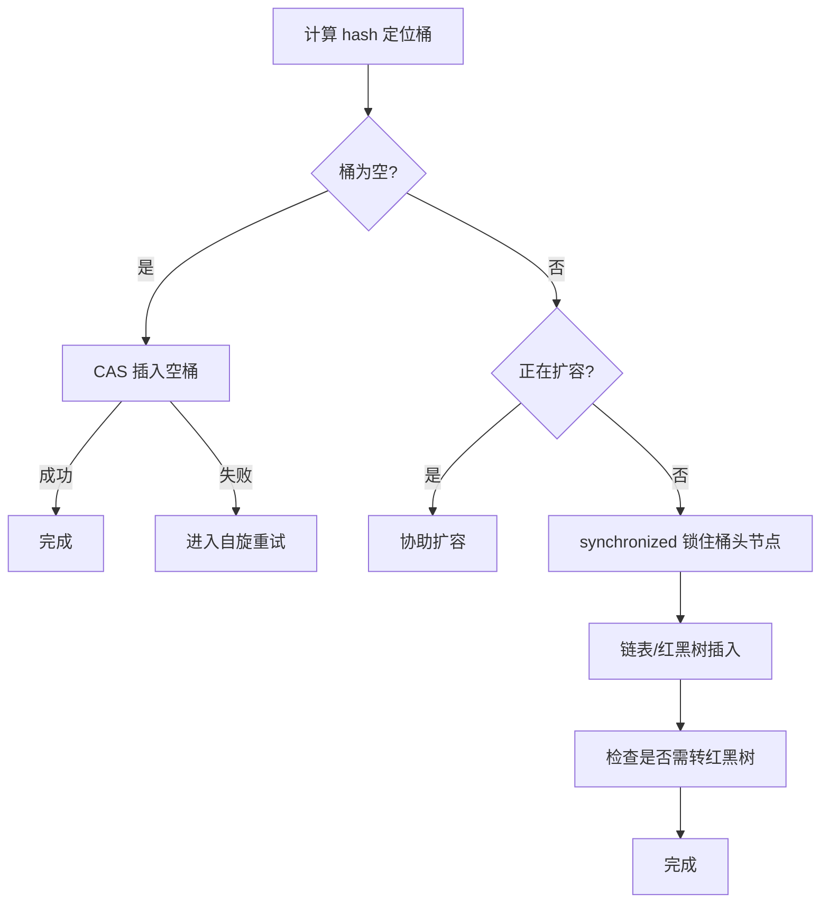

---
title: Java 并发面试三
date: 2024-07-23 07:21:03
order: 9
categories:
  - Java
  - JavaCore
  - 面试
tags:
  - Java
  - JavaCore
  - 面试
  - 并发
permalink: /pages/f7892a67/
---

# Java 并发面试三

## Java 线程池

### 【简单】为什么要用线程池？⭐⭐

顾名思义，线程池就是管理一系列线程的资源池。当有任务要处理时，直接从线程池中获取线程来处理，处理完之后线程并不会立即被销毁，而是等待下一个任务。

池化技术想必大家已经屡见不鲜了，线程池、数据库连接池、HTTP 连接池等等都是对这个思想的应用。池化技术的思想主要是为了减少每次获取资源的消耗，提高对资源的利用率。

**线程池**提供了一种限制和管理资源（包括执行一个任务）的方式。 每个**线程池**还维护一些基本统计信息，例如已完成任务的数量。

这里借用《Java 并发编程的艺术》提到的来说一下**使用线程池的好处**：

- **降低资源消耗**。通过重复利用已创建的线程降低线程创建和销毁造成的消耗。
- **提高响应速度**。当任务到达时，任务可以不需要等到线程创建就能立即执行。
- **提高线程的可管理性**。线程是稀缺资源，如果无限制的创建，不仅会消耗系统资源，还会降低系统的稳定性，使用线程池可以进行统一的分配，调优和监控。

### 【简单】Java 创建线程池有哪些方式？⭐⭐⭐

Java 提供了多种创建线程池的方法，主要通过 `java.util.concurrent.Executors` 工厂类和直接使用 `ThreadPoolExecutor` 构造函数来实现。

- 简单场景使用 `Executors` 工厂方法
- 需要精细控制时使用 `ThreadPoolExecutor` 构造器
- 注意根据任务类型选择合适的线程池类型
- 避免使用无界队列以防内存溢出

**（1）通过 Executors 工厂方法**

`Executors` 类中提供了几种内置的 `ThreadPoolExecutor` 实现：

- **`FixedThreadPool`**：固定线程数量的线程池。该线程池中的线程数量始终不变。当有一个新的任务提交时，线程池中若有空闲线程，则立即执行。若没有，则新的任务会被暂存在一个任务队列中，待有线程空闲时，便处理在任务队列中的任务。
- **`SingleThreadExecutor`**： 只有一个线程的线程池。若多余一个任务被提交到该线程池，任务会被保存在一个任务队列中，待线程空闲，按先入先出的顺序执行队列中的任务。
- **`CachedThreadPool`**： 可根据实际情况调整线程数量的线程池。线程池的线程数量不确定，但若有空闲线程可以复用，则会优先使用可复用的线程。若所有线程均在工作，又有新的任务提交，则会创建新的线程处理任务。所有线程在当前任务执行完毕后，将返回线程池进行复用。
- **`ScheduledThreadPool`**：给定的延迟后运行任务或者定期执行任务的线程池。


**（2）直接使用 `ThreadPoolExecutor` 构造器**

```java
new ThreadPoolExecutor(
    int corePoolSize,
    int maximumPoolSize,
    long keepAliveTime,
    TimeUnit unit,
    BlockingQueue<Runnable> workQueue,
    ThreadFactory threadFactory,
    RejectedExecutionHandler handler
);
```

- 提供更精细的控制参数
- 可以自定义线程工厂和拒绝策略

**（3）`ForkJoinPool` (JDK7+)**

```java
ForkJoinPool forkJoinPool = new ForkJoinPool(int parallelism);
```

- 适用于分治算法和并行任务
- 使用工作窃取 (work-stealing) 算法

### 【中等】Java 线程池有哪些核心参数？各有什么作用？⭐⭐⭐

`ThreadPoolExecutor` 有四个构造方法，前三个都是基于第四个实现。第四个构造方法定义如下：

```java
public ThreadPoolExecutor(int corePoolSize,// 线程池的核心线程数量
						  int maximumPoolSize,// 线程池的最大线程数
						  long keepAliveTime,// 当线程数大于核心线程数时，多余的空闲线程存活的最长时间
						  TimeUnit unit,// 时间单位
						  BlockingQueue<Runnable> workQueue,// 任务队列，用来储存等待执行任务的队列
						  ThreadFactory threadFactory,// 线程工厂，用来创建线程，一般默认即可
						  RejectedExecutionHandler handler// 拒绝策略，当提交的任务过多而不能及时处理时，我们可以定制策略来处理任务
) {// 略}
```

参数说明：

- **`corePoolSize`**：**表示线程池保有的最小线程数**。
- **`maximumPoolSize`**：**表示线程池允许创建的最大线程数**。
  - 如果队列满了，并且已创建的线程数小于最大线程数，则线程池会再创建新的线程执行任务。
  - 值得注意的是：如果使用了无界的任务队列这个参数就没什么效果。
- **`keepAliveTime & unit`**：**表示非核心线程存活时间**。如果一个线程空闲了`keepAliveTime & unit` 这么久，而且线程池的线程数大于 `corePoolSize` ，那么这个空闲的线程就要被回收了。
- **`workQueue`**：**等待执行的任务队列**。用于保存等待执行的任务的阻塞队列。 可以选择以下几个阻塞队列。
  - **`ArrayBlockingQueue`**：基于数组的**有界阻塞队列**。
  - **`LinkedBlockingQueue`**：基于链表的**无界阻塞队列**，可能导致 OOM。
  - **`SynchronousQueue`**：**不保存任务，直接新建一个线程来执行任务**（需要有可用线程，否则拒绝）。
  - **`DelayedWorkQueue`**：延迟阻塞队列。
  - **`PriorityBlockingQueue`**：**具有优先级的无界阻塞队列**。
- **`threadFactory`**：**线程工厂**。线程工程用于自定义如何创建线程。
- **`handler`**：**拒绝策略**。它是 `RejectedExecutionHandler` 类型的变量。当队列和线程池都满了，说明线程池处于饱和状态，那么必须采取一种策略处理提交的新任务。线程池支持以下策略：
  - **`AbortPolicy`**：**默认策略**，**丢弃任务并抛出异常**，直接抛出 `RejectedExecutionException`。
  - **`DiscardPolicy`**：**丢弃任务但不抛出异常**。
  - **`DiscardOldestPolicy`**：**丢弃队列最老的任务，然后重新尝试提交**。
  - **`CallerRunsPolicy`**：**提交任务的线程自己去执行该任务**。
  - 如果以上策略都不能满足需要，也可以通过实现 `RejectedExecutionHandler` 接口来定制处理策略。如记录日志或持久化不能处理的任务。

合理配置这些参数可以优化线程池的性能和稳定性，避免 OOM 或任务丢失。

### 【中等】Java 线程池的工作原理是什么？⭐⭐

线程池的工作流程遵循 **任务提交 → 线程分配 → 队列管理 → 拒绝处理** 机制：

1. **提交任务**：调用 `execute(Runnable)` 或 `submit(Callable)` 提交任务。
2. **线程分配逻辑**
   - **核心线程可用** → 立即执行任务（即使有空闲线程也会优先创建新线程直到 `corePoolSize`）。
   - **核心线程已满** → 任务进入任务队列（`workQueue`）等待。
   - **队列已满** → 创建新线程（不超过 `maximumPoolSize`）。
   - **线程数达 `maximumPoolSize` 且队列满** → 触发拒绝策略（`RejectedExecutionHandler`）。
3. **线程回收**：线程空闲时间超过 `keepAliveTime` ，且当前线程数大于核心线程数，会被回收。设置 `allowCoreThreadTimeOut=true`，可以回收核心线程。



::: info 线程分配和队列管理源码

:::

默认情况下，创建线程池之后，线程池中是没有线程的，需要提交任务之后才会创建线程。提交任务可以使用 `execute` 方法，它是 `ThreadPoolExecutor` 的核心方法，通过这个方法可以**向线程池提交一个任务，交由线程池去执行**。

```java
// 用于控制线程池的运行状态和线程池中的有效线程数量
private final AtomicInteger ctl = new AtomicInteger(ctlOf(RUNNING, 0));

public void execute(Runnable command) {
	if (command == null)
		throw new NullPointerException();

    // 获取 ctl 中存储的线程池状态信息
	int c = ctl.get();

    // 线程池执行可以分为 3 个步骤
    // 1. 若工作线程数小于核心线程数，则尝试启动一个新的线程来执行任务
	if (workerCountOf(c) < corePoolSize) {
		if (addWorker(command, true))
			return;
		c = ctl.get();
	}

    // 2. 如果任务可以成功地加入队列，还需要再次确认是否需要添加新的线程（因为可能自从上次检查以来已经有线程死亡）或者检查线程池是否已经关闭
    // 	-> 如果是后者，则可能需要回滚入队操作；
    // 	-> 如果是前者，则可能需要启动新的线程
	if (isRunning(c) && workQueue.offer(command)) {
		int recheck = ctl.get();
		if (!isRunning(recheck) && remove(command))
			reject(command);
		else if (workerCountOf(recheck) == 0)
			addWorker(null, false);
	}
    // 如果任务无法加入队列，则尝试添加一个新的线程
    // 如果添加新线程失败，说明线程池已经关闭或者达到了容量上限，此时将拒绝该任务
	else if (!addWorker(command, false))
		reject(command);
}
```

`execute` 方法工作流程如下：

1. 如果 `workerCount < corePoolSize`，则创建并启动一个线程来执行新提交的任务；
2. 如果 `workerCount >= corePoolSize`，且线程池内的阻塞队列未满，则将任务添加到该阻塞队列中；
3. 如果 `workerCount >= corePoolSize && workerCount < maximumPoolSize`，且线程池内的阻塞队列已满，则创建并启动一个线程来执行新提交的任务；
4. 如果`workerCount >= maximumPoolSize`，并且线程池内的阻塞队列已满，则根据拒绝策略来处理该任务，默认的处理方式是直接抛异常。


::: info 线程池任务状态

:::

`ThreadPoolExecutor` 有以下重要字段：

```java
private final AtomicInteger ctl = new AtomicInteger(ctlOf(RUNNING, 0));
private static final int COUNT_BITS = Integer.SIZE - 3;
private static final int CAPACITY   = (1 << COUNT_BITS) - 1;
// runState is stored in the high-order bits
private static final int RUNNING    = -1 << COUNT_BITS;
private static final int SHUTDOWN   =  0 << COUNT_BITS;
private static final int STOP       =  1 << COUNT_BITS;
private static final int TIDYING    =  2 << COUNT_BITS;
private static final int TERMINATED =  3 << COUNT_BITS;
```

**`ctl` 用于控制线程池的运行状态和线程池中的有效线程数量**。它包含两部分的信息：

- 线程池的运行状态 (`runState`)
- 线程池内有效线程的数量 (`workerCount`)
- 可以看到，`ctl` 使用了 `Integer` 类型来保存，高 3 位保存 `runState`，低 29 位保存 `workerCount`。`COUNT_BITS` 就是 29，`CAPACITY` 就是 1 左移 29 位减 1（29 个 1），这个常量表示 `workerCount` 的上限值，大约是 5 亿。

**线程池一共有五种运行状态**：

- **`RUNNING`（运行状态）**。接受新任务，并且也能处理阻塞队列中的任务。
- **`SHUTDOWN`（关闭状态）**。不接受新任务，但可以处理阻塞队列中的任务。
  - 在线程池处于 `RUNNING` 状态时，调用 `shutdown` 方法会使线程池进入到该状态。
  - `finalize` 方法在执行过程中也会调用 `shutdown` 方法进入该状态。
- **`STOP`（停止状态）**。不接受新任务，也不处理队列中的任务。会中断正在处理任务的线程。在线程池处于 `RUNNING` 或 `SHUTDOWN` 状态时，调用 `shutdownNow` 方法会使线程池进入到该状态。
- **`TIDYING`（整理状态）**。如果所有的任务都已终止了，`workerCount` （有效线程数） 为 0，线程池进入该状态后会调用 `terminated` 方法进入 `TERMINATED` 状态。
- **`TERMINATED`（已终止状态）**。在 `terminated` 方法执行完后进入该状态。默认 `terminated` 方法中什么也没有做。进入 `TERMINATED` 的条件如下：
  - 线程池不是 `RUNNING` 状态；
  - 线程池状态不是 `TIDYING` 状态或 `TERMINATED` 状态；
  - 如果线程池状态是 `SHUTDOWN` 并且 `workerQueue` 为空；
  - `workerCount` 为 0；
  - 设置 `TIDYING` 状态成功。


在 `execute` 方法中，多次调用 `addWorker` 方法。`addWorker` 这个方法主要用来创建新的工作线程，如果返回 true 说明创建和启动工作线程成功，否则的话返回的就是 false。

```java
// 全局锁，并发操作必备
private final ReentrantLock mainLock = new ReentrantLock();
// 跟踪线程池的最大大小，只有在持有全局锁 mainLock 的前提下才能访问此集合
private int largestPoolSize;
// 工作线程集合，存放线程池中所有的（活跃的）工作线程，只有在持有全局锁 mainLock 的前提下才能访问此集合
private final HashSet<Worker> workers = new HashSet<>();
//获取线程池状态
private static int runStateOf(int c)     { return c & ~CAPACITY; }
//判断线程池的状态是否为 Running
private static boolean isRunning(int c) {
	return c < SHUTDOWN;
}

/**
 * 添加新的工作线程到线程池
 * @param firstTask 要执行
 * @param core 参数为 true 的话表示使用线程池的基本大小，为 false 使用线程池最大大小
 * @return 添加成功就返回 true 否则返回 false
 */
private boolean addWorker(Runnable firstTask, boolean core) {
	retry:
	for (;;) {
		//这两句用来获取线程池的状态
		int c = ctl.get();
		int rs = runStateOf(c);

		// Check if queue empty only if necessary.
		if (rs >= SHUTDOWN &&
			! (rs == SHUTDOWN &&
			   firstTask == null &&
			   ! workQueue.isEmpty()))
			return false;

		for (;;) {
		   //获取线程池中工作的线程的数量
			int wc = workerCountOf(c);
			// core 参数为 false 的话表明队列也满了，线程池大小变为 maximumPoolSize
			if (wc >= CAPACITY ||
				wc >= (core ? corePoolSize : maximumPoolSize))
				return false;
		   //原子操作将 workcount 的数量加 1
			if (compareAndIncrementWorkerCount(c))
				break retry;
			// 如果线程的状态改变了就再次执行上述操作
			c = ctl.get();
			if (runStateOf(c) != rs)
				continue retry;
			// else CAS failed due to workerCount change; retry inner loop
		}
	}
	// 标记工作线程是否启动成功
	boolean workerStarted = false;
	// 标记工作线程是否创建成功
	boolean workerAdded = false;
	Worker w = null;
	try {

		w = new Worker(firstTask);
		final Thread t = w.thread;
		if (t != null) {
		  // 加锁
			final ReentrantLock mainLock = this.mainLock;
			mainLock.lock();
			try {
			   //获取线程池状态
				int rs = runStateOf(ctl.get());
			   //rs < SHUTDOWN 如果线程池状态依然为 RUNNING, 并且线程的状态是存活的话，就会将工作线程添加到工作线程集合中
			  //(rs=SHUTDOWN && firstTask == null) 如果线程池状态小于 STOP，也就是 RUNNING 或者 SHUTDOWN 状态下，同时传入的任务实例 firstTask 为 null，则需要添加到工作线程集合和启动新的 Worker
			   // firstTask == null 证明只新建线程而不执行任务
				if (rs < SHUTDOWN ||
					(rs == SHUTDOWN && firstTask == null)) {
					if (t.isAlive()) // precheck that t is startable
						throw new IllegalThreadStateException();
					workers.add(w);
				   //更新当前工作线程的最大容量
					int s = workers.size();
					if (s > largestPoolSize)
						largestPoolSize = s;
				  // 工作线程是否启动成功
					workerAdded = true;
				}
			} finally {
				// 释放锁
				mainLock.unlock();
			}
			//// 如果成功添加工作线程，则调用 Worker 内部的线程实例 t 的 Thread#start() 方法启动真实的线程实例
			if (workerAdded) {
				t.start();
			  /// 标记线程启动成功
				workerStarted = true;
			}
		}
	} finally {
	   // 线程启动失败，需要从工作线程中移除对应的 Worker
		if (! workerStarted)
			addWorkerFailed(w);
	}
	return workerStarted;
}
```

### 【简单】Java 线程池的核心线程会被回收吗？⭐⭐

在标准情况下，**核心线程（core threads）即使处于空闲状态也不会被线程池回收**。这是线程池的默认行为，目的是保持一定数量的常驻线程，以便快速响应新任务。通过设置 `allowCoreThreadTimeOut(true)` 可以改变这一行为。

### 【中等】如何合理地设置 Java 线程池的线程数？⭐

**根据任务类型设置线程数指导**


| 场景       | 推荐设置                     | 关键考虑                     |
| :--------- | :--------------------------- | :--------------------------- |
| CPU 密集型 | `核心数+1`                   | 避免上下文切换               |
| I/O 密集型 | [`核心数* 2`, `核心数* 5`]   | IO 等待时间比例              |
| 混合型     | [`核心数* 1.5`, `核心数* 3`] | 根据 CPU/IO 时间比例动态调整 |
| 未知场景   | 动态调整+监控                | 逐步优化                     |

**通用计算公式**

```
线程数 = CPU 核心数 × 目标 CPU 利用率 × (1 + 等待时间/计算时间）
```

（目标 CPU 利用率建议 0.7-0.9）

**场景化配置**

- Web 服务器（如 Tomcat）推荐：`50-200`（需压测确定）。考虑因素：
  - 并发请求量
  - 平均响应时间
  - 系统资源（内存、CPU）
- 微服务调用推荐：`核心数 * 2` 到 `核心数 * 5`，需配合熔断/降级机制
- 批处理任务推荐：`核心数 ± 2`，避免与在线服务争抢资源

**避坑指南**

- 禁止设置 `maximumPoolSize=Integer.MAX_VALUE`，以避免 OOM。
- 避免使用无界队列（推荐 `ArrayBlockingQueue`），避免内存堆积
- 必须配置拒绝策略（建议日志+降级）
- 动态线程池优于静态配置

**最佳实践**


- 通过 `Runtime.getRuntime().availableProcessors()` 获取核心数
- 配合有界队列+合理拒绝策略
- 建立线程池监控（活跃线程/队列堆积等）
- 重要服务建议使用动态调整：

```java
// 获取服务器 CPU 核心数
int cpuCores = Runtime.getRuntime().availableProcessors();

// 创建线程池（I/O 密集型场景）
ThreadPoolExecutor executor = new ThreadPoolExecutor(
    cpuCores * 2,          // corePoolSize
    cpuCores * 4,          // maximumPoolSize
    30,                    // keepAliveTime （秒）
    TimeUnit.SECONDS,
    new ArrayBlockingQueue<>(1000),  // 有界队列
    new CustomThreadFactory(),       // 命名线程
    new LogAndFallbackPolicy()       // 自定义拒绝策略
);
```

### 【中等】Java 线程池支持哪些阻塞队列，如何选择？⭐⭐

| 队列类型                  | 数据结构         | 是否有界 | 锁机制               | 特点                                                 | 适用场景                     | 不适用场景         |
| :------------------------ | :--------------- | :------- | :------------------- | :--------------------------------------------------- | :--------------------------- | :----------------- |
| **ArrayBlockingQueue**    | 数组             | 有界     | ReentrantLock        | 固定容量，内存连续，支持公平锁                       | 已知并发量的稳定系统         | 任务量波动大的场景 |
| **LinkedBlockingQueue**   | 链表             | 可选     | 双锁分离（put/take） | 默认无界 (Integer.MAX_VALUE)，吞吐量高，节点动态分配 | 任务量不可预测的中等吞吐系统 | 严格内存控制的系统 |
| **SynchronousQueue**      | 无存储           | 无容量   | 无锁 (CAS)           | 直接传递任务，吞吐量最高，公平/非公平模式可选        | 高并发短任务处理             | 存在长任务的场景   |
| **PriorityBlockingQueue** | 堆               | 无界     | ReentrantLock        | 按优先级排序，自动扩容，元素需实现 Comparable        | 需要任务优先级调度的系统     | 对内存敏感的系统   |
| **DelayQueue**            | 堆+PriorityQueue | 无界     | ReentrantLock        | 按延迟时间排序，元素需实现 Delayed 接口              | 定时任务/缓存过期处理        | 普通任务队列       |

**关键说明**：

- **有界性**：
  - `LinkedBlockingQueue` 构造时可指定容量变为有界
  - `SynchronousQueue` 是特殊的"零容量"队列
- **吞吐量排序**：`SynchronousQueue > LinkedBlockingQueue > ArrayBlockingQueue > PriorityBlockingQueue ≈ DelayQueue`
- **内存开销**：`PriorityBlockingQueue ≈ DelayQueue > LinkedBlockingQueue > ArrayBlockingQueue > SynchronousQueue`
- **特殊机制**：
  - **公平模式**：`ArrayBlockingQueue` / `SynchronousQueue` 可设置公平锁（降低吞吐但减少线程饥饿）
  - **双锁分离**：`LinkedBlockingQueue` 的 `put` / `take` 操作使用不同锁，提升并发度
  - **直接传递**：`SynchronousQueue` 实现生产者-消费者直接握手

**选型决策参考**：

```
是否需要优先级/延迟？
├─ 是 → PriorityBlockingQueue/DelayQueue
└─ 否 → 是否接受任务丢失？
   ├─ 是 → SynchronousQueue+CallerRunsPolicy
   └─ 否 → 能否预估最大任务量？
      ├─ 能 → ArrayBlockingQueue（容量=预估峰值×1.5)
      └─ 不能 → LinkedBlockingQueue（建议显式设置安全上限）
```

**生产建议**：

- **Web 服务**：ArrayBlockingQueue（2000-10000 容量）+ AbortPolicy
- **消息处理**：LinkedBlockingQueue（10 万上限）+ DiscardOldestPolicy
- **实时交易**：SynchronousQueue + CachedThreadPool
- **定时任务**：DelayQueue（单线程消费）

### 【中等】Java 线程池支持哪些拒绝策略？如何选择？⭐⭐

Java 线程池支持以下拒绝策略：

| 策略名称（实现类）      | 处理方式                                             | 优点                               | 缺点                               | 适用场景                                 |
| ----------------------- | ---------------------------------------------------- | ---------------------------------- | ---------------------------------- | ---------------------------------------- |
| **AbortPolicy**（默认） | 直接抛出 `RejectedExecutionException` 异常           | 快速失败，避免系统过载             | 需要调用方处理异常                 | 需要明确知道任务被拒绝的场景             |
| **CallerRunsPolicy**    | 让提交任务的线程自己执行该任务                       | 降低新任务提交速度，保证任务不丢失 | 可能阻塞调用线程，影响整体性能     | 低优先级任务或允许同步执行的场景         |
| **DiscardPolicy**       | 静默丢弃新提交的任务，不做任何通知                   | 系统行为简单                       | 任务丢失无感知，可能造成数据不一致 | 允许丢弃非关键任务的场景（如日志记录）   |
| **DiscardOldestPolicy** | 丢弃队列中最旧的任务（队头），然后尝试重新提交新任务 | 优先处理新任务                     | 可能丢失重要旧任务                 | 新任务比旧任务更重要的场景（如实时数据） |

**所有策略均在以下条件同时满足时触发**：

- 线程数达到 `maximumPoolSize`
- 工作队列已满（对于有界队列）
- 仍有新任务提交

**策略选择建议**：

```text
是否允许任务丢失？
├─ 允许 → 选择 DiscardPolicy/DiscardOldestPolicy
└─ 不允许 → 是否能接受降级？
   ├─ 能 → 自定义策略（如持久化存储）
   └─ 不能 → 选择 CallerRunsPolicy（影响调用方）
```

**生产环境推荐组合**：

- **严格系统**：`AbortPolicy` + 告警监控
- **弹性系统**：`CallerRunsPolicy` + 熔断机制
- **最终一致性系统**：自定义策略（如写入 Redis 重试队列）

**Spring 的增强策略**：

`ThreadPoolTaskExecutor` 额外支持：

- 通过 `TaskRejectedException` 提供更详细的拒绝信息
- 与 `@Async` 注解配合时自动应用策略

### 【中等】Java 线程池内部任务出异常后，如何知道是哪个线程出了异常？⭐

在 Java 线程池中，当任务抛出异常时，默认情况下异常会被线程池"吞掉"，不会直接抛出给调用者。

1. 对于需要获取结果的异步任务，使用`submit()`和`Future`组合
2. 对于不需要结果的批量任务，使用自定义的`ThreadFactory`或重写`afterExecute`
3. 在复杂系统中，考虑结合日志框架记录完整的异常堆栈和线程信息

通过以上方法，你可以有效地追踪线程池中哪个线程执行的任务抛出了异常。

以下是几种方法来识别哪个线程出了异常：

**（1）使用 `Future.get()` 捕获异常**

```java
ExecutorService executor = Executors.newFixedThreadPool(5);
Future<?> future = executor.submit(() -> {
    // 任务代码
    throw new RuntimeException("模拟异常");
});

try {
    future.get(); // 这里会抛出 ExecutionException
} catch (ExecutionException e) {
    System.out.println("任务抛出异常：" + e.getCause());
    // e.getCause() 获取原始异常
}
```

**（2）自定义 `ThreadFactory` 设置未捕获异常处理器**

```java
ThreadFactory factory = r -> {
    Thread t = new Thread(r);
    t.setUncaughtExceptionHandler((thread, throwable) -> {
        System.out.println("线程 " + thread.getName() + " 抛出异常：" + throwable);
    });
    return t;
};

ExecutorService executor = Executors.newFixedThreadPool(5, factory);
```

**（3）重写 `ThreadPoolExecutor` 的 `afterExecute` 方法**

```java
ExecutorService executor = new ThreadPoolExecutor(..., ...) {
    @Override
    protected void afterExecute(Runnable r, Throwable t) {
        super.afterExecute(r, t);
        if (t != null) {
            System.out.println("任务执行抛出异常：" + t);
        }
        // 对于通过 FutureTask 运行的任务，异常被封装在 Future 中
        if (r instanceof Future<?>) {
            try {
                ((Future<?>) r).get();
            } catch (InterruptedException | ExecutionException e) {
                System.out.println("Future 任务异常：" + e.getCause());
            }
        }
    }
};
```

**（4）在任务内部捕获异常**

```java
executor.execute(() -> {
    try {
        // 任务代码
    } catch (Exception e) {
        System.out.println("线程 " + Thread.currentThread().getName() + " 抛出异常：" + e);
        // 记录线程信息
    }
});
```

### 【中等】Java 线程池中 shutdown 与 shutdownNow 的区别是什么？⭐

**`shutdown` 不会立即终止线程池**，而是要等所有任务缓存队列中的任务都执行完后才终止，但再也不会接受新的任务。

- 将线程池切换到 `SHUTDOWN` 状态；
- 并调用 `interruptIdleWorkers` 方法请求中断所有空闲的 worker；
- 最后调用 `tryTerminate` 尝试结束线程池。

**`shutdownNow` 立即终止线程池**，并尝试打断正在执行的任务，并且清空任务缓存队列，返回尚未执行的任务。与 `shutdown` 方法类似，不同的地方在于：

- 设置状态为 `STOP`；
- 中断所有工作线程，无论是否是空闲的；
- 取出阻塞队列中没有被执行的任务并返回。

### 【困难】Java 线程池参数在运行过程中能修改吗？如何修改？⭐

- **可动态修改参数**：核心线程数、最大线程数、空闲时间、拒绝策略
- **不可动态修改**：队列实现类、线程工厂
- **Spring 增强**：`ThreadPoolTaskExecutor`提供更友好的 API
- **生产建议**：
  - 配合监控系统实现自动扩缩容
  - 修改时遵循先 max 后 core 的顺序
  - 对队列容量修改要特别小心

::: info ThreadPoolExecutor 原生动态修改参数方法

:::


ThreadPoolExecutor 提供了以下核心参数的动态修改方法：

| 参数             | 修改方法                           | 注意事项                                           |
| ---------------- | ---------------------------------- | -------------------------------------------------- |
| 核心线程数       | `setCorePoolSize(int)`             | 新值>旧值时立即生效；新值<旧时空闲线程会被逐渐回收 |
| 最大线程数       | `setMaximumPoolSize(int)`          | 必须≥核心线程数；仅影响后续新增线程                |
| 空闲线程存活时间 | `setKeepAliveTime(long, TimeUnit)` | 对所有空闲的非核心线程生效                         |
| 拒绝策略         | `setRejectedExecutionHandler()`    | 立即生效，但已进入拒绝流程的任务不受影响           |

**示例代码**：

```java
ThreadPoolExecutor executor = new ThreadPoolExecutor(
    2, 5, 60, TimeUnit.SECONDS,
    new LinkedBlockingQueue<>(10)
);

// 动态调整
executor.setCorePoolSize(4);  // 核心线程数 2→4
executor.setMaximumPoolSize(8); // 最大线程数 5→8
executor.setKeepAliveTime(30, TimeUnit.SECONDS); // 60s→30s
executor.setRejectedExecutionHandler(new ThreadPoolExecutor.CallerRunsPolicy());
```

::: info Spring 的 ThreadPoolTaskExecutor 增强

:::

Spring 的`ThreadPoolTaskExecutor`在原生基础上增加了更多动态能力：

```java
@Bean
public ThreadPoolTaskExecutor taskExecutor() {
    ThreadPoolTaskExecutor executor = new ThreadPoolTaskExecutor();
    executor.setCorePoolSize(4);
    executor.setMaxPoolSize(8);
    executor.setQueueCapacity(50);
    executor.initialize();
    return executor;
}

// 动态调整示例
@Autowired
private ThreadPoolTaskExecutor taskExecutor;

public void adjustThreadPool() {
    taskExecutor.setCorePoolSize(6);
    taskExecutor.setMaxPoolSize(10);
    taskExecutor.setQueueCapacity(100);
    // Spring 会自动应用新配置
}
```

::: info 动态调整队列容量

:::

队列容量的动态调整需要特殊处理，因为大多数 BlockingQueue 创建后容量固定：

**解决方案**：

1. 使用自定义的可变容量队列
2. 重建线程池（优雅迁移）

**自定义队列示例**：

```java
public class ResizableCapacityLinkedBlockingQueue<E> extends LinkedBlockingQueue<E> {
    public ResizableCapacityLinkedBlockingQueue(int capacity) {
        super(capacity);
    }

    public synchronized void setCapacity(int capacity) {
        // 实现容量调整逻辑
    }
}
```

> 扩展：
>
> - [《Java 线程池实现原理及其在美团业务中的实践》](https://tech.meituan.com/2020/04/02/java-pooling-pratice-in-meituan.html)
> - [如何设置线程池参数？美团给出了一个让面试官虎躯一震的回答](https://mp.weixin.qq.com/s/9HLuPcoWmTqAeFKa1kj-_A)
>
> 开源项目：
>
> - **[Hippo4j](https://github.com/opengoofy/hippo4j)**：异步线程池框架，支持线程池动态变更&监控&报警，无需修改代码轻松引入。支持多种使用模式，轻松引入，致力于提高系统运行保障能力。
> - **[Dynamic TP](https://github.com/dromara/dynamic-tp)**：轻量级动态线程池，内置监控告警功能，集成三方中间件线程池管理，基于主流配置中心（已支持 Nacos、Apollo，Zookeeper、Consul、Etcd，可通过 SPI 自定义实现）。

### 【中等】DelayQueue 和 ScheduledThreadPool 有什么区别？⭐


**`DelayQueue`** 是一个支持延迟获取元素的阻塞队列；**`ScheduledThreadPoolExecutor`** 是支持定时和周期性任务的线程池。二者都基于堆（PriorityQueue）实现，但有本质区别：

| **对比维度**     | **DelayQueue**                          | **ScheduledThreadPoolExecutor**                |
| ---------------- | --------------------------------------- | ---------------------------------------------- |
| **本质**         | 阻塞队列（BlockingQueue 实现）          | 线程池（ThreadPoolExecutor 子类）              |
| **职责**         | 仅存储和按延迟时间出队                  | 调度 + 执行任务                                |
| **任务类型**     | 任意实现 `Delayed` 的对象               | `Runnable` / `Callable`                        |
| **周期性任务**   | 不支持（出队后不重新入队）              | 支持（`scheduleAtFixedRate` / `scheduleWithFixedDelay`） |
| **底层队列**     | `PriorityQueue`（堆）                   | `DelayedWorkQueue`（基于堆的自定义队列）       |
| **线程模型**     | 无内置线程，需配合消费者线程            | 内置线程池，自动调度执行                       |
| **时间精度**     | 毫秒级（依赖 `System.nanoTime`）        | 毫秒级                                         |

**关系**：`ScheduledThreadPoolExecutor` 内部使用 `DelayedWorkQueue`（DelayQueue 的变体），区别在于它支持周期性任务（任务执行后重新计算下次执行时间并入队）。

**选型建议**：

- 需要自定义消费逻辑（如多消费者、条件消费）→ `DelayQueue` + 自定义线程
- 需要定时/周期执行任务 → `ScheduledThreadPoolExecutor`
- 延迟消息场景（如订单超时取消）→ 二者均可，`ScheduledThreadPoolExecutor` 更简单

### 【中等】1000 个任务，每个任务 0.1s，最大响应时间 1s，线程池参数怎么设置？⭐⭐

针对 1000 个任务、单任务耗时 0.1 秒、最大响应时间 1 秒的场景，线程池参数设置如下：

- **核心线程数**：单线程 1 秒可处理 10 个任务（1 / 0.1），故需至少 100 个线程并发，设 corePoolSize = 100。
- **任务队列容量**：响应时间 = 等待时间 + 处理时间，最大等待时间为 1 - 0.1 = 0.9 秒。队列长度应保证最后一个任务等待不超过 0.9 秒，计算公式：队列容量 = 核心线程数 ×（最大等待时间 / 单任务耗时）= 100 × (0.9 / 0.1) = 900。因此选用有界队列，容量设为 900。

此配置基于纯理论计算，实际部署需考虑 CPU 核数、上下文切换等硬件限制，并通过压测调优。面试中回答核心线程数和队列数即可，无需深入其他参数。

## Java 并发同步工具

### 【中等】CountDownLatch 的工作原理是什么？⭐⭐⭐

`CountDownLatch` 通过计数器实现线程间的“等待-通知”机制，适用于分阶段任务同步，但不可重复使用。**`CountDownLatch` 允许一个或多个线程等待，直到其他线程完成一组操作后再继续执行**。

**CountDownLatch 是基于 AQS 共享模式实现的同步工具**。

**核心机制**

1. **基于 AQS 共享模式实现**：计数器值对应 AQS 的`state`变量，`countDown()`本质是`releaseShared()`，`await()`本质是`acquireSharedInterruptibly()`；
2. **计数器初始化**：创建时指定（如 `new CountDownLatch(3)`），代表需要等待的任务数。
3. **计数递减**：`countDown()` 调用一次，计数器 - 1；计数器 = 0 时，唤醒所有等待线程
4. **计数器不可重置**：计数器归 0 后，不可重置。再次调用`countDown()`无效果，`await()`会直接返回（一次性使用）；
5. **支持中断**：`await(long timeout, TimeUnit unit)`可设置超时，也可响应线程中断，避免永久阻塞。

**核心流程**




1. 等待方（主线程 / 等待线程）

```
调用 await() → 计数器>0 → 线程进入 AQS 阻塞队列等待
                计数器=0 → 直接返回，无需等待
```

2. 执行方（任务线程）

```
任务完成 → 调用 countDown() → 计数器原子减 1
                              ↓
                     计数器=0？→ 是：唤醒阻塞队列所有等待线程
                              → 否：无额外操作
```

**典型使用场景**

| 场景           | 核心用法                                   |
| :------------- | :----------------------------------------- |
| 主线程等多任务 | 主线程`await()`，子线程`countDown()`       |
| 多线程等初始化 | 初始化线程`countDown()`，业务线程`await()` |

**代码示例**

```java
CountDownLatch latch = new CountDownLatch(3);

// 子线程完成任务后递减
new Thread(() -> {
    doTask();
    latch.countDown(); // 计数器-1
}).start();

// 主线程等待所有子线程完成
latch.await();
System.out.println("All tasks done!");
```

### 【中等】CyclicBarrier 的工作原理是什么？⭐⭐

CyclicBarrier 是基于「锁 + 条件等待」实现的同步工具，核心作用是**让一组线程互相等待，直到所有线程都到达指定 “屏障点” 后，才一起继续执行**。

初始化需集齐的线程数 N，线程调用 await () 则计数 + 1，计数达标后触发屏障、重置计数器，所有等待线程放行。


**核心机制**

| 核心要素            | 作用                                                                                 |
| :------------------ | :----------------------------------------------------------------------------------- |
| **初始化**          | 创建时指定（如 `new CyclicBarrier(3)`），代表需 “集齐” 的线程数                      |
| **线程等待**        | 线程调用 `await()` 时阻塞并且计数器 + 1                                              |
| **屏障**            | 当计数器达到屏障后，执行回调（若设置）， 所有线程被唤醒，继续执行后续逻辑            |
| **重置计数器**      | 自动重置计数器，可重复使用                                                           |
| **支持中断 / 超时** | await(timeout, unit) 支持超时；线程在等待时若被中断，会抛出 `BrokenBarrierException` |
| **底层依赖**        | 基于 `ReentrantLock + Condition` 实现，而非 AQS 直接封装                             |

**核心流程**

1. 线程调用 await() → 加锁，计数器+1
2. 判断计数器是否达标：
   - 未达标：线程进入 Condition 队列等待，释放锁
   - 已达标：执行屏障动作（若有）→ 重置计数器 → 唤醒所有等待线程
3. 线程被唤醒后，从 await() 返回继续执行

**典型使用场景**

|       场景       |                             核心用法                              |
| :--------------: | :---------------------------------------------------------------: |
| 多线程分阶段任务 | 如 “数据加载→数据处理→结果汇总”，每阶段集齐所有线程再执行下一阶段 |
|   线程同步起跑   |        如模拟比赛，所有选手（线程）准备好后，同时开始执行         |

**代码示例**

```java
CyclicBarrier barrier = new CyclicBarrier(3, () -> {
    System.out.println("All threads reached the barrier!");
});

for (int i = 0; i < 3; i++) {
    new Thread(() -> {
        System.out.println(Thread.currentThread().getName() + " is working...");
        try {
            barrier.await(); // 等待其他线程
        } catch (Exception e) {
            e.printStackTrace();
        }
        System.out.println(Thread.currentThread().getName() + " continues after barrier.");
    }).start();
}
```

**对比 CountDownLatch**

|   维度   |          CyclicBarrier          |          CountDownLatch          |
| :------: | :-----------------------------: | :------------------------------: |
| 计数方向 |       正计数（从 0 到 N）       |       倒计数（从 N 到 0）        |
| 重置能力 |       可循环（自动重置）        |       一次性（归零后失效）       |
| 核心语义 | N 个线程互相等 “彼此都到屏障点” | 一个 / 多个线程等 “N 个任务完成” |
| 触发动作 |  可选屏障动作（最后线程执行）   |          无内置触发动作          |

### 【中等】Semaphore 的工作原理是什么？⭐

Semaphore 是基于 AQS 实现的限流同步工具，核心作用是**控制同时访问共享资源的线程数量**。


**核心机制**

基于 `AQS` 实现，许可证数量对应 AQS 的 `state` 变量。

1. **初始化**：创建时指定（如 `new Semaphore(5)`），代表可用 “许可证” 数量，本质是并发上限
2. **原子性**：均通过 CAS 保证原子性
   - 抢许可证（`acquire()`）→ state 减 1
   - 还许可证（`release()`）→ state 加 1
3. **两种模式**：
   
   - 公平：按线程等待顺序抢证，避免饥饿；
   
   - 非公平（默认）：直接抢证，性能更高，可能导致线程饥饿；
   
     
4. **可响应中断 / 超时**：`acquireInterruptibly()` 响应线程中断，`tryAcquire(timeout)` 支持超时放弃抢证；
5. **许可证可超额归还**：`release()` 不校验线程是否持有许可证，可手动调用增加许可证（需谨慎，避免超预期限流）。

初始化 “许可证” 数量 N（并发上限），线程抢许可证（acquire ()）才执行，用完归还（release ()），无许可证则排队等待。

**核心流程**

1. **抢许可证（限流核心）**

```
线程调用 acquire() → 检查 state>0？
                     → 是：state-1，线程继续执行
                     → 否：线程进入 AQS 阻塞队列等待，直到有许可证释放
```

2. **还许可证（释放资源）**

```
线程执行完毕 → 调用 release() → state+1 → 唤醒阻塞队列中等待的线程（抢许可证）
```

**典型使用场景**

|      场景      |                               核心用法                                |
| :------------: | :-------------------------------------------------------------------: |
|    接口限流    | 初始化许可证数 = 接口最大并发数，请求前`acquire()`，响应后`release()` |
|   资源池控制   |  如连接池 / 线程池，许可证数 = 资源总数，获取资源抢证，释放资源还证   |
| 多任务并发控制 |             限制同时执行的任务数（如仅 3 个线程处理任务）             |

**Semaphore vs CountDownLatch vs CyclicBarrier**

|   维度   |       Semaphore        |       CountDownLatch       |      CyclicBarrier       |
| :------: | :--------------------: | :------------------------: | :----------------------: |
| 核心语义 | 控制并发数（抢许可证） | 等待任务完成（计数器归零） | 等待线程集齐（凑数放行） |
| 资源方向 |   可抢可还（循环用）   |     只减不增（一次性）     |   凑数后重置（循环用）   |
| 核心目标 |          限流          |            等待            |           同步           |

**代码示例**

```java
Semaphore semaphore = new Semaphore(3); // 允许 3 个线程并发

for (int i = 0; i < 5; i++) {
    new Thread(() -> {
        try {
            semaphore.acquire(); // 获取许可证
            System.out.println(Thread.currentThread().getName() + " 占用资源");
            Thread.sleep(2000);
        } catch (InterruptedException e) {
            e.printStackTrace();
        } finally {
            semaphore.release(); // 释放许可证
            System.out.println(Thread.currentThread().getName() + " 释放资源");
        }
    }).start();
}
```

**输出**：

```
Thread-0 占用资源
Thread-1 占用资源
Thread-2 占用资源
（2 秒后）
Thread-0 释放资源
Thread-3 占用资源
Thread-1 释放资源
Thread-4 占用资源
...
```

### 【困难】对比一下 CountDownLatch、 CyclicBarrier、Semaphore？⭐

在 Java 并发编程中，`CountDownLatch`、`CyclicBarrier` 和 `Semaphore` 均用于线程协作，但设计目标、可重用性与适用场景差异明显。核心对比如下：

| 特性             | CountDownLatch                | CyclicBarrier              | Semaphore                                  |
| ---------------- | ----------------------------- | -------------------------- | ------------------------------------------ |
| **可重用性**     | 一次性，不可重置              | 可重复使用                 | 可重复使用                                 |
| **核心用途**     | 主线程等待 N 个子线程完成任务 | 多线程在屏障点同步         | 控制并发访问资源的线程数                   |
| **计数器方向**   | 递减（`countDown()`）         | 递减（`await()`）          | 获取 / 释放许可（`acquire()`/`release()`） |
| **是否支持回调** | 否                            | 是（屏障达成触发）         | 否                                         |
| **典型场景**     | 多任务并行后汇总              | 多阶段并行计算、回合制同步 | 限流、数据库连接池、信号量                 |
| **底层机制**     | AQS                           | ReentrantLock + Condition  | AQS                                        |


**原理简述**

- `CountDownLatch` 内部维护计数器，`countDown()` 递减，`await()` 阻塞至计数器为 0 再释放所有等待线程。
- `CyclicBarrier` 基于锁与条件变量，`await()` 使线程阻塞，当所有线程到达屏障点时统一唤醒，并可触发回调，随后自动重置，支持循环使用。
- `Semaphore` 基于 AQS，用 “许可” 控制并发访问，`acquire()` 获取许可，无许可则阻塞；`release()` 释放许可并唤醒等待线程，可设置公平或非公平模式。

**选择建议**

- **主线程等待子任务全部完成** → `CountDownLatch`
- **多阶段并发任务需在阶段间同步** → `CyclicBarrier`
- **控制资源的最大并发访问数** → `Semaphore`

### 【中等】Exchanger 的工作原理是什么？⭐

`Exchanger` 是 JDK 提供的**两个线程之间交换数据**的同步工具，允许一对线程在汇合点交换数据。

**核心机制**：

1. 线程 A 调用 `exchange(data)`，将数据放入内部槽位，然后阻塞等待。
2. 线程 B 调用 `exchange(data)`，取出线程 A 的数据，并将自己的数据放入槽位。
3. 两个线程都被唤醒，各自获得对方的数据。

**底层实现**：基于 `arena`（Node 数组）+ CAS，支持多对线程在不同 slot 交换，减少竞争。

**典型应用场景**：

- **生产者-消费者数据交换**：一个线程生产数据，另一个线程消费，定期交换缓冲区。
- **遗传算法**：两个线程交换基因片段。
- **管道校验**：一个线程读取数据，另一个线程校验，交换结果。

```java
Exchanger<String> exchanger = new Exchanger<>();

new Thread(() -> {
    String data = "from-A";
    String received = exchanger.exchange(data);  // 阻塞直到 B 到达
    System.out.println("A 收到: " + received);   // 输出 from-B
}).start();

new Thread(() -> {
    String data = "from-B";
    String received = exchanger.exchange(data);
    System.out.println("B 收到: " + received);   // 输出 from-A
}).start();
```

**注意事项**：

- 仅支持两个线程交换，多线程场景需使用 `Phaser` 或其他工具。
- 支持超时：`exchange(data, timeout, unit)`，超时抛出 `TimeoutException`。

### 【中等】Phaser 的工作原理是什么？⭐

`Phaser` 是 JDK7 引入的**更灵活的同步工具**，可视为 `CyclicBarrier` 和 `CountDownLatch` 的增强版，支持**动态注册参与者、多阶段同步、树形结构**。

**核心特性**：

| 特性             | `CyclicBarrier` | `CountDownLatch` | `Phaser`              |
| ---------------- | --------------- | ---------------- | --------------------- |
| **参与者数量**   | 固定            | 固定             | 动态（可增减）        |
| **阶段重置**     | 自动重置        | 一次性           | 自动进入下一阶段      |
| **阶段回调**     | 支持（1 个）    | 不支持           | `onAdvance` 可自定义  |
| **树形结构**     | 不支持          | 不支持           | 支持（子 Phaser）     |
| **到达后等待**   | 是              | 否（countDown）  | 可选（arrive/await）  |

**核心机制**：

1. **注册参与者**：`register()` / `bulkRegister(n)` 动态增加参与者。
2. **到达屏障**：`arrive()` 表示到达（不阻塞），`arriveAndAwaitAdvance()` 到达并等待。
3. **阶段推进**：所有参与者到达后，调用 `onAdvance(phase)`，然后进入下一阶段。
4. **终止**：`onAdvance` 返回 true 时终止（如达到指定阶段数）。

**典型应用场景**：

- **多阶段并行任务**：如"加载→处理→校验→输出"，每阶段参与者数不同。
- **动态任务分配**：运行时动态增减线程。

```java
Phaser phaser = new Phaser(3) {
    @Override
    protected boolean onAdvance(int phase, int registeredParties) {
        System.out.println("阶段 " + phase + " 完成");
        return phase >= 2;  // 执行 3 个阶段后终止
    }
};

for (int i = 0; i < 3; i++) {
    new Thread(() -> {
        while (!phaser.isTerminated()) {
            System.out.println(Thread.currentThread().getName() + " 阶段 " + phaser.getPhase());
            phaser.arriveAndAwaitAdvance();  // 到达并等待其他线程
        }
    }).start();
}
```

## Java 并发分工工具

### 【困难】ForkJoinPool 的工作原理是什么？⭐⭐

ForkJoinPool 是专为**分治任务**设计的线程池，核心作用是将大任务拆分为小任务并行执行，再合并结果。

ForkJoinPool 基于 “分治 + 工作窃取” 算法，让空闲线程偷取繁忙线程的任务，最大化利用多核 CPU，适配递归拆分的 CPU 密集型任务。


::: info ForkJoinPool 特性

:::

**关键特性**

- **工作窃取算法**：空闲线程从繁忙线程的任务队列中 "窃取" 任务执行，减少线程竞争，提高 CPU 利用率。
- **分治递归**：适合处理可递归拆分的计算密集型任务
- **并行处理**：默认并行度为 CPU 核心数，可自定义；提供公共池（`commonPool`）供全局使用，减少资源消耗。
- **任务拆分**：大任务自动拆分为小任务，直到达到阈值

::: info ForkJoinPool 用法

:::

- **定义任务**：`ForkJoinTask` 是所有 `ForkJoin` 任务的父类。
  - 继承 `RecursiveTask<T>`（有返回值）或 `RecursiveAction`（无返回值）。
  - 重写 `compute()` 方法：若任务小于阈值则直接计算，否则分解为子任务。
- **任务调度**：`ForkJoinPool` 是线程池的核心实现类。
  - 用 `fork()` 异步提交子任务到线程池。
  - 用 `join()` 阻塞等待子任务结果并合并。
  - 通过 `invoke()`（同步执行）或`submit()`（异步执行）提交根任务。

::: info ForkJoinPool 原理

:::

- **工作线程**：自定义工作线程（`ForkJoinWorkerThread`），数量固定（默认 = CPU 核心数）
- **双端队列**：每个工作线程维护自己的任务队列。自有任务头部取、窃取任务尾部取
- **任务调度**：
  - **拆分（fork）**：调用 `fork()` 将子任务加入当前线程队列头部。
  - **合并（join）**：调用 `join()` 等待任务完成，必要时帮助执行任务。
  - **窃取（stealing）**：若线程无任务，从其他线程队列**尾部窃取任务**（FIFO，减少竞争）。

::: info ForkJoinPool vs ThreadPoolExecutor

:::

| **特性**     | **ForkJoinPool**          | **ThreadPoolExecutor** |
| ------------ | ------------------------- | ---------------------- |
| **任务类型** | 分治任务（递归拆分）      | 独立任务               |
| **任务调度** | 任务窃取（本地队列+窃取） | 全局队列（可能竞争）   |
| **适用场景** | CPU 密集型并行计算        | IO 密集型或短任务      |

### 【中等】CompleteFuture 有哪些用法？⭐⭐

CompletableFuture 是 Java 8+ 提供的**异步任务编排工具**。

| 用法类型            | 核心方法（记忆关键词）                                       | 作用说明                                      | 示例代码                                                     |
| :------------------ | :----------------------------------------------------------- | :-------------------------------------------- | :----------------------------------------------------------- |
| **创建异步任务**    | `runAsync`（无返回值）<br/>`supplyAsync`（有返回值）         | 提交异步任务，指定线程池（默认 ForkJoinPool） | `// 有返回值异步任务<br>CompletableFuture<String> cf = CompletableFuture.supplyAsync(() -> "Hello", executor);` |
| **结果转换**        | `thenApply`（同步）<br/>`thenApplyAsync`（异步）             | 对任务结果做转换，返回新结果                  | `cf.thenApply(s -> s + " World");`                           |
| **结果消费**        | `thenAccept`（同步）<br/>`thenAcceptAsync`（异步）           | 消费任务结果（无返回值）                      | `cf.thenAccept(s -> System.out.println(s));`                 |
| **任务衔接**        | `thenRun`（同步）<br/>`thenRunAsync`（异步）                 | 任务完成后执行无参操作（不依赖结果）          | `cf.thenRun(() -> System.out.println("任务完成"));`          |
| **多任务合并**      | `allOf`（全部完成）<br/>`anyOf`（任一完成）                  | 等待任务完成                                  | `CompletableFuture.allOf(cf1, cf2).join();`<br/>`Object result = CompletableFuture.anyOf(cf1, cf2).get();` |
| **结果组合**        | `thenCombinethenCombineAsync`                                | 合并两个任务的结果，生成新结果                | `cf1.thenCombine(cf2, (r1, r2) -> r1 + r2);`                 |
| **异常处理**        | `exceptionally`                                              | 任务异常时返回默认值                          | `cf.exceptionally(e -> "默认值");`                           |
| **异常 / 完成处理** | `whenComplete`                                               | 无论成功 / 失败，都执行回调（可获取异常）     | `cf.whenComplete((res, e) -> { if(e!=null) e.printStackTrace(); });` |
| **超时控制**        | `completeOnTimeoutorTimeout`                                 | 超时后返回默认值 / 抛出超时异常               | `// 3秒超时返回默认值<br>cf.completeOnTimeout("超时默认值", 3, TimeUnit.SECONDS);` |
| **结果获取**        | `get`（阻塞）<br/>`join`（阻塞，不抛检查异常）<br/>`getNow`（立即获取，无结果返回默认值） | 获取任务结果，按需选择阻塞 / 非阻塞           | `String res = cf.join(); // 推荐，无需捕获异常`              |

### 【困难】CompleteFuture 的工作原理是什么？⭐

CompletableFuture 基于「状态机 + 回调链表」实现的异步编程框架。

用状态机管理任务执行状态，通过回调链表串联异步操作，依托线程池执行异步任务，状态变更时触发后续回调，实现无阻塞的异步结果编排。

::: info CompleteFuture 特性

:::

- **链式调用**：通过 `thenApply()`、`thenAccept()`、`thenCompose()` 等方法实现任务流水线
- **组合操作**：提供 `allOf()`（等待所有任务完成）、`anyOf()`（等待任一任务完成）等方法，支持复杂任务依赖管理
- **异常处理**：通过 `exceptionally()`、`handle()` 等方法统一处理异步任务中的异常，无需 try-catch 嵌套
- **线程池灵活配置**：默认使用 `ForkJoinPool.commonPool()`，也可指定自定义线程池，控制任务执行线程

::: info CompleteFuture 核心结构

:::

| 核心要素                      | 作用                                                                                             |
| :---------------------------- | :----------------------------------------------------------------------------------------------- |
| **状态机（result + status）** | 存储任务结果 / 异常 + 执行状态（未完成 / 完成 / 异常 / 取消），状态变更为核心驱动                |
| **回调链表（Completion）**    | 每个链式操作（thenApply/thenCombine 等）生成一个 `Completion` 节点，串成链表，状态变更时遍历执行 |
| **执行线程池**                | 默认 `ForkJoinPool.commonPool()`，也可自定义，负责执行异步任务和回调逻辑                         |

::: info CompleteFuture 核心机制

:::

1. **状态管理**：通过 NEW、NORMAL 等状态标识任务生命周期，用 volatile 变量存储结果 / 异常，CAS 操作保证状态转换原子性。
2. **任务调度**：异步任务（supplyAsync/runAsync）包装为 Runnable 提交线程池（默认公共池），执行完毕后调用 complete 类方法更新状态并触发回调。
3. **回调机制**：回调函数注册到原任务列表，原任务完成后，回调在当前线程或指定线程池执行（Async 方法），结果链式传递形成流水线。
4. **多任务协同**：allOf 用计数器等待所有任务完成；anyOf 监听首个完成的任务并返回其结果。

核心逻辑：以状态机管理生命周期，回调列表实现依赖链式，线程池调度异步执行，通过 CAS 和 volatile 保证线程安全，避免回调嵌套。

### 【困难】虚拟线程的结构化并发是什么？⭐⭐

**结构化并发（Structured Concurrency）** 是 JDK21+ 引入的并发编程范式，核心思想是：**并发任务的生命周期应像代码块一样有明确的边界**，父任务等待所有子任务完成后再继续，确保资源不泄漏。

**（1）问题背景：传统并发的痛点**

```java
// 传统方式：子任务的生命周期脱离父任务控制
Future<User> f1 = executor.submit(() -> getUser());
Future<Order> f2 = executor.submit(() -> getOrder());
// 若 f1 异常，f2 仍在执行，导致资源泄漏
User user = f1.get();  // 阻塞
Order order = f2.get();
```

问题：子任务异常/取消时，其他子任务无法自动取消；调试困难（堆栈不连贯）。

**（2）StructuredTaskScope（JDK21 预览特性）**

```java
try (var scope = new StructuredTaskScope.ShutdownOnFailure()) {
    Subtask<User> userTask = scope.fork(() -> getUser());
    Subtask<Order> orderTask = scope.fork(() -> getOrder());

    scope.join();              // 等待所有子任务完成
    scope.throwIfFailed();     // 任一失败则抛异常

    // 所有子任务都成功，安全获取结果
    process(userTask.get(), orderTask.get());
}  // 自动关闭，确保无子任务遗留
```

**（3）两种内置策略**

| 策略                       | 行为                           | 适用场景               |
| -------------------------- | ------------------------------ | ---------------------- |
| `ShutdownOnFailure`        | 任一子任务失败，取消其他子任务 | 全部成功才有意义       |
| `ShutdownOnSuccess`        | 任一子任务成功，取消其他子任务 | 只需最快结果（如查询） |

**（4）与虚拟线程的配合**

结构化并发与虚拟线程是天然搭档：

- 虚拟线程轻量，可以为每个子任务创建一个虚拟线程，无需担心线程数。
- `StructuredTaskScope.fork()` 内部使用虚拟线程执行任务。
- 结合后，可以用同步代码风格编写高并发逻辑，无需回调或链式 API。

```java
// 虚拟线程 + 结构化并发：同时请求 3 个服务，取最快响应
try (var scope = new StructuredTaskScope.ShutdownOnSuccess<String>()) {
    scope.fork(() -> callServiceA());
    scope.fork(() -> callServiceB());
    scope.fork(() -> callServiceC());
    scope.join();
    String result = scope.result();  // 最快的服务返回
}
```

**（5）结构化并发的核心价值**

- **错误传播**：子任务异常自动传播到父任务。
- **取消传播**：父任务取消，所有子任务自动取消。
- **可观察性**：线程 dump 中父子任务关系清晰。
- **资源安全**：scope 关闭时保证所有子任务结束，无泄漏。

### 【中等】BlockingQueue 的核心方法有哪些？抛异常/返回特殊值/阻塞/超时四类方法有什么区别？⭐

`BlockingQueue` 定义了四组方法，按行为分类：

| 操作   | 抛异常          | 返回特殊值      | 阻塞          | 超时                                |
| ------ | --------------- | --------------- | ------------- | ----------------------------------- |
| **入队** | `add(e)`        | `offer(e)`      | `put(e)`      | `offer(e, time, unit)`              |
| **出队** | `remove()`      | `poll()`        | `take()`      | `poll(time, unit)`                  |
| **查看** | `element()`     | `peek()`        | -             | -                                   |

**四类方法的行为差异**：

- **抛异常**：队列满时 `add` 抛 `IllegalStateException`；队列空时 `remove`/`element` 抛 `NoSuchElementException`。
- **返回特殊值**：`offer`/`poll`/`peek` 失败返回 `false`/`null`，不阻塞。
- **阻塞**：`put`/`take` 会一直阻塞直到成功，可被中断。
- **超时**：`offer(e, timeout, unit)`/`poll(timeout, unit)` 阻塞指定时间后返回 `false`/`null`。

**线程安全的保证**：`BlockingQueue` 的所有方法都是线程安全的，内部通过 `ReentrantLock` 或 CAS 实现。

**不可插入 null**：所有 BlockingQueue 实现都不允许 `null` 元素（`poll`/`peek` 返回 null 作为"无元素"标志，插入 null 会抛 NPE）。

### 【中等】Timer 的工作原理是什么？⭐⭐

**`Timer` 通过单线程+优先级队列调度任务，简单但不可靠；生产环境建议用线程池替代。**

**基本组成**

- **`Timer`**：任务调度器，管理任务队列和后台线程。
- **`TimerTask`**：需实现 `run()`，定义要执行的任务。

**核心机制**

- **单线程调度**：
  - 所有任务由**单个后台线程**（`TimerThread`）顺序执行。
  - 任务队列按**执行时间排序**（优先级队列，最小堆）。
- **任务触发流程**：
  1. 调用 `schedule()` 将任务加入队列。
  2. 线程循环检查队首任务，通过 `wait(timeout)` 休眠至执行时间。
  3. 执行 `run()` 后，根据调度类型计算下次执行时间：
     - **固定延迟（`schedule`）**：基于**实际结束时间** + 周期。
     - **固定速率（`scheduleAtFixedRate`）**：基于**计划开始时间** + 周期（可能追赶延迟）。

**关键问题**

- **单线程阻塞**：一个任务执行过长或崩溃会导致后续任务延迟/终止。
- **异常影响**：任务抛出未捕获异常时，整个 `Timer` 线程停止。
- **资源释放**：必须调用 `cancel()` 避免内存泄漏。

**替代方案**

**`ScheduledThreadPoolExecutor`** 更优：支持多线程、异常隔离、灵活调度。

### 【困难】时间轮（Time Wheel）的工作原理是什么？⭐⭐

JDK 内置的三种实现定时器的方式，实现思路都非常相似，都离不开**任务**、**任务管理**、**任务调度**三个角色。三种定时器新增和取消任务的时间复杂度都是 `O(logn)`，面对海量任务插入和删除的场景，这三种定时器都会遇到比较严重的性能瓶颈。**对于性能要求较高的场景，一般都会采用时间轮算法来实现定时器**。

**时间轮通过环形数组分片管理定时任务，以 O(1) 时间复杂度实现高效调度，多级设计兼顾长短延迟任务，是高性能定时器的核心实现方案。**

时间轮（Timing Wheel）是 George Varghese 和 Tony Lauck 在 1996 年的论文 [Hashed and Hierarchical Timing Wheels: data structures to efficiently implement a timer facility](https://www.cse.wustl.edu/~cdgill/courses/cs6874/TimingWheels.ppt) 实现的，它在 Linux 内核中使用广泛，是 Linux 内核定时器的实现方法和基础之一。


**核心设计思想**

- **环形数组结构**：采用环形缓冲区（类似时钟表盘）分层管理定时任务
- **时间分片**：将时间划分为固定间隔的槽（tick），每个槽对应一个任务链表
- **层级扩展**：支持多级时间轮（小时/分钟/秒）处理不同精度的时间任务

**核心组件**

| 组件         | 作用                                                            |
| ------------ | --------------------------------------------------------------- |
| **环形数组** | 存储各时间槽的任务（如数组长度 60=1 分钟精度，每个槽代表 1 秒） |
| **任务链表** | 每个槽挂载到期时间相同的任务节点                                |
| **当前指针** | 指向当前时间槽，随 tick 前进                                    |
| **层级指针** | 多级时间轮间的任务传递（如秒轮→分钟轮）                         |

**工作流程**

1. **任务添加**

   - 计算目标槽位：`槽位 = （当前指针 + 延迟时间/tick) % 轮盘大小`
   - 相同槽位的任务以链表形式存储

   ```python
   # 示例：tick=1s，轮盘大小=60，添加 10 秒后执行的任务
   slot = (current_pos + 10) % 60  # 存入第 10 个槽
   ```

2. **时间推进（tick）**

   - 每次 tick 移动当前指针到下一槽位
   - 执行该槽位所有任务
   - **多级时间轮**：当低级轮转完一圈，高级轮降级一个任务到低级轮

3. **任务降级（多级时间轮）**
   ```text
   当秒级时间轮（60 槽）转完一圈：
   将分钟轮当前槽的任务重新映射到秒轮
   ```

**关键优势**

| 优势                | 说明                                           |
| ------------------- | ---------------------------------------------- |
| **O(1) 时间复杂度** | 添加/删除任务仅需计算槽位，与任务数量无关      |
| **低内存开销**      | 仅存储未到期任务，空槽不占资源                 |
| **适合高频调度**    | Kafka/Netty 等框架用于心跳检测、超时控制等场景 |

**单级 vs 多级时间轮**

| 类型     | 精度     | 缺点                 | 适用场景              |
| -------- | -------- | -------------------- | --------------------- |
| **单级** | 高精度   | 轮盘大（内存占用高） | 短延迟任务（<1 分钟） |
| **多级** | 分级精度 | 任务降级开销         | 长短延迟混合任务      |

**实际应用**

- **Kafka**：延迟消息处理（`DelayedOperationPurgatory`）
- **Netty**：连接超时控制（`HashedWheelTimer`）
- **Linux 内核**：定时器管理

**性能对比**

| 方案           | 添加复杂度 | 触发复杂度 | 内存占用 |
| -------------- | ---------- | ---------- | -------- |
| **时间轮**     | O(1)       | O(1)       | O(n)     |
| **优先级队列** | O(log n)   | O(1)       | O(n)     |
| **轮询检测**   | O(1)       | O(n)       | O(1)     |

HashedWheelTimer 是 Netty 中时间轮算法的实现类。

## Java 并发应用

### 【中等】Java 中如何控制多线程的执行顺序？⭐⭐

Java 控制多线程执行顺序，核心是通过「阻塞等待」「同步控制」「任务编排」三类机制，打破线程调度的随机性，让线程按指定顺序（如 A→B→C）执行，本质是控制线程的执行时机和先后依赖。

| 方法类型                                             | 核心 API（记忆关键词）                                       | 实现原理                                                     | 适用场景                                                   |
| :--------------------------------------------------- | :----------------------------------------------------------- | :----------------------------------------------------------- | :--------------------------------------------------------- |
| join () 等待（最基础）                               | Thread.join()                                                | 让当前线程阻塞，等待目标线程执行完成后再继续                 | 简单顺序（如 A 执行完再执行 B）、少量线程                  |
| 锁 + 信号量（手动控制）                              | synchronized + 标志位CountDownLatch（倒计时门闩）            | ① 标志位：线程循环检查前置条件；② CountDownLatch：等待计数器归 0 | 多线程分批次执行（如先执行所有初始化线程，再执行业务线程） |
| 线程池按序执行                                       | Executors.newSingleThreadExecutor()                          | 单线程池串行执行提交的任务，底层基于队列 FIFO                | 任务需严格按提交顺序执行，无需并行                         |
| CompletableFuture 编排（推荐）                       | thenRun/thenAccept/thenApply                                 | 异步任务链式编排，前一个任务完成自动执行下一个               | 复杂顺序（如 A→B 并行 C→D）、异步场景                      |
| 同步工具（CountDownLatch、CyclicBarrier、Semaphore） | CountDownLatch.await()/countDown()<br/>CyclicBarrier.await()<br/>Semaphore.acquire()/release() | 底层直接或间接基于 AQS 实现                                  | 多线程先准备再统一执行（如多线程加载数据后，统一处理）     |

::: code-tabs#控制多线程的执行顺序

@tab join () 控制顺序

`join()` 是线程级 别的阻塞，目标线程执行完才会释放当前线程。

```java
// 定义3个线程
Thread t1 = new Thread(() -> System.out.println("线程A执行"), "A");
Thread t2 = new Thread(() -> System.out.println("线程B执行"), "B");
Thread t3 = new Thread(() -> System.out.println("线程C执行"), "C");

// 控制顺序：A→B→C
t1.start();
t1.join(); // 主线程等待t1完成
t2.start();
t2.join(); // 主线程等待t2完成
t3.start();
```

@tab CountDownLatch 分批次执行

计数器归 0 前，`await()` 线程阻塞，适合 “先完成前置任务，再执行主任务”。

```java
// 倒计时门闩：计数器为2，需2个初始化线程完成
CountDownLatch latch = new CountDownLatch(2);

// 初始化线程1
Thread init1 = new Thread(() -> {
    System.out.println("初始化1完成");
    latch.countDown(); // 计数器-1
});
// 初始化线程2
Thread init2 = new Thread(() -> {
    System.out.println("初始化2完成");
    latch.countDown(); // 计数器-1
});
// 业务线程（需等初始化完成）
Thread business = new Thread(() -> {
    try {
        latch.await(); // 阻塞直到计数器=0
        System.out.println("业务线程执行");
    } catch (InterruptedException e) {
        Thread.currentThread().interrupt();
    }
});

// 启动顺序不影响，业务线程会等初始化完成
init1.start();
init2.start();
business.start();
```

@tab CompletableFuture 链式编排

链式调用天然支持顺序，`thenRunAsync` 保证前序任务完成后执行，适合复杂编排。

```java
// 自定义线程池（避免默认池）
ExecutorService executor = Executors.newFixedThreadPool(3);

// 顺序：A完成→B和C并行→D完成
CompletableFuture<Void> cf = CompletableFuture
    .runAsync(() -> System.out.println("任务A执行"), executor) // 第一步：A
    .thenRunAsync(() -> System.out.println("任务B执行"), executor) // 第二步：A完成后执行B
    .thenRunAsync(() -> { // 第三步：B完成后，并行执行C
        CompletableFuture.runAsync(() -> System.out.println("任务C执行"), executor).join();
    }, executor)
    .thenRunAsync(() -> System.out.println("任务D执行"), executor); // 第四步：C完成后执行D

cf.join(); // 等待所有任务完成
executor.shutdown();
```

@tab 单线程池按提交顺序执行

无需手动控制，池内队列保证 FIFO，适合简单串行场景。

```java
// 单线程池：任务按提交顺序串行执行
ExecutorService singleExecutor = Executors.newSingleThreadExecutor();

// 提交顺序=执行顺序：A→B→C
singleExecutor.submit(() -> System.out.println("任务A执行"));
singleExecutor.submit(() -> System.out.println("任务B执行"));
singleExecutor.submit(() -> System.out.println("任务C执行"));

singleExecutor.shutdown();
```

:::

### 【中等】Java 中如何实现生产者消费者模式？⭐⭐

**经典问题**

（1）什么是生产者消费者模式

（2）Java 中如何实现生产者消费者模式

**知识点**

（1）什么是生产者消费者模式

生产者消费者模式是一个经典的并发设计模式。在这个模型中，有一个共享缓冲区；有两个线程，一个负责向缓冲区推数据，另一个负责向缓冲区拉数据。要让两个线程更好的配合，就需要一个阻塞队列作为媒介来进行调度，由此便诞生了生产者消费者模式。

（2）Java 中如何实现生产者消费者模式

在 Java 中，实现生产者消费者模式有 3 种具有代表性的方式：

- 基于 BlockingQueue 实现
- 基于 Condition 实现
- 基于 wait/notify 实现

【示例】基于 BlockingQueue 实现生产者消费者模式

```java
public class ProducerConsumerDemo01 {

    public static void main(String[] args) throws InterruptedException {
        BlockingQueue<Object> queue = new ArrayBlockingQueue<>(10);
        Thread producer1 = new Thread(new Producer(queue), "producer1");
        Thread producer2 = new Thread(new Producer(queue), "producer2");
        Thread consumer1 = new Thread(new Consumer(queue), "consumer1");
        Thread consumer2 = new Thread(new Consumer(queue), "consumer2");
        producer1.start();
        producer2.start();
        consumer1.start();
        consumer2.start();
    }

    static class Producer implements Runnable {

        private long count = 0L;
        private final BlockingQueue<Object> queue;

        public Producer(BlockingQueue<Object> queue) {
            this.queue = queue;
        }

        @Override
        public void run() {
            while (count < 500) {
                try {
                    queue.put(new Object());
                    System.out.println(Thread.currentThread().getName() + " 生产 1 条数据，已生产数据量：" + ++count);
                } catch (InterruptedException e) {
                    e.printStackTrace();
                }
            }
        }

    }

    static class Consumer implements Runnable {

        private long count = 0L;
        private final BlockingQueue<Object> queue;

        public Consumer(BlockingQueue<Object> queue) {
            this.queue = queue;
        }

        @Override
        public void run() {
            while (count < 500) {
                try {
                    queue.take();
                    System.out.println(Thread.currentThread().getName() + " 消费 1 条数据，已消费数据量：" + ++count);
                } catch (InterruptedException e) {
                    e.printStackTrace();
                }
            }
        }

    }

}
```

【示例】基于 Condition 实现生产者消费者模式

```java
public class ProducerConsumerDemo02 {

    public static void main(String[] args) {

        MyBlockingQueue<Object> queue = new MyBlockingQueue<>(10);
        Runnable producer = () -> {
            while (true) {
                try {
                    queue.put(new Object());
                    System.out.println("生产 1 条数据，总数据量：" + queue.size());
                } catch (InterruptedException e) {
                    e.printStackTrace();
                }
            }
        };

        new Thread(producer).start();

        Runnable consumer = () -> {
            while (true) {
                try {
                    queue.take();
                    System.out.println("消费 1 条数据，总数据量：" + queue.size());
                } catch (InterruptedException e) {
                    e.printStackTrace();
                }
            }
        };

        new Thread(consumer).start();
    }

    public static class MyBlockingQueue<T> {

        private final int max;
        private final Queue<T> queue;

        private final ReentrantLock lock = new ReentrantLock();
        private final Condition notEmpty = lock.newCondition();
        private final Condition notFull = lock.newCondition();

        public MyBlockingQueue(int size) {
            this.max = size;
            queue = new LinkedList<>();
        }

        public void put(T o) throws InterruptedException {
            lock.lock();
            try {
                while (queue.size() == max) {
                    notFull.await();
                }
                queue.add(o);
                notEmpty.signalAll();
            } finally {
                lock.unlock();
            }
        }

        public T take() throws InterruptedException {
            lock.lock();
            try {
                while (queue.isEmpty()) {
                    notEmpty.await();
                }
                T o = queue.remove();
                notFull.signalAll();
                return o;
            } finally {
                lock.unlock();
            }
        }

        public int size() {
            return queue.size();
        }

    }

}
```

【示例】基于 wait/notify 实现生产者消费者模式

```java
public class ProducerConsumerDemo03 {

    public static void main(String[] args) {

        MyBlockingQueue<Object> queue = new MyBlockingQueue<>(10);
        Runnable producer = () -> {
            while (true) {
                try {
                    queue.put(new Object());
                    System.out.println("生产 1 条数据，总数据量：" + queue.size());
                } catch (InterruptedException e) {
                    e.printStackTrace();
                }
            }
        };

        new Thread(producer).start();

        Runnable consumer = () -> {
            while (true) {
                try {
                    queue.take();
                    System.out.println("消费 1 条数据，总数据量：" + queue.size());
                } catch (InterruptedException e) {
                    e.printStackTrace();
                }
            }
        };

        new Thread(consumer).start();
    }

    public static class MyBlockingQueue<T> {

        private final int max;
        private final Queue<T> queue;

        public MyBlockingQueue(int size) {
            max = size;
            queue = new LinkedList<>();
        }

        public synchronized void put(T o) throws InterruptedException {
            while (queue.size() == max) {
                wait();
            }
            queue.add(o);
            notifyAll();
        }

        public synchronized T take() throws InterruptedException {
            while (queue.isEmpty()) {
                wait();
            }
            T o = queue.remove();
            notifyAll();
            return o;
        }

        public synchronized int size() {
            return queue.size();
        }

    }

}
```

## Java 容器

### 【中等】Java 线程安全的集合有哪些?⭐⭐


Java 线程安全的集合主要分为**遗留类**、**同步包装器**和**并发集合（JUC）** 三类：

**（1）遗留类（早期同步实现，性能差，不推荐）**

| 类                  | 线程安全方式      | 缺点                         |
| ------------------- | ----------------- | ---------------------------- |
| `Vector`            | 方法级 synchronized | 全表锁，并发性能差           |
| `Hashtable`         | 方法级 synchronized | 全表锁，并发性能差           |
| `Stack`             | 继承 Vector        | 同 Vector                    |

**（2）同步包装器（Collections.synchronizedXxx）**

```java
List<String> list = Collections.synchronizedList(new ArrayList<>());
Map<K,V> map = Collections.synchronizedMap(new HashMap<>());
```

- **原理**：包装一层，所有方法加 `synchronized` 锁住包装对象本身。
- **缺点**：仍是全表锁，迭代时需手动加锁（`synchronized(map) { ... }`），否则 `ConcurrentModificationException`。

**（3）并发集合（JUC，推荐）**

| 集合                      | 适用场景         | 核心机制                         |
| ------------------------- | ---------------- | -------------------------------- |
| `ConcurrentHashMap`       | 高并发 Map       | CAS + synchronized（分段锁已弃） |
| `CopyOnWriteArrayList`    | 读多写少的 List  | 写时复制                         |
| `CopyOnWriteArraySet`     | 读多写少的 Set   | 基于 CopyOnWriteArrayList        |
| `ConcurrentLinkedQueue`   | 无界非阻塞队列   | CAS（Michael-Scott 算法）        |
| `ConcurrentLinkedDeque`   | 无界非阻塞双端队列 | CAS                              |
| `ArrayBlockingQueue`      | 有界阻塞队列     | ReentrantLock（单锁）            |
| `LinkedBlockingQueue`     | 可选有界阻塞队列 | ReentrantLock（双锁分离）        |
| `PriorityBlockingQueue`   | 优先级阻塞队列   | ReentrantLock + 堆               |
| `DelayQueue`              | 延迟队列         | ReentrantLock + PriorityQueue    |
| `ConcurrentSkipListMap`   | 并发有序 Map     | 跳表（Skip List）+ CAS           |
| `ConcurrentSkipListSet`   | 并发有序 Set     | 基于 ConcurrentSkipListMap       |

**选型建议**：

- **高并发 Map** → `ConcurrentHashMap`
- **读多写少 List/Set** → `CopyOnWriteArrayList` / `CopyOnWriteArraySet`
- **并发有序** → `ConcurrentSkipListMap` / `ConcurrentSkipListSet`
- **生产者-消费者** → `ArrayBlockingQueue` / `LinkedBlockingQueue`
- **无阻塞队列** → `ConcurrentLinkedQueue`

### 【困难】ConcurrentHashMap 的实现原理是什么？⭐⭐⭐

`ConcurrentHashMap` 是 Java 并发 Map 的核心实现，**JDK7 和 JDK8 的实现差异巨大**。

**（1）JDK7：分段锁（Segment）**

- 将数据分成 16 个 `Segment`（默认），每个 Segment 是一个独立的 `HashMap`，自带 `ReentrantLock`。
- 不同 Segment 可并发读写，理论并发度 = Segment 数（默认 16）。
- **缺点**：Segment 数量固定，扩展性差；二次 hash 开销。

**（2）JDK8：CAS + synchronized**

JDK8 摒弃了 Segment，改用 **Node 数组 + CAS + synchronized**：

```java
transient volatile Node<K,V>[] table;  // 桶数组，volatile 保证可见性
```

- **锁粒度细化**：从 Segment（段）降到 Node（桶），并发度 = 桶数量。
- **put 流程**：



1. 计算 hash，定位桶。
2. 桶为空：CAS 插入（无锁）。
3. 桶非空：`synchronized` 锁住头节点，遍历链表/红黑树插入。
4. 链表长度 ≥ 8 且数组长度 ≥ 64：转红黑树（否则扩容）。

**（3）扩容机制（多线程协助）**

- 扩容时，每个线程认领一段桶（`stride`），迁移数据。
- 迁移期间，`ForwardingNode`（hash=-1）标记已迁移的桶，读请求转发到新表。
- 写请求遇到 ForwardingNode 会协助扩容。

**（4）size() 的实现**

JDK8 不维护精确计数，而是：

1. 使用 `baseCount` + `CounterCell[]` 分段计数（类似 LongAdder）。
2. `size()` = baseCount + 所有 CounterCell 之和，**非精确**（并发下可能略有偏差）。

**（5）JDK7 vs JDK8 对比**

| 特性          | JDK7                        | JDK8                          |
| ------------- | --------------------------- | ----------------------------- |
| **锁机制**    | Segment（ReentrantLock）    | CAS + synchronized            |
| **锁粒度**    | Segment（段）               | Node（桶）                    |
| **并发度**    | 16（固定）                  | 桶数量（随扩容增长）          |
| **数据结构**  | Segment[] + HashEntry[]     | Node[] + 链表/红黑树          |
| **size()**    | 精确（加锁累加）            | 近似（CounterCell 分段）      |
| **扩容**      | 仅 Segment 内扩容           | 全表扩容 + 多线程协助         |

### 【中等】CopyOnWriteArrayList 的原理是什么？适用什么场景？⭐

**`CopyOnWriteArrayList`** 是线程安全的 List 实现，核心思想是**写时复制（Copy-On-Write）**。

**（1）核心原理**

```java
final transient Object lock = new Object();
private transient Object[] array;  // volatile 数组引用

public boolean add(E e) {
    synchronized (lock) {
        Object[] elements = getArray();
        int len = elements.length;
        Object[] newElements = Arrays.copyOf(elements, len + 1);  // 复制新数组
        newElements[len] = e;
        setArray(newElements);  // 替换引用
        return true;
    }
}

public E get(int index) {
    return get(getArray(), index);  // 无锁读
}
```

- **读操作**：完全无锁，直接读 volatile 数组。
- **写操作**：加锁，复制整个数组，修改副本，替换引用。

**（2）特性**

| 特性           | 说明                                               |
| -------------- | -------------------------------------------------- |
| **读性能**     | 极高（无锁，无 volatile 读屏障外的开销）           |
| **写性能**     | 差（O(n) 复制 + 加锁）                             |
| **弱一致性**   | 读到的可能是旧快照（写后引用未切换前）             |
| **内存占用**   | 高（每次写都复制整个数组）                         |
| **不允许 null**| 允许 null（与 Vector 不同）                        |

**（3）适用场景**

- **读多写少**：如配置列表、监听器列表、白名单。
- **读优先**：读操作远多于写操作，且可接受短暂不一致。
- **遍历不修改**：迭代器是快照，不支持 `remove`/`add`（抛 `UnsupportedOperationException`）。

**（4）不适用场景**

- 写频繁：每次写 O(n) 复制，性能灾难。
- 大数据量：内存翻倍。
- 强一致性：弱一致性可能导致读到旧数据。

**（5）与 Vector/Collections.synchronizedList 对比**

| 特性          | `CopyOnWriteArrayList` | `Vector` / `synchronizedList` |
| ------------- | ---------------------- | ----------------------------- |
| **读**        | 无锁                   | synchronized                  |
| **写**        | 复制数组 + 锁          | synchronized                  |
| **迭代器**    | 快照（不抛 CME）       | 需手动加锁，否则 CME          |
| **适用**      | 读多写少               | 读写均衡                      |

### 【中等】ConcurrentLinkedQueue 的原理是什么？⭐

`ConcurrentLinkedQueue` 是基于 **CAS 的无锁（lock-free）非阻塞队列**，采用 **Michael-Scott 算法**。

**（1）核心结构**

```java
private transient volatile Node<E> head;
private transient volatile Node<E> tail;

static final class Node<E> {
    volatile E item;
    volatile Node<E> next;
}
```

- 单向链表，head 和 tail 都是 volatile。
- **关键设计**：tail 不总是指向最后一个节点（允许滞后），以减少 CAS 竞争。

**（2）入队（offer）原理**

```java
public boolean offer(E e) {
    Node<E> newNode = new Node<>(e);
    for (;;) {
        Node<E> t = tail, p = t;
        for (;;) {
            Node<E> q = p.next;
            if (q == null) {
                // p 是最后一个节点，CAS 设置 next
                if (p.casNext(null, newNode)) {
                    // tail 滞后更新（每两次 offer 才更新一次 tail）
                    if (p != t) casTail(t, newNode);
                    return true;
                }
            } else if (p == q) {
                // 遇到自环节点（说明在扩容），重新从 head/tail 开始
                p = (t != (t = tail)) ? t : head;
            } else {
                p = (p != t && t != (t = tail)) ? t : q;
            }
        }
    }
}
```

**（3）关键设计**

- **tail 滞后**：不每次都 CAS tail，减少竞争。tail 到真正末尾可能差 1 个节点。
- **hop（跳跃）优化**：每两次入队才推进 tail，平衡 CAS 开销和遍历开销。
- **无界队列**：基于链表，无容量限制，可能导致 OOM。

**（4）与 LinkedBlockingQueue 的区别**

| 特性        | `ConcurrentLinkedQueue` | `LinkedBlockingQueue`        |
| ----------- | ----------------------- | ---------------------------- |
| **阻塞**    | 非阻塞（CAS）           | 阻塞（ReentrantLock + Condition） |
| **锁**      | 无锁                    | 双锁（put 锁 + take 锁）     |
| **适用**    | 高吞吐、非阻塞场景      | 生产者-消费者（需阻塞等待）  |
| **size()**  | O(n) 遍历（不精确）     | AtomicInteger 精确           |
| **有界性**  | 无界                    | 可有界                       |
