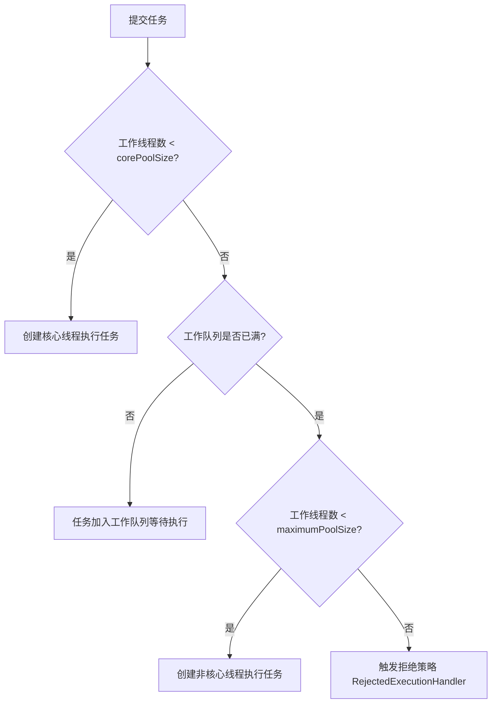
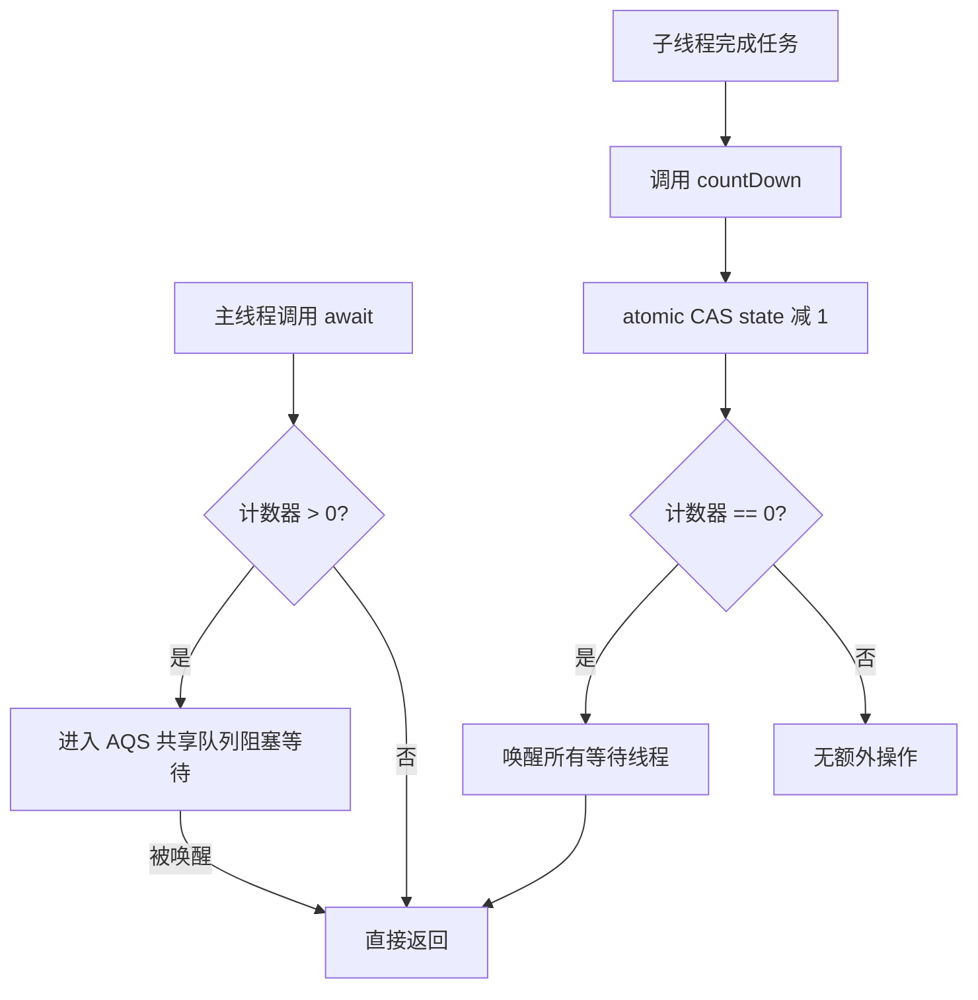
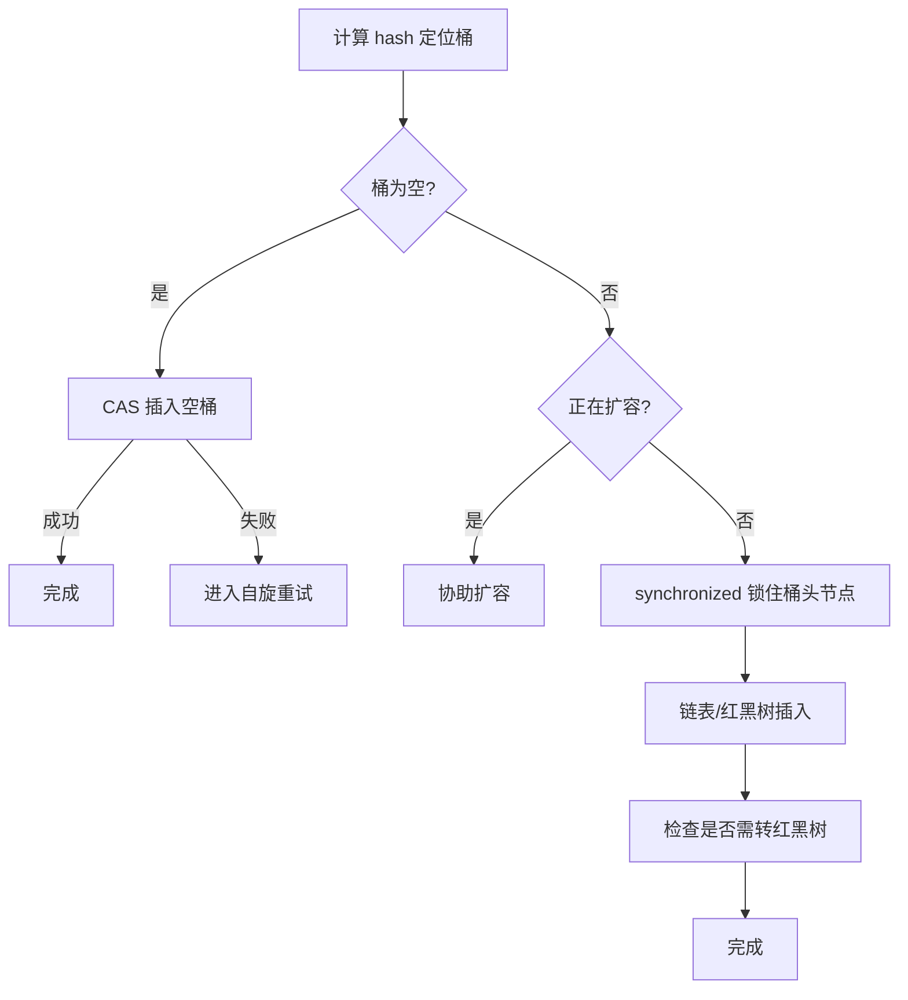

---
title: Java 并发面试三
date: 2024-07-23 07:21:03
order: 9
categories:
  - Java
  - JavaCore
  - 面试
tags:
  - Java
  - JavaCore
  - 面试
  - 并发
permalink: /pages/f7892a67/
---

# Java 并发面试三

## Java 线程池

### 【简单】为什么要用线程池？⭐⭐⭐⭐

> 🎯 目标等级：L2 ｜ ⏱ 建议用时：5 min ｜ 🏷 标签：线程池 / 核心价值

#### 💎 关键结论

线程池的核心价值是复用线程，避免频繁创建/销毁的开销。三大好处：降低资源消耗、提高响应速度、让线程可统一分配、调优和监控。

#### ⚡记忆卡片

- **口诀**：复用省消耗、免等响应快、统一好管理
- **关键词**：线程复用 ／ 响应速度 ／ 可管理性
- **链路**：任务提交 → 从池中获取线程 → 执行任务 → 线程归还等待下一任务

#### 📖 核心知识

1. **定义**：线程池就是管理一系列线程的资源池。当有任务要处理时，直接从线程池中获取线程来处理，处理完之后线程并不会立即被销毁，而是等待下一个任务。
2. **池化思想**：线程池、数据库连接池、HTTP 连接池等等都是对池化思想的应用，主要是为了减少每次获取资源的消耗，提高对资源的利用率。
3. **降低资源消耗**：通过重复利用已创建的线程，降低线程创建和销毁造成的消耗。
4. **提高响应速度**：当任务到达时，任务可以不需要等到线程创建就能立即执行。
5. **提高线程的可管理性**：线程是稀缺资源，如果无限制地创建，不仅会消耗系统资源，还会降低系统的稳定性；使用线程池可以进行统一的分配、调优和监控。每个线程池还维护一些基本统计信息，例如已完成任务的数量。

#### 🔬 扩展知识

::: details

- 【L3】量化创建成本：创建一个平台线程需要走内核态系统调用，耗时约毫秒级，且默认占用约 1MB 线程栈内存；线程池让线程常驻复用，将这部分成本摊薄到接近 0。

:::

#### 🔀 发散问题

- **Q：线程池和数据库连接池的共同点是什么？** → 都是池化思想的应用，复用昂贵资源（线程/连接）以降低创建开销，并通过上限控制保护系统不被打垮；区别在于管理的资源类型与回收策略不同。

### 【简单】Java 创建线程池有哪些方式？⭐⭐⭐⭐

> 🎯 目标等级：L2 ｜ ⏱ 建议用时：5 min ｜ 🏷 标签：线程池 / 创建方式

#### 💎 关键结论

两条主路径：简单场景用 `Executors` 工厂方法，需要精细控制时直接用 `ThreadPoolExecutor` 构造器；分治并行任务用 `ForkJoinPool`（JDK7+）。生产推荐构造器方式，避免无界队列导致 OOM。

#### ⚡记忆卡片

- **口诀**：Fixed 固定 Single 单，Cached 弹性 Scheduled 延，精细控制构造器，分治就用 ForkJoin
- **关键词**：Executors ／ ThreadPoolExecutor ／ ForkJoinPool
- **链路**：简单场景 → Executors 工厂方法 → 复杂场景 → 七参构造器 → 分治任务 → ForkJoinPool

#### 📖 核心知识

Java 主要通过 `java.util.concurrent.Executors` 工厂类和直接使用 `ThreadPoolExecutor` 构造函数来创建线程池。

1. **Executors 工厂方法**：`Executors` 类中提供了几种内置的 `ThreadPoolExecutor` 实现：
   - **`FixedThreadPool`**：固定线程数量的线程池。线程数量始终不变，有空闲线程则立即执行任务，没有则任务暂存在任务队列中，待线程空闲时处理。
   - **`SingleThreadExecutor`**：只有一个线程的线程池。多余的任务被保存在任务队列中，按先入先出的顺序执行。
   - **`CachedThreadPool`**：可根据实际情况调整线程数量的线程池。优先复用空闲线程；若所有线程均在工作，又有新任务提交，则创建新线程处理；线程执行完毕后返回池中复用。
   - **`ScheduledThreadPool`**：给定的延迟后运行任务或者定期执行任务的线程池。


2. **直接使用 `ThreadPoolExecutor` 构造器**：提供更精细的控制参数，可以自定义线程工厂和拒绝策略。

```java
new ThreadPoolExecutor(
    int corePoolSize,
    int maximumPoolSize,
    long keepAliveTime,
    TimeUnit unit,
    BlockingQueue<Runnable> workQueue,
    ThreadFactory threadFactory,
    RejectedExecutionHandler handler
);
```

3. **`ForkJoinPool`（JDK7+）**：适用于分治算法和并行任务，使用工作窃取（work-stealing）算法。

```java
ForkJoinPool forkJoinPool = new ForkJoinPool(int parallelism);
```

4. **选型原则**：简单场景用工厂方法，需要精细控制时用构造器；根据任务类型选择合适的线程池类型；避免使用无界队列以防内存溢出。

#### 🔬 扩展知识

::: details

- 【L3】阿里开发规约禁止使用 `Executors` 的原因：`newFixedThreadPool` 和 `newSingleThreadExecutor` 使用无界的 `LinkedBlockingQueue`，任务堆积可能耗尽内存；`newCachedThreadPool` 的 `maximumPoolSize` 为 `Integer.MAX_VALUE`，可能创建大量线程导致 OOM。

:::

#### 🔀 发散问题

- **Q：大量短小 IO 任务该选哪种线程池？** → 可选 `CachedThreadPool`（弹性伸缩、空闲线程复用），但生产上更推荐用 `ThreadPoolExecutor` 构造器等价实现并设置有界参数，避免线程数失控。
- **Q：七参数的详细作用？** → 见本文档「Java 线程池有哪些核心参数？各有什么作用？」。

### 【中等】Java 线程池有哪些核心参数？各有什么作用？⭐⭐⭐⭐⭐

> 🎯 目标等级：L2-L3 ｜ ⏱ 建议用时：10 min ｜ 🏷 标签：线程池 / 核心参数

#### 💎 关键结论

七参数决定任务命运：`corePoolSize` 定常驻线程、`workQueue` 缓冲任务、`maximumPoolSize` 定临时线程、`handler` 兜底拒绝；配合 `keepAliveTime`、`unit`、`threadFactory` 控制回收与创建方式。

#### ⚡记忆卡片

- **口诀**：core 常驻 max 临时，队列缓冲 keepAlive 回收，factory 起名 handler 拒
- **关键词**：corePoolSize ／ maximumPoolSize ／ workQueue ／ handler
- **链路**：核心线程 → 任务入队 → 非核心线程 → 拒绝策略

#### 📖 核心知识

`ThreadPoolExecutor` 有四个构造方法，前三个都是基于第四个实现。第四个构造方法定义如下：

```java
public ThreadPoolExecutor(int corePoolSize,// 线程池的核心线程数量
						  int maximumPoolSize,// 线程池的最大线程数
						  long keepAliveTime,// 当线程数大于核心线程数时，多余的空闲线程存活的最长时间
						  TimeUnit unit,// 时间单位
						  BlockingQueue<Runnable> workQueue,// 任务队列，用来储存等待执行任务的队列
						  ThreadFactory threadFactory,// 线程工厂，用来创建线程，一般默认即可
						  RejectedExecutionHandler handler// 拒绝策略，当提交的任务过多而不能及时处理时，我们可以定制策略来处理任务
) {// 略}
```

1. **`corePoolSize`**：表示线程池保有的最小线程数。
2. **`maximumPoolSize`**：表示线程池允许创建的最大线程数。如果队列满了且已创建的线程数小于最大线程数，则线程池会再创建新的线程执行任务。值得注意的是：如果使用了无界的任务队列，这个参数就没什么效果。
3. **`keepAliveTime & unit`**：表示非核心线程存活时间。如果一个线程空闲了 `keepAliveTime & unit` 这么久，而且线程池的线程数大于 `corePoolSize`，那么这个空闲的线程就要被回收了。
4. **`workQueue`**：等待执行的任务队列，用于保存等待执行的任务，可选以下几种阻塞队列：
   - **`ArrayBlockingQueue`**：基于数组的**有界阻塞队列**。
   - **`LinkedBlockingQueue`**：基于链表的**无界阻塞队列**，可能导致 OOM。
   - **`SynchronousQueue`**：**不保存任务，直接新建一个线程来执行任务**（需要有可用线程，否则拒绝）。
   - **`DelayedWorkQueue`**：延迟阻塞队列。
   - **`PriorityBlockingQueue`**：**具有优先级的无界阻塞队列**。
5. **`threadFactory`**：线程工厂，用于自定义如何创建线程。
6. **`handler`**：拒绝策略，`RejectedExecutionHandler` 类型。当队列和线程池都满了（饱和状态），必须采取一种策略处理提交的新任务，内置四种：
   - **`AbortPolicy`**：**默认策略**，丢弃任务并抛出异常，直接抛出 `RejectedExecutionException`。
   - **`DiscardPolicy`**：丢弃任务但不抛出异常。
   - **`DiscardOldestPolicy`**：丢弃队列最老的任务，然后重新尝试提交。
   - **`CallerRunsPolicy`**：提交任务的线程自己去执行该任务。
   - 如果以上策略都不能满足需要，也可以通过实现 `RejectedExecutionHandler` 接口来定制处理策略，如记录日志或持久化不能处理的任务。

合理配置这些参数可以优化线程池的性能和稳定性，避免 OOM 或任务丢失。

#### 🔬 扩展知识

::: details

- 【L3】七个参数精确驱动 `execute()` 的四步决策：
  1. **corePoolSize 决定第一步**：当前工作线程数 < corePoolSize → 直接 `addWorker(command, true)` 创建核心线程执行。
  2. **workQueue 决定第二步**：核心线程满 → `workQueue.offer(command)` 尝试入队。入队成功后 double-check 线程池状态，若已关闭则回滚入队并拒绝。
  3. **maximumPoolSize 决定第三步**：队列满 → `addWorker(command, false)` 创建非核心线程（临时工），上限为 maximumPoolSize。
  4. **handler 决定第四步**：队列满 + 线程数达 maximumPoolSize → 触发 `reject(command)`，执行配置的 RejectedExecutionHandler。
- 【L3】**allowCoreThreadTimeOut 的作用**：默认只有非核心线程（超出 corePoolSize 的部分）会在 keepAliveTime 超时后被回收。设置 `allowCoreThreadTimeOut(true)` 后，核心线程空闲超过 keepAliveTime 也会被回收，适用于需要弹性伸缩的场景（如夜间低负载时释放资源）。

:::

#### ⚠️ 常见误区

::: details

常见误区：

- ❌ “线程池创建完成后会立刻启动 corePoolSize 个线程” → 默认情况下创建线程池之后线程数是 0，需要提交任务后才会逐个创建；可用 `prestartAllCoreThreads()` 预启动全部核心线程。
- ❌ “用无界队列更安全，任务不会丢” → 无界队列会让 `maximumPoolSize` 失效，任务无限堆积反而引发 OOM，生产推荐有界队列 + 拒绝策略。

:::

#### 🔀 发散问题

- **Q：不同阻塞队列该怎么选？** → 见本文档「Java 线程池支持哪些阻塞队列，如何选择？」。
- **Q：拒绝策略如何选择？** → 见本文档「Java 线程池支持哪些拒绝策略？如何选择？」。

### 【中等】Java 线程池的工作原理是什么？⭐⭐⭐⭐⭐

> 🎯 目标等级：L2-L3 ｜ ⏱ 建议用时：10 min ｜ 🏷 标签：线程池 / 工作流程

#### 💎 关键结论

线程池按四步处理任务：核心线程直接执行 → 入队等待 → 创建非核心线程 → 触发拒绝策略；空闲线程超过 keepAliveTime 会被回收。

#### ⚡记忆卡片

- **口诀**：一核心、二入队、三最大、四拒绝
- **关键词**：corePoolSize ／ workQueue ／ maximumPoolSize ／ 拒绝策略
- **链路**：提交任务 → 核心线程 → 任务队列 → 非核心线程 → 拒绝策略

#### 📖 核心知识

线程池的工作流程遵循 **任务提交 → 线程分配 → 队列管理 → 拒绝处理** 机制：

1. **提交任务**：调用 `execute(Runnable)` 或 `submit(Callable)` 提交任务。
2. **线程分配逻辑**
   - **核心线程可用** → 立即执行任务（即使有空闲线程也会优先创建新线程直到 `corePoolSize`）。
   - **核心线程已满** → 任务进入任务队列（`workQueue`）等待。
   - **队列已满** → 创建新线程（不超过 `maximumPoolSize`）。
   - **线程数达 `maximumPoolSize` 且队列满** → 触发拒绝策略（`RejectedExecutionHandler`）。
3. **线程回收**：线程空闲时间超过 `keepAliveTime`，且当前线程数大于核心线程数，会被回收。设置 `allowCoreThreadTimeOut=true`，可以回收核心线程。


```mermaid
graph TD
    A[提交任务] --> B{工作线程数 < corePoolSize?}
    B -->|是| C[创建核心线程执行任务]
    B -->|否| D{工作队列是否已满?}
    D -->|否| E[任务加入工作队列等待执行]
    D -->|是| F{工作线程数 < maximumPoolSize?}
    F -->|是| G[创建非核心线程执行任务]
    F -->|否| H[触发拒绝策略 RejectedExecutionHandler]
```

::: details execute() 源码走读

默认情况下，创建线程池之后，线程池中是没有线程的，需要提交任务之后才会创建线程。提交任务可以使用 `execute` 方法，它是 `ThreadPoolExecutor` 的核心方法，通过这个方法可以**向线程池提交一个任务，交由线程池去执行**。

```java
// 用于控制线程池的运行状态和线程池中的有效线程数量
private final AtomicInteger ctl = new AtomicInteger(ctlOf(RUNNING, 0));

public void execute(Runnable command) {
	if (command == null)
		throw new NullPointerException();

    // 获取 ctl 中存储的线程池状态信息
	int c = ctl.get();

    // 线程池执行可以分为 3 个步骤
    // 1. 若工作线程数小于核心线程数，则尝试启动一个新的线程来执行任务
	if (workerCountOf(c) < corePoolSize) {
		if (addWorker(command, true))
			return;
		c = ctl.get();
	}

    // 2. 如果任务可以成功地加入队列，还需要再次确认是否需要添加新的线程（因为可能自从上次检查以来已经有线程死亡）或者检查线程池是否已经关闭
    // 	-> 如果是后者，则可能需要回滚入队操作；
    // 	-> 如果是前者，则可能需要启动新的线程
	if (isRunning(c) && workQueue.offer(command)) {
		int recheck = ctl.get();
		if (!isRunning(recheck) && remove(command))
			reject(command);
		else if (workerCountOf(recheck) == 0)
			addWorker(null, false);
	}
    // 如果任务无法加入队列，则尝试添加一个新的线程
    // 如果添加新线程失败，说明线程池已经关闭或者达到了容量上限，此时将拒绝该任务
	else if (!addWorker(command, false))
		reject(command);
}
```

`execute` 方法工作流程如下：

1. 如果 `workerCount < corePoolSize`，则创建并启动一个线程来执行新提交的任务；
2. 如果 `workerCount >= corePoolSize`，且线程池内的阻塞队列未满，则将任务添加到该阻塞队列中；
3. 如果 `workerCount >= corePoolSize && workerCount < maximumPoolSize`，且线程池内的阻塞队列已满，则创建并启动一个线程来执行新提交的任务；
4. 如果`workerCount >= maximumPoolSize`，并且线程池内的阻塞队列已满，则根据拒绝策略来处理该任务，默认的处理方式是直接抛异常。


:::

#### 🔬 扩展知识

::: details

- 【L3】**线程池任务状态**：`ThreadPoolExecutor` 有以下重要字段：

```java
private final AtomicInteger ctl = new AtomicInteger(ctlOf(RUNNING, 0));
private static final int COUNT_BITS = Integer.SIZE - 3;
private static final int CAPACITY   = (1 << COUNT_BITS) - 1;
// runState is stored in the high-order bits
private static final int RUNNING    = -1 << COUNT_BITS;
private static final int SHUTDOWN   =  0 << COUNT_BITS;
private static final int STOP       =  1 << COUNT_BITS;
private static final int TIDYING    =  2 << COUNT_BITS;
private static final int TERMINATED =  3 << COUNT_BITS;
```

  **`ctl` 用于控制线程池的运行状态和线程池中的有效线程数量**。它包含两部分的信息：

  - 线程池的运行状态（`runState`）
  - 线程池内有效线程的数量（`workerCount`）
  - 可以看到，`ctl` 使用了 `Integer` 类型来保存，高 3 位保存 `runState`，低 29 位保存 `workerCount`。`COUNT_BITS` 就是 29，`CAPACITY` 就是 1 左移 29 位减 1（29 个 1），这个常量表示 `workerCount` 的上限值，大约是 5 亿。

  **线程池一共有五种运行状态**：

  - **`RUNNING`（运行状态）**。接受新任务，并且也能处理阻塞队列中的任务。
  - **`SHUTDOWN`（关闭状态）**。不接受新任务，但可以处理阻塞队列中的任务。
    - 在线程池处于 `RUNNING` 状态时，调用 `shutdown` 方法会使线程池进入到该状态。
    - `finalize` 方法在执行过程中也会调用 `shutdown` 方法进入该状态。
  - **`STOP`（停止状态）**。不接受新任务，也不处理队列中的任务。会中断正在处理任务的线程。在线程池处于 `RUNNING` 或 `SHUTDOWN` 状态时，调用 `shutdownNow` 方法会使线程池进入到该状态。
  - **`TIDYING`（整理状态）**。如果所有的任务都已终止了，`workerCount`（有效线程数）为 0，线程池进入该状态后会调用 `terminated` 方法进入 `TERMINATED` 状态。
  - **`TERMINATED`（已终止状态）**。在 `terminated` 方法执行完后进入该状态。默认 `terminated` 方法中什么也没有做。进入 `TERMINATED` 的条件如下：
    - 线程池不是 `RUNNING` 状态；
    - 线程池状态不是 `TIDYING` 状态或 `TERMINATED` 状态；
    - 如果线程池状态是 `SHUTDOWN` 并且 `workerQueue` 为空；
    - `workerCount` 为 0；
    - 设置 `TIDYING` 状态成功。


- 【L3】**addWorker() 源码要点**：在 `execute` 方法中多次调用 `addWorker` 方法，它主要用来创建新的工作线程，返回 true 说明创建和启动工作线程成功，否则返回 false。整体流程：双重循环检查状态与线程数上限 → CAS 自增 workerCount → 创建 `Worker` 并在 mainLock 保护下加入 `workers` 集合 → `t.start()` 启动真实线程，失败则调用 `addWorkerFailed` 回滚。源码如下：

```java
// 全局锁，并发操作必备
private final ReentrantLock mainLock = new ReentrantLock();
// 跟踪线程池的最大大小，只有在持有全局锁 mainLock 的前提下才能访问此集合
private int largestPoolSize;
// 工作线程集合，存放线程池中所有的（活跃的）工作线程，只有在持有全局锁 mainLock 的前提下才能访问此集合
private final HashSet<Worker> workers = new HashSet<>();
//获取线程池状态
private static int runStateOf(int c)     { return c & ~CAPACITY; }
//判断线程池的状态是否为 Running
private static boolean isRunning(int c) {
	return c < SHUTDOWN;
}

/**
 * 添加新的工作线程到线程池
 * @param firstTask 要执行
 * @param core 参数为 true 的话表示使用线程池的基本大小，为 false 使用线程池最大大小
 * @return 添加成功就返回 true 否则返回 false
 */
private boolean addWorker(Runnable firstTask, boolean core) {
	retry:
	for (;;) {
		//这两句用来获取线程池的状态
		int c = ctl.get();
		int rs = runStateOf(c);

		// Check if queue empty only if necessary.
		if (rs >= SHUTDOWN &&
			! (rs == SHUTDOWN &&
			   firstTask == null &&
			   ! workQueue.isEmpty()))
			return false;

		for (;;) {
		   //获取线程池中工作的线程的数量
			int wc = workerCountOf(c);
			// core 参数为 false 的话表明队列也满了，线程池大小变为 maximumPoolSize
			if (wc >= CAPACITY ||
				wc >= (core ? corePoolSize : maximumPoolSize))
				return false;
		   //原子操作将 workcount 的数量加 1
			if (compareAndIncrementWorkerCount(c))
				break retry;
			// 如果线程的状态改变了就再次执行上述操作
			c = ctl.get();
			if (runStateOf(c) != rs)
				continue retry;
			// else CAS failed due to workerCount change; retry inner loop
		}
	}
	// 标记工作线程是否启动成功
	boolean workerStarted = false;
	// 标记工作线程是否创建成功
	boolean workerAdded = false;
	Worker w = null;
	try {

		w = new Worker(firstTask);
		final Thread t = w.thread;
		if (t != null) {
		  // 加锁
			final ReentrantLock mainLock = this.mainLock;
			mainLock.lock();
			try {
			   //获取线程池状态
				int rs = runStateOf(ctl.get());
			   //rs < SHUTDOWN 如果线程池状态依然为 RUNNING, 并且线程的状态是存活的话，就会将工作线程添加到工作线程集合中
			  //(rs=SHUTDOWN && firstTask == null) 如果线程池状态小于 STOP，也就是 RUNNING 或者 SHUTDOWN 状态下，同时传入的任务实例 firstTask 为 null，则需要添加到工作线程集合和启动新的 Worker
			   // firstTask == null 证明只新建线程而不执行任务
				if (rs < SHUTDOWN ||
					(rs == SHUTDOWN && firstTask == null)) {
					if (t.isAlive()) // precheck that t is startable
						throw new IllegalThreadStateException();
					workers.add(w);
				   //更新当前工作线程的最大容量
					int s = workers.size();
					if (s > largestPoolSize)
						largestPoolSize = s;
				  // 工作线程是否启动成功
					workerAdded = true;
				}
			} finally {
				// 释放锁
				mainLock.unlock();
			}
			//// 如果成功添加工作线程，则调用 Worker 内部的线程实例 t 的 Thread#start() 方法启动真实的线程实例
			if (workerAdded) {
				t.start();
			  /// 标记线程启动成功
				workerStarted = true;
			}
		}
	} finally {
	   // 线程启动失败，需要从工作线程中移除对应的 Worker
		if (! workerStarted)
			addWorkerFailed(w);
	}
	return workerStarted;
}
```

:::

#### ⚠️ 常见误区

::: details

常见误区：

- ❌ “线程池的核心线程永远不会被回收” → 默认不回收，但设置 `allowCoreThreadTimeOut(true)` 后，核心线程空闲超过 keepAliveTime 也会被回收。
- ❌ “任务执行完线程就立即销毁” → 线程执行完任务后会通过 `Worker` 内部循环继续从队列取任务，只有空闲超时（且为非核心线程或开启了 allowCoreThreadTimeOut）才会退出并被回收。

:::

#### 🔀 发散问题

- **Q：Worker 类的作用是什么？** → Worker 是工作线程的载体，实现了 Runnable，每个 Worker 包装一个线程，负责循环获取任务执行（`runWorker`）；它还通过不可重入锁特性辅助区分线程是否空闲，供 `interruptIdleWorkers` 使用。
- **Q：execute() 与 submit() 有什么区别？** → `execute()` 提交 Runnable，无返回值；`submit()` 提交 Callable/Runnable，返回 Future，可通过 `Future.get()` 获取结果并捕获任务异常。

### 【简单】Java 线程池的核心线程会被回收吗？⭐⭐⭐

> 🎯 目标等级：L2 ｜ ⏱ 建议用时：5 min ｜ 🏷 标签：线程池 / 线程回收

#### 💎 关键结论

默认情况下核心线程常驻不回收，即使空闲也会保留；如需弹性缩容，调用 `allowCoreThreadTimeOut(true)` 后，核心线程空闲超过 keepAliveTime 也会被回收。

#### ⚡记忆卡片

- **口诀**：核心常驻不回收，allow 开关核心也能走
- **关键词**：核心线程 ／ keepAliveTime ／ allowCoreThreadTimeOut
- **链路**：线程空闲 → 超过 keepAliveTime → 线程数 > corePoolSize → 回收（核心线程需开关打开）

#### 📖 核心知识

1. **默认行为**：在标准情况下，**核心线程（core threads）即使处于空闲状态也不会被线程池回收**。这是线程池的默认行为，目的是保持一定数量的常驻线程，以便快速响应新任务。
2. **回收范围**：默认只有非核心线程（超出 corePoolSize 的部分）空闲超过 keepAliveTime 会被回收。
3. **改变方式**：通过设置 `allowCoreThreadTimeOut(true)` 可以改变这一行为，核心线程空闲超时后也会被回收；注意该方法要求 keepAliveTime 大于 0。

#### 🔬 扩展知识

::: details

- 【L3】适用场景：夜间等低负载时段开启 `allowCoreThreadTimeOut`，可释放常驻线程占用的资源（每个平台线程约 1MB 栈内存），流量回升时线程会重新创建；需权衡重建线程的延迟。

:::

#### 🔀 发散问题

- **Q：非核心线程具体是怎么被回收的？** → Worker 在 `runWorker` 循环中用 `workQueue.poll(keepAliveTime, unit)` 限时取任务，超时取不到且线程数超过 corePoolSize 时退出循环，由 `processWorkerExit` 完成回收。

### 【中等】如何合理地设置 Java 线程池的线程数？⭐⭐⭐⭐

> 🎯 目标等级：L2-L3 ｜ ⏱ 建议用时：10 min ｜ 🏷 标签：线程池 / 线程数调优

#### 💎 关键结论

先看任务类型再套公式：CPU 密集型取 `核心数+1`，IO 密集型取 `核心数×(1+W/C)`；公式只是理论起点，最终必须压测校准。

#### ⚡记忆卡片

- **口诀**：CPU 加一，IO 乘比值，压测来校准
- **关键词**：CPU 密集型 ／ IO 密集型 ／ W/C 比值
- **链路**：判断任务类型 → 套用公式 → 压测校准 → 动态监控

#### 📖 核心知识

**根据任务类型设置线程数指导**


| 场景       | 推荐设置                     | 关键考虑                     |
| :--------- | :--------------------------- | :--------------------------- |
| CPU 密集型 | `核心数+1`                   | 避免上下文切换               |
| I/O 密集型 | [`核心数* 2`, `核心数* 5`]   | IO 等待时间比例              |
| 混合型     | [`核心数* 1.5`, `核心数* 3`] | 根据 CPU/IO 时间比例动态调整 |
| 未知场景   | 动态调整+监控                | 逐步优化                     |

**通用计算公式**

```
线程数 = CPU 核心数 × 目标 CPU 利用率 × (1 + 等待时间/计算时间）
```

（目标 CPU 利用率建议 0.7-0.9）

**定量公式**

- **CPU 密集型**：`N_threads = N_cpu + 1`。加 1 是为了利用线程因缺页中断等暂停时的 CPU 空闲窗口。
- **I/O 密集型**：`N_threads = N_cpu × (1 + W/C)`，其中 W = I/O 等待时间，C = CPU 计算时间。例如 W/C = 10（等待 100ms，计算 10ms），则线程数 ≈ 核心数 × 11。
- **压测校准**：公式仅是理论起点，实际必须通过压测验证。压测时关注：① CPU 利用率（目标 70%~80%）；② 响应时间 P99；③ 上下文切换率（CS，>5000/s 需减少线程数）；④ 队列堆积量。

**示例**：8 核服务器，任务平均 I/O 等待 80ms，CPU 计算 20ms，W/C = 4，建议线程数 = 8 × (1 + 4) = 40。实际压测后可能在 30~50 之间微调。

**场景化配置**

- Web 服务器（如 Tomcat）推荐：`50-200`（需压测确定）。考虑因素：并发请求量、平均响应时间、系统资源（内存、CPU）。
- 微服务调用推荐：`核心数 * 2` 到 `核心数 * 5`，需配合熔断/降级机制。
- 批处理任务推荐：`核心数 ± 2`，避免与在线服务争抢资源。

**避坑指南**

- 禁止设置 `maximumPoolSize=Integer.MAX_VALUE`，以避免 OOM。
- 避免使用无界队列（推荐 `ArrayBlockingQueue`），避免内存堆积。
- 必须配置拒绝策略（建议日志+降级）。
- 动态线程池优于静态配置。

**最佳实践**


- 通过 `Runtime.getRuntime().availableProcessors()` 获取核心数
- 配合有界队列+合理拒绝策略
- 建立线程池监控（活跃线程/队列堆积等）
- 重要服务建议使用动态调整：

```java
// 获取服务器 CPU 核心数
int cpuCores = Runtime.getRuntime().availableProcessors();

// 创建线程池（I/O 密集型场景）
ThreadPoolExecutor executor = new ThreadPoolExecutor(
    cpuCores * 2,          // corePoolSize
    cpuCores * 4,          // maximumPoolSize
    30,                    // keepAliveTime （秒）
    TimeUnit.SECONDS,
    new ArrayBlockingQueue<>(1000),  // 有界队列
    new CustomThreadFactory(),       // 命名线程
    new LogAndFallbackPolicy()       // 自定义拒绝策略
);
```

#### 🔬 扩展知识

::: details

- 【L4】跨语言线程调度策略对比：

**Go 的 GOMAXPROCS 策略**

Go runtime 使用 `GOMAXPROCS`（默认等于 CPU 核心数）控制同时执行用户态代码的 OS 线程数上限。Goroutine 是用户态轻量线程，由 Go scheduler 在 OS 线程上多路复用（M:N 调度）。与 Java 线程池的「固定线程数 + 任务队列」模型不同，Go 的要点是：

- **动态抢占式调度**：Goroutine 在函数调用、channel 操作、系统调用等时机被抢占，调度器自动均衡负载，无需开发者手工计算线程数。
- **GOMAXPROCS 的含义**：不是「创建多少个 goroutine」，而是「最多多少个 P（处理器）同时执行 goroutine」。每个 P 绑定一个 OS 线程（M），goroutine 在 P 上轮转。
- **I/O 阻塞处理**：当 goroutine 执行阻塞系统调用时，M 被释放，P 转而去绑定另一个 M，阻塞的 goroutine 被挂起——相当于 Java 虚拟线程的 unmount 机制，但 Go 自 1.0 起就内置了这一能力。
- **配置哲学**：Go 社区推荐「Don't tune GOMAXPROCS unless you have a reason」，因为调度器能自动处理绝大多数场景；而 Java 线程池要求开发者显式计算线程数，调优负担更重。

**Rust tokio 的 worker_threads 配置**

tokio 是 Rust 生态的异步运行时，其线程模型与 Java 线程池有本质区别：

- **默认 worker_threads = CPU 核心数**：tokio 只会创建与 CPU 核数相等的 worker 线程，所有异步任务在这些线程上通过协作式调度执行。
- **任务模型**：tokio 的 `task` 是 Future（类似 Java 的 CompletableFuture），`.await` 点是协作式让出点。一个 worker 线程可以在一个 OS 线程上并发驱动数万个 task——这与虚拟线程的载体线程复用机制同构。
- **与 Java 的核心差异**：Java 线程池中的「线程数」指 OS 线程数，而 tokio 的「worker 数」指 OS 线程数，task 数不受此限制。IO 密集时，tokio 只用少量线程（如 4~8 核）即可支撑数十万并发连接，因为 IO 操作被委托给操作系统的 epoll/kqueue/IOCP，不阻塞 worker 线程。
- **配置建议**：tokio 文档建议 `worker_threads` = CPU 核心数，不需要像 Java 那样使用 \( W/C \) 公式放大线程数——因为阻塞 IO 在 tokio 中通过异步 IO + 事件循环完成，不消耗额外线程。

**Linux epoll 与 C10K → C10M 的设计范式演变**

- **C10K 时代（2000 年前后）**：每个连接一个线程（thread-per-connection）模型，受限于 OS 线程的内存开销（~1MB/线程栈），单机最多承载数千并发连接。Java 线程池（ThreadPoolExecutor）本质上仍属于此范式——线程池只是复用了线程，但并发连接数仍受限于线程池大小。
- **C10K 解决方案**：Linux epoll（2002 年，Linux 2.6）引入事件驱动模型——一个线程通过 `epoll_wait` 轮询数万个 fd，有事件才处理。Nginx 正是基于此模型以极少的 worker 进程支撑数万并发连接。
- **C10M 时代（2010 年代）**：用户态网络栈（DPDK、XDP、io_uring）进一步将数据面从内核旁路到用户态，单机可达千万并发连接。此时线程的角色彻底改变：线程不再是连接的处理者，而是 CPU 核心的执行单元——一个核心一个线程，通过事件循环驱动所有连接。
- **对 Java 线程池配置的启示**：
  - 传统 I/O 密集型公式 \( N_{threads} = N_{cpu} \times (1 + W/C) \) 适用于**每任务占用一个线程的阻塞模型**（如 Servlet + 同步 JDBC）。
  - 若采用 NIO/Netty + 事件循环，线程数应回归 \( N_{cpu} + 1 \)（类似 tokio），并发能力由异步 IO + epoll 承载。
  - 若采用虚拟线程，线程数 = 任务数（无需调参），OS 线程数 = CPU 核数，载体线程自动复用——这是向 Go/tokio 模型靠拢的信号。

:::

#### ⚠️ 常见误区

::: details

常见误区：

- ❌ “线程数设置得越大，吞吐量越高” → 线程数超过合理值后，上下文切换开销抵消并行收益，CPU 利用率反而下降，压测时 CS > 5000/s 就应减少线程数。
- ❌ “公式算出的值可以直接上生产” → 公式只是理论起点，实际受 GC、锁竞争、下游耗时波动影响，必须压测校准并配合监控动态调整。

:::

#### 🔀 发散问题

- **Q：给定任务量和响应时限，参数怎么算？** → 见本文档「1000 个任务，每个任务 0.1s，最大响应时间 1s，线程池参数怎么设置？」。
- **Q：线上想不重启调整线程数怎么办？** → 见本文档「Java 线程池参数在运行过程中能修改吗？如何修改？」。

### 【中等】Java 线程池支持哪些阻塞队列，如何选择？⭐⭐⭐

> 🎯 目标等级：L2-L3 ｜ ⏱ 建议用时：10 min ｜ 🏷 标签：线程池 / 阻塞队列

#### 💎 关键结论

常用五种：Array（有界数组）、Linked（可选有界链表，双锁）、Synchronous（零容量直传）、Priority（优先级堆）、Delay（延迟堆）；选型先看是否要优先级/延迟，再看能否预估峰值定容量。

#### ⚡记忆卡片

- **口诀**：Array 有界 Linked 双锁，Sync 直传吞吐高，Priority 排序 Delay 延
- **关键词**：有界性 ／ 吞吐量 ／ 双锁分离
- **链路**：是否需要优先级延迟 → 能否预估任务量 → 确定队列与容量

#### 📖 核心知识

| 队列类型                  | 数据结构         | 是否有界 | 锁机制               | 特点                                                 | 适用场景                     | 不适用场景         |
| :------------------------ | :--------------- | :------- | :------------------- | :--------------------------------------------------- | :--------------------------- | :----------------- |
| **ArrayBlockingQueue**    | 数组             | 有界     | ReentrantLock        | 固定容量，内存连续，支持公平锁                       | 已知并发量的稳定系统         | 任务量波动大的场景 |
| **LinkedBlockingQueue**   | 链表             | 可选     | 双锁分离（put/take） | 默认无界 (Integer.MAX_VALUE)，吞吐量高，节点动态分配 | 任务量不可预测的中等吞吐系统 | 严格内存控制的系统 |
| **SynchronousQueue**      | 无存储           | 无容量   | 无锁 (CAS)           | 直接传递任务，吞吐量最高，公平/非公平模式可选        | 高并发短任务处理             | 存在长任务的场景   |
| **PriorityBlockingQueue** | 堆               | 无界     | ReentrantLock        | 按优先级排序，自动扩容，元素需实现 Comparable        | 需要任务优先级调度的系统     | 对内存敏感的系统   |
| **DelayQueue**            | 堆+PriorityQueue | 无界     | ReentrantLock        | 按延迟时间排序，元素需实现 Delayed 接口              | 定时任务/缓存过期处理        | 普通任务队列       |

**关键说明**：

- **有界性**：
  - `LinkedBlockingQueue` 构造时可指定容量变为有界
  - `SynchronousQueue` 是特殊的“零容量”队列
- **吞吐量排序**：`SynchronousQueue > LinkedBlockingQueue > ArrayBlockingQueue > PriorityBlockingQueue ≈ DelayQueue`
- **内存开销**：`PriorityBlockingQueue ≈ DelayQueue > LinkedBlockingQueue > ArrayBlockingQueue > SynchronousQueue`
- **特殊机制**：
  - **公平模式**：`ArrayBlockingQueue` / `SynchronousQueue` 可设置公平锁（降低吞吐但减少线程饥饿）
  - **双锁分离**：`LinkedBlockingQueue` 的 `put` / `take` 操作使用不同锁，提升并发度
  - **直接传递**：`SynchronousQueue` 实现生产者-消费者直接握手

**选型决策参考**：

```
是否需要优先级/延迟？
├─ 是 → PriorityBlockingQueue/DelayQueue
└─ 否 → 是否接受任务丢失？
   ├─ 是 → SynchronousQueue+CallerRunsPolicy
   └─ 否 → 能否预估最大任务量？
      ├─ 能 → ArrayBlockingQueue（容量=预估峰值×1.5)
      └─ 不能 → LinkedBlockingQueue（建议显式设置安全上限）
```

**生产建议**：

- **Web 服务**：ArrayBlockingQueue（2000-10000 容量）+ AbortPolicy
- **消息处理**：LinkedBlockingQueue（10 万上限）+ DiscardOldestPolicy
- **实时交易**：SynchronousQueue + CachedThreadPool
- **定时任务**：DelayQueue（单线程消费）

#### 🔬 扩展知识

::: details

- 【L3】`LinkedBlockingQueue` 双锁分离：内部维护 `putLock` 与 `takeLock` 两把 ReentrantLock，入队与出队可并行进行，吞吐高于 ArrayBlockingQueue 的单锁；容量通过 `AtomicInteger count` 维护。
- 【L3】`SynchronousQueue` 内部通过 `transferer`（TransferStack 非公平 / TransferQueue 公平）实现生产者和消费者的直接握手，不存储元素，offer 失败即触发线程池创建新线程。

:::

#### 🔀 发散问题

- **Q：队列满了之后任务怎么处理？** → 触发拒绝策略，见本文档「Java 线程池支持哪些拒绝策略？如何选择？」。
- **Q：DelayQueue 和 ScheduledThreadPoolExecutor 怎么选？** → 见本文档「DelayQueue 和 ScheduledThreadPool 有什么区别？」。

### 【中等】Java 线程池支持哪些拒绝策略？如何选择？⭐⭐⭐⭐

> 🎯 目标等级：L2-L3 ｜ ⏱ 建议用时：10 min ｜ 🏷 标签：线程池 / 拒绝策略

#### 💎 关键结论

内置四种：AbortPolicy（默认抛异常）、CallerRunsPolicy（调用者自执行）、DiscardPolicy（静默丢弃）、DiscardOldestPolicy（丢最老）；触发前提是队列满且线程数达 maximumPoolSize，选型看能否容忍任务丢失。

#### ⚡记忆卡片

- **口诀**：Abort 抛异常，Caller 自己干，Discard 静默丢，Oldest 丢最老
- **关键词**：AbortPolicy ／ CallerRunsPolicy ／ DiscardOldestPolicy
- **链路**：队列满 + 线程达上限 → 触发 handler → 按策略处理

#### 📖 核心知识

Java 线程池支持以下拒绝策略：

| 策略名称（实现类）      | 处理方式                                             | 优点                               | 缺点                               | 适用场景                                 |
| ----------------------- | ---------------------------------------------------- | ---------------------------------- | ---------------------------------- | ---------------------------------------- |
| **AbortPolicy**（默认） | 直接抛出 `RejectedExecutionException` 异常           | 快速失败，避免系统过载           | 需要调用方处理异常                 | 需要明确知道任务被拒绝的场景             |
| **CallerRunsPolicy**    | 让提交任务的线程自己执行该任务                       | 降低新任务提交速度，保证任务不丢失 | 可能阻塞调用线程，影响整体性能     | 低优先级任务或允许同步执行的场景         |
| **DiscardPolicy**       | 静默丢弃新提交的任务，不做任何通知                   | 系统行为简单                       | 任务丢失无感知，可能造成数据不一致 | 允许丢弃非关键任务的场景（如日志记录）   |
| **DiscardOldestPolicy** | 丢弃队列中最旧的任务（队头），然后尝试重新提交新任务 | 优先处理新任务                     | 可能丢失重要旧任务                 | 新任务比旧任务更重要的场景（如实时数据） |

**所有策略均在以下条件同时满足时触发**：

- 线程数达到 `maximumPoolSize`
- 工作队列已满（对于有界队列）
- 仍有新任务提交

**策略选择建议**：

```text
是否允许任务丢失？
├─ 允许 → 选择 DiscardPolicy/DiscardOldestPolicy
└─ 不允许 → 是否能接受降级？
   ├─ 能 → 自定义策略（如持久化存储）
   └─ 不能 → 选择 CallerRunsPolicy（影响调用方）
```

**生产环境推荐组合**：

- **严格系统**：`AbortPolicy` + 告警监控
- **弹性系统**：`CallerRunsPolicy` + 熔断机制
- **最终一致性系统**：自定义策略（如写入 Redis 重试队列）

**Spring 的增强策略**：`ThreadPoolTaskExecutor` 额外支持通过 `TaskRejectedException` 提供更详细的拒绝信息，与 `@Async` 注解配合时自动应用策略。

#### 🔬 扩展知识

::: details

- 【L3】自定义拒绝策略：实现 `RejectedExecutionHandler` 接口的 `rejectedExecution(Runnable r, ThreadPoolExecutor executor)` 方法即可，常见做法：记录日志 + 告警、持久化到 MQ/Redis 稍后重试、按业务降级。
- 【L3】触发时机细节：`reject()` 在 `execute()` 的第四步被调用；若线程池已关闭（非 RUNNING），新提交任务也会直接走拒绝流程。

:::

#### ⚠️ 常见误区

::: details

常见误区：

- ❌ “线程池默认会丢弃多余任务” → 默认策略 AbortPolicy 会抛出 `RejectedExecutionException`，若不捕获会向上传播，而不是静默丢弃。
- ❌ “CallerRunsPolicy 绝对安全，任务不丢也不阻塞系统” → 它会阻塞提交任务的线程（可能是 Web 容器的请求线程），高峰期可能拖慢整个入口吞吐。

:::

#### 🔀 发散问题

- **Q：拒绝策略能动态更换吗？** → 可以，`setRejectedExecutionHandler()` 立即生效，见本文档「Java 线程池参数在运行过程中能修改吗？如何修改？」。

### 【中等】Java 线程池内部任务出异常后，如何知道是哪个线程出了异常？⭐⭐

> 🎯 目标等级：L2-L3 ｜ ⏱ 建议用时：10 min ｜ 🏷 标签：线程池 / 异常处理

#### 💎 关键结论

任务异常默认会被线程池“吞掉”，不会直接抛给调用者；四条出路：`Future.get()` 捕获、自定义 `ThreadFactory` 设未捕获异常处理器、重写 `afterExecute`、任务内部 try-catch。

#### ⚡记忆卡片

- **口诀**：get 捕获、factory 兜底、afterExecute 钩子、内部 try-catch
- **关键词**：Future.get ／ UncaughtExceptionHandler ／ afterExecute
- **链路**：任务抛异常 → 按提交方式分流 → 选择捕获手段 → 记录线程名与堆栈

#### 📖 核心知识

在 Java 线程池中，当任务抛出异常时，默认情况下异常会被线程池“吞掉”，不会直接抛出给调用者。识别哪个线程出异常的几种方法：

1. 对于需要获取结果的异步任务，使用 `submit()` 和 `Future` 组合。
2. 对于不需要结果的批量任务，使用自定义的 `ThreadFactory` 或重写 `afterExecute`。
3. 在复杂系统中，考虑结合日志框架记录完整的异常堆栈和线程信息。

通过以上方法，可以有效地追踪线程池中哪个线程执行的任务抛出了异常。

**（1）使用 `Future.get()` 捕获异常**

```java
ExecutorService executor = Executors.newFixedThreadPool(5);
Future<?> future = executor.submit(() -> {
    // 任务代码
    throw new RuntimeException("模拟异常");
});

try {
    future.get(); // 这里会抛出 ExecutionException
} catch (ExecutionException e) {
    System.out.println("任务抛出异常：" + e.getCause());
    // e.getCause() 获取原始异常
}
```

**（2）自定义 `ThreadFactory` 设置未捕获异常处理器**

```java
ThreadFactory factory = r -> {
    Thread t = new Thread(r);
    t.setUncaughtExceptionHandler((thread, throwable) -> {
        System.out.println("线程 " + thread.getName() + " 抛出异常：" + throwable);
    });
    return t;
};

ExecutorService executor = Executors.newFixedThreadPool(5, factory);
```

**（3）重写 `ThreadPoolExecutor` 的 `afterExecute` 方法**

```java
ExecutorService executor = new ThreadPoolExecutor(..., ...) {
    @Override
    protected void afterExecute(Runnable r, Throwable t) {
        super.afterExecute(r, t);
        if (t != null) {
            System.out.println("任务执行抛出异常：" + t);
        }
        // 对于通过 FutureTask 运行的任务，异常被封装在 Future 中
        if (r instanceof Future<?>) {
            try {
                ((Future<?>) r).get();
            } catch (InterruptedException | ExecutionException e) {
                System.out.println("Future 任务异常：" + e.getCause());
            }
        }
    }
};
```

**（4）在任务内部捕获异常**

```java
executor.execute(() -> {
    try {
        // 任务代码
    } catch (Exception e) {
        System.out.println("线程 " + Thread.currentThread().getName() + " 抛出异常：" + e);
        // 记录线程信息
    }
});
```

#### 🔬 扩展知识

::: details

- 【L3】`execute()` 与 `submit()` 的异常行为差异：`execute()` 提交的任务异常会传播到 Worker 线程，导致该线程退出并由线程池新建线程替补，异常可被 UncaughtExceptionHandler 捕获；`submit()` 提交的任务被包装成 FutureTask，异常存入 Future 的结果中，`afterExecute` 收到的 Throwable 为 null，必须 `Future.get()` 才能拿到。

:::

#### ⚠️ 常见误区

::: details

常见误区：

- ❌ “任务抛异常会导致整个线程池崩溃” → 只影响执行该任务的线程，线程池会继续运行，execute 场景下还会创建新线程替补。
- ❌ “submit 提交的异常会自动打印出来” → 异常被封装在 Future 中，不调用 `get()`/`join()` 就完全无感知，这也是很多线上异常“失踪”的原因。

:::

#### 🔀 发散问题

- **Q：异步编排中异常怎么处理？** → CompletableFuture 提供 `exceptionally`、`whenComplete`、`handle` 等方法，见本文档「CompletableFuture 有哪些用法？」。

### 【中等】Java 线程池中 shutdown 与 shutdownNow 的区别是什么？⭐⭐⭐

> 🎯 目标等级：L2-L3 ｜ ⏱ 建议用时：10 min ｜ 🏷 标签：线程池 / 关闭机制

#### 💎 关键结论

`shutdown()` 是温和关闭：不再接新任务，但等存量任务执行完；`shutdownNow()` 是立即关闭：中断所有线程、清空并返回未执行的任务。

#### ⚡记忆卡片

- **口诀**：shutdown 温和等完，shutdownNow 立即中断
- **关键词**：SHUTDOWN ／ STOP ／ interruptIdleWorkers
- **链路**：shutdown → SHUTDOWN → 只断空闲线程；shutdownNow → STOP → 中断所有线程 + 返回剩余任务

#### 📖 核心知识

1. **`shutdown()` 不会立即终止线程池**：不再接受新任务，但要等所有任务缓存队列中的任务都执行完后才终止。
   - 将线程池切换到 `SHUTDOWN` 状态；
   - 调用 `interruptIdleWorkers` 方法请求中断所有空闲的 worker；
   - 最后调用 `tryTerminate` 尝试结束线程池。
2. **`shutdownNow()` 立即终止线程池**：尝试打断正在执行的任务，清空任务缓存队列，返回尚未执行的任务。与 `shutdown` 方法类似，不同的地方在于：
   - 设置状态为 `STOP`；
   - 中断所有工作线程，无论是否是空闲的；
   - 取出阻塞队列中没有被执行的任务并返回。

#### 🔬 扩展知识

::: details

- 【L3】状态机视角：`shutdown()` 使线程池进入 SHUTDOWN（不接新任务、继续处理队列），`shutdownNow()` 进入 STOP（不接新任务、不处理队列、中断在途任务）；两者最终都会经过 TIDYING 到达 TERMINATED，可用 `isTerminated()` 判断或 `awaitTermination(timeout, unit)` 阻塞等待。
- 【L3】任务能否响应关闭取决于任务本身是否检查中断（如 `Thread.isInterrupted()` 或响应 InterruptedException），否则 shutdownNow 的中断也无法真正停止任务。

:::

#### 🔀 发散问题

- **Q：优雅停机应该用哪个？** → 通常先 `shutdown()` + `awaitTermination()` 等待一段时间，超时后再 `shutdownNow()` 兜底，保证尽量不丢任务又能及时退出。

### 【困难】Java 线程池参数在运行过程中能修改吗？如何修改？⭐⭐

> 🎯 目标等级：L3-L4 ｜ ⏱ 建议用时：15 min ｜ 🏷 标签：线程池 / 动态调参

#### 💎 关键结论

能。`ThreadPoolExecutor` 原生提供 setter 支持动态修改核心线程数、最大线程数、空闲时间、拒绝策略，无需重启；但队列实现类不可替换，队列容量动态调整需要自定义队列。

#### ⚡记忆卡片

- **口诀**：core max keepAlive 可改，拒绝策略随时换，队列实现不能换，容量要定制
- **关键词**：setCorePoolSize ／ setMaximumPoolSize ／ setRejectedExecutionHandler
- **链路**：监控指标 → 决策调参 → 先调 max 后调 core → 观察生效

#### 📖 核心知识

1. **可动态修改参数**：核心线程数、最大线程数、空闲时间、拒绝策略。
2. **不可动态修改**：队列实现类、线程工厂（队列容量默认也固定）。
3. **Spring 增强**：`ThreadPoolTaskExecutor` 提供更友好的 API。
4. **生产建议**：配合监控系统实现自动扩缩容；修改时遵循先 max 后 core 的顺序；对队列容量修改要特别小心。

**ThreadPoolExecutor 原生动态修改参数方法**


ThreadPoolExecutor 提供了以下核心参数的动态修改方法：

| 参数             | 修改方法                           | 注意事项                                           |
| ---------------- | ---------------------------------- | -------------------------------------------------- |
| 核心线程数       | `setCorePoolSize(int)`             | 新值>旧值时立即生效；新值<旧时空闲线程会被逐渐回收 |
| 最大线程数       | `setMaximumPoolSize(int)`          | 必须≥核心线程数；仅影响后续新增线程                |
| 空闲线程存活时间 | `setKeepAliveTime(long, TimeUnit)` | 对所有空闲的非核心线程生效                         |
| 拒绝策略         | `setRejectedExecutionHandler()`    | 立即生效，但已进入拒绝流程的任务不受影响           |

**示例代码**：

```java
ThreadPoolExecutor executor = new ThreadPoolExecutor(
    2, 5, 60, TimeUnit.SECONDS,
    new LinkedBlockingQueue<>(10)
);

// 动态调整
executor.setCorePoolSize(4);  // 核心线程数 2→4
executor.setMaximumPoolSize(8); // 最大线程数 5→8
executor.setKeepAliveTime(30, TimeUnit.SECONDS); // 60s→30s
executor.setRejectedExecutionHandler(new ThreadPoolExecutor.CallerRunsPolicy());
```

#### 🔬 扩展知识

::: details

- 【L3】**Spring 的 ThreadPoolTaskExecutor 增强**：Spring 的 `ThreadPoolTaskExecutor` 在原生基础上增加了更多动态能力：

```java
@Bean
public ThreadPoolTaskExecutor taskExecutor() {
    ThreadPoolTaskExecutor executor = new ThreadPoolTaskExecutor();
    executor.setCorePoolSize(4);
    executor.setMaxPoolSize(8);
    executor.setQueueCapacity(50);
    executor.initialize();
    return executor;
}

// 动态调整示例
@Autowired
private ThreadPoolTaskExecutor taskExecutor;

public void adjustThreadPool() {
    taskExecutor.setCorePoolSize(6);
    taskExecutor.setMaxPoolSize(10);
    taskExecutor.setQueueCapacity(100);
    // Spring 会自动应用新配置
}
```

- 【L3】**动态调整队列容量**：队列容量的动态调整需要特殊处理，因为大多数 BlockingQueue 创建后容量固定。解决方案：① 使用自定义的可变容量队列；② 重建线程池（优雅迁移）。自定义队列示例：

```java
public class ResizableCapacityLinkedBlockingQueue<E> extends LinkedBlockingQueue<E> {
    public ResizableCapacityLinkedBlockingQueue(int capacity) {
        super(capacity);
    }

    public synchronized void setCapacity(int capacity) {
        // 实现容量调整逻辑
    }
}
```

> 📚 延伸阅读：
>
> - [《Java 线程池实现原理及其在美团业务中的实践》](https://tech.meituan.com/2020/04/02/java-pooling-pratice-in-meituan.html)
> - [如何设置线程池参数？美团给出了一个让面试官虎躯一震的回答](https://mp.weixin.qq.com/s/9HLuPcoWmTqAeFKa1kj-_A)
>
> 开源项目：
>
> - **[Hippo4j](https://github.com/opengoofy/hippo4j)**：异步线程池框架，支持线程池动态变更&监控&报警，无需修改代码轻松引入。支持多种使用模式，轻松引入，致力于提高系统运行保障能力。
> - **[Dynamic TP](https://github.com/dromara/dynamic-tp)**：轻量级动态线程池，内置监控告警功能，集成三方中间件线程池管理，基于主流配置中心（已支持 Nacos、Apollo，Zookeeper、Consul、Etcd，可通过 SPI 自定义实现）。

:::

#### ⚠️ 常见误区

::: details

常见误区：

- ❌ “修改线程池参数必须重启服务” → `setCorePoolSize`、`setMaximumPoolSize` 等 setter 在线即可生效，这也是动态线程池框架（Hippo4j、Dynamic TP）的基础。
- ❌ “扩容时直接先调大 corePoolSize 即可” → 若新 core 大于当前 max，`setCorePoolSize` 会抛 IllegalArgumentException，扩容必须先调 max 再调 core，缩容反之。

:::

#### 🔀 发散问题

- **Q：参数该调成多少？** → 见本文档「如何合理地设置 Java 线程池的线程数？」。
- **Q：动态线程池框架一般还做什么？** → 除动态调参外，通常还提供运行指标采集（活跃线程、队列堆积、拒绝数）、告警、配置中心集成与参数变更审计。

### 【中等】DelayQueue 和 ScheduledThreadPool 有什么区别？⭐⭐

> 🎯 目标等级：L2-L3 ｜ ⏱ 建议用时：10 min ｜ 🏷 标签：定时任务 / 延迟队列

#### 💎 关键结论

`DelayQueue` 是只管“到期出队”的阻塞队列，不带线程；`ScheduledThreadPoolExecutor` 是自带线程池、支持周期任务的调度器，内部用的正是 DelayQueue 的变体 `DelayedWorkQueue`。

#### ⚡记忆卡片

- **口诀**：DelayQueue 只排队，Scheduled 又调又执行
- **关键词**：BlockingQueue ／ DelayedWorkQueue ／ scheduleAtFixedRate
- **链路**：任务实现 Delayed → 按到期时间堆排序 → 到期出队 → （线程池）执行并重排周期任务

#### 📖 核心知识


**`DelayQueue`** 是一个支持延迟获取元素的阻塞队列；**`ScheduledThreadPoolExecutor`** 是支持定时和周期性任务的线程池。二者都基于堆（PriorityQueue）实现，但有本质区别：

| **对比维度**   | **DelayQueue**                   | **ScheduledThreadPoolExecutor**                          |
| -------------- | -------------------------------- | -------------------------------------------------------- |
| **本质**       | 阻塞队列（BlockingQueue 实现）   | 线程池（ThreadPoolExecutor 子类）                        |
| **职责**       | 仅存储和按延迟时间出队           | 调度 + 执行任务                                          |
| **任务类型**   | 任意实现 `Delayed` 的对象        | `Runnable` / `Callable`                                  |
| **周期性任务** | 不支持（出队后不重新入队）       | 支持（`scheduleAtFixedRate` / `scheduleWithFixedDelay`） |
| **底层队列**   | `PriorityQueue`（堆）            | `DelayedWorkQueue`（基于堆的自定义队列）                 |
| **线程模型**   | 无内置线程，需配合消费者线程     | 内置线程池，自动调度执行                                 |
| **时间精度**   | 毫秒级（依赖 `System.nanoTime`） | 毫秒级                                                   |

**关系**：`ScheduledThreadPoolExecutor` 内部使用 `DelayedWorkQueue`（DelayQueue 的变体），区别在于它支持周期性任务（任务执行后重新计算下次执行时间并入队）。

**选型建议**：

- 需要自定义消费逻辑（如多消费者、条件消费）→ `DelayQueue` + 自定义线程
- 需要定时/周期执行任务 → `ScheduledThreadPoolExecutor`
- 延迟消息场景（如订单超时取消）→ 二者均可，`ScheduledThreadPoolExecutor` 更简单

#### 🔬 扩展知识

::: details

- 【L3】`DelayedWorkQueue` 与 `DelayQueue` 同为最小堆实现，但 `DelayedWorkQueue` 为调度器定制：数组可自动扩容，且使用 `leader-follower` 模式让等待的调度线程中只有一个限时等待队首任务，减少无效唤醒。
- 【L3】周期语义差异：`scheduleAtFixedRate` 按“计划开始时间 + 周期”重排（可能追赶），`scheduleWithFixedDelay` 按“实际结束时间 + 延迟”重排；`DelayQueue` 出队后不会自动重新入队。

:::

#### 🔀 发散问题

- **Q：海量延迟任务（如百万级订单超时）还适合用它们吗？** → 内存和堆排序开销较大，可考虑 Redis ZSet、RocketMQ 延迟消息或时间轮方案，见本文档「时间轮（Time Wheel）的工作原理是什么？」。

### 【中等】1000 个任务，每个任务 0.1s，最大响应时间 1s，线程池参数怎么设置？⭐⭐⭐

> 🎯 目标等级：L2-L3 ｜ ⏱ 建议用时：10 min ｜ 🏷 标签：线程池 / 参数计算

#### 💎 关键结论

核心线程数 = 任务总量 × 单任务耗时 / 总时限 = 1000×0.1/1 = 100；队列容量按“最后任务等待不超 0.9s”推得 900，选有界队列。

#### ⚡记忆卡片

- **口诀**：线程数 = 总量×单耗/时限，队列容量 = 线程数×等待/单耗
- **关键词**：corePoolSize=100 ／ 队列容量=900 ／ 有界队列
- **链路**：算并发需求 → 定核心线程数 → 算最大等待时间 → 定队列容量

#### 📖 核心知识

针对 1000 个任务、单任务耗时 0.1 秒、最大响应时间 1 秒的场景：

1. **核心线程数**：单线程 1 秒可处理 10 个任务（1 / 0.1），故需至少 100 个线程并发，设 corePoolSize = 100。
2. **任务队列容量**：响应时间 = 等待时间 + 处理时间，最大等待时间为 1 - 0.1 = 0.9 秒。队列长度应保证最后一个任务等待不超过 0.9 秒，计算公式：队列容量 = 核心线程数 ×（最大等待时间 / 单任务耗时）= 100 × (0.9 / 0.1) = 900。因此选用有界队列，容量设为 900。

此配置基于纯理论计算，实际部署需考虑 CPU 核数、上下文切换等硬件限制，并通过压测调优。面试中回答核心线程数和队列数即可，无需深入其他参数。

#### 🔬 扩展知识

::: details

- 【L3】公式本质：要在 T 秒内完成 N 个耗时 t 的任务，并发度下限为 N×t/T；队列容量则把“排队时间”也纳入响应时间约束，两者共同决定最坏情况下的响应时间。
- 【L3】现实修正：若机器只有 8 核，100 个线程对 CPU 密集型任务会产生大量上下文切换，实际应结合「线程数 = 核数 × (1 + W/C)」重新评估；若任务为 IO 型则 100 线程可行。

:::

#### 🔀 发散问题

- **Q：如果最大响应时间收紧到 0.5s 呢？** → 并发需求翻倍：corePoolSize ≈ 200，队列容量按 0.4s 等待窗口算 = 200 × (0.4/0.1) = 800。
- **Q：通用线程数公式？** → 见本文档「如何合理地设置 Java 线程池的线程数？」。

### 【中等】虚拟线程需要池化吗？为什么？⭐⭐⭐

> 🎯 目标等级：L2-L3 ｜ ⏱ 建议用时：10 min ｜ 🏷 标签：虚拟线程 / 池化

#### 💎 关键结论

不需要。虚拟线程创建成本极低（约 1μs、约 1KB 内存），池化违背“复用昂贵资源”的初衷；正确姿势是每任务一个虚拟线程（thread-per-task），用完即弃。

#### ⚡记忆卡片

- **口诀**：虚拟线程不池化，一任务一线程，用完就丢
- **关键词**：thread-per-task ／ newVirtualThreadPerTaskExecutor ／ 轻量资源
- **链路**：任务到来 → 新建虚拟线程 → 执行（阻塞时 unmount）→ 结束回收

#### 📖 核心知识

**不需要池化。虚拟线程创建成本极低，池化反而会引入不必要的复杂度。**

1. **为什么不需要池化**：
   - **创建成本极低**：虚拟线程的创建和销毁是用户态操作，无需系统调用，创建成本约 1μs（平台线程约 1ms），内存占用仅约 1KB（平台线程约 1MB）。
   - **池化违背设计初衷**：池化技术的核心目的是“复用昂贵资源”，虚拟线程本身就是轻量资源，池化等于用池管理池，徒增复杂度。
   - **JEP 444 明确建议**：每个任务一个虚拟线程（thread-per-task），用完即弃，无需池化。
2. **推荐用法**（`Executors.newVirtualThreadPerTaskExecutor()`，Java 21 随虚拟线程正式化提供）：

```java
// 每个任务一个虚拟线程，无需池化
try (var executor = Executors.newVirtualThreadPerTaskExecutor()) {
    for (int i = 0; i < 100_000; i++) {
        executor.submit(() -> {
            doSomeIO();  // I/O 阻塞不会占用 OS 线程
        });
    }
}
// executor 关闭时自动等待所有虚拟线程完成
```

3. **与传统线程池对比**：

| 维度             | 传统线程池             | 虚拟线程               |
| :--------------- | :--------------------- | :--------------------- |
| **创建成本**     | 高（~1ms + 内核态）    | 极低（~1μs + 用户态）  |
| **内存占用**     | ~1MB/线程              | ~1KB/线程              |
| **是否需要池化** | 是（复用昂贵资源）     | 否（直接创建）         |
| **并发上限**     | 数千（受限于 OS 线程） | 数百万（受限于堆内存） |
| **阻塞代价**     | OS 线程阻塞            | 仅虚拟线程挂起         |

4. **注意事项**：虚拟线程不适合 CPU 密集型任务（纯计算无法从虚拟线程获益）；如果在 `synchronized` 块内执行阻塞 I/O，会导致 Pinning（载体线程被钉住），应改用 `ReentrantLock`；虚拟线程与结构化并发搭配使用，可获得更好的错误传播和取消传播能力。

#### 🔬 扩展知识

::: details

- 【L3】需要“池化”的不是虚拟线程本身，而是它背后的稀缺资源：如数据库连接、下游接口配额，应通过 Semaphore 或连接池限流，而不是限制虚拟线程数量。
- 【L4】横向对比：Go 的 goroutine、Kotlin 协程同样不池化，都是“每任务一个轻量执行单元 + 少量 OS 线程复用”的 M:N 模型；虚拟线程的载体线程池（ForkJoinPool，默认并行度 = CPU 核数）才是真正被复用的部分。

:::

#### ⚠️ 常见误区

::: details

常见误区：

- ❌ “虚拟线程也应该像平台线程一样放进固定大小线程池” → 池化会把虚拟线程的并发上限人为锁死在池大小上，丢失了百万级并发的能力；被池化的“线程”实际是载体线程的借用权，语义完全错位。
- ❌ “虚拟线程能加速 CPU 密集型任务” → 虚拟线程只降低调度与阻塞成本，并行度仍取决于 CPU 核数，纯计算任务不会变快。

:::

#### 🔀 发散问题

- **Q：虚拟线程在 synchronized 下被钉住怎么办？** → 见本文档「虚拟线程的 Pinning 是什么？如何避免？」。
- **Q：虚拟线程如何组织父子任务？** → 见本文档「虚拟线程的结构化并发是什么？」。

## Java 并发同步工具

### 【中等】CountDownLatch 的工作原理是什么？⭐⭐⭐⭐

> 🎯 目标等级：L2-L3 ｜ ⏱ 建议用时：10 min ｜ 🏷 标签：同步工具 / CountDownLatch

#### 💎 关键结论

CountDownLatch 是基于 AQS 共享模式的同步工具：计数器对应 AQS 的 state，`countDown()` 使计数减 1，归零时唤醒所有 `await()` 等待的线程；一次性使用，不可重置。

#### ⚡记忆卡片

- **口诀**：倒计数、等到零、一次性、不可重置
- **关键词**：计数器 ／ AQS 共享模式 ／ countDown
- **链路**：初始化 N → await 阻塞 → countDown CAS 减 1 → 归零唤醒所有等待线程

#### 📖 核心知识

`CountDownLatch` 通过计数器实现线程间的“等待-通知”机制，适用于分阶段任务同步，但不可重复使用。**`CountDownLatch` 允许一个或多个线程等待，直到其他线程完成一组操作后再继续执行**。**它是基于 AQS 共享模式实现的同步工具**。

**核心机制**

1. **基于 AQS 共享模式实现**：计数器值对应 AQS 的 `state` 变量，`countDown()` 本质是 `releaseShared()`，`await()` 本质是 `acquireSharedInterruptibly()`；
2. **计数器初始化**：创建时指定（如 `new CountDownLatch(3)`），代表需要等待的任务数。
3. **计数递减**：`countDown()` 调用一次，计数器 - 1；计数器 = 0 时，唤醒所有等待线程。
4. **计数器不可重置**：计数器归 0 后，不可重置。再次调用 `countDown()` 无效果，`await()` 会直接返回（一次性使用）。
5. **支持中断**：`await(long timeout, TimeUnit unit)` 可设置超时，也可响应线程中断，避免永久阻塞。

**核心流程**


```mermaid
graph TD
    A[主线程调用 await] --> B{计数器 > 0?}
    B -->|是| C[进入 AQS 共享队列阻塞等待]
    B -->|否| D[直接返回]
    E[子线程完成任务] --> F[调用 countDown]
    F --> G[atomic CAS state 减 1]
    G --> H{计数器 == 0?}
    H -->|是| I[唤醒所有等待线程]
    H -->|否| J[无额外操作]
    I --> D
    C -->|被唤醒| D
```


1. 等待方（主线程 / 等待线程）

```
调用 await() → 计数器>0 → 线程进入 AQS 阻塞队列等待
                计数器=0 → 直接返回，无需等待
```

2. 执行方（任务线程）

```
任务完成 → 调用 countDown() → 计数器原子减 1
                              ↓
                     计数器=0？→ 是：唤醒阻塞队列所有等待线程
                              → 否：无额外操作
```

**典型使用场景**

| 场景           | 核心用法                                   |
| :------------- | :----------------------------------------- |
| 主线程等多任务 | 主线程`await()`，子线程`countDown()`       |
| 多线程等初始化 | 初始化线程`countDown()`，业务线程`await()` |

**代码示例**

```java
CountDownLatch latch = new CountDownLatch(3);

// 子线程完成任务后递减
new Thread(() -> {
    doTask();
    latch.countDown(); // 计数器-1
}).start();

// 主线程等待所有子线程完成
latch.await();
System.out.println("All tasks done!");
```

#### 🔬 扩展知识

::: details

- 【L3】源码结构：CountDownLatch 内部只有 Sync 一个子类，继承 AbstractQueuedSynchronizer；构造时 `setState(count)`，`countDown()` 走 `tryReleaseShared` 用 CAS 自减 state，state 归 0 后 `doReleaseShared` 唤醒队列头部节点并级联传播。
- 【L3】与 `Thread.join()` 对比：join 只能串行等待线程结束且耦合线程对象；CountDownLatch 更灵活，等待方与计数方可以是任意线程组合。

:::

#### ⚠️ 常见误区

::: details

常见误区：

- ❌ “CountDownLatch 可以循环复用” → 归零后无法重置，需循环屏障请选 CyclicBarrier 或 Phaser。
- ❌ “await() 一定会一直阻塞” → 可用 `await(timeout, unit)` 超时返回 false，也可被中断抛 InterruptedException，生产上必须设超时避免永久阻塞。

:::

#### 🔀 发散问题

- **Q：和 CyclicBarrier 怎么选？** → 见本文档「CyclicBarrier 的工作原理是什么？」及「对比一下 CountDownLatch、 CyclicBarrier、Semaphore？」。

### 【中等】CyclicBarrier 的工作原理是什么？⭐⭐⭐

> 🎯 目标等级：L2-L3 ｜ ⏱ 建议用时：10 min ｜ 🏷 标签：同步工具 / CyclicBarrier

#### 💎 关键结论

CyclicBarrier 基于 `ReentrantLock + Condition` 实现，让一组线程互相等待，直到所有线程都到达屏障点后一起继续执行；放行后可自动重置，可循环复用。

#### ⚡记忆卡片

- **口诀**：集齐放行、自动重置、可循环、可回调
- **关键词**：屏障点 ／ await ／ BrokenBarrierException
- **链路**：线程 await → 计数+1 → 未达标进 Condition 等待 → 达标执行屏障动作 → 重置并唤醒全部

#### 📖 核心知识

CyclicBarrier 是基于「锁 + 条件等待」实现的同步工具，核心作用是**让一组线程互相等待，直到所有线程都到达指定 “屏障点” 后，才一起继续执行**。初始化需集齐的线程数 N，线程调用 await() 则计数 + 1，计数达标后触发屏障、重置计数器，所有等待线程放行。


**核心机制**

| 核心要素            | 作用                                                                                 |
| :------------------ | :----------------------------------------------------------------------------------- |
| **初始化**          | 创建时指定（如 `new CyclicBarrier(3)`），代表需 “集齐” 的线程数                      |
| **线程等待**        | 线程调用 `await()` 时阻塞并且计数器 + 1                                              |
| **屏障**            | 当计数器达到屏障后，执行回调（若设置），所有线程被唤醒，继续执行后续逻辑            |
| **重置计数器**      | 自动重置计数器，可重复使用                                                           |
| **支持中断 / 超时** | await(timeout, unit) 支持超时；线程在等待时若被中断，会抛出 `BrokenBarrierException` |
| **底层依赖**        | 基于 `ReentrantLock + Condition` 实现，而非 AQS 直接封装                             |

**核心流程**

1. 线程调用 await() → 加锁，计数器+1
2. 判断计数器是否达标：
   - 未达标：线程进入 Condition 队列等待，释放锁
   - 已达标：执行屏障动作（若有）→ 重置计数器 → 唤醒所有等待线程
3. 线程被唤醒后，从 await() 返回继续执行

**典型使用场景**

|       场景       |                             核心用法                              |
| :--------------: | :---------------------------------------------------------------: |
| 多线程分阶段任务 | 如 “数据加载→数据处理→结果汇总”，每阶段集齐所有线程再执行下一阶段 |
|   线程同步起跑   |        如模拟比赛，所有选手（线程）准备好后，同时开始执行         |

**代码示例**

```java
CyclicBarrier barrier = new CyclicBarrier(3, () -> {
    System.out.println("All threads reached the barrier!");
});

for (int i = 0; i < 3; i++) {
    new Thread(() -> {
        System.out.println(Thread.currentThread().getName() + " is working...");
        try {
            barrier.await(); // 等待其他线程
        } catch (Exception e) {
            e.printStackTrace();
        }
        System.out.println(Thread.currentThread().getName() + " continues after barrier.");
    }).start();
}
```

**对比 CountDownLatch**

|   维度   |          CyclicBarrier          |          CountDownLatch          |
| :------: | :-----------------------------: | :------------------------------: |
| 计数方向 |       正计数（从 0 到 N）       |       倒计数（从 N 到 0）        |
| 重置能力 |       可循环（自动重置）        |       一次性（归零后失效）       |
| 核心语义 | N 个线程互相等 “彼此都到屏障点” | 一个 / 多个线程等 “N 个任务完成” |
| 触发动作 |  可选屏障动作（最后线程执行）   |          无内置触发动作          |

#### 🔬 扩展知识

::: details

- 【L3】源码细节：CyclicBarrier 用 `Generation` 对象标记“代”，最后一个到达的线程执行 barrierAction 并调用 `nextGeneration()` 唤醒所有等待线程进入下一代；若有线程被中断、超时或 `reset()`，当前代被标记为 broken，其余线程抛 `BrokenBarrierException`。
- 【L3】与 AQS 系工具不同，CyclicBarrier 的可重置性靠“锁内换代”实现，而不是 CAS 改计数。

:::

#### ⚠️ 常见误区

::: details

常见误区：

- ❌ “CyclicBarrier 底层直接封装 AQS” → 它基于 `ReentrantLock + Condition` 实现（虽然 ReentrantLock 内部用了 AQS，但语义上不是 AQS 共享/独占模式的直接封装）。
- ❌ “某个线程超时或中断后，其他线程继续等即可” → 屏障会进入 broken 状态，所有等待线程都会抛 BrokenBarrierException，需 `reset()` 或重建才能继续用。

:::

#### 🔀 发散问题

- **Q：参与者数量运行时才确定怎么办？** → 用 Phaser 支持动态注册，见本文档「Phaser 的工作原理是什么？」。

### 【中等】Semaphore 的工作原理是什么？⭐⭐⭐

> 🎯 目标等级：L2-L3 ｜ ⏱ 建议用时：10 min ｜ 🏷 标签：同步工具 / Semaphore

#### 💎 关键结论

Semaphore 是基于 AQS 的限流同步工具：许可证数量对应 AQS 的 state，`acquire()` 抢证（state-1）、`release()` 还证（state+1），从而控制同时访问资源的线程数。

#### ⚡记忆卡片

- **口诀**：抢证执行、还证唤醒、公平可选、可超额还
- **关键词**：许可证 ／ acquire ／ release
- **链路**：初始化 N 个许可 → acquire 抢证 → 无证排队 → 用完 release → 唤醒等待者

#### 📖 核心知识

Semaphore 是基于 AQS 实现的限流同步工具，核心作用是**控制同时访问共享资源的线程数量**。


**核心机制**（基于 `AQS` 实现，许可证数量对应 AQS 的 `state` 变量）

1. **初始化**：创建时指定（如 `new Semaphore(5)`），代表可用 “许可证” 数量，本质是并发上限。
2. **原子性**：均通过 CAS 保证原子性：抢许可证（`acquire()`）→ state 减 1；还许可证（`release()`）→ state 加 1。
3. **两种模式**：公平模式按线程等待顺序抢证，避免饥饿；非公平（默认）直接抢证，性能更高，可能导致线程饥饿。

     

4. **可响应中断 / 超时**：`acquireInterruptibly()` 响应线程中断，`tryAcquire(timeout)` 支持超时放弃抢证。
5. **许可证可超额归还**：`release()` 不校验线程是否持有许可证，可手动调用增加许可证（需谨慎，避免超预期限流）。

初始化 “许可证” 数量 N（并发上限），线程抢许可证（acquire()）才执行，用完归还（release()），无许可证则排队等待。

**核心流程**

1. **抢许可证（限流核心）**

```
线程调用 acquire() → 检查 state>0？
                     → 是：state-1，线程继续执行
                     → 否：线程进入 AQS 阻塞队列等待，直到有许可证释放
```

2. **还许可证（释放资源）**

```
线程执行完毕 → 调用 release() → state+1 → 唤醒阻塞队列中等待的线程（抢许可证）
```

**典型使用场景**

|      场景      |                               核心用法                                |
| :------------: | :-------------------------------------------------------------------: |
|    接口限流    | 初始化许可证数 = 接口最大并发数，请求前`acquire()`，响应后`release()` |
|   资源池控制   |  如连接池 / 线程池，许可证数 = 资源总数，获取资源抢证，释放资源还证   |
| 多任务并发控制 |             限制同时执行的任务数（如仅 3 个线程处理任务）             |

**Semaphore vs CountDownLatch vs CyclicBarrier**

|   维度   |       Semaphore        |       CountDownLatch       |      CyclicBarrier       |
| :------: | :--------------------: | :------------------------: | :----------------------: |
| 核心语义 | 控制并发数（抢许可证） | 等待任务完成（计数器归零） | 等待线程集齐（凑数放行） |
| 资源方向 |   可抢可还（循环用）   |     只减不增（一次性）     |   凑数后重置（循环用）   |
| 核心目标 |          限流          |            等待            |           同步           |

**代码示例**

```java
Semaphore semaphore = new Semaphore(3); // 允许 3 个线程并发

for (int i = 0; i < 5; i++) {
    new Thread(() -> {
        try {
            semaphore.acquire(); // 获取许可证
            System.out.println(Thread.currentThread().getName() + " 占用资源");
            Thread.sleep(2000);
        } catch (InterruptedException e) {
            e.printStackTrace();
        } finally {
            semaphore.release(); // 释放许可证
            System.out.println(Thread.currentThread().getName() + " 释放资源");
        }
    }).start();
}
```

**输出**：

```
Thread-0 占用资源
Thread-1 占用资源
Thread-2 占用资源
（2 秒后）
Thread-0 释放资源
Thread-3 占用资源
Thread-1 释放资源
Thread-4 占用资源
...
```

#### 🔬 扩展知识

::: details

- 【L3】公平/非公平源码差异：`FairSync.tryAcquireShared` 会先检查队列中是否有前驱节点（hasQueuedPredecessors），有才排队；`NonfairSync` 直接 CAS 抢证，失败再入队，因此默认吞吐更高。
- 【L3】release 与线程无绑定：同一个 Semaphore 可以由 A 线程 acquire、B 线程 release，这也是它能用于“令牌”类场景的原因，但错误配对会导致许可数漂移。

:::

#### ⚠️ 常见误区

::: details

常见误区：

- ❌ “Semaphore 就是互斥锁” → 许可证数 > 1 时它控制的是并发数而非互斥；互斥只是 permits=1 的特例，且它没有锁的所有权语义。
- ❌ “release 多调用一次没关系” → release 不校验持有关系，超额归还会永久抬高并发上限，相当于限流阈值被改大。

:::

#### 🔀 发散问题

- **Q：三者整体怎么选型？** → 见本文档「对比一下 CountDownLatch、 CyclicBarrier、Semaphore？」。

### 【困难】对比一下 CountDownLatch、 CyclicBarrier、Semaphore？⭐⭐⭐

> 🎯 目标等级：L3-L4 ｜ ⏱ 建议用时：15 min ｜ 🏷 标签：同步工具 / 选型对比

#### 💎 关键结论

一句话选型：等任务完成用 CountDownLatch（一次性倒计数），线程互相集齐用 CyclicBarrier（可循环），控制并发数用 Semaphore（许可证）；底层分别是 AQS、锁+Condition、AQS。

#### ⚡记忆卡片

- **口诀**：Latch 等完成、Barrier 等集齐、Semaphore 管并发
- **关键词**：一次性 ／ 可循环 ／ 许可证
- **链路**：明确协作语义 → 对照可重用性与触发方向 → 选定工具

#### 📖 核心知识

在 Java 并发编程中，`CountDownLatch`、`CyclicBarrier` 和 `Semaphore` 均用于线程协作，但设计目标、可重用性与适用场景差异明显。核心对比如下：

| 特性             | CountDownLatch                | CyclicBarrier              | Semaphore                                  |
| ---------------- | ----------------------------- | -------------------------- | ------------------------------------------ |
| **可重用性**     | 一次性，不可重置              | 可重复使用                 | 可重复使用                                 |
| **核心用途**     | 主线程等待 N 个子线程完成任务 | 多线程在屏障点同步         | 控制并发访问资源的线程数                   |
| **计数器方向**   | 递减（`countDown()`）         | 递减（`await()`）          | 获取 / 释放许可（`acquire()`/`release()`） |
| **是否支持回调** | 否                            | 是（屏障达成触发）         | 否                                         |
| **典型场景**     | 多任务并行后汇总              | 多阶段并行计算、回合制同步 | 限流、数据库连接池、信号量                 |
| **底层机制**     | AQS                           | ReentrantLock + Condition  | AQS                                        |


**原理简述**

- `CountDownLatch` 内部维护计数器，`countDown()` 递减，`await()` 阻塞至计数器为 0 再释放所有等待线程。
- `CyclicBarrier` 基于锁与条件变量，`await()` 使线程阻塞，当所有线程到达屏障点时统一唤醒，并可触发回调，随后自动重置，支持循环使用。
- `Semaphore` 基于 AQS，用 “许可” 控制并发访问，`acquire()` 获取许可，无许可则阻塞；`release()` 释放许可并唤醒等待线程，可设置公平或非公平模式。

**选择建议**

- **主线程等待子任务全部完成** → `CountDownLatch`
- **多阶段并发任务需在阶段间同步** → `CyclicBarrier`
- **控制资源的最大并发访问数** → `Semaphore`

#### 🔬 扩展知识

::: details

- 【L3】底层实现差异决定了能力边界：CountDownLatch/Semaphore 直接继承 AQS（共享/独占模式），天然支持中断与超时；CyclicBarrier 基于 ReentrantLock + Condition，换取了“换代重置”与屏障回调能力。
- 【L4】演进视角：三者都是 Java 5 随 J.U.C 引入；参与者动态、多阶段场景可用 Java 7 的 Phaser 增强；Java 21+ 的结构化并发（StructuredTaskScope）则把“父子任务等待/取消”提升为语言级范式。

:::

#### 🏭 实战场景

::: details

某报表聚合接口需调用 4 个下游服务（单次各约 300ms）：串行调用 RT 约 1.2s；改为线程池并行 + `CountDownLatch(4)` 等待全部完成（带 500ms 超时兜底）后，接口 RT 降至约 350ms（取决于最慢下游），同时对下游连接资源用 `Semaphore(20)` 限流，防止突发流量打垮依赖方。

:::

#### ⚠️ 常见误区

::: details

常见误区：

- ❌ “CyclicBarrier 也是基于 AQS 共享模式实现的” → CyclicBarrier 基于 ReentrantLock + Condition，只有 CountDownLatch 和 Semaphore 是直接基于 AQS。
- ❌ “Semaphore 的 release 必须由 acquire 的同一线程调用” → release 不校验持有线程，任意线程都可归还，这是它能当“令牌”用的前提，但需自行保证收支平衡。

:::

#### 🔀 发散问题

- **Q：需要动态增减参与者和多阶段推进怎么办？** → 用 Phaser，见本文档「Phaser 的工作原理是什么？」。
- **Q：两个线程之间交换数据用什么？** → 用 Exchanger，见本文档「Exchanger 的工作原理是什么？」。

### 【中等】Exchanger 的工作原理是什么？⭐

> 🎯 目标等级：L2-L3 ｜ ⏱ 建议用时：10 min ｜ 🏷 标签：同步工具 / Exchanger

#### 💎 关键结论

Exchanger 是专门用于两个线程之间交换数据的同步点：双方各自调用 `exchange(data)` 阻塞，到齐后互换数据各自继续；仅支持成对线程。

#### ⚡记忆卡片

- **口诀**：两人汇合、以物易物、到齐交换
- **关键词**：exchange ／ 汇合点 ／ 槽位
- **链路**：线程 A exchange 入槽阻塞 → 线程 B exchange 到达 → 互换数据 → 各自唤醒

#### 📖 核心知识

`Exchanger` 是 JDK 提供的**两个线程之间交换数据**的同步工具，允许一对线程在汇合点交换数据。

**核心机制**：

1. 线程 A 调用 `exchange(data)`，将数据放入内部槽位，然后阻塞等待。
2. 线程 B 调用 `exchange(data)`，取出线程 A 的数据，并将自己的数据放入槽位。
3. 两个线程都被唤醒，各自获得对方的数据。

**底层实现**：基于 `arena`（Node 数组）+ CAS，支持多对线程在不同 slot 交换，减少竞争。

**典型应用场景**：

- **生产者-消费者数据交换**：一个线程生产数据，另一个线程消费，定期交换缓冲区。
- **遗传算法**：两个线程交换基因片段。
- **管道校验**：一个线程读取数据，另一个线程校验，交换结果。

```java
Exchanger<String> exchanger = new Exchanger<>();

new Thread(() -> {
    String data = "from-A";
    String received = exchanger.exchange(data);  // 阻塞直到 B 到达
    System.out.println("A 收到: " + received);   // 输出 from-B
}).start();

new Thread(() -> {
    String data = "from-B";
    String received = exchanger.exchange(data);
    System.out.println("B 收到: " + received);   // 输出 from-A
}).start();
```

**注意事项**：仅支持两个线程交换，多线程场景需使用 `Phaser` 或其他工具；支持超时：`exchange(data, timeout, unit)`，超时抛出 `TimeoutException`。

#### 🔬 扩展知识

::: details

- 【L3】内部结构：为降低多对线程同时交换时的竞争，Exchanger 维护 arena 槽位数组，不同线程对会被分散到不同 slot 上交换；单对交换时只用 slot 0。

:::

#### 🔀 发散问题

- **Q：需要多方同步而不是两两交换怎么办？** → 选择 CyclicBarrier / Phaser，见本文档对应题目。

### 【中等】Phaser 的工作原理是什么？⭐

> 🎯 目标等级：L2-L3 ｜ ⏱ 建议用时：10 min ｜ 🏷 标签：同步工具 / Phaser

#### 💎 关键结论

Phaser 是 JDK 7 引入的可复用同步器，可视为 CyclicBarrier 与 CountDownLatch 的增强版：参与者可动态注册、支持多阶段推进与 `onAdvance` 回调，还支持树形结构。

#### ⚡记忆卡片

- **口诀**：动态注册、多阶段、onAdvance 回调、可树形
- **关键词**：register ／ arriveAndAwaitAdvance ／ onAdvance
- **链路**：注册参与者 → 各自 arrive → 全部到齐 → onAdvance 推进阶段 → 循环或终止

#### 📖 核心知识

`Phaser` 是 JDK7 引入的**更灵活的同步工具**，可视为 `CyclicBarrier` 和 `CountDownLatch` 的增强版，支持**动态注册参与者、多阶段同步、树形结构**。

**核心特性**：

| 特性           | `CyclicBarrier` | `CountDownLatch` | `Phaser`             |
| -------------- | --------------- | ---------------- | -------------------- |
| **参与者数量** | 固定            | 固定             | 动态（可增减）       |
| **阶段重置**   | 自动重置        | 一次性           | 自动进入下一阶段     |
| **阶段回调**   | 支持（1 个）    | 不支持           | `onAdvance` 可自定义 |
| **树形结构**   | 不支持          | 不支持           | 支持（子 Phaser）    |
| **到达后等待** | 是              | 否（countDown）  | 可选（arrive/await） |

**核心机制**：

1. **注册参与者**：`register()` / `bulkRegister(n)` 动态增加参与者。
2. **到达屏障**：`arrive()` 表示到达（不阻塞），`arriveAndAwaitAdvance()` 到达并等待。
3. **阶段推进**：所有参与者到达后，调用 `onAdvance(phase)`，然后进入下一阶段。
4. **终止**：`onAdvance` 返回 true 时终止（如达到指定阶段数）。

**典型应用场景**：

- **多阶段并行任务**：如“加载→处理→校验→输出”，每阶段参与者数不同。
- **动态任务分配**：运行时动态增减线程。

```java
Phaser phaser = new Phaser(3) {
    @Override
    protected boolean onAdvance(int phase, int registeredParties) {
        System.out.println("阶段 " + phase + " 完成");
        return phase >= 2;  // 执行 3 个阶段后终止
    }
};

for (int i = 0; i < 3; i++) {
    new Thread(() -> {
        while (!phaser.isTerminated()) {
            System.out.println(Thread.currentThread().getName() + " 阶段 " + phaser.getPhase());
            phaser.arriveAndAwaitAdvance();  // 到达并等待其他线程
        }
    }).start();
}
```

#### 🔬 扩展知识

::: details

- 【L3】状态压缩：Phaser 用一个 long（state）打包 phase、已到达数、注册数，通过 CAS 更新；参与者超过一定规模时可用父子 Phaser 树形拆分，减少单点 CAS 竞争。
- 【L3】arrive 与 arriveAndAwaitAdvance 的区别对应 CountDownLatch.countDown 与 CyclicBarrier.await 两种语义，因此一个 Phaser 可同时覆盖两者场景。

:::

#### 🔀 发散问题

- **Q：只是简单等 N 个任务完成，还需要 Phaser 吗？** → 不需要，用更轻量的 CountDownLatch 即可，见本文档「CountDownLatch 的工作原理是什么？」。

## Java 并发分工工具

### 【困难】ForkJoinPool 的工作原理是什么？⭐⭐⭐

> 🎯 目标等级：L3-L4 ｜ ⏱ 建议用时：15 min ｜ 🏷 标签：分工工具 / ForkJoinPool

#### 💎 关键结论

ForkJoinPool 是专为分治任务设计的线程池：任务递归拆分到阈值后并行计算再合并，配合每线程双端队列与工作窃取，让空闲线程“偷”繁忙线程的任务，最大化多核利用率。

#### ⚡记忆卡片

- **口诀**：拆分、计算、合并、窃取
- **关键词**：RecursiveTask ／ fork-join ／ work-stealing
- **链路**：大任务 fork 拆分 → 小于阈值直接 compute → join 合并结果 → 空闲线程从队尾窃取

#### 📖 核心知识

ForkJoinPool 是专为**分治任务**设计的线程池，核心作用是将大任务拆分为小任务并行执行，再合并结果。它基于 “分治 + 工作窃取” 算法，让空闲线程偷取繁忙线程的任务，最大化利用多核 CPU，适配递归拆分的 CPU 密集型任务。


**关键特性**

- **工作窃取算法**：空闲线程从繁忙线程的任务队列中 “窃取” 任务执行，减少线程竞争，提高 CPU 利用率。
- **分治递归**：适合处理可递归拆分的计算密集型任务。
- **并行处理**：默认并行度为 CPU 核心数，可自定义；提供公共池（`commonPool`）供全局使用，减少资源消耗。
- **任务拆分**：大任务自动拆分为小任务，直到达到阈值。

**用法**

- **定义任务**：`ForkJoinTask` 是所有 `ForkJoin` 任务的父类。
  - 继承 `RecursiveTask<T>`（有返回值）或 `RecursiveAction`（无返回值）。
  - 重写 `compute()` 方法：若任务小于阈值则直接计算，否则分解为子任务。
- **任务调度**：`ForkJoinPool` 是线程池的核心实现类。
  - 用 `fork()` 异步提交子任务到线程池。
  - 用 `join()` 阻塞等待子任务结果并合并。
  - 通过 `invoke()`（同步执行）或 `submit()`（异步执行）提交根任务。

#### 🔬 扩展知识

::: details

- 【L3】**调度原理**：工作线程是自定义的 `ForkJoinWorkerThread`，数量固定（默认 = CPU 核心数）；每个工作线程维护自己的双端队列，自有任务从队列头部取、窃取任务从其他线程队列**尾部**窃取（减少竞争）；`fork()` 将子任务加入当前线程队列，`join()` 等待任务完成，必要时帮助执行任务。
- 【L3】**commonPool**：`ForkJoinPool.commonPool()` 是全局共享池，并行度默认 = CPU 核心数 - 1（可用系统属性 `java.util.concurrent.ForkJoinPool.common.parallelism` 调整），Java 8 的 `parallelStream`、`Arrays.parallelSort` 默认都运行在它上面。
- 【L4】**ForkJoinPool vs ThreadPoolExecutor**：

| **特性**     | **ForkJoinPool**          | **ThreadPoolExecutor** |
| ------------ | ------------------------- | ---------------------- |
| **任务类型** | 分治任务（递归拆分）      | 独立任务               |
| **任务调度** | 任务窃取（本地队列+窃取） | 全局队列（可能竞争）   |
| **适用场景** | CPU 密集型并行计算        | IO 密集型或短任务      |

:::

#### 🏭 实战场景

::: details

在 8 核服务器上对千万级整型数组做求和/排序：串行 `Arrays.sort` 耗时明显高于 `Arrays.parallelSort`，后者默认走 `ForkJoinPool.commonPool()`（并行度 7 = 8 - 1），理论加速比接近核数；实际工程中若任务块含阻塞 IO，应改用 ThreadPoolExecutor 或虚拟线程，避免阻塞 commonPool 的载体线程影响同 JVM 内的并行流。

:::

#### ⚠️ 常见误区

::: details

常见误区：

- ❌ “工作窃取是从队列头部偷任务” → 线程自己从队头取任务，窃取者从队尾偷任务，方向相反正是为了降低与所有者的竞争。
- ❌ “任何任务丢进 ForkJoinPool 都会变快” → 它适合可递归拆分的 CPU 密集型任务；任务含阻塞 IO 会占住工作线程，反而拖累全局（包括共用 commonPool 的并行流）。

:::

#### 🔀 发散问题

- **Q：CompletableFuture 默认用哪个线程池？** → 默认 `ForkJoinPool.commonPool()`，见本文档「CompletableFuture 的工作原理是什么？」。
- **Q：CPU 密集型任务线程数怎么定？** → 见本文档「如何合理地设置 Java 线程池的线程数？」（核心数+1）。

### 【困难】虚拟线程的 Pinning 是什么？如何避免？⭐⭐⭐⭐

> 🎯 目标等级：L3-L4 ｜ ⏱ 建议用时：15 min ｜ 🏷 标签：虚拟线程 / Pinning

#### 💎 关键结论

Pinning 是虚拟线程在 `synchronized` 块或 native 方法中阻塞时无法从载体线程卸载（unmount），导致载体线程被占用；用 `ReentrantLock` 替代 `synchronized` 可避免，JDK 24（JEP 491）彻底修复。

#### ⚡记忆卡片

- **口诀**：sync 钉住、lock 可卸、JFR 可测、JDK24 修复
- **关键词**：synchronized ／ 载体线程 ／ unmount
- **链路**：synchronized 内阻塞 IO → 无法 unmount → 载体线程耗尽 → 吞吐崩塌

#### 📖 核心知识

**Pinning（载体线程针住）** 指虚拟线程在 `synchronized` 块或 `native` 方法中执行阻塞操作时，无法从载体线程（Carrier Thread）上卸载（unmount），导致载体线程被占用，影响整体吞吐量。

**（1）Pinning 的发生条件**

| 场景                            | 是否 Pinning | 说明                                                             |
| :------------------------------ | :----------- | :--------------------------------------------------------------- |
| `synchronized` 块内执行阻塞 I/O | ✅ 会        | `synchronized` 持有对象监视器（monitor）时，虚拟线程无法 unmount |
| `ReentrantLock` 内执行阻塞 I/O  | ❌ 不会      | `ReentrantLock` 不依赖 JVM 内置监视器，虚拟线程可正常 unmount    |
| `native` 方法内执行阻塞         | ✅ 会        | JVM 无法控制 native 方法内的栈帧，无法安全卸载                   |
| 无锁的阻塞 I/O                  | ❌ 不会      | 虚拟线程可正常卸载                                               |

**（2）Pinning 的影响**

- 虚拟线程被钉住，载体线程无法执行其他虚拟线程。
- 大量虚拟线程 Pinning 时，ForkJoinPool 的载体线程池（默认 CPU 核数）会被耗尽，导致所有虚拟线程都无法调度。
- 极端情况下，可能需要创建新的载体线程（上限 256），但会降低性能。

**（3）如何检测 Pinning**

- **JFR 事件**：`jdk.VirtualThreadPinned` 事件记录每次 Pinning 的线程 ID、持续时间、栈帧信息。
- **系统属性**：`-Djdk.tracePinnedThreads=short` 在 stderr 输出 Pinning 线程的栈信息；`-Djdk.tracePinnedThreads=full` 输出完整栈帧。

**（4）如何避免 Pinning**

- **用 `ReentrantLock` 替代 `synchronized`**：这是最直接有效的方案。`ReentrantLock.lock()` 不会阻止虚拟线程卸载。
- **JEP 491（JDK 24）**：`synchronized` 不再导致 Pinning——JDK 24 起，虚拟线程在 `synchronized` 块内也能正常 unmount/mount，彻底解决了 Pinning 问题。
- **避免在 `synchronized` 内执行阻塞 I/O**：如果无法升级 JDK 版本，将 I/O 操作移到 `synchronized` 块外。

```java
// ❌ 不良实践：synchronized + I/O → Pinning
synchronized (lock) {
    httpClient.send(request, bodyHandler); // 虚拟线程被钉住
}

// ✅ 最佳实践：ReentrantLock → 可正常卸载
private final ReentrantLock lock = new ReentrantLock();
lock.lock();
try {
    httpClient.send(request, bodyHandler); // 虚拟线程正常卸载
} finally {
    lock.unlock();
}
```

**（5）Pinning 与池化的关系**

Pinning 是虚拟线程最常见的性能陷阱。如果虚拟线程被池化（如放入线程池），Pinning 会导致池中载体线程被耗尽，进而所有虚拟线程都无法执行——这正是「虚拟线程不需要池化」的另一个重要原因：池化模式下的 Pinning 影响会被放大。

#### 🔬 扩展知识

::: details

- 【L4】Erlang 进程模型与 Kotlin 协程的 Pinning 对比：

**Erlang 进程模型如何天然避免 Pinning**

Erlang 的并发模型基于轻量进程（BEAM Process），其调度机制从根本上消除了 Pinning 问题：

- **抢占式调度（Preemptive Scheduler）**：BEAM 虚拟机对每个进程分配 reduction budget（约 2000 次函数调用），一旦消耗完毕，调度器强制挂起当前进程，切换至下一个就绪进程。这种抢占是**硬件级的、不可抗拒的**——进程无法「钉住」调度器，因为调度器在 reduction 耗尽后无条件抢占。
- **无锁并发模型**：Erlang 进程间不共享内存，通信仅通过消息传递（Actor Model）。进程内部无 `synchronized` 概念，不存在监视器（monitor）持有问题。阻塞操作（如 `receive` 等待消息）只是让进程挂起，调度器立即切换到其他进程，完全不存在 Pinning 场景。
- **与 JVM 虚拟线程的核心差异**：
  - JVM 虚拟线程的 Pinning 根因是 `synchronized` 持有的对象监视器（monitor）在 JVM 层面不可安全释放——monitor 与 OS 线程绑定，虚拟线程 unmount 时无法携带 monitor。
  - Erlang 进程从不持有任何「锁」或「监视器」，它们的挂起（suspend）是纯粹的寄存器/栈保存，调度器可以在任何指令边界安全切换——不存在「持有资源而不能切换」的场景。
- **设计哲学对比**：Erlang 选择了「抢占式 + 无共享」来保证**绝对公平调度**，代价是消息复制的内存开销。Java 虚拟线程选择了「协作式 + 共享内存」来获得**低延迟 + 低内存**，代价是 Pinning 这一需要开发者注意的语义陷阱（JDK 24 已修复）。

**Kotlin Coroutine 的 suspend 机制对比**

Kotlin 协程通过编译期状态机实现了协作式挂起，其机制与 Java 虚拟线程不同但目标相似：

- **suspend 函数 = 编译期着色**：`suspend` 关键字在编译时被转换为 Continuation-Passing Style（CPS）。每个 suspend 调用点是一个状态机分支，函数被编译为 `switch(state) { case 0: ... case 1: ... }`。挂起时，局部变量被捕获到 continuation 对象中，函数返回 `COROUTINE_SUSPENDED` 标记——**线程立即释放**，无需任何 OS 层面的阻塞。
- **与虚拟线程的本质差异**：

  | 维度             | Kotlin Coroutine                             | Java 虚拟线程                              |
  | ---------------- | -------------------------------------------- | ------------------------------------------ |
  | **挂起方式**     | 编译期状态机（代码染色）                     | JVM 运行时栈帧保存（透明）                 |
  | **函数着色**     | 必须声明 `suspend`（红函数）                 | 无关键字，所有代码天然支持                 |
  | **阻塞处理**     | `suspend` 函数内调用阻塞 API 仍会阻塞线程    | 阻塞 API 自动 unmount（synchronized 除外） |
  | **Pinning 问题** | 不存在——suspend 不持有任何锁                 | JDK 21 存在（synchronized），JDK 24 已修复 |
  | **调度器**       | `Dispatchers.Default/IO/Unconfined` 显式控制 | ForkJoinPool 载体线程池                    |

- **为什么 Kotlin 协程天然无 Pinning**：
  - suspend 的挂起是纯用户态的状态保存，不涉及 JVM monitor 或 native 方法。挂起点前后，协程不持有任何 OS 级资源。
  - dispatcher 可以自由地将恢复后的协程调度到任意线程，因为协程本身是线程无关的（thread-agnostic）。
  - 这揭示了 Pinning 的本质：**Pinning 不是「虚拟线程」的问题，而是「共享可变状态（monitor）+ 协作式调度」的组合问题**。Kotlin 通过编译期状态机将「状态」编码到对象字段中，避免了 monitor 这一 OS 级资源。

:::

#### 🏭 实战场景

::: details

某 IO 密集型服务升级到 Java 21 虚拟线程后，压测发现吞吐不升反降：通过 JFR 采集到大量 `jdk.VirtualThreadPinned` 事件，定位到一处第三方驱动在 `synchronized` 块内执行阻塞网络 IO；在 16 核机器上，载体线程默认只有 16 个，被钉住后几乎无法调度其他虚拟线程。将该处改用 `ReentrantLock` 后 Pinning 事件降为 0，吞吐恢复预期水平。

:::

#### ⚠️ 常见误区

::: details

常见误区：

- ❌ “虚拟线程一阻塞就会 Pinning” → 普通（无锁的）阻塞 IO 会正常 unmount，只有 `synchronized` 块内阻塞和 native 方法内阻塞才会 Pinning。
- ❌ “JDK 21 已经解决了 Pinning” → JDK 21 虚拟线程正式版仍存在 synchronized 导致的 Pinning，JDK 24 的 JEP 491 才让 synchronized 内也能正常 unmount。

:::

#### 🔀 发散问题

- **Q：为什么 ReentrantLock 不会导致 Pinning？** → 它基于 AQS 实现，不依赖 JVM 对象监视器（monitor），虚拟线程挂起时不涉及 monitor 归属问题，可以安全 unmount。
- **Q：Pinning 和池化有什么关系？** → 见本题（5）及本文档「虚拟线程需要池化吗？为什么？」：池化会放大 Pinning 的危害。

### 【中等】CompletableFuture 有哪些用法？⭐⭐⭐⭐

> 🎯 目标等级：L2-L3 ｜ ⏱ 建议用时：10 min ｜ 🏷 标签：CompletableFuture / API 用法

#### 💎 关键结论

CompletableFuture 是 Java 8 引入的异步编排工具：`supplyAsync`/`runAsync` 创建任务，`thenApply`/`thenAccept`/`thenRun` 链式衔接，`allOf`/`anyOf`/`thenCombine` 合并多任务，`exceptionally`/`whenComplete` 处理异常，`get`/`join` 取结果。

#### ⚡记忆卡片

- **口诀**：supply 创建 then 链，allOf 合并 combine 拼，异常交给 exceptionally，取结果用 join
- **关键词**：supplyAsync ／ thenApply ／ allOf ／ exceptionally
- **链路**：创建异步任务 → 链式转换 → 多任务合并 → 异常兜底 → 获取结果

#### 📖 核心知识

CompletableFuture 是 Java 8+ 提供的**异步任务编排工具**，常用 API 按用法类型归纳如下：

| 用法类型            | 核心方法（记忆关键词）                                                                    | 作用说明                                      | 示例代码                                                                                                        |
| :------------------ | :---------------------------------------------------------------------------------------- | :-------------------------------------------- | :-------------------------------------------------------------------------------------------------------------- |
| **创建异步任务**    | `runAsync`（无返回值）<br/>`supplyAsync`（有返回值）                                      | 提交异步任务，指定线程池（默认 ForkJoinPool） | `// 有返回值异步任务<br>CompletableFuture<String> cf = CompletableFuture.supplyAsync(() -> "Hello", executor);` |
| **结果转换**        | `thenApply`（同步）<br/>`thenApplyAsync`（异步）                                          | 对任务结果做转换，返回新结果                  | `cf.thenApply(s -> s + " World");`                                                                              |
| **结果消费**        | `thenAccept`（同步）<br/>`thenAcceptAsync`（异步）                                        | 消费任务结果（无返回值）                      | `cf.thenAccept(s -> System.out.println(s));`                                                                    |
| **任务衔接**        | `thenRun`（同步）<br/>`thenRunAsync`（异步）                                              | 任务完成后执行无参操作（不依赖结果）          | `cf.thenRun(() -> System.out.println("任务完成"));`                                                             |
| **多任务合并**      | `allOf`（全部完成）<br/>`anyOf`（任一完成）                                               | 等待任务完成                                  | `CompletableFuture.allOf(cf1, cf2).join();`<br/>`Object result = CompletableFuture.anyOf(cf1, cf2).get();`      |
| **结果组合**        | `thenCombine`／`thenCombineAsync`                                                        | 合并两个任务的结果，生成新结果                | `cf1.thenCombine(cf2, (r1, r2) -> r1 + r2);`                                                                    |
| **异常处理**        | `exceptionally`                                                                           | 任务异常时返回默认值                          | `cf.exceptionally(e -> "默认值");`                                                                              |
| **异常 / 完成处理** | `whenComplete`                                                                            | 无论成功 / 失败，都执行回调（可获取异常）     | `cf.whenComplete((res, e) -> { if(e!=null) e.printStackTrace(); });`                                            |
| **超时控制**        | `completeOnTimeout`／`orTimeout`（Java 9+）                                              | 超时后返回默认值 / 抛出超时异常               | `// 3秒超时返回默认值<br>cf.completeOnTimeout("超时默认值", 3, TimeUnit.SECONDS);`                              |
| **结果获取**        | `get`（阻塞）<br/>`join`（阻塞，不抛检查异常）<br/>`getNow`（立即获取，无结果返回默认值） | 获取任务结果，按需选择阻塞 / 非阻塞           | `String res = cf.join(); // 推荐，无需捕获异常`                                                                 |

#### 🔬 扩展知识

::: details

- 【L3】同步版与 Async 版的差异：`thenApply` 等不带 Async 的方法可能在前置任务的完成线程上直接执行（谁完成谁执行），而 `thenApplyAsync` 一定提交到线程池（默认 `ForkJoinPool.commonPool()`）执行；需要隔离执行线程时应选 Async 版本。
- 【L4】版本演进：CompletableFuture 于 Java 8 引入；Java 9 新增 `delayExecutor()`、`orTimeout()`、`completeOnTimeout()` 等方法，补齐了超时与延迟调度能力。

:::

#### 🔀 发散问题

- **Q：CompletableFuture 内部是如何实现异步编排的？** → 见本文档「CompletableFuture 的工作原理是什么？」。
- **Q：如何用它控制多线程执行顺序？** → 见本文档「Java 中如何控制多线程的执行顺序？」，基于 thenXxx 链式编排实现。

### 【困难】CompletableFuture 的工作原理是什么？⭐⭐⭐

> 🎯 目标等级：L3-L4 ｜ ⏱ 建议用时：15 min ｜ 🏷 标签：CompletableFuture / 实现原理

#### 💎 关键结论

CompletableFuture 基于「状态机 + 回调链表」实现异步编排：状态机（volatile result/status + CAS）管理生命周期，每个 thenXxx 生成 Completion 回调节点挂到任务上，任务完成时逐个触发回调，依托线程池执行，全程无阻塞等待。

#### ⚡记忆卡片

- **口诀**：状态机管生命周期，Completion 串回调链，CAS 保证原子性，线程池负责执行
- **关键词**：状态机 ／ Completion 回调链表 ／ CAS+volatile ／ ForkJoinPool
- **链路**：提交异步任务 → 注册回调节点 → 任务完成更新状态 → 触发回调链 → 结果链式传递

#### 📖 核心知识

CompletableFuture 是基于「状态机 + 回调链表」实现的异步编程框架：用状态机管理任务执行状态，通过回调链表串联异步操作，依托线程池执行异步任务，状态变更时触发后续回调，实现无阻塞的异步结果编排。

**1. 对外特性**

- **链式调用**：通过 `thenApply()`、`thenAccept()`、`thenCompose()` 等方法实现任务流水线
- **组合操作**：提供 `allOf()`（等待所有任务完成）、`anyOf()`（等待任一任务完成）等方法，支持复杂任务依赖管理
- **异常处理**：通过 `exceptionally()`、`handle()` 等方法统一处理异步任务中的异常，无需 try-catch 嵌套
- **线程池灵活配置**：默认使用 `ForkJoinPool.commonPool()`，也可指定自定义线程池，控制任务执行线程

**2. 核心结构**

| 核心要素                      | 作用                                                                                             |
| :---------------------------- | :----------------------------------------------------------------------------------------------- |
| **状态机（result + status）** | 存储任务结果 / 异常 + 执行状态（未完成 / 完成 / 异常 / 取消），状态变更为核心驱动                |
| **回调链表（Completion）**    | 每个链式操作（thenApply/thenCombine 等）生成一个 `Completion` 节点，串成链表，状态变更时遍历执行 |
| **执行线程池**                | 默认 `ForkJoinPool.commonPool()`，也可自定义，负责执行异步任务和回调逻辑                         |

**3. 核心机制**

1. **状态管理**：通过 NEW、NORMAL 等状态标识任务生命周期，用 volatile 变量存储结果 / 异常，CAS 操作保证状态转换原子性。
2. **任务调度**：异步任务（supplyAsync/runAsync）包装为 Runnable 提交线程池（默认公共池），执行完毕后调用 complete 类方法更新状态并触发回调。
3. **回调机制**：回调函数注册到原任务列表，原任务完成后，回调在当前线程或指定线程池执行（Async 方法），结果链式传递形成流水线。
4. **多任务协同**：allOf 用计数器等待所有任务完成；anyOf 监听首个完成的任务并返回其结果。

**核心逻辑总结**：以状态机管理生命周期，回调列表实现依赖链式，线程池调度异步执行，通过 CAS 和 volatile 保证线程安全，避免回调嵌套。

#### 🔬 扩展知识

::: details

- 【L3】回调节点的存储结构：每个 `Completion` 节点通过 CAS 压入任务的回调栈（Treiber 栈，对应 `stack` 字段），任务完成时 `postComplete()` 逐个弹出并触发；后注册的回调先执行，这也是「避免回调嵌套、改用链式」的实现基础。
- 【L3】默认线程池的选择：未指定 Executor 时使用 `ForkJoinPool.commonPool()`；若 commonPool 并行度 ≤ 1（如单核），则退化为每个任务新建线程执行（ThreadPerTaskExecutor）。
- 【L4】与响应式框架对比：CompletableFuture 是 JDK 原生的轻量级单结果编排，无背压（backpressure）能力；RxJava/Reactor 面向流式多值场景，提供更丰富的操作符与背压控制。

:::

#### 🏭 实战场景

::: details

某商品详情页聚合接口需并行调用商品、库存、优惠券 3 个下游服务：改造前串行 RPC 平均耗时 320ms，改用 `CompletableFuture.supplyAsync()` + 自定义线程池（核心 32，有界队列 200）并行调用后，接口平均耗时降至约 120ms（取决于最慢下游），并用 `allOf().orTimeout(500ms)` 统一兜底超时，避免单下游抖动拖垮整个接口。

:::

#### ⚠️ 常见误区

::: details

常见误区：

- ❌ “不指定线程池时，异步任务在主线程执行” → 默认提交到 `ForkJoinPool.commonPool()` 执行，与提交线程无关。
- ❌ “get() 和 join() 完全一样” → 二者都阻塞等待，但 `get()` 抛检查异常（需 try-catch），`join()` 抛运行时异常 `CompletionException`，链式代码中推荐 `join()`。

:::

#### 🔀 发散问题

- **Q：常用 API 有哪些？** → 见本文档「CompletableFuture 有哪些用法？」。
- **Q：异步任务里抛异常了怎么处理？** → 用 `exceptionally()` 返回兜底值，或 `handle()` 同时处理结果与异常；异常会沿链传播直到被处理。

### 【困难】虚拟线程的结构化并发是什么？⭐⭐⭐

> 🎯 目标等级：L3-L4 ｜ ⏱ 建议用时：15 min ｜ 🏷 标签：虚拟线程 / 结构化并发

#### 💎 关键结论

结构化并发让并发任务的生命周期像代码块一样有明确边界：`StructuredTaskScope` 统一管理子任务，fork 派生、join 等待、close 保证无子任务遗留；异常与取消自动在父子任务间传播，是虚拟线程的最佳搭档。

#### ⚡记忆卡片

- **口诀**：scope 定边界，fork 派子任务，join 等完成，失败即关停，close 不泄漏
- **关键词**：StructuredTaskScope ／ fork ／ ShutdownOnFailure ／ ShutdownOnSuccess
- **链路**：创建 scope → fork 子任务 → join 等待 → 取结果/传播异常 → close 自动清理

#### 📖 核心知识

**结构化并发（Structured Concurrency）** 是 JDK 21 引入的并发编程范式（预览特性，`--enable-preview`），JDK 25 正式转正。核心思想是：**并发任务的生命周期应像代码块一样有明确的边界**，父任务等待所有子任务完成后再继续，确保资源不泄漏。

**（1）问题背景：传统并发的痛点**

```java
// 传统方式：子任务的生命周期脱离父任务控制
Future<User> f1 = executor.submit(() -> getUser());
Future<Order> f2 = executor.submit(() -> getOrder());
// 若 f1 异常，f2 仍在执行，导致资源泄漏
User user = f1.get();  // 阻塞
Order order = f2.get();
```

问题：子任务异常/取消时，其他子任务无法自动取消；调试困难（堆栈不连贯）。

**（2）StructuredTaskScope（JDK21 预览特性）**

```java
try (var scope = new StructuredTaskScope.ShutdownOnFailure()) {
    Subtask<User> userTask = scope.fork(() -> getUser());
    Subtask<Order> orderTask = scope.fork(() -> getOrder());

    scope.join();              // 等待所有子任务完成
    scope.throwIfFailed();     // 任一失败则抛异常

    // 所有子任务都成功，安全获取结果
    process(userTask.get(), orderTask.get());
}  // 自动关闭，确保无子任务遗留
```

**（3）两种内置策略**

| 策略                | 行为                           | 适用场景               |
| ------------------- | ------------------------------ | ---------------------- |
| `ShutdownOnFailure` | 任一子任务失败，取消其他子任务 | 全部成功才有意义       |
| `ShutdownOnSuccess` | 任一子任务成功，取消其他子任务 | 只需最快结果（如查询） |

**（4）与虚拟线程的配合**

结构化并发与虚拟线程是天然搭档：

- 虚拟线程轻量，可以为每个子任务创建一个虚拟线程，无需担心线程数。
- `StructuredTaskScope.fork()` 内部使用虚拟线程执行任务。
- 结合后，可以用同步代码风格编写高并发逻辑，无需回调或链式 API。

```java
// 虚拟线程 + 结构化并发：同时请求 3 个服务，取最快响应
try (var scope = new StructuredTaskScope.ShutdownOnSuccess<String>()) {
    scope.fork(() -> callServiceA());
    scope.fork(() -> callServiceB());
    scope.fork(() -> callServiceC());
    scope.join();
    String result = scope.result();  // 最快的服务返回
}
```

**（5）结构化并发的核心价值**

- **错误传播**：子任务异常自动传播到父任务。
- **取消传播**：父任务取消，所有子任务自动取消。
- **可观察性**：线程 dump 中父子任务关系清晰。
- **资源安全**：scope 关闭时保证所有子任务结束，无泄漏。

#### 🔬 扩展知识

::: details

- 【L4】版本演进：
  - **JDK 19（孵化）**：`StructuredTaskScope` 作为孵化器 API 首次引入（`jdk.incubator.concurrent`）。
  - **JDK 21（预览）**：升级为预览 API（`java.util.concurrent`），需 `--enable-preview` 启用。
  - **JDK 25（正式）**：转为正式特性，无需额外编译参数即可使用。

:::

#### 🏭 实战场景

::: details

某聚合接口需并行调用 3 个下游服务，原先用 CompletableFuture 编排：某个下游超时后其余调用不会被取消，高峰期 800 QPS 下堆积大量无效连接。改用 `StructuredTaskScope.ShutdownOnFailure` + 虚拟线程后，任一子任务失败立即取消其余子任务，下游连接池占用率从近 90% 降到 40% 以下，接口 P99 延迟回落到 300ms 以内。

:::

#### ⚠️ 常见误区

::: details

常见误区：

- ❌ “StructuredTaskScope 可以复用多次” → scope 关闭后不可复用，再次 join/close 会抛 `IllegalStateException`，每轮并发需新建。
- ❌ “fork 可以在 join 之后随时补交子任务” → fork 只能在 scope 关闭前调用，且 join 之后 fork 会直接抛异常。

:::

#### 🔀 发散问题

- **Q：它和 CompletableFuture 编排有什么区别？** → CompletableFuture 是链式回调风格，结构化并发是块作用域 + 同步代码风格，异常/取消自动传播、无任务泄漏；二者可表达等价的编排逻辑。
- **Q：虚拟线程还有哪些性能陷阱？** → 见本文档「虚拟线程的 Pinning 是什么？如何避免？」。

### 【中等】BlockingQueue 的核心方法有哪些？抛异常/返回特殊值/阻塞/超时四类方法有什么区别？⭐⭐

> 🎯 目标等级：L2-L3 ｜ ⏱ 建议用时：10 min ｜ 🏷 标签：并发容器 / BlockingQueue

#### 💎 关键结论

BlockingQueue 按队满/队空时的行为定义了四组方法：抛异常（add/remove/element）、返回特殊值（offer/poll/peek）、一直阻塞（put/take）、限时阻塞（带超时的 offer/poll）；所有实现线程安全且不允许插入 null。

#### ⚡记忆卡片

- **口诀**：add 抛错 offer 拒，put 死等 take 取，超时带参限时等，peek 只看不拿走
- **关键词**：put/take ／ offer/poll ／ add/remove ／ 超时版
- **链路**：队满/队空 → 抛异常 or 返回特殊值 or 阻塞 or 超时返回

#### 📖 核心知识

`BlockingQueue` 定义了四组方法，按行为分类：

| 操作     | 抛异常      | 返回特殊值 | 阻塞     | 超时                   |
| -------- | ----------- | ---------- | -------- | ---------------------- |
| **入队** | `add(e)`    | `offer(e)` | `put(e)` | `offer(e, time, unit)` |
| **出队** | `remove()`  | `poll()`   | `take()` | `poll(time, unit)`     |
| **查看** | `element()` | `peek()`   | -        | -                      |

**四类方法的行为差异**：

- **抛异常**：队列满时 `add` 抛 `IllegalStateException`；队列空时 `remove`/`element` 抛 `NoSuchElementException`。
- **返回特殊值**：`offer`/`poll`/`peek` 失败返回 `false`/`null`，不阻塞。
- **阻塞**：`put`/`take` 会一直阻塞直到成功，可被中断。
- **超时**：`offer(e, timeout, unit)`/`poll(timeout, unit)` 阻塞指定时间后返回 `false`/`null`。

**线程安全的保证**：`BlockingQueue` 的所有方法都是线程安全的，内部通过 `ReentrantLock` 或 CAS 实现。

**不可插入 null**：所有 BlockingQueue 实现都不允许 `null` 元素（`poll`/`peek` 返回 null 作为"无元素"标志，插入 null 会抛 NPE）。

#### 🔬 扩展知识

::: details

- 【L3】阻塞实现的内部差异：`ArrayBlockingQueue` 用一把 `ReentrantLock` + 两个 Condition（notEmpty/notFull）；`LinkedBlockingQueue` 用双锁分离（putLock/takeLock），入队与出队可并行，吞吐更高。
- 【L3】为什么不允许 null：`poll`/`peek` 用 null 作为「队列无元素」的返回值，若允许插入 null，调用方将无法区分「队列为空」与「取到了 null 元素」。

:::

#### 🔀 发散问题

- **Q：常用阻塞队列如何选型？** → 见本文档「Java 线程池支持哪些阻塞队列，如何选择？」。
- **Q：如何用 BlockingQueue 实现生产者消费者？** → 见本文档「Java 中如何实现生产者消费者模式？」，是最推荐的实现方式。

### 【中等】Timer 的工作原理是什么？⭐⭐

> 🎯 目标等级：L2-L3 ｜ ⏱ 建议用时：10 min ｜ 🏷 标签：定时器 / Timer

#### 💎 关键结论

Timer 用单线程（TimerThread）+ 最小堆（按执行时间排序）调度任务，简单但不可靠：单任务耗时会阻塞后续任务，未捕获异常会直接杀死整个 Timer；生产环境建议用 ScheduledThreadPoolExecutor 替代。

#### ⚡记忆卡片

- **口诀**：单线程调度，最小堆排序，固定延迟看结束，固定速率追计划，一个异常全军覆没
- **关键词**：TimerThread ／ 最小堆 ／ scheduleAtFixedRate ／ ScheduledThreadPoolExecutor
- **链路**：schedule() 入队 → 队首 wait 到点 → run() 执行 → 按调度类型计算下次时间

#### 📖 核心知识

**`Timer` 通过单线程+优先级队列调度任务，简单但不可靠；生产环境建议用线程池替代。**

**基本组成**

- **`Timer`**：任务调度器，管理任务队列和后台线程。
- **`TimerTask`**：需实现 `run()`，定义要执行的任务。

**核心机制**

- **单线程调度**：
  - 所有任务由**单个后台线程**（`TimerThread`）顺序执行。
  - 任务队列按**执行时间排序**（优先级队列，最小堆）。
- **任务触发流程**：
  1. 调用 `schedule()` 将任务加入队列。
  2. 线程循环检查队首任务，通过 `wait(timeout)` 休眠至执行时间。
  3. 执行 `run()` 后，根据调度类型计算下次执行时间：
     - **固定延迟（`schedule`）**：基于**实际结束时间** + 周期。
     - **固定速率（`scheduleAtFixedRate`）**：基于**计划开始时间** + 周期（可能追赶延迟）。

**关键问题**

- **单线程阻塞**：一个任务执行过长或崩溃会导致后续任务延迟/终止。
- **异常影响**：任务抛出未捕获异常时，整个 `Timer` 线程停止。
- **资源释放**：必须调用 `cancel()` 避免内存泄漏。

**替代方案**

**`ScheduledThreadPoolExecutor`** 更优：支持多线程、异常隔离、灵活调度。

#### 🔬 扩展知识

::: details

- 【L3】固定延迟 vs 固定速率的语义差异：`schedule` 固定延迟从「上次实际结束时间」起算周期，任务慢则周期变长；`scheduleAtFixedRate` 固定速率从「计划执行时间」起算，若任务拖延会连续执行多次追赶进度（不重叠）。
- 【L3】替代方案的实现差异：`ScheduledThreadPoolExecutor` 基于 `DelayedWorkQueue`（最小堆）+ 多线程执行，单任务异常只影响自身；而 Timer 的 TimerThread 一旦因异常终止，整个定时器作废且无法恢复。

:::

#### ⚠️ 常见误区

::: details

常见误区：

- ❌ “Timer 里多个任务是并行执行的” → 所有任务由单个 TimerThread 顺序执行，一个任务耗时过长会推迟后面所有任务。
- ❌ “任务抛异常后 Timer 会继续调度其他任务” → 未捕获异常会导致 TimerThread 终止，所有剩余任务都不再执行。

:::

#### 🔀 发散问题

- **Q：DelayQueue 和 ScheduledThreadPool 有什么区别？** → 见本文档「DelayQueue 和 ScheduledThreadPool 有什么区别？」。
- **Q：海量定时任务场景用什么方案？** → 时间轮（O(1) 插入/删除），见本文档「时间轮（Time Wheel）的工作原理是什么？」。

### 【困难】时间轮（Time Wheel）的工作原理是什么？⭐⭐

> 🎯 目标等级：L3-L4 ｜ ⏱ 建议用时：15 min ｜ 🏷 标签：定时器 / 时间轮

#### 💎 关键结论

JDK 内置定时器基于堆，增删任务是 O(logn)；时间轮用环形数组分片管理定时任务，添加/触发都是 O(1)，多级设计兼顾长短延迟，是 Kafka、Netty、Linux 内核等高性能场景的定时器核心方案。

#### ⚡记忆卡片

- **口诀**：环形数组分槽位，指针每 tick 前进一格，海量定时 O(1)，长短延迟靠多级
- **关键词**：环形数组 ／ tick ／ 槽位公式 ／ 多级时间轮
- **链路**：算槽位入队 → tick 推进指针 → 执行到期槽位任务 → 高级轮任务降级

#### 📖 核心知识

JDK 内置的三种实现定时器的方式，实现思路都非常相似，都离不开**任务**、**任务管理**、**任务调度**三个角色。三种定时器新增和取消任务的时间复杂度都是 `O(logn)`，面对海量任务插入和删除的场景，这三种定时器都会遇到比较严重的性能瓶颈。**对于性能要求较高的场景，一般都会采用时间轮算法来实现定时器**。

**时间轮通过环形数组分片管理定时任务，以 O(1) 时间复杂度实现高效调度，多级设计兼顾长短延迟任务，是高性能定时器的核心实现方案。**

时间轮（Timing Wheel）是 George Varghese 和 Tony Lauck 在 1996 年的论文 [Hashed and Hierarchical Timing Wheels: data structures to efficiently implement a timer facility](https://www.cse.wustl.edu/~cdgill/courses/cs6874/TimingWheels.ppt) 实现的，它在 Linux 内核中使用广泛，是 Linux 内核定时器的实现方法和基础之一。


**核心设计思想**

- **环形数组结构**：采用环形缓冲区（类似时钟表盘）分层管理定时任务
- **时间分片**：将时间划分为固定间隔的槽（tick），每个槽对应一个任务链表
- **层级扩展**：支持多级时间轮（小时/分钟/秒）处理不同精度的时间任务

**核心组件**

| 组件         | 作用                                                            |
| ------------ | --------------------------------------------------------------- |
| **环形数组** | 存储各时间槽的任务（如数组长度 60=1 分钟精度，每个槽代表 1 秒） |
| **任务链表** | 每个槽挂载到期时间相同的任务节点                                |
| **当前指针** | 指向当前时间槽，随 tick 前进                                    |
| **层级指针** | 多级时间轮间的任务传递（如秒轮→分钟轮）                         |

**工作流程**

1. **任务添加**

   - 计算目标槽位：`槽位 = （当前指针 + 延迟时间/tick) % 轮盘大小`
   - 相同槽位的任务以链表形式存储

   ```python
   # 示例：tick=1s，轮盘大小=60，添加 10 秒后执行的任务
   slot = (current_pos + 10) % 60  # 存入第 10 个槽
   ```

2. **时间推进（tick）**

   - 每次 tick 移动当前指针到下一槽位
   - 执行该槽位所有任务
   - **多级时间轮**：当低级轮转完一圈，高级轮降级一个任务到低级轮

3. **任务降级（多级时间轮）**
   ```text
   当秒级时间轮（60 槽）转完一圈：
   将分钟轮当前槽的任务重新映射到秒轮
   ```

**关键优势**

| 优势                | 说明                                           |
| ------------------- | ---------------------------------------------- |
| **O(1) 时间复杂度** | 添加/删除任务仅需计算槽位，与任务数量无关      |
| **低内存开销**      | 仅存储未到期任务，空槽不占资源                 |
| **适合高频调度**    | Kafka/Netty 等框架用于心跳检测、超时控制等场景 |

**单级 vs 多级时间轮**

| 类型     | 精度     | 缺点                 | 适用场景              |
| -------- | -------- | -------------------- | --------------------- |
| **单级** | 高精度   | 轮盘大（内存占用高） | 短延迟任务（<1 分钟） |
| **多级** | 分级精度 | 任务降级开销         | 长短延迟混合任务      |

**实际应用**

- **Kafka**：延迟消息处理（`DelayedOperationPurgatory`）
- **Netty**：连接超时控制（`HashedWheelTimer`）
- **Linux 内核**：定时器管理

**性能对比**

| 方案           | 添加复杂度 | 触发复杂度 | 内存占用 |
| -------------- | ---------- | ---------- | -------- |
| **时间轮**     | O(1)       | O(1)       | O(n)     |
| **优先级队列** | O(log n)   | O(1)       | O(n)     |
| **轮询检测**   | O(1)       | O(n)       | O(1)     |

HashedWheelTimer 是 Netty 中时间轮算法的实现类。

#### 🔬 扩展知识

::: details

- 【L3】Netty `HashedWheelTimer` 的实现参数：默认 `tickDuration = 100ms`、`ticksPerWheel = 512`（即一圈约 51.2s），内部由单个 worker 线程按 tick 推进轮盘；长延迟任务通过 round 圈数记录，而非无限扩大轮盘。
- 【L3】Kafka `SystemTimer` 的实现参数：默认 `tickMs = 1ms`、`wheelSize = 20`，层级时间轮按需创建上层；配合 `DelayedOperationPurgatory` 管理请求延迟操作（如 fetch 等待）。
- 【L4】与 JDK 定时器的对比演进：Timer/ScheduledThreadPoolExecutor 都是堆方案，适合少量高精度任务；时间轮牺牲微小精度（tick 粒度）换取海量任务下的 O(1) 增删，是吞吐导向的选择。

:::

#### 🏭 实战场景

::: details

某 IM 长连接网关用 Netty `HashedWheelTimer`（tickDuration=100ms）统一管理 10 万+ 连接的心跳超时检测：每个连接对应一个定时任务，新连接接入/断开带来的海量定时器增删均为 O(1)，单个调度线程 CPU 占用保持在个位数百分比；若改用 ScheduledThreadPoolExecutor，堆调整的 O(logn) 开销在十万级任务下会让调度延迟明显抖动。

:::

#### ⚠️ 常见误区

::: details

常见误区：

- ❌ “时间轮适合任务少、要求高精度的场景” → 任务少时堆方案更简单；时间轮的优势在海量定时器的 O(1) 增删，且精度受 tick 粒度限制。
- ❌ “单级时间轮能处理任意长延迟” → 长延迟要么把轮盘撑大（内存高），要么靠 round 圈数记录；多级时间轮才是长短延迟混合的正解。

:::

#### 🔀 发散问题

- **Q：DelayQueue 和时间轮怎么选？** → DelayQueue 基于最小堆（O(logn)），适合任务量小、需精确按到期时间出队的场景；海量定时任务选时间轮。
- **Q：JDK 的延迟任务方案有哪些？** → 见本文档「DelayQueue 和 ScheduledThreadPool 有什么区别？」。

## Java 并发应用

### 【中等】Java 中如何控制多线程的执行顺序？⭐⭐⭐

> 🎯 目标等级：L2-L3 ｜ ⏱ 建议用时：10 min ｜ 🏷 标签：并发应用 / 线程顺序控制

#### 💎 关键结论

控制线程执行顺序的核心是用「阻塞等待」「同步控制」「任务编排」三类机制打破调度随机性：简单串行用 join，批次协同用 CountDownLatch，复杂依赖用 CompletableFuture 链式编排，严格 FIFO 用单线程池。

#### ⚡记忆卡片

- **口诀**：join 串行、latch 批次、CF 编排、单池保序
- **关键词**：join ／ CountDownLatch ／ CompletableFuture ／ newSingleThreadExecutor
- **链路**：明确依赖关系 → 选阻塞/计数/编排机制 → 按序执行

#### 📖 核心知识

Java 控制多线程执行顺序，核心是通过「阻塞等待」「同步控制」「任务编排」三类机制，打破线程调度的随机性，让线程按指定顺序（如 A→B→C）执行，本质是控制线程的执行时机和先后依赖。

| 方法类型                                             | 核心 API（记忆关键词）                                                                         | 实现原理                                                         | 适用场景                                                   |
| :--------------------------------------------------- | :--------------------------------------------------------------------------------------------- | :--------------------------------------------------------------- | :--------------------------------------------------------- |
| join () 等待（最基础）                               | Thread.join()                                                                                  | 让当前线程阻塞，等待目标线程执行完成后再继续                     | 简单顺序（如 A 执行完再执行 B）、少量线程                  |
| 锁 + 信号量（手动控制）                              | synchronized + 标志位CountDownLatch（倒计时门闩）                                              | ① 标志位：线程循环检查前置条件；② CountDownLatch：等待计数器归 0 | 多线程分批次执行（如先执行所有初始化线程，再执行业务线程） |
| 线程池按序执行                                       | Executors.newSingleThreadExecutor()                                                            | 单线程池串行执行提交的任务，底层基于队列 FIFO                    | 任务需严格按提交顺序执行，无需并行                         |
| CompletableFuture 编排（推荐）                       | thenRun/thenAccept/thenApply                                                                   | 异步任务链式编排，前一个任务完成自动执行下一个                   | 复杂顺序（如 A→B 并行 C→D）、异步场景                      |
| 同步工具（CountDownLatch、CyclicBarrier、Semaphore） | CountDownLatch.await()/countDown()<br/>CyclicBarrier.await()<br/>Semaphore.acquire()/release() | 底层直接或间接基于 AQS 实现                                      | 多线程先准备再统一执行（如多线程加载数据后，统一处理）     |

::: code-tabs#控制多线程的执行顺序

@tab join () 控制顺序

`join()` 是线程级 别的阻塞，目标线程执行完才会释放当前线程。

```java
// 定义3个线程
Thread t1 = new Thread(() -> System.out.println("线程A执行"), "A");
Thread t2 = new Thread(() -> System.out.println("线程B执行"), "B");
Thread t3 = new Thread(() -> System.out.println("线程C执行"), "C");

// 控制顺序：A→B→C
t1.start();
t1.join(); // 主线程等待t1完成
t2.start();
t2.join(); // 主线程等待t2完成
t3.start();
```

@tab CountDownLatch 分批次执行

计数器归 0 前，`await()` 线程阻塞，适合 “先完成前置任务，再执行主任务”。

```java
// 倒计时门闩：计数器为2，需2个初始化线程完成
CountDownLatch latch = new CountDownLatch(2);

// 初始化线程1
Thread init1 = new Thread(() -> {
    System.out.println("初始化1完成");
    latch.countDown(); // 计数器-1
});
// 初始化线程2
Thread init2 = new Thread(() -> {
    System.out.println("初始化2完成");
    latch.countDown(); // 计数器-1
});
// 业务线程（需等初始化完成）
Thread business = new Thread(() -> {
    try {
        latch.await(); // 阻塞直到计数器=0
        System.out.println("业务线程执行");
    } catch (InterruptedException e) {
        Thread.currentThread().interrupt();
    }
});

// 启动顺序不影响，业务线程会等初始化完成
init1.start();
init2.start();
business.start();
```

@tab CompletableFuture 链式编排

链式调用天然支持顺序，`thenRunAsync` 保证前序任务完成后执行，适合复杂编排。

```java
// 自定义线程池（避免默认池）
ExecutorService executor = Executors.newFixedThreadPool(3);

// 顺序：A完成→B和C并行→D完成
CompletableFuture<Void> cf = CompletableFuture
    .runAsync(() -> System.out.println("任务A执行"), executor) // 第一步：A
    .thenRunAsync(() -> System.out.println("任务B执行"), executor) // 第二步：A完成后执行B
    .thenRunAsync(() -> { // 第三步：B完成后，并行执行C
        CompletableFuture.runAsync(() -> System.out.println("任务C执行"), executor).join();
    }, executor)
    .thenRunAsync(() -> System.out.println("任务D执行"), executor); // 第四步：C完成后执行D

cf.join(); // 等待所有任务完成
executor.shutdown();
```

@tab 单线程池按提交顺序执行

无需手动控制，池内队列保证 FIFO，适合简单串行场景。

```java
// 单线程池：任务按提交顺序串行执行
ExecutorService singleExecutor = Executors.newSingleThreadExecutor();

// 提交顺序=执行顺序：A→B→C
singleExecutor.submit(() -> System.out.println("任务A执行"));
singleExecutor.submit(() -> System.out.println("任务B执行"));
singleExecutor.submit(() -> System.out.println("任务C执行"));

singleExecutor.shutdown();
```

:::

#### 🔬 扩展知识

::: details

- 【L3】各方案的底层原理：`join()` 内部基于 wait/notify，当前线程在目标线程对象上等待其终止；CountDownLatch/Semaphore 底层基于 AQS；CompletableFuture 的 thenXxx 依赖回调机制（见本文档「CompletableFuture 的工作原理是什么？」）。
- 【L4】新范式：Java 21+ 可用虚拟线程 + 结构化并发（见本文档「虚拟线程的结构化并发是什么？」）以同步代码风格表达顺序与依赖，无需手动链式编排。

:::

#### 🔀 发散问题

- **Q：join、CountDownLatch、CyclicBarrier 各自适合什么场景？** → 见本文档「对比一下 CountDownLatch、 CyclicBarrier、Semaphore？」。
- **Q：为什么 CompletableFuture 编排是复杂场景的推荐方案？** → 链式 API 天然表达依赖关系，支持并行分支与异常统一处理，避免了 join/latch 的手工拼装。

### 【中等】Java 中如何实现生产者消费者模式？⭐⭐⭐⭐

> 🎯 目标等级：L2-L3 ｜ ⏱ 建议用时：10 min ｜ 🏷 标签：并发应用 / 生产者消费者

#### 💎 关键结论

生产者消费者模式通过共享缓冲区解耦生产与消费；Java 有三种代表性实现：基于 BlockingQueue（推荐）、基于 Condition、基于 wait/notify，后两种需自己处理「队满/队空」判断与线程唤醒。

#### ⚡记忆卡片

- **口诀**：BlockingQueue 开箱用，Condition 双条件，wait/notify 配 synchronized，while 循环防虚假唤醒
- **关键词**：BlockingQueue ／ Condition ／ wait/notify
- **链路**：生产者放数据 → 缓冲区满则等待 → 消费者取数据 → 缓冲区空则等待

#### 📖 核心知识

**1. 什么是生产者消费者模式**

生产者消费者模式是一个经典的并发设计模式。在这个模型中，有一个共享缓冲区；有两个线程，一个负责向缓冲区推数据，另一个负责向缓冲区拉数据。要让两个线程更好的配合，就需要一个阻塞队列作为媒介来进行调度，由此便诞生了生产者消费者模式。

**2. Java 中的三种实现方式**

在 Java 中，实现生产者消费者模式有 3 种具有代表性的方式：

- 基于 BlockingQueue 实现
- 基于 Condition 实现
- 基于 wait/notify 实现

【示例】基于 BlockingQueue 实现生产者消费者模式

```java
public class ProducerConsumerDemo01 {

    public static void main(String[] args) throws InterruptedException {
        BlockingQueue<Object> queue = new ArrayBlockingQueue<>(10);
        Thread producer1 = new Thread(new Producer(queue), "producer1");
        Thread producer2 = new Thread(new Producer(queue), "producer2");
        Thread consumer1 = new Thread(new Consumer(queue), "consumer1");
        Thread consumer2 = new Thread(new Consumer(queue), "consumer2");
        producer1.start();
        producer2.start();
        consumer1.start();
        consumer2.start();
    }

    static class Producer implements Runnable {

        private long count = 0L;
        private final BlockingQueue<Object> queue;

        public Producer(BlockingQueue<Object> queue) {
            this.queue = queue;
        }

        @Override
        public void run() {
            while (count < 500) {
                try {
                    queue.put(new Object());
                    System.out.println(Thread.currentThread().getName() + " 生产 1 条数据，已生产数据量：" + ++count);
                } catch (InterruptedException e) {
                    e.printStackTrace();
                }
            }
        }

    }

    static class Consumer implements Runnable {

        private long count = 0L;
        private final BlockingQueue<Object> queue;

        public Consumer(BlockingQueue<Object> queue) {
            this.queue = queue;
        }

        @Override
        public void run() {
            while (count < 500) {
                try {
                    queue.take();
                    System.out.println(Thread.currentThread().getName() + " 消费 1 条数据，已消费数据量：" + ++count);
                } catch (InterruptedException e) {
                    e.printStackTrace();
                }
            }
        }

    }

}
```

【示例】基于 Condition 实现生产者消费者模式

```java
public class ProducerConsumerDemo02 {

    public static void main(String[] args) {

        MyBlockingQueue<Object> queue = new MyBlockingQueue<>(10);
        Runnable producer = () -> {
            while (true) {
                try {
                    queue.put(new Object());
                    System.out.println("生产 1 条数据，总数据量：" + queue.size());
                } catch (InterruptedException e) {
                    e.printStackTrace();
                }
            }
        };

        new Thread(producer).start();

        Runnable consumer = () -> {
            while (true) {
                try {
                    queue.take();
                    System.out.println("消费 1 条数据，总数据量：" + queue.size());
                } catch (InterruptedException e) {
                    e.printStackTrace();
                }
            }
        };

        new Thread(consumer).start();
    }

    public static class MyBlockingQueue<T> {

        private final int max;
        private final Queue<T> queue;

        private final ReentrantLock lock = new ReentrantLock();
        private final Condition notEmpty = lock.newCondition();
        private final Condition notFull = lock.newCondition();

        public MyBlockingQueue(int size) {
            this.max = size;
            queue = new LinkedList<>();
        }

        public void put(T o) throws InterruptedException {
            lock.lock();
            try {
                while (queue.size() == max) {
                    notFull.await();
                }
                queue.add(o);
                notEmpty.signalAll();
            } finally {
                lock.unlock();
            }
        }

        public T take() throws InterruptedException {
            lock.lock();
            try {
                while (queue.isEmpty()) {
                    notEmpty.await();
                }
                T o = queue.remove();
                notFull.signalAll();
                return o;
            } finally {
                lock.unlock();
            }
        }

        public int size() {
            return queue.size();
        }

    }

}
```

【示例】基于 wait/notify 实现生产者消费者模式

```java
public class ProducerConsumerDemo03 {

    public static void main(String[] args) {

        MyBlockingQueue<Object> queue = new MyBlockingQueue<>(10);
        Runnable producer = () -> {
            while (true) {
                try {
                    queue.put(new Object());
                    System.out.println("生产 1 条数据，总数据量：" + queue.size());
                } catch (InterruptedException e) {
                    e.printStackTrace();
                }
            }
        };

        new Thread(producer).start();

        Runnable consumer = () -> {
            while (true) {
                try {
                    queue.take();
                    System.out.println("消费 1 条数据，总数据量：" + queue.size());
                } catch (InterruptedException e) {
                    e.printStackTrace();
                }
            }
        };

        new Thread(consumer).start();
    }

    public static class MyBlockingQueue<T> {

        private final int max;
        private final Queue<T> queue;

        public MyBlockingQueue(int size) {
            max = size;
            queue = new LinkedList<>();
        }

        public synchronized void put(T o) throws InterruptedException {
            while (queue.size() == max) {
                wait();
            }
            queue.add(o);
            notifyAll();
        }

        public synchronized T take() throws InterruptedException {
            while (queue.isEmpty()) {
                wait();
            }
            T o = queue.remove();
            notifyAll();
            return o;
        }

        public synchronized int size() {
            return queue.size();
        }

    }

}
```

#### 🔬 扩展知识

::: details

- 【L3】条件检查必须用 while 循环而非 if：线程被唤醒后条件可能已不成立（其他线程抢先改变），且存在虚假唤醒（spurious wakeup），重新检查才能防止超生产/超消费。
- 【L3】Condition 版用 notEmpty/notFull 两个条件实现精确唤醒；wait/notify 版只有一个等待集，必须用 `notifyAll()` 唤醒全部线程，否则可能只唤醒同角色线程导致双方都在等（假死）。

:::

#### ⚠️ 常见误区

::: details

常见误区：

- ❌ “用 notify 代替 notifyAll 更高效” → 多生产者多消费者共用一个监视器时，notify 可能只唤醒同角色线程导致全部等待（假死）；单生产单消费才可用 notify。
- ❌ “wait/notify 可以在任意地方调用” → 必须在持有目标对象监视器（synchronized 块）内调用，否则抛 `IllegalMonitorStateException`。

:::

#### 🔀 发散问题

- **Q：BlockingQueue 的四类方法怎么选？** → 见本文档「BlockingQueue 的核心方法有哪些？抛异常/返回特殊值/阻塞/超时四类方法有什么区别？」。
- **Q：为什么推荐 BlockingQueue 实现？** → 它内置了队满/队空的阻塞等待与线程安全，无需手写锁与唤醒逻辑，代码更少且不易出错。

## Java 容器

### 【中等】Java 线程安全的集合有哪些？⭐⭐⭐⭐

> 🎯 目标等级：L2-L3 ｜ ⏱ 建议用时：10 min ｜ 🏷 标签：并发容器 / 选型

#### 💎 关键结论

Java 线程安全集合分三代：遗留类（Vector/Hashtable，全表锁）、Collections 同步包装器（仍是全表锁）、JUC 并发集合（细粒度锁/CAS/COW）；生产首选 JUC，按读写比例与是否需有序选型。

#### ⚡记忆卡片

- **口诀**：遗留全表锁，包装也一样，JUC 细粒度，读写比例定选型
- **关键词**：Vector ／ synchronizedXxx ／ ConcurrentHashMap ／ CopyOnWriteArrayList
- **链路**：遗留类 → 同步包装器 → JUC 并发集合（推荐）

#### 📖 核心知识


Java 线程安全的集合主要分为**遗留类**、**同步包装器**和**并发集合（JUC）** 三类：

**（1）遗留类（早期同步实现，性能差，不推荐）**

| 类          | 线程安全方式        | 缺点               |
| ----------- | ------------------- | ------------------ |
| `Vector`    | 方法级 synchronized | 全表锁，并发性能差 |
| `Hashtable` | 方法级 synchronized | 全表锁，并发性能差 |
| `Stack`     | 继承 Vector         | 同 Vector          |

**（2）同步包装器（Collections.synchronizedXxx）**

```java
List<String> list = Collections.synchronizedList(new ArrayList<>());
Map<K,V> map = Collections.synchronizedMap(new HashMap<>());
```

- **原理**：包装一层，所有方法加 `synchronized` 锁住包装对象本身。
- **缺点**：仍是全表锁，迭代时需手动加锁（`synchronized(map) { ... }`），否则 `ConcurrentModificationException`。

**（3）并发集合（JUC，推荐）**

| 集合                    | 适用场景           | 核心机制                         |
| ----------------------- | ------------------ | -------------------------------- |
| `ConcurrentHashMap`     | 高并发 Map         | CAS + synchronized（分段锁已弃） |
| `CopyOnWriteArrayList`  | 读多写少的 List    | 写时复制                         |
| `CopyOnWriteArraySet`   | 读多写少的 Set     | 基于 CopyOnWriteArrayList        |
| `ConcurrentLinkedQueue` | 无界非阻塞队列     | CAS（Michael-Scott 算法）        |
| `ConcurrentLinkedDeque` | 无界非阻塞双端队列 | CAS                              |
| `ArrayBlockingQueue`    | 有界阻塞队列       | ReentrantLock（单锁）            |
| `LinkedBlockingQueue`   | 可选有界阻塞队列   | ReentrantLock（双锁分离）        |
| `PriorityBlockingQueue` | 优先级阻塞队列     | ReentrantLock + 堆               |
| `DelayQueue`            | 延迟队列           | ReentrantLock + PriorityQueue    |
| `ConcurrentSkipListMap` | 并发有序 Map       | 跳表（Skip List）+ CAS           |
| `ConcurrentSkipListSet` | 并发有序 Set       | 基于 ConcurrentSkipListMap       |

**选型建议**：

- **高并发 Map** → `ConcurrentHashMap`
- **读多写少 List/Set** → `CopyOnWriteArrayList` / `CopyOnWriteArraySet`
- **并发有序** → `ConcurrentSkipListMap` / `ConcurrentSkipListSet`
- **生产者-消费者** → `ArrayBlockingQueue` / `LinkedBlockingQueue`
- **无阻塞队列** → `ConcurrentLinkedQueue`

#### 🔬 扩展知识

::: details

- 【L4】Rust std::sync 编译期线程安全 vs Java 运行时线程安全：

**Rust 的编译期线程安全保障**

Rust 通过所有权系统 + `Send`/`Sync` trait 在编译期保证线程安全，与 Java 的运行时检查形成根本性对比：

- **`Send` trait**：标记类型可以安全地**转移所有权**到另一个线程。大多数类型自动实现 `Send`，但 `Rc<T>`（非原子引用计数）、裸指针等不实现 `Send`，编译器会在编译期拒绝将 `Rc<T>` 发送到另一个线程。
- **`Sync` trait**：标记类型可以安全地在多个线程间**共享引用**（即 `&T` 是 `Send` 的）。`Mutex<T>` 是 `Sync` 的当且仅当 `T` 是 `Send` 的——因为 Mutex 提供了内部可变性的同步保护。
- **`Mutex<Vec<T>>` vs `RwLock<Vec<T>>` 的编译期语义**：

  ```rust
  // Rust：Mutex 包装 Vec，编译器强制 lock() 后才能访问
  let list: Mutex<Vec<i32>> = Mutex::new(vec![1, 2, 3]);
  // 访问必须通过 lock() 获得 MutexGuard
  let mut guard = list.lock().unwrap();
  guard.push(4);  // 通过 guard 修改，解锁时自动释放
  // 如果不调用 lock() 直接访问：
  // list.push(5); // ❌ 编译错误！Mutex<T> 没有 push 方法
  ```

  而在 Java 中：

  ```java
  // Java：运行时线程安全的 List（CopyOnWriteArrayList）
  CopyOnWriteArrayList<Integer> list = new CopyOnWriteArrayList<>();
  list.add(1);  // ✅ 编译通过——线程安全在运行时由 COW 机制保证
  // 但编译器无法阻止你使用非线程安全的 ArrayList 在多线程环境中：
  List<Integer> unsafeList = new ArrayList<>();  // 编译通过，运行时可能出错
  ```

- **核心区别**：

  | 维度             | Rust                                 | Java                                            |
  | ---------------- | ------------------------------------ | ----------------------------------------------- |
  | **安全保证时机** | 编译期（除非使用 `unsafe`）          | 运行时                                          |
  | **安全保证方式** | 类型系统（Send/Sync + 所有权）       | 集合内部实现（锁/CAS/COW）                      |
  | **误用代价**     | 编译错误，必须修复才能运行           | 运行时数据竞争、ConcurrentModificationException |
  | **性能开销**     | 零运行时开销（类型检查在编译期完成） | 每次操作都有同步开销（锁/CAS）                  |
  | **灵活度**       | 低——`unsafe` 才能绕开                | 高——可随时选择线程安全/不安全版本               |

- **设计哲学**：Rust 选择「让错误无法编译通过」，Java 选择「让正确使用变得容易」。Rust 的 `Mutex<Vec<T>>` 本质上等价于 Java 的 `synchronizedList(new ArrayList<>())`——但 Rust 编译器确保你不可能忘记加锁，而 Java 编译器对此无能为力。

- **与 JUC 集合的映射**：

  | Rust 类型                       | Java 近似等价                                                    |
  | ------------------------------- | ---------------------------------------------------------------- |
  | `Mutex<Vec<T>>`                 | `Collections.synchronizedList(new ArrayList<>())`                |
  | `RwLock<Vec<T>>`                | 无直接等价（需 `ReentrantReadWriteLock` + `ArrayList` 手动封装） |
  | `Arc<Mutex<T>>`                 | `synchronized` 块保护的对象引用                                  |
  | `crossbeam::queue::SegQueue<T>` | `ConcurrentLinkedQueue<T>`                                       |
  | `dashmap::DashMap<K, V>`        | `ConcurrentHashMap<K, V>`                                        |

- **`RwLock<Vec<T>>` 的特殊性**：Rust 的 `RwLock` 提供 `read()` 返回多个只读 guard，`write()` 返回单个可写 guard——这与 Java 的 `ReentrantReadWriteLock` 概念相似，但 Rust 的 borrow checker 在编译期保证写锁持有期间不存在任何读引用（这避免了 Java 中常见的「读锁升级到写锁」死锁问题）。

:::

#### ⚠️ 常见误区

::: details

常见误区：

- ❌ “Collections.synchronizedList 可以直接安全遍历” → 迭代时仍需手动对包装对象加锁（`synchronized(list) { ... }`），否则抛 `ConcurrentModificationException`。
- ❌ “JDK8 的 ConcurrentHashMap 还是分段锁” → JDK8 已改为 Node 数组 + CAS + synchronized 锁桶头，见本文档「ConcurrentHashMap 的实现原理是什么？」。

:::

#### 🔀 发散问题

- **Q：读多写少的 List 怎么选？** → 见本文档「CopyOnWriteArrayList 的原理是什么？适用什么场景？」。
- **Q：高并发 Map 的实现细节？** → 见本文档「ConcurrentHashMap 的实现原理是什么？」。

### 【困难】ConcurrentHashMap 的实现原理是什么？⭐⭐⭐⭐⭐

> 🎯 目标等级：L3-L4 ｜ ⏱ 建议用时：15 min ｜ 🏷 标签：并发容器 / ConcurrentHashMap

#### 💎 关键结论

JDK7 用分段锁（16 个 Segment 各带一把锁），JDK8 改为 Node 数组 + CAS + synchronized：空桶 CAS 无锁插入，非空桶 synchronized 锁桶头节点，多线程协助扩容，size() 用类 LongAdder 的分段计数。

#### ⚡记忆卡片

- **口诀**：七段锁十六段，八锁桶头 CAS 空，扩容大家帮，size 分段计
- **关键词**：Segment ／ CAS ／ synchronized 锁桶头 ／ ForwardingNode ／ CounterCell
- **链路**：hash 定位桶 → 空桶 CAS → 非空桶锁头节点 → 达阈转红黑树 → 多线程协助扩容

#### 📖 核心知识

`ConcurrentHashMap` 是 Java 并发 Map 的核心实现，**JDK7 和 JDK8 的实现差异巨大**。

**（1）JDK7：分段锁（Segment）**

- 将数据分成 16 个 `Segment`（默认），每个 Segment 是一个独立的 `HashMap`，自带 `ReentrantLock`。
- 不同 Segment 可并发读写，理论并发度 = Segment 数（默认 16）。
- **缺点**：Segment 数量固定，扩展性差；二次 hash 开销。

**（2）JDK8：CAS + synchronized**

JDK8 摒弃了 Segment，改用 **Node 数组 + CAS + synchronized**：

```java
transient volatile Node<K,V>[] table;  // 桶数组，volatile 保证可见性
```

- **锁粒度细化**：从 Segment（段）降到 Node（桶），并发度 = 桶数量。
- **put 流程**：


```mermaid
graph TD
    A[计算 hash 定位桶] --> B{桶为空?}
    B -->|是| C[CAS 插入空桶]
    C -->|成功| D[完成]
    C -->|失败| E[进入自旋重试]
    B -->|否| F{正在扩容?}
    F -->|是| G[协助扩容]
    F -->|否| H[synchronized 锁住桶头节点]
    H --> I[链表/红黑树插入]
    I --> J[检查是否需转红黑树]
    J --> K[完成]
```

1. 计算 hash，定位桶。
2. 桶为空：CAS 插入（无锁）。
3. 桶非空：`synchronized` 锁住头节点，遍历链表/红黑树插入。
4. 链表长度 ≥ 8 且数组长度 ≥ 64：转红黑树（否则扩容）。

**（3）扩容机制（多线程协助）**

- 扩容时，每个线程认领一段桶（`stride`），迁移数据。
- 迁移期间，`ForwardingNode`（hash=-1）标记已迁移的桶，读请求转发到新表。
- 写请求遇到 ForwardingNode 会协助扩容。

**（4）size() 的实现**

JDK8 不维护精确计数，而是：

1. 使用 `baseCount` + `CounterCell[]` 分段计数（类似 LongAdder）。
2. `size()` = baseCount + 所有 CounterCell 之和，**非精确**（并发下可能略有偏差）。

**CounterCell 伪共享消除**：`CounterCell` 类使用 `@sun.misc.Contended` 注解，JVM 会在字段前后添加 padding 填充至完整缓存行（通常 64 字节），避免多个 CounterCell 落在同一缓存行导致的**伪共享（False Sharing）**——一个 CPU 核修改计数值，不会导致其他核的缓存行失效，从而保证高并发计数的性能。

**（5）源码关键细节**

- **casTabAt**：`put` 操作中，桶为空时使用 `U.compareAndSetObject(tab, i, null, newNode)`（即 `casTabAt` 宏）进行无锁 CAS 插入。这是 JDK8 相比 JDK7 分段锁的最大改进——首次插入无需加锁。
- **synchronized 锁头节点**：桶非空时，`synchronized (f)` 锁住桶的第一个节点（头节点），而非整个 Segment。锁粒度从「段」降到「桶」，并发度随扩容自动提升。

**（6）JDK7 vs JDK8 对比**

见下方扩展知识中的版本演进对比表。

#### 🔬 扩展知识

::: details

- 【L3】`sizeCtl` 的双重含义：为负数时表示正在初始化/扩容（-1 为初始化中，-N 表示有 N-1 个线程参与扩容），为正数时表示下次扩容阈值；它是多线程协作扩容的协调中枢。
- 【L3】树化与退化阈值：链表长度 ≥ 8 且数组长度 ≥ 64 才转红黑树（否则只扩容）；删除导致树内节点数 ≤ 6 时退化为链表。
- 【L4】JDK7 vs JDK8 版本演进对比：

| 特性         | JDK7                     | JDK8                     |
| ------------ | ------------------------ | ------------------------ |
| **锁机制**   | Segment（ReentrantLock） | CAS + synchronized       |
| **锁粒度**   | Segment（段）            | Node（桶）               |
| **并发度**   | 16（固定）               | 桶数量（随扩容增长）     |
| **数据结构** | Segment[] + HashEntry[]  | Node[] + 链表/红黑树     |
| **size()**   | 精确（加锁累加）         | 近似（CounterCell 分段） |
| **扩容**     | 仅 Segment 内扩容        | 全表扩容 + 多线程协助    |

:::

#### 🏭 实战场景

::: details

某网关本地限流计数器用 ConcurrentHashMap 存储 10 万+ API 的计数：JDK7 分段锁并发度固定为 16，峰值 2 万写 QPS 下锁竞争明显、计数更新 CPU 开销高；升级 JDK8 后锁粒度细化到桶级别（并发度 = 桶数量），配合桶内 CAS，同等负载下计数更新相关 CPU 占用下降约 30%，P99 延迟回落。

:::

#### ⚠️ 常见误区

::: details

常见误区：

- ❌ “ConcurrentHashMap 支持 null 键/值” → 不支持，key 或 value 为 null 直接抛 NPE，避免并发环境下 `get(key)==null` 的二义性。
- ❌ “size() 返回精确值” → 是近似值，基于 baseCount + CounterCell 求和，并发写入期间可能有偏差。
- ❌ “get() 也需要加锁” → get 全程无锁，依赖 volatile 读（table、Node 的 val/next 均为 volatile）保证可见性。

:::

#### 🔀 发散问题

- **Q：线程安全集合整体怎么选型？** → 见本文档「Java 线程安全的集合有哪些?」。
- **Q：size() 的分段计数思想还见于哪里？** → LongAdder：同样是 base + 分散单元求和，降低热点竞争。

### 【中等】CopyOnWriteArrayList 的原理是什么？适用什么场景？⭐⭐⭐

> 🎯 目标等级：L2-L3 ｜ ⏱ 建议用时：10 min ｜ 🏷 标签：并发容器 / CopyOnWriteArrayList

#### 💎 关键结论

CopyOnWriteArrayList 的核心是写时复制（COW）：读完全无锁，直接读 volatile 数组快照；写时加锁复制整个数组、修改副本后替换引用。适合白名单、监听器列表等读多写少场景，写频繁或数据量大则性能与内存都会崩。

#### ⚡记忆卡片

- **口诀**：读无锁拿快照，写复制换引用，读多写少是它的主场
- **关键词**：写时复制 ／ volatile 数组 ／ 快照迭代器
- **链路**：写加锁 → 复制数组 → 修改副本 → 替换引用 → 读见新快照

#### 📖 核心知识

**`CopyOnWriteArrayList`** 是线程安全的 List 实现，核心思想是**写时复制（Copy-On-Write）**。

**（1）核心原理**

```java
final transient Object lock = new Object();
private transient Object[] array;  // volatile 数组引用

public boolean add(E e) {
    synchronized (lock) {
        Object[] elements = getArray();
        int len = elements.length;
        Object[] newElements = Arrays.copyOf(elements, len + 1);  // 复制新数组
        newElements[len] = e;
        setArray(newElements);  // 替换引用
        return true;
    }
}

public E get(int index) {
    return get(getArray(), index);  // 无锁读
}
```

- **读操作**：完全无锁，直接读 volatile 数组。
- **写操作**：加锁，复制整个数组，修改副本，替换引用。

**（2）特性**

| 特性            | 说明                                     |
| --------------- | ---------------------------------------- |
| **读性能**      | 极高（无锁，无 volatile 读屏障外的开销） |
| **写性能**      | 差（O(n) 复制 + 加锁）                   |
| **弱一致性**    | 读到的可能是旧快照（写后引用未切换前）   |
| **内存占用**    | 高（每次写都复制整个数组）               |
| **null 元素**   | 允许                                     |

**（3）适用场景**

- **读多写少**：如配置列表、监听器列表、白名单。
- **读优先**：读操作远多于写操作，且可接受短暂不一致。
- **遍历不修改**：迭代器是快照，不支持 `remove`/`add`（抛 `UnsupportedOperationException`）。

**（4）不适用场景**

- 写频繁：每次写 O(n) 复制，性能灾难。
- 大数据量：内存翻倍。
- 强一致性：弱一致性可能导致读到旧数据。

**（5）与 Vector/Collections.synchronizedList 对比**

| 特性       | `CopyOnWriteArrayList` | `Vector` / `synchronizedList` |
| ---------- | ---------------------- | ----------------------------- |
| **读**     | 无锁                   | synchronized                  |
| **写**     | 复制数组 + 锁          | synchronized                  |
| **迭代器** | 快照（不抛 CME）       | 需手动加锁，否则 CME          |
| **适用**   | 读多写少               | 读写均衡                      |

#### 🔬 扩展知识

::: details

- 【L3】锁实现的版本演进：早期 JDK 用 `ReentrantLock` 加锁，JDK 15+ 改为内部 `Object lock` + `synchronized`（上文源码即新版实现），简化了实现并利用 JVM 锁优化。
- 【L3】迭代器语义：迭代器创建时持有当时的数组快照，后续写入对它不可见，因此遍历期间无需加锁也不会抛 `ConcurrentModificationException`。

:::

#### ⚠️ 常见误区

::: details

常见误区：

- ❌ “CopyOnWriteArrayList 读也要加锁” → 读完全无锁，只读 volatile 数组引用，这正是它在读密集场景性能高的原因。
- ❌ “它适合读写均衡场景” → 每次写都是 O(n) 复制 + 内存短暂翻倍，只适合读多写少；写频繁时应选 synchronizedList 或细粒度锁方案。

:::

#### 🔀 发散问题

- **Q：它和 Vector 的核心区别？** → 见本题（5）对比表：Vector 读写都加 synchronized，COW 读无锁写复制，适用场景不同。
- **Q：线程安全集合整体怎么选型？** → 见本文档「Java 线程安全的集合有哪些?」。

### 【中等】ConcurrentLinkedQueue 的原理是什么？⭐⭐

> 🎯 目标等级：L2-L3 ｜ ⏱ 建议用时：10 min ｜ 🏷 标签：并发容器 / ConcurrentLinkedQueue

#### 💎 关键结论

ConcurrentLinkedQueue 是基于 CAS 的无锁非阻塞队列（Michael-Scott 算法）：入队 CAS 挂接节点、tail 滞后更新减少竞争，出队推进 head；无界、size() 需 O(n) 遍历且不精确。

#### ⚡记忆卡片

- **口诀**：入队 CAS 挂节点，tail 隔次才推进，出队置空推 head，无锁无阻塞
- **关键词**：CAS ／ Michael-Scott ／ head/tail 滞后 ／ 无界
- **链路**：offer → CAS 尾节点 next → 滞后 casTail → poll → CAS 置空 item → 推进 head

#### 📖 核心知识

`ConcurrentLinkedQueue` 是基于 **CAS 的无锁（lock-free）非阻塞队列**，采用 **Michael-Scott 算法**。

**（1）核心结构**

```java
private transient volatile Node<E> head;
private transient volatile Node<E> tail;

static final class Node<E> {
    volatile E item;
    volatile Node<E> next;
}
```

- 单向链表，head 和 tail 都是 volatile。
- **关键设计**：tail 不总是指向最后一个节点（允许滞后），以减少 CAS 竞争。

**（2）入队（offer）原理**

```java
public boolean offer(E e) {
    Node<E> newNode = new Node<>(e);
    for (;;) {
        Node<E> t = tail, p = t;
        for (;;) {
            Node<E> q = p.next;
            if (q == null) {
                // p 是最后一个节点，CAS 设置 next
                if (p.casNext(null, newNode)) {
                    // tail 滞后更新（每两次 offer 才更新一次 tail）
                    if (p != t) casTail(t, newNode);
                    return true;
                }
            } else if (p == q) {
                // 遇到自环节点（说明在扩容），重新从 head/tail 开始
                p = (t != (t = tail)) ? t : head;
            } else {
                p = (p != t && t != (t = tail)) ? t : q;
            }
        }
    }
}
```

**（3）关键设计**

- **tail 滞后**：不每次都 CAS tail，减少竞争。tail 到真正末尾可能差 1 个节点。
- **hop（跳跃）优化**：每两次入队才推进 tail，平衡 CAS 开销和遍历开销。
- **无界队列**：基于链表，无容量限制，可能导致 OOM。

**（4）与 LinkedBlockingQueue 的区别**

| 特性       | `ConcurrentLinkedQueue` | `LinkedBlockingQueue`             |
| ---------- | ----------------------- | --------------------------------- |
| **阻塞**   | 非阻塞（CAS）           | 阻塞（ReentrantLock + Condition） |
| **锁**     | 无锁                    | 双锁（put 锁 + take 锁）          |
| **适用**   | 高吞吐、非阻塞场景      | 生产者-消费者（需阻塞等待）       |
| **size()** | O(n) 遍历（不精确）     | AtomicInteger 精确                |
| **有界性** | 无界                    | 可有界                            |

#### 🔬 扩展知识

::: details

- 【L3】出队的 GC 细节：`poll()` 先 CAS 将节点 item 置 null，之后旧头节点通过「自链」（next 指向自己）脱离队列，待下次遍历推进 head 时被 GC 回收；因此 head 不一定指向真实首节点，取元素需沿 next 找到第一个 item 非空的节点。
- 【L3】为什么 head/tail 允许滞后：每次入队都 CAS 更新 tail 会产生热点竞争，hop 优化（隔次推进）用最多 1 个节点的遍历开销换取整体吞吐提升，是无锁算法典型的「弱维护换性能」设计。

:::

#### 🔀 发散问题

- **Q：需要阻塞等待时怎么选？** → 选 LinkedBlockingQueue（双锁 + Condition 阻塞），见本题（4）对比表；或见本文档「Java 线程池支持哪些阻塞队列，如何选择？」。
- **Q：size() 为什么是 O(n)？** → 无锁环境下维护精确计数会成为全局热点，CLQ 干脆放弃精确计数，遍历时统计 item 非空的节点数，结果可能偏差。
