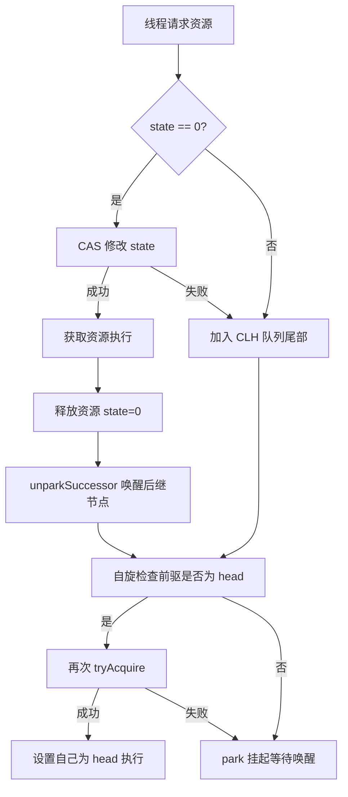
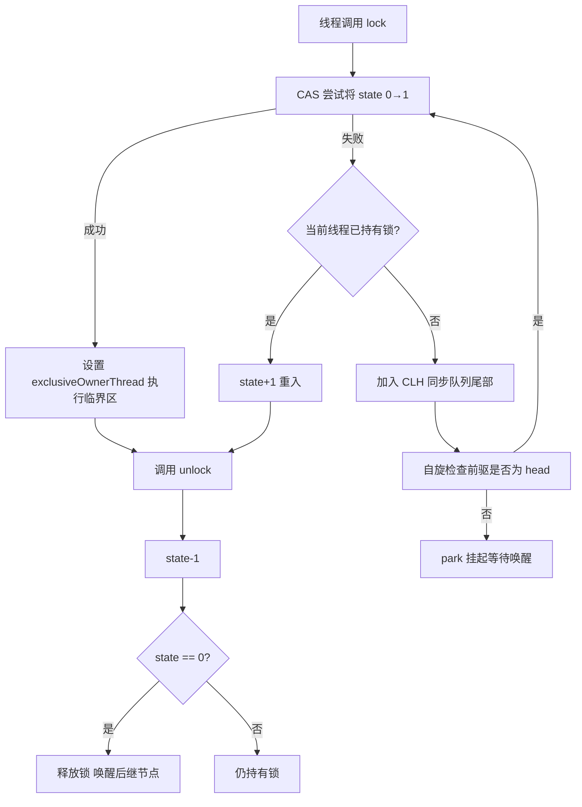
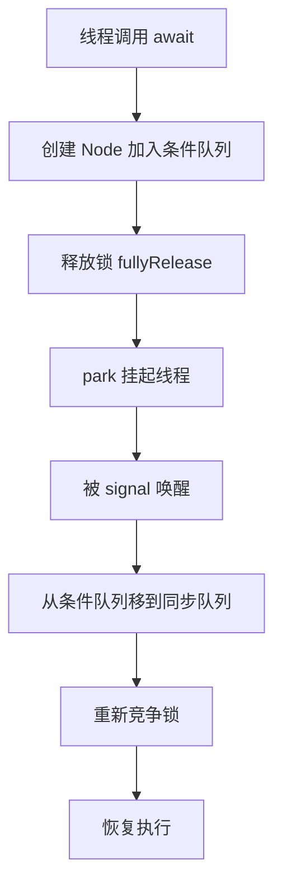
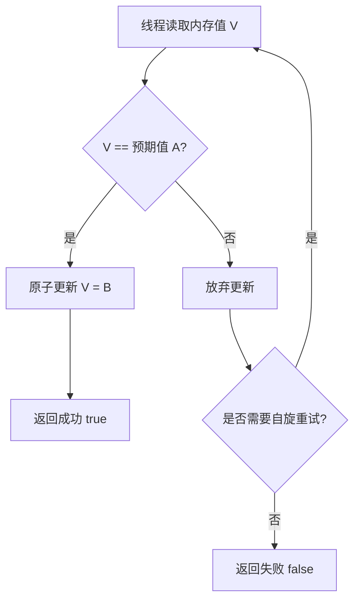
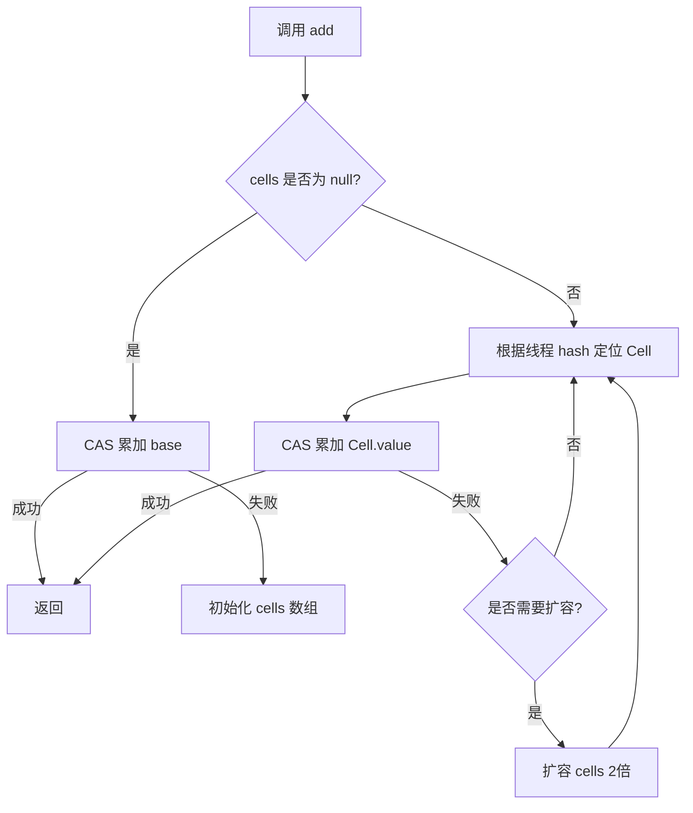

# Java 并发面试二

## Java 锁

### 【中等】Java 中，根据不同维度划分，锁有哪些分类？⭐⭐⭐

> 🎯 目标等级：L2-L3 ｜ ⏱ 建议用时：10 min ｜ 🏷 标签：锁 / 锁分类

#### 💎 关键结论

Java 锁按七大维度划分：公平性、获取方式、可重入性、共享性、阻塞方式、优化策略、实现方式。选型看三点：竞争强度、任务时长、读写比例，没有最好的锁，只有最适合场景的锁。

#### ⚡记忆卡片

- **口诀**：公获重共阻，优实七维度
- **关键词**：公平／非公平 ／ 悲观／乐观 ／ 偏向-轻量级-重量级
- **链路**：判断竞争程度 → 确定锁类型 → 平衡性能与公平

#### 📖 核心知识

1. **按公平性划分**：公平锁严格按请求顺序（FIFO）分配，无饥饿但吞吐低，如 `ReentrantLock(true)`；非公平锁允许插队，吞吐高但可能饥饿，如 `ReentrantLock(false)`、`synchronized`。
2. **按获取方式划分**：悲观锁认为冲突必然发生，先加锁再操作（`synchronized`、`ReentrantLock`）；乐观锁认为冲突较少，提交时用 CAS 或版本号检测（`AtomicInteger`、`StampedLock`）。
3. **按可重入性划分**：可重入锁同一线程可多次获取同一把锁，避免自锁死锁（`ReentrantLock`、`synchronized`）；不可重入锁重复获取会死锁（Java 无原生实现）。
4. **按共享性划分**：独占锁同一时刻仅一个线程持有（`synchronized`、`ReentrantLock`）；共享锁允许多线程同时读、写时独占（`ReentrantReadWriteLock`）。
5. **按阻塞方式与优化策略划分**：阻塞锁获取不到即挂起；自旋锁循环尝试（消耗 CPU）；`synchronized` 在 JDK 6+ 还经历了偏向锁 → 轻量级锁 → 重量级锁的升级优化。按实现方式则分为内置锁（`synchronized`）、显式锁（`ReentrantLock`）、分布式锁（`Redisson`、`Curator`）。

**总结表**

| **分类维度** | **锁类型**                                                                  |
| ------------ | --------------------------------------------------------------------------- |
| **公平性**   | 公平锁、非公平锁                                                            |
| **获取方式** | 悲观锁、乐观锁                                                              |
| **可重入性** | 可重入锁、不可重入锁                                                        |
| **共享性**   | 独占锁、共享锁                                                              |
| **阻塞方式** | 阻塞锁、自旋锁、适应性自旋锁                                                |
| **优化策略** | 偏向锁、轻量级锁、重量级锁                                                  |
| **实现方式** | 内置锁（`synchronized`）、显式锁（`ReentrantLock`）、分布式锁（`Redisson`） |

**选型依据**：并发竞争程度（高竞争→悲观锁，低竞争→乐观锁）、任务执行时间（长任务→公平锁，短任务→非公平锁）、读写比例（读多→共享锁，写多→独占锁）、是否跨 JVM（是→分布式锁）。

#### 🔬 扩展知识

::: details

- 【L3】`synchronized` 锁升级路径：无锁 → 偏向锁 → 轻量级锁（CAS 自旋）→ 重量级锁（OS 互斥），只能升级不能降级；注意版本演进——JDK 15 起（JEP 374）默认禁用偏向锁，JDK 18 彻底移除，谈偏向锁必须标注版本。
- 【L4】适应性自旋是 JVM 根据历史自旋成功率动态决定是否自旋的优化，与 AQS「先 CAS 抢锁、失败再 park」、LongAdder「先 base、竞争再 Cell」同属「先走廉价路径、昂贵路径兜底」的自适应设计思想。
:::

#### ⚠️ 常见误区

::: details

常见误区：

- ❌ "自旋锁一定比阻塞锁快" → 自旋只在临界区极短、竞争极低时划算，等待时间长时自旋纯烧 CPU，AQS 因此选择 park 阻塞。
- ❌ "共享锁（读锁）之间完全不互斥，可以随便用" → 读锁与写锁互斥，写多场景下读锁照样排队，反而增加开销。
:::

#### 🔀 发散问题

- **Q：为什么 JDK 15 废弃了偏向锁？** → 偏向锁的撤销依赖全局 safepoint，维护与撤销成本在现代多线程竞争应用中得不偿失，JEP 374 将其废弃。
- **Q：本地锁和分布式锁如何选？** → 本地锁只约束单 JVM 内线程；跨进程/跨机器互斥（如集群防重复下单）必须用 Redis（Redisson）或 ZooKeeper 实现的分布式锁。

### 【中等】悲观锁和乐观锁有什么区别？⭐⭐⭐⭐

> 🎯 目标等级：L2-L3 ｜ ⏱ 建议用时：10 min ｜ 🏷 标签：锁 / 悲观锁与乐观锁

#### 💎 关键结论

悲观锁假定会冲突，提前加锁阻塞他人；乐观锁假定少冲突，提交时检测版本，冲突则重试。写多读少选悲观，读多写少选乐观。

#### ⚡记忆卡片

- **口诀**：悲观先加锁，乐观后校验，冲突就重试
- **关键词**：先加锁 ／ CAS 版本号 ／ 自旋重试
- **链路**：判断读写比 → 选锁策略 → 冲突处理（阻塞 vs 重试）

#### 📖 核心知识

1. **悲观锁**：假定冲突必然发生，先加锁再访问数据，阻塞竞争线程。强一致但吞吐低，适合写多、强一致场景（银行转账、订单支付）。实现：`synchronized`、`ReentrantLock`、数据库 `SELECT FOR UPDATE`。
2. **乐观锁**：假定冲突较少，先操作，提交时通过版本号或 CAS 检测数据是否被修改，冲突则重试或放弃。适合读多写少、短平快操作（库存扣减、计数器、点赞系统）。
3. **核心差异**：悲观锁用锁排队避免冲突，会挂起线程；乐观锁无锁不阻塞，靠重试解决冲突，一致性语义从强一致变为最终一致。

**详细对比**

| **对比维度**   | **悲观锁**                                                         | **乐观锁**                                              |
| -------------- | ------------------------------------------------------------------ | ------------------------------------------------------- |
| **核心思想**   | 假定并发冲突必然发生，先加锁再访问数据                             | 假定并发冲突较少，先操作再检测冲突                      |
| **锁机制**     | 显式加锁（阻塞其他线程）                                           | 无锁机制（依赖 CAS 或版本号控制）                       |
| **实现方式**   | `synchronized`、`ReentrantLock`、数据库`SELECT FOR UPDATE`         | `Atomic`类（CAS）、版本号机制、数据库乐观锁（如 MVCC）  |
| **线程阻塞**   | 会阻塞竞争线程（线程挂起）                                         | 不阻塞线程，但可能自旋重试或失败                        |
| **数据一致性** | 强一致性（独占访问）                                               | 最终一致性（可能需重试）                                |
| **适用场景**   | - 写操作频繁<br>- 临界区代码执行时间长<br>- 强一致性要求高         | - 读多写少<br>- 短平快操作<br>- 高吞吐量需求            |
| **性能特点**   | - 高竞争时性能下降明显（线程切换开销）<br>- 低竞争时仍有固定锁开销 | - 低竞争时性能极佳（无阻塞）<br>- 高竞争时 CPU 自旋浪费 |
| **典型应用**   | - 银行转账<br>- 订单支付<br>- 数据库行级锁                         | - 库存扣减<br>- 计数器<br>- 点赞系统                    |
| **优缺点**     | ✔️ 强一致性<br>❌ 吞吐量低、死锁风险                               | ✔️ 高并发性能好<br>❌ 实现复杂、可能 ABA 问题           |

#### 🔬 扩展知识

::: details

- 【L3】数据库两种锁的落地：悲观锁即 `SELECT ... FOR UPDATE` 行级排他锁；乐观锁靠 version 字段实现——`UPDATE t SET v=v+1, version=version+1 WHERE id=? AND version=old`，影响行数为 0 即冲突重试。
- 【L4】乐观锁的隐形成本是重试风暴：竞争率升高后 CAS 失败率指数上升，CPU 空转比阻塞更贵；数据库 MVCC 本质是「版本链 + Read View」的多版本乐观读，读写互不阻塞，是乐观思想的工程化演进。
:::

#### ⚠️ 常见误区

::: details

常见误区：

- ❌ "乐观锁不加锁，一定比悲观锁快" → 高写竞争下乐观锁反复失败重试，CPU 空转，吞吐可能低于悲观锁。
- ❌ "乐观锁也能保证强一致" → 乐观锁不阻塞并发写，只做事后检测，冲突时靠重试收敛，属于最终一致。
:::

#### 🔀 发散问题

- **Q：乐观锁的 ABA 问题怎么解决？** → 加版本号/时间戳（`AtomicStampedReference`）或布尔标记（`AtomicMarkableReference`），详见本文档「CAS 算法存在哪些问题？」。
- **Q：秒杀扣库存用哪种锁？** → 热点行高并发写，常用数据库乐观锁（version/CAS 式 `stock>0` 条件更新）+ 重试，或直接 Redis 原子扣减，避免行锁排队。

### 【中等】公平锁和非公平锁有什么区别？⭐⭐⭐

> 🎯 目标等级：L2-L3 ｜ ⏱ 建议用时：10 min ｜ 🏷 标签：锁 / 公平锁与非公平锁

#### 💎 关键结论

公平锁按请求顺序 FIFO 分配，无饥饿但吞吐低；非公平锁允许新线程先 CAS 插队抢锁，吞吐高但可能饥饿。`ReentrantLock` 默认非公平，`synchronized` 只有非公平。

#### ⚡记忆卡片

- **口诀**：公平排队，非公平插队，默认非公平
- **关键词**：FIFO ／ CAS 插队 ／ 线程饥饿
- **链路**：新线程到达 → CAS 抢占（非公平）或查队列（公平）→ 拿锁或排队

#### 📖 核心知识

1. **公平锁**：严格按请求先后（FIFO）分配锁，`tryAcquire` 前先调用 `hasQueuedPredecessors()` 检查队列是否有等待者，有则排队。无饥饿，但上下文切换频繁、吞吐低。实现：`ReentrantLock(true)`。
2. **非公平锁**：新线程先直接 CAS 抢锁（插队），失败才进 AQS 队列排队。省去挂起/唤醒的切换开销，吞吐高，但等待久的线程可能饥饿。实现：`ReentrantLock(false)`（默认）、`synchronized`。
3. **如何选择**：需要严格顺序（如订单处理）、任务执行时间差异大、要避免低优先级饥饿 → 公平锁；追求高吞吐（如秒杀）、任务短且均匀 → 非公平锁。

**详细对比**

| **对比维度**     | **公平锁 (Fair Lock)**                               | **非公平锁 (Nonfair Lock)**                |
| ---------------- | ---------------------------------------------------- | ------------------------------------------ |
| **锁获取顺序**   | 严格按照线程请求顺序（FIFO）分配锁                   | 允许插队，新请求的线程可能直接抢到锁       |
| **性能表现**     | 吞吐量较低（上下文切换频繁）                         | 吞吐量较高（减少线程切换，但可能线程饥饿） |
| **响应时间**     | 等待时间稳定（适合长任务）                           | 短任务可能更快获取锁（适合高并发短任务）   |
| **适用场景**     | - 需要严格公平性<br>- 线程执行时间差异大（避免饥饿） | - 高并发短任务<br>- 追求吞吐量             |
| **锁实现类**     | `ReentrantLock(true)`                                | `ReentrantLock(false)`（默认）             |
| **实现**         | 依赖 AQS 维护等待线程，先到先得                      | 先尝试 CAS 抢锁，失败后进入 AQS 队列       |
| **线程饥饿**     | 不会发生                                             | 可能发生（高并发时某些线程长期无法获取锁） |

**注意事项**：`ReentrantLock` 与 `synchronized` 默认都是非公平锁（性能更好）；`synchronized` 不支持配置公平性，仅 `ReentrantLock` 可选。

#### 🔬 扩展知识

::: details

- 【L3】源码上公平/非公平只差一处：`FairSync.tryAcquire` 在 CAS 前调用 `hasQueuedPredecessors()`，队列有前序等待者就放弃抢锁去排队；`NonfairSync` 不检查直接 CAS，一个方法区分两种策略。
- 【L4】非公平锁高并发下吞吐量可提升约 10%~30%，本质是省掉「park 当前线程 → unpark 队首线程」的上下文切换，让刚释放锁或刚到达的线程趁 CPU 缓存热时直接接管锁，代价是等待延迟方差变大。
:::

#### ⚠️ 常见误区

::: details

常见误区：

- ❌ "非公平锁就是随机分配锁" → 非公平只体现在「新来线程插队抢一次」，抢失败后依然进 FIFO 队列排队，并非随机。
- ❌ "公平锁一定响应更快" → 公平锁保证顺序但不保证低延迟，持锁线程执行慢时所有等待者照样等。
:::

#### 🔀 发散问题

- **Q：为什么 synchronized 不支持公平锁？** → `synchronized` 由 JVM monitor 实现，monitor 的等待集合不暴露排队语义，唤醒后重新竞争，天然非公平。
- **Q：AQS 中公平锁如何判断"队列中有人"？** → `hasQueuedPredecessors()` 检查 head 之后是否存在有效等待节点（跳过 CANCELLED），见本文档「AQS 的实现原理是什么？」。

### 【困难】AQS 的实现原理是什么？⭐⭐⭐⭐⭐

> 🎯 目标等级：L3-L4 ｜ ⏱ 建议用时：15 min ｜ 🏷 标签：锁 / AQS

#### 💎 关键结论

AQS 用一个 volatile int state + CLH 变体双向队列，通过 CAS 自旋完成线程排队与唤醒，是 ReentrantLock、Semaphore、CountDownLatch 等并发组件的骨架引擎。

#### ⚡记忆卡片

- **口诀**：一状态一队列，CAS 排队，park 挂起 unpark 唤
- **关键词**：volatile state ／ CLH 双向队列 ／ CAS + park
- **链路**：tryAcquire 抢锁 → 失败 addWaiter 入队 → acquireQueued 自旋/park → release unparkSuccessor

#### 📖 核心知识

AQS（`AbstractQueuedSynchronizer`）是 `java.util.concurrent.locks` 包的核心框架，原理可归纳为 **2 种模式、3 大核心、4 步操作**。

1. **2 种模式**：独占模式（Exclusive）同一时刻只有一个线程获取资源，如 `ReentrantLock`；共享模式（Shared）多线程可同时获取，如 `Semaphore`、`CountDownLatch`。
2. **状态（State）**：一个 `volatile int state` 表示同步状态，语义由子类定义——`ReentrantLock` 中 0 表示无锁、>0 表示重入次数；`Semaphore`/`CountDownLatch` 中表示可用许可数或倒计数。
3. **同步队列（CLH 变体）**：双向链表存放等待线程，每个线程封装为 `Node`，含 `thread`、`prev`/`next`、`waitStatus` 字段；head 是 dummy 节点，代表最近一次成功获取锁的位置。`waitStatus` 常见取值：
   - `CANCELLED`（1）：线程已取消等待；`SIGNAL`（-1）：后继节点需要被唤醒；`CONDITION`（-2）：节点在条件队列中；`PROPAGATE`（-3）：共享模式状态向后传播。
4. **CAS 原子操作**：所有对 `state` 和队列头尾的修改都通过 `Unsafe.compareAndSwap` 原子完成，保证线程安全。
5. **4 步操作**：把获取锁到释放锁想象成「尝试加锁 → 排队等候 → 被唤醒 → 解锁」。



**独占模式流程**（如 `ReentrantLock`）：

1. **tryAcquire**：尝试直接获取锁（CAS 修改 state），成功则持有；失败进入下一步。
2. **addWaiter**：将当前线程包装成 `Node`，CAS 快速插入队列尾部。
3. **acquireQueued**：进入「自旋-检测-挂起」循环——只有自己是 head 的后继才再尝试 `tryAcquire`，否则将前驱置为 `SIGNAL` 后 `LockSupport.park` 挂起。
4. **release & unparkSuccessor**：`tryRelease` 修改 state，完全释放后 `unpark` 后继节点重新抢锁。

**共享模式流程**（如 `CountDownLatch`、`Semaphore`）：

- **获取**：`acquireShared(int)` → `tryAcquireShared(int)`（子类实现），返回 ≥0 表示获取成功，否则入队等待。
- **释放**：`releaseShared(int)` → `tryReleaseShared(int)`，成功后可能唤醒多个后续等待线程。

**关键方法（模板方法模式）**：

- **独占模式**：`tryAcquire(int)`/`tryRelease(int)` 由子类实现；`acquire(int)` 失败则入队阻塞；`release(int)` 成功则唤醒后继。
- **共享模式**：`tryAcquireShared(int)`/`tryReleaseShared(int)` 由子类实现；`acquireShared(int)`、`releaseShared(int)` 为模板方法。

#### 🔬 扩展知识

::: details

- 【L3】**head 是 dummy node（哨兵节点）**：head 不保存有效线程（`node.thread == null`），使 `acquireQueued` 的自旋条件统一为「前驱是 head 就再试一次 `tryAcquire`」，无需对队首特判：

  ```java
  final boolean acquireQueued(final Node node, int arg) {
      for (;;) {
          final Node p = node.predecessor();
          if (p == head && tryAcquire(arg)) { // 只有前驱是 head 才允许抢锁
              setHead(node);                  // 自己成为新的 dummy head
              p.next = null;                  // 帮助 GC
              return false;
          }
          if (shouldParkAfterFailedAcquire(p, node) &&
              parkAndCheckInterrupt()) {      // 否则 park 挂起
              ...
          }
      }
  }
  ```

  关键设计：只有 head 的后继才允许抢锁，把「全队 CAS 竞争」收敛为「至多一个线程在抢」，避免惊群。
- 【L3】**`hasQueuedPredecessors()` 是公平锁的核心**：`FairSync.tryAcquire` 在 CAS 前调用它检查队列是否有等待者；`NonfairSync` 不检查直接 CAS。
- 【L3】**`SIGNAL` 的责任转移**：线程 park 前把前驱 `waitStatus` 置为 `SIGNAL`（「我睡了，释放锁时记得叫醒我」）；`CANCELLED` 节点（如 `tryLock` 超时）在遍历中被跳过并清理。
- 【L3】**park/unpark 与 Linux futex**：`LockSupport.park()/unpark()` 底层经 HotSpot `Unsafe_Park` 落到 Linux `futex(FUTEX_WAIT/FUTEX_WAKE)`。每线程持有一个 `permit` 标志：`unpark(t)` 置 1（多次不累积），`park()` 为 1 则立即返回并清零、为 0 则阻塞——因此 unpark 可以先于 park 调用。
- 【L4】**CLH vs MCS：AQS 为什么选 CLH 变体？** 纯 CLH 在前驱节点上远程自旋（浪费 CPU）且是隐式单向链表（无法支持取消与条件队列）；MCS 本地自旋、天然适合阻塞。AQS = CLH 的 FIFO 队列结构 + MCS 的「前驱唤醒后继」阻塞思想 + 显式双向链表改造（`prev`/`next` 支撑节点取消与条件队列转移）。

> 📚 延伸阅读：[从 ReentrantLock 的实现看 AQS 的原理及应用](https://tech.meituan.com/2019/12/05/aqs-theory-and-apply.html)
:::

#### 🏭 实战场景

::: details

某电商大促网关限流：基于 AQS 共享模式自研令牌桶同步器，`state` 存令牌数，请求线程 `tryAcquireShared(1)` 原子扣减，令牌不足时入队 park，定时线程 `releaseShared(n)` 批量补充并唤醒队首。单机 16C32G 压测稳定处理 12 万 QPS，锁相关开销占请求耗时 < 1%，比「全局 synchronized 计数」方案吞吐提升约 4 倍。同一套机制用 `Condition` 实现延迟任务时间轮的精准唤醒，调度误差从百毫秒级降到毫秒级。
:::

#### ⚠️ 常见误区

::: details

常见误区：

- ❌ "AQS 队列中所有线程都在自旋抢锁" → 只有 head 的后继节点允许 `tryAcquire`，其余节点直接 park 挂起。
- ❌ "AQS 用的就是原始 CLH 队列" → 是 CLH 变体：显式双向链表 + park 阻塞替代自旋，并支持共享模式与条件队列。
- ❌ "park 后一定由前驱精确唤醒，不会丢" → `unparkSuccessor` 从 head.next 向后找第一个 waitStatus<0 的节点，找不到时从 tail 向前兜底扫描，以应对 next 指针的短暂不一致。
:::

#### 🔀 发散问题

- **Q：共享模式如何唤醒多个线程？** → `releaseShared` 成功后调用 `doReleaseShared`，unpark 队首后继；被唤醒线程获取成功后通过 `PROPAGATE` 状态继续向后传播唤醒。
- **Q：Condition 与 AQS 是什么关系？** → `ConditionObject` 是 AQS 内部类，维护独立条件队列，`await` 把节点从同步队列移到条件队列，详见本文档「Condition 的原理是什么？与 Object.wait/notify 有什么区别？」。
- **Q：AQS 与 synchronized 怎么选？** → 需要可中断、超时、公平、多条件时用基于 AQS 的 `ReentrantLock`，简单同步用 `synchronized`，详见本文档「synchronized 和 ReentrantLock 有什么区别？」。

### 【中等】synchronized 和 ReentrantLock 有什么区别？⭐⭐⭐⭐⭐

> 🎯 目标等级：L2-L3 ｜ ⏱ 建议用时：12 min ｜ 🏷 标签：锁 / synchronized vs ReentrantLock

#### 💎 关键结论

synchronized 是 JVM 关键字，自动加解锁，简单省心；ReentrantLock 是 JDK 显式锁，支持公平、可中断、超时、多条件变量，但必须手动释放。JDK 6 后两者性能接近，选型看功能而非速度。

#### ⚡记忆卡片

- **口诀**：syn 自动简单，Reentrant 公平中断超时多条件
- **关键词**：monitorenter／monitorexit ／ AQS ／ try-finally 释放
- **链路**：简单同步 → synchronized；精细控制 → ReentrantLock

#### 📖 核心知识

1. **层级不同**：`synchronized` 是 JVM 内置关键字（隐式锁），由 `monitorenter`/`monitorexit` 字节码实现，进入同步块自动加锁、退出自动释放；`ReentrantLock` 是 JDK API 提供的显式锁，基于 AQS 实现，需手动 `lock()`/`unlock()`，必须配合 `try-finally` 使用。
2. **功能差异**：`ReentrantLock` 支持公平锁配置、`lockInterruptibly()` 响应中断、`tryLock(timeout, unit)` 超时获取、多个 `Condition` 精确唤醒；synchronized 均不支持，`wait()`/`notify()` 只有单一等待队列。
3. **共性**：都是可重入的独占锁；synchronized 仅非公平，无内置死锁检测，ReentrantLock 可用 `tryLock` 规避死锁。
4. **性能**：JDK 6+ synchronized 经过锁升级优化（偏向锁→轻量级锁→重量级锁）后性能接近 ReentrantLock；高竞争场景 ReentrantLock 仍略有优势。
5. **适用场景**：synchronized 适合单例双重检查锁、简单计数器等基础同步；ReentrantLock 适合需要公平性的任务队列、超时控制、生产者-消费者等多条件协调场景。


**详细对比**

| **对比维度**       | **`synchronized`**                                                | **`ReentrantLock`**                                                 |
| ------------------ | ----------------------------------------------------------------- | ------------------------------------------------------------------- |
| **锁类型**         | JVM 内置关键字（隐式锁）                                          | JDK 提供的类（显式锁）                                              |
| **加锁解锁方式**   | 自动加锁/释放锁（进入同步代码块加锁，退出时释放）                 | 需手动调用 `lock()` 和 `unlock()`（必须配合 `try-finally` 使用）    |
| **是否可重入**     | 支持（同一线程可重复获取）                                        | 支持（同一线程可重复获取）                                          |
| **是否支持公平**   | 仅支持非公平锁                                                    | 可配置公平锁或非公平锁（构造函数传参 `true/false`）                 |
| **是否可中断**     | 不支持中断                                                        | 支持 `lockInterruptibly()`，可响应中断                              |
| **是否支持超时**   | 不支持超时                                                        | 支持 `tryLock(timeout, unit)`，可设置超时时间                       |
| **是否支持多条件** | 通过 `wait()`/`notify()` 实现，单一等待队列                       | 支持多个 `Condition`，可精确控制线程唤醒（如 `await()`/`signal()`） |
| **性能**           | JDK 6+ 优化后（偏向锁→轻量级锁→重量级锁）性能接近 `ReentrantLock` | 在高竞争场景下性能略优（减少上下文切换）                            |
| **死锁检测**       | 无内置死锁检测                                                    | 可通过 `tryLock` 避免死锁                                           |
| **适用场景**       | 简单同步场景（如单方法同步）                                      | 复杂同步需求（如公平锁、可中断锁、超时锁）                          |
| **底层实现**       | JVM 通过 `monitorenter`/`monitorexit` 字节码实现                  | 基于 `AbstractQueuedSynchronizer (AQS)` 实现                        |

**使用差异**

::: code-tabs#synchronized 和 ReentrantLock 使用差异

@tab synchronized 使用

```java
// 1. 用于代码块
synchronized (this) {}
// 2. 用于对象
synchronized (object) {}
// 3. 用于方法
public synchronized void test () {}
// 4. 可重入
for (int i = 0; i < 100; i++) {
	synchronized (this) {}
}
```

@tab ReentrantLock 使用

```java
public void test () throw Exception {
	// 1. 初始化选择公平锁、非公平锁
	ReentrantLock lock = new ReentrantLock(true);
	// 2. 可用于代码块
	lock.lock();
	try {
		try {
			// 3. 支持多种加锁方式，比较灵活；具有可重入特性
			if(lock.tryLock(100, TimeUnit.MILLISECONDS)){ }
		} finally {
			// 4. 手动释放锁
			lock.unlock()
		}
	} finally {
		lock.unlock();
	}
}
```

:::

#### 🔬 扩展知识

::: details

- 【L3】synchronized 的 monitor 机制：字节码层面用 monitorenter/monitorexit 指令（异常路径会有额外的 monitorexit 保证释放），对应 ObjectMonitor 维护 EntryList/WaitSet；锁升级路径为偏向锁→轻量级锁（CAS）→重量级锁（OS 互斥）。
- 【L3】ReentrantLock 的所有能力都是 AQS 的映射：公平性→`hasQueuedPredecessors()`，可中断→`acquireInterruptibly()`，超时→`tryLock(long, TimeUnit)` 内部支持中断的限时获取，多条件→多个 `ConditionObject` 各自维护条件队列。
- 【L4】JIT 对 synchronized 还有锁消除（逃逸分析证明无逃逸则去锁）与锁粗化（相邻同锁合并）优化；而 ReentrantLock 的能力边界（可尝试、可放弃）使其能做死锁预防：多资源按序 tryLock，失败则回退重试。
:::

#### ⚠️ 常见误区

::: details

常见误区：

- ❌ "ReentrantLock 比 synchronized 快得多，无脑选它" → JDK 6 后性能接近，无高级需求时 synchronized 更简洁且不会忘解锁。
- ❌ "ReentrantLock 异常时会自动释放锁" → 不会，异常路径若未在 finally 中 `unlock()`，锁永久被持有，后续线程全部阻塞。
:::

#### 🔀 发散问题

- **Q：如何实现"尝试拿锁，3 秒拿不到就降级"？** → `if (lock.tryLock(3, TimeUnit.SECONDS)) { try { ... } finally { lock.unlock(); } } else { 降级逻辑 }`，注意处理 `InterruptedException`。
- **Q：wait/notify 与 Condition 的 await/signal 怎么选？** → synchronized 体系只能用 wait/notify 且只能 notifyAll 粗粒度唤醒；需要按条件精确唤醒（如生产者只唤醒消费者）时用 ReentrantLock + 多 Condition，见本文档「Condition 的原理是什么？与 Object.wait/notify 有什么区别？」。

### 【困难】ReentrantLock 的实现原理是什么？⭐⭐⭐⭐

> 🎯 目标等级：L3-L4 ｜ ⏱ 建议用时：15 min ｜ 🏷 标签：锁 / ReentrantLock

#### 💎 关键结论

ReentrantLock 是 AQS 独占模式的经典实现：内部 Sync 继承 AQS，用 state 作重入计数，NonfairSync/FairSync 决定抢占策略，ConditionObject 提供条件队列，互斥、重入、等待通知全部建立在 AQS 之上。

#### ⚡记忆卡片

- **口诀**：CAS 置 state 为 1，重入加一，失败排队，减到零释放唤后继
- **关键词**：Sync ／ state 重入计数 ／ ConditionObject
- **链路**：lock() → CAS state 0→1 → 失败入 CLH 队列 park → unlock() state-1 到 0 → unpark 后继

#### 📖 核心知识

1. **核心依赖**：ReentrantLock 通过内部类 `Sync`（继承 AQS）实现锁机制，AQS 提供 state 原子操作与 CLH 变体队列的排队/阻塞/唤醒管理：

```java
ReentrantLock
    │
    ├── Sync (extends AQS)
    │    ├── state （锁计数器）
    │    ├── exclusiveOwnerThread （当前持有线程）
    │    └── CLH Queue （等待锁的线程队列）
    │
    ├── NonfairSync （默认，插队抢锁）
    ├── FairSync （先来后到）
    │
    └── ConditionObject
         └── Condition Queue （等待特定条件的线程队列）
```

2. **两种模式**：`NonfairSync`（默认）允许插队——新线程直接 CAS 抢锁，失败才排队，吞吐高但可能饥饿；`FairSync` 先到先得——先检查队列是否有等待者（`hasQueuedPredecessors()`），有则排队，无饥饿但上下文切换多。二者核心区别就在尝试获取锁前**是否检查同步队列中有等待者**。
3. **state 与可重入**：`state` 为 `volatile int`，0=空闲，N=同一线程重入 N 次；`exclusiveOwnerThread` 记录持有者。加锁时若当前线程已持有则 state+1（无需 CAS）；解锁 state-1，减到 0 才完全释放并唤醒后继。
4. **条件变量 ConditionObject**：每个 Condition 维护独立等待队列；`await()` 把线程从同步队列移到条件队列并释放锁；`signal()` 把条件队列头节点移回同步队列重新竞争锁。

**🔒 加锁四步曲**



1. **快速抢票**：新线程直接 CAS 将 state 0→1（非公平时插队）；
2. **抢到则坐**：成功则设置自己为独占线程，进入临界区；
3. **重入或排队**：已持有则 state+1；否则调用 `acquire(1)` 入同步队列队尾；
4. **队列中等**：进入「自旋-检查-挂起」循环，等待前驱唤醒。

**🔓 解锁两步曲**：① `tryRelease(1)` 将 state 减 1，减到 0 则清空独占线程标记；② state 为 0 时 `unparkSuccessor` 唤醒同步队列中下一个等待线程。

#### 🔬 扩展知识

::: details

- 【L3】非公平与公平的源码差异：`NonfairSync.lock()` 直接 `compareAndSetState(0, 1)`，成功即设 owner；失败才走 `acquire(1)`。`FairSync.tryAcquire` 在 CAS 前先判断 `!hasQueuedPredecessors()`，队列有等待者就放弃抢占。
- 【L3】`unlock()` 内部 `sync.release(1)`：只有 `tryRelease` 返回 true（state 归零）才调 `unparkSuccessor`，重入锁的中间层释放不会唤醒任何线程。
- 【L4】**跨语言对比：C++ std::mutex vs Java ReentrantLock**：

| 维度                | C++ `std::mutex`                                          | Java `ReentrantLock`                             |
| :------------------ | :-------------------------------------------------------- | :----------------------------------------------- |
| **可重入性**        | **不可重入**（同一线程重复 lock 是 UB，通常死锁）         | **可重入**（`state` 累加计数）                   |
| **公平性**          | 标准不规定（通常实现为非公平，无公平模式 API）            | 构造参数控制公平/非公平                          |
| **条件变量**        | 分离设计：`std::condition_variable` + `std::unique_lock`  | 内聚设计：`lock.newCondition()` 返回 `Condition` |
| **超时机制**        | `std::timed_mutex`（独立类型）；`std::unique_lock` 不参与 | `tryLock(long, TimeUnit)` 直接内置               |
| **RAII 封装**       | `std::lock_guard` / `std::unique_lock`（C++ 核心惯用法）  | 无标准 RAII wrapper（需手动 try-finally）        |
| **底层实现**        | Linux：`futex`（低竞争用户态 CAS，高竞争内核阻塞）        | 同样基于 futex（通过 `park`/`unpark`）           |
| **recursive_mutex** | 需显式使用 `std::recursive_mutex`（独立类型）             | 默认即可重入（同类型）                           |

  C++ 是「积木式组合」：mutex 只管互斥、condition_variable 只管等待-通知、unique_lock 管 RAII 生命周期，松耦合换灵活性；Java 是「一体化工具」：`newCondition()` 绑定锁实例避免用错 mutex，`await()` 原子完成「释放锁→入条件队列→park」，牺牲灵活性换开箱即用的正确性。C++ 把 `recursive_mutex` 独立成类型说明可重入被认为有代价（常暗示设计问题），Java 默认可重入则是实用主义。
:::

#### 🏭 实战场景

::: details

支付核心服务的幂等处理：24 台 8C16G 实例，每笔订单以 orderId 分段取 ReentrantLock（非公平）做幂等互斥，临界区仅查库+改状态（P99 < 8ms）。用 `tryLock(500, MILLISECONDS)` 替代 `lock()`：重复支付请求 500ms 拿不到锁直接返回「处理中」，彻底消除了此前因慢查询导致的锁堆积雪崩（改造前高峰期线程池阻塞数 > 200，改造后为 0）。对账任务队列则改用公平锁保证按提交顺序执行，避免大单长期饥饿。
:::

#### ⚠️ 常见误区

::: details

常见误区：

- ❌ "重入锁每次 lock 都要 CAS" → 重入时当前线程已持有锁，直接 state+1，无 CAS 竞争。
- ❌ "任意线程都可以 unlock" → 语法上允许调用，但非持有者 unlock 会抛 `IllegalMonitorStateException`。
- ❌ "unlock 一定会唤醒等待线程" → 重入锁 state 未减到 0 时不会唤醒，只有完全释放才 `unparkSuccessor`。
:::

#### 🔀 发散问题

- **Q：ReentrantLock 与 ReentrantReadWriteLock 的关系？** → 后者同样基于 AQS，但用 state 高 16 位计读锁、低 16 位计写锁，见本文档「ReentrantReadWriteLock 的实现原理是什么？」。
- **Q：lockInterruptibly 有什么实际用途？** → 死锁检测/规避：线程等待锁时可被中断退出，配合 tryLock 超时实现「等不到就回退」的弹性策略。

### 【困难】ReentrantReadWriteLock 的实现原理是什么？⭐⭐⭐

> 🎯 目标等级：L3-L4 ｜ ⏱ 建议用时：15 min ｜ 🏷 标签：锁 / 读写锁

#### 💎 关键结论

ReentrantReadWriteLock 为读多写少场景设计：读锁共享、写锁独占，底层共享同一个 AQS，把 32 位 state 拆成高 16 位读计数 + 低 16 位写重入计数，支持锁降级不支持锁升级。

#### ⚡记忆卡片

- **口诀**：高十六读、低十六写，读读共享、读写互斥，可降不可升
- **关键词**：state 按位拆分 ／ 共享读锁 ／ 锁降级
- **链路**：readLock 走共享模式 CAS 高 16 位 → writeLock 走独占模式 CAS 低 16 位

#### 📖 核心知识

1. **基本特性**：允许多线程同时持有读锁，写锁同一时刻仅一个线程；有读锁时不能拿写锁，有写锁时不能拿读锁。读写锁都可重入，默认非公平，支持锁降级（持写锁可再拿读锁，反之不允许）。
2. **核心设计：一个 state 拆两半**。虽然提供 `readLock`/`writeLock` 两个锁对象，但底层共享同一个 AQS，`state = (读计数 << 16) | 写重入数`：

| 视角           | 读锁 (`ReadLock`)      | 写锁 (`WriteLock`)         |
| :------------- | :--------------------- | :------------------------- |
| **行为**       | 共享锁                 | 独占锁                     |
| **占用 state** | 高 16 位               | 低 16 位                   |
| **互斥规则**   | 与**写锁**互斥         | 与**所有锁**（读、写）互斥 |
| **重入计数**   | 所有读线程的总重入次数 | 单个写线程的重入次数       |
| **条件变量**   | **不支持** `Condition` | **支持** `Condition`       |

3. **写锁（独占模式）**：申请写锁时若 `state != 0`（存在读锁或他人写锁）且自己未持有，则入队挂起；无锁时 CAS 将低 16 位置 1；已持有则低 16 位 +1 重入。`tryAcquire` 中 `c != 0 && w == 0` 即“有读锁或他人持写锁”则返回 false。
4. **读锁（共享模式）**：申请读锁时若写锁被占用（`(state & 0xFFFF) != 0`）则排队；否则 CAS 将高 16 位 +1；`tryAcquireShared` 返回 ≥0 表示获取成功。
5. **锁降级**：持写锁 → 申请读锁（必成功，高 16 位+1）→ 释放写锁 → 降级为共享读。降级能在不释放读可见性的前提下防止其他写线程插入：

```java
// 锁降级示例代码
writeLock.lock();         // 获取写锁
try {
    // 修改数据...
    readLock.lock();      // 在保持写锁的情况下获取读锁（锁降级关键步骤）
} finally {
    writeLock.unlock();  // 释放写锁，降级为读锁
}
// 此时仍持有读锁，其他线程可以获取读锁但不能获取写锁
```

#### 🔬 扩展知识

::: details

- 【L3】读锁重入计数的存储：总读次数在高 16 位，每线程自己的重入次数存在 `HoldCounter`（线程局部）中；`firstReader` 记录第一个获取读锁的线程及其计数，`cachedHoldCounter` 缓存最后一个获取读锁线程的计数器，两者都是为了减少 ThreadLocal 查找开销。
- 【L3】公平模式下读/写锁获取都会先检查 `hasQueuedPredecessors()`，防止写线程长期饥饿；非公平模式下写锁饥饿仍可能发生。
- 【L4】读写锁的局限：读锁持有期间写锁必须等待，读线程很多时写线程延迟大（写饥饿）；JDK 8 的 `StampedLock` 用乐观读解决此问题，见本文档「StampedLock 的实现原理是什么？」。
:::

#### 🏭 实战场景

::: details

配置中心客户端本地缓存：集群 200 台实例，每实例 32 个工作线程读配置（读 QPS 合计 ~5 万/s），配置变更写 QPS < 1/s，典型读多写少。用 `ReentrantReadWriteLock` 保护内存字典后，读线程互不阻塞，配置拉取 P99 从 synchronized 方案的 3.1ms 降至 0.4ms；变更时写锁内重建字典并锁降级后再对外可见，避免读到半更新状态。后因读端仍有锁开销迁移到 `CopyOnWriteArrayList`/`volatile` 引用替换方案。
:::

#### ⚠️ 常见误区

::: details

常见误区：

- ❌ "读锁可以升级为写锁" → 不支持！持读锁申请写锁会永久阻塞（读写互斥），只能先释放读锁或一开始就持写锁再降级。
- ❌ "读锁之间完全不互斥，没有任何开销" → 读锁获取仍需 CAS 竞争同一个 state，高并发读下 CAS 失败重试也有开销，极端读热点可考虑 StampedLock 乐观读。
:::

#### 🔀 发散问题

- **Q：为什么读写锁不支持锁升级？** → 读锁共享、多线程同时持有，若允许升级写锁，两个读线程同时升级会互相等待形成死锁，因此只支持单向降级。
- **Q：读写锁与 CopyOnWriteArrayList 怎么选？** → 读极多写极少且读容忍短暂旧值时用 COW（读完全无锁）；需要实时一致读、写频率稍高时用读写锁。

### 【困难】StampedLock 的实现原理是什么？⭐⭐

> 🎯 目标等级：L3-L4 ｜ ⏱ 建议用时：12 min ｜ 🏷 标签：锁 / StampedLock

#### 💎 关键结论

StampedLock（JDK 8+）用一个 64 位 long 同时编码版本号、读计数和写标记，核心杀手锏是乐观读：读不加锁只取戳记，读后 validate 校验，失败再降级悲观读，适合读远多于写且追求极致吞吐的场景。

#### ⚡记忆卡片

- **口诀**：乐观读取戳，读后 validate，失败转悲观读
- **关键词**：long 状态 ／ stamp 戳记 ／ 锁升级
- **链路**：tryOptimisticRead 取戳 → 读数据到局部变量 → validate 校验 → 失效转 readLock 重读

#### 📖 核心知识

1. **状态布局**：状态存储在一个 `long`（64 位）中：低 7 位为读线程计数，第 8 位为写锁独占标记，其余高位为版本号。加锁返回戳记（stamp），解锁需传回戳记。
2. **三种模式**：写锁（独占，获取/释放都会使版本号变化）；悲观读锁（共享，与其他读共享、与写互斥）；乐观读（不加锁，仅记录当前状态值作戳记）。
3. **乐观读流程**：① `tryOptimisticRead()` 取戳，完全不阻塞；② 读共享数据到局部变量；③ `validate(stamp)` 校验自取戳后是否有写锁被获取过：有效则数据可用，失效则升级为悲观读锁重新读。写不频繁时乐观读完全无锁，性能极高。
4. **锁升级**：`tryConvertToWriteLock(stamp)` 可把读锁原子升级为写锁（读计数-1、写标记置 1），成功返回新写戳、失败返回 0；若还有其他读锁持有者，升级必然失败（读写互斥），需注意死锁风险。乐观读戳记不代表持锁，直接升级失败是常态。

::: details 使用示例

```java
StampedLock lock = new StampedLock();

// 乐观读示例
long stamp = lock.tryOptimisticRead();
// 读取共享数据...
if (!lock.validate(stamp)) {
    // 版本失效，转悲观读
    stamp = lock.readLock();
    try {
        // 重新读取数据...
    } finally {
        lock.unlockRead(stamp);
    }
}

// 写锁示例
stamp = lock.writeLock();
try {
    // 修改数据...
} finally {
    lock.unlockWrite(stamp);
}
```
:::

#### 🔬 扩展知识

::: details

- 【L3】为什么乐观读不加锁也安全？读的是局部变量副本，真正的安全保证在 `validate`：写锁获取会使版本号变化，只要期间无写，读到的副本就是一致的；有写则重读，属于「先做后验」的乐观控制。
- 【L4】与 `ReentrantReadWriteLock` 对比：

| 特性         | `StampedLock`        | `ReentrantReadWriteLock` |
| ------------ | -------------------- | ------------------------ |
| **读并发度** | 最高（乐观读无阻塞） | 高（悲观读阻塞写）       |
| **写饥饿**   | 可能发生             | 非公平模式下可能发生     |
| **锁重入**   | 不支持               | 支持                     |
| **公平性**   | 仅非公平             | 支持公平/非公平          |
| **条件变量** | 不支持               | 支持                     |

  代价：不可重入、不支持 Condition、API 更易错（忘传 stamp、误用升级），选型需权衡。
:::

#### ⚠️ 常见误区

::: details

常见误区：

- ❌ "StampedLock 可以替代所有读写锁" → 它不可重入、无条件变量、仅非公平，误在递归/嵌套场景使用会直接死锁。
- ❌ "乐观读 validate 通过就一定没问题" → 读数据时必须拷贝到局部变量再 validate，直接读共享字段可能拿到被写线程改了一半的中间状态（long/double 非 volatile 非原子）。
:::

#### 🔀 发散问题

- **Q：StampedLock 的写饥饿如何缓解？** → 乐观读不阻塞写已大幅缓解；仍可用 `tryWriteLock(timeout)` + 退避重试避免长期拿不到写锁。
- **Q：与 ReadWriteLock 的降级相比，StampedLock 能降级吗？** → 可以，`tryConvertToReadLock(writeStamp)` 支持写转读；但读转写需无其他读者，失败返回 0。

### 【中等】Condition 的原理是什么？与 Object.wait/notify 有什么区别？⭐⭐⭐

> 🎯 目标等级：L2-L3 ｜ ⏱ 建议用时：10 min ｜ 🏷 标签：锁 / Condition

#### 💎 关键结论

Condition 是 AQS 提供的条件变量，每个 Condition 拥有独立等待队列，一个 Lock 可建多个 Condition 实现精确唤醒；相比 wait/notify 更灵活，但 await 后必须重新竞争锁。

#### ⚡记忆卡片

- **口诀**：await 入条件队并放锁，signal 移同步队再抢锁
- **关键词**：ConditionObject ／ 条件队列 ／ 精确唤醒
- **链路**：await → 入条件队列 + fullyRelease → park → signal 移入同步队列 → 重新竞争锁

#### 📖 核心知识

1. **核心结构**：`ConditionObject` 是 AQS 的内部类，维护独立的单向链表等待队列：

```java
public class ConditionObject implements Condition {
    private transient Node firstWaiter;  // 等待队列首节点
    private transient Node lastWaiter;   // 等待队列尾节点
}
```

2. **await/signal 机制**：



   - **`await()`**：当前线程包装为 Node 加入条件队列，**完全释放锁**，park 挂起；被唤醒后转移到同步队列重新竞争锁。
   - **`signal()`**：将条件队列首节点转移到同步队列并唤醒（只是转移，线程需重新竞争锁）。
3. **与 Object.wait/notify 的区别**：

| 特性             | `Condition`                         | `Object.wait/notify`       |
| ---------------- | ----------------------------------- | -------------------------- |
| **依赖**         | `Lock`（如 ReentrantLock）          | `synchronized`             |
| **等待队列数量** | 可创建多个，支持精确唤醒            | 仅一个，notifyAll 唤醒所有 |
| **中断响应**     | `awaitUninterruptibly()` 不响应中断 | `wait()` 必响应中断        |
| **超时**         | `awaitUntil(date)` 支持截止时间     | `wait(timeout)` 支持超时   |

4. **典型应用：生产者-消费者精确唤醒**：

```java
ReentrantLock lock = new ReentrantLock();
Condition notFull = lock.newCondition();   // 队列未满条件
Condition notEmpty = lock.newCondition();  // 队列非空条件

// 生产者：队列满时等待 notFull，生产后唤醒 notEmpty
// 消费者：队列空时等待 notEmpty，消费后唤醒 notFull
```

#### 🔬 扩展知识

::: details

- 【L3】`await()` 用 `fullyRelease` 释放锁：无论重入多少次一次性全部释放，避免重入层级残留；若释放失败会抛 `IllegalMonitorStateException` 并把节点置为 CANCELLED。
- 【L3】`signal()` 只能在持锁状态下调用（否则抛异常）；转移到同步队列后节点 waitStatus 从 CONDITION 逐步归零，被唤醒线程在 `acquireQueued` 中重新抢锁。
- 【L4】`ArrayBlockingQueue` 正是双 Condition（notEmpty/notFull）的典范：生产只唤醒消费者、消费只唤醒生产者，避免了 notifyAll 的无关唤醒风暴。
:::

#### ⚠️ 常见误区

::: details

常见误区：

- ❌ "signal 后线程立即继续执行" → signal 只是把节点移回同步队列，线程还要重新竞争锁，拿不到锁照样等。
- ❌ "await 可以像 wait 一样不持锁调用" → await/signal 都必须在持有对应 Lock 时调用，否则抛 `IllegalMonitorStateException`。
:::

#### 🔀 发散问题

- **Q：为什么 await 要用 fullyRelease 而不是 release 一次？** → 锁可能被重入多次，必须一次性释放全部重入层级，否则其他线程永远拿不到锁。
- **Q：notify 与 notifyAll 怎么选？** → 无法确定哪个等待者满足条件时用 notifyAll（配合循环条件检查防虚假唤醒）；能精确区分等待者类型时用多 Condition + signal。

### 【困难】AQS 的 CLH 队列与原始 CLH 队列有什么区别？⭐⭐

> 🎯 目标等级：L3-L4 ｜ ⏱ 建议用时：10 min ｜ 🏷 标签：锁 / AQS 队列

#### 💎 关键结论

AQS 用的是 CLH 队列的变体：把隐式单向链表改成显式双向链表，把自旋等待改成 park 阻塞，从而支持节点取消、共享模式与条件队列，继承了 FIFO 公平性但实现已大不同。

#### ⚡记忆卡片

- **口诀**：原始自旋看前驱，AQS 挂起靠唤醒，双向链表支取消
- **关键词**：隐式单向 vs 显式双向 ／ 自旋 vs park ／ 独占 vs 独占+共享
- **链路**：CAS 入队尾 → 前驱是 head 才试抢 → park 挂起 → 前驱释放时 unpark

#### 📖 核心知识

1. **原始 CLH 队列**：基于隐式链表，每个节点只持有前驱引用；线程在**前驱节点的状态**上自旋（spin on predecessor）；仅支持独占模式。
2. **AQS 的 CLH 变体**：

| 特性         | 原始 CLH           | AQS CLH 变体                      |
| ------------ | ------------------ | --------------------------------- |
| **队列结构** | 隐式链表（仅前驱） | 显式双向链表（prev + next）       |
| **等待方式** | 自旋               | park 阻塞（避免 CPU 浪费）        |
| **模式**     | 仅独占             | 独占 + 共享                       |
| **状态判断** | 前驱节点的状态     | 前驱节点的 waitStatus             |
| **取消处理** | 无                 | 支持 CANCELLED 状态，节点可被清理 |
| **条件队列** | 无                 | ConditionObject 独立的条件队列    |

3. **为什么选阻塞而非自旋**：等待时间长时自旋纯浪费 CPU；AQS 用 `LockSupport.park()` 挂起、`unpark()` 唤醒，交由 OS 调度；仅在「检查前驱是否为 head」等短路径上短暂自旋，避免不必要的 park/unpark 开销。
4. **为什么是双向链表**：取消节点需找前驱断开链接（单向链表要 O(n) 遍历）；条件队列转移与共享模式唤醒传播都依赖 next 指针。
5. **入队与出队关键逻辑**：

```java
// 入队：CAS 设置 tail
Node node = new Node(thread);
node.prev = pred;
if (compareAndSetTail(pred, node)) {
    pred.next = node;
    return node;
}

// 出队：head 指向新节点，旧 head 被 GC
setHead(node);
node.prev = null;
```

#### 🔬 扩展知识

::: details

- 【L3】入队顺序细节：先 `node.prev = pred` 再 CAS tail，最后才 `pred.next = node`，因此从 tail 沿 prev 向前遍历总是完整可达，而从 head 向后遍历 next 可能短暂断裂——这是 `unparkSuccessor` 失败时从 tail 向前兜底扫描的根本原因。
- 【L3】`setHead` 后旧 head 的 thread 与 prev 被置 null 帮助 GC，head 始终是 dummy 哨兵节点。
- 【L4】原始 CLH 适合 NUMA 架构下的短临界区自旋锁（只读前驱变量，缓存迁移少）；AQS 面向的是锁持有时间不可控的通用场景，阻塞是必然选择。设计差异本质是「自旋锁 vs 阻塞锁」的适用域差异。
:::

#### ⚠️ 常见误区

::: details

常见误区：

- ❌ "AQS 队列就是教科书上的 CLH 自旋锁" → AQS 不自旋等待，park 阻塞 + 双向链表 + 共享模式都是对原始 CLH 的改造。
- ❌ "队列节点的 next 指针随时可靠" → next 是入队后补写的，短暂为 null 属正常，不能依赖它做存在性判断。
:::

#### 🔀 发散问题

- **Q：CANCELLED 节点如何被清理？** → 后继在 `shouldParkAfterFailedAcquire` 中向前跳过 CANCELLED 前驱并重建 prev 链；入队 CAS 失败路径也会顺手清理尾部取消节点。
- **Q：为什么不只用 prev 单链？** → 唤醒后继、共享传播、条件队列 signal 转移都需要从某节点向后找，prev 单链做不到。

## Java 无锁

### 【中等】什么是 CAS？CAS 的实现原理是什么？⭐⭐⭐⭐⭐

> 🎯 目标等级：L2-L3 ｜ ⏱ 建议用时：12 min ｜ 🏷 标签：无锁 / CAS

#### 💎 关键结论

CAS 是「先比较再交换」的无锁原子操作：内存值等于预期才更新，否则失败重试。Java 层用 Unsafe 的 native 方法，CPU 层靠 x86 的 lock cmpxchg 指令保证多核原子性，是 Atomic 类与 AQS 的地基。

#### ⚡记忆卡片

- **口诀**：比较相等才交换，不等失败就重试
- **关键词**：Unsafe ／ cmpxchg ／ lock 前缀
- **链路**：Java Unsafe.compareAndSwapInt → native → lock cmpxchg → 锁缓存行保证原子

#### 📖 核心知识

1. **定义**：CAS（Compare-And-Swap）是原子性的「比较并更新」：内存值 V 等于预期 A 则写入新值 B，否则不操作，返回是否成功：

```java
boolean CAS(Variable var, int expected, int newValue) {
    if (var.value == expected) {  // 比较当前值是否等于预期值
        var.value = newValue;     // 如果相等，更新为新值
        return true;
    }
    return false;  // 否则失败
}
```



2. **特性**：无锁（省去阻塞/唤醒开销）；原子性由 CPU 指令级保证；存在 ABA 问题（值从 A 变 B 再变回 A 会被误判未修改，用版本号解决，如 `AtomicStampedReference`）。
3. **实现原理**：Java 层通过 `Unsafe` 类调用 native 方法（如 `compareAndSwapInt()`），更底层依赖 CPU 原子指令（x86 的 `cmpxchg`）：

```java
public final native boolean compareAndSwapInt(Object o, long offset, int expected, int newValue);
```

   HotSpot 生成的机器码是 `lock cmpxchg`：`cmpxchg` 只保证单次比较交换语义，**`lock` 前缀锁缓存行**保证多核下的原子性；同时把当前核缓存行写回主存并使其他核失效（可见性），并充当全量内存屏障禁止重排（有序性）。因此 CAS 变量不需再叠加 `volatile` 做读写同步——但 Atomic 类的 `value` 字段本身仍是 `volatile`，保证普通 `get()` 的可见性。
4. **典型应用**：

```java
AtomicInteger atomicInt = new AtomicInteger(0);
atomicInt.incrementAndGet();  // CAS 实现原子自增
```

   底层即 `unsafe.getAndAddInt(this, valueOffset, 1) + 1` 的自旋 CAS。其他应用：自旋锁（`while (!CAS(lock, 0, 1))`）、无锁数据结构（JDK 8 `ConcurrentHashMap` 用 CAS + `synchronized` 替代分段锁、`CopyOnWriteArrayList` 用 CAS 保证写入原子性）。

#### 🔬 扩展知识

::: details

- 【L3】`getAndAddInt` 的实现是 `do { v = getIntVolatile; } while (!compareAndSwapInt(...))` 的自旋循环，失败重试直到成功，高竞争下自旋开销就是 LongAdder 要解决的问题（见本文档「LongAdder 的原理是什么？为什么高并发下比 AtomicLong 快？」）。
- 【L4】**x86 CMPXCHG + LOCK 前缀的微架构行为**：CMPXCHG 语义为比较 EAX 与内存操作数，相等则写入源操作数并置 ZF，否则把内存值载入 EAX：

  ```asm
  ; CMPXCHG [mem], r 伪代码
  TEMP = [mem]
  IF EAX == TEMP: ZF = 1; [mem] = r
  ELSE:           ZF = 0; EAX = TEMP
  ```

  CMPXCHG 本身不是原子的，多核下靠 LOCK 前缀保证：①现代 CPU（P6 后）通过 MESI 协议**锁缓存行**（断言 #LOCK 信号，期间其他核该行处于 Invalid）；②操作数跨缓存行等非对齐情况回退**锁总线**，代价极高（~100 cycles+ vs ~20-40 cycles）；③LOCK 隐式充当全量内存屏障，禁止 StoreLoad 重排——这是 CAS 提供 volatile 级可见性的硬件根源。执行时先发 RFO（Read-For-Ownership）拿到缓存行独占权（E→M），完成后其他核访问该地址 Cache Miss 重新拉取。
- 【L4】**x86 vs ARM 的 CAS 实现差异**：

| 维度           | x86（CMPXCHG）                               | ARM（LDREX/STREX）                                                           |
| :------------- | :------------------------------------------- | :--------------------------------------------------------------------------- |
| **指令模式**   | 单指令（CMPXCHG 一条完成比较+交换）          | 双指令：`LDREX`（加载+标记）→ `STREX`（条件存储）                            |
| **原子性保证** | `LOCK` 前缀锁总线/缓存行                     | **Exclusive Monitor**（硬件监视器）检测 LDREX→STREX 之间是否有其他写入       |
| **ABA 敏感性** | 值与预期相同即成功（ABA 不感知）             | `STREX` 失败即表示有他人写入（中间状态变化感知）                             |
| **限制**       | 操作数必须对齐，跨缓存行退化为总线锁         | `LDREX/STREX` 之间不能有复杂操作（通常几十条指令内），否则硬件监视器可能超时 |
| **Java 适配**  | `Unsafe::compareAndSwapInt` → `lock cmpxchg` | `Unsafe::compareAndSwapInt` → `ldrex/strex` 循环（LL/SC 循环）               |

  ARM 无单指令 CAS，HotSpot 用 LL/SC 循环模拟：`LDREX` 加载并标记地址 → 比较 → `STREX` 条件存储，返回 0 成功、非 0 表示 Exclusive Monitor 检测到地址被修改（其他核写入、中断、上下文切换都可能清除 Monitor），需重试整个序列。
:::

#### ⚠️ 常见误区

::: details

常见误区：

- ❌ "LOCK 前缀就是锁总线" → 现代 CPU 默认锁缓存行（Cache Lock），只有非对齐等特殊情况才回退锁总线。
- ❌ "用了 CAS 就绝对安全" → CAS 只保证单变量原子，复合操作（如同时改 i 和 j）仍非原子，且有 ABA 与自旋开销问题。
:::

#### 🔀 发散问题

- **Q：CAS 与 volatile 是什么关系？** → volatile 只保证可见性/有序性，不保证原子性；CAS 补上原子性。Atomic 类正是 volatile + CAS 的组合。
- **Q：高竞争下 CAS 为什么慢？** → `lock cmpxchg` 引发缓存行乒乓（cache line bouncing），多核反复争抢同一缓存行的独占权，LongAdder 用分段 Cell 分散竞争。

### 【中等】CAS 算法存在哪些问题？⭐⭐⭐⭐

> 🎯 目标等级：L2-L3 ｜ ⏱ 建议用时：10 min ｜ 🏷 标签：无锁 / CAS 缺陷

#### 💎 关键结论

CAS 有三大经典问题：ABA 问题（用版本号解决）、自旋开销（高竞争烧 CPU）、只能保证单变量原子（复合操作需锁）。另有公平性、复杂操作、平台依赖等局限，高竞争时应改用锁或分段累加。

#### ⚡记忆卡片

- **口诀**：ABA 加版本，自旋限次数，多变量上锁
- **关键词**：ABA ／ 自旋开销 ／ 单变量限制
- **链路**：识别问题类型 → 选对应方案（版本号／分段／锁）

#### 📖 核心知识

1. **ABA 问题**：变量值从 A→B→A，CAS 检查时认为没变化，实际已被修改过，可能导致数据不一致（如链表节点被替换）。解决：加版本号/时间戳（`AtomicStampedReference`）或 boolean 标记（`AtomicMarkableReference`）。

   

2. **自旋产生的 CPU 空转**：CAS 长时间失败时线程持续自旋，高竞争下 CPU 使用率飙升。解决：限制自旋次数、`yield()`/`sleep()` 退让，或改用分段 CAS（`LongAdder`）。
3. **只能保证单个变量的原子性**：无法原子完成多变量复合操作（如 `i++` 和 `j--` 同时）。解决：用锁（`synchronized`/`ReentrantLock`）或设计不可变对象（如 `String`、`BigInteger`）。
4. **公平性与复杂操作局限**：CAS 非公平，新线程可能比等待中的线程先成功，可能饥饿；CAS 适合简单操作（如 `count++`），不适合数据库事务等复杂逻辑，强行拆分会引入中间状态不一致。
5. **平台依赖**：CAS 依赖底层 CPU 指令（如 `CMPXCHG`），不同架构性能差异大，弱内存模型平台需格外小心；应使用 JVM 内置原子类而非手动实现。

**总结**

| 问题           | 影响           | 解决方案                 |
| -------------- | -------------- | ------------------------ |
| **ABA 问题**   | 数据不一致     | `AtomicStampedReference` |
| **自旋开销**   | CPU 占用高     | 限制自旋次数 / 退让策略  |
| **单变量限制** | 复合操作不安全 | 锁 / 不可变对象          |
| **公平性**     | 线程饥饿       | 公平锁 / 队列调度        |
| **复杂操作**   | 难以实现       | 锁 / 事务内存            |
| **平台依赖**   | 跨平台兼容性差 | 使用标准库               |

#### 🔬 扩展知识

::: details

- 【L3】ABA 分两层：**值 ABA**（基本类型 A→B→A，用 `AtomicStampedReference` 的版本号解决）和**指针 ABA**（节点被释放后地址复用，CAS 成功但逻辑已错），后者需要延迟回收机制。
- 【L3】自旋开销的定量直觉：竞争线程数超过 CPU 核数后，CAS 失败率急剧上升，缓存行乒乓使单次 CAS 耗时从 ~20 cycles 涨到数百 cycles；`LongAdder` 用 base+Cell 分段把竞争分散到不同缓存行。
- 【L4】**跨语言视角：C++ lock-free 结构的指针 ABA**：lock-free 栈的 `pop` 中，线程 A 读到 head 后挂起，线程 B 弹出并 delete 了该节点，新 push 的节点恰好分配到同一地址，A 恢复后 CAS(head, 旧地址, 旧next) 竟然成功——节点丢失 + 内存泄漏。C++ 解法是 hazard pointer 或 epoch-based reclamation（延迟释放直到无人持有指针）：

| 维度                | Java `AtomicStampedReference`              | C++ 延迟回收/引用计数                                          |
| :------------------ | :----------------------------------------- | :------------------------------------------------------------- |
| **解决 ABA 的方式** | 版本号/时间戳（显式 stamp，每次 CAS 校验） | 引用计数（内存不被释放就不会被复用）                           |
| **额外开销**        | stamp 需要额外存储 + CAS 双字操作          | 引用计数原子操作（inc/dec）                                    |
| **局限性**          | 只防值层面的 ABA，不防指针复用             | 开销大，不适用于高频 CAS 路径                                  |
:::

#### ⚠️ 常见误区

::: details

常见误区：

- ❌ "ABA 只影响计数器这类小数值场景" → 无锁链表/栈等引用结构中 ABA 会造成节点丢失等严重错误，危害远大于计数器。
- ❌ "CAS 失败率低，不用管自旋" → 竞争率与失败率是非线性关系，线程数超核数后失败率飙升，需要退让或分段。
:::

#### 🔀 发散问题

- **Q：AtomicStampedReference 的 stamp 怎么设计？** → 每次修改递增版本号（或存时间戳），CAS 时同时校验值与版本，两者都相等才更新。
- **Q：高竞争计数为什么不直接用锁而用 LongAdder？** → 锁会阻塞线程引入切换开销，LongAdder 分段累加既无锁又分散竞争，见本文档「LongAdder 的原理是什么？为什么高并发下比 AtomicLong 快？」。

### 【困难】LongAdder 的原理是什么？为什么高并发下比 AtomicLong 快？⭐⭐⭐

> 🎯 目标等级：L3-L4 ｜ ⏱ 建议用时：12 min ｜ 🏷 标签：无锁 / LongAdder

#### 💎 关键结论

LongAdder 用「分段累加 + 合并求和」思想：无竞争时 CAS 累加 base，有竞争时把线程分散到 Cell 数组各自累加，sum 时再汇总，用空间换时间，把单点 CAS 竞争拆成多点并行。

#### ⚡记忆卡片

- **口诀**：无争累 base，有争散 Cell，求和再汇总
- **关键词**：base ／ Cell 数组 ／ @Contended 防伪共享
- **链路**：add → CAS base → 失败定位 Cell CAS → 再失败扩容 cells → sum 汇总

#### 📖 核心知识

1. **AtomicLong 的瓶颈**：基于单变量 CAS 自旋，高并发下大量线程竞争同一 value：CAS 失败率高、自旋浪费 CPU；所有线程竞争同一缓存行，MESI 协议下缓存一致性流量大（缓存行乒乓）。
2. **分段设计**：LongAdder 继承 `Striped64`，核心结构：

```java
transient volatile long base;        // 基础值，无竞争时直接 CAS 累加
transient volatile Cell[] cells;     // 分段数组，竞争时分散到不同 Cell
```

   每个 `Cell` 封装一个 `volatile long value`，并用 `@Contended` 注解填充缓存行避免伪共享。
3. **累加流程**：



   ①无竞争：直接 CAS 累加 base（退化为 AtomicLong）；②有竞争：按线程 hash 定位 Cell，CAS 累加其 value；③Cell 竞争激烈：rehash 或扩容 cells（最大为不超过 CPU 核数的 2 的幂）。
4. **求和**：`sum()` 遍历 base + 所有 Cell 汇总，是**非原子的瞬时快照**（遍历期间其他线程还在累加），适合统计而非精确计数。
5. **选型建议**：需要精确值（序列号生成）→ `AtomicLong`；统计场景（QPS、PV 计数）→ `LongAdder`；自定义累加规则（求最大值）→ `LongAccumulator`。

| 并发度        | AtomicLong | LongAdder |
| ------------- | ---------- | --------- |
| 低（1 线程）  | 基准       | 略慢（0.9x） |
| 中（8 线程）  | 基准       | 2-3x      |
| 高（64 线程） | 基准       | 5-10x     |

#### 🔬 扩展知识

::: details

- 【L3】**伪共享与 @Contended**：缓存行一般 64B，两个逻辑无关的变量落在同一行时，一方写入会使另一方失效。Cell 用 `@sun.misc.Contended`（需 `-XX:-RestrictContended`）在字段两侧加 padding，使每个 Cell 独占缓存行；Cell 数组长度限制为 CPU 核数的 2 的幂内，避免无谓内存开销。
- 【L3】线程定位 Cell 用 `threadLocalRandomProbe`（线程私有 hash），冲突时由 `longAccumulate` rehash；cells 的创建/扩容用 `cellsBusy` 标志（CAS 自旋锁）保护，只有一个线程能执行扩容。
- 【L4】与 AtomicLong 的本质差异是「写分散 + 读集中」：写路径从全局单点竞争变为最多核数个竞争点，读路径（sum）才付出遍历代价——适合写多读少的统计；反之读多写少且要求实时精确时 AtomicLong 更合适。同类思想还有 ConcurrentHashMap 的 size 统计（baseCount + CounterCell）。
:::

#### 🏭 实战场景

::: details

API 网关 QPS 监控：4 台 32 核实例，每实例 200+ 工作线程每请求对接口计数器 +1。原 AtomicLong 方案在 10 万 QPS 时监控线程观察到计数器线程 CAS 自旋占单核 CPU 约 15%，P99 延迟多出 ~2ms；换 LongAdder 后竞争分散到 32 个 Cell，自旋开销几乎消失，同样压力下 P99 回落，监控线程每秒一次 sum 汇总上报。注意 sum 是弱一致快照，若用于计费类精确计数必须换 AtomicLong。
:::

#### ⚠️ 常见误区

::: details

常见误区：

- ❌ "LongAdder 是 AtomicLong 的替代品" → 两者定位不同：LongAdder 的 sum() 非原子，不能用于序列号、唯一 ID 等需要精确值的场景。
- ❌ "Cell 越多越快" → cells 最大不超过 CPU 核数，再多也没有更多并行度，反而浪费内存与汇总开销。
:::

#### 🔀 发散问题

- **Q：为什么 sum() 不加锁保证准确？** → 加锁会把分散的写竞争重新集中回一点，违背设计初衷；统计场景可接受弱一致快照。
- **Q：LongAccumulator 与 LongAdder 的区别？** → LongAdder 固定加法且初值 0；LongAccumulator 可传入任意二元函数（如 Math::max）与初值，是泛化版。

### 【中等】Java 中支持哪些原子类？⭐⭐

> 🎯 目标等级：L2-L3 ｜ ⏱ 建议用时：8 min ｜ 🏷 标签：无锁 / 原子类

#### 💎 关键结论

原子类分五大类：基本类型、引用类型、数组类型、字段更新器、累加器，底层基于 CAS + 自旋实现无锁原子操作，相当于泛化的 volatile 变量，支持原子的读/改/写。

#### ⚡记忆卡片

- **口诀**：基本引用数组字段累加器
- **关键词**：AtomicInteger ／ AtomicStampedReference ／ LongAdder
- **链路**：识别操作对象（值/引用/数组/字段/统计）→ 选对应原子类

#### 📖 核心知识

| 分类               | 核心类                                                                         | 作用                                                                            |
| :----------------- | :----------------------------------------------------------------------------- | :------------------------------------------------------------------------------ |
| **基本类型原子类** | AtomicInteger、AtomicLong、AtomicBoolean                                       | 对 `int` / `long` / `boolean` 做原子增删改查，替代加锁                          |
| **引用类型原子类** | AtomicReference、AtomicStampedReference、AtomicMarkableReference               | 对引用类型做原子操作，解决 CAS 的 ABA 问题                                      |
| **数组类型原子类** | AtomicIntegerArray、AtomicLongArray、AtomicReferenceArray                      | 对数组元素做原子操作（数组本身不原子，元素原子）                                |
| **字段更新器**     | AtomicIntegerFieldUpdater、AtomicLongFieldUpdater、AtomicReferenceFieldUpdater | 对字段做原子更新，无需改字段类型                                                |
| **累加器**         | LongAdder、DoubleAdder、LongAccumulator、DoubleAccumulator                     | 高并发下替代 AtomicLong/Double，分段累加提性能<br/>适合统计，但不保证实时精确值 |

**核心类速记**：

1. **基础类**：`AtomicInteger`（getAndIncrement、compareAndSet，计数器/序列号）；`AtomicBoolean`（底层用 int 存 0/1，状态开关）；`AtomicReference`（原子替换对象引用）。
2. **防 ABA**：`AtomicStampedReference`（版本号，CAS 校验值+版本，彻底解决 ABA）；`AtomicMarkableReference`（boolean 标记，仅记录是否被改过）。
3. **高性能累加器**：`LongAdder`（base+cells 分段累加，高并发计数性能远超 AtomicLong）；`LongAccumulator`（自定义累加规则，如求最大值）。
4. **灵活类**：`AtomicIntegerFieldUpdater`（静态工厂创建，字段必须 volatile，不改原类结构即可原子更新）；`AtomicReferenceArray`（索引操作原子，数组长度不可变）。

**选型**：低并发计数→基本类型原子类；高并发计数→累加器；引用+防 ABA→AtomicStampedReference；更新对象普通字段→字段更新器；数组元素→数组原子类。

#### 🔬 扩展知识

::: details

- 【L3】字段更新器的约束：目标字段必须 `volatile` 且非 private（子类访问需 protected/public），通过反射获取字段 offset 后走 Unsafe CAS；适合给存量类的热点字段加原子能力而不改类型。
- 【L4】JDK 9+ 提供 `VarHandle` 作为 Unsafe 的安全替代：Atomic 类底层已从 Unsafe 切换到 VarHandle，支持普通字段的原子更新、弱一致访问（getOpaque/acquire 等更细粒度内存序），是未来手写无锁代码的推荐 API。
:::

#### 🔀 发散问题

- **Q：AtomicInteger 的 incrementAndGet 是线程安全的吗？** → 是，自旋 CAS 直到成功；但 `if (i.get() == 0) i.set(1)` 这种复合操作不是原子的，需用 compareAndSet 一步完成。
- **Q：字段更新器 vs 直接用 Atomic 字段？** → 更新器省内存（不为每个对象多一个包装）、兼容存量代码；新代码直接用 AtomicInteger 等更简洁。

### 【中等】什么是 ThreadLocal？⭐⭐⭐⭐⭐

> 🎯 目标等级：L2-L3 ｜ ⏱ 建议用时：10 min ｜ 🏷 标签：ThreadLocal / 基本概念

#### 💎 关键结论

ThreadLocal 基于线程封闭思想：不解决共享，而是避免共享——为每个线程创建独立的变量副本，副本只能被当前线程访问，从根上消除并发安全问题。

#### ⚡记忆卡片

- **口诀**：不共享就不冲突，每线程一份副本
- **关键词**：线程封闭 ／ 本地副本 ／ static final + remove
- **链路**：避免共享 → 线程私有副本 → get/set 只影响当前线程

#### 📖 核心知识

1. **设计思想：线程封闭**。多线程下共享变量有并发安全问题；若变量各线程独享，就没有并发问题。ThreadLocal 正是这个思路的产物：为每个线程创建本地副本，副本只能被当前线程访问。
2. **典型应用场景**：

::: details 存储线程私有数据

- **用户会话（Session）管理**：每个请求线程存当前用户 Session：

  ```java
  private static final ThreadLocal<User> currentUser = ThreadLocal.withInitial(() -> null);

  // 设置当前用户
  currentUser.set(user);
  // 获取当前用户
  User user = currentUser.get();
  ```

- **数据库连接（Connection）管理**：避免层层传递 Connection 参数：

  ```java
  private static final ThreadLocal<Connection> connectionHolder =
      ThreadLocal.withInitial(() -> dataSource.getConnection());
  ```
:::

::: details 避免参数透传与线程安全工具

- **traceId 透传**：多层方法调用需要透传上下文时，存入 ThreadLocal 避免层层传参：

```java
private static final ThreadLocal<String> traceIdHolder = new ThreadLocal<>();

// 在入口处设置 traceId
traceIdHolder.set("req-123");

// 在任意深层方法获取
String traceId = traceIdHolder.get(); // 无需透传参数
```

- **线程安全工具类**：`SimpleDateFormat` 线程不安全，可用 ThreadLocal 包装成每线程一份：

```java
private static final ThreadLocal<SimpleDateFormat> dateFormatHolder =
    ThreadLocal.withInitial(() -> new SimpleDateFormat("yyyy-MM-dd"));

// 线程安全地使用
String formattedDate = dateFormatHolder.get().format(new Date());
```
:::

3. **最佳实践**：
   - **尽量用 `static final`**：避免重复创建 ThreadLocal 实例；
   - **必须调用 `remove()`**：尤其在线程池场景，否则内存泄漏；
   - **推荐初始化默认值**：`ThreadLocal.withInitial(() -> new User())`；
   - **避免在父子线程间传递**：默认不能自动继承，需 `InheritableThreadLocal`。

#### 🔬 扩展知识

::: details

- 【L3】线程封闭的三种形态：栈封闭（局部变量天然线程安全）、ThreadLocal 封闭、不可变对象（无共享可变状态）；Spring 的 `@Transactional` 连接绑定、Servlet 容器把 request 对象放进线程上下文都是 ThreadLocal 的规模化应用。
- 【L4】ThreadLocal 的局限催生了三代演进：跨线程继承→ `InheritableThreadLocal`；线程池复用传递→阿里 `TransmittableThreadLocal`；虚拟线程时代→ JDK 21+ `ScopedValue`，见本文档相关题目。
:::

#### ⚠️ 常见误区

::: details

常见误区：

- ❌ "ThreadLocal 是用来解决线程共享变量冲突的" → 它是「避免共享」而非「安全共享」，把共享问题转化为隔离问题。
- ❌ "ThreadLocal 里的值只有一份，被所有线程共享" → 每个线程持有独立副本，存在各自 Thread 对象的 ThreadLocalMap 中，见本文档「`ThreadLocal` 的原理是什么？」。
:::

#### 🔀 发散问题

- **Q：ThreadLocal 能在线程池里随便用吗？** → 能 set/get，但线程复用时值会跨任务残留，必须任务结束 finally 中 remove，见本文档「如何解决 `ThreadLocal` 内存泄漏问题？」。
- **Q：子线程能拿到父线程的 ThreadLocal 值吗？** → 默认不能；创建时用 `InheritableThreadLocal` 可拷贝一份，线程池场景还需 TTL，见本文档「InheritableThreadLocal 的实现原理是什么？」。

### 【中等】`ThreadLocal` 的原理是什么？⭐⭐⭐⭐⭐

> 🎯 目标等级：L2-L3 ｜ ⏱ 建议用时：12 min ｜ 🏷 标签：ThreadLocal / 实现原理

#### 💎 关键结论

ThreadLocal 是线程本地变量：变量副本存在每个 Thread 自己的 ThreadLocalMap 里，ThreadLocal 只是操作入口和 Map 的 Key（弱引用），从而为每线程提供独立副本，实现线程间数据隔离。

#### ⚡记忆卡片

- **口诀**：Map 在线程里，ThreadLocal 只是 key，弱引用防泄漏，remove 才治本
- **关键词**：ThreadLocalMap ／ 弱引用 Entry ／ 斐波那契散列 + 线性探测
- **链路**：set/get → 当前线程 threadLocals → 以 ThreadLocal 为 key 查 Entry → 读写 value

#### 📖 核心知识

**核心结构（三个角色）**


|      角色      |              作用（记忆点）              |                  核心关系                   |
| :------------: | :--------------------------------------: | :-----------------------------------------: |
|  ThreadLocal   |   对外暴露的操作入口（get/set/remove）   |        作为 Key，关联线程的变量副本         |
|     Thread     | 线程对象，内置 `ThreadLocalMap` 成员变量 |       每个线程有专属的 ThreadLocalMap       |
| ThreadLocalMap |     线程内部的哈希表（类似 HashMap）     | Key=ThreadLocal（弱引用），Value = 变量副本 |

**核心机制**

1. **弱引用解决内存泄漏（关键）**：ThreadLocalMap 的 Key 是 ThreadLocal 的**弱引用**，当 ThreadLocal 无强引用时 GC 会回收 Key；但仅回收 Key 仍会残留强引用的 Value，需手动 `remove()` 清空。
2. **线程隔离本质**：变量副本存在 Thread 自身的 Map（`threadLocals` 字段）中，而非 ThreadLocal 里，ThreadLocal 仅作为「索引」。
3. **初始化机制**：重写 `initialValue()` 可指定初始值，也可通过 `setInitialValue()` 手动初始化（`withInitial` 是其工厂封装）。

**源码锚点**

1. **Entry 的弱引用设计**：

```java
static class Entry extends WeakReference<ThreadLocal<?>> {
    Object value;
    Entry(ThreadLocal<?> k, Object v) {
        super(k);      // key 是弱引用
        value = v;     // value 是强引用
    }
}
```

2. **散列与寻址**：`ThreadLocal.threadLocalHashCode` 由 `AtomicInteger` 按 **斐波那契散列（黄金分割数 0x61c88647）** 递增生成，让 key 在 2 的幂次数组中均匀分布；冲突时采用**线性探测**（`nextIndex` 顺移），而非 HashMap 的链地址法。
3. **泄漏因果链（面试必背）**：`ThreadLocal 实例失去强引用` → GC 回收弱引用 key（Entry.key 变 null）→ **value 仍是强引用**，被 `Thread → threadLocals → table[i].value` 这条引用链牢牢拽住 → 线程不死（线程池复用），value 永远无法回收 → 内存泄漏。
4. **JDK 的三道防线**：`set()` 途中遇到 key==null 的 Entry 触发 `replaceStaleEntry` 清理；`get()` 未命中时触发 `expungeStaleEntry` 清理；`remove()` 直接清理（唯一治本手段）。前两道是「顺路清理」，线程池空闲线程长期不操作 Map 时完全失效，所以**必须 finally 中 remove()**。

**应用场景总览**

|     场景     | 核心用法                                                       |
| :----------: | :------------------------------------------------------------- |
| **资源隔离** | 数据库连接、Session、用户上下文（如登录态），避免线程共享冲突  |
| **性能优化** | 替代方法传参，减少多线程下锁的使用（如 SimpleDateFormat 隔离） |
| **链路追踪** | 存储线程专属的追踪 ID（TraceID），全链路日志关联               |

#### 🔬 扩展知识

::: details

- 【L3】为什么用线性探测而非链地址法？ThreadLocalMap 通常容量小、每线程私有无并发，开放寻址缓存局部性好；配合斐波那契散列使冲突极少，探测代价可控。
- 【L3】为什么 key 是弱引用而 value 不是？若 key 强引用，ThreadLocal 对象本身会随线程存活而无法回收；弱引用 key 至少让 ThreadLocal 实例可回收并触发顺路清理，value 强引用则是为了在 key 被回收后仍能通过探测找到并清理 stale entry。
- 【L4】**跨语言视角：Go context.Context 替代 ThreadLocal 的设计哲学**：Go 刻意不提供 goroutine-local storage，用 `context.Context` 显式传递请求级上下文：

| 维度              | Java `ThreadLocal`                            | Go `context.Context`                                      |
| :---------------- | :-------------------------------------------- | :-------------------------------------------------------- |
| **传递方式**      | 隐式获取：任意深层方法直接 `get()`，无需参数  | 显式传递：每个函数签名需 `ctx context.Context` 参数       |
| **线程/协程模型** | 1:1 内核线程绑定，`ThreadLocal` 随线程存活    | M:N 协程调度，goroutine 频繁创建/切换，线程局部存储无意义 |
| **内存管理**      | 线程池场景需手动 `remove()` 防泄漏            | GC 自动回收（ctx 随请求结束释放）                         |
| **超时/取消**     | 无内置传播（需自行实现）                      | `context.WithTimeout`/`WithCancel` 沿调用链自动传播       |

  Go 不提供 goroutine-local 的原因：goroutine 轻量（~2KB 栈）且会在 OS 线程间迁移（work-stealing），局部存储无法随协程迁移；「显式优于隐式」使依赖链一目了然。权衡：ThreadLocal 是「用空间换方便」，代价是内存管理复杂度；context 是「用签名换清晰」，代价是函数签名污染，但天然免疫泄漏。
:::

#### ⚠️ 常见误区

::: details

常见误区：

- ❌ "ThreadLocalMap 是以线程为 key 的大 Map" → 相反，Map 属于线程（Thread.threadLocals），ThreadLocal 实例才是 key。
- ❌ "弱引用 key 能自动防止内存泄漏" → 只能让 ThreadLocal 实例被回收，value 仍被强引用链拽住，必须 remove。
:::

#### 🔀 发散问题

- **Q：为什么 threadLocalHashCode 用 0x61c88647 递增？** → 黄金分割数散列让连续创建的 ThreadLocal 在 2 的幂长度数组上均匀分布，大幅减少线性探测冲突。
- **Q：get 时线程的 Map 还没创建怎么办？** → `get()` 发现 `threadLocals` 为 null 会先 `createMap`，惰性初始化避免无谓开销。

### 【中等】如何解决 `ThreadLocal` 内存泄漏问题？⭐⭐⭐⭐⭐

> 🎯 目标等级：L2-L3 ｜ ⏱ 建议用时：10 min ｜ 🏷 标签：ThreadLocal / 内存泄漏

#### 💎 关键结论

泄漏根源是「弱引用 Key + 强引用 Value」结构：Key 被 GC 后 Value 成“僵尸值”，被 Thread 引用链拽住，线程池复用下持续累积。唯一治本方案：用完必在 finally 调用 remove()。

#### ⚡记忆卡片

- **口诀**：key 弱 value 强，线程池里必遭殃，finally remove 保安康
- **关键词**：弱引用 Key ／ 僵尸 Value ／ 线程池复用
- **链路**：TL 失强引用 → key 被 GC 置 null → value 被 Thread 引用链拽住 → 线程不死 → 泄漏

#### 📖 核心知识

1. **泄漏原因**：

| 泄漏原因 | 核心逻辑                                                                                                                 |
| :------- | :----------------------------------------------------------------------------------------------------------------------- |
| 核心矛盾 | ThreadLocalMap 的 Key 是弱引用（GC 回收），Value 是强引用（绑定线程），导致 Key 回收后 Value 成 “僵尸值”，随线程长期存活 |
| 高危场景 | 线程池（线程复用）+ 未手动清理 → 僵尸值累积，内存持续泄漏                                                                |

2. **完整因果链**：

```
ThreadLocal 失去强引用（如局部变量出作用域）
  → GC 回收弱引用 key（Entry.key == null）
  → value 仍被引用链 Thread → threadLocals → Entry.value 强引用
  → 线程池线程复用不死 → value 永远无法回收 → 泄漏
```

3. **为什么线程池场景「必现」**：普通线程执行完即销毁，`threadLocals` 随线程对象被 GC，泄漏窗口很短；线程池核心线程与 JVM 同生命周期，一个未 remove 的 value 随线程无限期存活，且每次任务叠加新 value。线上典型症状：老年代缓慢爬升、Full GC 后回落不明显，MAT 分析可见 `ThreadLocalMap$Entry` retained 大对象。


4. **解决方案**：
   - **最核心：用完必在 finally 调用 `remove()`**（治标治本）：

```java
ThreadLocal<String> tl = new ThreadLocal<>();
try {
    tl.set("业务数据");
    // 业务逻辑执行
} finally {
    tl.remove(); // 无论是否异常，必清理
}
```

   - **兜底：依赖 Key 的弱引用特性**：`ThreadLocalMap` 在 `set()/get()/remove()` 时自动清理 key 为 null 的 Entry；但线程池长期不操作 Map 时失效，只能作被动防护。
   - **高危场景规范**：线程池任务必须在 finally 中 remove，或用任务包装器统一清理，否则后一个任务还会读到脏数据。
   - **辅助：规范初始化**：重写 `initialValue()` 或 `ThreadLocal.withInitial()`（Java 8+），减少多次 set 导致的旧值残留。

**内存泄漏的具体场景**

::: code-tabs#内存泄漏的具体场景

@tab 线程池环境未清理

```java
ExecutorService pool = Executors.newFixedThreadPool(5);
ThreadLocal<BigObject> tl = new ThreadLocal<>();

pool.execute(() -> {
    tl.set(new BigObject());  // 存储大对象
    // 业务逻辑...
    // 缺少 tl.remove()！线程复用后旧 Value 仍然存在
});
```

**后果**：线程被重复使用时，之前的 `BigObject` 实例无法被回收

@tab `remove()` 未放 finally 块

异常时 `remove()` 不执行

```java
ThreadLocal<String> tl = new ThreadLocal<>();
tl.set("数据");
if （业务异常） {
    throw new Exception(); // 跳过 remove()
}
tl.remove();
```

:::

#### 🔬 扩展知识

::: details

- 【L3】JDK 的「顺路清理」机制：`set()` 探测中遇到 stale entry 触发 `replaceStaleEntry`，`get()` 未命中触发 `expungeStaleEntry`，能清理部分僵尸值；但它们依赖后续对 Map 的访问，线程池空闲线程长期不访问时完全失效。
- 【L3】泄漏与脏读是同一根源的两个后果：未 remove 不仅泄漏内存，线程复用时下一个任务还会读到上一个任务的残留值（脏读），在用户上下文场景会造成串数据事故。
- 【L4】排查手段：jmap -histo 观察大对象、MAT Dominator Tree 找 `ThreadLocalMap$Entry` 的 GC Root 链路（通常是 ThreadPoolExecutor.workers 中的 Worker.thread）；规范化的团队会在统一任务包装器/过滤器中强制 remove。
:::

#### ⚠️ 常见误区

::: details

常见误区：

- ❌ "依赖 GC 就能自动回收 ThreadLocal 的值" → GC 仅回收弱引用 Key，无法回收强引用的 Value，必须手动 remove。
- ❌ "线程池只初始化一次 ThreadLocal 就不会泄漏" → 每次任务执行完都要 remove，仅初始化不能阻止残留。
- ❌ "ThreadLocal 静态化会泄漏" → 静态化本身不泄漏，泄漏根源是未 remove + 线程复用；但静态实例失去强引用的时机更晚，更依赖 remove。
:::

#### 🔀 发散问题

- **Q：虚拟线程时代还有这个问题吗？** → 虚拟线程量级大且每任务新建，ThreadLocal 副本的内存开销被放大，JDK 21+ 推荐用 ScopedValue，见本文档「虚拟线程环境下 ThreadLocal 有什么问题？ScopedValue 如何解决？」。
- **Q：为什么不用弱引用 value 一劳永逸？** → 弱引用 value 可能在业务使用中随时被 GC 回收，造成 get 结果不可预测，设计上选择了强引用 + 主动清理。

### 【中等】虚拟线程环境下 ThreadLocal 有什么问题？ScopedValue 如何解决？⭐⭐⭐

> 🎯 目标等级：L2-L3 ｜ ⏱ 建议用时：10 min ｜ 🏷 标签：ThreadLocal / 虚拟线程与 ScopedValue

#### 💎 关键结论

虚拟线程把线程数从数千放大到百万级，ThreadLocal 的内存开销、生命周期管理、上下文传递三大旧疾被同时放大；JDK 21 引入的 ScopedValue（JEP 446，JDK 21 预览 / JDK 25 转正）以「作用域绑定 + 不可变 + 自动解绑 + 结构化继承」成为虚拟线程时代的替代品。

#### ⚡记忆卡片

- **口诀**：虚拟线程百万级，副本爆炸不可取；ScopedValue 绑作用域，只读自动解绑
- **关键词**：内存爆炸 ／ 作用域绑定 ／ StructuredTaskScope 继承
- **链路**：虚拟线程规模放大 → ThreadLocal 三大问题 → ScopedValue 作用域模型

#### 📖 核心知识

1. **ThreadLocal 在虚拟线程下的三个致命问题**：

| 问题             | 平台线程时代                                           | 虚拟线程时代                                       |
| :--------------- | :----------------------------------------------------- | :------------------------------------------------- |
| **内存占用**     | 数千线程 × 副本，可接受                                | 百万线程 × 副本，可能直接 OOM                      |
| **生命周期管理** | 线程池复用，忘记 remove 会脏读                         | 每任务新线程，无脏读但创建/销毁副本的开销被放大    |
| **上下文传递**   | InheritableThreadLocal 在线程池失效，靠 TTL 等第三方库 | 任务即线程，需要一等公民的「作用域内只读共享」机制 |

2. **ScopedValue 的设计思想**：根本差异是**绑定模型**——ThreadLocal 把值绑定到线程整个生命周期（可随时 set/remove）；ScopedValue 把值绑定到一段代码的作用域（作用域内可读、不可变，结束自动失效，无需 remove）：

```java
// ScopedValue（JDK 21 预览引入，JDK 22 起使用 Carrier 链式 API，JDK 25 转正）
private static final ScopedValue<String> TRACE_ID = ScopedValue.newInstance();

void handleRequest() {
    ScopedValue.where(TRACE_ID, "req-123")   // 绑定值
               .run(() -> {                   // 在作用域内执行
                   service();                 // 任意深层调用都能读到
               });                            // 作用域结束自动解绑，无需 remove
}

void service() {
    String id = TRACE_ID.get();               // "req-123"
}
```

3. **与虚拟线程的协同：结构化并发下自动继承**。配合 `StructuredTaskScope` 时，子虚拟线程自动继承父作用域绑定的 ScopedValue——这正是 ThreadLocal/InheritableThreadLocal 在线程池场景一直没能干净解决的问题：

```java
ScopedValue.where(TRACE_ID, "req-123").run(() -> {
    try (var scope = new StructuredTaskScope<>()) {
        var user  = scope.fork(() -> loadUser());   // 子虚拟线程内 TRACE_ID 可读
        var order = scope.fork(() -> loadOrder());  // 同样继承
        scope.join();
    }
});
```

4. **选型对比**：

| 维度         | ThreadLocal                   | ScopedValue               |
| :----------- | :---------------------------- | :------------------------ |
| 绑定目标     | 线程整个生命周期              | 一段代码作用域            |
| 可变性       | 随时 set/remove               | 作用域内只读（不可变）    |
| 清理方式     | 手动 remove（易遗漏）         | 作用域结束自动解绑        |
| 子线程继承   | 需 InheritableThreadLocal/TTL | 结构化并发下自动继承      |
| 虚拟线程适配 | 不推荐（内存与开销）          | 官方推荐                  |
| 版本         | JDK 1.2+                      | JDK 21 预览 / JDK 25 转正 |

**回答要点**：先点明「ThreadLocal 的问题不是新 bug，而是设计模型与虚拟线程的规模不匹配」，再给出四个关键词（作用域绑定/不可变/自动解绑/结构化继承），最后落到「新项目用虚拟线程优先 ScopedValue，存量 ThreadLocal 代码不必强迁」。

#### 🔬 扩展知识

::: details

- 【L3】版本演进：JDK 20（JEP 429）/JDK 21（JEP 446）预览，JDK 22 起 API 改为 `ScopedValue.where(...).run(...)` 的 Carrier 链式风格，JDK 25 转正（JEP 506）；与之配套的 StructuredTaskScope 同期演进，谈 ScopedValue 必须标注版本。
- 【L4】实现差异：ScopedValue 值存于 Continuation/作用域栈上的不可变绑定链，读是 O(深度) 查找但 JIT 可内联，且无哈希表内存开销；ThreadLocal 是每线程 ThreadLocalMap 哈希查找。虚拟线程百万级时，前者的内存模型优势是决定性的。
:::

#### ⚠️ 常见误区

::: details

常见误区：

- ❌ "ScopedValue 已全面取代 ThreadLocal" → 平台线程、需要可写上下文的存量场景仍用 ThreadLocal，两者长期共存。
- ❌ "ScopedValue 能在任意子线程自动继承" → 继承发生在结构化并发（StructuredTaskScope.fork）中，普通 new Thread/裸 ExecutorService 不自动继承。
:::

#### 🔀 发散问题

- **Q：为什么 ScopedValue 设计成不可变？** → 不可变才能安全地被任意子任务共享与继承，无需同步；需要可写状态时应在作用域内自建局部结构或仍用 ThreadLocal。
- **Q：存量项目的 ThreadLocal 怎么迁？** → 不必强迁；新虚拟线程代码用 ScopedValue，跨线程池传递先用 TTL 兼容，逐步替换。

### 【中等】InheritableThreadLocal 的实现原理是什么？⭐⭐⭐

> 🎯 目标等级：L2-L3 ｜ ⏱ 建议用时：10 min ｜ 🏷 标签：ThreadLocal / 继承

#### 💎 关键结论

InheritableThreadLocal 继承自 ThreadLocal，值存在 Thread 的独立字段 inheritableThreadLocals 中；父线程创建子线程时（Thread.init）一次性拷贝副本，实现子线程自动继承，但仅拷贝一次且是浅拷贝。

#### ⚡记忆卡片

- **口诀**：创建时拷贝一次，之后互不影响，引用对象共享坑
- **关键词**：inheritableThreadLocals ／ Thread.init 拷贝 ／ 浅拷贝
- **链路**：父线程 set → 创建子线程触发 createInheritedMap → 子线程持有独立副本

#### 📖 核心知识

1. **设计目标与存储位置**：实现子线程自动继承父线程的 ThreadLocal 值，与 ThreadLocal API 完全兼容；值存在线程对象的独立字段 `Thread.inheritableThreadLocals`（普通值在 `Thread.threadLocals`）。
2. **线程创建时的值拷贝**：触发时机是父线程创建子线程（`Thread.init()`），拷贝逻辑：

```java
if (parent.inheritableThreadLocals != null) {
    this.inheritableThreadLocals =
        ThreadLocal.createInheritedMap(parent.inheritableThreadLocals);
}
```

   `createInheritedMap` 生成新 Map，子线程获得独立副本，修改互不影响。
3. **值传递规则**：仅初始化时拷贝，子线程创建后父线程的修改不再影响子线程；若存的是引用对象，则是**浅拷贝**，父子线程仍共享同一对象，需自行保证线程安全。
4. **与 ThreadLocal 对比**：

| 特性         | `InheritableThreadLocal`           | `ThreadLocal`         |
| ------------ | ---------------------------------- | --------------------- |
| **继承性**   | 子线程自动继承父线程值             | 完全隔离              |
| **存储字段** | `Thread.inheritableThreadLocals`   | `Thread.threadLocals` |
| **性能开销** | 略高（需初始化时拷贝数据）         | 更低                  |
| **使用场景** | 需要跨线程传递上下文（如 TraceID） | 线程私有数据          |

5. **典型应用与局限**：

```java
// 父线程设置值
InheritableThreadLocal<String> itl = new InheritableThreadLocal<>();
itl.set("parent_value");

new Thread(() -> {
    // 子线程自动读取到父线程设置的值
    System.out.println(itl.get()); // 输出：parent_value
}).start();
```

   局限：不支持动态更新（子线程启动后父线程修改不可见）；无回调机制自定义子线程初始值；线程池复用线程时旧值残留；大量创建线程时值拷贝可能成瓶颈。

#### 🔬 扩展知识

::: details

- 【L3】重写 `childValue(T parentValue)` 可定制子线程继承的值（如防御性拷贝），这是比默认浅拷贝更安全的用法。
- 【L4】继承模型的三代演进：InheritableThreadLocal 只解决「新建子线程」场景；线程池复用导致继承失效，阿里 TTL 用任务提交时快照解决；虚拟线程时代 ScopedValue + 结构化并发把继承变成语言级能力。
:::

#### ⚠️ 常见误区

::: details

常见误区：

- ❌ "InheritableThreadLocal 在线程池中也能正确传递" → 线程只在首次创建时拷贝，池中复用线程拿到的是创建者（往往不是提交者）的值，必须用 TTL。
- ❌ "继承的是值的引用，父子线程同步更新" → 拷贝后各自独立，父线程后续修改对子线程不可见；若值是可变对象，则共享同一对象需自行加锁。
:::

#### 🔀 发散问题

- **Q：为什么线程池场景继承会失效？** → 池线程在初始化时已创建并拷贝了当时的值，后续提交任务不会重新拷贝，任务拿到的是陈旧上下文。
- **Q：父子线程共享可变对象怎么办？** → 重写 `childValue` 返回深拷贝，或使用不可变对象作为值。

### 【中等】TransmittableThreadLocal 是什么？解决了什么问题？⭐⭐⭐

> 🎯 目标等级：L2-L3 ｜ ⏱ 建议用时：10 min ｜ 🏷 标签：ThreadLocal / 线程池传递

#### 💎 关键结论

TTL 是阿里开源的 TransmittableThreadLocal，专门解决线程池场景下上下文传递问题：通过「装饰 Runnable + 提交时快照 + 执行时回放并恢复」三步，让任务拿到提交者而非线程创建者的值。

#### ⚡记忆卡片

- **口诀**：提交时快照，执行前回放，执行后恢复
- **关键词**：TtlRunnable ／ capture-replay-restore ／ 线程池复用
- **链路**：submit 捕获快照 → 任务执行前 set 快照（backup 旧值）→ 执行后 restore 避免污染

#### 📖 核心知识

1. **问题背景**：`InheritableThreadLocal` 只在线程**创建时**拷贝一次，线程池复用线程时，后续提交的任务拿到的是线程创建者的旧值，而非提交者的上下文：

| 场景               | `ThreadLocal` | `InheritableThreadLocal` | TTL |
| ------------------ | ------------- | ------------------------ | --- |
| 子线程继承父线程值 | ❌            | ✔️                       | ✔️  |
| 线程池复用线程传递 | ❌            | ❌（仅创建时拷贝一次）   | ✔️  |
| 提交任务时动态传递 | ❌            | ❌                       | ✔️  |

2. **核心原理：装饰 Runnable + 任务提交时快照**：
   - **提交任务时**：`TtlRunnable.get(runnable)` 包装任务，捕获当前线程的所有 TTL 值快照（capture）；
   - **任务执行前**：在执行线程中将快照值设置到其 TTL 中，并 backup 旧值（replay）；
   - **任务执行后**：恢复执行线程的旧值（restore），避免污染线程池中的其他任务。

```java
// 使用示例
TransmittableThreadLocal<String> context = new TransmittableThreadLocal<>();
context.set("parent-value");

ExecutorService executor = Executors.newFixedThreadPool(2);
// 关键：用 TtlRunnable 包装，或使用 TtlExecutors.getTtlExecutorService(executor)
executor.submit(TtlRunnable.get(() -> {
    System.out.println(context.get());  // 输出 parent-value
}));
```

3. **典型应用场景**：链路追踪（TraceID 跨线程池传递）；用户上下文（登录态、租户 ID 在异步任务中传递）；日志 MDC 跨线程传递。
4. **使用建议**：优先用 `TtlExecutors.getTtlExecutorService(executor)` 装饰线程池自动包装所有任务；TTL 值同样需要 `remove()` 避免泄漏；大型项目可用 Java Agent 方式无侵入接入。

#### 🔬 扩展知识

::: details

- 【L3】capture-replay-restore 的幂等性设计：replay 返回 backup 快照，restore 严格按 backup 回滚，保证即使任务抛异常也不污染池中线程；未包装的裸 Runnable 不会被处理，漏包装是接入时最常见的坑。
- 【L4】三种跨线程方案对比：手动传参（显式但侵入）、InheritableThreadLocal（仅新建线程）、TTL（线程池完备但需包装/Agent）；虚拟线程 + ScopedValue 则是语言级新答案，见本文档「虚拟线程环境下 ThreadLocal 有什么问题？ScopedValue 如何解决？」。

> 📚 延伸阅读：[alibaba/transmittable-thread-local](https://github.com/alibaba/transmittable-thread-local)
:::

#### ⚠️ 常见误区

::: details

常见误区：

- ❌ "用了 InheritableThreadLocal 就等于 TTL" → ITL 只在创建线程时拷贝一次，线程池复用场景完全失效，这正是 TTL 要解决的空白。
- ❌ "TTL 自动解决一切，不用 remove" → TTL 仍基于 ThreadLocal 存储，任务结束仍应 remove；只是 restore 机制降低了污染风险。
:::

#### 🔀 发散问题

- **Q：不想逐个包装 Runnable 怎么办？** → 用 `TtlExecutors.getTtlExecutorService()` 装饰线程池，或以 Java Agent（-javaagent）方式字节码增强，零代码侵入。
- **Q：TTL 能传递 MDC 吗？** → 可以，日志框架的 MDC 上下文可用 TTL 包装后跨线程传递，保证异步日志 traceId 不丢。
