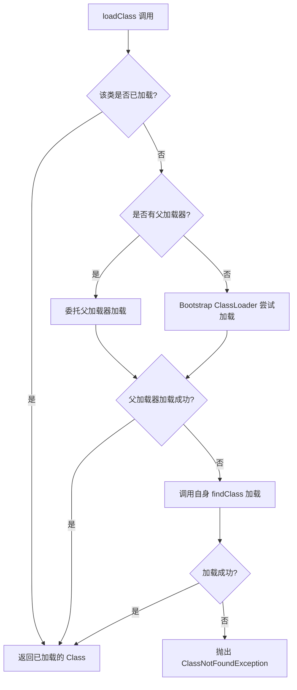

---
title: Java 虚拟机面试一
date: 2024-07-03 07:44:02
order: 10
categories:
  - Java
  - JavaCore
  - 面试
tags:
  - Java
  - JavaCore
  - 面试
  - JVM
permalink: /pages/a9f8d5df/
---

# Java 虚拟机面试一

## JVM 简介

### 【中等】说说 Java 的执行流程？⭐⭐⭐⭐

> 🎯 目标等级：L2-L3 ｜ ⏱ 建议用时：10 min ｜ 🏷 标签：JVM 概述 / 执行流程

#### 💎 关键结论

Java 程序执行经历「javac 编译为字节码 → 类加载进内存 → 解释执行 + JIT 编译优化」三个阶段，运行期由 JVM 负责内存管理、垃圾回收与线程调度。字节码平台无关，机器码运行时才生成。

#### ⚡记忆卡片

- **口诀**：一编译、二加载、三存储、四执行、五回收
- **关键词**：javac 字节码 ／ 类加载 ／ JIT 编译 ／ 垃圾回收
- **链路**：.java → .class → 类加载 → 运行时数据区 → 解释 + JIT 执行 → GC 回收

#### 📖 核心知识

Java 程序的执行流程经历了从编译到字节码的生成，再到类加载和 JIT 编译的过程，最终在 JVM 中执行：

1. **编码**：编写 `.java` 源码文件。
2. **编译**：Java 编译器（javac）将 `.java` 文件编译为 `.class` 文件（字节码）。
3. **类加载**：JVM 通过类加载子系统加载 `.class` 文件到内存。
   1. **加载**：采用双亲委派机制，分层级加载字节码。
   2. **链接**
      1. **验证**：检查字节码合法性（如魔数 `0xCAFEBABE`）。
      2. **准备**：为静态变量分配内存并赋默认值（如 `static int a` 初始化为 `0`）。
      3. **解析**：将符号引用（如类名、方法名）转为直接引用（内存地址）。
   3. **初始化**：执行静态代码块（`static{}`）和静态变量赋值（如 `static int a = 1;`）。
4. **存储运行时数据区**：加载后的类信息存储到内存区域。
   - **方法区**：存储类结构（如类名、方法定义、常量池）。
   - **堆**：存放对象实例（如 `String` 对象）。
   - **虚拟机栈**：线程私有，存储 `main()` 方法的栈帧（局部变量、操作数栈等）。
   - **程序计数器**：记录当前线程执行的字节码指令地址。
5. **执行阶段**
   - **解释执行**：逐行解释字节码指令（如 `invokestatic` 调用 `System.out.println`）。启动快，执行效率低。
   - **本地方法调用（JNI）**：若调用 `native` 方法（如 `Object.clone()`），通过 JNI 执行本地库（C/C++）代码。
   - **JIT 编译优化**：将热点代码（频繁执行的方法）编译为本地机器码，配合方法内联、逃逸分析等优化技术。
6. **垃圾回收**：JVM 管理内存，并回收不再使用的对象。
7. **程序结束**：main 方法结束，退出程序。

#### 🔬 扩展知识

::: details

- 【L3】javac 编译过程内部分为 4 个阶段：解析（词法/语法分析生成 AST）、输入符号表、注解处理（APT）、语义分析与字节码生成（脱糖，如泛型擦除、自动装箱在此完成）。
- 【L3】方法调用对应不同字节码指令：`invokestatic`（静态方法）、`invokevirtual`（虚方法）、`invokespecial`（构造器/私有方法）、`invokeinterface`（接口方法）、`invokedynamic`（JDK 7+，Lambda 等动态调用）。
- 【L4】HotSpot 默认采用混合模式（解释 + JIT）；`-Xint` 可强制纯解释执行，`-Xcomp` 可强制纯编译执行（启动变慢，生产基本不用）。

:::

#### ⚠️ 常见误区

::: details

常见误区：

- ❌ “Java 是纯解释型语言” → Java 采用解释 + JIT 混合模式，热点代码会被编译为机器码直接执行。
- ❌ “解析一定在类加载阶段完成” → 解析可以延迟到运行期间首次使用时才进行（动态绑定），这也是方法重写运行时多态的基础。

:::

#### 🔀 发散问题

- **Q：javac 编译阶段到底做了什么？** → 对源码做词法语法解析、语义检查与脱糖处理（如泛型擦除、枚举转普通类），最终生成平台无关的 `.class` 字节码，不生成任何机器码。
- **Q：为什么需要解释器和 JIT 共存？** → 解释器让程序快速启动、无需等待编译；JIT 针对热点代码做深度优化提升峰值性能，二者组合兼顾启动速度与执行效率。

### 【中等】JVM 由哪些部分组成？⭐⭐⭐⭐

> 🎯 目标等级：L2-L3 ｜ ⏱ 建议用时：10 min ｜ 🏷 标签：JVM 概述 / 架构组成

#### 💎 关键结论

JVM 主要由类加载子系统、运行时数据区、执行引擎、本地方法接口和本地方法库五部分组成，整体遵循「类加载 → 内存分配 → 执行引擎运行 → GC 回收内存」主线，通过 JNI 与外部交互。

#### ⚡记忆卡片

- **口诀**：加载、存储、执行、回收、连本地
- **关键词**：类加载器 ／ 运行时数据区 ／ 执行引擎 ／ JNI
- **链路**：类加载 → 运行时数据区 → 执行引擎（解释器 + JIT + GC）→ 内存回收

#### 📖 核心知识


- **类加载子系统**：负责加载、验证、准备、解析和初始化类文件（.class）。
- **运行时数据区**：
  - **方法区**：存储类元数据、常量池等。
  - **堆**：存放对象实例（主 GC 区域）。
  - **虚拟机栈**：存储方法调用的栈帧（局部变量、操作数栈等）。
  - **本地方法栈**：为 Native 方法服务。
  - **程序计数器**：记录当前线程执行的字节码位置。
- **执行引擎**：解释或编译字节码为机器码执行。
  - **解释器（Interpreter）**：逐行解释执行字节码（启动快，执行慢）。
  - **即时编译器（JIT Compiler）**：将热点代码编译为本地机器码（如 HotSpot 的 C1、C2 编译器）。
  - **垃圾回收器（GC）**：自动回收堆中无用对象（如 Serial、Parallel、G1、ZGC 等收集器）。
- **本地方法接口（JNI）**：调用 C/C++ 实现的 Native 方法。
- **本地方法库（Native Libraries）**：由其他语言（如 C/C++）编写的库，供 JNI 调用（如文件操作、网络通信等底层功能）。

#### 🔬 扩展知识

::: details

- 【L3】JVM 规范与实现分离：HotSpot 是主流实现，另有 OpenJ9、GraalVM 等实现；只要符合规范，字节码在不同实现上行为一致。
- 【L4】HotSpot 的执行引擎默认混合模式：启动时解释执行，C1 快速编译热点方法，C2 再做深度优化，分层编译 JDK 8+ 默认开启。

:::

#### ⚠️ 常见误区

::: details

常见误区：

- ❌ “GC 属于执行引擎的编译部分” → GC 是独立子系统，负责回收堆内存，与解释器、JIT 是并列组件而非编译动作。
- ❌ “本地方法栈和虚拟机栈是同一个东西” → 虚拟机栈为 Java 方法服务，本地方法栈为 Native 方法服务；只是在 HotSpot 中把二者合二为一了。

:::

#### 🔀 发散问题

- **Q：GC 主要作用于哪些区域？** → 堆是 GC 主战场；JDK 8+ 的元空间（类元数据）也会随 Full GC 回收；虚拟机栈、程序计数器随线程结束自动释放。
- **Q：JNI 会带来哪些问题？** → 失去跨平台能力（需为不同平台编译原生库）、存在本地内存泄漏风险、JNI 调用开销高于普通 Java 方法调用。

### 【中等】Java 是如何实现跨平台的？⭐⭐

> 🎯 目标等级：L2 ｜ ⏱ 建议用时：5 min ｜ 🏷 标签：JVM 概述 / 跨平台

#### 💎 关键结论

Java 跨平台的本质是：**源码 → 统一字节码 → JVM 按需转换为目标平台机器码**。编译一次生成平台无关的字节码，各平台的 JVM 负责将其翻译成本平台机器码，实现“一次编写，到处执行”。

#### ⚡记忆卡片

- **口诀**：一次编译、统一字节码、各配 JVM
- **关键词**：字节码 ／ JVM ／ Java API ／ JVM 规范
- **链路**：.java → 字节码（.class）→ 各平台 JVM → 平台机器码

#### 📖 核心知识

Java **【一次编写，到处执行（Write Once, Run Anywhere）】** 的要点：

- **JVM —— 统一运行环境**：不同操作系统（Windows/Linux/macOS）安装对应的 JVM，**屏蔽底层硬件和系统差异**；JVM 负责加载、验证并执行字节码，确保相同字节码在不同平台表现一致。
- **字节码 —— 平台无关的中间代码**：Java 代码编译成**平台无关的字节码（.class 文件）**，而非直接生成机器码；再由 JVM 解释或 JIT 编译为当前平台的机器指令。
- **标准化的 Java API**：提供统一的 API（如 `java.io`、`java.net`），底层通过 JVM 适配不同操作系统的具体实现。
- **严格的规范与兼容性**：JVM 规范（如字节码格式、内存管理）和 Java 语言规范由 Oracle 统一制定，确保各厂商实现的 JVM 行为一致。

**例外情况（需注意）**

- **JNI（本地方法调用）**：依赖系统原生库时，需为不同平台编译对应的动态库（如 `.dll`、`.so`）。
- **平台相关细节**：如文件路径分隔符、字符编码、GUI 渲染等可能需要适配。

## 类加载

### 【中等】什么情况下 Java 类会被加载？⭐⭐⭐

> 🎯 目标等级：L2-L3 ｜ ⏱ 建议用时：10 min ｜ 🏷 标签：类加载 / 触发条件

#### 💎 关键结论

Java 类采用懒加载机制，核心原则是“按需加载，节省内存”：仅发生“主动引用”时才触发加载 → 链接 → 初始化，“被动引用”不会触发类初始化。典型主动引用有 new、访问静态成员、反射、子类初始化、启动类等。

#### ⚡记忆卡片

- **口诀**：new、静态、反射、子先父、启动类，再加动态调用
- **关键词**：主动引用 ／ 被动引用 ／ 懒加载
- **链路**：主动引用发生 → 加载 → 链接 → 初始化（执行 `<clinit>`）

#### 📖 核心知识

发生“主动引用”才触发类加载（加载 → 链接 → 初始化）的核心场景：

| 触发场景         | 示例代码                                                       | 关键词                                    |
| :--------------- | :------------------------------------------------------------- | :---------------------------------------- |
| **创建类实例**   | `new User()`、`new User[]{10}`（数组创建不初始化，但类需加载） | new 对象 / 数组（数组仅加载类，不初始化） |
| **访问静态方法** | `User.staticMethod()`                                          | 执行 static 方法                          |
| **访问静态字段** | `System.out.println(User.staticField)`（final 常量除外）       | 读 / 写 static 字段（常量不触发）         |
| **反射**         | `Class.forName("com.example.User")`                            | 反射获取 / 操作类                         |
| **初始化子类**   | 初始化子类时，先加载并初始化父类（接口除外）                   | 子类初始化 → 父类先加载                   |
| **启动类**       | 运行 `java Main` 时，加载并初始化 `Main` 类                    | 程序入口类必加载                          |
| **动态语言支持** | JDK 7+ `invokedynamic` 指令触发（如 Lambda 动态调用）          | 动态调用触发类加载                        |

“被动引用”不触发类初始化：

|      被动引用场景       |                            示例代码                             |                  原因说明                  |
| :---------------------: | :-------------------------------------------------------------: | :----------------------------------------: |
|     1. 访问静态常量     | `System.out.println(User.CONST_VAL)`（CONST_VAL 是 final 常量） | 常量编译期存入调用类常量池，无需加载定义类 |
| 2. 子类访问父类静态字段 |          `System.out.println(Child.parentStaticField)`          |          仅加载父类，子类不初始化          |
|      3. 数组引用类      |                  `User[] arr = new User[10];`                   |    仅创建数组对象，类仅加载（不初始化）    |
|    4. 类加载器加载类    |           `classLoader.loadClass("com.example.User")`           |     仅加载类（加载阶段），不执行初始化     |

::: details 触发 / 不触发类加载代码示例

```java
// 1. new 对象触发加载
User u = new User();

// 2. 调用静态方法触发加载
User.sayHello();

// 3. 反射触发加载
Class<?> clazz = Class.forName("com.example.User");

// 4. 子类初始化触发父类加载
class Parent {}
class Child extends Parent {}
Child c = new Child(); // 先加载 Parent，再加载 Child

// 5. final 常量不触发 User 类初始化（编译期已内联到调用者常量池）
public class User {
    public static final String CONST = "hello"; // 编译期常量
}
System.out.println(User.CONST); // 不触发 User 类初始化
```

:::

#### 🔬 扩展知识

::: details

- 【L3】《JVM 规范》规定的初始化触发条件：遇到 new、getstatic、putstatic、invokevirtual 指令；反射调用；子类初始化前先初始化父类；虚拟机启动时的主类；JDK 7+ 的 invokedynamic 动态语言支持。
- 【L3】`Class.forName(name)` 默认会执行初始化，而 `ClassLoader.loadClass()` 只完成加载阶段不初始化，二者是常考的区分点。
- 【L4】接口初始化不要求父接口先完成初始化（与类不同）；但接口中定义了 default 方法时，实现类初始化会触发该接口初始化。

:::

#### ⚠️ 常见误区

::: details

常见误区：

- ❌ “类被加载了就是被初始化了” → 加载与初始化是不同阶段，`loadClass()` 只加载不执行 `<clinit>`，静态块不会运行。
- ❌ “访问 static final 常量会触发类加载” → 编译期常量已内联进调用者常量池，不触发定义类初始化。

:::

#### 🔀 发散问题

- **Q：Class.forName 和 ClassLoader.loadClass 有什么区别？** → `Class.forName` 默认会执行类的初始化（静态块运行），`loadClass` 只到加载阶段，不调用 `<clinit>`；这也是 JDBC 中用 `Class.forName` 注册驱动能触发注册逻辑的原因。
- **Q：为什么通过子类访问父类静态字段只初始化父类？** → 静态字段真正定义在父类，静态成员的访问只会触发真正定义它的类初始化，因此子类只被加载不被初始化。

### 【中等】Java 对象在虚拟机中怎样存储？⭐⭐

> 🎯 目标等级：L2 ｜ ⏱ 建议用时：5 min ｜ 🏷 标签：对象存储 / 内存布局

#### 💎 关键结论

每个 Java 对象在堆中分为对象头、实例数据、对齐填充三部分；64 位 JVM 中一个空 `Object` 占 16 字节（12 字节头 + 4 字节填充）。新对象优先在 Eden 区（TLAB）分配，大对象与长期存活对象进老年代。

#### ⚡记忆卡片

- **口诀**：头、数据、填充，空对象十六字节
- **关键词**：Mark Word ／ 类型指针 ／ TLAB ／ 指针碰撞
- **链路**：Eden（TLAB）→ Survivor → 老年代（年龄达标 / 大对象）

#### 📖 核心知识

每个 Java 对象在堆内存中分为 **3 个部分**：

- **对象头（Header）**
  - **Mark Word**：存储哈希码、GC 年龄、锁状态（如偏向锁信息）。
  - **类型指针**：指向类元数据的指针（压缩后占 4 字节，否则 8 字节）。
- **实例数据（Fields）**：对象的所有成员变量（包括继承的字段），按类型对齐存储。
- **对齐填充（Padding）**：确保对象大小为 8 字节的整数倍（优化 CPU 缓存行访问）。

**对象分配策略**

- **新生代分配**：大多数对象优先分配在 **Eden 区**（若开启 TLAB，线程先分配至私有缓冲区）。触发 Young GC 后，存活对象移至 Survivor 区或晋升老年代。
- **老年代分配**：大对象（如 `-XX:PretenureSizeThreshold=1MB`）直接进入老年代。长期存活对象（年龄 > `MaxTenuringThreshold`）从 Survivor 晋升。

**分配方式**：

- **指针碰撞**（堆内存规整时，如 Serial 收集器）。
- **空闲列表**（堆内存碎片化时，如 CMS 收集器）。

### 【中等】Java 对象的创建过程是怎样的？⭐⭐⭐⭐

> 🎯 目标等级：L2-L3 ｜ ⏱ 建议用时：10 min ｜ 🏷 标签：对象创建 / 内存分配

#### 💎 关键结论

对象创建经历五大步骤：**类加载检查 → 分配内存 → 初始化零值 → 设置对象头 → 执行 `<init>` 构造方法**。分配内存后先零值初始化，保证字段无需显式赋值即可使用；构造方法执行完毕才诞生真正可用的对象。

#### ⚡记忆卡片

- **口诀**：查、分、零、头、构
- **关键词**：类加载检查 ／ 指针碰撞 ／ TLAB ／ `<init>`
- **链路**：new 指令 → 类加载检查 → 堆上分配内存 → 零值初始化 → 设置对象头 → 构造方法

#### 📖 核心知识

当 JVM 遇到 `new` 字节码指令时，按以下流程创建对象：


**1. 类加载检查**

- 首先去常量池中定位 `new` 指令的参数，检查该类的符号引用是否已被类加载器加载、解析和初始化。
- 若未加载，则先执行类加载过程（加载 → 验证 → 准备 → 解析 → 初始化）。

**2. 分配内存**

在堆中为新对象分配内存，对象所需内存大小在类加载完成后即可确定。

**分配方式**：

| 分配方式     | 原理                                                               | 适用场景                     |
| :----------- | :----------------------------------------------------------------- | :--------------------------- |
| **指针碰撞** | 维护一个指针作为分界点，分配内存时将指针向空闲方向移动对象大小距离 | 堆内存规整（Serial、ParNew） |
| **空闲列表** | 维护一个记录可用内存块的列表，分配时找到足够大的块并更新列表       | 堆内存碎片化（CMS）          |

**线程安全**：

- **CAS + 失败重试**：分配内存时采用 CAS 保证原子性，失败则重试。
- **TLAB（Thread Local Allocation Buffer）**：每个线程在 Eden 区预分配一小块私有内存，线程在自己的 TLAB 上分配，避免同步开销（`-XX:+UseTLAB` 默认开启）。

**3. 初始化零值**

- 分配内存后，JVM 将分配的内存空间（不含对象头）初始化为零值。
- 作用：保证对象实例字段无需赋初值即可直接使用（如 `int` 为 `0`、`boolean` 为 `false`、引用为 `null`）。

**4. 设置对象头**

- **Mark Word**：设置哈希码、GC 分代年龄、锁状态等信息。
- **类型指针**：指向该对象的 Class 元数据，JVM 通过它确定对象属于哪个类。

**5. 执行 `<init>` 方法**

- 执行构造函数（即 `<init>` 方法），为对象字段赋程序员定义的初始值。
- 此时一个真正可用的对象才算创建完成。

```java
// new 关键字对应的字节码
0: new           #2   // class User          → 步骤1-4（类加载检查、分配、零值、对象头）
3: dup                                 → 复制引用压入操作数栈
4: invokespecial #3   // Method User."<init>":()V  → 步骤5（执行构造方法）
7: astore_1                            → 存入局部变量表
```

#### 🔬 扩展知识

::: details

**跨语言对象创建对比（L4：演进视角）**

**C++ placement new 对比**

Java 的 `new` 关键字同时完成了内存分配和对象初始化，而 C++ 将这两个步骤解耦：

- **Java `new`**：`new User()` 一步完成内存分配（堆上）+ 零值初始化 + 构造函数调用。
- **C++ `new`**：`new User()` 调用 `operator new` 分配内存，然后调用构造函数。
- **C++ placement new**：`new (buffer) User()` 在已分配的内存上构造对象，不分配新内存。这在 C++ 中用于内存池、共享内存等场景。Java 中没有 placement new 的等价物——Java 的对象创建始终在堆上（或 TLAB 内），无法在自定义内存地址上构造对象。

```cpp
// C++ placement new：在预分配的内存上构造对象
char buffer[sizeof(User)];
User* u = new (buffer) User("张三");  // 不分配新内存，仅在 buffer 上构造
```

**Go 的逃逸分析（Escape Analysis）对比**

Go 的逃逸分析与 Java 的 TLAB 机制代表了两种不同的内存分配优化策略：

- **Java TLAB（Thread Local Allocation Buffer）**：每个线程在 Eden 区预分配一块私有缓冲区，线程在 TLAB 内分配对象无需同步。但对象**始终分配在堆上**（TLAB 是 Eden 的一部分），是否逃逸由 JIT 逃逸分析决定后续优化（如标量替换）。
- **Go 逃逸分析**：Go 编译器在**编译期**进行逃逸分析，自动决定对象分配在**栈上还是堆上**。如果编译器判断对象不会逃逸出当前 goroutine 的栈帧，则直接在栈上分配——这与 Java 的"标量替换等效栈上分配"有本质区别：Go 是真正的栈上分配完整对象。

```go
// Go 逃逸分析示例
func createUser() *User {
    u := User{Name: "张三"}  // 逃逸到堆（因为返回了指针）
    return &u
}

func processUser() {
    u := User{Name: "李四"}  // 未逃逸，分配在栈上
    fmt.Println(u.Name)
}
// 查看逃逸分析：go build -gcflags="-m"
```

| 维度     | Java TLAB               | Go 逃逸分析              | C++ placement new    |
| :------- | :---------------------- | :----------------------- | :------------------- |
| 分配位置 | 堆（TLAB 是 Eden 子集） | 栈或堆（编译器决定）     | 任意内存（灵活控制） |
| 决策时机 | 运行时（JIT）           | 编译期                   | 编译期（程序员决定） |
| 栈上分配 | 仅标量替换等效          | 完整对象栈分配           | 值类型自动栈分配     |
| 同步开销 | TLAB 内无锁             | 无锁（goroutine 栈私有） | 无锁                 |

:::

#### ⚠️ 常见误区

::: details

常见误区：

- ❌ “构造方法负责分配内存” → 内存分配与零值初始化在构造方法之前就已完成，构造方法只负责按程序员定义的逻辑赋初值。
- ❌ “零值初始化多余，反正字段会显式赋值” → 零值保证实例字段未显式赋值时也有安全的默认值（0/false/null），是语言语义的一部分。

:::

#### 🔀 发散问题

- **Q：为什么需要 TLAB？** → 多线程并发分配内存需要同步，开销大；每个线程先在 Eden 的私有缓冲区内分配对象，无锁且快，TLAB 用完才再向堆申请。
- **Q：指针碰撞和空闲列表如何选择？** → 取决于堆内存是否规整：带内存压缩/复制整理的收集器（Serial、ParNew）用指针碰撞；内存碎片化的收集器（CMS）用空闲列表。

### 【中等】Java 类的生命周期是怎样的？⭐⭐⭐

> 🎯 目标等级：L2-L3 ｜ ⏱ 建议用时：10 min ｜ 🏷 标签：类加载 / 生命周期

#### 💎 关键结论

Java 类的生命周期分为 7 个阶段：**加载 → 验证 → 准备 → 解析 → 初始化 → 使用 → 卸载**，其中验证、准备、解析合称链接。加载采用双亲委派，卸载需类实例、ClassLoader、Class 引用三者均被回收。

#### ⚡记忆卡片

- **口诀**：加验准解初，用完再卸载
- **关键词**：链接 ／ `<clinit>` ／ 类卸载
- **链路**：加载 → 链接（验证/准备/解析）→ 初始化 → 使用 → 卸载

#### 📖 核心知识

JVM 通过类加载子系统加载 `.class` 文件到内存：


- **加载（Loading）**：采用双亲委派机制，分层级加载字节码。
  - 读取 `.class` 文件，生成 `Class<?>` 对象。
  - 触发条件：`new`、访问静态成员、反射等。
- **链接（Linking）**
  - **验证（Verification）**：检查字节码合法性（如魔数、继承规则）。
  - **准备（Preparation）**：为静态变量分配内存并赋默认值（如 `static int a` 初始化为 `0`）。
  - **解析（Resolution）**：将符号引用（如类名、方法名）转为直接引用（内存地址）。
- **初始化（Initialization）**：执行静态代码块（`static{}`）和静态变量赋值（如 `static int a = 1;`）。
- **使用（Using）**：正常调用方法、创建实例。
- **卸载（Unloading）**
  - 条件：类无实例、`ClassLoader` 被回收、无 `Class<?>` 引用。
  - 典型场景：动态加载的类（如热部署）。

#### 🔬 扩展知识

::: details

- 【L3】解析不一定在加载阶段完成，可以延迟到运行期首次使用时才进行（运行时绑定），这是方法重写动态分派的基础。
- 【L3】初始化执行的是 `<clinit>()` 方法（由静态变量赋值语句与静态块合并生成），JVM 保证 `<clinit>` 的线程安全：多线程下只有一个线程执行初始化，其余线程会阻塞等待。
- 【L4】类卸载条件非常苛刻：该类所有实例已被回收、加载它的 ClassLoader 已被回收、其 Class 对象无任何引用；三者缺一不可，因此 JDK 内置类几乎不会被卸载。

:::

#### ⚠️ 常见误区

::: details

常见误区：

- ❌ “静态变量的显式赋值在准备阶段完成” → 准备阶段只赋默认值（0/null），显式赋值和静态块在初始化阶段的 `<clinit>` 中执行；但 `static final` 编译期常量在编译期就分配值。
- ❌ “类加载完就一定不会被卸载” → 满足“无实例 + ClassLoader 被回收 + 无 Class 引用”三条件时类会被卸载，热部署场景正是利用这一点。

:::

#### 🔀 发散问题

- **Q：什么情况下类会被卸载？** → 类的所有实例都被回收、加载它的自定义 ClassLoader 被回收、且没有任何地方引用其 Class 对象；典型于热部署、OSGi 等动态场景。
- **Q：为什么类初始化是线程安全的？** → JVM 对 `<clinit>` 加锁，多线程并发初始化同一个类时只有一个线程执行，其余阻塞等待，避免静态状态被重复初始化。

### 【困难】什么是类加载器？⭐⭐⭐⭐

> 🎯 目标等级：L3-L4 ｜ ⏱ 建议用时：15 min ｜ 🏷 标签：类加载 / 类加载器与双亲委派

#### 💎 关键结论

类加载器负责将 `.class` 加载进内存并生成 `Class<?>` 对象，按“Bootstrap → Extension → Application → 自定义”四层组织，遵循双亲委派模型：先委托父加载器，父加载器无法完成时才自己加载，保证类唯一、防止核心 API 被篡改。

#### ⚡记忆卡片

- **口诀**：先委父、再自己；类越核心，加载器越顶层
- **关键词**：loadClass ／ findClass ／ 双亲委派
- **链路**：loadClass → findLoadedClass 查缓存 → 委托父加载器 → 父失败才 findClass 自己加载

#### 📖 核心知识

Java 类加载器是 **JVM（Java 虚拟机）** 的核心组件之一，负责在运行时动态加载 Java 类（`.class` 文件）到内存，并生成对应的 `Class<?>` 对象。

**类加载器层次结构**：类加载器采用 **“双亲委派模型”** 进行层次化管理，确保类的唯一性和安全性。按层级自上而下有 4 种类加载器：


| 类加载器                                    | 加载范围                                     | 说明                                             |
| :------------------------------------------ | :------------------------------------------- | :----------------------------------------------- |
| **Bootstrap ClassLoader**（启动类加载器）   | `JRE/lib` 或 `-Xbootclasspath`               | 由 C++ 实现，是 JVM 的一部分，无 Java 父类加载器 |
| **Extension ClassLoader**（扩展类加载器）   | `JRE/lib/ext` 或 `-Djava.ext.dirs`           | 加载 Java 扩展库（如 `javax.*`）                 |
| **Application ClassLoader**（应用类加载器） | `-Djava.class.path` 或 `-cp` 或 `-classpath` | 默认加载用户编写的类（`main()` 方法所在类）      |
| **Custom ClassLoader**（自定义类加载器）    | 用户自定义路径（如网络、加密类）             | 可继承 `ClassLoader` 实现个性化加载逻辑          |

**双亲委派模型**

双亲委派模型（Parents Delegation Model）要求除了顶层的 Bootstrap ClassLoader 外，其余的类加载器都应有自己的父类加载器。这里类加载器之间的父子关系一般通过组合（Composition）关系来实现，而不是通过继承（Inheritance）的关系实现。


**工作原理**：**只有当父类加载器加载失败的情况下，才会用子类加载器去加载类**。



**优势**

- **避免重复加载**：双亲委派模型使得 Java 类随着它的类加载器一起具有一种带有优先级的层次关系，从而确保类在 JVM 中唯一（如 `java.lang.Object` 只由 `Bootstrap` 加载）。
- **安全性**：防止用户伪造核心类（如自定义 `java.lang.String` 会被父类加载器拦截）。

以下是抽象类 `java.lang.ClassLoader` 的代码片段，其中的 `loadClass()` 方法运行过程如下：

```java
public abstract class ClassLoader {
    // The parent class loader for delegation
    private final ClassLoader parent;

    public Class<?> loadClass(String name) throws ClassNotFoundException {
        return loadClass(name, false);
    }

    protected Class<?> loadClass(String name, boolean resolve) throws ClassNotFoundException {
        synchronized (getClassLoadingLock(name)) {
            // 首先判断该类型是否已经被加载
            Class<?> c = findLoadedClass(name);
            if (c == null) {
                // 如果没有被加载，就委托给父类加载或者委派给启动类加载器加载
                try {
                    if (parent != null) {
                        // 如果存在父类加载器，就委派给父类加载器加载
                        c = parent.loadClass(name, false);
                    } else {
                        // 如果不存在父类加载器，就检查是否是由启动类加载器加载的类，通过调用本地方法 native Class findBootstrapClass(String name)
                        c = findBootstrapClassOrNull(name);
                    }
                } catch (ClassNotFoundException e) {
                    // 如果父类加载器加载失败，会抛出 ClassNotFoundException
                }

                if (c == null) {
                    // 如果父类加载器和启动类加载器都不能完成加载任务，才调用自身的加载功能
                    c = findClass(name);
                }
            }
            if (resolve) {
                resolveClass(c);
            }
            return c;
        }
    }

    protected Class<?> findClass(String name) throws ClassNotFoundException {
        throw new ClassNotFoundException(name);
    }
}
```

【说明】

- 先检查类是否已经加载过，如果没有则让父类加载器去加载。
- 当父类加载器加载失败时抛出 `ClassNotFoundException`，此时尝试自己去加载。

#### 🔬 扩展知识

::: details

- 【L3】双亲委派核心逻辑在 `ClassLoader.loadClass()`：先 `findLoadedClass()` 查缓存，再委托 `parent.loadClass()`，失败才调用自身 `findClass()`；自定义类加载器只需重写 `findClass()` 即可，无需破坏委派规则。
- 【L3】JDK 9+ 引入模块化后，Extension ClassLoader 更名为 Platform ClassLoader，原扩展机制被模块路径取代；Bootstrap ClassLoader 加载 `java.base` 等核心模块。
- 【L4】类的“身份” = 全限定名 + 加载它的 ClassLoader 实例；两个不同加载器加载同名类会产生两个不同 Class 对象，`instanceof` 判断会失败——这是应用隔离与热部署的基础。

:::

#### 🏭 实战场景

::: details

生产环境单台 Tomcat 常部署多个 webapp，每个 webapp 拥有独立的 `WebAppClassLoader`，优先加载自身 `WEB-INF/classes` 与 `WEB-INF/lib` 下的类，两个应用可同时使用 Spring 4.3 与 Spring 5.3 等不同版本互不冲突。若重新部署时旧 ClassLoader 未被彻底回收，旧应用的类元数据会残留在 Metaspace：在每天发布数十次的高频部署环境下，若未显式设置 `-XX:MaxMetaspaceSize`（生产常见配 256 MB），Metaspace 持续增长最终会触发 `OutOfMemoryError: Metaspace`。

:::

#### ⚠️ 常见误区

::: details

常见误区：

- ❌ “双亲委派是 JVM 的强制约束” → 它是推荐的最佳实践而非强制规则，可以通过重写 `loadClass()` 或线程上下文类加载器破坏（SPI、Tomcat 场景）。
- ❌ “Bootstrap ClassLoader 是 Java 实现的” → Bootstrap 由 C++ 实现、是 JVM 自身的一部分，`String.class.getClassLoader()` 返回 null。
- ❌ “类加载器的父子关系靠继承实现” → 通过组合实现（持有 parent 字段），委派逻辑与继承层次无关。

:::

#### 🔀 发散问题

- **Q：哪些场景破坏了双亲委派？** → 见本文档「有哪些场景破坏了双亲委派模型？」：SPI 线程上下文类加载器、Tomcat 应用隔离、OSGi 与热部署是三个代表场景。
- **Q：如何实现自定义类加载器？** → 继承 `java.lang.ClassLoader` 并重写 `findClass()`：从自定义来源（网络、加密文件等）读取类字节数组，再调用 `defineClass()` 生成 Class 对象。

### 【困难】有哪些场景破坏了双亲委派模型？⭐⭐⭐⭐

> 🎯 目标等级：L3-L4 ｜ ⏱ 建议用时：15 min ｜ 🏷 标签：类加载 / 双亲委派的破坏

#### 💎 关键结论

双亲委派并非强制约束而是推荐实践，JDK 历史上有三次典型“破坏”：JDK 1.2 之前重写 `loadClass()` 的历史性破坏、SPI 机制中基础类回调用户代码（线程上下文类加载器）、OSGi/Tomcat/热部署为追求动态性的破坏。

#### ⚡记忆卡片

- **口诀**：一兼容、二回调、三动态
- **关键词**：线程上下文类加载器 ／ SPI ／ WebAppClassLoader ／ OSGi
- **链路**：基础类需加载用户实现 → Thread.currentThread().getContextClassLoader() → 子加载器加载 SPI 实现类

#### 📖 核心知识

双亲委派模型并非强制约束，而是 Java 设计者推荐的最佳实践。在 JDK 历史演进中，有三次较大规模的“破坏”：

**第一次破坏：在双亲委派模型出现之前**

JDK 1.2 之前，自定义类加载器只需重写 `loadClass()`，而 `loadClass()` 正是双亲委派的核心逻辑所在，重写它就会破坏委派链。JDK 1.2 引入双亲委派模型后，为了向前兼容，新增了 `findClass()` 方法引导用户重写它而非 `loadClass()`。

**第二次破坏：基础类需要回调用户代码**

双亲委派模型解决了基础类统一加载的问题，但如果基础类又要回调用户的代码怎么办？典型场景：

- **SPI（Service Provider Interface）机制**：如 `JDBC` 的 `DriverManager`（由 BootstrapClassLoader 加载）需要加载各厂商实现的 `Driver` 接口，但 BootstrapClassLoader 无法加载 classpath 下的实现类。

- **解决方案**：引入**线程上下文类加载器（Thread Context ClassLoader）**。`DriverManager` 通过 `Thread.currentThread().getContextClassLoader()` 获取应用类加载器来加载 SPI 实现类，相当于"父委派给子加载"。

```java
// DriverManager 中的 SPI 加载逻辑（简化）
ServiceLoader<Driver> loaders = ServiceLoader.load(Driver.class);
// ServiceLoader.load 内部使用线程上下文类加载器
ClassLoader cl = Thread.currentThread().getContextClassLoader();
```

**第三次破坏：追求程序动态性**

- **OSGi（Open Service Gateway Initiative）**：提出"网状"类加载结构，每个模块（Bundle）有自己的类加载器，模块间按依赖关系形成有向图，不再遵循双亲委派的树状结构。
- **Tomcat**：每个 Web 应用有独立的 `WebAppClassLoader`，优先加载自身目录下的类（而非先委派给父加载器），实现应用间的类隔离。
- **JRebel / 热部署**：通过自定义类加载器重新加载修改后的类，实现不停机更新。

**Tomcat 类加载器为什么“违反”双亲委派？**

Tomcat 的 `WebAppClassLoader` 加载策略：

1. 先查本地缓存（已加载过）
2. 查 JVM 缓存（`findLoadedClass`）
3. 加载 JVM 系统类（用 Bootstrap 加载，防止应用覆盖核心类如 `java.lang.String`）
4. **先用自己加载**（`findClass`，即 `WEB-INF/classes` 和 `WEB-INF/lib`）—— 此处违反双亲委派
5. 最后委派给父加载器（Common ClassLoader）

**原因**：Web 应用之间需要类隔离，同一台 Tomcat 上的两个应用可以有不同版本的 Spring，互不干扰。

#### 🔬 扩展知识

::: details

**跨语言类加载机制对比（L4：演进视角）**

**Go：无类加载器概念**

Go 是编译型语言，不存在运行时的类加载机制：

- **编译期链接**：Go 程序在编译时将所有依赖静态链接为单一二进制文件，所有类型信息在编译期已完全确定。Go 没有 `.class` 文件、没有 ClassLoader、没有双亲委派。
- **接口的隐式实现**：Go 的接口是鸭子类型（structural typing），无需显式声明 `implements`，编译期检查类型是否满足接口，运行时通过 `interface` 的 `itab` 表进行动态分发——这比 Java 的类加载+反射更轻量。
- **plugin 包（有限动态性）**：Go 1.8+ 提供了 `plugin` 包，支持在运行时加载 `.so` 动态库，这是 Go 最接近 Java 类加载的机制，但功能非常有限（仅 Linux 支持，且 API 简陋）。

**Rust：编译期链接 + trait 系统**

Rust 同样没有运行时类加载，但其 trait 系统提供了比 Go 更丰富的多态能力：

- **编译期单态化（Monomorphization）**：Rust 的泛型在编译期为每个具体类型生成独立代码，零运行时开销，与 Java 的类型擦除形成鲜明对比。
- **trait 对象（动态分发）**：`dyn Trait` 通过 vtable 实现运行时多态，类似 Java 的接口调用，但无需类加载。
- **无反射**：Rust 没有内置的运行时反射机制（`std::any::Any` 只提供有限的类型判断），所有类型信息在编译期处理。
- **过程宏（Procedural Macros）**：Rust 通过编译期代码生成（宏）实现类似 Java 注解处理器（APT）的功能，但发生在编译期而非运行时。

**JPMS（Java Platform Module System）与双亲委派的演进**

JDK 9 引入的 JPMS 模块化系统在双亲委派之上增加了一层模块级隔离：

- **模块化类加载**：JPMS 在双亲委派模型上叠加了模块可见性控制。即使类加载器能找到类，如果模块未 `exports` 或 `opens`，也无法访问。
- **与双亲委派的关系**：JPMS 并未替代双亲委派，而是在其基础上增加了"模块路径"（Module Path）的概念，Boot Layer 的类加载器在委派前先检查模块的可读性。
- **对破坏场景的影响**：
  - SPI 机制在 JPMS 中通过 `provides...with` 和 `uses` 关键字声明，比 ServiceLoader 更规范。
  - 强封装使得反射访问内部 API 受限（`--add-opens` 参数可临时开放）。

| 维度       | Java（双亲委派）     | Go                   | Rust                | JPMS（JDK 9+）        |
| :--------- | :------------------- | :------------------- | :------------------ | :-------------------- |
| 类加载时机 | 运行时懒加载         | 编译期静态链接       | 编译期静态链接      | 运行时（模块化）      |
| 隔离机制   | ClassLoader 层级     | 包级别（无类加载器） | crate 级别          | 模块（module）        |
| 动态性     | 高（反射、动态代理） | 低（plugin 有限）    | 极低（无反射）      | 高（受模块约束）      |
| 版本冲突   | 类加载器隔离         | 编译期解决           | 编译期解决（Cargo） | 模块版本管理          |
| 核心优势   | 运行时灵活性         | 简单、编译快         | 零成本抽象          | 强封装 + 兼容双亲委派 |

:::

#### 🏭 实战场景

::: details

JDBC 是生产系统中最典型的 SPI 破坏案例：`DriverManager` 由 Bootstrap 加载，而 MySQL 驱动 `com.mysql.cj.Driver`（mysql-connector-j 8.x jar）位于 classpath，只能由应用类加载器加载。若线程上下文类加载器未被正确设置（如自定义线程池未传递 TCCL），`ServiceLoader` 发现不了驱动，HikariCP 连接池初始化时会直接报 `No suitable driver found`，导致服务启动失败。

:::

#### ⚠️ 常见误区

::: details

常见误区：

- ❌ “Tomcat 完全打破了双亲委派” → `WebAppClassLoader` 仍会把 `java.*` 等核心类委托给 Bootstrap 加载以防伪造，只是对 `WEB-INF` 下的类调换了加载顺序。
- ❌ “SPI 破坏双亲委派是设计缺陷” → 这是为解决“基础类回调用户实现类”的必要妥协，通过线程上下文类加载器实现，是标准机制而非漏洞。
- ❌ “破坏双亲委派只能重写 loadClass” → 除重写 `loadClass()` 外，还有线程上下文类加载器（SPI）和调整委派顺序（Tomcat）两种标准方式。

:::

#### 🔀 发散问题

- **Q：为什么 SPI 需要线程上下文类加载器？** → `DriverManager` 由 Bootstrap 加载，无法加载 classpath 上的驱动实现，只能通过 `Thread.currentThread().getContextClassLoader()`（默认是应用类加载器）“借子加载器”反向加载实现类。
- **Q：OSGi 的类加载结构是什么样的？** → 网状结构：每个模块（Bundle）有自己的 ClassLoader，模块间按依赖关系形成有向图，不再遵循树状双亲委派。

## JVM 内存管理

### 【困难】JVM 的内存区域是如何划分的？⭐⭐⭐⭐⭐

> 🎯 目标等级：L3-L4 ｜ ⏱ 建议用时：15 min ｜ 🏷 标签：内存管理 / 运行时数据区

#### 💎 关键结论

JVM 内存分为线程私有（程序计数器、虚拟机栈、本地方法栈）与线程共享（堆、方法区）两大类；JDK 8 起方法区由元空间（本地内存）实现，此外还有堆外的直接内存。程序计数器是唯一不会 OOM 的区域。

#### ⚡记忆卡片

- **口诀**：一计数器两栈，一堆一方法区，堆外还有直接内存
- **关键词**：栈帧 ／ 堆分代 ／ 元空间 ／ 直接内存
- **链路**：线程私有（计数器 + 虚拟机栈 + 本地方法栈）／ 线程共享（堆 + 方法区）／ 堆外（直接内存）

#### 📖 核心知识

JDK7 和 JDK8 的 JVM 的内存区域划分有所不同，如下图所示：


**线程私有区域**

- **程序计数器**
  - 记录当前线程执行的字节码指令地址（Native 方法时为`undefined`）。
  - **JVM 中唯一无 OOM 的区域**。
- **虚拟机栈**
  - 存储方法调用的**栈帧**（局部变量表、操作数栈、动态链接、返回地址）。
    - **局部变量表**：用于存放方法参数和方法内部定义的局部变量。
    - **操作数栈**：主要作为方法调用的中转站使用，用于存放方法执行过程中产生的中间计算结果。另外，计算过程中产生的临时变量也会放在操作数栈中。
    - **动态连接** - 用于一个方法调用其他方法的场景。Class 文件的常量池中有大量的符号引用，字节码中的方法调用指令就以常量池中指向方法的符号引用为参数。这些符号引用一部分会在类加载阶段或第一次使用的时候转化为直接引用，这种转化称为**静态解析**；另一部分将在每一次的运行期间转化为直接应用，这部分称为**动态连接**。
    - **方法返回地址** - 用于返回方法被调用的位置，恢复上层方法的局部变量和操作数栈。Java 方法有两种返回方式，一种是 `return` 语句正常返回，一种是抛出异常。无论采用何种退出方式，都会导致栈帧被弹出。也就是说，栈帧随着方法调用而创建，随着方法结束而销毁。无论方法正常完成还是异常完成都算作方法结束。
  - 异常：`StackOverflowError`（栈深度超限）、`OOM`（扩展失败）。
  - 可以通过 `-Xss` 指定占内存大小
- **本地方法栈**：与虚拟机栈的作用非常相似，二者区别仅在于：**虚拟机栈为 Java 方法服务；本地方法栈为 Native 方法服务**。

**线程共享区域**

- **堆（Heap）**
  - 存放**所有对象实例和数组**，是 GC 主战场。
  - 分区：新生代（Eden+Survivor）、老年代。
  - 异常：OOM: Java heap space（对象过多或内存泄漏）。
- **字符串常量池**：用于存储字符串字面量，位于堆内存中的一块特殊区域。通过 String 类的 intern() 方法可以将字符串键入到字符串常量池。
- **方法区（JDK 8+：元空间）**
  - 存储类信息、常量、静态变量（JDK 7 后移至堆）。
  - **JDK 8 用元空间（本地内存）替代永久代**，默认无上限。
  - 异常：`OOM`（加载过多类）。
- **运行时常量池**：Class 文件中存储编译时生成的常量信息，并在类加载时进入 JVM 方法区。

**直接内存（非 JVM 规范）**

直接内存是 JVM 堆外的本地内存。具有读写快、无 GC 开销，需手动管理的特性。

- 分配：ByteBuffer.allocateDirect()
- 清理：DirectBuffer.cleaner().clean()
- 场景：高频 I/O（如 NIO、Netty、MMAP）
- 异常：Direct buffer memory
- JVM 参数：可以通过 `-XX:MaxDirectMemorySize` 设置直接内存大小，如果无设置，默认大小等于 `-Xmx` 值。

#### 🔬 扩展知识

::: details

- 【L3】JDK 7 与 JDK 8 布局差异：JDK 7 方法区由永久代实现，字符串常量池、静态变量都在永久代；JDK 7 已将字符串常量池与静态变量移至堆；JDK 8 彻底移除永久代，类元数据改存于本地内存的元空间（JEP 122）。
- 【L3】虚拟机栈大小由 `-Xss` 指定，HotSpot 在 Linux x64 默认 1 MB；栈越小可支持的方法调用深度越浅，越容易触发 `StackOverflowError`。
- 【L3】元空间默认无上限（受物理内存限制）；直接内存未设置 `-XX:MaxDirectMemorySize` 时默认等于 `-Xmx`。
- 【L4】跨语言内存布局对比：

**Go 的内存布局**

Go 的内存模型与 JVM 有显著差异，其设计哲学是"简单、可控"，没有 JVM 那样复杂的分代结构：

- **栈可动态增长**：Go 的 goroutine 初始栈只有 ~2KB，运行时根据需要自动扩缩容（通过栈拷贝机制），与 JVM 固定大小的线程栈（`-Xss`）完全不同。每个 goroutine 的栈是动态的，可以增长到 1GB。
- **无方法区/元空间概念**：Go 是编译型语言，程序的类型信息在编译期已确定并嵌入二进制文件，运行时无需维护类元数据区域。Go 的 `reflect` 包在运行时提供有限的类型信息，但这些信息分散在堆和全局数据段中。
- **堆**：Go 的堆统一管理所有动态分配的对象，不区分新生代/老年代。Go 的 GC 是并发三色标记清扫，没有分代假设。
- **无直接内存概念**：Go 没有 JVM 的 Direct Memory 概念，但可通过 `unsafe` 包或 cgo 操作堆外内存。

**Rust 的内存布局**

Rust 代表了"零成本抽象"的内存管理范式，没有 GC，依靠所有权系统在编译期保证内存安全：

- **栈 + 堆 + 无 GC**：Rust 默认在栈上分配（类似 C++），只有通过 `Box<T>`、`Vec<T>`、`Arc<T>` 等智能指针才会在堆上分配。对象的生命周期由所有权和借用规则在编译期确定，运行时无需 GC。
- **编译期内存管理**：Rust 的 `Drop` trait 提供确定性析构（类似 C++ 的 RAII），当对象离开作用域时立即释放内存，无需等待 GC 周期。
- **无运行时内存区域划分**：Rust 编译后直接生成机器码，没有 JVM 那样的运行时数据区（程序计数器、虚拟机栈等均由操作系统管理）。

| 维度          | JVM (HotSpot)      | Go                     | Rust                 |
| :------------ | :----------------- | :--------------------- | :------------------- |
| 栈            | 固定大小（`-Xss`） | 动态扩缩（~2KB → 1GB） | 固定大小（OS 管理）  |
| 堆分代        | 新生代 + 老年代    | 无分代                 | 无 GC，手动/RAII     |
| 方法区/元空间 | 有（类元数据）     | 无（编译期确定）       | 无（编译期确定）     |
| 内存管理      | GC 自动回收        | GC 自动回收            | 所有权系统（编译期） |
| 直接内存      | NIO DirectBuffer   | 无（unsafe/cgo）       | 无（unsafe/FFI）     |

:::

#### 🏭 实战场景

::: details

网关服务部署在 4C8G 容器，参数 `-Xms4g -Xmx4g -Xss512k`：业务线程 800 个时线程栈共占用约 400 MB（800 × 512 KB）。曾因线程池采用无界创建，高峰期线程数飙升至 3000+，超出操作系统进程数限制，抛出 `OutOfMemoryError: unable to create new native thread`，服务无法受理新请求；改为核心线程 200、有界队列的 `ThreadPoolExecutor` 后恢复。

:::

#### ⚠️ 常见误区

::: details

常见误区：

- ❌ “程序计数器存方法返回地址” → 程序计数器记录当前执行的字节码指令地址；方法返回地址是栈帧的组成部分。
- ❌ “方法区就是永久代” → 永久代只是 JDK 7 及之前方法区的具体实现，JDK 8+ 用元空间（本地内存）实现方法区。
- ❌ “直接内存属于 JVM 运行时数据区” → 直接内存不属于 JVM 规范，是堆外本地内存，通过 NIO 的 DirectByteBuffer 使用，受 `-XX:MaxDirectMemorySize` 约束。

:::

#### 🔀 发散问题

- **Q：字符串常量池为什么从永久代移入堆？** → JDK 7 时永久代空间小且回收效率低，字符串常量池移入堆后可随 Young/Full GC 更及时地回收，缓解永久代内存压力。
- **Q：直接内存泄漏如何排查？** → 开启 Native Memory Tracking（`-XX:NativeMemoryTracking=detail`），用 `jcmd <pid> VM.native_memory detail` 观察 Internal/Other 区增长，结合 DirectByteBuffer 的引用排查。

### 【困难】JVM 产生 OOM 有哪几种情况？⭐⭐⭐⭐

> 🎯 目标等级：L3-L4 ｜ ⏱ 建议用时：15 min ｜ 🏷 标签：内存管理 / OOM 排查

#### 💎 关键结论

常见 OOM 有：`Java heap space`（堆不足）、`Metaspace`（类加载过多）、`Direct buffer memory`（堆外泄漏）、`unable to create new native thread`（线程数超限）、`GC overhead limit exceeded`（GC 空转）等。排查思路：先看错误类型定位内存区域，再用堆转储 + MAT 找泄漏。

#### ⚡记忆卡片

- **口诀**：堆、类、堆外、线程、GC 空转
- **关键词**：-Xmx ／ MaxMetaspaceSize ／ MaxDirectMemorySize ／ MAT
- **链路**：OOM 类型 → 定位内存区域 → 堆转储（jmap/MAT）→ 找泄漏链

#### 📖 核心知识

JVM 发生 **OutOfMemoryError（OOM）** 的原因多种多样，主要与内存区域划分和对象分配机制相关。以下是常见 OOM 类型及其触发条件、典型案例和排查方法：

**1. Java heap space**

- **触发条件**：**堆内存不足**，无法分配新对象。
- **常见原因**：

  - 内存泄漏（如静态容器持续增长、未关闭的资源）。
  - 堆内存设置过小（`-Xmx` 值不合理）。
  - 大对象（如一次性加载超大文件到内存）。

- **案例代码**：

  ```java
  List<byte[]> list = new ArrayList<>();
  while (true) {
      list.add(new byte[1024 * 1024]); // 持续分配 1MB 数组
  }
  ```

- **解决方向**：
  - 检查 `-Xmx` 和 `-Xms` 参数是否合理。
  - 使用 `jmap -histo:live <pid>` 或 **MAT（Memory Analyzer Tool）** 分析堆转储（`-XX:+HeapDumpOnOutOfMemoryError`）。

**2. Metaspace（JDK 8 及以后）**

- **触发条件**：**元空间（Metaspace）不足**，无法加载新的类信息。
- **常见原因**：
  - 动态生成大量类（如反射、CGLIB、动态代理）。
  - 未设置元空间上限（默认依赖本地内存，可能耗尽）。
- **案例代码**：
  ```java
  for (int i = 0; i < 1000000; i++) {
      Enhancer enhancer = new Enhancer(); // CGLIB 动态生成类
      enhancer.setSuperclass(OOM.class);
      enhancer.create();
  }
  ```
- **解决方向**：
  - 调整元空间大小：`-XX:MetaspaceSize=256M -XX:MaxMetaspaceSize=256M`。
  - 检查类加载器泄漏（如热部署未清理旧类）。

**3. PermGen space（JDK 7 及以前）**

- **类似 Metaspace**，但发生在永久代（PermGen），JDK 8 后被元空间取代。
- **常见原因**：大量字符串常量或类加载未卸载。

**4. Direct buffer memory**

- **触发条件**：**直接内存（堆外内存）耗尽**。
- **常见原因**：
  - NIO 的 `ByteBuffer.allocateDirect()` 未释放。
  - 直接内存上限过小（`-XX:MaxDirectMemorySize`）。
- **案例代码**：
  ```java
  List<ByteBuffer> buffers = new ArrayList<>();
  while (true) {
      buffers.add(ByteBuffer.allocateDirect(1024 * 1024)); // 1MB 直接内存
  }
  ```
- **解决方向**：
  - 显式调用 `((DirectBuffer) buffer).cleaner().clean()` 或复用缓冲区。
  - 增加 `-XX:MaxDirectMemorySize=1G`。

**5. Unable to create new native thread**

- **触发条件**：**线程数超过系统限制**（非堆内存问题）。

- **常见原因**：

  - 线程池配置不合理（如无界线程池）。
  - 系统级限制（`ulimit -u` 查看用户最大线程数）。

- **案例代码**：

  ```java
  while (true) {
      new Thread(() -> {
          try { Thread.sleep(100000); } catch (Exception e) {}
      }).start();
  }
  ```

- **解决方向**：
  - 改用线程池（如 `ThreadPoolExecutor`）。
  - 调整系统限制（Linux 下修改 `/etc/security/limits.conf`）。

**6. GC overhead limit exceeded**

- **触发条件**：GC 耗时超过 98% 且回收内存不足 2%（JVM 自我保护）。
- **本质原因**：堆内存几乎耗尽，GC 无效循环。
- **解决方向**：
  - 同 `heap space` 排查内存泄漏。
  - 关闭保护机制（不推荐）：`-XX:-UseGCOverheadLimit`。

**7. CodeCache is full（JIT 编译代码缓存满）**

- **触发条件**：JIT 编译的本地代码超出缓存区（`-XX:ReservedCodeCacheSize`）。
- **常见原因**：动态生成大量方法（如频繁调用反射）。
- **解决方向**：
  - 增加缓存：`-XX:ReservedCodeCacheSize=256M`。
  - 关闭分层编译：`-XX:-TieredCompilation`。

**8. Requested array size exceeds VM limit**

- **触发条件**：尝试分配超过 JVM 限制的数组（如 `Integer.MAX_VALUE - 2`）。

- **案例代码**：

  ```java
  int[] arr = new int[Integer.MAX_VALUE]; // 直接崩溃
  ```

- **解决方向**：检查代码中不合理的数组分配逻辑。

**OOM 类型速查表**

| OOM 类型                          | 关联内存区域  | 典型原因            |
| --------------------------------- | ------------- | ------------------- |
| `Java heap space`                 | 堆            | 内存泄漏/堆太小     |
| `Metaspace` / `PermGen space`     | 元空间/永久代 | 类加载爆炸          |
| `Unable to create native thread`  | 系统线程数    | 线程池失控/系统限制 |
| `Direct buffer memory`            | 堆外内存      | NIO Buffer 未释放   |
| `GC overhead limit exceeded`      | 堆            | GC 无效循环         |
| `CodeCache is full`               | JIT 代码缓存  | 动态方法过多        |
| `Requested array size exceeds VM` | 堆            | 超大数组分配        |

#### 🔬 扩展知识

::: details

- 【L3】排查工具链：启动参数加 `-XX:+HeapDumpOnOutOfMemoryError` 自动生成堆转储；`jmap -histo:live <pid>` 看 TOP 对象，MAT 的 Dominator Tree / Leak Suspects 定位对象保留链；`jstat -gc <pid>` 观察各区容量与 GC 频率。
- 【L4】跨语言 OOM 场景对比：

**Go 的 OOM 场景**

Go 没有 Metaspace/PermGen 概念，也没有 CodeCache，但有其独特的 OOM 风险：

- **goroutine 栈泄漏**：每个 goroutine 初始栈 ~2KB，但可动态增长到 1GB。如果 goroutine 泄漏（如 channel 阻塞未关闭），栈内存会持续增长导致 OOM。这是 Go 特有的 OOM 场景，与 Java 的线程泄漏类似但更隐蔽——goroutine 非常轻量，泄漏更难察觉。
- **slice 无限增长**：Go 的 slice 底层是动态数组，append 操作会自动扩容。如果代码逻辑导致 slice 无限 append（如循环中持续追加数据而不清理），会耗尽堆内存。Go 没有类似 JVM 的大对象直接进老年代的机制，所有对象统一在堆中分配。
- **cgo 内存泄漏**：通过 cgo 调用 C 代码分配的内存不受 Go GC 管理，必须手动释放。类似 JVM 的 JNI 内存泄漏。
- **无元空间 OOM**：Go 的类型信息在编译期确定，运行时不存在类似 Metaspace 的 OOM。

**Rust 的 OOM 场景**

Rust 的 OOM 行为与 JVM/Go 有本质不同——Rust 默认在分配失败时 **panic 而非返回 OOM 错误**：

- **Box/Arc 分配失败 → panic**：`Box::new()`、`Arc::new()`、`Vec::push()` 等标准库分配在 OOM 时直接 panic（`abort`），不会像 Java 抛出 `OutOfMemoryError`。这是因为 Rust 将 OOM 视为不可恢复错误。
- **编译期避免**：Rust 的所有权系统和 RAII 机制在编译期就确定了内存的分配和释放时机，大幅减少了运行时内存泄漏的可能。`no_std` 环境下甚至完全无堆分配。
- **fallible allocation（实验性）**：Rust 的 `alloc` crate 提供了 `try_reserve` 等 fallible API，允许在 OOM 时返回 `AllocError` 而非 panic，但标准库 `Vec`、`Box` 等默认未使用。
- **无 GC 意味着无 GC overhead 类 OOM**：Rust 没有 GC，不会出现 Java 的 "GC overhead limit exceeded"。

| OOM 场景            | JVM                              | Go                       | Rust                 |
| :------------------ | :------------------------------- | :----------------------- | :------------------- |
| 堆 OOM              | `Java heap space`                | slice 无限增长、内存泄漏 | `Box::new()` panic   |
| 元空间/类 OOM       | `Metaspace` / `PermGen`          | 无（编译期确定类型）     | 无（编译期确定类型） |
| 线程/goroutine 泄漏 | `Unable to create native thread` | goroutine 栈泄漏         | 线程栈溢出 → panic   |
| 直接内存/JNI        | `Direct buffer memory`           | cgo 内存泄漏             | `unsafe`/FFI 泄漏    |
| GC 相关             | `GC overhead limit exceeded`     | GC 延迟增加但不会 OOM    | 无 GC                |
| 编译缓存            | `CodeCache is full`              | 无 JIT                   | 无 JIT               |

:::

#### 🏭 实战场景

::: details

某导出服务一次性将数百万条记录查询进内存，堆使用率 2 分钟内从 30% 升至 100% 并抛出 `Java heap space`；由于启动参数已配置 `-XX:+HeapDumpOnOutOfMemoryError`，直接获得堆转储，MAT 分析发现单个 `List` 保留约 1.2 GB；改为流式分页读取（每批 2000 条）后恢复，全程约 10 分钟定位完成。

:::

#### ⚠️ 常见误区

::: details

常见误区：

- ❌ “OOM 一定是内存泄漏” → 也可能是 `-Xmx` 设置过小、一次性超大对象、线程数过多；先看具体 OOM 类型定位区域再下结论。
- ❌ “StackOverflowError 是一种 OOM” → SOF 是栈深度超出 `-Xss` 限制，与 `OutOfMemoryError` 是不同的错误类型；只有虚拟机栈申请扩展内存失败时才会抛 OOM。
- ❌ “Metaspace OOM 与业务代码无关” → 常由 CGLIB/反射动态生成大量类、热部署后 ClassLoader 泄漏导致，可用 `jstat -class` 观察已加载类数增长。

:::

#### 🔀 发散问题

- **Q：如何在 OOM 时自动拿到堆转储？** → 启动参数配置 `-XX:+HeapDumpOnOutOfMemoryError -XX:HeapDumpPath=/path/dump.hprof`，还可用 `-XX:OnOutOfMemoryError` 触发告警脚本。
- **Q：GC overhead limit exceeded 的本质是什么？** → GC 耗时超 98% 却回收不足 2% 堆内存，是堆几乎耗尽时的 JVM 自我保护，排查思路与 heap space 相同。

### 【简单】字符串常量池有什么用？⭐⭐

> 🎯 目标等级：L2 ｜ ⏱ 建议用时：5 min ｜ 🏷 标签：内存管理 / 字符串常量池

#### 💎 关键结论

字符串常量池用于存储字符串字面量，相同内容只存一份，节省内存并加快比较；直接赋值（`"abc"`）优先用池，`new String()` 强制在堆新建对象，`intern()` 可将堆中字符串纳入池。

#### ⚡记忆卡片

- **口诀**：字面量进池、new 进堆、intern 回池
- **关键词**：字面量 ／ new String ／ intern
- **链路**：字面量赋值 → 查常量池 → 命中复用 / 未命中创建 → （可选）intern 入池

#### 📖 核心知识

字符串常量池是 JVM 的特殊内存区域，用于存储字符串字面量（如 `"abc"`），确保相同内容的字符串只存一份；通过复用相同字符串，节省内存并提升性能：

**节省内存**：相同字符串复用，避免重复创建（如 `String s1 = "hello"` 和 `String s2 = "hello"` 指向同一对象）。

**提升性能**：

- **快速比较**：直接通过 `==` 判断地址是否相同（比 `equals()` 更快）。
- **哈希优化**：如 `HashMap` 的键可复用缓存的 `hashCode`。

**实现规则**

- **直接赋值**（`String s = "abc"`）→ **优先从常量池引用**。
- **`new String("abc")`** → **强制在堆中创建新对象**（不推荐，除非需隔离实例）。
- **`intern()` 方法** → 将堆中的字符串对象添加到常量池（若池中不存在）。

**注意事项**

- **避免滥用 `new String()`**：无特殊需求时，直接用字面量赋值。
- **`intern()` 慎用**：可能增加常量池内存压力，需权衡性能。

### 【困难】为什么 Java 8 移除了永久代（PermGen）并引入了元空间（Metaspace）？⭐⭐⭐

> 🎯 目标等级：L3-L4 ｜ ⏱ 建议用时：15 min ｜ 🏷 标签：内存管理 / 元空间

#### 💎 关键结论

Java 8 用元空间替代永久代：永久代大小固定易 OOM、GC 效率低；元空间使用本地内存、默认动态扩展，降低了 OOM 风险并减少 Full GC 停顿。

#### ⚡记忆卡片

- **口诀**：永久代固定易溢出，元空间本地内存动态扩
- **关键词**：MaxPermSize ／ MaxMetaspaceSize ／ 本地内存
- **链路**：JDK 7 永久代（堆内）→ JDK 8 元空间（本地内存）→ 默认动态扩展

#### 📖 核心知识

Java 8 用元空间替代永久代，解决了 PermGen 固定大小易导致内存溢出和垃圾回收效率低的问题。元空间使用本地内存，具备更灵活的内存分配能力，提升了垃圾收集和内存管理的效率。

**永久代（PermGen）的主要问题**

- **固定大小限制**：永久代大小通过 `-XX:MaxPermSize` 设定，默认较小（64MB~128MB），易触发 `OutOfMemoryError: PermGen space`，尤其是动态加载类过多时（如频繁部署的 Web 应用）。
- **垃圾回收效率低**：永久代与老年代共用垃圾回收机制（Full GC 时才会回收），类卸载条件苛刻（需类加载器被回收）。
- **内存管理不灵活**：永久代在 JVM 堆内分配，与对象堆共享内存空间，易导致堆内存碎片化。

**元空间（Metaspace）的优势**

- **使用本地内存（Native Memory）**：元空间直接分配在操作系统的本地内存中，默认无上限（仅受系统物理内存限制），避免 `PermGen` 大小硬限制问题。可通过 `-XX:MaxMetaspaceSize` 设置上限（如不设置则动态扩展）。
- **自动调整大小**：元空间可以根据需要自动扩展大小，从而降低了 OOM 的风险。
- **性能优化**：元空间由于在堆外，因此减少了 Full GC 触发频率，避免了频繁回收 PermGen 时的停顿。

**永久代 vs. 元空间**

| **特性**     | **永久代（PermGen）**             | **元空间（Metaspace）**                 |
| ------------ | --------------------------------- | --------------------------------------- |
| **存储位置** | JVM 堆内存                        | 本地内存（Native Memory）               |
| **大小限制** | `-XX:MaxPermSize` 固定上限        | 默认无上限，可设 `-XX:MaxMetaspaceSize` |
| **垃圾回收** | 依赖 Full GC                      | 独立回收，条件更宽松                    |
| **OOM 错误** | `OutOfMemoryError: PermGen space` | `OutOfMemoryError: Metaspace`           |

#### 🔬 扩展知识

::: details

- 【L3】元空间由两部分组成：类元数据空间与压缩类指针空间（Compressed Class Space，默认 1 GB，可用 `-XX:CompressedClassSpaceSize` 调整）。
- 【L3】版本演进：JDK 7 已将字符串常量池、静态变量从永久代移至堆；JDK 8（JEP 122）才彻底移除永久代、引入元空间。
- 【L4】为什么不是把永久代变大：永久代与堆的 GC、字符串常量池、内部符号耦合很深，大小上限难以预测；移除它简化了 GC 与内存管理，也为字符串去重等特性铺路。

:::

#### 🏭 实战场景

::: details

Java 8 之前，Tomcat 7 上频繁重新部署 webapp 常抛 `OutOfMemoryError: PermGen space`，需把 `-XX:MaxPermSize` 调到 256 MB 并重启 Tomcat 才能缓解；升级 Java 8 后元空间动态扩展，此类故障基本消失，运维统一改为显式设置 `-XX:MaxMetaspaceSize=256m` 作为安全上限并纳入监控。

:::

#### ⚠️ 常见误区

::: details

常见误区：

- ❌ “元空间默认无上限，生产不用设置” → 默认仅受物理内存限制，若存在类加载器泄漏会吃光系统内存，生产建议显式设置 `-XX:MaxMetaspaceSize` 并监控。
- ❌ “字符串常量池也移到了元空间” → 恰好相反：字符串常量池在 JDK 7 就从永久代移入堆，元空间只存类元数据。

:::

#### 🔀 发散问题

- **Q：如何监控元空间使用情况？** → `jstat -gc <pid>` 的 MC/MU 列（元空间容量/已用），或 `jcmd <pid> VM.metaspace` 查看详细信息。
- **Q：元空间和直接内存有什么区别？** → 二者都是本地内存，但元空间存类元数据、由 JVM 管理；直接内存服务于 NIO 堆外缓冲，受 `-XX:MaxDirectMemorySize` 约束。

## 字节码

### 【中等】Java 是编译型语言还是解释型语言？⭐⭐

> 🎯 目标等级：L2 ｜ ⏱ 建议用时：5 min ｜ 🏷 标签：字节码 / 编译与解释

#### 💎 关键结论

**Java 既是编译型语言，也是解释型语言**：javac 先把源码编译成字节码（编译特征），运行时 JVM 解释执行字节码、JIT 又把热点代码编译为机器码（解释特征），编译与解释并存。

#### ⚡记忆卡片

- **口诀**：先编译成字节码，再解释加 JIT
- **关键词**：javac ／ 解释器 ／ JIT
- **链路**：.java → javac → .class → 解释器逐行解释 + JIT 编译热点 → 机器码

#### 📖 核心知识

- [**编译型语言**](https://zh.wikipedia.org/wiki/編譯語言)：程序在执行之前**需要一个专门的编译过程，把程序编译成为机器语言的文件**，运行时不需要重新翻译。一般执行速度快、开发效率低，常见如 C、C++、Go。
- [**解释型语言**](https://zh.wikipedia.org/wiki/直譯語言）：程序不需要编译，运行时通过 [解释器](https://zh.wikipedia.org/wiki/直譯器) 将代码一句一句解释为机器代码再执行。一般执行速度慢、开发效率高，常见如 JavaScript、Python、Ruby。
- **Java 的双重特征**：
  - **编译阶段**：`.java` 经 javac 编译为 `.class` 字节码。
  - **执行阶段**：JVM 解释器逐行解释字节码；热点代码由 JIT 编译为机器码，这部分属于**编译执行**而非解释执行。
- **意义**：正是这套机制使 Java 可以【**一次编写，到处执行（Write Once, Run Anywhere）**】；[即时编译](https://zh.wikipedia.org/wiki/即時編譯） 技术先把源码编译成 [字节码](https://zh.wikipedia.org/wiki/字节码），执行期再将热点字节码编译为机器码，兼具两者优点，[Java](https://zh.wikipedia.org/wiki/Java) 与 [LLVM](https://zh.wikipedia.org/wiki/LLVM) 是该技术的代表产物。

#### 🔬 扩展知识

::: details

- 【L3】HotSpot 默认混合模式：`-Xint` 可强制纯解释、`-Xcomp` 可强制纯编译，常用于对比实验；生产上依赖 JIT 对热点代码的编译优化提升吞吐。

> 📚 延伸阅读：[基本功 | Java 即时编译器原理解析及实践](https://tech.meituan.com/2020/10/22/java-jit-practice-in-meituan.html)

:::

### 【中等】什么是 Java 字节码？它与机器码有什么区别？⭐⭐

> 🎯 目标等级：L2 ｜ ⏱ 建议用时：5 min ｜ 🏷 标签：字节码 / 字节码与机器码

#### 💎 关键结论

字节码是源码编译后生成的平台无关中间代码，存于 `.class` 文件，由 JVM 解释或 JIT 编译为机器码执行；机器码是 CPU 直接执行的二进制指令。字节码是 Java 跨平台的核心技术之一。

#### ⚡记忆卡片

- **口诀**：字节码是中间码，机器码才是最终指令
- **关键词**：.class ／ 指令集 ／ JIT ／ 字节码增强
- **链路**：源码 → 字节码（.class）→ 解释器 / JIT → 机器码 → CPU

#### 📖 核心知识

Java 字节码（Java Bytecode）是 Java 源代码编译后生成的中间代码，是 JVM 执行的指令集。**JVM 通过解释器或即时编译（JIT）将字节码转换为机器码执行**，它是 Java 实现【**一次编写，到处执行**】的核心技术之一；机器码则是直接由 CPU 执行的二进制指令。

**Java 字节码要点**：

- **基本概念**
  - 平台无关的中间代码，存储在 `.class` 文件中。
  - 包含类结构、字段、方法及对应的字节码指令。
- **指令集**：包含加载（`aload`/`iload`）、存储（`astore`）、运算（`iadd`）、控制流（`if_icmpgt`）等操作。
- **执行方式**
  - **解释执行**：JVM 逐条解释字节码。
  - **JIT 编译**：热点代码动态编译为机器码优化性能。
- **动态能力**
  - **反射**：运行时动态解析/修改字节码（如生成代理类）。
  - **字节码增强**：框架（Spring AOP 等）通过 ASM、Javassist 等工具修改字节码，实现 AOP 等功能。

#### 🔬 扩展知识

::: details

- 【L3】Java 字节码是基于栈的指令集：操作数在操作数栈上出入，指令由 1 字节操作码 + 可选操作数组成；这与 x86 等基于寄存器的指令集是两种设计取向。
- 【L3】字节码的可操控性催生了字节码增强生态：ASM（底层、高性能）、Javassist（源码级 API）、ByteBuddy（现代 DSL），支撑 AOP、探针、Mock 等能力。

> 📚 延伸阅读：[美团 - 字节码增强技术探索](https://tech.meituan.com/2019/09/05/java-bytecode-enhancement.html)

:::

### 【中等】.class 文件的结构包含哪些主要部分？⭐⭐

> 🎯 目标等级：L2 ｜ ⏱ 建议用时：5 min ｜ 🏷 标签：字节码 / class 文件结构

#### 💎 关键结论

`.class` 是以 8 位字节为单位的二进制流，按序包含：魔数（0xCAFEBABE）、版本号、常量池、访问标志、类/父类/接口索引、字段表、方法表、属性表；其中常量池最大，存字面量与符号引用。

#### ⚡记忆卡片

- **口诀**：魔数、版本、常量池，标志、索引、字段、方法、属性
- **关键词**：0xCAFEBABE ／ 常量池 ／ 符号引用
- **链路**：魔数验证 → 版本校验 → 解析常量池 → 类结构（字段/方法/属性）

#### 📖 核心知识

`.class` 文件是一组以 8 位字节为基础单位的二进制流，各数据项按严格顺序紧凑排列。其结构如下：

| **组成部分**                   | **说明**                                                                         |
| :----------------------------- | :------------------------------------------------------------------------------- |
| **魔数（Magic Number）**       | 4 字节，固定为 `0xCAFEBABE`，用于标识这是 class 文件                             |
| **版本号**                     | 次版本号（2 字节）+ 主版本号（2 字节），如 JDK 8 = 52，JDK 11 = 55               |
| **常量池（Constant Pool）**    | 存放字面量（如字符串、final 常量）和符号引用（类名、方法名、字段名）             |
| **访问标志（Access Flags）**   | 标识类或接口的访问权限（`public`、`final`、`abstract`、`interface` 等）          |
| **类索引、父类索引、接口索引** | 描述类的继承关系，通过索引指向常量池中的符号引用                                 |
| **字段表（Fields）**           | 描述类中声明的变量（类变量和实例变量，不含局部变量）                             |
| **方法表（Methods）**          | 描述类中声明的方法，每个方法含「方法名、描述符、属性表（含 Code 属性即字节码）」 |
| **属性表（Attributes）**       | 存放额外的辅助信息（如源文件名、行号映射、注解等）                               |

**常量池中的常量类型**（主要分类）：

- **字面量**：如文本字符串、`final` 常量值。
- **符号引用**：
  - 类和接口的全限定名（Fully Qualified Name）
  - 字段的名称和描述符（Descriptor）
  - 方法的名称和描述符

```bash
# 使用 javap -v 查看常量池
javap -v HelloWorld.class
# 输出示例（节选）：
# Constant pool:
#    #1 = Methodref          #6.#20         // java/lang/Object."<init>":()V
#    #2 = Fieldref           #21.#22        // java/lang/System.out:Ljava/io/PrintStream;
#    #3 = String             #23            // Hello, World!
```

### 【中等】如何查看 Java 字节码？常用工具有哪些？⭐⭐

> 🎯 目标等级：L2 ｜ ⏱ 建议用时：5 min ｜ 🏷 标签：字节码 / 查看与操作工具

#### 💎 关键结论

查看字节码首选 JDK 自带的 javap（`-c` 看指令、`-v` 看常量池与详细信息）；操作字节码用 ASM / Javassist / ByteBuddy；图形化查看用 Bytecode Viewer 或 IDEA 的 jclasslib 插件。

#### ⚡记忆卡片

- **口诀**：javap 看、ASM 改、jclasslib 可视化
- **关键词**：javap ／ ASM ／ ByteBuddy ／ jclasslib
- **链路**：.class → javap 反汇编 → 字节码指令 + 常量池 + 行号表

#### 📖 核心知识

- **javap**（JDK 自带）：`javap -c -l -v HelloWorld.class` 查看反汇编的字节码、常量池、行号表。
  - `-c`：反汇编字节码指令
  - `-l`：显示行号和局部变量表
  - `-v`：显示详细信息（常量池、版本号、栈深度等）
- **ASM**：轻量级字节码操作框架，可用于分析和生成 class 文件（如 Spring AOP 底层）。
- **Javassist**：提供源码级别的字节码编辑 API，比 ASM 更易用。
- **ByteBuddy**：现代字节码操作库，广泛用于 Mock 框架（如 Mockito）、Agent 开发。
- **Bytecode Viewer**：GUI 工具，支持多款反编译器（Procyon、CFR、Fernflower）。
- **IDEA 插件**：`jclasslib`（查看 class 文件结构）、`Bytecode Editor`。

### 【中等】Java 字节码有哪些典型应用场景？⭐

> 🎯 目标等级：L2 ｜ ⏱ 建议用时：5 min ｜ 🏷 标签：字节码 / 应用场景

#### 💎 关键结论

字节码的价值在于**平台无关性**和**可操控性**：跨平台运行与 JIT/AOT 编译是基础支撑，动态增强（AOP/埋点）、动态代理（MyBatis/Mockito）、逆向审计、安全校验与混淆保护都构建其上。

#### ⚡记忆卡片

- **口诀**：跨平台、可增强、可代理、可审计
- **关键词**：AOP 插桩 ／ 动态代理 ／ JIT与AOT ／ 混淆
- **链路**：字节码 → （JIT/AOT）执行 ／（ASM 等）增强 ／（反编译）审计

#### 📖 核心知识

Java 字节码（.class 文件）是连接源码与机器码的 “中间桥梁”，典型应用场景覆盖基础支撑、开发提效、性能优化、安全管控等核心环节：

| 场景分类              | 具体应用（记忆关键词）                       | 原理 / 工具                             | 实际价值                                                          |
| :-------------------- | :------------------------------------------- | :-------------------------------------- | :---------------------------------------------------------------- |
| 跨平台运行（基础）    | Java 程序跨系统执行、跨 JVM 部署             | 字节码与平台无关，不同系统 JVM 解析执行 | 实现 “一次编写，到处运行”，核心支撑 Java 跨平台特性               |
| 动态增强 / 字节码插桩 | AOP 切面编程、日志埋点、性能监控、参数校验   | ASM、Javassist、ByteBuddy、Spring AOP   | 无需修改源码，运行时增强类功能（如 Spring 事务、SkyWalking 监控） |
| 编译优化（JIT/AOT）   | JIT 编译热点字节码、AOT 预编译字节码为机器码 | HotSpot JIT、GraalVM Native Image       | 提升程序执行性能（JIT 优化热点）、降低冷启动耗时（AOT）           |
| 安全校验 / 合规审计   | 字节码校验、恶意代码检测、代码合规检查       | JVM 类加载验证阶段、FindBugs、SonarQube | 防止非法字节码执行，保障代码安全与合规                            |
| 逆向分析 / 代码审计   | 反编译排查问题、第三方 jar 包审计、漏洞分析  | JD-GUI、Fernflower、Procyon             | 定位第三方组件问题、审计代码安全性、排查线上故障                  |
| 动态代理 / 框架核心   | 动态生成代理类、MyBatis/Mockito 底层实现     | JDK 动态代理（生成字节码）、CGLIB       | 框架解耦（如 MyBatis mapper 代理）、测试模拟（Mockito）           |
| 定制化执行 / 类加载   | 自定义类加载器、热部署、模块化打包           | 自定义 ClassLoader、OSGi、jlink         | 实现代码热更新（如 Tomcat 热部署）、轻量化模块化应用              |
| 代码混淆 / 防反编译   | 商业软件字节码混淆、防止源码泄露             | ProGuard、Allatori                      | 保护商业代码知识产权，增加逆向难度                                |

小结：

- 核心基础场景：跨平台运行（Java 核心特性）、编译优化（JIT/AOT 提升性能）；
- 核心高频场景：字节码插桩（AOP / 埋点）、动态代理（框架核心）、逆向分析（问题排查）；
- 核心价值：字节码的标准化和可操控性，支撑了 Java 生态的灵活扩展、性能优化与安全管控。

### 【困难】什么是 JIT？JIT 编译器是如何工作的？⭐⭐⭐⭐⭐

> 🎯 目标等级：L3-L4 ｜ ⏱ 建议用时：15 min ｜ 🏷 标签：执行引擎 / JIT 编译

#### 💎 关键结论

JIT（Just-In-Time Compilation，即时编译）在运行时将**热点代码**（高频执行的字节码）编译为本地机器码并缓存，替代逐行解释执行以提升效率；HotSpot 采用 C1（快编译）+ C2（深优化）双编译器与分层编译，兼顾启动速度与峰值性能。

#### ⚡记忆卡片

- **口诀**：先解释后编译，热点变机器码；启动看 C1，峰值看 C2
- **关键词**：热点代码 ／ C1与C2 ／ 分层编译 ／ 去优化
- **链路**：解释执行 → 热点识别 → C1 快速编译 → C2 深度优化 → 机器码缓存

#### 📖 核心知识

**JIT（Just-In-Time Compilation，即时编译）**在运行时将**热点代码**（频繁执行的字节码）动态编译为**本地机器码**，提升执行效率。

程序运行过程中，JIT 实时识别「热点代码」（高频执行的方法 / 循环），将这些字节码一次性编译为当前平台的本地机器码并缓存，后续执行时直接调用缓存的机器码，替代逐行解释执行，大幅提升 Java 程序运行效率。

**JIT 工作流程**

1. **初始阶段**：JVM 解释执行字节码（启动快但效率低）；
2. **热点识别**：统计代码执行次数，高频代码标记为 “热点”；
3. **编译优化**：JVM 后台异步将热点字节码编译为机器码并缓存，后续执行直接用机器码（效率提升 5-10 倍）。

**C1 与 C2 编译器对比**：HotSpot JVM 的 JIT 采用**双层编译器架构**——C1（Client Compiler）和 C2（Server Compiler），与分层编译机制配合使用：

| 维度          | C1（Client Compiler）                | C2（Server Compiler）                        |
| ------------- | ------------------------------------ | -------------------------------------------- |
| **编译速度**  | 快（~1-5ms/方法）                    | 慢（~10-50ms/方法）                          |
| **优化深度**  | 浅（方法内联、去虚拟化、空值消除）   | 深（逃逸分析、标量替换、循环展开、代数简化） |
| **Profiling** | 采集基础 profiling（类型、调用计数） | 利用 C1 的 profiling 数据做推测优化          |
| **目标**      | 快速达到可接受的性能                 | 峰值性能                                     |
| **适用场景**  | GUI 应用、短生命周期服务             | 长运行服务端、批处理                         |
| **代码缓存**  | 编译产物较小                         | 编译产物较大                                 |

**为什么需要两层？** C1 快速编译让 JVM 快速脱离纯解释执行阶段（否则启动慢），C2 深度优化让热点代码达到接近 C/C++ 的性能，二者组合兼顾启动时间与峰值性能。

**常见 JIT 优化技术**

- **方法内联（Inlining）**：将小方法调用替换为方法体代码，消除方法调用开销（栈帧、参数传递）。这是**最重要的 JIT 优化**——因为内联后其他优化（逃逸分析、常量折叠）才能生效。HotSpot 默认对 ≤35 字节的方法进行内联（`-XX:MaxInlineSize`）。
- **逃逸分析（Escape Analysis）**：判断对象作用域，将未逃逸对象进行标量替换等效栈上分配，详见下一题。
- **分层编译（Tiered Compilation）**：
  - **5 层模型**：
    - **0 层**：解释执行（采集 profiling 数据——类型分布、分支概率、调用计数）
    - **1 层**：C1 无 profiling（纯快速编译，启动用）
    - **2 层**：C1 + 基础 profiling（记录调用次数）
    - **3 层**：C1 + 完整 profiling（记录类型、分支、调用目标）
    - **4 层**：C2 深度优化（利用 2/3 层采集的 profiling 数据）
  - **JDK 8+ 默认启用**：`-XX:+TieredCompilation`
- **循环展开（Loop Unrolling）**：将 n 次循环体展开为 k 次迭代的代码块，减少循环控制开销。
- **去虚拟化（Devirtualization）**：将虚方法调用转为直接调用。分两种：
  - **单态内联缓存（Monomorphic IC）**：profiling 发现某虚方法调用位置 90%+ 都调用同一个实现类，C2 插入 `if (obj.getClass() == Expected) { 直接调用 } else { 虚调用 }`
  - **双态/多态（Bimorphic/Megamorphic）**：2~3 个常见类型也可内联缓存，超过则退化为虚调用
- **标量替换（Scalar Replacement）**：将未逃逸对象拆解为独立的标量成员变量，分别分配在寄存器或栈上，完全消除对象分配。
- **代数简化与常量折叠**：编译期计算常量表达式（如 `24*60*60` → `86400`），简化代数运算。

#### 🔬 扩展知识

::: details

**去优化（Deoptimization）—— 为什么 JIT 编译的代码会被丢弃？**

**去优化**是指 JVM 丢弃已经编译好的机器码，回退到解释执行的过程。这是 JIT 编译器**推测性优化**的代价：

**触发去优化的常见场景**：

| 场景              | 示例                             | 原因                                                       |
| ----------------- | -------------------------------- | ---------------------------------------------------------- |
| **类加载变化**    | 新加载的子类打破了之前的单态假设 | C2 基于「只有 1 个实现类」做了激进内联，新类出现后假设失效 |
| **Uncommon Trap** | 空指针、数组越界等罕见路径被触发 | C2 假设某路径不会执行（如 `obj != null`），一旦触发需回退  |
| **调试/热替换**   | JVMTI 重定义类、IDEA HotSwap     | 字节码已变，旧机器码无效                                   |
| **OSR 失败**      | 替换循环的执行状态失败           | 从解释执行切换到编译循环时状态不兼容                       |

**Deoptimization 的代价**：不仅丢弃编译产物，还要将寄存器/栈的状态还原为解释器可读的格式，开销较大。频繁去优化是性能杀手——如线上运行一段时间后变慢，可能原因就是大量去优化。

**排查方法**：`-XX:+PrintCompilation -XX:+UnlockDiagnosticVMOptions -XX:+LogCompilation` 可输出编译详情。

**JIT 参数**

| **参数**                                             | **作用**                                                                                                |
| ---------------------------------------------------- | ------------------------------------------------------------------------------------------------------- |
| `-XX:CompileThreshold=10000`                         | 触发 JIT 编译的方法调用阈值（C2，分层编译关闭时生效）                                                   |
| `-XX:+PrintCompilation`                              | 打印 JIT 编译日志（观察哪些方法被编译、去优化）                                                         |
| `-XX:ReservedCodeCacheSize=240M`                     | 设置代码缓存大小（默认 240MB）。**CodeCache 满会导致 JIT 停止编译**，全部回退到解释执行，服务吞吐暴跌！ |
| `-XX:+TieredCompilation`                             | 启用分层编译（JDK 8+ 默认开启）                                                                         |
| `-XX:+DoEscapeAnalysis`                              | 启用逃逸分析（JDK 1.7+ 默认开启）                                                                       |
| `-XX:+PrintCodeCache`                                | JVM 退出时打印 CodeCache 使用情况                                                                       |
| `-XX:+UnlockDiagnosticVMOptions -XX:+LogCompilation` | 输出详细编译日志（可用 JITWatch 可视化分析）                                                            |

> **重要陷阱**：CodeCache 默认只有 240MB。如果服务方法数量多（如大型 Spring 应用），CodeCache 可能被打满。一旦 `CodeCache full`，JIT 彻底停摆，吞吐量可能**下降 10~100 倍**！监控 `jstat -compiler` 中的 CodeCache 使用率是关键。

**跨语言 JIT 编译器对比（L4）**

**（1）V8（JavaScript）的 TurboFan + Ignition**

Google V8 引擎的编译管线与 HotSpot 有惊人的结构相似性：

| 阶段         | HotSpot JVM    | V8 (JavaScript)          | 说明                              |
| ------------ | -------------- | ------------------------ | --------------------------------- |
| **解释器**   | 模板解释器     | Ignition（字节码解释器） | 启动时执行，采集 profiling        |
| **快速编译** | C1             | Sparkplug（基线 JIT）    | 无 profiling 开销，快速产出机器码 |
| **优化编译** | C2             | TurboFan（优化 JIT）     | 利用 profiling 数据做推测优化     |
| **去优化**   | Deoptimization | Deoptimization           | 推测失败时回退                    |

但 V8 的编译策略更激进——JavaScript 无静态类型，TurboFan 严重依赖 profiling 推测类型（如「这个变量 95% 是 int」），推测失败触发去优化的概率更高。

**（2）.NET（C#）的 RyuJIT + Tiered Compilation**

.NET Core 的 RyuJIT 也采用分层编译，但比 HotSpot 更进一步：

- **ReadyToRun（R2R）**：预编译到中间格式，部署时 JIT 只需少量编译，兼顾启动速度
- **Dynamic PGO**：Runtime 收集 profiling 数据，动态反馈给 JIT 重新编译热点
- **区别**：.NET 更强调「提前编译」（AOT via NativeAOT），JVM 更依赖运行时 JIT

**（3）Go —— 为什么没有 JIT？**

Go 完全不使用 JIT，所有代码在编译期直接生成静态机器码。原因：

- Go 编译速度极快（全量 AOT），无需 JIT 加速启动
- 静态编译产物无运行时依赖，部署简单
- 代价：无法利用运行时 profiling 做推测优化，纯静态优化的天花板低于 JIT 的动态优化

**（4）GraalVM —— JIT 的演进方向**

GraalVM 用 Java 重写了 JIT 编译器（Graal JIT），可同时用于 JVM 和 AOT 编译：

| 维度         | HotSpot C2             | Graal JIT                          |
| ------------ | ---------------------- | ---------------------------------- |
| **实现语言** | C++（维护困难）        | Java（易于迭代）                   |
| **优化策略** | 固定规则（启发式）     | 部分内联 (Partial Escape Analysis) |
| **AOT 支持** | 无（需 jaotc，已废弃） | 原生支持（Native Image）           |
| **向量化**   | 有限                   | SIMD 向量化支持更好                |

:::

#### 🏭 实战场景

::: details

大型 Spring 应用方法数可达数万，JIT 持续编译下 CodeCache（默认 240 MB）使用率不断攀升。曾有服务运行数日后出现 `CodeCache is full`，JIT 停止编译、全部回退解释执行，接口吞吐从约 12000 QPS 降至不足 1000 QPS；后续将 `-XX:ReservedCodeCacheSize` 调至 512 MB 并开启 `-XX:+PrintCodeCache` 纳入监控，同类故障未再出现。

:::

#### ⚠️ 常见误区

::: details

常见误区：

- ❌ “Java 代码最终都会被 JIT 编译成机器码” → 只有热点代码才会被编译，冷代码全程解释执行；编译阈值未达到前也是解释执行。
- ❌ “JIT 编译后的机器码永久有效” → 类加载变化、Uncommon Trap 等推测失败会触发去优化，机器码被丢弃并回退解释执行。
- ❌ “CodeCache 越大越好” → 过大增加内存占用，应按方法规模评估并监控使用率，重点是避免打满导致 JIT 停摆。

:::

#### 🔀 发散问题

- **Q：逃逸分析与 JIT 是什么关系？** → 见本文档「什么是逃逸分析？」：逃逸分析是 JIT（C2）阶段的优化之一，判定对象作用域后支撑标量替换、锁消除等优化。
- **Q：GraalVM 与 HotSpot C2 有什么区别？** → Graal JIT 用 Java 实现、易迭代，支持 Native Image AOT 与更好的向量化；C2 用 C++ 实现，只做运行时 JIT，二者优化策略均为启发式。

### 【困难】什么是逃逸分析？⭐⭐⭐

> 🎯 目标等级：L3-L4 ｜ ⏱ 建议用时：15 min ｜ 🏷 标签：执行引擎 / 逃逸分析

#### 💎 关键结论

**逃逸分析**是 JIT 阶段的作用域分析优化：判定对象为全局逃逸 / 参数逃逸 / 无逃逸，对无逃逸对象可做标量替换（等效栈上分配）、锁消除等优化；注意 HotSpot 未实现真正栈上分配，JDK 1.7+ 默认开启。

#### ⚡记忆卡片

- **口诀**：编译期定逃逸，不逃逸拆标量，锁可消
- **关键词**：无逃逸 ／ 标量替换 ／ 锁消除
- **链路**：JIT 逃逸判定 → 无逃逸 → 标量替换 / 锁消除 → 减少堆分配与 GC 压力

#### 📖 核心知识

逃逸分析是 JVM 在 **JIT 阶段** 进行的一种优化技术：编译阶段分析对象的「作用域」，判断对象是否会 “逃逸” 出当前方法 / 线程（如对象被返回、被外部引用、跨线程访问）；若判定对象未逃逸，JVM 会对其做**栈上分配**、**标量替换**、**锁消除**等优化，减少 GC 开销、提升程序性能。

**逃逸分析判定规则**：

| 逃逸类型                     | 判定条件（记忆关键词）                             | 示例                                                                                      |
| :--------------------------- | :------------------------------------------------- | :---------------------------------------------------------------------------------------- |
| **全局逃逸**（GlobalEscape） | 对象被静态字段引用、被其他线程访问、作为方法返回值 | `static List<Object> list = new ArrayList<>();`<br/>`Object m() { return new Object(); }` |
| **参数逃逸**（ArgEscape）    | 对象作为参数传递给其他方法，但不会被全局引用       | `void m(Object o) { foo(o); }`                                                            |
| **无逃逸**（NoEscape）       | 对象仅在方法内创建和使用，未被外部引用 / 返回      | `void m() { Object o = new Object(); }`                                                   |

**逃逸分析相关的 JIT 优化**

（1）**栈上分配**

**栈上分配**：非逃逸的对象直接在栈帧中分配内存，对象随方法调用结束自动销毁，无需 GC 回收。

默认情况下，对象分配在堆上，需 GC 回收，栈上分配可大幅减少堆内存占用和 GC 压力。

> ⚠️ **注意：HotSpot JVM 实际未实现真正的栈上分配**。OpenJDK HotSpot 通过**标量替换**间接实现“栈上分配”的效果，而非将整个对象分配在栈帧上；标量替换后对象被拆解为标量，直接作为局部变量存储在寄存器或栈中。因此面试时回答“通过逃逸分析 + 标量替换，让未逃逸对象不进入堆，等效于栈上分配”更精确。

【示例】栈上分配示例

```java
// 未逃逸：对象仅在方法内使用，JIT 优化为栈上分配
public void test() {
    User u = new User("张三"); // 栈上分配，无需 GC
    System.out.println(u.getName());
}
```

（2）**标量替换**

**标量替换**：将非逃逸对象的字段拆解为局部变量（标量），避免创建完整对象。

【示例】标量替换示例

```java
// 原代码：创建 User 对象（包含 name/age 两个字段）
public void test() {
    User u = new User("张三", 20);
    System.out.println(u.getName() + u.getAge());
}
// JIT 优化后（标量替换）：直接分配两个局部变量，无需创建 User 对象
public void test() {
    String name = "张三";
    int age = 20;
    System.out.println(name + age);
}
```

（3）**锁消除**

**锁消除**：若判定锁保护的对象仅在当前线程访问（无线程逃逸），则自动移除不必要的锁，避免锁竞争开销。

```java
// 原代码：加了同步锁，但对象未逃逸（仅当前线程访问）
public void test() {
    Object lock = new Object();
    synchronized (lock) { // JIT 判定 lock 未逃逸，消除同步锁
        System.out.println("无竞争的同步块");
    }
}
```

#### 🔬 扩展知识

::: details

**逃逸分析启用与验证**

（1）启用条件

- JDK 1.7+ 逃逸分析默认开启，无需手动配置；

- 若需确认 / 调整，可通过 JVM 参数：

  ```
  -XX:+DoEscapeAnalysis # 开启（默认）
  -XX:-DoEscapeAnalysis # 关闭
  -XX:+PrintEscapeAnalysis # 打印逃逸分析日志（调试用）
  ```

（2）验证优化效果

通过 `-XX:+PrintGC` 观察 GC 次数：启用逃逸分析后，短生命周期、未逃逸的对象不会进入堆，GC 次数会明显减少。

- 【L3】逃逸分析在 C2 编译阶段进行，与方法内联强相关：内联后方法边界消失，逃逸分析的判定范围更大，优化机会更多。
- 【L4】与 Go 对比：Go 在编译期做逃逸分析，直接决定对象分配在栈还是堆；Java 在 JIT 运行时做，主要用于标量替换与锁消除，不做真正的栈上分配。

:::

#### 🏭 实战场景

::: details

排查某接口服务 GC 频率时做过对照实验：用 `-XX:-DoEscapeAnalysis` 关闭逃逸分析后，每 10 秒 Young GC 次数从约 15 次升至约 50 次，P99 耗时从 30 ms 升至 45 ms，证明标量替换使循环内大量临时对象免入堆。该参数 JDK 1.7+ 默认开启，生产无需额外配置。

:::

#### ⚠️ 常见误区

::: details

常见误区：

- ❌ “HotSpot 实现了真正的栈上分配” → HotSpot 通过标量替换（对象拆为标量存寄存器/局部变量表）实现等效效果，并非整个对象放进栈帧。
- ❌ “开启逃逸分析后对象就不进堆了” → 只有无逃逸对象才被优化；全局逃逸对象（被返回、被静态字段引用、跨线程访问）仍在堆上分配。

:::

#### 🔀 发散问题

- **Q：如何验证逃逸分析生效了？** → `-XX:+PrintEscapeAnalysis` 输出分析日志，或对比开关（`-XX:-DoEscapeAnalysis`）前后的 GC 次数（配合 `-XX:+PrintGC`）。
- **Q：锁消除的原理是什么？** → 逃逸分析判定锁对象仅当前线程可访问（无线程逃逸）时，JIT 直接移除 `synchronized`，避免不必要的锁开销。

### 【困难】什么是 AOT？⭐⭐

> 🎯 目标等级：L3-L4 ｜ ⏱ 建议用时：10 min ｜ 🏷 标签：执行引擎 / AOT 编译

#### 💎 关键结论

AOT（Ahead of Time Compilation，提前编译）在程序运行前就把字节码直接编译为平台机器码，启动无解释 / JIT 开销，启动快、内存占用低；代价是失去动态特性（反射、动态代理等受限），适合云原生微服务等启动敏感场景。

#### ⚡记忆卡片

- **口诀**：先编译后运行，启动快但动态受限
- **关键词**：jaotc ／ GraalVM Native Image ／ 机器码
- **链路**：字节码 → AOT 编译器 → 机器码文件（.so/.dll）→ 启动直接执行

#### 📖 核心知识

Java 9 引入 **AOT（Ahead of Time Compilation，提前编译）**。AOT 模式下，**程序运行前直接编译为机器码**（类似 C/C++/Rust）。在程序**运行之前**（部署 / 安装阶段），通过专用工具（如 `jaotc`、GraalVM Native Image）将 Java 字节码（`.class` / `.jar`）直接编译为与目标平台匹配的本地机器码文件，程序启动时无需解释 / 即时编译，直接执行机器码。

**AOT 工作流程**

1. **编译阶段**：部署时用 AOT 编译器（如 `jaotc`）将字节码编译为平台专属的机器码文件（.so/.dll）；
2. **启动阶段**：JVM 加载预编译的机器码文件，直接执行，无字节码解释 / JIT 编译开销；
3. **运行阶段**：全程执行机器码，无需运行时编译优化（部分实现支持与 JIT 混合）。

**AOT 与 JIT 对比**

| **维度**     | **AOT**                       | **JIT**                                |
| :----------- | :---------------------------- | :------------------------------------- |
| **编译时机** | 运行前（部署阶段）            | 运行中（热点代码缓存）                 |
| **启动速度** | ⭐⭐⭐极快（无编译开销）      | ⭐较慢（首次解释执行，热点编译有延迟） |
| **内存占用** | ⭐⭐⭐低（无需 JIT 编译缓存） | ⭐⭐较高（需缓存编译后的机器码）       |
| **峰值性能** | ⭐⭐（静态优化）              | ⭐⭐⭐（动态优化）                     |
| **动态支持** | ❌受限                        | ✔️完整支持                             |
| **适合场景** | 云原生 / 微服务               | 高吞吐 / 动态框架                      |

提到 AOT 就不得不提 [GraalVM](https://www.graalvm.org/) 了！GraalVM 是一种高性能的 JDK（完整的 JDK 发行版本），它可以运行 Java 和其他 JVM 语言，以及 JavaScript、Python 等非 JVM 语言。GraalVM 不仅能提供 AOT 编译，还能提供 JIT 编译。感兴趣的同学，可以去看看 [GraalVM 的官方文档](https://www.graalvm.org/latest/docs/)。如果觉得官方文档看着比较难理解的话，也可以找一些文章来看看。

**AOT 的局限性在于不支持动态特性**：

- 不支持反射、动态代理、运行时类加载、JNI 等
- 影响框架兼容性（如 Spring、CGLIB 依赖 ASM 技术生成动态字节码）

**AOT 的适用场景**：

- **适合**：启动敏感的微服务、云原生应用
- **不适合**：需动态特性的复杂框架或高频优化的长运行任务

#### 🔬 扩展知识

::: details

- 【L3】版本演进：`jaotc` 于 JDK 9 作为实验特性引入（基于 Graal 编译器），JDK 16 标记为废弃，JDK 17 移除；当前主流 AOT 方案是 GraalVM Native Image 与 Spring 6 / Spring Boot 3 的 AOT 处理。
- 【L3】Spring AOT 的思路：在编译期生成 Bean 初始化代码替代运行时反射，并预注册反射 / 代理需求（hints），使应用可跑在原生镜像上。
- 【L4】AOT 与 JIT 并非对立：GraalVM 同时支持两者，云原生方向是“AOT 保启动速度 + JIT 保峰值性能”互补。

> 📚 延伸阅读：
>
> - [基于静态编译构建微服务应用](https://mp.weixin.qq.com/s/4haTyXUmh8m-dBQaEzwDJw)
> - [走向 Native 化：Spring&Dubbo AOT 技术示例与原理讲解](https://cn.dubbo.apache.org/zh-cn/blog/2023/06/28/走向-native-化 springdubbo-aot-技术示例与原理讲解/)

:::

#### 🔀 发散问题

- **Q：AOT 与 JIT 最大的区别是什么？** → AOT 运行前编译、启动快但只能静态优化；JIT 运行中编译，可利用运行时 profiling 做推测优化，峰值性能更高但有启动开销。
- **Q：为什么 Spring 需要 AOT 处理才能支持原生镜像？** → Spring 大量依赖反射与动态代理，而 Native Image 无法在运行时动态生成类；Spring 6 的 AOT 把 Bean 装配尽量搬到编译期，并补充反射注册 hints。
