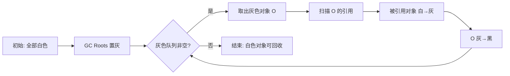

# Java 虚拟机面试二

## 垃圾收集

### 【困难】如何判断 Java 对象是否可以被回收？⭐⭐⭐⭐⭐

> 🎯 目标等级：L3-L4 ｜ ⏱ 建议用时：15 min ｜ 🏷 标签：垃圾收集 / 存活判定

#### 💎 关键结论

JVM 采用**可达性分析**而非引用计数：从 GC Roots 出发搜索引用图，可达即存活，不可达即可回收；放弃引用计数是因为它无法解决循环引用问题。

#### ⚡记忆卡片

- **口诀**：引用计数难破环，可达分析从根看；根可达则活，不可达则死
- **关键词**：GC Roots ／ 可达性分析 ／ 循环引用
- **链路**：GC Roots 出发 → 遍历引用图 → 可达存活、不可达回收

#### 📖 核心知识

**1. 引用计数法（JVM 不采用）**

在对象中维护引用计数器，被引用加一、引用失效减一，计数为零即可回收。它**简单高效**，但存在致命的**循环引用**问题——互相引用的对象计数永远不为零，无法回收：

```java
public class ReferenceCountingGC {
    public Object instance = null;

    public static void main(String[] args) {
        ReferenceCountingGC objectA = new ReferenceCountingGC();
        ReferenceCountingGC objectB = new ReferenceCountingGC();
        objectA.instance = objectB;
        objectB.instance = objectA;
    }
}
```

因为循环引用的存在，**HotSpot 虚拟机不采用引用计数算法**。

**2. 可达性分析法（HotSpot 采用）**

以 **GC Roots** 为起始点向下搜索引用链，能到达的对象视为**存活**，不可达的对象视为**可回收**：


**可作为 GC Roots 的对象**包括：

- 虚拟机栈（栈帧中的局部变量表）中引用的对象（如当前方法局部变量）。
- 本地方法栈（JNI）中引用的 Native 对象。
- 方法区中静态属性（`static` 字段）引用的对象。
- 方法区中常量（`final` 常量）引用的对象。
- Java 虚拟机内部的引用（如基本数据类型对应的 Class 对象、常驻的异常对象如 `NullPointerException`、系统类加载器）。
- 所有被同步锁（`synchronized` 关键字）持有的对象。
- 反映 Java 虚拟机内部情况的 JMXBean、JVMTI 中注册的回调、本地代码缓存等。

**3. 方法区（元空间）的回收条件**

主要回收**废弃常量**和**不再使用的类**。不再使用的类需同时满足：

- Java 堆中不存在该类的任何实例。
- 加载该类的 `ClassLoader` 已被回收。
- 该类对应的 `Class` 对象无任何地方引用（如反射）。

以上为**类卸载的必要条件，且全部满足也不一定被卸载**。

**4. 常见内存泄漏场景**

**内存泄漏的本质是对象被意外持有无法回收**，常见情况：

- 静态容器（如 `static HashMap`）持有对象。
- 未关闭的资源（如数据库连接、流）。
- 监听器未注销。
- 不合理使用 `finalize()` 导致对象复活。

::: details 案例：循环引用导致引用计数失效
上例中 `objectA` 与 `objectB` 互相引用且均离开作用域后，二者引用计数均为 1，引用计数算法下永远无法回收；而可达性分析中二者对 GC Roots 均不可达，可正常回收。
:::

#### 🔬 扩展知识

::: details
- 【L3】**不可达 ≠ 立即回收**：对象被判定不可达后还有两次标记机会——若重写了 `finalize()` 且未被调用过，会被放入 F-Queue 由低优先级线程执行，可在其中重新建立引用完成"自救"（自救仅一次机会）。
- 【L3】**安全点约束**：可达性分析必须保证引用图快照一致，因此需要在安全点（Safepoint）暂停用户线程，分析过程与 GC 停顿直接相关。
- 【L4】**跨语言对比**：CPython 以引用计数为主 + 分代 GC 兜底处理循环引用；Swift/Objective-C 使用 ARC（编译期插入 retain/release，Swift 用弱引用弱解循环）；Go 使用并发三色标记，与 JVM 同属可达性分析家族。
:::

#### 🏭 实战场景

::: details
某电商订单服务（JDK 11，堆 8GB，G1）Full GC 后老年代水位长期维持在 6GB 不下降：用 `jmap -histo` 发现 `byte[]` 实例占用 3.2GB，dump 后用 MAT 分析 GC Roots 引用链，定位到一个 `static ConcurrentHashMap` 作为全局缓存无淘汰策略、无上限增长。改用 Caffeine 并配置 `maximumSize(10000)` + 10 分钟过期后，老年代稳定在 2GB，Full GC 由每天 3~4 次降为 0。
:::

#### ⚠️ 常见误区

::: details
常见误区：
- ❌ "引用计数是 Java GC 的判定算法" → 错误，HotSpot 因循环引用问题从未采用引用计数，仅作为对比知识出现。
- ❌ "对象不可达就一定会立刻被回收" → 不可达只是必要条件，还受 GC 触发时机、`finalize()` 自救、晋升/分代策略影响。
- ❌ "GC Roots 只有栈中局部变量" → 静态字段、常量、JNI 引用、锁持有的对象等都是 GC Roots。
:::

#### 🔀 发散问题

- **Q：引用计数完全不可用吗？** → 不是，它在无循环引用场景下回收及时、无 STW，被 CPython、ARC 等采用；JVM 放弃它仅因循环引用无法解决。
- **Q：如何避免内存泄漏？** → 避免静态容器无限增长、及时关闭资源、注销监听器、缓存设置容量/过期策略；详细排查见本文档「如何在 Java 中进行内存泄漏分析？」。

### 【中等】为什么不建议使用 finalize()？⭐⭐

> 🎯 目标等级：L2 ｜ ⏱ 建议用时：5 min ｜ 🏷 标签：垃圾收集 / 资源清理

#### 💎 关键结论

`finalize()` 执行时机不确定、可能永远不被调用，且会拖慢对象回收、易引发内存泄漏，Java 9 已将其标记为 `@Deprecated`；资源管理应优先使用 `try-with-resources` 或显式 `close()`。

#### ⚡记忆卡片

- **口诀**：finalize 三宗罪——时机不定、性能差、能复活；资源清理靠 try-with-resources
- **关键词**：不确定执行 ／ 延迟回收 ／ Cleaner 替代
- **链路**：对象标记垃圾 → 入 F-Queue 执行 finalize → 才能回收（可能永不执行）

#### 📖 核心知识

`finalize()` 类似 C++ 的析构函数，是对象被垃圾回收前**最后的自救机会**，用于关闭外部资源等工作：

1. **调用时机**：对象被标记为垃圾后、实际回收前，由 JVM 的垃圾回收线程触发（**不保证立即执行**）。
2. **自救机制**：在 `finalize()` 中重新让对象被引用（如赋值给静态变量），可避免本次回收。
3. **风险**：
   - **执行时机不确定，可能永远不调用**，依赖它释放资源会导致资源耗尽。
   - **性能差（延迟回收），易导致内存泄漏**：对象需等 finalize 执行后才可能被回收。

**结论：不要使用 finalize()！** Java 9 后它被标记为 `@Deprecated`，推荐用 `try-with-resources` 或显式调用 `close()` 管理资源。

#### 🔬 扩展知识

::: details
- 【L3】**JDK 9+ 替代方案 Cleaner**：JDK 9 引入 `java.lang.ref.Cleaner`，基于**虚引用 + ReferenceQueue** 实现更安全的资源清理：

```java
// Cleaner 使用示例
public class ResourceHolder implements AutoCloseable {
    private static final Cleaner cleaner = Cleaner.create();
    private final Cleaner.Cleanable cleanable;

    public ResourceHolder() {
        this.cleanable = cleaner.register(this, new CleanupAction());
    }

    @Override
    public void close() {
        cleanable.clean();  // 显式清理
    }

    private static class CleanupAction implements Runnable {
        @Override
        public void run() {
            // 资源清理逻辑（在 Cleaner 线程中执行）
        }
    }
}
```

- 【L3】**Cleaner vs finalize()**：Cleaner 在**专用线程**中执行，不影响 GC 进度；基于虚引用，对象已被回收后才触发清理，不会"复活"对象；但它仍是**兜底机制**，应优先用 `try-with-resources` 显式释放。
- 【L3】**finalize 的回收延迟机制**：重写了 `finalize()` 的对象被标记不可达后会被放入 F-Queue，由低优先级 Finalizer 线程串行执行，若其中阻塞会拖慢整个回收链路。
:::

#### 🔀 发散问题

- **Q：finalize() 能让对象复活几次？** → 只有一次。finalize 对每个对象最多被调用一次，自救后再次不可达时不会再调用。
- **Q：DirectByteBuffer 的堆外内存靠什么释放？** → 正是靠 Cleaner 机制：DirectByteBuffer 对象被回收时，其关联的 Cleaner 释放对应的 native 内存（见本文档「Java 对象有哪些引用类型？」中虚引用的用途）。

### 【困难】什么是三色标记？如何解决漏标问题？⭐⭐⭐⭐

> 🎯 目标等级：L3-L4 ｜ ⏱ 建议用时：15 min ｜ 🏷 标签：垃圾收集 / 并发标记

#### 💎 关键结论

三色标记用白/灰/黑三态推进可达性分析；并发标记时漏标需**两个条件同时满足**（黑指新白 + 灰断旧白），因此用**增量更新**（CMS，破坏条件一）或 **SATB**（G1，破坏条件二）配合写屏障即可解决。

#### ⚡记忆卡片

- **口诀**：黑指新白且灰断链，漏标两条件缺一不现；CMS 增量更新，G1 原始快照
- **关键词**：三色标记 ／ 漏标 ／ 写屏障
- **链路**：根置灰 → 灰扫白变灰 → 灰变黑 → 白即垃圾

#### 📖 核心知识

三色标记（Tri-color Marking）是现代并发垃圾收集器（CMS、G1、ZGC、Shenandoah）的**核心标记算法**，用于在用户线程并发运行时准确标记存活对象。

**1. 三色定义**

| 颜色     | 含义                                                                                     |
| :------- | :--------------------------------------------------------------------------------------- |
| **白色** | 尚未被垃圾收集器访问的对象。GC 开始时所有对象均为白色；GC 结束后仍为白色的对象将被回收。 |
| **黑色** | 已被垃圾收集器访问过，且该对象的所有引用都已扫描过。黑色对象是存活对象，不会被回收。     |
| **灰色** | 已被垃圾收集器访问过，但其引用至少还有一个未被扫描。灰色是"待处理"队列中的对象。         |

**2. 标记过程**



**3. 漏标问题（核心难点）**

在**并发标记**过程中，用户线程可能修改对象引用关系，导致"漏标"——原本存活的对象被误判为可回收。漏标发生在以下**两个条件同时满足**时：

1. **赋值器插入了一条或多条从黑色对象到白色对象的新引用**（黑色对象不再扫描引用）。
2. **赋值器删除了全部从灰色对象到该白色对象的直接或间接引用**（灰色对象还没扫描到白色对象）。

```java
// 漏标示例（假设 GC 已并发标记）
Object G = ...;  // 灰色（未扫描完引用）
Object B = ...;  // 黑色（已扫描完引用）
Object W = ...;  // 白色

// 用户线程并发执行：
B.field = W;  // 黑色 B 引用白色 W（条件1：黑色引用白色）
G.field = null;  // 灰色 G 断开引用 W（条件2：灰色删除引用）
// 结果：W 被漏标，GC 认为它是垃圾 → 误回收！
```

**4. 解决漏标的两大方案**

**只要破坏漏标的两个条件之一，即可避免漏标**：

| 方案                                            | 破坏条件 | 原理                                                                                | 实现者         |
| :---------------------------------------------- | :------- | :---------------------------------------------------------------------------------- | :------------- |
| **增量更新（Incremental Update）**              | 条件 1   | 黑色对象新增引用白色对象时，通过**写屏障**记录该黑色对象，重新标为灰色              | CMS            |
| **原始快照（SATB，Snapshot-At-The-Beginning）** | 条件 2   | 灰色对象删除引用白色对象时，通过**写屏障**记录该引用，GC 结束时重新扫描这些白色对象 | G1、Shenandoah |

**写屏障（Write Barrier）**：在对象引用被修改时，JVM 通过写屏障拦截，记录引用变更。两者都以牺牲少量浮动垃圾换取并发安全（增量更新多扫黑色对象，SATB 多扫快照引用）。

::: details 案例：SATB 写屏障伪代码（G1 使用）

```java
// SATB 写屏障伪代码（G1 使用）
void oop_field_store(oop* field, oop new_value) {
    oop old_value = *field;  // 保存旧值
    satb_mark_queue.add(old_value);  // 加入 SATB 队列，GC 结束时重新扫描
    *field = new_value;
}
```

:::

#### 🔬 扩展知识

::: details
- 【L3】**增量更新的代价**：CMS 重新标记（Remark）阶段需重新扫描黑色对象新增的引用，扫描范围可能接近全堆，是 CMS 停顿的主要来源；可配合 `-XX:+CMSScavengeFirstRemark` 先做一次 Young GC 缩小 Remark 扫描范围。
- 【L3】**SATB 的代价**：以标记开始的快照为准，并发期间新分配的对象（浮动垃圾）本轮不回收；SATB 队列积压过多时可能触发退化处理（ evacuation failure 风险）。
- 【L4】**各 GC 漏标方案横向对比**：

| GC             | 标记算法             | 解决漏标方案 | 特点                            |
| :------------- | :------------------- | :----------- | :------------------------------ |
| **CMS**        | 三色标记             | 增量更新     | 重新标记阶段 STW 较长           |
| **G1**         | 三色标记             | SATB         | 重新标记阶段短，但浮动垃圾稍多  |
| **ZGC**        | 三色标记（染色指针） | 读屏障       | 无长 STW 标记，靠读屏障保证一致性 |
| **Shenandoah** | 三色标记（转发指针） | SATB + 读屏障 | 并发整理，仅极短 STW            |

- 【L4】**Go 的选择**：Go 1.8+ 采用混合写屏障（Dijkstra 增量更新 + Yuasa SATB 结合），使并发标记期间无需重新扫描栈，停顿降至亚毫秒级。
:::

#### 🏭 实战场景

::: details
某金融实时交易系统（JDK 11，G1，堆 16GB）并发标记期间 SATB 队列积压告警：引用密集型业务（每秒约 200 万次引用更新）导致 `-XX:G1ConcRefinementGreenZone` 频繁溢出，Mixed GC 停顿从 80ms 飙升至 300ms。调优：`-XX:G1RSetUpdatingPauseTimePercent` 由默认 10 降为 5，并将写屏障精炼线程 `-XX:G1ConcRefinementThreads` 调整为 4 后，停顿回落至 90ms 以内。
:::

#### ⚠️ 常见误区

::: details
常见误区：
- ❌ "漏标只需一个条件就会发生" → 必须黑指新白与灰断旧白**同时满足**，这正是增量更新/SATB 破坏其一即可的原因。
- ❌ "SATB 会漏掉并发期间新创建的对象" → 不会漏标安全性，新对象默认存活视为黑色（或下轮处理），最多成为浮动垃圾。
- ❌ "读屏障与写屏障可以互换" → 写屏障拦截写操作（CMS/G1 用），读屏障拦截读操作（ZGC/Shenandoah 用），实现机制和开销不同。
:::

#### 🔀 发散问题

- **Q：为什么 G1 选 SATB 而 CMS 选增量更新？** → SATB 的最终标记（Final Marking）只需处理 SATB 队列，停顿短且可预测，适合 G1 的停顿目标模型；CMS 历史较早，增量更新实现更简单。
- **Q：浮动垃圾是什么？** → 并发标记期间已死亡但被快照认为存活的对象，本轮无法回收，下轮处理；SATB 方案的典型副作用。
- **Q：ZGC 靠读屏障如何保证一致性？** → 见本文档「Java 的 ZGC 垃圾回收流程是怎样的？」。

### 【中等】什么是安全点和安全区域？⭐⭐⭐

> 🎯 目标等级：L2-L3 ｜ ⏱ 建议用时：10 min ｜ 🏷 标签：垃圾收集 / 停顿机制

#### 💎 关键结论

安全点是运行线程可安全暂停的位置（方法调用/循环回边/异常跳转），线程主动 poll；安全区域解决睡眠/阻塞线程无法走到安全点的问题，进入时标记、离开前检查 GC 是否完成。

#### ⚡记忆卡片

- **口诀**：调用回边异常处，主动 poll 才暂停；睡阻线程靠安全区域，进入标记离开等
- **关键词**：Safepoint ／ Safe Region ／ STW
- **链路**：GC 发起 → 设置标志 → 线程到达安全点挂起 → 全部到达 → STW 开始

#### 📖 核心知识

GC 进行垃圾回收时，需要确保**所有线程都在安全的位置暂停**（STW），否则可能因为引用关系正在变化导致标记错误。这个"安全的位置"就是**安全点（Safepoint）**和**安全区域（Safe Region）**。

**1. 安全点（Safepoint）**

- **定义**：程序执行过程中的特定位置，线程在此处挂起时，GC 可以安全地进行堆操作（引用关系稳定）。
- **位置**：通常设置在**方法调用、循环跳转、异常跳转**等指令处（长时间执行的代码不会缺少安全点）。
- **机制**：
  - GC 发起时，JVM 设置安全点标志。
  - 用户线程运行到安全点时**主动检查**该标志，若为 true 则挂起等待。
  - 所有线程都到达安全点后，GC 才真正开始。
- **问题**：如果某个线程长时间不经过安全点（如大循环），会导致其他线程等待，造成 STW 延迟。

```java
// 大循环可能不进入安全点，导致其他线程被阻塞
for (int i = 0; i < Integer.MAX_VALUE; i++) {
    count++;  // 若 JIT 将其优化为计数循环，可能不检查安全点
}
```

**2. 安全区域（Safe Region）**

- **解决的问题**：当线程处于 **Sleep、Blocked、等待 I/O** 等状态时，无法主动走到安全点。
- **定义**：一段代码区域，线程在其中执行时引用关系不会发生变化，相当于"扩展的安全点"。
- **机制**：
  1. 线程进入安全区域时，标记自己进入 Safe Region。
  2. GC 发起时，不需要等待这些线程（它们不会改变引用）。
  3. 线程离开安全区域前，检查 GC 是否完成，若未完成则等待。

**3. 安全点 vs 安全区域**

| 维度     | 安全点（Safepoint）          | 安全区域（Safe Region）                |
| :------- | :--------------------------- | :------------------------------------- |
| 适用线程 | 运行中的线程                 | 阻塞 / 睡眠的线程                      |
| 位置     | 方法调用、循环回边、异常跳转 | JNI 调用、Thread.sleep、I/O 阻塞       |
| 机制     | 线程主动 poll 标志并挂起     | 线程进入时标记，离开时检查 GC 是否完成 |

#### 🔬 扩展知识

::: details
- 【L3】**计数循环陷阱**：HotSpot 对 `int` 等可数循环（counted loop）默认不在循环体内插入安全点检查，若循环体纯计算且次数巨大会长时间无法停顿；规避方式：改用 long 计数器、循环内加无副作用方法调用，或 `-XX:+UseCountedLoopSafepoints`（JDK 10+ 默认启用，JDK 14+ 进一步改进）。
- 【L3】**主动式中断 vs 被动式中断**：HotSpot 采用主动式中断——线程自行 poll 标志位；另一种思路是硬件中断强制暂停线程，实现复杂且需保证任意指令处均可安全停顿，主流 JVM 未采用。
- 【L4】**同步开销**：所有线程到达安全点才能开始 GC，最慢线程决定停顿延迟（Time-To-Safepoint）；JDK 10+ 可用 `-Xlog:safepoint` 观察 ttsp 耗时，ZGC/Shenandoah 通过减少 STW 阶段从根本上削弱了该问题。
:::

#### 🔀 发散问题

- **Q：为什么不在每条指令处都设安全点？** → 安全点检查有开销（poll 标志位 + 分支预测），过密会拖慢应用；方法调用/循环回边已能保证任意代码在有限时间内可达安全点。
- **Q：TTSP 过长如何排查？** → 开启 `-Xlog:safepoint` 找出未到达的线程，通常是纯计算的计数循环或 Native 调用（JNI 代码不受安全点约束，由 Native 方法边界处理）。

### 【中等】Java 对象有哪些引用类型？⭐⭐⭐

> 🎯 目标等级：L2-L3 ｜ ⏱ 建议用时：10 min ｜ 🏷 标签：垃圾收集 / 引用类型

#### 💎 关键结论

四种引用按强度递减：**强引用**永不回收、**软引用**内存不足才回收（适合缓存）、**弱引用**下次 GC 必回收（防泄漏）、**虚引用**无法获取对象，仅用于回收通知（堆外内存管理）。

#### ⚡记忆卡片

- **口诀**：强不软弱虚：强不回收、软缺内存才收、弱 GC 就收、虚只收通知
- **关键词**：强 ／ 软 ／ 弱 ／ 虚
- **链路**：强（永不）→ 软（OOM 前）→ 弱（GC 时）→ 虚（回收通知）

#### 📖 核心知识

在 Java 中，对象的引用类型决定了它们如何被垃圾回收（GC）处理，主要分为 **4 种引用类型**，按强度从高到低：

| 引用类型 | 回收时机                 | 是否可获取对象（`get()`） | 典型用途                         |
| -------- | ------------------------ | ------------------------- | -------------------------------- |
| 强引用   | 永不回收（除非显式置空） | 是                        | 常规对象                         |
| 软引用   | 内存不足时               | 是                        | 缓存                             |
| 弱引用   | GC 运行时                | 是                        | 避免内存泄漏（如 `WeakHashMap`） |
| 虚引用   | GC 运行时                | 否                        | 对象回收跟踪（如堆外内存管理）   |

**（1）强引用（Strong Reference）**

**被强引用关联的对象不会被垃圾收集器回收**。强引用是最常见的方式：`new` 一个新对象即为强引用：

```java
Object obj = new Object(); // 强引用
```

**回收条件**：当 `obj = null` 或超出作用域时，对象变为可回收状态。

**（2）软引用（Soft Reference）**

**被软引用关联的对象，只有在内存不够的情况下才会被回收**。使用 `SoftReference` 创建：

```java
SoftReference<Object> softRef = new SoftReference<>(new Object());
Object obj = softRef.get(); // 可能返回 null（如果被回收）
```

**用途**：适合实现缓存（如图片缓存），内存紧张时自动释放。

**（3）弱引用（Weak Reference）**

**被弱引用关联的对象一定会被垃圾收集器回收**，即只能存活到下一次垃圾收集发生之前。使用 `WeakReference` 创建：

```java
WeakReference<Object> weakRef = new WeakReference<>(new Object());
System.gc();
Object obj = weakRef.get(); // 通常返回 null
```

**用途**：适合临时缓存（如 `WeakHashMap` 的键）、避免内存泄漏。

**（4）虚引用（Phantom Reference）**

虚引用又称为幽灵引用或者幻影引用。**无法通过虚引用获取对象**（`get()` 始终返回 `null`）：一个对象是否有虚引用的存在，完全不会对其生存时间构成影响。**设置虚引用的唯一目的就是在对象被收集器回收时收到一个系统通知**。使用 `PhantomReference` 创建：

```java
ReferenceQueue<Object> queue = new ReferenceQueue<>();
PhantomReference<Object> phantomRef = new PhantomReference<>(new Object(), queue);
System.gc();
Reference<?> ref = queue.poll(); // 不为 null 说明对象被回收
```

**用途**：管理堆外内存（如 NIO 的 `DirectByteBuffer`）。

**对比总结**：

1. **强引用**是默认方式，其他引用需显式使用 `java.lang.ref` 包下的类。
2. **软引用 vs 弱引用**：软引用适合保留缓存直到内存紧张；弱引用立即释放，避免内存泄漏。
3. **虚引用**的唯一用途是关联 `ReferenceQueue`，用于对象回收后的通知。

通过合理选择引用类型，可以优化内存管理并避免内存泄漏问题。

#### 🔬 扩展知识

::: details
- 【L3】**ReferenceQueue 机制**：软/弱/虚引用都可关联 `ReferenceQueue`，对象被回收后对应引用对象会入队，可轮询感知回收事件；虚引用必须关联队列。
- 【L3】**软引用的回收时机细节**：HotSpot 通过 `-XX:SoftRefLRUPolicyMSPerMB`（默认 1000）控制软引用存活时长——空闲堆下软引用至少存活「空闲内存 MB × 该值」毫秒才被回收；堆接近耗尽时（OOM 前）才会集中清理。
- 【L4】**典型应用链路**：`DirectByteBuffer` 用 Cleaner（虚引用实现）释放堆外内存；`ThreadLocal` 的 Entry 用弱引用 key 防泄漏；`WeakHashMap` 用于缓存元数据（如 ClassLoader 相关缓存）。
:::

#### 🔀 发散问题

- **Q：ThreadLocal 为什么会内存泄漏？** → Entry 的 key 是弱引用会被回收，但 value 被 Entry 强引用，若线程池线程长期存活且不调用 `remove()`，value 会一直滞留；最佳实践是用完显式 `remove()`。
- **Q：软引用做缓存有什么缺点？** → 回收时机不可控且依赖 LRU 策略，命中率难保证；生产环境更推荐 Caffeine/Guava Cache 等具备容量与过期策略的缓存。

### 【中等】Java 中有哪些垃圾回收算法？⭐⭐⭐⭐⭐

> 🎯 目标等级：L2-L3 ｜ ⏱ 建议用时：12 min ｜ 🏷 标签：垃圾收集 / 回收算法

#### 💎 关键结论

基础算法三种：标记-清除（有碎片）、标记-整理（无碎片但需移动）、复制（高效但浪费空间）；工程上按分代选算法：年轻代复制、老年代标记-整理，G1/ZGC 进一步用分区 + 并发控制停顿。

#### ⚡记忆卡片

- **口诀**：清除有碎片，整理要搬家，复制省一半；年轻复制、老年整理、G1 分区
- **关键词**：标记-清除 ／ 标记-整理 ／ 复制 ／ 分代
- **链路**：标记存活 → 按代选算法回收 → 分区/并发控制停顿

#### 📖 核心知识

垃圾收集的性能指标主要有两点：

- **停顿时间** - 停顿时间是因为 GC 而导致程序不能工作的时间长度。
- **吞吐量** - 吞吐量关注在特定的时间周期内一个应用的工作量的最大值。对关注吞吐量的应用来说长暂停时间是可以接受的。由于高吞吐量的应用关注的基准在更长周期时间上，所以快速响应时间不在考虑之内。

**1. 标记-清除算法（Mark-Sweep）**


- **原理**：① **标记**：从 GC Roots 出发，标记所有可达对象；② **清除**：遍历堆内存，回收未被标记的对象。
- **缺点**：产生**内存碎片**（不连续空间），可能导致大对象分配失败；效率较低（需遍历全堆）。
- **适用场景**：老年代（如 CMS 回收器的并发清除阶段）。

**2. 标记-整理算法（Mark-Compact）**


- **原理**：① **标记**：与标记-清除相同；② **整理**：将存活对象向内存一端移动，清理边界外空间。
- **优点**：避免内存碎片。
- **缺点**：移动对象开销大（需更新引用地址，且移动时需 STW 或使用屏障）。
- **适用场景**：适合**老年代**，对象存活率高（如 Serial Old、Parallel Old 回收器）。

**3. 复制算法（Copying）**


- **原理**：将内存分为两块（`From` 和 `To` 空间），每次只使用一块；GC 时将存活对象从 `From` 复制到 `To` 空间，并清空 `From`。
- **优点**：无内存碎片；高效（仅复制存活对象）。
- **缺点**：内存利用率仅 50%（需预留一半空间）。
- **适用场景**：年轻代（如 Serial、ParNew 等回收器），因年轻代对象存活率低。
- **优化**：实际 JVM 将年轻代分为 **Eden** 和 **Survivor（From/To）** 区（比例通常为 `8:1:1`），通过多次复制到 Survivor 区避免浪费。

**4. 分代收集算法（Generational Collection）**

**分代收集是 JVM 在吞吐量、延迟和内存占用之间找到的经典平衡点**，而新一代 GC 则通过更复杂的并发机制尝试突破其限制。根据对象存活周期将堆分为**年轻代**和**老年代**，对不同区域采用不同算法：

- **年轻代**：复制算法（对象朝生夕死，存活率低）。
- **老年代**：标记-清除或标记-整理（对象存活率高）。
- **永久代**：早期 Hotspot JVM 的方法区实现，储存 Java 类元数据、常量池、Intern 字符串缓存，JDK 8 之后不再存在（改为元空间）。
- **跨代引用处理**：使用**记忆集**（**Remembered Set**）记录老年代对年轻代的引用，避免 Young GC 时全堆扫描。


**5. 分区算法（Region-Based）与增量算法（Incremental）**

- **分区算法**：将堆划分为多个独立区域（如 G1 的 **Region**），优先回收垃圾最多的区域；可控制每次回收的区域数量，减少停顿时间（STW），适合大内存应用（如 G1、ZGC、Shenandoah）。
- **增量算法**：通过分阶段执行 GC 与用户线程交替运行，减少单次停顿；缺点是线程切换开销大，整体吞吐量可能下降（如 CMS 的并发标记阶段）。

**6. 常见垃圾回收器与算法对应**

| 回收器                | 新生代算法  | 老年代算法            | 特点                          |
| --------------------- | ----------- | --------------------- | ----------------------------- |
| **Serial**            | 复制        | 标记-整理             | 单线程，STW 时间长。          |
| **ParNew**            | 复制        | 标记-清除（配 CMS）  | Serial 的多线程版。           |
| **Parallel Scavenge** | 复制        | 标记-整理（Parallel Old） | 吞吐量优先。                  |
| **CMS**               | -           | 标记-清除（并发）     | 低延迟，但内存碎片多。        |
| **G1**                | 复制 + 分区 | 标记-整理 + 分区      | 兼顾吞吐与延迟，Region 分区。 |
| **ZGC/Shenandoah**    | 复制 + 分区 | 标记-整理 + 分区      | 亚毫秒级停顿，并发标记/整理。 |

现代 JVM 趋向于使用**分代+分区+并发**的复合算法（如 G1），在吞吐量和延迟之间取得平衡。

#### 🔬 扩展知识

::: details
- 【L3】**记忆集的实现——卡表（Card Table）**：G1 之前主流实现是将老年代划分为 512 字节的卡（Card），年轻代 GC 时只扫描被标记为脏的卡对应的 RSet 条目，把跨代扫描从 O(全堆) 降为 O(脏卡数)；写屏障负责在跨代引用时标脏卡。
- 【L3】**复制算法的分配担保**：若 Survivor 装不下 Eden 存活对象，会通过分配担保机制提前转入老年代（见本文档「JVM 的内存分配策略是怎样的？对象何时晋升老年代？」）。
- 【L4】**算法演进脉络**：标记-清除/复制/标记-整理（串行）→ 并行多线程（Parallel）→ 并发标记（CMS 增量）→ 分代+分区+并发复合（G1）→ 全并发低延迟（ZGC 染色指针/Shenandoah 转发指针）；核心矛盾始终是停顿时间 vs 吞吐量 vs 内存开销。
:::

#### 🔀 发散问题

- **Q：为什么年轻代不用标记-整理？** → 年轻代对象存活率低（通常 <10%），复制成本远低于标记+移动全部存活对象的成本，且复制后天然无碎片。
- **Q：为什么老年代不用复制算法？** → 老年代对象存活率高（可达 90%+），复制几乎等于全量拷贝，且需预留一半空间，代价过高。
- **Q：CMS 的碎片问题如何解决？** → 标记-清除不移动对象必然产生碎片，可通过 `-XX:CMSFullGCsBeforeCompaction` 周期性触发带压缩的 Full GC 整理；这也是 G1 取代 CMS 的原因之一。

### 【中等】Java 中常见的垃圾收集器有哪些？⭐⭐⭐⭐⭐

> 🎯 目标等级：L2-L3 ｜ ⏱ 建议用时：12 min ｜ 🏷 标签：垃圾收集 / 收集器选型

#### 💎 关键结论

收集器按目标分三类：吞吐优先（Parallel）、低延迟（CMS/G1）、极低延迟（ZGC/Shenandoah）；JDK 8 默认 Parallel、JDK 9+ 默认 G1，低延迟大堆场景 JDK 21+ 首选分代 ZGC。

#### ⚡记忆卡片

- **口诀**：吞吐 Parallel，均衡选 G1，低延迟 ZGC；8 并行 9 G1，21 分代 ZGC
- **关键词**：Parallel ／ G1 ／ ZGC
- **链路**：小堆 Parallel → 中大堆 G1 → TB 级低延迟 ZGC/Shenandoah

#### 📖 核心知识


以下是 Java 主要垃圾收集器的详细对比表格，涵盖算法、特点、适用场景和关键参数：

| **垃圾收集器**        | **分类**         | **算法**                          | **目标**               | **适用场景**                  | **JDK 版本**         | **启用参数**                     | **优缺点**                                                     |
| --------------------- | ---------------- | --------------------------------- | ---------------------- | ----------------------------- | -------------------- | -------------------------------- | -------------------------------------------------------------- |
| **Serial GC**         | 串行             | 新生代：复制<br>老年代：标记-整理 | 简单低开销             | 单核、客户端应用、小堆        | 所有版本             | `-XX:+UseSerialGC`               | ✔️ 内存占用小<br>❌ 全程 STW，延迟高                           |
| **Parallel Scavenge** | 并行（吞吐优先） | 新生代：复制                      | 高吞吐量               | 后台计算、多核大堆            | JDK 1.4+             | `-XX:+UseParallelGC`             | ✔️ 吞吐量高<br>❌ 停顿时间较长                                 |
| **Parallel Old**      | 并行（吞吐优先） | 老年代：标记-整理                 | 配合 Parallel Scavenge | 与 Parallel Scavenge 搭配使用 | JDK 6+               | `-XX:+UseParallelOldGC`          | ✔️ 老年代并行回收<br>❌ 仍以吞吐优先，延迟较高                 |
| **ParNew**            | 并行             | 新生代：复制                      | 低停顿（与 CMS 配合）  | 需与 CMS 搭配的多核环境       | JDK 1.4+             | `-XX:+UseParNewGC`               | ✔️ 多线程版 Serial GC<br>❌ 仅新生代，需搭配 CMS               |
| **CMS**               | 并发（低延迟）   | 老年代：标记-清除                 | 最小化停顿时间         | 老年代低延迟应用              | JDK 5~14（9 废弃，14 移除） | `-XX:+UseConcMarkSweepGC`        | ✔️ 并发收集，低停顿<br>❌ 内存碎片、并发模式失败风险           |
| **G1**                | 分区+并发        | 标记-整理（分 Region）            | 平衡吞吐与延迟         | 大堆（数十 GB）                | JDK 7+（JDK 9+默认） | `-XX:+UseG1GC`                   | ✔️ 可预测停顿、大堆友好<br>❌ 内存占用略高                     |
| **ZGC**               | 并发             | 染色指针+读屏障                   | 亚毫秒级停顿（<10ms）  | 超大堆（TB 级）、云原生       | JDK 11 实验，JDK 15 生产可用 | `-XX:+UseZGC`                    | ✔️ 极低停顿、堆大小几乎无限制<br>❌ 吞吐量略低于 G1            |
| **分代 ZGC**          | 并发+分代        | 染色指针+分代回收                 | 亚毫秒级（<1ms）       | JDK 21+ 低延迟首选            | JDK 21+              | `-XX:+UseZGC -XX:+ZGenerational` | ✔️ 分代优化、停顿更低、吞吐更高<br>❌ JDK 21+ 才支持           |
| **Shenandoah**        | 并发             | 转发指针+读屏障                   | 低延迟（与 ZGC 竞争）  | Red Hat 系、低延迟大堆        | JDK 12 实验，JDK 15 转正 | `-XX:+UseShenandoahGC`           | ✔️ 并发压缩、停顿与堆大小无关<br>❌ 非 Oracle 官方默认         |

**关键对比维度**

- **吞吐量**：Parallel GC（Parallel Scavenge + Parallel Old）最优。
- **延迟**：ZGC/Shenandoah < G1 < CMS < Parallel GC。
- **堆大小**：小堆（<4GB）选 Serial/Parallel；大堆（4GB~数十 GB）选 G1；超大堆（TB 级）选 ZGC/Shenandoah。
- **版本兼容性**：JDK 8 默认 Parallel GC，可选 G1/CMS（CMS 已废弃）；JDK 11+ 默认 G1，可选 ZGC/Shenandoah；JDK 21+ 默认 G1，可选分代 ZGC（推荐低延迟场景）。

**选择建议**

- **常规服务端应用**：JDK 8 用 `G1`，JDK 11~20 用 `ZGC`，JDK 21+ 用**分代 ZGC**（若需超低延迟）。
- **批处理任务**：`Parallel GC`（高吞吐优先）。
- **资源受限环境**：`Serial GC`（如嵌入式设备）。
- **兼容性测试**：JDK 11+ 可试用 `Shenandoah`（非 Oracle 官方构建需注意）。

通过此表格可快速定位适合业务需求的 GC 组合。

#### 🔬 扩展知识

::: details
- 【L3】**组合规则**：收集器需分代搭配——ParNew/CMS 只能搭配老年代 CMS；Parallel Scavenge 只能搭配 Parallel Old（不能配 CMS）；G1/ZGC/Shenandoah 是整堆收集器，无需搭配。
- 【L3】**版本演进关键节点**：CMS 于 JDK 9 标记废弃、JDK 14 移除；G1 自 JDK 9 成为默认；ZGC 于 JDK 11 实验引入、JDK 15 生产可用、JDK 21 支持分代；Shenandoah 于 JDK 12 实验引入、JDK 15 转正。
- 【L4】**选型量化参考**：4C8G 小堆批处理选 Parallel（吞吐可达 99%）；8~64GB 在线服务 G1 默认 200ms 停顿目标即可满足 P99；百 GB 级低延迟用分代 ZGC（停顿与堆大小无关，<1ms）。
:::

#### 🔀 发散问题

- **Q：为什么 JDK 9 之后默认 G1 而不是 Parallel？** → G1 的 Region 分区 + 停顿预测模型在大堆下停顿可控，兼顾吞吐与延迟，适用面更广；Parallel 仅吞吐最优但停顿不可控。
- **Q：ZGC 和 Shenandoah 怎么选？** → 两者目标一致；ZGC 是 Oracle 官方 JDK 内置（JDK 15+），染色指针无额外内存开销；Shenandoah 需 Red Hat 系构建，转发指针每对象多 8 字节开销。JDK 21+ 优先分代 ZGC。

### 【困难】Java 中的 Young GC、Old GC、Full GC 和 Mixed GC 的区别是什么？⭐⭐⭐

> 🎯 目标等级：L3-L4 ｜ ⏱ 建议用时：15 min ｜ 🏷 标签：垃圾收集 / GC 类型

#### 💎 关键结论

按回收区域区分：**Young GC** 只收新生代（Eden 满触发，频繁但快）、**Old GC** 只收老年代（仅 CMS/G1 支持）、**Full GC** 收全堆+元空间（代价最高，应避免）、**Mixed GC** 是 G1 特有的新生代+部分老年代增量回收。

#### ⚡记忆卡片

- **口诀**：Young 收新、Old 收老、Full 全收代价高、Mixed 是 G1 的混收宝
- **关键词**：回收区域 ／ 触发条件 ／ STW 代价
- **链路**：Eden 满 → Young GC → 晋升堆积 → Mixed/Old GC → 担保失败/元空间满 → Full GC

#### 📖 核心知识

| 类型         | 核心回收区域             | 触发时机                                        | 回收目标                    | 暂停特性                 |
| :----------- | :----------------------- | :---------------------------------------------- | :-------------------------- | :----------------------- |
| **Young GC** | 新生代（Eden + S0/S1）   | Eden 区满，无法为新对象分配内存时               | 回收新生代的临时对象        | 暂停时间短、频率高       |
| **Old GC**   | 老年代                   | 老年代空间不足（仅 CMS/G1 支持单独回收）        | 回收老年代的长期存活对象    | 暂停时间较长、频率低     |
| **Full GC**  | 新生代 + 老年代 / 元空间 | 老年代满 / 元空间满 / 分配担保失败 / 显式触发等 | 回收全堆垃圾                | 暂停时间最长、性能影响大 |
| **Mixed GC** | 新生代 + 部分老年代      | G1 特有，老年代占比达到阈值（IHOP）时           | 同时回收新生代 + 部分老年代 | 暂停时间可控（增量回收） |

**1. Young GC**

又称 YGC 或 Minor GC，仅针对**新生代（Eden 区 + Survivor 区）**，是 JVM 中最频繁的 GC 类型，几乎所有收集器都支持。核心触发条件：**新对象分配时 Eden 区空间不足**。执行逻辑（复制算法）：STW → 标记 Eden 和 From 区存活对象 → 复制到 To 区（达晋升阈值者直接进老年代）→ 清空 Eden 和 From，交换 From/To 角色。特点：暂停短（毫秒级）、频率高；相关参数：`-XX:MaxTenuringThreshold=15`（晋升阈值）、`-XX:SurvivorRatio=8`（Eden:Survivor 默认 8:1:1）。

**2. Old GC**

又称 Major GC，仅针对**老年代**，**并非所有回收器都支持**（Parallel GC 不支持单独 Old GC，会退化为 Full GC；CMS/G1 支持）。触发条件：老年代空间不足。以 CMS 为例：初始标记（STW）→ 并发标记 → 重新标记（STW）→ 并发清理（不压缩，产生碎片）。特点：暂停比 Young GC 长、频率低；CMS 大部分阶段并发，STW 短；G1 的老年代回收仍以 STW 为主。

**3. Full GC**

针对**新生代 + 老年代 + 元空间**（Metaspace）的全区域回收，代价最高，会导致应用长时间卡顿（接口超时、TPS 骤降）；频繁 Full GC 常由内存泄漏、不合理对象分配或参数配置不当（如 `-Xmx` 过小）引起。

::: details 案例：Full GC 触发条件与优化策略

**触发条件**：

| **触发条件**             | **具体原因**                                                                 | **关联参数/备注**                                            |
| ------------------------ | ---------------------------------------------------------------------------- | ------------------------------------------------------------ |
| **老年代空间不足**       | 老年代无法通过垃圾回收释放足够空间，无法容纳新晋升的对象                     | `-Xmx`、`-XX:CMSInitiatingOccupancyFraction`（CMS 触发阈值） |
| **永久代/元空间不足**    | Java 7 及之前：永久代（PermGen）耗尽<br>Java 8+：元空间（Metaspace）超过阈值 | `-XX:MetaspaceSize`、`-XX:MaxMetaspaceSize`（Java 8+）       |
| **显式调用 System.gc()** | 代码调用 `System.gc()` 或通过 `jmap -dump` 等工具触发（不保证立即执行）      | `-XX:+DisableExplicitGC`（禁用显式 GC）                      |
| **空间分配担保失败**     | 年轻代晋升时，老年代剩余空间不足（`Promotion Failed`）                       | `-XX:HandlePromotionFailure`（JDK 6u24 后默认启用）          |
| **晋升老年代失败**       | 大对象或长期存活对象直接进入老年代，但老年代空间不足                         | `-XX:PretenureSizeThreshold`（大对象直接晋升阈值）           |
| **平均晋升大小预测失败** | Young GC 前，统计发现历史平均晋升大小 > 老年代当前剩余空间                   | 依赖 JVM 自适应策略（如 `-XX:+UseAdaptiveSizePolicy`）       |

**减少 Full GC 的优化策略**：

| **优化方向**           | **具体措施**                                          | **关键参数示例**                                                       |
| ---------------------- | ----------------------------------------------------- | ---------------------------------------------------------------------- |
| **调整堆内存**         | 增大堆大小，避免老年代频繁耗尽                        | `-Xms4g -Xmx4g`（初始和最大堆一致，避免动态扩容）                      |
| **增大年轻代比例**     | 减少对象过早晋升到老年代                              | `-XX:NewRatio=2`（老年代：新生代=2:1）、`-Xmn2g`（直接设置年轻代大小） |
| **调整元空间大小**     | 避免元空间动态扩展触发 Full GC                        | `-XX:MetaspaceSize=256m -XX:MaxMetaspaceSize=512m`                     |
| **避免大对象直接晋升** | 减少大对象分配或调整晋升阈值                          | `-XX:PretenureSizeThreshold=1m`（>1MB 对象直接进老年代）               |
| **选择低延迟 GC 算法** | 如 G1 或 ZGC，减少 Full GC 频率                       | `-XX:+UseG1GC`、`-XX:+UseZGC`                                          |
| **监控与调优**         | 通过日志分析 Full GC 原因（如 `-XX:+PrintGCDetails`） | `jstat -gcutil`、`jmap -histo` 等工具辅助定位问题。                    |

**关键参数速查**：

| 参数                                    | 作用                            |
| --------------------------------------- | ------------------------------- |
| `-XX:+PrintGCDetails`                   | 打印 GC 日志，分析 Full GC 原因 |
| `-XX:MetaspaceSize=256m`                | 设置元空间初始大小              |
| `-XX:CMSInitiatingOccupancyFraction=70` | CMS 老年代占用率触发阈值        |

:::

**4. Mixed GC**

**G1 收集器特有**的回收行为，同时回收**新生代 + 部分老年代**（并非全量老年代），是 G1 替代 Full GC 的核心策略。触发条件：老年代占比超过 `-XX:InitiatingHeapOccupancyPercent`（默认 45%）。特点：结合 YGC 的快速与 OGC 的深度，增量回收控制停顿，适用于大内存应用。

#### 🔬 扩展知识

::: details
- 【L3】**Major GC ≠ Full GC**：Major GC 通常仅指老年代回收（CMS 的并发回收周期），Full GC 是全堆+元空间；业界常混用，面试时应主动澄清。
- 【L3】**G1 视角的重定义**：G1 中没有传统 Old GC，只有 Young GC 与 Mixed GC；仅当 Evacuation Failure（分配失败）时才退化为全堆 Serial 式 Full GC（JDK 10 前单线程，之后并行）。
- 【L4】**Full GC 停顿量级**：4GB 堆 Serial Old 整理约 1~3 秒；G1 Full GC（并行）约 0.5~1 秒；ZGC 无传统 Full GC 概念（退化时也是并发处理）——这正是低延迟 GC 的核心价值。
:::

#### 🏭 实战场景

::: details
某支付网关（JDK 8，CMS，堆 4GB）高峰期每 10 分钟一次 Full GC（单次约 2.8s），TP99 从 200ms 飙到 5s：GC 日志显示 `concurrent mode failure` + `promotion failed`。定位为大促查询结果集（单次约 80MB 的 List）直接晋升撑爆老年代。处置：① `-XX:CMSInitiatingOccupancyFraction` 92→70 提前触发；② 业务侧分页改造将结果集降到 2MB；③ 长期迁移 G1。优化后 Full GC 降为 0，TP99 稳定在 250ms。
:::

#### ⚠️ 常见误区

::: details
常见误区：
- ❌ "Major GC 就是 Full GC" → Major GC 一般仅指老年代回收；Full GC 回收全堆+元空间，代价更高。
- ❌ "Young GC 只回收 Eden" → 还包括两个 Survivor 区，存活对象在 Survivor 间复制。
- ❌ "所有收集器都支持单独 Old GC" → Parallel GC 不支持，老年代不足时直接触发 Full GC。
- ❌ "Mixed GC 回收全部老年代" → 仅回收老年代中垃圾比例高的部分 Region，全量回收是 Full GC。
:::

#### 🔀 发散问题

- **Q：System.gc() 一定会触发 Full GC 吗？** → 不一定，仅是建议；RMI 场景会周期性调用，可用 `-XX:+DisableExplicitGC` 禁用或 `-XX:+ExplicitGCInvokesConcurrent` 改为并发回收。
- **Q：为什么应避免频繁 Full GC？** → 全堆 STW 停顿秒级，直接导致接口超时、TPS 骤降；优化手段见本文档「如何对 Java 的垃圾回收进行调优？」。

### 【中等】JVM 的内存分配策略是怎样的？对象何时晋升老年代？⭐⭐⭐⭐

> 🎯 目标等级：L2-L3 ｜ ⏱ 建议用时：12 min ｜ 🏷 标签：垃圾收集 / 内存分配

#### 💎 关键结论

分配遵循"**新生代优先 Eden、大对象直接进老年代、长期存活对象晋升**"三大策略；晋升四途径：年龄达标（默认 15）、动态年龄判定、大对象直入、Survivor 装不下。

#### ⚡记忆卡片

- **口诀**：Eden 先分配，大对象直入老年代，熬过十五就晋升，同龄过半提前走
- **关键词**：Eden ／ 大对象 ／ 年龄晋升 ／ 分配担保
- **链路**：Eden 分配 → Survivor 复制计龄 → 达标/动态判定/大对象 → 老年代

#### 📖 核心知识

**1. 堆内存分代结构**


- **新生代（Young Generation）**：Eden + Survivor 0 + Survivor 1（默认比例 `8:1:1`，通过 `-XX:SurvivorRatio=8` 设置）。
- **老年代（Old Generation）**：存放长期存活的对象和大对象。
- 新生代 : 老年代默认比例 = `1:2`（通过 `-XX:NewRatio=2` 设置）。

**2. 内存分配规则**

1. **对象优先在 Eden 分配**：绝大多数对象在 Eden 区分配（若开启 TLAB，则在线程私有的 TLAB 中分配）；Eden 区空间不足时，触发 Minor GC。
2. **大对象直接进入老年代**：大对象（如长数组、大字符串）需要大量连续内存，避免在 Eden 和 Survivor 之间来回复制；阈值由 `-XX:PretenureSizeThreshold` 设置（仅对 Serial、ParNew 有效，Parallel Scavenge 不支持）。

```bash
# 大于 1MB 的对象直接进入老年代
-XX:PretenureSizeThreshold=1048576  # 注意：单位是字节
```

3. **长期存活对象进入老年代**：对象头的 Mark Word 中有 **GC 年龄计数器**，在 Survivor 区每经过一次 Minor GC 年龄 +1，达到阈值（默认 15，`-XX:MaxTenuringThreshold=15`，Mark Word 中年龄位占 4 位故最大 15）时晋升。
4. **动态年龄判断**：Survivor 区中相同年龄的所有对象大小总和超过 Survivor 区空间的一半（`-XX:TargetSurvivorRatio=50`）时，年龄大于或等于该年龄的对象直接进入老年代；这是一种**自适应策略**，避免 Survivor 区溢出。
5. **空间分配担保**：Minor GC 前，JVM 检查**老年代最大可用连续空间**是否大于**新生代所有对象总空间**：
   - **大于**：Minor GC 安全。
   - **小于**：检查是否允许担保失败（`-XX:-HandlePromotionFailure`，JDK 6u24 后默认允许）：
     - 允许：检查老年代连续空间是否大于**历次晋升到老年代对象的平均大小**：大于则尝试 Minor GC（有风险），小于则改为 Full GC。
     - 不允许：直接 Full GC。

**3. 对象晋升老年代的触发条件总结**

| 触发条件          | 说明                                                        | 相关参数                      |
| :---------------- | :---------------------------------------------------------- | :---------------------------- |
| 年龄达到阈值      | Survivor 区中对象年龄达到 `MaxTenuringThreshold`            | `-XX:MaxTenuringThreshold=15` |
| 动态年龄判断      | 同年龄对象总和超过 Survivor 区一半，大于该年龄的对象晋升    | `-XX:TargetSurvivorRatio=50`  |
| 大对象            | 对象大小超过 `PretenureSizeThreshold`                       | `-XX:PretenureSizeThreshold`  |
| Survivor 空间不足 | Eden 区存活对象无法放入 Survivor 区，通过担保机制进入老年代 | `-XX:HandlePromotionFailure`  |

#### 🔬 扩展知识

::: details
- 【L3】**TLAB（Thread Local Allocation Buffer）**：Eden 中的线程私有分配缓冲，避免多线程分配时的锁竞争（`-XX:+UseTLAB` 默认开启），是"对象优先在 Eden 分配"的快速路径。
- 【L3】**标量替换与栈上分配**：逃逸分析（`-XX:+DoEscapeAnalysis` 默认开启）确认对象不逃逸时，JIT 可做标量替换将对象拆散为基本类型分配在栈上，等效于"栈分配"。
- 【L4】**跨语言分代 GC 对比**：

**Go 的分代 GC 现状**：Go 的 GC 设计哲学是"简单优先"，**至今没有显式分代收集**：

- **无显式分代**：Go 的堆不区分新生代/老年代，所有对象统一处理。Go 团队认为分代 GC 的复杂度（RSet、Card Table、跨代引用追踪）带来的收益不足以抵消其维护成本。
- **Write Barrier 的角色**：Go 1.19 的 write barrier 用于支持并发三色标记（而非分代收集），其作用是记录并发标记期间的引用变更，防止漏标。这与 JVM 中分代 GC 的 write barrier（用于维护 RSet/Card Table）目的不同。
- **为什么 Go 不需要分代**：Go 的逃逸分析在编译期将大量短生命周期对象分配在栈上，天然减少堆上"朝生夕死"对象；Go 的 GC 延迟已极低（< 1ms），引入分代的 STW 拷贝阶段反而可能增加延迟；Go 的分配器（`mcache` → `mcentral` → `mheap`）通过 per-P 缓存实现类似 TLAB 的无锁分配。

**V8 引擎的分代 GC 对比**：V8（Chrome/Node.js 的 JavaScript 引擎）采用与 JVM 类似但更简化的分代 GC：

- **New Space（新生代）**：使用 **Semi-space 复制算法**（Cheney 算法），分为 From 和 To 两个半区，大小通常 1~8MB（远小于 JVM 的 Eden）。
- **Old Space（老年代）**：使用**标记-清除 + 标记-整理**（类似 CMS），碎片化严重时触发整理。
- **晋升策略**：对象在 New Space 经历两次 GC 后仍存活即晋升，阈值固定为 2（与 JVM 年龄计数器类似但更简单）。
- **与 JVM 的核心差异**：V8 无 Survivor 区（From/To 直接对应 Eden+Survivor）；GC 通过 Incremental Marking 和 Concurrent Marking（Orinoco 项目）减少停顿；Old Space 无 Region 概念。

| 维度       | JVM（G1）                  | Go                   | V8（JavaScript）              |
| :--------- | :------------------------- | :------------------- | :---------------------------- |
| 分代       | 明确分代（Eden/S0/S1/Old） | 无分代               | 分代（New Space / Old Space） |
| 新生代算法 | 复制（Eden + 2 Survivor）  | 无                   | 半区复制（Semi-space）        |
| 老年代算法 | 标记-整理（Region）        | 标记-清扫            | 标记-清除 + 标记-整理         |
| 晋升阈值   | 可配置（默认 15）          | 无                   | 固定 2 次 GC                  |
| 栈分配     | 标量替换（等效）           | 逃逸分析（真栈分配） | 无栈分配                      |
| 写屏障用途 | 分代追踪 + 并发标记        | 并发标记             | 分代追踪 + 增量标记           |
:::

#### 🔀 发散问题

- **Q：为什么 MaxTenuringThreshold 最大是 15？** → 对象头 Mark Word 中分代年龄只占 4 位，最大值 15；Survivor 过小或动态年龄判定会让实际晋升年龄远小于 15。
- **Q：TLAB 为什么能提升分配性能？** → 每线程独享一段 Eden 空间，分配时无需同步；耗尽时再 CAS 申请新 TLAB，将锁竞争降为极低频率。

### 【困难】Java 的 CMS 垃圾回收流程是怎样的？⭐⭐⭐

> 🎯 目标等级：L3-L4 ｜ ⏱ 建议用时：12 min ｜ 🏷 标签：垃圾收集 / CMS

#### 💎 关键结论

CMS 四阶段：**初始标记（STW）→ 并发标记 → 重新标记（STW）→ 并发清除**，两个耗时最长阶段均并发执行故低延迟；代价是内存碎片、浮动垃圾和并发模式失败风险。

#### ⚡记忆卡片

- **口诀**：初标停、并标行、重标停、并清行；两短停两长并
- **关键词**：四阶段 ／ 低延迟 ／ 标记-清除
- **链路**：初始标记(STW) → 并发标记 → 重新标记(STW) → 并发清除

#### 📖 核心知识

CMS 是一种以**低延迟**为目标的垃圾回收器，主要用于老年代回收（基于标记-清除算法），其核心流程分为四个阶段，其中两个阶段会触发 **STW（Stop-The-World）**，其余阶段与用户线程并发执行：

1. **初始标记**：仅仅只是标记一下 GC Roots 能直接关联到的对象，速度很快，需要停顿。
2. **并发标记**：进行 GC Roots Tracing 的过程，在整个回收过程中耗时最长，不需要停顿。
3. **重新标记**：修正并发标记期间因用户线程继续运行产生标记变动的错误（增量更新），需要停顿。
4. **并发清除**：回收在标记阶段被鉴定为不可达的对象，不需要停顿。

在整个过程中耗时最长的并发标记和并发清除过程中，收集器线程都可以与用户线程一起工作，不需要进行停顿。


**CMS 的缺陷与应对措施**

- **内存碎片**：标记-清除不整理，长期运行后可能触发 **Full GC**（压缩内存），通过 `-XX:CMSFullGCsBeforeCompaction` 设置压缩频率。
- **并发模式失败（Concurrent Mode Failure）**：老年代空间不足时，退化为 Serial Old 收集器（STW 时间更长）；优化：调低 `-XX:CMSInitiatingOccupancyFraction`（默认 68%，建议 70-80）提前触发。
- **浮动垃圾**：并发清除期间用户线程仍在产生新垃圾，需预留空间（通过 `-XX:+UseCMSInitiatingOccupancyOnly` 避免动态调整阈值）。

#### 🔬 扩展知识

::: details
- 【L3】**新生代搭配**：CMS 自身只回收老年代，需搭配 ParNew（或 Serial Old 作为后备）；JDK 8 典型配置：`-XX:+UseConcMarkSweepGC -XX:+UseParNewGC`。
- 【L3】**并发标记的漏标处理**：采用增量更新 + 写屏障，重新标记阶段需重扫被记录的黑对象，可配 `-XX:+CMSScavengeFirstRemark` 先做 Young GC 缩小扫描范围。
- 【L4】**版本演进**：CMS 于 JDK 5 引入、JDK 9 标记废弃（`-XX:+UseConcMarkSweepGC` 会告警）、**JDK 14 正式移除**；被 G1 取代的根本原因：碎片无法根治、并发模式失败退化严重、CPU 敏感（并发阶段占用 25% 资源）。
:::

#### 🏭 实战场景

::: details
某交易后台（JDK 8，CMS，堆 8GB）夜间批处理期间频繁 `concurrent mode failure`，退化 Serial Old 导致单次 STW 6~8s。根因：批处理大结果集使老年代增长速率超过 CMS 并发回收速度。处置：`CMSInitiatingOccupancyFraction` 75→65 并加 `-XX:+UseCMSInitiatingOccupancyOnly`，同时调大年轻代 `-Xmn3g` 减少晋升；停顿消失。长期方案升级 JDK 11 + G1。
:::

#### ⚠️ 常见误区

::: details
常见误区：
- ❌ "CMS 全程无 STW" → 初始标记与重新标记两个阶段必须 STW，只是耗时短。
- ❌ "CMS 能整理内存碎片" → CMS 基于标记-清除，不移动对象，碎片只能靠周期性带压缩的 Full GC 解决。
- ❌ "现在新项目还可用 CMS" → JDK 14 已移除 CMS，新项目应选 G1/ZGC。
:::

#### 🔀 发散问题

- **Q：什么是浮动垃圾？** → 并发清除阶段用户线程新产生的垃圾，本轮无法回收，只能下轮处理；因此 CMS 不能等老年代快满才启动，需预留空间。
- **Q：Concurrent Mode Failure 如何排查与解决？** → 见本文档「JVM 垃圾回收时产生的 concurrent mode failure 的原因是什么？」。

### 【困难】Java 的 G1 垃圾回收流程是怎样的？⭐⭐⭐⭐

> 🎯 目标等级：L3-L4 ｜ ⏱ 建议用时：15 min ｜ 🏷 标签：垃圾收集 / G1

#### 💎 关键结论

G1 将堆划分为等大的 Region，通过停顿预测模型（`-XX:MaxGCPauseMillis`）优先回收垃圾最多的 Region；流程 = 并发标记（SATB）+ 对象拷贝（Evacuation，STW），用 Mixed GC 避免 Full GC。

#### ⚡记忆卡片

- **口诀**：分区建模预测停，垃圾最多先回收；SATB 并发标，CSet 拷贝清
- **关键词**：Region ／ 停顿预测 ／ Mixed GC
- **链路**：Young GC → 并发标记(SATB) → Mixed GC(CSet 拷贝) → 避免 Full GC

#### 📖 核心知识

G1 是 JDK 9 默认的垃圾回收器，**面向全堆（新生代 + 老年代）**，按「Region 分区」管理内存，核心目标是「可控的 STW 时间」（通过 `-XX:MaxGCPauseMillis` 指定最大暂停目标），优先回收垃圾占比高的 Region。

**1. 核心设计思想**

- **分区（Region）模型**：将堆划分为多个大小相等的 **Region**（默认约 2048 个），动态分代（逻辑区分 Eden/Survivor/Old/Humongous 区）。
- **停顿预测模型**：根据用户设定的 `-XX:MaxGCPauseMillis`（默认 200ms），优先回收**垃圾最多（Garbage-First）的 Region**。
- **并发标记**：减少 STW 时间，但最终标记和拷贝阶段仍需停顿。
- **混合回收**：兼顾年轻代和老年代，避免 Full GC。
- **适用场景**：大堆内存（4GB+）、需平衡吞吐与延迟的应用（JDK 9+ 默认 GC）。

**2. 并发标记阶段（基于 SATB）**

1. **初始标记（Initial Marking，STW）**：标记从 GC Roots 直接可达的对象；短暂 STW，使用**外部 Bitmap** 记录存活对象（而非对象头），通常与年轻代回收（Young GC）同步触发。
2. **并发标记（Concurrent Marking）**：与用户线程并发，递归标记所有可达对象；使用 **SATB（Snapshot-At-The-Beginning）** 算法通过写屏障记录标记过程中的引用变化。
3. **最终标记（Final Marking，STW）**：处理 SATB 队列中的引用变更，修正并发标记期间漏标的对象。
4. **清理阶段（Cleanup，STW）**：统计每个 Region 的存活对象比例，直接整区回收**完全无存活对象**的 Region，生成**回收集合**（CSet）供后续拷贝阶段使用。

**3. 对象拷贝阶段（Evacuation，STW）**

- **作用**：将回收集合（CSet）中的存活对象拷贝到空闲 Region。
- **流程**：根据标记结果选择垃圾比例高的 Region 组成 CSet → 并行将存活对象复制到新 Region（类似复制算法）→ 清空原 Region，加入空闲列表。
- **特点**：完全 STW，是 G1 的主要停顿来源；支持**混合回收（Mixed GC）**：同时回收年轻代和老年代 Region。

**4. Mixed GC（混合回收）与关键机制**

- **触发条件**：老年代占用超过阈值（`-XX:InitiatingHeapOccupancyPercent`，默认 45%）；在年轻代回收时**额外选择部分老年代 Region** 加入 CSet，通过 `-XX:G1MixedGCLiveThresholdPercent` 控制老年代 Region 的回收阈值（存活对象比例低于该值才回收）。
- **Remembered Set（RSet）**：每个 Region 维护一个 RSet，记录其他 Region 对它的引用，避免全堆扫描。
- **Humongous 区**：存放大对象（超过 Region 50%），直接分配在 Old 区，避免反复拷贝。

**5. 参数配置、优缺点与适用场景**

| 参数                                    | 作用                                      |
| --------------------------------------- | ----------------------------------------- |
| `-XX:+UseG1GC`                          | 启用 G1 回收器                            |
| `-XX:MaxGCPauseMillis=200`              | 目标最大停顿时间                          |
| `-XX:InitiatingHeapOccupancyPercent=45` | 触发 Mixed GC 的堆占用率阈值              |
| `-XX:G1HeapRegionSize=2M`               | 设置 Region 大小（1MB~32MB，需为 2 的幂） |

- **优势**：可控停顿时间，适合大堆（数十 GB）应用；内存整理减少碎片（复制算法）。
- **劣势**：内存占用较高（RSet 和并发标记开销）；极端场景（分配失败，即 Evacuation Failure）会退化为全堆 Full GC。
- **适用场景**：替代 CMS，适用于 **JDK 8+** 的中大堆应用（如 6GB~100GB）；对延迟敏感且需平衡吞吐量的场景（如微服务、实时系统）。

#### 🔬 扩展知识

::: details
- 【L3】**RSet 的实现开销**：RSet 本质是"谁引用了我"的倒排索引，用 Card Table + 精炼队列维护，写屏障在跨 Region 引用时记录；RSet 通常占堆 5%~20%，是 G1 内存开销的主源。
- 【L3】**IHOP 自适应**：JDK 9+ 默认开启 Adaptive IHOP（`-XX:+G1UseAdaptiveIHOP`），根据历史晋升速率自动提前启动并发标记，避免标记未完成时老年代已满导致 Evacuation Failure。
- 【L4】**跨语言 GC 对比：G1 vs Go 三色标记 vs ZGC**：

**Go 1.19+ 的三色标记 + 混合写屏障**：Go 的 GC 自 1.5 版本起采用并发三色标记清扫算法，**无分代**（全局并发标记，无 Remembered Set 和 Card Table）；Go 1.8 引入混合写屏障（Dijkstra + Yuasa 结合），并发标记期间无需 STW 重新扫描栈。延迟优于 G1（目标 < 1ms，由 `GOGC` 默认 100 控制触发阈值，Go 1.19 新增 `GOMEMLIMIT` 软限制防 OOM），但每次全堆扫描使吞吐量低于 G1。

**ZGC 并发标记 vs G1 STW 标记**：G1 的标记阶段需要 STW，而 ZGC 实现了几乎全并发的标记，这是两者最核心的差异：

| 维度     | G1                                | ZGC                                   | Go GC                  |
| :------- | :-------------------------------- | :------------------------------------ | :--------------------- |
| 标记方式 | 并发标记 + 最终标记（STW）        | 并发标记（染色指针）                  | 并发标记（混合写屏障） |
| STW 阶段 | 初始标记 + 最终标记 + 清理 + 拷贝 | 初始标记 + 最终重映射（2 个极短 STW） | 仅初始标记（极短 STW） |
| 停顿时间 | 目标 ~200ms（可配置）             | < 10ms（JDK 11~20），< 1ms（JDK 21+） | 通常 < 1ms             |
| 分代     | 是（Eden/Survivor/Old）           | 是（JDK 21+ 分代 ZGC）                | 否（全堆扫描）         |
| 核心创新 | Region + RSet + SATB              | 染色指针 + 读屏障                     | 混合写屏障 + 无分代    |
| 吞吐量   | 高                                | 中（JDK 11~20），高（JDK 21+）        | 中（全堆扫描开销）     |
| 内存开销 | RSet 占用 ~5% 堆                  | 染色指针无额外开销                    | 写屏障无额外内存       |

**关键结论**：Go GC 追求极致低延迟，牺牲分代收集和吞吐量换取亚毫秒级停顿，适合延迟敏感的云原生服务；G1 追求平衡，通过分代 + Region 在吞吐量和延迟间取得平衡，适合大多数服务端应用；ZGC 追求超大堆低延迟，通过染色指针实现几乎无 STW，适合 TB 级堆和 JDK 21+ 低延迟场景。
:::

#### 🏭 实战场景

::: details
某微服务（JDK 11，G1，堆 12GB）Mixed GC 停顿频繁超过 200ms 目标：GC 日志显示 Evacuation 阶段 RSet 更新耗时占比 40%。调优：① `-XX:G1HeapRegionSize` 4M→8M 减少 Region 数量降低 RSet 开销；② IHOP 45→40 提前并发标记；③ 停顿目标 200→150。效果：P99 停顿从 320ms 降至 140ms，无 Evacuation Failure。
:::

#### ⚠️ 常见误区

::: details
常见误区：
- ❌ "G1 的 Region 固定属于某一代" → Region 的角色是动态的，每次回收后可在 Eden/Survivor/Old/Humongous 间切换。
- ❌ "G1 不会产生 Full GC" → Evacuation Failure（分配失败）时仍会退化为全堆 Full GC，需通过 IHOP 自适应与堆预留避免。
- ❌ "MaxGCPauseMillis 设得越小越好" → 过小会导致每次只回收极少 Region，回收频率飙升、吞吐下降甚至积压垃圾。
:::

#### 🔀 发散问题

- **Q：G1 为什么需要 RSet？** → 避免 Young/Mixed GC 时扫描全堆找跨代/跨 Region 引用，把扫描范围限制在 CSet + RSet 记录的外部引用上。
- **Q：什么场景下 G1 不如 Parallel GC？** → 小堆（<4GB）吞吐优先场景：G1 的 RSet/写屏障开销占比高，Parallel GC 吞吐更高。
- **Q：G1 与 ZGC 怎么选？** → 见本文档「Java 的 ZGC 垃圾回收流程是怎样的？」。

### 【困难】Java 的 ZGC 垃圾回收流程是怎样的？⭐⭐⭐

> 🎯 目标等级：L3-L4 ｜ ⏱ 建议用时：12 min ｜ 🏷 标签：垃圾收集 / ZGC

#### 💎 关键结论

ZGC 靠「染色指针 + 读屏障」实现几乎全并发回收，停顿不随堆大小增长（JDK 11~20 <10ms，JDK 21 分代后亚毫秒级），面向 TB 级大堆；仅初始标记与最终重映射两个极短 STW。

#### ⚡记忆卡片

- **口诀**：闪标根、并发标、选目标、修指针、清战场
- **关键词**：染色指针 ／ 读屏障 ／ 亚毫秒停顿
- **链路**：初始标记(STW) → 并发标记 → 并发预备重映射 → 最终重映射(STW) → 并发重置

#### 📖 核心知识

ZGC 是 JDK 11 引入的低延迟垃圾回收器，**面向大堆（TB 级）**，核心目标是「STW 时间控制在 10ms 内」，按「Region 分区」管理内存（支持动态扩容 / 缩容），全程基于「着色指针 + 读屏障」实现几乎全并发的回收，仅两个极短 STW 阶段。

**1. ZGC 工作流程**

（1）**初始标记**：主动触发 GC 时（如堆占用达阈值），极短 STW → 标记 GC Roots（栈、寄存器、静态变量）直接引用的对象 → 恢复用户线程；记忆点："闪标根"，耗时微秒级，几乎无感知。

（2）**并发标记**：核心依赖**着色指针**（指针中嵌入标记位，无需修改对象本身）；和用户线程并行，从初始标记的根对象出发遍历全堆标记存活对象，标记位直接写在指针里；记忆点："并发标"，全堆遍历但不卡应用。

（3）**并发预备重映射**：并发统计所有"存活对象占比低"的 Region（即待回收 Region），记录需要重映射的 Region 范围；记忆点："选目标"，为移动对象做准备。

（4）**最终重映射**：因 ZGC 会将存活对象复制到新 Region（无碎片）导致指针地址变化，此阶段极短 STW → 遍历所有线程的栈/寄存器，修正指向旧 Region 的指针指向新 Region → 恢复用户线程；记忆点："修指针"，仅修正线程上下文的指针，耗时 < 1ms。

（5）**并发重置**：并发清空已回收的旧 Region，重置 Region 元数据并归还空闲列表；记忆点："清战场"，全程并发，为下次 GC 腾空间。

**2. ZGC 核心特性**

- **着色指针**：指针自带标记位，标记/重映射无需修改对象，是低延迟的核心。
- **读屏障**：用户线程读取对象时触发，自动处理并发标记/重映射的指针一致性，无额外 STW。
- **无碎片**：全程用复制算法（存活对象移到新 Region），彻底解决内存碎片问题，适合大堆场景。

**3. 分代 ZGC（Generational ZGC，JDK 21）**

JDK 21 中 ZGC 引入**分代支持**（`-XX:+ZGenerational`），将堆分为年轻代和老年代，针对短生命周期对象优先回收，大幅降低 GC 开销：

| 维度         | 非分代 ZGC（JDK 11~20） | 分代 ZGC（JDK 21+）              |
| :----------- | :---------------------- | :------------------------------- |
| **回收范围** | 全堆回收                | 优先回收年轻代，减少老年代扫描   |
| **GC 频率**  | 较低（全堆扫描成本高）  | 年轻代 GC 更频繁但更快速         |
| **停顿时间** | < 10ms                  | < 1ms（年轻代 GC）               |
| **吞吐量**   | 略低于 G1               | 与 G1 接近，延迟远低于 G1        |
| **启用参数** | `-XX:+UseZGC`           | `-XX:+UseZGC -XX:+ZGenerational` |

```bash
# JDK 21 启用分代 ZGC
java -XX:+UseZGC -XX:+ZGenerational -Xmx8g YourApplication
```

**分代 ZGC 的核心优势**：年轻代独立回收（短生命周期对象快速回收，无需扫描全堆）；停顿降至**亚毫秒级**；减少全堆扫描频率，吞吐量提升 10%~30%；从非分代 ZGC 迁移只需加 `-XX:+ZGenerational` 参数。**选型建议**：JDK 21+ 的应用，优先选择分代 ZGC，它是低延迟场景的最佳选择。

#### 🔬 扩展知识

::: details
- 【L3】**染色指针位布局**：ZGC 在 64 位指针中只用 42 位寻址（故单堆上限 4TB），剩余高位存 4 个标志位（Marked0/Marked1/Remapped/Finalizable），标记信息存在指针里而非对象头，无需 STW 即可并发标记。
- 【L3】**读屏障的"自愈"**：读屏障发现指针指向旧地址/未染色时，会就地修正指针并加载新地址（self-healing），后续访问无额外开销；这是停顿与堆大小无关的关键（JDK 16 起连线程栈扫描也并发化，停顿进一步降至微秒级）。
- 【L4】**版本演进**：JDK 11 实验引入 → JDK 15 生产可用 → JDK 16 支持并发扫描线程栈、停顿与根数量无关 → JDK 21 分代 ZGC（`-XX:+ZGenerational`）→ JDK 23 分代成为 ZGC 默认模式、非分代模式移除。
:::

#### 🏭 实战场景

::: details
某搜索网关（JDK 17，堆 64GB）用 G1 时 P99.9 延迟周期性飙到 800ms（大堆 Mixed GC 停顿 300~500ms）：切换 `-XX:+UseZGC` 后 GC 停顿稳定在 2ms 以内且与堆大小无关，P99.9 回落到 80ms；吞吐下降约 8%（业务可接受）。后续升级 JDK 21 + 分代 ZGC，吞吐恢复接近 G1 水平。
:::

#### ⚠️ 常见误区

::: details
常见误区：
- ❌ "ZGC 完全没有 STW" → 初始标记与最终重映射仍有极短 STW，只是不随堆大小增长。
- ❌ "任何 JDK 11+ 都可直接生产用 ZGC" → JDK 11~14 的 ZGC 是实验特性（需 `-XX:+UnlockExperimentalVMOptions`），JDK 15 起才生产可用。
- ❌ "ZGC 吞吐永远高于 G1" → JDK 21 前非分代 ZGC 吞吐通常略低于 G1，分代 ZGC（JDK 21+）才基本追平。
:::

#### 🔀 发散问题

- **Q：ZGC 为什么停顿与堆大小无关？** → STW 阶段只扫描线程根（栈/寄存器）而非堆，堆上的标记/转移/重映射全部并发，靠染色指针 + 读屏障保证一致性。
- **Q：ZGC 和 Shenandoah 的核心区别？** → 见本文档「Java 的 Shenandoah 垃圾回收流程是怎样的？」。

### 【困难】Java 的 Shenandoah 垃圾回收流程是怎样的？⭐⭐

> 🎯 目标等级：L3-L4 ｜ ⏱ 建议用时：10 min ｜ 🏷 标签：垃圾收集 / Shenandoah

#### 💎 关键结论

Shenandoah 靠「转发指针（Brooks Pointer）+ 读屏障」实现并发移动对象，停顿与堆大小无关（TB 级堆也能控制在 10ms 内），由 Red Hat 主导、JDK 12 引入实验、JDK 15 转正。

#### ⚡记忆卡片

- **口诀**：转发指针指新家，并发搬家不停车；停顿与堆无关，红帽出品
- **关键词**：转发指针 ／ 并发整理 ／ 低延迟
- **链路**：初始标记(STW) → 并发标记 → 最终标记(STW) → 并发整理 → 引用更新(短STW+并发)

#### 📖 核心知识

Shenandoah 是由 Red Hat 开发、JDK 12 引入（作为实验特性，JDK 15 转正）的低延迟垃圾回收器，**核心目标是 STW 时间与堆大小无关**，即使 TB 级堆也能将停顿控制在 10ms 内。与 ZGC 并列为"低延迟 GC 双雄"。

**1. 核心技术：转发指针（Brooks Pointer）**

Shenandoah 的核心创新是**转发指针**（Brooks Pointer，得名于其发明人 Rodney Brooks）：

- 每个对象的对象头中额外增加一个**转发指针**，初始指向对象自身。
- **并发移动对象**时：先复制对象到新地址，然后将旧对象的转发指针指向新地址。
- 用户线程访问对象时，通过转发指针找到"真正"的对象（旧地址或新地址）。
- 这样**对象移动与用户线程并发执行**，无需 STW 暂停。

```
对象头 (含 Brooks Pointer) → 旧对象（待回收）
                  └──→ 新对象（存活）
```

**2. Shenandoah 工作流程**

| 阶段                    | 是否 STW | 说明                                                      |
| :---------------------- | :------- | :-------------------------------------------------------- |
| **初始标记**            | 是       | 标记 GC Roots 直接引用的对象，短暂停顿                    |
| **并发标记**            | 否       | 遍历对象图标记存活对象，与用户线程并发（SATB 快照）       |
| **最终标记**            | 是       | 处理剩余的 SATB 队列，完成标记，短暂停顿                  |
| **并发整理（evacuation）** | 否       | 将存活对象并发复制到新 Region，通过转发指针维护引用一致性 |
| **初始引用更新**        | 是       | 更新 GC Roots 指向新对象地址，短暂停顿                    |
| **并发引用更新**        | 否       | 并发更新堆中所有引用指向新对象                            |
| **最终引用更新**        | 是       | 处理剩余引用更新，短暂停顿                                |

#### 🔬 扩展知识

::: details
- 【L3】**Shenandoah vs ZGC 对比**：

| 维度         | Shenandoah                           | ZGC                                 |
| :----------- | :----------------------------------- | :---------------------------------- |
| **核心技术** | 转发指针（Brooks Pointer）+ 读写屏障 | 染色指针（Colored Pointer）+ 读屏障 |
| **指针开销** | 每对象额外 1 个指针（8 字节）        | 指针高位存储标记位（无额外开销）    |
| **整理方式** | 并发复制                             | 并发复制                            |
| **STW 阶段** | 多个短 STW（标记与引用更新边界）     | 2 个极短 STW                        |
| **JDK 支持** | JDK 12+（需 Red Hat 系构建）         | JDK 11+（实验），JDK 15 转正        |
| **堆大小**   | 大堆                                 | 超大堆（TB 级）                     |

- 【L3】**转发指针的代价**：每次对象访问多一层间接寻址（读屏障检查转发指针），吞吐开销高于 ZGC 的染色指针；JDK 15 后引入 SATB + 读屏障组合优化引用更新阶段。
- 【L4】**生态差异**：Oracle JDK 不自带 Shenandoah，需使用 OpenJDK 官方构建或 Red Hat 构建；两者目标一致但实现路线不同（对象头 vs 指针染色）。
:::

#### 🔀 发散问题

- **Q：生产环境选 Shenandoah 还是 ZGC？** → JDK 15+ 优先 ZGC（官方内置、指针无额外开销）；已有 Red Hat OpenJDK 体系且需并发压缩可选 Shenandoah。
- **Q：为什么转发指针要放在对象头？** → 对象移动时旧地址的转发指针必须始终可访问，放在对象头可保证旧对象未被回收前一直能定位到新地址。

### 【困难】JVM 垃圾回收时产生的 concurrent mode failure 的原因是什么？⭐⭐

> 🎯 目标等级：L3-L4 ｜ ⏱ 建议用时：10 min ｜ 🏷 标签：垃圾收集 / CMS 调优

#### 💎 关键结论

Concurrent Mode Failure 是 CMS 并发回收还没完成、老年代就已装满，被迫退化 Serial Old 做全堆 STW；根因是触发阈值过高/晋升过快/碎片化，解法是降低触发阈值提前回收。

#### ⚡记忆卡片

- **口诀**：并发没跑完、老年代已满，退化 Serial、停顿几秒长；降阈值、增预留
- **关键词**：CMS ／ 退化 Serial Old ／ CMSInitiatingOccupancyFraction
- **链路**：老年代增长快 → CMS 启动太晚 → 并发中空间耗尽 → 退化 Full GC

#### 📖 核心知识

**Concurrent Mode Failure** 是 **CMS（Concurrent Mark-Sweep）** 垃圾回收器在并发清理阶段失败，被迫触发 **Full GC（退化 Serial Old）** 的现象，导致长时间 STW（Stop-The-World），影响应用响应速度。

**产生原因**：CMS 需要在老年代被填满前完成并发回收周期，若启动太晚（老年代增长速率 > 并发回收速度），并发过程中空间耗尽即失败：

1. **触发阈值过高**：默认占用率阈值下老年代预留空间不足以容纳并发期间的晋升量。
2. **内存碎片**：标记-清除产生碎片，大对象晋升时找不到连续空间。
3. **晋升压力过大**：Young GC 后大量对象晋升老年代（Survivor 过小或大对象直入）。

**优化措施**：

- **调低 CMS 触发阈值**：通过 `-XX:CMSInitiatingOccupancyFraction=<N>` 提前触发回收（如设为 70%），并配合 `-XX:+UseCMSInitiatingOccupancyOnly` 固定阈值。
- **增加老年代内存**：调整 `-Xmx`，降低老年代压力。
- **碎片整理**：配置 `-XX:+UseCMSCompactAtFullCollection`，在 Full GC 后整理碎片。
- **增加年轻代内存**：减少对象晋升老年代的频率，降低老年代压力。

**典型 CMS 参数配置示例**：

```bash
java -XX:+UseConcMarkSweepGC \
     -XX:CMSInitiatingOccupancyFraction=70 \
     -XX:+UseCMSCompactAtFullCollection \
     -Xmx4g -Xms4g YourApplication
```

#### 🔬 扩展知识

::: details
- 【L3】**伴随的 promotion failed**：与 CMF 常同时出现——Young GC 时 Survivor 装不下、老年代也无连续空间接收晋升对象，同样退化为 Serial Old Full GC；GC 日志关键字：`concurrent mode failure`、`promotion failed`。
- 【L3】**为什么 CMS 必须提前启动**：CMS 并发标记+清除期间用户线程持续晋升对象，老年代需预留「并发周期时长 × 晋升速率」的空间；JDK 6u24 之前 JVM 会根据历史晋升量自适应调整阈值，反而导致不可预测，故建议显式固定。
- 【L4】**根治方案**：CMF 是 CMS 架构性缺陷（标记-清除无整理 + 退化单线程），G1 用 Region 分区 + Mixed GC、ZGC/Shenandoah 用全并发从根本规避；JDK 14 已移除 CMS。
:::

#### ⚠️ 常见误区

::: details
常见误区：
- ❌ "CMF 是内存泄漏导致的" → 不一定，多数是阈值/晋升速率/碎片配置问题；先看 GC 日志回收后老年代水位是否下降，不降才怀疑泄漏。
- ❌ "调高 CMSInitiatingOccupancyFraction 能解决" → 方向反了，应**调低**提前触发；调高会让并发回收启动更晚，恶化问题。
:::

#### 🔀 发散问题

- **Q：如何从日志确认是 CMF？** → 开启 `-XX:+PrintGCDetails`，日志出现 `concurrent mode failure` 且后续是 Serial Old 式长时间 Full GC（如 `Times: user=... real=数十秒`）。
- **Q：不能换 GC 时还有什么兜底？** → `-XX:+UseCMSInitiatingOccupancyOnly` + 降低阈值 + 增大年轻代；仍无法解决则必须升级 G1/ZGC。

## 调优

### 【简单】JDK 内置了哪些工具？⭐⭐⭐

> 🎯 目标等级：L2 ｜ ⏱ 建议用时：8 min ｜ 🏷 标签：调优 / JDK 工具

#### 💎 关键结论

命令行四件套：**jps** 找进程、**jstat** 看 GC 统计、**jmap** 导出堆快照、**jstack** 看线程栈；GUI 首选 VisualVM/MAT；线上诊断推荐 Arthas。

#### ⚡记忆卡片

- **口诀**：jps 找、jstat 看、jmap 存、jstack 查；泄漏用 MAT，线上用 Arthas
- **关键词**：jstat ／ jmap ／ jstack ／ Arthas
- **链路**：jps 定位进程 → jstat 观察指标 → jmap/jstack 取证 → MAT/Arthas 分析

#### 📖 核心知识

**1. 常用命令行工具**

| 名称     | 描述                                                                                                                                  |
| -------- | ------------------------------------------------------------------------------------------------------------------------------------- |
| `jps`    | 查看 Java 进程。显示系统内的所有 JVM 进程。                                                                                           |
| `jstat`  | JVM 统计监控工具。监控虚拟机运行时状态信息，它可以显示出 JVM 进程中的类装载、内存、GC、JIT 编译等运行数据。                           |
| `jmap`   | 生成内存快照（Heap Dump）。用于打印 JVM 进程对象直方图、类加载统计。并且可以生成堆转储快照（一般称为 heapdump 或 dump 文件）。        |
| `jstack` | 线程堆栈分析（排查死锁、线程阻塞）。用于打印 JVM 进程的线程和锁的情况。并且可以生成线程快照（一般称为 threaddump 或 javacore 文件）。 |
| `jhat`   | 用来分析 jmap 生成的 dump 文件。                                                                                                      |
| `jinfo`  | 查看/修改 JVM 运行参数。用于实时查看和调整 JVM 进程参数。                                                                             |

**扩展命令行工具**：**Arthas 是阿里开源的 Java 诊断工具**，无需重启应用，实时**监控方法调用、查看类加载、分析性能瓶颈、热修复代码**，快速定位线上问题（如 CPU 飙高、内存泄漏、方法阻塞等）。

**2. 常见 GUI 工具**

| **工具名称**                           | **主要功能**                                                        | **适用场景**                 | **优点**                                 | **缺点**                             |
| :------------------------------------- | :------------------------------------------------------------------ | :--------------------------- | :--------------------------------------- | :----------------------------------- |
| **VisualVM**                           | - 监控内存、CPU、线程、GC - 堆转储分析 - 插件扩展（如 MBeans 监控） | 开发调试、性能分析           | 免费、轻量、JDK 自带                     | 功能较基础，对大堆支持有限           |
| **JConsole**                           | - 监控堆、类、线程、MBean - 简单的 GC 分析                          | 快速监控 JVM 状态            | JDK 自带，使用简单                       | 功能较少，无法深入分析               |
| **Eclipse MAT** (Memory Analyzer Tool) | - 分析堆转储（`heapdump`） - 检测内存泄漏、大对象                   | 内存泄漏排查、OOM 分析       | 强大的内存分析能力，可视化展示对象引用链 | 需要手动导出堆转储，对超大堆分析较慢 |
| **JProfiler**                          | - CPU 分析、内存分析、线程分析 - 实时监控、方法级调用追踪           | 企业级性能调优、生产环境监控 | 功能全面，支持多种分析模式               | 商业软件（付费），学习成本较高       |
| **Java Mission Control** (JMC)         | - 实时监控 JVM - 飞行记录（Flight Recorder） - 低开销性能分析       | 生产环境监控、性能诊断       | JDK 商业版自带，低开销                   | 部分功能需商业授权（Oracle JDK）     |

#### 🔬 扩展知识

::: details
- 【L3】**jhat 已被移除**：jhat 于 JDK 9 被标记废弃、JDK 10 移除，堆 dump 分析应使用 MAT 或 VisualVM；jinfo 可在线动态修改部分参数（如 `-XX:+PrintGCDetails`）便于应急诊断。
- 【L3】**Arthas 常用命令**：`dashboard`（总览）、`thread -n 3`（CPU Top 线程）、`trace`（方法耗时链路）、`heapdump`（导出堆快照）、`profiler`（火焰图）。
- 【L4】**版本差异**：JDK 8 自带 VisualVM/JConsole，JDK 9+ 从 JDK 发行包移除（独立下载）；JFR 于 JDK 11 开源免费，配合 JMC 成为低开销生产剖析首选。
:::

#### 🔀 发散问题

- **Q：线上 CPU 飙高用哪个工具？** → 首选 `top -H` + `jstack` 组合或 Arthas `thread -n 3`；详见本文档「线上 CPU 飙高（100%），如何快速排查定位？」。
- **Q：如何安全地在生产环境导出堆快照？** → `jmap -dump:live` 会先触发 Full GC，大堆慎用；可提前配置 `-XX:+HeapDumpOnOutOfMemoryError` 自动取证，或用 Arthas `heapdump`。

### 【中等】常用的 JVM 配置参数有哪些？⭐⭐⭐⭐

> 🎯 目标等级：L2-L3 ｜ ⏱ 建议用时：12 min ｜ 🏷 标签：调优 / JVM 参数

#### 💎 关键结论

参数分两类：**内存类**（`-Xms/-Xmx/-Xmn/-Xss`、Metaspace、SurvivorRatio）决定布局，**GC 类**（收集器开关、停顿目标、GC 日志、HeapDump）决定回收行为；生产必开 GC 日志与 `-XX:+HeapDumpOnOutOfMemoryError`。

#### ⚡记忆卡片

- **口诀**：内存看 X 系，GC 看 XX；生产三必开：日志、dump、Xms=Xmx
- **关键词**：-Xmx ／ UseG1GC ／ HeapDumpOnOutOfMemoryError
- **链路**：堆布局参数 → 收集器参数 → 观测参数（日志/dump）

#### 📖 核心知识

**1. 内存相关参数**

| **参数**                 | **作用**                                | **适用场景**                                 |
| :----------------------- | :-------------------------------------- | :------------------------------------------- |
| `-Xss`                   | 设置每个线程的栈大小                    |                                              |
| `-Xms`                   | 初始堆大小                              | 避免堆动态扩展带来的性能波动                 |
| `-Xmx`                   | 最大堆大小                              | 防止 OOM，需留 20% 系统内存余量              |
| `-Xmn`                   | 新生代大小（建议占堆 1/3~1/2）          | 优化 GC 频率和停顿时间                       |
| `-XX:PermSize`           | 永久代空间的初始值                      | Java 7 及以前用于设置方法区大小，Java 8 废弃 |
| `-XX:MaxPermSize`        | 永久代空间的最大值                      | Java 7 及以前用于设置方法区大小，Java 8 废弃 |
| `-XX:MetaspaceSize`      | 元空间初始大小（JDK8+）                 | 避免频繁 Full GC 扩容                        |
| `-XX:MaxMetaspaceSize`   | 元空间最大大小（默认无限制）            | 防止元空间占用过多内存                       |
| `-XX:+UseCompressedOops` | 启用压缩指针（64 位系统默认开启）       | 减少内存占用（堆 < 32GB 时有效）             |
| `-XX:NewRatio`           | 新生代与年老代的比例（默认为 2）        |                                              |
| `-XX:SurvivorRatio`      | Eden 区与 Survivor 区比例（默认 8:1:1） | 调整新生代对象晋升速度                       |

**2. GC 相关参数**

| **参数**                          | **作用**                              | **示例/默认值**                     | **适用场景**             |
| :-------------------------------- | :------------------------------------ | :---------------------------------- | :----------------------- |
| `-XX:+UseG1GC`                    | 启用 G1 垃圾收集器（JDK9+ 默认）      | `-XX:+UseG1GC`                      | 大堆（>4GB）低延迟场景   |
| `-XX:MaxGCPauseMillis`            | G1 最大停顿时间目标（毫秒）           | `-XX:MaxGCPauseMillis=200`          | 控制 GC 延迟             |
| `-XX:ParallelGCThreads`           | 并行 GC 线程数（默认=CPU 核数）       | `-XX:ParallelGCThreads=4`           | 多核服务器优化 GC 效率   |
| `-XX:+UseConcMarkSweepGC`         | 启用 CMS 收集器（已废弃，JDK14 移除） | 不推荐使用                          | 老年代低延迟（历史项目） |
| `-XX:+PrintGCDetails`             | 打印详细 GC 日志                      | 配合 `-Xloggc:/path/gc.log`         | 调试 GC 问题             |
| `-XX:+HeapDumpOnOutOfMemoryError` | OOM 时自动生成堆转储文件              | `-XX:HeapDumpPath=/path/dump.hprof` | 内存泄漏分析             |

#### 🔬 扩展知识

::: details
- 【L3】**参数分类**：标准参数（`-D`）、X 参数（`-Xms/-Xmx/-Xmn/-Xss`）、XX 参数（`-XX:+` 布尔、`-XX:` 键值）；`-XX:+PrintFlagsFinal` 可查看全部参数及默认值，`jinfo -flags <pid>` 查看运行时值。
- 【L3】**容器环境**：JDK 8u191+/JDK 10+ 默认开启 `-XX:+UseContainerSupport`，按 cgroup 限制计算堆与线程数；也可用 `-XX:MaxRAMPercentage=75` 按比例设堆。
- 【L4】**日志参数版本差异**：JDK 8 用 `-XX:+PrintGCDetails -Xloggc:gc.log`；JDK 9+ 统一为 `-Xlog:gc*:file=gc.log:time,uptime:filecount=5,filesize=10M`（旧参数已废弃）。
:::

#### 🔀 发散问题

- **Q：-Xms 和 -Xmx 为什么建议设成一样？** → 避免堆动态扩容/缩容引发的 GC 与性能抖动，也便于容量规划。
- **Q：如何查看当前 JVM 实际生效的参数？** → `jcmd <pid> VM.flags` 或 `jinfo -flags <pid>`；启动时加 `-XX:+PrintFlagsFinal` 可打印全部默认值。

### 【中等】如何在 Java 中进行内存泄漏分析？⭐⭐⭐⭐

> 🎯 目标等级：L2-L3 ｜ ⏱ 建议用时：15 min ｜ 🏷 标签：调优 / 内存泄漏

#### 💎 关键结论

内存泄漏的本质是**对象被意外持有无法回收**，通过引用链分析找到"谁在引用它"；排查四步：jstat 确认现象 → jmap 取堆快照 → MAT 分析引用链 → 修复持有源；生产环境优先配置 `-XX:+HeapDumpOnOutOfMemoryError` 防患未然。

#### ⚡记忆卡片

- **口诀**：现象看 jstat，取证用 jmap，分析靠 MAT，修复断引用
- **关键词**：堆持续增长 ／ GC Roots 引用链 ／ Heap Dump
- **链路**：jstat 观察 → heap dump → MAT 找泄漏嫌疑 → Path to GC Roots → 修复

#### 📖 核心知识

**1. 确认内存泄漏现象**

- 堆内存持续增长（通过 `jstat -gc <pid>` 观察 `Old Gen` 或 `Metaspace` 使用率）。
- Full GC 频繁但无法回收内存（`jstat` 显示 `Full GC` 次数增加）。
- 最终触发 `OutOfMemoryError: Java heap space`。

**2. jstat 监视内存**

```shell
jstat -gcutil <进程PID> 1000 5
```

- 每 1000 毫秒（1 秒）输出一次，共 5 次。
- `<进程PID>` 可通过 `jps` 或 `ps` 获取。

**输出示例**：

```
S0     S1     E      O      M     CCS    YGC     YGCT    FGC    FGCT    CGC    CGCT     GCT
0.00  53.21  42.15  67.32  92.45  88.76  1234   23.456     12   1.234     0    0.000   24.690
0.00  53.21  45.67  67.32  92.45  88.76  1234   23.456     12   1.234     0    0.000   24.690
...
```

输出列含义：

| 列名        | 含义                         |
| :---------- | :--------------------------- |
| **S0 / S1** | Survivor 0 / 1 区使用率（%） |
| **E**       | Eden 区使用率（%）           |
| **O**       | 老年代使用率（%）            |
| **M**       | 元空间使用率（%）            |
| **CCS**     | 压缩类空间使用率（%）        |
| **YGC**     | 年轻代 GC 次数               |
| **YGCT**    | 年轻代 GC 总耗时（秒）       |
| **FGC**     | Full GC 次数                 |
| **FGCT**    | Full GC 总耗时               |
| **GCT**     | 所有 GC 总耗时               |

**如何根据指标判断内存状况**：E 居高不下 → 对象分配快，可能触发 Minor GC；O 持续增长 → 可能存在内存泄漏或存活对象过多，Full GC 风险高；YGC 频繁 → 新生代空间太小或对象分配速率高；FGC 频繁且 FGCT 长 → 老年代空间不足或存在大对象，需优化堆或代码。

**3. 获取内存快照**

```bash
# 方法 1：使用 jmap 导出堆快照文件（需进程权限）
jmap -dump:format=b,file=heap.hprof <pid>

# 或配置 JVM 参数自动生成（OOM 时触发）
-XX:+HeapDumpOnOutOfMemoryError -XX:HeapDumpPath=/path/heap.hprof
```

方法 2：通过工具生成——**VisualVM**：右键进程 → "Heap Dump"；**JConsole**："MBeans" → "com.sun.management" → "HotSpotDiagnostic" → "dumpHeap"。

**4. 分析堆快照文件**

| **工具**        | **特点**                                                 |
| --------------- | -------------------------------------------------------- |
| **Eclipse MAT** | 功能强大，支持对象引用链分析、泄漏嫌疑报告（推荐首选）。 |
| **VisualVM**    | 基础分析，适合快速查看大对象分布。                       |
| **JProfiler**   | 商业工具，可视化交互好，支持实时监控。                   |

**MAT 关键操作步骤**：

1. **打开堆快照文件**：`File` → `Open Heap Dump`。
2. **查看泄漏报告**：首页会提示 `Leak Suspects`（泄漏嫌疑对象），示例报告：`"java.lang.Thread" instances retained by thread stack`（线程未释放）。
3. **分析对象引用链**：右键对象 → `Path to GC Roots` → `exclude weak/soft references`（排除弱引用），查找意外被持有的对象（如静态集合、未关闭的资源）。
4. **统计对象占比**：`Histogram` 视图按类/包名分组，排序 `Retained Heap`（对象总占用内存）。

**5. 常见内存泄漏场景与修复**

| **泄漏类型**     | **典型原因**                             | **修复方案**                            |
| ---------------- | ---------------------------------------- | --------------------------------------- |
| **静态集合**     | 静态 `Map`/`List` 持续添加对象未清除。   | 使用弱引用（`WeakHashMap`）或定期清理。 |
| **未关闭资源**   | 数据库连接、文件流未调用 `close()`。     | 用 `try-with-resources` 自动关闭。      |
| **线程未终止**   | 线程池或 `Thread` 未销毁（如定时任务）。 | 调用 `shutdown()` 或设为守护线程。      |
| **缓存未清理**   | 本地缓存（如 Guava Cache）无过期策略。   | 设置大小限制或过期时间。                |
| **监听器未注销** | 事件监听器未移除（如 Spring Bean）。     | 在销毁时手动注销监听器。                |

#### 🔬 扩展知识

::: details
- 【L3】**实时诊断工具（无需堆快照）**：

**Arthas（阿里开源）**：

```bash
# 监控对象增长
watch java.util.HashMap size '{params,returnObj}' -n 5

# 查看类实例数量
sc -d *MyClass | grep classLoaderHash
jad --source-only com.example.LeakClass > LeakClass.java

# 生成火焰图分析 CPU/内存
profiler start -d 30 -f /tmp/flamegraph.html
```

**JVisualVM**：安装 **VisualGC** 插件，实时观察各内存区域变化。

- 【L3】**Retained Heap vs Shallow Heap**：Shallow 是对象自身占用，Retained 是回收该对象能释放的总量（含其独占引用的对象）；找泄漏要按 Retained 排序。
- 【L4】**跨语言内存泄漏分析工具对比**：

**Go pprof heap profile 对比**：Go 内置的 `pprof` 提供了与 JVM 工具链功能对等但方式不同的内存分析能力：

- **heap profile**：类似 JVM 的 heap dump，但它是**采样型**而非完整快照。Go 默认每分配 512KB 内存记录一次采样，可通过 `runtime.MemProfileRate` 调整。
- **获取方式**：
  ```go
  // 方式 1：HTTP 端点（类似 JMX）
  import _ "net/http/pprof"
  // 访问 http://localhost:6060/debug/pprof/heap

  // 方式 2：代码中生成
  f, _ := os.Create("heap.prof")
  pprof.WriteHeapProfile(f)
  ```
- **分析工具**：`go tool pprof` 提供交互式分析（`top`、`list`、`web`），支持火焰图、调用图，功能类似 MAT 的 Histogram 和 Dominator Tree。
- **goroutine profile**：Go 独有，可查看所有 goroutine 栈信息，快速定位 goroutine 泄漏。

| 维度           | JVM 工具链                    | Go pprof                        |
| :------------- | :---------------------------- | :------------------------------ |
| 堆快照         | `jmap -dump` 完整快照（大型） | `pprof heap` 采样型（轻量）     |
| 实时监控       | `jstat` 时间序列              | `pprof` 端点轮询                |
| 线程/goroutine | `jstack` 线程 dump            | `goroutine` profile             |
| 可视化         | MAT、VisualVM、JProfiler      | `go tool pprof -http`（Web UI） |
| 火焰图         | Arthas async-profiler         | `pprof -flame` 内置             |
| 开销           | heap dump 时 STW 暂停         | 采样低开销（~1% CPU）           |

**Valgrind 对比**：C/C++ 生态的内存分析工具，与 JVM 的 GC 管理内存完全不同：

- **Memcheck 工具**：通过**指令级模拟**检测内存泄漏、非法访问、未初始化内存使用，无需编译时插桩。
- **与 JVM 工具的本质区别**：JVM 工具分析**托管内存**（GC 管理的堆），关注"谁在引用泄漏对象"；Valgrind 分析**原生内存**（malloc/free），关注"哪块内存未释放"。Java 中可用于排查 JNI 代码或堆外内存（如 DirectByteBuffer）泄漏。
- **Massif 工具**：堆分析器，记录内存分配历史，类似 Go pprof heap profile。

```bash
# Valgrind Memcheck 示例
valgrind --leak-check=full --show-leak-kinds=all ./myapp

# Valgrind Massif 示例
valgrind --tool=massif --massif-out-file=massif.out ./myapp
ms_print massif.out  # 查看报告
```

| 场景              | 推荐工具                                    |
| :---------------- | :------------------------------------------ |
| Java 堆内存泄漏   | MAT + `jmap` heap dump                      |
| Java 堆外内存泄漏 | NMT + pmap + Valgrind（JNI 部分）           |
| Go 内存泄漏       | `pprof heap` + `goroutine` profile          |
| C/C++ 内存泄漏    | Valgrind Memcheck + AddressSanitizer        |
| 跨语言混合泄漏    | 各语言专用工具 + `pmap` / `/proc/pid/smaps` |
:::

#### ⚠️ 常见误区

::: details
常见误区：
- ❌ "Java 有 GC 就不会内存泄漏" → 泄漏的本质是对象被意外强引用持有，GC 无法回收"可达"的对象。
- ❌ "heap dump 随时可以随便打" → `jmap -dump:live` 会触发 Full GC 且 STW，大堆生产环境需避开高峰或用 Arthas `heapdump`。
- ❌ "内存涨就是泄漏" → 缓存预热、连接池扩容等正常增长也会涨；判断标准是 **Full GC 后水位是否回落**。
:::

#### 🔀 发散问题

- **Q：堆内存没涨但进程内存持续增长怎么办？** → 可能是堆外内存泄漏（元空间/直接内存/线程栈），见本文档「Java 应用的内存持续性增长，但是监控显示堆内存没有什么变化，可能的原因有哪些？」。
- **Q：如何在 OOM 前自动取证？** → 配置 `-XX:+HeapDumpOnOutOfMemoryError -XX:HeapDumpPath=...`，配合告警自动拉起 MAT 分析。

### 【中等】如何对 Java 的垃圾回收进行调优？⭐⭐⭐

> 🎯 目标等级：L2-L3 ｜ ⏱ 建议用时：12 min ｜ 🏷 标签：调优 / GC 调优

#### 💎 关键结论

GC 调优核心思路：**尽可能使对象在年轻代被回收，减少对象进入老年代**；方法是数据驱动：监控建立基线 → 选对收集器 → 调堆/分代参数 → 压测验证迭代，每次只改一个参数。

#### ⚡记忆卡片

- **口诀**：目标定延迟吞吐，数据驱动不瞎猜；一次一改看效果，对象尽量年轻代收
- **关键词**：延迟 ／ 吞吐量 ／ 数据驱动
- **链路**：监控基线 → 选收集器 → 调参数 → 压测验证 → 持续监控

#### 📖 核心知识

**1. 调优目标和原则**

**调优目标**：

- **降低延迟（Latency）**：减少 GC 停顿时间（STW），提升响应速度。
- **提高吞吐量（Throughput）**：最大化应用处理业务的时间占比（GC 时间占比最小化）。
- **控制内存占用（Footprint）**：合理分配堆内存，避免浪费或频繁扩容。

**调优原则**：数据驱动（基于监控而非猜测）、渐进式修改（每次只改一个参数，观察效果）、权衡取舍（低延迟可能牺牲吞吐量）。

**2. 监控与基线分析**

- **工具**：`jstat -gcutil <pid>` 实时监控；GC 日志（`-Xlog:gc*` 或 `-XX:+PrintGCDetails`）；VisualVM / Grafana + Prometheus 可视化。
- **关键指标**：Young GC / Full GC 频率、平均停顿时间、吞吐量（`1 - GC 时间/总时间`）。

**3. 选择垃圾收集器**

| **收集器**      | **适用场景**                 | **关键参数**                                 |
| --------------- | ---------------------------- | -------------------------------------------- |
| **G1 GC**       | 平衡延迟与吞吐（JDK8+ 默认） | `-XX:MaxGCPauseMillis=200`（目标停顿时间）   |
| **ZGC**         | 超低延迟（JDK11+，大堆）     | `-XX:+UseZGC -Xmx>8G`                        |
| **Parallel GC** | 高吞吐量（批处理任务）       | `-XX:+UseParallelGC -XX:ParallelGCThreads=8` |

**4. 堆内存与参数调优**

- **总堆大小**（`-Xms`/`-Xmx`）：建议设为物理内存的 50%~70%（预留空间给 OS 和其他进程）；容器化环境需启用 `-XX:+UseContainerSupport`。
- **新生代与老年代比例**：G1 无需手动设置（自动调整），Parallel GC 可设 `-Xmn`（如堆的 1/3）。
- **G1 专用参数**：

  ```bash
  -XX:InitiatingHeapOccupancyPercent=45  # 老年代占用阈值触发 Mixed GC
  -XX:G1NewSizePercent=20               # 新生代最小占比
  -XX:G1MaxNewSizePercent=50            # 新生代最大占比
  ```

- **通用参数**：

  ```bash
  -XX:MetaspaceSize=512M                # 避免元空间动态扩容
  -XX:+HeapDumpOnOutOfMemoryError       # OOM 时自动转储内存
  ```

**5. 避免常见陷阱与验证**

- **Full GC 频繁**：检查老年代对象晋升过快（调整 `-XX:MaxTenuringThreshold`）；避免大对象直接进入老年代（如 `-XX:G1HeapRegionSize` 适配对象大小）。
- **MetaSpace OOM**：增加 `-XX:MaxMetaspaceSize`（如 `1G`），并检查动态类生成（反射/CGLIB）。
- **验证与迭代**：压测对比调优前后的 GC 日志；生产环境通过 APM（如 SkyWalking）观察长周期效果。

**6. 调优示例**

**场景：Web 服务（低延迟优先）**：

```bash
# G1 GC 配置示例
-Xms4G -Xmx4G
-XX:+UseG1GC
-XX:MaxGCPauseMillis=150
-XX:InitiatingHeapOccupancyPercent=40
-XX:G1HeapRegionSize=4M
-Xlog:gc*,gc+heap=debug:file=gc.log:time,uptime
```

**场景：大数据计算（高吞吐优先）**：

```bash
# Parallel GC 配置示例
-Xms8G -Xmx8G
-XX:+UseParallelGC
-XX:ParallelGCThreads=4
-XX:MaxGCPauseMillis=500
-XX:+UseAdaptiveSizePolicy  # 自动调整新生代/老年代比例
```

#### 🔬 扩展知识

::: details
- 【L3】**高级工具**：

  ```bash
  # JFR（Java Flight Recorder）
  -XX:StartFlightRecording=duration=60s,settings=profile,jfr=memory=on
  ```

  JFR 开销 <1%，适合生产环境长时间采样；Arthas 可实时诊断内存泄漏（如 `heapdump` 命令）。
- 【L3】**量化经验值**：健康应用 Young GC <50ms、每分钟 ≤2~3 次；Full GC 应 <1 次/小时；吞吐量目标 ≥95%（批处理 ≥99%）。
- 【L4】**调优优先级**：先代码（减少分配/大对象/泄漏）→ 再收集器选型 → 最后调参数；参数调优是最后手段，多数 GC 问题根源在代码分配行为。
:::

#### 🔀 发散问题

- **Q：调优前应该收集哪些数据？** → GC 日志（至少一周）、jstat 时序、业务高峰期指标；无数据的调优是猜测。
- **Q：容器环境下堆怎么设？** → JDK 8u191+ 默认感知容器限制，可用 `-XX:MaxRAMPercentage=75.0`；同时注意堆外内存（Metaspace + Direct + 线程栈）不占堆配额。
- **Q：如何解读 GC 日志判断调优效果？** → 见本文档「如何解读 GC 日志？」。

### 【中等】Java 应用的内存持续性增长，但是监控显示堆内存没有什么变化，可能的原因有哪些？⭐⭐

> 🎯 目标等级：L2-L3 ｜ ⏱ 建议用时：8 min ｜ 🏷 标签：调优 / 堆外内存

#### 💎 关键结论

堆稳定但进程内存增长，说明问题出在**堆外内存**，优先排查元空间、直接内存和线程栈；使用 NMT 可快速定位类型，结合业务代码分析对应组件的释放逻辑。

#### ⚡记忆卡片

- **口诀**：堆稳内存涨，堆外找四样：元空间、直接内存、线程栈、JNI
- **关键词**：堆外内存 ／ NMT ／ Metaspace
- **链路**：确认堆稳定 → NMT 分类定位 → 对应组件排查释放逻辑

#### 📖 核心知识

以下是可能的原因及排查要点：

1. **元空间（Metaspace）泄漏**：类加载器未卸载，导致加载的类元数据不断累积（常见于频繁自定义类加载器的场景，如热部署、动态代理）；监控：`jstat -gc <pid>` 查看 `MC` 和 `MU` 列，或 `jcmd <pid> GC.class_stats`。
2. **直接内存（Direct Memory）泄漏**：使用 `ByteBuffer.allocateDirect()` 分配的直接缓冲区未释放（未调用 `cleaner` 或未正确处理引用）；默认不纳入堆监控，可通过 `-XX:MaxDirectMemorySize` 限制；监控：`jcmd <pid> VM.native_memory`（需开启 NMT）查看 DirectBuffer 占用，或 pmap 分析。
3. **线程栈内存增长**：线程数持续增加（如线程池未回收、业务创建大量线程），每个线程默认栈大小（如 1MB）占用堆外内存；监控：`jstack` 查看线程数，对比 `/proc/<pid>/status` 中的 `Threads` 字段。
4. **JNI 分配的内存**：通过 JNI 调用的本地代码（C/C++）分配的内存未释放，完全脱离 JVM 管理；排查：使用 Valgrind、AddressSanitizer 等本地工具，或检查 JNI 实现。

**核心排查工具**：

- **NMT（Native Memory Tracking）**：启用 `-XX:NativeMemoryTracking=summary`，使用 `jcmd <pid> VM.native_memory detail` 获取详细堆外内存分布。
- **pmap**：`pmap -x <pid>` 查看进程地址空间，识别异常大的匿名内存段。
- **/proc/maps**：类似 pmap，可结合 grep 分析。

#### 🔬 扩展知识

::: details
- 【L3】**NMT 使用细节**：需启动时开启 `-XX:NativeMemoryTracking=summary|detail`（开销约 5%~10%），支持基线对比：`jcmd <pid> VM.native_memory baseline` 后再 `detail.diff` 看增量。
- 【L3】**直接内存的回收机制**：DirectByteBuffer 靠 Cleaner（虚引用）回收，若堆压力小 GC 不频繁，堆外内存会持续积压；可显式调用 `sun.misc.Cleaner` 或设 `-XX:MaxDirectMemorySize` 触发回收。
- 【L4】**容器场景叠加**：glibc malloc arena 碎片（大量线程下 RSS 虚高）也会表现为内存增长，可用 `MALLOC_ARENA_MAX=2` 验证；`pmap -x` 中大量 64MB 匿名段是典型特征。
:::

#### 🔀 发散问题

- **Q：如何区分是元空间还是直接内存泄漏？** → NMT 直接分类展示；也可用 `jstat -gc` 看 M 列（元空间）与 `jcmd VM.info`/JMX BufferPool 看 Direct 用量。
- **Q：Netty 应用堆外内存高的常见原因？** → ByteBuf 引用计数未释放（PooledByteBufAllocator 池化内存），可用 Netty 的 `-Dio.netty.leakDetection.level=paranoid` 检测泄漏。

## 性能排查与日志

### 【困难】线上 CPU 飙高（100%），如何快速排查定位？⭐⭐⭐⭐

> 🎯 目标等级：L3-L4 ｜ ⏱ 建议用时：15 min ｜ 🏷 标签：调优 / 性能排查

#### 💎 关键结论

四步定位：**top 找进程 → top -H 找线程 → TID 转十六进制 → jstack 按 nid 找堆栈**；堆栈指向死循环/正则回溯/序列化热点/GC 线程，再对应处置；推荐 Arthas `thread -n` + 火焰图加速。

#### ⚡记忆卡片

- **口诀**：top 找进程，top -H 找线程，printf 转十六，jstack 查 nid
- **关键词**：top -H ／ nid ／ Arthas thread
- **链路**：定位线程 → 转十六进制 → jstack 查堆栈 → 分类处置

#### 📖 核心知识

**CPU 飙高是线上高频故障**。完整的排查步骤如下：

**第一步：定位高 CPU 的 OS 线程**

```bash
# 1. 找到 JVM 进程 PID
top                          # 找到 CPU 最高的 Java 进程 PID
# 或
ps -eo pid,%cpu,cmd | grep java | sort -k2 -rn | head -5

# 2. 找进程内 CPU 最高的线程
top -H -p <PID>              # -H 显示线程视图
# 记录 CPU 最高的线程 TID（十进制，如 12345）
```

**第二步：线程 ID 转换为十六进制**

```bash
# 将十进制 TID 转为十六进制（jstack 日志里用的是十六进制 nid）
printf '%x\n' 12345   # 输出：3039
```

**第三步：jstack 查看线程堆栈**

```bash
jstack <PID> | grep -A 30 'nid=0x3039'
# 查看该线程正在执行什么代码

# 提取全部线程栈（用于离线分析）
jstack <PID> > jstack.log
```

**第四步：根据堆栈定位代码**

根据堆栈信息定位到具体代码行，判断 CPU 高的原因：

| 场景                                              | 堆栈特征                                              | 定位方法                                   |
| ------------------------------------------------- | ----------------------------------------------------- | ------------------------------------------ |
| **死循环**                                        | 线程一直 RUNNABLE，同一方法不退出                     | jstack 多次（间隔 2s），堆栈始终在同一位置 |
| **GC 频繁（Young GC 风暴）**                      | `jstat -gc` 显示 YGC 激增，`-XX:+PrintGCDetails` 确认 | 大量短生命周期对象+堆设置过小              |
| **正则回溯（Catastrophic Backtracking）**         | 堆栈在 `java.util.regex.Pattern` 包内                 | 恶意正则或复杂正则输入导致指数级回溯       |
| **JSON 序列化热点**                               | 堆栈在 Jackson/Gson 框架内                            | 大对象频繁序列化                           |
| **热点代码（正常）**                              | 复合业务逻辑持续执行                                  | 考虑优化算法或用缓存                       |
| **锁竞争（虽然不耗 CPU，但线程多时 sys CPU 高）** | `jstack` 大量线程 `BLOCKED` 在同一个锁                | 优化锁粒度或改用无锁方案                   |

**Arthas 快速排查法（推荐）**：Arthas 是阿里开源的 Java 诊断神器，比 jstack 更直观：

```bash
# 启动 Arthas
curl -O https://arthas.aliyun.com/arthas-boot.jar
java -jar arthas-boot.jar

# Arthas 命令
dashboard            # 实时面板：线程/内存/GC 概览
thread               # 查看所有线程（自动高亮 CPU 最高的线程）
thread -n 3          # 显示 CPU 使用率 Top 3 的线程及堆栈
thread -b            # 检测死锁

# 方法监控
monitor -c 5 com.example.Service methodName   # 监控方法调用次数/耗时
trace com.example.Service methodName           # 追踪方法调用链路耗时

# 火焰图
profiler start       # 开始采样
profiler stop        # 停止并生成火焰图（SVG）
```

**Arthas 火焰图**是最直观的 CPU 分析工具：X 轴宽度 = CPU 时间占比，火焰越高 = 调用栈越深。平顶（plateau）意味着该方法自身消耗了大量 CPU 时间。

**排查工具速查表**：

| 工具                   | 用途                                | 典型命令                                       |
| ---------------------- | ----------------------------------- | ---------------------------------------------- |
| `top -H -p`            | 定位高 CPU 的 OS 线程               | `top -H -p <PID>`                              |
| `jstack`               | 查看 Java 线程堆栈                  | `jstack <PID> \| grep 'nid=0x...'`             |
| `jstat`                | GC/编译/JIT 统计                    | `jstat -gc <PID> 1s`                           |
| **Arthas `thread -n`** | 快速找 CPU 最高的 N 个线程          | `thread -n 5`                                  |
| **Arthas `profiler`**  | CPU 火焰图                          | `profiler start` / `profiler stop`             |
| `async-profiler`       | 更底层的 CPU/内存采样（Linux perf） | `./profiler.sh -d 30 -f /tmp/flame.html <PID>` |
| `perf top`             | Linux 内核级热点函数分析            | `perf top -p <PID>`                            |

#### 🔬 扩展知识

::: details
- 【L3】**区分 user/sys CPU**：`sys` 高常见于锁竞争、上下文切换、GC 频繁；用 `vmstat 1` 看 cs 列（上下文切换），`pidstat -t -p <pid>` 看线程级。
- 【L3】**GC 线程导致 CPU 高的识别**：jstack 中线程名为 `GC Thread#`、`VM Thread`、`G1 Conc#` 等；结合 `jstat -gc` 若 YGC 每秒多次且耗时长，说明是 GC 风暴而非业务代码。
- 【L4】**火焰图解读**：平顶（plateau）= 该方法自身耗时多；宽塔 = 调用链热点；async-profiler 支持 `-e cpu`、`-e alloc`、`-e lock` 多维度采样，可定位内存分配与锁热点。
:::

#### 🏭 实战场景

::: details
某营销服务大促期间单机 CPU 100%，TP99 从 150ms 涨到 3s：`top -H` 定位到 3 个线程各占 30%+，转十六进制后 jstack 显示堆栈停在 `java.util.regex.Pattern$Curly.match`——用户输入对手机号校验正则 `(0?1[34578]\d{9})` 触发灾难性回溯。处置：① 紧急重启 + 限流；② 正则改写为线性复杂度 + 加输入长度限制；③ 引入 ReDoS 扫描入 CI。修复后 CPU 回落至 40%。
:::

#### ⚠️ 常见误区

::: details
常见误区：
- ❌ "CPU 高直接重启就好" → 重启丢失现场，必须先 jstack/火焰图取证再处置。
- ❌ "堆栈在框架代码里就是框架的锅" → 多数是业务传入的数据触发的（如超长字符串、恶意正则），要看参数特征。
- ❌ "线程 BLOCKED 也会把 CPU 打满" → BLOCKED 是等待不耗 CPU，但大量线程切换会让 sys CPU 升高。
:::

#### 🔀 发散问题

- **Q：如何区分是业务代码还是 GC 导致的 CPU 高？** → 先 `jstat -gc <pid> 1s` 看 GC 频率；若 YGC/FGC 激增则按 GC 调优处理（见本文档「如何对 Java 的垃圾回收进行调优？」）。
- **Q：Windows 环境没有 top -H 怎么办？** → 用 `tasklist` + `jstack`，线程 ID 用 `Integer.toHexString` 换算；或直接用 Arthas dashboard。

### 【困难】如何解读 GC 日志？⭐⭐⭐

> 🎯 目标等级：L3-L4 ｜ ⏱ 建议用时：15 min ｜ 🏷 标签：调优 / GC 日志

#### 💎 关键结论

GC 日志是 JVM 调优的第一手数据：读四要素——**回收类型（Pause Young/Full）、前后堆大小变化、耗时、触发原因**；JDK 8 用 PrintGCDetails，JDK 9+ 用统一日志 `-Xlog:gc*`。

#### ⚡记忆卡片

- **口诀**：看类型、看变化、看耗时、看原因；A->B(C) 是前后总
- **关键词**：Pause Young ／ A->B(C) ／ user/sys/real
- **链路**：开日志 → 识别类型 → 读前后堆变化与耗时 → 定位问题

#### 📖 核心知识

GC 日志是 JVM 性能调优的**第一手数据**。不同 JDK 版本的日志格式差异显著。

**1. JDK 8 日志格式（`-XX:+PrintGCDetails`）**

```log
# Young GC（Minor GC）示例
2024-08-04T10:30:15.123+0800: 12.456: [GC (Allocation Failure)
2024-08-04T10:30:15.123+0800: 12.456: [ParNew: 65536K->8192K(73728K), 0.0234567 secs]
65536K->16384K(241664K), 0.0236123 secs]
[Times: user=0.05 sys=0.01, real=0.02 secs]

# Full GC 示例
2024-08-04T10:35:20.456+0800: 317.789: [Full GC (System.gc())
2024-08-04T10:35:20.456+0800: 317.789: [CMS: 65536K->32768K(167936K), 0.1234567 secs]
131072K->32768K(241664K), [CMS Perm : 65536K->65536K(131072K)], 0.1235678 secs]
[Times: user=0.15 sys=0.02, real=0.12 secs]
```

**JDK 8 日志字段解读**：

| 字段                           | 含义                             | 示例解读                                            |
| ------------------------------ | -------------------------------- | --------------------------------------------------- |
| `65536K->8192K(73728K)`        | 新生代回收前→回收后（总容量）    | GC 释放了 57344K，新生代使用率从 88% → 11%          |
| `65536K->16384K(241664K)`      | 整个堆回收前→回收后（总容量）    | 堆从 65M 降到 16M（部分对象晋升到老年代）           |
| `0.0234567 secs`               | GC 耗时                          | 23ms，正常范围                                      |
| `user=0.05 sys=0.01 real=0.02` | CPU 时间：用户态/内核态/真实时间 | real=20ms < user+sys=60ms → 使用了 3 个 GC 线程并行 |

**2. JDK 9+ 统一日志格式（`-Xlog:gc*`，推荐）**

```log
# JDK 9+ G1 GC Young GC 示例
[2024-08-04T10:30:15.123+0800][info][gc,start  ] GC(42) Pause Young (Normal) (G1 Evacuation Pause)
[2024-08-04T10:30:15.123+0800][info][gc,task   ] GC(42) Using 4 workers of 4 for evacuation
[2024-08-04T10:30:15.145+0800][info][gc,phases ] GC(42)   Pre Evacuate Collection Set: 0.5ms
[2024-08-04T10:30:15.145+0800][info][gc,phases ] GC(42)   Evacuate Collection Set: 18.2ms
[2024-08-04T10:30:15.145+0800][info][gc,phases ] GC(42)   Post Evacuate Collection Set: 2.1ms
[2024-08-04T10:30:15.146+0800][info][gc,heap   ] GC(42) Eden: 512M->0M(512M)
[2024-08-04T10:30:15.146+0800][info][gc,heap   ] GC(42) Survivor: 64M->72M(64M)
[2024-08-04T10:30:15.146+0800][info][gc,heap   ] GC(42) Old: 1024M->1100M(2048M)
[2024-08-04T10:30:15.146+0800][info][gc         ] GC(42) Pause Young (Normal) (G1 Evacuation Pause) 1536M->1172M(2624M) 22.345ms
[2024-08-04T10:30:15.146+0800][info][gc,cpu     ] GC(42) User=0.06s Sys=0.01s Real=0.02s
```

**3. JDK 9+ 日志格式变化与关键标签**

| JDK 8                    | JDK 9+                       | 说明           |
| ------------------------ | ---------------------------- | -------------- |
| `-XX:+PrintGCDetails`    | `-Xlog:gc*`                  | 统一日志框架   |
| `-XX:+PrintGCDateStamps` | 内建时间戳                   | 无需单独参数   |
| `-Xloggc:gc.log`         | `-Xlog:gc*:file=gc.log`      | 文件输出       |
| `[GC` / `[Full GC`       | `Pause Young` / `Pause Full` | 停顿类型更明确 |
| 隐式                     | 显式 `[gc,phases]`           | 各阶段耗时明细 |

```bash
# 不同级别的日志
-Xlog:gc                   # 基础 GC 日志
-Xlog:gc*                  # 所有 GC 相关日志（推荐日常使用）
-Xlog:gc+heap=debug        # GC + 堆详情
-Xlog:gc+ergo*=trace        # GC + 自适应策略决策过程
-Xlog:gc*,safepoint         # GC + 安全点

# 输出控制
-Xlog:gc*:file=gc.log:time,uptime,level,tags    # 输出到文件
-Xlog:gc*:file=gc.log::filecount=5,filesize=10M # 日志轮转
```

#### 🔬 扩展知识

::: details
- 【L3】**user/sys/real 关系**：real 远小于 user+sys 说明多线程并行；real 大于 user+sys 说明 GC 线程在等待（如磁盘换页、CPU 争抢）。
- 【L3】**GC 日志实战分析**：

**场景 1：判断是否频繁 Young GC**

观察 Young GC 间隔和耗时：

```log
# 以下日志显示每 2 秒一次 Young GC，每次 20-30ms，异常频繁
# 原因：Eden 区过小（-Xmn 设置不合理）或短生命周期对象过多
GC(42) ... 22.345ms    # 42 次 GC，间隔约 2s
GC(43) ... 25.112ms
GC(44) ... 23.887ms
```

**应对**：增大年轻代（`-Xmn` 或 `-XX:NewRatio`），减少 GC 频率。

**场景 2：判断是否有晋升失败（Promotion Failed）**

```log
# 如果出现 Full GC 且前后堆大小未明显下降，说明晋升失败
# Young GC 时 Survivor/老年代没有足够空间容纳晋升对象，触发 Full GC
[gc] GC(50) Pause Full (G1 Compaction Pause) 2048M->1980M(2048M) 1.234s
#                                            ↑ 几乎没回收掉，全是活对象
```

**应对**：增大老年代（`-Xmx`），或减少对象晋升（调整 `-XX:MaxTenuringThreshold`）。

**场景 3：判断 GC 停顿是否影响业务**

关键指标：Young GC < 50ms 正常；50-200ms 需关注；> 200ms 需要优化；任何 Full GC 都应警惕，频繁 Full GC（>1 次/小时）是严重问题。

**场景 4：判断对象晋升速率**

```log
# 一次 Young GC 后老年代增长了 76M
GC(42) Old: 1024M->1100M(2048M)
# 如果每秒 Young GC 一次，则每秒有 76M 晋升到老年代
# → 老年代 2G 约 27 秒就会满，触发 Full GC
```

- 【L4】**GC 调优参数速查**：

| 参数                              | 作用                 | 推荐值                                        |
| --------------------------------- | -------------------- | --------------------------------------------- |
| `-Xms` / `-Xmx`                   | 堆初始/最大大小      | 设为相同值，避免动态扩容抖动                  |
| `-Xmn`                            | 年轻代大小           | 堆的 1/3 ~ 1/2（吞吐优先偏大，低延迟偏小）    |
| `-XX:SurvivorRatio`               | Eden : Survivor 比例 | 默认 8（即 Eden: Survivor0: Survivor1=8:1:1） |
| `-XX:MaxTenuringThreshold`        | 晋升老年代年龄阈值   | 默认 15，延迟敏感可适当增大                   |
| `-XX:+PrintGCDetails`             | JDK 8 GC 日志        | 生产环境必开                                  |
| `-Xlog:gc*:file=gc.log:time`      | JDK 9+ GC 日志       | 生产环境必开                                  |
| `-XX:+HeapDumpOnOutOfMemoryError` | OOM 时自动 dump      | 生产环境必开                                  |
:::

#### 🏭 实战场景

::: details
某网关（JDK 11，G1，堆 8GB）TP99 周期性抖动：`-Xlog:gc*` 日志显示 `Pause Full (Evacuation Pause)` 单次 900ms，前一行 `Old: 3900M->3850M(4096M)` 几乎不降。结合 `[gc,heap]` 明细发现 Humongous 分配频繁（单次 3MB 的报文缓冲区 > Region 50%）。处置：`G1HeapRegionSize` 2M→8M 使大对象不再进 Humongous，Full GC 消失，TP99 恢复稳定。
:::

#### ⚠️ 常见误区

::: details
常见误区：
- ❌ "A->B(C) 中的 C 是当前使用量" → C 是区域总容量；A、B 才是回收前/后使用量。
- ❌ "Young GC 次数多就一定有问题" → 次数多但单次 <20ms 且吞吐达标则正常；要综合停顿占比判断。
- ❌ "JDK 9+ 还能用 PrintGCDetails" → 已废弃，启动时会告警，应改用 `-Xlog:gc*`。
:::

#### 🔀 发散问题

- **Q：如何自动化分析大量 GC 日志？** → 可用 GCViewer、GCEasy（在线）、Eclipse MAT 配套工具；或用脚本统计 Pause 分布与老年代水位趋势。
- **Q：生产环境 GC 日志应该配什么？** → `-Xlog:gc*:file=gc.log:time,uptime,level,tags:filecount=5,filesize=10M`，带轮转避免磁盘写满。
