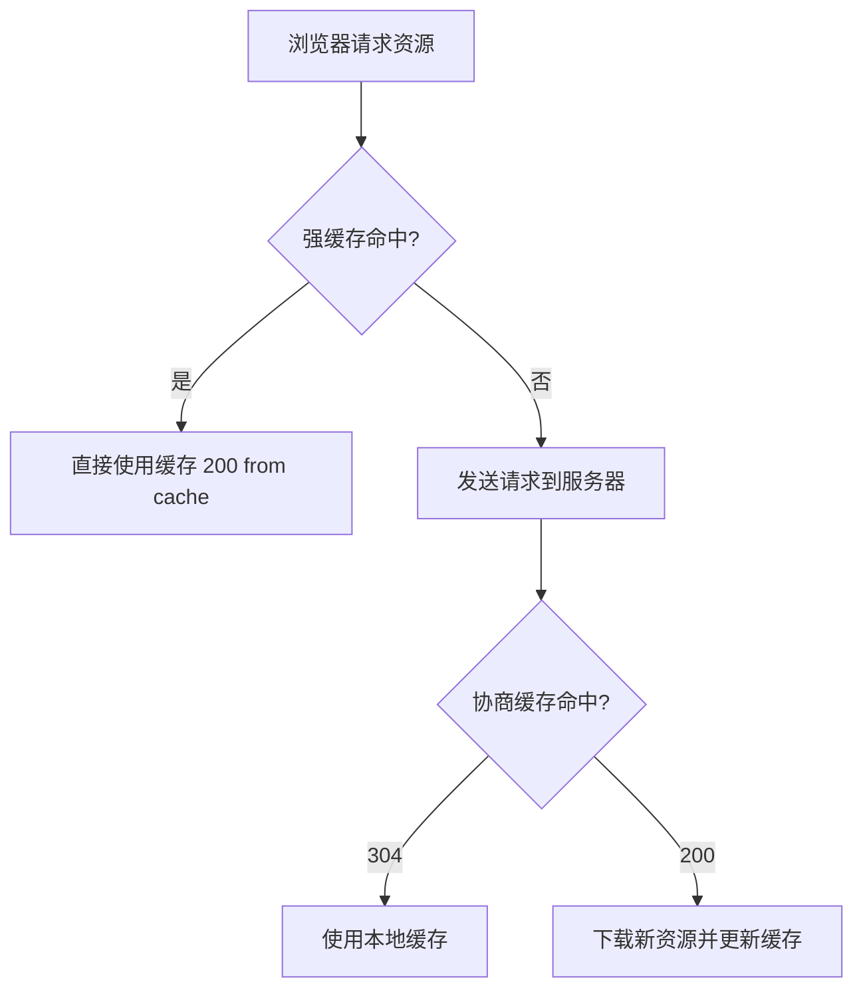

---
title: JavaWeb 面试
date: 2020-02-07 23:04:47
order: 99
categories:
  - Java
  - JavaWeb
tags:
  - Java
  - JavaWeb
  - Servlet
permalink: /pages/8c23f138/
---

# JavaWeb 面试

::: tip 扩展

- [Java Servlet 规范](https://javaee.github.io/servlet-spec/)
- [Spring 官方文档 - Web](https://docs.spring.io/spring-framework/reference/web.html)
- 《Head First Servlets & JSP》

:::

## Servlet 基础

### 【简单】什么是 Servlet？⭐⭐

**Servlet（Server Applet）是 Java 编写的服务器端程序**，用于交互式地浏览和生成数据，生成动态 Web 内容。

- 狭义：Java 实现的一个接口
- 广义：任何实现了 Servlet 接口的类

Servlet 运行于支持 Java 的应用服务器中，独立于平台和协议，主要用于扩展基于 HTTP 协议的 Web 服务器。

**Servlet 与 CGI 的区别**：

| 对比维度 | Servlet | CGI |
| :--- | :--- | :--- |
| **执行方式** | 同一实例多线程处理多个请求 | 每个请求创建新进程 |
| **性能** | 高效，实例复用 | 低效，进程创建/销毁开销大 |
| **生命周期** | 实例常驻，一般不会销毁 | 服务完成后销毁 |

### 【简单】Servlet 和 JSP 的区别？⭐

1. **Servlet** 是运行在服务器上的 Java 类，负责控制程序逻辑
2. **JSP 本质上就是 Servlet**，编译后生成 `.java` → `.class`
3. JSP 侧重于视图（View），Servlet 侧重于控制逻辑（Controller）
4. 在 MVC 架构中：JSP 适合 View，Servlet 适合 Controller

### 【中等】简述 Servlet 生命周期⭐⭐⭐


| 阶段 | 方法 | 说明 |
| :--- | :--- | :--- |
| **加载** | — | 容器通过类加载器加载 Servlet 类 |
| **初始化** | `init()` | 仅执行一次，创建后初始化 |
| **服务** | `service()` | 每次请求调用，分发到 `doGet()`/`doPost()` |
| **销毁** | `destroy()` | 容器关闭时调用，释放资源 |
| **卸载** | — | 由 JVM 垃圾回收器回收 |

### 【简单】GET 请求和 POST 请求的区别？⭐⭐


| 对比维度 | GET | POST |
| :--- | :--- | :--- |
| **语义** | 从服务器**获取**数据 | 向服务器**提交**数据 |
| **参数位置** | 附加在 URL 之后（`?key=value&...`） | 放在请求 Body 中 |
| **数据量** | 受 URL 长度限制（约 2KB） | 理论上无限制 |
| **安全性** | 差，参数暴露在 URL 中 | 较高，参数不在 URL 中 |
| **幂等性** | 幂等（多次请求结果相同） | 非幂等 |
| **缓存** | 可被浏览器缓存 | 默认不缓存 |

### 【中等】请求转发(forward)和重定向(redirect)的区别？⭐⭐⭐

| 对比维度 | 转发（forward） | 重定向（redirect） |
| :--- | :--- | :--- |
| **请求次数** | 一次（服务器内部转发） | 两次（客户端重新请求） |
| **地址栏** | 不变 | 显示新的 URL |
| **数据共享** | 可共享 request 中的数据 | 不能共享 |
| **效率** | 高 | 低 |
| **范围** | 仅限同一应用内 | 可跳转到任意 URL |

### 【简单】HTTP 常见状态码有哪些？⭐⭐

| 状态码类别 | 含义 | 常见状态码 |
| :--- | :--- | :--- |
| `1xx` | 信息性状态码 | 100 Continue |
| `2xx` | 成功 | 200 OK、201 Created、204 No Content、206 Partial Content |
| `3xx` | 重定向 | 301 永久重定向、302 临时重定向、304 Not Modified（缓存） |
| `4xx` | 客户端错误 | 400 Bad Request、401 Unauthorized、403 Forbidden、404 Not Found |
| `5xx` | 服务器错误 | 500 Internal Server Error、502 Bad Gateway、503 Service Unavailable |

## Cookie / Session / Token / JWT

### 【中等】Cookie 和 Session 的区别是什么？⭐⭐⭐

| 对比维度 | Cookie | Session |
| :--- | :--- | :--- |
| **存储位置** | 客户端（浏览器） | 服务器端 |
| **安全性** | 低，用户可见可篡改 | 高，数据在服务端 |
| **存储大小** | 4KB，每站最多约 20 个 | 无限制（但占用服务器内存） |
| **跨域** | 不支持 | 不支持（依赖 Cookie 传递 SessionID） |
| **生命周期** | 可设置过期时间 | 随会话结束或超时销毁 |
| **性能** | 不占服务器资源 | 占用服务器内存，并发高时压力大 |

**Session 工作原理**：服务器创建 Session 后生成唯一 SessionID，通过 Cookie 传给浏览器；后续请求浏览器携带该 Cookie，服务器通过 SessionID 查找对应 Session 数据。

### 【困难】Cookie / Session / Token / JWT 如何选型？⭐⭐⭐

| 方案 | 存储位置 | 服务端开销 | 跨域 | 防篡改 | 适用场景 |
| :--- | :--- | :--- | :--- | :--- | :--- |
| **Cookie** | 浏览器 | 低 | 不支持 | 弱 | 简单状态标记 |
| **Session** | 服务器 | 高（内存） | 不支持 | 强 | 传统 Web 应用 |
| **Token** | 客户端 | 低（无状态） | 支持 | 需签名验证 | 前后端分离、微服务 |
| **JWT** | 客户端 | 低（自包含） | 支持 | 签名防篡改 | 分布式系统、SSO |

**JWT（JSON Web Token）结构**：`Header.Payload.Signature`

- **Header**：算法类型（如 HS256）
- **Payload**：声明数据（用户ID、过期时间等）
- **Signature**：`HMACSHA256(base64(header) + "." + base64(payload), secret)`

::: info JWT 的优缺点

**优点**：无状态、跨域友好、自包含（减少查库）、适合微服务
**缺点**：无法主动失效（除非黑名单机制）、Payload 明文（Base64 编码，非加密）、Token 较大

:::

## Web 安全

### 【中等】什么是 XSS 攻击？如何防御？⭐⭐⭐

**XSS（Cross-Site Scripting，跨站脚本攻击）**：攻击者向 Web 页面注入恶意脚本，当用户浏览页面时脚本执行，窃取用户信息或执行恶意操作。

| 类型 | 注入方式 | 存储位置 | 危害程度 |
| :--- | :--- | :--- | :--- |
| **反射型 XSS** | URL 参数 | 不存储，即时触发 | 中 |
| **存储型 XSS** | 表单提交 | 数据库 | 高 |
| **DOM 型 XSS** | 前端 JS 操作 | 不经过服务器 | 中 |

**防御措施**：

- **输入过滤**：对用户输入进行严格的白名单校验
- **输出编码**：HTML 实体转义（`<` → `&lt;`）、JavaScript 编码
- **HttpOnly Cookie**：禁止 JS 读取敏感 Cookie
- **CSP（Content Security Policy）**：限制页面可执行的脚本来源

### 【中等】什么是 CSRF 攻击？如何防御？⭐⭐⭐

**CSRF（Cross-Site Request Forgery，跨站请求伪造）**：攻击者诱导用户在已认证的 Web 站点上执行非预期的操作（如转账、修改密码）。

**攻击原理**：用户登录 A 站后 Cookie 有效，访问恶意 B 站时，B 站发起对 A 站的请求，浏览器自动携带 A 的 Cookie，A 站误以为是用户本人操作。

**防御措施**：

| 防御手段 | 原理 | 效果 |
| :--- | :--- | :--- |
| **CSRF Token** | 服务器下发随机 Token，请求时必须携带 | 最常用，效果好 |
| **SameSite Cookie** | 限制 Cookie 只在同站请求中发送 | 现代浏览器支持 |
| **验证 Referer/Origin** | 检查请求来源是否合法 | 简单但可被伪造 |
| **双重确认** | 敏感操作需二次验证（短信/密码） | 最安全 |

### 【中等】什么是 CORS 跨域？如何解决？⭐⭐⭐

**跨域**：浏览器出于同源策略（协议 + 域名 + 端口相同才算同源），阻止前端 JS 向不同源的资源发起请求。

**解决方案**：

| 方案 | 原理 | 适用场景 |
| :--- | :--- | :--- |
| **CORS（推荐）** | 服务器返回 `Access-Control-Allow-Origin` 响应头 | 前后端分离 |
| **Nginx 反向代理** | 代理服务器转发请求，绕过浏览器同源策略 | 生产环境 |
| **JSONP** | 利用 `<script>` 标签不受同源限制 | 仅支持 GET，已过时 |
| **WebSocket** | 不受同源策略限制 | 实时通信 |

```java
// Spring Boot CORS 配置
@Configuration
public class CorsConfig implements WebMvcConfigurer {
    @Override
    public void addCorsMappings(CorsRegistry registry) {
        registry.addMapping("/**")
            .allowedOrigins("https://example.com")
            .allowedMethods("GET", "POST", "PUT", "DELETE")
            .allowCredentials(true)
            .maxAge(3600);
    }
}
```

## 过滤器与拦截器

### 【中等】过滤器(Filter)、拦截器(Interceptor)、AOP 的区别？⭐⭐⭐

| 对比维度 | Filter（过滤器） | Interceptor（拦截器） | AOP（切面） |
| :--- | :--- | :--- | :--- |
| **规范** | Servlet 规范 | Spring MVC | Spring AOP / AspectJ |
| **执行位置** | Servlet 容器 | Spring MVC 的 DispatcherServlet | Spring 容器 |
| **作用范围** | 所有请求（含静态资源） | 仅 Controller 方法 | 任意 Bean 方法 |
| **粒度** | URL 级别 | Controller 方法级别 | 方法级别 |
| **能否使用 Spring Bean** | 不能（需特殊配置） | 能 | 能 |
| **典型用途** | 编码设置、CORS、认证 | 日志、权限、登录检查 | 事务、日志、性能监控 |

**执行顺序**：

```
请求 → Filter → DispatcherServlet → Interceptor → Controller → Interceptor → Filter → 响应
```

```java
// Filter 示例
@WebFilter(urlPatterns = "/*")
public class EncodingFilter implements Filter {
    public void doFilter(ServletRequest req, ServletResponse resp, FilterChain chain) {
        req.setCharacterEncoding("UTF-8");
        chain.doFilter(req, resp);
    }
}

// Interceptor 示例
public class LoginInterceptor implements HandlerInterceptor {
    public boolean preHandle(HttpServletRequest req, HttpServletResponse resp, Object handler) {
        if (req.getSession().getAttribute("user") == null) {
            resp.sendRedirect("/login");
            return false;
        }
        return true;
    }
}
```

## HTTP 缓存机制

### 【中等】HTTP 缓存机制是如何工作的？⭐⭐⭐

HTTP 缓存分为**强缓存**和**协商缓存**两种策略：

**强缓存**：浏览器直接使用本地缓存，不发送请求（状态码 200 from cache）。

| 响应头 | 说明 | 优先级 |
| :--- | :--- | :--- |
| `Cache-Control` | `max-age=3600`（秒级有效期） | 高（HTTP/1.1） |
| `Expires` | `Thu, 01 Dec 2025 16:00:00 GMT`（绝对时间） | 低（HTTP/1.0） |

**协商缓存**：浏览器向服务器询问资源是否更新，未更新返回 304。

| 请求头 / 响应头 | 说明 |
| :--- | :--- |
| `Last-Modified` / `If-Modified-Since` | 基于文件最后修改时间 |
| `ETag` / `If-None-Match` | 基于文件内容哈希（更精确） |



## WebSocket

### 【中等】什么是 WebSocket？与 HTTP 的区别？⭐⭐

**WebSocket 是一种全双工通信协议**，在单个 TCP 连接上实现客户端与服务器之间的双向实时通信。

| 对比维度 | HTTP | WebSocket |
| :--- | :--- | :--- |
| **通信方式** | 单向（请求-响应） | 双向（全双工） |
| **连接** | 短连接（HTTP/1.0）或长连接 | 持久连接 |
| **实时性** | 差（需轮询） | 高（服务器主动推送） |
| **协议** | `http://` | `ws://` / `wss://` |
| **数据量** | 每次请求携带完整 Header | 帧头仅 2~14 字节 |

**建立连接流程**：客户端先发送 HTTP Upgrade 请求，服务器返回 101 Switching Protocols，之后切换为 WebSocket 协议。

**WebSocket vs HTTP 长轮询**：

- **长轮询**：客户端发请求，服务器有数据才响应，响应后客户端立即再发。频繁建连开销大。
- **WebSocket**：一次握手后持久连接，双方随时发消息，效率高得多。

## RESTful API

### 【中等】什么是 RESTful API？设计原则？⭐⭐

**REST（Representational State Transfer）是一种软件架构风格**，RESTful API 是基于 REST 原则设计的 HTTP 接口。

**核心原则**：

- **资源导向**：URL 表示资源，用名词不用动词（`/users` 而非 `/getUsers`）
- **HTTP 方法语义化**：GET（查）、POST（增）、PUT（改）、DELETE（删）
- **状态码规范**：200 成功、201 创建成功、400 参数错误、404 不存在
- **无状态**：每次请求包含所有信息，服务器不保存会话状态

| 操作 | 方法 | URL | 请求体 | 成功响应 |
| :--- | :--- | :--- | :--- | :--- |
| 查询用户列表 | GET | `/api/users` | 无 | 200 + JSON 数组 |
| 查询单个用户 | GET | `/api/users/1` | 无 | 200 + JSON 对象 |
| 创建用户 | POST | `/api/users` | JSON | 201 + JSON |
| 更新用户 | PUT | `/api/users/1` | JSON | 200 + JSON |
| 删除用户 | DELETE | `/api/users/1` | 无 | 204 |

## Servlet 进阶

### 【简单】Servlet 中如何获取用户提交的查询参数或表单数据？⭐

- `request.getParameter(name)`：获取单个参数值
- `request.getParameterValues(name)`：获取同名参数的所有值（如复选框）
- `request.getParameterMap()`：获取所有参数的 Map

### 【简单】request 和 response 的常用方法？⭐

**HttpServletRequest 常用方法**：

| 方法 | 说明 |
| :--- | :--- |
| `getParameter(name)` | 获取请求参数 |
| `getAttribute(name)` | 获取请求属性 |
| `getHeader(name)` | 获取请求头 |
| `getMethod()` | 获取请求方法（GET/POST） |
| `getRequestURI()` | 获取请求 URI |
| `getSession()` | 获取 Session |
| `getCookies()` | 获取 Cookie 数组 |

**HttpServletResponse 常用方法**：

| 方法 | 说明 |
| :--- | :--- |
| `setContentType(type)` | 设置响应内容类型 |
| `setHeader(name, value)` | 设置响应头 |
| `sendRedirect(url)` | 重定向 |
| `getWriter()` | 获取输出流 |
| `setStatus(code)` | 设置状态码 |

### 【简单】用户在浏览器中输入 URL 后发生了什么？⭐⭐

1. **DNS 解析**：域名 → IP 地址
2. **TCP 三次握手**：建立 TCP 连接
3. **发送 HTTP 请求**：构造请求行、请求头、请求体
4. **服务器处理请求**：路由、业务逻辑、数据库操作
5. **返回 HTTP 响应**：状态码 + 响应头 + 响应体（HTML）
6. **浏览器渲染**：解析 HTML → DOM 树 → 渲染页面
7. **TCP 四次挥手**：关闭连接（Keep-Alive 则保持）

## JSP（了解即可）

### 【简单】JSP 的内置对象和作用域？⭐⭐

**九大内置对象**：

| 对象 | 作用 |
| :--- | :--- |
| `request` | 客户端请求信息 |
| `response` | 服务器响应信息 |
| `session` | 用户会话状态 |
| `application` | 全局应用数据（服务器启动到关闭） |
| `pageContext` | 页面属性管理 |
| `out` | 向客户端输出数据 |
| `config` | Servlet 配置参数 |
| `page` | 当前 JSP 页面本身 |
| `exception` | 异常信息（仅错误页面可用） |

**四种作用域**（从小到大）：

1. **page**：当前页面
2. **request**：一次请求
3. **session**：一次会话
4. **application**：整个应用生命周期

### 【简单】JSP 中动态 INCLUDE 和静态 INCLUDE 的区别？⭐⭐

- **静态 INCLUDE**（`<%@ include file="xxx.html" %>`）：先合并再编译，不检查包含文件的变化
- **动态 INCLUDE**（`<jsp:include page="xxx.jsp" />`）：先编译再合并，会检查文件变化，可带参数

## 参考资料

- [Java Servlet 规范](https://javaee.github.io/servlet-spec/)
- [OWASP XSS Prevention Cheat Sheet](https://cheatsheetseries.owasp.org/cheatsheets/Cross-Site_Scripting_Prevention_Cheat_Sheet.html)
- [JWT.io](https://jwt.io/)
- [Spring 官方文档 - Web](https://docs.spring.io/spring-framework/reference/web.html)
