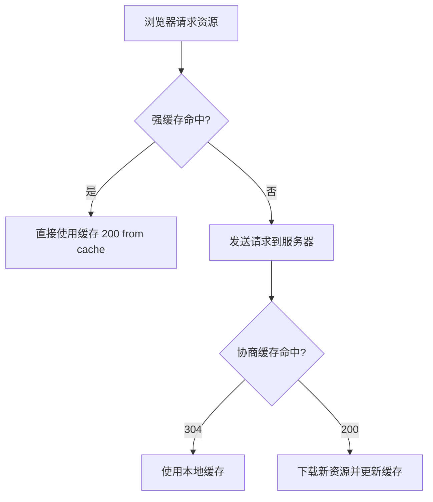

---
title: JavaWeb 面试
date: 2020-02-07 23:04:47
order: 99
categories:
  - Java
  - JavaWeb
tags:
  - Java
  - JavaWeb
  - Servlet
permalink: /pages/8c23f138/
---

# JavaWeb 面试

::: tip 扩展

- [Java Servlet 规范](https://javaee.github.io/servlet-spec/)
- [Spring 官方文档 - Web](https://docs.spring.io/spring-framework/reference/web.html)
- 《Head First Servlets & JSP》

:::

## Servlet 基础

### 【简单】什么是 Servlet？⭐⭐

**Servlet（Server Applet）是 Java 编写的服务器端程序**，用于交互式地浏览和生成数据，生成动态 Web 内容。

- 狭义：Java 实现的一个接口
- 广义：任何实现了 Servlet 接口的类

Servlet 运行于支持 Java 的应用服务器中，独立于平台和协议，主要用于扩展基于 HTTP 协议的 Web 服务器。

**Servlet 与 CGI 的区别**：

| 对比维度     | Servlet                    | CGI                       |
| :----------- | :------------------------- | :------------------------ |
| **执行方式** | 同一实例多线程处理多个请求 | 每个请求创建新进程        |
| **性能**     | 高效，实例复用             | 低效，进程创建/销毁开销大 |
| **生命周期** | 实例常驻，一般不会销毁     | 服务完成后销毁            |

### 【简单】Servlet 和 JSP 的区别？⭐

1. **Servlet** 是运行在服务器上的 Java 类，负责控制程序逻辑
2. **JSP 本质上就是 Servlet**，编译后生成 `.java` → `.class`
3. JSP 侧重于视图（View），Servlet 侧重于控制逻辑（Controller）
4. 在 MVC 架构中：JSP 适合 View，Servlet 适合 Controller

### 【中等】简述 Servlet 生命周期⭐⭐⭐


| 阶段       | 方法        | 说明                                      |
| :--------- | :---------- | :---------------------------------------- |
| **加载**   | —           | 容器通过类加载器加载 Servlet 类           |
| **初始化** | `init()`    | 仅执行一次，创建后初始化                  |
| **服务**   | `service()` | 每次请求调用，分发到 `doGet()`/`doPost()` |
| **销毁**   | `destroy()` | 容器关闭时调用，释放资源                  |
| **卸载**   | —           | 由 JVM 垃圾回收器回收                     |

### 【简单】GET 请求和 POST 请求的区别？⭐⭐


| 对比维度     | GET                                 | POST                  |
| :----------- | :---------------------------------- | :-------------------- |
| **语义**     | 从服务器**获取**数据                | 向服务器**提交**数据  |
| **参数位置** | 附加在 URL 之后（`?key=value&...`） | 放在请求 Body 中      |
| **数据量**   | 受 URL 长度限制（约 2KB）           | 理论上无限制          |
| **安全性**   | 差，参数暴露在 URL 中               | 较高，参数不在 URL 中 |
| **幂等性**   | 幂等（多次请求结果相同）            | 非幂等                |
| **缓存**     | 可被浏览器缓存                      | 默认不缓存            |

### 【中等】请求转发(forward)和重定向(redirect)的区别？⭐⭐⭐

| 对比维度     | 转发（forward）         | 重定向（redirect）     |
| :----------- | :---------------------- | :--------------------- |
| **请求次数** | 一次（服务器内部转发）  | 两次（客户端重新请求） |
| **地址栏**   | 不变                    | 显示新的 URL           |
| **数据共享** | 可共享 request 中的数据 | 不能共享               |
| **效率**     | 高                      | 低                     |
| **范围**     | 仅限同一应用内          | 可跳转到任意 URL       |

### 【简单】HTTP 常见状态码有哪些？⭐⭐

| 状态码类别 | 含义         | 常见状态码                                                          |
| :--------- | :----------- | :------------------------------------------------------------------ |
| `1xx`      | 信息性状态码 | 100 Continue                                                        |
| `2xx`      | 成功         | 200 OK、201 Created、204 No Content、206 Partial Content            |
| `3xx`      | 重定向       | 301 永久重定向、302 临时重定向、304 Not Modified（缓存）            |
| `4xx`      | 客户端错误   | 400 Bad Request、401 Unauthorized、403 Forbidden、404 Not Found     |
| `5xx`      | 服务器错误   | 500 Internal Server Error、502 Bad Gateway、503 Service Unavailable |

## Cookie / Session / Token / JWT

### 【中等】Cookie 和 Session 的区别是什么？⭐⭐⭐

Cookie 与 Session 是"无状态 HTTP 协议如何维持状态"的两种经典解法：**Cookie 把状态放在客户端，Session 把状态放在服务端**，二者常配合使用——Session 依赖 Cookie 传递 SessionID 来识别用户。

| 对比维度     | Cookie                               | Session                              |
| :----------- | :----------------------------------- | :----------------------------------- |
| **存储位置** | 客户端（浏览器）                     | 服务器端                             |
| **安全性**   | 低，用户可见可篡改                   | 高，数据在服务端                     |
| **存储大小** | 单条 4KB，每站最多约 20 个           | 无硬性限制（但占用服务器内存）       |
| **跨域**     | 不支持（受同源策略与 SameSite 限制） | 不支持（依赖 Cookie 传递 SessionID） |
| **生命周期** | 可设置过期时间（Max-Age/Expires）    | 随会话结束或超时销毁（默认 30 分钟） |
| **性能**     | 不占服务器资源                       | 占用服务器内存，并发高时压力大       |

**Session 工作原理**：服务器创建 Session 后生成唯一 SessionID，通过 `Set-Cookie` 响应头传给浏览器；后续请求浏览器自动携带该 Cookie，服务器通过 SessionID 查找对应 Session 数据。

**方案权衡**：

- **Session 存本地内存 vs 存 Redis**：本地内存方案简单，但多实例部署时 Session 无法跨机器共享（用户会被随机登出），高并发时内存吃紧；Redis 集中式 Session（如 Spring Session）支持水平扩展。按每个 Session 约 1~2KB 估算，10 万在线用户约需 100~200MB Redis 内存，完全可承受。
- **纯 Cookie vs Session**：状态极小且不敏感（如主题、语言偏好）时可直接存 Cookie，省去服务端开销；涉及登录态等敏感数据时必须放服务端 Session，Cookie 中只留 SessionID。

**失效场景**：

- **缺少 HttpOnly**：XSS 漏洞可直接通过 `document.cookie` 窃取 SessionID，造成 Session 劫持。
- **缺少 SameSite**：跨站请求自动携带 Cookie，给 CSRF 攻击敞开大门。
- **Session 固定攻击**：攻击者预先设置一个 SessionID 诱导受害者登录，若登录后服务端不更换 SessionID，攻击者持同一 SessionID 即可以受害者身份登入。
- **缺少 Secure**：SessionID 在 HTTP 明文链路上被中间人截获。

**踩坑案例**：我们曾把一个老系统从单机迁到 2 节点的 K8s 集群，次日大量用户反馈"随机被登出、要重新登录"。排查发现网关日志中同一用户的请求被轮询打到两个 Pod，A 节点有 Session、B 节点没有。根因：Tomcat 默认 Session 存在 JVM 内存中，负载均衡轮询导致请求漂移。修复：引入 Spring Session + Redis 集中存储 Session，超时设为 30 分钟，上线后问题消失。事后复盘：多实例部署下 Session 必须外置，否则扩缩容和滚动发布都会引发同类故障。

一句话总结：**Cookie 与 Session 的本质区别是"状态由谁保管"**——Cookie 方便但暴露在客户端，Session 安全但需要服务端存储并解决分布式问题。

#### 拓展追问

1. **浏览器禁用 Cookie 后 Session 还能工作吗？**
   可以，但需 URL 重写（`response.encodeURL`）把 SessionID 拼进 URL。这种方式会让 SessionID 暴露在地址栏、Referer 和服务端日志中，安全性比 Cookie 更差，如今基本淘汰——无 Cookie 场景（App、小程序）应直接改用 Token 方案。
2. **Session 超时为什么默认 30 分钟？滑动过期和绝对过期有什么区别？**
   30 分钟是安全性与体验的经验折中（Tomcat 默认值）。Servlet 容器采用滑动过期——每次访问重置计时器；若业务要求"无论是否活跃，8 小时后必须重新登录"，需自行记录创建时间实现绝对过期。
3. **SessionID 如何生成？会被暴力猜解吗？**
   Tomcat 用 `SecureRandom` 生成至少 128 位随机数（默认 16 字节，32 个十六进制字符），暴力猜解需 2^128 次尝试，理论上安全。真实事故多源于随机源配置错误，或 SessionID 经由 URL、日志泄漏，而非被猜解。

#### 场景题

**场景**：管理后台系统，安全审计要求"被冻结账号的用户必须立即全局登出"，当前方案是原生 Tomcat Session（单机、内存存储），如何设计？

**分析**：

1. **应急处理**：单机下可遍历 `SessionManager` 找到目标用户的 Session 并 `invalidate`，但遍历全量 Session 是 O(N) 操作，且该手段在多机部署下完全失效。
2. **根因分析**：内存 Session 没有集中管理面，更缺少"按用户反查 Session"的索引能力，无法做到定点清除。
3. **长期方案**：迁移到 Spring Session + Redis，以 `session:{userId}` 维护用户 → Session 集合的反向索引；冻结账号时直接删除对应 key，全局生效延迟在 1 秒内。
4. **权衡**：若系统正在改造为无状态 JWT，则需引入黑名单机制（详见"JWT 如何实现刷新与主动失效？"一题）；对比之下，Session + Redis 天然支持主动失效，这正是 Session 相对 JWT 的核心优势。**"立即失效"是硬需求时，选型应偏向 Session 或"JWT + 黑名单"**。

### 【困难】Cookie / Session / Token / JWT 如何选型？⭐⭐⭐

本题承接上一题的机制对比，聚焦**不同业务形态下的选型决策**。一句话原则：**单体求稳选 Session，分布式求扩展选 JWT，开放场景走标准协议**。

**四种方案速览**：

| 方案                  | 服务端开销       | 跨域   | 防篡改     | 主动失效能力    |
| :-------------------- | :--------------- | :----- | :--------- | :-------------- |
| **Cookie**            | 低               | 不支持 | 弱         | 天然支持        |
| **Session**           | 高（内存/Redis） | 不支持 | 强         | 天然支持        |
| **Token（自建签名）** | 低（无状态）     | 支持   | 需签名验证 | 需黑名单        |
| **JWT**               | 低（自包含）     | 支持   | 签名防篡改 | 需黑名单/版本号 |

**选型决策树**：

| 业务形态                   | 推荐方案                                | 理由                                                  |
| :------------------------- | :-------------------------------------- | :---------------------------------------------------- |
| **传统单体（服务端渲染）** | Session + Cookie（HttpOnly + SameSite） | 简单成熟，天然支持踢人、登出、冻结                    |
| **前后端分离单体**         | Session + Redis 或 JWT 均可             | 后台管理类系统对"立即失效"要求高时优先 Session        |
| **分布式/微服务集群**      | JWT（或集中式 Session）                 | 网关统一验签、各服务无状态，避免 Session 中心成为单点 |
| **跨端（App/小程序/IoT）** | JWT                                     | 不依赖 Cookie，各端统一走 Authorization 头            |
| **开放平台/跨公司 SSO**    | OAuth 2.0 + JWT（OIDC）                 | 标准协议，RS256 非对称签名可让第三方离线验签          |

**Session+Redis vs JWT（分布式下的核心权衡）**：

- **Session+Redis**：支持主动失效，权限变更实时生效；但每次请求都要查一次 Redis（约增加 0.5~1ms），且 Redis 成为可用性依赖——Redis 故障即全站无法鉴权。
- **JWT**：纯本地验签、零远程调用，性能最好；但**无法主动吊销**（根因：Token 自包含、服务端不存状态，验签不依赖任何可追溯的记录），且 Payload 只是 Base64 编码而非加密，绝不能放敏感信息。
- **折中方案**：短有效期 JWT（15 分钟）+ 黑名单只记录少量已注销 Token，兼顾性能与可控性。

**失效场景**：

- **需要即时冻结账号的管理系统选用 JWT**：账号停用后旧 Token 仍可使用至过期，最长存在一个有效期窗口（如 15 分钟）的盗用风险。
- **JWT Payload 塞入敏感数据**：手机号、身份证号等被 Base64 解码即可明文读取。
- **时钟不同步**：多机 `exp` 校验误判，验签需容忍 `leeway`（一般 30~60 秒）。
- **Session 未集中化**：多实例下随机登出（见上一题踩坑案例）。

**踩坑案例**：我们的开放接口最初为追求"服务端零状态"，全量采用 HS256 签名的 JWT。一次某合作方的密钥泄漏需要紧急停用其凭证，却发现整条链路没有任何失效手段，只好紧急更换全局签名密钥——**导致所有合作方 Token 同时失效**，全平台 401 连环报警，连夜通知各家重新换 Token。复盘结论：① 改用 RS256，换密钥只影响签发方（私钥），验签方公钥可平滑过渡；② 增加 `kid`（密钥 ID）支持多密钥并存切换；③ 预留黑名单通道应对紧急吊销。

**量化经验值**：

- JWT 体积：典型 3~5 个声明约 300~500 字节，是 SessionID Cookie（约 50 字节）的 6~10 倍，高 QPS 下带宽开销不可忽略。
- 验签性能：HS256 为微秒级；RS256 验签约 0.05ms/次、签名更慢，故 RS256 只应在认证中心签名，资源服务器只做验签。
- 单机 1 万 QPS 场景：HS256 验签 CPU 占比可忽略；RS256 需压测评估，必要时换 ECDSA。

**JWT（JSON Web Token）结构**：`Header.Payload.Signature`

- **Header**：算法类型（如 HS256）与 `kid`
- **Payload**：声明数据（用户 ID、过期时间 `exp`、唯一标识 `jti` 等）
- **Signature**：`HMACSHA256(base64(header) + "." + base64(payload), secret)`

::: info JWT 的优缺点

**优点**：无状态、跨域友好、自包含（减少查库）、适合微服务
**缺点**：无法主动失效（除非黑名单机制）、Payload 明文（Base64 编码，非加密）、Token 较大

:::

一句话总结：**没有最好的方案，只有最匹配的场景**——要强控状态选 Session，要水平扩展选 JWT，要对外开放走 OAuth 2.0 标准协议。

#### 拓展追问

1. **JWT 为什么无法主动失效？加了黑名单是不是等于退化成 Session？**
   根因是 JWT 验签只依赖签名和时间，不查询服务端状态。加黑名单确实引入了状态，但开销本质不同：黑名单只存少量"被注销 Token"的 `jti` 与剩余有效期，而 Session 要存所有在线用户的全量数据，属于"小状态"折中而非倒退。
2. **HS256 和 RS256 分别什么时候选？**
   HS256 是对称算法，签名与验签共享同一密钥，只适合单一系统自签自验；RS256 是非对称算法，私钥签名、公钥验签，公钥可分发给任意资源服务器——微服务和开放平台必须用 RS256，否则密钥分发到任何一个下游都意味着全线沦陷。
3. **为什么不建议把 Token 存在 localStorage？**
   localStorage 可被任何 JS 读取，一旦存在 XSS 漏洞 Token 即被窃取；HttpOnly Cookie 则天然免疫 JS 读取。业界主流做法：Access Token 放内存（JS 变量），Refresh Token 放 HttpOnly Cookie，并配合 SameSite 防 CSRF。

#### 场景题

**场景**：公司有三套系统——内部 OA（单体，要求即时冻结账号）、电商 App（前后端分离、多端）、开放平台（对外授权数据给第三方）。领导要求"统一登录体系"，作为架构师如何选型？

**分析**：

1. **应急处理/现状**：三套系统各自维护登录，重复建设、安全水位参差，且无法做到"一处冻结、处处生效"。
2. **根因分析**：问题本质是单一认证协议无法同时满足"强管控、跨端、开放"三种诉求，必须把身份层与凭证层解耦。
3. **长期方案**：建设统一认证中心（SSO），对外签发 JWT（RS256 + OIDC）：
   - 开放平台：标准 JWT，第三方用公钥离线验签；
   - 电商 App：双 Token（Access 15 分钟 / Refresh 7 天）+ 设备标识；
   - 内部 OA 的"即时冻结"：在 JWT 中携带用户状态版本号，网关高频（缓存 TTL 1~5 秒）校验 Redis 中的最新版本，冻结可在 5 秒内全局生效。
4. **权衡**：全集中式 Session 也能覆盖前两个场景，但每个服务都要查 Redis，且开放平台的跨公司场景天然走不通；"无状态 JWT + 最小化状态（版本号/黑名单）"的混合架构是统一认证中心的最优解，也是可支撑百万级日活的成熟实践。

### 【中等】JWT 如何实现刷新与主动失效？⭐⭐⭐⭐

JWT 是无状态的，服务端无法直接让它失效，刷新与失效机制主要依靠以下方案。

**双 Token 机制（主流刷新方案）**

- 登录时同时签发短有效期的 **Access Token**（如 15~30 分钟）和长有效期的 **Refresh Token**（如 7 天）。
- Access Token 过期后，前端用 Refresh Token 调用刷新接口换取新的 Access Token；Refresh Token 过期则要求重新登录。
- Refresh Token 应**轮换（Rotation）**使用：每次刷新后签发新的 Refresh Token 并使旧的作废，防止被盗用后重放。

**主动失效方案**

- **黑名单机制**：退出登录或修改密码时，将 JWT 的 `jti`（唯一标识）写入 Redis 黑名单（过期时间设为 JWT 剩余有效期），鉴权时校验黑名单。
- **版本号机制**：服务端为用户维护 Token 版本号，退出或改密时版本号自增，校验时拒绝版本落后的 Token。

**方案权衡：双 Token vs 滑动过期，黑名单 vs 版本号**：

- **滑动过期（Session 思路）vs 双 Token**：滑动过期每次请求续期、实现简单，但每个 Token 都需服务端存状态，本质退化回 Session；双 Token 中 Access Token 纯无状态验签，只有 Refresh Token 涉及服务端状态（存轮换记录），且交互频率低（约每 15 分钟一次），是主流选择。
- **黑名单 vs 版本号**：黑名单粒度细（精确到单个 Token），适合"只登出当前设备"，Redis 开销可控——每日 1 万次登出、每条 `jti` 约 60 字节，仅占约 600KB；版本号粒度粗（一次作废该用户全部 Token），适合改密码、冻结账号等一刀切场景，只需存一个整数，开销更小。

**失效场景**：

- **Refresh Token 泄漏**（XSS、日志打印）：攻击者可静默持续刷新，获得长期访问权——这也是它必须放 HttpOnly Cookie、绝不进 localStorage 的原因。
- **并发刷新竞态**：多个前端请求同时发现过期并发起刷新，轮换机制下合法用户的第二个刷新请求会因旧 Refresh Token 已作废而被误判为攻击、被踢下线。
- **黑名单 Redis 宕机**：降级时 fail-fast 则全站无法鉴权，放行则失效机制形同虚设，必须提前定好策略。
- **Access Token 有效期过长**：黑名单只影响后续请求，已泄漏 Token 的盗用窗口等于剩余有效期，不能为减少刷新频率而把有效期放到 1 天。

**踩坑案例**：支付系统曾收到用户投诉："我昨天明明退出登录了，今天账上却出现 3 笔我没操作的退款"。排查：① 访问日志显示请求来自异地 IP，但 Token 完全合法；② 查时间线发现用户在公共电脑上 18:00 退出登录，退出只是前端清了本地存储，并未调用服务端登出接口，而 Access Token 要到 18:20 才过期；③ 公共电脑上的恶意程序早已通过 XSS 拿到了 Token。根因：**登出不等于失效**——无状态 JWT 不会因为客户端删除而作废，剩余 20 分钟有效期成了盗用窗口。修复：① 登出接口必须把当前 Token 的 `jti` 写入 Redis 黑名单；② Access Token 有效期从 20 分钟缩短到 10 分钟；③ 敏感操作增加"签发时间超过 5 分钟需二次验证"的校验。修复后同类事故不再发生。

**工程细节**

- 前端通常在响应拦截器中统一处理刷新，并解决并发问题（刷新只执行一次，其余请求排队等待）。
- Refresh Token 建议放 HttpOnly Cookie 防 XSS 窃取，Access Token 可放内存。
- 刷新接口本身需限流（如每用户每分钟最多 10 次），防止被滥刷。

**量化经验值**：Access Token 15 分钟 / Refresh Token 7 天是业界默认值；高安全场景（支付）可收紧到 5 分钟 / 24 小时；低敏感场景（内容社区）可放宽到 30 分钟 / 30 天以降低重新登录频率。

一句话总结：JWT 刷新的本质是“短效访问 + 长效刷新 + 一次性轮换”，主动失效必须借助服务端状态（黑名单/版本号）弥补无状态缺陷。

#### 拓展追问

1. **前端并发请求同时收到 401，如何保证只触发一次刷新？**
   在响应拦截器中用 Promise 缓存：第一个 401 发起刷新并缓存该 Promise，后续 401 直接 await 同一个 Promise，刷新成功后统一重放队列中的请求。实现时要注意刷新请求自身不能再被拦截器处理，否则死循环。
2. **轮换机制下收到“已作废的旧 Refresh Token”，如何区分是用户重放还是攻击者重放？**
   严格做法（OAuth 2.0 安全建议）：一旦检测到已作废的 Refresh Token 被复用，立即作废该用户整条刷新链并强制重新登录——宁可误伤合法用户也要保安全。宽松做法：给旧 Token 设 10~30 秒宽限期容忍网络延迟，适合低风险业务。
3. **黑名单 Redis 宕机时的降级策略怎么设计？**
   两派选择：① 可用性优先——宕机期间跳过黑名单校验但记录告警，依赖 Access Token 短有效期（15 分钟）兜底限制风险窗口；② 安全优先——直接拒绝鉴权，适合支付级系统。关键是这必须是事先想清楚的显式选择，而不是意外行为。

#### 场景题

**场景**：App 升级版本，产品要求支持“多设备登录互踢”（同一账号只允许一台设备在线，新登录踢掉旧设备），现有无状态 JWT 方案没有设备概念，如何改造？

**分析**：

1. **应急处理**：纯无状态方案无法实现互踢。先与产品明确需求边界——是"立即踢下线"还是"下次请求时失效"？后者无需长连接，成本低得多，通常可接受。
2. **根因分析**：互踢要求服务端知道"用户当前有哪些设备在线、哪台是最新的"，无状态 JWT 不携带这些信息，必须引入设备维度的服务端状态。
3. **长期方案**：
   - JWT 中增加 `device_id` 声明（设备指纹）；
   - Redis 维护 Hash：`user:{uid}:device` → 最新 Refresh Token 的 `jti`；
   - 新登录时覆盖该记录；旧设备刷新或鉴权时，发现自身 Token 的 `jti` 与 Redis 最新记录不一致即返回 401，自然被踢下线；
   - 若要求立即下线，配合推送（APNs/FCM）或 WebSocket 通知旧设备退出。
4. **权衡**：每次鉴权多一次 Redis 读取（约 0.5~1ms），可接受，这是视频会员类业务的标准做法；若进一步要求"微信式的登录设备管理列表"，则需完整存储设备 Session，本质上回到 Session 模式——是否值得取决于产品诉求，不要过度设计。

### 【中等】OAuth 2.0 有哪些授权模式？授权码模式流程是怎样的？⭐⭐⭐

OAuth 2.0 是业界标准的**授权**协议，允许用户在不暴露账号密码的前提下，授权第三方应用访问自己在其他服务上的资源。涉及四个角色：**资源拥有者**（用户）、**客户端**（第三方应用）、**授权服务器**、**资源服务器**。

**四种授权模式**

| 模式                                 | 说明                         | 适用场景                      |
| :----------------------------------- | :--------------------------- | :---------------------------- |
| **授权码（Authorization Code）**     | 最安全，Token 在后端交换     | 有服务端的 Web 应用，主流方案 |
| **简化（Implicit）**                 | 前端直接拿 Token，已被淘汰   | 被授权码 + PKCE 取代          |
| **密码（Password）**                 | 用户提供账密给客户端         | 高信任的自有应用，不推荐      |
| **客户端凭证（Client Credentials）** | 无用户参与，应用自身身份调用 | 服务间调用、定时任务          |

**授权码模式流程**

1. 用户点击“使用 GitHub 登录”，客户端重定向到授权服务器授权页（携带 `client_id`、`redirect_uri`、`scope`、`state`）。
2. 用户确认授权后，授权服务器携带**授权码**（短时效、一次性）重定向回 `redirect_uri`。
3. 客户端**服务端**用授权码 + `client_secret` 向授权服务器换取 **Access Token**。
4. 客户端携带 Access Token 访问资源服务器获取资源。

**扩展**：授权码 + **PKCE**（随机码挑战）可防止授权码被截获，是 SPA/移动端必备；OAuth 2.0 之上增加 `id_token`（JWT）即 **OIDC**，补充了身份认证能力。

一句话总结：OAuth 2.0 的核心是“委托授权、令牌代密码”，授权码模式 + PKCE 是当今绝对主流。

## Web 安全

### 【中等】什么是 XSS 攻击？如何防御？⭐⭐⭐

**XSS（Cross-Site Scripting，跨站脚本攻击）**：攻击者向 Web 页面注入恶意脚本，当用户浏览页面时脚本执行，窃取用户信息或执行恶意操作。

| 类型           | 注入方式     | 存储位置         | 危害程度 |
| :------------- | :----------- | :--------------- | :------- |
| **反射型 XSS** | URL 参数     | 不存储，即时触发 | 中       |
| **存储型 XSS** | 表单提交     | 数据库           | 高       |
| **DOM 型 XSS** | 前端 JS 操作 | 不经过服务器     | 中       |

**防御措施**：

- **输入过滤**：对用户输入进行严格的白名单校验
- **输出编码**：HTML 实体转义（`<` → `&lt;`）、JavaScript 编码
- **HttpOnly Cookie**：禁止 JS 读取敏感 Cookie
- **CSP（Content Security Policy）**：限制页面可执行的脚本来源

### 【中等】什么是 CSRF 攻击？如何防御？⭐⭐⭐

**CSRF（Cross-Site Request Forgery，跨站请求伪造）**：攻击者诱导用户在已认证的 Web 站点上执行非预期的操作（如转账、修改密码）。

**攻击原理**：用户登录 A 站后 Cookie 有效，访问恶意 B 站时，B 站发起对 A 站的请求，浏览器自动携带 A 的 Cookie，A 站误以为是用户本人操作。

**防御措施**：

| 防御手段                | 原理                                 | 效果           |
| :---------------------- | :----------------------------------- | :------------- |
| **CSRF Token**          | 服务器下发随机 Token，请求时必须携带 | 最常用，效果好 |
| **SameSite Cookie**     | 限制 Cookie 只在同站请求中发送       | 现代浏览器支持 |
| **验证 Referer/Origin** | 检查请求来源是否合法                 | 简单但可被伪造 |
| **双重确认**            | 敏感操作需二次验证（短信/密码）      | 最安全         |

### 【中等】什么是 CORS 跨域？如何解决？⭐⭐⭐

**跨域**：浏览器出于同源策略（协议 + 域名 + 端口相同才算同源），阻止前端 JS 向不同源的资源发起请求。

**解决方案**：

| 方案               | 原理                                            | 适用场景           |
| :----------------- | :---------------------------------------------- | :----------------- |
| **CORS（推荐）**   | 服务器返回 `Access-Control-Allow-Origin` 响应头 | 前后端分离         |
| **Nginx 反向代理** | 代理服务器转发请求，绕过浏览器同源策略          | 生产环境           |
| **JSONP**          | 利用 `<script>` 标签不受同源限制                | 仅支持 GET，已过时 |
| **WebSocket**      | 不受同源策略限制                                | 实时通信           |

```java
// Spring Boot CORS 配置
@Configuration
public class CorsConfig implements WebMvcConfigurer {
    @Override
    public void addCorsMappings(CorsRegistry registry) {
        registry.addMapping("/**")
            .allowedOrigins("https://example.com")
            .allowedMethods("GET", "POST", "PUT", "DELETE")
            .allowCredentials(true)
            .maxAge(3600);
    }
}
```

## 过滤器与拦截器

### 【中等】过滤器(Filter)、拦截器(Interceptor)、AOP 的区别？⭐⭐⭐

三者都是"拦截"机制，但**分属不同容器、作用于请求链路的不同位置、切入点粒度不同**。

| 对比维度                 | Filter（过滤器）                       | Interceptor（拦截器）                 | AOP（切面）                       |
| :----------------------- | :------------------------------------- | :------------------------------------ | :-------------------------------- |
| **规范归属**             | Servlet 规范                           | Spring MVC                            | Spring AOP / AspectJ              |
| **容器归属**             | Servlet 容器（如 Tomcat）              | Spring 容器                           | Spring 容器                       |
| **执行位置**             | DispatcherServlet 之前/之后            | DispatcherServlet 内、Controller 前后 | 任意 Bean 方法调用内部            |
| **作用范围**             | 所有请求（含静态资源）                 | 仅到达 Controller 的请求              | 任意 Spring Bean 方法（不限 Web） |
| **切入点粒度**           | URL 模式级（`/*`、`/api/*`）           | URL 模式级 + 可读取目标方法信息       | 方法级（切点表达式、注解）        |
| **能否使用 Spring Bean** | 不能（需 FilterRegistrationBean 注册） | 能                                    | 能                                |
| **典型用途**             | 编码设置、CORS、请求体包装             | 登录检查、权限、日志                  | 事务、方法日志、性能监控          |

**执行顺序（Web 请求链路）**：

```
请求 → Tomcat → Filter 链 → DispatcherServlet → Interceptor preHandle → （AOP 环绕增强） → Controller → AOP → Interceptor postHandle/afterCompletion → Filter → 响应
```

记忆要点：**Filter 在外层、Interceptor 在中层、AOP 在最内层**。Filter 链由 Servlet 容器编排，在 Spring 介入之前执行；Interceptor 由 DispatcherServlet 编排；AOP 在 Controller 方法被代理调用时触发（代理实现原理属 Spring 范畴，一句带过：JDK 动态代理/CGLIB 为目标 Bean 生成代理对象并在方法调用前后织入增强逻辑）。

**方案权衡：认证/权限逻辑放哪一层？**

- **放 Filter**：最早拦截，连未匹配到 Controller 的请求也能处理，适合粗粒度全局控制（如所有 `/api/**` 必须带 Token）；但拿不到目标方法的注解信息。
- **放 Interceptor**：`preHandle` 中能拿到 `HandlerMethod`，可读取 `@RequirePermission` 等注解，细粒度；但拦不到静态资源和未匹配到 Controller 的请求。
- **放 AOP**：最灵活，可自定义注解、读取方法参数做决策；但已进入 Spring 调用链，拦截时机最晚。
- 工程惯例：**统一认证放 Filter（或网关），权限校验放 Interceptor 或 AOP 注解，事务/日志放 AOP**。

**失效场景**：

- **Filter 中想注入 Spring Bean**：Filter 由 Servlet 容器创建，生命周期可能早于 Spring 上下文就绪，直接 `@Autowired` 会拿到 null，需用 `FilterRegistrationBean` 注册或延迟从 ApplicationContext 获取。
- **Interceptor 路径模式与网关重写后的路径不匹配**：如注册 `/api/**` 但网关已剥掉 `/api` 前缀，权限校验静默失效。
- **AOP 自调用失效**：类内部方法互调走的是 `this` 引用而非代理对象，事务/日志增强不生效。
- **Filter 顺序错误**：多个 Filter 按注册顺序执行，编码 Filter 排在参数解析 Filter 之后会引发乱码。

**踩坑案例**：某系统被安全团队通报越权漏洞：普通用户能调用管理员接口。排查：① 权限逻辑在 Interceptor 里，基于路径白名单放行 `/open/**`；② 新同学新加的一批接口恰好以 `/open` 开头但实际是管理功能，被静默放行，且无任何报错——**基于路径名单的权限控制，一次配置失误就是全面裸奔**。修复：改为白名单思路——默认全部接口需鉴权，只有标注 `@PermitAll` 注解的方法才放行，校验逻辑从 Interceptor 换成绑定注解的 AOP 切面，漏配从"静默放行"变为"默认拒绝"，此后未再出现越权。

```java
// Filter 示例
@WebFilter(urlPatterns = "/*")
public class EncodingFilter implements Filter {
    public void doFilter(ServletRequest req, ServletResponse resp, FilterChain chain) {
        req.setCharacterEncoding("UTF-8");
        chain.doFilter(req, resp);
    }
}

// Interceptor 示例
public class LoginInterceptor implements HandlerInterceptor {
    public boolean preHandle(HttpServletRequest req, HttpServletResponse resp, Object handler) {
        if (req.getSession().getAttribute("user") == null) {
            resp.sendRedirect("/login");
            return false;
        }
        return true;
    }
}
```

一句话总结：**Filter 管"请求进来"，Interceptor 管"调用哪个方法"，AOP 管"方法怎么执行"**——按粒度选择，能在外层解决的问题不要放到内层。

#### 拓展追问

1. **Filter 为什么不能直接 @Autowired 注入 Spring Bean？**
   Filter 由 Servlet 容器创建和初始化，在 Spring Boot 内嵌容器中其启动时机早于 Spring 上下文完全就绪，此时 Bean 尚未注册。标准解法是用 `FilterRegistrationBean` 注册（让 Spring 接管 Filter 实例的生命周期），或在 Filter 内部延迟从 ApplicationContext 获取 Bean。
2. **Controller 抛异常后，Interceptor 的 postHandle 和 afterCompletion 还会执行吗？**
   `postHandle` 不会执行（它只在 Controller 正常返回后调用），但 `afterCompletion` 会执行——清理回调是保证触发的，所以资源清理必须放 `afterCompletion`；另注意视图渲染发生在 postHandle 与 afterCompletion 之间。
3. **权限切面用 Spring AOP 还是 AspectJ？为什么 Spring AOP 拦不到私有方法？**
   Spring AOP 是运行时代理，零构建侵入，Web 场景足够；AspectJ 是编译期/加载期字节码织入，能拦私有方法和构造器但构建复杂度高。Spring AOP 拦不到私有方法的根因：代理依赖"外部调用经过代理对象"，私有方法对外不可见、无法经由代理入口进入。

#### 场景题

**场景**：安全合规要求对所有 POST/PUT 请求记录完整请求体审计日志，但请求体流只能读一次。这个功能应该放在哪一层实现？如何避免影响后续 Controller 的参数解析？

**分析**：

1. **应急处理**：直接在 Filter 里读 InputStream 会导致流被耗尽，Controller 解析参数直接报 400——这是该需求第一版最常见的线上事故。
2. **根因分析**：`ServletRequest` 的输入流是一次性的，要"既记录又让下游继续用"，必须缓存请求体并包装 Request 对象。
3. **长期方案**：放在 **Filter 层**实现（最外层，能覆盖所有 POST/PUT，且早于 Spring 参数解析）：用 `ContentCachingRequestWrapper` 或自定义 `HttpServletRequestWrapper` 先把 body 读入 byte[]，重写 `getInputStream()` 返回可重复读的流，再用包装对象 `chain.doFilter`。为什么不放 Interceptor：Interceptor 执行时参数解析可能已消费完 body，为时已晚。
4. **权衡**：① body 缓存增加内存占用，大请求体接口（文件上传、超过 10MB）应排除在审计之外或只记录摘要，否则有 OOM 风险；② 密码、身份证号等敏感字段必须脱敏后再落日志；③ 审计日志建议异步写入，避免阻塞主链路。

## HTTP 缓存机制

### 【中等】HTTP 缓存机制是如何工作的？⭐⭐⭐

HTTP 缓存分为**强缓存**和**协商缓存**两种策略：

**强缓存**：浏览器直接使用本地缓存，不发送请求（状态码 200 from cache）。

| 响应头          | 说明                                        | 优先级         |
| :-------------- | :------------------------------------------ | :------------- |
| `Cache-Control` | `max-age=3600`（秒级有效期）                | 高（HTTP/1.1） |
| `Expires`       | `Thu, 01 Dec 2025 16:00:00 GMT`（绝对时间） | 低（HTTP/1.0） |

**协商缓存**：浏览器向服务器询问资源是否更新，未更新返回 304。

| 请求头 / 响应头                       | 说明                       |
| :------------------------------------ | :------------------------- |
| `Last-Modified` / `If-Modified-Since` | 基于文件最后修改时间       |
| `ETag` / `If-None-Match`              | 基于文件内容哈希（更精确） |


```mermaid
graph TD
    A[浏览器请求资源] --> B{强缓存命中?}
    B -->|是| C[直接使用缓存 200 from cache]
    B -->|否| D[发送请求到服务器]
    D --> E{协商缓存命中?}
    E -->|304| F[使用本地缓存]
    E -->|200| G[下载新资源并更新缓存]
```

## WebSocket

### 【中等】什么是 WebSocket？与 HTTP 的区别？⭐⭐

**WebSocket 是一种全双工通信协议**，在单个 TCP 连接上实现客户端与服务器之间的双向实时通信。

| 对比维度     | HTTP                       | WebSocket            |
| :----------- | :------------------------- | :------------------- |
| **通信方式** | 单向（请求-响应）          | 双向（全双工）       |
| **连接**     | 短连接（HTTP/1.0）或长连接 | 持久连接             |
| **实时性**   | 差（需轮询）               | 高（服务器主动推送） |
| **协议**     | `http://`                  | `ws://` / `wss://`   |
| **数据量**   | 每次请求携带完整 Header    | 帧头仅 2~14 字节     |

**建立连接流程**：客户端先发送 HTTP Upgrade 请求，服务器返回 101 Switching Protocols，之后切换为 WebSocket 协议。

**WebSocket vs HTTP 长轮询**：

- **长轮询**：客户端发请求，服务器有数据才响应，响应后客户端立即再发。频繁建连开销大。
- **WebSocket**：一次握手后持久连接，双方随时发消息，效率高得多。

## RESTful API

### 【中等】什么是 RESTful API？设计原则？⭐⭐

**REST（Representational State Transfer）是一种软件架构风格**，RESTful API 是基于 REST 原则设计的 HTTP 接口。

**核心原则**：

- **资源导向**：URL 表示资源，用名词不用动词（`/users` 而非 `/getUsers`）
- **HTTP 方法语义化**：GET（查）、POST（增）、PUT（改）、DELETE（删）
- **状态码规范**：200 成功、201 创建成功、400 参数错误、404 不存在
- **无状态**：每次请求包含所有信息，服务器不保存会话状态

| 操作         | 方法   | URL            | 请求体 | 成功响应        |
| :----------- | :----- | :------------- | :----- | :-------------- |
| 查询用户列表 | GET    | `/api/users`   | 无     | 200 + JSON 数组 |
| 查询单个用户 | GET    | `/api/users/1` | 无     | 200 + JSON 对象 |
| 创建用户     | POST   | `/api/users`   | JSON   | 201 + JSON      |
| 更新用户     | PUT    | `/api/users/1` | JSON   | 200 + JSON      |
| 删除用户     | DELETE | `/api/users/1` | 无     | 204             |

## Servlet 进阶

### 【简单】Servlet 中如何获取用户提交的查询参数或表单数据？⭐

- `request.getParameter(name)`：获取单个参数值
- `request.getParameterValues(name)`：获取同名参数的所有值（如复选框）
- `request.getParameterMap()`：获取所有参数的 Map

### 【简单】request 和 response 的常用方法？⭐

**HttpServletRequest 常用方法**：

| 方法                 | 说明                     |
| :------------------- | :----------------------- |
| `getParameter(name)` | 获取请求参数             |
| `getAttribute(name)` | 获取请求属性             |
| `getHeader(name)`    | 获取请求头               |
| `getMethod()`        | 获取请求方法（GET/POST） |
| `getRequestURI()`    | 获取请求 URI             |
| `getSession()`       | 获取 Session             |
| `getCookies()`       | 获取 Cookie 数组         |

**HttpServletResponse 常用方法**：

| 方法                     | 说明             |
| :----------------------- | :--------------- |
| `setContentType(type)`   | 设置响应内容类型 |
| `setHeader(name, value)` | 设置响应头       |
| `sendRedirect(url)`      | 重定向           |
| `getWriter()`            | 获取输出流       |
| `setStatus(code)`        | 设置状态码       |

### 【简单】用户在浏览器中输入 URL 后发生了什么？⭐⭐

1. **DNS 解析**：域名 → IP 地址
2. **TCP 三次握手**：建立 TCP 连接
3. **发送 HTTP 请求**：构造请求行、请求头、请求体
4. **服务器处理请求**：路由、业务逻辑、数据库操作
5. **返回 HTTP 响应**：状态码 + 响应头 + 响应体（HTML）
6. **浏览器渲染**：解析 HTML → DOM 树 → 渲染页面
7. **TCP 四次挥手**：关闭连接（Keep-Alive 则保持）

## JSP（了解即可）

### 【简单】JSP 的内置对象和作用域？⭐⭐

**九大内置对象**：

| 对象          | 作用                             |
| :------------ | :------------------------------- |
| `request`     | 客户端请求信息                   |
| `response`    | 服务器响应信息                   |
| `session`     | 用户会话状态                     |
| `application` | 全局应用数据（服务器启动到关闭） |
| `pageContext` | 页面属性管理                     |
| `out`         | 向客户端输出数据                 |
| `config`      | Servlet 配置参数                 |
| `page`        | 当前 JSP 页面本身                |
| `exception`   | 异常信息（仅错误页面可用）       |

**四种作用域**（从小到大）：

1. **page**：当前页面
2. **request**：一次请求
3. **session**：一次会话
4. **application**：整个应用生命周期

### 【简单】JSP 中动态 INCLUDE 和静态 INCLUDE 的区别？⭐⭐

- **静态 INCLUDE**（`<%@ include file="xxx.html" %>`）：先合并再编译，不检查包含文件的变化
- **动态 INCLUDE**（`<jsp:include page="xxx.jsp" />`）：先编译再合并，会检查文件变化，可带参数

## 参考资料

- [Java Servlet 规范](https://javaee.github.io/servlet-spec/)
- [OWASP XSS Prevention Cheat Sheet](https://cheatsheetseries.owasp.org/cheatsheets/Cross-Site_Scripting_Prevention_Cheat_Sheet.html)
- [JWT.io](https://jwt.io/)
- [Spring 官方文档 - Web](https://docs.spring.io/spring-framework/reference/web.html)
