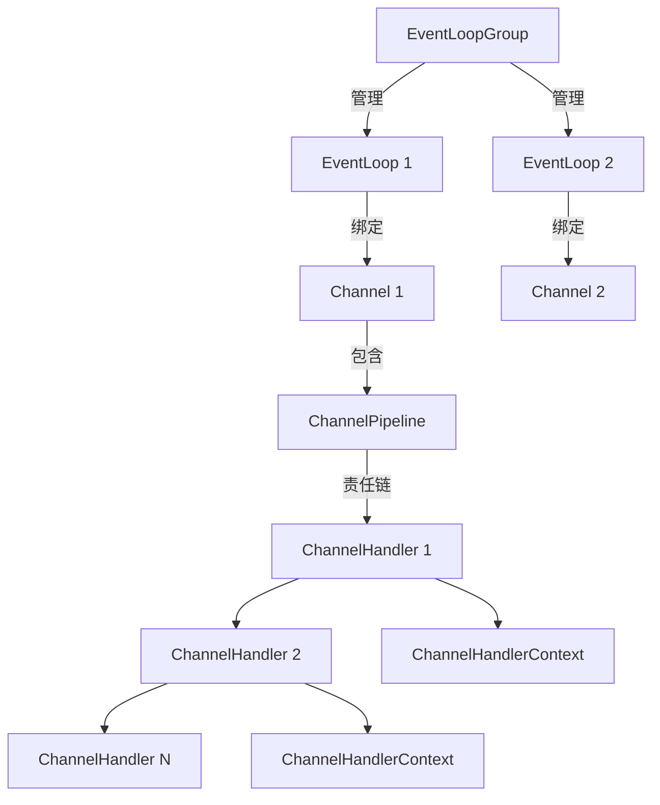
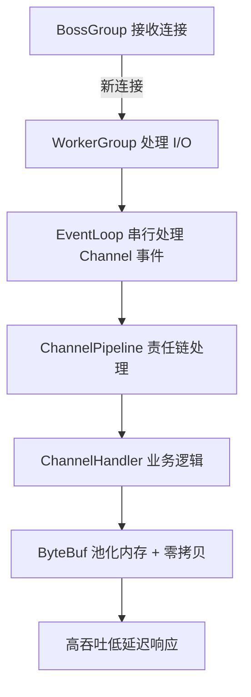
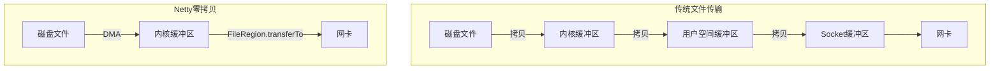
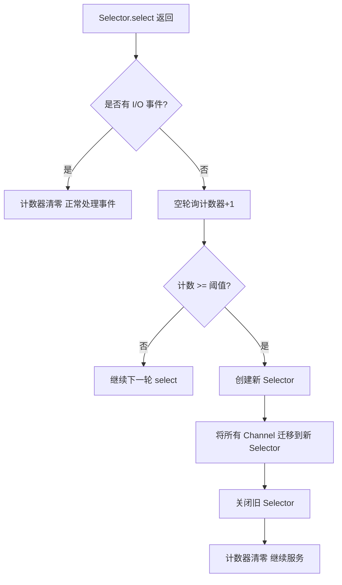
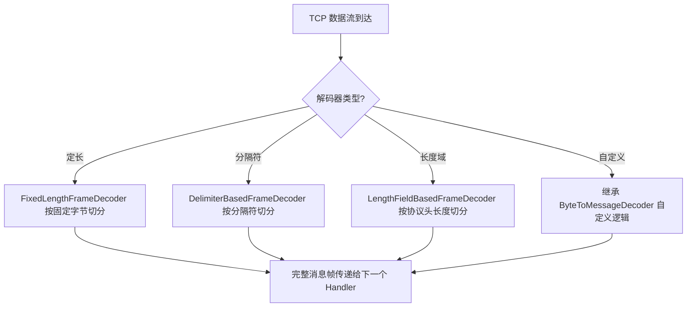

# Netty 面试

::: tip 扩展

- [Netty 官方文档](https://netty.io/wiki/index.html)
- 《Netty in Action》—— Norman Maurer
- 《Netty 权威指南》—— 李林锋

:::

## I/O 模型

### 【中等】什么是 BIO、NIO、AIO？三者有什么区别？⭐⭐⭐

| 对比维度 | BIO（同步阻塞） | NIO（同步非阻塞） | AIO（异步非阻塞） |
| :--- | :--- | :--- | :--- |
| **模型** | 一个连接一个线程 | 多路复用（I/O 多路复用） | 异步回调 |
| **阻塞行为** | 读写时线程阻塞 | 读写时不阻塞，但需轮询 | 完全不阻塞，内核完成后回调通知 |
| **适用场景** | 连接数少且固定 | **高并发、连接数多**（主流方案） | 重 I/O、连接数极多 |
| **Java 支持** | `java.io` 包 | `java.nio` 包 | JDK 7 `AsynchronousChannel`（不成熟） |
| **代表框架** | Tomcat（早期） | **Netty**、Mina | 较少使用 |

**总结**：NIO 是当前 Java 网络编程的主流模型，Netty 基于 NIO 构建，提供了更完善的 API 和更高的可靠性。AIO 在 Java 生态中应用较少，Linux 上推荐使用 `epoll` + NIO 的组合（即 Netty 方案）。

## Netty 简介

### 【简单】什么是 Netty？⭐⭐

**Netty 是一个基于 Java NIO 的高性能、异步事件驱动的网络通信框架**，由 JBOSS 提供，用于快速开发可维护的高协议性、高并发网络应用。

Netty 的核心定位：

- **并非简单的 NIO 封装**，而是提供了完整的网络编程解决方案（线程模型、编解码、粘包拆包、心跳等）。
- **异步非阻塞**：基于 Reactor 模式，所有 I/O 操作都是异步的，通过 Future/Callback 通知结果。
- **开箱即用**：内置 HTTP、WebSocket、SSL 等协议支持，开发者聚焦业务逻辑。

**核心能力**：

| 能力          | 说明                                                              |
| :------------ | :---------------------------------------------------------------- |
| **高性能**    | 基于多路复用、零拷贝、内存池化，吞吐量高、延迟低                  |
| **高可靠**    | 解决 NIO 空轮询 Bug，提供心跳检测、重连机制                       |
| **易用性**    | 简洁 API，屏蔽 Selector/Channel 复杂细节                          |
| **可扩展**    | 责任链式 Pipeline，编解码、业务逻辑可插拔                         |
| **协议支持**  | 内置 HTTP、WebSocket、SSL、Google Protocol Buffers 等            |

### 【中等】Netty 有哪些应用场景？⭐

**Netty 是构建高性能、高可扩展性网络应用的基石**，尤其适用于需要处理**大量并发连接**和**高速数据传输**的场景。

Netty 的核心应用场景如下：

| 应用领域         | 核心需求                   | 代表技术                             |
| :--------------- | :------------------------- | :----------------------------------- |
| **互联网分布式** | 高并发、高可用、服务治理   | Dubbo、gRPC、RocketMQ、API Gateway   |
| **大数据**       | 高吞吐、跨节点通信         | Hadoop、Spark、Flink、Elasticsearch  |
| **游戏与 IoT**   | 长连接、低延迟、自定义协议 | 游戏后端、物联网平台                 |
| **协议实现**     | 灵活编解码、高性能网络 IO  | WebSocket, HTTP, 自定义 TCP/UDP 协议 |

### 【中等】为什么选择 Netty 替代 NIO？⭐⭐

Netty 在 NIO 的基础上，通过封装和优化，**提供了一个全面增强（更简单、更稳定、性能更高、功能更全）的网络框架，能大幅降低开发难度和维护成本**。

| 特性         | Java NIO                                                           | Netty                                                                      |
| :----------- | :----------------------------------------------------------------- | :------------------------------------------------------------------------- |
| **易用性**   | API 复杂难用，需手动处理 `Selector`、`Channel` 和 `Buffer`，易出错 | 提供简洁的 API（如 `ChannelHandler`），开发效率极高                        |
| **稳定性**   | 需自行实现复杂的多线程模型，存在著名的空轮询等 Bug，稳定性差       | 提供成熟、开箱即用的 `Reactor` 线程模型，避免并发问题，久经考验，异常稳定  |
| **性能**     | 基础性能好，但难以优化到极致                                       | 通过内存池化、零拷贝等高级优化，提供更高的吞吐量和更低的内存消耗，性能更优 |
| **功能**     | 只有基础组件，需自研心跳、粘包拆包、重连等功能                     | 开箱即用，内置多种协议（HTTP / WebSocket）、编解码器和工具，功能强大齐全   |
| **可维护性** | 自实现代码质量参差不齐，难以维护和扩展                             | 代码规范，模块清晰，拥有强大社区和生态，长期维护成本低                     |

**NIO 的主要痛点**：

- API 繁琐，需手动管理 Selector、SelectionKey、Channel、Buffer
- 臭名昭著的 epoll 空轮询 Bug 导致 CPU 100%
- 自行实现 Reactor 线程模型复杂易错
- 缺乏粘包拆包、心跳、重连等工程化能力
- ByteBuffer 单指针、不可扩容、API 反人类

## Netty 核心组件

### 【中等】Netty 的核心组件有哪些？⭐⭐⭐

Netty 的核心组件共同构成了其高性能网络通信框架的基础：

| 组件                     | 职责                                           | 生命周期                           |
| :----------------------- | :--------------------------------------------- | :--------------------------------- |
| **Channel**              | 网络 I/O 操作的载体（连接、读、写、绑定、关闭） | 对应一个底层 socket                |
| **EventLoop**            | 处理 Channel 的所有 I/O 事件，单线程串行执行    | 一个 EventLoop 可绑多个 Channel    |
| **EventLoopGroup**       | EventLoop 的集合，管理线程池                    | 应用级                             |
| **ChannelHandler**       | 处理 I/O 事件或拦截 I/O 操作的业务逻辑          | 可共享（`@Sharable`）或每连接新建  |
| **ChannelPipeline**      | ChannelHandler 的责任链容器                     | 每 Channel 一个                     |
| **ChannelHandlerContext**| ChannelHandler 与 Pipeline 交互的上下文         | 处理器注册时创建                    |
| **ByteBuf**              | Netty 自研的字节缓冲区，替代 NIO ByteBuffer     | 引用计数管理                        |

**组件协作关系**：



:::: info Channel 与 EventLoop 的关系
::::

- 一个 `Channel` 在其生命周期内**只注册到一个 `EventLoop`**，所有 I/O 操作都由该 EventLoop 的单线程执行。
- 一个 `EventLoop` 可处理**多个 Channel** 的事件，通过多路复用实现高并发。
- 这种"单线程绑定多 Channel"的设计保证了**Channel 内操作的线程安全**，无需同步。

:::: info ChannelPipeline 与 ChannelHandler
::::

- 每个 `Channel` 拥有一个独立的 `ChannelPipeline`，内部以双向链表组织 `ChannelHandler`。
- **Inbound 事件**（读、连接建立）从头到尾传播，由 `ChannelInboundHandler` 处理。
- **Outbound 事件**（写、连接、绑定）从尾到头传播，由 `ChannelOutboundHandler` 处理。
- 事件传播通过 `ChannelHandlerContext.fireChannelRead()` 或 `write()` 触发。

```java
// 服务端 Pipeline 典型配置
serverBootstrap.childHandler(new ChannelInitializer<SocketChannel>() {
    @Override
    protected void initChannel(SocketChannel ch) {
        ChannelPipeline p = ch.pipeline();
        p.addLast("frameDecoder", new LengthFieldBasedFrameDecoder(1024, 0, 4, 0, 4));
        p.addLast("stringDecoder", new StringDecoder(CharsetUtil.UTF_8));
        p.addLast("frameEncoder", new LengthFieldPrepender(4));
        p.addLast("stringEncoder", new StringEncoder(CharsetUtil.UTF_8));
        p.addLast("businessHandler", new MyBusinessHandler());  // 业务处理
    }
});
```

### 【中等】什么是 Reactor 线程模型？Netty 支持哪种？⭐⭐

**Reactor 模式是一种事件驱动的设计模式**，通过 I/O 多路复用监听事件，将事件分发给对应的 Handler 处理，实现非阻塞高并发。

Reactor 模式有三种经典形态：

| 模型             | 结构                                          | 特点                                             | 适用场景           |
| :--------------- | :-------------------------------------------- | :----------------------------------------------- | :----------------- |
| **单线程 Reactor** | 1 个线程处理所有 I/O（接收+读写+业务）        | 简单但无法利用多核，业务慢会阻塞 I/O             | 客户端、低并发     |
| **多线程 Reactor** | 1 个线程接收连接，N 个线程处理 I/O+业务       | 利用多核，但单 Reactor 可能成为接收瓶颈          | 中等并发           |
| **主从 Reactor**  | 主 Reactor 接收连接，从 Reactor 处理 I/O+业务 | 接收与处理分离，性能最优                         | 高并发服务端       |

**Netty 的实现**：

Netty 推荐使用**主从 Reactor 多线程模型**：

```java
// 主从 Reactor 模型示例
EventLoopGroup bossGroup = new NioEventLoopGroup(1);   // 主 Reactor：接收连接
EventLoopGroup workerGroup = new NioEventLoopGroup();  // 从 Reactor：处理 I/O

ServerBootstrap b = new ServerBootstrap();
b.group(bossGroup, workerGroup)
 .channel(NioServerSocketChannel.class)
 .childHandler(new ChannelInitializer<SocketChannel>() { ... });
```

- **BossGroup**：专门处理 `OP_ACCEPT` 事件（新连接），通常 1 个线程足够。
- **WorkerGroup**：处理已建立连接的 `OP_READ`/`OP_WRITE`，默认 CPU 核数 × 2。
- 连接建立后，BossGroup 将 Channel 注册到 WorkerGroup 的某个 EventLoop 上，后续所有 I/O 由该线程处理。

> Netty 也可通过 `group(group)` 单参数配置退化为单线程模型，或通过业务线程池将耗时业务与 I/O 线程隔离。

### 【中等】ByteBuf 与 NIO ByteBuffer 有什么区别？⭐⭐

**ByteBuf 是 Netty 自研的字节缓冲区，针对 NIO ByteBuffer 的诸多缺陷进行了全面优化**。

| 对比维度       | NIO ByteBuffer                          | Netty ByteBuf                                    |
| :------------- | :-------------------------------------- | :----------------------------------------------- |
| **读写指针**   | 单指针 `position`，读写需 `flip()` 切换 | **双指针** `readerIndex`/`writerIndex`，读写独立 |
| **扩容**       | 固定容量，不可扩容                      | 自动扩容（maxCapacity 范围内）                   |
| **池化**       | 不支持                                  | 支持**池化**（PooledByteBufAllocator）           |
| **堆外内存**   | `allocateDirect()`                      | `directBuffer()`，更高效管理                     |
| **引用计数**   | 无，靠 GC 回收                          | **ReferenceCounted**，手动 release，防泄漏       |
| **零拷贝**     | 不支持                                  | `CompositeByteBuf`/`slice()`/`duplicate()`       |
| **API 易用性** | 反人类，flip 容易遗忘                   | 流式 API，读写分离，不易出错                     |

**读写指针的优势**：

```java
// NIO ByteBuffer：读写需 flip 切换
ByteBuffer buf = ByteBuffer.allocate(1024);
buf.put("hello".getBytes());  // 写
buf.flip();                   // 切换为读模式（极易遗忘）
buf.get();                    // 读

// Netty ByteBuf：读写指针独立，无需切换
ByteBuf buf = Unpooled.buffer(1024);
buf.writeBytes("hello".getBytes());  // 写，writerIndex 前移
buf.readBytes(5);                    // 读，readerIndex 前移
// 两者独立，可随时读或写
```

### 【困难】ByteBuf 的引用计数与内存泄漏检测机制是什么？⭐⭐

**ByteBuf 采用引用计数（Reference Counted）管理生命周期**，而非依赖 JVM GC，这主要是为了**堆外内存的及时回收**（堆外内存不受 GC 管控）。

**引用计数规则**：

- 创建时引用计数 = 1。
- 调用 `retain()` 引用计数 +1（多个持有者共享时）。
- 调用 `release()` 引用计数 -1，降为 0 时释放内存。
- **谁最后使用，谁负责 release**，通常在 `ChannelHandler` 中消费完 ByteBuf 后释放。

**常见泄漏场景**：

1. Pipeline 中某个 Handler 消费了 ByteBuf 但未传递（未调用 `fireChannelRead` 也未 `release`）。
2. 异步处理时将 ByteBuf 存入队列，但消费失败未释放。
3. 自定义 Handler 继承 `SimpleChannelInboundHandler` 但忘记该基类会自动 release（若需传递需 `retain`）。

**内存泄漏检测**：Netty 提供 `ResourceLeakDetector`，通过弱引用 + 引用队列跟踪 ByteBuf 的 release 情况：

| 检测级别       | 采样比例 | 性能开销 | 适用场景           |
| :------------- | :------- | :------- | :----------------- |
| `DISABLED`     | 0        | 无       | 生产环境关闭检测    |
| `SIMPLE`（默认）| 1%       | 极低     | 生产环境默认        |
| `ADVANCED`     | 1%       | 中       | 测试环境排查        |
| `PARANOID`     | 100%     | 高       | 开发调试阶段        |

```java
// 开启最高级别检测（仅调试用）
-Dio.netty.leakDetection.level=PARANOID
```

## Netty 架构

### 【中等】Netty 性能为什么高？⭐⭐

Netty 高性能基于以下原因：

- **非阻塞 I/O 模型**：底层使用 NIO，并利用 I/O 多路复用，充分利用系统资源。
- **线程模型**：通过**主从 Reactor 和串行化**设计保证了并发能力。通过** CAS 和精细化的数据结构**降低了线程开销。
- **内存管理**：通过**池化和堆外内存**减少了 GC 停滞。
- **零拷贝**：通过**减少数据复制**路径提升了效率。



**串行化设计的优势**：每个 Channel 绑定一个 EventLoop 线程，所有事件（读、写、业务）都在**同一线程内串行执行**，避免了多线程竞争和上下文切换，无需同步。这种"无锁串行"是 Netty 高性能的关键。

### 【中等】Netty 的零拷贝机制是如何设计的？⭐⭐

Netty 零拷贝机制包含**应用层零拷贝**和**操作系统层零拷贝**两个层面：

| 场景         | 传统方式（多次拷贝）                  | Netty 方式（零拷贝）   | 技术                                                               | 收益                                                    |
| :----------- | :------------------------------------ | :--------------------- | :----------------------------------------------------------------- | ------------------------------------------------------- |
| **网络 I/O** | 堆内 -> 堆外 -> 网卡                  | **堆外 -> 网卡**       | **堆外直接内存**                                                   | 网络 I/O 时避免了数据从 JVM 堆内到堆外的额外拷贝        |
| **合并传输** | 拷贝所有小 Buffer 到一个新的大 Buffer | **虚拟组合，分批发送** | 使用 **`CompositeByteBuf`** 将多个 Buffer 组合为一个逻辑上的缓冲区 | 合并发送协议报文（如 Header + Body）时无需拷贝数据      |
| **文件传输** | 文件 -> 用户内存 -> 内核内存 -> 网卡  | **文件 -> 网卡**       | 通过 **`FileRegion`** 调用 `transferTo()`                          | 利用 DMA 机制，数据直接从文件缓存传到网卡，绕过用户内存 |
| **数据共享** | 创建新对象并拷贝底层数据              | **创建视图，共享数据** | 使用 **`wrap()`** 包装数组或 **`slice()`** 切割 `Buffer`           | 创建新的对象视图操作数据子集，共享底层数据，无拷贝      |



**CompositeByteBuf 示例**（协议头+消息体合并发送，零拷贝）：

```java
ByteBuf header = Unpooled.wrappedBuffer("HEAD".getBytes());
ByteBuf body   = Unpooled.wrappedBuffer("BODY".getBytes());
// 组合为逻辑上的一个 Buffer，无需拷贝
CompositeByteBuf message = Unpooled.wrappedBuffer(header, body);
channel.writeAndFlush(message);
```

### 【困难】Netty 如何解决 NIO 中的空轮询 Bug？⭐⭐

Netty 实际上并没有解决 JDK NIO 中空轮询 bug，而是通过其他途径绕开了这个错误。

具体操作如下：

- **主动检测**：Netty 通过计数器统计连续空轮询的次数。每次执行 `Selector.select ()` 方法后，如果发现没有 I/O 事件，计数器就会递增。
- **计数判定**：Netty 定义了一个阈值，当空轮询次数达到这个阈值时，Netty 会触发重建 `Selector` 的操作。
- **动态重建**：当达到空轮询的阈值时，Netty 会创建一个新的 `Selector`，并将所有注册的 `Channel` 从旧的 `Selector` 转移到新的 `Selector` 上。成功重建 Selector 并将 Channel 重新注册后，Netty 会关闭旧的 Selector，从而避免继续在旧的 Selector 上发生空轮询。

Netty 通过**主动检测 -> 计数判定 -> 动态重建**这一套组合拳，将操作系统层面的一个致命 Bug 完美地隔离在了框架内部，并将其转化成了一个可以自动修复的常规问题。



> 阈值默认 `SELECTOR_AUTO_REBUILD_THRESHOLD = 512`，可在 `NioEventLoop` 源码中查看。

### 【困难】Netty 是如何解决粘包和拆包问题的？⭐⭐⭐

Netty 解决粘包/拆包问题的核心是：**在数据流经 Pipeline 时，通过"解码器"将其还原成有应用层语义的完整消息包**。



Netty 内置解码器：

- **定长解码（FixedLengthFrameDecoder）**：强制按**固定字节数**切分。适用于消息长度严格固定的简单协议。
- **分隔符解码（DelimiterBasedFrameDecoder）**：根据**特定字符**（如换行符 `\n`）切分。适用于文本协议（如 FTP、Redis）、命令行交互。
- **长度域解码（LengthFieldBasedFrameDecoder）**：从协议头中读取**长度字段**，按该值切分后续内容。最常用，适用于**主流二进制自定义协议**（如 Dubbo、RocketMQ），高度灵活高效。
- **自定义解码（继承 ByteToMessageDecoder）**：重写 `decode` 方法，实现任何复杂逻辑。适用于无法用上述方式解决的特殊或极复杂协议。

**LengthFieldBasedFrameDecoder 核心参数**：

| 参数                | 说明                          | 示例值            |
| :------------------ | :---------------------------- | :---------------- |
| maxFrameLength      | 最大帧长度，超出抛异常         | 1024 × 1024       |
| lengthFieldOffset   | 长度字段的偏移量              | 0（长度字段在最前）|
| lengthFieldLength   | 长度字段本身的字节数          | 4（int）          |
| lengthAdjustment    | 长度字段值与实际内容的补偿值  | 0                 |
| initialBytesToStrip | 解码后跳过的字节数（去协议头）| 4（去掉长度字段） |

```java
// 协议：[4字节长度][消息体]
p.addLast(new LengthFieldBasedFrameDecoder(
    1024 * 1024,  // maxFrameLength
    0,            // lengthFieldOffset
    4,            // lengthFieldLength
    0,            // lengthAdjustment
    4             // initialBytesToStrip（去掉长度头，只传消息体给后续Handler）
));
```

### 【中等】Netty 的心跳机制是如何实现的？⭐⭐⭐

**心跳机制用于检测连接是否存活**，防止因网络异常导致连接"假死"（TCP 连接存在但无法通信）。

Netty 内置 `IdleStateHandler` 实现空闲检测：

```java
// 60秒未读、30秒未写、90秒未读写则触发事件
p.addLast(new IdleStateHandler(60, 30, 0, TimeUnit.SECONDS));
p.addLast(new HeartbeatHandler());
```

```java
public class HeartbeatHandler extends ChannelInboundHandlerAdapter {
    @Override
    public void userEventTriggered(ChannelHandlerContext ctx, Object evt) {
        if (evt instanceof IdleStateEvent) {
            IdleStateEvent event = (IdleStateEvent) evt;
            switch (event.state()) {
                case READER_IDLE:
                    // 服务端：客户端长时间无数据，可能已断开，关闭连接
                    ctx.close();
                    break;
                case WRITER_IDLE:
                    // 客户端：长时间未写，发送心跳包保活
                    ctx.writeAndFlush(new HeartbeatPacket());
                    break;
            }
        }
    }
}
```

**设计建议**：

- **服务端**：通常只配置 `readerIdleTime`，客户端长时间未读则关闭连接。
- **客户端**：通常配置 `writerIdleTime`，定时发送心跳保活。
- **心跳间隔**：一般 30~60 秒，不宜过短（浪费带宽）或过长（响应慢）。
- 配合 `ChannelOption.SO_KEEPALIVE=true` 使用 TCP 层 KeepAlive 兜底。

### 【中等】Netty 采用了哪些设计模式？⭐⭐

| 设计模式            | Netty 中的应用                       | 带来的好处                     |
| :------------------ | :----------------------------------- | :----------------------------- |
| **责任链模式**      | `ChannelPipeline` + `ChannelHandler` | 处理逻辑解耦、可插拔、灵活组装 |
| **观察者/事件驱动** | I/O 事件通知机制                     | 异步响应、高效处理             |
| **工厂方法模式**    | `EventLoopGroup`, `Channel` 创建     | 解耦，便于扩展不同实现         |
| **建造者模式**      | `ServerBootstrap` / `Bootstrap`      | 清晰、灵活地配置复杂参数       |
| **适配器模式**      | `ChannelInboundHandlerAdapter`       | 简化开发，只需覆盖关心的方法   |
| **装饰器模式**      | `ByteBuf` 的包装与视图               | 动态增强功能，避免子类爆炸     |
| **单例模式**        | 各种无状态对象（如空 Buffer）        | 节约资源，提高性能             |
| **迭代器模式**      | 遍历选择键集合                       | 统一访问，隐藏底层细节         |

## Netty 常见问题

### 【中等】Netty 常见的高频问题有哪些？如何解决？⭐⭐⭐

**1. 内存泄漏**

- **原因**：ByteBuf 引用计数未正确 release，尤其是堆外内存。
- **排查**：开启 `-Dio.netty.leakDetection.level=PARANOID` 定位泄漏点。
- **解决**：遵循"谁消费谁释放"原则；继承 `SimpleChannelInboundHandler` 自动释放；异步处理时 `retain()` + 用完 `release()`。

**2. 连接假死**

- **原因**：网络抖动、防火墙超时清理、客户端异常断开但 TCP 未通知。
- **排查**：通过 `IdleStateHandler` 检测长时间无数据的连接。
- **解决**：配置心跳机制，超时主动关闭并重建连接。

**3. 线程死锁 / EventLoop 阻塞**

- **原因**：在 `ChannelHandler` 中执行耗时操作（DB 查询、远程调用），阻塞 EventLoop 线程导致该线程上所有 Channel 响应变慢。
- **解决**：耗时业务投递到**独立业务线程池**处理，不在 I/O 线程做阻塞操作。

```java
// 正确做法：I/O 线程只做编解码，业务交给业务线程池
EventExecutorGroup businessGroup = new DefaultEventExecutorGroup(16);
p.addLast(businessGroup, "businessHandler", new MyBusinessHandler());
```

**4. 粘包拆包**

- **原因**：TCP 是流式协议，无消息边界。
- **解决**：使用 `LengthFieldBasedFrameDecoder` 等解码器定义消息边界。

**5. 高并发下连接拒绝**

- **原因**：系统 backlog 队列满，或文件描述符不足。
- **解决**：调大 `SO_BACKLOG`；调整系统 `ulimit -n` 和 `somaxconn`。

```java
b.option(ChannelOption.SO_BACKLOG, 1024);  // 连接队列大小
```

## 资料

- [面试鸭 - Netty 面试](https://www.mianshiya.com/bank/1804354610222800897)
- [Netty 官方文档](https://netty.io/wiki/index.html)
- 《Netty in Action》Norman Maurer 等
- 《Netty 权威指南》李林锋
