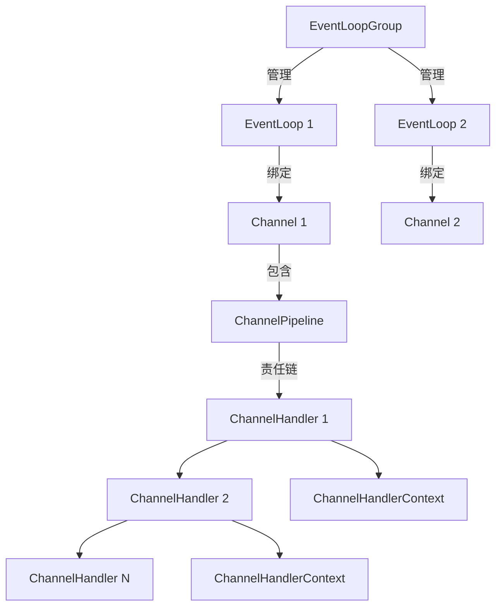
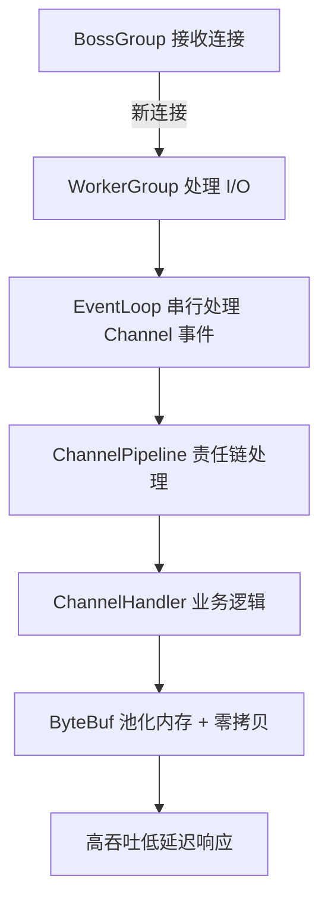
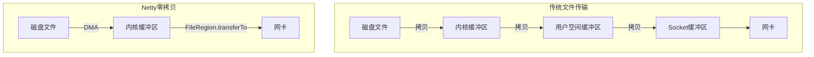
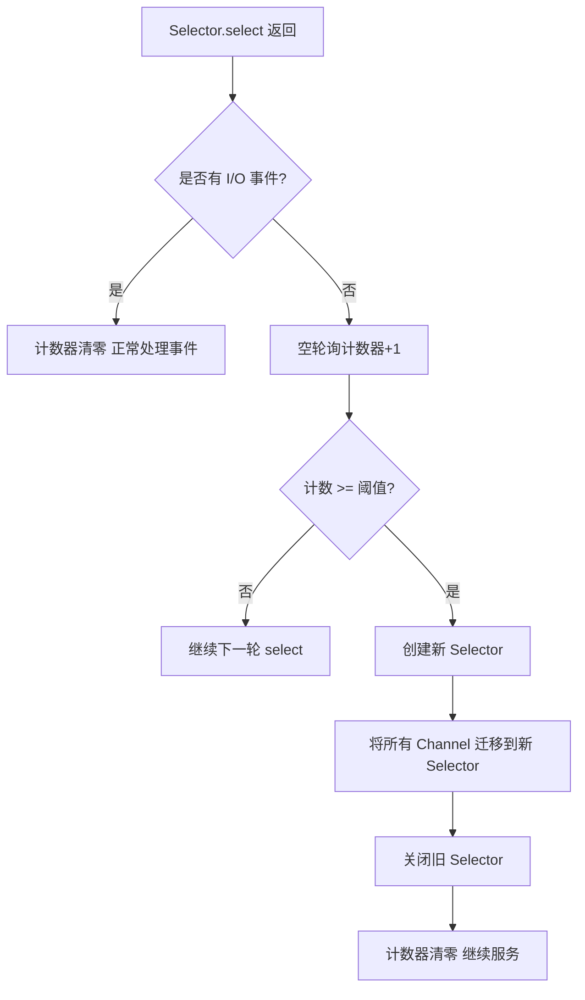
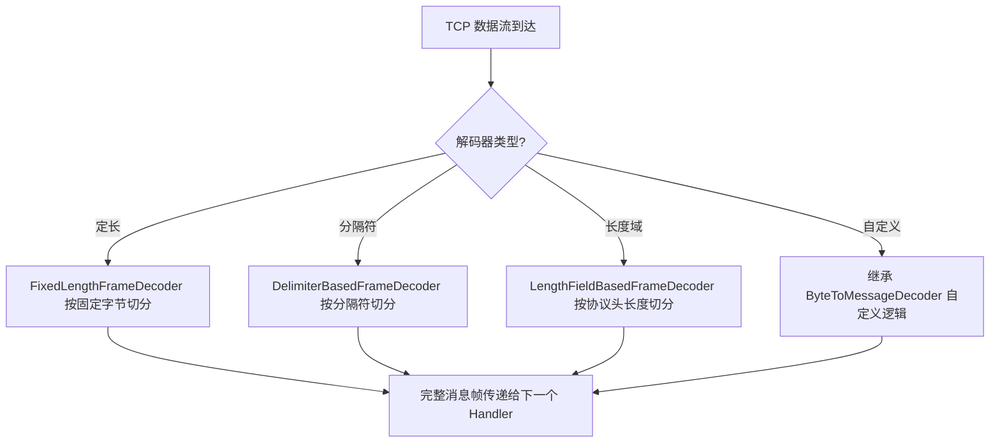

# Netty 面试

## I/O 模型

### 【中等】什么是 BIO、NIO、AIO？三者有什么区别？⭐⭐⭐

> 🎯 目标等级：L2 ｜ ⏱ 建议用时：8 min ｜ 🏷 标签：Netty / I/O 模型

#### 💎 关键结论

BIO 同步阻塞、一连接一线程；NIO 同步非阻塞、靠 I/O 多路复用一线程管多连接；AIO 异步非阻塞、内核完成后回调通知。Java 网络编程以 NIO 为主流，Netty 正是基于 NIO 构建；AIO 在 Linux 生态应用很少。

#### ⚡记忆卡片

- **口诀**：BIO 一线程一连接，NIO 复用一线程多连接，AIO 内核回调全异步
- **关键词**：同步阻塞 ／ I/O 多路复用 ／ 异步回调
- **链路**：连接到达 → 线程模型决定阻塞行为 → 事件通知/回调处理

#### 📖 核心知识

| 对比维度      | BIO（同步阻塞）  | NIO（同步非阻塞）                | AIO（异步非阻塞）                     |
| :------------ | :--------------- | :------------------------------- | :------------------------------------ |
| **模型**      | 一个连接一个线程 | 多路复用（I/O 多路复用）         | 异步回调                              |
| **阻塞行为**  | 读写时线程阻塞   | 读写时不阻塞，但需轮询           | 完全不阻塞，内核完成后回调通知        |
| **适用场景**  | 连接数少且固定   | **高并发、连接数多**（主流方案） | 重 I/O、连接数极多                    |
| **Java 支持** | `java.io` 包     | `java.nio` 包                    | JDK 7 `AsynchronousChannel`（不成熟） |
| **代表框架**  | Tomcat（早期）   | **Netty**、Mina                  | 较少使用                              |

**总结**：NIO 是当前 Java 网络编程的主流模型，Netty 基于 NIO 构建，提供了更完善的 API 和更高的可靠性。AIO 在 Java 生态中应用较少，Linux 上推荐使用 `epoll` + NIO 的组合（即 Netty 方案）。

#### 🔬 扩展知识

::: details

- 【L3】BIO 在高并发下的瓶颈是线程数量与上下文切换开销；NIO 通过 Selector 将"等待就绪"的开销从线程数降为事件数。
- 【L4】AIO 在 Linux 上的实现（`AsynchronousChannel`）底层仍依赖 epoll 模拟，并非真正的内核异步 I/O（io_uring 才接近真异步），这也是 AIO 在 Java 服务端少用的根本原因。

> 📚 延伸阅读：[Netty 官方文档](https://netty.io/wiki/index.html)

:::

#### 🔀 发散问题

- **Q：既然 NIO 已经非阻塞，为什么还要 Netty？** → NIO 原生 API 繁琐且有空轮询 Bug，Netty 提供了线程模型、编解码等工程化封装，见本文档「为什么选择 Netty 替代 NIO？」。
- **Q：Netty 用的是哪种 I/O 模型？** → Netty 基于 NIO + Reactor 主从线程模型，见本文档「什么是 Reactor 线程模型？Netty 支持哪种？」。

## Netty 简介

### 【简单】什么是 Netty？⭐⭐

> 🎯 目标等级：L1 ｜ ⏱ 建议用时：5 min ｜ 🏷 标签：Netty / 框架定位

#### 💎 关键结论

Netty 是基于 Java NIO 的高性能、异步事件驱动网络通信框架，不只是 NIO 封装，而是提供线程模型、编解码、粘包拆包、心跳等完整网络编程解决方案，异步非阻塞、开箱即用。

#### ⚡记忆卡片

- **口诀**：基于 NIO、事件驱动、异步非阻塞、开箱即用
- **关键词**：NIO ／ Reactor ／ 异步事件驱动
- **链路**：NIO 多路复用 → Reactor 线程模型 → Pipeline 责任链处理

#### 📖 核心知识

**Netty 是一个基于 Java NIO 的高性能、异步事件驱动的网络通信框架**，由 JBOSS 提供，用于快速开发可维护的高协议性、高并发网络应用。

Netty 的核心定位：

- **并非简单的 NIO 封装**，而是提供了完整的网络编程解决方案（线程模型、编解码、粘包拆包、心跳等）。
- **异步非阻塞**：基于 Reactor 模式，所有 I/O 操作都是异步的，通过 Future/Callback 通知结果。
- **开箱即用**：内置 HTTP、WebSocket、SSL 等协议支持，开发者聚焦业务逻辑。

**核心能力**：

| 能力         | 说明                                                  |
| :----------- | :---------------------------------------------------- |
| **高性能**   | 基于多路复用、零拷贝、内存池化，吞吐量高、延迟低      |
| **高可靠**   | 解决 NIO 空轮询 Bug，提供心跳检测、重连机制           |
| **易用性**   | 简洁 API，屏蔽 Selector/Channel 复杂细节              |
| **可扩展**   | 责任链式 Pipeline，编解码、业务逻辑可插拔             |
| **协议支持** | 内置 HTTP、WebSocket、SSL、Google Protocol Buffers 等 |

#### 🔀 发散问题

- **Q：Netty 适合用在哪些场景？** → RPC 通信层、大数据组件通信、游戏与 IoT 长连接等，见本文档「Netty 有哪些应用场景？」。
- **Q：Netty 高性能的原因是什么？** → 多路复用、主从 Reactor、池化堆外内存与零拷贝，见本文档「Netty 性能为什么高？」。

### 【中等】Netty 有哪些应用场景？⭐

> 🎯 目标等级：L2 ｜ ⏱ 建议用时：5 min ｜ 🏷 标签：Netty / 应用场景

#### 💎 关键结论

Netty 是构建高性能网络应用的基石，凡是需要大量并发连接和高速数据传输的场景都适用：RPC 框架通信层、大数据组件通信、游戏与 IoT 长连接、自定义协议网关。

#### ⚡记忆卡片

- **口诀**：RPC 通信、大数据互联、长连接服务、协议网关
- **关键词**：Dubbo ／ Flink ／ 长连接
- **链路**：高并发连接需求 → Netty 通信层 → 上层框架能力

#### 📖 核心知识

**Netty 是构建高性能、高可扩展性网络应用的基石**，尤其适用于需要处理**大量并发连接**和**高速数据传输**的场景。

| 应用领域         | 核心需求                   | 代表技术                             |
| :--------------- | :------------------------- | :----------------------------------- |
| **互联网分布式** | 高并发、高可用、服务治理   | Dubbo、gRPC、RocketMQ、API Gateway   |
| **大数据**       | 高吞吐、跨节点通信         | Hadoop、Spark、Flink、Elasticsearch  |
| **游戏与 IoT**   | 长连接、低延迟、自定义协议 | 游戏后端、物联网平台                 |
| **协议实现**     | 灵活编解码、高性能网络 IO  | WebSocket, HTTP, 自定义 TCP/UDP 协议 |

#### 🔬 扩展知识

::: details

- 【L3】Dubbo、gRPC-Java、RocketMQ 的 Remoting 层均基于 Netty 实现，说明 Netty 已成为 Java 分布式通信的事实标准。
- 【L4】选型时需权衡：超低延迟场景关注 Netty 的 Epoll 传输（Linux 原生 epoll），跨平台场景用 NIO 传输。

> 📚 延伸阅读：[面试鸭 - Netty 面试](https://www.mianshiya.com/bank/1804354610222800897)

:::

#### 🔀 发散问题

- **Q：为什么不直接用 JDK NIO 实现这些场景？** → NIO 缺少工程化能力且有空轮询 Bug，见本文档「为什么选择 Netty 替代 NIO？」。

### 【中等】为什么选择 Netty 替代 NIO？⭐⭐

> 🎯 目标等级：L2 ｜ ⏱ 建议用时：8 min ｜ 🏷 标签：Netty / 框架选型

#### 💎 关键结论

原生 NIO 存在 API 繁琐、空轮询 Bug、粘包拆包与心跳需自研等痛点；Netty 在用易用性、稳定性、性能、功能、可维护性五个维度全面增强，大幅降低开发与维护成本。

#### ⚡记忆卡片

- **口诀**：易用、稳定、性能、功能、可维护，五维增强
- **关键词**：空轮询 Bug ／ Reactor 封装 ／ 开箱即用
- **链路**：NIO 痛点 → Netty 封装增强 → 生产级网络框架

#### 📖 核心知识

Netty 在 NIO 的基础上，通过封装和优化，**提供了一个全面增强（更简单、更稳定、性能更高、功能更全）的网络框架，能大幅降低开发难度和维护成本**。

| 特性         | Java NIO                                                           | Netty                                                                      |
| :----------- | :----------------------------------------------------------------- | :------------------------------------------------------------------------- |
| **易用性**   | API 复杂难用，需手动处理 `Selector`、`Channel` 和 `Buffer`，易出错 | 提供简洁的 API（如 `ChannelHandler`），开发效率极高                        |
| **稳定性**   | 需自行实现复杂的多线程模型，存在著名的空轮询等 Bug，稳定性差       | 提供成熟、开箱即用的 `Reactor` 线程模型，避免并发问题，久经考验，异常稳定  |
| **性能**     | 基础性能好，但难以优化到极致                                       | 通过内存池化、零拷贝等高级优化，提供更高的吞吐量和更低的内存消耗，性能更优 |
| **功能**     | 只有基础组件，需自研心跳、粘包拆包、重连等功能                     | 开箱即用，内置多种协议（HTTP / WebSocket）、编解码器和工具，功能强大齐全   |
| **可维护性** | 自实现代码质量参差不齐，难以维护和扩展                             | 代码规范，模块清晰，拥有强大社区和生态，长期维护成本低                     |

**NIO 的主要痛点**：

- API 繁琐，需手动管理 Selector、SelectionKey、Channel、Buffer
- 臭名昭著的 epoll 空轮询 Bug 导致 CPU 100%
- 自行实现 Reactor 线程模型复杂易错
- 缺乏粘包拆包、心跳、重连等工程化能力
- ByteBuffer 单指针、不可扩容、API 反人类

#### 🔬 扩展知识

::: details

- 【L3】Netty 对空轮询 Bug 的规避方案（重建 Selector）是其稳定性的标志性设计，详见本文档对应题目。
- 【L4】Netty 还支持 Linux Epoll 原生传输与 KQueue（macOS），在特定平台上比 JDK NIO 传输性能更高。

> 📚 延伸阅读：[Netty 官方文档](https://netty.io/wiki/index.html)

:::

#### 🔀 发散问题

- **Q：空轮询 Bug 具体怎么规避？** → 检测 → 计数判定 → 重建 Selector，见本文档「Netty 如何解决 NIO 中的空轮询 Bug？」。
- **Q：ByteBuffer 的缺陷如何被解决？** → Netty 用双指针、可扩容、引用计数的 ByteBuf 替代，见本文档「ByteBuf 与 NIO ByteBuffer 有什么区别？」。

## Netty 核心组件

### 【中等】Netty 的核心组件有哪些？⭐⭐⭐

> 🎯 目标等级：L2 ｜ ⏱ 建议用时：10 min ｜ 🏷 标签：Netty / 核心组件

#### 💎 关键结论

Netty 核心组件七件套：Channel 是 I/O 载体，EventLoop 单线程处理其绑定 Channel 的事件，EventLoopGroup 管理线程池，ChannelHandler 承载业务逻辑，ChannelPipeline 是责任链容器，ChannelHandlerContext 是交互上下文，ByteBuf 是自研缓冲区。

#### ⚡记忆卡片

- **口诀**：Channel 干活、EventLoop 调度、Pipeline 串联、Handler 业务、ByteBuf 装数据
- **关键词**：Channel ／ EventLoop ／ ChannelPipeline
- **链路**：EventLoopGroup → EventLoop → Channel → Pipeline → Handler

#### 📖 核心知识

| 组件                      | 职责                                            | 生命周期                          |
| :------------------------ | :---------------------------------------------- | :-------------------------------- |
| **Channel**               | 网络 I/O 操作的载体（连接、读、写、绑定、关闭） | 对应一个底层 socket               |
| **EventLoop**             | 处理 Channel 的所有 I/O 事件，单线程串行执行    | 一个 EventLoop 可绑多个 Channel   |
| **EventLoopGroup**        | EventLoop 的集合，管理线程池                    | 应用级                            |
| **ChannelHandler**        | 处理 I/O 事件或拦截 I/O 操作的业务逻辑          | 可共享（`@Sharable`）或每连接新建 |
| **ChannelPipeline**       | ChannelHandler 的责任链容器                     | 每 Channel 一个                   |
| **ChannelHandlerContext** | ChannelHandler 与 Pipeline 交互的上下文         | 处理器注册时创建                  |
| **ByteBuf**               | Netty 自研的字节缓冲区，替代 NIO ByteBuffer     | 引用计数管理                      |

**组件协作关系**：


```mermaid
graph TD
    A[EventLoopGroup] -->|管理| B[EventLoop 1]
    A -->|管理| C[EventLoop 2]
    B -->|绑定| D[Channel 1]
    C -->|绑定| E[Channel 2]
    D -->|包含| F[ChannelPipeline]
    F -->|责任链| G[ChannelHandler 1]
    G --> H[ChannelHandler 2]
    H --> I[ChannelHandler N]
    G --> J[ChannelHandlerContext]
    H --> K[ChannelHandlerContext]
```

**Channel 与 EventLoop 的关系**：

- 一个 `Channel` 在其生命周期内**只注册到一个 `EventLoop`**，所有 I/O 操作都由该 EventLoop 的单线程执行。
- 一个 `EventLoop` 可处理**多个 Channel** 的事件，通过多路复用实现高并发。
- 这种"单线程绑定多 Channel"的设计保证了**Channel 内操作的线程安全**，无需同步。

**ChannelPipeline 与 ChannelHandler**：

- 每个 `Channel` 拥有一个独立的 `ChannelPipeline`，内部以双向链表组织 `ChannelHandler`。
- **Inbound 事件**（读、连接建立）从头到尾传播，由 `ChannelInboundHandler` 处理。
- **Outbound 事件**（写、连接、绑定）从尾到头传播，由 `ChannelOutboundHandler` 处理。
- 事件传播通过 `ChannelHandlerContext.fireChannelRead()` 或 `write()` 触发。

```java
// 服务端 Pipeline 典型配置
serverBootstrap.childHandler(new ChannelInitializer<SocketChannel>() {
    @Override
    protected void initChannel(SocketChannel ch) {
        ChannelPipeline p = ch.pipeline();
        p.addLast("frameDecoder", new LengthFieldBasedFrameDecoder(1024, 0, 4, 0, 4));
        p.addLast("stringDecoder", new StringDecoder(CharsetUtil.UTF_8));
        p.addLast("frameEncoder", new LengthFieldPrepender(4));
        p.addLast("stringEncoder", new StringEncoder(CharsetUtil.UTF_8));
        p.addLast("businessHandler", new MyBusinessHandler());  // 业务处理
    }
});
```

#### 🔬 扩展知识

::: details

- 【L3】Channel 与 EventLoop 的绑定是单向且终身的，Channel 关闭后解绑，但 EventLoop 生命周期远长于 Channel，这也是 Netty 避免线程创建销毁开销的原因。
- 【L4】`ChannelHandlerContext` 缓存了 Handler 在 Pipeline 中的位置，通过 ctx 传递事件会跳过前面的节点，而通过 channel 传递则从链头开始，性能调优时需注意区分。

> 📚 延伸阅读：[Netty 官方文档 - User Guide](https://netty.io/wiki/index.html)

:::

#### 🔀 发散问题

- **Q：EventLoop 内部具体如何调度？** → select → 处理 I/O 事件 → 执行任务队列循环，见本文档「Netty 的 EventLoop 是如何工作的？」。
- **Q：ByteBuf 相比 ByteBuffer 优化了什么？** → 双指针、池化、引用计数、零拷贝，见本文档「ByteBuf 与 NIO ByteBuffer 有什么区别？」。

### 【中等】什么是 Reactor 线程模型？Netty 支持哪种？⭐⭐

> 🎯 目标等级：L2 ｜ ⏱ 建议用时：10 min ｜ 🏷 标签：Netty / Reactor 线程模型

#### 💎 关键结论

Reactor 是基于 I/O 多路复用的事件驱动模式，有单线程、多线程、主从三种形态。Netty 推荐主从 Reactor 多线程模型：BossGroup 专职接收连接，WorkerGroup 处理已建连接的 I/O，接收与处理分离，性能最优。

#### ⚡记忆卡片

- **口诀**：单线程全干、多线程分管、主从分离最领先
- **关键词**：BossGroup ／ WorkerGroup ／ 主从 Reactor
- **链路**：ACCEPT 事件 → BossGroup 接收 → 注册到 WorkerGroup EventLoop → I/O 处理

#### 📖 核心知识

**Reactor 模式是一种事件驱动的设计模式**，通过 I/O 多路复用监听事件，将事件分发给对应的 Handler 处理，实现非阻塞高并发。

| 模型               | 结构                                          | 特点                                    | 适用场景       |
| :----------------- | :-------------------------------------------- | :-------------------------------------- | :------------- |
| **单线程 Reactor** | 1 个线程处理所有 I/O（接收+读写+业务）        | 简单但无法利用多核，业务慢会阻塞 I/O    | 客户端、低并发 |
| **多线程 Reactor** | 1 个线程接收连接，N 个线程处理 I/O+业务       | 利用多核，但单 Reactor 可能成为接收瓶颈 | 中等并发       |
| **主从 Reactor**   | 主 Reactor 接收连接，从 Reactor 处理 I/O+业务 | 接收与处理分离，性能最优                | 高并发服务端   |

**Netty 的实现（主从 Reactor 多线程模型）**：

```java
// 主从 Reactor 模型示例
EventLoopGroup bossGroup = new NioEventLoopGroup(1);   // 主 Reactor：接收连接
EventLoopGroup workerGroup = new NioEventLoopGroup();  // 从 Reactor：处理 I/O

ServerBootstrap b = new ServerBootstrap();
b.group(bossGroup, workerGroup)
 .channel(NioServerSocketChannel.class)
 .childHandler(new ChannelInitializer<SocketChannel>() { ... });
```

- **BossGroup**：专门处理 `OP_ACCEPT` 事件（新连接），通常 1 个线程足够。
- **WorkerGroup**：处理已建立连接的 `OP_READ`/`OP_WRITE`，默认 CPU 核数 × 2。
- 连接建立后，BossGroup 将 Channel 注册到 WorkerGroup 的某个 EventLoop 上，后续所有 I/O 由该线程处理。

> Netty 也可通过 `group(group)` 单参数配置退化为单线程模型，或通过业务线程池将耗时业务与 I/O 线程隔离。

#### 🔬 扩展知识

::: details

- 【L3】BossGroup 与 WorkerGroup 本质都是 EventLoopGroup，只是职责分工不同；连接数极大时 BossGroup 也可配置多线程。
- 【L4】耗时业务若在 WorkerGroup 的 EventLoop 中执行，会阻塞同线程的其他 Channel，应投递到 DefaultEventExecutorGroup 业务线程池。

> 📚 延伸阅读：[面试鸭 - Netty 面试](https://www.mianshiya.com/bank/1804354610222800897)

:::

#### 🔀 发散问题

- **Q：EventLoop 线程内部是如何循环调度的？** → 见本文档「Netty 的 EventLoop 是如何工作的？」。
- **Q：EventLoop 阻塞会造成什么后果？** → 同线程所有 Channel 响应变慢，见本文档「Netty 常见的高频问题有哪些？如何解决？」。

### 【中等】Netty 的 EventLoop 是如何工作的？⭐⭐⭐

> 🎯 目标等级：L2 ｜ ⏱ 建议用时：10 min ｜ 🏷 标签：Netty / EventLoop

#### 💎 关键结论

EventLoop 是绑定 Selector 的单线程调度单元，主循环为：select 等待 I/O 事件 → 处理事件 → 执行任务队列，通过 ioRatio 平衡两者时间。Channel 操作都汇聚到绑定线程串行执行，天然线程安全、无锁是高性能关键。

#### ⚡记忆卡片

- **口诀**：一线程一 Selector，事件任务轮流抓，ioRatio 定比例
- **关键词**：select ／ runAllTasks ／ ioRatio
- **链路**：select 多路复用 → 处理 I/O 事件 → 执行任务队列 → 循环

#### 📖 核心知识

`EventLoop` 是 Netty 的核心调度单元，本质是**一个绑定 Selector 的单线程，串行处理其绑定的多个 Channel 的 I/O 事件和任务**。

**主循环流程（run 方法）**

1. **select()**：调用 `Selector.select(timeout)` 阻塞等待 I/O 事件（多路复用）。
2. **处理 I/O 事件**：遍历 `selectedKeys`，按事件类型（ACCEPT/READ/WRITE）触发对应 Channel 的 `ChannelHandler`。
3. **执行任务**：执行任务队列中的任务（runAllTasks），包括用户提交的任务、定时任务和异步操作回调。
4. 循环往复。通过 `ioRatio`（默认 50）限制 I/O 处理与任务执行的时间占比，防止 I/O 独占线程饿死任务。

**任务提交机制**

- `channel.eventLoop().execute()/schedule()` 把任务提交到 EventLoop 的 MPSC 任务队列；若当前线程不是该 EventLoop 线程，提交后会唤醒它。
- Channel 的所有操作都汇聚到其绑定的 EventLoop 线程串行执行，**天然线程安全，无需加锁**。

一句话总结：EventLoop = “select 多路复用 + 串行事件处理 + 任务队列”，一个线程管一批连接，无锁是高性能的关键。

#### 🔬 扩展知识

::: details

- 【L3】任务队列采用 MPSC（多生产者单消费者）无锁队列，任务数量超过阈值时 select 会改为非阻塞快速轮询，保证任务响应及时性。
- 【L4】select 空转防护：Netty 在主循环中统计空轮询次数，达到阈值触发 Selector 重建，与空轮询 Bug 的规避机制直接关联。

> 📚 延伸阅读：[Netty 官方文档](https://netty.io/wiki/index.html)

:::

#### 🔀 发散问题

- **Q：空轮询达到阈值后如何处理？** → 重建 Selector 并迁移 Channel，见本文档「Netty 如何解决 NIO 中的空轮询 Bug？」。
- **Q：EventLoop 与 Channel 是什么绑定关系？** → 一个 Channel 终身绑定一个 EventLoop，见本文档「Netty 的核心组件有哪些？」。

### 【中等】ByteBuf 与 NIO ByteBuffer 有什么区别？⭐⭐

> 🎯 目标等级：L2 ｜ ⏱ 建议用时：8 min ｜ 🏷 标签：Netty / ByteBuf

#### 💎 关键结论

ByteBuf 是 Netty 自研缓冲区，全面优化 ByteBuffer：读写双指针免 flip、可自动扩容、支持池化与引用计数、提供 slice/组合等零拷贝视图，API 更不易出错。

#### ⚡记忆卡片

- **口诀**：双指针免 flip，能扩容能池化，引用计数防泄漏
- **关键词**：readerIndex ／ writerIndex ／ 池化
- **链路**：写入推 writerIndex → 读取推 readerIndex → release 归还

#### 📖 核心知识

**ByteBuf 是 Netty 自研的字节缓冲区，针对 NIO ByteBuffer 的诸多缺陷进行了全面优化**。

| 对比维度       | NIO ByteBuffer                          | Netty ByteBuf                                    |
| :------------- | :-------------------------------------- | :----------------------------------------------- |
| **读写指针**   | 单指针 `position`，读写需 `flip()` 切换 | **双指针** `readerIndex`/`writerIndex`，读写独立 |
| **扩容**       | 固定容量，不可扩容                      | 自动扩容（maxCapacity 范围内）                   |
| **池化**       | 不支持                                  | 支持**池化**（PooledByteBufAllocator）           |
| **堆外内存**   | `allocateDirect()`                      | `directBuffer()`，更高效管理                     |
| **引用计数**   | 无，靠 GC 回收                          | **ReferenceCounted**，手动 release，防泄漏       |
| **零拷贝**     | 不支持                                  | `CompositeByteBuf`/`slice()`/`duplicate()`       |
| **API 易用性** | 反人类，flip 容易遗忘                   | 流式 API，读写分离，不易出错                     |

**读写指针的优势**：

```java
// NIO ByteBuffer：读写需 flip 切换
ByteBuffer buf = ByteBuffer.allocate(1024);
buf.put("hello".getBytes());  // 写
buf.flip();                   // 切换为读模式（极易遗忘）
buf.get();                    // 读

// Netty ByteBuf：读写指针独立，无需切换
ByteBuf buf = Unpooled.buffer(1024);
buf.writeBytes("hello".getBytes());  // 写，writerIndex 前移
buf.readBytes(5);                    // 读，readerIndex 前移
// 两者独立，可随时读或写
```

#### 🔬 扩展知识

::: details

- 【L3】ByteBuf 按内存位置分堆内（Heap）与堆外（Direct）两类：堆外减少一次堆内到堆外的拷贝、不受 GC 直接管理，网络 I/O 场景优先使用堆外。
- 【L4】`markReaderIndex()`/`resetReaderIndex()` 支持读位置回退，解码器中常用于"数据不足时重置读指针等待后续报文"。

> 📚 延伸阅读：[Netty 官方文档](https://netty.io/wiki/index.html)

:::

#### 🔀 发散问题

- **Q：引用计数具体如何管理与检测泄漏？** → 见本文档「ByteBuf 的引用计数与内存泄漏检测机制是什么？」。
- **Q：池化分配内部如何实现？** → 见本文档「ByteBuf 的内存池化原理是什么？」。

### 【困难】ByteBuf 的引用计数与内存泄漏检测机制是什么？⭐⭐

> 🎯 目标等级：L3 ｜ ⏱ 建议用时：12 min ｜ 🏷 标签：Netty / 引用计数

#### 💎 关键结论

ByteBuf 用引用计数而非 GC 管理生命周期，主要为及时回收堆外内存：创建计数为 1，retain 加一，release 减一归零即释放，遵循"谁最后使用谁 release"；泄漏靠 ResourceLeakDetector 弱引用采样检测，生产默认 SIMPLE 级别。

#### ⚡记忆卡片

- **口诀**：创建即 1，retain 加、release 减，谁最后用谁释放
- **关键词**：ReferenceCounted ／ release ／ ResourceLeakDetector
- **链路**：创建(1) → retain/release 传递 → 归零回收 → LeakDetector 采样告警

#### 📖 核心知识

**ByteBuf 采用引用计数（Reference Counted）管理生命周期**，而非依赖 JVM GC，这主要是为了**堆外内存的及时回收**（堆外内存不受 GC 管控）。

**引用计数规则**：

- 创建时引用计数 = 1。
- 调用 `retain()` 引用计数 +1（多个持有者共享时）。
- 调用 `release()` 引用计数 -1，降为 0 时释放内存。
- **谁最后使用，谁负责 release**，通常在 `ChannelHandler` 中消费完 ByteBuf 后释放。

**常见泄漏场景**：

1. Pipeline 中某个 Handler 消费了 ByteBuf 但未传递（未调用 `fireChannelRead` 也未 `release`）。
2. 异步处理时将 ByteBuf 存入队列，但消费失败未释放。
3. 自定义 Handler 继承 `SimpleChannelInboundHandler` 但忘记该基类会自动 release（若需传递需 `retain`）。

**内存泄漏检测**：Netty 提供 `ResourceLeakDetector`，通过弱引用 + 引用队列跟踪 ByteBuf 的 release 情况：

| 检测级别         | 采样比例 | 性能开销 | 适用场景         |
| :--------------- | :------- | :------- | :--------------- |
| `DISABLED`       | 0        | 无       | 生产环境关闭检测 |
| `SIMPLE`（默认） | 1%       | 极低     | 生产环境默认     |
| `ADVANCED`       | 1%       | 中       | 测试环境排查     |
| `PARANOID`       | 100%     | 高       | 开发调试阶段     |

```java
// 开启最高级别检测（仅调试用）
-Dio.netty.leakDetection.level=PARANOID
```

#### 🔬 扩展知识

::: details

- 【L3】ADVANCED 级别在采样基础上额外记录 ByteBuf 的完整分配与访问调用栈，泄漏报告中可定位到具体代码行，是排查泄漏的首选调试级别。
- 【L4】堆外内存最终靠 Cleaner（PhantomReference）兜底回收，但时机不可控；引用计数主动释放才能避免堆外内存耗尽导致的 OOM（Direct buffer memory）。

> 📚 延伸阅读：[Netty 官方文档](https://netty.io/wiki/index.html)

:::

#### 🏭 实战场景

::: details

某网关服务上线后堆外内存持续增长、数天后触发 Direct buffer memory 告警。排查时将 `-Dio.netty.leakDetection.level` 调到 ADVANCED，泄漏报告指向一个自定义鉴权 Handler：异常分支提前 return，既未 `fireChannelRead` 传递也未 `release`。修复方式是在异常路径用 try-finally 保证释放，上线后堆外内存曲线恢复平稳，告警消除。

:::

#### ⚠️ 常见误区

::: details

常见误区：

- ❌ "ByteBuf 交给 GC 自动回收，不用手动 release" → 堆外内存不受 GC 直接管控，不主动 release 会堆积到 Cleaner 兜底才回收，高并发下极易 OOM。
- ❌ "继承 SimpleChannelInboundHandler 后还要手动 release" → 该基类在 channelRead0 返回后会自动释放消息，再 release 会计数为负报错；需向下游传递时应 `retain()`。

:::

#### 🔀 发散问题

- **Q：泄漏的内存为什么无法归还池中？** → 见本文档「ByteBuf 的内存池化原理是什么？」。
- **Q：内存泄漏在高频问题中如何排查？** → 见本文档「Netty 常见的高频问题有哪些？如何解决？」。

### 【困难】ByteBuf 的内存池化原理是什么？⭐⭐⭐

> 🎯 目标等级：L3 ｜ ⏱ 建议用时：12 min ｜ 🏷 标签：Netty / 内存池化

#### 💎 关键结论

池化 ByteBuf 由 PooledByteBufAllocator 分配，借鉴 jemalloc：多 Arena 降低锁竞争，ChunkList 按使用率组织 16MB Chunk，Chunk 用二叉树管理 8KB Page，小内存细分为 Subpage 位图管理，再由线程本地缓存无锁加速，显著减少系统调用与 GC 压力。

#### ⚡记忆卡片

- **口诀**：Arena 分片、Chunk 树、Subpage 位图、ThreadCache 无锁
- **关键词**：Arena ／ Chunk ／ Subpage
- **链路**：分配请求 → ThreadCache 命中？→ Arena → ChunkList → Chunk/Page → Subpage

#### 📖 核心知识

池化的 `ByteBuf` 由 **PooledByteBufAllocator** 分配，避免频繁申请/释放内存的开销和 GC 压力，其设计借鉴了 jemalloc 算法的思想。

**分层内存结构**

- **Arena（内存区域）**：维护多个 Arena，线程分配时选择其中一个，降低锁竞争；每个 Arena 管理一串 ChunkList。
- **ChunkList → Chunk**：ChunkList 按内存使用率组织多个 Chunk（默认 16MB）。每个 Chunk 用一棵完全二叉树管理 **Page**（默认 8KB）的分配，通过 `memoryMap` 快速定位连续空闲空间。
- **Page → Subpage**：小于 8KB 的小内存申请会将 Page 细分为等大的 **Subpage** 块（最小 16B），用位图管理，减少内部碎片。

**线程本地缓存（ThreadCache）**

每个线程缓存小规格的内存块，分配时优先命中本地缓存，全程无锁，大幅降低高并发下的分配竞争。

**使用与效果**

```java
ByteBuf buf = PooledByteBufAllocator.DEFAULT.directBuffer(1024);
// 使用完毕后释放，归还内存池
buf.release();
```

- 池化 + 堆外内存可显著减少 GC 停顿和系统调用，吞吐提升可达 10%~30%。
- Netty 4.1 默认使用池化分配器；需配合引用计数正确 release，否则泄漏的内存无法归还池中。

一句话总结：ByteBuf 池化用 “Arena 分片 + Chunk 二叉树 + Subpage 细分 + 线程本地缓存” 实现无锁高效的内存复用。

#### 🔬 扩展知识

::: details

- 【L3】ChunkList 按内存使用率升序串联（q000、q025、q050、q075、q100、qInit），分配时从使用率合适的链表开始查找，释放时 Chunk 在链表间迁移，兼顾查找效率与碎片率。
- 【L4】超过 Chunk 大小的分配请求会走非池化路径直接申请；可通过 `PooledByteBufAllocatorMetric` 观测 Arena 使用率、ThreadCache 命中率等指标做调优。

> 📚 延伸阅读：[Netty 官方文档](https://netty.io/wiki/index.html)

:::

#### 🏭 实战场景

::: details

某消息中间件在万级 TPS 压测中发现 Young GC 频繁（每秒多次）。将分配器切换为 PooledByteBufAllocator 并优先使用堆外池化缓冲后：小规格 ByteBuf 分配基本命中 ThreadCache（无锁、纳秒级），GC 频率下降约一个数量级，端到端吞吐提升约 15%，P99 延迟明显收敛。前提是 Handler 严格 release，泄漏的内存无法归还池中。

:::

#### ⚠️ 常见误区

::: details

常见误区：

- ❌ "池化后不 release 也没关系，反正内存是复用的" → 泄漏的内存块永远无法归还池中，Arena 可用空间持续收缩，最终退化为直接分配甚至 OOM。
- ❌ "池化能加速所有大小的内存分配" → 池化收益集中在中小规格；超过 Chunk 的申请走非池化路径，不存在复用收益。

:::

#### 🔀 发散问题

- **Q：不 release 会造成什么后果、如何检测？** → 见本文档「ByteBuf 的引用计数与内存泄漏检测机制是什么？」。
- **Q：池化在高性能原因中占什么地位？** → 见本文档「Netty 性能为什么高？」。

## Netty 架构

### 【中等】Netty 性能为什么高？⭐⭐

> 🎯 目标等级：L2 ｜ ⏱ 建议用时：8 min ｜ 🏷 标签：Netty / 高性能原理

#### 💎 关键结论

Netty 高性能来自四方面：基于 NIO 多路复用充分利用系统资源；主从 Reactor + 单线程串行化避免锁竞争；池化堆外内存减少 GC 停顿；零拷贝减少数据复制路径。

#### ⚡记忆卡片

- **口诀**：复用打底、串行免锁、池化减 GC、零拷贝省复制
- **关键词**：多路复用 ／ 串行化 ／ 池化+零拷贝
- **链路**：NIO 多路复用 → EventLoop 串行处理 → 池化内存 + 零拷贝 → 高吞吐低延迟

#### 📖 核心知识

Netty 高性能基于以下原因：

- **非阻塞 I/O 模型**：底层使用 NIO，并利用 I/O 多路复用，充分利用系统资源。
- **线程模型**：通过**主从 Reactor 和串行化**设计保证了并发能力。通过** CAS 和精细化的数据结构**降低了线程开销。
- **内存管理**：通过**池化和堆外内存**减少了 GC 停滞。
- **零拷贝**：通过**减少数据复制**路径提升了效率。


```mermaid
graph TD
    A[BossGroup 接收连接] -->|新连接| B[WorkerGroup 处理 I/O]
    B --> C[EventLoop 串行处理 Channel 事件]
    C --> D[ChannelPipeline 责任链处理]
    D --> E[ChannelHandler 业务逻辑]
    E --> F[ByteBuf 池化内存 + 零拷贝]
    F --> G[高吞吐低延迟响应]
```

**串行化设计的优势**：每个 Channel 绑定一个 EventLoop 线程，所有事件（读、写、业务）都在**同一线程内串行执行**，避免了多线程竞争和上下文切换，无需同步。这种"无锁串行"是 Netty 高性能的关键。

#### 🔬 扩展知识

::: details

- 【L3】串行化的代价是单 Channel 吞吐受限于单线程，因此耗时业务必须移出 EventLoop（投递业务线程池），否则拖累同线程全部 Channel。
- 【L4】Netty 大量使用无锁结构：MPSC 任务队列、对象池 Recycler、FastThreadLocal 等，都是减少锁竞争与伪共享的工程手段。

> 📚 延伸阅读：[面试鸭 - Netty 面试](https://www.mianshiya.com/bank/1804354610222800897)

:::

#### 🔀 发散问题

- **Q：零拷贝具体包含哪些机制？** → 见本文档「Netty 的零拷贝机制是如何设计的？」。
- **Q：池化内存如何组织？** → 见本文档「ByteBuf 的内存池化原理是什么？」。

### 【困难】Netty 的零拷贝机制是如何设计的？⭐⭐⭐

> 🎯 目标等级：L3 ｜ ⏱ 建议用时：12 min ｜ 🏷 标签：Netty / 零拷贝

#### 💎 关键结论

Netty 零拷贝分两层：OS 层靠 FileRegion（transferTo/sendfile）让文件数据经 DMA 直达网卡；应用层靠堆外内存、CompositeByteBuf 组合、slice/wrap 视图共享，避免用户态拷贝。注意后者是应用层设计，并非操作系统级 sendfile。

#### ⚡记忆卡片

- **口诀**：文件靠 FileRegion，组合靠 Composite，切片靠 slice，堆外省一跳
- **关键词**：FileRegion ／ CompositeByteBuf ／ slice
- **链路**：传统多次拷贝 → DMA/sendfile 直达网卡 → 视图共享免拷贝

#### 📖 核心知识

Netty 零拷贝机制包含**应用层零拷贝**和**操作系统层零拷贝**两个层面：

| 场景         | 传统方式（多次拷贝）                  | Netty 方式（零拷贝）   | 技术                                                               | 收益                                                    |
| :----------- | :------------------------------------ | :--------------------- | :----------------------------------------------------------------- | ------------------------------------------------------- |
| **网络 I/O** | 堆内 -> 堆外 -> 网卡                  | **堆外 -> 网卡**       | **堆外直接内存**                                                   | 网络 I/O 时避免了数据从 JVM 堆内到堆外的额外拷贝        |
| **合并传输** | 拷贝所有小 Buffer 到一个新的大 Buffer | **虚拟组合，分批发送** | 使用 **`CompositeByteBuf`** 将多个 Buffer 组合为一个逻辑上的缓冲区 | 合并发送协议报文（如 Header + Body）时无需拷贝数据      |
| **文件传输** | 文件 -> 用户内存 -> 内核内存 -> 网卡  | **文件 -> 网卡**       | 通过 **`FileRegion`** 调用 `transferTo()`                          | 利用 DMA 机制，数据直接从文件缓存传到网卡，绕过用户内存 |
| **数据共享** | 创建新对象并拷贝底层数据              | **创建视图，共享数据** | 使用 **`wrap()`** 包装数组或 **`slice()`** 切割 `Buffer`           | 创建新的对象视图操作数据子集，共享底层数据，无拷贝      |


```mermaid
graph TD
    subgraph 传统文件传输
        A1[磁盘文件] -->|拷贝| A2[内核缓冲区]
        A2 -->|拷贝| A3[用户空间缓冲区]
        A3 -->|拷贝| A4[Socket缓冲区]
        A4 --> A5[网卡]
    end
    subgraph Netty零拷贝
        B1[磁盘文件] -->|DMA| B2[内核缓冲区]
        B2 -->|FileRegion.transferTo| B3[网卡]
    end
```

**CompositeByteBuf 示例**（协议头+消息体合并发送，零拷贝）：

```java
ByteBuf header = Unpooled.wrappedBuffer("HEAD".getBytes());
ByteBuf body   = Unpooled.wrappedBuffer("BODY".getBytes());
// 组合为逻辑上的一个 Buffer，无需拷贝
CompositeByteBuf message = Unpooled.wrappedBuffer(header, body);
channel.writeAndFlush(message);
```

**概念区分**：真正操作系统级的零拷贝指 sendfile/mmap 这类内核机制，Netty 中只有 FileRegion（底层 FileChannel.transferTo）属于此类；CompositeByteBuf、slice、wrap 是应用层的"逻辑视图"设计——数据没有移动，但读写仍在用户态完成，面试中需明确区分。

#### 🔬 扩展知识

::: details

- 【L3】slice/duplicate 与原 ByteBuf 共享底层数组但各自维护读写指针与引用计数，释放规则是"谁最后使用谁 release"，共享期间任一方写数据会影响另一方。
- 【L4】堆外内存做网络 I/O 时，Socket 发送无需再经历堆内→堆外的拷贝；若用堆内 ByteBuf，JDK 发送前会先拷到临时堆外缓冲。

> 📚 延伸阅读：[Netty 官方文档](https://netty.io/wiki/index.html)

:::

#### 🏭 实战场景

::: details

某文件下载服务原实现为"读文件到堆内 → 写入 Channel"，单网卡吞吐约 200MB/s 且 CPU 拷贝开销高。改用 `FileRegion`（FileChannel.transferTo）后，数据经 DMA 从页缓存直达网卡，用户态拷贝从多次降为零，单机传输吞吐提升至约 300MB/s（提升约 40%~50%），同时 GC 压力显著下降。

:::

#### ⚠️ 常见误区

::: details

常见误区：

- ❌ "Netty 的零拷贝都是操作系统级 sendfile" → 只有 FileRegion 属于 OS 级零拷贝，CompositeByteBuf/slice/wrap 是应用层视图共享，概念要区分。
- ❌ "slice 出来的 ByteBuf 是独立数据，改它不影响原 Buffer" → slice 与原 ByteBuf 共享底层存储，写操作会相互影响。

:::

#### 🔀 发散问题

- **Q：堆外 ByteBuf 的回收靠什么？** → 引用计数 + release，见本文档「ByteBuf 的引用计数与内存泄漏检测机制是什么？」。
- **Q：零拷贝在高性能原因中如何定位？** → 见本文档「Netty 性能为什么高？」。

### 【困难】Netty 如何解决 NIO 中的空轮询 Bug？⭐⭐

> 🎯 目标等级：L3 ｜ ⏱ 建议用时：10 min ｜ 🏷 标签：Netty / 空轮询 Bug

#### 💎 关键结论

这是 JDK NIO 在 Linux epoll 上的 Bug：select 被意外唤醒、返回 0 事件却立即返回，导致 CPU 100%。Netty 并未修复 JDK Bug，而是规避：统计连续空轮询次数，达到阈值（默认 512）就重建 Selector，把所有 Channel 迁移过去再关闭旧 Selector。

#### ⚡记忆卡片

- **口诀**：检测空轮询、计数到阈值、重建 Selector、迁移 Channel
- **关键词**：epoll Bug ／ 空轮询计数 ／ Selector 重建
- **链路**：select 返回 0 事件 → 计数 +1 → 达阈值 512 → 新建 Selector 迁移 Channel → 关闭旧 Selector

#### 📖 核心知识

Netty 实际上并没有解决 JDK NIO 中的空轮询 Bug，而是通过其他途径绕开了这个问题。

具体操作如下：

- **主动检测**：Netty 通过计数器统计连续空轮询的次数。每次执行 `Selector.select()` 方法后，如果发现没有 I/O 事件，计数器就会递增。
- **计数判定**：Netty 定义了一个阈值，当空轮询次数达到这个阈值时，Netty 会触发重建 `Selector` 的操作。
- **动态重建**：当达到空轮询的阈值时，Netty 会创建一个新的 `Selector`，并将所有注册的 `Channel` 从旧的 `Selector` 转移到新的 `Selector` 上。成功重建 Selector 并将 Channel 重新注册后，Netty 会关闭旧的 Selector，从而避免继续在旧的 Selector 上发生空轮询。

Netty 通过**主动检测 -> 计数判定 -> 动态重建**这一套组合拳，将操作系统层面的一个致命 Bug 完美地隔离在了框架内部，并将其转化成了一个可以自动修复的常规问题。


```mermaid
graph TD
    A[Selector.select 返回] --> B{是否有 I/O 事件?}
    B -->|是| C[计数器清零 正常处理事件]
    B -->|否| D[空轮询计数器+1]
    D --> E{计数 >= 阈值?}
    E -->|否| F[继续下一轮 select]
    E -->|是| G[创建新 Selector]
    G --> H[将所有 Channel 迁移到新 Selector]
    H --> I[关闭旧 Selector]
    I --> J[计数器清零 继续服务]
```

> 阈值默认 512（可通过 `-Dio.netty.selector.autoRebuildThreshold` 调整），设为 0 可关闭自动重建。

#### 🔬 扩展知识

::: details

- 【L3】Bug 根源在 Linux 内核 epoll 的某些异常事件（如连接 RST）会使 epoll_wait 立即返回 0 个就绪事件，JDK Selector 陷入忙等；JDK 后续版本做了缓解但未根治。
- 【L4】Netty 判定逻辑并非简单"返回 0 就计数"：它区分了无超时的 select、selectNow 探测与意外提前唤醒（unexpectedWakes），结合耗时综合判断，避免误伤正常的快速事件。

> 📚 延伸阅读：[Netty 官方文档](https://netty.io/wiki/index.html)

:::

#### 🏭 实战场景

::: details

某线上网关偶发单实例 CPU 飙至 100%，线程栈显示 NioEventLoop 持续停在 select 循环。确认是 epoll 空轮询 Bug 触发后，Netty 的自动重建机制在计数达到阈值后重建 Selector 并迁移全部 Channel，服务毫秒级自愈、业务无感；后续通过监控 EventLoop 的 pendingTasks 与 CPU 指标提前预警该类异常。

:::

#### ⚠️ 常见误区

::: details

常见误区：

- ❌ "Netty 修复了 JDK 的空轮询 Bug" → Netty 只是规避（检测 + 重建 Selector），JDK 层面的 Bug 并未被修复。
- ❌ "重建 Selector 会丢失已建立的连接" → 重建过程会把旧 Selector 上的 Channel 全部重新注册到新 Selector，连接与业务状态不受影响。

:::

#### 🔀 发散问题

- **Q：EventLoop 主循环在哪里做这个检测？** → 见本文档「Netty 的 EventLoop 是如何工作的？」。
- **Q：这是 Netty 替代原生 NIO 的理由之一吗？** → 是，见本文档「为什么选择 Netty 替代 NIO？」。

### 【困难】Netty 是如何解决粘包和拆包问题的？⭐⭐⭐

> 🎯 目标等级：L3 ｜ ⏱ 建议用时：12 min ｜ 🏷 标签：Netty / 粘包拆包

#### 💎 关键结论

TCP 是字节流、无消息边界，粘包拆包是应用层问题。Netty 用帧解码器在 Pipeline 中切出完整消息：定长 FixedLengthFrameDecoder、分隔符 DelimiterBasedFrameDecoder、长度域 LengthFieldBasedFrameDecoder（最常用），或继承 ByteToMessageDecoder 自定义。

#### ⚡记忆卡片

- **口诀**：定长、分隔符、长度域、自定义，四招划边界
- **关键词**：LengthFieldBasedFrameDecoder ／ ByteToMessageDecoder ／ 消息边界
- **链路**：TCP 字节流 → 帧解码器切分 → 完整消息帧 → 业务 Handler

#### 📖 核心知识

Netty 解决粘包/拆包问题的核心是：**在数据流经 Pipeline 时，通过"解码器"将其还原成有应用层语义的完整消息包**。


```mermaid
graph TD
    A[TCP 数据流到达] --> B{解码器类型?}
    B -->|定长| C[FixedLengthFrameDecoder 按固定字节切分]
    B -->|分隔符| D[DelimiterBasedFrameDecoder 按分隔符切分]
    B -->|长度域| E[LengthFieldBasedFrameDecoder 按协议头长度切分]
    B -->|自定义| F[继承 ByteToMessageDecoder 自定义逻辑]
    C --> G[完整消息帧传递给下一个 Handler]
    D --> G
    E --> G
    F --> G
```

Netty 内置解码器：

- **定长解码（FixedLengthFrameDecoder）**：强制按**固定字节数**切分。适用于消息长度严格固定的简单协议。
- **分隔符解码（DelimiterBasedFrameDecoder）**：根据**特定字符**（如换行符 `\n`）切分。适用于文本协议（如 FTP、Redis）、命令行交互。
- **长度域解码（LengthFieldBasedFrameDecoder）**：从协议头中读取**长度字段**，按该值切分后续内容。最常用，适用于**主流二进制自定义协议**（如 Dubbo、RocketMQ），高度灵活高效。
- **自定义解码（继承 ByteToMessageDecoder）**：重写 `decode` 方法，实现任何复杂逻辑。适用于无法用上述方式解决的特殊或极复杂协议。

**LengthFieldBasedFrameDecoder 核心参数**：

| 参数                | 说明                           | 示例值              |
| :------------------ | :----------------------------- | :------------------ |
| maxFrameLength      | 最大帧长度，超出抛异常         | 1024 × 1024         |
| lengthFieldOffset   | 长度字段的偏移量               | 0（长度字段在最前） |
| lengthFieldLength   | 长度字段本身的字节数           | 4（int）            |
| lengthAdjustment    | 长度字段值与实际内容的补偿值   | 0                   |
| initialBytesToStrip | 解码后跳过的字节数（去协议头） | 4（去掉长度字段）   |

```java
// 协议：[4字节长度][消息体]
p.addLast(new LengthFieldBasedFrameDecoder(
    1024 * 1024,  // maxFrameLength
    0,            // lengthFieldOffset
    4,            // lengthFieldLength
    0,            // lengthAdjustment
    4             // initialBytesToStrip（去掉长度头，只传消息体给后续Handler）
));
```

#### 🔬 扩展知识

::: details

- 【L3】ByteToMessageDecoder 内部用累积缓冲（cumulation）缓存半包数据，等凑齐一帧再解码；maxFrameLength 是防恶意大包打爆内存的关键防线，超限抛 TooLongFrameException。
- 【L4】编解码需配套：解码用 LengthFieldBasedFrameDecoder，编码用 LengthFieldPrepender 补长度头，二者参数必须对齐，否则对端解析失败。

> 📚 延伸阅读：[面试鸭 - Netty 面试](https://www.mianshiya.com/bank/1804354610222800897)

:::

#### 🏭 实战场景

::: details

某网关与第三方系统对接初期未定义消息边界，高峰期出现约 0.1% 的消息解析错乱（两条报文粘在一起被当成一条）。引入自定义协议 `[4 字节长度][消息体]` 并在 Pipeline 头部加 LengthFieldBasedFrameDecoder（maxFrameLength=1MB）后，解析错误率降为 0；同时编码侧用 LengthFieldPrepender 统一补长度头，双端对齐。

:::

#### ⚠️ 常见误区

::: details

常见误区：

- ❌ "TCP 会保证把一条消息完整送达" → TCP 是字节流协议，不感知应用层消息边界，粘包拆包必须由应用层协议解决。
- ❌ "用 FixedLengthFrameDecoder 就能解决所有粘包" → 定长解码只适用于长度严格固定的协议，变长协议应优先使用长度域解码。

:::

#### 🔀 发散问题

- **Q：解码器在 Pipeline 的哪个位置生效？** → 见本文档「Netty 的核心组件有哪些？」。
- **Q：消息超长攻击如何防护？** → maxFrameLength 限制 + TooLongFrameException，见本题 🔬 扩展知识。

### 【中等】Netty 的心跳机制是如何实现的？⭐⭐⭐

> 🎯 目标等级：L2 ｜ ⏱ 建议用时：10 min ｜ 🏷 标签：Netty / 心跳机制

#### 💎 关键结论

心跳用于检测连接"假死"。Netty 用 IdleStateHandler 检测读/写空闲，触发 IdleStateEvent 交由后续 Handler 处理：服务端读空闲超时关连接，客户端写空闲超时发心跳包，通常间隔 30~60 秒。

#### ⚡记忆卡片

- **口诀**：服务端盯读空闲，客户端盯写空闲
- **关键词**：IdleStateHandler ／ IdleStateEvent ／ 心跳包
- **链路**：空闲计时 → IdleStateEvent → userEventTriggered → 关连接/发心跳

#### 📖 核心知识

**心跳机制用于检测连接是否存活**，防止因网络异常导致连接"假死"（TCP 连接存在但无法通信）。

Netty 内置 `IdleStateHandler` 实现空闲检测：

```java
// 60秒未读、30秒未写、90秒未读写则触发事件
p.addLast(new IdleStateHandler(60, 30, 0, TimeUnit.SECONDS));
p.addLast(new HeartbeatHandler());
```

```java
public class HeartbeatHandler extends ChannelInboundHandlerAdapter {
    @Override
    public void userEventTriggered(ChannelHandlerContext ctx, Object evt) {
        if (evt instanceof IdleStateEvent) {
            IdleStateEvent event = (IdleStateEvent) evt;
            switch (event.state()) {
                case READER_IDLE:
                    // 服务端：客户端长时间无数据，可能已断开，关闭连接
                    ctx.close();
                    break;
                case WRITER_IDLE:
                    // 客户端：长时间未写，发送心跳包保活
                    ctx.writeAndFlush(new HeartbeatPacket());
                    break;
            }
        }
    }
}
```

**设计建议**：

- **服务端**：通常只配置 `readerIdleTime`，客户端长时间未读则关闭连接。
- **客户端**：通常配置 `writerIdleTime`，定时发送心跳保活。
- **心跳间隔**：一般 30~60 秒，不宜过短（浪费带宽）或过长（响应慢）。
- 配合 `ChannelOption.SO_KEEPALIVE=true` 使用 TCP 层 KeepAlive 兜底。

#### 🔬 扩展知识

::: details

- 【L3】IdleStateHandler 的计时依赖 EventLoop 的定时任务调度，读写事件会重置对应计时器；连接假死（半开连接）只有靠应用层心跳才能发现，TCP KeepAlive 默认 2 小时探测一次，太慢。
- 【L4】生产上可做连续失败容错：连续 N 次读空闲或心跳无响应再关闭连接，避免单次网络抖动误杀；重连可配合指数退避。

> 📚 延伸阅读：[Netty 官方文档](https://netty.io/wiki/index.html)

:::

#### 🔀 发散问题

- **Q：连接假死属于什么类型的问题？** → 见本文档「Netty 常见的高频问题有哪些？如何解决？」。
- **Q：心跳定时任务跑在哪个线程？** → 绑定的 EventLoop 线程，见本文档「Netty 的 EventLoop 是如何工作的？」。

### 【中等】Netty 采用了哪些设计模式？⭐⭐

> 🎯 目标等级：L2 ｜ ⏱ 建议用时：8 min ｜ 🏷 标签：Netty / 设计模式

#### 💎 关键结论

Netty 是设计模式的教科书：Pipeline/Handler 责任链，I/O 事件通知观察者/事件驱动，Bootstrap 建造者，HandlerAdapter 适配器，EventLoopGroup/Channel 工厂方法，ByteBuf 包装视图装饰器，另有单例与迭代器。

#### ⚡记忆卡片

- **口诀**：责任链串 Handler、事件驱动通知、建造者配启动、适配器省方法
- **关键词**：责任链 ／ 事件驱动 ／ 建造者
- **链路**：Bootstrap 构建 → Pipeline 责任链 → 事件驱动分发 → Handler 适配处理

#### 📖 核心知识

| 设计模式            | Netty 中的应用                       | 带来的好处                     |
| :------------------ | :----------------------------------- | :----------------------------- |
| **责任链模式**      | `ChannelPipeline` + `ChannelHandler` | 处理逻辑解耦、可插拔、灵活组装 |
| **观察者/事件驱动** | I/O 事件通知机制                     | 异步响应、高效处理             |
| **工厂方法模式**    | `EventLoopGroup`, `Channel` 创建     | 解耦，便于扩展不同实现         |
| **建造者模式**      | `ServerBootstrap` / `Bootstrap`      | 清晰、灵活地配置复杂参数       |
| **适配器模式**      | `ChannelInboundHandlerAdapter`       | 简化开发，只需覆盖关心的方法   |
| **装饰器模式**      | `ByteBuf` 的包装与视图               | 动态增强功能，避免子类爆炸     |
| **单例模式**        | 各种无状态对象（如空 Buffer）        | 节约资源，提高性能             |
| **迭代器模式**      | 遍历选择键集合                       | 统一访问，隐藏底层细节         |

#### 🔬 扩展知识

::: details

- 【L3】责任链是 Netty 最重要的模式：Inbound/Outbound 事件沿 Pipeline 双向传播，任意 Handler 可拦截、改写或终止事件，这是协议扩展能力的基础。
- 【L4】Future/Promise 体系（ChannelFuture、Promise）也体现了观察者模式：操作结果异步通知监听器，避免阻塞等待。

> 📚 延伸阅读：[面试鸭 - Netty 面试](https://www.mianshiya.com/bank/1804354610222800897)

:::

#### 🔀 发散问题

- **Q：责任链在组件层面如何组织？** → 见本文档「Netty 的核心组件有哪些？」。
- **Q：ByteBuf 的装饰器视图有哪些？** → slice/duplicate/wrap，见本文档「Netty 的零拷贝机制是如何设计的？」。

## Netty 常见问题

### 【中等】Netty 常见的高频问题有哪些？如何解决？⭐⭐⭐

> 🎯 目标等级：L2 ｜ ⏱ 建议用时：12 min ｜ 🏷 标签：Netty / 高频问题

#### 💎 关键结论

五大高频问题：ByteBuf 引用计数未 release 导致内存泄漏；连接假死需心跳检测；EventLoop 上跑耗时业务阻塞全线程 Channel；TCP 流式特性引发粘包拆包；backlog/文件描述符不足导致连接拒绝。各有对应的标准解法。

#### ⚡记忆卡片

- **口诀**：泄漏要 release、假死靠心跳、业务出 I/O 线程、边界用解码器、拒绝调 backlog
- **关键词**：内存泄漏 ／ 连接假死 ／ EventLoop 阻塞
- **链路**：问题定位（监控/日志）→ 对应机制（心跳/线程池/解码器）→ 参数调优

#### 📖 核心知识

**1. 内存泄漏**

- **原因**：ByteBuf 引用计数未正确 release，尤其是堆外内存。
- **排查**：开启 `-Dio.netty.leakDetection.level=PARANOID` 定位泄漏点。
- **解决**：遵循"谁消费谁释放"原则；继承 `SimpleChannelInboundHandler` 自动释放；异步处理时 `retain()` + 用完 `release()`。

**2. 连接假死**

- **原因**：网络抖动、防火墙超时清理、客户端异常断开但 TCP 未通知。
- **排查**：通过 `IdleStateHandler` 检测长时间无数据的连接。
- **解决**：配置心跳机制，超时主动关闭并重建连接。

**3. 线程死锁 / EventLoop 阻塞**

- **原因**：在 `ChannelHandler` 中执行耗时操作（DB 查询、远程调用），阻塞 EventLoop 线程导致该线程上所有 Channel 响应变慢。
- **解决**：耗时业务投递到**独立业务线程池**处理，不在 I/O 线程做阻塞操作。

```java
// 正确做法：I/O 线程只做编解码，业务交给业务线程池
EventExecutorGroup businessGroup = new DefaultEventExecutorGroup(16);
p.addLast(businessGroup, "businessHandler", new MyBusinessHandler());
```

**4. 粘包拆包**

- **原因**：TCP 是流式协议，无消息边界。
- **解决**：使用 `LengthFieldBasedFrameDecoder` 等解码器定义消息边界。

**5. 高并发下连接拒绝**

- **原因**：系统 backlog 队列满，或文件描述符不足。
- **解决**：调大 `SO_BACKLOG`；调整系统 `ulimit -n` 和 `somaxconn`。

```java
b.option(ChannelOption.SO_BACKLOG, 1024);  // 连接队列大小
```

#### 🔬 扩展知识

::: details

- 【L3】内存泄漏可结合 ResourceLeakDetector 的 ADVANCED 级别拿到完整调用栈；连接假死可加"连续 N 次无响应再断连"的容错策略。
- 【L4】EventLoop 阻塞的典型症状是"部分 Channel 集体变慢"（同一 EventLoop 绑定），可用线程栈 + pendingTasks 指标定位；连接拒绝还需区分半连接/全连接队列（tcp_max_syn_backlog、somaxconn）。

> 📚 延伸阅读：[面试鸭 - Netty 面试](https://www.mianshiya.com/bank/1804354610222800897)

:::

#### 🔀 发散问题

- **Q：内存泄漏的计数规则与检测级别？** → 见本文档「ByteBuf 的引用计数与内存泄漏检测机制是什么？」。
- **Q：心跳机制具体怎么配置？** → 见本文档「Netty 的心跳机制是如何实现的？」。
- **Q：粘包拆包有哪些解码器可选？** → 见本文档「Netty 是如何解决粘包和拆包问题的？」。

## 资料

- [面试鸭 - Netty 面试](https://www.mianshiya.com/bank/1804354610222800897)
- [Netty 官方文档](https://netty.io/wiki/index.html)
- 《Netty in Action》Norman Maurer 等
- 《Netty 权威指南》李林锋
