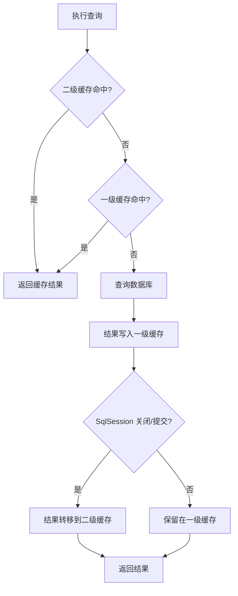

# MyBatis 面试

## MyBatis 简介

### 【简单】MyBatis 有什么优缺点？

MyBatis 作为半自动持久层框架，优缺点如下：

**优点**

- SQL 与代码分离，便于统一优化和维护
- 支持动态 SQL，灵活构建复杂查询
- 直接使用原生 SQL，充分利用数据库特性
- 轻量级，学习成本低
- 与 Spring 生态集成良好

**缺点**

- SQL 编写工作量大，简单操作也需手写
- 数据库移植性差，SQL 与具体数据库绑定
- 默认二级缓存存在脏读风险
- 对开发人员 SQL 能力依赖较强

### 【简单】MyBatis 和 Hibernate 有什么差异？⭐

**Hibernate 是全自动的 ORM 框架（能自动生成 SQL），而 MyBatis 是半自动的 ORM 框架（需手动写 SQL 但更灵活）**。

Hibernate 适合业务稳定、移植性要求高、简单 CRUD 多的项目；MyBatis 适合需精细化 SQL 优化、数据库固定、复杂查询频繁的场景。

MyBatis 与 Hibernate 核心区别：

- **自动化程度**：Hibernate 全自动，自动生成 SQL；MyBatis 半自动，SQL 需手写。
- **SQL 控制**：Hibernate 复杂查询调优难；MyBatis 完全掌控，便于优化。
- **开发效率**：Hibernate 简单 CRUD 快；MyBatis 基础操作需手写 SQL。
- **缓存与迁移**：Hibernate 缓存完善、移植性好；MyBatis 缓存弱、SQL 与数据库绑定。

### 【简单】什么是 MyBatis Plus？MyBatis Plus 对 MyBatis 做了哪些增强？

**MyBatis 是半自动的 ORM 框架**。

**MyBatis Plus 是对 MyBatis 的增强框架**。

MyBatis Plus 主要提供了以下能力：

- **通用 CRUD 操作**：通过继承 **`BaseMapper`**，可以轻松实现常规 CRUD 操作。
- **优秀的查询条件构造器**：**`QueryWrapper`** 和 **`LambdaQueryWrapper`**
- **内置多种便利的插件**：如分页插件、乐观锁插件等。
- **基于注解的扩展能力**：逻辑删除（`@TableLogic`）、自动生成主键（`@TableId`）、自动填充（`@TableField(fill = FieldFill.INSERT)`）、
- **代码生成器**

## MyBatis 应用

### 【简单】MyBatis 中 `#{}` 和 `${}` 的区别是什么？⭐⭐⭐

MyBatis 中 `#{}` 与 `${}` 核心区别：

- **`#{}`**：`PreparedStatement` 预编译占位符，MyBatis 会把它替换成 JDBC 的 `?` 占位符，参数通过 setXxx 绑定，SQL 模板与参数分离，天然防御 SQL 注入。
- **`${}`**：直接字符串替换，参数值拼接到 SQL 中，存在 SQL 注入风险。

**使用原则**：默认一律使用 `#{}`；仅在动态表名、列名等无法预编译的场景使用 `${}`，且必须进行白名单校验。

### 【简单】MyBatis 如何实现一对一、一对多的关联查询 ？⭐

MyBatis 通过 `<resultMap>` 中的 `<association>` 和 `<collection>` 实现关联查询，支持两种方式：

- **嵌套结果**：使用一条 SQL 通过 JOIN 查询，在 `<resultMap>` 中定义子对象的属性映射。适用于一对一（`<association>`）和一对多（`<collection>`），一次性加载所有数据，性能较好。
- **嵌套查询**：执行多条 SQL，先查主对象，再根据关联字段执行额外查询填充子对象。可搭配延迟加载（`fetchType="lazy"`）减少不必要查询，但需注意 N+1 问题。

**核心配置**：

- **association（一对一）**：`<association property="user" column="user_id" select="selectUserById" />` 或使用嵌套结果直接映射。
- **collection（一对多）**：`<collection property="orders" column="id" select="selectOrdersByUserId" />` 或通过 JOIN 映射到集合。

### 【简单】使用 MyBatis 的 mapper 接口调用时有哪些要求？⭐

使用 MyBatis 的 mapper 接口调用时需满足以下要求：

- **接口全限定名**：必须与映射文件（XML）中的 `namespace` 完全一致。
- **方法签名匹配**：
  - 方法名必须与映射文件中 SQL 操作的 `id` 一致。
  - 参数类型与个数需匹配（单个参数直接使用，多个参数需用 `@Param` 注解或封装为 Map/POJO）。
  - 返回值类型需与映射文件中定义的 `resultType` 或 `resultMap` 兼容。
- **不支持重载**：同一接口中不能有同名方法对应不同 SQL。
- **实例获取**：通过 `SqlSession.getMapper(Class)` 或在 Spring 中直接注入代理对象。

### 【中等】JDBC 编程有哪些不足之处，MyBatis 是如何解决的？

JDBC 编程最主要的不足是**大量重复的模板代码**：每次操作都要手动管理连接、创建语句、设置参数、遍历结果集、释放资源，且异常处理繁琐，代码臃肿、易错、难以维护。

MyBatis 针对性地进行了以下改进：

- **自动资源管理**：通过数据源统一管理连接，框架自动获取和释放，开发者无需关心。
- **参数自动映射**：使用 `#{}` 占位符，自动将接口方法参数绑定到 SQL 预编译语句。
- **结果自动映射**：将 ResultSet 自动转换为 POJO 对象，支持嵌套映射和延迟加载。
- **SQL 与代码分离**：SQL 集中配置于 Mapper 文件，与 Java 代码解耦，并支持动态 SQL 灵活组装。
- **内置缓存机制**：提供一级和二级缓存，减少数据库重复查询，提升性能。

这些改进让开发者只需专注于 SQL 编写和业务逻辑，彻底从 JDBC 的样板代码中解放出来。

### 【中等】MyBatis 都有哪些 Executor 执行器？它们之间的区别是什么？

MyBatis 提供三种 Executor 执行器，通过 `defaultExecutorType` 配置：

- **SimpleExecutor**（默认）：每次执行 SQL 都新建 Statement，用完立即关闭，简单直接，适合大多数场景。
- **ReuseExecutor**：将 SQL 作为 key 缓存 PreparedStatement，重复执行相同 SQL 时复用，减少创建开销。
- **BatchExecutor**：批量执行更新操作（addBatch + flushStatements），攒批提交，大幅提升批量插入/更新性能。

**区别**：Simple 无复用，Reuse 复用 Statement，Batch 攒批处理。默认 Simple，批量场景推荐切换 Batch。

### 【中等】MyBatis 如何实现数据库类型和 Java 类型的转换的？

MyBatis 通过 **TypeHandler** 实现数据库类型与 Java 类型的双向转换：

- **写入时**：根据参数的 Java 类型找到对应 TypeHandler，将 Java 对象转换为 JDBC 类型并赋值给 `PreparedStatement`。
- **读取时**：根据目标 Java 类型找到对应 TypeHandler，将 `ResultSet` 中的数据转换为 Java 对象。

内置大量常用 TypeHandler（如 String、Integer、Date 等），覆盖绝大多数场景；支持自定义 TypeHandler，用于特殊类型映射（如 JSON 字段）。转换规则可显式指定（`jdbcType`/`javaType`），也可由 MyBatis 自动匹配已注册的处理器。

### 【困难】为什么需要设置 `rewriteBatchedStatements=true`？

设置 `rewriteBatchedStatements=true` 是因为 MySQL JDBC 驱动默认处理批量插入的方式存在性能缺陷：

- **默认行为**：即使使用 JDBC 的 `addBatch()` 提交批量，驱动仍会将每条 INSERT 语句单独发送给数据库执行，相当于逐条插入，无法发挥批处理的优势。
- **开启后的效果**：该参数让驱动将多条 INSERT 语句重写为一条多值插入（`INSERT INTO table VALUES (a), (b), (c)...`），大幅减少网络往返和数据库解析开销，性能可提升数倍甚至数十倍。
- **对 MyBatis-Plus 的意义**：`saveBatch` 等批量方法底层依赖 JDBC 批量机制，若不开启此参数，批量操作名存实亡；开启后才能实现真正的批量提交。

**注意**：仅对 MySQL 驱动有效，且需在 JDBC URL 中显式添加。

## MyBatis 架构

### 【中等】MyBatis 有哪些核心组件？⭐⭐⭐

MyBatis 有以下核心组件：

- **`SqlSessionFactoryBuilder`**：负责创建 `SqlSessionFactory` 实例。用完即弃。
- **`SqlSessionFactory`**：负责创建 `SqlSession` 实例。全局单例，配置中心。
- **`SqlSession`**：通过方法签名和 `Mapper` 相互映射。请求级核心，需及时关闭。
- **`Mapper`**：映射器是一些由用户创建的、绑定 SQL 语句的接口。轻量级对象，随用随建。

下面是它们之间的关系：

```
SqlSessionFactoryBuilder → SqlSessionFactory → SqlSession → Mapper Proxy
       （方法级）               （应用级）       （请求级）     （方法级）
```


::: info SqlSessionFactoryBuilder
:::

- **生命周期**：**方法级**（最短）
- **作用**：用于构建 `SqlSessionFactory`，解析 XML 配置（如 `mybatis-config.xml`）。
- **特点**：
  - 构建完成后即可销毁，无状态，不占用资源。
  - 通常作为局部变量使用。

```java
SqlSessionFactory factory = new SqlSessionFactoryBuilder().build(inputStream);
```

::: info SqlSessionFactory
:::

- **生命周期**：**应用级**（最长）
- **作用**：创建 `SqlSession`，全局唯一，线程安全。
- **特点**：
  - 通常作为单例存在于整个应用运行期间。
  - 维护数据库连接池和全局配置（如缓存、别名）。

```java
// 推荐通过单例管理
public class MyBatisUtil {
    private static final SqlSessionFactory factory;
    static {
        factory = new SqlSessionFactoryBuilder().build(inputStream);
    }
    public static SqlSessionFactory getFactory() {
        return factory;
    }
}
```

::: info SqlSession
:::

- **生命周期**：**请求/事务级**
- **作用**：执行 SQL、获取 Mapper 接口实例、管理事务。
- **特点**：
  - **非线程安全**，每次请求需创建新实例，用完后必须关闭（避免连接泄漏）。
  - 默认不自动提交事务，需手动 `commit()` 或 `rollback()`。

```java
try (SqlSession session = factory.openSession()) {  // 自动关闭
    UserMapper mapper = session.getMapper(UserMapper.class);
    User user = mapper.selectById(1);
    session.commit();  // 提交事务
}
```

::: info Mapper
:::

- **生命周期**：**方法级**（与 `SqlSession` 绑定）
- **作用**：通过动态代理将接口方法调用转换为 SQL 执行。
- **特点**：
  - 由 `SqlSession` 创建，生命周期跟随 `SqlSession`。
  - 无需手动实现，MyBatis 自动生成代理类。

```java
// 代理对象随 SqlSession 销毁而失效
UserMapper mapper = session.getMapper(UserMapper.class);
```

### 【中等】MyBatis 的执行流程是怎样的？⭐⭐⭐


### 【困难】MyBatis 的架构是如何设计的？⭐⭐

MyBatis 的架构设计通过 **分层解耦** 和 **动态代理** 实现了 SQL 与 Java 代码的分离，其核心在于：

- **配置驱动**：集中管理 SQL 和映射规则。
- **组件化**：各层职责单一，易于扩展（如插件）。
- **平衡灵活与易用**：既保留 JDBC 的掌控力，又简化了重复操作。

这种设计使其在需要高性能和灵活 SQL 的场景中表现优异，尤其适合中大型复杂业务系统。

MyBatis 的架构设计以 **SQL 与 Java 对象的灵活映射** 为核心，采用分层模块化设计，平衡了灵活性与易用性。


MyBatis 的架构分为四层，各层职责明确，通过接口解耦：

| **层级**       | **核心组件**                   | **职责**                                                             |
| -------------- | ------------------------------ | -------------------------------------------------------------------- |
| **接口层**     | `SqlSession`、`Mapper` 接口    | 提供开发者使用的 API（如 `selectOne`、`insert`），屏蔽底层实现细节。 |
| **核心处理层** | `Executor`、`StatementHandler` | 执行 SQL 语句、处理参数绑定和结果映射，实现插件拦截链。              |
| **基础支撑层** | `DataSource`、`Transaction`    | 管理数据库连接池、事务，提供类型转换（`TypeHandler`）和缓存支持。    |
| **扩展层**     | `Interceptor`（插件）          | 通过动态代理拦截核心组件，实现功能扩展（如分页、性能监控）。         |

::: info 基础支撑层
:::

基础支撑层为上层提供通用能力支持。

- **类型处理器 (TypeHandler)**：处理 Java 类型与 JDBC 类型转换（如 `String` ↔ `VARCHAR`）。支持自定义扩展（如枚举类型转换）。
- **连接管理**：集成连接池（如 HikariCP、Druid），管理数据库连接。
- **事务管理**：提供 JDBC 和 Managed 两种事务模式（可集成 Spring 事务）。
- **缓存管理**：一级缓存（`SqlSession` 级别）、二级缓存（`Mapper` 级别）。支持 Redis、Ehcache 等第三方缓存集成。

::: info 核心处理层
:::

核心处理层执行 SQL 并处理结果映射。

- **配置解析 (Configuration)**：加载 `mybatis-config.xml` 和 `Mapper.xml`，存储所有配置信息（如别名、插件）。
- **SQL 解析 (SqlSource & BoundSql)**：解析动态 SQL（`<if>`、`<foreach>`），生成可执行的 SQL 字符串和参数映射。
- **执行器 (Executor)**
  - **类型**：
    - `SimpleExecutor`：默认执行器，每次执行新开 `PreparedStatement`。
    - `ReuseExecutor`：复用 `Statement` 对象。
    - `BatchExecutor`：批量操作优化。
  - **职责**：调用 JDBC 执行 SQL，触发插件拦截链。
- **结果集处理 (ResultSetHandler)**：将 `ResultSet` 转换为 Java 对象（根据 `ResultMap` 或自动映射）。

### 【中等】MyBatis Mapper 接口与 XML 映射文件的绑定原理是什么？⭐⭐

MyBatis 通过**动态代理**将接口方法与 XML SQL 绑定：

启动时，XML 中每个 SQL 以“接口全限定名.方法名”为键注册为 `MappedStatement`；

调用接口方法时，JDK 动态代理生成的 `MapperProxy` 根据该键从 `Configuration` 中获取对应 `MappedStatement`，交由 `SqlSession` 执行。

### 【中等】MyBatis 动态 sql 有什么用？执行原理？有哪些动态 sql？⭐

MyBatis 动态 SQL 用于根据业务条件动态生成 SQL 语句，避免拼接字符串的繁琐与风险，提升灵活性与可维护性。

**执行原理**：

- XML 中动态标签被解析为 SQL 节点树，每个节点封装了对应的逻辑（如判断、循环）。
- 执行时，MyBatis 根据传入参数，通过 OGNL 表达式动态计算条件，组合节点生成最终 SQL，然后提交给数据库执行。

**核心动态 SQL 标签**：

- `<if>`：条件判断，拼接满足条件的内容。
- `<choose>`、`<when>`、`<otherwise>`：类似 switch 的多分支选择。
- `<trim>`、`<where>`、`<set>`：处理多余的关键字（如 AND、OR）或逗号，辅助条件拼接。
- `<foreach>`：遍历集合，常用于 IN 查询或批量操作。
- `<bind>`：从 OGNL 表达式创建变量并绑定到上下文，用于模糊查询等场景。

### 【中等】MyBatis 延迟加载机制原理是什么？

MyBatis 延迟加载通过**动态代理**实现按需查询，核心流程如下：

- **配置与代理生成**：主查询后，为需延迟加载的属性创建代理对象（Javassist/CGLIB），代理持有查询语句和参数信息，真实数据为空。
- **触发加载**：首次调用该属性的 getter 方法时，代理拦截并执行预设的嵌套查询，从数据库加载数据。
- **数据填充**：加载完成后，代理将结果缓存，后续访问直接返回真实对象。

**关键点**：依赖原始 `SqlSession` 存活（否则抛 `LazyInitializationException`），且循环触发可能导致 N+1 查询，需谨慎使用。

### 【中等】MyBatis 的缓存机制是如何设计的？⭐⭐

MyBatis 设计了两级缓存。

两级缓存的查询顺序：**二级缓存 -> 一级缓存 -> 数据库**。



::: info 一级缓存（SqlSession 级别）
:::

基于命名空间、SQL 语句和参数作为唯一标识。

- 仅在同一个 `SqlSession` 中生效
- 默认开启且无法关闭
- 生命周期与 `SqlSession` 一致
- 执行 `commit`、`rollback` 或手动清理缓存时会清空

::: info 二级缓存（Mapper 级别）
:::

- 跨 `SqlSession` 共享
- 需要手动开启
- 生命周期与 `SqlSessionFactory` 一致
- 数据的变更会使缓存失效

建议：在微服务架构中，通常**不建议使用 MyBatis 的二级缓存**。更推荐使用更专业的缓存解决方案，如 **Redis** 或 **Memcached**，它们能更好地保证数据一致性和扩展性。一级缓存由于其局部性，影响不大，可以正常使用。

### 【中等】MyBatis 的插件机制是如何设计的？⭐

**MyBatis 插件本质上是一种非侵入式的 AOP 实现**，用于在 MyBatis 执行流程中插入自定义逻辑（如分页、性能监控、SQL 修改）。

**MyBatis 插件基于动态代理和责任链模式实现，在 MyBatis 四大核心组件的方法执行前后插入自定义逻辑**。

**核心目标**：拦截并增强 MyBatis **四大核心组件**（`Executor`、`StatementHandler`、`ParameterHandler`、`ResultSetHandler`）。

**实现机制**：**MyBatis 的插件机制实现基于 JDK 动态代理和责任链模式**。通过 `Plugin.wrap()` 为目标对象创建代理，多个插件形成代理链。

**工作流程**：**配置插件 → 启动时初始化 → 创建核心组件时层层代理 → 方法调用被代理链截获 → 执行插件的 `intercept()` 方法。**

**关键接口与注解**

- **`Interceptor` 接口**：自定义插件必须实现。
  - `intercept()`：编写拦截逻辑，通过 `Invocation.proceed()` 继续执行链。
  - `plugin()`：通常返回 `Plugin.wrap(target, this)`，用于创建代理。
- **`@Intercepts` & `@Signature`**：注解声明要拦截的具体方法（指定类型、方法名、参数类型）。

### 【简单】MyBatis 自带的连接池有了解过吗？

MyBatis 内置三种数据源：

- **UnpooledDataSource**：无连接池，每次请求新建连接，仅适合测试。
- **PooledDataSource**：简单连接池，管理空闲与活动连接，通过 wait/notify 控制，支持配置与泄漏回收，满足中小型应用需求。
- **JndiDataSource**：集成 JNDI 数据源，用于 Java EE 容器。

**PooledDataSource 特点**：轻量实现，提供基本池化功能，但高并发下性能不如 HikariCP 或 Druid，生产环境通常替换为专业连接池。

## 参考资料

- [面试鸭 - MyBatis 面试题](https://www.mianshiya.com/bank/1801424748099739650)
