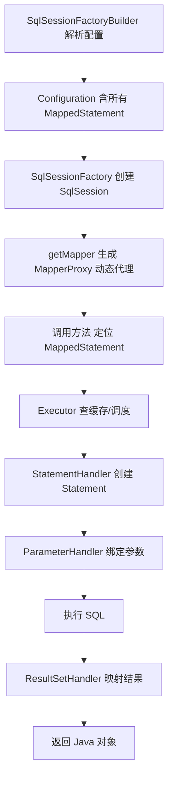
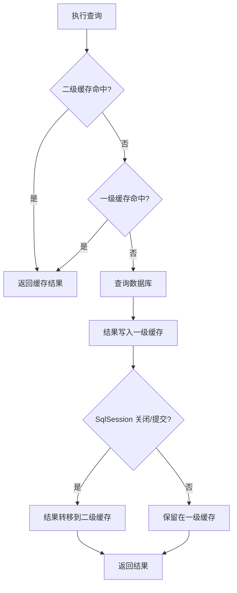

# MyBatis 面试

## MyBatis 简介

### 【简单】MyBatis 有什么优缺点？⭐⭐

> 🎯 目标等级：L1 ｜ ⏱ 建议用时：5 min ｜ 🏷 标签：MyBatis / 概述

#### 💎 关键结论

MyBatis 是半自动 ORM 框架：SQL 手写但映射自动化。优点是 SQL 灵活可控、支持动态 SQL、轻量易上手；缺点是 SQL 编写量大、数据库移植性差。适合需要精细化 SQL 优化的互联网业务场景。

#### ⚡记忆卡片

- **口诀**：半自动、手写 SQL、灵活映射、轻量易学
- **关键词**：半自动 ORM ／ 动态 SQL ／ SQL 与代码分离
- **链路**：手写 SQL → 参数绑定 → 结果映射为 POJO

#### 📖 核心知识

**优点**

- SQL 与代码分离，便于统一优化和维护
- 支持动态 SQL，灵活构建复杂查询
- 直接使用原生 SQL，充分利用数据库特性
- 轻量级，学习成本低
- 与 Spring 生态集成良好

**缺点**

- SQL 编写工作量大，简单操作也需手写
- 数据库移植性差，SQL 与具体数据库绑定
- 默认二级缓存存在脏读风险
- 对开发人员 SQL 能力依赖较强

#### 🔀 发散问题

- **Q：和 Hibernate 相比怎么选？** → Hibernate 全自动、移植性好，MyBatis 半自动、SQL 可控，见本文档「MyBatis 和 Hibernate 有什么差异？」。
- **Q：这些不足相对 JDBC 算进步吗？** → 算，MyBatis 正是针对 JDBC 模板代码痛点的改进，见本文档「JDBC 编程有哪些不足之处，MyBatis 是如何解决的？」。

### 【简单】MyBatis 和 Hibernate 有什么差异？⭐

> 🎯 目标等级：L1 ｜ ⏱ 建议用时：5 min ｜ 🏷 标签：MyBatis / 框架对比

#### 💎 关键结论

Hibernate 是全自动 ORM（自动生成 SQL），MyBatis 是半自动 ORM（手写 SQL 但更灵活）。Hibernate 适合业务稳定、移植性要求高的场景；MyBatis 适合精细化 SQL 优化、复杂查询频繁的互联网场景。

#### ⚡记忆卡片

- **口诀**：全自动选 Hibernate，半手写选 MyBatis
- **关键词**：全自动 vs 半自动 ／ SQL 控制权 ／ 移植性
- **链路**：业务模型稳定多库支持 → Hibernate；高并发复杂查询 → MyBatis

#### 📖 核心知识

MyBatis 与 Hibernate 核心区别：

| 对比维度       | Hibernate                                  | MyBatis                                  |
| :------------- | :----------------------------------------- | :--------------------------------------- |
| **自动化程度** | 全自动 ORM，自动生成 SQL                   | 半自动 ORM，SQL 需手写                   |
| **SQL 控制**   | 复杂查询调优难，HQL/JPQL 屏蔽底层 SQL      | 完全掌控 SQL，便于精细化优化             |
| **开发效率**   | 简单 CRUD 快，配置即用                     | 基础操作需手写 SQL，但 MyBatis-Plus 弥补 |
| **缓存机制**   | 缓存完善（一级+二级+查询缓存）             | 缓存较弱，二级缓存有脏读风险             |
| **数据库移植** | 移植性好，屏蔽方言差异                     | 移植性差，SQL 与数据库绑定               |
| **学习成本**   | 较高，需理解 Session、缓存、延迟加载等概念 | 较低，熟悉 SQL 即可上手                  |
| **适用场景**   | 业务模型稳定、需多数据库支持的产品型项目   | 互联网高并发、复杂查询、SQL 优化场景     |

**选型结论**：Hibernate 适合业务稳定、移植性要求高、简单 CRUD 多的项目；MyBatis 适合需精细化 SQL 优化、数据库固定、复杂查询频繁的场景。

#### 🔀 发散问题

- **Q：MyBatis 手写 SQL 工作量大怎么缓解？** → 用 MyBatis-Plus 增强，通用 CRUD 免写，见本文档「什么是 MyBatis Plus？MyBatis Plus 对 MyBatis 做了哪些增强？」。
- **Q：加上 JPA 三者如何选型？** → 见本文档「MyBatis、MyBatis-Plus 和 JPA 如何选型？」。

### 【简单】什么是 MyBatis Plus？MyBatis Plus 对 MyBatis 做了哪些增强？⭐⭐

> 🎯 目标等级：L1 ｜ ⏱ 建议用时：5 min ｜ 🏷 标签：MyBatis / MyBatis-Plus

#### 💎 关键结论

MyBatis Plus 是对 MyBatis 的增强框架，秉承"只做增强不做改变"理念，在不改变 MyBatis 原有逻辑的基础上提供通用 CRUD、条件构造器、内置插件、注解扩展与代码生成器五大能力，显著降低手写 SQL 的工作量。

#### ⚡记忆卡片

- **口诀**：增不改：CRUD、Wrapper、插件、注解、生成器
- **关键词**：BaseMapper ／ LambdaQueryWrapper ／ 只做增强不做改变
- **链路**：继承 BaseMapper → Wrapper 拼条件 → 插件增强（分页/乐观锁）

#### 📖 核心知识

**MyBatis 是半自动的 ORM 框架**；**MyBatis Plus 是对 MyBatis 的增强框架**，秉承"只做增强不做改变"的设计理念，在不改变 MyBatis 原有逻辑的基础上提供便捷开发能力。

MyBatis Plus 主要提供了以下能力：

- **通用 CRUD 操作**：通过继承 **`BaseMapper`**，可以轻松实现常规 CRUD 操作
- **优秀的查询条件构造器**：**`QueryWrapper`** 和 **`LambdaQueryWrapper`**
- **内置多种便利的插件**：如分页插件、乐观锁插件等
- **基于注解的扩展能力**：逻辑删除（`@TableLogic`）、自动生成主键（`@TableId`）、自动填充（`@TableField(fill = FieldFill.INSERT)`）
- **代码生成器**

#### 🔀 发散问题

- **Q：MyBatis-Plus 与 JPA 如何选型？** → 见本文档「MyBatis、MyBatis-Plus 和 JPA 如何选型？」。
- **Q：它的分页插件和 PageHelper 有什么关系？** → 都是基于插件机制的物理分页，见本文档「MyBatis 如何实现分页？PageHelper 的原理是什么？」。

### 【中等】MyBatis、MyBatis-Plus 和 JPA 如何选型？⭐

> 🎯 目标等级：L2 ｜ ⏱ 建议用时：8 min ｜ 🏷 标签：MyBatis / 框架选型

#### 💎 关键结论

国内互联网公司首选 MyBatis-Plus，兼顾开发效率与 SQL 灵活性；领域模型复杂、需多数据库支持选 JPA；追求极致 SQL 控制选原生 MyBatis。选型本质是在"开发效率、SQL 掌控力、移植性"三角中做取舍。

#### ⚡记忆卡片

- **口诀**：效率选 MP，模型选 JPA，极致 SQL 选 MyBatis
- **关键词**：开发效率 ／ SQL 灵活性 ／ 移植性
- **链路**：互联网项目 → MyBatis-Plus；领域驱动多库 → JPA；精细调优 → MyBatis

#### 📖 核心知识

| 对比维度     | MyBatis                  | MyBatis-Plus                          | JPA (Hibernate)                  |
| :----------- | :----------------------- | :------------------------------------ | :------------------------------- |
| **定位**     | 半自动 ORM，SQL 完全手写 | MyBatis 增强，通用 CRUD 免写          | 全自动 ORM，自动生成 SQL         |
| **开发效率** | 低，所有 SQL 需手写      | 高，简单 CRUD 自动生成，复杂 SQL 手写 | 高，简单 CRUD 自动生成           |
| **SQL 灵活** | 最高                     | 高，兼顾自动与手写                    | 低，复杂查询需 HQL/原生 SQL      |
| **学习成本** | 低                       | 低                                    | 较高                             |
| **性能优化** | 易于针对性优化           | 易于优化                              | 较难，N+1 问题需额外处理         |
| **适用场景** | 复杂业务、SQL 优化要求高 | 互联网项目，追求开发效率与灵活性平衡  | 业务稳定、领域模型驱动、多库支持 |

**选型建议**：国内互联网公司首选 **MyBatis-Plus**（兼顾效率与灵活）；领域模型复杂、需多数据库支持选 **JPA**；追求极致 SQL 控制选 **MyBatis**。

#### 🔬 扩展知识

::: details

- 【L3】三者并非互斥：同一项目中可 JPA 管领域模型、MyBatis-Plus 管复杂报表查询，按模块划分持久层技术
- 【L4】JPA 的 N+1 问题需用 `@EntityGraph`/`JOIN FETCH` 治理；MyBatis 侧对应嵌套查询的 N+1，用嵌套结果 JOIN 规避

> 📚 延伸阅读：[MyBatis-Plus 官方文档](https://baomidou.com/)

:::

#### 🔀 发散问题

- **Q：MyBatis-Plus 具体增强了哪些能力？** → 见本文档「什么是 MyBatis Plus？MyBatis Plus 对 MyBatis 做了哪些增强？」。
- **Q：MyBatis 与 Hibernate 的本质差异是什么？** → 全自动 vs 半自动，见本文档「MyBatis 和 Hibernate 有什么差异？」。

## MyBatis 应用

### 【简单】MyBatis 中 `#{}` 和 `${}` 的区别是什么？⭐⭐⭐⭐

> 🎯 目标等级：L2 ｜ ⏱ 建议用时：12 min ｜ 🏷 标签：MyBatis / SQL 参数与安全

#### 💎 关键结论

`#{}` 走预编译参数绑定（`?` 占位符），SQL 模板与参数分离，可防注入；`${}` 是字符串文本替换，参数原样拼入 SQL，存在注入风险。默认一律用 `#{}`，仅表名、列名、ORDER BY 等结构性位置用 `${}` 且必须白名单校验。

#### ⚡记忆卡片

- **口诀**：井号预编译，美元直拼接；值用 `#{}`，结构 `${}` 加白名单
- **关键词**：PreparedStatement ／ 文本替换 ／ SQL 注入
- **链路**：`#{}` → `?` 占位符 → TypeHandler 绑定；`${}` → TextSqlNode 文本替换 → 拼入 SQL

#### 📖 核心知识

**一句话概括**：`#{}` 走预编译参数绑定（`?` 占位符），`${}` 走字符串文本替换。

MyBatis 中 `#{}` 与 `${}` 核心区别：

| 对比维度     | `#{}`                            | `${}`                         |
| :----------- | :------------------------------- | :---------------------------- |
| **底层实现** | PreparedStatement 的 `?` 占位符  | 字符串拼接                    |
| **SQL 注入** | 可防御                           | 存在风险                      |
| **预编译**   | 支持，SQL 可被数据库缓存执行计划 | 不支持，每次都需解析          |
| **适用场景** | 参数值传递（WHERE、VALUES 等）   | 动态表名、列名、ORDER BY 字段 |

**方案权衡**

| 方案           | 适用边界                                                          | 风险                               |
| :------------- | :---------------------------------------------------------------- | :--------------------------------- |
| 一律 `#{}`     | 参数值位置（WHERE、VALUES、SET），覆盖 95% 以上场景               | 无注入风险，执行计划可被数据库复用 |
| `${}` + 白名单 | 结构性位置：动态表名、列名、ORDER BY 字段，这些位置无法使用占位符 | 必须白名单校验，否则必然注入       |

**失效与风险场景**

- `#{}` 并非万能：只能用在"值"的位置，用在表名、列名、ORDER BY 位置会导致预编译报错或语义错误
- `${}` 无任何防御：参数来自用户输入且未做白名单时必然存在注入；典型如 `ORDER BY ${orderColumn}` 直接透传前端字段名
- `<if>` 内部混写 `${}`：外层看似用了 `#{}`，条件分支内的 `${}` 依旧直接拼接

**使用原则**：默认一律使用 `#{}`；仅在动态表名、列名等无法预编译的场景使用 `${}`，且必须进行白名单校验。结构性参数更稳妥的做法是在 Java 层完成枚举映射后再传入，杜绝用户输入直达 SQL。

::: details 踩坑案例：ORDER BY 时间盲注事故复盘

某后台管理系统列表接口支持自定义排序，Mapper 写成 `ORDER BY ${orderBy} ${orderType}`。开发同学认为 ORDER BY 后面无法用 `#{}`，只对参数做了非空校验。安全扫描时输入 `id; SELECT SLEEP(5)`，接口响应延迟 5 秒——时间盲注成立，数据库 CPU 同步飙升。根因：排序字段属于 SQL 结构性位置，预编译本就覆盖不到，而代码缺少白名单枚举。修复：在 Java 层维护可排序字段集合 `Set.of("id", "gmt_create", "price")`，命中才拼接，否则回退默认排序；同时用 SQL 审计日志全量扫描仓库，清理其余 `${}` 用法。

:::

#### 🔬 扩展知识

::: details

- 【L3】源码定位（解析期就分道扬镳）：`#{}` 由 `XMLScriptBuilder` 解析 SQL 文本时，经 `ParameterExpression` / `SqlSourceBuilder` 改写为 JDBC 的 `?` 占位符，并生成 `ParameterMapping`；执行期 `DefaultParameterHandler#setParameters` 遍历 `ParameterMapping`，经 `TypeHandler#setParameter` 绑定到 `PreparedStatement`，SQL 模板与参数彻底分离
- 【L3】`${}` 由 `TextSqlNode` 在解析期做 `GenericTokenParser` 文本替换，参数值原样拼入 SQL 字符串，由 `DynamicSqlSource` 在每次执行时动态生成 `BoundSql`，不存在预编译
- 【L4】`${}` 白名单并非绝对安全：白名单要保持完备且集中维护，从数据库元数据动态生成白名单时要防止元数据被污染；`LIKE '%${kw}%'` 这类半值半拼接写法仍然危险
- 【L4】`#{}` 不能当免检金牌：预编译把 SQL 模板与参数分离，能防绝大多数注入；但存储过程调用、某些驱动对特殊语句（如 `CALL`）的处理、以及多语句连接参数（如 MySQL `allowMultiQueries=true`）仍可能引入风险

> 📚 延伸阅读：[MyBatis 官方文档 - 动态 SQL](https://mybatis.org/mybatis-3/zh/dynamic-sql.html)

:::

#### 🏭 实战场景

::: details

某后台管理系统列表接口疑似 SQL 注入，慢日志中出现 `UNION SELECT` 痕迹，但开发坚称全部用了 `#{}`。应急：先对该接口限流并开启数据库审计日志，抓取完整 SQL 与来源 IP，确认攻击面；必要时临时下线该查询入口。定位：打开 MyBatis 日志（`logImpl=STDOUT_LOGGING`）或拦截器打印 `BoundSql#getSql()`，对比告警 SQL 与模板，很快定位到动态排序参数 `ORDER BY ${sortField}`——为支持前端自定义排序使用了 `${}` 且直接透传，未做白名单；全局搜索 `${` 还可能发现 `LIMIT ${size}` 等同类写法。长期：排序字段、分页大小在 Java 层用枚举/常量校验后才允许进入 SQL；建立 SQL 静态扫描规则，`${}` 一律在代码评审中标红；预发环境挂 SQL 注入扫描用例回归。权衡：白名单牺牲了一点"任意字段可排序"的灵活性，换来注入面归零；若确有运营自定义字段诉求，应把可排序字段做成配置化白名单而非透传。

:::

#### ⚠️ 常见误区

::: details

常见误区：

- ❌ "LIKE 模糊查询必须用 `${}`" → 错误。一律用 `#{}`：写法为 `LIKE CONCAT('%', #{keyword}, '%')`，或用 `<bind name="kw" value="'%' + keyword + '%'"/>` 后 `LIKE #{kw}`；直接 `LIKE '%${keyword}%'` 是高频注入点
- ❌ "`${}` 做了非空校验就安全了" → 错误。非空校验与注入防御无关，结构性位置必须做枚举白名单校验
- ❌ "`#{}` 在任何情况下都能防注入" → 不严谨。预编译覆盖"值"位置，多语句连接参数、存储过程等特殊场景仍需逐项评估

:::

#### 🔀 发散问题

- **Q：`${}` 常出现在哪些动态拼接场景？** → 动态表名/排序字段常与动态 SQL 标签配合，见本文档「MyBatis 动态 sql 有什么用？执行原理？有哪些动态 sql？」。
- **Q：参数绑定背后的类型转换是谁做的？** → TypeHandler，见本文档「MyBatis 如何实现数据库类型和 Java 类型的转换的？」。

### 【简单】MyBatis 如何实现一对一、一对多的关联查询？⭐

> 🎯 目标等级：L1 ｜ ⏱ 建议用时：8 min ｜ 🏷 标签：MyBatis / 关联映射

#### 💎 关键结论

MyBatis 通过 `<resultMap>` 中的 `<association>`（一对一）和 `<collection>`（一对多）实现关联查询，支持嵌套结果（一条 JOIN SQL 一次加载）和嵌套查询（多条 SQL 按需加载，可配延迟加载）两种方式，后者需警惕 N+1 问题。

#### ⚡记忆卡片

- **口诀**：一对一 association，一对多 collection；JOIN 一把梭，嵌套查询防 N+1
- **关键词**：association ／ collection ／ 嵌套结果 vs 嵌套查询
- **链路**：主查询 → resultMap → association/collection → 子对象/集合

#### 📖 核心知识

- **嵌套结果**：使用一条 SQL 通过 JOIN 查询，在 `<resultMap>` 中定义子对象的属性映射。适用于一对一（`<association>`）和一对多（`<collection>`），一次性加载所有数据，性能较好。
- **嵌套查询**：执行多条 SQL，先查主对象，再根据关联字段执行额外查询填充子对象。可搭配延迟加载（`fetchType="lazy"`）减少不必要查询，但需注意 N+1 问题。

**核心配置**：

- **association（一对一）**：`<association property="user" column="user_id" select="selectUserById" />` 或使用嵌套结果直接映射。
- **collection（一对多）**：`<collection property="orders" column="id" select="selectOrdersByUserId" />` 或通过 JOIN 映射到集合。

```xml
<!-- 一对一：订单关联用户（嵌套结果） -->
<resultMap id="orderResultMap" type="Order">
    <id property="id" column="order_id"/>
    <result property="orderNo" column="order_no"/>
    <association property="user" javaType="User">
        <id property="id" column="user_id"/>
        <result property="name" column="user_name"/>
    </association>
</resultMap>

<!-- 一对多：用户关联订单（嵌套查询 + 延迟加载） -->
<resultMap id="userWithOrdersMap" type="User">
    <id property="id" column="id"/>
    <collection property="orders" ofType="Order"
                select="selectOrdersByUserId" column="id" fetchType="lazy"/>
</resultMap>
```

#### 🔀 发散问题

- **Q：嵌套查询的延迟加载是怎么实现的？** → 动态代理 + getter 触发，见本文档「MyBatis 延迟加载机制原理是什么？」。
- **Q：N+1 问题还有哪些出现场景？** → 见本文档「MyBatis 延迟加载机制原理是什么？」中的 N+1 分析。

### 【简单】使用 MyBatis 的 mapper 接口调用时有哪些要求？⭐

> 🎯 目标等级：L1 ｜ ⏱ 建议用时：5 min ｜ 🏷 标签：MyBatis / 接口绑定

#### 💎 关键结论

Mapper 接口调用需满足四条约束：接口全限定名与 XML namespace 一致、方法名与 SQL id 一致、参数与返回值类型匹配、不支持方法重载。本质原因是绑定键为"类名.方法名"，没有参数签名的位置。

#### ⚡记忆卡片

- **口诀**：名对齐、参匹配、禁重载、代理拿
- **关键词**：namespace ／ 方法名 = id ／ 不支持重载
- **链路**：接口全限定名 → namespace；方法名 → SQL id；getMapper → 代理对象

#### 📖 核心知识

使用 MyBatis 的 mapper 接口调用时需满足以下要求：

- **接口全限定名**：必须与映射文件（XML）中的 `namespace` 完全一致。
- **方法签名匹配**：
  - 方法名必须与映射文件中 SQL 操作的 `id` 一致。
  - 参数类型与个数需匹配（单个参数直接使用，多个参数需用 `@Param` 注解或封装为 Map/POJO）。
  - 返回值类型需与映射文件中定义的 `resultType` 或 `resultMap` 兼容。
- **不支持重载**：同一接口中不能有同名方法对应不同 SQL。
- **实例获取**：通过 `SqlSession.getMapper(Class)` 或在 Spring 中直接注入代理对象。

#### 🔀 发散问题

- **Q：为什么不支持重载？** → 绑定键是"类名.方法名"，重载会产生相同 key 冲突，见本文档「MyBatis Mapper 接口与 XML 映射文件的绑定原理是什么？」。
- **Q：接口与 XML 有哪两种绑定方式？** → 见本文档「MyBatis 接口绑定的两种方式是什么？」。

### 【中等】JDBC 编程有哪些不足之处，MyBatis 是如何解决的？⭐

> 🎯 目标等级：L2 ｜ ⏱ 建议用时：8 min ｜ 🏷 标签：MyBatis / JDBC 对比

#### 💎 关键结论

JDBC 最主要的不足是大量重复的模板代码：手动管理连接、设置参数、遍历结果集、释放资源，臃肿易错。MyBatis 用资源自动管理、参数/结果自动映射、SQL 与代码分离、内置缓存针对性解决，让开发者只专注 SQL 与业务。

#### ⚡记忆卡片

- **口诀**：JDBC 五烦：连接、语句、参数、结果、释放
- **关键词**：模板代码 ／ 自动映射 ／ SQL 与代码分离
- **链路**：JDBC 手写样板 → MyBatis 自动资源/参数/结果管理 → 专注 SQL 与业务

#### 📖 核心知识

JDBC 编程最主要的不足是**大量重复的模板代码**：每次操作都要手动管理连接、创建语句、设置参数、遍历结果集、释放资源，且异常处理繁琐，代码臃肿、易错、难以维护。

MyBatis 针对性地进行了以下改进：

- **自动资源管理**：通过数据源统一管理连接，框架自动获取和释放，开发者无需关心。
- **参数自动映射**：使用 `#{}` 占位符，自动将接口方法参数绑定到 SQL 预编译语句。
- **结果自动映射**：将 ResultSet 自动转换为 POJO 对象，支持嵌套映射和延迟加载。
- **SQL 与代码分离**：SQL 集中配置于 Mapper 文件，与 Java 代码解耦，并支持动态 SQL 灵活组装。
- **内置缓存机制**：提供一级和二级缓存，减少数据库重复查询，提升性能。

这些改进让开发者只需专注于 SQL 编写和业务逻辑，彻底从 JDBC 的样板代码中解放出来。

#### 🔬 扩展知识

::: details

- 【L3】JDBC 的 `PreparedStatement` 复用、连接池、批量提交等手工优化，在 MyBatis 中分别对应 ReuseExecutor、DataSource、BatchExecutor 等机制
- 【L4】但 MyBatis 并未完全屏蔽 JDBC：批量插入若不配 `rewriteBatchedStatements`，底层仍退化为逐条发送

> 📚 延伸阅读：[MyBatis 官方文档](https://mybatis.org/mybatis-3/zh/index.html)

:::

#### 🔀 发散问题

- **Q：执行器层面还有哪些 JDBC 细节被封装？** → 见本文档「MyBatis 都有哪些 Executor 执行器？它们之间的区别是什么？」。
- **Q：连接池部分 MyBatis 自带能力如何？** → 见本文档「MyBatis 自带的连接池有了解过吗？」。

### 【中等】MyBatis 都有哪些 Executor 执行器？它们之间的区别是什么？⭐⭐

> 🎯 目标等级：L2 ｜ ⏱ 建议用时：8 min ｜ 🏷 标签：MyBatis / 执行器

#### 💎 关键结论

MyBatis 有三种 Executor：SimpleExecutor（默认，每次新建 Statement）、ReuseExecutor（按 SQL 缓存复用 PreparedStatement）、BatchExecutor（addBatch 攒批提交）。区别在于是否复用 Statement 与是否批处理，批量场景推荐 Batch。

#### ⚡记忆卡片

- **口诀**：Simple 不复用，Reuse 缓存语句，Batch 攒批刷
- **关键词**：defaultExecutorType ／ Statement 复用 ／ flushStatements
- **链路**：Simple 逐条执行 → Reuse 复用 PreparedStatement → Batch addBatch + flushStatements

#### 📖 核心知识

MyBatis 提供三种 Executor 执行器，通过 `defaultExecutorType` 配置：

- **SimpleExecutor**（默认）：每次执行 SQL 都新建 Statement，用完立即关闭，简单直接，适合大多数场景。
- **ReuseExecutor**：将 SQL 作为 key 缓存 PreparedStatement，重复执行相同 SQL 时复用，减少创建开销。
- **BatchExecutor**：批量执行更新操作（addBatch + flushStatements），攒批提交，大幅提升批量插入/更新性能。

**区别**：Simple 无复用，Reuse 复用 Statement，Batch 攒批处理。默认 Simple，批量场景推荐切换 Batch。

| Executor 类型  | Statement 复用 | 批处理 | 适用场景          |
| :------------- | :------------- | :----- | :---------------- |
| SimpleExecutor | 否             | 否     | 通用场景（默认）  |
| ReuseExecutor  | 是             | 否     | 相同 SQL 高频执行 |
| BatchExecutor  | 否             | 是     | 批量插入/更新     |

> 注：还有 `CachingExecutor`，它是一个 Executor 装饰器，专门负责二级缓存的查询与写入，委托给被装饰的具体 Executor 执行 SQL。

#### 🔬 扩展知识

::: details

- 【L3】`CachingExecutor` 不是第四种执行器，而是装饰器：`cacheEnabled=true` 且 Mapper 配置了缓存时，`Configuration#newExecutor` 用它包装具体 Executor
- 【L4】BatchExecutor 攒批后需显式 `flushStatements()` 才会真正提交；MySQL 下还需 `rewriteBatchedStatements=true` 驱动才会把批量改写为多值插入

:::

#### 🔀 发散问题

- **Q：BatchExecutor 怎样才发挥真实性能？** → 见本文档「MyBatis 批量插入如何优化？」。
- **Q：执行器在执行流程中的位置？** → 见本文档「MyBatis 的执行流程是怎样的？」。

### 【中等】MyBatis 如何实现数据库类型和 Java 类型的转换的？⭐⭐

> 🎯 目标等级：L2 ｜ ⏱ 建议用时：8 min ｜ 🏷 标签：MyBatis / 类型转换

#### 💎 关键结论

MyBatis 通过 TypeHandler 实现数据库类型与 Java 类型的双向转换：写入时按参数 Java 类型找 Handler 转成 JDBC 类型，读取时按目标 Java 类型把 ResultSet 转回对象。内置 Handler 覆盖常见类型，特殊类型（如 JSON）可自定义。

#### ⚡记忆卡片

- **口诀**：写入找 Java 类型，读取找目标类型，转换全靠 TypeHandler
- **关键词**：TypeHandler ／ BaseTypeHandler ／ jdbcType ↔ javaType
- **链路**：Java 对象 → TypeHandler#setParameter → PreparedStatement；ResultSet → TypeHandler#getResult → Java 对象

#### 📖 核心知识

MyBatis 通过 **TypeHandler** 实现数据库类型与 Java 类型的双向转换：

- **写入时**：根据参数的 Java 类型找到对应 TypeHandler，将 Java 对象转换为 JDBC 类型并赋值给 `PreparedStatement`。
- **读取时**：根据目标 Java 类型找到对应 TypeHandler，将 `ResultSet` 中的数据转换为 Java 对象。

内置大量常用 TypeHandler（如 String、Integer、Date 等），覆盖绝大多数场景；支持自定义 TypeHandler，用于特殊类型映射（如 JSON 字段）。转换规则可显式指定（`jdbcType`/`javaType`），也可由 MyBatis 自动匹配已注册的处理器。

```java
// 自定义 TypeHandler 示例：处理 JSON 字段
@MappedTypes(JsonObject.class)
@MappedJdbcTypes(JdbcType.VARCHAR)
public class JsonTypeHandler extends BaseTypeHandler<JsonObject> {
    @Override
    public void setNonNullParameter(PreparedStatement ps, int i,
            JsonObject parameter, JdbcType jdbcType) throws SQLException {
        ps.setString(i, parameter.toString());
    }
    // 省略 getNullableResult 方法...
}
```

#### 🔬 扩展知识

::: details

- 【L3】TypeHandler 注册在 `TypeHandlerRegistry`，解析期即按 javaType + jdbcType 组合建立映射；resultMap 中可用 `typeHandler` 属性为单列指定
- 【L4】枚举转换是高频定制点：`EnumTypeHandler` 存 name、`EnumOrdinalTypeHandler` 存序号，生产更常用自定义 Handler 存业务编码

:::

#### 🔀 发散问题

- **Q：TypeHandler 在参数绑定链路哪一步被调用？** → `DefaultParameterHandler#setParameters`，见本文档「MyBatis 中 `#{}` 和 `${}` 的区别是什么？」的源码分析。
- **Q：结果映射整体由谁负责？** → 见本文档「MyBatis 的四大核心处理器是什么？」。

### 【困难】为什么需要设置 `rewriteBatchedStatements=true`？⭐⭐

> 🎯 目标等级：L3 ｜ ⏱ 建议用时：10 min ｜ 🏷 标签：MyBatis / 批量优化

#### 💎 关键结论

MySQL JDBC 驱动默认把 `addBatch()` 的每条 INSERT 单独发送，批处理名存实亡。设置 `rewriteBatchedStatements=true` 后，驱动将多条 INSERT 重写为一条多值插入，大幅减少网络往返与数据库解析开销，性能可提升数倍乃至数十倍。该参数仅对 MySQL JDBC 驱动生效，需在 JDBC URL 显式添加。

#### ⚡记忆卡片

- **口诀**：不开 rewrite，batch 等于逐条插
- **关键词**：MySQL JDBC 驱动 ／ 多值 INSERT 改写 ／ JDBC URL
- **链路**：BatchExecutor → addBatch 攒批 → 驱动改写多值 INSERT → 一次提交

#### 📖 核心知识

设置 `rewriteBatchedStatements=true` 是因为 MySQL JDBC 驱动默认处理批量插入的方式存在性能缺陷：

- **默认行为**：即使使用 JDBC 的 `addBatch()` 提交批量，驱动仍会将每条 INSERT 语句单独发送给数据库执行，相当于逐条插入，无法发挥批处理的优势。
- **开启后的效果**：该参数让驱动将多条 INSERT 语句重写为一条多值插入（`INSERT INTO table VALUES (a), (b), (c)...`），大幅减少网络往返和数据库解析开销，性能可提升数倍甚至数十倍。
- **对 MyBatis-Plus 的意义**：`saveBatch` 等批量方法底层依赖 JDBC 批量机制，若不开启此参数，批量操作名存实亡；开启后才能实现真正的批量提交。

**注意**：仅对 MySQL 驱动有效，且需在 JDBC URL 中显式添加。

#### 🔬 扩展知识

::: details

- 【L3】驱动改写有体积边界：改写后的多值 INSERT 是一条大 SQL，受 MySQL `max_allowed_packet` 限制，批量大小要与之匹配，否则报错或回退
- 【L3】驱动对批量 update 的优化主要是客户端攒包发送，而非改写为多值语句，因此收益远小于 insert 场景
- 【L4】PostgreSQL 驱动的 `reWriteBatchedInserts` 是对等参数，不同驱动的批量优化参数不通用，迁移数据库时需逐一确认

:::

#### 🏭 实战场景

::: details

某订单履约服务每日需同步约 50 万条物流轨迹。最初用 MyBatis-Plus `saveBatch(list, 1000)` 入库，实测耗时约 40 分钟——抓包发现驱动仍逐条发送 INSERT。在 JDBC URL 追加 `rewriteBatchedStatements=true` 后，同样的数据量降至约 3 分钟，数据库侧 `Com_insert` 次数从 50 万降为约 500 次，网络往返减少两个数量级。同时把单批大小从 1000 调整为 500，避免单条改写后的 SQL 逼近 `max_allowed_packet`。

:::

#### ⚠️ 常见误区

::: details

常见误区：

- ❌ "这是 MyBatis 的配置" → 错误。它是 MySQL JDBC 驱动的 URL 参数，与 MyBatis 无关，PostgreSQL 等其他驱动不识别
- ❌ "用了 `<foreach>` 拼多值还需要它" → 不需要。foreach 已在应用层拼好多值 INSERT，该参数只作用于 JDBC `addBatch` 路径
- ❌ "开启后批量 update 也变快几十倍" → 不严谨。驱动主要将批量 INSERT 改写为多值插入，批量 update 的收益主要是客户端攒包发送，量级远小于 insert 场景

:::

#### 🔀 发散问题

- **Q：除了驱动参数还有哪些批量优化手段？** → 见本文档「MyBatis 批量插入如何优化？」。
- **Q：BatchExecutor 与 rewrite 是什么关系？** → 前者是 MyBatis 攒批，后者是驱动改写，二者配合才有真批量，见本文档「MyBatis 都有哪些 Executor 执行器？它们之间的区别是什么？」。

### 【中等】MyBatis 批量插入如何优化？⭐⭐⭐

> 🎯 目标等级：L2 ｜ ⏱ 建议用时：12 min ｜ 🏷 标签：MyBatis / 批量优化

#### 💎 关键结论

逐条插入慢在每条 SQL 都要一次网络往返和数据库解析。优化三板斧：`<foreach>` 多值拼接（万级）、BatchExecutor + `rewriteBatchedStatements`（十万级）、`LOAD DATA INFILE` 文件导入（百万级+），并控制单事务大小。

#### ⚡记忆卡片

- **口诀**：分批拼接、Batch 攒批、rewrite 改写、超大走文件导入
- **关键词**：foreach ／ ExecutorType.BATCH ／ max_allowed_packet
- **链路**：foreach 多值 → BatchExecutor + rewrite → LOAD DATA，按量级递进

#### 📖 核心知识

逐条插入的性能瓶颈在于**每条 SQL 都要经历一次网络往返和数据库解析**，优化手段由浅入深如下：

1. **`<foreach>` 多值拼接**：拼成 `INSERT INTO t VALUES (...), (...), (...)`，一次网络交互插入多行，性能提升数倍；注意单条 SQL 不宜过大（受 MySQL `max_allowed_packet` 限制），建议分批，每批 500~1000 条。
2. **BatchExecutor + JDBC 批处理**：以 `ExecutorType.BATCH` 打开 SqlSession，循环调用后 `flushStatements()` 攒批提交；MySQL 需配合 `rewriteBatchedStatements=true`，驱动会将批量改写为多值插入，才是真正的批量。
3. **MyBatis-Plus `saveBatch`**：内部按批（默认 1000 条）使用 BATCH 模式的 SqlSession 提交，同样需要开启 `rewriteBatchedStatements` 才生效。
4. **文件导入**：超大数据量（百万级）使用 `LOAD DATA INFILE` 等数据库原生导入能力，量级最快。

**对比与选型**

| 方式                    | 网络往返 | 适用量级 |
| :---------------------- | :------- | :------- |
| foreach 多值拼接        | 低       | 万级     |
| BatchExecutor + rewrite | 最低     | 十万级   |
| LOAD DATA               | 文件导入 | 百万级+  |

**注意事项**：批量插入要控制单事务大小，避免长事务和锁竞争；不需要回填主键时关闭 `useGeneratedKeys` 可进一步提升性能。

一句话总结：批量插入优化三板斧 = "分批拼接 + BatchExecutor + rewriteBatchedStatements"，超大体量直接文件导入。

#### 🔬 扩展知识

::: details

- 【L3】foreach 拼接与 BatchExecutor 的取舍：foreach 是单条大 SQL，失败即整批回滚；BatchExecutor 逐条 addBatch，配合事务可实现分批提交、失败定位更细
- 【L4】主键回填代价：`useGeneratedKeys=true` 时驱动需逐条取回生成主键，开启 rewrite 后收益仍明显，但无需回填时关闭可再提速

> 📚 延伸阅读：[MyBatis-Plus 官方文档 - 批量操作](https://baomidou.com/)

:::

#### 🔀 发散问题

- **Q：rewriteBatchedStatements 为什么是必需的？** → 见本文档「为什么需要设置 `rewriteBatchedStatements=true`？」。
- **Q：foreach 标签本身怎么用？** → 见本文档「MyBatis 动态 sql 有什么用？执行原理？有哪些动态 sql？」。

### 【中等】MyBatis 如何实现分页？PageHelper 的原理是什么？⭐⭐

> 🎯 目标等级：L2 ｜ ⏱ 建议用时：10 min ｜ 🏷 标签：MyBatis / 分页

#### 💎 关键结论

MyBatis 分页分逻辑分页（RowBounds，内存截取）与物理分页（LIMIT/OFFSET，只查所需）。PageHelper 基于插件机制实现物理分页：startPage 存 ThreadLocal → 拦截 Executor.query → 改写 SQL 追加 LIMIT 并生成 count 查询 → 清理 ThreadLocal。

#### ⚡记忆卡片

- **口诀**：逻辑全查再截，物理 LIMIT 只查；PageHelper = ThreadLocal + 拦截改写
- **关键词**：RowBounds ／ Interceptor ／ ThreadLocal
- **链路**：startPage → ThreadLocal → 拦截 Executor.query → 追加 LIMIT → 清理 ThreadLocal

#### 📖 核心知识

MyBatis 分页分为**逻辑分页**和**物理分页**两种：

| 分页方式     | 实现机制                                | 优点                 | 缺点                                   |
| :----------- | :-------------------------------------- | :------------------- | :------------------------------------- |
| **逻辑分页** | `RowBounds`，查询全部数据后在内存中截取 | 实现简单，无需改 SQL | 数据量大时内存占用高、性能差           |
| **物理分页** | 通过 SQL 的 LIMIT/OFFSET 子句实现       | 性能好，只查所需数据 | 需要数据库支持分页语法，SQL 有方言差异 |

**PageHelper 原理**：

PageHelper 是基于 MyBatis 插件机制实现的物理分页工具，核心流程如下：

1. **调用 `PageHelper.startPage(pageNum, pageSize)`**：将分页参数存入 ThreadLocal。
2. **拦截 SQL 执行**：PageHelper 实现了 `Interceptor` 接口，拦截 `Executor.query` 方法。
3. **改写 SQL**：从 ThreadLocal 取出分页参数，在原 SQL 后追加 `LIMIT` 子句（同时生成 count 查询）。
4. **清理 ThreadLocal**：查询完成后清除分页参数，避免影响后续查询。

```java
// PageHelper 使用示例
PageHelper.startPage(1, 10);  // 第 1 页，每页 10 条
List<User> users = userMapper.selectAll();
PageInfo<User> pageInfo = new PageInfo<>(users);  // 包含总数、页码等信息
```

> 注意：`startPage()` 后必须紧跟一次 MyBatis 查询，否则分页参数残留会导致后续查询被错误分页。

#### 🔬 扩展知识

::: details

- 【L3】PageHelper 对 count 查询做了优化尝试：自动去掉 ORDER BY、简化 SQL 生成计数语句；复杂 SQL 可通过 `countColumn`/手写 countSql 接管
- 【L4】ThreadLocal 残留是经典事故：startPage 后若中间分支提前 return，分页参数会被下一次查询"继承"，规范做法是紧跟查询或 try-finally 中调用 `PageHelper.clearPage()`

:::

#### 🔀 发散问题

- **Q：PageHelper 依赖的插件机制如何工作？** → 见本文档「MyBatis 的插件机制是如何设计的？」。
- **Q：MyBatis-Plus 的分页插件与它什么关系？** → 同为基于拦截器的物理分页，见本文档「什么是 MyBatis Plus？MyBatis Plus 对 MyBatis 做了哪些增强？」。

### 【中等】MyBatis 接口绑定的两种方式是什么？⭐

> 🎯 目标等级：L2 ｜ ⏱ 建议用时：6 min ｜ 🏷 标签：MyBatis / 接口绑定

#### 💎 关键结论

接口绑定有 XML 绑定（namespace 指向接口、id 对应方法，适合复杂 SQL）和注解绑定（`@Select` 等直接写在方法上，适合简单 SQL）两种。两者可在同一项目混用，但同一方法不能同时定义。

#### ⚡记忆卡片

- **口诀**：复杂 XML，简单注解；可混用，不双写
- **关键词**：namespace ／ @Select ／ @Insert
- **链路**：XML：namespace + id → 方法；注解：@Select 等 → 方法

#### 📖 核心知识

MyBatis 接口绑定有两种方式：

- **XML 映射文件绑定**：通过 XML 文件定义 SQL，`namespace` 指向接口全限定名，SQL 的 `id` 对应接口方法名。适合复杂 SQL，可读性好。
- **注解绑定**：通过 `@Select`、`@Insert`、`@Update`、`@Delete` 注解直接在接口方法上定义 SQL。适合简单 SQL，开发便捷。

```java
// 注解方式
public interface UserMapper {
    @Select("SELECT * FROM user WHERE id = #{id}")
    User selectById(Long id);

    @Insert("INSERT INTO user(name, age) VALUES(#{name}, #{age})")
    @Options(useGeneratedKeys = true, keyProperty = "id")
    int insert(User user);

    @Update("UPDATE user SET name = #{name} WHERE id = #{id}")
    int update(User user);

    @Delete("DELETE FROM user WHERE id = #{id}")
    int deleteById(Long id);
}
```

**使用建议**：简单 CRUD 用注解，复杂动态 SQL 用 XML。两者可在同一项目中混用，但同一方法不能同时定义。

#### 🔬 扩展知识

::: details

- 【L3】注解方式支持 `@SelectProvider` 等 Provider 注解，用 Java 方法动态生成 SQL，可视为注解版的动态 SQL，但可读性与可维护性弱于 XML
- 【L4】动态 SQL 标签（`<script>` 内）也能写进注解，但换行与转义处理繁琐，团队规范通常只允许单行简单语句用注解

:::

#### 🔀 发散问题

- **Q：绑定后接口调用还有哪些约束？** → 见本文档「使用 MyBatis 的 mapper 接口调用时有哪些要求？」。
- **Q：绑定背后代理如何工作？** → 见本文档「MyBatis Mapper 接口与 XML 映射文件的绑定原理是什么？」。

### 【简单】MyBatis 自带的连接池有了解过吗？⭐

> 🎯 目标等级：L1 ｜ ⏱ 建议用时：5 min ｜ 🏷 标签：MyBatis / 连接池

#### 💎 关键结论

MyBatis 内置三种数据源：Unpooled（无池，每次新建）、Pooled（简单池化，wait/notify 管理空闲与活动连接）、Jndi（容器托管）。Pooled 轻量但高并发性能有限，生产环境通常替换为 HikariCP 或 Druid。

#### ⚡记忆卡片

- **口诀**：无池、有池、JNDI；生产换 Hikari/Druid
- **关键词**：UnpooledDataSource ／ PooledDataSource ／ JndiDataSource
- **链路**：请求 → 取连接（空闲池）→ 用完归还 → 超时/泄漏回收

#### 📖 核心知识

MyBatis 内置三种数据源：

- **UnpooledDataSource**：无连接池，每次请求新建连接，仅适合测试。
- **PooledDataSource**：简单连接池，管理空闲与活动连接，通过 wait/notify 控制，支持配置与泄漏回收，满足中小型应用需求。
- **JndiDataSource**：集成 JNDI 数据源，用于 Java EE 容器。

**PooledDataSource 特点**：轻量实现，提供基本池化功能，但高并发下性能不如 HikariCP 或 Druid，生产环境通常替换为专业连接池。

#### 🔀 发散问题

- **Q：连接由哪个组件统一管理？** → 属于基础支撑层的 DataSource，见本文档「MyBatis 的架构是如何设计的？」。
- **Q：Spring 集成时数据源如何接入？** → 见本文档「MyBatis-Spring 的工作原理是什么？」。

## MyBatis 架构

### 【中等】MyBatis 有哪些核心组件？⭐⭐⭐

> 🎯 目标等级：L2 ｜ ⏱ 建议用时：10 min ｜ 🏷 标签：MyBatis / 核心组件

#### 💎 关键结论

MyBatis 四大核心组件按作用域分层：SqlSessionFactoryBuilder（方法级，用完即弃）→ SqlSessionFactory（应用级单例）→ SqlSession（请求级，非线程安全）→ Mapper（方法级代理）。记住各自生命周期是避免连接泄漏与并发问题的关键。

#### ⚡记忆卡片

- **口诀**：Builder 用完丢，Factory 全局留，Session 随请求走，Mapper 代理跟着 Session
- **关键词**：SqlSessionFactory ／ SqlSession ／ 生命周期
- **链路**：Builder → Factory → Session → Mapper Proxy

#### 📖 核心知识

MyBatis 有以下核心组件：

- **`SqlSessionFactoryBuilder`**：负责创建 `SqlSessionFactory` 实例。用完即弃。
- **`SqlSessionFactory`**：负责创建 `SqlSession` 实例。全局单例，配置中心。
- **`SqlSession`**：通过方法签名和 `Mapper` 相互映射。请求级核心，需及时关闭。
- **`Mapper`**：映射器是一些由用户创建的、绑定 SQL 语句的接口。轻量级对象，随用随建。

组件之间的关系：

```
SqlSessionFactoryBuilder → SqlSessionFactory → SqlSession → Mapper Proxy
       （方法级）               （应用级）       （请求级）     （方法级）
```


::: details SqlSessionFactoryBuilder

- **生命周期**：**方法级**（最短）
- **作用**：用于构建 `SqlSessionFactory`，解析 XML 配置（如 `mybatis-config.xml`）。
- **特点**：构建完成后即可销毁，无状态，不占用资源；通常作为局部变量使用。

```java
SqlSessionFactory factory = new SqlSessionFactoryBuilder().build(inputStream);
```

:::

::: details SqlSessionFactory

- **生命周期**：**应用级**（最长）
- **作用**：创建 `SqlSession`，全局唯一，线程安全。
- **特点**：通常作为单例存在于整个应用运行期间；维护数据库连接池和全局配置（如缓存、别名）。

```java
// 推荐通过单例管理
public class MyBatisUtil {
    private static final SqlSessionFactory factory;
    static {
        factory = new SqlSessionFactoryBuilder().build(inputStream);
    }
    public static SqlSessionFactory getFactory() {
        return factory;
    }
}
```

:::

::: details SqlSession

- **生命周期**：**请求/事务级**
- **作用**：执行 SQL、获取 Mapper 接口实例、管理事务。
- **特点**：**非线程安全**，每次请求需创建新实例，用完后必须关闭（避免连接泄漏）；默认不自动提交事务，需手动 `commit()` 或 `rollback()`。

```java
try (SqlSession session = factory.openSession()) {  // 自动关闭
    UserMapper mapper = session.getMapper(UserMapper.class);
    User user = mapper.selectById(1);
    session.commit();  // 提交事务
}
```

:::

::: details Mapper

- **生命周期**：**方法级**（与 `SqlSession` 绑定）
- **作用**：通过动态代理将接口方法调用转换为 SQL 执行。
- **特点**：由 `SqlSession` 创建，生命周期跟随 `SqlSession`；无需手动实现，MyBatis 自动生成代理类。

```java
// 代理对象随 SqlSession 销毁而失效
UserMapper mapper = session.getMapper(UserMapper.class);
```

:::

#### 🔬 扩展知识

::: details

- 【L3】`Configuration` 是真正的配置中枢：Factory 持有它，所有 MappedStatement、别名、插件都注册在其中
- 【L4】把 SqlSession 做成单例或类成员是典型事故源：并发下非线程安全 + 连接不释放，生产一律交给 Spring（SqlSessionTemplate）托管

> 📚 延伸阅读：[《MyBatis 技术内幕》—— 徐郡明](https://book.douban.com/subject/30356096/)

:::

#### 🔀 发散问题

- **Q：这些组件在整体架构中属于哪一层？** → 见本文档「MyBatis 的架构是如何设计的？」。
- **Q：一次调用如何穿过这些组件？** → 见本文档「MyBatis 的执行流程是怎样的？」。

### 【中等】MyBatis 的四大核心处理器是什么？⭐⭐

> 🎯 目标等级：L2 ｜ ⏱ 建议用时：8 min ｜ 🏷 标签：MyBatis / 核心处理器

#### 💎 关键结论

四大核心处理器是 Executor（调度，管缓存与事务）、StatementHandler（创建 Statement、执行 SQL）、ParameterHandler（参数绑定）、ResultSetHandler（结果映射）。它们也是插件可拦截的目标，协作链路为 Executor → StatementHandler → ParameterHandler → DB → ResultSetHandler。

#### ⚡记忆卡片

- **口诀**：调度 Executor、建语句 StatementHandler、绑参数 ParameterHandler、映结果 ResultSetHandler
- **关键词**：Executor ／ StatementHandler ／ 插件拦截点
- **链路**：Executor → StatementHandler → ParameterHandler → (DB) → ResultSetHandler

#### 📖 核心知识

MyBatis 在 SQL 执行过程中依赖四大核心处理器（也称"四大组件"），它们也是插件可拦截的目标：

| 处理器               | 职责                                       | 拦截方法示例                                 |
| :------------------- | :----------------------------------------- | :------------------------------------------- |
| **Executor**         | 一级缓存、事务、批处理，调度其他三个处理器 | `update`、`query`、`commit`、`rollback`      |
| **StatementHandler** | 创建 Statement、设置参数、执行 SQL         | `prepare`、`parameterize`、`batch`           |
| **ParameterHandler** | 将用户参数绑定到 PreparedStatement         | `getParameterObject`、`setParameters`        |
| **ResultSetHandler** | 将 ResultSet 映射为 Java 对象              | `handleResultSets`、`handleOutputParameters` |

**执行协作流程**：

```
SqlSession → Executor → StatementHandler → ParameterHandler → (DB) → ResultSetHandler
```

1. `Executor` 决定是否走缓存、管理事务，委托给 `StatementHandler`
2. `StatementHandler` 创建 `Statement`，调用 `ParameterHandler` 绑定参数
3. SQL 执行后，`ResultSetHandler` 负责将结果集映射为 Java 对象

#### 🔬 扩展知识

::: details

- 【L3】StatementHandler 由 `RoutingStatementHandler` 按语句类型路由到 Simple/Prepared/Callable 三种实现
- 【L4】慢 SQL 监控应拦 `StatementHandler` 而非 `Executor`：缓存命中时 Executor 直接返回，统计不到真实 JDBC 耗时

:::

#### 🔀 发散问题

- **Q：插件如何拦截这四个处理器？** → 见本文档「MyBatis 的插件机制是如何设计的？」。
- **Q：四大处理器在执行流程中的位置？** → 见本文档「MyBatis 的执行流程是怎样的？」。

### 【中等】MyBatis 的执行流程是怎样的？⭐⭐⭐⭐

> 🎯 目标等级：L2 ｜ ⏱ 建议用时：15 min ｜ 🏷 标签：MyBatis / 执行流程

#### 💎 关键结论

MyBatis 执行流程六阶段：启动期解析配置注册 MappedStatement → openSession 创建 Executor → getMapper 生成 MapperProxy 代理 → 按"类名.方法名"定位 MappedStatement → Executor 查缓存后交 StatementHandler 执行 → ResultSetHandler 映射结果返回。

#### ⚡记忆卡片

- **口诀**：解析配置、开会话、拿代理、找语句、执行、映射
- **关键词**：MappedStatement ／ MapperProxy ／ BoundSql
- **链路**：配置加载 → SqlSession → MapperProxy → MappedStatement → Executor → StatementHandler → ResultSetHandler

#### 📖 核心知识


MyBatis 的完整执行流程可分为以下阶段（括号内为源码落点）：

1. **加载配置**（启动期一次性）：`SqlSessionFactoryBuilder#build` 通过 `XPathParser` + `XMLConfigBuilder` / `XMLMapperBuilder` 解析 `mybatis-config.xml` 和 Mapper.xml，构建全局唯一的 `Configuration`，每条 SQL 注册为一个 `MappedStatement`，键为"接口全限定名.方法名"。
2. **创建 SqlSession**：`DefaultSqlSessionFactory#openSession` 从 `DataSource` 取连接、创建 `Transaction`，再经 `Configuration#newExecutor` 创建 `Executor`（默认 `SimpleExecutor`，开启二级缓存则包一层 `CachingExecutor`）。
3. **获取 Mapper 代理**：`SqlSession#getMapper` → `MapperRegistry#getMapper`，JDK 动态代理生成 `MapperProxy`；每个方法对应一个 `MapperMethod`，调用时会被缓存到 `MapperProxy` 的 Map 中。
4. **定位 SQL**：调用接口方法时，`MapperProxy#invoke` → `MapperMethod#execute`，以 statementId 从 `Configuration` 取出 `MappedStatement`，进入 `DefaultSqlSession#selectList` / `update`。
5. **执行 SQL**（先查缓存，命中即返回，详见缓存机制一题）：`Executor#query` → `StatementHandler#prepare`（`RoutingStatementHandler` 路由到 `PreparedStatementHandler`，创建 `PreparedStatement`）→ `ParameterHandler#setParameters` 绑定参数 → JDBC `execute`。
6. **映射结果**：`DefaultResultSetHandler#handleResultSets` 按 `ResultMap` 逐行映射为 Java 对象，处理嵌套映射、鉴别器与延迟加载代理后返回。


```mermaid
graph TD
    A[SqlSessionFactoryBuilder 解析配置] --> B[Configuration 含所有 MappedStatement]
    B --> C[SqlSessionFactory 创建 SqlSession]
    C --> D[getMapper 生成 MapperProxy 动态代理]
    D --> E[调用方法 定位 MappedStatement]
    E --> F[Executor 查缓存/调度]
    F --> G[StatementHandler 创建 Statement]
    G --> H[ParameterHandler 绑定参数]
    H --> I[执行 SQL]
    I --> J[ResultSetHandler 映射结果]
    J --> K[返回 Java 对象]
```

**方案权衡**

- **执行器选型**：默认 `SimpleExecutor` 每条 SQL 新建并关闭 Statement，简单可靠；单会话内高频执行相同 SQL（如循环更新）可切 `ReuseExecutor` 复用 `PreparedStatement`；大批量导入切 `BatchExecutor` 攒批提交，配合 `rewriteBatchedStatements=true` 才有真批量。
- **插件拦截点选型**：拦截 `Executor` 适合缓存、审计、整体耗时统计，但缓存命中时不会真正执行 SQL；拦截 `StatementHandler` 才能拿到真实执行耗时与改写后的 SQL，慢 SQL 监控应选后者。

**失效与易错场景**

- Spring 集成下流程有差异：`SqlSessionTemplate` 每次方法调用都会开一个临时 SqlSession（事务内复用事务绑定的会话），裸 MyBatis 中"一个事务多次查询"的流程在 Spring 里变成每次调用完整走一遍 open → execute → close。
- 动态 SQL（`<if>`、`<foreach>`）每次执行都要重新求值生成 `BoundSql`，无法复用预编译的执行计划缓存，极端高频场景需评估。

::: details 踩坑案例：耗时统计插件挂在 Executor 层导致监控失真

某次给 `Executor#query` 挂耗时统计插件上线后，监控显示查询 P99 只有 3 ms，但数据库慢日志里同一条 SELECT 大量堆积。排查发现：统计插件挂在 Executor 层，而一级/二级缓存命中时 `query` 直接返回，根本没进数据库，真正穿透到库的请求又被大量缓存命中稀释了均值，监控与数据库实情完全对不上。修复：把耗时统计改拦 `StatementHandler#query`（真实 JDBC 执行），并单独统计缓存命中率，两套指标分开看。

:::

#### 🔬 扩展知识

::: details

- 【L3】Mapper 接口没有实现类为何能执行 SQL：启动时 SQL 以"类名.方法名"注册为 `MappedStatement`；调用时 `MapperProxy`（JDK 动态代理）拦截方法，经 `MapperMethod` 按方法名找到对应语句，再委托 `DefaultSqlSession` 执行——这也是 Mapper 接口不支持重载的原因，绑定键里没有参数签名
- 【L3】插件（Interceptor）在哪一步生效：在 `Configuration` 创建四大组件时通过 `InterceptorChain#pluginAll` 逐层包装 JDK 代理，拦截点在组件方法调用处；配置列表中后声明的插件先包装，位于代理链外层、先执行 `intercept`
- 【L4】`selectOne` 内部就是调 `selectList` 再判断结果集大小：0 条返回 null，1 条返回该对象，多条抛 `TooManyResultsException`；它并不会让数据库少查数据，限制只在 Java 层

> 📚 延伸阅读：[MyBatis 官方文档 - 入门](https://mybatis.org/mybatis-3/zh/index.html)

:::

#### 🏭 实战场景

::: details

线上某核心接口突然变慢，DBA 确认数据库负载正常、SQL 执行时间也未恶化，但应用侧 RT 翻了 5 倍，怀疑问题出在 MyBatis 执行链路上。应急：先摘掉异常节点观察是否单机问题，同时 dump 应用线程栈和 GC 日志，排除线程阻塞与 Full GC。定位：线程栈若大量停在 `ResultSetHandler#handleResultSets`，说明结果集映射成了瓶颈——通常是某次上线把列表查询的 `SELECT *` 带出了大 JSON 字段，或 ResultMap 嵌套延迟加载退化成 N+1；若栈停在 `Executor#query` 前的插件链，则是某个拦截器（如新加的脱敏/审计插件）逐行反射处理拖慢了链路；配合 `BoundSql` 日志确认最终 SQL 与预期一致。长期：列表查询显式列出字段、禁止 `SELECT *`；慢查询插件同时统计 JDBC 耗时与映射耗时，区分"库慢"还是"映射慢"。权衡：显式列字段牺牲少量"表结构变更自动生效"的便利，换来 RT 稳定可预测；监控拦截器本身有性能开销，应支持开关并按环境差异化配置。

:::

#### ⚠️ 常见误区

::: details

常见误区：

- ❌ "监控查询耗时拦 Executor 就行" → 错误。缓存命中时 `Executor#query` 直接返回不进数据库，均值会被稀释，真实耗时应拦 `StatementHandler`，见上方踩坑案例
- ❌ "Spring 集成下和裸 MyBatis 流程完全一样" → 错误。`SqlSessionTemplate` 每次调用都走完整 open → execute → close（事务内复用绑定会话），一级缓存行为随之变化
- ❌ "Mapper 接口可以方法重载" → 错误。绑定键是"类名.方法名"，无参数签名位置，重载会产生 key 冲突

:::

#### 🔀 发散问题

- **Q：第 5 步的缓存查询具体怎么走？** → 见本文档「MyBatis 的缓存机制是如何设计的？」。
- **Q：MapperProxy 如何定位到 SQL？** → 见本文档「MyBatis Mapper 接口与 XML 映射文件的绑定原理是什么？」。
- **Q：四大处理器各自职责是什么？** → 见本文档「MyBatis 的四大核心处理器是什么？」。

### 【困难】MyBatis 的架构是如何设计的？⭐⭐

> 🎯 目标等级：L3 ｜ ⏱ 建议用时：12 min ｜ 🏷 标签：MyBatis / 架构设计

#### 💎 关键结论

MyBatis 架构以"SQL 与 Java 对象的灵活映射"为核心，采用分层模块化设计：接口层、核心处理层、基础支撑层、扩展层，通过分层解耦与动态代理实现 SQL 与代码分离，兼顾 JDBC 的掌控力与开发便利性。

#### ⚡记忆卡片

- **口诀**：四层架构：接口调度、核心执行、基础支撑、插件扩展
- **关键词**：分层解耦 ／ 动态代理 ／ 配置驱动
- **链路**：接口层(SqlSession) → 核心处理层(Executor/StatementHandler) → 基础支撑层(DataSource/TypeHandler/缓存) ← 扩展层(Interceptor)

#### 📖 核心知识

MyBatis 的架构设计通过 **分层解耦** 和 **动态代理** 实现了 SQL 与 Java 代码的分离，其核心在于：

- **配置驱动**：集中管理 SQL 和映射规则。
- **组件化**：各层职责单一，易于扩展（如插件）。
- **平衡灵活与易用**：既保留 JDBC 的掌控力，又简化了重复操作。

这种设计使其在需要高性能和灵活 SQL 的场景中表现优异，尤其适合中大型复杂业务系统。


MyBatis 的架构分为四层，各层职责明确，通过接口解耦：

| **层级**       | **核心组件**                   | **职责**                                                             |
| -------------- | ------------------------------ | -------------------------------------------------------------------- |
| **接口层**     | `SqlSession`、`Mapper` 接口    | 提供开发者使用的 API（如 `selectOne`、`insert`），屏蔽底层实现细节。 |
| **核心处理层** | `Executor`、`StatementHandler` | 执行 SQL 语句、处理参数绑定和结果映射，实现插件拦截链。              |
| **基础支撑层** | `DataSource`、`Transaction`    | 管理数据库连接池、事务，提供类型转换（`TypeHandler`）和缓存支持。    |
| **扩展层**     | `Interceptor`（插件）          | 通过动态代理拦截核心组件，实现功能扩展（如分页、性能监控）。         |

::: details 基础支撑层

基础支撑层为上层提供通用能力支持。

- **类型处理器 (TypeHandler)**：处理 Java 类型与 JDBC 类型转换（如 `String` ↔ `VARCHAR`）。支持自定义扩展（如枚举类型转换）。
- **连接管理**：集成连接池（如 HikariCP、Druid），管理数据库连接。
- **事务管理**：提供 JDBC 和 Managed 两种事务模式（可集成 Spring 事务）。
- **缓存管理**：一级缓存（`SqlSession` 级别）、二级缓存（`Mapper` 级别）。支持 Redis、Ehcache 等第三方缓存集成。

:::

::: details 核心处理层

核心处理层执行 SQL 并处理结果映射。

- **配置解析 (Configuration)**：加载 `mybatis-config.xml` 和 `Mapper.xml`，存储所有配置信息（如别名、插件）。
- **SQL 解析 (SqlSource & BoundSql)**：解析动态 SQL（`<if>`、`<foreach>`），生成可执行的 SQL 字符串和参数映射。
- **执行器 (Executor)**
  - **类型**：`SimpleExecutor`（默认，每次执行新开 `PreparedStatement`）、`ReuseExecutor`（复用 `Statement` 对象）、`BatchExecutor`（批量操作优化）。
  - **职责**：调用 JDBC 执行 SQL，触发插件拦截链。
- **结果集处理 (ResultSetHandler)**：将 `ResultSet` 转换为 Java 对象（根据 `ResultMap` 或自动映射）。

:::

#### 🔬 扩展知识

::: details

- 【L3】接口层与核心处理层的边界在 `SqlSession`：它只做门面转发，真正执行全部下沉到 Executor 体系
- 【L4】扩展层能横切四大组件而无需改源码，是"对扩展开放、对修改关闭"在框架设计中的典型落地；PageHelper、慢 SQL 监控、数据脱敏均基于此实现

> 📚 延伸阅读：[《MyBatis 技术内幕》—— 徐郡明](https://book.douban.com/subject/30356096/)

:::

#### 🏭 实战场景

::: details

某支付中台重构持久层时以该四层架构为评审基线：接口层统一收口到 MyBatis-Spring 托管的 Mapper Bean，禁止业务代码直接持有 SqlSession；核心处理层引入自定义拦截器实现全链路 SQL 审计（拦 StatementHandler 拿真实 SQL 与耗时）；基础支撑层把连接池从内置 Pooled 切换为 Druid 并接入监控；扩展层插件通过配置开关按环境启停。改造后 SQL 审计覆盖率 100%，慢 SQL 定位时间从小时级降到分钟级。

:::

#### ⚠️ 常见误区

::: details

常见误区：

- ❌ "MyBatis 分层所以性能不如全自动 ORM" → 错误。分层带来的是解耦而非性能损耗，MyBatis 手写 SQL 反而便于极致调优
- ❌ "插件可以随意加" → 错误。每个拦截器都是代理层，叠加过多会放大每次 SQL 调用的开销，且拦截点选择错误会导致监控失真

:::

#### 🔀 发散问题

- **Q：接口层四大组件的生命周期？** → 见本文档「MyBatis 有哪些核心组件？」。
- **Q：扩展层的插件机制如何实现？** → 见本文档「MyBatis 的插件机制是如何设计的？」。

### 【中等】MyBatis Mapper 接口与 XML 映射文件的绑定原理是什么？⭐⭐

> 🎯 目标等级：L2 ｜ ⏱ 建议用时：8 min ｜ 🏷 标签：MyBatis / 绑定原理

#### 💎 关键结论

绑定靠动态代理：启动时 XML 每条 SQL 以"接口全限定名.方法名"为键注册为 MappedStatement；调用时 JDK 动态代理生成的 MapperProxy 按该键取出语句交 SqlSession 执行。正因键中无参数签名，Mapper 接口不支持重载。

#### ⚡记忆卡片

- **口诀**：注册看 namespace，调用靠代理，键是"类名.方法名"
- **关键词**：MappedStatement ／ MapperProxy ／ 不支持重载
- **链路**：XML 解析 → 注册 MappedStatement → getMapper 生成 MapperProxy → invoke 按键取语句执行

#### 📖 核心知识

MyBatis 通过**动态代理**将接口方法与 XML SQL 绑定：

启动时，XML 中每个 SQL 以"接口全限定名.方法名"为键注册为 `MappedStatement`；

调用接口方法时，JDK 动态代理生成的 `MapperProxy` 根据该键从 `Configuration` 中获取对应 `MappedStatement`，交由 `SqlSession` 执行。

```java
// MapperProxy.invoke 核心逻辑（简化）
public Object invoke(Object proxy, Method method, Object[] args) {
    // 方法名 + 声明类全限定名 作为 key
    String statementId = method.getDeclaringClass().getName() + "." + method.getName();
    MappedStatement ms = configuration.getMappedStatement(statementId);
    return sqlSession.execute(ms, args);  // 委托 SqlSession 执行
}
```

> 这也是为什么 Mapper 接口不支持方法重载：绑定 key 是"类名.方法名"，重载方法会产生相同的 key 冲突。

#### 🔬 扩展知识

::: details

- 【L3】`MapperRegistry` 维护接口到 `MapperProxyFactory` 的映射，`MapperProxy` 内部还会把 Method → `MapperMethod` 缓存进 Map，避免每次调用重复解析
- 【L4】MyBatis 3.5+ 引入 `@Flush`、默认方法（default method）支持等，default 方法调用不走 MappedStatement 而是直接反射执行

:::

#### 🔀 发散问题

- **Q：接口调用还有哪些匹配要求？** → 见本文档「使用 MyBatis 的 mapper 接口调用时有哪些要求？」。
- **Q：绑定在整体执行流程中处于哪一步？** → 见本文档「MyBatis 的执行流程是怎样的？」。

### 【中等】MyBatis 动态 sql 有什么用？执行原理？有哪些动态 sql？⭐

> 🎯 目标等级：L2 ｜ ⏱ 建议用时：10 min ｜ 🏷 标签：MyBatis / 动态 SQL

#### 💎 关键结论

动态 SQL 根据参数条件动态生成 SQL，避免字符串拼接的繁琐与风险。原理：动态标签解析为 SQL 节点树，执行时通过 OGNL 表达式求值组合出最终 SQL。常用标签：if、choose、where、set、trim、foreach、bind。

#### ⚡记忆卡片

- **口诀**：节点树 + OGNL 求值；where 去 AND、set 去逗号、foreach 搞批量
- **关键词**：OGNL ／ SqlNode ／ `<foreach>`
- **链路**：标签 → SQL 节点树 → OGNL 求值 → 组合 BoundSql → 执行

#### 📖 核心知识

MyBatis 动态 SQL 用于根据业务条件动态生成 SQL 语句，避免拼接字符串的繁琐与风险，提升灵活性与可维护性。

**执行原理**：

- XML 中动态标签被解析为 SQL 节点树，每个节点封装了对应的逻辑（如判断、循环）。
- 执行时，MyBatis 根据传入参数，通过 OGNL 表达式动态计算条件，组合节点生成最终 SQL，然后提交给数据库执行。

**核心动态 SQL 标签**：

| 标签                              | 作用                                | 典型场景                   |
| :-------------------------------- | :---------------------------------- | :------------------------- |
| `<if>`                            | 条件判断，满足则拼接内容            | 按可选字段过滤查询         |
| `<choose>`/`<when>`/`<otherwise>` | 多分支选择，类似 switch-case        | 互斥条件查询               |
| `<where>`                         | 自动处理首个多余的 AND/OR           | 多条件组合查询             |
| `<set>`                           | 自动处理末尾多余的逗号              | 动态 UPDATE                |
| `<trim>`                          | 自定义前缀/后缀及需去除的字符       | 复杂 SQL 拼接              |
| `<foreach>`                       | 遍历集合，生成 IN 列表或批量 VALUES | IN 查询、批量插入          |
| `<bind>`                          | OGNL 表达式创建变量并绑定上下文     | 模糊查询、跨数据库函数适配 |

```xml
<!-- foreach 批量插入 -->
<insert id="batchInsert">
    INSERT INTO user(name, age) VALUES
    <foreach collection="list" item="u" separator=",">
        (#{u.name}, #{u.age})
    </foreach>
</insert>

<!-- where + if 多条件查询 -->
<select id="selectByCondition" resultType="User">
    SELECT * FROM user
    <where>
        <if test="name != null">AND name = #{name}</if>
        <if test="age != null">AND age = #{age}</if>
    </where>
</select>
```

#### 🔬 扩展知识

::: details

- 【L3】含动态标签的语句解析为 `DynamicSqlSource`，每次执行重新求值生成 `BoundSql`；纯静态语句则是 `RawSqlSource`，解析期即定型
- 【L4】OGNL 表达式能力强大但需克制：test 中写复杂逻辑会让 SQL 难以维护，复杂判断应收敛到 Java 层传布尔值

> 📚 延伸阅读：[MyBatis 官方文档 - 动态 SQL](https://mybatis.org/mybatis-3/zh/dynamic-sql.html)

:::

#### 🔀 发散问题

- **Q：foreach 批量插入的性能边界在哪？** → 见本文档「MyBatis 批量插入如何优化？」。
- **Q：动态拼接中 `${}` 与 `#{}` 怎么选？** → 见本文档「MyBatis 中 `#{}` 和 `${}` 的区别是什么？」。

### 【中等】MyBatis 延迟加载机制原理是什么？⭐⭐

> 🎯 目标等级：L2 ｜ ⏱ 建议用时：8 min ｜ 🏷 标签：MyBatis / 延迟加载

#### 💎 关键结论

延迟加载通过动态代理实现按需查询：主查询后为延迟属性创建代理（Javassist/CGLIB），首次调用 getter 时才触发嵌套查询加载数据并缓存结果。需注意依赖原 SqlSession 存活，循环触发会产生 N+1 查询。

#### ⚡记忆卡片

- **口诀**：代理占位，getter 触发，加载后缓存
- **关键词**：fetchType=lazy ／ lazyLoadingEnabled ／ N+1
- **链路**：主查询 → 生成代理 → getter 触发 → 执行嵌套查询 → 填充并缓存

#### 📖 核心知识

MyBatis 延迟加载通过**动态代理**实现按需查询，核心流程如下：

- **配置与代理生成**：主查询后，为需延迟加载的属性创建代理对象（Javassist/CGLIB），代理持有查询语句和参数信息，真实数据为空。
- **触发加载**：首次调用该属性的 getter 方法时，代理拦截并执行预设的嵌套查询，从数据库加载数据。
- **数据填充**：加载完成后，代理将结果缓存，后续访问直接返回真实对象。

**关键点**：依赖原始 `SqlSession` 存活（否则抛 `LazyInitializationException`），且循环触发可能导致 N+1 查询，需谨慎使用。

**开启延迟加载的全局配置**：

```xml
<settings>
    <setting name="lazyLoadingEnabled" value="true"/>
    <setting name="aggressiveLazyLoading" value="false"/>  <!-- 3.4.1+ 默认 false -->
</settings>
```

> `aggressiveLazyLoading=false` 时，只有真正访问延迟属性才触发加载；为 `true` 时访问任意方法都会触发（已不推荐）。

#### 🔬 扩展知识

::: details

- 【L3】单个关联可通过 `fetchType` 属性覆盖全局配置：`fetchType="lazy"`/`fetchType="eager"` 优先级高于 `lazyLoadingEnabled`
- 【L4】序列化/跨会话传递延迟代理对象是高频事故：代理持有 SqlSession 引用，脱离原会话后触发 getter 即报错，DTO 转换应在会话内完成

:::

#### 🔀 发散问题

- **Q：延迟加载依赖的嵌套查询如何配置？** → 见本文档「MyBatis 如何实现一对一、一对多的关联查询？」。
- **Q：代理对象在执行流程哪一步生成？** → 见本文档「MyBatis 的执行流程是怎样的？」中的结果映射阶段。

### 【中等】MyBatis 的缓存机制是如何设计的？⭐⭐⭐⭐

> 🎯 目标等级：L2 ｜ ⏱ 建议用时：15 min ｜ 🏷 标签：MyBatis / 缓存机制

#### 💎 关键结论

MyBatis 设计了两级缓存，查询顺序为二级缓存 → 一级缓存 → 数据库。一级缓存 SqlSession 级别、默认开启不可关；二级缓存 Mapper 级别、默认关闭需手动开启，按 namespace 粒度失效。微服务架构下通常不建议使用二级缓存，推荐 Redis 等外置缓存。

#### ⚡记忆卡片

- **口诀**：二级找 Mapper，一级找会话；PerpetualCache 打底，装饰器加能力
- **关键词**：CacheKey ／ PerpetualCache ／ TransactionalCache
- **链路**：二级缓存 → 一级缓存 → DB → 写一级 → commit 后刷二级

#### 📖 核心知识

两级缓存的查询顺序：**二级缓存 -> 一级缓存 -> 数据库**（查询入口为 `Executor#query`：二级缓存由 `CachingExecutor` 处理，一级缓存在 `BaseExecutor#query` 中查 `localCache`）。至于"生产该不该开二级缓存"的工程决策，属于两级缓存对比话题，见本文档「MyBatis 一级缓存和二级缓存的区别是什么？」。


```mermaid
graph TD
    A[执行查询] --> B{二级缓存命中?}
    B -->|是| C[返回缓存结果]
    B -->|否| D{一级缓存命中?}
    D -->|是| C
    D -->|否| E[查询数据库]
    E --> F[结果写入一级缓存]
    F --> G{SqlSession 关闭/提交?}
    G -->|是| H[结果转移到二级缓存]
    G -->|否| I[保留在一级缓存]
    H --> J[返回结果]
    I --> J
```

**一级缓存（SqlSession 级别）**：基于命名空间、SQL 语句和参数作为唯一标识。

- 仅在同一个 `SqlSession` 中生效
- 默认开启且无法关闭
- 生命周期与 `SqlSession` 一致
- 执行 `commit`、`rollback` 或手动清理缓存时会清空

**二级缓存（Mapper 级别）**：

- 跨 `SqlSession` 共享
- 需要手动开启（默认关闭）
- 生命周期与 `SqlSessionFactory` 一致
- 数据的变更会使缓存失效

**存储结构：PerpetualCache + 装饰器链**

- `Cache` 接口只定义 5 个方法：`putObject`、`getObject`、`removeObject`、`clear`、`getSize`；基础实现 `PerpetualCache` 内部就是一个 `HashMap`，**无容量上限、无过期策略**。
- MyBatis 用装饰器模式层层包装：`LruCache`（LRU 淘汰，默认容量 1024）、`FifoCache`、`SerializedCache`（序列化后存取，二级缓存跨会话共享对象的前提）、`LoggingCache`、`SynchronizedCache`、`BlockingCache`（防缓存击穿）。典型装饰链为 SynchronizedCache → LoggingCache → SerializedCache → LruCache → PerpetualCache，由 `CacheBuilder` 按配置组装。

**CacheKey 生成规则**

`CacheKey` 决定一次查询是否能命中缓存，由 5 个要素组成：`MappedStatement` 的 id、`RowBounds` 的 offset/limit、SQL 文本、所有 `?` 占位符的参数值、environment id；`update` 时按乘数 37 滚动计算 hashCode，任一要素不同即为不同 key。

**清空时机**

- 一级缓存：`BaseExecutor` 的 `update`、`commit`、`rollback`、`close` 均会调用 `clearLocalCache()` 清空。
- 二级缓存：同 namespace 执行 update 语句（insert/update/delete 默认 `flushCache=true`）时，经 `TransactionalCacheManager#clear` 标记清空；查询结果先放入 `TransactionalCache`，直到 SqlSession `commit` 才真正刷入二级缓存，`rollback` 则丢弃——两阶段设计避免把未提交事务里读到的数据固化进缓存。

**建议**：在微服务架构中，通常**不建议使用 MyBatis 的二级缓存**。更推荐使用更专业的缓存解决方案，如 **Redis** 或 **Memcached**，它们能更好地保证数据一致性和扩展性。一级缓存由于其局部性，影响不大，可以正常使用。

**失效与边界场景**

- `useCache="false"`：仅跳过二级缓存读取，一级缓存仍然生效。
- `flushCache="true"`：同时清空一级与二级缓存；update 语句默认开启，select 默认关闭。
- 二级缓存要求缓存对象可序列化（`SerializedCache` 生效时），实体未实现 `Serializable` 会在提交时抛异常。

::: details 踩坑案例：开启二级缓存引发 Full GC 直至 OOM

某团队为"提升性能"在核心 Mapper 上开启 `<cache/>`，上线一周后应用频繁 Full GC 直至 OOM。排查发现：该 Mapper 的查询参数组合基数极高（列表页各种筛选条件 + 分页组合），每个组合都是独立的 CacheKey，而装饰链中未配置淘汰策略时 `PerpetualCache` 的 HashMap 只增不减；且每个条目都经 `SerializedCache` 序列化，堆内存被字节数组吃满。修复：移除 `<cache/>` 并将 `cacheEnabled` 置为 false，高频读场景改接 Redis 缓存并显式设置 TTL 与容量上限。

:::

#### 🔬 扩展知识

::: details

- 【L3】一级缓存为什么用裸 HashMap 就够，二级缓存却要包 `SynchronizedCache`：一级缓存只在单个 SqlSession 内使用，而 SqlSession 非线程安全、不被并发访问，无需同步；二级缓存跨 SqlSession 共享，多线程读写 HashMap 必须加同步包装
- 【L3】参数相同但顺序不同的两次查询 CacheKey 不相等：CacheKey 按参数在 `?` 占位符中出现的顺序参与 hashCode 计算（乘数 37 滚动），`WHERE a=1 AND b=2` 与 `WHERE a=2 AND b=1` 是两个不同的 key
- 【L4】`TransactionalCache` 不在查询结束时立即写二级缓存：若立即写入，同一事务内后续 rollback 或再次修改后读到的中间态数据会被其他会话看到；延迟到 commit 时刷入、rollback 时丢弃，用两阶段提交思路把脏数据挡在二级缓存之外

> 📚 延伸阅读：[MyBatis 官方文档 - 缓存](https://mybatis.org/mybatis-3/zh/sqlmap-xml.html#cache)

:::

#### 🏭 实战场景

::: details

某列表接口 QPS 高达 5000，数据库即将打满，有同学提议开启 MyBatis 二级缓存解决。评估：二级缓存只在单 JVM 内生效且按 namespace 粒度失效——集群部署时各节点命中率不一致；任何一次 insert/update/delete 都会清空整个 namespace 的缓存，写多读少时命中率极低；参数组合基数高时 `PerpetualCache` 还有内存失控风险。方案：改用 Redis 做业务缓存，按业务主键设置 key、TTL 与容量上限，写操作后主动删除或延迟双删；对确属"近乎只读、单服务独占"的字典类数据，才考虑保留二级缓存并配置 LRU 容量上限。权衡：Redis 引入额外组件与一致性维护成本，但换来集群一致、容量可控、失效粒度精确到 key；二级缓存"零成本"只是表象，其失效粒度粗和集群不共享的缺陷在高 QPS 场景会被放大。

:::

#### ⚠️ 常见误区

::: details

常见误区：

- ❌ "一级缓存可以通过配置关闭" → 错误。一级缓存默认开启且无法关闭，只能通过 `localCacheScope=STATEMENT` 把作用域收窄到语句级
- ❌ "二级缓存集群内各节点共享" → 错误。它是 JVM 进程内缓存，节点间不共享也不互通失效
- ❌ "useCache=false 就是清缓存" → 错误。它只跳过本次 select 的二级缓存读取，清空要用 `flushCache=true`，一个是"不读"，一个是"清掉"
- ❌ "开二级缓存一定提升性能" → 错误。参数组合基数高时条目只增不减，可能引发内存问题，见上方 OOM 案例

:::

#### 🔀 发散问题

- **Q：两级缓存的差异与工程决策？** → 见本文档「MyBatis 一级缓存和二级缓存的区别是什么？」。
- **Q：缓存在执行流程的哪一步被查询？** → `Executor#query`，见本文档「MyBatis 的执行流程是怎样的？」。
- **Q：CachingExecutor 在 Executor 体系中是什么角色？** → 见本文档「MyBatis 都有哪些 Executor 执行器？它们之间的区别是什么？」。

### 【中等】MyBatis 一级缓存和二级缓存的区别是什么？⭐⭐⭐⭐

> 🎯 目标等级：L2 ｜ ⏱ 建议用时：15 min ｜ 🏷 标签：MyBatis / 缓存机制

#### 💎 关键结论

一级缓存是 SqlSession 级别、默认开启不可关、会话内独享；二级缓存是 Mapper 级别、默认关闭需手动开启、跨会话共享、按 namespace 失效。二级缓存存在多表联查脏读与集群不一致风险，生产通常关闭并改用 Redis。

#### ⚡记忆卡片

- **口诀**：一级会话级自带，二级 Mapper 级手开；多表集群防脏读，生产缓存上 Redis
- **关键词**：SqlSession 级 ／ namespace 失效 ／ 脏读
- **链路**：写操作 → 清本 namespace 二级缓存 → 其他服务/节点的修改感知不到 → 脏读

#### 📖 核心知识

两级缓存的存储结构与装饰器链设计见本文档「MyBatis 的缓存机制是如何设计的？」，本题聚焦差异对比与工程决策。

| 对比维度     | 一级缓存                        | 二级缓存                                 |
| :----------- | :------------------------------ | :--------------------------------------- |
| **作用范围** | SqlSession 级别（同一会话内）   | Mapper 级别（跨 SqlSession 共享）        |
| **默认状态** | 默认开启，无法关闭              | 默认关闭，需手动开启                     |
| **生命周期** | 随 SqlSession 销毁              | 随 SqlSessionFactory 销毁                |
| **失效条件** | commit/rollback/手动清空        | 对应 namespace 执行 insert/update/delete |
| **存储实现** | HashMap（PerpetualCache）       | 可集成 Redis/Ehcache 等第三方            |
| **线程安全** | SqlSession 非线程安全，无需考虑 | 多线程共享，需保证线程安全               |
| **脏读风险** | 低（仅会话内）                  | 高（多表联查时易出现脏读）               |

**二级缓存脏读场景**：当 A 表的 Mapper 开启二级缓存，但 B 表的更新操作影响了 A 表的查询结果时，A 的二级缓存不会失效，导致读到脏数据。因此**多表联查时慎用二级缓存**。

**失效边界（工程中最容易误判的三点）**

- **Spring 集成下一级缓存近乎失效**：`SqlSessionTemplate` 在无事务时每次 mapper 调用都新开 SqlSession，会话结束缓存即销毁，命中率接近 0；只有在同一事务内（`@Transactional`）的连续相同查询才会命中。
- **二级缓存跨会话一致性无法保证**：缓存只在 namespace 维度清空，同表被其他服务、其他 namespace 修改时不会失效；集群部署下各节点缓存互不共享，脏读窗口被放大。
- **`useCache` / `flushCache` 的默认行为**：select 默认 `useCache=true`、`flushCache=false`；update 语句默认 `flushCache=true`，会同时清空两级缓存。

**为什么生产通常关闭二级缓存（工程决策）**

1. 跨 SqlSession 的一致性框架无法保证：失效只看本 namespace，多服务共享表时必然脏读。
2. 集群下本地缓存不共享：各节点命中率不一致，行为难以预测、难以排查。
3. 失效粒度过粗：一次写操作清空整个 namespace，写多读少时命中率极低。
4. 更专业的替代方案：业务层用 Redis 等外置缓存，key 粒度、TTL、失效策略都可控。因此多数团队的实践是 `cacheEnabled=false`，缓存统一上收到业务层。

::: details 踩坑案例：大促期间二级缓存脏读引发价格不一致客诉

某电商商品详情页为降低数据库压力开启了商品 Mapper 的二级缓存。大促期间运营批量改价，订单服务扣减库存后，详情页仍展示旧价格与旧库存，用户下单后价格不一致引发客诉。排查发现：商品服务读到的是本节点二级缓存中的旧数据；而修改动作发生在订单服务和运营后台两个应用，它们的写操作不会清空商品服务的二级缓存——二级缓存只在各自 namespace 内感知写操作。应急修复：关闭二级缓存止血；长期方案：改用 Redis 集中缓存，由 binlog 订阅（Canal）驱动失效，保证所有节点一致；并在架构评审中加入规范：多服务共享的表禁止使用二级缓存。

:::

#### 🔬 扩展知识

::: details

- 【L3】Spring 集成下一级缓存命中条件：同一事务内的连续查询——`SqlSessionTemplate` 会复用与当前 Spring 事务绑定的 SqlSession，事务内相同 statement 与参数的重复查询能命中；事务外每次调用都是新会话，缓存随会话关闭即销毁
- 【L3】`useCache="false"` 与 `flushCache="true"` 的行为区别：前者只是本次 select 跳过二级缓存读取（一级缓存仍生效），后者是执行前同时清空一级与二级缓存
- 【L4】集群部署下二级缓存不能替代 Redis：它是 JVM 进程内缓存，节点间不共享也不互通失效，且没有 TTL、没有容量治理；二级缓存最多用于单实例的字典类只读数据

> 📚 延伸阅读：[MyBatis 官方文档 - 缓存](https://mybatis.org/mybatis-3/zh/sqlmap-xml.html#cache)

:::

#### 🏭 实战场景

::: details

运营后台列表页偶发展示已被删除的数据，用户点进去却提示"不存在"，排查发现与 MyBatis 缓存有关。应急：先确认影响面——若仅部分节点偶发，基本可断定与本地缓存（一级/二级）有关；必要时重启应用或下线疑似节点快速止血。定位：查看该 Mapper 是否开启 `<cache/>`：若开启，删除操作若来自其他服务或另一个 namespace，不会清空本服务二级缓存，列表页就会读到缓存中的已删除数据；若未开启二级缓存，则检查是否存在长生命周期的 SqlSession 被手工复用，一级缓存未随更新清空也会产生同样现象；可打开缓存日志（`LoggingCache`）观察 hit/miss 与清空时机。长期：关闭二级缓存（`cacheEnabled=false`），删除类操作改为业务层 Redis 缓存 + 写后删除；确保所有写路径收敛到同一服务或统一失效入口。权衡：关闭后列表查询全部打到数据库，需配合 SQL 优化或 Redis 兜底；换来的是脏读面归零和多节点行为一致，对展示正确性敏感的后台类系统这是正确取舍。

:::

#### ⚠️ 常见误区

::: details

常见误区：

- ❌ "Spring 项目里一级缓存能显著减压数据库" → 错误。无事务时每次 mapper 调用都是新会话，命中率接近 0，只有事务内连续查询才命中
- ❌ "二级缓存能替代 Redis 做集群缓存" → 错误。进程内缓存不跨节点共享，失效也不互通，集群下必须用集中式缓存
- ❌ "多表联查开二级缓存也没事" → 错误。B 表更新不会失效 A 表 namespace 的缓存，多表联查时慎用

:::

#### 🔀 发散问题

- **Q：两级缓存的存储结构与装饰器链？** → 见本文档「MyBatis 的缓存机制是如何设计的？」。
- **Q：分页参数是否影响缓存命中？** → RowBounds 是 CacheKey 五要素之一，见本文档「MyBatis 如何实现分页？PageHelper 的原理是什么？」。

### 【中等】MyBatis 的插件机制是如何设计的？⭐

> 🎯 目标等级：L2 ｜ ⏱ 建议用时：10 min ｜ 🏷 标签：MyBatis / 插件机制

#### 💎 关键结论

MyBatis 插件本质是非侵入式 AOP：基于 JDK 动态代理与责任链模式，通过 `Plugin.wrap()` 拦截四大核心组件（Executor、StatementHandler、ParameterHandler、ResultSetHandler）的方法，实现分页、监控、SQL 改写等扩展。

#### ⚡记忆卡片

- **口诀**：Interceptor 写逻辑，@Signature 定目标，Plugin.wrap 包代理
- **关键词**：Interceptor ／ @Intercepts ／ 责任链
- **链路**：配置插件 → 启动初始化 → 创建组件时层层代理 → 方法调用被截获 → intercept() 执行

#### 📖 核心知识

**MyBatis 插件本质上是一种非侵入式的 AOP 实现**，用于在 MyBatis 执行流程中插入自定义逻辑（如分页、性能监控、SQL 修改）。

**核心目标**：拦截并增强 MyBatis **四大核心组件**（`Executor`、`StatementHandler`、`ParameterHandler`、`ResultSetHandler`）。

**实现机制**：基于 JDK 动态代理和责任链模式，通过 `Plugin.wrap()` 为目标对象创建代理，多个插件形成代理链。

**工作流程**：**配置插件 → 启动时初始化 → 创建核心组件时层层代理 → 方法调用被代理链节获 → 执行插件的 `intercept()` 方法。**

**关键接口与注解**

- **`Interceptor` 接口**：自定义插件必须实现。
  - `intercept()`：编写拦截逻辑，通过 `Invocation.proceed()` 继续执行链。
  - `plugin()`：通常返回 `Plugin.wrap(target, this)`，用于创建代理。
- **`@Intercepts` & `@Signature`**：注解声明要拦截的具体方法（指定类型、方法名、参数类型）。

```java
@Intercepts({
    @Signature(type = Executor.class, method = "query",
               args = {MappedStatement.class, Object.class, RowBounds.class, ResultHandler.class})
})
public class SlowSqlPlugin implements Interceptor {
    @Override
    public Object intercept(Invocation invocation) throws Throwable {
        long start = System.currentTimeMillis();
        Object result = invocation.proceed();  // 继续执行原方法
        long cost = System.currentTimeMillis() - start;
        if (cost > 1000) {
            // 记录慢 SQL
            log.warn("慢 SQL 耗时 {}ms", cost);
        }
        return result;
    }

    @Override
    public Object plugin(Object target) {
        return Plugin.wrap(target, this);  // 创建代理
    }
}
```

#### 🔬 扩展知识

::: details

- 【L3】插件在 `Configuration` 创建四大组件时由 `InterceptorChain#pluginAll` 逐层包装；配置列表中后声明的插件先包装，位于代理链外层、先执行 `intercept`
- 【L4】拦截点选型直接决定监控准确性：拦 Executor 拿不到缓存命中时的真实情况，慢 SQL 监控应拦 StatementHandler，见本文档「MyBatis 的执行流程是怎样的？」的踩坑案例

> 📚 延伸阅读：[MyBatis 官方文档 - 插件](https://mybatis.org/mybatis-3/zh/configuration.html#plugins)

:::

#### 🔀 发散问题

- **Q：哪些常见工具基于插件机制？** → PageHelper 分页，见本文档「MyBatis 如何实现分页？PageHelper 的原理是什么？」。
- **Q：插件能拦截哪些对象？** → 四大核心处理器，见本文档「MyBatis 的四大核心处理器是什么？」。

## MyBatis 与 Spring 集成

### 【中等】MyBatis-Spring 的工作原理是什么？⭐⭐

> 🎯 目标等级：L2 ｜ ⏱ 建议用时：10 min ｜ 🏷 标签：MyBatis / Spring 集成

#### 💎 关键结论

MyBatis-Spring 是集成桥梁：SqlSessionFactoryBean 创建工厂并注册为 Bean，MapperScannerConfigurer/@MapperScan 扫描接口生成代理 Bean，SqlSessionTemplate（线程安全）配合内部拦截器与 Spring 事务同步，保证每次调用拿到事务一致的 SqlSession。

#### ⚡记忆卡片

- **口诀**：FactoryBean 建工厂，Scan 扫接口，Template 管会话，拦截器对事务
- **关键词**：SqlSessionTemplate ／ MapperFactoryBean ／ 事务同步
- **链路**：SqlSessionFactoryBean → @MapperScan 扫描 → MapperFactoryBean 代理 → SqlSessionTemplate 事务同步执行

#### 📖 核心知识

**MyBatis-Spring 是 MyBatis 与 Spring 框架集成的桥梁**，它让 MyBatis 的组件（`SqlSessionFactory`、`SqlSession`、`Mapper`）能无缝融入 Spring 容器管理。

**核心机制**：

1. **`SqlSessionFactoryBean`**：Spring 启动时解析 MyBatis 配置，创建 `SqlSessionFactory` 并注册为 Bean。
2. **`MapperScannerConfigurer` / `@MapperScan`**：通过 ClassPath 扫描 Mapper 接口，为每个接口创建 `MapperFactoryBean`，最终生成动态代理对象注入容器。
3. **`SqlSessionTemplate`**：线程安全的 `SqlSession` 实现，通过代理模式每次调用时从事务管理器获取当前 `SqlSession`，确保 Spring 事务与 MyBatis 操作的一致性。
4. **`SqlSessionInterceptor`**：`SqlSessionTemplate` 内部的拦截器，负责 `SqlSession` 的获取、提交、回滚和关闭，与 Spring 事务同步。

```java
@Configuration
@MapperScan("com.example.mapper")  // 扫描 Mapper 接口
public class MyBatisConfig {

    @Bean
    public SqlSessionFactoryBean sqlSessionFactory(DataSource dataSource) throws Exception {
        SqlSessionFactoryBean factory = new SqlSessionFactoryBean();
        factory.setDataSource(dataSource);
        factory.setMapperLocations(new PathMatchingResourcePatternResolver()
            .getResources("classpath:mapper/*.xml"));
        return factory;
    }
}
```

#### 🔬 扩展知识

::: details

- 【L3】事务内复用会话的机制：`SqlSessionUtils#getSqlSession` 通过 `TransactionSynchronizationManager` 把会话与当前 Spring 事务绑定，同事务多次调用共享同一会话，一级缓存因此才能在事务内命中
- 【L4】无事务时每次调用都是完整的 open → execute → close，这也是"Spring 下一级缓存近乎失效"的根源

> 📚 延伸阅读：[MyBatis-Spring 官方文档](https://mybatis.org/spring/zh/index.html)

:::

#### 🔀 发散问题

- **Q：@MapperScan 与 @Mapper 有何区别？** → 见本文档「`@MapperScan` 和 `@Mapper` 注解的区别是什么？」。
- **Q：会话复用如何影响一级缓存？** → 见本文档「MyBatis 一级缓存和二级缓存的区别是什么？」。

### 【中等】`@MapperScan` 和 `@Mapper` 注解的区别是什么？⭐⭐

> 🎯 目标等级：L2 ｜ ⏱ 建议用时：6 min ｜ 🏷 标签：MyBatis / Spring 集成

#### 💎 关键结论

`@Mapper` 标注单个接口逐个注册，`@MapperScan` 标注在配置类上批量扫描指定包。两者本质都是触发 `MapperFactoryBean` 创建代理 Bean，接口多时推荐 `@MapperScan` 统一管理。

#### ⚡记忆卡片

- **口诀**：单个用 @Mapper，批量用 @MapperScan
- **关键词**：MapperFactoryBean ／ MapperScannerRegistrar ／ 包扫描
- **链路**：注解/扫描 → 注册 MapperFactoryBean → 生成代理 Bean 注入容器

#### 📖 核心知识

| 对比维度     | `@Mapper`                         | `@MapperScan`                          |
| :----------- | :-------------------------------- | :------------------------------------- |
| **作用目标** | 标注在单个 Mapper 接口类上        | 标注在配置类上，扫描指定包下的所有接口 |
| **使用方式** | 每个接口都需标注                  | 一次配置，批量注册                     |
| **适用场景** | Mapper 接口少，或需精确控制       | Mapper 接口多，统一管理                |
| **底层机制** | MyBatis-Spring 的 `MapperScanner` | `MapperScannerRegistrar` 触发批量扫描  |

两者都能让 Spring 容器为 Mapper 接口生成代理 Bean，本质都是触发 `MapperFactoryBean` 创建代理。推荐使用 `@MapperScan` 统一管理。

#### 🔬 扩展知识

::: details

- 【L3】`@Mapper` 依赖 mybatis-spring-boot-autoconfigure 中的自动配置处理器逐个识别；`@MapperScan` 由 `MapperScannerRegistrar`（ImportBeanDefinitionRegistrar）在容器启动早期批量注册 BeanDefinition，不遗漏不依赖自动配置顺序
- 【L4】`@MapperScan` 支持 `annotationClass`/`markerInterface` 过滤，多模块项目中可避免误扫第三方包中的接口

:::

#### 🔀 发散问题

- **Q：代理 Bean 创建后如何与事务协同？** → 见本文档「MyBatis-Spring 的工作原理是什么？」。
- **Q：接口与 SQL 的绑定规则？** → 见本文档「MyBatis Mapper 接口与 XML 映射文件的绑定原理是什么？」。

## 参考资料

- [面试鸭 - MyBatis 面试题](https://www.mianshiya.com/bank/1801424748099739650)
- [MyBatis 官方文档](https://mybatis.org/mybatis-3/zh/index.html)
- [MyBatis-Spring 官方文档](https://mybatis.org/spring/zh/index.html)
- [MyBatis-Plus 官方文档](https://baomidou.com/)
