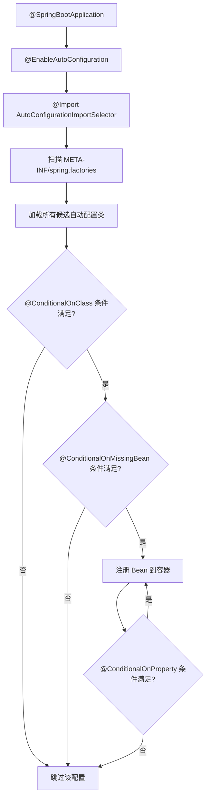
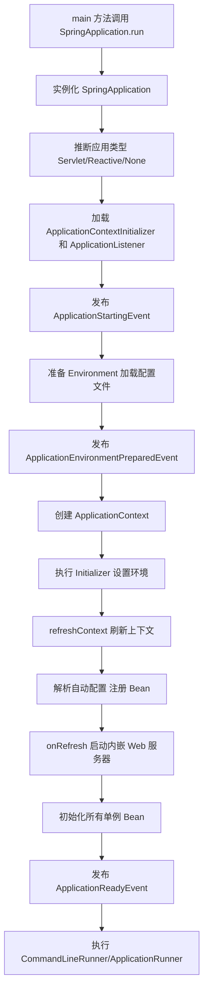

# SpringBoot 面试

## SpringBoot 简介

### 【简单】什么是 SpringBoot？⭐⭐

Spring Boot 是一个基于 Spring 框架的“开箱即用”的脚手架框架，它基于**约定优于配置**的原则，极大地简化了 Spring 应用的搭建和开发过程。

SpringBoot 的核心特性：

- **自动配置**：根据项目依赖**自动推断并配置**所需的 Bean（如引入 Web 依赖则自动配置 Tomcat + Spring MVC）。
- **starter 依赖**：将功能相关的依赖**打包成一个整体**（如 `spring-boot-starter-web`），解决版本兼容问题。
- **内嵌服务器**：内嵌服务器 Tomcat/Jetty，无需外部容器，打包成可执行 JAR 后一键运行 (`java -jar`)。
- **监控**：提供 **Actuator** 模块，轻松监控应用健康、性能等指标（通过 `/actuator/health` 等端点）。

## SpringBoot 架构

### 【中等】SpringBoot 是如何实现自动配置的？⭐⭐⭐

SpringBoot 自动配置的核心流程如下：

#### `@SpringBootApplication` 注解

SpringBoot 的启动入口一般都是从标记 `@SpringBootApplication` 注解开始。

```java
@SpringBootApplication
public class MyApplication {

	public static void main(String[] args) {
		SpringApplication.run(MyApplication.class, args);
	}

}
```

@SpringBootApplication 是一个组合注解，其定义如下：

```java
@Target(ElementType.TYPE)
@Retention(RetentionPolicy.RUNTIME)
@Documented
@Inherited
@SpringBootConfiguration
@EnableAutoConfiguration
@ComponentScan(excludeFilters = { @Filter(type = FilterType.CUSTOM, classes = TypeExcludeFilter.class),
		@Filter(type = FilterType.CUSTOM, classes = AutoConfigurationExcludeFilter.class) })
public @interface SpringBootApplication {
	// ...
}
```

其中，最核心的注解有 2 个：

- **`@EnableAutoConfiguration` 注解**：开启了 Spring Boot 的自动配置功能。
- **`@ComponentScan` 注解**：自动扫描指定包及其子包下的所有被 `@Component` 等注解标记的类，并将它们注册为 Spring 容器中的 Bean 。默认，`@SpringBootApplication` 标注的类所在的包及其子包下的组件都会被扫描 。

#### `@EnableAutoConfiguration` 注解

**`@EnableAutoConfiguration` 注解**开启了 Spring Boot 的自动配置功能。

`@EnableAutoConfiguration` 也是一个组合注解，其定义如下：

```java
@Target(ElementType.TYPE)
@Retention(RetentionPolicy.RUNTIME)
@Documented
@Inherited
@AutoConfigurationPackage
@Import(AutoConfigurationImportSelector.class)
public @interface EnableAutoConfiguration {
	// ...
}
```

其中，最关键点在于 `@Import(AutoConfigurationImportSelector.class)` 注解，表示导入 `AutoConfigurationImportSelector`。`AutoConfigurationImportSelector` 正是自动导入配置的关键。

#### @Import(AutoConfigurationImportSelector.class)

`AutoConfigurationImportSelector` 会扫描 `META-INF/spring.factories` 文件中的自动配置类，并根据限制条件，选择性为应用自动初始化、注入合适的 Bean。

> 注：这其实就是 SpringBoot 的 SPI 机制。

#### spring.factories 文件

`spring.factories` 文件中列出了所有自动配置类，当 SpringBoot 启动时，会根据文件中指定的配置类加载相应的自动配置。

`spring.factories` 文件部分内容：

```properties
# Initializers
org.springframework.context.ApplicationContextInitializer=\
org.springframework.boot.autoconfigure.SharedMetadataReaderFactoryContextInitializer,\
org.springframework.boot.autoconfigure.logging.ConditionEvaluationReportLoggingListener

# Application Listeners
org.springframework.context.ApplicationListener=\
org.springframework.boot.autoconfigure.BackgroundPreinitializer

# Auto Configuration Import Listeners
org.springframework.boot.autoconfigure.AutoConfigurationImportListener=\
org.springframework.boot.autoconfigure.condition.ConditionEvaluationReportAutoConfigurationImportListener

# Auto Configuration Import Filters
org.springframework.boot.autoconfigure.AutoConfigurationImportFilter=\
org.springframework.boot.autoconfigure.condition.OnBeanCondition,\
org.springframework.boot.autoconfigure.condition.OnClassCondition,\
org.springframework.boot.autoconfigure.condition.OnWebApplicationCondition

# Auto Configure
org.springframework.boot.autoconfigure.EnableAutoConfiguration=\
org.springframework.boot.autoconfigure.admin.SpringApplicationAdminJmxAutoConfiguration,\
org.springframework.boot.autoconfigure.aop.AopAutoConfiguration,\
org.springframework.boot.autoconfigure.amqp.RabbitAutoConfiguration,\
org.springframework.boot.autoconfigure.batch.BatchAutoConfiguration,\
org.springframework.boot.autoconfigure.cache.CacheAutoConfiguration,\

// ...
```

#### 自动配置类

自动配置类中有以下核心注解，来辅助它完成自动配置的能力。

- `@Configuration`：自动配置类，一般都会标记 `@Configuration` 注解，来表明需要被扫描。
- `@EnableConfigurationProperties(xxx.class)`：表明这个配置类需要自动绑定的配置属性。
- `@Import`：需要前置依赖的其他配置类。

自动配置类通常使用 `@ConditionalOnClass`、`@ConditionalOnMissingBean`、`@ConditionalOnProperty` 等条件注解，来控制自动加载的触发条件。

::: details KafkaAutoConfiguration 示例

```java
@Configuration
@ConditionalOnClass(KafkaTemplate.class)
@EnableConfigurationProperties(KafkaProperties.class)
@Import({ KafkaAnnotationDrivenConfiguration.class, KafkaStreamsAnnotationDrivenConfiguration.class })
public class KafkaAutoConfiguration {

    private final KafkaProperties properties;

    private final RecordMessageConverter messageConverter;

    public KafkaAutoConfiguration(KafkaProperties properties, ObjectProvider<RecordMessageConverter> messageConverter) {
       this.properties = properties;
       this.messageConverter = messageConverter.getIfUnique();
    }

    @Bean
    @ConditionalOnMissingBean(KafkaTemplate.class)
    public KafkaTemplate<?, ?> kafkaTemplate(ProducerFactory<Object, Object> kafkaProducerFactory,
          ProducerListener<Object, Object> kafkaProducerListener) {
       KafkaTemplate<Object, Object> kafkaTemplate = new KafkaTemplate<>(kafkaProducerFactory);
       if (this.messageConverter != null) {
          kafkaTemplate.setMessageConverter(this.messageConverter);
       }
       kafkaTemplate.setProducerListener(kafkaProducerListener);
       kafkaTemplate.setDefaultTopic(this.properties.getTemplate().getDefaultTopic());
       return kafkaTemplate;
    }

    @Bean
    @ConditionalOnMissingBean(ProducerListener.class)
    public ProducerListener<Object, Object> kafkaProducerListener() {
       return new LoggingProducerListener<>();
    }

    @Bean
    @ConditionalOnMissingBean(ConsumerFactory.class)
    public ConsumerFactory<?, ?> kafkaConsumerFactory() {
       return new DefaultKafkaConsumerFactory<>(this.properties.buildConsumerProperties());
    }

    @Bean
    @ConditionalOnMissingBean(ProducerFactory.class)
    public ProducerFactory<?, ?> kafkaProducerFactory() {
       DefaultKafkaProducerFactory<?, ?> factory = new DefaultKafkaProducerFactory<>(
             this.properties.buildProducerProperties());
       String transactionIdPrefix = this.properties.getProducer().getTransactionIdPrefix();
       if (transactionIdPrefix != null) {
          factory.setTransactionIdPrefix(transactionIdPrefix);
       }
       return factory;
    }

    @Bean
    @ConditionalOnProperty(name = "spring.kafka.producer.transaction-id-prefix")
    @ConditionalOnMissingBean
    public KafkaTransactionManager<?, ?> kafkaTransactionManager(ProducerFactory<?, ?> producerFactory) {
       return new KafkaTransactionManager<>(producerFactory);
    }

    @Bean
    @ConditionalOnProperty(name = "spring.kafka.jaas.enabled")
    @ConditionalOnMissingBean
    public KafkaJaasLoginModuleInitializer kafkaJaasInitializer() throws IOException {
       KafkaJaasLoginModuleInitializer jaas = new KafkaJaasLoginModuleInitializer();
       Jaas jaasProperties = this.properties.getJaas();
       if (jaasProperties.getControlFlag() != null) {
          jaas.setControlFlag(jaasProperties.getControlFlag());
       }
       if (jaasProperties.getLoginModule() != null) {
          jaas.setLoginModule(jaasProperties.getLoginModule());
       }
       jaas.setOptions(jaasProperties.getOptions());
       return jaas;
    }

    @Bean
    @ConditionalOnMissingBean
    public KafkaAdmin kafkaAdmin() {
       KafkaAdmin kafkaAdmin = new KafkaAdmin(this.properties.buildAdminProperties());
       kafkaAdmin.setFatalIfBrokerNotAvailable(this.properties.getAdmin().isFailFast());
       return kafkaAdmin;
    }

}
```

:::

#### 自动配置简化流程

```
@SpringBootApplication -> @EnableAutoConfiguration -> @Import({AutoConfigurationImportSelector.class}) -> 扫描 META-INF/spring.factories 文件 -> 自动加载文件中的配置 -> XXXAutoConfiguration 中根据 @ConditionalOnXXX 按需加载
```



### 【中等】SpringBoot 是如何通过 main 方法启动 web 项目的？⭐

Spring Boot 应用的启动流程都封装在 `SpringApplication.run` 方法中，它的大部分逻辑都是复用 Spring 启动的流程，只不过在它的基础上做了大量的扩展。

在启动的过程中有一个刷新上下文的动作，这个方法内会触发 webServer 的创建，此时就会创建并启动内嵌的 web 服务，默认的 web 服务就是 Tomcat。

Spring Boot 的启动过程几个核心步骤：

1. **`SpringApplication.run()`**：这是启动的入口，它会创建 Spring 应用上下文，并执行自动配置。
2. **创建应用上下文**：为 Web 应用创建 `AnnotationConfigServletWebServerApplicationContext` 上下文。
3. **启动内嵌 Web 服务器**：在 `refreshContext()` 阶段启动内嵌的 Web 服务器（如 Tomcat）。
4. **自动配置**：通过 `@EnableAutoConfiguration` 自动配置各种组件，如 `DispatcherServlet`。
5. **请求处理**：内嵌的 `DispatcherServlet` 负责处理 HTTP 请求。

### 【困难】SpringBoot 的启动流程是如何设计的？⭐⭐⭐

Spring Boot 启动流程大致分为六个关键阶段。

#### 实例化 SpringApplication

- **推断应用类型**（Servlet、Reactive、None）。
- **加载扩展**：从 `META-INF/spring.factories` 加载 `ApplicationContextInitializer` 和 `ApplicationListener`。

#### 运行 `run()` 方法

- 启动计时器，记录应用启动耗时。
- 发布第一个事件：**`ApplicationStartingEvent`**。

#### 准备环境

- 创建并配置环境，整合命令行参数、配置文件（`application.properties`）、系统属性等。
- 发布 **`ApplicationEnvironmentPreparedEvent`** 事件（触发配置文件的加载）。

#### 创建应用上下文 (ApplicationContext)

- 根据应用类型创建对应的 `ApplicationContext`（如 `AnnotationConfigServletWebServerApplicationContext`）。
- 将环境设置到上下文中，并执行 `ApplicationContextInitializer`。

#### 刷新应用上下文

1.  **准备 BeanFactory**。
2.  **执行 BeanFactoryPostProcessor**：核心为 **`ConfigurationClassPostProcessor`**，负责解析 `@Configuration`、`@ComponentScan` 和 **`@EnableAutoConfiguration`（自动配置的入口）**。
3.  **注册 BeanPostProcessor**（负责依赖注入 `@Autowired`、AOP 等）。
4.  **onRefresh() 方法（Spring Boot 精华）**：**创建并启动内嵌的 Web 服务器**（如 Tomcat）。
5.  **完成 BeanFactory 初始化**：**实例化所有非懒加载的单例 Bean**（调用所有 `BeanPostProcessor`，完成依赖注入和初始化）。

#### 发布事件与执行 Runner

- 发布最终事件 **`ApplicationReadyEvent`**（表示应用已完全就绪）。
- 执行所有 **`CommandLineRunner`** 和 **`ApplicationRunner`** 接口的实现，进行启动后初始化。

#### 设计思想总结

- **事件驱动**：通过发布一系列事件，将启动过程解耦，允许开发者监听并介入特定阶段。
- **工厂加载机制 (SPI)**：通过 `META-INF/spring.factories` 文件自动加载配置和组件，实现**约定优于配置**。
- **钩子方法**：提供大量扩展点（如 `*Aware`, `*Processor`, `*Runner` 接口），方便定制。
- **内嵌服务器**：在刷新上下文的 `onRefresh()` 钩子中启动 Web 服务器，这是独立运行（`java -jar`）的基石。



### 【困难】如何自定义一个 starter 包？⭐⭐⭐

#### 创建自动配置类

```java
@EnableConfigurationProperties(MyServiceProperties.class) // 启用属性配置绑定
@ConditionalOnClass(MyService.class) // 条件 1: 当类路径下存在 MyService 类时生效
@ConditionalOnProperty(prefix = "my.service", value = "enabled", havingValue = "true", matchIfMissing = true) // 条件 2: 当配置文件中 my.service.enabled=true 时生效（默认 true）
public class MyServiceAutoConfiguration {

    @Autowired
    private MyServiceProperties properties;

    @Bean
    @ConditionalOnMissingBean // 关键条件：只有当用户没有自己配置 MyService 这个 Bean 时，才生效
    public MyService myService() {
        return new MyService(properties.getPrefix(), properties.getSuffix());
    }
}
```

说明：

- `@ConditionalOnClass(MyService.class)`：只有当 `MyService` 类在类路径下可用时（即你的 starter 被引入了），这个自动配置才应该生效。
- `@ConditionalOnProperty`：允许用户通过配置文件（`application.properties`）来控制自动配置是否开启。
- `@ConditionalOnMissingBean`：**这是最重要的条件**。它表示只有当用户没有在他们的自己的 `@Configuration` 类中手动声明 `MyService` Bean 时，这个自动配置才会执行。这确保了用户的自定义配置可以**覆盖**你的自动配置。

#### 创建属性配置类

为了让用户能够通过 `application.properties` 文件来自定义行为，需要创建一个属性类。

```java
@ConfigurationProperties(prefix = "my.service") // 绑定配置文件中以 my.service 为前缀的属性
public class MyServiceProperties {

    private String prefix = "Hello"; // 默认值
    private String suffix = "!";
    // 省略 getter 和 setter
}
```

#### 注册自动配置类

为了让 Spring Boot 发现自定义的自动配置类，需要在 Jar 包的 `resources` 目录下创建一个特定的文件：

**文件位置：** `src/main/resources/META-INF/spring.factories`

**文件内容：**

```properties
org.springframework.boot.autoconfigure.EnableAutoConfiguration=\
com.yourcompany.autoconfig.MyServiceAutoConfiguration
```

Spring Boot 在启动时会扫描所有 Jar 包中的这个文件，并将列出的类作为候选自动配置类进行加载和条件判断。

#### 创建自定义 Starter

一个完整的“自动配置”通常会打包成一个 **Starter**。Starter 的本质是一个空的 Maven 项目，它只做两件事：

1. 提供 `pom.xml`，管理相关依赖。
2. 提供 `META-INF/spring.factories` 文件，注册自动配置类。

**Starter 项目的结构**

```
my-spring-boot-starter
├── src
│   └── main
│       ├── java
│       │   └── com
│       │       └── yourcompany
│       │           ├── MyService.java
│       │           ├── MyServiceProperties.java
│       │           └── autoconfig
│       │               └── MyServiceAutoConfiguration.java
│       └── resources
│           └── META-INF
│               ├── spring.factories # 注册自动配置
│               └── additional-spring-configuration-metadata.json # 可选：为属性提供元数据提示
└── pom.xml
```

**Starter 的 `pom.xml` 关键点：**

- **依赖**：只包含你的自动配置模块和它所必需的第三方库。
- **不包含**：通常不包含 Spring Boot 的启动器（如 `spring-boot-starter`），而是让使用者去引入，这避免了依赖版本冲突。

```xml
<dependencies>
    <dependency>
        <groupId>org.springframework.boot</groupId>
        <artifactId>spring-boot-starter</artifactId>
        <!-- 注意：这里通常不指定版本，由使用者项目的 Spring Boot Parent 决定 -->
        <scope>provided</scope>
    </dependency>
    <dependency>
        <groupId>org.springframework.boot</groupId>
        <artifactId>spring-boot-configuration-processor</artifactId>
        <optional>true</optional>
    </dependency>
    <!-- 你的核心服务模块 -->
    <dependency>
        <groupId>com.yourcompany</groupId>
        <artifactId>my-service-core</artifactId>
        <version>1.0.0</version>
    </dependency>
</dependencies>
```

#### 提供元数据提示（可选）

为了让用户在配置 `application.properties` 时能有代码提示和自动完成，可以创建一个 `additional-spring-configuration-metadata.json` 文件。

**文件位置：** `src/main/resources/META-INF/additional-spring-configuration-metadata.json`

**文件内容：**

```json
{
  "properties": [
    {
      "name": "my.service.enabled",
      "type": "java.lang.Boolean",
      "description": "Whether to enable the MyService auto-configuration.",
      "defaultValue": true
    },
    {
      "name": "my.service.prefix",
      "type": "java.lang.String",
      "description": "The prefix to use for the service.",
      "defaultValue": "Hello"
    },
    {
      "name": "my.service.suffix",
      "type": "java.lang.String",
      "description": "The suffix to use for the service.",
      "defaultValue": "!"
    }
  ]
}
```

使用 `spring-boot-configuration-processor` 依赖会在项目编译时自动生成这部分元数据。

## 条件注解

### 【中等】SpringBoot 有哪些条件注解？⭐

条件注解是 SpringBoot 自动配置的核心机制，均以 `@Conditional` 为基础扩展而来。当条件满足时，对应的 Bean 或配置类才会被注册到容器中。

**类条件注解**

| 注解 | 说明 |
| :--- | :--- |
| `@ConditionalOnClass` | 类路径下存在指定类时，配置生效 |
| `@ConditionalOnMissingClass` | 类路径下不存在指定类时，配置生效 |

**Bean 条件注解**

| 注解 | 说明 |
| :--- | :--- |
| `@ConditionalOnBean` | 容器中存在指定类型的 Bean 时生效 |
| `@ConditionalOnMissingBean` | 容器中不存在指定类型的 Bean 时生效（**用户自定义优先**） |
| `@ConditionalOnSingleCandidate` | 容器中指定类型的 Bean 只有一个或虽有多个但有一个 @Primary 时生效 |

**属性条件注解**

| 注解 | 说明 |
| :--- | :--- |
| `@ConditionalOnProperty` | 配置文件中指定属性满足条件时生效，支持 `prefix`、`name`、`havingValue`、`matchIfMissing` |

**资源条件注解**

| 注解 | 说明 |
| :--- | :--- |
| `@ConditionalOnResource` | 类路径下存在指定资源文件时生效 |

**Web 应用条件注解**

| 注解 | 说明 |
| :--- | :--- |
| `@ConditionalOnWebApplication` | 当前应用是 Web 应用（Servlet 或 Reactive）时生效 |
| `@ConditionalOnNotWebApplication` | 当前应用不是 Web 应用时生效 |

**其他条件注解**

| 注解 | 说明 |
| :--- | :--- |
| `@ConditionalOnExpression` | SpEL 表达式结果为 true 时生效 |
| `@ConditionalOnJava` | JDK 版本满足条件时生效 |
| `@ConditionalOnCloudPlatform` | 运行在指定云平台（如 K8s）时生效 |

::::tip 核心设计思想
`@ConditionalOnMissingBean` 是实现"用户配置优先覆盖自动配置"的关键。SpringBoot 在自动配置类上大量使用该注解，确保开发者自定义的 Bean 不会被框架的默认配置覆盖。这也是 SpringBoot "约定优于配置"但"配置可覆盖"的设计哲学体现。
::::

## 内嵌容器

### 【中等】SpringBoot 支持哪些内嵌 Web 容器？如何切换？⭐

SpringBoot 默认内嵌 **Tomcat** 作为 Web 服务器，同时支持 **Jetty** 和 **Undertow**，三者均实现了 Servlet 规范。

**三种容器对比**

| 特性 | Tomcat | Jetty | Undertow |
| :--- | :--- | :--- | :--- |
| **默认** | 是 | 否 | 否 |
| **性能** | 中等 | 中等 | 最高（内存占用最小） |
| **成熟度** | 最高，使用最广泛 | 高，轻量级 | 较高，Red Hat 维护 |
| **适用场景** | 通用 Web 应用 | 长连接、异步场景（如 WebSocket） | 高并发、资源敏感型 |
| **Servlet 支持** | 完整 | 完整 | 完整 |
| **内存占用** | 较高 | 较低 | 最低 |

**切换方式（以切换为 Undertow 为例）**

```xml
<!-- 1. 排除默认的 Tomcat -->
<dependency>
    <groupId>org.springframework.boot</groupId>
    <artifactId>spring-boot-starter-web</artifactId>
    <exclusions>
        <exclusion>
            <groupId>org.springframework.boot</groupId>
            <artifactId>spring-boot-starter-tomcat</artifactId>
        </exclusion>
    </exclusions>
</dependency>

<!-- 2. 引入 Undertow -->
<dependency>
    <groupId>org.springframework.boot</groupId>
    <artifactId>spring-boot-starter-undertow</artifactId>
</dependency>
```

**自定义容器配置**

```yaml
server:
  port: 8080
  undertow:
    threads:
      io: 2          # IO 线程数，默认 CPU 核心数
      worker: 256    # 工作线程数，默认 10 * IO 线程数
    buffer-size: 1024  # 每个缓冲区大小
    direct-buffers: true  # 直接内存分配
```

### 【简单】SpringBoot 是如何内嵌 Tomcat 的？⭐⭐

SpringBoot 内嵌 Tomcat 的核心机制是在应用启动时，通过 `WebServerFactory` 创建并启动 Tomcat 实例，无需外部容器部署。

**核心流程**

1. **`ServletWebServerApplicationContext`**：SpringBoot 专用的应用上下文，在 `onRefresh()` 阶段调用 `createWebServer()` 方法。
2. **`ServletWebServerFactory`**：工厂接口，`TomcatServletWebServerFactory` 是其默认实现，负责创建和配置 `Tomcat` 实例。
3. **`TomcatWebServer`**：封装了 `Tomcat` 实例，`start()` 方法启动 Tomcat，`stop()` 方法关闭。
4. **`DispatcherServlet`**：自动注册到内嵌 Tomcat 的 ServletContext 中，映射 `/` 路径，处理所有 HTTP 请求。

::::tip 与传统 WAR 部署的区别
传统方式需要将应用打包成 WAR 部署到外部 Tomcat，由 Tomcat 管理应用生命周期。SpringBoot 内嵌容器则是应用管理容器生命周期，`main` 方法启动即创建 Tomcat 并注册 Servlet，实现 `java -jar` 一键启动。
::::

## 配置管理

### 【中等】SpringBoot 的配置文件优先级是怎样的？⭐

SpringBoot 支持多种配置来源，加载时按以下优先级从高到低覆盖（高优先级覆盖低优先级）：

1. **命令行参数**：`java -jar app.jar --server.port=9090`
2. **SPRING_APPLICATION_JSON**：环境变量或命令行中的 JSON 配置
3. **ServletConfig / ServletContext** 初始化参数
4. **JNDI 属性**：`java:comp/env/xxx`
5. **Java 系统属性**：`System.getProperties()`
6. **操作系统环境变量**
7. **`RandomValuePropertySource`**：`random.*` 属性
8. **jar 包外的 `application-{profile}.yml/properties`**：与 jar 同级目录
9. **jar 包内的 `application-{profile}.yml/properties`**：类路径下
10. **jar 包外的 `application.yml/properties`**
11. **jar 包内的 `application.yml/properties`**
12. **`@PropertySource`** 注解指定的配置文件
13. **默认属性**：`SpringApplication.setDefaultProperties()`

::::tip 实践建议
- **多环境**：使用 `application-{profile}.yml` 区分 dev/test/prod，通过 `spring.profiles.active` 激活。
- **敏感配置**：数据库密码等敏感信息使用环境变量或配置中心管理，不要硬编码。
- **覆盖优先**：命令行参数优先级最高，常用于运维临时调整（如端口号）。
::::

### 【中等】@ConfigurationProperties 和 @Value 有什么区别？⭐

| 维度 | `@ConfigurationProperties` | `@Value` |
| :--- | :--- | :--- |
| **功能** | 批量绑定配置到 Bean 的字段 | 单个属性注入 |
| **松散绑定** | 支持（`my-name` ↔ `myName`） | 不支持 |
| **SpEL** | 不支持 | 支持 `#{...}` |
| **元数据** | 支持自动生成配置提示 | 不支持 |
| **校验** | 支持 `@Validated` JSR-303 校验 | 不支持 |
| **适用场景** | 结构化配置（如数据库连接池） | 简单的单值注入 |

**使用示例**

```java
// 方式一：@ConfigurationProperties 批量绑定
@Component
@ConfigurationProperties(prefix = "app.datasource")
@Validated
public class DataSourceProperties {

    @NotBlank
    private String url;

    @Min(1)
    @Max(65535)
    private int port = 3306;

    private String username;
    private String password;
    // getter/setter 省略
}

// 方式二：@Value 单值注入
@Component
public class MyComponent {

    @Value("${app.datasource.url}")
    private String url;

    @Value("#{T(java.lang.Math).random() * 100}")
    private double randomValue;
}
```

## Actuator

### 【中等】SpringBoot Actuator 是什么？有哪些核心端点？⭐

SpringBoot Actuator 是生产级的监控和管理模块，通过 HTTP 或 JMX 端点暴露应用运行时信息，无需额外开发即可实现健康检查、指标监控等功能。

**核心端点**

| 端点 | 调用方法 | 说明 |
| :--- | :--- | :--- |
| `/actuator/health` | GET | 健康检查，显示应用及组件（DB、Redis 等）状态 |
| `/actuator/info` | GET | 应用基本信息（需手动配置） |
| `/actuator/metrics` | GET | 应用指标（JVM、HTTP 请求等） |
| `/actuator/env` | GET | 环境变量和配置属性 |
| `/actuator/loggers` | GET/POST | 动态查看和修改日志级别 |
| `/actuator/beans` | GET | 容器中所有 Bean 列表 |
| `/actuator/mappings` | GET | 所有 `@RequestMapping` 路径 |
| `/actuator/threaddump` | GET | 线程栈信息 |
| `/actuator/heapdump` | GET | 堆 dump 文件下载 |
| `/actuator/refresh` | POST | 刷新配置（需集成 Spring Cloud Config） |

**配置示例**

```yaml
management:
  endpoints:
    web:
      exposure:
        include: health,info,metrics,loggers  # 暴露指定端点
        exclude: env,beans                     # 排除敏感端点
  endpoint:
    health:
      show-details: always  # 显示健康详情（默认 never）
  server:
    port: 8081  # 独立端口，与业务端口隔离（安全建议）
```

::::warning 安全提示
生产环境中，`env`、`beans`、`heapdump` 等端点可能暴露敏感信息，应通过 `management.endpoints.web.exposure.include` 精确控制暴露范围，并配合 Spring Security 进行鉴权。
::::

## SpringBoot 3.x

### 【困难】SpringBoot 3.x 有哪些重要新特性？⭐⭐

**1. 最低要求 JDK 17**

SpringBoot 3.x 要求 JDK 17+，全面使用现代 Java 特性（Record、Sealed Classes、Pattern Matching 等）。

**2. Jakarta EE 迁移**

`javax.*` 包名全部迁移到 `jakarta.*`，影响 Servlet、JPA、Validation 等 API。升级时需同步更新依赖和 import。

```java
// SpringBoot 2.x
import javax.servlet.http.HttpServletRequest;
import javax.persistence.Entity;

// SpringBoot 3.x
import jakarta.servlet.http.HttpServletRequest;
import jakarta.persistence.Entity;
```

**3. GraalVM 原生镜像支持**

SpringBoot 3.x 一等公民支持 GraalVM Native Image，应用可编译为独立可执行文件，启动时间从秒级降至毫秒级，内存占用大幅降低。

```xml
<!-- pom.xml 添加 native 构建工具 -->
<build>
    <plugins>
        <plugin>
            <groupId>org.graalvm.buildtools</groupId>
            <artifactId>native-maven-plugin</artifactId>
        </plugin>
    </plugins>
</build>
```

```bash
# 编译为原生镜像
mvn -Pnative native:compile
```

| 维度 | JVM 模式 | Native Image |
| :--- | :--- | :--- |
| **启动时间** | 1-5 秒 | 10-100 毫秒 |
| **内存占用** | 200MB-1GB | 50-100MB |
| **峰值性能** | 高（JIT 预热后） | 较低（AOT 无 JIT 优化） |
| **构建时间** | 快 | 慢（分钟级） |
| **动态特性** | 完整支持 | 受限（反射需配置） |

**4. Micrometer Observation API**

统一可观测性 API，取代原有的 Sleuth，通过单一 API 同时产生 Metrics、Tracing、Logging 数据。

```java
@Service
public class MyService {

    private final ObservationRegistry registry;

    public MyService(ObservationRegistry registry) {
        this.registry = registry;
    }

    public String doSomething() {
        return Observation.createNotStarted("my-operation", registry)
            .lowCardinalityKeyValue("type", "demo")
            .observe(() -> {
                // 业务逻辑
                return "result";
            });
    }
}
```

**5. HTTP Interface（声明式 HTTP 客户端）**

内置声明式 HTTP 客户端，无需 Feign 即可定义 HTTP 接口。

```java
@HttpExchange(url = "/api/users", accept = "application/json")
public interface UserApi {

    @GetExchange("/{id}")
    User getUser(@PathVariable Long id);

    @PostExchange
    User createUser(@RequestBody User user);
}

// 配置
@Configuration
public class HttpConfig {

    @Bean
    public UserApi userApi(WebClient.Builder builder) {
        WebClient client = builder.baseUrl("http://user-service").build();
        HttpServiceProxyFactory factory = HttpServiceProxyFactory
            .builderFor(WebClientAdapter.create(client)).build();
        return factory.createClient(UserApi.class);
    }
}
```

## 常见问题

### 【中等】SpringBoot 启动慢的原因有哪些？如何优化？⭐

**启动慢的常见原因**

1. **自动配置类过多**：SpringBoot 扫描加载大量 `@AutoConfiguration`，即使大部分不生效也需条件判断。
2. **Bean 初始化耗时**：数据库连接池创建、Redis 连接、HTTP 客户端初始化等。
3. **组件扫描范围过大**：`@ComponentScan` 扫描了过多无关包。
4. **`@PostConstruct` / `InitializingBean`** 中执行了耗时逻辑。
5. **日志框架初始化**：某些日志框架启动时扫描类路径。

**优化手段**

| 优化方向 | 具体措施 |
| :--- | :--- |
| **精简自动配置** | 使用 `spring.autoconfigure.exclude` 排除不需要的自动配置类 |
| **懒加载** | `spring.main.lazy-initialization=true`，启动时只创建必需 Bean |
| **缩小扫描范围** | `@SpringBootApplication(scanBasePackages = "com.xxx.service")` 精确指定 |
| **异步初始化** | 用 `@Async` 或 `ApplicationRunner` 将非关键初始化延后 |
| **JVM 参数** | `-XX:TieredStopAtLevel=1`（仅 C1 编译，减少 JIT 时间） |

### 【中等】SpringBoot 如何解决 jar 包冲突？⭐

**排查步骤**

1. **查看依赖树**：`mvn dependency:tree -Dverbose -Dincludes=groupId:artifactId`
2. **定位冲突**：找到同一 artifact 的多个版本，确认哪个版本被加载。
3. **排除依赖**：在引入冲突依赖的地方使用 `<exclusions>` 排除不需要的版本。
4. **统一版本**：在 `<dependencyManagement>` 中统一指定版本。

**示例**

```xml
<!-- 排除传递依赖中的冲突版本 -->
<dependency>
    <groupId>com.example</groupId>
    <artifactId>lib-a</artifactId>
    <version>1.0</version>
    <exclusions>
        <exclusion>
            <groupId>com.google.guava</groupId>
            <artifactId>guava</artifactId>
        </exclusion>
    </exclusions>
</dependency>

<!-- 统一版本管理 -->
<dependencyManagement>
    <dependencies>
        <dependency>
            <groupId>com.google.guava</groupId>
            <artifactId>guava</artifactId>
            <version>32.1.3-jre</version>
        </dependency>
    </dependencies>
</dependencyManagement>
```

::::tip SpringBoot 的依赖管理
SpringBoot 通过 `spring-boot-dependencies` BOM 统一管理了数百个常用库的版本，引入 Starter 时会自动继承这些版本，大大减少了手动解决版本冲突的需要。只有当引入非 SpringBoot 管理的库时，才需要手动处理冲突。
::::

## 资料

- [面试鸭 - SpringBoot 面试](https://www.mianshiya.com/bank/1790683494127804418)
