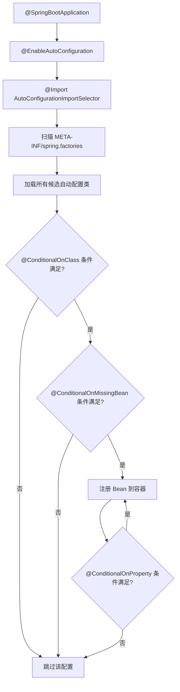
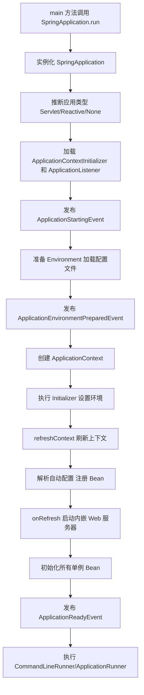
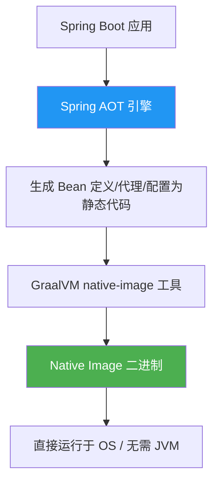
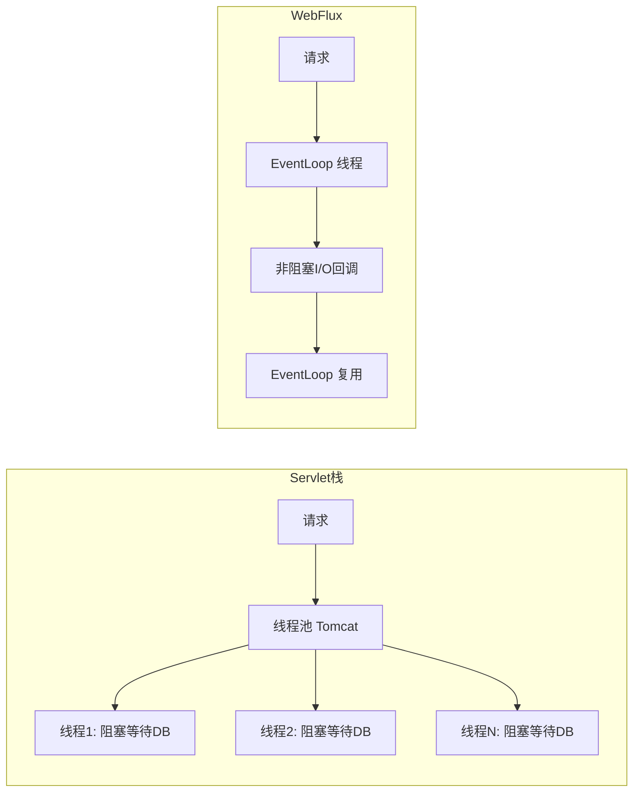

# SpringBoot 面试

## SpringBoot 简介

### 【简单】什么是 SpringBoot？⭐⭐

> 🎯 目标等级：L1 ｜ ⏱ 建议用时：5 min ｜ 🏷 标签：SpringBoot / 概述

#### 💎 关键结论

SpringBoot 是基于 Spring 的开箱即用脚手架，核心理念是**约定优于配置**：自动配置按依赖推断并装配 Bean，starter 将相关依赖打包成整体，内嵌容器支持 `java -jar` 直接运行，Actuator 提供生产监控。它没有替代 Spring，而是消除了 Spring 应用的样板配置。

#### ⚡ 记忆卡片

- **口诀**：自动配、starter 捆依赖、内嵌容器一键跑、Actuator 看健康
- **关键词**：约定优于配置 ／ starter ／ 内嵌 Tomcat ／ Actuator
- **链路**：Spring 样板配置多 → 约定优于配置 → 自动配置 + starter → `java -jar` 独立运行

#### 📖 核心知识

Spring Boot 是一个基于 Spring 框架的"开箱即用"的脚手架框架，它基于**约定优于配置**的原则，极大地简化了 Spring 应用的搭建和开发过程。

SpringBoot 的核心特性：

- **自动配置**：根据项目依赖**自动推断并配置**所需的 Bean（如引入 Web 依赖则自动配置 Tomcat + Spring MVC）。
- **starter 依赖**：将功能相关的依赖**打包成一个整体**（如 `spring-boot-starter-web`），解决版本兼容问题。
- **内嵌服务器**：内嵌服务器 Tomcat/Jetty，无需外部容器，打包成可执行 JAR 后一键运行（`java -jar`）。
- **监控**：提供 **Actuator** 模块，轻松监控应用健康、性能等指标（通过 `/actuator/health` 等端点）。

#### 🔀 发散问题

- **Q：SpringBoot 是如何实现自动配置的？**

  → `@EnableAutoConfiguration` 经 `AutoConfigurationImportSelector` 加载候选配置类并按条件注解筛选，见本文档「SpringBoot 是如何实现自动配置的？」。

- **Q：SpringBoot Actuator 是什么？**

  → 生产级监控模块，通过 HTTP/JMX 端点暴露健康检查与指标，见本文档「SpringBoot Actuator 是什么？有哪些核心端点？」。

- **Q：SpringBoot 的启动流程是怎样的？**

  → 实例化 → 准备环境 → 创建上下文 → 刷新 → 执行 Runner 六阶段，见本文档「SpringBoot 的启动流程是如何设计的？」。

## SpringBoot 架构

### 【中等】SpringBoot 是如何实现自动配置的？⭐⭐⭐⭐⭐

> 🎯 目标等级：L3 ｜ ⏱ 建议用时：15 min ｜ 🏷 标签：SpringBoot / 自动配置

#### 💎 关键结论

入口是 `@SpringBootApplication` 组合注解，其中 `@EnableAutoConfiguration` 通过 `@Import` 导入 `AutoConfigurationImportSelector`，从注册文件（Boot 2.6 及以前为 `spring.factories`，2.7 起过渡、3.x 改为 `AutoConfiguration.imports`）读取候选自动配置类，再逐个评估 `@ConditionalOnXXX` 条件注解，满足条件才注册 Bean——约定优于配置，且用户配置可覆盖。

#### ⚡ 记忆卡片

- **口诀**：组合注解开门，Selector 选候选，条件注解定去留，用户 Bean 优先
- **关键词**：@EnableAutoConfiguration ／ AutoConfigurationImportSelector ／ @ConditionalOnMissingBean ／ AutoConfiguration.imports
- **链路**：@SpringBootApplication → @EnableAutoConfiguration → @Import(AutoConfigurationImportSelector) → 加载候选类 → @ConditionalOnXXX 按需筛选 → 注册 Bean

#### 📖 核心知识

**1. `@SpringBootApplication` 注解**

SpringBoot 的启动入口一般都是从标记 `@SpringBootApplication` 注解开始。

```java
@SpringBootApplication
public class MyApplication {

	public static void main(String[] args) {
		SpringApplication.run(MyApplication.class, args);
	}

}
```

@SpringBootApplication 是一个组合注解，其定义如下：

```java
@Target(ElementType.TYPE)
@Retention(RetentionPolicy.RUNTIME)
@Documented
@Inherited
@SpringBootConfiguration
@EnableAutoConfiguration
@ComponentScan(excludeFilters = { @Filter(type = FilterType.CUSTOM, classes = TypeExcludeFilter.class),
		@Filter(type = FilterType.CUSTOM, classes = AutoConfigurationExcludeFilter.class) })
public @interface SpringBootApplication {
	// ...
}
```

其中，最核心的注解有 2 个：

- **`@EnableAutoConfiguration` 注解**：开启了 Spring Boot 的自动配置功能。
- **`@ComponentScan` 注解**：自动扫描指定包及其子包下的所有被 `@Component` 等注解标记的类，并将它们注册为 Spring 容器中的 Bean。默认，`@SpringBootApplication` 标注的类所在的包及其子包下的组件都会被扫描。

**2. `@EnableAutoConfiguration` 注解**

`@EnableAutoConfiguration` 也是一个组合注解，其定义如下：

```java
@Target(ElementType.TYPE)
@Retention(RetentionPolicy.RUNTIME)
@Documented
@Inherited
@AutoConfigurationPackage
@Import(AutoConfigurationImportSelector.class)
public @interface EnableAutoConfiguration {
	// ...
}
```

其中，最关键点在于 `@Import(AutoConfigurationImportSelector.class)` 注解，表示导入 `AutoConfigurationImportSelector`。`AutoConfigurationImportSelector` 正是自动导入配置的关键。

**3. `AutoConfigurationImportSelector`**

`AutoConfigurationImportSelector` 会扫描自动配置类注册文件（Boot 2.x 为 `META-INF/spring.factories`）中的自动配置类，并根据限制条件，选择性为应用自动初始化、注入合适的 Bean。

> 注：这其实就是 SpringBoot 的 SPI 机制。

**4. 注册文件 `spring.factories`**

Boot 2.x 中，`spring.factories` 文件列出了所有自动配置类，当 SpringBoot 启动时，会根据文件中指定的配置类加载相应的自动配置。

`spring.factories` 文件部分内容：

```properties
# Initializers
org.springframework.context.ApplicationContextInitializer=\
org.springframework.boot.autoconfigure.SharedMetadataReaderFactoryContextInitializer,\
org.springframework.boot.autoconfigure.logging.ConditionEvaluationReportLoggingListener

# Application Listeners
org.springframework.context.ApplicationListener=\
org.springframework.boot.autoconfigure.BackgroundPreinitializer

# Auto Configuration Import Listeners
org.springframework.boot.autoconfigure.AutoConfigurationImportListener=\
org.springframework.boot.autoconfigure.condition.ConditionEvaluationReportAutoConfigurationImportListener

# Auto Configuration Import Filters
org.springframework.boot.autoconfigure.AutoConfigurationImportFilter=\
org.springframework.boot.autoconfigure.condition.OnBeanCondition,\
org.springframework.boot.autoconfigure.condition.OnClassCondition,\
org.springframework.boot.autoconfigure.condition.OnWebApplicationCondition

# Auto Configure
org.springframework.boot.autoconfigure.EnableAutoConfiguration=\
org.springframework.boot.autoconfigure.admin.SpringApplicationAdminJmxAutoConfiguration,\
org.springframework.boot.autoconfigure.aop.AopAutoConfiguration,\
org.springframework.boot.autoconfigure.amqp.RabbitAutoConfiguration,\
org.springframework.boot.autoconfigure.batch.BatchAutoConfiguration,\
org.springframework.boot.autoconfigure.cache.CacheAutoConfiguration,\

// ...
```

注册文件的版本演进（**版本结论**）：

| 版本          | 注册文件                                                                           | 加载入口                |
| :------------ | :--------------------------------------------------------------------------------- | :---------------------- |
| 1.x ~ 2.6     | `META-INF/spring.factories`（key 为 `EnableAutoConfiguration`）                    | `SpringFactoriesLoader` |
| 2.7（过渡期） | 两种文件同时支持，`spring.factories` 方式标记废弃                                  | 二者兼容                |
| 3.x           | `META-INF/spring/org.springframework.boot.autoconfigure.AutoConfiguration.imports` | `ImportCandidates.load` |

演进原因：`spring.factories` 把 Initializer、Listener、自动配置类等全部塞在一个文件里，启动时要全量解析；拆出独立文件后自动配置清单可逐行直接读取。注意 Boot 3.x 只是不再读取 `spring.factories` 中的 `EnableAutoConfiguration` 这一 key，自定义 Initializer 和 Listener 仍走 `spring.factories`。「starter 升级到 Boot 3.x 后自动配置静默失效」多半是这个演进没跟上。

**5. 自动配置类**

自动配置类中有以下核心注解，来辅助它完成自动配置的能力：

- `@Configuration`：自动配置类，一般都会标记 `@Configuration` 注解，来表明需要被扫描。
- `@EnableConfigurationProperties(xxx.class)`：表明这个配置类需要自动绑定的配置属性。
- `@Import`：需要前置依赖的其他配置类。

自动配置类通常使用 `@ConditionalOnClass`、`@ConditionalOnMissingBean`、`@ConditionalOnProperty` 等条件注解，来控制自动加载的触发条件。

::: details KafkaAutoConfiguration 示例

```java
@Configuration
@ConditionalOnClass(KafkaTemplate.class)
@EnableConfigurationProperties(KafkaProperties.class)
@Import({ KafkaAnnotationDrivenConfiguration.class, KafkaStreamsAnnotationDrivenConfiguration.class })
public class KafkaAutoConfiguration {

    private final KafkaProperties properties;

    private final RecordMessageConverter messageConverter;

    public KafkaAutoConfiguration(KafkaProperties properties, ObjectProvider<RecordMessageConverter> messageConverter) {
       this.properties = properties;
       this.messageConverter = messageConverter.getIfUnique();
    }

    @Bean
    @ConditionalOnMissingBean(KafkaTemplate.class)
    public KafkaTemplate<?, ?> kafkaTemplate(ProducerFactory<Object, Object> kafkaProducerFactory,
          ProducerListener<Object, Object> kafkaProducerListener) {
       KafkaTemplate<Object, Object> kafkaTemplate = new KafkaTemplate<>(kafkaProducerFactory);
       if (this.messageConverter != null) {
          kafkaTemplate.setMessageConverter(this.messageConverter);
       }
       kafkaTemplate.setProducerListener(kafkaProducerListener);
       kafkaTemplate.setDefaultTopic(this.properties.getTemplate().getDefaultTopic());
       return kafkaTemplate;
    }

    @Bean
    @ConditionalOnMissingBean(ProducerListener.class)
    public ProducerListener<Object, Object> kafkaProducerListener() {
       return new LoggingProducerListener<>();
    }

    @Bean
    @ConditionalOnMissingBean(ConsumerFactory.class)
    public ConsumerFactory<?, ?> kafkaConsumerFactory() {
       return new DefaultKafkaConsumerFactory<>(this.properties.buildConsumerProperties());
    }

    @Bean
    @ConditionalOnMissingBean(ProducerFactory.class)
    public ProducerFactory<?, ?> kafkaProducerFactory() {
       DefaultKafkaProducerFactory<?, ?> factory = new DefaultKafkaProducerFactory<>(
             this.properties.buildProducerProperties());
       String transactionIdPrefix = this.properties.getProducer().getTransactionIdPrefix();
       if (transactionIdPrefix != null) {
          factory.setTransactionIdPrefix(transactionIdPrefix);
       }
       return factory;
    }

    @Bean
    @ConditionalOnProperty(name = "spring.kafka.producer.transaction-id-prefix")
    @ConditionalOnMissingBean
    public KafkaTransactionManager<?, ?> kafkaTransactionManager(ProducerFactory<?, ?> producerFactory) {
       return new KafkaTransactionManager<>(producerFactory);
    }

    @Bean
    @ConditionalOnProperty(name = "spring.kafka.jaas.enabled")
    @ConditionalOnMissingBean
    public KafkaJaasLoginModuleInitializer kafkaJaasInitializer() throws IOException {
       KafkaJaasLoginModuleInitializer jaas = new KafkaJaasLoginModuleInitializer();
       Jaas jaasProperties = this.properties.getJaas();
       if (jaasProperties.getControlFlag() != null) {
          jaas.setControlFlag(jaasProperties.getControlFlag());
       }
       if (jaasProperties.getLoginModule() != null) {
          jaas.setLoginModule(jaasProperties.getLoginModule());
       }
       jaas.setOptions(jaasProperties.getOptions());
       return jaas;
    }

    @Bean
    @ConditionalOnMissingBean
    public KafkaAdmin kafkaAdmin() {
       KafkaAdmin kafkaAdmin = new KafkaAdmin(this.properties.buildAdminProperties());
       kafkaAdmin.setFatalIfBrokerNotAvailable(this.properties.getAdmin().isFailFast());
       return kafkaAdmin;
    }

}
```

:::

**6. 自动配置简化流程**

```
@SpringBootApplication -> @EnableAutoConfiguration -> @Import({AutoConfigurationImportSelector.class}) -> 扫描 META-INF/spring.factories 文件 -> 自动加载文件中的配置 -> XXXAutoConfiguration 中根据 @ConditionalOnXXX 按需加载
```


```mermaid
graph TD
    A["@SpringBootApplication"] --> B["@EnableAutoConfiguration"]
    B --> C["@Import AutoConfigurationImportSelector"]
    C --> D[扫描 META-INF/spring.factories]
    D --> E[加载所有候选自动配置类]
    E --> F{"@ConditionalOnClass 条件满足?"}
    F -->|否| G[跳过该配置]
    F -->|是| H{"@ConditionalOnMissingBean 条件满足?"}
    H -->|否| G
    H -->|是| I[注册 Bean 到容器]
    I --> J{"@ConditionalOnProperty 条件满足?"}
    J -->|否| G
    J -->|是| I
```

**7. 顺序保障：用户配置优先**

`@SpringBootApplication` 中的 `@ComponentScan` 先扫描注册用户的 Bean，自动配置类后经 `@Import` 导入，因此 `@ConditionalOnMissingBean` 的判断天然发生在用户 Bean 已注册之后——这是「用户配置优先于自动配置」的前提。

#### 🔬 扩展知识

::: details

- 【L3】源码定位：自动配置不是黑魔法，每一步都有明确的源码落点——① `AutoConfigurationImportSelector#selectImports` → `getAutoConfigurationEntry`：由 `ConfigurationClassParser` 在解析配置类阶段回调，返回候选配置类全限定名与排除项；② `AutoConfigurationImportSelector#getCandidateConfigurations`：Boot 2.x 通过 `SpringFactoriesLoader.loadFactoryNames` 读取候选类，3.x 改为 `ImportCandidates.load` 读取 `AutoConfiguration.imports` 文件；③ `AutoConfigurationImportFilter`（如 `OnClassCondition` 实现）做前置过滤，Boot 2.7 约有 144 个候选自动配置类，过滤后真正生效的通常不足 30 个，大幅减少无效类的解析开销；④ `ConfigurationClassPostProcessor#postProcessBeanDefinitionRegistry` 是真正解析所有 `@Configuration` 并注册 Bean 定义的入口。
- 【L3】加载顺序如何确定？通过 `@AutoConfigureBefore`/`@AutoConfigureAfter` 及 `@AutoConfiguration` 的 `before/after` 属性，由 `AutoConfigurationSorter` 做拓扑排序（结果缓存在 `AutoConfigurationImportSelector` 中）。未声明顺序的类按类名字典序排列，因此一旦某自动配置依赖另一类的 Bean，必须显式声明顺序，否则换个依赖版本就可能失效。
- 【L3】为什么用户自己 `@ComponentScan` 扫描的类上用 `@ConditionalOnBean` 不可靠？条件判断发生在 BeanDefinition 注册阶段，用户配置类之间的处理顺序没有保证，判断「是否存在」时目标 Bean 可能还没注册。只有自动配置类被统一放到最后处理，条件判断才完备，这也是官方文档限定这两个注解只用于自动配置场景的原因。
- 【L3】生产上如何快速确认哪些自动配置生效了？启动加 `--debug`（或 `debug=true`），`ConditionEvaluationReportLoggingListener` 会打印完整的条件评估报告，列出每个类的 Positive/Negative 匹配及具体原因；运行时也可访问 `/actuator/conditions` 端点查看。这是排查「starter 为什么没生效」的第一工具。
- 【L4】方案权衡：

| 方案                                                             | 语义                                    | 适用边界                                                                              |
| :--------------------------------------------------------------- | :-------------------------------------- | :------------------------------------------------------------------------------------ |
| `@ConditionalOnMissingBean`（主流）                              | 用户没定义才生效，用户优先              | 99% 的 starter 都应采用                                                               |
| 无条件注册 + `spring.main.allow-bean-definition-overriding=true` | 同名 Bean 允许覆盖                      | Boot 2.1 起默认禁止覆盖，冲突直接抛 `BeanDefinitionOverrideException`，生产不推荐打开 |
| `@Primary` 共存                                                  | 两个 Bean 共存，注入点优先选 `@Primary` | 需要保留自动配置 Bean 给其他逻辑兜底时                                                |

另一个常见权衡：核心 Bean 写在自动配置类里，还是拆成独立 `@Configuration` 由自动配置类 `@Import` 进来？后者便于业务方关闭自动配置（`spring.autoconfigure.exclude`）后仍手动导入核心配置，灵活度更高。

- 【L4】失效场景：① **自动配置被静默接管**——用户定义了同类型 Bean，`@ConditionalOnMissingBean` 使 starter 不再生效，且没有任何日志提示，排查时先确认业务方是否自定义了同类型 Bean；② **条件注解误判**——`@ConditionalOnBean`/`@ConditionalOnMissingBean` 用在普通用户配置类上时注册顺序不可控，极易误判，官方只保证它们在自动配置类中可靠；③ **顺序依赖未声明**——自动配置类之间必须用 `@AutoConfigureBefore`/`@AutoConfigureAfter` 声明顺序，否则会随 jar 包顺序变化而间歇性失效；④ **Boot 3.x 注册文件失效**——starter 仍把自动配置类写在 `spring.factories` 里，升级后静默不生效。

> 📚 延伸阅读：[SpringBoot 官方文档 - Auto-configuration](https://docs.spring.io/spring-boot/reference/using/auto-configuration.html)

:::

::: details 踩坑案例：starter 升级引发 BeanDefinitionOverrideException

> **现象**：公司统一短信 starter 从 1.2 升到 2.0，订单服务发布后立即启动失败，报 `BeanDefinitionOverrideException: Cannot register bean definition ... for bean 'smsTemplate'`，滚动发布全部卡住。
>
> **排查**：对比 2.0 源码，发现新增了一个不带任何条件的 `@Bean SmsTemplate`；而订单服务早年为定制重试参数自己定义过同名 `smsTemplate` Bean。Boot 2.1 之后 `spring.main.allow-bean-definition-overriding` 默认 `false`，同名直接启动失败。
>
> **根因**：starter 作者漏加 `@ConditionalOnMissingBean`，把「用户优先」的覆盖语义变成了同名冲突。
>
> **修复**：应急让业务方临时开 `allow-bean-definition-overriding=true` 恢复启动；长期方案 starter 2.1 给所有 `@Bean` 补齐 `@ConditionalOnMissingBean`，并在 CI 中引入「模拟用户自定义 Bean」的启动冒烟测试（基于 `ApplicationContextRunner`），防止回归。

:::

#### 🔀 发散问题

- **Q：SpringBoot 有哪些条件注解？**

  → 类/Bean/属性/资源/Web 六大类，核心是 `@ConditionalOnMissingBean` 保证用户优先，见本文档「SpringBoot 有哪些条件注解？」。

- **Q：如何自定义一个 starter 包？**

  → 自动配置类 + 属性类 + 注册文件 + 依赖打包四步走，见本文档「如何自定义一个 starter 包？」。

- **Q：SpringBoot 是如何通过 main 方法启动 web 项目的？**

  → `SpringApplication.run` 刷新上下文时经 `onRefresh` 创建内嵌容器，见本文档「SpringBoot 是如何通过 main 方法启动 web 项目的？」。

### 【中等】SpringBoot 是如何通过 main 方法启动 web 项目的？⭐⭐

> 🎯 目标等级：L2 ｜ ⏱ 建议用时：8 min ｜ 🏷 标签：SpringBoot / 启动原理

#### 💎 关键结论

启动逻辑全部封装在 `SpringApplication.run`：它复用 Spring 容器启动流程并做大量扩展——创建应用上下文并执行自动配置，在 `refreshContext` 阶段的 `onRefresh` 钩子中通过 `WebServerFactory` 创建并启动内嵌 Web 服务器（默认 Tomcat），随后 `DispatcherServlet` 接管 HTTP 请求。这是 `java -jar` 独立运行的基石。

#### ⚡ 记忆卡片

- **口诀**：run 建上下文，刷新时起容器，Servlet 接流量
- **关键词**：SpringApplication.run ／ refreshContext ／ onRefresh ／ 内嵌 Tomcat
- **链路**：main → SpringApplication.run → 创建上下文 → refreshContext → onRefresh 启动 WebServer → DispatcherServlet 处理请求

#### 📖 核心知识

Spring Boot 应用的启动流程都封装在 `SpringApplication.run` 方法中，它的大部分逻辑都是复用 Spring 启动的流程，只不过在它的基础上做了大量的扩展。

在启动的过程中有一个刷新上下文的动作，这个方法内会触发 webServer 的创建，此时就会创建并启动内嵌的 web 服务，默认的 web 服务就是 Tomcat。

Spring Boot 启动过程的几个核心步骤：

1. **`SpringApplication.run()`**：这是启动的入口，它会创建 Spring 应用上下文，并执行自动配置。
2. **创建应用上下文**：为 Web 应用创建 `AnnotationConfigServletWebServerApplicationContext` 上下文。
3. **启动内嵌 Web 服务器**：在 `refreshContext()` 阶段启动内嵌的 Web 服务器（如 Tomcat）。
4. **自动配置**：通过 `@EnableAutoConfiguration` 自动配置各种组件，如 `DispatcherServlet`。
5. **请求处理**：内嵌的 `DispatcherServlet` 负责处理 HTTP 请求。

#### 🔬 扩展知识

::: details

- 【L3】Web 应用专用上下文 `AnnotationConfigServletWebServerApplicationContext` 重写了 `onRefresh()`，内部调用 `createWebServer()` 从 `ServletWebServerFactory`（默认 `TomcatServletWebServerFactory`）创建容器实例，容器启动早于非懒加载单例 Bean 的实例化完成。
- 【L3】完整的六阶段启动流程（推断应用类型、准备环境、发布启动事件等）是本题的展开版，见本文档「SpringBoot 的启动流程是如何设计的？」。
- 【L4】Reactive（WebFlux）应用推断为 REACTIVE 类型后，创建的是 `AnnotationConfigReactiveWebServerApplicationContext`，默认内嵌 Netty 而非 Tomcat。

> 📚 延伸阅读：[SpringBoot 官方文档 - SpringApplication](https://docs.spring.io/spring-boot/reference/features/spring-application.html)

:::

#### 🔀 发散问题

- **Q：SpringBoot 的启动流程是如何设计的？**

  → 实例化、准备环境、创建上下文、刷新、执行 Runner 六阶段全景，见本文档「SpringBoot 的启动流程是如何设计的？」。

- **Q：SpringBoot 是如何内嵌 Tomcat 的？**

  → `WebServerFactory` 工厂创建并封装 `TomcatWebServer`，见本文档「SpringBoot 是如何内嵌 Tomcat 的？」。

### 【困难】SpringBoot 的启动流程是如何设计的？⭐⭐⭐⭐

> 🎯 目标等级：L3 ｜ ⏱ 建议用时：20 min ｜ 🏷 标签：SpringBoot / 启动流程

#### 💎 关键结论

启动流程分六个阶段：实例化 `SpringApplication`（推断应用类型、加载扩展）→ 运行 `run()` 并发布 `ApplicationStartingEvent` → 准备 Environment 加载配置 → 创建 ApplicationContext → `refreshContext`（解析自动配置、`onRefresh` 启动内嵌容器、实例化单例 Bean）→ 发布 `ApplicationReadyEvent` 并执行 Runner。设计本质是事件驱动 + SPI 加载 + 钩子扩展点。

#### ⚡ 记忆卡片

- **口诀**：实例化、备环境、建上下文、刷新、跑 Runner
- **关键词**：SpringApplication ／ ApplicationStartingEvent ／ ConfigurationClassPostProcessor ／ onRefresh ／ ApplicationReadyEvent
- **链路**：构造推断类型 → prepareEnvironment → prepareContext → refreshContext（onRefresh 建容器）→ callRunners

#### 📖 核心知识

Spring Boot 启动流程大致分为六个关键阶段。

**1. 实例化 SpringApplication**

- **推断应用类型**（Servlet、Reactive、None）。
- **加载扩展**：从 `META-INF/spring.factories` 加载 `ApplicationContextInitializer` 和 `ApplicationListener`。

**2. 运行 `run()` 方法**

- 启动计时器，记录应用启动耗时。
- 发布第一个事件：**`ApplicationStartingEvent`**。

**3. 准备环境**

- 创建并配置环境，整合命令行参数、配置文件（`application.properties`）、系统属性等。
- 发布 **`ApplicationEnvironmentPreparedEvent`** 事件（触发配置文件的加载）。

**4. 创建应用上下文（ApplicationContext）**

- 根据应用类型创建对应的 `ApplicationContext`（如 `AnnotationConfigServletWebServerApplicationContext`）。
- 将环境设置到上下文中，并执行 `ApplicationContextInitializer`。

**5. 刷新应用上下文**

1. **准备 BeanFactory**。
2. **执行 BeanFactoryPostProcessor**：核心为 **`ConfigurationClassPostProcessor`**，负责解析 `@Configuration`、`@ComponentScan` 和 **`@EnableAutoConfiguration`（自动配置的入口）**。
3. **注册 BeanPostProcessor**（负责依赖注入 `@Autowired`、AOP 等）。
4. **onRefresh() 方法（Spring Boot 精华）**：**创建并启动内嵌的 Web 服务器**（如 Tomcat）。
5. **完成 BeanFactory 初始化**：**实例化所有非懒加载的单例 Bean**（调用所有 `BeanPostProcessor`，完成依赖注入和初始化）。

**6. 发布事件与执行 Runner**

- 发布最终事件 **`ApplicationReadyEvent`**（表示应用已完全就绪）。
- 执行所有 **`CommandLineRunner`** 和 **`ApplicationRunner`** 接口的实现，进行启动后初始化。

**设计思想总结**

- **事件驱动**：通过发布一系列事件，将启动过程解耦，允许开发者监听并介入特定阶段。
- **工厂加载机制（SPI）**：通过 `META-INF/spring.factories` 文件自动加载配置和组件，实现**约定优于配置**。
- **钩子方法**：提供大量扩展点（如 `*Aware`、`*Processor`、`*Runner` 接口），方便定制。
- **内嵌服务器**：在刷新上下文的 `onRefresh()` 钩子中启动 Web 服务器，这是独立运行（`java -jar`）的基石。


```mermaid
graph TD
    A["main 方法调用 SpringApplication.run"] --> B[实例化 SpringApplication]
    B --> C[推断应用类型 Servlet/Reactive/None]
    C --> D[加载 ApplicationContextInitializer 和 ApplicationListener]
    D --> E["发布 ApplicationStartingEvent"]
    E --> F[准备 Environment 加载配置文件]
    F --> G["发布 ApplicationEnvironmentPreparedEvent"]
    G --> H[创建 ApplicationContext]
    H --> I[执行 Initializer 设置环境]
    I --> J[refreshContext 刷新上下文]
    J --> K[解析自动配置 注册 Bean]
    K --> L["onRefresh 启动内嵌 Web 服务器"]
    L --> M[初始化所有单例 Bean]
    M --> N["发布 ApplicationReadyEvent"]
    N --> O[执行 CommandLineRunner/ApplicationRunner]
```

#### 🔬 扩展知识

::: details

- 【L3】源码定位：启动骨架都在 `SpringApplication#run`（main 方法进入静态 `SpringApplication.run(Class, String[])` → new SpringApplication + 实例方法 run）——① `SpringApplication#deduceWebApplicationType`：根据类路径推断 Servlet/Reactive/None，决定创建哪种上下文；② `getSpringFactoriesInstances`：从 `spring.factories` 加载 Initializer 和 Listener（Boot 3.x 只是把自动配置类清单挪到了 `AutoConfiguration.imports` 文件，Initializer/Listener 仍读 `spring.factories`）；③ `prepareEnvironment`：`ConfigDataEnvironmentPostProcessor` 完成配置文件解析，随后发布 `ApplicationEnvironmentPreparedEvent`；④ `prepareContext`：`applyInitializers` 执行所有 Initializer，发布 `ApplicationContextInitializedEvent` 与 `ApplicationPreparedEvent`，注册主类 BeanDefinition；⑤ `refreshContext` → `AbstractApplicationContext#refresh`：核心是 `ConfigurationClassPostProcessor` 解析 `@Configuration` 并触发自动配置，`ServletWebServerApplicationContext#onRefresh` → `createWebServer` 创建内嵌容器；⑥ `callRunners`：依次执行所有 Runner。
- 【L3】整个流程通过 `SpringApplicationRunListener`（默认实现 `EventPublishingRunListener`）向外广播，它是启动事件发布的总枢纽：`starting → environmentPrepared → contextPrepared → contextLoaded → started → ready` 每一步回调都会转换为对应的 `ApplicationEvent`。
- 【L3】扩展点选型权衡：

| 需求                                                   | 选择                                    | 边界与限制                                         |
| :----------------------------------------------------- | :-------------------------------------- | :------------------------------------------------- |
| 容器 refresh 前改造容器（动态注册 Bean、激活 profile） | `ApplicationContextInitializer`         | 此时容器未刷新，不能依赖任何用户 Bean              |
| 对启动各阶段事件做响应                                 | `ApplicationListener`                   | 同步执行，耗时操作会阻塞启动主线程                 |
| 启动完成后的业务初始化（预热、订阅注册）               | `ApplicationRunner`/`CommandLineRunner` | 抛异常会导致启动失败，非关键逻辑必须自己 try-catch |
| 深度定制启动过程（监听每一步回调）                     | 自定义 `SpringApplicationRunListener`   | 重量级手段，需在 `spring.factories` 注册，一般不用 |

典型权衡：缓存预热放 `@PostConstruct`（同步阻塞启动、启动即可用）还是放 `ApplicationReadyEvent` 异步执行（启动快、短时间缓存未命中）？核心接口依赖的预热建议同步 + 拉长 K8s 探针延迟，非核心预热一律异步。

- 【L4】`ApplicationRunner` 和 `CommandLineRunner` 本质区别是什么？唯一区别是入参：`ApplicationRunner` 收解析后的 `ApplicationArguments`，`CommandLineRunner` 收原始 `String[]`。二者由 `SpringApplication#callRunners` 在发布 `ApplicationReadyEvent` 后调用，抛异常会走 `handleRunFailure` 直接终止应用。这是有意设计：初始化失败等价于启动失败，避免应用带伤运行。
- 【L4】`SpringApplicationRunListener` 和 `ApplicationListener` 是什么关系？前者是启动主流程的内嵌回调（`SpringApplication#run` 每一步直接调用它），能介入启动过程本身；`EventPublishingRunListener` 把这些回调翻译成 `ApplicationStartingEvent` 等事件再广播给后者。多这一层是为了把「流程控制点」和「事件消费者」解耦：框架用 RunListener 驱动流程，业务用 Listener 被动观察。
- 【L4】启动慢时如何精确定位是哪个阶段慢？Boot 2.4+ 用 `application.setApplicationStartup(new BufferingApplicationStartup(2048))` 记录启动步骤，通过 `/actuator/startup` 端点或配合 Java Flight Recorder 查看各步骤时间线，可精确到具体 Bean 的实例化耗时；配合 `--debug` 启动报告确认自动配置解析开销。

> 📚 延伸阅读：[SpringBoot 官方文档 - SpringApplication](https://docs.spring.io/spring-boot/reference/features/spring-application.html)

:::

#### 🏭 实战场景

::: details

**踩坑案例：同步监听器拖垮 K8s 发布**

> **现象**：商品服务上 K8s 后反复 `CrashLoopBackOff`，日志显示启动耗时超 120 秒后被 liveness 探针杀掉，发布当晚高峰服务容量不足。
>
> **排查**：抓线程栈发现 main 线程卡在一个 `ApplicationReadyEvent` 监听器里，里面做全量商品缓存预热，同步逐条调 Redis 加载约 80 万个 SKU。
>
> **根因**：开发者把重活放进了同步监听器，误以为 Ready 事件后执行不影响启动；而启动未完成时 liveness 探针（initialDelaySeconds 仅 60 秒）提前杀容器，形成死循环。
>
> **修复**：预热改为提交到线程池异步执行，启动立即返回；同时把就绪状态改接 `/actuator/health/readiness`，预热完成后才通过 readiness 探针放量。修复后启动耗时从 120 秒降到 25 秒，预热在后台 3 分钟内完成。

**场景题：订单服务启动 90 秒被探针杀掉，如何系统性排查优化？**

- **应急处理**：先临时调大 liveness 探针的 `initialDelaySeconds` 和 `failureThreshold` 保住发布不被杀；降低滚动发布并发度，避免同时大量实例不可用。
- **根因分析**：三步定位——① 开启 `BufferingApplicationStartup`，看 `/actuator/startup` 时间线，找出耗时最大的步骤（通常是某个具体 Bean 的 `spring.beans.instantiate`）；② 用 `--debug` 看条件评估报告，确认生效的自动配置类数量是否异常；③ 对卡住时刻抓线程栈，确认是否阻塞在远程连接上（配置中心、数据库连接池、Redis）。典型根因：`@PostConstruct` 里全量预热缓存、连接池初始化阻塞、`@ComponentScan` 扫了巨大的包。
- **长期方案**：① `@PostConstruct` 里的非关键初始化移到 `ApplicationReadyEvent` 后异步执行；② 用 `spring.autoconfigure.exclude` 排除不需要的自动配置，`scanBasePackages` 收窄到具体业务包；③ 启动耗时纳入 CI 门禁：超过 60 秒构建失败，防止逐步劣化；④ 探针体系改接 readiness 分组（`/actuator/health/readiness`），启动完成 ≠ 可接流量，预热完成后再放量。
- **权衡**：`spring.main.lazy-initialization=true` 全局懒加载能显著提速，但会把初始化错误推迟到运行时第一次请求（首请求变慢甚至报错），生产核心服务建议保持饿汉式启动、只优化具体耗时点。另外「启动快」与「启动即可用」是一对矛盾：同步预热启动慢但就绪即可用，异步预热启动快但有窗口期，需按业务容忍度选择。

:::

#### ⚠️ 常见误区

::: details

常见误区：

- ❌ "`ApplicationReadyEvent` 是启动完成后触发，监听器里干重活不影响启动" → 启动事件默认同步广播，监听器里做全量预热、远程调用会直接拖长甚至卡死启动主线程。
- ❌ "Runner 里的初始化失败没关系，应用照常运行" → `CommandLineRunner`/`ApplicationRunner` 抛出的未捕获异常会被 `handleRunFailure` 视为启动失败，非关键初始化必须自吞异常。
- ❌ "在 `ApplicationStartingEvent` 阶段就能读业务配置" → 此时 Environment 还没装配完，拿到的是空值；至少要到 `ApplicationEnvironmentPreparedEvent` 之后。
- ❌ "应用启动成功就代表端口在监听" → 缺 servlet-api 依赖时 `deduceWebApplicationType` 推断为 None，`onRefresh` 不会创建 Tomcat，进程不报错但端口不监听，很难排查。

:::

#### 🔀 发散问题

- **Q：SpringBoot 是如何实现自动配置的？**

  → 自动配置发生在刷新阶段的 `ConfigurationClassPostProcessor` 解析中，见本文档「SpringBoot 是如何实现自动配置的？」。

- **Q：SpringBoot 启动慢的原因有哪些？如何优化？**

  → 用 `BufferingApplicationStartup` 定位耗时点再逐项优化，见本文档「SpringBoot 启动慢的原因有哪些？如何优化？」。

- **Q：SpringBoot 是如何通过 main 方法启动 web 项目的？**

  → 本题的简化版：`run` → 刷新上下文 → `onRefresh` 起容器，见本文档「SpringBoot 是如何通过 main 方法启动 web 项目的？」。

### 【困难】如何自定义一个 starter 包？⭐⭐⭐⭐

> 🎯 目标等级：L3 ｜ ⏱ 建议用时：20 min ｜ 🏷 标签：SpringBoot / 自定义 starter

#### 💎 关键结论

starter 本质是「自动配置类 + 注册文件 + 依赖聚合」：写一个 `XxxAutoConfiguration`，类上用 `@ConditionalOnClass`/`@ConditionalOnProperty` 控制生效，`@Bean` 上加 `@ConditionalOnMissingBean` 保证用户优先，用 `@ConfigurationProperties` 绑定参数，再注册到 `META-INF` 注册文件（Boot 2.7+ 推荐 `AutoConfiguration.imports`，3.x 只读该文件），最后打包成 Maven 模块供业务方引入。

#### ⚡ 记忆卡片

- **口诀**：一类、一表、一属性、一开关、一注册
- **关键词**：@ConditionalOnClass ／ @ConditionalOnMissingBean ／ @ConfigurationProperties ／ AutoConfiguration.imports
- **链路**：Properties 定默认值 → AutoConfiguration 按条件装配 → 注册文件登记 → starter 聚合依赖交付

#### 📖 核心知识

**1. 创建自动配置类**

```java
@EnableConfigurationProperties(MyServiceProperties.class) // 启用属性配置绑定
@ConditionalOnClass(MyService.class) // 条件 1: 当类路径下存在 MyService 类时生效
@ConditionalOnProperty(prefix = "my.service", value = "enabled", havingValue = "true", matchIfMissing = true) // 条件 2: 当配置文件中 my.service.enabled=true 时生效（默认 true）
public class MyServiceAutoConfiguration {

    @Autowired
    private MyServiceProperties properties;

    @Bean
    @ConditionalOnMissingBean // 关键条件：只有当用户没有自己配置 MyService 这个 Bean 时，才生效
    public MyService myService() {
        return new MyService(properties.getPrefix(), properties.getSuffix());
    }
}
```

说明：

- `@ConditionalOnClass(MyService.class)`：只有当 `MyService` 类在类路径下可用时（即你的 starter 被引入了），这个自动配置才应该生效。
- `@ConditionalOnProperty`：允许用户通过配置文件（`application.properties`）来控制自动配置是否开启。
- `@ConditionalOnMissingBean`：**这是最重要的条件**。它表示只有当用户没有在他们的自己的 `@Configuration` 类中手动声明 `MyService` Bean 时，这个自动配置才会执行。这确保了用户的自定义配置可以**覆盖**你的自动配置。

**2. 创建属性配置类**

为了让用户能够通过 `application.properties` 文件来自定义行为，需要创建一个属性类。

```java
@ConfigurationProperties(prefix = "my.service") // 绑定配置文件中以 my.service 为前缀的属性
public class MyServiceProperties {

    private String prefix = "Hello"; // 默认值
    private String suffix = "!";
    // 省略 getter 和 setter
}
```

**3. 注册自动配置类**

为了让 Spring Boot 发现自定义的自动配置类，需要在 Jar 包的 `resources` 目录下创建一个特定的文件。

Boot 2.6 及以前的文件位置：`src/main/resources/META-INF/spring.factories`，内容如下：

```properties
org.springframework.boot.autoconfigure.EnableAutoConfiguration=\
com.yourcompany.autoconfig.MyServiceAutoConfiguration
```

Spring Boot 在启动时会扫描所有 Jar 包中的这个文件，并将列出的类作为候选自动配置类进行加载和条件判断。

**版本注意（版本结论）**：Boot 2.7 起 `spring.factories` 中的自动配置注册方式已标记废弃，推荐改用新文件；Boot 3.x 不再读取 `spring.factories` 中的 `EnableAutoConfiguration` key。新文件位置：`src/main/resources/META-INF/spring/org.springframework.boot.autoconfigure.AutoConfiguration.imports`，内容为每行一个自动配置类全限定名：

```text
com.yourcompany.autoconfig.MyServiceAutoConfiguration
```

**4. 创建自定义 Starter**

一个完整的“自动配置”通常会打包成一个 **Starter**。Starter 的本质是一个空的 Maven 项目，它只做两件事：

1. 提供 `pom.xml`，管理相关依赖。
2. 提供注册文件（`spring.factories` 或 `AutoConfiguration.imports`），注册自动配置类。

**Starter 项目的结构**

```
my-spring-boot-starter
├── src
│   └── main
│       ├── java
│       │   └── com
│       │       └── yourcompany
│       │           ├── MyService.java
│       │           ├── MyServiceProperties.java
│       │           └── autoconfig
│       │               └── MyServiceAutoConfiguration.java
│       └── resources
│           └── META-INF
│               ├── spring.factories # 注册自动配置
│               └── additional-spring-configuration-metadata.json # 可选：为属性提供元数据提示
└── pom.xml
```

**Starter 的 `pom.xml` 关键点：**

- **依赖**：只包含你的自动配置模块和它所必需的第三方库。
- **不包含**：通常不包含 Spring Boot 的启动器（如 `spring-boot-starter`），而是让使用者去引入，这避免了依赖版本冲突。

```xml
<dependencies>
    <dependency>
        <groupId>org.springframework.boot</groupId>
        <artifactId>spring-boot-starter</artifactId>
        <!-- 注意：这里通常不指定版本，由使用者项目的 Spring Boot Parent 决定 -->
        <scope>provided</scope>
    </dependency>
    <dependency>
        <groupId>org.springframework.boot</groupId>
        <artifactId>spring-boot-configuration-processor</artifactId>
        <optional>true</optional>
    </dependency>
    <!-- 你的核心服务模块 -->
    <dependency>
        <groupId>com.yourcompany</groupId>
        <artifactId>my-service-core</artifactId>
        <version>1.0.0</version>
    </dependency>
</dependencies>
```

::: details 提供元数据提示（可选）

为了让用户在配置 `application.properties` 时能有代码提示和自动完成，可以创建一个 `additional-spring-configuration-metadata.json` 文件。

**文件位置：** `src/main/resources/META-INF/additional-spring-configuration-metadata.json`

**文件内容：**

```json
{
  "properties": [
    {
      "name": "my.service.enabled",
      "type": "java.lang.Boolean",
      "description": "Whether to enable the MyService auto-configuration.",
      "defaultValue": true
    },
    {
      "name": "my.service.prefix",
      "type": "java.lang.String",
      "description": "The prefix to use for the service.",
      "defaultValue": "Hello"
    },
    {
      "name": "my.service.suffix",
      "type": "java.lang.String",
      "description": "The suffix to use for the service.",
      "defaultValue": "!"
    }
  ]
}
```

使用 `spring-boot-configuration-processor` 依赖会在项目编译时自动生成这部分元数据。

:::

#### 🔬 扩展知识

::: details

- 【L3】注册文件的版本演进：Boot 1.x ~ 2.6 用 `spring.factories`（key 为 `EnableAutoConfiguration`，`SpringFactoriesLoader` 加载）；2.7 过渡期两种文件同时支持、旧方式标记废弃；3.x 只读 `META-INF/spring/org.springframework.boot.autoconfigure.AutoConfiguration.imports`（`ImportCandidates.load` 加载）。「starter 升级 Boot 3.x 后自动配置静默失效」多半是这一步没跟上。
- 【L3】命名规范：官方 starter 命名是 `spring-boot-starter-xxx`，第三方/公司自定义 starter 应命名为 `xxx-spring-boot-starter`，避免与官方模块撞名。
- 【L4】设计检查单：① 所有 `@Bean` 加 `@ConditionalOnMissingBean`（按类型而非按名称判断）；② Bean 命名带业务前缀（如 `xxRateLimiter`），配置属性统一 `xx.*` 前缀；③ 提供总开关 `@ConditionalOnProperty(matchIfMissing = true)`；④ Boot 2.7+ 用 `@AutoConfiguration` + `AutoConfiguration.imports` 注册，对顺序敏感的依赖声明 `@AutoConfigureAfter`；⑤ CI 增加覆盖测试：用 `ApplicationContextRunner` 模拟用户定义同类型 Bean，断言自动配置 Bean 不存在且启动无冲突。
- 【L4】`@ConditionalOnMissingBean` 的代价是用户覆盖后 starter 失去对该 Bean 的控制（用户可能漏配关键属性），因此应把行为尽量做成 `@ConfigurationProperties` 可调参，缩小用户必须自定义 Bean 的场景。若某个 Bean 必须强制注册（基础设施型），应起独占名称并在文档中明示，冲突时给出明确的自定义错误信息，而不是让业务方看到晦涩的 `BeanDefinitionOverrideException`。

> 📚 延伸阅读：[SpringBoot 官方文档 - Creating Your Own Auto-configuration](https://docs.spring.io/spring-boot/reference/features/developing-auto-configuration.html)

:::

#### 🏭 实战场景

::: details

**场景**：你为公司写了一个自定义 starter，内部注册了一个名为 `rateLimiter` 的 Bean。某业务方自己也有一个叫 `rateLimiter` 的 Bean，引入你的 starter 后启动报 `BeanDefinitionOverrideException`，业务方在群里 @ 你。你如何设计 starter 避免这类问题？

- **应急处理**：先让业务方加 `spring.main.allow-bean-definition-overriding=true` 恢复启动（或临时改业务方 Bean 名），同时回滚 starter 版本引用止损，再排查影响面。
- **根因分析**：三处设计失误——① Bean 名过于通用，没有 starter 前缀，撞名概率高；② `@Bean` 未加 `@ConditionalOnMissingBean`，没有遵循「用户优先」；③ 发布前没有做过 Bean 冲突的冒烟测试。
- **长期方案**：① 所有 `@Bean` 加 `@ConditionalOnMissingBean`，用户自定义 Bean 自动优先；② Bean 命名带业务前缀（如 `xxRateLimiter`），配置属性统一 `xx.ratelimit.*` 前缀，从源头降低撞名概率；③ 提供总开关 `xx.ratelimit.enabled`，业务方可一键关闭；④ 用 `@AutoConfiguration` + `AutoConfiguration.imports` 文件注册，对顺序敏感的依赖声明 `@AutoConfigureAfter`；⑤ CI 增加覆盖测试：用 `ApplicationContextRunner` 模拟用户定义同类型 Bean，断言自动配置 Bean 不存在且启动无冲突。
- **权衡**：`@ConditionalOnMissingBean` 的代价是用户覆盖后 starter 失去对该 Bean 的控制，因此应把行为尽量做成 `@ConfigurationProperties` 可调参。若某个 Bean 必须强制注册（基础设施型），应起独占名称并在文档中明示，冲突时给出明确的自定义错误信息。

:::

#### ⚠️ 常见误区

::: details

常见误区：

- ❌ "starter 注册只写 `spring.factories` 就行" → Boot 3.x 不再读取其中的 `EnableAutoConfiguration` key，升级后自动配置静默失效；2.7 起应迁移到 `AutoConfiguration.imports` 文件。
- ❌ "starter 里把所有依赖都打进去，用户就不用操心了" → starter 应只包含必需的依赖，Spring Boot 启动器通常由使用者引入或设为 provided/optional，否则极易引入版本冲突。
- ❌ "用户不会定义同名 Bean，`@ConditionalOnMissingBean` 可以不加" → Boot 2.1 起默认禁止 Bean 定义覆盖，同名直接抛 `BeanDefinitionOverrideException` 启动失败，这是 starter 设计的必修课。

:::

#### 🔀 发散问题

- **Q：SpringBoot 是如何实现自动配置的？**

  → starter 是自动配置机制的应用方，原理见本文档「SpringBoot 是如何实现自动配置的？」。

- **Q：SpringBoot 有哪些条件注解？**

  → 类/Bean/属性/资源/Web 六大类，见本文档「SpringBoot 有哪些条件注解？」。

- **Q：SpringBoot 如何解决 jar 包冲突？**

  → starter 聚合依赖后冲突排查靠 dependency:tree + exclusions，见本文档「SpringBoot 如何解决 jar 包冲突？」。

## 条件注解

### 【中等】SpringBoot 有哪些条件注解？⭐⭐

> 🎯 目标等级：L3 ｜ ⏱ 建议用时：10 min ｜ 🏷 标签：SpringBoot / 条件注解

#### 💎 关键结论

条件注解均以 `@Conditional` 为基础扩展，分六大类：类条件（`@ConditionalOnClass`）、Bean 条件（`@ConditionalOnMissingBean`）、属性条件（`@ConditionalOnProperty`）、资源、Web 应用与其他（Expression/Java/CloudPlatform）。条件满足时对应 Bean/配置类才会注册。最核心的是 `@ConditionalOnMissingBean`，它保证了「用户自定义 Bean 优先于自动配置」。

#### ⚡ 记忆卡片

- **口诀**：类看类路径，Bean 看容器，属性看配置，用户定义最优先
- **关键词**：@Conditional ／ @ConditionalOnClass ／ @ConditionalOnMissingBean ／ @ConditionalOnProperty
- **链路**：条件评估 → 满足才注册 → 用户 Bean 先注册 → MissingBean 命中 → 自动配置让位

#### 📖 核心知识

条件注解是 SpringBoot 自动配置的核心机制，均以 `@Conditional` 为基础扩展而来。当条件满足时，对应的 Bean 或配置类才会被注册到容器中。

**类条件注解**

| 注解                         | 说明                             |
| :--------------------------- | :------------------------------- |
| `@ConditionalOnClass`        | 类路径下存在指定类时，配置生效   |
| `@ConditionalOnMissingClass` | 类路径下不存在指定类时，配置生效 |

**Bean 条件注解**

| 注解                            | 说明                                                             |
| :------------------------------ | :--------------------------------------------------------------- |
| `@ConditionalOnBean`            | 容器中存在指定类型的 Bean 时生效                                 |
| `@ConditionalOnMissingBean`     | 容器中不存在指定类型的 Bean 时生效（**用户自定义优先**）         |
| `@ConditionalOnSingleCandidate` | 容器中指定类型的 Bean 只有一个或虽有多个但有一个 @Primary 时生效 |

**属性条件注解**

| 注解                     | 说明                                                                                     |
| :----------------------- | :--------------------------------------------------------------------------------------- |
| `@ConditionalOnProperty` | 配置文件中指定属性满足条件时生效，支持 `prefix`、`name`、`havingValue`、`matchIfMissing` |

**资源条件注解**

| 注解                     | 说明                           |
| :----------------------- | :----------------------------- |
| `@ConditionalOnResource` | 类路径下存在指定资源文件时生效 |

**Web 应用条件注解**

| 注解                              | 说明                                             |
| :-------------------------------- | :----------------------------------------------- |
| `@ConditionalOnWebApplication`    | 当前应用是 Web 应用（Servlet 或 Reactive）时生效 |
| `@ConditionalOnNotWebApplication` | 当前应用不是 Web 应用时生效                      |

**其他条件注解**

| 注解                          | 说明                             |
| :---------------------------- | :------------------------------- |
| `@ConditionalOnExpression`    | SpEL 表达式结果为 true 时生效    |
| `@ConditionalOnJava`          | JDK 版本满足条件时生效           |
| `@ConditionalOnCloudPlatform` | 运行在指定云平台（如 K8s）时生效 |

**核心设计思想**：`@ConditionalOnMissingBean` 是实现"用户配置优先覆盖自动配置"的关键。SpringBoot 在自动配置类上大量使用该注解，确保开发者自定义的 Bean 不会被框架的默认配置覆盖。这也是 SpringBoot "约定优于配置"但"配置可覆盖"的设计哲学体现。

#### 🔬 扩展知识

::: details

- 【L3】求值顺序与短路机制：自动配置候选类在进入解析前先经三个 `AutoConfigurationImportFilter`（`OnClassCondition`、`OnBeanCondition`、`OnWebApplicationCondition`）基于 ASM 元数据做快速过滤——不加载类字节码即可判定类级条件（如 `@ConditionalOnClass`、`@ConditionalOnWebApplication`），整类不满足直接短路跳过，不进入后续解析；进入解析的条件按「类级条件先于方法级条件」求值，任一条件不满足即短路。其中 `@ConditionalOnBean`/`@ConditionalOnMissingBean` 依赖 BeanDefinition 注册表的当前状态，必须最后求值——这也是自动配置类整体被排到用户配置之后处理的根本原因（见本文档「SpringBoot 是如何实现自动配置的？」）。
- 【L3】条件评估时机有坑：`@ConditionalOnBean`/`@ConditionalOnMissingBean` 的判断依赖 BeanDefinition 的注册顺序，用在用户 `@ComponentScan` 扫到的普通配置类上时顺序不可控、极易误判；官方只保证它们在自动配置类（最后处理）中可靠。
- 【L4】自定义条件：实现 `org.springframework.context.annotation.Condition` 接口（或继承 `SpringBootCondition`）即可定义任意判断逻辑，配合自定义组合注解（元注解标注 `@Conditional`）封装成团队内部的条件注解。

> 📚 延伸阅读：[SpringBoot 官方文档 - Condition Annotations](https://docs.spring.io/spring-boot/reference/features/developing-auto-configuration.html)

:::

#### 🔀 发散问题

- **Q：SpringBoot 是如何实现自动配置的？**

  → 条件注解是自动配置的筛选器，完整链路见本文档「SpringBoot 是如何实现自动配置的？」。

- **Q：如何自定义一个 starter 包？**

  → 条件注解是 starter 设计的核心工具，见本文档「如何自定义一个 starter 包？」。

## 内嵌容器

### 【中等】SpringBoot 支持哪些内嵌 Web 容器？如何切换？⭐⭐

> 🎯 目标等级：L2 ｜ ⏱ 建议用时：10 min ｜ 🏷 标签：SpringBoot / 内嵌容器

#### 💎 关键结论

SpringBoot 默认内嵌 **Tomcat**，可切换为 **Jetty**（适合长连接/WebSocket）或 **Undertow**（高并发、内存占用最低），三者均实现 Servlet 规范。切换只需排除 `spring-boot-starter-tomcat` 再引入对应容器的 starter，`WebServerFactory` 自动配置会随之切换。

#### ⚡ 记忆卡片

- **口诀**：默认 Tomcat，Jetty 长连接，Undertow 高并发
- **关键词**：Tomcat ／ Jetty ／ Undertow ／ exclusions
- **链路**：starter-web 带 Tomcat → exclusions 排除 → 引入新容器 starter → WebServerFactory 自动切换

#### 📖 核心知识

SpringBoot 默认内嵌 **Tomcat** 作为 Web 服务器，同时支持 **Jetty** 和 **Undertow**，三者均实现了 Servlet 规范。

**三种容器对比**

| 特性             | Tomcat           | Jetty                            | Undertow             |
| :--------------- | :--------------- | :------------------------------- | :------------------- |
| **默认**         | 是               | 否                               | 否                   |
| **性能**         | 中等             | 中等                             | 最高（内存占用最小） |
| **成熟度**       | 最高，使用最广泛 | 高，轻量级                       | 较高，Red Hat 维护   |
| **适用场景**     | 通用 Web 应用    | 长连接、异步场景（如 WebSocket） | 高并发、资源敏感型   |
| **Servlet 支持** | 完整             | 完整                             | 完整                 |
| **内存占用**     | 较高             | 较低                             | 最低                 |

**切换方式（以切换为 Undertow 为例）**

```xml
<!-- 1. 排除默认的 Tomcat -->
<dependency>
    <groupId>org.springframework.boot</groupId>
    <artifactId>spring-boot-starter-web</artifactId>
    <exclusions>
        <exclusion>
            <groupId>org.springframework.boot</groupId>
            <artifactId>spring-boot-starter-tomcat</artifactId>
        </exclusion>
    </exclusions>
</dependency>

<!-- 2. 引入 Undertow -->
<dependency>
    <groupId>org.springframework.boot</groupId>
    <artifactId>spring-boot-starter-undertow</artifactId>
</dependency>
```

**自定义容器配置**

```yaml
server:
  port: 8080
  undertow:
    threads:
      io: 2 # IO 线程数，默认 CPU 核心数
      worker: 256 # 工作线程数，默认 10 * IO 线程数
    buffer-size: 1024 # 每个缓冲区大小
    direct-buffers: true # 直接内存分配
```

#### 🔬 扩展知识

::: details

- 【L3】切换为何能自动生效？`ServletWebServerFactoryAutoConfiguration` 内部按 `@ConditionalOnClass` 分别探测 Tomcat/Jetty/Undertow 的类是否存在，类路径上有哪个容器的类就用对应的 `XxxServletWebServerFactory`，无需任何额外代码。
- 【L4】Reactive（WebFlux）应用的默认容器是 Netty（`NettyReactiveWebServerFactory`），也可切换为 Undertow/Tomcat 的 Reactive 实现。

:::

#### 🔀 发散问题

- **Q：SpringBoot 是如何内嵌 Tomcat 的？**

  → `WebServerFactory` 工厂模式在 `onRefresh` 阶段创建容器，见本文档「SpringBoot 是如何内嵌 Tomcat 的？」。

- **Q：SpringBoot 如何实现优雅停机？**

  → 三种内嵌容器（加 Reactor Netty）均支持 `server.shutdown=graceful`，见本文档「SpringBoot 如何实现优雅停机？」。

### 【中等】SpringBoot 是如何内嵌 Tomcat 的？⭐⭐

> 🎯 目标等级：L2 ｜ ⏱ 建议用时：10 min ｜ 🏷 标签：SpringBoot / 内嵌容器

#### 💎 关键结论

核心是 `WebServerFactory` 工厂模式：`ServletWebServerApplicationContext` 在 `onRefresh()` 阶段调用 `createWebServer()`，由 `TomcatServletWebServerFactory` 创建并配置 Tomcat 实例，封装为 `TomcatWebServer` 启动，`DispatcherServlet` 随后注册处理请求——是应用管理容器生命周期，而不是容器管理应用。

#### ⚡ 记忆卡片

- **口诀**：onRefresh 建容器，工厂造 Tomcat，应用管生命周期
- **关键词**：ServletWebServerApplicationContext ／ TomcatServletWebServerFactory ／ TomcatWebServer ／ DispatcherServlet
- **链路**：onRefresh → createWebServer → TomcatServletWebServerFactory 造实例 → TomcatWebServer.start → DispatcherServlet 接请求

#### 📖 核心知识

SpringBoot 内嵌 Tomcat 的核心机制是在应用启动时，通过 `WebServerFactory` 创建并启动 Tomcat 实例，无需外部容器部署。

**核心流程**

1. **`ServletWebServerApplicationContext`**：SpringBoot 专用的应用上下文，在 `onRefresh()` 阶段调用 `createWebServer()` 方法。
2. **`ServletWebServerFactory`**：工厂接口，`TomcatServletWebServerFactory` 是其默认实现，负责创建和配置 `Tomcat` 实例。
3. **`TomcatWebServer`**：封装了 `Tomcat` 实例，`start()` 方法启动 Tomcat，`stop()` 方法关闭。
4. **`DispatcherServlet`**：自动注册到内嵌 Tomcat 的 ServletContext 中，映射 `/` 路径，处理所有 HTTP 请求。

**与传统 WAR 部署的区别**：传统方式需要将应用打包成 WAR 部署到外部 Tomcat，由 Tomcat 管理应用生命周期。SpringBoot 内嵌容器则是应用管理容器生命周期，`main` 方法启动即创建 Tomcat 并注册 Servlet，实现 `java -jar` 一键启动。

#### 🔬 扩展知识

::: details

- 【L3】定制容器参数：`server.*` 配置（如 `server.port`、`server.tomcat.threads.max`）由 `ServerProperties` 绑定，通过 `WebServerFactoryCustomizer` 机制应用到工厂；也可自己实现 `WebServerFactoryCustomizer<TomcatServletWebServerFactory>` 做更深层定制（如 Connector 参数）。
- 【L4】时机细节：容器在 `onRefresh` 创建并启动，早于非懒加载单例 Bean 的实例化；但真正对外接受流量要等上下文完全刷新完毕，这也是 readiness 探针与启动完成需要分开判断的原因之一。

:::

#### 🔀 发散问题

- **Q：SpringBoot 支持哪些内嵌 Web 容器？如何切换？**

  → Tomcat/Jetty/Undertow 三选一切换，见本文档「SpringBoot 支持哪些内嵌 Web 容器？如何切换？」。

- **Q：SpringBoot 是如何通过 main 方法启动 web 项目的？**

  → 内嵌容器启动是 `run` 流程中 `refreshContext` 的一环，见本文档「SpringBoot 是如何通过 main 方法启动 web 项目的？」。

## 配置管理

### 【中等】SpringBoot 的配置文件优先级是怎样的？⭐⭐

> 🎯 目标等级：L2 ｜ ⏱ 建议用时：10 min ｜ 🏷 标签：SpringBoot / 配置管理

#### 💎 关键结论

配置优先级本质是 PropertySource 的排序：**越靠近运行时、越外部的来源优先级越高**——命令行参数最高，其次是 `SPRING_APPLICATION_JSON`、系统属性、环境变量，再到 jar 包外的 profile 配置、jar 内配置、`@PropertySource`，默认属性最低。记住「外部覆盖内部，命令行覆盖一切」。

#### ⚡ 记忆卡片

- **口诀**：命令行最大，外部压内部，默认属性垫底
- **关键词**：命令行参数 ／ SPRING_APPLICATION_JSON ／ application-{profile} ／ @PropertySource ／ 默认属性
- **链路**：命令行 → 环境 JSON → 系统属性/环境变量 → jar 外配置 → jar 内配置 → @PropertySource → 默认属性

#### 📖 核心知识

SpringBoot 支持多种配置来源，加载时按以下优先级从高到低覆盖（高优先级覆盖低优先级）：

1. **命令行参数**：`java -jar app.jar --server.port=9090`
2. **SPRING_APPLICATION_JSON**：环境变量或命令行中的 JSON 配置
3. **ServletConfig / ServletContext** 初始化参数
4. **JNDI 属性**：`java:comp/env/xxx`
5. **Java 系统属性**：`System.getProperties()`
6. **操作系统环境变量**
7. **`RandomValuePropertySource`**：`random.*` 属性
8. **jar 包外的 `application-{profile}.yml/properties`**：与 jar 同级目录
9. **jar 包内的 `application-{profile}.yml/properties`**：类路径下
10. **jar 包外的 `application.yml/properties`**
11. **jar 包内的 `application.yml/properties`**
12. **`@PropertySource`** 注解指定的配置文件
13. **默认属性**：`SpringApplication.setDefaultProperties()`

**实践建议**：

- **多环境**：使用 `application-{profile}.yml` 区分 dev/test/prod，通过 `spring.profiles.active` 激活。
- **敏感配置**：数据库密码等敏感信息使用环境变量或配置中心管理，不要硬编码。
- **覆盖优先**：命令行参数优先级最高，常用于运维临时调整（如端口号）。

#### 🔬 扩展知识

::: details

- 【L3】同一位置同时存在 `application.properties` 和 `application.yml` 时，`.properties` 优先级更高（后加载覆盖先加载）；配置文件的实际解析由 `ConfigDataEnvironmentPostProcessor` 完成。
- 【L3】Boot 2.4 起配置文件处理规则有变化：多文档文件的 profile 激活逻辑重设计，`spring.profiles.active` 不能再由 profile-specific 文件自身覆盖；2.4 以前的旧行为可用 `spring.config.use-legacy-processing=true` 回退。
- 【L4】接入配置中心（如 Nacos/Apollo）后，远程配置通常以高优先级 PropertySource 插入，可覆盖本地文件；但命令行参数仍可覆盖远程配置，这是运维紧急降级的保留通道。

:::

#### 🔀 发散问题

- **Q：@ConfigurationProperties 和 @Value 有什么区别？**

  → 优先级决定“读到的值”，这两个注解决定“怎么绑定”，见本文档「@ConfigurationProperties 和 @Value 有什么区别？」。

- **Q：SpringBoot 支持哪些内嵌 Web 容器？如何切换？**

  → `server.*` 配置项同样受优先级约束，见本文档「SpringBoot 支持哪些内嵌 Web 容器？如何切换？」。

### 【中等】@ConfigurationProperties 和 @Value 有什么区别？⭐⭐

> 🎯 目标等级：L3 ｜ ⏱ 建议用时：10 min ｜ 🏷 标签：SpringBoot / 配置绑定

#### 💎 关键结论

两者都是配置绑定手段：`@ConfigurationProperties` 按前缀**批量绑定**，支持松散绑定、JSR-303 校验与 IDE 元数据提示，适合结构化配置；`@Value` 逐个注入单值，支持 SpEL 但不支持松散绑定。结构化配置一律优先 `@ConfigurationProperties`，零散单值才用 `@Value`。

#### ⚡ 记忆卡片

- **口诀**：批量用 Properties，单值用 Value；松散绑定只属前者
- **关键词**：prefix ／ 松散绑定 ／ @Validated ／ SpEL ／ 元数据提示
- **链路**：配置文件 → 按 prefix 匹配 → 松散绑定字段 → 校验 → 注入 Bean

#### 📖 核心知识

| 维度         | `@ConfigurationProperties`     | `@Value`       |
| :----------- | :----------------------------- | :------------- |
| **功能**     | 批量绑定配置到 Bean 的字段     | 单个属性注入   |
| **松散绑定** | 支持（`my-name` ↔ `myName`）  | 不支持         |
| **SpEL**     | 不支持                         | 支持 `#{...}`  |
| **元数据**   | 支持自动生成配置提示           | 不支持         |
| **校验**     | 支持 `@Validated` JSR-303 校验 | 不支持         |
| **适用场景** | 结构化配置（如数据库连接池）   | 简单的单值注入 |

**使用示例**

```java
// 方式一：@ConfigurationProperties 批量绑定
@Component
@ConfigurationProperties(prefix = "app.datasource")
@Validated
public class DataSourceProperties {

    @NotBlank
    private String url;

    @Min(1)
    @Max(65535)
    private int port = 3306;

    private String username;
    private String password;
    // getter/setter 省略
}

// 方式二：@Value 单值注入
@Component
public class MyComponent {

    @Value("${app.datasource.url}")
    private String url;

    @Value("#{T(java.lang.Math).random() * 100}")
    private double randomValue;
}
```

#### 🔬 扩展知识

::: details

- 【L3】`@ConfigurationProperties` 本身不是组件注解，Bean 需先被注册才生效：常见三种方式——类上加 `@Component` 被扫描、配置类上 `@EnableConfigurationProperties(XxxProperties.class)` 启用（starter 的标准做法，见本文档「如何自定义一个 starter 包？」）、Boot 2.2+ 主类上 `@ConfigurationPropertiesScan` 扫描。
- 【L4】构造器绑定（Constructor Binding）：Boot 2.2+ 支持不可变配置——类不写 setter，用带参构造器接收绑定值，字段可声明为 `final`，配合 `@DefaultValue` 指定默认值，适合配置不可变的场景。
- 【L4】动态刷新陷阱：`@Value` 占位符是一次性注入，配置中心改值后字段不会自动更新；Spring Cloud 的 `@RefreshScope` 靠「销毁并重建 Bean」实现刷新（刷新时清空缓存的 Bean，下次访问重新实例化），对有状态 Bean 与自建连接池/缓存具有破坏性（在途任务丢失、池重建抖动），使用前必须确认 Bean 无状态。`@ConfigurationProperties` Bean 则由 `ConfigurationPropertiesRebinder` 在 `EnvironmentChangeEvent` 时**原地重新绑定**，不销毁 Bean，是配置中心场景更安全的绑定方式。另一个隐蔽坑：启动时把 properties 对象的字段值拷贝进其他单例（或在构造器里取值缓存），重绑只更新 properties Bean 本身，拷贝出去的旧值不会跟着变——配置刷新「失效」多源于此。

> 📚 延伸阅读：[SpringBoot 官方文档 - Type-safe Configuration Properties](https://docs.spring.io/spring-boot/reference/features/external-config.html#features.external-config.typesafe-configuration-properties)

:::

#### 🔀 发散问题

- **Q：SpringBoot 的配置文件优先级是怎样的？**

  → 绑定之前先要确定“读到的值”来自哪个来源，见本文档「SpringBoot 的配置文件优先级是怎样的？」。

- **Q：如何自定义一个 starter 包？**

  → `XxxProperties` 是 starter 对外暴露参数的标准方式，见本文档「如何自定义一个 starter 包？」。

## Actuator

### 【中等】SpringBoot Actuator 是什么？有哪些核心端点？⭐⭐

> 🎯 目标等级：L3 ｜ ⏱ 建议用时：10 min ｜ 🏷 标签：SpringBoot / Actuator

#### 💎 关键结论

Actuator 是 SpringBoot 内置的生产级监控模块，通过 HTTP/JMX 端点暴露运行时信息：`/health` 健康检查、`/metrics` 指标、`/loggers` 动态改日志级别、`/heapdump` 堆转储，无需额外开发。默认只暴露 `health`，生产必须精确控制暴露范围并加鉴权。

#### ⚡ 记忆卡片

- **口诀**：health 看命，metrics 看指标，loggers 调日志，暴露要收紧
- **关键词**：／health ／ ／metrics ／ exposure.include ／ show-details
- **链路**：引入 starter-actuator → 端点自动注册 → exposure 控制暴露 → 探针/监控对接

#### 📖 核心知识

SpringBoot Actuator 是生产级的监控和管理模块，通过 HTTP 或 JMX 端点暴露应用运行时信息，无需额外开发即可实现健康检查、指标监控等功能。

**核心端点**

| 端点                   | 调用方法 | 说明                                         |
| :--------------------- | :------- | :------------------------------------------- |
| `/actuator/health`     | GET      | 健康检查，显示应用及组件（DB、Redis 等）状态 |
| `/actuator/info`       | GET      | 应用基本信息（需手动配置）                   |
| `/actuator/metrics`    | GET      | 应用指标（JVM、HTTP 请求等）                 |
| `/actuator/env`        | GET      | 环境变量和配置属性                           |
| `/actuator/loggers`    | GET/POST | 动态查看和修改日志级别                       |
| `/actuator/beans`      | GET      | 容器中所有 Bean 列表                         |
| `/actuator/mappings`   | GET      | 所有 `@RequestMapping` 路径                  |
| `/actuator/threaddump` | GET      | 线程栈信息                                   |
| `/actuator/heapdump`   | GET      | 堆 dump 文件下载                             |
| `/actuator/refresh`    | POST     | 刷新配置（需集成 Spring Cloud Config）       |

**配置示例**

```yaml
management:
  endpoints:
    web:
      exposure:
        include: health,info,metrics,loggers # 暴露指定端点
        exclude: env,beans # 排除敏感端点
  endpoint:
    health:
      show-details: always # 显示健康详情（默认 never）
  server:
    port: 8081 # 独立端口，与业务端口隔离（安全建议）
```

**安全提示**：生产环境中，`env`、`beans`、`heapdump` 等端点可能暴露敏感信息，应通过 `management.endpoints.web.exposure.include` 精确控制暴露范围，并配合 Spring Security 进行鉴权。

#### 🔬 扩展知识

::: details

- 【L3】自定义端点：用 `@Endpoint(id = "xxx")` + `@ReadOperation`/`@WriteOperation` 定义；自定义健康检查实现 `HealthIndicator` 接口，把中间件连通性纳入 `/health`。
- 【L3】端点暴露的安全边界（真实事故面）：`management.endpoints.web.exposure.include=*` 在生产是重大安全隐患——`/actuator/env` 未鉴权时泄漏配置键名与环境变量（新版本默认对敏感值掩码，但历史版本或错误配置 `show-values` 时曾泄漏明文凭据）；`/actuator/heapdump` 更危险：堆转储里含内存中的明文密码、密钥与用户数据，公网可直接下载等同于数据泄漏事故。治理手段：include 精确到最小集合、管理端独立端口（`management.server.port`）+ 网络 ACL 隔离、对外只留 health/info、配合 Spring Security 鉴权、`show-details` 用 `when-authorized`。
- 【L4】`/metrics` 底层基于 Micrometer，可对接 Prometheus/Grafana，业务埋点用 `MeterRegistry` 注册 `Timer`/`Counter`（`Timer` 自带 P95/P99 分位）；`/actuator/conditions` 可查自动配置的条件评估报告（排查 starter 不生效的第一工具）；`/actuator/startup` 可查启动时间线（见本文档「SpringBoot 启动慢的原因有哪些？如何优化？」）。
- 【L4】分布式追踪：Boot 3 起由 Micrometer Tracing（配合 Observation API）统一承担，Spring Cloud Sleuth 停止演进——升级 Boot 3 时追踪依赖需从 Sleuth 切换为 Micrometer Tracing + Bridge（Brave 或 OpenTelemetry）。

:::

#### 🔀 发散问题

- **Q：SpringBoot 的启动流程是如何设计的？**

  → `/health/readiness` 与 `ApplicationReadyEvent` 直接相关，见本文档「SpringBoot 的启动流程是如何设计的？」。

- **Q：SpringBoot 启动慢的原因有哪些？如何优化？**

  → `/actuator/startup` 是定位启动耗时的关键端点，见本文档「SpringBoot 启动慢的原因有哪些？如何优化？」。

## SpringBoot 3.x

### 【中等】SpringBoot 3.x 有哪些重要新特性？⭐⭐⭐

> 🎯 目标等级：L3 ｜ ⏱ 建议用时：12 min ｜ 🏷 标签：SpringBoot / 版本演进

#### 💎 关键结论

3.x 五大变化：最低 JDK 17；`javax.*` 全面迁移到 `jakarta.*`；一等公民支持 GraalVM 原生镜像（启动从秒级降至毫秒级）；Micrometer Observation API 统一可观测性、取代 Sleuth；内置 HTTP Interface 声明式 HTTP 客户端。升级最大的两个坎是 Jakarta 包名替换与自动配置注册文件变更。

#### ⚡ 记忆卡片

- **口诀**：17 起步，jakarta 换包，native 秒变毫秒，观测一把梭
- **关键词**：JDK 17 ／ jakarta.\* ／ GraalVM Native ／ Observation API ／ HTTP Interface
- **链路**：JDK 17 → Jakarta EE 迁移 → Native Image 毫秒启动 → Observation 统一观测 → HTTP Interface 声明式调用

#### 📖 核心知识

**1. 最低要求 JDK 17**

SpringBoot 3.x 要求 JDK 17+，全面使用现代 Java 特性（Record、Sealed Classes、Pattern Matching 等）。

**2. Jakarta EE 迁移**

`javax.*` 包名全部迁移到 `jakarta.*`，影响 Servlet、JPA、Validation 等 API。升级时需同步更新依赖和 import。

```java
// SpringBoot 2.x
import javax.servlet.http.HttpServletRequest;
import javax.persistence.Entity;

// SpringBoot 3.x
import jakarta.servlet.http.HttpServletRequest;
import jakarta.persistence.Entity;
```

**3. GraalVM 原生镜像支持**

SpringBoot 3.x 一等公民支持 GraalVM Native Image，应用可编译为独立可执行文件，启动时间从秒级降至毫秒级，内存占用大幅降低。

```xml
<!-- pom.xml 添加 native 构建工具 -->
<build>
    <plugins>
        <plugin>
            <groupId>org.graalvm.buildtools</groupId>
            <artifactId>native-maven-plugin</artifactId>
        </plugin>
    </plugins>
</build>
```

```bash
# 编译为原生镜像
mvn -Pnative native:compile
```

| 维度         | JVM 模式         | Native Image            |
| :----------- | :--------------- | :---------------------- |
| **启动时间** | 1-5 秒           | 10-100 毫秒             |
| **内存占用** | 200MB-1GB        | 50-100MB                |
| **峰值性能** | 高（JIT 预热后） | 较低（AOT 无 JIT 优化） |
| **构建时间** | 快               | 慢（分钟级）            |
| **动态特性** | 完整支持         | 受限（反射需配置）      |

**4. Micrometer Observation API**

统一可观测性 API，取代原有的 Sleuth，通过单一 API 同时产生 Metrics、Tracing、Logging 数据。

```java
@Service
public class MyService {

    private final ObservationRegistry registry;

    public MyService(ObservationRegistry registry) {
        this.registry = registry;
    }

    public String doSomething() {
        return Observation.createNotStarted("my-operation", registry)
            .lowCardinalityKeyValue("type", "demo")
            .observe(() -> {
                // 业务逻辑
                return "result";
            });
    }
}
```

**5. HTTP Interface（声明式 HTTP 客户端）**

内置声明式 HTTP 客户端，无需 Feign 即可定义 HTTP 接口。

```java
@HttpExchange(url = "/api/users", accept = "application/json")
public interface UserApi {

    @GetExchange("/{id}")
    User getUser(@PathVariable Long id);

    @PostExchange
    User createUser(@RequestBody User user);
}

// 配置
@Configuration
public class HttpConfig {

    @Bean
    public UserApi userApi(WebClient.Builder builder) {
        WebClient client = builder.baseUrl("http://user-service").build();
        HttpServiceProxyFactory factory = HttpServiceProxyFactory
            .builderFor(WebClientAdapter.create(client)).build();
        return factory.createClient(UserApi.class);
    }
}
```

#### 🔬 扩展知识

::: details

- 【L3】自动配置注册文件变更（升级必检）：Boot 3.x 不再读取 `spring.factories` 中的 `EnableAutoConfiguration` key，自动配置类必须注册到 `META-INF/spring/org.springframework.boot.autoconfigure.AutoConfiguration.imports`；自定义 starter 若没跟上会静默失效，详见本文档「SpringBoot 是如何实现自动配置的？」。
- 【L4】Boot 3.2+ 支持虚拟线程：`spring.threads.virtual.enabled=true` 即可让 Tomcat 工作线程、任务执行器使用 JDK 21 虚拟线程；Boot 3.3+ 支持 JVM CDS（Class Data Sharing）归档加速启动；Boot 3.2+ 另提供实验性 CRaC（Coordinated Restore at Checkpoint）支持，是 Native Image 之外的另一条毫秒级启动路线（详见本文档「SpringBoot 3.x 如何支持 GraalVM Native Image？启动速度、内存占用与功能限制的量化评估。」）。

> 📚 延伸阅读：[SpringBoot 3.0 Release Notes](https://github.com/spring-projects/spring-boot/wiki/Spring-Boot-3.0-Release-Notes)

:::

#### 🔀 发散问题

- **Q：SpringBoot 是如何实现自动配置的？**

  → 3.x 注册文件演进是升级最大的隐形坑，见本文档「SpringBoot 是如何实现自动配置的？」。

- **Q：如何自定义一个 starter 包？**

  → 兼容 3.x 的 starter 必须用新的注册文件，见本文档「如何自定义一个 starter 包？」。

## 常见问题

### 【中等】SpringBoot 启动慢的原因有哪些？如何优化？⭐⭐⭐

> 🎯 目标等级：L3 ｜ ⏱ 建议用时：10 min ｜ 🏷 标签：SpringBoot / 启动优化

#### 💎 关键结论

启动慢大多来自五处：自动配置类过多、连接类 Bean 初始化、组件扫描范围过大、`@PostConstruct` 慢逻辑、日志框架扫描类路径。排查靠 `BufferingApplicationStartup` 时间线定位，优化手段按性价比排序：排除无用自动配置、收窄扫描包、非关键初始化延后到 `ApplicationReadyEvent` 异步执行，全局懒加载慎用。

#### ⚡ 记忆卡片

- **口诀**：先定位后优化，排配置、缩扫描、慢活延后
- **关键词**：autoconfigure.exclude ／ lazy-initialization ／ scanBasePackages ／ BufferingApplicationStartup
- **链路**：时间线定位耗时点 → 排除无用自动配置 → 收窄扫描 → 非关键初始化异步化

#### 📖 核心知识

**启动慢的常见原因**

1. **自动配置类过多**：SpringBoot 扫描加载大量 `@AutoConfiguration`，即使大部分不生效也需条件判断。
2. **Bean 初始化耗时**：数据库连接池创建、Redis 连接、HTTP 客户端初始化等。
3. **组件扫描范围过大**：`@ComponentScan` 扫描了过多无关包。
4. **`@PostConstruct` / `InitializingBean`** 中执行了耗时逻辑。
5. **日志框架初始化**：某些日志框架启动时扫描类路径。

**优化手段**

| 优化方向         | 具体措施                                                                |
| :--------------- | :---------------------------------------------------------------------- |
| **精简自动配置** | 使用 `spring.autoconfigure.exclude` 排除不需要的自动配置类              |
| **懒加载**       | `spring.main.lazy-initialization=true`，启动时只创建必需 Bean           |
| **缩小扫描范围** | `@SpringBootApplication(scanBasePackages = "com.xxx.service")` 精确指定 |
| **异步初始化**   | 用 `@Async` 或 `ApplicationRunner` 将非关键初始化延后                   |
| **JVM 参数**     | `-XX:TieredStopAtLevel=1`（仅 C1 编译，减少 JIT 时间）                  |

#### 🔬 扩展知识

::: details

- 【L3】精确定位耗时：Boot 2.4+ 开启 `BufferingApplicationStartup` 后通过 `/actuator/startup` 查看各步骤时间线，可精确到具体 Bean 的实例化耗时；配合 `--debug` 条件评估报告确认自动配置解析开销（定位方法论见本文档「SpringBoot 的启动流程是如何设计的？」的实战场景）。
- 【L4】Boot 3.3+ 可配合 JVM CDS（Class Data Sharing）归档进一步压缩启动时间；Serverless/弹性扩缩容场景可评估 GraalVM Native Image（见本文档「SpringBoot 3.x 有哪些重要新特性？」），但要权衡反射受限与峰值性能下降。
- 【L3】`spring-context-indexer`：加入该依赖后编译期生成候选组件索引（`META-INF/spring.components`），启动时免类路径扫描。局限：要求被扫描的依赖模块（含第三方 jar）都生成索引，一旦有模块缺索引会回退全量扫描、反而更慢；多数应用用 `scanBasePackages` 显式收窄已够。Boot 3 的 AOT 处理在构建期完成类似优化，indexer 的独立价值在减小。

:::

#### 🔀 发散问题

- **Q：SpringBoot 的启动流程是如何设计的？**

  → 知道哪个阶段慢才能对症下药，见本文档「SpringBoot 的启动流程是如何设计的？」。

- **Q：SpringBoot 是如何实现自动配置的？**

  → 排除自动配置的前提是理解条件评估机制，见本文档「SpringBoot 是如何实现自动配置的？」。

### 【中等】SpringBoot 如何解决 jar 包冲突？⭐⭐

> 🎯 目标等级：L2 ｜ ⏱ 建议用时：10 min ｜ 🏷 标签：SpringBoot / 依赖管理

#### 💎 关键结论

jar 冲突本质是 Maven 版本仲裁问题：先用 `dependency:tree` 定位同一 artifact 的多个版本，再用 `<exclusions>` 排除或在 `<dependencyManagement>` 统一版本。用了 SpringBoot 后，`spring-boot-dependencies` BOM 已统一管理数百个常用库版本，大部分冲突已被消化，手动处理主要针对 BOM 之外的库。

#### ⚡ 记忆卡片

- **口诀**：先看树、再排除、后统一，BOM 打底少冲突
- **关键词**：dependency:tree ／ exclusions ／ dependencyManagement ／ spring-boot-dependencies
- **链路**：dependency:tree 定位 → exclusions 排除 → dependencyManagement 统一 → BOM 预防

#### 📖 核心知识

**排查步骤**

1. **查看依赖树**：`mvn dependency:tree -Dverbose -Dincludes=groupId:artifactId`
2. **定位冲突**：找到同一 artifact 的多个版本，确认哪个版本被加载。
3. **排除依赖**：在引入冲突依赖的地方使用 `<exclusions>` 排除不需要的版本。
4. **统一版本**：在 `<dependencyManagement>` 中统一指定版本。

**示例**

```xml
<!-- 排除传递依赖中的冲突版本 -->
<dependency>
    <groupId>com.example</groupId>
    <artifactId>lib-a</artifactId>
    <version>1.0</version>
    <exclusions>
        <exclusion>
            <groupId>com.google.guava</groupId>
            <artifactId>guava</artifactId>
        </exclusion>
    </exclusions>
</dependency>

<!-- 统一版本管理 -->
<dependencyManagement>
    <dependencies>
        <dependency>
            <groupId>com.google.guava</groupId>
            <artifactId>guava</artifactId>
            <version>32.1.3-jre</version>
        </dependency>
    </dependencies>
</dependencyManagement>
```

**SpringBoot 的依赖管理**：SpringBoot 通过 `spring-boot-dependencies` BOM 统一管理了数百个常用库的版本，引入 Starter 时会自动继承这些版本，大大减少了手动解决版本冲突的需要。只有当引入非 SpringBoot 管理的库时，才需要手动处理冲突。

#### 🔬 扩展知识

::: details

- 【L3】Maven 仲裁规则：同一 artifact 多版本共存时，「最近优先」（路径最短者胜）；路径深度相同时按 pom 中声明顺序取先声明者。`dependency:tree -Dverbose` 会打印被仲裁掉的版本（omitted for conflict）。
- 【L4】CI 预防：用 `maven-enforcer-plugin` 的 `dependencyConvergence` 规则强制同一 artifact 版本收敛，版本不一致直接构建失败，把冲突拦在合码阶段而非运行期 `NoClassDefFoundError`。

:::

#### 🔀 发散问题

- **Q：如何自定义一个 starter 包？**

  → starter 聚合依赖后同样受冲突治理约束，见本文档「如何自定义一个 starter 包？」。

- **Q：SpringBoot 支持哪些内嵌 Web 容器？如何切换？**

  → 切换容器时的 exclusions 就是排除依赖的典型用法，见本文档「SpringBoot 支持哪些内嵌 Web 容器？如何切换？」。

### 【中等】SpringBoot 如何实现优雅停机？⭐⭐⭐⭐

> 🎯 目标等级：L3 ｜ ⏱ 建议用时：12 min ｜ 🏷 标签：SpringBoot / 优雅停机

#### 💎 关键结论

优雅停机 = “拒新请求 + 等存量完成 + 安全销毁资源”：Boot 2.3+ 配置 `server.shutdown=graceful` 即可，收到 SIGTERM 后容器停止接受新请求，在 `timeout-per-shutdown-phase` 内等待存量请求完成，再执行 `@PreDestroy` 等销毁逻辑。但要真正无损，还需配合 K8s `preStop` 钩子与 readiness 探针。

#### ⚡ 记忆卡片

- **口诀**：拒新、等旧、销毁，一行配置 + 发布系统配套
- **关键词**：server.shutdown=graceful ／ SIGTERM ／ timeout-per-shutdown-phase ／ preStop
- **链路**：SIGTERM → 拒新请求（503）→ 等存量完成 → @PreDestroy/DisposableBean 销毁 → 进程退出

#### 📖 核心知识

优雅停机指应用发布或重启时，先停止接收新请求，等待存量请求处理完成后再关闭，避免用户请求被中断。

**开启方式（SpringBoot 2.3+）**

```yaml
server:
  shutdown: graceful # 开启优雅停机
spring:
  lifecycle:
    timeout-per-shutdown-phase: 30s # 停机阶段最长等待时间
```

**工作原理**

1. 收到 SIGTERM 信号（如 K8s/Docker 中的 `kill -15`），触发容器关闭流程。
2. **停止接收新请求**：Tomcat/Netty 等停止监听，新连接被拒绝，返回 503。
3. **等待存量请求完成**：在 `timeout-per-shutdown-phase` 内等待处理中的请求结束，超时则强制关闭。
4. **销毁资源**：依次执行 `@PreDestroy`、`DisposableBean#destroy`，关闭线程池、数据库连接等。

**注意事项**

- Tomcat、Jetty、Undertow、Reactor Netty 四种内嵌容器均支持。
- 自定义线程池需设置 `setWaitForTasksToCompleteOnShutdown(true)` 和 `setAwaitTerminationSeconds`，否则任务会被直接打断。
- 需配合 K8s `preStop` 钩子，确保负载均衡先摘除实例再停机，避免流量进入正在关闭的实例。

一句话总结：优雅停机 = “拒新请求 + 等存量完成 + 安全销毁资源”，一行配置开启，但要配合发布系统才能真正生效。

#### 🔬 扩展知识

::: details

- 【L3】实现机制：优雅停机由 SmartLifecycle 组件 `WebServerGracefulShutdownLifecycle` 驱动，它在容器关闭的最早阶段（最高 phase）触发 WebServer 的 `shutDownGracefully`，先拒新连接再等待存量请求，随后才轮到 Bean 销毁。
- 【L4】K8s 配套细节：SIGTERM 与 endpoints 摘除是并发的，单靠优雅停机仍会有流量窗口，标准做法是 `preStop: sleep 5-10s` 等待负载均衡更新，再依赖 graceful shutdown 消化存量；健康检查改接 `/actuator/health/readiness`，见本文档「SpringBoot Actuator 是什么？有哪些核心端点？」。
- 【L4】停机顺序与信号处理：SIGTERM → JVM Shutdown Hook → `ApplicationContext#close` → 发布 `ContextClosedEvent` → 按 phase **从高到低**停止 `SmartLifecycle`（`WebServerGracefulShutdownLifecycle` 处于高 phase，先停 Web 容器：拒新 + 等在途请求）→ 销毁单例 Bean（`@PreDestroy`/`DisposableBean`，按依赖逆序，连接池等基础设施最后关）。该顺序保证「先停流量入口、再关下游连接」。两个盲区：① MQ 消费者不在 Web 优雅停机覆盖范围内——Kafka/RocketMQ 的监听容器同样是 `SmartLifecycle`、会随 phase 停止，但「在途消息是否处理完」取决于其自身的优雅配置（如 Kafka 容器的 `shutdownTimeout`）；若消费逻辑依赖的下游连接先被销毁，会报错刷屏甚至丢消息，关闭顺序必须逐一核对；② 自建线程池与 `@Async` 任务默认不被等待，必须显式 `setWaitForTasksToCompleteOnShutdown(true)` + `setAwaitTerminationSeconds`。K8s 的 `terminationGracePeriodSeconds`（默认 30s）必须大于「preStop 时长 + `timeout-per-shutdown-phase`」，否则宽限期一到进程被 SIGKILL，前面的优雅逻辑全部作废。

:::

#### 🔀 发散问题

- **Q：SpringBoot 支持哪些内嵌 Web 容器？如何切换？**

  → 四种内嵌容器均支持优雅停机，见本文档「SpringBoot 支持哪些内嵌 Web 容器？如何切换？」。

- **Q：SpringBoot 的启动流程是如何设计的？**

  → 停机是启动的镜像：事件与生命周期钩子同样生效，见本文档「SpringBoot 的启动流程是如何设计的？」。

## SPI 扩展点

### 【困难】SpringBoot 自动配置的 SPI 扩展点有哪些？如何实现插件化？⭐⭐⭐⭐

> 🎯 目标等级：L3 ｜ ⏱ 建议用时：20 min ｜ 🏷 标签：SpringBoot / 自动配置 / SPI

#### 💎 关键结论

SpringBoot 自动配置基于 `SpringFactoriesLoader` 提供六大 SPI 扩展点：自动配置类注册（`EnableAutoConfiguration`）、环境后处理器（`EnvironmentPostProcessor`）、上下文初始化器（`ApplicationContextInitializer`）、应用监听器（`ApplicationListener`）、自动配置过滤器（`AutoConfigurationImportFilter`）和运行监听器（`SpringApplicationRunListener`）。插件化的核心是「写自动配置类 + 注册到 META-INF 注册文件 + 用条件注解控制生效」，Boot 3.x 需将自动配置清单从 `spring.factories` 迁移到 `AutoConfiguration.imports` 文件。

#### ⚡ 记忆卡片

- **口诀**：配置类注册、环境后处理、上下文初始化、监听器、过滤、运行监听，六扩展撑插件化
- **关键词**：SpringFactoriesLoader ／ EnvironmentPostProcessor ／ ApplicationContextInitializer ／ AutoConfigurationImportFilter ／ AutoConfiguration.imports
- **链路**：spring.factories / AutoConfiguration.imports → SpringFactoriesLoader 加载 → 六大扩展点对号入座 → 条件注解按需装配 → 插件交付

#### 📖 核心知识

**1. 六大 SPI 扩展点**

| 扩展点                          | 注册 key（spring.factories）                         | 加载时机                           | 典型用途                              |
| :------------------------------ | :--------------------------------------------------- | :--------------------------------- | :------------------------------------ |
| 自动配置类                      | `EnableAutoConfiguration`（Boot 3.x 迁移到独立文件） | `refreshContext` 阶段              | 按条件自动注册 Bean                   |
| `EnvironmentPostProcessor`      | `EnvironmentPostProcessor`                           | Environment 创建后、Context 创建前 | 修改 Environment（加密属性解密等）    |
| `ApplicationContextInitializer` | `ApplicationContextInitializer`                      | Context refresh 之前               | 动态注册 BeanDefinition、激活 profile |
| `ApplicationListener`           | `ApplicationListener`                                | 启动各阶段事件触发                 | 监听启动事件做初始化                  |
| `AutoConfigurationImportFilter` | `AutoConfigurationImportFilter`                      | 自动配置类加载前过滤               | 提前排除不满足条件的候选类            |
| `SpringApplicationRunListener`  | `SpringApplicationRunListener`                       | `SpringApplication.run` 全程       | 深度定制启动过程回调                  |

**2. SpringFactoriesLoader 加载机制**

`SpringFactoriesLoader` 是 SpringBoot SPI 的核心引擎，负责扫描所有 jar 包中 `META-INF/spring.factories` 文件并按 key 分组加载实现类。

```properties
# META-INF/spring.factories 示例
org.springframework.boot.env.EnvironmentPostProcessor=\
  com.example.MyEnvPostProcessor
org.springframework.context.ApplicationContextInitializer=\
  com.example.MyContextInitializer
org.springframework.context.ApplicationListener=\
  com.example.MyApplicationListener
org.springframework.boot.autoconfigure.AutoConfigurationImportFilter=\
  com.example.MyAutoConfigFilter
```

Boot 3.x 的变化：自动配置类清单迁移到 `META-INF/spring/org.springframework.boot.autoconfigure.AutoConfiguration.imports`，其他扩展点仍走 `spring.factories`。

**3. 各扩展点详解**

**EnvironmentPostProcessor**：在 Environment 准备完成后、ApplicationContext 创建前执行，适合做配置属性解密、动态添加 PropertySource。

```java
public class DecryptEnvironmentPostProcessor implements EnvironmentPostProcessor {
    @Override
    public void postProcessEnvironment(ConfigurableEnvironment environment,
                                        SpringApplication application) {
        // 遍历属性源，解密加密配置
        MutablePropertySources sources = environment.getPropertySources();
        sources.addFirst(new DecryptPropertySource("decrypted", sources.get("applicationConfig")));
    }
}
```

**ApplicationContextInitializer**：在 Context refresh 前调用，可动态注册 BeanDefinition、设置 profile。

```java
public class CustomContextInitializer
        implements ApplicationContextInitializer<ConfigurableApplicationContext> {
    @Override
    public void initialize(ConfigurableApplicationContext ctx) {
        // 动态注册 BeanDefinition
        ctx.getBeanFactory().registerSingleton("myBean", new MyBean());
    }
}
```

**AutoConfigurationImportFilter**：在自动配置候选类加载前做过滤，内置三个实现——`OnClassCondition`、`OnBeanCondition`、`OnWebApplicationCondition`。自定义过滤器可实现更高效的类路径裁剪。

**4. 插件化实现四步走**

1. **定义自动配置类**：用 `@AutoConfiguration`（Boot 2.7+）或 `@Configuration` 标注，配合 `@ConditionalOnClass`/`@ConditionalOnProperty` 控制生效条件。
2. **注册到 SPI 文件**：Boot 2.7+ 写入 `AutoConfiguration.imports`，同时保留 `spring.factories` 中的其他扩展点注册。
3. **提供 `@ConfigurationProperties`**：暴露可调参数，让业务方可配置而非必须写代码覆盖。
4. **打包为 starter**：聚合依赖 + 自动配置模块，业务方引入即用。

#### 🔬 扩展知识

::: details

- 【L3】`SpringFactoriesLoader` 在 Boot 3.x 重构为 `SpringFactoriesLoader.load()` + 缓存机制（`ArgumentResolver`），对同一 ClassLoader 只扫描一次并缓存结果，避免重复 IO。可通过 `SpringFactoriesLoader.forDefaultResourceLocation(classLoader)` 显式指定加载路径，用于测试隔离。
- 【L3】`EnvironmentPostProcessor` 的执行顺序由 `@Order` 注解控制（默认 `Ordered.LOWEST_PRECEDENCE`），多个 PostProcessor 按 Order 值从小到大执行。典型应用：`ConfigDataEnvironmentPostProcessor`（加载配置文件）、`CloudFoundryVcapEnvironmentPostProcessor`（注入 CF 环境变量）。
- 【L4】扩展点选型权衡：

| 需求                               | 选择                            | 边界与限制                                         |
| :--------------------------------- | :------------------------------ | :------------------------------------------------- |
| 在 Bean 注册前修改配置属性         | `EnvironmentPostProcessor`      | 此时 Bean 不可用，只能操作 Environment             |
| 在 Context refresh 前注册 Bean     | `ApplicationContextInitializer` | 不能依赖任何用户 Bean，只能操作 BeanFactory        |
| 提前排除候选自动配置类（性能优化） | `AutoConfigurationImportFilter` | 只返回 pass/fail，不能修改候选类列表               |
| 深度定制启动过程（每步回调）       | `SpringApplicationRunListener`  | 重量级手段，需在 `spring.factories` 注册，一般不用 |

- 【L4】自定义 `@Conditional`：实现 `SpringBootCondition` 或 `AbstractNestedCondition`，可封装复杂条件逻辑（如「类路径存在 A 且不存在 B 且配置属性 C=true」），配合元注解对外暴露为团队内部的条件注解，实现条件判断的复用。

> 📚 延伸阅读：[SpringBoot 官方文档 - Auto-configuration](https://docs.spring.io/spring-boot/reference/features/developing-auto-configuration.html)

:::

::: details 踩坑案例：starter 升级 Boot 3.x 后自动配置静默失效

> **现象**：公司内部监控 starter 从 Boot 2.6 升级到 3.1 后，所有自动配置静默失效——告警组件没注册、指标采集没生效，但启动不报错。
>
> **排查**：`--debug` 启动查看条件评估报告，发现所有自动配置类根本没进入候选列表。检查 starter 的 `spring.factories`，自动配置类仍注册在 `EnableAutoConfiguration` key 下。
>
> **根因**：Boot 3.x 不再读取 `spring.factories` 中的 `EnableAutoConfiguration` key，自动配置类必须注册到 `AutoConfiguration.imports` 文件。
>
> **修复**：在 starter 中同时维护两套注册文件（通过 Maven profile 按 Boot 版本激活），并在 CI 中增加 Boot 2.x 和 3.x 双版本冒烟测试。

:::

#### 🔀 发散问题

- **Q：SpringBoot 是如何实现自动配置的？**

  → SPI 扩展点是自动配置的底层机制，完整链路见本文档「SpringBoot 是如何实现自动配置的？」。

- **Q：如何自定义一个 starter 包？**

  → 插件化的落地方式就是自定义 starter，见本文档「如何自定义一个 starter 包？」。

- **Q：SpringBoot 的启动流程是如何设计的？**

  → 各 SPI 扩展点在启动流程的不同阶段被回调，见本文档「SpringBoot 的启动流程是如何设计的？」。

## 内嵌容器

### 【中等】内嵌 Tomcat/Undertow/Jetty 的性能差异与选型依据？⭐⭐⭐

> 🎯 目标等级：L3 ｜ ⏱ 建议用时：12 min ｜ 🏷 标签：SpringBoot / 内嵌容器 / 性能选型

#### 💎 关键结论

三者均实现 Servlet 规范，但 IO 模型和线程模型不同：Tomcat 成熟稳定、阻塞 IO、生态最全；Undertow 基于 XNIO 非阻塞模型、吞吐量最高、内存占用最小；Jetty 轻量、异步支持好、WebSocket 场景最优。选型结论：一般业务用 Tomcat 足够，高并发低资源场景选 Undertow，长连接/WebSocket 场景选 Jetty。

#### ⚡ 记忆卡片

- **口诀**：Tomcat 稳、Undertow 快、Jetty 长连接
- **关键词**：阻塞 IO ／ XNIO 非阻塞 ／ NIO async ／ 吞吐量 ／ 内存占用
- **链路**：业务场景评估 → IO 模型差异 → 基准测试验证 → 配置调优 → 灰度切换

#### 📖 核心知识

**1. 三种容器核心差异**

| 维度            | Tomcat                                | Undertow                            | Jetty                                |
| :-------------- | :------------------------------------ | :---------------------------------- | :----------------------------------- |
| **IO 模型**     | 阻塞（BIO/NIO 可选，默认 NIO）        | 非阻塞（XNIO）                      | 异步（NIO async）                    |
| **线程模型**    | 每连接一线程（thread-per-connection） | 两层线程池（IO 线程 + Worker 线程） | QueuedThreadPool + 异步 Continuation |
| **吞吐量**      | 中等                                  | 最高（纯 CPU 场景高 20-40%）        | 中等偏上                             |
| **内存占用**    | 较高（~30MB 基线）                    | 最低（~15MB 基线）                  | 较低（~20MB 基线）                   |
| **启动速度**    | 中等                                  | 最快                                | 较快                                 |
| **成熟度**      | 最高，Java Web 事实标准               | 较高，Red Hat 维护                  | 高，Eclipse 基金会维护               |
| **HTTP/2 支持** | 完整支持                              | 完整支持                            | 完整支持                             |
| **WebSocket**   | 支持（JSR 356）                       | 支持（JSR 356）                     | 原生支持最好                         |

**2. 基准测试参考数据**

TechEmpower 基准测试（Round 22，纯 JSON 响应场景，8C16G 机器）：

| 容器     | 吞吐量（req/s） | P99 延迟（ms） | 内存占用（MB） |
| :------- | :-------------- | :------------- | :------------- |
| Tomcat   | ~45,000         | ~8             | ~280           |
| Undertow | ~62,000         | ~4             | ~210           |
| Jetty    | ~50,000         | ~6             | ~240           |

> 注：实际业务场景（涉及数据库 IO、远程调用）下差距会缩小到 5-15%，因为瓶颈在下游而非容器本身。

**3. 选型决策树**

```
业务场景是什么？
├── 通用 CRUD / 中等并发 → Tomcat（默认，生态最完善，排查问题方便）
├── 高并发 + 资源受限（容器化 / Serverless） → Undertow（吞吐量高、内存省 30%+）
├── 长连接 / WebSocket / SSE → Jetty（异步模型原生支持最好）
└── 需要深度定制 Connector → Tomcat（配置项最丰富，Valve/Realm 机制完善）
```

**4. 关键调优参数对比**

```yaml
# Tomcat 调优
server:
  tomcat:
    threads:
      max: 200 # 最大工作线程数（默认 200）
      min-spare: 10 # 最小空闲线程
    max-connections: 8192 # 最大连接数（默认 8192）
    accept-count: 100 # 等待队列长度

# Undertow 调优
server:
  undertow:
    threads:
      io: 4 # IO 线程数（默认 CPU 核心数）
      worker: 64 # Worker 线程数（默认 io*16）
    buffer-size: 1024
    direct-buffers: true # 使用直接内存

# Jetty 调优
server:
  jetty:
    threads:
      max: 200
      min: 8
    max-queue-length: 500
```

#### 🔬 扩展知识

::: details

- 【L3】IO 模型本质差异：Tomcat 默认 NIO 模式但仍是 thread-per-connection（每个连接分配一个工作线程处理完整请求生命周期）；Undertow 的 XNIO 将 IO 操作和业务处理分离——IO 线程只做非阻塞读写（类似 Netty 的 Boss/Worker 模型），业务逻辑提交到 Worker 线程池；Jetty 的 async 模式通过 `Continuation` 机制释放工作线程，请求挂起时不占线程。
- 【L3】Tomcat 三参数关系（`max-connections` / `threads.max` / `accept-count`）：`max-connections`（默认 8192）是 NIO Poller 可同时持有的 TCP 连接数——连接空闲等待时只占内存不占工作线程；`threads.max`（默认 200）是真正执行请求处理的工作线程数；`accept-count`（默认 100）是连接数打满后新连接进入的操作系统 backlog 队列长度，实际生效值为 `min(backlog, somaxconn)`（**全连接队列**，受 `net.core.somaxconn` 上限约束；勿与 `tcp_max_syn_backlog` 控制的半连接队列混淆）。三者构成「处理中 → 已连接等待 → 排队」的漏斗：短请求服务 `threads.max` 按「目标并发 × 平均 RT」估算即可，`max-connections` 可远大于 `threads.max`；两级都打满才会拒绝新连接（客户端表现为连接超时/拒绝）。
- 【L3】虚拟线程兼容：Boot 3.2+ 开启 `spring.threads.virtual.enabled=true` 后，三种容器的工作线程均可替换为 JDK 21 虚拟线程，此时 thread-per-connection 模型的扩展性瓶颈被消除，Tomcat 在高连接数场景下性能差距缩小。
- 【L4】切换容器的隐藏成本：① Tomcat 特有的 Valve/Realm 机制（如 `RemoteIpValve`、JDBCRealm）在其他容器需用等价实现替换；② Undertow 的 `DirectByteBuffer` 在频繁创建销毁场景可能导致堆外内存碎片，需监控 `java.nio` 的 `DirectBufferPool`；③ Jetty 的 `Continuation` 与 Servlet 3.1 异步 API 语义不完全等价，迁移时需回归测试。

> 📚 延伸阅读：[SpringBoot 官方文档 - Embedded Web Servers](https://docs.spring.io/spring-boot/reference/web/servlet.html#web.servlet.embedded-container)

:::

#### 🔀 发散问题

- **Q：SpringBoot 支持哪些内嵌 Web 容器？如何切换？**

  → 切换操作只需排除 + 引入对应 starter，见本文档「SpringBoot 支持哪些内嵌 Web 容器？如何切换？」。

- **Q：SpringBoot 如何实现优雅停机？**

  → 三种容器均支持 `server.shutdown=graceful`，见本文档「SpringBoot 如何实现优雅停机？」。

## 运维与调优

### 【中等】SpringBoot 应用的生产级健康检查与就绪探针如何设计？⭐⭐⭐⭐

> 🎯 目标等级：L3 ｜ ⏱ 建议用时：15 min ｜ 🏷 标签：SpringBoot / Actuator / 健康检查 / K8s

#### 💎 关键结论

生产级健康检查的核心是**分离存活探针（liveness）与就绪探针（readiness）**：存活探针只判断应用是否卡死（不含下游依赖），就绪探针判断是否可接流量（含下游依赖检查）。基于 Actuator 的 `HealthIndicator` 接口为每个依赖组件注册独立检查项，通过 `management.endpoint.health.group` 分组配置两种探针，K8s 对接 `/actuator/health/liveness` 和 `/actuator/health/readiness`。配合 `server.shutdown=graceful` + K8s `preStop` 钩子实现无损发布。

#### ⚡ 记忆卡片

- **口诀**：存活看自己、就绪看依赖、分组配置、优雅停机配套
- **关键词**：HealthIndicator ／ liveness ／ readiness ／ health.group ／ preStop
- **链路**：自定义 HealthIndicator → 分组配置 → K8s 探针对接 → preStop 优雅停机 → 无损发布

#### 📖 核心知识

**1. 自定义 HealthIndicator**

每个依赖组件（数据库、缓存、消息队列、外部 API）实现独立的 `HealthIndicator`，将连通性纳入 `/health` 端点。

```java
@Component
public class RedisHealthIndicator implements HealthIndicator {

    private final StringRedisTemplate redisTemplate;

    public RedisHealthIndicator(StringRedisTemplate redisTemplate) {
        this.redisTemplate = redisTemplate;
    }

    @Override
    public Health health() {
        try {
            String version = redisTemplate.getConnectionFactory()
                    .getConnection().info("server").getProperty("redis_version");
            long pingTime = System.nanoTime();
            redisTemplate.getConnectionFactory().getConnection().ping();
            long latency = (System.nanoTime() - pingTime) / 1_000_000;

            return Health.up()
                    .withDetail("version", version)
                    .withDetail("pingMs", latency)
                    .build();
        } catch (Exception e) {
            return Health.down()
                    .withDetail("error", e.getMessage())
                    .build();
        }
    }
}
```

Boot 内置的 `HealthIndicator` 包括：`DataSourceHealthIndicator`（数据库）、`RedisHealthIndicator`（Redis）、`MongoHealthIndicator`（MongoDB）、`RabbitHealthIndicator`（RabbitMQ）、`DiskSpaceHealthIndicator`（磁盘空间）等，引入对应 starter 即自动注册。

**2. 存活探针 vs 就绪探针**

| 探针      | 判断内容                          | 失败后果            | 应包含的检查项                 |
| :-------- | :-------------------------------- | :------------------ | :----------------------------- |
| liveness  | 应用是否活着（进程/线程是否卡死） | K8s 重启容器        | 仅应用自身状态（不含下游依赖） |
| readiness | 应用是否准备好接流量              | K8s 从 Service 摘除 | 所有关键下游依赖（DB、缓存等） |

```yaml
management:
  endpoint:
    health:
      show-details: always
      group:
        liveness:
          include: ping # 存活探针只检查自身
        readiness:
          include: db, redis, redisHealth # 就绪探针检查所有下游依赖
  health:
    livenessstate:
      enabled: true
    readinessstate:
      enabled: true
```

**3. K8s 集成配置**

```yaml
# Kubernetes Deployment 探针配置
livenessProbe:
  httpGet:
    path: /actuator/health/liveness
    port: 8080
  initialDelaySeconds: 30
  periodSeconds: 10
  failureThreshold: 3
  timeoutSeconds: 3
readinessProbe:
  httpGet:
    path: /actuator/health/readiness
    port: 8080
  initialDelaySeconds: 10
  periodSeconds: 5
  failureThreshold: 2
  timeoutSeconds: 3
```

**4. 优雅停机配合**

健康探针必须配合优雅停机才能真正无损：

```yaml
server:
  shutdown: graceful
spring:
  lifecycle:
    timeout-per-shutdown-phase: 30s
```

K8s `preStop` 钩子确保负载均衡先摘除实例再发 SIGTERM：

```yaml
lifecycle:
  preStop:
    exec:
      command: ['sh', '-c', 'sleep 10']
```

#### 🔬 扩展知识

::: details

- 【L3】Boot 2.3+ 内置 `AvailabilityState` 机制：`LivenessState` 和 `ReadinessState` 作为应用上下文级别的状态，通过 `ApplicationAvailability` 接口获取。`AvailabilityChangeEvent.publish(ctx, ReadinessState.REFUSING_TRAFFIC)` 可在代码中主动标记不可就绪（如缓存预热未完成）。
- 【L3】`/actuator/health` 的 `Status` 枚举：`UP`、`DOWN`、`OUT_OF_SERVICE`、`UNKNOWN`，以及自定义状态。聚合健康状态取所有组件的最低状态——任一组件 DOWN 则整体 DOWN。可通过 `StatusAggregator`（Boot 2.2+，旧接口 `HealthAggregator` 已废弃移除）自定义聚合策略。
- 【L4】探针设计的反模式：① 把下游依赖检查放进 liveness 探针 → 下游抖动导致所有实例被 K8s 重启（级联雪崩）；② readiness 探针不检查数据库连接 → 实例启动后立即接流量但 SQL 全部超时；③ 健康检查超时设置过短 → 跨机房网络抖动导致假阴性；④ 把弱依赖（可降级的非核心链路，如推荐、埋点上报）放进 readiness → 下游一抖动本服务整体被摘流，把局部故障放大成级联不可用——readiness 只应包含「缺了就无法服务请求」的强依赖，弱依赖健康只做告警不做摘流。正确做法：liveness 只查自身（ping），readiness 查关键强依赖，超时阈值设为 P99 延迟的 3 倍。
- 【L4】生产级健康检查清单：① 自定义 `HealthIndicator` 覆盖所有关键中间件；② liveness 分组只含 `ping`，readiness 分组含全部依赖；③ `show-details` 生产设为 `when-authorized`（仅运维角色可见）；④ 探针端点独立端口（`management.server.port`）或路径前缀，与业务流量隔离；⑤ 健康检查指标接入 Prometheus（`health_status` 指标），配置 Grafana 面板和告警。

> 📚 延伸阅读：[SpringBoot 官方文档 - Production-ready Features / Health](https://docs.spring.io/spring-boot/reference/actuator/endpoints.html)

:::

#### 🔀 发散问题

- **Q：SpringBoot Actuator 是什么？有哪些核心端点？**

  → 健康检查基于 Actuator 端点体系，见本文档「SpringBoot Actuator 是什么？有哪些核心端点？」。

- **Q：SpringBoot 如何实现优雅停机？**

  → 健康探针必须配合优雅停机才能无损发布，见本文档「SpringBoot 如何实现优雅停机？」。

- **Q：SpringBoot 的启动流程是如何设计的？**

  → readiness 状态在启动完成时由 `ApplicationReadyEvent` 触发切换，见本文档「SpringBoot 的启动流程是如何设计的？」。

## 安全与认证

### 【困难】SpringBoot 3.x 如何集成 OAuth2 资源服务器？⭐⭐⭐⭐

> 🎯 目标等级：L3 ｜ ⏱ 建议用时：20 min ｜ 🏷 标签：SpringBoot / Spring Security / OAuth2

#### 💎 关键结论

SpringBoot 3.x 通过 `spring-security-oauth2-resource-server` 集成 OAuth2 资源服务器，支持两种令牌验证模式：JWT 本地验证（高性能，公钥/JWKS 验签）和 Opaque Token 远程内省（每次请求授权服务器校验）。核心配置是 `SecurityFilterChain` 中启用 `.oauth2ResourceServer(oauth2 -> oauth2.jwt(...))`，自定义权限通过 `JwtAuthenticationConverter` 将 JWT claim 映射为 `GrantedAuthority`。Boot 3.x 基于 Spring Security 6.x，默认无状态、使用 `jakarta.*` 包名。

#### ⚡ 记忆卡片

- **口诀**：引依赖、配解码器、转权限、选 JWT 或内省
- **关键词**：oauth2-resource-server ／ JwtDecoder ／ OpaqueTokenIntrospector ／ JwtAuthenticationConverter ／ GrantedAuthority
- **链路**：引入 starter → 配置 JwtDecoder/OpaqueToken → SecurityFilterChain 启用 → 自定义 Converter 转权限 → @PreAuthorize 鉴权

#### 📖 核心知识

**1. 引入依赖**

```xml
<dependency>
    <groupId>org.springframework.boot</groupId>
    <artifactId>spring-boot-starter-oauth2-resource-server</artifactId>
</dependency>
```

该 starter 自动引入 `spring-security-oauth2-resource-server` 和 `spring-security-oauth2-jose`（JWT 编解码）。

**2. JWT 模式配置（推荐）**

```yaml
spring:
  security:
    oauth2:
      resourceserver:
        jwt:
          issuer-uri: https://auth.example.com # 自动发现 JWKS 端点
          # 或显式指定：
          # jwk-set-uri: https://auth.example.com/oauth2/jwks # 直接指定 JWKS 端点，跳过 issuer 发现
```

```java
@Configuration
@EnableWebSecurity
public class SecurityConfig {

    @Bean
    public SecurityFilterChain filterChain(HttpSecurity http) throws Exception {
        http
            .authorizeHttpRequests(auth -> auth
                .requestMatchers("/api/public/**").permitAll()
                .requestMatchers("/api/admin/**").hasAuthority("ROLE_ADMIN")
                .anyRequest().authenticated()
            )
            .oauth2ResourceServer(oauth2 -> oauth2
                .jwt(jwt -> jwt
                    .jwtAuthenticationConverter(jwtAuthConverter())
                )
            );
        return http.build();
    }

    @Bean
    public JwtAuthenticationConverter jwtAuthConverter() {
        JwtGrantedAuthoritiesConverter scopeConverter = new JwtGrantedAuthoritiesConverter();
        scopeConverter.setAuthorityPrefix("");          // 不加 SCOPE_ 前缀
        scopeConverter.setAuthoritiesClaimName("roles"); // 从 roles claim 提取

        JwtAuthenticationConverter converter = new JwtAuthenticationConverter();
        converter.setJwtGrantedAuthoritiesConverter(scopeConverter);
        return converter;
    }
}
```

**3. Opaque Token 模式**

```yaml
spring:
  security:
    oauth2:
      resourceserver:
        opaquetoken:
          introspection-uri: https://auth.example.com/oauth2/introspect
          client-id: resource-server
          client-secret: ${OAUTH_CLIENT_SECRET}
```

```java
@Bean
public OpaqueTokenIntrospector introspector() {
    // OpaqueTokenIntrospector 是接口，Spring Security 6.x 提供的标准实现是 SpringOpaqueTokenIntrospector
    return new SpringOpaqueTokenIntrospector(
        "https://auth.example.com/oauth2/introspect",
        "resource-server",
        System.getenv("OAUTH_CLIENT_SECRET") // 密钥从环境变量注入，勿硬编码
    );
}

// 自定义权限映射
@Bean
public OpaqueTokenIntrospector introspector() {
    var delegate = new SpringOpaqueTokenIntrospector(
        "https://auth.example.com/oauth2/introspect",
        "resource-server", System.getenv("OAUTH_CLIENT_SECRET"));
    return token -> {
        OAuth2AuthenticatedPrincipal principal = delegate.introspect(token);
        // 自定义权限映射逻辑
        Collection<GrantedAuthority> authorities = principal.getAuthorities().stream()
            .map(a -> new SimpleGrantedAuthority("ROLE_" + a.getAuthority()))
            .collect(Collectors.toList());
        return new DefaultOAuth2AuthenticatedPrincipal(
            principal.getName(), principal.getAttributes(), authorities);
    };
}
```

**4. JWT vs Opaque Token 选型**

| 维度         | JWT                              | Opaque Token                 |
| :----------- | :------------------------------- | :--------------------------- |
| **验证方式** | 本地公钥验签                     | 远程调用授权服务器内省端点   |
| **性能**     | 高（无网络开销）                 | 低（每次请求一次网络调用）   |
| **主动撤销** | 不支持（需配合黑名单或短有效期） | 支持（内省端点实时反映状态） |
| **适用场景** | 高并发业务 API                   | 安全要求高、需即时撤销的场景 |
| **令牌大小** | 较大（携带 claims）              | 较小（不透明字符串）         |

**5. 令牌撤销处理**

JWT 无法主动撤销，生产方案：① 短有效期（15 分钟）+ Refresh Token 轮换；② 关键操作（如支付、密码修改）额外校验令牌黑名单（Redis 维护已撤销的 jti）；③ 客户端对接授权服务器的 RFC 7009 令牌撤销端点（Spring Authorization Server 内置支持），登出时主动撤销 Refresh Token，把访问令牌的可撤销窗口压缩到其有效期内。

#### 🔬 扩展知识

::: details

- 【L3】多租户支持：通过 `JwtDecoderFactory<ClientRegistration>` 为不同租户创建独立的 `JwtDecoder`（按 `iss` claim 路由），实现一个资源服务器同时服务多个授权服务器。
- 【L3】自定义 `BearerTokenResolver`：默认从 `Authorization: Bearer xxx` 头提取令牌，可自定义从 Cookie、查询参数等位置提取，适配前端无法设置请求头的场景（如 WebSocket、SSE）。
- 【L4】权限模型设计：JWT 的 `scope` claim 适合粗粒度权限（如 `read:orders`、`write:orders`），细粒度权限（如「只能查看自己的订单」）应在业务层通过资源归属判断，不要塞进 JWT（会导致令牌膨胀且无法动态变更）。
- 【L4】安全加固清单：① 配置 CORS 白名单，禁止 `*` 通配；② CSRF 对 API 场景可关闭（`csrf(csrf -> csrf.disable())`），但浏览器表单场景必须保留；③ 设置 `Content-Security-Policy`、`X-Content-Type-Options` 等安全响应头；④ 令牌验证失败统一返回 RFC 6750 错误格式（`Bearer realm="...", error="..."`），不暴露内部信息。

> 📚 延伸阅读：[Spring Security OAuth2 Resource Server](https://docs.spring.io/spring-security/reference/servlet/oauth2/resource-server.html)

:::

::: details 踩坑案例：迁移期间同时支持 JWT 和 Opaque Token

> **现象**：订单服务从自建授权中心迁移到 Spring Authorization Server，迁移期间需同时支持旧系统的 Opaque Token 和新系统的 JWT。
>
> **排查**：默认配置只支持一种模式，无法同时处理两种令牌格式。
>
> **根因**：`SecurityFilterChain` 的 `oauth2ResourceServer` 只能配置一种 `AuthenticationConverter`。
>
> **修复**：自定义 `BearerTokenResolver`，按令牌格式分发——包含 `.` 的按 JWT 本地验签，否则走 Opaque Token 内省。迁移完成后移除旧模式。

:::

#### 🔀 发散问题

- **Q：SpringBoot 3.x 有哪些重要新特性？**

  → OAuth2 资源服务器在 3.x 基于 Spring Security 6.x 重构，见本文档「SpringBoot 3.x 有哪些重要新特性？」。

- **Q：SpringBoot 应用的生产级健康检查与就绪探针如何设计？**

  → 资源服务器的健康检查需包含授权服务器连通性，见本文档「SpringBoot 应用的生产级健康检查与就绪探针如何设计？」。

## 架构设计

### 【困难】微服务场景下 SpringBoot 应用如何做灰度发布与路由？⭐⭐⭐⭐

> 🎯 目标等级：L3 ｜ ⏱ 建议用时：25 min ｜ 🏷 标签：SpringBoot / Spring Cloud / 灰度发布 / 路由

#### 💎 关键结论

灰度发布的核心是「流量标记 + 路由规则 + 实例分组」：通过请求头/参数/用户维度标记灰度流量，Spring Cloud Gateway 按标记匹配路由规则，自定义 `ReactorLoadBalancer` 按实例元数据（metadata）将流量路由到灰度实例组。全链路灰度需通过 Feign/RestTemplate 拦截器传播灰度标记，确保标记在微服务调用链中不丢失。流量镜像（Traffic Mirroring）可将请求异步复制到新版本做对比验证，不影响真实流量。

#### ⚡ 记忆卡片

- **口诀**：标记流量、网关路由、负载均衡选实例、全链路传播、镜像对比
- **关键词**：Gateway RoutePredicate ／ ReactorLoadBalancer ／ metadata ／ Traffic Mirroring ／ 全链路灰度
- **链路**：请求头标记 → Gateway 匹配路由 → LoadBalancer 按 metadata 选实例 → Feign 拦截器传播标记 → 下游服务路由 → 灰度/正式实例

#### 📖 核心知识

**1. 灰度发布策略对比**

| 策略       | 原理                                     | 适用场景               | 复杂度 |
| :--------- | :--------------------------------------- | :--------------------- | :----- |
| 金丝雀发布 | 按用户 ID/地域/百分比分流到新版本        | 功能验证、A/B 测试     | 中     |
| 蓝绿部署   | 两套完整环境，切流量一步切换             | 大版本升级、数据库迁移 | 低     |
| 滚动发布   | 逐批替换实例，新旧版本共存               | 常规迭代               | 低     |
| 流量镜像   | 请求复制到新版本异步执行，不影响真实流量 | 高风险变更验证         | 高     |
| 全链路灰度 | 灰度标记在整条调用链传播                 | 微服务多模块协同验证   | 高     |

**2. Spring Cloud Gateway 路由配置**

```yaml
spring:
  cloud:
    gateway:
      routes:
        - id: gray-route
          uri: lb://order-service
          predicates:
            - Header=X-Gray-Version, v2 # 按请求头匹配灰度流量
          filters:
            - AddRequestHeader=X-Gray, true
        - id: default-route
          uri: lb://order-service
          predicates:
            - Path=/api/orders/**
```

**3. 自定义负载均衡器（按 metadata 路由）**

```java
public class GrayLoadBalancer implements ReactorServiceInstanceListSupplier {

    private final ServiceInstanceListSupplier delegate;
    private final String grayVersion;

    @Override
    public Flux<List<ServiceInstance>> get(Request request) {
        return delegate.get(request).map(instances -> {
            // 从请求头提取灰度标记
            String version = request.getHeader("X-Gray-Version");
            if (version != null) {
                // 优先选灰度实例
                List<ServiceInstance> gray = instances.stream()
                    .filter(i -> version.equals(i.getMetadata().get("version")))
                    .collect(Collectors.toList());
                if (!gray.isEmpty()) return gray;
            }
            // 无灰度实例则返回正式实例
            return instances.stream()
                .filter(i -> !"v2".equals(i.getMetadata().get("version")))
                .collect(Collectors.toList());
        });
    }
}
```

服务实例注册时携带 metadata：

```yaml
spring:
  cloud:
    consul: # 或 Nacos
      discovery:
        metadata:
          version: v2 # 灰度实例标记
```

**4. 全链路灰度标记传播**

灰度标记必须在微服务调用链中传播，否则只有网关第一跳是灰度：

```java
@Component
public class GrayFeignInterceptor implements RequestInterceptor {
    @Override
    public void apply(RequestTemplate template) {
        // 从当前请求上下文提取灰度标记并传播
        String gray = RequestContextHolder.currentRequestAttributes()
                .getFirstHeader("X-Gray-Version");
        if (gray != null) {
            template.header("X-Gray-Version", gray);
        }
    }
}
```

Spring Cloud Sleuth（Boot 2.x）或 Micrometer Tracing（Boot 3.x）的 Baggage 机制可自动传播自定义标记，无需手动写拦截器：

```yaml
management:
  tracing:
    baggage:
      remote-fields: X-Gray-Version
      correlation:
        fields: X-Gray-Version
```

**5. 流量镜像（Traffic Mirroring）**

```java
@Component
public class TrafficMirrorFilter implements GlobalFilter, Ordered {

    private final WebClient mirrorClient;

    @Override
    public Mono<Void> filter(ServerWebExchange exchange, GatewayFilterChain chain) {
        // 异步复制请求到灰度版本（不影响主流程）
        if (shouldMirror(exchange)) {
            mirrorClient.mutate().build()
                .post()
                .uri("http://order-service-canary" + exchange.getRequest().getURI().getPath())
                .headers(h -> h.addAll(exchange.getRequest().getHeaders()))
                .body(BodyInsertors.from(exchange.getRequest()))
                .retrieve()
                .toBodilessEntity()
                .subscribe(); // 异步，不阻塞主流程
        }
        return chain.filter(exchange);
    }

    @Override
    public int getOrder() { return -1; }
}
```

#### 🔬 扩展知识

::: details

- 【L3】用户维度灰度：按用户 ID 取模（`userId % 100 < 10` 则路由到灰度），实现百分比灰度。Spring Cloud Gateway 的 `Weight` 谓词可按权重分流（如 `Weight=group1, 10` 表示 10% 流量到灰度）。
- 【L3】灰度标记传播的边界：① 异步消息（MQ）场景需将灰度标记写入消息 Header，消费端按标记路由；② 定时任务无请求上下文，需通过配置中心或数据库标记灰度实例；③ 跨线程（`@Async`、线程池）需使用 `TaskDecorator` 传播 `RequestAttributes`。
- 【L4】灰度发布的数据层挑战：① 新旧版本共享数据库时，Schema 变更必须向后兼容（只加不删、新旧字段共存）；② 灰度实例写入的数据在回滚时不能被正式版本误读（通过版本号字段或状态机隔离）；③ 缓存 key 加版本前缀（如 `v2:user:123`），避免新旧版本缓存互相污染。
- 【L4】灰度发布治理平台：生产级灰度需要配套的治理平台——① 灰度规则管理（按用户/地域/百分比配置规则，实时推送到网关）；② 灰度流量监控（Grafana 面板展示灰度/正式实例的 QPS、延迟、错误率对比）；③ 一键回滚（灰度实例异常时秒级切回正式流量）。

> 📚 延伸阅读：[Spring Cloud Gateway](https://docs.spring.io/spring-cloud-gateway/reference/)

:::

::: details 踩坑案例：灰度标记在 Feign 调用链中丢失

> **现象**：订单服务灰度发布，网关层灰度路由正常，但订单服务调用支付服务时灰度标记丢失，流量打到正式实例，灰度环境无法完成完整下单流程验证。
>
> **排查**：Feign 拦截器未传播 `X-Gray-Version` 请求头，支付服务 LoadBalancer 找不到灰度实例，fallback 到正式实例。
>
> **根因**：灰度标记只在网关层生效，未在微服务调用链中传播。
>
> **修复**：① 添加 `GrayFeignInterceptor` 传播灰度标记；② LoadBalancer 增加 fallback 策略（无灰度实例时返回空列表而非 fallback 到正式实例，避免灰度流量泄漏到正式环境）；③ 引入 Service Mesh（如 Istio）的 Header 透传能力，减少手动传播的遗漏风险。

:::

#### 🔀 发散问题

- **Q：微服务场景下 SpringBoot 应用如何做灰度发布与路由？**

  → 本题的简化版：Gateway 路由 + LoadBalancer 选实例是核心，见上文核心知识。

- **Q：SpringBoot 应用的生产级健康检查与就绪探针如何设计？**

  → 灰度实例的就绪探针需额外验证灰度依赖（如灰度数据库连接），见本文档「SpringBoot 应用的生产级健康检查与就绪探针如何设计？」。

- **Q：SpringBoot 3.x 有哪些重要新特性？**

  → Boot 3.x 的 Micrometer Tracing 替代 Sleuth 做灰度标记传播，见本文档「SpringBoot 3.x 有哪些重要新特性？」。

## 测试

### 【困难】SpringBoot 项目如何使用 TestContainers 实现集成测试？与 Mock 测试的取舍与最佳实践。⭐⭐⭐⭐

> 🎯 目标等级：L4 ｜ ⏱ 建议用时：25 min ｜ 🏷 标签：TestContainers / 集成测试 / Mock / Spring Boot Test / 测试策略

#### 💎 关键结论

TestContainers 通过 Docker 启动真实中间件（MySQL、Kafka、Redis 等）实现接近生产的集成测试，消除 Mock 带来的"假绿真红"风险。核心策略：单元测试用 Mock 保速度，集成测试用 TestContainers 保真实，分层互补而非二选一。

#### ⚡ 记忆卡片

- **口诀**：单测 Mock 快如风，集成 TC 真如生；金字塔分层跑，假绿真红不再蒙
- **关键词**：TestContainers / @SpringBootTest / Docker 生命周期 / 测试金字塔 / 假绿真红
- **链路**：单元测试 → Mockito 隔离 → 集成测试 → TestContainers 真实中间件 → E2E → 生产环境验证

#### 🔍 深度解析

::: details

**TestContainers 核心工作原理**

TestContainers 在测试启动时通过 Docker Java API 拉取并启动容器（如 MySQL、PostgreSQL、Kafka、Redis），测试结束后自动销毁。Spring Boot 通过 `@SpringBootTest` 结合 `@DynamicPropertySource`（或 Boot 3.1+ 的 `@ServiceConnection`）将容器端口注入应用配置，实现零手动配置的真实环境测试。

```java
@SpringBootTest
@Testcontainers
class OrderServiceIntegrationTest {
    @Container
    static MySQLContainer<?> mysql = new MySQLContainer<>("mysql:8.0")
        .withDatabaseName("orders")
        .withReuse(true); // 复用容器，加速开发循环

    @DynamicPropertySource
    static void configureProperties(DynamicPropertyRegistry registry) {
        registry.add("spring.datasource.url", mysql::getJdbcUrl);
        registry.add("spring.datasource.username", mysql::getUsername);
        registry.add("spring.datasource.password", mysql::getPassword);
    }
}
```

**Mock 测试 vs TestContainers 集成测试对比**

| 维度             | Mock 测试（Mockito）                | TestContainers 集成测试                   |
| :--------------- | :---------------------------------- | :---------------------------------------- |
| **执行速度**     | 毫秒级，极快                        | 秒级（首次启动容器 5-30s，复用后 1-3s）   |
| **真实性**       | 低——Mock 行为可能与真实中间件不一致 | 高——运行真实中间件二进制                  |
| **SQL 验证**     | 无法验证 SQL 正确性                 | 完整验证 SQL、索引、约束                  |
| **消息队列语义** | 无法验证序列化/反序列化             | 完整验证消息格式、消费幂等                |
| **CI 依赖**      | 无外部依赖                          | 需要 Docker（CI 需 DinD 或宿主机 Docker） |
| **维护成本**     | 低——Mock 代码随接口变               | 中——需管理镜像版本与容器生命周期          |
| **适用场景**     | 业务逻辑单元测试                    | 数据访问层、消息消费、缓存交互            |

**测试金字塔在 Spring Boot 中的落地策略**

```
        ╱  E2E  ╲          ← 少量：Testcontainers + 全栈启动
       ╱─────────╲
      ╱ 集成测试   ╲       ← 中量：TestContainers 单中间件
     ╱─────────────╲
    ╱   单元测试     ╲     ← 大量：Mockito 纯逻辑
   ╱─────────────────╲
```

| 测试层级 | 占比 | 工具                              | 关注点                                 |
| :------- | :--- | :-------------------------------- | :------------------------------------- |
| 单元测试 | 70%  | JUnit 5 + Mockito                 | 业务逻辑分支、边界条件、异常路径       |
| 集成测试 | 25%  | TestContainers + Spring Boot Test | SQL 正确性、缓存命中/穿透、MQ 消费幂等 |
| E2E 测试 | 5%   | TestContainers + TestRestTemplate | 核心用户流程端到端验证                 |

**TestContainers 高级特性**

| 特性                 | 说明                                          | 使用场景                     |
| :------------------- | :-------------------------------------------- | :--------------------------- |
| **Container Reuse**  | `withReuse(true)` 跨测试类复用容器            | 本地开发加速，避免反复启动   |
| **Network 隔离**     | 自定义 Docker Network 模拟多服务              | 微服务间通信测试             |
| **Wait Strategy**    | `waitUntilReady()` 自定义就绪判断             | 避免容器启动未完成即执行测试 |
| **Snapshot/Restore** | 数据库初始化脚本 + 快照恢复                   | 加速测试数据准备             |
| **Module 扩展**      | 社区模块：PostgreSQL、Kafka、Elasticsearch 等 | 开箱即用的中间件支持         |

**取舍决策矩阵**

| 场景                 | 推荐策略                  | 原因                             |
| :------------------- | :------------------------ | :------------------------------- |
| 纯业务逻辑（无 I/O） | Mock                      | 速度最快，无外部依赖             |
| Repository 层 SQL    | TestContainers            | 验证真实 SQL、索引、事务隔离     |
| 缓存交互（Redis）    | TestContainers            | 验证序列化、TTL、缓存穿透        |
| 消息生产/消费        | TestContainers            | 验证消息格式、消费幂等、死信队列 |
| 第三方 HTTP 调用     | MockWebServer / WireMock  | 第三方不可容器化，且需模拟异常   |
| 全链路回归           | TestContainers 编排多容器 | 验证服务间协作，但控制在 5% 以内 |

:::

#### 📊 量化参考

::: details

| 指标                          | Mock 测试 | TestContainers（首次） | TestContainers（复用） |
| :---------------------------- | :-------- | :--------------------- | :--------------------- |
| 单个测试执行时间              | 5-20ms    | 500ms-2s               | 100-500ms              |
| 容器启动开销（MySQL）         | 0         | 5-15s                  | 0（复用）              |
| 容器启动开销（Kafka）         | 0         | 10-30s                 | 0（复用）              |
| CI 构建总时间（100 测试）     | 10-30s    | 60-180s                | 30-90s                 |
| Docker 内存占用（MySQL）      | 0         | 300-500MB              | 300-500MB              |
| Docker 内存占用（全套中间件） | 0         | 1.5-3GB                | 1.5-3GB                |
| 假绿真红率（Mock）            | 5-15%     | < 1%                   | < 1%                   |
| 测试稳定性（Flaky Rate）      | < 1%      | 2-5%（网络/端口冲突）  | 1-3%                   |

:::

#### 🏭 实战场景

::: details

生产案例：某电商订单服务在上线新版本后发现 OrderRepository 的批量插入 SQL 在 MySQL 8.0 下因 `max_allowed_packet` 限制导致批量写入失败，而开发环境使用的是 H2 内存数据库，单元测试全部通过——典型的"假绿真红"。根因是 Mock 测试和 H2 无法暴露 MySQL 特有的 SQL 方言差异与包大小限制。修复方案：引入 TestContainers 启动真实 MySQL 8.0 容器，将所有 Repository 层测试迁移至集成测试套件，同时在 CI 中启用 Container Reuse 将构建时间从 3 分钟控制在 90 秒内。上线后同类问题归零。教训：数据访问层必须用真实数据库测试，H2 只能覆盖最基础的 CRUD，SQL 方言、索引策略、事务隔离级别等差异只有真实中间件能暴露。

:::

#### 🔬 扩展知识

::: details

- 【L3】TestContainers 与 Spring Boot 3.1+ 的原生集成：`@Container` 字段上标注 `@ServiceConnection`，即可按容器类型自动注入 URL/用户名/密码等连接属性，替代手写 `@DynamicPropertySource`；配合 `spring-boot-docker-compose` 模块还能在开发/测试期自动拉起本地依赖容器。Spring TestContext Framework 默认缓存 ApplicationContext（`spring.test.context.cache.maxSize` 控制上限），相同配置的测试类复用上下文，避免每个测试类都重新启动容器与应用。
- 【L4】TestContainers 在微服务契约测试中的角色：结合 Pact / Spring Cloud Contract，TestContainers 可作为 Provider 侧的真实环境运行器——Consumer 定义契约 Mock，Provider 用 TestContainers 启动真实数据库验证契约实现，形成完整的消费者驱动契约测试闭环。
- 【L4】大规模 TestContainers 的 CI 优化策略：① 使用 Testcontainers Cloud（官方远程 Docker 服务）将容器启动从 CI 节点卸载到云端；② 并行测试分片（Maven Failsafe `forkCount`）+ 每片独立容器；③ 镜像预拉取 + 本地 Registry 缓存，避免 CI 每次从 Docker Hub 拉取。

📚 延伸阅读：[TestContainers 官方文档 - Spring Boot 集成](https://www.testcontainers.org/guides/using-testcontainers-with-spring-boot/)

:::

#### ⚠️ 常见误区

::: details

- ❌ "TestContainers 可以完全替代 Mock 测试" → TestContainers 启动慢、资源重，不适合纯业务逻辑的高频单元测试；应在测试金字塔中互补——逻辑用 Mock，I/O 用 TC。
- ❌ "CI 没有 Docker 就无法用 TestContainers" → 可使用 TestContainers Cloud（远程 Docker）或在 CI 镜像中预装 Docker（DinD），主流 CI 平台（GitLab CI、GitHub Actions）均支持。
- ❌ "TestContainers 启动的容器不需要清理" → 必须配置 `@Container` 注解或 `@Testcontainers` 的自动生命周期管理，否则容器泄漏会耗尽 CI 节点资源；本地开发可用 `withReuse(true)` 但生产 CI 应每次销毁。

:::

#### 🔀 发散问题

- **Q：SpringBoot 的自动配置原理是什么？**

  → TestContainers 的 `@DynamicPropertySource` 本质上也是通过覆盖 `spring.datasource.*` 等属性来干预自动配置，理解自动配置的 `@ConditionalOnProperty` 机制有助于设计可测试的配置结构。

- **Q：SpringBoot 应用的生产级健康检查与就绪探针如何设计？**

  → TestContainers 的 Wait Strategy（如 `HttpWaitStrategy`、`LogMessageWaitStrategy`）与生产级健康检查探针设计思路一致——都是判断"服务是否真正可用"而非"进程是否启动"。

---

## 原生编译

### 【困难】SpringBoot 3.x 如何支持 GraalVM Native Image？启动速度、内存占用与功能限制的量化评估。⭐⭐⭐⭐

> 🎯 目标等级：L4 ｜ ⏱ 建议用时：25 min ｜ 🏷 标签：GraalVM / Native Image / Spring Boot 3 / 启动优化 / AOT

#### 💎 关键结论

Spring Boot 3.x 通过 AOT（Ahead-of-Time）编译支持 GraalVM Native Image，启动时间从秒级降至毫秒级（50-200ms），内存降低 50-70%，但代价是构建时间长（2-10 分钟）、反射/动态代理受限、部分库不兼容。适合 Serverless/函数计算/冷启动敏感场景，不适合需要大量运行时类生成的传统 Web 应用。

#### ⚡ 记忆卡片

- **口诀**：AOT 编译毫秒启，内存减半冷启动；反射代理要慎用，兼容清单先查明
- **关键词**：GraalVM / Native Image / AOT 编译 / Spring AOT / 启动优化 / 反射限制
- **链路**：Spring AOT 引擎 → 生成静态配置 → GraalVM native-image 编译 → 原生二进制 → 毫秒启动 + 低内存

#### 🔍 深度解析

::: details

**Spring Boot 3.x Native Image 支持架构**


```mermaid
graph TD
    A[Spring Boot 应用] --> B[Spring AOT 引擎]
    B --> C[生成 Bean 定义/代理/配置为静态代码]
    C --> D[GraalVM native-image 工具]
    D --> E[Native Image 二进制]
    E --> F[直接运行于 OS / 无需 JVM]

    style E fill:#4CAF50,color:#fff
    style B fill:#2196F3,color:#fff
```

**核心流程**：Spring AOT 在编译期处理 `@Configuration`、`@Bean`、`@Conditional` 等注解，将动态的反射调用转换为静态的代码生成结果，然后 GraalVM 的 `native-image` 工具将这些静态代码编译为平台原生二进制。

**JVM 模式 vs Native Image 模式对比**

| 维度                 | JVM 模式                      | Native Image 模式                                        |
| :------------------- | :---------------------------- | :------------------------------------------------------- |
| **启动时间**         | 1-5s（典型 Spring Boot 应用） | 50-200ms                                                 |
| **内存占用（RSS）**  | 200-500MB                     | 60-150MB                                                 |
| **峰值 QPS（稳态）** | 基准（100%）                  | 90-110%（接近 JVM）                                      |
| **构建时间**         | 秒级（javac）                 | 2-10 分钟（native-image）                                |
| **反射支持**         | 完整支持                      | 需预注册（`reflect-config.json`）                        |
| **动态代理**         | JDK/CGLIB 动态代理            | 编译期生成，不支持运行时新建                             |
| **类路径扫描**       | 运行时扫描                    | 编译期确定，无运行时扫描                                 |
| **序列化**           | Jackson 反射序列化            | 需 `serialization-config.json` 预注册                    |
| **日志框架**         | 完整支持                      | 部分框架需额外配置（如 Logback 需 `logback.xml` 静态化） |
| **热部署**           | JRebel / DevTools             | 不支持，需重新编译                                       |

**功能限制与兼容性矩阵**

| 特性                        | 兼容性        | 说明                                   |
| :-------------------------- | :------------ | :------------------------------------- |
| Spring MVC / WebFlux        | ✅ 完全支持   | AOT 引擎原生处理                       |
| Spring Data JPA             | ✅ 完全支持   | 实体类需注册反射                       |
| Spring Security             | ✅ 支持       | 部分动态配置需调整                     |
| Lombok                      | ✅ 支持       | 编译期注解处理，无冲突                 |
| MapStruct                   | ✅ 支持       | 编译期代码生成，天然兼容               |
| CGLIB 运行时代理            | ⚠️ 受限       | AOT 编译期预生成，不支持运行时新建代理 |
| 反射调用（`Class.forName`） | ⚠️ 受限       | 需在 `reflect-config.json` 预注册      |
| 动态数据源路由              | ❌ 需大量适配 | 运行时动态创建连接池需预注册所有类型   |
| Groovy 脚本引擎             | ❌ 不兼容     | 运行时类加载不被支持                   |
| AspectJ 运行时织入          | ⚠️ 受限       | 需改用编译期织入（AJC）                |

**Native Image 适用场景决策树**

| 场景                         | 推荐        | 原因                                |
| :--------------------------- | :---------- | :---------------------------------- |
| Serverless / 函数计算        | ✅ 强烈推荐 | 冷启动从 5s → 100ms，按调用计费省钱 |
| K8s HPA 弹性扩容             | ✅ 推荐     | Pod 启动快，扩容响应及时            |
| CLI 工具 / 批处理            | ✅ 推荐     | 启动快，执行完即退出                |
| 传统 Web 应用（长运行）      | ❌ 不推荐   | 构建慢、调试难，JVM 稳态性能更优    |
| 大量反射的框架（如某些 ORM） | ❌ 不推荐   | 兼容适配成本高                      |

:::

#### 📊 量化参考

::: details

| 指标                                 | JVM 模式（HotSpot）  | GraalVM Native Image                                                    | 变化幅度                |
| :----------------------------------- | :------------------- | :---------------------------------------------------------------------- | :---------------------- |
| 启动时间（典型 Web 应用）            | 1.5-4s               | 50-200ms                                                                | ↓ 90-95%                |
| 内存占用（RSS，空闲）                | 250-400MB            | 60-120MB                                                                | ↓ 60-70%                |
| 内存占用（RSS，负载中）              | 400-800MB            | 150-300MB                                                               | ↓ 50-60%                |
| 峰值 QPS（/hello 基准）              | 50,000               | 45,000-55,000                                                           | ±10%                    |
| P99 延迟                             | 5-15ms               | 5-20ms                                                                  | 持平或略高              |
| 构建时间（Maven）                    | 10-30s               | 2-10min                                                                 | ↑ 5-20x                 |
| 二进制大小                           | N/A（需 JRE）        | 50-120MB（含运行时）                                                    | 独立可执行              |
| GC 暂停                              | G1: 20-100ms         | 默认 Serial GC（大堆下暂停随堆增长；部分 GraalVM 发行版支持 `--gc=G1`） | GC 仍存在，暂停特性不同 |
| Serverless 冷启动成本（月 100 万次） | ~`$120`（5s 冷启动） | ~`$15`（100ms 冷启动）                                                  | ↓ 87%                   |

:::

#### 🏭 实战场景

::: details

生产案例：某 SaaS 平台的报表导出服务基于 Spring Boot 3.2 + AWS Lambda，原 JVM 模式冷启动耗时 4.2s，用户高峰期 Lambda 频繁冷启动导致 P99 延迟飙升至 6s，用户投诉"导出太慢"。根因是 Lambda 按请求计费且无常驻实例，JVM 冷启动成为瓶颈。修复方案：引入 GraalVM Native Image 编译，启用 Spring AOT 处理，配置 `reflect-config.json` 注册 Jackson 序列化类和 JPA 实体，构建时间从 20s 增至 4 分钟（CI 缓存后降至 2 分钟）。上线后冷启动从 4.2s 降至 120ms，P99 延迟从 6s 降至 300ms，Lambda 月费用从 `$380` 降至 `$85`。教训：Native Image 的构建成本和兼容性适配是一次性投入，Serverless 场景的 ROI 在 2-3 个月内即可收回；但如果是长运行 Web 服务，不建议迁移。

:::

#### 🔬 扩展知识

::: details

- 【L3】Spring AOT 引擎的工作机制：Spring AOT 在编译期扫描所有 `@Configuration` 类，将 `@Bean` 方法转换为 `BeanDefinition` 的静态生成代码（`BeanFactoryInitializationAotProcessor`），消除运行时的类路径扫描和反射实例化。这意味着 `@ConditionalOnClass` 等条件注解在编译期就已求值，运行时不再动态判断。
- 【L4】动态特性必须显式声明：Native 下反射、资源加载、动态代理都要在构建期登记——代码级用 `RuntimeHints`（实现 `RuntimeHintsRegistrar` 并以 `@ImportRuntimeHints` 挂载），Web 层 DTO/序列化目标类用 `@RegisterReflectionForBinding`，库作者用 `@Reflective` 系列注解声明自身触点。同时 `@Configuration(proxyBeanMethods = false)` 在 Native 下几乎是必需的：Native 不支持运行时字节码生成，`proxyBeanMethods=true` 所需的 CGLIB 配置类增强只能在构建期完成且动态注册场景受限——官方自动配置类全部默认 `proxyBeanMethods=false`，自定义配置类应照做。
- 【L4】Native Image 与虚拟线程（Java 21）的互补关系：虚拟线程解决高并发下的线程资源问题（百万级线程），Native Image 解决冷启动问题——两者正交。Spring Boot 3.x 支持 Native Image + 虚拟线程组合，但需注意虚拟线程的 `Carrier Thread` 在 Native Image 中的栈大小限制。
- 【L4】CRaC（Coordinated Restore at Checkpoint）vs Native Image：Azul 主导的 CRaC 方案通过 JVM 检查点/恢复实现毫秒级启动（无需重新编译为原生二进制），保留完整 JVM 特性（JIT、运行时字节码生成均可用）。对比 Native Image：CRaC 恢复约几十毫秒但需支持 CRaC 的 JDK 发行版，Native Image 启动约百毫秒但脱离 JVM。AWS Lambda 已支持 CRaC（SnapStart 底层即基于 CRaC），是 Serverless 冷启动优化的另一条路线。

📚 延伸阅读：[Spring Boot GraalVM Native Image 官方文档](https://docs.spring.io/spring-boot/docs/current/reference/html/native-image.html)

:::

#### ⚠️ 常见误区

::: details

- ❌ "Native Image 的 QPS 一定比 JVM 高" → 稳态 QPS 两者接近（±10%），Native Image 的优势在冷启动和内存，不在吞吐量；某些场景因缺少 JIT 热编译优化，计算密集型代码甚至略慢。
- ❌ "所有 Spring Boot 应用都能一键转为 Native Image" → 大量使用反射、动态代理、运行时类加载的框架需要逐一适配，部分库（如 Groovy 脚本引擎、某些 APM Agent）完全不兼容，迁移成本可能很高。
- ❌ "Native Image 二进制是跨平台的" → Native Image 是平台特定的，Linux x86_64 编译的二进制无法在 ARM64 或 Windows 上运行，CI/CD 需为每个目标平台单独构建。

:::

#### 🔀 发散问题

- **Q：SpringBoot 3.x 有哪些重要新特性？**

  → Native Image 支持是 Spring Boot 3.x 的标志性新特性之一，与 Jakarta EE 9+ 迁移、Observability API 共同构成 Boot 3 的三大支柱，见本文档「SpringBoot 3.x 有哪些重要新特性？」。

- **Q：SpringBoot 的自动配置原理是什么？**

  → Native Image 要求将自动配置从运行时反射转换为编译期静态代码生成，理解 `@ConditionalOnClass` 等条件注解的 AOT 处理机制是迁移的前提，见本文档「SpringBoot 的自动配置原理是什么？」。

---

## 响应式

### 【困难】SpringBoot 中 WebFlux 响应式编程的适用场景与陷阱？与 Servlet 栈的性能对比与迁移策略。⭐⭐⭐⭐

> 🎯 目标等级：L4 ｜ ⏱ 建议用时：25 min ｜ 🏷 标签：WebFlux / Reactor / 响应式 / 非阻塞 / Servlet 对比

#### 💎 关键结论

WebFlux 适合 I/O 密集型、高并发长连接场景（如网关、推送、流式处理），通过非阻塞模型以少量线程处理大量并发。但响应式代码复杂度高、调试困难、生态不兼容（阻塞驱动），多数 CRUD 应用用 Servlet 栈 + 虚拟线程即可，不必盲目切换 WebFlux。

#### ⚡ 记忆卡片

- **口诀**：I/O 密集用响应，CRUD 不必追潮流；背压线程要搞懂，阻塞调用是毒药
- **关键词**：WebFlux / Reactor / 非阻塞 / 背压 / EventLoop / 虚拟线程对比
- **链路**：请求到达 → EventLoop 线程调度 → Publisher 链式处理 → 非阻塞 I/O → 背压控制 → 响应返回

#### 🔍 深度解析

::: details

**WebFlux vs Servlet 栈架构对比**


```mermaid
graph LR
    subgraph Servlet栈
        A1[请求] --> B1[线程池 Tomcat]
        B1 --> C1[线程1: 阻塞等待DB]
        B1 --> D1[线程2: 阻塞等待DB]
        B1 --> E1[线程N: 阻塞等待DB]
    end
    subgraph WebFlux
        A2[请求] --> B2[EventLoop 线程]
        B2 --> C2[非阻塞I/O回调]
        C2 --> D2[EventLoop 复用]
    end
```

**WebFlux vs Servlet 栈全维度对比**

| 维度           | Servlet 栈（Spring MVC）            | WebFlux（Spring WebFlux）                                                                     |
| :------------- | :---------------------------------- | :-------------------------------------------------------------------------------------------- |
| **线程模型**   | 每请求一线程（线程池 200-500）      | EventLoop 少量线程（= CPU 核数）                                                              |
| **并发能力**   | 受线程池大小限制（数百并发）        | 受内存限制（数万至数十万并发）                                                                |
| **编程模型**   | 同步阻塞，代码直观                  | 异步非阻塞，Mono/Flux 链式                                                                    |
| **调试体验**   | 堆栈清晰，断点调试                  | 堆栈碎片化，需 `Hooks.onOperatorDebug()`                                                      |
| **数据库驱动** | JDBC（阻塞，生态成熟）              | R2DBC（非阻塞，生态较小）                                                                     |
| **事务管理**   | `@Transactional` 成熟稳定           | 需 `ReactiveTransactionManager`（R2DBC）；`@Transactional` 可用但事务边界按订阅期生效，陷阱多 |
| **学习曲线**   | 低（传统 Java 开发熟悉）            | 高（需理解 Reactive Streams、背压）                                                           |
| **生态兼容**   | 完整（Servlet Filter、Security 等） | 部分（需 WebFlux 专用组件）                                                                   |
| **适合场景**   | CRUD、事务密集、传统 Web            | 网关、推送、流式、高并发 I/O                                                                  |
| **服务器**     | Tomcat / Jetty（Servlet 容器）      | Netty（非 Servlet）                                                                           |

**背压（Backpressure）机制解析**

| 概念              | 说明                                                                         | 示例                                                             |
| :---------------- | :--------------------------------------------------------------------------- | :--------------------------------------------------------------- |
| **背压**          | 下游通知上游降低发送速率                                                     | 消费者处理慢 → 请求 `request(10)` 而非 `request(Long.MAX_VALUE)` |
| **overflow 策略** | `onBackpressureBuffer()` / `onBackpressureDrop()` / `onBackpressureLatest()` | 缓冲区满时丢弃/保留最新                                          |
| **调度器**        | `subscribeOn()` 控制上游线程，`publishOn()` 控制下游线程                     | 数据库操作在 `boundedElastic`，计算在 `parallel`                 |
| **冷流 vs 热流**  | Cold：订阅时产生数据；Hot：无论是否订阅都产生数据                            | REST 请求 → Cold；WebSocket 推送 → Hot                           |

**WebFlux 适用场景决策矩阵**

| 场景                       | 推荐          | 原因                                                                   |
| :------------------------- | :------------ | :--------------------------------------------------------------------- |
| REST API（CRUD 为主）      | ❌ Servlet 栈 | 响应式复杂度收益低，Servlet + 虚拟线程足够                             |
| API 网关 / BFF             | ✅ WebFlux    | 高并发长连接，非阻塞代理下游                                           |
| WebSocket / SSE 推送       | ✅ WebFlux    | 天然支持持久连接和流式推送                                             |
| 流式数据处理（Kafka 消费） | ✅ WebFlux    | Reactor + Kafka 天然集成，背压控制                                     |
| 事务密集型（金融交易）     | ❌ Servlet 栈 | 响应式事务管理复杂，风险高                                             |
| 遗留系统集成（JDBC）       | ❌ Servlet 栈 | JDBC 是阻塞的，在 WebFlux 中需用 `boundedElastic` 包装，失去非阻塞优势 |

**Servlet 栈 + 虚拟线程（Java 21）的替代方案**

| 维度       | WebFlux                   | Servlet + 虚拟线程                    |
| :--------- | :------------------------ | :------------------------------------ |
| 并发模型   | EventLoop + 非阻塞 I/O    | 虚拟线程 + 阻塞 I/O                   |
| 代码复杂度 | 高（Mono/Flux 链）        | 低（同步代码，虚拟线程透明承载）      |
| 内存开销   | 低（少量 EventLoop 线程） | 中（虚拟线程栈 ~1KB，百万线程可接受） |
| 调试体验   | 差                        | 好（同步堆栈）                        |
| 生态兼容   | 部分                      | 完整（Servlet 生态）                  |
| 适用趋势   | 特定高并发场景            | Spring Boot 3.2+ 推荐默认方案         |

:::

#### 📊 量化参考

::: details

| 指标                         | Servlet 栈（Tomcat，200 线程） | WebFlux（Netty，4 EventLoop） | Servlet + 虚拟线程（Java 21） |
| :--------------------------- | :----------------------------- | :---------------------------- | :---------------------------- |
| 最大并发连接                 | 200（线程池上限）              | 10,000+（EventLoop 复用）     | 100,000+（虚拟线程轻量）      |
| QPS（简单 JSON 响应）        | 30,000-50,000                  | 50,000-80,000                 | 40,000-70,000                 |
| P99 延迟（含 100ms DB 调用） | 150-300ms                      | 110-200ms                     | 120-200ms                     |
| 内存占用（1 万并发连接）     | 500MB-1GB（线程栈）            | 80-150MB                      | 100-200MB（虚拟线程栈 ~1KB）  |
| CPU 利用率（I/O 密集）       | 40-60%（线程上下文切换）       | 70-90%                        | 60-80%                        |
| 代码行数（同等功能）         | 基准（100%）                   | 130-180%（Mono/Flux 链）      | 100-110%                      |
| 新人上手时间                 | 1-2 周                         | 1-2 月                        | 1-2 周                        |

:::

#### 🏭 实战场景

::: details

生产案例：某直播平台的消息推送服务原使用 Spring MVC（Tomcat 200 线程），在晚高峰 5 万长连接场景下频繁出现请求排队、P99 延迟飙升至 3s 以上。团队决定迁移至 WebFlux + Netty，利用 EventLoop 模型以 8 个线程承载 5 万 WebSocket 连接。迁移中遭遇三大陷阱：① 遗留的用户服务调用是 JDBC 阻塞的，在 WebFlux 中阻塞了 EventLoop 线程导致全局卡顿——修复方案是用 `subscribeOn(Schedulers.boundedElastic())` 隔离阻塞调用，后续迁移至 R2DBC；② Reactor 链中的异常堆栈完全碎片化，定位一个 NPE 花了 2 天——修复方案是全局启用 `Hooks.onOperatorDebug()` 并引入 `Context` 传播 traceId；③ `@Transactional` 在响应式链路中未按预期生效（响应式事务边界按订阅期而非方法调用期生效，自调用、返回非 Reactor 类型都会失效）——修复方案是改用编程式 `TransactionalOperator`。迁移后 P99 延迟从 3s 降至 50ms，内存从 2GB 降至 300MB。教训：WebFlux 的收益在高并发长连接场景显著，但团队必须投入时间掌握响应式思维，否则陷阱多于收益。

:::

#### 🔬 扩展知识

::: details

- 【L3】Reactive Streams 规范与背压实现：Reactive Streams 四接口（`Publisher`、`Subscriber`、`Subscription`、`Processor`）自 Java 9 起以 `java.util.concurrent.Flow` 的形式进入 JDK；Reactor 的 `Flux`/`Mono` 实现的是 `org.reactivestreams` 接口（与 `Flow` 语义互通）。背压通过 `request(n)` 机制实现——下游向上游请求 n 个元素，上游不超过该数量发送，避免快速生产者压垮慢速消费者。
- 【L4】WebFlux 的线程模型深度解析：Netty 的 EventLoop 线程负责 I/O 读写和回调执行，任何阻塞操作（JDBC、`Thread.sleep()`、文件同步读写）都会卡住 EventLoop，导致该线程上所有连接停滞。核心原则：**永远不要在 EventLoop 线程上执行阻塞代码**——用 `boundedElastic` 隔离或使用非阻塞替代方案（R2DBC、Netty FileSystem）。
- 【L4】Spring Boot 3.2+ 虚拟线程对 WebFlux 的冲击：虚拟线程（Virtual Threads）让 Servlet 栈可以以极低成本创建百万级线程，阻塞 I/O 不再需要大量平台线程——这削弱了 WebFlux 在并发能力上的核心优势。Spring Boot 3.2 的 `spring.threads.virtual.enabled=true` 让 Servlet 栈获得接近 WebFlux 的并发能力，且保持同步编程模型的简洁。未来 WebFlux 的定位将更聚焦于流式处理和协议级场景（WebSocket、SSE），而非通用 Web 开发。

📚 延伸阅读：[Spring Framework - WebFlux 官方文档](https://docs.spring.io/spring-framework/docs/current/reference/html/web-reactive.html)

:::

#### ⚠️ 常见误区

::: details

- ❌ "WebFlux 比 Servlet 栈快，所以应该全面迁移" → WebFlux 的优势在高并发长连接（数万并发），普通 CRUD 场景（数百并发）两者 QPS 差距不大，而响应式代码复杂度和调试成本显著增加，ROI 为负。
- ❌ "WebFlux 中偶尔调用一次 JDBC 阻塞方法没关系" → 一次阻塞调用就会卡住 EventLoop 线程，导致该线程上所有并发连接停滞；必须用 `Schedulers.boundedElastic()` 隔离或改用 R2DBC，否则性能反而不如纯 Servlet 栈。
- ❌ "响应式编程 = 异步 = 性能高" → 响应式的核心价值是高效利用线程资源（少线程处理多并发），不是让单次请求变快；单次请求的延迟可能因链式调度反而增加，吞吐量提升来自并发能力的提升而非单次加速。

:::

#### 🔀 发散问题

- **Q：SpringBoot 的自动配置原理是什么？**

  → WebFlux 的自动配置（`WebFluxAutoConfiguration`）与 Servlet 栈（`WebMvcAutoConfiguration`）通过 `@ConditionalOnClass` 互斥——classpath 有 Netty 无 Servlet API 时自动切换到 WebFlux，理解自动配置的条件装配机制有助于排查"为什么我的应用没走 WebFlux"问题，见本文档「SpringBoot 的自动配置原理是什么？」。

- **Q：SpringBoot 应用的生产级健康检查与就绪探针如何设计？**

  → WebFlux 应用的健康检查需特别注意：ReactiveHealthIndicator 返回 `Mono<Health>` 而非直接返回 Health 对象，且检查逻辑不能阻塞 EventLoop；同时需区分"EventLoop 线程存活"和"下游依赖可用"两个层次，见本文档「SpringBoot 应用的生产级健康检查与就绪探针如何设计？」。

---

## 资料

- [面试鸭 - SpringBoot 面试](https://www.mianshiya.com/bank/1790683494127804418)
