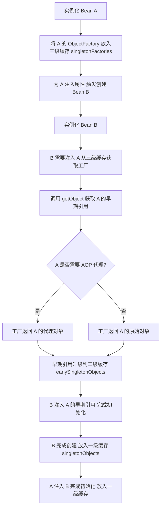
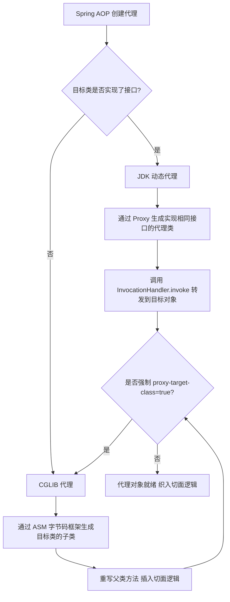

---
title: Spring 面试
date: 2018-08-02 17:33:32
categories:
  - Java
  - 框架
  - Spring
tags:
  - Java
  - 框架
  - Spring
  - 面试
permalink: /pages/570851bb/
---

# Spring 面试

## 综合

### 【简单】什么是 Spring？⭐⭐

- Spring 是一个开源企业级 **Java 开发框架**，旨在**简化复杂应用的构建**。
- 它是**轻量级**、**松散耦合**的。
- 它具有**分层体系结构**，允许用户选择组件，同时还为 J2EE 应用程序开发提供了一个有凝聚力的框架。
- 它**可以集成其他框**架，如 Structs、Hibernate、EJB 等，所以又称为框架的框架。

### 【简单】Spring 有哪些优点？⭐⭐

Spring 的核心优点在于其非侵入式设计、强大的**解耦**能力以及**完整的生态体系**。具体来说：

- **轻量级与低侵入**：Spring 的 API 不会侵入业务代码，应用组件无需实现框架特定接口，易于替换和测试。
- **IoC 容器解耦**：通过控制反转（IoC）管理对象依赖，降低组件间的耦合度，提升代码的可维护性和可扩展性。
- **AOP 支持**：面向切面编程将日志、事务等通用功能与业务逻辑分离，实现横切关注点的模块化复用。
- **声明式事务**：通过注解或 XML 配置即可管理事务，摆脱复杂的事务 API 编码。
- **生态丰富**：无缝集成持久层框架（MyBatis/Hibernate）、安全框架（Spring Security）、微服务套件（Spring Cloud）等，覆盖企业开发全场景。
- **测试友好**：依赖注入使单元测试和集成测试更加便捷，支持 Mock 对象和测试上下文框架。
- **模块化分层**：按需引入模块（如 Web、数据访问、消息），避免臃肿依赖。

这些优点使 Spring 成为 Java 企业级开发的事实标准，既能简化开发，又能保障架构的灵活性和稳定性。

### 【中等】Spring 有哪些模块？⭐


Spring 的核心模块主要包括以下部分：

- **Core Container 模块**
  - **Spring Core**：提供控制反转（IoC）和依赖注入（DI）功能，是 Spring 框架的基础。
  - **Spring Beans**：管理 Bean 的生命周期和依赖关系，提供 BeanFactory，用于创建和管理对象。
  - **Spring Context**：建立在 Core 和 Beans 模块之上，提供配置、国际化、事件传播等功能。
  - **Spring Expression Language（SpEL）**：支持运行时查询和操作对象图的表达式语言。
- **AOP 模块**
  - **Spring AOP**：提供面向切面编程的支持，实现横切关注点的模块化，如日志、事务管理。
  - **Aspects**：与 AspectJ 集成，提供更强大的 AOP 功能。
- **数据访问/集成模块**
  - **Spring JDBC**：简化 JDBC 操作，提供异常处理和资源管理。
  - **Spring ORM**：集成主流 ORM 框架，如 Hibernate、JPA，提供统一的 DAO 支持。
  - **Spring Transactions**：提供声明式和编程式事务管理，确保数据一致性。
- **Web 模块**
  - **Spring Web**：提供 Web 应用程序开发的基础功能，如多部分文件上传。
  - **Spring MVC**：基于 MVC 设计模式的 Web 框架，支持灵活的视图技术。
  - **Spring WebFlux**：响应式编程模型，支持非阻塞式 Web 应用。
- **测试模块**
  - **Spring Test**：提供对单元测试和集成测试的支持，简化测试代码的编写。
- **其他模块**
  - **Spring Instrumentation**：提供类加载器和类植入支持。
  - **Spring Messaging**：支持消息传输，如 STOMP 协议和 WebSocket。

这些核心模块共同构成了 Spring 框架的基础，为开发者提供了全面的解决方案，简化了 Java 应用程序的开发。

### 【简单】Spring 有哪些里程碑版本？⭐⭐

| 版本           | 发布时间 | 核心特性                                                    | 时代意义                                                       |
| :------------- | :------- | :---------------------------------------------------------- | :------------------------------------------------------------- |
| **Spring 1.x** | 2004 年  | IoC 容器、XML 配置、AOP 支持、声明式事务                    | 颠覆 EJB，奠定 Spring 在 Java 企业级开发的基础地位             |
| **Spring 2.x** | 2006 年  | XML Schema 简化配置、注解支持、AspectJ 整合                 | 开启配置简化之路，让开发者从繁琐的 XML 中初步解放              |
| **Spring 3.x** | 2009 年  | Java 配置类、REST API 支持、SpEL 表达式语言                 | 开启 Java 配置时代，适应 Web 2.0 和移动端对 RESTful 服务的需求 |
| **Spring 4.x** | 2013 年  | Java 8 支持、WebSocket、条件化配置                          | 全面拥抱 Java 8，为实时双向通信应用提供支持                    |
| **Spring 5.x** | 2017 年  | 响应式编程、WebFlux 模块、函数式风格                        | 引入响应式编程范式，解决高并发场景下的资源利用率问题           |
| **Spring 6.x** | 2022 年  | Java 17 基线、Jakarta EE 9+、GraalVM 原生镜像、虚拟线程支持 | 拥抱云原生，通过提前编译和虚拟线程实现极致性能优化             |

### 【简单】Spring 和 Spring MVC 之间是什么关系？⭐⭐

- Spring 是基础框架，提供 IoC、AOP 等核心能力；
- Spring MVC 是 Spring 的一个 Web 模块，专门处理 HTTP 请求和视图渲染。
- Spring MVC 依赖 Spring 核心运行，是 Spring 在 Web 层的具体实现。

### 【简单】Spring、SpringBoot、SpringCloud 之间是什么关系？⭐⭐

- Spring 是生态的基石，提供 IoC、AOP 等核心能力；
- Spring Boot 是构建在 Spring 之上的快速开发脚手架，通过自动配置和内嵌服务器简化应用搭建；
- Spring Cloud 是基于 Spring Boot 的微服务治理套件，用于构建分布式系统中的服务发现、配置管理等基础设施。

三者形成递进关系：Spring 做基础，Spring Boot 做单服务，Spring Cloud 做集群。

### 【中等】Spring 中用到了哪些设计模式？⭐⭐

回答设计模式题的关键，是把每个模式落到 Spring 源码的**具体类与方法**上，而不是停留在概念。通用模式定义此处不展开（参见"设计模式面试"专题），以下聚焦 Spring 中的应用位置：

| 设计模式         | Spring 源码落点（类/方法级）                                                                                           | 解决什么问题                      |
| :--------------- | :--------------------------------------------------------------------------------------------------------------------- | :-------------------------------- |
| **工厂模式**     | `BeanFactory`、`ApplicationContext`、`FactoryBean#getObject`、`DefaultListableBeanFactory#createBean`                  | 解耦对象的创建与使用              |
| **单例模式**     | `DefaultSingletonBeanRegistry` 三级缓存（`singletonObjects` 等），Bean 默认 singleton 作用域                           | 容器内全局唯一实例，节省内存      |
| **代理模式**     | `AopProxy` 接口、`JdkDynamicAopProxy`、`ObjenesisCglibAopProxy`、`AbstractAutoProxyCreator#createProxy`                | 控制访问、无侵入增强（事务/日志） |
| **模板方法模式** | `AbstractApplicationContext#refresh()`、`JdbcTemplate`、`RestTemplate`、`AbstractPlatformTransactionManager#commit`    | 固定流程骨架，子类只实现差异步骤  |
| **观察者模式**   | `ApplicationEventPublisher#publishEvent`、`ApplicationListener`、`SimpleApplicationEventMulticaster`                   | 事件驱动解耦组件间通信            |
| **策略模式**     | `Resource`（ClassPath/FileSystem/Url）、`PlatformTransactionManager`（DataSource/JTA）、`HandlerAdapter`、`Scope` 接口 | 算法族可互换，运行时选择          |
| **适配器模式**   | `HandlerAdapter`（适配 Controller/HttpRequestHandler/Servlet）、`AdvisorAdapter`                                       | 让不兼容的接口协同工作            |
| **装饰者模式**   | `HttpServletRequestWrapper`、`BeanWrapper`、`TransactionAwareDataSourceProxy`                                          | 动态增强对象功能而不改其结构      |
| **职责链模式**   | `HandlerExecutionChain`（拦截器链）、`FilterChain`                                                                     | 请求被多个处理器依次处理          |

**组合范例**：`AbstractAutowireCapableBeanFactory#doCreateBean` 一个方法内就组合了工厂（`createBeanInstance`）、单例（注册进 `singletonObjects`）、模板方法（流程骨架）、观察者（`ApplicationListener` 探测）四种模式，这是源码阅读的最佳切入点。

**方案权衡**

- **单例（饿汉）vs 懒加载**：默认 singleton 在 `refresh()` 的 `finishBeanFactoryInitialization` 中一次性创建全部非懒加载单例，启动慢但运行期引用一致；`@Lazy` 推迟到首次 `getBean`，启动快却把依赖错误推迟到运行期暴露。无状态组件用默认单例，重量级且低频使用的 Bean 才考虑懒加载。
- **代理模式的两条路线**：JDK 动态代理基于接口、生成快；CGLIB 基于子类继承、调用快但生成慢约一个数量级。选型细节见"Spring AOP 有哪些实现方式"一题。
- **模板方法 vs 纯策略**：`JdbcTemplate` 用模板方法固定"获取连接 → 执行 → 异常转换 → 释放资源"骨架，用户只写 SQL 回调；若全用策略模式则调用方需自行编排资源释放，易漏关连接。框架选模板方法正是为了"零心智负担"。

**失效/踩坑边界**

- 代理模式失效：CGLIB 无法代理 `final` 类/`final` 方法、`static` 方法，详见"Spring AOP 在哪些场景下会失效"。
- 单例模式陷阱：单例 Bean 内含可变成员变量即并发不安全，Spring 不保证线程安全。
- 工厂模式陷阱：`@Configuration` 配置类若被当作 `@Component` 处理（Lite 模式），`@Bean` 方法互调返回的是新对象而非容器单例，单例语义被破坏。

**踩坑案例（真实生产事故）**

- **现象**：支付系统上线后，`SqlSessionFactory` 相关监控显示同一数据源连接数翻倍，偶发"连接池耗尽"告警。
- **排查**：dump 堆内存发现容器中存在 2 个 `SqlSessionFactory` 实例；顺着引用链定位到一个配置类。
- **根因**：团队把配置类从 `@Configuration` 改成了 `@Component`（为"提速启动"），类内另一个 `@Bean` 方法直接调用 `sqlSessionFactory()` 方法。Lite 模式下这是普通方法调用，每次调用都 new 一个新工厂实例，两个工厂各自持有独立连接池。
- **修复**：恢复 `@Configuration`（Full 模式），`@Bean` 方法调用被 CGLIB 拦截，返回容器中的单例；同时在代码规范中明确禁止随意降级配置类注解。

#### 拓展追问

1. `DefaultSingletonBeanRegistry` 的单例注册为何不直接整个流程加一把大锁？
   三级缓存本身用 `ConcurrentHashMap`，只有跨缓存升级（`getSingleton`）与注册（`addSingleton`）等临界区用 `synchronized(this.singletonObjects)` 保证原子性，锁粒度刻意做小，避免全局串行化拖慢并发 `getBean`。
2. `AbstractApplicationContext#refresh()` 的模板方法骨架里，哪些步骤是留给子类覆写的钩子？
   `refresh()` 固定 12 步骨架，子类主要覆写 `onRefresh()`（如 `ServletWebServerApplicationContext` 在此创建内嵌 Tomcat）与 `finishRefresh()` 等环节，这正是模板方法"父类定流程、子类填差异"的标准用法。
3. `BeanFactory` 与 `FactoryBean` 分别体现了什么模式的组合？
   `BeanFactory` 是工厂模式的顶层抽象（容器即工厂）；`FactoryBean` 是"把复杂对象创建过程模板化"的工厂，如 MyBatis 的 `SqlSessionFactoryBean`，`getObject()` 即模板中的核心步骤，前缀 `&` 可取工厂本身。

#### 场景题

多租户 SaaS 系统，每个租户需要独立的 `DataSource`（独立库、独立账号），且租户数量随业务动态增长。Bean 层面如何设计？用 `FactoryBean` 还是作用域方案？

- **方案分析**：`FactoryBean` 的 beanName 是静态的，一个 `FactoryBean` 对应一个 Bean 定义，无法随租户数动态扩展，不适合本场景。
- **推荐方案**：单例 `AbstractRoutingDataSource` + 租户路由——`determineCurrentLookupKey()` 从 `ThreadLocal` 取当前租户标识，底层目标库 Map 按租户懒加载初始化并加锁防重。
- **强隔离备选**：若租户间要求强隔离（独立连接数配额），可运行时通过 `BeanDefinitionRegistryPostProcessor` 或 `DefaultListableBeanFactory#registerBeanDefinition` 动态注册每租户 `DataSource` Bean。
- **权衡**：路由式方案实现简单、连接总量可控，但租户间共享连接池配置，隔离弱；每租户独立 Bean 隔离强，但 Bean 数与连接数随租户线性增长，需配合租户淘汰策略。

### 【中等】Spring 通知有哪些类型？⭐⭐

Spring AOP 定义了 **5 种通知类型**，通过 `Advice` 接口实现，精确控制切面逻辑在目标方法执行的**哪个时机**介入：

| 通知类型                           | 接口                   | 触发时机                                     | 典型场景                     |
| :--------------------------------- | :--------------------- | :------------------------------------------- | :--------------------------- |
| **前置通知（Before）**             | `MethodBeforeAdvice`   | 目标方法**执行前**触发                       | 参数校验、权限检查、日志记录 |
| **后置返回通知（AfterReturning）** | `AfterReturningAdvice` | 目标方法**正常返回后**触发                   | 结果审计、返回值日志         |
| **后置异常通知（AfterThrowing）**  | `ThrowsAdvice`         | 目标方法**抛出异常后**触发                   | 异常告警、错误日志           |
| **后置最终通知（After）**          | 无对应接口（注解方式） | 目标方法**执行完毕后**触发（无论正常/异常）  | 资源释放，类似 `finally`     |
| **环绕通知（Around）**             | `MethodInterceptor`    | **包裹**目标方法，可控制是否执行、修改返回值 | 性能监控、事务管理、缓存处理 |

**环绕通知**是最强大的通知类型，它能完全控制目标方法的执行流程，包括是否执行、修改参数、修改返回值、处理异常等。在实际开发中使用频率最高。

## Bean

### 【简单】什么是 Spring Bean？⭐⭐

在 Spring 中，构成应用程序主体，由 Spring IoC 容器管理的对象称为 Bean。

**Bean 是由 Spring IoC 容器实例化、装配和管理的对象**。 Bean 以及它们之间的依赖关系反映在容器使用的配置元数据中。

Spring IoC 容器本身，并不能识别配置的元数据。为此，要将这些配置信息转为 Spring 能识别的格式——`BeanDefinition` 对象。

**`BeanDefinition` 是 Spring 中定义 Bean 的配置元信息接口**，它包含：

- Bean 类名
- Bean 行为配置元素，如：作用域、自动绑定的模式、生命周期回调等
- 其他 Bean 引用，也可称为合作者（Collaborators）或依赖（Dependencies）
- 配置设置，如 Bean 属性（Properties）

### 【简单】Spring Bean 注册有几种方式？⭐

Spring Bean 的注册方式主要有以下方式：

- **XML 配置文件**：传统方式，在 XML 中通过 `<bean>` 标签显式定义 Bean 的类名、属性和依赖。
- **注解 + 组件扫描**：使用 `@Component`、`@Service`、`@Repository`、`@Controller` 标注类，并通过 `@ComponentScan` 或 XML `<context:component-scan>` 自动扫描注册。
- **Java 配置类**：在 `@Configuration` 类中通过 `@Bean` 注解方法，方法返回的对象被注册为 Bean。
- **@Import 注解**：导入普通类（自动注册为 Bean）、`@Configuration` 类、或实现 `ImportSelector` / `ImportBeanDefinitionRegistrar` 的类，实现动态注册。

### 【中等】Spring Bean 支持哪些作用域？⭐⭐

Spring Bean 一共有 **6 种**作用域，分为两类：**通用作用域**和 **Web 专用作用域**。

**通用作用域（2 种）**

适用于非 Web 环境的核心场景。

| 作用域                 | 核心特征                                                                            | 适用场景                                         |
| ---------------------- | ----------------------------------------------------------------------------------- | ------------------------------------------------ |
| **singleton** （单例） | **默认作用域**。整个 IoC 容器中只有**一个实例**，所有依赖注入拿到的都是同一个对象。 | 适合**无状态**的 Service、DAO 层组件。           |
| **prototype** （多例） | 每次从容器**获取** Bean 时都会 **new 一个新实例**，容器只负责创建，不负责销毁。     | 适合有**状态**的对象，如用户会话相关的数据封装。 |

**Web 专用作用域（4 种）**

只能在 Spring Web 应用（如 Spring MVC）中使用。

| 作用域          | 核心特征                                         | 生命周期                                                           |
| --------------- | ------------------------------------------------ | ------------------------------------------------------------------ |
| **request**     | 每个 **HTTP 请求**创建一个实例。                 | **请求结束后**销毁。                                               |
| **session**     | 同一个 **HTTP Session** 共享一个实例。           | **Session 失效后**销毁。                                           |
| **application** | 整个 **ServletContext** 生命周期内只有一个实例。 | 比 Singleton 范围更大，**Spring 容器共享**，等同于应用级全局单例。 |
| **websocket**   | 每个 **WebSocket 会话**一个实例。                | **会话关闭时**销毁。                                               |

### 【困难】Spring Bean 的生命周期是怎样的？⭐⭐⭐


生命周期流程由 `AbstractAutowireCapableBeanFactory#doCreateBean` 串起，每个阶段都对应明确的源码方法：

1. **实例化**：`createBeanInstance` 通过构造器或工厂方法生成裸对象（此时仅分配内存，未注入任何依赖）。
2. **提前暴露**：`addSingletonFactory` 把 `ObjectFactory` 放入三级缓存，为循环依赖预留早期引用（详见"Spring 如何解决循环依赖"）。
3. **属性注入**：`populateBean` 完成依赖注入，`@Autowired` 由 `AutowiredAnnotationBeanPostProcessor` 处理，`@Resource` 由 `CommonAnnotationBeanPostProcessor` 处理。
4. **Aware 回调**：`BeanNameAware`、`BeanFactoryAware`、`ApplicationContextAware` 等依次注入容器信息。
5. **初始化前**：`BeanPostProcessor#postProcessBeforeInitialization`，`@PostConstruct` 在此阶段被 `CommonAnnotationBeanPostProcessor` 执行。
6. **初始化**：依次执行 `InitializingBean#afterPropertiesSet` → 自定义 `init-method`（`invokeInitMethods`）。
7. **初始化后**：`BeanPostProcessor#postProcessAfterInitialization`，AOP 代理由 `AbstractAutoProxyCreator#wrapIfNecessary` 在此生成。
8. **就绪使用**：注册进一级缓存 `singletonObjects`，供全局 `getBean` 获取。
9. **销毁**：容器关闭时由 `DisposableBeanAdapter` 依次执行 `@PreDestroy` → `DisposableBean#destroy` → 自定义 `destroy-method`。

**方案权衡**

- **构造器注入 vs setter/字段注入**：构造器注入在步骤 1 就完成依赖装配，依赖不可变且对象出生即完整，但遇到循环依赖直接失败；setter/字段注入在步骤 3 装配，灵活且可被三级缓存解循环依赖，代价是依赖可空可变。Spring 官方推荐：强制依赖用构造器，可选依赖用 setter。
- **@PostConstruct vs InitializingBean vs init-method**：三者执行顺序固定为 `@PostConstruct` → `afterPropertiesSet` → `init-method`。`@PostConstruct` 侵入最低（JSR-250 标准注解）；`InitializingBean` 把业务代码绑死在 Spring 接口上；`init-method` 零侵入但需额外配置。生产首选 `@PostConstruct`。
- **初始化回调抛异常 = fail-fast**：任一步骤抛异常会触发 `destroySingletons` 清理已创建 Bean 并终止启动。这既是保护（带病 Bean 不上线），也是风险（外部依赖抖动会导致启动失败，见场景题）。

**失效场景**

- 构造器循环依赖：步骤 1 尚未完成就要对方实例，三级缓存来不及介入，抛 `BeanCurrentlyInCreationException`。
- prototype Bean：不进单例缓存、不执行销毁回调，`@PreDestroy` 失效。
- `@Async` Bean 参与循环依赖：早期引用与最终代理不一致，Spring 5.x 直接拒绝启动（详见循环依赖一题）。

**踩坑案例（真实生产事故）**

- **现象**：某对账服务滚动发布时新实例反复启动超时被 K8s 杀掉，流量持续压在老实例上告警。
- **排查**：启动日志显示卡在某个 Bean 初始化；jstack 发现主线程阻塞在 `@PostConstruct` 方法内的全表查询。
- **根因**：开发在 `@PostConstruct` 里同步预热全量缓存，数据量增长后慢查询耗时 10 分钟+，超过就绪探针 60s 超时；且初始化回调位于 `postProcessAfterInitialization` 之前，缓存未预热完整个容器无法就绪。
- **修复**：预热逻辑改用 `ApplicationRunner` + 独立线程池异步执行，就绪探针改为检查"容器就绪"而非"缓存就绪"，缓存未热时接口降级走数据库直查。

#### 拓展追问

1. Aware 回调与 `@PostConstruct` 谁先执行？为什么？
   Aware 回调属于"初始化前注入容器信息"阶段，在 `BeanPostProcessor#postProcessBeforeInitialization` 之前执行；`@PostConstruct` 由 `CommonAnnotationBeanPostProcessor` 在前置处理阶段执行，所以 Aware 先于 `@PostConstruct`，顺序由 `AbstractAutowireCapableBeanFactory#initializeBean` 固定。
2. `postProcessAfterInitialization` 返回一个全新对象，容器里存的到底是哪个？
   存的是返回值。AOP 正是利用这一点用代理对象替换原始 Bean；若后置处理器返回原对象则直接注册原对象，`exposeBean`/包装类增强都基于同一机制。
3. 销毁回调在 `kill -9` 时会执行吗？
   不会。销毁回调只在容器正常 `close()`（如注册了 ShutdownHook 收到 SIGTERM）时触发，`kill -9` 直接终止 JVM，`@PreDestroy` 与 `destroy-method` 都不会执行。关键资源清理必须依赖外部机制（如连接池超时回收）兜底。

#### 场景题

某 Bean 初始化时要从远程配置中心拉取开关配置，配置中心偶发抖动 10s+，导致应用启动失败触发滚动发布回滚。如何设计初始化策略？

- **应急处理**：初始化代码加 try-catch 降级为本地默认值，先让应用能启动，恢复后再热更新。
- **根因分析**：初始化回调是 fail-fast 语义，把外部依赖可用性硬耦合进了启动链路；`AbstractApplicationContext#refresh` 中任一 Bean 创建失败都会 `destroySingletons` 全盘回滚。
- **长期方案**：init 方法内实现"重试 N 次 + 降级到本地快照文件"，配置中心改为后台定时拉取刷新；用 `SmartInitializingSingleton` 在所有单例就绪后执行非关键预热，避免阻塞主流程。
- **权衡**：fail-fast 早暴露问题但牺牲启动成功率；降级保活但存在短暂"脏配置"窗口，需配合监控告警与配置版本号校验。

### 【中等】Spring 的单例 Bean 是否有并发安全问题？⭐⭐

Spring 的单例 Bean 本身**并不保证线程安全**，其是否存在并发安全问题取决于 Bean 的内部状态。

- **无状态 Bean**：若 Bean 中没有成员变量，或成员变量是不可变的（如 `final` 常量）、线程安全的（如 `AtomicInteger`、`ConcurrentHashMap`），则多个线程共享此实例是安全的。Controller、Service、DAO 通常设计为无状态，因此安全。
- **有状态 Bean**：若 Bean 包含可变的成员变量（如普通 `int`、`ArrayList`），则多个线程并发读写这些变量会导致数据不一致，存在线程安全问题。

**解决方案**：

1. 将 Bean 作用域改为 `prototype`，每次请求创建新实例（避免共享）。
2. 使用线程安全的容器或同步机制（如 `synchronized`、`Lock`）保护可变状态。
3. 使用 `ThreadLocal` 为每个线程维护独立的变量副本。
4. 尽量设计为无状态 Bean，将状态数据存储在外部（如数据库、缓存）或通过方法参数传递。

**总结**：Spring 单例 Bean 的并发安全问题源于共享的可变状态，而非 Spring 容器本身。

### 【中等】Spring 是如何启动的？⭐⭐

Spring 启动的核心是 IoC 容器的初始化，分为以下关键阶段：

1. **加载配置**：读取 XML、Java Config 或组件扫描，创建 `ApplicationContext`，加载 `BeanDefinition` 元数据。
2. **解析 BeanDefinition**：将配置解析为 Bean 的规格说明（类名、作用域、依赖、初始化方法等），此时未创建对象。
3. **实例化 Bean**：根据 `BeanDefinition` 通过反射创建对象实例（默认实例化所有单例 Bean，懒加载除外）。
4. **依赖注入**：通过构造器、Setter 或字段注入装配依赖。
5. **BeanPostProcessor 前置处理**：调用 `postProcessBeforeInitialization`，AOP 代理在此阶段织入。
6. **初始化回调**：依次执行 `@PostConstruct`、`InitializingBean.afterPropertiesSet()`、自定义 `init-method`。
7. **BeanPostProcessor 后置处理**：调用 `postProcessAfterInitialization`。
8. **容器就绪**：发布 `ContextRefreshedEvent` 事件，应用对外服务。

**注意**：初始化回调位于两个 `BeanPostProcessor` 调用之间，顺序固定。

### 【中等】什么是自动装配？⭐⭐

Spring 的自动装配，就是让容器根据某种规则自动把依赖注入进去，不用手动写 `<property>` 或者 `ref=`。

默认情况下，Spring 容器中未打开注解装配。因此，要使用基于注解装配，我们必须通过配置`<context：annotation-config />` 元素在 Spring 配置文件中启用它。

从 XML 配置的角度，autowire 属性有 4 种取值：

- **no**：默认值，不自动装配，依赖必须显式声明
- **byName**：根据属性名去容器里找同名的 Bean 注入。比如属性叫 userDao，就找 id="userDao" 的 Bean
- **byType**：根据属性类型去容器里找唯一匹配的 Bean 注入。如果找到多个同类型的 Bean 会报错
- **constructor**：跟 byType 类似，但是是通过构造函数参数类型匹配

不过现在主流都用注解方式了，@Autowired 默认按类型装配，配合 @Qualifier 可以指定名称。@Resource 是 JSR-250 规范的，默认按名称装配。

## IoC

### 【中等】什么是 IoC？什么是依赖注入？什么是 Spring IoC？⭐⭐⭐

**控制反转（IoC）**是一种**设计思想**：将对象的**创建、组装、生命周期**的控制权从业务代码反转给**外部容器**——业务代码只声明"我需要什么"，由容器负责"给你什么"，目的是**解耦**。

**依赖注入（DI）**是实现 IoC 的**具体技术**：由容器**动态地**将依赖关系**注入**到对象中（构造器、setter、字段三种方式）。

**Spring IoC 容器**是 Spring 对 IoC/DI 的实现，核心链路（源码定位）：

- **配置元数据** → `BeanDefinition`：Bean 的"图纸"，含类名、作用域、依赖、init/destroy 方法等，由 `BeanDefinitionReader`（XML）、`ClassPathBeanDefinitionScanner`（注解扫描）解析生成。
- **注册中心** → `BeanDefinitionRegistry`：标准实现 `DefaultListableBeanFactory`，内部用 `ConcurrentHashMap<String, BeanDefinition>` 存储全部定义。
- **容器入口** → `ApplicationContext`：`ClassPathXmlApplicationContext`/`AnnotationConfigApplicationContext` 构造时即调用 `AbstractApplicationContext#refresh()` 完成启动。

一言以蔽之：遵循 **IoC** 思想，通过 **DI** 技术实现，而 **Spring IoC 容器**就是最主流的实现载体。


**方案权衡**

- **BeanFactory vs ApplicationContext**：`BeanFactory` 是最小 IoC 容器，默认**懒加载**（首次 `getBean` 才创建）；`ApplicationContext` 在其上叠加事件发布（`ApplicationEventPublisher`）、国际化（`MessageSource`）、环境抽象（`Environment`）与 AOP 集成，且默认在 `refresh()` 中**预实例化**全部非懒加载单例，启动即暴露配置错误。生产应用一律用 `ApplicationContext`，`BeanFactory` 只在资源极受限或框架内部使用。
- **构造器注入 vs setter vs 字段注入**：构造器注入保证依赖不可变、对象出生即完整、单测可直接 new，但循环依赖会失败；setter/字段注入灵活但依赖可空。Spring 官方推荐：强制依赖构造器、可选依赖 setter、避免字段注入。

**失效/边界场景**

- 单例 Bean 不等于线程安全：容器只保证"唯一实例"，不保证状态安全，有状态 Bean 需自行处理并发。
- 重复创建 `ApplicationContext`：容器不是轻量对象（扫描、实例化、代理创建全量执行），在请求路径里 new 容器会直接压垮内存与 GC。
- 容器外 new 的对象不受管理：`@Autowired`、`@Transactional` 等全部失效。

**踩坑案例（真实生产事故）**

- **现象**：某中间件 SDK 所在服务运行数小时后老年代暴涨、Full GC 频繁，最终 OOM。
- **排查**：heap dump 中发现上千个 `ClassPathXmlApplicationContext` 实例存活，每个都持有一整套 CGLIB 代理类与连接池。
- **根因**：SDK 把"new 一个容器获取 Bean"写在了请求处理方法里，每次调用都全量重建容器；容器未调用 `close()`，单例 Bean 持有的连接与缓存永远无法回收。
- **修复**：容器创建移到应用启动阶段作为 static 单例，并注册 ShutdownHook 优雅关闭；确需"每次请求新对象"的场景改用 prototype 作用域，由容器管理生命周期。

#### 拓展追问

1. 为什么 Spring 内部全用 `BeanDefinition` 而不直接存 `Class` 对象？
   `Class` 只表达类型，无法承载作用域、懒加载、init/destroy、构造参数、依赖关系等元数据；`BeanDefinition` 是可被 `BeanFactoryPostProcessor` 修改的"图纸"，配置占位符替换、动态改作用域都发生在实例化之前，这正是"先注册后实例化"两阶段设计的价值。
2. `getBean` 首次调用如何保证并发下只创建一个单例？
   `DefaultSingletonBeanRegistry#getSingleton` 先查一级缓存，miss 后对 beanName 加锁（`beforeSingletonCreation` 用 Set 标记创建中状态防重入），创建完成经 `afterSingletonCreation` + `addSingleton` 注册，双重检查保证唯一实例。
3. `BeanFactory` 的能力是不是 `ApplicationContext` 的子集？生产为什么不直接用前者？
   是子集，`ApplicationContext` 继承 `ListableBeanFactory` 等接口拥有全部 `BeanFactory` 能力。但它额外提供事件、资源访问、国际化、环境抽象，且预实例化能在启动期暴露配置错误；`BeanFactory` 的懒加载会把错误推迟到运行期首次调用，生产几乎不用。

#### 场景题

老项目大量 XML 配置，容器启动需 90s（3000+ Bean 全部预实例化），团队想优化启动速度又不敢全量改 `@Lazy`。如何决策？

- **分析**：全量 `@Lazy` 会把依赖错误与初始化异常推迟到运行期首次调用暴露，等于让生产流量当测试，不可取。
- **渐进方案**：① 启动耗时统计（`BeanPostProcessor` 埋点或 Spring Boot Startup Actuator）找出创建最慢的 Top 20 Bean；② 仅对重量级、低频 Bean（如报表引擎、批处理组件）加 `@Lazy`；③ 外部连接初始化（Redis、MQ）改为懒连接或异步预热；④ 拆分不常用模块为独立服务，减小单体容器规模。
- **权衡**：预实例化用启动时间换运行期确定性；懒加载反之。核心原则是把"启动失败"尽量留在启动期暴露，把"启动耗时"尽量移给非关键路径。

### 【中等】Spring 一共有几种注入方式？⭐⭐

依赖注入有如下方式：

| 依赖注入方式        | 配置元数据举例                                     |
| ------------------- | -------------------------------------------------- |
| **构造器注入**      | `<constructor-arg name="user" ref="userBean" />`   |
| **Setter 方法注入** | `<property name="user" ref="userBean"/>`           |
| **字段注入**        | `@Autowired User user;`                            |
| **方法注入**        | `@Autowired public void user(User user) { ... }`   |
| **接口回调注入**    | `class MyBean implements BeanFactoryAware { ... }` |

### 【中等】构造器注入、Setter 注入、字段注入有什么区别？⭐⭐

| 维度            | 构造器注入                                | Setter 注入      | 字段注入     |
| :-------------- | :---------------------------------------- | :--------------- | :----------- |
| **不可变性**    | 支持（`final` 字段）                      | 不支持           | 不支持       |
| **依赖完整性**  | 强（对象创建即完整）                      | 弱（可能未设置） | 弱           |
| **循环依赖**    | 不支持（会报错）                          | 支持             | 支持         |
| **可选依赖**    | 不支持（需 `@Autowired(required=false)`） | 支持             | 支持         |
| **测试友好**    | 好（可直接 new）                          | 中               | 差（需反射） |
| **Spring 推荐** | **推荐**                                  | 推荐             | 不推荐       |

::::tip
**Spring 官方建议**：强制依赖使用构造器注入，可选依赖使用 Setter 注入，避免使用字段注入。构造器注入能保证依赖不可变、对象状态完整，且便于单元测试。
::::

### 【中等】Spring IOC 容器如何初始化？⭐⭐

Spring IoC 容器初始化分为四个核心阶段：

- **加载配置**：加载配置元数据（XML、注解或 Java Config），创建 `ApplicationContext` 实例，调用 `refresh()` 方法启动容器。
- **Bean 注册**：`BeanDefinitionReader` 解析配置，将每个 Bean 的元信息（类名、作用域、依赖等）封装为 `BeanDefinition`，并注册到 `BeanDefinitionRegistry`。此时仅登记“图纸”，未实例化。
- **实例化与依赖注入**：根据 `BeanDefinition` 创建 Bean 实例（单例非懒加载在容器启动时创建）。实例化后，通过构造器、Setter 或字段注入完成依赖装配。
- **初始化**：依次执行 `Aware` 接口回调、`BeanPostProcessor` 前置处理、`@PostConstruct`、`InitializingBean.afterPropertiesSet()`、自定义 `init-method`，最后执行 `BeanPostProcessor` 后置处理，完成 Bean 的初始化。

### 【中等】Spring 自动装配的方式有哪些？⭐

**XML 自动装配模式**（`<bean autowire="">`）：

- `no`：默认，不自动装配，需手动声明依赖。
- `byName`：根据属性名匹配容器中同名的 Bean。
- `byType`：根据属性类型匹配唯一 Bean，存在多个同类型则报错。
- `constructor`：通过构造器参数类型匹配，类似 `byType`。

**主流注解方式**：

- `@Autowired`：Spring 原生，默认按类型装配，可配合 `@Qualifier` 指定名称。
- `@Resource`：JSR-250 规范，默认按名称装配，名称不匹配时降级为类型。

### 【中等】Spring 中的 ObjectFactory 是什么？⭐⭐

`ObjectFactory<T>` 是 Spring 提供的函数式接口，仅含 `T getObject()` 方法，核心作用是**延迟获取 Bean 实例**。

注入 `ObjectFactory<T>` 而非直接注入 `T` 时，容器仅在调用 `getObject()` 时才真正创建或获取 Bean，实现按需加载，**常用于避免提前初始化、解决循环依赖（三级缓存机制）及支持作用域代理**。

### 【简单】BeanFactory 和 ApplicationContext 有什么区别？⭐

在 Spring 中，有两种 IoC 容器：`BeanFactory` 和 `ApplicationContext`。

- `BeanFactory`：**`BeanFactory` 是 Spring 基础 IoC 容器**。`BeanFactory` 提供了 Spring 容器的配置框架和基本功能。
- `ApplicationContext`：**`ApplicationContext` 是具备应用特性的 `BeanFactory` 的子接口**。它还扩展了其他一些接口，以支持更丰富的功能，如：国际化、访问资源、事件机制、更方便的支持 AOP、在 web 应用中指定应用层上下文等。

实际开发中，更推荐使用 `ApplicationContext` 作为 IoC 容器，因为它的功能远多于 `BeanFactory`。

### 【简单】BeanFactory 和 FactoryBean 有什么区别？⭐

**`BeanFactory` 是 Spring 基础 IoC 容器**。

**`FactoryBean` 是创建 Bean 的一种方式**，帮助实现复杂的初始化逻辑。

`FactoryBean` 是一种特殊的 Bean，它本身是一个能生产其他 Bean 的工厂。当在容器中获取 `FactoryBean` 时，默认返回的是其 `getObject()` 方法生产的对象；若想获取 `FactoryBean` 本身，需在 Bean 名前加 `&` 前缀。

**典型应用**：MyBatis 的 `SqlSessionFactoryBean`、Spring AOP 的 `ProxyFactoryBean`。

### 【中等】@Autowired、@Resource、@Inject 有什么区别？⭐⭐

三者都用于依赖注入，但来源和装配策略不同：

| 维度              | `@Autowired`                                             | `@Resource`                    | `@Inject`                            |
| :---------------- | :------------------------------------------------------- | :----------------------------- | :----------------------------------- |
| **来源**          | Spring（`org.springframework.beans.factory.annotation`） | JSR-250（`javax.annotation`）  | JSR-330（`javax.inject`）            |
| **装配方式**      | 默认**按类型**，多个时配合 `@Qualifier` 按名称           | 默认**按名称**，找不到再按类型 | 默认**按类型**，配合 `@Named` 按名称 |
| **适用范围**      | Spring 专属                                              | 标准规范，跨框架通用           | 标准规范，需引入 `javax.inject` 依赖 |
| **支持 required** | 支持 `required = false`                                  | 不支持                         | 不支持                               |
| **推荐**          | Spring 项目首选                                          | 需要解耦 Spring 时使用         | 较少使用                             |

::::tip
**实践建议**：

- Spring 项目中优先使用 `@Autowired`，配合 `@Qualifier` 解决多实例冲突。
- 如果希望减少与 Spring 的耦合，使用 `@Resource`。
- 构造器注入是最佳实践，可以省略注解（Spring 4.3+ 单构造器自动注入）。
  ::::

### 【中等】@Configuration 和 @Component 有什么区别？⭐⭐

两者都能标注一个类为 Spring Bean，但 `@Configuration` 有一个关键特性：**Full 模式**。

| 维度               | `@Configuration`                             | `@Component`                     |
| :----------------- | :------------------------------------------- | :------------------------------- |
| **代理模式**       | Full 模式（`proxyBeanMethods=true`）         | Lite 模式                        |
| **@Bean 方法调用** | 通过 CGLIB 代理，多次调用返回**同一个 Bean** | 直接方法调用，每次返回**新对象** |
| **@Import 语义**   | 作为配置类导入                               | 作为普通 Bean 导入               |
| **性能**           | 略低（需创建代理）                           | 略高                             |
| **适用场景**       | 定义 Bean 间依赖关系的配置类                 | 简单的组件声明                   |

**核心区别示例**：

```java
@Configuration
public class ConfigA {
    @Bean
    public A a() { return new A(b()); } // b() 返回容器中的单例

    @Bean
    public B b() { return new B(); }
}

@Component
public class ConfigB {
    @Bean
    public A a() { return new A(b()); } // b() 每次创建新对象，不是容器中的单例

    @Bean
    public B b() { return new B(); }
}
```

::::info
Spring Boot 2.x+ 推荐在不需要 Bean 间依赖的配置类上使用 `@Configuration(proxyBeanMethods = false)`（Lite 模式），可提升启动速度。
::::

### 【困难】Spring 如何解决循环依赖？⭐⭐⭐

**循环依赖**是指**多个 Bean 相互持有对方的引用，形成一个闭环依赖关系**，导致 Spring 容器在实例化时无法确定创建顺序的问题。

**Spring 采用三级缓存来解决循环依赖**，其关键是：**提前暴露未完全创建完毕的 Bean**。本题聚焦整体机制与缓存流转时序；"为什么一定要三级缓存"的必要性论证（二级缓存为何不够、并发安全）见下一题，此处不重复。

三级缓存（均定义在 `DefaultSingletonBeanRegistry`）：

- **一级缓存（singletonObjects）**：`Map<String, Object>`，成品货架，存放完全初始化、可直接使用的 Bean。
- **二级缓存（earlySingletonObjects）**：`Map<String, Object>`，半成品货架，存放提前暴露的早期引用（可能是代理）。
- **三级缓存（singletonFactories）**：`Map<String, ObjectFactory<?>>`，工厂货架，存放能生产最终引用的工厂 lambda，是机制核心。

**getBean 时序（源码定位）**

以 A 依赖 B、B 依赖 A 为例，入口为 `AbstractBeanFactory#doGetBean`：

1. `doGetBean("A")` → `DefaultSingletonBeanRegistry#getSingleton(beanName, true)` 三级缓存均未命中 → 进入 `createBean` → `AbstractAutowireCapableBeanFactory#doCreateBean`。
2. `createBeanInstance` 实例化 A（裸对象）→ `addSingletonFactory` 把 A 的 `ObjectFactory` 放入**三级缓存**，**提前暴露引用**。
3. `populateBean` 为 A 注入 B → 触发 `doGetBean("B")` → B 同样实例化后进入属性注入，需要 A。
4. B 获取 A 时再走 `getSingleton("A", true)`：一级、二级未命中，从**三级缓存**取到工厂并调用 `ObjectFactory#getObject`，内部由 `AbstractAutoProxyCreator#getEarlyBeanReference` 决定返回原始对象还是提前生成的代理。
5. 得到的早期引用放入**二级缓存**并移除三级缓存条目（`getSingleton` 内的升级逻辑），注入给 B，B 完成初始化进入**一级缓存**。
6. 回到 A 的 `populateBean`，注入已就绪的 B，A 完成初始化；若 A 已被提前代理（二级缓存有代理），`initializeBean` 不再重复创建代理，最终 `addSingleton` 注册进一级缓存。



**方案权衡**

- **三级缓存提前暴露 vs @Lazy 注入**：三级缓存是容器自动机制，对业务无感但仅支持 singleton + setter/字段注入；`@Lazy` 在注入点生成懒加载代理，首次调用才真正 getBean，可破解构造器循环依赖，代价是错误从启动期推迟到运行期。构造器循环依赖优先用 `@Lazy` 止血，再重构消除循环。
- **setter 注入 vs 构造器注入**：三级缓存的前提是"实例化与属性注入分离"，构造器注入把两者合并，机制天然失效。

**失效场景（三级缓存解决不了的情况）**

- **构造器循环依赖**：实例化 A 就要 B，B 实例化又要 A，三级缓存还没机会放入工厂，抛 `BeanCurrentlyInCreationException`。
- **prototype 循环依赖**：prototype 不进任何缓存、不提前暴露，直接抛 `BeanCurrentlyInCreationException`。
- **@Async Bean 循环依赖**：`AsyncAnnotationBeanPostProcessor` 的代理在初始化后才创建且不走 `getEarlyBeanReference` 提前暴露路径，注入的早期引用与最终代理不一致，Spring 5.x 启动直接报错。

**踩坑案例（真实生产事故）**

- **现象**：某服务上线后启动失败，报错 `BeanCurrentlyInCreationException: Bean with name 'xxxService' has been injected into other beans in its raw version`。
- **排查**：变更只有给某个方法加了 `@Async`；回滚该提交即恢复正常。
- **根因**：`@Async` 代理由 `AsyncAnnotationBeanPostProcessor` 在初始化后置阶段创建，不走 `getEarlyBeanReference` 的提前暴露路径。该 Bean 与另一个 Bean 存在 setter 循环依赖，依赖方拿到的是早期原始引用，最终容器里的却是代理对象，一致性校验失败。
- **修复**：短期去掉 `@Async` 并把异步逻辑拆到无循环依赖的独立组件；长期消除循环依赖本身（改事件驱动）。

#### 拓展追问

1. `getSingleton` 的两个重载分别做什么？
   `getSingleton(String)` 内部委托 `getSingleton(beanName, true)`，只查缓存；带 `ObjectFactory` 参数的重载在缓存 miss 时调用工厂创建 Bean，创建前后分别执行 `beforeSingletonCreation`/`afterSingletonCreation` 维护创建中标记，最终 `addSingleton` 注册。时序是理解循环依赖的主线。
2. `addSingletonFactory` 的调用时机为什么必须在 `populateBean` 之前？
   因为它位于 `doCreateBean` 中实例化之后、属性注入之前。只有先暴露工厂，注入属性触发对方创建时，对方才能反向取到本 Bean 的早期引用；若放到注入之后，循环已死锁无解。
3. prototype Bean 为什么无法解循环依赖？
   prototype 不注册进三级缓存、每次 `getBean` 都新建实例，反向依赖永远拿不到早期引用，创建链无限递归，Spring 检测到创建中标记重复后直接抛 `BeanCurrentlyInCreationException`。

#### 场景题

订单服务、库存服务、通知服务在同一个应用内形成 A→B→C→A 的三方循环依赖，每次重构都可能触发启动失败。如何根治？

- **应急处理**：在环中任一注入点加 `@Lazy`，注入懒加载代理让启动先恢复，把真正的创建推迟到首次调用。
- **根因分析**：三方相互引用说明模块边界划分错误，服务之间双向耦合、职责未单向流动；三级缓存只能救 setter/字段注入的两方循环，且 `@Async`、AOP 提前代理等场景仍可能翻车。
- **长期方案**：把依赖方向梳理成单向分层；C→A 的反向调用改为事件发布（`ApplicationEventPublisher` 或 MQ），A 只监听事件不被 C 直接依赖；用 ArchUnit 等架构测试在 CI 中禁止包级循环依赖复发。
- **权衡**：`@Lazy` 是最快止血但掩盖设计问题；事件化解耦彻底但引入异步复杂度（需考虑消息丢失与幂等）；架构测试有一次性成本但长期守护架构约束。

### 【困难】Spring 解决循环依赖为什么一定要用三级缓存？⭐⭐⭐

选择**三级缓存**而非二级缓存，主要出于 **AOP 代理**的考虑，而非单纯解决循环依赖。本题聚焦必要性论证；三级缓存的流转时序见上一题，此处不重复。

**二级缓存为何不够**

- 若只有二级缓存（实例化后立即放入早期对象），要注入代理就必须在**实例化后立即创建代理**。这违背了 Spring "代理在 `postProcessAfterInitialization` 初始化完成后才创建"的设计原则，且每个 Bean 都要无条件付出代理创建开销。
- 若实例化后放入原始对象，发生循环依赖时注入的就是原始对象而非代理，与最终注册进容器的代理对象不一致，依赖方行为不可预期。

**三级缓存的优势：getEarlyBeanReference 的懒生成**

- 三级缓存存的是 `ObjectFactory`，只有**真正发生循环依赖被引用时**才调用工厂，经由 `SmartInstantiationAwareBeanPostProcessor#getEarlyBeanReference`（`AbstractAutoProxyCreator` 实现）判断是否需要提前创建代理——**不需要代理的 Bean 零开销，需要代理的 Bean 也只提前创建一次**。
- `AbstractAutoProxyCreator` 用 `earlyProxyReferences` 记录已提前代理的 Bean，`postProcessAfterInitialization` 阶段不会重复包装，保证容器里最终只有一份代理。

**并发安全**

- `DefaultSingletonBeanRegistry#getSingleton` 对 `singletonObjects` 加锁保证跨缓存升级（三级→二级→一级）的原子性，同一 Bean 的工厂只会被执行一次。
- 二级缓存的存在保证了多个依赖方并发获取同一个早期引用时，拿到的是**同一实例**（`earlySingletonObjects` 命中后直接返回），而不是各自调工厂生成不同对象。

**方案权衡**

| 方案                         | 优点                                       | 代价/边界                                          |
| :--------------------------- | :----------------------------------------- | :------------------------------------------------- |
| 三级缓存（工厂懒生成）       | 无循环依赖时零开销，代理时机正确，并发安全 | 实现复杂，仅支持 singleton + setter/字段注入       |
| 二级缓存（实例化后立即代理） | 实现简单                                   | 每个 Bean 无条件创建代理，违背代理时机设计，开销大 |
| `@Lazy` 注入                 | 使用简单，能救构造器循环依赖               | 错误推迟到运行期，每个注入点手动标注               |
| 重构消除循环依赖             | 根治设计问题                               | 有重构成本，短期不可行时先用前两种止血             |

**失效场景（即便有三级缓存也解决不了）**

- `@Async` 代理不走 `getEarlyBeanReference` 路径，早期引用与最终代理不一致，启动直接失败（案例见上一题）。
- 构造器注入循环依赖：三级缓存来不及介入。
- prototype 作用域：不进入任何缓存。

**踩坑案例（真实生产事故）**

- **现象**：某服务偶发启动失败，报 `BeanCurrentlyInCreationException`，重启后大概率自愈，难以复现。
- **排查**：对比失败与成功的启动日志，发现失败时某个 Bean 的创建顺序异常靠前；进一步定位到一段"预热代码"在监听 `ContextRefreshedEvent` 之前就调用了 `ApplicationContext#getBean`。
- **根因**：外部代码在启动线程外提前触发 `getBean`，此时目标 Bean 正处于循环依赖创建中（`singletonsCurrentlyInCreation` 标记已存在），`getSingleton` 一致性检查判定早期引用与最终对象冲突直接报错；启动顺序的线程竞争导致偶发。
- **应急处理**：重启重试可恢复（概率性自愈）。
- **修复**：把预热逻辑从启动早期移到 `ApplicationRunner`（容器完全就绪后执行），并规定禁止在容器 refresh 完成前手动 `getBean`。

#### 拓展追问

1. `getEarlyBeanReference` 如何保证代理只创建一次？
   `AbstractAutoProxyCreator` 用 `earlyProxyReferences`（ConcurrentHashMap 支撑的 Set）记录 beanName；后置处理阶段 `wrapIfNecessary` 发现该 Bean 已提前代理过，直接返回原对象不再二次包装，全程对同一 Bean 只生成一份代理。
2. 没有发生循环依赖的普通 Bean，三级缓存中的工厂会被执行吗？
   不会。工厂随 `addSingletonFactory` 放入，`registerSingleton` 时会从三级、二级缓存清理；`ObjectFactory#getObject` 只在被他人提前引用时触发，正常流程下工厂从未执行、直接丢弃，所以"三级缓存"对无循环依赖的 Bean 几乎零成本。
3. 如果我自己实现一个"二级缓存 + 懒代理标志"，能替代三级缓存吗？
   功能上等价，但等于把"是否需要代理"的判断逻辑塞进缓存管理代码；Spring 选择用 `ObjectFactory` 把决策权内聚给工厂，扩展点（`SmartInstantiationAwareBeanPostProcessor`）可自由介入，这是框架设计对扩展性的取舍，而非单纯功能需要。

#### 场景题

代码评审中，有同事提议"把所有相互引用的 Service 都加上 `@Lazy`，预防循环依赖启动失败"。你如何评价这个方案？

- **评价**：不推荐作为预防手段。`@Lazy` 掩盖的是设计问题——相互依赖本身就是坏味道，它只是把问题从启动期推迟到运行期：注入的代理在首次调用时才触发真实创建，若目标 Bean 初始化失败，异常会出现在业务请求链路里而非启动日志。
- **根因分析**：循环依赖的出现意味着职责划分有问题，靠注解"预防"只会让架构腐化得更隐蔽。
- **正确做法**：用 ArchUnit 或 IDE 依赖分析在 CI 中禁止包级循环；真出现循环时通过重构（抽协调者、改事件驱动）解决；`@Lazy` 只作为应急止血手段，且应登记技术债待还。
- **权衡**：预防性 `@Lazy` 看似零成本，实则把架构债转化为运行期隐患；CI 架构守护有一次性建设成本，但长期收益最大。

## AOP

### 【简单】什么是 AOP？⭐⭐⭐

**AOP（面向切面编程）**是一种编程思想，**将与核心业务无关的公共功能（如日志、事务）从业务代码中剥离出来，集中管理和复用**，作为 OOP（面向对象编程）的有效补充。本题聚焦概念与术语；JDK 代理 vs CGLIB 的选型与代理创建逻辑见"Spring AOP 有哪些实现方式"一题。

**为什么需要 AOP？**

解决 **“横切关注点”** 问题，即那些分散在各个模块中的重复性代码（如日志、安全、事务）。目标是：**解耦、避免代码重复、提升可维护性**。换句话说，**AOP 能在不修改原有业务代码的情况下，给程序动态、统一地添加功能**。

**AOP 核心概念**

- **切面（Aspect）**：**“做什么”**。封装公共功能的模块（如日志模块），源码中对应 `@Aspect` 类，被解析为 `Advisor`。
- **切点（Pointcut）**：**“在哪做”**。通过表达式匹配需要切入的具体方法，接口为 `Pointcut`，常用实现 `AspectJExpressionPointcut`。
- **连接点（JoinPoint）**：**“可以做的点”**。程序执行中的节点（如方法调用），是切点的具体实例。Spring AOP 的连接点**只有方法执行**一种。
- **通知（Advice）**：**“何时做”**。定义切面工作的具体时机，5 种类型的接口与触发时机见"Spring 通知有哪些类型"一题。
- **目标对象（Target Object）**：被增强的原始业务对象，对切面逻辑无感知。
- **代理（Proxy）**：Spring 生成的增强对象，接口 `AopProxy`，有接口用 JDK 动态代理、无接口用 CGLIB（详见"实现方式"一题）。
- **织入（Weaving）**：将切面应用到目标对象并生成代理的过程。Spring AOP 采用**运行时织入**（AspectJ 支持编译时、类加载时织入）。

**织入时机（源码定位）**

Spring AOP 的织入发生在 Bean 生命周期的 `postProcessAfterInitialization` 阶段：`AbstractAutoProxyCreator#wrapIfNecessary` 判断 Bean 是否匹配任何 `Advisor`（`Pointcut#matches`），匹配则 `createProxy` 生成代理替换原 Bean。因此：**非 Spring 管理的对象、私有方法、自调用都拦截不到**（详见"AOP 失效场景"一题）。


**方案权衡**

- **Spring AOP（运行时代理）vs AspectJ（编译时/加载时织入）**：Spring AOP 只能拦截 Spring Bean 的 public 方法，但零配置开箱即用；AspectJ 直接修改字节码，可拦截构造器、字段、private 方法且运行期更快，但需要额外编译器或 javaagent。95% 的业务横切（日志/事务/权限）用 Spring AOP 即可。
- **注解式切面 vs XML 配置切面**：`@Aspect` + `@Around` 直观易维护，是现代项目标准；`<aop:config>` 适合对第三方类（无源码）统一增强。

**失效边界**

- Spring AOP 默认只拦截 **public 实例方法**；`private`/`final`/`static` 方法与 `this` 自调用全部绕过代理，完整清单见"Spring AOP 在哪些场景下会失效"。
- 切点表达式不匹配时切面**静默不生效**，不报错不告警，是最隐蔽的坑。

**踩坑案例（真实生产事故）**

- **现象**：新上线的接口耗时监控切面完全不生效，日志里一条记录都没有，而老接口的切面正常。
- **排查**：切面类、`@EnableAspectJAutoProxy` 配置均无问题；用 Arthas 观察发现目标方法调用根本没经过代理类。
- **根因**：切点表达式写成 `execution(* com.xx.service.*.*(..))`，而新接口放在了 `com.xx.service.impl` 子包，表达式只匹配单层包路径，切面静默失配。
- **修复**：改为 `execution(* com.xx.service..*.*(..))` 匹配多层子包，并给监控切面加"启动时打印已绑定 Advisor 数量"的自检日志。

#### 拓展追问

1. 为什么 Spring AOP 默认只拦截 public 方法？
   这是 `AbstractAutoProxyCreator` 配合 AOP Alliance 拦截器的约定：代理对象对外暴露的是接口/类的公共契约，`private` 方法无法被子类重写、`protected` 也不在代理调用路径上；要拦截非 public 只能换 AspectJ 字节码织入。
2. 切点表达式 `execution` 与 `within` 的区别是什么？
   `execution` 按方法签名匹配（可精确到参数类型），`within` 只按类型/包匹配、粒度更粗。两者都在容器启动解析 Advisor 时评估绑定，运行时每次调用只判断已绑定的拦截器链，开销极小。
3. 连接点为什么只有方法执行一种，不能拦截字段赋值吗？
   Spring AOP 基于动态代理，代理能介入的只有"方法调用"这一入口；字段访问、构造器执行不经过代理，拦截它们需要 AspectJ 直接改字节码，这也是两者能力边界的根源。

#### 场景题

订单服务要求：所有金额变更操作必须记录审计日志（操作人、前后值），但老代码大量同类内部调用（`this.xxx()`）。切面如何落地？

- **分析**：`this` 自调用不经过代理，纯 `@Aspect` 无法覆盖全部调用链，直接上切面会漏记审计，属于合规风险。
- **应急处理**：梳理调用链，把涉及金额变更的入口收敛到少数几个 public 方法，审计切面只切这些入口；无法收敛的自调用暂时在方法入口手动埋点。
- **根因分析**：老代码职责混杂，金额变更逻辑散落在类内部相互调用，本质是领域操作未被封装为独立可拦截的服务。
- **长期方案**：把金额变更操作抽成独立的 `AccountingService` Bean，所有调用方通过注入调用（必过代理）；切面统一拦截 `AccountingService` 的 public 方法。若必须保留自调用，可开启 `@EnableAspectJAutoProxy(exposeProxy = true)` + `AopContext.currentProxy()`，但侵入性强，不推荐作为主方案。
- **权衡**：拆 Bean 最干净但有重构成本；`AopContext` 方案改动小但代码耦合代理 API；AspectJ 能覆盖自调用但为单一审计需求引入字节码织入，成本收益不成比例。

### 【中等】Spring AOP 有哪些实现方式？⭐⭐⭐

Spring AOP 基于**动态代理**，主要分为两种实现方式。概念与术语见"什么是 AOP"一题，本题聚焦两种代理的选型与 Spring 的代理创建逻辑。

- **JDK 动态代理**

  - **条件**：代理**实现了接口**的类。
  - **原理**：`Proxy.newProxyInstance` 运行时生成实现目标接口的代理类，所有调用转发到 `InvocationHandler#invoke`；Spring 的封装是 `JdkDynamicAopProxy`（同时充当 `InvocationHandler`），内部通过 `ReflectiveMethodInvocation#proceed` 递归执行拦截器链。
  - **限制**：只能代理**接口中定义的方法**。

- **CGLIB 代理**
  - **条件**：代理**未实现接口**的类。
  - **原理**：基于 ASM 字节码框架生成目标类的**子类**，重写方法插入切面逻辑；Spring 的封装是 `ObjenesisCglibAopProxy`，用 Objenesis 绕过构造器创建代理实例，避免父类构造器副作用执行两次。
  - **限制**：无法代理 **`final` 类**、**`final`/`static` 方法**（子类无法重写）。

**选择策略（源码定位）**

决策入口是 `DefaultAopProxyFactory#createAopProxy`：

- `proxyTargetClass=true`（`@EnableAspectJAutoProxy(proxyTargetClass = true)` 或 Spring Boot 2.x+ 默认 `spring.aop.proxy-target-class=true`）→ **强制 CGLIB**。
- 否则目标类无接口 → CGLIB；有接口 → JDK 代理。

**代理创建完整链路**

`AbstractAutoProxyCreator#postProcessAfterInitialization` → `wrapIfNecessary` → 遍历所有 `Advisor`，用 `Pointcut#matches` 判断是否命中 → 命中则 `createProxy` 构建 `ProxyFactory` → `DefaultAopProxyFactory#createAopProxy` 选定实现 → `AopProxy#getProxy` 生成代理注册进容器。

**方案权衡**

| 维度         | JDK 动态代理                        | CGLIB                                                 |
| :----------- | :---------------------------------- | :---------------------------------------------------- |
| **生成速度** | 快（反射生成）                      | 慢约一个数量级（ASM 生成字节码）                      |
| **调用性能** | JDK 8 前略慢，之后与 CGLIB 基本持平 | 快（FastClass 索引调用）                              |
| **能力边界** | 仅限接口方法                        | 所有非 final 实例方法                                 |
| **适用边界** | 接口稳定、面向接口编程的项目        | 无接口、或按实现类注入的项目（Spring Boot 2.x+ 默认） |

**失效场景**

- `final` 方法：CGLIB 子类无法重写，调用不经过拦截器，切面**静默失效**（不报错）。
- JDK 代理下按实现类注入：代理只实现接口，注入具体类字段会抛 `BeanNotOfRequiredTypeException`/`ClassCastException`。
- `static` 方法：不属于实例调用，两种代理都拦不到。

**踩坑案例（真实生产事故）**

- **现象**：订单服务升级 Spring Boot 版本后灰度机器频繁报 `ClassCastException: com.xx.OrderService$$EnhancerBySpringCGLIB cannot be cast...`，未灰度机器正常。
- **排查**：对比配置发现新版默认开启了 `proxy-target-class=true`（CGLIB），而部分老代码存在 `@Autowired private OrderServiceImpl orderService` 按实现类注入，同时 JDK/CGLIB 开关在多个模块配置不一致。
- **根因**：代理类型开关不一致导致部分实例是 JDK 代理（只实现接口），按实现类注入的字段拿到代理时类型不匹配；CGLIB 代理本身是 `OrderServiceImpl` 子类不会报错，混用才是事故根源。
- **修复**：全应用统一 `spring.aop.proxy-target-class=true`（与 Boot 默认对齐），同时把所有按实现类注入改为按接口注入，并加代码规范检查。



#### 拓展追问

1. JDK 代理中 `InvocationHandler` 拿到的是什么？方法怎么执行到目标对象？
   Spring 传入的是 `JdkDynamicAopProxy` 自身，`invoke` 内把调用封装为 `ReflectiveMethodInvocation`，按顺序递归执行拦截器链（事务、日志等 Advisor），链尾才反射调用目标方法；这就是"责任链 + 代理"的组合。
2. 为什么 Spring Boot 2.x 默认 `proxyTargetClass=true`？
   避免"按实现类注入"时 JDK 代理类型不匹配报错，同时统一代理行为减少环境差异；代价是启动时 CGLIB 生成代理类略慢，对绝大多数应用可忽略。
3. `ObjenesisCglibAopProxy` 和普通 CGLIB 代理有什么区别？
   普通 CGLIB `newInstance` 会执行目标类构造器，若构造器有副作用（注册、写缓存）会被执行两次；Objenesis 通过 JVM 机制直接分配对象内存绕过构造器，Spring 默认使用它。

#### 场景题

需要给一个第三方 jar 包中的类（无接口、不可改源码）增加方法耗时监控，如何选型？

- **分析**：无接口、无源码，JDK 代理直接排除；若类非 final，可注册为 Bean 后用 CGLIB 子类代理 + `@Around` 切面实现。
- **受限情况**：若第三方类是 `final` 或目标方法是 `final`，CGLIB 也无法拦截，AOP 方案整体不可行。
- **备选方案**：① 用 javaagent（ByteBuddy/AspectJ 加载时织入）在类加载阶段改字节码，覆盖 final 之外的所有场景；② 自建包装类（委托模式），在包装层手动加监控代码，稳定但需维护样板代码。
- **权衡**：CGLIB 零侵入但受 final 限制；agent 方案覆盖最全但引入启动参数与运维复杂度；包装类最稳但有手写成本。生产上优先验证目标类是否 final，非 final 直接 CGLIB，否则评估 agent 成本。

### 【中等】Spring AOP 和 AspectJ 有什么区别？⭐⭐

Spring AOP 与 AspectJ 定位截然不同：

- Spring AOP 是 Spring 内置的轻量级实现，依赖运行时代理（JDK 或 CGLIB），仅能拦截 Spring 容器中 Bean 的公共方法，简单易用；
- AspectJ 是完整的 AOP 框架，支持编译时/类加载时/运行时织入，通过字节码操作可拦截构造器、字段、静态方法等，切点表达式更强大，性能更优但配置复杂。

核心差异速记：

- 织入时机：Spring AOP 仅运行时；AspectJ 支持编译时/类加载时/运行时。
- 实现方式：Spring AOP 为动态代理；AspectJ 为直接修改字节码。
- 拦截范围：Spring AOP 仅方法；AspectJ 涵盖构造器、字段、静态方法等。
- 使用门槛：Spring AOP 开箱即用；AspectJ 需额外编译器或 agent。

选型建议：绝大多数业务场景 Spring AOP 足够，仅在需要拦截非 Spring Bean、构造函数，或对极致性能有要求时才考虑 AspectJ。

### 【中等】Spring AOP 在哪些场景下会失效？⭐⭐⭐

Spring AOP 基于动态代理实现，失效的本质是**调用未经过代理对象**或**代理无法拦截该方法**。常见场景如下：

1. **同类内部调用（自调用）**：通过 `this.method()` 调用切面方法，走的是原始对象而非代理对象。解决：注入自身 Bean、`AopContext.currentProxy()` 或拆分到另一个 Bean。
2. **非 public 方法**：Spring AOP 仅对 public 方法生效。
3. **private / final / static 方法**：CGLIB 基于子类继承，无法重写 private/final 方法，static 方法不属于实例调用。
4. **对象非 Spring 管理**：手动 `new` 出来的对象没有代理。
5. **代理类型不匹配**：目标类实现了接口且使用 JDK 代理时，通过接口引用调用接口未声明的方法会失败。
6. **异常被吞掉**：方法内部捕获异常后未抛出，`@AfterThrowing` 无法感知。
7. **切点表达式不匹配**：Pointcut 未命中目标方法，或包路径扫描不到切面类。
8. **未开启代理支持**：缺少 `@EnableAspectJAutoProxy` 或对应 Starter。

一句话总结：AOP 失效十有八九是“调用绕过了代理”或“方法无法被子类重写”，自调用是最高频的坑。

### 【中等】Spring 拦截链如何实现？⭐⭐

Spring 拦截链本质是将多个拦截器串联成链（职责链模式），依次处理请求，实现日志、权限、事务等横切关注点，避免侵入业务代码。

Spring 有三种主要的拦截方式：

- **Filter（过滤器）**：基于 Servlet API，在请求进入 Spring MVC 之前就能拦截，能拦截所有进出容器的请求、包括静态资源、JSP 等。适合做编码转换、跨域处理、安全过滤这类底层操作。
- **HandlerInterceptor（拦截器）**：Spring MVC 层面的拦截，只能拦截经过 DispatcherServlet 的请求。通过 `preHandle`、`postHandle`、`afterCompletion` 三个方法，分别在 Controller 执行前后、请求完成后进行处理。
- **AOP 切面**：方法级别的拦截，通过 `@Before`、`@After`、`@Around` 等注解，精确控制在目标方法执行前后切入。

一个请求从进入到返回，完整的执行流程是这样的：

- **进入**：请求到达 Servlet 容器，**Filter 链**按 order 从小到大依次执行 `doFilter()` 的前半段。
- **路由**：进入 DispatcherServlet，根据 URL 找到 Handler。
- **前置拦截**：**Interceptor** 按**顺序**执行 `preHandle` 方法。
- **业务执行**：若所有 `preHandle` 返回 true，执行 Controller 方法。
- **后置处理**：Controller 返回后，**倒序**执行 Interceptor 的 `postHandle` 方法。
- **视图渲染**：完成视图渲染后，**倒序**执行 Interceptor 的 `afterCompletion` 方法。
- **退出**：响应返回时，**倒序**执行 Filter 链的后半段。

## 事件

### 【中等】Spring 事件机制是什么？⭐⭐

Spring 事件机制是基于**观察者模式**实现的**事件驱动**编程模型，用于实现**组件间的解耦通信**。当某个组件完成一项操作后，可以通过发布事件通知其他感兴趣的组件，而无需关心谁在监听。

**核心组件**

| 组件                         | 接口/类                     | 职责                                                             |
| :--------------------------- | :-------------------------- | :--------------------------------------------------------------- |
| **事件（ApplicationEvent）** | `ApplicationEvent`          | 事件的载体，包含事件源和时间戳。Spring 4.2+ 支持任意对象作为事件 |
| **事件发布者**               | `ApplicationEventPublisher` | 发布事件，由 `ApplicationContext` 实现                           |
| **事件监听器**               | `ApplicationListener<E>`    | 接收并处理特定类型的事件                                         |

**使用方式**

1. **实现 `ApplicationListener` 接口**（传统方式）

```java
public class MyEventListener implements ApplicationListener<MyEvent> {
    @Override
    public void onApplicationEvent(MyEvent event) {
        // 处理事件
    }
}
```

2. **使用 `@EventListener` 注解**（推荐，Spring 4.2+）

```java
@Component
public class MyEventListener {
    @EventListener
    public void handleMyEvent(MyEvent event) {
        // 处理事件
    }
}
```

3. **发布事件**

```java
@Component
public class MyEventPublisher {
    @Autowired
    private ApplicationEventPublisher publisher;

    public void publish() {
        publisher.publishEvent(new MyEvent(this));
    }
}
```

**Spring 内置事件**

| 事件                    | 触发时机                               |
| :---------------------- | :------------------------------------- |
| `ContextRefreshedEvent` | ApplicationContext 初始化或刷新完成    |
| `ContextStartedEvent`   | ApplicationContext 启动时              |
| `ContextStoppedEvent`   | ApplicationContext 停止时              |
| `ContextClosedEvent`    | ApplicationContext 关闭时              |
| `RequestHandledEvent`   | Spring MVC 请求处理完成（仅 Web 环境） |

**异步事件**：在 `@EventListener` 方法上添加 `@Async`，配合 `@EnableAsync` 即可实现异步事件处理，避免阻塞发布者。

::::tip
默认情况下事件是**同步**执行的，监听器在发布者的线程中运行。`@TransactionalEventListener` 支持在事务的特定阶段（如 `AFTER_COMMIT`）触发监听器，常用于事务提交后异步处理（如发通知、刷新缓存）。
::::

### 【中等】@EventListener 和 ApplicationListener 有什么区别？⭐

| 维度         | `ApplicationListener` 接口 | `@EventListener` 注解                |
| :----------- | :------------------------- | :----------------------------------- |
| **使用方式** | 需实现接口并注册为 Bean    | 标注在任意 public 方法上             |
| **耦合度**   | 强耦合 Spring 接口         | 零侵入，POJO 即可                    |
| **灵活性**   | 一个类只能监听一种事件类型 | 一个方法监听一种，一个类可监听多种   |
| **条件过滤** | 通过泛型指定事件类型       | 支持 `condition` 属性（SpEL 表达式） |
| **推荐**     | Spring 4.2 之前的方式      | **推荐**，更简洁灵活                 |

**示例**：`@EventListener(condition = "#event.source == 'order'")` 可实现条件化监听。

## 扩展点

### 【困难】Spring 有哪些核心扩展点？⭐⭐⭐

Spring 提供了丰富的扩展点，允许开发者在 Bean 生命周期的不同阶段介入处理。按执行时机可分为两大类：

#### BeanFactory 级扩展（容器级）

在所有 Bean 实例化之前执行，用于修改 BeanDefinition。

| 扩展点                                  | 接口                                  | 执行时机                                 | 典型应用                                              |
| :-------------------------------------- | :------------------------------------ | :--------------------------------------- | :---------------------------------------------------- |
| **BeanFactoryPostProcessor**            | `BeanFactoryPostProcessor`            | BeanDefinition 注册完成后、Bean 实例化前 | 修改 Bean 的属性值、覆盖配置                          |
| **BeanDefinitionRegistryPostProcessor** | `BeanDefinitionRegistryPostProcessor` | BeanFactoryPostProcessor 之前            | 动态注册新的 BeanDefinition（如 MyBatis Mapper 扫描） |

#### Bean 级扩展（Bean 级）

针对单个 Bean 的创建过程进行扩展。

| 扩展点                                  | 接口                                   | 执行时机                    | 典型应用                        |
| :-------------------------------------- | :------------------------------------- | :-------------------------- | :------------------------------ |
| **BeanPostProcessor**                   | `BeanPostProcessor`                    | Bean 初始化前后             | AOP 代理生成、`@Autowired` 注入 |
| **InstantiationAwareBeanPostProcessor** | `InstantiationAwareBeanPostProcessor`  | Bean 实例化前后、属性设置前 | 自定义实例化逻辑、控制属性注入  |
| **Aware 接口**                          | `BeanNameAware`, `BeanFactoryAware` 等 | 初始化前                    | 注入容器相关信息                |
| **InitializingBean**                    | `InitializingBean`                     | 属性注入完成后              | 自定义初始化逻辑                |
| **DisposableBean**                      | `DisposableBean`                       | 容器销毁时                  | 自定义销毁逻辑                  |

**扩展点执行顺序**

```
BeanDefinitionRegistryPostProcessor#postProcessBeanDefinitionRegistry
  -> BeanFactoryPostProcessor#postProcessBeanFactory
    -> InstantiationAwareBeanPostProcessor#postProcessBeforeInstantiation
      -> Bean 实例化（构造器）
    -> InstantiationAwareBeanPostProcessor#postProcessAfterInstantiation
    -> InstantiationAwareBeanPostProcessor#postProcessProperties（属性注入）
      -> Aware 接口回调
    -> BeanPostProcessor#postProcessBeforeInitialization
      -> @PostConstruct / InitializingBean#afterPropertiesSet / init-method
    -> BeanPostProcessor#postProcessAfterInitialization（AOP 代理生成）
      -> Bean 就绪
    -> DisposableBean#destroy / destroy-method
```

::::info
**关键点**：`BeanPostProcessor` 是 Spring 最核心的扩展点之一，Spring 内部大量功能都依赖它实现：`@Autowired` 由 `AutowiredAnnotationBeanPostProcessor` 处理，AOP 代理由 `AbstractAutoProxyCreator` 生成。
::::

### 【中等】BeanFactoryPostProcessor 和 BeanPostProcessor 有什么区别？⭐⭐

| 维度              | BeanFactoryPostProcessor            | BeanPostProcessor                         |
| :---------------- | :---------------------------------- | :---------------------------------------- |
| **操作对象**      | BeanDefinition（元数据）            | Bean 实例（已创建的对象）                 |
| **执行时机**      | Bean 实例化**之前**                 | Bean 实例化**之后**（初始化前后）         |
| **作用范围**      | 容器级，对所有 Bean 生效            | Bean 级，针对单个 Bean                    |
| **能否创建 Bean** | 不能，只能修改配置                  | 可以，常用于返回代理对象                  |
| **典型应用**      | 修改属性值、占位符替换、注册新 Bean | AOP 代理、依赖注入、`@PostConstruct` 处理 |

一句话总结：**BeanFactoryPostProcessor 改图纸（BeanDefinition），BeanPostProcessor 改成品（Bean 实例）**。

### 【中等】InitializingBean 和 init-method 有什么区别？⭐

两者都用于自定义 Bean 的初始化逻辑，执行时机相同（属性注入完成后），但使用方式不同：

| 维度         | InitializingBean 接口            | init-method 属性                                            |
| :----------- | :------------------------------- | :---------------------------------------------------------- |
| **使用方式** | 实现 `afterPropertiesSet()` 方法 | XML 配置 `init-method="init"` 或 `@Bean(initMethod="init")` |
| **耦合度**   | 与 Spring 接口耦合               | 零侵入，POJO 即可                                           |
| **调用顺序** | 先于 init-method                 | 后于 InitializingBean                                       |
| **推荐**     | 不推荐（侵入性强）               | **推荐**                                                    |

**完整初始化顺序**：`@PostConstruct` → `InitializingBean#afterPropertiesSet()` → `init-method`。

## 数据

### 【中等】Spring DAO 有哪些异常？⭐⭐


### 【中等】什么是 Spring 的事务管理？⭐⭐

Spring 支持声明式、编程式、注解式定义事务。

Spring 事务定义的属性有：

- **隔离级别**：`DEFAULT`（使用数据库默认），`READ_COMMITTED`，`REPEATABLE_READ` 等
- **传播行为**：`REQUIRED`（默认），`REQUIRES_NEW`，`NESTED`，`SUPPORTS` 等
- **回滚规则**：指定哪些异常触发回滚
- **是否只读**
- **事务超时**

### 【中等】Spring 事务支持哪些隔离级别？⭐

- **default（默认）**：使用数据库默认隔离级别（通常为 read_committed）。
- **read_uncommitted（读未提交）**：可读未提交数据，可能出现脏读、不可重复读、幻读。
- **read_committed（读已提交）**：只读已提交数据，避免脏读，但可能出现不可重复读、幻读。
- **repeatable_read（可重复读）**：保证多次读取结果一致，避免脏读、不可重复读，但可能出现幻读。
- **serializable（可串行化）**：事务串行执行，避免所有并发问题，但性能最低。

### 【中等】Spring 事务支持哪些传播行为？⭐

Spring 事务传播行为共 7 种，定义在 `Propagation` 枚举中。本题聚焦语义与边界；真实业务场景的选型决策见下一题，此处不重复。

| 传播行为             | 当前存在事务                          | 当前无事务                            | 回滚影响范围                                 |
| :------------------- | :------------------------------------ | :------------------------------------ | :------------------------------------------- |
| **REQUIRED**（默认） | 加入当前事务                          | 新建事务                              | 任一方异常整个事务回滚                       |
| **SUPPORTS**         | 加入当前事务                          | 非事务执行                            | 跟随外层                                     |
| **MANDATORY**        | 加入当前事务                          | 抛 `IllegalTransactionStateException` | 跟随外层                                     |
| **REQUIRES_NEW**     | 挂起当前事务，新建独立事务            | 新建事务                              | 仅回滚自己，外层不受影响                     |
| **NOT_SUPPORTED**    | 挂起当前事务，非事务执行              | 非事务执行                            | 无事务可回滚                                 |
| **NEVER**            | 抛 `IllegalTransactionStateException` | 非事务执行                            | 无事务可回滚                                 |
| **NESTED**           | 在当前事务内建保存点（savepoint）     | 新建事务（同 REQUIRED）               | 内层回滚只回到保存点，外层回滚则内层一起回滚 |

**源码定位**

- 枚举定义：`org.springframework.transaction.annotation.Propagation`；解析入口 `TransactionAspectSupport#createTransactionIfNecessary`，内部按传播行为分支调用 `AbstractPlatformTransactionManager#handleExistingTransaction`。
- **挂起/恢复机制**：`REQUIRES_NEW`/`NOT_SUPPORTED` 的"挂起"由 `TransactionSynchronizationManager` 解绑当前线程资源实现，返回 `SuspendedResourcesHolder`，方法结束后恢复——本质是 ThreadLocal 换绑，并非数据库层面的真正挂起。
- **NESTED 实现**：`DataSourceTransactionManager` 通过 JDBC `Connection#setSavepoint` 实现；注意 `JtaTransactionManager` 不支持 NESTED。

**方案权衡（高频三选一对比）**

| 维度           | REQUIRED     | REQUIRES_NEW                         | NESTED                           |
| :------------- | :----------- | :----------------------------------- | :------------------------------- |
| **连接占用**   | 共享外层连接 | 独占新连接（外层连接被挂起但仍占用） | 共享外层连接                     |
| **回滚独立性** | 无，同生共死 | 完全独立                             | 内层可独立回滚，外层回滚连带内层 |
| **底层机制**   | 事务传播     | 挂起 + 新事务                        | JDBC savepoint                   |
| **适用边界**   | 默认选择     | 日志/审计等必须独立提交的操作        | 批量处理中单条失败不影响整体     |

**失效/边界场景**

- **NESTED 不支持**：JTA 事务管理器或不支持 savepoint 的驱动下抛 `NestedTransactionNotSupportedException`；部分连接池对 savepoint 支持也有差异。
- **REQUIRES_NEW 连接放大**：内外层各占一个连接，调用链层层嵌套新事务时连接占用数倍增，高并发下可能耗尽连接池。
- **REQUIRED 的"传染回滚"**：内层抛异常即使被外层 catch，只要内层已把事务标记为 rollback-only（`setRollbackOnly`），外层提交时仍会抛 `UnexpectedRollbackException`——这是最高频的隐蔽坑。
- **传播行为只对"经过代理的调用"生效**：同类内部 `this` 调用不经过 `TransactionInterceptor`，传播行为形同虚设（详见事务失效一题）。

**踩坑案例（真实生产事故）**

- **现象**：运营后台批量导入功能偶发"整批导入全部失败"，而业务预期是"单条失败跳过、其余成功"。
- **排查**：单条处理方法标了 `NESTED`，本地测试正常；生产报错 `NestedTransactionNotSupportedException`。
- **根因**：生产环境接入了 XA 分布式事务，事务管理器是 `JtaTransactionManager`，它不支持嵌套事务（无 savepoint 语义），本地开发用 `DataSourceTransactionManager` 所以未暴露。
- **修复**：批量导入改为"外层无事务 + 单条 `REQUIRES_NEW` 独立提交 + 失败记录入错误表"方案，同时在环境一致性检查中对比本地/生产的事务管理器类型。

#### 拓展追问

1. `REQUIRES_NEW` 的"挂起"在源码层到底挂起了什么？
   `AbstractPlatformTransactionManager#suspend` 调用 `TransactionSynchronizationManager` 解绑当前线程绑定的连接资源与同步器，封装进 `SuspendedResourcesHolder`；数据库连接并未归还连接池，只是从线程上下文摘除，所以外层连接仍被占用。
2. `NESTED` 与 `REQUIRES_NEW` 在外层回滚时表现有何不同？
   NESTED 是外层事务的一部分，外层回滚时保存点内的修改一并回滚；REQUIRES_NEW 已独立提交，外层回滚不影响它。需要"主流程失败则附属操作也撤销"用 NESTED，需要"附属操作无论如何都要落库"用 REQUIRES_NEW。
3. 内层 REQUIRED 方法抛异常被外层 catch 住，为什么外层提交还会报 `UnexpectedRollbackException`？
   内层与外层共享同一物理事务，内层异常时 `AbstractPlatformTransactionManager#processRollback` 会把全局事务标记为 rollback-only；外层 catch 后尝试提交，发现标记已置位，只能回滚并抛 `UnexpectedRollbackException`。要避免就改用 REQUIRES_NEW 隔离，或内层不抛异常而是返回错误码。

#### 场景题

下单主流程（REQUIRED 事务）中调用"发放新人券"子服务，业务要求：发券失败不能回滚订单，但订单回滚时已发的券必须撤销。传播行为与事务边界如何设计？

- **分析**：发券失败不回滚订单 → 发券不能加入订单事务（排除 REQUIRED）；订单回滚要撤销券 → 券不能先独立提交（排除无脑 REQUIRES_NEW）。
- **方案**：发券方法用 `REQUIRES_NEW` 保证自身失败不影响订单；同时在订单事务中注册 `TransactionSynchronization#afterCompletion`（或 `@TransactionalEventListener`），订单回滚时补偿撤销已发的券；券服务自身实现幂等撤销接口。
- **应急处理**：若已上线出问题，先用开关关闭发券链路止血，人工补发/撤销。
- **权衡**：同步撤销简单但补偿也可能失败，需兑底对账任务；更彻底的做法是把发券改为订单提交后异步消费（`AFTER_COMMIT` 触发），从根本上解除事务耦合，代价是引入消息可靠性（重试 + 幂等）问题。

### 【中等】Spring 事务传播行为有什么用？⭐⭐

Spring 事务传播行为用于**定义多个事务方法相互调用时的事务边界控制**，解决“事务如何传递”的问题。七种传播行为的语义定义见上一题，本题聚焦真实业务场景下的选型决策与坑。

**典型业务场景决策表**

| 业务场景                              | 推荐传播行为                        | 决策理由                                                        |
| :------------------------------------ | :---------------------------------- | :-------------------------------------------------------------- |
| 下单 + 扣库存必须同时成功/失败        | REQUIRED                            | 共享事务，任一失败整体回滚                                      |
| 审计日志/操作记录：主流程失败也要留痕 | REQUIRES_NEW                        | 独立提交，不受外层回滚影响                                      |
| 批量导入：单条失败不影响其他          | NESTED 或 外层无事务 + REQUIRES_NEW | NESTED 省连接但受限于 savepoint 支持；REQUIRES_NEW 稳定但占连接 |
| 复杂查询报表：不需要事务开销          | SUPPORTS / NOT_SUPPORTED            | 避免长事务占用连接与锁                                          |
| 工具方法：强制要求调用方已在事务中    | MANDATORY                           | 防误用，无事务快速失败                                          |

**决策要点与坑**

- **审计日志用 REQUIRES_NEW 的注意**：内层异常若向外抛，会打断外层主流程。若审计失败不应影响业务，要么内层自行 catch，要么外层显式处理；反过来，若审计失败必须阻断业务，就让异常上抛。
- **REQUIRES_NEW 异常被外层吞掉**：外层 catch 住内层异常继续执行，内层事务已回滚但外层浑然不觉照常提交，造成"以为写了其实没写"的数据不一致。要么重抛，要么内层返回明确的成功/失败标志。
- **批量导入用 NESTED 的坑**：JTA 事务管理器不支持 savepoint（抛 `NestedTransactionNotSupportedException`）；大量 savepoint 在部分数据库上还有性能开销。更稳的替代：外层方法不开事务，逐条 REQUIRES_NEW + 失败记录入错误表重放。
- **长事务警示**：REQUIRED 默认传播容易把 HTTP 调用、发 MQ 等慢操作卷进事务，连接与行锁被长期占用。耗时操作应移出事务边界（编程式 `TransactionTemplate` 缩小范围）或用 NOT_SUPPORTED 挂起。

**源码定位**

选型是否正确，最终体现在 `TransactionAspectSupport#createTransactionIfNecessary` 的分支走向：加入现有事务（复用 `TransactionStatus`）、挂起后新建（`suspend` + `getTransaction`）、或建保存点（`createSavepoint`）。排查传播行为问题时，断点这三个分支最快。

**踩坑案例（真实生产事故）**

- **现象**：支付系统资损告警：部分订单状态为"支付成功"，但对应积分记录缺失，客服收到用户投诉。
- **排查**：下单方法（REQUIRED）内先扣款再调积分方法（REQUIRES_NEW）。日志显示积分方法曾批量抛超时异常，但下单方法 catch 后只打了 warn 日志继续提交。
- **根因**：积分事务独立回滚，异常被外层吞掉，外层提交成功；代码既没有重抛也没有补偿，积分静默丢失。
- **修复**：① 积分失败记录入补偿表，定时任务重试发放；② 改造为订单提交后异步发放（`@TransactionalEventListener(AFTER_COMMIT)`），彻底解除同步耦合；③ 代码规范：catch REQUIRES_NEW 方法异常必须有显式处理分支（重抛或入补偿），禁止只打日志。

#### 拓展追问

1. 什么时候该用 `NOT_SUPPORTED` 而不是直接不开事务？
   当方法必然运行在某个事务上下文中（如被公共入口包裹），但内部是耗时的查询/外部调用，用 NOT_SUPPORTED 挂起外层事务可避免连接被长时间占用；若调用方本来就没事务，两者效果相同。判断标准是"是否会拖长外层事务"。
2. `MANDATORY` 这种"报错型"传播行为有什么实际价值？
   它是防御性契约：工具方法声明"我必须在事务中被调用"，一旦被无事务上下文误调，启动后第一次调用就快速失败，而不是静默执行导致数据不一致。适合底层资金/账务类方法。
3. 为什么"查询方法用 SUPPORTS"能减少事务开销？
   SUPPORTS 在无事务时以非事务方式执行，不会触发 `DataSourceTransactionManager#doBegin` 的获取连接、关 autoCommit 等开销；若用 REQUIRED 则每次查询都开一个空事务。高并发读接口上这个差异会累积成可观的连接占用。

#### 场景题

某账户转账方法要求：转账记录无论成败必须写入审计表（合规要求），但审计表偶发写入超时会拖慢整个转账链路。事务如何设计？

- **应急处理**：若审计超时已影响转账成功率，先给审计方法加超时控制（`timeout` 属性）+ 失败降级写本地日志，保障主链路。
- **根因分析**：审计与转账在同一事务（REQUIRED）中，审计慢 = 事务慢 = 连接占用久；而合规又要求审计必达，同步写库本身就是脆弱设计。
- **长期方案**：审计方法改 `REQUIRES_NEW` 保证独立提交不受转账回滚影响；审计写失败不阻断转账，失败记录写本地补偿表（与转账事务同库同事务，确保不丢），后台任务重试写入审计表；审计表写入加超时上限防止拖慢。
- **权衡**：REQUIRES_NEW 多占一个连接，转账高峰需评估连接池容量；异步审计彻底解耦但存在"转账成功、审计延迟可见"的窗口，需与合规方确认可接受；补偿表方案兼顾可靠性与性能，代价是多一套重试逻辑与幂等设计。

### 【中等】Spring 事务在什么情况下会失效？⭐

Spring 事务失效的本质分两类：**调用未经过代理**（拦截器根本没执行）与**事务属性/环境配置不当**（拦截器执行了但行为不符合预期）。

**一、代理拦截类失效（源码根因：调用没经过 `TransactionInterceptor`）**

- **同类内部调用（自调用）**：同一类中方法直接调用带事务的方法（`this.method()`），走的是原始对象而非代理。解决：注入自身 Bean、`AopContext.currentProxy()`（需 `exposeProxy=true`）或拆到另一个 Bean。
- **非 public 方法**：`AbstractFallbackTransactionAttributeSource#computeTransactionAttribute` 对非 public 方法直接返回 null，等于无事务。
- **方法被 final 或 static 修饰**：CGLIB 无法重写 final 方法，static 方法不属于实例调用，代理拦不到。
- **Bean 未被 Spring 管理**：手动 new 的对象没有任何代理。

**二、配置/环境类失效**

- **异常类型不匹配**：默认回滚规则在 `RuleTransactionAttribute#rollbackOn`：仅 `RuntimeException` 与 `Error` 回滚，checked 异常需在 `rollbackFor` 中显式指定。
- **异常被捕获**：方法内捕获异常后未重新抛出，`TransactionInterceptor` 感知不到异常，不会回滚。
- **数据库引擎不支持事务**：如 MySQL 的 MyISAM 表，`autoCommit` 直接生效。
- **未正确配置事务管理器**：多数据源时 `@Transactional(transactionManager = "xxx")` 未指定；或缺少 `@EnableTransactionManagement`。
- **传播行为误用**：如预期独立事务却用了默认 REQUIRED，详见"传播行为"相关两题。

**方案权衡**

- **声明式 @Transactional vs 编程式 TransactionTemplate**：声明式方法级边界简单直观，但事务范围容易被无意扩大（慢调用卷入）；编程式可在方法内精确圈定事务代码块，适合"方法内只有一段需要事务"的场景。事务内包含 RPC/发 MQ 等慢操作时，优先考虑编程式缩小边界。
- **全局 rollbackFor = Exception.class vs 逐方法指定**：全局统一能消灭"checked 异常不回滚"这类隐蔽事故，代价是需要团队约定"可恢复异常不抛 checked"的异常体系。金融/账务类项目推荐全局兜底。

**量化提醒**

- 事务超时 `timeout` 默认为 `TransactionDefinition.TIMEOUT_DEFAULT`（值 -1），即不超时，依赖数据库自身设置；长事务务必显式设置。
- `readOnly = true` 只是提示，具体效果由 `PlatformTransactionManager` 实现决定，不保证拒绝写入。

**踩坑案例（真实生产事故·资损）**

- **现象**：对账发现部分退款单状态为"成功"，但退款流水表无记录，差额累计数万元，触发资损告警。
- **排查**：退款方法标了 `@Transactional`，内部调用"写退款流水"后捕获了 `SQLException` 只记日志；回放异常日志发现事故时段确有批量 SQLException（唯一索引冲突）。
- **根因**：异常被 catch 后未重抛，`TransactionInterceptor` 认为方法正常返回，执行了提交——订单状态更新生效，而流水写入实际失败，账实不符。叠加自调用因素：部分路径是 `this` 调用，事务压根未开启。
- **修复**：① catch 后重抛 `RuntimeException` 触发回滚；② 统一 `rollbackFor = Exception.class`；③ 代码扫描规则禁止事务方法内空 catch；④ 关键资金操作增加提交后校验（查流水存在性）。

#### 拓展追问

1. 为什么默认只回滚 `RuntimeException`，这个设计合理吗？
   历史原因是 EJB 规范：unchecked 异常代表"系统错误应回滚"，checked 异常代表"业务可预期错误由调用方决策"。现代实践普遍认为这个默认值容易踩坑，所以多数团队直接约定 `rollbackFor = Exception.class`，用异常类型而非默认规则控制回滚。
2. 自调用失效的三种解法各自代价是什么？
   注入自身（`@Autowired private OrderService self`）最简洁，依赖 Spring 4.3+ 支持自注入；`AopContext.currentProxy()` 需开 `exposeProxy=true` 且代码耦合 AOP API；拆分到另一个 Bean 最干净但有重构成本。优先拆分，次选自注入。
3. 多数据源下忘了指定 `transactionManager` 会怎样？
   默认使用 `@Primary` 标记的事务管理器，事务作用在错误的数据源上：目标库的写操作实际处于 autoCommit 状态逐条提交，回滚时毫无效果——这类失效不报错、不告警，只有对账才能发现，是资损高危区。

#### 场景题

下单方法内先写订单再调外部风控接口（耗时 1-5s，偶发超时），整个方法标了 `@Transactional`。高峰期出现连接池耗尽、下单大面积失败。如何应急与根治？

- **应急处理**：风控调用加超时上限（如 500ms）+ 降级放行，先恢复下单成功率；临时扩容连接池缓解。
- **根因分析**：外部 HTTP 调用被包在事务内，事务持有连接与行锁的时间 = 风控耗时，高峰期连接被长时间占用直接耗尽；这是典型的"长事务"问题，事务边界设计错误。
- **长期方案**：① 风控校验移到事务开启之前（先校验再下单）；② 若必须事务内调用，用 `TransactionTemplate` 把事务范围缩小到纯数据库操作；③ 给事务配 `timeout` 兜底防失控。
- **权衡**：前置风控改动调用顺序，需确认业务允许（风控依赖订单号时可先预生成）；缩小事务范围增加代码复杂度但收益最大；扩连接池只是掩盖问题，调用耗时不解决迟早再爆。

### 【中等】@Transactional 的实现原理是什么？⭐⭐

`@Transactional` 基于 **Spring AOP 动态代理**实现（代理对象的创建机制见"Spring AOP 有哪些实现方式"一题），本题聚焦事务切面的专属链路：

**事务专属链路（源码定位）**

1. **启用与注册**：`@EnableTransactionManagement` 导入 `ProxyTransactionManagementConfiguration`，注册三件套：`BeanFactoryTransactionAttributeSourceAdvisor`（Advisor）、`AnnotationTransactionAttributeSource`（属性解析）、`TransactionInterceptor`（拦截器）。
2. **属性解析**：调用时 `AnnotationTransactionAttributeSource`（继承 `AbstractFallbackTransactionAttributeSource`）解析方法/类上的 `@Transactional`，把传播行为、隔离级别、`rollbackFor`、`timeout`（默认 -1）编译成 `RuleTransactionAttribute`；非 public 方法直接返回 null（这就是失效根因之一）。
3. **拦截执行**：`TransactionInterceptor#invoke` → `TransactionAspectSupport#invokeWithinTransaction`：`createTransactionIfNecessary` 按传播行为决策 → 执行业务 → 正常则 `commitTransactionAfterReturning`，异常则 `completeTransactionAfterThrowing` 按 `rollbackOn` 判断回滚。
4. **事务管理**：`PlatformTransactionManager` 策略接口屏蔽底层差异：JDBC/MyBatis 用 `DataSourceTransactionManager`（`doBegin` 中取连接、关 autoCommit），JTA 用 `JtaTransactionManager`。
5. **资源绑定**：`TransactionSynchronizationManager` 用一组 `ThreadLocal` 把连接绑定到当前线程（`bindResource`），保证同一事务内多个 DAO 复用同一个连接；`registerSynchronization` 注册的回调支撑了 `@TransactionalEventListener` 的 `AFTER_COMMIT` 等阶段。
6. **释放资源**：提交/回滚后恢复 `autoCommit`、解绑线程资源、归还连接。

**关键源码片段**（`TransactionAspectSupport#invokeWithinTransaction` 骨架）：

```java
// 1. 获取事务属性（@Transactional 配置）
TransactionAttributeSource tas = getTransactionAttributeSource();
TransactionAttribute txAttr = tas.getTransactionAttribute(method, targetClass);

// 2. 创建事务（按传播行为决策）
TransactionInfo txInfo = createTransactionIfNecessary(tm, txAttr, joinpointIdentification);

// 3. 执行业务方法
Object retVal = invocation.proceed();

// 4. 正常返回，提交事务
commitTransactionAfterReturning(txInfo);

// 5. 异常时回滚（在 catch 块中）
completeTransactionAfterThrowing(txInfo, ex);
```

**方案权衡**

- **声明式（注解）vs 编程式（TransactionTemplate）**：声明式方法级边界、零侵入，适合绝大多数场景；编程式可在方法内任意位置开合事务，适合"事务内分段控制"（如只把写库段包进事务，发 MQ 排除在外）。两者底层都走 `PlatformTransactionManager`，能力等价。
- **方法级事务 vs 手动控制连接**：手动 JDBC 控制 commit/rollback 最灵活但易错（漏关连接、漏回滚），除非框架层需求否则不用。

**失效场景（本链路特有）**

- `@Transactional` 与 `@Async` 同方法：异步切面把执行切到新线程，而事务上下文绑定在原线程的 `ThreadLocal`，事务失效。
- 多数据源未指定 `transactionManager`：默认取 `@Primary`，事务作用在错误数据源（案例见"事务失效"一题）。
- NESTED 在 JTA 下不支持：`JtaTransactionManager#doGetTransaction` 无 savepoint 能力。
- 异常被吞、自调用等通用失效见"Spring 事务在什么情况下会失效"一题，此处不重复。

**踩坑案例（真实生产事故）**

- **现象**：双数据源项目（订单库 + 结算库）上线后，部分"订单回滚成功"的请求在结算库留下了已提交的流水，对账不平。
- **排查**：结算库写入方法标了 `@Transactional` 但异常栈显示回滚只作用于订单库连接。
- **根因**：方法未指定 `transactionManager`，默认走了 `@Primary` 的订单库事务管理器；结算库连接处于 autoCommit，写入逐条自动提交，订单库回滚时结算库毫无感知。
- **修复**：显式 `@Transactional(transactionManager = "settleTransactionManager")`；跨库一致性要求高的链路评估引入 Seata AT 或改本地消息表最终一致性；多数据源项目代码规范强制要求显式指定事务管理器。

::::info
**事务失效的本质**：所有失效场景都源于代理对象无法拦截方法调用（如 `this` 调用、非 public、final 方法）或事务属性配置不当。
::::

#### 拓展追问

1. `TransactionSynchronizationManager` 如何保证同一事务内多个 DAO 用同一个连接？
   它以数据源为 key，在 `ThreadLocal<Map<Object, Object>>` 中绑定 `ConnectionHolder`；MyBatis 的 `SpringManagedTransaction`、JdbcTemplate 的 `DataSourceUtils#getConnection` 都优先从它取连接，取到则复用，取不到才新建——这是"事务内连接复用"的唯一通道。
2. `@Transactional(readOnly = true)` 底层做了什么？
   `DataSourceTransactionManager#doBegin` 会调 `connection.setReadOnly(true)`，MySQL 驱动可借此路由到从库或跳过部分开销；但它只是"提示"，不强制拒绝写入，写操作误标 readOnly 不会报错，别拿它当防护。
3. 事务提交后才发 MQ，怎么实现？
   注册 `TransactionSynchronization#afterCommit` 回调，或用 `@TransactionalEventListener(phase = AFTER_COMMIT)`；若在事务内直接发，事务回滚时消息已发出，造成消息与数据不一致。

#### 场景题

一个方法需要先写订单库、再写结算库，两个库在不同 `DataSource` 上，要求两者一致。`@Transactional` 能否满足？如何选型？

- **分析**：单个 `@Transactional` 只能绑定一个 `PlatformTransactionManager`，无法同时覆盖两个物理库，本地事务满足不了一致性要求。
- **方案对比**：① JTA/XA（`JtaTransactionManager`）：强一致但性能差、依赖容器支持，且部分云数据库对 XA 支持不佳；② Seata AT 模式：业务侵入小，依赖额外部署 TC 服务端；③ 本地消息表 + 定时重试：订单库事务内写业务表与消息表，后台任务投递到结算服务，结算端幂等消费——实现最终一致性。
- **决策**：互联网业务多数选方案 ③（最终一致性 + 幂等），仅账务级强一致场景评估 XA/Seata。
- **权衡**：XA 强一致但吞吐低且锁定时间长；消息表方案吞吐高但存在一致性延迟窗口，需对账兜底；引入中间件（Seata）则多一套运维组件，团队需评估长期维护成本。

### 【中等】声明式事务和编程式事务有什么区别？⭐

| 维度         | 声明式事务                       | 编程式事务                                                |
| :----------- | :------------------------------- | :-------------------------------------------------------- |
| **使用方式** | `@Transactional` 注解或 XML 配置 | `TransactionTemplate` 或 `PlatformTransactionManager` API |
| **侵入性**   | 低（非侵入）                     | 高（需在代码中显式调用）                                  |
| **灵活性**   | 粒度粗（方法级）                 | 粒度细（可在方法内任意位置控制）                          |
| **可维护性** | 好（配置即可见）                 | 差（事务逻辑混入业务代码）                                |
| **适用场景** | 绝大多数业务场景                 | 需要精细控制事务边界（如部分代码需事务、部分不需要）      |

**编程式事务示例**：

```java
// 方式1：TransactionTemplate
transactionTemplate.execute(status -> {
    // 事务代码
    return result;
});

// 方式2：PlatformTransactionManager
TransactionStatus status = transactionManager.getTransaction(definition);
try {
    // 事务代码
    transactionManager.commit(status);
} catch (Exception e) {
    transactionManager.rollback(status);
}
```

**推荐**：优先使用声明式事务，仅在需要精细控制时使用编程式事务。

### 【中等】Spring 中的 JPA 和 Hibernate 有什么区别？⭐⭐

JPA（Java Persistence API）是 ORM 规范，定义了一套标准接口和注解（如 `EntityManager`、`@Entity`）；Hibernate 是 JPA 的具体实现，也是 Spring 默认集成的 JPA 提供者。在 Spring 中，通常通过 Spring Data JPA 操作 JPA 接口，底层由 Hibernate 执行实际的持久化逻辑。使用 JPA 规范可使代码与具体实现解耦，便于切换；而直接使用 Hibernate 原生 API 则可访问其特有功能（如二级缓存、HQL 扩展）。

## MVC

### 【中等】说下对 Spring MVC 的理解？⭐⭐

Spring MVC 是 Spring 框架的 Web 模块，基于 MVC 分层架构设计：

- **Model**：封装数据模型
- **View**：负责视图渲染（JSP、Thymeleaf 或 JSON）
- **Controller**：处理请求，协调模型与视图

Spring MVC 核心组件为前端控制器 **DispatcherServlet**，它统一接收所有请求，通过注解（如 `@RequestMapping`）映射到具体处理方法，替代传统 Servlet 的繁琐配置，显著降低开发成本。

典型分层结构：

- **Controller 层**：接收 HTTP 请求，调用 Service，返回视图或数据
- **Service 层**：封装业务逻辑与事务控制
- **Repository/DAO 层**：数据持久化操作
- **View 层**：渲染页面或输出 JSON（前后端分离场景）

Spring MVC 的引入使 Web 层关注点分离，代码简洁且易于维护。

### 【困难】Spring MVC 如何工作？⭐⭐⭐

**Spring MVC 的核心是 `DispatcherServlet`，它充当了前端控制器（Front Controller）的模式，是所有请求的统一入口，负责协调各个组件完成请求处理**。


**请求流程（主线源码：`DispatcherServlet#doDispatch`）**

1. **用户请求**：HTTP 请求到达 Servlet 容器，路由到 `DispatcherServlet`（默认映射 `/`）。
2. **HandlerMapping 映射处理器**：`doDispatch` 调 `getHandler` 遍历 `HandlerMapping` 链，主力实现 `RequestMappingHandlerMapping` 在启动时已把 `@RequestMapping` 解析为路由表缓存，返回 `HandlerExecutionChain`（Handler + 拦截器链）。
3. **HandlerAdapter 调用处理器**：`RequestMappingHandlerAdapter` 负责参数解析（`HandlerMethodArgumentResolver`，处理 `@RequestBody`/`@PathVariable` 等）→ 调用 Controller 方法 → 返回值处理（`HandlerMethodReturnValueHandler`）。
4. **拦截器介入**：`preHandle` 顺序执行，`postHandle` 倒序执行（`applyPreHandle`/`applyPostHandle`）。
5. **结果处理**：返回 `ModelAndView` 走 `ViewResolver` 解析视图并渲染；`@ResponseBody` 则由 `HttpMessageConverter`（如 `MappingJackson2HttpMessageConverter`）直接序列化。
6. **异常处理**：任一步骤抛异常由 `processHandlerException` 交给 `HandlerExceptionResolver` 链（`@ExceptionHandler`/`@ControllerAdvice` 由 `ExceptionHandlerExceptionResolver` 处理）。
7. **收尾**：`afterCompletion` 倒序执行，返回响应。

**九大组件初始化（源码定位）**

`DispatcherServlet#onRefresh` 初始化九大策略组件，默认实现类清单写在 `DispatcherServlet.properties`：`HandlerMapping`、`HandlerAdapter`、`HandlerExceptionResolver`、`ViewResolver`、`LocaleResolver`、`ThemeResolver`、`MultipartResolver`、`FlashMapManager` 等。默认懒初始化（首次请求才初始化），可配 `load-on-startup` 提前预热。

```mermaid
graph TD
    A[客户端发送 HTTP 请求] --> B[DispatcherServlet 接收请求]
    B --> C[HandlerMapping 根据 URL 匹配 Handler]
    C --> D[HandlerInterceptor.preHandle 前置拦截]
    D --> E[HandlerAdapter 调用 Controller 执行业务逻辑]
    E --> F{返回值类型?}
    F -->|ModelAndView| G[ViewResolver 解析逻辑视图名]
    G --> H[View 渲染模型数据生成响应]
    F -->|@ResponseBody| I[HttpMessageConverter 直接序列化响应]
    H --> J[HandlerInterceptor.postHandle 后置处理]
    I --> J
    J --> K[HandlerInterceptor.afterCompletion 完成处理]
    K --> L[返回响应给客户端]
```

**方案权衡**

- **Spring MVC vs WebFlux**：MVC 基于 Servlet 一线程一请求，模型简单、生态成熟，适合传统业务与 CPU 密集场景；WebFlux 非阻塞适合高并发 I/O 密集链路（网关、推送）。混用代价大，选型后不轻易切换。
- **DispatcherServlet 懒初始化 vs 预热**：默认首次请求才初始化九大组件（首请求慢）；生产建议配 `load-on-startup=1` 把初始化成本移到启动期。

**失效/边界场景**

- `@RequestBody` 要求 `Content-Type: application/json` 且存在匹配的 `HttpMessageConverter`，否则 415。
- 静态资源被 `DispatcherServlet` 拦截导致 404：需配置静态资源 handler 或调整映射路径。
- 父子容器配置错误（Controller 注册进父容器）：拦截器/切面对其不生效。

**踩坑案例（真实生产事故）**

- **现象**：网关升级后部分 POST 请求偶发 415 Unsupported Media Type，应用日志报 `HttpMediaTypeNotSupportedException`，GET 请求全部正常。
- **排查**：抓取问题请求报文发现 `Content-Type` 头缺失；同一接口直接调应用端口正常，说明问题在链路上游。
- **根因**：新网关在部分重试链路上丢弃了请求头，请求体仍是 JSON 但无 Content-Type，Spring MVC 找不到可匹配的 `HttpMessageConverter` 直接拒绝。
- **修复**：网关修复头部透传；服务端增加全局 `@ControllerAdvice` 把 415 转为带明确提示的 400 响应，并在监控上对 415 状态码设告警（此前无告警，问题隐藏了两天）。

#### 拓展追问

1. `DispatcherServlet` 为什么默认懒初始化？如何提前预热？
   懒初始化把九大组件的创建推迟到首次请求，避免不用 Web 功能的应用白白付出启动成本；代价是第一个请求耗时长。生产通过 `spring.mvc.servlet.load-on-startup=1`（或 `web.xml` 的 load-on-startup）让容器启动时即完成 `onRefresh`。
2. `@ResponseBody` 的序列化链路经过哪些类？
   `RequestResponseBodyMethodProcessor#handleReturnValue` 遍历已注册的 `HttpMessageConverter` 列表，按返回类型与 Accept 头选出可用转换器（通常是 `MappingJackson2HttpMessageConverter`），由其内部 ObjectMapper 写出 JSON；转换器列表顺序决定优先级。
3. HandlerMapping 是启动时建路由还是每次请求匹配？
   `RequestMappingHandlerMapping#afterPropertiesSet` 在启动时扫描全部 `@Controller`，把 `@RequestMapping` 解析为 `RequestMappingInfo` 路由表缓存，运行时只做查表匹配，所以路由数量对请求延迟影响极小。

#### 场景题

接口上线后偶发 404（同版本内部分请求正常），排查思路与长期预防手段是什么？

- **应急处理**：开启 `DispatcherServlet` 的 trace 日志（`org.springframework.web.servlet.DispatcherServlet=TRACE`）观察映射过程；对比 404 请求与正常请求的 URI、方法、头部差异。
- **逐层排查**：① 网关层：路由规则、contextPath、尾斜杠归一化是否丢路径；② 应用层：启动日志确认 `RequestMappingHandlerMapping` 已注册该路由（Mapped "..."）；③ 拦截器：`preHandle` 返回 false 但误返回了 404 而非 401；④ 参数绑定：`@PathVariable` 类型不匹配实际是 400/500，但被全局异常处理器误映射为 404。
- **根因分析**：偶发 404 多数源于路径归一化规则（尾斜杠、大小写、编码）或上游路由配置不一致，而非应用代码本身。
- **长期预防**：网关路由配置纳入 CI 校验；核心接口做 Contract Test 固化路径；对 404 率设监控告警，避免问题隐藏数天。

### 【中等】Spring MVC 有哪些核心组件？⭐⭐

Spring MVC 的核心组件围绕 `DispatcherServlet` 展开工作：

- **`DispatcherServlet`（前端控制器）**：负责接收请求并协调其他组件的工作。
- **`HandlerMapping`（处理映射器）**：根据请求的 URL，将请求映射到对应的处理器。
- **`HandlerAdapter`（处理适配器）**：调用处理器方法，并处理返回结果。
- **`Controller`（处理器）**：处理具体的业务逻辑，生成模型和视图信息。
- **`ViewResolver`（视图解析器）**：将逻辑视图名解析为实际的视图实现。
- **`View`（视图）**：负责将模型数据渲染成最终的响应内容。
- **`HandlerInterceptor`（拦截器）**：在 Controller 执行前后插入自定义逻辑，比如权限校验、日志记录、性能监控。

### 【中等】Spring MVC 中的 Controller 是什么？⭐⭐

Spring MVC 中的 Controller 是控制层组件，负责处理 HTTP 请求并返回响应。

前端控制器 `DispatcherServlet` 拦截请求，通过 `HandlerMapping` 定位到具体 Controller 方法，再由 `HandlerAdapter` 执行，最后处理返回值。

Controller 核心职责与工作方式如下：

- **职责**：接收并解析请求参数，调用 Service 层业务逻辑，将结果封装为 Model 并选择视图渲染，或直接返回数据（如 JSON）。
- **注解标识**：
  - `@Controller`：用于传统 MVC 模式，通常配合视图技术。
  - `@RestController`：组合 `@Controller` 与 `@ResponseBody`，所有方法默认返回数据而非视图，适用于前后端分离。
- **请求映射**：通过 `@RequestMapping` 及其变体（`@GetMapping`、`@PostMapping` 等）将 URL 绑定到处理方法。

### 【中等】Spring MVC 中如何处理表单提交？⭐⭐

- **参数绑定**：方法参数支持多种注解，自动从请求中取值并转换类型：
  - `@RequestParam`：获取请求参数。
  - `@PathVariable`：获取路径变量。
  - `@RequestBody`：绑定请求体（JSON/XML）。
  - `@ModelAttribute`：绑定表单数据到对象。
- **返回值处理**：
  - `String`：逻辑视图名。
  - `ModelAndView`：包含视图名和模型数据。
  - POJO 或 `ResponseEntity`：通过 `HttpMessageConverter` 自动序列化为 JSON/XML。

### 【中等】Spring MVC 中的视图解析器有什么作用？⭐⭐

Spring MVC 中的视图解析器（ViewResolver）用于将控制器返回的逻辑视图名称解析为具体的视图对象（View）。其核心作用是解耦控制器与视图技术，控制器只需返回逻辑名（如 "userList"），无需关心实际渲染使用 JSP、Thymeleaf 还是其他模板。通过配置视图解析器（如设置前缀后缀），可统一管理视图位置并灵活切换视图技术。多个视图解析器可组成链式顺序尝试解析，直至成功。最终由 DispatcherServlet 调用解析出的视图对象渲染响应。

### 【中等】Spring MVC 中的拦截器是什么？如何定义一个拦截器？⭐⭐

Spring MVC 拦截器（`HandlerInterceptor`）是 Spring MVC 层面的请求拦截机制，可在 Controller 方法执行前后插入自定义逻辑，常用于权限校验、日志记录、登录检查等。

**定义方式**：实现 `HandlerInterceptor` 接口或继承 `HandlerInterceptorAdapter`：

```java
public class AuthInterceptor implements HandlerInterceptor {
    @Override
    public boolean preHandle(HttpServletRequest request, HttpServletResponse response, Object handler) {
        // Controller 执行前：返回 true 放行，false 拦截
        return request.getSession().getAttribute("user") != null;
    }

    @Override
    public void postHandle(HttpServletRequest request, HttpServletResponse response,
                           Object handler, ModelAndView modelAndView) {
        // Controller 执行后、视图渲染前
    }

    @Override
    public void afterCompletion(HttpServletRequest request, HttpServletResponse response,
                                Object handler, Exception ex) {
        // 请求完成后（无论正常/异常）
    }
}
```

**注册拦截器**：

```java
@Configuration
public class WebConfig implements WebMvcConfigurer {
    @Override
    public void addInterceptors(InterceptorRegistry registry) {
        registry.addInterceptor(new AuthInterceptor())
                .addPathPatterns("/api/**")
                .excludePathPatterns("/api/login");
    }
}
```

**与 Filter 的区别**：拦截器基于 Spring MVC，能访问 Spring 容器中的 Bean、获取 Handler 信息；Filter 基于 Servlet 规范，拦截粒度更粗，在 Spring MVC 之前执行。

### 【中等】Spring MVC 中的国际化是如何实现？⭐⭐

Spring MVC 国际化基于 `LocaleResolver` 与 `MessageSource` 协作实现：

- **LocaleResolver**：解析用户区域信息（来源可配置为 Session、Cookie 或请求头 Accept-Language）。
- **MessageSource**：根据区域加载对应资源文件（如 messages_en.properties、messages_zh.properties），提供国际化文本。

实现步骤：

1. **定义资源文件**：不同语言分别创建 properties 文件，键相同值不同。
2. **配置 LocaleResolver**：指定区域解析策略（如 SessionLocaleResolver、AcceptHeaderLocaleResolver 等）。
3. **配置 MessageSource**：设置资源文件路径，控制器中通过 `messageSource.getMessage()` 获取国际化文本。

### 【中等】Spring MVC 如何处理异常？⭐⭐

Spring MVC 通过 **HandlerExceptionResolver** 机制集中处理异常，将异常映射为响应。主要方式：

- **局部处理**：`@ExceptionHandler` 注解控制器内方法，仅处理本控制器异常。
- **全局处理**：`@ControllerAdvice` + `@ExceptionHandler` 统一管理所有控制器异常。
- **注解驱动**：`@ResponseStatus` 标注异常类，或抛出 `ResponseStatusException`，指定状态码和原因。
- **容器级别**：实现 `HandlerExceptionResolver` 或配置 `SimpleMappingExceptionResolver`，将异常映射到视图。

**执行优先级**：`@ExceptionHandler`（局部 > 全局） > `@ResponseStatus`/`ResponseStatusException` > 容器级别处理器。

### 【中等】Spring MVC 父子容器是什么知道吗？⭐⭐

Spring MVC 父子容器通过分层隔离实现 Bean 管理：

- **父容器**：由 `ContextLoaderListener` 加载，管理业务层全局 Bean（如 Service、DAO、数据源、事务管理器）。
- **子容器**：每个 `DispatcherServlet` 创建独立子容器，管理 Web 层组件（如 Controller、拦截器、视图解析器）。

**访问规则**：子容器可访问父容器的 Bean，父容器不能访问子容器。这保证了 Controller 能调用 Service，而业务层不依赖 Web 层，实现解耦。

### 【中等】Spring WebFlux 是什么？它与 Spring MVC 有何不同？⭐⭐

Spring WebFlux 是 Spring 5 引入的响应式 Web 框架，基于 Reactor 实现非阻塞 I/O，适用于高并发、I/O 密集型场景。与 Spring MVC 的核心区别：

- **编程模型**：WebFlux 支持响应式（Mono/Flux）与注解控制器；MVC 基于 Servlet API，采用传统命令式编程。
- **线程模型**：WebFlux 使用少量线程处理海量请求（事件循环）；MVC 每个请求独占一个线程。
- **底层运行时**：WebFlux 可运行在 Netty、Undertow 等非 Servlet 容器；MVC 必须依赖 Servlet 容器。
- **适用场景**：WebFlux 适合延迟敏感、高并发的异步链路（如网关）；MVC 适合传统 Web 应用或 CPU 密集型任务。

### 【中等】什么是 Restful 风格的接口？⭐⭐

RESTful 是一种基于 HTTP 协议的软件架构风格，核心思想是将一切视为资源，通过 URI 唯一标识资源，并利用 HTTP 标准方法（GET、POST、PUT、DELETE）对资源进行操作。其设计原则包括无状态通信、统一接口、可缓存性、客户端-服务器分层等。典型特征：使用 JSON/XML 作为数据交换格式，通过 HTTP 状态码表达操作结果，URL 设计清晰且符合资源语义（如 `/users/1` 表示 ID 为 1 的用户）。RESTful 接口简洁、易于扩展，与 Web 架构天然契合，已成为现代 API 设计的主流规范。

## 注解

### 【中等】你用过哪些重要的 Spring 注解？⭐⭐

- **@Controller** - 用于 Spring MVC 项目中的控制器类。
- **@Service** - 用于服务类。
- **@RequestMapping** - 用于在控制器处理程序方法中配置 URI 映射。
- **@ResponseBody** - 用于发送 Object 作为响应，通常用于发送 XML 或 JSON 数据作为响应。
- **@PathVariable** - 用于将动态值从 URI 映射到处理程序方法参数。
- **@Autowired** - 用于在 spring bean 中自动装配依赖项。
- **@Qualifier** - 使用 @Autowired 注解，以避免在存在多个 bean 类型实例时出现混淆。
- **@Scope** - 用于配置 spring bean 的范围。
- **@Configuration**，**@ComponentScan** 和 **@Bean** - 用于基于 java 的配置。
- **@Aspect**，**@Before**，**@After**，**@Around**，**@Pointcut** - 用于切面编程（AOP）。

### 【简单】@Bean 和@Component 有什么区别？⭐⭐

@Bean 用于方法，显式声明一个 Bean 实例，通常用于配置第三方类；

@Component 用于类，通过类路径扫描自动注册为 Bean。

两者最终效果相同，但使用位置和适用场景不同。

### 【简单】@Component, @Controller, @Repository, @Service 有何区别？⭐⭐

- @Component：这将 java 类标记为 bean。它是任何 Spring 管理组件的通用构造型。spring 的组件扫描机制现在可以将其拾取并将其拉入应用程序环境中。
- @Controller：这将一个类标记为 Spring Web MVC 控制器。标有它的 Bean 会自动导入到 IoC 容器中。
- @Service：此注解是组件注解的特化。它不会对 @Component 注解提供任何其他行为。您可以在服务层类中使用 @Service 而不是 @Component，因为它以更好的方式指定了意图。
- @Repository：这个注解是具有类似用途和功能的 @Component 注解的特化。它为 DAO 提供了额外的好处。它将 DAO 导入 IoC 容器，并使未经检查的异常有资格转换为 Spring DataAccessException。

### 【简单】@Autowired 注解有什么用？⭐⭐

@Autowired 是 Spring 的依赖注入注解，用于自动装配 Bean，默认按类型匹配，可配合 @Qualifier 指定名称。

```java
public class Employee {
    private String name;
    @Autowired
    public void setName(String name) {
        this.name=name;
    }
    public string getName(){
        return name;
    }
}
```

### 【简单】@Qualifier 注解有什么作用⭐⭐

@Qualifier 与 @Autowired 配合使用，在存在多个同类型 Bean 时，通过指定 Bean 名称消除歧义，精确注入所需实例。

### 【简单】Spring 中的 @Primary 注解的作用是什么？⭐⭐

@Primary 注解用于在多个相同类型的 Bean 中标识优先注入的 Bean，解决自动装配时的歧义性问题。

### 【简单】Spring 中的 @Value 注解的作用是什么？⭐⭐

@Value 用于将外部配置属性或 SpEL 表达式注入到 Spring Bean 的字段、方法参数或构造函数参数中。

### 【中等】什么是 SpEL？在 Spring 中有哪些常见应用？⭐⭐

**SpEL（Spring Expression Language）**是 Spring 提供的表达式语言，支持在运行时查询和操作对象图，语法以 `#{...}` 包裹，与取配置值的占位符 `${...}` 区分。

**核心能力**

- **字面量与变量引用**：`#{'hello'}`、`#{systemProperties['java.home']}`。
- **属性访问与方法调用**：`#{user.address.city}`、`#{'abc'.toUpperCase()}`。
- **集合操作**：`#{list.?[age > 18]}`（过滤）、`#{list.![name]}`（投影）。
- **运算符与 Elvis 操作符**：`#{score >= 60 ? '及格' : '不及格'}`、`#{name ?: '默认值'}`。
- **引用 Bean 与静态成员**：`#{otherBean.value}`、`#{T(java.lang.Math).PI}`。

**在 Spring 中的典型应用**

| 场景         | 示例                                                   |
| :----------- | :----------------------------------------------------- |
| 注入计算值   | `@Value("#{${app.max} * 2}")`                          |
| 动态缓存键   | `@Cacheable(key = "#userId")`，`#参数名` 引用方法参数  |
| 权限控制     | `@PreAuthorize("hasRole('ADMIN')")`                    |
| 条件事件监听 | `@EventListener(condition = "#event.type == 'ORDER'")` |
| 条件装配     | `@ConditionalOnExpression("${app.enabled}")`           |

一句话总结：SpEL 是贯穿 Spring 注解体系的表达式引擎——`#{}` 算值、`${}` 取值、`#参数名` 引参数，三者不要混淆。

### 【简单】Spring 中的 @Profile 注解的作用是什么？⭐⭐

@Profile 注解用于指定 Bean 或配置类在特定的运行环境（如开发、测试、生产）中生效，实现环境隔离。

### 【简单】Spring 中的 @PostConstruct 和 @PreDestroy 注解的作用是什么？⭐⭐

@PostConstruct 指定 Bean 初始化后执行的方法

@PreDestroy 指定 Bean 销毁前执行的方法

二者都是用于管理 Bean 生命周期中的自定义行为。

### 【简单】Spring 中的 @RequestBody 和 @ResponseBody 注解的作用是什么？⭐⭐

@RequestBody 将 HTTP 请求体反序列化为控制器方法参数

@ResponseBody 将方法返回值直接序列化为 HTTP 响应体。

### 【简单】Spring 中的 @PathVariable 注解的作用是什么？⭐⭐

@PathVariable 用于将 URL 路径中的动态变量绑定到控制器方法的参数上，常用于 RESTful 接口中提取资源标识符。

### 【简单】Spring 中的 @ModelAttribute 注解的作用是什么？⭐⭐

@ModelAttribute 用于将请求参数绑定到模型对象，或向模型中添加公共数据，使其在视图中可用。

### 【简单】Spring 中的 @ExceptionHandler 注解的作用是什么？⭐⭐

@ExceptionHandler 用于标注方法作为特定异常的处理器，在控制器层集中处理异常并返回自定义响应。

### 【简单】Spring 中的 @ResponseStatus 注解的作用是什么？⭐⭐

@ResponseStatus 用于标注异常类或控制器方法，指定抛出异常或成功处理时应返回的 HTTP 状态码及原因，由框架自动设置响应。

### 【简单】Spring 中的 @RequestHeader 和 @CookieValue 注解的作用是什么？⭐⭐

@RequestHeader 将 HTTP 请求头中的值绑定到控制器方法参数

@CookieValue 将 Cookie 中的值绑定到控制器方法参数。

### 【简单】Spring 中的 @SessionAttribute 注解的作用是什么？⭐⭐

@SessionAttribute 用于将当前 HTTP 会话中存储的指定模型属性绑定到控制器方法参数上，方便在请求间共享数据。

### 【简单】Spring 中的 @Validated 和 @Valid 注解有什么区别？⭐⭐

@Valid 和 @Validated 都用于触发参数校验，但主要区别在于：

- **来源**：@Valid 是 Java Bean Validation 规范（JSR-303）的标准注解；@Validated 是 Spring 框架提供的注解，是对 @Valid 的扩展封装。
- **分组校验**：@Validated 支持校验分组（通过 `groups` 属性指定），允许同一对象在不同场景下执行不同校验规则；@Valid 不支持分组。
- **应用位置**：@Valid 可用于字段、方法参数、方法返回值等，支持级联校验；@Validated 只能用在类、方法、方法参数上，不能用于字段，因此无法直接触发级联校验。
- **内部机制**：@Validated 由 Spring 的 MethodValidationPostProcessor 处理，最终仍使用 Validator 实现校验。

**使用场景**：当需要根据操作（如新增、更新）执行不同校验规则时，必须使用 @Validated 配合分组接口。

### 【简单】Spring 中的 @Conditional 注解的作用是什么？⭐⭐

@Conditional 根据指定条件决定是否将 Bean 或配置类注册到 Spring 容器，实现条件化装配。

### 【简单】Spring 中的 @Cacheable 和 @CacheEvict 注解的作用是什么？⭐⭐

@Cacheable 将方法结果存入缓存，后续相同参数调用直接返回缓存值；

@CacheEvict 从缓存中移除指定条目，两者共同实现 Spring 声明式缓存管理。

### 【简单】Spring 中的 @Lazy 注解的作用是什么？⭐⭐

@Lazy 用于延迟 Bean 的初始化或依赖注入，使 Bean 在首次被使用时才创建实例，常用于优化启动性能或解决循环依赖。

### 【简单】Spring 中的 @PropertySource 注解的作用是什么？⭐⭐

@PropertySource 用于加载指定属性文件（如 .properties）中的配置项到 Spring Environment 中，使属性值可通过 @Value 或 Environment 读取。

### 【简单】Spring 中的 @EventListener 注解的作用是什么？⭐⭐

@EventListener 将方法标记为事件监听器，当应用程序发布对应类型的事件时，Spring 容器自动调用该方法进行处理。

### 【简单】Spring 中的 @Scheduled 注解的作用是什么？⭐⭐

@Scheduled 注解用于将方法标记为定时任务，支持固定延迟、固定速率或 Cron 表达式，由 Spring 容器自动调度执行。

### 【简单】@Async 注解的原理是什么？⭐⭐

@Async 注解基于 Spring AOP 代理实现异步执行，核心流程如下：

- **启用与代理**：`@EnableAsync` 开启功能，Spring 为带有 `@Async` 的 Bean 创建代理（JDK 或 CGLIB）。
- **拦截提交**：代理拦截目标方法调用，将其封装为任务提交给 `TaskExecutor` 线程池。
- **返回值处理**：
  - `void`：直接返回，任务异步执行。
  - `Future`：返回 `AsyncResult` 占位符，供后续获取结果。
  - 其他类型：设计上不推荐，行为不可控。
- **异常处理**：调用方无法捕获异步方法内的异常，需自定义 `AsyncUncaughtExceptionHandler` 处理。

**关键点**：

- 同类内部调用（`this.method()`）绕过代理，导致异步失效。
- 默认线程池为 `SimpleAsyncTaskExecutor`，生产环境需自定义。
- 可通过注解指定线程池名称实现隔离。

### 【简单】@Async 什么时候会失效？⭐⭐

@Async 失效常见原因如下：

- **同类内部调用**：直接 `this.method()` 绕过代理，异步不生效。
- **私有方法**：代理无法拦截 `private` 方法。
- **final 或 static 方法**：CGLIB 无法重写 `final`，静态方法不在代理范围。
- **未启用异步**：缺少 `@EnableAsync` 注解。
- **线程池问题**：默认线程池（SimpleAsyncTaskExecutor）不适合生产，或自定义线程池未正确配置。
- **异常未处理**：异步方法内异常不影响调用方，但无处理器则静默丢失。
- **返回值类型错误**：声明 `void` 却需返回结果，或返回类型非 `Future` 导致数据错乱。
- **Bean 未被管理**：手动 `new` 的对象注解不生效。
- **事务传播失效**：异步方法内调用事务方法，事务绑定原线程，无法生效。

### 【简单】@Async 如何避免内部调用失效？⭐⭐

@Async 基于 Spring AOP 代理实现，同一类内部方法直接调用（`this.method()`）会绕过代理，导致异步失效。解决方案如下：

- **使用 AopContext 获取当前代理**：在方法内通过 `((YourService) AopContext.currentProxy()).asyncMethod()` 调用。需在配置类或启动类上添加 `@EnableAspectJAutoProxy(exposeProxy = true)` 开启暴露代理。
- **注入自身 Bean**：在类中通过 `@Autowired` 注入自身实例（`private YourService self;`），使用 `self.asyncMethod()` 调用。
- **拆分异步方法到独立 Bean**：将带有 `@Async` 的方法定义在另一个 Spring 管理的组件中，通过依赖注入调用。
- **编程式获取 Bean**：实现 `ApplicationContextAware` 接口，从容器中获取 Bean 实例进行调用。

推荐使用前两种方式，需注意事务等其他代理机制可能受同样影响。

## 资料

- [面试鸭 - Spring 面试](https://www.mianshiya.com/bank/1797452903309508610)
- [Top 50 Spring Interview Questions You Must Prepare In 2018](https://www.edureka.co/blog/interview-questions/spring-interview-questions/)
- [Spring Interview Questions and Answers](https://www.journaldev.com/2696/spring-interview-questions-and-answers)
