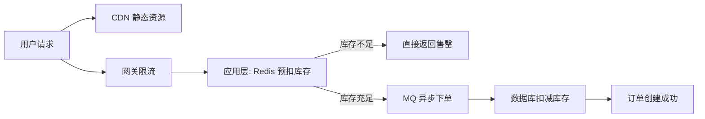

---
title: 系统架构面试
date: 2020-08-10 10:59:18
order: 01
categories:
  - 设计
  - 架构
  - 综合
tags:
  - 架构
  - 面试
permalink: /pages/02d5c17d/
---

# 系统架构面试

::: tip 扩展

- 《System Design Interview》—— Alex Xu
- 《设计数据密集型应用》（DERTA）—— Martin Kleppmann
- [System Design Primer](https://github.com/donnemartin/system-design-primer)

:::

## 系统设计方法论

### 【中等】系统设计面试的通用思路是什么？⭐⭐⭐

**四步法**：

1. **需求澄清（Requirements）**：明确功能需求和非功能需求（性能、可用性、一致性等）。
2. **高层设计（High-Level Design）**：画出核心组件和交互关系的架构图。
3. **深入设计（Deep Dive）**：针对核心组件深入讨论技术选型和细节。
4. **扩展与优化（Scale）**：讨论瓶颈点、扩展方案（水平/垂直扩展、缓存、异步、分片）。

**关键原则**：
- **没有完美设计，只有权衡取舍**：CAP、一致性 vs 可用性、延迟 vs 吞吐量。
- **先做对，再做快，最后做优雅**。
- **量化**：估算 QPS、数据量、带宽，用数字说话。

### 【困难】如何进行容量估算（Back-of-the-Envelope）？⭐⭐⭐

**核心公式**：

| 指标 | 估算方法 |
| :--- | :--- |
| **QPS** | 日 PV / 86400（平均）；峰值 ≈ 平均 × 2~5 |
| **存储量** | 单条记录大小 × 总记录数 × 副本数 |
| **带宽** | 平均请求大小 × QPS |
| **服务器数** | 总 QPS / 单机 QPS（考虑冗余系数） |

**示例**：一个日活 1 亿的应用，每人每天产生 5 条数据，每条 1KB：
- 日写入量：1 亿 × 5 × 1KB = 500 GB/天
- 写入 QPS：5 亿 / 86400 ≈ 5800 QPS
- 年存储量：500 GB × 365 ≈ 180 TB

## 高并发限流

### 【困难】常见的限流算法有哪些？⭐⭐⭐⭐

| 算法 | 原理 | 优点 | 缺点 | 适用场景 |
| :--- | :--- | :--- | :--- | :--- |
| **固定窗口** | 固定时间窗口内限制请求数 | 简单 | **临界问题**（窗口边界突发） | 简单限流 |
| **滑动窗口** | 将窗口细分为多个子窗口，滑动统计 | 更平滑 | 实现稍复杂 | 精确限流 |
| **漏桶（Leaky Bucket）** | 请求进入桶中，以**固定速率**流出处理 | 流量整形，输出平稳 | 无法应对突发流量 | 平滑流量（如消息队列消费） |
| **令牌桶（Token Bucket）** | 以固定速率生成令牌，请求需获取令牌才能处理 | **允许一定突发** | 令牌存储有上限 | **主流限流方案** |

**主流限流框架**：
- **Guava RateLimiter**：令牌桶算法，单机限流。
- **Sentinel**：阿里开源，支持滑动窗口、热点参数限流、熔断降级。
- **Redis + Lua**：分布式限流方案，基于 Redis 原子操作实现。

**总结**：**令牌桶**是实际系统中最常用的限流算法（Nginx、Sentinel 默认采用），兼顾平滑限流和允许突发。分布式场景下使用 **Redis + Lua** 或 **Sentinel 集群模式**。

## 分布式 ID 生成

### 【困难】分布式系统中如何生成全局唯一 ID？⭐⭐⭐⭐

> - 为什么不能用数据库自增 ID？
> - 有哪些分布式 ID 方案？
> - 雪花算法的原理是什么？

| 方案 | 原理 | 优点 | 缺点 |
| :--- | :--- | :--- | :--- |
| **UUID** | 128 位随机数 | 无需中心服务 | 无序、过长（36 字符）、索引性能差 |
| **数据库自增** | 单表自增或多库交替递增 | 简单有序 | 性能瓶颈、单点故障 |
| **号段模式** | 从 DB 批量取一段 ID 缓存在内存 | 高性能、有序 | 依赖 DB |
| **雪花算法（Snowflake）** | 时间戳 + 机器 ID + 序列号 | **高性能、趋势递增、无需中心服务** | 时钟回拨问题 |
| **Redis INCR** | Redis 原子自增 | 高性能 | 需维护 Redis 可用性 |

**雪花算法（Snowflake）** 结构（64 位）：

```
0 | 41位时间戳(毫秒) | 10位机器ID | 12位序列号
```

- **41 位时间戳**：可用 69 年（毫秒级）。
- **10 位机器 ID**：最多 1024 个节点。
- **12 位序列号**：每毫秒每节点最多 4096 个 ID。
- **理论 QPS**：1024 × 4096 × 1000 ≈ **40 亿/秒**。

**时钟回拨解决方案**：
- **等待**：等待时钟追上。
- **借用未来时间**：使用预留的机器 ID。
- **百度 UidGenerator**：预生成 + RingBuffer。
- **美团 Leaf**：号段模式 + Snowflake 双 Buffer。

## 秒杀系统设计

### 【困难】如何设计一个秒杀系统？⭐⭐⭐⭐⭐

**秒杀的核心问题**：极高并发处理，瞬时流量可能是日常的数十倍甚至上百倍。**核心思路是限流和缓存**。

**三大核心策略**：

1. **前端拦截**：按钮禁用 + 限频提交 + 验证码 → 拦截大部分流量。
2. **服务端限流**：网关层/应用层限流（令牌桶），只放过有限的请求到后端。
3. **缓存 + 异步**：库存预热到 Redis，下单请求入 MQ 异步处理。

**具体方案**：



| 层次 | 策略 | 说明 |
| :--- | :--- | :--- |
| **前端** | 按钮禁用、验证码、倒计时 | 拦截重复请求和机器人 |
| **CDN** | 静态资源就近分发 | 减轻源站压力 |
| **网关** | IP 限流、用户限流 | 令牌桶/滑动窗口 |
| **应用层** | Redis 预扣库存 | `DECR` 原子操作，库存为 0 直接拒绝 |
| **消息队列** | 削峰填谷 | 只取有限请求进入 DB 处理 |
| **数据库** | 乐观锁扣减 | `UPDATE stock SET count=count-1 WHERE id=? AND count>0` |

**关键细节**：
- **库存预热**：秒杀前将库存加载到 Redis，用 Lua 脚本保证原子扣减。
- **一人一单**：Redis `SET` 或数据库唯一索引防重复购买。
- **防超卖**：Redis Lua 原子扣减 + 数据库乐观锁双重保证。
- **异步下单**：通过 MQ 异步创建订单，接口快速返回。

## 短链系统设计

### 【困难】如何设计一个短链服务？⭐⭐⭐

> - 短链的生成算法有哪些？
> - 如何保证唯一性和高性能？

**核心流程**：
1. 用户提交长链 → 生成短码（如 `abc123`）。
2. 存储映射关系：`短码 → 长链`。
3. 用户访问短链 → 查询长链 → **302 重定向**。

**短码生成方案**

| 方案 | 原理 | 优点 | 缺点 |
| :--- | :--- | :--- | :--- |
| **自增 ID + Base62** | 数据库自增 ID 转 62 进制 | 简单、唯一、短 | 可被预测（安全隐患） |
| **哈希（MD5/MurmurHash）** | 对长链哈希取前 N 位 | 无需中心服务 | 哈希冲突需处理 |
| **发号器（Snowflake）** | 分布式 ID + Base62 | 高性能、不冲突 | 短码较长 |

**Base62 编码**：使用 `a-z, A-Z, 0-9` 共 62 个字符。6 位短码可表示 62^6 ≈ **568 亿**种组合。

**高性能优化**：
- **读多写少**：缓存热点短链到 Redis。
- **数据库分片**：按短码哈希分库。
- **302 vs 301**：302 临时重定向（可统计每次访问）；301 永久重定向（浏览器缓存，无法统计）。

## 订单超时取消

### 【中等】如何实现订单超时自动取消？⭐⭐⭐

| 方案 | 原理 | 优点 | 缺点 |
| :--- | :--- | :--- | :--- |
| **定时任务轮询** | 定时扫描超时订单 | 简单 | 延迟高、DB 压力大 |
| **JDK DelayQueue** | 内存延迟队列 | 精确 | 单机、重启丢失 |
| **Redis 过期通知** | Key 过期事件监听 | 简单 | **不可靠**（不保证时效性） |
| **RocketMQ 延迟消息** | 延迟投递消息 | **可靠、高性能、支持长时间延迟** | 依赖 MQ |
| **RabbitMQ 死信队列** | 消息 TTL + 死信交换机 | 可靠 | 延迟时间固定 |
| **时间轮（TimeWheel）** | 环形定时器 | 高性能 | 实现复杂 |

**推荐方案**：**RocketMQ 延迟消息**——下单时发送延迟消息（如 30 分钟），消费者收到后检查订单是否已支付，未支付则取消并回滚库存。

## Feed 流设计

### 【困难】如何设计微博/Twitter 的 Feed 流？⭐⭐

**两种核心模型**：

| 模型 | 原理 | 优点 | 缺点 | 适用场景 |
| :--- | :--- | :--- | :--- | :--- |
| **推模式（Push/写扩散）** | 用户发帖时，将内容推送到每个粉丝的收件箱 | 读取快（直接查收件箱） | 写放大（大 V 粉丝多时） | 粉丝数少的普通用户 |
| **拉模式（Pull/读扩散）** | 用户刷新 Feed 时，实时聚合关注人的发帖 | 写简单 | 读取慢（需聚合排序） | 大 V、粉丝极多 |
| **推拉结合** | 普通用户推，大 V 拉 | 兼顾性能 | 实现复杂 | **主流方案** |

**推拉结合策略**：
- 普通用户（粉丝 < 1000）：发帖时推送到粉丝收件箱（推模式）。
- 大 V（粉丝 > 1000）：发帖不推送，粉丝刷新时拉取（拉模式）。
- Feed 流使用 Redis Sorted Set 按时间排序。

## 读写分离与 CQRS

### 【中等】什么是读写分离？什么是 CQRS？⭐⭐⭐

**读写分离**：将数据库的**读操作和写操作分离到不同的数据库实例**。

```
应用 → 写 → Master（主库）
应用 → 读 → Slave（从库，主从复制同步）
```

- **优点**：读性能水平扩展，主库专注写性能。
- **问题**：主从延迟导致**最终一致性**（写后立即读可能读不到最新数据）。

**CQRS（Command Query Responsibility Segregation）**：将**写模型（Command）**和**读模型（Query）**完全分离，甚至使用不同的数据存储。

```
写操作 → Command Model → 写数据库（如 MySQL）
                          ↓ 事件/异步同步
读操作 → Query Model  → 读数据库（如 Elasticsearch/Redis）
```

- **适用场景**：读写比差异极大（读远大于写）、读模型与写模型差异大。
- **挑战**：数据同步延迟、系统复杂度增加。

## 灰度发布

### 【中等】什么是灰度发布？有哪些策略？⭐⭐⭐

**灰度发布（Gray Release / Canary Release）**：将新版本**逐步推送给部分用户**，观察无异常后再全量上线。

| 策略 | 原理 | 特点 |
| :--- | :--- | :--- |
| **金丝雀发布** | 先部署少量新版本实例，导入少量流量 | 最常用，风险小 |
| **蓝绿部署** | 维护新旧两套完整环境，切换流量 | 回滚快（切回蓝/绿），资源成本翻倍 |
| **A/B 测试** | 按用户特征分流到不同版本 | 数据驱动决策 |
| **影子流量** | 复制真实流量到新版本（不返回结果） | 真实性高，零风险 |

**实现方式**：
- **网关层**：Nginx/Kong 按权重分流。
- **Service Mesh**：Istio VirtualService 按 header/比例路由。
- **应用层**：特性开关（Feature Flag）控制功能可见性。

## 全链路压测

### 【困难】什么是全链路压测？如何实施？⭐⭐

**全链路压测**：在**生产环境**中模拟真实用户流量，对整个系统链路进行压力测试。

**核心挑战与解决方案**：

| 挑战 | 解决方案 |
| :--- | :--- |
| **数据污染** | 压测流量打标（Header 加标识），写入**影子表/影子库** |
| **中间件适配** | MQ 影子 Topic、Redis 影子 Key 前缀、DB 影子表 |
| **流量识别** | 全链路透传压测标识（RPC、HTTP Header） |
| **安全保障** | 压测流量比例可控、可紧急熔断 |

**典型架构**：
- 流量入口：网关打标（`X-Stress-Test: true`）。
- 中间件：根据标识路由到影子资源。
- 数据库：写入影子表（`_shadow`后缀）。
- 监控：实时对比压测流量和正常流量的指标。

## 异地多活

### 【困难】什么是异地多活？如何实现？⭐⭐

**异地多活**：在多个地理区域同时部署完整的服务栈，每个区域都能**独立处理读写请求**，实现高可用和低延迟。

**与异地灾备的区别**：
- **异地灾备（主备）**：只有主站点处理请求，备站点仅做数据同步，主站故障时才切换。
- **异地多活（双活/多活）**：所有站点同时服务用户，资源利用率高。

**核心挑战**：

| 挑战 | 解决方案 |
| :--- | :--- |
| **数据一致性** | 数据按用户/区域分片，避免跨区域写入冲突 |
| **数据同步延迟** | 异步复制 + 最终一致性，关键数据同步复制 |
| **流量路由** | DNS/GSLB 按地理位置路由到最近站点 |
| **全局唯一 ID** | 每个区域分配独立 ID 段，避免冲突 |

## 参考资料

- 《System Design Interview》—— Alex Xu
- 《设计数据密集型应用》（DERTA）—— Martin Kleppmann
- [System Design Primer](https://github.com/donnemartin/system-design-primer)
- [如何设计秒杀系统？ - 知乎](https://www.zhihu.com/question/54895548)
