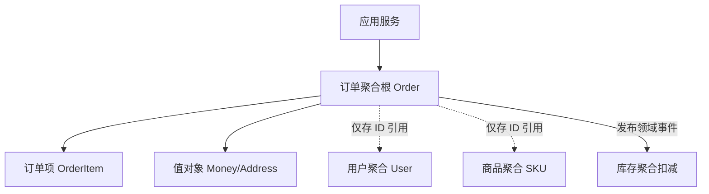

# 设计基础面试

## 架构设计

### 【中等】一个单体项目整体吞吐达到 1 万 QPS，要微服务化拆分吗？⭐⭐⭐⭐

> 🎯 目标等级：L2 ｜ ⏱ 建议用时：15 min ｜ 🏷 标签：架构设计 / 微服务拆分

#### 💎 关键结论

不建议拆。1 万 QPS 不是微服务拆分的理由——拆分的驱动力是业务复杂度与团队协作，不是高并发。单体用缓存、异步、水平扩容三台机器即可扛住 1 万 QPS；只有团队、业务、资源等信号持续恶化（命中 3 个以上）才启动拆分，且拆错的代价远大于晚拆。

#### ⚡记忆卡片

- **口诀**：人少别折腾，人多再拆分；拆库先于拆服务，绞杀渐进不爆炸
- **关键词**：业务复杂度 ／ 团队协作 ／ 绞杀者模式 ／ 模块化单体 ／ 隐性成本
- **链路**：QPS 高 → 缓存 + 异步 + 扩容扛住 → 看六类拆分信号 → 命中 3+ 才拆 → 绞杀者渐进

#### 📖 核心知识

**微服务拆分的首要驱动力是业务复杂度和团队协作，而不是单纯的高并发。**

**单体如何扛住 1w QPS？**

| 手段           | 说明                        | 效果                    |
| :------------- | :-------------------------- | :---------------------- |
| **缓存**       | Redis 挡住 90% 的读请求     | 读 QPS 1w → DB 1k       |
| **异步**       | MQ 削峰填谷，异步处理写请求 | 写流量平滑，系统不垮    |
| **集群**       | 单体水平扩容，前面挂 Nginx  | 3 台机器即可分担 1w QPS |
| **数据库优化** | 索引、分库分表（必要时）    | 数据库不再是瓶颈        |

**微服务拆分的考量维度？**

| 维度                         | 需要拆分的信号                                                         | 记忆点                             |
| :--------------------------- | :--------------------------------------------------------------------- | :--------------------------------- |
| **团队**（团队规模与协作）   | 团队 > 10 人，多个小组并行开发，频繁代码冲突、互相等待发版             | **人少别折腾，人多再拆分**         |
| **业务**（业务复杂度与边界） | 模块间耦合严重（如订单和用户表 JOIN 过多），改一处影响多处             | **业务耦合难维护，拆清边界各自顾** |
| **技术**（技术异构需求）     | 部分模块需不同技术栈（如 Go 写高并发，Python 做 AI）                   | **技术栈要换，微服务来担**         |
| **资源**（资源独立性与隔离） | 某个模块（如秒杀）占满 CPU 或内存，导致其他模块响应变慢                | **资源争抢乱，拆分各自安**         |
| **运维**（运维与发布频率）   | 核心模块需每周发版，非核心模块每日发版，但发版必须一起停服             | **发布频率不一致，独立部署最合适** |
| **性能**（性能独立扩缩容）   | 秒杀模块需要瞬间扩容 10 倍，但其他模块不需要，单体只能一起扩，浪费资源 | **部分模块要扩缩，拆分才能单独做** |

**决策清单：什么时候该拆？**

如果以下问题有 **3 个以上回答“是”**，可以考虑启动微服务拆分：

- **代码冲突**：合并代码时经常需要跟同事沟通解决冲突吗？
- **互相等待**：A 组的功能上线必须等 B 组的功能一起发布吗？
- **局部故障扩散**：一个模块出问题（如内存泄露）导致整个系统崩溃吗？
- **扩容浪费**：秒杀活动时，不得不把整个系统（包括不相关的模块）一起扩容吗？
- **技术束缚**：想用新的技术框架（如 Go 写高性能模块），但因为单体无法引入吗？
- **数据库耦合**：所有业务都挤在一个数据库里，连表查询越来越多，越来越慢吗？

**拆分落地要点**

- **渐进式拆分**：绞杀者模式（Strangler Fig）——从边缘、非核心模块开始拆，新需求用新服务承接，逐步绞杀旧单体，避免大爆炸式重写。
- **数据库先拆**：服务拆了但库没拆等于白拆（跨库 JOIN、分布式事务会回来）；先做库级隔离，跨服务查询用冗余字段/异构索引/数据服务层解决。
- **常见误区**：为拆而拆（没痛点硬拆）、拆得过细（运维成本失控、一次请求跨十几个服务）、拆完仍共享数据库、先拆服务后补基础设施（无注册中心/链路追踪/CI 就拆是灾难）。

#### 🔬 扩展知识

::: details

- 【L3】如果最终决定拆，第一个拆什么？从变更频率最高、与核心业务耦合最少的边缘模块开始（如通知、报表）；验证注册中心、链路追踪、部署流水线等基础设施后再碰核心链路，绞杀者式渐进替换。
- 【L3】拆与不拆的中间态有没有？有——模块化单体（Modular Monolith）：模块间通过接口/进程内事件通信、禁止跨模块直接访问表，保留单部署单元的简单性同时获得边界清晰；业务增长后可按模块边界物理拆分，迁移成本最低。
- 【L4】拆分后哪些原本免费的能力会变贵？本地事务变分布式事务、进程内调用变网络调用（延迟/失败/超时）、跨服务查询变数据同步问题、统一发布变多服务版本协调；拆分前需评估团队能否承担这些持续性成本。

:::

#### 🏭 实战场景

::: details

**量化参考**：单体应用优化后单机 3000~~5000 QPS 很常见（缓存 + 异步），1 万 QPS 三台机器即可，远低于拆分门槛；而微服务化后一次请求可能跨 5~~10 个服务，单次调用链 RT 增加几十 ms，运维成本至少增加一个专职团队——**拆分的隐性成本常被低估**。

**踩坑**：曾见团队因“技术先进性”把 8 人团队的单体拆成 20 个服务，发布从每天 1 次变成协调 3 天，联调成本超过开发成本——**组织规模不支持的拆分必然倒退**（业界已有“微服务回调”案例，如 Amazon Prime Video 重新合回单体模块）。

**场景**：某单体电商系统，30 人团队，日订单 50 万，整体 8000 QPS，每周发版一次且需停机 30 分钟，近半年三次因营销模块内存泄漏拖垮全站。分析：8000 QPS 本身不是拆分理由（缓存 + 3~4 台机器可扛），但三个信号同时命中：局部故障扩散（内存泄漏拖垮全站）、发布痛点（停机发版）、团队规模 30 人——应拆。优先级：先水平扩容消除停机发版（滚动发布），再把营销模块独立拆出（故障隔离 + 独立扩容），其余模块先做模块化单体整顿边界，观察一年后再评估是否继续拆——**用最小拆分解决最痛的信号**。

:::

#### ⚠️ 常见误区

::: details

常见误区：

- ❌ “QPS 上万了，必须微服务化” → QPS 是容量问题，用缓存/异步/水平扩容解决；拆分解决的是组织与复杂度问题，两者不是一回事。
- ❌ “先拆服务，基础设施后面再补” → 无注册中心、链路追踪、CI 就拆分是灾难，基础设施必须先行。
- ❌ “拆得越细越先进” → 拆得过细导致一次请求跨十几个服务，运维成本失控、RT 反而上升。

:::

#### 🔀 发散问题

- **Q：架构如何从单体演进到微服务再到云原生？** → 演进驱动力是团队规模与业务复杂度而非技术潮流，模块化单体先行、物理拆分后置，见本文档「架构如何演进：从单体、SOA、微服务到云原生」。
- **Q：如何用 DDD 找到拆分的边界？** → 微服务边界 ≈ 限界上下文，用事件风暴梳理领域事件聚类出上下文，见本文档「如何用 DDD 指导系统设计与微服务拆分」。

### 【中等】项目上线后，一般要关注哪些指标？⭐⭐⭐

> 🎯 目标等级：L2 ｜ ⏱ 建议用时：8 min ｜ 🏷 标签：架构设计 / 上线监控

#### 💎 关键结论

新项目上线要看四类指标：性能指标（QPS/RT/吞吐量）看系统扛不扛得住，错误指标（错误率/异常日志）看服务稳不稳，资源指标（CPU/内存/IO/带宽）看资源够不够，业务指标（PV/UV/转化率/留存）看业务顺不顺。四类缺一不可——只盯资源不看业务，系统“健康”但业务掉量也发现不了。

#### ⚡记忆卡片

- **口诀**：性能看扛压，错误看稳定，资源看余量，业务看转化
- **关键词**：QPS ／ RT ／ 错误率 ／ CPU ／ 转化率
- **链路**：请求进入 → 性能指标承压 → 错误指标报警 → 资源指标见底 → 业务指标受损

#### 📖 核心知识

新项目上线需监控四类指标：

- **性能指标**：QPS、RT、吞吐量 → 系统能不能扛住？
- **错误指标**：错误率、异常日志量 → 服务稳不稳定？
- **资源指标**：CPU、内存、磁盘 IO、网络带宽 → 资源够不够用？
- **业务指标**：PV/UV、核心接口调用量、核心转化率、留存率 → 业务跑得顺不顺？

#### 🔬 扩展知识

::: details

- 【L3】指标之上还要定告警阈值与分级：核心链路 P99 RT、错误率用“同比/环比突增”动态阈值比固定值更准；告警按 P0（电话）/P1（IM）/P2（日报）分级，避免告警疲劳。
- 【L4】进一步建立“指标 → 定位”链路：指标异常时靠链路追踪下钻到具体服务与慢调用，监控（发现问题）与链路追踪（定位问题）是三支柱中的两支柱，需配套建设。

:::

#### 🔀 发散问题

- **Q：接口响应变慢了，如何用这些指标定位？** → 先看监控分位数（P99 而非均值）定方向，再逐层下钻网络、数据库、代码，见本文档「接口响应慢如何排查」。
- **Q：这些指标如何支撑高可用目标？** → 监控告警压缩 MTTR 的“发现时间”，是 4 个 9 的必要条件，见本文档「如何设计一个高可用系统」。

### 【中等】跨海外业务请求延迟大怎么办？⭐⭐

> 🎯 目标等级：L2 ｜ ⏱ 建议用时：8 min ｜ 🏷 标签：架构设计 / 全球化

#### 💎 关键结论

物理距离不可改变，跨洋光纤往返延迟是毫秒级的物理下限，优化的根本在于**避免或减少实时跨国数据传输**：服务本地化让请求在目标区域闭环，数据预同步让海外节点提前拿到数据，实在避免不了的实时请求再用 CDN/专线 + 压缩优化传输。

#### ⚡记忆卡片

- **口诀**：本地部署降延迟，异步同步防跨海，网络压缩辅优化
- **关键词**：服务本地化 ／ 数据预同步 ／ CDN ／ 专线 ／ 压缩
- **链路**：物理距离不可变 → 减少实时跨国传输 → 本地部署闭环 → 异步预同步 → 网络层兜底

#### 📖 核心知识

- **服务本地化**：在目标区域部署完整应用和数据库，用户请求在本地闭环，大幅降低延迟。
- **数据预同步**：通过异步机制（主从复制、消息队列）提前将数据推送至海外，避免实时跨海读写。
- **网络优化**：无法避免的实时请求，使用 CDN、专线或 SD-WAN 优化路径，并启用数据压缩（Gzip、Snappy）减少传输体积。

#### 🔀 发散问题

- **Q：数据跨地域同步的一致性怎么保障？** → 跨城异步同步必然有延迟窗口，写冲突用单元化闭环或单点写多读规避，见本文档「如何设计异地多活/容灾架构」。
- **Q：海外机房挂了怎么办？** → 纳入容灾体系统一考虑，先同城双活再异地冷备，见本文档「如何设计异地多活/容灾架构」。

### 【困难】如何设计一个高并发系统？⭐⭐⭐⭐⭐

> 🎯 目标等级：L2 ｜ ⏱ 建议用时：20 min ｜ 🏷 标签：架构设计 / 高并发

#### 💎 关键结论

高并发设计没有银弹，核心方法论是：尽量减少请求、让请求更快、把压力摆平，可归纳为六字诀——缓、异、池、拆、预、水。最有效的优化是把请求消灭在入口（缓存与前端拦截），其次异步化摆平峰值；选型前必须先逐层量化每一层承受的压力，再选手段。

#### ⚡记忆卡片

- **口诀**：能挡就挡（缓存），能异步就异步，能拆就拆，先量化再选型
- **关键词**：多级缓存 ／ MQ 削峰 ／ 池化 ／ 无状态拆分 ／ 预计算 ／ 水平扩容
- **链路**：减少请求 → 异步摆平 → 池化复用 → 拆分散压 → 预计算 → 扩容兜底

#### 📖 核心知识

高并发设计可归纳为六字诀：**缓、异、池、拆、预、水**。

**一、减少请求（最有效的优化）**

- **前端拦截**：静态化 + CDN、按钮防重、本地缓存；秒杀场景 99% 请求应在到达后端前被拦截。
- **多级缓存**：浏览器缓存 → CDN → 网关缓存 → 本地缓存（Caffeine）→ 分布式缓存（Redis），层层挡住读流量。
- **读写分离**：主库写、从库读；读多写少的系统收益最大。

**二、异步化（把同步变异步，把峰值摆平）**

- MQ 削峰填谷：下单、发短信、发积分等非核心链路异步化。
- 同步调用链能并行就并行（CompletableFuture 聚合多下游）。

**三、池化与复用**：线程池、连接池、对象池，避免频繁创建销毁的资源开销。

**四、拆分（水平扩展的前提）**

- 服务拆分：无状态化才能随意水平扩容；有状态部分外置（Session、计数器进 Redis）。
- 数据拆分：分库分表打散写入热点；热点数据单独隔离部署。

**五、预计算/预加载**：提前算好结果（如大促前预热缓存、提前生成静态页），把实时计算变为查表。

**六、水平扩容 + 容量水位**：无状态服务按需扩容，配合限流兜底；日常水位控制在 50%~60%，给突发留余量。

**量化示例**：某读接口 10w QPS，多级缓存命中率 95% 后仅 5k 打到 DB；写接口 1w QPS 经 MQ 削峰后按 2k/s 平滑消费——**先算清楚每一层要承受多少压力，再选手段**。

#### 🔬 扩展知识

::: details

- 【L3】系统做到什么程度算“扛住了”？给出三层数字：容量（单机 1500 QPS × 20 台 × 60% 水位 ≈ 1.8 万安全 QPS）、实测（全链路压测拐点值）、余量（目标流量的 2 倍以上）。汇报口径是“可承载 X 倍峰值，瓶颈在 Y，扩容弹性为 Z”。
- 【L3】优化手段中哪类收益最大、哪类最容易翻车？收益最大的是缓存与前端拦截（把请求消灭在入口，量级削减）；最易翻车的是异步化与分库分表——异步引入一致性/积压问题，分库分表引入跨片查询与扩容困难，都要有配套兜底方案才敢上。
- 【L4】无状态化改造的具体做法？Session/登录态、计数器、本地文件、定时任务锁都要外置到 Redis/调度平台；本地缓存可保留但只做加速副本。判断标准：任意实例被随机杀掉，用户请求不受影响，即为无状态。

:::

#### 🏭 实战场景

::: details

**失效场景与踩坑**：缓存命中率一旦从 95% 跌到 50%（如缓存集群故障），DB 流量翻倍以上，未做限流兜底会直接雪崩——缓存是最脆弱的依赖，必须有降级预案；MQ 削峰的前提是消费端能消化，消费速度 < 生产速度时积压会反噬（磁盘写满、重投风暴）。某次大促因未对缓存击穿做兜底，单热点 key 过期瞬间数万 QPS 穿透到 DB，接口全面超时——**热点数据必须永不过期或互斥重建**。

**场景**：大促活动页峰值 20 万 QPS 查询活动商品信息，DB 单实例极限 5000 QPS，现有预算只允许加 10 台应用服务器。方案：静态页 + CDN 挡掉约 95% 读流量，回源约 1 万 QPS；应用层本地缓存（Caffeine，TTL 1~~5s）再挡 80%，打到 Redis 约 2000 QPS，Redis 单实例 8~~10 万 QPS 完全可扛；DB 仅在缓存故障兜底，前置限流 3000 QPS 保护。10 台服务器单机只需承担约 2 万 QPS 的纯内存计算 + 缓存访问，4C8G 即可。核心是**逐层量化漏斗**，而不是堆机器。

:::

#### ⚠️ 常见误区

::: details

常见误区：

- ❌ “高并发就是加机器” → 不先做缓存/异步减少请求量，堆机器只是线性成本换线性容量，瓶颈层（如 DB）依然先挂。
- ❌ “上了缓存就万事大吉” → 缓存命中率骤降时流量全打到 DB，必须配限流与降级预案。
- ❌ “MQ 削峰能解决一切写压力” → 消费速度跟不上生产速度时积压反噬（磁盘写满、重投风暴），削峰的前提是消费端能消化。

:::

#### 🔀 发散问题

- **Q：限流、熔断、降级在高并发体系中如何配合？** → 限流挡超量、熔断防故障扩散、降级保核心，阈值必须来自压测容量，见本文档「如何实现流量控制」。
- **Q：高并发系统的容量如何评估与验证？** → 从业务指标倒推峰值 QPS，全链路压测找拐点，见本文档「如何做系统容量评估与压测」。
- **Q：大促后服务重启会不会引发重连洪峰？** → 客户端退避抖动 + 服务端渐进放量协同解决，见本文档「服务重启时，如何避免客户端重连引发的流量洪峰」。

### 【困难】如何设计异地多活/容灾架构？⭐⭐⭐⭐⭐

> 🎯 目标等级：L2 ｜ ⏱ 建议用时：20 min ｜ 🏷 标签：架构设计 / 容灾多活

#### 💎 关键结论

容灾按等级演进：冷备 → 同城双活 → 异地多活，核心指标是 RTO（多久恢复）与 RPO（丢多少数据）。异地多活的根本难点是跨城同步延迟，解法是单元化——按用户维度把流量和数据封闭在单元内闭环，只异步同步少量全局数据。实践上先同城双活、再异地冷备、最后按核心链路单元化；没演练过的容灾等于没有容灾。

#### ⚡记忆卡片

- **口诀**：单元闭环写，全局单点写，容量 N/(N-1)，演练才作数
- **关键词**：RTO ／ RPO ／ 单元化 ／ GSLB ／ 切流演练
- **链路**：冷备 → 同城双活 → 异地多活 → 单元化闭环 → 定期切流演练

#### 📖 核心知识

**容灾等级与指标**

| 等级     | 形态               | RTO/RPO            |
| :------- | :----------------- | :----------------- |
| 冷备     | 数据备份，手动恢复 | 小时级             |
| 同城双活 | 两机房同时服务     | 分钟级，RPO ≈ 0    |
| 异地多活 | 多城市机房同时服务 | 秒级切换，RPO 极小 |

- **RTO**（恢复时间目标）：故障后多久恢复服务；**RPO**（恢复点目标）：允许丢多少数据。

**同城双活**：两机房网络延迟低（<2ms），数据库一主一从或双主（MGR），应用无状态双部署，负载均衡按机房分流；单机房故障秒级切流。

**异地多活的核心难点与设计**

1. **数据同步延迟**：跨城延迟 30ms+，异步同步必然存在延迟窗口。解法：**单元化（Set 化）**——按用户维度（如 userId 取模）把流量和数据封闭在单个单元内闭环，单元间只异步同步少量全局数据，从根本上避免跨单元写冲突。
2. **流量调度**：DNS/GSLB + 网关层按路由规则（userId hash）把请求导入对应单元；切流能力需分钟级生效。
3. **全局数据一致性**：配置、商品等全局数据用“单点写 + 多单元读”或同步双写。
4. **容量规划**：N 个单元需承担 (N/(N-1)) 倍容量（挂一个后其余能承接全量），通常按 N+1 冗余。

**实践建议**：不要一步到位——先同城双活，再异地冷备，最后按核心链路逐步单元化；**定期切流演练**，没演练过的容灾等于没有容灾。

**方案权衡**：异地多活的成本是指数级上升的（多套机房、多套数据同步链路、单元化改造人力），绝大多数业务做到同城双活 + 异地冷备即可；只有金融级合规或超大流量平台才值得全量单元化。**代价**：写路径变长（跨单元同步 30ms+）、容量冗余 N/(N-1)、全局数据改造复杂。

#### 🔬 扩展知识

::: details

- 【L3】单元化改造中，哪些数据最难闭环？全局共享且高频写的数据最难（如全局库存、号段、配置）。常见解法：库存按单元预分配（各单元持有份额，单元间余量调拨）；号段按单元分配不重叠区间；配置走单点写多单元读。
- 【L4】RPO=0 和 RTO=0 能否同时做到？同城双活 + 同步复制可接近 RPO=0，但同步复制引入写延迟（跨机房 1~2ms RTT）且一机房网络抖动会拖慢所有写；RTO=0 需流量自动调度 + 无状态秒级接管，代价是常驻双倍容量。异地物理距离决定 RPO 无法为 0，只能靠业务补偿。
- 【L4】如何验证容灾方案真的有效？定期真实切流演练（生产环境小流量→全量）、混沌工程注入机房级故障、演练恢复时长并量化 RTO/RPO 实际值与目标差距；演练结果纳入容量与预案持续改进。

:::

#### 🏭 实战场景

::: details

**失效场景与踩坑**：DNS 切流依赖 TTL（分钟级），故障初期仍有流量打到坏机房，需网关层秒级切流配合；跨城异步同步必然有延迟窗口，故障切换瞬间可能丢最近几秒数据（RPO>0）——资金类数据需业务层对账补偿。曾有大厂演练时切流成功，但**依赖的第三方服务不支持多活**，切流后核心链路调第三方全失败——容灾方案必须覆盖所有外部依赖。

**场景**：支付平台日交易 500 万笔，监管要求 RTO ≤ 5 分钟、RPO ≤ 30 秒，预算只够两地三中心（同城两机房 + 异地一机房）。方案：同城两机房做双活（<2ms 延迟支持同步/半同步复制，RPO≈0），承担日常全部流量；异地机房异步复制（延迟窗口通常秒级，满足 RPO≤30s）+ 定期全量备份，平时只读引流少量验证流量。同城单机房故障由负载均衡秒级切流（RTO<1 分钟）；同城双毁时切异地，容忍最多 30 秒未同步交易，配合**日终渠道对账 + 人工补单**兜底资损。预算约束下的核心权衡：把钱花在同城高可用（高频故障），异地保底（低频灾难）。

:::

#### ⚠️ 常见误区

::: details

常见误区：

- ❌ “做了异地多活就不会丢数据” → 跨城异步同步必有延迟窗口，切换瞬间 RPO>0，资金类必须业务层对账补偿。
- ❌ “切流演练过一次就行” → 依赖会持续变化（新增第三方、新服务），必须常态化演练，没演练过的预案等于没有。
- ❌ “容灾方案覆盖自己的系统就够了” → 外部依赖不支持多活时，切流后核心链路照样全挂，方案必须覆盖所有依赖方。

:::

#### 🔀 发散问题

- **Q：机房级容灾与高可用设计是什么关系？** → 多活是高可用“冗余消单点”在机房级的延伸，见本文档「如何设计一个高可用系统」。
- **Q：多活下的全局唯一 ID 怎么分配？** → 号段按单元分配不重叠区间，机器 ID 自动化分配，见本文档「如何设计一个分布式 ID 发号器」。

### 【中等】如何做系统容量评估与压测？⭐⭐⭐⭐

> 🎯 目标等级：L2 ｜ ⏱ 建议用时：15 min ｜ 🏷 标签：架构设计 / 容量压测

#### 💎 关键结论

容量评估是从业务指标倒推资源：峰值 QPS 估算 → 单机压测定拐点 → 机器数 = 峰值/单机 × 冗余。压测分两级：单机压测找拐点（安全容量取拐点 70%~80%），全链路压测在生产环境施压并配套流量染色、影子表、下游挡板。核心纪律：按真实流量模型构造用例，只压主路径的压测没有价值。

#### ⚡记忆卡片

- **口诀**：业务倒推峰值，单机压拐点，全链染色影子表，梯度增压看水位
- **关键词**：利特尔法则 ／ 拐点 ／ 流量染色 ／ 影子表 ／ 水位运营
- **链路**：业务量 → 峰值 QPS → 单机拐点 → 全链路压测 → 安全容量与扩容

#### 📖 核心知识

**容量估算（从业务指标倒推）**

- 峰值 QPS 估算：日请求量 × 峰值系数（通常 80% 流量集中在 20% 时间）/ 峰值时段秒数，大促再乘业务预估倍数。
- 机器数 = 峰值 QPS / 单机容量 × 冗余系数（一般 1.5~2，保留故障切换余量）。
- **利特尔法则**：并发数 = QPS × 平均 RT，用于推算线程池/连接池大小（如 1000 QPS × 50ms = 50 并发）。

**压测方法论**

- **单机压测**：先测出单机极限 QPS 与拐点（RT 陡然上升处），安全容量取拐点的 70%~80%。
- **全链路压测**（大厂标配）：生产环境施压，需配套：
  - **流量染色**：压测流量带特殊标记（Header），全链路透传；
  - **影子表/影子库**：压测写流量落影子存储，不污染真实数据；
  - **下游挡板**：对第三方依赖 Mock 或提前报备扩容。
- **梯度增压**：从 30% 目标开始逐级加压，观察 CPU、RT、错误率拐点。

**常见坑**：只压入口不压下游（DB/Redis 先挂）；压测前没预热缓存导致数据失真；压测数据污染生产；只测新环境（配置/数据量与生产差异大）。

**水位运营**：日常 CPU 水位控制在 50%~60%，大促前按预估流量扩容并全链路压测验证；建立容量巡检与自动扩缩容机制。

#### 🔬 扩展知识

::: details

- 【L3】如何从业务数据估算峰值 QPS？经验公式：峰值 QPS ≈ 日总量 × 80% /（峰值小时数 × 3600）× 冗余系数（2~3）；大促场景直接用“预计 GMV / 客单价 / 活动秒数”倒推下单 TPS，再按读写比分解到各接口。
- 【L3】压测报告应包含哪些关键结论？单机拐点 QPS 与对应 RT/CPU、全链路瓶颈点（哪一层先挂）、安全容量与目标流量的倍数、扩容建议；没有瓶颈结论的压测报告没有价值。
- 【L4】全链路压测的影子方案如何隔离数据？压测流量打染色标记（Header 透传），DB/缓存/MQ 按标记路由到影子表/影子库/影子 Topic；对账类任务排除压测数据；压测结束后清理影子数据，防污染报表。

:::

#### 🏭 实战场景

::: details

**量化参考**：典型单机容量经验值（4C8G）：纯读缓存接口 5000~~1 万 QPS，含 DB 写的业务接口 500~~2000 QPS；MySQL 单实例写约 3000~~5000 TPS，Redis 单实例 8~~10 万 QPS。利特尔法则实战：接口 QPS 2000、RT 50ms → 需 100 并发，线程池配 100~150 即可，拍脑袋配 500 线程反而因上下文切换降低吞吐。

**踩坑**：曾有大促前全链路压测通过，但压测流量未覆盖“优惠券叠加计算”这一低频高耗时路径，大促当天该接口 RT 从 50ms 飙到 2s——**压测用例必须按真实流量模型构造，不能只压主路径**。

**场景**：直播平台年度晚会，预计峰值在线 500 万人，每人每 30 秒拉一次弹幕列表 + 每 10 秒上报一次心跳，预算有限只能提前 2 周准备。评估：拉弹幕 500万/30s ≈ 16.7 万 QPS，心跳 50 万 QPS——心跳必须改为长连接上报或延长间隔（30s→25 万 QPS），否则带宽与连接数先崩；弹幕列表做 CDN/边缘缓存（同一直播间内容相同，命中率 >95%），回源压力降两个数量级。压测计划：第一周单机压测定拐点，第二周全链路压测验证长连接容量（单机长连接约 10 万，需 50+ 接入节点）；核心教训：**容量评估先砍需求（改协议/改频率），再谈扩容**。

:::

#### 🔀 发散问题

- **Q：压测出的容量如何换算成成本？** → 机器数 × 单价只是起点，还要算网络、存储与隐性运维成本，见本文档「如何估算一个技术方案的资源成本」。
- **Q：限流阈值与压测容量是什么关系？** → 阈值必须基于压测容量设定（如容量的 80%），拍脑袋设阈值形同虚设，见本文档「如何实现流量控制」。

### 【中等】如何估算一个技术方案的资源成本？⭐⭐⭐⭐

> 🎯 目标等级：L2 ｜ ⏱ 建议用时：12 min ｜ 🏷 标签：架构设计 / 成本估算

#### 💎 关键结论

成本估算是架构评审的必答题：方案再优雅，算不清账就落不了地。核心是把“技术方案”翻译成“资源清单”，再乘单价与使用时长。方法上四步走：单位经济模型定口径、容量倒推算资源、类比校准防拍脑袋、给增长留量并标出成本拐点。最常被漏掉的是跨 AZ 流量与出公网带宽。

#### ⚡记忆卡片

- **口诀**：方案翻成资源清单，单位经济打头阵，类比校准留增长
- **关键词**：单位经济模型 ／ 冗余系数 ／ 跨 AZ 流量 ／ 成本拐点
- **链路**：业务规模 → 单位成本 → 容量倒推资源 → 类比校准 → 增长留量

#### 📖 核心知识

**成本构成清单**

| 类别     | 明细                                  | 易漏点                     |
| :------- | :------------------------------------ | :------------------------- |
| 计算     | 应用服务器、容器、函数调用次数、GPU   | 峰谷比导致的冗余成本       |
| 存储     | 数据库容量、对象存储、日志、备份副本  | 数据增长率、副本数（×2~3） |
| 网络     | 公网带宽、CDN、跨 AZ/跨区流量         | 出流量收费、CDN 回源       |
| 中间件   | MQ、缓存、ES、负载均衡实例            | 按集群规格而非按量         |
| 隐性成本 | 人力运维、监控告警、多活冗余、license | 常被完全忽略，实际占大头   |

**估算四步法**：

1. **单位经济模型**：先算单位业务量的成本（每万 DAU / 每万订单 / 每千次调用多少钱），再乘业务规模——这是向上汇报最有说服力的数字。
2. **容量倒推**：峰值 QPS → 单机能力 → 机器数 × 冗余系数（2~3）→ 按月折算；存储按「日增量 × 保留期 × 副本数」估。
3. **类比校准**：拿公司内相似系统或行业数据校准（如同类 Feed 流系统单 UV 成本），防止拍脑袋偏差过大。
4. **给增长留量**：按 6~12 个月业务增长估算，而非当前量；同时给出「成本拐点」（什么规模下单价会跳变，如分库分表、带宽阶梯价）。

#### 🔬 扩展知识

::: details

- 【L3】估算不准怎么办，如何控制风险？灰度放量 + 滚动校准：先按 3 个月量预采购/预留，上线后按周对比「实际单位成本 vs 预估」，偏差 >20% 即触发复盘；云上用按量 + 预留实例组合（预留覆盖保底流量 60~70%，按量吸收波动）。
- 【L3】哪些成本科目最容易低估？出公网带宽与 CDN 回源、跨 AZ/跨区内网流量、存储副本与备份、日志存储与检索（日志量常与请求量同阶增长）、闲置资源（行业平均利用率仅 15~25%）、多活冗余的翻倍成本。
- 【L4】老板问「自建 IDC 还是上云」怎么回答？分三档：流量稳定且规模大（万级服务器）自建更省（利用率可做到 50%+）；波动大或处于增长期用云（弹性是买的保险）；混合云常见做法是「保底流量自建/预留 + 峰值上云」。关键不是单价对比，而是利用率与弹性成本的权衡。

:::

#### 🏭 实战场景

::: details

**踩坑**：曾评审一个推荐系统上云方案，GPU 成本算得很准，但漏算了特征服务与推理服务跨 AZ 调用的内网流量费（占总量 30%），上线后预算超支 40% 被迫回迁——**跨 AZ 流量与出公网带宽是最常被漏掉的两个科目**。

**量化参考**：典型互联网应用成本结构中，计算约 40~~50%、存储约 20~~30%、网络约 15~25%、其余中间件与运维；估算误差控制在 ±30% 内算合格，超过就要回头检查假设。

**场景**：业务方要上线一个消息推送系统：日活 1000 万，人均日推送 10 条，推送内容带 20KB 富媒体，峰值集中在晚 8 点一小时内（占全天 40%），预算上限每月 10 万。估算：日消息量 1 亿条，日存储增量 1亿 × 20KB ≈ 2TB（保留 30 天 + 双副本 ≈ 120TB，对象存储约 1.5 万/月）；峰值写入 1亿 × 40% / 3600 ≈ 1.1 万 TPS，推送网关需 10~~15 台 8C16G（约 1.2 万/月）；下行带宽若全走公网 = 1亿 × 20KB × 30 天 ≈ 600TB/月，**必然爆预算**——必须端侧缓存 + 内容去重 + CDN 预热，把回源压到 10% 以内（约 2 万/月）。合计约 5~~6 万/月，预算内可行；结论先行：**这道题的胜负手不在计算而在带宽，先砍流量再算钱**。

:::

#### 🔀 发散问题

- **Q：成本估出来之后，如何系统性降本？** → 按收益/风险比分档：先清浪费、再改计费、后动架构，见本文档「系统设计中有哪些常见的成本优化手段」。
- **Q：成本如何纳入架构演进的长效机制？** → 用 FinOps 闭环把单位经济成本纳入评审与 OKR，见本文档「如何在架构演进中做成本治理（FinOps）」。

### 【中等】系统设计中有哪些常见的成本优化手段？⭐⭐⭐

> 🎯 目标等级：L2 ｜ ⏱ 建议用时：12 min ｜ 🏷 标签：架构设计 / 成本优化

#### 💎 关键结论

成本优化要按「收益/风险比」分档推进：先捡无风险的西瓜，再做要排期的手术。五类手段——资源利用率、架构优化、计费模式、数据治理、流程治理；优先级口诀：先清浪费（零风险）、再改计费（零代码改动）、后动架构（要开发排期），前两类两周见效，架构类按季度规划。

#### ⚡记忆卡片

- **口诀**：先清浪费，再改计费，后动架构
- **关键词**：混部装箱 ／ 弹性伸缩 ／ 预留实例 ／ 冷热分离 ／ 闲置巡检
- **链路**：浪费清理 → 计费优化 → 数据治理 → 架构优化 → 流程防反弹

#### 📖 核心知识

**五类优化手段**

| 类别       | 手段                                                         | 典型收益 | 风险等级     |
| :--------- | :----------------------------------------------------------- | :------- | :----------- |
| 资源利用率 | 混部/装箱优化、弹性伸缩、超卖、降配僵尸实例                  | 20~40%   | 低           |
| 架构优化   | 加缓存、异步化、读写分离、冷热分离、压缩、计算下推           | 30~90%   | 中（需排期） |
| 计费模式   | 预留实例/节省计划、Spot 竞价实例、按量转包年、阶梯价谈判     | 20~70%   | 低           |
| 数据治理   | 日志瘦身、过期清理、低频数据降级存储（标准→低频→归档）、去重 | 30~60%   | 中           |
| 流程治理   | 资源申请审批、标签强制、闲置巡检、配额管理                   | 10~20%   | 无           |

**优先级口诀**：先清浪费（僵尸资源、超配规格），再改计费（零代码改动），后动架构（要开发排期）——前两类两周见效，架构类按季度规划。

#### 🔬 扩展知识

::: details

- 【L3】缓存、异步、压缩这些手段，什么时候会反噬成本？缓存：命中率低于 60~70% 时内存成本 > 省下的计算成本，且引入一致性维护成本；异步：MQ 本身是成本，且拉长链路增加排障成本；压缩：CPU 换带宽，CPU 紧张时反而亏——每个手段都有盈亏平衡点，先量化再上。
- 【L3】降本会不会伤稳定性？边界在哪？会。红线：不砍容灾冗余（异地备份/多活）、不砍核心链路容量安全水位（峰值 ×2 以内不动）、不砍可观测性（监控日志是故障时的救命钱）。可砍的是：无主资源、低优任务的规格、过长的数据保留期。
- 【L4】如何判断一个系统是否过度设计导致的隐性成本？三个信号：利用率长期 <10%、组件数与业务规模不成比例（日活 1 万却上了全套微服务 + 多活）、维护人力成本超过资源成本。对策是做「架构适配度」评审，该合模块就合、该下云就下。

:::

#### 🏭 实战场景

::: details

**踩坑**：曾推动把一批低优批处理任务切到 Spot 实例省 70% 算力费，没做中断容错，某次大规模回收导致离线报表断供两天——**Spot 省的钱必须配套检查点重试/任务可重入设计，否则是把稳定性换成本**。

**量化参考**：行业经验——云资源平均利用率仅 15~~25%，仅「降配 + 清理僵尸资源」一轮通常就能降 15~~30%；缓存命中率每提升 1%，对应后端计算成本约降 1%。

:::

#### 🔀 发散问题

- **Q：降本成果如何长效保持不反弹？** → 靠 FinOps 运营阶段：成本进架构评审、单位成本进 OKR，见本文档「如何在架构演进中做成本治理（FinOps）」。
- **Q：优化前如何先算清楚钱花在哪？** → 把方案翻译成资源清单做单位经济建模，见本文档「如何估算一个技术方案的资源成本」。

### 【困难】如何在架构演进中做成本治理（FinOps）？⭐⭐⭐

> 🎯 目标等级：L2 ｜ ⏱ 建议用时：15 min ｜ 🏷 标签：架构设计 / FinOps

#### 💎 关键结论

FinOps 的本质不是砍预算，而是建立「谁花钱、谁看见、谁负责」的成本责任体系，让成本决策像性能决策一样成为架构评审的一部分。路径是三阶段闭环：可视化（标签 + 账单拆分）→ 优化（单位经济 + Top N 专项）→ 运营（评审 + 预算 + OKR）。盯的指标是单位经济成本而非总成本——总成本随业务增长自然上涨，单位成本下降才是真治理成果。

#### ⚡记忆卡片

- **口诀**：看得见、优得动、运营得住；盯单位成本，不砍容灾线
- **关键词**：资源标签 ／ 单位经济成本 ／ 成本大盘 ／ 预算审批 ／ 无主资源
- **链路**：标签可视化 → 单位成本度量 → Top N 优化 → 评审运营 → 防反弹

#### 📖 核心知识

**FinOps 三阶段闭环**

| 阶段   | 关键动作                                                             | 产出                 |
| :----- | :------------------------------------------------------------------- | :------------------- |
| 可视化 | 强制资源打标签（团队/业务/环境）、成本大盘按团队聚合、账单拆分到服务 | 每一分钱有主         |
| 优化   | 定义单位经济成本（成本/万订单）、Top N 花费项专项优化、闲置巡检      | 降本行动项与兑现金额 |
| 运营   | 成本纳入架构评审、月度成本评审会、预算与超支审批、单位成本进 OKR     | 长效机制，防反弹     |

**关键指标**：绝对成本会随业务增长自然上涨，FinOps 盯的是**单位经济成本**（Unit Economics）——每万订单成本、每千次查询成本、单 UV 成本；单位成本下降才是真治理成果。

**落地难点与对策**：

- **标签治理难**：存量资源无标签 → 设「无主池」，限期认领，逾期冻结/回收；新资源在 IaC 流水线强制校验标签，缺标签直接拒绝创建。
- **组织激励缺失**：省下的钱与团队无关就没人配合 → 把降本兑现计入团队预算额度（省得多，下季度可支配额度大），超支需走审批，形成正反馈。
- **数据可信度**：账单分摊口径不一致引发扯皮 → 财务、SRE、业务三方对齐分摊规则（共享资源按调用量/容量比例摊），大盘数据唯一出口。

#### 🔬 扩展知识

::: details

- 【L3】FinOps 为什么强调单位成本而非总成本？业务增长时总成本必然上涨，拿总成本考核会逼团队拒需求；单位成本（成本/业务量）剥离了增长因素，直接反映效率——同样服务一单生意，去年花 0.5 元今年花 0.3 元，才是工程进步。
- 【L3】降本 20% 的目标怎么拆解才不伤稳定性？分三档：浪费清理（无风险，目标 10%）+ 计费优化（低风险，目标 5~~7%）+ 架构优化（需排期，目标 3~~5%）；明确拒绝「为凑数字砍容灾/砍安全水位」，降本目标是效率而非绝对数字。
- 【L4】FinOps 平台团队应该怎么组建？虚拟团队起步：财务 BP（口径与预算）+ SRE（数据与巡检）+ 各业务线成本接口人（认领与优化）；平台化是第二阶段的事，先用「账单 + 标签 + 周会」跑通闭环再建系统，避免为治理建一套没人用的系统。

:::

#### 🏭 实战场景

::: details

**踩坑**：曾亲历公司云账单年增 80%，启动 FinOps 后发现 40% 花费来自无主资源（离职同学创建、测试忘删），仅「标签 + 认领 + 回收」三板斧第一个月降 22%——**没有标签体系的成本治理是盲打**。

**量化参考**：成熟 FinOps 体系通常第一年可实现 20~~30% 降本，之后进入单位成本持续优化阶段（年降 5~~10%）；账单可视化本身的投入（平台 3~5 人）在月账单 >50 万时才划算，小体量直接用云厂商账单工具 + 表格即可。

**场景**：公司上云两年，月账单从 80 万涨到 220 万，CFO 要求一个季度内降 30%，且不得影响核心业务 SLA。推进：应急——第一周拉账单明细按服务/标签聚合，找 Top 5 花费项（经验上占大头），优先清理确定性浪费（僵尸实例、超配规格、无主资源），两周兑现第一批 10~15% 降幅；根因——账单涨 2.75 倍而业务未同步涨，说明缺成本归属与度量机制；长期——建 FinOps 闭环（强制标签 + 成本大盘 + 单位成本进评审 + 月度评审出行动项）；权衡——30% 若全靠压容量必然伤 SLA，应拆成浪费清理、计费优化、架构优化三档，明确告知 CFO 架构档的兑现时间——**降本的目标是效率，不是数字达标**。

:::

#### 🔀 发散问题

- **Q：FinOps 的优化动作具体有哪些？** → 五类手段按收益/风险比分档推进，见本文档「系统设计中有哪些常见的成本优化手段」。
- **Q：架构评审时成本数字从哪来？** → 单位经济模型 + 容量倒推 + 类比校准，见本文档「如何估算一个技术方案的资源成本」。

### 【中等】如何用 DDD 指导系统设计与微服务拆分？⭐⭐⭐⭐

> 🎯 目标等级：L2 ｜ ⏱ 建议用时：15 min ｜ 🏷 标签：架构设计 / DDD

#### 💎 关键结论

微服务拆分的本质是找边界，DDD 是目前最系统的找边界方法论。战略设计用限界上下文定边界（微服务边界 ≈ 限界上下文）、统一语言统一术语、上下文映射定集成方式；战术设计用实体/值对象、聚合、领域事件组织代码。落地靠事件风暴梳理「事件→命令→聚合」，边界自然浮现；拆分依据是业务语义而非技术职责。

#### ⚡记忆卡片

- **口诀**：上下文定边界，统一语言通术语，事件风暴出模型
- **关键词**：限界上下文 ／ 统一语言 ／ 聚合 ／ 领域事件 ／ 事件风暴
- **链路**：事件风暴 → 领域事件聚类 → 限界上下文 → 微服务边界 → 事件驱动集成

#### 📖 核心知识

**核心概念（战略设计）**

- **限界上下文（Bounded Context）**：业务语义的边界，同一个词在不同上下文含义不同（如“商品”在销售和库存中字段不同）——**微服务边界 ≈ 限界上下文**。
- **统一语言**：开发、产品、业务用同一套术语，模型即代码。
- **上下文映射**：防腐层（ACL，隔离外部模型变化）、开放主机服务、共享内核等集成模式。

**核心概念（战术设计）**

- **实体 vs 值对象**：有唯一标识、有生命周期的是实体（订单）；只关心值的是值对象（地址、金额，应不可变）。
- **聚合与聚合根**：一致性边界，外部只能通过聚合根访问内部对象（如订单项只能通过订单操作），保证事务一致性。
- **领域事件**：跨上下文协作首选事件驱动（订单已支付 → 库存服务扣减），实现解耦的最终一致。

**落地方法**

- **事件风暴（Event Storming）**：业务专家 + 开发在白板梳理领域事件 → 命令 → 聚合，自然浮现上下文边界。
- **分层架构**：接口层/应用层/领域层/基础设施层，领域层不依赖框架（依赖倒置）；避免贫血模型——把业务规则放回实体/领域服务而非 Service 过程式代码。

**常见误区**：CRUD 简单系统硬套 DDD 是过度设计；聚合设计过大（把整个订单+用户+商品塞一个聚合）导致锁竞争；只学战术不学战略（拆分边界错了，代码写得再漂亮也白搭）。

**落地权衡与失效场景**：事件风暴需要真正的业务专家参与，若只拉开发开会，产出的“领域事件”只是接口调用的翻版，边界必然失真；DDD 对 CRUD 为主的系统（管理后台、简单表单）是净负担——**先判断领域复杂度再决定投入**。曾见团队把“商品中心”按技术层拆（商品 DAO 服务、商品查询服务）而非按业务语义拆，导致一次商品发布跨 4 个服务事务——**拆分依据是限界上下文而非技术职责**。

#### 🔬 扩展知识

::: details

- 【L3】事件风暴具体怎么做？产出是什么？业务专家 + 开发在白板用便签梳理：橙签写领域事件（过去时）→ 蓝签写触发命令 → 黄签写聚合，按事件聚类自然浮现上下文边界；产出是上下文地图 + 统一语言词汇表，直接作为微服务拆分依据。
- 【L3】限界上下文与微服务一定一一对应吗？不一定——初期可以多个上下文部署在一个模块化单体内（逻辑边界先行），团队/流量增长后再物理拆分；反过来一个上下文也不应拆成多个服务，那会引入不必要的分布式事务。
- 【L4】上下文之间需要共享用户信息怎么办？优先 ID 引用 + 按需查询（防腐层隔离对方模型）；高频场景订阅用户事件冗余必要字段（最终一致）；严禁共享同一张用户表——共享表是上下文边界失效的第一信号。

:::

#### 🏭 实战场景

::: details

**场景**：某零售公司单体 ERP（20 人维护，含采购/库存/销售/财务四大模块），需求排期互相阻塞，库存模块发版常被财务功能卡住。拆分路径：先开事件风暴会，让采购/仓管/财务业务方各自描述核心事件（“采购单已审核”“库存已扣减”“发票已开具”），会发现四组事件自然聚类为四个上下文，且“商品”在采购（含成本价）与销售（含零售价）中语义不同——这是典型的上下文边界。落地顺序：先模块化单体内建边界（禁止跨模块 JOIN）→ 把发布节奏最被阻塞的库存模块独立为服务 → 跨上下文改用事件驱动（库存已扣减 → 财务记账）；节奏控制在每季度一个服务，基础设施（链路追踪/CI）先行。

:::

#### ⚠️ 常见误区

::: details

常见误区：

- ❌ “DDD 就是分层 + 聚合那套战术模式” → 只学战术不学战略，拆分边界错了，代码写得再漂亮也白搭。
- ❌ “按技术职责拆服务（DAO 服务、查询服务）” → 拆分依据应是限界上下文（业务语义），按技术层拆会让一次业务操作跨多个服务事务。
- ❌ “所有系统都该上 DDD” → CRUD 为主的简单系统是净负担，先判断领域复杂度再决定投入。

:::

#### 🔀 发散问题

- **Q：贫血模型与充血模型是什么，为什么 DDD 推荐充血？** → 贫血把逻辑放对象外退化为面向过程，充血让对象对状态负责，见本文档「什么是贫血模型与充血模型？为什么 DDD 推荐充血模型」。
- **Q：聚合与聚合根怎么设计才不过大？** → 小聚合、ID 引用、一个事务只改一个聚合，见本文档「如何设计聚合与聚合根？有哪些原则」。
- **Q：上下文之间的防腐层是什么？** → 隔离翻译外部模型防止腐蚀本域，见本文档「什么是防腐层（ACL）？什么场景需要它」。

### 【中等】什么是贫血模型与充血模型？为什么 DDD 推荐充血模型？⭐⭐⭐⭐⭐

> 🎯 目标等级：L2 ｜ ⏱ 建议用时：12 min ｜ 🏷 标签：架构设计 / DDD 建模

#### 💎 关键结论

一句话：**贫血模型把业务逻辑放在了对象外面，充血模型让对象自己对自己的状态负责。**贫血模型下对象只有 getter/setter，规则散落各 Service，重复实现、状态可被绕过篡改；充血模型把状态流转、金额计算、合法性校验内聚到实体行为中。但纯 CRUD 系统贫血更简单，硬套 DDD 是过度设计——按规则复杂度选型。

#### ⚡记忆卡片

- **口诀**：贫血散逻辑，充血管状态；规则多则充血，CRUD 则贫血
- **关键词**：getter/setter ／ 实体行为 ／ 应用层编排 ／ 上帝类 ／ 绞杀者改造
- **链路**：规则散落 Service → 重复实现与越权篡改 → 行为收回实体 → 应用层只编排

#### 📖 核心知识

| 模型         | 特征                                   | 典型形态                                               | 问题                                                     |
| :----------- | :------------------------------------- | :----------------------------------------------------- | :------------------------------------------------------- |
| **贫血模型** | 领域对象只有 getter/setter，无业务行为 | `Order` 只有字段，业务逻辑全在 `OrderService`          | 对象沦为数据袋子，逻辑散落在 Service，退化为**面向过程** |
| **充血模型** | 领域对象同时包含数据与业务行为         | `order.pay()`、`order.cancel()` 内聚状态校验与流转规则 | 建模成本高，需要识别行为归属                             |

**贫血模型的危害**：

- 业务规则分散在多个 Service，同一规则（如“订单取消前必须未发货”）被重复实现，改一处漏一处。
- 状态可被随意 setter 篡改，绕过业务约束，对象可能处于非法状态。
- Service 层无限膨胀，出现几千行的上帝类。

**充血模型的落地要点**：把**业务规则**（状态流转、金额计算、合法性校验）放回实体/值对象/领域服务；应用层（Service）只做编排——调领域对象、管事务、发事件；注意区分实体行为与跨聚合逻辑（后者归领域服务或事件）。

**何时可以贫血**：纯 CRUD、报表类、无复杂规则的管理后台，贫血模型 + Service 更简单直接，硬套 DDD 反而过度设计。

**落地权衡**：充血模型的代价是建模成本高（需识别行为归属、维护领域层纯度），团队不熟时容易演化成“伪充血”（实体加了几个方法但逻辑仍在 Service）；存量贫血项目不宜全面重构，应在新需求涉及的模块逐步把规则收回实体（绞杀者式改造）。

#### 🔬 扩展知识

::: details

- 【L3】充血模型的行为如何持久化？实体带方法还能用 MyBatis/JPA 吗？可以——行为方法只改内存状态，持久化仍由仓储层（Repository）负责；关键是禁止 DAO 层被外部直接调用来改状态（不暴露 OrderItem 的独立更新接口），保证“所有变更必经聚合根”。
- 【L3】跨聚合的业务逻辑放哪里？不属于任何单个实体的规则归领域服务（Domain Service）；跨聚合的联动用领域事件最终一致（订单支付 → 事件通知库存扣减），不要在实体里直接调用其他聚合。
- 【L4】如何判断一个团队是否适合引入充血模型？看业务规则复杂度与变更频率：规则多且频繁变化（订单、账务、履约）适合充血，规则收敛在少数 Service 且稳定则贫血够用；团队对 DDD 无经验时硬上充血，产出往往是“两层过程式代码”，不如先培训再试点。

:::

#### 🏭 实战场景

::: details

**典型踩坑**：状态字段暴露 setter 导致绕过校验——曾有线上事故：客服后台直接 setter 改订单状态为“已发货”跳过库存校验，导致无货发货；充血模型下该操作只能通过 `order.ship()` 且内部校验前置状态，从机制上杜绝。

**场景**：某电商订单中心，`OrderService` 已膨胀到 1.2 万行，取消规则在 4 个入口重复实现（App 取消、超时取消、客服取消、拼团失败取消），半年内因规则不一致引发 3 次线上资损。重构方案：把取消规则收敛为 `order.cancel(reason)` 实体行为（内聚状态校验、库存释放、退券触发），4 个入口统一调应用服务编排，删除重复实现；落地用绞杀者模式：新入口先走新模型，旧入口逐个迁移，全程用订单状态机测试 + 状态流转单测护航；验收标准：取消规则只有一份代码、状态非法流转零发生。

:::

#### ⚠️ 常见误区

::: details

常见误区：

- ❌ “实体里加了方法就是充血模型” → 逻辑仍在 Service、实体方法只是透传，那是“伪充血”；关键看规则是否内聚在实体内。
- ❌ “所有系统都该改充血模型” → 纯 CRUD/报表系统贫血更简单，按规则复杂度选型，硬套是过度设计。
- ❌ “存量项目一次性重构成充血” → 全面重构风险极高，应借新需求绞杀式逐模块收回规则。

:::

#### 🔀 发散问题

- **Q：充血模型下聚合边界怎么划？** → 聚合是一致性边界，小聚合 + ID 引用 + 事件最终一致，见本文档「如何设计聚合与聚合根？有哪些原则」。
- **Q：DDD 如何指导微服务拆分？** → 限界上下文 ≈ 微服务边界，事件风暴找边界，见本文档「如何用 DDD 指导系统设计与微服务拆分」。

### 【困难】如何设计聚合与聚合根？有哪些原则？⭐⭐⭐⭐

> 🎯 目标等级：L2 ｜ ⏱ 建议用时：15 min ｜ 🏷 标签：架构设计 / DDD 战术

#### 💎 关键结论

聚合是一组相关对象的**一致性边界**，聚合根是对外的唯一入口。四大原则：保证真正的不变量、设计小聚合、用 ID 引用其他聚合、聚合间用领域事件最终一致。本质一句话：**边界内强一致，边界外最终一致**；判断依据是“业务上是否必须同一事务一致”，而非“数据是否相关”。

#### ⚡记忆卡片

- **口诀**：不变量守住，聚合要小，ID 相引用，事件来联动
- **关键词**：一致性边界 ／ 聚合根 ／ 小聚合 ／ ID 引用 ／ 领域事件
- **链路**：业务不变量 → 划一致性边界 → 聚合根唯一入口 → ID 引用外聚合 → 事件最终一致

#### 📖 核心知识

**四大设计原则**：

1. **保证真正的不变量**：聚合内所有业务规则必须在任何修改后保持一致（如订单总额 = 各订单项之和），一个事务只修改一个聚合。
2. **设计小聚合**：能用 ID 引用就不用对象引用；大聚合（订单+用户+商品全塞进来）会导致锁范围大、并发差、加载成本高。
3. **通过 ID 引用其他聚合**：订单只存 `userId`、`skuId`，需要时再查询，避免级联加载与跨聚合事务。
4. **聚合间用领域事件实现最终一致**：订单支付成功后发事件通知库存聚合扣减，而非同库事务强一致。

**实践要点**：聚合根负责校验入参、维护内部对象的生命周期；外部禁止绕过聚合根直接改订单项（DAO 层不暴露 OrderItem 的独立更新）；聚合边界过大的信号是“并发冲突多、加载慢、改一个字段锁整张表”。

**失效场景**：“一个事务只改一个聚合”原则在需要强一致的财务场景会失效（如账务必须借贷同事务平衡），此时要么扩大聚合边界，要么接受应用层校验 + 对账兜底。

#### 🔬 扩展知识

::: details

- 【L3】聚合内对象加载策略怎么定？聚合根加载应保证内部完整性（不变量校验需要），但可用延迟加载/部分加载优化：如订单聚合只在修改时加载订单项，查询展示走独立读模型（CQRS 思路）；避免“为了展示加载整个聚合”。
- 【L3】聚合根之间必须用 ID 引用，那展示时怎么拿到关联数据？读模型单独建模：查询场景直接 JOIN/ES 宽表，不走聚合加载；写场景才严格按聚合边界。读写分离是解决“聚合小而查询要全”矛盾的标配。
- 【L4】如何判断现有聚合设计是否合理？三个信号：并发冲突率（乐观锁重试频繁说明聚合太大或事务重叠）、加载成本（聚合加载 RT 超 10ms 说明太重）、跨聚合事务数量（多则说明边界划错，应合并或用事件）。

:::

#### 🏭 实战场景

::: details

**权衡与踩坑**：聚合大小是锁粒度与一致性的权衡——聚合越小锁竞争越小，但跨聚合一致性成本越高。曾有线上事故：订单聚合把用户、商品、优惠券全塞进来，一次下单锁三张表，大促时锁等待排队导致下单 RT 从 50ms 飙到 2s——**聚合过大是锁竞争的隐蔽根源**。

**场景**：订单中心重构，现有 Order 聚合包含订单、订单项、收货地址、用户信息、商品快照五个实体，大促下单并发冲突率高（乐观锁重试 5%）、单次加载 RT 30ms。重新设计：诊断——用户信息/商品快照不应在订单聚合内（生命周期独立、只读不变）；重构——Order 聚合只含订单项 + 金额不变量（总额=项之和），用户/商品用 ID 引用 + 下单时快照字段（不可变值对象）；收货地址拆为独立值对象随订单存（不可变）或独立聚合；下单与支付状态流转拆为两个聚合（订单聚合、支付聚合）用事件联动；预期效果：加载 RT 降到 10ms 内，乐观锁冲突率降到 <1%。

:::

#### ⚠️ 常见误区

::: details

常见误区：

- ❌ “数据相关的对象都该放进一个聚合” → 判断标准是业务上是否必须同一事务一致，生命周期独立的只读快照不应入聚合。
- ❌ “跨聚合可以用同库事务强一致” → 大事务锁多张表，大促锁等待排队；应用领域事件最终一致 + 对账兜底。
- ❌ “外部可以直接更新订单项” → 绕过聚合根会破坏不变量，DAO 层不应暴露内部对象的独立写接口。

:::

#### 🔀 发散问题

- **Q：读写矛盾（聚合小而查询要全）怎么解？** → 读模型独立建模（CQRS），见本文档「什么是 CQRS 与事件溯源？什么场景适用？」。
- **Q：聚合间的事件如何保证可靠投递？** → 本地消息表/事务消息 + 消费端幂等，见本文档「如何设计领域事件与事件驱动架构」。
- **Q：为什么 DDD 推荐充血模型？** → 不变量校验必须内聚在实体行为里才守得住，见本文档「什么是贫血模型与充血模型？为什么 DDD 推荐充血模型」。

### 【中等】什么是防腐层（ACL）？什么场景需要它？⭐⭐⭐

> 🎯 目标等级：L2 ｜ ⏱ 建议用时：8 min ｜ 🏷 标签：架构设计 / DDD 集成

#### 💎 关键结论

防腐层（Anti-Corruption Layer）是本系统与外部系统之间的**隔离翻译层**，把外部模型转换为本上下文的领域模型，防止外部概念“腐蚀”自己的领域。一句话：**防腐层是领域模型的门卫——外部概念翻译后才能入境。**适用于对接遗留/第三方系统、上下文语义不一致、预期会替换的外部依赖；但它有开发与性能成本，语义一致的简单集成用普通适配器即可。

#### ⚡记忆卡片

- **口诀**：外模先翻译，入境要隔离；语义一致时，适配器就够
- **关键词**：适配器 ／ 翻译器 ／ 门面 ／ 遗留系统 ／ 隔离变化
- **链路**：外部模型 → 适配器接协议 → 翻译器映语义 → 门面对内统一接口

#### 📖 核心知识

**为什么需要**：集成遗留系统、第三方服务时，对方的模型往往语义混乱（字段含义不明、概念与己方冲突，如对方的“账户”是账户 + 钱包的混合体）。若直接引用，外部模型的变化与糟糕语义会渗透进核心领域，日后替换外部系统时牵一发动全身。

**结构组成**：

- **适配器（Adapter）**：对接外部接口，完成协议与调用方式转换。
- **翻译器（Translator）**：外部模型 ↔ 本地领域模型的字段与语义映射。
- **门面（Facade）**：对内部提供简洁统一的本地接口，隐藏外部系统的复杂性。

**适用场景**：对接遗留/第三方系统（支付、物流、征信）；限界上下文之间语义不一致时的上下游对接；预期未来会替换外部依赖，需要隔离变化。注意防腐层有开发与性能成本，语义一致的简单集成用普通适配器即可，不必处处防腐。

#### 🔬 扩展知识

::: details

- 【L3】防腐层与网关/适配器的区别：网关侧重协议与流量治理，普通适配器只做接口转换；防腐层额外承担语义翻译与隔离职责，是 DDD 上下文映射的一种模式。
- 【L3】防腐层放在哪一层？属于本上下文的边界组件，通常位于基础设施层/应用层边缘，领域层只依赖自己定义的端口接口（依赖倒置）。

:::

#### 🔀 发散问题

- **Q：防腐层在 DDD 上下文映射中处于什么位置？** → 它是上下文映射的集成模式之一，与开放主机服务、共享内核并列，见本文档「如何用 DDD 指导系统设计与微服务拆分」。
- **Q：防腐层的依赖倒置思想与哪种架构相通？** → 六边形架构的端口与适配器，见本文档「什么是六边形架构？与分层架构、整洁架构有何区别？」。

### 【困难】什么是 CQRS 与事件溯源？什么场景适用？⭐⭐⭐⭐

> 🎯 目标等级：L2 ｜ ⏱ 建议用时：15 min ｜ 🏷 标签：架构设计 / CQRS

#### 💎 关键结论

CQRS 把读模型与写模型分开：写侧面向聚合与业务规则，读侧面向展示独立建模；事件溯源更激进，不存当前状态而存不可变事件序列，状态由重放推导。代价是最终一致性延迟、事件版本演进与复杂度陡增——只有读写诉求差异巨大或强审计的复杂领域才值得，普通 CRUD 系统使用是过度设计。

#### ⚡记忆卡片

- **口诀**：读写分开建模，事件存流重放；无审计不上溯源，CRUD 别硬套
- **关键词**：读写分离 ／ 独立读模型 ／ 不可变事件 ／ 快照 ／ 投影
- **链路**：读写诉求冲突 → 模型分离 → 事件异步同步读模型 → 事件溯源存事实 → 投影派生多视图

#### 📖 核心知识

**CQRS（命令查询职责分离）**：把读模型与写模型分开，命令侧（写）面向聚合与业务规则，查询侧（读）面向展示、独立建模。

- **动机**：读写诉求天然冲突——写要满足事务与业务校验（范式的聚合模型），读要高性能多条件检索（宽表、ES、缓存）；用一套 ORM 模型兼顾两头往往两头都做不好。
- **形态**：最轻量的是同库读写分离（写主库、读从库/读视图）；激进形态是独立读模型存储，由写侧事件异步同步。

**事件溯源（Event Sourcing）**：不存储对象的当前状态，而把每次状态变更作为**不可变事件**持久化（如账户流水），当前状态由事件序列重放推导得出。

- **优势**：完整审计轨迹、可回放任意时间点状态（查线上问题、修 bug 后重建数据）、事件天然可派生多个读模型。
- **适用**：金融账务、审计合规、交易流水等强审计领域。

| 维度           | 传统 CRUD | CQRS                 | CQRS + 事件溯源  |
| :------------- | :-------- | :------------------- | :--------------- |
| 复杂度         | 低        | 中                   | 高               |
| 读性能优化空间 | 受限      | 高                   | 高               |
| 审计/回放能力  | 无        | 无                   | 完整             |
| 典型场景       | 管理后台  | 读写差异大的核心交易 | 金融、账务、审计 |

**代价与边界**：引入最终一致性（读模型有延迟）、事件版本演进、架构复杂度陡增；只有读写诉求差异巨大或强审计的复杂领域才值得。

**失效场景**：读模型异步同步存在延迟窗口，用户“写后立读”场景会读到旧数据（如刚下单查不到），需读己之写处理（写后短期直读写模型）；事件 schema 演进若破坏兼容，旧事件重放失败。

#### 🔬 扩展知识

::: details

- 【L3】只做 CQRS 不做事件溯源可以吗？可以且更常见：写侧仍是 CRUD（主库），读模型由 binlog/事件异步同步到 ES/宽表；事件溯源是可选的激进形态，只在需要完整审计/回放时叠加。
- 【L3】事件溯源的查询怎么做？不能每次都重放吧？当前状态存快照 + 增量事件；查询走派生的读模型（投影 Projection），不直接查事件流；事件流只在重建/审计时使用。
- 【L4】什么信号说明系统该引入 CQRS 了？读写模型互相妥协（写表为查询加冗余字段、读 SQL 为迁就范式模型写十几层 JOIN）、读写负载差异超 10 倍需独立扩缩、或多方对同一数据有不同视图需求；三者命中两个以上再考虑。

:::

#### 🏭 实战场景

::: details

**量化与踩坑**：事件溯源的事件重放成本随历史增长：千万级事件的全量重建可达数小时，需定期快照（snapshot）加速（如每 1000 个事件存一次状态快照）；读模型重建是 CQRS 的杀手锄——读模型 schema 变更时可从事件流重建，但重建期间需双读新旧模型验证一致再切换。曾见团队在简单管理后台上全套 CQRS + 事件溯源，维护成本翻倍却无任何审计需求——**技术复杂度必须与领域复杂度匹配**。

**场景**：账务系统，日交易 500 万笔，监管要求任意时点可回放账户状态、保留 5 年完整流水，同时 C 端查询要支持多维筛选（时间/类型/商户）。设计：写侧事件溯源存不可变交易事件（复式记账借贷平衡），每账户每 1000 事件存一次余额快照；读侧事件投影到 ES（多维检索）与账户余额表（实时余额）；回放能力：任意时间点状态 = 最近快照 + 重放快照后事件，5 年数据分层存储（热 1 年在线、冷存储归档）；权衡：C 端写后立读余额直读写侧余额表，不走 ES（容忍 ES 秒级延迟）。

:::

#### ⚠️ 常见误区

::: details

常见误区：

- ❌ “CQRS 就是读写分离” → 主从读写分离只是 CQRS 的最轻形态；CQRS 的本质是读写模型各自独立建模，允许 schema 完全不同。
- ❌ “上 CQRS 就该配套事件溯源” → 两者可分离，更常见的是只做 CQRS；事件溯源只在强审计/回放需求下叠加。
- ❌ “写后立读与平时一样” → 读模型有异步延迟窗口，写己之读场景需直读写侧或短期回读。

:::

#### 🔀 发散问题

- **Q：写侧到读模型的异步同步如何保证可靠？** → 用领域事件 + 事务消息/本地消息表，见本文档「如何设计领域事件与事件驱动架构」。
- **Q：CQRS 读模型查询与聚合小而查询要全的矛盾有关吗？** → 有，读写分离建模正是聚合设计的配套方案，见本文档「如何设计聚合与聚合根？有哪些原则」。

### 【中等】如何设计领域事件与事件驱动架构？⭐⭐⭐⭐

> 🎯 目标等级：L2 ｜ ⏱ 建议用时：15 min ｜ 🏷 标签：架构设计 / 事件驱动

#### 💎 关键结论

领域事件表达“业务上已经发生的事实”，命名用过去时（OrderPaidEvent）。上下文内用进程内发布订阅，跨上下文用 MQ 实现解耦的最终一致。核心难题是本地事务与消息发送的原子性，用本地消息表或事务消息解决；消费端幂等是底线。一句话：**事件驱动用“事实广播”替代“远程调用”，上游无需知道下游是谁。**

#### ⚡记忆卡片

- **口诀**：事件过去时，幂等是底线，事务配消息，胖瘦取折中
- **关键词**：OrderPaidEvent ／ 本地消息表 ／ 事务消息 ／ 幂等去重 ／ 死信队列
- **链路**：业务事实发生 → 事务内落事件 → MQ 广播 → 下游幂等消费 → 对账兜底

#### 📖 核心知识

**领域事件**表达“业务上已经发生的事实”，命名用过去时（订单已支付 OrderPaidEvent），内容包含发生时间、业务标识与关键数据快照。

**两个层次**：

- **上下文内事件**：进程内发布订阅（Spring `ApplicationEventPublisher`），同步或异步解耦同服务内的联动逻辑。
- **跨上下文事件**：通过 MQ 发布，下游上下文订阅消费，实现解耦的最终一致协作（订单已支付 → 库存扣减、积分发放、物流建单）。

**事务一致性（高频追问）**：本地事务提交与消息发送无法原子，经典方案：

- **本地消息表**：业务数据与事件记录同事务落库，后台任务扫表投递 MQ，投递成功后标记。
- **事务型消息**：RocketMQ 事务消息，半消息 + 本地事务回查。

**消费端要点**：幂等是底线（事件至少投递一次，用业务唯一键去重）；顺序性需求用分区顺序消息；事件内容向后兼容演进（只加字段不删改）。

**权衡与失效场景**：事件驱动降低耦合但增加可观测性成本——链路从同步调用链变成异步事件流，出问题时需要事件溯源能力（事件 ID 贯穿日志）；事件载荷放全量数据（胖事件）下游方便但事件膨胀，只放 ID（瘦事件）下游需回查上游（重新引入耦合），通常折中：关键数据快照 + ID。下游消费积压时最终一致窗口拉长（分钟级），业务需容忍或监控告警；事件顺序丢失时（分区键设计不当），下游可能先收到“订单已取消”后收到“订单已支付”，需按事件时间/版本号幂等收敛。

#### 🔬 扩展知识

::: details

- 【L3】本地消息表与事务消息怎么选？本地消息表不依赖 MQ 特性、可控性强，但有扫表延迟与 DB 压力；RocketMQ 事务消息无扫表开销、实时性高，但绑定特定 MQ 且回查逻辑需实现。新架构优先事务消息，存量系统无事务 MQ 时用本地消息表。
- 【L3】事件消费失败无限重试会怎样？如何设计重试策略？无限重试会堵塞分区（顺序消息）或放大故障；策略：指数退避重试 N 次（如 16 次）→ 进死信队列 → 告警人工介入；非关键事件可降级记录后跳过，关键事件死信必须处理闭环。
- 【L4】事件与命令的区别是什么？混用会怎样？事件是“已发生的事实”（过去时，订阅者可自由忽略）；命令是“请求做某事”（可被拒绝，一对一）。用命令式消息做广播会导致下游被迫同步处理；用事件做必须成功的调用（如扣款）则丢失可靠性保证——语义混淆是事件架构腐化的开始。

:::

#### 🏭 实战场景

::: details

**踩坑**：曾有线上事故：订单事件下游新增消费者后未做幂等，一次 MQ 重投导致积分重复发放数万元——**新消费者接入必须幂等审查**。

**场景**：订单支付成功后需联动 5 个下游（库存、积分、优惠券、物流、数据报表），当前用同步 RPC 串行调用，支付回调 RT 2s 且任一服务故障导致回调失败重试风暴。改造：改为事件驱动，支付成功发布 OrderPaidEvent（事务消息保证与支付状态同生同死）；5 个下游各自订阅独立消费，天然隔离故障（积分服务挂了不影响库存）；RT 从 2s 降到回调处理 <100ms；关键控制：每个消费者幂等（支付单号去重）、按支付单号分区保序、消费积压分钟级告警；对账兜底：每日校验“支付成功单数 = 各下游处理单数”，差异自动补偿。演进注意：同步改异步期间双跑验证，确认无丢事件再下线同步链路。

:::

#### 🔀 发散问题

- **Q：事件与分布式事务是什么关系？** → 可靠消息最终一致是分布式事务的主流方案之一，见本文档「如何实现分布式事务」。
- **Q：事件消费积压导致链路看不见怎么办？** → 事件 ID 贯穿日志 + 链路追踪透传，见本文档「如何实现链路追踪」。

### 【中等】架构如何演进：从单体、SOA、微服务到云原生？⭐⭐⭐⭐

> 🎯 目标等级：L2 ｜ ⏱ 建议用时：12 min ｜ 🏷 标签：架构设计 / 架构演进

#### 💎 关键结论

四代架构各有优劣：单体简单但只能整体扩展，SOA 靠 ESB 集中编排但中心化是瓶颈，微服务去中心化自治但引入分布式复杂度，云原生用容器 + K8s + Mesh 把运维交给平台。演进驱动力是团队规模与业务复杂度而非技术潮流（康威定律）；一句话：**架构演进是复杂度转移的过程——没有银弹，只有与业务阶段匹配的权衡。**

#### ⚡记忆卡片

- **口诀**：单体简单难扩展，SOA 总线成瓶颈，微服务自治带复杂度，云原生弹性交平台
- **关键词**：ESB ／ 去中心化 ／ 康威定律 ／ 模块化单体 ／ Serverless
- **链路**：单体 → SOA → 微服务 → 云原生，每步都是复杂度从代码转移到治理/平台

#### 📖 核心知识

| 架构       | 特征                                   | 优势                                 | 代价                                                   |
| :--------- | :------------------------------------- | :----------------------------------- | :----------------------------------------------------- |
| **单体**   | 所有代码一个部署单元                   | 开发测试部署简单，无分布式问题       | 只能整体扩展，一处故障全局不可用，团队协作冲突大       |
| **SOA**    | 服务化 + ESB 总线集中编排              | 系统间集成复用，异构系统互通         | ESB 中心化易成瓶颈与单点，治理重                       |
| **微服务** | 服务小而自治，去中心化治理             | 独立部署扩展、故障隔离、团队自治     | 分布式复杂度：服务发现、链路追踪、分布式事务、运维成本 |
| **云原生** | 容器 + K8s + Service Mesh + Serverless | 弹性伸缩、不可变基础设施、交付标准化 | 技术栈门槛高，架构与组织需同步转型                     |

**演进决策要点**：

- 演进驱动力是**团队规模与业务复杂度**，不是技术潮流——康威定律决定系统结构趋同于组织结构。
- 单体 → 微服务应是**模块化单体先行**（模块边界清晰后再物理拆分），而非推倒重来；拆错的代价远大于晚拆。
- 云原生不是“容器化部署”这么简单，核心是充分利用云的弹性与托管能力（Serverless、托管中间件），把运维复杂度交给平台。

**失效场景**：康威定律的反作用——组织按技术层分组（前端组/后端组/DBA 组）时，任何按业务域的微服务拆分都会被跨组协作成本拖垮；架构演进必须与组织调整同步。

#### 🔬 扩展知识

::: details

- 【L3】SOA 的 ESB 为什么被淘汰？它的思想还有留存吗？ESB 把编排逻辑集中在总线，变更/扩容/故障都汇聚一点，违背去中心化；但其“统一集成、协议转换、服务目录”思想活在今天的 API 网关、iPaaS、Service Mesh 中——技术形态更替，集成需求不变。
- 【L3】Serverless 适用与不适用的边界？适用：事件驱动、低频突发、无状态短任务（图片处理、定时任务、Webhook）；不适用：长连接（IM）、低延迟要求（冷启动 100ms+）、有状态服务。冷启动与供应商锁定是两大代价。
- 【L4】判断“该上微服务了”的可量化信号？发布互相阻塞频率（月均 >3 次）、代码冲突率（每周合并冲突 >10 次）、故障爆炸半径（单模块故障拖垮全站次数）、扩容浪费率（为小模块扩整个单体）；多个信号持续恶化才是拆分时机，而非技术规划驱动。

:::

#### 🏭 实战场景

::: details

**量化与踩坑**：微服务化的隐性成本常被低估：一个 5 人团队维护 20 个服务，每人同时跟进 4 个服务的发布/告警/依赖升级，开发效率反降——**服务能力数与团队规模有隐含比例（业界经验：2-pizza 团队维护 3~10 个服务为宜）**。曾见团队“云原生改造”只做容器化但无 CI/弹性伸缩，运维成本不降反升——**云原生价值在平台能力，不在容器本身**。

**场景**：创业公司 B 轮，研发团队从 15 人扩到 60 人，单体应用（Java + MySQL）每周发版需全组协调，近 3 个月两次因支付模块 bug 拖垮全站。CTO 提出“全面微服务化 + K8s + Service Mesh”。评估：诊断——痛点真实（发布阻塞、故障扩散、团队 60 人已超单体协作上限），方向对但节奏过激进。建议：第一步模块化单体内建边界（一个月，零风险）；第二步拆支付模块（故障隔离优先，验证 CI/链路追踪/服务发现基础设施）；第三步按季度节奏拆其他模块；Service Mesh 等高级能力等 20+ 服务后再评估，现阶段运维能力不匹配。核心：**演进节奏与团队能力匹配，比目标架构本身更重要**。

:::

#### 🔀 发散问题

- **Q：微服务拆分的决策信号与落地步骤是什么？** → 六类信号命中 3+ 才拆，绞杀者渐进，见本文档「一个单体项目整体吞吐达到 1 万 QPS，要微服务化拆分吗」。
- **Q：微服务间的通信与网关怎么设计？** → 统一入口 + 路由/鉴权/限流/协议转换，见本文档「如何设计一个网关」。

### 【中等】什么是六边形架构？与分层架构、整洁架构有何区别？⭐⭐⭐

> 🎯 目标等级：L2 ｜ ⏱ 建议用时：10 min ｜ 🏷 标签：架构设计 / 架构风格

#### 💎 关键结论

六边形架构（Ports and Adapters）：业务核心居中，所有外部依赖通过**端口**（接口）交互，具体技术实现作为**适配器**挂在端口上，领域层依赖倒置不依赖任何技术组件——数据库从 MySQL 换 ES 只需换适配器。它与整洁架构本质都是**依赖倒置的架构化表达**，目标都是保护领域核心不受技术细节污染；结构较重，小项目使用是过度设计。

#### ⚡记忆卡片

- **口诀**：核心居中端口接，适配器可换不伤芯
- **关键词**：端口 ／ 适配器 ／ 驱动侧 ／ 被驱动侧 ／ 依赖倒置
- **链路**：驱动适配器（Controller/MQ）→ 驱动端口 → 领域核心 → 被驱动端口 → 被驱动适配器（MyBatis/Kafka）

#### 📖 核心知识

**六边形架构（Ports and Adapters）**：业务核心居中，所有外部依赖通过**端口**（接口）交互，具体技术实现作为**适配器**挂在端口上。

- **驱动端口（内侧）**：定义业务用例接口，由驱动适配器调用（Controller、MQ 消费者、定时任务）。
- **被驱动端口（外侧）**：声明业务需要的基础设施接口（仓储、消息发送），由被驱动适配器实现（MyBatis、Kafka Client）。
- 领域层通过依赖倒置不依赖任何技术组件，数据库从 MySQL 换 ES 只需换适配器。

| 架构       | 核心思想                                 | 优势                           | 局限                                                    |
| :--------- | :--------------------------------------- | :----------------------------- | :------------------------------------------------------ |
| 分层架构   | 按技术职责分层（Controller/Service/DAO） | 简单直观，团队熟悉             | 业务易泄漏到 Service 层；依赖自顶向下，底层变更影响上层 |
| 整洁架构   | 依赖方向由外向内指向实体/用例核心        | 依赖规则清晰，核心稳定         | 概念偏抽象，落地粒度粗                                  |
| 六边形架构 | 端口 + 适配器，内外对称，依赖倒置        | 领域可独立测试，技术组件可替换 | 结构较重，小项目过度设计                                |

三者一脉相承：整洁架构与六边形架构本质都是**依赖倒置的架构化表达**，目标都是保护领域核心不受技术细节污染。适用场景：领域逻辑复杂、需要多协议接入（HTTP + MQ + RPC）或频繁替换技术组件的系统。

#### 🔬 扩展知识

::: details

- 【L3】六边形架构与 DDD 分层架构的关系：DDD 四层（接口/应用/领域/基础设施）中，领域层 + 应用层构成六边形的核心，接口层与基础设施层分别对应驱动/被驱动适配器，两者常配合使用。
- 【L3】什么信号说明项目该引入六边形？领域逻辑需要脱离框架单测（Mock 端口即可测核心逻辑）、需要对接多套异构外部系统、或技术组件预期会更换；否则分层架构的简单性更划算。

:::

#### 🔀 发散问题

- **Q：领域层不依赖框架的思想在 DDD 中如何体现？** → 领域层不依赖框架（依赖倒置）、避免贫血模型，见本文档「如何用 DDD 指导系统设计与微服务拆分」。
- **Q：应用层只做编排是什么含义？** → 充血模型下 Service 只调领域对象、管事务、发事件，见本文档「什么是贫血模型与充血模型？为什么 DDD 推荐充血模型」。

### 【中等】架构师需要掌握哪些延迟数量级？⭐⭐⭐⭐

> 🎯 目标等级：L2 ｜ ⏱ 建议用时：10 min ｜ 🏷 标签：架构设计 / 性能估算

#### 💎 关键结论

架构师做容量评估、缓存决策和成本估算时，必须对各级存储与网络的延迟有数量级直觉：**L1 缓存 0.5ns、内存 100ns、SSD 随机读 150μs、同机房往返 0.5ms、磁盘寻道 10ms、跨洲网络 150ms**——每跨一层放大 1~3 个数量级。掌握这张"延迟地图"，才能判断该不该加缓存、该不该合并请求、该不该同机房部署。

#### ⚡记忆卡片

- **口诀**：L1 半纳内存百，SSD 百微机房半毫，磁盘十毫跨洲百五
- **关键词**：0.5ns ／ 100ns ／ 150μs ／ 0.5ms ／ 10ms ／ 150ms
- **链路**：寄存器 → L1/L2 缓存 → 内存 → SSD → 同机房网络 → HDD → 跨洲网络（每层 1~3 个数量级）

#### 📖 核心知识

经典延迟对照表（Jeff Dean 等整理，业内常称 "Latency Numbers Every Programmer Should Know"）：

| 操作                     | 耗时   | 相对参照           |
| :----------------------- | :----- | :----------------- |
| L1 缓存访问              | 0.5 ns | 基准               |
| 分支预测失败             | 5 ns   |                    |
| L2 缓存访问              | 7 ns   | 14x L1             |
| 互斥锁加锁/解锁          | 25 ns  |                    |
| 内存访问                 | 100 ns | 20x L2，200x L1    |
| Zippy 压缩 1KB           | 10 μs  |                    |
| 1Gbps 网络发送 1KB       | 10 μs  |                    |
| SSD 随机读 4KB           | 150 μs | 约 1GB/s           |
| 内存顺序读 1MB           | 250 μs |                    |
| 同数据中心往返（RTT）    | 500 μs |                    |
| SSD 顺序读 1MB           | 1 ms   | 4x 内存            |
| 磁盘寻道                 | 10 ms  | 20x 同机房 RTT     |
| 1Gbps 网络传输 1MB       | 10 ms  | 40x 内存，10x SSD  |
| 磁盘顺序读 1MB           | 30 ms  | 120x 内存，30x SSD |
| 跨洲网络往返（CA↔荷兰） | 150 ms |                    |

单位换算：1 ns = 10⁻⁹ s，1 μs = 10⁻⁶ s，1 ms = 10⁻³ s。

由此推导的吞吐量基准：

- 磁盘顺序读约 **30 MB/s**；1Gbps 以太网约 **100 MB/s**（1Gbps ÷ 8）；
- SSD 约 **1 GB/s**；主存约 **4 GB/s**；
- 光速传播每秒绕地球 6~7 圈；同数据中心内每秒约 2,000 次往返。

典型的设计推论：

- **缓存该加在哪**：内存（100ns）比 SSD（150μs）快 1500 倍、比磁盘寻道快 10 万倍——热点数据放内存缓存的收益是数量级的；
- **批量化 vs 逐条**：一次磁盘寻道 10ms，N 次随机读就是 N×10ms，必须批量合并、顺序化（这也是 LSM、预读、分页的本质动机）；
- **服务部署距离**：同机房 RTT 0.5ms vs 跨洲 150ms 相差 300 倍——异地多活、就近接入（CDN/边缘节点）的必要性直接由数字决定；
- **网络也是瓶颈**：1Gbps 下传 1MB 要 10ms，大响应体必须压缩、分页、瘦身。

::: details 用延迟数做一次容量估算

**场景**：接口 P99 要求 200ms，每次请求需查询 5 条用户记录。

- 若逐条查 MySQL 且全部缓存未命中：5 ×（磁盘随机 IO ~10ms）= 50ms，尚可；若数据库在异地机房，再加 2 × 150ms RTT 直接超时。
- 若走 Redis 缓存（内存操作 ~100μs 级）：5 × 0.1ms + 1 次同机房 RTT 0.5ms ≈ 1ms，余量充足。
- **结论**：数字直接论证了"缓存 + 同机房部署"两个决策，这就是延迟数表的用法——用保守估算支撑架构决策。

:::

#### 🔀 发散问题

- **Q：如何用这些数字做系统容量评估？** → 延迟数 + 2 的次方表推算 QPS、存储、带宽上限并压测验证，见本文档「如何做系统容量评估与压测？」。
- **Q：估算出容量后如何折算成资源成本？** → 延迟/容量基础上叠加资源单价与利用率，见本文档「如何估算一个技术方案的资源成本？」。

## UML 与重构

### 【简单】UML 有哪些图？类图中有哪些关系？⭐⭐⭐

> 🎯 目标等级：L2 ｜ ⏱ 建议用时：8 min ｜ 🏷 标签：UML 与重构 / UML

#### 💎 关键结论

UML 2.x 共两大类 14 种图：结构图 7 种（类图最常用）+ 行为图 7 种（时序图最常用）。类图六种关系按耦合由弱到强：**依赖 < 关联 < 聚合 < 组合 < 泛化/实现**；聚合与组合的区别看“部分离开整体能否独立存在”——班级与学生可分离是聚合，人与心脏同生共死是组合。

#### ⚡记忆卡片

- **口诀**：依赖关联聚合成，泛化实现两头分；空心能独立，实心共生死
- **关键词**：结构图 ／ 行为图 ／ 依赖 ／ 聚合 ／ 组合
- **链路**：依赖（临时用）→ 关联（长期持有）→ 聚合（可分离）→ 组合（同生死）→ 泛化/实现

#### 📖 核心知识

**UML 2.x 两大类共 14 种图**：

- **结构图**（静态）：类图、对象图、包图、组件图、部署图、组合结构图、轮廓图——其中**类图**最常用。
- **行为图**（动态）：用例图、活动图、状态图，及交互图（时序图、通信图、交互概览图、时序图）——其中**时序图**最常用于表达对象间调用。

**类图六种关系（耦合由弱到强，高频考点）**：

| 关系 | 含义                                  | 典型示例                               |
| :--- | :------------------------------------ | :------------------------------------- |
| 依赖 | 临时使用（方法参数、局部变量）        | `OrderService` 的方法入参传入 `Logger` |
| 关联 | 长期持有引用，平等关系                | 学生持有老师的引用                     |
| 聚合 | 整体-部分，部分可独立存在（空心菱形） | 班级 ◇→ 学生                           |
| 组合 | 整体-部分，同生共死（实心菱形）       | 人 ◆→ 心脏                             |
| 泛化 | 继承（is-a）                          | 猫 → 动物                              |
| 实现 | 实现接口                              | `ArrayList` → `List`                   |

**记忆点**：**依赖 < 关联 < 聚合 < 组合 < 泛化/实现**；聚合与组合的区别看“部分离开整体能否独立存在”。

#### 🔀 发散问题

- **Q：类图中哪些信号说明代码需要重构？** → 上帝类、职责错位等坏味道，见本文档「什么是代码坏味道？何时重构、有哪些常用手法？」。
- **Q：聚合/组合与 DDD 的聚合是一回事吗？** → 不是：UML 描述对象间结构关系，DDD 聚合是一致性边界，见本文档「如何设计聚合与聚合根？有哪些原则」。

### 【中等】什么是代码坏味道？何时重构、有哪些常用手法？⭐⭐⭐⭐

> 🎯 目标等级：L2 ｜ ⏱ 建议用时：15 min ｜ 🏷 标签：UML 与重构 / 重构

#### 💎 关键结论

坏味道是代码中暗示需要重构的表象（重复代码、过长函数、上帝类、数据泥团等）。重构的正确姿势是小步持续重构融入日常（Boy Scout Rule），而非攒大版本重写；纪律是重构与功能分开提交、先补测试做安全网。一句话：**重构是在不改变外部行为的前提下改善内部结构，小步快跑、测试护航。**

#### ⚡记忆卡片

- **口诀**：重复提炼、过长拆分、上帝分职、泥团成对象
- **关键词**：重复代码 ／ 过长函数 ／ 上帝类 ／ Boy Scout Rule ／ 特征测试
- **链路**：发现坏味道 → 补测试安全网 → 小步重构 → 与功能分开提交 → CI 验证

#### 📖 核心知识

**代码坏味道（Code Smell）** 是代码中暗示需要重构的表象：

- **重复代码**：同一逻辑多处出现，改一处漏一处 → 提炼方法/提炼基类。
- **过长函数**：超过一屏、难以命名 → 提炼方法（Extract Method），按步骤拆分。
- **过大的类（上帝类）**：一个类承担过多职责，违反 SRP → 提炼类，按职责拆分。
- **过长参数列表**：超过 3~4 个 → 引入参数对象、用成员字段替代参数。
- **数据泥团**：多个类中总是一起出现的字段 → 提炼为值对象。
- **基本类型偏执**：用 String/int 表达领域概念（如用 int 表示订单状态）→ 用枚举/值对象替换。
- **发散式变化**：一个需求要改多处 → 按变化原因拆分类。
- **霰弹式修改**：一个类改动牵连一串类 → 合并过度拆分的职责。
- **特性依恋**：方法大量使用另一个类的数据 → 搬移方法到数据所在类。
- **中间人**：类的大部分方法只是简单委派 → 移除中间人。

**何时重构**：

- **小步持续重构**融入日常开发（Boy Scout Rule：离开时比来时更干净），而不是攒大版本“重写”——重写项目失败率极高。
- 信号：需求变更成本陡增、bug 修一个出两个、新人看不懂核心模块。

**重构纪律**：重构与新增功能分开提交；先补测试（测试是重构的安全网）；借助 IDE 自动化重构与静态扫描工具（SonarQube）发现坏味道。

**量化参考**：经验阈值：单函数超 50 行/单类超 500 行即应审视（非绝对红线，结合职责判断）；圈复杂度 >10 的方法测试难度陡增，是提炼方法的首要目标。

#### 🔬 扩展知识

::: details

- 【L3】如何说服业务方给重构排期？用业务语言而非技术语言：展示“该模块近 3 个月 bug 数占总量 40%、需求交付周期比均值长 2 倍、新人上手需 2 周”；把重构绑定在需求上（改到哪儿顺手重构哪儿），避免单独立项难批。
- 【L3】重构引入新 bug 怎么办？机制上怎么防？重构与功能分开提交（便于 revert 定位）、每步跑完整测试、CI 强制覆盖率不下降；小步是关键：每步 5~15 分钟内完成且可验证，步子大了无法定位引入点。
- 【L4】坏味道识别有自动化工具吗？可靠度如何？SonarQube/IDEA 内置检查可量化检测（圈复杂度、重复代码率、类行数），但只能发现结构性坏味道；语义性坏味道（职责错位、特性依恋）需人工评审。工具做门禁（增量不恶化），人工做判断。

:::

#### 🏭 实战场景

::: details

**权衡与踩坑**：重构的机会成本必须向业务方显性化——重构窗口来自需求间隙，而非硬挤排期；无测试的遗留代码直接重构风险极高，先补特征测试（Characterization Test，固化现有行为）再动手。曾有线上事故：为“清理坏味道”一次性重构支付回调方法（800 行拆 12 个），无测试覆盖，上线后一个边界分支行为变化导致回调失败——**大爆炸式重构必须拆成可验证的小步**。

**场景**：遗留计费模块，1.5 万行单类、无任何测试、每月新增计费规则都引发回归 bug，业务方要求下季度支持 3 种新计费模式。重构策略：不立项“大重构”，而是借新需求绞杀——第一步用特征测试固化现有计费行为（用生产流量回放生成断言）；第二步按计费规则类型提炼策略类（策略模式），旧逻辑原样搬入保证行为不变；第三步新计费模式直接实现新策略接口，旧规则按需逐个迁移；验收：回归 bug 数下降、新规则接入成本从 2 周降到 2 天。核心：**遗留代码重构的入口是新需求，安全网是特征测试**。

:::

#### ⚠️ 常见误区

::: details

常见误区：

- ❌ “攒个大版本把系统重写一遍” → 重写项目失败率极高，应小步持续重构（Boy Scout Rule）。
- ❌ “重构顺手把新功能也加上” → 重构与功能分开提交，混在一起无法定位回归引入点。
- ❌ “没测试也敢直接重构” → 无安全网的重构是赌博，先补特征测试固化现有行为再动手。

:::

#### 🔀 发散问题

- **Q：上帝类与贫血模型的 Service 膨胀是什么关系？** → 几千行 OrderService 正是贫血模型的典型后果，解法是把规则收回实体，见本文档「什么是贫血模型与充血模型？为什么 DDD 推荐充血模型」。
- **Q：基本类型偏执在 DDD 中怎么改？** → 用值对象/枚举替换（如金额 Money、地址 Address），见本文档「如何用 DDD 指导系统设计与微服务拆分」。

## 分布式设计

### 【中等】如何设计一个网关？⭐⭐⭐

> 🎯 目标等级：L2 ｜ ⏱ 建议用时：12 min ｜ 🏷 标签：分布式设计 / 网关

#### 💎 关键结论

网关是系统的统一流量入口，承担路由转发、认证鉴权、限流熔断、协议转换、灰度发布、可观测性六大职责。选型上主流是异步非阻塞模型（Spring Cloud Gateway/自研 Netty），实践中常见两层网关：OpenResty 做流量入口 + 自研网关做业务网关。网关自身 RT 控制在 10ms 内，热数据放本地缓存，扩展用插件化 Filter 链。

#### ⚡记忆卡片

- **口诀**：统一入口六职责，两层网关内外分，插件 Filter 链可扩展
- **关键词**：路由鉴权 ／ 限流熔断 ／ 协议转换 ／ 灰度发布 ／ TraceId
- **链路**：客户端 → OpenResty 入口层 → 业务网关（鉴权/限流/转换）→ 后端服务

#### 📖 核心知识

**核心职责**

| 职责         | 说明                                                          |
| :----------- | :------------------------------------------------------------ |
| **路由转发** | 动态路由、负载均衡、跨集群转发                                |
| **认证鉴权** | Token 校验、签名验证、IP 黑白名单                             |
| **限流熔断** | 令牌桶/漏桶限流、熔断降级，保护下游不被打垮                   |
| **协议转换** | 对外 HTTP/JSON，对内 RPC（Dubbo/gRPC），请求聚合与拆分（BFF） |
| **灰度发布** | 按用户、Header、权重路由到不同版本                            |
| **可观测性** | 统一日志、监控埋点、链路追踪（TraceId 在网关生成并透传）      |

**技术选型**

| 方案                     | 底层技术          | 编程模型     | 特点与适用场景                     |
| :----------------------- | :---------------- | :----------- | :--------------------------------- |
| **Spring Cloud Gateway** | Netty + Reactor   | 异步非阻塞   | 与 Spring 生态集成好，社区主流选择 |
| **Zuul 1.x**             | Servlet（Tomcat） | 同步阻塞     | 线程模型有瓶颈，已停止维护         |
| **Nginx/OpenResty**      | epoll + Lua       | 异步事件驱动 | 性能极高，适合流量入口与静态资源   |
| **自研网关**             | Netty             | 异步非阻塞   | 大厂普遍选择，协议定制能力强       |

实践中常见**两层网关**：OpenResty 做流量入口（静态资源、IP 限流），自研网关做业务网关（鉴权、协议转换）。

**性能设计**

- 单实例基于 Netty 异步非阻塞 IO，可支撑数万 QPS；长连接容量需控制在十万级。
- 网关自身 RT 应控制在 10ms 以内（不含后端耗时），避免成为全链路瓶颈。
- 路由规则、黑白名单等热数据放本地缓存 + 变更事件刷新，避免每请求查库。

**扩展性设计（插件化）**：将路由、鉴权、限流、日志等功能做成可插拔的 Filter 链，通过 SPI 或配置动态加载，业务方无需修改网关源码即可扩展；参考 Spring Cloud Gateway 的 `GlobalFilter`/`GatewayFilter` 机制与责任链编排。

**容错设计**：后端超时重试（仅幂等请求）、熔断降级；网关自身集群多可用区部署 + 自动扩容；网关故障影响全局，发布必须支持热更新路由、灰度与快速回滚。

#### 🔬 扩展知识

::: details

- 【L3】网关限流与应用限流如何分工？网关层限总量与恶意流量（IP/用户维度，保护整体）；应用层按接口/依赖维度限流（保护自身与下游）；两层阈值要匹配：网关阈值 ≥ 应用集群总容量。
- 【L3】网关的高可用为何比后端更苛刻？网关故障影响全局流量，需多 AZ 部署 + 自动扩容，配置变更支持热更新与秒级回滚，路由等热数据本地缓存兼做中心不可用时的兜底。

> 📚 延伸阅读：[网关](https://dunwu.github.io/waterdrop/pages/b8b38bfb/#网关)

:::

#### 🔀 发散问题

- **Q：网关上的限流熔断具体怎么实现？** → 四种限流算法 + 分层流控体系，见本文档「如何实现流量控制」。
- **Q：网关对内的 RPC 协议如何设计？** → 协议、序列化、多路复用是 RPC 框架的核心，见本文档「如何设计一个 RPC 框架」。

### 【困难】如何设计一个 RPC 框架？⭐⭐⭐⭐

> 🎯 目标等级：L2 ｜ ⏱ 建议用时：20 min ｜ 🏷 标签：分布式设计 / RPC

#### 💎 关键结论

RPC 框架自下而上分三层能力：基础三模块（通信传输、协议与序列化、动态代理）解决 P2P 调用；集群模式需要服务治理（服务发现、负载均衡、路由、容错、配置管理）；扩展性靠 SPI 微内核 + 插件架构，形成核心功能体系 + 插件体系两大体系。关键设计点：序列化选型、IO 线程绝不做业务、超时重试仅幂等、优雅停机。

#### ⚡记忆卡片

- **口诀**：通信协议加代理，治理集群靠发现，SPI 插件保扩展
- **关键词**：动态代理 ／ 序列化 ／ 服务发现 ／ 容错策略 ／ 优雅停机
- **链路**：P2P 三模块 → 集群加服务治理 → SPI 微内核插件化 → 核心 + 插件两大体系

#### 📖 核心知识

设计一个 RPC 框架，可以自下而上梳理一下所需要的能力：

- 通信传输模块：RPC 本质上就是一个远程调用，那肯定就需要通过网络来传输数据。
- 协议模块：传输的数据如何定义，就需要通过协议和序列化方式来确定。此外，为了减少传输数据的大小，可以加入压缩功能。
- 代理模块：为了屏蔽用户的感知，让用户更聚焦于自身业务，需要引入动态代理来托管远程调用。

以上，是一个 RPC 框架的基础能力，适用于 P2P 场景。

但是，如果面对集群模式，以上能力就不够了。同一个服务可能有多个提供者。消费者选择调用哪个提供者？消费者怎么找到提供者的访问地址？请求提供者失败了如何处理？这些都依赖于服务治理的能力。

服务治理，需要很多个模块的能力：服务发现、负载均衡、路由、容错、配置管理等。

具备了这些能力就万事大吉了吗？RPC 框架很难一开始就面面俱到，但作为基础能力，在实际应用中，难免会有定制化的要求。这就要求 RPC 框架具备良好的扩展性。

通常来说，**框架软件可以通过 SPI 技术来实现微内核+插件架构**。根据依赖倒置原则，框架应该先将每个功能点都抽象成接口，并提供默认实现。然后，利用 SPI 机制，可以动态地为某个接口寻找服务实现。

加上了插件功能之后，我们的 RPC 框架就包含了两大核心体系——核心功能体系与插件体系，如下图所示：

**失效场景**：注册中心不可用时，若客户端无本地地址缓存兜底，所有调用直接失败——必须设计“注册中心挂了但存量调用可用”（本地缓存 + 降级直连）。

#### 🔬 扩展知识

::: details

- 【L3】序列化选型：JSON 可读性好但体积大性能一般，适合开放接口；Protobuf 体积小、序列化快、需 IDL 先行，适合内部高性能场景；Hessian2/Java 原生序列化兼容性好但各有缺陷（原生序列化性能差且有安全风险）。实测同数据 Protobuf 体积约为 JSON 的 1/3~1/5。
- 【L3】网络与线程模型：Netty Reactor，IO 线程只做编解码不做业务；请求-响应通过 requestId 关联（CompletableFuture）实现连接复用与多路复用；耗时业务提交业务线程池，避免阻塞 IO 线程。
- 【L3】超时与重试：超时设毫秒级（P99 的 2-3 倍）；仅幂等请求自动重试，重试需切换到其他提供者，指数退避。
- 【L3】容错策略（Dubbo Cluster 五种）：Failover 失败切换（默认）、Failfast 快速失败（写操作）、Failsafe 忽略异常（日志类）、Failback 后台重试、Forking 并行调用取最快。
- 【L3】长连接 vs 短连接怎么选？高频调用用长连接 + 多路复用（省去频繁建连的 TCP 握手开销，内网 RTT 亚毫秒级下握手成本占比高）；低频跨机房调用可用短连接简化资源管理；连接池大小按“并发请求数 / 单连接复用度”估算。
- 【L3】负载均衡策略有哪些？随机/轮询（实例同质）、加权轮询（配置异构）、最少活跃调用数（自适应慢节点）、一致性哈希（有状态/会话亲和）；配合预热期权重递增，避免新实例被瞬时打满。
- 【L4】序列化兼容性如何保证？Protobuf 字段只增不删、不复用已废弃的 field number；接口方法新增参数用可选字段；版本不兼容变更通过新接口 + 双跑灰度迁移，禁止直接改存量字段语义。

:::

#### 🏭 实战场景

::: details

**方案权衡与踩坑**：多路复用单连接吞吐高，但一条连接的抖动会影响其上所有请求（连接级队头阻塞），需连接池 + 快速重建连接缓解；自定义二进制协议性能优于 HTTP，但跨语言/调试成本高，跨团队开放场景应保留 HTTP 通道。曾有线上事故：IO 线程中同步调用了慢业务逻辑（查 DB），所有请求编解码被阻塞，全服务雪崩——**IO 线程绝不做业务，耗时操作必须提交业务线程池**。

**优雅停机**：先从注册中心下线，等待存量请求处理完（如 10s）再关闭，避免发布期间报错。**可观测性**：内置链路追踪埋点（TraceId 透传）、RT/成功率指标上报、慢调用采样。

**场景**：公司自研 RPC 框架日均调用 50 亿次，近期多次出现“下游发版瞬间上游报错 1%”。根因是发布时提供者直接断连，存量请求失败 + 注册中心下线通知有延迟窗口（秒级）。方案：提供者优雅停机——先从注册中心下线，等待订阅方地址更新传播（如 10s）→ 拒绝新请求、处理完存量（设置等待上限）→ 再断连；消费者侧：调用失败自动重试到其他提供者（仅幂等请求）+ 本地摘除故障地址；启动侧：延迟注册 + 预热期权重递增。验收指标：发布窗口错误率 < 0.01%。

:::

#### ⚠️ 常见误区

::: details

常见误区：

- ❌ “注册中心高可用，调用就不会失败” → 注册中心挂了时若无本地地址缓存兜底，所有新调用直接失败，必须设计本地缓存 + 降级直连。
- ❌ “超时后重试总能提高成功率” → 非幂等写操作重试会重复执行；重试还会在故障期放大下游压力，需指数退避 + 切换提供者。
- ❌ “IO 线程顺手做点业务逻辑没关系” → IO 线程被慢逻辑阻塞会导致所有请求编解码停滞，全服务雪崩。

:::

#### 🔀 发散问题

- **Q：RPC 之上的流量治理（限流/熔断）怎么做？** → 分层流控体系，见本文档「如何实现流量控制」。
- **Q：服务重启/发版时的流量洪峰如何避免？** → 优雅启停 + 延迟注册 + 渐进放量，见本文档「服务重启时，如何避免客户端重连引发的流量洪峰」。

### 【困难】如何设计一个 MQ？⭐⭐⭐

> 🎯 目标等级：L2 ｜ ⏱ 建议用时：15 min ｜ 🏷 标签：分布式设计 / 消息队列

#### 💎 关键结论

设计 MQ 按六个维度展开：消息模型（点对点/发布订阅）、存储（顺序写 + 分段 + 索引 + 刷盘策略）、推拉模型（Long Polling 折中）、高可用（主从复制 + 多副本 ISR）、可靠性（ACK + 重试 + 死信队列）、性能（分区/零拷贝/页缓存/批处理/压缩）。顺序写是吞吐量的根基，ACK 双向确认是不丢不重的底线。

#### ⚡记忆卡片

- **口诀**：模型定流向，顺序写打底，推拉长轮询，副本保高可用，ACK 防丢重
- **关键词**：顺序写 ／ 分段存储 ／ ISR ／ 死信队列 ／ 零拷贝
- **链路**：生产者 ACK → 顺序写分段存储 → 副本同步 → 消费者拉取 → ACK 提交 offset

#### 📖 核心知识

**消息模型设计——存什么？**

| 模型                  | 特点                       | 适用场景 | 代表产品        |
| :-------------------- | :------------------------- | :------- | :-------------- |
| **点对点（Queue）**   | 一条消息只被一个消费者消费 | 任务队列 | Kafka、RabbitMQ |
| **发布订阅（Topic）** | 一条消息被所有订阅者消费   | 事件广播 | Kafka、RocketMQ |

**存储设计——放哪儿？** 要点：**顺序写 + 分段存储 + 索引 + 刷盘策略**

- **顺序写（性能关键）**：一般采用日志文件存储，所有消息顺序追加，不分 Topic。
- **分段存储**：每个文件固定大小（如 1GB），写满后建新文件。
- **索引机制**：一般记录消息在日志中的 Offset。
- **刷盘策略**：同步刷盘（消息落盘才返回成功，安全）；异步刷盘（先写内存，批量刷盘，性能）。

**推拉模型设计——怎么取？**

| 模式             | 特点                    | 实现方式                   |
| :--------------- | :---------------------- | :------------------------- |
| **Push**         | Broker 主动推，实时性高 | 长连接推送（易压垮消费端） |
| **Pull**         | 消费端主动拉，控制性强  | 定时拉取（延迟可调）       |
| **Long Polling** | 拉不到就等一会儿        | 综合两者优点               |

**高可用设计——挂了怎么办？** 要点：**主从复制 + 故障转移 + 多副本**

- 复制（Kafka/RocketMQ）：Master 处理读写；Slave 从 Master 同步数据，Master 挂掉后接管。
- 多副本（Kafka）：每个 Partition 有多个 Replica，Leader 负责读写；ISR 机制保证数据一致性。

**可靠性设计——消息不丢不重** 要点：**ACK 机制 + 重试 + 死信队列**

- **生产者 ACK**：发送后等待 Broker 确认。
- **消费者 ACK**：处理完才提交 offset。
- **重试队列**：消费失败的消息重试 N 次。
- **死信队列**：超过重试次数，人工介入。

**性能设计——如何快**

| 优化项     | 做法                   | 效果                   |
| :--------- | :--------------------- | :--------------------- |
| **分区**   | 分而治之+负载均衡      | 使负载在集群中尽量均衡 |
| **零拷贝** | 使用 mmap 或 sendfile  | 减少数据拷贝次数       |
| **页缓存** | 充分利用 OS Page Cache | 读写性能提升           |
| **批处理** | 批量发送、批量刷盘     | TPS 大幅提升           |
| **压缩**   | 消息体压缩（gzip/lz4） | 网络带宽节省           |

#### 🔬 扩展知识

::: details

- 【L3】顺序写为什么快？磁盘顺序写避免了磁头寻道（机械盘）与随机写放大（SSD），吞吐可接近内存级网络带宽上限；Kafka 把所有消息不分 Topic 顺序追加到同一日志，正是把顺序写发挥到极致。
- 【L3】Push 模式为什么实际多是“伪 Push”？Broker 无法感知消费端处理能力，直推容易压垮消费端；RocketMQ 的 Push 本质是客户端封装的长轮询拉取，兼顾实时性与消费速率控制。
- 【L4】消费端不丢不重的工程配套：幂等是底线（至少投递一次 + 业务唯一键去重），消费失败指数退避重试后进死信队列告警，事件内容只加字段不删改保持向后兼容。

:::

#### 🔀 发散问题

- **Q：MQ 如何保证本地事务与消息发送一致？** → 本地消息表/事务消息，见本文档「如何设计领域事件与事件驱动架构」。
- **Q：MQ 在分布式事务中扮演什么角色？** → 可靠消息最终一致是主流方案，见本文档「如何实现分布式事务」。
- **Q：削峰后的积压会不会反噬？** → 消费速度 < 生产速度时积压会引发磁盘写满/重投风暴，见本文档「如何设计一个高并发系统」。

### 【困难】如何设计一个分布式锁？⭐⭐⭐⭐

> 🎯 目标等级：L2 ｜ ⏱ 建议用时：18 min ｜ 🏷 标签：分布式设计 / 分布式锁

#### 💎 关键结论

分布式锁四大要求：互斥、高可用、防死锁、可重入。选型看场景：Redis 性能高但主从切换可能丢锁，ZooKeeper/etcd 一致性强但性能低，数据库最简单但性能最差。Redis 锁的关键细节：原子 SET NX PX + 唯一标识 + Lua 释放 + 看门狗续期。要清醒认识：锁只能降低双写概率，关键写操作需幂等/唯一索引兜底。

#### ⚡记忆卡片

- **口诀**：原子加锁、标识防误删、Lua 释放、看门狗续期
- **关键词**：SET NX PX ／ requestId ／ Lua 脚本 ／ 看门狗 ／ 临时顺序节点
- **链路**：原子加锁 → 持锁执行业务 → 看门狗续期 → Lua 校验身份释放

#### 📖 核心知识

分布式锁的核心要求：**互斥性**（同一时刻只有一个客户端持有锁）、**高可用**（锁服务不能单点）、**防死锁**（持锁方宕机后锁能自动释放）、**可重入**（按需）。

**方案对比**

| 方案          | 实现要点                                     | 优点                   | 缺点                         |
| :------------ | :------------------------------------------- | :--------------------- | :--------------------------- |
| **Redis**     | `SET key value NX PX timeout` + Lua 脚本释放 | 性能高，实现简单       | 主从切换可能丢锁，需续期机制 |
| **ZooKeeper** | 创建临时顺序节点 + watch 监听前一个节点      | 一致性强，自动释放     | 性能较低（每次创建删除节点） |
| **数据库**    | 唯一索引插入 / `SELECT ... FOR UPDATE`       | 实现最简单             | 性能差，存在单点和死锁风险   |
| **etcd**      | Lease 租约 + Revision 全局递增 + watch       | 一致性强，租约自动续期 | 运维成本较高                 |

**Redis 分布式锁的关键细节（高频追问）**

- **原子加锁**：必须用 `SET key requestId NX PX timeout` 一条命令，不能先 SETNX 再 EXPIRE（非原子，可能死锁）。
- **value 用唯一标识**（如 requestId/线程标识）：释放时校验身份，防止误删他人的锁；释放必须用 Lua 脚本保证“判断 + 删除”原子性。
- **锁续期（看门狗）**：业务执行时间超过锁超时时间会导致锁提前失效，Redisson 用后台线程每隔 timeout/3 自动续期，解决该问题。
- **主从切换丢锁**：master 加锁后未同步到 slave 就宕机，slave 升主后锁丢失。Redlock 方案尝试向 N 个独立 Redis 实例加锁取多数派，但其依赖时钟的假设存在争议（Martin Kleppmann vs Antirez 之争），强一致场景建议直接用 ZooKeeper/etcd。

**ZooKeeper 实现要点**

- 在锁路径下创建**临时顺序节点**，序号最小者持锁；其余节点 watch 前一个节点，前驱删除时收到通知重新竞争（避免羊群效应）。
- 临时节点随会话失效自动删除，天然防死锁。

**工程注意事项**

- 锁粒度尽量小（按业务 ID 加锁），避免全局锁成为瓶颈。
- 加锁必须设置合理超时；获取锁失败要有退避重试或快速失败策略。
- 锁只用于兜底，能用数据库乐观锁/唯一约束解决的优先用更简单的方案。

**失效场景**：看门狗续期依赖持锁进程存活，进程 GC 停顿超过锁超时时锁仍会被他人获取——锁本质上无法保证绝对互斥，只能降低概率，关键写操作需配合幂等/唯一索引兜底。

#### 🔬 扩展知识

::: details

- 【L3】Redlock 的争议核心是什么？Kleppmann 指出 Redlock 依赖各节点时钟大致同步的假设，GC 停顿或时钟跳变都可能破坏安全性；它只提升了“锁丢失”的概率而非消除。结论：能容忍极小概率双写就用 Redis + 幂等兜底，不能容忍就用共识类组件（ZK/etcd）。
- 【L3】分布式锁 vs 数据库乐观锁怎么选？并发低且已有 DB 的场景优先乐观锁（`UPDATE ... WHERE version = ?`）或唯一索引，无额外组件依赖；跨服务/跨库互斥、高频竞争才用分布式锁。原则：能用数据层约束解决就不用锁。
- 【L4】锁超时时间设多少合理？按业务执行时间 P99 的 2~3 倍设置；无法预估时用看门狗续期；超时设过短导致锁提前失效（并发安全破坏），设过长导致持锁方宕机后恢复慢——两者矛盾用续期机制缓解。

> 📚 延伸阅读：[分布式锁](https://dunwu.github.io/waterdrop/pages/808cce55/#分布式锁)

:::

#### 🏭 实战场景

::: details

**量化与方案权衡**：Redis 锁操作微秒级，单机可支撑十万级加锁 QPS，适合高频低风险场景；ZooKeeper 每次加锁创建/删除节点，性能千级 QPS，但临时节点会话失效自动释放比 Redis TTL 更可靠，适合低频强一致（如选主）。曾有线上事故：Redis 主从切换丢锁，两个实例同时执行对账任务导致数据双写错乱——**对一致性敏感的任务，要么用 ZK/etcd，要么加 DB 唯一约束做最后防线**。

**场景**：定时对账系统，5 台实例部署，每日凌晨全量对账（耗时 40 分钟），要求同一时刻只有一台执行、执行机宕机后 2 分钟内另一台接管。设计：用 Redis 分布式锁（SET NX PX 5min）竞争执行权，看门狗每 100s 续期；持锁方宕机后看门狗停止，锁最多 5 分钟过期，其他实例每分钟重试竞争即可在 2 分钟内接管（可将锁 TTL 设为 2 分钟 + 高频续期压缩接管窗口）；接管方需从断点续跑（对账任务记录已处理位点），避免从头重跑；兜底：对账结果写 DB 时用唯一约束防双写。若对一致性要求极高，改用 ZK 临时节点锁，会话断开即释放，接管更快。

:::

#### ⚠️ 常见误区

::: details

常见误区：

- ❌ “先 SETNX 再 EXPIRE 也一样” → 两步非原子，SETNX 后宕机会留下永不过期的死锁。
- ❌ “上了 Redlock 就绝对互斥” → Redlock 依赖时钟假设，GC 停顿/时钟跳变仍可能破坏安全性，强一致场景应选 ZK/etcd。
- ❌ “有锁就万事大吉” → 锁只能降低双写概率，关键写操作必须幂等/唯一索引兜底。

:::

#### 🔀 发散问题

- **Q：不用锁能不能解决并发互斥？** → 能，低并发场景用乐观锁/唯一索引更简单，原则是能用数据层约束就不用锁。
- **Q：选主这类强一致场景用什么？** → ZK/etcd 的临时节点 + watch，会话失效自动释放比 TTL 更可靠，见本文档「如何设计一个配置中心」（同属 ZK/etcd 生态选型）。

### 【中等】如何设计一个分布式 ID 发号器？⭐⭐⭐⭐

> 🎯 目标等级：L2 ｜ ⏱ 建议用时：15 min ｜ 🏷 标签：分布式设计 / ID 发号器

#### 💎 关键结论

分布式 ID 四大需求：全局唯一、趋势递增（利于 B+ 树索引）、高性能、高可用。主流选型两条路：号段模式（简单可靠，DB 压力降千倍，双 Buffer 防阻塞）与雪花算法（本地生成性能极高，但依赖时钟需处理回拨）。机器 ID 必须自动化分配，手工配置必出事故；两者可双引擎互为兜底。

#### ⚡记忆卡片

- **口诀**：号段简单稳，雪花快但怕回拨；机器 ID 自动发，双引擎互兜底
- **关键词**：趋势递增 ／ 双 Buffer ／ 时钟回拨 ／ workerID ／ Leaf
- **链路**：需求（唯一/递增/高性能）→ 选型（号段 vs 雪花）→ 机器 ID 自动分配 → 双引擎兜底

#### 📖 核心知识

分布式 ID 的需求：**全局唯一**、**趋势递增**（利于 B+ 树索引，避免页分裂）、**高性能**（万级~百万级 TPS）、**高可用**。

**方案对比**

| 方案           | 原理                                    | 优点                         | 缺点                                 |
| :------------- | :-------------------------------------- | :--------------------------- | :----------------------------------- |
| **UUID**       | 本地随机生成 128 位                     | 本地生成，无中心依赖         | 无序、太长，做主键性能差，信息不安全 |
| **数据库自增** | 单表 `AUTO_INCREMENT`                   | 简单                         | 单点瓶颈，可用性差                   |
| **号段模式**   | 批量取一段 ID（如每次 1000 个）缓存本地 | DB 压力降千倍，可用性高      | 重启浪费号段，趋势递增非严格连续     |
| **Redis INCR** | 原子自增                                | 性能高                       | 依赖 Redis 可用性，持久化有风险      |
| **雪花算法**   | 64 位：时间戳 + 机器 ID + 序列号        | 本地生成，性能极高，趋势递增 | 依赖时钟，时钟回拨需处理             |

**号段模式（美团 Leaf-segment）**

- 从 DB 批量取号段缓存内存，DB 访问量降为原来的 1/1000。
- **双 Buffer 优化**：当前号段用到 10% 时就异步预取下一个号段，避免取号阻塞。
- DB 部署多实例，各自取不同号段，避免单点。

**雪花算法（Snowflake）**

- 64 位结构：1 位符号位 + 41 位毫秒时间戳（可用约 69 年）+ 10 位机器 ID（最多 1024 节点）+ 12 位序列号（单机每毫秒 4096 个）。
- **时钟回拨处理**：回拨小（几 ms）则等待时钟追上；回拨大则切换到备用机器 ID 或报警拒绝服务。
- **机器 ID 分配**：可用 ZooKeeper、数据库或配置中心管理，避免手动分配冲突。
- 变体：百度 UidGenerator（ringbuffer 预生成，借用未来时间）、美团 Leaf-snowflake（ZK 管理 workerID）。

**选型建议**：追求简单可靠选号段模式；追求极限性能且能处理时钟问题选雪花；两者可双引擎互为兜底（Leaf 双模式）。

**失效场景**：时钟回拨（NTP 校时/虚拟机迁移）导致雪花生成重复或拒绝发号；号段模式实例重启浪费号段，ID 出现空洞（业务需接受非连续）。

#### 🔬 扩展知识

::: details

- 【L3】趋势递增 vs 严格连续，业务上差别多大？B+ 树索引只需趋势递增即可避免页分裂，空洞无影响；只有对外展示编号（订单号给用户看）才需连续性考虑，此时可用号段模式。用雪花做订单号时，可拼接业务前缀/日期弱化不连续感。
- 【L3】雪花 10 位机器 ID 不够用怎么办？1024 节点不够时从时间戳借位（如 41 位→ 38 位，可用年限缩短到 8 年）或从序列号借位（降低单机发号能力）；也可以号段模式替代，本质是空间分配的重新权衡。
- 【L4】为什么不直接用数据库自增？单实例自增是单点 + 写入瓶颈（几千 TPS），且每次发号都要访问 DB；若非要 DB 方案，至少用号段模式批量取号。另外自增 ID 可被外部枚举猜测订单量，对外单号需混淆。

> 📚 延伸阅读：[分布式 ID](https://dunwu.github.io/waterdrop/pages/808cce55/#分布式-id)

:::

#### 🏭 实战场景

::: details

**量化与踩坑**：雪花算法单机理论上限 409.6 万 ID/秒（每毫秒 4096），号段模式 DB 压力降为 1/1000（每次取 1000 号段）。曾有线上事故：容器化迁移后雪花机器 ID 手工配置重复，两实例生成重复订单号，唯一索引报错大量建单失败——**机器 ID 必须自动化分配（ZK/配置中心），禁止手工配置**。

**场景**：订单中心日新增订单 2000 万，峰值 5 万 TPS 建单，订单号需对外展示且不可被竞争对手推算单量。方案：选号段模式（趋势递增、无时钟问题），双 Buffer 预取避免阻塞，每实例每次取 1 万号段，DB 发号压力仅几十 QPS；对外展示层叠加混淆（如日期位 + 校验位 + 分段重排），使单号不可推算总量与增速；机器 ID/实例号用 ZK 自动分配；兜底：主发号器故障切备用雪花引擎（Leaf 双模式思路），两引擎 ID 空间不重叠。

:::

#### 🔀 发散问题

- **Q：异地多活下 ID 空间如何划分？** → 号段按单元分配不重叠区间，见本文档「如何设计异地多活/容灾架构」。
- **Q：发号器作为基础服务，配置与开关如何管理？** → 配置中心集中管理动态生效，见本文档「如何设计一个配置中心」。

### 【中等】如何设计一个配置中心？⭐⭐⭐

> 🎯 目标等级：L2 ｜ ⏱ 建议用时：12 min ｜ 🏷 标签：分布式设计 / 配置中心

#### 💎 关键结论

配置中心解决四个问题：配置与代码分离、集中管理、**动态生效**（不重启）、安全与审计。核心设计是推送机制：长轮询 + 服务端通知（Apollo）、长连接推送（Nacos 2.x）、推拉结合兜底。客户端容灾是关键：本地内存缓存 + 磁盘快照，配置中心宕机时应用重启可用快照恢复。

#### ⚡记忆卡片

- **口诀**：环境命名空间分层，长轮询长连接推送，本地快照保命
- **关键词**：namespace ／ 动态推送 ／ 灰度发布 ／ 长轮询 ／ 本地快照
- **链路**：配置变更 → 服务端通知/长连接推送 → 客户端秒级生效 → 本地快照兜底

#### 📖 核心知识

配置中心解决的核心问题：配置与代码分离、集中管理、**动态生效**（不重启）、安全与审计。

**核心功能**

- **配置管理**：按环境（dev/test/prod）、命名空间（namespace）、dataId 分层组织；支持版本管理与一键回滚。
- **动态推送**：配置变更后秒级推送到客户端应用，无需重启。
- **灰度发布**：按 IP/集群/标签灰度下发配置，验证后再全量。
- **权限审计**：变更需审批，记录操作日志。

**推送机制（核心设计）**

- **长轮询 + 服务端通知**（Apollo）：客户端发起长轮询请求（hold 30-60s），有变更服务端立即返回，否则超时返回，兼顾实时性与服务端压力。
- **长连接推送**（Nacos 2.x gRPC）：服务端通过长连接主动推送，实时性更高。
- **推拉结合**：推送保证实时性，定时拉取（如 5 分钟）作为兜底，防止推送丢失。

**客户端容灾设计（高频追问）**

- 本地内存缓存 + 磁盘快照：配置中心宕机时，应用重启可用本地快照恢复。
- 启动时优先从服务端拉取，失败则降级读本地快照并告警。

**选型对比**

| 方案                    | 推送机制            | 特点                                   |
| :---------------------- | :------------------ | :------------------------------------- |
| **Apollo**              | 长轮询 + 通知       | 功能最全（权限、灰度、审计），组件较多 |
| **Nacos**               | 长连接（2.x）       | 配置中心 + 服务发现一体，部署简单      |
| **Spring Cloud Config** | Git 存储 + Bus 推送 | 依赖 Git 和 MQ，实时性弱，逐渐被替代   |
| **ZooKeeper/etcd**      | watch 机制          | 适合小规模、动态开关，功能较基础       |

#### 🔬 扩展知识

::: details

- 【L3】长轮询为什么比短轮询好？短轮询频繁建连且大部分请求无变更（空转）；长轮询 hold 住请求，有变更立即返回、无变更超时返回，兼顾实时性与连接成本。
- 【L3】配置变更引发故障怎么办？灰度下发 + 一键回滚是标配；变更需审批与审计日志，关键配置（限流阈值、开关）支持秒级生效与秒级回滚。

:::

#### 🔀 发散问题

- **Q：限流阈值等配置动态下发后如何验证？** → 阈值必须来自压测容量，动态调整需配合监控验证，见本文档「如何实现流量控制」。
- **Q：配置中心与服务发现常二合一（如 Nacos），注册中心挂了怎么办？** → RPC 客户端需本地地址缓存兜底，见本文档「如何设计一个 RPC 框架」。

### 【中等】如何实现链路追踪？⭐⭐

> 🎯 目标等级：L2 ｜ ⏱ 建议用时：10 min ｜ 🏷 标签：分布式设计 / 可观测性

#### 💎 关键结论

链路追踪解决一次请求跨多服务后的调用链可视化与问题定位。核心概念：Trace（全局链路，TraceId 唯一）与 Span（工作单元，ParentSpanId 成树）。实现五步：入口生成 TraceId 透传 → 无侵入埋点（Java Agent）→ 异步场景手动透传 → 异步批量上报 → 存储查询。全量上报压力大，靠头部/尾部采样控制。

#### ⚡记忆卡片

- **口诀**：TraceId 全链透传，Span 父子成树，异步上报慢采样
- **关键词**：TraceId ／ Span ／ Java Agent ／ 尾部采样 ／ OTLP
- **链路**：入口生成 TraceId → Header 透传 → 埋点采集 → 上报 Collector → ES/ClickHouse 查询

#### 📖 核心知识

链路追踪解决分布式系统中一次请求跨多个服务后的**调用链可视化与问题定位**问题。

**核心概念**

- **Trace**：一次完整请求的全局链路，用全局唯一的 `TraceId` 标识。
- **Span**：链路中的一个工作单元（一次 RPC、一次 DB 查询），有 `SpanId` 与 `ParentSpanId`，记录开始/结束时间、状态。
- 调用关系通过 ParentSpanId 形成树状结构。

**实现原理**

1. **埋点透传**：入口（网关）生成 TraceId，放入 HTTP Header（如 `traceparent`）/RPC 上下文/MDC，随调用链逐层透传。
2. **无侵入埋点**：通过 Java Agent（字节码增强，如 SkyWalking Agent）自动拦截 HTTP 客户端、RPC、JDBC 调用；或基于 SDK/中间件拦截器手动埋点（如 Sleuth/Micrometer Tracing）。
3. **异步透传**：线程池、MQ 场景需手动包装 Runnable/消息 Header，防止 TraceId 丢失（TransmittableThreadLocal 可解决线程池传递）。
4. **采集上报**：客户端异步批量上报到 Collector（OTLP 协议），避免影响业务 RT。
5. **存储查询**：存 ES/ClickHouse，提供拓扑图、瀑布图、慢调用查询。

**采样策略（高频追问）**：全量上报存储压力大，通常采样：头部采样（入口按比例决定，如 1%）或尾部采样（链路结束后只保留错误/慢请求，更精准但实现复杂）。

**业界方案**：OpenTelemetry（标准与 SDK）、SkyWalking（无侵入）、Jaeger、Zipkin；可组合（OTel SDK + Jaeger 后端）。

**价值**：快速定位慢在哪一跳（跨服务延迟分解）、错误传播路径、服务依赖拓扑治理。

#### 🔀 发散问题

- **Q：链路追踪在慢接口排查中怎么用？** → 先看链路确定慢在哪一跳再深入该层，见本文档「接口响应慢如何排查」。
- **Q：TraceId 在哪里生成最合适？** → 网关统一生成并透传，是可观测性入口职责，见本文档「如何设计一个网关」。

### 【困难】如何实现分布式事务？⭐⭐⭐⭐

> 🎯 目标等级：L2 ｜ ⏱ 建议用时：18 min ｜ 🏷 标签：分布式设计 / 分布式事务

#### 💎 关键结论

分布式事务本质是在 CAP 约束下做取舍：强一致（2PC）还是最终一致（柔性事务），互联网业务绝大多数选最终一致。选型原则：能用本地事务绝不用分布式事务；优先异步消息最终一致；资金类强一致用 TCC；跨库查询用数据冗余而非事务。

#### ⚡记忆卡片

- **口诀**：能本地不分布式，能异步不强一致；资金 TCC，其余靠消息
- **关键词**：2PC ／ TCC ／ 可靠消息 ／ Saga ／ 幂等空回滚悬挂
- **链路**：业务一致性需求 → 判断容忍窗口 → 选方案（消息/TCC/Saga）→ 幂等 + 对账兜底

#### 📖 核心知识

**方案对比**

| 方案                     | 一致性   | 性能 | 业务侵入 | 适用场景                     |
| :----------------------- | :------- | :--- | :------- | :--------------------------- |
| **2PC/XA**               | 强一致   | 低   | 无       | 传统数据库跨库，金融核心     |
| **TCC**                  | 最终一致 | 较高 | 高       | 对一致性要求高的资金类业务   |
| **可靠消息（最终一致）** | 最终一致 | 高   | 中       | 异步解耦场景（下单后发积分） |
| **Saga**                 | 最终一致 | 高   | 中       | 长事务、跨多服务流程         |
| **本地消息表**           | 最终一致 | 高   | 中       | 无事务型 MQ 时的可靠消息方案 |

**2PC/XA**：协调者先 prepare 再 commit。问题是同步阻塞、协调者单点、数据锁定时间长；MySQL XA 性能差，互联网场景基本不用。

**TCC**：业务需实现 Try（预留资源，如冻结余额）、Confirm（确认）、Cancel（回滚）三个接口。注意三个幂等问题：**空回滚**（Try 未执行就收到 Cancel）、**悬挂**（Cancel 先于 Try 到达）、**幂等重试**（Confirm/Cancel 可能重复调用）。

**可靠消息最终一致**：

- 本地事务 + 消息原子提交：RocketMQ 事务消息（半消息 + 回查）是标准实现；或本地消息表（事务内写业务表 + 消息表，定时任务扫描发送）。
- 消费端必须幂等（唯一键去重）；消费失败重试 + 死信队列 + 告警。

**Saga**：长事务拆成多个本地事务，每步定义补偿操作，失败时反向补偿。适用于跨多服务、无隔离要求的长流程（如旅行预订）。

**选型原则**：能用本地事务就绝不用分布式事务；优先异步消息最终一致；资金类强一致需求用 TCC；跨库查询类需求考虑数据冗余/异构索引而非分布式事务。

业界实现：Seata（AT/TCC/Saga/XA 多模式）、RocketMQ 事务消息。

**失效场景**：可靠消息方案中若 MQ 与业务 DB 不在同一事务域，消息发送与本地提交仍可能不一致，需事务消息或本地消息表解决；Saga 补偿无法撤销副作用（已发短信/已出库），不可逆操作必须放最后。

#### 🔬 扩展知识

::: details

- 【L3】为什么不直接用 Seata AT 模式解决一切？AT 靠全局锁实现写隔离，高并发下锁竞争成为瓶颈，且依赖代理 SQL 解析，复杂 SQL 支持有限；它适合中低频、中等一致性需求，资金类高频写场景仍需 TCC 或本地事务 + 对账。
- 【L3】本地消息表方案的扫描任务如何不给 DB 加压？消息表与业务表同库同事务写入，扫表任务按状态 + 创建时间建索引，只扫“未发送且创建超过 N 秒”的少量记录；发送成功后置位，定期归档已处理记录，表保持小体量。
- 【L4】下单减库存到底要不要分布式事务？主流做法是不用：下单本地事务内建单，扣库存走事件/可靠消息最终一致，配合对账修复偏差；只有“超卖即资损”的强一致需求才考虑 TCC 冻结/确认模式。先问业务能容忍多久不一致，再选方案。

> 📚 延伸阅读：[分布式事务](https://dunwu.github.io/waterdrop/pages/808cce55/#分布式事务)

:::

#### 🏭 实战场景

::: details

**量化与踩坑**：2PC/XA 在 prepare 后锁定资源直到 commit，高并发下锁等待时间可放大 RT 数倍，MySQL XA 实测吞吐只有本地事务的 1/3~1/10；TCC 业务侵入高，一个转账逻辑要写三个接口，开发成本翻三倍。曾有线上事故：TCC 的空回滚未处理，网络超时导致 Cancel 先于 Try 到达，资源被错误解冻后 Try 又到达执行，造成资金悬挂——**TCC 三接口必须各自处理幂等/空回滚/悬挂**。

**场景**：跨行转账系统，A 银行扣款、B 银行入账，日转账 200 万笔，要求资金零差错、单笔端到端 < 3 秒。方案：资金类选 TCC：Try 阶段双方冻结对应金额（用户可用余额减少但不消失），Confirm 完成实际划转，Cancel 解冻；三接口各自幂等 + 空回滚/悬挂防护（事务控制表记录分支状态）；事务协调器多活部署并持久化事务日志，宕机后重放未完成分支；端到端 3 秒内：Try 并行发起两行接口，超时即触发 Cancel；兜底：日终双边对账，差错账人工处理。

:::

#### ⚠️ 常见误区

::: details

常见误区：

- ❌ “分布式事务就要强一致” → 互联网业务绝大多数可接受秒级/分钟级不一致窗口，最终一致 + 对账是主流，强一致代价极高。
- ❌ “TCC 写了三个接口就行” → 不处理空回滚/悬挂/幂等重试，网络异常下必出资损。
- ❌ “跨库查询也要分布式事务” → 读场景用数据冗余/异构索引解决，不要为查询引入事务。

:::

#### 🔀 发散问题

- **Q：可靠消息的投递一致性如何保证？** → 本地消息表/事务消息 + 消费幂等，见本文档「如何设计领域事件与事件驱动架构」。
- **Q：TCC 的资源冻结与分布式锁有什么关系？** → 冻结本质是业务层预留资源，比分布式锁更适合长流程资金场景，见本文档「如何设计一个分布式锁」。

### 【困难】如何实现流量控制？⭐⭐⭐⭐

> 🎯 目标等级：L2 ｜ ⏱ 建议用时：18 min ｜ 🏷 标签：分布式设计 / 流控

#### 💎 关键结论

限流的目标是保护系统不被瞬时流量打垮（防雪崩）。四种算法：固定窗口（临界突刺）、滑动窗口（Sentinel）、漏桶（绝对平滑）、令牌桶（允许突发，最常用）。完整流控体系 = 限流 + 熔断 + 降级 + 隔离 + 排队；分层限流从入口到 DB 层层设阈。铁律：限流阈值必须来自压测容量，而非猜测。

#### ⚡记忆卡片

- **口诀**：令牌桶最常用，漏桶强平滑；阈值来自压测，熔断防扩散
- **关键词**：令牌桶 ／ 滑动窗口 ／ Redis Lua ／ 熔断降级 ／ 429
- **链路**：压测定容量 → 分层设阈 → 网关总闸 → 应用接口级 → 依赖并发级 → 限流/熔断/降级兜底

#### 📖 核心知识

**四种经典算法**

| 算法         | 原理                           | 特点                                       |
| :----------- | :----------------------------- | :----------------------------------------- |
| **固定窗口** | 时间窗口内计数，超阈拒绝       | 简单，但有临界突刺问题（窗口边界双倍流量） |
| **滑动窗口** | 窗口细分为多个小格滑动统计     | 解决临界问题，Sentinel 采用                |
| **漏桶**     | 请求入桶，恒定速率流出         | 流量绝对平滑，但无法应对突发流量           |
| **令牌桶**   | 恒定速率放令牌，请求取令牌通过 | 允许突发（桶内预存令牌），最常用           |

**单机限流**：Guava RateLimiter（令牌桶，可预热 WarmUp）、信号量限并发、滑动窗口计数器。

**分布式限流**：Redis + Lua 脚本保证“取令牌/计数”原子性；或网关层统一限流（Nginx `limit_req`、Sentinel 网关适配）。

**分层限流思想**：从入口到 DB 层层设阈，漏斗式过滤——网关层限总 QPS，应用层按接口/用户维度限流，依赖层（DB/下游 RPC）按连接数/并发数限流。

**限流之外的完整流控体系**：

- **熔断**：下游错误率/RT 超阈时快速失败（Sentinel/Resilience4j），防止故障扩散。
- **降级**：非核心功能开关关闭、返回兜底数据。
- **隔离**：线程池隔离/信号量隔离，避免单一依赖拖垮全局（舱壁模式）。
- **排队**：MQ 削峰，将瞬时流量转化为平滑消费。

**实践要点**：限流阈值基于压测容量设定（如系统容量的 80%）；被限流的请求返回明确错误码（如 429），前端友好提示与重试退避；阈值支持动态调整（配置中心下发）。

**失效场景**：限流只能保护入口，若瓶颈在下游（DB 连接数），入口限流后下游仍可能被其他路径打垮，需每层按自身容量独立限流；熔断误触（抖动期错误率瞬间超阈）需半开探测 + 最小请求数门槛避免误判。

#### 🔬 扩展知识

::: details

- 【L3】网关限流与应用限流如何分工？网关层限总量与恶意流量（IP/用户维度，保护整体）；应用层按接口/依赖维度限流（保护自身与下游）；两层阈值要匹配：网关阈值 ≥ 应用集群总容量，否则要么浪费容量要么保护失效。
- 【L3】热点用户/热点商品怎么限流？单用户维度限流（如单 UID 10 QPS）+ 热点探测（滑动窗口统计 Top N），热点 key 自动降级到本地处理/排队；通用维度限流无法解决热点倾斜，必须细粒度到 key。
- 【L4】被限流后的用户体验与重试策略？返回明确错误码（429）+ Retry-After 建议；客户端指数退避重试，禁止立即重试（否则加剧过载）；前端友好提示“前方拥堵”，而非报错堆栈。

> 📚 延伸阅读：[流量控制](https://dunwu.github.io/waterdrop/pages/a2a7b797/#流量控制)

:::

#### 🏭 实战场景

::: details

**方案权衡与踩坑**：令牌桶允许突发（桶内存量令牌一次性放出），对下游瞬时承压敏感的场景（如 DB 直连）应选漏桶强制平滑；分布式限流每请求一次 Redis 调用增加约 1ms，超高频接口可用本地限流 + 总量分摊代替。曾有线上事故：限流阈值拍脑袋设 5000 QPS，实际压测容量只有 3000，限流形同虚设被流量击穿——**限流阈值必须来自压测容量，而非猜测**。

**场景**：开放平台 API，总容量 2 万 QPS，接入 500 个开发者，要求保障付费客户 SLA（占容量 70%），免费客户共享剩余 30%，单个开发者不得独占。设计：分层限流——网关层总闸 2 万 QPS 兜底；按开发者维度配额限流（付费客户按合同分配固定额度，免费客户共享池内按账号限 100 QPS）；算法选令牌桶（支持突发）+ Redis Lua 分布式计数；超额返回 429 + 配额用量提示；关键设计：配额支持动态调整（配置中心下发），付费客户升级即时生效；监控维度：按开发者聚合限流触发率，持续触顶的客户引导扩容或优化调用。

:::

#### ⚠️ 常见误区

::: details

常见误区：

- ❌ “限流阈值按经验拍个数字就行” → 阈值必须来自压测容量，拍脑袋的阈值要么形同虚设要么浪费容量。
- ❌ “入口限了流就安全了” → 瓶颈在下游时，其他路径仍能打垮下游，需每层按自身容量独立限流。
- ❌ “固定窗口够用” → 窗口边界可能出现双倍流量突刺，生产环境应用滑动窗口/令牌桶。

:::

#### 🔀 发散问题

- **Q：限流阈值背后的压测容量怎么得出？** → 单机压测定拐点、全链路压测验证，见本文档「如何做系统容量评估与压测」。
- **Q：被限流/熔断与高可用体系是什么关系？** → 限流熔断降级是高可用“隔离限影响”的三板斧，见本文档「如何设计一个高可用系统」。

### 【中等】服务重启时，如何避免客户端重连引发的流量洪峰？⭐⭐

> 🎯 目标等级：L2 ｜ ⏱ 建议用时：10 min ｜ 🏷 标签：分布式设计 / 无损发布

#### 💎 关键结论

服务重启后大量客户端同时重连会瞬间产生流量洪峰，核心是**错峰连接**与**服务平滑上线**，需客户端与服务端协同：客户端指数退避 + 随机抖动 + 限制重试；服务端优雅启停、延迟注册、渐进放量、入口限流；架构上用 K8s Readiness/PreStop 做无损发布，并提前按客户端规模预估瞬时流量扩容。

#### ⚡记忆卡片

- **口诀**：客户端退避抖动错峰，服务端预热限流渐进，注册中心延迟上下线，无损发布保平稳
- **关键词**：指数退避 ／ 随机抖动 ／ 延迟注册 ／ 渐进放量 ／ Readiness 探针
- **链路**：重启 → 客户端退避抖动重连 → 服务端延迟注册渐进放量 → 限流兜底 → 平稳恢复

#### 📖 核心知识

**客户端策略：重连退避与抖动**

客户端必须实现**智能重连机制**，而不是失败后立即重试：

- **指数退避**：每次重连失败后，等待时间指数增长（如 1s、2s、4s、8s...），避免集中重试。
- **随机抖动**：在退避时间基础上加入随机因子（如 ±50%），防止多个客户端因相同退避策略而同时重连。
- **限制重试次数**：设置最大重试次数或最大退避时间，避免无限制重连。

**服务端策略：平滑重启与流量控制**

- **优雅启停**：服务关闭前先注销注册中心，拒绝新流量，处理完存量请求后再退出。启动时，先完成缓存预热、连接池初始化等，再对外提供服务。
- **延迟注册与渐进式放量**：服务启动后不立即注册（等待如 30 秒确保内部就绪）；注册后通过负载均衡权重逐步放量（如先 10% 流量，观察稳定后提升）。
- **服务端限流**：在网关或入口层配置限流规则（如令牌桶），即使客户端瞬间涌入，也能保护后端不被冲垮。
- **客户端主动降级**：若服务端返回限流或过载响应，客户端触发本地降级或友好提示，并继续执行重连退避。

**架构层面：无损发布与容量规划**

- **无损发布平台**：借助 K8s 的 Readiness 探针和 PreStop 钩子，确保新实例完全就绪后才接入流量，旧实例在流量切走后优雅退出。
- **容量预估**：根据客户端规模预估重启后的瞬时流量，提前扩容实例数量，留足余量。

#### 🔀 发散问题

- **Q：服务端优雅启停在 RPC 框架中如何实现？** → 先下线注册中心、等存量请求完成再断连，见本文档「如何设计一个 RPC 框架」。
- **Q：重连洪峰与限流体系如何配合？** → 入口限流 + 429 + 客户端退避是闭环，见本文档「如何实现流量控制」。

### 【困难】如何设计一个高可用系统？⭐⭐⭐⭐

> 🎯 目标等级：L2 ｜ ⏱ 建议用时：18 min ｜ 🏷 标签：分布式设计 / 高可用

#### 💎 关键结论

高可用 = 尽量不发生 + 发生了快速恢复，量化公式：可用性 = MTBF/(MTBF+MTTR)，4 个 9 意味年故障约 52 分钟。四支柱：冗余消单点、隔离限影响、监控快发现 + 预案快恢复、变更要灰度。可用性目标必须由业务定级，不是越高越好；没演练过的预案等于没有。

#### ⚡记忆卡片

- **口诀**：冗余消单点，隔离限影响，监控快发现，预案快恢复，变更要灰度
- **关键词**：MTBF ／ MTTR ／ 自动故障切换 ／ 舱壁模式 ／ 灰度发布
- **链路**：冗余 → 隔离防护 → 监控告警发现 → 预案快速恢复 → 发布灰度防引入

#### 📖 核心知识

**冗余：消除单点**

- 接入层：DNS 多入口 + Nginx/LVS 集群 + 健康检查自动摘除坏节点。
- 应用层：无状态服务多实例部署，任意单实例宕机不影响整体。
- 数据层：MySQL 主从 + 自动故障切换（MHA/Orchestrator）、Redis Sentinel/Cluster、MQ 多副本（ISR）。
- 机房级：同城双活 → 异地多活，核心链路单元化闭环。

**隔离与防护：限制故障影响面**

- 线程池/连接池隔离（舱壁模式）、按业务分集群部署。
- 限流、熔断、降级三板斧，防雪崩。

**快速恢复：缩短 MTTR**

- 完善的监控告警（指标、日志、链路三支柱），故障分钟级发现。
- 预案化：一键扩容、一键降级开关、快速回滚；定期故障演练（混沌工程，如 ChaosBlade）验证预案有效性。

**发布安全**：灰度发布、蓝绿部署、无损上下线（优雅停机 + 延迟注册），把“变更引入的故障”降到最低（线上故障大多由变更引发）。

**失效场景**：健康检查过于激进会误杀慢节点（如 GC 停顿被摘除），摘除后剩余节点压力放大引发连锁故障，需“慢摘快恢”策略；多可用区部署下跨 AZ 延迟增加 1~2ms，对延迟敏感接口需同 AZ 优先路由。

#### 🔬 扩展知识

::: details

- 【L3】MTTR 的构成是什么？各段如何压缩？MTTR = 发现时间 + 定位时间 + 恢复时间。压缩发现：监控告警 1 分钟内触达；压缩定位：链路追踪 + 预案化诊断手册；压缩恢复：一键回滚/降级开关/自动切换。三段都有预案才能支撑 4 个 9。
- 【L3】可用性依赖链怎么计算？串联依赖可用性相乘：应用 99.99% × DB 99.99% × 缓存 99.9% ≈ 99.88%，短板决定整体。提可用性要么消除依赖（降级兜底），要么把短板变并联（多活/多副本）。
- 【L4】故障演练怎么做才不引发真故障？分级注入：先在预发环境注入，再在生产低峰期小范围（单实例）注入，全程监控 + 一键终止开关；混沌工程工具（ChaosBlade）限定爆炸半径；演练结论回写预案。

:::

#### 🏭 实战场景

::: details

**量化与权衡**：3 个 9（年停机 ≤ 8.8 小时）靠单机集群 + 监控即可；4 个 9（≤ 52 分钟）需自动故障切换 + 多可用区；5 个 9（≤ 5 分钟）需异地多活 + 秒级切流 + 常态化演练，成本是 4 个 9 的数倍——**可用性目标必须由业务定级，不是越高越好**。曾有线上事故：自动故障切换预案从未演练，真实故障时切换脚本因权限问题失败，MTTR 从预期 2 分钟拖到 40 分钟——**没演练过的预案等于没有**。

**场景**：出行平台早晚高峰打车下单峰值 3000 TPS，要求核心链路全年可用 4 个 9，预算不支持异地多活。方案：同城双机房双活（MySQL 半同步复制、应用无状态双部署），单机房故障负载均衡秒级切流；应用层多实例跨 AZ 部署，任意单实例宕机无感；Redis Sentinel/Cluster 自动故障切换，缓存故障降级为直查 DB（限流保护）；MQ 多副本（ISR≥2）；核心链路依赖做降级预案（如司机位置服务故障时用最后已知位置兜底）；MTTR 保障：监控 1 分钟告警 + 一键降级开关 + 每季度真实切流演练。预算约束下放弃异地容灾，用同城双活 + 数据备份支撑 4 个 9。

:::

#### ⚠️ 常见误区

::: details

常见误区：

- ❌ “可用性越高越好，目标五个 9” → 每多一个 9 成本数倍增长，目标必须由业务定级，过度冗余是浪费。
- ❌ “写了预案就等于有了预案” → 没演练过的预案在真实故障时大概率失效（权限、依赖变化），必须常态化演练。
- ❌ “多实例部署就是高可用” → 还要看依赖链：串联依赖可用性相乘，短板（如单点 DB）决定整体。

:::

#### 🔀 发散问题

- **Q：机房级的高可用（双活/多活）具体怎么设计？** → 同城双活起步，单元化演进，见本文档「如何设计异地多活/容灾架构」。
- **Q：高可用中的限流熔断降级如何落地？** → 四种算法 + 完整流控体系，见本文档「如何实现流量控制」。

## 问题排查解决

### 【中等】接口响应慢如何排查？⭐⭐⭐⭐

> 🎯 目标等级：L2 ｜ ⏱ 建议用时：15 min ｜ 🏷 标签：问题排查解决 / 性能排查

#### 💎 关键结论

先看监控定方向，再查网络和日志，重点排查数据库和代码，最后看外部依赖与并发量。进阶方法论：先拆链路再定位（链路追踪确定慢在哪一跳）、看分位数而非平均值（P99 而非均值）、区分突变与渐变（发布引起优先回滚验证）。

#### ⚡记忆卡片

- **口诀**：监控定方向，链路找哪跳，P99 看长尾，突变先回滚
- **关键词**：慢查询 ／ 连接池 ／ 锁竞争 ／ P99 ／ Arthas
- **链路**：监控看资源 → 链路追踪拆耗时 → 分位数判长尾 → 突变/渐变分流 → 深入该层定位

#### 📖 核心知识

**接口变慢排查步骤**

1. **看监控**：CPU、内存、磁盘、网络是否有瓶颈。
2. **查网络**：是否有延迟、带宽打满，尤其跨服务 / 跨区域调用。
3. **看日志**：确认是一直慢，还是特定场景 / 时间段慢。
4. **查数据库**：慢查询、锁竞争、连接池问题。
5. **查代码**：新功能是否有高复杂度算法、不必要同步、缓存失效。

**接口变慢原因**

- **资源瓶颈**
  - **CPU 高**：计算密集型任务（加密、大数据处理）→ 用 `top`/`htop` 定位进程。
  - **内存泄漏**：GC 频繁 → 用 `jvisualvm`/`JProfiler` 分析。
  - **磁盘 I/O 高**：频繁读写（数据库、日志）→ 用 `iostat`/`sar` 查看。
  - **网络问题**：带宽不足 / 高延迟 → 用 `ping`/`traceroute` 或云监控。
- **数据库**
  - **慢查询**：复杂 SQL、无索引、全表扫描 → 用慢查询日志 + `EXPLAIN`。
  - **连接池问题**：连接数不足 / 过多 → 用 HikariCP/Druid 监控。
  - **锁竞争**：行锁 / 表锁冲突 → 用 `SHOW ENGINE INNODB STATUS`（MySQL）。
- **代码性能**
  - **高时间复杂度**：循环、递归、排序处理大数据 → 用 JProfiler 找热点。
  - **同步 / 死锁**：`synchronized` 粒度太大、死锁 → 检查锁设计。
  - **缓存失效**：未用缓存、命中率低 → 检查缓存配置与命中率。
- **外部依赖**
  - **外部服务慢**：第三方 API / 支付网关 → 加超时、熔断、降级。
  - **并发过高**：超出接口承载能力 → 用负载均衡、限流。

**实战定位方法论**

- **先拆链路再定位**：网关耗时 → 应用耗时 → 下游 RPC/DB/缓存耗时，先看链路追踪确定慢在哪一跳，再深入该层，避免盲目排查。
- **看分位数而非平均值**：P50 正常但 P99 飙高 → 长尾问题（个别慢 SQL、GC、大 Key）；整体变慢 → 容量或依赖问题。
- **区分突变与渐变**：某次发布后突然变慢 → 优先回滚验证；缓慢恶化 → 数据量增长、索引退化、连接泄漏。
- **Java 层利器**：Arthas `trace` 定位方法级耗时、`watch` 看入参、`profiler` 出火焰图；DB 层用慢日志 + `EXPLAIN`。

**失效场景**：链路追踪采样率不足时（如 1%），低概率慢请求难以复现，需对慢请求全量采样（尾部采样）；监控平均值正常但用户投诉慢时，必须看 P99/P999 而非均值。

#### 🔬 扩展知识

::: details

- 【L3】只有部分用户慢、其他用户正常，怎么查？按维度下钻：特定用户/地域/设备/参数。常见根因：该用户数据量特别大（大卖家无分页查询）、命中特定慢分支（某类商品走不同逻辑）、地域网络差（CDN 未覆盖）。按用户 ID 抽样回放链路是最快手段。
- 【L3】GC 导致的长尾怎么确认？GC 日志与慢请求时间戳对齐（Young GC 几十 ms、Full GC 秒级 STW 与 P99 尖峰重合即确认）；解决方向：减少大对象分配、调整堆参数/换低停顿收集器（G1/ZGC）。
- 【L4】排查慢接口时如何避免“盲查”？先看变更：发布时间线与变慢时间对齐（变更引起优先回滚验证）；再看依赖：下游服务的监控同时变慢说明问题在下游；最后才是代码层分析。顺序错了会浪费数倍时间。

:::

#### 🏭 实战场景

::: details

**量化与踩坑**：经验数据：缓存读 1ms 内、内网 RPC 5~~20ms、单条索引查询 5~~10ms；若某接口 RT 远超链路各段之和，怀疑锁等待/线程池排队（队列等待时间不计入各段耗时）。曾有线上事故：新增了一个未加索引的运营后台 SQL，低频调用但每次全表扫 8 秒，拖满 DB 连接池导致前台交易接口排队——**慢接口不一定是慢在自身 QPS，低频长耗时同样致命**。

**场景**：订单列表接口 P50 80ms 正常，但 P99 从 300ms 恶化到 3s，发生在每天 10:00~11:00，其他时段正常。排查路径：规律性恶化优先怀疑周期性任务——查该时段的定时作业（数据同步/报表）是否占用 DB 资源（CPU/IOPS 监控对齐）；再看是否营销定时发券引发特定用户批量查询；用慢日志确认该时段慢 SQL 是否与列表接口同源（如走了不同索引）；验证手段：临时关闭可疑定时任务观察 P99 是否恢复。核心方法论：**规律性故障找规律性原因（定时任务/流量潮汐），随机性故障找资源竞争**。

:::

#### 🔀 发散问题

- **Q：如果定位到是 GC 导致的长尾，如何深入？** → 用 jstat 判断、dump 分析内存，见本文档「线上 OOM 和频繁 Full GC 如何排查」。
- **Q：如果慢在 CPU 热点怎么定位？** → top 找进程线程、jstack/Arthas 看堆栈，见本文档「线上服务器 CPU 飙升如何排查」。
- **Q：慢在下游依赖时如何防护？** → 超时 + 熔断 + 降级，见本文档「如何实现流量控制」。

### 【中等】系统每天晚上都会有一小时左右的时间瘫痪，可能原因是什么？⭐⭐⭐

> 🎯 目标等级：L2 ｜ ⏱ 建议用时：8 min ｜ 🏷 标签：问题排查解决 / 规律性故障

#### 💎 关键结论

规律性瘫痪（每天固定时段）的核心思路：**规律性故障找规律性原因**。大部分与周期性操作或资源瓶颈有关：夜间定时任务/批处理、资源周期性耗尽、外部依赖夜间维护、夜间运维策略。排查时先把故障时间线与各系统的周期性事件对齐，再逐个验证。

#### ⚡记忆卡片

- **口诀**：规律瘫痪找规律，定时任务排第一
- **关键词**：定时任务 ／ 缓存击穿 ／ 连接池占满 ／ 第三方维护 ／ 日志切割
- **链路**：固定时段故障 → 对齐周期性事件 → 定时任务/资源耗尽/外部依赖/运维策略 → 逐个验证

#### 📖 核心知识

系统规律性瘫痪（每天固定时段）的核心原因大部分与周期性操作或资源瓶颈有关。

**常见原因包括：**

1. **定时任务 / 批处理**：夜间运行的定时任务（如数据对账、报表生成、批量更新）可能触发高 CPU / 内存占用、数据库锁竞争或 IO 瓶颈。
2. **资源周期性耗尽**：如缓存失效（缓存击穿）、连接池 / 线程池被占满（夜间批量请求）、数据库连接不够用。
3. **外部依赖异常**：第三方系统在夜间维护（如接口限流、服务降级），或消息队列堆积（夜间生产端集中发消息）。
4. **夜间运维策略**：（如自动扩容缩容关闭）或日志切割导致问题。

#### 🔬 扩展知识

::: details

- 【L3】验证手段：把监控时间线与故障窗口对齐（DB CPU/IOPS、连接池活跃数、MQ 堆积、定时任务执行日志）；对可疑定时任务做“临时停掉观察是否恢复”的对照验证。
- 【L3】根治思路：错峰（批处理错开业务时段）、限流（批处理限速跑）、隔离（报表/对账走从库或独立资源池）。

:::

#### 🔀 发散问题

- **Q：如果定位到是夜间报表任务把内存打爆，怎么处理？** → 全量加载改流式分页，见本文档「线上 OOM 和频繁 Full GC 如何排查」。
- **Q：瘫痪期间接口慢的特征如何确认？** → 看监控对齐时段 + 分位数，见本文档「接口响应慢如何排查」。

### 【中等】线上服务器 CPU 飙升如何排查？⭐⭐⭐⭐

> 🎯 目标等级：L2 ｜ ⏱ 建议用时：15 min ｜ 🏷 标签：问题排查解决 / CPU 排查

#### 💎 关键结论

先止损再排查：少数机器飙升先摘流量，全部飙升先扩容。定位五步：top 找进程（P 键排序）→ top -Hp 找线程 → TID 转十六进制 → jstack 按 nid 找堆栈 → 分析线程状态定位代码。先看是不是 GC（jstat），再用 Arthas/火焰图提速；容器环境警惕 cgroup 限流误导。

#### ⚡记忆卡片

- **口诀**：top 看进程，P 键排第一；-Hp 看线程，nid 找堆栈；状态码先行，分析逻辑找病因
- **关键词**：top -Hp ／ jstack ／ nid ／ Arthas ／ 火焰图
- **链路**：止损（摘流量/扩容）→ top 找进程 → 找线程转十六进制 → jstack 定位 → 分析原因

#### 📖 核心知识

**先止损**：如果是单个或少数服务器 CPU 飙升，先把问题服务器从负载均衡器摘掉；如果是全部服务器 CPU 飙升，先扩容。

**排查五步**

**第一步、定位高 CPU 进程**

- **命令**：`top`
- **操作**：按 `P` 键（大写）按 CPU 使用率排序，找到 CPU 占用最高的进程 PID。
- **记忆点**：**“top 看进程，P 键排第一。”**

**第二步、定位高 CPU 线程**

- **命令**：`top -Hp <PID>` 或 `ps -mp <PID> -o THREAD,tid,time`
- **操作**：找到该进程内 CPU 占用最高的线程 TID（十进制）。
- **记忆点**：**“top -Hp 看线程，找到最耗 CPU 的 TID。”**

**第三步、线程 ID 转十六进制**

- **操作**：`printf "%x\n" <TID>` 将十进制 TID 转为十六进制（nid）。
- **记忆点**：**“TID 转十六进，堆栈里面去找它。”**

**第四步、打印进程堆栈**

- **命令**：`jstack <PID> > stack.log` 或 `jstack <PID> | grep -A 30 <nid>`（十六进制小写）
- **操作**：输出堆栈，搜索 `nid=0x...` 找到对应线程的堆栈。
- **记忆点**：**jstack 打堆栈，nid 定位到代码行**。

**第五步、分析堆栈，定位原因**

- **查看线程状态**：是 RUNNABLE？还是 BLOCKED？或是在执行 GC？
- **定位代码**：找到对应的包名、类名、行号，分析该处逻辑。
- **记忆点**：**状态码先行，分析逻辑找病因**。

**常见 CPU 飙升原因**

| 原因                | 特征                                        | 解决                   |
| :------------------ | :------------------------------------------ | :--------------------- |
| **死循环/空转**     | 线程一直 RUNNABLE，堆栈在同一代码块反复执行 | 修复代码逻辑           |
| **频繁 GC**         | CPU 高但堆栈很多 GC 线程                    | 分析堆内存、GC 日志    |
| **锁竞争/线程阻塞** | 大量线程 BLOCKED，上下文切换频繁            | 优化锁粒度             |
| **正则表达式回溯**  | 复杂正则导致 CPU 爆炸                       | 优化正则或使用替代方案 |
| **序列化/反序列化** | 大对象反复序列化                            | 优化数据格式           |
| **外部调用无超时**  | 无限等待响应                                | 设置超时、熔断         |

**失效场景**：容器环境下 `top` 看到的 CPU 可能被 cgroup 限流误导（显示不高但实际被 throttle），需看 `cpu.stat` 的 throttled 指标；多实例共享宿主机时邻居干扰也会导致 CPU 飙高，此时需迁移而非优化代码。

#### 🔬 扩展知识

::: details

- 【L3】CPU 高先看是不是 GC：`jstat -gcutil <pid> 1000` 观察 FGC 的频率；频繁 Full GC（几秒一次）往往是内存泄漏/大对象导致，需 `jmap -histo` 或 dump 后用 MAT 分析支配树。
- 【L3】用户态 vs 内核态：`top` 中 us 高是业务代码热点，sy 高要怀疑上下文切换频繁（`vmstat` 看 cs）或锁竞争。
- 【L3】Arthas 更快：`dashboard` 直接看线程 CPU 排行，`thread -n 3` 一键打印前三忙线程堆栈，比 top+jstack 手动链路高效。
- 【L4】火焰图怎么看？横轴是采样占比（宽度=耗时占比），纵轴是调用栈深度；平顶（宽而平的顶层函数）就是 CPU 热点，优先优化它；火焰图只看相对占比，需结合总 CPU 时间判断绝对影响。系统级可用 `perf record -g` + FlameGraph 定位 JIT、GC、内核态热点；JIT 编译问题可用 `-XX:CompileCommand` 验证。
- 【L4】止损时摘流量会不会把问题带到其他机器？摘除少数故障实例后流量分摊，若根因是流量型（如请求触发死循环），其余实例会逐个倒下——此时应优先限流/降级而非仅摘机器；先判断“机器坏了”还是“流量毒了”。

:::

#### 🏭 实战场景

::: details

**量化与踩坑**：正常业务服务 us（用户态）占大头，sy（内核态）超 30% 要警惕上下文切换/锁；单核 100% 的 Java 热点线程通常是死循环、正则回溯或序列化大对象。曾有线上事故：一个贪婪正则（嵌套量词）遇到特殊输入触发灾难性回溯，单请求 CPU 跑满数十秒，拖垮整个实例——**正则必须限制嵌套量词并设超时**。

**场景**：促销日某服务全部实例 CPU 突飙到 90%（平时 30%），业务量只涨了 20%，无明显发布变更。10 分钟路径：止损——先全局限流保住核心接口，同时扩容分散压力；排查——量只涨 20% 但 CPU 涨 3 倍，说明单请求成本变化——Arthas dashboard 看线程热点，火焰图确认是否新上线的活动规则（配置变更不算发布）触发复杂计算/正则；若定位到某热点方法，用配置开关降级该功能；核心经验：**CPU 与流量不成比例时，找单请求成本变化（配置/数据/输入特征），而非只看代码发布**。

:::

#### ⚠️ 常见误区

::: details

常见误区：

- ❌ “CPU 高直接重启就行” → 重启前不留现场（jstack/火焰图/dump），问题会复发且永远查不清。
- ❌ “CPU 高一定是业务代码热点” → 可能是频繁 GC（先查 jstat）或内核态上下文切换（看 sy 与 vmstat cs）。
- ❌ “容器里 top 显示不高就没问题” → cgroup 限流下 top 可能失真，需看 cpu.stat 的 throttled 指标。

:::

#### 🔀 发散问题

- **Q：如果堆栈显示是 GC 线程占 CPU，下一步？** → 转内存泄漏排查路径，见本文档「线上 OOM 和频繁 Full GC 如何排查」。
- **Q：CPU 飙高伴随接口变慢怎么交叉验证？** → 链路耗时分解 + 分位数，见本文档「接口响应慢如何排查」。

### 【中等】线上数据库连接池打满如何排查？⭐⭐⭐

> 🎯 目标等级：L2 ｜ ⏱ 建议用时：10 min ｜ 🏷 标签：问题排查解决 / 连接池

#### 💎 关键结论

**先止损，再排查；重启服务恢复，监控数据回头看。**三大常见原因：突发流量（压测不足、未限流）、慢 SQL 占住连接（一条慢 SQL 跑 10 秒连接就被占 10 秒）、连接池配置过小（很多框架默认最大连接数只有 8 或 10）。其中慢 SQL 占连接是最高频根因。

#### ⚡记忆卡片

- **口诀**：流量突增压垮池，压测限流没做好；慢 SQL 占连接，索引加好不能忘；默认配置太小，压测调整才好
- **关键词**：突发流量 ／ 慢 SQL ／ 默认连接数 ／ 全表扫描 ／ 锁等待
- **链路**：止损重启 → 看事故时间点 → 突发流量/慢 SQL/配置小 → 监控回头看定根因

#### 📖 核心知识

**核心思路**：**先止损，再排查**；**重启服务恢复，监控数据回头看**。

**排查思路**

一、**突发流量**

- 检查事故时间点是否有运营活动、推送通知。
- 流量突增导致连接被占满，请求排队。
- 根本原因：压测不足、未限流。
- 记忆点：流量突增压垮池，压测限流没做好。

二、**慢 SQL**

- 查找近期上线的功能，分析慢查询日志。
- 检查是否存在全表扫描、未命中索引、锁等待。
- 一条慢 SQL 跑 10 秒，连接就被占 10 秒。
- 记忆点：慢 SQL 占连接，索引加好不能忘。

三、**连接池配置过小**

- 很多框架默认最大连接数只有 8 或 10，业务量稍大就不够。
- 需根据压测调整最小/最大连接数、超时时间。
- 记忆点：默认配置太小，压测调整才好。

#### 🔬 扩展知识

::: details

- 【L3】连接数是不是越大越好？不是：DB 端连接数 × 实例数超过 DB 承载会拖垮数据库；应用侧线程与连接配比可参考利特尔法则（并发数 = QPS × RT），池大小按压测拐点设定。
- 【L3】如何提前发现连接池将要打满？监控活跃连接数/等待队列长度并设阈值告警；慢 SQL 数量突增、获取连接超时次数都是前置信号。

:::

#### 🔀 发散问题

- **Q：慢 SQL 拖垮的不止连接池，接口整体变慢怎么系统性排查？** → 五步排查法 + 原因分类，见本文档「接口响应慢如何排查」。
- **Q：突发流量打满连接池，限流体系怎么建？** → 分层限流 + 阈值来自压测，见本文档「如何实现流量控制」。

### 【中等】线上 OOM 和频繁 Full GC 如何排查？⭐⭐⭐⭐

> 🎯 目标等级：L2 ｜ ⏱ 建议用时：15 min ｜ 🏷 标签：问题排查解决 / 内存排查

#### 💎 关键结论

先止损再排查：故障机器摘流量，留 dump（提前配 HeapDumpOnOutOfMemoryError 最稳）再重启。用 jstat 快速分流：Full GC 后老年代降不下来 → 内存泄漏需 dump 分析；能降但很快又满 → 晋升过快（Young 区小/大对象/流量上涨）。dump 用 MAT 支配树 + Leak Suspects 定位；泄漏源背下来：静态集合、ThreadLocal、未关闭流、全量查询、未注销监听器、直接内存。

#### ⚡记忆卡片

- **口诀**：摘流量留 dump，jstat 分流，MAT 找支配树，全量查询是红线
- **关键词**：HeapDumpOnOutOfMemoryError ／ Dominator Tree ／ Leak Suspects ／ ThreadLocal ／ 老年代
- **链路**：摘流量 → 留 dump 重启 → jstat 判泄漏/晋升 → MAT 分析引用链 → 修复 + 预防

#### 📖 核心知识

**先止损再排查**

- 故障机器先摘流量；若配置了 `-XX:+HeapDumpOnOutOfMemoryError` 已自动留 dump，可直接重启恢复；否则先手动 `jmap -dump:format=b,file=heap.hprof <pid>` 再重启。

**频繁 Full GC 的快速判断**

- `jstat -gcutil <pid> 1000`：观察 O 区（老年代）回收后是否能降下来。
  - **回收后 O 区仍高位**（降不下来）→ 内存泄漏/大对象常驻，需 dump 分析。
  - **回收后能降但很快又满** → 对象晋升过快：Young 区太小、大对象直接进老年代、或流量上涨。
- 同时看 Metaspace：动态生成类过多（CGLIB/反射/脚本引擎）会导致 Metaspace OOM。

**dump 分析方法**

- MAT（Eclipse Memory Analyzer）：看 **Dominator Tree**（支配树）找占用最大的对象，用 **Leak Suspects** 报告定位泄漏点；用 GC Roots 引用链回答“为什么它不能被回收”。
- Arthas：`heapdump` 导出、`dashboard` 看实时内存、`vmtool` 查实例数。

**常见泄漏源（背下来）**

- 静态集合持续添加不清理（静态 Map 当缓存用，无淘汰策略）。
- ThreadLocal 用完不 remove（线程池复用导致持续累积）。
- 连接/流未关闭（DB 连接、HttpClient、IO 流）。
- 一次查询/导出加载全量数据（百万行 Excel、无分页查询）。
- 监听器/回调注册后未注销。
- 直接内存（Netty ByteBuf 未 release、堆外缓存）：堆正常但进程内存涨，用 `jcmd <pid> VM.native_memory`（需开 NMT）排查。

**预防机制**：上线前大对象/全量查询代码评审；堆内存告警（O 区 >80% 持续 5 分钟）；定期分析 GC 日志趋势（GCEasy/自研平台）。

**失效场景**：Metaspace OOM 与堆 OOM 处理方向完全不同（动态类生成 vs 对象泄漏），先分清报错类型；直接内存泄漏时堆 dump 看不到问题，需 NMT/系统级工具，容易被误判为“没泄漏”。

#### 🔬 扩展知识

::: details

- 【L3】dump 文件几个 GB，生产机器内存不够怎么办？先摘流量再 dump（dump 期间 STW 可达数十秒）；或摘到备用机重启前 dump；分析不必在生产机做，把 hprof 拷到分析机用 MAT。提前配 `-XX:+HeapDumpOnOutOfMemoryError` 让 OOM 瞬间自动留现场，比事后手动 dump 价值大得多。
- 【L3】Full GC 后老年代能降下来，但每小时涨 1G，怎么判断是否泄漏？看增长是否收敛：正常业务缓存会趋于稳定，持续增长不收敛即是泄漏；用多次 dump 对比同一对象实例数（Arthas vmtool 或 MAT 直方图对比），只涨不减的对象就是嫌疑目标。
- 【L4】线程池 + ThreadLocal 泄漏的典型形态是什么？线程池线程复用导致 ThreadLocal 不随请求结束清理，若存了大对象（如用户上下文含大列表），每线程持续累积；解法：业务层 finally remove，或改用 TransmittableThreadLocal 的规范用法 + 定期清理。

:::

#### 🏭 实战场景

::: details

**量化与踩坑**：健康基线：Young GC 几十 ms 内、频率秒级可接受；Full GC 分钟级超过 1 次或单次 STW 超 1 秒即需处理。曾有线上事故：导出功能一次查询加载 300 万行订单到内存生成 Excel，直接触发 OOM 拖垮整实例——**任何“全量查询/导出”代码必须流式化 + 分页，这是评审红线**。

**场景**：某报表服务每天凌晨 2 点 OOM 重启（其他时间正常），堆 4G，重启后恢复。定位：规律性 OOM 找规律性任务——凌晨 2 点大概率是日报表定时任务；排查方向：任务一次性加载全量数据到内存聚合（查该任务代码与慢查询）；临时止损：调大堆只能延后崩溃；根治：改流式处理（游标分页拉取 + 增量聚合）或把聚合下推到 DB/数仓计算；预防：给定时任务加内存水位监控，超 70% 告警；核心经验：**规律性故障对应规律性输入（定时任务/数据潮汐），先找触发源再看内存细节**。

:::

#### ⚠️ 常见误区

::: details

常见误区：

- ❌ “OOM 了调大堆就行” → 调堆只是延后崩溃，不解决泄漏；必须先留 dump 找根因。
- ❌ “堆内存正常就是没泄漏” → 直接内存（Netty ByteBuf/堆外缓存）泄漏时堆 dump 看不到，需 NMT/系统级工具。
- ❌ “重启恢复就不用复盘” → 没留现场的问题必复发，提前配 HeapDumpOnOutOfMemoryError 自动留现场。

:::

#### 🔀 发散问题

- **Q：OOM 前往往伴随 CPU 高（GC 线程），如何区分先后？** → 用 jstat 看 GC 频率与耗时判断因果，见本文档「线上服务器 CPU 飙升如何排查」。
- **Q：规律性 OOM 与“每晚瘫痪”是一类问题吗？** → 是，都是规律性故障找规律性输入，见本文档「系统每天晚上都会有一小时左右的时间瘫痪，可能原因是什么」。

## 参考资料

- [面试鸭 Java 后端面试题](https://www.mianshiya.com/bank/1776477775448772610?current=1&pageSize=20)
- [后端经典面试题合集](https://www.mianshiya.com/bank/1772565012490067970?current=1&pageSize=20&mark=3)
