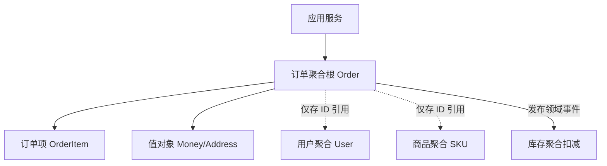

# 架构治理与工程实践面试

## 架构演进

### 【中等】一个单体项目整体吞吐达到 1 万 QPS，要微服务化拆分吗？⭐⭐⭐⭐

> 🎯 目标等级：L2 ｜ ⏱ 建议用时：15 min ｜ 🏷 标签：架构设计 / 微服务拆分

#### 💎 关键结论

不建议拆。1 万 QPS 不是微服务拆分的理由——拆分的驱动力是业务复杂度与团队协作，不是高并发。单体用缓存、异步、水平扩容三台机器即可扛住 1 万 QPS；只有团队、业务、资源等信号持续恶化（命中 3 个以上）才启动拆分，且拆错的代价远大于晚拆。

#### ⚡记忆卡片

- **口诀**：人少别折腾，人多再拆分；拆库先于拆服务，绞杀渐进不爆炸
- **关键词**：业务复杂度 ／ 团队协作 ／ 绞杀者模式 ／ 模块化单体 ／ 隐性成本
- **链路**：QPS 高 → 缓存 + 异步 + 扩容扛住 → 看六类拆分信号 → 命中 3+ 才拆 → 绞杀者渐进

#### 📖 核心知识

**微服务拆分的首要驱动力是业务复杂度和团队协作，而不是单纯的高并发。**

**单体如何扛住 1w QPS？**

| 手段           | 说明                        | 效果                    |
| :------------- | :-------------------------- | :---------------------- |
| **缓存**       | Redis 挡住 90% 的读请求     | 读 QPS 1w → DB 1k       |
| **异步**       | MQ 削峰填谷，异步处理写请求 | 写流量平滑，系统不垮    |
| **集群**       | 单体水平扩容，前面挂 Nginx  | 3 台机器即可分担 1w QPS |
| **数据库优化** | 索引、分库分表（必要时）    | 数据库不再是瓶颈        |

**微服务拆分的考量维度？**

| 维度                         | 需要拆分的信号                                                         | 记忆点                             |
| :--------------------------- | :--------------------------------------------------------------------- | :--------------------------------- |
| **团队**（团队规模与协作）   | 团队 > 10 人，多个小组并行开发，频繁代码冲突、互相等待发版             | **人少别折腾，人多再拆分**         |
| **业务**（业务复杂度与边界） | 模块间耦合严重（如订单和用户表 JOIN 过多），改一处影响多处             | **业务耦合难维护，拆清边界各自顾** |
| **技术**（技术异构需求）     | 部分模块需不同技术栈（如 Go 写高并发，Python 做 AI）                   | **技术栈要换，微服务来担**         |
| **资源**（资源独立性与隔离） | 某个模块（如秒杀）占满 CPU 或内存，导致其他模块响应变慢                | **资源争抢乱，拆分各自安**         |
| **运维**（运维与发布频率）   | 核心模块需每周发版，非核心模块每日发版，但发版必须一起停服             | **发布频率不一致，独立部署最合适** |
| **性能**（性能独立扩缩容）   | 秒杀模块需要瞬间扩容 10 倍，但其他模块不需要，单体只能一起扩，浪费资源 | **部分模块要扩缩，拆分才能单独做** |

**决策清单：什么时候该拆？**

如果以下问题有 **3 个以上回答“是”**，可以考虑启动微服务拆分：

- **代码冲突**：合并代码时经常需要跟同事沟通解决冲突吗？
- **互相等待**：A 组的功能上线必须等 B 组的功能一起发布吗？
- **局部故障扩散**：一个模块出问题（如内存泄露）导致整个系统崩溃吗？
- **扩容浪费**：秒杀活动时，不得不把整个系统（包括不相关的模块）一起扩容吗？
- **技术束缚**：想用新的技术框架（如 Go 写高性能模块），但因为单体无法引入吗？
- **数据库耦合**：所有业务都挤在一个数据库里，连表查询越来越多，越来越慢吗？

**拆分落地要点**

- **渐进式拆分**：绞杀者模式（Strangler Fig）——从边缘、非核心模块开始拆，新需求用新服务承接，逐步绞杀旧单体，避免大爆炸式重写。
- **数据库先拆**：服务拆了但库没拆等于白拆（跨库 JOIN、分布式事务会回来）；先做库级隔离，跨服务查询用冗余字段/异构索引/数据服务层解决。
- **常见误区**：为拆而拆（没痛点硬拆）、拆得过细（运维成本失控、一次请求跨十几个服务）、拆完仍共享数据库、先拆服务后补基础设施（无注册中心/链路追踪/CI 就拆是灾难）。

#### 🔬 扩展知识

::: details

- 【L3】如果最终决定拆，第一个拆什么？从变更频率最高、与核心业务耦合最少的边缘模块开始（如通知、报表）；验证注册中心、链路追踪、部署流水线等基础设施后再碰核心链路，绞杀者式渐进替换。
- 【L3】拆与不拆的中间态有没有？有——模块化单体（Modular Monolith）：模块间通过接口/进程内事件通信、禁止跨模块直接访问表，保留单部署单元的简单性同时获得边界清晰；业务增长后可按模块边界物理拆分，迁移成本最低。
- 【L4】拆分后哪些原本免费的能力会变贵？本地事务变分布式事务、进程内调用变网络调用（延迟/失败/超时）、跨服务查询变数据同步问题、统一发布变多服务版本协调；拆分前需评估团队能否承担这些持续性成本。

:::

#### 🏭 实战场景

::: details

**量化参考**：单体应用优化后单机 3000~~5000 QPS 很常见（缓存 + 异步），1 万 QPS 三台机器即可，远低于拆分门槛；而微服务化后一次请求可能跨 5~~10 个服务，单次调用链 RT 增加几十 ms，运维成本至少增加一个专职团队——**拆分的隐性成本常被低估**。

**踩坑**：曾见团队因“技术先进性”把 8 人团队的单体拆成 20 个服务，发布从每天 1 次变成协调 3 天，联调成本超过开发成本——**组织规模不支持的拆分必然倒退**（业界已有“微服务回调”案例，如 Amazon Prime Video 重新合回单体模块）。

**场景**：某单体电商系统，30 人团队，日订单 50 万，整体 8000 QPS，每周发版一次且需停机 30 分钟，近半年三次因营销模块内存泄漏拖垮全站。分析：8000 QPS 本身不是拆分理由（缓存 + 3~4 台机器可扛），但三个信号同时命中：局部故障扩散（内存泄漏拖垮全站）、发布痛点（停机发版）、团队规模 30 人——应拆。优先级：先水平扩容消除停机发版（滚动发布），再把营销模块独立拆出（故障隔离 + 独立扩容），其余模块先做模块化单体整顿边界，观察一年后再评估是否继续拆——**用最小拆分解决最痛的信号**。

:::

#### ⚠️ 常见误区

::: details

常见误区：

- ❌ “QPS 上万了，必须微服务化” → QPS 是容量问题，用缓存/异步/水平扩容解决；拆分解决的是组织与复杂度问题，两者不是一回事。
- ❌ “先拆服务，基础设施后面再补” → 无注册中心、链路追踪、CI 就拆分是灾难，基础设施必须先行。
- ❌ “拆得越细越先进” → 拆得过细导致一次请求跨十几个服务，运维成本失控、RT 反而上升。

:::

#### 🔀 发散问题

- **Q：架构如何从单体演进到微服务再到云原生？** → 演进驱动力是团队规模与业务复杂度而非技术潮流，模块化单体先行、物理拆分后置，见本文档「架构如何演进：从单体、SOA、微服务到云原生」。
- **Q：如何用 DDD 找到拆分的边界？** → 微服务边界 ≈ 限界上下文，用事件风暴梳理领域事件聚类出上下文，见本文档「如何用 DDD 指导系统设计与微服务拆分」。

### 【中等】架构如何演进：从单体、SOA、微服务到云原生？⭐⭐⭐⭐

> 🎯 目标等级：L2 ｜ ⏱ 建议用时：12 min ｜ 🏷 标签：架构设计 / 架构演进

#### 💎 关键结论

四代架构各有优劣：单体简单但只能整体扩展，SOA 靠 ESB 集中编排但中心化是瓶颈，微服务去中心化自治但引入分布式复杂度，云原生用容器 + K8s + Mesh 把运维交给平台。演进驱动力是团队规模与业务复杂度而非技术潮流（康威定律）；一句话：**架构演进是复杂度转移的过程——没有银弹，只有与业务阶段匹配的权衡。**

#### ⚡记忆卡片

- **口诀**：单体简单难扩展，SOA 总线成瓶颈，微服务自治带复杂度，云原生弹性交平台
- **关键词**：ESB ／ 去中心化 ／ 康威定律 ／ 模块化单体 ／ Serverless
- **链路**：单体 → SOA → 微服务 → 云原生，每步都是复杂度从代码转移到治理/平台

#### 📖 核心知识

| 架构       | 特征                                   | 优势                                 | 代价                                                   |
| :--------- | :------------------------------------- | :----------------------------------- | :----------------------------------------------------- |
| **单体**   | 所有代码一个部署单元                   | 开发测试部署简单，无分布式问题       | 只能整体扩展，一处故障全局不可用，团队协作冲突大       |
| **SOA**    | 服务化 + ESB 总线集中编排              | 系统间集成复用，异构系统互通         | ESB 中心化易成瓶颈与单点，治理重                       |
| **微服务** | 服务小而自治，去中心化治理             | 独立部署扩展、故障隔离、团队自治     | 分布式复杂度：服务发现、链路追踪、分布式事务、运维成本 |
| **云原生** | 容器 + K8s + Service Mesh + Serverless | 弹性伸缩、不可变基础设施、交付标准化 | 技术栈门槛高，架构与组织需同步转型                     |

**演进决策要点**：

- 演进驱动力是**团队规模与业务复杂度**，不是技术潮流——康威定律决定系统结构趋同于组织结构。
- 单体 → 微服务应是**模块化单体先行**（模块边界清晰后再物理拆分），而非推倒重来；拆错的代价远大于晚拆。
- 云原生不是“容器化部署”这么简单，核心是充分利用云的弹性与托管能力（Serverless、托管中间件），把运维复杂度交给平台。

**失效场景**：康威定律的反作用——组织按技术层分组（前端组/后端组/DBA 组）时，任何按业务域的微服务拆分都会被跨组协作成本拖垮；架构演进必须与组织调整同步。

#### 🔬 扩展知识

::: details

- 【L3】SOA 的 ESB 为什么被淘汰？它的思想还有留存吗？ESB 把编排逻辑集中在总线，变更/扩容/故障都汇聚一点，违背去中心化；但其“统一集成、协议转换、服务目录”思想活在今天的 API 网关、iPaaS、Service Mesh 中——技术形态更替，集成需求不变。
- 【L3】Serverless 适用与不适用的边界？适用：事件驱动、低频突发、无状态短任务（图片处理、定时任务、Webhook）；不适用：长连接（IM）、低延迟要求（冷启动 100ms+）、有状态服务。冷启动与供应商锁定是两大代价。
- 【L4】判断“该上微服务了”的可量化信号？发布互相阻塞频率（月均 >3 次）、代码冲突率（每周合并冲突 >10 次）、故障爆炸半径（单模块故障拖垮全站次数）、扩容浪费率（为小模块扩整个单体）；多个信号持续恶化才是拆分时机，而非技术规划驱动。

:::

#### 🏭 实战场景

::: details

**量化与踩坑**：微服务化的隐性成本常被低估：一个 5 人团队维护 20 个服务，每人同时跟进 4 个服务的发布/告警/依赖升级，开发效率反降——**服务能力数与团队规模有隐含比例（业界经验：2-pizza 团队维护 3~10 个服务为宜）**。曾见团队“云原生改造”只做容器化但无 CI/弹性伸缩，运维成本不降反升——**云原生价值在平台能力，不在容器本身**。

**场景**：创业公司 B 轮，研发团队从 15 人扩到 60 人，单体应用（Java + MySQL）每周发版需全组协调，近 3 个月两次因支付模块 bug 拖垮全站。CTO 提出“全面微服务化 + K8s + Service Mesh”。评估：诊断——痛点真实（发布阻塞、故障扩散、团队 60 人已超单体协作上限），方向对但节奏过激进。建议：第一步模块化单体内建边界（一个月，零风险）；第二步拆支付模块（故障隔离优先，验证 CI/链路追踪/服务发现基础设施）；第三步按季度节奏拆其他模块；Service Mesh 等高级能力等 20+ 服务后再评估，现阶段运维能力不匹配。核心：**演进节奏与团队能力匹配，比目标架构本身更重要**。

:::

#### 🔀 发散问题

- **Q：微服务拆分的决策信号与落地步骤是什么？** → 六类信号命中 3+ 才拆，绞杀者渐进，见本文档「一个单体项目整体吞吐达到 1 万 QPS，要微服务化拆分吗」。
- **Q：微服务间的通信与网关怎么设计？** → 统一入口 + 路由/鉴权/限流/协议转换，见「如何设计一个网关」。

### 【中等】什么是六边形架构？与分层架构、整洁架构有何区别？⭐⭐⭐

> 🎯 目标等级：L2 ｜ ⏱ 建议用时：10 min ｜ 🏷 标签：架构设计 / 架构风格

#### 💎 关键结论

六边形架构（Ports and Adapters）：业务核心居中，所有外部依赖通过**端口**（接口）交互，具体技术实现作为**适配器**挂在端口上，领域层依赖倒置不依赖任何技术组件——数据库从 MySQL 换 ES 只需换适配器。它与整洁架构本质都是**依赖倒置的架构化表达**，目标都是保护领域核心不受技术细节污染；结构较重，小项目使用是过度设计。

#### ⚡记忆卡片

- **口诀**：核心居中端口接，适配器可换不伤芯
- **关键词**：端口 ／ 适配器 ／ 驱动侧 ／ 被驱动侧 ／ 依赖倒置
- **链路**：驱动适配器（Controller/MQ）→ 驱动端口 → 领域核心 → 被驱动端口 → 被驱动适配器（MyBatis/Kafka）

#### 📖 核心知识

**六边形架构（Ports and Adapters）**：业务核心居中，所有外部依赖通过**端口**（接口）交互，具体技术实现作为**适配器**挂在端口上。

- **驱动端口（内侧）**：定义业务用例接口，由驱动适配器调用（Controller、MQ 消费者、定时任务）。
- **被驱动端口（外侧）**：声明业务需要的基础设施接口（仓储、消息发送），由被驱动适配器实现（MyBatis、Kafka Client）。
- 领域层通过依赖倒置不依赖任何技术组件，数据库从 MySQL 换 ES 只需换适配器。

| 架构       | 核心思想                                 | 优势                           | 局限                                                    |
| :--------- | :--------------------------------------- | :----------------------------- | :------------------------------------------------------ |
| 分层架构   | 按技术职责分层（Controller/Service/DAO） | 简单直观，团队熟悉             | 业务易泄漏到 Service 层；依赖自顶向下，底层变更影响上层 |
| 整洁架构   | 依赖方向由外向内指向实体/用例核心        | 依赖规则清晰，核心稳定         | 概念偏抽象，落地粒度粗                                  |
| 六边形架构 | 端口 + 适配器，内外对称，依赖倒置        | 领域可独立测试，技术组件可替换 | 结构较重，小项目过度设计                                |

三者一脉相承：整洁架构与六边形架构本质都是**依赖倒置的架构化表达**，目标都是保护领域核心不受技术细节污染。适用场景：领域逻辑复杂、需要多协议接入（HTTP + MQ + RPC）或频繁替换技术组件的系统。

#### 🔬 扩展知识

::: details

- 【L3】六边形架构与 DDD 分层架构的关系：DDD 四层（接口/应用/领域/基础设施）中，领域层 + 应用层构成六边形的核心，接口层与基础设施层分别对应驱动/被驱动适配器，两者常配合使用。
- 【L3】什么信号说明项目该引入六边形？领域逻辑需要脱离框架单测（Mock 端口即可测核心逻辑）、需要对接多套异构外部系统、或技术组件预期会更换；否则分层架构的简单性更划算。

:::

#### 🔀 发散问题

- **Q：领域层不依赖框架的思想在 DDD 中如何体现？** → 领域层不依赖框架（依赖倒置）、避免贫血模型，见本文档「如何用 DDD 指导系统设计与微服务拆分」。
- **Q：应用层只做编排是什么含义？** → 充血模型下 Service 只调领域对象、管事务、发事件，见本文档「什么是贫血模型与充血模型？为什么 DDD 推荐充血模型」。

## DDD

### 【中等】如何用 DDD 指导系统设计与微服务拆分？⭐⭐⭐⭐

> 🎯 目标等级：L2 ｜ ⏱ 建议用时：15 min ｜ 🏷 标签：架构设计 / DDD

#### 💎 关键结论

微服务拆分的本质是找边界，DDD 是目前最系统的找边界方法论。战略设计用限界上下文定边界（微服务边界 ≈ 限界上下文）、统一语言统一术语、上下文映射定集成方式；战术设计用实体/值对象、聚合、领域事件组织代码。落地靠事件风暴梳理「事件→命令→聚合」，边界自然浮现；拆分依据是业务语义而非技术职责。

#### ⚡记忆卡片

- **口诀**：上下文定边界，统一语言通术语，事件风暴出模型
- **关键词**：限界上下文 ／ 统一语言 ／ 聚合 ／ 领域事件 ／ 事件风暴
- **链路**：事件风暴 → 领域事件聚类 → 限界上下文 → 微服务边界 → 事件驱动集成

#### 📖 核心知识

**核心概念（战略设计）**

- **限界上下文（Bounded Context）**：业务语义的边界，同一个词在不同上下文含义不同（如“商品”在销售和库存中字段不同）——**微服务边界 ≈ 限界上下文**。
- **统一语言**：开发、产品、业务用同一套术语，模型即代码。
- **上下文映射**：防腐层（ACL，隔离外部模型变化）、开放主机服务、共享内核等集成模式。

**核心概念（战术设计）**

- **实体 vs 值对象**：有唯一标识、有生命周期的是实体（订单）；只关心值的是值对象（地址、金额，应不可变）。
- **聚合与聚合根**：一致性边界，外部只能通过聚合根访问内部对象（如订单项只能通过订单操作），保证事务一致性。
- **领域事件**：跨上下文协作首选事件驱动（订单已支付 → 库存服务扣减），实现解耦的最终一致。

**落地方法**

- **事件风暴（Event Storming）**：业务专家 + 开发在白板梳理领域事件 → 命令 → 聚合，自然浮现上下文边界。
- **分层架构**：接口层/应用层/领域层/基础设施层，领域层不依赖框架（依赖倒置）；避免贫血模型——把业务规则放回实体/领域服务而非 Service 过程式代码。

**常见误区**：CRUD 简单系统硬套 DDD 是过度设计；聚合设计过大（把整个订单+用户+商品塞一个聚合）导致锁竞争；只学战术不学战略（拆分边界错了，代码写得再漂亮也白搭）。

**落地权衡与失效场景**：事件风暴需要真正的业务专家参与，若只拉开发开会，产出的“领域事件”只是接口调用的翻版，边界必然失真；DDD 对 CRUD 为主的系统（管理后台、简单表单）是净负担——**先判断领域复杂度再决定投入**。曾见团队把“商品中心”按技术层拆（商品 DAO 服务、商品查询服务）而非按业务语义拆，导致一次商品发布跨 4 个服务事务——**拆分依据是限界上下文而非技术职责**。

#### 🔬 扩展知识

::: details

- 【L3】事件风暴具体怎么做？产出是什么？业务专家 + 开发在白板用便签梳理：橙签写领域事件（过去时）→ 蓝签写触发命令 → 黄签写聚合，按事件聚类自然浮现上下文边界；产出是上下文地图 + 统一语言词汇表，直接作为微服务拆分依据。
- 【L3】限界上下文与微服务一定一一对应吗？不一定——初期可以多个上下文部署在一个模块化单体内（逻辑边界先行），团队/流量增长后再物理拆分；反过来一个上下文也不应拆成多个服务，那会引入不必要的分布式事务。
- 【L4】上下文之间需要共享用户信息怎么办？优先 ID 引用 + 按需查询（防腐层隔离对方模型）；高频场景订阅用户事件冗余必要字段（最终一致）；严禁共享同一张用户表——共享表是上下文边界失效的第一信号。

:::

#### 🏭 实战场景

::: details

**场景**：某零售公司单体 ERP（20 人维护，含采购/库存/销售/财务四大模块），需求排期互相阻塞，库存模块发版常被财务功能卡住。拆分路径：先开事件风暴会，让采购/仓管/财务业务方各自描述核心事件（“采购单已审核”“库存已扣减”“发票已开具”），会发现四组事件自然聚类为四个上下文，且“商品”在采购（含成本价）与销售（含零售价）中语义不同——这是典型的上下文边界。落地顺序：先模块化单体内建边界（禁止跨模块 JOIN）→ 把发布节奏最被阻塞的库存模块独立为服务 → 跨上下文改用事件驱动（库存已扣减 → 财务记账）；节奏控制在每季度一个服务，基础设施（链路追踪/CI）先行。

:::

#### ⚠️ 常见误区

::: details

常见误区：

- ❌ “DDD 就是分层 + 聚合那套战术模式” → 只学战术不学战略，拆分边界错了，代码写得再漂亮也白搭。
- ❌ “按技术职责拆服务（DAO 服务、查询服务）” → 拆分依据应是限界上下文（业务语义），按技术层拆会让一次业务操作跨多个服务事务。
- ❌ “所有系统都该上 DDD” → CRUD 为主的简单系统是净负担，先判断领域复杂度再决定投入。

:::

#### 🔀 发散问题

- **Q：贫血模型与充血模型是什么，为什么 DDD 推荐充血？** → 贫血把逻辑放对象外退化为面向过程，充血让对象对状态负责，见本文档「什么是贫血模型与充血模型？为什么 DDD 推荐充血模型」。
- **Q：聚合与聚合根怎么设计才不过大？** → 小聚合、ID 引用、一个事务只改一个聚合，见本文档「如何设计聚合与聚合根？有哪些原则」。
- **Q：上下文之间的防腐层是什么？** → 隔离翻译外部模型防止腐蚀本域，见本文档「什么是防腐层（ACL）？什么场景需要它」。

### 【中等】什么是贫血模型与充血模型？为什么 DDD 推荐充血模型？⭐⭐⭐⭐

> 🎯 目标等级：L2 ｜ ⏱ 建议用时：12 min ｜ 🏷 标签：架构设计 / DDD 建模

#### 💎 关键结论

一句话：**贫血模型把业务逻辑放在了对象外面，充血模型让对象自己对自己的状态负责。**贫血模型下对象只有 getter/setter，规则散落各 Service，重复实现、状态可被绕过篡改；充血模型把状态流转、金额计算、合法性校验内聚到实体行为中。但纯 CRUD 系统贫血更简单，硬套 DDD 是过度设计——按规则复杂度选型。

#### ⚡记忆卡片

- **口诀**：贫血散逻辑，充血管状态；规则多则充血，CRUD 则贫血
- **关键词**：getter/setter ／ 实体行为 ／ 应用层编排 ／ 上帝类 ／ 绞杀者改造
- **链路**：规则散落 Service → 重复实现与越权篡改 → 行为收回实体 → 应用层只编排

#### 📖 核心知识

| 模型         | 特征                                   | 典型形态                                               | 问题                                                     |
| :----------- | :------------------------------------- | :----------------------------------------------------- | :------------------------------------------------------- |
| **贫血模型** | 领域对象只有 getter/setter，无业务行为 | `Order` 只有字段，业务逻辑全在 `OrderService`          | 对象沦为数据袋子，逻辑散落在 Service，退化为**面向过程** |
| **充血模型** | 领域对象同时包含数据与业务行为         | `order.pay()`、`order.cancel()` 内聚状态校验与流转规则 | 建模成本高，需要识别行为归属                             |

**贫血模型的危害**：

- 业务规则分散在多个 Service，同一规则（如“订单取消前必须未发货”）被重复实现，改一处漏一处。
- 状态可被随意 setter 篡改，绕过业务约束，对象可能处于非法状态。
- Service 层无限膨胀，出现几千行的上帝类。

**充血模型的落地要点**：把**业务规则**（状态流转、金额计算、合法性校验）放回实体/值对象/领域服务；应用层（Service）只做编排——调领域对象、管事务、发事件；注意区分实体行为与跨聚合逻辑（后者归领域服务或事件）。

**何时可以贫血**：纯 CRUD、报表类、无复杂规则的管理后台，贫血模型 + Service 更简单直接，硬套 DDD 反而过度设计。

**落地权衡**：充血模型的代价是建模成本高（需识别行为归属、维护领域层纯度），团队不熟时容易演化成“伪充血”（实体加了几个方法但逻辑仍在 Service）；存量贫血项目不宜全面重构，应在新需求涉及的模块逐步把规则收回实体（绞杀者式改造）。

#### 🔬 扩展知识

::: details

- 【L3】充血模型的行为如何持久化？实体带方法还能用 MyBatis/JPA 吗？可以——行为方法只改内存状态，持久化仍由仓储层（Repository）负责；关键是禁止 DAO 层被外部直接调用来改状态（不暴露 OrderItem 的独立更新接口），保证“所有变更必经聚合根”。
- 【L3】跨聚合的业务逻辑放哪里？不属于任何单个实体的规则归领域服务（Domain Service）；跨聚合的联动用领域事件最终一致（订单支付 → 事件通知库存扣减），不要在实体里直接调用其他聚合。
- 【L4】如何判断一个团队是否适合引入充血模型？看业务规则复杂度与变更频率：规则多且频繁变化（订单、账务、履约）适合充血，规则收敛在少数 Service 且稳定则贫血够用；团队对 DDD 无经验时硬上充血，产出往往是“两层过程式代码”，不如先培训再试点。

:::

#### 🏭 实战场景

::: details

**典型踩坑**：状态字段暴露 setter 导致绕过校验——曾有线上事故：客服后台直接 setter 改订单状态为“已发货”跳过库存校验，导致无货发货；充血模型下该操作只能通过 `order.ship()` 且内部校验前置状态，从机制上杜绝。

**场景**：某电商订单中心，`OrderService` 已膨胀到 1.2 万行，取消规则在 4 个入口重复实现（App 取消、超时取消、客服取消、拼团失败取消），半年内因规则不一致引发 3 次线上资损。重构方案：把取消规则收敛为 `order.cancel(reason)` 实体行为（内聚状态校验、库存释放、退券触发），4 个入口统一调应用服务编排，删除重复实现；落地用绞杀者模式：新入口先走新模型，旧入口逐个迁移，全程用订单状态机测试 + 状态流转单测护航；验收标准：取消规则只有一份代码、状态非法流转零发生。

:::

#### ⚠️ 常见误区

::: details

常见误区：

- ❌ “实体里加了方法就是充血模型” → 逻辑仍在 Service、实体方法只是透传，那是“伪充血”；关键看规则是否内聚在实体内。
- ❌ “所有系统都该改充血模型” → 纯 CRUD/报表系统贫血更简单，按规则复杂度选型，硬套是过度设计。
- ❌ “存量项目一次性重构成充血” → 全面重构风险极高，应借新需求绞杀式逐模块收回规则。

:::

#### 🔀 发散问题

- **Q：充血模型下聚合边界怎么划？** → 聚合是一致性边界，小聚合 + ID 引用 + 事件最终一致，见本文档「如何设计聚合与聚合根？有哪些原则」。
- **Q：DDD 如何指导微服务拆分？** → 限界上下文 ≈ 微服务边界，事件风暴找边界，见本文档「如何用 DDD 指导系统设计与微服务拆分」。

### 【困难】如何设计聚合与聚合根？有哪些原则？⭐⭐⭐⭐

> 🎯 目标等级：L2 ｜ ⏱ 建议用时：15 min ｜ 🏷 标签：架构设计 / DDD 战术

#### 💎 关键结论

聚合是一组相关对象的**一致性边界**，聚合根是对外的唯一入口。四大原则：保证真正的不变量、设计小聚合、用 ID 引用其他聚合、聚合间用领域事件最终一致。本质一句话：**边界内强一致，边界外最终一致**；判断依据是“业务上是否必须同一事务一致”，而非“数据是否相关”。

#### ⚡记忆卡片

- **口诀**：不变量守住，聚合要小，ID 相引用，事件来联动
- **关键词**：一致性边界 ／ 聚合根 ／ 小聚合 ／ ID 引用 ／ 领域事件
- **链路**：业务不变量 → 划一致性边界 → 聚合根唯一入口 → ID 引用外聚合 → 事件最终一致

#### 📖 核心知识

**四大设计原则**：

1. **保证真正的不变量**：聚合内所有业务规则必须在任何修改后保持一致（如订单总额 = 各订单项之和），一个事务只修改一个聚合。
2. **设计小聚合**：能用 ID 引用就不用对象引用；大聚合（订单+用户+商品全塞进来）会导致锁范围大、并发差、加载成本高。
3. **通过 ID 引用其他聚合**：订单只存 `userId`、`skuId`，需要时再查询，避免级联加载与跨聚合事务。
4. **聚合间用领域事件实现最终一致**：订单支付成功后发事件通知库存聚合扣减，而非同库事务强一致。



**实践要点**：聚合根负责校验入参、维护内部对象的生命周期；外部禁止绕过聚合根直接改订单项（DAO 层不暴露 OrderItem 的独立更新）；聚合边界过大的信号是“并发冲突多、加载慢、改一个字段锁整张表”。

**失效场景**：“一个事务只改一个聚合”原则在需要强一致的财务场景会失效（如账务必须借贷同事务平衡），此时要么扩大聚合边界，要么接受应用层校验 + 对账兜底。

#### 🔬 扩展知识

::: details

- 【L3】聚合内对象加载策略怎么定？聚合根加载应保证内部完整性（不变量校验需要），但可用延迟加载/部分加载优化：如订单聚合只在修改时加载订单项，查询展示走独立读模型（CQRS 思路）；避免“为了展示加载整个聚合”。
- 【L3】聚合根之间必须用 ID 引用，那展示时怎么拿到关联数据？读模型单独建模：查询场景直接 JOIN/ES 宽表，不走聚合加载；写场景才严格按聚合边界。读写分离是解决“聚合小而查询要全”矛盾的标配。
- 【L4】如何判断现有聚合设计是否合理？三个信号：并发冲突率（乐观锁重试频繁说明聚合太大或事务重叠）、加载成本（聚合加载 RT 超 10ms 说明太重）、跨聚合事务数量（多则说明边界划错，应合并或用事件）。

:::

#### 🏭 实战场景

::: details

**权衡与踩坑**：聚合大小是锁粒度与一致性的权衡——聚合越小锁竞争越小，但跨聚合一致性成本越高。曾有线上事故：订单聚合把用户、商品、优惠券全塞进来，一次下单锁三张表，大促时锁等待排队导致下单 RT 从 50ms 飙到 2s——**聚合过大是锁竞争的隐蔽根源**。

**场景**：订单中心重构，现有 Order 聚合包含订单、订单项、收货地址、用户信息、商品快照五个实体，大促下单并发冲突率高（乐观锁重试 5%）、单次加载 RT 30ms。重新设计：诊断——用户信息/商品快照不应在订单聚合内（生命周期独立、只读不变）；重构——Order 聚合只含订单项 + 金额不变量（总额=项之和），用户/商品用 ID 引用 + 下单时快照字段（不可变值对象）；收货地址拆为独立值对象随订单存（不可变）或独立聚合；下单与支付状态流转拆为两个聚合（订单聚合、支付聚合）用事件联动；预期效果：加载 RT 降到 10ms 内，乐观锁冲突率降到 <1%。

:::

#### ⚠️ 常见误区

::: details

常见误区：

- ❌ “数据相关的对象都该放进一个聚合” → 判断标准是业务上是否必须同一事务一致，生命周期独立的只读快照不应入聚合。
- ❌ “跨聚合可以用同库事务强一致” → 大事务锁多张表，大促锁等待排队；应用领域事件最终一致 + 对账兜底。
- ❌ “外部可以直接更新订单项” → 绕过聚合根会破坏不变量，DAO 层不应暴露内部对象的独立写接口。

:::

#### 🔀 发散问题

- **Q：读写矛盾（聚合小而查询要全）怎么解？** → 读模型独立建模（CQRS），见本文档「什么是 CQRS 与事件溯源？什么场景适用？」。
- **Q：聚合间的事件如何保证可靠投递？** → 本地消息表/事务消息 + 消费端幂等，见本文档「如何设计领域事件与事件驱动架构」。
- **Q：为什么 DDD 推荐充血模型？** → 不变量校验必须内聚在实体行为里才守得住，见本文档「什么是贫血模型与充血模型？为什么 DDD 推荐充血模型」。

### 【中等】什么是防腐层（ACL）？什么场景需要它？⭐⭐⭐

> 🎯 目标等级：L2 ｜ ⏱ 建议用时：8 min ｜ 🏷 标签：架构设计 / DDD 集成

#### 💎 关键结论

防腐层（Anti-Corruption Layer）是本系统与外部系统之间的**隔离翻译层**，把外部模型转换为本上下文的领域模型，防止外部概念“腐蚀”自己的领域。一句话：**防腐层是领域模型的门卫——外部概念翻译后才能入境。**适用于对接遗留/第三方系统、上下文语义不一致、预期会替换的外部依赖；但它有开发与性能成本，语义一致的简单集成用普通适配器即可。

#### ⚡记忆卡片

- **口诀**：外模先翻译，入境要隔离；语义一致时，适配器就够
- **关键词**：适配器 ／ 翻译器 ／ 门面 ／ 遗留系统 ／ 隔离变化
- **链路**：外部模型 → 适配器接协议 → 翻译器映语义 → 门面对内统一接口

#### 📖 核心知识

**为什么需要**：集成遗留系统、第三方服务时，对方的模型往往语义混乱（字段含义不明、概念与己方冲突，如对方的“账户”是账户 + 钱包的混合体）。若直接引用，外部模型的变化与糟糕语义会渗透进核心领域，日后替换外部系统时牵一发动全身。

**结构组成**：

- **适配器（Adapter）**：对接外部接口，完成协议与调用方式转换。
- **翻译器（Translator）**：外部模型 ↔ 本地领域模型的字段与语义映射。
- **门面（Facade）**：对内部提供简洁统一的本地接口，隐藏外部系统的复杂性。

**适用场景**：对接遗留/第三方系统（支付、物流、征信）；限界上下文之间语义不一致时的上下游对接；预期未来会替换外部依赖，需要隔离变化。注意防腐层有开发与性能成本，语义一致的简单集成用普通适配器即可，不必处处防腐。

#### 🔬 扩展知识

::: details

- 【L3】防腐层与网关/适配器的区别：网关侧重协议与流量治理，普通适配器只做接口转换；防腐层额外承担语义翻译与隔离职责，是 DDD 上下文映射的一种模式。
- 【L3】防腐层放在哪一层？属于本上下文的边界组件，通常位于基础设施层/应用层边缘，领域层只依赖自己定义的端口接口（依赖倒置）。

:::

#### 🔀 发散问题

- **Q：防腐层在 DDD 上下文映射中处于什么位置？** → 它是上下文映射的集成模式之一，与开放主机服务、共享内核并列，见本文档「如何用 DDD 指导系统设计与微服务拆分」。
- **Q：防腐层的依赖倒置思想与哪种架构相通？** → 六边形架构的端口与适配器，见本文档「什么是六边形架构？与分层架构、整洁架构有何区别？」。

### 【困难】什么是 CQRS 与事件溯源？什么场景适用？⭐⭐⭐⭐

> 🎯 目标等级：L2 ｜ ⏱ 建议用时：15 min ｜ 🏷 标签：架构设计 / CQRS

#### 💎 关键结论

CQRS 把读模型与写模型分开：写侧面向聚合与业务规则，读侧面向展示独立建模；事件溯源更激进，不存当前状态而存不可变事件序列，状态由重放推导。代价是最终一致性延迟、事件版本演进与复杂度陡增——只有读写诉求差异巨大或强审计的复杂领域才值得，普通 CRUD 系统使用是过度设计。

#### ⚡记忆卡片

- **口诀**：读写分开建模，事件存流重放；无审计不上溯源，CRUD 别硬套
- **关键词**：读写分离 ／ 独立读模型 ／ 不可变事件 ／ 快照 ／ 投影
- **链路**：读写诉求冲突 → 模型分离 → 事件异步同步读模型 → 事件溯源存事实 → 投影派生多视图

#### 📖 核心知识

**CQRS（命令查询职责分离）**：把读模型与写模型分开，命令侧（写）面向聚合与业务规则，查询侧（读）面向展示、独立建模。

- **动机**：读写诉求天然冲突——写要满足事务与业务校验（范式的聚合模型），读要高性能多条件检索（宽表、ES、缓存）；用一套 ORM 模型兼顾两头往往两头都做不好。
- **形态**：最轻量的是同库读写分离（写主库、读从库/读视图）；激进形态是独立读模型存储，由写侧事件异步同步。

**事件溯源（Event Sourcing）**：不存储对象的当前状态，而把每次状态变更作为**不可变事件**持久化（如账户流水），当前状态由事件序列重放推导得出。

- **优势**：完整审计轨迹、可回放任意时间点状态（查线上问题、修 bug 后重建数据）、事件天然可派生多个读模型。
- **适用**：金融账务、审计合规、交易流水等强审计领域。

| 维度           | 传统 CRUD | CQRS                 | CQRS + 事件溯源  |
| :------------- | :-------- | :------------------- | :--------------- |
| 复杂度         | 低        | 中                   | 高               |
| 读性能优化空间 | 受限      | 高                   | 高               |
| 审计/回放能力  | 无        | 无                   | 完整             |
| 典型场景       | 管理后台  | 读写差异大的核心交易 | 金融、账务、审计 |

**代价与边界**：引入最终一致性（读模型有延迟）、事件版本演进、架构复杂度陡增；只有读写诉求差异巨大或强审计的复杂领域才值得。

**失效场景**：读模型异步同步存在延迟窗口，用户“写后立读”场景会读到旧数据（如刚下单查不到），需读己之写处理（写后短期直读写模型）；事件 schema 演进若破坏兼容，旧事件重放失败。

#### 🔬 扩展知识

::: details

- 【L3】只做 CQRS 不做事件溯源可以吗？可以且更常见：写侧仍是 CRUD（主库），读模型由 binlog/事件异步同步到 ES/宽表；事件溯源是可选的激进形态，只在需要完整审计/回放时叠加。
- 【L3】事件溯源的查询怎么做？不能每次都重放吧？当前状态存快照 + 增量事件；查询走派生的读模型（投影 Projection），不直接查事件流；事件流只在重建/审计时使用。
- 【L4】什么信号说明系统该引入 CQRS 了？读写模型互相妥协（写表为查询加冗余字段、读 SQL 为迁就范式模型写十几层 JOIN）、读写负载差异超 10 倍需独立扩缩、或多方对同一数据有不同视图需求；三者命中两个以上再考虑。

:::

#### 🏭 实战场景

::: details

**量化与踩坑**：事件溯源的事件重放成本随历史增长：千万级事件的全量重建可达数小时，需定期快照（snapshot）加速（如每 1000 个事件存一次状态快照）；读模型重建是 CQRS 的杀手锄——读模型 schema 变更时可从事件流重建，但重建期间需双读新旧模型验证一致再切换。曾见团队在简单管理后台上全套 CQRS + 事件溯源，维护成本翻倍却无任何审计需求——**技术复杂度必须与领域复杂度匹配**。

**场景**：账务系统，日交易 500 万笔，监管要求任意时点可回放账户状态、保留 5 年完整流水，同时 C 端查询要支持多维筛选（时间/类型/商户）。设计：写侧事件溯源存不可变交易事件（复式记账借贷平衡），每账户每 1000 事件存一次余额快照；读侧事件投影到 ES（多维检索）与账户余额表（实时余额）；回放能力：任意时间点状态 = 最近快照 + 重放快照后事件，5 年数据分层存储（热 1 年在线、冷存储归档）；权衡：C 端写后立读余额直读写侧余额表，不走 ES（容忍 ES 秒级延迟）。

:::

#### ⚠️ 常见误区

::: details

常见误区：

- ❌ “CQRS 就是读写分离” → 主从读写分离只是 CQRS 的最轻形态；CQRS 的本质是读写模型各自独立建模，允许 schema 完全不同。
- ❌ “上 CQRS 就该配套事件溯源” → 两者可分离，更常见的是只做 CQRS；事件溯源只在强审计/回放需求下叠加。
- ❌ “写后立读与平时一样” → 读模型有异步延迟窗口，写己之读场景需直读写侧或短期回读。

:::

#### 🔀 发散问题

- **Q：写侧到读模型的异步同步如何保证可靠？** → 用领域事件 + 事务消息/本地消息表，见本文档「如何设计领域事件与事件驱动架构」。
- **Q：CQRS 读模型查询与聚合小而查询要全的矛盾有关吗？** → 有，读写分离建模正是聚合设计的配套方案，见本文档「如何设计聚合与聚合根？有哪些原则」。

### 【中等】如何设计领域事件与事件驱动架构？⭐⭐⭐⭐

> 🎯 目标等级：L2 ｜ ⏱ 建议用时：15 min ｜ 🏷 标签：架构设计 / 事件驱动

#### 💎 关键结论

领域事件表达“业务上已经发生的事实”，命名用过去时（OrderPaidEvent）。上下文内用进程内发布订阅，跨上下文用 MQ 实现解耦的最终一致。核心难题是本地事务与消息发送的原子性，用本地消息表或事务消息解决；消费端幂等是底线。一句话：**事件驱动用“事实广播”替代“远程调用”，上游无需知道下游是谁。**

#### ⚡记忆卡片

- **口诀**：事件过去时，幂等是底线，事务配消息，胖瘦取折中
- **关键词**：OrderPaidEvent ／ 本地消息表 ／ 事务消息 ／ 幂等去重 ／ 死信队列
- **链路**：业务事实发生 → 事务内落事件 → MQ 广播 → 下游幂等消费 → 对账兜底

#### 📖 核心知识

**领域事件**表达“业务上已经发生的事实”，命名用过去时（订单已支付 OrderPaidEvent），内容包含发生时间、业务标识与关键数据快照。

**两个层次**：

- **上下文内事件**：进程内发布订阅（Spring `ApplicationEventPublisher`），同步或异步解耦同服务内的联动逻辑。
- **跨上下文事件**：通过 MQ 发布，下游上下文订阅消费，实现解耦的最终一致协作（订单已支付 → 库存扣减、积分发放、物流建单）。

**事务一致性（高频追问）**：本地事务提交与消息发送无法原子，经典方案：

- **本地消息表**：业务数据与事件记录同事务落库，后台任务扫表投递 MQ，投递成功后标记。
- **事务型消息**：RocketMQ 事务消息，半消息 + 本地事务回查。

**消费端要点**：幂等是底线（事件至少投递一次，用业务唯一键去重）；顺序性需求用分区顺序消息；事件内容向后兼容演进（只加字段不删改）。

**权衡与失效场景**：事件驱动降低耦合但增加可观测性成本——链路从同步调用链变成异步事件流，出问题时需要事件溯源能力（事件 ID 贯穿日志）；事件载荷放全量数据（胖事件）下游方便但事件膨胀，只放 ID（瘦事件）下游需回查上游（重新引入耦合），通常折中：关键数据快照 + ID。下游消费积压时最终一致窗口拉长（分钟级），业务需容忍或监控告警；事件顺序丢失时（分区键设计不当），下游可能先收到“订单已取消”后收到“订单已支付”，需按事件时间/版本号幂等收敛。

#### 🔬 扩展知识

::: details

- 【L3】本地消息表与事务消息怎么选？本地消息表不依赖 MQ 特性、可控性强，但有扫表延迟与 DB 压力；RocketMQ 事务消息无扫表开销、实时性高，但绑定特定 MQ 且回查逻辑需实现。新架构优先事务消息，存量系统无事务 MQ 时用本地消息表。
- 【L3】事件消费失败无限重试会怎样？如何设计重试策略？无限重试会堵塞分区（顺序消息）或放大故障；策略：指数退避重试 N 次（如 16 次）→ 进死信队列 → 告警人工介入；非关键事件可降级记录后跳过，关键事件死信必须处理闭环。
- 【L4】事件与命令的区别是什么？混用会怎样？事件是“已发生的事实”（过去时，订阅者可自由忽略）；命令是“请求做某事”（可被拒绝，一对一）。用命令式消息做广播会导致下游被迫同步处理；用事件做必须成功的调用（如扣款）则丢失可靠性保证——语义混淆是事件架构腐化的开始。

:::

#### 🏭 实战场景

::: details

**踩坑**：曾有线上事故：订单事件下游新增消费者后未做幂等，一次 MQ 重投导致积分重复发放数万元——**新消费者接入必须幂等审查**。

**场景**：订单支付成功后需联动 5 个下游（库存、积分、优惠券、物流、数据报表），当前用同步 RPC 串行调用，支付回调 RT 2s 且任一服务故障导致回调失败重试风暴。改造：改为事件驱动，支付成功发布 OrderPaidEvent（事务消息保证与支付状态同生同死）；5 个下游各自订阅独立消费，天然隔离故障（积分服务挂了不影响库存）；RT 从 2s 降到回调处理 <100ms；关键控制：每个消费者幂等（支付单号去重）、按支付单号分区保序、消费积压分钟级告警；对账兜底：每日校验“支付成功单数 = 各下游处理单数”，差异自动补偿。演进注意：同步改异步期间双跑验证，确认无丢事件再下线同步链路。

:::

#### 🔀 发散问题

- **Q：事件与分布式事务是什么关系？** → 可靠消息最终一致是分布式事务的主流方案之一，见「如何实现分布式事务」。
- **Q：事件消费积压导致链路看不见怎么办？** → 事件 ID 贯穿日志 + 链路追踪透传，见「如何实现链路追踪」。

## 容量与成本

### 【中等】项目上线后，一般要关注哪些指标？⭐⭐⭐

> 🎯 目标等级：L2 ｜ ⏱ 建议用时：8 min ｜ 🏷 标签：架构设计 / 上线监控

#### 💎 关键结论

新项目上线要看四类指标：性能指标（QPS/RT/吞吐量）看系统扛不扛得住，错误指标（错误率/异常日志）看服务稳不稳，资源指标（CPU/内存/IO/带宽）看资源够不够，业务指标（PV/UV/转化率/留存）看业务顺不顺。四类缺一不可——只盯资源不看业务，系统“健康”但业务掉量也发现不了。

#### ⚡记忆卡片

- **口诀**：性能看扛压，错误看稳定，资源看余量，业务看转化
- **关键词**：QPS ／ RT ／ 错误率 ／ CPU ／ 转化率
- **链路**：请求进入 → 性能指标承压 → 错误指标报警 → 资源指标见底 → 业务指标受损

#### 📖 核心知识

新项目上线需监控四类指标：

- **性能指标**：QPS、RT、吞吐量 → 系统能不能扛住？
- **错误指标**：错误率、异常日志量 → 服务稳不稳定？
- **资源指标**：CPU、内存、磁盘 IO、网络带宽 → 资源够不够用？
- **业务指标**：PV/UV、核心接口调用量、核心转化率、留存率 → 业务跑得顺不顺？

#### 🔬 扩展知识

::: details

- 【L3】指标之上还要定告警阈值与分级：核心链路 P99 RT、错误率用“同比/环比突增”动态阈值比固定值更准；告警按 P0（电话）/P1（IM）/P2（日报）分级，避免告警疲劳。
- 【L4】进一步建立“指标 → 定位”链路：指标异常时靠链路追踪下钻到具体服务与慢调用，监控（发现问题）与链路追踪（定位问题）是三支柱中的两支柱，需配套建设。

:::

#### 🔀 发散问题

- **Q：接口响应变慢了，如何用这些指标定位？** → 先看监控分位数（P99 而非均值）定方向，再逐层下钻网络、数据库、代码，见本文档「接口响应慢如何排查」。
- **Q：这些指标如何支撑高可用目标？** → 监控告警压缩 MTTR 的“发现时间”，是 4 个 9 的必要条件，见「如何设计一个高可用系统」。

### 【中等】如何做系统容量评估与压测？⭐⭐⭐⭐

> 🎯 目标等级：L2 ｜ ⏱ 建议用时：15 min ｜ 🏷 标签：架构设计 / 容量压测

#### 💎 关键结论

容量评估是从业务指标倒推资源：峰值 QPS 估算 → 单机压测定拐点 → 机器数 = 峰值/单机 × 冗余。压测分两级：单机压测找拐点（安全容量取拐点 70%~80%），全链路压测在生产环境施压并配套流量染色、影子表、下游挡板。核心纪律：按真实流量模型构造用例，只压主路径的压测没有价值。

#### ⚡记忆卡片

- **口诀**：业务倒推峰值，单机压拐点，全链染色影子表，梯度增压看水位
- **关键词**：利特尔法则 ／ 拐点 ／ 流量染色 ／ 影子表 ／ 水位运营
- **链路**：业务量 → 峰值 QPS → 单机拐点 → 全链路压测 → 安全容量与扩容

#### 📖 核心知识

**容量估算（从业务指标倒推）**

- 峰值 QPS 估算：日请求量 × 峰值系数（通常 80% 流量集中在 20% 时间）/ 峰值时段秒数，大促再乘业务预估倍数。
- 机器数 = 峰值 QPS / 单机容量 × 冗余系数（一般 1.5~2，保留故障切换余量）。
- **利特尔法则**：并发数 = QPS × 平均 RT，用于推算线程池/连接池大小（如 1000 QPS × 50ms = 50 并发）。

**压测方法论**

- **单机压测**：先测出单机极限 QPS 与拐点（RT 陡然上升处），安全容量取拐点的 70%~80%。
- **全链路压测**（大厂标配）：生产环境施压，需配套：
  - **流量染色**：压测流量带特殊标记（Header），全链路透传；
  - **影子表/影子库**：压测写流量落影子存储，不污染真实数据；
  - **下游挡板**：对第三方依赖 Mock 或提前报备扩容。
- **梯度增压**：从 30% 目标开始逐级加压，观察 CPU、RT、错误率拐点。

**常见坑**：只压入口不压下游（DB/Redis 先挂）；压测前没预热缓存导致数据失真；压测数据污染生产；只测新环境（配置/数据量与生产差异大）。

**水位运营**：日常 CPU 水位控制在 50%~60%，大促前按预估流量扩容并全链路压测验证；建立容量巡检与自动扩缩容机制。

#### 🔬 扩展知识

::: details

- 【L3】如何从业务数据估算峰值 QPS？经验公式：峰值 QPS ≈ 日总量 × 80% /（峰值小时数 × 3600）× 冗余系数（2~3）；大促场景直接用“预计 GMV / 客单价 / 活动秒数”倒推下单 TPS，再按读写比分解到各接口。
- 【L3】压测报告应包含哪些关键结论？单机拐点 QPS 与对应 RT/CPU、全链路瓶颈点（哪一层先挂）、安全容量与目标流量的倍数、扩容建议；没有瓶颈结论的压测报告没有价值。
- 【L4】全链路压测的影子方案如何隔离数据？压测流量打染色标记（Header 透传），DB/缓存/MQ 按标记路由到影子表/影子库/影子 Topic；对账类任务排除压测数据；压测结束后清理影子数据，防污染报表。

:::

#### 🏭 实战场景

::: details

**量化参考**：典型单机容量经验值（4C8G）：纯读缓存接口 5000~~1 万 QPS，含 DB 写的业务接口 500~~2000 QPS；MySQL 单实例写约 3000~~5000 TPS，Redis 单实例 8~~10 万 QPS。利特尔法则实战：接口 QPS 2000、RT 50ms → 需 100 并发，线程池配 100~150 即可，拍脑袋配 500 线程反而因上下文切换降低吞吐。

**踩坑**：曾有大促前全链路压测通过，但压测流量未覆盖“优惠券叠加计算”这一低频高耗时路径，大促当天该接口 RT 从 50ms 飙到 2s——**压测用例必须按真实流量模型构造，不能只压主路径**。

**场景**：直播平台年度晚会，预计峰值在线 500 万人，每人每 30 秒拉一次弹幕列表 + 每 10 秒上报一次心跳，预算有限只能提前 2 周准备。评估：拉弹幕 500万/30s ≈ 16.7 万 QPS，心跳 50 万 QPS——心跳必须改为长连接上报或延长间隔（30s→25 万 QPS），否则带宽与连接数先崩；弹幕列表做 CDN/边缘缓存（同一直播间内容相同，命中率 >95%），回源压力降两个数量级。压测计划：第一周单机压测定拐点，第二周全链路压测验证长连接容量（单机长连接约 10 万，需 50+ 接入节点）；核心教训：**容量评估先砍需求（改协议/改频率），再谈扩容**。

:::

#### 🔀 发散问题

- **Q：压测出的容量如何换算成成本？** → 机器数 × 单价只是起点，还要算网络、存储与隐性运维成本，见本文档「如何估算一个技术方案的资源成本」。
- **Q：限流阈值与压测容量是什么关系？** → 阈值必须基于压测容量设定（如容量的 80%），拍脑袋设阈值形同虚设，见「如何实现流量控制」。

### 【中等】如何估算一个技术方案的资源成本？⭐⭐⭐⭐

> 🎯 目标等级：L2 ｜ ⏱ 建议用时：12 min ｜ 🏷 标签：架构设计 / 成本估算

#### 💎 关键结论

成本估算是架构评审的必答题：方案再优雅，算不清账就落不了地。核心是把“技术方案”翻译成“资源清单”，再乘单价与使用时长。方法上四步走：单位经济模型定口径、容量倒推算资源、类比校准防拍脑袋、给增长留量并标出成本拐点。最常被漏掉的是跨 AZ 流量与出公网带宽。

#### ⚡记忆卡片

- **口诀**：方案翻成资源清单，单位经济打头阵，类比校准留增长
- **关键词**：单位经济模型 ／ 冗余系数 ／ 跨 AZ 流量 ／ 成本拐点
- **链路**：业务规模 → 单位成本 → 容量倒推资源 → 类比校准 → 增长留量

#### 📖 核心知识

**成本构成清单**

| 类别     | 明细                                  | 易漏点                     |
| :------- | :------------------------------------ | :------------------------- |
| 计算     | 应用服务器、容器、函数调用次数、GPU   | 峰谷比导致的冗余成本       |
| 存储     | 数据库容量、对象存储、日志、备份副本  | 数据增长率、副本数（×2~3） |
| 网络     | 公网带宽、CDN、跨 AZ/跨区流量         | 出流量收费、CDN 回源       |
| 中间件   | MQ、缓存、ES、负载均衡实例            | 按集群规格而非按量         |
| 隐性成本 | 人力运维、监控告警、多活冗余、license | 常被完全忽略，实际占大头   |

**估算四步法**：

1. **单位经济模型**：先算单位业务量的成本（每万 DAU / 每万订单 / 每千次调用多少钱），再乘业务规模——这是向上汇报最有说服力的数字。
2. **容量倒推**：峰值 QPS → 单机能力 → 机器数 × 冗余系数（2~3）→ 按月折算；存储按「日增量 × 保留期 × 副本数」估。
3. **类比校准**：拿公司内相似系统或行业数据校准（如同类 Feed 流系统单 UV 成本），防止拍脑袋偏差过大。
4. **给增长留量**：按 6~12 个月业务增长估算，而非当前量；同时给出「成本拐点」（什么规模下单价会跳变，如分库分表、带宽阶梯价）。

#### 🔬 扩展知识

::: details

- 【L3】估算不准怎么办，如何控制风险？灰度放量 + 滚动校准：先按 3 个月量预采购/预留，上线后按周对比「实际单位成本 vs 预估」，偏差 >20% 即触发复盘；云上用按量 + 预留实例组合（预留覆盖保底流量 60~70%，按量吸收波动）。
- 【L3】哪些成本科目最容易低估？出公网带宽与 CDN 回源、跨 AZ/跨区内网流量、存储副本与备份、日志存储与检索（日志量常与请求量同阶增长）、闲置资源（行业平均利用率仅 15~25%）、多活冗余的翻倍成本。
- 【L4】老板问「自建 IDC 还是上云」怎么回答？分三档：流量稳定且规模大（万级服务器）自建更省（利用率可做到 50%+）；波动大或处于增长期用云（弹性是买的保险）；混合云常见做法是「保底流量自建/预留 + 峰值上云」。关键不是单价对比，而是利用率与弹性成本的权衡。

:::

#### 🏭 实战场景

::: details

**踩坑**：曾评审一个推荐系统上云方案，GPU 成本算得很准，但漏算了特征服务与推理服务跨 AZ 调用的内网流量费（占总量 30%），上线后预算超支 40% 被迫回迁——**跨 AZ 流量与出公网带宽是最常被漏掉的两个科目**。

**量化参考**：典型互联网应用成本结构中，计算约 40~~50%、存储约 20~~30%、网络约 15~25%、其余中间件与运维；估算误差控制在 ±30% 内算合格，超过就要回头检查假设。

**场景**：业务方要上线一个消息推送系统：日活 1000 万，人均日推送 10 条，推送内容带 20KB 富媒体，峰值集中在晚 8 点一小时内（占全天 40%），预算上限每月 10 万。估算：日消息量 1 亿条，日存储增量 1亿 × 20KB ≈ 2TB（保留 30 天 + 双副本 ≈ 120TB，对象存储约 1.5 万/月）；峰值写入 1亿 × 40% / 3600 ≈ 1.1 万 TPS，推送网关需 10~~15 台 8C16G（约 1.2 万/月）；下行带宽若全走公网 = 1亿 × 20KB × 30 天 ≈ 600TB/月，**必然爆预算**——必须端侧缓存 + 内容去重 + CDN 预热，把回源压到 10% 以内（约 2 万/月）。合计约 5~~6 万/月，预算内可行；结论先行：**这道题的胜负手不在计算而在带宽，先砍流量再算钱**。

:::

#### 🔀 发散问题

- **Q：成本估出来之后，如何系统性降本？** → 按收益/风险比分档：先清浪费、再改计费、后动架构，见本文档「系统设计中有哪些常见的成本优化手段」。
- **Q：成本如何纳入架构演进的长效机制？** → 用 FinOps 闭环把单位经济成本纳入评审与 OKR，见本文档「如何在架构演进中做成本治理（FinOps）」。

### 【中等】系统设计中有哪些常见的成本优化手段？⭐⭐⭐

> 🎯 目标等级：L2 ｜ ⏱ 建议用时：12 min ｜ 🏷 标签：架构设计 / 成本优化

#### 💎 关键结论

成本优化要按「收益/风险比」分档推进：先捡无风险的西瓜，再做要排期的手术。五类手段——资源利用率、架构优化、计费模式、数据治理、流程治理；优先级口诀：先清浪费（零风险）、再改计费（零代码改动）、后动架构（要开发排期），前两类两周见效，架构类按季度规划。

#### ⚡记忆卡片

- **口诀**：先清浪费，再改计费，后动架构
- **关键词**：混部装箱 ／ 弹性伸缩 ／ 预留实例 ／ 冷热分离 ／ 闲置巡检
- **链路**：浪费清理 → 计费优化 → 数据治理 → 架构优化 → 流程防反弹

#### 📖 核心知识

**五类优化手段**

| 类别       | 手段                                                         | 典型收益 | 风险等级     |
| :--------- | :----------------------------------------------------------- | :------- | :----------- |
| 资源利用率 | 混部/装箱优化、弹性伸缩、超卖、降配僵尸实例                  | 20~40%   | 低           |
| 架构优化   | 加缓存、异步化、读写分离、冷热分离、压缩、计算下推           | 30~90%   | 中（需排期） |
| 计费模式   | 预留实例/节省计划、Spot 竞价实例、按量转包年、阶梯价谈判     | 20~70%   | 低           |
| 数据治理   | 日志瘦身、过期清理、低频数据降级存储（标准→低频→归档）、去重 | 30~60%   | 中           |
| 流程治理   | 资源申请审批、标签强制、闲置巡检、配额管理                   | 10~20%   | 无           |

**优先级口诀**：先清浪费（僵尸资源、超配规格），再改计费（零代码改动），后动架构（要开发排期）——前两类两周见效，架构类按季度规划。

#### 🔬 扩展知识

::: details

- 【L3】缓存、异步、压缩这些手段，什么时候会反噬成本？缓存：命中率低于 60~70% 时内存成本 > 省下的计算成本，且引入一致性维护成本；异步：MQ 本身是成本，且拉长链路增加排障成本；压缩：CPU 换带宽，CPU 紧张时反而亏——每个手段都有盈亏平衡点，先量化再上。
- 【L3】降本会不会伤稳定性？边界在哪？会。红线：不砍容灾冗余（异地备份/多活）、不砍核心链路容量安全水位（峰值 ×2 以内不动）、不砍可观测性（监控日志是故障时的救命钱）。可砍的是：无主资源、低优任务的规格、过长的数据保留期。
- 【L4】如何判断一个系统是否过度设计导致的隐性成本？三个信号：利用率长期 <10%、组件数与业务规模不成比例（日活 1 万却上了全套微服务 + 多活）、维护人力成本超过资源成本。对策是做「架构适配度」评审，该合模块就合、该下云就下。

:::

#### 🏭 实战场景

::: details

**踩坑**：曾推动把一批低优批处理任务切到 Spot 实例省 70% 算力费，没做中断容错，某次大规模回收导致离线报表断供两天——**Spot 省的钱必须配套检查点重试/任务可重入设计，否则是把稳定性换成本**。

**量化参考**：行业经验——云资源平均利用率仅 15~~25%，仅「降配 + 清理僵尸资源」一轮通常就能降 15~~30%；缓存命中率每提升 1%，对应后端计算成本约降 1%。

:::

#### 🔀 发散问题

- **Q：降本成果如何长效保持不反弹？** → 靠 FinOps 运营阶段：成本进架构评审、单位成本进 OKR，见本文档「如何在架构演进中做成本治理（FinOps）」。
- **Q：优化前如何先算清楚钱花在哪？** → 把方案翻译成资源清单做单位经济建模，见本文档「如何估算一个技术方案的资源成本」。

### 【困难】如何在架构演进中做成本治理（FinOps）？⭐⭐⭐

> 🎯 目标等级：L2 ｜ ⏱ 建议用时：15 min ｜ 🏷 标签：架构设计 / FinOps

#### 💎 关键结论

FinOps 的本质不是砍预算，而是建立「谁花钱、谁看见、谁负责」的成本责任体系，让成本决策像性能决策一样成为架构评审的一部分。路径是三阶段闭环：可视化（标签 + 账单拆分）→ 优化（单位经济 + Top N 专项）→ 运营（评审 + 预算 + OKR）。盯的指标是单位经济成本而非总成本——总成本随业务增长自然上涨，单位成本下降才是真治理成果。

#### ⚡记忆卡片

- **口诀**：看得见、优得动、运营得住；盯单位成本，不砍容灾线
- **关键词**：资源标签 ／ 单位经济成本 ／ 成本大盘 ／ 预算审批 ／ 无主资源
- **链路**：标签可视化 → 单位成本度量 → Top N 优化 → 评审运营 → 防反弹

#### 📖 核心知识

**FinOps 三阶段闭环**

| 阶段   | 关键动作                                                             | 产出                 |
| :----- | :------------------------------------------------------------------- | :------------------- |
| 可视化 | 强制资源打标签（团队/业务/环境）、成本大盘按团队聚合、账单拆分到服务 | 每一分钱有主         |
| 优化   | 定义单位经济成本（成本/万订单）、Top N 花费项专项优化、闲置巡检      | 降本行动项与兑现金额 |
| 运营   | 成本纳入架构评审、月度成本评审会、预算与超支审批、单位成本进 OKR     | 长效机制，防反弹     |

**关键指标**：绝对成本会随业务增长自然上涨，FinOps 盯的是**单位经济成本**（Unit Economics）——每万订单成本、每千次查询成本、单 UV 成本；单位成本下降才是真治理成果。

**落地难点与对策**：

- **标签治理难**：存量资源无标签 → 设「无主池」，限期认领，逾期冻结/回收；新资源在 IaC 流水线强制校验标签，缺标签直接拒绝创建。
- **组织激励缺失**：省下的钱与团队无关就没人配合 → 把降本兑现计入团队预算额度（省得多，下季度可支配额度大），超支需走审批，形成正反馈。
- **数据可信度**：账单分摊口径不一致引发扯皮 → 财务、SRE、业务三方对齐分摊规则（共享资源按调用量/容量比例摊），大盘数据唯一出口。

#### 🔬 扩展知识

::: details

- 【L3】FinOps 为什么强调单位成本而非总成本？业务增长时总成本必然上涨，拿总成本考核会逼团队拒需求；单位成本（成本/业务量）剥离了增长因素，直接反映效率——同样服务一单生意，去年花 0.5 元今年花 0.3 元，才是工程进步。
- 【L3】降本 20% 的目标怎么拆解才不伤稳定性？分三档：浪费清理（无风险，目标 10%）+ 计费优化（低风险，目标 5~~7%）+ 架构优化（需排期，目标 3~~5%）；明确拒绝「为凑数字砍容灾/砍安全水位」，降本目标是效率而非绝对数字。
- 【L4】FinOps 平台团队应该怎么组建？虚拟团队起步：财务 BP（口径与预算）+ SRE（数据与巡检）+ 各业务线成本接口人（认领与优化）；平台化是第二阶段的事，先用「账单 + 标签 + 周会」跑通闭环再建系统，避免为治理建一套没人用的系统。

:::

#### 🏭 实战场景

::: details

**踩坑**：曾亲历公司云账单年增 80%，启动 FinOps 后发现 40% 花费来自无主资源（离职同学创建、测试忘删），仅「标签 + 认领 + 回收」三板斧第一个月降 22%——**没有标签体系的成本治理是盲打**。

**量化参考**：成熟 FinOps 体系通常第一年可实现 20~~30% 降本，之后进入单位成本持续优化阶段（年降 5~~10%）；账单可视化本身的投入（平台 3~5 人）在月账单 >50 万时才划算，小体量直接用云厂商账单工具 + 表格即可。

**场景**：公司上云两年，月账单从 80 万涨到 220 万，CFO 要求一个季度内降 30%，且不得影响核心业务 SLA。推进：应急——第一周拉账单明细按服务/标签聚合，找 Top 5 花费项（经验上占大头），优先清理确定性浪费（僵尸实例、超配规格、无主资源），两周兑现第一批 10~15% 降幅；根因——账单涨 2.75 倍而业务未同步涨，说明缺成本归属与度量机制；长期——建 FinOps 闭环（强制标签 + 成本大盘 + 单位成本进评审 + 月度评审出行动项）；权衡——30% 若全靠压容量必然伤 SLA，应拆成浪费清理、计费优化、架构优化三档，明确告知 CFO 架构档的兑现时间——**降本的目标是效率，不是数字达标**。

:::

#### 🔀 发散问题

- **Q：FinOps 的优化动作具体有哪些？** → 五类手段按收益/风险比分档推进，见本文档「系统设计中有哪些常见的成本优化手段」。
- **Q：架构评审时成本数字从哪来？** → 单位经济模型 + 容量倒推 + 类比校准，见本文档「如何估算一个技术方案的资源成本」。

### 【中等】跨海外业务请求延迟大怎么办？⭐⭐

> 🎯 目标等级：L2 ｜ ⏱ 建议用时：8 min ｜ 🏷 标签：架构设计 / 全球化

#### 💎 关键结论

物理距离不可改变，跨洋光纤往返延迟是毫秒级的物理下限，优化的根本在于**避免或减少实时跨国数据传输**：服务本地化让请求在目标区域闭环，数据预同步让海外节点提前拿到数据，实在避免不了的实时请求再用 CDN/专线 + 压缩优化传输。

#### ⚡记忆卡片

- **口诀**：本地部署降延迟，异步同步防跨海，网络压缩辅优化
- **关键词**：服务本地化 ／ 数据预同步 ／ CDN ／ 专线 ／ 压缩
- **链路**：物理距离不可变 → 减少实时跨国传输 → 本地部署闭环 → 异步预同步 → 网络层兜底

#### 📖 核心知识

- **服务本地化**：在目标区域部署完整应用和数据库，用户请求在本地闭环，大幅降低延迟。
- **数据预同步**：通过异步机制（主从复制、消息队列）提前将数据推送至海外，避免实时跨海读写。
- **网络优化**：无法避免的实时请求，使用 CDN、专线或 SD-WAN 优化路径，并启用数据压缩（Gzip、Snappy）减少传输体积。

#### 🔀 发散问题

- **Q：数据跨地域同步的一致性怎么保障？** → 跨城异步同步必然有延迟窗口，写冲突用单元化闭环或单点写多读规避，见「如何设计异地多活/容灾架构」。
- **Q：海外机房挂了怎么办？** → 纳入容灾体系统一考虑，先同城双活再异地冷备，见「如何设计异地多活/容灾架构」。

### 【中等】架构师需要掌握哪些延迟数量级？⭐⭐⭐⭐

> 🎯 目标等级：L2 ｜ ⏱ 建议用时：10 min ｜ 🏷 标签：架构设计 / 性能估算

#### 💎 关键结论

架构师做容量评估、缓存决策和成本估算时，必须对各级存储与网络的延迟有数量级直觉：**L1 缓存 0.5ns、内存 100ns、SSD 随机读 150μs、同机房往返 0.5ms、磁盘寻道 10ms、跨洲网络 150ms**——每跨一层放大 1~3 个数量级。掌握这张"延迟地图"，才能判断该不该加缓存、该不该合并请求、该不该同机房部署。

#### ⚡记忆卡片

- **口诀**：L1 半纳内存百，SSD 百微机房半毫，磁盘十毫跨洲百五
- **关键词**：0.5ns ／ 100ns ／ 150μs ／ 0.5ms ／ 10ms ／ 150ms
- **链路**：寄存器 → L1/L2 缓存 → 内存 → SSD → 同机房网络 → HDD → 跨洲网络（每层 1~3 个数量级）

#### 📖 核心知识

经典延迟对照表（Jeff Dean 等整理，业内常称 "Latency Numbers Every Programmer Should Know"）：

| 操作                    | 耗时   | 相对参照           |
| :---------------------- | :----- | :----------------- |
| L1 缓存访问             | 0.5 ns | 基准               |
| 分支预测失败            | 5 ns   |                    |
| L2 缓存访问             | 7 ns   | 14x L1             |
| 互斥锁加锁/解锁         | 25 ns  |                    |
| 内存访问                | 100 ns | 20x L2，200x L1    |
| Zippy 压缩 1KB          | 10 μs  |                    |
| 1Gbps 网络发送 1KB      | 10 μs  |                    |
| SSD 随机读 4KB          | 150 μs | 约 1GB/s           |
| 内存顺序读 1MB          | 250 μs |                    |
| 同数据中心往返（RTT）   | 500 μs |                    |
| SSD 顺序读 1MB          | 1 ms   | 4x 内存            |
| 磁盘寻道                | 10 ms  | 20x 同机房 RTT     |
| 1Gbps 网络传输 1MB      | 10 ms  | 40x 内存，10x SSD  |
| 磁盘顺序读 1MB          | 30 ms  | 120x 内存，30x SSD |
| 跨洲网络往返（CA↔荷兰） | 150 ms |                    |

单位换算：1 ns = 10⁻⁹ s，1 μs = 10⁻⁶ s，1 ms = 10⁻³ s。

由此推导的吞吐量基准：

- 磁盘顺序读约 **30 MB/s**；1Gbps 以太网约 **100 MB/s**（1Gbps ÷ 8）；
- SSD 约 **1 GB/s**；主存约 **4 GB/s**；
- 光速传播每秒绕地球 6~7 圈；同数据中心内每秒约 2,000 次往返。

典型的设计推论：

- **缓存该加在哪**：内存（100ns）比 SSD（150μs）快 1500 倍、比磁盘寻道快 10 万倍——热点数据放内存缓存的收益是数量级的；
- **批量化 vs 逐条**：一次磁盘寻道 10ms，N 次随机读就是 N×10ms，必须批量合并、顺序化（这也是 LSM、预读、分页的本质动机）；
- **服务部署距离**：同机房 RTT 0.5ms vs 跨洲 150ms 相差 300 倍——异地多活、就近接入（CDN/边缘节点）的必要性直接由数字决定；
- **网络也是瓶颈**：1Gbps 下传 1MB 要 10ms，大响应体必须压缩、分页、瘦身。

::: details 用延迟数做一次容量估算

**场景**：接口 P99 要求 200ms，每次请求需查询 5 条用户记录。

- 若逐条查 MySQL 且全部缓存未命中：5 ×（磁盘随机 IO ~10ms）= 50ms，尚可；若数据库在异地机房，再加 2 × 150ms RTT 直接超时。
- 若走 Redis 缓存（内存操作 ~100μs 级）：5 × 0.1ms + 1 次同机房 RTT 0.5ms ≈ 1ms，余量充足。
- **结论**：数字直接论证了"缓存 + 同机房部署"两个决策，这就是延迟数表的用法——用保守估算支撑架构决策。

:::

#### 🔀 发散问题

- **Q：如何用这些数字做系统容量评估？** → 延迟数 + 2 的次方表推算 QPS、存储、带宽上限并压测验证，见本文档「如何做系统容量评估与压测？」。
- **Q：估算出容量后如何折算成资源成本？** → 延迟/容量基础上叠加资源单价与利用率，见本文档「如何估算一个技术方案的资源成本？」。

## 问题排查

### 【中等】接口响应慢如何排查？⭐⭐⭐⭐

> 🎯 目标等级：L2 ｜ ⏱ 建议用时：15 min ｜ 🏷 标签：问题排查解决 / 性能排查

#### 💎 关键结论

先看监控定方向，再查网络和日志，重点排查数据库和代码，最后看外部依赖与并发量。进阶方法论：先拆链路再定位（链路追踪确定慢在哪一跳）、看分位数而非平均值（P99 而非均值）、区分突变与渐变（发布引起优先回滚验证）。

#### ⚡记忆卡片

- **口诀**：监控定方向，链路找哪跳，P99 看长尾，突变先回滚
- **关键词**：慢查询 ／ 连接池 ／ 锁竞争 ／ P99 ／ Arthas
- **链路**：监控看资源 → 链路追踪拆耗时 → 分位数判长尾 → 突变/渐变分流 → 深入该层定位

#### 📖 核心知识

**接口变慢排查步骤**

1. **看监控**：CPU、内存、磁盘、网络是否有瓶颈。
2. **查网络**：是否有延迟、带宽打满，尤其跨服务 / 跨区域调用。
3. **看日志**：确认是一直慢，还是特定场景 / 时间段慢。
4. **查数据库**：慢查询、锁竞争、连接池问题。
5. **查代码**：新功能是否有高复杂度算法、不必要同步、缓存失效。

**接口变慢原因**

- **资源瓶颈**
  - **CPU 高**：计算密集型任务（加密、大数据处理）→ 用 `top`/`htop` 定位进程。
  - **内存泄漏**：GC 频繁 → 用 `jvisualvm`/`JProfiler` 分析。
  - **磁盘 I/O 高**：频繁读写（数据库、日志）→ 用 `iostat`/`sar` 查看。
  - **网络问题**：带宽不足 / 高延迟 → 用 `ping`/`traceroute` 或云监控。
- **数据库**
  - **慢查询**：复杂 SQL、无索引、全表扫描 → 用慢查询日志 + `EXPLAIN`。
  - **连接池问题**：连接数不足 / 过多 → 用 HikariCP/Druid 监控。
  - **锁竞争**：行锁 / 表锁冲突 → 用 `SHOW ENGINE INNODB STATUS`（MySQL）。
- **代码性能**
  - **高时间复杂度**：循环、递归、排序处理大数据 → 用 JProfiler 找热点。
  - **同步 / 死锁**：`synchronized` 粒度太大、死锁 → 检查锁设计。
  - **缓存失效**：未用缓存、命中率低 → 检查缓存配置与命中率。
- **外部依赖**
  - **外部服务慢**：第三方 API / 支付网关 → 加超时、熔断、降级。
  - **并发过高**：超出接口承载能力 → 用负载均衡、限流。

**实战定位方法论**

- **先拆链路再定位**：网关耗时 → 应用耗时 → 下游 RPC/DB/缓存耗时，先看链路追踪确定慢在哪一跳，再深入该层，避免盲目排查。
- **看分位数而非平均值**：P50 正常但 P99 飙高 → 长尾问题（个别慢 SQL、GC、大 Key）；整体变慢 → 容量或依赖问题。
- **区分突变与渐变**：某次发布后突然变慢 → 优先回滚验证；缓慢恶化 → 数据量增长、索引退化、连接泄漏。
- **Java 层利器**：Arthas `trace` 定位方法级耗时、`watch` 看入参、`profiler` 出火焰图；DB 层用慢日志 + `EXPLAIN`。

**失效场景**：链路追踪采样率不足时（如 1%），低概率慢请求难以复现，需对慢请求全量采样（尾部采样）；监控平均值正常但用户投诉慢时，必须看 P99/P999 而非均值。

#### 🔬 扩展知识

::: details

- 【L3】只有部分用户慢、其他用户正常，怎么查？按维度下钻：特定用户/地域/设备/参数。常见根因：该用户数据量特别大（大卖家无分页查询）、命中特定慢分支（某类商品走不同逻辑）、地域网络差（CDN 未覆盖）。按用户 ID 抽样回放链路是最快手段。
- 【L3】GC 导致的长尾怎么确认？GC 日志与慢请求时间戳对齐（Young GC 几十 ms、Full GC 秒级 STW 与 P99 尖峰重合即确认）；解决方向：减少大对象分配、调整堆参数/换低停顿收集器（G1/ZGC）。
- 【L4】排查慢接口时如何避免“盲查”？先看变更：发布时间线与变慢时间对齐（变更引起优先回滚验证）；再看依赖：下游服务的监控同时变慢说明问题在下游；最后才是代码层分析。顺序错了会浪费数倍时间。

:::

#### 🏭 实战场景

::: details

**量化与踩坑**：经验数据：缓存读 1ms 内、内网 RPC 5~~20ms、单条索引查询 5~~10ms；若某接口 RT 远超链路各段之和，怀疑锁等待/线程池排队（队列等待时间不计入各段耗时）。曾有线上事故：新增了一个未加索引的运营后台 SQL，低频调用但每次全表扫 8 秒，拖满 DB 连接池导致前台交易接口排队——**慢接口不一定是慢在自身 QPS，低频长耗时同样致命**。

**场景**：订单列表接口 P50 80ms 正常，但 P99 从 300ms 恶化到 3s，发生在每天 10:00~11:00，其他时段正常。排查路径：规律性恶化优先怀疑周期性任务——查该时段的定时作业（数据同步/报表）是否占用 DB 资源（CPU/IOPS 监控对齐）；再看是否营销定时发券引发特定用户批量查询；用慢日志确认该时段慢 SQL 是否与列表接口同源（如走了不同索引）；验证手段：临时关闭可疑定时任务观察 P99 是否恢复。核心方法论：**规律性故障找规律性原因（定时任务/流量潮汐），随机性故障找资源竞争**。

:::

#### 🔀 发散问题

- **Q：如果定位到是 GC 导致的长尾，如何深入？** → 用 jstat 判断、dump 分析内存，见本文档「线上 OOM 和频繁 Full GC 如何排查」。
- **Q：如果慢在 CPU 热点怎么定位？** → top 找进程线程、jstack/Arthas 看堆栈，见本文档「线上服务器 CPU 飙升如何排查」。
- **Q：慢在下游依赖时如何防护？** → 超时 + 熔断 + 降级，见「如何实现流量控制」。

### 【中等】系统每天晚上都会有一小时左右的时间瘫痪，可能原因是什么？⭐⭐⭐

> 🎯 目标等级：L2 ｜ ⏱ 建议用时：8 min ｜ 🏷 标签：问题排查解决 / 规律性故障

#### 💎 关键结论

规律性瘫痪（每天固定时段）的核心思路：**规律性故障找规律性原因**。大部分与周期性操作或资源瓶颈有关：夜间定时任务/批处理、资源周期性耗尽、外部依赖夜间维护、夜间运维策略。排查时先把故障时间线与各系统的周期性事件对齐，再逐个验证。

#### ⚡记忆卡片

- **口诀**：规律瘫痪找规律，定时任务排第一
- **关键词**：定时任务 ／ 缓存击穿 ／ 连接池占满 ／ 第三方维护 ／ 日志切割
- **链路**：固定时段故障 → 对齐周期性事件 → 定时任务/资源耗尽/外部依赖/运维策略 → 逐个验证

#### 📖 核心知识

系统规律性瘫痪（每天固定时段）的核心原因大部分与周期性操作或资源瓶颈有关。

**常见原因包括：**

1. **定时任务 / 批处理**：夜间运行的定时任务（如数据对账、报表生成、批量更新）可能触发高 CPU / 内存占用、数据库锁竞争或 IO 瓶颈。
2. **资源周期性耗尽**：如缓存失效（缓存击穿）、连接池 / 线程池被占满（夜间批量请求）、数据库连接不够用。
3. **外部依赖异常**：第三方系统在夜间维护（如接口限流、服务降级），或消息队列堆积（夜间生产端集中发消息）。
4. **夜间运维策略**：（如自动扩容缩容关闭）或日志切割导致问题。

#### 🔬 扩展知识

::: details

- 【L3】验证手段：把监控时间线与故障窗口对齐（DB CPU/IOPS、连接池活跃数、MQ 堆积、定时任务执行日志）；对可疑定时任务做“临时停掉观察是否恢复”的对照验证。
- 【L3】根治思路：错峰（批处理错开业务时段）、限流（批处理限速跑）、隔离（报表/对账走从库或独立资源池）。

:::

#### 🔀 发散问题

- **Q：如果定位到是夜间报表任务把内存打爆，怎么处理？** → 全量加载改流式分页，见本文档「线上 OOM 和频繁 Full GC 如何排查」。
- **Q：瘫痪期间接口慢的特征如何确认？** → 看监控对齐时段 + 分位数，见本文档「接口响应慢如何排查」。

### 【中等】线上服务器 CPU 飙升如何排查？⭐⭐⭐⭐

> 🎯 目标等级：L2 ｜ ⏱ 建议用时：15 min ｜ 🏷 标签：问题排查解决 / CPU 排查

#### 💎 关键结论

先止损再排查：少数机器飙升先摘流量，全部飙升先扩容。定位五步：top 找进程（P 键排序）→ top -Hp 找线程 → TID 转十六进制 → jstack 按 nid 找堆栈 → 分析线程状态定位代码。先看是不是 GC（jstat），再用 Arthas/火焰图提速；容器环境警惕 cgroup 限流误导。

#### ⚡记忆卡片

- **口诀**：top 看进程，P 键排第一；-Hp 看线程，nid 找堆栈；状态码先行，分析逻辑找病因
- **关键词**：top -Hp ／ jstack ／ nid ／ Arthas ／ 火焰图
- **链路**：止损（摘流量/扩容）→ top 找进程 → 找线程转十六进制 → jstack 定位 → 分析原因

#### 📖 核心知识

**先止损**：如果是单个或少数服务器 CPU 飙升，先把问题服务器从负载均衡器摘掉；如果是全部服务器 CPU 飙升，先扩容。

**排查五步**

**第一步、定位高 CPU 进程**

- **命令**：`top`
- **操作**：按 `P` 键（大写）按 CPU 使用率排序，找到 CPU 占用最高的进程 PID。
- **记忆点**：**“top 看进程，P 键排第一。”**

**第二步、定位高 CPU 线程**

- **命令**：`top -Hp <PID>` 或 `ps -mp <PID> -o THREAD,tid,time`
- **操作**：找到该进程内 CPU 占用最高的线程 TID（十进制）。
- **记忆点**：**“top -Hp 看线程，找到最耗 CPU 的 TID。”**

**第三步、线程 ID 转十六进制**

- **操作**：`printf "%x\n" <TID>` 将十进制 TID 转为十六进制（nid）。
- **记忆点**：**“TID 转十六进，堆栈里面去找它。”**

**第四步、打印进程堆栈**

- **命令**：`jstack <PID> > stack.log` 或 `jstack <PID> | grep -A 30 <nid>`（十六进制小写）
- **操作**：输出堆栈，搜索 `nid=0x...` 找到对应线程的堆栈。
- **记忆点**：**jstack 打堆栈，nid 定位到代码行**。

**第五步、分析堆栈，定位原因**

- **查看线程状态**：是 RUNNABLE？还是 BLOCKED？或是在执行 GC？
- **定位代码**：找到对应的包名、类名、行号，分析该处逻辑。
- **记忆点**：**状态码先行，分析逻辑找病因**。

**常见 CPU 飙升原因**

| 原因                | 特征                                        | 解决                   |
| :------------------ | :------------------------------------------ | :--------------------- |
| **死循环/空转**     | 线程一直 RUNNABLE，堆栈在同一代码块反复执行 | 修复代码逻辑           |
| **频繁 GC**         | CPU 高但堆栈很多 GC 线程                    | 分析堆内存、GC 日志    |
| **锁竞争/线程阻塞** | 大量线程 BLOCKED，上下文切换频繁            | 优化锁粒度             |
| **正则表达式回溯**  | 复杂正则导致 CPU 爆炸                       | 优化正则或使用替代方案 |
| **序列化/反序列化** | 大对象反复序列化                            | 优化数据格式           |
| **外部调用无超时**  | 无限等待响应                                | 设置超时、熔断         |

**失效场景**：容器环境下 `top` 看到的 CPU 可能被 cgroup 限流误导（显示不高但实际被 throttle），需看 `cpu.stat` 的 throttled 指标；多实例共享宿主机时邻居干扰也会导致 CPU 飙高，此时需迁移而非优化代码。

#### 🔬 扩展知识

::: details

- 【L3】CPU 高先看是不是 GC：`jstat -gcutil <pid> 1000` 观察 FGC 的频率；频繁 Full GC（几秒一次）往往是内存泄漏/大对象导致，需 `jmap -histo` 或 dump 后用 MAT 分析支配树。
- 【L3】用户态 vs 内核态：`top` 中 us 高是业务代码热点，sy 高要怀疑上下文切换频繁（`vmstat` 看 cs）或锁竞争。
- 【L3】Arthas 更快：`dashboard` 直接看线程 CPU 排行，`thread -n 3` 一键打印前三忙线程堆栈，比 top+jstack 手动链路高效。
- 【L4】火焰图怎么看？横轴是采样占比（宽度=耗时占比），纵轴是调用栈深度；平顶（宽而平的顶层函数）就是 CPU 热点，优先优化它；火焰图只看相对占比，需结合总 CPU 时间判断绝对影响。系统级可用 `perf record -g` + FlameGraph 定位 JIT、GC、内核态热点；JIT 编译问题可用 `-XX:CompileCommand` 验证。
- 【L4】止损时摘流量会不会把问题带到其他机器？摘除少数故障实例后流量分摊，若根因是流量型（如请求触发死循环），其余实例会逐个倒下——此时应优先限流/降级而非仅摘机器；先判断“机器坏了”还是“流量毒了”。

:::

#### 🏭 实战场景

::: details

**量化与踩坑**：正常业务服务 us（用户态）占大头，sy（内核态）超 30% 要警惕上下文切换/锁；单核 100% 的 Java 热点线程通常是死循环、正则回溯或序列化大对象。曾有线上事故：一个贪婪正则（嵌套量词）遇到特殊输入触发灾难性回溯，单请求 CPU 跑满数十秒，拖垮整个实例——**正则必须限制嵌套量词并设超时**。

**场景**：促销日某服务全部实例 CPU 突飙到 90%（平时 30%），业务量只涨了 20%，无明显发布变更。10 分钟路径：止损——先全局限流保住核心接口，同时扩容分散压力；排查——量只涨 20% 但 CPU 涨 3 倍，说明单请求成本变化——Arthas dashboard 看线程热点，火焰图确认是否新上线的活动规则（配置变更不算发布）触发复杂计算/正则；若定位到某热点方法，用配置开关降级该功能；核心经验：**CPU 与流量不成比例时，找单请求成本变化（配置/数据/输入特征），而非只看代码发布**。

:::

#### ⚠️ 常见误区

::: details

常见误区：

- ❌ “CPU 高直接重启就行” → 重启前不留现场（jstack/火焰图/dump），问题会复发且永远查不清。
- ❌ “CPU 高一定是业务代码热点” → 可能是频繁 GC（先查 jstat）或内核态上下文切换（看 sy 与 vmstat cs）。
- ❌ “容器里 top 显示不高就没问题” → cgroup 限流下 top 可能失真，需看 cpu.stat 的 throttled 指标。

:::

#### 🔀 发散问题

- **Q：如果堆栈显示是 GC 线程占 CPU，下一步？** → 转内存泄漏排查路径，见本文档「线上 OOM 和频繁 Full GC 如何排查」。
- **Q：CPU 飙高伴随接口变慢怎么交叉验证？** → 链路耗时分解 + 分位数，见本文档「接口响应慢如何排查」。

### 【中等】线上数据库连接池打满如何排查？⭐⭐⭐

> 🎯 目标等级：L2 ｜ ⏱ 建议用时：10 min ｜ 🏷 标签：问题排查解决 / 连接池

#### 💎 关键结论

**先止损，再排查；重启服务恢复，监控数据回头看。**三大常见原因：突发流量（压测不足、未限流）、慢 SQL 占住连接（一条慢 SQL 跑 10 秒连接就被占 10 秒）、连接池配置过小（很多框架默认最大连接数只有 8 或 10）。其中慢 SQL 占连接是最高频根因。

#### ⚡记忆卡片

- **口诀**：流量突增压垮池，压测限流没做好；慢 SQL 占连接，索引加好不能忘；默认配置太小，压测调整才好
- **关键词**：突发流量 ／ 慢 SQL ／ 默认连接数 ／ 全表扫描 ／ 锁等待
- **链路**：止损重启 → 看事故时间点 → 突发流量/慢 SQL/配置小 → 监控回头看定根因

#### 📖 核心知识

**核心思路**：**先止损，再排查**；**重启服务恢复，监控数据回头看**。

**排查思路**

一、**突发流量**

- 检查事故时间点是否有运营活动、推送通知。
- 流量突增导致连接被占满，请求排队。
- 根本原因：压测不足、未限流。
- 记忆点：流量突增压垮池，压测限流没做好。

二、**慢 SQL**

- 查找近期上线的功能，分析慢查询日志。
- 检查是否存在全表扫描、未命中索引、锁等待。
- 一条慢 SQL 跑 10 秒，连接就被占 10 秒。
- 记忆点：慢 SQL 占连接，索引加好不能忘。

三、**连接池配置过小**

- 很多框架默认最大连接数只有 8 或 10，业务量稍大就不够。
- 需根据压测调整最小/最大连接数、超时时间。
- 记忆点：默认配置太小，压测调整才好。

#### 🔬 扩展知识

::: details

- 【L3】连接数是不是越大越好？不是：DB 端连接数 × 实例数超过 DB 承载会拖垮数据库；应用侧线程与连接配比可参考利特尔法则（并发数 = QPS × RT），池大小按压测拐点设定。
- 【L3】如何提前发现连接池将要打满？监控活跃连接数/等待队列长度并设阈值告警；慢 SQL 数量突增、获取连接超时次数都是前置信号。

:::

#### 🔀 发散问题

- **Q：慢 SQL 拖垮的不止连接池，接口整体变慢怎么系统性排查？** → 五步排查法 + 原因分类，见本文档「接口响应慢如何排查」。
- **Q：突发流量打满连接池，限流体系怎么建？** → 分层限流 + 阈值来自压测，见「如何实现流量控制」。

### 【中等】线上 OOM 和频繁 Full GC 如何排查？⭐⭐⭐⭐

> 🎯 目标等级：L2 ｜ ⏱ 建议用时：15 min ｜ 🏷 标签：问题排查解决 / 内存排查

#### 💎 关键结论

先止损再排查：故障机器摘流量，留 dump（提前配 HeapDumpOnOutOfMemoryError 最稳）再重启。用 jstat 快速分流：Full GC 后老年代降不下来 → 内存泄漏需 dump 分析；能降但很快又满 → 晋升过快（Young 区小/大对象/流量上涨）。dump 用 MAT 支配树 + Leak Suspects 定位；泄漏源背下来：静态集合、ThreadLocal、未关闭流、全量查询、未注销监听器、直接内存。

#### ⚡记忆卡片

- **口诀**：摘流量留 dump，jstat 分流，MAT 找支配树，全量查询是红线
- **关键词**：HeapDumpOnOutOfMemoryError ／ Dominator Tree ／ Leak Suspects ／ ThreadLocal ／ 老年代
- **链路**：摘流量 → 留 dump 重启 → jstat 判泄漏/晋升 → MAT 分析引用链 → 修复 + 预防

#### 📖 核心知识

**先止损再排查**

- 故障机器先摘流量；若配置了 `-XX:+HeapDumpOnOutOfMemoryError` 已自动留 dump，可直接重启恢复；否则先手动 `jmap -dump:format=b,file=heap.hprof <pid>` 再重启。

**频繁 Full GC 的快速判断**

- `jstat -gcutil <pid> 1000`：观察 O 区（老年代）回收后是否能降下来。
  - **回收后 O 区仍高位**（降不下来）→ 内存泄漏/大对象常驻，需 dump 分析。
  - **回收后能降但很快又满** → 对象晋升过快：Young 区太小、大对象直接进老年代、或流量上涨。
- 同时看 Metaspace：动态生成类过多（CGLIB/反射/脚本引擎）会导致 Metaspace OOM。

**dump 分析方法**

- MAT（Eclipse Memory Analyzer）：看 **Dominator Tree**（支配树）找占用最大的对象，用 **Leak Suspects** 报告定位泄漏点；用 GC Roots 引用链回答“为什么它不能被回收”。
- Arthas：`heapdump` 导出、`dashboard` 看实时内存、`vmtool` 查实例数。

**常见泄漏源（背下来）**

- 静态集合持续添加不清理（静态 Map 当缓存用，无淘汰策略）。
- ThreadLocal 用完不 remove（线程池复用导致持续累积）。
- 连接/流未关闭（DB 连接、HttpClient、IO 流）。
- 一次查询/导出加载全量数据（百万行 Excel、无分页查询）。
- 监听器/回调注册后未注销。
- 直接内存（Netty ByteBuf 未 release、堆外缓存）：堆正常但进程内存涨，用 `jcmd <pid> VM.native_memory`（需开 NMT）排查。

**预防机制**：上线前大对象/全量查询代码评审；堆内存告警（O 区 >80% 持续 5 分钟）；定期分析 GC 日志趋势（GCEasy/自研平台）。

**失效场景**：Metaspace OOM 与堆 OOM 处理方向完全不同（动态类生成 vs 对象泄漏），先分清报错类型；直接内存泄漏时堆 dump 看不到问题，需 NMT/系统级工具，容易被误判为“没泄漏”。

#### 🔬 扩展知识

::: details

- 【L3】dump 文件几个 GB，生产机器内存不够怎么办？先摘流量再 dump（dump 期间 STW 可达数十秒）；或摘到备用机重启前 dump；分析不必在生产机做，把 hprof 拷到分析机用 MAT。提前配 `-XX:+HeapDumpOnOutOfMemoryError` 让 OOM 瞬间自动留现场，比事后手动 dump 价值大得多。
- 【L3】Full GC 后老年代能降下来，但每小时涨 1G，怎么判断是否泄漏？看增长是否收敛：正常业务缓存会趋于稳定，持续增长不收敛即是泄漏；用多次 dump 对比同一对象实例数（Arthas vmtool 或 MAT 直方图对比），只涨不减的对象就是嫌疑目标。
- 【L4】线程池 + ThreadLocal 泄漏的典型形态是什么？线程池线程复用导致 ThreadLocal 不随请求结束清理，若存了大对象（如用户上下文含大列表），每线程持续累积；解法：业务层 finally remove，或改用 TransmittableThreadLocal 的规范用法 + 定期清理。

:::

#### 🏭 实战场景

::: details

**量化与踩坑**：健康基线：Young GC 几十 ms 内、频率秒级可接受；Full GC 分钟级超过 1 次或单次 STW 超 1 秒即需处理。曾有线上事故：导出功能一次查询加载 300 万行订单到内存生成 Excel，直接触发 OOM 拖垮整实例——**任何“全量查询/导出”代码必须流式化 + 分页，这是评审红线**。

**场景**：某报表服务每天凌晨 2 点 OOM 重启（其他时间正常），堆 4G，重启后恢复。定位：规律性 OOM 找规律性任务——凌晨 2 点大概率是日报表定时任务；排查方向：任务一次性加载全量数据到内存聚合（查该任务代码与慢查询）；临时止损：调大堆只能延后崩溃；根治：改流式处理（游标分页拉取 + 增量聚合）或把聚合下推到 DB/数仓计算；预防：给定时任务加内存水位监控，超 70% 告警；核心经验：**规律性故障对应规律性输入（定时任务/数据潮汐），先找触发源再看内存细节**。

:::

#### ⚠️ 常见误区

::: details

常见误区：

- ❌ “OOM 了调大堆就行” → 调堆只是延后崩溃，不解决泄漏；必须先留 dump 找根因。
- ❌ “堆内存正常就是没泄漏” → 直接内存（Netty ByteBuf/堆外缓存）泄漏时堆 dump 看不到，需 NMT/系统级工具。
- ❌ “重启恢复就不用复盘” → 没留现场的问题必复发，提前配 HeapDumpOnOutOfMemoryError 自动留现场。

:::

#### 🔀 发散问题

- **Q：OOM 前往往伴随 CPU 高（GC 线程），如何区分先后？** → 用 jstat 看 GC 频率与耗时判断因果，见本文档「线上服务器 CPU 飙升如何排查」。
- **Q：规律性 OOM 与“每晚瘫痪”是一类问题吗？** → 是，都是规律性故障找规律性输入，见本文档「系统每天晚上都会有一小时左右的时间瘫痪，可能原因是什么」。

- [面试鸭 Java 后端面试题](https://www.mianshiya.com/bank/1776477775448772610?current=1&pageSize=20)
- [后端经典面试题合集](https://www.mianshiya.com/bank/1772565012490067970?current=1&pageSize=20&mark=3)

## 接口安全

### 【中等】如何设计一个接口签名验证机制？⭐⭐⭐

> 🎯 目标等级：L2 ｜ ⏱ 建议用时：15 min ｜ 🏷 标签：安全设计 / 接口签名

#### 💎 关键结论

接口签名验证靠三件套：**签名防篡改、时间戳防过期、随机数防重放**。客户端把参数（含时间戳、nonce）按字典序拼接加上约定密钥算哈希签名；服务端同规则重算比对，时间戳超窗口拒绝，nonce 存 Redis 窗口期内只允许一次。两边算法一致即安全。

#### ⚡记忆卡片

- **口诀**：参数排序加密钥，哈希签名两边同；时间戳卡窗口期，nonce 入 Redis 只一次
- **关键词**：参数排序 ／ HMAC-SHA256 ／ 时间戳窗口 ／ nonce 防重放
- **链路**：参数排序拼接 → 加密钥算哈希 → 服务端重算比对 → 时间戳校验 → nonce 查重

#### 📖 核心知识

**签名（防篡改）**

> **要点**：**参数排序 + 密钥 = 签名，两边算法一致就安全**。

- **做法**：客户端将所有请求参数（含时间戳、随机数）**按字母排序后拼接**，末尾附上双方约定的**密钥（Secret）**，然后计算哈希（如 HMAC-SHA256）得到签名，放在请求头中。
- **服务端校验**：用同样的规则重新计算签名，比对客户端签名。一致则参数未被篡改。

**时间戳（防过期）**

> **要点**：**时间戳差值超窗口，请求直接算过期**。

- **做法**：请求参数中携带客户端生成请求的 **Unix 时间戳（timestamp）**。
- **服务端校验**：用当前时间减去 `timestamp`，如果差值**超过允许的时间窗口**（如 5 分钟），则请求过期，拒绝。

**随机数（防重放）**

> **要点**：**随机数存 Redis，窗口期内只一次**。

- **做法**：请求参数中携带客户端生成的**唯一随机字符串（nonce）**，如 UUID。
- **服务端校验**：在通过时间戳校验后，检查 Redis（或其他缓存）中是否已存在该 `nonce`。
  - 如果存在 → 重复请求，拒绝。
  - 如果不存在 → 存入 Redis，设置过期时间等于时间窗口（5 分钟）。

#### 🔬 扩展知识

::: details

- 【L3】为什么用 HMAC 而不是裸哈希？裸哈希 `hash(参数+密钥)` 存在长度扩展攻击风险，且密钥拼接方式各家不一；HMAC 有标准的双层哈希结构，安全性有证明，是签名的首选构造。
- 【L3】密钥如何下发与保护？App 端密钥只能做混淆加固（没有绝对安全），高安全场景改用非对称方案：客户端持私钥签名、服务端只持公钥验签，服务端泄露也无法伪造请求。
- 【L4】签名内容应覆盖全部业务参数 + timestamp + nonce + 请求路径，遗漏字段即留下篡改缺口；算法升级时签名中带版本号，支持新旧算法并行过渡。

:::

#### 🔀 发散问题

- **Q：如何保证 JWT 安全？** → JWT 自带签名，但还需短有效期、黑名单、安全存储等配套，见本文档「如何保证 JWT 安全？」。
- **Q：签名机制和防刷量是什么关系？** → 签名解决篡改与重放，刷量还要叠加人机识别与限流，见本文档「如何防止接口被恶意刷量？」。

### 【中等】如何防止接口被恶意刷量？⭐⭐⭐

> 🎯 目标等级：L2 ｜ ⏱ 建议用时：15 min ｜ 🏷 标签：安全设计 / 风控限流

#### 💎 关键结论

防刷量靠纵深四道防线：**认（身份识别）→ 控（访问控制）→ 限（流量限制）→ 罚（惩罚追溯）**。验证码与设备指纹区分人机，黑白名单直接拦截，按 IP/用户/设备多维限流控速度，最后队列削峰、日志告警、临时封禁兜底。单点方案必被绕过，多层组合才有效。

#### ⚡记忆卡片

- **口诀**：先认人机再黑白，限流三维度，超频就封禁
- **关键词**：验证码 ／ 设备指纹 ／ 黑白名单 ／ 限流 ／ 告警封禁
- **链路**：认（人机识别）→ 控（黑白名单）→ 限（多维限流）→ 罚（告警封禁）

#### 📖 核心知识

**第一道防线：认（身份识别）**

- **验证码**：图形、滑动、点选等，区分**人**和**机器**。
- **设备指纹**：通过 JS 采集设备信息，识别**同一设备**的恶意行为。
- **登录态**：要求用户登录，增加匿名刷量的门槛。
- **要点**：**“是人是机，先验明正身。”**

**第二道防线：控（访问控制）**

- **IP 黑白名单**：直接封禁已知恶意 IP。
- **用户黑白名单**：对恶意账号进行限制或封禁。
- **地域限制**：仅允许业务覆盖的区域访问。
- **要点**：**“黑名单直接封，白名单放心过。”**

**第三道防线：限（流量限制）—— 经典限流**

- **接口限流**：按 IP、用户、设备维度，限制单位时间内的访问次数（如每秒 5 次）。
- **资源限流**：限制单一用户对核心资源（如短信验证码）的获取频率（如 1 分钟 1 条）。
- **并发限流**：限制同一用户的并发连接数。
- **要点**：**“频率超限就拒绝，令牌桶和漏桶齐上阵。”**

**第四道防线：罚（惩罚与追溯）**

- **队列削峰**：请求先入消息队列，后端平滑处理，防止瞬间流量打垮系统。
- **日志告警**：记录异常行为，触发告警，人工介入。
- **临时封禁**：对异常 IP 或用户实施临时封禁（如封禁 24 小时）。
- **要点**：**“日志留痕，告警通知，封禁伺候。”**

#### 🔬 扩展知识

::: details

- 【L3】限流算法选型：令牌桶允许突发、漏桶强制平滑、滑动窗口计数实现简单；网关层（Nginx/网关）做粗粒度全局限流，业务层做资源维度（如短信条数）精细限流，两层互补。
- 【L3】黑产对抗升级时要识别设备农场与代理 IP 池：同 WiFi 段高频、设备指纹聚集、IP 信誉库评分都是风控特征，单靠 IP 限流挡不住分布式代理。
- 【L4】风控决策引擎化：把规则（频次、聚集度、行为序列）抽象为可配置规则 + 评分模型，实时计算风险分，分数驱动放行/验证/拦截三档处置，策略调整不发版。

:::

#### 🔀 发散问题

- **Q：短信接口被刷怎么专项防护？** → 短信轰炸有专门的五层防线，见本文档「短信验证码如何防止被恶意轰炸？」。
- **Q：验证码本身会被机器破解吗？** → 会，需要轨迹校验等多层对抗，见本文档「如何实现一个滑动验证码功能？如何防止被机器识别破解？」。

### 【中等】如何实现一个滑动验证码功能？如何防止被机器识别破解？⭐⭐⭐

> 🎯 目标等级：L2 ｜ ⏱ 建议用时：15 min ｜ 🏷 标签：安全设计 / 人机验证

#### 💎 关键结论

滑动验证码 = **位置校验 + 行为轨迹校验**：服务端随机生成背景与缺口并记录目标位置，前端记录完整拖动轨迹，服务端双重校验。防破解的核心是让机器“不仅要算对位置，还要演得像人”：缺口随机化防模板匹配、轨迹特征校验防机械滑动、行为上下文防脚本、动态策略防持续攻击。

#### ⚡记忆卡片

- **口诀**：缺口形状天天变，匀速直线是机器，有快有慢才像人，发现异常就升级
- **关键词**：缺口随机 ／ 轨迹校验 ／ 设备指纹 ／ 动态升级
- **链路**：生成缺口（记目标位置）→ 前端记轨迹 → 位置 + 行为双重校验 → 异常升级验证

#### 📖 核心知识

**实现原理**

1. **生成（服务器）**
   - **动作**：随机生成一张背景图和一张滑块图，并记录**缺口的目标位置**（x 坐标）。
   - **关键**：缺口的形状、位置每次都变，防止模板匹配。
2. **交互（前端）**
   - **动作**：用户拖动滑块拼合缺口。
   - **关键**：前端不仅要记录最终位置，还要**记录整个拖动过程的轨迹**（鼠标坐标、速度、时间戳）。
3. **双重校验（服务器）**
   - **位置校验**：最终坐标是否接近目标位置（允许微小误差）。
   - **行为校验**：轨迹是否符合**真人操作特征**（加速度、停顿、抖动）。

**四层防护防破解**

机器破解的核心难点在于：**不仅要算对位置，还要演得像人**。

_缺口识别对抗（防模板匹配）_

- **破解手段**：机器用 OpenCV 模板匹配找缺口。
- **防护手段**：
  - **背景干扰**：增加复杂背景、干扰线、噪点。
  - **缺口变形**：滑块形状随机旋转、缩放。
  - **伪缺口**：增加多个类似缺口迷惑机器。
- **要点**：**“缺口形状天天变，模板匹配不好辨。”**

_轨迹校验对抗（防机械滑动）_

- **破解手段**：机器用匀速直线滑动。
- **防护手段**：
  - **加速度检测**：真人滑动是**先快后慢**（匀加速→匀减速），机器常是匀速。
  - **停顿检测**：真人会在中途停顿（观察位置），机器常一气呵成。
  - **抖动检测**：真人手眼配合有微小抖动（±2 像素），机器轨迹过于平滑。
- **要点**：**“匀速直线是机器，有快有慢才像人。”**

_行为上下文对抗（防脚本模拟）_

- **破解手段**：机器直接调用接口模拟轨迹。
- **防护手段**：
  - **初始位置随机**：真人点击滑块不总在正中心，而是在滑块区域内随机。
  - **滑动前停顿**：真人会先观察（停顿 0.1-0.5 秒），机器常立即滑动。
  - **设备指纹**：校验浏览器指纹、Canvas 指纹，识别是否为真实浏览器。
- **要点**：**“点击位置不固定，观察片刻再行动。”**

_动态策略对抗（防持续攻击）_

- **破解手段**：机器不断换 IP、换设备重试。
- **防护手段**：
  - **频次限制**：同一 IP/设备短时内失败多次，直接拦截。
  - **智能切换**：检测到疑似攻击，自动升级为点选验证码或短信验证。
- **要点**：**“发现异常就升级，让你破解白费力。”**

#### 🔬 扩展知识

::: details

- 【L3】验证码形态演进：点选文字、语序点选、空间推理（三维旋转）比滑动更难被 CV 模型攻破；验证码服务通常做成独立风控组件，通过行为评分输出风险值，业务方按分数决定放行。
- 【L4】轨迹数据本身可被脚本构造，需对上报数据做完整性校验（轨迹点数、时间戳单调性、采样间隔分布），并配合服务端风控模型而非硬编码阈值判定。

:::

#### 🔀 发散问题

- **Q：短信验证码的发送前置验证怎么和它配合？** → 发送短信前先过滑动验证，见本文档「短信验证码如何防止被恶意轰炸？」。
- **Q：验证码只是防刷的一环，整体防线是什么？** → 见本文档「如何防止接口被恶意刷量？」。

### 【中等】短信验证码如何防止被恶意轰炸？⭐⭐

> 🎯 目标等级：L2 ｜ ⏱ 建议用时：15 min ｜ 🏷 标签：安全设计 / 短信风控

#### 💎 关键结论

五字诀：**限、验、控、罚、断**。限频（手机号 60 秒 1 次、IP/设备维度）控速度，发送前人机验证拦脚本，总量封顶与前置业务校验控成本，异常递增等待与临时封禁增加攻击成本，监控告警加一键熔断保预算快速止损。

#### ⚡记忆卡片

- **口诀**：限验控罚断，短信不发冤
- **关键词**：频次限制 ／ 前置人机验证 ／ 总量封顶 ／ 临时封禁 ／ 熔断
- **链路**：限（频率）→ 验（人机）→ 控（总量与逻辑）→ 罚（封禁递增）→ 断（熔断）

#### 📖 核心知识

| 层次   | 手段               | 目标               |
| :----- | :----------------- | :----------------- |
| **限** | 频次、IP、设备限制 | 控制速度，不让刷   |
| **验** | 滑动验证码         | 区分人机，拦住脚本 |
| **控** | 总量封顶、前置校验 | 不合逻辑就不发     |
| **罚** | 临时封禁、递增等待 | 增加攻击成本       |
| **断** | 监控告警、手动熔断 | 保住预算，快速止损 |

**限（频率控制）**

- **发送频次限制**：
  - **同手机号**：60 秒内只能发 1 次，24 小时内不超过 5-10 次。
  - **同 IP**：1 分钟内同一 IP 不能发超过 3 条。
  - **同设备**：设备指纹维度限制。
- **要点**：**“手机号限频，IP 也限频，双重保险。”**

**验（前置验证）**

- **发送前必须通过验证码**：点击“获取验证码”前，先完成**滑动验证码**或**点选验证**。
- **作用**：拦截 99%的自动化脚本攻击。
- **要点**：**“想发短信？先证明你是人。”**

**控（业务逻辑控制）**

- **每日总量封顶**：单个手机号每天最多收 10 条，达到上限当天不再发送。
- **发送前校验**：如注册场景，先检查手机号是否已注册，已注册则提示“该手机已注册”，不发送验证码。
- **要点**：**“到量就停，不合逻辑也不发。”**

**罚（异常惩罚）**

- **临时封禁**：检测到异常高频发送（如 1 分钟请求 10 次），对该 IP 或手机号临时封禁 30 分钟。
- **增加等待时间**：第二次发送等待 60 秒，第三次等待 120 秒，指数级递增。
- **要点**：**“越界就罚，越罚越等。”**

**断（降级熔断）**

- **监控告警**：监控短信发送成功率、失败率、总条数。发现异常激增，触发告警。
- **手动熔断**：紧急情况下，运维可一键关闭短信发送功能，或切换备用通道。
- **要点**：**“异常激增即告警，一键熔断保成本。”**

#### 🔬 扩展知识

::: details

- 【L3】风控评分前置：按设备、IP、行为特征算风险分，低风险免验证直发，中风险加人机验证，高风险直接拒绝，在体验与安全间动态平衡。
- 【L3】通道侧防御：语音验证码、App 推送可作为短信的备选通道，短信被轰炸期间自动切换，避免单通道成本失控。
- 【L4】成本防御：短信按渠道预算设自动熔断阈值（如小时级发送量突增 N 倍自动降级），轰炸本质是成本攻击，止损速度决定损失上限。

:::

#### 🔀 发散问题

- **Q：前置滑动验证码怎么防机器破解？** → 见本文档「如何实现一个滑动验证码功能？如何防止被机器识别破解？」。
- **Q：除短信外接口整体怎么防刷？** → 见本文档「如何防止接口被恶意刷量？」。

### 【中等】如何保证 JWT 安全？⭐⭐⭐⭐

> 🎯 目标等级：L2 ｜ ⏱ 建议用时：15 min ｜ 🏷 标签：安全设计 / 令牌安全

#### 💎 关键结论

JWT 安全是多维组合拳：**加密签名防篡改，HTTPS 防截获，短生命周期减损失，安全存储避 XSS，黑名单与刷新机制保可控**。强签名算法（RS256/HS256、拒绝 none）+ 短过期配 Refresh Token + HttpOnly Cookie 存储 + Redis 黑名单支持即时失效，缺一不可。

#### ⚡记忆卡片

- **口诀**：强签名、短过期、HTTPS、不存敏感、黑名单兜底
- **关键词**：RS256 ／ 短生命周期 ／ Refresh Token ／ HttpOnly Cookie ／ 黑名单
- **链路**：签名验证（显式指定算法）→ HTTPS 传输 → 短过期 + 刷新 → 安全存储 → 黑名单失效 → 监控告警

#### 📖 核心知识

保证 JWT 安全需要从签名、传输、存储、生命周期、数据内容等多个维度进行防护。

要点：**加密签名防篡改，HTTPS 防截获，短生命周期减损失，安全存储避 XSS，黑名单与刷新机制保可控。**

- **使用强签名算法并保护密钥**：选择 RS256（非对称）或 HS256（对称），避免使用已弃用的算法（如 none）。私钥或对称密钥需妥善保管，定期轮换。
- **设置合理的过期时间**：JWT 应设置较短的过期时间（如 15 分钟），配合 Refresh Token 机制，降低被盗用后的风险窗口。
- **强制 HTTPS 传输**：防止中间人截获令牌。所有涉及 JWT 的请求必须通过 TLS 加密通道。
- **避免在 JWT 中存放敏感数据**：Payload 是 Base64 编码，可被轻松解码，切勿存放密码、身份证号等明文敏感信息。如需存储，应使用 JWE（JSON Web Encryption）进行加密。
- **选择安全的存储位置**：Web 端推荐将 JWT 存储在 HttpOnly Cookie 中，并设置 Secure 和 SameSite 属性，防止 XSS 和 CSRF 攻击。移动端可存储在安全存储区（如 Keychain）。
- **服务端维护令牌黑名单**：对于登出、修改密码等场景，需将对应的 JWT 加入黑名单（如 Redis 缓存），直至过期，防止继续使用。
- **防重放攻击**：可在 JWT 中加入 jti（唯一标识）并缓存，在一段时间内拒绝相同 jti 的请求，或结合时间戳和 nonce 机制。
- **限制 JWT 大小**：避免在令牌中存放过多信息，以免影响网络传输性能。常用的做法是只存必要字段（如用户 ID、角色），其他信息通过缓存获取。
- **双 Token（Access Token + Refresh Token）**：Refresh Token 应长期有效但仅用于换取新的 Access Token，且需安全存储。每次刷新时可更换 Refresh Token 值，降低被盗风险。
- **监控与告警**：记录异常 JWT 使用行为（如异地登录、短时间内多次刷新），及时触发安全策略。

**方案权衡**：黑名单机制把无状态 JWT 又变回有状态（每请求多一次 Redis 查询，约 1ms），这是登出/踢人可控性的必要代价；Access Token 设 15 分钟则黑名单最多存 15 分钟 TTL，内存可控。

**失效场景**：Refresh Token 泄露且未轮换时，攻击者可长期续期 Access Token；黑名单依赖 Redis，Redis 故障时需决策“拒绝所有请求”还是“放行并承担风险”，资金类系统应选拒绝。

#### 🔬 扩展知识

::: details

- 【L3】HS256 与 RS256 如何选？单系统内部用 HS256（对称，性能好）；多服务/跨组织验签用 RS256（私钥只在认证中心，公钥可分发，泄露公钥无法伪造 Token）。关键区别：对称密钥泄露即全线失守，非对称天然适合分布式验签。
- 【L3】Refresh Token 轮换如何防被盗用？每次刷新颁发新 Refresh Token 并作废旧的；若已作废的 Refresh Token 再次出现（说明被盗后双方都在用），立即废止该用户全部 Token 并强制重新登录——轮换 + 重放检测是标配。
- 【L3】JWT 存 Cookie 还是 localStorage？Cookie（HttpOnly + Secure + SameSite）防 XSS 窃取但有 CSRF 风险（需 CSRF Token 或 SameSite=Strict 配合）；localStorage 无 CSRF 但 XSS 可直接读取。安全优先选 HttpOnly Cookie，纯 API 前后端分离可用 Authorization 头 + 短有效期。
- 【L4】验签必须显式指定期望算法，拒绝 alg 与预期不符的 Token——曾有线上事故：JWT 未验证 alg 头，攻击者把算法改为 none 绕过验签获取管理权限。

:::

#### 🏭 实战场景

::: details

**场景：金融 App**——用户 500 万，监管要求改密/挂失后登录态 1 分钟内全部失效，同时要求验签性能不能拖慢交易接口（当前 P99 50ms）。

**分析要点**：Access Token 15 分钟（RS256 非对称验签）+ Refresh Token 30 天并轮换；失效时效要求：纯等过期不可接受（最长 15 分钟），需 Redis 黑名单（按 userId+签发时间戳作 key，TTL=Token 剩余寿命），验签后查黑名单增加约 1ms，交易接口 P99 影响可控；改密时写入用户级黑名单键，所有该用户旧 Token 一次性失效；Redis 故障时资金接口拒绝服务（监管优先级高于可用性），非资金接口可降级放行并告警。

:::

#### ⚠️ 常见误区

::: details

常见误区：

- ❌ “JWT 有签名就是加密的，payload 可以放心传” → payload 只是 Base64 编码，任何人可解码阅读；敏感数据要么不放，要么用 JWE 加密。
- ❌ “设置过期时间就不需要黑名单了” → 登出、改密、踢人场景等不起过期，黑名单是有状态化的必要代价。
- ❌ “Refresh Token 长期有效放着不管没关系” → 不轮换的 Refresh Token 泄露等于长期后门，必须轮换 + 重放检测。

:::

#### 🔀 发散问题

- **Q：OAuth 2.0 里颁发的令牌怎么管？** → JWT 是 OAuth 令牌的常见载体，见本文档「如何设计一个 OAuth 2.0 服务？」。
- **Q：签名密钥的存储与轮换谁负责？** → 见本文档「如何设计密钥管理体系？密钥如何存储、分发与轮换？」。
- **Q：接口签名和 JWT 的分工边界？** → 见本文档「如何设计一个接口签名验证机制？」。

### 【中等】如何防止 CDN 链接被盗刷？⭐⭐

> 🎯 目标等级：L2 ｜ ⏱ 建议用时：15 min ｜ 🏷 标签：安全设计 / CDN 防护

#### 💎 关键结论

**签名防伪造，时间戳限时，IP 频次控流量，私有 Bucket 加监控，多层防护断盗刷**。核心是 CDN URL 鉴权（URL 嵌入过期时间 + 签名），配合 Referer/IP/UA 基础过滤、频次并发限制与带宽流量封顶兜底，避免巨额账单。

#### ⚡记忆卡片

- **口诀**：签名加时效，频次加封顶，Referer 打底，监控断盗刷
- **关键词**：URL 鉴权 ／ 时间戳签名 ／ Referer 防盗链 ／ 流量封顶
- **链路**：基础访问控制（Referer/IP/UA）→ 签名鉴权 → 频次与用量控制 → 流量封顶熔断

#### 📖 核心知识

**要点**：**签名防伪造，时间戳限时，IP 频次控流量，私有 Bucket 加监控，多层防护断盗刷**。

**基础访问控制**

- **Referer 防盗链**：检查 HTTP 请求头中的 Referer，仅允许特定来源访问。易被伪造，作为基础防护。
- **IP 黑白名单**：对已知恶意 IP 或区域直接拦截，或仅允许可信 IP 访问。
- **User-Agent 限制**：屏蔽非标准或恶意 UA，如空 UA、爬虫 UA。

**签名鉴权机制**

- **URL 时间戳签名**：在 URL 中嵌入过期时间和签名（如 MD5），服务端验证签名和时效性，过期或篡改的请求直接拒绝。此为 CDN 厂商通用方法（如阿里云 URL 鉴权）。
- **动态令牌**：每次请求携带临时 token，服务端验证通过后才返回内容。适用于高安全场景。

**频次与用量控制**

- **单 IP 频次限制**：对同一 IP 的访问频率进行限流，超出阈值则返回 429 或封禁。
- **并发连接限制**：限制同一 IP 的并发连接数，防止多线程下载。
- **流量封顶**：在 CDN 控制台设置带宽峰值或流量上限，达到阈值自动熔断，避免巨额账单。
- **区域访问控制**：若业务仅面向特定地区，可限制其他国家/地区的 IP 访问。

#### 🔬 扩展知识

::: details

- 【L3】URL 鉴权的签名通常基于 URI + 时间戳 + 密钥摘要，由 CDN 边缘节点直接验证、无需回源，性能开销极低；时间窗大小要与业务缓存容忍度匹配（分钟级即可）。
- 【L4】大文件防盗刷可叠加单连接限速、Range 请求审计与下载完成率监控：只取第一个字节的高频请求是典型盗刷特征。

:::

#### 🔀 发散问题

- **Q：接口被盗刷和 CDN 被盗刷的防线有什么异同？** → 接口侧重人机与限流，见本文档「如何防止接口被恶意刷量？」。
- **Q：签名用的密钥怎么管？** → 见本文档「如何设计密钥管理体系？密钥如何存储、分发与轮换？」。

## 数据安全

### 【中等】如何实现敏感词过滤功能？⭐⭐⭐

> 🎯 目标等级：L2 ｜ ⏱ 建议用时：15 min ｜ 🏷 标签：安全设计 / 内容风控

#### 💎 关键结论

构建敏感词库 + 快速多模式匹配：业界常用 **Trie + DFA**（即 AC 自动机原理）——Trie 构建词库，BFS 构建失败指针把 Trie 转化为 DFA，文本一次扫描即可匹配所有敏感词，命中后按策略替换或拦截，复杂度近似线性。

#### ⚡记忆卡片

- **口诀**：Trie 建词库，DFA 做转移，一次扫描全匹配
- **关键词**：Trie 树 ／ DFA ／ 失败指针 ／ 多模式匹配
- **链路**：敏感词插入 Trie → BFS 建失败指针 → 逐字符转移扫描 → 命中结尾节点替换

#### 📖 核心知识

业界常用 Trie + DFA 实现敏感词过滤功能（其实就是 AC 自动机的原理）：**Trie 构建词库，DFA 提供状态转移，一次扫描文本即可匹配所有敏感词**。

**实现步骤**

1. **构建 Trie 树**：所有敏感词插入 Trie 树，共享前缀，词库越大共享收益越高。
2. **构建失败指针**：BFS 遍历 Trie 树，为每个节点设置**失败指针**，将 Trie 转化为 DFA（确定有穷自动机）。
3. **扫描**：文本逐字符在自动机上转移，到达敏感词结尾即标记替换。

**工程化要点**

- **词库热更新**：敏感词库存配置文件或数据库，变更后重建自动机并原子替换内存引用，无需重启服务。
- **替换策略**：整词替换为 `***`、部分掩码或直接拦截，按业务分级（政治类拦截、辱骂类替换）。
- **前后端分工**：前端过滤只做体验提示，后端必须做权威判定，接口不可绕过。

#### 🔬 扩展知识

::: details

- 【L3】AC 自动机（Aho-Corasick）是多模式匹配的标准算法，匹配复杂度 O(文本长度 + 命中数)；海量词库可用 Double-Array Trie 压缩内存，单文本匹配用 BitSet 记录命中位置支持重叠词。
- 【L4】变体对抗是真正的难点：拼音（`f-u-c-k`）、拆字、谐音、中间插入干扰字符（如“敏★感★词”），需先做归一化（去特殊字符、拼音转汉字、繁简转换）再匹配，没有银弹，需组合策略 + 人工复审。

:::

#### 🔀 发散问题

- **Q：SSRF、XXE、文件上传漏洞的防御思路和它有什么共性？** → 都是对用户输入默认不信任、先校验再处理，见本文档「SSRF、XXE、文件上传漏洞的原理与防御？」。
- **Q：内容过滤之外，接口被脚本刷怎么办？** → 叠加人机验证与限流，见本文档「如何防止接口被恶意刷量？」。

### 【中等】接口中的敏感数据（如身份证号、手机号）应该如何保护？⭐⭐⭐

> 🎯 目标等级：L2 ｜ ⏱ 建议用时：15 min ｜ 🏷 标签：安全设计 / 数据传输与存储

#### 💎 关键结论

四层防护：**传输通道加密 + 数据内容加密 + 存储加密 + 密钥安全**。HTTPS 是底线防窃听篡改；高安全场景叠加 RSA 字段级加密；存储用 AES 对称加密、IV 随机不重复、密钥绝不硬编码；密钥托管 KMS/HSM 定期轮换；配合脱敏显示、最小化收集与访问审计。

#### ⚡记忆卡片

- **口诀**：HTTPS 打底，字段 RSA 再加一层；AES 存密文 IV 随机，密钥托管 KMS 勤轮换
- **关键词**：HTTPS ／ 字段级加密 ／ AES-256 ／ KMS ／ 脱敏审计
- **链路**：传输加密（TLS）→ 应用层字段加密 → 存储加密（AES）→ 密钥管理（KMS）→ 脱敏与审计

#### 📖 核心知识

**核心原则**：**传输通道加密 + 数据内容加密 + 存储加密 + 密钥安全**。

**传输加密：双重保险**

_基础保障：HTTPS（TLS）_

- **要点**：**HTTPS 是底线，通道不裸奔**。
- **作用**：加密整个传输通道，防止中间人窃听、篡改。
- **要求**：全线启用 HTTPS，禁用弱加密套件。

_进阶保障：应用层加密（字段级）_

- **要点**：**公钥加密传，私钥解密看，字段级防护更保险**。
- **场景**：防止内网嗅探、HTTPS 卸载后的风险，或部分参数需要在 URL/日志中可见但需保护内容。
- **做法**：
  - 客户端使用服务器**公钥**（RSA）对敏感字段（如身份证号）进行加密。
  - 服务端使用**私钥**解密得到明文。

**存储加密：核心防线**

_算法选择：对称加密（AES-256）_

- **要点**：**AES 加密存密文，IV 随机不重复**。
- **原因**：对称加密性能好，适合大量数据。
- **做法**：
  - 存储前，用 AES 密钥对敏感字段加密，得到密文存入数据库。
  - 读取时，用相同密钥解密。
- **注意**：
  - **密钥绝不能硬编码在代码里**。
  - **初始化向量（IV）**应随机生成并与密文一起存储。

_密钥管理：KMS/HSM_

- **要点**：**密钥托管 KMS，轮换审计不放松**。
- **要求**：密钥应定期轮换，使用专门的密钥管理服务（如 AWS KMS、阿里云 KMS）或硬件安全模块（HSM）。

**附加保护措施**

- **脱敏显示**：展示必须脱敏，日志同样处理——在界面、日志中只显示部分内容（如 `138****1234`）。
- **最小化收集**：能不存就不存，能匿名就匿名——只收集业务必需的数据，不存无关敏感信息。
- **访问审计**：访问留痕迹，审计可追溯——记录谁、何时、为什么访问了敏感数据。

#### 🔬 扩展知识

::: details

- 【L3】对称加密优先选 AEAD 模式（如 AES-GCM），加密同时提供完整性校验；随机 IV 保证相同明文加密结果不同，防止频率分析，代价是密文无法直接用于等值检索，需另设检索方案。
- 【L3】国密合规场景用 SM4（分组对称加密）替代 AES、SM2（非对称）替代 RSA、SM3 替代 SHA-256，同样要求随机 IV 与密钥托管。
- 【L4】传输与存储之外还有“使用中”风险：HTTPS 卸载点之后的内网链路、接入层日志、DBA 越权查询都可能接触明文，字段级加密 + 最小权限 + 审计组合才能覆盖。

:::

#### 🔀 发散问题

- **Q：加密后的数据还需要模糊搜索怎么办？** → 密文不可检索，需另设辅助结构，见「加密后的数据怎么支持模糊搜索？」。
- **Q：展示侧不想加密只想打码行不行？** → 可以，那是脱敏不是加密，见本文档「数据脱敏有哪些方案？静态脱敏与动态脱敏如何选型？」。
- **Q：密钥具体怎么管？** → 见本文档「如何设计密钥管理体系？密钥如何存储、分发与轮换？」。

### 【中等】数据脱敏有哪些方案？静态脱敏与动态脱敏如何选型？⭐⭐⭐

> 🎯 目标等级：L2 ｜ ⏱ 建议用时：15 min ｜ 🏷 标签：安全设计 / 数据脱敏

#### 💎 关键结论

脱敏的目标是**在保留数据可用性的前提下消除敏感性**。五种手段：掩码、哈希、替换、截断、置乱。选型原则：**数据离开生产环境用静态脱敏且不可逆；数据留在生产内按角色动态脱敏**。牢记：脱敏追求不可还原，加密追求可还原，别混用。

#### ⚡记忆卡片

- **口诀**：出库静态不可逆，库内动态按角色；脱敏不可还原，加密可还原
- **关键词**：掩码 ／ 加盐哈希 ／ 静态脱敏 ／ 动态脱敏
- **链路**：识别敏感字段 → 选脱敏方式 → 定静态/动态 → 出口统一执行 → 盐与规则管理

#### 📖 核心知识

脱敏的目标是**在保留数据可用性的前提下消除敏感性**——测试能用、客服能看，但拿不到真实隐私。

| 脱敏方式          | 原理               | 示例                     | 特点                                     |
| :---------------- | :----------------- | :----------------------- | :--------------------------------------- |
| **掩码**          | 部分字符替换为 `*` | `138****5678`            | 最常用，展示场景首选                     |
| **哈希/加盐哈希** | 不可逆映射         | 身份证 → SHA256 值       | 保留关联性（同值同结果），防彩虹表需加盐 |
| **替换/伪造**     | 映射为假数据       | 姓名 → 随机姓名          | 保持格式，适合测试环境                   |
| **截断/泛化**     | 降低精度           | 地址只留省市、生日留年份 | 统计场景够用                             |
| **置乱/加密**     | 打乱或可逆加密     | 打乱顺序                 | 需保留业务语义时使用                     |

**静态脱敏 vs 动态脱敏**

| 维度         | 静态脱敏                                  | 动态脱敏                       |
| :----------- | :---------------------------------------- | :----------------------------- |
| **时机**     | 数据导出/复制时一次性处理                 | 查询返回时实时处理             |
| **原库影响** | 不动原库，生成脱敏副本                    | 原库存明文，出口处脱敏         |
| **典型场景** | 生产数据导入测试/开发环境、数据交付第三方 | 客服后台、运维查询、日志展示   |
| **一致性**   | 副本滞后，与生产有时间差                  | 实时一致                       |
| **代价**     | 需要 ETL 流程与副本存储                   | 每查询有处理开销，依赖出口统一 |

**选型原则**：数据要离开生产环境（进测试库、给外包）必须静态脱敏且不可逆；数据留在生产系统内但查看者权限不足，用动态脱敏按角色展示不同粒度（客服看掩码、风控看全量）。

**脱敏与加密的边界**：**脱敏不是加密：脱敏追求不可还原，加密追求可还原，别混用。**

#### 🔬 扩展知识

::: details

- 【L3】动态脱敏做在出口而非前端——接口返回明文只靠前端打码，抓包即破；脱敏必须在服务端出口统一执行。
- 【L3】日志是重灾区：DTO 的 `toString()` 把完整手机号打进日志，需在日志框架层配敏感字段过滤器。
- 【L3】加盐哈希忘了管盐，盐泄露等于没脱——盐本身是机密，要进密钥管理体系保管。

:::

#### 🔀 发散问题

- **Q：加密存储和脱敏展示如何配合？** → 见本文档「接口中的敏感数据（如身份证号、手机号）应该如何保护？」。
- **Q：审计日志里怎么记敏感操作又不泄明文？** → 见本文档「如何设计安全审计日志？哪些操作必须留痕？」。

### 【中等】如何设计安全审计日志？哪些操作必须留痕？⭐⭐⭐

> 🎯 目标等级：L2 ｜ ⏱ 建议用时：15 min ｜ 🏷 标签：安全设计 / 审计日志

#### 💎 关键结论

审计日志回答：**谁、在什么时候、对什么资源做了什么、结果如何**——既是合规要求（等保/GDPR），也是安全事件的追溯底线。按 5W1H 建模、切面统一采集、防篡改独立存储，高敏操作全量留痕，普通操作按风险分级。

#### ⚡记忆卡片

- **口诀**：5W1H 记清楚，切面采集不靠自觉，独立存储防篡改
- **关键词**：5W1H ／ 统一切面 ／ WORM 防篡改 ／ 高敏全量留痕
- **链路**：切面采集 → 5W1H 建模 → 独立防篡改存储 → 分级检索 → 告警溯源

#### 📖 核心知识

审计日志回答三个问题：**谁、在什么时候、对什么资源做了什么、结果如何**——既是合规要求（等保/GDPR），也是安全事件的追溯底线。

**日志字段模型（5W1H）**

| 字段       | 说明                                      |
| :--------- | :---------------------------------------- |
| **Who**    | 操作者身份（用户/服务账号）+ 来源 IP/设备 |
| **When**   | 操作时间（统一时钟源，NTP 对齐）          |
| **What**   | 操作类型 + 目标资源标识 + 变更前后值      |
| **Result** | 成功/失败 + 失败原因（失败尝试更要留痕）  |

**必须留痕的操作**

- **权限类**：授权、回收、角色变更、密码重置、登录异常。
- **敏感数据类**：个人信息查询/导出/解密（尤其批量），每条都可追溯到人。
- **资金类**：支付、退款、提现、对账调整——资损调查的第一手证据。
- **配置与发布类**：生产配置变更、发布上线、数据库 DDL。
- **管理员操作**：后台一切增删改，管理员是高危身份，行为全量留痕。

**设计要点**

- **统一切面采集**：AOP/拦截器在框架层埋点，不依赖业务代码自觉，避免漏记。
- **防篡改**：日志写入独立存储（WORM/只追加），应用账号无删除权限；防“删库前先删日志”。
- **敏感字段脱敏**：审计对象是行为不是明文——记录“导出了用户表 1 万条”，而不是把 1 万条数据写进日志。
- **保留与检索**：按合规要求留存（通常六个月以上），冷热分层控制存储成本，保留告警能力（如单账号短时间大量导出）。

**一句话总结：审计日志按 5W1H 建模、切面统一采集、防篡改独立存储，高敏操作全量留痕，普通操作按风险分级。**

#### 🔬 扩展知识

::: details

- 【L3】审计不是全记：高频读接口全量留痕成本不可接受，按风险分级只记高敏操作；但失败尝试（登录失败、越权尝试）必须记，它们是攻击前兆。
- 【L3】审计日志与业务日志混存是经典事故源：业务清日志时把审计记录一起删了，事故追溯断链——审计日志必须独立于业务日志的生命周期管理。
- 【L4】审计数据本身可驱动风控：单账号短时间大量导出、非工作时段敏感操作等行为特征实时告警，审计从“事后追溯”升级为“事中阻断”。

:::

#### 🔀 发散问题

- **Q：审计日志里的敏感字段怎么处理？** → 见本文档「数据脱敏有哪些方案？静态脱敏与动态脱敏如何选型？」。
- **Q：哪些操作属于高危需要全量留痕？** → 越权与权限变更是重中之重，见本文档「如何设计防越权体系？水平越权和垂直越权分别如何防护？」。

## 认证授权

### 【困难】如何设计一个 OAuth 2.0 服务？⭐⭐⭐⭐

> 🎯 目标等级：L2 ｜ ⏱ 建议用时：20 min ｜ 🏷 标签：安全设计 / OAuth 2.0

#### 💎 关键结论

OAuth 2.0 是**授权框架**：让第三方应用在用户授权后有限度访问其资源，而不泄露用户凭证。设计围绕**四角色**（资源拥有者、客户端、授权服务器、资源服务器）与**授权模式**展开：授权码模式最安全最常用，隐式与密码模式已废弃，纯前端/移动端用授权码 + PKCE，机器对机器用客户端凭证模式。

#### ⚡记忆卡片

- **口诀**：授权码最安全，隐式密码已废弃；无后端用 PKCE，机器互调客户端凭证
- **关键词**：四角色 ／ 授权码模式 ／ PKCE ／ access token ／ redirect_uri
- **链路**：重定向授权页 → 用户登录授权 → 返回 code → 后端 code 换 token → 访问资源

#### 📖 核心知识

OAuth 2.0 是一种授权框架，允许第三方应用（客户端）在资源所有者（用户）授权后，有限度地访问其受保护资源，而不需要泄露用户凭证。设计一个 OAuth 2.0 服务需要围绕其核心角色、授权模式、安全性和扩展性展开。

**OAuth 2.0 核心角色**

- **资源拥有者**：用户，授权客户端访问其资源。
- **客户端**：第三方应用，需获取授权。
- **授权服务器**：核心，负责用户认证、客户端管理、颁发令牌。
- **资源服务器**：托管受保护资源，验证令牌并响应请求。

**授权模式（四种）**

1. **授权码模式**（最常用，最安全）
   - 流程：客户端重定向用户至授权服务器 → 用户登录授权 → 授权服务器返回授权码（code） → 客户端用 code + 密钥换取访问令牌（access token） → 访问资源。
   - 适用：有后端的 Web 应用。
2. **隐式模式**（简化，已废弃）
   - 流程：直接返回 access token（URL 片段），适用于纯前端应用，但安全性低，现已由授权码 + PKCE 替代。
3. **密码模式**（直接使用用户名密码，已废弃）
   - 流程：客户端收集用户名密码，直接向授权服务器换令牌。
   - 适用：高度信任的客户端（如官方应用），但违背 OAuth 初衷。
4. **客户端凭证模式**
   - 流程：客户端使用自己的凭证（client_id + secret）直接获取令牌，代表客户端自身访问资源。
   - 适用：服务器到服务器的调用，无用户参与。微服务内部调用，定时任务访问 API 都是这样的场景。

**服务设计要点**

- **令牌设计**：access token 短有效期（如 15~30 分钟），配 refresh token 续期；令牌用 JWT 便于资源服务器本地验签。
- **redirect_uri 精确匹配**：回调地址必须与注册时完全一致，防止授权码被劫持到恶意站点。
- **PKCE**：公开客户端（SPA、移动端）无法安全保存 client secret，用 PKCE（code_verifier/code_challenge）替代 secret 校验，防授权码拦截。
- **状态参数 state**：授权请求携带随机 state 并在回调时校验，防 CSRF。
- **Scope 最小授权**：按 scope 粒度控制第三方能访问的资源范围，用户可见可撤销。

#### 🔬 扩展知识

::: details

- 【L3】授权码为何比直接发 token 安全？code 经前端重定向链路传递但短时效且一次性，真正换 token 发生在客户端后端与授权服务器之间的保密通道（带 client secret），令牌永不经过浏览器地址栏。
- 【L3】授权服务器的高可用与令牌验证：资源服务器验证令牌两种方式——本地 JWKS 公钥验签（无网络开销，适合高并发）或调用 introspection 端点（实时可撤销，适合高安全场景）。
- 【L4】OAuth 2.0 只管授权不管认证，用户身份认证需叠加 OpenID Connect（id_token）；把 access_token 当用户身份凭证是常见误用。

:::

#### 🏭 实战场景

::: details

**场景：开放平台第三方登录**——电商开放平台接入 200+ ISV 应用，日授权 50 万次。

**分析要点**：全部走授权码模式，redirect_uri 白名单精确匹配（杜绝开放重定向导致的 code 劫持）；有后端的 ISV 用 client secret，纯前端应用强制 PKCE；access token 2 小时 + refresh token 30 天；scope 按订单/商品/用户信息细分，商家后台可一键撤销授权；授权服务器多机房部署，JWKS 公钥分发供资源服务器本地验签，验签不依赖中心化调用。

:::

#### ⚠️ 常见误区

::: details

常见误区：

- ❌ “隐式模式只是简化版授权码，可以用” → 已废弃；token 暴露在 URL 片段中，无后端保密通道，应改用授权码 + PKCE。
- ❌ “PKCE 只有移动端才需要” → 所有公开客户端（含 SPA）都无法安全保存 secret，都应启用 PKCE。
- ❌ “OAuth 2.0 能当登录认证用” → 它只是授权框架，认证需叠加 OIDC 的 id_token。

:::

#### 🔀 发散问题

- **Q：OAuth 颁发的 JWT 怎么保安全？** → 见本文档「如何保证 JWT 安全？」。
- **Q：client secret 与签名密钥怎么管理？** → 见本文档「如何设计密钥管理体系？密钥如何存储、分发与轮换？」。
- **Q：证书与 mTLS 在服务间认证中怎么用？** → 见本文档「证书与 mTLS 如何管理？大规模服务的证书轮换如何自动化？」。

### 【困难】如何设计防越权体系？水平越权和垂直越权分别如何防护？⭐⭐⭐⭐⭐

> 🎯 目标等级：L2 ｜ ⏱ 建议用时：25 min ｜ 🏷 标签：安全设计 / 越权防护

#### 💎 关键结论

越权的本质是**认证只回答了“你是谁”，没回答“你能不能碰这个资源”**。防护核心是把权限校验从“开发者自觉”变成“架构强制”：水平越权靠统一鉴权切面 + 数据层归属兜底，垂直越权靠服务端 RBAC/ABAC 强制校验 + 默认拒绝，再用自动化越权扫描与审计兜底。关键不是“有没有校验”，而是“校验是否不可绕过”。

#### ⚡记忆卡片

- **口诀**：水平查归属，垂直查角色，切面统一校，默认全拒绝
- **关键词**：资源归属 ／ RBAC ／ 统一鉴权切面 ／ 默认拒绝 ／ 越权扫描
- **链路**：认证（你是谁）→ 授权（能否碰资源）→ 归属校验（水平）→ 角色校验（垂直）→ 扫描审计兜底

#### 📖 核心知识

越权的本质是**认证只回答了“你是谁”，没回答“你能不能碰这个资源”**。防护核心是把权限校验从“开发者自觉”变成“架构强制”。

| 越权类型     | 表现                     | 典型漏洞点                           |
| :----------- | :----------------------- | :----------------------------------- |
| **水平越权** | 同级别用户访问他人资源   | 接口只验登录态，不验资源归属         |
| **垂直越权** | 低权限角色执行高权限操作 | 前端藏按钮当权限、角色字段来自客户端 |

**水平越权防护：资源归属校验**

- **统一鉴权切面**：所有资源操作经网关/拦截器/AOP 统一校验“当前用户 ID vs 资源 owner ID”，而不是每个 Controller 手写——漏一个接口就是事故。

```java
@PreAuthorize("@auth.isOwner(#orderId)") // 鉴权逻辑收敛在统一组件
@GetMapping("/orders/{orderId}")
public Order getOrder(@PathVariable Long orderId) { ... }
```

- **数据层兜底**：SQL 强制带归属条件（`WHERE user_id = #{currentUserId}`），即使上层漏校验也拿不到他人数据。
- **ID 不可枚举**：资源 ID 用雪花 ID 或加盐 Hash，提高遍历攻击成本（防枚举不能替代归属校验）。

**垂直越权防护：RBAC/ABAC 权限模型**

- **服务端强制校验**：权限判断只能依据服务端会话/Token 中的角色，绝不信任前端传参或隐藏菜单；接口入口统一注解声明（如 `@RequiresPermission("admin:user:delete")`）。
- **RBAC 打底，ABAC 补充**：RBAC 适合角色固定的常规场景；涉及数据范围、环境、时间等动态条件时用 ABAC 策略引擎；生产中常用 RBAC 管功能权限 + 数据权限规则管行级范围的混合模式。
- **默认拒绝**：未显式授权的资源一律拒绝，权限变更实时生效（角色回收即时踢会话或短 TTL Token）。

**测试与度量：越权靠测出来**

- **自动化越权扫描**：用 A 用户 Token 遍历调用 B 用户资源接口，纳入 CI 回归；接口上线前强制跑越权用例。
- **审计异常访问**：跨归属访问尝试记录日志并告警，越权尝试往往是攻击前兆。

**权衡与踩坑**：统一鉴权每请求增加 1~2ms，内部高频接口可白名单豁免但必须审计。曾发生事故：订单详情接口只验登录态不验归属，攻击者遍历自增订单 ID 批量爬走他人订单——排查发现同期上线的十几个接口全靠手写校验、漏了三个；修复后收敛到统一切面 + 订单 ID 改雪花 ID。**越权防护的关键不是“有没有校验”，而是“校验是否不可绕过”。**

#### 🔬 扩展知识

::: details

- 【L3】资源归属校验放在网关还是业务服务？角色级粗粒度校验（垂直）可前置到网关，减少无效流量；但资源归属（水平）通常要查 DB/缓存，且涉及业务语义（如“同团队成员可看”），更适合放在服务层统一切面；两层配合：网关兜底角色、服务层精校归属。
- 【L3】RBAC 角色爆炸（几百个角色）怎么办？引入角色继承与权限组：基础角色 + 附加权限包组合，或用 ABAC 策略替代细粒度角色（按部门、数据范围等属性动态判定）；角色数量失控通常是把“业务分工”误建模成了“权限”。
- 【L4】如何发现存量接口的越权漏洞？流量回放对比：用不同权限账号重放线上流量，比对返回差异；结合代码扫描识别“接收资源 ID 入参但无归属校验”的接口模式；存量整改按接口敏感度分级，资金/个人信息接口优先。

:::

#### 🏭 实战场景

::: details

**场景：SaaS 多租户数据串租**——某 SaaS 平台被用户投诉“能看到别家公司的数据”：多租户 CRM 系统，租户间共享同一套表（tenant_id 字段区分）。

**分析要点**：应急：先按租户维度紧急审计近 30 天跨租户访问日志，评估泄露范围并通知受影响客户；根因：无租户上下文隔离机制，各接口手写 `tenant_id` 条件，部分老接口漏写或参数来自前端传参（可伪造）；长期方案：登录态注入租户上下文（ThreadLocal/拦截器），数据层框架自动追加租户条件（类似行级安全），禁止手写；越权扫描用例覆盖跨租户访问纳入 CI；权衡：框架自动注入对复杂跨租户查询（运营后台）需显式豁免通道，改造期间新老双轨运行需回归全部核心接口——**多租户系统租户隔离必须是框架能力而非代码约定**。

:::

#### ⚠️ 常见误区

::: details

常见误区：

- ❌ “前端隐藏了按钮就没有越权风险” → 隐藏菜单只是 UI 展示，接口可直接调用，权限判断必须在服务端。
- ❌ “资源 ID 改成不可枚举就安全了” → 不可枚举只是提高遍历成本，不能替代归属校验。
- ❌ “每个接口都写了校验就没问题” → 手写校验必然漏，关键是收敛到统一切面、不可绕过。

:::

#### 🔀 发散问题

- **Q：越权在常见漏洞全景中排什么位置？** → 见本文档「有哪些常见的安全漏洞？什么原因导致的，有什么样的危害，如何应对？」。
- **Q：越权尝试怎么留痕追溯？** → 见本文档「如何设计安全审计日志？哪些操作必须留痕？」。

### 【困难】如何设计密钥管理体系？密钥如何存储、分发与轮换？⭐⭐⭐⭐

> 🎯 目标等级：L2 ｜ ⏱ 建议用时：20 min ｜ 🏷 标签：安全设计 / 密钥管理

#### 💎 关键结论

第一原则：**密钥永远不该出现在代码、配置文件和日志里**。体系围绕存储、分发、轮换三件事：**KEK/DEK 分层信封加密**托管 KMS/HSM，应用经 SDK 或 Vault 动态获取，轮换靠版本并存渐进迁移而非一刀切。一句话：密钥分层托管 KMS，信封加密降轮换成本，密钥不落盘不进配置中心。

#### ⚡记忆卡片

- **口诀**：密钥不进代码配置日志，信封加密分层管，轮换版本并存渐进迁
- **关键词**：KEK ／ DEK ／ 信封加密 ／ KMS ／ HSM ／ 版本轮换
- **链路**：根密钥（HSM）→ KEK → DEK → 加密业务数据 → 轮换按版本并存

#### 📖 核心知识

密钥管理的第一原则：**密钥永远不该出现在代码、配置文件和日志里**。体系围绕存储、分发、轮换三件事设计。

**密钥分层：KEK/DEK 信封加密**

| 层级               | 名称                | 职责         | 特点                         |
| :----------------- | :------------------ | :----------- | :--------------------------- |
| 根密钥（Root Key） | KMS/HSM 内置        | 加密 KEK     | 永不出 HSM，硬件级保护       |
| 主密钥（KEK）      | Key Encryption Key  | 加密 DEK     | 轮换成本低（只需重加密 DEK） |
| 数据密钥（DEK）    | Data Encryption Key | 加密业务数据 | 随数据存密文版本，海量可并存 |

**好处**：轮换 KEK 只需重加密少量 DEK，不用重加密海量业务数据——这是信封加密（Envelope Encryption）的核心价值。

**存储与分发**

- **存储**：根密钥在 HSM/KMS 中永不明文导出；DEK 密文与业务数据同存，元数据记录所用 KEK 版本。
- **分发**：应用启动时通过 KMS SDK 认证后获取解密能力，或用 Vault 等动态颁发短期凭据（租约到期自动失效）；**严禁把密钥写进配置中心明文、Git 仓库或镜像**——配置中心普遍缺细粒度审计，泄露即全员可见。
- **最小权限**：每个应用只能解密自己业务域的 DEK，KMS 按 key 粒度授权并记录每次加解密调用。

**轮换策略**

- **KEK 定期轮换**（如 90 天）：新数据用新版本加密，旧数据仍用旧版本解密，历史版本永不删除（存量密文还要用）。
- **DEK 轮换**：新写入换新密钥，存量按需后台异步重加密（数据量大时分批低峰执行）。
- **应急轮换**：怀疑泄露时立即轮换 + 吊销旧凭据，这是把密钥放 KMS 的另一个理由——集中才能快速吊销。

**一句话总结：密钥分层托管 KMS，信封加密降轮换成本，密钥不落盘不进配置中心，轮换靠版本并存而非一刀切。**

#### 🔬 扩展知识

::: details

- 【L3】密钥轮换期间如何保证读写不中断？密文携带密钥版本号，解密按版本找对应密钥；轮换是“新写新密钥、旧读旧密钥”的渐进过程而非切换瞬间，双版本并存期覆盖存量迁移窗口；读路径对调用方完全透明。
- 【L3】为什么不能把密钥放配置中心？配置中心的设计目标是配置分发而非机密保护：通常缺访问粒度审计、缺自动轮换、权限模型粗（能读项目配置即能读所有配置）；密钥应放 KMS/Vault 这类有租约、审计、轮换能力的专用系统，配置中心最多存“指向密钥的引用”。
- 【L3】多环境（测试/预发/生产）密钥如何隔离？每环境独立 KMS 实例或独立密钥空间，测试环境绝不能用生产密钥（哪怕脱敏数据）；测试环境用低权限密钥 + 短租约，泄露影响面天然受限。

:::

#### 🏭 实战场景

::: details

**场景：支付服务密钥硬编码泄露**——安全团队扫描发现：某核心支付服务的数据库加密密钥硬编码在代码仓库，且仓库曾短暂对全员开放读权限。

**分析要点**：应急：立即轮换该密钥（新数据切新密钥）、排查仓库开放期间访问日志确认暴露面、限制存量密钥仅解密权限；根因：历史设计图省事硬编码，代码扫描门禁未覆盖密钥检测；长期方案：密钥全量迁 KMS 信封加密，应用改 SDK 取密钥；CI 加密钥扫描（gitleaks 类工具）阻断提交；存量密文分批重加密到新密钥后吊销旧密钥；权衡：全量重加密耗时长、占 IO 资源，需低峰分批执行，但密钥已视同泄露，安全优先于成本——**密钥治理欠的债，迟早要以事故形式还**。

**踩坑**：曾有线上事故：OSS AccessKey 硬编码在配置中心，离职员工凭旧权限导出导致密钥泄露，只能紧急轮换全量凭据并审计调用记录——**密钥进配置中心 = 密钥进所有人的视野**。

:::

#### ⚠️ 常见误区

::: details

常见误区：

- ❌ “密钥放配置中心加个权限就行了” → 配置中心缺粒度审计与轮换能力，密钥应放 KMS/Vault，配置中心只存引用。
- ❌ “密钥没泄露就不用轮换” → 定期轮换是缩小泄露窗口的标配，且怀疑泄露即视同泄露，必须具备快速吊销能力。
- ❌ “测试环境用生产密钥没关系，数据是脱敏的” → 每环境必须独立密钥空间，泄露影响面隔离是底线。

:::

#### 🔀 发散问题

- **Q：服务间身份认证用什么替代共享密钥？** → 见本文档「证书与 mTLS 如何管理？大规模服务的证书轮换如何自动化？」。
- **Q：OAuth 的 client secret 和 JWT 签名密钥属于这套体系吗？** → 是，见本文档「如何设计一个 OAuth 2.0 服务？」与「如何保证 JWT 安全？」。

## 安全架构

### 【困难】有哪些常见的安全漏洞？什么原因导致的，有什么样的危害，如何应对？⭐⭐⭐⭐

> 🎯 目标等级：L2 ｜ ⏱ 建议用时：20 min ｜ 🏷 标签：安全设计 / 漏洞全景

#### 💎 关键结论

全景覆盖九大漏洞：**XSS、CSRF、SSRF、DDoS、文件上传、越权、敏感信息泄露、SQL 注入、XXE**，每类讲清“攻击原理—危害—防御”，再叠加纵深防御体系。安全是成本与体验的权衡，防御优先投入高威胁面（对外接口、支付链路），依赖扫描是性价比最高的投入。

#### ⚡记忆卡片

- **口诀**：注入转义参数化，越权校验归属查，上传校验加隔离，依赖扫描早排查
- **关键词**：XSS ／ CSRF ／ SQL 注入 ／ 越权 ／ SSRF ／ OWASP Top 10
- **链路**：输入校验 → 输出转义 → 权限校验 → 传输加密 → 纵深防御 → 监控响应

#### 📖 核心知识

**XSS（跨站脚本）**

- **攻**：未对输出到 HTML 的内容进行转义，导致恶意脚本在用户浏览器执行。
- **危**：窃取 Cookie、会话劫持、钓鱼攻击。
- **防**：
  - **对特殊字符进行 HTML 转义**
  - **将 Cookie 标记为 HttpOnly**

**CSRF（跨站请求伪造）**

- **攻**：未验证请求来源，攻击者诱导用户在已登录状态下执行非预期操作。
- **危**：修改密码、转账、发表内容等。
- **防**：
  - **使用 CSRF Token**（表单或请求头）
  - **设置 SameSite Cookie 属性**
  - **关键操作多重验证**

**SSRF（服务端请求伪造）**

- **攻**：服务端接收用户提供的 URL 并发起请求，未对目标进行限制。
- **危**：访问内网资源、端口扫描、绕过防火墙。
- **防**：
  - **对请求目标进行白名单验证**
  - **禁用不必要的协议**
  - **限制返回信息**
  - **使用统一网络出口并设置访问控制**

**DDoS（分布式拒绝服务攻击）**

- **攻**：攻击者向目标发送海量请求
- **危**：服务中断
- **防**：
  - **事前高防+限流**
  - **事中清洗+扩容**
  - **事后溯源+加固**

**文件上传漏洞**

- **攻**：未对上传文件类型、内容、大小进行严格校验，允许上传可执行脚本。
- **危**：上传 WebShell 控制服务器、存储恶意文件传播。
- **防**：
  - **校验文件类型、内容、大小**
  - **重命名文件并存储于非 Web 可访问目录**
  - **使用病毒扫描**

**越权访问**

- **攻**：未对用户身份和权限进行验证，或验证不严格。
- **危**：水平越权访问他人数据，垂直越权执行管理员功能。
- **防**：
  - 每个接口进行权限校验（RBAC）
  - 基于用户 ID 和资源归属进行二次验证
  - 使用安全的会话管理

**敏感信息泄露**

- **攻**：硬编码密钥、错误堆栈暴露、传输未加密、日志中打印敏感数据。
- **危**：账号密码泄露、密钥暴露导致系统被控。
- **防**：
  - 密钥存储于配置中心或 KMS
  - 生产环境关闭详细错误信息
  - 强制 HTTPS
  - 日志脱敏

**SQL 注入**

- **攻**：未对用户输入进行过滤或参数化，直接拼接 SQL 语句。
- **危**：数据库被偷取、篡改、删除，甚至通过数据库执行系统命令。
- **防**：
  - **参数绑定**：使用预编译语句（PreparedStatement）、ORM 框架内置参数化查询；
  - **过滤、校验**：严格输入校验；最小化数据库权限。

**XXE（XML 外部实体）**

- **攻**：解析 XML 时启用了外部实体加载，攻击者可读取本地文件或发起 SSRF。
- **危**：读取任意文件、内网探测、拒绝服务。
- **防**：
  - 禁用 XML 外部实体（如 DocumentBuilderFactory.setExpandEntityReferences(false)）
  - 使用 JSON 替代 XML

**通用防御**

- **安全开发生命周期**：需求阶段进行风险评估，设计、编码阶段遵循安全规范，测试阶段进行黑盒扫描和渗透测试。
- **使用成熟安全框架**：Spring Security、Apache Shiro 等，避免自行实现认证授权。
- **依赖管理**：定期扫描安全漏洞（使用 OWASP Dependency Check），及时升级修复。
- **纵深防御**：网络层防火墙、WAF、主机入侵检测、数据加密、最小权限原则。
- **监控与响应**：实时审计异常行为，建立漏洞响应机制，定期演练。

**权衡**：安全是成本与体验的权衡——全站强制 MFA 安全性最高但转化率受损，通常只对资金/敏感操作升级验证；纵深防御每层都有成本，优先投入高威胁面（对外接口、支付链路）。

**量化参考**：OWASP Top 10 中注入与失效的访问控制常年居前两位；依赖漏洞（如 Log4Shell）爆发时，有依赖扫描能力的团队小时级响应，没有的团队数天才发现——**依赖扫描是性价比最高的安全投入**。

#### 🔬 扩展知识

::: details

- 【L3】XSS 和 CSRF 的本质区别是什么？防护思路为何不同？XSS 是“恶意脚本跑在用户浏览器”（信任了用户输入），防护是输出转义 + CSP；CSRF 是“攻击者借用用户浏览器已有的登录态”（信任了请求来源），防护是 Token/同源策略。两者常被混淆，但防御层完全不同。
- 【L3】水平越权如何在架构层系统性防护？统一鉴权切面：所有资源访问经过“当前用户 vs 资源归属”校验（拦截器/AOP），而非依赖每个开发者自觉；资源 ID 用不可枚举值（雪花 ID 而非自增 ID）降低遍历风险；审计日志记录跨归属访问尝试。
- 【L4】安全扫描发现高危依赖漏洞，但升级会导致不兼容，怎么办？分级响应：先评估漏洞可利用性与暴露面（外网可达的接口才是高危），无法立即升级时用 WAF 规则/配置关闭受影响功能作为临时缓解，排期升级；建立漏洞 SLA（高危 24h 内响应）而非积压。

:::

#### 🏭 实战场景

::: details

**场景：电商大促前安全评审**——新增“分享得红包”活动（用户把活动链接分享给好友，好友点击后双方得红包）。

**分析要点**：风险识别：① 脚本批量刷红包（黑产用多账号互点）；② 分享链接被伪造（遍历用户 ID 领取）；③ XSS（分享文案用户可控）。防护：领取接口签名 + 时效（链接含一次性 token）；风控前置（设备指纹 + 新号限领 + 同 IP 限频）；金额上限（单日领取封顶）+ 异常监控（领取速率突增自动熔断活动）；文案输出转义 + CSP。核心思路：营销活动 = 钱，必须按资金链路标准做风控，而非普通接口。

**踩坑**：曾有线上事故：管理后台未做水平越权校验，客服通过遍历订单 ID 导出了十万条用户数据——**越权是最常见也最容易被忽视的漏洞，每个接口都要校验资源归属**。

:::

#### ⚠️ 常见误区

::: details

常见误区：

- ❌ “XSS 只要前端转义就行” → 前端可被绕过，服务端输出编码与 CSP 才是权威防线。
- ❌ “加了签名就不会被注入” → 签名防篡改不防恶意内容，输入仍要校验与转义。
- ❌ “没被攻击就是安全” → 漏洞不会自动暴露，需主动扫描、渗透与红蓝对抗发现。

:::

#### 🔀 发散问题

- **Q：越权漏洞如何体系化防护？** → 见本文档「如何设计防越权体系？水平越权和垂直越权分别如何防护？」。
- **Q：SSRF、XXE、文件上传三类服务端漏洞如何深入防御？** → 见本文档「SSRF、XXE、文件上传漏洞的原理与防御？」。
- **Q：接口签名机制怎么设计？** → 见本文档「如何设计一个接口签名验证机制？」。

### 【困难】什么是零信任架构？如何在企业内落地？⭐⭐⭐

> 🎯 目标等级：L2 ｜ ⏱ 建议用时：20 min ｜ 🏷 标签：安全设计 / 零信任

#### 💎 关键结论

零信任的核心信条：**永不信任，持续验证（Never Trust, Always Verify）**——不因“你在内网”就信任你，每次访问都重新验证身份、设备和权限。落地参考 BeyondCorp 四步：统一身份 → 设备信任评估 → 统一接入网关 → 持续验证。一句话：零信任把安全边界从网络搬到身份。

#### ⚡记忆卡片

- **口诀**：永不信任，持续验证；边界没了，身份为王
- **关键词**：Never Trust Always Verify ／ BeyondCorp ／ IAM ／ 设备信任分 ／ 接入网关
- **链路**：统一身份（IAM/SSO）→ 设备信任评估 → 统一接入网关逐请求授权 → 持续验证与降权

#### 📖 核心知识

零信任（Zero Trust）的核心信条：**永不信任，持续验证（Never Trust, Always Verify）**——不再因为“你在内网”就信任你，每次访问都要重新验证身份、设备和权限。

**零信任 vs 传统边界安全**

| 维度         | 传统边界安全（护城河模型） | 零信任               |
| :----------- | :------------------------- | :------------------- |
| **假设**     | 内网可信，外网危险         | 任何位置都不可信     |
| **防护重心** | 网络边界（防火墙/VPN）     | 身份、设备、每次请求 |
| **访问决策** | 一次认证，长期有效         | 持续验证，动态评估   |
| **失陷后果** | 一点突破，内网横移         | 单点失陷，横向受限   |

**驱动力**：远程办公与云化让“内网边界”消失；边界模型下 VPN 凭证被盗即可横移全网，零信任把爆炸半径限制在单个应用。

**落地路径（BeyondCorp 模型）**

Google BeyondCorp 是标杆实践：取消特权内网，所有应用访问经统一接入网关，基于身份 + 设备状态动态授权。落地四步：

1. **统一身份**：全员全设备接入 IAM/SSO，身份是一切决策的锚点。
2. **设备信任评估**：采集设备合规状态（补丁、杀毒、是否受管）计算信任分。
3. **统一接入网关**：所有应用藏在网关后，按“身份 + 设备 + 上下文”逐请求授权，动态增删权限。
4. **持续验证**：会话期持续监测异常（异地登录、设备状态变化），风险升高即要求二次认证或降权。

**落地权衡**：零信任是架构理念而非单一产品，落地成本高（IAM、设备管理、网关改造缺一不可）；中小企业不必全面铺开，可从远程办公接入这个最痛的点切入，先做接入层零信任，再逐步收敛内网可信范围；服务间的东西向零信任（mTLS + 服务身份）可作为第二阶段。

**一句话总结：零信任把安全边界从网络搬到身份——位置不再产生信任，每次访问都是重新考试。**

#### 🔬 扩展知识

::: details

- 【L3】零信任要求持续验证，如何避免每次请求都做重认证拖垮性能？验证结果缓存为短期凭证（如 15 分钟有效令牌），常规请求验令牌即可；仅敏感操作（改密、转账、导出）触发实时二次验证；设备信任分变化才重新评估——持续验证是“持续可评估”，不是“每次都全量认证”。
- 【L3】零信任和 VPN 的根本区别？VPN 授予的是网络层通道——接入即拥有内网大范围可达性，凭证被盗后横移畅通；零信任授予的是应用级授权——每个应用单独鉴权，即使某凭证泄露，攻击者也只影响该应用，且行为异常会被持续验证拦截。
- 【L4】员工设备不可信（私人电脑接入）怎么办？分级策略：受管设备全量访问，非受管设备只能走沙箱化访问（浏览器隔离/虚拟桌面），数据不落本地；信任分决定权限边界，而非二元准入。

:::

#### 🏭 实战场景

::: details

**场景：VPN 凭证被盗内网横移**——某公司全面远程办公，2000 员工经 VPN 接入内网。近期发现一名员工设备中毒，VPN 凭证被盗，攻击者进入内网后扫描到财务系统。

**分析要点**：应急：隔离中毒设备、吊销被盗凭证、VPN 增加 MFA、排查横移痕迹；根因：典型边界模型缺陷——VPN 接入即视为可信，内网平铺无隔离，一点突破全网暴露；长期方案：按 BeyondCorp 路径改造——统一 IAM + 设备合规检查 + 零信任接入网关按应用授权，财务等高敏系统加动态信任评估（异常时间/地点访问触发二次验证）；权衡：VPN 改造简单但横移风险无解，零信任投入大但把爆炸半径收敛到单应用——远程办公规模越大、数据越敏感，零信任 ROI 越高，可先拿财务、HR 等高敏系统试点。

:::

#### ⚠️ 常见误区

::: details

常见误区：

- ❌ “买了某个零信任产品就是零信任了” → 零信任是架构理念，需要 IAM、设备管理、网关改造的体系建设，单一产品只是组件。
- ❌ “接入了内网/VPN 的流量天然可信” → 内网同样可能失陷，东西向流量也需 mTLS 与服务身份验证。
- ❌ “持续验证就是每个请求都重新登录” → 是持续可评估：短期凭证 + 风险触发二次验证，而非全量重认证。

:::

#### 🔀 发散问题

- **Q：服务间的东西向零信任怎么落地？** → 见本文档「证书与 mTLS 如何管理？大规模服务的证书轮换如何自动化？」。
- **Q：身份认证之后，资源级权限怎么控？** → 见本文档「如何设计防越权体系？水平越权和垂直越权分别如何防护？」。

### 【中等】如何保障软件供应链安全？⭐⭐⭐

> 🎯 目标等级：L2 ｜ ⏱ 建议用时：15 min ｜ 🏷 标签：安全设计 / 供应链安全

#### 💎 关键结论

供应链安全关注**你引入的一切第三方东西是否可信**——依赖、镜像、构建环境、分发渠道，任何一环被污染都会传导到你的系统。三板斧：**扫描左移进流水线 + SBOM 摸家底 + 签名验签保完整**，漏洞爆发时的响应速度取决于平时的盘点深度。

#### ⚡记忆卡片

- **口诀**：提交扫密钥，合并扫依赖，构建扫镜像，部署验签名
- **关键词**：SCA ／ SBOM ／ 镜像扫描 ／ 制品签名 ／ DevSecOps
- **链路**：依赖锁定 + SCA 扫描 → 镜像扫描 → 制品签名验签 → SBOM 盘点 → 门禁阻断

#### 📖 核心知识

供应链安全关注**你引入的一切第三方东西是否可信**——依赖、镜像、构建环境、分发渠道，任何一环被污染都会传导到你的系统。

| 环节           | 风险                           | 防护手段                                                                      |
| :------------- | :----------------------------- | :---------------------------------------------------------------------------- |
| **第三方依赖** | 依赖带漏洞、被投毒（仿冒包名） | SCA 扫描（Dependency-Check/Snyk）纳入 CI，高危阻断合并；锁定版本 + 镜像源代理 |
| **容器镜像**   | 基础镜像带 CVE、镜像被篡改     | 镜像安全扫描（Trivy）、只从私有仓库拉取、定期重建基础镜像                     |
| **制品完整性** | 传输/仓库被篡改                | 制品签名 + 部署前验签（Sigstore/cosign、Notary）                              |
| **资产盘点**   | 漏洞爆发时不知道谁在用         | SBOM（CycloneDX/SPDX）随版本生成，漏洞通报分钟级反查影响面                    |

**DevSecOps 视角**：安全检查必须嵌进流水线而非事后补救——提交时扫密钥（gitleaks）、合并时扫依赖（SCA）、构建时扫镜像、部署时验签名，每道门禁自动阻断而非告警了事。

**量化参考**：Log4Shell 爆发时，有 SBOM 的团队分钟级定位受影响服务，没有的团队人肉排查数天仍不敢说查全；依赖扫描每天跑 + 高危漏洞 SLA 机制（高危限期修复，否则阻断发布）是性价比最高的投入。

**一句话总结：供应链安全 = 扫描左移进流水线 + SBOM 摸家底 + 签名验签保完整，漏洞爆发时的响应速度取决于平时的盘点深度。**

#### 🔬 扩展知识

::: details

- 【L3】版本不锁定，供应链就是盲盒：曾见团队依赖锁文件不提交，某次构建自动升级引入带漏洞版本；锁定版本 + 镜像源代理是基础红线。
- 【L3】扫描误报需人工豁免流程（带审批与有效期），否则团队会想办法绕过门禁，安全能力反而失效。
- 【L4】构建环境本身也是供应链：CI/CD 流水线被投毒（恶意构建插件、被篡改的构建机）同样会污染制品，需构建环境隔离、最小权限与制品签名验证双重保障。

:::

#### 🔀 发散问题

- **Q：Log4Shell 这类漏洞在常见漏洞全景里怎么看？** → 见本文档「有哪些常见的安全漏洞？什么原因导致的，有什么样的危害，如何应对？」。
- **Q：镜像被篡改和 CDN 资源被盗刷的防护思路有什么相通处？** → 都是完整性/来源校验，见本文档「如何防止 CDN 链接被盗刷？」。

### 【困难】证书与 mTLS 如何管理？大规模服务的证书轮换如何自动化？⭐⭐⭐

> 🎯 目标等级：L2 ｜ ⏱ 建议用时：20 min ｜ 🏷 标签：安全设计 / mTLS 与证书

#### 💎 关键结论

mTLS 让服务间调用互相验证身份，是零信任东西向流量的基石；难点不在开启，而在**大规模下的证书生命周期管理**。三板斧：**短有效期 + 自动续期 + 双证书灰度切换**，配合到期水位告警与 CA 分层，把证书管理从人肉流程变成自动化系统。

#### ⚡记忆卡片

- **口诀**：短有效期逼出自动化，双证书灰度不断流，监控是唯一记忆
- **关键词**：mTLS ／ cert-manager ／ 短有效期 ／ 双证书切换 ／ 到期告警
- **链路**：自动签发 → 边车/SDK 分发 → 短有效期自动续期 → 双证书灰度切换 → 到期水位监控

#### 📖 核心知识

mTLS（双向 TLS）让服务间调用互相验证身份——不仅服务端证明“我是真的”，客户端也要出示证书，是零信任东西向流量的基石。难点不在开启，而在**大规模下的证书生命周期管理**。

| 环节     | 手工管理的痛                    | 自动化方案                                       |
| :------- | :------------------------------ | :----------------------------------------------- |
| **签发** | 人工生成 CSR、CA 签发，流程数天 | cert-manager/自建 CA 自动签发，证书即代码        |
| **分发** | 证书文件拷到每台机器            | 边车/SDK 自动注入（服务网格 Sidecar 透明处理）   |
| **轮换** | 忘换直到过期炸线上              | 短有效期（天级）+ 到期前自动续期，双证书灰度切换 |
| **监控** | 过期才发现                      | 到期水位告警（提前 30 天）+ 握手失败率监控       |

**大规模自动轮换的关键设计**

- **短有效期是前提**：证书有效期从天级而非年级——长有效期是“过期事故”的温床，短有效期逼出自动化。
- **双证书并存切换**：轮换期新旧证书同时被信任，灰度验证无握手失败后再吊销旧证书，避免切换瞬间断流。
- **边车透明卸载**：服务网格（如 Istio）由 Sidecar 完成 TLS 握手与证书续期，业务代码零改造；无网格场景用 SDK 封装。
- **CA 分层**：根 CA 离线保护，中间 CA 负责日常签发，根密钥泄露风险隔离。

**一句话总结：mTLS 规模化靠“短有效期 + 自动续期 + 双证书灰度”三板斧，证书管理从人肉流程变成自动化系统。**

#### 🔬 扩展知识

::: details

- 【L3】为什么短有效期证书反而更安全？续期压力大吗？有效期越短，证书私钥泄露后的可用窗口越小，也越没有动力去偷一张几天就过期的证书；续期由控制器自动完成（如 ACME 协议），无额外人力，压力在系统而非人——这正是把风险从“人的记忆力”转移到“系统可靠性”。
- 【L3】证书自动续期服务自身挂了怎么办？续期服务是单点，需高可用部署；客户端保留本地缓存证书并提前足够余量续期（如剩 1/3 寿命即触发）；监控续期失败率而非仅看证书是否过期，失败累积时告警介入。
- 【L4】mTLS 的性能开销如何控制？TLS 握手开销主要在首次连接，通过连接复用/长连接摊薄；会话恢复（Session Resumption）减少重复握手；实测开启 mTLS 对 RPC 的 RT 影响通常在个位数百分比，相比身份验证收益可接受。

:::

#### 🏭 实战场景

::: details

**场景：内部 CA 证书过期引发大面积故障**——某微服务架构 500+ 服务启用 mTLS，某天凌晨三个核心服务互相调用全部握手失败，业务大面积报错。排查发现是一张内部 CA 证书过期。

**分析要点**：应急：立即用备份 CA 重签证书并自动推送（证书分发通道必须独立于业务可用性），恢复握手；根因：长有效期（1 年）证书 + 无到期监控 + 手工轮换流程，三年未有人记得这张证书；长期方案：引入自动化证书管理（cert-manager/服务网格内置 CA），证书缩短到 24 小时~7 天自动续期；建立到期水位与握手失败率双重监控；轮换采用双证书灰度；权衡：短证书带来续期频率和续期服务可用性要求，但对比“全站故障”的风险完全值得——**证书治理的目标是让“证书过期”从事故变成无人感知的日常**。

**踩坑**：经典事故是长有效期证书无人认领，某天过期导致全站 HTTPS 不可用——现象是客户端大量握手失败、监控显示连接错误率飙升，排查到最后发现是三年前手工申请的证书。**证书是会被遗忘的基础设施，唯一可靠的记忆是监控系统。**

:::

#### ⚠️ 常见误区

::: details

常见误区：

- ❌ “证书有效期长一点省事，不用总换” → 长有效期是过期事故的温床，短有效期才能逼出自动化、缩小私钥泄露可用窗口。
- ❌ “监控只看证书是否过期就够了” → 要看到期水位告警（提前 30 天）与握手失败率双指标，故障前介入而非故障后救火。
- ❌ “轮换就是到期当天换新证书” → 瞬间切换有断流风险，必须新旧双证书并存灰度验证后再吊销旧证书。

:::

#### 🔀 发散问题

- **Q：mTLS 在零信任架构里处于什么位置？** → 东西向流量零信任的基石，见本文档「什么是零信任架构？如何在企业内落地？」。
- **Q：证书私钥和对称密钥的管理有什么异同？** → 见本文档「如何设计密钥管理体系？密钥如何存储、分发与轮换？」。

### 【中等】SSRF、XXE、文件上传漏洞的原理与防御？⭐⭐⭐

> 🎯 目标等级：L2 ｜ ⏱ 建议用时：15 min ｜ 🏷 标签：安全设计 / 服务端漏洞

#### 💎 关键结论

这三类漏洞的共性是服务端“替攻击者干活”。防御核心：**目标白名单 + 解析器禁用外部实体 + 内容校验加隔离存储**。共同教训：服务端对用户提供的输入（URL/XML/文件）永远默认不信任。

#### ⚡记忆卡片

- **口诀**：URL 白名单，XML 关实体，上传验魔数，改名隔离存
- **关键词**：SSRF ／ XXE ／ WebShell ／ 白名单 ／ 魔数校验 ／ 隔离存储
- **链路**：输入不可信 → SSRF 目标白名单 / XXE 解析器加固 / 上传内容校验 → 隔离存储 → 纵深监控

#### 📖 核心知识

本题聚焦**服务端三类高危漏洞的深入防御设计**（《有哪些常见的安全漏洞》做了全景概览）——它们的共性是服务端“替攻击者干活”。

| 漏洞         | 原理                          | 典型危害                                          | 核心防御                 |
| :----------- | :---------------------------- | :------------------------------------------------ | :----------------------- |
| **SSRF**     | 服务端按用户给的 URL 发起请求 | 打内网、读云元数据（`169.254.169.254`）拿实例凭证 | 目标白名单 + 独立出口    |
| **XXE**      | XML 解析器加载外部实体        | 读服务器任意文件、内网探测、Billion Laughs DoS    | 解析器禁用外部实体与 DTD |
| **文件上传** | 可执行脚本混进上传目录        | WebShell 控制服务器                               | 内容校验 + 改名隔离存储  |

**SSRF 防御设计**

- **目标白名单**：只允许请求已登记的域名/IP 段；解析后的 IP 必须再校验（防 DNS 重绑定：校验域名后二次解析变内网 IP），用首次解析的 IP 直连发请求。
- **封堵高危目标**：内网网段、回环地址、云元数据服务（`169.254.169.254`）一律拒绝；禁用 `file://`、`gopher://` 等非必要协议。
- **统一出口**：所有对外抓取收敛到一个专用代理服务，独立网络分区，泄露也只能看到隔离区。

**XXE 防御设计**

- **解析器层关闭**：禁用外部实体与 DTD，Java 示例：

```java
DocumentBuilderFactory dbf = DocumentBuilderFactory.newInstance();
dbf.setFeature("http://apache.org/xml/features/disallow-doctype-decl", true);
dbf.setFeature("http://xml.org/sax/features/external-general-entities", false);
dbf.setFeature("http://xml.org/sax/features/external-parameter-entities", false);
```

- **首选 JSON**：新接口不引入 XML；遗留 SOAP/老协议无法避免时，统一封装安全解析器工厂，禁止业务自建解析器。

**文件上传防御设计**

- **内容校验**：校验魔数（文件头）而非扩展名——`Content-Type` 和扩展名都可伪造；禁止上传可执行类型。
- **存储隔离**：重命名为随机名，存入私有 OSS Bucket（无执行概念）或独立域名，与主站同源隔离；访问经应用层签名 URL 中转。
- **纵深防护**：限制大小 + 病毒扫描；访问时响应头强制 `Content-Disposition: attachment`，防止浏览器直接执行。

**失效场景与权衡**：SSRF 白名单过严会挡合法外链需求（如抓取商户图片），可先“放行但记录告警”再逐步收敛；魔数可伪造，所以不能只靠校验，存储隔离才是底牌；XXE 防御依赖全局配置统一，一处自建解析器就会留缺口。**三类漏洞的共同教训：服务端对用户提供的输入（URL/XML/文件）永远默认不信任。**

#### 🔬 扩展知识

::: details

- 【L3】DNS 重绑定为何能绕过域名白名单？校验时解析到合法 IP，实际请求时 TTL 过期重新解析到内网 IP——防御必须用首次解析的 IP 直连，或解析后锁定 IP 再校验网段。
- 【L3】XXE 的 Billion Laughs 攻击不读文件而是递归实体展开耗尽内存，属于 DoS；禁用 DTD 后同时免疫。
- 【L4】云环境 SSRF 的头号目标是云元数据服务（`169.254.169.254`）：拿到实例临时凭证即可横向操作云资源，内网隔离与出口代理在云上比 IDC 更重要。

:::

#### 🔀 发散问题

- **Q：这三类漏洞在漏洞全景里怎么定位？** → 见本文档「有哪些常见的安全漏洞？什么原因导致的，有什么样的危害，如何应对？」。
- **Q：接口签名能防这些漏洞吗？** → 签名防篡改不防恶意内容，输入仍需校验，见本文档「如何设计一个接口签名验证机制？」。

## 资金安全

### 【中等】如何在涉及金钱的场景，避免因人为配置失误导致资金损失？⭐⭐⭐

> 🎯 目标等级：L2 ｜ ⏱ 建议用时：15 min ｜ 🏷 标签：安全设计 / 资金安全

#### 💎 关键结论

两条线防守：**产品防呆（审、看、控）**——多重审核、实时预览影响评估、权限分离加二次确认；**技术防御（校验、版本、流控、观测）**——边界与冲突校验、配置版本可回滚加灰度、限流熔断保下游、核心指标监控告警。核心是让错误配置“提不出、批不过、上线慢、错了能秒回”。

#### ⚡记忆卡片

- **口诀**：审看控防呆，校验灰度加回滚，指标异常就熔断
- **关键词**：多重审核 ／ 实时预览 ／ 边界校验 ／ 灰度回滚 ／ 监控熔断
- **链路**：配置提交 → 多重审核 → 预览评估 → 灰度发布 → 监控告警 → 一键回滚

#### 📖 核心知识

**产品维度防呆设计：审、看、控**

**审（多重审核）**

> **要点**：**多重审核层层过，配置变更需签字**。

- **多重审核**：敏感配置（如折扣、满减）必须经过**运营→主管→财务**多重审核，才能生效。
- **配置即代码**：将复杂配置转化为结构化表单，审批人能看到前后差异对比，避免肉眼漏看。

**看（预览和评估）**

> **要点**：**预览效果先看看，影响范围算清楚**。

- **配置预览**：在配置页提供**实时预览**，展示生效后的效果（如“满 100 减 50”后的订单实付金额）。
- **影响范围评估**：自动计算配置会影响多少商品、多少用户、预估成本，让运营心里有数。

**控（权限与复核）**

> **要点**：**权限分离保安全，二次确认防手滑**。

- **权限分离**：配置权限与审批权限分离，运营只能提交，不能直接发布。
- **敏感操作复核**：关键配置（如全场五折）需输入支付密码或短信验证码二次确认。

**技术维度防御性编程：校验、版本、流控、观测**

**数据校验**

- **边界校验**：折扣率必须介于 0 到 1 之间（如 0.5 表示五折），金额必须为正整数。
- **冲突校验**：
  - 优惠金额 ≤ 订单金额；
  - 如果同时存在多种优惠，是否允许叠加；
  - 叠加优惠后实付 ≥ 0；
  - 不出现负金额。
- **单元测试覆盖**：核心优惠计算逻辑要有自动化测试，防止代码逻辑与配置冲突。

**版本与回滚**

- **配置版本管理**：每次配置变更都生成新版本，支持**一键回滚**到上一稳定版本。
- **灰度发布**：先对 1%用户生效，观察无异常后再全量。

**限流与熔断**

- **限流保护**：如果错误配置导致瞬间大量请求（如 0 元购），限流能保护下游订单系统不被冲垮。
- **熔断机制**：监控到错误率或收入异常，自动熔断优惠活动。

**监控与告警**

- **实时监控**：监控核心指标（如客单价、优惠总额、GMV），设置上下限阈值。
- **异常告警**：一旦指标偏离超过 20%，立即通过短信、电话通知负责人。

**风控**

- **限制优惠单日次数**：限制单用户单日最多享受优惠次数，或采用风控识别异常用户，防止薅羊毛。

#### 🔬 扩展知识

::: details

- 【L3】配置变更走“配置即代码”：结构化 Schema 定义合法值域（折扣率 0~1、金额正数、叠加规则枚举），配置中心层面直接拒绝非法值，比业务代码校验更早拦截。
- 【L4】资金红线自动化：配置发布前跑模拟结算（用历史订单样本试算优惠后的收入变化），预估损失超阈值强制升级审批层级——把“影响评估”从人眼变成系统计算。

:::

#### 🔀 发散问题

- **Q：谁改的配置、改了什么怎么追溯？** → 见本文档「如何设计安全审计日志？哪些操作必须留痕？」。
- **Q：运营权限过大本身也是越权风险，怎么体系化防护？** → 见本文档「如何设计防越权体系？水平越权和垂直越权分别如何防护？」。

## 一致性

### 【困难】如何设计缓存与数据库的一致性方案？⭐⭐⭐⭐

> 🎯 目标等级：L2 ｜ ⏱ 建议用时：20 min ｜ 🏷 标签：安全设计 / 缓存一致性

#### 💎 关键结论

先明确前提：缓存与 DB 是两个存储，无法原子更新，**只能追求最终一致**。标准答案是 Cache-Aside：**先更新 DB，再删缓存**，读时回源重建；用 Binlog 订阅异步删除兜底、TTL 自愈保底线；强一致场景加读写锁或干脆不缓存。顺序不可颠倒。

#### ⚡记忆卡片

- **口诀**：写 DB 删缓存，Binlog 兜底删，TTL 自愈保底线，强一致加锁或不缓存
- **关键词**：Cache-Aside ／ 延迟双删 ／ Binlog ／ TTL 自愈
- **链路**：更新 DB → 删缓存 → Binlog 兜底删除 → TTL 自愈 → 读未命中回源重建

#### 📖 核心知识

先明确前提：缓存与 DB 是两个存储，无法原子更新，**只能追求最终一致**，关键是缩短不一致窗口 + 兜底修复。

**更新策略对比**

| 策略                                   | 做法             | 问题                                        |
| :------------------------------------- | :--------------- | :------------------------------------------ |
| 先更新缓存，再更新 DB                  | 两步都成功才一致 | DB 写失败则缓存脏；并发下交叉写覆盖，不推荐 |
| 先更新 DB，再更新缓存                  | 同上             | 并发交叉写仍可能脏，不推荐                  |
| **先更新 DB，再删缓存（Cache-Aside）** | 读时回源重建缓存 | 业界标准方案；极端时序下仍有小概率脏读      |
| 先删缓存，再更新 DB                    | 读时回源         | 并发读会把旧值写回缓存，需延迟双删弥补      |

**Cache-Aside 的工程增强**

- **延迟双删**：更新 DB 后再异步延迟（如 500ms）删一次缓存，覆盖“并发读回写旧值”窗口。
- **订阅 Binlog 异步删除**：Canal 监听 binlog → MQ → 删缓存，业务代码零侵入，删除失败可重试（推荐）。
- **兜底**：缓存设置较短 TTL（如 5 分钟），即使删除失败也能自愈；关键数据配合对账任务。
- **幂等与顺序**：删除操作天然幂等；同一 key 的更新事件按主键 hash 到同一 MQ 分区保序。

**强一致需求的替代方案**

- **读写锁**：更新时加分布式锁阻止并发读回源，牺牲性能换一致（强一致金融字段可用）。
- **不缓存**：一致性要求极高且读量不大的数据直接读 DB。

**量化参考**：Cache-Aside 不一致窗口通常毫秒~秒级，叠加 TTL 后最长不一致 = TTL；延迟双删的延迟值应覆盖“读请求回源写回”的耗时（一般几百 ms）。

**失效场景**：缓存删除成功但更新 DB 失败时，下次读回源重建的仍是旧值（DB 未变），此时无脏读但更新丢失需业务层重试；极端时序（读回源在删缓存之后、DB 更新之前完成）概率极低但存在，靠 TTL 收敛。

#### 🔬 扩展知识

::: details

- 【L3】为什么是删缓存而不是更新缓存？删除更简单且天然幂等，并发写场景下更新缓存可能因线程调度顺序导致旧值覆盖新值；另外写多读少时更新缓存是浪费（更新了没人读）。若需更新（如复杂聚合值），用“删除 + 下次读重建”等价实现。
- 【L3】Binlog 删缓存方案下，如何保证同一 key 的删除顺序？Canal 消费端按主键 hash 到固定分区（同一行变更永远进同一分区），分区内单线程顺序消费，避免乱序删除导致旧事件覆盖新状态；消费失败重试需按序阻塞该分区。
- 【L4】读写锁方案的锁粒度怎么定？性能代价多大？按 key 加锁（而非全局锁），更新时持写锁阻塞该 key 的读回源；代价是该 key 的读 RT 从缓存级（1ms）退化为 DB 级（几 ms~几十 ms），仅适合强一致要求且读量不大的 key；高频读 key 上锁会成为瓶颈。

:::

#### 🏭 实战场景

::: details

**场景：商品价格中心**——价格变更日均 10 万次，商品详情读峰值 10 万 QPS，要求价格变更 5 秒内全渠道生效（App/小程序/门店屏）。

**分析要点**：写路径：更新 DB + 同步删缓存（双保险），同时 Canal 监听 binlog 异步兜底删除（覆盖删缓存失败）；读路径：缓存未命中时单飞（singleflight/互斥锁）重建防击穿；多级缓存注意各层失效：Redis 删除后还需广播本地缓存失效事件（或本地缓存 TTL 设 1~2 秒自愈）；TTL 设 1 小时兜底自愈。5 秒生效约束下不能用长 TTL 方案，核心是“主动删除 + 广播失效”；门店屏等推场景用主动推送而非依赖缓存过期。

**踩坑**：曾有线上事故：删缓存与更新 DB 顺序写反（先删缓存后更新 DB），并发读把旧值回写缓存，商品价格错误展示 5 分钟导致低价下单损失——**先更新 DB 再删缓存的顺序不可颠倒**。

:::

#### ⚠️ 常见误区

::: details

常见误区：

- ❌ “更新缓存比删除缓存更省查询” → 写多读少时更新了没人读是浪费，且并发写有旧值覆盖新值风险，删除 + 回源重建才是标准做法。
- ❌ “先删缓存再更新 DB 也一样” → 并发读会在 DB 更新完成前把旧值回写缓存，脏数据持续到 TTL，顺序不可颠倒。
- ❌ “加了缓存就能做到强一致” → 两个存储无法原子更新，只能追求最终一致；强一致要么加锁牺牲性能，要么不缓存。

:::

#### 🔀 发散问题

- **Q：错误配置导致的价格异常和缓存不一致怎么区分止损？** → 资金场景要有熔断与监控，见本文档「如何在涉及金钱的场景，避免因人为配置失误（如折扣粒度配错、优惠金额配错），导致资金损失？」。
- **Q：读未命中时大量请求同时回源怎么办？** → 用单飞/互斥锁防击穿，属于本题读路径的配套设计。
