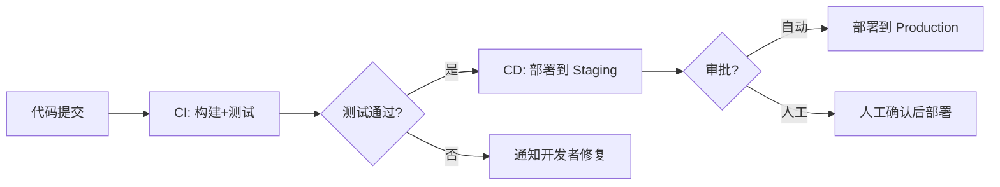
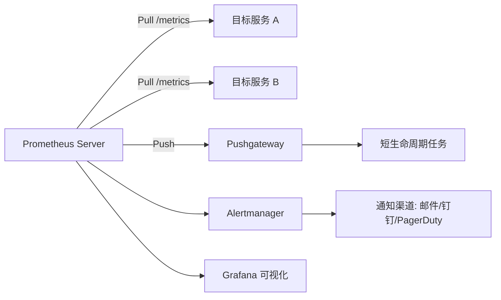

# DevOps 面试

::: tip 扩展

- 《持续交付 2.0》—— Jez Humble
- 《凤凰项目》—— Gene Kim
- [Atlassian DevOps](https://www.atlassian.com/devops)

:::

## DevOps 简介

### 【简单】什么是 DevOps？⭐⭐⭐

**DevOps 是通过平台（Platform）、流程（Process）和人（People）的有机整合，以 C（协作）A（自动化）L（精益）M（度量）S（共享）文化为指引，旨在建立一种可以快速交付价值并且具有持续改进能力的现代化 IT 组织。**

简单来说，**DevOps 就是让构建、发布和运行软件的过程变得更快、更顺、更稳**。

**核心理念**：
- **打破壁垒**：开发（Dev）与运维（Ops）不再各自为战，而是共同承担从代码到生产的全生命周期。
- **自动化一切**：构建、测试、部署、监控等环节尽可能自动化，减少人为错误。
- **快速反馈**：通过度量和监控快速发现问题，形成持续改进的闭环。

### 【中等】列举一下 DevOps 各环节的主流工具？⭐⭐⭐

| 阶段 (Phase) | 核心任务与功能 | 主流工具 |
| :--- | :--- | :--- |
| **计划与协作** (Plan) | 需求管理、任务拆分、项目跟踪 | **Jira**、**Confluence** |
| **代码与版本控制** (Code) | 源代码管理、代码审查、分支策略 | **Git**、**GitHub**、**GitLab**；分支策略：**Gitflow**、**Trunk-Based** |
| **构建与持续集成** (CI) | 自动编译、单元测试、打包 | **Jenkins**、**GitLab CI/CD**、**GitHub Actions**、**CircleCI**；构建工具：**Maven**、**Gradle**、**npm** |
| **测试和质量** (Test) | 自动化测试、代码扫描 | **Selenium**、**JUnit**、**SonarQube** |
| **发布与持续部署** (CD) | 自动化部署、发布策略 | **ArgoCD**（GitOps）、**Spinnaker**、**Tekton**、Jenkins |
| **运维与配置** (Operate) | 基础设施自动化、容器编排 | **Terraform**（IaC）、**Ansible**（配置管理）、**Docker**、**Kubernetes**、**Helm** |
| **监控与反馈** (Monitor) | 性能监控、日志管理、链路追踪 | **Prometheus**、**Grafana**、**ELK Stack**、**OpenTelemetry** |

### 【中等】DevOps 和传统瀑布/敏捷有什么区别？⭐⭐

| 对比维度 | 瀑布模型 | 敏捷开发 | DevOps |
| :--- | :--- | :--- | :--- |
| **交付频率** | 数月/数年 | 2~4 周迭代 | **每天多次** |
| **开发与运维** | 完全分离 | 开发团队内部敏捷 | **开发运维一体化** |
| **自动化程度** | 极低 | 中等（CI） | **极高（CI/CD/IaC）** |
| **反馈周期** | 长 | 中 | **短（实时监控）** |
| **核心关注** | 流程合规 | 快速迭代 | **端到端交付效率** |

## Git

### 【中等】Git 中 fork、clone、branch 有什么区别？⭐⭐

| 操作 | 本质 | 适用场景 |
| :--- | :--- | :--- |
| **clone** | 将远程仓库完整拷贝到本地 | 参与已有项目开发 |
| **fork** | 在远程（如 GitHub）创建仓库的独立副本 | 开源贡献、独立开发分支 |
| **branch** | 在仓库内创建分支 | 功能开发、并行开发 |

**fork vs clone**：`fork` 是在远程服务器上复制一份仓库（属于你自己的账号），`clone` 是将仓库下载到本地。开源项目典型工作流：**fork → clone → 开发 → push → pull request**。

### 【中等】什么是 Git 的 rebase？和 merge 有什么区别？⭐⭐⭐⭐

> - rebase 和 merge 都能整合分支，有何不同？
> - 各自适用什么场景？
> - rebase 有什么风险？

**merge**：将两个分支的变更合并，**保留完整的分支历史**，产生一个新的合并提交。

**rebase**：将当前分支的提交"摘下来"，重新"嫁接"到目标分支的最新提交上，**产生线性历史**。

| 对比维度 | merge | rebase |
| :--- | :--- | :--- |
| **历史记录** | 保留分叉和合并记录（非线性） | **线性历史**，更清晰 |
| **提交数** | 多一个合并提交 | 无额外提交 |
| **冲突处理** | 一次性解决所有冲突 | 逐个提交解决冲突 |
| **安全性** | 不改写历史 | **改写提交哈希** |

**黄金法则**：**绝不对已推送到远程的公共分支执行 rebase**，否则会导致其他人的历史混乱。

**推荐实践**：
- 个人功能分支合并到主分支时：**优先 rebase**（保持线性历史）。
- 主分支合并到功能分支时：**用 merge**（保留上下文）。

### 【中等】什么是 Git 的 cherry-pick？适用什么场景？⭐⭐

**cherry-pick** 是将**某一次或某几次特定提交**应用到当前分支的操作。

```bash
git cherry-pick <commit-hash>
git cherry-pick <start>..<end>  # 应用一个范围的提交
```

**适用场景**：
- **热修复**：将修复分支的某次 commit 摘到发布分支。
- **选择性合并**：只需要目标分支的部分提交，而非全部合并。
- **多版本维护**：将修复同步到多个版本分支。

### 【中等】Git 的 stash 怎么用？⭐⭐

**stash** 用于**临时保存未提交的修改**，让你可以在不 commit 的情况下切换分支或拉取代码。

```bash
git stash            # 保存当前修改
git stash list       # 查看保存列表
git stash pop        # 恢复最近一次保存并删除记录
git stash apply      # 恢复但不删除记录
git stash drop       # 删除指定保存
```

**典型场景**：正在开发功能 A，突然需要切换分支修复线上 bug → `stash` 保存 → 切换修复 → 切回 → `stash pop` 恢复。

### 【中等】常见的 Git 分支策略有哪些？⭐⭐⭐

| 策略 | 原理 | 优点 | 缺点 | 适用场景 |
| :--- | :--- | :--- | :--- | :--- |
| **Git Flow** | `main` + `develop` + `feature` + `release` + `hotfix` | 结构清晰，适合版本发布 | 分支多，流程重 | **传统版本发布制** |
| **GitHub Flow** | 只有 `main` + 功能分支 + PR | 简单灵活 | 缺乏发布管理 | **持续部署项目** |
| **Trunk-Based** | 所有人在 `main` 上开发，短命分支 | 极致的 CI/CD | 需要完善的 CI 和特性开关 | **高成熟度团队** |
| **GitLab Flow** | `main` + 环境分支（staging/production） | 兼顾简单和环境管理 | 比 GitHub Flow 稍复杂 | **多环境部署** |

### 【简单】Git 中 reflog 有什么用？⭐

**reflog**（Reference Log）记录了 **HEAD 的所有变更历史**，包括已"丢失"的提交。

```bash
git reflog  # 查看所有 HEAD 移动记录
```

**核心用途**：
- **找回误删的提交**：`git reset --hard <hash from reflog>`。
- **找回 rebase 前的状态**：rebase 出错时可通过 reflog 回退。
- **安全网**：几乎所有 Git 操作都可以通过 reflog 恢复。

### 【中等】什么是 Git Hook？有哪些常见用途？⭐

**Git Hook** 是在 Git 特定事件（如 commit、push）触发时自动执行的脚本。

| Hook | 触发时机 | 常见用途 |
| :--- | :--- | :--- |
| `pre-commit` | `git commit` 之前 | 代码格式化、lint 检查、单元测试 |
| `commit-msg` | 编辑提交信息时 | 校验提交信息格式（如 Conventional Commits） |
| `pre-push` | `git push` 之前 | 运行完整测试套件 |
| `post-receive` | 服务端收到推送后 | 自动部署、通知 |

**常用工具**：[**Husky**](https://typicode.github.io/husky/)（Node.js）+ [**lint-staged**](https://github.com/okonet/lint-staged) 是前端项目中最流行的 Git Hook 方案。

### 【中等】如何管理大型 Git 仓库？⭐

**大仓库（Monorepo）挑战**：仓库体积大、clone 慢、构建慢。

| 方案 | 原理 | 适用场景 |
| :--- | :--- | :--- |
| **Shallow Clone** | `git clone --depth 1`，只拉取最新提交 | CI/CD 构建 |
| **Sparse Checkout** | 只检出需要的目录 | 开发者只需部分代码 |
| **Git LFS** | 大文件（二进制）存储在外部 | 游戏、设计资源 |
| **Partial Clone** | 按需拉取对象（`--filter=blob:none`） | 超大仓库 |
| **多仓库** | 拆分为独立仓库 + 子模块/subtree | 模块间耦合低 |

## Linux

### 【中等】Linux 的权限模型是什么？chmod 755 是什么意思？⭐⭐

Linux 采用**用户-组-其他（User-Group-Other）**三级权限模型：

```
-rwxr-xr-x  1 user group  1024 Jan 1 12:00 file.txt
 ↑↑↑ ↑↑↑ ↑↑↑
 │││ │││ └── Other: r-x（可读可执行）
 │││ └──── Group: r-x（可读可执行）
 └────── User:  rwx（可读可写可执行）
```

**权限数值表示法**：

| 权限 | 二进制 | 八进制 |
| :--- | :--- | :--- |
| r（读） | 100 | 4 |
| w（写） | 010 | 2 |
| x（执行） | 001 | 1 |

`chmod 755` 表示：User = 7（rwx），Group = 5（r-x），Other = 5（r-x）。

### 【中等】什么是 CC 攻击、DDoS 攻击和 SQL 注入？⭐⭐

| 攻击类型 | 原理 | 防御措施 |
| :--- | :--- | :--- |
| **CC 攻击** | 模拟大量用户发起合法 HTTP 请求，耗尽服务器资源 | 限流、验证码、IP 黑名单、WAF |
| **DDoS 攻击** | 利用僵尸主机发送海量请求，耗尽带宽或资源 | 流量清洗、Anycast、CDN、云防护 |
| **SQL 注入** | 在输入中嵌入恶意 SQL 语句 | 参数化查询、ORM、输入校验、WAF |

### 【中等】如何在 Linux 中查看系统资源使用情况？⭐⭐

| 排查维度 | 命令 | 说明 |
| :--- | :--- | :--- |
| **综合** | `top`、`htop` | CPU/内存使用排名 |
| **内存** | `free -h`、`cat /proc/meminfo` | 内存/Swap 使用情况 |
| **磁盘** | `df -h`、`du -sh *` | 磁盘/目录空间占用 |
| **I/O** | `iostat -x`、`iotop` | 磁盘读写速率 |
| **网络** | `ss -tlnp`、`netstat -tlnp` | 端口监听状态 |
| **网络诊断** | `ping`、`traceroute`、`curl` | 网络连通性和链路追踪 |
| **进程** | `ps aux`、`lsof -i :<port>` | 进程列表、端口占用 |
| **日志** | `journalctl -xe`、`dmesg` | 系统/内核日志 |

### 【中等】Linux 中 systemd 是什么？如何管理服务？⭐⭐

**systemd** 是 Linux 的**初始化系统（init system）**，负责系统启动和服务管理，替代了传统的 SysVinit。

```bash
systemctl start <service>    # 启动服务
systemctl stop <service>     # 停止服务
systemctl restart <service>  # 重启服务
systemctl enable <service>   # 开机自启
systemctl status <service>   # 查看状态
systemctl daemon-reload      # 重新加载配置
```

**服务配置文件**（`.service`）示例：

```ini
[Unit]
Description=My App
After=network.target

[Service]
ExecStart=/usr/bin/java -jar /opt/app/app.jar
Restart=always
User=appuser

[Install]
WantedBy=multi-user.target
```

### 【简单】Linux 中 crontab 怎么用？⭐

**crontab** 用于设置定时任务。

```
*  *  *  *  *  command
│  │  │  │  │
│  │  │  │  └── 星期 (0-7, 0和7都是周日)
│  │  │  └───── 月份 (1-12)
│  │  └──────── 日期 (1-31)
│  └─────────── 小时 (0-23)
└────────────── 分钟 (0-59)
```

**常用示例**：
- `0 2 * * *`：每天凌晨 2 点执行
- `*/5 * * * *`：每 5 分钟执行
- `0 0 * * 0`：每周日午夜执行

### 【中等】Linux 文本处理三剑客是什么？⭐⭐

| 工具 | 核心能力 | 典型用法 |
| :--- | :--- | :--- |
| **grep** | **搜索过滤** | `grep -r "error" /var/log/` 搜索日志中的错误 |
| **awk** | **列处理与统计** | `awk '{print $1, $3}' file` 提取第 1、3 列 |
| **sed** | **流编辑** | `sed 's/old/new/g' file` 全局替换文本 |

**实战示例**：统计 Nginx 访问日志中 Top 10 IP：

```bash
awk '{print $1}' access.log | sort | uniq -c | sort -rn | head -10
```

### 【中等】什么是 lsof？strace 怎么用？⭐

| 工具 | 功能 | 典型用法 |
| :--- | :--- | :--- |
| **lsof** | 列出**打开的文件/端口** | `lsof -i :8080` 查看端口占用；`lsof -p <pid>` 查看进程打开的文件 |
| **strace** | 追踪进程的**系统调用** | `strace -p <pid>` 实时追踪；`strace -e trace=network <cmd>` 只追踪网络调用 |

**典型排查场景**：
- 端口被谁占用了？→ `lsof -i :<port>`
- 程序启动失败，找不到哪个文件？→ `strace -e trace=open <cmd>`
- 进程卡住了，在等什么？→ `strace -p <pid>`

## CI/CD

### 【中等】什么是 CI/CD？CI 和 CD 有什么区别？⭐⭐⭐⭐

**CI（Continuous Integration，持续集成）**：开发者频繁地将代码合并到主干，每次合并自动触发**构建和测试**，尽早发现问题。

**CD（Continuous Delivery/Deployment，持续交付/部署）**：
- **持续交付（Continuous Delivery）**：代码始终处于**可部署**状态，但需**人工审批**才能上线。
- **持续部署（Continuous Deployment）**：代码通过测试后**自动部署到生产环境**，无需人工干预。



### 【中等】Jenkins Pipeline 和 GitLab CI/CD 有什么区别？⭐⭐

| 对比维度 | Jenkins | GitLab CI/CD |
| :--- | :--- | :--- |
| **架构** | Master-Agent，需独立部署 | 内置于 GitLab，Runner 执行 |
| **配置方式** | Groovy 脚本（Jenkinsfile） | YAML（`.gitlab-ci.yml`） |
| **插件生态** | 极其丰富（1000+ 插件） | 内置功能够用，扩展性一般 |
| **维护成本** | 高（插件兼容性、升级） | 低（一体化） |
| **适用场景** | 大型复杂流水线 | 中小型项目、GitLab 用户 |

### 【困难】如何设计一个可靠的 CI/CD 流水线？⭐⭐⭐

**核心原则**：

1. **快速反馈**：流水线应在 10 分钟内完成（构建+测试），超过则需优化。
2. **构建一次，多次部署**：构建产物（镜像/包）不可变，各环境复用。
3. **自动化测试分层**：单元测试 → 集成测试 → E2E 测试（测试金字塔）。
4. **环境一致性**：开发、测试、生产使用相同的构建产物和配置方式。
5. **回滚能力**：部署必须可回滚（蓝绿部署、金丝雀发布）。
6. **安全左移**：在 CI 阶段集成安全扫描（SAST、依赖漏洞检查）。

**典型流水线阶段**：

```
代码提交 → Lint → 单元测试 → 构建 → 镜像扫描 → 部署到 Dev → 集成测试 → 部署到 Staging → 冒烟测试 → 部署到 Production（金丝雀/蓝绿）
```

## 基础设施即代码（IaC）

### 【中等】什么是 IaC？Terraform 和 Ansible 有什么区别？⭐⭐

**IaC（Infrastructure as Code，基础设施即代码）**：用**代码定义和管理基础设施**（服务器、网络、数据库等），像管理应用代码一样管理基础设施。

| 对比维度 | Terraform | Ansible |
| :--- | :--- | :--- |
| **定位** | **基础设施编排（Provisioning）** | **配置管理（Configuration）** |
| **声明式 vs 命令式** | 声明式（描述期望状态） | 命令式（描述执行步骤） |
| **状态管理** | 有状态（`.tfstate`） | 无状态 |
| **适用场景** | 创建云资源（VPC、ECS、RDS） | 配置已存在的服务器（安装软件、部署应用） |
| **Agent** | 无 Agent | 无 Agent（SSH） |

**最佳实践**：**Terraform 创建基础设施 + Ansible 配置服务器**。

## 容器化

### 【简单】什么是容器化？容器和虚拟机有什么区别？⭐⭐⭐

**容器化**是将应用及其依赖打包成标准化单元（容器），实现"一次构建，处处运行"。

| 对比维度 | 容器（Docker） | 虚拟机（VM） |
| :--- | :--- | :--- |
| **虚拟化层级** | **操作系统级**（共享宿主机内核） | **硬件级**（每个 VM 独立内核） |
| **启动速度** | **秒级** | 分钟级 |
| **资源占用** | **MB 级** | GB 级 |
| **隔离性** | 进程级隔离（较弱） | 硬件级隔离（较强） |
| **性能** | 接近原生 | 有虚拟化损耗 |
| **适用场景** | 微服务、CI/CD | 需要强隔离、运行不同 OS |

## 监控与可观测性

### 【中等】什么是可观测性？监控和可观测性有什么区别？⭐⭐⭐

**可观测性（Observability）**：通过分析系统的**外部输出**（日志、指标、链路追踪），推断系统**内部状态**的能力。

**监控 vs 可观测性**：
- **监控（Monitoring）**：关注已知问题，回答"**系统是否正常？**"
- **可观测性（Observability）**：关注未知问题，回答"**系统为什么不正常？**"

**可观测性三大支柱**

| 支柱 | 数据形式 | 典型工具 | 回答的问题 |
| :--- | :--- | :--- | :--- |
| **Metrics（指标）** | 数值型时序数据 | Prometheus + Grafana | 系统的整体健康状况？ |
| **Logging（日志）** | 离散事件文本 | ELK Stack（Elasticsearch + Logstash + Kibana） | 发生了什么具体事件？ |
| **Tracing（链路追踪）** | 分布式调用链 | Jaeger、Zipkin、**OpenTelemetry** | 请求在各服务间如何流转？延迟在哪里？ |

### 【中等】Prometheus 的监控原理是什么？⭐⭐

**Prometheus** 是基于**时序数据库**的开源监控系统，采用**Pull 模型**主动抓取目标指标。



**核心概念**：
- **PromQL**：Prometheus 查询语言，如 `rate(http_requests_total[5m])` 计算 QPS。
- **Exporter**：暴露 `/metrics` 端点的采集代理（如 Node Exporter、MySQL Exporter）。
- **Alertmanager**：管理告警规则、去重、分组、路由通知。

## GitOps

### 【中等】什么是 GitOps？和传统 CI/CD 有什么区别？⭐⭐

**GitOps** 是一种以 **Git 仓库作为唯一真实来源（Single Source of Truth）** 来管理基础设施和应用的运维范式。

| 对比维度 | 传统 CI/CD（Push 模型） | GitOps（Pull 模型） |
| :--- | :--- | :--- |
| **部署方式** | CI 服务器推送变更到集群 | 集群内 Agent 从 Git **拉取**变更并同步 |
| **安全模型** | CI 服务器需要集群凭据 | Agent 在集群内运行，**无需暴露凭据** |
| **回滚方式** | 重新执行 Pipeline | `git revert` + Agent 自动同步 |
| **漂移检测** | 无（手动触发） | Agent **持续对比**期望状态与实际状态 |
| **代表工具** | Jenkins、GitLab CI | **ArgoCD**、**Flux** |

**GitOps 核心流程**：
1. 开发者修改 Git 仓库中的 K8s YAML/Helm 配置。
2. Git 触发 Webhook 或 Agent 轮询检测到变更。
3. Agent（如 ArgoCD）自动将集群状态同步为 Git 中声明的期望状态。

**总结**：GitOps 是"声明式 + 版本化 + 自动化"的集大成者，是云原生时代的运维最佳实践。

## 参考资料

- 《持续交付 2.0》—— Jez Humble
- 《凤凰项目》—— Gene Kim
- 《Site Reliability Engineering》—— Google
- [Atlassian DevOps](https://www.atlassian.com/devops)
- [Git 官方文档](https://git-scm.com/doc)
---
title: DevOps 面试
date: 2025-09-14 21:15:59
categories:
  - DevOps
tags:
  - DevOps
  - 面试
permalink: /pages/18dca404/
---

# DevOps 面试

## DevOps 简介

### 【简单】什么是 DevOps？⭐⭐

**DevOps是通过平台（Platform）、流程（Process）和人（People）的有机整合，以C（协作）A（自动化）L（精益）M（度量）S（共享）文化为指引，旨在建立一种可以快速交付价值并且具有持续改进能力的现代化IT组织。**

简单来说，**DevOps 就是让构建、发布和运行软件的过程变得更快、更顺、更稳**。

### 【中等】列举一下 DevOps 各环节的主流工具？⭐⭐

| 阶段 (Phase)                                | 核心任务与功能                         | 主流工具                                                                                                                                                                               |
| :------------------------------------------ | :------------------------------------- | :------------------------------------------------------------------------------------------------------------------------------------------------------------------------------------- |
| **计划与协作** (Plan & Collaborate)         | 需求管理、任务拆分、项目跟踪、文档协作 | **Jira**、**Confluence**                                                                                                                                                               |
| **代码与版本控制** (Code & Version Control) | 源代码管理、代码审查、分支策略         | **代码托管**：**Git**、**GitHub**、**GitLab**、**Svn**<br/>**分支策略**：**Gitflow**                                                                                                   |
| **构建与持续集成 (CI)** (Build & CI)        | 自动编译、运行单元测试、打包制品       | **CI**：**Jenkins**、**GitLab CI/CD**、**GitHub Actions**、**CircleCI**<br/>**Java 构建**：**Maven**、**Gradle**<br/>**JS 构建**：**npm**、**yarn**<br/>**仓库**：**Nexus**、**JFrog** |
| **测试和质量** (Test)                       | 自动化测试、代码质量与安全扫描         | **测试**：**Selenium**、**Cypress**、**JUnit**<br/>**质量**：**SonarQube**                                                                                                             |
| **发布与持续部署 (CD)** (Release & CD)      | 自动化部署、发布策略管理               | **Jenkins**、**GitLab CI/CD**、**GitHub Actions**（通用CD） **云原生CD:** **ArgoCD**（GitOps理念）、**Spinnaker**（复杂部署策略）、Tekton                                              |
| **运维与配置** (Operate & Configure)        | 基础设施自动化、配置管理、容器编排     | **IaC工具**：**Terraform**（多云标准）、Ansible（无代理配置）<br/>**容器化:** **Docker**、**Kubernetes**、Helm                                                                         |
| **监控与反馈** (Monitor & Feedback)         | 性能监控、日志管理、故障告警、用户反馈 | **监控**：**Prometheus**、**Grafana**<br/>**日志**：**ELK Stack**（Elasticsearch, Logstash, Kibana）<br/>**链路追踪**：Jaeger、Zipkin、Skywalking、OpenTelemetry                       |

## Git

### 【中等】什么是 Git 的 fork 命令？它和 clone 命令有什么区别？⭐⭐

创建一个新的工程空间

### 【中等】什么是 Git 的 cherry-pick？⭐⭐

单独将某一次提交合入其他分支

## Linux

### 【中等】Linux 中的硬链接和软连接是什么，二者有什么区别？⭐⭐

### 【中等】CC 攻击是什么？什么叫 DDOS 攻击？什么是网站数据库注入？⭐⭐

### 【中等】如何在 Linux 中查看系统资源使用情况？比如内存、CPU、网络端口。⭐⭐

- top 查资源占用排名
- free 查内存占用
- df 查磁盘占用
- iostat 查 IO
- netstat 查网络
- ping、traceroute 查网络链路
