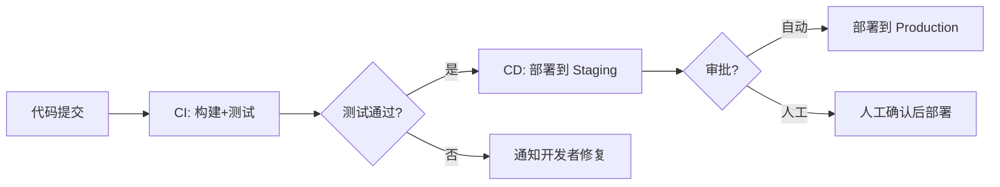
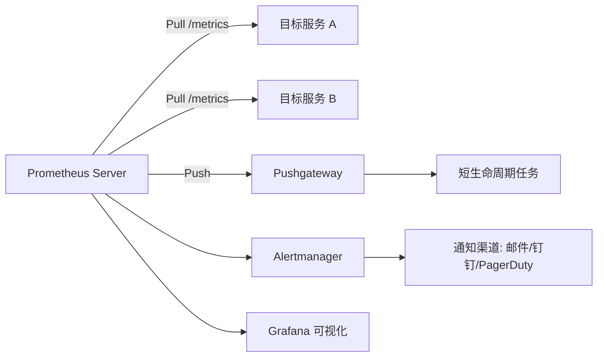
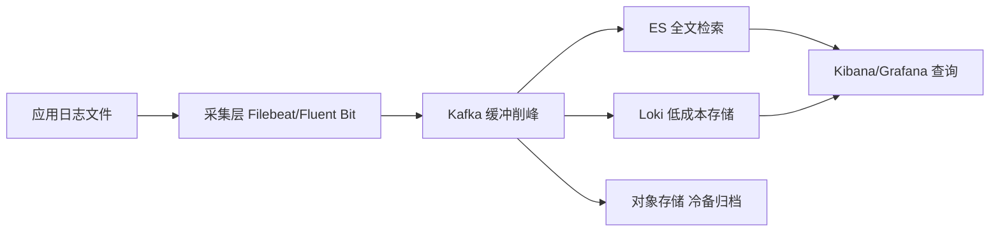
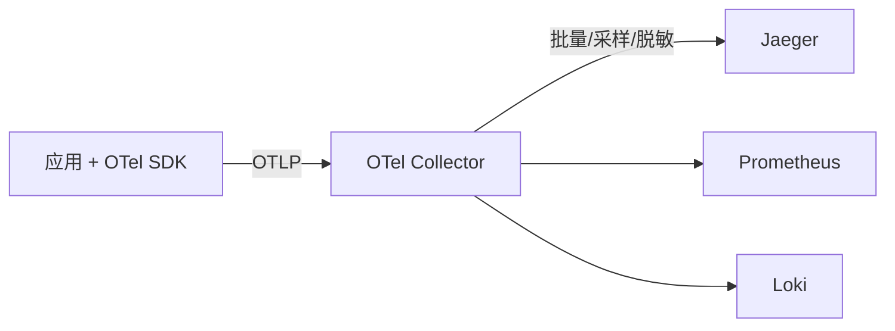

# DevOps 面试

## DevOps 简介

### 【简单】什么是 DevOps？⭐⭐⭐

> 🎯 目标等级：L2 ｜ ⏱ 建议用时：5 min ｜ 🏷 标签：DevOps / 文化理念

#### 💎 关键结论

DevOps 是平台、流程与人的有机整合，以 CALMS 文化（协作、自动化、精益、度量、共享）为指引，让构建、发布、运行更快更稳，目标是建立能快速交付价值并持续改进的组织。

#### ⚡记忆卡片

- **口诀**：平台 + 流程 + 人，CALMS 五字文化
- **关键词**：打破壁垒 ／ 自动化一切 ／ 快速反馈
- **链路**：代码提交 → 自动构建测试 → 快速发布 → 监控反馈 → 持续改进

#### 📖 核心知识

**DevOps 是通过平台（Platform）、流程（Process）和人（People）的有机整合，以 C（协作）A（自动化）L（精益）M（度量）S（共享）文化为指引，旨在建立一种可以快速交付价值并且具有持续改进能力的现代化 IT 组织。**

简单来说，**DevOps 就是让构建、发布和运行软件的过程变得更快、更顺、更稳**。

**核心理念**：

- **打破壁垒**：开发（Dev）与运维（Ops）不再各自为战，而是共同承担从代码到生产的全生命周期。
- **自动化一切**：构建、测试、部署、监控等环节尽可能自动化，减少人为错误。
- **快速反馈**：通过度量和监控快速发现问题，形成持续改进的闭环。

#### 🔬 扩展知识
::: details

- 【L3】DevOps 与 SRE 的关系：SRE 可视为 DevOps 的一种工程化实现（"SRE implements DevOps"），用 SLO/错误预算、自动化等手段把 DevOps 文化落到可靠性工程上。
- 【L4】DevOps 落地的反模式：只买工具不改流程（工具链齐全但发布仍需多方签字）、运维背锅文化未破除（开发不关心线上）、指标只度量速度不度量质量（发布频率上去了变更失败率也上去了）。

> 📚 延伸阅读：[Atlassian DevOps](https://www.atlassian.com/devops)

:::

#### 🔀 发散问题

- **Q：DevOps 落地需要哪些工具支撑？** → 按 Plan/Code/CI/Test/CD/Operate/Monitor 分阶段选型，见本文档「列举一下 DevOps 各环节的主流工具？」。
- **Q：DevOps 中的自动化交付具体指什么？** → CI 频繁集成、CD 自动部署，见本文档「什么是 CI/CD？CI 和 CD 有什么区别？」。

### 【简单】列举一下 DevOps 各环节的主流工具？⭐⭐⭐

> 🎯 目标等级：L2 ｜ ⏱ 建议用时：8 min ｜ 🏷 标签：DevOps / 工具链

#### 💎 关键结论

DevOps 工具链覆盖计划、编码、集成、测试、部署、运维、监控七个阶段：Jira 管计划、Git 管代码、Jenkins/GitLab CI 做集成、ArgoCD 做发布、Terraform/K8s 管基础设施、Prometheus/Grafana/ELK 做监控反馈。

#### ⚡记忆卡片

- **口诀**：计划 Jira、代码 Git、集成 Jenkins、部署 ArgoCD、设施 Terraform、监控 Prometheus
- **关键词**：CI（Jenkins/GitLab CI） ／ CD（ArgoCD/Spinnaker） ／ IaC（Terraform/Ansible）
- **链路**：Plan → Code → CI → Test → CD → Operate → Monitor → 反馈回 Plan

#### 📖 核心知识

| 阶段 (Phase)              | 核心任务与功能                 | 主流工具                                                                                                  |
| :------------------------ | :----------------------------- | :-------------------------------------------------------------------------------------------------------- |
| **计划与协作** (Plan)     | 需求管理、任务拆分、项目跟踪   | **Jira**、**Confluence**                                                                                  |
| **代码与版本控制** (Code) | 源代码管理、代码审查、分支策略 | **Git**、**GitHub**、**GitLab**；分支策略：**Gitflow**、**Trunk-Based**                                   |
| **构建与持续集成** (CI)   | 自动编译、单元测试、打包       | **Jenkins**、**GitLab CI/CD**、**GitHub Actions**、**CircleCI**；构建工具：**Maven**、**Gradle**、**npm** |
| **测试和质量** (Test)     | 自动化测试、代码扫描           | **Selenium**、**JUnit**、**SonarQube**                                                                    |
| **发布与持续部署** (CD)   | 自动化部署、发布策略           | **ArgoCD**（GitOps）、**Spinnaker**、**Tekton**、Jenkins                                                  |
| **运维与配置** (Operate)  | 基础设施自动化、容器编排       | **Terraform**（IaC）、**Ansible**（配置管理）、**Docker**、**Kubernetes**、**Helm**                       |
| **监控与反馈** (Monitor)  | 性能监控、日志管理、链路追踪   | **Prometheus**、**Grafana**、**ELK Stack**、**OpenTelemetry**                                             |

#### 🔬 扩展知识
::: details

- 【L3】工具选型原则：优先选与团队技术栈同生态、社区活跃度高、维护成本可承受的主流方案；避免为单一环节引入小众工具，工具链的维护成本常被低估。
- 【L4】大厂工具链演进方向：从"拼工具"到"平台工程（Platform Engineering）"，把工具链封装为内部开发者平台（IDP），降低业务团队的认知负担。

> 📚 延伸阅读：[Atlassian DevOps](https://www.atlassian.com/devops)

:::

#### 🔀 发散问题

- **Q：CI/CD 环节的工具如何选型？** → Jenkins 与 GitLab CI 各有适用边界，见本文档「Jenkins Pipeline 和 GitLab CI/CD 有什么区别？」。
- **Q：Operate 环节的 Terraform 和 Ansible 如何分工？** → Terraform 创建资源、Ansible 配置服务器，见本文档「什么是 IaC？Terraform 和 Ansible 有什么区别？」。
- **Q：Monitor 环节的 Prometheus 原理是什么？** → Pull 模型抓取 /metrics 端点，见本文档「Prometheus 的监控原理是什么？」。

### 【中等】DevOps 和传统瀑布/敏捷有什么区别？⭐⭐

> 🎯 目标等级：L2 ｜ ⏱ 建议用时：8 min ｜ 🏷 标签：DevOps / 研发模式

#### 💎 关键结论

三者是交付模式的演进：瀑布按月交付、流程合规优先；敏捷按 2~4 周迭代、快速响应需求；DevOps 每天多次发布、开发运维一体化、CI/CD/IaC 高度自动化，追求端到端交付效率。

#### ⚡记忆卡片

- **口诀**：瀑布按月、敏捷按迭代、DevOps 按天（甚至按小时）
- **关键词**：交付频率 ／ 开发运维关系 ／ 自动化程度
- **链路**：瀑布（分离、低频） → 敏捷（迭代、中自动化） → DevOps（一体化、高自动化）

#### 📖 核心知识

| 对比维度       | 瀑布模型  | 敏捷开发         | DevOps                |
| :------------- | :-------- | :--------------- | :-------------------- |
| **交付频率**   | 数月/数年 | 2~4 周迭代       | **每天多次**          |
| **开发与运维** | 完全分离  | 开发团队内部敏捷 | **开发运维一体化**    |
| **自动化程度** | 极低      | 中等（CI）       | **极高（CI/CD/IaC）** |
| **反馈周期**   | 长        | 中               | **短（实时监控）**    |
| **核心关注**   | 流程合规  | 快速迭代         | **端到端交付效率**    |

- **瀑布**：需求、开发、测试、上线严格分段，变更成本高，适合需求极稳定的场景。
- **敏捷**：解决了"开发响应需求慢"，但运维交付仍是瓶颈——代码写完了却发不上线。
- **DevOps**：把敏捷的协作文化延伸到运维侧，用自动化打通"代码到生产"的最后一公里。

#### 🔬 扩展知识
::: details

- 【L3】DevOps 成熟度可用 DORA 四指标量化：部署频率、变更前置时间、变更失败率、恢复时间；团队从"按周发布"到"按需发布"的演进路径，通常先建 CI 再建 CD，最后补齐监控反馈闭环。
- 【L4】《凤凰项目》三步工作法：① 加快左到右的流动；② 缩短右到左的反馈回路；③ 持续实验与学习的文化——这是 DevOps 实践的理论底座。

> 📚 延伸阅读：[Atlassian DevOps](https://www.atlassian.com/devops)

:::

#### 🔀 发散问题

- **Q：DevOps 的度量水平如何衡量？** → 用 DORA 四项指标（部署频率、变更前置时间、变更失败率、恢复时间），见本文档「什么是 CI/CD？CI 和 CD 有什么区别？」。

## Git

### 【中等】Git 中 fork、clone、branch 有什么区别？⭐⭐

> 🎯 目标等级：L2 ｜ ⏱ 建议用时：8 min ｜ 🏷 标签：Git / 基础操作

#### 💎 关键结论

fork 是在远程平台复制整个仓库到自己账号下，clone 是把远程仓库完整下载到本地，branch 是在同一个仓库内创建并行分支。开源贡献的标准链路是 fork → clone → 开发 → push → pull request。

#### ⚡记忆卡片

- **口诀**：fork 复制仓库归自己，clone 下载仓库到本地，branch 仓库之内开分叉
- **关键词**：fork（远程副本） ／ clone（本地拷贝） ／ branch（仓内分支）
- **链路**：fork → clone → branch 开发 → commit → push → Pull Request

#### 📖 核心知识

| 操作       | 本质                                  | 适用场景               |
| :--------- | :------------------------------------ | :--------------------- |
| **clone**  | 将远程仓库完整拷贝到本地              | 参与已有项目开发       |
| **fork**   | 在远程（如 GitHub）创建仓库的独立副本 | 开源贡献、独立开发分支 |
| **branch** | 在仓库内创建分支                      | 功能开发、并行开发     |

**fork vs clone**：`fork` 是在远程服务器上复制一份仓库（属于你自己的账号），`clone` 是将仓库下载到本地。开源项目典型工作流：**fork → clone → 开发 → push → pull request**。

- fork 是**平台级概念**（GitHub/GitLab 提供），不属于 Git 原生命令；clone 和 branch 是 Git 原生操作。
- 三者粒度不同：fork 复制整个仓库（含全部历史）、clone 也是完整拷贝（可用 `--depth` 裁剪）、branch 只是新建一个指向提交的指针，几乎零成本。

#### 🔬 扩展知识
::: details

- 【L3】fork 工作流与内部团队协作的区别：内部团队通常直接在同一仓库开 branch + MR 评审；fork 主要用于无写权限的外部贡献者，或需要完全独立演进的长期分叉。
- 【L4】fork 出的仓库想持续跟随上游，需把原仓库加为 upstream 远程并定期 `git fetch upstream` + rebase/merge 同步，否则分叉会越来越远难以回合。

> 📚 延伸阅读：[Git 官方文档](https://git-scm.com/doc)

:::

#### 🔀 发散问题

- **Q：clone 大型仓库太慢怎么办？** → 用浅克隆/部分克隆/sparse checkout，见本文档「如何管理大型 Git 仓库？」。
- **Q：功能分支应该怎么管理？** → 取决于团队分支策略（Git Flow/GitHub Flow 等），见本文档「常见的 Git 分支策略有哪些？」。

### 【中等】什么是 Git 的 rebase？和 merge 有什么区别？⭐⭐⭐⭐

> 🎯 目标等级：L3 ｜ ⏱ 建议用时：20 min ｜ 🏷 标签：Git / 分支整合

#### 💎 关键结论

merge 保留分叉历史并产生合并提交，rebase 把提交摘下来重放到目标分支顶端、历史线性但会改写提交哈希。黄金法则：绝不对已推送的公共分支 rebase；个人分支同步主干用 rebase，合入主干用 merge --no-ff。

#### ⚡记忆卡片

- **口诀**：merge 保历史，rebase 求线性；公共分支禁 rebase，本地整理随便造
- **关键词**：线性历史 ／ 改写哈希 ／ 黄金法则
- **链路**：feature 分支 rebase main 同步 → 解冲突 → 合入用 merge --no-ff → 出错 reflog 找回

#### 📖 核心知识

**merge**：将两个分支的变更合并，**保留完整的分支历史**，产生一个新的合并提交。

**rebase**：将当前分支的提交"摘下来"，重新"嫁接"到目标分支的最新提交上，**产生线性历史**。

| 对比维度     | merge                        | rebase               |
| :----------- | :--------------------------- | :------------------- |
| **历史记录** | 保留分叉和合并记录（非线性） | **线性历史**，更清晰 |
| **提交数**   | 多一个合并提交               | 无额外提交           |
| **冲突处理** | 一次性解决所有冲突           | 逐个提交解决冲突     |
| **安全性**   | 不改写历史                   | **改写提交哈希**     |

**黄金法则**：**绝不对已推送到远程的公共分支执行 rebase**，否则会导致其他人的历史混乱。rebase 后原提交哈希全部改变，其他协作者拉取的历史与你强推的历史分叉，`git pull` 会产生大量重复提交，修复成本远超收益。

**方案权衡：团队分支历史管理策略**

| 策略                                         | 约定                                                                           | 适用边界                                            |
| :------------------------------------------- | :----------------------------------------------------------------------------- | :-------------------------------------------------- |
| **feature 分支 rebase + 主干 merge**（主流） | 功能分支定期 `git rebase main` 同步主干，合入时用 `merge --no-ff` 保留合并节点 | 2~20 人团队，需要保留功能边界做 revert 单元         |
| **全线性（rebase + fast-forward）**          | 合入也用 rebase，历史完全线性                                                  | Trunk-Based 高成熟度团队，`git log` 干净便于 bisect |
| **纯 merge 流**                              | 所有整合都用 merge，不改写任何历史                                             | 开源项目、跨组织协作，历史真实性优先于整洁          |

**失效场景**：

- 功能分支存活超过 1~2 周时，rebase 需要逐个重放几十个提交解冲突，此时应先拆小分支，或用 `git rerere` 记录冲突解法复用。
- 多人协作的同一条 feature 分支上 rebase 后强推，队友未 `pull --rebase` 直接 push 会把旧历史带回来，形成"历史污染"。

**量化参考**：大厂代码评审通常要求单 MR 提交数控制在 20 个以内，rebase 压缩（`git rebase -i` + squash）是保持 MR 可读性的常规手段。

**推荐实践**：

- 个人功能分支同步主干：**优先 rebase**（保持线性历史，冲突早暴露早解决）。
- 功能分支合入主干：**用 merge --no-ff**（保留功能边界，便于整体回滚）。
- 主分支合并到功能分支时：**用 merge**（保留上下文）。

#### 🔬 扩展知识

::: details

- 【L3】`git rebase -i` 交互式变基可以在重放时 squash/fixup/reword 提交，是整理 MR 提交历史的常规手段；`git rerere` 能记录冲突解法并在后续 rebase 中自动复用。
- 【L4】rebase 有利于 `git bisect`：bisect 用二分查找定位引入缺陷的提交，线性历史下每一步都是确定性的单一祖先链；交织的 merge commit 会让 bisect 路径发散、难以收敛，主干保持线性能显著缩短事故定位时间。

> 📚 延伸阅读：[Git 官方文档 - Rebasing](https://git-scm.com/doc)

:::

#### 🏭 实战场景

::: details

某团队开发同学在 feature 分支上 `git rebase main` 后直接 `git push`，被远端拒绝后执行了 `git push --force`。由于该分支有 2 位协作者，他们本地还是旧历史，随后一次普通 `git push` 把被 rebase 丢弃的 17 个旧提交全部带回了远端，主干历史出现两条重复线。排查：`git reflog` + 远端审计日志定位到强推操作；根因：分支保护规则未禁止 force push；修复：用 `git revert` 撤销重复合并，GitLab 上对共享分支关闭 force push，并在团队约定"rebase 只用于本地未共享的提交"。

**场景追问**：10 人团队中，新同学的 feature 分支落后主干 40 个提交，rebase 遇到 12 个文件冲突、解到第 5 个提交时越解越乱。处置：① 先 `git rebase --abort` 回到安全状态；② 改用 `git merge main` 一次性解决所有冲突；③ 合入前用 `git rebase -i` 把提交 squash 成 1~3 个逻辑单元；④ 长期约定 feature 分支每 1~2 天 rebase 一次主干，把冲突摊薄到每次几分钟。权衡点：merge 一次性解冲突效率高但历史有分叉，rebase 历史干净但冲突要解多遍——分支越短，rebase 的劣势越小，根治手段是缩短分支生命周期。

:::

#### ⚠️ 常见误区

::: details

常见误区：

- ❌ "rebase 和 merge 效果一样，只是历史好不好看" → 两者本质不同：rebase 会改写提交哈希生成全新提交，对已共享的分支使用会污染协作者历史；merge 不改写历史，多一个合并节点。
- ❌ "rebase 冲突解到一半改乱了，只能硬着头皮继续" → 执行 `git rebase --abort` 即可完整回退到 rebase 开始前的状态；若 rebase 已完成才发现出错，用 `git reflog` 找到 rebase 前的 HEAD 哈希，再 `git reset --hard <hash>` 恢复。
- ❌ "`git pull` 产生一堆 merge commit 是正常的" → 默认 pull 是 fetch + merge，团队应统一 `git config pull.rebase true` 让 pull 变成 fetch + rebase，并可开启 `rebase.autoStash` 自动处理未提交的修改。

:::

#### 🔀 发散问题

- **Q：rebase 改乱了历史怎么找回？** → reflog 记录 HEAD 全部变更，可 reset 回任意状态，见本文档「Git 中 reflog 有什么用？」。
- **Q：已经推到公共分支的错误提交能 reset 吗？** → 不能，应改用 revert，见本文档「Git 中 revert 和 reset 有什么区别？」。
- **Q：rebase 同步主干的频率和团队分支策略有关吗？** → 分支策略决定主干形态与合入方式，见本文档「常见的 Git 分支策略有哪些？」。

### 【中等】什么是 Git 的 cherry-pick？适用什么场景？⭐⭐

> 🎯 目标等级：L2 ｜ ⏱ 建议用时：8 min ｜ 🏷 标签：Git / 提交操作

#### 💎 关键结论

cherry-pick 是把某一次或某几次特定提交"摘"过来应用到当前分支，而不是合并整个分支。典型场景是热修复：把修复分支的某次 commit 摘到发布分支，无需合并全部变更。

#### ⚡记忆卡片

- **口诀**：要哪个提交摘哪个，不合分支只挑拣
- **关键词**：单提交应用 ／ 热修复 ／ 多版本同步
- **链路**：定位 commit hash → cherry-pick 应用 → 解冲突（如有） → 提交推送

#### 📖 核心知识

**cherry-pick** 是将**某一次或某几次特定提交**应用到当前分支的操作。

```bash
git cherry-pick <commit-hash>
git cherry-pick <start>..<end>  # 应用一个范围的提交
```

**适用场景**：

- **热修复**：将修复分支的某次 commit 摘到发布分支。
- **选择性合并**：只需要目标分支的部分提交，而非全部合并。
- **多版本维护**：将修复同步到多个版本分支。

注意：cherry-pick 会生成**新的提交哈希**（内容相同但提交对象不同），因此被摘过的提交后续仍可能被 merge 再次带入，需靠提交内容去重认知而非哈希判断。

#### 🔬 扩展知识
::: details

- 【L3】cherry-pick 遇到冲突时与 rebase 类似：逐个提交解决，`git cherry-pick --continue` 继续、`--abort` 放弃；摘取范围提交时可加 `--strategy-option theirs` 等策略辅助处理。
- 【L4】发布火车模式下的修复同步：hotfix 合入主干后，需要 cherry-pick 到所有仍在维护的 release 分支；多分支维护成本高，这也是大厂倾向于只维护少量活跃分支的原因。

> 📚 延伸阅读：[Git 官方文档](https://git-scm.com/doc)

:::

#### 🔀 发散问题

- **Q：多个发布分支之间如何同步修复？** → 可结合分支策略中的 release 分支管理，见本文档「常见的 Git 分支策略有哪些？」。
- **Q：cherry-pick 到发布分支后发现问题，如何撤销？** → 公共分支用 revert 生成反向提交，见本文档「Git 中 revert 和 reset 有什么区别？」。

### 【中等】Git 的 stash 怎么用？⭐⭐

> 🎯 目标等级：L2 ｜ ⏱ 建议用时：5 min ｜ 🏷 标签：Git / 工作区管理

#### 💎 关键结论

stash 用于临时保存未提交的修改，让你不 commit 也能切分支或拉代码。典型链路：git stash 保存 → 切换分支处理急事 → 切回后 git stash pop 恢复并删除记录。

#### ⚡记忆卡片

- **口诀**：stash 存、list 看、pop 恢复加删除、apply 只恢复
- **关键词**：暂存未提交修改 ／ 栈式存储 ／ 切分支救急
- **链路**：git stash → 切换分支 → 切回 → git stash pop

#### 📖 核心知识

**stash** 用于**临时保存未提交的修改**，让你可以在不 commit 的情况下切换分支或拉取代码。

```bash
git stash            # 保存当前修改
git stash list       # 查看保存列表
git stash pop        # 恢复最近一次保存并删除记录
git stash apply      # 恢复但不删除记录
git stash drop       # 删除指定保存
```

**典型场景**：正在开发功能 A，突然需要切换分支修复线上 bug → `stash` 保存 → 切换修复 → 切回 → `stash pop` 恢复。

#### 🔬 扩展知识
::: details

- 【L3】`git stash push -m "说明"` 给每次保存加描述，`git stash show -p stash@{n}` 预览内容，多条 stash 并存时便于辨认；stash 也可用 `git stash branch <name>` 直接把保存的修改恢复到新分支。
- 【L4】stash 的误删恢复：stash 本质是提交对象，`git stash drop` 后可在短时间内通过 `git fsck --unreachable` 找回；但与其依赖恢复，不如养成"stash 即临时、尽快 pop"的习惯。

> 📚 延伸阅读：[Git 官方文档](https://git-scm.com/doc)

:::

#### 🔀 发散问题

- **Q：stash 之后要切去修的线上 bug 走什么分支流程？** → 属于 hotfix 分支场景，见本文档「常见的 Git 分支策略有哪些？」。

### 【中等】常见的 Git 分支策略有哪些？⭐⭐⭐

> 🎯 目标等级：L2 ｜ ⏱ 建议用时：10 min ｜ 🏷 标签：Git / 分支策略

#### 💎 关键结论

主流四种：Git Flow 双主干多分支适合版本发布制，GitHub Flow 只有 main + 功能分支适合持续部署，Trunk-Based 全员主干短命分支要求高 CI 成熟度，GitLab Flow 用环境分支兼顾多环境。选型看发布频率与 CI 成熟度。

#### ⚡记忆卡片

- **口诀**：Git Flow 重、GitHub Flow 轻、Trunk-Based 快、GitLab Flow 顾环境
- **关键词**：Git Flow ／ GitHub Flow ／ Trunk-Based ／ GitLab Flow
- **链路**：发布节奏与 CI 成熟度 → 选策略 → 定分支模型 → 配保护规则与门禁

#### 📖 核心知识

| 策略            | 原理                                                  | 优点                   | 缺点                     | 适用场景           |
| :-------------- | :---------------------------------------------------- | :--------------------- | :----------------------- | :----------------- |
| **Git Flow**    | `main` + `develop` + `feature` + `release` + `hotfix` | 结构清晰，适合版本发布 | 分支多，流程重           | **传统版本发布制** |
| **GitHub Flow** | 只有 `main` + 功能分支 + PR                           | 简单灵活               | 缺乏发布管理             | **持续部署项目**   |
| **Trunk-Based** | 所有人在 `main` 上开发，短命分支                      | 极致的 CI/CD           | 需要完善的 CI 和特性开关 | **高成熟度团队**   |
| **GitLab Flow** | `main` + 环境分支（staging/production）               | 兼顾简单和环境管理     | 比 GitHub Flow 稍复杂    | **多环境部署**     |

- 策略演进方向是**分支越来越少、主干越来越热**：分支生命周期越短，集成冲突越小，CI/CD 收益越大。
- 无论选哪种策略，主干都应配置分支保护（禁止 force push、合并需评审 + CI 全绿）。

#### 🔬 扩展知识

::: details

- 【L3】Trunk-Based 落地必须配套**特性开关（Feature Flag）**：代码先合入主干但功能默认关闭，发布与功能上线解耦，出问题关开关秒级止血。
- 【L3】Git Flow 的 release 分支在大厂逐渐式微，原因是发布火车（固定节奏持续发布）取代了版本火车；保留 Git Flow 的多是需要离线安装包交付的传统软件。

> 📚 延伸阅读：[Git 官方文档](https://git-scm.com/doc)

:::

#### 🔀 发散问题

- **Q：Trunk-Based 下功能分支如何保持与主干同步？** → 频繁 rebase 主干保持线性历史，见本文档「什么是 Git 的 rebase？和 merge 有什么区别？」。
- **Q：分支策略与部署方式如何配套？** → 持续部署常配蓝绿/金丝雀发布，见本文档「什么是蓝绿部署和金丝雀发布？如何落地？」。

### 【简单】Git 中 reflog 有什么用？⭐

> 🎯 目标等级：L2 ｜ ⏱ 建议用时：5 min ｜ 🏷 标签：Git / 恢复机制

#### 💎 关键结论

reflog 记录了 HEAD 的所有变更历史，包括已被"丢弃"的提交，是 Git 的后悔药：误删的提交、rebase 前的状态，都可用 reflog 找到哈希再 reset/branch 找回。

#### ⚡记忆卡片

- **口诀**：HEAD 走过的路 reflog 全记得，误删误重置都能找回
- **关键词**：HEAD 变更日志 ／ 误删找回 ／ 安全网
- **链路**：git reflog 查记录 → 找到目标 hash → reset --hard / branch 恢复

#### 📖 核心知识

**reflog**（Reference Log）记录了 **HEAD 的所有变更历史**，包括已"丢失"的提交。

```bash
git reflog  # 查看所有 HEAD 移动记录
```

**核心用途**：

- **找回误删的提交**：`git reset --hard <hash from reflog>`。
- **找回 rebase 前的状态**：rebase 出错时可通过 reflog 回退。
- **安全网**：几乎所有 Git 操作都可以通过 reflog 恢复。

#### 🔀 发散问题

- **Q：reset --hard 丢的提交多久内能找回？** → GC 前（默认保留 90 天）可通过 reflog 找回，见本文档「Git 中 revert 和 reset 有什么区别？」。

### 【中等】什么是 Git Hook？有哪些常见用途？⭐

> 🎯 目标等级：L2 ｜ ⏱ 建议用时：8 min ｜ 🏷 标签：Git / 自动化钩子

#### 💎 关键结论

Git Hook 是在 commit、push 等特定事件触发时自动执行的脚本，用于把质量门禁前移：pre-commit 跑 lint/格式化，commit-msg 校验提交规范，pre-push 跑测试，post-receive 在服务端做部署通知。

#### ⚡记忆卡片

- **口诀**：提交前拦一道，推送前再拦一道，服务端收完自动干活
- **关键词**：pre-commit ／ commit-msg ／ pre-push ／ post-receive
- **链路**：事件触发 → 钩子脚本执行 → 通过则继续 / 失败则阻断

#### 📖 核心知识

**Git Hook** 是在 Git 特定事件（如 commit、push）触发时自动执行的脚本。

| Hook           | 触发时机          | 常见用途                                    |
| :------------- | :---------------- | :------------------------------------------ |
| `pre-commit`   | `git commit` 之前 | 代码格式化、lint 检查、单元测试             |
| `commit-msg`   | 编辑提交信息时    | 校验提交信息格式（如 Conventional Commits） |
| `pre-push`     | `git push` 之前   | 运行完整测试套件                            |
| `post-receive` | 服务端收到推送后  | 自动部署、通知                              |

**常用工具**：[**Husky**](https://typicode.github.io/husky/)（Node.js）+ [**lint-staged**](https://github.com/okonet/lint-staged) 是前端项目中最流行的 Git Hook 方案。

注意：本地 Hook 可以被 `--no-verify` 绕过，关键门禁（如密钥扫描、测试）仍需在 CI/服务端再兜底一层。

#### 🔀 发散问题

- **Q：Hook 拦不住的检查如何兜底？** → 由 CI 流水线在合入前强制执行门禁，见本文档「如何设计一个可靠的 CI/CD 流水线？」。

### 【中等】如何管理大型 Git 仓库？⭐

> 🎯 目标等级：L2 ｜ ⏱ 建议用时：8 min ｜ 🏷 标签：Git / 仓库治理

#### 💎 关键结论

大仓库的痛点是体积大、clone 慢、构建慢。应对组合拳：CI 用浅克隆（--depth 1）、开发者用 sparse checkout 只检出所需目录、二进制大文件交给 Git LFS、超大仓库用 partial clone 按需拉取，耦合低的模块拆多仓库。

#### ⚡记忆卡片

- **口诀**：浅克隆省历史、稀疏检出省目录、LFS 管大文件、部分克隆按需拉
- **关键词**：Shallow Clone ／ Sparse Checkout ／ Git LFS ／ Partial Clone
- **链路**：定位瓶颈（clone/构建） → 选对应方案 → 验证体积与耗时下降

#### 📖 核心知识

**大仓库（Monorepo）挑战**：仓库体积大、clone 慢、构建慢。

| 方案                | 原理                                  | 适用场景           |
| :------------------ | :------------------------------------ | :----------------- |
| **Shallow Clone**   | `git clone --depth 1`，只拉取最新提交 | CI/CD 构建         |
| **Sparse Checkout** | 只检出需要的目录                      | 开发者只需部分代码 |
| **Git LFS**         | 大文件（二进制）存储在外部            | 游戏、设计资源     |
| **Partial Clone**   | 按需拉取对象（`--filter=blob:none`）  | 超大仓库           |
| **多仓库**          | 拆分为独立仓库 + 子模块/subtree       | 模块间耦合低       |

#### 🔀 发散问题

- **Q：拆成多仓库后公共依赖怎么管理？** → 用 submodule 锁定版本或包管理器，见本文档「Git 的子模块（submodule）是什么？怎么使用？」。

### 【中等】Git 中 revert 和 reset 有什么区别？⭐⭐⭐⭐

> 🎯 目标等级：L3 ｜ ⏱ 建议用时：20 min ｜ 🏷 标签：Git / 撤销操作

#### 💎 关键结论

revert 是新建一个反向提交抵消目标变更，保留历史，可安全用于公共分支；reset 是移动 HEAD 指针直接丢弃提交，改写历史，只允许用于本地未推送的提交。已推送到远端的提交任何情况下都别用 reset。

#### ⚡记忆卡片

- **口诀**：公共分支 revert 保历史，本地分支 reset 图干净；--hard 丢了找 reflog
- **关键词**：反向提交 ／ 移动指针 ／ 历史改写
- **链路**：判断是否已推送 → 已推送用 revert / 本地用 reset → --hard 误伤走 reflog 找回

#### 📖 核心知识

两者都用于“撤销提交”，但**本质和安全性完全不同**：

| 对比维度     | revert                                   | reset                                |
| :----------- | :--------------------------------------- | :----------------------------------- |
| **原理**     | **新建一个反向提交**，抵消目标提交的变更 | **移动 HEAD 指针**，直接丢弃提交     |
| **历史记录** | 保留完整历史，可追溯                     | **改写历史**（提交从记录中消失）     |
| **远程安全** | **安全**，可放心用于公共分支             | **危险**，禁止对已推送的公共分支使用 |
| **典型场景** | 撤销线上错误发布                         | 撤销本地未推送的提交                 |

**reset 的三种模式**：

- `--soft`：只回退提交，保留暂存区和工作区变更。
- `--mixed`（默认）：回退提交和暂存区，保留工作区变更。
- `--hard`：**彻底丢弃**所有变更（慎用，可用 reflog 找回）。

```bash
git revert HEAD              # 撤销最近一次提交（生成新提交）
git reset --soft HEAD~1      # 撤销提交但保留改动在暂存区
```

**事故恢复决策树**：

| 场景                                      | 选择                                     | 理由                                                 |
| :---------------------------------------- | :--------------------------------------- | :--------------------------------------------------- |
| 错误提交**已推送到公共分支**（如 `main`） | **`git revert`**                         | 不改写历史，其他协作者无需重新同步                   |
| 错误提交**仅在本地**未推送                | **`git reset`**                          | 历史干净，无副作用                                   |
| 需要保留"谁在何时回滚了什么"的审计记录    | **`git revert`**                         | revert 本身就是一条可追溯的提交                      |
| 要撤销的是一个 **merge commit**           | `git revert -m 1 <merge-hash>`           | 必须用 `-m` 指定保留的主线父提交，否则 revert 会失败 |
| 误执行了 `reset --hard` 想找回            | **`git reflog` + `reset --hard <hash>`** | 提交对象在 GC 前（默认保留 90 天）仍可找回           |

**失效场景**：

- **revert merge 后再重新合入会失效**：被 revert 掉的 merge 分支再次合入时，Git 认为那些提交"已合过"，新提交不会被带入——必须先 `revert 那次 revert` 才能恢复，这是发布火车上的经典坑。
- **reset 已推送的公共分支**：即使随后 `push --force` 成功，所有协作者的本地历史已与远端分叉，后续 pull/push 会把旧提交带回来，事故扩大。
- **revert 不能解决代码与数据的双重回滚**：如果错误提交已执行了不可逆的数据库 DDL，单靠 git 操作无法恢复，需配合数据回滚预案。

**量化参考**：大厂发布回滚的黄金目标是 **5 分钟内完成**，`git revert` + 重跑流水线通常 3~5 分钟；而 force push 引发的历史修复往往需要 30 分钟以上，且风险不可控。

**总结**：公共分支用 revert 保历史，本地分支用 reset 图干净；已推送到远端的提交，任何情况下都不要用 reset。

#### 🔬 扩展知识

::: details

- 【L3】`git revert` 一个 merge commit 必须加 `-m` 参数：merge commit 有两个父提交，Git 无法自行决定"保留哪一侧"，`-m 1` 表示以第一个父提交（通常是被合入的主干）为主线，把另一侧的变更反向应用；不加 `-m` 时 revert 会直接报错拒绝执行。
- 【L3】误删的分支可以找回：分支只是指向提交的指针，删除分支不会删除提交对象。用 `git reflog` 找到该分支最后一次指向的哈希，`git branch <name> <hash>` 即可重建；reflog 也查不到时，还可用 `git fsck --lost-found` 找回未被 GC 的悬挂提交。
- 【L4】生产发布回滚应优先用发布平台/CD 系统的"上一版本镜像回滚"，秒级生效且不依赖重新构建；git revert 用于修正代码库状态，保证后续构建不再带出坏代码——运行时回滚救急，git revert 正本清源，缺一不可。

> 📚 延伸阅读：[Git 官方文档](https://git-scm.com/doc)

:::

#### 🏭 实战场景

::: details

某电商大促前夜，一个带 bug 的提交合入 `main` 并已触发 CI 构建。值班同学为了让历史"干净"，执行了 `git reset --hard HEAD~1` 并 `push --force`。此时另外 3 位同学正在基于旧 `main` 合入自己的 MR，强推后他们的 push 把被丢弃的 bug 提交又带了回来，且 CI 构建产物版本混乱，发布窗口被拖延 40 分钟。排查：`git reflog` 还原时间线，确认强推是源头；根因：公共分支未禁止 force push + 事故恢复无 SOP；修复：改用 revert 重新生成反向提交，并规定"已推送提交一律 revert，reset 仅限本地"写入发布规范。

**场景追问**：含密钥配置的提交被误 push 到 `main`，5 分钟内已被他人 pull、10 分钟内 CI 已构建带密钥的镜像。处置：① 立即 `git revert` 并推送，终止坏代码继续扩散；② 废弃已构建的镜像版本；③ 密钥已泄露到仓库历史，直接**作废并轮换该密钥**——不要指望靠 reset + force push "抹掉"历史。长期方案：密钥一律移出代码库（Vault/KMS/CI 变量注入），pre-commit 密钥扫描（如 gitleaks）+ 服务端拦截，制定"已推送提交只 revert 不 reset、公共分支禁止 force push"的事故 SOP。

:::

#### ⚠️ 常见误区

::: details

常见误区：

- ❌ "reset --hard 后提交就彻底没了" → 提交对象在 GC 前（默认保留 90 天）仍存在，`git reflog` 找到哈希后 `reset --hard <hash>` 即可找回。
- ❌ "force push 能把密钥从历史里抹掉" → 已被他人拉取、已被 CI 构建的历史实际已扩散，强推只会引发协作者历史混乱；安全事件里承认泄露并轮换密钥才是正解。
- ❌ "revert 掉 merge 后，那个分支以后再合入就行" → Git 会认为那些提交"已合过"，新提交不会被带入，必须先 revert 那次 revert 才能恢复。

:::

#### 🔀 发散问题

- **Q：reset 误伤的提交具体怎么找回？** → 用 reflog 查 HEAD 历史，见本文档「Git 中 reflog 有什么用？」。
- **Q：公共分支为什么必须禁止 force push？** → rebase 改写历史后强推会污染协作者，见本文档「什么是 Git 的 rebase？和 merge 有什么区别？」。
- **Q：线上发布出问题，回滚的完整决策是什么？** → 运行时回滚 + 代码回滚的组合，见本文档「什么是蓝绿部署和金丝雀发布？如何落地？」。

### 【中等】Git 的子模块（submodule）是什么？怎么使用？⭐⭐

> 🎯 目标等级：L2 ｜ ⏱ 建议用时：8 min ｜ 🏷 标签：Git / 依赖管理

#### 💎 关键结论

子模块允许在一个 Git 仓库中嵌入另一个独立仓库，并锁定其特定提交版本：父仓库在 .gitmodules 记录地址、在树对象中记录 commit hash，实现跨仓库依赖的精确锁版。适合公共组件库，常规依赖优先用包管理器。

#### ⚡记忆卡片

- **口诀**：.gitmodules 记地址，树对象锁 hash，更新之后父仓再提交
- **关键词**：跨仓库依赖 ／ 锁定版本 ／ .gitmodules
- **链路**：submodule add 引入 → clone --recurse-submodules 拉取 → 子模块更新 → 父仓库提交固化 hash

#### 📖 核心知识

**子模块**允许在一个 Git 仓库中**嵌入另一个独立仓库**，并锁定其特定提交版本，用于管理跨仓库依赖（如公共组件库、第三方 SDK）。

```bash
git submodule add <repo-url> libs/common   # 添加子模块
git submodule update --init --recursive    # 克隆后初始化拉取子模块
git clone --recurse-submodules <repo-url>  # 克隆时一并拉取子模块
git submodule update --remote              # 升级子模块到远程最新提交
```

**工作原理**：父仓库通过 `.gitmodules` 记录子模块地址，并在树对象中**记录子模块的 commit hash**，因此父仓库能精确锁定依赖版本。

#### 🔬 扩展知识
::: details

- 【L3】submodule 常见坑：忘记 `--init` 导致目录为空、子模块处于 detached HEAD 状态直接开发导致提交丢失（需先在子模块内切分支）、父仓库记录了新 hash 但子模块未推送导致他人拉不到。
- 【L4】submodule vs subtree vs 包管理器：subtree 把子项目历史融入主仓库、无需额外初始化但合入上游更新繁琐；包管理器（npm/Maven）适合发布制依赖，submodule 适合需要源码级同步修改的强耦合依赖。

> 📚 延伸阅读：[Git 官方文档 - Submodule](https://git-scm.com/doc)

:::

**注意事项**：

- 子模块更新后需在**父仓库提交一次**，固化新的 commit hash。
- 替代方案：**Git subtree**（历史融入主仓库，使用更简单）、包管理器（npm/Maven）更适合常规依赖管理。

**总结**：子模块适合锁定版本的跨仓库源码依赖，但协作流程较重，能用包管理器解决的优先用包管理器。

#### 🔀 发散问题

- **Q：不想用子模块，大型仓库还有什么管理方式？** → 单仓库可用 sparse checkout/LFS 等方案，见本文档「如何管理大型 Git 仓库？」。

## Linux

### 【简单】Linux 的权限模型是什么？chmod 755 是什么意思？⭐⭐

> 🎯 目标等级：L2 ｜ ⏱ 建议用时：8 min ｜ 🏷 标签：Linux / 权限管理

#### 💎 关键结论

Linux 用 User-Group-Other 三级权限模型，每级有 r/w/x 三种权限，数值表示 r=4、w=2、x=1 相加。chmod 755 即 owner=rwx（7）、group=r-x（5）、other=r-x（5），属主全权、其余人只读可执行。

#### ⚡记忆卡片

- **口诀**：r 四 w 二 x 是一，三组各占三位数
- **关键词**：UGO 三级 ／ rwx ／ 八进制表示
- **链路**：ls -l 看权限 → chmod 数值/符号修改 → chown/chgrp 调整属主

#### 📖 核心知识

Linux 采用**用户-组-其他（User-Group-Other）**三级权限模型：

```
-rwxr-xr-x  1 user group  1024 Jan 1 12:00 file.txt
 ↑↑↑ ↑↑↑ ↑↑↑
 │││ │││ └── Other: r-x（可读可执行）
 │││ └──── Group: r-x（可读可执行）
 └────── User:  rwx（可读可写可执行）
```

**权限数值表示法**：

| 权限      | 二进制 | 八进制 |
| :-------- | :----- | :----- |
| r（读）   | 100    | 4      |
| w（写）   | 010    | 2      |
| x（执行） | 001    | 1      |

`chmod 755` 表示：User = 7（rwx），Group = 5（r-x），Other = 5（r-x）。

- 对文件：r 可读内容、w 可改内容、x 可作为程序执行。
- 对目录：r 可列出目录项、w 可在其中创建/删除文件、x 可进入（cd）该目录——目录没有 x 时 r 也没法正常使用。

#### 🔀 发散问题

- **Q：想让脚本开机自动执行用什么机制？** → 服务托管用 systemd，见本文档「Linux 中 systemd 是什么？如何管理服务？」。
- **Q：查看文件被哪个进程打开用什么？** → 用 lsof，见本文档「什么是 lsof？strace 怎么用？」。

### 【中等】什么是 CC 攻击、DDoS 攻击和 SQL 注入？⭐⭐

> 🎯 目标等级：L2 ｜ ⏱ 建议用时：8 min ｜ 🏷 标签：Linux / 安全攻防

#### 💎 关键结论

CC 攻击用海量"合法"HTTP 请求耗尽服务器资源，DDoS 用僵尸主机海量流量耗尽带宽，SQL 注入在输入中嵌入恶意 SQL 操纵数据库。防御三板斧：限流与验证码、流量清洗与 CDN、参数化查询与输入校验。

#### ⚡记忆卡片

- **口诀**：CC 打应用层、DDoS 打带宽、注入打数据层
- **关键词**：资源耗尽 ／ 流量洪泛 ／ 参数化查询
- **链路**：攻击识别（流量/错误特征） → 对应层防御（WAF/清洗/参数化） → 复盘加固

#### 📖 核心知识

| 攻击类型      | 原理                                           | 防御措施                       |
| :------------ | :--------------------------------------------- | :----------------------------- |
| **CC 攻击**   | 模拟大量用户发起合法 HTTP 请求，耗尽服务器资源 | 限流、验证码、IP 黑名单、WAF   |
| **DDoS 攻击** | 利用僵尸主机发送海量请求，耗尽带宽或资源       | 流量清洗、Anycast、CDN、云防护 |
| **SQL 注入**  | 在输入中嵌入恶意 SQL 语句                      | 参数化查询、ORM、输入校验、WAF |

- CC 是 DDoS 的子类（应用层攻击），特点是请求看起来"合法"，难以靠流量特征直接过滤，核心防御是限流 + 人机校验。
- SQL 注入危害不止拖库：可被用来读写文件、执行系统命令（取决于数据库权限），因此**参数化查询是底线**，字符串拼接 SQL 一律视为缺陷。

#### 🔬 扩展知识
::: details

- 【L3】CC 与 DDoS 的识别差异：DDoS（尤其流量型）看带宽与包速率即可识别；CC 需要看业务指标——QPS 突增但来源 IP 分散、UA 雷同、请求路径集中，结合风控行为分析识别。
- 【L4】纵深防御体系：边界（CDN/高防清洗）→ 接入层（WAF + 限流 + 验证码）→ 应用层（参数化查询、鉴权、异常检测）→ 数据层（最小权限账号、审计），任何单点防御都会被绕过。

> 📚 延伸阅读：[OWASP Top 10](https://owasp.org/www-project-top-ten/)

:::

#### 🔀 发散问题

- **Q：攻击导致服务器异常时如何快速定位？** → 先看资源与连接状态，见本文档「如何在 Linux 中查看系统资源使用情况？」。
- **Q：异常流量把 CPU 打高怎么排查？** → 软中断/用户态分析，见本文档「线上服务器 CPU 飙高，如何排查？」。

### 【中等】如何在 Linux 中查看系统资源使用情况？⭐⭐

> 🎯 目标等级：L2 ｜ ⏱ 建议用时：10 min ｜ 🏷 标签：Linux / 系统排查

#### 💎 关键结论

按维度选命令：top/htop 看进程 CPU、free -h 看内存、df/du 看磁盘、iostat 看 IO、ss 看端口连接。排查思路是先看整体水位，再下钻到具体进程和文件句柄。

#### ⚡记忆卡片

- **口诀**：top 看进程、free 看内存、df 看磁盘、iostat 看 IO、ss 看网络
- **关键词**：top ／ free ／ df ／ iostat ／ ss
- **链路**：整体水位（top/free） → 定位维度（磁盘/IO/网络） → 下钻进程（ps/lsof）

#### 📖 核心知识

| 排查维度     | 命令                           | 说明                 |
| :----------- | :----------------------------- | :------------------- |
| **综合**     | `top`、`htop`                  | CPU/内存使用排名     |
| **内存**     | `free -h`、`cat /proc/meminfo` | 内存/Swap 使用情况   |
| **磁盘**     | `df -h`、`du -sh *`            | 磁盘/目录空间占用    |
| **I/O**      | `iostat -x`、`iotop`           | 磁盘读写速率         |
| **网络**     | `ss -tlnp`、`netstat -tlnp`    | 端口监听状态         |
| **网络诊断** | `ping`、`traceroute`、`curl`   | 网络连通性和链路追踪 |
| **进程**     | `ps aux`、`lsof -i :<port>`    | 进程列表、端口占用   |
| **日志**     | `journalctl -xe`、`dmesg`      | 系统/内核日志        |

- `free -h` 中 buffer/cache 占用高不等于内存不足，Linux 会主动用空闲内存做缓存，真正紧张看 available。
- `df` 看的是文件系统层面，inode 耗尽（`df -i`）也会导致无法创建新文件，但 `df -h` 显示空间充足。

#### 🔬 扩展知识
::: details

- 【L3】`vmstat 1` 看 cs（上下文切换）、r（运行队列）、si/so（swap 进出）是判断系统饱和度的快捷方式；`pidstat` 可按进程/线程细化 CPU 与 IO 归属。
- 【L4】Brendan Gregg 的 USE 方法：对每类资源检查 Utilization/Saturation/Errors，配合 60 秒分析套路（uptime、dmesg、vmstat、iostat、free、top 等）快速建立系统健康画像。

> 📚 延伸阅读：[Brendan Gregg - Linux Performance](https://www.brendangregg.com/linuxperf.html)

:::

#### 🔀 发散问题

- **Q：发现某进程 CPU 占用异常高后下一步做什么？** → 线程级定位，见本文档「线上服务器 CPU 飙高，如何排查？」。
- **Q：端口被占用或进程打开文件异常怎么查？** → 用 lsof/strace，见本文档「什么是 lsof？strace 怎么用？」。

### 【中等】Linux 中 systemd 是什么？如何管理服务？⭐⭐

> 🎯 目标等级：L2 ｜ ⏱ 建议用时：10 min ｜ 🏷 标签：Linux / 服务管理

#### 💎 关键结论

systemd 是现代 Linux 的初始化系统（PID 1），负责开机引导和服务全生命周期管理，替代 SysVinit。用 systemctl start/stop/restart/enable/status 管理服务，.service unit 文件声明启动命令、重启策略和依赖关系。

#### ⚡记忆卡片

- **口诀**：systemctl 管启停，unit 文件定行为，改完配置 daemon-reload
- **关键词**：init 系统 ／ systemctl ／ unit 文件
- **链路**：编写 .service → daemon-reload → enable 开机自启 → start 启动 → status/journalctl 查状态

#### 📖 核心知识

**systemd** 是 Linux 的**初始化系统（init system）**，负责系统启动和服务管理，替代了传统的 SysVinit。

```bash
systemctl start <service>    # 启动服务
systemctl stop <service>     # 停止服务
systemctl restart <service>  # 重启服务
systemctl enable <service>   # 开机自启
systemctl status <service>   # 查看状态
systemctl daemon-reload      # 重新加载配置
```

**服务配置文件**（`.service`）示例：

```ini
[Unit]
Description=My App
After=network.target

[Service]
ExecStart=/usr/bin/java -jar /opt/app/app.jar
Restart=always
User=appuser

[Install]
WantedBy=multi-user.target
```

- unit 文件通常放在 `/etc/systemd/system/`（自定义）或 `/usr/lib/systemd/system/`（软件包自带）。
- 修改 unit 文件后必须 `systemctl daemon-reload` 才生效；服务日志统一由 journald 收集，用 `journalctl -u <service>` 查看。
- `Restart=always` 让进程异常退出后自动拉起，这是 systemd 相比 nohup 的核心优势之一。

#### 🔬 扩展知识
::: details

- 【L3】unit 类型不止 .service：.socket 可实现按需激活（收到连接才拉起服务）、.timer 可替代简单 crontab 场景（依赖服务就绪、错过补跑）、.mount 管理挂载点。
- 【L4】资源管控与观测：`MemoryMax=`、`CPUQuota=` 直接给服务限额；`systemd-analyze blame/critical-chain` 分析开机耗时瓶颈，`journalctl` 统一了服务与内核日志检索。

> 📚 延伸阅读：[systemd 官方文档](https://www.freedesktop.org/wiki/Software/systemd/)

:::

#### 🔀 发散问题

- **Q：为什么生产环境不建议用 nohup 跑服务？** → nohup 没有自动重启和资源管理能力，见本文档「Linux 中 nohup 和 & 有什么区别？如何让进程后台持久运行？」。
- **Q：服务日志之外，系统级日志去哪看？** → journalctl/dmesg，见本文档「如何在 Linux 中查看系统资源使用情况？」。

### 【简单】Linux 中 crontab 怎么用？⭐⭐

> 🎯 目标等级：L2 ｜ ⏱ 建议用时：5 min ｜ 🏷 标签：Linux / 定时任务

#### 💎 关键结论

crontab 用五段格式"分 时 日 月 周"定义定时任务，crontab -e 编辑当前用户任务。例：0 2 * * * 表示每天凌晨 2 点，*/5 * * * * 表示每 5 分钟，星期位 0 和 7 都代表周日。

#### ⚡记忆卡片

- **口诀**：分时日月周，星号表每个，斜杠表间隔
- **关键词**：五段格式 ／ crontab -e ／ 0 和 7 都是周日
- **链路**：crontab -e 编辑 → 写入表达式 → cron 守护进程到点执行 → 日志验证

#### 📖 核心知识

**crontab** 用于设置定时任务。

```
*  *  *  *  *  command
│  │  │  │  │
│  │  │  │  └── 星期 (0-7, 0和7都是周日)
│  │  │  └───── 月份 (1-12)
│  │  └──────── 日期 (1-31)
│  └─────────── 小时 (0-23)
└────────────── 分钟 (0-59)
```

**常用示例**：

- `0 2 * * *`：每天凌晨 2 点执行
- `*/5 * * * *`：每 5 分钟执行
- `0 0 * * 0`：每周日午夜执行

注意：cron 任务的 PATH 与登录 shell 不同，脚本中建议写命令绝对路径，并把输出重定向到日志文件便于排查。

#### 🔬 扩展知识
::: details

- 【L3】同一任务上次未执行完时 cron 到点会并行再启一份，长任务需用 flock 等加锁防重入；cron 表达式支持范围（1-5）、步长（*/10）与列表（1,3,5）组合。
- 【L4】生产定时任务的演进：从 crontab 到分布式调度平台，解决多机幂等、失败重试、执行审计与可观测问题；单机简单场景 crontab 仍然够用。

> 📚 延伸阅读：[crontab(5) 手册](https://man7.org/linux/man-pages/man5/crontab.5.html)

:::

#### 🔀 发散问题

- **Q：定时任务需要更复杂的依赖编排怎么办？** → 生产上多用调度平台或 CI 定时流水线，见本文档「如何设计一个可靠的 CI/CD 流水线？」。

### 【中等】Linux 文本处理三剑客是什么？⭐⭐⭐

> 🎯 目标等级：L2 ｜ ⏱ 建议用时：10 min ｜ 🏷 标签：Linux / 文本处理

#### 💎 关键结论

grep 负责搜索过滤、sed 负责流式替换编辑、awk 负责按列处理与统计，三者配合管道加 sort/uniq 能覆盖绝大多数日志分析场景。经典组合：awk 取 IP 列 → sort → uniq -c → sort -rn 出 Top N。

#### ⚡记忆卡片

- **口诀**：grep 找、sed 换、awk 分列算
- **关键词**：grep ／ sed ／ awk
- **链路**：grep 过滤行 → sed 替换 → awk 取列统计 → sort/uniq 汇总

#### 📖 核心知识

| 工具     | 核心能力         | 典型用法                                     |
| :------- | :--------------- | :------------------------------------------- |
| **grep** | **搜索过滤**     | `grep -r "error" /var/log/` 搜索日志中的错误 |
| **awk**  | **列处理与统计** | `awk '{print $1, $3}' file` 提取第 1、3 列   |
| **sed**  | **流编辑**       | `sed 's/old/new/g' file` 全局替换文本        |

**实战示例**：统计 Nginx 访问日志中 Top 10 IP：

```bash
awk '{print $1}' access.log | sort | uniq -c | sort -rn | head -10
```

- grep 常用参数：`-r` 递归、`-i` 忽略大小写、`-C n` 显示上下文、`-E` 扩展正则。
- awk 内置变量 `$0` 整行、`$1~$n` 各列，可用 `-F` 指定分隔符（如 `-F','` 处理 CSV）。

#### 🔬 扩展知识
::: details

- 【L3】awk 支持条件表达式与统计变量（如 `awk '$9>=500{c++} END{print c}' access.log` 统计 5xx 条数），可在不落盘的情况下完成日志聚合分析。
- 【L4】高频日志场景下 grep/sed/awk 逐行扫描会遇到性能瓶颈，生产上大规模日志分析应交到 ELK/Loki 等日志平台，命令行工具定位是单机快速排查。

> 📚 延伸阅读：[GNU Awk 手册](https://www.gnu.org/software/gawk/manual/)

:::

#### 🔀 发散问题

- **Q：日志分析依赖哪些前置规范？** → 结构化输出与 traceId 是前提，见本文档「日志规范应该怎么设计？traceId 如何全链路透传？」。
- **Q：日志量大到单机处理不动怎么办？** → 需要采集与存储架构，见本文档「如何设计一个日志收集与存储架构？」。

### 【中等】什么是 lsof？strace 怎么用？⭐

> 🎯 目标等级：L2 ｜ ⏱ 建议用时：8 min ｜ 🏷 标签：Linux / 进程诊断

#### 💎 关键结论

lsof 列出进程打开的文件和网络端口（一切皆文件），strace 追踪进程的系统调用。端口被谁占用用 lsof -i，程序启动失败找不到的文件、进程卡死在等什么，用 strace 追系统调用一目了然。

#### ⚡记忆卡片

- **口诀**：lsof 看打开的，strace 看调用的
- **关键词**：打开文件 ／ 端口占用 ／ 系统调用追踪
- **链路**：现象（端口占用/启动失败/卡死） → lsof 定位资源 → strace 定位系统调用

#### 📖 核心知识

| 工具       | 功能                    | 典型用法                                                                   |
| :--------- | :---------------------- | :------------------------------------------------------------------------- |
| **lsof**   | 列出**打开的文件/端口** | `lsof -i :8080` 查看端口占用；`lsof -p <pid>` 查看进程打开的文件           |
| **strace** | 追踪进程的**系统调用**  | `strace -p <pid>` 实时追踪；`strace -e trace=network <cmd>` 只追踪网络调用 |

**典型排查场景**：

- 端口被谁占用了？→ `lsof -i :<port>`
- 程序启动失败，找不到哪个文件？→ `strace -e trace=open <cmd>`
- 进程卡住了，在等什么？→ `strace -p <pid>`

注意：strace 基于 ptrace，会给被追踪进程带来明显性能开销，只用于排查而非长期运行。

#### 🔀 发散问题

- **Q：进程级诊断发现资源异常后如何系统化排查？** → 按 CPU/内存/IO 维度下钻，见本文档「如何在 Linux 中查看系统资源使用情况？」。

### 【简单】Linux 中 nohup 和 & 有什么区别？如何让进程后台持久运行？⭐⭐

> 🎯 目标等级：L2 ｜ ⏱ 建议用时：5 min ｜ 🏷 标签：Linux / 进程管理

#### 💎 关键结论

& 只把命令放后台执行，终端关闭进程会随之终止；nohup 让进程忽略 SIGHUP，终端关闭后继续运行，输出默认进 nohup.out。生产环境不要用 nohup，应交给 systemd 托管以获得自动重启和开机自启。

#### ⚡记忆卡片

- **口诀**：& 管后台，nohup 管脱终端，生产交给 systemd
- **关键词**：SIGHUP ／ 后台运行 ／ systemd 托管
- **链路**：临时任务 nohup + & → 长期服务 systemd unit → 交互式长任务 screen/tmux

#### 📖 核心知识

- **`&`**：将命令放入**后台执行**，但进程仍属于当前 shell，**终端关闭或退出时进程随之终止**。
- **`nohup`**：让进程**忽略 SIGHUP 信号**，终端关闭后进程继续运行；默认输出重定向到 `nohup.out`。

```bash
nohup java -jar app.jar > app.log 2>&1 &
```

**关键细节**：

- `2>&1` 将标准错误合并到标准输出，避免错误信息丢失。
- 查看后台任务：`jobs -l`；拉回前台：`fg %1`。
- 会话退出后守护已有进程：`disown -h <pid>`。

**生产环境最佳实践**：不使用 nohup，而是用 **systemd** 托管服务（自动重启、开机自启、日志管理），或用 `screen`/`tmux` 保持会话。

**总结**：`&` 只是后台运行，`nohup` 才是脱离终端，生产请用 systemd。

#### 🔀 发散问题

- **Q：systemd 托管服务具体怎么配置？** → unit 文件 + systemctl，见本文档「Linux 中 systemd 是什么？如何管理服务？」。

### 【中等】线上服务器 CPU 飙高，如何排查？⭐⭐⭐

> 🎯 目标等级：L2 ｜ ⏱ 建议用时：12 min ｜ 🏷 标签：Linux / 故障排查

#### 💎 关键结论

经典四连：top 找高 CPU 进程 → top -Hp 找热线程 → printf '%x' 转十六进制 → jstack 按线程 ID 定位代码。再按用户态/内核态/iowait/软中断四类根因对症验证，Java 场景可用 Arthas thread -n 3 直接定位。

#### ⚡记忆卡片

- **口诀**：top 找进程、-Hp 找线程、转十六进制、jstack 看栈
- **关键词**：top ／ top -Hp ／ jstack ／ Arthas
- **链路**：top 定位 PID → top -Hp 定位 TID → 转 hex → jstack 定位代码 → 按根因分类验证

#### 📖 核心知识

**标准排查四步法**（以 Java 应用为例）：

1. **定位高 CPU 进程**：`top` 按 `P` 按 CPU 排序，找到目标进程 PID。
2. **定位高 CPU 线程**：`top -Hp <pid>` 找到最耗 CPU 的线程 TID。
3. **线程 ID 转十六进制**：`printf '%x\n' <tid>`（如 12345 → 0x3039）。
4. **结合线程栈定位代码**：`jstack <pid> | grep -A 30 0x3039`，查看该线程正在执行的代码。

**常见根因**：

| 现象           | 可能原因                    | 验证手段                         |
| :------------- | :-------------------------- | :------------------------------- |
| 用户态 CPU 高  | 死循环、频繁 GC、序列化热点 | jstack、`jstat -gcutil`          |
| 内核态 CPU 高  | 频繁系统调用、上下文切换    | `vmstat 1`（看 cs、sy）          |
| iowait 高      | 磁盘 I/O 瓶颈               | `iostat -x 1`（看 %util、await） |
| 软中断高（si） | 网络流量洪泛                | `sar -n DEV 1`、`dstat`          |

**辅助工具**：`vmstat`（CPU/内存/IO 综合）、`pidstat -u -t`（线程级 CPU）、Arthas `thread -n 3`（Java 直接定位 Top 3 热线程）。

**总结**：top → top -Hp → 转十六进制 → jstack，是 CPU 飙高排查的经典四连。

#### 🔬 扩展知识
::: details

- 【L3】iowait 高不代表 CPU 忙，而是 CPU 在等磁盘：此时优化方向是 IO（换 SSD、减少随机读、加缓存）而不是加 CPU。
- 【L4】软中断高常见于单队列网卡流量集中到单核，可通过开启 RSS 多队列 + irqbalance 将中断打散到多核；更深入的火焰图分析可用 perf + FlameGraph 区分用户态/内核态热点。

> 📚 延伸阅读：[Brendan Gregg - Linux Performance](https://www.brendangregg.com/linuxperf.html)

:::

#### 🔀 发散问题

- **Q：频繁 GC 导致 CPU 高时如何验证？** → jstat -gcutil 看 GC 频率与耗时，属于 JVM 调优专题，配合本文档「如何在 Linux 中查看系统资源使用情况？」的内存视角。
- **Q：CPU 高伴随大量请求，怀疑被攻击怎么办？** → 参考 CC/DDoS 攻击识别与防御，见本文档「什么是 CC 攻击、DDoS 攻击和 SQL 注入？」。

## CI/CD

### 【简单】什么是 CI/CD？CI 和 CD 有什么区别？⭐⭐⭐⭐

> 🎯 目标等级：L3 ｜ ⏱ 建议用时：20 min ｜ 🏷 标签：CI/CD / 交付体系

#### 💎 关键结论

CI 是持续集成：频繁合码 + 自动构建测试，尽早发现问题；CD 分两层：持续交付保持随时可部署但需人工审批，持续部署全自动进生产。度量看 DORA 四指标，前提是有 5 分钟回滚能力。

#### ⚡记忆卡片

- **口诀**：CI 勤合早测，交付靠人批，部署全自动
- **关键词**：持续集成 ／ 持续交付 ／ 持续部署 ／ DORA
- **链路**：代码提交 → 构建+测试（CI） → 可部署产物 → 审批/自动（CD） → 生产

#### 📖 核心知识

**CI（Continuous Integration，持续集成）**：开发者频繁地将代码合并到主干，每次合并自动触发**构建和测试**，尽早发现问题。

**CD（Continuous Delivery/Deployment，持续交付/部署）**：

- **持续交付（Continuous Delivery）**：代码始终处于**可部署**状态，但需**人工审批**才能上线。
- **持续部署（Continuous Deployment）**：代码通过测试后**自动部署到生产环境**，无需人工干预。



**方案权衡：持续交付 vs 持续部署**

| 模式         | 上线方式                                 | 适用边界                                                             |
| :----------- | :--------------------------------------- | :------------------------------------------------------------------- |
| **持续交付** | 测试通过后停在"可发布"状态，人工审批上线 | 金融/合规场景、发布窗口固定（如每周四）的团队                        |
| **持续部署** | 测试通过后自动进生产，无需人工           | 具备完善监控 + 自动回滚 + 金丝雀能力的高成熟度团队（日均数百次发布） |

**失效场景**：

- **测试金字塔倒置时 CI 失效**：单元测试少、E2E 测试多，流水线动辄 40 分钟以上，开发者开始跳过测试直接合入，CI 形同虚设。健康形态：单测占 70%+，流水线总时长控制在 **10 分钟内**。
- **环境不一致时 CD 失效**：Staging 与生产配置漂移（如生产多了某个中间件版本），"Staging 全绿"不代表生产可用，必须用不可变构建产物 + 配置中心化。
- **人工审批成为瓶颈**：审批人 2 小时才响应，日均 50 次发布的团队会积压大量待发布版本，反而催生"打包大版本一起发"的反模式，风险更高。

**量化参考**：DORA（DevOps Research and Assessment）指标中，精英团队部署频率为每天多次、变更前置时间小于 1 小时、变更失败率低于 15%、恢复时间小于 1 小时；而传统团队变更前置时间可达数周。

#### 🔬 扩展知识
::: details

- 【L3】"构建一次，多次部署"是 CI/CD 的基石：每个环境重新构建会引入环境差异（依赖版本、构建参数），正确做法是构建不可变产物（镜像/包带版本号），各环境只替换配置不重新构建，保证"测的就是发的"。
- 【L3】流水线超过 20 分钟时开发者会攒大 MR：先分层提速（单测并行化 + 缓存依赖，快速反馈阶段压到 5 分钟内，E2E/安全扫描后置异步），再用门禁限制大 MR，本质是让"小步快跑"的成本低于"攒大包"。
- 【L4】持续部署到生产前的安全门：镜像漏洞扫描（Trivy）阻断高危 CVE、密钥扫描、配置变更与代码变更分离审批、变更冻结期检查；自动化回滚能力是持续部署的硬性前提——没有 5 分钟回滚能力就不要谈自动部署。

> 📚 延伸阅读：[Atlassian DevOps - CI/CD](https://www.atlassian.com/devops)

:::

#### 🏭 实战场景
::: details

某团队流水线单测覆盖率门禁设在主干合并后，一次周五下午的发布中，CI 因依赖镜像仓库超时重试 3 次后才跑完，实际跳过了核心单测，带病合入的代码在发布后 20 分钟引发支付接口 5xx 飙升到 8%。排查：对比流水线日志发现单测阶段被重试机制掩盖；根因：CI 的"重试即通过"策略把失败测试静默放过；修复：单测失败禁止重试、门禁前置到 MR 阶段必须全绿才能合入，并把流水线失败后重试限定为仅基础设施类错误。量化指标：修复后该团队主干坏版本占比从每周 2~3 次降为 0。

**场景追问**：大促前一周已进入变更冻结期（封网），业务方要求紧急上线营销活动功能。处置：不直接拒绝也不直接放行，而是按风险分级——有完整单测 + 回滚预案 + 特性开关控制 + 不涉及资金的前端展示类变更，可走紧急变更审批通道；权衡轴是"可回滚性"：能 1 分钟内无损回滚的变更风险可控，不能回滚的（如数据迁移）任何时期都要严格审批。

:::

#### ⚠️ 常见误区
::: details

常见误区：

- ❌ "持续交付和持续部署是一回事" → 关键差异在最后一道门：持续交付停在"随时可发"但需人工审批，持续部署是全自动进生产，后者需要更成熟的监控与自动回滚能力。
- ❌ "CI 测试失败重试几次通过就行" → "重试即通过"会把真实缺陷静默放过，重试只应限定于基础设施类错误（网络抖动、镜像仓库超时），测试失败必须阻断。
- ❌ "每个环境重新构建更灵活" → 环境间重新构建会产生不同产物，"测的不是发的"，必须构建一次不可变产物多环境复用。

:::

#### 🔀 发散问题

- **Q：可靠的流水线具体怎么设计？** → 六原则 + 阶段编排，见本文档「如何设计一个可靠的 CI/CD 流水线？」。
- **Q：部署到生产时如何控制风险？** → 蓝绿/金丝雀发布策略，见本文档「什么是蓝绿部署和金丝雀发布？如何落地？」。
- **Q：Jenkins 和 GitLab CI 如何选型？** → 看流水线复杂度与 Git 平台，见本文档「Jenkins Pipeline 和 GitLab CI/CD 有什么区别？」。

### 【中等】Jenkins Pipeline 和 GitLab CI/CD 有什么区别？⭐⭐

> 🎯 目标等级：L2 ｜ ⏱ 建议用时：8 min ｜ 🏷 标签：CI/CD / 工具选型

#### 💎 关键结论

Jenkins 用 Groovy 脚本 + 1000+ 插件，适合大型复杂流水线，但维护成本高；GitLab CI 用 YAML 声明 + 内置 Runner，一体化免运维，适合中小项目和已用 GitLab 的团队。

#### ⚡记忆卡片

- **口诀**：Jenkins 插件强、Groovy 灵活、维护重；GitLab 一体化、YAML 简单、Runner 执行
- **关键词**：Jenkinsfile ／ .gitlab-ci.yml ／ Master-Agent ／ Runner
- **链路**：评估流水线复杂度与 Git 平台 → 选型 → 落地 Pipeline 即代码

#### 📖 核心知识

| 对比维度     | Jenkins                    | GitLab CI/CD               |
| :----------- | :------------------------- | :------------------------- |
| **架构**     | Master-Agent，需独立部署   | 内置于 GitLab，Runner 执行 |
| **配置方式** | Groovy 脚本（Jenkinsfile） | YAML（`.gitlab-ci.yml`）   |
| **插件生态** | 极其丰富（1000+ 插件）     | 内置功能够用，扩展性一般   |
| **维护成本** | 高（插件兼容性、升级）     | 低（一体化）               |
| **适用场景** | 大型复杂流水线             | 中小型项目、GitLab 用户    |

两者都支持 Pipeline 即代码（配置文件随仓库版本化），差异主要在生态与维护成本：Jenkins 需要专人维护 Master 与插件升级，GitLab CI 随平台升级一体维护。

#### 🔬 扩展知识
::: details

- 【L3】除两者外的主流选择：GitHub Actions（与 GitHub 生态深度集成）、Tekton（云原生、K8s CRD 驱动的流水线）、CircleCI（托管免运维）；选型时把"平台绑定风险"与"自建维护成本"放在同一张表里权衡。
- 【L4】大型组织常见演进：Jenkins 历史包袱重时不推倒重来，而是把高频场景迁移到 GitLab CI/GitHub Actions，Jenkins 只保留遗留复杂流水线，逐步收敛。

> 📚 延伸阅读：[GitLab CI/CD 官方文档](https://docs.gitlab.com/ee/ci/)

:::

#### 🔀 发散问题

- **Q：无论用哪个工具，流水线可靠性怎么保证？** → 快速反馈、不可变产物、可回滚，见本文档「如何设计一个可靠的 CI/CD 流水线？」。
- **Q：部署环节想改成 Git 驱动的 Pull 模式？** → 见本文档「什么是 GitOps？和传统 CI/CD 有什么区别？」。

### 【困难】如何设计一个可靠的 CI/CD 流水线？⭐⭐⭐

> 🎯 目标等级：L3 ｜ ⏱ 建议用时：25 min ｜ 🏷 标签：CI/CD / 架构设计

#### 💎 关键结论

可靠流水线六原则：10 分钟内快速反馈、构建一次多次部署、测试分层金字塔、环境一致、部署必可回滚、安全左移。阶段编排从 Lint/单测到镜像扫描再到金丝雀/蓝绿进生产，门禁前移到 MR 阶段。

#### ⚡记忆卡片

- **口诀**：快反馈、建一次、测分层、境一致、能回滚、安全早
- **关键词**：不可变产物 ／ 测试金字塔 ／ 安全左移 ／ 门禁前移
- **链路**：提交 → Lint/单测 → 构建 → 镜像扫描 → Dev → 集成测试 → Staging → 冒烟 → Production（金丝雀/蓝绿）

#### 📖 核心知识

**核心原则**：

1. **快速反馈**：流水线应在 10 分钟内完成（构建+测试），超过则需优化。
2. **构建一次，多次部署**：构建产物（镜像/包）不可变，各环境复用。
3. **自动化测试分层**：单元测试 → 集成测试 → E2E 测试（测试金字塔）。
4. **环境一致性**：开发、测试、生产使用相同的构建产物和配置方式。
5. **回滚能力**：部署必须可回滚（蓝绿部署、金丝雀发布）。
6. **安全左移**：在 CI 阶段集成安全扫描（SAST、依赖漏洞检查）。

**典型流水线阶段**：

```
代码提交 → Lint → 单元测试 → 构建 → 镜像扫描 → 部署到 Dev → 集成测试 → 部署到 Staging → 冒烟测试 → 部署到 Production（金丝雀/蓝绿）
```

**设计要点补充**：

- **门禁前移**：单测、Lint、密钥扫描放在 MR 合入前强制执行，主干保持常绿；合入后的流水线失败视为 P1 事件。
- **失败快速反馈**：把最便宜的检查放最前（Lint < 单测 < 构建 < 扫描），失败即终止后续阶段，避免浪费算力。
- **流水线本身可观测**：失败率、各阶段耗时、重试次数都要有指标，流水线自身的健康也是可观测性的一部分。

::: details 流水线失败重试与门禁案例

某团队单测门禁设在主干合并后，CI 因依赖镜像仓库超时重试 3 次后"通过"，实际跳过了核心单测，带病代码发布后 20 分钟引发支付接口 5xx 飙升到 8%。教训：单测失败禁止重试、重试仅限基础设施类错误、门禁必须前移到 MR 阶段。

:::

#### 🔬 扩展知识
::: details

- 【L3】流水线提速手段：依赖缓存（Maven/npm 缓存）、单测分片并行、Docker 分层缓存与 BuildKit、增量构建（只构建受影响模块）；慢速阶段（E2E、安全扫描）后置到合入后异步执行。
- 【L4】大规模团队的流水线平台化：统一模板 + 集中治理（安全门禁、合规审计），业务只声明差异；配合 DORA 指标（部署频率、变更前置时间、变更失败率、恢复时间）度量改进效果。

> 📚 延伸阅读：[Atlassian DevOps](https://www.atlassian.com/devops)

:::

#### 🏭 实战场景
::: details

某 30 人团队流水线从提交到反馈需要 42 分钟，开发者开始攒大 MR、跳过测试直推。整改三步：① 分层：单测并行化 + 依赖缓存，把快速反馈阶段压到 6 分钟；② 后置：E2E 与全量安全扫描改为合入后异步跑，结果不阻塞开发但阻断发布；③ 门禁：MR 超过 400 行需额外审批，倒逼小步提交。两个月后流水线 P50 反馈时间从 42 分钟降到 9 分钟，主干坏版本占比从每周 2~3 次降为 0。

:::

#### ⚠️ 常见误区
::: details

常见误区：

- ❌ "测试全放流水线最后跑更省事" → 昂贵测试前置会拖慢整体反馈，应按测试金字塔分层：单测占 70%+ 先行，E2E 后置。
- ❌ "每个环境各自构建更贴合环境" → 违反"构建一次，多次部署"，环境差异引入的 bug 无法在测试环境复现，必须用不可变产物。
- ❌ "门禁设在合入后也能拦截坏代码" → 合入后拦截的代价是主干已污染、回滚成本高，门禁必须前移到 MR 阶段。

:::

#### 🔀 发散问题

- **Q：部署到生产的风险怎么控制？** → 金丝雀/蓝绿 + 自动回滚，见本文档「什么是蓝绿部署和金丝雀发布？如何落地？」。
- **Q：流水线跑完之后的部署能否改成 Git 声明式？** → GitOps Pull 模型，见本文档「什么是 GitOps？和传统 CI/CD 有什么区别？」。
- **Q：发布频率与失败率如何度量？** → DORA 四指标与 SLO/错误预算，见本文档「什么是 SLO、SLI 和错误预算？如何用它们驱动发布决策？」。

### 【中等】什么是蓝绿部署和金丝雀发布？如何落地？⭐⭐⭐⭐

> 🎯 目标等级：L3 ｜ ⏱ 建议用时：25 min ｜ 🏷 标签：CI/CD / 发布策略

#### 💎 关键结论

蓝绿是双套环境切流量，回滚秒级但资源翻倍；金丝雀先放 1%~10% 流量验证再逐步放量，风险渐进可控。落地靠 K8s 双 Deployment/Ingress 权重/Argo Rollouts，必须配指标自动分析与向后兼容的 Schema 变更。

#### ⚡记忆卡片

- **口诀**：蓝绿切环境，金丝雀放量；权重归零即回滚
- **关键词**：流量切换 ／ 灰度放量 ／ 自动回滚
- **链路**：新版本就绪 → 小比例流量验证 → 指标对比 → 逐步放量/回滚 → 全量

#### 📖 核心知识

两者都是**降低发布风险、实现快速回滚**的部署策略：

| 策略           | 原理                                                  | 优点                   | 缺点                           |
| :------------- | :---------------------------------------------------- | :--------------------- | :----------------------------- |
| **蓝绿部署**   | 新旧两套完整环境，流量**一次性整体切换**              | 回滚秒级（切回旧环境） | **资源成本翻倍**，数据同步复杂 |
| **金丝雀发布** | 先将**小比例流量**（如 5%）导入新版本，验证后逐步放量 | 影响面小、风险可控     | 发布周期较长，需流量治理配合   |

**落地方式**：

- **Kubernetes 原生**：蓝绿可通过双 Deployment + 切换 Service Selector 实现；金丝雀可部署少量副本的新 Deployment，按副本比例近似灰度。
- **Ingress/服务网格**：Nginx Ingress 通过 `canary-weight` 注解按权重分流；**Istio** VirtualService 支持精确的流量比例、按 Header 灰度。
- **专业工具**：Argo Rollouts（`Canary`/`BlueGreen` 策略 + 自动化指标分析）、Spinnaker。

**关键配套**：发布过程必须结合**监控指标验证**（错误率、延迟），异常时自动回滚；注意**新旧版本兼容性**（数据库 Schema、消息格式需向前兼容）。

**方案权衡：蓝绿 vs 金丝雀**

| 维度         | 蓝绿部署                             | 金丝雀发布                                      |
| :----------- | :----------------------------------- | :---------------------------------------------- |
| **成本**     | 资源翻倍（两套完整环境常驻）         | 增量副本，成本可控                              |
| **风险暴露** | 切换瞬间 100% 流量暴露于新版本       | 首波仅 1%~10% 流量暴露                          |
| **回滚速度** | 秒级（切回 Selector）                | 秒级（权重归零）                                |
| **验证深度** | 切换前只能预发验证                   | 真实流量 + 真实数据验证                         |
| **适用边界** | 无状态、低发布频率、追求极致回滚速度 | 高发布频率（日均百次+）、需要渐进验证的大厂标配 |

**失效场景**：

- **有状态服务不能简单蓝绿**：带本地会话/本地缓存的服务，流量切换后状态丢失；必须先把会话外置（Redis）或改用金丝雀渐进迁移。
- **数据库 Schema 不兼容时两种策略都失效**：新版本删了旧列，回滚后旧版本直接报错——必须先做向后兼容的 Schema 变更（先加列后用列，分两次发布）。
- **按副本数近似灰度不精确**：新版本 1 副本 + 旧版本 19 副本 ≈ 5% 流量，但副本间流量不均时实际比例会偏离；精确灰度需 Ingress 权重或 Istio。

**量化参考**：大厂标准金丝雀节奏：1% → 5% → 25% → 50% → 100%，每档观察 10~30 分钟核心指标；回滚目标 5 分钟内完成（权重归零 < 10 秒，流量排空 < 1 分钟）。

**总结**：蓝绿用空间换安全，金丝雀用流量比例换渐进可控，大厂生产发布标配金丝雀 + 自动回滚。

#### 🔬 扩展知识
::: details

- 【L3】金丝雀健康验证必须自动化：金丝雀实例的错误率、P99 延迟、饱和度与基线（旧版本实例）同期对比，偏差超阈值（如错误率相对基线上升 50%）自动暂停放量或回滚；Argo Rollouts 的 Analysis 模板就是这个机制——没有指标验证的金丝雀只是"心理安慰式发布"。
- 【L3】蓝绿切换时长连接与 MQ 消费者不能直接掐断：先切 Selector 摘除旧环境新流量，等待存量请求排空（graceful shutdown + K8s preStop hook），MQ 消费者先暂停拉取、处理完在途消息再下线，否则出现消息重复消费或请求中途 502。
- 【L4】回滚时数据库已写入新格式数据的处理：数据格式变更永远向后兼容（新代码能读旧数据，旧代码能读新数据）；无法兼容时设计双写过渡期；真正不可逆的变更（如删列）放在独立发布窗口，确认旧版本永不再回滚后才执行。

> 📚 延伸阅读：[Atlassian DevOps - 部署策略](https://www.atlassian.com/devops)

:::

#### 🏭 实战场景
::: details

某次发布中，金丝雀新版本连的是已升级的数据库 Schema（新增了一个非空字段），但运维把 canary-weight 误配成 100%，全量流量瞬间打到新版本，而新版本代码对旧数据缺少兼容处理，导致订单查询接口错误率在 2 分钟内从 0.1% 涨到 30%。排查：对比发布平台变更记录与 DB 变更工单时间线；根因：应用发布与 DB Schema 变更未绑定原子化、灰度权重无上限校验；修复：回滚流量权重 + 代码兼容旧数据，后续把"Schema 变更必须先于代码发布且向后兼容"写入发布门禁，灰度权重调整需二次确认。

**场景追问**：周五晚发布，金丝雀 10% 流量错误率从 0.1% 涨到 3%，但整体 P99 没变化，继续还是回滚？判定：30 倍劣化且发生在发布窗口内，默认认定为发布引入——立即暂停放量，涉及资金链路直接权重归零回滚（10 秒内生效）。整体 P99 没变只是 10% 流量被大盘稀释，放量到 100% 后错误率就是 3%。长期：自动分析规则（超基线 2 倍暂停、5 倍回滚）、错误率按版本维度拆分告警、核心服务避开周五晚发布窗口。原则：**可疑即回滚，回滚成本永远低于故障扩散成本**。

:::

#### ⚠️ 常见误区
::: details

常见误区：

- ❌ "金丝雀就是部署几个新版本副本" → 按副本数近似灰度不精确且无指标验证，真正的金丝雀需要流量治理（权重/Header 路由）+ 自动化指标对比。
- ❌ "Schema 变更可以和代码一起发" → 不兼容的 Schema 变更会让回滚直接失效，必须先加列后用列、分两次发布，保证新旧版本都能读写。
- ❌ "蓝绿适合所有服务" → 有状态服务（本地会话/本地缓存）流量切换后状态丢失，必须先会话外置或改用金丝雀渐进迁移。

:::

#### 🔀 发散问题

- **Q：发布回滚后代码层面怎么正本清源？** → git revert 生成反向提交，见本文档「Git 中 revert 和 reset 有什么区别？」。
- **Q：发布决策靠什么量化依据？** → 错误预算剩余量，见本文档「什么是 SLO、SLI 和错误预算？如何用它们驱动发布决策？」。
- **Q：金丝雀验证用的指标体系怎么建？** → Metrics/Logs/Traces 协同，见本文档「可观测性的三大支柱是什么？Metrics、Logs、Traces 如何协同？」。

## 基础设施即代码（IaC）

### 【中等】什么是 IaC？Terraform 和 Ansible 有什么区别？⭐⭐

> 🎯 目标等级：L2 ｜ ⏱ 建议用时：10 min ｜ 🏷 标签：IaC / 工具选型

#### 💎 关键结论

IaC 是用代码定义和管理基础设施，像管理应用代码一样可版本化、可评审、可回滚。Terraform 是声明式基础设施编排（Provisioning），负责创建云资源；Ansible 是配置管理，负责配置已有服务器。最佳实践是 Terraform 建资源 + Ansible 配环境。

#### ⚡记忆卡片

- **口诀**：Terraform 建房子，Ansible 搞装修
- **关键词**：声明式 ／ .tfstate ／ SSH 无 Agent
- **链路**：写代码定义设施 → plan 预览差异 → apply 执行 → 状态文件记录

#### 📖 核心知识

**IaC（Infrastructure as Code，基础设施即代码）**：用**代码定义和管理基础设施**（服务器、网络、数据库等），像管理应用代码一样管理基础设施。

| 对比维度             | Terraform                        | Ansible                                  |
| :------------------- | :------------------------------- | :--------------------------------------- |
| **定位**             | **基础设施编排（Provisioning）** | **配置管理（Configuration）**            |
| **声明式 vs 命令式** | 声明式（描述期望状态）           | 命令式（描述执行步骤）                   |
| **状态管理**         | 有状态（`.tfstate`）             | 无状态                                   |
| **适用场景**         | 创建云资源（VPC、ECS、RDS）      | 配置已存在的服务器（安装软件、部署应用） |
| **Agent**            | 无 Agent                         | 无 Agent（SSH）                          |

**最佳实践**：**Terraform 创建基础设施 + Ansible 配置服务器**。

- IaC 的核心收益：环境可复现（消除"在我机器上是好的"）、变更可审计（代码评审 + 版本历史）、灾难恢复快（一键重建环境）。
- Terraform 的 `.tfstate` 记录了资源与代码的映射，必须远端存储 + 加锁（如 S3 + DynamoDB），避免多人并发 apply 冲突。

#### 🔬 扩展知识
::: details

- 【L3】声明式 vs 命令式的工程含义：声明式工具可以安全地重复执行（幂等收敛到期望状态），命令式脚本重复执行可能产生副作用；这也是 Terraform plan 能预览差异的原因。
- 【L4】IaC 与 GitOps 的衔接：Terraform 管云资源生命周期，K8s 内部的应用与配置交给 GitOps（ArgoCD）持续同步，两者用 Git 作为统一变更入口，形成"基础设施两层声明式"的完整闭环。

> 📚 延伸阅读：[Terraform 官方文档](https://developer.hashicorp.com/terraform/docs)

:::

#### 🔀 发散问题

- **Q：IaC 声明的配置如何自动同步到集群？** → GitOps Pull 模型，见本文档「什么是 GitOps？和传统 CI/CD 有什么区别？」。
- **Q：容器化场景下 IaC 的应用形态有什么变化？** → 镜像 + K8s YAML 成为新的交付单元，见本文档「什么是容器化？容器和虚拟机有什么区别？」。

## 容器化

### 【简单】什么是容器化？容器和虚拟机有什么区别？⭐⭐⭐⭐⭐

> 🎯 目标等级：L3 ｜ ⏱ 建议用时：25 min ｜ 🏷 标签：容器化 / 虚拟化原理

#### 💎 关键结论

容器化是把应用加依赖打包成标准单元，实现一次构建处处运行。容器是操作系统级虚拟化：Namespace 制造隔离假象 + Cgroups 限资源，共享内核、秒级启动；VM 是硬件级虚拟化，独立内核、强隔离但重。多租户不可信负载需 Kata/gVisor 加固。

#### ⚡记忆卡片

- **口诀**：Namespace 管隔离、Cgroups 管限额、共享内核快而轻；VM 独立内核稳而重
- **关键词**：Namespace ／ Cgroups ／ Hypervisor ／ 共享内核
- **链路**：镜像打包 → 容器运行时拉起（fork+exec） → Namespace 隔离 + Cgroups 限额 → K8s 编排调度

#### 📖 核心知识

**容器化**是将应用及其依赖打包成标准化单元（容器），实现"一次构建，处处运行"。

| 对比维度       | 容器（Docker）                   | 虚拟机（VM）                   |
| :------------- | :------------------------------- | :----------------------------- |
| **虚拟化层级** | **操作系统级**（共享宿主机内核） | **硬件级**（每个 VM 独立内核） |
| **启动速度**   | **秒级**（毫秒~秒）              | 分钟级（需引导完整 OS）        |
| **资源占用**   | **MB 级**                        | GB 级（含完整 OS）             |
| **隔离性**     | 进程级隔离（较弱）               | 硬件级隔离（较强）             |
| **性能**       | 接近原生（无虚拟化损耗）         | 有 5%~15% 虚拟化损耗           |
| **单机密度**   | 数十~数百个容器                  | 通常几个~几十个 VM             |
| **适用场景**   | 微服务、CI/CD、弹性伸缩          | 需要强隔离、运行不同 OS        |

**隔离原理对比**：

| 机制         | 容器                                                                 | 虚拟机                                                      |
| :----------- | :------------------------------------------------------------------- | :---------------------------------------------------------- |
| **隔离手段** | **Namespace**（PID/Net/Mnt/UTS/IPC/User 六种命名空间制造"独立假象"） | **Hypervisor**（VMware/KVM 在硬件层虚拟出独立机器）         |
| **资源限额** | **Cgroups** 限制 CPU/内存/IO 上限                                    | 直接分配 vCPU/内存给 Guest OS                               |
| **内核**     | 共享宿主机内核，内核漏洞影响所有容器                                 | 每个 VM 独立内核，互不影响                                  |
| **逃逸风险** | 配置不当时存在容器逃逸风险                                           | 需要 Hypervisor 级漏洞（如 VENOM，CVE-2015-3456），极其罕见 |

**方案权衡：何时选容器，何时选 VM**：

- **选容器**：微服务、频繁扩缩容（秒级弹性）、CI/CD 环境一致性；代价是隔离弱，多租户不可信代码不能直接跑容器。
- **选 VM**：多租户隔离（公有云卖的是 VM）、需要不同 OS/内核版本、合规要求强边界。
- **折中方案**：用 **Kata Containers/gVisor** 给容器套上轻量 VM 或用户态内核，兼顾启动速度与强隔离（AWS Fargate 即此思路）。至于 K8s 编排层面的差异（Deployment 调度、弹性伸缩）属于 K8s 专题范畴。

**失效场景**：

- 容器的隔离是"软隔离"：一旦使用 `--privileged`、挂载 docker.sock 或宿主机敏感目录，隔离形同虚设（详见容器逃逸专题）。
- 共享内核意味着：宿主机内核 OOM、内核 panic 会同时干掉所有容器；而 VM 之间内核故障互不影响。
- Linux 容器无法跑在 Windows 内核上（反之亦然），跨 OS 依赖 VM 或 WSL2 这类辅助虚拟化。

**量化参考**：容器冷启动通常在 1~3 秒（含镜像拉起可达十秒级），VM 启动通常 30 秒~几分钟；容器镜像体积通常几十~几百 MB，VM 磁盘镜像通常几 GB~几十 GB。

#### 🔬 扩展知识
::: details

- 【L3】Namespace 六种各隔离什么：PID（进程编号）、Network（网卡/端口/路由）、Mount（文件系统挂载点）、UTS（主机名）、IPC（信号量/消息队列）、User（用户与组 ID）。容器"像独立主机"的本质就是这六个命名空间叠加制造的假象；而内核本身始终共享，这是容器隔离的天花板。
- 【L3】容器启动比 VM 快两个数量级的原因：VM 要经历固件初始化、引导加载、内核启动、用户态服务拉起等完整 OS 启动流程；容器本质只是一个被 Namespace/Cgroups 包裹的宿主机进程，启动就是 fork+exec，跳过了所有内核引导环节。
- 【L4】多租户 SaaS 平台不能直接让用户跑容器：互不可信的租户间，共享内核的隔离不足以防范提权逃逸；业界方案是给每个租户容器套轻量 VM（Kata/Firecracker，AWS Lambda 即 Firecracker 微虚机），或用 gVisor 在用户态拦截系统调用，牺牲部分性能换硬隔离。

> 📚 延伸阅读：[Kubernetes 官方文档](https://kubernetes.io/zh-cn/docs/home/)

:::

#### 🏭 实战场景
::: details

某团队把离线批处理任务和在线 API 服务混部在同一台物理机的容器里，未给批处理容器设置内存 Cgroups 限制。某晚批处理任务内存泄漏吃光宿主机内存，内核 OOM Killer 按内存占用打分，把在线 API 容器的主进程杀掉，导致核心接口 502 持续 15 分钟。排查：宿主机 `dmesg` 看到 OOM 记录，确认批处理容器无限额；根因：容器资源限制未纳入发布模板默认项；修复：所有容器强制声明 requests/limits，批处理任务迁到独立节点池，并加宿主机内存使用率告警。

**场景追问**：把传统单体应用（Tomcat + MySQL + Redis 在 3 台 VM 上）迁到容器平台，要求零停机。方案：不一步到位——容器平台先拉起新版本，SLB 按 5% → 25% → 100% 灰度切流，VM 保留一周作回退点。回应"容器不如 VM 稳"：容器稳定性取决于三件事——资源限额（Cgroups requests/limits）、无状态化（会话外置）、探针与健康检查（启动慢配 startup probe）。真正的风险点在有状态组件：首期只容器化应用层，DB 继续用 VM/云托管实例（RDS）。权衡轴：追求发布效率与弹性选容器，追求强隔离与运维简单保留 VM——绝大多数团队的正确答案是"应用容器化、数据托管化"。

:::

#### ⚠️ 常见误区
::: details

常见误区：

- ❌ "容器就是轻量级虚拟机" → 容器不虚拟硬件、不引导 OS，本质是被 Namespace/Cgroups 包裹的宿主机进程，与 VM 的隔离层级完全不同。
- ❌ "容器隔离很安全，多租户直接跑就行" → 共享内核的软隔离防不住恶意租户提权逃逸，多租户必须叠加 Kata/gVisor 或微虚机。
- ❌ "容器不用配资源限制也能跑" → 无 Cgroups 限额的容器可能吃光宿主机内存，触发 OOM Killer 误杀邻居服务，requests/limits 必须强制声明。

:::

#### 🔀 发散问题

- **Q：容器镜像作为不可变产物如何贯穿 CI/CD？** → 构建一次多次部署，见本文档「如何设计一个可靠的 CI/CD 流水线？」。
- **Q：容器上跑的 K8s YAML 用什么范式管理？** → GitOps，见本文档「什么是 GitOps？和传统 CI/CD 有什么区别？」。
- **Q：容器服务的发布风险怎么控制？** → 金丝雀/蓝绿，见本文档「什么是蓝绿部署和金丝雀发布？如何落地？」。

## 监控与可观测性

### 【中等】什么是可观测性？监控和可观测性有什么区别？⭐⭐⭐

> 🎯 目标等级：L2 ｜ ⏱ 建议用时：10 min ｜ 🏷 标签：可观测性 / 概念

#### 💎 关键结论

可观测性是通过系统外部输出（日志、指标、链路）推断内部状态的能力。监控回答"系统是否正常"（已知问题），可观测性回答"为什么不正常"（未知问题），后者依赖 Metrics/Logs/Traces 三大支柱协同。

#### ⚡记忆卡片

- **口诀**：监控看已知，观测查未知；三支柱：指标、日志、链路
- **关键词**：外部输出推断内部状态 ／ Metrics ／ Logs ／ Traces
- **链路**：系统产生外部输出 → 采集三类信号 → 推断内部状态 → 定位未知问题

#### 📖 核心知识

**可观测性（Observability）**：通过分析系统的**外部输出**（日志、指标、链路追踪），推断系统**内部状态**的能力。

**监控 vs 可观测性**：

- **监控（Monitoring）**：关注已知问题，回答"**系统是否正常？**"
- **可观测性（Observability）**：关注未知问题，回答"**系统为什么不正常？**"

**可观测性三大支柱**

| 支柱                    | 数据形式       | 典型工具                                       | 回答的问题                           |
| :---------------------- | :------------- | :--------------------------------------------- | :----------------------------------- |
| **Metrics（指标）**     | 数值型时序数据 | Prometheus + Grafana                           | 系统的整体健康状况？                 |
| **Logging（日志）**     | 离散事件文本   | ELK Stack（Elasticsearch + Logstash + Kibana） | 发生了什么具体事件？                 |
| **Tracing（链路追踪）** | 分布式调用链   | Jaeger、Zipkin、**OpenTelemetry**              | 请求在各服务间如何流转？延迟在哪里？ |

#### 🔬 扩展知识
::: details

- 【L3】可观测性源自控制论概念：系统能否从输出推断状态取决于输出信息量是否充分。分布式系统中请求路径不可预知，必须预埋三类信号才能应对"没想到的问题"。
- 【L4】三支柱数据统一采集正收敛到 OpenTelemetry 标准：一次埋点产出三类信号，后端可任意切换，避免重复建设。

> 📚 延伸阅读：[OpenTelemetry 官方文档](https://opentelemetry.io/docs/)

:::

#### 🔀 发散问题

- **Q：三大支柱具体怎么协同排障？** → traceId 串起闭环，见本文档「可观测性的三大支柱是什么？Metrics、Logs、Traces 如何协同？」。
- **Q：Metrics 支柱的代表工具 Prometheus 原理是什么？** → Pull 模型，见本文档「Prometheus 的监控原理是什么？」。

### 【中等】Prometheus 的监控原理是什么？⭐⭐

> 🎯 目标等级：L2 ｜ ⏱ 建议用时：10 min ｜ 🏷 标签：监控 / Prometheus

#### 💎 关键结论

Prometheus 是基于时序数据库的监控系统，采用 Pull 模型主动抓取目标的 /metrics 端点；短生命周期任务用 Pushgateway 中转。查询用 PromQL，告警经 Alertmanager 去重、分组、路由到通知渠道，可视化配 Grafana。

#### ⚡记忆卡片

- **口诀**：Pull 抓指标、TSDB 存时序、PromQL 查、Alertmanager 报
- **关键词**：Pull 模型 ／ Exporter ／ PromQL ／ Alertmanager
- **链路**：Exporter 暴露 /metrics → Prometheus 定时 Pull → TSDB 存储 → 告警规则触发 → Alertmanager 通知

#### 📖 核心知识

**Prometheus** 是基于**时序数据库**的开源监控系统，采用**Pull 模型**主动抓取目标指标。



**核心概念**：

- **PromQL**：Prometheus 查询语言，如 `rate(http_requests_total[5m])` 计算 QPS。
- **Exporter**：暴露 `/metrics` 端点的采集代理（如 Node Exporter、MySQL Exporter）。
- **Alertmanager**：管理告警规则、去重、分组、路由通知。

**为什么选 Pull 模型**：目标存活状态天然可见（抓不到即目标异常），服务发现（如 K8s ServiceMonitor）可自动纳管动态实例；代价是防火墙需放行 Prometheus 到目标的访问。

#### 🔬 扩展知识
::: details

- 【L3】四种指标类型：Counter（只增，配合 rate 算速率）、Gauge（可增可减）、Histogram（分桶统计延迟分布）、Summary（客户端分位数）；延迟类指标优先用 Histogram，在查询端用 histogram_quantile 算分位数。
- 【L4】单机 Prometheus 的扩展边界：本地存储不擅长长期保存与跨集群查询，大规模场景用 Thanos/Cortex/Mimir 提供全局视图、长期存储与高可用；Pushgateway 仅适用于短生命周期批处理任务，不可用于常驻服务。

> 📚 延伸阅读：[Prometheus 官方文档](https://prometheus.io/docs/)

:::

#### 🔀 发散问题

- **Q：Prometheus 告警太多怎么治理？** → 分级聚合抑制静默，见本文档「如何治理告警？如何避免告警风暴和告警疲劳？」。
- **Q：Prometheus 自身挂了怎么办？** → 多副本 + 联邦 + 独立哨兵，见本文档「监控系统自身的高可用如何保障？」。
- **Q：指标埋点的标准方案是什么？** → OpenTelemetry 统一采集，见本文档「OpenTelemetry 解决了什么问题？」。

### 【中等】可观测性的三大支柱是什么？Metrics、Logs、Traces 如何协同？⭐⭐⭐⭐

> 🎯 目标等级：L3 ｜ ⏱ 建议用时：20 min ｜ 🏷 标签：可观测性 / 三大支柱

#### 💎 关键结论

Metrics 便宜看趋势、Logs 昂贵看细节、Traces 看跨服务链路瓶颈，三者回答的问题和成本特性完全不同。协同关键是用统一 traceId 串联：Metrics 发现异常 → Traces 定位环节 → Logs 拿证据，串成闭环才算真正的可观测性。

#### ⚡记忆卡片

- **口诀**：指标报警、链路定位、日志取证，traceId 串起来
- **关键词**：Metrics ／ Logs ／ Traces ／ traceId
- **链路**：Metrics 发现 → traceId 查 Traces 定位范围 → 同 traceId 查 Logs 拿证据

#### 📖 核心知识

三大支柱是**数据形态、成本特性、回答的问题**完全不同的三类信号，协同的关键是**用统一 ID（traceId）把它们串起来**。

| 支柱        | 回答的问题            | 适用场景                     | 成本特性                               |
| :---------- | :-------------------- | :--------------------------- | :------------------------------------- |
| **Metrics** | 系统现在怎么样？      | 告警、大盘、趋势聚合         | 成本最低，量级固定（与时间序列数相关） |
| **Logs**    | 当时到底发生了什么？  | 精确事件回溯、审计、错误堆栈 | 成本最高，随请求量线性增长             |
| **Traces**  | 慢/错在链路的哪一环？ | 跨服务调用延迟定位、依赖分析 | 中等，可通过采样控制                   |

**协同排查路径**（典型故障定位闭环）：

1. **Metrics 发现问题**：Grafana 大盘/告警显示 P99 延迟突增。
2. **Traces 定位范围**：按慢请求 traceId 查链路，发现瓶颈集中在某个下游服务。
3. **Logs 拿到证据**：用同一个 traceId 去日志系统检索，拿到具体错误堆栈和参数上下文。

**踩坑提示**：三者若各自为政、没有统一的 traceId 贯通，排查就退化为在三个系统间人肉对时间戳——这正是很多团队"工具齐全但排障依旧慢"的根因。

**总结**：**Metrics 告诉你"出事了"，Traces 告诉你"在哪出的事"，Logs 告诉你"为什么"——三者用 traceId 串成闭环才算真正的可观测性。**

#### 🔬 扩展知识
::: details

- 【L3】为什么不能只用单一支柱：Metrics 是预聚合数据，标签组合打点时就固定，无法回答"未预先想到的问题"；Logs 信息全但成本随流量线性增长，不可能用日志做秒级全量告警。二者是"便宜但粗粒度"与"昂贵但细粒度"的互补关系。
- 【L3】Traces 采样的"排障无据可依"用尾部采样（Tail-based Sampling）缓解：Collector 层先暂存完整链路，按最终结果（报错、慢请求）决定是否保留，把采样配额集中留给异常链路。
- 【L4】高基数（High Cardinality）标签会打垮 Metrics 系统：把 userId、traceId 当标签会让时间序列数爆炸，Prometheus 内存与查询耗时剧增甚至 OOM；标签只放有限枚举维度，细粒度上下文交给 Logs/Traces。

> 📚 延伸阅读：[OpenTelemetry 官方文档](https://opentelemetry.io/docs/)

:::

#### 🏭 实战场景
::: details

凌晨 2 点，支付成功率大盘从 99.9% 掉到 95%，但各微服务的 CPU/内存/JVM 指标全部正常，值班同学找不到方向。处置：先止血——确认失败集中在哪个接口/渠道，若集中在某下游（如银行通道）立即评估切换备用通道或降级，同时留存失败样本 traceId。根因：系统层指标正常而业务成功率下跌，说明故障藏在**业务语义层**——用失败 traceId 查链路定位超时/报错的 span，再查日志拿错误码；典型结果是下游间歇性超时或某类参数校验异常，这类问题资源指标永远不会报警。长期：补业务语义指标（成功率按渠道/错误码拆分）、失败请求强制保留 trace（尾部采样）、建立"大盘异常 → 一键跳转失败样本链路"入口。取舍：全量 Metrics + 采样 Traces + 按需 Logs，把预算花在异常场景的证据保全上。

:::

#### ⚠️ 常见误区
::: details

常见误区：

- ❌ "把 userId 打进指标标签，查询更灵活" → 高基数标签会让时间序列爆炸，拖垮 Prometheus；细粒度上下文应交给 Logs/Traces。
- ❌ "三套系统都装了就是有可观测性" → 没有统一 traceId 贯通，三个系统只是三座孤岛，排查仍靠人肉对时间戳。
- ❌ "全量采集 Traces 和 Logs 最保险" → 成本随流量线性增长不可接受，正确取舍是采样 + 异常强制保留。

:::

#### 🔀 发散问题

- **Q：日志量太大时架构怎么设计？** → 采集 + Kafka + 分层存储，见本文档「如何设计一个日志收集与存储架构？」。
- **Q：Traces 的采样策略和工具选型？** → Jaeger/SkyWalking，见本文档「分布式链路追踪的原理是什么？Jaeger 和 SkyWalking 如何选型？」。
- **Q：traceId 在日志中怎么落地？** → MDC + 透传方案，见本文档「日志规范应该怎么设计？traceId 如何全链路透传？」。

### 【困难】如何设计一个日志收集与存储架构？⭐⭐⭐⭐

> 🎯 目标等级：L3 ｜ ⏱ 建议用时：30 min ｜ 🏷 标签：日志系统 / 架构设计

#### 💎 关键结论

标准架构：应用写本地盘 → 轻量 Agent 采集 → Kafka 削峰缓冲 → 按检索强度分层写存储（ES 全文/Loki 低成本/对象存储归档）。成本控制三板斧：分级采样、热温冷分层、按应用配额。金融审计类日志必须磁盘缓冲防丢。

#### ⚡记忆卡片

- **口诀**：写本地、轻采集、Kafka 削峰、ES/Loki 分层、采样+分层+配额控成本
- **关键词**：Filebeat/Fluent Bit ／ Kafka ／ ES vs Loki ／ 热冷分层
- **链路**：应用写盘 → Agent 采集 → Kafka 缓冲 → ES/Loki/对象存储 → 查询展示

#### 📖 核心知识

**典型架构**：应用打日志到本地磁盘 → 采集 Agent 读取 → Kafka 缓冲 → 消费端写入存储 → 查询展示。



**采集层选型**：

| 工具           | 特点                                                | 适用场景                      |
| :------------- | :-------------------------------------------------- | :---------------------------- |
| **Filebeat**   | Elastic 生态，配置简单，功能丰富                    | 以 ES 为存储的体系            |
| **Fluent Bit** | 轻量（内存占用约为 Fluentd 的几分之一），云原生友好 | K8s 环境，作为 DaemonSet 部署 |

**存储层选型**：

| 存储              | 优势                                   | 劣势                                 |
| :---------------- | :------------------------------------- | :----------------------------------- |
| **Elasticsearch** | 全文检索强、任意字段索引               | 资源开销大，倒排索引成本随字段数上涨 |
| **Loki**          | 只索引标签不索引内容，成本低一个数量级 | 全文检索能力弱，大结果集扫描慢       |

**为什么需要 Kafka**：日志洪峰（如故障时错误日志暴增数十倍）会压垮 ES；Kafka 做缓冲削峰，同时消费端故障时日志不丢、可重放。

**日志量估算与成本控制**：

- 估算公式：`日日志量 ≈ 单条日志大小 × 请求量 × 每请求条数`。例如 1 万 QPS、每请求 5 条日志、每条 0.5 KB，则约 250 GB/天（未压缩），Loki/对象存储压缩后约为原来的 1/5~1/10。
- 控制手段：**分级采样**（DEBUG 不进生产、ERROR 全量）、**热温冷分层**（热数据 ES 保 7 天，冷数据转对象存储保 90 天）、**按租户/应用配额**防止单应用打爆集群。

**失效场景**：采集 Agent 用内存队列且无磁盘缓冲时，存储端宕机期间的日志直接丢失；金融审计类日志必须落盘队列（Filebeat registry / Fluent Bit storage.type filesystem）。

**总结**：**采集用轻量 Agent、Kafka 做缓冲削峰、ES 与 Loki 按检索强度分层选型，成本控制的三板斧是分级采样、热冷分层、配额管理。**

#### 🔬 扩展知识
::: details

- 【L3】采集 Agent 普遍推荐"读本地文件"而非应用直推远端：本地文件是天然持久化缓冲，应用只管异步写盘，采集端负责重试与背压，存储端故障不影响业务进程；应用直推则把网络抖动、存储故障直接传导进业务线程，阻塞可能拖垮接口 RT。
- 【L3】ES 写入压力大时优先"减数据"再调参：确认是否所有字段都需要索引（`index: false`、`dynamic: false` 收敛 mapping），按天/按量拆索引 + ILM 自动滚动降副本；索引字段数是 ES 成本的第一变量，加机器是最后手段。
- 【L4】Loki 便宜的原因与代价：只给日志流打标签建索引，正文不索引而是压缩分块存储，索引体积比 ES 小一到两个数量级；代价是无法任意关键词全文检索，查询先靠标签缩小流范围再块内扫描，大时间范围模糊查询明显变慢。

> 📚 延伸阅读：[Grafana Loki 官方文档](https://grafana.com/docs/loki/)

:::

#### 🏭 实战场景
::: details

大促当天 0 点，某核心服务开始疑狂打印错误日志，日志量从日均 200 GB 暴涨到每小时 300 GB，ES 写入队列积压、查询页面 30 秒无响应，但故障本身还没定位。处置：① 立即在采集层对该应用启用限流/采样（错误日志保留头部样本），保护 ES 查询能力——排障工具不能先于故障本身死掉；② Kafka 照常接收全量，积压部分待 ES 恢复后慢速回放；③ 从已保留样本和 trace 中提取错误特征开始定位。根因：日志风暴往往与故障同源（重试风暴把错误放大打印 N 倍），架构层面缺少按应用维度的限流与配额。长期：采集层每应用限速（超限只留计数）、应用治理重复日志（相同错误聚合输出）、ES 查询资源隔离。权衡：完全不丢日志需按峰值建设，成本高昂；实际策略"错误日志保样本 + 计数保全量"，牺牲极端场景逐条完整性换平台整体可用性。

:::

#### ⚠️ 常见误区
::: details

常见误区：

- ❌ "应用直接把日志推给日志服务更简单" → 网络抖动/存储故障会直接阻塞业务线程，写本地文件 + Agent 采集才是可靠模式。
- ❌ "所有日志都存 ES，查询最灵活" → ES 成本随索引字段数与日志量双重上涨，低频查询日志应放 Loki/对象存储分层承接。
- ❌ "Agent 用内存队列性能好" → 存储端宕机期间日志直接丢失，审计/金融场景必须磁盘缓冲。

:::

#### 🔀 发散问题

- **Q：进入日志系统的内容规范是什么？** → 结构化 JSON + 级别约定 + 脱敏，见本文档「日志规范应该怎么设计？traceId 如何全链路透传？」。
- **Q：日志风暴时的告警如何处理？** → 告警分级与抑制，见本文档「如何治理告警？如何避免告警风暴和告警疲劳？」。
- **Q：日志系统与业务同故障域怎么办？** → 监控/日志系统高可用设计，见本文档「监控系统自身的高可用如何保障？」。

### 【中等】分布式链路追踪的原理是什么？Jaeger 和 SkyWalking 如何选型？⭐⭐⭐⭐

> 🎯 目标等级：L3 ｜ ⏱ 建议用时：25 min ｜ 🏷 标签：可观测性 / 链路追踪

#### 💎 关键结论

链路追踪本质是 traceId 跨进程透传 + span 树形组装：Trace 是一次请求的调用树，Span 是其中工作单元，靠 Header/RPC 附件透传上下文拼成树。选型：Java 为主求省事选 SkyWalking（Agent 无侵入），多语言长期主义选 Jaeger + OpenTelemetry。

#### ⚡记忆卡片

- **口诀**：traceId 透传、span 组装、采样保异常；Java 选 SkyWalking，多语言选 OTel + Jaeger
- **关键词**：Trace ／ Span ／ Context Propagation ／ 采样
- **链路**：入口生成 traceId → Header 透传 → 各服务记 span → 上报收集器 → 按父子关系拼树

#### 📖 核心知识

**核心模型**（OpenTracing/OpenTelemetry 规范）：

- **Trace**：一次完整请求的调用树，由全局唯一的 traceId 标识。
- **Span**：调用链中的一个工作单元（一次 RPC、一次 DB 查询），记录操作名、起止时间、父子关系（spanId/parentSpanId）。
- **Context Propagation（上下文透传）**：traceId/spanId 通过 HTTP Header（如 W3C `traceparent`）或 RPC 附件跨进程传递，这是把分散在各服务的 span 拼成一棵树的关键。

```
Trace (traceId=abc)
├── Span A: 网关 (12ms)
│   ├── Span B: 订单服务 (8ms)
│   │   ├── Span C: MySQL 查询 (3ms)
│   │   └── Span D: 库存服务 RPC (4ms)
│   └── Span E: 用户服务 (2ms)
```

**采样策略权衡**：

| 策略                       | 原理                                      | 优劣                                                      |
| :------------------------- | :---------------------------------------- | :-------------------------------------------------------- |
| **头部采样**（Head-based） | 入口处按固定比例（如 1%）决定整条链路去留 | 实现简单，但异常链路大概率被丢弃                          |
| **尾部采样**（Tail-based） | 链路结束后按结果（错误、慢调用）决定保留  | 异常链路 100% 保留，需 Collector 缓冲完整链路，内存压力大 |
| **自适应采样**             | 按服务 QPS 动态调整比例                   | 兼顾成本，配置复杂                                        |

**Jaeger vs SkyWalking**：

| 维度         | Jaeger                                   | SkyWalking                               |
| :----------- | :--------------------------------------- | :--------------------------------------- |
| **接入方式** | SDK 手动埋点为主                         | **Java Agent 字节码增强，无侵入**        |
| **功能范围** | 专注 Tracing                             | Tracing + Metrics + 日志关联，APM 全家桶 |
| **生态**     | CNCF 毕业项目，与 OpenTelemetry 深度融合 | Apache 顶级项目，国内生态活跃            |
| **适用场景** | 已有 OTel 体系、多语言团队               | 以 Java 为主、希望零改造接入             |

**踩坑提示**：采样率配错是典型事故源——生产配 0.1% 导致故障时段拿不到任何慢请求样本，排查无据可依；正确做法是错误与慢调用强制采样（尾部采样），普通流量低采样。

**总结**：**链路追踪的本质是 traceId 跨进程透传 + span 树形组装，选型上 Java 体系求省事选 SkyWalking，多语言长期主义选 Jaeger + OpenTelemetry。**

#### 🔬 扩展知识
::: details

- 【L3】异步场景（MQ、线程池）断链的原因与修复：上下文默认存 ThreadLocal，跨线程/进 MQ 消费就丢失。修复：MQ 侧把 traceId 写入消息属性、消费端还原；线程池用装饰过的 Executor（如 transmittable-thread-local）在任务提交时捕获并恢复上下文。
- 【L3】1% 头部采样下故障排查常"查无此 trace"：故障请求和正常请求一视同仁掷骰子，用户报障的 traceId 有 99% 概率未被记录；解法是采样决策与异常脱钩——错误响应、超阈值延迟的链路强制保留。
- 【L4】SkyWalking Java Agent 的边界：靠插件拦截主流框架（Spring、Dubbo、JDBC）方法调用，未适配的自研框架或反射调用会断链；字节码增强有少量启动开销与兼容性排查成本。自研协议多、非 Java 服务多的团队更适合 OTel 手动埋点。

> 📚 延伸阅读：[OpenTelemetry 官方文档](https://opentelemetry.io/docs/)

:::

#### 🏭 实战场景
::: details

用户投诉下单偶尔超过 10 秒（平时 300ms 内完成），但大盘所有服务 P99 正常，问题每天只零星出现几次无法复现。处置：先按 trace 统计超时分布（时段、用户、SKU），若集中在特定维度优先怀疑数据问题而非容量问题；再对已捕获的慢 trace 下钻瀑布图，看 10 秒耗在哪个 span——典型答案：某条 SQL 因数据倾斜走全表扫描、某下游对特定用户触发限流重试、或 GC 停顿恰好落在该请求上（用 span 时间戳与 GC 日志对齐验证）。长期：慢调用强制采样（耗时超 2 秒的链路 100% 上报）、大盘加 P999/Max 长尾视角、网关对超时请求自动落样本日志。原则："按结果采样"——只在链路变慢/变错时付出采集成本。

:::

#### ⚠️ 常见误区
::: details

常见误区：

- ❌ "采样率设 1% 就够了" → 头部采样会让故障请求大概率被丢弃，必须对错误/慢调用强制采样（尾部或混合策略）。
- ❌ "上了 APM 就不会断链" → 线程池、MQ 消费等异步边界默认丢失 ThreadLocal 上下文，不做透传适配链路会断成两棵孤树。
- ❌ "SkyWalking 和 Jaeger 只是 UI 不同" → 接入方式（Agent 无侵入 vs SDK 埋点）与功能范围（APM 全家桶 vs 专注 Tracing）差异显著，选型要看技术栈与长期规划。

:::

#### 🔀 发散问题

- **Q：埋点标准怎么避免厂商锁定？** → OpenTelemetry 统一标准，见本文档「OpenTelemetry 解决了什么问题？」。
- **Q：traceId 在日志侧如何落地？** → MDC + 异步透传，见本文档「日志规范应该怎么设计？traceId 如何全链路透传？」。
- **Q：链路数据属于三支柱的哪一环，怎么协同？** → 见本文档「可观测性的三大支柱是什么？Metrics、Logs、Traces 如何协同？」。

### 【中等】OpenTelemetry 解决了什么问题？⭐⭐⭐

> 🎯 目标等级：L2 ｜ ⏱ 建议用时：12 min ｜ 🏷 标签：可观测性 / OpenTelemetry

#### 💎 关键结论

OTel 是可观测性数据采集的统一标准，由 OpenTracing 与 OpenCensus 合并而来：为 Metrics/Logs/Traces 提供统一 API、SDK 和 OTLP 协议，一次埋点后端可任意切换，避免厂商锁定，新项目埋点应直接选 OTel。

#### ⚡记忆卡片

- **口诀**：一次埋点、三支柱统一、后端随便换
- **关键词**：OTLP ／ SDK+API ／ Collector ／ 厂商中立
- **链路**：应用 SDK 埋点 → OTLP 上报 → Collector 处理（批量/采样/脱敏） → 多后端（Jaeger/Prometheus/Loki）

#### 📖 核心知识

**OpenTelemetry（OTel）** 是 CNCF 的可观测性数据采集**统一标准**，由 OpenTracing 与 OpenCensus 两个项目合并而来，解决三大痛点：

1. **标准碎片化**：此前 Metrics、Logs、Traces 各有私有 SDK 和私有格式，换一家 APM 厂商就要重新埋点；OTel 提供三大支柱**统一的 API、SDK 和数据协议（OTLP）**，一次埋点，后端可任意切换（Jaeger、Prometheus、商业 APM）。
2. **多语言一致性**：为主流语言提供语义一致的 SDK，跨服务埋点行为对齐。
3. **厂商中立**：数据格式开放，避免被单一可观测性厂商锁定。

**架构两大件**：

| 组件          | 职责                                                                   |
| :------------ | :--------------------------------------------------------------------- |
| **SDK/API**   | 应用内埋点，产生 telemetry 数据                                        |
| **Collector** | 独立进程，负责接收、处理（批量、采样、脱敏、属性增补）、转发到多种后端 |



**Collector 的价值**：应用不直连后端，改后端、改采样策略只需调整 Collector 配置，无需重新发版；尾部采样也必须在 Collector 层完成（需要汇聚完整链路）。

**总结**：**OpenTelemetry 把可观测性埋点从"厂商私有协议"变成"开放标准"，是当前三大支柱数据采集的事实标准，新项目埋点应直接选 OTel。**

#### 🔬 扩展知识
::: details

- 【L3】Collector 部署形态：Agent 模式（DaemonSet 伴应用）做本地缓冲与预聚合，Gateway 模式做全局尾部采样与跨集群汇聚，两者可叠加。
- 【L4】存量迁移路径：私有 SDK 逐步替换为 OTel SDK 期间，可用 Collector 做协议转换桥接新旧后端，避免一次性切换风险。

> 📚 延伸阅读：[OpenTelemetry 官方文档](https://opentelemetry.io/docs/)

:::

#### 🔀 发散问题

- **Q：OTel 采集的 Traces 怎么存储与选型？** → Jaeger/SkyWalking，见本文档「分布式链路追踪的原理是什么？Jaeger 和 SkyWalking 如何选型？」。
- **Q：三大支柱为什么要统一采集？** → 数据形态与协同逻辑，见本文档「可观测性的三大支柱是什么？Metrics、Logs、Traces 如何协同？」。

### 【困难】如何治理告警？如何避免告警风暴和告警疲劳？⭐⭐⭐⭐

> 🎯 目标等级：L3 ｜ ⏱ 建议用时：30 min ｜ 🏷 标签：告警 / SRE 实践

#### 💎 关键结论

告警疲劳的本质是告警多且不可操作，真正的 P0 被淹没在噪音里。治理四板斧：分级（P0~P3）、聚合、抑制、静默；原则上为症状报警、按影响分级——每条叫醒人的告警都必须可操作，否则降级或删除。

#### ⚡记忆卡片

- **口诀**：分级、聚合、抑制、静默；症状叫醒人，原因进工单
- **关键词**：症状告警 ／ 原因告警 ／ 抑制链 ／ Runbook
- **链路**：定义分级 → 配聚合/抑制 → 每条告警挂 Runbook → 每周复盘 Top N 噪音

#### 📖 核心知识

**告警疲劳的本质**：告警太多且大多不可操作（not actionable），值班同学形成"狼来了"免疫，真正的 P0 故障被淹没在噪音里。**治理目标是让每一条 P0 告警都值得把人叫醒。**

**治理四板斧**：

| 手段                   | 原理                                         | 示例                                          |
| :--------------------- | :------------------------------------------- | :-------------------------------------------- |
| **分级**               | 按影响面划分 P0~P3，只有 P0/P1 电话/短信叫醒 | P0：核心链路不可用；P3：磁盘 70% 仅进日报     |
| **聚合**               | 同类告警合并为一条                           | 同集群 50 个节点 CPU 高 → 1 条"集群 CPU 异常" |
| **抑制**（Inhibition） | 上游故障发生时压制下游衍生告警               | 机房断网时，抑制该机房所有服务告警            |
| **静默**（Silence）    | 变更窗口内临时屏蔽预期告警                   | 发布期间静默该服务的实例下线告警              |

**症状告警 vs 原因告警**（Google SRE 理念）：

- **症状告警**（面向用户可感知的影响）：成功率下跌、延迟突增——**应该叫醒人**。
- **原因告警**（面向内部状态）：某 Pod 重启、CPU 高——进工单/日报即可，不该半夜叫人。K8s 场景下副本控制器会自动重建 Pod，单个 Pod 失败大多无需人工介入。

Alertmanager 配置片段（分组 + 抑制）：

```yaml
route:
  group_by: ['cluster', 'alertname']
  group_wait: 30s # 等待 30 秒聚合同组告警
  group_interval: 5m
  receiver: 'oncall-pager'
inhibit_rules:
  - source_matchers: [severity="critical", alertname="ClusterDown"]
    target_matchers: [severity=~"warning|critical"]
    equal: ['cluster'] # 集群级故障压制其下所有告警
```

**on-call 机制配套**：轮值排班（避免单点 burnout）、告警必须附 Runbook 链接（收到告警就知道怎么处置）、每周告警复盘（Top N 噪音告警必须被治理或删除）。

#### 🔬 扩展知识
::: details

- 【L3】"CPU 超过 90% 就报警"通常是坏告警：CPU 高不等于用户受影响，成功率与延迟正常时高 CPU 甚至意味着利用率好；资源类指标应服务于容量规划与自动扩缩容，面向人的告警应基于用户可感知的症状（错误率、延迟、流量异常）。
- 【L3】告警分组的配置边界：分组把同源爆发的告警合成一条防止刷屏，但 group_by 粒度配错（如所有告警归一组）会混入不相关告警掩盖真实故障；正确做法按 cluster + alertname 等业务维度分组，group_wait 给聚合留出窗口。
- 【L4】治理效果度量：MTTA/MTTR、夜间人工叫醒次数、告警精确率（真实故障 / 告警总数）、每条 P0 处置时长；目标不是"告警变少"本身，而是每条叫醒告警都对应真实需要人工的介入。

> 📚 延伸阅读：[Google SRE Workbook - Alerting](https://sre.google/workbook/alerting-on-slos/)

:::

#### 🏭 实战场景
::: details

某团队 200+ 条告警规则全部走电话通知，一次机房网络抖动 10 分钟触发 800+ 条告警，值班同学手机被打爆无法接听，恰好同时发生的支付链路真实故障被完全淹没，MTTR 从本应的 10 分钟拖到 1 小时。整改：告警全部分级、网络类告警配集群级抑制、P2 以下只进值班群；整改后夜间叫醒次数从每周 30+ 次降到 3 次以内。

**场景追问**：某机房核心交换机故障 5 分钟，监控系统 3 分钟内推了 1200 条告警，期间一个无关的数据库主从延迟故障被淹没半小时。系统性整改：① 应急先人工止血噪音——对已确认故障设静默/抑制，保留业务症状大盘；② 建立基础设施 → 服务的抑制链（机房/集群级故障自动压制实例告警）；③ 告警按业务域聚合为"事件"，通知只发摘要 + 详情链接；④ 每条 P0 强制绑 Runbook。权衡：抑制只作用于确定因果关系的父子层级，且始终保留一条不受任何抑制的独立症状告警通道（如业务成功率）。

:::

#### ⚠️ 常见误区
::: details
常见误区：

- ❌ "告警越多越安全" → 噪音告警会让值班免疫，真故障反被淹没；告警数量多恰恰是治理不达标的信号。
- ❌ "所有告警都走电话才不会漏" → 无分级等于无分级，800 条电话等于一条都接不到；只有 P0/P1 才配叫醒通道。
- ❌ "抑制规则越激进越清净" → 过度抑制会吞掉真实告警（如与根因无关的并发故障），必须保留独立症状通道兜底。

:::

#### 🔀 发散问题

- **Q：基于 SLO 的告警怎么设计？** → 错误预算消耗速率告警，见本文档「什么是 SLO、SLI 和错误预算？如何用它们驱动发布决策？」。
- **Q：告警依赖的 Prometheus 自身挂了怎么办？** → 监控高可用与独立哨兵，见本文档「监控系统自身的高可用如何保障？」。
- **Q：症状告警用的成功率/延迟指标从哪来？** → Metrics 支柱与三支柱协同，见本文档「可观测性的三大支柱是什么？Metrics、Logs、Traces 如何协同？」。

### 【困难】什么是 SLO、SLI 和错误预算？如何用它们驱动发布决策？⭐⭐⭐⭐

> 🎯 目标等级：L3 ｜ ⏱ 建议用时：30 min ｜ 🏷 标签：SRE / 可靠性工程

#### 💎 关键结论

SLI 是服务质量的量化测量，SLO 是对 SLI 的内部目标，SLA 是对外赔偿承诺。错误预算 = 1 - SLO，是风险额度：预算充足就加速发布，预算耗尽就冻结非必要变更——把"要不要发"从主观争论变成数学题。

#### ⚡记忆卡片

- **口诀**：SLI 测量、SLO 目标、SLA 赔偿、预算 = 1 减 SLO
- **关键词**：错误预算 ／ 预算政策 ／ 可回滚性
- **链路**：定义 SLI → 设 SLO → 计算错误预算 → 发布准入与剩余预算联动 → 耗尽则冻结/转向稳定性治理

#### 📖 核心知识

**概念链**（自下而上）：

| 概念                               | 定义                         | 示例                           |
| :--------------------------------- | :--------------------------- | :----------------------------- |
| **SLI**（Service Level Indicator） | 服务质量的**量化指标**       | 成功率 = 成功请求数 / 总请求数 |
| **SLO**（Service Level Objective） | 对 SLI 设定的**内部目标**    | 月成功率 ≥ 99.95%              |
| **SLA**（Service Level Agreement） | 对外合同承诺，**违约要赔偿** | 低于 99.9% 赔偿代金券          |

**SLA vs SLO**：SLA 是对客户的商业承诺，SLO 是内部更严格的目标——SLO 通常比 SLA 严格，给团队留出反应缓冲；没有对外合同的服务可以没有 SLA，但必须有 SLO。

**错误预算（Error Budget）= 1 - SLO**。以月成功率 99.95% 为例：

- 月错误预算 = 0.05%，约等于 **每月 21.6 分钟**不可用（30 天 × 1440 分钟 × 0.05%）。
- 预算有剩余：说明服务足够稳，**可以承担风险加速发布**（激进灰度、新功能上线）。
- 预算耗尽：**冻结非必要发布**，团队精力转向稳定性治理，直到下个周期预算重置。

**驱动发布决策的量化示例**：某服务月 SLO 99.95%，本月已消耗 80% 预算。此时一个带 DB Schema 变更的需求要上线——按错误预算政策，该变更**降级或推迟**，因为剩余 20% 预算（约 4 分钟）不足以覆盖其回滚窗口。这就是错误预算把"发布 vs 稳定"的口水仗变成数学题的方式。

**失效场景**：SLO 定义脱离用户体验（如只看机器存活不看接口成功率）、测量窗口与统计口径未对齐（按自然月还是滚动 30 天）、错误预算政策没有强制执行机制——三者任一都会让 SLO 沦为纸面数字。

**总结**：**SLI 是测量、SLO 是目标、错误预算是风险额度——错误预算把"要不要发布"从主观争论变成客观决策：预算充足就快跑，预算耗尽就修稳。**

#### 🔬 扩展知识
::: details

- 【L3】SLO 不是越高越好：应锚定"用户感知不到差异的上限"，若依赖链最弱一环是 99.9%，自身定 99.99% 是无意义内卷；每多一个 9，可用性成本按数量级上涨而用户收益递减，合理做法从用户体验反推、宁松后逐步收紧。
- 【L3】预算耗尽后的豁免机制必须预先书面化（Error Budget Policy）：豁免需更高级别审批 + 额外补偿（如发布后加倍投入稳定性治理）且记录公开，核心是"让破例变得有成本"。
- 【L4】多依赖服务的 SLO 上限：串联可用性 = 各环相乘，自身 SLO 不可能显著优于依赖链最弱环节；正确姿势是对关键依赖做降级/缓存兜底（强依赖变弱依赖）、与依赖方对齐 SLO、按用户视角（端到端成功率）定义。

> 📚 延伸阅读：[Google SRE Workbook - SLO](https://sre.google/workbook/implementing-slos/)

:::

#### 🏭 实战场景
::: details

团队定了 99.95% 月度 SLO，月中就因一次发布事故耗尽全部错误预算，此时业务方有大客户营销功能必须本月上线，开发与 SRE 争执不下。裁决：先把争执转化为数据——拉出 SLI 曲线与预算消耗明细，确认耗尽根因与当前实际健康度；不一刀切冻结，而是**按风险分层**：营销功能若具备特性开关 + 1 分钟可回滚 + 不涉及资金链路，属低风险可放行但灰度放慢、避开高峰；反之推迟到下个预算周期。同时把"预算耗尽"转化为强制动作：非必要 DB 变更冻结、补齐回滚演练。长期：预算政策书面化并获业务方签字、发布准入与剩余预算联动（预算 < 20% 时高风险变更自动需审批）、针对耗尽事故复盘降 MTTR——预算消耗速度主要取决于止血速度而非故障频率。权衡轴仍是可回滚性：错误预算约束的是风险敞口，不是发布本身。

:::

#### ⚠️ 常见误区
::: details

常见误区：

- ❌ "SLO 定得越高越好" → 每多一个 9 成本按数量级上涨，且受限于依赖链最弱环节，应从用户体验反推合理值。
- ❌ "错误预算耗尽就一律封禁发布" → 约束的是风险敞口而非发布本身，能秒级止血的低风险变更不应被误伤，一刀切会伤害业务信任。
- ❌ "用机器存活率当 SLI 就行" → 机器全活不代表接口可用，SLI 必须按用户视角（端到端成功率/延迟）定义。

:::

#### 🔀 发散问题

- **Q：低风险变更的"可回滚"能力靠什么实现？** → 金丝雀 + 自动回滚 + 特性开关，见本文档「什么是蓝绿部署和金丝雀发布？如何落地？」。
- **Q：基于 SLO 的告警和症状告警什么关系？** → 见本文档「如何治理告警？如何避免告警风暴和告警疲劳？」。
- **Q：SLI 数据从哪来？** → Metrics 支柱，见本文档「Prometheus 的监控原理是什么？」。

### 【中等】日志规范应该怎么设计？traceId 如何全链路透传？⭐⭐⭐

> 🎯 目标等级：L2 ｜ ⏱ 建议用时：15 min ｜ 🏷 标签：日志 / 工程规范

#### 💎 关键结论

日志规范三关键词：结构化（统一 JSON）、上下文化（traceId 全链路透传）、克制（级别与采样）。HTTP 用请求头透传、RPC/MQ 用附件/消息属性、异步线程用 TTL 复制 MDC——断链 90% 出在异步线程与 MQ 边界。

#### ⚡记忆卡片

- **口诀**：JSON 统一格式、级别有约定、敏感必脱敏、traceId 全链路透传
- **关键词**：结构化 ／ MDC ／ traceparent ／ TTL
- **链路**：入口过滤器写 MDC → Logback %X{traceId} 输出 → Header/RPC/MQ 透传 → 下游还原上下文

#### 📖 核心知识

**结构化日志规范**：

- **统一 JSON 格式**输出，必备字段：`timestamp`（毫秒精度、统一时区）、`level`、`service`、`traceId`、`spanId`、`message`。
- **级别约定**：ERROR 仅记录需要人工介入的异常（会触发告警），WARN 记录可自愈异常，INFO 记录关键业务事件，DEBUG 生产默认关闭。
- **敏感信息脱敏**：手机号、身份证、token 落日志前必须脱敏，这是合规红线。
- **反模式**：循环内逐条打日志、把整个大对象 JSON 序列化进日志、错误日志不带上下文参数（只打"处理失败"不打入参）。

**traceId 全链路透传**：

| 场景        | 透传方式                                                                             |
| :---------- | :----------------------------------------------------------------------------------- |
| HTTP 调用   | 写入请求头（如 W3C `traceparent`），下游拦截器还原                                   |
| RPC/MQ      | 放入 RPC 附件 / 消息属性                                                             |
| 线程池/异步 | MDC 默认存 ThreadLocal，跨线程需用 TTL（transmittable-thread-local）等方案复制上下文 |

Java 侧典型实现：入口过滤器把 traceId 写入 **MDC**，Logback 通过 `%X{traceId}` 输出到每行日志；MDC 基于 ThreadLocal，异步场景必须显式传递。

```xml
<!-- logback pattern：时间 | 级别 | traceId | 消息 -->
<pattern>%d{yyyy-MM-dd HH:mm:ss.SSS} [%thread] %-5level %X{traceId} - %msg%n</pattern>
```

**异步日志性能注意点**：用 AsyncAppender/Disruptor 避免日志 I/O 阻塞业务线程；注意队列满时的丢弃策略（生产宁可丢 DEBUG 不可丢 ERROR），并监控日志落盘延迟——日志系统本身也可能成为故障源。

**总结**：**日志规范的三个关键词是结构化（JSON）、上下文化（traceId 全链路透传）、克制（级别与采样），traceId 断链的 90% 事故出在异步线程与消息队列边界。**

#### 🔬 扩展知识
::: details

- 【L3】日志级别约定与告警联动：ERROR 会触发告警，若把可自愈异常打成 ERROR 会制造噪音告警；反之真正需要人工的异常若只打 WARN 会漏报——级别约定是告警质量的前置条件。
- 【L4】日志采集链路的性能保护：异步队列满时按级别丢弃（先丢 DEBUG/INFO），并监控日志落盘延迟；日志写盘与业务同机时注意 IO 争用，高吞吐场景可改用独立盘或远端直写（需评估可用性代价）。

> 📚 延伸阅读：[OpenTelemetry Logs 规范](https://opentelemetry.io/docs/)

:::

#### 🔀 发散问题

- **Q：日志采集与存储架构怎么设计？** → Agent + Kafka + 分层存储，见本文档「如何设计一个日志收集与存储架构？」。
- **Q：traceId 在链路追踪系统中的完整模型？** → Trace/Span/透传，见本文档「分布式链路追踪的原理是什么？Jaeger 和 SkyWalking 如何选型？」。
- **Q：ERROR 日志触发的告警怎么避免噪音？** → 症状告警与分级，见本文档「如何治理告警？如何避免告警风暴和告警疲劳？」。

### 【中等】监控系统自身的高可用如何保障？⭐⭐⭐

> 🎯 目标等级：L2 ｜ ⏱ 建议用时：12 min ｜ 🏷 标签：监控 / 高可用

#### 💎 关键结论

监控是故障时最后一道防线，自己挂了故障就退化为用户投诉才知道。底线：告警能力优先于数据完整性——指标可丢分钟级、告警不可丢、审计日志不可丢；且必须有与被监控系统故障域隔离的独立哨兵（黑盒拨测 + 托管告警）。

#### ⚡记忆卡片

- **口诀**：哨兵要独立、告警不可丢、数据可小丢、变更要错峰
- **关键词**：监控的监控 ／ 双副本联邦 ／ 故障域隔离
- **链路**：主监控部署多副本 → 独立故障域部署哨兵/拨测 → 分级降级保告警 → 变更错峰

#### 📖 核心知识

**核心命题**：监控系统是故障时的最后一道防线，它自己挂了，故障就从"可感知"退化为"用户投诉才知道"。保障要点：

| 手段             | 说明                                                                                             |
| :--------------- | :----------------------------------------------------------------------------------------------- |
| **监控的监控**   | 用独立于主监控的轻量通道监控监控系统本身（如黑盒拨测 + 厂商托管告警），主链路全挂时仍能报警      |
| **多副本与联邦** | Prometheus 双副本并行抓取；大规模场景用联邦（Federation）或 Thanos/Cortex/Mimir 做全局视图与容灾 |
| **分级降级**     | 采集端故障时本地缓存指标、存储故障时保留告警能力，宁可数据延迟不可告警中断                       |
| **变更隔离**     | 监控组件升级/重启与业务发布错峰，避免"监控系统维护期恰好出故障"                                  |

**数据丢失容忍度**：

- **指标数据**：短时丢失（分钟级）通常可接受，大盘趋势不受影响——监控数据本身允许"最终一致"。
- **告警能力**：不可丢失，任何架构设计都要保证"存储挂了但告警链路仍可用"（如告警计算与查询存储分离）。
- **日志/审计数据**：合规类不可丢，采集链路需磁盘缓冲 + Kafka 持久化。

**失效场景**：监控与业务部署在同一故障域（同集群、同机房），集群级故障时监控同归于尽——黑盒拨测与告警通知通道必须部署在独立故障域。

**总结**：**监控系统的高可用底线是"告警能力优先于数据完整性"，且必须存在一个与被监控系统故障域隔离的"最后一道哨兵"。**

#### 🔬 扩展知识
::: details

- 【L3】哨兵的实现形态：云厂商托管拨测（定时访问核心接口，失败短信/电话通知）+ 独立的轻量告警通道（不依赖自建 Prometheus/Alertmanager），两者都不与被监控业务同机房。
- 【L4】大规模 Metrics 容灾：Thanos/Mimir 把告警计算与长期存储分离，存储故障时告警仍可基于本地副本继续评估；联邦层级过多会引入延迟，告警规则应尽量下沉到靠近数据源的副本。

> 📚 延伸阅读：[Google SRE Workbook - Monitoring](https://sre.google/workbook/monitoring-distributed-systems/)

:::

#### 🔀 发散问题

- **Q：告警通道保住后，告警质量怎么保证？** → 分级聚合抑制静默，见本文档「如何治理告警？如何避免告警风暴和告警疲劳？」。
- **Q：日志链路的不可丢如何保障？** → 磁盘缓冲 + Kafka，见本文档「如何设计一个日志收集与存储架构？」。
- **Q：Prometheus 双副本具体怎么工作？** → Pull 模型与架构，见本文档「Prometheus 的监控原理是什么？」。

## GitOps

### 【中等】什么是 GitOps？和传统 CI/CD 有什么区别？⭐⭐

> 🎯 目标等级：L2 ｜ ⏱ 建议用时：10 min ｜ 🏷 标签：GitOps / 交付范式

#### 💎 关键结论

GitOps 以 Git 仓库为唯一真实来源管理基础设施和应用：集群内 Agent 持续拉取 Git 声明的期望状态并同步，持续漂移检测，回滚就是 git revert + 自动同步。相比传统 Push 模型无需暴露集群凭据，代表工具 ArgoCD/Flux。

#### ⚡记忆卡片

- **口诀**：Git 是唯一真相，Agent 拉取同步，漂移自动纠偏，回滚就 revert
- **关键词**：Single Source of Truth ／ Pull 模型 ／ 漂移检测 ／ ArgoCD
- **链路**：改 Git 配置 → Webhook/轮询检测 → Agent 对比并同步集群 → 漂移自动收敛

#### 📖 核心知识

**GitOps** 是一种以 **Git 仓库作为唯一真实来源（Single Source of Truth）** 来管理基础设施和应用的运维范式。

| 对比维度     | 传统 CI/CD（Push 模型） | GitOps（Pull 模型）                    |
| :----------- | :---------------------- | :------------------------------------- |
| **部署方式** | CI 服务器推送变更到集群 | 集群内 Agent 从 Git **拉取**变更并同步 |
| **安全模型** | CI 服务器需要集群凭据   | Agent 在集群内运行，**无需暴露凭据**   |
| **回滚方式** | 重新执行 Pipeline       | `git revert` + Agent 自动同步          |
| **漂移检测** | 无（手动触发）          | Agent **持续对比**期望状态与实际状态   |
| **代表工具** | Jenkins、GitLab CI      | **ArgoCD**、**Flux**                   |

**GitOps 核心流程**：

1. 开发者修改 Git 仓库中的 K8s YAML/Helm 配置。
2. Git 触发 Webhook 或 Agent 轮询检测到变更。
3. Agent（如 ArgoCD）自动将集群状态同步为 Git 中声明的期望状态。

**总结**：GitOps 是"声明式 + 版本化 + 自动化"的集大成者，是云原生时代的运维最佳实践。

#### 🔬 扩展知识
::: details

- 【L3】GitOps 四原则（OpenGitOps）：声明式、版本化与可追溯、自动拉取应用、持续调和（reconciliation）；漂移检测的价值在于把"手工 kubectl 改集群"这类影子变更也拉回 Git 审计链。
- 【L4】ArgoCD 的 App of Apps 与多集群管理：用一个根 Application 管理子应用集合，配合集群注册实现多集群统一分发；镜像版本更新可由 CI 自动提 MR 到 Git，人工评审后合并即完成发布。

> 📚 延伸阅读：[ArgoCD 官方文档](https://argo-cd.readthedocs.io/)

:::

#### 🔀 发散问题

- **Q：GitOps 接在 CI 的哪个环节之后？** → CI 构建不可变镜像后更新 Git 中的镜像版本，见本文档「如何设计一个可靠的 CI/CD 流水线？」。
- **Q：GitOps 回滚用的 git revert 有什么坑？** → revert merge 需 -m、二次合入失效，见本文档「Git 中 revert 和 reset 有什么区别？」。
- **Q：声明式基础设施代码怎么写？** → Terraform/Ansible，见本文档「什么是 IaC？Terraform 和 Ansible 有什么区别？」。

### 【中等】Linux 中的硬链接和软连接是什么，二者有什么区别？⭐⭐

> 🎯 目标等级：L2 ｜ ⏱ 建议用时：8 min ｜ 🏷 标签：Linux / 文件系统

#### 💎 关键结论

硬链接是同一 inode 的多个目录项（别名），不能跨文件系统、不能链接目录，删源文件仍可访问；软链接是独立 inode、内容是目标路径，可跨文件系统、可链目录，目标删除后变悬空链接。运维中软链接用得更多。

#### ⚡记忆卡片

- **口诀**：硬链同 inode 是别名，软链独立 inode 存路径；ln 建硬、ln -s 建软
- **关键词**：inode ／ 目录项 ／ 悬空链接
- **链路**：ln/ln -s 创建 → ls -i 看 inode → 删源文件验证行为差异

#### 📖 核心知识

硬链接与软链接都是文件系统中指向同一文件内容的引用方式，但实现机制不同：

| 维度       | 硬链接                          | 软链接（符号链接）               |
| :--------- | :------------------------------ | :------------------------------- |
| 本质       | 同一 inode 的多个目录项（别名） | 独立 inode，内容是目标文件的路径 |
| 跨文件系统 | ❌ 不支持                       | ✅ 支持                          |
| 链接目录   | ❌ 普通用户不允许               | ✅ 支持                          |
| 目标删除后 | 仍可访问（引用计数 > 0）        | 变成悬空链接（dangling）         |

查看 inode 用 ls -i；ln 创建硬链接，ln -s 创建软链接。实际运维中软链接用得更多（如配置文件指向、版本切换），但要警惕删除目标后的悬空问题。

- 硬链接的引用计数归零时文件内容才真正被释放，这是"删除文件"的本质。
- 典型应用：发布时用 `ln -sfn /opt/app/v2 current` 切软链接实现秒级版本切换/回滚。

#### 🔬 扩展知识
::: details

- 【L3】硬链接不能跨文件系统的根因：inode 编号只在单个文件系统内部唯一，跨文件系统无法表达同一 inode；链接目录被禁止是为了防止文件系统出现目录环（无限递归）。
- 【L4】运维细节：`cp` 默认跟随软链接复制目标内容、`rm` 删软链接不影响目标文件；批量替换软链接用 `ln -sfn` 避免产生"链接的链接"，备份工具对两类链接的处理策略也不同（硬链接去重、软链接保引用）。

> 📚 延伸阅读：[Linux man-pages - ln](https://man7.org/linux/man-pages/man1/ln.1.html)

:::

#### 🔀 发散问题

- **Q：文件系统层面的排查工具还有哪些？** → lsof/strace，见本文档「什么是 lsof？strace 怎么用？」。
- **Q：磁盘空间与文件占用怎么查？** → df/du，见本文档「如何在 Linux 中查看系统资源使用情况？」。

## 参考资料

- 《持续交付 2.0》—— Jez Humble
- 《凤凰项目》—— Gene Kim
- 《Site Reliability Engineering》—— Google
- [Atlassian DevOps](https://www.atlassian.com/devops)
- [Git 官方文档](https://git-scm.com/doc)
