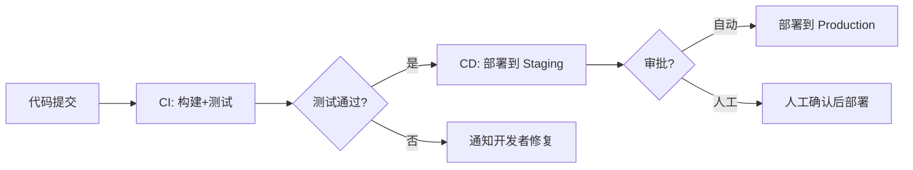
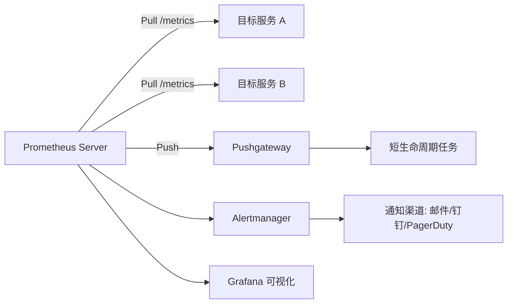
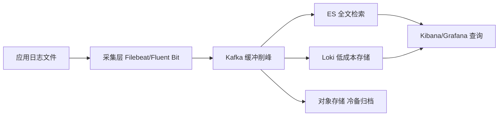
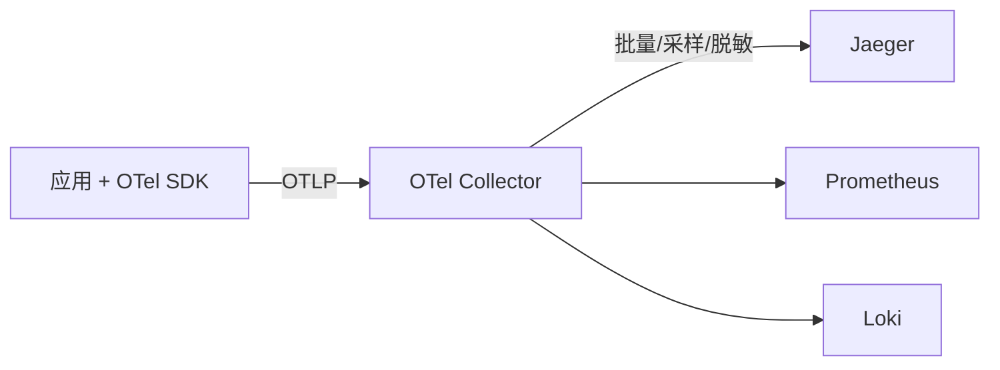

# DevOps 面试

::: tip 扩展

- 《持续交付 2.0》—— Jez Humble
- 《凤凰项目》—— Gene Kim
- [Atlassian DevOps](https://www.atlassian.com/devops)

:::

## DevOps 简介

### 【简单】什么是 DevOps？⭐⭐⭐

**DevOps 是通过平台（Platform）、流程（Process）和人（People）的有机整合，以 C（协作）A（自动化）L（精益）M（度量）S（共享）文化为指引，旨在建立一种可以快速交付价值并且具有持续改进能力的现代化 IT 组织。**

简单来说，**DevOps 就是让构建、发布和运行软件的过程变得更快、更顺、更稳**。

**核心理念**：

- **打破壁垒**：开发（Dev）与运维（Ops）不再各自为战，而是共同承担从代码到生产的全生命周期。
- **自动化一切**：构建、测试、部署、监控等环节尽可能自动化，减少人为错误。
- **快速反馈**：通过度量和监控快速发现问题，形成持续改进的闭环。

### 【中等】列举一下 DevOps 各环节的主流工具？⭐⭐⭐

| 阶段 (Phase)              | 核心任务与功能                 | 主流工具                                                                                                  |
| :------------------------ | :----------------------------- | :-------------------------------------------------------------------------------------------------------- |
| **计划与协作** (Plan)     | 需求管理、任务拆分、项目跟踪   | **Jira**、**Confluence**                                                                                  |
| **代码与版本控制** (Code) | 源代码管理、代码审查、分支策略 | **Git**、**GitHub**、**GitLab**；分支策略：**Gitflow**、**Trunk-Based**                                   |
| **构建与持续集成** (CI)   | 自动编译、单元测试、打包       | **Jenkins**、**GitLab CI/CD**、**GitHub Actions**、**CircleCI**；构建工具：**Maven**、**Gradle**、**npm** |
| **测试和质量** (Test)     | 自动化测试、代码扫描           | **Selenium**、**JUnit**、**SonarQube**                                                                    |
| **发布与持续部署** (CD)   | 自动化部署、发布策略           | **ArgoCD**（GitOps）、**Spinnaker**、**Tekton**、Jenkins                                                  |
| **运维与配置** (Operate)  | 基础设施自动化、容器编排       | **Terraform**（IaC）、**Ansible**（配置管理）、**Docker**、**Kubernetes**、**Helm**                       |
| **监控与反馈** (Monitor)  | 性能监控、日志管理、链路追踪   | **Prometheus**、**Grafana**、**ELK Stack**、**OpenTelemetry**                                             |

### 【中等】DevOps 和传统瀑布/敏捷有什么区别？⭐⭐

| 对比维度       | 瀑布模型  | 敏捷开发         | DevOps                |
| :------------- | :-------- | :--------------- | :-------------------- |
| **交付频率**   | 数月/数年 | 2~4 周迭代       | **每天多次**          |
| **开发与运维** | 完全分离  | 开发团队内部敏捷 | **开发运维一体化**    |
| **自动化程度** | 极低      | 中等（CI）       | **极高（CI/CD/IaC）** |
| **反馈周期**   | 长        | 中               | **短（实时监控）**    |
| **核心关注**   | 流程合规  | 快速迭代         | **端到端交付效率**    |

## Git

### 【中等】Git 中 fork、clone、branch 有什么区别？⭐⭐

| 操作       | 本质                                  | 适用场景               |
| :--------- | :------------------------------------ | :--------------------- |
| **clone**  | 将远程仓库完整拷贝到本地              | 参与已有项目开发       |
| **fork**   | 在远程（如 GitHub）创建仓库的独立副本 | 开源贡献、独立开发分支 |
| **branch** | 在仓库内创建分支                      | 功能开发、并行开发     |

**fork vs clone**：`fork` 是在远程服务器上复制一份仓库（属于你自己的账号），`clone` 是将仓库下载到本地。开源项目典型工作流：**fork → clone → 开发 → push → pull request**。

### 【中等】什么是 Git 的 rebase？和 merge 有什么区别？⭐⭐⭐⭐

> - rebase 和 merge 都能整合分支，有何不同？
> - 各自适用什么场景？
> - rebase 有什么风险？

**merge**：将两个分支的变更合并，**保留完整的分支历史**，产生一个新的合并提交。

**rebase**：将当前分支的提交"摘下来"，重新"嫁接"到目标分支的最新提交上，**产生线性历史**。

| 对比维度     | merge                        | rebase               |
| :----------- | :--------------------------- | :------------------- |
| **历史记录** | 保留分叉和合并记录（非线性） | **线性历史**，更清晰 |
| **提交数**   | 多一个合并提交               | 无额外提交           |
| **冲突处理** | 一次性解决所有冲突           | 逐个提交解决冲突     |
| **安全性**   | 不改写历史                   | **改写提交哈希**     |

**黄金法则**：**绝不对已推送到远程的公共分支执行 rebase**，否则会导致其他人的历史混乱。rebase 后原提交哈希全部改变，其他协作者拉取的历史与你强推的历史分叉，`git pull` 会产生大量重复提交，修复成本远超收益。

**方案权衡：团队分支历史管理策略**

| 策略                                         | 约定                                                                           | 适用边界                                            |
| :------------------------------------------- | :----------------------------------------------------------------------------- | :-------------------------------------------------- |
| **feature 分支 rebase + 主干 merge**（主流） | 功能分支定期 `git rebase main` 同步主干，合入时用 `merge --no-ff` 保留合并节点 | 2~20 人团队，需要保留功能边界做 revert 单元         |
| **全线性（rebase + fast-forward）**          | 合入也用 rebase，历史完全线性                                                  | Trunk-Based 高成熟度团队，`git log` 干净便于 bisect |
| **纯 merge 流**                              | 所有整合都用 merge，不改写任何历史                                             | 开源项目、跨组织协作，历史真实性优先于整洁          |

**失效场景**：

- 功能分支存活超过 1~2 周时，rebase 需要逐个重放几十个提交解冲突，此时应先拆小分支，或用 `git rerere` 记录冲突解法复用。
- 多人协作的同一条 feature 分支上 rebase 后强推，队友未 `pull --rebase` 直接 push 会把旧历史带回来，形成"历史污染"。

**踩坑案例**：某团队开发同学在 feature 分支上 `git rebase main` 后直接 `git push`，被远端拒绝后执行了 `git push --force`。由于该分支有 2 位协作者，他们本地还是旧历史，随后一次普通 `git push` 把被 rebase 丢弃的 17 个旧提交全部带回了远端，主干历史出现两条重复线。排查：`git reflog` + 远端审计日志定位到强推操作；根因：分支保护规则未禁止 force push；修复：用 `git revert` 撤销重复合并，GitLab 上对共享分支关闭 force push，并在团队约定"rebase 只用于本地未共享的提交"。

**量化参考**：大厂代码评审通常要求单 MR 提交数控制在 20 个以内，rebase 压缩（`git rebase -i` + squash）是保持 MR 可读性的常规手段。

**推荐实践**：

- 个人功能分支同步主干：**优先 rebase**（保持线性历史，冲突早暴露早解决）。
- 功能分支合入主干：**用 merge --no-ff**（保留功能边界，便于整体回滚）。
- 主分支合并到功能分支时：**用 merge**（保留上下文）。

#### 拓展追问

1. rebase 冲突解决到一半发现改乱了，如何回到 rebase 前的状态？
   执行 `git rebase --abort` 即可完整回退到 rebase 开始前的状态；如果 rebase 已经完成才发现出错，用 `git reflog` 找到 rebase 前的 HEAD 哈希，再 `git reset --hard <hash>` 恢复。这正是 reflog 被称为"后悔药"的原因。
2. `git pull` 默认是 merge 还是 rebase？团队该如何统一？
   默认是 fetch + merge，会在本地产生大量无意义的 merge commit。团队应统一配置 `git config pull.rebase true`，让 pull 变成 fetch + rebase，保持本地提交整洁；更进一步可开启 `rebase.autoStash` 自动处理未提交的修改。
3. 为什么说 rebase 有利于 `git bisect` 定位 bug？
   bisect 用二分查找在提交历史中定位引入缺陷的提交，线性历史下每一步 bisect 都能得到确定性的单一祖先链；如果历史里满是交织的 merge commit，bisect 的路径会发散、难以收敛，因此主干保持线性能显著缩短事故定位时间。

#### 场景题

你负责一个 10 人团队，主干是 `main`。一位新同学的 feature 分支落后主干 40 个提交，他执行 rebase 后遇到 12 个文件冲突，解到第 5 个提交时越解越乱，跑来问你怎么办。你的处置方案是什么？

**应急处理**：先让他 `git rebase --abort` 回到安全状态，避免在混乱的中间态上继续操作。

**根因分析**：冲突多的本质是分支存活太久、与主干偏差过大，rebase 需要逐提交重放冲突；同时解冲突顺序被打乱导致上下文丢失。

**处置方案**：① 改用 `git merge main` 一次性解决所有冲突（冲突只解一遍，且保留完整上下文）；② 合入主干前再用 `git rebase -i` 把提交 squash 成 1~3 个逻辑单元；③ 如果分支功能已完成大半，考虑先以"分批小 MR"的方式把已完成部分合入主干，缩小偏差。

**长期方案与权衡**：团队约定 feature 分支每 1~2 天 rebase 一次主干（冲突摊薄到每次几分钟）；主干合并用 `--no-ff` 保留功能边界；CI 上配置"MR 落后主干超过 50 个提交时告警"。权衡点：merge 一次性解冲突效率高但历史有分叉，rebase 历史干净但冲突要解多遍——分支越短，rebase 的劣势越小，所以根治手段是缩短分支生命周期。

### 【中等】什么是 Git 的 cherry-pick？适用什么场景？⭐⭐

**cherry-pick** 是将**某一次或某几次特定提交**应用到当前分支的操作。

```bash
git cherry-pick <commit-hash>
git cherry-pick <start>..<end>  # 应用一个范围的提交
```

**适用场景**：

- **热修复**：将修复分支的某次 commit 摘到发布分支。
- **选择性合并**：只需要目标分支的部分提交，而非全部合并。
- **多版本维护**：将修复同步到多个版本分支。

### 【中等】Git 的 stash 怎么用？⭐⭐

**stash** 用于**临时保存未提交的修改**，让你可以在不 commit 的情况下切换分支或拉取代码。

```bash
git stash            # 保存当前修改
git stash list       # 查看保存列表
git stash pop        # 恢复最近一次保存并删除记录
git stash apply      # 恢复但不删除记录
git stash drop       # 删除指定保存
```

**典型场景**：正在开发功能 A，突然需要切换分支修复线上 bug → `stash` 保存 → 切换修复 → 切回 → `stash pop` 恢复。

### 【中等】常见的 Git 分支策略有哪些？⭐⭐⭐

| 策略            | 原理                                                  | 优点                   | 缺点                     | 适用场景           |
| :-------------- | :---------------------------------------------------- | :--------------------- | :----------------------- | :----------------- |
| **Git Flow**    | `main` + `develop` + `feature` + `release` + `hotfix` | 结构清晰，适合版本发布 | 分支多，流程重           | **传统版本发布制** |
| **GitHub Flow** | 只有 `main` + 功能分支 + PR                           | 简单灵活               | 缺乏发布管理             | **持续部署项目**   |
| **Trunk-Based** | 所有人在 `main` 上开发，短命分支                      | 极致的 CI/CD           | 需要完善的 CI 和特性开关 | **高成熟度团队**   |
| **GitLab Flow** | `main` + 环境分支（staging/production）               | 兼顾简单和环境管理     | 比 GitHub Flow 稍复杂    | **多环境部署**     |

### 【简单】Git 中 reflog 有什么用？⭐

**reflog**（Reference Log）记录了 **HEAD 的所有变更历史**，包括已"丢失"的提交。

```bash
git reflog  # 查看所有 HEAD 移动记录
```

**核心用途**：

- **找回误删的提交**：`git reset --hard <hash from reflog>`。
- **找回 rebase 前的状态**：rebase 出错时可通过 reflog 回退。
- **安全网**：几乎所有 Git 操作都可以通过 reflog 恢复。

### 【中等】什么是 Git Hook？有哪些常见用途？⭐

**Git Hook** 是在 Git 特定事件（如 commit、push）触发时自动执行的脚本。

| Hook           | 触发时机          | 常见用途                                    |
| :------------- | :---------------- | :------------------------------------------ |
| `pre-commit`   | `git commit` 之前 | 代码格式化、lint 检查、单元测试             |
| `commit-msg`   | 编辑提交信息时    | 校验提交信息格式（如 Conventional Commits） |
| `pre-push`     | `git push` 之前   | 运行完整测试套件                            |
| `post-receive` | 服务端收到推送后  | 自动部署、通知                              |

**常用工具**：[**Husky**](https://typicode.github.io/husky/)（Node.js）+ [**lint-staged**](https://github.com/okonet/lint-staged) 是前端项目中最流行的 Git Hook 方案。

### 【中等】如何管理大型 Git 仓库？⭐

**大仓库（Monorepo）挑战**：仓库体积大、clone 慢、构建慢。

| 方案                | 原理                                  | 适用场景           |
| :------------------ | :------------------------------------ | :----------------- |
| **Shallow Clone**   | `git clone --depth 1`，只拉取最新提交 | CI/CD 构建         |
| **Sparse Checkout** | 只检出需要的目录                      | 开发者只需部分代码 |
| **Git LFS**         | 大文件（二进制）存储在外部            | 游戏、设计资源     |
| **Partial Clone**   | 按需拉取对象（`--filter=blob:none`）  | 超大仓库           |
| **多仓库**          | 拆分为独立仓库 + 子模块/subtree       | 模块间耦合低       |

### 【中等】Git 中 revert 和 reset 有什么区别？⭐⭐⭐⭐

两者都用于“撤销提交”，但**本质和安全性完全不同**：

| 对比维度     | revert                                   | reset                                |
| :----------- | :--------------------------------------- | :----------------------------------- |
| **原理**     | **新建一个反向提交**，抵消目标提交的变更 | **移动 HEAD 指针**，直接丢弃提交     |
| **历史记录** | 保留完整历史，可追溯                     | **改写历史**（提交从记录中消失）     |
| **远程安全** | **安全**，可放心用于公共分支             | **危险**，禁止对已推送的公共分支使用 |
| **典型场景** | 撤销线上错误发布                         | 撤销本地未推送的提交                 |

**reset 的三种模式**：

- `--soft`：只回退提交，保留暂存区和工作区变更。
- `--mixed`（默认）：回退提交和暂存区，保留工作区变更。
- `--hard`：**彻底丢弃**所有变更（慎用，可用 reflog 找回）。

```bash
git revert HEAD              # 撤销最近一次提交（生成新提交）
git reset --soft HEAD~1      # 撤销提交但保留改动在暂存区
```

**事故恢复决策树**：

| 场景                                      | 选择                                     | 理由                                                 |
| :---------------------------------------- | :--------------------------------------- | :--------------------------------------------------- |
| 错误提交**已推送到公共分支**（如 `main`） | **`git revert`**                         | 不改写历史，其他协作者无需重新同步                   |
| 错误提交**仅在本地**未推送                | **`git reset`**                          | 历史干净，无副作用                                   |
| 需要保留"谁在何时回滚了什么"的审计记录    | **`git revert`**                         | revert 本身就是一条可追溯的提交                      |
| 要撤销的是一个 **merge commit**           | `git revert -m 1 <merge-hash>`           | 必须用 `-m` 指定保留的主线父提交，否则 revert 会失败 |
| 误执行了 `reset --hard` 想找回            | **`git reflog` + `reset --hard <hash>`** | 提交对象在 GC 前（默认保留 90 天）仍可找回           |

**失效场景**：

- **revert merge 后再重新合入会失效**：被 revert 掉的 merge 分支再次合入时，Git 认为那些提交"已合过"，新提交不会被带入——必须先 `revert 那次 revert` 才能恢复，这是发布火车上的经典坑。
- **reset 已推送的公共分支**：即使随后 `push --force` 成功，所有协作者的本地历史已与远端分叉，后续 pull/push 会把旧提交带回来，事故扩大。
- **revert 不能解决代码与数据的双重回滚**：如果错误提交已执行了不可逆的数据库 DDL，单靠 git 操作无法恢复，需配合数据回滚预案。

**踩坑案例**：某电商大促前夜，一个带 bug 的提交合入 `main` 并已触发 CI 构建。值班同学为了让历史"干净"，执行了 `git reset --hard HEAD~1` 并 `push --force`。此时另外 3 位同学正在基于旧 `main` 合入自己的 MR，强推后他们的 push 把被丢弃的 bug 提交又带了回来，且 CI 构建产物版本混乱，发布窗口被拖延 40 分钟。排查：`git reflog` 还原时间线，确认强推是源头；根因：公共分支未禁止 force push + 事故恢复无 SOP；修复：改用 revert 重新生成反向提交，并规定"已推送提交一律 revert，reset 仅限本地"写入发布规范。

**量化参考**：大厂发布回滚的黄金目标是 **5 分钟内完成**，`git revert` + 重跑流水线通常 3~5 分钟；而 force push 引发的历史修复往往需要 30 分钟以上，且风险不可控。

**总结**：公共分支用 revert 保历史，本地分支用 reset 图干净；已推送到远端的提交，任何情况下都不要用 reset。

#### 拓展追问

1. 为什么 `git revert` 一个 merge commit 必须加 `-m` 参数？
   merge commit 有两个父提交，Git 无法自行决定"保留哪一侧"，`-m 1` 表示以第一个父提交（通常是被合入的主干）为主线，把另一侧的变更反向应用。不加 `-m` 时 revert 会直接报错拒绝执行。
2. 误删的分支还能找回吗？
   可以。分支只是指向提交的指针，删除分支不会删除提交对象。用 `git reflog` 找到该分支最后一次指向的哈希，`git branch <name> <hash>` 即可重建；即使 reflog 也查不到，还可用 `git fsck --lost-found` 找回未被 GC 的悬挂提交。
3. 生产发布回滚时，应该用 git 操作还是用发布平台回滚？
   优先用发布平台/CD 系统的"上一版本镜像回滚"，秒级生效且不依赖重新构建；git revert 用于修正代码库状态，保证后续构建不再带出坏代码。两者分工：运行时回滚救急，git revert 正本清源，缺一不可。

#### 场景题

周三下午，一位同学误把一个含密钥配置的提交 push 到了 `main`，5 分钟后被其他同学 pull，10 分钟后 CI 已构建了带密钥的镜像。你作为值班 SRE，如何在 5 分钟内安全处置？

**应急处理（0~5 分钟）**：① 立即 `git revert <bad-commit>` 并推送，终止坏代码继续扩散；② 在 CI/镜像仓库中废弃已构建的镜像版本，禁止它进入部署流水线；③ 由于密钥已泄露到仓库历史，直接**作废并轮换该密钥**——不要指望靠 reset + force push "抹掉"历史。

**根因分析**：误推的根源是密钥以明文存在代码仓库；revert 只能撤销变更，无法清除已进入他人本地/远端历史的密钥。

**长期方案**：① 密钥一律移出代码库，用 Vault/KMS/CI 变量注入；② 仓库开启 pre-commit 密钥扫描（如 gitleaks）+ 服务端拦截；③ 制定事故 SOP："已推送提交只 revert 不 reset，公共分支禁止 force push"。

**权衡**：reset + force push 看起来能"彻底删除"密钥，但 5 分钟内已被他人拉取、已被 CI 构建，历史实际已扩散，强推只会引发协作者历史混乱，风险远大于收益——安全事件里，承认泄露并轮换密钥才是正解。

### 【中等】Git 的子模块（submodule）是什么？怎么使用？⭐⭐

**子模块**允许在一个 Git 仓库中**嵌入另一个独立仓库**，并锁定其特定提交版本，用于管理跨仓库依赖（如公共组件库、第三方 SDK）。

```bash
git submodule add <repo-url> libs/common   # 添加子模块
git submodule update --init --recursive    # 克隆后初始化拉取子模块
git clone --recurse-submodules <repo-url>  # 克隆时一并拉取子模块
git submodule update --remote              # 升级子模块到远程最新提交
```

**工作原理**：父仓库通过 `.gitmodules` 记录子模块地址，并在树对象中**记录子模块的 commit hash**，因此父仓库能精确锁定依赖版本。

**注意事项**：

- 子模块更新后需在**父仓库提交一次**，固化新的 commit hash。
- 替代方案：**Git subtree**（历史融入主仓库，使用更简单）、包管理器（npm/Maven）更适合常规依赖管理。

**总结**：子模块适合锁定版本的跨仓库源码依赖，但协作流程较重，能用包管理器解决的优先用包管理器。

## Linux

### 【中等】Linux 的权限模型是什么？chmod 755 是什么意思？⭐⭐

Linux 采用**用户-组-其他（User-Group-Other）**三级权限模型：

```
-rwxr-xr-x  1 user group  1024 Jan 1 12:00 file.txt
 ↑↑↑ ↑↑↑ ↑↑↑
 │││ │││ └── Other: r-x（可读可执行）
 │││ └──── Group: r-x（可读可执行）
 └────── User:  rwx（可读可写可执行）
```

**权限数值表示法**：

| 权限      | 二进制 | 八进制 |
| :-------- | :----- | :----- |
| r（读）   | 100    | 4      |
| w（写）   | 010    | 2      |
| x（执行） | 001    | 1      |

`chmod 755` 表示：User = 7（rwx），Group = 5（r-x），Other = 5（r-x）。

### 【中等】什么是 CC 攻击、DDoS 攻击和 SQL 注入？⭐⭐

| 攻击类型      | 原理                                           | 防御措施                       |
| :------------ | :--------------------------------------------- | :----------------------------- |
| **CC 攻击**   | 模拟大量用户发起合法 HTTP 请求，耗尽服务器资源 | 限流、验证码、IP 黑名单、WAF   |
| **DDoS 攻击** | 利用僵尸主机发送海量请求，耗尽带宽或资源       | 流量清洗、Anycast、CDN、云防护 |
| **SQL 注入**  | 在输入中嵌入恶意 SQL 语句                      | 参数化查询、ORM、输入校验、WAF |

### 【中等】如何在 Linux 中查看系统资源使用情况？⭐⭐

| 排查维度     | 命令                           | 说明                 |
| :----------- | :----------------------------- | :------------------- |
| **综合**     | `top`、`htop`                  | CPU/内存使用排名     |
| **内存**     | `free -h`、`cat /proc/meminfo` | 内存/Swap 使用情况   |
| **磁盘**     | `df -h`、`du -sh *`            | 磁盘/目录空间占用    |
| **I/O**      | `iostat -x`、`iotop`           | 磁盘读写速率         |
| **网络**     | `ss -tlnp`、`netstat -tlnp`    | 端口监听状态         |
| **网络诊断** | `ping`、`traceroute`、`curl`   | 网络连通性和链路追踪 |
| **进程**     | `ps aux`、`lsof -i :<port>`    | 进程列表、端口占用   |
| **日志**     | `journalctl -xe`、`dmesg`      | 系统/内核日志        |

### 【中等】Linux 中 systemd 是什么？如何管理服务？⭐⭐

**systemd** 是 Linux 的**初始化系统（init system）**，负责系统启动和服务管理，替代了传统的 SysVinit。

```bash
systemctl start <service>    # 启动服务
systemctl stop <service>     # 停止服务
systemctl restart <service>  # 重启服务
systemctl enable <service>   # 开机自启
systemctl status <service>   # 查看状态
systemctl daemon-reload      # 重新加载配置
```

**服务配置文件**（`.service`）示例：

```ini
[Unit]
Description=My App
After=network.target

[Service]
ExecStart=/usr/bin/java -jar /opt/app/app.jar
Restart=always
User=appuser

[Install]
WantedBy=multi-user.target
```

### 【简单】Linux 中 crontab 怎么用？⭐

**crontab** 用于设置定时任务。

```
*  *  *  *  *  command
│  │  │  │  │
│  │  │  │  └── 星期 (0-7, 0和7都是周日)
│  │  │  └───── 月份 (1-12)
│  │  └──────── 日期 (1-31)
│  └─────────── 小时 (0-23)
└────────────── 分钟 (0-59)
```

**常用示例**：

- `0 2 * * *`：每天凌晨 2 点执行
- `*/5 * * * *`：每 5 分钟执行
- `0 0 * * 0`：每周日午夜执行

### 【中等】Linux 文本处理三剑客是什么？⭐⭐

| 工具     | 核心能力         | 典型用法                                     |
| :------- | :--------------- | :------------------------------------------- |
| **grep** | **搜索过滤**     | `grep -r "error" /var/log/` 搜索日志中的错误 |
| **awk**  | **列处理与统计** | `awk '{print $1, $3}' file` 提取第 1、3 列   |
| **sed**  | **流编辑**       | `sed 's/old/new/g' file` 全局替换文本        |

**实战示例**：统计 Nginx 访问日志中 Top 10 IP：

```bash
awk '{print $1}' access.log | sort | uniq -c | sort -rn | head -10
```

### 【中等】什么是 lsof？strace 怎么用？⭐

| 工具       | 功能                    | 典型用法                                                                   |
| :--------- | :---------------------- | :------------------------------------------------------------------------- |
| **lsof**   | 列出**打开的文件/端口** | `lsof -i :8080` 查看端口占用；`lsof -p <pid>` 查看进程打开的文件           |
| **strace** | 追踪进程的**系统调用**  | `strace -p <pid>` 实时追踪；`strace -e trace=network <cmd>` 只追踪网络调用 |

**典型排查场景**：

- 端口被谁占用了？→ `lsof -i :<port>`
- 程序启动失败，找不到哪个文件？→ `strace -e trace=open <cmd>`
- 进程卡住了，在等什么？→ `strace -p <pid>`

### 【简单】Linux 中 nohup 和 & 有什么区别？如何让进程后台持久运行？⭐⭐

- **`&`**：将命令放入**后台执行**，但进程仍属于当前 shell，**终端关闭或退出时进程随之终止**。
- **`nohup`**：让进程**忽略 SIGHUP 信号**，终端关闭后进程继续运行；默认输出重定向到 `nohup.out`。

```bash
nohup java -jar app.jar > app.log 2>&1 &
```

**关键细节**：

- `2>&1` 将标准错误合并到标准输出，避免错误信息丢失。
- 查看后台任务：`jobs -l`；拉回前台：`fg %1`。
- 会话退出后守护已有进程：`disown -h <pid>`。

**生产环境最佳实践**：不使用 nohup，而是用 **systemd** 托管服务（自动重启、开机自启、日志管理），或用 `screen`/`tmux` 保持会话。

**总结**：`&` 只是后台运行，`nohup` 才是脱离终端，生产请用 systemd。

### 【中等】线上服务器 CPU 飙高，如何排查？⭐⭐⭐

**标准排查四步法**（以 Java 应用为例）：

1. **定位高 CPU 进程**：`top` 按 `P` 按 CPU 排序，找到目标进程 PID。
2. **定位高 CPU 线程**：`top -Hp <pid>` 找到最耗 CPU 的线程 TID。
3. **线程 ID 转十六进制**：`printf '%x\n' <tid>`（如 12345 → 0x3039）。
4. **结合线程栈定位代码**：`jstack <pid> | grep -A 30 0x3039`，查看该线程正在执行的代码。

**常见根因**：

| 现象           | 可能原因                    | 验证手段                         |
| :------------- | :-------------------------- | :------------------------------- |
| 用户态 CPU 高  | 死循环、频繁 GC、序列化热点 | jstack、`jstat -gcutil`          |
| 内核态 CPU 高  | 频繁系统调用、上下文切换    | `vmstat 1`（看 cs、sy）          |
| iowait 高      | 磁盘 I/O 瓶颈               | `iostat -x 1`（看 %util、await） |
| 软中断高（si） | 网络流量洪泛                | `sar -n DEV 1`、`dstat`          |

**辅助工具**：`vmstat`（CPU/内存/IO 综合）、`pidstat -u -t`（线程级 CPU）、Arthas `thread -n 3`（Java 直接定位 Top 3 热线程）。

**总结**：top → top -Hp → 转十六进制 → jstack，是 CPU 飙高排查的经典四连。

## CI/CD

### 【中等】什么是 CI/CD？CI 和 CD 有什么区别？⭐⭐⭐⭐

**CI（Continuous Integration，持续集成）**：开发者频繁地将代码合并到主干，每次合并自动触发**构建和测试**，尽早发现问题。

**CD（Continuous Delivery/Deployment，持续交付/部署）**：

- **持续交付（Continuous Delivery）**：代码始终处于**可部署**状态，但需**人工审批**才能上线。
- **持续部署（Continuous Deployment）**：代码通过测试后**自动部署到生产环境**，无需人工干预。



**方案权衡：持续交付 vs 持续部署**

| 模式         | 上线方式                                 | 适用边界                                                             |
| :----------- | :--------------------------------------- | :------------------------------------------------------------------- |
| **持续交付** | 测试通过后停在"可发布"状态，人工审批上线 | 金融/合规场景、发布窗口固定（如每周四）的团队                        |
| **持续部署** | 测试通过后自动进生产，无需人工           | 具备完善监控 + 自动回滚 + 金丝雀能力的高成熟度团队（日均数百次发布） |

**失效场景**：

- **测试金字塔倒置时 CI 失效**：单元测试少、E2E 测试多，流水线动辄 40 分钟以上，开发者开始跳过测试直接合入，CI 形同虚设。健康形态：单测占 70%+，流水线总时长控制在 **10 分钟内**。
- **环境不一致时 CD 失效**：Staging 与生产配置漂移（如生产多了某个中间件版本），"Staging 全绿"不代表生产可用，必须用不可变构建产物 + 配置中心化。
- **人工审批成为瓶颈**：审批人 2 小时才响应，日均 50 次发布的团队会积压大量待发布版本，反而催生"打包大版本一起发"的反模式，风险更高。

**踩坑案例**：某团队流水线单测覆盖率门禁设在主干合并后，一次周五下午的发布中，CI 因依赖镜像仓库超时重试 3 次后才跑完，实际跳过了核心单测，带病合入的代码在发布后 20 分钟引发支付接口 5xx 飙升到 8%。排查：对比流水线日志发现单测阶段被重试机制掩盖；根因：CI 的"重试即通过"策略把失败测试静默放过；修复：单测失败禁止重试、门禁前置到 MR 阶段必须全绿才能合入，并把流水线失败后重试限定为仅基础设施类错误。量化指标：修复后该团队主干坏版本占比从每周 2~3 次降为 0。

**量化参考**：DORA（DevOps Research and Assessment）指标中，精英团队部署频率为每天多次、变更前置时间小于 1 小时、变更失败率低于 15%、恢复时间小于 1 小时；而传统团队变更前置时间可达数周。

#### 拓展追问

1. 为什么说"构建一次，多次部署"是 CI/CD 的基石？
   每个环境重新构建会引入环境差异（依赖版本、构建参数），导致测试环境验证过的产物与生产实际运行的不是同一个。正确做法是构建不可变产物（镜像/包带版本号），各环境只替换配置不重新构建，保证"测的就是发的"。
2. 流水线超过 20 分钟，开发者开始不提交小 MR 而是攒大 MR，如何治理？
   先分层提速：单测并行化 + 缓存依赖，把快速反馈阶段压到 5 分钟内，慢速阶段（E2E、安全扫描）后置到合入后异步执行；再用门禁限制大 MR（如超过 400 行变更需额外审批）。本质是让"小步快跑"的成本低于"攒大包"。
3. 持续部署到生产前，除了测试还需要哪些安全门？
   至少包括：镜像漏洞扫描（Trivy）阻断高危 CVE、密钥/敏感信息扫描、配置变更与代码变更分离审批、发布窗口与变更冻结期检查（如大促前一周封网）。自动化回滚能力是持续部署的硬性前提——没有 5 分钟回滚能力就不要谈自动部署。

#### 场景题

大促前一周，业务方要求紧急上线一个营销活动功能，但团队已进入变更冻结期（封网）。作为发布负责人，你如何决策？

**应急处理**：不直接拒绝也不直接放行，而是评估风险等级：该变更是否有完整单测 + 回滚预案？是否涉及资金/核心链路？若仅为前端展示类变更且有开关控制，可走"紧急变更审批通道"。

**根因分析**：封网与业务需求冲突的本质是变更风险管理机制与业务节奏脱节——封网封的是"高风险变更"，不应一刀切封死所有变更。

**长期方案**：① 变更分级：高风险（核心链路、DB 变更）严格封网，低风险（开关控制、可秒级回滚）允许白名单放行；② 所有变更必须挂特性开关，出问题先关开关再回滚，止血时间从分钟级降到秒级；③ 封网期提前与业务对齐需求排期。

**权衡**：完全放行封网形同虚设，完全禁止则业务僵化；正确的权衡轴是"可回滚性"——能在 1 分钟内无损回滚的变更风险可控，不能回滚的（如数据迁移）任何时期都要严格审批。

### 【中等】Jenkins Pipeline 和 GitLab CI/CD 有什么区别？⭐⭐

| 对比维度     | Jenkins                    | GitLab CI/CD               |
| :----------- | :------------------------- | :------------------------- |
| **架构**     | Master-Agent，需独立部署   | 内置于 GitLab，Runner 执行 |
| **配置方式** | Groovy 脚本（Jenkinsfile） | YAML（`.gitlab-ci.yml`）   |
| **插件生态** | 极其丰富（1000+ 插件）     | 内置功能够用，扩展性一般   |
| **维护成本** | 高（插件兼容性、升级）     | 低（一体化）               |
| **适用场景** | 大型复杂流水线             | 中小型项目、GitLab 用户    |

### 【困难】如何设计一个可靠的 CI/CD 流水线？⭐⭐⭐

**核心原则**：

1. **快速反馈**：流水线应在 10 分钟内完成（构建+测试），超过则需优化。
2. **构建一次，多次部署**：构建产物（镜像/包）不可变，各环境复用。
3. **自动化测试分层**：单元测试 → 集成测试 → E2E 测试（测试金字塔）。
4. **环境一致性**：开发、测试、生产使用相同的构建产物和配置方式。
5. **回滚能力**：部署必须可回滚（蓝绿部署、金丝雀发布）。
6. **安全左移**：在 CI 阶段集成安全扫描（SAST、依赖漏洞检查）。

**典型流水线阶段**：

```
代码提交 → Lint → 单元测试 → 构建 → 镜像扫描 → 部署到 Dev → 集成测试 → 部署到 Staging → 冒烟测试 → 部署到 Production（金丝雀/蓝绿）
```

### 【中等】什么是蓝绿部署和金丝雀发布？如何落地？⭐⭐⭐⭐

两者都是**降低发布风险、实现快速回滚**的部署策略：

| 策略           | 原理                                                  | 优点                   | 缺点                           |
| :------------- | :---------------------------------------------------- | :--------------------- | :----------------------------- |
| **蓝绿部署**   | 新旧两套完整环境，流量**一次性整体切换**              | 回滚秒级（切回旧环境） | **资源成本翻倍**，数据同步复杂 |
| **金丝雀发布** | 先将**小比例流量**（如 5%）导入新版本，验证后逐步放量 | 影响面小、风险可控     | 发布周期较长，需流量治理配合   |

**落地方式**：

- **Kubernetes 原生**：蓝绿可通过双 Deployment + 切换 Service Selector 实现；金丝雀可部署少量副本的新 Deployment，按副本比例近似灰度。
- **Ingress/服务网格**：Nginx Ingress 通过 `canary-weight` 注解按权重分流；**Istio** VirtualService 支持精确的流量比例、按 Header 灰度。
- **专业工具**：Argo Rollouts（`Canary`/`BlueGreen` 策略 + 自动化指标分析）、Spinnaker。

**关键配套**：发布过程必须结合**监控指标验证**（错误率、延迟），异常时自动回滚；注意**新旧版本兼容性**（数据库 Schema、消息格式需向前兼容）。

**方案权衡：蓝绿 vs 金丝雀**

| 维度         | 蓝绿部署                             | 金丝雀发布                                      |
| :----------- | :----------------------------------- | :---------------------------------------------- |
| **成本**     | 资源翻倍（两套完整环境常驻）         | 增量副本，成本可控                              |
| **风险暴露** | 切换瞬间 100% 流量暴露于新版本       | 首波仅 1%~10% 流量暴露                          |
| **回滚速度** | 秒级（切回 Selector）                | 秒级（权重归零）                                |
| **验证深度** | 切换前只能预发验证                   | 真实流量 + 真实数据验证                         |
| **适用边界** | 无状态、低发布频率、追求极致回滚速度 | 高发布频率（日均百次+）、需要渐进验证的大厂标配 |

**失效场景**：

- **有状态服务不能简单蓝绿**：带本地会话/本地缓存的服务，流量切换后状态丢失；必须先把会话外置（Redis）或改用金丝雀渐进迁移。
- **数据库 Schema 不兼容时两种策略都失效**：新版本删了旧列，回滚后旧版本直接报错——必须先做向后兼容的 Schema 变更（先加列后用列，分两次发布）。
- **按副本数近似灰度不精确**：新版本 1 副本 + 旧版本 19 副本 ≈ 5% 流量，但副本间流量不均时实际比例会偏离；精确灰度需 Ingress 权重或 Istio。

**踩坑案例**：某次发布中，金丝雀新版本连的是已升级的数据库 Schema（新增了一个非空字段），但运维把 canary-weight 误配成 100%，全量流量瞬间打到新版本，而新版本代码对旧数据缺少兼容处理，导致订单查询接口错误率在 2 分钟内从 0.1% 涨到 30%。排查：对比发布平台变更记录与 DB 变更工单时间线；根因：应用发布与 DB Schema 变更未绑定原子化、灰度权重无上限校验；修复：回滚流量权重 + 代码兼容旧数据，后续把"Schema 变更必须先于代码发布且向后兼容"写入发布门禁，灰度权重调整需二次确认。

**量化参考**：大厂标准金丝雀节奏：1% → 5% → 25% → 50% → 100%，每档观察 10~30 分钟核心指标；回滚目标 5 分钟内完成（权重归零 < 10 秒，流量排空 < 1 分钟）。

**总结**：蓝绿用空间换安全，金丝雀用流量比例换渐进可控，大厂生产发布标配金丝雀 + 自动回滚。

#### 拓展追问

1. 金丝雀发布中，如何验证金丝雀实例本身是健康的，而不是把流量打过去就完事？
   必须有自动化的指标对比：金丝雀实例的错误率、P99 延迟、饱和度与基线（旧版本实例）同期对比，偏差超过阈值（如错误率相对基线上升 50%）自动暂停放量或回滚。Argo Rollouts 的 Analysis 模板就是这个机制——没有指标验证的金丝雀只是"心理安慰式发布"。
2. 回滚时数据库已经写入了新版本格式的数据，怎么办？
   这是发布前必须回答的问题。标准做法：数据格式变更永远向后兼容（新代码能读旧数据，旧代码能读新数据）；无法兼容时必须设计双写过渡期；真正不可逆的变更（如删列）要放在独立发布窗口，且确认旧版本永不再回滚后才执行。
3. 蓝绿切换时，长连接和消息队列消费者怎么处理？
   不能直接掐断：先摘除旧环境的新流量入口（Selector 切到新环境），然后等待存量请求排空（graceful shutdown，如 Spring Boot 的 graceful shutdown + K8s preStop hook），MQ 消费者先暂停拉取、处理完在途消息再下线，否则会出现消息重复消费或请求中途 502。

#### 场景题

周五晚上发布新版本，金丝雀 10% 流量的错误率从 0.1% 涨到 3%，但整体 P99 没变化，你如何决策继续还是回滚？

**应急处理（先止血再分析）**：错误率从 0.1% 涨到 3% 是 30 倍劣化，且发生在发布窗口内，默认判定为发布引入——立即暂停放量，若错误涉及资金/核心链路直接回滚（金丝雀权重归零，10 秒内生效），不赌"观察一下就好"。

**根因分析**：① 拆分错误码和受影响接口：是全部接口普涨还是个别接口？若仅个别接口，可能是特定数据/用户触发；② 核对本次变更的 diff 与错误接口的关联；③ 整体 P99 没变化只说明 10% 流量被稀释，不能证明无风险——若放量到 100%，错误率就是 3%，在大促级别的 QPS 下这是灾难性的。

**长期方案**：① 发布平台配置自动分析规则：金丝雀错误率超过基线 2 倍自动暂停，超过 5 倍自动回滚；② 周五晚上发布本身就是风险行为，核心服务应避开周五晚发布窗口；③ 错误率告警按版本维度拆分（按 Pod label 聚合），避免小比例劣化被大盘稀释而不可见。

**权衡**：继续放量的唯一正当理由是"已确认错误与本次变更无关（如上游故障）且影响面可接受"——但这需要证据，而不是猜测。发布窗口里的决策原则是：**可疑即回滚，回滚成本永远低于故障扩散成本**。

## 基础设施即代码（IaC）

### 【中等】什么是 IaC？Terraform 和 Ansible 有什么区别？⭐⭐

**IaC（Infrastructure as Code，基础设施即代码）**：用**代码定义和管理基础设施**（服务器、网络、数据库等），像管理应用代码一样管理基础设施。

| 对比维度             | Terraform                        | Ansible                                  |
| :------------------- | :------------------------------- | :--------------------------------------- |
| **定位**             | **基础设施编排（Provisioning）** | **配置管理（Configuration）**            |
| **声明式 vs 命令式** | 声明式（描述期望状态）           | 命令式（描述执行步骤）                   |
| **状态管理**         | 有状态（`.tfstate`）             | 无状态                                   |
| **适用场景**         | 创建云资源（VPC、ECS、RDS）      | 配置已存在的服务器（安装软件、部署应用） |
| **Agent**            | 无 Agent                         | 无 Agent（SSH）                          |

**最佳实践**：**Terraform 创建基础设施 + Ansible 配置服务器**。

## 容器化

### 【简单】什么是容器化？容器和虚拟机有什么区别？⭐⭐⭐

**容器化**是将应用及其依赖打包成标准化单元（容器），实现"一次构建，处处运行"。

| 对比维度       | 容器（Docker）                   | 虚拟机（VM）                   |
| :------------- | :------------------------------- | :----------------------------- |
| **虚拟化层级** | **操作系统级**（共享宿主机内核） | **硬件级**（每个 VM 独立内核） |
| **启动速度**   | **秒级**（毫秒~秒）              | 分钟级（需引导完整 OS）        |
| **资源占用**   | **MB 级**                        | GB 级（含完整 OS）             |
| **隔离性**     | 进程级隔离（较弱）               | 硬件级隔离（较强）             |
| **性能**       | 接近原生（无虚拟化损耗）         | 有 5%~15% 虚拟化损耗           |
| **单机密度**   | 数十~数百个容器                  | 通常几个~几十个 VM             |
| **适用场景**   | 微服务、CI/CD、弹性伸缩          | 需要强隔离、运行不同 OS        |

**隔离原理对比**：

| 机制         | 容器                                                                 | 虚拟机                                                      |
| :----------- | :------------------------------------------------------------------- | :---------------------------------------------------------- |
| **隔离手段** | **Namespace**（PID/Net/Mnt/UTS/IPC/User 六种命名空间制造"独立假象"） | **Hypervisor**（VMware/KVM 在硬件层虚拟出独立机器）         |
| **资源限额** | **Cgroups** 限制 CPU/内存/IO 上限                                    | 直接分配 vCPU/内存给 Guest OS                               |
| **内核**     | 共享宿主机内核，内核漏洞影响所有容器                                 | 每个 VM 独立内核，互不影响                                  |
| **逃逸风险** | 配置不当时存在容器逃逸风险                                           | 需要 Hypervisor 级漏洞（如 VENOM，CVE-2015-3456），极其罕见 |

**方案权衡：何时选容器，何时选 VM**：

- **选容器**：微服务、频繁扩缩容（秒级弹性）、CI/CD 环境一致性；代价是隔离弱，多租户不可信代码不能直接跑容器。
- **选 VM**：多租户隔离（公有云卖的是 VM）、需要不同 OS/内核版本、合规要求强边界。
- **折中方案**：用 **Kata Containers/gVisor** 给容器套上轻量 VM 或用户态内核，兼顾启动速度与强隔离（AWS Fargate 即此思路）。至于 K8s 编排层面的差异（Deployment 调度、弹性伸缩）属于 K8s 专题范畴。

**失效场景**：

- 容器的隔离是"软隔离"：一旦使用 `--privileged`、挂载 docker.sock 或宿主机敏感目录，隔离形同虚设（详见容器逃逸专题）。
- 共享内核意味着：宿主机内核 OOM、内核 panic 会同时干掉所有容器；而 VM 之间内核故障互不影响。
- Linux 容器无法跑在 Windows 内核上（反之亦然），跨 OS 依赖 VM 或 WSL2 这类辅助虚拟化。

**踩坑案例**：某团队把离线批处理任务和在线 API 服务混部在同一台物理机的容器里，未给批处理容器设置内存 Cgroups 限制。某晚批处理任务内存泄漏吃光宿主机内存，内核 OOM Killer 按内存占用打分，把在线 API 容器的主进程杀掉，导致核心接口 502 持续 15 分钟。排查：宿主机 `dmesg` 看到 OOM 记录，确认批处理容器无限额；根因：容器资源限制未纳入发布模板默认项；修复：所有容器强制声明 requests/limits，批处理任务迁到独立节点池，并加宿主机内存使用率告警。

**量化参考**：容器冷启动通常在 1~3 秒（含镜像拉起可达十秒级），VM 启动通常 30 秒~几分钟；容器镜像体积通常几十~几百 MB，VM 磁盘镜像通常几 GB~几十 GB。

#### 拓展追问

1. Namespace 有哪几种，分别隔离什么？
   六种：PID（进程编号）、Network（网卡/端口/路由）、Mount（文件系统挂载点）、UTS（主机名）、IPC（信号量/消息队列）、User（用户与组 ID）。容器"像独立主机"的本质就是这六个命名空间叠加制造的假象；而内核本身始终是共享的，这是容器隔离的天花板。
2. 为什么容器启动比 VM 快两个数量级？
   VM 启动要经历固件初始化、引导加载、内核启动、用户态服务拉起等完整 OS 启动流程；容器本质只是一个被 Namespace/Cgroups 包裹的宿主机进程，启动就是 fork+exec，跳过了所有内核引导环节，所以能从分钟级压缩到秒级。
3. 多租户 SaaS 平台上能直接让用户跑容器吗？
   不能直接跑。多租户之间互不可信，共享内核的容器隔离不足以防范恶意租户提权逃逸；业界方案是给每个租户的容器套一层轻量 VM（Kata/Firecracker，AWS Lambda 即 Firecracker 微虚机），或用 gVisor 在用户态拦截系统调用，牺牲部分性能换取硬隔离。

#### 场景题

公司要把一套传统单体应用（Tomcat + MySQL + Redis 部署在 3 台 VM 上）迁到容器平台，业务方要求迁移期间零停机、且担心"容器不如 VM 稳"。你作为迁移负责人，如何设计方案并回应质疑？

**应急/过渡处理**：不一步到位。先在容器平台拉起新版本，用 Nginx/SLB 按 5% → 25% → 100% 灰度切流，VM 保留一周作为回退点，任何异常秒级切回。

**回应"容器不稳"的质疑**：容器不是魔法也不是更脆，它的稳定性取决于三件事：① 资源限额（Cgroups requests/limits 必须配，避免 OOM 互扰）；② 无状态化（会话外置、日志落盘改远端，容器随时可被替换重建）；③ 探针与健康检查（启动慢的应用配 startup probe，避免被误杀）。这三件事做好，容器可用性不低于 VM，且发布/扩容能力远超 VM。

**根因分析**：业务方的担忧本质是对"进程级隔离"的不信任；真正的风险点不在隔离强度，而在有状态组件（MySQL/Redis）的迁移——数据库容器化需要持久卷、备份、主从切换等配套，建议首期只容器化应用层，DB 继续用 VM/云托管实例。

**长期方案与权衡**：应用层全容器化 + DB 用云托管（RDS），获得秒级弹性与标准化发布；代价是团队需要补齐 K8s 运维能力。权衡轴：追求发布效率与弹性选容器，追求强隔离与运维简单保留 VM——绝大多数团队的正确答案是"应用容器化、数据托管化"。

## 监控与可观测性

### 【中等】什么是可观测性？监控和可观测性有什么区别？⭐⭐⭐

**可观测性（Observability）**：通过分析系统的**外部输出**（日志、指标、链路追踪），推断系统**内部状态**的能力。

**监控 vs 可观测性**：

- **监控（Monitoring）**：关注已知问题，回答"**系统是否正常？**"
- **可观测性（Observability）**：关注未知问题，回答"**系统为什么不正常？**"

**可观测性三大支柱**

| 支柱                    | 数据形式       | 典型工具                                       | 回答的问题                           |
| :---------------------- | :------------- | :--------------------------------------------- | :----------------------------------- |
| **Metrics（指标）**     | 数值型时序数据 | Prometheus + Grafana                           | 系统的整体健康状况？                 |
| **Logging（日志）**     | 离散事件文本   | ELK Stack（Elasticsearch + Logstash + Kibana） | 发生了什么具体事件？                 |
| **Tracing（链路追踪）** | 分布式调用链   | Jaeger、Zipkin、**OpenTelemetry**              | 请求在各服务间如何流转？延迟在哪里？ |

### 【中等】Prometheus 的监控原理是什么？⭐⭐

**Prometheus** 是基于**时序数据库**的开源监控系统，采用**Pull 模型**主动抓取目标指标。



**核心概念**：

- **PromQL**：Prometheus 查询语言，如 `rate(http_requests_total[5m])` 计算 QPS。
- **Exporter**：暴露 `/metrics` 端点的采集代理（如 Node Exporter、MySQL Exporter）。
- **Alertmanager**：管理告警规则、去重、分组、路由通知。

### 【中等】可观测性的三大支柱是什么？Metrics、Logs、Traces 如何协同？⭐⭐⭐⭐

三大支柱是**数据形态、成本特性、回答的问题**完全不同的三类信号，协同的关键是**用统一 ID（traceId）把它们串起来**。

| 支柱        | 回答的问题            | 适用场景                     | 成本特性                               |
| :---------- | :-------------------- | :--------------------------- | :------------------------------------- |
| **Metrics** | 系统现在怎么样？      | 告警、大盘、趋势聚合         | 成本最低，量级固定（与时间序列数相关） |
| **Logs**    | 当时到底发生了什么？  | 精确事件回溯、审计、错误堆栈 | 成本最高，随请求量线性增长             |
| **Traces**  | 慢/错在链路的哪一环？ | 跨服务调用延迟定位、依赖分析 | 中等，可通过采样控制                   |

**协同排查路径**（典型故障定位闭环）：

1. **Metrics 发现问题**：Grafana 大盘/告警显示 P99 延迟突增。
2. **Traces 定位范围**：按慢请求 traceId 查链路，发现瓶颈集中在某个下游服务。
3. **Logs 拿到证据**：用同一个 traceId 去日志系统检索，拿到具体错误堆栈和参数上下文。

**踩坑提示**：三者若各自为政、没有统一的 traceId 贯通，排查就退化为在三个系统间人肉对时间戳——这正是很多团队"工具齐全但排障依旧慢"的根因。

**总结**：**Metrics 告诉你"出事了"，Traces 告诉你"在哪出的事"，Logs 告诉你"为什么"——三者用 traceId 串成闭环才算真正的可观测性。**

#### 拓展追问

1. 为什么不能只用 Metrics 或只用 Logs 做可观测性？
   Metrics 是预聚合数据，标签组合在打点时就固定了，无法回答"未预先想到的问题"；Logs 虽然信息全但成本随流量线性增长，不可能用日志做秒级全量告警。二者是"便宜但粗粒度"与"昂贵但细粒度"的互补关系，缺一不可。
2. Traces 采样带来的"排障无据可依"问题怎么缓解？
   采用尾部采样（Tail-based Sampling）：在 Collector 层先暂存完整链路，根据最终结果（报错、慢请求）决定是否保留，把采样配额集中留给异常链路；同时对全量请求保留错误计数 Metrics，保证统计口径不失真。
3. 高基数（High Cardinality）标签为什么会打垮 Metrics 系统？
   把 userId、traceId 这类取值近乎无穷的字段当标签，会让时间序列数爆炸，Prometheus 内存占用和查询耗时急剧上升甚至 OOM。原则：标签只放有限枚举维度，细粒度上下文交给 Logs/Traces 承载。

#### 场景题

凌晨 2 点，支付成功率大盘从 99.9% 掉到 95%，但各微服务的 CPU/内存/JVM 指标全部正常，值班同学一时找不到方向。你如何用三大支柱协同定位？

**应急处理**：先止血——确认失败请求集中在哪个接口/渠道，若集中在某一下游（如银行通道），立即评估切换备用通道或降级；同时把现场证据（失败样本 traceId）留存下来。

**根因分析**：系统层指标正常而业务成功率下跌，说明故障藏在**业务语义层**：用失败请求的 traceId 查链路，定位超时/报错的 span；再用 traceId 检索日志拿到具体错误码。典型结果是下游接口间歇性超时、或某类参数校验异常——这类问题资源指标永远不会报警。

**长期方案**：① 补业务语义指标（成功率按渠道/错误码拆分），让 Metrics 层就能看见这类故障；② 对失败请求强制保留 trace（尾部采样）；③ 建立"大盘异常 → 一键跳转失败样本链路"的排障入口。

**权衡**：全量 trace + 全量日志能覆盖一切，但成本不可接受；正确取舍是"全量 Metrics + 采样 Traces + 按需 Logs"，把预算花在异常场景的证据保全上。

### 【困难】如何设计一个日志收集与存储架构？⭐⭐⭐⭐

**典型架构**：应用打日志到本地磁盘 → 采集 Agent 读取 → Kafka 缓冲 → 消费端写入存储 → 查询展示。



**采集层选型**：

| 工具           | 特点                                                | 适用场景                      |
| :------------- | :-------------------------------------------------- | :---------------------------- |
| **Filebeat**   | Elastic 生态，配置简单，功能丰富                    | 以 ES 为存储的体系            |
| **Fluent Bit** | 轻量（内存占用约为 Fluentd 的几分之一），云原生友好 | K8s 环境，作为 DaemonSet 部署 |

**存储层选型**：

| 存储              | 优势                                   | 劣势                                 |
| :---------------- | :------------------------------------- | :----------------------------------- |
| **Elasticsearch** | 全文检索强、任意字段索引               | 资源开销大，倒排索引成本随字段数上涨 |
| **Loki**          | 只索引标签不索引内容，成本低一个数量级 | 全文检索能力弱，大结果集扫描慢       |

**为什么需要 Kafka**：日志洪峰（如故障时错误日志暴增数十倍）会压垮 ES；Kafka 做缓冲削峰，同时消费端故障时日志不丢、可重放。

**日志量估算与成本控制**：

- 估算公式：`日日志量 ≈ 单条日志大小 × 请求量 × 每请求条数`。例如 1 万 QPS、每请求 5 条日志、每条 0.5 KB，则约 250 GB/天（未压缩），Loki/对象存储压缩后约为原来的 1/5~1/10。
- 控制手段：**分级采样**（DEBUG 不进生产、ERROR 全量）、**热温冷分层**（热数据 ES 保 7 天，冷数据转对象存储保 90 天）、**按租户/应用配额**防止单应用打爆集群。

**失效场景**：采集 Agent 用内存队列且无磁盘缓冲时，存储端宕机期间的日志直接丢失；金融审计类日志必须落盘队列（Filebeat registry / Fluent Bit storage.type filesystem）。

**总结**：**采集用轻量 Agent、Kafka 做缓冲削峰、ES 与 Loki 按检索强度分层选型，成本控制的三板斧是分级采样、热冷分层、配额管理。**

#### 拓展追问

1. 为什么采集 Agent 普遍推荐"读本地文件"而不是应用直推远端？
   本地文件是天然的持久化缓冲：应用只管写盘（异步、低开销），采集端负责重试与背压，存储端故障不影响业务进程；应用直推则把网络抖动、存储故障直接传导进业务线程，一旦阻塞就可能拖垮接口 RT。
2. ES 集群写入压力大时，优先优化什么？
   先减数据再调参数：确认是否所有字段都需要索引（`index: false`、`dynamic: false` 收敛 mapping），其次按天/按量拆索引、用 ILM 自动滚动和降副本；最后才是加机器。索引字段数是 ES 成本的第一变量。
3. Loki 为什么便宜？它牺牲了什么？
   Loki 只给日志流打标签建索引，正文不索引而是压缩分块存储，索引体积比 ES 小一到两个数量级；代价是无法做任意关键词的全文检索，查询时要先靠标签缩小流范围再在块内暴力扫描，大时间范围的模糊查询会明显变慢。

#### 场景题

大促当天 0 点，某核心服务开始疯狂打印错误日志，日志量从日均 200 GB 暴涨到每小时 300 GB，ES 集群写入队列积压、查询页面 30 秒无响应，但故障本身还没定位。你如何处置？

**应急处理**：① 立即在采集层对**该应用**启用限流/采样（错误日志保留头部样本，避免全量灌入），保护 ES 查询能力——排障工具不能先于故障本身死掉；② Kafka 照常接收全量，积压部分等 ES 恢复后慢速回放；③ 同时从已保留的日志样本和 trace 中提取错误特征，开始定位业务故障。

**根因分析**：日志风暴往往与故障同源（如重试风暴导致错误被放大打印 N 倍）；而架构层面的根因是采集链路缺少**按应用维度的限流与配额**，单应用可以打爆全公司共享的日志平台。

**长期方案**：① 采集层增加每应用速率限制，超限部分只保留计数统计；② 应用侧治理重复日志（相同错误聚合输出、重试日志降级）；③ ES 查询资源隔离，写入洪峰不能挤占排障查询的资源。

**权衡**：完全不丢日志需要 Kafka 和存储都按峰值容量建设，成本高昂；实际策略是"错误类日志保样本 + 计数保全量"，牺牲极端场景下的逐条完整性，换取平台整体可用性。

### 【中等】分布式链路追踪的原理是什么？Jaeger 和 SkyWalking 如何选型？⭐⭐⭐⭐

**核心模型**（OpenTracing/OpenTelemetry 规范）：

- **Trace**：一次完整请求的调用树，由全局唯一的 traceId 标识。
- **Span**：调用链中的一个工作单元（一次 RPC、一次 DB 查询），记录操作名、起止时间、父子关系（spanId/parentSpanId）。
- **Context Propagation（上下文透传）**：traceId/spanId 通过 HTTP Header（如 W3C `traceparent`）或 RPC 附件跨进程传递，这是把分散在各服务的 span 拼成一棵树的关键。

```
Trace (traceId=abc)
├── Span A: 网关 (12ms)
│   ├── Span B: 订单服务 (8ms)
│   │   ├── Span C: MySQL 查询 (3ms)
│   │   └── Span D: 库存服务 RPC (4ms)
│   └── Span E: 用户服务 (2ms)
```

**采样策略权衡**：

| 策略                       | 原理                                      | 优劣                                                      |
| :------------------------- | :---------------------------------------- | :-------------------------------------------------------- |
| **头部采样**（Head-based） | 入口处按固定比例（如 1%）决定整条链路去留 | 实现简单，但异常链路大概率被丢弃                          |
| **尾部采样**（Tail-based） | 链路结束后按结果（错误、慢调用）决定保留  | 异常链路 100% 保留，需 Collector 缓冲完整链路，内存压力大 |
| **自适应采样**             | 按服务 QPS 动态调整比例                   | 兼顾成本，配置复杂                                        |

**Jaeger vs SkyWalking**：

| 维度         | Jaeger                                   | SkyWalking                               |
| :----------- | :--------------------------------------- | :--------------------------------------- |
| **接入方式** | SDK 手动埋点为主                         | **Java Agent 字节码增强，无侵入**        |
| **功能范围** | 专注 Tracing                             | Tracing + Metrics + 日志关联，APM 全家桶 |
| **生态**     | CNCF 毕业项目，与 OpenTelemetry 深度融合 | Apache 顶级项目，国内生态活跃            |
| **适用场景** | 已有 OTel 体系、多语言团队               | 以 Java 为主、希望零改造接入             |

**踩坑提示**：采样率配错是典型事故源——生产配 0.1% 导致故障时段拿不到任何慢请求样本，排查无据可依；正确做法是错误与慢调用强制采样（尾部采样），普通流量低采样。

**总结**：**链路追踪的本质是 traceId 跨进程透传 + span 树形组装，选型上 Java 体系求省事选 SkyWalking，多语言长期主义选 Jaeger + OpenTelemetry。**

#### 拓展追问

1. 异步场景（MQ 消息、线程池）中 traceId 为什么会断链？如何修复？
   上下文默认存在 ThreadLocal 中，跨线程或进入 MQ 消费就丢失。修复：MQ 侧把 traceId 写入消息属性，消费端还原到上下文；线程池用装饰过的 Executor（如 transmittable-thread-local）在任务提交时捕获并恢复上下文，否则一条链路会在异步边界处断成两棵孤树。
2. 1% 采样率下，为什么故障排查经常"查无此 trace"？
   头部采样在入口就掷骰子，故障请求和正常请求一视同仁，1% 意味着用户报障的 traceId 有 99% 概率根本没被记录。解法：采样决策与异常脱钩——错误响应、超阈值延迟的链路强制保留，即从头部采样演进到尾部采样或混合策略。
3. SkyWalking 的 Java Agent 埋点有什么边界？
   Agent 靠插件拦截主流框架（Spring、Dubbo、JDBC 等）的方法调用，遇到未适配的自研框架或反射调用会出现断链；且字节码增强会带来少量启动开销与兼容性排查成本（如与某些 APM/混淆工具冲突）。自研协议多、非 Java 服务多的团队更适合 OTel 手动埋点。

#### 场景题

用户投诉下单偶尔超过 10 秒（平时 300ms 内完成），但监控大盘上所有服务的 P99 都正常，且该问题每天只出现零星几次，无法稳定复现。你如何定位？

**应急处理**：先确认影响面——按 trace 统计超时请求的分布（时段、用户、SKU），如果集中在特定维度，优先怀疑数据相关问题而非服务容量问题；对已捕获的慢 trace 直接下钻。

**根因分析**：大盘 P99 正常而个别请求 10 秒，说明慢请求占比极低被统计稀释。关键动作：调出这些慢请求的 trace 瀑布图，看 10 秒耗在哪个 span——典型答案：某条 SQL 因数据倾斜走了全表扫描、某下游对特定用户触发限流重试、或 GC 停顿恰好落在该请求上（用 span 时间戳与 GC 日志对齐验证）。

**长期方案**：① 慢调用强制采样（如耗时超过 2 秒的链路 100% 上报）；② 大盘增加长尾视角（P999/Max 曲线，而不只看 P99）；③ 网关层对超时请求自动落样本日志，供事后回溯。

**权衡**：为极低概率的长尾问题全量采集链路成本不划算，正确策略是"按结果采样"：只在链路变慢/变错时付出采集成本，平时维持低采样率。

### 【中等】OpenTelemetry 解决了什么问题？⭐⭐⭐

**OpenTelemetry（OTel）** 是 CNCF 的可观测性数据采集**统一标准**，由 OpenTracing 与 OpenCensus 两个项目合并而来，解决三大痛点：

1. **标准碎片化**：此前 Metrics、Logs、Traces 各有私有 SDK 和私有格式，换一家 APM 厂商就要重新埋点；OTel 提供三大支柱**统一的 API、SDK 和数据协议（OTLP）**，一次埋点，后端可任意切换（Jaeger、Prometheus、商业 APM）。
2. **多语言一致性**：为主流语言提供语义一致的 SDK，跨服务埋点行为对齐。
3. **厂商中立**：数据格式开放，避免被单一可观测性厂商锁定。

**架构两大件**：

| 组件          | 职责                                                                   |
| :------------ | :--------------------------------------------------------------------- |
| **SDK/API**   | 应用内埋点，产生 telemetry 数据                                        |
| **Collector** | 独立进程，负责接收、处理（批量、采样、脱敏、属性增补）、转发到多种后端 |



**Collector 的价值**：应用不直连后端，改后端、改采样策略只需调整 Collector 配置，无需重新发版；尾部采样也必须在 Collector 层完成（需要汇聚完整链路）。

**总结**：**OpenTelemetry 把可观测性埋点从"厂商私有协议"变成"开放标准"，是当前三大支柱数据采集的事实标准，新项目埋点应直接选 OTel。**

### 【困难】如何治理告警？如何避免告警风暴和告警疲劳？⭐⭐⭐⭐

**告警疲劳的本质**：告警太多且大多不可操作（not actionable），值班同学形成"狼来了"免疫，真正的 P0 故障被淹没在噪音里。**治理目标是让每一条 P0 告警都值得把人叫醒。**

**治理四板斧**：

| 手段                   | 原理                                         | 示例                                          |
| :--------------------- | :------------------------------------------- | :-------------------------------------------- |
| **分级**               | 按影响面划分 P0~P3，只有 P0/P1 电话/短信叫醒 | P0：核心链路不可用；P3：磁盘 70% 仅进日报     |
| **聚合**               | 同类告警合并为一条                           | 同集群 50 个节点 CPU 高 → 1 条"集群 CPU 异常" |
| **抑制**（Inhibition） | 上游故障发生时压制下游衍生告警               | 机房断网时，抑制该机房所有服务告警            |
| **静默**（Silence）    | 变更窗口内临时屏蔽预期告警                   | 发布期间静默该服务的实例下线告警              |

**症状告警 vs 原因告警**（Google SRE 理念）：

- **症状告警**（面向用户可感知的影响）：成功率下跌、延迟突增——**应该叫醒人**。
- **原因告警**（面向内部状态）：某 Pod 重启、CPU 高——进工单/日报即可，不该半夜叫人。K8s 场景下副本控制器会自动重建 Pod，单个 Pod 失败大多无需人工介入。

Alertmanager 配置片段（分组 + 抑制）：

```yaml
route:
  group_by: ['cluster', 'alertname']
  group_wait: 30s # 等待 30 秒聚合同组告警
  group_interval: 5m
  receiver: 'oncall-pager'
inhibit_rules:
  - source_matchers: [severity="critical", alertname="ClusterDown"]
    target_matchers: [severity=~"warning|critical"]
    equal: ['cluster'] # 集群级故障压制其下所有告警
```

**on-call 机制配套**：轮值排班（避免单点 burnout）、告警必须附 Runbook 链接（收到告警就知道怎么处置）、每周告警复盘（Top N 噪音告警必须被治理或删除）。

**踩坑案例**：某团队 200+ 条告警规则全部走电话通知，一次机房网络抖动 10 分钟触发 800+ 条告警，值班同学手机被打爆、无法接听，恰好同时发生的支付链路真实故障被完全淹没，MTTR 从本应的 10 分钟拖到 1 小时。整改：告警全部分级、网络类告警配置集群级抑制、P2 以下只进值班群，整改后夜间叫醒次数从每周 30+ 次降到 3 次以内。

**总结**：**告警治理的核心原则是"为症状报警、按影响分级、用聚合抑制消噪"——每条叫醒人的告警都必须可操作，否则就该降级或删除。**

#### 拓展追问

1. 为什么"CPU 超过 90% 就报警"通常是坏告警？
   CPU 高本身不等于用户受影响：如果成功率与延迟正常，高 CPU 可能只是资源利用率好（成本视角甚至是好事）。资源类指标应服务于容量规划与自动扩缩容，面向人的告警应基于用户可感知的症状（错误率、延迟、流量异常），否则必然制造大量"响了但不用处理"的噪音。
2. 告警分组（grouping）解决什么问题？配置不当有什么后果？
   分组把同一时刻同源爆发的告警合成一条通知，防止值班同学被几百条相似消息刷屏；但 group_by 粒度配错（如把所有告警归到一组）会把不相关的告警混在一起，掩盖真实故障。正确做法是按 cluster + alertname 等业务维度分组，并设置 group_wait 给聚合留出窗口。
3. 如何衡量告警治理的效果？
   常用量化指标：MTTA/MTTR（响应/恢复时长）、夜间人工叫醒次数、告警精确率（真实故障 / 告警总数）、每条 P0 告警的处置时长。治理目标不是"告警数量变少"本身，而是"每条叫醒告警都对应一次真实需要人工的介入"。

#### 场景题

某机房核心交换机故障 5 分钟，监控系统在 3 分钟内向值班群推送了 1200 条告警（实例下线、接口超时、依赖失败混杂），值班同学根本翻不完，期间一个与之无关的数据库主从延迟故障被淹没，半小时后才被发现。你如何系统性整改？

**应急处理**：故障期间先人工"止血噪音"——对已确认的交换机故障设置静默/抑制规则，压制其衍生的实例级告警，只保留业务症状大盘，让值班同学能腾出手排查被淹没的数据库问题。

**根因分析**：三层问题——① 缺少拓扑级抑制：机房网络故障本应作为根因事件压制下游几百条告警；② 告警无分级：实例下线和核心链路故障用同一个通道通知；③ 缺少事件聚合视图：1200 条告警其实可以归纳为 3~5 个故障域。

**长期方案**：① 建立基础设施→服务的抑制链（机房/集群级故障自动压制其下实例告警）；② 告警按业务域聚合为"事件"，通知只发事件摘要 + 详情链接；③ 引入故障关联分析，将同一时间窗内同根因的告警归并；④ 每条 P0 告警强制绑定 Runbook。

**权衡**：抑制与聚合过于激进有"吞掉真实告警"的风险（本次数据库故障恰是被噪音淹没，若抑制规则错误配置会重演）。因此原则是：抑制只作用于"能确定存在因果关系的父子层级"，且始终保留一条独立的症状告警通道（如业务成功率）不受任何抑制影响。

### 【困难】什么是 SLO、SLI 和错误预算？如何用它们驱动发布决策？⭐⭐⭐⭐

**概念链**（自下而上）：

| 概念                               | 定义                         | 示例                           |
| :--------------------------------- | :--------------------------- | :----------------------------- |
| **SLI**（Service Level Indicator） | 服务质量的**量化指标**       | 成功率 = 成功请求数 / 总请求数 |
| **SLO**（Service Level Objective） | 对 SLI 设定的**内部目标**    | 月成功率 ≥ 99.95%              |
| **SLA**（Service Level Agreement） | 对外合同承诺，**违约要赔偿** | 低于 99.9% 赔偿代金券          |

**SLA vs SLO**：SLA 是对客户的商业承诺，SLO 是内部更严格的目标——SLO 通常比 SLA 严格，给团队留出反应缓冲；没有对外合同的服务可以没有 SLA，但必须有 SLO。

**错误预算（Error Budget）= 1 - SLO**。以月成功率 99.95% 为例：

- 月错误预算 = 0.05%，约等于 **每月 21.6 分钟**不可用（30 天 × 1440 分钟 × 0.05%）。
- 预算有剩余：说明服务足够稳，**可以承担风险加速发布**（激进灰度、新功能上线）。
- 预算耗尽：**冻结非必要发布**，团队精力转向稳定性治理，直到下个周期预算重置。

**驱动发布决策的量化示例**：某服务月 SLO 99.95%，本月已消耗 80% 预算。此时一个带 DB Schema 变更的需求要上线——按错误预算政策，该变更**降级或推迟**，因为剩余 20% 预算（约 4 分钟）不足以覆盖其回滚窗口。这就是错误预算把"发布 vs 稳定"的口水仗变成数学题的方式。

**失效场景**：SLO 定义脱离用户体验（如只看机器存活不看接口成功率）、测量窗口与统计口径未对齐（按自然月还是滚动 30 天）、错误预算政策没有强制执行机制——三者任一都会让 SLO 沦为纸面数字。

**总结**：**SLI 是测量、SLO 是目标、错误预算是风险额度——错误预算把"要不要发布"从主观争论变成客观决策：预算充足就快跑，预算耗尽就修稳。**

#### 拓展追问

1. SLO 应该定 99.9% 还是 99.99%？定得越高越好吗？
   不是。SLO 应锚定"用户感知不到差异的上限"：如果依赖链最弱一环是 99.9%，把自身定为 99.99% 是无意义的内卷，只会白白消耗成本与发布速度。每多一个 9，可用性成本通常按数量级上涨，而用户收益递减。合理做法：从用户体验反推，且 SLO 宁可略松后逐步收紧。
2. 错误预算耗尽后业务方强行要求发布，怎么处理？
   这正是错误预算政策（Error Budget Policy）要预先书面约定的场景：豁免需要更高级别审批 + 额外补偿（如发布后加倍投入稳定性治理），且豁免记录公开可查。机制设计的核心是"让破例变得有成本"，否则预算政策形同虚设。
3. 多依赖服务如何设定自己的 SLO？
   自身 SLO 不可能显著优于依赖链中最弱的环节（串联可用性 = 各环相乘）。正确姿势：① 对关键依赖做降级/缓存兜底，把强依赖变弱依赖；② 与依赖方对齐 SLO 并纳入容量评估；③ SLO 计算时按用户视角（端到端成功率）而非单服务视角定义。

#### 场景题

团队定了 99.95% 的月度 SLO，月中就因为一次发布事故耗尽了全部错误预算。此时业务方有一个承诺了大客户的营销功能必须本月上线，开发与 SRE 争执不下。你如何裁决？

**应急处理**：先把争执转化为数据——拉出本月的 SLI 曲线与预算消耗明细，确认耗尽的根因是哪次事故、当前服务的实际健康度如何；如果服务本身已恢复稳定，"预算耗尽"反映的是历史消耗而非当下风险。

**根因分析**：预算月中耗尽说明两个问题——① 上次事故的止血太慢（MTTR 过长，一次事故烧光预算）；② 发布前缺少基于预算的风险评估，坏版本被放进了生产。

**处置方案**：不一刀切冻结，而是**按风险分层**裁决：营销功能若具备特性开关 + 可 1 分钟内回滚 + 不涉及资金链路，属于低风险变更，可以放行但要求灰度节奏放慢、发布窗口避开高峰；反之则推迟到下个预算周期。同时把"预算耗尽"转化为强制动作：所有非必要 DB 变更冻结、补齐回滚演练。

**长期方案**：① 错误预算政策书面化并获业务方签字认可（含豁免流程）；② 发布准入与剩余预算联动（预算 < 20% 时高风险变更自动需审批）；③ 针对上月事故做根因复盘，把 MTTR 降下来——预算消耗速度主要取决于止血速度而非故障频率。

**权衡**：完全冻结会伤害业务信任，完全放行会让 SLO 失去意义；正确权衡轴仍是"可回滚性"——错误预算约束的是风险敞口，不是发布本身，能秒级止血的低风险变更不应被预算耗尽误伤。

### 【中等】日志规范应该怎么设计？traceId 如何全链路透传？⭐⭐⭐

**结构化日志规范**：

- **统一 JSON 格式**输出，必备字段：`timestamp`（毫秒精度、统一时区）、`level`、`service`、`traceId`、`spanId`、`message`。
- **级别约定**：ERROR 仅记录需要人工介入的异常（会触发告警），WARN 记录可自愈异常，INFO 记录关键业务事件，DEBUG 生产默认关闭。
- **敏感信息脱敏**：手机号、身份证、token 落日志前必须脱敏，这是合规红线。
- **反模式**：循环内逐条打日志、把整个大对象 JSON 序列化进日志、错误日志不带上下文参数（只打"处理失败"不打入参）。

**traceId 全链路透传**：

| 场景        | 透传方式                                                                             |
| :---------- | :----------------------------------------------------------------------------------- |
| HTTP 调用   | 写入请求头（如 W3C `traceparent`），下游拦截器还原                                   |
| RPC/MQ      | 放入 RPC 附件 / 消息属性                                                             |
| 线程池/异步 | MDC 默认存 ThreadLocal，跨线程需用 TTL（transmittable-thread-local）等方案复制上下文 |

Java 侧典型实现：入口过滤器把 traceId 写入 **MDC**，Logback 通过 `%X{traceId}` 输出到每行日志；MDC 基于 ThreadLocal，异步场景必须显式传递。

```xml
<!-- logback pattern：时间 | 级别 | traceId | 消息 -->
<pattern>%d{yyyy-MM-dd HH:mm:ss.SSS} [%thread] %-5level %X{traceId} - %msg%n</pattern>
```

**异步日志性能注意点**：用 AsyncAppender/Disruptor 避免日志 I/O 阻塞业务线程；注意队列满时的丢弃策略（生产宁可丢 DEBUG 不可丢 ERROR），并监控日志落盘延迟——日志系统本身也可能成为故障源。

**总结**：**日志规范的三个关键词是结构化（JSON）、上下文化（traceId 全链路透传）、克制（级别与采样），traceId 断链的 90% 事故出在异步线程与消息队列边界。**

### 【中等】监控系统自身的高可用如何保障？⭐⭐⭐

**核心命题**：监控系统是故障时的最后一道防线，它自己挂了，故障就从"可感知"退化为"用户投诉才知道"。保障要点：

| 手段             | 说明                                                                                             |
| :--------------- | :----------------------------------------------------------------------------------------------- |
| **监控的监控**   | 用独立于主监控的轻量通道监控监控系统本身（如黑盒拨测 + 厂商托管告警），主链路全挂时仍能报警      |
| **多副本与联邦** | Prometheus 双副本并行抓取；大规模场景用联邦（Federation）或 Thanos/Cortex/Mimir 做全局视图与容灾 |
| **分级降级**     | 采集端故障时本地缓存指标、存储故障时保留告警能力，宁可数据延迟不可告警中断                       |
| **变更隔离**     | 监控组件升级/重启与业务发布错峰，避免"监控系统维护期恰好出故障"                                  |

**数据丢失容忍度**：

- **指标数据**：短时丢失（分钟级）通常可接受，大盘趋势不受影响——监控数据本身允许"最终一致"。
- **告警能力**：不可丢失，任何架构设计都要保证"存储挂了但告警链路仍可用"（如告警计算与查询存储分离）。
- **日志/审计数据**：合规类不可丢，采集链路需磁盘缓冲 + Kafka 持久化。

**失效场景**：监控与业务部署在同一故障域（同集群、同机房），集群级故障时监控同归于尽——黑盒拨测与告警通知通道必须部署在独立故障域。

**总结**：**监控系统的高可用底线是"告警能力优先于数据完整性"，且必须存在一个与被监控系统故障域隔离的"最后一道哨兵"。**

## GitOps

### 【中等】什么是 GitOps？和传统 CI/CD 有什么区别？⭐⭐

**GitOps** 是一种以 **Git 仓库作为唯一真实来源（Single Source of Truth）** 来管理基础设施和应用的运维范式。

| 对比维度     | 传统 CI/CD（Push 模型） | GitOps（Pull 模型）                    |
| :----------- | :---------------------- | :------------------------------------- |
| **部署方式** | CI 服务器推送变更到集群 | 集群内 Agent 从 Git **拉取**变更并同步 |
| **安全模型** | CI 服务器需要集群凭据   | Agent 在集群内运行，**无需暴露凭据**   |
| **回滚方式** | 重新执行 Pipeline       | `git revert` + Agent 自动同步          |
| **漂移检测** | 无（手动触发）          | Agent **持续对比**期望状态与实际状态   |
| **代表工具** | Jenkins、GitLab CI      | **ArgoCD**、**Flux**                   |

**GitOps 核心流程**：

1. 开发者修改 Git 仓库中的 K8s YAML/Helm 配置。
2. Git 触发 Webhook 或 Agent 轮询检测到变更。
3. Agent（如 ArgoCD）自动将集群状态同步为 Git 中声明的期望状态。

**总结**：GitOps 是"声明式 + 版本化 + 自动化"的集大成者，是云原生时代的运维最佳实践。

### 【中等】Linux 中的硬链接和软链接是什么，二者有什么区别？⭐⭐

硬链接与软链接都是文件系统中指向同一文件内容的引用方式，但实现机制不同：

| 维度       | 硬链接                          | 软链接（符号链接）               |
| :--------- | :------------------------------ | :------------------------------- |
| 本质       | 同一 inode 的多个目录项（别名） | 独立 inode，内容是目标文件的路径 |
| 跨文件系统 | ❌ 不支持                       | ✅ 支持                          |
| 链接目录   | ❌ 普通用户不允许               | ✅ 支持                          |
| 目标删除后 | 仍可访问（引用计数 > 0）        | 变成悬空链接（dangling）         |

查看 inode 用 ls -i；ln 创建硬链接，ln -s 创建软链接。实际运维中软链接用得更多（如配置文件指向、版本切换），但要警惕删除目标后的悬空问题。

## 参考资料

- 《持续交付 2.0》—— Jez Humble
- 《凤凰项目》—— Gene Kim
- 《Site Reliability Engineering》—— Google
- [Atlassian DevOps](https://www.atlassian.com/devops)
- [Git 官方文档](https://git-scm.com/doc)
