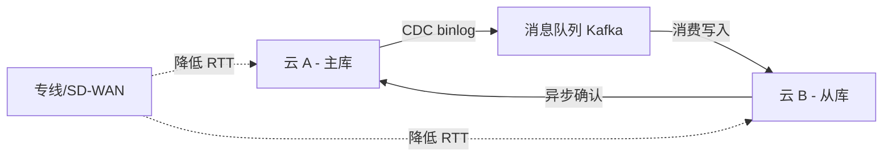
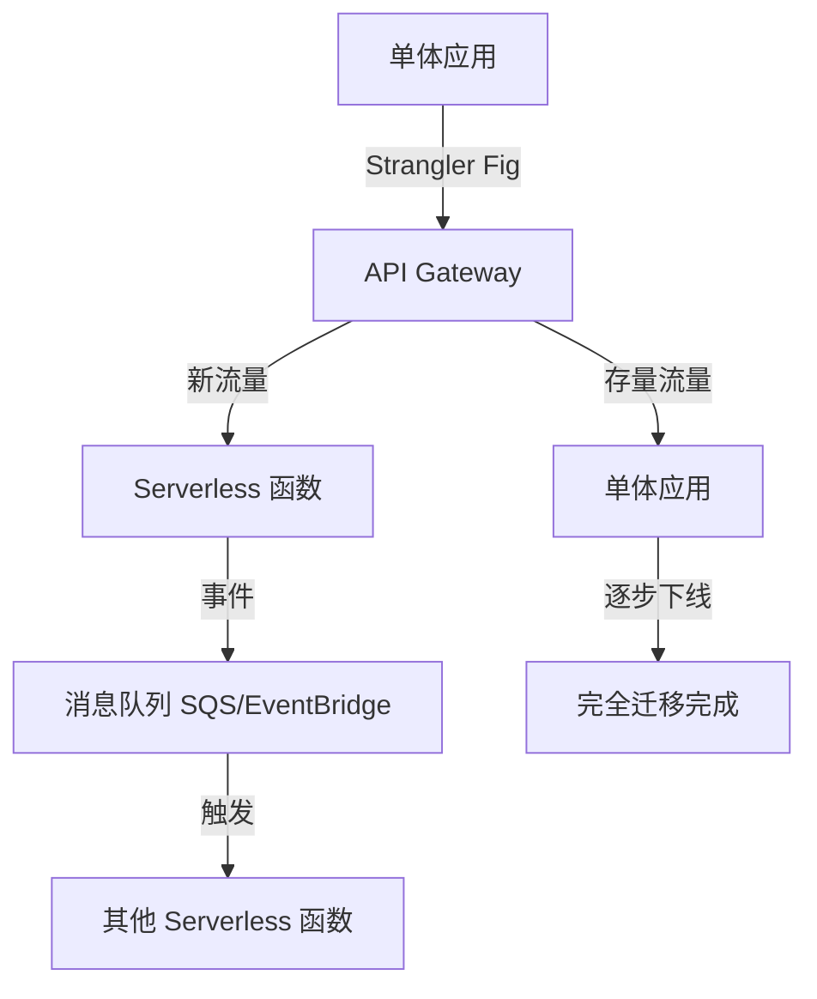

# 云架构与 Serverless 面试

## 混合云

### 【困难】混合云架构中如何解决跨云数据一致性与网络延迟问题？⭐⭐⭐⭐

> 🎯 目标等级：L4 ｜ ⏱ 建议用时：25 min ｜ 🏷 标签：混合云 / 数据一致性 / 网络延迟

#### 💎 关键结论

混合云跨云数据一致性的核心矛盾是**网络延迟与分区容错不可消除**（CAP 定理），解法是分层治理：强一致场景用**同步复制 + 分布式事务**（如跨云 XA/TCC），延迟敏感场景用**异步最终一致 + 消息队列**（如 CDC 同步 + 补偿机制），读密集场景用**多活读 + 缓存一致性协议**（如 Redis Cluster 跨副本）；网络延迟通过**专线/SD-WAN 降低 RTT**、**数据就近读写**（分区部署）、**异步化与批量合并**减少跨云往返。

#### ⚡ 记忆卡片

- **口诀**：强一致同步贵，最终一致异步美，专线降延迟，就近读写省往返
- **关键词**：CAP 定理 ／ CDC 同步 ／ 专线 SD-WAN ／ 分区部署 ／ 最终一致性
- **链路**：数据分层（强一致/最终一致）→ 同步策略选择 → 网络层优化 → 就近读写 → 补偿兜底

#### 📖 核心知识

**数据一致性分层策略**

| 一致性级别   | 实现方式                             | 延迟代价        | 适用场景               |
| :----------- | :----------------------------------- | :-------------- | :--------------------- |
| **强一致**   | 跨云分布式事务（XA/TCC/Saga）        | 高（RTT × 2~3） | 资金、库存等核心数据   |
| **最终一致** | CDC（Change Data Capture）+ 消息队列 | 中（秒级延迟）  | 订单状态同步、用户画像 |
| **因果一致** | 向量时钟 + 版本冲突合并              | 低              | 多活配置、文档协作     |

**跨云数据同步模式**

| 同步模式         | 原理                                       | 延迟      | 一致性   | 典型工具             |
| :--------------- | :----------------------------------------- | :-------- | :------- | :------------------- |
| **CDC 异步同步** | 捕获数据库变更日志（binlog/WAL）推送到对端 | 秒级      | 最终一致 | Debezium、Canal、DTS |
| **双写 + 补偿**  | 业务层同时写两端，失败时补偿回滚           | 毫秒~秒级 | 最终一致 | Saga 模式、消息事务  |
| **同步复制**     | 写操作等待两端确认后才返回                 | 2× RTT    | 强一致   | 跨云 XA、Spanner     |
| **CRDT**         | 数据结构自身支持无冲突合并                 | 低        | 因果一致 | Riak、自研向量时钟   |

**网络延迟优化策略**

| 策略                     | 原理                                 | 效果             | 成本             |
| :----------------------- | :----------------------------------- | :--------------- | :--------------- |
| **专线/SD-WAN**          | 走私有骨干网替代公网，降低抖动与丢包 | RTT 降低 30~60%  | 高（月费万元级） |
| **分区部署（数据就近）** | 数据放在使用方同云/同 Region         | 消除跨云读延迟   | 中（需多副本）   |
| **异步化 + 批量合并**    | 跨云调用改为异步事件 + 攒批发送      | 减少跨云往返次数 | 低（代码改造）   |
| **边缘缓存/CDN**         | 读密集数据推到边缘节点               | 读延迟降至 <10ms | 低~中            |

**方案权衡：一致性 vs 延迟 vs 成本**

| 场景              | 推荐方案                            | 取舍                              |
| :---------------- | :---------------------------------- | :-------------------------------- |
| 跨云资金转账      | 强一致（TCC + 专线）                | 延迟高（200~500ms），但资金零差错 |
| 跨云订单状态同步  | 最终一致（CDC + Kafka）             | 秒级延迟可接受，成本低            |
| 跨云配置中心读取  | 缓存 + 推送（Redis Cluster 跨副本） | 读极快，写入有短暂不一致窗口      |
| 跨云日志/监控聚合 | 异步批量（Fluentd → Kafka → ES）    | 延迟分钟级，成本最低              |

#### 🔬 扩展知识

::: details

- 【L3】**Saga 模式 vs TCC 模式**

  Saga 将长事务拆为多个本地事务 + 补偿操作，适合跨云长链路（每段独立提交，失败时反向补偿）；TCC（Try-Confirm-Cancel）需要业务实现三阶段接口，
  侵入性强但控制粒度更细。跨云场景 Saga 更常用，因为 TCC 的 Confirm/Cancel 阶段仍需跨云调用，延迟与失败概率都高。

- 【L4】**跨云消息队列的 Exactly-Once 语义**

  Kafka 的幂等 Producer + 事务可保证单集群内 Exactly-Once，
  但跨云双集群的 Exactly-Once 需要额外方案（如 MirrorMaker 2.0 + 偏移量映射），通常降级为 At-Least-Once + 消费端幂等。

- 【L4】**云厂商 DTS（Data Transmission Service）**

  阿里云 DTS、AWS DMS 等提供托管的跨库/跨云同步能力，底层基于 CDC + 断点续传，比自建 Debezium 运维成本低，
  但受限于厂商生态锁定。

> 📚 延伸阅读：[AWS Well-Architected Framework - Hybrid Consistency](https://docs.aws.amazon.com/wellarchitected/latest/hybrid-cloud-well-architected-framework/)

:::

#### 🏭 实战场景

::: details

**踩坑案例：跨云 CDC 同步延迟导致超卖**

某电商大促期间，主库在云 A（MySQL），库存扣减在云 B（Redis + MySQL 从库）。CDC 同步延迟从正常 200ms 飙到 8 秒，导致云 B 读到过期库存数据，同一批商品被超卖 300 单。根因：

大促流量触发云 A 的 binlog 积压，CDC 消费者单线程处理跟不上；修复：① 紧急扩容 CDC 消费者并行度（按表分片消费）；② 库存扣减改为**预扣 + 异步确认**模式（云 B 先本地扣减 Redis 库存，异步写云 A 主库，
失败时回滚 Redis）；③ 增加 CDC 延迟监控告警（>1s 即报警）。

**教训**：跨云最终一致方案的**延迟上限必须有 SLA**，且业务层必须能容忍该延迟窗口内的不一致（如通过本地预扣 + 对账兜底），否则最终一致就是"最终超卖"。

:::

#### ⚠️ 常见误区

::: details

- ❌ "跨云也能做到强一致且低延迟" → CAP 定理决定了跨分区时一致性与延迟/可用性不可兼得；强一致必须付出 2× RTT 的同步等待代价，跨云 RTT 通常 50~200ms，强一致操作至少 100~400ms。
- ❌ "CDC 同步是实时的" → CDC 是**准实时**（秒级延迟），受 binlog 产生速率、消费者吞吐、网络带宽三重约束；大促/突发流量下延迟可能飙到秒甚至分钟级，业务必须设计容忍窗口。
- ❌ "专线能解决所有跨云问题" → 专线降低网络层延迟与抖动，但无法消除应用层的跨云往返次数；应结合异步化、批量合并、数据就近部署从架构层减少跨云调用。

:::

#### 🔀 发散问题

- **Q：Serverless 架构如何解决冷启动问题？**

  → 预置并发、快照恢复、体积优化，见本文档「Serverless 架构的冷启动问题如何优化？适用边界在哪里？」。

- **Q：传统应用如何渐进迁移到云原生？**

  → Strangler Fig 模式 + 状态外置，见本文档「传统应用迁移到 Serverless 架构的核心挑战与渐进策略？」。

## Serverless

### 【中等】Serverless 架构的冷启动问题如何优化？适用边界在哪里？⭐⭐⭐

> 🎯 目标等级：L3 ｜ ⏱ 建议用时：15 min ｜ 🏷 标签：Serverless / 冷启动 / 性能优化

#### 💎 关键结论

Serverless 冷启动的本质是**平台分配容器 → 下载代码 → 初始化运行时**的耗时（通常 100ms~数秒），优化分三层：**代码层**（减小包体积、延迟加载、精简依赖）、**运行时层**（Provisioned Concurrency 预置实例、预 warming 定时触发）、**架构层**（选择合适触发模式、关键路径用常驻服务兜底）。冷启动对延迟敏感的在线 API 影响大，对异步任务/定时任务影响可忽略，需按场景选择优化力度。

#### ⚡ 记忆卡片

- **口诀**：包小启动快，预热不冷场，关键路径常驻，异步不怕等
- **关键词**：冷启动 ／ Provisioned Concurrency ／ 包体积优化 ／ 快照恢复
- **链路**：触发 → 分配容器 → 下载代码 → 初始化运行时 → 处理请求（冷启动在前三步）

#### 📖 核心知识

**冷启动耗时拆解**

| 阶段           | 耗时       | 优化手段                           |
| :------------- | :--------- | :--------------------------------- |
| 容器分配       | 10~100ms   | 平台侧优化，用户不可控             |
| 代码/镜像下载  | 100ms~数秒 | 减小包体积、使用 Layer/缓存        |
| 运行时初始化   | 50~500ms   | 延迟加载、精简依赖、快照恢复       |
| 业务代码初始化 | 0~数秒     | 延迟初始化数据库连接、按需加载模型 |

**优化策略**

| 策略                          | 原理                                   | 效果                     | 成本                             |
| :---------------------------- | :------------------------------------- | :----------------------- | :------------------------------- |
| **Provisioned Concurrency**   | 预置固定数量的"热"实例常驻             | 消除冷启动（0ms）        | 高（按预置实例计费，闲置也收费） |
| **定时预热（Keep Warm）**     | CloudWatch/定时触发器定期调用函数      | 减少冷启动频率           | 低（额外调用费用）               |
| **减小包体积**                | 去除无用依赖、Tree Shaking、Layer 分层 | 下载时间减少 50~80%      | 低（工程改造）                   |
| **延迟加载**                  | 数据库连接、SDK 初始化放到首次请求时   | 初始化时间减少           | 低（首次请求略慢）               |
| **快照恢复（AWS SnapStart）** | 预初始化后快照，冷启动从快照恢复       | 初始化时间减少 60~90%    | 中（平台特性）                   |
| **自定义运行时优化**          | 选择轻量运行时（如 Rust/Go 替代 Java） | 启动时间从秒级降到毫秒级 | 中（开发成本）                   |

**适用边界判断**

| 场景                         | 冷启动影响                   | 推荐策略                                     |
| :--------------------------- | :--------------------------- | :------------------------------------------- |
| **在线 API（延迟敏感）**     | 高（用户可感知 100ms+ 延迟） | Provisioned Concurrency 或关键路径用常驻服务 |
| **异步任务/消息处理**        | 低（用户不直接感知延迟）     | 无需特殊优化，接受冷启动                     |
| **定时任务（Cron）**         | 中（定时触发可能命中冷实例） | 定时预热 + 减小包体积                        |
| **突发流量（Flash Sale）**   | 高（大量冷实例同时启动）     | Provisioned Concurrency + 弹性预留           |
| **低频 API（日均 <100 次）** | 中（几乎每次都是冷启动）     | 评估是否适合 Serverless，或改用常驻服务      |

#### 🔬 扩展知识

::: details

- 【L3】**Java 冷启动为何特别慢**

  JVM 启动 + 类加载 + Spring 容器初始化通常 2~10 秒，远超 Node.js/Python 的 100~500ms。优化方案：

  GraalVM Native Image（将 Java 编译为原生二进制，启动 <100ms）、AWS SnapStart（CRaC 快照恢复）、Quarkus/Micronaut 等云原生框架（减少反射与运行时代理）。

- 【L4】**快照恢复的原理与限制**

  AWS Lambda SnapStart 在部署时对初始化后的运行时拍快照（Firecracker microVM snapshot），冷启动时从快照恢复而非重新初始化。限制：

  快照期间不能持有不可序列化的资源（如打开的 TCP 连接），需在 `BeforeCheckpoint`/`AfterRestore` 钩子中处理连接重建。

- 【L4】**冷启动的监控与度量**

  CloudWatch 的 `InitDuration` 指标记录冷启动耗时；自建方案可在函数入口记录 `Date.now() - context.startTime` 差值。

  告警阈值建议设为 P99 > 1s（在线 API）或 P99 > 5s（异步任务）。

> 📚 延伸阅读：[AWS Lambda SnapStart](https://docs.aws.amazon.com/lambda/latest/dg/snapstart.html)

:::

#### 🏭 实战场景

::: details

**踩坑案例：Java 函数冷启动 8 秒导致 API 超时**

某团队将订单查询 API 从 ECS 迁移到 Lambda（Java 17 + Spring Boot），上线后发现 P99 延迟从 200ms 飙到 8 秒。排查：冷启动时 JVM + Spring 容器初始化耗时 6~8 秒，
而流量低谷期实例被回收后下次请求必命中冷启动。修复方案分三步：① 短期：将 Spring Boot 替换为 Quarkus（启动时间从 6s 降到 800ms）+ 开启 SnapStart（进一步降到 200ms）；② 中期：

核心 API 配 Provisioned Concurrency = 2（保证至少 2 个热实例），非核心接口接受冷启动；③ 长期：将高频 API 迁回 ECS/Fargate 常驻服务，低频管理接口保留 Lambda。

**教训**：Serverless 不是所有场景的最优解，**高频 + 延迟敏感**的在线 API 用常驻服务更经济；Serverless 的优势在异步/突发/低频场景，选型应按场景而非技术热度。

:::

#### ⚠️ 常见误区

::: details

- ❌ "Serverless 就是零运维零冷启动" → Serverless 只是把容器管理交给平台，冷启动是物理存在的代价；Provisioned Concurrency 可以消除但有成本，需要按场景权衡。
- ❌ "包体积小就万事大吉" → 包体积只影响下载时间，Java 等重运行时的初始化时间才是大头；需配合 SnapStart 或 Native Image 解决运行时初始化。
- ❌ "所有服务都该上 Serverless" → 高频 + 长连接 + 延迟敏感的场景（如核心 API 网关）用 Serverless 成本反而高于常驻服务；Serverless 最适合事件驱动/异步/突发/低频场景。

:::

#### 🔀 发散问题

- **Q：混合云架构中数据一致性如何保障？**

  → 分层治理（强一致/最终一致）+ CDC 同步 + 专线降延迟，见本文档「混合云架构中如何解决跨云数据一致性与网络延迟问题？」。

- **Q：传统应用如何迁移到 Serverless？**

  → Strangler Fig 模式 + 状态外置 + 渐进式拆分，见本文档「传统应用迁移到 Serverless 架构的核心挑战与渐进策略？」。

### 【中等】Serverless 事件驱动架构如何设计？包括事件路由、编排模式、错误处理与幂等性保障。⭐⭐⭐

> 🎯 目标等级：L3 ｜ ⏱ 建议用时：15 min ｜ 🏷 标签：事件驱动 / 事件路由 / 编排模式 / 幂等性

#### 💎 关键结论

事件驱动架构核心是**事件总线解耦生产者和消费者**，编排用 Step Functions/EventBridge 处理多步流程，幂等性通过唯一事件 ID + 状态检查保障，错误处理靠 DLQ + 重试退避 + 补偿机制兜底。

#### ⚡ 记忆卡片

- **口诀**：事件路由解耦，编排分步走，幂等靠 ID，失败 DLQ 收
- **关键词**：EventBridge ／ Step Functions ／ DLQ ／ 幂等性 ／ 编排 vs 协同
- **链路**：事件产生 → 事件路由（总线/Topic）→ 消费者处理 → 幂等检查 → 成功/失败（DLQ 兜底）

#### 🔍 深度解析

::: details

**事件路由设计**

| 事件总线            | 路由能力                  | 延迟       | 吞吐量     | 适用场景              |
| :------------------ | :------------------------ | :--------- | :--------- | :-------------------- |
| **AWS EventBridge** | 基于事件内容的规则路由    | 秒级       | 中等       | SaaS 集成、跨服务解耦 |
| **SNS + SQS**       | 发布/订阅 + 队列缓冲      | 毫秒级     | 高         | 微服务间异步通信      |
| **Kafka**           | 基于 Topic/Partition 路由 | 毫秒级     | 极高       | 高吞吐事件流处理      |
| **自建事件总线**    | 完全自定义                | 取决于实现 | 取决于实现 | 特殊路由需求          |

**事件路由策略对比**

| 路由策略     | 原理                  | 延迟 | 灵活性 | 适用场景            |
| :----------- | :-------------------- | :--- | :----- | :------------------ |
| **简单路由** | 事件类型 → 固定目标   | 最低 | 低     | 单一消费者场景      |
| **内容路由** | 基于事件字段匹配规则  | 中   | 高     | 复杂过滤/多目标分发 |
| **基于主题** | 按 Topic 分类订阅     | 低   | 中     | 领域驱动的事件分类  |
| **基于键**   | 按 Partition Key 路由 | 低   | 中     | 保证同键事件顺序    |

**编排模式对比（方案对比）**

| 编排模式                    | 原理                                       | 复杂度 | 延迟             | 适用场景                     |
| :-------------------------- | :----------------------------------------- | :----- | :--------------- | :--------------------------- |
| **编排式（Orchestration）** | 中央工作流引擎（Step Functions）协调各步骤 | 中     | 较高（每步等待） | 多步骤业务流程、需要状态追踪 |
| **协同式（Choreography）**  | 各函数监听事件独立触发，无中央控制         | 高     | 低               | 简单事件响应、松耦合微服务   |
| **消息驱动**                | 通过消息队列串联，每步消费后发布新事件     | 中     | 中               | 异步长链路、需要解耦         |

**错误处理机制**

| 机制                | 原理                               | 适用场景               | 注意事项                      |
| :------------------ | :--------------------------------- | :--------------------- | :---------------------------- |
| **DLQ（死信队列）** | 多次重试失败后投入专用队列         | 所有异步处理           | 需定期处理/告警，不能只配不管 |
| **重试 + 退避**     | 指数退避重试（1s → 2s → 4s → ...） | 临时性故障（网络抖动） | 需配合幂等性，避免重复处理    |
| **补偿事务**        | 失败时执行反向操作回滚             | 多步骤流程             | 补偿逻辑本身也需幂等          |
| **断路器**          | 连续失败后熔断，快速失败           | 下游服务不可用         | 需配合降级策略                |

**幂等性保障方案**

| 方案                     | 原理                                     | 适用场景         | 代价                     |
| :----------------------- | :--------------------------------------- | :--------------- | :----------------------- |
| **唯一事件 ID + 去重表** | 处理前查询 DynamoDB 是否已处理           | 所有事件驱动场景 | 额外一次 DB 查询（~5ms） |
| **数据库唯一约束**       | INSERT 时利用唯一索引防重复              | 数据库写入场景   | 冲突时需捕获异常         |
| **乐观锁（版本号）**     | WHERE version = expected，更新失败则跳过 | 状态更新场景     | 需维护版本号字段         |

:::

#### 📊 量化参考

::: details

| 指标                     | 数值                           |
| :----------------------- | :----------------------------- |
| EventBridge 事件路由延迟 | P99 < 1s                       |
| SQS 消息投递延迟         | P99 < 100ms                    |
| Kafka 端到端延迟         | P99 < 50ms（同集群）           |
| Step Functions 每步开销  | ~\$0.000025/步，延迟增加 ~100ms |
| DLQ 推荐重试次数         | 3~5 次（指数退避）             |
| 幂等去重表查询延迟       | DynamoDB GetItem ~5ms          |

**方案对比（编排模式选型）**

| 维度       | 编排式（Step Functions）        | 协同式（纯事件链）    |
| :--------- | :------------------------------ | :-------------------- |
| 流程可见性 | 高（控制台可视化）              | 低（需分布式追踪）    |
| 耦合度     | 中（中央引擎知道全局）          | 低（各函数独立）      |
| 错误处理   | 内置 Catch/Retry                | 需自行实现 DLQ + 补偿 |
| 成本       | 按步计费（100 步流程 ~\$0.0025） | 仅函数 + 消息队列费用 |
| 适用规模   | 5~50 步的复杂流程               | 1~3 步的简单响应      |

:::

#### 🏭 实战场景

::: details

生产案例：某物流公司包裹分拣系统从单体迁移到事件驱动架构后，发现包裹状态变更事件触发多个下游函数（通知、计费、报表），部分函数因 S3 事件记录与 Kinesis 流顺序不一致导致状态更新乱序，
加上 Lambda 自动重试导致同一事件被重复处理，出现大量"包裹已签收但状态为运输中"的数据不一致。症状：日均 50 万包裹中约 2.5 万（5%）状态异常。排查：发现事件处理函数无幂等设计，
且 S3 事件通知不保证顺序而 Kinesis 仅分区内有序。修复：① 每个事件生成唯一 ID（`source + timestamp + hash`），处理前写入 DynamoDB 去重表（TTL 24h），已存在则跳过；
② 引入 Step Functions 编排核心流程（分拣 → 状态更新 → 通知 → 计费），替代分散的函数链；③ 为每个函数配置 DLQ（SQS），失败 3 次后投入 DLQ，
配合 CloudWatch 告警（DLQ 消息数 > 10/min 即报警）；④ 状态更新函数内实现补偿逻辑（新状态版本号 < 当前版本号则拒绝更新）。修复后事件处理错误率从 5% 降至 0.01%，状态不一致问题完全消除。

:::

#### 🔬 扩展知识

::: details

- 【L3】**事件溯源（Event Sourcing）vs 事件驱动**

  事件溯源是将状态变更存储为事件序列（而非当前状态），通过重放事件重建状态，适合需要完整审计的场景（如金融交易）。事件驱动是触发机制，
  两者可结合使用（Event Sourcing + CQRS）。事件溯源的幂等性通过事件 ID 去重 + 版本号顺序控制保障。

- 【L4】**跨函数分布式事务**

  Serverless 场景下不适合 XA/TCC（长事务 + 跨函数调用延迟高），推荐 Saga 模式——每个函数执行本地事务 + 发布事件触发下一步，失败时执行补偿操作（反向事件链）。

  Saga 的补偿逻辑本身也需幂等。

- 【L4】**事件溯源中的幂等性**

  Event Sourcing 中事件重放是核心能力，幂等性通过事件 ID 去重 + 版本号递增保证——重放时检查版本号，只有版本号 > 当前版本的事件才应用。

:::

#### ⚠️ 常见误区

::: details

- ❌ "事件总线保证顺序" → 大多数事件总线只保证分区内有序（如 Kafka Partition），跨分区/跨 Topic 无序；需要顺序处理的场景必须用相同 Partition Key 或单分区。
- ❌ "Serverless 函数天然幂等" → 函数本身不幂等，必须显式设计（唯一 ID 去重 / 数据库唯一约束 / 乐观锁）；不幂等的函数在重试时必然产生重复数据。
- ❌ "DLQ 配了就万事大吉" → DLQ 只是兜底，不处理等于数据丢失；必须配合告警 + 定期清理/重处理机制，DLQ 积压是系统异常的早期信号。

:::

#### 🔀 发散问题

- **Q：事件溯源与事件驱动有何区别？**

  → 事件溯源存储状态变更事件序列而非当前状态，适合审计场景，常配合 CQRS 使用。

- **Q：跨函数的分布式事务如何处理？**

  → Saga 模式（本地事务 + 事件触发 + 补偿链），见本文档「混合云架构中如何解决跨云数据一致性与网络延迟问题？」中 Saga 相关讨论。

## 云原生迁移

### 【困难】传统应用迁移到 Serverless 架构的核心挑战与渐进策略？⭐⭐⭐⭐⭐

> 🎯 目标等级：L4 ｜ ⏱ 建议用时：25 min ｜ 🏷 标签：云原生迁移 / Serverless / 架构演进

#### 💎 关键结论

传统应用迁移到 Serverless 的核心挑战是**有状态 → 无状态改造**（Session/本地缓存/文件存储必须外置）、**长进程 → 短函数拆分**（单体拆为事件驱动的微函数）、**可观测性断层**（分布式追踪/日志/指标需重建）。渐进策略采用 **Strangler Fig 模式**：先在 Serverless 侧建"旁路"处理新流量/新功能，逐步切流验证，确认稳定后再下线旧模块对应代码，避免"大爆炸"式一次性迁移的风险。

#### ⚡ 记忆卡片

- **口诀**：状态外置，函数拆分，观测重建，Strangler 渐进切
- **关键词**：有状态→无状态 ／ Strangler Fig ／ 事件驱动 ／ 可观测性 ／ 渐进迁移
- **链路**：状态外置（Session/缓存/存储）→ 功能拆分（事件驱动函数）→ 可观测重建（Trace/Log/Metric）→ Strangler 切流验证 → 旧模块下线

#### 📖 核心知识

**核心挑战一：有状态 → 无状态改造**

| 有状态组件                 | 迁移方案                                | 注意事项                                          |
| :------------------------- | :-------------------------------------- | :------------------------------------------------ |
| 本地 Session               | 外置到 Redis/DynamoDB                   | 需改造 Session 读写逻辑，注意序列化兼容性         |
| 本地缓存（Guava/Caffeine） | 外置到 Redis/分布式缓存                 | 延迟增加（本地 ns 级 → 网络 ms 级），需评估热 key |
| 本地文件存储               | 迁移到对象存储（S3/OSS）                | 需改造文件读写为流式 API，注意大文件分片上传      |
| 本地定时任务               | 迁移到云调度（EventBridge/Cron 触发器） | 需确保任务幂等（Serverless 可能重复触发）         |
| 数据库连接池               | 每次调用新建/用 RDS Proxy               | 冷启动时连接建立耗时，需配合连接代理或延迟初始化  |

**核心挑战二：单体 → 事件驱动函数拆分**

**拆分原则**：

1. **按业务边界拆**（DDD 限界上下文），不按技术层拆
2. **先拆新增功能**，再拆存量功能
3. **先拆读密集**（无状态改造简单），再拆写密集（需处理事务一致性）

**核心挑战三：可观测性断层**

| 维度     | 传统应用             | Serverless                   | 迁移要点                                               |
| :------- | :------------------- | :--------------------------- | :----------------------------------------------------- |
| **日志** | 本地文件 + ELK       | CloudWatch Logs / 云日志服务 | 需统一日志格式（JSON），关联 RequestID                 |
| **指标** | Prometheus + Grafana | CloudWatch Metrics / 云监控  | 函数粒度指标（调用次数/错误率/延迟），需自定义业务指标 |
| **追踪** | Jaeger/Zipkin        | X-Ray / 云分布式追踪         | 需在函数入口注入 Trace Context，跨函数/跨服务传播      |
| **告警** | 自建告警规则         | 云告警 + SNS/PagerDuty       | 需重新定义 SLI/SLO（冷启动 P99、错误率、并发利用率）   |

**渐进迁移策略：Strangler Fig 模式**

| 阶段                  | 动作                                             | 风险 | 验证标准                 |
| :-------------------- | :----------------------------------------------- | :--- | :----------------------- |
| **Phase 0：评估**     | 梳理单体模块依赖图，识别有状态组件               | 低   | 输出迁移优先级清单       |
| **Phase 1：旁路新建** | 在 Serverless 侧建新功能/新接口，旧系统不动      | 极低 | 新功能独立上线验证       |
| **Phase 2：灰度切流** | API Gateway 按权重/路由将部分流量切到 Serverless | 中   | 对比新旧链路延迟/错误率  |
| **Phase 3：逐步替换** | 确认稳定后，下线旧模块对应代码                   | 中   | 旧模块流量归零后安全下线 |
| **Phase 4：全量迁移** | 全部流量走 Serverless，旧系统退役                | 低   | SLI/SLO 达标，成本对比   |

**方案权衡**

| 迁移策略                  | 优势                 | 代价                             | 适用场景                  |
| :------------------------ | :------------------- | :------------------------------- | :------------------------ |
| **Strangler Fig（渐进）** | 风险可控，可随时回滚 | 迁移周期长，新旧系统并存运维成本 | 核心业务/高风险系统       |
| **大爆炸（一次性）**      | 迁移周期短           | 风险极高，回滚困难               | 小型/非核心/全新系统      |
| **混合部署（长期共存）**  | 各取所长             | 运维复杂度高，团队需双栈能力     | 部分模块不适合 Serverless |

#### 🔬 扩展知识

::: details

- 【L3】**Strangler Fig 模式的命名由来**

  源于绞杀榕（Strangler Fig）缠绕宿主树生长、最终取而代之的自然现象。在软件架构中，新系统逐步"缠绕"旧系统的功能，直到旧系统被完全替代。

  关键是在 API Gateway 层做流量路由，让切流对客户端透明。

- 【L4】**事务一致性在迁移中的处理**

  迁移期间新旧系统可能同时写同一数据，需引入**双写 + 对账**机制——写入时同时写新旧库（或事件总线），定时对账任务比对两端数据差异，发现不一致时告警或自动修复。完全切流后再关闭双写。

- 【L4】**团队能力转型**

  Serverless 迁移不仅是技术迁移，更是团队能力转型——从"运维服务器"到"运维函数"，从"部署应用"到"配置事件路由"。

  建议设立 Cloud Center of Excellence（CCoE）推动培训与最佳实践沉淀。

> 📚 延伸阅读：[Building Microservices - Strangler Fig Pattern](https://microservices.io/patterns/refactoring/strangler-fig.html)

:::

#### 🏭 实战场景

::: details

**踩坑案例：大爆炸迁移导致核心交易链路故障**

某金融团队将核心交易服务从 ECS 上的 Spring Boot 单体一次性迁移到 Lambda + API Gateway。上线当天发现：① 数据库连接池耗尽（Lambda 并发实例数远超预期，每个实例新建连接，RDS 连接数被打满）；
② 分布式事务失败（Lambda 函数间调用超时导致 Saga 补偿链路断裂）；③ 日志无法关联（旧系统用 MDC 传递 TraceID，Lambda 侧未改造导致链路断裂）。紧急回滚到旧系统，迁移失败。

**复盘与修复**：① 改用 Strangler Fig 模式，先在 Lambda 侧建"订单查询"（只读、无状态）验证，灰度 2 周确认稳定；② 引入 RDS Proxy 解决连接池问题（Lambda → Proxy → RDS，
Proxy 管理连接复用）；③ 统一 Trace Context 传播（API Gateway 注入 TraceID → Lambda 通过 X-Ray SDK 传播 → 下游服务通过 Header 继承）；④ 分 6 个月完成全部迁移，
零故障。

**教训**：核心交易链路**绝不能大爆炸迁移**，Strangler Fig + 灰度切流 + 充分对账是唯一的安全生产路径。

:::

#### ⚠️ 常见误区

::: details

- ❌ "Serverless 迁移就是代码搬过去" → 核心挑战是架构改造（状态外置、事件驱动、可观测重建），不是简单的代码搬迁；直接搬迁（Lift and Shift）到 Serverless 几乎必然失败。
- ❌ "Strangler Fig 太慢了，大爆炸更高效" → 大爆炸迁移的风险不可控，尤其核心业务系统；Strangler Fig 看似慢，但每步可验证、可回滚，总耗时往往更短（因为不需要处理大爆炸后的故障）。
- ❌ "迁移完就不管旧系统了" → 迁移后需持续监控新旧系统的 SLI/SLO 对比，且双写/对账机制需运行足够长时间（通常 1~3 个月）才能确认数据一致性，过早关闭对账可能遗漏边界问题。

:::

#### 🔀 发散问题

- **Q：Serverless 冷启动在迁移中如何优化？**

  → Provisioned Concurrency + 包体积优化 + 快照恢复，见本文档「Serverless 架构的冷启动问题如何优化？适用边界在哪里？」。

- **Q：混合云架构中数据一致性如何处理？**

  → 分层治理 + CDC 同步 + 专线降延迟，见本文档「混合云架构中如何解决跨云数据一致性与网络延迟问题？」。

## 选型

### 【困难】FaaS（Lambda）与容器化（K8s）如何选型？成本、冷启动、运行时约束的量化对比框架？⭐⭐⭐⭐

> 🎯 目标等级：L4 ｜ ⏱ 建议用时：25 min ｜ 🏷 标签：FaaS / K8s / 成本优化 / 冷启动 / 选型

#### 💎 关键结论

按流量模式选：稳定高流量 + 延迟敏感用 K8s，突发低频用 Lambda，混合负载用混合部署。成本拐点约在月 500 万次调用 / 40% CPU 稳定利用率，超过则 K8s 更优。

#### ⚡ 记忆卡片

- **口诀**：稳定 K8s 省钱，突发 Lambda 省心，混合部署两全，成本拐点五百万
- **关键词**：成本模型对比 ／ 冷启动差异 ／ 运行时约束 ／ 混合部署 ／ KEDA
- **链路**：流量模式分析 → 成本量化对比 → 冷启动评估 → 运行时约束检查 → 选型决策

#### 🔍 深度解析

::: details

**方案对比（Lambda vs K8s 全维度）**

| 维度           | Lambda（FaaS）                           | K8s（容器化）                                |
| :------------- | :--------------------------------------- | :------------------------------------------- |
| **成本模型**   | 按请求数 + GB-秒计费，无闲置成本         | 按节点计费，有闲置成本，但可共享资源         |
| **冷启动**     | 100ms~数秒（取决于运行时和包大小）       | 秒级（镜像拉取 + Pod 调度），预留 Pod 可消除 |
| **弹性伸缩**   | 自动，毫秒级触发                         | HPA/KEDA，秒~分钟级                          |
| **运行时约束** | 最大 15 分钟执行时长，10GB 内存，3GB tmp | 无执行时长限制，内存/磁盘取决于节点规格      |
| **运维复杂度** | 低（平台托管）                           | 高（需管理集群、节点池、网络）               |
| **可观测性**   | CloudWatch/X-Ray，粒度粗                 | Prometheus/Grafana/Jaeger，完全可控          |
| **供应商锁定** | 高（函数 API 与平台绑定）                | 低（K8s 是跨云标准）                         |
| **适用场景**   | 事件驱动、异步任务、低频 API             | 高频 API、长连接、有状态服务、复杂网络策略   |

**成本模型量化对比**

| 场景                                    | Lambda 月成本                 | K8s 月成本                      | 推荐               |
| :-------------------------------------- | :---------------------------- | :------------------------------ | :----------------- |
| **月 100 万次调用，每次 200ms，512MB**  | ~\$20（请求 \$0.20 + 计算 \$18） | ~\$50（1 个 c5.large 节点）      | Lambda（节省 60%） |
| **月 5000 万次调用，每次 200ms，512MB** | ~\$900                         | ~\$200（4 节点，CPU 利用率 60%） | K8s（节省 78%）    |
| **月 1 亿次调用，每次 200ms，512MB**    | ~\$1,800                       | ~\$350（8 节点，CPU 利用率 70%） | K8s（节省 81%）    |
| **突发流量（日均 10 万次，峰值 100x）** | ~\$50（只为峰值付费）          | ~\$150（需预留节点应对峰值）     | Lambda（节省 67%） |

> 成本计算基于 AWS us-east-1 定价：Lambda \$0.20/百万请求 + \$0.0000166667/GB-秒；ECS c5.large \$0.085/h 按需。

**冷启动量化对比**

| 运行时/方案                     | 冷启动延迟               | 优化后                               |
| :------------------------------ | :----------------------- | :----------------------------------- |
| **Lambda Node.js**              | 100~300ms                | ~50ms（减小包体积）                  |
| **Lambda Java**                 | 2~6s                     | ~200ms（SnapStart + Quarkus）        |
| **Lambda Python**               | 100~500ms                | ~80ms（Layer 缓存依赖）              |
| **Lambda Rust（自定义运行时）** | ~10ms                    | ~5ms                                 |
| **K8s（镜像 200MB，无预热）**   | 5~15s（镜像拉取 + 启动） | ~2s（镜像预热 + InitContainer 优化） |
| **K8s（预留 Pod）**             | 0ms                      | 0ms（HPA 保持 minReplicas ≥ 2）      |

**运行时约束对比**

| 约束             | Lambda                            | K8s                                       |
| :--------------- | :-------------------------------- | :---------------------------------------- |
| **最大执行时长** | 15 分钟                           | 无限制                                    |
| **最大内存**     | 10GB（与 CPU 按比例分配）         | 取决于节点（单节点可达 TB 级）            |
| **最大 CPU**     | 6 vCPU（与内存按比例）            | 取决于节点（单节点 96+ 核）               |
| **tmp 磁盘**     | 最大 10GB（/tmp）                 | 取决于 Pod volume 配置                    |
| **容器镜像**     | 最大 10GB（解压后），推荐 < 500MB | 无硬限制，推荐 < 1GB                      |
| **网络**         | VPC 内，无入站连接                | 完全控制（Service/Ingress/NetworkPolicy） |
| **并发**         | 账户级 1000 并发（可申请提升）    | 取决于节点数和 Pod 密度                   |

**混合部署策略（推荐方案）**

| 层级                           | 技术选型             | 理由                 |
| :----------------------------- | :------------------- | :------------------- |
| **核心 API（高频、延迟敏感）** | K8s（常驻 Pod）      | 消除冷启动，成本可控 |
| **异步任务/事件处理**          | Lambda               | 弹性伸缩，按量付费   |
| **定时任务/Cron**              | Lambda + EventBridge | 零闲置成本           |
| **突发流量入口**               | Lambda + ALB         | 自动应对峰值         |

:::

#### 📊 量化参考

::: details

**方案对比（Lambda vs K8s 关键指标）**

| 指标                           | Lambda                     | K8s                                       |
| :----------------------------- | :------------------------- | :---------------------------------------- |
| 单次调用最低成本               | \$0.0000002（128MB，100ms） | ~\$0.00000005（共享节点，高利用率）        |
| 月 1 亿次调用成本（us-east-1） | ~\$1,800                    | ~\$350（8 节点 c5.xlarge）                 |
| 冷启动 P99（Java）             | 2~6s → 200ms（SnapStart）  | 0ms（预留 Pod）/ 2s（镜像预热）           |
| 最大并发                       | 1,000（默认）→ 可申请数万  | 取决于节点数（100 节点 × 50 Pod = 5,000） |
| 最大执行时长                   | 15 min                     | 无限制                                    |
| 最大内存                       | 10GB                       | 节点级（128GB+）                          |
| 运维人力成本                   | ~0.2 FTE                   | ~1~2 FTE（需 K8s 运维工程师）           |
| 从零到满负载时间               | 毫秒级                     | 分钟级（节点扩容 + Pod 调度）             |

**成本拐点分析**

| 月调用次数 | Lambda 成本 | K8s 成本（按需节点） | K8s 成本（Spot 节点） | 推荐     |
| :--------- | :---------- | :------------------- | :-------------------- | :------- |
| 100 万     | \$20         | \$50                  | \$15                   | Lambda   |
| 1000 万    | \$180        | \$120                 | \$36                   | K8s Spot |
| 5000 万    | \$900        | \$200                 | \$60                   | K8s      |
| 1 亿       | \$1,800      | \$350                 | \$105                  | K8s      |

> 拐点约在月 500 万次调用（CPU 利用率稳定 > 40%），此后 K8s 成本优势显著。

:::

#### 🏭 实战场景

::: details

生产案例：某 SaaS 公司的图片处理服务最初全部跑在 Lambda 上，月处理量 2 亿次请求，Lambda 月账单 \$18,000。症状：成本持续攀升，且 Lambda 15 分钟超时导致大图片（>50MB）处理频繁失败，
冷启动 P99 达 3 秒影响同步 API 的 10% 请求。排查：分析调用模式发现稳定流量占 80%（月 1.6 亿次），峰值仅 2x；Lambda 成本中 70% 来自稳定流量部分，
且该部分 CPU 利用率仅 30%（大量等待 I/O）。修复：① 将稳定流量的核心处理逻辑迁移到 EKS（4 个 c5.xlarge Spot 实例 + 2 个 On-Demand 保底），月成本降至 \$5,000；
② Lambda 仅保留给 Webhook 回调和定时任务（突发/低频场景），配合 Provisioned Concurrency = 5 消除关键路径冷启动，成本降至 \$800/月；
③ 引入 KEDA 基于 SQS 队列深度自动扩缩 K8s Pod，低谷期缩至 2 Pod，高峰期扩至 20 Pod。总成本从 \$18,000/月降至 \$5,800/月（节省 68%），
同步 API P99 延迟从 3s 降至 200ms。

:::

#### 🔬 扩展知识

::: details

- 【L3】**Knative

  K8s 上的 Serverless 抽象**：Knative Serving 提供请求级自动扩缩容（含缩容到零）、流量分割（Canary）、自动 TLS，
  兼顾 K8s 的可控性和 Serverless 的弹性。适合已有 K8s 运维能力但希望获得 Serverless 体验的团队。

- 【L4】**成本优化进阶——Graviton/ARM 实例**

  AWS Lambda 支持 ARM64（Graviton2），成本降低 20%；EKS 可用 Graviton 节点池，成本降低 30~40%。

  两者都可用 ARM 进一步压成本。

- 【L4】**Lambda + K8s 混合部署的事件桥接**

  用 EventBridge 或 SQS 作为 Lambda 和 K8s 之间的事件通道——Lambda 处理事件后发送到 SQS，K8s Pod 消费 SQS 做重处理。

  这样 Lambda 负责弹性入口，K8s 负责计算密集型处理。

:::

#### ⚠️ 常见误区

::: details

- ❌ "Lambda 一定比 K8s 便宜" → 高频稳定负载下 K8s 成本仅为 Lambda 的 1/3~1/5；Lambda 的按 GB-秒计费包含闲置成本，稳定流量时浪费严重。
- ❌ "K8s 运维太复杂，不如全用 Lambda" → 托管 K8s（EKS/AKS/GKE）已将控制面运维交给云厂商，主要复杂度在应用层（HPA 配置、资源限额、网络策略），可通过 GitOps + 标准化 Helm Chart 降低。
- ❌ "冷启动只有 Lambda 有" → K8s 的 HPA 扩容 + 镜像拉取同样有冷启动（5~15s），只是可通过预留 Pod + 镜像预热控制；选型时应统一评估冷启动对业务的影响。

:::

#### 🔀 发散问题

- **Q：Serverless 冷启动如何优化？**

  → 包体积优化 + SnapStart + Provisioned Concurrency，见本文档「Serverless 架构的冷启动问题如何优化？适用边界在哪里？」。

- **Q：传统应用如何迁移到 Serverless？**

  → Strangler Fig 模式 + 状态外置 + 渐进式拆分，见本文档「传统应用迁移到 Serverless 架构的核心挑战与渐进策略？」。

## 多云架构

### 【困难】多云架构如何设计？包括工作负载分布、数据同步、统一治理与避免供应商锁定的策略。⭐⭐⭐⭐

> 🎯 目标等级：L4 ｜ ⏱ 建议用时：25 min ｜ 🏷 标签：多云架构 / 工作负载分布 / 数据同步 / 供应商锁定 / 统一治理

#### 💎 关键结论

多云架构的核心是**分层抽象实现云中立**：计算层用 K8s 统一容器编排，基础设施层用 Terraform 声明式管理，网络层用服务网格（Istio）跨云通信。工作负载按"数据不动计算动"原则就近部署，数据按一致性分层同步，治理靠统一的成本/安全/合规框架，避免锁定靠抽象层 + 开源替代 + 数据可迁移 + 定期撤离演练。

#### ⚡ 记忆卡片

- **口诀**：K8s 统一计算，Terraform 管资源，网格连网络，数据分层走，治理靠框架，撤离要演练
- **关键词**：分层抽象 ／ 云中立 ／ 工作负载分布 ／ 数据同步分层 ／ 供应商锁定 ／ FinOps
- **链路**：抽象层设计 → 工作负载分布 → 数据同步策略 → 治理框架 → 防锁定机制 → 撤离验证

#### 🔍 深度解析

::: details

**多云架构分层抽象模型**

| 层级           | 抽象方案                             | 云厂商替代                    | 锁定风险              |
| :------------- | :----------------------------------- | :---------------------------- | :-------------------- |
| **计算层**     | Kubernetes（EKS/AKS/GKE/ACK）        | ECS/Cloud Run/App Engine      | 低（K8s 跨云标准）    |
| **基础设施层** | Terraform / Pulumi                   | CloudFormation / ARM Template | 中（需迁移 IaC 代码） |
| **网络层**     | 服务网格（Istio/Linkerd）            | 云厂商 SDN                    | 低（跨云通信标准化）  |
| **数据层**     | 开源数据库（PostgreSQL/Redis/Kafka） | RDS/DynamoDB/ElastiCache      | 中（数据迁移成本）    |

**方案对比（多云架构模式）**

| 架构模式       | 原理                 | 复杂度 | 成本           | 适用场景            |
| :------------- | :------------------- | :----- | :------------- | :------------------ |
| **主备模式**   | 主云运行，备云灾备   | 低     | 中（备云闲置） | 灾备合规要求        |
| **主动-主动**  | 多云同时承载流量     | 高     | 高（多副本）   | 全球化部署、高可用  |
| **按优势分配** | 不同工作负载放最优云 | 中     | 中             | 利用各云特色服务    |
| **混合云扩展** | 私有云 + 公有云弹性  | 中     | 中             | 数据合规 + 弹性需求 |

**工作负载分布策略**

| 工作负载类型                 | 分布策略                   | 延迟要求         | 数据位置     |
| :--------------------------- | :------------------------- | :--------------- | :----------- |
| **延迟敏感型（API 网关）**   | 就近部署（CDN + 边缘计算） | < 50ms           | 数据跟随用户 |
| **计算密集型（AI 推理）**    | 按 GPU 可用性/成本选择云   | < 200ms          | 数据可传输   |
| **数据密集型（大数据分析）** | 数据不动，计算动           | 分钟级           | 数据位置固定 |
| **核心有状态服务（数据库）** | 主从跨云部署               | 取决于一致性要求 | 数据多副本   |

**各云优势分配参考**

| 云厂商    | 优势领域                 | 典型服务                      |
| :-------- | :----------------------- | :---------------------------- |
| **AWS**   | AI/ML 推理、全球覆盖最广 | SageMaker、Lambda、CloudFront |
| **GCP**   | 大数据/分析、K8s 原生    | BigQuery、GKE、TPU            |
| **Azure** | 企业应用集成、混合云     | Active Directory、Arc         |

**数据同步分层策略**

| 一致性级别   | 同步方案                            | 延迟               | 成本 | 适用场景             |
| :----------- | :---------------------------------- | :----------------- | :--- | :------------------- |
| **强一致**   | 跨云 CockroachDB/YugabyteDB         | 50~200ms（2× RTT） | 高   | 资金、库存核心数据   |
| **准实时**   | CDC + 消息队列（Kafka MirrorMaker） | 秒级               | 中   | 订单状态、用户画像   |
| **最终一致** | 对象存储跨云复制（S3 → OSS）        | 分钟~小时级        | 低   | 日志、备份、静态资源 |

**多云治理框架**

| 治理维度 | 工具/方案                         | 关键指标                     |
| :------- | :-------------------------------- | :--------------------------- |
| **成本** | FinOps（CloudHealth/Kubecost）    | 各云单位请求成本、资源利用率 |
| **安全** | 统一 IAM（SPIFFE/SPIRE）+ CSPM    | 合规基线覆盖率、漏洞修复时间 |
| **合规** | 统一策略引擎（OPA/Kyverno）       | 数据驻留合规率               |
| **运维** | 统一可观测（Prometheus + Thanos） | 跨云 SLI/SLO 达标率          |

**避免供应商锁定策略**

| 策略           | 实施方式                                       | 效果                     |
| :------------- | :--------------------------------------------- | :----------------------- |
| **抽象层隔离** | 用 K8s/Terraform/Istio 抽象云厂商 API          | 切换云只需改配置不改代码 |
| **开源替代**   | 用 PostgreSQL 替代 RDS、Redis 替代 ElastiCache | 数据可迁移，无 API 绑定  |
| **数据可迁移** | 定期导出 + 标准格式（Parquet/JSON）            | 数据撤离 < 24h           |
| **合同约束**   | SLA + 数据退出条款 + 价格保护                  | 法律保障                 |
| **撤离演练**   | 每年模拟切换一朵云                             | 验证撤离能力             |

:::

#### 📊 量化参考

::: details

**方案对比（多云架构关键指标）**

| 指标           | 主备模式                   | 主动-主动模式         | 按优势分配           |
| :------------- | :------------------------- | :-------------------- | :------------------- |
| 基础设施成本   | 1.3x 单云（备云 30% 冗余） | 2~3x 单云（多副本）   | 1.2~1.5x 单云        |
| 数据同步延迟   | N/A（备云不读）            | 50~200ms（强一致）    | 取决于同步策略       |
| 运维复杂度     | 低                         | 高（需跨云调度/路由） | 中                   |
| 供应商锁定风险 | 低（备云可切换）           | 低                    | 中（依赖特定云服务） |
| 适用 SLA       | 99.9~99.99%                | 99.99~99.999%         | 99.9~99.99%          |

**数据同步成本对比**

| 同步方案                 | 月成本（1TB/天变更量）        | 延迟      | 一致性   |
| :----------------------- | :---------------------------- | :-------- | :------- |
| **CockroachDB 跨云**     | ~\$500（3 节点跨 3 云）        | 50~200ms  | 强一致   |
| **Kafka MirrorMaker 2**  | ~\$200（跨云带宽 + 计算）      | 1~5s      | 最终一致 |
| **对象存储复制**         | ~\$50（跨云流量费）            | 分钟~小时 | 最终一致 |
| **CDC 自建（Debezium）** | ~\$150（Kafka + Connect 集群） | 1~10s     | 最终一致 |

**供应商锁定风险评估**

| 锁定维度 | 高风险（深度绑定）        | 低风险（抽象隔离）         |
| :------- | :------------------------ | :------------------------- |
| 计算     | ECS 专有 API、Lambda 函数 | K8s 容器化                 |
| 数据库   | DynamoDB、Aurora          | PostgreSQL、Redis（开源）  |
| 消息队列 | SQS/SNS 专有 API          | Kafka（开源）              |
| 监控     | CloudWatch 专有指标       | Prometheus + OpenTelemetry |
| 撤离时间 | 高风险：6~12 个月         | 低风险：< 1 个月           |

:::

#### 🏭 实战场景

::: details

生产案例：某全球化 SaaS 公司最初全量部署在 AWS，使用 DynamoDB、Lambda、EventBridge、ECS 等全套服务。症状：AWS 合同续签时厂商以 30% 涨价施压，
团队评估迁移成本发现核心业务深度绑定 AWS 专有 API（DynamoDB 事务、EventBridge 规则、ECS Task Definition），迁移到 Azure/GCP 几乎等于重写。排查：根因是架构设计时未考虑云中立性，
所有业务逻辑直接调用 AWS SDK，数据格式依赖 DynamoDB 的 Document Model。修复：① 制定 18 个月多云改造计划——DynamoDB 替换为 PostgreSQL + CockroachDB（跨云部署），
ECS 迁移到 EKS（K8s 标准化），EventBridge 规则用开源 EventBridge（EventBridge OSS）替代；② 引入 Terraform 统一管理多云资源，所有新资源必须 Terraform 化；
③ 核心数据通过 CDC（Debezium）+ 对象存储跨云复制保持多云可读；④ 合同谈判中以"已具备 3 个月内撤离 AWS 能力"为筹码，最终涨幅从 30% 压到 8%。

:::

#### 🔬 扩展知识

::: details

- 【L4】**多云网络互联**

  跨云网络方案包括专线（AWS Direct Connect + Azure ExpressRoute）、SD-WAN、云厂商 Transit Gateway 互联。

  延迟通常在 50~200ms（同 Region 不同云），跨 Region 可达 300ms+。推荐用服务网格（Istio）抽象跨云通信，应用层无需感知底层网络拓扑。

- 【L4】**多云身份联邦**

  SPIFFE/SPIRE 框架提供跨云统一身份（SVID），配合 OPA 实现跨云访问控制。避免每朵云维护独立的 IAM 策略。

- 【L3】**多云 vs 混合云**

  多云是多朵公有云并存，混合云是私有云 + 公有云。两者可叠加（私有云 + AWS + Azure）。混合云更关注数据合规（敏感数据留私有云），多云更关注避免锁定和利用各云优势。

:::

#### ⚠️ 常见误区

::: details

- ❌ "用了云厂商服务就被锁定" → 锁定来自深度依赖专有 API，而非使用云厂商服务本身；通过抽象层（如 K8s 替代 ECS、开源 DB 替代托管 DB）可隔离锁定。
- ❌ "多云就是全量冗余部署" → 多云应按工作负载特性选择最优组合（如 AI 用 GCP TPU、企业应用用 Azure），不是每朵云都跑全量负载。
- ❌ "Terraform 能避免所有锁定" → Terraform 只抽象资源创建（IaC），不抽象服务 API 差异；业务层仍需做抽象（如用 Repository 模式隔离 DynamoDB API）。
- ❌ "多云安全靠单个云的安全能力" → 多云需统一安全基线（CSPM + 零信任网络），不能依赖单云的安全组/防火墙规则。

:::

#### 🔀 发散问题

- **Q：混合云架构中跨云数据一致性如何解决？**

  → 分层治理（强一致/最终一致）+ CDC 同步 + 专线降延迟，见本文档「混合云架构中如何解决跨云数据一致性与网络延迟问题？」。

- **Q：传统应用如何迁移到多云架构？**

  → Strangler Fig 模式 + 抽象层隔离 + 渐进式切流，见本文档「传统应用迁移到 Serverless 架构的核心挑战与渐进策略？」。
