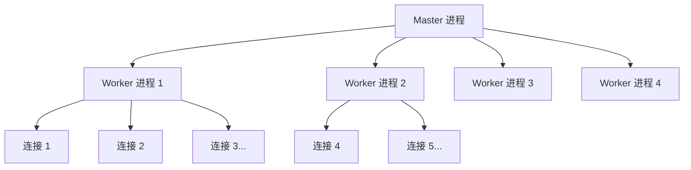

# Nginx 面试

::: tip 扩展

- [Nginx 官方文档](https://nginx.org/en/docs/)
- [Nginx 开发从入门到精通](http://tengine.taobao.org/book/index.html) —— 淘宝技术团队

:::

## Nginx 简介

### 【简单】什么是 Nginx？⭐⭐⭐

Nginx 是一个高性能、开源的 **Web 服务器**软件。但它更核心的现代角色是作为**反向代理服务器**和**负载均衡器**。


**核心特点**：采用**事件驱动**的异步架构，能以极少的资源处理海量并发连接，以**高性能、高稳定性和低内存占用**著称。

**应用场景**

| 场景 | 角色 | 核心作用 | 简单比喻 |
| :--- | :--- | :--- | :--- |
| **静态内容服务** | Web 服务器 | 直接高效地处理静态文件（HTML, CSS, 图片等） | **仓库管理员**，直接发货 |
| **反向代理** | 流量门户 | 接收所有用户请求，转发给后端应用服务器，并隐藏服务器细节 | **公司前台/总机**，接收所有电话再转接内部 |
| **负载均衡** | 流量分配器 | 将用户请求分发到多个后端服务器，提升系统性能和可用性 | **银行的排队叫号系统**，将顾客平均分给多个柜台 |
| **SSL/TLS 终止** | 安全网关 | 统一管理 HTTPS 证书，后端服务只需 HTTP | **统一安检入口** |
| **限流与安全** | 防护屏障 | 防 CC 攻击、API 滥用 | **门禁系统** |

### 【中等】Nginx 的架构是什么？为什么性能高？⭐⭐⭐⭐

> - Nginx 的 Master-Worker 模型是什么？
> - 为什么 Nginx 比 Apache 性能高？

**Nginx 采用 Master-Worker 多进程模型 + 事件驱动异步架构**。



| 组件 | 职责 |
| :--- | :--- |
| **Master 进程** | 管理 Worker 进程（启动、停止、监控）、读取配置、信号处理 |
| **Worker 进程** | 实际处理请求，每个 Worker 可处理**数千个并发连接** |

**高性能原因**：

| 特性 | Nginx | Apache（传统 Prefork） |
| :--- | :--- | :--- |
| **架构** | 事件驱动 + 异步非阻塞 | 每连接一个进程/线程 |
| **并发能力** | 单 Worker 处理数千连接 | 受进程/线程数限制 |
| **内存消耗** | 极低（共享 Master 资源） | 每连接独占进程内存 |
| **上下文切换** | 少（无进程切换） | 频繁（进程切换） |

**Nginx 底层使用的 I/O 模型**：Linux 上使用 **epoll**，FreeBSD 上使用 **kqueue**，这是其高性能的根基。

## 代理与路由

### 【中等】什么是正向代理和反向代理？⭐⭐⭐

| 对比维度 | 正向代理（Forward Proxy） | 反向代理（Reverse Proxy） |
| :--- | :--- | :--- |
| **代理对象** | 代理**客户端**（隐藏客户端身份） | 代理**服务端**（隐藏服务端细节） |
| **客户端感知** | 客户端**知道**目标服务器 | 客户端**不知道**后端服务器 |
| **典型应用** | VPN、翻墙、企业上网代理 | **Nginx**、CDN、API 网关 |
| **配置位置** | 客户端配置 | 服务端配置 |

**反向代理配置示例**：

```nginx
server {
    listen 80;
    server_name example.com;

    location / {
        proxy_pass http://127.0.0.1:3000;
        proxy_set_header Host $host;
        proxy_set_header X-Real-IP $remote_addr;
        proxy_set_header X-Forwarded-For $proxy_add_x_forwarded_for;
        proxy_set_header X-Forwarded-Proto $scheme;
    }
}
```

**关键代理头**：
- `X-Real-IP`：传递客户端真实 IP。
- `X-Forwarded-For`：传递完整代理链 IP（每经过一层代理追加一个 IP）。
- `X-Forwarded-Proto`：传递原始协议（HTTP/HTTPS）。

### 【中等】Nginx 的 location 匹配规则是什么？⭐⭐⭐

**匹配优先级**（从高到低）：

| 优先级 | 语法 | 含义 | 示例 |
| :--- | :--- | :--- | :--- |
| 1 | `location = /uri` | **精确匹配** | `location = /api/health` |
| 2 | `location ^~ /uri` | **前缀匹配**（优先级高于正则） | `location ^~ /static/` |
| 3 | `location ~` 或 `~*` | **正则匹配**（`~*` 不区分大小写） | `location ~ \.php$` |
| 4 | `location /uri` | **普通前缀匹配** | `location /api` |
| 5 | `location /` | **通用匹配**（兜底） | `location /` |

**匹配流程**：先找精确匹配 → 再找最长前缀匹配 → 若前缀匹配有 `^~` 则停止，否则继续找正则匹配 → 正则按顺序匹配第一个命中的。

### 【中等】Nginx 中 rewrite 和 return 有什么区别？⭐⭐

| 指令 | 原理 | 性能 | 适用场景 |
| :--- | :--- | :--- | :--- |
| **return** | 直接返回状态码或 URL | **快** | 简单重定向 |
| **rewrite** | 正则匹配 + 重写 URL | 较慢（正则开销） | 复杂 URL 改写 |

```nginx
# return 示例：HTTP 跳 HTTPS
server {
    listen 80;
    server_name example.com;
    return 301 https://$host$request_uri;
}

# rewrite 示例：旧路径映射
location /old-path {
    rewrite ^/old-path/(.*)$ /new-path/$1 permanent;
}
```

**rewrite 标记**：
- `last`：内部重写，重新进入 location 匹配。
- `break`：停止后续 rewrite 规则。
- `redirect`：302 临时重定向（客户端可见）。
- `permanent`：301 永久重定向。

## 负载均衡

### 【中等】如何用 Nginx 实现负载均衡？有哪些策略？⭐⭐⭐⭐

```nginx
upstream backend_servers {
    server 127.0.0.1:3000;
    server 127.0.0.1:3001;
    server 192.168.1.100:3000;
}

server {
    listen 80;
    server_name example.com;
    location / {
        proxy_pass http://backend_servers;
    }
}
```

**负载均衡策略**

| 策略 | 配置方式 | 原理 | 适用场景 |
| :--- | :--- | :--- | :--- |
| **轮询（默认）** | 无需配置 | 按顺序轮流分配 | 服务器性能一致 |
| **权重（weight）** | `weight=N` | 按权重比例分配 | 服务器性能不同 |
| **IP 哈希** | `ip_hash` | 同一 IP 固定到同一服务器 | 会话保持 |
| **最少连接** | `least_conn` | 分配给当前连接数最少的服务器 | 请求处理时间差异大 |
| **URL 哈希** | `hash $request_uri` | 同一 URL 固定到同一服务器 | 缓存场景 |
| **Fair**（第三方） | `fair` | 按后端响应时间分配 | 需要最优响应 |

**健康检查配置**：

```nginx
upstream backend_servers {
    server 127.0.0.1:3000 max_fails=3 fail_timeout=30s;
    server 127.0.0.1:3001 max_fails=3 fail_timeout=30s;
    keepalive 32;  # 与后端保持长连接
}
```

- `max_fails=3`：连续 3 次失败后标记为不可用。
- `fail_timeout=30s`：30 秒内不可用，之后重新尝试。
- `keepalive 32`：与后端保持 32 个长连接（减少 TCP 握手开销）。

## 限流

### 【中等】如何用 Nginx 做限流？⭐⭐⭐

Nginx 主要通过两个**原生模块**实现限流：

**（1）`limit_req`：限制请求速率（漏桶算法）**

```nginx
http {
    # 定义规则：以客户端 IP 为键，速率限制为每秒 10 次请求
    limit_req_zone $binary_remote_addr zone=my_rate_limit:10m rate=10r/s;
}

server {
    location /api/ {
        # 允许 20 个请求的突发队列，且立即处理
        limit_req zone=my_rate_limit burst=20 nodelay;
    }
}
```

**（2）`limit_conn`：限制并发连接数**

```nginx
http {
    limit_conn_zone $binary_remote_addr zone=my_conn_limit:10m;
}

server {
    location /download/ {
        limit_conn my_conn_limit 2;  # 每个 IP 最多 2 个并发连接
        limit_rate 500k;             # 单连接限速 500KB/s
    }
}
```

**最佳实践**：
- **首选 `limit_req`**：应对大多数流量控制场景。
- **善用 `burst` 和 `nodelay`**：兼顾限流和用户体验。
- **设置白名单**：避免内部 IP 或健康检查被误限。

## 性能调优

### 【困难】Nginx 性能调优有哪些关键参数？⭐⭐⭐

| 配置项 | 推荐值 | 说明 |
| :--- | :--- | :--- |
| `worker_processes` | `auto`（等于 CPU 核数） | Worker 进程数 |
| `worker_connections` | `10000~65535` | 每个 Worker 最大连接数 |
| `worker_rlimit_nofile` | `65535` | Worker 最大文件描述符数 |
| `keepalive_timeout` | `65` | 客户端长连接超时 |
| `keepalive_requests` | `1000` | 单连接最大请求数 |
| `sendfile` | `on` | 启用零拷贝传输 |
| `tcp_nopush` | `on` | 配合 sendfile，合并小包 |
| `tcp_nodelay` | `on` | 禁用 Nagle 算法，减少延迟 |
| `gzip` | `on` | 启用响应压缩 |
| `proxy_buffering` | `on` | 代理响应缓冲 |

**完整调优示例**：

```nginx
# nginx.conf
user nginx;
worker_processes auto;
worker_rlimit_nofile 65535;
error_log /var/log/nginx/error.log warn;

events {
    worker_connections 65535;
    use epoll;
    multi_accept on;
}

http {
    sendfile on;
    tcp_nopush on;
    tcp_nodelay on;
    keepalive_timeout 65;
    keepalive_requests 1000;

    # Gzip 压缩
    gzip on;
    gzip_min_length 1k;
    gzip_comp_level 5;
    gzip_types text/plain text/css application/json application/javascript;

    # 代理优化
    proxy_connect_timeout 5s;
    proxy_read_timeout 60s;
    proxy_send_timeout 60s;
    proxy_buffering on;
    proxy_buffer_size 4k;
    proxy_buffers 8 4k;
}
```

### 【中等】如何限制上传文件大小？⭐

配置 `client_max_body_size`：

```nginx
# http 模块（全局生效）
client_max_body_size 20m;

# server 模块（该 server 生效）
# location 模块（仅匹配的 location 生效）
```

超过限制返回 **413 Request Entity Too Large**。

## SSL/TLS

### 【中等】如何用 Nginx 配置 HTTPS？⭐⭐⭐

```nginx
server {
    listen 443 ssl http2;
    server_name example.com;

    ssl_certificate /etc/nginx/ssl/cert.pem;
    ssl_certificate_key /etc/nginx/ssl/key.pem;

    # SSL 优化
    ssl_protocols TLSv1.2 TLSv1.3;
    ssl_ciphers HIGH:!aNULL:!MD5;
    ssl_prefer_server_ciphers on;
    ssl_session_cache shared:SSL:10m;
    ssl_session_timeout 10m;

    location / {
        proxy_pass http://backend;
    }
}

# HTTP 强制跳转 HTTPS
server {
    listen 80;
    server_name example.com;
    return 301 https://$host$request_uri;
}
```

**SSL 优化要点**：
- **启用 HTTP/2**：`listen 443 ssl http2`，多路复用大幅提升性能。
- **TLS 1.3**：握手更快（1-RTT，支持 0-RTT 重连）。
- **Session Cache**：缓存 SSL 会话，避免重复握手。

## 缓存

### 【中等】Nginx 如何做缓存？⭐⭐

**（1）浏览器缓存（通过响应头控制）**

```nginx
location /static/ {
    expires 30d;  # 30 天缓存
    add_header Cache-Control "public, immutable";
}
```

**（2）代理缓存（Nginx 缓存后端响应）**

```nginx
http {
    proxy_cache_path /var/cache/nginx levels=1:2 keys_zone=my_cache:10m max_size=1g inactive=60m;
}

server {
    location /api/ {
        proxy_cache my_cache;
        proxy_cache_valid 200 10m;    # 200 响应缓存 10 分钟
        proxy_cache_valid 404 1m;     # 404 响应缓存 1 分钟
        proxy_cache_key "$scheme$request_method$host$request_uri";
        proxy_pass http://backend;
    }
}
```

## 高可用

### 【中等】如何实现 Nginx 高可用？⭐⭐

**方案：Keepalived + Nginx 双机热备**


- **Keepalived** 基于 VRRP 协议，管理虚拟 IP（VIP）。
- 主节点故障时，VIP **秒级漂移**到备节点，实现无感知切换。
- 两个 Nginx 节点配置完全相同，通过配置同步工具（如 `lsyncd`）保持一致。

**Nginx 进程崩溃自动恢复**：Master 进程会监控 Worker，Worker 异常退出时 Master 会自动拉起新的 Worker。

## 防盗链

### 【简单】如何用 Nginx 实现防盗链？⭐

```nginx
location ~* \.(jpg|jpeg|png|gif|mp4)$ {
    valid_referers none blocked server_names *.example.com;
    if ($invalid_referer) {
        return 403;
        # 或返回一张替代图片
        # rewrite ^/ /images/hotlink-denied.png break;
    }
}
```

**原理**：检查 HTTP 请求头中的 `Referer` 字段，拒绝非授权来源的请求。

## 动静分离

### 【中等】Nginx 如何实现动静分离？⭐⭐

**动静分离**：Nginx 直接处理静态资源，动态请求转发到后端应用服务器。

```nginx
server {
    # 静态资源：Nginx 直接处理
    location /static/ {
        alias /var/www/static/;
        expires 30d;
    }

    location ~* \.(html|css|js|jpg|png|ico)$ {
        root /var/www/static;
        expires 7d;
    }

    # 动态请求：转发到后端
    location /api/ {
        proxy_pass http://backend_servers;
    }
}
```

**优势**：Nginx 处理静态资源的性能远高于 Tomcat/Spring Boot 等应用服务器，动静分离能**极大提升系统整体吞吐量**。

## 参考资料

- [Nginx 官方文档](https://nginx.org/en/docs/)
- [Nginx 开发从入门到精通](http://tengine.taobao.org/book/index.html) —— 淘宝技术团队
- [Nginx 核心知识 100 讲](https://time.geekbang.org/course/intro/100014401) —— 陶辉（极客时间）
---
icon: logos:nginx
title: Nginx 面试
date: 2025-09-25 07:49:46
order: 99
categories:
  - DevOps
  - 工具
  - Nginx
tags:
  - DevOps
  - Nginx
  - 面试
permalink: /pages/73ef7196/
---

# Nginx 面试

## 【中等】如何限制上传文件大小？

显示错误信息：**413 Request Entity Too Large**。

意思是请求的内容过大，浏览器不能正确显示。常见的情况是发送 `POST` 请求来上传大文件。

**解决方法**

- 可以在 `http` 模块中设置：`client_max_body_size  20m;`
- 可以在 `server` 模块中设置：`client_max_body_size  20m;`
- 可以在 `location` 模块中设置：`client_max_body_size  20m;`

三者区别是：

- 如果文大小限制设置在 `http` 模块中，则对所有 Nginx 收到的请求。
- 如果文大小限制设置在 `server` 模块中，则只对该 `server` 收到的请求生效。
- 如果文大小限制设置在 `location` 模块中，则只对匹配了 `location` 路由规则的请求生效。

## 【中等】什么是 Nginx？

Nginx 是一个高性能、开源的 **Web 服务器**软件。但它更核心的现代角色是作为**反向代理服务器**和**负载均衡器**。


**核心特点**：采用**事件驱动**的异步架构，能以极少的资源处理海量并发连接，以**高性能、高稳定性和低内存占用**著称。

**应用场景**

| 场景             | 角色       | 核心作用                                                 | 简单比喻                                       |
| :--------------- | :--------- | :------------------------------------------------------- | :--------------------------------------------- |
| **静态内容服务** | Web 服务器 | 直接高效地处理静态文件（HTML, CSS, 图片等）              | **仓库管理员**，直接发货                       |
| **反向代理**     | 流量门户   | 接收所有用户请求，转发给后端应用服务器，并隐藏服务器细节 | **公司前台/总机**，接收所有电话再转接内部      |
| **负载均衡**     | 流量分配器 | 将用户请求分发到多个后端服务器，提升系统性能和可用性     | **银行的排队叫号系统**，将顾客平均分给多个柜台 |

## 【中等】什么是正向代理和反向代理？

反向代理（Reverse Proxy）方式是指以代理服务器来接受 internet 上的连接请求，然后将请求转发给内部网络上的服务器，并将从服务器上得到的结果返回给 internet 上请求连接的客户端，此时代理服务器对外就表现为一个反向代理服务器。


## 【中等】如何用 Nginx 做限流，有几种限流算法，分别如何实现？

Nginx 主要通过两个**原生模块**实现限流，对应两种不同的场景：

（1）**`limit_req_zone` / `limit_req`：限制请求速率（常用）**

- **算法**：**漏桶算法**，能**平滑突发流量**，强制以恒定速率处理请求。
- **目的**：防止 CC 攻击、API 滥用、保护登录接口等。
- **关键参数**：
  - `zone`：定义共享内存区（存储访问状态）。
  - `rate`：限制速率，如 `1r/s`（每秒 1 次请求）。
  - `burst`：桶容量，允许的突发请求数（队列长度）。
  - `nodelay`：与 `burst` 联用，立即处理突发队列中的请求，不延迟。

```nginx
# http 块中定义限流规则
http {
    # 定义规则：以客户端 IP 为键，速率限制为每秒 10 次请求
    limit_req_zone $binary_remote_addr zone=my_rate_limit:10m rate=10r/s;
    ...
}

# server/location 块中应用规则
server {
    location /api/ {
        # 应用规则，并允许最多 20 个请求的突发队列，且立即处理
        limit_req zone=my_rate_limit burst=20 nodelay;
        ...
    }
}
```

（2）**`limit_conn_zone` / `limit_conn`：限制并发连接数**

- **算法**：无特定算法，简单计数。
- **目的**：防止单个客户端（如 IP）建立过多连接，耗尽服务器资源。适用于下载、上传等场景。
- **关键参数**：
  - `zone`：定义共享内存区。
  - 数值：每个键（如 IP）允许的最大并发连接数。

```nginx
# http 块中定义
http {
    # 定义连接限制区
    limit_conn_zone $binary_remote_addr zone=my_conn_limit:10m;
    ...
}

# server/location 块中应用
server {
    location /download/ {
        # 每个 IP 同时只能有 2 个连接
        limit_conn my_conn_limit 2;
        # 可配合限速
        limit_rate 500k;
        ...
    }
}
```

**其他限流算法对比**

| 算法           | 特点                                         | Nginx 支持情况                        |
| :------------- | :------------------------------------------- | :------------------------------------ |
| **漏桶算法**   | **平滑流量**，输出速率恒定，Nginx 原生支持。 | **原生支持** (`limit_req`)            |
| **令牌桶算法** | **允许突发**，只要桶里有令牌即可快速处理。   | 需通过 OpenResty/Lua 等扩展实现       |
| **滑动窗口**   | **更精确**，解决临界点问题，适合分布式环境。 | 需通过 OpenResty/Lua+Redis 等扩展实现 |

**建议**

- **首选 `limit_req`**：应对大多数流量控制场景。
- **善用 `burst` 和 `nodelay`**：在限制速率的同时，兼顾用户体验，允许合理的突发流量。
- **组合使用**：对核心接口可同时使用 `limit_req`（防刷）和 `limit_conn`（防资源耗尽）。
- **设置白名单**：避免内部 IP 或健康检查被误限。

## 【中等】如何用 Nginx 实现反向代理？

要使用 Nginx 实现反向代理，你需要配置 Nginx 的配置文件，指定代理规则。以下是具体步骤和示例：

基本反向代理配置

打开 Nginx 配置文件（通常位于 `/etc/nginx/nginx.conf` 或 `/etc/nginx/conf.d/default.conf`），添加如下配置：

```nginx
server {
    listen 80;                 # Nginx 监听的端口
    server_name example.com;   # 访问的域名

    # 反向代理配置
    location / {
        proxy_pass http://127.0.0.1:3000;  # 目标服务器地址（被代理的服务）
        proxy_set_header Host $host;       # 传递主机名
        proxy_set_header X-Real-IP $remote_addr;  # 传递真实客户端 IP
        proxy_set_header X-Forwarded-For $proxy_add_x_forwarded_for;  # 传递代理链 IP
        proxy_set_header X-Forwarded-Proto $scheme;  # 传递协议（http/https）
    }
}
```

**按路径分流的反向代理**

可以根据不同的 URL 路径代理到不同的服务：

```nginx
server {
    listen 80;
    server_name example.com;

    # 访问 /api 路径时代理到后端 API 服务
    location /api {
        proxy_pass http://127.0.0.1:8080;
        proxy_set_header Host $host;
        # 其他代理头配置。..
    }

    # 访问 /admin 路径时代理到管理后台服务
    location /admin {
        proxy_pass http://127.0.0.1:9000;
        proxy_set_header Host $host;
        # 其他代理头配置。..
    }

    # 其他路径代理到前端服务
    location / {
        proxy_pass http://127.0.0.1:3000;
        proxy_set_header Host $host;
        # 其他代理头配置。..
    }
}
```

**检查并生效配置**

配置完成后，执行以下命令检查配置是否正确并重启 Nginx：

```bash
# 检查配置语法
nginx -t

# 重启 Nginx 使配置生效
systemctl restart nginx
# 或
service nginx restart
```

**核心参数**

- `proxy_pass`：指定被代理的目标服务器地址（可以是 IP: 端口 或域名）
- `proxy_set_header`：设置传递给后端服务器的请求头
- `listen`：Nginx 监听的端口
- `server_name`：匹配的域名

## 【中等】如何用 Nginx 实现负载均衡？

要使用 Nginx 实现负载均衡，需要在配置中定义一个后端服务器集群（upstream），然后通过反向代理将请求分发到集群中的服务器。以下是具体实现方法：

**基本负载均衡配置**

首先定义一个服务器集群，然后配置反向代理指向这个集群：

```nginx
# 定义后端服务器集群
upstream backend_servers {
    server 127.0.0.1:3000;  # 服务器 1
    server 127.0.0.1:3001;  # 服务器 2
    server 192.168.1.100:3000;  # 服务器 3（可跨主机）
}

# 配置反向代理到集群
server {
    listen 80;
    server_name example.com;

    location / {
        proxy_pass http://backend_servers;  # 指向上面定义的集群
        proxy_set_header Host $host;
        proxy_set_header X-Real-IP $remote_addr;
    }
}
```

**负载均衡策略**

Nginx 提供了多种负载均衡策略，默认是**轮询**（每个请求按顺序分配到不同服务器），其他常用策略如下：

::: tabs#负载均衡配置

@tab 权重分配（weight）

给性能更好的服务器分配更高权重：

```nginx
upstream backend_servers {
    server 127.0.0.1:3000 weight=3;  # 30%的请求
    server 127.0.0.1:3001 weight=2;  # 20%的请求
    server 192.168.1.100:3000 weight=5;  # 50%的请求
}
```

@tab IP 哈希（ip_hash）

同一客户端 IP 始终访问同一服务器（解决会话保持问题）：

```nginx
upstream backend_servers {
    ip_hash;  # 启用 IP 哈希策略
    server 127.0.0.1:3000;
    server 127.0.0.1:3001;
}
```

@tab 最少连接（least_conn）

优先分配请求到连接数最少的服务器：

```nginx
upstream backend_servers {
    least_conn;  # 启用最少连接策略
    server 127.0.0.1:3000;
    server 127.0.0.1:3001;
}
```

@tab URL 哈希（需要第三方模块）

根据请求 URL 分配到固定服务器（需安装 `ngx_http_upstream_hash_module`）：

```nginx
upstream backend_servers {
    hash $request_uri;  # 按 URL 哈希
    server 127.0.0.1:3000;
    server 127.0.0.1:3001;
}
```

:::

**高级配置（健康检查）**

配置服务器健康检查，自动剔除故障节点：

```nginx
upstream backend_servers {
    server 127.0.0.1:3000;
    server 127.0.0.1:3001;

    # 健康检查配置
    keepalive 32;  # 保持连接数
    max_fails 3;   # 最大失败次数
    fail_timeout 30s;  # 失败后暂停 30 秒
}
```

**配置生效**

完成配置后，检查并重启 Nginx：

```bash
# 检查配置语法
nginx -t

# 重启 Nginx
systemctl restart nginx
# 或
service nginx restart
```

通过以上配置，Nginx 会根据指定策略将请求分发到后端服务器集群，实现负载均衡，提高系统可用性和吞吐量。
