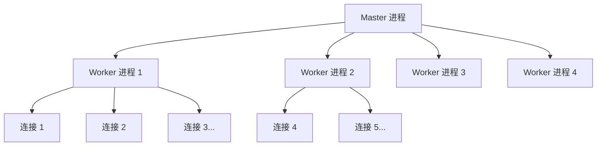

# Nginx 面试

## Nginx 简介

### 【简单】什么是 Nginx？⭐⭐⭐

> 🎯 目标等级：L2 ｜ ⏱ 建议用时：10 min ｜ 🏷 标签：Nginx / 概述

#### 💎 关键结论

Nginx 是高性能开源 Web 服务器，现代角色更核心的是**反向代理与负载均衡器**。它采用事件驱动的异步非阻塞架构，以极少的资源支撑海量并发，以高性能、高稳定、低内存著称。

#### ⚡记忆卡片

- **口诀**：一台 Nginx，三种身份——服务器、代理、均衡器
- **关键词**：事件驱动 ／ 反向代理 ／ 负载均衡
- **链路**：客户端 → Nginx（接入层）→ 后端应用集群

#### 📖 核心知识

Nginx 是一个高性能、开源的 **Web 服务器**软件。但它更核心的现代角色是作为**反向代理服务器**和**负载均衡器**。


**核心特点**：采用**事件驱动**的异步架构，能以极少的资源处理海量并发连接，以**高性能、高稳定性和低内存占用**著称。

**应用场景**

| 场景             | 角色       | 核心作用                                                 | 简单比喻                                       |
| :--------------- | :--------- | :------------------------------------------------------- | :--------------------------------------------- |
| **静态内容服务** | Web 服务器 | 直接高效地处理静态文件（HTML, CSS, 图片等）              | **仓库管理员**，直接发货                       |
| **反向代理**     | 流量门户   | 接收所有用户请求，转发给后端应用服务器，并隐藏服务器细节 | **公司前台/总机**，接收所有电话再转接内部      |
| **负载均衡**     | 流量分配器 | 将用户请求分发到多个后端服务器，提升系统性能和可用性     | **银行的排队叫号系统**，将顾客平均分给多个柜台 |
| **SSL/TLS 终止** | 安全网关   | 统一管理 HTTPS 证书，后端服务只需 HTTP                   | **统一安检入口**                               |
| **限流与安全**   | 防护屏障   | 防 CC 攻击、API 滥用                                     | **门禁系统**                                   |

#### 🔬 扩展知识

::: details

- 【L3】Nginx 由 Igor Sysoev 于 2004 年发布，最初正是为解决 **C10K 问题**（单机 1 万并发连接）而设计；如今调优后单机可支撑数万并发连接。
- 【L4】Nginx 生态还包括 Tengine（淘宝开源分支，增加健康检查、动态模块等能力）与 OpenResty（内嵌 LuaJIT，可用 Lua 扩展网关逻辑）。

> 📚 延伸阅读：[Nginx 官方文档](https://nginx.org/en/docs/)

:::

#### ⚠️ 常见误区

::: details

常见误区：

- ❌ "Nginx 只是一个静态文件服务器" → 静态服务只是其基础能力，生产环境中它更多承担反向代理、负载均衡、SSL 终止等接入层职责。
- ❌ "Nginx 和 Apache 是同类替代品，功能完全对等" → 两者并发模型不同：Nginx 是事件驱动多进程，Apache 传统模式是每连接一进程/线程，选型要看场景而非简单替代。

:::

#### 🔀 发散问题

- **Q：Nginx 为什么能有这么高的性能？** → 核心是 Master-Worker 多进程模型 + epoll 事件驱动异步非阻塞 I/O，见本文档「Nginx 的架构是什么？为什么性能高？」。
- **Q：Nginx 在微服务体系里通常扮演什么角色？** → 流量入口的反向代理与负载均衡器，见本文档「如何用 Nginx 实现负载均衡？有哪些策略？」。
- **Q：Nginx 做的是正向代理还是反向代理？** → 反向代理，代理的是服务端，见本文档「什么是正向代理和反向代理？」。

### 【困难】Nginx 的架构是什么？为什么性能高？⭐⭐⭐⭐

> 🎯 目标等级：L3 ｜ ⏱ 建议用时：20 min ｜ 🏷 标签：Nginx / 架构原理

> - Nginx 的 Master-Worker 模型是什么？
> - 为什么 Nginx 比 Apache 性能高？

#### 💎 关键结论

Nginx 采用 **Master-Worker 多进程模型 + 事件驱动异步非阻塞 I/O**：Master 管理进程与配置，Worker 实际处理请求；每个 Worker 靠 epoll 单线程轮询数千连接，不为每个连接建进程/线程，因此内存极低、上下文切换极少，这是它比 Apache prefork 性能高的根本原因。

#### ⚡记忆卡片

- **口诀**：Master 管家，Worker 干活，epoll 轮询，异步非阻塞
- **关键词**：Master-Worker ／ epoll ／ 异步非阻塞
- **链路**：Master 管 Worker → Worker 靠 epoll 监听 → 单进程撑数千连接

#### 📖 核心知识

**进程模型**：



| 组件            | 职责                                                     |
| :-------------- | :------------------------------------------------------- |
| **Master 进程** | 管理 Worker 进程（启动、停止、监控）、读取配置、信号处理 |
| **Worker 进程** | 实际处理请求，每个 Worker 可处理**数千个并发连接**       |

**高性能原因**（对比 Apache）：

| 特性           | Nginx                    | Apache（传统 Prefork） |
| :------------- | :----------------------- | :--------------------- |
| **架构**       | 事件驱动 + 异步非阻塞    | 每连接一个进程/线程    |
| **并发能力**   | 单 Worker 处理数千连接   | 受进程/线程数限制      |
| **内存消耗**   | 极低（共享 Master 资源） | 每连接独占进程内存     |
| **上下文切换** | 少（无进程切换）         | 频繁（进程切换）       |

**底层 I/O 模型**：Linux 上使用 **epoll**，FreeBSD 上使用 **kqueue**，这是其高性能的根基。

**方案权衡：并发模型的取舍**

| 模型               | 代表                    | 优势                                             | 代价                                               |
| :----------------- | :---------------------- | :----------------------------------------------- | :------------------------------------------------- |
| **多进程事件驱动** | Nginx                   | 进程隔离（一个 Worker 崩溃不影响其他）、无锁开销 | 进程间共享内存需额外机制（如共享内存区存限流计数） |
| **多线程事件驱动** | Apache worker/event MPM | 内存更省                                         | 锁竞争、线程崩溃可能带走整个进程                   |
| **每连接一进程**   | Apache prefork          | 实现简单、隔离最强                               | 内存随连接数线性增长，数千连接即力不从心           |

Nginx 选多进程而非多线程，核心是稳定性：Worker 之间零共享状态，无需加锁，单个 Worker 崩溃 Master 秒级重拉。

**量化参考**：Nginx 诞生于 2004 年，正是 **C10K 问题**（单机 1 万并发连接）困扰业界的时期；经调优后单机轻松支撑**数万并发连接**，官方曾展示过单机 100 万连接的配置案例；对比下 Apache prefork 模式在几千连接时内存就可能吃紧（每连接约 5~10MB）。

**失效场景**：

- **单 Worker 内阻塞操作是致命伤**：事件模型的前提是所有 I/O 都非阻塞，若在 Lua/模块里写了同步阻塞调用（如同步 DNS、阻塞的磁盘读），单 Worker 的数千连接全部卡住。必须用异步 API 或交给线程池（`aio threads`）。
- **CPU 密集型任务不适合 Nginx 内处理**：复杂正则、大文件压缩在 Worker 里执行会阻塞事件循环，应交给后端或 OpenResty 协程。
- **连接数超过 worker_connections 时直接拒连**：返回 502/503，需配合 `worker_rlimit_nofile` 和系统 fd 上限一起调。

#### 🔬 扩展知识

::: details

- 【L3】**epoll 相比 select/poll 强在哪里**：select/poll 每次调用都要把全部 fd 集合传入内核线性扫描，且 fd 上限低（select 默认 1024）；epoll 用红黑树管理 fd，通过回调将就绪事件放入就绪链表，`epoll_wait` 只返回就绪的连接，复杂度从 O(n) 降为 O(就绪数)。当 10 万连接中只有几百个活跃时，这个差异就是性能的分水岭。
- 【L3】**热重载为什么不会丢连接**：reload 时 Master 先校验配置，然后启动一批新 Worker 处理新连接，旧 Worker 收到退出信号后不再接新连接，但继续处理存量连接直到完成或超时退出。新旧 Worker 并存过渡，所以服务不断、连接不丢；代价是若旧配置里有超长长连接，旧 Worker 会驻留很久，可用 `worker_shutdown_timeout` 限制。
- 【L4】**Worker 数设为 CPU 核数的依据**：事件驱动的 Worker 主要在等待 I/O，CPU 密集时刻不多，核数即上限可避免不必要的进程切换。但两种情况要偏离：磁盘 I/O 重（静态文件服务大量读盘）时可适当多配配合 aio；SSL 卸载等 CPU 密集场景下 Worker 绑核（`worker_cpu_affinity`）比加数量更有效。

> 📚 延伸阅读：[Nginx 开发从入门到精通](http://tengine.taobao.org/book/index.html) —— 淘宝技术团队

:::

#### 🏭 实战场景

::: details

**踩坑案例：同步子请求阻塞事件循环，全站 504**

某团队在 OpenResty 里写了一个 `ngx.location.capture` 调用内网同步鉴权接口，平时鉴权接口 5ms 返回没暴露问题。某次鉴权服务发布超时（响应 3 秒），Nginx 单 Worker 的事件循环被同步等待阻塞，整台机器数万并发连接全部卡死，全站 504。排查：错误日志无异常但 `top` 显示 Worker 无 CPU 占用（在等待而非计算），结合鉴权服务变更记录定位；根因：同步子请求依赖无超时；修复：子请求加 200ms 超时 + 降级策略（鉴权失败时按默认策略放行/拒绝并告警），并把"下游依赖必须带超时"写入网关开发规范。

**场景题：8 万并发 502 排查**

大促前压测，Nginx 网关在 8 万并发连接时开始出现大量 502，但后端应用 CPU 只有 40%，Nginx 机器 CPU 也只有 30%。

- **应急处理**：先确认 502 的分布——是连不上后端（connect failed）还是后端响应超时；同时临时扩容 Nginx 实例分流，避免压测演变成真实故障。
- **根因分析**：双端 CPU 都不高但 502 飙升，大概率不是算力瓶颈而是**连接/文件描述符层**的问题。按优先级排查：① `ulimit -n` 与 `worker_rlimit_nofile` 是否到顶（默认 1024/65535 未调时 8 万连接必然碰墙）；② `worker_connections` 是否小于实际连接数；③ 内核参数：`net.core.somaxconn`、后端 listen backlog 是否溢出（`netstat -s` 看 overflow 计数）；④ Nginx 到后端的连接是否未复用，每请求新建 TCP 导致端口耗尽（TIME_WAIT 堆积），应配 `keepalive` 长连接。
- **长期方案**：① 容量基线：压测确定单机连接数上限（通常调优后 5~10 万），在 70% 水位触发扩容；② 把 fd 上限、somaxconn、keepalive 连接池纳入平台标准配置模板，避免每个团队重踩；③ 监控增加 `nginx_connections_active/waiting`、listen overflow、TIME_WAIT 计数等网关层指标。
- **权衡**：无脑横向加 Nginx 实例能掩盖问题但治标不治本，且增加长连接均衡的复杂度；正确顺序是先消除配置层天花板（几乎零成本），再按实测容量规划横向扩展。

:::

#### ⚠️ 常见误区

::: details

常见误区：

- ❌ "Worker 进程开得越多并发能力越强" → Worker 是 CPU 密集调度点，数量远超核数反而增加切换开销；默认 `worker_processes auto`（等于核数）已是合理基线，偏离需有压测依据。
- ❌ "Nginx 什么都能干，CPU 密集计算放进去也行" → 事件循环被任何阻塞操作卡住都会拖垮该 Worker 上的全部连接，CPU 密集任务应交给后端或线程池。
- ❌ "多线程一定比多进程先进" → Nginx 选多进程是稳定性取舍：Worker 间零共享、无锁、崩溃不扩散，多线程省内存但要面对锁竞争和线程崩溃带走整个进程。

:::

#### 🔀 发散问题

- **Q：reload 时新旧 Worker 如何交接？** → Master 校验配置后起新 Worker，旧 Worker 处理完存量连接再退出，见本文档「Nginx 的热重载原理是什么？常用命令有哪些？」。
- **Q：高并发场景具体要调哪些参数？** → worker_processes/worker_connections/worker_rlimit_nofile 加 sendfile、keepalive 等，见本文档「Nginx 性能调优有哪些关键参数？」。
- **Q：静态资源为什么要交给 Nginx 处理？** → 事件驱动 + sendfile 零拷贝使其静态吞吐远高于应用服务器，见本文档「Nginx 如何实现动静分离？」。

## 代理与路由

### 【中等】什么是正向代理和反向代理？⭐⭐⭐

> 🎯 目标等级：L2 ｜ ⏱ 建议用时：10 min ｜ 🏷 标签：Nginx / 代理

#### 💎 关键结论

一句话区分**代理对象**：正向代理代理**客户端**（隐藏客户端身份，客户端知道目标是谁），反向代理代理**服务端**（隐藏后端细节，客户端不知道真正处理者是谁）。Nginx 是典型的反向代理。

#### ⚡记忆卡片

- **口诀**：正代帮用户（翻墙/上网），反代挡用户（Nginx/CDN）
- **关键词**：代理客户端 ／ 代理服务端 ／ 隐藏谁
- **链路**：正向：用户 → 代理 → 目标站；反向：用户 → 反代 → 后端集群

#### 📖 核心知识

| 对比维度       | 正向代理（Forward Proxy）        | 反向代理（Reverse Proxy）        |
| :------------- | :------------------------------- | :------------------------------- |
| **代理对象**   | 代理**客户端**（隐藏客户端身份） | 代理**服务端**（隐藏服务端细节） |
| **客户端感知** | 客户端**知道**目标服务器         | 客户端**不知道**后端服务器       |
| **典型应用**   | VPN、翻墙、企业上网代理          | **Nginx**、CDN、API 网关         |
| **配置位置**   | 客户端配置                       | 服务端配置                       |

反向代理以代理服务器接收互联网请求，转发给内网服务器处理，再把结果返回给客户端——对外只暴露代理本身，后端拓扑完全隐藏。


**反向代理配置示例**：

```nginx
server {
    listen 80;
    server_name example.com;

    location / {
        proxy_pass http://127.0.0.1:3000;
        proxy_set_header Host $host;
        proxy_set_header X-Real-IP $remote_addr;
        proxy_set_header X-Forwarded-For $proxy_add_x_forwarded_for;
        proxy_set_header X-Forwarded-Proto $scheme;
    }
}
```

**关键代理头**：

- `X-Real-IP`：传递客户端真实 IP。
- `X-Forwarded-For`：传递完整代理链 IP（每经过一层代理追加一个 IP）。
- `X-Forwarded-Proto`：传递原始协议（HTTP/HTTPS）。

::: details 案例：按路径分流的反向代理

可以根据不同的 URL 路径代理到不同的服务：

```nginx
server {
    listen 80;
    server_name example.com;

    # 访问 /api 路径时代理到后端 API 服务
    location /api {
        proxy_pass http://127.0.0.1:8080;
        proxy_set_header Host $host;
        # 其他代理头配置。..
    }

    # 访问 /admin 路径时代理到管理后台服务
    location /admin {
        proxy_pass http://127.0.0.1:9000;
        proxy_set_header Host $host;
        # 其他代理头配置。..
    }

    # 其他路径代理到前端服务
    location / {
        proxy_pass http://127.0.0.1:3000;
        proxy_set_header Host $host;
        # 其他代理头配置。..
    }
}
```

:::

**核心参数**：

- `proxy_pass`：指定被代理的目标服务器地址（可以是 IP:端口 或域名）
- `proxy_set_header`：设置传递给后端服务器的请求头
- `listen`：Nginx 监听的端口
- `server_name`：匹配的域名

#### 🔬 扩展知识

::: details

- 【L3】配置改动后不要直接 `systemctl restart nginx`（会断开存量连接），标准流程是 `nginx -t` 校验通过后 `nginx -s reload` 热重载。
- 【L4】多层代理场景下，后端拿到真实客户端 IP 需要解析 `X-Forwarded-For` 并配合可信代理列表（`real_ip` 模块的 `set_real_ip_from`），否则会被伪造头欺骗。

> 📚 延伸阅读：[ngx_http_proxy_module 官方文档](https://nginx.org/en/docs/http/ngx_http_proxy_module.html)

:::

#### ⚠️ 常见误区

::: details

常见误区：

- ❌ "反向代理是在客户端配置的" → 反向代理部署在服务端入口，客户端无感知；正向代理才需要客户端（浏览器/系统）配置。
- ❌ "proxy_pass 转发后后端看到的来源 IP 就是客户端 IP" → 默认后端看到的是 Nginx 的 IP，必须显式设置 `X-Real-IP`/`X-Forwarded-For` 等代理头传递真实来源。

:::

#### 🔀 发散问题

- **Q：location 决定请求走哪个代理时按什么顺序匹配？** → 精确 = > ^~ 前缀 > 正则 ~/~* > 最长普通前缀 > /，见本文档「Nginx 的 location 匹配规则是什么？」。
- **Q：代理到多台后端如何分发？** → upstream 定义集群 + 负载均衡策略，见本文档「如何用 Nginx 实现负载均衡？有哪些策略？」。
- **Q：HTTPS 通常在哪一层终止？** → 反代层统一终止 SSL，后端走 HTTP，见本文档「如何用 Nginx 配置 HTTPS？」。

### 【中等】Nginx 的 location 匹配规则是什么？⭐⭐⭐

> 🎯 目标等级：L2 ｜ ⏱ 建议用时：10 min ｜ 🏷 标签：Nginx / location

#### 💎 关键结论

location 匹配遵循"**先精确、再前缀、后正则**"：`=` 精确命中立即生效；最长前缀若带 `^~` 也直接生效；否则进入正则按**配置顺序**取第一个命中；正则都没命中才用最长普通前缀，`/` 兜底。

#### ⚡记忆卡片

- **口诀**：精确等号最优先，^~ 前缀挡正则，正则按序取第一，最长前缀来兜底
- **关键词**：= ／ ^~ ／ ~、~*
- **链路**：`=` → 最长前缀（`^~` 终止）→ 正则按序 → 普通前缀 → `/`

#### 📖 核心知识

**匹配优先级**（从高到低）：

| 优先级 | 语法                 | 含义                              | 示例                     |
| :----- | :------------------- | :-------------------------------- | :----------------------- |
| 1      | `location = /uri`    | **精确匹配**                      | `location = /api/health` |
| 2      | `location ^~ /uri`   | **前缀匹配**（优先级高于正则）    | `location ^~ /static/`   |
| 3      | `location ~` 或 `~*` | **正则匹配**（`~*` 不区分大小写） | `location ~ \.php$`      |
| 4      | `location /uri`      | **普通前缀匹配**                  | `location /api`          |
| 5      | `location /`         | **通用匹配**（兜底）              | `location /`             |

**匹配流程**：先找精确匹配 → 再找最长前缀匹配 → 若前缀匹配有 `^~` 则停止，否则继续找正则匹配 → 正则按顺序匹配第一个命中的。

要点补充：

- 正则之间是**配置顺序优先**，不是最长优先——规则顺序写错就会命中错误的 location。
- 普通前缀之间才是**最长匹配优先**，但选中后还要让位给正则（除非带 `^~`）。
- `~` 区分大小写，`~*` 不区分，文件扩展名匹配常用 `~*`。

#### 🔬 扩展知识

::: details

- 【L3】内部跳转：`try_files` 与 rewrite `last` 会带着新 URI 重新走一遍 location 匹配，理解匹配流程是调试"请求到底进了哪个 location"的前提。
- 【L4】`location` 内指令存在继承关系（子级未声明时继承父级），混用 `root`/`alias` 与正则捕获组时尤其容易踩坑。

> 📚 延伸阅读：[ngx_http_core_module location 官方文档](https://nginx.org/en/docs/http/ngx_http_core_module.html#location)

:::

#### ⚠️ 常见误区

::: details

常见误区：

- ❌ "正则匹配也是最长优先" → 正则按配置文件的书写顺序取第一个命中的，与长度无关。
- ❌ "^~ 是一种正则" → `^~` 本质是前缀匹配修饰符，作用只是"该前缀命中后不再进入正则阶段"。
- ❌ "`location /api` 只匹配 /api 开头的路径所以很安全" → 它同样匹配 `/apiabc` 这类前缀，需要精确语义时应加 `=` 或用正则锚定。

:::

#### 🔀 发散问题

- **Q：rewrite 重写后的 URI 会重新匹配 location 吗？** → 带 `last` 标记会重新进入匹配流程，见本文档「Nginx 中 rewrite 和 return 有什么区别？」。
- **Q：静态资源应该放在哪个 location？** → 用 `^~` 或扩展名正则隔离静态路径，见本文档「Nginx 如何实现动静分离？」。

### 【中等】Nginx 中 rewrite 和 return 有什么区别？⭐⭐

> 🎯 目标等级：L2 ｜ ⏱ 建议用时：8 min ｜ 🏷 标签：Nginx / rewrite

#### 💎 关键结论

简单跳转**首选 `return`**：直接返回状态码或 URL，不经过正则，性能最好；`rewrite` 是正则匹配 + 重写 URI，灵活但有正则开销，用于复杂改写，且支持 `last`/`break` 控制流程。

#### ⚡记忆卡片

- **口诀**：能 return 不 rewrite；rewrite 看四标记
- **关键词**：return 直接返回 ／ rewrite 正则重写 ／ last、break、redirect、permanent
- **链路**：请求 URI →（rewrite 正则改写）→ 新 URI → 重定向或内部跳转

#### 📖 核心知识

| 指令        | 原理                 | 性能             | 适用场景      |
| :---------- | :------------------- | :--------------- | :------------ |
| **return**  | 直接返回状态码或 URL | **快**           | 简单重定向    |
| **rewrite** | 正则匹配 + 重写 URL  | 较慢（正则开销） | 复杂 URL 改写 |

```nginx
# return 示例：HTTP 跳 HTTPS
server {
    listen 80;
    server_name example.com;
    return 301 https://$host$request_uri;
}

# rewrite 示例：旧路径映射
location /old-path {
    rewrite ^/old-path/(.*)$ /new-path/$1 permanent;
}
```

**rewrite 标记**：

- `last`：内部重写，重新进入 location 匹配。
- `break`：停止后续 rewrite 规则。
- `redirect`：302 临时重定向（客户端可见）。
- `permanent`：301 永久重定向。

#### 🔬 扩展知识

::: details

- 【L3】rewrite 指令分阶段执行（server 级 → location 选中 → location 级 → 尾部再匹配），配合 `last` 会重新走 location 匹配，调试时要意识到 URI 可能被改写多次。
- 【L4】生产建议少用 `if`（官方文档称 "if is evil"），多数场景可用 `return`、`try_files`、`rewrite` 替代，避免不可预期的上下文行为。

> 📚 延伸阅读：[ngx_http_rewrite_module 官方文档](https://nginx.org/en/docs/http/ngx_http_rewrite_module.html)

:::

#### ⚠️ 常见误区

::: details

常见误区：

- ❌ "301 和 302 随便选" → 301 会被浏览器**永久缓存**，误用后即使服务端改回 302 用户仍走旧跳转；临时活动页应用 302（rewrite `redirect`）。
- ❌ "return 只能跳转" → `return` 还可以直接返回状态码（如 403、444）或带响应体文本，常用于限流拒绝与快速短路。

:::

#### 🔀 发散问题

- **Q：HTTP 强制跳 HTTPS 一般写在哪？** → 80 端口 server 里 `return 301`，见本文档「如何用 Nginx 配置 HTTPS？」。
- **Q：rewrite 与 location 匹配流程如何配合？** → `last` 重写后重新匹配 location，见本文档「Nginx 的 location 匹配规则是什么？」。

## 负载均衡

### 【中等】如何用 Nginx 实现负载均衡？有哪些策略？⭐⭐⭐⭐

> 🎯 目标等级：L3 ｜ ⏱ 建议用时：20 min ｜ 🏷 标签：Nginx / 负载均衡

#### 💎 关键结论

`upstream` 定义后端池 + `proxy_pass` 分发即完成负载均衡，默认**轮询**；按场景切换 weight（异构机器）、ip_hash（会话保持，多层代理下失效）、least_conn（请求时长差异大）、一致性哈希（缓存层）；`max_fails`/`fail_timeout` 提供被动健康检查，`keepalive` 长连接池降低握手开销。

#### ⚡记忆卡片

- **口诀**：upstream 定池，策略分发，max_fails 摘坏，keepalive 复连
- **关键词**：upstream ／ 轮询、ip_hash、least_conn ／ max_fails、fail_timeout
- **链路**：upstream 池 → 策略分发 → 失败计数摘除 → fail_timeout 后恢复

#### 📖 核心知识

**基本配置**：

```nginx
upstream backend_servers {
    server 127.0.0.1:3000;
    server 127.0.0.1:3001;
    server 192.168.1.100:3000;
}

server {
    listen 80;
    server_name example.com;
    location / {
        proxy_pass http://backend_servers;
    }
}
```

**负载均衡策略**

| 策略               | 配置方式            | 原理                         | 适用场景           |
| :----------------- | :------------------ | :--------------------------- | :----------------- |
| **轮询（默认）**   | 无需配置            | 按顺序轮流分配               | 服务器性能一致     |
| **权重（weight）** | `weight=N`          | 按权重比例分配               | 服务器性能不同     |
| **IP 哈希**        | `ip_hash`           | 同一 IP 固定到同一服务器     | 会话保持           |
| **最少连接**       | `least_conn`        | 分配给当前连接数最少的服务器 | 请求处理时间差异大 |
| **URL 哈希**       | `hash $request_uri` | 同一 URL 固定到同一服务器    | 缓存场景           |
| **Fair**（第三方） | `fair`              | 按后端响应时间分配           | 需要最优响应       |

::: details 案例：四种策略的 upstream 写法

```nginx
# 权重分配（weight）：给性能更好的服务器分配更高权重
upstream backend_servers {
    server 127.0.0.1:3000 weight=3;  # 30%的请求
    server 127.0.0.1:3001 weight=2;  # 20%的请求
    server 192.168.1.100:3000 weight=5;  # 50%的请求
}

# IP 哈希（ip_hash）：同一客户端 IP 始终访问同一服务器（会话保持）
upstream backend_servers {
    ip_hash;  # 启用 IP 哈希策略
    server 127.0.0.1:3000;
    server 127.0.0.1:3001;
}

# 最少连接（least_conn）：优先分配请求到连接数最少的服务器
upstream backend_servers {
    least_conn;  # 启用最少连接策略
    server 127.0.0.1:3000;
    server 127.0.0.1:3001;
}

# URL 哈希：根据请求 URL 分配到固定服务器
upstream backend_servers {
    hash $request_uri;  # 按 URL 哈希
    server 127.0.0.1:3000;
    server 127.0.0.1:3001;
}
```

:::

**健康检查配置**：

```nginx
upstream backend_servers {
    server 127.0.0.1:3000 max_fails=3 fail_timeout=30s;
    server 127.0.0.1:3001 max_fails=3 fail_timeout=30s;
    keepalive 32;  # 与后端保持长连接
}
```

- `max_fails=3`：连续 3 次失败后标记为不可用。
- `fail_timeout=30s`：30 秒内不可用，之后重新尝试。
- `keepalive 32`：与后端保持 32 个长连接（减少 TCP 握手开销）。

**方案权衡：策略选型**

| 策略                                     | 优势                                | 代价/失效边界                                                                        |
| :--------------------------------------- | :---------------------------------- | :----------------------------------------------------------------------------------- |
| **轮询/加权轮询**                        | 简单、分配均匀                      | 不考虑后端实际负载，长请求多的后端会被压弯                                           |
| **least_conn**                           | 自适应请求时长差异                  | 只统计当前 Worker 视角的连接数，短连接场景统计失真                                   |
| **ip_hash**                              | 天然会话保持，零配置                | **客户端经过代理/CDN 时彻底失效**（看到的都是代理 IP）；后端增减节点时大量用户被打散 |
| **一致性哈希**（`hash $key consistent`） | 节点变动只影响 1/N 的键，适合缓存层 | 需配合虚拟节点才能均衡；哈希键选错会热点化                                           |

**会话保持的正确姿势**：ip_hash 只适合内网直连、无代理的场景；生产环境首选**会话外置（Redis/Token）**实现无状态化，负载均衡策略就可以自由切换，这是比任何 hash 策略都根本的解法。

**失效场景**：

- **ip_hash 在多层代理后失效**：Nginx 前面还有一层 SLB/CDN 时，`$remote_addr` 全是代理 IP，所有流量 hash 到同一台后端，负载均衡退化为单点——此时要么 hash `$http_x_forwarded_for`（需信任上游），要么干脆放弃会话保持。
- **被动健康检查的盲区**：`max_fails` 只在实际请求失败时才计数，没有流量经过的故障节点不会被发现；若后端假死（进程在但不响应），前几个真实用户会充当"探测器"吃到错误。对可靠性要求高的场景需主动探活（Nginx Plus 或 Tengine 的 `check` 指令）。
- **后端全部摘除时雪崩**：所有 server 都被标记失败时 Nginx 返回 502；`backup` 节点和合理的 `fail_timeout` 是保底。

**量化参考**：Nginx 开源版负载均衡在万级 QPS 下转发开销可忽略（单核数万 QPS）；后端扩容时，普通 hash 会让几乎 100% 的键重新映射，一致性哈希（含虚拟节点）只迁移约 1/N（10 节点约 10%）。

#### 🔬 扩展知识

::: details

- 【L3】**一致性哈希为什么适合做缓存层，不适合做会话保持**：缓存层的键是 URL/商品 ID 这类稳定分布，节点变动只影响约 1/N 的键，缓存命中率损失可控；而会话保持的键是用户，用户数远大于节点数且分布不均，hash 均衡性差，且节点下线时会话直接丢失——会话应该存 Redis 而不是靠路由固定。
- 【L3】**新节点直接加入 upstream 为何可能流量尖刺**：新节点连接池、JIT、本地缓存都是冷的，一上来就吃 1/N 流量容易被打崩或响应变慢。正确做法：先以小权重/低比例接入（或配合慢启动 slow start，Nginx Plus 支持 `slow_start` 参数），预热后再恢复正常权重；开源版可用分批 reload 模拟。
- 【L4】**主动与被动健康检查怎么选**：被动（max_fails）零配置、无额外流量，但有盲区（无流量不探测、用真实用户试错）；主动探活定期发探针请求，能提前发现假死节点，代价是探针流量和配置复杂度。核心链路用主动 + 被动兜底，非核心链路被动即可。

> 📚 延伸阅读：[ngx_http_upstream_module 官方文档](https://nginx.org/en/docs/http/ngx_http_upstream_module.html)

:::

#### 🏭 实战场景

::: details

**踩坑案例：上云加 SLB 后 ip_hash 打崩单台后端**

某业务从自建机房迁到云上加了一层 SLB，Nginx 配置没变仍是 `ip_hash` 做会话保持。上线后监控发现 5 台后端里只有 1 台在扛流量，其余 4 台几乎零请求，高峰期那台直接被打崩。排查：后端访问日志里客户端 IP 全是 SLB 的内网段；根因：多层代理后 ip_hash 退化为"固定打一台"；修复：会话迁移到 Redis 实现无状态化，负载策略改回加权轮询；并在接入规范中明确"存在多层代理时禁止使用 ip_hash"。

**场景题：故障节点反复进出 upstream 振荡**

凌晨 2 点告警：某服务 5 台后端中有 1 台持续返回 500，Nginx 却在 max_fails=3 后把它摘除 30 秒又放回来，循环往复，期间部分用户持续看到错误页。

- **应急处理（先止血）**：立即把故障节点从 upstream 手动下线（注释掉 + reload，或直接停掉该实例），摘除"反复进出"的振荡，把影响面降为零；同时确认其余 4 台容量充足。
- **根因分析**：振荡的本质是**被动健康检查的固有缺陷**：节点假死/间歇性故障时，fail_timeout 到期后 Nginx 会重新试探，前几个真实用户请求充当探针，失败则再摘 30 秒——用户周期性看到错误。更深层要查该节点为什么间歇性 500（常见：内存泄漏后 GC 风暴、磁盘满导致写失败），这才是病根。
- **长期方案**：① 故障节点替换重建，不现场缝补；② 引入主动健康检查（Tengine `check` 或网关层探活），提前剔除假死节点，不让真实用户当探针；③ 调大 `fail_timeout`（如 60s）+ 增加 `max_fails` 降低振荡频率；④ 业务层加客户端重试（幂等接口）+ 优雅降级，把单节点故障的用户感知降到最低。
- **权衡**：把 fail_timeout 调得过长会导致误摘的健康节点恢复慢；主动探活有额外流量和配置成本。原则：核心链路宁可多花探针流量也要提前发现故障，非核心链路容忍被动检查的滞后；但无论哪种，节点自身故障的快速重建能力（容器化自动拉起）才是真正的底气。

:::

#### ⚠️ 常见误区

::: details

常见误区：

- ❌ "ip_hash 是会话保持的银弹" → 一旦客户端经过 SLB/CDN，`$remote_addr` 全是代理 IP，ip_hash 退化为固定打一台；会话保持的根本解法是会话外置 Redis 实现无状态化。
- ❌ "配了 max_fails 就等于有健康检查" → 这只是**被动**检查，必须靠真实请求失败来触发计数；无流量的故障节点不会被发现，假死节点还会拿真实用户当探针。
- ❌ "keepalive 32 是后端总连接数上限" → 它是**每个 Worker 空闲连接池**的保持数量，实际并发连接可以远超该值。

:::

#### 🔀 发散问题

- **Q：改 upstream 配置如何不断流量生效？** → `nginx -t` 后 `nginx -s reload`，新旧 Worker 平滑交接，见本文档「Nginx 的热重载原理是什么？常用命令有哪些？」。
- **Q：Nginx 自身作为入口如何避免单点？** → Keepalived 双机热备 + VIP 漂移，见本文档「如何实现 Nginx 高可用？」。
 **Q：万级 QPS 下网关自身扛不住怎么调？** → 先消除 fd/连接数配置天花板，见本文档「Nginx 性能调优有哪些关键参数？」。

## 限流

### 【中等】如何用 Nginx 做限流？⭐⭐⭐

> 🎯 目标等级：L2 ｜ ⏱ 建议用时：10 min ｜ 🏷 标签：Nginx / 限流

#### 💎 关键结论

Nginx 限流靠两个原生模块：**`limit_req` 用漏桶算法限制请求速率**（防 CC/刷接口），**`limit_conn` 限制单键并发连接数**（防资源耗尽）；状态存于共享内存 zone，按 IP 等键计数，配合 `burst + nodelay` 兼顾突发与体验，超限默认返回 503。

#### ⚡记忆卡片

- **口诀**：limit_req 漏桶限速，limit_conn 数连接，burst 容忍突发，nodelay 立刻放行
- **关键词**：limit_req（漏桶）／ limit_conn ／ burst、nodelay
- **链路**：zone 定义（键+共享内存+速率）→ location 引用 → 超限排队或 503

#### 📖 核心知识

Nginx 主要通过两个**原生模块**实现限流，对应两种不同的场景。

**（1）`limit_req_zone` / `limit_req`：限制请求速率（常用）**

- **算法**：**漏桶算法**，能**平滑突发流量**，强制以恒定速率处理请求。
- **目的**：防止 CC 攻击、API 滥用、保护登录接口等。
- **关键参数**：
  - `zone`：定义共享内存区（存储访问状态）。
  - `rate`：限制速率，如 `1r/s`（每秒 1 次请求）。
  - `burst`：桶容量，允许的突发请求数（队列长度）。
  - `nodelay`：与 `burst` 联用，立即处理突发队列中的请求，不延迟。

```nginx
# http 块中定义限流规则
http {
    # 定义规则：以客户端 IP 为键，速率限制为每秒 10 次请求
    limit_req_zone $binary_remote_addr zone=my_rate_limit:10m rate=10r/s;
    ...
}

# server/location 块中应用规则
server {
    location /api/ {
        # 应用规则，并允许最多 20 个请求的突发队列，且立即处理
        limit_req zone=my_rate_limit burst=20 nodelay;
        ...
    }
}
```

**（2）`limit_conn_zone` / `limit_conn`：限制并发连接数**

- **算法**：无特定算法，简单计数。
- **目的**：防止单个客户端（如 IP）建立过多连接，耗尽服务器资源。适用于下载、上传等场景。
- **关键参数**：
  - `zone`：定义共享内存区。
  - 数值：每个键（如 IP）允许的最大并发连接数。

```nginx
# http 块中定义
http {
    # 定义连接限制区
    limit_conn_zone $binary_remote_addr zone=my_conn_limit:10m;
    ...
}

# server/location 块中应用
server {
    location /download/ {
        # 每个 IP 同时只能有 2 个连接
        limit_conn my_conn_limit 2;
        # 可配合限速
        limit_rate 500k;
        ...
    }
}
```

**其他限流算法对比**

| 算法           | 特点                                         | Nginx 支持情况                        |
| :------------- | :------------------------------------------- | :------------------------------------ |
| **漏桶算法**   | **平滑流量**，输出速率恒定，Nginx 原生支持。 | **原生支持** (`limit_req`)            |
| **令牌桶算法** | **允许突发**，只要桶里有令牌即可快速处理。   | 需通过 OpenResty/Lua 等扩展实现       |
| **滑动窗口**   | **更精确**，解决临界点问题，适合分布式环境。 | 需通过 OpenResty/Lua+Redis 等扩展实现 |

**最佳实践**：

- **首选 `limit_req`**：应对大多数流量控制场景。
- **善用 `burst` 和 `nodelay`**：在限制速率的同时，兼顾用户体验，允许合理的突发流量。
- **组合使用**：对核心接口可同时使用 `limit_req`（防刷）和 `limit_conn`（防资源耗尽）。
- **设置白名单**：避免内部 IP 或健康检查被误限（可用 `geo` + 变量将白名单 IP 映射为空键绕过限流）。

#### 🔬 扩展知识

::: details

- 【L3】限流键的选择决定语义：`$binary_remote_addr` 按 IP；多层代理后要按真实用户限流需解析 `X-Forwarded-For`（有伪造风险）；按接口维度可用 `$server_name$request_uri` 组合键。
- 【L4】单机 zone 只在本实例内生效，多实例网关需要分布式限流：常见做法是 OpenResty + Redis 实现令牌桶/滑动窗口，或下沉到网关/服务网格层统一限流。

> 📚 延伸阅读：[ngx_http_limit_req_module 官方文档](https://nginx.org/en/docs/http/ngx_http_limit_req_module.html)

:::

#### ⚠️ 常见误区

::: details

常见误区：

- ❌ "加了 nodelay 就是不限流" → nodelay 只是让 burst 额度内的突发请求**立即处理**而非排队，超出 burst 的请求照样被拒绝，长期速率仍被 rate 约束。
- ❌ "限流超限返回 429" → Nginx `limit_req` 默认返回 **503**（可通过 `limit_req_status` 改为 429 等），排查限流问题时先盯 503。
- ❌ "多个 Worker 会让限流计数失效" → zone 定义在共享内存中，同一实例的所有 Worker 共用同一份计数，跨 Worker 依然生效。

:::

#### 🔀 发散问题

- **Q：上传大文件这种场景还涉及什么限制？** → `client_max_body_size` 限制请求体大小，超限 413，见本文档「如何限制上传文件大小？」。
- **Q：限流之外还有哪些接入层防护？** → HTTPS 终止与防盗链等，见本文档「如何用 Nginx 配置 HTTPS？」「如何用 Nginx 实现防盗链？」。

## 性能调优

### 【困难】Nginx 性能调优有哪些关键参数？⭐⭐⭐

> 🎯 目标等级：L3 ｜ ⏱ 建议用时：15 min ｜ 🏷 标签：Nginx / 性能调优

#### 💎 关键结论

调优分四层：**进程层**（`worker_processes auto`、`worker_connections`、`worker_rlimit_nofile` 打开 fd 与连接上限）、**I/O 层**（epoll、`sendfile` 零拷贝、`tcp_nopush`/`tcp_nodelay`）、**HTTP 层**（keepalive 复用、gzip 压缩）、**代理层**（超时与 buffering），四层对齐后单机可稳定支撑数万并发。

#### ⚡记忆卡片

- **口诀**：进程对核，连接看限，sendfile 零拷，keepalive 复用
- **关键词**：worker_processes ／ worker_connections ／ sendfile ／ keepalive
- **链路**：进程 fd 上限 → 连接数上限 → I/O 零拷贝 → 长连接复用

#### 📖 核心知识

| 配置项                 | 推荐值                  | 说明                      |
| :--------------------- | :---------------------- | :------------------------ |
| `worker_processes`     | `auto`（等于 CPU 核数） | Worker 进程数             |
| `worker_connections`   | `10000~65535`           | 每个 Worker 最大连接数    |
| `worker_rlimit_nofile` | `65535`                 | Worker 最大文件描述符数   |
| `keepalive_timeout`    | `65`                    | 客户端长连接超时          |
| `keepalive_requests`   | `1000`                  | 单连接最大请求数          |
| `sendfile`             | `on`                    | 启用零拷贝传输            |
| `tcp_nopush`           | `on`                    | 配合 sendfile，合并小包   |
| `tcp_nodelay`          | `on`                    | 禁用 Nagle 算法，减少延迟 |
| `gzip`                 | `on`                    | 启用响应压缩              |
| `proxy_buffering`      | `on`                    | 代理响应缓冲              |

**完整调优示例**：

```nginx
# nginx.conf
user nginx;
worker_processes auto;
worker_rlimit_nofile 65535;
error_log /var/log/nginx/error.log warn;

events {
    worker_connections 65535;
    use epoll;
    multi_accept on;
}

http {
    sendfile on;
    tcp_nopush on;
    tcp_nodelay on;
    keepalive_timeout 65;
    keepalive_requests 1000;

    # Gzip 压缩
    gzip on;
    gzip_min_length 1k;
    gzip_comp_level 5;
    gzip_types text/plain text/css application/json application/javascript;

    # 代理优化
    proxy_connect_timeout 5s;
    proxy_read_timeout 60s;
    proxy_send_timeout 60s;
    proxy_buffering on;
    proxy_buffer_size 4k;
    proxy_buffers 8 4k;
}
```

#### 🔬 扩展知识

::: details

- 【L3】**OS 内核参数需同步调**：`net.core.somaxconn`（listen 队列）、`net.ipv4.tcp_tw_reuse`、系统级 `fs.file-max` 与 `ulimit -n`；只改 nginx.conf 不碰内核，高并发下照样碰墙。
- 【L4】**磁盘 I/O 重时启用线程池**：`aio threads` + `thread_pool` 把阻塞磁盘读移出事件循环；`open_file_cache` 缓存静态文件的元信息减少重复 open/stat。
- 【L4】**变更流程**：调优参数同样必须 `nginx -t` 校验后 `nginx -s reload` 生效，并用压测验证水位，避免拍脑袋设置。

> 📚 延伸阅读：[Nginx 官方文档 Tuning 相关](https://nginx.org/en/docs/)

:::

#### 🏭 实战场景

::: details

大促前压测，Nginx 网关在 8 万并发连接时出现大量 502，但后端 CPU 仅 40%、Nginx 机器 CPU 仅 30%——双端算力都不饱和，说明瓶颈在**连接/fd 层**而非计算：

- 排查顺序：① `ulimit -n` / `worker_rlimit_nofile` 是否到顶（默认 1024 未调时 8 万连接必然碰墙）；② `worker_connections` 是否小于实际连接数；③ `net.core.somaxconn` 与后端 listen backlog 是否溢出（`netstat -s` 看 overflow 计数）；④ Nginx 到后端是否未配 `keepalive` 长连接池，每请求新建 TCP 导致 TIME_WAIT 堆积、端口耗尽。
- 量化效果：逐项消除配置天花板后，单机从 8 万并发即报 502 提升到 10 万+ 连接稳定无错；随后以 70% 水位作为扩容线，并把 fd/somaxconn/keepalive 参数固化进平台标准配置模板。
- 教训：横向加实例能掩盖问题但治标不治本，正确顺序是**先零成本消除配置天花板，再按实测容量规划扩展**。

:::

#### ⚠️ 常见误区

::: details

常见误区：

- ❌ "worker_connections 越大越好" → 连接数受 fd 上限、内存与内核表约束，超过 `worker_rlimit_nofile` 和系统 fd 上限时配置形同虚设，还会放大 accept 风暴下的抖动。
- ❌ "tcp_nopush 和 tcp_nodelay 互斥只能选一个" → 两者作用层面不同（前者配合 sendfile 合并满包发送，后者禁用 Nagle 降低小包延迟），Nginx 在 keepalive 连接上会同时应用，官方配置里两个都开。
- ❌ "gzip 压缩等级越高越好" → comp_level 调高带来的 CPU 开销远超带宽收益，生产常用 4~5 级别，且要用 `gzip_min_length` 过滤小响应。

:::

#### 🔀 发散问题

- **Q：这些参数背后的架构原理是什么？** → Master-Worker 模型 + epoll 事件驱动决定了调优方向，见本文档「Nginx 的架构是什么？为什么性能高？」。
- **Q：高并发网关的流量侧还要配什么？** → upstream keepalive 与健康检查参数，见本文档「如何用 Nginx 实现负载均衡？有哪些策略？」。
- **Q：静态文件吞吐为什么能这么高？** → sendfile 零拷贝 + 动静分离，见本文档「Nginx 如何实现动静分离？」。

### 【中等】如何限制上传文件大小？⭐

> 🎯 目标等级：L2 ｜ ⏱ 建议用时：5 min ｜ 🏷 标签：Nginx / 配置

#### 💎 关键结论

用 `client_max_body_size` 限制请求体大小，超限直接返回 **413 Request Entity Too Large**；可配置在 http（全局）/ server / location 三级，越具体越优先。

#### ⚡记忆卡片

- **口诀**：上传超限 413，client_max_body_size 三级生效
- **关键词**：client_max_body_size ／ 413 ／ http、server、location
- **链路**：请求体超限 → Nginx 拦截 → 返回 413

#### 📖 核心知识

配置 `client_max_body_size`：

```nginx
# http 模块（全局生效）
client_max_body_size 20m;

# server 模块（该 server 生效）
# location 模块（仅匹配的 location 生效）
```

超过限制返回 **413 Request Entity Too Large**。意思是请求的内容过大，浏览器不能正确显示。常见的情况是发送 `POST` 请求来上传大文件。

**三级作用域的区别**：

- 设置在 `http` 模块中：对所有 Nginx 收到的请求生效。
- 设置在 `server` 模块中：只对该 `server` 收到的请求生效。
- 设置在 `location` 模块中：只对匹配了该 `location` 路由规则的请求生效。

#### 🔀 发散问题

- **Q：上传这类大请求还要防什么？** → 单客户端刷接口可用 limit_req/limit_conn 限流，见本文档「如何用 Nginx 做限流？」。
- **Q：改完配置如何生效？** → `nginx -t` 校验后 `nginx -s reload`，见本文档「Nginx 的热重载原理是什么？常用命令有哪些？」。

## SSL/TLS

### 【中等】如何用 Nginx 配置 HTTPS？⭐⭐⭐

> 🎯 目标等级：L2 ｜ ⏱ 建议用时：10 min ｜ 🏷 标签：Nginx / HTTPS

#### 💎 关键结论

443 端口 `listen 443 ssl http2` + 证书对（`ssl_certificate`/`ssl_certificate_key`）即完成 SSL 终止；协议只留 TLS 1.2/1.3，配 `ssl_session_cache` 复用会话降低握手开销，80 端口 `return 301` 强制跳 HTTPS。

#### ⚡记忆卡片

- **口诀**：443 挂证书，协议留 1.2+，会话缓存免重握，80 全 301
- **关键词**：ssl_certificate ／ TLS 1.2/1.3 ／ ssl_session_cache
- **链路**：HTTP 80 → 301 跳转 → HTTPS 443 → SSL 终止 → 后端 HTTP

#### 📖 核心知识

```nginx
server {
    listen 443 ssl http2;
    server_name example.com;

    ssl_certificate /etc/nginx/ssl/cert.pem;
    ssl_certificate_key /etc/nginx/ssl/key.pem;

    # SSL 优化
    ssl_protocols TLSv1.2 TLSv1.3;
    ssl_ciphers HIGH:!aNULL:!MD5;
    ssl_prefer_server_ciphers on;
    ssl_session_cache shared:SSL:10m;
    ssl_session_timeout 10m;

    location / {
        proxy_pass http://backend;
    }
}

# HTTP 强制跳转 HTTPS
server {
    listen 80;
    server_name example.com;
    return 301 https://$host$request_uri;
}
```

**SSL 优化要点**：

- **启用 HTTP/2**：`listen 443 ssl http2`，多路复用大幅提升性能。
- **TLS 1.3**：握手更快（1-RTT，支持 0-RTT 重连）。
- **Session Cache**：缓存 SSL 会话，避免重复握手。

#### 🔬 扩展知识

::: details

- 【L3】**OCSP Stapling**：配置 `ssl_stapling on` + `ssl_stapling_verify on`，由服务器代客户端向 CA 获取证书吊销状态，减少客户端额外请求、加快首访速度。
- 【L3】**安全加固**：可加 `Strict-Transport-Security`（HSTS）头强制浏览器只走 HTTPS；禁用 SSLv3/TLS 1.0/1.1 等过时协议，规避 POODLE/BEAST 类攻击面。
- 【L4】**证书续期自动化**：Let's Encrypt 场景用 certbot 定时续期，续期脚本末尾调用 `nginx -s reload` 加载新证书，避免证书过期事故。

> 📚 延伸阅读：[ngx_http_ssl_module 官方文档](https://nginx.org/en/docs/http/ngx_http_ssl_module.html)

:::

#### ⚠️ 常见误区

::: details

常见误区：

- ❌ "只配证书不限制协议版本就够了" → 不限 `ssl_protocols` 时老客户端可能协商到 TLS 1.0 等弱协议，必须显式只保留 TLS 1.2/1.3。
- ❌ "HTTP/2 可以在明文 HTTP 上用" → 主流浏览器只在 TLS 上启用 HTTP/2，所以 h2 必须与 HTTPS 绑定。

:::

#### 🔀 发散问题

- **Q：HTTPS 带来的 CPU 开销如何缓解？** → 会话缓存、TLS 1.3 快速握手，SSL 卸载后后端走 HTTP，见本文档「Nginx 的架构是什么？为什么性能高？」。
- **Q：改 SSL 配置如何零停机生效？** → `nginx -t` + reload，见本文档「Nginx 的热重载原理是什么？常用命令有哪些？」。

## 缓存

### 【中等】Nginx 如何做缓存？⭐⭐

> 🎯 目标等级：L2 ｜ ⏱ 建议用时：8 min ｜ 🏷 标签：Nginx / 缓存

#### 💎 关键结论

Nginx 缓存有两层：**浏览器缓存**用 `expires`/`Cache-Control` 控制客户端缓存；**代理缓存**用 `proxy_cache_path` + `proxy_cache` 把后端响应缓存在 Nginx 本地，命中时不回源，直接降低后端压力。

#### ⚡记忆卡片

- **口诀**：expires 管浏览器，proxy_cache 存后端响应
- **关键词**：expires ／ proxy_cache_path ／ proxy_cache_valid
- **链路**：请求 → 查本地缓存 → 命中直接返回 ／ 未命中回源后写入

#### 📖 核心知识

**（1）浏览器缓存（通过响应头控制）**

```nginx
location /static/ {
    expires 30d;  # 30 天缓存
    add_header Cache-Control "public, immutable";
}
```

**（2）代理缓存（Nginx 缓存后端响应）**

```nginx
http {
    proxy_cache_path /var/cache/nginx levels=1:2 keys_zone=my_cache:10m max_size=1g inactive=60m;
}

server {
    location /api/ {
        proxy_cache my_cache;
        proxy_cache_valid 200 10m;    # 200 响应缓存 10 分钟
        proxy_cache_valid 404 1m;     # 404 响应缓存 1 分钟
        proxy_cache_key "$scheme$request_method$host$request_uri";
        proxy_pass http://backend;
    }
}
```

#### 🔬 扩展知识

::: details

- 【L3】缓存 key 决定命中粒度：默认按 scheme+方法+host+URI；带查询参数变化的接口要把关键参数纳入 key，否则不同用户互相污染缓存。
- 【L4】`proxy_cache_use_stale` 允许后端故障时返回过期缓存兜底；`cache_lock` 防止缓存击穿时大量请求同时回源。

> 📚 延伸阅读：[ngx_http_proxy_module proxy_cache 官方文档](https://nginx.org/en/docs/http/ngx_http_proxy_module.html#proxy_cache)

:::

#### ⚠️ 常见误区

::: details

常见误区：

- ❌ "expires 设长就能降低后端压力" → expires 只影响**浏览器**是否重复请求，降低后端压力要靠代理缓存或 CDN；且动态个性化接口不可随意缓存，会串用户数据。

:::

#### 🔀 发散问题

- **Q：静态资源缓存和动静分离是什么关系？** → 动静分离就是把静态路径交给 Nginx 直接响应并设置缓存头，见本文档「Nginx 如何实现动静分离？」。
- **Q：缓存命中依赖的长连接与响应缓冲怎么配？** → keepalive 与 proxy_buffering，见本文档「Nginx 性能调优有哪些关键参数？」。

## 高可用

### 【中等】如何实现 Nginx 高可用？⭐⭐

> 🎯 目标等级：L2 ｜ ⏱ 建议用时：8 min ｜ 🏷 标签：Nginx / 高可用

#### 💎 关键结论

Nginx 入口高可用的标准方案是 **Keepalived 双机热备**：基于 VRRP 协议管理虚拟 IP（VIP），主节点故障时 VIP 秒级漂移到备节点，客户端无感知；进程层面 Master 会自动拉起崩溃的 Worker。

#### ⚡记忆卡片

- **口诀**：Keepalived 管 VIP，主挂备顶上，Worker 崩了 Master 拉
- **关键词**：Keepalived ／ VRRP ／ VIP
- **链路**：客户端 → VIP → 主 Nginx（故障）→ VIP 漂移 → 备 Nginx

#### 📖 核心知识

**方案：Keepalived + Nginx 双机热备**


- **Keepalived** 基于 VRRP 协议，管理虚拟 IP（VIP）。
- 主节点故障时，VIP **秒级漂移**到备节点，实现无感知切换。
- 两个 Nginx 节点配置完全相同，通过配置同步工具（如 `lsyncd`）保持一致。

**Nginx 进程崩溃自动恢复**：Master 进程会监控 Worker，Worker 异常退出时 Master 会自动拉起新的 Worker。

#### 🔬 扩展知识

::: details

- 【L3】备选方案对比：DNS 轮询（切换慢、依赖 TTL，只能算粗粒度容灾）；云 SLB/ALB（托管省心，成本与可控性换便利）；多活接入层（DNS + 多机房 VIP，适合跨地域容灾）。
- 【L4】Keepalived 需配置脚本检测 Nginx 进程存活（`vrrp_script`），否则会出现"Nginx 挂了但 VIP 不漂"的假活状态；脑裂场景可用仲裁或单播心跳缓解。

> 📚 延伸阅读：[Keepalived 官方文档](https://www.keepalived.org/documentation.html)

:::

#### ⚠️ 常见误区

::: details

常见误区：

- ❌ "上了负载均衡后端就不会单点" → 负载均衡器自身也是单点，Nginx 入口层还需要 Keepalived/VIP 或云 SLB 解决自身高可用。
- ❌ "两台 Nginx 配置手动保持一致就行" → 人工同步必然漂移，必须用 lsyncd/配置中心/Git 发布流保证两台配置一致，否则漂移后行为不一致。

:::

#### 🔀 发散问题

- **Q：Worker 崩溃后 Master 自动重拉依赖什么机制？** → Master-Worker 模型与信号机制，见本文档「Nginx 的架构是什么？为什么性能高？」。
- **Q：配置变更如何不中断服务？** → SIGHUP 热重载，新旧 Worker 交接，见本文档「Nginx 的热重载原理是什么？常用命令有哪些？」。

### 【中等】Nginx 的热重载原理是什么？常用命令有哪些？⭐⭐⭐

> 🎯 目标等级：L2 ｜ ⏱ 建议用时：10 min ｜ 🏷 标签：Nginx / 热重载

#### 💎 关键结论

热重载基于 Master-Worker 模型和**信号机制**：`reload` 向 Master 发 `SIGHUP`，Master 先校验新配置（失败则继续用旧配置），再启动加载新配置的**新 Worker**，旧 Worker 处理完存量连接后优雅退出——全程不中断服务、不丢连接。

#### ⚡记忆卡片

- **口诀**：改配置先 -t 后 reload，SIGHUP 起新 Worker，旧 Worker 善后
- **关键词**：SIGHUP ／ 新 Worker ／ 优雅退出
- **链路**：nginx -s reload → SIGHUP → 校验配置 → 新 Worker 接新连接 → 旧 Worker 善后退出

#### 📖 核心知识

**热重载原理**：执行 reload 时，Master 进程收到 `SIGHUP` 信号后：

1. 检查新配置语法，失败则继续用旧配置；
2. 启动一批**新 Worker**（加载新配置）；
3. 向**旧 Worker**发送优雅退出信号，处理完当前连接后退出（长连接会等待超时）。

整个过程**不中断服务、不丢失连接**，实现平滑重载。

**常用命令**：

```bash
nginx -t                        # 检查配置语法（改动后必做）
nginx -s reload                 # 热重载配置（发送 SIGHUP）
nginx -s stop                   # 快速停止
nginx -s quit                   # 优雅停止（处理完当前请求）
nginx -s reopen                 # 重新打开日志文件（日志切割）
```

**信号对应关系**：`SIGHUP`（reload）、`SIGQUIT`（优雅停止）、`SIGTERM`（快速停止）、`SIGUSR1`（重开日志）、`SIGUSR2`（平滑升级二进制）。

**总结**：改配置先 `nginx -t` 再 `nginx -s reload`，新旧 Worker 交接实现零停机更新。

#### 🔬 扩展知识

::: details

- 【L3】**平滑升级二进制**：`SIGUSR2` 会用新二进制启动一套全新的 Master+Worker（新旧并存），验证无误后用 `SIGWINCH` 优雅关闭旧 Worker、`SIGQUIT` 退出旧 Master，实现可回滚的不停机升级。
- 【L4】旧 Worker 上的超长长连接会拖慢 reload 收尾，可用 `worker_shutdown_timeout` 强制限时；日志切割依赖 `SIGUSR1`（reopen），配合 cron 实现每日切割。

> 📚 延伸阅读：[Nginx 官方文档 - Controlling nginx](https://nginx.org/en/docs/control.html)

:::

#### ⚠️ 常见误区

::: details

常见误区：

- ❌ "改完配置直接 systemctl restart 最省事" → restart 会中断存量连接（长连接、上传中的请求全部断开），生产必须用 reload 热重载。
- ❌ "reload 失败服务就挂了" → Master 先做配置语法校验，校验失败会拒绝加载、继续使用旧配置运行，这也是 `nginx -t` 作为第一道闸门的意义。

:::

#### 🔀 发散问题

- **Q：为什么 reload 不丢连接？** → 新旧 Worker 并存过渡，旧 Worker 继续服务存量连接，见本文档「Nginx 的架构是什么？为什么性能高？」。
- **Q：upstream 增删后端节点也靠 reload 生效吗？** → 开源版是，改 upstream 后 reload；动态增删需 Nginx Plus API 或 Tengine 动态 upstream，见本文档「如何用 Nginx 实现负载均衡？有哪些策略？」。

## 防盗链

### 【简单】如何用 Nginx 实现防盗链？⭐

> 🎯 目标等级：L2 ｜ ⏱ 建议用时：5 min ｜ 🏷 标签：Nginx / 防盗链

#### 💎 关键结论

防盗链靠检查请求头 **Referer**：`valid_referers` 定义白名单来源，不在名单内的请求置 `$invalid_referer` 变量，用 `if` 返回 403 或替换图片，防止其他站点直接引用你的静态资源。

#### ⚡记忆卡片

- **口诀**：查 Referer，白名单放行，非法 403
- **关键词**：valid_referers ／ $invalid_referer ／ Referer
- **链路**：请求携带 Referer → 白名单校验 → 非法则 403/替换图

#### 📖 核心知识

```nginx
location ~* \.(jpg|jpeg|png|gif|mp4)$ {
    valid_referers none blocked server_names *.example.com;
    if ($invalid_referer) {
        return 403;
        # 或返回一张替代图片
        # rewrite ^/ /images/hotlink-denied.png break;
    }
}
```

**原理**：检查 HTTP 请求头中的 `Referer` 字段，拒绝非授权来源的请求。

- `none`：允许 Referer 为空的请求（如浏览器直接输入地址访问）。
- `blocked`：允许 Referer 被防火墙剥离/格式不完整的请求。
- `server_names` 与域名：允许本站及指定域名引用。

#### ⚠️ 常见误区

::: details

常见误区：

- ❌ "配了 valid_referers 就彻底防盗链了" → Referer 可被客户端伪造或直接不携带，只能挡住普通盗链；强保护需配合签名 URL（带时间戳的访问令牌）或 Token 鉴权。
- ❌ "白名单里不写 none 更安全" → 不写 none 会把直接访问图片 URL 的正常用户也 403，需按业务决定是否放行空 Referer。

:::

#### 🔀 发散问题

- **Q：防盗链通常配在什么 location 上？** → 静态资源扩展名匹配的路径，常与动静分离一起配置，见本文档「Nginx 如何实现动静分离？」。
- **Q：更严格的接口防护还有什么手段？** → 限流防刷，见本文档「如何用 Nginx 做限流？」。

## 动静分离

### 【中等】Nginx 如何实现动静分离？⭐⭐

> 🎯 目标等级：L2 ｜ ⏱ 建议用时：8 min ｜ 🏷 标签：Nginx / 动静分离

#### 💎 关键结论

**动静分离**：Nginx 直接处理静态资源（location 匹配静态路径 + root/alias 指向文件目录），动态请求 proxy_pass 转发后端应用服务器；Nginx 处理静态文件的性能远高于 Tomcat/Spring Boot，能极大提升整体吞吐。

#### ⚡记忆卡片

- **口诀**：静态 Nginx 直出，动态转发后端
- **关键词**：root、alias ／ expires ／ proxy_pass
- **链路**：请求 → location 判定 → 静态本地返回 ／ 动态转后端

#### 📖 核心知识

```nginx
server {
    # 静态资源：Nginx 直接处理
    location /static/ {
        alias /var/www/static/;
        expires 30d;
    }

    location ~* \.(html|css|js|jpg|png|ico)$ {
        root /var/www/static;
        expires 7d;
    }

    # 动态请求：转发到后端
    location /api/ {
        proxy_pass http://backend_servers;
    }
}
```

**优势**：Nginx 处理静态资源的性能远高于 Tomcat/Spring Boot 等应用服务器，动静分离能**极大提升系统整体吞吐量**。

#### 🔬 扩展知识

::: details

- 【L3】`root` 与 `alias` 的路径拼接规则不同：root 会拼接 location 前缀，alias 会替换前缀，混用是 404 高发区。
- 【L4】静态资源进一步可推给 CDN 或 Nginx 代理缓存层，应用服务器完全不再接触静态流量。

> 📚 延伸阅读：[Nginx 官方文档](https://nginx.org/en/docs/)

:::

#### ⚠️ 常见误区

::: details

常见误区：

- ❌ "root 和 alias 是一回事" → 路径拼接规则不同：`alias` 替换 location 前缀，`root` 拼接完整 URI，目录错位会直接 404。
- ❌ "动静分离只是省一点 CPU" → 本质是把高并发的静态流量从应用线程池里剥离，避免静态请求占用业务线程，高峰下吞吐差距是数量级的。

:::

#### 🔀 发散问题

- **Q：静态路径该用哪种 location 匹配？** → 扩展名正则或 `^~` 前缀，见本文档「Nginx 的 location 匹配规则是什么？」。
- **Q：静态资源的浏览器缓存头怎么配？** → expires/Cache-Control，见本文档「Nginx 如何做缓存？」。

## 参考资料

- [Nginx 官方文档](https://nginx.org/en/docs/)
- [Nginx 开发从入门到精通](http://tengine.taobao.org/book/index.html) —— 淘宝技术团队
- [Nginx 核心知识 100 讲](https://time.geekbang.org/course/intro/100014401) —— 陶辉（极客时间）
