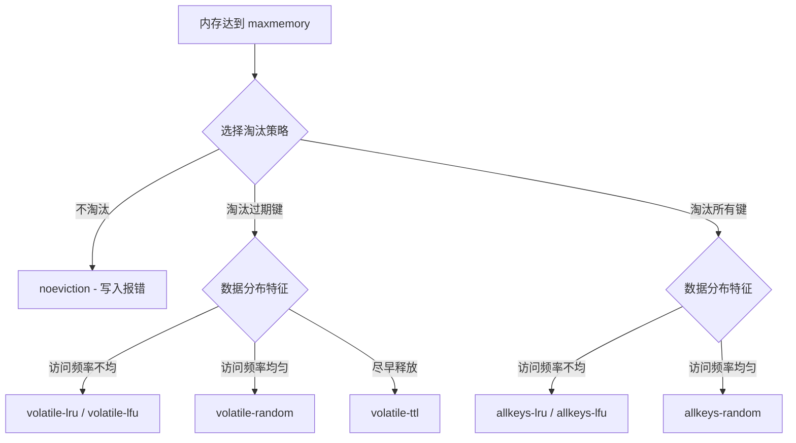
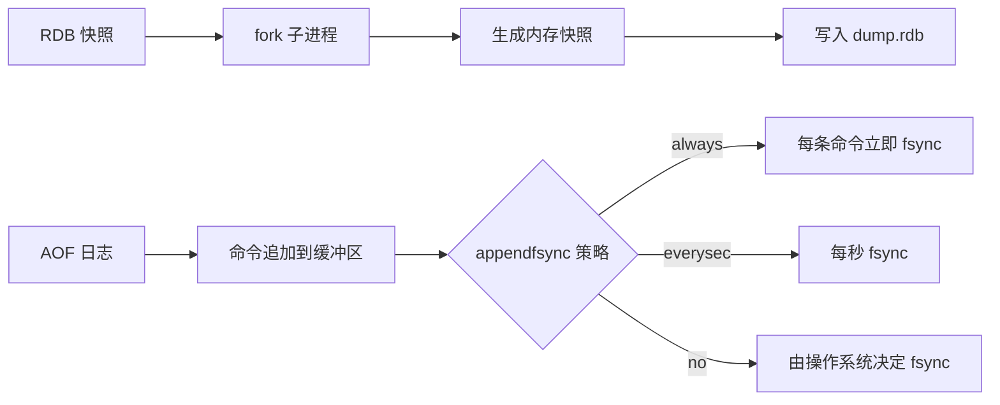
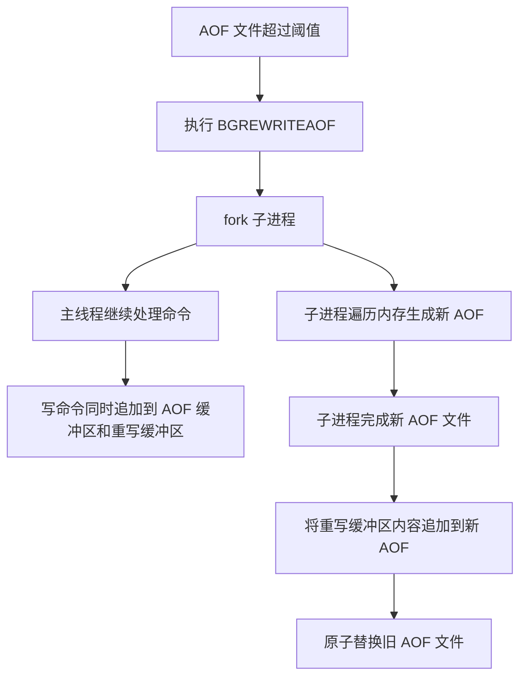
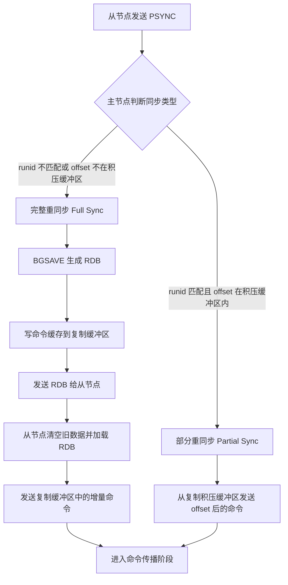
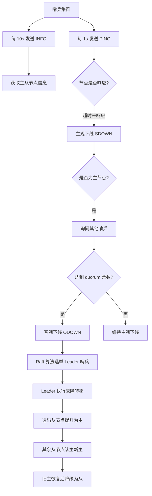
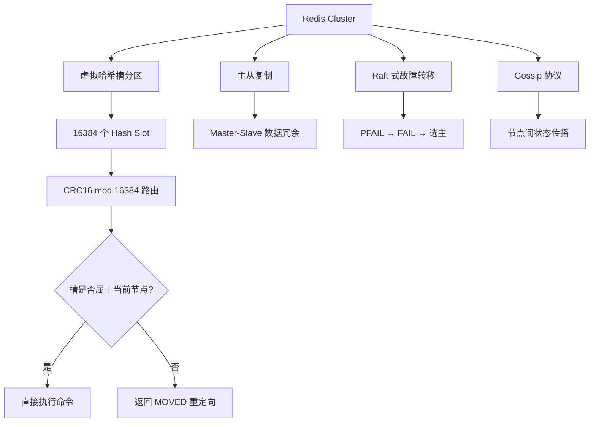
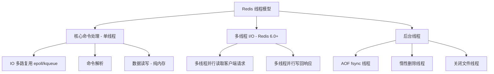
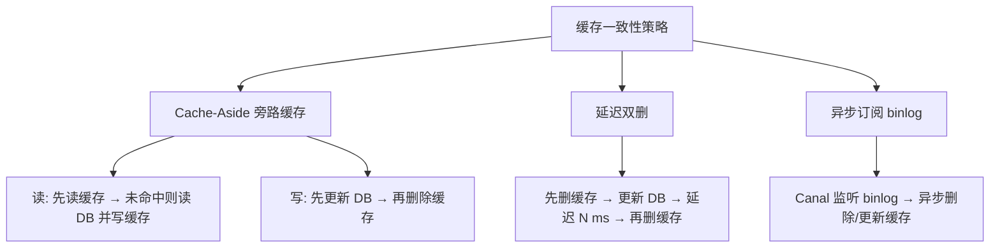
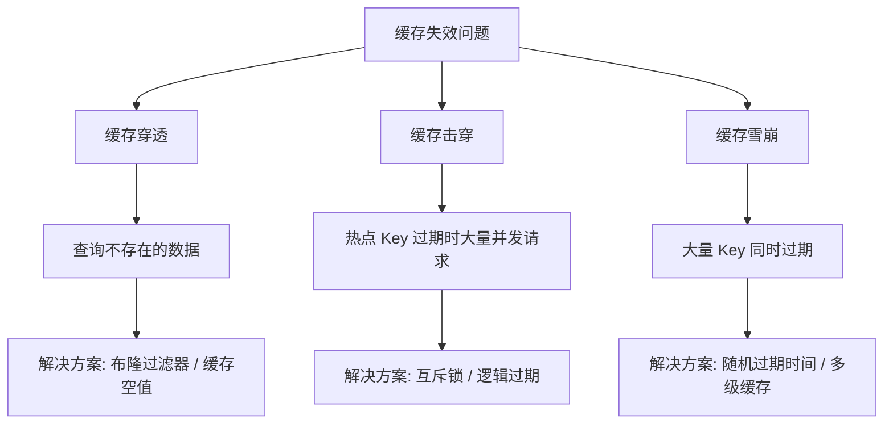

# Redis 面试

::: tip 扩展

- [面试中关于 Redis 的问题看这篇就够了](https://juejin.im/post/5ad6e4066fb9a028d82c4b66)
- [advanced-java](https://github.com/doocs/advanced-java#缓存)
- [Redis 常见面试题](https://xiaolincoding.com/redis/base/redis_interview.html)

:::

## Redis 简介

### 【简单】什么是 Redis？⭐⭐

> 🎯 目标等级：L2 ｜ ⏱ 建议用时：5 min ｜ 🏷 标签：Redis 简介 / 基本概念

#### 💎 关键结论

Redis 是开源的内存 K-V 数据库，基于内存操作使单机 QPS 达 10w+，常用于缓存、消息队列、分布式锁等场景。

#### ⚡ 记忆卡片

- **口诀**：内存存储快又活，多型持久高可用
- **关键词**：内存数据库 ／ K-V 存储 ／ 多数据类型 ／ 单线程模型 ／ 持久化
- **链路**：内存操作 → 高性能读写 → 缓存/队列/锁

#### 📖 核心知识

**Redis 是一个开源的、数据存于内存中的 K-V 数据库**。由于 Redis 的读写操作都是在内存中完成，因此其**读写速度非常快**。

- **高性能**：Redis 的读写操作都是在内存中完成，因此性能极高。
- **高并发**：Redis 单机 QPS 能达到 10w+，将近是 MySQL 的 10 倍。

Redis 常被用于**缓存、消息队列、分布式锁等场景**。

Redis 的功能和特性：

- **支持多种数据类型**：String（字符串）、Hash（哈希）、List（列表）、Set（集合）、Zset（有序集合）、Bitmaps（位图）、HyperLogLog（基数统计）、GEO（地理空间）、Stream（流）。
- **读写采用"单线程"模型**：操作天然具有**原子性**。Redis 6.0 后在网络模块中引入了多线程 I/O 机制（**仅网络读写与协议解析多线程，命令执行仍是单线程**）。
- **支持多种持久化方式**：**RDB**（内存快照）、**AOF**（追加写命令日志），以及 Redis 4.0 起的**混合持久化**（AOF 文件前半段是 RDB 二进制、后半段是增量命令）。
- **多种高可用方案**：**主从复制**模式、**哨兵**模式、**集群**模式。
- **丰富特性**：**事务**、**Lua 脚本**、**发布订阅**、**过期删除**、**内存淘汰**等。


#### 🔀 发散问题

- **Q：Redis 单线程模型为什么能支撑 10w+ QPS？瓶颈在内存还是网络 IO？**

  → Redis 完全基于内存操作，避免了磁盘 IO 瓶颈；单线程避免了上下文切换开销和多线程竞争锁的消耗。实际瓶颈通常在网络带宽而非 CPU 或内存，单线程模型足以充分利用内存速度。

- **Q：Redis 6.0 引入多线程 I/O 后，核心命令执行仍然是单线程吗？这样设计的原因是什么？**

  → 是的，核心命令执行仍然是单线程的。多线程仅用于网络读写（read/write syscall）和协议解析，这样既利用了多核处理网络 IO，又保持了命令执行的原子性和无锁简洁性。

### 【简单】Redis 有哪些应用场景？⭐⭐

> 🎯 目标等级：L2 ｜ ⏱ 建议用时：5 min ｜ 🏷 标签：Redis 简介 / 应用场景

#### 💎 关键结论

Redis 凭借多数据类型和内存高性能，广泛应用于缓存、计数器、分布式锁、消息队列、排行榜等九大场景。

#### ⚡ 记忆卡片

- **口诀**：缓计限队查聚排，分塞分布锁
- **关键词**：缓存 ／ 计数器 ／ 分布式锁 ／ 消息队列 ／ 排行榜 ／ 分布式 Session
- **链路**：多数据类型 → 匹配业务场景 → 选择合适结构

#### 📖 核心知识

Redis 常见应用场景如下：

- **缓存**：将热点数据放到内存中，设置内存的最大使用量以及过期淘汰策略来保证缓存的命中率。
- **计数器**：Redis 这种内存数据库能支持计数器频繁的读写操作。
- **应用限流**：限制一个网站访问流量。
- **消息队列**：使用 List 数据类型（Redis 3.2 起底层为 **quicklist**——由 listpack/ziplist 节点串成的双向链表，早期的纯 `linkedlist` 编码早已被取代）；需要消息确认、消费者组、历史回溯时应改用 Redis 5.0 引入的 **Stream**。
- **查找表**：使用 HASH 数据类型。
- **聚合运算**：使用 SET 类型，例如求两个用户的共同好友。
- **排行榜**：使用 ZSET 数据类型。
- **分布式 Session**：多个应用服务器的 Session 都存储到 Redis 中来保证 Session 的一致性。
- **分布式锁**：可用 `SET key value NX EX seconds` 实现单实例锁，并用 Lua 脚本做「先校验持有者再删除」的原子释放；多主场景的 RedLock 存在争议（Kleppmann 指出时钟漂移与 GC/网络停顿会破坏其安全性），**对正确性有硬要求的场景必须叠加 fencing token（单调递增令牌 + 存储层拒绝旧令牌）**，不能只依赖锁本身。

#### 🔀 发散问题

- **Q：Redis 做缓存时，如何保证和数据库之间的数据一致性？延迟双删和 Canal 订阅 binlog 各有什么优缺点？**

  → 正解口径是 **Cache-Aside：先更新 DB，再删除缓存**，并配合消息队列重试保证删除最终成功。延迟双删的「延迟时间」不能拍脑袋定值，必须按「主从同步延迟 + 一次读请求耗时」推导；Canal 订阅 binlog 异步删缓存对业务零侵入，是大规模系统的更优解，代价是引入中间件与运维复杂度。但必须承认：**缓存与 DB 的强一致在工程上不可达**，任何方案都只能缩小不一致窗口，所以业务上通常接受「最终一致 + 过期时间兜底」。

- **Q：缓存穿透、缓存击穿、缓存雪崩分别是什么问题？各自有哪些典型解决方案？**

  → 缓存穿透指查询不存在的数据，可用布隆过滤器或缓存空值解决；缓存击穿指热点 key 过期导致大量请求打到 DB，可用互斥锁或永不过期解决；缓存雪崩指大量 key 同时过期，可在过期时间上加随机值并配合多级缓存。

### 【简单】Redis 有哪些里程碑版本？⭐

> 🎯 目标等级：L2 ｜ ⏱ 建议用时：5 min ｜ 🏷 标签：Redis 简介 / 版本演进

#### 💎 关键结论

Redis 从 1.0 到 8.0 的演进主线是：单机缓存 → 持久化保数据 → 哨兵保可用 → 集群保扩展 → Stream 补消息语义 → 多线程 I/O 提吞吐 → Functions 与向量搜索扩展能力边界。

#### ⚡ 记忆卡片

- **口诀**：一零单，二八哨，三零群，五零流，六零线，七零函
- **关键词**：RDB/AOF ／ Sentinel ／ Cluster ／ Stream ／ 多线程 I/O ／ Functions
- **链路**：单机缓存 → 持久化保数据 → 集群保可用 → 多线程提性能

#### 📖 核心知识

Redis 里程碑版本如下：

- **Redis 1.0（2010 年）**：首个稳定版本，采用单机架构，一般作为业务应用的缓存。**RDB 内存快照持久化从这一阶段起就是 Redis 的内置能力**（并非到 2.8 才引入），AOF 紧随其后在 1.1 引入，主从复制也在早期版本即已提供。但数据主要驻留内存，重启时快照点之后的写入会丢失，流量直接打到数据库。
- **Redis 2.x（2011 年至 2013 年）**
  - **可编程**：2.6 起支持 **Lua 脚本**，提供服务端原子执行能力。
  - **哨兵**：Sentinel 在 **2.8 达到生产可用**（官方文档明确 Sentinel 支持 Redis 2.8 及以上）。它执行以下四个任务：监控、通知、自动故障转移和共享配置。
  - **部分重同步**：2.8 引入 `PSYNC`，从库断线重连后可基于复制积压缓冲区做增量同步，不再必须全量重同步。
- **Redis 3.0（2015 年）**：官方提供了 **redis-cluster**。redis-cluster 是一种分布式数据库解决方案，通过分片管理数据。数据被分成 16384 个槽，每个节点负责槽的一部分。3.2 用 **quicklist** 取代 List 的 `linkedlist` 编码。
- **Redis 4.0（2017 年）**：引入**混合持久化**（`aof-use-rdb-preamble`）、**LFU 淘汰策略**、`UNLINK`/lazyfree 异步删除、Module 机制，以及 **PSYNC2**（故障转移后从库仍可能走部分重同步）。
- **Redis 5.0（2018 年）**：新增 **Stream** 数据类型；`SLAVEOF` 更名为 `REPLICAOF`（旧名保留为别名）。
- **Redis 6.0（2020 年）**：在网络模块中引入了**多线程 I/O**。Redis 模型分为网络模块和主处理模块。特别注意：Redis 不再完全是单线程架构，但**命令执行依然是单线程**，多线程只用于网络读写与协议解析。
- **Redis 7.0（2022 年）**：引入 **Redis Functions**、**Multi-Part AOF**（base + incr + manifest 三类文件）、Sharded Pub/Sub，并用 **listpack** 全面取代 ziplist。
- **Redis 8.0（2025 年）**：引入**向量搜索（Vector Set）**等新数据类型能力。


#### ⚠️ 常见误区

::: details

常见误区：

- ❌ "RDB 是 Redis 2.8 才引入的" → RDB 快照自 1.0 起就是内置能力；2.8 的关键贡献是 Sentinel 生产可用与 `PSYNC` 部分重同步。
- ❌ "Redis 6.0 变成多线程了，所以命令执行也是并行的" → 6.0 的多线程只覆盖网络 I/O 与协议解析，命令执行仍是单线程，这也正是 Redis 原子性得以保持的前提。
- ❌ "Hash Field TTL 是 Redis 8.0 引入的" → `HEXPIRE` 系列命令实际在 **Redis 7.4** 引入；8.0 的标志性能力是向量搜索（Vector Set）。

:::

#### 🔀 发散问题

- **Q：Redis 7.0 和 8.0 有哪些重要新特性？**

  → Redis 7.0 引入 Redis Functions 和 Multi-Part AOF，8.0 引入向量搜索（Vector Set）等特性；注意 Hash Field 级别 TTL 实际在 7.4 引入。详见本文档「Redis 7.0 有哪些重要新特性？」和「Redis 8.0 有哪些重要新特性？」。

### 【简单】对比一下 Redis 和 Memcached？⭐⭐

> 🎯 目标等级：L2 ｜ ⏱ 建议用时：5 min ｜ 🏷 标签：Redis 简介 / 技术选型

#### 💎 关键结论

Redis 在数据类型、持久化、分布式等方面全面领先，绝大多数场景优先选择 Redis 作为分布式缓存。

#### ⚡ 记忆卡片

- **口诀**：Memcached 单线快，Redis 多能全
- **关键词**：单线程 vs 多线程 ／ 数据类型 ／ 持久化 ／ 分布式
- **链路**：业务需求 → 对比差异 → 技术选型

#### 📖 核心知识

Redis 与 Memcached 的**共性**：

- 都是内存数据库，因此性能都很高。
- 都有过期策略。

因为以上两点，所以常被作为缓存使用。

Redis 与 Memcached 的**差异**：


核心差异对比：

|          | Memcached                                                                                                                                        | Redis                                                                                                       |
| -------- | ------------------------------------------------------------------------------------------------------------------------------------------------ | ----------------------------------------------------------------------------------------------------------- |
| 数据类型 | 只支持 String 类型                                                                                                                               | 支持多种数据类型：String、Hash、List、Set、ZSet 等                                                          |
| 持久化   | 不支持持久化，一旦重启或宕机就会丢失数据                                                                                                         | 支持两种持久化策略：RDB 和 AOF                                                                              |
| 分布式   | 本身不支持分布式，只能通过在客户端使用像一致性哈希这样的分布式算法来实现分布式存储，这种方式在存储和查询时都需要先在客户端计算一次数据所在的节点 | 支持分布式                                                                                                  |
| 线程模型 | 采用多线程+IO 多路复用，多核利用率高。**value 较大的纯 KV 读写场景下，多线程 + slab 分配模型的吞吐通常更高**（业界旧基准的定性结论，非官方数据） | 命令执行为单线程+IO 多路复用（6.0 起网络 I/O 已多线程）。小 value、且需要复杂数据结构与持久化时综合表现更优 |
| 其他功能 | 不支持                                                                                                                                           | 支持发布订阅模型、Lua 脚本、事务等功能                                                                      |

通过以上分析，可以看出，Redis 在很多方面都占有优势。因此，绝大多数情况下，优先选择 Redis 作为分布式缓存。


#### 🏭 实战场景

::: details

生产案例：某团队将 session 存储从 Memcached 1.6 迁移至 Redis 6.2，数据规模 1000 万 key、每条约 200 字节、总数据量约 4GB。Memcached 在 50K QPS 下运行正常，但每次重启或宕机后所有 session 丢失，用户被迫重新登录。迁移到 Redis 并开启 AOF（everysec fsync）后，计划内重启仅丢失约 2 秒数据。但迁移后发现 Redis 内存占用比 Memcached 高 30%，原因是 Redis 每个 key 有 dictEntry + robj + SDS 等对象开销约 64 字节，而 Memcached 的 slab 分配更为紧凑。修复方案：将 session 字段改用 HASH 结构存储，并配置 `hash-max-ziplist-entries 128`，使每条 session 内存占用降低 40%。

:::

#### ⚠️ 常见误区

::: details

常见误区：

- ❌ "Memcached 一定比 Redis 快，所以超高并发就该选 Memcached" → 「更快」只在纯 KV + 大 value + 需要打满多核这一狭窄场景成立；一旦需要 Hash/List/ZSet/持久化/集群/发布订阅，Memcached 直接不可选。选型是能力匹配问题，不是单点吞吐问题。
- ❌ "Memcached 的 slab 分配内存利用率更高" → slab 按预设 size class 分配，value 尺寸落在档位之间会造成**内部碎片**（一个 slot 只放一个 value，剩余空间浪费）；Redis 按实际大小分配，但会产生 jemalloc 的**外部碎片**，需用 `mem_fragmentation_ratio` 监控。两者是不同形态的内存浪费，不能一概而论。
- ❌ "Redis 是单线程所以只能吃一个核" → 6.0 起网络 I/O 已多线程；且生产上通过多实例 / Cluster 天然横向利用多核，单实例吃不满多核并非架构缺陷。

:::

#### 🔀 发散问题

- **Q：什么场景下会选 Memcached？**

  → 业务仅需简单 K-V 缓存、无持久化需求、value 较大且需要把多核吞吐打满时，Memcached 的多线程 + slab 模型仍有优势。但这已是少数派场景，绝大多数团队直接选 Redis。

### 【简单】Redis 有哪些 Java 客户端？各有什么优劣？⭐⭐

> 🎯 目标等级：L2 ｜ ⏱ 建议用时：5 min ｜ 🏷 标签：Redis 简介 / 客户端

#### 💎 关键结论

Redis 三大 Java 客户端：Jedis 简单直接、Lettuce 高并发线程安全（Spring Boot 默认）、Redisson 功能强大适合分布式场景。

#### ⚡ 记忆卡片

- **口诀**：Jedis 简，Lettuce 快，Redisson 全
- **关键词**：Jedis ／ Lettuce ／ Redisson ／ 线程安全 ／ 同步异步
- **链路**：业务需求 → 对比特性 → 选择客户端

#### 📖 核心知识

Redis 的主流 Java 客户端有三种，对比如下：

| 客户端       | 线程安全 | 自动重连 | 编程模型         | 适用场景                 |
| :----------- | :------- | :------- | :--------------- | :----------------------- |
| **Jedis**    | ❌       | ❌       | 同步             | 简单应用、快速开发       |
| **Lettuce**  | ✔️       | ✔️       | 同步/异步/响应式 | 高并发、Spring Boot 项目 |
| **Redisson** | ✔️       | ✔️       | 同步/异步        | 分布式系统、高级功能需求 |

**推荐选择**：

- **基础需求** → Jedis（简单直接）。
- **高并发/Spring 项目** → Lettuce（默认选择）。
- **分布式锁/队列等** → Redisson（功能强大）。

::: details Jedis

**✔️ 优点**

- **简单易用**：API 直观，适合快速上手。
- **广泛使用**：社区支持丰富，文档齐全。
- **性能良好**：常规操作高效。
- **功能全面**：支持字符串、哈希、列表等基础数据结构。

**❌ 缺点**

- **非线程安全**：需为每个线程创建独立实例。
- **无自动重连**：网络异常需手动处理。
- **同步阻塞**：高并发时可能成为性能瓶颈。

:::

::: details Lettuce

**✔️ 优点**

- **线程安全**：多线程共享同一连接。
- **高性能**：基于 Netty 实现，支持高并发。
- **自动重连**：网络中断后自动恢复。
- **多编程模型**：支持同步、异步、响应式（如 Reactive API）。

**❌ 缺点**

- **API 较复杂**：学习成本高于 Jedis。
- **资源消耗**：异步模式可能占用更多内存/CPU。

:::

::: details Redisson

**✔️ 优点**

- **分布式支持**：内置分布式锁、队列、缓存等高级功能。
- **线程安全**：天然适配多线程场景。
- **集群友好**：完善支持 Redis 集群模式。
- **稳定性高**：企业级应用验证。

**❌ 缺点**

- **学习曲线陡峭**：需掌握分布式概念。
- **依赖兼容性**：可能与其他库冲突需调优。

:::

#### 🔬 扩展知识

::: details

- 【L3】**Lettuce 的单连接瓶颈**：Lettuce 默认用**一条共享原生连接**（`shareNativeConnection=true`）承载所有非阻塞命令。命令密集、或存在大 value / 慢命令时，这条连接会把所有请求串行化，成为吞吐瓶颈——典型症状是「客户端大量超时，但 Redis 侧 `slowlog` 干干净净」。处置：配置连接池，或对事务、阻塞命令、大 value 场景设 `shareNativeConnection=false`。
- 【L3】**Lettuce 的集群拓扑刷新默认不开启**：`ClusterTopologyRefreshOptions` 的周期性刷新与「MOVED / 断连触发的自适应刷新」默认都是关闭的。主从切换或扩缩容后，客户端仍按旧槽映射发请求，会持续打到失效节点并刷 MOVED 重定向。必须显式开启 `enableAllAdaptiveRefreshTriggers()` 与 `enablePeriodicRefresh()`。
- 【L4】**命令超时 ≠ Redis 慢查询**：Lettuce 的 `command-timeout` 覆盖「客户端入队 + 网络 + 服务端执行 + 回包解码」全链路，Netty 事件循环阻塞、应用侧 GC 停顿、连接池耗尽都会触发超时，而 Redis 的 `slowlog` 只记录服务端执行耗时。排障必须两侧对齐时间轴，只看 Redis 会得出「服务端没问题」的错误结论。
- 【L4】Redisson 的定位是**分布式对象框架**（`RLock` / `RMap` / `RRateLimiter` / `RBloomFilter`），屏蔽底层命令；它的看门狗续期解决「业务未完成锁先过期」，但**解决不了 RedLock 的根本争议**——主从异步复制下主库宕机仍会丢锁，强正确性场景需 fencing token 或改用共识型存储。

:::

#### ⚠️ 常见误区

::: details

常见误区：

- ❌ "Lettuce 线程安全，所以永远不需要连接池" → 线程安全只说明连接可被多线程共享，不等于单连接能提供足够吞吐；命令密集时单连接就是瓶颈。
- ❌ "Jedis 已经过时，Spring Boot 默认就是 Lettuce 所以只能用 Lettuce" → Jedis 的「直连 + 连接池」模型简单可控、API 与原生命令一一对应、排障直观；在不需要响应式编程的项目里仍是合理选择，`spring.redis.client-type` 可切回 jedis。
- ❌ "Redisson 的看门狗能保证分布式锁绝对安全" → 看门狗只解决续期；它无法弥补异步复制导致的锁丢失，也无法替代 fencing token。

:::

#### 🔀 发散问题

- **Q：Lettuce 基于 Netty 的异步连接模型在高并发场景下相比 Jedis 的阻塞连接池有哪些具体优势？连接池是否仍有必要？**

  → Lettuce 使用少量共享连接即可并发发送多个命令，无需连接池即可支撑高并发，减少了连接创建和切换的开销。但在命令量极大时仍可配置连接池来控制并发度，避免单个连接成为瓶颈。

- **Q：Redisson 的分布式锁和 Redis 原生 `SET NX EX` 实现锁相比，增加了哪些生产级功能（如看门狗续期、RedLock）？**

  → Redisson 提供了看门狗（Watchdog）机制自动续期，避免业务未完成锁就过期；还支持可重入锁、公平锁、读写锁、RedLock 多节点加锁，以及用 Lua 脚本实现的「校验持有者再删除」原子释放。但要区分**可用性**与**正确性**：异步复制下主库宕机仍会丢锁，对正确性有硬要求的场景必须叠加 fencing token（单调递增令牌，由存储层拒绝旧令牌）。

## Redis 内存管理

### 【中等】Redis 支持哪些过期删除策略？⭐⭐⭐⭐

> 🎯 目标等级：L2-L4 ｜ ⏱ 建议用时：8 min ｜ 🏷 标签：Redis 内存管理 / 过期策略

#### 💎 关键结论

Redis 采用"定期删除+惰性删除"组合策略，平衡 CPU 开销与内存释放的及时性。

#### ⚡ 记忆卡片

- **口诀**：惰性省 CPU，定期折中走
- **关键词**：定时删除 ／ 惰性删除 ／ 定期删除
- **链路**：访问频率 → CPU 开销 → 内存浪费 → 折中选择

#### 📖 核心知识

Redis 采用的过期策略是：**定期删除+惰性删除**。

- **定时删除**：在设置 key 的过期时间的同时，创建一个定时器，让定时器在 key 的过期时间来临时，立即执行 key 的删除操作。
  - **优点**：保证过期 key 被尽可能快的删除，释放内存。
  - **缺点**：**如果过期 key 较多，可能会占用相当一部分的 CPU，从而影响服务器的吞吐量和响应时延**。
- **惰性删除**：放任 key 过期不管，但是每次访问 key 时，都检查 key 是否过期，如果过期的话，就删除该 key ；如果没有过期，就返回该 key。
  - **优点**：占用 CPU 最少。程序只会在读写键时，对当前键进行过期检查，因此不会有额外的 CPU 开销。
  - **缺点**：**过期的 key 可能因为没有被访问，而一直无法释放，造成内存的浪费，有内存泄漏的风险**。
- **定期删除**：每隔一段时间，程序就对数据库进行一次检查，删除里面的过期 key。至于要删除多少过期 key，以及要检查多少个数据库，则由算法决定。定期删除是前两种策略的一种折中方案。

#### 🔬 扩展知识

::: details

- 【L3】定期删除策略的难点是删除操作执行的时长和频率。执行太频或执行时间过长，就会出现和定时删除相同的问题；执行太少或执行时间过短，就会出现和惰性删除相同的问题。
- 【L3】Redis 的定期删除具体实现：Redis 默认每 100ms 随机抽取一批设置了过期时间的 key 进行检查，删除其中已过期的。如果过期 key 比例超过 25%，则继续抽取，但不会无限循环。
- 【L3】**为什么不用「定时删除」**：定时删除要给每个 key 挂一个定时器，key 数量一大，定时器的创建、维护与触发开销会吃掉大量 CPU，且大量 key 在同一时刻集中到期会让主线程被删除操作阻塞。Redis 因此选择了「以 CPU 换内存」的惰性删除 + 「有 CPU 预算上限」的定期删除组合。
- 【L3】**定期删除的 CPU 预算**：单次 `activeExpireCycle` 的耗时上限由 `ACTIVE_EXPIRE_CYCLE_SLOW_TIME_PERC`（默认占 CPU 时间的 25%）约束，并可通过 **`active-expire-effort`（默认 1，取值 1-10）** 调节清理力度——调大能更快回收过期 key 占用的内存，代价是挤占更多主线程 CPU。
- 【L4】**从库的过期键语义在 Redis 5.0 发生关键变化**：5.0 之前，从库读到「已过期但主库尚未同步 DEL」的 key 会照常返回旧值（被官方确认的行为缺陷）；5.0 起从库读取时会做**逻辑过期判断**，对已过期的 key 直接返回 nil，但**从库自身仍不主动删除该 key**，删除权始终归主库。这一变化直接影响读写分离架构的正确性论证。
- 【L3】本节 📊 量化参考表中，**配置项默认值**（每库抽样 20 个、占比阈值 25%、`active-expire-effort` 默认 1）来自 Redis 官方；**耗时与延迟毛刺类数值**为工程经验示意值，非官方基准，实际随硬件、数据规模与 TTL 分布差异极大。

:::

#### 📊 量化参考

::: details

| 指标                        | 数值                                          | 备注                                                   |
| :-------------------------- | :-------------------------------------------- | :----------------------------------------------------- |
| 定期删除执行频率            | 每 100ms 一次（serverCron）                   | 每次 events 循环触发 activeExpireCycle                 |
| 每轮抽样检查数量            | 每库 20 个 key，SLOW 模式最多 16 次循环       | 单轮约 200-300 个 key                                  |
| 单轮时间上限                | SLOW 模式占 CPU 时间的 25%；FAST 模式上限 1ms | 防止过期清理阻塞主线程                                 |
| 继续抽样的条件              | 过期 key 占比 > 25%                           | 占比高说明过期 key 密集，继续循环                      |
| 大量 key 集中过期的延迟毛刺 | 10 万+/s 过期时延迟可达几十 ms                | 建议 TTL 加随机抖动（如基础值 ±10%）                   |
| 惰性删除的内存滞留          | 冷 key 过期后可长期不释放                     | 只在被访问时才删；从节点不主动删，依赖主节点 DEL 同步  |
| 主从过期同步                | 从节点不自行判定过期                          | 等主节点删除后同步 DEL，存在短暂"从库可读过期 key"窗口 |

:::

#### 🔀 发散问题

- **Q：Redis 内存不足时怎么办？**

  → 触发内存淘汰策略，见本文档「Redis 有哪些内存淘汰策略？」。

### 【中等】Redis 有哪些内存淘汰策略？⭐⭐⭐⭐

> 🎯 目标等级：L2-L4 ｜ ⏱ 建议用时：10 min ｜ 🏷 标签：Redis 内存管理 / 淘汰策略

#### 💎 关键结论

Redis 提供 8 种淘汰策略，核心选择逻辑：数据访问频率不均用 LRU/LFU，均匀用 random，混合用途用 volatile 系列。

#### ⚡ 记忆卡片

- **口诀**：八种策略分三类，不过期、过期键、全部键
- **关键词**：noeviction ／ LRU ／ LFU ／ random ／ TTL ／ maxmemory
- **链路**：内存达上限 → 触发淘汰 → 按策略选择键 → 释放内存

#### 📖 核心知识



- **不淘汰**
  - **`noeviction`**：当内存使用达到阈值的时候，所有引起申请内存的命令会报错。这是 Redis 默认的策略。
- **在过期键中进行淘汰**
  - **`volatile-random`**：在设置了过期时间的键空间中，随机移除某个 key。
  - **`volatile-ttl`**：在设置了过期时间的键空间中，具有更早过期时间的 key 优先移除。
  - **`volatile-lru`**：在设置了过期时间的键空间中，优先移除最近未使用的 key。
  - **`volatile-lfu`**（Redis 4.0 新增）- 淘汰所有设置了过期时间的键值中，最少使用的键值。
- **在所有键中进行淘汰**
  - **`allkeys-random`**：在主键空间中，随机移除某个 key。
  - **`allkeys-lru`**：在主键空间中，优先移除最近未使用的 key。
  - **`allkeys-lfu`**（Redis 4.0 新增）- 淘汰整个键值中最少使用的键值。

**选择淘汰策略的原则**：

- 如果数据呈现正态分布（部分访问频率高，部分低），使用 `allkeys-lru` 或 `allkeys-lfu`。
- 如果数据呈现平均分布（所有数据访问频率相同），使用 `allkeys-random`。
- 若 Redis 既用于缓存，也用于持久化存储时，适用 `volatile-lru`、`volatile-lfu`、`volatile-random`。
- 为 key 设置过期时间会消耗更多内存，因此如果条件允许，建议使用 `allkeys-lru` 或 `allkeys-lfu`。

**P8 选型结论**：

- **纯缓存场景** → `allkeys-lfu`（访问分布稳定时优于 LRU）或 `allkeys-lru`。缓存的全部价值就在于命中率，内存满时必须淘汰而不是拒写。
- **缓存与持久数据混存**（同一实例既存可重建的缓存、又存不可丢的业务数据）→ `volatile-*` 系列，并确保**只有可重建的数据才设置 TTL**，这样淘汰只会命中缓存部分。
- **绝不用 `noeviction` 做缓存**：它是 Redis 的默认值，内存打满后所有写命令直接返回 `OOM command not allowed`，会把故障从「缓存命中率下降」放大成「业务写入全线失败」。`noeviction` 只在「Redis 就是唯一存储、宁可拒写也不能丢数据」的场景才合理。

#### 🔬 扩展知识

::: details

- 【L3】Redis 允许通过 `maxmemory` 参数设置内存最大值。`EXPIRE`、`EXPIREAT`、`PEXPIRE`、`PEXPIREAT`、`SETEX`、`PSETEX` 均可设置失效时间。
- 【L4】Redis 的 LRU 是近似 LRU，通过随机采样 N 个 key（`maxmemory-samples`，默认 5）淘汰最久未访问的。采样数越大越接近精确 LRU，但 CPU 开销也越大。
- 【L4】**为什么不维护全局 LRU 链表**：精确 LRU 需要一条按访问时间排序的双向链表，每次访问都要把节点移到表头。对 Redis 这种「亿级 key + 十万级 QPS」的场景，这条链表本身的指针开销、以及每次读操作都要做的链表摘挂（还会破坏单线程下的 cache 局部性），代价远超收益。Redis 的折中是：在每个对象的 24 位 `lru` 字段里存一个秒级时钟（`lruclock`），淘汰时只在**采样出的候选集 + 一个跨周期保留的淘汰池（eviction pool）**里挑最久未用的，用极小的内存和 CPU 换取「足够接近精确 LRU」的效果。官方实测 `maxmemory-samples=10` 时已非常接近理论 LRU。
- 【L4】**LFU 的实现机理**：Redis 4.0 的 LFU 复用同一个 24 位 `lru` 字段，把它拆成**高 16 位存最后访问时间（分钟精度）+ 低 8 位存访问频率计数器**。计数器不是简单自增，而是**对数概率递增**——访问次数越多，计数器 +1 的概率越低，由 `lfu-log-factor`（默认 10）控制曲线陡峭度，因此 8 位（最大 255）就足以表达百万级访问频次；同时按 `lfu-decay-time`（默认 1，即每分钟 -1）做**时间衰减**，避免历史热点 key 永久霸占缓存。
- 【L4】**LFU 解决的是 LRU 的「批量扫描污染」问题**：一次全表预热、一次定时任务遍历、一次爬虫扫描，会把大量只被访问一次的冷 key 刷到 LRU 表头，把真正的热 key 挤出去。LRU 只看「最近」，LFU 看「频率 + 衰减」，冷 key 的计数器始终很低，会被优先淘汰。
- 【L3】本节 📊 量化参考表中，**配置项默认值**（`maxmemory-samples` 默认 5、`lfu-log-factor` 默认 10、`lfu-decay-time` 默认 1、24 位 LRU 时钟）来自 Redis 官方；**命中率、耗时、maxmemory 建议比例等数值**为工程经验示意值，非官方基准。

:::

#### 📊 量化参考

::: details

| 指标                     | 数值                                    | 备注                                               |
| :----------------------- | :-------------------------------------- | :------------------------------------------------- |
| 淘汰策略总数             | 8 种（1 默认 + 4 volatile + 4 allkeys） | 默认 noeviction；纯缓存场景推荐 allkeys-lfu        |
| maxmemory-samples 采样数 | 默认 5，生产建议 10-20                  | 精度与 CPU 开销的权衡                              |
| maxmemory 建议值         | 物理内存的 50%-70%                      | 需预留 fork（COW）、复制缓冲区、碎片余量           |
| LFU 计数衰减             | `lfu-decay-time` 默认 1（每分钟 -1）    | `lfu-log-factor` 默认 10，计数对数增长、255 封顶   |
| 单次淘汰耗时             | 微秒级（采样 + 删除少量 key）           | 淘汰到大 key 时可能毫秒级毛刺                      |
| LRU 时钟精度             | 24bit 秒级时间戳（lruclock）            | 近似 LRU，不维护全局精确排序链表                   |
| noeviction 写入失败表现  | 返回 OOM command not allowed            | 监控 `rejected_connections` 与 `evicted_keys` 增速 |
| 驱逐监控告警阈值         | evicted_keys 持续增长即告警             | 说明内存不足，命中率将开始下降                     |

:::

#### 🏭 实战场景

::: details

**故障**：电商大促前夜，运营批量导入 500 万个商品标签 key（每个 ~200B，共 ~1GB），Redis 实例 maxmemory=8GB，已用 6.5GB。导入完成后，核心商品详情页缓存命中率从 98% 暴跌至 45%，接口 P99 从 8ms 飙至 120ms，数据库 QPS 从 2000 涨到 12000，CPU 打满 95%。

**排查**：当时使用 `allkeys-lru` 策略，`maxmemory-samples=5`（默认）。批量导入的 500 万冷数据写入后，LRU 采样时这些新 key 的"最近访问时间"很新，反而把访问频率高的商品详情 key 误判为"最久未使用"而淘汰。根本原因：LRU 只看最近访问时间，不看访问频率，批量写入场景下冷数据会挤掉热数据。

**修复**：

1. 紧急切换淘汰策略为 `allkeys-lfu`，LFU 基于访问频率淘汰，批量导入的冷 key 访问频率为 0，优先被淘汰，热 key 保留。
2. 将 `maxmemory-samples` 从 5 调至 20，提高 LRU/LFU 近似算法精度（CPU 开销增加约 3%，可接受）。
3. 后续优化：批量导入改为低峰期执行，导入前先 `INFO memory` 检查剩余内存，不足时临时调大 maxmemory 或分批导入。

**教训**：有批量写入场景的 Redis 实例必须用 `allkeys-lfu` 而非 `allkeys-lru`。LRU 适合纯缓存场景（数据都是按需加载），LFU 适合混合场景（热数据+偶尔的批量写入）。`maxmemory-samples` 默认 5 在生产中偏小，建议调至 10-20。

:::

#### ⚠️ 常见误区

::: details

常见误区：

- ❌ "LRU 和 LFU 效果相同" → LRU 基于最近访问时间，LFU 基于访问频率。对于突发访问后不再访问的 key，LFU 比 LRU 更精确。
- ❌ "noeviction 是最安全的策略" → noeviction 会在内存满时拒绝所有写入命令，可能导致业务异常，不是最佳选择。

:::

#### 🔀 发散问题

- **Q：内存碎片化如何影响淘汰效果？**

  → 见本文档「Redis 中的内存碎片化是什么？如何进行优化？」。

### 【中等】Redis 持久化时，对过期键会如何处理？⭐⭐

> 🎯 目标等级：L2-L4 ｜ ⏱ 建议用时：8 min ｜ 🏷 标签：Redis 内存管理 / 持久化与过期

#### 💎 关键结论

RDB 生成时过滤过期键不保存，加载时主服务器过滤从服务器不过滤；AOF 写入时保留未删过期键并追加 DEL，重写时过滤已过期键。

#### ⚡ 记忆卡片

- **口诀**：RDB 生成过滤加载分主从，AOF 写入追加删重写过滤
- **关键词**：RDB 生成 ／ RDB 加载 ／ AOF 写入 ／ AOF 重写
- **链路**：持久化触发 → 检查过期 → 决定保留或删除

#### 📖 核心知识

**RDB 持久化**

- **RDB 文件生成阶段**：从内存状态持久化成 RDB（文件）的时候，会对 key 进行过期检查，**过期的键"不会"被保存到新的 RDB 文件中**。
- **RDB 加载阶段**：
  - **主服务器**：载入 RDB 文件时，过期键**不会**被载入到数据库中。
  - **从服务器**：载入 RDB 文件时，不论键是否过期都会被载入。但由于主从同步时从服务器数据会被清空，所以一般不会有影响。

**AOF 持久化**

- **AOF 文件写入阶段**：如果数据库某个过期键还没被删除，AOF 文件会保留此过期键，当此过期键被删除后，Redis 会向 AOF 文件追加一条 DEL 命令来显式地删除该键值。
- **AOF 重写阶段**：执行 AOF 重写时，会对 Redis 中的键值对进行检查，**已过期的键不会被保存到重写后的 AOF 文件中**。

#### 🔬 扩展知识

::: details

- 【L3】RDB 加载时从服务器不过滤过期键的原因：从服务器的数据在同步时会被完全清空然后重新加载，所以过期键不会被实际访问到。
- 【L3】**过期删除本身的开销**：过期键的删除默认在主线程同步执行，遇到大 key（如百万元素的 Hash/ZSet）时释放内存会造成明显的延迟毛刺。Redis 4.0 起的 lazyfree 家族把释放动作交给后台线程：`lazyfree-lazy-expire`（过期删除）、`lazyfree-lazy-eviction`（内存淘汰）、`lazyfree-lazy-server-del`（隐式删除，如 `RENAME` 覆盖）、`lazyfree-lazy-user-del`（6.0 起让 `DEL` 等价于 `UNLINK`）。这是持久化与过期叠加场景下降低毛刺的标准手段。
- 【L4】**混合持久化下的过期键**：`aof-use-rdb-preamble yes` 时，AOF 重写产生的文件前半段是 RDB 二进制、后半段是增量 AOF 命令。前半段同样**跳过已过期键**；但重写期间主库若已过期删除某 key，该 `DEL` 会作为增量命令写入后半段，因此重启回放时不会出现「过期键复活」。

:::

#### 🏭 实战场景

::: details

生产案例：某促销平台 Redis 7.0 实例，数据集 6GB，午夜间批量优惠券集中过期（约 30% key 已过期）。RDB bgsave 从正常的 2 分钟骤增至 15 分钟以上。排查发现 fork 子进程在遍历所有 key（包括已过期但未惰性清除的 key）时，虽然跳过写入过期 key 到 RDB 文件，但仍需逐一迭代检查，消耗大量 CPU 时间。同时 COW（copy-on-write）机制导致过期但尚未清除的 key 所在内存页被复制，子进程内存膨胀至 9GB。根因是大量过期 key 堆积未及时清理。修复方案：在 bgsave 前通过批量 `UNLINK` 主动清除已过期 key；将 bgsave 调度到过期高峰之后；开启 `lazyfree-lazy-expire yes` 将过期删除交给后台线程异步执行，避免阻塞主线程。

:::

#### 🔀 发散问题

- **Q：主从复制时过期键如何处理？**

  → 见本文档「Redis 主从复制时，对过期键会如何处理？」。

### 【中等】Redis 主从复制时，对过期键会如何处理？⭐⭐⭐

> 🎯 目标等级：L2-L4 ｜ ⏱ 建议用时：5 min ｜ 🏷 标签：Redis 内存管理 / 主从与过期

#### 💎 关键结论

从库不进行过期扫描，过期处理由主库控制：主库 key 到期时通过 DEL 命令同步到从库删除。

#### ⚡ 记忆卡片

- **口诀**：从库被动等，主库 DEL 同步
- **关键词**：被动过期 ／ DEL 指令 ／ 主库控制
- **链路**：主库 key 过期 → AOF 追加 DEL → 同步从库 → 从库执行删除

#### 📖 核心知识

当 Redis 运行在主从模式下时，**从库不会主动进行过期扫描，从库对过期的处理是被动的**——过期键的删除权始终归主库。

从库的过期键处理依靠主服务器控制：**主库在 key 到期并被删除时，会在 AOF 文件里增加一条 `DEL` 指令，并把它作为写命令传播给所有从库**，从库通过执行这条 `DEL` 指令来删除过期的 key。这样设计是为了保证主从数据视图一致，避免从库因本地时钟偏差或扫描节奏不同而提前删掉主库还认为有效的 key。

**关键版本差异（Redis 5.0 前后）**：

- **Redis 5.0 之前**：从库即使本地已判定 key 过期，只要有客户端来读，**依然会像未过期一样返回旧值**。这在读写分离架构下是一个真实的行为缺陷——同一份数据在主库读是 nil、在从库读却有值。
- **Redis 5.0 及之后**：从库在**读取时**会做逻辑过期判断，对已过期的 key 直接返回 nil（`GET` 等命令表现为 key 不存在）；但**从库自身仍不会主动删除该 key**，物理删除依然要等主库传播来的 `DEL`。

因此准确表述是：**「从库不主动删」贯穿所有版本，「从库读到过期 key 返回什么」在 5.0 发生了改变**。

#### 🔬 扩展知识

::: details

- 【L3】从库上执行 `EXPIRE`/`PEXPIREAT` 等命令：从库默认 `replica-read-only yes`，写命令（包括设置过期时间）会被拒绝，必须通过主库下发后由复制传播过来，避免主从过期时间不一致。
- 【L4】**过期键在主从间的窗口期是读写分离架构的固有风险**：主库删除 → 传播 → 从库执行之间存在毫秒至秒级延迟，期间从库上该 key 仍物理存在。5.0+ 靠「读时逻辑过期判断」兜住了返回值正确性，但 `DBSIZE`、`SCAN`、`RANDOMKEY` 这类**不针对具体 key 的命令仍可能把已过期未删除的 key 列出来**，做数据核对或迁移时会出现「主从 key 数不一致」的假象。
- 【L4】**这与脑裂场景的数据丢失是同一条根因**：异步复制 + 从库被动过期，意味着从库永远只是主库的延迟副本，不能把「读从库」当作强一致读。关键读必须走主库，或用 `WAIT` 做半同步等待（但 `WAIT` 也不提供线性一致语义）。

:::

#### ⚠️ 常见误区

::: details

常见误区：

- ❌ "从库读到已过期的 key 一定返回 nil" → 这只在 Redis 5.0 及之后成立；5.0 之前从库会返回旧值。做版本迁移评审时必须确认线上版本。
- ❌ "从库也会跑定期删除，只是频率低" → 从库完全不主动删除过期键，物理删除只能由主库传播 `DEL` 触发。
- ❌ "主从 key 数量不一致说明数据丢了" → 更常见的原因是从库上堆积了「已过期但主库 DEL 尚未到达 / 尚未执行」的键，以及 `SCAN` 统计口径本身的近似性。

:::

#### 🔀 发散问题

- **Q：过期键在持久化时如何处理？**

  → 见本文档「Redis 持久化时，对过期键会如何处理？」。

### 【中等】Redis 中的内存碎片化是什么？如何进行优化？⭐⭐⭐

> 🎯 目标等级：L2-L4 ｜ ⏱ 建议用时：8 min ｜ 🏷 标签：Redis 内存管理 / 碎片优化

#### 💎 关键结论

内存碎片是已分配但无法有效利用的内存，通过 `INFO memory` 的 `mem_fragmentation_ratio` 监控，可用 Redis 4.0+ 的主动碎片整理功能优化。

#### ⚡ 记忆卡片

- **口诀**：碎片率 1.5，超了要整理
- **关键词**：mem_fragmentation_ratio ／ Jemalloc ／ MEMORY PURGE ／ 主动碎片整理
- **链路**：分配器机制 → 碎片产生 → 监控指标 → 优化方案

#### 📖 核心知识

Redis 内存碎片化是指已分配的内存无法被有效利用，导致内存浪费的现象。

**碎片率的定义**：`mem_fragmentation_ratio` = `used_memory_rss` / `used_memory`。

- `used_memory`：Redis 内存分配器（jemalloc）视角下**实际申请**的内存总量；
- `used_memory_rss`：操作系统视角下 Redis 进程**占用的物理内存**（Resident Set Size）。

两者的差值就是「分配了但用不上」的部分。可以通过 Redis 的 `INFO memory` 命令查看：

```shell
mem_fragmentation_ratio: 1.86  # 大于 1.5 表示碎片较多
```

**内存碎片的原因**：

- **内存分配器机制**：Redis 使用 Jemalloc 或 glibc 的 malloc 等内存分配器，这些分配器为了性能不会总是精确分配请求的大小。
- **键值对频繁修改**：当键值对被频繁修改（特别是大小变化时），旧的内存空间可能无法重用。
- **键过期/删除**：删除键释放的内存块可能无法与相邻空闲块合并。
- **不同大小的数据混合存储**：Redis 存储各种大小的键值对，导致内存中出现大小不一的空闲块。

**内存碎片的解决**：

- 重启 Redis（会丢失数据）
- 使用 `MEMORY PURGE` 命令（需要特定分配器支持）
- 配置合理的 maxmemory 和淘汰策略
- 使用 Redis 4.0+ 的主动碎片整理功能（`activedefrag yes`）

#### 🔬 扩展知识

::: details

- 【L3】**碎片率指标解读**：`mem_fragmentation_ratio` < 1.0 表示 `used_memory_rss` 小于 `used_memory`，说明 Redis 的部分内存**已被操作系统换出到 swap**——这是严重的性能问题，访问被换出的页会触发磁盘 IO，延迟可能放大几个数量级，必须立即处理（关闭 swap 或缩小 `maxmemory`）；1.0-1.5 属正常范围；> 1.5 表示碎片较多需要关注；> 2.0 通常意味着已有明显的容量浪费。
- 【L3】**主动碎片整理（Redis 4.0+，需 jemalloc 支持）**：`activedefrag yes` 开启后，Redis 会在主线程的空闲时间片里渐进式地把数据搬迁到更紧凑的地址区间，让分配器能归还空闲页。相关阈值：`active-defrag-threshold-lower`（默认 10，碎片率超过 10% 才开始整理）、`active-defrag-threshold-upper`（默认 100，碎片率超过 100% 时用最大力度整理）、`active-defrag-cycle-min`（默认 5，整理占用 CPU 的下限百分比）、`active-defrag-cycle-max`（默认 25，上限百分比）。**整理动作跑在主线程上，力度调太高会直接抬高命令延迟**，必须配合 `maxmemory` 余量并在低峰期调参。
- 【L3】**`MEMORY PURGE` 只归还脏页，不消除碎片**：它调用 jemalloc 的 `mallctl` 把空闲页还给 OS，能压低 `used_memory_rss`，但对「数据本身散布在稀疏地址上」造成的外部碎片无能为力——那需要 `activedefrag` 做数据搬迁。
- 【L4】**碎片的三种形态要分开治理**：① 分配器粒度造成的**内部碎片**（申请 33 字节给了 48 字节），只能换分配器或调整 value 尺寸档位；② 大量 key 过期/删除后空洞无法归还 OS 的**外部碎片**，靠 `activedefrag`；③ swap 导致的「碎片率 < 1」，靠关闭 swap 与容量规划。混为一谈会导致「开了 activedefrag 却没效果」。

:::

#### 🏭 实战场景

::: details

生产案例：某电商用户会话缓存服务，Redis 6.2（jemalloc 分配器），初始内存占用 8GB，运行 3 个月后内存持续增长至 14GB，尽管 key 持续被淘汰。监控发现 `mem_fragmentation_ratio` 从 1.05 逐步攀升至 3.2。排查发现根因是用户 session 数据频繁更新且 value 大小变化剧烈（从 200B 到 2KB 不等），导致大量小内存页无法被复用，形成严重碎片。修复方案：开启 `activedefrag yes`，设置 `active-defrag-threshold-lower 10` 和 `active-defrag-cycle-min 5`，碎片率在 2 小时内从 3.2 降至 1.1；同时在低峰期将 `active-defrag-cycle-max` 调至 25 以加速整理。

:::

#### 🔀 发散问题

- **Q：如何选择合适的淘汰策略减少碎片？**

  → 见本文档「Redis 有哪些内存淘汰策略？」。

## Redis 持久化

### 【中等】Redis 支持哪些持久化方式？⭐⭐⭐⭐

> 🎯 目标等级：L2-L4 ｜ ⏱ 建议用时：10 min ｜ 🏷 标签：Redis 持久化 / RDB/AOF

#### 💎 关键结论

Redis 支持 RDB 快照、AOF 日志、混合持久化三种方式。RDB 恢复快但可能丢数据，AOF 数据安全但恢复慢，Redis 4.0+ 的混合持久化兼顾两者优势。

#### ⚡ 记忆卡片

- **口诀**：RDB 快照快但粗，AOF 日志细但慢，混合兼得
- **关键词**：RDB ／ AOF ／ 混合持久化 ／ BGSAVE ／ BGREWRITEAOF
- **链路**：写入命令 → AOF 缓冲区 → appendfsync → 磁盘

#### 📖 核心知识

为了追求性能，Redis 的读写都是在内存中完成的。一旦重启，内存中的数据就会清空，为了保证数据不丢失，Redis 支持持久化机制。

Redis 有三种持久化方式

- RDB 快照
- AOF 日志
- 混合持久化

::: details RDB

> - RDB 的实现原理是什么？
> - 生成 RDB 快照时，Redis 可以响应请求吗？

有两个 Redis 命令可以用于生成 RDB 文件：[**`SAVE`**](https://redis.io/commands/save) 和 [**`BGSAVE`**](https://redis.io/commands/bgsave)。

[**`SAVE`**](https://redis.io/commands/save) 命令由服务器进程直接执行保存操作，直到 RDB 创建完成为止。所以**该命令“会阻塞”服务器**，在阻塞期间，服务器不能响应任何命令请求。

[**`BGSAVE`**](https://redis.io/commands/bgsave) 命令会**派生**（fork）一个子进程，由子进程负责创建 RDB 文件，服务器进程继续处理命令请求，所以**该命令“不会阻塞”服务器**。

**RDB 与 AOF 对比**




> 🔔 **【注意】**
>
> `BGSAVE` 命令的实现采用的是写时复制技术（Copy-On-Write，缩写为 CoW）。
>
> `BGSAVE` 命令执行期间，`SAVE`、`BGSAVE`、`BGREWRITEAOF` 三个命令会被拒绝，以免与当前的 `BGSAVE` 操作产生竞态条件，降低性能。

:::

::: details AOF

> - AOF 的实现原理是什么？
> - 为什么先执行命令，再把数据写入日志呢？

**Redis 命令请求会先保存到 AOF 缓冲区，再定期写入并同步到 AOF 文件**。

AOF 的实现可以分为命令追加（append）、文件写入、文件同步（sync）三个步骤。

- **命令追加**：当 Redis 服务器开启 AOF 功能时，服务器在执行完一个写命令后，会以 Redis 命令协议格式将被执行的写命令追加到 AOF 缓冲区的末尾。
- **文件写入**和**文件同步**
  - Redis 的服务器进程就是一个事件循环，这个循环中的文件事件负责接收客户端的命令请求，以及向客户端发送命令回复。而时间事件则负责执行想 `serverCron` 这样的定时运行的函数。
  - 因为服务器在处理文件事件时可能会执行写命令，这些写命令会被追加到 AOF 缓冲区，服务器每次结束事件循环前，都会根据 `appendfsync` 选项来判断 AOF 缓冲区内容是否需要写入和同步到 AOF 文件中。

先执行命令，再把数据写入 AOF 日志有两个好处：

- **避免额外的检查开销**
- **不会阻塞当前写操作命令的执行**

当然，这样做也会有弊端：

- **数据可能会丢失**：如果 Redis 在命令写入 AOF 缓冲区后、尚未同步到磁盘前发生故障，未持久化的命令会丢失。
- **可能阻塞其他操作**：如果选择 `always` 策略，每次写操作都要执行 fsync，可能会影响主线程的响应速度。

`appendfsync` 不同选项决定了不同的持久化行为：

- **`always`**：将 AOF 缓冲区中所有内容写入并同步到 AOF 文件。这种方式数据最安全，但也是性能最差的。
- **`no`**：将 AOF 缓冲区所有内容写入到 AOF 文件，但并不对 AOF 文件进行同步，何时同步由操作系统决定。这种方式数据最不安全，一旦出现故障，未来得及同步的所有数据都会丢失。
- **`everysec`**：`appendfsync` 默认选项。将 AOF 缓冲区所有内容写入到 AOF 文件，如果上次同步 AOF 文件的时间距离现在超过一秒钟，那么再次对 AOF 文件进行同步，这个同步操作由一个专门线程负责执行。这种方式是前两种方案的折中——性能足够好，且即使出现故障，仅丢失一秒钟内的数据。

`appendfsync` 选项的不同值对 AOF 持久化功能的安全性、以及 Redis 服务器的性能有很大的影响。

:::

::: details 混合持久化

Redis 4.0 提出了**混合使用 AOF 日志和内存快照**，也叫混合持久化，既保证了 Redis 重启速度，又降低数据丢失风险。

**混合持久化的工作机制**

- **触发时机**：在 AOF 重写过程中启用。
- **执行流程**：
  1. **子进程**将共享内存数据以 **RDB 格式**写入 AOF 文件（全量数据）。
  2. **主线程**将操作命令记录到重写缓冲区，再以 **AOF 格式**追加到 AOF 文件（增量数据）。
  3. 替换旧 AOF 文件，新文件包含 **RDB（前半部分） + AOF（后半部分）**。

**混合持久化的优点**

- **重启速度快**：优先加载 RDB 部分（全量数据恢复快）。
- **数据丢失少**：后续加载 AOF 部分（增量数据补充）。

**混合持久化的缺点**

- **可读性差**：AOF 文件包含二进制 RDB 数据，不易阅读。
- **兼容性差**：仅支持 Redis 4.0+ 版本，旧版本无法识别。

:::

#### 🔬 扩展知识

::: details

- 【L3】**RDB vs AOF vs 混合恢复时间的定性对比** - RDB 是二进制直接反序列化，恢复最快；AOF 需要逐条回放文本命令，恢复最慢（慢一到两个数量级）；混合持久化 = RDB 主体 + 少量 AOF 增量回放，恢复速度接近 RDB、数据完整性接近 AOF。具体秒数取决于数据集大小、磁盘与 CPU，不存在通用数值。
- 【L3】**fork 是阻塞的** - `BGSAVE`/`BGREWRITEAOF` 调用 `fork()` 时，内核要复制父进程的**页表**，这段时间主线程完全阻塞、不处理任何命令。开销与**进程虚拟内存映射的页数**成正比而非与数据量成正比：10GB 级实例的 fork 可达数百毫秒。`INFO stats` 里的 `latest_fork_usec` 就是它的监控指标，这是 RDB 在大实例上的真实痛点。
- 【L3】**COW 的内存翻倍风险** - fork 之后父子进程共享物理页，任一方写入某页都会触发该页复制。写密集期做 `BGSAVE`，最坏情况下 Redis 常驻内存会接近翻倍，容易触发 OOM Killer。所以 `maxmemory` 必须给 fork/COW 留足余量（经验上不超过物理内存的 50%-70%）。
- 【L3】**RDB 的自动触发规则（`save`）** - 默认配置为 `save 3600 1`、`save 300 100`、`save 60 10000`，含义是「3600 秒内至少 1 次修改」「300 秒内至少 100 次修改」「60 秒内至少 10000 次修改」三者满足其一即触发 `BGSAVE`。用 `save ""` 可完全关闭自动快照。
- 【L4】AOF 的 `everysec` 策略下，最多丢失 1 秒数据。这是因为 AOF 缓冲区由后台线程每秒同步一次，如果主线程崩溃，未同步的命令丢失。
- 【L4】**同时开启 RDB 与 AOF 时，重启优先用 AOF 恢复** - Redis 启动时若检测到有效的 AOF 文件，会**只用 AOF** 重建数据而忽略 RDB，因为 AOF 的丢失窗口（`everysec` ≤ 1s）远小于 RDB（两次快照之间），数据更全。这也是「开了 AOF 就别指望 RDB 兜底恢复」的原因——RDB 此时的价值只剩**冷备份**与**从库全量同步的数据源**。
- 【L4】**持久化取舍的 P8 决策链**：① **纯缓存、数据可从 DB 重建** → 关闭 RDB 与 AOF（`save ""` + `appendonly no`），省下 fork 阻塞、COW 内存放大与磁盘 IO，代价是重启后缓存全空需预热；② **缓存 + 少量不可重建数据** → AOF `everysec` + 混合持久化，另保留低频 RDB 做冷备；③ **把 Redis 当持久存储**（队列、计数、会话真相源）→ AOF `everysec` + 定期 RDB 异地备份，且必须承认「异步复制 + everysec」下仍有秒级 RPO，真正的强持久要靠上游落 DB；④ **从库** → 可只开 RDB 或全关，把 fork 与 IO 成本留在主库。
- 【L4】**生产踩坑：AOF 恢复过慢导致长时间不可用** - 大数据集实例在 AOF `everysec` 策略下宕机重启，需要逐条回放全部历史命令，恢复期可达数十分钟且期间完全不服务。切换混合持久化（`aof-use-rdb-preamble yes`）后，重启改为「加载 RDB 主体 + 回放少量增量」，恢复时间下降一到两个数量级，数据丢失窗口仍保持在秒级。
- 【L3】本节 📊 量化参考表中的 **`appendfsync` 语义、`aof-use-rdb-preamble` 行为、默认 `save` 规则**来自 Redis 官方；**恢复秒数、fork 耗时、COW 放大比例、性能损耗百分比等数值**为工程经验示意值，非官方基准，实际随数据集大小、磁盘与 CPU 差异极大。

:::

#### 📊 量化参考

::: details

| 指标                  | RDB                                      | AOF（everysec）                                        | 混合持久化                          |
| :-------------------- | :--------------------------------------- | :----------------------------------------------------- | :---------------------------------- |
| 数据丢失窗口          | 上次快照以来（分钟级，由 save 规则决定） | ≤ 1s                                                   | ≤ 1s                                |
| fork 耗时（8GB 实例） | 阻塞主线程，数百 ms 量级（每次 BGSAVE）  | 仅重写时 fork                                          | 仅重写时 fork                       |
| COW 额外内存峰值      | 写入高峰可达数据量的 30%-50%             | 同左                                                   | 同左                                |
| 恢复速度（定性）      | 最快（二进制直接反序列化）               | 最慢（逐条回放命令，通常慢 1-2 个数量级）              | 接近 RDB（RDB 主体 + 少量增量回放） |
| 文件体积              | 最小（二进制压缩）                       | 最大（文本命令，重写后约为数据量 1-2 倍）              | 中等（RDB 头 + AOF 增量）           |
| 对写入性能的影响      | BGSAVE 期间 CPU/IO 毛刺                  | 后台线程 fsync，通常 < 1% 损耗（always 策略可达 50%+） | 同 AOF                              |
| 适用场景              | 从库 / 纯缓存可容忍分钟级丢失            | 金融级数据安全要求                                     | 4.0+ 生产默认推荐                   |

:::

#### 🔄 迁移策略

::: details

**RDB → AOF → 混合持久化在线切换**

- **迁移前检查清单**
  - Redis 版本 ≥ 4.0 且 `aof-use-rdb-preamble=yes`（混合持久化前提）；
  - 磁盘剩余空间 ≥ 2 倍 AOF 文件体积（重写期间新旧文件并存）；
  - 主从节点均开启 AOF（避免主库故障时仅靠从库数据恢复）；
  - 业务确认可接受秒级丢失窗口（everysec）。
- **实施步骤**
  1. 低峰期 `CONFIG SET appendonly yes` 在线开启 AOF（触发一次全量重写，注意 fork 毛刺）；
  2. 观察 AOF 增长速率与 `aof_delayed_fsync` 指标，确认磁盘 IO 无瓶颈；
  3. `CONFIG SET aof-use-rdb-preamble yes` 后执行 `BGREWRITEAOF`，切换为混合格式文件；
  4. 将配置写入 redis.conf 持久化（`CONFIG REWRITE`），避免重启回退；
  5. 先在一台从库验证重启恢复时长，再推广到主库与其余节点。
- **回滚方案**
  - 保留原 RDB 文件至少 1 周；异常时 `CONFIG SET appendonly no` 回退纯 RDB 模式；
  - 混合格式文件不被 < 4.0 版本识别：需降级版本前先关闭混合持久化并重写为纯 AOF 格式。
- **监控指标**
  - `aof_delayed_fsync`（> 0 说明磁盘 IO 打满）；
  - `aof_last_bgrewrite_status`（须为 ok）与 `aof_current_size` 增速；
  - `latest_fork_usec`（fork 耗时 > 100ms 需关注，大实例可达秒级）；
  - 重启恢复时长演练结果（每季度抽一台验证）。

:::

#### ⚠️ 常见误区

::: details

常见误区：

- ❌ "RDB 比 AOF 更安全" → AOF 记录每条写命令，数据丢失窗口更小；RDB 是定时快照，两次快照间的数据可能丢失。
- ❌ "混合持久化 = RDB + AOF 同时开启" → 混合持久化是 AOF 重写时将前半部分以 RDB 格式写入，后半部分以 AOF 格式追加，是一个文件内的混合。

:::

#### 🔀 发散问题

- **Q：AOF 文件过大怎么办？**

  → 见本文档「AOF 的重写机制是怎样的？」。

### 【中等】AOF 的重写机制是怎样的？⭐⭐⭐⭐

> 🎯 目标等级：L2-L4 ｜ ⏱ 建议用时：10 min ｜ 🏷 标签：Redis 持久化 / AOF 重写

#### 💎 关键结论

AOF 重写通过 fork 子进程遍历内存重建最小命令集，主线程继续服务并通过重写缓冲区追加增量命令，最终原子替换旧文件。

#### ⚡ 记忆卡片

- **口诀**：fork 子进程重建，主线程重写缓冲区，原子替换
- **关键词**：BGREWRITEAOF ／ fork 子进程 ／ 重写缓冲区 ／ 原子替换
- **链路**：AOF 过大 → BGREWRITEAOF → fork 子进程 → 重建最小集 → 追加增量 → 替换

#### 📖 核心知识



**知识点**

当 AOF 日志过大时，恢复过程就会很久。为了避免此问题，Redis 提供了 AOF 重写机制，即 AOF 日志大小超过所设阈值后，启动 AOF 重写，压缩 AOF 文件。

AOF 重写机制是，读取当前数据库中的所有键值对，然后将每一个键值对用一条命令记录到新的 AOF 日志中，等到全部记录完成后，就使用新的 AOF 日志替换现有的 AOF 日志。

作为一种辅助性功能，显然 Redis 并不想在 AOF 重写时阻塞 Redis 服务接收其他命令。因此，Redis 决定通过 `BGREWRITEAOF` 命令创建一个子进程，然后由子进程负责对 AOF 文件进行重写，这与 `BGSAVE` 原理类似。

- 在执行 `BGREWRITEAOF` 命令时，Redis 服务器会维护一个 AOF 重写缓冲区。当 AOF 重写子进程开始工作后，Redis 每执行完一个写命令，会同时将这个命令发送给 AOF 缓冲区和 AOF 重写缓冲区。
- 由于彼此不是在同一个进程中工作，AOF 重写不影响 AOF 写入和同步。当子进程完成创建新 AOF 文件的工作之后，服务器会将重写缓冲区中的所有内容追加到新 AOF 文件的末尾，使得新旧两个 AOF 文件所保存的数据库状态一致。
- 最后，服务器用新的 AOF 文件替换旧的 AOF 文件，以此来完成 AOF 重写操作。


#### 🔬 扩展知识

::: details

- 【L3】**重写压缩比** - 重写将命令重建为最小集合：例如对同一个 key 执行 100 次 INCR，重写后只需一条 SET 命令即可还原。AOF 文件通常可压缩到原来的 1/10~1/5（工程经验值，取决于历史命令的冗余程度）。
- 【L3】**fork COW 内存开销** - 重写期间 fork 的 Copy-On-Write 内存开销需关注：额外占用约等于「重写期间被写脏的页」的总量。举例（示意）：10GB 数据集若 30% 的页被写脏，重写期间会额外占用约 3GB 内存，内存紧张时可能触发 OOM。
- 【L3】**auto-aof-rewrite-min-size** - 默认 64MB，小实例可能永远不触发自动重写，导致 AOF 文件持续膨胀。
- 【L3】**重写为什么不会丢数据（P8 必答）** - 关键在于**两个缓冲区**：重写期间每执行一条写命令，主进程会把它**同时**追加到「AOF 缓冲区」（保证旧 AOF 文件持续完整、随时可恢复）和「AOF 重写缓冲区」（记录子进程开始工作之后发生的增量）。子进程基于 fork 时刻的内存快照生成新 AOF 后，主进程再把重写缓冲区的全部内容追加到新文件末尾，最后才做原子替换。因此新 AOF = fork 时刻的全量 + 重写期间的增量，与旧 AOF 所表达的数据库状态完全一致。
- 【L4】**重写缓冲区的 OOM 风险（Redis 7.0 之前）** - 重写缓冲区大小 ≈ 重写时长 × 写入速率，它常驻内存且没有独立上限。大实例 + 高写入 + 磁盘慢时，一次长重写就能让缓冲区膨胀到 GB 级并打爆内存。Redis 7.0 的 **Multi-Part AOF** 重构了这套机制：AOF 被拆成 `base`（全量基线，RDB 或 AOF 格式）、`incr`（增量命令）、`manifest`（清单）三类文件，重写期间的增量**直接写入独立的 incr 文件**而不再经过内存缓冲区，从根本上消除了这个风险。
- 【L4】**生产踩坑：AOF 膨胀导致重启超时** - 线上实例的 AOF 文件膨胀到数据量的数倍，重启加载耗时数十分钟。根因：`auto-aof-rewrite-min-size` 设置过小，而 `auto-aof-rewrite-percentage` 的「增长 100%」阈值在大基数下难以触发（文件已经很大时，要再翻一倍才会自动重写）。修复：低峰期定期手动触发 `BGREWRITEAOF` + 对 AOF 文件大小与 `aof_current_size` 增速设告警。
- 【L4】重写期间主线程同时写 AOF 缓冲区和重写缓冲区，保证数据一致性。重写完成后，重写缓冲区内容追加到新 AOF 末尾，然后原子替换旧文件。
- 【L3】**混合持久化下的重写** - `aof-use-rdb-preamble yes` 时，重写产生的 base 部分是 RDB 二进制而非 AOF 文本，只有增量才是命令。所以混合模式下「重写后文件显著变小」更明显，代价是文件不再可读、且不兼容 Redis 4.0 以前的版本。
- 【L3】本节 📊 量化参考表中的**配置项默认值**（`auto-aof-rewrite-percentage` 默认 100、`auto-aof-rewrite-min-size` 默认 64MB、7.0 Multi-Part AOF 机制）来自 Redis 官方；**压缩比、fork 耗时、COW 放大、写性能损耗百分比等数值**为工程经验示意值，非官方基准。

:::

#### 📊 量化参考

::: details

| 指标                           | 数值                                                                                               | 备注                                                     |
| :----------------------------- | :------------------------------------------------------------------------------------------------- | :------------------------------------------------------- |
| 自动重写触发条件               | 文件比上次重写后增长 100%（`auto-aof-rewrite-percentage`）且 ≥ 64MB（`auto-aof-rewrite-min-size`） | 大基数下 100% 增长难触发，需监控 + 定期手动兜底          |
| 重写压缩比                     | 通常压缩为原文件的 1/10-1/5                                                                        | 同一 key 的重复操作合并为最终值一条命令                  |
| fork 耗时（10GB 实例）         | 阻塞主线程，数百 ms 量级                                                                           | 与页表大小相关，非数据量线性关系                         |
| COW 内存放大（10GB、30% 脏页） | 额外 ~3GB                                                                                          | maxmemory 不超过物理内存 50%-70% 的核心原因之一          |
| 重写期间写性能影响             | ~5%-15%                                                                                            | 主线程同时写 AOF 缓冲区 + 重写缓冲区                     |
| 重写增量缓冲区                 | 与重写时长内写入速率成正比                                                                         | 重写 10 分钟 + 高写入 50MB/s ≈ 数百 MB 缓冲，有 OOM 风险 |
| 7.0+ 变化                      | 增量写 Multi-Part AOF（base + incr 文件）                                                          | 重写缓冲区开销显著降低，大实例更稳                       |
| 建议手动重写频率               | 低峰期每日/每周一次                                                                                | cron 触发 `BGREWRITEAOF`，避免文件失控膨胀               |

:::

#### ⚠️ 常见误区

::: details

常见误区：

- ❌ "AOF 重写是读取旧 AOF 文件做压缩" → 重写完全**不读旧 AOF 文件**，而是 fork 子进程遍历**当前内存数据**，为每个 key 生成一条能还原其现状的最小命令。所以重写后的文件里不会出现已被覆盖或删除的历史命令。
- ❌ "重写期间新写入的数据会丢" → 写命令会同时进 AOF 缓冲区和重写缓冲区，重写完成后重写缓冲区被追加到新文件末尾，状态与旧文件一致。
- ❌ "重写缓冲区反正有内存兜底，不用管" → 7.0 之前它没有独立上限，长重写 + 高写入会把它撑到 GB 级；这是很多实例「重写时 OOM」的真凶。7.0 Multi-Part AOF 才彻底解决。
- ❌ "AOF 文件一直不涨就不用配自动重写" → `auto-aof-rewrite-percentage` 是**相对上次重写后大小**的百分比，基数越大越难触发翻倍，必须配文件大小告警与低峰期手动 `BGREWRITEAOF` 兜底。

:::

#### 🔀 发散问题

- **Q：AOF 重写和 RDB 的 BGSAVE 有什么共同点？**

  → 两者都通过 fork 子进程实现非阻塞操作，都利用 Copy-On-Write 机制减少内存开销。

## Redis 批处理

### 【中等】Redis 支持事务吗？⭐⭐⭐

> 🎯 目标等级：L2-L4 ｜ ⏱ 建议用时：8 min ｜ 🏷 标签：Redis 批处理 / 事务

#### 💎 关键结论

Redis 支持非严格事务，保证命令全部执行但不支持回滚，通过 WATCH 实现 CAS 乐观锁。

#### ⚡ 记忆卡片

- **口诀**：MULTI 开启，EXEC 执行，WATCH 监视，不回滚
- **关键词**：MULTI ／ EXEC ／ DISCARD ／ WATCH ／ CAS
- **链路**：MULTI 开启事务 → 命令入队 → EXEC 原子执行

#### 📖 核心知识

Redis 支持非严格的事务，其事务不支持回滚。[`MULTI`](https://redis.io/commands/multi)、[`EXEC`](https://redis.io/commands/exec)、[`DISCARD`](https://redis.io/commands/discard) 和 [`WATCH`](https://redis.io/commands/watch) 是 Redis 事务相关的命令。

**[`MULTI`](https://redis.io/commands/multi) 命令用于开启一个事务，它总是返回 OK。**`MULTI` 执行之后，客户端可以继续向服务器发送任意多条命令，这些命令不会立即被执行，而是被放到一个队列中，当 EXEC 命令被调用时，所有队列中的命令才会被执行。

**[`EXEC`](https://redis.io/commands/exec) 命令负责触发并执行事务中的所有命令。**

- 如果客户端在使用 `MULTI` 开启了一个事务之后，却因为断线而没有成功执行 `EXEC` ，那么事务中的所有命令都不会被执行。
- 另一方面，如果客户端成功在开启事务之后执行 `EXEC` ，那么事务中的所有命令都会被执行。

**当执行 [`DISCARD`](https://redis.io/commands/discard) 命令时，事务会被放弃，事务队列会被清空，并且客户端会从事务状态中退出。**

**[`WATCH`](https://redis.io/commands/watch) 命令可以为 Redis 事务提供 check-and-set （CAS）行为**。被 `WATCH` 的键会被监视，并会发觉这些键是否被改动过了。 如果有至少一个被监视的键在 `EXEC` 执行之前被修改了，那么整个事务都会被取消，`EXEC` 返回 `nil-reply` 来表示事务已经失败。

`WATCH` 可以用于创建 Redis 没有内置的原子操作。


举个例子，以下代码实现了原创的 `ZPOP` 命令，它可以原子地弹出有序集合中分值（`score`）最小的元素：

```shell
WATCH zset
element = ZRANGE zset 0 0
MULTI
ZREM zset element
EXEC
```

::: details Redis 事务是严格意义的事务吗？

ACID 是数据库事务正确执行的四个基本要素。

- **原子性（Atomicity）**
  - 事务被视为不可分割的最小单元，事务中的所有操作**要么全部提交成功，要么全部失败回滚**。
  - 回滚可以用日志来实现，日志记录着事务所执行的修改操作，在回滚时反向执行这些修改操作即可。
- **一致性（Consistency）**
  - 数据库在事务执行前后都保持一致性状态。
  - 在一致性状态下，所有事务对一个数据的读取结果都是相同的。
- **隔离性（Isolation）**
  - 一个事务所做的修改在最终提交以前，对其它事务是不可见的。
- **持久性（Durability）**
  - 一旦事务提交，则其所做的修改将会永远保存到数据库中。即使系统发生崩溃，事务执行的结果也不能丢失。
  - 可以通过数据库备份和恢复来实现，在系统发生奔溃时，使用备份的数据库进行数据恢复。

**一个支持事务（Transaction）中的数据库系统，必需要具有这四种特性，否则在事务过程（Transaction processing）当中无法保证数据的正确性。**

**Redis 仅支持“非严格”的事务**。所谓“非严格”是指：

- **Redis 事务保证全部执行命令**：Redis 事务中的多个命令会被打包到事务队列中，然后按先进先出（FIFO）的顺序执行。事务在执行过程中不会被中断，当事务队列中的所有命令都被执行完毕之后，事务才会结束。
- **Redis 事务不支持回滚**：如果命令执行失败不会回滚，而是会继续执行下去。

Redis 官方的 [事务特性文档](https://redis.io/docs/interact/transactions/) 给出的不支持回滚的理由是：

- Redis 命令只会因为错误的语法而失败，或是命令用在了错误类型的键上面。
- 因为不需要对回滚进行支持，所以 Redis 的内部可以保持简单且快速。

:::


#### 🔬 扩展知识

::: details

- 【L3】`WATCH` 命令实现乐观锁：监视 key 是否在 EXEC 前被修改，如果被修改则事务失败返回 nil。常用于 CAS（Check-And-Set）操作。
- 【L4】Redis 事务不支持回滚的原因：Redis 命令只会因语法错误或类型错误失败，不支持回滚可以保持内部简单且快速。
- 【L3】**「入队时错误」与「执行时错误」是两种完全不同的结局（P8 必问）**：
  - **入队阶段的语法错误**（命令名拼错、参数个数不对，服务端在 `MULTI` 期间就能检测出来）→ 该命令入队失败，Redis 会把整个事务标记为「已污染」，`EXEC` 时**直接拒绝执行并返回错误，队列里所有命令一条都不跑**（等价于自动 `DISCARD`）。
  - **执行阶段的运行时错误**（命令本身合法，但对错误类型的 key 执行，如对 String 执行 `LPUSH`）→ 入队时无法发现，`EXEC` 时**该条命令报错，但队列中其余命令照常执行完毕**，没有任何回滚。
  - 结论：**只有入队时的语法错误才会导致整个事务被丢弃**；运行时错误只会让那一条失败。这是「Redis 事务不是 ACID 的 A」的最直接证据。
- 【L4】**Redis 事务的隔离性来自单线程，不来自锁**：`EXEC` 期间命令连续执行、不会被其他客户端命令插入，靠的是命令执行单线程这一事实，而不是加锁。所以「隔离」是真的，但**大事务会阻塞整个实例**——一个包含上千条命令或操作大 key 的事务，会让所有其他客户端排队等待，这是生产事故的常见来源。
- 【L4】**Redis Cluster 下事务受哈希槽约束**：`MULTI` 中涉及的所有 key 必须落在同一个 slot，否则报 `CROSSSLOT`；跨槽事务在 Cluster 中根本无法开启，需用 hash tag 收敛 key。
- 【L3】本节 📊 量化参考表中的**「MULTI/EXEC 性能基线」与「事务 vs Pipeline 性能对比」均为工程经验示意值，非 Redis 官方基准数据**：延迟与 TPS 随硬件、value 大小、网络 RTT、命令构成差异极大，只能用于建立数量级直觉，不能作为容量规划依据。

:::

#### 📊 量化参考

::: details

**MULTI/EXEC 性能基线**（Redis 6.2+，单节点，SSD）：

| 指标                       | 数值           | 说明                                     |
| -------------------------- | -------------- | ---------------------------------------- |
| 单命令延迟                 | ~0.05-0.1ms    | GET/SET 单次往返                         |
| MULTI + 10 命令 + EXEC     | ~0.5-1ms       | 事务开销约为单命令的 5-10 倍             |
| MULTI + 100 命令 + EXEC    | ~3-5ms         | 命令数线性增长                           |
| WATCH 冲突重试率（高竞争） | 20-50%         | 热点行并发更新时                         |
| WATCH 冲突重试率（低竞争） | < 5%           | 非热点数据                               |
| 事务吞吐上限               | ~8-10 万 TPS   | 小事务（< 10 命令），受限于网络 RTT      |
| 大事务（> 1000 命令）      | 阻塞其他客户端 | Redis 单线程执行，大事务期间其他请求排队 |

**事务 vs Pipeline 性能对比**：

| 方案       | 10 次操作延迟        | 原子性 | 适用场景               |
| ---------- | -------------------- | ------ | ---------------------- |
| 逐条命令   | ~5-10ms（10 × RTT）  | 无     | 不推荐                 |
| Pipeline   | ~0.5-1ms（批量往返） | 无     | 批量读取/写入          |
| MULTI/EXEC | ~0.5-1ms             | 有     | 需要原子性的批量操作   |
| Lua 脚本   | ~0.3-0.8ms           | 有     | 复杂逻辑，减少网络往返 |

:::

#### ⚠️ 常见误区

::: details

常见误区：

- ❌ "Redis 事务满足 ACID" → 只满足 C（由业务保证）、I（单线程连续执行）、D（取决于持久化配置）；**A（原子性）不成立，因为没有回滚**，运行时错误只影响那一条命令。
- ❌ "某条命令失败，整个事务会自动回滚" → 只有**入队时的语法错误**会让 `EXEC` 整体拒绝；**执行时的运行时错误**下其余命令照常生效。
- ❌ "`WATCH` 加的是悲观锁" → `WATCH` 是乐观锁（CAS）：它只在 `EXEC` 时检查被监视 key 的版本是否变化，不加锁也不阻塞其他客户端。高竞争场景下会大量返回 nil，必须写重试循环。
- ❌ "事务比 Lua 脚本更好，因为是官方特性" → 复杂条件逻辑（读值 → 判断 → 写值）用 `WATCH` 会有重试风暴，用 Lua 脚本一次搞定且不阻塞其他客户端重试，生产上 Lua 通常是更优解。

:::

#### 🔀 发散问题

- **Q：Pipeline 和事务有什么区别？**

  → Pipeline 不保证原子性，只是批量发送减少 RTT；事务通过 MULTI/EXEC 保证命令连续执行。见本文档「Redis Pipeline 能保证原子性吗？」。

### 【中等】Redis Pipeline 能保证原子性吗？⭐⭐⭐

> 🎯 目标等级：L2-L4 ｜ ⏱ 建议用时：8 min ｜ 🏷 标签：Redis 批处理 / Pipeline

#### 💎 关键结论

Redis Pipeline 不保证原子性，它只是客户端批量发送命令减少 RTT，命令之间可能被其他客户端命令打断。

#### ⚡ 记忆卡片

- **口诀**：Pipeline 批量发，不原子但很快
- **关键词**：批量发送 ／ 非原子性 ／ RTT 优化 ／ 无回滚
- **链路**：客户端打包命令 → 一次性发送 → 服务器按序执行 → 一次性返回

#### 📖 核心知识

先说结论：**Redis Pipeline 不保证原子性**。

Redis Pipeline（管道）是一种**客户端技术**，用于将多个 Redis 命令批量发送到服务器，减少网络往返时间（RTT），提高吞吐量。

- **传统模式**：客户端发送一条命令 → 等待响应 → 再发送下一条（高延迟）。
- **Pipeline 模式**：客户端一次性发送多条命令 → 服务器按顺序执行 → 一次性返回所有结果（低延迟）。


**核心特性**

| **特性**     | **说明**                                                                  |
| :----------- | :------------------------------------------------------------------------ |
| **批量发送** | 客户端打包多条命令，一次性发送，减少网络开销                              |
| **非原子性** | Pipeline 只是批量发送，不保证所有命令连续执行（可能被其他客户端命令打断） |
| **高性能**   | 相比单条命令模式，吞吐量可提升 5~10 倍                                    |
| **无回滚**   | 如果某条命令失败，不会影响其他命令的执行                                  |

**注意事项**

- **命令数量控制**：避免单次 Pipeline 发送过多命令（建议每批 ≤ 1 万条），否则可能阻塞 Redis。
- **集群模式限制**：原生 Cluster 协议下，发往**同一个节点**的一批命令，其 Key 必须落在该节点负责的 Slot 内，否则会收到 `MOVED`/`ASK` 重定向。主流客户端（Lettuce、Jedis Cluster、Redisson）的 Cluster Pipeline 会**先按 Slot 分组、再分别发往各节点**，所以业务侧感知不到跨槽问题；但**事务（`MULTI`）与 Lua 脚本无法这样拆分**，它们要求所有 Key 同槽，跨槽直接报 `CROSSSLOT`。需要强制同槽时用 hash tag，如 `user:{123}:name` 与 `user:{123}:age`。
- **错误处理**：Pipeline 返回的是一个列表，需逐条检查命令是否成功。
- **与事务的区别**：Pipeline 不保证原子性。

**适用场景**

✔️ **适合**：

- 批量写入（如日志上报、缓存预热）
- 批量查询（如获取多个 Key 的值）
- 对原子性无要求的高并发场景

❌ **不适合**：

- 需要事务保证原子性的操作（改用 `MULTI/EXEC`）
- 命令之间有依赖关系（如后一条命令依赖前一条的结果）

#### 🔬 扩展知识

::: details

- 【L3】Pipeline 与事务的区别：Pipeline 是客户端技术，不保证原子性；MULTI/EXEC 事务保证命令连续执行不被打断。
- 【L4】Cluster 模式下，发往同一节点的一批 Pipeline 命令其 Key 必须在同一 Slot；客户端通常按 Slot 自动分组发送，但事务与 Lua 脚本不能跨槽（报 `CROSSSLOT`），需用 `{hash_tag}` 收敛。
- 【L3】**Pipeline 的「服务端交错」**：Pipeline 只是把多条命令一次性写进 socket，服务端收到后仍逐条按到达顺序执行，**中间完全可以插入其他客户端的命令**。所以「Pipeline 里的命令是连续执行的」是错的——只有 `MULTI/EXEC` 与 Lua 脚本才有这个保证。
- 【L4】**Pipeline 提升吞吐但恶化尾延迟**：Redis 命令执行是单线程的，一个包含上万条命令的 Pipeline 会让服务端在一次事件循环里连续执行上万次操作，期间所有其他客户端的请求全部排队。这就是「批量越大吞吐越高、P99 也越差」的根因，也是「单批控制在千级以内」这条工程经验的由来。
- 【L4】**客户端侧的隐性成本**：Pipeline 要求客户端缓存全部响应后再一次性读取，超大批次会占用大量客户端堆内存（Lettuce 下还可能压满 Netty 的接收缓冲），并让「命令超时」更容易被触发——因为超时计时覆盖的是整批。
- 【L3】本节 📊 量化参考表中的**「Pipeline 性能基线」与「批量建议」均为工程经验示意值，非 Redis 官方基准数据**：RTT、吞吐倍数与延迟阈值随网络（本地 / 同机房 / 跨机房）、value 大小、命令构成差异极大，只能用于建立数量级直觉。

:::

#### 📊 量化参考

::: details

**Pipeline 性能基线**（Redis 6.2+，千兆网络，单节点）：

| 指标                       | 数值             | 说明                      |
| -------------------------- | ---------------- | ------------------------- |
| 单命令 RTT（本地）         | ~0.1ms           | 网络往返 + 处理           |
| Pipeline 10 命令           | ~0.3-0.5ms       | 批量往返，摊薄 RTT        |
| Pipeline 100 命令          | ~1-2ms           | 线性增长                  |
| Pipeline 1000 命令         | ~10-20ms         | 不建议超过 1000，避免阻塞 |
| Pipeline 吞吐上限          | ~50-100 万 ops/s | 单连接，小命令（GET/SET） |
| Pipeline vs 逐条（10 次）  | 5-10 倍提升      | 减少网络往返              |
| Pipeline vs 逐条（100 次） | 30-50 倍提升     | 批量操作收益显著          |

**Pipeline 批量建议**：

| 命令数   | 延迟    | 风险 | 建议                   |
| -------- | ------- | ---- | ---------------------- |
| < 100    | < 2ms   | 低   | 推荐，常规批量操作     |
| 100-1000 | 2-20ms  | 中   | 可接受，注意内存占用   |
| > 1000   | > 20ms  | 高   | 不推荐，阻塞其他客户端 |
| > 10000  | > 200ms | 极高 | 禁止，可能导致超时     |

:::

#### ⚠️ 常见误区

::: details

常见误区：

- ❌ "Pipeline 里的命令是原子执行的" → Pipeline 纯粹是客户端的批量发送技巧，服务端逐条执行且可被其他客户端命令插入；要原子性只能用 `MULTI/EXEC` 或 Lua 脚本。
- ❌ "Pipeline 越大越快，所以一次发十万条" → 服务端单线程连续执行这批命令期间，其他所有客户端都在排队，尾延迟会显著恶化；同时客户端要缓存全部响应，内存与超时风险都上升。
- ❌ "Pipeline 中某条命令失败，后面的就不执行了" → Pipeline 没有中断语义，每条命令独立执行、独立返回，必须逐条检查响应数组。
- ❌ "Cluster 下 Pipeline 不能用，因为 key 跨槽" → 现代客户端会自动按槽分组分别发送；真正不能跨槽的是事务和 Lua 脚本。

:::

#### 🔀 发散问题

- **Q：如何保证 Pipeline 中命令的原子性？**

  → 使用 Lua 脚本替代，Lua 脚本执行期间不会被其他命令打断。见本文档「Redis Lua 脚本有什么用？」。

### 【中等】Redis Lua 脚本有什么用？⭐⭐⭐⭐

> 🎯 目标等级：L2-L4 ｜ ⏱ 建议用时：10 min ｜ 🏷 标签：Redis 批处理 / Lua

#### 💎 关键结论

Lua 脚本提供原子性执行多个命令的能力，执行期间不会有其他命令插入，同时支持简单逻辑处理，是 Pipeline 的升级方案。

#### ⚡ 记忆卡片

- **口诀**：Lua 原子跑，逻辑加处理
- **关键词**：原子执行 ／ EVAL ／ Redis Functions ／ 脚本缓存
- **链路**：EVAL 执行脚本 → 原子执行多个命令 → 一次性返回结果

#### 📖 核心知识

Redis 从 2.6 版本开始支持执行 Lua 脚本，它的功能和事务非常类似。Redis 的 Lua 脚本提供了一种**原子性执行多个命令**的方式。也就是说，一段 **Lua 脚本执行过程中不会有其他脚本或 Redis 命令同时执行**，保证了操作不会被其他指令插入或打扰，这是 pipeline 所不具备的。

并且，Lua 脚本中支持一些简单的逻辑处理比如使用命令读取值并在 Lua 脚本中进行处理，这同样是 pipeline 所不具备的。

不过， Lua 脚本依然存在下面这些缺陷：

- **如果 Lua 脚本运行时出错并中途结束，之后的操作不会进行，但是之前已经发生的写操作不会撤销**，所以即使使用了 Lua 脚本，也不能实现类似数据库回滚的原子性。
- **Redis Cluster 下 Lua 脚本不能跨哈希槽**：脚本必须通过 `KEYS` 数组显式声明要访问的所有 key，服务端会校验这些 key 是否落在同一个 slot，跨槽直接返回 `CROSSSLOT Keys in request don't hash to the same slot` 并**拒绝执行整个脚本**（不是降级为部分执行）。所以准确说法是「Cluster 下 Lua 的原子性被限制在单槽内」，需要用 hash tag（如 `{user1000}.profile`）把相关 key 收敛到同一槽。

**脚本的执行与传播**

- Lua 脚本在执行期间**独占服务端**：Redis 单线程执行命令，脚本运行时不会有其他客户端命令插入，这是它成为「Redis 真正的原子操作手段」的根本原因。
- 脚本的效果必须能被复制与持久化：**Redis 5.0 之前默认「脚本复制」**（把 `EVAL`/`EVALSHA` 本身写入 AOF 并传播给从库），从库与 AOF 回放时会重新执行整段脚本；**Redis 5.0 起默认「效果复制」（effect replication）**，即传播脚本实际产生的那些写命令。改为效果复制的原因是：脚本里若用到随机数、`TIME`、`SPOP` 这类非确定性操作，重放会导致主从不一致——效果复制直接传播结果，从根本上规避了这个问题。
- **代价是长脚本会阻塞整个实例**：由 `lua-time-limit`（默认 5000ms）约束。超过该阈值后 Redis **并不会杀掉脚本**，只是开始接受 `SCRIPT KILL` 与 `SHUTDOWN NOSAVE`，并对其他客户端返回 `BUSY`。此时：① 若脚本**尚未执行任何写命令**，`SCRIPT KILL` 可以终止它；② 若脚本**已经写入过数据**，`SCRIPT KILL` 会失败，唯一出路是 `SHUTDOWN NOSAVE`（不保存直接退出，靠 AOF 或从库恢复），这会牺牲最近的写入。所以「Lua 脚本必须短小、绝不在里面循环扫全库」不是风格建议，而是可用性红线。

**脚本的加载与调用**

- `SCRIPT LOAD <script>` 把脚本缓存到服务端并返回 SHA1；`EVALSHA <sha1> numkeys key ... arg ...` 用摘要调用，避免每次传输脚本体；`EVAL` 首次调用时也会自动缓存脚本。
- 客户端的标准姿势是「先 `EVALSHA`，收到 `NOSCRIPT` 再回退 `EVAL`」，因为脚本缓存**不会**随实例重启而保留。

另外，Redis 7.0 新增了 [Redis functions](https://redis.io/docs/manual/programmability/functions-intro/) 特性，你可以将 Redis functions 看作是比 Lua 更强大的脚本。

#### 🔬 扩展知识

::: details

- 【L3】Lua 脚本的缺陷：运行时出错中途结束时，已发生的写操作不会撤销，不能实现回滚；Redis Cluster 下脚本涉及的所有 key 必须在同一 slot，跨槽会被 `CROSSSLOT` 拒绝执行，因此原子性被限制在单槽范围内。
- 【L4】Redis 7.0 的 Redis Functions 支持持久化存储和版本化管理，解决了 Lua 脚本无法持久化的问题。Functions 通过 `FUNCTION LOAD` 注册为库的一部分，会随 RDB/AOF 持久化并传播给从库，用 `FCALL`/`FCALL_RO` 调用；相比裸 Lua 脚本，它更适合把业务逻辑沉淀为服务端可复用的「库函数」。
- 【L3】**脚本里禁止在写操作之前使用非确定性命令**：在效果复制普及之前，若脚本先调用 `TIME`、`SRANDMEMBER`、`SPOP` 等随机/时间相关命令再执行写命令，Redis 会直接报错拒绝，因为重放会产生不同结果。需要随机性时的正确做法是把它作为 `ARGV` 从客户端传入，或用 `redis.replicate_commands()` 显式切换到效果复制（5.0 起已是默认行为）。
- 【L4】**Lua 实现分布式锁的原子释放（P8 必答）**：用 `SET key uuid NX EX 30` 加锁后，释放必须「先校验持有者再删除」，这两步不能拆开发送——否则可能在 `GET` 与 `DEL` 之间锁已过期并被他人抢到，从而误删别人的锁。标准写法是一段 Lua：`if redis.call("GET", KEYS[1]) == ARGV[1] then return redis.call("DEL", KEYS[1]) else return 0 end`。但要说清边界：**Lua 只保证「单实例上的原子性」，不保证「分布式系统的正确性」**——主从异步复制下，主库加锁成功后未同步就宕机，新主上这把锁并不存在，会出现两个持有者。Kleppmann 对 RedLock 的批评正落在这里，其解药是 **fencing token**：锁服务每次授予锁时发放一个单调递增令牌，资源侧（DB / 存储）记录已见过的最大令牌并拒绝更小的，这样即使旧持有者「诈尸」回来也无法写入。
- 【L3】本节 📊 量化参考表中的**「Lua 脚本性能基线」与「最佳实践阈值」均为工程经验示意值，非 Redis 官方基准数据**：官方可确证的只有 `lua-time-limit` 默认 5000ms；延迟与吞吐数值随脚本复杂度、命令数与硬件差异极大。

:::

#### 📊 量化参考

::: details

**Lua 脚本性能基线**（Redis 6.2+，单节点）：

| 指标                           | 数值           | 说明                       |
| ------------------------------ | -------------- | -------------------------- |
| Lua 脚本执行（10 次操作）      | ~0.3-0.5ms     | 原子性，无网络往返         |
| Lua 脚本执行（100 次操作）     | ~1-3ms         | 脚本内部循环，无阻塞       |
| Lua 脚本 vs Pipeline（10 次）  | 快 30-50%      | 减少解析开销               |
| Lua 脚本 vs Pipeline（100 次） | 快 10-20%      | 脚本内部执行更快           |
| Lua 脚本吞吐上限               | ~10-20 万 TPS  | 复杂逻辑（如限流、计数器） |
| EVALSHA 缓存命中               | ~0.01ms 节省   | 避免重复传输脚本体         |
| 脚本阻塞风险                   | > 100ms 需警惕 | 长脚本阻塞其他客户端       |

**Lua 脚本最佳实践阈值**：

| 维度           | 建议值       | 原因                   |
| -------------- | ------------ | ---------------------- |
| 单次脚本操作数 | < 100 次     | 避免长时间阻塞         |
| 脚本执行时间   | < 10ms       | 超过则考虑拆分         |
| 脚本体大小     | < 10KB       | 减少网络传输和解析开销 |
| 脚本缓存       | 使用 EVALSHA | 避免重复传输脚本体     |

:::

#### ⚠️ 常见误区

::: details

常见误区：

- ❌ "Lua 脚本出错会自动回滚" → 与事务一样没有回滚：脚本中途报错，之前已执行的写命令全部生效。需要「要么全做要么全不做」时，必须在脚本内自己先做校验再写。
- ❌ "脚本超时了 Redis 会把它杀掉" → `lua-time-limit` 到期后 Redis 只是返回 `BUSY` 并开始接受 `SCRIPT KILL`；**若脚本已产生写入，`SCRIPT KILL` 会失败**，只能 `SHUTDOWN NOSAVE`。
- ❌ "Cluster 下 Lua 会尽力执行同槽部分" → 跨槽脚本被 `CROSSSLOT` 整体拒绝，一条都不执行。
- ❌ "用 Lua 实现的分布式锁就是安全的" → Lua 只保证单实例原子性；主从异步复制下锁仍可能丢失，正确性要靠 fencing token。
- ❌ "在脚本里直接拼 key 字符串就行，不用传 KEYS" → 不通过 `KEYS` 声明的 key 无法被 Cluster 校验槽归属，会破坏分片语义，也让脚本无法在从库上做只读路由。

:::

#### 🔀 发散问题

- **Q：Lua 脚本和 Pipeline 哪个更快？**

  → 两者都减少 RTT，但 Lua 脚本额外保证原子性。对于需要原子性的场景优先用 Lua，纯批量发送用 Pipeline。

## Redis 高可用

### 【中等】Redis 如何实现主从复制？⭐⭐⭐⭐

> 🎯 目标等级：L2-L4 ｜ ⏱ 建议用时：12 min ｜ 🏷 标签：Redis 高可用 / 主从复制

#### 💎 关键结论

主从复制分建立连接、数据同步、命令传播三阶段，通过 PSYNC 实现完整/部分重同步，复制是异步的最终一致性。

#### ⚡ 记忆卡片

- **口诀**：PSYNC 看 runid 和 offset，全量 fork RDB，部分走积压
- **关键词**：PSYNC ／ 完整重同步 ／ 部分重同步 ／ 复制积压缓冲区 ／ 命令传播
- **链路**：PSYNC 请求 → 判断同步类型 → 全量/部分同步 → 命令传播

#### 📖 核心知识



Redis 的主从复制过程主要分为**建立连接、数据同步、命令传播**三个阶段。


::: details 建立连接

通过 `REPLICAOF` 命令或 `replicaof` 配置项建立两个节点的主从关系（Redis 5.0 之前的名称是 `SLAVEOF`/`slaveof`，至今仍作为别名保留）。

- 从节点启动后，会向主节点发送一个 `PSYNC` 命令，请求同步数据。
- `PSYNC` 命令格式为：`PSYNC <replid>（复制 ID，Redis 4.0 之前叫 runid） <offset>（复制偏移量）`
- 首次复制时从节点发送 `PSYNC ? -1`，含义是「我不知道主库身份、也没有偏移量」，主节点据此判定走完整重同步。

:::

::: details 数据同步

主节点根据从节点发送的信息，决定进行**完整重同步**还是**部分重同步**。

**完整重同步（full resynchronization）**

1. 从节点第一次复制主节点时，发送 `PSYNC ? -1` 给主节点
2. 主节点执行 `BGSAVE` 命令，在**后台生成一个 RDB 快照文件**。
3. 在生成 RDB 文件期间，主节点会将新的写命令记录到**复制缓冲区（Replication Buffer）** 中。
4. RDB 文件生成后，主节点将其发送给从节点。
5. 从节点**清空旧数据**，然后加载这个 RDB 文件到内存，将自身状态更新至主节点执行 `BGSAVE` 时的状态。
6. 主节点再将**复制缓冲区**中记录的写命令发送给从节点，从节点执行这些命令，最终达到与主节点一致的状态。

**部分重同步（partial resynchronization）**

- **触发条件**：从节点断线重连后，如果它之前复制的主节点 `runid` 未变，并且其 `offset` 之后的数据仍然存在于主节点的**复制积压缓冲区（Replication Backlog）** 中。
- **过程**：主节点只需要将复制积压缓冲区里从 `offset` 之后的数据发送给从节点即可。

:::

::: details 命令传播

完成同步后，复制进入**命令传播阶段**。

- 主节点将自己执行的**每一条写命令**，都异步地发送给所有从节点。
- 从节点接收并执行这些命令，从而保证主从数据的**最终一致性**。

**生产实践与坑点（L3 追问）**

- **避免频繁全量同步**：全量同步要 fork 生成 RDB，主节点内存越大 fork 阻塞越久（10GB 内存 fork 可能耗时数百毫秒到秒级）。应适当调大 `repl-backlog-size`（默认 1MB，建议按“断线时长 × 写入速率”评估，如 256MB），让短暂网络抖动后能走部分重同步。
- **复制缓冲区溢出**：从节点消费慢或网络堵塞时，主节点的复制缓冲区（client output buffer）超限会断开连接，触发全量重同步，形成恶性循环；需关注 `client-output-buffer-limit replica` 配置和从节点负载。
- **一致性的本质**：主从复制是异步的，**Redis 主从架构无法保证不丢数据**，主节点宕机时未传播的写命令会丢失。`WAIT numreplicas timeout` **并不是真正的同步复制**：它只是「阻塞当前客户端，直到至多 timeout 毫秒内有 numreplicas 个从库确认收到此前的写命令」，超时后即使确认数不足也会返回；而且它**不保证这些从库在随后的故障转移中一定当选**，因此既不提供线性一致读，也不构成 quorum 提交语义，只能用来**收窄**丢失窗口。`WAIT` 会显著降低吞吐，生产上很少使用；务实的取舍是「关键写走主库 + 接受秒级 RPO」或「上游落 DB 兜底」。
- **读写分离下的从库延迟**：从库数据永远滞后主库一个传播窗口，「写后立即读」在从库上会读到旧值。正解是关键读强制走主库，或用 `WAIT` 做半同步等待后再读，而不是靠重试碰运气。

:::

#### 🔬 扩展知识

::: details

- 【L3】复制积压缓冲区默认 1MB，建议按"断线时长 × 写入速率"评估调大，如 256MB，让短暂网络抖动后能走部分重同步。
- 【L4】复制缓冲区溢出：从节点消费慢或网络堵塞时，主节点的 client output buffer 超限会断开连接，触发全量重同步，形成恶性循环。
- 【L4】**`repl_backlog_buffer` 是一个环形缓冲区**：它只保留最近的写命令流，写满后覆盖最旧的部分。因此「能容忍多长断线」= backlog 大小 ÷ 写入速率；一旦从库的 offset 已被覆盖，就只能退化为全量同步。频繁全量同步会同时打满网络带宽、触发主库 fork 风暴、并让从库反复清空重载，是 Redis 高可用最典型的雪崩链路。
- 【L4】**PSYNC2（Redis 4.0）解决了「一次故障转移引发整簇全量同步」的问题**：从库被提升为新主时会保留旧主的 `replid`（记为 `replid2`）与对应的 `second_repl_offset`，其他从库重连到新主时，只要 offset 仍落在这个历史区间内就能继续走部分重同步。4.0 之前每次 failover 几乎必然带来全量同步风暴，这是升级到 4.0+ 的重要动机之一。
- 【L3】**哪些情况必然触发全量同步**：① 从库首次连接（`PSYNC ? -1`）；② 主库重启导致 `replid` 变化；③ 从库断线太久、offset 已被 backlog 覆盖；④ `repl-backlog-ttl`（默认 3600s）到期后 backlog 被释放；⑤ 从库执行 `REPLICAOF NO ONE` 后重新挂载。
- 【L3】**无盘复制（`repl-diskless-sync`）**：默认全量同步时主库要先把 RDB 写到本地磁盘再发给从库；开启无盘复制后，子进程直接把 RDB 通过 socket 发送，不落盘。适合**磁盘慢但网络快**的部署（如 IOPS 受限的云盘容器），代价是无法用同一份 RDB 同时喂多个从库、中途失败要整体重来。配套参数 `repl-diskless-sync-delay`（默认 5s，用于等待更多从库凑一批一起传）。
- 【L3】本节 📊 量化参考表中的**配置项默认值**（`repl-backlog-size` 1MB、`repl-backlog-ttl` 3600s、`client-output-buffer-limit replica` 256MB/64MB 60s）来自 Redis 官方；**复制延迟、全量同步耗时、吞吐下降百分比等数值**为工程经验示意值，非官方基准。

:::

#### 📊 量化参考

::: details

| 指标                      | 数值                                                     | 备注                                                 |
| :------------------------ | :------------------------------------------------------- | :--------------------------------------------------- |
| 复制延迟（同机房正常）    | < 1-10ms                                                 | 命令传播异步，网络抖动或大 key 传输时增大            |
| 全量同步耗时（10GB 主库） | RDB 生成 ~1-2min + 传输 + 从库加载 ~2-5min               | 期间主库 fork 阻塞数百 ms-秒级                       |
| 复制积压缓冲区默认        | 1MB（`repl-backlog-size`）                               | 写入 10MB/s 时断线 0.1s 就得全量同步，建议 128-512MB |
| 复制缓冲区上限            | `client-output-buffer-limit replica` 默认 256MB/64MB 60s | 超限断连 → 全量重同步恶性循环                        |
| 部分重同步触发条件        | 断线时长 × 写入速率 < backlog 大小                       | backlog 越大可容忍的断线时间越长                     |
| 主从切换数据丢失          | 异步复制下可达秒级写入量                                 | `WAIT` 可同步复制但吞吐下降 50%+，生产少用           |
| `repl-backlog-ttl`        | 默认 3600s                                               | 主从断开后 backlog 保留时长，归零后重连触发全量      |
| 全量同步告警              | `sync_full` 持续增长即告警                               | 频繁全量同步说明 backlog 不足或网络不稳              |

:::

#### 🔄 迁移策略

::: details

**单机 → 主从读写分离架构迁移**

- **迁移前检查清单**
  - 读请求占比评估（> 70% 才有明显收益）；
  - 应用侧支持读写分离（客户端主从分离配置或引入中间件/代理）；
  - 业务确认可接受主从最终一致（写后立即读的接口需强制走主库）；
  - 网络带宽评估：全量同步 RDB 传输需占用带宽（10GB RDB / 千兆网 ≈ 2min 独占）；
  - 确定持久化分工：建议主库 AOF，从库 RDB 或关闭持久化。
- **实施步骤**
  1. 新增从库节点（同版本、同内存配置），低峰期执行 `SLAVEOF <master> <port>` 触发全量同步；
  2. 校验主从一致：`INFO replication` 对比 master_repl_offset 与 slave offset 差值，必要时抽样比对；
  3. 应用灰度切读流量到从库（10% → 50% → 100%），观察从库 CPU/连接数/延迟；
  4. 确认从库 `replica-read-only yes`（默认开启），防止误写；
  5. 观察一周后纳入固定拓扑，配置哨兵实现自动故障转移。
- **回滚方案**
  - 读流量可随时切回主库（客户端配置热更新或代理层切换，秒级生效）；
  - 摘除从库不影响主库服务；重新加入时按实施步骤 1-2 重走全量同步。
- **监控指标**
  - `master_link_status`（须为 up）与主从偏移差字节数；
  - `sync_full` 增速（频繁全量同步需调大 backlog）；
  - 从库慢查询与 CPU（从库承载读流量后变化明显）；
  - 定期 `redis-cli --compare` 抽样比对主从数据。

:::

#### ⚠️ 常见误区

::: details

常见误区：

- ❌ "主从复制能保证数据不丢" → 复制是**异步**的，主库确认写入后宕机，未传播的命令永久丢失。主从解决的是**可用性与读扩展**，不是持久性。
- ❌ "用了 `WAIT` 就是强一致了" → `WAIT` 只等待 N 个从库确认收到，超时即返回，且不保证这些从库会当选新主；它既不是 quorum 提交也不提供线性一致读。
- ❌ "`repl-backlog-size` 用默认 1MB 就够了" → 1MB 在稍高的写入速率下只能容忍极短的断线，网络抖动一次就退化为全量同步，进而引发 fork 风暴与带宽打满。必须按「平均断线时长 × 写入速率」放大。
- ❌ "从库分担读流量后就提升了整体容量" → 从库同样要执行主库传播来的每一条写命令，**写容量不会因为加从库而提升**；写打满时加从库只会复制压力。
- ❌ "从库可以随便写，反正会被主库覆盖" → `replica-read-only` 默认开启，写会被拒绝；即便关掉，从库的写入也会在下次全量同步时被清空，属于纯数据丢失。

:::

#### 🔀 发散问题

- **Q：主从复制和哨兵的关系？**

  → 哨兵在主从架构基础上实现自动故障转移，见本文档「Redis 哨兵是如何工作的？」。

### 【中等】Redis 哨兵是如何工作的？⭐⭐⭐⭐⭐

> 🎯 目标等级：L2-L4 ｜ ⏱ 建议用时：12 min ｜ 🏷 标签：Redis 高可用 / 哨兵

#### 💎 关键结论

哨兵通过心跳 PING 检测节点下线，多数哨兵确认客观下线后 Raft 选举 Leader，由 Leader 执行故障转移并通知客户端。

#### ⚡ 记忆卡片

- **口诀**：PING 探活，主观客观，Raft 选主，故障转移
- **关键词**：主观下线 SDOWN ／ 客观下线 ODOWN ／ Raft 选举 ／ 故障转移
- **链路**：PING 超时 → 主观下线 → quorum 确认 → 客观下线 → 选主 → 故障转移

#### 📖 核心知识



**Redis 哨兵（Sentinel）**是一个**高可用性（High Availability）解决方案**，用于管理 Redis 主从架构。它是一个**独立的分布式进程**，通过一系列心跳检测和投票机制，**自动完成故障发现（Failure Detection）和故障转移（Failover）**，从而实现服务的无人值守不间断运行。


Redis 哨兵主要有三个功能：监控、故障转移、通知

::: details 监控

Redis 哨兵每十秒一次发送 `INFO`，获取所有主从服务器信息。

此外，Redis 哨兵通过心跳 `PING` 探测节点是否下线。

- **主观下线**：每秒一次，向所知的所有节点发送 `PING`；超时未响应的节点会被判定为主观下线。
- **客观下线**：**只有主节点才有客观下线**。哨兵向其他哨兵发起确认：是否认同该主节点下线。如果 quorum 数的哨兵判断主节点下线，则视为客观下线。

:::

::: details 故障转移

**主节点客观下线后，哨兵集群通过 Raft 算法选举一个哨兵 Leader，由哨兵 Leader 负责该主节点的故障转移**。

**哨兵 Leader 的选举规则**：

- 每个哨兵在一个「任期（configuration epoch）」内**只投一票**，且遵循**先到先得**——优先投票给最先向它发起拉票请求的候选哨兵。
- 候选哨兵要当选，得票数必须达到 **`max(quorum, 哨兵总数 / 2 + 1)`**：既要满足该主库配置的 `quorum`，又要拿到全体哨兵的多数派。**只满足 `quorum` 是不够的**。
- 若本轮无人达标，任期号 +1 重新选举；`failover-timeout` 控制单个任意的超时窗口。

**故障转移流程**：

1. **挑选新主**，筛选与排序顺序是固定的：
   - 先**过滤**：排除已下线的、与哨兵或主节点断连的、以及在规定时间内未响应哨兵 `PING` 的从节点；
   - 再按 **`replica-priority`（旧名 `slave-priority`）升序**，值为 0 表示永不当选，直接排除；
   - 优先级相同时按**复制偏移量（replication offset）降序**，即数据最新的那个从库优先；
   - 偏移量也相同时按 **`runid` 字典序最小**兜底。
2. 对选中的从节点执行 `SLAVEOF NO ONE`，使其成为新主节点。
3. 对其余从节点下发 `SLAVEOF`，让它们改为复制新主节点。
4. 将旧主节点标记为从节点；当它恢复上线后，哨兵会向它发送 `SLAVEOF`，让它挂到新主下面。
5. 通过 Pub/Sub 的 `+switch-master` 频道通知客户端新主地址。

:::

::: details 通知

故障转移完成后，哨兵 Leader 会通知其余从节点认主。

此外，哨兵 Leader 向所有从服务器发送 `SLAVEOF` 命令，让它们去复制新的主服务器。

:::

::: details 脑裂

**脑裂**是指：在分布式系统中，因网络分区导致集群中同时存在多个主节点，这些主节点都可能接收写请求，造成数据不一致。

Redis 哨兵应对脑裂，有以下措施：

- **通过多数派原则判定下线（主观下线 + 客观下线）**
  - 主节点故障需多数哨兵确认（超过半数）
  - 防止因单个哨兵误判或网络抖动触发故障转移
- **通过多数派原则选举哨兵 Leader**
  - 哨兵节点数应为奇数
  - quorum 大于集群半数
- **故障转移集中式管理**
  - 故障转移由唯一领导者哨兵执行
  - 确保同一时间只有一个哨兵执行切换，避免多个哨兵同时提升不同从节点
- **旧主强制降级**
  - 故障转移后，哨兵 Leader 将旧的主服务器标记为从服务器。当旧的主服务器重新上线，Sentinel 会向它发送 `SLAVEOF` 命令，让其成为从服务器。
  - 即使旧主节点恢复，也会被降级为从节点，无法继续接收写请求
- **客户端重定向**
  - 客户端仅信任哨兵集群提供的主节点地址
  - 客户端不会同时连接两个“主节点”，自动切换到新主
- **写入保护**
  - 主节点在失去所有从节点或从节点延迟过高时拒绝写入
  - 少数派分区的主节点 → 自动拒绝写入
  - 多数派分区的主节点正常服务 → 从节点提升为新主继续写入
  - 客户端写入失败，但数据一致性得到保障
  - 相关配置：`min-replicas-to-write`（要求至少有几个健康从库，旧名 `min-slaves-to-write`）、`min-replicas-max-lag`（从库复制延迟超过该秒数即视为不健康，旧名 `min-slaves-max-lag`）。这两项是**主库侧**的自我保护，默认均为 0（即关闭），必须显式配置才生效。
- **脑裂的真实代价是数据丢失，而不仅仅是「同时有两个主」**
  - 网络分区期间，被隔离的旧主仍在接受写入并向客户端返回成功；故障转移完成后它被降级为从库，会**清空自己的数据、全量同步新主**——这段时间内旧主上的所有写入**永久丢失**。
  - 丢失量 ≈ 分区持续时长 × 旧主写入速率。`min-replicas-to-write` + `min-replicas-max-lag` 的作用正是让「失去足够健康从库」的旧主主动拒写，把丢失量压到接近零，代价是分区期间该主库不可写。这是**用可用性换一致性**的显式取舍，必须由业务方确认可接受。

:::

**生产部署建议（L3 追问）**

- **哨兵至少 3 个且部署在不同机器**：1 个哨兵无法达成多数派，2 个哨兵在挂 1 台后同样无法选举；quorum 通常设为 2。
- **跨机房 / 跨可用区部署，避免同时失联**：把哨兵与被监控的主从分散到不同故障域。如果 3 个哨兵全在同一机架或同一可用区，一次交换机故障或 AZ 级断网就会让整个哨兵集群同时失联——既无法判定客观下线，也无法选出 Leader，高可用形同虚设。同时要注意跨机房带来的 RTT 会抬高 `down-after-milliseconds` 的合理下限。
- **参数权衡（P8 必答）**：`down-after-milliseconds` 太短 → 网络抖动、GC 停顿、主库执行大 key 命令导致的短暂无响应都会被判为下线，触发**无谓切换**（切换期间写入不可用 + 旧主数据丢失）；太长 → 真实故障时 RTO 被拉长。`failover-timeout` 太短 → 故障转移可能中途被判定超时而重选，产生重复切换；太长 → 卡在中间状态的时间过久。两者必须结合「机房 RTT + 实例最慢命令耗时」来定，而不是抄默认值。
- **哨兵只解决高可用，不解决容量与写扩展**：哨兵架构下写入仍然只能打到单个主库，单实例的内存与写吞吐就是天花板。数据量或写 QPS 超过单实例承载能力时，必须上 Redis Cluster 做分片，而不是加更多哨兵或从库。
- **故障转移时长**：从客观下线到新主上线通常需要 10~30 秒（受 `down-after-milliseconds`、选举、从节点同步影响），期间写入不可用，业务侧需做好重试和降级。
- **客户端接入方式**：应用不要直连主节点 IP，应通过哨兵服务发现（Jedis/Lettuce 均支持 Sentinel 模式）或代理层接入，否则故障转移后无法自动切换。

#### 🔬 扩展知识

::: details

- 【L3】哨兵至少 3 个且部署在不同机器，quorum 通常设为 2。故障转移时长通常 10~30 秒。
- 【L4】哨兵选举借鉴 Raft 协议：每个哨兵优先投票给最先发起拉票请求的候选者（先到先得），候选者需拿到 `max(quorum, 哨兵总数 / 2 + 1)` 票才能当选 Leader。
- 【L4】**「客观下线的 quorum」与「Leader 选举的多数派」是两次不同的投票**：`quorum` 只用于判定主库是否真的下线（ODOWN），理论上可以设成 1；但**执行故障转移的 Leader 选举始终需要全体哨兵的多数派**。所以 3 个哨兵挂掉 2 个后，即使 `quorum=1` 能判定客观下线，也选不出 Leader、无法完成故障转移。这正是「哨兵数量必须为奇数且 ≥3」的根本原因。
- 【L3】**只有主节点才有客观下线（ODOWN）**：从节点和其他哨兵只会被单个哨兵标记为主观下线（SDOWN），不会发起 ODOWN 投票。原因是从节点下线不影响写入可用性，无需集群级共识。
- 【L3】本节 📊 量化参考表中的**配置项默认值**（`down-after-milliseconds` 样例默认 30000ms、`failover-timeout` 默认 180000ms、哨兵每 2s 向 `__sentinel__:hello` 发布心跳）来自 Redis 官方；**故障转移时长、数据丢失量、哨兵集群规模上限等数值**为工程经验示意值，非官方基准。

:::

#### 📊 量化参考

::: details

| 指标                    | 数值                                       | 备注                                               |
| :---------------------- | :----------------------------------------- | :------------------------------------------------- |
| 哨兵节点数建议          | 3 或 5（奇数，分布在不同机器）             | 3 哨兵容忍 1 故障，5 哨兵容忍 2 故障               |
| quorum 建议值           | N/2 + 1（3 哨兵设 2）                      | 客观下线确认所需票数                               |
| down-after-milliseconds | 默认 30s，生产建议 10-30s                  | 过短易被网络抖动误判，引发无谓切换                 |
| 客观下线 → 故障转移完成 | 10-30s                                     | 含 ODOWN 确认、Leader 选举、从节点提升、通知客户端 |
| 故障转移期间写入不可用  | 与转移时长相同（10-30s）                   | 客户端需具备重试 + 动态发现新主能力                |
| 转移后数据丢失          | 可达秒-分钟级                              | 异步复制未同步部分；`min-replicas-to-write` 可缓解 |
| 哨兵集群规模上限        | 通常 ≤ 10 个                               | 过多只增加通信开销，无可用性收益                   |
| 客户端感知新主延迟      | 秒级（订阅 `+switch-master` 频道）         | Jedis/Lettuce 均内置 Sentinel 模式支持             |
| 心跳频率                | 哨兵每 2s 向 `__sentinel__:hello` 发布消息 | 用于互相发现与状态同步                             |

:::

#### 🏭 实战场景

::: details

**故障**：某支付系统 Redis 哨兵集群（3 哨兵 + 1 主 2 从），凌晨 2 点监控告警：主节点被切换，业务写入短暂失败 15 秒。排查发现主节点实际健康，但哨兵误判其下线并触发了故障转移。切换期间，客户端连接池断开重连，约 3000 笔支付回调写入失败（后通过消息队列重试恢复）。

**排查**：查看 Sentinel 日志发现，主节点在 2:03:15 收到第一个 SDOWN 判定，2:03:18 三个哨兵中有 2 个确认 ODOWN（quorum=2），2:03:20 选举完成并执行故障转移。进一步排查网络层发现，当时机房交换机做 STP 拓扑重计算，导致主节点与 2 个哨兵之间的网络出现 8 秒抖动。而 `down-after-milliseconds` 配置为 5000ms（5 秒），刚好被超时判定为下线。

**修复**：

1. 将 `down-after-milliseconds` 从 5000ms 调整为 15000ms（15 秒），容忍短暂网络抖动，避免误判。
2. 将 `failover-timeout` 从默认的 60s 调整为 180s，给故障转移更充裕的超时窗口。
3. 哨兵节点从 3 个扩展到 5 个，quorum 从 2 调整为 3，需要多数（3/5）确认才触发 ODOWN，降低单点网络抖动导致的误判概率。
4. 客户端侧增加写入重试机制（3 次重试，间隔 500ms），故障转移期间自动从哨兵获取新主地址。

**教训**：`down-after-milliseconds` 不能设太短，否则网络抖动就会触发不必要的故障转移。生产建议 10-30 秒，结合 `failover-timeout` 一起调整。哨兵数量应为奇数（3/5/7），quorum 设为 `N/2 + 1`。客户端必须接入哨兵服务发现，不能直连主节点 IP。

:::

#### 🔄 迁移策略

::: details

**主从 → 哨兵 → Cluster 架构演进迁移**

- **迁移前检查清单**
  - 评估当前数据量与写入量：单主 < 10-25GB、写 QPS < 5 万时哨兵架构即可；超出再规划 Cluster；
  - 客户端兼容性：应用需支持 Sentinel 模式（Lettuce/Jedis 均内置）或 Cluster 模式（处理 MOVED/ASK）；
  - Cluster 前置评估：多 key 命令（MGET/MSET）、事务、Lua 脚本是否跨 slot——跨 slot 需 Hash Tag 改造；
  - 业务确认接受 Cluster 的限制（仅 db0、复制仅一层、批量操作受限）。
- **实施步骤**
  1. **加哨兵层**：3-5 个哨兵监控现有主从，应用接入改为 Sentinel 服务发现（不影响现有主从服务）；
  2. **演练**：`SENTINEL FAILOVER <master>` 主动切换验证 RTO/RPO 与客户端重连表现；
  3. **规划 Cluster**：按数据量/25GB 与写 QPS 确定主节点数（建议 3 主 3 从起步，slot 余量预留 50%）；
  4. **数据迁移**：单实例无法原地转 Cluster，需新建 Cluster + redis-shake/RIOT 同步增量（旧集群继续服务）；
  5. **切换**：数据校验通过后，客户端低峰切 Cluster 模式（先灰度读、再切写），旧集群停写保留 1-2 周。
- **回滚方案**
  - 哨兵阶段：移除哨兵、客户端切回固定主从地址即可，秒级回退；
  - Cluster 阶段：旧集群保留期间可随时将客户端切回（需补偿切换窗口内的写入或接受少量丢失）。
- **监控指标**
  - 哨兵阶段：`+sdown/+odown` 事件频率、故障转移次数与耗时；
  - Cluster 阶段：各节点内存/连接/QPS 均衡度（偏差 < 20%）、MOVED/ASK 重定向占比（< 1%）；
  - 客户端错误率与重连次数（切换窗口）。

:::

#### ⚠️ 常见误区

::: details

常见误区：

- ❌ "哨兵能解决数据一致性问题" → 哨兵只解决高可用问题，主从复制是异步的，故障转移时可能丢数据。
- ❌ "一个哨兵就够用" → 1 个哨兵无法达成多数派，至少 3 个哨兵才能保证高可用。
- ❌ "配了 `min-replicas-to-write` 就不会丢数据" → 它只是把「旧主在分区期间继续接受写入」变成拒写，从而把丢失量压小；主从异步复制本身的丢失窗口依然存在，且分区期间该主库不可写。
- ❌ "哨兵能自动扩容" → 哨兵只做监控、故障转移与通知，不做数据分片；容量扩展必须上 Cluster。
- ❌ "`quorum` 设得越大越安全" → `quorum` 过大时，少量哨兵失联就无法判定客观下线，故障发现与转移都被拖慢；它应设为「多数派」而非「全体」。而且 `quorum` 只管下线判定，Leader 选举另有多数派要求。

:::

#### 🔀 发散问题

- **Q：脑裂问题如何解决？**

  → 见本文档「如何解决 Redis 中的脑裂问题？」。

### 【中等】Redis 集群是如何工作的？⭐⭐⭐⭐⭐

> 🎯 目标等级：L2-L4 ｜ ⏱ 建议用时：15 min ｜ 🏷 标签：Redis 高可用 / 集群

#### 💎 关键结论

Redis Cluster = 虚拟哈希槽分区 + 主从复制 + Raft 式故障转移 + 多数派防脑裂，通过 16384 个哈希槽分片，CRC16 路由，Gossip 协议通信。

#### ⚡ 记忆卡片

- **口诀**：16384 槽分片，CRC16 路由，PFAIL/FAIL 选主，MOVED/ASK 重定向
- **关键词**：哈希槽 ／ CRC16 ／ Gossip ／ MOVED ／ ASK ／ PFAIL/FAIL
- **链路**：CRC16(key) mod 16384 → 找到槽所在节点 → 执行命令或重定向

#### 📖 核心知识



**[Redis 集群（Redis Cluster）](https://redis.io/topics/cluster-tutorial) 是 Redis 官方提供的分布式方案**。

Redis Cluster 既然被设计分布式系统，自然需要具备分布式系统的基本特性：伸缩性、高可用、一致性。

- **伸缩性** - Redis Cluster 通过划分虚拟 hash 槽来进行“分区”，以实现集群的伸缩性。
- **高可用** - Redis Cluster 采用主从架构，支持“复制”和“自动故障转移”，以保证 Redis Cluster 的高可用。
- **一致性** - 根据 CAP 理论，Consistency、Availability、Partition tolerance 三者不可兼得。而 Redis Cluster 的选择是 AP，即不保证“强一致性”，尽力达到“最终一致性”。

**Redis Cluster 应用了 Gossip 协议，其故障转移（选主）机制借鉴了 [Raft 协议](https://ramcloud.atlassian.net/wiki/download/attachments/6586375/raft.pdf) 的思想**（如纪元/任期、多数派投票），但并非完整的标准 Raft 实现——Redis Cluster 没有日志复制和强一致的 Leader，数据复制仍是异步的。

**Redis Cluster = 虚拟哈希槽分区（数据分布） + 主从复制（数据冗余） + Raft 式故障转移（高可用） + 多数派防脑裂（一致性）**


::: details 集群架构

Redis Cluster 节点分为主节点（master）和从节点（slave）：

- 主节点用于处理槽。
- 从节点用于复制主节点。

Redis 集群中每个节点会保存集群的完整拓扑信息，包括每个节点的 ID、IP、端口、负责的哈希槽范围。

**节点间使用 Gossip 协议相互通信**，消息类型有四种：`MEET`（通知新节点加入集群）、`PING`（探测对方存活，并捎带自己已知的部分节点状态）、`PONG`（响应 `PING`/`MEET`，同时用于广播自身最新状态）、`FAIL`（某主节点被判定已下线时向全集群广播）。每个节点都维护一份完整的集群拓扑视图，靠这些消息**最终一致**地收敛，而不是由某个中心节点统一下发。

:::

::: details 虚拟哈希槽分区

**虚拟哈希槽分区规则**

**Redis Cluster 将整个数据库规划为 “16384” 个虚拟的哈希槽**，数据库中的每个键都属于其中一个槽。**每个节点都会记录哪些槽指派给了自己， 而哪些槽又被指派给了其他节点**。

**如果数据库中有任何一个槽没有得到分配，那么集群处于“下线”状态**。

通过向节点发送 [`CLUSTER ADDSLOTS`](https://redis.io/commands/cluster-addslots) 命令，可以将一个或多个槽指派给节点负责。

```shell
> CLUSTER ADDSLOTS 1 2 3
OK
```

集群中的每个节点负责一部分哈希槽，比如集群中有３个节点，则：

- 节点Ａ存储的哈希槽范围是：0 – 5460
- 节点Ｂ存储的哈希槽范围是：5461 – 10922
- 节点Ｃ存储的哈希槽范围是：10923 – 16383

**重分区**

对 Redis Cluster 的重新分片工作是由外部工具执行的（早期是 Ruby 脚本 `redis-trib.rb`，**Redis 5.0 起已废弃，改为内置的 `redis-cli --cluster reshard` / `add-node` / `rebalance`**）。**重新分片的关键是将属于某个槽的所有键值对从一个节点转移至另一个节点**。

重新分区操作可以“**在线**”进行，在重新分区的过程中，集群不需要下线，并且源节点和目标节点都可以继续处理命令请求。

重新分区的实现原理如下图所示：


:::

::: details 重定向

**路由（计算哈希槽）**

决定一个 key 应该分配到那个槽的算法是：**计算该 key 的 CRC16 结果再模 16384**。

```
HASH_SLOT = CRC16(KEY) mod 16384
```

**MOVED 错误重定向（永久重定向）**

当客户端向节点发送与数据库键有关的命令时，接受命令的节点会**计算出命令要处理的数据库属于哪个槽**，并**检查这个槽是否指派给了自己**：

- 如果键所在的槽正好指派给了当前节点，那么当前节点直接执行命令。
- 如果键所在的槽没有指派给当前节点，那么节点会向客户端返回一个 **`MOVED` 错误**，指引客户端重定向至正确的节点。

**ASK 错误重定向（临时重定向，迁移过程中使用）**

如果节点 A 正在迁移槽 `i` 至节点 B ， 那么当节点 A 没能在自己的数据库中找到命令指定的数据库键时， 节点 A 会向客户端返回一个 `ASK` 错误， 指引客户端到节点 B 继续查找指定的数据库键。

`ASK` 错误与 `MOVED` 的区别在于：

- `MOVED` 错误表示槽的负责权已经从一个节点转移到了另一个节点；
- 而 `ASK` 错误只是两个节点在迁移槽的过程中使用的一种临时措施。

判断 ASK 错误的过程如下图所示：


**MOVED vs. ASK**


:::

::: details 故障转移

**故障检测**

**集群中每个节点都会定期向集群中的其他节点发送 `PING` 消息，以此来检测对方是否在线**。

节点的状态信息可以分为：

- 在线状态；
- 疑似下线状态（`PFAIL`） - 即在规定的时间内，没有应答 `PING` 消息
- 已下线状态（`FAIL`） - 半数以上负责处理槽的主节点都将某个主节点视为“疑似下线”，则这个主节点将被标记为“已下线”

**故障转移**

1. 下线主节点的所有从节点中，会有一个从节点被选中。
2. 被选中的从节点会执行 `SLAVEOF no one` 命令，成为新的主节点。
3. 新的主节点会撤销所有对已下线主节点的槽指派，并将这些槽全部指派给自己。
4. 新的主节点向集群广播一条 `PONG` 消息，告知其他节点这个从节点已变成主节点。
5. 新的主节点开始接收和自己负责处理的槽有关的命令请求，故障转移完成。

**选主**

> Redis Sentinel 和 Redis Cluster 的选主流程非常相似，二者都借鉴了 [Raft 协议](https://ramcloud.atlassian.net/wiki/download/attachments/6586375/raft.pdf) 的多数派选举思想。

1. 从节点发现自己的主节点状态为 `FAIL`。
2. 从节点将自己记录的纪元（`epoch`）加 1，并广播消息，要求所有收到消息且有投票权的主节点都为自己投票。——这里的纪元（`epoch`），相当于 Raft 协议中的选期（`term`）。因个人习惯，后面统一将纪元描述为选期。
3. 如果某主节点具有投票权（它正在负责处理槽），并且这个主节点尚未投票，那么主节点就返回一条确认消息，表示支持该从节点成为新的主节点。
4. 每个参与选举的从节点都会根据收到的确认消息，统计自己所得的选票。
5. 假设集群中存在 N 个具有投票权的主节点，那么**当某从节点得到“半数以上”（`N / 2 + 1`）的选票，则该从节点当选为新的主节点**。
6. 由于每个选期中，任意具有投票权的主节点“只能投一票”，所以获得“半数以上”选票的从节点只能有一个。
7. 如果在一个选期中，没有从节点能获得“半数以上”投票，则本次选期作废，开始进入下一个选期，直到选出新的主节点为止。

:::

::: details Redis 集群功能限制

Redis Cluster 相对 **单机**，存在一些功能限制，需要 **开发人员** 提前了解，在使用时做好规避。

- `key` **批量操作** 支持有限：类似 `mset`、`mget` 操作，目前只支持对具有相同 `slot` 值的 `key` 执行 **批量操作**。对于 **映射为不同** `slot` 值的 `key` 由于执行 `mget`、`mget` 等操作可能存在于多个节点上，因此不被支持。可用 **Hash Tag** 规避——给 key 加上 `{tag}`（如 `user:{1000}:name` 与 `user:{1000}:age`），Redis 只对 `{}` 内的内容计算 slot，使相同 tag 的 key 落到同一 slot，从而支持多键操作与事务；但 tag 过度集中会形成 **热点 slot**，需权衡分散度。
- `key` **事务操作** 支持有限：只支持 **多** `key` 在 **同一节点上** 的 **事务操作**，当多个 `key` 分布在 **不同** 的节点上时 **无法** 使用事务功能。
- `key` 作为 **数据分区** 的最小粒度，不能将一个 **大的键值** 对象如 `hash`、`list` 等映射到 **不同的节点**。
- 不支持 **多数据库空间**：**单机** 下的 Redis 可以支持 `16` 个数据库（`db0 ~ db15`），**集群模式** 下只能使用 **一个** 数据库空间，即 `db0`。
- **复制结构** 只支持一层：**从节点** 只能复制 **主节点**，不支持 **嵌套树状复制** 结构。

:::

::: details Redis 集群规模限制

**Redis Cluster 非常适合构建中小规模 Redis 集群**，这里的中小规模指的是，大概几个到几十个节点这样规模的 Redis 集群。

但是 Redis Cluster 不太适合构建超大规模集群，主要原因是，它采用了去中心化的设计。

Redis 的每个节点上，都保存了所有槽和节点的映射关系表，客户端可以访问任意一个节点，再通过重定向命令，找到数据所在的那个节点。那么，这个映射关系表是如何更新的呢？Redis Cluster 采用了一种去中心化的流言 (Gossip) 协议来传播集群配置的变化。

Gossip 协议的优点是去中心化；缺点是传播速度慢，并且是集群规模越大，传播的越慢。

- 适合中小规模集群（几个到几十个节点）
- Gossip 协议在大规模集群中传播效率低

**高频追问：为什么是 16384 个槽？**

- 节点间 Gossip 心跳包会携带自身的槽位图（bitmap），16384 个槽恰好占 **2KB**（16384 bit = 2048 字节），心跳带宽开销可接受；若是 65536 个槽则需 8KB，心跳过于臃肿。
- Redis 作者的建议是集群规模不超过 1000 个节点，16384 个槽平均每个节点至少可分到 16 个槽，粒度足够细，支持平滑的迁移和再均衡。

**扩缩容要点（L3）**

- 扩容通过 `redis-cli --cluster reshard` 在线迁移槽，迁移期间涉及 key 用 ASK 重定向，客户端需支持。
- 槽迁移是以 slot 为粒度逐个迁移 key，**Big Key 会显著拖慢迁移**，扩容前应先治理大 key。

:::

#### 🔬 扩展知识

::: details

- 【L3】为什么是 16384 个槽：节点间 Gossip 心跳包携带槽位图，16384 个槽占 2KB，心跳带宽可接受；Redis 作者建议集群不超过 1000 个节点。
- 【L4】扩容通过 `redis-cli --cluster reshard` 在线迁移槽，迁移期间用 ASK 重定向，客户端需支持。
- 【L4】故障转移需过半主节点存活并同意（标记 `FAIL` 需多数派确认）；若存活主节点不足半数，集群进入不可写状态，这是可用性让位于一致性的取舍，目的是防止网络分区下两个主节点同时接管同一批 slot 造成脑裂。
- 【L4】**`cluster-require-full-coverage`（默认 yes）决定「一个分片挂了是否停摆整个集群」**：yes 时只要有任何 slot 不被在线节点覆盖（如某分片主从全挂），整个集群拒绝读写；改为 no 则其余 slot 继续服务，代价是缺失 slot 的数据不可访问、相关写入丢失。这是可用性与一致性的显式开关，必须由业务方确认后再改。
- 【L3】**从库晋升的两个隐含前提**：① 存活主节点达到多数派（否则无法标记 `FAIL`、也无法完成选举投票）；② 下线主节点的分片必须还有存活从库（无从库则该分片 slot 失去覆盖，默认配置下拖垮整个集群）。所以「3 主 3 从」是最小生产部署——它同时满足「挂 1 台主仍有多数派」和「每个分片都有从可晋升」。
- 【L3】**smart client 会缓存 slot→node 映射**，按缓存直连目标节点，收到 `MOVED` 才刷新缓存并重发。主从切换或扩缩容后，若客户端不做拓扑刷新就会持续收到重定向、放大延迟——Lettuce 默认甚至不开启自适应拓扑刷新，详见「Redis 有哪些 Java 客户端？各有什么优劣？」。
- 【L3】本节 📊 量化参考表中的 **slot 总数 16384、`cluster-node-timeout` 默认 15s、`cluster-require-full-coverage` 默认 yes** 来自 Redis 官方；**reshard 迁移速度、单节点建议数据量、故障转移耗时等数值**为工程经验示意值，非官方基准。

:::

#### 📊 量化参考

::: details

| 指标             | 数值                                                         | 备注                                       |
| :--------------- | :----------------------------------------------------------- | :----------------------------------------- |
| slot 总数        | 16384                                                        | CRC16(key) mod 16384 决定归属节点          |
| 槽位图心跳开销   | 2KB/节点（16384 bit = 2048 字节）                            | 若 65536 槽则需 8KB，心跳过于臃肿          |
| 集群规模建议上限 | ~1000 节点                                                   | Gossip 传播随规模变慢                      |
| 最小生产部署规模 | 3 主 3 从                                                    | 过半主节点存活才可写                       |
| 单节点建议数据量 | ≤ 25GB                                                       | 控制持久化 fork 耗时与故障恢复时长         |
| Gossip 心跳      | 每秒随机抽样 PING 节点（官方 spec：抽样 5 个久未通信的节点） | 集群拓扑变化秒级收敛                       |
| reshard 迁移速度 | ~2-5s/slot（普通 key）                                       | slot 内含大 key 时可达分钟级               |
| 节点故障判定     | `cluster-node-timeout` 默认 15s                              | 超时未通信被标记 FAIL，从节点自动提升 ~10s |
| 写入可用性红线   | 存活主节点 < 半数 → 整个集群拒绝写                           | 可用性让位于一致性                         |

:::

#### 🏭 实战场景

::: details

**故障**：某社交 Feed 流系统 Redis Cluster（6 主 6 从，每主 ~2730 个 slot），业务增长后决定扩容至 8 主。执行 `redis-cli --cluster reshard` 迁移 slot 时，前 10 个 slot 迁移顺利（每个 ~2 秒），但迁移到 slot #4521 时卡死 8 分钟，期间客户端收到大量 `ASK` 重定向，P99 延迟从 3ms 涨至 500ms，Feed 流加载超时率从 0.1% 升至 12%。

**排查**：用 `redis-cli --bigkeys` 扫描 slot #4521，发现一个 Hash key `feed:hot:20260315` 体积达 52MB（含 80 万条 Feed 条目），该 key 的 CRC16 恰好落在 slot #4521。Redis 迁移 slot 是按 key 粒度逐个迁移，这个大 key 的 RDB 序列化 + 网络传输耗时极长，且迁移期间该 key 的所有读写都走 ASK 重定向到目标节点，客户端连接池被大量 ASK 响应占满。

**修复**：

1. 紧急中止当前迁移（`CLUSTER SETSLOT <slot> STABLE`），恢复集群正常状态。
2. 将 Big Key 拆分：`feed:hot:20260315` 按日期+小时拆为 `feed:hot:20260315:{00-23}`，每个子 key 体积降至 ~2MB。
3. 全集群扫描 Big Key（`redis-cli --bigkeys --bigkeys-json`），治理了 23 个超过 10MB 的 key。
4. 重新执行 reshard，迁移速度恢复至每个 slot 2-5 秒，8 分钟完成全部 4096 个 slot 的再均衡。

**教训**：Redis Cluster 扩容前必须先治理 Big Key。Big Key 不仅拖慢迁移，还会导致 ASK 重定向风暴。建议：① 单个 key 体积控制在 1MB 以内（Hash/List/Set 元素数 < 5000）；② 定期用 `--bigkeys` 扫描并拆分；③ 扩容迁移时监控 `MIGRATE` 命令耗时，超时 30 秒应告警。

:::

#### 🔄 迁移策略

::: details

**哨兵 → Cluster 迁移 & 集群在线扩缩容（slot 重分布）**

- **迁移前检查清单（哨兵 → Cluster）**
  - 客户端支持 Cluster 协议（自动处理 MOVED/ASK；Jedis/Lettuce/Redisson 均支持）；
  - 排查多 key 命令、事务、Lua 脚本：跨 slot 场景用 Hash Tag `{tag}` 改造，注意 tag 过度集中会造成热点 slot；
  - 业务确认只使用 db0（Cluster 不支持多数据库）；
  - 分片规划：主节点数 = ceil(数据量 / 25GB) 向上取整，预留 50% 内存与 slot 余量。
- **实施步骤（跨架构迁移）**
  1. 搭建目标 Cluster 并预分配 slot，应用侧完成 Hash Tag 改造与回归测试；
  2. redis-shake / RIOT 从旧集群同步全量 + 增量（旧集群继续服务读写）；
  3. 数据校验：key 总数一致 + 抽样比对 value 与 TTL；
  4. 业务低峰切换客户端到 Cluster 模式（先灰度读 → 再切写），旧集群停写保留 1-2 周后下线。
- **实施步骤（集群内扩容 reshard）**
  1. 先治理 Big Key（`--bigkeys` 全量扫描 + 拆分），否则单个大 key 可卡死迁移数分钟；
  2. `redis-cli --cluster reshard` 在线迁移 slot，低峰执行并限制并发；
  3. 迁移期间涉及 key 走 ASK 重定向，确认客户端版本支持 ASK；
  4. 分批迁移（每批数百 slot），每批完成后观察集群健康再继续。
- **回滚方案**
  - 跨架构迁移窗口内旧集群保持完整，可随时切回客户端配置；
  - reshard 中途异常：`CLUSTER SETSLOT <slot> STABLE` 清理迁移状态恢复；已迁走的 slot 回滚需反向 reshard（耗时同量级）。
- **监控指标**
  - `cluster_state`（须为 ok）、`cluster_slots_ok`（应为 16384）；
  - 各节点内存 / slot 数 / QPS 均衡度（偏差 < 10%）；
  - `MIGRATE` 命令耗时（> 30s 告警）与 MOVED/ASK 占比（< 1%）；
  - 迁移期间客户端超时率与重连次数。

:::

#### ⚠️ 常见误区

::: details

常见误区：

- ❌ "Redis Cluster 是强一致的分布式数据库" → Cluster 是 AP 选型：主从复制是异步的，故障转移时旧主未传播的写入会永久丢失；它只保证最终一致，丢失根因与哨兵架构完全相同（见「Redis 中的脑裂问题是如何产生的？」）。
- ❌ "主节点挂了，集群就一定能自动故障转移" → 转移有两个隐含前提：① 多数派主节点存活（否则无法标记 `FAIL`、无法选举）；② 该分片还有存活从库（无从库则 slot 失去覆盖，默认 `cluster-require-full-coverage yes` 下整个集群进入 fail 状态）。
- ❌ "收到 MOVED 说明槽正在迁移" → `MOVED` 是**永久重定向**：槽归属已变更，客户端应刷新本地 slot 缓存；迁移进行中的**临时**重定向是 `ASK`，它不改变客户端缓存。
- ❌ "Cluster 下多键命令、事务、Lua 照常用" → key 跨槽时 `MGET`/`MSET`、`MULTI`、`EVAL` 都会被拒绝（`CROSSSLOT`），需用 hash tag `{tag}` 把相关 key 收敛到同一槽；但 tag 过度集中会制造热点 slot，分散度与批量能力必须权衡。
- ❌ "16384 个槽意味着能部署 16384 个节点" → 槽数不是规模上限：Gossip 传播随节点数变慢、心跳开销变大，作者建议单集群不超过 1000 节点，实践中单集群多为几十主规模，再大应拆多集群或引入 proxy 分层。

:::

#### 🔀 发散问题

- **Q：集群和哨兵的故障转移有什么区别？**

  → 哨兵是外部进程管理故障转移，集群是节点内部通过 Gossip + 多数派投票自动完成。

### 【困难】Redis 中的脑裂问题是如何产生的？⭐⭐⭐⭐

> 🎯 目标等级：L3-L4 ｜ ⏱ 建议用时：10 min ｜ 🏷 标签：Redis 高可用 / 脑裂

#### 💎 关键结论

脑裂因网络分区导致集群同时存在两个主节点，网络恢复后旧主降级为从并全量同步，造成期间写入的数据丢失。

#### ⚡ 记忆卡片

- **口诀**：网络分区双主写，恢复降级数据丢
- **关键词**：网络分区 ／ 双主 ／ 全量同步 ／ 数据丢失
- **链路**：网络分区 → 旧主继续写 → 新主选举 → 双主 → 网络恢复 → 旧主降级 → 数据丢失

#### 📖 核心知识

Redis 脑裂问题是指因网络分区导致集群中同时存在两个主节点，网络恢复后旧主节点降级为从节点并进行全量数据同步，造成客户端在此期间写入旧主的数据丢失。

**产生过程：**

1. 主节点与从节点网络中断，但与客户端连接正常
2. 客户端继续向旧主节点写入数据（无法同步到从节点）
3. 哨兵/集群模式下，选举出新主节点，形成双主局面
4. 网络恢复后，旧主节点被降级为从节点
5. 旧主节点清空数据与新主进行全量同步，导致期间写入的数据丢失

**核心原因：**

- 网络分区导致集群分裂
- 异步复制机制的数据延迟
- 故障切换期间客户端仍可向旧主写入数据
- 数据同步机制中从节点会清空旧数据

#### 🔬 扩展知识

::: details L3：Sentinel 投票算法与法定人数
Sentinel 故障切换采用 **Raft 类似的投票机制**：当 Sentinel 判定某主节点主观下线（SDOWN）后，向其他 Sentinel 发送 `SENTINEL is-master-down-by-addr` 请求投票。获得**法定人数（quorum）** 赞成票后才能将主节点标记为客观下线（ODOWN）并发起故障转移。quorum 通常设为 Sentinel 节点的多数派（如 3 个 Sentinel 中需 2 票，5 个中需 3 票）。选举新主时，每个 Sentinel 对候选从节点打分，评分权重依次为：`replica-priority`（配置优先级）→ 复制偏移量（数据新旧）→ 运行 ID（tie-breaker）。得票最多且评分最高的从节点被提升为新主。这一机制保证网络分区时只有一个分区能完成选举，避免双主。
:::

::: details L4：网络分区恢复后的数据一致性修复
网络分区恢复后，旧主节点被 Sentinel 降级为从节点，执行 `REPLICAOF new_master` 并全量同步。旧主在隔离期间接收的写入数据（若 `min-replicas-to-write` 未配置则可能已写入成功）会在全量同步时被清空覆盖。数据丢失量 = 隔离时长 × 写入 QPS。恢复后的修复流程：① 提取旧主隔离期间的增量数据（通过 AOF 文件或应用层 binlog）；② 与新主数据做 diff 比对，识别丢失的 key；③ 根据业务语义决定补偿策略——可回滚的（如订单状态）通过逆向操作修复，不可回滚的通过消息队列异步重试或人工审核。对于金融场景，更安全的做法是**分区期间拒绝写入**（配合 `min-replicas-to-write`），宁可短暂不可用也不接受数据丢失风险。
:::

#### 🏭 实战场景

::: details

生产案例：某电商平台 Redis 主从架构，网络分区 30 秒期间旧主节点接收约 2000 条写请求。网络恢复后旧主降级为从，全量同步耗时 15 秒（8GB 内存），期间 2000 条订单状态更新数据丢失，导致用户看到订单状态回退。

:::

#### ⚠️ 常见误区

::: details

常见误区：

- ❌ "脑裂是 Redis 的 bug" → 脑裂是分布式系统中网络分区导致的固有问题，不是 Redis 特有的 bug。
- ❌ "配置 min-replicas 就能完全避免脑裂" → 只能降低风险，不能彻底消除，见本文档「如何解决 Redis 中的脑裂问题？」。

:::

#### 🔀 发散问题

- **Q：如何解决脑裂问题？**

  → 见本文档「如何解决 Redis 中的脑裂问题？」。

### 【困难】如何解决 Redis 中的脑裂问题？⭐⭐⭐⭐

> 🎯 目标等级：L3-L4 ｜ ⏱ 建议用时：10 min ｜ 🏷 标签：Redis 高可用 / 脑裂解决方案

#### 💎 关键结论

通过 min-replicas-to-write 和 min-replicas-max-lag 限制主节点写入条件，可降低脑裂风险但无法完全消除。

#### ⚡ 记忆卡片

- **口诀**：最小从节点数加最大延迟，双参数防护
- **关键词**：min-replicas-to-write ／ min-replicas-max-lag ／ 写入保护
- **链路**：配置写入条件 → 网络分区时少数派拒绝写入 → 降低数据丢失风险

#### 📖 核心知识

Redis 解决脑裂的思路：通过配置限制主节点的写操作条件，防止在网络分区期间客户端向即将失效的旧主节点写入数据，从而避免数据丢失。

**Redis 避免脑裂机制**

- `min-replicas-to-write`：当复制延迟不超过 `min-replicas-max-lag` 的从节点数量达到指定值时，主节点才接受写入。注意这**不是同步复制**——写入依然不等待从节点 ACK，只是用"健康从节点数量"作为接受写入的门槛。官方建议设为 1：设置过高（如半数以上）会导致任一从节点故障时主节点直接拒写，牺牲可用性。
- `min-replicas-max-lag`：主从复制延迟（单位为秒），如果从节点的延迟超过配置值，不会被计入 `min-replicas-to-write` 统计。

**Redis 能完全避免脑裂吗？**

并不能。假设在极限条件下，某主节点发生临时故障，哨兵判断其下线，开始发起选举。选举进行中，主节点恢复，此时它还有半数以上的从节点，仍能持续写入。当哨兵选举完毕，并选出新的主节点，旧主节点需要被强制认主新主节点，其在选举过程中写入的数据会被覆盖，导致了数据不一致。


#### 🔬 扩展知识

::: details L3：min-replicas-to-write 与集群拓扑的交互
`min-replicas-to-write` 的实际效果取决于集群拓扑和从节点健康状态。当设置为 1 时，主节点至少需要 1 个从节点复制延迟 < `min-replicas-max-lag`（默认 10s）才接受写入。关键细节：如果从节点总数等于 `min-replicas-to-write` 设定值，任何一个从节点故障都会导致主节点拒绝所有写入——生产环境中应确保从节点数 > `min-replicas-to-write`，通常设为 `从节点数 - 1` 作为容错上限。另外，`min-replicas-max-lag` 的计时从主节点视角出发，在跨机房部署中网络延迟可能使从节点频繁超过阈值被排除，导致主节点间歇性拒绝写入。此时需适当放宽 lag 阈值或增加从节点数量。
:::

::: details L4：脑裂恢复的完整 Playbook
脑裂恢复分为三个阶段：**检测 → 止血 → 修复**。检测阶段：监控告警触发（主从复制中断、客户端写入异常），运维确认是否为脑裂（检查 Sentinel 日志、网络分区状态）。止血阶段：若旧主仍在接受写入且 `min-replicas-to-write` 未生效，手动在旧主执行 `DEBUG SLEEP` 或 `CLIENT PAUSE` 暂停写入，防止数据继续丢失；若新主已选举完成，将客户端连接切换到新主（通过更新配置或 DNS 切换）。修复阶段：网络恢复后 Sentinel 自动将旧主降级为从并全量同步，但隔离期间的增量数据需要人工介入——解析旧主 AOF 文件中的增量写命令，与新主数据比对，生成差异报告（注意：`redis-cli --pipe` 是批量**导入**工具，不能用于导出；离线比对也可用 redis-rdbtools 对比旧主 RDB 快照与新主数据）。根据业务容忍度选择策略：丢弃（可重建数据）、合并（如计数器取最大值）、人工审核（如订单数据）。预防措施：配置 `min-replicas-to-write 1` + `min-replicas-max-lag 10`、Sentinel 节点跨机房部署（至少 3 个奇数节点）、定期演练故障转移流程。
:::

#### 🏭 实战场景

::: details

配置示例：3 主 3 从集群，设置 `min-replicas-to-write 1`、`min-replicas-max-lag 10`。当网络分区导致旧主失去所有从节点时，旧主拒绝写入，客户端写入失败但数据不丢。网络恢复后故障转移完成，客户端切换到新主正常服务。

**真实故障**：某电商订单系统 Redis 哨兵集群（1 主 2 从 + 3 哨兵），未配置 `min-replicas-to-write`。某日凌晨机房核心交换机故障，主节点与从节点网络断开 25 秒。期间旧主仍在少数派分区接受写入——约 1800 笔订单状态更新（涉及金额 ¥45 万）写入旧主但未同步到从节点。哨兵完成故障转移后新主上线，旧主降级为从并全量同步，这 1800 笔写入被覆盖丢失。事后对账发现 47 笔订单支付状态不一致，人工补单耗时 4 小时。根因：缺少 `min-replicas-to-write` 配置，旧主在失去从节点后仍接受写入。修复后配置 `min-replicas-to-write 1` + `min-replicas-max-lag 10`，并在应用层增加订单状态变更的幂等校验。

:::

#### ⚠️ 常见误区

::: details

常见误区：

- ❌ "配置了 min-replicas 就绝对不会丢数据" → 在选举进行中的极限场景下，旧主可能仍有从节点连接，仍能写入，选举完成后数据仍可能丢失。
- ❌ "脑裂问题可以用 Redis 完全解决" → 根本解决方案是使用基于共识协议的系统（如 ZooKeeper、etcd），或对关键业务在应用层做幂等保护。

:::

#### 🔀 发散问题

- **Q：为什么 Redis 主从复制是异步的？**

  → Redis 追求高性能，同步复制会显著增加写延迟。`WAIT` 命令可实现同步语义但会牺牲性能。见本文档「Redis 如何实现主从复制？」。

## Redis 架构

### 【中等】Redis 为什么快？⭐⭐⭐⭐

> 🎯 目标等级：L2-L3 ｜ ⏱ 建议用时：8 min ｜ 🏷 标签：Redis 架构 / 性能

#### 💎 关键结论

Redis 快的三大原因：纯内存操作、IO 多路复用+单线程避免锁竞争、高效数据结构。

#### ⚡ 记忆卡片

- **口诀**：内存加单线，复用加结构
- **关键词**：内存操作 ／ IO 多路复用 ／ 单线程 ／ 高效数据结构
- **链路**：内存读写 → 无锁单线程 → epoll 复用 → 高性能

#### 📖 核心知识

根据 [Redis 官方 Benchmark](https://redis.io/docs/management/optimization/benchmarks/) 文档的描述，Redis 单机 QPS 能达到 10w+，将近是 Mysql 的 10 倍。


Redis 是单线程模型（Redis 6.0 已经支持多线程模型），为什么还能有这么高的并发？

- **Redis 读写基于内存**
- **IO 多路复用** + **读写单线程模型**
  - IO 多路复用是利用 select、poll、epoll 可以同时监察多个流的 I/O 事件的能力，在空闲的时候，会把当前线程阻塞掉，当有一个或多个流有 I/O 事件时，就从阻塞态中唤醒，于是程序就会轮询一遍所有的流（epoll 是只轮询那些真正发出了事件的流），并且只依次顺序的处理就绪的流，这种做法就避免了大量的无用操作。
  - 单线程模型避免了由于并发而产生的线程切换、锁竞争等开销。
  - 由于，Redis 读写基于内存，性能很高，所以 CPU 并不是制约 Redis 性能表现的瓶颈所在。更多情况下是受到内存大小和网络 I/O 的限制，所以 Redis 核心网络模型使用单线程并没有什么问题。
- **高效的数据结构**


图来自 [Why is redis so fast?](https://blog.bytebytego.com/p/why-is-redis-so-fast)

> **扩展**：[【视频】Why is Redis so FAST](https://www.youtube.com/shorts/x8lcdDbKZto)

#### 🔬 扩展知识

::: details

- 【L3】Redis 的瓶颈通常不是 CPU，而是内存和网络 I/O。单线程处理命令的速度足以跟上线卡的处理能力。
- 【L4】Redis 6.0 引入多线程 I/O 后，网络读写并行化，但命令执行仍为单线程，保持原子性。

:::

#### 🏭 实战场景

::: details

**故障**：某用户画像系统 Redis 实例（8GB 内存，~200 万 key），运维人员在高峰期执行 `KEYS user:profile:*` 扫描全库导出用户数据。该命令遍历 200 万 key 耗时 12 秒，期间 Redis 单线程被完全阻塞，所有其他命令（包括核心业务的 GET/SET）排队等待。监控显示：12 秒内 P99 延迟从 1ms 飙至 12000ms，约 50 万笔请求超时，业务侧连接池耗尽触发熔断。

**排查**：Redis 单线程模型下，命令执行是串行的。`KEYS` 命令时间复杂度 O(N)，N 为全库 key 数量，200 万 key 遍历耗时与 key 总数线性相关。更严重的是，单线程阻塞期间无法处理任何客户端请求（包括 PING 心跳），哨兵可能误判节点下线。对比数据：相同实例正常 GET 操作 P99=0.5ms、QPS=11 万；`KEYS` 执行期间 QPS 降至 0。

**修复**：

1. 立即终止慢命令（`CLIENT KILL` 或 `SLOWLOG RESET`），恢复服务。
2. 将 `KEYS` 替换为 `SCAN`：`SCAN` 基于游标增量迭代，每次返回 ~100 个 key，不阻塞主线程。生产代码改为 `SCAN 0 MATCH user:profile:* COUNT 100` 循环执行。
3. 在 redis.conf 中配置 `rename-command KEYS ""` 禁用危险命令，防止再次误用。
4. 开启 `slowlog-log-slower-than 10000`（10ms）+ `slowlog-max-len 128`，持续监控慢查询。

**教训**：Redis 单线程模型的高性能建立在"每个命令执行极快"的前提上。`KEYS`、`HGETALL`（大 Hash）、`SMEMBERS`（大 Set）、`LRANGE 0 -1`（大 List）等 O(N) 命令在大数据量下会阻塞主线程。生产环境必须：① 用 `SCAN` 替代 `KEYS`；② 控制单个数据结构的大小（Hash/Set/List 元素数 < 5000）；③ 禁用或重命名危险命令。

:::

#### 🔀 发散问题

- **Q：Redis 6.0 为什么引入多线程？**

  → 见本文档「Redis 6.0 之后为什么引入了多线程？」。

### 【中等】Redis 单线程模式是怎样的？⭐⭐⭐

> 🎯 目标等级：L2-L3 ｜ ⏱ 建议用时：8 min ｜ 🏷 标签：Redis 架构 / 线程模型

#### 💎 关键结论

Redis 核心命令处理是单线程，但还有后台线程处理 AOF 同步、惰性删除等任务，Redis 6.0+ 引入多线程 I/O。

#### ⚡ 记忆卡片

- **口诀**：核心单线程，后台三线程，六零加网络
- **关键词**：单线程命令处理 ／ IO 多路复用 ／ 后台线程 ／ 多线程 I/O
- **链路**：客户端请求 → epoll 接收 → 单线程执行命令 → 返回结果

#### 📖 核心知识

Redis 单线程模式指的是其核心网络模型为单线程模式。这个模式为 IO 多路复用+单线程读写请求，其中，IO 多路复用使得 Redis 可以同时处理多个客户端连接。




> Redis 真的只有单线程吗？

Redis 并非真的只有单线。

- Redis 的主要工作包括接收客户端请求、解析请求和进行数据读写等操作，是由单线程来执行的，这也是常说 Redis 是单线程程序的原因。
- Redis 还启动了 3 个线程来执行**文件关闭**、**AOF 同步写**和**惰性删除**等操作。
- 此外，Redis 6.0 版本之后引入了多线程来处理网络请求（提高网络 IO 读写性能）。

#### 🔬 扩展知识

::: details

- 【L3】Redis 的 3 个后台线程：AOF fsync 线程（异步刷盘）、惰性删除线程（大 key 异步释放）、关闭文件线程。
- 【L4】单线程模型的核心优势：天然原子性、无锁竞争、无上下文切换。缺点是无法利用多核。

:::

#### 📊 量化参考

::: details

**单线程性能基线**（Redis 6.0 之前，单节点，SSD）：

| 指标         | 数值        | 说明                    |
| ------------ | ----------- | ----------------------- |
| GET QPS      | ~10-12 万   | 单线程，无锁竞争        |
| SET QPS      | ~8-10 万    | 写入操作略慢            |
| 混合读写 QPS | ~8-10 万    | 读写比例 1:1            |
| P99 延迟     | ~0.5-1ms    | 单线程无上下文切换      |
| P999 延迟    | ~2-5ms      | 偶尔的慢命令（如 KEYS） |
| CPU 利用率   | 单核 100%   | 无法利用多核            |
| 网络带宽瓶颈 | ~10-20 Gbps | 大 value 场景（> 10KB） |

**单线程优势量化**：

| 维度           | 数值             | 说明                        |
| -------------- | ---------------- | --------------------------- |
| 无锁开销       | 节省 ~10-20% CPU | 多线程锁竞争消耗            |
| 无上下文切换   | 节省 ~5-10% CPU  | 线程切换消耗                |
| 无 GC 停顿     | P99 稳定         | Java 应用 GC 停顿 ~50-200ms |
| 内存访问局部性 | 缓存命中率高     | 单线程内存访问模式友好      |

:::

#### 🏭 实战场景

::: details

生产案例：某订单系统 Redis 5.0 实例，P99 延迟每隔几分钟从 1ms 飙升至 800ms。通过 `SLOWLOG GET` 和 `MONITOR` 排查发现，一个定时任务每 5 分钟执行 `KEYS pattern:*` 命令清理过期 key，单次执行耗时 500-800ms。由于 Redis 单线程处理命令，该命令阻塞了所有其他请求。根因是开发人员使用了 `KEYS` 而非 `SCAN` 进行 key 清理。修复方案：将 `KEYS` 替换为 `SCAN`（批量 100 条迭代）；在 redis.conf 中配置 `rename-command KEYS ""` 禁止生产环境使用 KEYS 命令；建立命令审计机制，对 `KEYS`/`FLUSHALL`/`DEBUG` 等高危命令设置实时告警。

:::

#### 🔀 发散问题

- **Q：Redis 6.0 多线程改变了什么？**

  → 见本文档「Redis 6.0 之后为什么引入了多线程？」。

### 【中等】Redis 6.0 之后为什么引入了多线程？⭐⭐⭐

> 🎯 目标等级：L2-L3 ｜ ⏱ 建议用时：5 min ｜ 🏷 标签：Redis 架构 / 多线程

#### 💎 关键结论

Redis 6.0 引入多线程 I/O 解决网络瓶颈，但命令执行仍为单线程，官方称性能提升至少一倍。

#### ⚡ 记忆卡片

- **口诀**：网络多线程，命令还是单
- **关键词**：多线程 I/O ／ 网络瓶颈 ／ 命令单线程 ／ Redis 6.0
- **链路**：网络硬件提升 → 单线程网络 I/O 成为瓶颈 → 多线程读取请求 → 单线程执行命令

#### 📖 核心知识

随着网络硬件的性能提升，Redis 的性能瓶颈有时会出现在网络 IO 的处理上，也就是说，**单个主线程处理网络请求的速度跟不上底层网络硬件的速度。**

为了提高网络 I/O 的并行度，Redis 6.0 对于网络 I/O 采用多线程来处理。但是，对于命令的执行，Redis 仍然使用单线程来处理。


Redis 官方表示，**Redis 6.0 版本引入的多线程 I/O 特性对性能提升至少是一倍以上**。

#### 📊 量化参考

::: details

**多线程 I/O 性能对比**（Redis 6.0+，8 核 CPU，千兆网络）：

| 指标           | 单线程    | 多线程 I/O（4 线程） | 提升                       |
| -------------- | --------- | -------------------- | -------------------------- |
| GET QPS        | ~10-12 万 | ~20-25 万            | 2-2.5 倍                   |
| SET QPS        | ~8-10 万  | ~18-22 万            | 2-2.2 倍                   |
| 混合读写 QPS   | ~8-10 万  | ~18-22 万            | 2-2.2 倍                   |
| P99 延迟       | ~0.5-1ms  | ~0.5-1ms             | 无变化（命令执行仍单线程） |
| CPU 利用率     | 单核 100% | 4 核 ~80%            | 多核利用                   |
| 网络带宽利用率 | ~10 Gbps  | ~20-30 Gbps          | 网络瓶颈缓解               |

**多线程配置建议**：

| 参数                  | 推荐值         | 说明                          |
| --------------------- | -------------- | ----------------------------- |
| `io-threads`          | CPU 核数的 1/2 | 8 核设 4，16 核设 8           |
| `io-threads-do-reads` | yes            | 读操作也多线程化              |
| 适用场景              | 网络瓶颈       | 大 value（> 1KB）、高并发连接 |
| 不适用场景            | CPU 瓶颈       | 复杂命令（如排序、聚合）      |

**多线程 vs 单线程选型**：

| 场景                       | 推荐模式 | 原因                           |
| -------------------------- | -------- | ------------------------------ |
| 小 value（< 100B）         | 单线程   | CPU 瓶颈，多线程无收益         |
| 大 value（> 1KB）          | 多线程   | 网络瓶颈，多线程提升 2 倍      |
| 高并发连接（> 1 万）       | 多线程   | 网络 I/O 分摊到多核            |
| 复杂命令（SORT/AGGREGATE） | 单线程   | 命令执行仍单线程，多线程无收益 |

:::

#### 🔀 发散问题

- **Q：Redis 的单线程模型是怎样的？**

  → 见本文档「Redis 单线程模式是怎样的？」。

### 【中等】什么是 Redis 模块？有什么用？⭐⭐

> 🎯 目标等级：L2-L3 ｜ ⏱ 建议用时：5 min ｜ 🏷 标签：Redis 架构 / 模块扩展

#### 💎 关键结论

Redis 4.0+ 支持通过 Module（动态链接库）扩展功能，官方推荐的模块包括 RediSearch、RedisJSON、RedisBloom 等。

#### ⚡ 记忆卡片

- **口诀**：四零加模块，动态加载扩展
- **关键词**：Module ／ 动态链接库 ／ RediSearch ／ RedisJSON ／ RedisBloom
- **链路**：Redis 4.0+ → Module 机制 → 动态加载 so 文件 → 扩展功能

#### 📖 核心知识

Redis 从 4.0 版本开始，支持通过 Module 来扩展其功能以满足特殊的需求。这些 Module 以动态链接库（so 文件）的形式被加载到 Redis 中，这是一种非常灵活的动态扩展功能的实现方式，值得借鉴学习！

我们每个人都可以基于 Redis 去定制化开发自己的 Module，比如实现搜索引擎功能、自定义分布式锁和分布式限流。

目前，被 Redis 官方推荐的 Module 有：

- [RediSearch](https://github.com/RediSearch/RediSearch)：用于实现搜索引擎的模块。
- [RedisJSON](https://github.com/RedisJSON/RedisJSON)：用于处理 JSON 数据的模块。
- [RedisGraph](https://github.com/RedisGraph/RedisGraph)：用于实现图形数据库的模块。
- [RedisTimeSeries](https://github.com/RedisTimeSeries/RedisTimeSeries)：用于处理时间序列数据的模块。
- [RedisBloom](https://github.com/RedisBloom/RedisBloom)：用于实现布隆过滤器的模块。
- [RedisAI](https://github.com/RedisAI/RedisAI)：用于执行深度学习/机器学习模型并管理其数据的模块。
- [RedisCell](https://github.com/brandur/redis-cell)：用于实现分布式限流的模块。

> ⚠️ 时效提示：**RedisGraph 已于 2023 年被官方归档停止维护（EOL）**，不再推荐使用；图形数据库场景应改用专门方案。此外 Redis 8.0 起，RediSearch、RedisJSON、RedisBloom、RedisTimeSeries 等能力已**内置进 Redis Open Source 统一发行版**（不再需要单独装模块），见本文档「Redis 8.0 有哪些重要新特性？」。

关于 Redis 模块的详细介绍，可以查看官方文档：https://redis.io/modules。

#### 🔀 发散问题

- **Q：RedisBloom 模块能做什么？**

  → 实现布隆过滤器，解决缓存穿透等问题。见文件2「如何使用 Redis 实现布隆过滤器？」。

### 【中等】Redis 7.0 有哪些重要新特性？⭐⭐

> 🎯 目标等级：L2-L3 ｜ ⏱ 建议用时：5 min ｜ 🏷 标签：Redis 架构 / 版本特性

#### 💎 关键结论

Redis 7.0 引入 Redis Functions、Multi-part AOF、Sharded Pub/Sub 等重要特性，全面提升了脚本管理、持久化和集群消息分发能力。

#### ⚡ 记忆卡片

- **口诀**：七零函数多部分，分片发布客户端缓存
- **关键词**：Redis Functions ／ Multi-part AOF ／ Sharded Pub/Sub ／ ACL V2
- **链路**：6.0 多线程 → 7.0 功能完善 → 脚本管理 + 持久化优化

#### 📖 核心知识

Redis 7.0 是 Redis 发展史上的一个重要版本，引入了多项重要新特性：

- **Redis Functions**：替代 `EVAL` 的脚本管理机制。Functions 可以持久化存储、版本化管理，支持 `FUNCTION LOAD`、`FUNCTION LIST`、`FCALL` 等命令，解决了 Lua 脚本无法持久化和版本管理的问题。
- **Multi-part AOF**：将 AOF 重写为多个文件（一个 base 文件 + 多个增量文件），提升 AOF 重写性能，降低重写时的内存开销。
- **Client-side caching 优化**：基于 Redis 6.0 的跟踪机制（Tracking），进一步优化客户端缓存能力，减少无效缓存刷新。
- **ACL V2**：增强访问控制列表，支持更细粒度的权限控制（如按命令、按 Key 模式、按 Channel 等维度控制）。
- **Sharded Pub/Sub**：`SSUBSCRIBE`/`SPUBLISH` 支持在 Cluster 模式下按 Slot 分发消息，解决了 Cluster 下 Pub/Sub 全量广播的问题。
- **性能与内存优化**：改进了 ziplist → listpack 的迁移、优化了 `SORT` 命令、减少了复制缓冲区的内存占用。

#### 🔀 发散问题

- **Q：Redis 8.0 有哪些进一步的改进？**

  → 见本文档「Redis 8.0 有哪些重要新特性？」。

### 【中等】Redis 8.0 有哪些重要新特性？⭐⭐

> 🎯 目标等级：L2-L3 ｜ ⏱ 建议用时：5 min ｜ 🏷 标签：Redis 架构 / 版本特性

#### 💎 关键结论

Redis 8.0（2025 年发布，更名 "Redis Open Source"）将原 Redis Stack 模块（Search/JSON/时序/概率结构）合并为**统一发行版**，新增 Vector Set 向量数据类型（beta）、HGETEX/HSETEX/HGETDEL 等 Hash 命令，命令延迟最高降低 87%，并重新引入 AGPLv3 开源协议。注意：Hash Field TTL（HEXPIRE/HTTL）是 **7.4** 引入的特性，8.0 只是在其基础上补充了新命令。

#### ⚡ 记忆卡片

- **口诀**：八零合一去模块，向量集合查引擎，性能大涨换协议
- **关键词**：Vector Set ／ Query Engine ／ One Redis 统一发行版 ／ AGPLv3 ／ 87% 延迟降低
- **链路**：7.4 Hash 字段过期 → 8.0 合并 Stack 模块 → AI 原生（Vector Set + 查询引擎）→ 性能与协议升级

#### 📖 核心知识

Redis 8.0 于 2025 年发布（Redis Community Edition 更名 **Redis Open Source**），带来了架构级别的重大升级：

- **One Redis 统一发行版**：将搜索、JSON、时间序列、概率数据结构（布隆过滤器等）等原 Redis Stack 模块能力**全部内置进核心发行版**，不再需要单独安装和管理模块，消除了版本兼容与部署碎片化问题。
- **Vector Set 向量数据类型（beta）**：antirez 设计的新数据结构，基于 **HNSW** 实现高维向量相似性搜索（`VADD`/`VSIM` 等命令），面向语义检索、推荐、RAG（检索增强生成）等 AI 场景。
- **Query Engine（查询引擎，源自 RediSearch）**：支持对 Hash 和 JSON 文档建索引，覆盖向量搜索、全文检索（打分模型默认由 TF-IDF 改为 BM25）、地理查询与聚合分析。
- **Hash 新命令**：在 **7.4 引入的 Hash Field 过期能力（`HEXPIRE`/`HTTL` 系列，注意这不是 8.0 新特性）** 基础上，新增 `HGETEX`（读取并设过期）、`HSETEX`（写入并设过期）、`HGETDEL`（读取并删除），简化缓存与会话管理模式。
- **性能大幅提升**：官方称含 30+ 项优化，命令执行延迟最高降低 **87%**，副本节点内存节省 **35%**，查询处理能力提升最高 **16 倍**，复制速度最高提升 18%。
- **协议（License）变化**：新增 **AGPLv3** 开源协议（与 RSALv2、SSPLv1 三重授权）。7.4 时期的协议收紧曾直接催生社区分叉 **Valkey**——协议是影响技术选型的真实架构决策变量。
- **ACL 改进**：新数据结构命令纳入标准 ACL 分类（`@read`/`@write`），**注意这是 Breaking Change**：原有 `+@all -@write` 类规则对 `JSON.SET` 等模块命令的行为会改变，升级前必须回归 ACL 规则。

#### 🔄 迁移策略

::: details

**Redis 7.x → 8.0 版本升级迁移**

- **迁移前检查清单**
  - 模块冲突排查：8.0 将 JSON、搜索、时间序列、布隆等 Stack 模块能力内置，旧部署中加载的第三方模块需卸载或适配（模块 API 与 license 变化）；
  - 客户端兼容性：RESP3 协议为可选（RESP2 兼容模式可用），确认客户端库版本支持 8.0；
  - Lua 脚本与 ACL 规则全量回归（脚本中使用的命令若受新 ACL/行为变化影响需调整）；
  - 内存余量检查：内置新功能会增加常驻内存，评估 maxmemory 配置是否需要上调。
- **实施步骤（滚动升级）**
  1. 测试环境全量回放核心命令集、Lua 脚本与持久化恢复流程（RDB/AOF 加载验证）；
  2. 升级前每实例执行 `BGSAVE` 保留全量 RDB 快照；
  3. 主从/哨兵架构：先升级从节点 → 故障转移后升级原主节点；Cluster 架构：逐节点滚动升级，保证任意时刻过半主节点存活；
  4. 升级后验证 `INFO` 各项指标、慢查询、连接数与新命令可用性（8.0 新增如 `HGETEX`；若跨 7.4 升级还包括 `HEXPIRE`）；
  5. 稳定运行一周后，再按业务需要灰度启用新特性（Vector Set、Query Engine 等；若从 7.4 之前版本升级，Hash Field TTL 也属新引入能力）。
- **回滚方案**
  - RDB/AOF 文件格式向下兼容 7.x，单节点可直接用升级前 RDB 快照回退重建；
  - 滚动升级期间保持过半主节点可用，单节点回退不影响整体服务；
  - 已启用新特性（如 HEXPIRE 数据）的 key 在回退后不可识别，需先清理该类数据。
- **监控指标**
  - 升级期间客户端错误率（unknown command 报错）；
  - 内存使用曲线（内置模块常驻内存增量）与 CPU 变化；
  - 持久化耗时与 fork 耗时（`latest_fork_usec`）；
  - 集群 `cluster_state` 与节点间版本一致性。

:::

#### 🔀 发散问题

- **Q：Redis 8.0 的向量搜索适用于什么场景？**

  → AI/ML 场景下的 RAG（检索增强生成），通过 HNSW 索引实现高效的向量相似性搜索。

### 【困难】Redis 有哪些巧妙的设计？⭐⭐⭐⭐

> 🎯 目标等级：L3-L4 ｜ ⏱ 建议用时：12 min ｜ 🏷 标签：Redis 架构 / 设计思想

#### 💎 关键结论

Redis 巧妙设计体现在：单线程+非阻塞 I/O 实现高吞吐、精细优化的数据结构、异步化处理持久化删除复制、模块化扩展设计。

#### ⚡ 记忆卡片

- **口诀**：单线快，结构精，异步化，模块化
- **关键词**：单线程模型 ／ SDS/ziplist/跳表 ／ fork+COW ／ 惰性删除 ／ 哈希槽
- **链路**：设计哲学 → 数据结构优化 → 异步化 → 扩展性

#### 📖 核心知识

Redis 的巧妙设计体现在：

- **单线程 + 非阻塞 I/O** → 高吞吐、低延迟。
- **精细优化的数据结构** → 节省内存，提升访问速度。
- **异步化处理**（持久化、删除、复制）→ 减少主线程阻塞。
- **扩展性设计**（模块化、集群）→ 适应不同场景需求。

Redis 作为高性能的内存数据库，有许多巧妙的设计理念和实现细节，使其在性能、简洁性和功能性之间取得平衡。以下是 Redis 的一些巧妙设计：

::: details 单线程模型（核心命令处理）

Redis 采用**单线程处理命令**（6.0+ 后支持多线程 I/O，但核心逻辑仍单线程），避免了锁竞争和上下文切换的开销，同时利用以下优化：

- **非阻塞 I/O**：基于 `epoll/kqueue` 实现高效事件驱动模型。
- **纯内存操作**：绝大多数操作在内存中完成，单线程即可高效处理。
- **原子性保证**：单线程天然支持原子操作，简化了事务、Lua 脚本等实现。

**巧妙点**：牺牲多线程并行性换取无锁设计的简单性和高性能。

:::

::: details 高效数据结构实现

Redis 的核心数据结构经过高度优化：

- **SDS (Simple Dynamic String)**：
  - 预分配内存、惰性释放，减少内存重分配。
  - 二进制安全（可存储任意数据，不像 C 字符串以 `\0` 结尾）。
- **压缩列表 (ziplist)**：
  - 对小数据（如短列表、小哈希）使用紧凑存储，节省内存。
- **快速列表 (quicklist)**：
  - 结合 `ziplist` 和双向链表，优化 `List` 的内存和访问效率。
- **跳跃表 (skiplist)**：
  - 实现 `ZSET`，支持 `O(logN)` 范围查询和高效插入。
- **渐进式 Rehash**：
  - `Hash` 扩容时不阻塞服务，分批次迁移数据。

**巧妙点**：针对不同场景选择最优底层结构，平衡内存和速度。

:::

::: details 异步持久化

Redis 提供两种持久化方式：

- **RDB （快照）**：
  - `fork()` 子进程生成快照，主进程继续服务。
  - 使用 `Copy-On-Write (COW)` 机制减少内存开销。
- **AOF （日志追加）**：
  - 先执行命令再记录日志，避免日志错误影响数据。
  - 支持 `AOF Rewrite` 压缩日志（类似 RDB 的快照逻辑）。

**巧妙点**：通过 `fork()` + `COW` 实现后台持久化，避免阻塞主线程。

:::

::: details 多路复用+零拷贝

- **I/O 多路复用**：
  - 使用 `epoll/kqueue` 监听大量连接，避免线程/进程切换。
- **零拷贝优化**：
  - 网络发送数据时，直接引用内存缓冲区，减少拷贝（如 `sendfile`）。

**巧妙点**：最大化利用系统调用，减少 CPU 和内存开销。

:::

::: details 惰性删除 (Lazy Free)

- **DEL 命令不立即释放内存**，而是异步回收（避免大 Key 删除卡住主线程）。
- 适用于 `UNLINK`、`FLUSHDB ASYNC` 等场景。

**巧妙点**：用空间换时间，避免同步删除导致服务延迟。

:::

::: details 过期键的混合淘汰策略

- **定期删除**：随机抽查部分 Key，清理已过期的。
- **惰性删除**：访问 Key 时检查是否过期，再决定删除。

**巧妙点**：平衡 CPU 和内存，避免全局扫描影响性能。

:::

::: details 模块化设计 (Redis Modules)

- 支持动态加载模块（如 `RedisSearch`、`RedisGraph`），扩展功能而不改核心代码。

**巧妙点**：保持核心精简，通过插件机制扩展能力。

:::

::: details 集群分片的无中心化设计

- **Gossip 协议**：节点间自动发现和状态同步。
- **哈希槽 (Hash Slot)**：数据分片到 16384 个槽，而非一致性哈希，简化迁移。

**巧妙点**：去中心化设计，避免单点瓶颈，支持动态扩缩容。

:::

#### 🏭 实战场景

::: details

设计思想的综合体现：Redis Cluster 通过哈希槽分片实现数据分布，Gossip 协议实现节点发现，单线程保证原子性，RDB+AOF 混合持久化保证数据安全，惰性删除避免大 key 阻塞主线程。这些设计共同支撑了单节点 10w+ QPS 的性能表现。

:::

#### ⚠️ 常见误区

::: details

常见误区：

- ❌ "Redis 完全是单线程" → Redis 6.0+ 的网络 I/O 是多线程的，仅命令执行是单线程。
- ❌ "单线程一定比多线程慢" → 对于内存操作为主的工作负载，单线程避免了锁竞争和上下文切换，反而更快。

:::

#### 📊 量化参考

::: details

**数据结构设计优化量化**（Redis 6.2+）：

| 设计                  | 优化效果                           | 对比方案                         |
| --------------------- | ---------------------------------- | -------------------------------- |
| SDS（简单动态字符串） | 获取长度 O(1)，C 字符串 O(n)       | C 字符串需遍历                   |
| SDS 二进制安全        | 可存储任意数据，C 字符串遇 \0 截断 | C 字符串不支持二进制             |
| 跳表 vs 红黑树        | 范围查询快 30-50%                  | 红黑树需中序遍历                 |
| 跳表实现简单度        | 代码量减少 ~50%                    | 红黑树旋转逻辑复杂               |
| ziplist 内存节省      | 小数据集节省 ~60-70%               | hashtable 指针开销大             |
| ziplist 查询退化      | O(N) vs hashtable O(1)             | 元素 > 128 时性能下降            |
| listpack 替代 ziplist | 消除级联更新，最坏 O(N) → O(1)     | ziplist 插入可能触发连锁 realloc |
| 渐进式 rehash         | 避免一次性阻塞，延迟均摊           | 一次性 rehash 阻塞 ~100ms+       |
| intset 内存优化       | 纯整数集合节省 ~80%                | hashtable 存储整数开销大         |

**编码转换阈值性能影响**：

| 数据结构                                 | 阈值                                              | 转换后性能    | 转换前性能                  |
| ---------------------------------------- | ------------------------------------------------- | ------------- | --------------------------- |
| List（3.2 起恒为 quicklist，无编码转换） | `list-max-listpack-size` 控制节点内 listpack 大小 | O(N) 遍历     | ——                          |
| Hash → hashtable                         | 元素 > 128 或 > 64B                               | O(1) 查询     | O(N) 查询（ziplist）        |
| Set → hashtable                          | 元素 > 128 或 > 64B                               | O(1) 查找     | O(N) 查找（intset/ziplist） |
| ZSet → skiplist                          | 元素 > 128                                        | O(log N) 查询 | O(N) 查询（ziplist）        |

:::

#### 🔀 发散问题

- **Q：Redis 的哪些设计可以借鉴到其他系统？**

  → 单线程+事件驱动、COW 快照、渐进式 Rehash、惰性删除等设计思想广泛应用于分布式系统。

### 【中等】Redis 的 Pub/Sub 功能是什么？⭐⭐⭐

> 🎯 目标等级：L2-L3 ｜ ⏱ 建议用时：5 min ｜ 🏷 标签：Redis 架构 / 发布订阅

#### 💎 关键结论

Pub/Sub 是发布订阅模式，Publisher 发消息到 Channel，所有 Subscriber 实时接收。Redis 7.0 新增 Sharded Pub/Sub 支持按 Slot 分发。

#### ⚡ 记忆卡片

- **口诀**：发布到频道，订阅者全收
- **关键词**：PUBLISH ／ SUBSCRIBE ／ Channel ／ Sharded Pub/Sub
- **链路**：Publisher → PUBLISH channel → 所有 Subscriber 实时接收

#### 📖 核心知识

**Pub/Sub = 发布订阅模式，消息生产者（Publisher）发消息到频道（Channel），所有订阅者（Subscriber）实时接收**。


#### 🔬 扩展知识

::: details

- 【L3】Pub/Sub 的缺陷：消息不持久化，客户端断开期间消息丢失；无消息确认机制。不适合需要可靠投递的场景，此时应考虑 Stream。
- 【L4】Redis 7.0 的 Sharded Pub/Sub（`SSUBSCRIBE`/`SPUBLISH`）在 Cluster 模式下按 Slot 分发消息，解决了全量广播问题。

:::

#### 🏭 实战场景

::: details

生产案例：某交易系统 Redis 6.2 集群，Pub/Sub 频道 `order.events` 有 50 个订阅者。其中一个日志服务消费缓慢（处理速度仅 100msg/s，而生产速率为 5000msg/s），导致该客户端输出缓冲区持续增长。Redis 单个客户端 pub/sub 输出缓冲区膨胀至 500MB，最终触发 `client-output-buffer-limit pub-sub 256mb 64mb 60` 断开连接——但在此之前，4 个慢消费者已累计占用超过 2GB Redis 内存，导致实例触及 maxmemory 上限并触发缓存数据淘汰。修复方案：设置合理的 `client-output-buffer-limit`；增加消费者延迟监控告警；将高吞吐频道迁移至 Redis 7.0 Sharded Pub/Sub（`SSUBSCRIBE`），按 cluster slot 分发消息，避免全量广播带来的缓冲区压力。

:::

#### 🔀 发散问题

- **Q：Pub/Sub 和 Stream 有什么区别？**

  → Stream 支持消息持久化、消费者组、ACK 机制，更适合消息队列场景。见文件2「Redis 如何实现消息队列？」。

## Redis 缓存

### 【困难】如何保证缓存与数据库的数据一致性？⭐⭐⭐⭐⭐

> 🎯 目标等级：L3-L4 ｜ ⏱ 建议用时：15 min ｜ 🏷 标签：Redis 缓存 / 数据一致性

#### 💎 关键结论

Cache-Aside（先更新 DB 再删缓存）+ TTL 兜底 + 删除失败重试是主流方案，核心链路可叠加 Canal 订阅 binlog 异步兜底。

#### ⚡ 记忆卡片

- **口诀**：先更新库再删缓存，TTL 兜底重试删
- **关键词**：Cache-Aside ／ 延迟双删 ／ Canal binlog ／ TTL 兜底
- **链路**：更新 DB → 删除缓存 → TTL 兜底 → 删除失败重试

#### 📖 核心知识

缓存与数据库的双写一致性是分布式系统中的经典问题。常用策略如下：



- **Cache-Aside（旁路缓存，最常用）**：读时先读缓存、未命中读 DB 并回填；写时**先更新 DB 再删除缓存**（而非更新缓存，避免并发写的 ABA 与无效计算）。
- **延迟双删**：先删缓存 → 更新 DB → 延迟 N 毫秒 → 再删缓存，消除读写并发下的旧值回填；N 需大于“读请求耗时 + 缓存写入耗时”。
- **异步订阅 binlog（Canal）**：监听 MySQL binlog 异步删除/更新缓存，业务无侵入、一致性较好，但架构复杂、存在短暂不一致窗口。

**经典并发漏洞（面试高频）**：先更新 DB 再删缓存并非绝对安全——① 缓存刚好过期，请求 A 读 DB 拿到旧值（尚未回填）；② 请求 B 更新 DB 为新值并删缓存（缓存空，删除无效）；③ 请求 A 把旧值写回缓存，此后长期是旧值直到 TTL 到期。应对：**TTL 兜底**（最终保底，任何方案都无法做到无窗口强一致）、**删除失败重试**（投递 MQ 重试或 Canal 兜底删除）、**串行化**（对该 key 读写加分布式锁，彻底消除窗口但牺牲吞吐）。

**选型结论**：绝大多数业务用 Cache-Aside + TTL 兜底 + 删除失败重试即可；一致性要求更高的核心链路叠加 Canal 订阅 binlog 异步兜底。

#### 🔬 扩展知识

::: details L3：延迟双删的时间窗口计算
延迟双删的核心参数 N（第二次删除的延迟时间）必须满足：**N > 读请求耗时 + 缓存写入耗时**。具体而言：假设读 DB 耗时 5ms、读后回填缓存耗时 2ms、网络 RTT 1ms，则 N 至少设为 10-15ms。但实际生产中需考虑 P99 延迟——如果读请求 P99 为 200ms（包含慢查询或 GC 停顿），N 应设为 300-500ms。延迟过短则旧值已回填但未被清除；延迟过长则增加不必要的删除开销。更稳健的做法是**异步监听 binlog**（Canal）替代固定延迟，由数据变更事件驱动第二次删除，消除硬编码延迟的不确定性。
:::

::: details L4：大规模集群的一致性对账方案
在千级节点、百万级 key 的生产环境中，逐条比对缓存与 DB 不现实。典型方案是**分层对账**：实时层——MQ 消费 binlog 事件，秒级抽检核心 key（如价格、库存）做缓存-DB 比对，发现不一致立即告警 + 自动修复；离线层——T+1 全量扫描，将缓存快照与 DB 快照做 diff，生成不一致报告，分析根因（TTL 过期未回填、删除失败、 Canal 延迟等）；补偿层——对不一致 key 自动触发缓存刷新。关键指标是**不一致窗口时长**：Canal 链路从 binlog 产生到缓存删除的端到端延迟，正常情况 < 1s，P99 可控制在 3s 以内（取决于 MQ 堆积和 Redis 写入延迟）。TTL 兜底值 = 业务可容忍的最大不一致时间，通常设为 5-30 分钟。
:::

#### 🏭 实战场景

::: details

生产案例：某电商改价操作，Cache-Aside 方案下"先更新 DB 再删缓存"，改价瞬间缓存刚好过期，读请求将旧价格回填缓存，不一致持续 12 分钟（直到 TTL 到期），期间产生 200+ 笔低价订单。修复：删除失败重试（MQ 异步重试删除）+ Canal 订阅 binlog 兜底删除，不一致窗口缩短到秒级。教训：TTL 兜底是最后防线，但高频 key 的 TTL 较长时不一致窗口不可忽视。

:::

#### ⚠️ 常见误区

::: details

常见误区：

- ❌ "先更新 DB 再删缓存绝对安全" → 存在低概率并发漏洞（缓存刚好过期 + 读写并发），最终靠 TTL 兜底。
- ❌ "延迟双删能彻底解决一致性问题" → 延迟时间难以精确设定，且增加了复杂度，不如 TTL + 重试简洁。

:::

#### 🔀 发散问题

- **Q：缓存穿透、击穿、雪崩如何解决？**

  → 见本文档「如何解决缓存穿透、缓存击穿、缓存雪崩？」。

- **Q：延迟双删的 N 公式、Canal 消费者代码、五种一致性模式对比、资损实战案例等深入内容在哪里？**

  → 详见《分布式存储面试》『如何保证缓存与数据库的一致性？』（困难⭐⭐⭐⭐⭐，含一致性层级表、4 方案时序推演与万分之一概率量化、延迟双删 Java 代码、Canal 消费者代码、改价资损与秒杀库存案例）。

### 【困难】如何解决缓存穿透、缓存击穿、缓存雪崩？⭐⭐⭐⭐⭐

> 🎯 目标等级：L3-L4 ｜ ⏱ 建议用时：15 min ｜ 🏷 标签：Redis 缓存 / 失效问题

#### 💎 关键结论

穿透用布隆过滤器+缓存空值，击穿用互斥锁或逻辑过期，雪崩用随机过期+多级缓存+熔断降级。

#### ⚡ 记忆卡片

- **口诀**：穿透过滤缓存空，击穿互斥逻辑过，雪崩随机加多级
- **关键词**：布隆过滤器 ／ 互斥锁 ／ 逻辑过期 ／ 随机 TTL ／ 多级缓存
- **链路**：识别问题类型 → 选择对应方案 → 实施防护措施

#### 📖 核心知识



**缓存穿透**：查询一个“根本不存在”的数据，缓存和 DB 都无法命中，每次请求都打到 DB。

- **布隆过滤器**：在缓存前加一层布隆过滤器，拦截不合法的查询请求。
- **缓存空值**：对查询为空的结果也缓存一个空值（如 `key = null`），并设置较短的过期时间。

**缓存击穿**：某个“热点 Key”在过期瞬间，大量并发请求同时查询该 Key，全部打到 DB。

- **互斥锁（Mutex）**：使用 Redis `SETNX` 设置互斥锁，只允许一个线程查询 DB 并回写缓存，其余线程等待。
- **逻辑过期**：不设置实际过期时间，而是在 Value 中记录过期时间戳，过期后由后台线程异步更新。

**缓存雪崩**：大量 Key 在同一时间集体过期，导致所有请求都打到 DB。此外，**Redis 节点宕机**也会引发类似的雪崩效应。

- **随机过期时间**：在基础过期时间上加上随机值，避免集中过期。
- **多级缓存**：本地缓存（Caffeine）+ Redis + DB，分散压力。
- **熔断降级**：当 DB 压力过大时，返回默认值或触发限流。
- **高可用部署**：采用 Redis Sentinel / Cluster 避免节点宕机引发雪崩；上线前做好**缓存预热**，避免冷启动时 DB 被打垮。

**互斥锁与逻辑过期的权衡（击穿方案的面试追问）**

| 方案           | 一致性                 | 可用性                   | 适用场景                         |
| -------------- | ---------------------- | ------------------------ | -------------------------------- |
| **互斥锁重建** | 强（读到的一定是新值） | 差（其他线程等待或重试） | 一致性优先，如资金、库存         |
| **逻辑过期**   | 弱（短暂读到旧值）     | 高（永不阻塞）           | 可用性优先，如热点榜单、详情缓存 |

补充要点：

- 互斥锁必须设置过期时间，防止持锁线程崩溃导致死锁；锁 value 建议用 UUID 防止误删他人锁。
- 逻辑过期方案需要后台线程异步重建缓存，重建期间其他请求拿到的是旧数据，本质是**用一致性换可用性**。
- 穿透场景还需在入口层做**参数合法性校验**（如 ID 非正数直接拒绝），与布隆过滤器形成双层防线。

#### 🔬 扩展知识

::: details L3：布隆过滤器的误判率数学模型
布隆过滤器使用 m 位数组 + k 个哈希函数，插入 n 个元素后误判率公式为：`(1 - e^(-kn/m))^k`。当 m/n ≈ 9.6、k ≈ 6.8 时误判率最低。实际应用中，预期 100 万元素、1% 误判率 → 需 m ≈ 958 万位（约 1.15MB）、k = 7 个哈希函数。Redis 实现中一个 10MB 的 String 即可容纳百万级布隆过滤器，查询时间 O(k) = O(7) 次哈希 + 7 次位检查，约 1μs。当元素增长到千万级，m 需约 100MB，仍在单节点内存承受范围内。关键取舍：误判率每降低一个数量级（如 1% → 0.1%），需增加约 4.3 位/元素的空间，因此 1% 是性价比最优的平衡点。
:::

::: details L4：多级缓存级联故障建模
缓存雪崩的级联效应可建模：假设缓存命中率从 99% 降至 50%（大量 key 同时过期），DB 需承受 50× 正常请求量。若 DB 最大 QPS 为正常流量的 2 倍，则故障期间积压请求量 = (50 - 2) × 持续时间。以 10 万 QPS 系统为例，50% 命中率下 DB 需承受 5 万 QPS（远超 2 万上限），响应时间从 5ms 飙升到 500ms+，上游服务线程池被阻塞请求占满（如 Tomcat 200 线程 × 500ms = 100 并发即满），进而导致网关超时、服务雪崩。防御要点：**容量规划**——DB 层预留 3-5 倍余量应对缓存失效；**熔断降级**——DB 响应超阈值时直接返回默认值或缓存快照（Hystrix/Sentinel 配置熔断阈值）；**分级 TTL**——热点 key 的 TTL 加随机抖动（±10%），避免同一时刻批量过期。
:::

#### 📊 量化参考

::: details

| 指标                                  | 数值                                   | 备注                                                   |
| :------------------------------------ | :------------------------------------- | :----------------------------------------------------- |
| 布隆过滤器内存（100 万元素、1% 误判） | ~1.15MB，7 个哈希函数                  | 每元素约 9.6 bit；误判率降至 0.1% 需再增 ~4.3 bit/元素 |
| 布隆过滤器查询耗时                    | ~1μs（k=7 次哈希 + 位检查）            | O(k) 常数级，可拦截绝大多数穿透流量                    |
| 缓存空值 TTL                          | 30-60s（短过期）                       | 与布隆过滤器形成双层防线，防内存被空值占满             |
| 雪崩时 DB 压力放大                    | 命中率 99% → 50% 时 DB QPS 放大 ~50 倍 | DB 容量需预留 3-5 倍余量                               |
| TTL 随机抖动幅度                      | 基础值 ±10%（如 30min ± 3min）         | 避免批量 key 同刻过期                                  |
| 互斥锁重建耗时                        | 热点数据回源 ~5-50ms                   | 等待线程休眠 50-200ms 后重试，需设锁超时防死锁         |
| 逻辑过期重建                          | 后台异步重建，主请求额外延迟 < 1ms     | 重建期间返回旧值（一致性换可用性）                     |
| 本地缓存收益                          | 可挡掉 60%-90% 热点读                  | Caffeine 容量按热点集评估（如 Top 1 万 key）           |

:::

#### 🏭 实战场景

::: details

生产案例：某社交平台缓存击穿事件，热点用户 key 过期瞬间 5w QPS 全部打到 MySQL，DB CPU 打满 100%。紧急加互斥锁（SETNX）后恢复，后续改为逻辑过期 + 后台异步重建缓存，击穿问题未再发生。

:::

#### ⚠️ 常见误区

::: details

常见误区：

- ❌ "缓存穿透和缓存击穿是一回事" → 穿透是查询不存在的数据，击穿是热点 key 过期瞬间大量并发。
- ❌ "互斥锁和逻辑过期都可以解决所有场景" → 互斥锁保证一致性但牺牲可用性，逻辑过期保证可用性但短暂读到旧值，需根据业务选择。

:::

#### 🔀 发散问题

- **Q：如何保证缓存与数据库一致性？**

  → 见本文档「如何保证缓存与数据库的数据一致性？」。

## Redis 优化

### 【中等】为什么会有慢查询命令？⭐⭐

> 🎯 目标等级：L2-L3 ｜ ⏱ 建议用时：5 min ｜ 🏷 标签：Redis 优化 / 慢查询

#### 💎 关键结论

Redis 慢查询主要由 O(n) 及以上时间复杂度的命令导致，如 KEYS、HGETALL、LRANGE 等，可用 HSCAN/ZSCAN 等渐进式命令替代。

#### ⚡ 记忆卡片

- **口诀**：O(n) 命令要警惕，扫描代替全遍历
- **关键词**：KEYS ／ HGETALL ／ LRANGE ／ HSCAN ／ ZSCAN
- **链路**：命令执行 → 时间复杂度 O(n) → n 越大越慢 → 用渐进式扫描替代

#### 📖 核心知识

一个 Redis 命令的执行可以简化为以下 4 步：

1. 发送命令
2. 命令排队
3. 命令执行
4. 返回结果

Redis 慢查询统计的是命令执行这一步骤的耗时，慢查询命令也就是那些命令执行时间较长的命令。

Redis 为什么会有慢查询命令呢？

Redis 中的大部分命令都是 O(1) 时间复杂度，但也有少部分 O(n) 时间复杂度的命令，例如：

- `KEYS *`：会返回所有符合规则的 key。
- `HGETALL`：会返回一个 Hash 中所有的键值对。
- `LRANGE`：会返回 List 中指定范围内的元素。
- `SMEMBERS`：返回 Set 中的所有元素。
- `SINTER`/`SUNION`/`SDIFF`：计算多个 Set 的交集/并集/差集。
- ……

由于这些命令时间复杂度是 O(n)，有时候也会全表扫描，随着 n 的增大，执行耗时也会越长。不过，这些命令并不是一定不能使用，但是需要明确 N 的值。另外，有遍历的需求可以使用 `HSCAN`、`SSCAN`、`ZSCAN` 代替。

除了这些 O(n) 时间复杂度的命令可能会导致慢查询之外，还有一些时间复杂度可能在 O(N) 以上的命令：

- `ZRANGE`/`ZREVRANGE`：时间复杂度为 O(log(n)+m)，n 为所有元素的数量，m 为返回的元素数量。
- `ZREMRANGEBYRANK`/`ZREMRANGEBYSCORE`：时间复杂度为 O(log(n)+m)，m 为被删除元素数量。

#### 🔬 扩展知识

::: details

- 【L3】慢查询命令的时间复杂度：KEYS O(n)、HGETALL O(n)、LRANGE O(S+N)（S 为起点到列表头的偏移距离，N 为返回范围大小）、SMEMBERS O(n)。
- 【L4】渐进式扫描命令 HSCAN/SSCAN/ZSCAN 每次只返回一小批结果，游标返回 0 时完成，不会阻塞主线程。

:::

#### 🔀 发散问题

- **Q：如何找到慢查询命令？**

  → 见本文档「如何找到慢查询命令？」。

### 【中等】如何找到慢查询命令？⭐⭐

> 🎯 目标等级：L2-L3 ｜ ⏱ 建议用时：5 min ｜ 🏷 标签：Redis 优化 / 慢查询日志

#### 💎 关键结论

通过 `slowlog-log-slower-than` 设置阈值（默认 10ms），`SLOWLOG GET` 查看慢查询日志，`SLOWLOG LEN` 查看数量。

#### ⚡ 记忆卡片

- **口诀**：慢日志记耗时，SLOWLOG GET 查看
- **关键词**：slowlog-log-slower-than ／ slowlog-max-len ／ SLOWLOG GET ／ SLOWLOG RESET
- **链路**：命令执行超时阈值 → 记录慢日志 → SLOWLOG GET 分析

#### 📖 核心知识

在 `redis.conf` 文件中，我们可以使用 `slowlog-log-slower-than` 参数设置耗时命令的阈值，并使用 `slowlog-max-len` 参数设置耗时命令的最大记录条数。

当 Redis 服务器检测到执行时间超过 `slowlog-log-slower-than`阈值的命令时，就会将该命令记录在慢查询日志 (slow log) 中，这点和 MySQL 记录慢查询语句类似。当慢查询日志超过设定的最大记录条数之后，Redis 会把最早的执行命令依次舍弃。

⚠️注意：由于慢查询日志会占用一定内存空间，如果设置最大记录条数过大，可能会导致内存占用过高的问题。

`slowlog-log-slower-than`和`slowlog-max-len`的默认配置如下（可以自行修改）：

```shell
# The following time is expressed in microseconds, so 1000000 is equivalent
# to one second. Note that a negative number disables the slow log, while
# a value of zero forces the logging of every command.
slowlog-log-slower-than 10000

# There is no limit to this length. Just be aware that it will consume memory.
# You can reclaim memory used by the slow log with SLOWLOG RESET.
slowlog-max-len 128
```

除了修改配置文件之外，你也可以直接通过 `CONFIG` 命令直接设置：

```shell
# 命令执行耗时超过 10000 微妙（即 10 毫秒）就会被记录
CONFIG SET slowlog-log-slower-than 10000
# 只保留最近 128 条耗时命令
CONFIG SET slowlog-max-len 128
```

获取慢查询日志的内容很简单，直接使用`SLOWLOG GET` 命令即可。

```shell
127.0.0.1:6379> SLOWLOG GET #慢日志查询
 1) 1) (integer) 5
   2) (integer) 1684326682
   3) (integer) 12000
   4) 1) "KEYS"
      2) "*"
   5) "172.17.0.1:61152"
   6) ""
  // ...
```

慢查询日志中的每个条目都由以下六个值组成：

1. 唯一渐进的日志标识符。
2. 处理记录命令的 Unix 时间戳。
3. 执行所需的时间量，以微秒为单位。
4. 组成命令参数的数组。
5. 客户端 IP 地址和端口。
6. 客户端名称。

`SLOWLOG GET` 命令默认返回最近 10 条的的慢查询命令，你也自己可以指定返回的慢查询命令的数量 `SLOWLOG GET N`。

下面是其他比较常用的慢查询相关的命令：

```shell
# 返回慢查询命令的数量
127.0.0.1:6379> SLOWLOG LEN
(integer) 128
# 清空慢查询命令
127.0.0.1:6379> SLOWLOG RESET
OK
```

#### 🔬 扩展知识

::: details

- 【L3】慢查询日志存储在内存中，重启 Redis 后丢失。`slowlog-max-len` 默认 128 条，超过后最早的记录被丢弃。
- 【L4】生产环境建议将 `slowlog-log-slower-than` 设为 5000~10000（微秒），并配合监控系统定期拉取慢日志分析。

:::

#### 🔀 发散问题

- **Q：慢查询和大 key 有什么关系？**

  → 大 key 操作本身就是慢查询的重要来源，见本文档「Redis 中的 Big Key 问题是什么？如何解决？」。

### 【中等】Redis 中的 Big Key 问题是什么？如何解决？⭐⭐⭐⭐

> 🎯 目标等级：L2-L3 ｜ ⏱ 建议用时：10 min ｜ 🏷 标签：Redis 优化 / Big Key

#### 💎 关键结论

Big Key 指 value 过大的 key（String>10KB 或集合>5000 元素），会导致内存不均、命令阻塞、网络压力，通过拆分、压缩、紧凑结构解决。

#### ⚡ 记忆卡片

- **口诀**：大 Key 拆分压，小 Key 紧凑存
- **关键词**：Big Key ／ 拆分 ／ 压缩 ／ redis-cli --bigkeys ／ MEMORY USAGE
- **链路**：发现大 Key → 分析原因 → 拆分/压缩/优化结构

#### 📖 核心知识

::: details 什么是 Redis Big Key？

Big Key 并不是指 key 的值很大，而是 key 对应的 value 很大。

一般而言，下面这两种情况被称为 Big Key：

- String 类型的值大于 10 KB；
- Hash、List、Set、ZSet 类型的元素的个数超过 5000 个，或总大小超过 10MB

:::

::: details Big Key 会造成什么问题？

Big Key 会带来以下四种影响：

- **内存分布不均**：集群模型在 slot 分片均匀情况下，会出现数据和查询倾斜情况，部分有 Big Key 的 Redis 节点占用内存多，QPS 也会比较大。
- **命令阻塞**：Redis 单线程模型，操作大 Key 耗时，阻塞其他命令。
- **网络传输压力**：每次获取 Big Key 产生的网络流量较大，如果一个 key 的大小是 1 MB，每秒访问量为 1000，那么每秒会产生 1000MB 的流量，这对于普通千兆网卡的服务器来说是灾难性的。
- **客户端超时**：由于 Redis 执行命令是单线程处理，然后在操作 Big Key 时会比较耗时，那么就会阻塞 Redis，从客户端这一视角看，就是很久很久都没有响应。

:::

::: details Big Key 解决方案

**（1）开发优化**

- **数据压缩**：存储前压缩 Value（如 Gzip、Snappy）。
- **拆分大对象**：将单个大 Key 拆分为多个小 Key（如 `user:1000:info` → `user:1000:basic` + `user:1000:details`）。
- **优化数据结构**：
  - 避免巨型 String，改用 Hash、List 等分片存储。
  - 使用 `ziplist`、`quicklist` 等紧凑结构。

**（2）业务调整**

- **精简存储数据**：仅保留高频访问字段（如不存用户全部信息，只存 ID + 核心字段）。
- **逻辑优化**：避免业务层生成大 Key（如限制缓存数据大小、分页查询）。

**（3）数据分布优化**

- **集群分片**：通过 Redis Cluster 分散大 Key 到不同节点。
- **本地缓存**：对冷数据使用本地缓存（如 Caffeine），减少 Redis 压力。

**关键点**

- **预防优于治理**：在设计和开发阶段规避大 Key。
- **监控与巡检**：通过 `redis-cli --bigkeys` 或自定义脚本定期检测大 Key。

:::

::: details 如何查找 Redis Big Key？

**（1）使用 `redis-cli --bigkeys`**

**命令**：

```bash
redis-cli -h 127.0.0.1 -p 6379 -a "password" --bigkeys
```

**注意事项**：

- **推荐在从节点执行**（主节点执行可能阻塞业务）
- **低峰期执行** 或 **加 `-i` 参数控制扫描间隔**（如 `-i 0.1` 表示每 100ms 扫描一次）

**缺点**：

- 只能返回**每种数据类型最大的 1 个 Key**（无法获取 Top N）
- 对集合类型**只统计元素个数**，而非实际内存占用

**（2）使用 `SCAN` + 内存分析命令**

**遍历所有 Key**（避免 `KEYS *` 阻塞 Redis）：

```bash
redis-cli --scan --pattern "*" | while read key; do ...; done
```

**分析 Key 大小**：

- **String**：`STRLEN $key`（字节数）
- **集合类型**（List/Hash/Set/ZSet）：
  - **方法 1**：`LLEN`/`HLEN`/`SCARD`/`ZCARD`（元素个数 × 预估元素大小）
  - **方法 2**（Redis 4.0+）：`MEMORY USAGE $key`（精确内存占用）

**优点**：

- 可自定义筛选条件（如大小 Top 10）
- 精确计算内存占用

**（3）使用 `RdbTools` 分析 RDB 文件**

**命令**：

```bash
rdb dump.rdb -c memory --bytes 10240 -f redis.csv  # 导出 >10KB 的 Key 到 CSV
```

**适用场景**：

- 离线分析，不影响线上 Redis
- 精准统计**所有 Key 的内存分布**

**缺点**：需要 Redis 生成 RDB 快照

**总结：3 种方法对比**

| 方法            | 适用场景         | 优点       | 缺点          |
| --------------- | ---------------- | ---------- | ------------- |
| **`--bigkeys`** | 快速找出最大 Key | 简单易用   | 结果不全面    |
| **`SCAN`+命令** | 精确分析内存     | 可定制化   | 需脚本支持    |
| **`RdbTools`**  | 离线全面分析     | 精准无遗漏 | 依赖 RDB 文件 |

**推荐组合**：

- 日常监控用 `--bigkeys`（低峰期执行）
- 深度分析用 `RdbTools`（定期检查 RDB）
- 排查问题时用 `SCAN`+`MEMORY USAGE`（实时精准定位）

:::

#### 🔬 扩展知识

::: details

- 【L3】大 key 删除应用 `UNLINK`（Redis 4.0+）代替 `DEL`，异步释放内存避免阻塞主线程。
- 【L4】预防大 key：开发阶段设置 value 大小上限、定期巡检、使用 RdbTools 离线分析。

:::

#### 🔀 发散问题

- **Q：大 key 和热点 key 有什么区别？**

  → 大 key 是 value 过大，热点 key 是访问频率过高。见本文档「如何解决 Redis 中的热点 key 问题？」。

- **Q：大 Key 如何治理与从源头预防？**

  → UNLINK 异步删除 + lazyfree-\* 配置、写入层 value 大小校验预防、大 Key 危害（含失效引发雪崩）与大 Key/热点 Key 叠加治理，详见《分布式存储面试》『如何发现并解决大 Key 问题？』。

### 【中等】如何解决 Redis 中的热点 key 问题？⭐⭐⭐⭐

> 🎯 目标等级：L2-L3 ｜ ⏱ 建议用时：8 min ｜ 🏷 标签：Redis 优化 / 热点 Key

#### 💎 关键结论

热点 key 问题通过 key 拆分、多级缓存、读写分离、流量控制等多维度组合解决。

#### ⚡ 记忆卡片

- **口诀**：拆分多级读写分，流控预热负载均衡
- **关键词**：Key 拆分 ／ 多级缓存 ／ 读写分离 ／ 限流 ／ 数据预热
- **链路**：识别热点 key → 拆分/缓存/分流 → 降低单点压力

#### 📖 核心知识

解决 Redis 中的热点 key 问题的方法：

- **热点 Key 拆分**
  - **垂直分片**：`user:123` → `user:123:base` + `user:123:detail`
  - **水平分片**：`product:views` → `product:views:shard1`/`shard2`
- **多级缓存**：CDN → 本地缓存（Caffeine/Guava） → Redis → DB

- **读写分离**：读请求分流到从节点（配置 `replica-read-only yes`）

- **流量控制**：

  - **Sentinel / Hystrix 等流控中间件**
  - **Redis + Lua 限流**

  ```lua
  -- 示例：每秒限 100 次访问
  local count = redis.call('INCR', KEYS[1])
  if count == 1 then redis.call('EXPIRE', KEYS[1], 1) end
  return count <= 100
  ```

- **数据预热**：定时任务提前加载热点数据到缓存

- **负载均衡**：

  - **Redis Cluster**：分散热点 Key 到不同节点
  - **代理层**：Twemproxy / Redis Proxy / Nginx 实现负载均衡

#### 🔬 扩展知识

::: details

- 【L3】热点 key 拆分示例：将 `product:views` 拆为 `product:views:shard1` ~ `product:views:shard10`，客户端随机路由，写时同步更新所有副本。
- 【L4】Redis 6.0+ 的 client-side caching（RESP3 Tracking）可实现本地缓存的自动失效通知，配合 Caffeine 使用效果更佳。

:::

#### 📊 量化参考

::: details

**热点 key 方案性能对比**（Redis 6.2+，单节点 10 万 QPS）：

| 方案                 | 读吞吐提升       | 写吞吐影响   | 实现复杂度 | 适用场景               |
| -------------------- | ---------------- | ------------ | ---------- | ---------------------- |
| 本地缓存（Caffeine） | 10-100 倍        | 无           | 中         | 读多写少，命中率 > 95% |
| key 拆分（读写分离） | N 倍（N=分片数） | 需聚合       | 高         | 读写都高，需强一致     |
| 读写分离（从库）     | 2-5 倍           | 无           | 低         | 读多写少，可接受延迟   |
| 限流降级             | 保护后端         | 拒绝超限请求 | 低         | 突发流量，防雪崩       |

**本地缓存 vs Redis 性能对比**：

| 维度     | 本地缓存（Caffeine）   | Redis                     |
| -------- | ---------------------- | ------------------------- |
| 延迟     | ~10-100 ns             | ~0.1-0.5ms（网络 RTT）    |
| 吞吐     | ~1000 万 ops/s（单核） | ~10-20 万 ops/s（单节点） |
| 内存占用 | 应用内存，有限         | 独立内存，可扩展          |
| 一致性   | 最终一致（TTL 控制）   | 强一致（单线程）          |
| 适用场景 | 热点数据，读多写少     | 共享数据，强一致需求      |

**热点 key 拆分方案量化**（以 100 万 QPS 热点为例）：

| 拆分策略            | 单节点 QPS               | 节点数 | 总吞吐 | 实现复杂度   |
| ------------------- | ------------------------ | ------ | ------ | ------------ |
| 不拆分              | 100 万（过载）           | 1      | 100 万 | -            |
| 读拆分（10 个副本） | 10 万                    | 10     | 100 万 | 中           |
| 写拆分（10 个分片） | 10 万                    | 10     | 100 万 | 高（需聚合） |
| 本地缓存 + Redis    | 本地 90 万 + Redis 10 万 | 1      | 100 万 | 中           |

:::

#### 🔀 发散问题

- **Q：热点 key 打挂节点怎么办？**

  → 见本文档「秒杀场景下，热点 Key 突发流量把 Redis 节点打挂了，怎么办？」。

### 【困难】秒杀场景下，热点 Key 突发流量把 Redis 节点打挂了，怎么办？⭐⭐⭐⭐

> 🎯 目标等级：L3-L4 ｜ ⏱ 建议用时：12 min ｜ 🏷 标签：Redis 优化 / 秒杀实战

#### 💎 关键结论

热点 key 本质是单分片容量瓶颈，必须靠本地缓存+key 拆分把流量从单点打散，单纯扩容集群解决不了。

#### ⚡ 记忆卡片

- **口诀**：本地缓存兜底，key 拆分打散，热点探测自动
- **关键词**：Caffeine 本地缓存 ／ Key 拆分 ／ 热点探测 ／ client-side caching
- **链路**：应急限流 → 本地缓存 → key 拆分 → 热点探测自动化

#### 📖 核心知识

这是热点 key 问题的实战升级题，考察系统性应对能力。典型背景：秒杀商品详情 key 单点 QPS 达几十万，超过单节点承载能力（单节点 QPS 一般在 8～10 万），导致节点 CPU 打满、其他 key 的请求被阻塞。

**应急止血（分钟级）**

1. **限流降级**：网关/应用层对秒杀接口限流，超出容量直接返回降级页，保住整个 Redis 集群。
2. **切换读从节点**：若是主从架构，读请求临时切到多个从节点分散压力（需容忍异步复制的短暂延迟）。

**根治方案**

1. **本地缓存兜底（最有效）**：应用内用 Caffeine 等做秒级本地缓存，99% 的请求不出 JVM，Redis 压力降几个数量级。配合 Redis 6.0+ 的 client-side caching（RESP3 Tracking）实现本地缓存的失效通知。
2. **热点 Key 拆分（读写打散）**：将 `item:1001` 复制为 `item:1001:1` ~ `item:1001:10`，客户端随机路由到某个副本，读流量分散到多个 slot/节点；写时同步更新所有副本（可用 Lua 或 Pipeline）。
3. **热点探测自动化**：

- 客户端统计：客户端 SDK 对访问频次做滑动窗口统计，超过阈值自动升级为本地缓存（如京东 hotkey 框架的思路）。
- 服务端探测：`redis-cli --hotkeys`（需 maxmemory-policy 为 LFU）、代理层统计。

4. **读写分离 + 扩容**：读多写少的热点场景增加从节点水平扩展读能力。

**关键认知**：热点问题的本质是**单分片容量瓶颈**，单纯扩容集群解决不了（热点仍在同一 slot），必须靠**本地缓存 + key 拆分**把流量从单点打散。

#### 🔬 扩展知识

::: details L3：本地缓存 + Redis 多级缓存架构
热点流量的终极方案是**多级缓存**：L1 本地缓存（Caffeine/Guava，JVM 堆内，命中率 95%+）→ L2 Redis 集群（跨进程共享，命中率 99%+）→ L3 DB。单 key 30 万 QPS 的秒杀场景中，本地缓存吸收 95% 请求（28.5 万 QPS），Redis 承受剩余 1.5 万 QPS（10 个 key 拆分后每节点 1500 QPS），DB 几乎无压力。本地缓存的关键设计：TTL 设为 3-10 秒（平衡一致性与命中率）；容量通过 `maximumSize` 限制防止 OOM；一致性通过 Redis Pub/Sub 广播失效消息（`invalidate:item:1001`），各节点收到后清除本地缓存。京东 hotkey 框架的思路：客户端 SDK 对 key 访问频次做滑动窗口统计，超过阈值（如 1000 QPS）自动将该 key 升级为本地缓存，降级时自动移除。
:::

::: details L4：库存分片与流量预热的工程细节
库存分片（Inventory Sharding）将单 key 库存拆分为 N 个子 key（如 `stock:item:1001:shard1` ~ `shard10`），每个分片预分配总库存的 1/N。扣减时客户端随机选择分片，通过 Lua 脚本原子执行 `DECR` + 检查是否 < 0。当某分片库存耗尽时快速 failover 到其他分片，所有分片耗尽则返回售罄。分片数量建议 = Redis 集群节点数 × 2-4，确保热点均匀分布到不同物理节点。流量预热（Traffic Warmup）在秒杀开始前 5-10 分钟执行：通过定时任务或消息推送将商品详情、库存、价格等热点数据加载到所有应用节点的本地缓存和 Redis 集群，避免秒杀开始瞬间大量缓存未命中导致冷启动冲击。同时预热连接池（DB、Redis）避免首次建连的延迟尖峰。
:::

#### 🏭 实战场景

::: details

生产案例：某电商秒杀活动，单商品 key QPS 达 30 万，远超单节点 10 万上限。紧急启用网关限流 + 应用内 Caffeine 本地缓存（TTL 3 秒），99% 请求不出 JVM，Redis 压力降到 3000 QPS。后续引入 key 拆分为 10 个副本 + 客户端热点探测自动升级本地缓存。

:::

#### ⚠️ 常见误区

::: details

常见误区：

- ❌ "多加几个 Redis 节点就能解决" → 热点 key 始终落在同一个 slot，扩容不解决单点问题。
- ❌ "只用 Redis 就能扛住" → 单节点有物理上限，必须引入本地缓存层分流。

:::

#### 🔀 发散问题

- **Q：如何实现热点 key 自动探测？**

  → 客户端 SDK 对访问频次做滑动窗口统计，超过阈值自动升级为本地缓存。服务端可用 `redis-cli --hotkeys`（需 maxmemory-policy 为 LFU）。

## 参考资料

- [Redis 官方文档](https://redis.io/docs/)
- [Redis 官方 Benchmark](https://redis.io/docs/management/optimization/benchmarks/)
- [Redis 常见面试题 - 小林coding](https://xiaolincoding.com/redis/base/redis_interview.html)
- [advanced-java - Redis 章节](https://github.com/doocs/advanced-java#缓存)
- [《Redis 设计与实现》](https://item.jd.com/11486101.html)
- [《Redis 实战》](https://item.jd.com/11791607.html)
- [Why is Redis so FAST?](https://blog.bytebytego.com/p/why-is-redis-so-fast)
- [Redis 7.0 Release Notes](https://raw.githubusercontent.com/redis/redis/7.0/00-RELEASENOTES)

### 【中等】Redis 生产环境应如何加固安全配置？⭐⭐⭐

> 🎯 目标等级：L2 ｜ ⏱ 建议用时：8 min ｜ 🏷 标签：Redis 安全 / 运维加固

#### 💎 关键结论

Redis 默认配置"裸奔"——无密码、绑定 0.0.0.0、无命令限制。生产加固五步：**①设密码（requirepass + masterauth）→ ②绑内网 IP → ③禁危险命令（rename-command）→ ④关持久化外网访问 → ⑤开审计日志**。核心思路：网络隔离是第一道墙，密码是第二道锁，命令禁用是第三道保险。

#### ⚡ 记忆卡片

- **口诀**：禁网密超审
- **关键词**：requirepass ／ bind 内网 ／ rename-command ／ protected-mode ／ 审计日志
- **链路**：默认无密码 → 绑内网 → 设密码 → 禁危险命令 → 开审计

#### 📖 核心知识

**一、加固清单**

| 加固项   | 配置                         | 说明                                    |
| -------- | ---------------------------- | --------------------------------------- |
| 网络隔离 | `bind 10.x.x.x`              | 只绑内网 IP，禁止 `bind 0.0.0.0`        |
| 密码认证 | `requirepass <强密码>`       | 客户端需 `AUTH` 后才能执行命令          |
| 主从认证 | `masterauth <密码>`          | 从节点连接主节点时的认证                |
| 保护模式 | `protected-mode yes`         | 无密码 + 外网绑定时拒绝外网连接         |
| 禁用命令 | `rename-command FLUSHALL ""` | 禁用 FLUSHALL、FLUSHDB、KEYS、CONFIG 等 |
| 端口隐藏 | `port 6380`（非默认）        | 增加扫描成本，但非安全屏障              |
| TLS 加密 | `tls-port 6379` + 证书       | 防止网络抓包泄露密码和数据              |

**二、风险场景**

- **未设密码 + 公网暴露**：攻击者可直接 `CONFIG SET dir + dbfilename` 写入 crontab / SSH 公钥，获取服务器权限。
- **SSRF 打内网 Redis**：通过 Web 应用 SSRF 漏洞访问内网无密码 Redis，执行 `SLAVEOF` 主从复制写入恶意 RDB → 加载恶意模块。

::: details rename-command 配置示例

```
rename-command FLUSHALL ""
rename-command FLUSHDB ""
rename-command KEYS ""
rename-command CONFIG "CONFIG_b9a7c2"
```

将危险命令重命名为空字符串（完全禁用）或随机别名（仅内部脚本知道）。注意：集群模式下 rename-command 需在所有节点一致配置。

:::

#### 🔬 扩展知识

::: details

- 【L3】Redis 6.0+ 引入 ACL 2.0：支持多用户 + 细粒度命令/Key 权限控制，比 requirepass 单密码模型更适合多租户场景。
- 【L3】Redis Sentinel / Cluster 模式下，密码配置需同步到所有节点，且 `SENTINEL` 命令本身也需 `requirepass` 保护。

:::

#### ⚠️ 常见误区

::: details

常见误区：

- ❌ "内网 Redis 不需要密码" → 内网横向移动攻击可直达无密码 Redis，密码是最后一道锁。
- ❌ "改了端口就安全了" → 端口扫描秒级发现非标准端口 Redis，安全不依赖隐蔽。

:::

#### 🔀 发散问题

- **Q：Redis 6.0 ACL 与 requirepass 有什么区别？**

  → requirepass 是全局单密码，ACL 支持多用户 + 细粒度权限（命令级、Key 级），适合多租户和多应用共享 Redis 的场景。
