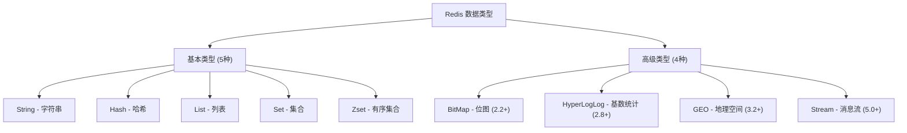
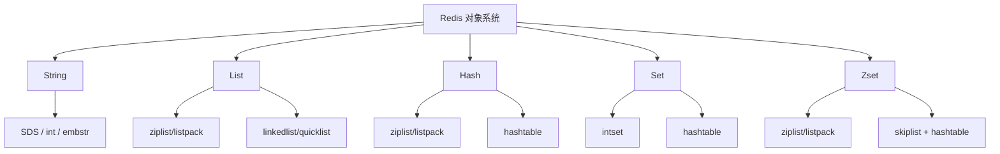
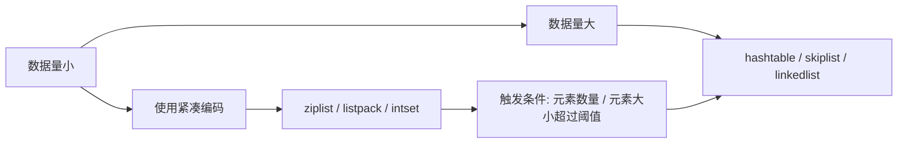
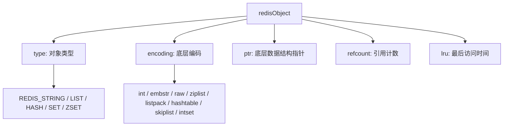
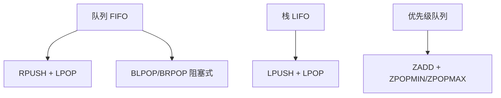
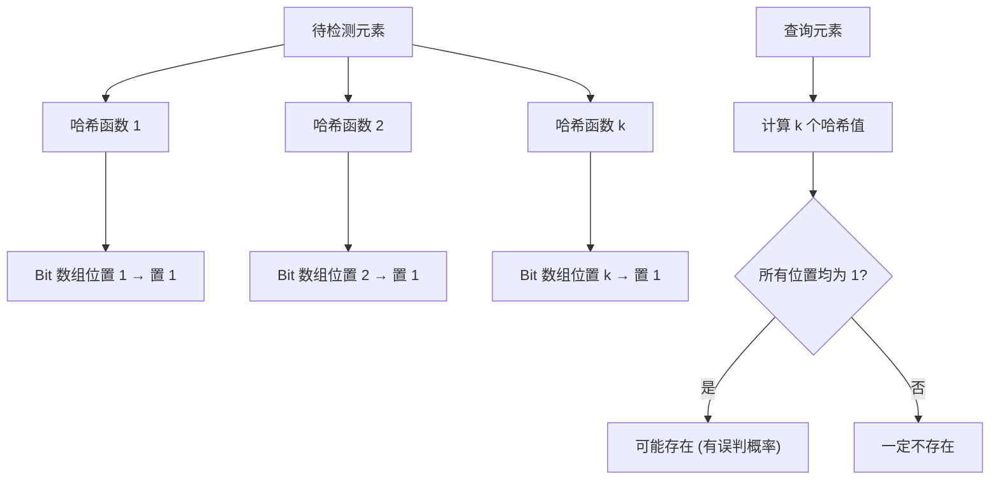
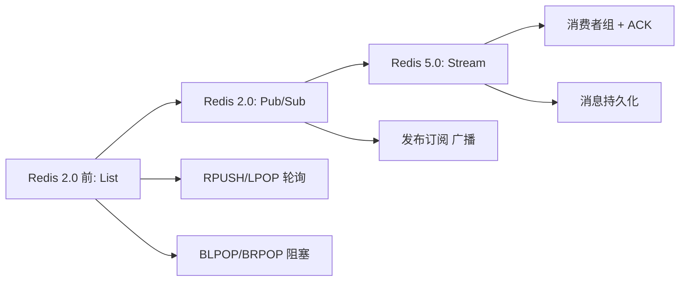
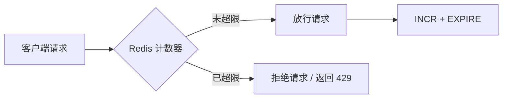

# Redis 面试之应用篇

::: tip 扩展

- [面试中关于 Redis 的问题看这篇就够了](https://juejin.im/post/5ad6e4066fb9a028d82c4b66)
- [advanced-java](https://github.com/doocs/advanced-java#缓存)
- [Redis 常见面试题](https://xiaolincoding.com/redis/base/redis_interview.html)

:::

## Redis 数据类型

### 【简单】Redis 支持哪些数据类型？⭐⭐⭐

> 🎯 目标等级：L2 ｜ ⏱ 建议用时：5 min ｜ 🏷 标签：Redis 数据类型 / 概览

#### 💎 关键结论

Redis 支持 5 种基本类型（String/Hash/List/Set/Zset）和 4 种高级类型（BitMap/HyperLogLog/GEO/Stream）。

#### ⚡记忆卡片

- **口诀**：五基本加四高级，字符串哈希列表集合有序
- **关键词**：String ／ Hash ／ List ／ Set ／ Zset ／ BitMap ／ HyperLogLog ／ GEO ／ Stream
- **链路**：基本类型覆盖常见场景 → 高级类型解决特殊需求

#### 📖 核心知识



- Redis 支持五种基本数据类型：String（字符串）、Hash（哈希）、List（列表）、Set（集合）、Zset（有序集合）。
- 随着 Redis 版本升级，又陆续支持以下数据类型： BitMap（2.2 版新增）、HyperLogLog（2.8 版新增）、GEO（3.2 版新增）、Stream（5.0 版新增）。


> **扩展**：[What Redis data structures look like](https://redislabs.com/ebook/part-1-getting-started/chapter-1-getting-to-know-redis/1-2-what-redis-data-structures-look-like/)

#### 🔀 发散问题

- **Q：各数据类型的应用场景？** → 见本文档「Redis 各数据类型的应用场景？」。

### 【简单】Redis 基础数据类型的常见命令有哪些？⭐

> 🎯 目标等级：L2 ｜ ⏱ 建议用时：5 min ｜ 🏷 标签：Redis 数据类型 / 命令

#### 💎 关键结论

五种基本类型各有核心命令：String 用 SET/GET，Hash 用 HSET/HGET，List 用 LPUSH/RPUSH/LPOP/RPOP，Set 用 SADD/SMEMBERS，Zset 用 ZADD/ZRANGE。

#### ⚡记忆卡片

- **口诀**：SET GET 字符串，HSET HGET 哈希，LPUSH RPOP 列表
- **关键词**：SET/GET ／ HSET/HGETALL ／ LPUSH/RPOP ／ SADD/SMEMBERS ／ ZADD/ZRANGE
- **链路**：数据类型 → 对应命令 → CRUD 操作

#### 📖 核心知识

::: tip 扩展

- [Redis String 类型官方命令文档](https://redis.io/commands#string)
- [Redis Hash 类型官方命令文档](https://redis.io/commands#hash)
- [Redis List 类型官方命令文档](https://redis.io/commands#list)
- [Redis Set 类型官方命令文档](https://redis.io/commands#set)
- [Redis ZSet 类型官方命令文档](https://redis.io/commands#sorted_set)

:::

::: details String 命令

| 命令     | 说明                                |
| -------- | ----------------------------------- |
| `SET`    | 存储一个字符串值                    |
| `SETNX`  | 仅当键不存在时，才存储字符串值      |
| `GET`    | 获取指定 key 的值                   |
| `MGET`   | 获取一个或多个指定 key 的值         |
| `INCRBY` | 将 key 中储存的数字加上指定的增量值 |
| `DECRBY` | 将 key 中储存的数字减去指定的减量值 |

:::

::: details Hash 命令

| 命令      | 行为                       |
| --------- | -------------------------- |
| `HSET`    | 将指定字段的值设为 value   |
| `HGET`    | 获取指定字段的值           |
| `HGETALL` | 获取所有键值对             |
| `HMSET`   | 设置多个键值对             |
| `HMGET`   | 获取所有指定字段的值       |
| `HDEL`    | 删除指定字段               |
| `HINCRBY` | 为指定字段的整数值加上增量 |
| `HKEYS`   | 获取所有字段               |

:::

::: details List 命令

| 命令     | 行为                                       |
| -------- | ------------------------------------------ |
| `LPUSH`  | 将给定值推入列表的左端。                   |
| `RPUSH`  | 将给定值推入列表的右端。                   |
| `LPOP`   | 从列表的左端弹出一个值，并返回被弹出的值。 |
| `RPOP`   | 从列表的右端弹出一个值，并返回被弹出的值。 |
| `LRANGE` | 获取列表在给定范围上的所有值。             |
| `LINDEX` | 获取列表在给定位置上的单个元素。           |
| `LREM`   | 删除列表中等于指定值的元素。             |
| `LTRIM`  | 只保留指定区间内的元素，删除其他元素。     |

:::

::: details Set 命令

| 命令        | 行为                                           |
| ----------- | ---------------------------------------------- |
| `SADD`      | 将给定元素添加到集合。                         |
| `SMEMBERS`  | 返回集合包含的所有元素。                       |
| `SISMEMBER` | 检查给定元素是否存在于集合中。                 |
| `SREM`      | 如果给定的元素存在于集合中，那么移除这个元素。 |

:::

::: details Zset 命令

| 命令               | 行为                                       |
| ------------------ | ------------------------------------------ |
| `ZADD`             | 将一个带有给定分值的成员添加到有序集合里面 |
| `ZRANGE`           | 顺序排序，并返回指定排名区间的成员         |
| `ZREVRANGE`        | 反序排序，并返回指定排名区间的成员         |
| `ZRANGEBYSCORE`    | 顺序排序，并返回指定排名区间的成员及其分值 |
| `ZREVRANGEBYSCORE` | 反序排序，并返回指定排名区间的成员及其分值 |
| `ZREM`             | 移除指定的成员                             |
| `ZSCORE`           | 返回指定成员的分值                         |
| `ZCARD`            | 返回所有成员数                             |

:::

### 【中等】Redis 各数据类型的应用场景？⭐⭐

> 🎯 目标等级：L2-L3 ｜ ⏱ 建议用时：5 min ｜ 🏷 标签：Redis 数据类型 / 应用场景

#### 💎 关键结论

每种数据类型都有最佳应用场景：String 做缓存/计数器，Hash 做对象存储，List 做队列，Set 做聚合计算，Zset 做排行榜。

#### ⚡记忆卡片

- **口诀**：字符串缓计锁，哈希对象车，列表消息队，集合聚合算，有序排行榜
- **关键词**：缓存 ／ 计数器 ／ 对象存储 ／ 消息队列 ／ 排行榜 ／ UV 统计
- **链路**：业务需求 → 数据类型 → 选择合适结构

#### 📖 核心知识

- **String（字符串）**：缓存对象、分布式 Session、分布式锁、计数器、限流器、分布式 ID 等。
- **Hash（哈希）**：缓存对象、购物车等。
- **List（列表）**：消息队列
- **Set（集合）**：聚合计算（并集、交集、差集），如点赞、共同关注、抽奖活动等。
- **Zset（有序集合）**：排序场景，如排行榜、电话和姓名排序等。
- **BitMap**（2.2 版新增）：二值状态统计的场景，比如签到、判断用户登陆状态、连续签到用户总数等；
- **HyperLogLog**（2.8 版新增）：海量数据基数统计的场景，比如百万级网页 UV 计数等；
- **GEO**（3.2 版新增）：存储地理位置信息的场景，比如滴滴叫车；
- **Stream**（5.0 版新增）：消息队列，相比于基于 List 类型实现的消息队列，有这两个特有的特性：自动生成全局唯一消息 ID，支持以消费组形式消费数据。


#### 🔬 扩展知识

::: details

- 【L3】BitMap 和 HyperLogLog 实际基于 String 类型实现，BitMap 最大支持 2^32 位（512MB），HyperLogLog 仅需 12KB 即可统计 2^64 个元素。
- 【L4】Stream（5.0 新增）支持消费者组、ACK 机制、消息持久化，是 Redis 中最完整的消息队列实现。

:::

#### 🔀 发散问题

- **Q：底层实现是怎样的？** → 见本文档「Redis 基础数据类型的底层实现是怎样的？」。

### 【困难】Redis 基础数据类型的底层实现是怎样的？⭐⭐

> 🎯 目标等级：L3-L4 ｜ ⏱ 建议用时：12 min ｜ 🏷 标签：Redis 数据类型 / 底层实现

#### 💎 关键结论

Redis 通过对象系统实现多编码切换：小数据用紧凑结构（ziplist/listpack/intset），大数据用高效结构（hashtable/skiplist），自动根据阈值转换。

#### ⚡记忆卡片

- **口诀**：小紧凑大哈希，阈值自动转
- **关键词**：SDS ／ ziplist/listpack ／ hashtable ／ skiplist ／ intset ／ quicklist
- **链路**：数据量小 → 紧凑编码 → 超过阈值 → 高效编码

#### 📖 核心知识






- **String 类型**：String 类型的底层数据结构是 SDS。SDS 是 Redis 针对字符串类型的优化，具有以下特性：
  - 常数复杂度获取字符串长度
  - 杜绝缓冲区溢出
  - 减少修改字符串长度时所需的内存重分配次数
- **List 类型**：列表对象的编码可以是 `ziplist` 或者 `linkedlist`。当列表对象可以同时满足以下两个条件时，列表对象使用 `ziplist` 编码；否则，使用 `linkedlist` 编码。
  - 列表对象保存的所有字符串元素的长度都小于 `64` 字节；
  - 列表对象保存的元素数量小于 `512` 个；
    
- **Hash 类型**：哈希对象的编码可以是 `ziplist` 或者 `hashtable`。当哈希对象同时满足以下两个条件时，使用 `ziplist` 编码；否则，使用 `hashtable` 编码。
  - 哈希对象保存的所有键值对的键和值的字符串长度都小于 `64` 字节；
  - 哈希对象保存的键值对数量小于 `512` 个；
- **Set 类型**：集合对象的编码可以是 `intset` 或者 `hashtable`。当集合对象可以同时满足以下两个条件时，集合对象使用 `intset` 编码；否则，使用 `hashtable` 编码。
  - 集合对象保存的所有元素都是整数值；
  - 集合对象保存的元素数量不超过 `512` 个；
- **Zset 类型**：有序集合的编码可以是 `ziplist` 或者 `skiplist`。当有序集合对象可以同时满足以下两个条件时，有序集合对象使用 `ziplist` 编码；否则，使用 `skiplist` 编码。
  - 有序集合保存的元素数量小于 `128` 个；
  - 有序集合保存的所有元素成员的长度都小于 `64` 字节；

#### 🏭 实战场景

::: details

Redis 7.0 后全面用 listpack 替代 ziplist，消除了级联更新问题。生产环境中可通过 `OBJECT ENCODING key` 命令查看某个 key 的底层编码，辅助判断是否需要优化数据结构。

:::

#### ⚠️ 常见误区

::: details

常见误区：

- ❌ "Redis 只有 5 种数据类型" → Redis 有 5 种用户可见的数据类型，但底层有 8+ 种编码方式，每种类型至少 2 种编码。
- ❌ "ziplist 和 listpack 完全相同" → listpack 消除了 ziplist 的级联更新问题，时间复杂度从最坏 O(n) 降为 O(1)。

:::

#### 🔀 发散问题

- **Q：为什么用 listpack 替代 ziplist？** → 见本文档「Redis 为什么用 listpack 替代 ziplist？」。

### 【困难】Redis 为什么用 `listpack` 替代 `ziplist`？⭐⭐

> 🎯 目标等级：L3-L4 ｜ ⏱ 建议用时：8 min ｜ 🏷 标签：Redis 数据类型 / 编码优化

#### 💎 关键结论

listpack 消除了 ziplist 的级联更新问题（O(n) → O(1)），内存更紧凑，安全性更高，Redis 7.0 全面替代。

#### ⚡记忆卡片

- **口诀**：ziplist 级联慢，listpack 独立快
- **关键词**：级联更新 ／ 独立长度 ／ 变长编码 ／ Redis 7.0
- **链路**：ziplist 级联更新 O(n) → listpack 独立存储 O(1) → 全面替代

#### 📖 核心知识

**`listpack` 是 Redis 5.0 引入的紧凑数据结构，并从 Redis 7.0 开始全面替代 `ziplist`**，作为 `hash`、`list`、`zset` 数据类型的实现编码之一。


二者对比如下：

| 特性         | `ziplist`               | `listpack`                  |
| :----------- | :---------------------- | :-------------------------- |
| **级联更新** | 可能发生（最坏 `O(n)`） | 完全避免（稳定 `O(1)`）     |
| **内存占用** | 预留空间可能浪费        | 按需分配，更紧凑            |
| **安全性**   | 需手动校验边界          | 内置长度校验，防溢出        |
| **版本**     | Redis 旧版本（7.0 移除） | Redis 5.0 引入，7.0 全面替换 ziplist |

**`ziplist` 的缺陷**

- **级联更新问题**：当修改或删除中间某个元素时，可能引发后续所有节点的内存重分配（因为 `ziplist` 用 **前驱节点长度** 定位数据）。最坏情况下时间复杂度从 `O(1)` 退化到 `O(n)`，影响性能。
- **内存浪费**：`ziplist` 为每个节点预留 **1~5 字节** 存储前驱节点长度（即使实际不需要这么多空间）。对于短小的数据（如小整数），存储开销比例过高。
- **安全性风险**：`ziplist` 对内存布局的强依赖可能导致 **缓冲区溢出**（需严格校验边界）。

**`listpack` 的改进**

- **消除级联更新**：每个节点 **独立存储自身长度**（不再依赖前驱节点）。修改任意节点仅影响当前节点，时间复杂度稳定为 `O(1)`。
- **更紧凑的内存布局**：节点长度字段采用 **变长编码**（类似 Protobuf 的 Varint），根据实际需求分配 1~5 字节。存储小整数时，长度字段仅需 1 字节。
- **更强的安全性**：每个节点记录 **总长度** 和 **校验字段**，避免解析越界。
- **兼容性与平滑替换**：`listpack` 的 API 设计兼容 `ziplist`，Redis 内部可无缝迁移（如 Hash、ZSet 的底层实现）。

#### ⚠️ 常见误区

::: details

常见误区：

- ❌ "listpack 比 ziplist 占用更多内存" → listpack 采用变长编码，存储小整数时长度字段仅需 1 字节，实际更紧凑。

:::

#### 🔀 发散问题

- **Q：Zset 为什么用跳表实现？** → 见本文档「为什么 Zset 用跳表实现而不是红黑树、B+树？」。

### 【困难】为什么 Zset 用跳表实现而不是红黑树、B+树？⭐⭐

> 🎯 目标等级：L3-L4 ｜ ⏱ 建议用时：8 min ｜ 🏷 标签：Redis 数据类型 / 跳表

#### 💎 关键结论

跳表实现简单、范围查询高效、易并发、内存灵活，且 Redis 是内存数据库不需要 B+树的磁盘 I/O 优化。

#### ⚡记忆卡片

- **口诀**：跳表简范快，范围查询强
- **关键词**：实现简单 ／ 范围查询 ／ 并发友好 ／ 内存灵活
- **链路**：对比跳表 vs 红黑树 vs B+树 → 跳表综合最优

#### 📖 核心知识

- **实现简单性**
  - 跳表的实现比红黑树简单得多，代码更易于维护和调试。
  - 红黑树需要处理复杂的旋转和重新平衡操作，而跳表的平衡是通过概率实现的。
- **范围查询效率**
  - 跳表在范围查询（如 `zrange`）上表现优异，因为它是基于链表的结构，可以线性遍历。
  - 红黑树进行范围查询需要中序遍历，相对复杂。
  - B+树虽然也擅长范围查询，但实现复杂度更高。
- **并发性能**
  - 跳表更容易实现**无锁并发**操作 (Redis 虽然是单线程，但考虑未来扩展）
  - 红黑树的平衡操作涉及大量指针修改，难以实现高效的并发控制
- **内存效率**
  - 跳表不需要像 B+ 树那样维护严格的树形结构，内存使用更灵活
  - B+树的节点通常设计为填满一定比例，可能造成内存浪费
- **性能平衡**
  - 跳表的查询、插入、删除操作时间复杂度都是 O(logN)，与红黑树相当
  - 跳表的实际性能在实践中表现良好，特别是对于内存数据结构
- Redis 的特殊需求
  - Redis 的 Zset 需要同时支持按 score 和按 member 查询，跳表+哈希表的组合完美满足这一需求
  - Redis 是内存数据库，不需要考虑 B+树针对磁盘 I/O 优化的特性

#### 🔀 发散问题

- **Q：跳表的实现原理是什么？** → 见本文档「跳表的实现原理是什么？」。

### 【困难】跳表的实现原理是什么？⭐⭐

> 🎯 目标等级：L3-L4 ｜ ⏱ 建议用时：8 min ｜ 🏷 标签：Redis 数据类型 / 跳表原理

#### 💎 关键结论

跳表是有序链表+多级索引的结构，通过概率实现平衡，查找/插入/删除均为 O(log n)，空间复杂度 O(n)。

#### ⚡记忆卡片

- **口诀**：链表加索引，层层下沉找
- **关键词**：多级索引 ／ O(log n) ／ 概率平衡 ／ 空间 O(n)
- **链路**：有序链表 → 抽取索引层 → 多级索引 → 跳表

#### 📖 核心知识

**跳表是一种可以实现二分查找的有序链表，通过多级索引提升查找效率**。跳表的查找、插入、删除操作的时间复杂度均为 `O(log n)`，与平衡二叉树（如红黑树）接近。

对于一个有序数组，可以使用高效的二分查找法，其时间复杂度为 `O(log n)`。

但是，即使是有序的链表，也只能使用低效的顺序查找，其时间复杂度为 `O(n)`。


如何提高链表的查找效率呢？

我们可以对链表加一层索引。具体来说，可以每两个结点提取一个结点到上一级，我们把抽出来的那一级叫作**索引**或**索引层**。索引节点中通过一个 down 指针，指向下一级结点。通过这样的改造，就可以支持类似二分查找的算法。我们把改造之后的数据结构叫作**跳表**（Skip list）。


随着数据的不断增长，一级索引层也变得越来越长。此时，我们可以为一级索引再增加一层索引层：二级索引层。


随着数据的膨胀，当二级索引层也变得很长时，我们可以继续为其添加新的索引层。**这种链表加多级索引的结构，就是跳表**。


**跳表的时间复杂度**

- **查找**：从最高级索引开始逐层下沉，每层最多遍历 3 个节点，时间复杂度为 `O(log n)`。
- **插入**：先查找插入位置（`O(log n)`），再随机生成索引层级（`O(log n)`），总时间复杂度为 `O(log n)`。
- **删除**：类似查找过程，删除节点及其索引（`O(log n)`）。

**跳表的空间复杂度**

- 索引节点总数为 `n/2 + n/4 + n/8 + … ≈ n`，空间复杂度为 **O(n)**。
- 可通过调整索引密度（如每 3 个节点抽 1 个）减少空间占用，但会牺牲部分查找效率。

#### 🔀 发散问题

- **Q：Redis 为什么选跳表而不是红黑树？** → 见本文档「为什么 Zset 用跳表实现而不是红黑树、B+树？」。

### 【困难】Redis 利用什么机制来实现各种数据结构？⭐

> 🎯 目标等级：L3-L4 ｜ ⏱ 建议用时：10 min ｜ 🏷 标签：Redis 数据类型 / 对象系统

#### 💎 关键结论

Redis 通过 redisObject 对象系统实现多编码切换，每个对象包含 type、encoding、ptr、refcount、lru 五个属性。

#### ⚡记忆卡片

- **口诀**：五属性定对象，类型编码指针引用时间
- **关键词**：redisObject ／ type ／ encoding ／ ptr ／ refcount ／ lru
- **链路**：redisObject → type 确定类型 → encoding 确定编码 → ptr 指向底层结构

#### 📖 核心知识



Redis 并没有直接使用这些数据结构来实现键值对数据库， 而是基于这些数据结构创建了一个对象系统， 这个系统包含字符串对象、列表对象、哈希对象、集合对象和有序集合对象这五种类型的对象。

Redis 数据库中的每个键值对的键和值都是一个对象。Redis 共有字符串、列表、哈希、集合、有序集合五种类型的对象， 每种类型的对象至少都有两种或以上的编码方式， 不同的编码可以在不同的使用场景上优化对象的使用效率。

服务器在执行某些命令之前， 会先检查给定键的类型能否执行指定的命令， 而检查一个键的类型就是检查键的值对象的类型。

::: details 对象的类型

**Redis 使用对象来表示数据库中的键和值**。每次当我们在 Redis 的数据库中新创建一个键值对时， 我们至少会创建两个对象， 一个对象用作键值对的键（键对象）， 另一个对象用作键值对的值（值对象）。

Redis 中的每个对象都由一个 `redisObject` 结构表示， 该结构中和保存数据有关的三个属性分别是 `type` 属性、 `encoding` 属性和 `ptr` 属性：

```c
typedef struct redisObject {

    // 类型
    unsigned type:4;

    // 编码
    unsigned encoding:4;

    // 指向底层实现数据结构的指针
    void *ptr;

    // ...

} robj;
```

对象的 `type` 属性记录了对象的类型，有以下类型：

| 对象         | 对象 `type` 属性的值 | TYPE 命令的输出 |
| :----------- | :------------------- | :-------------- |
| 字符串对象   | `REDIS_STRING`       | `"string"`      |
| 列表对象     | `REDIS_LIST`         | `"list"`        |
| 哈希对象     | `REDIS_HASH`         | `"hash"`        |
| 集合对象     | `REDIS_SET`          | `"set"`         |
| 有序集合对象 | `REDIS_ZSET`         | `"zset"`        |

Redis 数据库保存的键值对来说， 键总是一个字符串对象， 而值则可以是字符串对象、列表对象、哈希对象、集合对象或者有序集合对象的其中一种。

:::

::: details 对象的编码

对象的 `ptr` 指针指向对象的底层实现数据结构， 而这些数据结构由对象的 `encoding` 属性决定。

`encoding` 属性记录了对象所使用的编码， 也即是说这个对象使用了什么数据结构作为对象的底层实现。

Redis 中每种类型的对象都至少使用了两种不同的编码，**不同的编码可以在不同的使用场景上优化对象的使用效率**。

Redis 支持的编码如下所示：

| 类型           | 编码                        | 对象                                                 | **OBJECT ENCODING** **命令输出** |
| :------------- | :-------------------------- | :--------------------------------------------------- | -------------------------------- |
| `REDIS_STRING` | `REDIS_ENCODING_INT`        | 使用整数值实现的字符串对象。                         | "int"                            |
| `REDIS_STRING` | `REDIS_ENCODING_EMBSTR`     | 使用 `embstr` 编码的简单动态字符串实现的字符串对象。 | "embstr"                         |
| `REDIS_STRING` | `REDIS_ENCODING_RAW`        | 使用简单动态字符串实现的字符串对象。                 | "raw"                            |
| `REDIS_LIST`   | `REDIS_ENCODING_ZIPLIST`    | 使用压缩列表实现的列表对象。                         | "ziplist"                        |
| `REDIS_LIST`   | `REDIS_ENCODING_LINKEDLIST` | 使用双端链表实现的列表对象。                         | "linkedlist"                     |
| `REDIS_HASH`   | `REDIS_ENCODING_ZIPLIST`    | 使用压缩列表实现的哈希对象。                         | "ziplist"                        |
| `REDIS_HASH`   | `REDIS_ENCODING_HT`         | 使用字典实现的哈希对象。                             | "hashtable"                      |
| `REDIS_SET`    | `REDIS_ENCODING_INTSET`     | 使用整数集合实现的集合对象。                         | "intset"                         |
| `REDIS_SET`    | `REDIS_ENCODING_HT`         | 使用字典实现的集合对象。                             | "hashtable"                      |
| `REDIS_ZSET`   | `REDIS_ENCODING_ZIPLIST`    | 使用压缩列表实现的有序集合对象。                     | "ziplist"                        |
| `REDIS_ZSET`   | `REDIS_ENCODING_SKIPLIST`   | 使用跳表和字典实现的有序集合对象。                   | "skiplist"                       |

:::

::: details 内存回收

由于 C 语言不支持内存回收，Redis 内部实现了一套基于引用计数的内存回收机制。

每个对象的引用计数信息由 `redisObject` 结构的 `refcount` 属性记录。当对象的引用计数值变为 `0` 时， 对象所占用的内存会被释放。

:::

::: details 对象共享

在 Redis 中， 让多个键共享同一个值对象需要执行以下两个步骤：

1. 将数据库键的值指针指向一个现有的值对象；
2. 将被共享的值对象的引用计数增一。

共享对象机制对于节约内存非常有帮助， 数据库中保存的相同值对象越多， 对象共享机制就能节约越多的内存。

Redis 会在初始化服务器时， 共享值为 `0` 到 `9999`

:::

::: details 对象的空转时长

`redisObject` 的 `lru` 属性记录了对象最后一次被命令程序访问的时间。

如果服务器打开了 `maxmemory` 选项， 并且服务器用于回收内存的算法为 `volatile-lru` 或者 `allkeys-lru` ， 那么当服务器占用的内存数超过了 `maxmemory` 选项所设置的上限值时， 空转时长较高的那部分键会优先被服务器释放， 从而回收内存。

:::

#### 🔀 发散问题

- **Q：底层编码如何切换？** → 见本文档「Redis 基础数据类型的底层实现是怎样的？」。

## Redis 基础应用

### 【中等】如何使用 Redis 实现队列/栈？⭐⭐

> 🎯 目标等级：L2-L3 ｜ ⏱ 建议用时：5 min ｜ 🏷 标签：Redis 基础应用 / 队列栈

#### 💎 关键结论

队列用 RPUSH+LPOP（FIFO），栈用 LPUSH+LPOP（LIFO），阻塞式用 BLPOP/BRPOP，优先级队列用 ZADD+ZPOPMIN。

#### ⚡记忆卡片

- **口诀**：队列右进左出，栈同侧进出，阻塞加 B
- **关键词**：RPUSH+LPOP ／ LPUSH+LPOP ／ BLPOP/BRPOP ／ ZPOPMIN
- **链路**：业务需求 → 选择 FIFO/LIFO/优先级 → 对应命令

#### 📖 核心知识




### 【中等】如何使用 Redis 实现排行榜？⭐⭐

> 🎯 目标等级：L2-L3 ｜ ⏱ 建议用时：5 min ｜ 🏷 标签：Redis 基础应用 / 排行榜

#### 💎 关键结论

基于 Zset 实现排行榜：ZADD 添加、ZINCRBY 更新、ZREVRANGE 倒序获取、ZRANGEBYSCORE 按分数范围查询。

#### ⚡记忆卡片

- **口诀**：ZADD 加，ZINCRBY 增，ZREVRANGE 排
- **关键词**：ZADD ／ ZINCRBY ／ ZREVRANGE ／ ZRANGEBYSCORE ／ ZSCORE
- **链路**：ZADD 添加元素 → ZINCRBY 更新分数 → ZREVRANGE 获取排名

#### 📖 核心知识

各种排行榜，如：内容平台（视频、歌曲、文章）的播放量/收藏量/评分排行榜；电商网站的销售排行榜等等，都可以基于 Redis zset 类型来实现。

我们以博文点赞排名为例，dunwu 发表了五篇博文，分别获得赞为 200、40、100、50、150。

```shell
# article:1 文章获得了 200 个赞
> ZADD user:dunwu:ranking 200 article:1
(integer) 1
# article:2 文章获得了 40 个赞
> ZADD user:dunwu:ranking 40 article:2
(integer) 1
# article:3 文章获得了 100 个赞
> ZADD user:dunwu:ranking 100 article:3
(integer) 1
# article:4 文章获得了 50 个赞
> ZADD user:dunwu:ranking 50 article:4
(integer) 1
# article:5 文章获得了 150 个赞
> ZADD user:dunwu:ranking 150 article:5
(integer) 1
```

文章 article:4 新增一个赞，可以使用 **`ZINCRBY`** 命令（为有序集合 key 中元素 member 的分值加上 increment）：

```shell
> ZINCRBY user:dunwu:ranking 1 article:4
"51"
```

查看某篇文章的赞数，可以使用 **`ZSCORE`** 命令（返回有序集合 key 中元素个数）：

```shell
> ZSCORE user:dunwu:ranking article:4
"50"
```

获取 dunwu 文章赞数最多的 3 篇文章，可以使用 **`ZREVRANGE`** 命令（倒序获取有序集合 key 从 start 下标到 stop 下标的元素）：

```shell
# WITHSCORES 表示把 score 也显示出来
> ZREVRANGE user:dunwu:ranking 0 2 WITHSCORES
1) "article:1"
2) "200"
3) "article:5"
4) "150"
5) "article:3"
6) "100"
```

获取 dunwu 100 赞到 200 赞的文章，可以使用 **`ZRANGEBYSCORE`** 命令（返回有序集合中指定分数区间内的成员，分数由低到高排序）：

```shell
> ZRANGEBYSCORE user:dunwu:ranking 100 200 WITHSCORES
1) "article:3"
2) "100"
3) "article:5"
4) "150"
5) "article:1"
6) "200"
```

### 【中等】如何使用 Redis 实现百万级网页 UV 计数？⭐

> 🎯 目标等级：L2-L3 ｜ ⏱ 建议用时：5 min ｜ 🏷 标签：Redis 基础应用 / HyperLogLog

#### 💎 关键结论

HyperLogLog 仅需 12KB 即可统计接近 2^64 个元素的基数，标准误算率 0.81%，适合海量数据的 UV 统计。

#### ⚡记忆卡片

- **口诀**：HyperLogLog 十二 K，百万误差不到一
- **关键词**：HyperLogLog ／ PFADD ／ PFCOUNT ／ 12KB ／ 0.81%
- **链路**：PFADD 添加元素 → PFCOUNT 获取统计值

#### 📖 核心知识

Redis HyperLogLog 是 Redis 2.8.9 版本新增的数据类型，是一种**用于“统计基数”的数据集合类型**，基数统计就是指统计一个集合中不重复的元素个数。但要注意，**HyperLogLog 是统计规则是基于概率完成的，不是非常准确，标准误算率是 0.81%**（统计结果为 100 万时，实际可能在 99.19 万~100.81 万之间）。

**核心优势**

- **极低内存占用**：仅需 **12 KB** 内存，即可统计接近 **2^64** 个元素的基数（如 UV 统计）。
- **适合海量数据**：相比 `Set`/`Hash`（元素越多内存消耗越大），HyperLogLog 在**百万级以上数据**场景中优势显著。

**适用场景**

- **网页 UV 统计**：统计独立访客数（如 `page1:uv`），尤其适合高并发、大数据量场景。
- **容忍误差的基数统计**：如热门活动页面访问量、广告点击去重等。

如果需要精确统计，则需要转用 `Set` / `Hash`，并且不得不消耗更多内存。

**基本命令**

- **添加元素**：`PFADD key element [element...]`

  ```shell
  PFADD page1:uv user1 user2 user3  # 将用户添加到 UV 统计
  ```

- **获取统计值**：`PFCOUNT key`

  ```shell
  PFCOUNT page1:uv  # 返回近似 UV 数（如 100 万）
  ```

### 【中等】如何使用 Redis 实现布隆过滤器？⭐

> 🎯 目标等级：L2-L3 ｜ ⏱ 建议用时：8 min ｜ 🏷 标签：Redis 基础应用 / 布隆过滤器

#### 💎 关键结论

布隆过滤器通过多个哈希函数+位图实现高效存在性检测，可用 Bitmap 手动实现或使用 RedisBloom 模块，用于解决缓存穿透。

#### ⚡记忆卡片

- **口诀**：多哈希置位，全一可能存在，有一零必不存在
- **关键词**：布隆过滤器 ／ BitMap ／ RedisBloom ／ BF.ADD ／ BF.EXISTS
- **链路**：元素 → 多哈希函数 → 位置置 1 → 查询时检查所有位置

#### 📖 核心知识



布隆过滤器是一种高效的概率数据结构，常用于检测一个元素是否在一个集合中，可以有效减少数据库的查询次数，解决缓存穿透等问题。

可以通过以下两种方式实现布隆过滤器：

**使用位图（Bitmap）实现布隆过滤器：**

- 使用 Redis 的位图结构 `SETBIT` 和 `GETBIT` 操作来实现布隆过滤器。位图本质上是一个比特数组，用于标识元素是否存在。
- 对于给定的数据，通过多个哈希函数计算位置索引，将位图中的相应位置设置为 1，表示该元素可能存在。

**使用 RedisBloom 模块：**

- Redis 提供了一个官方模块 RedisBloom，封装了哈希函数、位图大小等操作，可以直接用于创建和管理布隆过滤器。
- 使用 `BF.ADD` 来向布隆过滤器添加元素，使用 `BF.EXISTS` 来检查某个元素是否可能存在。

::: details BitMap

Bitmap，**即位图，是一串连续的二进制数组（0 和 1）**，可以通过偏移量（offset）定位元素。由于 bit 是计算机中最小的单位，使用它进行储存将**非常节省空间**，特别适合一些数据量大且使用**二值统计的场景**。例如在一个系统中，不同的用户使用单调递增的用户 ID 表示。40 亿（$2^{32}$ = $4*1024*1024*1024$ ≈ 40 亿）用户只需要 512M 内存就能记住某种状态，例如用户是否已登录。

实际上，**BitMap 不是真实的数据结构，而是针对 String 实现的一组位操作**。

由于 STRING 是二进制安全的，并且其最大长度是 512 MB，所以 BitMap 能最大设置 $2^{32}$ 个不同的 bit。

**【示例】判断用户是否登录**

Bitmap 提供了 `GETBIT、SETBIT` 操作，通过一个偏移值 offset 对 bit 数组的 offset 位置的 bit 位进行读写操作，需要注意的是 offset 从 0 开始。

只需要一个 key = login_status 表示存储用户登陆状态集合数据，将用户 ID 作为 offset，在线就设置为 1，下线设置 0。通过 `GETBIT`判断对应的用户是否在线。50000 万 用户只需要 6 MB 的空间。

假如我们要判断 ID = 10086 的用户的登陆情况：

第一步，执行以下指令，表示用户已登录。

```shell
SETBIT login_status 10086 1
```

第二步，检查该用户是否登陆，返回值 1 表示已登录。

```shell
GETBIT login_status 10086
```

第三步，登出，将 offset 对应的 value 设置成 0。

```shell
SETBIT login_status 10086 0
```

:::

::: details RedisBloom

RedisBloom 是 Redis 官方提供的模块，是一种简化的布隆过滤器实现。它提供了**更高性能**和**更低误判率**控制。

**RedisBloom 常用命令**

- `BF.RESERVE key error_rate capacity`：创建布隆过滤器（指定误判率、容量）
- `BF.ADD key item`：添加元素
- `BF.EXISTS key item`：检查元素是否存在（可能误判）
- **自动扩容**：可动态调整数据结构以适应数据增长

**RedisBloom 操作示例**

**创建**：

```shell
BF.RESERVE myBloomFilter 0.01 1000000  # 误判率 1%，容量 100 万
```

**添加元素**：

```shell
BF.ADD myBloomFilter "item1"
```

**检查元素**：

```shell
BF.EXISTS myBloomFilter "item1"  # 返回 1（可能存在）
BF.EXISTS myBloomFilter "item2"  # 返回 0（一定不存在）
```

**适用场景**

RedisBloom 适合**海量数据判断**，且**允许误判**的场景：

1. **爬虫**：URL 去重
2. **黑名单**：反垃圾邮件（可能误杀）
3. **分布式系统**：优化数据查找（如 Hadoop、Cassandra）
4. **推荐系统**：避免重复推荐

**核心特点**

- **空间高效**：节省存储空间
- **快速查询**：O(1) 时间复杂度
- **误判率可控**：通过参数调整

:::

### 【中等】Redis 如何实现消息队列？⭐⭐

> 🎯 目标等级：L2-L3 ｜ ⏱ 建议用时：8 min ｜ 🏷 标签：Redis 基础应用 / 消息队列

#### 💎 关键结论

Redis 可用 List、Pub/Sub、Stream 实现消息队列，Stream（5.0+）最完整但不建议替代专业 MQ。

#### ⚡记忆卡片

- **口诀**：List 简单轮询，Pub/Sub 广播，Stream 最全
- **关键词**：List RPUSH/LPOP ／ Pub/Sub ／ Stream ／ 消费者组 ／ ACK
- **链路**：List 简单队列 → Pub/Sub 广播 → Stream 完整方案

#### 📖 核心知识

> Redis 可以做消息队列吗？
>
> Redis 有哪些实现消息队列的方式？

先说结论：**可以是可以，但不建议使用 Redis 来做消息队列。和专业的消息队列相比，还是有很多欠缺的地方。**



::: details 基于 List 实现消息队列

**Redis 2.0 之前，如果想要使用 Redis 来做消息队列的话，只能通过 List 来实现。**

通过 `RPUSH/LPOP` 或者 `LPUSH/RPOP`即可实现简易版消息队列：

```shell
# 生产者生产消息
> RPUSH myList msg1 msg2
(integer) 2
> RPUSH myList msg3
(integer) 3
# 消费者消费消息
> LPOP myList
"msg1"
```

不过，通过 `RPUSH/LPOP` 或者 `LPUSH/RPOP`这样的方式存在性能问题，我们需要不断轮询去调用 `RPOP` 或 `LPOP` 来消费消息。当 List 为空时，大部分的轮询的请求都是无效请求，这种方式大量浪费了系统资源。

因此，Redis 还提供了 `BLPOP`、`BRPOP` 这种阻塞式读取的命令（带 B-Blocking 的都是阻塞式），并且还支持一个超时参数。如果 List 为空，Redis 服务端不会立刻返回结果，它会等待 List 中有新数据后再返回或者是等待最多一个超时时间后返回空。如果将超时时间设置为 0 时，即可无限等待，直到弹出消息

```shell
# 超时时间为 10s
# 如果有数据立刻返回，否则最多等待 10 秒
> BRPOP myList 10
null
```

**List 实现消息队列功能太简单，像消息确认机制等功能还需要我们自己实现，最要命的是没有广播机制，消息也只能被消费一次。**

:::

::: details 基于发布订阅功能实现消息队列

**Redis 2.0 引入了发布订阅 (pub/sub) 功能，解决了 List 实现消息队列没有广播机制的问题。**


Redis 发布订阅 (pub/sub) 功能

pub/sub 中引入了一个概念叫 **channel（频道）**，发布订阅机制的实现就是基于这个 channel 来做的。

pub/sub 涉及发布者（Publisher）和订阅者（Subscriber，也叫消费者）两个角色：

- 发布者通过 `PUBLISH` 投递消息给指定 channel。
- 订阅者通过`SUBSCRIBE`订阅它关心的 channel。并且，订阅者可以订阅一个或者多个 channel。

pub/sub 既能单播又能广播，还支持 channel 的简单正则匹配。不过，消息丢失（客户端断开连接或者 Redis 宕机都会导致消息丢失）、消息堆积（发布者发布消息的时候不会管消费者的具体消费能力如何）等问题依然没有一个比较好的解决办法。

:::

::: details 基于 Stream 实现消息队列

为此，Redis 5.0 新增加的一个数据结构 `Stream` 来做消息队列。`Stream` 支持：

- 发布 / 订阅模式
- 按照消费者组进行消费（借鉴了 Kafka 消费者组的概念）
- 消息持久化（ RDB 和 AOF）
- ACK 机制（通过确认机制来告知已经成功处理了消息）
- 阻塞式获取消息

`Stream` 的结构如下：


这是一个有序的消息链表，每个消息都有一个唯一的 ID 和对应的内容。ID 是一个时间戳和序列号的组合，用来保证消息的唯一性和递增性。内容是一个或多个键值对（类似 Hash 基本数据类型），用来存储消息的数据。

这里再对图中涉及到的一些概念，进行简单解释：

- `Consumer Group`：消费者组用于组织和管理多个消费者。消费者组本身不处理消息，而是再将消息分发给消费者，由消费者进行真正的消费
- `last_delivered_id`：标识消费者组当前消费位置的游标，消费者组中任意一个消费者读取了消息都会使 last_delivered_id 往前移动。
- `pending_ids`：记录已经被客户端消费但没有 ack 的消息的 ID。

`Stream` 使用起来相对要麻烦一些，这里就不演示了。

总的来说，`Stream` 已经可以满足一个消息队列的基本要求了。不过，`Stream` 在实际使用中依然会有一些小问题不太好解决比如在 Redis 发生故障恢复后不能保证消息至少被消费一次。

综上，和专业的消息队列相比，使用 Redis 来实现消息队列还是有很多欠缺的地方比如消息丢失和堆积问题不好解决。因此，我们通常建议不要使用 Redis 来做消息队列，你完全可以选择市面上比较成熟的一些消息队列比如 RocketMQ、Kafka。不过，如果你就是想要用 Redis 来做消息队列的话，那我建议你优先考虑 `Stream`，这是目前相对最优的 Redis 消息队列实现。

相关阅读：[Redis 消息队列发展历程 - 阿里开发者 - 2022](https://mp.weixin.qq.com/s/gCUT5TcCQRAxYkTJfTRjJw)

:::

#### 🔬 扩展知识

::: details

- 【L3】Stream 支持消费者组、ACK 机制、消息持久化、阻塞式获取，但故障恢复后不能保证消息至少被消费一次。
- 【L4】专业 MQ（RocketMQ、Kafka）提供更完善的消息可靠性和顺序保证，生产环境建议优先选择。

:::

#### 🔀 发散问题

- **Q：如何实现延时任务？** → 见本文档「如何基于 Redis 实现延时任务？」。

### 【中等】如何基于 Redis 实现延时任务？⭐⭐

> 🎯 目标等级：L2-L3 ｜ ⏱ 建议用时：5 min ｜ 🏷 标签：Redis 基础应用 / 延时任务

#### 💎 关键结论

Redisson 内置延时队列是推荐方案，Redis 过期事件监听存在丢消息和重复消费问题不推荐。

#### ⚡记忆卡片

- **口诀**：Redisson 队列稳，过期监听坑多
- **关键词**：Redisson DelayedQueue ／ 过期事件监听 ／ 持久化
- **链路**：Redisson 延时队列 → 持久化存储 → 定时取出执行

#### 📖 核心知识

基于 Redis 实现延时任务的功能无非就下面两种方案：

1. Redis 过期事件监听
2. Redisson 内置的延时队列

Redis 过期事件监听的存在时效性较差、丢消息、多服务实例下消息重复消费等问题，不被推荐使用。

Redisson 内置的延时队列具备下面这些优势：

1. **减少了丢消息的可能**：DelayedQueue 中的消息会被持久化，即使 Redis 宕机了，根据持久化机制，也只可能丢失一点消息，影响不大。当然了，你也可以使用扫描数据库的方法作为补偿机制。
2. **消息不存在重复消费问题**：每个客户端都是从同一个目标队列中获取任务的，不存在重复消费的问题。

#### 🔬 扩展知识

::: details

- 【L3】Redis 过期事件监听的问题：时效性差、丢消息（Redis 不保证过期事件的可靠投递）、多服务实例下消息重复消费。
- 【L4】Redisson DelayedQueue 底层基于 ZSET，score 存储执行时间戳，定时轮询取出到期任务。

:::

#### 🔀 发散问题

- **Q：Redis 如何实现消息队列？** → 见本文档「Redis 如何实现消息队列？」。

## Redis 和分布式缓存

::: tip 扩展

缓存相关面试内容见：[**分布式存储面试之缓存**](https://dunwu.github.io/waterdrop/pages/ed2c687e/#缓存)

:::

### 【中等】缓存数据如何更新？如何预热？⭐⭐⭐⭐

> 🎯 目标等级：L2-L3 ｜ ⏱ 建议用时：10 min ｜ 🏷 标签：Redis 分布式缓存 / 更新预热

#### 💎 关键结论

Cache-Aside 最常用（先更新 DB 再删缓存），写操作删缓存而非更新缓存；冷启动时用脚本预热、RDB 恢复、限流保护。

#### ⚡记忆卡片

- **口诀**：删缓存不更新，预热脚本加限流
- **关键词**：Cache-Aside ／ Read/Write Through ／ Write Behind ／ 缓存预热
- **链路**：更新 DB → 删除缓存 → TTL 兖底 → 冷启动预热

#### 📖 核心知识

**缓存更新的四种模式（按应用与缓存的耦合方式划分）**

| 模式 | 读 | 写 | 特点 |
| --- | --- | --- | --- |
| **Cache-Aside（旁路缓存）** | 先读缓存，未命中读 DB 并回填 | 更新 DB 后**删除**缓存 | 最常用，业务代码可控 |
| **Read/Write Through** | 缓存层代理读，未命中自动从 DB 加载 | 缓存层代理写，同步写回 DB | 业务只和缓存交互，逻辑集中在缓存层 |
| **Write Behind（异步写回）** | 同 Read Through | 只写缓存，异步批量刷回 DB | 写吞吐极高，但宕机可能丢数据（如 Redis 本身即此思想） |
| **Refresh Ahead（主动刷新）** | 缓存层预测性提前刷新即将过期的热点数据 | - | 降低击穿风险，实现复杂 |

**补充要点（面试追问）**：

- 写操作为什么是**删缓存而不是更新缓存**：一是并发写时更新缓存可能产生旧值覆盖新值（写写并发乱序）；二是懒加载思想，避免写入后无人读取的无效计算。若必须更新缓存，可通过加分布式锁串行化或引入版本号。
- Cache-Aside 仍存在低概率的读写并发不一致窗口（读请求拿到旧值后晚于写请求回填），最终靠 TTL 兕底，详见缓存一致性专题。

**缓存预热**

冷启动（发布上线、Redis 重启）时缓存为空，流量全部穿透到 DB，极易打垮数据库。预热手段：

- **上线前脚本预热**：发布前用 Pipeline 批量将热点数据加载进 Redis（适合数据量可控的场景）。
- **基于 RDB 恢复**：Redis 重启后自动加载 RDB 快照，天然具备预热效果（需权衡 RDB 的数据新鲜度）。
- **限流保护 + 渐进式预热**：冷启动期对 DB 访问限流，让缓存随流量逐步回填，避免瞬时雪崩。
- **多实例滚动发布**：分批重启应用/缓存节点，避免所有实例同时处于冷状态。

#### 🔬 扩展知识

::: details

- 【L3】Write Behind 模式写吞吐极高但宕机可能丢数据，Redis 本身的 AOF 即采用此思想。
- 【L4】Refresh Ahead 通过预测性提前刷新即将过期的热点数据降低击穿风险，但实现复杂。

:::

#### ⚠️ 常见误区

::: details

常见误区：

- ❌ "写操作应该更新缓存而不是删除缓存" → 并发写时更新缓存可能产生旧值覆盖新值，删缓存更安全。
- ❌ "上线后缓存会自动预热" → 冷启动时缓存为空，流量全部穿透到 DB，必须主动预热。

:::

#### 🔀 发散问题

- **Q：如何保证缓存一致性？** → 见文件1「如何保证缓存与数据库的数据一致性？」。

## Redis 和分布式锁

::: tip 扩展

分布式锁相关面试内容见：[**分布式协同面试之分布式锁**](https://dunwu.github.io/waterdrop/pages/808cce55/#分布式锁)

:::

### 【困难】如何用 Redis 实现分布式锁？有哪些坑？⭐⭐⭐⭐

> 🎯 目标等级：L3-L4 ｜ ⏱ 建议用时：15 min ｜ 🏷 标签：Redis 分布式锁 / 实现与坑点

#### 💎 关键结论

单节点用 SET NX EX + Lua 释放 + Redisson 看门狗续期；主从切换可能丢锁，正确性要求高的场景用 ZooKeeper/etcd。

#### ⚡记忆卡片

- **口诀**：SET NX EX 加锁，Lua 原子释放，看门狗续期
- **关键词**：SET NX EX ／ Lua 释放 ／ 看门狗 ／ RedLock ／ 主从切换丢锁
- **链路**：SET NX EX 加锁 → 业务执行 → Lua 原子释放

#### 📖 核心知识

**基本实现**

```shell
SET lock_key unique_value NX EX 30
```

- **`NX`**：键不存在时才能设置成功，保证互斥性。
- **`EX 30`**：设置过期时间，防止持锁线程崩溃后锁永远无法释放（死锁）。
- **`unique_value`**：用 UUID 等唯一标识标记锁的持有者，释放时校验，防止误删他人锁。
- 注意：`SET NX` 和 `EXPIRE` 必须**一条命令原子完成**，早期的 `SETNX` + `EXPIRE` 两步操作存在中途崩溃导致死锁的风险。

**释放锁必须用 Lua 脚本**

“判断 value 是否匹配 + 删除”必须原子执行，否则可能出现：A 的锁刚过期 → B 拿到锁 → A 的 DEL 误删了 B 的锁。

```lua
if redis.call("GET", KEYS[1]) == ARGV[1] then
    return redis.call("DEL", KEYS[1])
else
    return 0
end
```

**Redis 分布式锁的三大坑（面试高频追问）**

1. **锁过期但业务未执行完**：锁 TTL 30s，业务执行了 40s，锁提前释放后其他线程可进入临界区。
   - 解决：**看门狗（Watch Dog）自动续期**。Redisson 默认锁超时 30s，加锁成功后启动后台线程每 10s（lockWatchdogTimeout / 3）检查一次，若线程仍持锁则续期到 30s。
2. **主从切换导致锁丢失**：客户端 A 在主节点加锁成功，主节点宕机且锁尚未同步到从节点，哨兵将从节点提升为主，客户端 B 可在新主上再次加锁成功——锁被双重持有。
   - 根因：Redis 复制是**异步**的，故障转移不保证不丢数据。
3. **不可重入**：同一线程重复加锁会失败。Redisson 用 Hash 结构存储锁（field 为线程标识，value 为重入计数），天然支持可重入。

**RedLock（红锁）及其争议**

针对主从切换丢锁问题，Redis 作者 antirez 提出 **RedLock**：向 N 个**相互独立**的 Redis 节点依次加锁，在超过半数（N/2+1）节点加锁成功且总耗时小于锁有效期，才算加锁成功。

但 RedLock 存在著名争议（Martin Kleppmann 批评）：

- **依赖时钟假设**：锁有效期依赖各节点时钟大致同步，时钟跳变可能破坏安全性；进程停顿（GC、网络延迟）同样会导致持锁超时不自知。
- **成本与复杂度**：需维护多个独立 Redis 实例，运维成本高。
- **社区现状**：Redisson 官方已在较新版本中**不推荐**使用 RedLock（标记为 deprecated），建议对正确性要求极高的场景改用 ZooKeeper、etcd 等基于共识协议的锁。

**方案选型结论**

| 场景 | 方案 |
| --- | --- |
| 效率型锁（防重复执行，容忍极端情况下双重执行） | 单节点 `SET NX EX` + Redisson 看门狗 |
| 正确性型锁（如资金扣款，绝不允许并发） | ZooKeeper / etcd 分布式锁 |
| 折中 | RedLock（需评估其争议与运维成本） |

#### 🏭 实战场景

::: details

生产案例：某电商库存扣减服务，使用 Redisson 分布式锁，锁超时 30s + 看门狗自动续期。曾因主从切换导致锁丢失，两个线程同时扣减库存。改用 Lua 脚本原子扣减 + 数据库乐观锁双重保护后，未再出现超卖。

:::

#### ⚠️ 常见误区

::: details

常见误区：

- ❌ "Redis 分布式锁绝对可靠" → 主从切换时可能丢锁，对正确性要求高的场景应用 ZooKeeper。
- ❌ "RedLock 能完全解决主从切换问题" → RedLock 存在时钟依赖争议，Redisson 较新版本已不推荐使用。

:::

#### 🔀 发散问题

- **Q：集群模式下分布式锁要注意什么？** → 见本文档「Redis 分布式锁在集群模式下要注意什么？」。

### 【困难】Redis 分布式锁在集群模式下要注意什么？⭐⭐⭐

> 🎯 目标等级：L3-L4 ｜ ⏱ 建议用时：8 min ｜ 🏷 标签：Redis 分布式锁 / 集群模式

#### 💎 关键结论

集群模式下锁 key 必须在同一 slot，故障转移风险更突出，需避免锁 key 集中导致单节点热点。

#### ⚡记忆卡片

- **口诀**：同 slot 同节点，防集中防切换
- **关键词**：hash_tag ／ 同一 slot ／ 故障转移 ／ 锁 key 分散
- **链路**：锁 key 加 hash_tag → 路由到同一节点 → 避免故障转移丢锁

#### 📖 核心知识

- **锁 key 必须落在同一 slot**：如果锁逻辑涉及多个 key（如 Lua 脚本中同时操作锁和业务 key），需用 `{hash_tag}` 保证路由到同一节点。
- **故障转移风险更突出**：Cluster 主从切换同样是异步复制，锁丢失风险与哨兵模式相同。
- **避免锁 key 集中**：大量锁 key 若哈希到同一 slot，会造成单节点热点；锁 key 命名建议带业务维度前缀，均匀分布。

#### 🔬 扩展知识

::: details

- 【L3】hash_tag 示例：`{order}:lock` 和 `{order}:data` 会路由到同一 slot，确保 Lua 脚本和事务能正常执行。
- 【L4】集群模式下可考虑 RedLock 向多个独立节点加锁，但需评估其争议和运维成本。

:::

#### 🔀 发散问题

- **Q：如何实现分布式锁？** → 见本文档「如何用 Redis 实现分布式锁？有哪些坑？」。

## Redis 分布式服务

### 【中等】如何使用 Redis 实现分布式 ID？⭐⭐

> 🎯 目标等级：L2-L3 ｜ ⏱ 建议用时：5 min ｜ 🏷 标签：Redis 分布式服务 / 分布式 ID

#### 💎 关键结论

INCR 命令实现简单、单调递增、性能高，是最推荐的方案；配合时间戳分段或步长分段可支持多实例。

#### ⚡记忆卡片

- **口诀**：INCR 自增快又简，步长时间分段
- **关键词**：INCR ／ INCRBY ／ 步长分段 ／ 时间戳分段
- **链路**：INCR 自增 → 配合持久化 → 多实例分段

#### 📖 核心知识

分布式 ID 生成方案需要满足：**全局唯一、趋势递增、高性能**。Redis 实现分布式 ID 的方案如下：

**方案一：INCR 命令（推荐）**

```shell
# 生成自增 ID
> INCR order:id
(integer) 1
> INCR order:id
(integer) 2
```

- **优点**：实现简单、单调递增、性能高（单线程原子操作）。
- **缺点**：Redis 重启后可能重复（需配合持久化）。
- **生产实践**：
  - 启动时从 DB 查询当前最大值并设置到 Redis。
  - 使用 `INCRBY` 配合步长实现多实例分段：实例 A 生成 `1,3,5,...`，实例 B 生成 `2,4,6,...`。

**方案二：Redis + 时间戳 + 序列号**

```shell
# 格式: 业务前缀 + 日期 + 自增序列号
> INCR order:20260720:id
(integer) 1
```

生成 ID 格式如 `ORDER_20260720_000001`，天然按天分段。

**方案三：Redis 实现雪花算法（Snowflake）**

利用 Redis 的 `INCR` 作为序列号生成器，结合时间戳和机器 ID 组合生成全局唯一 ID。

#### 🔬 扩展知识

::: details

- 【L3】INCR 方案的缺点：Redis 重启后可能重复，需配合持久化。启动时从 DB 查询当前最大值并设置到 Redis。
- 【L4】多实例分段示例：实例 A 步长 2 起始 1，生成 1,3,5,...；实例 B 步长 2 起始 2，生成 2,4,6,...。

:::

#### 🔀 发散问题

- **Q：如何实现分布式限流？** → 见本文档「如何使用 Redis 实现分布式限流？」。

### 【中等】如何使用 Redis 实现分布式限流？⭐⭐

> 🎯 目标等级：L2-L3 ｜ ⏱ 建议用时：8 min ｜ 🏷 标签：Redis 分布式服务 / 限流

#### 💎 关键结论

固定窗口用 INCR+EXPIRE 最简单，滑动窗口用 ZSET 更精确，令牌桶/漏桶用 Redisson 或 Redis Cell 模块。

#### ⚡记忆卡片

- **口诀**：固定窗口 INCR，滑动窗口 ZSET，令牌桶 Redisson
- **关键词**：固定窗口 ／ 滑动窗口 ／ 令牌桶 ／ 漏桶 ／ Lua 脚本
- **链路**：请求到达 → Redis 计数器 → 未超限放行 → 超限拒绝

#### 📖 核心知识

分布式限流的核心是在多个服务实例间共享计数器，Redis 是实现这一需求的理想选择。



**方案一：固定窗口限流（INCR + EXPIRE）**

```lua
-- 固定窗口限流: 每分钟最多 60 次
local key = KEYS[1]
local limit = tonumber(ARGV[1])
local window = tonumber(ARGV[2])
local current = redis.call('INCR', key)
if current == 1 then
    redis.call('EXPIRE', key, window)
end
return current <= limit
```

**方案二：滑动窗口限流（ZSET）**

利用 ZSET 的 score 存储时间戳，通过 `ZRANGEBYSCORE` 统计窗口内的请求数。

```lua
-- 滑动窗口: 最近 60 秒内最多 60 次
local key = KEYS[1]
local limit = tonumber(ARGV[1])
local window = tonumber(ARGV[2])
local now = tonumber(ARGV[3])
redis.call('ZREMRANGEBYSCORE', key, 0, now - window)
local count = redis.call('ZCARD', key)
if count < limit then
    redis.call('ZADD', key, now, now .. math.random())
    redis.call('EXPIRE', key, window)
    return 1
end
return 0
```

**方案三：令牌桶 / 漏桶限流（Redisson / Redis Cell）**

- **Redisson**：提供了 `RRateLimiter` 实现，支持令牌桶算法。
- **Redis Cell**：官方模块，实现 GCRA（Generic Cell Rate Algorithm）算法，适用于分布式限流。

**方案对比**

| 方案 | 精确度 | 实现复杂度 | 内存开销 | 适用场景 |
|------|--------|------------|----------|----------|
| 固定窗口 | 低 | 简单 | 小 | 简单限流 |
| 滑动窗口 | 高 | 中等 | 中 | 精确限流 |
| 令牌桶 | 高 | 复杂 | 中 | 突发流量控制 |

#### 🔬 扩展知识

::: details

- 【L3】固定窗口的缺陷：窗口边界处可能出现突发流量（如窗口末尾和下一窗口开头各满额请求）。
- 【L4】Redis Cell 模块实现 GCRA 算法，是分布式限流的最佳实践之一。

:::

#### 🔀 发散问题

- **Q：如何实现分布式 ID？** → 见本文档「如何使用 Redis 实现分布式 ID？」。

## 参考资料

- [Redis 官方文档 - 数据类型](https://redis.io/docs/data-types/)
- [Redis 命令参考](http://redisdoc.com/)
- [《Redis 设计与实现》](https://item.jd.com/11486101.html)
- [Redis 消息队列发展历程 - 阿里开发者](https://mp.weixin.qq.com/s/gCUT5TcCQRAxYkTJfTRjJw)
- [Redisson 官方文档](https://github.com/redisson/redisson/wiki)
- [Redis 常见面试题 - 小林coding](https://xiaolincoding.com/redis/base/redis_interview.html)
