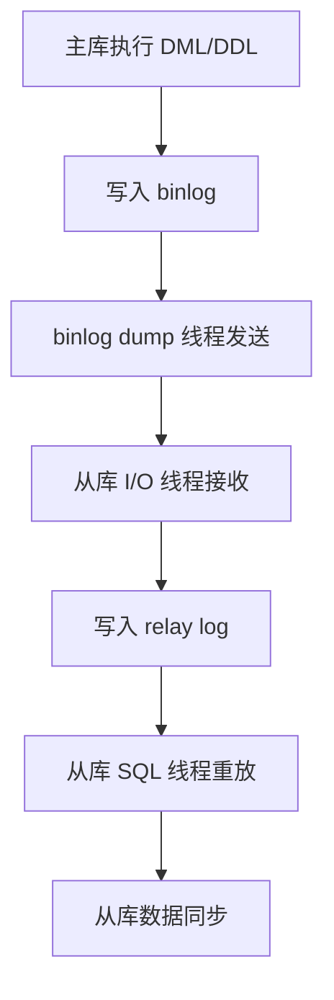
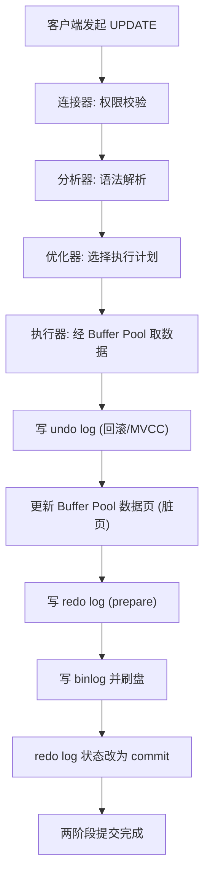
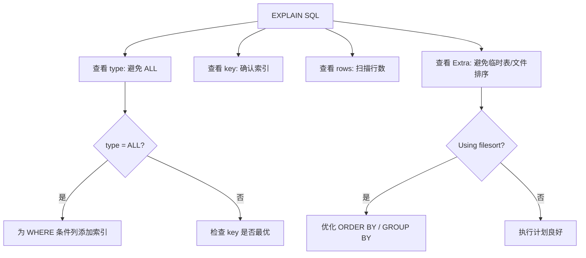
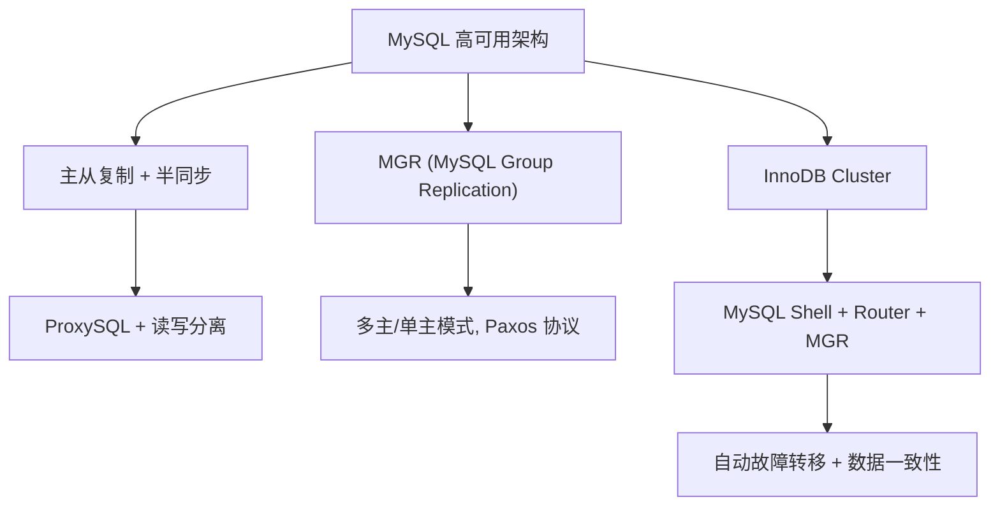

# MySQL 面试

::: tip 扩展

- [《高性能 MySQL》](https://book.douban.com/subject/23008813/)
- [极客时间教程 - MySQL 实战 45 讲](https://time.geekbang.org/column/intro/139)
- [图解 MySQL 介绍](https://xiaolincoding.com/mysql/)
- [《SQL 必知必会》](https://book.douban.com/subject/35167240/) - SQL 的基本概念和语法【入门】
- [《MySQL 必知必会》](https://book.douban.com/subject/3354490/) - MySQL 的基本概念和语法【入门】

:::

## SQL

::: tip 扩展

- [《SQL 必知必会》](https://book.douban.com/subject/35167240/) - SQL 的基本概念和语法【入门】
- [《MySQL 必知必会》](https://book.douban.com/subject/3354490/) - MySQL 的基本概念和语法【入门】

:::

### 【简单】什么是范式？什么是反范式？⭐⭐

> 🎯 目标等级：L2 ｜ ⏱ 建议用时：8 min ｜ 🏷 标签：SQL / 数据库设计

#### 💎 关键结论

范式是数据库设计规范：1NF 要求字段**原子不可分**，2NF 消除**部分依赖**，3NF 消除**传递依赖**。现代设计通常以 3NF 为上限，过高范式导致多表 JOIN 性能下降，因此采用**反范式**——适当冗余换取查询效率。

#### ⚡记忆卡片

- **口诀**：一原子、二全依、三不传、反范式冗余换性能
- **关键词**：原子性 ／ 部分依赖 ／ 传递依赖 ／ 3NF 上限 ／ 冗余换性能
- **链路**：1NF（原子） → 2NF（全依赖主键） → 3NF（不传递依赖） → 反范式（适度冗余）

#### 📖 核心知识

**范式（Normal Form）** 是关系数据库设计的规范，核心目的是**消除数据冗余、避免增删改异常、保证数据一致性**。

| 范式    | 核心要求                                      | 消除的问题                   |
| :------ | :-------------------------------------------- | :--------------------------- |
| **1NF** | 字段**原子不可分**（每列不可再拆分）          | 重复组、嵌套字段             |
| **2NF** | 在 1NF 基础上，消除**非主键对主键的部分依赖** | 部分依赖导致的冗余与异常     |
| **3NF** | 在 2NF 基础上，消除**非主键之间的传递依赖**   | 传递依赖导致的冗余与更新异常 |


现代数据库设计通常**以 3NF 为上限**。过高的范式（如 BCNF、4NF）会导致表过度拆分，查询时需要大量 JOIN，带来严重性能瓶颈。因此，实际工程中常采用**反范式**设计：通过适当的数据冗余（如冗余字段、汇总表）来减少 JOIN，换取查询性能。

::: details 2NF 示例

假设有一张 student 表：`student（学号、课程号、姓名、学分、成绩）`

- 姓名依赖**学号**（主键的一部分），学分依赖**课程号**（主键的另一部分）→ 存在**部分依赖**，不满足 2NF。
- 不满足 2NF 可能导致：数据冗余、删除异常（删成绩丢课程信息）、插入异常（未选课无法记录）、更新异常（改学分需改所有行）。

按 2NF 拆分：

```sql
student（学号、姓名）
course（课程号、学分）
student_course（学号、课程号、成绩）
```

:::

::: details 3NF 示例

假设有一张 student 表：`student（学号、姓名、年龄、班级号、班主任）`

- 属于 2NF（主键为单属性「学号」），但存在**传递依赖**：学号 → 班级号 → 班主任。
- 问题：数据冗余（同班同学班主任重复）、更新异常（换班主任需改多行）。

按 3NF 拆分：

```sql
student（学号、姓名、年龄、班级号）
class（班级号、班主任）
```

:::

#### 🔀 发散问题

- **Q：反范式有哪些常见实践？** → 冗余字段（如订单表冗余用户名）、汇总表（如统计表冗余计数）、空间换时间的宽表设计。核心原则是**读多写少的场景适合反范式**。
- **Q：什么是 BCNF？** → 在 3NF 基础上消除**主键对候选键的部分依赖和传递依赖**，是更严格的范式。实际工程中极少需要超过 3NF。

### 【简单】为什么不推荐使用存储过程？⭐⭐

> 🎯 目标等级：L2 ｜ ⏱ 建议用时：6 min ｜ 🏷 标签：SQL / 架构设计

#### 💎 关键结论

存储过程虽有预编译、减少网络开销的优点，但**移植性差、版本控制难、调试困难、扩展性差**，现代架构提倡「数据库只做存取，计算交给应用」，业务逻辑应放在应用层而非数据库。

#### ⚡记忆卡片

- **口诀**：难移植、难调试、难版本、难扩展
- **关键词**：数据库绑定 ／ Git 不友好 ／ 无调试工具 ／ 分库分表不支持
- **链路**：存储过程优点 → 现代架构痛点 → 应用层代码替代

#### 📖 核心知识

存储过程的**优点**：预编译执行效率高、减少应用与数据库之间的网络传输。

但在现代架构中**不推荐作为主要业务逻辑载体**，核心缺点：

| 缺点           | 说明                                           |
| :------------- | :--------------------------------------------- |
| **移植性差**   | 与特定数据库强绑定，语法不通用，换库需重写     |
| **版本控制难** | 存在数据库中，难以纳入 Git 管理和 CI/CD 流水线 |
| **调试维护难** | 缺乏好用的调试工具，逻辑复杂时排查极其痛苦     |
| **扩展性差**   | 高并发下会成为数据库性能瓶颈，且不支持分库分表 |

因此，现代开发提倡**「数据库只做存取，计算交给应用」**，除非是极端的大数据量批量清洗或强依赖数据库特性的场景，否则一律用应用层代码替代。

#### 🔀 发散问题

- **Q：存储过程和触发器有什么区别？** → 存储过程由应用显式调用，触发器由数据库事件（INSERT/UPDATE/DELETE）自动触发，两者都难移植、难调试，现代架构均不推荐。

### 【中等】如何避免重复插入数据？⭐⭐

> 🎯 目标等级：L2-L3 ｜ ⏱ 建议用时：12 min ｜ 🏷 标签：SQL / 防重设计

#### 💎 关键结论

防重设计核心原则：**应用层校验是前置防线，唯一索引是底层兜底**。应用层通过分布式锁/幂等 Token 拦截并发，数据库层用唯一索引保证原子性，配合 `INSERT IGNORE` / `REPLACE INTO` / `INSERT ... ON DUPLICATE KEY UPDATE` 三种标准策略处理冲突。

#### ⚡记忆卡片

- **口诀**：应用拦截并发，索引兜底原子，三种策略按需选
- **关键词**：分布式锁 ／ 幂等 Token ／ 唯一索引 ／ INSERT IGNORE ／ REPLACE INTO ／ ON DUPLICATE KEY UPDATE
- **链路**：并发请求 → 应用层拦截（锁/Token） → 查重校验 → 唯一索引兜底 → 冲突策略

#### 📖 核心知识

**应用层控制策略**

- 通过**分布式锁**（如 Redis 锁）或**幂等 Token** 拦截并发请求，避免同一时间产生重复写入；
- 插入前进行**查重校验**，作为第一道防线。

**数据库插入策略**

业务层校验无法做到绝对原子性，因此必须依赖**唯一索引**作为数据完整性的终极兜底。针对唯一索引冲突，有三种标准插入策略：

| 策略                                 | 行为                         | 适用场景                 |
| :----------------------------------- | :--------------------------- | :----------------------- |
| `INSERT IGNORE INTO`                 | 存在则忽略，不存在则插入     | 幂等写入，不关心重复数据 |
| `REPLACE INTO`                       | 存在则先删后插，不存在则插入 | 需要全量覆盖的场景       |
| `INSERT ... ON DUPLICATE KEY UPDATE` | 存在则更新，不存在则插入     | 需要部分字段更新的场景   |

::: tabs#避免重复插入数据

@tab INSERT IGNORE INTO

下面是示例的初始化准备：

```sql
-- 建表
CREATE TABLE `user` (
  `id` INT(10) UNSIGNED NOT NULL AUTO_INCREMENT COMMENT 'ID',
  `name` VARCHAR(255) NOT NULL COMMENT '名称',
  `age` INT(3) DEFAULT '0' COMMENT '年龄',
  PRIMARY KEY (`id`),
  UNIQUE KEY `name`(`name`)
) DEFAULT CHARSET = utf8mb4;

-- 测试数据
INSERT INTO `user`
VALUES (1, '刘备', 30);
INSERT INTO `user`
VALUES (2, '关羽', 28);
```

`INSERT IGNORE INTO` 会根据主键或者唯一键判断，忽略数据库中已经存在的数据：

- 若数据库没有该条数据，就插入为新的数据，跟普通的 `INSERT INTO` 一样
- 若数据库有该条数据，就忽略这条插入语句，不执行插入操作

```sql
INSERT IGNORE INTO user (name, age)
VALUES ('关羽', 29), ('张飞', 25);

-- 最终数据
+----+--------+------+
| id | name   | age  |
+----+--------+------+
|  1 | 刘备   |   30 |
|  2 | 关羽   |   28 |
|  3 | 张飞   |   25 |
+----+--------+------+
```

@tab REPLACE INTO

`REPLACE INTO` 会根据主键或者唯一键判断：

- 若表中已存在该数据，则先删除此行数据，然后插入新的数据，相当于 `delete + insert`
- 若表中不存在该数据，则直接插入新数据，跟普通的 `insert into` 一样

```sql
REPLACE INTO user(id, name, age)
VALUES (2,  '关羽', 29), (4,  '赵云', 22);

-- 最终数据
+----+--------+------+
| id | name   | age  |
+----+--------+------+
|  1 | 刘备   |   30 |
|  2 | 关羽   |   29 |
|  3 | 张飞   |   25 |
|  4 | 赵云   |   22 |
+----+--------+------+
```

@tab INSERT ... ON DUPLICATE KEY UPDATE

`INSERT ... ON DUPLICATE KEY UPDATE` 会根据主键或者唯一键判断：

- 若数据库已有该数据，则直接更新原数据，相当于 UPDATE
- 若数据库没有该数据，则插入为新的数据，相当于 INSERT

```sql
INSERT INTO user(id, name, age)
VALUES (2, '关羽', 27)
ON DUPLICATE KEY UPDATE name=values(name), age=values(age);

-- 最终数据
+----+--------+------+
| id | name   | age  |
+----+--------+------+
|  1 | 刘备   |   30 |
|  2 | 关羽   |   27 |
|  3 | 张飞   |   25 |
|  4 | 赵云   |   22 |
+----+--------+------+
```

:::

#### 🔬 扩展知识

::: details

- 【L3】三种策略的性能对比：`INSERT IGNORE` 最快（直接忽略），`ON DUPLICATE KEY UPDATE` 次之（原地更新），`REPLACE INTO` 最慢（先删后插，可能触发外键级联）。高并发场景优先 `INSERT IGNORE` 或 `ON DUPLICATE KEY UPDATE`。
- 【L3】`REPLACE INTO` 的陷阱：先删后插会生成新的自增 ID，且可能触发 DELETE 触发器，不适合有外键关联或依赖 ID 不变的场景。

:::

#### ⚠️ 常见误区

::: details

常见误区：

- ❌ "应用层查重就够了" → 并发场景下查重与插入不是原子操作，必须靠唯一索引兜底。
- ❌ "`REPLACE INTO` 和 `ON DUPLICATE KEY UPDATE` 一样" → `REPLACE` 是先删后插（新 ID），后者是原地更新（保留 ID）。

:::

#### 🔀 发散问题

- **Q：分布式锁和幂等 Token 有什么区别？** → 分布式锁是阻塞式防并发，幂等 Token 是非阻塞式去重，前者适合强一致场景，后者适合高并发场景。
- **Q：唯一索引和普通索引有什么区别？** → 唯一索引保证数据不重复，见本文档「普通键和唯一键，应该怎么选择」。

### 【简单】EXISTS 和 IN 有什么区别？⭐⭐

> 🎯 目标等级：L2 ｜ ⏱ 建议用时：6 min ｜ 🏷 标签：SQL / 查询优化

#### 💎 关键结论

`EXISTS` 先外后内（外表小内表大时快），`IN` 先内后外（外表大内表小时快）。核心原则：**哪个表小就用哪个表来驱动**——小表驱动大表。

#### ⚡记忆卡片

- **口诀**：EXISTS 外驱动，IN 内驱动，小表驱动大表
- **关键词**：先外后内 ／ 先内后外 ／ 小表驱动
- **链路**：EXISTS → 遍历外表 → 子查询匹配内表 ｜ IN → 先查内表 → 外表匹配

#### 📖 核心知识

| 维度           | EXISTS                                 | IN                                       |
| :------------- | :------------------------------------- | :--------------------------------------- |
| **功能**       | 判断子查询结果集是否非空               | 判断值是否在指定集合中                   |
| **执行顺序**   | **先外后内**：遍历外表，逐行子查询匹配 | **先内后外**：先查内表，结果作为外表条件 |
| **适用场景**   | 外表小、内表大                         | 外表大、内表小                           |
| **两表相当时** | 差别不大                               | 差别不大                                 |


::: details EXISTS 和 IN 的对比示例

```sql
-- IN：先查 B，再用结果匹配 A
SELECT * FROM A WHERE cc IN (SELECT cc FROM B)

-- EXISTS：先遍历 A，逐行子查询匹配 B
SELECT * FROM A WHERE EXISTS (SELECT cc FROM B WHERE B.cc = A.cc)
```

当 A 小于 B 时，用 `EXISTS`（外表 A 小，驱动次数少）：

```sql
for i in A        -- 外表循环
    for j in B    -- 内表匹配
        if j.cc == i.cc then ...
```

当 B 小于 A 时用 `IN`（内表 B 小，先查结果集小）：

```sql
for i in B        -- 先查内表
    for j in A    -- 外表匹配
        if j.cc == i.cc then ...
```

:::

#### 🔀 发散问题

- **Q：MySQL 优化器会自动选择 EXISTS 还是 IN 吗？** → 现代 MySQL 优化器会对两者做等价改写（subquery optimization），实际执行计划可能相同，建议用 `EXPLAIN` 确认。

### 【简单】UNION 和 UNION ALL 有什么区别？⭐

> 🎯 目标等级：L2 ｜ ⏱ 建议用时：4 min ｜ 🏷 标签：SQL / 集合操作

#### 💎 关键结论

两者都将两个结果集合并为一个，核心区别：`UNION` 会**去重**（效率低），`UNION ALL` **不去重**（效率高）。除非明确需要去重，否则优先用 `UNION ALL`。

#### ⚡记忆卡片

- **口诀**：UNION 去重慢，UNION ALL 直接拼
- **关键词**：去重 ／ 排序 ／ 性能差异
- **链路**：UNION → 合并 + 去重 + 排序 ｜ UNION ALL → 直接合并

#### 📖 核心知识

两个要联合的 SQL 语句**字段个数必须一样，字段类型要“相容”**。

| 维度     | UNION              | UNION ALL          |
| :------- | :----------------- | :----------------- |
| **去重** | 去重（DISTINCT）   | 不去重             |
| **排序** | 按字段顺序排序     | 直接合并，不排序   |
| **性能** | 较低（需去重扫描） | 较高（无额外操作） |

> 💡 实际开发中，除非确认需要去重，否则一律用 `UNION ALL`，避免不必要的性能开销。

#### 🔀 发散问题

- **Q：UNION 的去重原理是什么？** → 相当于对合并后的结果集执行一次 DISTINCT，内部会创建临时表并用排序或哈希去重，开销与数据量成正比。

### 【简单】JOIN 有哪些类型？⭐⭐⭐

> 🎯 目标等级：L2 ｜ ⏱ 建议用时：8 min ｜ 🏷 标签：SQL / 连接查询

#### 💎 关键结论

JOIN 用于多表联合查询，条件用 `ON` 而非 `WHERE`。主要分为**内连接**（取交集）、**外连接**（保留某侧全量）和**交叉连接**（笛卡尔积）。连接通常比子查询更高效。

#### ⚡记忆卡片

- **口诀**：内连接取交集，左连接保左表，右连接保右表，交叉连接笛卡尔积
- **关键词**：INNER JOIN ／ LEFT JOIN ／ RIGHT JOIN ／ CROSS JOIN ／ NATURAL JOIN
- **链路**：INNER（匹配） → LEFT/RIGHT（保留一侧） → CROSS（全组合）

#### 📖 核心知识

| 连接类型     | 关键字           | 说明                                      |
| :----------- | :--------------- | :---------------------------------------- |
| **内连接**   | `INNER JOIN`     | 取两表匹配记录，无条件时返回笛卡尔积      |
| **左连接**   | `LEFT JOIN`      | 保留左表所有记录，右表无匹配则填 NULL     |
| **右连接**   | `RIGHT JOIN`     | 保留右表所有记录，左表无匹配则填 NULL     |
| **交叉连接** | `CROSS JOIN`     | 返回笛卡尔积（两表全组合）                |
| **自然连接** | `NATURAL JOIN`   | 自动连接所有同名列（内连接的特例）        |
| **自连接**   | 自身 `JOIN` 自身 | 内连接的特例，用于表内关联（如员工-上级） |


> 💡 连接可以替换子查询，并且一般比子查询的效率更高。

#### 🔀 发散问题

- **Q：为什么不推荐多表 JOIN？** → 性能、索引失效、数据膨胀等多方面风险，见本文档「为什么不推荐多表 JOIN」。

### 【中等】为什么不推荐多表 JOIN？⭐⭐

> 🎯 目标等级：L2-L3 ｜ ⏱ 建议用时：10 min ｜ 🏷 标签：SQL / 性能优化

#### 💎 关键结论

《阿里巴巴 Java 开发手册》强制规定**超过三张表禁止 JOIN**。多表 JOIN 会导致性能指数级下降（临时表+磁盘 I/O）、索引失效、数据膨胀、死锁风险，且 MySQL 优化器对复杂 JOIN 的选择能力有限。推荐用**反范式冗余 + 应用层组装**替代。

#### ⚡记忆卡片

- **口诀**：性能差、索引废、数据胀、锁风险、难维护
- **关键词**：临时表溢出 ／ 索引打折 ／ 笛卡尔积 ／ 优化器无力 ／ 反范式替代
- **链路**：多表 JOIN → 临时表+锁 → 性能崩 → 反范式冗余替代

#### 📖 核心知识

[《阿里巴巴 Java 开发手册》](https://book.douban.com/subject/27605355/) 强制规定**超过三张表禁止 JOIN**，核心原因：

**核心问题**

| 问题                   | 说明                                                                                                               |
| :--------------------- | :----------------------------------------------------------------------------------------------------------------- |
| **性能差**             | 每多 JOIN 一张表，查询复杂度指数级增长；MySQL 需创建临时表存储中间结果，数据量大时临时表溢出磁盘，引发严重磁盘 I/O |
| **索引失效**           | 多表连接时，即使每张表都有索引，JOIN 操作本身也会让索引效果大幅打折，无合适索引时直接全表扫描                      |
| **数据膨胀与死锁风险** | 多表匹配产生笛卡尔积式数据冗余，结果集急剧膨胀；同时多表锁定在高并发下易引发死锁                                   |

**其他问题**

- **可读性差**：多表 JOIN 的 SQL 又长又复杂，开发和维护成本高，易引入 Bug。
- **优化器力不从心**：MySQL 优化器对复杂 JOIN 的选择能力有限，很难自动选出最优执行计划。

#### 🔬 扩展知识

::: details

- 【L3】**JOIN Buffer 机制**：当 JOIN 无法利用索引时，MySQL 使用 Join Buffer（内存）来缓存驱动表的数据，然后逐行与被驱动表匹配。Buffer 越大，单次能缓存的行越多，但受 `join_buffer_size` 限制。
- 【L4】**反范式替代方案**：在订单表冗余用户名/商品名，避免 JOIN 用户表/商品表；或使用 ES 宽表方案，将多表数据异构到 ES 中查询。

:::

#### 🔀 发散问题

- **Q：如果必须 JOIN 多张表，如何优化？** → 小表驱动大表、确保 JOIN 字段有索引、控制 JOIN 表数不超过 3 张，必要时用反范式或数据异构替代。
- **Q：JOIN 有哪些类型？** → 见本文档「JOIN 有哪些类型」。

### 【中等】DROP、DELETE 和 TRUNCATE 有什么区别？⭐⭐⭐⭐

> 🎯 目标等级：L2-L3 ｜ ⏱ 建议用时：12 min ｜ 🏷 标签：SQL / DDL 与 DML

#### 💎 关键结论

三者都能“删除数据”，但本质不同：`DROP` 删表（数据+结构），`DELETE` 逐行删数据（保留表结构，可回滚），`TRUNCATE` 删全部数据（保留表结构，DDL 不可回滚，自增 ID 重置）。速度：DROP ≈ TRUNCATE >> DELETE。

#### ⚡记忆卡片

- **口诀**：DROP 删表，TRUNCATE 清空，DELETE 逐行删
- **关键词**：DDL vs DML ／ delete mark ／ 重建表文件 ／ 自增重置 ／ 回滚能力
- **链路**：DROP（连根拔起） ｜ DELETE（逐行标记，可回滚） ｜ TRUNCATE（重建文件，不可回滚）

#### 📖 核心知识

| 维度        | DROP        | DELETE              | TRUNCATE                        |
| :---------- | :---------- | :------------------ | :------------------------------ |
| **类型**    | DDL         | DML                 | DDL                             |
| **表结构**  | 删除        | 保留                | 保留                            |
| **回滚**    | 不可        | 可在事务内回滚      | 不可                            |
| **自增 ID** | -           | 不重置              | 重置为 1                        |
| **速度**    | 快          | 慢（逐行标记）      | 快（重建表文件）                |
| **日志**    | 记录 binlog | 写 undo/redo/binlog | 记录 binlog（可用于时间点恢复） |

- **DROP**：删除数据表，包括数据和结构。MySQL 5.7 及之前，表数据存于 `.ibd` 文件，表结构元数据存于 `.frm` 文件，DROP 会直接删除这些文件；**MySQL 8.0 移除了 `.frm` 文件，表结构统一存入 InnoDB 数据字典**。DROP 是 DDL，执行后无法回滚。
- **DELETE**：删除数据，但保留表结构。InnoDB 的 DELETE 并非立即物理删除，而是将记录**标记为已删除**（delete mark），后续由 purge 线程真正清理；同时会写入 undo log（支持回滚）、redo log 和 binlog。因此 DELETE 后磁盘空间不会立刻释放，大量删除后可能需要 `OPTIMIZE TABLE` 重建表回收碎片。
- **TRUNCATE**：删除全部表数据，保留表结构。它是 **DDL 而非 DML**：会隐式提交，**无法通过事务回滚**（但会记录 binlog，可用于时间点恢复时的重放）；执行后自增主键重新从 1 开始。实现上直接删除并重建表文件，速度远快于无条件的 DELETE；MySQL 8.0 起 TRUNCATE 支持原子性（失败可回滚元数据）。

#### 🔬 扩展知识

::: details

- 【L3】**DELETE 后磁盘空间为什么不释放？** → InnoDB 的 delete mark 只是标记删除，空间留给后续 INSERT 复用。要彻底回收需 `OPTIMIZE TABLE`（本质是重建表）。
- 【L3】**MySQL 8.0 原子 DDL**：DROP/TRUNCATE 等 DDL 操作支持原子性，失败时元数据可回滚，避免了早期版本“半完成”状态的数据字典损坏问题。

:::

#### ⚠️ 常见误区

::: details

常见误区：

- ❌ "TRUNCATE 比 DELETE 快是因为不写日志" → TRUNCATE 也会记录 binlog，只是不写 undo log，且通过删除重建表文件实现，避免了逐行操作的开销。
- ❌ "DELETE 后磁盘空间立即释放" → InnoDB 的 delete mark 只是标记，空间由后续 INSERT 复用，需 `OPTIMIZE TABLE` 才能回收。

:::

#### 🔀 发散问题

- **Q：大量 DELETE 后如何回收空间？** → `OPTIMIZE TABLE` 或 `ALTER TABLE ... ENGINE=InnoDB` 重建表，见本文档「什么是页分裂？为什么推荐使用自增主键」。
- **Q：MySQL 8.0 原子 DDL 是什么？** → DDL 操作支持原子性，避免半完成状态，见本文档「MySQL 8.0 有哪些重要新特性」。

## MySQL 建模

::: tip 扩展

- [MySQL 官方文档之数据类型](https://dev.mysql.com/doc/refman/8.4/en/data-types.html)
- [MySQL 如何选择 float, double, decimal](http://blog.leanote.com/post/weibo-007/mysql_float_double_decimal)

:::

### 【简单】CHAR 和 VARCHAR 的区别是什么？⭐⭐⭐

> 🎯 目标等级：L2 ｜ ⏱ 建议用时：8 min ｜ 🏷 标签：MySQL 建模 / 数据类型

#### 💎 关键结论

`CHAR` 是**定长**字符串（不足补空格），`VARCHAR` 是**变长**字符串（额外 1~2 字节记录长度）。CHAR 适合固定长度短字符串（如哈希值、身份证号），VARCHAR 适合长度不确定的字符串（如昵称、标题）。

#### ⚡记忆卡片

- **口诀**：CHAR 定长补空格，VARCHAR 变长省空间
- **关键词**：定长 vs 变长 ／ 空格填充 ／ 1~2 字节长度 ／ BINARY 二进制
- **链路**：CHAR（固定长度） → 补空格 ／ VARCHAR（可变长度） → 加长度前缀

#### 📖 核心知识

| 维度         | CHAR(M)                                | VARCHAR(M)                     |
| :----------- | :------------------------------------- | :----------------------------- |
| **长度**     | 定长（不足右侧补空格，检索时自动去除） | 变长（额外 1~2 字节记录长度）  |
| **空间**     | 始终占 M 个字符                        | 按实际长度占空间               |
| **M 含义**   | 能保存的字符数最大值                   | 能保存的字符数最大值           |
| **适用场景** | 固定长度短字符串（MD5、身份证号）      | 长度不确定字符串（昵称、标题） |

- **进阶补充（BINARY 系列）**：`BINARY` 和 `VARBINARY` 是它们的二进制版本，存储的是**字节**而非字符，没有字符集概念，排序和比较直接基于字节的数值大小。


#### 🔀 发散问题

- **Q：VARCHAR(50) 和 VARCHAR(500) 性能一样吗？** → 不一样。VARCHAR 长度越大，内存分配和排序开销越高，建议根据实际需求设置合理长度。

### 【简单】金额数据用什么类型存储？⭐⭐⭐

> 🎯 目标等级：L2 ｜ ⏱ 建议用时：10 min ｜ 🏷 标签：MySQL 建模 / 数据类型

#### 💎 关键结论

推荐用 `BIGINT` 以“分”为单位存储金额（1 元存为 100）。`FLOAT`/`DOUBLE` 会丢精度，且 MySQL 8.0.17 起官方已标记废弃；`DECIMAL` 精确但变长编码、计算效率低、精度长度难统一；`BIGINT` 整型计算最快、无精度问题，8 字节以分计可表示约 92 万亿元，覆盖绝大多数业务。

#### ⚡记忆卡片

- **口诀**：浮点丢、DECIMAL 慢、BIGINT 存分最划算
- **关键词**：二进制截断 ／ 8.0.17 废弃 ／ 变长编码 ／ 分单位 ／ 92 万亿
- **链路**：十进制 → 二进制截断 → 精度丢失 → 精确类型 DECIMAL → 效率不足 → BIGINT（分）

#### 📖 核心知识

MySQL 中 `FLOAT`、`DOUBLE`、`DECIMAL` 均可表示小数，但适用场景不同：

- **`FLOAT` / `DOUBLE` 会丢失精度**：十进制小数转二进制存储时可能被截断。且 MySQL 8.0.17 起 `FLOAT`/`DOUBLE` 的精度指定语法已被标记废弃，官方不推荐使用。
- **`DECIMAL` 是精确存储类型**：适合金额场景，但它是变长编码，计算效率不如原生整型；且不同资金量级（百万、百亿、万亿）所需精度定义不同，字段长度难以统一。

**推荐方案：`BIGINT` + 最小单位存储**。将金额以“分”为单位存储，如 1 元存为 100。优势：

- 整型计算效率最高；
- 无精度丢失；
- 8 字节有符号 `BIGINT` 以分计，可表示最大约 92 万亿元，覆盖绝大多数业务场景。

::: details FLOAT 丢失精度案例

【示例】`FLOAT` 丢失精度案例

```sql
CREATE TABLE `test` (
  `value` FLOAT(10,2) DEFAULT NULL
);

mysql> insert into test value (131072.32);
Query OK, 1 row affected (0.01 sec)

mysql> select * from test;
+-----------+
| value     |
+-----------+
| 131072.31 |
+-----------+
1 row in set (0.02 sec)
```

明明定义保留两位小数，写入的 `131072.32` 却变成了 `131072.31`——精度在存储阶段就已丢失，与显示位数无关。

:::

#### 🔬 扩展知识

::: details

- 【L3】`DECIMAL(M,D)` 存储空间如何计算？MySQL 将整数与小数部分按每 9 位数字打包为 4 字节存储，`DECIMAL(18,2)` 约占用 8 字节——与 `BIGINT` 空间相当，但其运算是软件模拟的定点运算，远慢于 CPU 原生整型指令。
- 【L4】应用层对应类型是 Java `BigDecimal`，同样有坑：`equals` 会连带比较精度位（`1.0` 与 `1.00` 判定不等），应使用 `compareTo`；除不尽时抛 `ArithmeticException`，必须显式指定舍入模式。
- 【L4】跨境多币种场景下“分”并不通用：日元无小数位、巴林第纳尔为三位小数。业界方案是按 ISO 4217 的 minor unit 维护各币种最小单位，或统一最大精度后由应用层换算。

> 📚 延伸阅读：[MySQL 如何选择 float, double, decimal](http://blog.leanote.com/post/weibo-007/mysql_float_double_decimal)

:::

#### ⚠️ 常见误区

::: details

常见误区：

- ❌ "`FLOAT(10,2)` 保留两位小数就不会丢精度" → `(M,D)` 只是显示与存储约束，精度在十进制转二进制存储时已丢失。
- ❌ "`DECIMAL` 精确，金额就该用 `DECIMAL`" → 忽略了高并发下的计算成本，以及不同资金量级下精度定义无法统一的问题。

:::

#### 🔀 发散问题

- **Q：`BIGINT` 存分，展示层除以 100 时有坑吗？** → 有，浮点除法会再次引入精度问题。应用层应保持整型运算到最后一刻，输出时再格式化（如 Java 用 `BigDecimal.valueOf(cents).movePointLeft(2).toPlainString()`）。
- **Q：IP 地址用什么类型存储？** → `INT UNSIGNED` 配合 `INET_ATON()`/`INET_NTOA()` 转换，见本文档「IP 地址用什么类型存储」。
- **Q：时间数据选 `DATETIME` 还是 `TIMESTAMP`？** → 涉及时区与存储范围的权衡，见本文档「时间数据选择 DATETIME 还是 TIMESTAMP」。

### 【简单】IP 地址用什么类型存储？⭐

> 🎯 目标等级：L2 ｜ ⏱ 建议用时：5 min ｜ 🏷 标签：MySQL 建模 / 数据类型

#### 💎 关键结论

IPv4 用 `INT UNSIGNED`（4 字节）配合 `INET_ATON()`/`INET_NTOA()` 转换；IPv6 用 `BINARY(16)` 配合 `INET6_ATON()`/`INET6_NTOA()` 转换。不要用 `VARCHAR` 存 IP，浪费空间且无法范围查询。

#### ⚡记忆卡片

- **口诀**：IPv4 用 INT，IPv6 用 BINARY
- **关键词**：INT UNSIGNED ／ BINARY(16) ／ INET_ATON ／ INET6_ATON
- **链路**：IP 字符串 → 转换函数 → 整型/二进制存储 → 转换函数还原

#### 📖 核心知识

**IPv4**

- **类型**：`INT UNSIGNED`（0 ~ 4294967295，4 字节）
- **转换**：
  - 存：`INET_ATON('192.168.1.1')` → 3232235777
  - 取：`INET_NTOA(3232235777)` → '192.168.1.1'

**IPv6**

- **类型**：`BINARY(16)`（定长，适合所有 IPv6 地址长度固定）
- **转换**（MySQL 5.6+）：
  - 存：`INET6_ATON('2001:db8::1')` → 二进制数据
  - 取：`INET6_NTOA(binary_data)` → 字符串

> 💡 用整型/二进制存储 IP，不仅节省空间，还能支持范围查询（如 `WHERE ip BETWEEN INET_ATON('192.168.1.1') AND INET_ATON('192.168.1.255')`）。

#### 🔀 发散问题

- **Q：金额数据用什么类型存储？** → 用 BIGINT 以分为单位存储，见本文档「金额数据用什么类型存储」。

### 【简单】如何存储 emoji 😃？⭐⭐⭐

> 🎯 目标等级：L2 ｜ ⏱ 建议用时：6 min ｜ 🏷 标签：MySQL 建模 / 字符集

#### 💎 关键结论

推荐将 MySQL 默认字符集设置为 **`utf8mb4`**，它是 `utf8` 的超集，支持 4 字节 Unicode 字符，可以存储 emoji 😃。注意 `utf8` 在 MySQL 中实际是 `utf8mb3`，最多只支持 3 字节。

#### ⚡记忆卡片

- **口诀**：utf8 存不了 emoji，utf8mb4 才行
- **关键词**：utf8mb4 ／ 4 字节 ／ utf8mb3 ／ CONVERT TO
- **链路**：emoji 需要 4 字节 → utf8 只支持 3 字节 → utf8mb4 支持 4 字节

#### 📖 核心知识

在表结构设计中，除了将列定义为 `CHAR` 和 `VARCHAR` 用以存储字符外，还需要额外定义字符对应的字符集。随着移动互联网的飞速发展，**推荐把 MySQL 的默认字符集设置为 `utf8mb4`**，否则某些 emoji 表情字符无法在 `utf8` 字符集下存储。

**设置字符集的两种方式**

| 语句                                          | 效果                                           |
| :-------------------------------------------- | :--------------------------------------------- |
| `ALTER TABLE test CHARSET utf8mb4`            | 仅修改表的默认字符集，**已有列不变**，新列生效 |
| `ALTER TABLE test CONVERT TO CHARSET utf8mb4` | **转换已有列 + 新列**全部生效                  |

> 💡 MySQL 8.0 已将默认字符集从 `utf8mb3` 改为 `utf8mb4`，新建实例无需额外配置。

#### 🔀 发散问题

- **Q：时间数据选 DATETIME 还是 TIMESTAMP？** → 涉及时区与存储范围的权衡，见本文档「时间数据选择 DATETIME 还是 TIMESTAMP」。

### 【简单】时间数据选择 DATETIME 还是 TIMESTAMP？⭐⭐⭐

> 🎯 目标等级：L2 ｜ ⏱ 建议用时：8 min ｜ 🏷 标签：MySQL 建模 / 数据类型

#### 💎 关键结论

推荐用 **`DATETIME`**。`TIMESTAMP` 虽然省空间（4 字节 vs 8 字节），但存在 2038 年溢出问题，且时区转换会调用操作系统函数加锁，高并发下性能抖动明显。

#### ⚡记忆卡片

- **口诀**：DATETIME 范围大无时区，TIMESTAMP 省空间有坑
- **关键词**：8 字节 vs 4 字节 ／ 2038 溢出 ／ __tz_convert 加锁 ／ 显式时区
- **链路**：TIMESTAMP 省空间 → 时区转换加锁 → 高并发性能抖动 → 推荐 DATETIME

#### 📖 核心知识

| 维度     | DATETIME                | TIMESTAMP                   | INT          |
| :------- | :---------------------- | :-------------------------- | :----------- |
| **空间** | 8 字节                  | 4 字节                      | 4 字节       |
| **范围** | 1000-01-01 ~ 9999-12-31 | 1970-01-01 ~ **2038-01-19** | 同 TIMESTAMP |
| **时区** | 无时区转换              | 自动时区转换                | 无时区转换   |
| **性能** | 稳定（无时区开销）      | 高并发下可能抖动            | 同 TIMESTAMP |

**TIMESTAMP 的潜在性能问题**：虽然时区转换本身 CPU 指令不多，但使用默认操作系统时区时，每次转换需调用 `__tz_convert()` 并加锁。大规模并发时，热点资源竞争会导致：

- **性能不如 DATETIME**：`DATETIME` 不存在时区转化问题。
- **性能抖动**：海量并发时，锁竞争导致延迟不稳定。

> 💡 如果必须用 `TIMESTAMP`，强烈建议在配置文件中显式设置时区，而不是使用操作系统时区。

综上，由于 `TIMESTAMP` 存在时间上限和潜在性能问题，推荐使用 `DATETIME`。

#### 🔀 发散问题

- **Q：如何存储 emoji？** → 需设置字符集为 utf8mb4，见本文档「如何存储 emoji 😃」。

### 【简单】MySQL一张表最多可以有多少列？⭐

> 🎯 目标等级：L2 ｜ ⏱ 建议用时：3 min ｜ 🏷 标签：MySQL 建模 / 限制

#### 💎 关键结论

**理论上限 4096 列**，但实际受存储引擎制约——**InnoDB 引擎最多 1017 列**。实际设计中应尽量避免超宽表，用垂直拆分优化。

#### ⚡记忆卡片

- **口诀**：理讽 4096，InnoDB 1017
- **关键词**：4096 ／ 1017 ／ 行格式 ／ DYNAMIC
- **链路**：MySQL 上限 4096 → InnoDB 限制 1017 → 行格式影响实际可用

#### 📖 核心知识

**理论上限 4096 列**，但实际受存储引擎制约——**InnoDB 引擎最多 1017 列**。

**InnoDB 行格式差异**

| 行格式         | 特点                  | 适用场景             |
| :------------- | :-------------------- | :------------------- |
| **REDUNDANT**  | 768 字节前缀          | 旧版本兼容           |
| **COMPACT**    | 768 字节前缀          | 5.0-5.7 默认         |
| **DYNAMIC**    | **仅 20 字节指针**    | **当前默认**（通用） |
| **COMPRESSED** | 20 字节指针，支持压缩 | 节省磁盘空间         |

> 💡 DYNAMIC 行格式下，变长字段只存 20 字节指针，实际数据溢出到外部存储页，因此实际可用列数还受行大小（最大约半页 = 8KB）限制。

#### 🔀 发散问题

- **Q：MySQL 在建表时需要注意什么？** → 类型、主键、字符集、索引、约束五大要点，见本文档「MySQL 在建表时需要注意什么」。

### 【中等】MySQL 在建表时需要注意什么？⭐⭐⭐

> 🎯 目标等级：L2-L3 ｜ ⏱ 建议用时：10 min ｜ 🏷 标签：MySQL 建模 / 表设计

#### 💎 关键结论

建表五大要点：**字段类型够用就好、主键必须自增、字符集统一 utf8mb4、约束能加就加、索引精准打击**。这五点决定了表的性能上限和维护成本。

#### ⚡记忆卡片

- **口诀**：类型省、主键增、字符集 mb4、约束加、索引精
- **关键词**：TINYINT / BIGINT 自增 ／ utf8mb4 ／ NOT NULL ／ 区分度 ／ 单表≤ 5 索引
- **链路**：字段类型 → 主键设计 → 字符集 → 约束 → 索引

#### 📖 核心知识

| 要点         | 规则                                                                    | 反例                              |
| :----------- | :---------------------------------------------------------------------- | :-------------------------------- |
| **字段类型** | 够用就好：能用 TINYINT 不用 INT，能用数字不用字符串，金额用 BIGINT 存分 | 用 VARCHAR 存 IP、用 FLOAT 存金额 |
| **主键设计** | 必须有主键，最好 BIGINT 自增，严禁 UUID（随机插入毁性能）               | UUID 主键导致页分裂               |
| **字符集**   | 统一 utf8mb4，千万别用 utf8（存不了 emoji）                             | 用 latin1 存中文                  |
| **约束**     | 尽量 NOT NULL，合理 DEFAULT，必要 UNIQUE                                | 字段默认 NULL 导致判断复杂        |
| **索引**     | 区分度高的放联合索引前面，单表不超过 5 个，避免冗余索引                 | 对性别字段建索引                  |

#### 🔬 扩展知识

::: details

- 【L3】**为什么严禁 UUID 做主键？** → UUID 是随机值，插入位置分散，频繁引发页分裂和碎片；且 UUID（16 字节）比 BIGINT（8 字节）大，二级索引都会多存一份主键，额外放大存储开销。
- 【L3】**为什么尽量 NOT NULL？** → NULL 值会使索引、索引统计、比较运算都变复杂；且 NULL 列需要额外存储空间。可以用 0、空字符串等默认值替代。

:::

#### 🔀 发散问题

- **Q：什么是页分裂？为什么推荐自增主键？** → 见本文档「什么是页分裂？为什么推荐使用自增主键」。
- **Q：金额数据用什么类型存储？** → 用 BIGINT 以分为单位存储，见本文档「金额数据用什么类型存储」。

### 【中等】什么是页分裂？为什么推荐使用自增主键？⭐⭐⭐⭐

> 🎯 目标等级：L2-L3 ｜ ⏱ 建议用时：12 min ｜ 🏷 标签：MySQL 建模 / InnoDB 存储

#### 💎 关键结论

InnoDB 数据页（16KB）内记录必须按主键有序。当插入的主键落在已满的页中间时，触发**页分裂**（约一半记录迁移到新页），导致空间浪费和性能损耗。**自增主键顺序追加，几乎不会页分裂**；UUID 随机插入则频繁触发。

#### ⚡记忆卡片

- **口诀**：页满分裂，自增不裂，UUID 必裂
- **关键词**：16KB 数据页 ／ 页分裂 ／ 自增主键 ／ UUID 反例 ／ OPTIMIZE TABLE
- **链路**：随机主键 → 插入中间 → 页满分裂 → 空间碎片 + 性能损耗

#### 📖 核心知识

InnoDB 的聚簇索引按主键顺序组织数据，数据页（16KB）内的记录必须保持主键有序。

**页分裂的产生**

当插入的主键值落在两个已有数据页之间，且目标页已满时，InnoDB 必须：

1. 将目标页中约一半的记录迁移到新页，腾出空间；
2. 在新页插入新记录；
3. 更新上层索引页的指针。

页分裂的代价：

| 代价         | 说明                                                                           |
| :----------- | :----------------------------------------------------------------------------- |
| **空间浪费** | 分裂后两个页都只有一半左右的数据，产生内存和磁盘碎片                           |
| **性能损耗** | 涉及页的读取、写入、加锁（页分裂需要持有相关页的锁），并发插入时可能产生锁等待 |

**为什么推荐自增主键**

- 自增主键的新记录总是追加到最后一个页的末尾，**顺序写入，几乎不会发生页分裂**，且页的填充率高。
- **UUID 的反例**：UUID 是随机值，插入位置分散，频繁引发页分裂和碎片；且 UUID（16 字节）比 BIGINT（8 字节）大，二级索引都会多存一份主键，额外放大存储开销。若业务必须用全局唯一 ID，可用雪花算法等趋势递增方案，或对 UUID 做 `UUID_TO_BIN(uuid, 1)` 重排（MySQL 8.0）。

#### 🔬 扩展知识

::: details

- 【L3】**页合并非自动**：删除记录产生的空间碎片不会自动归还操作系统，需要 `OPTIMIZE TABLE` 或 `ALTER TABLE ... ENGINE=InnoDB` 重建表。
- 【L3】**自增主键并非万能**：分库分表场景全局自增不可行，需用分布式 ID；高并发插入下自增锁（`innodb_autoinc_lock_mode`）也需关注。

:::

#### 🔀 发散问题

- **Q：MySQL 在建表时需要注意什么？** → 五大要点，见本文档「MySQL 在建表时需要注意什么」。
- **Q：MySQL 大表如何高效变更表结构？** → Online DDL / INSTANT，见本文档「MySQL 大表如何高效的变更表结构、加索引」。

### 【困难】MySQL 大表如何高效的变更表结构、加索引？⭐⭐⭐

> 🎯 目标等级：L3-L4 ｜ ⏱ 建议用时：15 min ｜ 🏷 标签：MySQL 建模 / Online DDL

#### 💎 关键结论

MySQL 大表变更有三种 DDL 算法：**COPY**（全程锁表，已淘汰）、**INPLACE**（5.6+，大部分时间不锁表，通过 row log 记录并发 DML）、**INSTANT**（8.0.12+，只改元数据，秒级完成）。生产优先用 INSTANT，不支持时退化为 INPLACE。

#### ⚡记忆卡片

- **口诀**：COPY 锁全表，INPLACE 不拷数据，INSTANT 改元数据
- **关键词**：Online DDL ／ row log ／ ALGORITHM=INPLACE ／ LOCK=NONE ／ 原子 DDL
- **链路**：COPY（锁表） → INPLACE（不拷数据+row log） → INSTANT（秒级改元数据）

#### 📖 核心知识

MySQL 的 DDL 操作支持三种算法，通过 `ALGORITHM` 参数指定：

| 算法        | 版本    | 原理                                      | 锁表             | 适用场景         |
| :---------- | :------ | :---------------------------------------- | :--------------- | :--------------- |
| **COPY**    | 早期    | 创建临时表复制数据                        | 全程锁表         | 已淘汰           |
| **INPLACE** | 5.6+    | 直接在原表操作，通过 row log 记录并发 DML | 大部分时间不锁表 | 加索引、加列等   |
| **INSTANT** | 8.0.12+ | 只修改元数据                              | 不锁表           | 加列、加默认值等 |

**INPLACE 模式流程**：

1. 创建临时索引文件；
2. 扫描原表构建新索引，期间允许并发 DML（通过 row log 记录变更）；
3. 短暂锁表，应用 row log 中的增量变更；
4. 替换旧索引，完成。

```sql
ALTER TABLE users ADD INDEX idx_name(name), ALGORITHM=INPLACE, LOCK=NONE;
```

#### 🔬 扩展知识

::: details

- 【L3】**INSTANT 的限制**：只支持加列、加默认值、修改列默认值等少数操作，不支持加索引、修改列类型。
- 【L4】**云数据库进一步优化**：优先使用原生 Online DDL，不支持时采用自研无锁变更方案（如 gh-ost、pt-online-schema-change）。

:::

#### 🏭 实战场景

::: details

**千万级表加索引**：使用 `ALGORITHM=INPLACE, LOCK=NONE`，1000 万行表加索引约需 2-5 分钟（SSD），期间业务读写不受影响。若用 COPY 模式，同样操作可能锁表 30 分钟以上。

:::

#### 🔀 发散问题

- **Q：MySQL 8.0 有哪些重要新特性？** → 原子 DDL、INSTANT DDL 等，见本文档「MySQL 8.0 有哪些重要新特性」。
- **Q：什么是页分裂？** → 见本文档「什么是页分裂？为什么推荐使用自增主键」。

## MySQL 存储

::: tip 扩展

- [MySQL 官方文档之 InnoDB 存储引擎](https://dev.mysql.com/doc/refman/8.4/en/innodb-storage-engine.html)
- [MySQL 官方文档之可选的存储引擎](https://dev.mysql.com/doc/refman/8.4/en/storage-engines.html)

:::

### 【中等】MySQL 支持哪些存储引擎？⭐⭐⭐

> 🎯 目标等级：L2-L3 ｜ ⏱ 建议用时：8 min ｜ 🏷 标签：MySQL 存储 / 存储引擎

#### 💎 关键结论

MySQL 采用**插拔式存储引擎架构**，最常用的是 **InnoDB**（5.5+ 默认，支持事务/行锁/外键）和 **MyISAM**（5.5 前默认，不支持事务）。其他还有 Memory（内存临时表）、Archive（归档压缩）、NDB（集群）等。

#### ⚡记忆卡片

- **口诀**：InnoDB 全能王，MyISAM 快但残
- **关键词**：插拔式 ／ InnoDB 事务行锁 ／ MyISAM 无事务 ／ Memory 临时表
- **链路**：插拔式架构 → InnoDB（默认） ／ MyISAM（老旧） ／ 其他专用引擎

#### 📖 核心知识

**存储引擎层负责数据的存储和提取**。MySQL 采用了插拔式架构，可以根据需要替换。


| 引擎        | 特点                                                   | 适用场景                    |
| :---------- | :----------------------------------------------------- | :-------------------------- |
| **InnoDB**  | 支持**事务、行级锁、外键、自动故障恢复**，并发性能不错 | 大多数业务场景（5.5+ 默认） |
| **MyISAM**  | 速度快，占用资源少，**不支持事务/行锁/外键/故障恢复**  | 只读或读多写少的简单场景    |
| **Memory**  | 数据存于内存，进程崩溃则数据丢失                       | 临时表                      |
| **NDB**     | 分布式集群存储引擎                                     | MySQL Cluster               |
| **Archive** | 高压缩比（1:10），只支持 INSERT 和 SELECT              | 归档数据                    |
| **CSV**     | 以 CSV 文件存储，不支持索引                            | 数据交换                    |


#### 🔀 发散问题

- **Q：InnoDB 和 MyISAM 有哪些差异？** → 见本文档「InnoDB 和 MyISAM 有哪些差异」。

### 【中等】InnoDB 和 MyISAM 有哪些差异？⭐⭐⭐

> 🎯 目标等级：L2-L3 ｜ ⏱ 建议用时：8 min ｜ 🏷 标签：MySQL 存储 / 存储引擎对比

#### 💎 关键结论

核心差异：InnoDB 支持**事务、行级锁、外键、崩溃恢复**，是 5.5+ 默认引擎；MyISAM 不支持事务和行锁，但 `COUNT(*)` 为 O(1)。现代业务几乎全部用 InnoDB。

#### ⚡记忆卡片

- **口诀**：InnoDB 全事务行锁外键，MyISAM 快计数但不安全
- **关键词**：事务 ／ 行锁 vs 表锁 ／ 聚簇 vs 非聚簇 ／ 崩溃恢复 ／ COUNT(*) O(1)
- **链路**：InnoDB（事务安全） ｜ MyISAM（简单快速但无事务）

#### 📖 核心知识

| 对比项           | MyISAM                                      | InnoDB                       |
| :--------------- | :------------------------------------------ | :--------------------------- |
| **外键**         | 不支持                                      | 支持                         |
| **事务**         | 不支持                                      | 支持四种事务隔离级别         |
| **锁粒度**       | 表级锁                                      | 表级锁 + 行级锁              |
| **索引**         | B+ 树索引（非聚簇索引）                     | B+ 树索引（聚簇索引）        |
| **表空间**       | 小                                          | 大                           |
| **关注点**       | 性能                                        | 事务                         |
| **计数器**       | 维护了计数器，`SELECT COUNT(*)` 效率为 O(1) | 没有维护计数器，需要全表扫描 |
| **自动故障恢复** | 不支持                                      | 支持（依赖于 redo log）      |

#### 🔀 发散问题

- **Q：MySQL 支持哪些存储引擎？** → 见本文档「MySQL 支持哪些存储引擎」。
- **Q：如何选择 MySQL 存储引擎？** → 见本文档「如何选择 MySQL 存储引擎」。

### 【简单】如何选择 MySQL 存储引擎？⭐

> 🎯 目标等级：L2 ｜ ⏱ 建议用时：4 min ｜ 🏷 标签：MySQL 存储 / 存储引擎

#### 💎 关键结论

**大多数情况下，使用默认的 InnoDB 就够了**。只有特殊场景才考虑其他引擎：临时表用 Memory，归档数据用 Archive，读多写少且不需事务可考虑 MyISAM。

#### ⚡记忆卡片

- **口诀**：默认 InnoDB，特殊场景才换
- **关键词**：InnoDB 事务 ／ Memory 临时 ／ Archive 归档
- **链路**：业务需求 → 默认 InnoDB → 特殊场景选其他

#### 📖 核心知识

- **大多数情况下，使用默认的 InnoDB 就够了**。如果要提供事务安全（ACID 兼容）和并发控制，InnoDB 就是首选。
- 如果数据表主要用来插入和查询，MyISAM 提供较高的处理效率。
- 如果只是临时存放数据，数据量不大，可选 Memory 引擎。MySQL 用它作为临时表，存放查询的中间结果。
- 如果存储归档数据，可以用 Archive 引擎。

> 💡 存储引擎是基于表的，同一个数据库中多个表可以使用不同的引擎。

#### 🔀 发散问题

- **Q：InnoDB 和 MyISAM 有哪些差异？** → 见本文档「InnoDB 和 MyISAM 有哪些差异」。

### 【中等】MySQL 有哪些物理存储文件？⭐

> 🎯 目标等级：L2-L3 ｜ ⏱ 建议用时：8 min ｜ 🏷 标签：MySQL 存储 / 物理文件

#### 💎 关键结论

InnoDB 的物理文件包括 `.frm`（元数据，8.0 已移除）和 `.ibd`/`.ibdata`（数据文件）；MyISAM 包括 `.frm`（元数据）、`.MYD`（数据）、`.MYI`（索引）。

#### ⚡记忆卡片

- **口诀**：InnoDB 两文件，MyISAM 三文件
- **关键词**：.frm ／ .ibd ／ .ibdata ／ .MYD ／ .MYI ／ 共享 vs 独享表空间
- **链路**：InnoDB（.frm + .ibd/.ibdata） ｜ MyISAM（.frm + .MYD + .MYI）

#### 📖 核心知识

MySQL 不同存储引擎的物理存储文件不同。

**InnoDB 的物理文件**

| 文件      | 说明                                                   |
| :-------- | :----------------------------------------------------- |
| `.frm`    | 表元数据（MySQL 8.0 已移除，统一存入 InnoDB 数据字典） |
| `.ibd`    | 独享表空间（每个表一个文件）                           |
| `.ibdata` | 共享表空间（所有表共用一个或多个文件）                 |


**MyISAM 的物理文件**

| 文件   | 说明              |
| :----- | :---------------- |
| `.frm` | 表元数据          |
| `.MYD` | 表数据（MYData）  |
| `.MYI` | 表索引（MYIndex） |

#### 🔀 发散问题

- **Q：MySQL 支持哪些存储引擎？** → 见本文档「MySQL 支持哪些存储引擎」。

### 【中等】什么是 Buffer Pool？⭐⭐⭐

> 🎯 目标等级：L2-L3 ｜ ⏱ 建议用时：8 min ｜ 🏷 标签：MySQL 存储 / InnoDB 内存结构

#### 💎 关键结论

Buffer Pool 是 InnoDB 的**核心内存缓存区域**，用于缓存表和索引数据页，减少磁盘 I/O。以页（16KB）为单位存储，使用改进的 LRU 算法管理，分为年轻代和老年代，防止全表扫描污染缓存。

#### ⚡记忆卡片

- **口诀**：Buffer Pool 缓存页，LRU 分老幼代
- **关键词**：16KB 页 ／ LRU ／ 年轻代 ／ 老年代 ／ 减少磁盘 I/O
- **链路**：查询数据 → Buffer Pool 命中？→ 命中返回 ／ 未命中读磁盘并缓存

#### 📖 核心知识

Buffer Pool 是 MySQL InnoDB 存储引擎的核心组件，它是数据库系统中的内存缓存区域，主要**用于缓存表和索引的数据**。


**主要作用**

1. **减少磁盘 I/O**：将频繁访问的数据页缓存在内存中，避免每次查询都从磁盘读取
2. **提高查询性能**：内存访问速度远快于磁盘访问
3. **写缓冲**：对数据的修改先在内存中进行，再通过后台线程定期刷新到磁盘

**工作原理**

- Buffer Pool **以页 (page) 为单位存储数据，默认每页 16KB**
- **使用 LRU 算法管理内存页**
- 包含“年轻代”和“老年代”两个区域，防止全表扫描污染缓存

#### 🔀 发散问题

- **Q：什么是 Change Buffer？** → 见本文档「什么是 Change Buffer」。

### 【中等】什么是 Change Buffer？⭐⭐

> 🎯 目标等级：L2-L3 ｜ ⏱ 建议用时：8 min ｜ 🏷 标签：MySQL 存储 / InnoDB 写优化

#### 💎 关键结论

Change Buffer 用于缓存对**非唯一二级索引页**的修改（INSERT/UPDATE/DELETE），当目标页不在 Buffer Pool 中时避免立即读盘，将随机写转为顺序写，提升写多读少场景的吞吐量。唯一索引不能用（需立即校验唯一性）。

#### ⚡记忆卡片

- **口诀**：Change Buffer 缓非唯一，随机写变顺序写
- **关键词**：非唯一二级索引 ／ 随机写转顺序写 ／ 后台合并 ／ 唯一索引不可用
- **链路**：写非唯一索引 → 页不在 Buffer Pool → 写入 Change Buffer → 后台合并到磁盘

#### 📖 核心知识

Change Buffer 是 InnoDB 的关键优化机制，主要**用于提高非唯一二级索引的写操作性能**。

**原理**

- **写操作发生时**：检查目标索引页是否在 Buffer Pool 中
  - 如果在：直接修改
  - 如果不在：将修改操作记录到 Change Buffer
- **后续读取时**：将 Change Buffer 中的修改与从磁盘读取的原始页合并
- **后台合并**：专门的线程定期将 Change Buffer 中的变更合并到磁盘上的索引页

**适用场景与限制**

| 维度       | 说明                                                         |
| :--------- | :----------------------------------------------------------- |
| **适用**   | 写多读少的非唯一二级索引，大量 DML 但索引不常被查询          |
| **不适用** | 唯一索引（需立即检查唯一性约束）、索引被频繁查询（频繁合并） |

**相关配置**

- `innodb_change_buffer_max_size`：Change Buffer 最大占 Buffer Pool 的比例（默认 25%）
- `innodb_change_buffering`：指定缓冲的变更类型（all/none/inserts/deletes 等）


#### 🔀 发散问题

- **Q：什么是 Buffer Pool？** → 见本文档「什么是 Buffer Pool」。

### 【简单】MySQL 有哪些类型的日志？⭐⭐⭐

> 🎯 目标等级：L2 ｜ ⏱ 建议用时：8 min ｜ 🏷 标签：MySQL 存储 / 日志

#### 💎 关键结论

MySQL 日志分为 Server 层和引擎层两类：Server 层包括**错误日志、慢查询日志、一般查询日志、binlog**；InnoDB 引擎层特有 **redo log（重做日志）和 undo log（回滚日志）**。

#### ⚡记忆卡片

- **口诀**：错误慢查一般 bin，redo undo InnoDB
- **关键词**：错误日志 ／ 慢查询 ／ binlog ／ redo log ／ undo log
- **链路**：Server 层（错误/慢查/一般/binlog） ｜ InnoDB 层（redo/undo）

#### 📖 核心知识

| 日志类型                         | 层级   | 作用                                                    |
| :------------------------------- | :----- | :------------------------------------------------------ |
| **错误日志**（error log）        | Server | 记录 MySQL 启动、运行、关闭过程，帮助定位问题           |
| **慢查询日志**（slow query log） | Server | 记录执行时间超过 `long_query_time` 的查询，用于优化     |
| **一般查询日志**（general log）  | Server | 记录所有请求信息（无论是否正确执行）                    |
| **二进制日志**（binlog）         | Server | 记录所有 DDL 和 DML（不含 SELECT/SHOW），用于复制和恢复 |
| **重做日志**（redo log）         | InnoDB | 记录事务对数据页的修改，用于崩溃恢复，保证事务持久性    |
| **回滚日志**（undo log）         | InnoDB | 记录修改前的数据，用于事务回滚和 MVCC 快照读            |

#### 🔀 发散问题

- **Q：binlog 和 redo log 有什么区别？** → 见本文档「bin log 和 redo log 有什么区别」。
- **Q：什么是 WAL？** → 见本文档「什么是 WAL」。

### 【简单】bin log 和 redo log 有什么区别？⭐⭐⭐⭐

> 🎯 目标等级：L2 ｜ ⏱ 建议用时：15 min ｜ 🏷 标签：MySQL 存储 / 日志

#### 💎 关键结论

两者是不同层级的日志：`redo log` 是 InnoDB 引擎层的物理日志，记录数据页修改，循环写，用于崩溃恢复、保证事务持久性；`binlog` 是 Server 层的逻辑日志，记录 SQL/行变化，追加写，用于主从复制和时间点恢复。写入时机也不同：redo log 在事务进行中持续写（WAL），binlog 在事务提交时一次性写。两套日志通过两阶段提交保证一致。

#### ⚡记忆卡片

- **口诀**：redo 管崩溃（引擎层、物理、循环写），binlog 管复制（Server 层、逻辑、追加写）
- **关键词**：引擎层 vs Server 层 ／ 物理 vs 逻辑 ／ 循环写 vs 追加写 ／ 崩溃恢复 vs 主从复制 ／ 两阶段提交
- **链路**：两日志各司其职 → 一致性靠两阶段提交（redo prepare → binlog → redo commit）

#### 📖 核心知识

| 维度         | binlog                                                      | redo log                                      |
| :----------- | :---------------------------------------------------------- | :-------------------------------------------- |
| **所属层级** | **MySQL Server 层**                                         | **InnoDB 存储引擎层**                         |
| **日志性质** | **逻辑日志** （记录的 SQL 语句/行变化逻辑）                 | **物理日志** （记录数据页的修改）             |
| **主要用途** | **数据复制** （主从同步） & **数据恢复** （任意时间点恢复） | **崩溃恢复** （保证事务持久性）               |
| **写入时机** | 事务**提交后**才一次性写入                                  | 事务**进行中**持续写入 (Write-Ahead Logging)  |
| **写入方式** | **追加写** （文件一直增大）                                 | **循环写** （固定大小，循环覆盖）             |
| **内容格式** | Statement (SQL 语句） / Row （行数据） / Mixed              | 物理数据页变化 (Page ID + 修改内容）          |
| **生命周期** | 长期保留 （可配置过期时间）                                 | 事务提交后可能被覆盖 (crash-safe 后即可复用） |

#### 🔬 扩展知识

::: details

- 【L3】**为什么 binlog 不能用于崩溃恢复**：binlog 是逻辑日志，且不保证包含未提交事务的完整物理页信息；崩溃恢复依赖 redo log 的物理重放。反之，redo log 是循环写的固定空间，无法长期保留做时间点恢复，两者互补。
- 【L3】**一致性保证**：正因为两套日志各司其职，InnoDB 通过**两阶段提交**（redo log prepare → 写 binlog → redo log commit）保证二者逻辑一致，否则主从复制和崩溃恢复会出现数据不一致。
- 【L4】**既然 redo log 已保证持久性，为什么还需要 binlog？** 一是历史原因：binlog 属于 Server 层，早于 InnoDB 存在（MyISAM 时代就用于复制）；二是功能差异：redo log 循环覆盖无法长期保留，不能支撑时间点恢复、增量订阅（CDC）等生态。

:::

#### ⚠️ 常见误区

::: details

常见误区：

- ❌ "redo log 可以替代 binlog 做主从复制" → redo log 是 InnoDB 私有、循环覆盖的物理日志，无法被 Server 层和从库通用解析，也无法长期保留。
- ❌ "binlog 记录的就是 SQL 语句" → 仅 STATEMENT 格式如此；生产主流的 ROW 格式记录的是行变更的前后镜像。

:::

#### 🔀 发散问题

- **Q：两套日志如何保证一致？** → 两阶段提交，见本文档「日志为什么要两阶段提交」。
- **Q：redo log 的刷盘策略怎么选？** → 由 `innodb_flush_log_at_trx_commit` 控制，见本文档「redo log 如何刷盘」。
- **Q：undo log 是干什么的？** → 记录修改前数据，用于事务回滚和 MVCC 快照读，见本文档「MySQL 有哪些类型的日志」。
- **Q：什么是 WAL？** → 先写日志再写磁盘，redo log 即 InnoDB 对 WAL 的实现，见本文档「什么是 WAL」。

### 【简单】什么是 WAL？⭐⭐⭐

> 🎯 目标等级：L2 ｜ ⏱ 建议用时：5 min ｜ 🏷 标签：MySQL 存储 / WAL 技术

#### 💎 关键结论

WAL（Write-Ahead Logging）的核心思想是**先写日志，再写磁盘**。在修改数据之前先将修改记录写入日志，将随机写入转为顺序写入，大幅提升性能。InnoDB 中 redo log 就是 WAL 的实现。

#### ⚡记忆卡片

- **口诀**：先写日志后写盘，崩溃恢复靠重放
- **关键词**：Write-Ahead Logging ／ 顺序写 ／ redo log ／ 崩溃恢复
- **链路**：修改数据 → 先写 WAL 日志（顺序写） → 再改 Buffer Pool → 后台异步刷盘 → 崩溃时重放恢复

#### 📖 核心知识


WAL 是一种通用技术，被广泛应用于各种数据库，但实现各有不同。在 InnoDB 中，**redo log 就是 WAL 的实现**。

> 💡 WAL 的核心价值：将随机写转为顺序写，既保证了事务持久性，又大幅降低了磁盘 I/O 开销。

#### 🔀 发散问题

- **Q：redo log 如何刷盘？** → 见本文档「redo log 如何刷盘」。
- **Q：binlog 和 redo log 有什么区别？** → 见本文档「bin log 和 redo log 有什么区别」。

### 【中等】redo log 如何刷盘？⭐⭐

> 🎯 目标等级：L2-L3 ｜ ⏱ 建议用时：10 min ｜ 🏷 标签：MySQL 存储 / 刷盘策略

#### 💎 关键结论

redo log 刷盘由 `innodb_flush_log_at_trx_commit` 控制：**=1**（默认，事务提交立即 fsync，最安全）、**=2**（提交写 OS 缓存，每秒 fsync，折中）、**=0**（提交不刷，每秒 fsync，最快但可能丢数据）。

#### ⚡记忆卡片

- **口诀**：1 最安全，2 折中，0 最快但丢数据
- **关键词**：innodb_flush_log_at_trx_commit ／ fsync ／ OS cache ／ Checkpoint
- **链路**：事务提交 → Log Buffer → 刷盘策略 → 磁盘 redo log 文件

#### 📖 核心知识

**redo log 刷盘 = 将内存中的日志（Log Buffer）写到磁盘文件（ib_logfile）的过程**，是事务持久性的保证。

Redo Log 由固定大小的文件组成（如 ib_logfile0、ib_logfile1），循环写入。写满后触发 Checkpoint，将脏页刷盘，并清理已释放的日志空间。

**刷盘策略**（由 `innodb_flush_log_at_trx_commit` 参数控制）

| 参数值          | 刷盘时机                         | 数据安全                    | 性能                        | 适用场景           |
| :-------------- | :------------------------------- | :-------------------------- | :-------------------------- | :----------------- |
| **= 1**（默认） | 事务提交时立即 fsync             | 最高（崩溃最多丢 1 个事务） | 最低（每次提交都有磁盘 IO） | 强一致，如金融交易 |
| **= 2**         | 事务提交写 OS 页缓存，每秒 fsync | 中等（崩溃可能丢 1 秒数据） | 中等                        | 折中，通用场景     |
| **= 0**         | 事务提交不刷，后台线程每秒 fsync | 最低（崩溃可能丢 1 秒数据） | 最高                        | 可容忍少量丢失     |

**故障恢复**：数据库崩溃时，找到最近一次 Checkpoint 位置，重放之后的所有日志，恢复未刷盘的脏页。

#### 🔀 发散问题

- **Q：什么是 WAL？** → 见本文档「什么是 WAL」。
- **Q：什么是 Log Buffer？** → 见本文档「什么是 Log Buffer」。

### 【中等】日志为什么要两阶段提交？⭐⭐⭐

> 🎯 目标等级：L2-L3 ｜ ⏱ 建议用时：10 min ｜ 🏷 标签：MySQL 存储 / 日志一致性

#### 💎 关键结论

redo log 和 binlog 是两套独立日志，如果不使用两阶段提交，崩溃恢复时会出现**主库与从库数据不一致**。两阶段提交（redo prepare → 写 binlog → redo commit）让 binlog 充当崩溃恢复的“仲裁者”，保证两套日志逻辑一致。

#### ⚡记忆卡片

- **口诀**：redo 先备，binlog 中间，redo 后提交
- **关键词**：两套日志 ／ 不一致风险 ／ redo prepare ／ binlog 仲裁 ／ redo commit
- **链路**：redo prepare → 写 binlog → redo commit → 崩溃时以 binlog 为准

#### 📖 核心知识

由于 redo log 和 binlog 是两个独立的逻辑，如果不用两阶段提交，要么先写 redo 后写 binlog，要么反过来，都会导致崩溃时数据不一致：

| 场景                      | 崩溃时机                       | 后果                                                        |
| :------------------------ | :----------------------------- | :---------------------------------------------------------- |
| **先写 redo 后写 binlog** | redo 写完，binlog 未写完时崩溃 | 主库数据已更新，但从库用 binlog 恢复缺少该事务 → **不一致** |
| **先写 binlog 后写 redo** | binlog 写完，redo 未写完时崩溃 | 主库数据未更新，但从库用 binlog 恢复多了该事务 → **不一致** |

**两阶段提交的流程**：

1. 写 redo log，状态置为 **prepare**
2. 写 binlog 并刷盘
3. 将 redo log 状态改为 **commit**

崩溃恢复时：redo log 处于 prepare 状态，检查 binlog 是否完整——完整则提交，否则回滚。这样 binlog 充当了“仲裁者”，保证两套日志一致。

#### 🔀 发散问题

- **Q：一条 SQL 更新语句是如何执行的？** → 包含两阶段提交的完整流程，见本文档「一条 SQL 更新语句是如何执行的」。
- **Q：binlog 和 redo log 有什么区别？** → 见本文档「bin log 和 redo log 有什么区别」。

### 【中等】什么是 Log Buffer？⭐

> 🎯 目标等级：L2-L3 ｜ ⏱ 建议用时：6 min ｜ 🏷 标签：MySQL 存储 / 日志缓冲

#### 💎 关键结论

Log Buffer 是 InnoDB 中用于**缓冲 redo log 写入的内存区域**，减少频繁 fsync 的开销，将多次写入优化为一次批量写入。刷盘时机受事务提交、空间触发（超半容量）和时间触发（每秒）三种机制控制。

#### ⚡记忆卡片

- **口诀**：Log Buffer 缓 redo，批量刷盘省 IO
- **关键词**：redo log 缓冲 ／ fsync ／ 事务提交 ／ 空间触发 ／ 时间触发
- **链路**：事务修改 → Log Buffer 缓冲 → 提交/空间/时间触发 → 刷盘到 redo log 文件

#### 📖 核心知识

**Log Buffer** 用于缓冲 redo log 的写入，减少频繁刷盘 fsync 的开销，将多次写入优化为一次批量写入。

redo log 采用 WAL 机制：先写日志，再写磁盘数据，将随机写入转换为顺序写入。


**Log Buffer 的刷盘时机**

- **事务提交时**：多条 redo log 先缓存在 Log Buffer，提交时一次性写入文件（受配置参数控制）
- **空间触发**：Log Buffer 超过总容量的一半时自动刷盘
- **时间触发**：每隔 1 秒定时刷盘

**配置参数 `innodb_flush_log_at_trx_commit`**

| 参数值        | 行为                                  | 数据安全          | 性能 |
| :------------ | :------------------------------------ | :---------------- | :--- |
| **0**         | 提交不刷盘，后台每秒刷盘              | 可能丢 1 秒数据   | 最佳 |
| **1**（默认） | 提交时同步刷盘（写 OS cache + fsync） | 最安全            | 最差 |
| **2**         | 提交写 OS cache，后台每秒 fsync       | OS 宕机可能丢数据 | 折中 |


#### 🔀 发散问题

- **Q：redo log 如何刷盘？** → 见本文档「redo log 如何刷盘」。

## MySQL 复制

### 【中等】MySQL 如何实现主从同步？⭐⭐⭐⭐

> 🎯 目标等级：L2-L3 ｜ ⏱ 建议用时：15 min ｜ 🏷 标签：MySQL 复制 / 主从同步

#### 💎 关键结论

MySQL 复制基于 **binlog** 实现：主库写 binlog → 从库 I/O 线程拉取到 relay log → SQL 线程重放。默认异步复制（高性能但可能丢数据），生产推荐半同步复制（至少一个从库确认）。

#### ⚡记忆卡片

- **口诀**：主写 binlog，从拉 relay，SQL 重放
- **关键词**：binlog dump ／ I/O 线程 ／ relay log ／ SQL 线程 ／ 异步/半同步/同步
- **链路**：主库 DML → binlog → binlog dump 线程 → 从库 I/O 线程 → relay log → SQL 线程重放

#### 📖 核心知识



MySQL 复制基于 **binlog** 实现，异步复制由三个线程完成：

- **binlog dump 线程**：主库将数据变更写入 binlog
- **I/O 线程**：从库读取主库 binlog，写入 relay log
- **SQL 线程**：从库重放 relay log，更新数据


**三种复制方式对比**

| 模式                 | 机制                     | 优点             | 缺点                     |
| :------------------- | :----------------------- | :--------------- | :----------------------- |
| **异步复制**（默认） | 主库不等待从库响应       | 高性能           | 数据一致性弱（可能丢失） |
| **同步复制**         | 主库等待所有从库确认     | 强一致性         | 性能差，延迟高           |
| **半同步复制**       | 主库等待至少一个从库确认 | 平衡性能与一致性 | 比异步略慢               |

> 💡 异步复制有丢失数据的风险，主库崩溃时未同步的 binlog 可能丢失（弱一致性）。

#### 🔬 扩展知识

::: details

- 【L3】**GTID 复制**（5.6+）：每个事务带全局唯一 ID，主从切换时新主自动识别未执行的 GTID 继续拉取，是现代 MySQL 高可用的标配。
- 【L3】**并行复制演进**：5.6 按库并行 → 5.7 LOGICAL_CLOCK（组提交并行）→ 8.0 WRITESET（按行冲突判断，并行度更高）。
- 【L3】**半同步的两种模式**：AFTER_SYNC（5.7 默认，无损复制）优于 AFTER_COMMIT（存在幻读窗口）。

:::


#### 🔀 发散问题

- **Q：如何处理主从同步延迟？** → 见本文档「如何处理 MySQL 主从同步延迟」。
- **Q：什么是 CDC？** → 见本文档「什么是 CDC（Change Data Capture）」。
- **Q：组复制（MGR）和 binlog 三种格式？** → MGR 基于 Paxos 变种 XCom 的多数派写入、binlog 三种格式（STATEMENT/ROW/MIXED）完整对比表，详见《分布式存储面试》『MySQL 主从复制的原理是什么？』。

### 【中等】如何处理 MySQL 主从同步延迟？⭐⭐⭐

> 🎯 目标等级：L2-L3 ｜ ⏱ 建议用时：10 min ｜ 🏷 标签：MySQL 复制 / 延迟治理

#### 💎 关键结论

主从延迟无法完全避免，只能优化。业务层通过**写后读走主库、缓存、二次查询**等策略缓解；技术层通过**并行复制、优化网络/硬件、减少长事务**等手段降低延迟。

#### ⚡记忆卡片

- **口诀**：业务层走主库/缓存，技术层并行复制/优化硬件
- **关键词**：二次查询 ／ 写后读走主 ／ 并行复制 ／ 长事务 ／ 网络延迟
- **链路**：延迟原因 → 业务层策略 + 技术层优化

#### 📖 核心知识

**主从延迟的常见原因及优化方案**

| 原因           | 优化方案                       |
| :------------- | :----------------------------- |
| 从库单线程复制 | 启用**并行复制**（多线程同步） |
| 网络延迟       | 优化网络，缩短主从物理距离     |
| 从库性能不足   | 升级硬件（CPU、内存、存储）    |
| 长事务         | 减少主库长事务，优化 SQL       |
| 从库数量过多   | 合理控制从库数量               |
| 从库查询负载高 | 增加从库实例，优化慢查询       |

**业务层策略**

- **二次查询**（兜底策略）：从库查不到时再查主库
- **强制写后读走主库**：写入后立即读的操作绑定走主库
- **使用缓存**：主库写入后同步缓存，查询优先查缓存

> 💡 主从延迟无法完全避免，业务层应结合缓存、读写分离策略、关键业务走主库等方式综合解决。

#### 🔀 发散问题

- **Q：MySQL 如何实现主从同步？** → 见本文档「MySQL 如何实现主从同步」。
- **Q：强制读主与并行复制怎么落地？** → ShardingSphere HintManager 强制路由主库的 Java 实现、从库并行复制配置（LOGICAL_CLOCK/WRITESET）、位点差/心跳表延迟监控，详见《分布式存储面试》『如何应对主从复制延迟？』。

## MySQL 架构

### 【简单】什么是 CDC（Change Data Capture）？⭐⭐

> 🎯 目标等级：L2 ｜ ⏱ 建议用时：5 min ｜ 🏷 标签：MySQL 架构 / 数据同步

#### 💎 关键结论

CDC 即实时捕获数据库中的数据变更（增删改），并同步到其他系统。常见工具：Canal（MySQL 专用）、Debezium（全场景）、Flink CDC（流式计算）、Maxwell（轻量级）。

#### ⚡记忆卡片

- **口诀**：Canal 阿里运河，Debezium 瑞士军刀，Flink CDC 流式计算
- **关键词**：binlog 解析 ／ 实时同步 ／ Canal ／ Debezium
- **链路**：数据库变更 → CDC 工具捕获 → 同步到 Kafka/ES/其他系统

#### 📖 核心知识

| 工具          | 支持数据库            | 特点                             | 适用场景           |
| :------------ | :-------------------- | :------------------------------- | :----------------- |
| **Canal**     | MySQL                 | 阿里开源，Java 生态，解析 binlog | MySQL→Kafka/ES     |
| **Debezium**  | MySQL, PG, MongoDB 等 | Kafka 原生集成，云原生友好       | 全场景、Kafka 生态 |
| **Flink CDC** | MySQL, PG, Oracle 等  | 基于 Flink，支持 Exactly-Once    | 实时计算、数据集成 |
| **Maxwell**   | MySQL                 | 轻量级，输出 JSON                | 简单 MySQL 同步    |

#### 🔀 发散问题

- **Q：MySQL 如何实现主从同步？** → 主从复制也基于 binlog，见本文档「MySQL 如何实现主从同步」。

### 【简单】SQL 查询语句的执行顺序是怎么样的？⭐

> 🎯 目标等级：L2 ｜ ⏱ 建议用时：5 min ｜ 🏷 标签：MySQL 架构 / SQL 执行

#### 💎 关键结论

SQL 查询从 **FROM** 开始执行，每个步骤为下一步生成虚拟表。执行顺序：FROM → ON → JOIN → WHERE → GROUP BY → HAVING → SELECT → DISTINCT → ORDER BY → LIMIT。

#### ⚡记忆卡片

- **口诀**：FROM 开始，SELECT 第八，ORDER BY 最后
- **关键词**：FROM → ON → JOIN → WHERE → GROUP BY → HAVING → SELECT → ORDER BY → LIMIT
- **链路**：FROM → ON → JOIN → WHERE → GROUP BY → HAVING → SELECT → DISTINCT → ORDER BY → LIMIT

#### 📖 核心知识


所有的查询都是从 FROM 开始执行的，每个步骤为下一个步骤生成虚拟表。

```sql
(8)  SELECT (9) DISTINCT <Select_list>
(1)  FROM <left_table>
(3)      <join_type> JOIN <right_table>
(2)      ON <join_condition>
(4)  WHERE <where_condition>
(5)  GROUP BY <group_by_list>
(6)  WITH {CUBE|ROLLUP}
(7)  HAVING <having_condition>
(10) ORDER BY <order_by_list>
(11) LIMIT <limit_number>
```

::: tip 扩展

[SQL 的书写顺序和执行顺序](https://zhuanlan.zhihu.com/p/77847158)

:::

#### 🔀 发散问题

- **Q：一条 SQL 查询语句是如何执行的？** → 见本文档「一条 SQL 查询语句是如何执行的」。

### 【困难】一条 SQL 查询语句是如何执行的？⭐⭐⭐

> 🎯 目标等级：L3-L4 ｜ ⏱ 建议用时：15 min ｜ 🏷 标签：MySQL 架构 / 查询执行

#### 💎 关键结论

查询经过 6 步：连接器（建立连接）→ 查询缓存（8.0 已移除）→ 分析器（语法+词法分析）→ 优化器（生成执行计划、选索引）→ 执行器（调用引擎 API 执行查询）→ 返回结果。

#### ⚡记忆卡片

- **口诀**：连查分优执返
- **关键词**：连接器 ／ 查询缓存 ／ 分析器 ／ 优化器 ／ 执行器
- **链路**：连接器 → 查询缓存 → 分析器 → 优化器 → 执行器 → 返回结果

#### 📖 核心知识


| 步骤 | 组件         | 职责                                   |
| :--- | :----------- | :------------------------------------- |
| 1    | **连接器**   | 建立连接、获取权限、维持和管理连接     |
| 2    | **查询缓存** | 命中则立即返回（**MySQL 8.0 已移除**） |
| 3    | **分析器**   | 词法分析 + 语法分析                    |
| 4    | **优化器**   | 生成执行计划，选择最优索引             |
| 5    | **执行器**   | 调用存储引擎 API 执行查询              |
| 6    | **返回结果** | 将结果返回给客户端                     |

> 💡 MySQL 8.0 已彻底移除查询缓存，因为失效太频繁——任何更新都会清空查询缓存。

#### 🔀 发散问题

- **Q：一条 SQL 更新语句是如何执行的？** → 更新流程前半段与查询一致，见本文档「一条 SQL 更新语句是如何执行的」。
- **Q：SQL 查询语句的执行顺序是怎么样的？** → 见本文档「SQL 查询语句的执行顺序是怎么样的」。

### 【困难】一条 SQL 更新语句是如何执行的？⭐⭐⭐⭐

> 🎯 目标等级：L3 ｜ ⏱ 建议用时：25 min ｜ 🏷 标签：MySQL 架构 / 日志 / 两阶段提交

#### 💎 关键结论

更新语句前半段与查询一致（连接器 → 分析器 → 优化器 → 执行器），差异在引擎层写路径：先写 undo log（回滚 + MVCC），更新 Buffer Pool 数据页，再写 redo log 并置 prepare，然后写 binlog 并刷盘，最后 redo log 置 commit——即两阶段提交，保证 redo 与 binlog 两套日志一致。

#### ⚡记忆卡片

- **口诀**：先 undo 后 redo，redo 先备后提交，binlog 夹中间
- **关键词**：Buffer Pool ／ undo log ／ redo prepare ／ binlog 刷盘 ／ redo commit ／ 崩溃恢复判定
- **链路**：见下方流程图

#### 📖 核心知识



更新流程和查询的流程大致相同，不同之处在于：更新流程还涉及两个重要的日志模块：

- **redo log（重做日志）**
  - InnoDB 存储引擎独有的日志（物理日志）
  - 采用循环写入
- **bin log（归档日志）**
  - MySQL Server 层通用日志（逻辑日志）
  - 采用追加写入

为了保证 redo log 和 bin log 的数据一致性，所以采用两阶段提交方式更新日志。

**完整流程**：

1. 执行器拿到数据后，先写 **undo log**（用于回滚和 MVCC 快照读）；
2. 更新内存（Buffer Pool）中的数据页，数据页变脏，由后台线程异步刷盘；
3. 写入 redo log，状态置为 **prepare**；
4. 写入 binlog 并刷盘（`sync_binlog` 控制刷盘时机，生产建议设为 1）；
5. 将 redo log 状态改为 **commit**，事务提交完成。

#### 🔬 扩展知识

::: details

- 【L3】**崩溃恢复规则**：redo log 处于 prepare 状态时，若 binlog 完整（含 Xid 事件）则提交事务，否则回滚——这正是两阶段提交保证两套日志一致的核心机制。
- 【L3】**为什么 redo log 要分 prepare/commit 两步？** 若先 commit redo 再写 binlog，写 binlog 前崩溃会导致主库有数据而从库没有；反之亦然。两阶段让 binlog 充当崩溃恢复时的"仲裁者"。
- 【L4】**WAL 的代价与组提交（group commit）**：为摊薄每次事务 fsync 的成本，MySQL 5.6+ 对 redo/binlog 均支持组提交，将多个事务的刷盘合并为一次。高并发下"双 1"配置的真实成本被组提交大幅摊薄。
- 【L4】**undo log 不只是回滚**：MVCC 的一致性读视图依赖 undo log 构建历史版本链；长事务会导致 undo 膨胀、purge 延迟，进而拖垮整库性能。

:::

#### 🏭 实战场景

::: details

**"双 1"配置的性能权衡**：`innodb_flush_log_at_trx_commit=1` + `sync_binlog=1` 是金融级标配，每次提交都强制 fsync，数据最安全但吞吐最低。常见误判是认为双 1 必然很慢——得益于组提交，SSD 上 QPS 依然可观；真正的瓶颈常出现在机械盘 + 高并发短事务场景。对性能敏感且可容忍秒级丢失的业务（如日志采集），可放宽为 `2 / 1000`，但需明确接受宕机丢数据的风险。

:::

#### ⚠️ 常见误区

::: details

常见误区：

- ❌ "更新流程 = 查询流程 + redo/binlog" → 漏掉了 undo log。没有 undo log，事务无法回滚，MVCC 也无从谈起。
- ❌ "两阶段提交是把 redo log 写两次" → 实际是 prepare → commit 的状态流转，binlog 在两阶段之间写入，并作为崩溃恢复的仲裁依据。
- ❌ "查询还会走查询缓存" → MySQL 8.0 已彻底移除查询缓存；且更新语句会使相关缓存失效，5.7 及之前的更新路径也不依赖它。

:::

#### 🔀 发散问题

- **Q：一条查询语句是如何执行的？** → 即更新流程的前半段，注意 8.0 已无查询缓存，见本文档「一条 SQL 查询语句是如何执行的」。
- **Q：binlog 和 redo log 有什么区别？** → 层级、性质、写入方式、用途均不同，见本文档「bin log 和 redo log 有什么区别」。
- **Q：为什么需要两阶段提交？** → 见本文档「日志为什么要两阶段提交」。
- **Q：redo log 刷盘策略有哪些取舍？** → 见本文档「redo log 如何刷盘」。

### 【困难】`order by` 是怎么工作的？⭐⭐

> 🎯 目标等级：L3-L4 ｜ ⏱ 建议用时：12 min ｜ 🏷 标签：MySQL 架构 / 排序

#### 💎 关键结论

`ORDER BY` 有两种排序方式：利用索引有序性直接扫描（最优），或通过 filesort 额外排序（内存/磁盘）。EXPLAIN 中 `Using filesort` 表示需要额外排序。如果查询字段和排序字段能被联合索引覆盖，可直接利用索引有序性。

#### ⚡记忆卡片

- **口诀**：索引有序直接扫，否则 filesort 排
- **关键词**：Using filesort ／ sort_buffer ／ 全字段排序 ／ rowid 排序 ／ 联合索引
- **链路**：ORDER BY → 索引能覆盖？→ 能：索引扫描 ｜ 不能：filesort（全字段/rowid）

#### 📖 核心知识


**全字段排序**

- 初始化 `sort_buffer`，将需要排序的字段和查询字段全部放入
- 从索引中找到满足条件的记录，存入 `sort_buffer`
- 对 `sort_buffer` 排序后返回结果

**rowid 排序**

- 只将排序字段和主键 `id` 放入 `sort_buffer`
- 排序完成后，根据 `id` 回表查询其他字段
- 减少内存占用，但增加回表操作

**内存与磁盘排序**

- 排序数据量 < `sort_buffer_size`：内存中完成
- 数据量过大：MySQL 使用临时文件进行外部归并排序

**优化器选择规则**：内存优先，如果内存够，优先全字段排序减少磁盘访问；内存不足时才用 rowid 排序。

> 💡 如果查询字段和排序字段可以通过联合索引覆盖，MySQL 可以直接利用索引的有序性，避免排序操作。

#### 🔀 发散问题

- **Q：如何分析执行计划？** → 通过 EXPLAIN 查看 Using filesort，见本文档「如何分析执行计划」。

### 【困难】如果 select \* from 一个有千万级数据的表，内存会飙升么？⭐⭐

> 🎯 目标等级：L3-L4 ｜ ⏱ 建议用时：12 min ｜ 🏷 标签：MySQL 架构 / 内存管理

#### 💎 关键结论

**MySQL 服务端内存不会飙升**——InnoDB 通过 Buffer Pool 按需读页、流式返回结果；但**客户端可能飙升**——如果驱动一次性拉取全部结果集到内存，客户端 OOM 风险极高。解决方案：客户端使用**流式查询 / 游标**逐批处理。

#### ⚡记忆卡片

- **口诀**：服务端流式返回不涨，客户端一口吞才爆
- **关键词**：Buffer Pool 按需读页 ／ 流式返回 ／ 客户端 OOM ／ SSCursor ／ fetchSize
- **链路**：SELECT \* → 服务端 Buffer Pool 按需读页 → 流式返回 → 客户端一口吞？→ 是：OOM ｜ 否（流式/游标）：内存恒定

#### 📖 核心知识

**服务端行为**

`SELECT * FROM huge_table` 时，InnoDB **不会**将全部千万条记录一次性加载到内存：

- 通过 **Buffer Pool** 按需读取数据页（LRU 淘汰）
- 将结果**流式**发送给客户端，不会在服务端堆积全量结果集

**客户端行为**

如果客户端驱动一次性拉取全部数据到内存，**客户端内存会飙升甚至 OOM**。

**客户端最佳实践——流式查询**

| 语言/框架        | 流式方案                                 | 说明                         |
| :--------------- | :--------------------------------------- | :--------------------------- |
| Python (PyMySQL) | `cursorclass = pymysql.cursors.SSCursor` | 服务器端游标                 |
| Java (JDBC)      | `setFetchSize(Integer.MIN_VALUE)`        | MySQL 驱动流式读取           |
| 通用             | 分批 `LIMIT offset, size`                | 游标分页，见本文档「深分页」 |

使用流式处理后，客户端内存保持**很小且恒定**的水平，不随结果集增长。

#### 🔬 扩展知识

::: details

- 【L3】**MySQL 协议层**：MySQL 客户端/服务器协议本身支持逐行发送结果（COM_QUERY 响应是流式的），但多数驱动默认将全部结果攒到内存。开启流式需要驱动层配置。
- 【L3】**网络带宽瓶颈**：千万级结果集即使不 OOM，网络传输耗时也极大。生产环境应禁止无 WHERE 的全表扫描查询，通过分页或流式导出控制数据量。

:::

#### 🔀 发散问题

- **Q：MySQL 如何解决深分页问题？** → 见本文档「MySQL 中如何解决深分页问题」。
- **Q：什么是 Buffer Pool？** → 见本文档「什么是 Buffer Pool」。

### 【中等】MySQL 如何选择执行计划？⭐⭐

> 🎯 目标等级：L2-L3 ｜ ⏱ 建议用时：10 min ｜ 🏷 标签：MySQL 优化 / 执行计划

#### 💎 关键结论

MySQL 通过**优化器**基于成本估算（CBO）选择执行计划：生成候选计划 → 计算 I/O + CPU 成本 → 选成本最低的。统计信息准确性、索引选择性、`optimizer_switch` 参数和 HINT 指令是影响计划选择的关键因素。

#### ⚡记忆卡片

- **口诀**：候选生成算成本，最低成本出计划
- **关键词**：CBO ／ I/O 成本 ／ CPU 成本 ／ 统计信息 ／ ANALYZE TABLE ／ HINT
- **链路**：解析 SQL → 生成候选计划 → 成本估算（I/O + CPU） → 选最低成本 → 执行

#### 📖 核心知识

**执行计划生成步骤**

1. **解析 SQL**：生成语法树，检查表/列是否存在
2. **预处理阶段**：展开视图、优化子查询
3. **优化器核心工作**：
   - **生成候选执行计划**（全表扫描、索引扫描、JOIN 顺序等）
   - **成本估算**（基于统计信息计算每个计划的 I/O、CPU 消耗）
   - **选择成本最低的计划**

**成本估算模型**

优化器主要计算：

- **I/O 成本**：读取数据页的代价
- **CPU 成本**：处理数据的计算代价
- **内存成本**：排序/临时表消耗

```plaintext
总成本 = （数据页读取数 × 单页 I/O 成本）
       + （扫描行数 × 行 CPU 处理成本）
       + （排序行数 × 排序成本）
```

**影响执行计划的关键因素**

| 因素           | 说明                 | 示例                     |
| :------------- | :------------------- | :----------------------- |
| **统计信息**   | 表大小、索引区分度等 | `ANALYZE TABLE` 更新统计 |
| **索引情况**   | 可用索引及其选择性   | 高区分度索引优先         |
| **查询复杂度** | JOIN/子查询数量      | 简单查询优先走索引       |
| **系统变量**   | 优化器开关配置       | `optimizer_switch` 参数  |
| **HINT 指令**  | 强制干预优化器       | `/*+ INDEX(idx_name) */` |

**查看和干预执行计划**

```sql
-- 查看执行计划
EXPLAIN SELECT * FROM users WHERE age > 20;

-- 强制使用索引（慎用）
SELECT /*+ INDEX(users idx_age) */ * FROM users WHERE age > 20;

-- 更新统计信息
ANALYZE TABLE users;
```

#### 🔬 扩展知识

::: details

- 【L3】**常见执行计划问题**：索引失效（函数计算、隐式类型转换）、错误 JOIN 顺序（可用 `STRAIGHT_JOIN` 强制）、临时表/文件排序（关注 `Using temporary` / `Using filesort`）。
- 【L3】**优化建议**：定期 `ANALYZE TABLE` 更新统计信息；避免在索引列上使用函数；使用覆盖索引减少回表；监控 `performance_schema` 中的 SQL 执行历史。
- 【L4】MySQL 8.0 引入**直方图统计**（Histogram）和代价模型改进，大幅提升复杂查询的计划准确性。

:::

#### 🔀 发散问题

- **Q：什么是执行计划？** → 见本文档「什么是执行计划」。
- **Q：如何分析执行计划？** → 见本文档「如何分析执行计划」。
- **Q：如何优化 SQL？** → 见本文档「如何优化 SQL」。

## MySQL 优化

### 【简单】如何发现慢 SQL？⭐⭐

> 🎯 目标等级：L2 ｜ ⏱ 建议用时：5 min ｜ 🏷 标签：MySQL 优化 / 慢查询监控

#### 💎 关键结论

发现慢 SQL 两大途径：① 开启 MySQL **慢查询日志**，用 `mysqldumpslow` 或云平台可视化分析；② 在业务基建中集成**服务监控**（字节码插桩、连接池扩展、ORM 拦截），实时告警慢 SQL。

#### ⚡记忆卡片

- **口诀**：日志慢查询，监控插桩/连接池/ORM
- **关键词**：慢查询日志 ／ mysqldumpslow ／ 字节码插桩 ／ 连接池扩展 ／ ORM 拦截
- **链路**：慢 SQL 发现 → 日志分析 + 服务监控 → 告警 + 优化

#### 📖 核心知识

| 途径             | 方案                                      | 说明                                    |
| :--------------- | :---------------------------------------- | :-------------------------------------- |
| **慢查询日志**   | 开启 `slow_query_log` + `long_query_time` | MySQL 原生支持，用 `mysqldumpslow` 分析 |
| **云平台可视化** | 云厂商提供的慢 SQL 监控面板               | 开箱即用，生产常用                      |
| **字节码插桩**   | 应用层无侵入埋点                          | 对业务代码透明                          |
| **连接池扩展**   | 在连接池层拦截慢 SQL                      | 如 Druid 监控                           |
| **ORM 框架拦截** | 在 ORM 层记录执行耗时                     | 如 MyBatis 插件                         |

#### 🔀 发散问题

- **Q：什么是执行计划？** → 发现慢 SQL 后，需用 EXPLAIN 分析执行计划，见本文档「什么是执行计划」。

### 【简单】什么是执行计划？⭐⭐

> 🎯 目标等级：L2 ｜ ⏱ 建议用时：8 min ｜ 🏷 标签：MySQL 优化 / 执行计划

#### 💎 关键结论

执行计划是 SQL 查询在数据库中执行过程的描述。通过 `EXPLAIN` 命令查看优化器生成的逻辑执行计划，可判断 SQL 是否走了索引、扫描了多少行、是否有额外排序/临时表等性能问题。

#### ⚡记忆卡片

- **口诀**：EXPLAIN 看计划，type 看访问方式，Extra 看额外信息
- **关键词**：EXPLAIN ／ type ／ key ／ rows ／ Extra ／ Using index ／ Using filesort
- **链路**：EXPLAIN SQL → 查看 type/key/rows/Extra → 定位性能瓶颈

#### 📖 核心知识

**“执行计划”是对 SQL 查询语句在数据库中执行过程的描述**。分析某条 SQL 的性能问题，通常需要先查看执行计划，排查每一步是否存在问题。

在 MySQL 中，通过 `EXPLAIN` 命令查看优化器针对指定 SQL 生成的逻辑执行计划。

::: details EXPLAIN 示例

```sql
mysql> explain select * from user_info where id = 2
*************************** 1. row ***************************
           id: 1
  select_type: SIMPLE
        table: user_info
   partitions: NULL
         type: const
possible_keys: PRIMARY
          key: PRIMARY
      key_len: 8
          ref: const
         rows: 1
     filtered: 100.00
        Extra: NULL
1 row in set, 1 warning (0.00 sec)
```

:::

**执行计划返回结果参数说明**

| 字段            | 说明                                             |
| :-------------- | :----------------------------------------------- |
| `id`            | SELECT 查询的标识符，每个 SELECT 自动分配唯一 ID |
| `select_type`   | 查询类型（见下表）                               |
| `table`         | 查询的表，别名则显示别名                         |
| `partitions`    | 匹配的分区                                       |
| `type`          | 访问方式，性能由高到低（重要指标）               |
| `possible_keys` | 可能选用的索引                                   |
| `key`           | 实际使用的索引，`NULL` 表示未使用索引            |
| `ref`           | 哪个字段或常数与 key 一起被使用                  |
| `rows`          | 预估需要检查的行数                               |
| `filtered`      | 查询条件过滤的数据百分比                         |
| `Extra`         | 额外信息（见下表）                               |

**select_type 查询类型**

| 类型                 | 说明                          |
| :------------------- | :---------------------------- |
| `SIMPLE`             | 不包含 UNION 或子查询         |
| `PRIMARY`            | 最外层查询                    |
| `UNION`              | UNION 的第二或随后查询        |
| `DEPENDENT UNION`    | 依赖外层查询的 UNION 后续查询 |
| `UNION RESULT`       | UNION 的结果                  |
| `SUBQUERY`           | 子查询中的第一个 SELECT       |
| `DEPENDENT SUBQUERY` | 依赖外层查询结果的子查询      |

**type 访问方式（性能由高到低）**

| type               | 说明                                                       |
| :----------------- | :--------------------------------------------------------- |
| `system` / `const` | 表中只有一行匹配，索引一次即找到（const 表示索引在第一层） |
| `eq_ref`           | 唯一索引扫描，常见于多表连接的关联条件                     |
| `ref`              | 非唯一索引扫描，或唯一索引最左原则匹配                     |
| `range`            | 索引范围扫描（`<`、`>`、`between` 等）                     |
| `index`            | 索引全表扫描（遍历整棵索引树）                             |
| `ALL`              | 全表扫描（性能最差）                                       |

**Extra 额外信息**

| Extra               | 说明                                             |
| :------------------ | :----------------------------------------------- |
| `Using index`       | 覆盖索引，无需回表                               |
| `Using where`       | 服务器在存储引擎检索后过滤                       |
| `Using temporary`   | 使用临时表（常见于 ORDER BY / GROUP BY，应避免） |
| `Using filesort`    | 额外排序，无法利用索引完成排序（效率低）         |
| `Using join buffer` | 使用连接缓冲                                     |

> 更多内容请参考：[MySQL 性能优化神器 Explain 使用分析](https://segmentfault.com/a/1190000008131735)

#### 🔀 发散问题

- **Q：如何分析执行计划？** → 见本文档「如何分析执行计划」。
- **Q：MySQL 如何选择执行计划？** → 见本文档「MySQL 如何选择执行计划」。

### 【简单】如何分析执行计划？⭐⭐⭐⭐

> 🎯 目标等级：L2 ｜ ⏱ 建议用时：10 min ｜ 🏷 标签：MySQL 优化 / EXPLAIN

#### 💎 关键结论

分析执行计划四步走：① 看 `type` 避免 `ALL`（全表扫描）；② 看 `key` 确认实际索引；③ 看 `rows` 扫描行数越少越好；④ 看 `Extra` 避免 `Using temporary` 和 `Using filesort`。

#### ⚡记忆卡片

- **口诀**：type 避 ALL，key 确认索引，rows 越少越好，Extra 避临时/排序
- **关键词**：type ／ key ／ rows ／ Extra ／ Using temporary ／ Using filesort
- **链路**：EXPLAIN → type（访问方式）→ key（索引）→ rows（行数）→ Extra（额外信息）

#### 📖 核心知识



**执行计划关键字段**

- **`type`**：按性能从高到低排序：`system > const > eq_ref > ref > range > index > ALL`。目标应尽可能避免 `ALL`（全表扫描）。
- **`possible_keys`**：可能使用的索引。
- **`key`**：实际使用的索引。若为 `NULL` 表示未使用索引。
- **`rows`**：预估需要检查的行数，值越小越好。
- **`Extra`**：包含重要补充信息。

**执行计划分析步骤**

1. 查看 `type` — 确保访问类型为 `const`、`eq_ref`、`ref` 或 `range`，避免 `ALL`
2. 查看 `key` — 确认是否使用了合适的索引。若 `key` 为 `NULL` 表示未使用索引，需优化
3. 查看 `rows` — 扫描的行数越少越好
4. 查看 `Extra` — 避免 `Using temporary`（临时表）和 `Using filesort`（额外排序）

**对应优化**

- 如果 `type` 为 `ALL`，考虑为 `WHERE` 条件列添加索引
- 如果 `Extra` 包含 `Using filesort`，优化 `ORDER BY` 或 `GROUP BY`
- 如果 `rows` 过大，检查索引是否有效


#### 🔀 发散问题

- **Q：什么是执行计划？** → 见本文档「什么是执行计划」。
- **Q：如何优化 SQL？** → 见本文档「如何优化 SQL」。

### 【中等】如何优化 SQL？⭐⭐⭐

> 🎯 目标等级：L2-L3 ｜ ⏱ 建议用时：15 min ｜ 🏷 标签：MySQL 优化 / SQL 调优

#### 💎 关键结论

SQL 优化五大方向：**① 减少数据量**（避免 SELECT *、分页优化）；**② 索引优化**（覆盖索引、前缀索引、避免索引失效）；**③ JOIN 优化**（小表驱动大表、控制 JOIN 数量）；**④ 排序优化**（利用索引排序）；**⑤ 条件下推**（将 WHERE/LIMIT 下推到子查询）。

#### ⚡记忆卡片

- **口诀**：少数据、好索引、小驱大、索引排序、条件下推
- **关键词**：SELECT * ／ 覆盖索引 ／ 前缀索引 ／ 小表驱动大表 ／ 条件下推 ／ UNION ALL
- **链路**：减少数据量 → 索引优化 → JOIN 优化 → 排序优化 → 条件下推

#### 📖 核心知识

**一、避免不必要的列**

SQL 查询时应只查询需要的列，避免 `SELECT *`，减少网络传输和内存开销。

**二、分页优化**

数据量大、分页深时性能急剧下降。例如：

```sql
SELECT * FROM table WHERE type = 2 AND level = 9 ORDER BY id ASC LIMIT 190289, 10;
```

优化方案：

- **延迟关联**：先通过 WHERE 条件提取主键，再与原表关联取数据

```sql
SELECT a.* FROM table a,
  (SELECT id FROM table WHERE type = 2 AND level = 9 ORDER BY id ASC LIMIT 190289, 10) b
  WHERE a.id = b.id;
```

- **书签方式**：找到 limit 第一个参数对应的主键值，根据主键过滤并 limit

```sql
SELECT * FROM table WHERE id >
  (SELECT id FROM table WHERE type = 2 AND level = 9 ORDER BY id ASC LIMIT 190000, 1)
  ORDER BY id ASC LIMIT 10;
```

**三、索引优化**

| 优化策略             | 说明                                                   | 示例                                                   |
| :------------------- | :----------------------------------------------------- | :----------------------------------------------------- |
| **覆盖索引**         | 索引叶节点已包含查询字段，无需回表                     | `ALTER TABLE test ADD INDEX idx_city_name(city, name)` |
| **前缀索引**         | 降低索引空间占用，提高查询效率                         | `ALTER TABLE test ADD INDEX index2(email(6))`          |
| **避免 `!=` / `<>`** | 不等于操作符会导致放弃索引，改为 `>` 或 `<` 的 OR 组合 | `column <> 'aaa'` → `column > 'aaa' OR column < 'aaa'` |
| **避免列上函数运算** | 函数运算导致存储引擎无法正确使用索引                   | `WHERE id + 1 = 50` → `WHERE id = 49`                  |
| **联合索引最左匹配** | 使用联合索引时注意最左匹配原则                         | 索引 `(a, b, c)` 必须从 a 开始匹配                     |

> 💡 前缀索引的缺点：无法用于 ORDER BY / GROUP BY，也无法作为覆盖索引。

**四、JOIN 优化**

| 优化策略               | 说明                                                                        |
| :--------------------- | :-------------------------------------------------------------------------- |
| **用 JOIN 替代子查询** | 子查询会创建临时表，创建与销毁占用资源                                      |
| **小表驱动大表**       | 关联查询时拿小表驱动大表，减少连接次数                                      |
| **适当增加冗余字段**   | 减少连表查询，以空间换时间                                                  |
| **避免 JOIN 太多表**   | 《阿里巴巴 Java 开发手册》规定不要 JOIN 超过三张表；不可避免可考虑异构到 ES |

**五、排序优化**

- **利用索引扫描做排序**：设计索引时尽可能使用同一个索引既满足排序又用于查找行。只有当索引列顺序和 ORDER BY 顺序完全一致，且所有列排序方向相同时，才能使用索引排序。

```sql
-- 建立索引 (date, staff_id, customer_id)
SELECT staff_id, customer_id FROM test
WHERE date = '2010-01-01'
ORDER BY staff_id, customer_id;
```

- **条件下推**：MySQL 处理 UNION 的策略是先创建临时表再填充结果，很多优化策略失效。最好手工将 WHERE、LIMIT 等子句下推到各子查询中。
- **UNION ALL 优先**：除非确实需要去重，一定使用 `UNION ALL`，否则 MySQL 会对临时表做唯一性检查，代价很高。

#### 🔬 扩展知识

::: details

- 【L3】**低版本避免 OR 查询**：MySQL 5.0 之前使用 OR 可能导致索引失效，可用 UNION 或子查询替代。高版本引入了索引合并（Index Merge），解决了这个问题。
- 【L3】**覆盖索引实战**：对于 `SELECT name FROM test WHERE city='上海'`，建立联合索引 `(city, name)` 后，查询可直接从索引叶节点获取结果，无需回表。

:::

#### 🔀 发散问题

- **Q：MySQL 中如何解决深分页问题？** → 见本文档「MySQL 中如何解决深分页问题」。
- **Q：如何分析执行计划？** → 见本文档「如何分析执行计划」。

### 【中等】MySQL 中如何解决深分页问题？⭐⭐⭐

> 🎯 目标等级：L2-L3 ｜ ⏱ 建议用时：10 min ｜ 🏷 标签：MySQL 优化 / 分页

#### 💎 关键结论

深分页性能差的根因是 `LIMIT offset, size` 需要扫描 offset + size 行再丢弃前 offset 行。三种解决方案：**① 索引覆盖 + 延迟关联**（子查询取主键再回表）；**② 游标分页**（记录上一页最后一条的主键）；**③ 子查询定位起始位置**。

#### ⚡记忆卡片

- **口诀**：延迟关联取主键，游标翻页不回头，子查询定位起点
- **关键词**：深分页 ／ 延迟关联 ／ 游标分页 ／ INNER JOIN ／ id > last_id
- **链路**：深分页问题 → 延迟关联 / 游标分页 / 子查询优化

#### 📖 核心知识

深分页是指数据量大时，查询靠后的分页数据（如第 1000 页）性能急剧下降。

**方案一：索引覆盖 + 延迟关联**

```sql
-- 原始深分页（性能差）
SELECT * FROM large_table ORDER BY id LIMIT 100000, 10;

-- 优化：子查询只扫描覆盖索引取主键，再回表
SELECT * FROM large_table
INNER JOIN (
    SELECT id FROM large_table ORDER BY id LIMIT 100000, 10
) AS tmp USING(id);
```

**方案二：游标分页**（记录上一页最后一条记录）

```sql
-- 第一页
SELECT * FROM large_table ORDER BY id LIMIT 10;

-- 上一页最后一条 id=12345，下一页查询
SELECT * FROM large_table
WHERE id > 12345
ORDER BY id
LIMIT 10;
```

**方案三：子查询定位起始位置**

```sql
SELECT * FROM large_table
WHERE id >= (SELECT id FROM large_table ORDER BY id LIMIT 100000, 1)
ORDER BY id
LIMIT 10;
```

#### 🔬 扩展知识

::: details

- 【L3】**游标分页的局限**：不支持跳页（如直接跳到第 500 页），适合“加载更多”场景（信息流、瀑布流）。如果需要随机跳页，只能用延迟关联方案。
- 【L3】**延迟关联原理**：子查询只扫描覆盖索引取主键 ID，避免回表读取全部字段；外层查询通过主键 IN/JOIN 只回表 10 行，大幅减少 I/O。

:::

#### 🔀 发散问题

- **Q：如何优化 SQL？** → 见本文档「如何优化 SQL」。
- **Q：select * from 千万级数据表内存会飙升么？** → 见本文档「如果 select * from 一个有千万级数据的表，内存会飙升么」。

### 【中等】哪种 COUNT 性能最好？⭐⭐⭐

> 🎯 目标等级：L2-L3 ｜ ⏱ 建议用时：10 min ｜ 🏷 标签：MySQL 优化 / COUNT

#### 💎 关键结论

效率排序：`COUNT(字段)` < `COUNT(主键 id)` < `COUNT(1)` ≈ `COUNT(*)`。**推荐 `COUNT(*)`**。MySQL 对 `COUNT(*)` 做了专门优化，不取值、直接按行累加，且会自动选择最小的索引树遍历。

#### ⚡记忆卡片

- **口诀**：COUNT(*) 最优，MyISAM 秒出，InnoDB 遍历索引
- **关键词**：COUNT(*) ／ COUNT(1) ／ COUNT(主键) ／ COUNT(字段) ／ MVCC ／ 最小索引树
- **链路**：COUNT 四种用法 → 效率对比 → MyISAM vs InnoDB 实现差异 → 大表计数优化

#### 📖 核心知识


**四种 COUNT 对比**

| 用法             | 执行方式                                                               | 效率                     |
| :--------------- | :--------------------------------------------------------------------- | :----------------------- |
| `COUNT(*)`       | 专门优化，不取值，按行累加；自动选最小索引树遍历                       | **最高**                 |
| `COUNT(1)`       | 遍历整表，不取值，server 层放 “1” 累加                                 | 略低于 COUNT(*)          |
| `COUNT(主键 id)` | 遍历整表，取出每行 id，server 层累加                                   | 涉及解析数据行和拷贝字段 |
| `COUNT(字段)`    | 若字段 NOT NULL，逐行读出判断；若允许 NULL，还需判断是否为 NULL 才累加 | **最低**                 |

**MyISAM vs InnoDB 的 COUNT(\*) 实现**

| 引擎       | 实现方式                   | 说明                                                                 |
| :--------- | :------------------------- | :------------------------------------------------------------------- |
| **MyISAM** | 总行数存在磁盘上，直接返回 | 很快，但不支持事务                                                   |
| **InnoDB** | 遍历索引树计数             | 因 MVCC 原因，同一时刻不同事务看到的行数可能不同，无法维护统一计数器 |

> 💡 InnoDB 是索引组织表，普通索引树比主键索引树小很多。MySQL 优化器会找到**最小的那棵树**来遍历，提升 COUNT(*) 效率。

::: details 大表计数优化方案

- `show table status` 虽然返回快，但不准确
- InnoDB 直接 `COUNT(*)` 会遍历全表，结果准确但性能差
- **Redis 保存计数**：简单但有数据丢失和逻辑不一致风险
- **数据库计数表**：利用事务原子性和隔离性，避免数据丢失和不一致

:::

#### 🔬 扩展知识

::: details

- 【L3】**为什么 InnoDB 不跟 MyISAM 一样维护计数器？** 因为 MVCC 的存在，同一时刻多个事务看到的数据视图不同，“应该返回多少行”是不确定的。所以 InnoDB 必须在事务视图内实时遍历计数。
- 【L3】**COUNT(\*) 的索引选择策略**：InnoDB 会自动选择最小的索引树遍历（普通索引树通常比主键索引树小），因此 COUNT(*) 的实际成本比想象中低。

:::

#### 🔀 发散问题

- **Q：InnoDB 和 MyISAM 有哪些差异？** → 见本文档「InnoDB 和 MyISAM 有哪些差异」。
- **Q：什么是 MVCC？** → 见索引篇文档「什么是 MVCC」。

### 【困难】MySQL 如何性能优化？⭐⭐⭐

> 🎯 目标等级：L3-L4 ｜ ⏱ 建议用时：15 min ｜ 🏷 标签：MySQL 优化 / 架构设计

#### 💎 关键结论

MySQL 性能优化分四个层次：**① SQL/索引层**（慢 SQL 定位、索引优化、执行计划分析）；**② 配置层**（Buffer Pool、连接池、日志刷盘策略）；**③ 架构层**（读写分离、分库分表、缓存）；**④ 硬件/OS 层**（SSD、内存、网络）。

#### ⚡记忆卡片

- **口诀**：SQL 索引打底，配置调优居中，架构扩展兜底，硬件升级封顶
- **关键词**：EXPLAIN ／ Buffer Pool ／ 读写分离 ／ 分库分表 ／ 缓存 ／ SSD
- **链路**：SQL/索引优化 → 配置调优 → 架构扩展（读写分离/分库分表） → 硬件升级

#### 📖 核心知识


| 层次           | 优化手段                        | 说明                                                                                                                  |
| :------------- | :------------------------------ | :-------------------------------------------------------------------------------------------------------------------- |
| **SQL/索引层** | 慢 SQL 定位 + 索引优化          | 开启慢查询日志，EXPLAIN 分析执行计划，覆盖索引、联合索引、避免索引失效                                                |
| **配置层**     | Buffer Pool / 连接池 / 日志刷盘 | `innodb_buffer_pool_size` 设为物理内存 70%；连接池合理配置；`sync_binlog` / `innodb_flush_log_at_trx_commit` 按需调整 |
| **架构层**     | 读写分离 / 分库分表 / 缓存      | 主从复制 + 读写分离；水平拆分解决单表数据量瓶颈；Redis 缓存热点数据                                                   |
| **硬件/OS 层** | SSD / 内存 / 网络               | SSD 替代机械盘；充足内存保证 Buffer Pool；缩短网络链路                                                                |

::: tip 扩展 - 读写分离

参考：[分布式存储面试#读写分离](https://dunwu.github.io/waterdrop/pages/ed2c687e/#读写分离)

:::

::: tip 扩展 - 分库分表

参考：[分布式存储面试#分库分表](https://dunwu.github.io/waterdrop/pages/ed2c687e/#分库分表)

:::

#### 🔬 扩展知识

::: details

- 【L3】**Buffer Pool 调优**：`innodb_buffer_pool_size` 建议设为物理内存的 70%-80%；多实例拆分减少锁竞争（`innodb_buffer_pool_instances`）。
- 【L3】**连接池配置**：`max_connections` 不宜过大（通常 500-1000），过多连接反而增加上下文切换开销。
- 【L4】**缓存策略**：热点数据用 Redis 缓存，注意缓存穿透/击穿/雪崩问题；缓存与数据库一致性是核心挑战。

:::

#### 🔀 发散问题

- **Q：如何发现慢 SQL？** → 见本文档「如何发现慢 SQL」。
- **Q：如何优化 SQL？** → 见本文档「如何优化 SQL」。
- **Q：MySQL 如何实现高可用架构？** → 见本文档「MySQL 如何实现高可用架构」。

## MySQL 新特性

### 【中等】MySQL 8.0 有哪些重要新特性？⭐

> 🎯 目标等级：L2-L3 ｜ ⏱ 建议用时：10 min ｜ 🏷 标签：MySQL 新特性 / 版本演进

#### 💎 关键结论

MySQL 8.0 是一次重大升级，核心特性包括：**原子 DDL**（DDL 不再半完成）、**窗口函数**、**CTE/WITH 递归查询**、**直方图统计**（优化器更精准）、**不可见索引**（安全删索引）、**角色管理**、默认 utf8mb4 字符集、降序索引、自增 ID 持久化。

#### ⚡记忆卡片

- **口诀**：原子 DDL 不半成，窗口 CTE 直方图，不可见索引安全删，角色 utf8mb4
- **关键词**：原子 DDL ／ 窗口函数 ／ CTE ／ 直方图 ／ 不可见索引 ／ 角色管理 ／ utf8mb4
- **链路**：DDL 安全 → SQL 能力增强 → 优化器精准 → 管理便利

#### 📖 核心知识

| 特性           | 说明                                           | 示例                                                               |
| :------------- | :--------------------------------------------- | :----------------------------------------------------------------- |
| **原子 DDL**   | DDL 操作支持原子性，要么完全成功，要么完全回滚 | `DROP TABLE` 不再出现半完成状态                                    |
| **窗口函数**   | 支持 `RANK()`、`ROW_NUMBER()` 等窗口函数       | `RANK() OVER (PARTITION BY dept ORDER BY salary DESC)`             |
| **CTE / WITH** | 支持公用表表达式和递归查询                     | `WITH RECURSIVE org_tree AS (...)`                                 |
| **直方图统计** | 提升优化器对数据分布的估算精度                 | `ANALYZE TABLE orders UPDATE HISTOGRAM ON amount WITH 100 BUCKETS` |
| **不可见索引** | 将索引设为不可见，测试删除索引的影响           | `ALTER TABLE users ALTER INDEX idx_name INVISIBLE`                 |
| **角色管理**   | 支持角色创建和权限分配                         | `CREATE ROLE 'app_read'; GRANT SELECT ON mydb.* TO 'app_read'`     |

**其他重要特性**

| 特性                   | 说明                               |
| :--------------------- | :--------------------------------- |
| **默认字符集 utf8mb4** | 全面支持 emoji 和 Unicode          |
| **降序索引**           | 支持 `DESC` 索引，优化混合排序场景 |
| **JSON 增强**          | 支持 `JSON_TABLE`、部分更新等      |
| **自增 ID 持久化**     | 重启后自增值不再重置               |
| **查询缓存移除**       | 彻底移除查询缓存（失效太频繁）     |

#### 🔬 扩展知识

::: details

- 【L3】**不可见索引的实战价值**：删除索引前，先设为 INVISIBLE 观察一段时间，确认无影响后再真正删除，避免“删了索引才发现影响核心业务”的惨剧。
- 【L3】**CTE vs 子查询**：CTE 可读性更强，且支持递归查询（如组织架构树、BOM 物料清单），是替代临时表的优雅方案。

:::

#### 🔀 发散问题

- **Q：MySQL 如何实现高可用架构？** → 见本文档「MySQL 如何实现高可用架构」。
- **Q：如何存储 emoji 😃？** → 见本文档「如何存储 emoji 😃」。8.0 默认 utf8mb4 直接支持。

### 【困难】MySQL 如何实现高可用架构？⭐⭐⭐⭐

> 🎯 目标等级：L3-L4 ｜ ⏱ 建议用时：15 min ｜ 🏷 标签：MySQL 架构 / 高可用

#### 💎 关键结论

MySQL 高可用三大方案：**① 主从复制 + 半同步**（配合 MHA/Orchestrator 自动故障转移，中小规模）；**② MGR**（MySQL Group Replication，基于 Paxos 协议，金融级一致性）；**③ InnoDB Cluster**（官方全栈方案：MySQL Shell + Router + MGR，自动故障转移 + 数据一致性）。

#### ⚡记忆卡片

- **口诀**：主从半同步配 MHA，MGR Paxos 强一致，InnoDB Cluster 官方全栈
- **关键词**：主从复制 ／ 半同步 ／ MGR ／ Paxos ／ InnoDB Cluster ／ ProxySQL ／ 自动故障转移
- **链路**：主从 + 半同步 → MGR（Paxos）→ InnoDB Cluster（全栈）

#### 📖 核心知识



**常见高可用方案对比**

| 方案                  | 一致性              | 自动故障转移            | 复杂度 | 适用场景           |
| :-------------------- | :------------------ | :---------------------- | :----- | :----------------- |
| **主从 + 半同步**     | 强（至少 1 从确认） | 需配合 Orchestrator/MHA | 低     | 中小规模业务       |
| **MGR**               | 强（Paxos 协议）    | 原生支持                | 中     | 金融级数据一致性   |
| **InnoDB Cluster**    | 强                  | 原生支持                | 低     | 官方推荐的全栈方案 |
| **分库分表 + 中间件** | 弱（最终一致）      | 依赖中间件              | 高     | 海量数据场景       |

#### 🔬 扩展知识

::: details

- 【L3】**MGR 的两种模式**：单主模式（Single-Primary，推荐）只有一个可写节点，多主模式（Multi-Primary）所有节点可写但冲突风险高。生产环境几乎都用单主模式。
- 【L3】**InnoDB Cluster 组件**：MySQL Shell（管理工具）+ MySQL Router（应用层透明代理，自动路由）+ MGR（底层复制协议）。三者组合实现自动化的高可用管理。
- 【L4】**MGR vs 传统主从**：MGR 基于 Paxos 协议保证强一致性，原生支持自动故障转移；传统主从+半同步需要外部工具（MHA/Orchestrator）实现故障转移，且半同步在极端场景下可能退化为异步。

:::

#### 🏭 实战场景

::: details

**典型生产架构**：中小规模业务采用「主从 + 半同步 + MHA」，3 节点（1 主 2 从），故障转移时间 ~30s。金融级业务采用 InnoDB Cluster（单主模式），3-5 节点，故障转移时间 ~10s，RPO=0。大规模场景（如电商）采用分库分表 + 中间件（ShardingSphere/MyCat），每个分片一套主从架构。

:::

#### ⚠️ 常见误区

::: details

常见误区：

- ❌ "半同步复制 = 强一致性" → 半同步只保证至少一个从库收到 binlog，主库崩溃时仍可能丢失未确认的数据。
- ❌ "MGR 可以替代所有主从架构" → MGR 对网络延迟敏感（要求节点间延迟 < 10ms），跨机房部署时性能下降明显。
- ❌ "InnoDB Cluster 不需要监控" → 自动故障转移不等于免运维，仍需监控组状态、节点健康、复制延迟。

:::

#### 🔀 发散问题

- **Q：MySQL 如何实现主从同步？** → 见本文档「MySQL 如何实现主从同步」。
- **Q：如何处理 MySQL 主从同步延迟？** → 见本文档「如何处理 MySQL 主从同步延迟」。
- **Q：MySQL 如何性能优化？** → 见本文档「MySQL 如何性能优化」。

## 参考资料

- [MySQL 官方文档](https://dev.mysql.com/doc/refman/8.4/en/)
- [《高性能 MySQL》第 4 版](https://book.douban.com/subject/23008813/)
- [极客时间教程 - MySQL 实战 45 讲](https://time.geekbang.org/column/intro/139)
- [图解 MySQL 介绍](https://xiaolincoding.com/mysql/)
