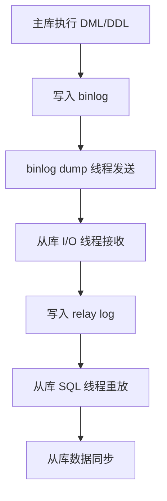
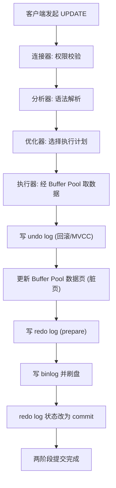
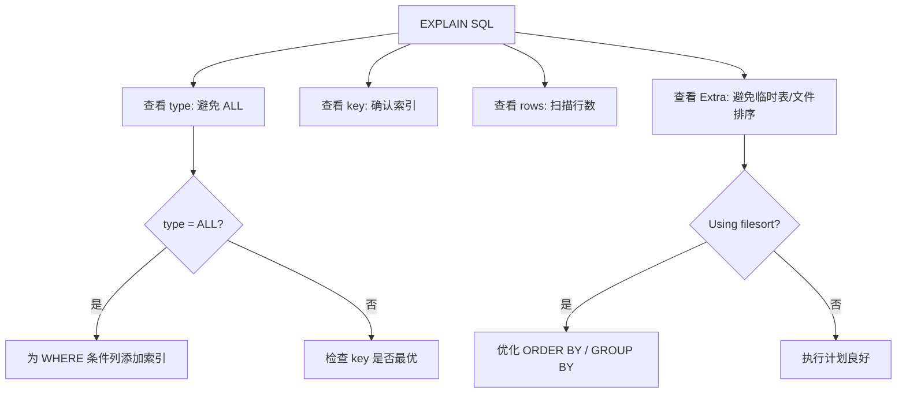
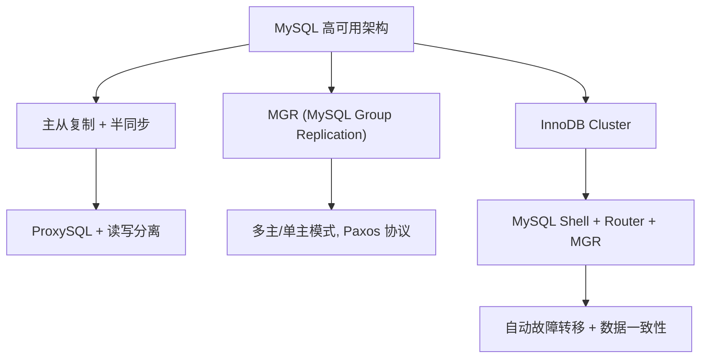

# MySQL 面试

::: tip 扩展

- [《高性能 MySQL》](https://book.douban.com/subject/23008813/)
- [极客时间教程 - MySQL 实战 45 讲](https://time.geekbang.org/column/intro/139)
- [图解 MySQL 介绍](https://xiaolincoding.com/mysql/)
- [《SQL 必知必会》](https://book.douban.com/subject/35167240/) - SQL 的基本概念和语法【入门】
- [《MySQL 必知必会》](https://book.douban.com/subject/3354490/) - MySQL 的基本概念和语法【入门】

:::

## SQL

::: tip 扩展

- [《SQL 必知必会》](https://book.douban.com/subject/35167240/) - SQL 的基本概念和语法【入门】
- [《MySQL 必知必会》](https://book.douban.com/subject/3354490/) - MySQL 的基本概念和语法【入门】

:::

### 【简单】什么是范式？什么是反范式？⭐⭐

> 🎯 目标等级：L2 ｜ ⏱ 建议用时：8 min ｜ 🏷 标签：SQL / 数据库设计

#### 💎 关键结论

范式是数据库设计规范：1NF 要求字段**原子不可分**，2NF 消除**部分依赖**，3NF 消除**传递依赖**。现代设计通常以 3NF 为上限，过高范式导致多表 JOIN 性能下降，因此采用**反范式**——适当冗余换取查询效率。

#### ⚡ 记忆卡片

- **口诀**：一原子、二全依、三不传、反范式冗余换性能
- **关键词**：原子性 ／ 部分依赖 ／ 传递依赖 ／ 3NF 上限 ／ 冗余换性能
- **链路**：1NF（原子） → 2NF（全依赖主键） → 3NF（不传递依赖） → 反范式（适度冗余）

#### 📖 核心知识

**范式（Normal Form）** 是关系数据库设计的规范，核心目的是**消除数据冗余、避免增删改异常、保证数据一致性**。

| 范式    | 核心要求                                      | 消除的问题                   |
| :------ | :-------------------------------------------- | :--------------------------- |
| **1NF** | 字段**原子不可分**（每列不可再拆分）          | 重复组、嵌套字段             |
| **2NF** | 在 1NF 基础上，消除**非主键对主键的部分依赖** | 部分依赖导致的冗余与异常     |
| **3NF** | 在 2NF 基础上，消除**非主键之间的传递依赖**   | 传递依赖导致的冗余与更新异常 |


现代数据库设计通常**以 3NF 为上限**。过高的范式（如 BCNF、4NF）会导致表过度拆分，查询时需要大量 JOIN，带来严重性能瓶颈。因此，实际工程中常采用**反范式**设计：通过适当的数据冗余（如冗余字段、汇总表）来减少 JOIN，换取查询性能。

::: details 2NF 示例

假设有一张 student 表：`student（学号、课程号、姓名、学分、成绩）`

- 姓名依赖**学号**（主键的一部分），学分依赖**课程号**（主键的另一部分）→ 存在**部分依赖**，不满足 2NF。
- 不满足 2NF 可能导致：数据冗余、删除异常（删成绩丢课程信息）、插入异常（未选课无法记录）、更新异常（改学分需改所有行）。

按 2NF 拆分：

```sql
student（学号、姓名）
course（课程号、学分）
student_course（学号、课程号、成绩）
```

:::

::: details 3NF 示例

假设有一张 student 表：`student（学号、姓名、年龄、班级号、班主任）`

- 属于 2NF（主键为单属性「学号」），但存在**传递依赖**：学号 → 班级号 → 班主任。
- 问题：数据冗余（同班同学班主任重复）、更新异常（换班主任需改多行）。

按 3NF 拆分：

```sql
student（学号、姓名、年龄、班级号）
class（班级号、班主任）
```

:::

#### 🔀 发散问题

- **Q：反范式有哪些常见实践？**

  → 冗余字段（如订单表冗余用户名）、汇总表（如统计表冗余计数）、空间换时间的宽表设计。核心原则是**读多写少的场景适合反范式**。

- **Q：什么是 BCNF？**

  → 在 3NF 基础上消除**主键对候选键的部分依赖和传递依赖**，是更严格的范式。实际工程中极少需要超过 3NF。

### 【简单】为什么不推荐使用存储过程？⭐⭐

> 🎯 目标等级：L2 ｜ ⏱ 建议用时：6 min ｜ 🏷 标签：SQL / 架构设计

#### 💎 关键结论

存储过程虽有预编译、减少网络开销的优点，但**移植性差、版本控制难、调试困难、扩展性差**，现代架构提倡「数据库只做存取，计算交给应用」，业务逻辑应放在应用层而非数据库。

#### ⚡ 记忆卡片

- **口诀**：难移植、难调试、难版本、难扩展
- **关键词**：数据库绑定 ／ Git 不友好 ／ 无调试工具 ／ 分库分表不支持
- **链路**：存储过程优点 → 现代架构痛点 → 应用层代码替代

#### 📖 核心知识

存储过程的**优点**：预编译执行效率高、减少应用与数据库之间的网络传输。

但在现代架构中**不推荐作为主要业务逻辑载体**，核心缺点：

| 缺点           | 说明                                           |
| :------------- | :--------------------------------------------- |
| **移植性差**   | 与特定数据库强绑定，语法不通用，换库需重写     |
| **版本控制难** | 存在数据库中，难以纳入 Git 管理和 CI/CD 流水线 |
| **调试维护难** | 缺乏好用的调试工具，逻辑复杂时排查极其痛苦     |
| **扩展性差**   | 高并发下会成为数据库性能瓶颈，且不支持分库分表 |

因此，现代开发提倡**「数据库只做存取，计算交给应用」**，除非是极端的大数据量批量清洗或强依赖数据库特性的场景，否则一律用应用层代码替代。

#### 🔀 发散问题

- **Q：存储过程和触发器有什么区别？**

  → 存储过程由应用显式调用，触发器由数据库事件（INSERT/UPDATE/DELETE）自动触发，两者都难移植、难调试，现代架构均不推荐。

### 【中等】如何避免重复插入数据？⭐⭐

> 🎯 目标等级：L2-L3 ｜ ⏱ 建议用时：12 min ｜ 🏷 标签：SQL / 防重设计

#### 💎 关键结论

防重设计核心原则：**应用层校验是前置防线，唯一索引是底层兜底**。应用层通过分布式锁/幂等 Token 拦截并发，数据库层用唯一索引保证原子性，配合 `INSERT IGNORE` / `REPLACE INTO` / `INSERT ... ON DUPLICATE KEY UPDATE` 三种标准策略处理冲突。

#### ⚡ 记忆卡片

- **口诀**：应用拦截并发，索引兜底原子，三种策略按需选
- **关键词**：分布式锁 ／ 幂等 Token ／ 唯一索引 ／ INSERT IGNORE ／ REPLACE INTO ／ ON DUPLICATE KEY UPDATE
- **链路**：并发请求 → 应用层拦截（锁/Token） → 查重校验 → 唯一索引兜底 → 冲突策略

#### 📖 核心知识

**应用层控制策略**

- 通过**分布式锁**（如 Redis 锁）或**幂等 Token** 拦截并发请求，避免同一时间产生重复写入；
- 插入前进行**查重校验**，作为第一道防线。

**数据库插入策略**

业务层校验无法做到绝对原子性，因此必须依赖**唯一索引**作为数据完整性的终极兜底。针对唯一索引冲突，有三种标准插入策略：

| 策略                                 | 行为                         | 适用场景                 |
| :----------------------------------- | :--------------------------- | :----------------------- |
| `INSERT IGNORE INTO`                 | 存在则忽略，不存在则插入     | 幂等写入，不关心重复数据 |
| `REPLACE INTO`                       | 存在则先删后插，不存在则插入 | 需要全量覆盖的场景       |
| `INSERT ... ON DUPLICATE KEY UPDATE` | 存在则更新，不存在则插入     | 需要部分字段更新的场景   |

::: tabs#避免重复插入数据

@tab INSERT IGNORE INTO

下面是示例的初始化准备：

```sql
-- 建表
CREATE TABLE `user` (
  `id` INT(10) UNSIGNED NOT NULL AUTO_INCREMENT COMMENT 'ID',
  `name` VARCHAR(255) NOT NULL COMMENT '名称',
  `age` INT(3) DEFAULT '0' COMMENT '年龄',
  PRIMARY KEY (`id`),
  UNIQUE KEY `name`(`name`)
) DEFAULT CHARSET = utf8mb4;

-- 测试数据
INSERT INTO `user`
VALUES (1, '刘备', 30);
INSERT INTO `user`
VALUES (2, '关羽', 28);
```

`INSERT IGNORE INTO` 会根据主键或者唯一键判断，忽略数据库中已经存在的数据：

- 若数据库没有该条数据，就插入为新的数据，跟普通的 `INSERT INTO` 一样
- 若数据库有该条数据，就忽略这条插入语句，不执行插入操作

```sql
INSERT IGNORE INTO user (name, age)
VALUES ('关羽', 29), ('张飞', 25);

-- 最终数据
+----+--------+------+
| id | name   | age  |
+----+--------+------+
|  1 | 刘备   |   30 |
|  2 | 关羽   |   28 |
|  3 | 张飞   |   25 |
+----+--------+------+
```

@tab REPLACE INTO

`REPLACE INTO` 会根据主键或者唯一键判断：

- 若表中已存在该数据，则先删除此行数据，然后插入新的数据，相当于 `delete + insert`
- 若表中不存在该数据，则直接插入新数据，跟普通的 `insert into` 一样

```sql
REPLACE INTO user(id, name, age)
VALUES (2,  '关羽', 29), (4,  '赵云', 22);

-- 最终数据
+----+--------+------+
| id | name   | age  |
+----+--------+------+
|  1 | 刘备   |   30 |
|  2 | 关羽   |   29 |
|  3 | 张飞   |   25 |
|  4 | 赵云   |   22 |
+----+--------+------+
```

@tab INSERT ... ON DUPLICATE KEY UPDATE

`INSERT ... ON DUPLICATE KEY UPDATE` 会根据主键或者唯一键判断：

- 若数据库已有该数据，则直接更新原数据，相当于 UPDATE
- 若数据库没有该数据，则插入为新的数据，相当于 INSERT

```sql
INSERT INTO user(id, name, age)
VALUES (2, '关羽', 27)
ON DUPLICATE KEY UPDATE name=values(name), age=values(age);

-- 最终数据
+----+--------+------+
| id | name   | age  |
+----+--------+------+
|  1 | 刘备   |   30 |
|  2 | 关羽   |   27 |
|  3 | 张飞   |   25 |
|  4 | 赵云   |   22 |
+----+--------+------+
```

:::

#### 🔬 扩展知识

::: details

- 【L3】三种策略的性能对比

  `INSERT IGNORE` 最快（直接忽略），`ON DUPLICATE KEY UPDATE` 次之（原地更新），`REPLACE INTO` 最慢（先删后插，可能触发外键级联）。

  高并发场景优先 `INSERT IGNORE` 或 `ON DUPLICATE KEY UPDATE`。

- 【L3】`REPLACE INTO` 的陷阱

  先删后插会生成新的自增 ID，且可能触发 DELETE 触发器，不适合有外键关联或依赖 ID 不变的场景。

:::

#### ⚠️ 常见误区

::: details

- ❌ "应用层查重就够了" → 并发场景下查重与插入不是原子操作，必须靠唯一索引兜底。
- ❌ "`REPLACE INTO` 和 `ON DUPLICATE KEY UPDATE` 一样" → `REPLACE` 是先删后插（新 ID），后者是原地更新（保留 ID）。

:::

#### 🔀 发散问题

- **Q：分布式锁和幂等 Token 有什么区别？**

  → 分布式锁是阻塞式防并发，幂等 Token 是非阻塞式去重，前者适合强一致场景，后者适合高并发场景。

- **Q：唯一索引和普通索引有什么区别？**

  → 唯一索引保证数据不重复。

### 【简单】EXISTS 和 IN 有什么区别？⭐⭐

> 🎯 目标等级：L2 ｜ ⏱ 建议用时：6 min ｜ 🏷 标签：SQL / 查询优化

#### 💎 关键结论

`EXISTS` 先外后内（外表小内表大时快），`IN` 先内后外（外表大内表小时快）。核心原则：**哪个表小就用哪个表来驱动**——小表驱动大表。

#### ⚡ 记忆卡片

- **口诀**：EXISTS 外驱动，IN 内驱动，小表驱动大表
- **关键词**：先外后内 ／ 先内后外 ／ 小表驱动
- **链路**：EXISTS → 遍历外表 → 子查询匹配内表 ｜ IN → 先查内表 → 外表匹配

#### 📖 核心知识

| 维度           | EXISTS                                 | IN                                       |
| :------------- | :------------------------------------- | :--------------------------------------- |
| **功能**       | 判断子查询结果集是否非空               | 判断值是否在指定集合中                   |
| **执行顺序**   | **先外后内**：遍历外表，逐行子查询匹配 | **先内后外**：先查内表，结果作为外表条件 |
| **适用场景**   | 外表小、内表大                         | 外表大、内表小                           |
| **两表相当时** | 差别不大                               | 差别不大                                 |


::: details EXISTS 和 IN 的对比示例

```sql
-- IN：先查 B，再用结果匹配 A
SELECT * FROM A WHERE cc IN (SELECT cc FROM B)

-- EXISTS：先遍历 A，逐行子查询匹配 B
SELECT * FROM A WHERE EXISTS (SELECT cc FROM B WHERE B.cc = A.cc)
```

当 A 小于 B 时，用 `EXISTS`（外表 A 小，驱动次数少）：

```sql
for i in A        -- 外表循环
    for j in B    -- 内表匹配
        if j.cc == i.cc then ...
```

当 B 小于 A 时用 `IN`（内表 B 小，先查结果集小）：

```sql
for i in B        -- 先查内表
    for j in A    -- 外表匹配
        if j.cc == i.cc then ...
```

:::

#### 🔀 发散问题

- **Q：MySQL 优化器会自动选择 EXISTS 还是 IN 吗？**

  → 现代 MySQL 优化器会对两者做等价改写（subquery optimization），实际执行计划可能相同，建议用 `EXPLAIN` 确认。

### 【简单】UNION 和 UNION ALL 有什么区别？⭐

> 🎯 目标等级：L2 ｜ ⏱ 建议用时：4 min ｜ 🏷 标签：SQL / 集合操作

#### 💎 关键结论

两者都将两个结果集合并为一个，核心区别：`UNION` 会**去重**（效率低），`UNION ALL` **不去重**（效率高）。除非明确需要去重，否则优先用 `UNION ALL`。

#### ⚡ 记忆卡片

- **口诀**：UNION 去重慢，UNION ALL 直接拼
- **关键词**：去重 ／ 排序 ／ 性能差异
- **链路**：UNION → 合并 + 去重 + 排序 ｜ UNION ALL → 直接合并

#### 📖 核心知识

两个要联合的 SQL 语句**字段个数必须一样，字段类型要“相容”**。

| 维度     | UNION              | UNION ALL          |
| :------- | :----------------- | :----------------- |
| **去重** | 去重（DISTINCT）   | 不去重             |
| **排序** | 按字段顺序排序     | 直接合并，不排序   |
| **性能** | 较低（需去重扫描） | 较高（无额外操作） |

> 💡 实际开发中，除非确认需要去重，否则一律用 `UNION ALL`，避免不必要的性能开销。

#### 🔀 发散问题

- **Q：UNION 的去重原理是什么？**

  → 相当于对合并后的结果集执行一次 DISTINCT，内部会创建临时表并用排序或哈希去重，开销与数据量成正比。

### 【简单】JOIN 有哪些类型？⭐⭐

> 🎯 目标等级：L2 ｜ ⏱ 建议用时：8 min ｜ 🏷 标签：SQL / 连接查询

#### 💎 关键结论

JOIN 用于多表联合查询，条件用 `ON` 而非 `WHERE`。主要分为**内连接**（取交集）、**外连接**（保留某侧全量）和**交叉连接**（笛卡尔积）。连接通常比子查询更高效。

#### ⚡ 记忆卡片

- **口诀**：内连接取交集，左连接保左表，右连接保右表，交叉连接笛卡尔积
- **关键词**：INNER JOIN ／ LEFT JOIN ／ RIGHT JOIN ／ CROSS JOIN ／ NATURAL JOIN
- **链路**：INNER（匹配） → LEFT/RIGHT（保留一侧） → CROSS（全组合）

#### 📖 核心知识

| 连接类型     | 关键字           | 说明                                      |
| :----------- | :--------------- | :---------------------------------------- |
| **内连接**   | `INNER JOIN`     | 取两表匹配记录，无条件时返回笛卡尔积      |
| **左连接**   | `LEFT JOIN`      | 保留左表所有记录，右表无匹配则填 NULL     |
| **右连接**   | `RIGHT JOIN`     | 保留右表所有记录，左表无匹配则填 NULL     |
| **交叉连接** | `CROSS JOIN`     | 返回笛卡尔积（两表全组合）                |
| **自然连接** | `NATURAL JOIN`   | 自动连接所有同名列（内连接的特例）        |
| **自连接**   | 自身 `JOIN` 自身 | 内连接的特例，用于表内关联（如员工-上级） |


> 💡 连接可以替换子查询，并且一般比子查询的效率更高。

#### 🔀 发散问题

- **Q：为什么不推荐多表 JOIN？**

  → 性能、索引失效、数据膨胀等多方面风险，见本文档「为什么不推荐多表 JOIN」。

### 【中等】为什么不推荐多表 JOIN？⭐⭐⭐

> 🎯 目标等级：L2-L3 ｜ ⏱ 建议用时：10 min ｜ 🏷 标签：SQL / 性能优化

#### 💎 关键结论

《阿里巴巴 Java 开发手册》强制规定**超过三张表禁止 JOIN**。多表 JOIN 会导致性能指数级下降（临时表+磁盘 I/O）、索引失效、数据膨胀、死锁风险，且 MySQL 优化器对复杂 JOIN 的选择能力有限。推荐用**反范式冗余 + 应用层组装**替代。

#### ⚡ 记忆卡片

- **口诀**：性能差、索引废、数据胀、锁风险、难维护
- **关键词**：临时表溢出 ／ 索引打折 ／ 笛卡尔积 ／ 优化器无力 ／ 反范式替代
- **链路**：多表 JOIN → 临时表+锁 → 性能崩 → 反范式冗余替代

#### 📖 核心知识

[《阿里巴巴 Java 开发手册》](https://book.douban.com/subject/27605355/) 强制规定**超过三张表禁止 JOIN**，核心原因：

**核心问题**

| 问题                   | 说明                                                                                                               |
| :--------------------- | :----------------------------------------------------------------------------------------------------------------- |
| **性能差**             | 每多 JOIN 一张表，查询复杂度指数级增长；MySQL 需创建临时表存储中间结果，数据量大时临时表溢出磁盘，引发严重磁盘 I/O |
| **索引失效**           | 多表连接时，即使每张表都有索引，JOIN 操作本身也会让索引效果大幅打折，无合适索引时直接全表扫描                      |
| **数据膨胀与死锁风险** | 多表匹配产生笛卡尔积式数据冗余，结果集急剧膨胀；同时多表锁定在高并发下易引发死锁                                   |

**其他问题**

- **可读性差**：多表 JOIN 的 SQL 又长又复杂，开发和维护成本高，易引入 Bug。
- **优化器力不从心**：MySQL 优化器对复杂 JOIN 的选择能力有限，很难自动选出最优执行计划。

#### 🔬 扩展知识

::: details

- 【L3】**JOIN Buffer 机制**

  当 JOIN 无法利用索引时，MySQL 使用 Join Buffer（内存）来缓存驱动表的数据，然后逐行与被驱动表匹配。Buffer 越大，单次能缓存的行越多，
  但受 `join_buffer_size` 限制。

- 【L4】**反范式替代方案**

  在订单表冗余用户名/商品名，避免 JOIN 用户表/商品表；或使用 ES 宽表方案，将多表数据异构到 ES 中查询。

:::

#### 🏭 实战场景

::: details

生产案例：某电商订单详情页（MySQL 8.0.33，4 核 16GB），核心查询为 5 表 JOIN：`orders JOIN order_items JOIN users JOIN products JOIN categories`，
开发环境数据量 < 1 万时 P99 < 50ms。上线后大促期间 QPS 达 5000，P99 飙升至 8s，
随后 MySQL 进程被 OOM Killer 终止（dmesg 记录 `Out of memory: Kill process mysqld`）。排查过程：`join_buffer_size` 被调大为 2MB（系统默认仅 256KB），
无法利用索引的 JOIN 需分配 join buffer，5 表查询含 4 个 JOIN，单连接峰值内存 4 × 2MB = 8MB；5000 并发连接 × 8MB = 40GB，超过服务器 16GB 物理内存。

同时 `SHOW ENGINE INNODB STATUS` 显示该查询在执行期间锁定了 5 张表共约 12000 行，导致其他写入操作排队等待，锁等待超时（`innodb_lock_wait_timeout=50s`）频发。根因：

多表 JOIN 在高并发下 join buffer 内存线性膨胀 + 跨表行锁范围过大。修复：① 将 5 表反范式化为 2 张宽表（orders 冗余 user_name、product_name、category_name），
消除 3 个 JOIN；② 应用层改为分步查询（先查 orders + order_items，再异步查 users/products 拼装），单查询内存占用降至 < 64KB；
③ 热点商品数据（Top 1000 SKU）缓存至 Redis（命中率 95%），MySQL QPS 从 5000 降至 800。修复后 P99 恢复至 45ms，OOM 未再发生。

:::

#### 🔀 发散问题

- **Q：如果必须 JOIN 多张表，如何优化？**

  → 小表驱动大表、确保 JOIN 字段有索引、控制 JOIN 表数不超过 3 张，必要时用反范式或数据异构替代。

- **Q：JOIN 有哪些类型？**

  → 见本文档「JOIN 有哪些类型」。

### 【中等】DROP、DELETE 和 TRUNCATE 有什么区别？⭐⭐⭐

> 🎯 目标等级：L2-L3 ｜ ⏱ 建议用时：12 min ｜ 🏷 标签：SQL / DDL 与 DML

#### 💎 关键结论

三者都能“删除数据”，但本质不同：`DROP` 删表（数据+结构），`DELETE` 逐行删数据（保留表结构，可回滚），`TRUNCATE` 删全部数据（保留表结构，DDL 不可回滚，自增 ID 重置）。速度：DROP ≈ TRUNCATE >> DELETE。

#### ⚡ 记忆卡片

- **口诀**：DROP 删表，TRUNCATE 清空，DELETE 逐行删
- **关键词**：DDL vs DML ／ delete mark ／ 重建表文件 ／ 自增重置 ／ 回滚能力
- **链路**：DROP（连根拔起） ｜ DELETE（逐行标记，可回滚） ｜ TRUNCATE（重建文件，不可回滚）

#### 📖 核心知识

| 维度        | DROP        | DELETE              | TRUNCATE                        |
| :---------- | :---------- | :------------------ | :------------------------------ |
| **类型**    | DDL         | DML                 | DDL                             |
| **表结构**  | 删除        | 保留                | 保留                            |
| **回滚**    | 不可        | 可在事务内回滚      | 不可                            |
| **自增 ID** | -           | 不重置              | 重置为 1                        |
| **速度**    | 快          | 慢（逐行标记）      | 快（重建表文件）                |
| **日志**    | 记录 binlog | 写 undo/redo/binlog | 记录 binlog（可用于时间点恢复） |

- **DROP**：删除数据表，包括数据和结构。MySQL 5.7 及之前，表数据存于 `.ibd` 文件，表结构元数据存于 `.frm` 文件，DROP 会直接删除这些文件；**MySQL 8.0 移除了 `.frm` 文件，表结构统一存入 InnoDB 数据字典**。DROP 是 DDL，执行后无法回滚。
- **DELETE**：删除数据，但保留表结构。InnoDB 的 DELETE 并非立即物理删除，而是将记录**标记为已删除**（delete mark），后续由 purge 线程真正清理；同时会写入 undo log（支持回滚）、redo log 和 binlog。因此 DELETE 后磁盘空间不会立刻释放，大量删除后可能需要 `OPTIMIZE TABLE` 重建表回收碎片。
- **TRUNCATE**：删除全部表数据，保留表结构。它是 **DDL 而非 DML**：会隐式提交，**无法通过事务回滚**（但会记录 binlog，可用于时间点恢复时的重放）；执行后自增主键重新从 1 开始。实现上直接删除并重建表文件，速度远快于无条件的 DELETE；MySQL 8.0 起 TRUNCATE 支持原子性（失败可回滚元数据）。

#### 🔬 扩展知识

::: details

- 【L3】**DELETE 后磁盘空间为什么不释放？**

  → InnoDB 的 delete mark 只是标记删除，空间留给后续 INSERT 复用。要彻底回收需 `OPTIMIZE TABLE`（本质是重建表）。

- 【L3】**MySQL 8.0 原子 DDL**

  DROP/TRUNCATE 等 DDL 操作支持原子性，失败时元数据可回滚，避免了早期版本“半完成”状态的数据字典损坏问题。

:::

#### 📊 量化参考

::: details

| 指标                        | 数值                               | 备注                                                                        |
| :-------------------------- | :--------------------------------- | :-------------------------------------------------------------------------- |
| DELETE 全表耗时（100 万行） | ~10-30s（SSD）                     | 逐行 delete mark + 写 undo/redo/binlog；大事务建议分批（每批 1000-5000 行） |
| DELETE 全表耗时（1 亿行）   | 小时级                             | 单事务删除会产生超大 undo，可能拖垮主从复制，必须分批删除                   |
| TRUNCATE 耗时               | < 1s（与数据量无关）               | 删除并重建表文件，仅处理元数据级操作                                        |
| DROP TABLE 耗时             | 毫秒级（8.0 原子 DDL）             | 大表删除 `.ibd` 文件本身通常 < 1s                                           |
| DELETE 后磁盘空间回收       | 0%（不自动释放）                   | delete mark 空间由后续 INSERT 复用，需 `OPTIMIZE TABLE` 才归还 OS           |
| OPTIMIZE TABLE（100GB 表）  | 30-60min                           | Online DDL 重建表，磁盘需预留约 2 倍空间，期间允许并发 DML                  |
| 自增 ID 行为                | DELETE 不重置 ｜ TRUNCATE 重置为 1 | 数据迁移/恢复场景注意自增冲突                                               |

:::

#### ⚠️ 常见误区

::: details

- ❌ "TRUNCATE 比 DELETE 快是因为不写日志" → TRUNCATE 也会记录 binlog，只是不写 undo log，且通过删除重建表文件实现，避免了逐行操作的开销。
- ❌ "DELETE 后磁盘空间立即释放" → InnoDB 的 delete mark 只是标记，空间由后续 INSERT 复用，需 `OPTIMIZE TABLE` 才能回收。

:::

#### 🔀 发散问题

- **Q：大量 DELETE 后如何回收空间？**

  → `OPTIMIZE TABLE` 或 `ALTER TABLE ... ENGINE=InnoDB` 重建表，见本文档「什么是页分裂？为什么推荐使用自增主键」。

- **Q：MySQL 8.0 原子 DDL 是什么？**

  → DDL 操作支持原子性，避免半完成状态，见本文档「MySQL 8.0 有哪些重要新特性」。

## MySQL 建模

::: tip 扩展

- [MySQL 官方文档之数据类型](https://dev.mysql.com/doc/refman/8.4/en/data-types.html)
- [MySQL 如何选择 float, double, decimal](http://blog.leanote.com/post/weibo-007/mysql_float_double_decimal)

:::

### 【简单】CHAR 和 VARCHAR 的区别是什么？⭐⭐⭐

> 🎯 目标等级：L2 ｜ ⏱ 建议用时：8 min ｜ 🏷 标签：MySQL 建模 / 数据类型

#### 💎 关键结论

`CHAR` 是**定长**字符串（不足补空格），`VARCHAR` 是**变长**字符串（额外 1~2 字节记录长度）。CHAR 适合固定长度短字符串（如哈希值、身份证号），VARCHAR 适合长度不确定的字符串（如昵称、标题）。

#### ⚡ 记忆卡片

- **口诀**：CHAR 定长补空格，VARCHAR 变长省空间
- **关键词**：定长 vs 变长 ／ 空格填充 ／ 1~2 字节长度 ／ BINARY 二进制
- **链路**：CHAR（固定长度） → 补空格 ／ VARCHAR（可变长度） → 加长度前缀

#### 📖 核心知识

| 维度         | CHAR(M)                                | VARCHAR(M)                     |
| :----------- | :------------------------------------- | :----------------------------- |
| **长度**     | 定长（不足右侧补空格，检索时自动去除） | 变长（额外 1~2 字节记录长度）  |
| **空间**     | 始终占 M 个字符                        | 按实际长度占空间               |
| **M 含义**   | 能保存的字符数最大值                   | 能保存的字符数最大值           |
| **适用场景** | 固定长度短字符串（MD5、身份证号）      | 长度不确定字符串（昵称、标题） |

- **进阶补充（BINARY 系列）**：`BINARY` 和 `VARBINARY` 是它们的二进制版本，存储的是**字节**而非字符，没有字符集概念，排序和比较直接基于字节的数值大小。


#### 🔀 发散问题

- **Q：VARCHAR(50) 和 VARCHAR(500) 性能一样吗？**

  → 不一样。VARCHAR 长度越大，内存分配和排序开销越高，建议根据实际需求设置合理长度。

### 【简单】金额数据用什么类型存储？⭐⭐⭐

> 🎯 目标等级：L2 ｜ ⏱ 建议用时：10 min ｜ 🏷 标签：MySQL 建模 / 数据类型

#### 💎 关键结论

推荐用 `BIGINT` 以“分”为单位存储金额（1 元存为 100）。`FLOAT`/`DOUBLE` 会丢精度，且 MySQL 8.0.17 起官方已标记废弃；`DECIMAL` 精确但变长编码、计算效率低、精度长度难统一；`BIGINT` 整型计算最快、无精度问题，8 字节以分计可表示约 92 万亿元，覆盖绝大多数业务。

#### ⚡ 记忆卡片

- **口诀**：浮点丢、DECIMAL 慢、BIGINT 存分最划算
- **关键词**：二进制截断 ／ 8.0.17 废弃 ／ 变长编码 ／ 分单位 ／ 92 万亿
- **链路**：十进制 → 二进制截断 → 精度丢失 → 精确类型 DECIMAL → 效率不足 → BIGINT（分）

#### 📖 核心知识

MySQL 中 `FLOAT`、`DOUBLE`、`DECIMAL` 均可表示小数，但适用场景不同：

- **`FLOAT` / `DOUBLE` 会丢失精度**：十进制小数转二进制存储时可能被截断。且 MySQL 8.0.17 起 `FLOAT`/`DOUBLE` 的精度指定语法已被标记废弃，官方不推荐使用。
- **`DECIMAL` 是精确存储类型**：适合金额场景，但它是变长编码，计算效率不如原生整型；且不同资金量级（百万、百亿、万亿）所需精度定义不同，字段长度难以统一。

**推荐方案：`BIGINT` + 最小单位存储**。将金额以“分”为单位存储，如 1 元存为 100。优势：

- 整型计算效率最高；
- 无精度丢失；
- 8 字节有符号 `BIGINT` 以分计，可表示最大约 92 万亿元，覆盖绝大多数业务场景。

::: details FLOAT 丢失精度案例

【示例】`FLOAT` 丢失精度案例

```sql
CREATE TABLE `test` (
  `value` FLOAT(10,2) DEFAULT NULL
);

mysql> insert into test value (131072.32);
Query OK, 1 row affected (0.01 sec)

mysql> select * from test;
+-----------+
| value     |
+-----------+
| 131072.31 |
+-----------+
1 row in set (0.02 sec)
```

明明定义保留两位小数，写入的 `131072.32` 却变成了 `131072.31`——精度在存储阶段就已丢失，与显示位数无关。

:::

#### 🔬 扩展知识

::: details

- 【L3】`DECIMAL(M,D)` 存储空间如何计算？

  MySQL 将整数与小数部分按每 9 位数字打包为 4 字节存储，`DECIMAL(18,2)` 约占用 8 字节——与 `BIGINT` 空间相当。但其运算是软件模拟的定点运算，远慢于 CPU 原生整型指令。

- 【L4】整型存分后，应用层用 Java `BigDecimal` 接有什么坑？

  同样有坑：`equals` 会连带比较精度位（`1.0` 与 `1.00` 判定不等），应使用 `compareTo`；除不尽时抛 `ArithmeticException`，必须显式指定舍入模式。

- 【L4】跨境多币种场景下还能统一按“分”存吗？

  不能。日元无小数位、巴林第纳尔为三位小数。业界方案是按 ISO 4217 的 minor unit 维护各币种最小单位，或统一最大精度后由应用层换算。

> 📚 延伸阅读：[MySQL 如何选择 float, double, decimal](http://blog.leanote.com/post/weibo-007/mysql_float_double_decimal)

:::

#### ⚠️ 常见误区

::: details

- ❌ "`FLOAT(10,2)` 保留两位小数就不会丢精度" → `(M,D)` 只是显示与存储约束，精度在十进制转二进制存储时已丢失。
- ❌ "`DECIMAL` 精确，金额就该用 `DECIMAL`" → 忽略了高并发下的计算成本，以及不同资金量级下精度定义无法统一的问题。

:::

#### 🔀 发散问题

- **Q：`BIGINT` 存分，展示层除以 100 时有坑吗？**

  → 有，浮点除法会再次引入精度问题。应用层应保持整型运算到最后一刻，输出时再格式化（如 Java 用 `BigDecimal.valueOf(cents).movePointLeft(2).toPlainString()`）。

- **Q：IP 地址用什么类型存储？**

  → `INT UNSIGNED` 配合 `INET_ATON()`/`INET_NTOA()` 转换，见本文档「IP 地址用什么类型存储」。

- **Q：时间数据选 `DATETIME` 还是 `TIMESTAMP`？**

  → 涉及时区与存储范围的权衡，见本文档「时间数据选择 DATETIME 还是 TIMESTAMP」。

### 【简单】IP 地址用什么类型存储？⭐

> 🎯 目标等级：L2 ｜ ⏱ 建议用时：5 min ｜ 🏷 标签：MySQL 建模 / 数据类型

#### 💎 关键结论

IPv4 用 `INT UNSIGNED`（4 字节）配合 `INET_ATON()`/`INET_NTOA()` 转换；IPv6 用 `BINARY(16)` 配合 `INET6_ATON()`/`INET6_NTOA()` 转换。不要用 `VARCHAR` 存 IP，浪费空间且无法范围查询。

#### ⚡ 记忆卡片

- **口诀**：IPv4 用 INT，IPv6 用 BINARY
- **关键词**：INT UNSIGNED ／ BINARY(16) ／ INET_ATON ／ INET6_ATON
- **链路**：IP 字符串 → 转换函数 → 整型/二进制存储 → 转换函数还原

#### 📖 核心知识

**IPv4**

- **类型**：`INT UNSIGNED`（0 ~ 4294967295，4 字节）
- **转换**：
  - 存：`INET_ATON('192.168.1.1')` → 3232235777
  - 取：`INET_NTOA(3232235777)` → '192.168.1.1'

**IPv6**

- **类型**：`BINARY(16)`（定长，适合所有 IPv6 地址长度固定）
- **转换**（MySQL 5.6+）：
  - 存：`INET6_ATON('2001:db8::1')` → 二进制数据
  - 取：`INET6_NTOA(binary_data)` → 字符串

> 💡 用整型/二进制存储 IP，不仅节省空间，还能支持范围查询（如 `WHERE ip BETWEEN INET_ATON('192.168.1.1') AND INET_ATON('192.168.1.255')`）。

#### 🔀 发散问题

- **Q：金额数据用什么类型存储？**

  → 用 BIGINT 以分为单位存储，见本文档「金额数据用什么类型存储」。

### 【简单】如何存储 emoji 😃？⭐⭐

> 🎯 目标等级：L2 ｜ ⏱ 建议用时：6 min ｜ 🏷 标签：MySQL 建模 / 字符集

#### 💎 关键结论

推荐将 MySQL 默认字符集设置为 **`utf8mb4`**，它是 `utf8` 的超集，支持 4 字节 Unicode 字符，可以存储 emoji 😃。注意 `utf8` 在 MySQL 中实际是 `utf8mb3`，最多只支持 3 字节。

#### ⚡ 记忆卡片

- **口诀**：utf8 存不了 emoji，utf8mb4 才行
- **关键词**：utf8mb4 ／ 4 字节 ／ utf8mb3 ／ CONVERT TO
- **链路**：emoji 需要 4 字节 → utf8 只支持 3 字节 → utf8mb4 支持 4 字节

#### 📖 核心知识

在表结构设计中，除了将列定义为 `CHAR` 和 `VARCHAR` 用以存储字符外，还需要额外定义字符对应的字符集。随着移动互联网的飞速发展，**推荐把 MySQL 的默认字符集设置为 `utf8mb4`**，否则某些 emoji 表情字符无法在 `utf8` 字符集下存储。

**设置字符集的两种方式**

| 语句                                          | 效果                                           |
| :-------------------------------------------- | :--------------------------------------------- |
| `ALTER TABLE test CHARSET utf8mb4`            | 仅修改表的默认字符集，**已有列不变**，新列生效 |
| `ALTER TABLE test CONVERT TO CHARSET utf8mb4` | **转换已有列 + 新列**全部生效                  |

> 💡 MySQL 8.0 已将默认字符集从 `utf8mb3` 改为 `utf8mb4`，新建实例无需额外配置。

#### 🔀 发散问题

- **Q：时间数据选 DATETIME 还是 TIMESTAMP？**

  → 涉及时区与存储范围的权衡，见本文档「时间数据选择 DATETIME 还是 TIMESTAMP」。

### 【简单】时间数据选择 DATETIME 还是 TIMESTAMP？⭐⭐⭐

> 🎯 目标等级：L2 ｜ ⏱ 建议用时：8 min ｜ 🏷 标签：MySQL 建模 / 数据类型

#### 💎 关键结论

推荐用 **`DATETIME`**。`TIMESTAMP` 虽然省空间（4 字节 vs 8 字节），但存在 2038 年溢出问题，且时区转换会调用操作系统函数加锁，高并发下性能抖动明显。

#### ⚡ 记忆卡片

- **口诀**：DATETIME 范围大无时区，TIMESTAMP 省空间有坑
- **关键词**：8 字节 vs 4 字节 ／ 2038 溢出 ／ \_\_tz_convert 加锁 ／ 显式时区
- **链路**：TIMESTAMP 省空间 → 时区转换加锁 → 高并发性能抖动 → 推荐 DATETIME

#### 📖 核心知识

| 维度     | DATETIME                | TIMESTAMP                   | INT          |
| :------- | :---------------------- | :-------------------------- | :----------- |
| **空间** | 8 字节                  | 4 字节                      | 4 字节       |
| **范围** | 1000-01-01 ~ 9999-12-31 | 1970-01-01 ~ **2038-01-19** | 同 TIMESTAMP |
| **时区** | 无时区转换              | 自动时区转换                | 无时区转换   |
| **性能** | 稳定（无时区开销）      | 高并发下可能抖动            | 同 TIMESTAMP |

**TIMESTAMP 的潜在性能问题**：虽然时区转换本身 CPU 指令不多，但使用默认操作系统时区时，每次转换需调用 `__tz_convert()` 并加锁。大规模并发时，热点资源竞争会导致：

- **性能不如 DATETIME**：`DATETIME` 不存在时区转化问题。
- **性能抖动**：海量并发时，锁竞争导致延迟不稳定。

> 💡 如果必须用 `TIMESTAMP`，强烈建议在配置文件中显式设置时区，而不是使用操作系统时区。

综上，由于 `TIMESTAMP` 存在时间上限和潜在性能问题，推荐使用 `DATETIME`。

#### 🔀 发散问题

- **Q：如何存储 emoji？**

  → 需设置字符集为 utf8mb4，见本文档「如何存储 emoji 😃」。

### 【简单】MySQL一张表最多可以有多少列？⭐

> 🎯 目标等级：L2 ｜ ⏱ 建议用时：3 min ｜ 🏷 标签：MySQL 建模 / 限制

#### 💎 关键结论

**理论上限 4096 列**，但实际受存储引擎制约——**InnoDB 引擎最多 1017 列**。实际设计中应尽量避免超宽表，用垂直拆分优化。

#### ⚡ 记忆卡片

- **口诀**：理论 4096，InnoDB 1017
- **关键词**：4096 ／ 1017 ／ 行格式 ／ DYNAMIC
- **链路**：MySQL 上限 4096 → InnoDB 限制 1017 → 行格式影响实际可用

#### 📖 核心知识

**理论上限 4096 列**，但实际受存储引擎制约——**InnoDB 引擎最多 1017 列**。

**InnoDB 行格式差异**

| 行格式         | 特点                  | 适用场景                                 |
| :------------- | :-------------------- | :--------------------------------------- |
| **REDUNDANT**  | 768 字节前缀          | 旧版本兼容                               |
| **COMPACT**    | 768 字节前缀          | 5.0~5.6 默认（5.7.9 起默认改为 DYNAMIC） |
| **DYNAMIC**    | **仅 20 字节指针**    | **当前默认**（通用）                     |
| **COMPRESSED** | 20 字节指针，支持压缩 | 节省磁盘空间                             |

> 💡 DYNAMIC 行格式下，变长字段只存 20 字节指针，实际数据溢出到外部存储页，因此实际可用列数还受行大小（最大约半页 = 8KB）限制。

#### 🔀 发散问题

- **Q：MySQL 在建表时需要注意什么？**

  → 类型、主键、字符集、索引、约束五大要点，见本文档「MySQL 在建表时需要注意什么」。

### 【中等】MySQL 在建表时需要注意什么？⭐⭐⭐

> 🎯 目标等级：L2-L3 ｜ ⏱ 建议用时：10 min ｜ 🏷 标签：MySQL 建模 / 表设计

#### 💎 关键结论

建表五大要点：**字段类型够用就好、主键必须自增、字符集统一 utf8mb4、约束能加就加、索引精准打击**。这五点决定了表的性能上限和维护成本。

#### ⚡ 记忆卡片

- **口诀**：类型省、主键增、字符集 mb4、约束加、索引精
- **关键词**：TINYINT / BIGINT 自增 ／ utf8mb4 ／ NOT NULL ／ 区分度 ／ 单表≤ 5 索引
- **链路**：字段类型 → 主键设计 → 字符集 → 约束 → 索引

#### 📖 核心知识

| 要点         | 规则                                                                    | 反例                              |
| :----------- | :---------------------------------------------------------------------- | :-------------------------------- |
| **字段类型** | 够用就好：能用 TINYINT 不用 INT，能用数字不用字符串，金额用 BIGINT 存分 | 用 VARCHAR 存 IP、用 FLOAT 存金额 |
| **主键设计** | 必须有主键，最好 BIGINT 自增，严禁 UUID（随机插入毁性能）               | UUID 主键导致页分裂               |
| **字符集**   | 统一 utf8mb4，千万别用 utf8（存不了 emoji）                             | 用 latin1 存中文                  |
| **约束**     | 尽量 NOT NULL，合理 DEFAULT，必要 UNIQUE                                | 字段默认 NULL 导致判断复杂        |
| **索引**     | 区分度高的放联合索引前面，单表不超过 5 个，避免冗余索引                 | 对性别字段建索引                  |

#### 🔬 扩展知识

::: details

- 【L3】**为什么严禁 UUID 做主键？**

  → UUID 是随机值，插入位置分散，频繁引发页分裂和碎片；且 UUID（16 字节）比 BIGINT（8 字节）大，二级索引都会多存一份主键，额外放大存储开销。

- 【L3】**为什么尽量 NOT NULL？**

  → NULL 值会使索引、索引统计、比较运算都变复杂；且 NULL 列需要额外存储空间。可以用 0、空字符串等默认值替代。

:::

#### 🔀 发散问题

- **Q：什么是页分裂？为什么推荐自增主键？**

  → 见本文档「什么是页分裂？为什么推荐使用自增主键」。

- **Q：金额数据用什么类型存储？**

  → 用 BIGINT 以分为单位存储，见本文档「金额数据用什么类型存储」。

### 【中等】什么是页分裂？为什么推荐使用自增主键？⭐⭐⭐⭐

> 🎯 目标等级：L2-L3 ｜ ⏱ 建议用时：12 min ｜ 🏷 标签：MySQL 建模 / InnoDB 存储

#### 💎 关键结论

InnoDB 数据页（16KB）内记录必须按主键有序。当插入的主键落在已满的页中间时，触发**页分裂**（约一半记录迁移到新页），导致空间浪费和性能损耗。**自增主键顺序追加，几乎不会页分裂**；UUID 随机插入则频繁触发。

#### ⚡ 记忆卡片

- **口诀**：页满分裂，自增不裂，UUID 必裂
- **关键词**：16KB 数据页 ／ 页分裂 ／ 自增主键 ／ UUID 反例 ／ OPTIMIZE TABLE
- **链路**：随机主键 → 插入中间 → 页满分裂 → 空间碎片 + 性能损耗

#### 📖 核心知识

InnoDB 的聚簇索引按主键顺序组织数据，数据页（16KB）内的记录必须保持主键有序。

**页分裂的产生**

当插入的主键值落在两个已有数据页之间，且目标页已满时，InnoDB 必须：

1. 将目标页中约一半的记录迁移到新页，腾出空间；
2. 在新页插入新记录；
3. 更新上层索引页的指针。

页分裂的代价：

| 代价         | 说明                                                                           |
| :----------- | :----------------------------------------------------------------------------- |
| **空间浪费** | 分裂后两个页都只有一半左右的数据，产生内存和磁盘碎片                           |
| **性能损耗** | 涉及页的读取、写入、加锁（页分裂需要持有相关页的锁），并发插入时可能产生锁等待 |

**为什么推荐自增主键**

- 自增主键的新记录总是追加到最后一个页的末尾，**顺序写入，几乎不会发生页分裂**，且页的填充率高。
- **UUID 的反例**：UUID 是随机值，插入位置分散，频繁引发页分裂和碎片；且 UUID（16 字节）比 BIGINT（8 字节）大，二级索引都会多存一份主键，额外放大存储开销。若业务必须用全局唯一 ID，可用雪花算法等趋势递增方案，或对 UUID 做 `UUID_TO_BIN(uuid, 1)` 重排（MySQL 8.0）。

#### 🔬 扩展知识

::: details

- 【L3】**页合并非自动**

  删除记录产生的空间碎片不会自动归还操作系统，需要 `OPTIMIZE TABLE` 或 `ALTER TABLE ... ENGINE=InnoDB` 重建表。

- 【L3】**自增主键并非万能**

  分库分表场景全局自增不可行，需用分布式 ID；高并发插入下自增锁（`innodb_autoinc_lock_mode`）也需关注。

:::

#### 📊 量化参考

::: details

| 指标                          | 数值                                | 备注                                                                                                                                  |
| :---------------------------- | :---------------------------------- | :------------------------------------------------------------------------------------------------------------------------------------ |
| InnoDB 页大小                 | 16KB（默认）                        | `innodb_page_size` 可调 4/8/16/32/64KB                                                                                                |
| 单次页分裂耗时                | ~0.5-2ms（热页）；5-10ms（需读盘）  | 含读取旧页、申请新页、迁移约一半记录、更新父节点指针                                                                                  |
| 页分裂后空间利用率            | ~50%                                | 两个页各剩一半数据，形成碎片                                                                                                          |
| UUID 主键 vs 自增主键插入 TPS | 随机主键下降 30%-50%                | 插入点分散 → 频繁分裂 + Buffer Pool 命中率下降                                                                                        |
| 顺序插入页填充率              | ~15/16（约 94%）                    | 来自 InnoDB 页分裂启发式为顺序插入预留的空闲空间；`innodb_fill_factor`（默认 100）仅作用于排序索引创建（bulk load），与普通页分裂无关 |
| 主键长度放大二级索引          | UUID（16B）比 BIGINT（8B）每条多 8B | 千万行 × 3 个二级索引 ≈ 额外 240MB+ 存储                                                                                              |
| 1000 万行表碎片回收           | OPTIMIZE TABLE 约 10-30min          | 重建后空间占用通常可下降 20%-40%（视碎片率）                                                                                          |

:::

#### 🔀 发散问题

- **Q：MySQL 在建表时需要注意什么？**

  → 五大要点，见本文档「MySQL 在建表时需要注意什么」。

- **Q：MySQL 大表如何高效变更表结构？**

  → Online DDL / INSTANT，见本文档「MySQL 大表如何高效的变更表结构、加索引」。

### 【困难】MySQL 大表如何高效的变更表结构、加索引？⭐⭐⭐⭐

> 🎯 目标等级：L3-L4 ｜ ⏱ 建议用时：15 min ｜ 🏷 标签：MySQL 建模 / Online DDL

#### 💎 关键结论

MySQL 大表变更有三种 DDL 算法：**COPY**（全程锁表，已淘汰）、**INPLACE**（5.6+，大部分时间不锁表，通过 row log 记录并发 DML）、**INSTANT**（8.0.12+，只改元数据，秒级完成）。生产优先用 INSTANT，不支持时退化为 INPLACE。

#### ⚡ 记忆卡片

- **口诀**：COPY 锁全表，INPLACE 不拷数据，INSTANT 改元数据
- **关键词**：Online DDL ／ row log ／ ALGORITHM=INPLACE ／ LOCK=NONE ／ 原子 DDL
- **链路**：COPY（锁表） → INPLACE（不拷数据+row log） → INSTANT（秒级改元数据）

#### 📖 核心知识

MySQL 的 DDL 操作支持三种算法，通过 `ALGORITHM` 参数指定：

| 算法        | 版本    | 原理                                      | 锁表             | 适用场景         |
| :---------- | :------ | :---------------------------------------- | :--------------- | :--------------- |
| **COPY**    | 早期    | 创建临时表复制数据                        | 全程锁表         | 已淘汰           |
| **INPLACE** | 5.6+    | 直接在原表操作，通过 row log 记录并发 DML | 大部分时间不锁表 | 加索引、加列等   |
| **INSTANT** | 8.0.12+ | 只修改元数据                              | 不锁表           | 加列、加默认值等 |

**INPLACE 模式流程**：

1. 创建临时索引文件；
2. 扫描原表构建新索引，期间允许并发 DML（通过 row log 记录变更）；
3. 短暂锁表，应用 row log 中的增量变更；
4. 替换旧索引，完成。

```sql
ALTER TABLE users ADD INDEX idx_name(name), ALGORITHM=INPLACE, LOCK=NONE;
```

#### 🔬 扩展知识

::: details

- 【L3】**INSTANT 的限制**

  只支持加列、加默认值、修改列默认值等少数操作，不支持加索引、修改列类型。8.0.12 引入时 INSTANT 加列只能追加到表末尾；
  8.0.29 起放宽为支持任意位置加列与 DROP COLUMN（仍有行数/列数等限制）。

- 【L4】**MDL 锁雪崩（最高频的 DDL 生产事故）**

  DDL 需要获取 MDL（元数据锁）写锁。若此时存在**未提交的长事务**持有该表的 MDL 读锁，DDL 会被阻塞；
  而后续该表的**所有读写请求**又排队阻塞在 DDL 的 MDL 写锁申请之后，连接池被迅速打满，形成雪崩。防护：DDL 前查 `information_schema.innodb_trx` 清理未提交长事务；
  给 DDL 会话设置较小的 `lock_wait_timeout` 快速失败；避开大事务/批量作业时间窗口执行。

- 【L4】**gh-ost vs pt-online-schema-change 原理差异**

  优先原生 Online DDL，不支持或表过大时用外部工具。pt-OSC 在源表上创建**触发器**，将增量写入同步到影子表，
  触发器叠加在业务写路径上、开销更高；gh-ost **不用触发器**，伪装成从库拉取 **binlog** 做增量回放，可按主库负载自动限流，cut-over 阶段仅有秒级锁窗口。

:::

#### 🏭 实战场景

::: details

**千万级表加索引**：使用 `ALGORITHM=INPLACE, LOCK=NONE`，1000 万行表加索引约需 2-5 分钟（SSD），期间业务读写不受影响。若用 COPY 模式，同样操作可能锁表 30 分钟以上。

**故障：DDL 引发 MDL 锁雪崩打满连接池**：某电商订单表（8000 万行）执行 `ALTER TABLE ... ADD INDEX` 时，一个**未提交的长事务**正持有该表的 MDL 读锁，DDL 排队等待 MDL 写锁，
后续该表的所有查询又全部阻塞在 DDL 之后，雪崩持续 45 分钟。期间应用连接池（HikariCP，max=200）全部阻塞在获取连接上，上游网关超时率飙升至 30%。kill 长事务后 DDL 才真正开始执行，
业务压力下又中途 kill DDL 线程，已构建的索引回滚耗时 15 分钟，业务中断共计 1 小时。**教训**：① DDL 前先排查并清理未提交长事务（`information_schema.innodb_trx`），
并为 DDL 会话设置 `lock_wait_timeout` 快速失败；② 显式指定 `ALGORITHM=INPLACE, LOCK=NONE`（5.6+ 加索引默认即 INPLACE，显式指定可防止误判与版本差异）；
③ 大表 DDL 先在从库验证耗时；④ 生产环境推荐 gh-ost（基于 binlog 增量同步，无触发器，cut-over 仅秒级锁窗口）。

:::

#### 📊 量化参考

::: details

| 方案                       | 1000 万行表（~5GB）变更耗时                  | 对主库 QPS 影响  | 说明                                                                        |
| :------------------------- | :------------------------------------------- | :--------------- | :-------------------------------------------------------------------------- |
| gh-ost（SSD）              | ~1-3 小时                                    | < 5%             | 拷贝速率 ~50-100MB/s，基于 binlog 增量同步，无触发器，cut-over 仅秒级锁窗口 |
| pt-osc                     | ~1-3 小时                                    | < 5%             | 批处理间隔 0.5-1s，每批 1000 行                                             |
| 原生 Online DDL（INPLACE） | 元数据变更 ~毫秒级；含数据重建与 gh-ost 相当 | 重建期间 IO 较高 | 支持 `ALGORITHM=INPLACE, LOCK=NONE`                                         |
| COPY（已淘汰）             | 锁表 30min+                                  | 100% 锁表        | 全程阻塞读写                                                                |

**大表 DDL 建议**：> 1000 万行必须用工具（gh-ost / pt-osc），> 1 亿行建议在低峰期 + 从库先行验证。

:::

#### 🔄 迁移策略

::: details

**表结构变更（大表加列 / 改列 / 加索引）迁移策略**

- **迁移前检查清单**
  - 评估表行数与体积（`information_schema.TABLES`）：> 1000 万行禁用原生 COPY，> 5000 万行优先 gh-ost；
  - 试探目标算法：先 `ALTER TABLE ... ALGORITHM=INSTANT`（加列/改默认值），不支持再试 `ALGORITHM=INPLACE, LOCK=NONE`，都失败才上外部工具；
  - 磁盘剩余空间 ≥ 2 倍表体积（工具拷贝需临时副本）；
  - 主从延迟 < 1s、业务低峰窗口、连接池余量充足；
  - 从库先行演练耗时，评估对 IO/带宽的影响。
- **实施步骤（以 gh-ost 为例）**
  1. 从库（或备份库）演练通过后，低峰期在主库启动：`gh-ost --chunk-size=1000 --max-load=Threads_running=50 --allow-on-master`；
  2. 监控拷贝进度与 row log 应用延迟（`echo status | nc 127.0.0.1 <port>`）；
  3. 数据追平后执行原子 cut-over（秒级锁窗口），切换影子表；
  4. 清理 `_gho`/`_del` 临时表，`ANALYZE TABLE` 刷新统计信息。
- **回滚方案**
  - cut-over 之前随时可安全 kill，原表数据与结构不受任何影响；
  - 原生 INPLACE DDL 中途 kill 会触发自动回滚（8.0 原子 DDL 元数据自动还原，但回滚耗时与已执行时间同量级）；
  - 切换后保留 `_del` 旧表 24-48h，异常时可反向 RENAME 回切（需评估期间新增写入的补偿）。
- **监控指标**
  - DDL 进度百分比、row log 积压量；
  - `Threads_running`、主从延迟 `Seconds_Behind_Master`；
  - 磁盘 IO 利用率与剩余空间、慢查询数变化（DDL 后执行计划可能回归）。

:::

#### 🔀 发散问题

- **Q：MySQL 8.0 有哪些重要新特性？**

  → 原子 DDL、INSTANT DDL 等，见本文档「MySQL 8.0 有哪些重要新特性」。

- **Q：什么是页分裂？**

  → 见本文档「什么是页分裂？为什么推荐使用自增主键」。

## MySQL 存储

::: tip 扩展

- [MySQL 官方文档之 InnoDB 存储引擎](https://dev.mysql.com/doc/refman/8.4/en/innodb-storage-engine.html)
- [MySQL 官方文档之可选的存储引擎](https://dev.mysql.com/doc/refman/8.4/en/storage-engines.html)

:::

### 【中等】MySQL 支持哪些存储引擎？⭐⭐

> 🎯 目标等级：L2-L3 ｜ ⏱ 建议用时：8 min ｜ 🏷 标签：MySQL 存储 / 存储引擎

#### 💎 关键结论

MySQL 采用**插拔式存储引擎架构**，最常用的是 **InnoDB**（5.5+ 默认，支持事务/行锁/外键）和 **MyISAM**（5.5 前默认，不支持事务）。其他还有 Memory（内存临时表）、Archive（归档压缩）、NDB（集群）等。

#### ⚡ 记忆卡片

- **口诀**：InnoDB 全能王，MyISAM 快但残
- **关键词**：插拔式 ／ InnoDB 事务行锁 ／ MyISAM 无事务 ／ Memory 临时表
- **链路**：插拔式架构 → InnoDB（默认） ／ MyISAM（老旧） ／ 其他专用引擎

#### 📖 核心知识

**存储引擎层负责数据的存储和提取**。MySQL 采用了插拔式架构，可以根据需要替换。


| 引擎        | 特点                                                   | 适用场景                    |
| :---------- | :----------------------------------------------------- | :-------------------------- |
| **InnoDB**  | 支持**事务、行级锁、外键、自动故障恢复**，并发性能不错 | 大多数业务场景（5.5+ 默认） |
| **MyISAM**  | 速度快，占用资源少，**不支持事务/行锁/外键/故障恢复**  | 只读或读多写少的简单场景    |
| **Memory**  | 数据存于内存，进程崩溃则数据丢失                       | 临时表                      |
| **NDB**     | 分布式集群存储引擎                                     | MySQL Cluster               |
| **Archive** | 高压缩比（1:10），只支持 INSERT 和 SELECT              | 归档数据                    |
| **CSV**     | 以 CSV 文件存储，不支持索引                            | 数据交换                    |


#### 🔀 发散问题

- **Q：InnoDB 和 MyISAM 有哪些差异？**

  → 见本文档「InnoDB 和 MyISAM 有哪些差异」。

### 【中等】InnoDB 和 MyISAM 有哪些差异？⭐⭐⭐

> 🎯 目标等级：L2-L3 ｜ ⏱ 建议用时：8 min ｜ 🏷 标签：MySQL 存储 / 存储引擎对比

#### 💎 关键结论

核心差异：InnoDB 支持**事务、行级锁、外键、崩溃恢复**，是 5.5+ 默认引擎；MyISAM 不支持事务和行锁，但 `COUNT(*)` 为 O(1)。现代业务几乎全部用 InnoDB。

#### ⚡ 记忆卡片

- **口诀**：InnoDB 全事务行锁外键，MyISAM 快计数但不安全
- **关键词**：事务 ／ 行锁 vs 表锁 ／ 聚簇 vs 非聚簇 ／ 崩溃恢复 ／ COUNT(\*) O(1)
- **链路**：InnoDB（事务安全） ｜ MyISAM（简单快速但无事务）

#### 📖 核心知识

| 对比项           | MyISAM                                      | InnoDB                       |
| :--------------- | :------------------------------------------ | :--------------------------- |
| **外键**         | 不支持                                      | 支持                         |
| **事务**         | 不支持                                      | 支持四种事务隔离级别         |
| **锁粒度**       | 表级锁                                      | 表级锁 + 行级锁              |
| **索引**         | B+ 树索引（非聚簇索引）                     | B+ 树索引（聚簇索引）        |
| **表空间**       | 小                                          | 大                           |
| **关注点**       | 性能                                        | 事务                         |
| **计数器**       | 维护了计数器，`SELECT COUNT(*)` 效率为 O(1) | 没有维护计数器，需要全表扫描 |
| **自动故障恢复** | 不支持                                      | 支持（依赖于 redo log）      |

#### 📊 量化参考

::: details

| 指标               | InnoDB                         | MyISAM                                 |
| :----------------- | :----------------------------- | :------------------------------------- |
| 并发写入 TPS       | 500-2000 TPS（混合读写，行锁） | 200-500 TPS（表锁，写互斥）            |
| 崩溃恢复时间       | ~10s-2min（redo log 恢复）     | ~数分钟到数小时（全表检查修复）        |
| 事务支持           | 完整 ACID（四种隔离级别）      | 不支持                                 |
| Buffer Pool 命中率 | ~95-99%（热数据缓存）          | OS Cache ~80-95%（无专用 Buffer Pool） |
| `COUNT(*)`         | O(n) 全表扫描                  | O(1) 维护计数器                        |
| 默认引擎           | MySQL 5.5+ 默认                | MySQL 8.0 移除 MyISAM 系统表           |

:::

#### 🔄 迁移策略

::: details

**MyISAM → InnoDB 存储引擎迁移**

- **迁移前检查清单**
  - 确认无 MyISAM 特有依赖：全文索引（InnoDB 5.6+ 已支持）、`COUNT(*)` O(1) 依赖（InnoDB 需改用计数表或近似值）、显式表锁语义（`LOCK TABLES` 写逻辑）；
  - 磁盘空间预估：InnoDB 体积通常为 MyISAM 的 1.5-2 倍（聚簇索引 + undo + 双写缓冲）；
  - 应用侧确认 autocommit 行为与事务边界，避免长事务；
  - 内存配置复核：切换后需为 Buffer Pool 预留内存（建议物理内存 50%-70%）。
- **实施步骤**
  1. 逐表低峰期执行 `ALTER TABLE t ENGINE=InnoDB, ALGORITHM=COPY`（小表直接转），或新建 InnoDB 表 + `INSERT ... SELECT` 分批迁移（大表，每批 1-5 万行提交一次）；
  2. 迁移后 `ANALYZE TABLE` 重建统计信息，核对行数与抽样数据；
  3. 应用灰度切流（先只读验证 → 再切写）；
  4. 观察并发锁等待与 Buffer Pool 命中率 1-2 周。
- **回滚方案**
  - 原 MyISAM 表 RENAME 保留（如 `t_myisam_bak`）至少 1-2 周；
  - 异常时可将读流量临时切回旧表；数据以 binlog 为准可重建 MyISAM 副本用于比对。
- **监控指标**
  - 迁移速率（行/秒）与主从延迟；
  - `innodb_row_lock_waits` / `innodb_row_lock_time`（锁等待应趋近 0）；
  - Buffer Pool 命中率（目标 ≥ 95%）、磁盘空间增长曲线。

:::

#### 🔀 发散问题

- **Q：MySQL 支持哪些存储引擎？**

  → 见本文档「MySQL 支持哪些存储引擎」。

- **Q：如何选择 MySQL 存储引擎？**

  → 见本文档「如何选择 MySQL 存储引擎」。

### 【简单】如何选择 MySQL 存储引擎？⭐

> 🎯 目标等级：L2 ｜ ⏱ 建议用时：4 min ｜ 🏷 标签：MySQL 存储 / 存储引擎

#### 💎 关键结论

**大多数情况下，使用默认的 InnoDB 就够了**。只有特殊场景才考虑其他引擎：临时表用 Memory，归档数据用 Archive，读多写少且不需事务可考虑 MyISAM。

#### ⚡ 记忆卡片

- **口诀**：默认 InnoDB，特殊场景才换
- **关键词**：InnoDB 事务 ／ Memory 临时 ／ Archive 归档
- **链路**：业务需求 → 默认 InnoDB → 特殊场景选其他

#### 📖 核心知识

- **大多数情况下，使用默认的 InnoDB 就够了**。如果要提供事务安全（ACID 兼容）和并发控制，InnoDB 就是首选。
- 如果数据表主要用来插入和查询，MyISAM 提供较高的处理效率。
- 如果只是临时存放数据，数据量不大，可选 Memory 引擎。MySQL 用它作为临时表，存放查询的中间结果。
- 如果存储归档数据，可以用 Archive 引擎。

> 💡 存储引擎是基于表的，同一个数据库中多个表可以使用不同的引擎。

#### 🔀 发散问题

- **Q：InnoDB 和 MyISAM 有哪些差异？**

  → 见本文档「InnoDB 和 MyISAM 有哪些差异」。

### 【中等】MySQL 有哪些物理存储文件？⭐

> 🎯 目标等级：L2-L3 ｜ ⏱ 建议用时：8 min ｜ 🏷 标签：MySQL 存储 / 物理文件

#### 💎 关键结论

InnoDB 的物理文件包括 `.frm`（元数据，8.0 已移除）和 `.ibd`/`.ibdata`（数据文件）；MyISAM 包括 `.frm`（元数据）、`.MYD`（数据）、`.MYI`（索引）。

#### ⚡ 记忆卡片

- **口诀**：InnoDB 两文件，MyISAM 三文件
- **关键词**：.frm ／ .ibd ／ .ibdata ／ .MYD ／ .MYI ／ 共享 vs 独享表空间
- **链路**：InnoDB（.frm + .ibd/.ibdata） ｜ MyISAM（.frm + .MYD + .MYI）

#### 📖 核心知识

MySQL 不同存储引擎的物理存储文件不同。

**InnoDB 的物理文件**

| 文件      | 说明                                                   |
| :-------- | :----------------------------------------------------- |
| `.frm`    | 表元数据（MySQL 8.0 已移除，统一存入 InnoDB 数据字典） |
| `.ibd`    | 独享表空间（每个表一个文件）                           |
| `.ibdata` | 共享表空间（所有表共用一个或多个文件）                 |


**MyISAM 的物理文件**

| 文件   | 说明              |
| :----- | :---------------- |
| `.frm` | 表元数据          |
| `.MYD` | 表数据（MYData）  |
| `.MYI` | 表索引（MYIndex） |

#### 🔀 发散问题

- **Q：MySQL 支持哪些存储引擎？**

  → 见本文档「MySQL 支持哪些存储引擎」。

### 【中等】什么是 Buffer Pool？⭐⭐⭐⭐

> 🎯 目标等级：L3-L4 ｜ ⏱ 建议用时：8 min ｜ 🏷 标签：MySQL 存储 / InnoDB 内存结构

#### 💎 关键结论

Buffer Pool 是 InnoDB 的**核心内存缓存区域**，用于缓存表和索引数据页，减少磁盘 I/O。以页（16KB）为单位存储，使用改进的 LRU 算法管理，分为年轻代和老年代，防止全表扫描污染缓存。

#### ⚡ 记忆卡片

- **口诀**：Buffer Pool 缓存页，LRU 分老幼代
- **关键词**：16KB 页 ／ LRU ／ 年轻代 ／ 老年代 ／ 减少磁盘 I/O
- **链路**：查询数据 → Buffer Pool 命中？→ 命中返回 ／ 未命中读磁盘并缓存

#### 📖 核心知识

Buffer Pool 是 MySQL InnoDB 存储引擎的核心组件，它是数据库系统中的内存缓存区域，主要**用于缓存表和索引的数据**。


**主要作用**

1. **减少磁盘 I/O**：将频繁访问的数据页缓存在内存中，避免每次查询都从磁盘读取
2. **提高查询性能**：内存访问速度远快于磁盘访问
3. **写缓冲**：对数据的修改先在内存中进行，再通过后台线程定期刷新到磁盘

**工作原理**

- Buffer Pool **以页 (page) 为单位存储数据，默认每页 16KB**
- **使用 LRU 算法管理内存页**
- 包含”年轻代”和”老年代”两个区域，防止全表扫描污染缓存

#### 🔬 扩展知识

::: details

- 【L3】**量化参数**

  Buffer Pool 大小由 `innodb_buffer_pool_size` 控制，生产环境通常设为物理内存的 60~80%。以 32GB 内存的数据库服务器为例，
  Buffer Pool 设为 20~24GB，可缓存约 130~150 万个数据页（每页 16KB）。命中率通常应 > 99%，低于 95% 说明 Buffer Pool 过小或存在大量全表扫描。

- 【L3】**LRU 改进**

  InnoDB 对传统 LRU 做了改进——将 LRU 链表分为 young（约 5/8）和 old（约 3/8）两部分，新读入的页先进 old 区，
  在 old 区存活超过 `innodb_old_blocks_time`（默认 1000ms）后才移到 young 区，防止全表扫描的一次性读取冲掉热数据。

- 【L4】**脏页刷新机制**

  数据页在 Buffer Pool 中被修改后成为「脏页」，须刷盘持久化。四种触发时机：① redo log 空间不足、checkpoint 必须推进时强制刷脏（此时用户线程会被明显拖慢，表现为写入卡顿）；
  ② Buffer Pool 空闲页不足、淘汰时需要干净页；③ 后台线程定期刷新（自适应刷脏按 redo 生成速度与脏页比例动态调节刷盘速率）；④ MySQL 正常关闭。

  相关参数：`innodb_max_dirty_pages_pct`（8.0 默认 90）控制脏页占比上限；`innodb_io_capacity` 告知 InnoDB 磁盘可用 IOPS——默认 200 是按早期机械盘设定的，
  SSD/NVMe 上严重偏低，会导致刷脏不足、脏页堆积后集中爆发刷新引发性能抖动，必须按磁盘实际 IOPS 设置。

- 【L4】**生产踩坑

  Buffer Pool 预热** — MySQL 重启后 Buffer Pool 为空，冷启动期间大量请求穿透到磁盘，QPS 可能从数万跌到数千，持续数分钟直到缓存预热完成。

  MySQL 5.6+ 支持 Buffer Pool Dump/Load（`innodb_buffer_pool_dump_at_shutdown=ON` + `innodb_buffer_pool_load_at_startup=ON`），
  重启时自动加载上次缓存的热数据页，预热时间从 5~10 分钟缩短到秒级。

:::

#### 🏭 实战场景

::: details

生产案例：某电商核心库（MySQL 5.7，64GB 内存），Buffer Pool 初始配置为 8GB（默认值未调整），大促期间 QPS 从 2 万骤降到 3000，监控显示 Buffer Pool 命中率仅 72%，大量磁盘 I/O。

根因：数据量 40GB 远超 Buffer Pool 容量，热数据无法全部缓存。修复：`innodb_buffer_pool_size` 调整到 48GB（75% 物理内存），命中率恢复到 99.5%，QPS 回升到 2.5 万。教训：

Buffer Pool 大小是 MySQL 性能调优的第一参数，必须根据数据量调整，不能用默认值。

:::

#### 🔀 发散问题

- **Q：什么是 Change Buffer？**

  → 见本文档「什么是 Change Buffer」。

### 【中等】什么是 Change Buffer？⭐⭐

> 🎯 目标等级：L2-L3 ｜ ⏱ 建议用时：8 min ｜ 🏷 标签：MySQL 存储 / InnoDB 写优化

#### 💎 关键结论

Change Buffer 用于缓存对**非唯一二级索引页**的修改（INSERT/UPDATE/DELETE），当目标页不在 Buffer Pool 中时避免立即读盘，将随机写转为顺序写，提升写多读少场景的吞吐量。唯一索引不能用（需立即校验唯一性）。

#### ⚡ 记忆卡片

- **口诀**：Change Buffer 缓非唯一，随机写变顺序写
- **关键词**：非唯一二级索引 ／ 随机写转顺序写 ／ 后台合并 ／ 唯一索引不可用
- **链路**：写非唯一索引 → 页不在 Buffer Pool → 写入 Change Buffer → 后台合并到磁盘

#### 📖 核心知识

Change Buffer 是 InnoDB 的关键优化机制，主要**用于提高非唯一二级索引的写操作性能**。

**原理**

- **写操作发生时**：检查目标索引页是否在 Buffer Pool 中
  - 如果在：直接修改
  - 如果不在：将修改操作记录到 Change Buffer
- **后续读取时**：将 Change Buffer 中的修改与从磁盘读取的原始页合并
- **后台合并**：专门的线程定期将 Change Buffer 中的变更合并到磁盘上的索引页

**适用场景与限制**

| 维度       | 说明                                                         |
| :--------- | :----------------------------------------------------------- |
| **适用**   | 写多读少的非唯一二级索引，大量 DML 但索引不常被查询          |
| **不适用** | 唯一索引（需立即检查唯一性约束）、索引被频繁查询（频繁合并） |

**相关配置**

- `innodb_change_buffer_max_size`：Change Buffer 最大占 Buffer Pool 的比例（默认 25%）
- `innodb_change_buffering`：指定缓冲的变更类型（all/none/inserts/deletes 等）


#### 🔬 扩展知识

::: details

- 【L3】**归属与崩溃安全**

  Change Buffer 是 Buffer Pool 的一部分，属 **InnoDB 存储引擎层**特性（不是 Server 层组件）；其记录的变更会同步写入 redo log，
  因此宕机后尚未合并的变更仍可通过崩溃恢复找回。

- 【L3】**为什么唯一索引用不了**

  插入前必须校验唯一性，而校验需要把目标索引页读进 Buffer Pool——「避免读盘」的前提不复存在，缓冲也就没有收益。

- 【L3】**合并欠账**

  写多读少场景下变更可能长期堆积；当该页第一次被读取或后台线程合并时，需要一次性应用全部积压变更，可能造成首读延迟尖刺；正常关闭时也会执行合并。

:::

#### 🔀 发散问题

- **Q：什么是 Buffer Pool？**

  → 见本文档「什么是 Buffer Pool」。

### 【简单】MySQL 有哪些类型的日志？⭐⭐⭐

> 🎯 目标等级：L2 ｜ ⏱ 建议用时：8 min ｜ 🏷 标签：MySQL 存储 / 日志

#### 💎 关键结论

MySQL 日志分为 Server 层和引擎层两类：Server 层包括**错误日志、慢查询日志、一般查询日志、binlog**；InnoDB 引擎层特有 **redo log（重做日志）和 undo log（回滚日志）**。

#### ⚡ 记忆卡片

- **口诀**：错误慢查一般 bin，redo undo InnoDB
- **关键词**：错误日志 ／ 慢查询 ／ binlog ／ redo log ／ undo log
- **链路**：Server 层（错误/慢查/一般/binlog） ｜ InnoDB 层（redo/undo）

#### 📖 核心知识

| 日志类型                         | 层级   | 作用                                                                |
| :------------------------------- | :----- | :------------------------------------------------------------------ |
| **错误日志**（error log）        | Server | 记录 MySQL 启动、运行、关闭过程，帮助定位问题                       |
| **慢查询日志**（slow query log） | Server | 记录执行时间超过 `long_query_time` 的查询，用于优化                 |
| **一般查询日志**（general log）  | Server | 记录所有请求信息（无论是否正确执行）                                |
| **二进制日志**（binlog）         | Server | 记录所有 DDL 和 DML（不含 SELECT/SHOW），用于复制和恢复             |
| **中继日志**（relay log）        | Server | 从库专用：IO 线程将收到的主库 binlog 先写入本地，SQL 线程再读取回放 |
| **重做日志**（redo log）         | InnoDB | 记录事务对数据页的修改，用于崩溃恢复，保证事务持久性                |
| **回滚日志**（undo log）         | InnoDB | 记录修改前的数据，用于事务回滚和 MVCC 快照读                        |

#### 🔀 发散问题

- **Q：binlog 和 redo log 有什么区别？**

  → 见本文档「bin log 和 redo log 有什么区别」。

- **Q：什么是 WAL？**

  → 见本文档「什么是 WAL」。

### 【简单】bin log 和 redo log 有什么区别？⭐⭐⭐⭐

> 🎯 目标等级：L3-L4 ｜ ⏱ 建议用时：15 min ｜ 🏷 标签：MySQL 存储 / 日志

#### 💎 关键结论

两者是不同层级的日志：`redo log` 是 InnoDB 引擎层的物理日志，记录数据页修改，循环写，用于崩溃恢复、保证事务持久性；`binlog` 是 Server 层的逻辑日志，记录 SQL/行变化，追加写，用于主从复制和时间点恢复。写入时机也不同：redo log 在事务进行中持续写（WAL），binlog 在事务提交时一次性写。两套日志通过两阶段提交保证一致。

#### ⚡ 记忆卡片

- **口诀**：redo 管崩溃（引擎层、物理、循环写），binlog 管复制（Server 层、逻辑、追加写）
- **关键词**：引擎层 vs Server 层 ／ 物理 vs 逻辑 ／ 循环写 vs 追加写 ／ 崩溃恢复 vs 主从复制 ／ 两阶段提交
- **链路**：两日志各司其职 → 一致性靠两阶段提交（redo prepare → binlog → redo commit）

#### 📖 核心知识

| 维度         | binlog                                                      | redo log                                      |
| :----------- | :---------------------------------------------------------- | :-------------------------------------------- |
| **所属层级** | **MySQL Server 层**                                         | **InnoDB 存储引擎层**                         |
| **日志性质** | **逻辑日志** （记录的 SQL 语句/行变化逻辑）                 | **物理日志** （记录数据页的修改）             |
| **主要用途** | **数据复制** （主从同步） & **数据恢复** （任意时间点恢复） | **崩溃恢复** （保证事务持久性）               |
| **写入时机** | 事务**提交后**才一次性写入                                  | 事务**进行中**持续写入 (Write-Ahead Logging)  |
| **写入方式** | **追加写** （文件一直增大）                                 | **循环写** （固定大小，循环覆盖）             |
| **内容格式** | Statement (SQL 语句） / Row （行数据） / Mixed              | 物理数据页变化 (Page ID + 修改内容）          |
| **生命周期** | 长期保留 （可配置过期时间）                                 | 事务提交后可能被覆盖 (crash-safe 后即可复用） |

#### 🔬 扩展知识

::: details

- 【L3】**为什么 binlog 不能用于崩溃恢复**

  binlog 是逻辑日志，且不保证包含未提交事务的完整物理页信息；崩溃恢复依赖 redo log 的物理重放。反之，redo log 是循环写的固定空间，无法长期保留做时间点恢复，
  两者互补。

- 【L3】**一致性保证**

  正因为两套日志各司其职，InnoDB 通过**两阶段提交**（redo log prepare → 写 binlog → redo log commit）保证二者逻辑一致，
  否则主从复制和崩溃恢复会出现数据不一致。

- 【L4】**既然 redo log 已保证持久性，为什么还需要 binlog？**

  一是历史原因：binlog 属于 Server 层，早于 InnoDB 存在（MyISAM 时代就用于复制）；二是功能差异：redo log 循环覆盖无法长期保留，不能支撑时间点恢复、增量订阅（CDC）等生态。

:::

#### 🏭 实战场景

::: details

**故障：非「双 1」配置导致主从数据差异**：某支付系统主库为提升写入吞吐，将 `innodb_flush_log_at_trx_commit` 设为 2（redo log 只写 OS cache、
每秒 fsync）、`sync_binlog` 设为非 1。一笔支付事务提交后，binlog 已 fsync 并传给从库回放成功；随后主库所在主机掉电，未刷盘的 redo log 丢失了该事务的记录，重启后崩溃恢复将其回滚——主库缺数据、
从库多数据，对账发现 3 笔交易主从不一致。**修复**：① 改为「双 1」配置（`innodb_flush_log_at_trx_commit=1` + `sync_binlog=1`），
依靠两阶段提交的崩溃恢复规则（redo prepare + binlog 完整 → 提交；redo prepare + binlog 缺失 → 回滚）保证 crash-safe；
② 开启组提交（Group Commit）合并多个事务的 fsync，缓解双 1 的写入吞吐代价；③ 部署半同步复制缩小主从 binlog 差距窗口。**教训**：双 1 会牺牲部分写入吞吐，
但它是崩溃恢复后主从一致的底线；「redo 丢、binlog 在」的场景下从库多出的数据无法靠主库自愈，只能人工对账回补。

:::

#### ⚠️ 常见误区

::: details

- ❌ "redo log 可以替代 binlog 做主从复制" → redo log 是 InnoDB 私有、循环覆盖的物理日志，无法被 Server 层和从库通用解析，也无法长期保留。
- ❌ "binlog 记录的就是 SQL 语句" → 仅 STATEMENT 格式如此；生产主流的 ROW 格式记录的是行变更的前后镜像。

:::

#### 📊 量化参考

::: details

| 指标               | redo log                                      | binlog                                             |
| :----------------- | :-------------------------------------------- | :------------------------------------------------- |
| 写入延迟           | 顺序写 ~0.01ms/次（引擎内部，循环写固定大小） | 追加写 ~0.02-0.05ms/次（Server 层，可增长）        |
| 一次 UPDATE 写入量 | ~200-500 bytes（物理页修改）                  | ~300-1000 bytes（行变更前后镜像，ROW 格式）        |
| 崩溃恢复时间       | ~10s-2min（redo log 重放）                    | 不用于崩溃恢复                                     |
| 主从复制延迟       | 不参与                                        | 传输 + 回放 ~0.1-1s（正常）/ ~数秒到数分钟（异常） |
| 空间占用           | 固定 ~48MB-1GB（`innodb_log_file_size × 2`）  | 可增长到数十 GB/天（高写入场景）                   |

:::

#### 🔀 发散问题

- **Q：两套日志如何保证一致？**

  → 两阶段提交，见本文档「日志为什么要两阶段提交」。

- **Q：redo log 的刷盘策略怎么选？**

  → 由 `innodb_flush_log_at_trx_commit` 控制，见本文档「redo log 如何刷盘」。

- **Q：undo log 是干什么的？**

  → 记录修改前数据，用于事务回滚和 MVCC 快照读，见本文档「MySQL 有哪些类型的日志」。

- **Q：什么是 WAL？**

  → 先写日志再写磁盘，redo log 即 InnoDB 对 WAL 的实现，见本文档「什么是 WAL」。

### 【简单】什么是 WAL？⭐⭐⭐

> 🎯 目标等级：L2-L3 ｜ ⏱ 建议用时：5 min ｜ 🏷 标签：MySQL 存储 / WAL 技术

#### 💎 关键结论

WAL（Write-Ahead Logging）的核心思想是**先写日志，再写磁盘**。在修改数据之前先将修改记录写入日志，将随机写入转为顺序写入，大幅提升性能。InnoDB 中 redo log 就是 WAL 的实现。

#### ⚡ 记忆卡片

- **口诀**：先写日志后写盘，崩溃恢复靠重放
- **关键词**：Write-Ahead Logging ／ 顺序写 ／ redo log ／ 崩溃恢复
- **链路**：修改数据 → 先写 WAL 日志（顺序写） → 再改 Buffer Pool → 后台异步刷盘 → 崩溃时重放恢复

#### 📖 核心知识


```mermaid
graph LR
    A["事务修改数据"] --> B["先写 WAL 日志 (顺序写)"]
    B --> C["再修改 Buffer Pool 数据页"]
    C --> D["后台线程异步刷盘 (随机写)"]
    D --> E["崩溃时通过 WAL 重放恢复"]
```

WAL 是一种通用技术，被广泛应用于各种数据库，但实现各有不同。在 InnoDB 中，**redo log 就是 WAL 的实现**。

> 💡 WAL 的核心价值：将随机写转为顺序写，既保证了事务持久性，又大幅降低了磁盘 I/O 开销。

#### 🔬 扩展知识

::: details

- 【L3】**收益为什么这么大**

  一次事务可能修改多个表空间的多个数据页，若直接写数据页，是分散的随机写。机械盘随机 IOPS 只有约 100~200，而顺序写吞吐可达 100~200MB/s，差 2~3 个数量级；
  SSD 虽无寻道开销，但随机小写会加剧闪存 GC（垃圾回收）写放大。WAL 把持久化路径收敛为「日志顺序追加 + fsync」，数据页改由后台线程异步刷脏，随机写从提交关键路径上消失。

- 【L3】**为什么「先写日志再延后写数据页」是安全的**

  redo log 是物理日志，记录「某表空间某页某偏移做了什么修改」，且**先于脏页刷盘**（checkpoint 机制保证：页刷盘前其 redo 必已落盘）。

  崩溃后从最近 checkpoint 重放 redo，即可把未刷盘的页修改补齐——数据页晚写、漏写都能恢复。

- 【L3】**三份日志的职责必须分清**

  redo log 是 InnoDB 层**物理日志**，保证崩溃恢复（持久性）；
  binlog 是 Server 层**逻辑日志**（STATEMENT 记 SQL 原文 / ROW 记行变更 / MIXED 混合），用于归档与主从复制；undo log 是**逻辑日志**（记录反向操作），
  用于事务回滚与 MVCC 多版本读。面试答「WAL 就是 binlog」或混淆三者职责是典型减分点。

:::

#### 🔀 发散问题

- **Q：redo log 如何刷盘？**

  → 见本文档「redo log 如何刷盘」。

- **Q：binlog 和 redo log 有什么区别？**

  → 见本文档「bin log 和 redo log 有什么区别」。

### 【中等】redo log 如何刷盘？⭐⭐⭐

> 🎯 目标等级：L2-L3 ｜ ⏱ 建议用时：10 min ｜ 🏷 标签：MySQL 存储 / 刷盘策略

#### 💎 关键结论

redo log 刷盘由 `innodb_flush_log_at_trx_commit` 控制：**=1**（默认，事务提交立即 fsync，最安全）、**=2**（提交写 OS 缓存，每秒 fsync，折中）、**=0**（提交不刷，每秒 fsync，最快但可能丢数据）。

#### ⚡ 记忆卡片

- **口诀**：1 最安全，2 折中，0 最快但丢数据
- **关键词**：innodb_flush_log_at_trx_commit ／ fsync ／ OS cache ／ Checkpoint
- **链路**：事务提交 → Log Buffer → 刷盘策略 → 磁盘 redo log 文件

#### 📖 核心知识

**redo log 刷盘 = 将内存中的日志（Log Buffer）写到磁盘文件（ib_logfile）的过程**，是事务持久性的保证。

Redo Log 由固定大小的文件组成（如 ib_logfile0、ib_logfile1），循环写入。写满后触发 Checkpoint，将脏页刷盘，并清理已释放的日志空间。

**刷盘策略**（由 `innodb_flush_log_at_trx_commit` 参数控制）

| 参数值          | 刷盘时机                         | 数据安全                    | 性能                        | 适用场景           |
| :-------------- | :------------------------------- | :-------------------------- | :-------------------------- | :----------------- |
| **= 1**（默认） | 事务提交时立即 fsync             | 最高（崩溃最多丢 1 个事务） | 最低（每次提交都有磁盘 IO） | 强一致，如金融交易 |
| **= 2**         | 事务提交写 OS 页缓存，每秒 fsync | 中等（崩溃可能丢 1 秒数据） | 中等                        | 折中，通用场景     |
| **= 0**         | 事务提交不刷，后台线程每秒 fsync | 最低（崩溃可能丢 1 秒数据） | 最高                        | 可容忍少量丢失     |

**故障恢复**：数据库崩溃时，找到最近一次 Checkpoint 位置，重放之后的所有日志，恢复未刷盘的脏页。

#### 🔬 扩展知识

::: details

- 【L3】**量化对比**

  以 SSD 磁盘为例，`innodb_flush_log_at_trx_commit=1`（每次 fsync）的写入延迟约 0.1~0.5ms/次（SSD fsync 延迟），
  单线程写入吞吐约 2000~5000 TPS；`=2`（每秒 fsync）吞吐可提升到 1~3 万 TPS（批量 fsync），但崩溃可能丢 1 秒数据；`=0`（每秒 fsync）吞吐最高，
  但 MySQL 进程崩溃（非 OS 崩溃）也可能丢 1 秒数据。HDD 场景下 fsync 延迟约 5~15ms，`=1` 的吞吐仅 60-200 TPS，差距更显著。

- 【L3】**组提交优化**

  MySQL 5.6+ 引入组提交（Group Commit），多个事务的 fsync 合并为一次磁盘 IO，显著降低 `=1` 模式的性能损耗。高并发场景下，
  组提交可将 `=1` 的吞吐从 5000 TPS 提升到 2~3 万 TPS，接近 `=2` 的性能。

- 【L3】**「双 1」组合**

  redo 的 `innodb_flush_log_at_trx_commit=1` 通常与 binlog 的 `sync_binlog=1` 成对讨论，合称「双 1」——
  每次提交至少 2 次 fsync（redo 一次 + binlog 一次），最安全但提交开销最大；非双 1（如 `2` / `1000`）在掉电时分别丢最近约 1 秒或最近约 1000 个事务的日志。**组提交是救双 1 吞吐的正解**：

  把 N 个并发事务的 N 次 fsync 摊薄成 1 次，还可用 `binlog_group_commit_sync_delay` 主动等待一小段时间攒更大的组。

- 【L4】**生产选型建议**

  金融核心系统用 `=1` + 组提交（MySQL 5.6+）；通用业务用 `=2`（崩溃丢 1 秒数据可接受）；日志/监控类用 `=0`。

:::

#### 🏭 实战场景

::: details

生产案例：某支付系统 MySQL 5.6，`innodb_flush_log_at_trx_commit=1`，高峰期 TPS 仅 3000，数据库 CPU 80%+，瓶颈在 fsync。

升级 MySQL 8.0 后启用组提交 + `innodb_flush_method=O_DIRECT`（绕过 OS 页缓存直接写磁盘，避免数据在 OS cache 与 Buffer Pool 中双份缓存），TPS 提升到 1.5 万，
CPU 降到 40%。教训：刷盘策略的性能影响巨大，但安全与性能的取舍必须结合业务容忍度——支付场景不能降为 `=2`，只能靠组提交和硬件优化。

:::

#### 🔀 发散问题

- **Q：什么是 WAL？**

  → 见本文档「什么是 WAL」。

- **Q：什么是 Log Buffer？**

  → 见本文档「什么是 Log Buffer」。

### 【中等】日志为什么要两阶段提交？⭐⭐⭐⭐

> 🎯 目标等级：L2-L3 ｜ ⏱ 建议用时：10 min ｜ 🏷 标签：MySQL 存储 / 日志一致性

#### 💎 关键结论

redo log 和 binlog 是两套独立日志，两份日志的写入无法原子完成。两阶段提交（redo prepare → 写 binlog → redo commit）的目的，是保证 **redo log 与 binlog 两份日志的逻辑一致**，使崩溃恢复时数据不丢不错——binlog 充当崩溃恢复的"仲裁者"。主从复制依赖 binlog，两份日志一致后主从一致只是**下游结果**，不是两阶段提交本身的目的。

#### ⚡ 记忆卡片

- **口诀**：redo 先备，binlog 中间，redo 后提交
- **关键词**：两套日志 ／ XID 关联 ／ redo prepare ／ binlog 仲裁 ／ redo commit
- **链路**：redo prepare → 写 binlog → redo commit → 崩溃时以 binlog 完整性为准

#### 📖 核心知识

由于 redo log 和 binlog 是两个独立的逻辑，如果不用两阶段提交，要么先写 redo 后写 binlog，要么反过来，都会导致崩溃后**两份日志不一致**：

| 场景                      | 崩溃时机                       | 后果                                                                                               |
| :------------------------ | :----------------------------- | :------------------------------------------------------------------------------------------------- |
| **先写 redo 后写 binlog** | redo 写完，binlog 未写完时崩溃 | 重启后靠 redo 恢复了该事务，但 binlog 里没有 → 之后用 binlog 重建/复制的库缺少该事务，**数据丢失** |
| **先写 binlog 后写 redo** | binlog 写完，redo 未写完时崩溃 | binlog 里有该事务但主库重启后并没有这条数据 → 下游按 binlog 重放会**多出**该事务，数据错乱         |

**两阶段提交的流程**：

1. 写 redo log，状态置为 **prepare**
2. 写 binlog 并刷盘
3. 将 redo log 状态改为 **commit**

崩溃恢复时靠 **XID** 将 redo log 与 binlog 中的事务关联：redo log 处于 prepare 状态的事务，检查其 XID 对应的 binlog 是否完整——完整则提交，否则回滚。这样 binlog 充当了"仲裁者"，保证两套日志逻辑一致。

**crash-safe 的三个时刻**：

| 崩溃时刻                           | 状态                           | 恢复动作                              |
| :--------------------------------- | :----------------------------- | :------------------------------------ |
| ① redo prepare 写入前              | redo 无该事务记录              | 事务不存在，**回滚**（本就未提交）    |
| ② redo prepare 后、binlog 写完成前 | redo 有 prepare，binlog 不完整 | 仲裁失败，**回滚**                    |
| ③ binlog 写完、redo commit 前      | redo 有 prepare，binlog 完整   | 仲裁通过，**提交**（靠 XID 关联判定） |

#### 🔬 扩展知识

::: details

- 【L3】**性能代价**

  两阶段提交将一次写操作拆为 redo prepare → binlog write+fsync → redo commit 三步，额外增加 1 次 binlog fsync 的磁盘 IO。

  SSD 场景下约增加 0.1~0.5ms 延迟，HDD 场景下约增加 5~15ms。MySQL 5.6+ 通过组提交（Group Commit）将多个事务的 binlog fsync 合并，
  高并发下性能损耗从 30~50% 降到 5~10%。

- 【L3】**binlog 格式与两阶段提交的关系**

  binlog 有三种格式——STATEMENT（记录 SQL 原文）、ROW（记录行变更）、MIXED（混合）。

  ROW 格式是两阶段提交的正确搭配（STATEMENT 有非确定性函数问题），也是 MySQL 5.7+ 的默认格式。

- 【L4】**生产踩坑

  两阶段提交与主从延迟** — 某系统 MySQL 5.6 使用两阶段提交，高峰期 binlog fsync 成为瓶颈，主库 TPS 从 2 万降到 8000，从库延迟从秒级涨到分钟级。根因：

  单线程 binlog fsync 串行化。修复：升级 MySQL 8.0 启用组提交 + `binlog_group_commit_sync_delay=0`（不等待组提交延迟，
  立即 fsync）+ `binlog_group_commit_sync_no_delay_count=0`，TPS 恢复到 1.8 万。

:::

#### 📊 量化参考

::: details

| 指标                                | 数值             | 说明                                              |
| :---------------------------------- | :--------------- | :------------------------------------------------ |
| 单次 fsync 延迟（SSD）              | ~0.02-0.1ms      | NVMe SSD 典型值                                   |
| 单次 fsync 延迟（HDD）              | ~2-10ms          | 机械盘随机写                                      |
| Group Commit TPS 提升               | 3-5 倍           | 单线程提交 ~500 TPS → Group Commit ~1500-2500 TPS |
| Crash Recovery（1000 个未提交事务） | ~5-30s           | 取决于 redo log 量和磁盘速度                      |
| binlog 顺序写延迟                   | ~0.01ms/条       | 顺序追加，摊薄后极低                              |
| binlog 随机写延迟                   | ~1ms/条          | 磁盘随机 IO                                       |
| `sync_binlog=1` vs `=0` TPS 差异    | ~10-20% 性能损失 | 换取 0 数据丢失，Group Commit 可进一步缩小差距    |

:::

#### 🏭 实战场景

::: details

生产案例：某电商平台 MySQL 5.7 主从架构，运维人员误将 `sync_binlog` 设为 0（不刷盘）以提升性能。某次主库 OS 崩溃后，从库通过 binlog 恢复发现缺少最近 3 秒的事务（约 500 笔订单），
而主库 redo log 中这些事务已 commit。根因：`sync_binlog=0` 时 binlog 写 OS 缓存但不 fsync，OS 崩溃导致缓存中 binlog 丢失，两阶段提交的 binlog 仲裁失效。

修复：`sync_binlog=1`（每次事务提交都 fsync binlog）+ 开启组提交降低性能影响，崩溃后数据一致性得到保证。

:::

#### ⚠️ 常见误区

::: details

- ❌ "两阶段提交是为了保证主从数据一致" → 目的说反了因果。它保证的是**本机 redo log 与 binlog 两份日志的逻辑一致**，让崩溃恢复时事务不丢不错；主从复制消费 binlog，日志一致后主从一致只是下游结果。没有从库的单机 MySQL 同样需要两阶段提交。
- ❌ "崩溃后 prepare 状态的事务一律回滚" → 时刻 ③（binlog 已写完整、redo 未 commit）崩溃时，恢复流程会按 XID 找到完整 binlog 并**提交**该事务，否则已发给下游的 binlog 就成了无中生有。
- ❌ "两阶段提交是把 redo log 写两次" → 是同一份 redo 的 prepare → commit 状态流转，binlog 在两个状态之间写入并充当仲裁依据。

:::

#### 🔀 发散问题

- **Q：一条 SQL 更新语句是如何执行的？**

  → 包含两阶段提交的完整流程，见本文档「一条 SQL 更新语句是如何执行的」。

- **Q：binlog 和 redo log 有什么区别？**

  → 见本文档「bin log 和 redo log 有什么区别」。

### 【中等】什么是 Log Buffer？⭐⭐

> 🎯 目标等级：L2-L3 ｜ ⏱ 建议用时：6 min ｜ 🏷 标签：MySQL 存储 / 日志缓冲

#### 💎 关键结论

Log Buffer 是 InnoDB 中用于**缓冲 redo log 写入的内存区域**，减少频繁 fsync 的开销，将多次写入优化为一次批量写入。刷盘时机受事务提交、空间触发（超半容量）和时间触发（每秒）三种机制控制。

#### ⚡ 记忆卡片

- **口诀**：Log Buffer 缓 redo，批量刷盘省 IO
- **关键词**：redo log 缓冲 ／ fsync ／ 事务提交 ／ 空间触发 ／ 时间触发
- **链路**：事务修改 → Log Buffer 缓冲 → 提交/空间/时间触发 → 刷盘到 redo log 文件

#### 📖 核心知识

**Log Buffer** 用于缓冲 redo log 的写入，减少频繁刷盘 fsync 的开销，将多次写入优化为一次批量写入。大小由 `innodb_log_buffer_size` 控制（8.0 默认 16MB），大事务写满会提前触发刷盘，批量导入场景可适当调大。

redo log 采用 WAL 机制：先写日志，再写磁盘数据，将随机写入转换为顺序写入。


**Log Buffer 的刷盘时机**

- **事务提交时**：多条 redo log 先缓存在 Log Buffer，提交时一次性写入文件（受配置参数控制）
- **空间触发**：Log Buffer 超过总容量的一半时自动刷盘
- **时间触发**：每隔 1 秒定时刷盘

**配置参数 `innodb_flush_log_at_trx_commit`**

| 参数值        | 行为                                  | 数据安全          | 性能 |
| :------------ | :------------------------------------ | :---------------- | :--- |
| **0**         | 提交不刷盘，后台每秒刷盘              | 可能丢 1 秒数据   | 最佳 |
| **1**（默认） | 提交时同步刷盘（写 OS cache + fsync） | 最安全            | 最差 |
| **2**         | 提交写 OS cache，后台每秒 fsync       | OS 宕机可能丢数据 | 折中 |


#### 🔀 发散问题

- **Q：redo log 如何刷盘？**

  → 见本文档「redo log 如何刷盘」。

## MySQL 复制

### 【中等】MySQL 如何实现主从同步？⭐⭐⭐⭐

> 🎯 目标等级：L2-L3 ｜ ⏱ 建议用时：15 min ｜ 🏷 标签：MySQL 复制 / 主从同步

#### 💎 关键结论

MySQL 复制基于 **binlog** 实现：主库写 binlog → 从库 I/O 线程拉取到 relay log → SQL 线程重放。默认异步复制（高性能但可能丢数据），生产推荐半同步复制（至少一个从库确认）。

#### ⚡ 记忆卡片

- **口诀**：主写 binlog，从拉 relay，SQL 重放
- **关键词**：binlog dump ／ I/O 线程 ／ relay log ／ SQL 线程 ／ 异步/半同步/同步
- **链路**：主库 DML → binlog → binlog dump 线程 → 从库 I/O 线程 → relay log → SQL 线程重放

#### 📖 核心知识


```mermaid
graph TB
    A["主库执行 DML/DDL"] --> B["写入 binlog"]
    B --> C["binlog dump 线程发送"]
    C --> D["从库 I/O 线程接收"]
    D --> E["写入 relay log"]
    E --> F["从库 SQL 线程重放"]
    F --> G["从库数据同步"]
```

MySQL 复制基于 **binlog** 实现，异步复制由三个线程完成：

- **binlog dump 线程**：主库侧线程，读取本机 binlog 并推送给从库（每个连接的从库一个 dump 线程）
- **I/O 线程**：从库读取主库 binlog，写入 relay log
- **SQL 线程**：从库重放 relay log，更新数据


**三种复制方式对比**

| 模式                 | 机制                     | 优点             | 缺点                     |
| :------------------- | :----------------------- | :--------------- | :----------------------- |
| **异步复制**（默认） | 主库不等待从库响应       | 高性能           | 数据一致性弱（可能丢失） |
| **同步复制**         | 主库等待所有从库确认     | 强一致性         | 性能差，延迟高           |
| **半同步复制**       | 主库等待至少一个从库确认 | 平衡性能与一致性 | 比异步略慢               |

> 💡 异步复制有丢失数据的风险，主库崩溃时未同步的 binlog 可能丢失（弱一致性）。

#### 🔬 扩展知识

::: details

- 【L3】**GTID 复制**（5.6+）

  每个事务带全局唯一 ID，主从切换时新主自动识别未执行的 GTID 继续拉取，是现代 MySQL 高可用的标配。

- 【L3】**并行复制演进**

  5.6 前从库单线程回放 → 5.6 按库并行（同库内仍串行）→ 5.7 LOGICAL_CLOCK（按组提交并行）→
   5.7.22+/8.0 WRITESET（`binlog_transaction_dependency_tracking=WRITESET`，按行冲突判断，不冲突的事务即可并行，并行度最高）。

- 【L3】**半同步的两种模式**

  AFTER_SYNC（5.7 默认，无损复制）优于 AFTER_COMMIT（存在幻读窗口）。

- 【L4】**半同步的两个坑**

  ① `rpl_semi_sync_master_timeout`（默认 10s）超时后**自动退化为异步**，退化窗口内的主库宕机仍会丢数据，且退化是静默的，
  必须监控 `Rpl_semi_sync_master_status`；② AFTER_SYNC 模式下主库在等从库 ACK 期间，事务停在引擎提交前，**后续事务的提交也会被拖住**——从库网卡一下，主库写入吞吐整体抖动。

:::


#### 📊 量化参考

::: details

| 指标                            | 数值                                    | 备注                                        |
| :------------------------------ | :-------------------------------------- | :------------------------------------------ |
| 异步复制延迟（同机房正常）      | 毫秒级，通常 < 500ms                    | 命令传播为异步，高峰写入时波动              |
| 半同步额外提交耗时              | +1 个 RTT（同机房 ~0.5-2ms）            | AFTER_SYNC 模式，等待至少 1 个从库 ACK      |
| 半同步降级阈值                  | `rpl_semi_sync_master_timeout` 默认 10s | 超时未 ACK 自动退化为异步复制               |
| 异步复制丢数据窗口              | 通常 1-3s 的写入量                      | 主库宕机时未发送到从库的 binlog             |
| 全量搭建主从耗时（100GB 数据）  | 1-3h                                    | mysqldump/xtrabackup 备份 + 传输 + 从库重放 |
| 8.0 WRITESET 并行复制提升       | SQL 线程重放提速 3-10x                  | 取决于事务冲突程度，冲突多则退化            |
| `slave_parallel_workers` 建议值 | 4-16                                    | 配合 LOGICAL_CLOCK/WRITESET 使用            |
| 主从延迟告警阈值                | Seconds_Behind_Master > 1s              | 读写分离场景读旧数据风险                    |

:::

#### 🏭 实战场景

::: details

**故障：异步复制丢数据导致资金差异**：某互联网金融平台采用 1 主 2 从异步复制，主库 TPS ~5000。一次主库服务器断电重启后，发现从库比主库少了 47 个事务（约 2 秒的写入量），其中包含 3 笔转账确认（共 ¥85 万）。

**排查**：主库崩溃时 binlog 已写入但尚未发送到从库，异步复制的 `rpl_semi_sync` 未开启，这 47 个事务的 binlog 事件还在主库的发送缓冲区中。**修复**：

① 开启半同步复制（`rpl_semi_sync_master_wait_point=AFTER_SYNC`），确保至少 1 个从库确认收到 binlog 后才向客户端返回 commit 成功；② 开启 GTID 模式，
故障转移时从库自动追平。**教训**：异步复制的丢数据窗口 = binlog 发送延迟（通常 1-3 秒），涉及资金的场景必须用半同步或 MGR。

:::

#### 🔀 发散问题

- **Q：如何处理主从同步延迟？**

  → 见本文档「如何处理 MySQL 主从同步延迟」。

- **Q：什么是 CDC？**

  → 见本文档「什么是 CDC（Change Data Capture）」。

- **Q：组复制（MGR）和 binlog 三种格式？**

  → MGR 基于 Paxos 变种 XCom 的多数派写入、binlog 三种格式（STATEMENT/ROW/MIXED）完整对比表，详见《分布式存储面试》『MySQL 主从复制的原理是什么？』。

### 【中等】如何处理 MySQL 主从同步延迟？⭐⭐⭐⭐

> 🎯 目标等级：L3 ｜ ⏱ 建议用时：10 min ｜ 🏷 标签：MySQL 复制 / 延迟治理

#### 💎 关键结论

主从延迟无法完全避免，只能优化。业务层通过**写后读走主库、缓存、二次查询**等策略缓解；技术层通过**并行复制、优化网络/硬件、减少长事务**等手段降低延迟。

#### ⚡ 记忆卡片

- **口诀**：业务层走主库/缓存，技术层并行复制/优化硬件
- **关键词**：二次查询 ／ 写后读走主 ／ 并行复制 ／ 长事务 ／ 网络延迟
- **链路**：延迟原因 → 业务层策略 + 技术层优化

#### 📖 核心知识

**主从延迟的常见原因及优化方案**

| 原因           | 优化方案                       |
| :------------- | :----------------------------- |
| 从库单线程复制 | 启用**并行复制**（多线程同步） |
| 网络延迟       | 优化网络，缩短主从物理距离     |
| 从库性能不足   | 升级硬件（CPU、内存、存储）    |
| 长事务         | 减少主库长事务，优化 SQL       |
| 从库数量过多   | 合理控制从库数量               |
| 从库查询负载高 | 增加从库实例，优化慢查询       |

**业务层策略**

- **二次查询**（兜底策略）：从库查不到时再查主库
- **强制写后读走主库**：写入后立即读的操作绑定走主库
- **使用缓存**：主库写入后同步缓存，查询优先查缓存

> 💡 主从延迟无法完全避免，业务层应结合缓存、读写分离策略、关键业务走主库等方式综合解决。**「延迟为 0」是不可能承诺，架构上只能承诺「延迟可控 + 读己之写」**——关键读走主库或用缓存兜底。

#### 🔬 扩展知识

::: details

- 【L3】**延迟的根因链**

  主库并发写、从库回放能力不足是本质矛盾。回放并行度演进：单线程（5.6 前）→ 按库并行（5.6，同库串行）→ LOGICAL_CLOCK（5.7，
  同组提交的事务可并行）→ **WRITESET（5.7.22+/8.0，`binlog_transaction_dependency_tracking=WRITESET`，只要修改的行不冲突即可并行，并行度与主库写入模式解耦）**。

  大事务/大表 DDL 是不可并行化的长尾，必须业务侧拆分。

- 【L3】**摘除延迟从库**

  读写分离中间件（如 ProxySQL）支持 `max_replica_lag`，从库延迟超过阈值自动从读流量池摘除，追平后回归——把「读到旧数据」的窗口从业务层兜底前移到路由层。

- 【L4】**一致性手段的分层选型**

  强一致读 → 强制走主（ShardingSphere HintManager / 中间件读写分离标记）；准实时 → 半同步复制 AFTER_SYNC（主库等至少一个从库 ACK 才返回，
  注意超时退化为异步的坑）；容忍秒级 → 异步 + 延迟监控告警。三档对应不同的提交延迟与丢数风险，P8 面试要能按业务场景分层论证而不是只答「走主库」。

:::

#### 📊 量化参考

::: details

| 指标                | 数值                                      | 说明                                        |
| :------------------ | :---------------------------------------- | :------------------------------------------ |
| 正常延迟阈值        | 同城 < 1s，跨机房 < 3s                    | 超过此范围需排查                            |
| 大事务延迟          | 100 万行 UPDATE 回放 ~30-120s             | 从库单线程回放是瓶颈                        |
| 并行复制（MTS）提升 | 回放吞吐提升 3-8 倍                       | 单线程 → 多线程（LOGICAL_CLOCK / WRITESET） |
| 半同步复制延迟增加  | ~0.5-1ms/事务                             | 等待一个从库确认的 RTT 开销                 |
| 报警阈值            | `seconds_behind_master` > 10s             | 建议接入监控系统                            |
| 大事务拆分效果      | 每批 1000 行 + sleep 100ms，延迟降低 80%+ | 避免长事务阻塞回放                          |

:::

#### 🏭 实战场景

::: details

生产案例：某电商平台（MySQL 8.0.32，主从架构 1 主 3 从）每日凌晨 00:00 执行日终结算批处理，单次批处理约 2 小时、涉及 800 万行 UPDATE。

00:30 起监控告警 `Seconds_Behind_Master` 从正常值 < 1s 飙升至 35 分钟，业务侧反映用户转账后从库读取余额显示为 0。

排查过程：`SHOW SLAVE STATUS` 确认 SQL thread 单线程回放，`relay-log` 堆积 12GB；进一步分析 binlog 发现结算事务为单一大事务（binlog event group 持续 2 小时），
单线程 SQL thread 回放速度仅 2000 rows/s，远低于 master 写入速度 8000 rows/s。根因：单线程复制无法并行化大批量写入，且未限制批处理大小。修复：

① 将批处理拆分为每批 1000 行 + sleep 100ms，写入峰值从 8000 rows/s 降至 3000 rows/s；② 从库配置 `slave_parallel_workers=8`，
复制模式切换为 `LOGICAL_CLOCK`，回放吞吐提升约 4 倍；③ DDL 变更统一使用 `pt-online-schema-change` 避免元数据锁阻塞回放。修复后延迟稳定在 < 2s，结算窗口内不再触发告警。

:::

#### 🔀 发散问题

- **Q：MySQL 如何实现主从同步？**

  → 见本文档「MySQL 如何实现主从同步」。

- **Q：强制读主与并行复制怎么落地？**

  → ShardingSphere HintManager 强制路由主库的 Java 实现、从库并行复制配置（LOGICAL_CLOCK/WRITESET）、位点差/心跳表延迟监控，详见《分布式存储面试》『如何应对主从复制延迟？』。

## MySQL 架构

### 【简单】什么是 CDC（Change Data Capture）？⭐⭐⭐⭐

> 🎯 目标等级：L2-L3 ｜ ⏱ 建议用时：5 min ｜ 🏷 标签：MySQL 架构 / 数据同步

#### 💎 关键结论

CDC 即实时捕获数据库中的数据变更（增删改），并同步到其他系统。常见工具：Canal（MySQL 专用）、Debezium（全场景）、Flink CDC（流式计算）、Maxwell（轻量级）。

#### ⚡ 记忆卡片

- **口诀**：Canal 阿里运河，Debezium 瑞士军刀，Flink CDC 流式计算
- **关键词**：binlog 解析 ／ 实时同步 ／ Canal ／ Debezium
- **链路**：数据库变更 → CDC 工具捕获 → 同步到 Kafka/ES/其他系统

#### 📖 核心知识

| 工具          | 支持数据库            | 特点                             | 适用场景           |
| :------------ | :-------------------- | :------------------------------- | :----------------- |
| **Canal**     | MySQL                 | 阿里开源，Java 生态，解析 binlog | MySQL→Kafka/ES     |
| **Debezium**  | MySQL, PG, MongoDB 等 | Kafka 原生集成，云原生友好       | 全场景、Kafka 生态 |
| **Flink CDC** | MySQL, PG, Oracle 等  | 基于 Flink，支持 Exactly-Once    | 实时计算、数据集成 |
| **Maxwell**   | MySQL                 | 轻量级，输出 JSON                | 简单 MySQL 同步    |

#### 🔬 扩展知识

::: details

- 【L3】**正解是 binlog 订阅而非查询轮询**

  Canal/Debezium 把自己**伪装成 MySQL slave**，向主库发送 dump 协议请求拉取 binlog。

  相比定时 `SELECT ... WHERE update_time > ?` 轮询：不漏删除事件（DELETE 后行已不在表里，轮询永远查不到）、不产生周期性全表扫描压力、延迟从分钟级降到秒级/毫秒级。

- 【L3】**ROW 格式是 CDC 的前提**

  STATEMENT 格式只记 SQL 原文，丢失变更前镜像（before image），下游无法知道「改之前是什么」；
  ROW 格式记录每行变更前后完整镜像。`binlog_row_image=FULL`（默认）给出全部列，`MINIMAL` 只给主键 + 变更列——下游若依赖旧值做缓存失效/审计，MINIMAL 会直接打断链路，选型时必须确认。

- 【L4】**顺序性保证**

  同一主键的变更必须有序消费（先 UPDATE 后 DELETE 反了就是数据错误）。工程做法是按主键 hash 分区投递 Kafka，保证同键单分区有序；全局有序则牺牲并行度。

- 【L4】**全量 + 增量的衔接**

  首次同步 = 一致性快照全量 + 从快照位点续读增量。Debezium/Flink CDC 用快照开始时的 binlog 位点（或 GTID）做衔接点，快照期间的变更在增量阶段重放收敛；
  衔接点选错会导致丢变更或重复变更（下游需幂等）。

:::

#### 🔀 发散问题

- **Q：MySQL 如何实现主从同步？**

  → 主从复制也基于 binlog，见本文档「MySQL 如何实现主从同步」。

- **Q：CDC 工具解析 binlog 对源库的性能影响有多大？如何降低对线上业务的干扰？**

  → CDC 工具作为从库连接读取 binlog，对源库的影响主要是网络带宽和少量 binlog 读取开销，不会加锁或阻塞写入。可通过部署在从库上读取、限制拉取速率、使用独立网络通道等方式进一步降低对线上业务的影响。

- **Q：Canal 解析 binlog 时如果遇到 DDL 变更（如加字段），下游消费者如何做到平滑兼容？**

  → Canal 会解析 DDL 事件并更新内部表结构元数据，下游消费者需监听 schema 变更事件并做兼容性处理，如忽略新增字段或动态适配。建议采用向前兼容策略：新增字段允许为空或有默认值，避免破坏已有消费逻辑。

### 【简单】SQL 查询语句的执行顺序是怎么样的？⭐

> 🎯 目标等级：L2 ｜ ⏱ 建议用时：5 min ｜ 🏷 标签：MySQL 架构 / SQL 执行

#### 💎 关键结论

SQL 查询从 **FROM** 开始执行，每个步骤为下一步生成虚拟表。执行顺序：FROM → ON → JOIN → WHERE → GROUP BY → HAVING → SELECT → DISTINCT → ORDER BY → LIMIT。

#### ⚡ 记忆卡片

- **口诀**：FROM 开始，SELECT 第八，ORDER BY 最后
- **关键词**：FROM → ON → JOIN → WHERE → GROUP BY → HAVING → SELECT → ORDER BY → LIMIT
- **链路**：FROM → ON → JOIN → WHERE → GROUP BY → HAVING → SELECT → DISTINCT → ORDER BY → LIMIT

#### 📖 核心知识


所有的查询都是从 FROM 开始执行的，每个步骤为下一个步骤生成虚拟表。

```sql
(8)  SELECT (9) DISTINCT <Select_list>
(1)  FROM <left_table>
(3)      <join_type> JOIN <right_table>
(2)      ON <join_condition>
(4)  WHERE <where_condition>
(5)  GROUP BY <group_by_list>
(6)  WITH {CUBE|ROLLUP}
(7)  HAVING <having_condition>
(10) ORDER BY <order_by_list>
(11) LIMIT <limit_number>
```

::: tip 扩展

[SQL 的书写顺序和执行顺序](https://zhuanlan.zhihu.com/p/77847158)

:::

#### 🔀 发散问题

- **Q：一条 SQL 查询语句是如何执行的？**

  → 见本文档「一条 SQL 查询语句是如何执行的」。

### 【困难】一条 SQL 查询语句是如何执行的？⭐⭐⭐⭐

> 🎯 目标等级：L3-L4 ｜ ⏱ 建议用时：15 min ｜ 🏷 标签：MySQL 架构 / 查询执行

#### 💎 关键结论

查询经过 6 步：连接器（建立连接）→ 查询缓存（8.0 已移除）→ 分析器（语法+词法分析）→ 优化器（生成执行计划、选索引）→ 执行器（调用引擎 API 执行查询）→ 返回结果。

#### ⚡ 记忆卡片

- **口诀**：连查分优执返
- **关键词**：连接器 ／ 查询缓存 ／ 分析器 ／ 优化器 ／ 执行器
- **链路**：连接器 → 查询缓存 → 分析器 → 优化器 → 执行器 → 返回结果

#### 📖 核心知识


| 步骤 | 组件         | 职责                                                                               |
| :--- | :----------- | :--------------------------------------------------------------------------------- |
| 1    | **连接器**   | 建立连接、获取权限、维持和管理连接（空闲超 `wait_timeout` 会被断开，连接池需保活） |
| 2    | **查询缓存** | 命中则立即返回（**MySQL 8.0 已移除**）                                             |
| 3    | **分析器**   | 词法分析 + 语法分析，生成语法树                                                    |
| 4    | **预处理器** | 检查表/列是否存在、解析 `*` 为具体列、校验权限                                     |
| 5    | **优化器**   | 基于成本（CBO）生成执行计划，选择索引与 JOIN 顺序                                  |
| 6    | **执行器**   | 调用存储引擎 Handler API 执行查询                                                  |
| 7    | **返回结果** | 将结果返回给客户端                                                                 |

> 💡 MySQL 8.0 已彻底移除查询缓存，因为失效太频繁——任何更新都会清空查询缓存。仍按「查询缓存」口径回答 8.0 的执行链路是过时答案。

#### 🔬 扩展知识

::: details L3：优化器代价模型

MySQL 优化器基于**代价模型（Cost Model）**选择执行计划，代价 = I/O 代价 + CPU 代价。I/O 代价评估从磁盘或 buffer pool 读取数据页的开销（磁盘 I/O 权重远大于内存访问）；
CPU 代价评估行比较、排序、聚合等计算开销。8.0 的代价常数存放在 `mysql.server_cost` / `mysql.innodb_cost` 表中，可按环境校准。

优化器依赖 `mysql.innodb_table_stats` 和 `mysql.innodb_index_stats` 中的统计信息（行数、索引基数、数据分布）来估算各路径代价。对于多表 JOIN，优化器评估不同表顺序的笛卡尔积代价，
选择估算代价最低的路径——这也是为什么小表驱动大表通常更优。统计信息的准确性直接决定执行计划质量，`ANALYZE TABLE` 可手动刷新统计信息。

:::

::: details L3：统计信息来自采样，倾斜时必然失真

InnoDB 的索引基数（cardinality）不是精确值，而是**采样估算**：默认对 20 个页采样（`innodb_stats_persistent_sample_pages`，8.0 可动态调整）。

数据分布倾斜时（如 `status=1` 占 40% 行），采样结果与真实选择率偏差巨大 → 优化器选错索引。手段分层：`ANALYZE TABLE` 重采样（首选）→ `FORCE INDEX` 硬指定（治标，
索引变更后是隐患）→ 改写 SQL 引导（如让 `ORDER BY` 与索引顺序对齐消除 filesort）→ **invisible index（8.0）**：想下线一个索引前先设为不可见，优化器不再使用但索引仍在维护，
验证无回归后再真正删除——比直接 `DROP INDEX` 安全得多的灰度手段。

:::

::: details L4：Handler API 与执行器交互

执行器通过 **Handler API**（存储引擎接口层）与 InnoDB 交互，核心接口包括 `ha_open`（打开表）、`index_read`（索引扫描）、`general_fetch`（获取下一行）等。

InnoDB 实现了 `ha_innodb.cc` 中约 200+ 个 Handler 方法，支持事务、行锁、MVCC 等特性；而 MyISAM 的 Handler 不支持事务但全表扫描更快。

执行器在 Handler API 之上封装了 **Volcano 迭代器模型**——每个算子（扫描、JOIN、排序）实现 `open()`/`next()`/`close()` 接口，调用 `next()` 时数据像流水线一样逐行向上传递。

MySQL 8.0 开始部分场景用**批量迭代器**替代逐行模式，减少函数调用开销，JOIN 场景吞吐提升 10%-30%。

:::

#### 🏭 实战场景

::: details

**故障：优化器选错索引导致全表扫描**：

某订单系统查询 `SELECT * FROM orders WHERE status = 1 AND create_time > '2026-01-01' ORDER BY create_time DESC LIMIT 20`，
表数据量 2000 万行，有 `idx_status` 和 `idx_create_time` 两个单列索引。线上 P99 延迟从 50ms 突然飙升至 2s。

**排查**：`EXPLAIN` 显示优化器选择了 `idx_status`（因为 `status=1` 的区分度低，匹配 800 万行），回表 800 万行后内存排序取 Top 20。**根因**：

前一天运营批量更新了 500 万条订单的 status，导致 `mysql.innodb_table_stats` 中的索引基数统计信息过期，优化器误判 `idx_status` 的选择率。**修复**：

① `ANALYZE TABLE orders` 刷新统计信息，P99 恢复到 80ms；② 新建联合索引 `idx_status_time(status, create_time)` 彻底解决；
③ 设置 `innodb_stats_persistent=ON` 持久化统计信息，避免重启后丢失。**教训**：数据分布剧烈变化后必须及时 `ANALYZE TABLE`，联合索引的区分度远高于单列索引。

:::

#### 🔀 发散问题

- **Q：一条 SQL 更新语句是如何执行的？**

  → 更新流程前半段与查询一致，见本文档「一条 SQL 更新语句是如何执行的」。

- **Q：SQL 查询语句的执行顺序是怎么样的？**

  → 见本文档「SQL 查询语句的执行顺序是怎么样的」。

### 【困难】一条 SQL 更新语句是如何执行的？⭐⭐⭐⭐

> 🎯 目标等级：L3 ｜ ⏱ 建议用时：25 min ｜ 🏷 标签：MySQL 架构 / 日志 / 两阶段提交

#### 💎 关键结论

更新语句前半段与查询一致（连接器 → 分析器 → 优化器 → 执行器），差异在引擎层写路径：先写 undo log（回滚 + MVCC），更新 Buffer Pool 数据页，再写 redo log 并置 prepare，然后写 binlog 并刷盘，最后 redo log 置 commit——即两阶段提交，保证 redo 与 binlog 两套日志一致。

#### ⚡ 记忆卡片

- **口诀**：先 undo 后 redo，redo 先备后提交，binlog 夹中间
- **关键词**：Buffer Pool ／ undo log ／ redo prepare ／ binlog 刷盘 ／ redo commit ／ 崩溃恢复判定
- **链路**：见下方流程图

#### 📖 核心知识


```mermaid
graph TB
    A["客户端发起 UPDATE"] --> B["连接器: 权限校验"]
    B --> C["分析器: 语法解析"]
    C --> D["优化器: 选择执行计划"]
    D --> E["执行器: 经 Buffer Pool 取数据"]
    E --> F["写 undo log (回滚/MVCC)"]
    F --> G["更新 Buffer Pool 数据页 (脏页)"]
    G --> H["写 redo log (prepare)"]
    H --> I["写 binlog 并刷盘"]
    I --> J["redo log 状态改为 commit"]
    J --> K["两阶段提交完成"]
```

更新流程和查询的流程大致相同，不同之处在于：更新流程还涉及两个重要的日志模块：

- **redo log（重做日志）**
  - InnoDB 存储引擎独有的日志（物理日志）
  - 采用循环写入
- **bin log（归档日志）**
  - MySQL Server 层通用日志（逻辑日志）
  - 采用追加写入

为了保证 redo log 和 bin log 的数据一致性，所以采用两阶段提交方式更新日志。

**完整流程**：

1. 执行器拿到数据后，先写 **undo log**（用于回滚和 MVCC 快照读）；
2. 更新内存（Buffer Pool）中的数据页，数据页变脏，由后台线程异步刷盘；
3. 写入 redo log，状态置为 **prepare**；
4. 写入 binlog 并刷盘（`sync_binlog` 控制刷盘时机，生产建议设为 1）；
5. 将 redo log 状态改为 **commit**，事务提交完成。

#### 🔬 扩展知识

::: details

- 【L3】**崩溃恢复规则**

  redo log 处于 prepare 状态时，若 binlog 完整（含 Xid 事件）则提交事务，否则回滚——这正是两阶段提交保证两套日志一致的核心机制。

- 【L3】**为什么 redo log 要分 prepare/commit 两步？**

  若先 commit redo 再写 binlog，写 binlog 前崩溃会导致主库有数据而从库没有；反之亦然。两阶段让 binlog 充当崩溃恢复时的"仲裁者"。

- 【L4】**WAL 的代价与组提交（group commit）**

  为摊薄每次事务 fsync 的成本，MySQL 5.6+ 对 redo/binlog 均支持组提交，将多个事务的刷盘合并为一次。

  高并发下"双 1"配置的真实成本被组提交大幅摊薄。

- 【L4】**undo log 不只是回滚**

  MVCC 的一致性读视图依赖 undo log 构建历史版本链；长事务会导致 undo 膨胀、purge 延迟，进而拖垮整库性能。

:::

#### 🏭 实战场景

::: details

**"双 1"配置的性能权衡**：`innodb_flush_log_at_trx_commit=1` + `sync_binlog=1` 是金融级标配，每次提交都强制 fsync，数据最安全但吞吐最低。常见误判是认为双 1 必然很慢——
得益于组提交，SSD 上 QPS 依然可观；真正的瓶颈常出现在机械盘 + 高并发短事务场景。对性能敏感且可容忍秒级丢失的业务（如日志采集），可放宽为 `2 / 1000`，但需明确接受宕机丢数据的风险。

:::

#### 📊 量化参考

::: details

| 指标                            | 数值                                              | 备注                                                     |
| :------------------------------ | :------------------------------------------------ | :------------------------------------------------------- |
| 单行 UPDATE 总耗时（双 1，SSD） | ~1-5ms                                            | 含 undo 写入、页更新、redo prepare、binlog fsync、commit |
| redo log 写入 prepare 阶段      | ~10-100μs                                         | 写 Log Buffer + 组提交合并 fsync，内存操作为主           |
| binlog fsync（sync_binlog=1）   | ~0.5-2ms（SSD）；5-20ms（机械盘）                 | 两阶段提交中最耗时的步骤                                 |
| 组提交收益                      | 高并发下 fsync 次数降低 5-20 倍                   | 并发事务越多，单次 fsync 摊薄的事务数越多                |
| 双 1 vs (2, 1000) 吞吐差        | 约 1.5-3 倍                                       | 组提交可大幅缩小差距；代价是丢失窗口从 0 变为 ~1s        |
| redo log 刷盘策略差异           | 0：~0 fsync ｜ 1：每次提交 fsync ｜ 2：每秒 fsync | `innodb_flush_log_at_trx_commit`                         |
| 脏页刷盘                        | 后台异步（checkpoint 驱动）                       | `innodb_io_capacity` 默认 200，SSD 建议 2000-4000        |
| 长事务 undo 膨胀                | 可达数十 GB                                       | MVCC 读视图引用旧版本，purge 线程无法推进                |

:::

#### ⚠️ 常见误区

::: details

- ❌ "更新流程 = 查询流程 + redo/binlog" → 漏掉了 undo log。没有 undo log，事务无法回滚，MVCC 也无从谈起。
- ❌ "两阶段提交是把 redo log 写两次" → 实际是 prepare → commit 的状态流转，binlog 在两阶段之间写入，并作为崩溃恢复的仲裁依据。
- ❌ "查询还会走查询缓存" → MySQL 8.0 已彻底移除查询缓存；且更新语句会使相关缓存失效，5.7 及之前的更新路径也不依赖它。

:::

#### 🔀 发散问题

- **Q：一条查询语句是如何执行的？**

  → 即更新流程的前半段，注意 8.0 已无查询缓存，见本文档「一条 SQL 查询语句是如何执行的」。

- **Q：binlog 和 redo log 有什么区别？**

  → 层级、性质、写入方式、用途均不同，见本文档「bin log 和 redo log 有什么区别」。

- **Q：为什么需要两阶段提交？**

  → 见本文档「日志为什么要两阶段提交」。

- **Q：redo log 刷盘策略有哪些取舍？**

  → 见本文档「redo log 如何刷盘」。

### 【困难】`order by` 是怎么工作的？⭐⭐

> 🎯 目标等级：L3-L4 ｜ ⏱ 建议用时：12 min ｜ 🏷 标签：MySQL 架构 / 排序

#### 💎 关键结论

`ORDER BY` 有两种排序方式：利用索引有序性直接扫描（最优），或通过 filesort 额外排序（内存/磁盘）。EXPLAIN 中 `Using filesort` 表示需要额外排序。如果查询字段和排序字段能被联合索引覆盖，可直接利用索引有序性。

#### ⚡ 记忆卡片

- **口诀**：索引有序直接扫，否则 filesort 排
- **关键词**：Using filesort ／ sort_buffer ／ 全字段排序 ／ rowid 排序 ／ 联合索引
- **链路**：ORDER BY → 索引能覆盖？→ 能：索引扫描 ｜ 不能：filesort（全字段/rowid）

#### 📖 核心知识


**全字段排序**

- 初始化 `sort_buffer`，将需要排序的字段和查询字段全部放入
- 从索引中找到满足条件的记录，存入 `sort_buffer`
- 对 `sort_buffer` 排序后返回结果

**rowid 排序**

- 只将排序字段和主键 `id` 放入 `sort_buffer`
- 排序完成后，根据 `id` 回表查询其他字段
- 减少内存占用，但增加回表操作

**内存与磁盘排序**

- 排序数据量 < `sort_buffer_size`：内存中完成
- 数据量过大：MySQL 使用临时文件进行外部归并排序（多次磁盘 IO），`Sort_merge_passes` 状态变量是归并次数的观测指标
- ⚠️ `Using filesort` **不等于用磁盘排序**：它只表示「没能利用索引有序性，需要额外排序」，数据量小时排序完全在 sort buffer 内存中完成

**优化器选择规则**：内存优先，如果内存够，优先全字段排序减少磁盘访问；内存不足时才用 rowid 排序。

> 💡 如果查询字段和排序字段可以通过联合索引覆盖，MySQL 可以直接利用索引的有序性，避免排序操作。

#### 🔬 扩展知识

::: details L3：sort buffer 与 rowid 排序的取舍

`sort_buffer_size`（默认 256KB，会话级）是排序操作的专用内存。排序数据量小于该值时在内存完成（`filesort` 但无需临时文件）；超出时 MySQL 将数据分批排序后写入临时文件（`/tmp` 目录），
再做多路归并排序。MySQL 提供两种排序模式：**全字段排序**（将整行数据放入 sort buffer，排序后直接返回）和 **rowid 排序**（sort buffer 只存排序字段 + 主键，排序后再回表取数据）。

优化器根据 `max_length_for_sort_data` 参数（默认 1024 字节）和估算行数自动选择——当行宽较大或数据量较多时倾向 rowid 排序以减少内存占用，但代价是额外的随机回表 I/O。生产调优建议：

不要盲目调大 `sort_buffer_size`，优先通过索引消除排序操作。

:::

::: details L4：并行排序与外部排序的底层实现

InnoDB **索引构建**支持并行排序（`innodb_sort_threads`，5.6 引入，默认 4；
8.0.27 起由 `innodb_ddl_threads` / `innodb_ddl_buffer_size` 接管并弃用该参数），将数据分成多个区间由不同线程并行排序后合并。查询侧的外部排序使用**多路归并算法**：

每路在 sort buffer 中排好序后写入临时文件（默认每路约 sort_buffer_size 大小），最终用优先队列（堆）做多路归并，时间复杂度 O(N log K)，K 为路数。

MySQL 8.0 还增加了**降序索引**（`CREATE INDEX ... (col DESC)`），避免排序时的反转操作；以及窗口函数（`ROW_NUMBER()`、`RANK()` 等）的专用排序算子，减少中间结果物化。

对于超大排序（如 10GB 结果集），临时表空间（`innodb_temp_data_file_path`）放在独立 SSD 上可显著减少 I/O 瓶颈。

:::

#### 🔀 发散问题

- **Q：如何分析执行计划？**

  → 通过 EXPLAIN 查看 Using filesort，见本文档「如何分析执行计划」。

### 【困难】如果 select \* from 一个有千万级数据的表，内存会飙升么？⭐⭐

> 🎯 目标等级：L3-L4 ｜ ⏱ 建议用时：12 min ｜ 🏷 标签：MySQL 架构 / 内存管理

#### 💎 关键结论

**MySQL 服务端内存不会飙升**——InnoDB 通过 Buffer Pool 按需读页、流式返回结果；但**客户端可能飙升**——如果驱动一次性拉取全部结果集到内存，客户端 OOM 风险极高。解决方案：客户端使用**流式查询 / 游标**逐批处理。

#### ⚡ 记忆卡片

- **口诀**：服务端流式返回不涨，客户端一口吞才爆
- **关键词**：Buffer Pool 按需读页 ／ 流式返回 ／ 客户端 OOM ／ SSCursor ／ fetchSize
- **链路**：SELECT \* → 服务端 Buffer Pool 按需读页 → 流式返回 → 客户端一口吞？→ 是：OOM ｜ 否（流式/游标）：内存恒定

#### 📖 核心知识

**服务端行为**

`SELECT * FROM huge_table` 时，InnoDB **不会**将全部千万条记录一次性加载到内存：

- 通过 **Buffer Pool** 按需读取数据页（LRU 淘汰）
- 将结果**流式**发送给客户端，不会在服务端堆积全量结果集

**客户端行为**

如果客户端驱动一次性拉取全部数据到内存，**客户端内存会飙升甚至 OOM**。

**客户端最佳实践——流式查询**

| 语言/框架        | 流式方案                                 | 说明               |
| :--------------- | :--------------------------------------- | :----------------- |
| Python (PyMySQL) | `cursorclass = pymysql.cursors.SSCursor` | 服务器端游标       |
| Java (JDBC)      | `setFetchSize(Integer.MIN_VALUE)`        | MySQL 驱动流式读取 |
| 通用             | 分批 `LIMIT offset, size`                | 游标分页           |

使用流式处理后，客户端内存保持**很小且恒定**的水平，不随结果集增长。

#### 🔬 扩展知识

::: details

- 【L3】**MySQL 协议层**

  MySQL 客户端/服务器协议本身支持逐行发送结果（COM_QUERY 响应是流式的），但多数驱动默认将全部结果攒到内存。开启流式需要驱动层配置。

  服务端按 `net_buffer_length`（默认 16KB）边读边发——缓冲区写满就发送给客户端，**服务端内存占用是有界的**，这正是「服务端不飙升」的机制保证。

- 【L3】**JDBC 的两种流式姿势**

  ① `setFetchSize(Integer.MIN_VALUE)` 是 MySQL 驱动的真流式读取（逐行从网络拉），但**流式读取期间该连接被独占，不能复用**去执行其他语句，
  读完/关闭前连接不可还池；② `useCursorFetch=true` + 正常 `setFetchSize(N)` 走服务端游标分批拉取，连接可复用，代价是服务端要维护游标。选型要区分「一次性导出」与「在线高频查询」。

- 【L3】**网络带宽瓶颈**

  千万级结果集即使不 OOM，网络传输耗时也极大。生产环境应禁止无 WHERE 的全表扫描查询，通过分页或流式导出控制数据量。

:::

#### 🔀 发散问题

- **Q：MySQL 如何解决深分页问题？**

  → 见本文档「MySQL 中如何解决深分页问题」。

- **Q：什么是 Buffer Pool？**

  → 见本文档「什么是 Buffer Pool」。

### 【中等】MySQL 如何选择执行计划？⭐⭐

> 🎯 目标等级：L2-L3 ｜ ⏱ 建议用时：10 min ｜ 🏷 标签：MySQL 优化 / 执行计划

#### 💎 关键结论

MySQL 通过**优化器**基于成本估算（CBO）选择执行计划：生成候选计划 → 计算 I/O + CPU 成本 → 选成本最低的。统计信息准确性、索引选择性、`optimizer_switch` 参数和 HINT 指令是影响计划选择的关键因素。

#### ⚡ 记忆卡片

- **口诀**：候选生成算成本，最低成本出计划
- **关键词**：CBO ／ I/O 成本 ／ CPU 成本 ／ 统计信息 ／ ANALYZE TABLE ／ HINT
- **链路**：解析 SQL → 生成候选计划 → 成本估算（I/O + CPU） → 选最低成本 → 执行

#### 📖 核心知识

**执行计划生成步骤**

1. **解析 SQL**：生成语法树，检查表/列是否存在
2. **预处理阶段**：展开视图、优化子查询
3. **优化器核心工作**：
   - **生成候选执行计划**（全表扫描、索引扫描、JOIN 顺序等）
   - **成本估算**（基于统计信息计算每个计划的 I/O、CPU 消耗）
   - **选择成本最低的计划**

**成本估算模型**

优化器主要计算：

- **I/O 成本**：读取数据页的代价
- **CPU 成本**：处理数据的计算代价
- **内存成本**：排序/临时表消耗

```plaintext
总成本 = （数据页读取数 × 单页 I/O 成本）
       + （扫描行数 × 行 CPU 处理成本）
       + （排序行数 × 排序成本）
```

**影响执行计划的关键因素**

| 因素           | 说明                 | 示例                     |
| :------------- | :------------------- | :----------------------- |
| **统计信息**   | 表大小、索引区分度等 | `ANALYZE TABLE` 更新统计 |
| **索引情况**   | 可用索引及其选择性   | 高区分度索引优先         |
| **查询复杂度** | JOIN/子查询数量      | 简单查询优先走索引       |
| **系统变量**   | 优化器开关配置       | `optimizer_switch` 参数  |
| **HINT 指令**  | 强制干预优化器       | `/*+ INDEX(idx_name) */` |

**查看和干预执行计划**

```sql
-- 查看执行计划
EXPLAIN SELECT * FROM users WHERE age > 20;

-- 强制使用索引（慎用）
SELECT /*+ INDEX(users idx_age) */ * FROM users WHERE age > 20;

-- 更新统计信息
ANALYZE TABLE users;
```

#### 🔬 扩展知识

::: details

- 【L3】**常见执行计划问题**

  索引失效（函数计算、隐式类型转换）、错误 JOIN 顺序（可用 `STRAIGHT_JOIN` 强制）、
  临时表/文件排序（关注 `Using temporary` / `Using filesort`）。

- 【L3】**优化建议**

  定期 `ANALYZE TABLE` 更新统计信息；避免在索引列上使用函数；使用覆盖索引减少回表；监控 `performance_schema` 中的 SQL 执行历史。

- 【L4】MySQL 8.0 引入**直方图统计**（Histogram）和代价模型改进，大幅提升复杂查询的计划准确性。

:::

#### 🔀 发散问题

- **Q：什么是执行计划？**

  → 见本文档「什么是执行计划」。

- **Q：如何分析执行计划？**

  → 见本文档「如何分析执行计划」。

- **Q：如何优化 SQL？**

  → 见本文档「如何优化 SQL」。

## MySQL 优化

### 【简单】如何发现慢 SQL？⭐⭐

> 🎯 目标等级：L2 ｜ ⏱ 建议用时：5 min ｜ 🏷 标签：MySQL 优化 / 慢查询监控

#### 💎 关键结论

发现慢 SQL 两大途径：① 开启 MySQL **慢查询日志**，用 `mysqldumpslow` 或云平台可视化分析；② 在业务基建中集成**服务监控**（字节码插桩、连接池扩展、ORM 拦截），实时告警慢 SQL。

#### ⚡ 记忆卡片

- **口诀**：日志慢查询，监控插桩/连接池/ORM
- **关键词**：慢查询日志 ／ mysqldumpslow ／ 字节码插桩 ／ 连接池扩展 ／ ORM 拦截
- **链路**：慢 SQL 发现 → 日志分析 + 服务监控 → 告警 + 优化

#### 📖 核心知识

| 途径             | 方案                                      | 说明                                    |
| :--------------- | :---------------------------------------- | :-------------------------------------- |
| **慢查询日志**   | 开启 `slow_query_log` + `long_query_time` | MySQL 原生支持，用 `mysqldumpslow` 分析 |
| **云平台可视化** | 云厂商提供的慢 SQL 监控面板               | 开箱即用，生产常用                      |
| **字节码插桩**   | 应用层无侵入埋点                          | 对业务代码透明                          |
| **连接池扩展**   | 在连接池层拦截慢 SQL                      | 如 Druid 监控                           |
| **ORM 框架拦截** | 在 ORM 层记录执行耗时                     | 如 MyBatis 插件                         |

#### 🏭 实战场景

::: details

生产案例：某社交平台（MySQL 8.0.34，`user_actions` 表 2000 万行，约 8GB），大促期间核心 API「用户行为列表」P99 延迟从 50ms 飙升至 2s，用户投诉页面加载卡顿。排查过程：

开启慢查询日志（`long_query_time=1s`），`mysqldumpslow -s t -t 10` 发现 `SELECT * FROM user_actions WHERE action_type = 'login' AND DATE(action_time) = '2024-01-15'` 平均耗时 3-5s，
每日执行约 8000 次。但此查询此前未被捕获——原 `long_query_time=5s`，该查询刚好在阈值边缘波动。EXPLAIN 显示 `type=ALL, rows=20M, Extra=Using where`，全表扫描。

根因：`DATE(action_time)` 对列使用了函数，导致 `action_time` 列上的单列索引失效，优化器无法利用索引进行范围查找。修复：

① 将 `DATE(action_time) = '2024-01-15'` 改写为范围条件 `action_time >= '2024-01-15 00:00:00' AND action_time < '2024-01-16 00:00:00'`，
使索引可正常命中；② 新建复合索引 `idx_type_time(action_type, action_time)`，
EXPLAIN 变为 `type=range, rows=18000, Extra=Using index condition`；③ 将 `long_query_time` 从 5s 降至 0.5s 以便更早发现潜在慢查询。

优化后查询耗时从 4.2s 降至 8ms，API P99 恢复至 55ms。

:::

#### 🔀 发散问题

- **Q：什么是执行计划？**

  → 发现慢 SQL 后，需用 EXPLAIN 分析执行计划，见本文档「什么是执行计划」。

### 【简单】什么是执行计划？⭐⭐

> 🎯 目标等级：L2 ｜ ⏱ 建议用时：8 min ｜ 🏷 标签：MySQL 优化 / 执行计划

#### 💎 关键结论

执行计划是 SQL 查询在数据库中执行过程的描述。通过 `EXPLAIN` 命令查看优化器生成的逻辑执行计划，可判断 SQL 是否走了索引、扫描了多少行、是否有额外排序/临时表等性能问题。

#### ⚡ 记忆卡片

- **口诀**：EXPLAIN 看计划，type 看访问方式，Extra 看额外信息
- **关键词**：EXPLAIN ／ type ／ key ／ rows ／ Extra ／ Using index ／ Using filesort
- **链路**：EXPLAIN SQL → 查看 type/key/rows/Extra → 定位性能瓶颈

#### 📖 核心知识

**“执行计划”是对 SQL 查询语句在数据库中执行过程的描述**。分析某条 SQL 的性能问题，通常需要先查看执行计划，排查每一步是否存在问题。

在 MySQL 中，通过 `EXPLAIN` 命令查看优化器针对指定 SQL 生成的逻辑执行计划。

::: details EXPLAIN 示例

```sql
mysql> explain select * from user_info where id = 2
*************************** 1. row ***************************
           id: 1
  select_type: SIMPLE
        table: user_info
   partitions: NULL
         type: const
possible_keys: PRIMARY
          key: PRIMARY
      key_len: 8
          ref: const
         rows: 1
     filtered: 100.00
        Extra: NULL
1 row in set, 1 warning (0.00 sec)
```

:::

**执行计划返回结果参数说明**

| 字段            | 说明                                                           |
| :-------------- | :------------------------------------------------------------- |
| `id`            | SELECT 查询的标识符，每个 SELECT 自动分配唯一 ID               |
| `select_type`   | 查询类型（见下表）                                             |
| `table`         | 查询的表，别名则显示别名                                       |
| `partitions`    | 匹配的分区                                                     |
| `type`          | 访问方式，性能由高到低（重要指标）                             |
| `possible_keys` | 可能选用的索引                                                 |
| `key`           | 实际使用的索引，`NULL` 表示未使用索引                          |
| `key_len`       | 实际使用索引的字节数，可反推联合索引用到了第几列               |
| `ref`           | 哪个字段或常数与 key 一起被使用                                |
| `rows`          | 预估需要检查的行数（**估算值**，来自统计信息采样，不是实际值） |
| `filtered`      | 查询条件过滤的数据百分比                                       |
| `Extra`         | 额外信息（见下表）                                             |

**select_type 查询类型**

| 类型                 | 说明                          |
| :------------------- | :---------------------------- |
| `SIMPLE`             | 不包含 UNION 或子查询         |
| `PRIMARY`            | 最外层查询                    |
| `UNION`              | UNION 的第二或随后查询        |
| `DEPENDENT UNION`    | 依赖外层查询的 UNION 后续查询 |
| `UNION RESULT`       | UNION 的结果                  |
| `SUBQUERY`           | 子查询中的第一个 SELECT       |
| `DEPENDENT SUBQUERY` | 依赖外层查询结果的子查询      |

**type 访问方式（性能由高到低）**

| type               | 说明                                                       |
| :----------------- | :--------------------------------------------------------- |
| `system` / `const` | 表中只有一行匹配，索引一次即找到（const 表示索引在第一层） |
| `eq_ref`           | 唯一索引扫描，常见于多表连接的关联条件                     |
| `ref`              | 非唯一索引扫描，或唯一索引最左原则匹配                     |
| `range`            | 索引范围扫描（`<`、`>`、`between` 等）                     |
| `index`            | 索引全表扫描（遍历整棵索引树）                             |
| `ALL`              | 全表扫描（性能最差）                                       |

**Extra 额外信息**

| Extra                   | 说明                                                            |
| :---------------------- | :-------------------------------------------------------------- |
| `Using index`           | 覆盖索引，无需回表                                              |
| `Using where`           | 服务器在存储引擎检索后过滤                                      |
| `Using index condition` | 索引条件下推（ICP），在引擎层用索引列先过滤再回表，减少回表次数 |
| `Using temporary`       | 使用临时表（常见于 ORDER BY / GROUP BY，应避免）                |
| `Using filesort`        | 额外排序，无法利用索引完成排序（效率低）                        |
| `Using join buffer`     | 使用连接缓冲                                                    |

> 更多内容请参考：[MySQL 性能优化神器 Explain 使用分析](https://segmentfault.com/a/1190000008131735)

#### 🔀 发散问题

- **Q：如何分析执行计划？**

  → 见本文档「如何分析执行计划」。

- **Q：MySQL 如何选择执行计划？**

  → 见本文档「MySQL 如何选择执行计划」。

### 【简单】如何分析执行计划？⭐⭐⭐⭐

> 🎯 目标等级：L3 ｜ ⏱ 建议用时：10 min ｜ 🏷 标签：MySQL 优化 / EXPLAIN

#### 💎 关键结论

分析执行计划四步走：① 看 `type` 避免 `ALL`（全表扫描）；② 看 `key` 确认实际索引；③ 看 `rows` 扫描行数越少越好；④ 看 `Extra` 避免 `Using temporary` 和 `Using filesort`。

#### ⚡ 记忆卡片

- **口诀**：type 避 ALL，key 确认索引，rows 越少越好，Extra 避临时/排序
- **关键词**：type ／ key ／ rows ／ Extra ／ Using temporary ／ Using filesort
- **链路**：EXPLAIN → type（访问方式）→ key（索引）→ rows（行数）→ Extra（额外信息）

#### 📖 核心知识


```mermaid
graph TB
    A["EXPLAIN SQL"] --> B["查看 type: 避免 ALL"]
    A --> C["查看 key: 确认索引"]
    A --> D["查看 rows: 扫描行数"]
    A --> E["查看 Extra: 避免临时表/文件排序"]
    B --> F{"type = ALL?"}
    F -->|"是"| G["为 WHERE 条件列添加索引"]
    F -->|"否"| H["检查 key 是否最优"]
    E --> I{"Using filesort?"}
    I -->|"是"| J["优化 ORDER BY / GROUP BY"]
    I -->|"否"| K["执行计划良好"]
```

**执行计划关键字段**

- **`type`**：按性能从高到低排序：`system > const > eq_ref > ref > range > index > ALL`。目标应尽可能避免 `ALL`（全表扫描）。注意 `index` 是**全索引扫描**（遍历整棵索引树），只比 `ALL` 好有限，不等于好计划。
- **`possible_keys`**：可能使用的索引。
- **`key`**：实际使用的索引。若为 `NULL` 表示未使用索引。
- **`key_len`**：实际使用的索引字节数，是**判断联合索引最左前缀是否被截断的唯一硬证据**——按各列类型字节数累加（varchar 还要 +2 长度前缀、可空列 +1），即可反推用到了第几列。
- **`rows`**：预估需要检查的行数，值越小越好。**是采样估算值不是实际值**，与真实行数偏差大时先怀疑统计信息。
- **`Extra`**：包含重要补充信息。

**EXPLAIN 与 EXPLAIN ANALYZE 的本质区别**：`EXPLAIN` 只给优化器的**估算**（不真正执行）；`EXPLAIN ANALYZE`（8.0.18+）会**真实执行**语句，输出每个算子的实际行数（actual rows）与实际耗时，是验证「估算 vs 现实」偏差、定位慢在哪个算子的终极工具。生产排查中估算 rows 与实际相差 10 倍以上，通常指向统计信息过期或数据倾斜。

**执行计划分析步骤**

1. 查看 `type` — 确保访问类型为 `const`、`eq_ref`、`ref` 或 `range`，避免 `ALL`
2. 查看 `key` — 确认是否使用了合适的索引。若 `key` 为 `NULL` 表示未使用索引，需优化
3. 查看 `rows` — 扫描的行数越少越好
4. 查看 `Extra` — 避免 `Using temporary`（临时表）和 `Using filesort`（额外排序）

**对应优化**

- 如果 `type` 为 `ALL`，考虑为 `WHERE` 条件列添加索引
- 如果 `Extra` 包含 `Using filesort`，优化 `ORDER BY` 或 `GROUP BY`
- 如果 `rows` 过大，检查索引是否有效


#### 🔬 扩展知识

::: details L3：Optimizer Trace 深度分析

`OPTIMIZER_TRACE` 是比 EXPLAIN 更强大的诊断工具，能展示优化器的**完整决策过程**而非仅展示最终计划。

开启方式：`SET optimizer_trace="enabled=on";` 执行查询后 `SELECT * FROM information_schema.optimizer_trace;`。输出为 JSON 格式，
包含每个候选计划的代价估算、JOIN 顺序排列过程、索引选择理由。重点关注 `join_optimization` 阶段的 `rows_estimation`（行数估算来源）和 `chosen_plan`（最终选择及原因）。

当 EXPLAIN 显示的索引选择不符合预期时，Optimizer Trace 是唯一能回答"为什么没选某个索引"的工具——它会展示被放弃索引的代价对比数值。

:::

::: details L4：Histogram 统计与代价计算细节

MySQL 8.0 引入**直方图统计**（`ANALYZE TABLE ... UPDATE HISTOGRAM ON col;`），解决传统 `cardinality` 统计对非均匀分布数据估算不准的问题。

直方图将列值按频率分桶（最多 255 个桶），记录每个值区间的累积频率。例如 `status` 列 99% 为 `'active'`、1% 为 `'deleted'`，传统统计认为两者等频导致误判，
直方图则精确告知优化器 `'deleted'` 只返回极少行——从而选择索引扫描而非全表扫描。代价计算公式中，I/O cost = `pages_accessed × io_block_read_cost`（InnoDB 默认 1.0），
CPU cost = `rows_examined × row_evaluate_cost`（默认 0.1）。当直方图将估算行数从 50000 修正为 500 时，索引代价从 5001.0 降至 51.0，远低于全表扫描的 20001.0，
执行计划随之改变。

:::

#### 🔀 发散问题

- **Q：什么是执行计划？**

  → 见本文档「什么是执行计划」。

- **Q：如何优化 SQL？**

  → 见本文档「如何优化 SQL」。

### 【中等】如何优化 SQL？⭐⭐⭐

> 🎯 目标等级：L2-L3 ｜ ⏱ 建议用时：15 min ｜ 🏷 标签：MySQL 优化 / SQL 调优

#### 💎 关键结论

SQL 优化五大方向：**① 减少数据量**（避免 SELECT \*、分页优化）；**② 索引优化**（覆盖索引、前缀索引、避免索引失效）；**③ JOIN 优化**（小表驱动大表、控制 JOIN 数量）；**④ 排序优化**（利用索引排序）；**⑤ 条件下推**（将 WHERE/LIMIT 下推到子查询）。

#### ⚡ 记忆卡片

- **口诀**：少数据、好索引、小驱大、索引排序、条件下推
- **关键词**：SELECT \* ／ 覆盖索引 ／ 前缀索引 ／ 小表驱动大表 ／ 条件下推 ／ UNION ALL
- **链路**：减少数据量 → 索引优化 → JOIN 优化 → 排序优化 → 条件下推

#### 📖 核心知识

**一、避免不必要的列**

SQL 查询时应只查询需要的列，避免 `SELECT *`，减少网络传输和内存开销。

**二、分页优化**

数据量大、分页深时性能急剧下降。例如：

```sql
SELECT * FROM table WHERE type = 2 AND level = 9 ORDER BY id ASC LIMIT 190289, 10;
```

优化方案：

- **延迟关联**：先通过 WHERE 条件提取主键，再与原表关联取数据

```sql
SELECT a.* FROM table a,
  (SELECT id FROM table WHERE type = 2 AND level = 9 ORDER BY id ASC LIMIT 190289, 10) b
  WHERE a.id = b.id;
```

- **书签方式**：找到 limit 第一个参数对应的主键值，根据主键过滤并 limit

```sql
SELECT * FROM table WHERE id >
  (SELECT id FROM table WHERE type = 2 AND level = 9 ORDER BY id ASC LIMIT 190000, 1)
  ORDER BY id ASC LIMIT 10;
```

**三、索引优化**

| 优化策略             | 说明                                                   | 示例                                                   |
| :------------------- | :----------------------------------------------------- | :----------------------------------------------------- |
| **覆盖索引**         | 索引叶节点已包含查询字段，无需回表                     | `ALTER TABLE test ADD INDEX idx_city_name(city, name)` |
| **前缀索引**         | 降低索引空间占用，提高查询效率                         | `ALTER TABLE test ADD INDEX index2(email(6))`          |
| **避免 `!=` / `<>`** | 不等于操作符会导致放弃索引，改为 `>` 或 `<` 的 OR 组合 | `column <> 'aaa'` → `column > 'aaa' OR column < 'aaa'` |
| **避免列上函数运算** | 函数运算导致存储引擎无法正确使用索引                   | `WHERE id + 1 = 50` → `WHERE id = 49`                  |
| **联合索引最左匹配** | 使用联合索引时注意最左匹配原则                         | 索引 `(a, b, c)` 必须从 a 开始匹配                     |

> 💡 前缀索引的缺点：无法用于 ORDER BY / GROUP BY，也无法作为覆盖索引。

**四、JOIN 优化**

| 优化策略               | 说明                                                                        |
| :--------------------- | :-------------------------------------------------------------------------- |
| **用 JOIN 替代子查询** | 子查询会创建临时表，创建与销毁占用资源                                      |
| **小表驱动大表**       | 关联查询时拿小表驱动大表，减少连接次数                                      |
| **适当增加冗余字段**   | 减少连表查询，以空间换时间                                                  |
| **避免 JOIN 太多表**   | 《阿里巴巴 Java 开发手册》规定不要 JOIN 超过三张表；不可避免可考虑异构到 ES |

**五、排序优化**

- **利用索引扫描做排序**：设计索引时尽可能使用同一个索引既满足排序又用于查找行。只有当索引列顺序和 ORDER BY 顺序完全一致，且所有列排序方向相同时，才能使用索引排序。

```sql
-- 建立索引 (date, staff_id, customer_id)
SELECT staff_id, customer_id FROM test
WHERE date = '2010-01-01'
ORDER BY staff_id, customer_id;
```

- **条件下推**：MySQL 处理 UNION 的策略是先创建临时表再填充结果，很多优化策略失效。最好手工将 WHERE、LIMIT 等子句下推到各子查询中。
- **UNION ALL 优先**：除非确实需要去重，一定使用 `UNION ALL`，否则 MySQL 会对临时表做唯一性检查，代价很高。

#### 🔬 扩展知识

::: details

- 【L3】**低版本避免 OR 查询**

  MySQL 5.0 之前使用 OR 可能导致索引失效，可用 UNION 或子查询替代。高版本引入了索引合并（Index Merge），解决了这个问题。

- 【L3】**「子查询必建临时表」已过时**

  5.6+ 优化器会把多数 `IN` 子查询改写为半连接（semi-join），与 JOIN 走同一套代价评估，
  两者执行计划常常等价。「用 JOIN 替代子查询」的经验法则主要针对老版本与 `DEPENDENT SUBQUERY`（相关子查询逐行执行）场景，改造前先 `EXPLAIN` 确认。

- 【L3】**覆盖索引实战**

  对于 `SELECT name FROM test WHERE city='上海'`，建立联合索引 `(city, name)` 后，查询可直接从索引叶节点获取结果，无需回表。

:::

#### 📊 量化参考

::: details

| EXPLAIN type       | 含义                  | 1000 万行表典型耗时 | 性能排序 |
| :----------------- | :-------------------- | :------------------ | :------- |
| `ALL`              | 全表扫描              | ~2-10s              | 最差     |
| `index`            | 全索引扫描            | ~1-5s               | 较差     |
| `range`            | 索引范围扫描          | ~100-500ms          | 一般     |
| `ref`              | 非唯一索引等值匹配    | ~1-50ms             | 较好     |
| `eq_ref`           | 唯一索引/主键等值匹配 | ~0.1-1ms            | 很好     |
| `const` / `system` | 常量/单行             | ~0.01ms             | 最优     |

- **rows 估算偏差**：EXPLAIN 的 `rows` 列估算偏差 > 10 倍时，需关注统计信息是否过期，执行 `ANALYZE TABLE` 刷新
- **慢查询阈值建议**：OLTP > 200ms 告警，OLAP > 5s 告警
- **优化效果典型值**：添加合适索引可使查询从 ~5s → ~5ms（1000 倍提升）

:::

#### 🏭 实战场景

::: details

生产案例：某 SaaS 订单系统（MySQL 8.0.35，订单表 5000 万行，约 15GB），
开发环境查询 `SELECT * FROM orders WHERE user_id = 12345 AND status = 'PAID' AND create_time BETWEEN '2024-01-01' AND '2024-03-31'` 耗时 < 10ms（测试数据仅 1 万行）。

上线 6 个月后生产环境同一查询耗时 8-15s，用户投诉订单列表页频繁超时。排查过程：EXPLAIN 显示 `type=ALL, rows=50M, Extra=Using where`，全表扫描。

检查索引发现存在复合索引 `idx_user_time(user_id, create_time)`，但 `status` 列不在索引中，且 `status='PAID'` 的选择性为 30%（5000 万行中 1500 万为 PAID），
无法有效过滤。根因：复合索引列顺序与查询条件不匹配，`status` 过滤只能在索引扫描后回表过滤，导致大量无效 IO。修复：

重建复合索引为 `idx_user_status_time(user_id, status, create_time)`，将高选择性列 `status` 提前，同时该索引覆盖了查询所有列（覆盖索引），消除回表。

优化后查询耗时从 12s 降至 5ms，逻辑读从 280 万降至 320，QPS 承载能力提升 20 倍。

:::

#### 🔀 发散问题

- **Q：MySQL 中如何解决深分页问题？**

  → 见本文档「MySQL 中如何解决深分页问题」。

- **Q：如何分析执行计划？**

  → 见本文档「如何分析执行计划」。

### 【中等】MySQL 中如何解决深分页问题？⭐⭐⭐⭐

> 🎯 目标等级：L2-L3 ｜ ⏱ 建议用时：10 min ｜ 🏷 标签：MySQL 优化 / 分页

#### 💎 关键结论

深分页性能差的根因是 `LIMIT offset, size` 需要扫描 offset + size 行再丢弃前 offset 行。三种解决方案：**① 索引覆盖 + 延迟关联**（子查询取主键再回表）；**② 游标分页**（记录上一页最后一条的主键）；**③ 子查询定位起始位置**。

#### ⚡ 记忆卡片

- **口诀**：延迟关联取主键，游标翻页不回头，子查询定位起点
- **关键词**：深分页 ／ 延迟关联 ／ 游标分页 ／ INNER JOIN ／ id > last_id
- **链路**：深分页问题 → 延迟关联 / 游标分页 / 子查询优化

#### 📖 核心知识

深分页是指数据量大时，查询靠后的分页数据（如第 1000 页）性能急剧下降。

**方案一：索引覆盖 + 延迟关联**

```sql
-- 原始深分页（性能差）
SELECT * FROM large_table ORDER BY id LIMIT 100000, 10;

-- 优化：子查询只扫描覆盖索引取主键，再回表
SELECT * FROM large_table
INNER JOIN (
    SELECT id FROM large_table ORDER BY id LIMIT 100000, 10
) AS tmp USING(id);
```

**方案二：游标分页**（记录上一页最后一条记录）

```sql
-- 第一页
SELECT * FROM large_table ORDER BY id LIMIT 10;

-- 上一页最后一条 id=12345，下一页查询
SELECT * FROM large_table
WHERE id > 12345
ORDER BY id
LIMIT 10;
```

**方案三：子查询定位起始位置**

```sql
SELECT * FROM large_table
WHERE id >= (SELECT id FROM large_table ORDER BY id LIMIT 100000, 1)
ORDER BY id
LIMIT 10;
```

#### 🔬 扩展知识

::: details

- 【L3】**游标分页的局限**

  不支持跳页（如直接跳到第 500 页），适合”加载更多”场景（信息流、瀑布流）。如果需要随机跳页，只能用延迟关联方案。

- 【L3】**延迟关联原理**

  子查询只扫描覆盖索引取主键 ID，避免回表读取全部字段；外层查询通过主键 IN/JOIN 只回表 10 行，大幅减少 I/O。

- 【L3】**量化对比**

  以 1000 万行表（每行约 500 字节）为例，`LIMIT 1000000, 10` 原始查询需扫描 100 万行并回表读取全部字段，耗时约 5~15s；
  延迟关联方案子查询扫描覆盖索引（每行约 8 字节主键），仅回表 10 行，耗时约 50~200ms，性能提升 25~75 倍；游标分页 `WHERE id > last_id LIMIT 10` 直接定位，耗时约 1~5ms，
  性能最优但不支持跳页。

- 【L4】**为什么不能一律用游标法**

  游标法要求业务接受「只能翻页不能跳页」，且无法展示总页数/直接定位第 N 页。随机跳页需求（后台管理、搜索结果页）只能用延迟关联，并配合**业务侧限制最大页深**——搜索引擎是同样的取舍：

  ES 默认 `max_result_window=10000`（from+size 上限），Google 也只给前几十页，深层需求引导用户改查询条件而不是无限翻页。

- 【L4】**生产踩坑**

  某电商订单列表（5000 万行），用户翻到第 100 页（`LIMIT 2000, 20`）时查询耗时 8s+，数据库 CPU 飙到 90%。修复：前端改为游标分页（记录上一页最后一条 id），
  查询耗时稳定在 2ms 以内。对于必须跳页的后台管理系统，采用延迟关联 + 限制最大翻页数（如不超过 500 页）的组合策略。

:::

#### 🔀 发散问题

- **Q：如何优化 SQL？**

  → 见本文档「如何优化 SQL」。

- **Q：select \* from 千万级数据表内存会飙升么？**

  → 见本文档「如果 select \* from 一个有千万级数据的表，内存会飙升么」。

### 【中等】哪种 COUNT 性能最好？⭐⭐⭐

> 🎯 目标等级：L2-L3 ｜ ⏱ 建议用时：10 min ｜ 🏷 标签：MySQL 优化 / COUNT

#### 💎 关键结论

效率排序：`COUNT(字段)` < `COUNT(主键 id)` < `COUNT(1)` ≈ `COUNT(*)`。**推荐 `COUNT(*)`**。MySQL 对 `COUNT(*)` 做了专门优化，不取值、直接按行累加，且会自动选择最小的索引树遍历。

#### ⚡ 记忆卡片

- **口诀**：COUNT(\*) 最优，MyISAM 秒出，InnoDB 遍历索引
- **关键词**：COUNT(\*) ／ COUNT(1) ／ COUNT(主键) ／ COUNT(字段) ／ MVCC ／ 最小索引树
- **链路**：COUNT 四种用法 → 效率对比 → MyISAM vs InnoDB 实现差异 → 大表计数优化

#### 📖 核心知识


**四种 COUNT 对比**

| 用法             | 执行方式                                                                     | 效率                     |
| :--------------- | :--------------------------------------------------------------------------- | :----------------------- |
| `COUNT(*)`       | 专门优化，不取值，按行累加；自动选最小索引树遍历                             | **最高**                 |
| `COUNT(1)`       | 遍历整表，不取值，server 层放 “1” 累加；官方与 `COUNT(*)` 同义，性能基本相同 | 与 COUNT(\*) 相当        |
| `COUNT(主键 id)` | 遍历整表，取出每行 id，server 层累加                                         | 涉及解析数据行和拷贝字段 |
| `COUNT(字段)`    | 若字段 NOT NULL，逐行读出判断；若允许 NULL，还需判断是否为 NULL 才累加       | **最低**                 |

**MyISAM vs InnoDB 的 COUNT(\*) 实现**

| 引擎       | 实现方式                   | 说明                                                                 |
| :--------- | :------------------------- | :------------------------------------------------------------------- |
| **MyISAM** | 总行数存在磁盘上，直接返回 | 很快，但不支持事务                                                   |
| **InnoDB** | 遍历索引树计数             | 因 MVCC 原因，同一时刻不同事务看到的行数可能不同，无法维护统一计数器 |

> 💡 InnoDB 是索引组织表，普通索引树比主键索引树小很多。MySQL 优化器会找到**最小的那棵树**来遍历，提升 COUNT(\*) 效率。

::: details 大表计数优化方案

- `show table status` 虽然返回快，但行数是**估算值，误差可达 40-50%**（来自采样统计），只能看量级，**不能用于对账**
- InnoDB 直接 `COUNT(*)` 会遍历全表，结果准确但性能差
- **Redis 保存计数**：简单但有数据丢失和逻辑不一致风险
- **数据库计数表**：利用事务原子性和隔离性，避免数据丢失和不一致
- **生产正解**：独立计数表 / Redis 计数承接高频读 + **定时任务用精确 `COUNT(*)` 校准**，兼顾性能与最终准确

:::

#### 🔬 扩展知识

::: details

- 【L3】**为什么 InnoDB 不跟 MyISAM 一样维护计数器？**

  因为 MVCC 的存在，同一时刻多个事务看到的数据视图不同，“应该返回多少行”是不确定的。所以 InnoDB 必须在事务视图内实时遍历计数。

- 【L3】**COUNT(\*) 的索引选择策略**

  InnoDB 会自动选择最小的索引树遍历（普通索引树通常比主键索引树小），因此 COUNT(\*) 的实际成本比想象中低。

:::

#### 🔀 发散问题

- **Q：InnoDB 和 MyISAM 有哪些差异？**

  → 见本文档「InnoDB 和 MyISAM 有哪些差异」。

- **Q：什么是 MVCC？**

  → 见索引篇文档「什么是 MVCC」。

### 【困难】MySQL 如何性能优化？⭐⭐⭐⭐

> 🎯 目标等级：L3-L4 ｜ ⏱ 建议用时：15 min ｜ 🏷 标签：MySQL 优化 / 架构设计

#### 💎 关键结论

MySQL 性能优化分四个层次：**① SQL/索引层**（慢 SQL 定位、索引优化、执行计划分析）；**② 配置层**（Buffer Pool、连接池、日志刷盘策略）；**③ 架构层**（读写分离、分库分表、缓存）；**④ 硬件/OS 层**（SSD、内存、网络）。

#### ⚡ 记忆卡片

- **口诀**：SQL 索引打底，配置调优居中，架构扩展兜底，硬件升级封顶
- **关键词**：EXPLAIN ／ Buffer Pool ／ 读写分离 ／ 分库分表 ／ 缓存 ／ SSD
- **链路**：SQL/索引优化 → 配置调优 → 架构扩展（读写分离/分库分表） → 硬件升级

#### 📖 核心知识


| 层次           | 优化手段                        | 说明                                                                                                                  |
| :------------- | :------------------------------ | :-------------------------------------------------------------------------------------------------------------------- |
| **SQL/索引层** | 慢 SQL 定位 + 索引优化          | 开启慢查询日志，EXPLAIN 分析执行计划，覆盖索引、联合索引、避免索引失效                                                |
| **配置层**     | Buffer Pool / 连接池 / 日志刷盘 | `innodb_buffer_pool_size` 设为物理内存 70%；连接池合理配置；`sync_binlog` / `innodb_flush_log_at_trx_commit` 按需调整 |
| **架构层**     | 读写分离 / 分库分表 / 缓存      | 主从复制 + 读写分离；水平拆分解决单表数据量瓶颈；Redis 缓存热点数据                                                   |
| **硬件/OS 层** | SSD / 内存 / 网络               | SSD 替代机械盘；充足内存保证 Buffer Pool；缩短网络链路                                                                |

::: tip 扩展 - 读写分离

参考：[分布式存储面试#读写分离](https://dunwu.github.io/waterdrop/pages/ed2c687e/#读写分离)

:::

::: tip 扩展 - 分库分表

参考：[分布式存储面试#分库分表](https://dunwu.github.io/waterdrop/pages/ed2c687e/#分库分表)

:::

#### 🔬 扩展知识

::: details

- 【L3】**Buffer Pool 调优**

  `innodb_buffer_pool_size` 建议设为物理内存的 70%-80%；多实例拆分减少锁竞争（`innodb_buffer_pool_instances`）。

- 【L3】**连接池配置**

  `max_connections` 不宜过大（通常 500-1000），过多连接反而增加上下文切换开销。

- 【L4】**缓存策略**

  热点数据用 Redis 缓存，注意缓存穿透/击穿/雪崩问题；缓存与数据库一致性是核心挑战。

:::

#### 📊 量化参考

::: details

| 指标                   | 数值                          | 备注                                                             |
| :--------------------- | :---------------------------- | :--------------------------------------------------------------- |
| Buffer Pool 命中率目标 | ≥ 99%                         | 低于 95% 优先扩容 `innodb_buffer_pool_size`（物理内存 50%-70%）  |
| 慢查询阈值             | 起步 1s，逐步收敛至 100-200ms | `long_query_time` + 慢日志，配合 pt-query-digest 分析            |
| 单表推荐行数上限       | 2000 万-5000 万行             | B+ 树 3-4 层的性价比拐点，超过考虑归档/分库分表                  |
| 单实例连接数建议       | 500-1000                      | 过多反而增加上下文切换；应用侧连接池每实例 20-50                 |
| 索引区分度门槛         | > 0.9                         | 区分度 = COUNT(DISTINCT col)/COUNT(\*)，低于 0.2 基本无效        |
| 回表代价               | 每次随机 IO ~0.1-1ms          | 深分页 LIMIT 100000,20 需回表 10 万次，用覆盖索引/游标优化       |
| 临时表落盘阈值         | `tmp_table_size` 默认 16MB    | GROUP BY/ORDER BY 频繁落盘需调优并监控 `Created_tmp_disk_tables` |
| 脏页比例红线           | > 75% 触发强制刷盘            | `innodb_max_dirty_pages_pct`，写密集场景关注 checkpoint 抖动     |

:::

#### 🔄 迁移策略

::: details

**架构演进迁移（单机 → 读写分离 → 缓存 → 分库分表）**

- **迁移前检查清单**
  - 慢 SQL 是否已优化到位（先 SQL/索引优化，后架构升级，避免过度设计）；
  - 读写比例评估：读占比 > 70% 才适合读写分离；
  - QPS 与数据量增长趋势：单表 > 5000 万行或单实例写入 > 5000 TPS 再考虑分库分表；
  - 分片键选择：高基数、查询高频字段（用户 ID/订单 ID），目标单分片 < 500GB 且倾斜度 < 1.5。
- **实施步骤（渐进式，每步稳定后再进入下一步）**
  1. **读写分离**：一主多从 + 中间件（ShardingSphere/ProxySQL），读流量灰度 10% → 50% → 100%，写后立即读的接口强制走主库；
  2. **引入缓存**：热点读数据上 Redis（Cache-Aside），命中率 > 90% 后评估 DB 压力下降；
  3. **分库分表（双写迁移）**：旧表 + 新分片表双写 → 全量迁移（DTS/DataX）+ 增量同步（Canal）→ 数据校验（行数 + 抽样字段比对）→ 读流量切新表 → 观察后停旧表写。
- **回滚方案**
  - 读写分离：读流量可秒级切回主库（中间件配置热更新）；
  - 缓存：异常时降级直查 DB（DB 需预留 3-5 倍容量余量）；
  - 分库分表：保留旧表双写 2-4 周，校验不一致或新链路异常时读/写切回旧表。
- **监控指标**
  - 主从延迟（切读流量前提 < 1s）；
  - 缓存命中率（> 90%）、DB QPS 曲线；
  - 分片数据倾斜度（max/min 分片行数 < 1.5）；
  - 双写失败率（< 0.01%）与数据校验不一致数（应为 0）。

:::

#### 🔀 发散问题

- **Q：如何发现慢 SQL？**

  → 见本文档「如何发现慢 SQL」。

- **Q：如何优化 SQL？**

  → 见本文档「如何优化 SQL」。

- **Q：MySQL 如何实现高可用架构？**

  → 见本文档「MySQL 如何实现高可用架构」。

## MySQL 新特性

### 【中等】MySQL 8.0 有哪些重要新特性？⭐⭐

> 🎯 目标等级：L2-L3 ｜ ⏱ 建议用时：10 min ｜ 🏷 标签：MySQL 新特性 / 版本演进

#### 💎 关键结论

MySQL 8.0 是一次重大升级，核心特性包括：**原子 DDL**（DDL 不再半完成）、**窗口函数**、**CTE/WITH 递归查询**、**直方图统计**（优化器更精准）、**不可见索引**（安全删索引）、**`EXPLAIN ANALYZE`**、**角色管理**、默认 utf8mb4 字符集、**默认认证插件 `caching_sha2_password`**、降序索引、自增 ID 持久化。

#### ⚡ 记忆卡片

- **口诀**：原子 DDL 不半成，窗口 CTE 直方图，不可见索引安全删，角色 utf8mb4
- **关键词**：原子 DDL ／ 窗口函数 ／ CTE ／ 直方图 ／ 不可见索引 ／ 角色管理 ／ utf8mb4
- **链路**：DDL 安全 → SQL 能力增强 → 优化器精准 → 管理便利

#### 📖 核心知识

| 特性           | 说明                                           | 示例                                                               |
| :------------- | :--------------------------------------------- | :----------------------------------------------------------------- |
| **原子 DDL**   | DDL 操作支持原子性，要么完全成功，要么完全回滚 | `DROP TABLE` 不再出现半完成状态                                    |
| **窗口函数**   | 支持 `RANK()`、`ROW_NUMBER()` 等窗口函数       | `RANK() OVER (PARTITION BY dept ORDER BY salary DESC)`             |
| **CTE / WITH** | 支持公用表表达式和递归查询                     | `WITH RECURSIVE org_tree AS (...)`                                 |
| **直方图统计** | 提升优化器对数据分布的估算精度                 | `ANALYZE TABLE orders UPDATE HISTOGRAM ON amount WITH 100 BUCKETS` |
| **不可见索引** | 将索引设为不可见，测试删除索引的影响           | `ALTER TABLE users ALTER INDEX idx_name INVISIBLE`                 |
| **角色管理**   | 支持角色创建和权限分配                         | `CREATE ROLE 'app_read'; GRANT SELECT ON mydb.* TO 'app_read'`     |

**其他重要特性**

| 特性                                     | 说明                                                                                           |
| :--------------------------------------- | :--------------------------------------------------------------------------------------------- |
| **默认字符集 utf8mb4**                   | 全面支持 emoji 和 Unicode，默认排序规则 `utf8mb4_0900_ai_ci`                                   |
| **默认认证插件 `caching_sha2_password`** | 更安全的认证方式；**老客户端/旧驱动连不上 8.0 的头号原因**                                     |
| **降序索引**                             | `DESC` 索引真正生效（8.0 前 `DESC` 被解析但忽略），优化混合排序场景                            |
| **函数索引/表达式索引**                  | `CREATE INDEX idx ON t ((CAST(col AS UNSIGNED)))`，表达式也能走索引                            |
| **`EXPLAIN ANALYZE`**                    | 8.0.18+，真实执行并输出各算子实际行数与耗时                                                    |
| **JSON 增强**                            | 支持 `JSON_TABLE`、部分更新等                                                                  |
| **redo log 无锁化**                      | 提升高并发写入吞吐；8.0.30 起用 `innodb_redo_log_capacity` 替代 `ib_logfile` 文件数量/大小配置 |
| **Clone Plugin**                         | 物理克隆实例（8.0.17+），搭建从库/备份恢复替代 xtrabackup 的官方方案                           |
| **Resource Group**                       | 线程绑定 CPU 资源组，隔离负载                                                                  |
| **自增 ID 持久化**                       | 重启后自增值不再重置                                                                           |
| **查询缓存移除**                         | 彻底移除查询缓存（失效太频繁）                                                                 |

#### 🔬 扩展知识

::: details

- 【L3】**不可见索引的实战价值**

  删除索引前，先设为 INVISIBLE 观察一段时间，确认无影响后再真正删除，避免“删了索引才发现影响核心业务”的惨剧。

- 【L3】**CTE vs 子查询**

  CTE 可读性更强，且支持递归查询（如组织架构树、BOM 物料清单），是替代临时表的优雅方案。

:::

#### 🔄 迁移策略

::: details

**MySQL 5.7 → 8.0 版本升级迁移**

- **迁移前检查清单**
  - 运行官方预检工具：`mysqlsh -- util checkForServerUpgrade`，输出不兼容项清单；
  - **认证插件**：8.0 默认 `caching_sha2_password`，旧驱动（5.x Connector/J、老版本 PHP mysql 扩展）不兼容——升级驱动或临时设置 `default_authentication_plugin=mysql_native_password`；
  - **移除的特性排查**：查询缓存已彻底删除（有 `query_cache_*` 配置会启动失败）；`GROUP BY` 隐式排序移除（依赖隐式排序的 SQL 结果顺序会变）；SQL 模式 `NO_AUTO_CREATE_USER` 不再支持；
  - **保留字冲突**：`RANK`、`GROUPS`、`SYSTEM` 等成为保留字，列名/表名冲突需改用反引号或重命名；
  - 字符集统一检查：5.7 默认 latin1 → 8.0 默认 utf8mb4，存量库需明确字符集配置避免混用。
- **实施步骤（滚动升级）**
  1. 测试环境用生产备份全量回放核心业务 SQL，比对执行计划与结果集；
  2. 生产全量备份（xtrabackup）+ 确认 GTID 开启、主从一致；
  3. 先升级从库 → 升级期间主库继续服务 → 主从切换验证 → 再升级旧主（8.0.16+ 启动时自动完成数据字典迁移，无需单独执行 mysql_upgrade）；
  4. 升级后对所有核心表 `ANALYZE TABLE` 重建统计信息，观察执行计划回归。
- **回滚方案**
  - 8.0 数据字典与 5.7 物理结构不兼容，**原地降级官方不支持**——回滚依赖升级前的全量备份恢复；
  - 主从架构中保留一台 5.7 从库（延迟复制 1h）作为回退数据通道，确认 8.0 稳定 2 周后再升级它。
- **监控指标**
  - 升级后慢查询数量对比（执行计划回归，直方图/统计信息变化可能导致计划翻转）；
  - 连接错误率（驱动兼容性问题）；
  - ERROR 日志中 deprecated/unknown variable 警告；
  - Buffer Pool 预热时长（冷启动性能抖动）。

:::

#### 🔀 发散问题

- **Q：MySQL 如何实现高可用架构？**

  → 见本文档「MySQL 如何实现高可用架构」。

- **Q：如何存储 emoji 😃？**

  → 见本文档「如何存储 emoji 😃」。8.0 默认 utf8mb4 直接支持。

### 【困难】MySQL 如何实现高可用架构？⭐⭐⭐⭐

> 🎯 目标等级：L3-L4 ｜ ⏱ 建议用时：15 min ｜ 🏷 标签：MySQL 架构 / 高可用

#### 💎 关键结论

MySQL 高可用三大方案：**① 主从复制 + 半同步**（配合 MHA/Orchestrator 自动故障转移，中小规模）；**② MGR**（MySQL Group Replication，基于 Paxos 协议，金融级一致性）；**③ InnoDB Cluster**（官方全栈方案：MySQL Shell + Router + MGR，自动故障转移 + 数据一致性）。

#### ⚡ 记忆卡片

- **口诀**：主从半同步配 MHA，MGR Paxos 强一致，InnoDB Cluster 官方全栈
- **关键词**：主从复制 ／ 半同步 ／ MGR ／ Paxos ／ InnoDB Cluster ／ ProxySQL ／ 自动故障转移
- **链路**：主从 + 半同步 → MGR（Paxos）→ InnoDB Cluster（全栈）

#### 📖 核心知识


```mermaid
graph TB
    A["MySQL 高可用架构"] --> B["主从复制 + 半同步"]
    A --> C["MGR (MySQL Group Replication)"]
    A --> D["InnoDB Cluster"]
    B --> B1["ProxySQL + 读写分离"]
    C --> C1["多主/单主模式, Paxos 协议"]
    D --> D1["MySQL Shell + Router + MGR"]
    D1 --> E["自动故障转移 + 数据一致性"]
```

**常见高可用方案对比**

| 方案                  | 一致性              | 自动故障转移            | 复杂度 | 适用场景           |
| :-------------------- | :------------------ | :---------------------- | :----- | :----------------- |
| **主从 + 半同步**     | 强（至少 1 从确认） | 需配合 Orchestrator/MHA | 低     | 中小规模业务       |
| **MGR**               | 强（Paxos 协议）    | 原生支持                | 中     | 金融级数据一致性   |
| **InnoDB Cluster**    | 强                  | 原生支持                | 低     | 官方推荐的全栈方案 |
| **分库分表 + 中间件** | 弱（最终一致）      | 依赖中间件              | 高     | 海量数据场景       |

#### 📊 量化参考

::: details

| 指标                          | 数值                      | 备注                                                                 |
| :---------------------------- | :------------------------ | :------------------------------------------------------------------- |
| 异步复制 RPO                  | 可能丢失 1-3s 写入        | 主库宕机时未发送到从库的 binlog                                      |
| 半同步（AFTER_SYNC）RPO       | 接近 0                    | 例外：`rpl_semi_sync_master_timeout`（默认 10s）超时退化为异步的窗口 |
| MHA/Orchestrator 故障转移时长 | ~30s                      | 含探测、选举、VIP 漂移、应用重连                                     |
| MGR 故障转移时长              | ~10s（多数派存活时）      | Paxos 自动选主，RPO=0                                                |
| MGR 节点数建议                | 3 或 5（单主模式）        | 3 节点容忍 1 故障，5 节点容忍 2 故障                                 |
| MGR 节点间网络要求            | 延迟 < 10ms               | 跨机房部署性能下降明显                                               |
| InnoDB Cluster 切换对应用影响 | 秒级，Router 自动路由无感 | 应用只需连 Router 端口                                               |
| 半同步提交性能损耗            | ~5%-15%（同机房）         | 每次提交多等 1 个从库 ACK                                            |

:::

#### 🔬 扩展知识

::: details

- 【L3】**MGR 的两种模式**

  单主模式（Single-Primary，推荐）只有一个可写节点，多主模式（Multi-Primary）所有节点可写但冲突风险高——多主下冲突检测靠 write set（certification），
  两个节点改同一行时后到事务被回滚。生产环境几乎都用单主模式。一致性级别由 `group_replication_consistency` 可调（EVENTUAL / BEFORE / AFTER / BEFORE_AND_AFTER），
  按业务在性能与读己之写之间取舍。

- 【L3】**InnoDB Cluster 组件**

  MySQL Shell（管理工具）+ MySQL Router（应用层透明代理，自动路由）+ MGR（底层复制协议，Paxos 变体 XCom）。三者组合实现自动化的高可用管理。

- 【L3】**选型演进**

  MHA 已停止维护（依赖 SSH 互信、脑裂风险高）→ Orchestrator（拓扑管理 + 自动故障转移，
  GitHub 系方案）→ MGR/InnoDB Cluster（协议级多数派）→ 云厂商 RDS 高可用（主备 + VIP 漂移）。新建集群没有理由再选 MHA。

- 【L4】**MGR vs 传统主从**

  MGR 基于 Paxos 协议保证强一致性，原生支持自动故障转移；传统主从+半同步需要外部工具（MHA/Orchestrator）实现故障转移，且半同步在极端场景下可能退化为异步。

- 【L4】**故障转移如何保证「不丢数据 + 不脑裂」**——三件套缺一不可

  ① **仲裁者**：投票成员必须是奇数且故障判定走多数派（MGR 原生；MHA 需 `secondary_check` 多路径探测模拟仲裁），
  避免网络分区两侧各自为政；② **fencing（隔离旧主，STONITH）**：提升新主前必须确保旧主停止写入——`SET read_only=1`、kill 连接、直接 shutdown 或网络隔离，只靠应用「自觉」必然脑裂；
  ③ **流量切换的坑**：VIP 漂移对长连接不生效（连接池不重连就继续写旧主），DNS 切换受客户端 DNS 缓存 TTL 影响可能分钟级不收敛，必须配合连接池最大存活时间 + 旧主 fencing 兜底。

:::

#### 🏭 实战场景

::: details

**典型生产架构**：中小规模业务采用「主从 + 半同步 + MHA」，3 节点（1 主 2 从），故障转移时间 ~30s。金融级业务采用 InnoDB Cluster（单主模式），3-5 节点，故障转移时间 ~10s，RPO=0。

大规模场景（如电商）采用分库分表 + 中间件（ShardingSphere/MyCat），每个分片一套主从架构。

**故障：MHA 故障转移脑裂**：某 SaaS 平台采用 MHA（1 主 2 从），主库与从库之间网络抖动 8 秒（交换机故障），MHA Manager 判定主库不可达，将从库 B 提升为新主。

但原主库网络恢复后仍在接受写入（应用层连接池未刷新），形成双主脑裂，持续 12 秒。期间两库各写入约 300 条冲突数据（用户注册、订单创建）。**排查**：MHA 日志显示 `secondary_check` 只通过单一路径检测主库存活，
网络恢复后 VIP 漂移未触发应用层重连。**修复**：① 配置 `secondary_check_script` 通过多条网络路径检测主库（至少 2 条独立路由）；
② 故障转移前对原主执行 `SHUTDOWN` 或 `SET read_only=1`（MHA 3.2+ 支持）；③ 长期方案迁移到 MGR，Paxos 协议天然防脑裂。**教训**：MHA 的脑裂风险来自网络分区场景，
多路径检测 + 原主隔离是必要的安全网。

:::

#### 🔄 迁移策略

::: details

**主从 + MHA → MGR / InnoDB Cluster 高可用架构迁移**

- **迁移前检查清单**
  - 所有表必须有显式主键（MGR 依赖主键做冲突检测，无主键表写入会被拒绝）；
  - 存储引擎统一 InnoDB，GTID 已开启且各节点 `gtid_executed` 一致；
  - binlog 格式 ROW、`binlog_row_image=FULL`（WRITESET 依赖）；
  - 节点间网络 RTT < 10ms、带宽充足（MGR 认证流量约为写入量的 2-3 倍）；
  - 应用连接串可配置变更（改连 MySQL Router，或 VIP 漂移方案已就绪）。
- **实施步骤**
  1. 同版本搭建 MGR 测试集群，完成故障转移演练（kill 主库验证 RTO/RPO）；
  2. 生产新建 MGR 节点，用 clone plugin 或 xtrabackup 从现有主库完成数据初始化；
  3. 业务低峰将应用切到 MySQL Router（先只读流量验证路由正确性，再切写）；
  4. 原主库以主节点身份加入 MGR 组，停止旧半同步复制链路与 MHA；
  5. 灰度观察 1-2 周（重点看认证冲突与延迟），确认后下线旧架构。
- **回滚方案**
  - 保留旧从库为延迟从库（`CHANGE REPLICATION SOURCE TO ... SOURCE_DELAY=3600`）作为数据兜底；
  - 应用侧保留原主从连接串配置，MGR 异常时可 1 分钟内切回；
  - 极端情况下可将 MGR 单主节点重新以传统复制方式挂回旧链路重建主从。
- **监控指标**
  - 组成员状态：`performance_schema.replication_group_members`；
  - 认证队列与冲突回滚事务占比（`count_transactions_in_certification_queue`、冲突率 < 0.1%）；
  - Router 路由延迟与节点健康检查；
  - 应用侧连接错误率（切换窗口期）。

:::

#### ⚠️ 常见误区

::: details

- ❌ "半同步复制 = 强一致性" → 半同步只保证至少一个从库收到 binlog，主库崩溃时仍可能丢失未确认的数据。
- ❌ "MGR 可以替代所有主从架构" → MGR 对网络延迟敏感（要求节点间延迟 < 10ms），跨机房部署时性能下降明显。
- ❌ "InnoDB Cluster 不需要监控" → 自动故障转移不等于免运维，仍需监控组状态、节点健康、复制延迟。

:::

#### 🔀 发散问题

- **Q：MySQL 如何实现主从同步？**

  → 见本文档「MySQL 如何实现主从同步」。

- **Q：如何处理 MySQL 主从同步延迟？**

  → 见本文档「如何处理 MySQL 主从同步延迟」。

- **Q：MySQL 如何性能优化？**

  → 见本文档「MySQL 如何性能优化」。

### 【简单】InnoDB 的 undo 表空间是什么？有什么作用？⭐⭐⭐

> 🎯 目标等级：L2-L3 ｜ ⏱ 建议用时：8 min ｜ 🏷 标签：MySQL / InnoDB 存储

#### 💎 关键结论

undo 表空间是 InnoDB 存储事务回滚日志（undo log）的独立表空间。事务修改数据前，先将修改前的旧值写入 undo log，用于事务回滚和 MVCC 读。MySQL 5.6+ 支持将 undo log 从系统表空间（ibdata1）分离到独立文件，避免 undo 增长导致系统表空间无法回收。

#### ⚡ 记忆卡片

- **口诀**：undo 存旧值，回滚 + MVCC 靠它，独立表空间防膨胀
- **关键词**：undo log ／ rollback ／ MVCC ／ undo_tablespace ／ purge thread ／ 系统表空间分离
- **链路**：事务修改前 → 旧值写 undo log → 回滚时恢复旧值 ／ MVCC 读旧版本 → purge thread 清理已提交 undo → 独立表空间可回收

#### 📖 核心知识

**undo log 的两大作用**

1. **事务回滚**：事务 ROLLBACK 时，用 undo log 中的旧值恢复数据。INSERT → 记录 DELETE、DELETE → 记录 INSERT、UPDATE → 记录反向 UPDATE；
2. **MVCC 读**：`SELECT ... FOR UPDATE` 以外的普通 SELECT 读的是快照版本，通过 undo log 链找到事务开始时刻的可见版本。

**undo 表空间 vs 系统表空间**

| 特性     | 系统表空间（ibdata1） | 独立 undo 表空间                   |
| -------- | --------------------- | ---------------------------------- |
| 文件     | ibdata1（共享）       | undo_001, undo_002, ...            |
| 空间回收 | 不能 shrink，只能增大 | purge 后可回收                     |
| 配置     | 启动时固定大小        | `innodb_undo_tablespaces` 指定数量 |
| 推荐     | 开发环境              | 生产环境必须开启                   |

**关键配置**

```ini
# MySQL 8.0 默认开启独立 undo 表空间
innodb_undo_tablespaces = 2        # 至少 2 个，支持轮转
innodb_undo_log_truncate = ON      # 自动截断已清理完的 undo 文件
innodb_max_undo_log_size = 1G      # 单个 undo 文件上限，超过则触发截断
```

**purge 机制**

事务提交后，其 undo log 不会立即删除——可能被其他事务的 MVCC 读引用。`purge thread` 定期扫描，清理不再被任何活跃事务引用的 undo 记录。如果存在长事务（如大查询未提交），purge 无法推进，undo 会持续膨胀。

#### 🔬 扩展知识

::: details

- 【L3】undo log 的逻辑结构

  每个事务的 undo log 组成一条链表（rollback segment），按修改顺序串联。MVCC 读时，从最新版本沿链表回溯，
  直到找到 `trx_id ≤ 读事务的 read_view` 的版本。

- 【L3】MySQL 8.0 的变化

  undo log 默认放在独立的 undo 表空间（`innodb_undo_tablespaces=2`），不再写入 ibdata1，
  且支持自动收缩（truncate，`innodb_undo_log_truncate=ON`）。MySQL 5.6 需手动配置 `innodb_undo_directory` 和 `innodb_undo_tablespaces`。

- 【L3】**undo 积压的两个观测手段**

  ① `information_schema.INNODB_TRX` 按 `trx_started` 找长事务；
  ② `SHOW ENGINE INNODB STATUS` 中的 **History list length**——未被 purge 的旧版本数量，持续攀升即说明有长事务的 ReadView 在阻止 purge 线程清理，
  是 undo 暴涨的前置告警指标。

:::

#### ⚠️ 常见误区

::: details

- ❌ "undo log = redo log" → undo log 记录「修改前的旧值」（用于回滚），redo log 记录「修改后的新值」（用于崩溃恢复），方向相反。
- ❌ "事务提交后 undo 立即删除" → undo 需等待所有可能引用它的 MVCC 读结束后才由 purge thread 清理，长事务会阻塞 purge。

:::

#### 🏭 实战场景

::: details

生产案例：某金融系统（MySQL 8.0.30，InnoDB 引擎，数据量 500GB），凌晨 02:00 磁盘告警显示 undo 表空间目录占用达 200GB（磁盘使用率 85%）。

排查过程：`SELECT * FROM information_schema.INNODB_TRX` 发现一个事务 `trx_started` 为 6 小时前，状态为 `RUNNING`，
对应 SQL 为 `SELECT * FROM transactions FOR SHARE WHERE txn_date > '2023-01-01'`（报表查询，约 800 万行）。该长事务持有最早的 read view，
导致 purge thread 无法清理 6 小时内所有其他事务产生的 undo 记录，undo 表空间以每小时 8GB 速度膨胀。根因：报表查询使用 `FOR SHARE` 加锁且未设超时，运行 6 小时未提交，
阻塞 MVCC purge 链。修复：① 立即 KILL 该长事务，undo 空间在 30 分钟内由 purge thread 回收至 12GB；② 配置 `innodb_undo_tablespaces=2` 独立 undo 表空间，
支持自动 truncate 回收；③ 设置 `innodb_max_purge_lag=500000` 当 pending undo 页数超过阈值时自动延迟写入事务以控制膨胀；
④ 对所有报表查询添加 `SET max_execution_time=30000`（30s 超时），防止长事务再次出现。修复后 undo 表空间稳定在 15-20GB，磁盘使用率降至 42%。

:::

#### 🔀 发散问题

- **Q：MVCC 的实现原理是什么？**

  → undo log 链是 MVCC 的数据基础。

- **Q：InnoDB 的 redo log 与 binlog 的两阶段提交是什么？**

  → redo log 管崩溃恢复，undo log 管事务回滚，两者职责不同。

## 参考资料

- [MySQL 官方文档](https://dev.mysql.com/doc/refman/8.4/en/)
- [《高性能 MySQL》第 4 版](https://book.douban.com/subject/23008813/)
- [极客时间教程 - MySQL 实战 45 讲](https://time.geekbang.org/column/intro/139)
- [图解 MySQL 介绍](https://xiaolincoding.com/mysql/)

### 【中等】MySQL 透明数据加密（TDE）的原理与性能影响是什么？⭐⭐

> 🎯 目标等级：L2-L3 ｜ ⏱ 建议用时：10 min ｜ 🏷 标签：MySQL 安全 / 数据加密

#### 💎 关键结论

TDE（Transparent Data Encryption）在表空间页写入磁盘时加密、读入 Buffer Pool 时解密，对应用层完全透明。MySQL 8.0 默认使用 AES-256 算法，密钥由 Keyring 插件管理。性能影响：CPU 开销增加约 5-10%（AES-NI 硬件加速可降至 2-5%），IO 吞吐基本不变（加密在 Buffer Pool 刷盘时发生，不阻塞查询路径）。合规要求（GDPR、等保三级）通常强制静态数据加密。

#### ⚡ 记忆卡片

- **口诀**：写加读解、密钥分层、应用无感
- **关键词**：表空间加密 ／ Keyring ／ master key ／ 密钥轮换 ／ AES-256 ／ AES-NI
- **链路**：页写入磁盘 → AES 加密 → 读入 Buffer Pool → 解密 → 应用无感知

#### 📖 核心知识

**一、TDE 架构**

| 组件                         | 作用                                                           |
| ---------------------------- | -------------------------------------------------------------- |
| 表空间密钥（Tablespace Key） | 加密 .ibd 文件中的数据页，每个表空间独立                       |
| Master Key                   | 加密表空间密钥，存储在 MySQL 数据字典中                        |
| Keyring                      | 存储 Master Key 的安全仓库，支持文件 / MySQL Server / OKV 后端 |

**二、启用步骤**

```sql
-- 1. 安装 Keyring 插件
INSTALL PLUGIN keyring_file SONAME 'keyring_file.so';

-- 2. 创建 Master Key
ALTER INSTANCE ROTATE INNODB MASTER KEY;

-- 3. 加密表空间
CREATE TABLESPACE ts_encrypted ADD DATAFILE 't.ibd' ENCRYPTION='Y';

-- 4. 加密已有表
ALTER TABLE t1 ENCRYPTION='Y';
```

**三、密钥分层管理**

```
Keyring（物理安全）
  └── Master Key（逻辑根密钥）
        ├── 表空间 A 密钥
        ├── 表空间 B 密钥
        └── ...
```

- **密钥轮换**：`ALTER INSTANCE ROTATE INNODB MASTER KEY` 重新加密所有表空间密钥，不影响数据——它只重写数据字典中各表空间密钥的密文（双层密钥架构的收益），**不重加密任何数据页，代价极低**，可按合规要求高频轮换。
- **备份安全**：`mysqldump` 导出的是明文（逻辑备份），需加密传输；物理备份（xtrabackup）导出的是密文，需同时备份 Keyring。

**四、性能量化**

| 指标          | 未加密 | TDE 开启 | 差异  |
| ------------- | ------ | -------- | ----- |
| 读延迟（P99） | 0.5ms  | 0.52ms   | +4%   |
| 写吞吐（QPS） | 12,000 | 11,400   | -5%   |
| CPU 使用率    | 35%    | 38%      | +8.6% |

> 以上为 AES-256 + AES-NI 硬件加速的典型数据，无 AES-NI 时 CPU 开销可翻倍。

#### 🔬 扩展知识

::: details

- 【L3】TDE 与列级加密的区别

  TDE 加密整个表空间（磁盘级），列级加密（`AES_ENCRYPT()`）在应用层加密特定字段。TDE 不保护内存中的数据（Buffer Pool 中为明文），列级加密可保护到字段级但性能开销更大。

- 【L3】MySQL Enterprise Edition 的 Keyring 支持 OKV（Oracle Key Vault）后端，实现集中化密钥管理，适合金融级合规。

- 【L4】**binlog/redo log 加密是独立开关**

  TDE 只加密表空间数据页，binlog 加密要单独开 `binlog_encryption=ON`（8.0.14+），
  redo/undo 日志加密对应 `innodb_redo_log_encrypt` / `innodb_undo_log_encrypt`。**只开 TDE 不开 binlog 加密，binlog 文件与基于它的备份仍是明文**——
  拿到 binlog 就能还原全部变更，这是最常见的合规漏洞；主从场景从库 binlog 同样明文落盘，需逐台开启。

- 【L4】AWS RDS 的加密方案底层基于 AWS KMS，原理类似 TDE 但密钥托管在云端，支持自动轮换。

:::

#### ⚠️ 常见误区

::: details

- ❌ "TDE 能防 SQL 注入" → TDE 只保护静态数据（磁盘上的文件），不保护传输中或内存中的数据。SQL 注入攻击发生在查询执行阶段，TDE 完全无效。
- ❌ "开了 TDE 备份就不需要加密" → 物理备份（xtrabackup）导出的是密文，但如果 Keyring 文件一起被拷贝，攻击者可解密。Keyring 必须单独安全保管。

:::

#### 🔀 发散问题

- **Q：TDE 对主从复制有什么影响？**

  → 从库需独立配置 Keyring 和 Master Key。Binlog 中的加密表数据以明文传输（Row 格式），需开启 Binlog 加密（`binlog_encryption=ON`，MySQL 8.0.18+）。

### 【中等】SQL 注入的攻击原理与纵深防御体系是什么？⭐⭐⭐⭐

> 🎯 目标等级：L3 ｜ ⏱ 建议用时：10 min ｜ 🏷 标签：MySQL 安全 / 注入防御

#### 💎 关键结论

SQL 注入的本质是"数据被当作代码执行"。防御核心原则：**参数化查询让数据库引擎区分代码与数据**，任何拼接 SQL 的做法都有注入风险。纵深防御分五层：①参数化查询（PreparedStatement）→ ②输入校验白名单 → ③最小权限 DB 账号 → ④WAF 规则兜底 → ⑤审计日志溯源。单靠任何一层都不够，但参数化查询是根基——只要做到这一点，99% 的注入攻击失效。

#### ⚡ 记忆卡片

- **口诀**：参数化打底，白名单校验，最小权限兜底
- **关键词**：PreparedStatement ／ 绑定变量 ／ 白名单校验 ／ 最小权限 ／ WAF
- **链路**：拼接 SQL → 数据当代码 → 参数化隔离 → 白名单兜底 → 最小权限收敛爆炸半径

#### 📖 核心知识

**一、攻击原理**

攻击者在输入中嵌入 SQL 语法片段，使原始 SQL 语义被篡改：

| 场景 | 危险写法                                               | 攻击 Payload                           | 实际执行                                      |
| ---- | ------------------------------------------------------ | -------------------------------------- | --------------------------------------------- |
| 登录 | `"SELECT * FROM user WHERE name='" + name + "'"`       | `' OR 1=1 --`                          | `SELECT * FROM user WHERE name='' OR 1=1 --'` |
| 搜索 | `"SELECT * FROM goods WHERE name LIKE '%" + kw + "%'"` | `' UNION SELECT password FROM admin--` | 联合查询泄露 admin 密码                       |

**二、五层纵深防御**

| 层级          | 防御手段                            | 说明                                                               |
| ------------- | ----------------------------------- | ------------------------------------------------------------------ |
| L1 参数化     | `PreparedStatement` / MyBatis `#{}` | 数据库引擎将参数作为纯数据处理，不解析为 SQL 语法                  |
| L2 白名单校验 | ORDER BY / LIMIT 等无法参数化的位置 | 用枚举白名单校验，禁止直接拼接用户输入                             |
| L3 最小权限   | 业务账号只给 SELECT/INSERT/UPDATE   | 禁止 FILE、SUPER、GRANT 等高权限；禁止 root 直连                   |
| L4 WAF        | ModSecurity / 云 WAF                | 正则匹配常见注入模式（`UNION SELECT`、`OR 1=1`），作为最后一道防线 |
| L5 审计       | 慢查询日志 + SQL 审计               | 异常 SQL 模式告警，事后溯源                                        |

::: details PreparedStatement 为什么能防注入

PreparedStatement 在数据库服务端预编译 SQL 模板，参数通过 `?` 占位符绑定。数据库引擎在解析阶段已完成语法树构建，后续传入的参数只会被当作字面量值处理，不会重新解析为 SQL 语法——从根本上消除了"数据变代码"的可能。

:::

#### 🔬 扩展知识

::: details

- 【L3】MyBatis 的 `${}` 是字符串拼接（有注入风险），`#{}` 是 PreparedStatement 参数绑定（安全）。动态表名、列名、`ORDER BY` 排序字段等**标识符位置无法参数化**，
  此时必须用 `${}` + 白名单校验（枚举映射：前端传 `time` → 后端映射为 `create_time`，绝不透传原文）。

- 【L3】**盲注绕过了「报错回显」防线**

  时间盲注（`IF(cond, SLEEP(5), 0)` 用响应时间当信道）、布尔盲注（用返回条数/页面差异当信道）不依赖任何错误信息，靠 WAF 特征与「隐藏报错」都拦不住——
  所以纵深防御必须压到**最小权限层**（即使注入成功也拿不到 FILE/SUPER/DROP 权限，爆炸半径受限）。配套动作：错误信息不回显（全局异常处理统一返回，避免数据库报错泄漏表结构）。

- 【L3】二阶注入（Second-Order Injection）

  恶意数据先被安全存入数据库，取出后拼接到另一条 SQL 时触发。比存储型更隐蔽，因为"存入时没有报错"。

- 【L4】ORM 框架（Hibernate/JPA）的 HQL/JPQL 同样支持参数绑定，但 Criteria API 的动态拼接场景仍需警惕。RASP（运行时应用自保护）可在 JDBC 调用层检测语义异常的 SQL，
  是 WAF 之后的又一层运行时兜底。

:::

#### 📊 量化参考

::: details

| 指标                       | 数值                                                  | 备注                                                            |
| :------------------------- | :---------------------------------------------------- | :-------------------------------------------------------------- |
| 参数化查询可拦截的注入比例 | ~99%                                                  | OWASP 防注入第一优先级；动态表名/排序字段等剩余场景用白名单覆盖 |
| WAF 对已知注入模式的拦截率 | ~90%-95%                                              | 编码变体（URL/Unicode/宽字节）可绕过，只能作兜底层              |
| 最小权限的损失半径         | 仅 DML 权限可将影响限制在单库                         | 禁用 FILE 权限可阻断 `LOAD_FILE()` 读文件、INTO OUTFILE 写文件  |
| 漏洞平均存续时间           | 未部署审计时行业均值 ~200 天                          | SQL 审计 + 异常语句告警可将发现时间缩至天级                     |
| 修复成本对比               | 参数化改造：人/天级；数据泄露处置：人/月级 + 合规处罚 | 《个人信息保护法》罚款上限 5000 万元或上年营业额 5%             |
| 宽字节注入前提             | GBK/GB2312 编码 + 反斜杠转义                          | 统一 utf8mb4 可直接消除此类绕过路径                             |
| MyBatis `${}` 风险代码占比 | 动态排序/表名场景 100% 可注入                         | 代码扫描规则可直接定位 `${}` 用法并强制白名单                   |

:::

#### ⚠️ 常见误区

::: details

- ❌ "用了 ORM 就不会有 SQL 注入" → ORM 的动态排序（`ORDER BY ${column}`）、动态表名仍可能拼接用户输入。
- ❌ "过滤单引号就够了" → 宽字节注入（GBK 编码下 `%df'` 被解析为一个汉字 + 多余引号）可绕过单字符过滤。

:::

#### 🔀 发散问题

- **Q：MyBatis 中 `${}` 和 `#{}` 的区别是什么？**

  → `${}` 是字符串直接替换（有注入风险），`#{}` 是 PreparedStatement 参数绑定（安全）。动态列名必须用 `${}` 时需配合白名单校验。
