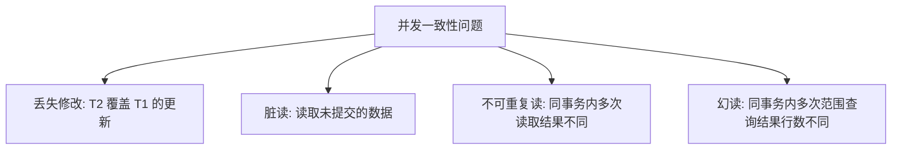
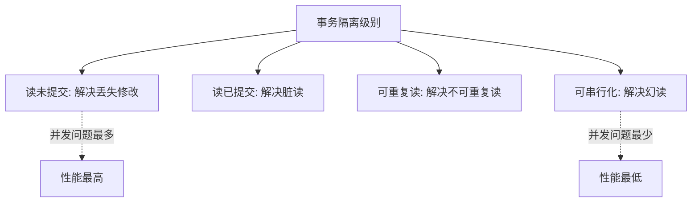
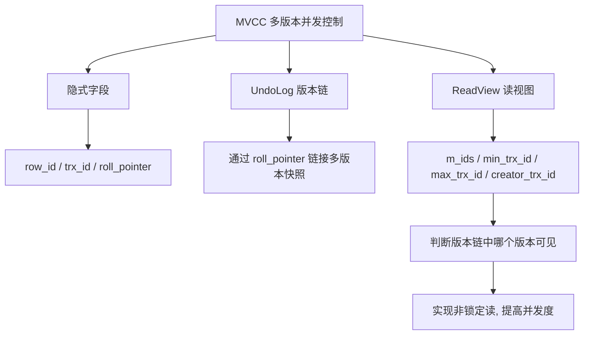
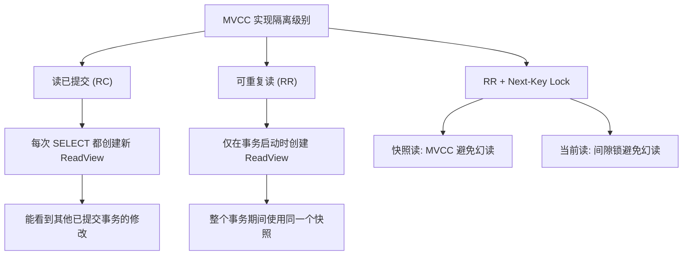
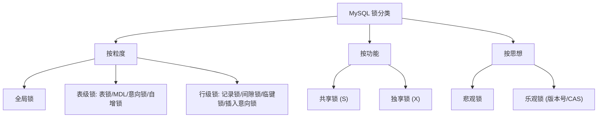
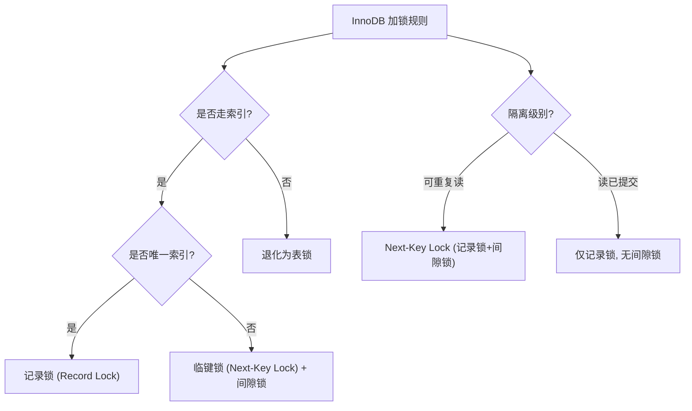

---
icon: logos:mysql
title: MySQL 面试之事务和锁篇
cover: https://raw.githubusercontent.com/dunwu/images/master/archive/2025/03/020ab2bf4af8401590e0291a34f873f8.jpg
date: 2025-03-24 22:42:57
categories:
  - 数据库
  - 关系型数据库
  - MySQL
tags:
  - 数据库
  - 关系型数据库
  - MySQL
  - 面试
permalink: /pages/ef946393/
---

# MySQL 面试之事务和锁篇

## MySQL 事务

::: tip 扩展

- [《高性能 MySQL》](https://book.douban.com/subject/23008813/)
- [极客时间教程 - MySQL 实战 45 讲](https://time.geekbang.org/column/intro/139)
- [图解 MySQL 介绍](https://xiaolincoding.com/mysql/)
- [MySQL 官方文档之 InnoDB 锁和事务模型](https://dev.mysql.com/doc/refman/8.4/en/innodb-locking-transaction-model.html)

:::

### 【简单】什么是事务，什么是 ACID？⭐⭐⭐

> 🎯 目标等级：L2 ｜ ⏱ 建议用时：5 min ｜ 🏷 标签：MySQL 事务 / ACID

#### 💎 关键结论

事务是满足 ACID 特性的一组操作，要么全成功、要么全失败。ACID 即原子性、一致性、隔离性、持久性，是保证数据库操作正确性的四个基本要素。

#### ⚡记忆卡片

- **口诀**：原隔持（隔离持久原子里）
- **关键词**：原子性 ／ 一致性 ／ 隔离性 ／ 持久性
- **链路**：事务操作 → undo log 回滚（原子性）+ 锁 + MVCC（隔离性）+ redo log（持久性）→ 一致性

#### 📖 核心知识

**事务**：数据库操作的最小逻辑单元，事务内的 SQL 语句要么全部成功，要么全部失败。可通过 `COMMIT` 提交，也可通过 `ROLLBACK` 回滚。

**ACID** 是事务正确执行的四个基本要素：

| 特性                      | 含义                                             | InnoDB 实现方式                                   |
| ------------------------- | ------------------------------------------------ | ------------------------------------------------- |
| **原子性（Atomicity）**   | 事务不可分割，操作要么全部成功，要么全部失败回滚 | **undo log**：记录反向操作，回滚时反向执行        |
| **一致性（Consistency）** | 事务执行前后，数据库保持一致性状态               | 由其他三个特性共同保证（应用层约束 + 数据库机制） |
| **隔离性（Isolation）**   | 事务未提交前，其修改对其他事务不可见             | **锁 + MVCC**：控制并发事务的可见性               |
| **持久性（Durability）**  | 事务一旦提交，修改永久保存，即使系统崩溃也不丢失 | **redo log**：崩溃后重放日志恢复数据              |


#### 🔀 发散问题

- **Q：一致性是由哪个机制保证的？** → 一致性不是单独实现的，而是原子性 + 隔离性 + 持久性共同保证的结果。见本文档「MySQL 是如何实现事务的？」。
- **Q：undo log 和 redo log 分别保证什么？** → undo log 保证原子性（回滚），redo log 保证持久性（崩溃恢复）。见本文档「MySQL 是如何实现事务的？」。

### 【中等】长事务可能会导致哪些问题？⭐⭐⭐

> 🎯 目标等级：L2-L3 ｜ ⏱ 建议用时：8 min ｜ 🏷 标签：MySQL 事务 / 长事务

#### 💎 关键结论

长事务会长时间占用锁和 undo 资源，导致锁竞争加剧、死锁风险上升、主从延迟、回滚代价大，严重时引发服务雪崩。生产上应监控并拆分长事务。

#### ⚡记忆卡片

- **口诀**：锁死延回（锁竞争、死锁、延迟、回滚）
- **关键词**：锁竞争 ／ 死锁 ／ 主从延迟 ／ 回滚代价 ／ undo 膨胀
- **链路**：长事务持锁 → 阻塞其他事务 → 锁等待超时 / 死锁 → 线程堆积 → 服务雪崩

#### 📖 核心知识

长事务可能导致的四大问题：

| 问题                 | 原因                                  | 影响                         |
| -------------------- | ------------------------------------- | ---------------------------- |
| **锁竞争与资源阻塞** | 长时间持有行锁 / 表锁，其他事务被阻塞 | 业务线程堆积，严重时服务雪崩 |
| **死锁风险增加**     | 多个长事务互相等待对方释放锁          | 事务超时回滚，浪费资源       |
| **主从延迟**         | 主库执行时间长，从库重放耗时增加      | 主从数据长时间不一致         |
| **回滚效率低下**     | 中途失败时需回滚大量已执行操作        | 浪费已消耗的资源与时间       |


#### 🔬 扩展知识

::: details

- 【L3】长事务还会阻碍 **purge 线程**清理 undo 版本链，导致 undo 表空间持续膨胀，严重时撑爆磁盘。可通过 `information_schema.innodb_trx` 监控存活时间过长的事务并及时 kill。
- 【L3】长事务在 RR 级别下持有的 ReadView 不会推进，导致其他事务的快照读需要遍历更长的版本链，查询性能劣化。

:::

#### 🔀 发散问题

- **Q：如何发现长事务？** → 查询 `information_schema.innodb_trx` 表，按 `trx_started` 排序，找出存活时间超过阈值的事务。见本文档「MySQL 死锁的排查与分析？」。
- **Q：如何避免长事务导致的死锁？** → 拆分大事务为小批量、按固定顺序访问数据、设置合理的锁等待超时。见本文档「如何避免死锁？」。

### 【中等】事务存在哪些并发一致性问题？⭐⭐⭐⭐

> 🎯 目标等级：L2-L3 ｜ ⏱ 建议用时：10 min ｜ 🏷 标签：MySQL 事务 / 并发问题

#### 💎 关键结论

事务并发执行时可能出现四类问题：丢失修改、脏读、不可重复读、幻读。严重程度递增，分别由不同隔离级别解决。

#### ⚡记忆卡片

- **口诀**：丢脏不幻（丢失、脏读、不可重复读、幻读）
- **关键词**：丢失修改 ／ 脏读 ／ 不可重复读 ／ 幻读
- **链路**：丢失修改（覆盖更新）→ 脏读（读未提交）→ 不可重复读（行被修改）→ 幻读（范围行数变化）

#### 📖 核心知识



| 问题           | 定义                                   | 场景示例                                      |
| -------------- | -------------------------------------- | --------------------------------------------- |
| **丢失修改**   | 一个事务的更新被另一个事务的更新覆盖   | T1、T2 同时修改同一行，T2 后写入覆盖 T1       |
| **脏读**       | 读取了其他事务**未提交**的数据         | T1 修改后回滚，T2 已读取了脏数据              |
| **不可重复读** | 同一事务内多次读取**同一行**结果不同   | T2 读数据后，T1 修改并提交，T2 再读结果变了   |
| **幻读**       | 同一事务内多次查询**同一范围**行数不同 | T1 查询范围后，T2 插入新行，T1 再查发现多了行 |

**丢失修改**：T<sub>1</sub> 和 T<sub>2</sub> 同时修改同一数据，T<sub>2</sub> 的修改覆盖了 T<sub>1</sub> 的修改。


**脏读**：T<sub>1</sub> 修改数据，T<sub>2</sub> 读取了该修改。如果 T<sub>1</sub> 回滚，T<sub>2</sub> 读取的就是脏数据。


**不可重复读**：T<sub>2</sub> 读取数据后，T<sub>1</sub> 修改并提交，T<sub>2</sub> 再次读取结果不同。


**幻读**：T<sub>1</sub> 查询某范围后，T<sub>2</sub> 在该范围内插入新行，T<sub>1</sub> 再次查询发现行数不同。


#### 🔬 扩展知识

::: details

- 【L3】不可重复读与幻读的区别：不可重复读是**同一行被修改**导致前后不一致；幻读是**范围内行数变化**（插入 / 删除）导致前后不一致。InnoDB 的 RR 级别通过 MVCC 解决快照读的幻读，通过 Next-Key Lock 解决当前读的幻读。
- 【L3】丢失修改在 InnoDB 中通过**当前读 + 行锁**自动避免（UPDATE 时加 X 锁，其他事务无法并发更新同一行）。

:::

#### ⚠️ 常见误区

::: details

常见误区：

- ❌ "不可重复读和幻读是一回事" → 不可重复读侧重**同一行数据被修改**；幻读侧重**范围内行数变化**（新增 / 删除行）。
- ❌ "InnoDB 的 RR 级别完全解决了幻读" → InnoDB 在 RR 级别下通过 MVCC + Next-Key Lock 很大程度上避免了幻读，但特定场景（快照读后更新插入行、当前读与快照读混用）仍可能出现幻读。见本文档「MySQL 的默认事务隔离级别是什么？为什么？」。

:::

#### 🔀 发散问题

- **Q：这些并发问题分别由哪个隔离级别解决？** → 读未提交解决丢失修改，读已提交解决脏读，可重复读解决不可重复读，可串行化解决幻读。见本文档「有哪些事务隔离级别，分别解决了什么问题？」。
- **Q：InnoDB 如何解决幻读？** → 快照读通过 MVCC，当前读通过 Next-Key Lock。见本文档「各事务隔离级别是如何实现的？」。

### 【中等】有哪些事务隔离级别，分别解决了什么问题？⭐⭐⭐⭐

> 🎯 目标等级：L2-L3 ｜ ⏱ 建议用时：10 min ｜ 🏷 标签：MySQL 事务 / 隔离级别

#### 💎 关键结论

SQL 标准定义四种隔离级别，从低到高：读未提交、读已提交、可重复读、可串行化。级别越高，并发问题越少，但性能越低。InnoDB 默认使用可重复读。

#### ⚡记忆卡片

- **口诀**：未提已重串（读未提交→读已提交→可重复读→可串行化）
- **关键词**：读未提交 ／ 读已提交 ／ 可重复读 ／ 可串行化
- **链路**：丢失修改 ← 读未提交 → 脏读 ← 读已提交 → 不可重复读 ← 可重复读 → 幻读 ← 可串行化

#### 📖 核心知识



|   隔离级别   | 丢失修改 | 脏读 | 不可重复读 | 幻读 | 说明                                            |
| :----------: | :------: | :--: | :--------: | :--: | ----------------------------------------------- |
| **读未提交** |    ✔️️️    |  ❌  |     ❌     |  ❌  | 事务未提交的修改也对其他事务可见                |
| **读已提交** |    ✔️️️    |  ✔️️️  |     ❌     |  ❌  | 事务提交后其他事务才能看到修改；Oracle 默认     |
| **可重复读** |    ✔️️️    |  ✔️️️  |     ✔️️️     |  ❌  | 同一事务多次读取同一行结果一致；**InnoDB 默认** |
| **可串行化** |    ✔️️️    |  ✔️️️  |     ✔️️️     |  ✔️️️  | 强制串行执行，读取每行都加锁，性能最低          |

各隔离级别要点：

- **读未提交（Read Uncommitted）**：事务中的修改即使未提交也对其他事务可见。
- **读已提交（Read Committed）**：事务提交后其他事务才能看到修改，解决了脏读问题。大多数数据库的默认级别（如 Oracle）。
- **可重复读（Repeatable Read）**：保证同一事务中多次读取同一数据结果一致，解决了不可重复读问题。**InnoDB 的默认隔离级别**。
- **可串行化（Serializable）**：强制事务串行执行，对读取的每一行数据都加锁，可能导致大量超时和锁竞争，高并发场景基本不可接受。

#### 🔬 扩展知识

::: details

- 【L3】InnoDB 在 RR 级别下虽不能完全解决幻读，但通过 MVCC（快照读）+ Next-Key Lock（当前读）很大程度上避免了幻读。见本文档「MySQL 的默认事务隔离级别是什么？为什么？」。
- 【L4】很多互联网公司将隔离级别设为 RC 而非 RR，原因是 RC 没有间隙锁，天然避免了 Gap Lock 导致的死锁问题，且并发度更高。

:::

#### 🔀 发散问题

- **Q：InnoDB 为什么选择 RR 作为默认隔离级别？** → 为了兼容早期 binlog 的 statement 格式，避免主从数据不一致。见本文档「MySQL 的默认事务隔离级别是什么？为什么？」。
- **Q：各隔离级别是如何实现的？** → RU 直接读最新，RC/RR 通过 MVCC（ReadView 时机不同），Serializable 通过加锁。见本文档「各事务隔离级别是如何实现的？」。

### 【中等】MySQL 的默认事务隔离级别是什么？为什么？⭐⭐

> 🎯 目标等级：L2 ｜ ⏱ 建议用时：8 min ｜ 🏷 标签：MySQL 事务 / 隔离级别

#### 💎 关键结论

InnoDB 默认隔离级别是**可重复读（RR）**，而大多数数据库默认读已提交（RC）。InnoDB 选 RR 是为了兼容早期 binlog 的 statement 格式，避免主从数据不一致。

#### ⚡记忆卡片

- **口诀**：InnoDB 默认 RR，其他数据库默认 RC
- **关键词**：可重复读 ／ binlog statement ／ 主从一致
- **链路**：早期 binlog 用 statement 格式 → RC 级别下主从数据不一致 → InnoDB 默认 RR 兼容此问题

#### 📖 核心知识

- MySQL 的事务功能在**存储引擎层**实现，并非所有存储引擎都支持事务。MyISAM 不支持事务，这也是其被 InnoDB 取代的重要原因之一。
- **大部分数据库默认 RC**（如 Oracle）；**InnoDB 默认 RR**。
- 选择 RR 的原因：为了兼容早期 binlog 的 **statement 格式**。如果使用 RC 及以下级别，statement 格式的 binlog 会产生主从数据不一致的问题。


**InnoDB RR 级别对幻读的处理**：

- **快照读**（普通 `SELECT`）：通过 **MVCC** 避免幻读，事务启动后看到的数据快照始终一致。
- **当前读**（`SELECT ... FOR UPDATE` 等）：通过 **Next-Key Lock**（记录锁 + 间隙锁）避免幻读，插入操作会被阻塞。


::: details RR 级别仍可能出现幻读的场景

- **快照读**：事务 A 更新了一条事务 B 插入的记录，事务 A 前后两次查询的记录条目就不一样了，发生幻读。
- **当前读与快照读混用**：事务开启后先快照读，期间其他事务插入记录，后续当前读时会发现两次查询的记录条目不一致，发生幻读。

:::

#### 🔀 发散问题

- **Q：各隔离级别是如何实现的？** → RU 直接读最新，RC/RR 通过 MVCC（ReadView 时机不同），Serializable 通过加锁。见本文档「各事务隔离级别是如何实现的？」。
- **Q：为什么很多互联网公司选择 RC 而非 RR？** → RC 没有间隙锁，天然避免 Gap Lock 死锁，并发度更高。见本文档「有哪些事务隔离级别，分别解决了什么问题？」。

### 【困难】MySQL 是如何实现事务的？⭐⭐

> 🎯 目标等级：L3 ｜ ⏱ 建议用时：10 min ｜ 🏷 标签：MySQL 事务 / 实现原理

#### 💎 关键结论

InnoDB 通过**锁**保证隔离性，**undo log** 保证原子性，**redo log** 保证持久性，**MVCC** 实现非锁定读。三者共同保证一致性。

#### ⚡记忆卡片

- **口诀**：锁隔、undo 原、redo 持、MVCC 并发读
- **关键词**：锁 ／ undo log ／ redo log ／ MVCC
- **链路**：锁（隔离性）+ undo log（原子性）+ redo log（持久性）+ MVCC（隔离性 + 并发读）→ 一致性

#### 📖 核心知识

| 机制                       | 作用                                           | 满足 ACID 特性      |
| -------------------------- | ---------------------------------------------- | ------------------- |
| **锁**（行锁、间隙锁等）   | 控制数据的并发修改，防止丢失修改               | **隔离性**          |
| **redo log**（重做日志）   | 记录事务对数据页的所有修改，崩溃后重放恢复     | **持久性**          |
| **undo log**（回滚日志）   | 记录事务的反向操作，用于事务回滚和 MVCC 快照读 | **原子性** + 隔离性 |
| **MVCC**（多版本并发控制） | 非锁定读，提高并发度，实现 RC 和 RR 隔离级别   | **隔离性**          |


事务通过上述机制实现了原子性、隔离性和持久性后，本身就达到了一致性的目的。

#### 🔬 扩展知识

::: details

- 【L3】undo log 分为 insert undo log（插入操作，回滚时直接 DELETE）和 update undo log（更新操作，回滚时用旧版本覆盖）。insert undo log 在事务提交后可直接丢弃，因为插入记录在事务提交前对其他事务不可见。
- 【L3】redo log 采用 **WAL（Write-Ahead Logging）** 策略：先写日志再写磁盘，将随机写转化为顺序写，大幅提升写入性能。
- 【L4】redo log 和 binlog 的一致性通过**二阶段提交**保证。见本文档「事务的二阶段提交是什么？」。

:::

#### 🔀 发散问题

- **Q：redo log 和 binlog 有什么区别？** → redo log 是引擎层物理日志，环形写入，用于崩溃恢复；binlog 是 Server 层逻辑日志，追加写入，用于主从复制和备份。见本文档「事务的二阶段提交是什么？」。
- **Q：MVCC 的实现原理是什么？** → 基于隐式字段、undo 版本链和 ReadView 实现。见本文档「什么是 MVCC？」。

### 【困难】事务的二阶段提交是什么？⭐⭐

> 🎯 目标等级：L3 ｜ ⏱ 建议用时：10 min ｜ 🏷 标签：MySQL 事务 / 二阶段提交

#### 💎 关键结论

二阶段提交确保 redo log 和 binlog 的一致性。流程：InnoDB 写 redo log 并标记 prepare → MySQL Server 写 binlog → InnoDB 将 redo log 标记 commit。崩溃时根据两日志状态决定提交或回滚。

#### ⚡记忆卡片

- **口诀**：先 redo prepare，再 binlog，最后 redo commit
- **关键词**：redo log ／ binlog ／ prepare ／ commit ／ 崩溃恢复
- **链路**：InnoDB 写 redo log (prepare) → Server 写 binlog → InnoDB 写 redo log (commit) → 崩溃时检查一致性

#### 📖 核心知识

**两阶段流程**：

1. **Prepare 阶段**：InnoDB 写入 redo log，并标记为 **prepare** 状态（事务预提交，未最终提交）。
2. **Commit 阶段**：MySQL Server 写入 **binlog**。binlog 写入成功后，InnoDB 将 redo log 状态改为 **commit**，完成事务提交。

**binlog 和 redo log 的区别**：

| **特性**     | **redo log**               | **binlog**                      |
| :----------- | :------------------------- | :------------------------------ |
| **所属层级** | InnoDB 引擎层              | MySQL Server 层                 |
| **日志类型** | 记录数据页的**物理日志**   | 记录 DML/DDL 操作的**逻辑日志** |
| **存储方式** | 固定大小，**环形写入**     | **追加写入**，可无限增长        |
| **主要用途** | **崩溃恢复**（保证持久性） | **主从复制、数据恢复、备份**    |

**为什么需要二阶段提交？**

单独先写任一日志都可能导致数据不一致：

1. **先写 redo log，后写 binlog**（宕机时 binlog 未写入）→ redo log 恢复数据，但 binlog 缺失 → **主从数据不一致**。
2. **先写 binlog，后写 redo log**（宕机时 redo log 未写入）→ binlog 有记录，但 redo log 未提交 → **数据库实际数据丢失**。

**崩溃恢复时的一致性检查**：

- **redo log prepare，binlog 未写入**：直接回滚。
- **redo log prepare，binlog 已写入**：对比两日志数据，一致则提交事务，不一致则回滚。

#### 🔬 扩展知识

::: details

- 【L3】MySQL 8.0 引入了 **binlog 组提交**（Group Commit）优化，多个事务的 binlog 可以合并写入，减少 fsync 次数，提升吞吐量。
- 【L4】MySQL 8.0.27 开始支持 **原子 DDL**，通过内部事务日志保证 DDL 操作的原子性，避免 DDL 崩溃后出现半完成状态。

:::

#### 🔀 发散问题

- **Q：redo log 和 binlog 有什么区别？** → redo log 是引擎层物理日志，环形写入，用于崩溃恢复；binlog 是 Server 层逻辑日志，追加写入，用于主从复制。见本文档「MySQL 是如何实现事务的？」。
- **Q：binlog 有哪些格式？** → statement、row、mixed 三种格式，其中 statement 格式在 RC 级别下会导致主从数据不一致。见本文档「MySQL 的默认事务隔离级别是什么？为什么？」。

### 【困难】什么是 MVCC？⭐⭐⭐⭐⭐

> 🎯 目标等级：L3-L4 ｜ ⏱ 建议用时：15 min ｜ 🏷 标签：MySQL 事务 / MVCC

#### 💎 关键结论

MVCC 即多版本并发控制，通过 undo 版本链 + ReadView 实现非锁定读，提高并发度。主要用于 RC 和 RR 隔离级别，核心是判断版本链中哪个版本对当前事务可见。

#### ⚡记忆卡片

- **口诀**：版本链 + 读视图 = MVCC
- **关键词**：隐式字段 ／ undo 版本链 ／ ReadView ／ trx_id ／ 可见性判断
- **链路**：隐式字段（trx_id + roll_pointer）→ undo 版本链 → ReadView 判断可见性 → 非锁定读

#### 📖 核心知识



**MVCC**（Multi Version Concurrency Control）即“多版本并发控制”，通过非阻塞方式处理读写冲突，提高并发度。不仅 MySQL，Oracle、PostgreSQL 等都实现了各自的 MVCC。**InnoDB 用 MVCC 实现 RC 和 RR 隔离级别**；RU 直接读最新数据，Serializable 通过加锁实现，均不使用 MVCC。

MVCC 的实现基于三大组件：

**1. 隐式字段**

InnoDB 每行记录除了用户定义字段外，还有三个隐式字段：

| 字段           | 说明                                      |
| -------------- | ----------------------------------------- |
| `row_id`       | 隐藏自增 ID，未指定主键时自动生成聚簇索引 |
| `trx_id`       | 最近修改该行的事务 ID                     |
| `roll_pointer` | 回滚指针，指向该行的上一个版本            |

**2. Undo Log 版本链**

快照存储在 Undo Log 中，通过 `roll_pointer` 将多个版本链接成**版本链**。


**3. ReadView（读视图）**

事务进行快照读时产生的读视图，包含四个关键字段：

| 字段             | 说明                                               |
| ---------------- | -------------------------------------------------- |
| `m_ids`          | 创建 ReadView 时，所有活跃（未提交）事务的 ID 列表 |
| `min_trx_id`     | `m_ids` 中的最小值                                 |
| `max_trx_id`     | 创建时应给下一个事务分配的 ID（最大事务 ID + 1）   |
| `creator_trx_id` | 创建该 ReadView 的事务 ID                          |

**ReadView 可见性判断规则**：


| 条件                                                  | 含义                                   | 是否可见  |
| ----------------------------------------------------- | -------------------------------------- | :-------: |
| `trx_id == creator_trx_id`                            | 记录由当前事务自己修改                 |  ✅ 可见  |
| `trx_id < min_trx_id`                                 | 记录在 ReadView 创建前已提交           |  ✅ 可见  |
| `trx_id >= max_trx_id`                                | 记录在 ReadView 创建后才启动的事务修改 | ❌ 不可见 |
| `min_trx_id <= trx_id < max_trx_id` 且在 `m_ids` 中   | 修改记录的事务还未提交                 | ❌ 不可见 |
| `min_trx_id <= trx_id < max_trx_id` 且不在 `m_ids` 中 | 修改记录的事务已提交                   |  ✅ 可见  |

沿着版本链从新到旧依次判断，找到第一个可见的版本即为当前事务的读取结果。

#### 🔬 扩展知识

::: details

- 【L3】**版本链清理**：undo 版本链不会被立即清理，而是由 **purge 线程**在确认旧版本对所有活跃事务都不可见后才清理。**长事务会阻碍 purge view 推进**，导致版本链越来越长、查询性能劣化、undo 表空间膨胀。生产中应监控 `information_schema.innodb_trx` 中存活时间过长的事务并及时 kill。
- 【L3】`UPDATE` 不走 MVCC 快照读，而是**当前读**（当前读 + 记录锁保证并发更新不丢失，否则会发生丢失更新）。
- 【L4】**MySQL 与 Oracle 的 MVCC 差异**：Oracle 基于 undo 段 + SCN，读一致性由 SCN 比较得出；MySQL 基于 undo 版本链 + ReadView，且 InnoDB 用间隙锁辅助防幻读，Oracle 没有间隙锁。
- 【L4】RC 下 UPDATE 读到不满足条件的已提交行时会解锁（**semi-consistent read**），减少锁范围。

:::

#### 🏭 实战场景

::: details

长事务导致 MVCC 性能劣化：某业务大事务运行数小时，导致 purge 线程无法清理旧版本，undo 表空间持续增长至数十 GB，快照读需要遍历极长的版本链，查询 RT 从 1ms 劣化到数百 ms。解决方案：拆分大事务 + 定时监控 `innodb_trx` 表 kill 超长事务。

:::

#### ⚠️ 常见误区

::: details

常见误区：

- ❌ "MVCC 完全解决了幻读" → MVCC 只在快照读场景下避免幻读，当前读场景需要 Next-Key Lock 配合。见本文档「各事务隔离级别是如何实现的？」。
- ❌ "MVCC 适用于所有隔离级别" → MVCC 仅用于 RC 和 RR；RU 直接读最新数据，Serializable 通过加锁实现。
- ❌ "版本链越短性能越好，所以应该频繁提交事务" → 频繁提交事务确实能缩短版本链，但需权衡业务语义，不能为了性能牺牲正确性。

:::

#### 🔀 发散问题

- **Q：MVCC 如何实现 RC 和 RR 隔离级别？** → 区别在于创建 ReadView 的时机：RC 每次 SELECT 都创建，RR 仅在事务启动时创建。见本文档「MVCC 实现了哪些隔离级别，如何实现的？」。
- **Q：二级索引有 MVCC 快照吗？** → 二级索引没有行级版本链，但通过页级 `PAGE_MAX_TRX_ID` 实现可见性快速判断。见本文档「二级索引有 MVCC 快照吗？」。
- **Q：各事务隔离级别是如何实现的？** → RU 直接读最新，RC/RR 通过 MVCC，Serializable 通过加锁。见本文档「各事务隔离级别是如何实现的？」。

### 【困难】MVCC 实现了哪些隔离级别，如何实现的？⭐⭐⭐⭐

> 🎯 目标等级：L3 ｜ ⏱ 建议用时：12 min ｜ 🏷 标签：MySQL 事务 / MVCC / 隔离级别

#### 💎 关键结论

MVCC 实现了 RC 和 RR 两种隔离级别，区别在于创建 ReadView 的时机：RC 每次 SELECT 都创建新 ReadView，RR 仅在事务启动时创建一次。RR 级别还通过 Next-Key Lock 辅助解决幻读。

#### ⚡记忆卡片

- **口诀**：RC 每次新建，RR 一次建好
- **关键词**：ReadView ／ 创建时机 ／ RC 每次 ／ RR 一次
- **链路**：RC 每次 SELECT 创建 ReadView → 能看到其他事务已提交修改 → 不可重复读；RR 事务启动时创建 ReadView → 整个事务用同一快照 → 可重复读

#### 📖 核心知识



| 隔离级别 | ReadView 创建时机                   | 效果                                       |
| -------- | ----------------------------------- | ------------------------------------------ |
| **RC**   | 每次 SELECT 执行前都创建新 ReadView | 能看到其他事务已提交的修改，存在不可重复读 |
| **RR**   | 仅在事务启动时创建一次 ReadView     | 整个事务期间使用同一快照，保证可重复读     |

::: details RR 示例

初始：id=1 的 value=100。T2 读取 → T1 将 value 改为 200 → T2 再读 → T1 提交 → T2 再读。

- T2 的 ReadView 中 `min_trx_id <= 101 < max_trx_id`，且 `trx_id=101` 在 `m_ids` 中，因此 T1 的修改对 T2 始终不可见。
- T2 自始至终只能看到 `trx_id=100` 的版本（value=100）。


:::

::: details RC 示例

初始：id=1 的 value=100。T2 读取（创建 ReadView）→ T1 将 value 改为 200 → T2 读取（创建 ReadView）→ T1 提交 → T2 读取（创建 ReadView）。

- T1 提交前，T2 的 ReadView 中 `trx_id=101` 在 `m_ids` 中，不可见，读到 value=100。
- T1 提交后，T2 的新 ReadView 中 `trx_id=101 < min_trx_id`，可见，读到 value=200。


:::

**RR 级别如何解决幻读**：

- **快照读**（普通 `SELECT`）：通过 MVCC 避免幻读，事务启动后看到的数据快照始终一致。
- **当前读**（`SELECT ... FOR UPDATE`）：通过 Next-Key Lock（记录锁 + 间隙锁）避免幻读，插入操作会被阻塞。

#### 🔬 扩展知识

::: details

- 【L3】RC 级别下的 **semi-consistent read**：UPDATE 语句在 RC 下读到不满足条件的已提交行时会解锁（而非等待），减少锁范围，提升并发度。这是 RC 独有的优化。
- 【L4】RR 级别下 MVCC 不能完全避免幻读：快照读场景下，事务 A 更新事务 B 插入的记录，会导致前后查询记录条目不一致。见本文档「MySQL 的默认事务隔离级别是什么？为什么？」。

:::

#### 🔀 发散问题

- **Q：MVCC 的实现原理是什么？** → 基于隐式字段、undo 版本链和 ReadView 实现。见本文档「什么是 MVCC？」。
- **Q：各事务隔离级别是如何实现的？** → RU 直接读最新，RC/RR 通过 MVCC，Serializable 通过加锁。见本文档「各事务隔离级别是如何实现的？」。

### 【困难】二级索引有 MVCC 快照吗？⭐⭐⭐

> 🎯 目标等级：L3 ｜ ⏱ 建议用时：8 min ｜ 🏷 标签：MySQL 事务 / MVCC / 索引

#### 💎 关键结论

二级索引没有行级版本链（不存储 trx_id 和 roll_pointer），但通过页级 `PAGE_MAX_TRX_ID` 实现可见性快速判断。若页内数据在快照前修改，则直接可见无需回表；否则回表到聚簇索引判断。

#### ⚡记忆卡片

- **口诀**：二级索引无行版本，页级 PAGE_MAX_TRX_ID 快速判断
- **关键词**：二级索引 ／ PAGE_MAX_TRX_ID ／ 回表 ／ 覆盖索引
- **链路**：二级索引无 trx_id → 页级 PAGE_MAX_TRX_ID 判断 → 快照前修改则直接可见 → 否则回表聚簇索引

#### 📖 核心知识

**二级索引记录本身没有版本链**——二级索引只存储索引列值和主键值，不存储隐式字段 `trx_id` 和 `roll_pointer`。但这不意味着无法做 MVCC 可见性判断：

| 场景                                          | 判断方式                 | 结果                                                 |
| --------------------------------------------- | ------------------------ | ---------------------------------------------------- |
| `PAGE_MAX_TRX_ID` < ReadView 的 `min_trx_id`  | 页的最后修改在快照之前   | 页内数据直接可见，**无需回表**                       |
| `PAGE_MAX_TRX_ID` >= ReadView 的 `min_trx_id` | 页可能被快照后的事务修改 | **需回表**到聚簇索引，用 `trx_id` 和版本链判断可见性 |

即：二级索引没有行级的多版本快照，但通过页级 `PAGE_MAX_TRX_ID` 实现了可见性的快速判断路径；这也是 RR 级别下覆盖索引查询依然能满足快照一致性的原因。


#### 🔬 扩展知识

::: details

- 【L3】覆盖索引查询时，如果 `PAGE_MAX_TRX_ID` 判断页内数据直接可见，则无需回表，性能更优。这也是为什么覆盖索引不仅减少回表 IO，还能在 MVCC 场景下提供更好的一致性保证。
- 【L4】`PAGE_MAX_TRX_ID` 是页级别的粗粒度判断，只要页中任一行被修改，该值就会更新。因此对于页内大部分记录都未被修改的场景，可能会产生不必要的回表。

:::

#### 🔀 发散问题

- **Q：MVCC 的实现原理是什么？** → 基于隐式字段、undo 版本链和 ReadView 实现。见本文档「什么是 MVCC？」。
- **Q：覆盖索引为什么能提升性能？** → 减少回表 IO，且在 MVCC 场景下可通过 `PAGE_MAX_TRX_ID` 快速判断可见性。

### 【困难】各事务隔离级别是如何实现的？⭐⭐⭐

> 🎯 目标等级：L3 ｜ ⏱ 建议用时：10 min ｜ 🏷 标签：MySQL 事务 / 隔离级别 / 实现原理

#### 💎 关键结论

四种隔离级别的实现方式各不相同：RU 直接读最新，RC/RR 通过 MVCC（ReadView 创建时机不同），Serializable 通过加读写锁串行执行。

#### ⚡记忆卡片

- **口诀**：RU 直读、RC 每建、RR 一建、Serializable 加锁
- **关键词**：读未提交 ／ MVCC ／ ReadView 时机 ／ 加锁串行
- **链路**：RU 读最新 → RC 每次建 ReadView → RR 启动时建 ReadView → Serializable 加读写锁

#### 📖 核心知识

| 隔离级别     | 实现方式         | 核心机制                                        |
| ------------ | ---------------- | ----------------------------------------------- |
| **读未提交** | 直接读取最新数据 | 不加锁，不使用 MVCC，能看到未提交数据           |
| **读已提交** | MVCC             | 每个语句执行前重新创建 ReadView                 |
| **可重复读** | MVCC             | 事务启动时创建 ReadView，整个事务期间使用同一个 |
| **可串行化** | 加锁             | 对读取的每一行加读写锁，强制串行执行            |

- **读未提交**：直接读取最新的数据即可，无需 MVCC 或锁。
- **可串行化**：通过加读写锁的方式避免并行访问，一旦出现锁冲突必须等待。
- **读已提交和可重复读**：都通过 MVCC 实现，区别仅在于创建 ReadView 的时机：
  - **读已提交**在**每个语句执行前**都会重新生成一个 ReadView。
  - **可重复读**在**启动事务时**生成一个 ReadView，整个事务期间都在用这个 ReadView。

#### 🔬 扩展知识

::: details

- 【L3】RC 级别下 UPDATE 语句有 **semi-consistent read** 优化：读到不满足条件的已提交行时会解锁而非等待，减少锁范围。
- 【L4】InnoDB 在 RR 级别下还通过 Next-Key Lock 辅助解决当前读的幻读问题，这是 MVCC 无法单独解决的。见本文档「MVCC 实现了哪些隔离级别，如何实现的？」。

:::

#### 🔀 发散问题

- **Q：MVCC 如何实现 RC 和 RR？** → 区别在于创建 ReadView 的时机：RC 每次 SELECT 都创建，RR 仅在事务启动时创建。见本文档「MVCC 实现了哪些隔离级别，如何实现的？」。
- **Q：InnoDB 为什么选择 RR 作为默认隔离级别？** → 为了兼容早期 binlog 的 statement 格式。见本文档「MySQL 的默认事务隔离级别是什么？为什么？」。

## MySQL 锁

::: tip 扩展

- [《高性能 MySQL》](https://book.douban.com/subject/23008813/)
- [极客时间教程 - MySQL 实战 45 讲](https://time.geekbang.org/column/intro/139)
- [图解 MySQL 介绍](https://xiaolincoding.com/mysql/)

:::

### 【中等】MySQL 中有哪些锁？⭐⭐⭐⭐

> 🎯 目标等级：L2-L3 ｜ ⏱ 建议用时：15 min ｜ 🏷 标签：MySQL 锁 / 分类

#### 💎 关键结论

MySQL 锁按粒度分为全局锁、表级锁、行级锁；按功能分为共享锁（S）和独享锁（X）；按思想分为悲观锁和乐观锁。InnoDB 行锁包括记录锁、间隙锁、临键锁和插入意向锁。

#### ⚡记忆卡片

- **口诀**：全局表行三粒度，SX 两功能，悲观乐观两思想
- **关键词**：全局锁 ／ 表级锁 ／ 行级锁 ／ S锁 ／ X锁 ／ 悲观锁 ／ 乐观锁
- **链路**：按粒度（全局→表级→行级）+ 按功能（S/X）+ 按思想（悲观/乐观）→ 完整锁体系

#### 📖 核心知识




**1. 独享锁与共享锁**

| 锁类型          | 别名         | 用途     | 特性                         | 加锁方式                                                        |
| --------------- | ------------ | -------- | ---------------------------- | --------------------------------------------------------------- |
| **独享锁（X）** | 写锁、排它锁 | 写入操作 | 完全排他，仅允许一个事务持有 | `SELECT ... FOR UPDATE`、DML 隐式加锁                           |
| **共享锁（S）** | 读锁         | 读取操作 | 多事务可并发持有，互不阻塞   | `SELECT ... LOCK IN SHARE MODE`、`SELECT ... FOR SHARE`（8.0+） |

**2. 悲观锁与乐观锁**

| 锁类型     | 思想                         | 实现方式         | 优缺点                            |
| ---------- | ---------------------------- | ---------------- | --------------------------------- |
| **悲观锁** | 假定会发生冲突，先加锁再操作 | 数据库锁机制     | 安全但并发度低                    |
| **乐观锁** | 假定不会冲突，更新时检查     | 版本号机制或 CAS | 并发度高，但有 ABA 问题和重试开销 |


::: details MySQL 乐观锁示例

假设 order 表中 status 表示订单状态（1=未支付，2=已支付），将 id=1 的订单置为已支付：

```sql
select status, version from order where id=#{id}

update order
set status=2, version=version+1
where id=#{id} and version=#{version};
```

:::

**3. 全局锁**

全局锁锁定整个数据库实例，使其处于只读状态。

- **加锁**：`FLUSH TABLES WITH READ LOCK;`（阻塞所有写操作和 DDL，允许 SELECT）
- **解锁**：`UNLOCK TABLES;`
- **应用场景**：数据库备份、主从同步初始化、维护期间禁止写入

**4. 表级锁**

| 锁类型              | 说明                                      | 特点                                   |
| ------------------- | ----------------------------------------- | -------------------------------------- |
| **表锁**            | 锁定整张表（`LOCK TABLE ... READ/WRITE`） | MyISAM 默认，InnoDB 特定场景使用       |
| **元数据锁（MDL）** | 自动加锁，保护表结构                      | 增删改查加读锁，结构变更加写锁         |
| **意向锁（IS/IX）** | 快速判断表中是否有行被锁定                | IS 表示准备加 S 锁，IX 表示准备加 X 锁 |
| **自增锁**          | 确保并发插入时自增值正确分配              | 防止重复或跳跃，事务回滚时不自增回退   |

**5. 行级锁**


| 锁类型                                  | 说明                                  | 特点                                              |
| --------------------------------------- | ------------------------------------- | ------------------------------------------------- |
| **记录锁（Record Lock）**               | 锁定索引中的单条记录                  | 仅锁住符合条件的行；无索引则退化为表锁            |
| **间隙锁（Gap Lock）**                  | 锁定索引记录之间的间隙                | 仅存在于 RR 级别，防止幻读                        |
| **临键锁（Next-Key Lock）**             | 记录锁 + 间隙锁，锁定记录及前面的间隙 | InnoDB 默认行锁方式，同时防幻读和保证当前读一致性 |
| **插入意向锁（Insert Intention Lock）** | INSERT 操作前设置，表示准备插入       | 不阻塞其他插入意向锁，但会等待间隙锁释放          |

#### 🔬 扩展知识

::: details

- 【L3】意向锁不阻塞任何操作，仅用于快速判断表中是否有行被锁定。例如，表锁想加 X 锁时，先检查意向锁 IX 是否存在，如果存在说明有行锁，无需逐行检查。
- 【L4】MySQL 8.0 引入了 `SELECT ... FOR SHARE` 替代 `SELECT ... LOCK IN SHARE MODE`，语义更清晰。

:::

#### 🔀 发散问题

- **Q：InnoDB 行锁的加锁规则是什么？** → 加锁基本单位是 Next-Key Lock，根据是否走索引、是否唯一索引有不同退化规则。见本文档「InnoDB 行锁的加锁规则是什么？」。
- **Q：死锁是如何产生的？** → 多个事务竞争同一资源，互相等待对方释放锁。见本文档「死锁是如何产生的？」。

### 【中等】死锁是如何产生的？⭐⭐

> 🎯 目标等级：L2 ｜ ⏱ 建议用时：8 min ｜ 🏷 标签：MySQL 锁 / 死锁

#### 💎 关键结论

死锁是多个事务竞争同一资源，互相等待对方释放锁，导致都无法继续执行的现象。产生需同时满足四个条件：互斥、占有并等待、不可强占、循环等待。

#### ⚡记忆卡片

- **口诀**：互占不循（互斥、占有并等待、不可强占、循环等待）
- **关键词**：互斥 ／ 占有并等待 ／ 不可强占 ／ 循环等待
- **链路**：事务 A 持有锁 X 等待锁 Y + 事务 B 持有锁 Y 等待锁 X → 循环等待 → 死锁

#### 📖 核心知识

**死锁产生条件**（必须同时满足）：

| 条件           | 说明                                     |
| -------------- | ---------------------------------------- |
| **互斥**       | 资源一次只能被一个事务占用（如行锁）     |
| **占有并等待** | 事务持有资源的同时，等待其他事务释放资源 |
| **不可强占**   | 已获得的资源不能被强制抢占，只能主动释放 |
| **循环等待**   | 事务之间形成循环等待链                   |

::: details 经典案例：间隙锁互相等待死锁（RR 级别高发）

表中间隙 (5,10) 内无记录，两个事务并发执行：

1. 事务 A、B 同时执行 `SELECT * FROM t WHERE id = 7 FOR UPDATE`：等值查询未命中，两者都加上间隙锁 (5,10)。**间隙锁之间互相兼容**，都能加锁成功。
2. 事务 A 执行 `INSERT INTO t VALUES (8, ...)`、事务 B 也执行同样的插入：插入意向锁与对方持有的间隙锁冲突，双方互相等待，形成死锁。

这是 RR 级别最常见的死锁形态之一。RC 级别没有间隙锁，因此天然规避了这类死锁——这也是很多互联网公司将隔离级别设为 RC 的重要原因。

:::

#### 🔀 发散问题

- **Q：如何避免死锁？** → 更新用主键、避免长事务、按固定顺序访问、设置锁等待超时。见本文档「如何避免死锁？」。
- **Q：如何解决死锁？** → 设置超时时间、开启死锁检测主动回滚、手动 Kill。见本文档「如何解决死锁？」。

### 【困难】如何避免死锁？⭐⭐

> 🎯 目标等级：L3 ｜ ⏱ 建议用时：8 min ｜ 🏷 标签：MySQL 锁 / 死锁预防

#### 💎 关键结论

死锁的四个必要条件（互斥、占有且等待、不可强占、循环等待）只要破坏任意一个即可避免。实践中主要通过缩短事务、固定访问顺序、降低隔离级别、设置超时等手段来降低死锁概率。

#### ⚡记忆卡片

- **口诀**：主序短超降替（主键、顺序、短事务、超时、降级、替代）
- **关键词**：主键更新 ／ 固定顺序 ／ 短事务 ／ 锁超时 ／ RC 级别 ／ 分布式幂等
- **链路**：破坏循环等待 → 固定访问顺序 + 主键更新；缩短持锁时间 → 拆分事务 + 设置超时

#### 📖 核心知识

| 手段                     | 说明                                                                         |
| ------------------------ | ---------------------------------------------------------------------------- |
| **尽量使用主键更新**     | 减少锁冲突范围，避免全表锁                                                   |
| **避免长事务**           | 拆分大事务为小批量，降低与其他事务冲突的概率                                 |
| **设置合理的锁等待超时** | 通过 `innodb_lock_wait_timeout` 设置较小值（如 5~10s），避免大量事务堆积等待 |
| **按固定顺序访问数据**   | 两个更新操作按相同顺序处理记录，避免循环等待                                 |
| **降低隔离级别为 RC**    | RC 没有间隙锁，天然避免 Gap Lock 导致的死锁                                  |
| **使用分布式方案替代**   | 幂等性校验可用 Redis / ZooKeeper 实现，减少数据库锁竞争                      |

#### 🔬 扩展知识

::: details

- 【L3】高并发热点行场景下，死锁检测的时间复杂度是 O(n)，大量线程等待同一热点行时检测开销巨大（CPU 飙升）。此时可考虑关闭 `innodb_deadlock_detect` 并调小 `innodb_lock_wait_timeout`（如 1~5 秒），让等待快速超时失败，由业务重试。
- 【L4】从架构上削减热点行的并发（如队列串行化、拆分热点账户）比数据库层面的调优更有效。

:::

#### 🔀 发散问题

- **Q：死锁是如何产生的？** → 多个事务竞争同一资源，互相等待对方释放锁。见本文档「死锁是如何产生的？」。
- **Q：如何解决死锁？** → 设置超时时间、开启死锁检测主动回滚、手动 Kill。见本文档「如何解决死锁？」。

### 【困难】如何解决死锁？⭐⭐

> 🎯 目标等级：L3 ｜ ⏱ 建议用时：8 min ｜ 🏷 标签：MySQL 锁 / 死锁处理

#### 💎 关键结论

解决死锁有三种策略：设置锁等待超时自动回滚、开启死锁检测主动回滚代价最小的事务、手动 Kill 死锁线程。生产环境通常结合使用前两种。

#### ⚡记忆卡片

- **口诀**：超时检测手动 Kill
- **关键词**：innodb_lock_wait_timeout ／ innodb_deadlock_detect ／ show engine innodb status
- **链路**：死锁发生 → 超时等待自动回滚 / 死锁检测主动回滚 / 手动 Kill → 其他事务继续执行

#### 📖 核心知识

| 策略           | 实现方式                                  | 说明                                         |
| -------------- | ----------------------------------------- | -------------------------------------------- |
| **锁等待超时** | `innodb_lock_wait_timeout`（默认 50s）    | 等待超时后自动回滚当前事务                   |
| **死锁检测**   | `innodb_deadlock_detect = on`（默认开启） | 检测到死锁后，主动回滚死锁链中代价最小的事务 |
| **手动 Kill**  | `SHOW ENGINE INNODB STATUS` 查看死锁日志  | 定位死锁原因，快速找出被阻塞的事务并 Kill    |


#### 🔬 扩展知识

::: details

- 【L3】死锁检测的时间复杂度是 O(n)，每个被阻塞的线程都要遍历等待链。大量线程等待同一热点行时检测开销巨大（CPU 飙升）。此时可考虑：关闭 `innodb_deadlock_detect` 并调小 `innodb_lock_wait_timeout`（如 1~5 秒），让等待快速超时失败，由业务重试。
- 【L4】从架构上削减热点行的并发（如队列串行化、拆分热点账户）比数据库层面的调优更有效。

:::

#### 🔀 发散问题

- **Q：如何避免死锁？** → 更新用主键、避免长事务、按固定顺序访问、设置锁等待超时。见本文档「如何避免死锁？」。
- **Q：如何排查和分析死锁？** → 通过 `SHOW ENGINE INNODB STATUS` 查看死锁日志，使用 performance_schema 视图。见本文档「MySQL 死锁的排查与分析？」。

### 【困难】InnoDB 行锁的加锁规则是什么？⭐⭐⭐⭐

> 🎯 目标等级：L3-L4 ｜ ⏱ 建议用时：15 min ｜ 🏷 标签：MySQL 锁 / 加锁规则

#### 💎 关键结论

InnoDB 加锁规则可总结为“两个原则 + 两个优化 + 退化规则”。加锁基本单位是 Next-Key Lock（左开右闭），唯一索引等值命中时退化为记录锁，等值未命中时退化为间隙锁，非唯一索引则加 Next-Key Lock 并退化。

#### ⚡记忆卡片

- **口诀**：基本 Next-Key，唯一等值退记录，未命中退间隙
- **关键词**：Next-Key Lock ／ 记录锁 ／ 间隙锁 ／ 唯一索引 ／ 退化规则
- **链路**：Next-Key Lock（基本单位）→ 唯一等值命中 → 退化为记录锁；唯一等值未命中 → 退化为间隙锁；非唯一索引 → 记录锁 + 间隙锁

#### 📖 核心知识



InnoDB 的行锁加锁规则非常复杂（以可重复读隔离级别为准），可总结为“**两个原则 + 两个优化 + 退化规则**”：

**原则 1：加锁的基本单位是 Next-Key Lock（左开右闭）**

- Next-Key Lock = 间隙锁 + 记录锁，区间形式为 (前一条记录, 当前记录]
- 例如索引中有 5、10、15，则 Next-Key Lock 的范围为 (-∞,5]、(5,10]、(10,15]、(15,+supremum]

**原则 2：查找过程中访问到的对象才会加锁**

- 索引搜索过程中未访问到的记录不会加锁

**优化 1：唯一索引上的等值查询，命中记录时，Next-Key Lock 退化为记录锁**

- `SELECT ... WHERE id = 5 FOR UPDATE` 只锁定 id=5 这一行
- 原因：唯一性保证了不可能再插入相同值的记录，无幻读风险

**优化 2：唯一索引上的范围查询，向右扫描直到遇到不满足条件的值**

- `SELECT ... WHERE id > 5 FOR UPDATE` 从 id=5 右侧开始，一直锁到 +supremum

**退化规则（等值未命中 / 非唯一索引）**

| 场景                               | 退化结果                                 |
| ---------------------------------- | ---------------------------------------- |
| 唯一索引等值查询，记录**不存在**   | 退化为**间隙锁**（阻止其他事务插入该值） |
| 非唯一索引等值查询，记录**存在**   | 退化为**记录锁 + 其后间隙锁**            |
| 非唯一索引等值查询，记录**不存在** | 退化为**间隙锁**                         |

::: details 实战示例（可重复读级别）

```sql
-- 表 t 主键 id, 数据: (5,'a'), (10,'b'), (15,'c')

SELECT * FROM t WHERE id = 10 FOR UPDATE;
-- 唯一索引等值命中 → 退化为记录锁: id=10

SELECT * FROM t WHERE id = 20 FOR UPDATE;
-- 唯一索引等值未命中 → 退化为间隙锁: (15, +supremum)

SELECT * FROM t WHERE id >= 10 AND id < 15 FOR UPDATE;
-- 范围查询，从 10 向右扫描，遇到第一个不满足条件的值 15 停止
-- 加锁: Next-Key Lock (5,10] 和 (10,15]
-- 注意: 15 不满足 id < 15，因此 (15, +supremum) 间隙不会被锁

SELECT * FROM t WHERE id >= 10 AND id <= 15 FOR UPDATE;
-- 与上例对比: 15 满足条件，扫描继续向右直到 supremum
-- 加锁: Next-Key Lock (5,10]、(10,15]、(15, +supremum]
```

:::

#### 🔬 扩展知识

::: details

- 【L3】RC 隔离级别下，Next-Key Lock 中的间隙锁部分被取消，只加记录锁；但有两个例外场景仍需间隙锁：**唯一键冲突检查**和**外键约束检查**。
- 【L3】插入意向锁之间互相兼容（不同事务可向同一间隙插入不同值），只与间隙锁冲突——这就是间隙锁会阻塞插入、进而引发死锁的根源。
- 【L4】无索引列的 UPDATE/DELETE 为什么会锁全表？（InnoDB 通过隐藏的聚簇索引定位所有行并加锁，再回删二级索引锁，最终表现为锁全表）

:::

#### 🔀 发散问题

- **Q：MySQL 中有哪些锁？** → 按粒度分全局锁、表级锁、行级锁；按功能分 S/X 锁。见本文档「MySQL 中有哪些锁？」。
- **Q：死锁是如何产生的？** → 多个事务竞争同一资源，互相等待对方释放锁。见本文档「死锁是如何产生的？」。

### 【困难】MySQL 死锁的排查与分析？⭐⭐⭐

> 🎯 目标等级：L3 ｜ ⏱ 建议用时：10 min ｜ 🏷 标签：MySQL 锁 / 死锁排查

#### 💎 关键结论

死锁排查三步：查看当前锁等待视图、查看最近一次死锁日志、开启死锁日志持久化。常见死锁场景包括交叉更新、范围锁冲突、批量操作和索引缺失。

#### ⚡记忆卡片

- **口诀**：查锁、查日志、开持久化
- **关键词**：performance_schema ／ SHOW ENGINE INNODB STATUS ／ innodb_print_all_deadlocks
- **链路**：发现死锁 → 查视图定位锁等待 → 查日志分析死锁原因 → 根据场景制定解决方案

#### 📖 核心知识

**排查步骤**：

**1. 查看当前锁等待**

```sql
-- MySQL 5.7（8.0 已移除这两张表）
SELECT * FROM information_schema.innodb_locks;
SELECT * FROM information_schema.innodb_lock_waits;

-- MySQL 8.0+（performance_schema 性能视图）
SELECT * FROM performance_schema.data_locks;
SELECT * FROM performance_schema.data_lock_waits;
```

**2. 查看最近一次死锁日志**

```sql
SHOW ENGINE INNODB STATUS;
-- 查找 "LATEST DETECTED DEADLOCK" 部分
```

**3. 开启死锁日志持久化**

```sql
SET GLOBAL innodb_print_all_deadlocks = ON;
-- 所有死锁信息会记录到错误日志中
```

**常见死锁场景及解决方案**：

| 场景       | 原因                            | 解决方案          |
| ---------- | ------------------------------- | ----------------- |
| 交叉更新   | 两个事务以不同顺序更新相同行    | 统一更新顺序      |
| 范围锁冲突 | Gap Lock 导致插入阻塞           | 降低隔离级别为 RC |
| 批量操作   | 大批量 UPDATE/DELETE 持锁时间长 | 拆分为小批量操作  |
| 索引缺失   | 无索引导致全表锁                | 添加合适索引      |

#### 🔬 扩展知识

::: details

- 【L3】生产环境建议同时开启 `innodb_print_all_deadlocks` 和错误日志采集，配合监控平台实现死锁自动告警。
- 【L4】高并发热点行场景下，死锁检测的 O(n) 复杂度可能导致 CPU 飙升，可考虑关闭死锁检测 + 调小超时时间。见本文档「如何解决死锁？」。

:::

#### 🔀 发散问题

- **Q：如何解决死锁？** → 设置超时时间、开启死锁检测主动回滚、手动 Kill。见本文档「如何解决死锁？」。
- **Q：如何避免死锁？** → 更新用主键、避免长事务、按固定顺序访问、降低隔离级别。见本文档「如何避免死锁？」。

## 参考资料

- [MySQL 官方文档 - InnoDB 锁和事务模型](https://dev.mysql.com/doc/refman/8.4/en/innodb-locking-transaction-model.html)
- [《高性能 MySQL》第 4 版](https://book.douban.com/subject/23008813/)
- [极客时间教程 - MySQL 实战 45 讲](https://time.geekbang.org/column/intro/139)
- [图解 MySQL 事务](https://xiaolincoding.com/mysql/transaction/mvcc.html)
