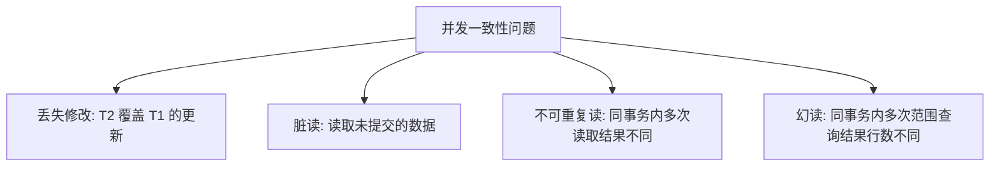
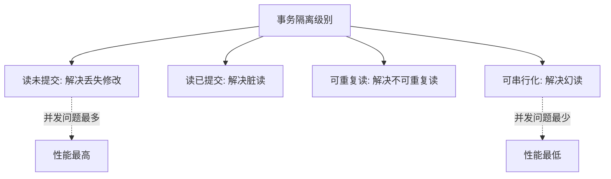
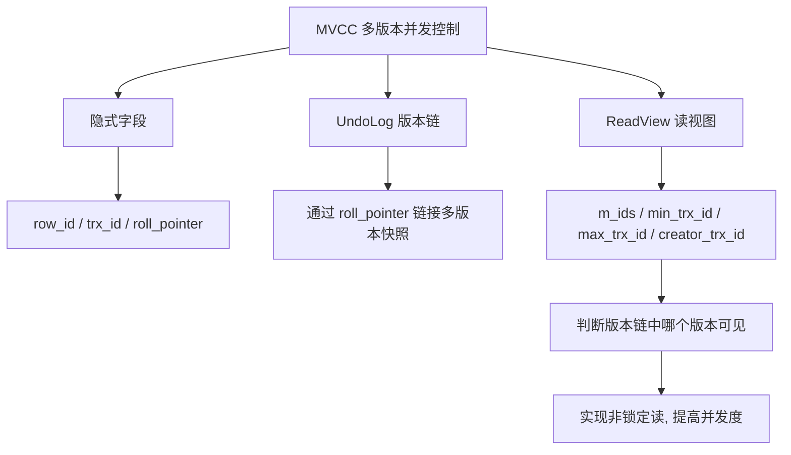
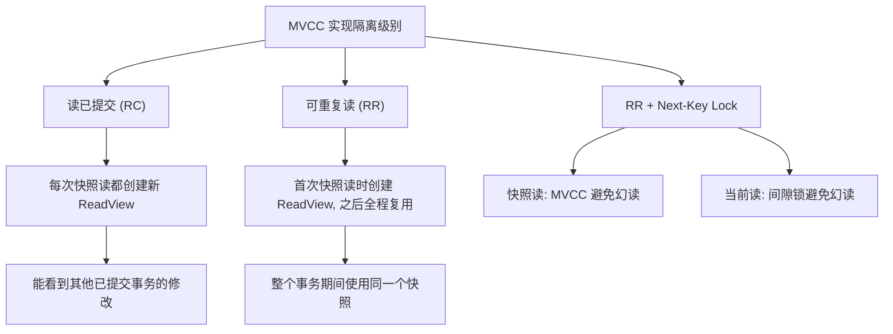
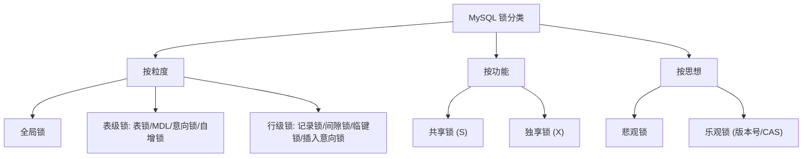
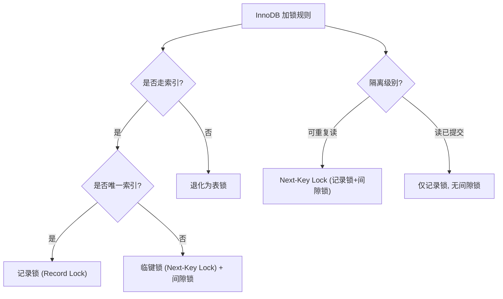

---
icon: logos:mysql
title: MySQL 面试之事务和锁篇
cover: https://raw.githubusercontent.com/dunwu/images/master/archive/2025/03/020ab2bf4af8401590e0291a34f873f8.jpg
date: 2025-03-24 22:42:57
categories:
  - 数据库
  - 关系型数据库
  - MySQL
tags:
  - 数据库
  - 关系型数据库
  - MySQL
  - 面试
permalink: /pages/ef946393/
---

# MySQL 面试之事务和锁篇

## MySQL 事务

::: tip 扩展

- [《高性能 MySQL》](https://book.douban.com/subject/23008813/)
- [极客时间教程 - MySQL 实战 45 讲](https://time.geekbang.org/column/intro/139)
- [图解 MySQL 介绍](https://xiaolincoding.com/mysql/)
- [MySQL 官方文档之 InnoDB 锁和事务模型](https://dev.mysql.com/doc/refman/8.4/en/innodb-locking-transaction-model.html)

:::

### 【简单】什么是事务，什么是 ACID？⭐⭐⭐⭐

> 🎯 目标等级：L2-L3 ｜ ⏱ 建议用时：5 min ｜ 🏷 标签：MySQL 事务 / ACID

#### 💎 关键结论

事务是满足 ACID 特性的一组操作，要么全成功、要么全失败。ACID 即原子性、一致性、隔离性、持久性，是保证数据库操作正确性的四个基本要素。

#### ⚡ 记忆卡片

- **口诀**：原隔持（隔离持久原子里）
- **关键词**：原子性 ／ 一致性 ／ 隔离性 ／ 持久性
- **链路**：事务操作 → undo log 回滚（原子性）+ 锁 + MVCC（隔离性）+ redo log（持久性）→ 一致性

#### 📖 核心知识

**事务**：数据库操作的最小逻辑单元，事务内的 SQL 语句要么全部成功，要么全部失败。可通过 `COMMIT` 提交，也可通过 `ROLLBACK` 回滚。

**ACID** 是事务正确执行的四个基本要素：

| 特性                      | 含义                                             | InnoDB 实现方式                                   |
| ------------------------- | ------------------------------------------------ | ------------------------------------------------- |
| **原子性（Atomicity）**   | 事务不可分割，操作要么全部成功，要么全部失败回滚 | **undo log**：记录反向操作，回滚时反向执行        |
| **一致性（Consistency）** | 事务执行前后，数据库保持一致性状态               | 由其他三个特性共同保证（应用层约束 + 数据库机制） |
| **隔离性（Isolation）**   | 事务未提交前，其修改对其他事务不可见             | **锁 + MVCC**：控制并发事务的可见性               |
| **持久性（Durability）**  | 事务一旦提交，修改永久保存，即使系统崩溃也不丢失 | **redo log**：崩溃后重放日志恢复数据              |


#### 🔬 扩展知识

::: details

- 【L3】**AID 是手段，C 是目的**：InnoDB 用 undo log 实现原子性、用 redo log 实现持久性、用锁 + MVCC 实现隔离性，三者共同作用才得到业务语义上的一致性。

  一致性中还包含**应用层约束**（如「扣款金额不得为负」「借贷双方金额相等」），这部分数据库无法代劳，必须由业务代码 + 约束（唯一索引、`CHECK`）共同保证。

- 【L4】事务边界由**连接**而非线程决定

  Spring 中 `@Transactional` 失效的典型场景（同类内部方法调用、方法非 public、异常被 catch 后未重新抛出、
  多线程内调用）本质都是「没有走到代理层的开启 / 提交 / 回滚」，导致 SQL 落在自动提交模式下逐条提交，原子性丢失。

:::

#### 🏭 实战场景

::: details 资金类业务中 ACID 的作用边界

以「账户 A 扣款 + 账户 B 入账 + 写一条资金流水」为例：

- **同库同连接**：用本地事务包裹三条 SQL，ACID 由 InnoDB 完整保证。这是成本最低、正确性最强的方案，应作为**默认选择**——凡是能收敛到单库的操作，就不要引入分布式事务。

- **跨库 / 跨服务**：单库 ACID 不再覆盖全局，一致性责任转移到应用层。选型边界是——能用「本地消息表 / 事务消息 + 幂等消费」把跨服务动作降解为**最终一致**的，就不要上 TCC / Seata AT；
  只有存在**强一致资金约束**（扣款与入账必须同时对外可见，中间态不可被读取）时才用 TCC 这类同步型方案。

- **两道必备兜底**：① **幂等键**——用业务流水号建唯一索引，重试 / 消息重投时靠唯一键冲突拒绝重复入账，这是资金安全的第一道闸；② **对账**——ACID 只保证单库内正确，不保证跨系统链路正确，
  必须有准实时（分钟级差异表）+ T+1 全量对账兜底，把「链路不一致」变成可发现、可修复的问题。

:::

#### ⚠️ 常见误区

::: details

- ❌ "一致性（C）也是由数据库实现的" → C 是 AID 共同作用的**结果**而非独立机制；且跨库 / 跨服务场景下 C 必须由应用层的幂等 + 对账兜底。
- ❌ "事务提交成功就等于数据一定落盘了" → 落盘与否取决于 `innodb_flush_log_at_trx_commit`。非 1 的取值下，进程崩溃或主机掉电仍可能丢失已提交事务，见本文档「事务的二阶段提交是什么？」。
- ❌ "只要方法上加了 `@Transactional` 就有原子性" → 事务边界由连接与代理层决定，自调用、非 public、异常被吞、跨线程等场景都会静默退化为自动提交。

:::

#### 🔀 发散问题

- **Q：一致性是由哪个机制保证的？**

  → 一致性不是单独实现的，而是原子性 + 隔离性 + 持久性共同保证的结果。见本文档「MySQL 是如何实现事务的？」。

- **Q：undo log 和 redo log 分别保证什么？**

  → undo log 保证原子性（回滚），redo log 保证持久性（崩溃恢复）。见本文档「MySQL 是如何实现事务的？」。

### 【中等】长事务可能会导致哪些问题？⭐⭐⭐⭐

> 🎯 目标等级：L2-L4 ｜ ⏱ 建议用时：8 min ｜ 🏷 标签：MySQL 事务 / 长事务

#### 💎 关键结论

长事务会长时间占用锁和 undo 资源，导致锁竞争加剧、死锁风险上升、主从延迟、回滚代价大，严重时引发服务雪崩。生产上应监控并拆分长事务。

#### ⚡ 记忆卡片

- **口诀**：锁死延回（锁竞争、死锁、延迟、回滚）
- **关键词**：锁竞争 ／ 死锁 ／ 主从延迟 ／ 回滚代价 ／ undo 膨胀
- **链路**：长事务持锁 → 阻塞其他事务 → 锁等待超时 / 死锁 → 线程堆积 → 服务雪崩

#### 📖 核心知识

长事务可能导致的四大问题：

| 问题                 | 原因                                  | 影响                         |
| -------------------- | ------------------------------------- | ---------------------------- |
| **锁竞争与资源阻塞** | 长时间持有行锁 / 表锁，其他事务被阻塞 | 业务线程堆积，严重时服务雪崩 |
| **死锁风险增加**     | 多个长事务互相等待对方释放锁          | 事务超时回滚，浪费资源       |
| **主从延迟**         | 主库执行时间长，从库重放耗时增加      | 主从数据长时间不一致         |
| **回滚效率低下**     | 中途失败时需回滚大量已执行操作        | 浪费已消耗的资源与时间       |


#### 🔬 扩展知识

::: details

- 【L3】长事务还会阻碍 **purge 线程**清理 undo 版本链，导致 undo 表空间持续膨胀，严重时撑爆磁盘。可通过 `information_schema.innodb_trx` 监控存活时间过长的事务并及时 kill。

- 【L3】长事务在 RR 级别下持有的 ReadView 不会推进，导致其他事务的快照读需要遍历更长的版本链，查询性能劣化。

- 【L3】**量化影响**

  事务存活超过 10 秒即视为长事务，超过 60 秒可能导致 undo 表空间增长数 GB。某案例中一个未提交的事务存活 4 小时，undo 表空间从 5GB 膨胀到 38GB，purge 线程无法回收版本链，
  导致磁盘使用率 95%+ 触发告警。生产建议：设置 `innodb_lock_wait_timeout=10~30s`（默认 50s），监控 `trx_started` 超过 10 秒的事务并告警。

- 【L4】**生产踩坑**

  某系统定时任务批量更新 100 万行数据，单事务执行，耗时 15 分钟。期间：① 持有大量行锁导致在线业务线程堆积（连接池耗尽）；② undo 版本链膨胀导致快照读查询从 5ms 退化到 2s+；
  ③ 主从延迟从毫秒级涨到 8 分钟。修复：拆分为每批 1000 行的小事务，批间 sleep 100ms，总耗时从 15 分钟增加到 20 分钟，但锁持有时间从 15 分钟降到毫秒级，在线业务无感知。

- 【L4】**大事务拖垮主从延迟的机制**

  从库的并行复制（`replica_parallel_type=LOGICAL_CLOCK`、`replica_parallel_workers`）以**事务**为并行调度单位，
  单个大事务无法被拆分到多个 worker 并行重放，只能由一个 worker 串行执行。主库跑 15 分钟的大事务，从库至少延迟 15 分钟，且这段时间内该从库上所有后续事务全部排队等待——
  这解释了为什么「延迟会持续放大而不是等大事务跑完就追平」。这也是拆分批量任务、改用分批提交的硬性理由，而不只是「锁太久」的问题。

- 【L4】**`history list length` 告警排查链路**

  `SHOW ENGINE INNODB STATUS` 的 `TRANSACTIONS` 段会打印 `History list length N`，
  表示**已提交但尚未被 purge 线程清理**的 undo 版本数量。它持续上涨说明 purge 追不上版本产生速度，典型排查链路：

  1. `SELECT * FROM information_schema.innodb_trx ORDER BY trx_started` 找最老事务——
    重点关注 `trx_state='RUNNING'` 但 `trx_query` 为 NULL 的**空闲事务**，绝大多数是应用侧忘了 `commit`/`rollback`，或连接池归还连接前未结束事务；

  2. 排查是否有长时间运行的大查询持有旧 ReadView，导致 purge 无法越过它推进（`performance_schema.events_statements_current` / `processlist`）；

  3. 确认 purge 能力没有被削弱：`innodb_purge_threads`、`innodb_purge_batch_size`、`innodb_max_purge_lag`；

  4. 处置：kill 最老事务 → 观察 `history list length` 是否回落 → 8.0 下开启 `innodb_undo_log_truncate=ON`，
    让 undo 表空间在 purge 完成后自动 truncate 回收磁盘（否则文件不会自行缩小）。

:::

#### 🔀 发散问题

- **Q：如何发现长事务？**

  → 查询 `information_schema.innodb_trx` 表，按 `trx_started` 排序，找出存活时间超过阈值的事务。见本文档「MySQL 死锁的排查与分析？」。

- **Q：如何避免长事务导致的死锁？**

  → 拆分大事务为小批量、按固定顺序访问数据、设置合理的锁等待超时。见本文档「如何避免死锁？」。

### 【中等】事务存在哪些并发一致性问题？⭐⭐⭐⭐

> 🎯 目标等级：L2-L3 ｜ ⏱ 建议用时：10 min ｜ 🏷 标签：MySQL 事务 / 并发问题

#### 💎 关键结论

事务并发执行时可能出现四类问题：丢失修改、脏读、不可重复读、幻读。严重程度递增，分别由不同隔离级别解决。

#### ⚡ 记忆卡片

- **口诀**：丢脏不幻（丢失、脏读、不可重复读、幻读）
- **关键词**：丢失修改 ／ 脏读 ／ 不可重复读 ／ 幻读
- **链路**：丢失修改（覆盖更新）→ 脏读（读未提交）→ 不可重复读（行被修改）→ 幻读（范围行数变化）

#### 📖 核心知识


```mermaid
graph TB
    A["并发一致性问题"] --> B["丢失修改: T2 覆盖 T1 的更新"]
    A --> C["脏读: 读取未提交的数据"]
    A --> D["不可重复读: 同事务内多次读取结果不同"]
    A --> E["幻读: 同事务内多次范围查询结果行数不同"]
```

| 问题           | 定义                                   | 场景示例                                      |
| -------------- | -------------------------------------- | --------------------------------------------- |
| **丢失修改**   | 一个事务的更新被另一个事务的更新覆盖   | T1、T2 同时修改同一行，T2 后写入覆盖 T1       |
| **脏读**       | 读取了其他事务**未提交**的数据         | T1 修改后回滚，T2 已读取了脏数据              |
| **不可重复读** | 同一事务内多次读取**同一行**结果不同   | T2 读数据后，T1 修改并提交，T2 再读结果变了   |
| **幻读**       | 同一事务内多次查询**同一范围**行数不同 | T1 查询范围后，T2 插入新行，T1 再查发现多了行 |

**丢失修改**：T<sub>1</sub> 和 T<sub>2</sub> 同时修改同一数据，T<sub>2</sub> 的修改覆盖了 T<sub>1</sub> 的修改。


**脏读**：T<sub>1</sub> 修改数据，T<sub>2</sub> 读取了该修改。如果 T<sub>1</sub> 回滚，T<sub>2</sub> 读取的就是脏数据。


**不可重复读**：T<sub>2</sub> 读取数据后，T<sub>1</sub> 修改并提交，T<sub>2</sub> 再次读取结果不同。


**幻读**：T<sub>1</sub> 查询某范围后，T<sub>2</sub> 在该范围内插入新行，T<sub>1</sub> 再次查询发现行数不同。


#### 🔬 扩展知识

::: details

- 【L3】不可重复读与幻读的区别

  不可重复读是**同一行被修改**导致前后不一致；幻读是**范围内行数变化**（插入 / 删除）导致前后不一致。InnoDB 的 RR 级别通过 MVCC 解决快照读的幻读，
  通过 Next-Key Lock 解决当前读的幻读。

- 【L3】丢失修改在 InnoDB 中通过**当前读 + 行锁**自动避免（UPDATE 时加 X 锁，其他事务无法并发更新同一行）。

:::

#### 📊 量化参考

::: details

| 并发问题              | 发生概率（典型 OLTP）    | 触发条件                                    | 影响范围                                                                                                           |
| --------------------- | ------------------------ | ------------------------------------------- | ------------------------------------------------------------------------------------------------------------------ |
| 脏读（RU 级别）       | 5~20%                    | 并发 UPDATE 未提交时其他事务读取            | 读取到回滚后的无效数据，业务逻辑错误                                                                               |
| 不可重复读（RC 级别） | 10~30%                   | 同事务两次 SELECT 间存在并发 UPDATE         | 同一行数据前后读取不一致，报表/对账异常                                                                            |
| 幻读（RR 快照读）     | 纯快照读场景由 MVCC 避免 | 同事务两次范围查询间有并发 INSERT           | 只要不穿插当前读即不可见；一旦对范围内新行执行 UPDATE（当前读），该行被纳入本事务视图，后续快照读即可见 → 仍会幻读 |
| 幻读（RR 当前读）     | Gap Lock 竞争增加 10~30% | 并发 INSERT 与 `SELECT ... FOR UPDATE` 冲突 | 死锁概率上升 1~5%，吞吐下降 10~15%                                                                                 |

**隔离级别升级的性能开销**：

| 升级路径          | 额外开销                        | 收益                                      | 生产建议                                          |
| ----------------- | ------------------------------- | ----------------------------------------- | ------------------------------------------------- |
| RU → RC           | 锁开销减少 ~5%                  | 消除脏读，性价比最高                      | 最低可用级别，不推荐 RU                           |
| RC → RR           | MVCC 开销增加 10~15%            | 消除不可重复读，ReadView 复用减少创建开销 | InnoDB 默认，大多数业务首选                       |
| RR → Serializable | 锁竞争增加 30~50%，吞吐下降显著 | 完全消除幻读                              | 仅用于强一致要求的批处理/金融结算，高并发场景禁用 |

**RR 级别下幻读与 Gap Lock 的量化权衡**：

| 场景                    | 幻读率 | Gap Lock 额外开销            | 死锁概率增量 |
| ----------------------- | ------ | ---------------------------- | ------------ |
| 纯快照读（普通 SELECT） | 0%     | 无（MVCC 无锁）              | 0%           |
| 当前读 + 唯一索引等值   | 0%     | 退化为记录锁，无间隙锁       | 0%           |
| 当前读 + 非唯一索引     | 0%     | 记录锁 + 间隙锁，锁范围扩大  | +1~5%        |
| 当前读 + 范围查询       | 0%     | 多个 Next-Key Lock，锁区间大 | +3~10%       |

:::

#### ⚠️ 常见误区

::: details

- ❌ "不可重复读和幻读是一回事" → 不可重复读侧重**同一行数据被修改**；幻读侧重**范围内行数变化**（新增 / 删除行）。
- ❌ "InnoDB 的 RR 级别完全解决了幻读" → InnoDB 在 RR 级别下通过 MVCC + Next-Key Lock 很大程度上避免了幻读，但特定场景（快照读后更新插入行、当前读与快照读混用）仍可能出现幻读。见本文档「MySQL 的默认事务隔离级别是什么？为什么？」。

:::

#### 🔀 发散问题

- **Q：这些并发问题分别由哪个隔离级别解决？**

  → 读未提交解决丢失修改，读已提交解决脏读，可重复读解决不可重复读，可串行化解决幻读。见本文档「有哪些事务隔离级别，分别解决了什么问题？」。

- **Q：InnoDB 如何解决幻读？**

  → 快照读通过 MVCC，当前读通过 Next-Key Lock。见本文档「各事务隔离级别是如何实现的？」。

### 【中等】有哪些事务隔离级别，分别解决了什么问题？⭐⭐⭐⭐

> 🎯 目标等级：L2-L3 ｜ ⏱ 建议用时：10 min ｜ 🏷 标签：MySQL 事务 / 隔离级别

#### 💎 关键结论

SQL 标准定义四种隔离级别，从低到高：读未提交、读已提交、可重复读、可串行化。级别越高，并发问题越少，但性能越低。InnoDB 默认使用可重复读。

#### ⚡ 记忆卡片

- **口诀**：未提已重串（读未提交→读已提交→可重复读→可串行化）
- **关键词**：读未提交 ／ 读已提交 ／ 可重复读 ／ 可串行化
- **链路**：丢失修改 ← 读未提交 → 脏读 ← 读已提交 → 不可重复读 ← 可重复读 → 幻读 ← 可串行化

#### 📖 核心知识


```mermaid
graph TB
    A["事务隔离级别"] --> B["读未提交: 解决丢失修改"]
    A --> C["读已提交: 解决脏读"]
    A --> D["可重复读: 解决不可重复读"]
    A --> E["可串行化: 解决幻读"]
    B -.->|"并发问题最多"| F["性能最高"]
    E -.->|"并发问题最少"| G["性能最低"]
```

|   隔离级别   | 丢失修改 | 脏读 | 不可重复读 | 幻读 | 说明                                            |
| :----------: | :------: | :--: | :--------: | :--: | ----------------------------------------------- |
| **读未提交** |   ✔️️️   |  ❌  |     ❌     |  ❌  | 事务未提交的修改也对其他事务可见                |
| **读已提交** |   ✔️️️   | ✔️️️ |     ❌     |  ❌  | 事务提交后其他事务才能看到修改；Oracle 默认     |
| **可重复读** |   ✔️️️   | ✔️️️ |    ✔️️️    |  ❌  | 同一事务多次读取同一行结果一致；**InnoDB 默认** |
| **可串行化** |   ✔️️️   | ✔️️️ |    ✔️️️    | ✔️️️ | 强制串行执行，读取每行都加锁，性能最低          |

各隔离级别要点：

- **读未提交（Read Uncommitted）**：事务中的修改即使未提交也对其他事务可见。
- **读已提交（Read Committed）**：事务提交后其他事务才能看到修改，解决了脏读问题。大多数数据库的默认级别（如 Oracle）。
- **可重复读（Repeatable Read）**：保证同一事务中多次读取同一数据结果一致，解决了不可重复读问题。**InnoDB 的默认隔离级别**。
- **可串行化（Serializable）**：强制事务串行执行，对读取的每一行数据都加锁，可能导致大量超时和锁竞争，高并发场景基本不可接受。

#### 🔬 扩展知识

::: details

- 【L3】InnoDB 在 RR 级别下虽不能完全解决幻读，但通过 MVCC（快照读）+ Next-Key Lock（当前读）很大程度上避免了幻读。见本文档「MySQL 的默认事务隔离级别是什么？为什么？」。

- 【L4】很多互联网公司将隔离级别设为 RC 而非 RR，原因是 RC 没有间隙锁，天然避免了 Gap Lock 导致的死锁问题，且并发度更高。

- 【L3】**量化对比**

  以 100 并发写入为例，RR 级别下因间隙锁导致死锁概率约 1~5%（取决于业务模式），每次死锁回滚耗时约 50~200 ms；切换到 RC 级别后死锁率降到接近 0，
  但代价是可能出现幻读（同一事务两次范围查询结果行数不同）。性能方面，RC 比 RR 的并发吞吐高约 10~30%（省去了间隙锁的开销）。

- 【L3】**生产选型**

  金融系统用 RR（强一致优先，死锁靠业务层优化）；高并发互联网业务用 RC（吞吐优先，死锁少）；Oracle 默认 RC，MySQL 默认 RR——选型反映了两种数据库的设计哲学差异。

- 【L3】**RC 可用的前提是 binlog 用 ROW 格式**

  RC 下每条语句都会重建 ReadView，同一条 `UPDATE ... WHERE` 在主库和从库看到的行集可能不同，
  因此 `binlog_format=STATEMENT` 在 RC 下是不安全的，MySQL 会直接拒绝执行（提示 binlog 格式与行级存储引擎不兼容）。

  MySQL 5.7.7 起 `binlog_format` 默认值改为 `ROW`，8.0 进一步把 `STATEMENT` 标记为不推荐——**这才是「互联网公司敢普遍改用 RC」的技术前提**。答 RC vs RR 选型时若不提这一条，
  说明只知道间隙锁差异，不知道复制链路的约束。

- 【L4】**RC 与 RR 在 UPDATE 扫描时的锁行为差异**

  RC 下 InnoDB 对 UPDATE 启用**半一致性读**（semi-consistent read）——扫描到已被其他事务锁住的行时，
  先读该行的最新已提交版本，若不满足 WHERE 条件就直接跳过、不进入锁等待；RR 下该优化不生效，扫描路径上的行更容易被卷入锁等待。这使同一条大范围 UPDATE 在 RR 下的阻塞面明显大于 RC，
  是 RR 业务偶发大面积锁等待的常见根因。

:::

#### 🔀 发散问题

- **Q：InnoDB 为什么选择 RR 作为默认隔离级别？**

  → 为了兼容早期 binlog 的 statement 格式，避免主从数据不一致。见本文档「MySQL 的默认事务隔离级别是什么？为什么？」。

- **Q：各隔离级别是如何实现的？**

  → RU 直接读最新，RC/RR 通过 MVCC（ReadView 时机不同），Serializable 通过加锁。见本文档「各事务隔离级别是如何实现的？」。

### 【中等】MySQL 的默认事务隔离级别是什么？为什么？⭐⭐⭐⭐

> 🎯 目标等级：L2-L3 ｜ ⏱ 建议用时：8 min ｜ 🏷 标签：MySQL 事务 / 隔离级别

#### 💎 关键结论

InnoDB 默认隔离级别是**可重复读（RR）**，而大多数数据库默认读已提交（RC）。InnoDB 选 RR 是为了兼容早期 binlog 的 statement 格式，避免主从数据不一致。

#### ⚡ 记忆卡片

- **口诀**：InnoDB 默认 RR，其他数据库默认 RC
- **关键词**：可重复读 ／ binlog statement ／ 主从一致
- **链路**：早期 binlog 用 statement 格式 → RC 级别下主从数据不一致 → InnoDB 默认 RR 兼容此问题

#### 📖 核心知识

- MySQL 的事务功能在**存储引擎层**实现，并非所有存储引擎都支持事务。MyISAM 不支持事务，这也是其被 InnoDB 取代的重要原因之一。
- **大部分数据库默认 RC**（如 Oracle）；**InnoDB 默认 RR**。
- 选择 RR 的原因：为了兼容早期 binlog 的 **statement 格式**。如果使用 RC 及以下级别，statement 格式的 binlog 会产生主从数据不一致的问题。


**InnoDB RR 级别对幻读的处理**：

- **快照读**（普通 `SELECT`）：通过 **MVCC** 避免幻读。注意 ReadView 是在事务内**第一次执行快照读时**创建的（不是 `BEGIN` 那一刻），之后整个事务复用它，因此看到的数据快照始终一致。
- **当前读**（`SELECT ... FOR UPDATE`、`UPDATE`、`DELETE`、`INSERT` 等）：通过 **Next-Key Lock**（记录锁 + 间隙锁）避免幻读，区间内的插入操作会被阻塞。


::: details RR 级别仍可能出现幻读的场景

- **快照读中穿插当前读**：事务 A 先快照读范围 R，事务 B 在 R 内插入一行并提交（此时 A 的快照读看不到它）；随后 A 对 R 执行 `UPDATE`——UPDATE 是当前读，会读到并修改 B 插入的那一行，该行被 A 修改后 `trx_id` 变为 A，于是 A 再次快照读时该行**变得可见**，前后两次快照读行数不一致，发生幻读。
- **当前读与快照读混用**：事务开启后先快照读，期间其他事务插入记录，后续当前读时会发现两次查询的记录条目不一致，发生幻读。
- **结论**：RR 只是「很大程度上」避免了幻读——**快照读的幻读由 MVCC 解决，当前读的幻读由 Next-Key Lock 解决，但两种读混用时 MVCC 管不住当前读**。要彻底杜绝，只能全程使用当前读，或升到 Serializable。

:::

#### 🔀 发散问题

- **Q：各隔离级别是如何实现的？**

  → RU 直接读最新，RC/RR 通过 MVCC（ReadView 时机不同），Serializable 通过加锁。见本文档「各事务隔离级别是如何实现的？」。

- **Q：为什么很多互联网公司选择 RC 而非 RR？**

  → RC 没有间隙锁，天然避免 Gap Lock 死锁，并发度更高。见本文档「有哪些事务隔离级别，分别解决了什么问题？」。

### 【困难】MySQL 是如何实现事务的？⭐⭐⭐

> 🎯 目标等级：L3-L4 ｜ ⏱ 建议用时：10 min ｜ 🏷 标签：MySQL 事务 / 实现原理

#### 💎 关键结论

InnoDB 通过**锁**保证隔离性，**undo log** 保证原子性，**redo log** 保证持久性，**MVCC** 实现非锁定读。三者共同保证一致性。

#### ⚡ 记忆卡片

- **口诀**：锁隔、undo 原、redo 持、MVCC 并发读
- **关键词**：锁 ／ undo log ／ redo log ／ MVCC
- **链路**：锁（隔离性）+ undo log（原子性）+ redo log（持久性）+ MVCC（隔离性 + 并发读）→ 一致性

#### 📖 核心知识

| 机制                       | 作用                                           | 满足 ACID 特性      |
| -------------------------- | ---------------------------------------------- | ------------------- |
| **锁**（行锁、间隙锁等）   | 控制数据的并发修改，防止丢失修改               | **隔离性**          |
| **redo log**（重做日志）   | 记录事务对数据页的所有修改，崩溃后重放恢复     | **持久性**          |
| **undo log**（回滚日志）   | 记录事务的反向操作，用于事务回滚和 MVCC 快照读 | **原子性** + 隔离性 |
| **MVCC**（多版本并发控制） | 非锁定读，提高并发度，实现 RC 和 RR 隔离级别   | **隔离性**          |


事务通过上述机制实现了原子性、隔离性和持久性后，本身就达到了一致性的目的。

#### 🔬 扩展知识

::: details

- 【L3】undo log 分为 insert undo log（插入操作，回滚时直接 DELETE）和 update undo log（更新操作，回滚时用旧版本覆盖）。insert undo log 在事务提交后可直接丢弃，
  因为插入记录在事务提交前对其他事务不可见。

- 【L3】redo log 采用 **WAL（Write-Ahead Logging）** 策略

  先写日志再写磁盘，将随机写转化为顺序写，大幅提升写入性能。

- 【L3】**InnoDB 遵循严格两阶段锁协议（Strict 2PL）**

  事务运行期间只加锁不放锁（growing phase），持有的记录锁、间隙锁、
  意向锁统一在 `COMMIT`/`ROLLBACK` 时才一次性释放（shrinking phase 被压缩到提交瞬间）。这是「长事务必须持锁到提交」的理论根因，也解释了为什么 RC 虽然每条语句重建 ReadView，
  但**已经加上的行锁并不会随语句结束而释放**。严格 2PL 保证了可串行化，代价是并发度下降与死锁可能性，所以 InnoDB 另配了死锁检测来兜底。

- 【L4】redo log 和 binlog 的一致性通过**二阶段提交**保证。见本文档「事务的二阶段提交是什么？」。

:::

#### ⚠️ 常见误区

::: details

- ❌ "两阶段锁协议（2PL）和两阶段提交（2PC）是一回事" → 完全不同的两个概念。**2PL** 是单机的**并发控制**协议，约束「加锁 / 解锁的时序」，目的是保证可串行化；**2PC** 是**原子提交**协议，约束「多个参与方如何就提交达成一致」，MySQL 内部用它保证 redo log 与 binlog 一致，分布式场景（XA）用它协调多个资源管理器。一个解决「并发正确性」，一个解决「提交原子性」。
- ❌ "有了 redo log 就有了持久性" → 持久性取决于 `innodb_flush_log_at_trx_commit` 是否为 1。设为 0 或 2 时，MySQL 进程崩溃或主机掉电仍可能丢失已提交事务，见本文档「事务的二阶段提交是什么？」。
- ❌ "MVCC 和锁是二选一的关系" → InnoDB 中两者并存：**快照读走 MVCC 不加锁，当前读走锁不看 ReadView**。绝大多数「以为读到了最新数据其实读到快照」的线上问题，都源于混淆了这两种读。

:::

#### 🔀 发散问题

- **Q：redo log 和 binlog 有什么区别？**

  → redo log 是引擎层物理日志，环形写入，用于崩溃恢复；binlog 是 Server 层逻辑日志，追加写入，用于主从复制和备份。见本文档「事务的二阶段提交是什么？」。

- **Q：MVCC 的实现原理是什么？**

  → 基于隐式字段、undo 版本链和 ReadView 实现。见本文档「什么是 MVCC？」。

### 【困难】事务的二阶段提交是什么？⭐⭐⭐⭐

> 🎯 目标等级：L3-L4 ｜ ⏱ 建议用时：10 min ｜ 🏷 标签：MySQL 事务 / 二阶段提交

#### 💎 关键结论

二阶段提交确保 redo log 和 binlog 的一致性。流程：InnoDB 写 redo log 并标记 prepare → MySQL Server 写 binlog → InnoDB 将 redo log 标记 commit。崩溃时根据两日志状态决定提交或回滚。

#### ⚡ 记忆卡片

- **口诀**：先 redo prepare，再 binlog，最后 redo commit
- **关键词**：redo log ／ binlog ／ prepare ／ commit ／ 崩溃恢复
- **链路**：InnoDB 写 redo log (prepare) → Server 写 binlog → InnoDB 写 redo log (commit) → 崩溃时检查一致性

#### 📖 核心知识

**两阶段流程**：

1. **Prepare 阶段**：InnoDB 写入 redo log，并标记为 **prepare** 状态（事务预提交，未最终提交）。
2. **Commit 阶段**：MySQL Server 写入 **binlog**。binlog 写入成功后，InnoDB 将 redo log 状态改为 **commit**，完成事务提交。

**binlog 和 redo log 的区别**：

| **特性**     | **redo log**               | **binlog**                      |
| :----------- | :------------------------- | :------------------------------ |
| **所属层级** | InnoDB 引擎层              | MySQL Server 层                 |
| **日志类型** | 记录数据页的**物理日志**   | 记录 DML/DDL 操作的**逻辑日志** |
| **存储方式** | 固定大小，**环形写入**     | **追加写入**，可无限增长        |
| **主要用途** | **崩溃恢复**（保证持久性） | **主从复制、数据恢复、备份**    |

**为什么需要二阶段提交？**

单独先写任一日志都可能导致数据不一致：

1. **先写 redo log，后写 binlog**（宕机时 binlog 未写入）→ redo log 恢复数据，但 binlog 缺失 → **主从数据不一致**。
2. **先写 binlog，后写 redo log**（宕机时 redo log 未写入）→ binlog 有记录，但 redo log 未提交 → **数据库实际数据丢失**。

**崩溃恢复时的一致性检查**：

- **redo log prepare，binlog 未写入**：直接回滚。
- **redo log prepare，binlog 已写入**：对比两日志数据，一致则提交事务，不一致则回滚。

判定依据是 **XID**：redo log 的 prepare 记录中带有事务 XID，重启时 InnoDB 收集所有处于 prepare 状态的事务，再到 binlog 中查找同一 XID 的完整事务事件——找得到且 binlog 事件完整（有结束标志）就提交，找不到就回滚。之所以以 binlog 为准，是因为 binlog 一旦写成功就可能已经被从库消费或用于备份恢复，不能反悔。

**crash-safe 的三个时刻**（沿「redo prepare → binlog → redo commit」时间轴）：

| 崩溃时刻                                     | redo log 状态        | binlog 状态 | 重启后的处置              | 一致性结果                     |
| -------------------------------------------- | -------------------- | ----------- | ------------------------- | ------------------------------ |
| **A**：redo prepare 写入前                   | 无痕迹               | 无          | 回滚                      | 主从都无该事务，一致           |
| **B**：redo prepare 已写，binlog 写完前      | prepare              | 无          | 回滚（binlog 找不到 XID） | 主库丢弃、从库也没有，一致     |
| **C**：binlog 已完整写入，redo commit 标记前 | prepare（未 commit） | 完整        | **提交**（binlog 有 XID） | 主库补提交、从库正常重放，一致 |

三个时刻都能恢复出一致状态，这正是二阶段提交存在的意义；少了任何一步，B 或 C 时刻就会出现主从数据分叉。

#### 🔬 扩展知识

::: details

- 【L4】**「双 1」配置是 crash-safe 的充分条件，
  也是资金类业务的强制要求**：

  `innodb_flush_log_at_trx_commit=1`（每次事务提交都把 redo log fsync 落盘）+ `sync_binlog=1`（每次事务提交都把 binlog fsync 落盘）。

  放宽取值与代价：

  - `innodb_flush_log_at_trx_commit=0`：由后台线程每秒 write + fsync，MySQL 进程崩溃即丢最近约 1 秒的已提交事务；

  - `innodb_flush_log_at_trx_commit=2`：每次提交只 write 到 OS page cache，MySQL 进程崩溃不丢，但**主机掉电**丢约 1 秒；

  - `sync_binlog=N`：累积 N 个事务才 fsync 一次 binlog，N 越大掉电时丢的 binlog 越多。

    放宽后单事务提交的 fsync 次数从 2 次降到接近 0，写入吞吐提升明显；但代价是掉电时 redo 与 binlog 可能**单侧多出事务**——binlog 多则从库比主库多数据（只能重建从库），redo 多则主库有而从库没有。

    因此除纯离线分析库、可容忍丢数据的场景外，不建议放宽。

- 【L3】**组提交（Group Commit）是「双 1」的性能补偿**

  MySQL 5.6 引入基于 binlog 的组提交（BLGC），5.7 起把 binlog 提交拆成 flush / sync / commit 三个队列阶段，
  同一批次内的事务共享一次 binlog fsync；
  `binlog_group_commit_sync_delay`（等待若干微秒凑批）与 `binlog_group_commit_sync_no_delay_count`（凑够条数立即提交）用于放大批次。

  redo log 侧也有 log buffer 批量刷盘与 `innodb_log_writer_threads`。这就是为什么高并发下「双 1」并没有想象中那么贵——**fsync 成本被批次摊薄了**。

- 【L4】MySQL 8.0 支持 **原子 DDL**

  借助事务化的数据字典（DD 表）+ DDL log，把「更新数据字典、写存储引擎、写 binlog」纳入一个原子操作，避免 DDL 崩溃后出现半完成状态（如表文件已删但字典还在）。

  在此之前崩溃的 DDL 可能留下需要手工清理的残留文件。

- 【L4】**这里的 2PC 是单机内部的 XA**

  协调者是 Server 层的 binlog，参与者是 InnoDB 的 redo log，与跨节点的分布式 2PC（XA 事务、Seata）不是同一层的东西。

  InnoDB 同时也**支持作为 XA 参与者**参与跨资源管理器的分布式事务（`XA START / END / PREPARE / COMMIT`），此时由外部事务管理器充当协调者，代价是全程持有锁、并发度低、协调者单点，
  生产中通常用「本地消息表 / 事务消息 + 幂等 + 对账」替代强一致 XA。

:::

#### 📊 量化参考

::: details

| 指标                    | 典型值           | 说明                                                                                                                 |
| ----------------------- | ---------------- | -------------------------------------------------------------------------------------------------------------------- |
| 单次 fsync 延迟（SSD）  | 0.1~1 ms         | 每次事务提交需对 redo log 执行 fsync，NVMe SSD 约 0.1~0.5 ms，SATA SSD 约 0.3~1 ms                                   |
| 组提交吞吐提升          | 3~5 倍           | `binlog_group_commit_sync_delay` 默认 0 μs，设为 10~100 μs 可合并多事务一次 fsync，group size 10~30 时吞吐提升最显著 |
| 崩溃恢复时间            | 秒~分钟级        | 取决于 prepare 状态事务数量；少量未提交事务约 1~3 s，数十个约 10~30 s，数百个可达 1~5 min                            |
| redo log 写入吞吐       | 5,000~20,000 TPS | 单线程逐条提交（无组提交）约 5,000~8,000 TPS；开启组提交后可达 15,000~20,000+ TPS                                    |
| binlog write group size | 建议 10~50       | 过小（=1）每个事务单独 fsync，过大（>100）增加单事务延迟；推荐从 25 开始调优                                         |

**硬件基线**（MySQL 8.0，4C16G 服务器）：

| 存储类型        | fsync 延迟 | 单事务提交 TPS | 组提交 TPS（group=25） |
| --------------- | ---------- | -------------- | ---------------------- |
| 企业级 NVMe SSD | 0.1~0.3 ms | 8,000~12,000   | 25,000~40,000          |
| SATA SSD        | 0.3~1 ms   | 3,000~5,000    | 12,000~18,000          |
| HDD（7200 RPM） | 5~10 ms    | 100~200        | 400~800                |

:::

#### ⚠️ 常见误区

::: details

- ❌ "两阶段提交就是两阶段锁协议（2PL）" → 2PC 解决**提交原子性**（redo log 与 binlog 达成一致），2PL 解决**并发正确性**（加锁 / 解锁时序），两者毫无关系。见本文档「MySQL 是如何实现事务的？」。
- ❌ "MySQL 的两阶段提交是分布式事务" → 它是**单机内部的 XA**：协调者是 Server 层的 binlog，参与者是 InnoDB 的 redo log，全程在同一台机器上完成，不涉及网络投票与协调者选举。
- ❌ "只要 redo log 落盘了，崩溃后事务一定还在" → 若 binlog 未写成功，prepare 状态的事务在恢复时会被**回滚**；反之 binlog 写成功而 redo 未标记 commit，恢复时会**补提交**。判定标准始终是 binlog 中能否找到对应 XID 的完整事件。
- ❌ "`innodb_flush_log_at_trx_commit=2` 和 `sync_binlog=1` 组合是安全的" → 该组合下主机掉电会丢最近约 1 秒的 redo，而 binlog 已落盘，导致**从库比主库多数据**，只能重建从库。要放宽就两侧一起评估，不要单侧放宽。

:::

#### 🔀 发散问题

- **Q：redo log 和 binlog 有什么区别？**

  → redo log 是引擎层物理日志，环形写入，用于崩溃恢复；binlog 是 Server 层逻辑日志，追加写入，用于主从复制。见本文档「MySQL 是如何实现事务的？」。

- **Q：binlog 有哪些格式？**

  → statement、row、mixed 三种格式，其中 statement 格式在 RC 级别下会导致主从数据不一致。见本文档「MySQL 的默认事务隔离级别是什么？为什么？」。

### 【困难】什么是 MVCC？⭐⭐⭐⭐

> 🎯 目标等级：L3-L4 ｜ ⏱ 建议用时：15 min ｜ 🏷 标签：MySQL 事务 / MVCC

#### 💎 关键结论

MVCC 即多版本并发控制，通过 undo 版本链 + ReadView 实现非锁定读，提高并发度。主要用于 RC 和 RR 隔离级别，核心是判断版本链中哪个版本对当前事务可见。

#### ⚡ 记忆卡片

- **口诀**：版本链 + 读视图 = MVCC
- **关键词**：隐式字段 ／ undo 版本链 ／ ReadView ／ trx_id ／ 可见性判断
- **链路**：隐式字段（trx_id + roll_pointer）→ undo 版本链 → ReadView 判断可见性 → 非锁定读

#### 📖 核心知识


```mermaid
graph TB
    A["MVCC 多版本并发控制"] --> B["隐式字段"]
    A --> C["UndoLog 版本链"]
    A --> D["ReadView 读视图"]
    B --> B1["row_id / trx_id / roll_pointer"]
    C --> C1["通过 roll_pointer 链接多版本快照"]
    D --> D1["m_ids / min_trx_id / max_trx_id / creator_trx_id"]
    D1 --> E["判断版本链中哪个版本可见"]
    E --> F["实现非锁定读, 提高并发度"]
```

**MVCC**（Multi Version Concurrency Control）即“多版本并发控制”，通过非阻塞方式处理读写冲突，提高并发度。不仅 MySQL，Oracle、PostgreSQL 等都实现了各自的 MVCC。**InnoDB 用 MVCC 实现 RC 和 RR 隔离级别**；RU 直接读最新数据，Serializable 通过加锁实现，均不使用 MVCC。

MVCC 的实现基于三大组件：

**1. 隐式字段**

InnoDB 每行记录除了用户定义字段外，还有三个隐式字段：

| 字段           | 说明                                      |
| -------------- | ----------------------------------------- |
| `row_id`       | 隐藏自增 ID，未指定主键时自动生成聚簇索引 |
| `trx_id`       | 最近修改该行的事务 ID                     |
| `roll_pointer` | 回滚指针，指向该行的上一个版本            |

**2. Undo Log 版本链**

快照存储在 Undo Log 中，通过 `roll_pointer` 将多个版本链接成**版本链**。


**3. ReadView（读视图）**

事务进行快照读时产生的读视图，包含四个关键字段：

| 字段             | 说明                                               |
| ---------------- | -------------------------------------------------- |
| `m_ids`          | 创建 ReadView 时，所有活跃（未提交）事务的 ID 列表 |
| `min_trx_id`     | `m_ids` 中的最小值                                 |
| `max_trx_id`     | 创建时应给下一个事务分配的 ID（最大事务 ID + 1）   |
| `creator_trx_id` | 创建该 ReadView 的事务 ID                          |

**ReadView 可见性判断规则**：


| 条件                                                  | 含义                                   | 是否可见  |
| ----------------------------------------------------- | -------------------------------------- | :-------: |
| `trx_id == creator_trx_id`                            | 记录由当前事务自己修改                 |  ✅ 可见  |
| `trx_id < min_trx_id`                                 | 记录在 ReadView 创建前已提交           |  ✅ 可见  |
| `trx_id >= max_trx_id`                                | 记录在 ReadView 创建后才启动的事务修改 | ❌ 不可见 |
| `min_trx_id <= trx_id < max_trx_id` 且在 `m_ids` 中   | 修改记录的事务还未提交                 | ❌ 不可见 |
| `min_trx_id <= trx_id < max_trx_id` 且不在 `m_ids` 中 | 修改记录的事务已提交                   |  ✅ 可见  |

沿着版本链从新到旧依次判断，找到第一个可见的版本即为当前事务的读取结果。

#### 🔬 扩展知识

::: details

- 【L3】**版本链清理**

  undo 版本链不会被立即清理，而是由 **purge 线程**在确认旧版本对所有活跃事务都不可见后才清理。**长事务会阻碍 purge view 推进**，导致版本链越来越长、查询性能劣化、
  undo 表空间膨胀。生产中应监控 `information_schema.innodb_trx` 中存活时间过长的事务并及时 kill。

- 【L3】`UPDATE` 不走 MVCC 快照读，而是**当前读**（当前读 + 记录锁保证并发更新不丢失，否则会发生丢失更新）。

- 【L4】**MySQL 与 Oracle 的 MVCC 差异**

  Oracle 基于 undo 段 + SCN，读一致性由 SCN 比较得出；MySQL 基于 undo 版本链 + ReadView，
  且 InnoDB 用间隙锁辅助防幻读，Oracle 没有间隙锁。

- 【L4】RC 下 UPDATE 读到不满足条件的已提交行时会解锁（**semi-consistent read**），减少锁范围。

- 【L4】**ReadView 的创建时机是最高频的陷阱**

  RR 下 ReadView 并非在 `BEGIN` 时创建，而是在事务内**第一次执行快照读**时创建，之后全程复用。

  所以「`BEGIN;` → 什么都不查 → 其他事务修改并提交 → `SELECT`」读到的是**最新值**，而不是 `BEGIN` 那一刻的快照。要让快照在事务开始瞬间就固定下来，
  必须用 `START TRANSACTION WITH CONSISTENT SNAPSHOT`。RC 则是**每条**快照读语句都重建 ReadView，因此同一事务内两次 `SELECT` 结果可能不同——
  这正是 RC 与 RR 唯一的本质区别。

- 【L4】**undo 表空间的存放与回收**

  MySQL 5.6 之前 undo 与系统表空间混在 `ibdata1` 里，而 `ibdata1` 只增不减，长事务撑大后无法收缩（经典运维事故）；
  5.6 起支持独立 undo 表空间（`innodb_undo_tablespaces`），8.0 默认为 2 个并支持在 purge 完成后自动 truncate 回收磁盘（`innodb_undo_log_truncate=ON`）。

:::

#### 🏭 实战场景

::: details

长事务导致 MVCC 性能劣化：某业务大事务运行数小时，导致 purge 线程无法清理旧版本，undo 表空间持续增长至数十 GB，快照读需要遍历极长的版本链，查询 RT 从 1ms 劣化到数百 ms。解决方案：

拆分大事务 + 定时监控 `innodb_trx` 表 kill 超长事务。

:::

#### ⚠️ 常见误区

::: details

- ❌ "MVCC 完全解决了幻读" → MVCC 只在快照读场景下避免幻读，当前读场景需要 Next-Key Lock 配合。见本文档「各事务隔离级别是如何实现的？」。
- ❌ "MVCC 适用于所有隔离级别" → MVCC 仅用于 RC 和 RR；RU 直接读最新数据，Serializable 通过加锁实现。
- ❌ "版本链越短性能越好，所以应该频繁提交事务" → 频繁提交事务确实能缩短版本链，但需权衡业务语义，不能为了性能牺牲正确性。
- ❌ "RR 下一执行 `BEGIN` 就有了快照" → ReadView 在事务内**第一次快照读**时才创建；`BEGIN` 之后、首次 `SELECT` 之前其他事务提交的修改是能被看到的。需要 `BEGIN` 时刻快照请用 `START TRANSACTION WITH CONSISTENT SNAPSHOT`。
- ❌ "`max_trx_id` 是 `m_ids` 中的最大值" → `max_trx_id` 是创建 ReadView 时**系统将要分配给下一个事务的 ID**（当前最大事务 ID + 1），它本身不在 `m_ids` 中，所以 `trx_id >= max_trx_id` 意味着该版本由 ReadView 创建之后才启动的事务产生，一律不可见；`m_ids` 的最小值才是 `min_trx_id`。

:::

#### 🔀 发散问题

- **Q：MVCC 如何实现 RC 和 RR 隔离级别？**

  → 区别在于创建 ReadView 的时机：RC 每次快照读都创建，RR 在事务内第一次快照读时创建并全程复用。见本文档「MVCC 实现了哪些隔离级别，如何实现的？」。

- **Q：二级索引有 MVCC 快照吗？**

  → 二级索引没有行级版本链，但通过页级 `PAGE_MAX_TRX_ID` 实现可见性快速判断。见本文档「二级索引有 MVCC 快照吗？」。

- **Q：各事务隔离级别是如何实现的？**

  → RU 直接读最新，RC/RR 通过 MVCC，Serializable 通过加锁。见本文档「各事务隔离级别是如何实现的？」。

### 【困难】MVCC 实现了哪些隔离级别，如何实现的？⭐⭐⭐⭐

> 🎯 目标等级：L3 ｜ ⏱ 建议用时：12 min ｜ 🏷 标签：MySQL 事务 / MVCC / 隔离级别

#### 💎 关键结论

MVCC 实现了 RC 和 RR 两种隔离级别，区别在于创建 ReadView 的时机：RC **每次快照读**都创建新的 ReadView，RR 在事务内**第一次快照读时创建、之后全程复用**同一个。RR 级别还通过 Next-Key Lock 辅助解决当前读的幻读。

#### ⚡ 记忆卡片

- **口诀**：RC 每次新建，RR 首读建一次、全程复用
- **关键词**：ReadView ／ 创建时机 ／ RC 每次 ／ RR 首次快照读
- **链路**：RC 每次快照读都新建 ReadView → 能看到其他事务已提交修改 → 不可重复读；RR 首次快照读时建一次并全程复用 → 整个事务用同一快照 → 可重复读

#### 📖 核心知识


```mermaid
graph TB
    A["MVCC 实现隔离级别"] --> B["读已提交 (RC)"]
    A --> C["可重复读 (RR)"]
    B --> B1["每次快照读都创建新 ReadView"]
    B1 --> B2["能看到其他已提交事务的修改"]
    C --> C1["首次快照读时创建 ReadView, 之后全程复用"]
    C1 --> C2["整个事务期间使用同一个快照"]
    A --> D["RR + Next-Key Lock"]
    D --> D1["快照读: MVCC 避免幻读"]
    D --> D2["当前读: 间隙锁避免幻读"]
```

| 隔离级别 | ReadView 创建时机                          | 效果                                       |
| -------- | ------------------------------------------ | ------------------------------------------ |
| **RC**   | 每次快照读语句执行前都创建新 ReadView      | 能看到其他事务已提交的修改，存在不可重复读 |
| **RR**   | 事务内第一次快照读时创建一次，之后全程复用 | 整个事务期间使用同一快照，保证可重复读     |

> ⚠️ 精确表述：RR 的 ReadView **不是 `BEGIN` 时创建的**，而是第一次执行快照读时才创建。因此 `BEGIN` 后先不查询、等其他事务提交、再 `SELECT`，读到的是最新值。需要「事务开始即固定快照」的语义必须显式使用 `START TRANSACTION WITH CONSISTENT SNAPSHOT`。

::: details RR 示例

初始：id=1 的 value=100。T2 读取 → T1 将 value 改为 200 → T2 再读 → T1 提交 → T2 再读。

- T2 的 ReadView 中 `min_trx_id <= 101 < max_trx_id`，且 `trx_id=101` 在 `m_ids` 中，因此 T1 的修改对 T2 始终不可见。
- T2 自始至终只能看到 `trx_id=100` 的版本（value=100）。


:::

::: details RC 示例

初始：id=1 的 value=100。T2 读取（创建 ReadView）→ T1 将 value 改为 200 → T2 读取（创建 ReadView）→ T1 提交 → T2 读取（创建 ReadView）。

- T1 提交前，T2 的 ReadView 中 `trx_id=101` 在 `m_ids` 中，不可见，读到 value=100。
- T1 提交后，T2 的新 ReadView 中 `trx_id=101 < min_trx_id`，可见，读到 value=200。


:::

**RR 级别如何解决幻读**：

- **快照读**（普通 `SELECT`）：通过 MVCC 避免幻读，ReadView 在首次快照读时创建并全程复用，看到的数据快照始终一致。
- **当前读**（`SELECT ... FOR UPDATE`、`UPDATE`、`DELETE`、`INSERT`）：通过 Next-Key Lock（记录锁 + 间隙锁）避免幻读，区间内的插入操作会被阻塞。

**关键区分**：RR 下 MVCC **只解决快照读的幻读**，当前读的幻读**完全依赖 Next-Key Lock**。二者覆盖范围不同、机制不同，混为一谈是这一题最常见的答错方式。

#### 🔬 扩展知识

::: details

- 【L3】RC 级别下的 **semi-consistent read**

  UPDATE 语句在 RC 下读到不满足条件的已提交行时会解锁（而非等待），减少锁范围，提升并发度。这是 RC 独有的优化。

- 【L4】RR 级别下 MVCC 不能完全避免幻读

  快照读场景下，事务 A 更新事务 B 插入的记录，会导致前后查询记录条目不一致。见本文档「MySQL 的默认事务隔离级别是什么？为什么？」。

- 【L4】**RC 也需要间隙锁的两个例外**

  RC 下原则上不加间隙锁，但**唯一键冲突检查**和**外键约束检查**仍会使用间隙锁（`INSERT` 遇到重复唯一键时，需要在重复值上加锁以防止并发插入）。

  所以「RC 完全没有间隙锁」是不准确的表述，这也意味着 RC 下 `INSERT ... ON DUPLICATE KEY UPDATE` 依然可能出现间隙锁型死锁。

- 【L4】**为什么 RR 要复用 ReadView 而 RC 不复用**

  ReadView 的创建需要遍历当前所有活跃事务收集 `m_ids`，活跃事务越多开销越大。RR 复用一次快照，既满足可重复读语义又省掉了重复构建成本；
  RC 必须每语句重建，否则无法读到最新已提交数据。这也是「RR 的 ReadView 开销反而低于 RC」这一反直觉结论的来源。

:::

#### 🔀 发散问题

- **Q：MVCC 的实现原理是什么？**

  → 基于隐式字段、undo 版本链和 ReadView 实现。见本文档「什么是 MVCC？」。

- **Q：各事务隔离级别是如何实现的？**

  → RU 直接读最新，RC/RR 通过 MVCC，Serializable 通过加锁。见本文档「各事务隔离级别是如何实现的？」。

### 【困难】二级索引有 MVCC 快照吗？⭐⭐⭐

> 🎯 目标等级：L3 ｜ ⏱ 建议用时：8 min ｜ 🏷 标签：MySQL 事务 / MVCC / 索引

#### 💎 关键结论

二级索引没有行级版本链（不存储 trx_id 和 roll_pointer），但通过页级 `PAGE_MAX_TRX_ID` 实现可见性快速判断。若页内数据在快照前修改，则直接可见无需回表；否则回表到聚簇索引判断。

#### ⚡ 记忆卡片

- **口诀**：二级索引无行版本，页级 PAGE_MAX_TRX_ID 快速判断
- **关键词**：二级索引 ／ PAGE_MAX_TRX_ID ／ 回表 ／ 覆盖索引
- **链路**：二级索引无 trx_id → 页级 PAGE_MAX_TRX_ID 判断 → 快照前修改则直接可见 → 否则回表聚簇索引

#### 📖 核心知识

**二级索引记录本身没有版本链**——二级索引只存储索引列值和主键值，不存储隐式字段 `trx_id` 和 `roll_pointer`。但这不意味着无法做 MVCC 可见性判断：

| 场景                                          | 判断方式                 | 结果                                                 |
| --------------------------------------------- | ------------------------ | ---------------------------------------------------- |
| `PAGE_MAX_TRX_ID` < ReadView 的 `min_trx_id`  | 页的最后修改在快照之前   | 页内数据直接可见，**无需回表**                       |
| `PAGE_MAX_TRX_ID` >= ReadView 的 `min_trx_id` | 页可能被快照后的事务修改 | **需回表**到聚簇索引，用 `trx_id` 和版本链判断可见性 |

即：二级索引没有行级的多版本快照，但通过页级 `PAGE_MAX_TRX_ID` 实现了可见性的快速判断路径；这也是 RR 级别下覆盖索引查询依然能满足快照一致性的原因。


#### 🔬 扩展知识

::: details

- 【L3】覆盖索引查询时，如果 `PAGE_MAX_TRX_ID` 判断页内数据直接可见，则无需回表，性能更优。这也是为什么覆盖索引不仅减少回表 IO，还能在 MVCC 场景下提供更好的一致性保证。

- 【L4】`PAGE_MAX_TRX_ID` 是页级别的粗粒度判断，只要页中任一行被修改，该值就会更新。因此对于页内大部分记录都未被修改的场景，可能会产生不必要的回表。

- 【L4】**判断条件的精确形式**：

  InnoDB 源码 `lock_sec_rec_cons_read_sees()` 的比较是 `PAGE_MAX_TRX_ID < ReadView::up_limit_id`（`up_limit_id` 即 `min_trx_id`）——
  页内最后一次修改发生在快照之前，则整页记录对当前事务都可读，直接返回无需回表；否则必须回表到聚簇索引沿版本链逐版本判断。RC 与 RR 都走这条路径，差别只在 ReadView 是否每条语句重建。

- 【L4】**二级索引记录的更新不是原地改**

  修改二级索引列时，InnoDB 采用「delete-mark 旧记录 + insert 新记录」的方式，旧记录要等 purge 线程确认没有事务再需要它时才被物理删除。

  这解释了为什么二级索引页里会存在带删除标记的记录，也是 `PAGE_MAX_TRX_ID` 被频繁推高、覆盖索引在写密集表上收益下降的原因。

:::

#### 🔀 发散问题

- **Q：MVCC 的实现原理是什么？**

  → 基于隐式字段、undo 版本链和 ReadView 实现。见本文档「什么是 MVCC？」。

- **Q：覆盖索引为什么能提升性能？**

  → 减少回表 IO，且在 MVCC 场景下可通过 `PAGE_MAX_TRX_ID` 快速判断可见性。

### 【困难】各事务隔离级别是如何实现的？⭐⭐⭐

> 🎯 目标等级：L3 ｜ ⏱ 建议用时：10 min ｜ 🏷 标签：MySQL 事务 / 隔离级别 / 实现原理

#### 💎 关键结论

四种隔离级别的实现方式各不相同：RU 直接读最新，RC/RR 通过 MVCC（ReadView 创建时机不同），Serializable 通过加读写锁串行执行。

#### ⚡ 记忆卡片

- **口诀**：RU 直读、RC 每建、RR 首读建一次、Serializable 加锁
- **关键词**：读未提交 ／ MVCC ／ ReadView 时机 ／ 加锁串行
- **链路**：RU 读最新 → RC 每次快照读都建 ReadView → RR 首次快照读建一次并全程复用 → Serializable 加读写锁

#### 📖 核心知识

| 隔离级别     | 实现方式         | 核心机制                                          |
| ------------ | ---------------- | ------------------------------------------------- |
| **读未提交** | 直接读取最新数据 | 不加锁，不使用 MVCC，能看到未提交数据             |
| **读已提交** | MVCC             | 每个快照读语句执行前重新创建 ReadView             |
| **可重复读** | MVCC + Next-Key  | 首次快照读时创建 ReadView，整个事务期间复用同一个 |
| **可串行化** | 加锁             | 普通 SELECT 隐式转为加 S 锁的当前读，强制串行执行 |

- **读未提交**：直接读取最新的数据即可，无需 MVCC 或锁。
- **可串行化**：通过加读写锁的方式避免并行访问，一旦出现锁冲突必须等待。InnoDB 在该级别下会把普通 `SELECT` 隐式转换为 `SELECT ... LOCK IN SHARE MODE`，**完全放弃 MVCC 快照读**。
- **读已提交和可重复读**：都通过 MVCC 实现，区别仅在于创建 ReadView 的时机：
  - **读已提交**在**每个快照读语句执行前**都会重新生成一个 ReadView。
  - **可重复读**在**事务内第一次执行快照读时**生成一个 ReadView，整个事务期间都复用这个 ReadView（`BEGIN` 本身并不创建 ReadView）。
- RR 的可重复读只覆盖**快照读**；一旦语句是当前读（`UPDATE`/`DELETE`/`SELECT ... FOR UPDATE`/`INSERT`），InnoDB 改为读最新已提交版本并加锁，此时靠 Next-Key Lock 而非 MVCC 来防止幻读。

#### 🔬 扩展知识

::: details

- 【L3】RC 级别下 UPDATE 语句有 **semi-consistent read** 优化

  读到不满足条件的已提交行时会解锁而非等待，减少锁范围。

- 【L4】InnoDB 在 RR 级别下还通过 Next-Key Lock 辅助解决当前读的幻读问题，这是 MVCC 无法单独解决的。见本文档「MVCC 实现了哪些隔离级别，如何实现的？」。

:::

#### 🔀 发散问题

- **Q：MVCC 如何实现 RC 和 RR？**

  → 区别在于创建 ReadView 的时机：RC 每次快照读都创建，RR 在事务内第一次快照读时创建并全程复用。见本文档「MVCC 实现了哪些隔离级别，如何实现的？」。

- **Q：InnoDB 为什么选择 RR 作为默认隔离级别？**

  → 为了兼容早期 binlog 的 statement 格式。见本文档「MySQL 的默认事务隔离级别是什么？为什么？」。

## MySQL 锁

::: tip 扩展

- [《高性能 MySQL》](https://book.douban.com/subject/23008813/)
- [极客时间教程 - MySQL 实战 45 讲](https://time.geekbang.org/column/intro/139)
- [图解 MySQL 介绍](https://xiaolincoding.com/mysql/)

:::

### 【中等】MySQL 中有哪些锁？⭐⭐⭐⭐

> 🎯 目标等级：L2-L4 ｜ ⏱ 建议用时：15 min ｜ 🏷 标签：MySQL 锁 / 分类

#### 💎 关键结论

MySQL 锁按粒度分为全局锁、表级锁、行级锁；按功能分为共享锁（S）和独享锁（X）；按思想分为悲观锁和乐观锁。InnoDB 行锁包括记录锁、间隙锁、临键锁和插入意向锁。

#### ⚡ 记忆卡片

- **口诀**：全局表行三粒度，SX 两功能，悲观乐观两思想
- **关键词**：全局锁 ／ 表级锁 ／ 行级锁 ／ S锁 ／ X锁 ／ 悲观锁 ／ 乐观锁
- **链路**：按粒度（全局→表级→行级）+ 按功能（S/X）+ 按思想（悲观/乐观）→ 完整锁体系

#### 📖 核心知识


```mermaid
graph TB
    A["MySQL 锁分类"] --> B["按粒度"]
    A --> C["按功能"]
    A --> D["按思想"]
    B --> B1["全局锁"]
    B --> B2["表级锁: 表锁/MDL/意向锁/自增锁"]
    B --> B3["行级锁: 记录锁/间隙锁/临键锁/插入意向锁"]
    C --> C1["共享锁 (S)"]
    C --> C2["独享锁 (X)"]
    D --> D1["悲观锁"]
    D --> D2["乐观锁 (版本号/CAS)"]
```


**1. 独享锁与共享锁**

| 锁类型          | 别名         | 用途     | 特性                         | 加锁方式                                                        |
| --------------- | ------------ | -------- | ---------------------------- | --------------------------------------------------------------- |
| **独享锁（X）** | 写锁、排它锁 | 写入操作 | 完全排他，仅允许一个事务持有 | `SELECT ... FOR UPDATE`、DML 隐式加锁                           |
| **共享锁（S）** | 读锁         | 读取操作 | 多事务可并发持有，互不阻塞   | `SELECT ... LOCK IN SHARE MODE`、`SELECT ... FOR SHARE`（8.0+） |

**2. 悲观锁与乐观锁**

| 锁类型     | 思想                         | 实现方式         | 优缺点                            |
| ---------- | ---------------------------- | ---------------- | --------------------------------- |
| **悲观锁** | 假定会发生冲突，先加锁再操作 | 数据库锁机制     | 安全但并发度低                    |
| **乐观锁** | 假定不会冲突，更新时检查     | 版本号机制或 CAS | 并发度高，但有 ABA 问题和重试开销 |


::: details MySQL 乐观锁示例

假设 order 表中 status 表示订单状态（1=未支付，2=已支付），将 id=1 的订单置为已支付：

```sql
select status, version from order where id=#{id}

update order
set status=2, version=version+1
where id=#{id} and version=#{version};
```

:::

**3. 全局锁**

全局锁锁定整个数据库实例，使其处于只读状态。

- **加锁**：`FLUSH TABLES WITH READ LOCK;`（阻塞所有写操作和 DDL，允许 SELECT）
- **解锁**：`UNLOCK TABLES;`
- **应用场景**：数据库备份、主从同步初始化、维护期间禁止写入
- **为什么备份不推荐用 FTWRL**：InnoDB 下 `mysqldump --single-transaction` 用一个 RR 一致性快照即可完成逻辑备份，全程不阻塞写入；而 FTWRL 会把整库置为只读，主库上所有更新被阻塞，从库上也会因重放该语句而阻塞复制线程。因此支持事务的引擎一律优先 `--single-transaction`，FTWRL 只在**非事务引擎**或需要物理一致性点的特殊维护窗口使用。
- **异常断开的处理**：FTWRL 是会话级锁，客户端异常退出时 MySQL 会自动释放；这也是它比 `SET GLOBAL read_only=ON` 更安全的一点——后者在客户端断连后仍然生效，容易忘记关闭导致整库长期只读（`super_read_only` 更严格，连超级权限用户也拒写）。

**4. 表级锁**

| 锁类型              | 说明                                      | 特点                                   |
| ------------------- | ----------------------------------------- | -------------------------------------- |
| **表锁**            | 锁定整张表（`LOCK TABLE ... READ/WRITE`） | MyISAM 默认，InnoDB 特定场景使用       |
| **元数据锁（MDL）** | 自动加锁，保护表结构                      | 增删改查加读锁，结构变更加写锁         |
| **意向锁（IS/IX）** | 快速判断表中是否有行被锁定                | IS 表示准备加 S 锁，IX 表示准备加 X 锁 |
| **自增锁**          | 确保并发插入时自增值正确分配              | 防止重复或跳跃，事务回滚时不自增回退   |

**5. 行级锁**


| 锁类型                                  | 说明                                  | 特点                                                                                           |
| --------------------------------------- | ------------------------------------- | ---------------------------------------------------------------------------------------------- |
| **记录锁（Record Lock）**               | 锁定索引中的单条记录                  | 仅锁住符合条件的行；条件列无索引时会锁住聚簇索引的全部记录，效果等同锁全表（但并非真正的表锁） |
| **间隙锁（Gap Lock）**                  | 锁定索引记录之间的间隙                | RR 级别默认启用，用于防止幻读；RC 下原则上关闭，但唯一键冲突检查与外键约束检查仍会用到         |
| **临键锁（Next-Key Lock）**             | 记录锁 + 间隙锁，锁定记录及前面的间隙 | InnoDB 默认行锁方式，同时防幻读和保证当前读一致性                                              |
| **插入意向锁（Insert Intention Lock）** | INSERT 操作前设置，表示准备插入       | 不阻塞其他插入意向锁，但会等待间隙锁释放                                                       |

#### 🔬 扩展知识

::: details

- 【L3】意向锁不阻塞任何操作，仅用于快速判断表中是否有行被锁定。例如，表锁想加 X 锁时，先检查意向锁 IX 是否存在，如果存在说明有行锁，无需逐行检查。

- 【L3】**自增锁的三种模式**（`innodb_autoinc_lock_mode`）

  `0` traditional，任何 INSERT 都持有表级 AUTO-INC 锁直到语句结束；`1` consecutive，
  能预知行数的简单插入用轻量互斥量、批量插入才升级为表级锁；`2` interleaved，全部用轻量互斥量，并发最好但**自增值可能不连续、分配顺序不确定**。MySQL 8.0 起默认值由 1 改为 **2**，
  官方前提是 `binlog_format=ROW`——因为 mode 2 下 statement 格式的 binlog 无法在从库重现相同的自增值分配。这是「升级到 8.0 后自增 ID 出现跳号 / 不连续」的直接原因。

- 【L3】**自增锁是语句级而非事务级**

  AUTO-INC 锁在**语句执行结束时**就释放，不等事务提交；且事务回滚时已分配的自增值不会被回收。因此自增列出现空洞是正常现象，不能拿「ID 是否连续」推断有没有数据丢失。

- 【L4】**MDL 优先级引发的雪崩链路**（生产事故经典形态）

  MDL 读锁之间兼容，但**写锁与读锁互斥，且写锁请求一旦进入等待队列，后续所有读锁请求都必须排在它后面**。

  于是「一个长事务未提交（持有 MDL 读锁）→ 一条 DDL 申请 MDL 写锁被阻塞 → 该表之后所有查询全部阻塞」，几秒内即可打满连接池、引发服务雪崩。规避手段：

  DDL 前先用 `information_schema.innodb_trx` 清理长事务，并把 DDL 会话的 `lock_wait_timeout` 调到较小值（默认极大，等于无限等待），
  让 DDL 拿不到 MDL 时快速失败重试而不是长时间堵住队列。

- 【L4】MySQL 8.0 引入了 `SELECT ... FOR SHARE` 替代 `SELECT ... LOCK IN SHARE MODE`，语义更清晰。

:::

#### 📊 量化参考

::: details

| 指标                 | 典型值                | 说明                                                                           |
| -------------------- | --------------------- | ------------------------------------------------------------------------------ |
| 行锁内存开销         | ~56 bytes/行          | InnoDB 每行加锁需在锁结构中分配约 56 字节（含事务 ID、锁类型、索引记录指针等） |
| 锁结构总内存上限     | Buffer Pool 的 10~15% | 高并发场景下锁结构（lock_t）占用显著，超出后新加锁请求被拒绝                   |
| 表锁 vs 行锁吞吐差   | 100~1000 倍           | 混合读写场景下行锁允许 100~1000 倍并发度提升；表锁下所有写操作串行化           |
| MDL 获取开销         | 1~5 μs/次             | 每次 DML/DDL 需获取元数据锁，正常可忽略；DDL 被长事务阻塞时可堆积数千等待线程  |
| 间隙锁 vs 记录锁竞争 | 间隙锁阻塞 INSERT     | 记录锁仅阻塞同行更新；间隙锁阻塞区间内所有 INSERT，RR 级别死锁率因此高 1~5%    |

**锁类型内存与竞争对比**：

| 锁类型           | 单锁内存        | 典型竞争场景      | 并发影响                       |
| ---------------- | --------------- | ----------------- | ------------------------------ |
| 记录锁（Record） | ~56 bytes       | 同行并发 UPDATE   | 仅阻塞同一行，并发度高         |
| 间隙锁（Gap）    | ~56 bytes       | 范围内并发 INSERT | 阻塞区间插入，RR 下死锁高发    |
| 元数据锁（MDL）  | ~128 bytes/对象 | DDL vs DML 冲突   | DDL 被阻塞时线程堆积，影响全表 |
| 意向锁（IS/IX）  | ~40 bytes       | 不阻塞任何操作    | 仅用于快速判断，开销可忽略     |

**表锁 vs 行锁吞吐对比**（100 并发混合读写）：

| 方案                        | 并发写入 QPS | 并发读取 QPS   | 锁等待 P99 |
| --------------------------- | ------------ | -------------- | ---------- |
| 行锁（InnoDB 默认）         | 8,000~15,000 | 50,000~100,000 | 1~5 ms     |
| 表锁（MyISAM / LOCK TABLE） | 200~500      | 2,000~5,000    | 50~500 ms  |

:::

#### 🔀 发散问题

- **Q：InnoDB 行锁的加锁规则是什么？**

  → 加锁基本单位是 Next-Key Lock，根据是否走索引、是否唯一索引有不同退化规则。见本文档「InnoDB 行锁的加锁规则是什么？」。

- **Q：死锁是如何产生的？**

  → 多个事务竞争同一资源，互相等待对方释放锁。见本文档「死锁是如何产生的？」。

### 【中等】死锁是如何产生的？⭐⭐⭐

> 🎯 目标等级：L2-L3 ｜ ⏱ 建议用时：8 min ｜ 🏷 标签：MySQL 锁 / 死锁

#### 💎 关键结论

死锁是多个事务竞争同一资源，互相等待对方释放锁，导致都无法继续执行的现象。产生需同时满足四个条件：互斥、占有并等待、不可强占、循环等待。

#### ⚡ 记忆卡片

- **口诀**：互占不循（互斥、占有并等待、不可强占、循环等待）
- **关键词**：互斥 ／ 占有并等待 ／ 不可强占 ／ 循环等待
- **链路**：事务 A 持有锁 X 等待锁 Y + 事务 B 持有锁 Y 等待锁 X → 循环等待 → 死锁

#### 📖 核心知识

**死锁产生条件**（必须同时满足）：

| 条件           | 说明                                     |
| -------------- | ---------------------------------------- |
| **互斥**       | 资源一次只能被一个事务占用（如行锁）     |
| **占有并等待** | 事务持有资源的同时，等待其他事务释放资源 |
| **不可强占**   | 已获得的资源不能被强制抢占，只能主动释放 |
| **循环等待**   | 事务之间形成循环等待链                   |

::: details 经典案例：间隙锁互相等待死锁（RR 级别高发）

表中间隙 (5,10) 内无记录，两个事务并发执行：

1. 事务 A、B 同时执行 `SELECT * FROM t WHERE id = 7 FOR UPDATE`：等值查询未命中，两者都加上间隙锁 (5,10)。**间隙锁之间互相兼容**，都能加锁成功。
2. 事务 A 执行 `INSERT INTO t VALUES (8, ...)`、事务 B 也执行同样的插入：插入意向锁与对方持有的间隙锁冲突，双方互相等待，形成死锁。

这是 RR 级别最常见的死锁形态之一。RC 级别没有间隙锁，因此天然规避了这类死锁——这也是很多互联网公司将隔离级别设为 RC 的重要原因。

:::

#### 🔬 扩展知识

::: details

- 【L3】**第二类高发死锁

  不同索引的交叉更新**。事务 A 通过二级索引更新（先锁二级索引记录，再锁聚簇索引记录），事务 B 通过主键更新同一行（先锁聚簇索引，再回改二级索引），两者加锁顺序正好相反即可成环。这类死锁**与间隙锁无关，
  RC 级别下同样会发生**，根本解法是统一「先主键、后二级索引」的访问顺序。

- 【L3】**InnoDB 的死锁检测是主动的**

  有事务进入锁等待时，InnoDB 会检测 wait-for graph 中是否出现环路；一旦发现，立即回滚环中**代价最小**的事务（按已产生的 undo 量 / 修改行数衡量，
  回滚它损失最小），并向客户端返回错误码 **1213**（`Deadlock found when trying to get lock; try restarting transaction`）。

  因此**应用层必须对 1213 做重试**，且重试路径必须幂等。

- 【L4】**死锁 ≠ 锁等待超时**

  1213（死锁，被主动回滚，毫秒级返回）与 1205（`Lock wait timeout exceeded`，等满 `innodb_lock_wait_timeout` 才失败）是两个不同错误，
  成因、排查方向和处置手段都不同，线上告警应分开统计。只监控「死锁次数」会漏掉大量 1205 型阻塞事故。

:::

#### ⚠️ 常见误区

::: details

- ❌ "只有 RR 级别才会死锁" → RC 消除了间隙锁型死锁，但交叉更新、加锁顺序相反导致的死锁在 RC 下同样发生。
- ❌ "死锁是数据库的 bug" → 死锁是并发访问顺序的必然产物。InnoDB 的策略是**允许发生 + 快速检测 + 回滚代价最小者**，业务侧的责任是保证幂等重试。
- ❌ "间隙锁之间互斥，所以两个事务不能同时锁同一个间隙" → 恰恰相反，**间隙锁之间是兼容的**，两个事务可以同时持有同一个间隙的 Gap Lock；冲突发生在「间隙锁 vs 插入意向锁」之间，这正是间隙锁型死锁的成因。

:::

#### 🔀 发散问题

- **Q：如何避免死锁？**

  → 更新用主键、避免长事务、按固定顺序访问、设置锁等待超时。见本文档「如何避免死锁？」。

- **Q：如何解决死锁？**

  → 设置超时时间、开启死锁检测主动回滚、手动 Kill。见本文档「如何解决死锁？」。

### 【困难】如何避免死锁？⭐⭐⭐⭐

> 🎯 目标等级：L3-L4 ｜ ⏱ 建议用时：8 min ｜ 🏷 标签：MySQL 锁 / 死锁预防

#### 💎 关键结论

死锁的四个必要条件（互斥、占有且等待、不可强占、循环等待）只要破坏任意一个即可避免。实践中主要通过缩短事务、固定访问顺序、降低隔离级别、设置超时等手段来降低死锁概率。

#### ⚡ 记忆卡片

- **口诀**：主序短超降替（主键、顺序、短事务、超时、降级、替代）
- **关键词**：主键更新 ／ 固定顺序 ／ 短事务 ／ 锁超时 ／ RC 级别 ／ 分布式幂等
- **链路**：破坏循环等待 → 固定访问顺序 + 主键更新；缩短持锁时间 → 拆分事务 + 设置超时

#### 📖 核心知识

| 手段                     | 说明                                                                         |
| ------------------------ | ---------------------------------------------------------------------------- |
| **尽量使用主键更新**     | 减少锁冲突范围，避免全表锁                                                   |
| **避免长事务**           | 拆分大事务为小批量，降低与其他事务冲突的概率                                 |
| **设置合理的锁等待超时** | 通过 `innodb_lock_wait_timeout` 设置较小值（如 5~10s），避免大量事务堆积等待 |
| **按固定顺序访问数据**   | 两个更新操作按相同顺序处理记录，避免循环等待                                 |
| **降低隔离级别为 RC**    | RC 没有间隙锁，天然避免 Gap Lock 导致的死锁                                  |
| **使用分布式方案替代**   | 幂等性校验可用 Redis / ZooKeeper 实现，减少数据库锁竞争                      |

#### 🔬 扩展知识

::: details

- 【L3】高并发热点行场景下，死锁检测的时间复杂度是 **O(n²)**：每个进入锁等待的事务都要遍历 wait-for graph 上的相关事务，n 个线程同时等待同一热点行时检测开销按 n² 增长，
  CPU 会被**检测本身**打满（此时瓶颈已不是业务 SQL）。可考虑关闭 `innodb_deadlock_detect` 并调小 `innodb_lock_wait_timeout`（如 1~5 秒），让等待快速超时失败，由业务重试。

- 【L4】**关闭死锁检测的完整权衡**（P8 级决策点）：

  - **收益**：省掉 O(n²) 环路检测，热点行场景下 CPU 从打满回落，吞吐恢复；

  - **代价**：死锁不再被主动打破，必须等满 `innodb_lock_wait_timeout` 才失败。所以**关检测必须同时把超时调小**，否则一次死锁会让相关线程挂住默认的 50 秒，连接池瞬间耗尽，后果比开着检测更严重；

  - **适用边界**：只在「并发集中在一两个热点行、死锁几乎必然发生、且回滚成本低（事务小、业务幂等可重试）」时才关。若系统存在跨多行的复杂事务，关闭检测会让偶发死锁演变成大面积超时，**不建议关**。

- 【L4】**热点行更新的应用层解法**（比调数据库参数更根本，按侵入性由低到高）：

  - **请求队列化 / 合并**：把同一热点行的更新在应用层或中间件层串行化，多个请求合并为一次 `UPDATE ... SET cnt = cnt + N`，把 n 次行锁竞争降为 1 次；

  - **分桶计数（拆热点）**：把一个热点账户 / 热点库存拆成 N 个子桶（如 `stock_0` … `stock_15`），写入随机落桶、读取时汇总，锁冲突面缩小到 1/N；需要配套「桶间调拨」逻辑处理单桶提前耗尽；

  - **数据库侧补丁**：阿里云 RDS / PolarDB 提供的**热点行更新优化**（`COMMIT_ON_SUCCESS` 这类 Inventory Hint，把「加锁—更新—提交」压缩到一次交互）属于云厂商内核级能力，
    自建 MySQL 无法直接使用，选型时要算进「上云的隐性收益」；

  - **前置拦截**：能在 Redis / 本地内存完成预扣与限流的，就不要把全部压力压到数据库行锁上，数据库只承担最终扣减与对账兜底。

- 【L4】从架构上削减热点行的并发（如队列串行化、拆分热点账户）比数据库层面的调优更有效。

:::

#### 🔀 发散问题

- **Q：死锁是如何产生的？**

  → 多个事务竞争同一资源，互相等待对方释放锁。见本文档「死锁是如何产生的？」。

- **Q：如何解决死锁？**

  → 设置超时时间、开启死锁检测主动回滚、手动 Kill。见本文档「如何解决死锁？」。

### 【困难】如何解决死锁？⭐⭐⭐

> 🎯 目标等级：L3 ｜ ⏱ 建议用时：8 min ｜ 🏷 标签：MySQL 锁 / 死锁处理

#### 💎 关键结论

解决死锁有三种策略：设置锁等待超时自动回滚、开启死锁检测主动回滚代价最小的事务、手动 Kill 死锁线程。生产环境通常结合使用前两种。

#### ⚡ 记忆卡片

- **口诀**：超时检测手动 Kill
- **关键词**：innodb_lock_wait_timeout ／ innodb_deadlock_detect ／ show engine innodb status
- **链路**：死锁发生 → 超时等待自动回滚 / 死锁检测主动回滚 / 手动 Kill → 其他事务继续执行

#### 📖 核心知识

| 策略           | 实现方式                                  | 说明                                                                                                                                        |
| -------------- | ----------------------------------------- | ------------------------------------------------------------------------------------------------------------------------------------------- |
| **锁等待超时** | `innodb_lock_wait_timeout`（默认 50s）    | 等待超时后自动回滚当前事务                                                                                                                  |
| **死锁检测**   | `innodb_deadlock_detect = on`（默认开启） | 检测到死锁后，主动回滚死锁链中代价最小的事务                                                                                                |
| **手动 Kill**  | `KILL <thread_id>`                        | 通过 `sys.innodb_lock_waits` / `performance_schema.data_lock_waits` 找到阻塞源线程后 Kill；`SHOW ENGINE INNODB STATUS` 用于事后定位死锁原因 |


#### 🔬 扩展知识

::: details

- 【L3】死锁检测的时间复杂度是 **O(n²)**

  每个被阻塞的线程都要遍历 wait-for graph 上的相关事务。大量线程等待同一热点行时检测开销巨大（CPU 被检测本身打满）。此时可考虑：

  关闭 `innodb_deadlock_detect` 并调小 `innodb_lock_wait_timeout`（如 1~5 秒），让等待快速超时失败，由业务重试。完整权衡与热点行的应用层解法见本文档「如何避免死锁？」。

- 【L4】从架构上削减热点行的并发（如队列串行化、拆分热点账户）比数据库层面的调优更有效。

:::

#### ⚠️ 常见误区

::: details

- ❌ "关闭死锁检测就不会死锁了" → 关闭的只是**检测与主动打破**，死锁照样发生，只是要等满 `innodb_lock_wait_timeout` 才失败。所以关检测必须同步把超时调小，否则线程挂住默认 50 秒会直接耗尽连接池。
- ❌ "被回滚的一方是数据库随机挑的" → InnoDB 会挑选**代价最小**的事务回滚（按已产生的 undo 量 / 修改行数衡量）。这也意味着「大事务更容易存活、小事务更容易被牺牲」，把关键路径做成大事务反而会挤压其他业务。
- ❌ "死锁日志里 `TRANSACTION 1` 就是罪魁祸首" → `SHOW ENGINE INNODB STATUS` 只打印死锁环上的两个事务，`WE ROLL BACK TRANSACTION n` 标出的才是被牺牲者；真正的根因要结合两侧各自 `HOLDS THE LOCK` 与 `WAITING FOR` 的记录，还原出加锁顺序相反的 SQL 序列。
- ❌ "捕获到死锁异常后直接重放整条 SQL 就行" → 被回滚的是**整个事务**，不是单条语句。重试必须从 `BEGIN` 重来，且要保证幂等（业务唯一键约束 + 状态机校验），否则会造成重复写入 / 重复扣款。

:::

#### 🔀 发散问题

- **Q：如何避免死锁？**

  → 更新用主键、避免长事务、按固定顺序访问、设置锁等待超时。见本文档「如何避免死锁？」。

- **Q：如何排查和分析死锁？**

  → 通过 `SHOW ENGINE INNODB STATUS` 查看死锁日志，使用 performance_schema 视图。见本文档「MySQL 死锁的排查与分析？」。

### 【困难】InnoDB 行锁的加锁规则是什么？⭐⭐⭐⭐⭐

> 🎯 目标等级：L3-L4 ｜ ⏱ 建议用时：15 min ｜ 🏷 标签：MySQL 锁 / 加锁规则

#### 💎 关键结论

InnoDB 加锁规则可总结为“两个原则 + 两个优化 + 退化规则”。加锁基本单位是 Next-Key Lock（左开右闭），唯一索引等值命中时退化为记录锁，等值未命中时退化为间隙锁，非唯一索引则加 Next-Key Lock 并退化。

#### ⚡ 记忆卡片

- **口诀**：基本 Next-Key，唯一等值退记录，未命中退间隙
- **关键词**：Next-Key Lock ／ 记录锁 ／ 间隙锁 ／ 唯一索引 ／ 退化规则
- **链路**：Next-Key Lock（基本单位）→ 唯一等值命中 → 退化为记录锁；唯一等值未命中 → 退化为间隙锁；非唯一索引 → 记录锁 + 间隙锁

#### 📖 核心知识


```mermaid
graph TB
    A["InnoDB 加锁规则"] --> B{"是否走索引?"}
    B -->|"是"| C{"是否唯一索引?"}
    C -->|"是"| D["记录锁 (Record Lock)"]
    C -->|"否"| E["临键锁 (Next-Key Lock) + 间隙锁"]
    B -->|"否"| F["退化为表锁"]
    A --> G{"隔离级别?"}
    G -->|"可重复读"| H["Next-Key Lock (记录锁+间隙锁)"]
    G -->|"读已提交"| I["仅记录锁, 无间隙锁"]
```

InnoDB 的行锁加锁规则非常复杂（以可重复读隔离级别为准），可总结为“**两个原则 + 两个优化 + 退化规则**”：

**原则 1：加锁的基本单位是 Next-Key Lock（左开右闭）**

- Next-Key Lock = 间隙锁 + 记录锁，区间形式为 (前一条记录, 当前记录]
- 例如索引中有 5、10、15，则 Next-Key Lock 的范围为 (-∞,5]、(5,10]、(10,15]、(15,+supremum]

**原则 2：查找过程中访问到的对象才会加锁**

- 索引搜索过程中未访问到的记录不会加锁

**优化 1：唯一索引上的等值查询，命中记录时，Next-Key Lock 退化为记录锁**

- `SELECT ... WHERE id = 5 FOR UPDATE` 只锁定 id=5 这一行
- 原因：唯一性保证了不可能再插入相同值的记录，无幻读风险

**优化 2：唯一索引上的范围查询，向右扫描直到遇到不满足条件的值**

- `SELECT ... WHERE id > 5 FOR UPDATE` 从 id=5 右侧开始，一直锁到 +supremum

**退化规则（等值未命中 / 非唯一索引）**

| 场景                               | 退化结果                                                                                                            |
| ---------------------------------- | ------------------------------------------------------------------------------------------------------------------- |
| 唯一索引等值查询，记录**不存在**   | 该值的 Next-Key Lock 退化为**间隙锁**（阻止其他事务插入该值）                                                       |
| 非唯一索引等值查询，记录**存在**   | 命中记录加 **Next-Key Lock**（含其前面的间隙）+ 向右遍历到第一个不满足条件的记录，其 Next-Key Lock 退化为**间隙锁** |
| 非唯一索引等值查询，记录**不存在** | 退化为**间隙锁**                                                                                                    |

**一个 bug（唯一索引上的范围查询会多锁一个值）**

InnoDB 对「唯一索引上的范围查询」的实现是**向右扫描直到遇到第一个不满足条件的值才停止**，而停止时对那个值加的是 **Next-Key Lock 而非间隙锁**。例如索引中有 5、10、15，执行 `SELECT * FROM t WHERE id >= 10 AND id < 15 FOR UPDATE`：按语义 id=15 不满足条件、不该被锁，但实际加锁范围是 `(5,10]` 和 `(10,15]`——**id=15 这一行被锁住了**。这是官方实现层面长期存在的瑕疵（与「等值查询向右遍历时最后一个不满足条件的值应退化为间隙锁」这条优化不一致）。规避方式：把范围条件改写成精确闭区间（如 `id >= 10 AND id <= 14`），或在业务上容忍这一行的额外锁。

::: details 实战示例（可重复读级别）

```sql
-- 表 t 主键 id, 数据: (5,'a'), (10,'b'), (15,'c')

SELECT * FROM t WHERE id = 10 FOR UPDATE;
-- 唯一索引等值命中 → 退化为记录锁: id=10

SELECT * FROM t WHERE id = 20 FOR UPDATE;
-- 唯一索引等值未命中 → 退化为间隙锁: (15, +supremum)

SELECT * FROM t WHERE id >= 10 AND id < 15 FOR UPDATE;
-- 范围查询，从 10 向右扫描，遇到第一个不满足条件的值 15 停止
-- 加锁: Next-Key Lock (5,10] 和 (10,15]
-- 注意: 15 不满足 id < 15，因此 (15, +supremum) 间隙不会被锁

SELECT * FROM t WHERE id >= 10 AND id <= 15 FOR UPDATE;
-- 与上例对比: 15 满足条件，扫描继续向右直到 supremum
-- 加锁: Next-Key Lock (5,10]、(10,15]、(15, +supremum]
```

:::

#### 🔬 扩展知识

::: details

- 【L3】RC 隔离级别下，Next-Key Lock 中的间隙锁部分被取消，只加记录锁；但有两个例外场景仍需间隙锁：**唯一键冲突检查**和**外键约束检查**。

- 【L3】插入意向锁之间互相兼容（不同事务可向同一间隙插入不同值），只与间隙锁冲突——这就是间隙锁会阻塞插入、进而引发死锁的根源。

- 【L4】无索引列的 UPDATE/DELETE 为什么会锁全表？

  （InnoDB 通过隐藏的聚簇索引定位所有行并加锁，再回删二级索引锁，最终表现为锁全表）

- 【L3】**量化影响**

  以 100 万行表为例，`UPDATE t SET name='x' WHERE status=0`（status 无索引），InnoDB 需扫描全表 100 万行并逐行加 X 锁，
  锁持有时间约 5~15s（取决于行大小），期间其他事务对该表的写入全部阻塞。加上索引后，仅锁住满足条件的行（如 100 行），锁持有时间降到 1~5ms，并发吞吐提升 1000 倍以上。

- 【L4】**生产踩坑**

  某系统 RR 级别下，一个 `SELECT ... WHERE order_no='xxx' FOR UPDATE`（order_no 是普通索引非唯一），不仅锁住目标行，还锁住了该行的间隙（Gap），
  导致其他事务向相邻区间插入新订单被阻塞，高峰期线程堆积 200+。根因：非唯一索引等值查询退化为记录锁 + 间隙锁。修复：将 order_no 改为唯一索引（业务上确实唯一），间隙锁退化为记录锁，并发冲突消除。

:::

#### ⚠️ 常见误区

::: details

- ❌ "间隙锁和临键锁是两种并列的锁" → Next-Key Lock = 记录锁 + 间隙锁的组合，是 InnoDB 在 RR 下的**默认加锁单位**；间隙锁只是它的一部分，单独出现时说明发生了退化。
- ❌ "等值查询走唯一索引就一定只锁一行" → 只有**记录存在**时才退化为记录锁；记录不存在时退化出来的是**间隙锁**，锁的是一个区间，会阻塞该区间内的所有 INSERT。
- ❌ "RC 级别完全不会加间隙锁" → RC 下**唯一键冲突检查**与**外键约束检查**仍会使用间隙锁，所以 `INSERT ... ON DUPLICATE KEY UPDATE` 在高并发下依然可能死锁。
- ❌ "UPDATE 的加锁范围比 `SELECT ... FOR UPDATE` 小" → 两者都是当前读，加锁规则完全一致，UPDATE 只是额外修改数据并写 undo/redo。**锁范围由 WHERE 走的索引和扫描路径决定，不是由实际更新的行数决定**——「我只更新一行，不会锁到别人」是最常见的错误直觉。
- ❌ "无索引的 UPDATE 只是慢一点" → 它会对聚簇索引扫描到的**每一条记录**加锁（RC 下不匹配的行会被提前解锁，RR 下则保留），锁足迹等同全表，是线上大面积阻塞的高频根因。

:::

#### 🔀 发散问题

- **Q：MySQL 中有哪些锁？**

  → 按粒度分全局锁、表级锁、行级锁；按功能分 S/X 锁。见本文档「MySQL 中有哪些锁？」。

- **Q：死锁是如何产生的？**

  → 多个事务竞争同一资源，互相等待对方释放锁。见本文档「死锁是如何产生的？」。

### 【困难】MySQL 死锁的排查与分析？⭐⭐⭐⭐

> 🎯 目标等级：L3-L4 ｜ ⏱ 建议用时：10 min ｜ 🏷 标签：MySQL 锁 / 死锁排查

#### 💎 关键结论

死锁排查三步：查当前锁等待视图（`sys.innodb_lock_waits`，先止损）、查最近一次死锁日志（`SHOW ENGINE INNODB STATUS` 的 `LATEST DETECTED DEADLOCK` 段，定成因）、开启死锁日志持久化（`innodb_print_all_deadlocks`，做趋势告警）。日志解读的核心是把「谁持有、谁在等」还原成环，并认出被牺牲者。常见场景为交叉更新、间隙锁 + 插入意向锁冲突、批量操作持锁过久、无索引导致锁全表。**InnoDB 只负责检测 + 回滚 undo 量最小的事务 + 返回错误码 1213，不会自动重试，重试必须由应用层从 `BEGIN` 重做。**

#### ⚡ 记忆卡片

- **口诀**：先止损、再查日志、后开持久化
- **关键词**：sys.innodb_lock_waits ／ SHOW ENGINE INNODB STATUS ／ innodb_print_all_deadlocks ／ 1213
- **链路**：发现死锁 → 查视图 Kill 阻塞源止损 → 查日志还原锁等待环 → 开持久化 + 采集 error log 做告警 → 应用层捕获 1213 重试

#### 📖 核心知识

**排查步骤**：

**1. 查看当前锁等待**

```sql
-- MySQL 5.7（8.0 已移除这两张表）
SELECT * FROM information_schema.innodb_locks;
SELECT * FROM information_schema.innodb_lock_waits;

-- MySQL 8.0+（performance_schema 性能视图）
SELECT * FROM performance_schema.data_locks;
SELECT * FROM performance_schema.data_lock_waits;

-- 5.7 / 8.0 通用，排障首选：直接给出「谁在等谁」以及可执行的 kill 语句
SELECT waiting_pid, waiting_query, blocking_pid, blocking_query,
       wait_age, locked_table, locked_type, sql_kill_blocking_query
FROM sys.innodb_lock_waits
ORDER BY wait_age DESC;
```

`sys.innodb_lock_waits` 的 `sql_kill_blocking_query` 列会直接拼好 `KILL <id>` 语句，是线上应急止损最快的路径；`sys.schema_table_lock_waits` 则用于排查 MDL 阻塞（DDL 被长事务卡住的场景）。

**2. 查看最近一次死锁日志**

```sql
SHOW ENGINE INNODB STATUS;
-- 查找 "LATEST DETECTED DEADLOCK" 部分
```

**3. 开启死锁日志持久化**

```sql
SET GLOBAL innodb_print_all_deadlocks = ON;
-- 所有死锁信息会记录到错误日志中
```

**4. 区分「死锁回滚（1213）」与「锁等待超时（1205）」**

线上两类锁错误的含义与回滚范围完全不同，排查时不能混为一谈：

| 错误码                          | SQLState | 触发条件                                         | 回滚范围                                                                 |
| ------------------------------- | -------- | ------------------------------------------------ | ------------------------------------------------------------------------ |
| **1213** `ER_LOCK_DEADLOCK`     | `40001`  | 死锁检测在 wait-for graph 上发现环               | 回滚**整个事务**，选 undo 量最小的一方牺牲                               |
| **1205** `ER_LOCK_WAIT_TIMEOUT` | `HY000`  | 等锁超过 `innodb_lock_wait_timeout`（默认 50 s） | 默认**只回滚当前语句**；`innodb_rollback_on_timeout=ON` 时才回滚整个事务 |

- InnoDB 检测到死锁后**只做两件事**：挑 undo 量最小的事务回滚、给客户端返回 1213，**不存在自动重试**。应用层不捕获 1213 时，用户侧表现为「偶发失败、再点一次就好了」。
- 反过来，只有 1205 而没有 1213，通常意味着 `innodb_deadlock_detect` 被关掉了，死锁退化为「等满超时才失败」，此时 `LATEST DETECTED DEADLOCK` 段也不会再有新内容。

**5. 把死锁变成可观测指标，而不是等用户报障**

```sql
-- 行锁等待 / 超时的累计计数（实例重启归零，适合做环比告警）
SHOW GLOBAL STATUS LIKE 'Innodb_row_lock%';
-- Innodb_row_lock_current_waits / _waits / _time / _time_avg / _time_max

-- InnoDB 内部计数器：死锁次数、锁超时次数（默认未开启，需先打开对应计数器）
SET GLOBAL innodb_monitor_enable = 'lock_deadlocks,lock_timeouts';
SELECT name, count
FROM information_schema.innodb_metrics
WHERE name IN ('lock_deadlocks', 'lock_timeouts');
```

`innodb_print_all_deadlocks=ON` 写入的是 **error log**（`log_error` 指向的路径，未配置时输出到 stderr）。容器化部署下如果只采集业务日志、没有采集 error log，等于开了也拿不到证据——上线前要确认采集链路覆盖到它。

**常见死锁场景及解决方案**：

| 场景       | 原因                            | 解决方案          |
| ---------- | ------------------------------- | ----------------- |
| 交叉更新   | 两个事务以不同顺序更新相同行    | 统一更新顺序      |
| 范围锁冲突 | Gap Lock 导致插入阻塞           | 降低隔离级别为 RC |
| 批量操作   | 大批量 UPDATE/DELETE 持锁时间长 | 拆分为小批量操作  |
| 索引缺失   | 无索引导致全表锁                | 添加合适索引      |

#### 🔬 扩展知识

::: details

- 【L3】生产环境建议同时开启 `innodb_print_all_deadlocks` 和错误日志采集，配合监控平台实现死锁自动告警。

- 【L4】高并发热点行场景下，死锁检测的 **O(n²)** 复杂度可能导致 CPU 飙升，可考虑关闭死锁检测 + 调小超时时间。见本文档「如何解决死锁？」。

- 【L4】**读懂 `LATEST DETECTED DEADLOCK` 段落的方法**（面试常要求现场解读）：

  1. 每个 `*** (1) TRANSACTION:` / `*** (2) TRANSACTION:` 块给出该事务的 `MySQL thread id`、`query id`、已执行时间，
    以及**触发死锁的那条 SQL**（`*** (1) WAITING FOR THIS LOCK TO BE GRANTED:` 之前的一行）；

  2. `*** (N) HOLDS THE LOCK(S):` 是该事务**已持有**的锁，`*** (N) WAITING FOR THIS LOCK TO BE GRANTED:` 是它**正在等**的锁。

    把 1 等的与 2 持有的对上、2 等的与 1 持有的对上，就能还原出环；

  3. 锁记录行形如 `RECORD LOCKS space id 108 page no 4 n bits 72 index PRIMARY of table db.t trx id 1234 lock_mode X locks rec but not gap waiting`——重点看 `index`（走的哪个索引）、`lock_mode X locks rec but not gap`（纯记录锁）／`lock mode S locks gap before rec`（间隙锁）／`lock_mode X locks gap before rec insert intention waiting`（插入意向锁在等间隙锁）；

  4. 最后一行 `*** WE ROLL BACK TRANSACTION (2)` 指明被牺牲者。

  能读出 `index` 与 `gap before rec` 这两个字段，基本就能判断死锁是「间隙锁 + 插入意向」型还是「交叉更新」型，进而给出降 RC 还是统一访问顺序的结论。

- 【L4】**排查动作的先后顺序**

  先看 `sys.innodb_lock_waits` 止损（Kill 阻塞源）→ 再看 `SHOW ENGINE INNODB STATUS` 定位死锁成因 →
   长期靠 `innodb_print_all_deadlocks` + 错误日志采集做趋势告警。反过来「先查日志再止损」在故障现场会显著拉长 MTTR。

- 【L4】**跨版本复现死锁前必须先对齐版本号与隔离级别**

  官方文档描述的加锁规则以 MySQL **8.0.18+** 的行为为准，
  5.7 与 8.0 在唯一键冲突检查、`INSERT ... ON DUPLICATE KEY UPDATE` 的加锁范围上存在差异，同一段业务代码在两个版本上的死锁表现可能完全不同。遇到「测试环境复现不出线上死锁」，
  第一排查项应是版本与隔离级别是否一致，其次才是数据分布差异。

- 【L3】**死锁会自己打破，真正拖垮系统的往往是单向阻塞**：一个长事务持锁不放，后续线程排队直到 1205 超时。这类故障 `LATEST DETECTED DEADLOCK` 段是空的，
  要靠 `information_schema.innodb_trx`（按 `trx_started` 找出跑了很久的事务）+ `sys.innodb_lock_waits` 联合定位，处置手段是 Kill 长事务而非调死锁参数。

:::

#### 📊 量化参考

::: details

| 指标                              | 典型值            | 说明                                                                              |
| --------------------------------- | ----------------- | --------------------------------------------------------------------------------- |
| `innodb_lock_wait_timeout` 默认值 | 50 s              | OLTP 场景建议调为 10~30 s，减少线程堆积；热点行场景可降至 1~5 s + 业务重试        |
| 死锁检测算法复杂度                | O(n²)             | n = 并发持锁事务数；每个等待线程遍历完整等待图，热点行下 200+ 线程可导致 CPU 100% |
| 生产死锁频率基准                  | 0~2 次/天（健康） | 设计良好的系统 < 2 次/天；10+ 次/天 说明存在索引缺失或访问顺序问题                |
| 单次死锁回滚耗时                  | 50~200 ms         | 取决于事务已执行的操作数量；大事务回滚可达 1~5 s（需反向执行 undo log）           |
| SHOW ENGINE INNODB STATUS         | 仅保留最近 1 次   | 需开启 `innodb_print_all_deadlocks=ON` 持久化到错误日志，否则重启后丢失           |

**排查工具性能对比**：

| 方案                            | 开销                         | 信息完整度         | 适用场景                         |
| ------------------------------- | ---------------------------- | ------------------ | -------------------------------- |
| `performance_schema.data_locks` | 实时查询，开销 < 1 ms        | 当前锁等待快照     | 在线排查，定位阻塞链             |
| `SHOW ENGINE INNODB STATUS`     | 解析整个引擎状态，约 5~20 ms | 最近 1 次死锁详情  | 死锁原因分析                     |
| `innodb_print_all_deadlocks`    | 写错误日志，I/O 开销可忽略   | 所有死锁事件持久化 | 长期监控 + 告警                  |
| 关闭检测 + 超时回滚             | CPU 开销降为 0               | 无死锁日志         | 热点行场景（牺牲诊断能力换 CPU） |

**死锁频率健康度基准**：

| 等级 | 死锁次数/天 | 典型原因                     |
| ---- | ----------- | ---------------------------- |
| 健康 | 0~2         | 偶发并发冲突，业务可自动重试 |
| 警告 | 3~10        | 部分 SQL 缺少索引或事务过大  |
| 严重 | 10~50       | 交叉更新或 Gap Lock 冲突高发 |
| 危险 | 50+         | 热点行竞争严重，需架构层改造 |

:::

#### ⚠️ 常见误区

::: details

- ❌ "MySQL 检测到死锁会自动回滚并重试" → InnoDB 只做「检测 → 回滚 undo 量最小的事务 → 返回 **1213**」，**没有任何自动重试机制**。重试是应用层职责，且被回滚的是整个事务，必须从 `BEGIN` 重做并保证幂等，见本文档「如何解决死锁？」。
- ❌ "`SHOW ENGINE INNODB STATUS` 里没有死锁段，说明系统没发生过死锁" → 该段只保留**最近一次**死锁；且 `innodb_print_all_deadlocks` 默认为 OFF，不写错误日志，实例重启后现场彻底丢失。要留证据必须提前开持久化并确认 error log 被采集。
- ❌ "`information_schema.innodb_locks` / `innodb_lock_waits` 在 MySQL 8.0 上照样能查" → 这两张表在 8.0 已移除，改用 `performance_schema.data_locks` / `data_lock_waits`；日常排障首选 5.7/8.0 通用的 `sys.innodb_lock_waits`，它直接给出阻塞链和可执行的 `KILL` 语句。
- ❌ "关掉 `innodb_deadlock_detect` 就不会死锁，也就不用排查了" → 死锁照样发生，只是不再被主动打破，而是等满 `innodb_lock_wait_timeout`（默认 50 s）后以 **1205** 超时失败；同时死锁日志不再产生，**诊断能力反而下降**。热点行的正解是热点拆分 / 排队串行化 / 降并发，见本文档「如何避免死锁？」。
- ❌ "降低隔离级别到 RC 就能消除所有死锁" → RC 取消的是大部分间隙锁，能消除「间隙锁 + 插入意向锁」型死锁；但唯一键冲突检查、外键约束检查仍会加间隙锁，且「两个事务交叉更新同一批行」这类死锁与隔离级别无关，只能靠统一访问顺序解决。

:::

#### 🔀 发散问题

- **Q：如何解决死锁？**

  → 设置超时时间、开启死锁检测主动回滚、手动 Kill。见本文档「如何解决死锁？」。

- **Q：如何避免死锁？**

  → 更新用主键、避免长事务、按固定顺序访问、降低隔离级别。见本文档「如何避免死锁？」。

## 参考资料

- [MySQL 官方文档 - InnoDB 锁和事务模型](https://dev.mysql.com/doc/refman/8.4/en/innodb-locking-transaction-model.html)
- [《高性能 MySQL》第 4 版](https://book.douban.com/subject/23008813/)
- [极客时间教程 - MySQL 实战 45 讲](https://time.geekbang.org/column/intro/139)
- [图解 MySQL 事务](https://xiaolincoding.com/mysql/transaction/mvcc.html)
