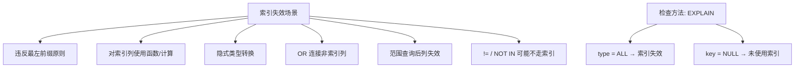
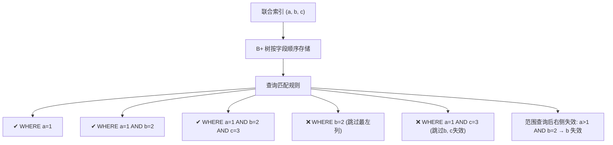
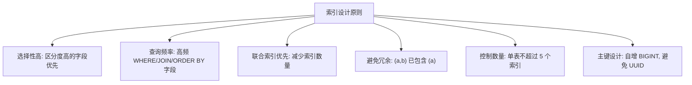
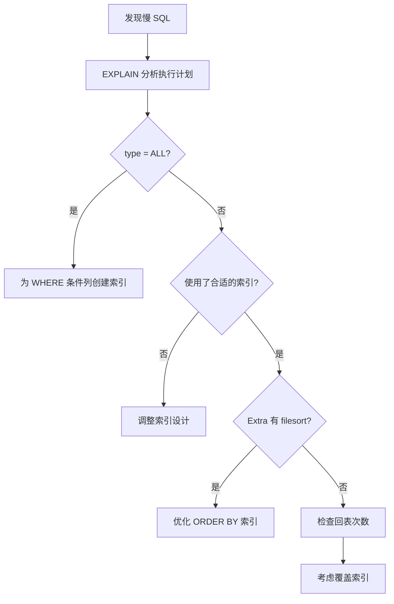

---
icon: logos:mysql
title: MySQL 面试之索引篇
cover: https://raw.githubusercontent.com/dunwu/images/master/archive/2025/03/020ab2bf4af8401590e0291a34f873f8.jpg
date: 2025-03-24 22:42:57
categories:
  - 数据库
  - 关系型数据库
  - MySQL
tags:
  - 数据库
  - 关系型数据库
  - MySQL
  - 面试
permalink: /pages/c3b86217/
---

# MySQL 面试之索引篇

## 综合

### 【简单】什么是索引？为什么要使用索引？⭐⭐⭐

> 🎯 目标等级：L2 ｜ ⏱ 建议用时：5 min ｜ 🏷 标签：综合 / 索引基础

#### 💎 关键结论

索引是数据库为加速查询而维护的有序数据结构，类似书的目录。数据量越大，索引带来的性能提升越显著——设置合理索引是查询优化最直接、最有效的手段。

#### ⚡记忆卡片

- **口诀**：索引如目录，查书不用翻全书
- **关键词**：数据结构 ／ 加速查询 ／ 目录类比
- **链路**：全表扫描（慢） → 索引定位（快） → 数据量越大优势越明显

#### 📖 核心知识

**索引的本质**：索引是存储引擎层为数据表构建的辅助数据结构，目的是**减少查询时需要扫描的数据量**，从而大幅提升检索效率。

**为什么要使用索引**：

- **目录类比**：就像通过书的目录可以快速定位章节内容，索引帮助数据库快速找到目标数据行，避免逐行扫描整张表。
- **数据量敏感**：在数据量小且负载低时，全表扫描的开销不大，索引的优势不明显；但随着数据量增长，全表扫描的耗时会线性甚至急剧增加，索引的价值愈发关键。
- **最有效的优化手段**：在所有查询优化手段中（SQL 改写、缓存、分库分表等），**设置合理的索引是投入产出比最高的方式**，往往一条索引就能将查询从秒级降到毫秒级。

#### 🔀 发散问题

- **Q：索引有哪些常见数据结构？** → B+ 树索引、Hash 索引、Full-text 索引，InnoDB 默认使用 B+ 树，见本文档「索引有哪些常见数据结构」。
- **Q：索引有什么优缺点？** → 加速查询但占用空间、降低写入性能，见本文档「索引的优点和缺点是什么」。

### 【简单】索引的优点和缺点是什么？⭐⭐

> 🎯 目标等级：L2 ｜ ⏱ 建议用时：5 min ｜ 🏷 标签：综合 / 索引基础

#### 💎 关键结论

索引的核心优点是大幅减少扫描数据量、加速查询，还能避免排序和临时表；缺点是占用额外空间、降低写操作性能。索引不是越多越好，必须按需创建。

#### ⚡记忆卡片

- **口诀**：快查省扫避排序，空问写慢要权衡
- **关键词**：减少扫描 ／ 避免排序 ／ 顺序 IO ／ 空间开销 ／ 写性能下降
- **链路**：索引加速查询 → 但占空间 + 写时需维护 → 按需创建、避免冗余

#### 📖 核心知识

✔️️️️️️️️ **索引的优点**：

- **减少扫描数据量**：索引帮助服务器跳过大量无关行，直接定位目标数据，大幅加快检索速度。
- **避免排序和临时表**：索引本身已有序，用于 `ORDER BY`、`GROUP BY` 时可避免额外的排序操作和临时表创建。
- **随机 IO → 顺序 IO**：无索引时查询需要随机读取磁盘页，有索引后可沿叶子节点链表顺序扫描，顺序 IO 远快于随机 IO。
- **减少锁竞争**：InnoDB 在访问行时加行锁，使用索引可以减少访问的行数，从而减少锁竞争，提高并发。
- **保证数据唯一性**：唯一索引可约束数据不重复，同时优化器也能利用唯一性进行查询优化。

❌ **索引的缺点**：

- **创建和维护耗时**：建索引需要时间，且随数据量增长而增加；数据变更时需要同步更新索引。
- **占用额外物理空间**：每个索引都要占用磁盘空间，联合索引占用更大。
- **写操作性能下降**：`INSERT`/`UPDATE`/`DELETE` 时可能需要更新索引，索引越多，写操作开销越大。


#### 🔀 发散问题

- **Q：索引有哪些分类？** → 按数据结构、物理存储、字段特性、字段个数四个维度分类，见本文档「索引有哪些分类」。
- **Q：何时适用索引？何时不适用？** → 高频查询、排序字段适用；小表、低查询、高重复字段不适用，见本文档「何时适用索引？何时不适用索引」。

### 【中等】何时适用索引？何时不适用索引？⭐⭐

> 🎯 目标等级：L2-L3 ｜ ⏱ 建议用时：8 min ｜ 🏷 标签：综合 / 索引设计

#### 💎 关键结论

索引按需创建，不是越多越好。高频查询、排序、分组的字段适合建索引；小表、低查询、高重复字段、长文本字段则不适合。尽量扩展已有索引，而非盲目新建。

#### ⚡记忆卡片

- **口诀**：高频查询建索引，小表低区分不建；扩展优先少新建，删除无用省开销
- **关键词**：按需创建 ／ 扩展优先 ／ 选择性 ／ 长文本 ／ 分区替代
- **链路**：查询频率高 + 区分度高 → 建索引 ｜ 小表/低查询/高重复 → 不建

#### 📖 核心知识

**索引设计原则**：

- **索引不是越多越好**：不要为所有列都创建索引，要综合考虑维护代价、空间占用和回表成本。联合索引应尽可能利用自身完成查询，减少回表。
- **删除未使用的索引**：定期清理无用索引，减少写入开销和存储空间。
- **扩展优先，避免新建**：尽量扩展已有索引（如将 `(a)` 扩展为 `(a, b)`），而不是不假思索地新建索引，以减少索引数量和维护成本。

✔️️️️️️️️ **适用索引的场景**：

- **高频查询字段**：频繁作为 `WHERE` 条件或 `JOIN` 条件的列。
- **排序/分组字段**：频繁用于 `ORDER BY`、`GROUP BY`、`DISTINCT` 的列。

❌ **不适用索引的场景**：

- **非常小的表**：全表扫描更高效。
- **特大型表**：索引维护代价随之增长，可考虑分区技术或 NoSQL。
- **高频更新的表**：写操作需同步维护索引，额外开销影响性能。
- **低频查询字段**：空间和维护成本可能超过查询收益。
- **高重复字段**：选择性低（如性别只有男/女），索引效果不明显。
- **长文本字段**：TEXT、BLOB 或超长 VARCHAR，数据量大时内存排序困难，磁盘 IO 开销大。这类数据应考虑使用 ES 进行全文检索。


#### 🔬 扩展知识

::: details

- 【L3】选择性（区分度）量化：`COUNT(DISTINCT col) / COUNT(*)`，越接近 1 越好。选择性低于 0.1 的字段单独建索引意义不大，但可作为联合索引的一部分。
- 【L3】如何判断索引是否被使用？通过 `sys.schema_unused_indexes`（MySQL 8.0+）查看未使用索引；通过 `EXPLAIN` 查看查询是否命中索引。

:::

#### ⚠️ 常见误区

::: details

常见误区：

- ❌ "索引越多查询越快" → 索引过多会导致写操作性能严重下降，且优化器选择索引的开销也会增加。
- ❌ "每个字段都建索引就安全了" → 冗余索引浪费空间，且优化器可能选错索引，应通过联合索引覆盖多查询。

:::

#### 🔀 发散问题

- **Q：哪些情况下索引会失效？** → 违反最左前缀、对列用函数、隐式类型转换等，见本文档「哪些情况下，索引会失效」。
- **Q：如何设计一个高质量的索引？** → 选择性高、联合索引优先、覆盖索引、控制数量，见本文档「如何设计一个高质量的索引」。

### 【中等】哪些情况下，索引会失效？⭐⭐⭐⭐

> 🎯 目标等级：L2-L3 ｜ ⏱ 建议用时：10 min ｜ 🏷 标签：综合 / 索引失效

#### 💎 关键结论

索引不一定有效。违反最左前缀、对列用函数/计算、隐式类型转换、OR 连接非索引列、范围查询后列失效、否定条件等都可能导致索引失效。验证方法是 `EXPLAIN` 看 `key` 和 `type`。

#### ⚡记忆卡片

- **口诀**：最左不跳、列不加函数、类型要匹配、范围后列废、OR 两侧都要有索引
- **关键词**：最左前缀 ／ 函数计算 ／ 隐式转换 ／ 范围查询 ／ OR 条件 ／ EXPLAIN
- **链路**：查询条件 → 匹配索引规则 → 违反则失效 → EXPLAIN 验证



#### 📖 核心知识

**检查索引是否有效**：在查询语句前加 `EXPLAIN`，查看执行计划：

- `type`（访问类型）：索引有效时一般显示 `index`、`range`；值为 `ALL` 表示全表扫描，索引失效。
- `key`（选择的索引）：表示查询时使用的索引，为 `NULL` 表示未使用索引。

**导致索引失效的情况**：

| 失效场景         | ❌ 示例                               | ✔️ 示例                                 | 说明                                                 |
| ---------------- | ------------------------------------- | --------------------------------------- | ---------------------------------------------------- |
| 违反最左前缀     | `WHERE b=1`（索引 `(a,b,c)`）         | `WHERE a=1 AND b=2`                     | 跳过最左列或中间列                                   |
| 对列用函数/计算  | `WHERE YEAR(date_col)=2023`           | `WHERE date_col > '2023-01-01'`         | 索引列上套函数/表达式                                |
| 隐式类型转换     | `WHERE str_col=123`（字符串列用数字） | `WHERE int_col='123'`（数字列用字符串） | 规则：字符串转数字，转换发生在哪一侧决定索引是否失效 |
| OR 连接非索引列  | `WHERE a=1 OR b=2`（b 无索引）        | `WHERE a=1 OR a=2`                      | OR 一侧无索引则全表扫描                              |
| 范围查询后列失效 | `WHERE a>1 AND b=2`（b 无法定位）     | `WHERE a=1 AND b=2`                     | `>`、`<`、`>=`、`<=`、`BETWEEN` 右侧列失效           |
| LIKE 前导通配符  | `WHERE name LIKE '%abc'`              | `WHERE name LIKE 'abc%'`                | 前导 `%` 导致索引失效                                |
| 否定条件         | `WHERE status != 0`                   | 视数据分布而定                          | 并非一定失效，选择性低时优化器倾向全表扫描           |

- ⚠️ `!=`、`<>`、`NOT IN` 并非一定失效，而是选择性通常很低，优化器基于成本判断往往选择全表扫描。若否定条件的结果集很小，索引仍可能被使用。
- ✔️ `IS NULL` / `IS NOT NULL` **可以使用索引**（InnoDB 会存储 NULL 值），是否走索引取决于选择性。


#### 🔬 扩展知识

::: details

- 【L3】验证索引是否失效的权威方法是 `EXPLAIN` 看 `key` 和 `type`，而不是背规则——优化器基于成本决策，同一条 SQL 在不同数据分布下可能走不同计划。
- 【L3】MySQL 8.0 支持**函数索引**（如 `ALTER TABLE t ADD INDEX idx_year((YEAR(create_time)))`），可解决对列使用函数导致索引失效的问题。
- 【L4】优化器的成本模型依赖统计信息（`ANALYZE TABLE` 刷新），数据分布极度倾斜时，即使符合最左前缀，优化器也可能放弃索引选择全表扫描。

:::

#### ⚠️ 常见误区

::: details

常见误区：

- ❌ "IS NULL 一定索引失效" → InnoDB 会存储 NULL 值，IS NULL / IS NOT NULL 可以使用索引，是否走索引取决于选择性。
- ❌ "!= 一定不走索引" → 并非一定失效，当否定条件结果集很小时，索引仍可能被使用。
- ❌ "EXPLAIN type=const 就是最好的" → `const` 表示主键/唯一键等值查询，`system` 才是最优（仅一行），但两者都极快，实际中 `const` 已足够好。

:::

#### 🔀 发散问题

- **Q：什么是最左匹配原则？** → 联合索引必须从最左列开始连续匹配，见本文档「什么是索引最左匹配原则」。
- **Q：如何诊断和优化索引问题？** → EXPLAIN 分析 + 统计信息 + 覆盖索引，见本文档「如何诊断和优化索引问题」。

### 【简单】索引有哪些分类？⭐⭐

> 🎯 目标等级：L2 ｜ ⏱ 建议用时：5 min ｜ 🏷 标签：综合 / 索引分类

#### 💎 关键结论

MySQL 索引可从四个维度分类：数据结构（B+ 树/Hash/Full-text）、物理存储（聚簇/二级索引）、字段特性（主键/唯一/普通/前缀）、字段个数（单列/联合索引）。

#### ⚡记忆卡片

- **口诀**：结构存储特性数，四维度记清楚
- **关键词**：B+ 树 ／ Hash ／ 聚簇 ／ 二级索引 ／ 联合索引
- **链路**：数据结构 → 物理存储 → 字段特性 → 字段个数

#### 📖 核心知识

MySQL 索引可以从以下四个维度来分类：

| 分类维度 | 类型                                   | 说明                                         |
| -------- | -------------------------------------- | -------------------------------------------- |
| 数据结构 | B+ 树索引、Hash 索引、Full-text 索引   | InnoDB 默认使用 B+ 树，Memory 支持 Hash      |
| 物理存储 | 聚簇索引、二级索引（辅助索引）         | 聚簇索引叶子存整行数据，二级索引叶子存主键值 |
| 字段特性 | 主键索引、唯一索引、普通索引、前缀索引 | 主键=唯一+非空，前缀索引用于长文本           |
| 字段个数 | 单列索引、联合索引（复合索引）         | 联合索引遵循最左匹配原则                     |


#### 🔀 发散问题

- **Q：索引有哪些常见数据结构？** → B+ 树、Hash、Full-text，不同引擎支持不同，见本文档「索引有哪些常见数据结构」。
- **Q：聚簇索引和非聚簇索引有什么区别？** → 叶子节点内容不同，见本文档「聚簇索引和非聚簇索引有什么区别」。

### 【简单】= 和 in 的顺序对于命中索引是否有影响？⭐⭐

> 🎯 目标等级：L2 ｜ ⏱ 建议用时：3 min ｜ 🏷 标签：综合 / 索引匹配

#### 💎 关键结论

不需要考虑 `=`、`IN` 等条件的顺序，MySQL 优化器会自动调整条件顺序，以尽可能匹配更多索引列。

#### ⚡记忆卡片

- **口诀**：条件顺序无所谓，优化器自动排
- **关键词**：优化器 ／ 自动调整 ／ 索引匹配
- **链路**：WHERE 条件乱序 → 优化器重排 → 按索引列顺序匹配

#### 📖 核心知识

MySQL 优化器会自动优化 `=`、`IN` 等条件的顺序，以匹配尽可能多的索引列。书写时无需刻意调整条件顺序。

::: details 示例

如有索引 `(a, b, c, d)`，以下查询都能依次命中 a、b、c、d：

```sql
-- 条件顺序不同，但效果相同
WHERE c > 3 AND b = 2 AND a = 1 AND d < 4
WHERE a = 1 AND c > 3 AND b = 2 AND d < 4
```

优化器会自动将其调整为 `a = 1 AND b = 2 AND c > 3 AND d < 4`。

:::

#### 🔀 发散问题

- **Q：什么是最左匹配原则？** → 联合索引必须从最左列开始连续匹配，见本文档「什么是索引最左匹配原则」。

## 索引数据结构

### 【简单】索引有哪些常见数据结构？⭐⭐

> 🎯 目标等级：L2 ｜ ⏱ 建议用时：8 min ｜ 🏷 标签：索引数据结构 / 索引基础

#### 💎 关键结论

索引在存储引擎层实现，不同引擎支持不同数据结构。常见结构有哈希索引（等值快但不支持范围）、B 树索引（支持全键值/范围/前缀查找）和 Full-text 索引（全文检索）。

#### ⚡记忆卡片

- **口诀**：哈希等值快、B 树全能、全文搜用 Full-text
- **关键词**：存储引擎层 ／ 哈希索引 ／ B 树索引 ／ Full-text
- **链路**：索引在引擎层 → 不同引擎支持不同结构 → InnoDB 默认 B+ 树

#### 📖 核心知识

在 MySQL 中，**索引是在存储引擎层而不是服务器层实现的**，不同存储引擎的索引数据结构不相同。

**各引擎对索引数据结构的支持**：

| 索引数据结构/存储引擎 | InnoDB 引擎 | MyISAM 引擎 | Memory 引擎 |
| --------------------- | ----------- | ----------- | ----------- |
| **B+ 树索引**         | ✔️️️️️️️          | ✔️️️️️️️️          | ✔️️️️️️️️          |
| **Hash 索引**         | ❌          | ❌          | ✔️️️️️️️️          |
| **Full Text 索引**    | ✔️️️️️️️          | ✔️️️️️️️️          | ❌          |

**哈希索引**：

- 数据结构紧凑，**等值查询速度极快**（`=`、`IN()`、`<=>`）。
- **不支持范围查询**（如 `WHERE price > 100`）。
- **无法用于排序**：数据不按索引值顺序存储。
- **不支持部分索引匹配**：哈希计算使用索引列全部内容，如索引 `(A, B)` 只查 A 无法使用。
- **不能避免读取行**：哈希索引只含哈希值和行指针，不存储字段值。
- **可能出现哈希冲突**：冲突时需遍历链表逐行比较，维护代价高。

**B 树索引**：

- 适用于**全键值查找**、**键值范围查找**和**键前缀查找**（最左前缀）。
- 所有数据存储在叶子节点，非叶子节点只存键值和指针。
- 叶子节点按键值顺序排列，由指针连接。

#### 🔀 发散问题

- **Q：为什么 InnoDB 采用 B+ 树而不是 B 树？** → B+ 树范围查询更高效、查询稳定、空间利用率高，见本文档「为什么 InnoDB 采用 B+ 树索引」。
- **Q：B+ 树和 Hash 索引的差异？** → B+ 树支持范围查询、排序、最左匹配；Hash 仅等值查询快，见本文档「为什么 InnoDB 采用 B+ 树索引」。

### 【中等】为什么 InnoDB 采用 B+ 树索引？⭐⭐⭐⭐

> 🎯 目标等级：L2-L3 ｜ ⏱ 建议用时：12 min ｜ 🏷 标签：索引数据结构 / B+ 树

#### 💎 关键结论

B+ 树在磁盘 I/O、范围查询、查询稳定性和空间利用率之间取得了最佳平衡。树高度低（3-4 层即可存千万级数据）、叶子节点双向链表支持高效范围查询、所有查询路径等长保证性能稳定。

#### ⚡记忆卡片

- **口诀**：矮胖树、链叶子、等路径、缓存友好
- **关键词**：磁盘 I/O ／ 范围查询 ／ 平衡树 ／ O(log n) ／ 双向链表
- **链路**：磁盘随机读写慢 → 树高度低减少 I/O → 叶子链表支持范围查询 → 平衡树保证稳定


#### 📖 核心知识

InnoDB 选择 B+ 树，是其在**磁盘 I/O 效率**、**范围查询**、**稳定性**和**空间利用率**之间的最佳平衡。即使 SSD 普及，减少 I/O 次数的核心思想依然不变。

**1. 减少磁盘 I/O 次数**

- 磁盘读写以页（通常 4KB）为单位，评价索引优劣的关键是**每次操作需要访问多少磁盘块**。
- B+ 树是多路平衡搜索树，扇出高，千万级数据仅需 3-4 层树高，查找任意记录最多 3-4 次磁盘 I/O。

**2. 非常适合范围查询**

- B+ 树所有数据记录存储在叶子节点上，按键值顺序链接成双向链表。
- 通过内部节点快速定位起始点，沿叶子节点链表顺序扫描即可，几乎等同于顺序读取。
- B 树范围查询需在内部节点和叶子节点间来回移动，效率低下。

**3. 查询性能稳定**

- 所有查询路径等长（平衡树），查询任意记录的耗时都非常稳定，时间复杂度 **O(log n)**。

**4. 更高的空间利用率和缓存效率**

- 内部节点无数据，每个节点可容纳更多键值和指针（更高扇出），树更“胖”、高度更低。
- Buffer Pool 可缓存更多上层节点，大多数查询可能在 1-2 次 I/O 内完成。

**5. 全表扫描更方便**

- 只需遍历叶子节点链表即可，无需像 B 树那样对整棵树进行中序遍历。


::: details B+ 树 vs B 树

- B+ 树只在叶子节点存储数据，B 树的非叶子节点也要存储数据，所以 B+ 树单个节点数据量更小，同磁盘 I/O 下能查询更多节点。
- B+ 树叶子节点采用双链表连接，适合基于范围的顺序查找，B 树无法做到。

:::

::: details B+ 树 vs 二叉树

- B+ 树搜索复杂度为 `O(logdN)`，d 值通常 >100，千万级数据树高仅 1-3 层，只需 1-3 次磁盘 I/O。
- 二叉树每个节点只能有 2 个子节点，搜索复杂度 `O(logN)`，磁盘 I/O 次数远多于 B+ 树。
- 一言以蔽之，使用 B+ 树而不是二叉树，是为了减少树的高度，即减少磁盘 I/O 次数。

:::

::: details B+ 树索引 vs Hash 索引

| 对比项       | B+ 树索引 | Hash 索引          |
| ------------ | --------- | ------------------ |
| 范围查询     | ✔️ 支持   | ❌ 不支持          |
| 最左匹配     | ✔️ 支持   | ❌ 不支持          |
| 排序         | ✔️ 支持   | ❌ 不支持          |
| 模糊查询     | ✔️ 支持   | ❌ 不支持          |
| 等值查询效率 | 快        | 更快（但场景苛刻） |

Hash 索引的应用场景很苛刻，不适用于绝大多数场景。

:::

#### 🔬 扩展知识

::: details

- 【L3】B+ 树的“胖”特性：InnoDB 页大小 16KB，非叶子节点每个键值对约 14 字节（BIGINT 主键 8 字节 + 指针 6 字节），单个非叶子节点可容纳约 1100 个键值，这意味着 3 层 B+ 树即可存储约 2000 万条记录。
- 【L4】SSD 时代 B+ 树仍然适用的原因：SSD 随机读写仍慢于顺序读写，且存在写入放大问题。B+ 树的顺序写叶子节点特性对 SSD 寿命和性能都更友好。

:::

#### ⚠️ 常见误区

::: details

常见误区：

- ❌ "B+ 树比 B 树查询更快" → 单条等值查询两者差异不大，B+ 树的优势在于范围查询、排序和缓存效率。
- ❌ "SSD 普及后 B+ 树已过时" → 减少 I/O 次数的核心思想不变，SSD 随机读写仍慢于顺序读写，且 B+ 树对 SSD 写入寿命更友好。

:::

#### 🔀 发散问题

- **Q：B+ 树索引能存多少数据？** → 3 层 B+ 树约存 2000 万条记录，见本文档「B+ 树索引能存多少数据」。
- **Q：索引有哪些常见数据结构？** → B+ 树、Hash、Full-text，见本文档「索引有哪些常见数据结构」。

### 【中等】B+ 树索引能存多少数据？⭐⭐

> 🎯 目标等级：L2-L3 ｜ ⏱ 建议用时：8 min ｜ 🏷 标签：索引数据结构 / B+ 树

#### 💎 关键结论

InnoDB 页大小 16KB，以 BIGINT 主键、平均行大小 1000 字节估算：2 层 B+ 树存约 1.76 万条，3 层存约 2000 万条，4 层存约 200 多亿条。实际生产中 3 层即可覆盖绝大多数场景。

#### ⚡记忆卡片

- **口诀**：非叶一千一、叶子十六个，三层两千万、四层两百亿
- **关键词**：16KB ／ 14 字节 ／ 1100 ／ 16 ／ 3 层 2000 万
- **链路**：页大小 16KB → 非叶子节点存 1100 个键值 → 叶子节点存 16 条记录 → 树高 3 层存 2000 万

#### 📖 核心知识

InnoDB 默认数据页大小为 **16KB**。B+ 树从高度 1 开始，随数据插入逐渐增长。

**非叶子节点可存储的记录数**：

根节点和中间节点存放索引键值对（索引键 + 指针）。BIGINT 主键占 8 字节，指针占 6 字节，每个键值对 14 字节：

```
非叶子节点记录数 = 16KB / 14 ≈ 1100
```

**叶子节点可存储的记录数**：

假设数据记录平均大小为 1000 字节（实际一般小于此值）：

```
叶子节点记录数 = 16KB / 1000 ≈ 16
```

**不同高度的 B+ 树可存储的记录数**（主键 BIGINT，平均行大小 1000 字节）：

| 树高度 | 最多存储记录数                              | 查询 I/O 次数 |
| ------ | ------------------------------------------- | ------------- |
| 2 层   | 1100 × 16 ≈ 17,600（约 1.76 万）            | 2 次          |
| 3 层   | 1100 × 1100 × 16 ≈ 19,360,000（约 2000 万） | 3 次          |
| 4 层   | 1100³ × 16 ≈ 21,296,000,000（约 200 多亿）  | 4 次          |

**优化 B+ 树插入性能**：

- 顺序插入（如自增 ID 或时间列）维护代价小，性能较好。
- 无序插入（如用户昵称）会导致页分裂、旋转等开销，影响性能。
- 主键设计应尽量使用顺序值（如自增 ID），保证高并发场景下的性能。

#### 🔬 扩展知识

::: details

- 【L3】以上计算是理论估算，实际中数据行大小不固定（平均 1000 字节是假设值），叶子节点实际存储量取决于行大小。行越小，单页能存更多记录，3 层 B+ 树能存储的数据量就越大。
- 【L3】InnoDB 页大小可配置（`innodb_page_size`），支持 4KB/8KB/16KB/32KB，但创建后不可更改。页越大，单节点存储越多，但 Buffer Pool 的缓存粒度也越大。

:::

#### 🔀 发散问题

- **Q：为什么 InnoDB 采用 B+ 树索引？** → 树高度低减少 I/O、叶子链表支持范围查询，见本文档「为什么 InnoDB 采用 B+ 树索引」。
- **Q：什么是页分裂？为什么推荐使用自增主键？** → 无序插入导致页分裂，见本文档「什么是页分裂？为什么推荐使用自增主键」（MySQL 面试）。

## 聚簇索引和非聚簇索引

### 【中等】聚簇索引和非聚簇索引有什么区别？⭐⭐⭐

> 🎯 目标等级：L2-L3 ｜ ⏱ 建议用时：8 min ｜ 🏷 标签：聚簇索引 / 物理存储

#### 💎 关键结论

聚簇索引（主键索引）叶子节点存整行数据，非聚簇索引（二级索引）叶子节点存主键值。基于非聚簇索引的查询需要“回表”再查一次聚簇索引，因此主键查询更快。

#### ⚡记忆卡片

- **口诀**：聚簇存整行，二级存主键，回表多一跳
- **关键词**：聚簇索引 ／ 二级索引 ／ 回表 ／ 主键查询
- **链路**：聚簇索引（叶子=整行数据） ｜ 二级索引（叶子=主键值） → 回表查聚簇索引

#### 📖 核心知识

根据叶子节点的内容，索引分为聚簇索引和非聚簇索引：

| 对比项       | 聚簇索引（主键索引）                     | 非聚簇索引（二级索引）                     |
| ------------ | ---------------------------------------- | ------------------------------------------ |
| 叶子节点内容 | 整行数据                                 | 主键值                                     |
| 数量         | 一个表只能有一个                         | 可以有多个                                 |
| 查询方式     | 直接获取数据                             | 先查主键值，再回表查聚簇索引               |
| 存储结构     | InnoDB 在同一结构中保存 B 树索引和数据行 | 数据和索引分开存储，索引包含指向数据的指针 |

**回表**：通过非聚簇索引查询时，先从二级索引树找到主键值，再到聚簇索引树查找完整数据行，这个过程称为回表。

- `SELECT * FROM T WHERE ID=500`（聚簇索引查询）：只需搜索主键索引树。
- `SELECT * FROM T WHERE k=5`（非聚簇索引查询）：先搜索 k 索引树得到 ID，再回表搜索 ID 索引树。


**基于非聚簇索引的查询需要多扫描一棵索引树**，因此在应用中应尽量使用主键查询。

**主键长度越小，非聚簇索引的叶子节点就越小，非聚簇索引占用的空间也就越小。**

#### 🔬 扩展知识

::: details

- 【L3】InnoDB 聚簇索引的选择规则：如果表定义了主键，则主键索引为聚簇索引；否则 InnoDB 选择第一个非 NULL 的唯一索引；若也没有，则自动生成隐藏的 `row_id` 作为聚簇索引。
- 【L3】回表的代价：每次回表是一次随机 I/O。如果二级索引过滤后仍有大量数据需要回表，优化器可能放弃二级索引，直接全表扫描（基于成本判断）。

:::

#### ⚠️ 常见误区

::: details

常见误区：

- ❌ "二级索引叶子存的是数据行地址" → InnoDB 的二级索引叶子存的是主键值，不是物理地址。这也是为什么主键设计应尽量小。
- ❌ "回表一定会发生" → 如果查询所需字段都在索引中（覆盖索引），则无需回表，见本文档「什么是覆盖索引」。

:::

#### 🔀 发散问题

- **Q：什么是覆盖索引？** → 二级索引信息满足查询所需所有字段，无需回表，见本文档「什么是覆盖索引」。
- **Q：为什么 InnoDB 采用 B+ 树索引？** → 聚簇索引和非聚簇索引都是 B+ 树结构，见本文档「为什么 InnoDB 采用 B+ 树索引」。

### 【简单】什么是覆盖索引？⭐⭐⭐

> 🎯 目标等级：L2 ｜ ⏱ 建议用时：5 min ｜ 🏷 标签：聚簇索引 / 查询优化

#### 💎 关键结论

覆盖索引是指二级索引的信息已满足查询所需的所有字段，不需要回表查询聚簇索引。由于减少了树的搜索次数，覆盖索引是常用的性能优化手段。

#### ⚡记忆卡片

- **口诀**：索引字段全覆盖，回表省掉性能快
- **关键词**：覆盖索引 ／ 无需回表 ／ 减少搜索
- **链路**：查询字段全在索引中 → 无需回表 → 减少搜索次数 → 性能提升

#### 📖 核心知识

**覆盖索引**：二级索引上的信息满足查询所需的所有字段，不需要回表查询聚簇索引上的数据。

- 由于覆盖索引可以减少树的搜索次数，显著提升查询性能，所以**使用覆盖索引是一个常用的性能优化手段**。
- 在 `EXPLAIN` 执行计划中，覆盖索引的 Extra 列会显示 `Using index`。


::: details 示例

假设表 t 有联合索引 `(k, name)`：

```sql
-- 覆盖索引：查询字段 k 和 name 都在索引中，无需回表
SELECT k, name FROM t WHERE k = 5;

-- 非覆盖索引：需要回表获取 age 字段
SELECT k, name, age FROM t WHERE k = 5;
```

:::

#### 🔀 发散问题

- **Q：聚簇索引和非聚簇索引有什么区别？** → 回表是覆盖索引优化的前提，见本文档「聚簇索引和非聚簇索引有什么区别」。
- **Q：如何设计一个高质量的索引？** → 覆盖索引是索引设计的重要原则之一，见本文档「如何设计一个高质量的索引」。

## 字段特性索引

### 【简单】AUTO_INCREMENT 列达到最大值时会发生什么？⭐

> 🎯 目标等级：L2 ｜ ⏱ 建议用时：5 min ｜ 🏷 标签：字段特性索引 / 自增主键

#### 💎 关键结论

配置了自增主键的表，ID 达到上限后继续插入会得到重复值，报主键冲突错误。未配置主键的 InnoDB 表使用隐藏 `row_id`（48 位），达到上限后从 0 循环，会静默覆盖老数据。

#### ⚡记忆卡片

- **口诀**：有主键报错，无主键覆盖
- **关键词**：AUTO_INCREMENT ／ row_id ／ 重复覆盖
- **链路**：自增 ID 达上限 → 有主键：报重复错误 ｜ 无主键：row_id 循环覆盖

#### 📖 核心知识

**配置了自增主键**：

自增 ID 到达上限后，再申请下一个 ID，得到的值不变，因此会导致主键重复的错误。

**未配置主键**：

如果 InnoDB 表中没有配置主键，InnoDB 会自动创建一个不可见的、长度为 6 字节的 `row_id` 作为默认主键。

- InnoDB 在全局维护一个 `dict_sys.row_id` 值，每次插入一行数据时获取当前值并加 1。
- `row_id` 的范围是 `0` 到 `2^48 - 1`。
- 当 `row_id` 达到上限后，会从 `0` 开始重新循环。
- 如果插入的新数据的 `row_id` 在表中已存在，**老数据会被新数据覆盖，且不会产生任何报错**。

#### 🔀 发散问题

- **Q：为什么推荐使用自增主键？** → 顺序插入避免页分裂，见本文档「B+ 树索引能存多少数据」。

### 【简单】普通键和唯一键，应该怎么选择？⭐⭐

> 🎯 目标等级：L2 ｜ ⏱ 建议用时：8 min ｜ 🏷 标签：字段特性索引 / 索引选择

#### 💎 关键结论

业务允许时优先选普通索引，因为可以利用 change buffer 提升更新性能。需要保证数据唯一性时必须用唯一索引。两者查询性能差异微乎其微。

#### ⚡记忆卡片

- **口诀**：查询无差异，更新看 change buffer；业务保证用普通，强制唯一用唯一
- **关键词**：change buffer ／ 写多读少 ／ 唯一约束 ／ 查询无差异
- **链路**：查询性能几乎相同 → 更新差异在 change buffer → 业务决定选择

#### 📖 核心知识

**查询性能差异**：微乎其微。唯一索引找到第一个匹配记录后会停止检索，普通索引需继续查找下一个记录，但由于数据页的读取方式，差异可忽略。

**更新性能差异**：普通索引可以利用 **change buffer** 优化性能，唯一索引则不能。

- **change buffer**：将更新操作缓存在内存中，减少对磁盘的随机读取，提升更新性能。
- 唯一索引更新时需检查唯一性约束，必须将数据页读入内存，增加了磁盘 I/O 开销。

**选型建议**：

| 场景                     | 推荐     | 原因                                   |
| ------------------------ | -------- | -------------------------------------- |
| 业务代码已保证唯一性     | 普通索引 | 可利用 change buffer，写性能更优       |
| 需要数据库层面保证唯一性 | 唯一索引 | 无法使用 change buffer，但数据安全优先 |

**change buffer 的应用特点**：

- 数据是持久化的，掉电重启不会丢失（会写入磁盘）。
- 适用于**写多读少**的场景（如账单类、日志类系统），因为数据页写入后不会立即被访问。
- 写后立即查询的场景，change buffer 效果不明显，甚至可能增加维护成本。

::: details change buffer vs. redo log

| 对比项   | change buffer              | redo log             |
| -------- | -------------------------- | -------------------- |
| 优化目标 | 减少随机读磁盘 I/O         | 减少随机写磁盘 I/O   |
| 作用     | 缓存更新操作，减少磁盘读取 | 将随机写转换为顺序写 |
| 层级     | Server 层                  | InnoDB 引擎层        |

:::

#### ⚠️ 常见误区

::: details

常见误区：

- ❌ "唯一索引查询更快" → 查询性能差异微乎其微，唯一索引的优势在于数据完整性约束，而非查询速度。

:::

#### 🔀 发散问题

- **Q：什么是 Change Buffer？** → 见本文档索引篇相关题目，或参考 MySQL 面试「什么是 Change Buffer?」。
- **Q：bin log 和 redo log 有什么区别？** → redo log 是引擎层日志，bin log 是 Server 层日志，见 MySQL 面试「bin log 和 redo log 有什么区别」。

### 【中等】为什么不推荐使用外键？⭐⭐

> 🎯 目标等级：L2-L3 ｜ ⏱ 建议用时：8 min ｜ 🏷 标签：字段特性索引 / 外键

#### 💎 关键结论

不推荐物理外键，因为外键约束会增加写操作开销、降低灵活性、增加迁移和复制复杂性。业界推荐用应用层代码维护引用完整性（逻辑外键）。

#### ⚡记忆卡片

- **口诀**：外键约束性能差，迁移复制都麻烦它；逻辑外键应用管，灵活高效跨库佳
- **关键词**：物理外键 ／ 逻辑外键 ／ 性能开销 ／ 灵活性
- **链路**：物理外键约束检查 → 写操作开销 + 迁移复杂 → 应用层逻辑外键替代

#### 📖 核心知识

**逻辑外键**：在应用层代码中管理和维护数据完整性，而非通过数据库外键约束。

| 对比项     | 逻辑外键       | 物理外键                 |
| ---------- | -------------- | ------------------------ |
| 灵活性     | 高，应用层控制 | 低，复杂业务逻辑受限     |
| 性能       | 无约束检查开销 | 插入/更新/删除需检查约束 |
| 跨库兼容   | 易迁移         | 迁移和复制复杂           |
| 数据一致性 | 依赖代码正确性 | 数据库自动保证           |
| 维护成本   | 需持续关注     | 数据库自动维护           |

**不推荐物理外键的核心原因**：

- **性能开销**：外键约束会增加插入、更新和删除操作的开销，特别是处理大量数据时。
- **迁移和复制复杂**：外键约束在数据库迁移或复制时需小心处理，增加运维复杂性。
- **灵活性低**：复杂业务逻辑下，物理外键可能不够灵活，需要更多手动控制。

#### 🔬 扩展知识

::: details

- 【L3】互联网大厂几乎都不用物理外键，原因还包括：分库分表场景下外键约束无法跨库生效；外键约束可能导致死锁（父表和子表的加锁顺序不同）。

:::

#### 🔀 发散问题

- **Q：普通键和唯一键应该怎么选择？** → 与外键无关，但都是索引设计的重要决策，见本文档「普通键和唯一键，应该怎么选择」。

### 【中等】什么是前缀索引？⭐

> 🎯 目标等级：L2 ｜ ⏱ 建议用时：5 min ｜ 🏷 标签：字段特性索引 / 前缀索引

#### 💎 关键结论

前缀索引是对文本列只索引前 N 个字符。它可以大大节约索引空间，但会降低区分度，且不能用于 `ORDER BY` 和覆盖索引。对于 BLOB/TEXT 类型，必须使用前缀索引。

#### ⚡记忆卡片

- **口诀**：前缀索引省空间，区分度降排序废
- **关键词**：前缀长度 ／ 节约空间 ／ 区分度 ／ 无法排序 ／ 无法覆盖
- **链路**：长文本列 → 只索引前 N 字符 → 省空间但区分度下降 → 无法用于排序/覆盖

#### 📖 核心知识

**前缀索引**：对 `BLOB`/`TEXT` 或超长 `VARCHAR` 列，只索引前 N 个字符，而非完整长度。

- **优点**：大大节约索引空间，提高索引效率。
- **缺点**：
  - 降低索引区分度（前缀太短可能导致多个不同值共享同一索引前缀）。
  - `ORDER BY` 无法使用前缀索引。
  - 无法将前缀索引用作覆盖索引。


::: details 示例

```sql
-- 对 email 列的前 10 个字符建索引
ALTER TABLE users ADD INDEX idx_email(email(10));
```

选择前缀长度时，应确保区分度足够高（接近完整列的区分度）。

:::

#### 🔀 发散问题

- **Q：如何设计一个高质量的索引？** → 前缀索引是长文本场景的折中方案，见本文档「如何设计一个高质量的索引」。

## 字段个数索引

### 【中等】什么是索引最左匹配原则？⭐⭐⭐⭐

> 🎯 目标等级：L2-L3 ｜ ⏱ 建议用时：10 min ｜ 🏷 标签：字段个数索引 / 联合索引

#### 💎 关键结论

联合索引必须从最左列开始连续匹配，跳过最左列或中间列则后续列无法用索引定位。范围查询列本身可用索引，但其右侧列无法再用索引定位。

#### ⚡记忆卡片

- **口诀**：最左开始连续匹配，范围右侧失效、跳过中间废
- **关键词**：最左列 ／ 连续匹配 ／ 范围查询 ／ 索引下推
- **链路**：联合索引 (a,b,c) → 必须从 a 开始 → 连续匹配到范围列为止 → 右侧列只能靠索引下推



#### 📖 核心知识

使用联合索引时，查询条件必须从索引的**最左列**开始匹配。底层原理是 InnoDB 的 B+ 树按字段顺序存储，决定了查询时必须从左到右。

**核心规则**（假设联合索引 `(a, b, c)`）：

- **必须包含最左列**：不包含最左列则联合索引失效。
  - ✔️ `WHERE a=1`（能用索引）
  - ❌ `WHERE b=2`（跳过 a，无法使用索引）
- **连续匹配，不能跳过中间列**：
  - ✔️ `WHERE a=1 AND b=2`（能用 a、b 两列索引）
  - ❌ `WHERE a=1 AND c=3`（只能用到 a，c 无法索引，因为跳过了 b）
- **遇到范围查询，右侧失效**：
  - 遇到 `>`、`<`、`>=`、`<=`、`BETWEEN`、前缀 `LIKE`（xx%）等范围条件时，范围列本身可以用索引，但其**右侧的列无法再用索引做等值定位**。
  - 注意区分：`LIKE 'xx%'` 是前缀匹配（本质是范围扫描），可以用索引；`LIKE '%xx'` 是后缀模糊匹配，索引失效。

**最左前缀匹配命中示例**（索引 `(name, age, city)`）：

```sql
✔️ WHERE name='Alice' AND age=25 AND city='Beijing'  -- 完整使用索引
✔️ WHERE name='Alice' AND age=25                     -- 使用 name 和 age
✔️ WHERE name='Alice'                               -- 仅使用 name
❌ WHERE age=25 AND city='Beijing'                  -- 跳过 name，无法使用索引
❌ WHERE name='Alice' AND city='Beijing'            -- 只能用到 name，跳过 age，但可以应用索引下推
```

#### 🔬 扩展知识

::: details

- 【L3】索引下推与范围列的精确语义：以索引 `(a, b, c)`，查询 `WHERE a = 1 AND c = 3` 为例：
  - **无索引下推（5.6 之前）**：存储引擎按 a=1 找到所有记录，逐条回表，Server 层再过滤 c=3，回表次数多。
  - **有索引下推（ICP）**：引擎在二级索引中遍历时，直接用索引中已有的 c 值过滤，不满足的行不回表，`EXPLAIN` 的 Extra 显示 `Using index condition`。
  - 关键点：ICP 只是减少回表，**不能改变“c 无法参与索引定位”的事实**；真正让 c 参与定位需要调整索引列顺序或补齐 b 条件。
- 【L3】MySQL 5.6 支持索引下推（InnoDB 和 MyISAM 支持），允许跳过中间列的情况下，将匹配条件推送到引擎层过滤，提升查询效率。

:::

#### ⚠️ 常见误区

::: details

常见误区：

- ❌ "WHERE a=1 AND c=3 完全用不到 c" → 虽然 c 无法参与索引定位，但 MySQL 5.6+ 的索引下推（ICP）可以利用索引中的 c 值在引擎层过滤，减少回表。
- ❌ "范围查询列本身也不能用索引" → 范围查询列（如 `a > 1`）本身是可以用索引的，只是其右侧列无法再用索引定位。

:::

#### 🔀 发散问题

- **Q：什么是索引下推？** → ICP 减少回表次数，见本文档「什么是索引下推」。
- **Q：哪些情况下索引会失效？** → 违反最左匹配是索引失效的常见场景之一，见本文档「哪些情况下，索引会失效」。

### 【中等】什么是索引下推？⭐⭐

> 🎯 目标等级：L2-L3 ｜ ⏱ 建议用时：8 min ｜ 🏷 标签：字段个数索引 / 索引优化

#### 💎 关键结论

索引下推（ICP）是 MySQL 5.6+ 引入的优化技术，将部分查询条件下推到存储引擎层进行过滤，减少回表次数，提升查询效率。主要应用于联合索引场景。

#### ⚡记忆卡片

- **口诀**：索引下推减回表，引擎层过滤效率高
- **关键词**：索引下推 ／ 回表 ／ 引擎层过滤 ／ Using index condition
- **链路**：联合索引部分匹配 → 下推条件到引擎层 → 在索引中过滤 → 减少回表次数

#### 📖 核心知识

**索引下推**（Index Condition Pushdown，ICP）是一种减少回表查询、提高查询效率的技术，主要应用于联合索引。

它允许 MySQL 在使用索引查找数据时，将部分查询条件下推到存储引擎层进行过滤，从而减少需要从表中读取的数据行，减少 IO 操作。

**索引下推注意点**：

- MySQL 5.6 及以后版本支持，适用于 InnoDB 和 MyISAM 存储引擎。
- 包含子查询时，索引下推可能不会生效。
- 使用函数或表达式时，索引下推不会生效。
- 使用聚簇索引（主键）查询时，索引下推不会生效，因为它主要针对非聚簇索引（二级索引）。


#### 🔬 扩展知识

::: details

- 【L3】在 `EXPLAIN` 的 Extra 列中，索引下推会显示 `Using index condition`，这是判断 ICP 是否生效的标志。
- 【L3】ICP 与覆盖索引的区别：覆盖索引是查询所需字段全在索引中，完全不需要回表；ICP 是部分字段在索引中，通过引擎层过滤减少回表次数，但仍需回表获取最终数据。

> 📚 延伸阅读：[MySQL 索引下推详解](https://zhuanlan.zhihu.com/p/121084592)

:::

#### 🔀 发散问题

- **Q：什么是最左匹配原则？** → 索引下推是在最左匹配基础上的优化，见本文档「什么是索引最左匹配原则」。
- **Q：什么是覆盖索引？** → 完全不需要回表，比 ICP 更彻底，见本文档「什么是覆盖索引」。

## 索引设计实战

### 【困难】如何设计一个高质量的索引？⭐⭐⭐⭐

> 🎯 目标等级：L3-L4 ｜ ⏱ 建议用时：15 min ｜ 🏷 标签：索引设计实战 / 综合

#### 💎 关键结论

高质量索引设计：自增 BIGINT 主键、联合索引列按“等值前 + 范围后 + 排序尾”排列、覆盖索引减少回表、单表不超过 5 个索引、定期清理无用索引。一个精心设计的联合索引往往优于多个单列索引的堆砌。

#### ⚡记忆卡片

- **口诀**：自增主键、联合覆盖、等值前范围后排序尾、五个上限定期清
- **关键词**：选择性 ／ 联合索引 ／ 覆盖索引 ／ 反模式 ／ 统计信息
- **链路**：主键设计 → 联合索引列顺序 → 覆盖索引 → 控制数量 → 定期清理



#### 📖 核心知识

**索引设计清单**：

| 检查项       | 建议                 | 原因                          |
| ------------ | -------------------- | ----------------------------- |
| 主键选择     | 自增 BIGINT          | 避免页分裂，保证顺序插入性能  |
| 联合索引顺序 | 区分度高的列在前     | 最大化索引过滤效果            |
| 覆盖索引     | 查询字段尽量在索引中 | 避免回表，减少随机 IO         |
| 索引数量     | 单表不超过 5 个      | 写操作需同步维护索引          |
| 前缀索引     | 长字符串用前缀       | 节省空间，但无法用于排序/覆盖 |
| 删除无用索引 | 定期清理             | 减少写入开销和存储空间        |

**常见反模式**：

- ❗ 每个字段都建索引 → 写性能严重下降
- ❗ 使用 UUID 作为主键 → 随机插入导致大量页分裂
- ❗ 索引列上套函数 → 索引失效
- ❗ 字符串列不加引号 → 隐式类型转换导致索引失效

#### 🔬 扩展知识

::: details

- 【L3】联合索引列顺序的完整规则：等值查询列放前面（按区分度从高到低）→ **范围查询列放所有等值列之后**（范围列后的列无法参与定位）→ 排序列追加在最后（且排序方向一致），让一个索引同时满足 WHERE + ORDER BY，消除 filesort。
  - 例：查询 `WHERE status = 1 AND create_time > ? ORDER BY score`，索引应设计为 `(status, create_time, score)` 或根据排序需求权衡 `(status, score, create_time)`。
- 【L3】区分度（选择性）量化：`COUNT(DISTINCT col) / COUNT(*)`，越接近 1 越好。性别、状态这类低区分度列单独建索引几乎无用，但放在联合索引中作等值前缀仍有价值。
- 【L3】利用索引优化排序：`ORDER BY` 的列和方向必须与索引完全一致才能免排序；多列混合 ASC/DESC 时，MySQL 8.0 可建降序索引解决。
- 【L4】写场景权衡：每次 INSERT/UPDATE/DELETE 都要维护所有二级索引；高频写表（如日志表）应严格控制索引数量，必要时用归档/分表代替复杂查询需求。
- 【L4】索引设计不是孤立的：要结合慢 SQL 清单、业务 TOP SQL 做联合设计，一个精心设计的联合索引往往能覆盖多条查询，优于多个单列索引的堆砌。

:::

#### 🏭 实战场景

::: details

**典型电商订单表索引设计**：

```sql
-- 订单表核心查询
SELECT * FROM orders
WHERE user_id = ? AND status = ? AND create_time > ?
ORDER BY create_time DESC
LIMIT 20;

-- 索引设计：(user_id, status, create_time)
-- user_id 等值 + status 等值 + create_time 范围+排序
```

- 单表数据量：千万级
- 索引数量：主键 + 2-3 个联合索引（按 TOP SQL 设计）
- 通过覆盖索引优化 `LIMIT` 分页，避免深度回表

:::

#### ⚠️ 常见误区

::: details

常见误区：

- ❌ "索引越多查询越快" → 写性能严重下降，优化器选索引的开销也增加。
- ❌ "区分度低的列不能建索引" → 单独建索引意义不大，但作为联合索引的等值前缀仍有价值。
- ❌ "ORDER BY 列加索引就行" → 排序列的索引必须与查询条件联合设计，否则可能和 WHERE 条件的索引冲突。

:::

#### 🔀 发散问题

- **Q：如何诊断和优化索引问题？** → 通过 EXPLAIN、统计信息、慢 SQL 清单定位问题，见本文档「如何诊断和优化索引问题」。
- **Q：哪些情况下索引会失效？** → 设计再好的索引也可能因查询写法而失效，见本文档「哪些情况下，索引会失效」。

### 【困难】如何诊断和优化索引问题？⭐⭐⭐⭐

> 🎯 目标等级：L3-L4 ｜ ⏱ 建议用时：15 min ｜ 🏷 标签：索引设计实战 / 诊断优化

#### 💎 关键结论

索引诊断的核心工具是 EXPLAIN + sys 库视图。优化流程：发现慢 SQL → EXPLAIN 分析 → 定位问题（全表扫描/索引选错/排序问题/回表过多）→ 针对性优化。统计信息不准是“索引突然不走”的常见原因。

#### ⚡记忆卡片

- **口诀**：EXPLAIN 看计划、sys 库查冗余、统计信息要刷新、覆盖索引减回表
- **关键词**：EXPLAIN ／ ANALYZE TABLE ／ sys 视图 ／ FORCE INDEX ／ 统计信息
- **链路**：慢 SQL → EXPLAIN 分析 → 定位问题 → 调整索引/刷新统计 → 验证效果

#### 📖 核心知识

**索引诊断工具**：

```sql
-- 1. 查看表的所有索引
SHOW INDEX FROM table_name;

-- 2. 查看索引使用情况 (MySQL 8.0+)
SELECT * FROM sys.schema_unused_indexes;

-- 3. 查看索引冗余情况 (MySQL 8.0+)
SELECT * FROM sys.schema_redundant_indexes;

-- 4. 查看索引统计信息 (MySQL 8.0+)
SELECT * FROM performance_schema.table_io_waits_summary_by_index_usage
WHERE OBJECT_SCHEMA = 'mydb';

-- 5. 分析执行计划
EXPLAIN FORMAT=JSON SELECT * FROM users WHERE status = 1;
```

**索引优化流程**：



#### 🔬 扩展知识

::: details

- 【L3】优化器基于统计信息估算成本，统计信息不准会导致**选错索引**（明明有更优索引却走了差的索引甚至全表扫描）：
  - InnoDB 的统计信息是**抽样**计算的（默认 `innodb_stats_persistent_sample_pages = 20` 个页），数据分布极度倾斜时估算可能偏差很大。
  - 排查手段：`EXPLAIN` 对比 `rows` 估算值与实际行数；执行 `ANALYZE TABLE t` 重新采样统计信息；确认无误后可用 `FORCE INDEX` 强制指定索引（应急手段，慎用，数据变化后可能失效）。
  - 删除/新增索引后统计信息会刷新；线上出现“索引突然不走”类问题，优先怀疑统计信息过期或数据量跨过成本临界点。
- 【L4】生产环境索引优化的完整流程：慢 SQL 监控 → TOP SQL 排序 → EXPLAIN 分析 → 索引调整 → 压测验证 → 上线观察。每次调整后都应观察一段时间，确认优化器行为稳定。

:::

#### 🏭 实战场景

::: details

**线上“索引突然不走”排查案例**：

- 现象：某查询原本毫秒级响应，突然变成秒级。EXPLAIN 显示 type=ALL。
- 排查：检查统计信息发现 `ANALYZE TABLE` 已过期，抽样数据与实际分布偏差大。
- 解决：执行 `ANALYZE TABLE` 刷新统计信息后，查询恢复正常。
- 教训：定期执行 `ANALYZE TABLE` 或在大批量数据变更后主动刷新。

:::

#### ⚠️ 常见误区

::: details

常见误区：

- ❌ "FORCE INDEX 是万能药" → FORCE INDEX 只是应急手段，数据变化后可能失效，应优先调整索引设计。
- ❌ "EXPLAIN 的 rows 是精确值" → rows 是基于统计信息的估算值，可能与实际行数差异很大。
- ❌ "索引建好后就不用管了" → 数据分布变化、业务查询变化都可能导致索引失效，需定期审查。

:::

#### 🔀 发散问题

- **Q：如何设计一个高质量的索引？** → 诊断后的优化方向就是索引设计原则，见本文档「如何设计一个高质量的索引」。
- **Q：哪些情况下索引会失效？** → 诊断索引的第一步是判断是否失效，见本文档「哪些情况下，索引会失效」。

## 参考资料

- [MySQL 官方文档 - InnoDB 索引](https://dev.mysql.com/doc/refman/8.4/en/innodb-index-types.html)
- [《高性能 MySQL》第 4 版](https://book.douban.com/subject/23008813/)
- [极客时间教程 - MySQL 实战 45 讲](https://time.geekbang.org/column/intro/139)
- [图解 MySQL 索引](https://xiaolincoding.com/mysql/index/index.html)
