---
icon: logos:hbase
title: HBase 面试
date: 2025-03-04 10:05:51
categories:
  - 数据库
  - 列式数据库
  - HBase
tags:
  - 数据库
  - 列式数据库
  - 大数据
  - HBase
  - 面试
permalink: /pages/6a3851d6/
---

# HBase 面试

## HBase 简介

### 【简单】什么是 HBase？⭐

:::details 要点

**HBase 是一个构建在 HDFS（Hadoop 文件系统）之上的列式数据库**。

HBase 是一种类似于 `Google’s Big Table` 的数据模型，它是 Hadoop 生态系统的一部分，它将数据存储在 HDFS 上，客户端可以通过 HBase 实现对 HDFS 上数据的随机访问。


HBase 的**核心特性**如下：

- **分布式**
  - **伸缩性**：支持通过增减机器进行水平扩展，以提升整体容量和性能
  - **高可用**：支持 RegionServers 之间的自动故障转移
  - **自动分区**：Region 分散在集群中，当行数增长的时候，Region 也会自动的分区再均衡
- **超大数据集**：HBase 被设计用来读写超大规模的数据集（数十亿行至数百亿行的表）
- **支持结构化、半结构化和非结构化的数据**：由于 HBase 基于 HDFS 构建，所以和 HDFS 一样，支持结构化、半结构化和非结构化的数据
- **非关系型数据库**
  - **不支持标准 SQL 语法**
  - **没有真正的索引**
  - **不支持复杂的事务**：只支持行级事务，即单行数据的读写都是原子性的

HBase 的其他特性

- 读写操作遵循强一致性
- 过滤器支持谓词下推
- 易于使用的 Java 客户端 API
- 它支持线性和模块化可扩展性。
- HBase 表支持 Hadoop MapReduce 作业的便捷基类
- 很容易使用 Java API 进行客户端访问
- 为实时查询提供块缓存 BlockCache 和布隆过滤器
- 它通过服务器端过滤器提供查询谓词下推

:::

### 【简单】为什么需要 HBase？⭐

:::details 要点

在 HBase 诞生之前，Hadoop 可以通过 HDFS 来存储结构化、半结构甚至非结构化的数据，它是传统数据库的补充，是海量数据存储的最佳方法，它针对大文件的存储，批量访问和流式访问都做了优化，同时也通过多副本解决了容灾问题。

Hadoop 的缺陷在于：它只能执行批处理，并且只能以顺序方式访问数据。这意味着即使是最简单的工作，也必须搜索整个数据集，即：**Hadoop 无法实现对数据的随机访问**。实现数据的随机访问是传统的关系型数据库所擅长的，但它们却不能用于海量数据的存储。在这种情况下，必须有一种新的方案来**同时解决海量数据存储和随机访问的问题**，HBase 就是其中之一 (HBase，Cassandra，CouchDB，Dynamo 和 MongoDB 都能存储海量数据并支持随机访问）。

> 注：数据结构分类：
>
> - 结构化数据：即以关系型数据库表形式管理的数据；
> - 半结构化数据：非关系模型的，有基本固定结构模式的数据，例如日志文件、XML 文档、JSON 文档、Email 等；
> - 非结构化数据：没有固定模式的数据，如 WORD、PDF、PPT、EXL，各种格式的图片、视频等。

:::

### 【简单】HBase 有哪些应用场景？⭐

:::details 要点

根据上一节对于 HBase 特性的介绍，我们可以梳理出 HBase 适用、不适用的场景：

HBase **不适用场景**：

- 需要索引
- 需要复杂的事务
- 数据量较小（比如：数据量不足几百万行）

HBase **适用场景**：

- 能存储海量数据并支持随机访问（比如：数据量级达到十亿级至百亿级）
- 存储结构化、半结构化数据
- 硬件资源充足

> 一言以蔽之——HBase 适用的场景是：**实时地随机访问超大数据集**。

HBase 的典型应用场景

- 存储监控数据
- 存储用户/车辆 GPS 信息
- 存储用户行为数据
- 存储各种日志数据，如：访问日志、操作日志、推送日志等。
- 存储短信、邮件等消息类数据
- 存储网页数据

:::

### 【简单】HBase vs. RDBMS？⭐

:::details 要点

HBase 和 RDBMS 的不同之处如下：

| RDBMS                                    | HBase                                              |
| ---------------------------------------- | -------------------------------------------------- |
| RDBMS 有它的模式，描述表的整体结构的约束 | HBase 无模式，它不具有固定列模式的概念；仅定义列族 |
| 支持的文件系统有 FAT、NTFS 和 EXT        | 支持的文件系统只有 HDFS                            |
| 使用提交日志来存储日志                   | 使用预写日志 (WAL) 来存储日志                      |
| 使用特定的协调系统来协调集群             | 使用 ZooKeeper 来协调集群                          |
| 存储的都是中小规模的数据表               | 存储的是超大规模的数据表，并且适合存储宽表         |
| 通常支持复杂的事务                       | 仅支持行级事务                                     |
| 适用于结构化数据                         | 适用于半结构化、结构化数据                         |
| 使用主键                                 | 使用 row key                                       |

:::

### 【简单】HBase vs. HDFS？⭐

:::details 要点

HBase 和 HDFS 的不同之处如下：

| HDFS                                      | HBase                                                |
| ----------------------------------------- | ---------------------------------------------------- |
| HDFS 提供了一个用于分布式存储的文件系统。 | HBase 提供面向表格列的数据存储。                     |
| HDFS 为大文件提供优化存储。               | HBase 为表格数据提供了优化。                         |
| HDFS 使用块文件。                         | HBase 使用键值对数据。                               |
| HDFS 数据模型不灵活。                     | HBase 提供了一个灵活的数据模型。                     |
| HDFS 使用文件系统和处理框架。             | HBase 使用带有内置 Hadoop MapReduce 支持的表格存储。 |
| HDFS 主要针对一次写入多次读取进行了优化。 | HBase 针对读/写许多进行了优化。                      |

:::

### 【简单】行式数据库 vs. 列式数据库？⭐

:::details 要点

行式数据库和列式数据库的不同之处如下：

| 行式数据库                     | 列式数据库                     |
| ------------------------------ | ------------------------------ |
| 对于添加/修改操作更高效        | 对于读取操作更高效             |
| 读取整行数据                   | 仅读取必要的列数据             |
| 最适合在线事务处理系统（OLTP） | 不适合在线事务处理系统（OLTP） |
| 将行数据存储在连续的页内存中   | 将列数据存储在非连续的页内存中 |

列式数据库的优点：

- 支持数据压缩
- 支持快速数据检索
- 简化了管理和配置
- 有利于聚合查询（例如 COUNT、SUM、AVG、MIN 和 MAX）的高性能
- 分区效率很高，因为它提供了自动分片机制的功能，可以将较大的区域分配给较小的区域

列式数据库的缺点：

- JOIN 查询和来自多个表的数据未优化
- 必须为频繁的删除和更新创建拆分，因此降低了存储效率
- 由于非关系数据库的特性，分区和索引的设计非常困难

:::

## HBase 存储

### 【简单】HBase 表有什么特性？⭐

:::details 要点

Hbase 的表具有以下特点：

- **容量大**：一个表可以有数十亿行，上百万列；
- **面向列**：数据是按照列存储，每一列都单独存放，数据即索引，在查询时可以只访问指定列的数据，有效地降低了系统的 I/O 负担；
- **稀疏性**：空 (null) 列并不占用存储空间，表可以设计的非常稀疏 ；
- **数据多版本**：每个单元中的数据可以有多个版本，按照时间戳排序，新的数据在最上面；
- **存储类型**：所有数据的底层存储格式都是字节数组 (byte[])。

:::

### 【简单】HBase 的逻辑存储模型是怎样的？⭐⭐

:::details 要点

HBase 是一个面向 `列` 的数据库管理系统，这里更为确切的而说，HBase 是一个面向 `列族` 的数据库管理系统。表 schema 仅定义列族，表具有多个列族，每个列族可以包含任意数量的列，列由多个单元格（cell）组成，单元格可以存储多个版本的数据，多个版本数据以时间戳进行区分。

HBase 数据模型和关系型数据库有所不同。其数据模型的关键术语如下：

- **`Table`**：Table 由 Row 和 Column 组成。
- **`Row`**：Row 是列族（Column Family）的集合。
- **`Row Key`**：**`Row Key` 是用来检索记录的主键**。
  - `Row Key` 是未解释的字节数组，所以理论上，任何数据都可以通过序列化表示成字符串或二进制，从而存为 HBase 的键值。
  - 表中的行，是按照 `Row Key` 的字典序进行排序。这里需要注意以下两点：
    - 因为字典序对 Int 排序的结果是 1,10,100,11,12,13,14,15,16,17,18,19,2,20,21,…,9,91,92,93,94,95,96,97,98,99。如果你使用整型的字符串作为行键，那么为了保持整型的自然序，行键必须用 0 作左填充。
    - 行的一次读写操作是原子性的 （不论一次读写多少列）。
  - 所有对表的访问都要通过 Row Key，有以下三种方式：
    - 通过指定的 `Row Key` 进行访问；
    - 通过 `Row Key` 的 range 进行访问，即访问指定范围内的行；
    - 进行全表扫描。
- **`Column Family`**：即列族。HBase 表中的每个列，都归属于某个列族。列族是表的 Schema 的一部分，所以列族需要在创建表时进行定义。
  - 一个表的列族必须作为表模式定义的一部分预先给出，但是新的列族成员可以随后按需加入。
  - 同一个列族的所有成员具有相同的前缀，例如 `info:format`，`info:geo` 都属于 `info` 这个列族。
- **`Column Qualifier`**：列限定符。可以理解为是具体的列名，例如 `info:format`，`info:geo` 都属于 `info` 这个列族，它们的列限定符分别是 `format` 和 `geo`。列族和列限定符之间始终以冒号分隔。需要注意的是列限定符不是表 Schema 的一部分，你可以在插入数据的过程中动态创建列。
- **`Column`**：HBase 中的列由列族和列限定符组成，由 `:`（冒号） 进行分隔，即一个完整的列名应该表述为 `列族名 ：列限定符`。
- **`Cell`**：`Cell` 是行，列族和列限定符的组合，并包含值和时间戳。HBase 中通过 `row key` 和 `column` 确定的为一个存储单元称为 `Cell`，你可以等价理解为关系型数据库中由指定行和指定列确定的一个单元格，但不同的是 HBase 中的一个单元格是由多个版本的数据组成的，每个版本的数据用时间戳进行区分。
  - `Cell` 由行和列的坐标交叉决定，是有版本的。默认情况下，版本号是自动分配的，为 HBase 插入 `Cell` 时的时间戳。`Cell` 的内容是未解释的字节数组。
- **`Timestamp`**：`Cell` 的版本通过时间戳来索引，时间戳的类型是 64 位整型，时间戳可以由 HBase 在数据写入时自动赋值，也可以由客户显式指定。每个 `Cell` 中，不同版本的数据按照时间戳倒序排列，即最新的数据排在最前面。


下图为 HBase 中一张表的：

- RowKey 为行的唯一标识，所有行按照 RowKey 的字典序进行排序；
- 该表具有两个列族，分别是 personal 和 office;
- 其中列族 personal 拥有 name、city、phone 三个列，列族 office 拥有 tel、addres 两个列。


> _图片引用自 : HBase 是列式存储数据库吗_ *https://www.iteblog.com/archives/2498.html*

:::

### 【中等】HBase 的物理存储模型是怎样的？⭐⭐

:::details 要点

HBase Table 中的所有行按照 `Row Key` 的字典序排列。HBase Tables 通过行键的范围 (row key range) 被水平切分成多个 `Region`, 一个 `Region` 包含了在 start key 和 end key 之间的所有行。


每个表一开始只有一个 `Region`，随着数据不断增加，`Region` 会不断增大，当增大到一个阀值的时候，`Region` 就会等分为两个新的 `Region`。当 Table 中的行不断增多，就会有越来越多的 `Region`。


`Region` 是 HBase 中**分布式存储和负载均衡的最小单元**。这意味着不同的 `Region` 可以分布在不同的 `Region Server` 上。但一个 `Region` 是不会拆分到多个 Server 上的。


:::

## HBase 架构

### 【中等】HBase 读数据流程是怎样的？⭐⭐⭐

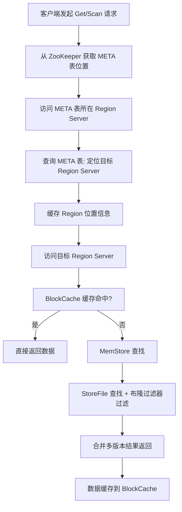

:::details 要点

以下是客户端首次读写 HBase 上数据的流程：

1. 客户端从 Zookeeper 获取 `META` 表所在的 Region Server；
2. 客户端访问 `META` 表所在的 Region Server，从 `META` 表中查询到访问行键所在的 Region Server，之后客户端将缓存这些信息以及 `META` 表的位置；
3. 客户端从行键所在的 Region Server 上获取数据。

如果再次读取，客户端将从缓存中获取行键所在的 Region Server。这样客户端就不需要再次查询 `META` 表，除非 Region 移动导致缓存失效，这样的话，则将会重新查询并更新缓存。

注：`META` 表是 HBase 中一张特殊的表，它保存了所有 Region 的位置信息，META 表自己的位置信息则存储在 ZooKeeper 上。


> 更为详细读取数据流程参考：
>
> [HBase 原理－数据读取流程解析](http://hbasefly.com/2016/12/21/hbase-getorscan/)
>
> [HBase 原理－迟到的'数据读取流程部分细节](http://hbasefly.com/2017/06/11/hbase-scan-2/)

:::

### 【中等】HBase 写数据流程是怎样的？⭐⭐⭐

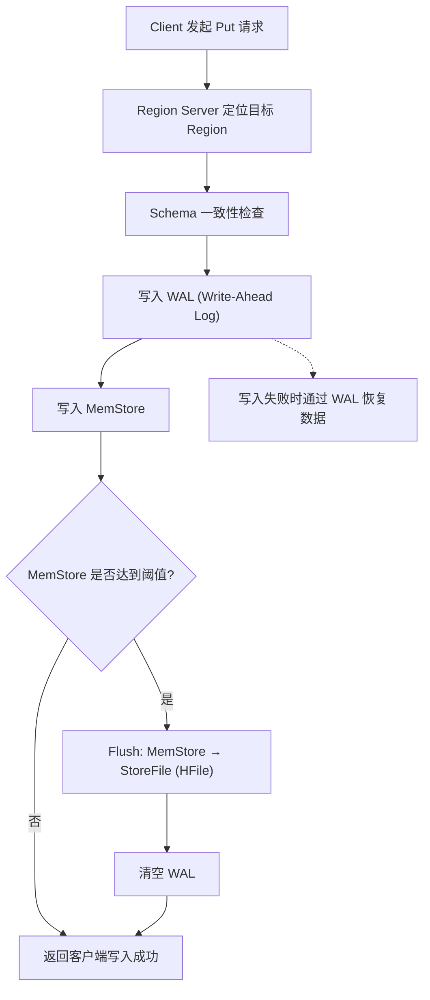

:::details 要点

1. Client 向 Region Server 提交写请求；
2. Region Server 找到目标 Region；
3. Region 检查数据是否与 Schema 一致；
4. 如果客户端没有指定版本，则获取当前系统时间作为数据版本；
5. 将更新写入 WAL Log；
6. 将更新写入 Memstore；
7. 判断 Memstore 存储是否已满，如果存储已满则需要 flush 为 Store Hfile 文件。

> 更为详细写入流程可以参考：[HBase － 数据写入流程解析](http://hbasefly.com/2016/03/23/hbase_writer/)

:::

### 【中等】HBase 有哪些核心组件？⭐⭐⭐

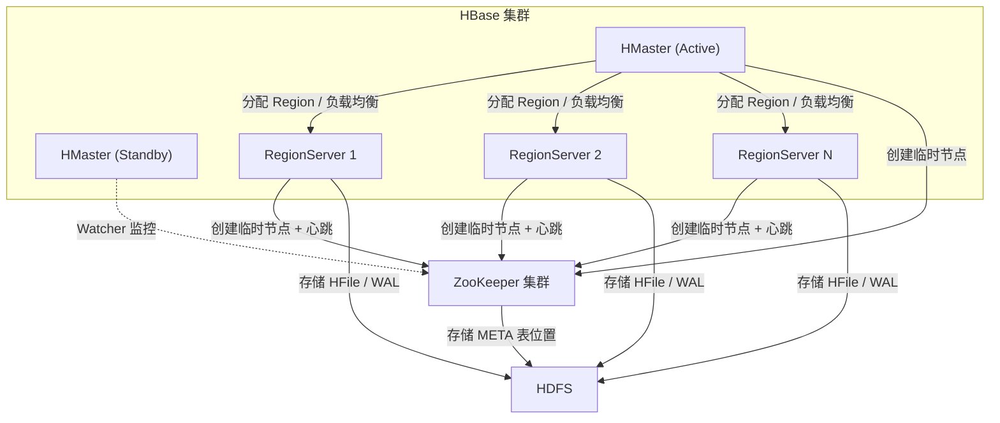

:::details 要点

HBase 系统遵循 Master/Slave 架构，由三种不同类型的组件组成：

- **Zookeeper**
  - 保证任何时候，集群中只有一个 Master；
  - 存储所有 Region 的寻址入口；
  - 实时监控 Region Server 的状态，将 Region Server 的上线和下线信息实时通知给 Master；
  - 存储 HBase 的 Schema，包括有哪些 Table，每个 Table 有哪些 Column Family 等信息。
- **Master**
  - 为 Region Server 分配 Region ；
  - 负责 Region Server 的负载均衡 ；
  - 发现失效的 Region Server 并重新分配其上的 Region；
  - GFS 上的垃圾文件回收；
  - 处理 Schema 的更新请求。
- **Region Server**
  - Region Server 负责维护 Master 分配给它的 Region ，并处理发送到 Region 上的 IO 请求；
  - Region Server 负责切分在运行过程中变得过大的 Region。


HBase 使用 ZooKeeper 作为分布式协调服务来维护集群中的服务器状态。 Zookeeper 负责维护可用服务列表，并提供服务故障通知等服务：

- 每个 Region Server 都会在 ZooKeeper 上创建一个临时节点，Master 通过 Zookeeper 的 Watcher 机制对节点进行监控，从而可以发现新加入的 Region Server 或故障退出的 Region Server；
- 所有 Masters 会竞争性地在 Zookeeper 上创建同一个临时节点，由于 Zookeeper 只能有一个同名节点，所以必然只有一个 Master 能够创建成功，此时该 Master 就是主 Master，主 Master 会定期向 Zookeeper 发送心跳。备用 Masters 则通过 Watcher 机制对主 HMaster 所在节点进行监听；
- 如果主 Master 未能定时发送心跳，则其持有的 Zookeeper 会话会过期，相应的临时节点也会被删除，这会触发定义在该节点上的 Watcher 事件，使得备用的 Master Servers 得到通知。所有备用的 Master Servers 在接到通知后，会再次去竞争性地创建临时节点，完成主 Master 的选举。


:::

## HBase 高级

### 【困难】HBase 的 RowKey 应该如何设计？⭐⭐⭐

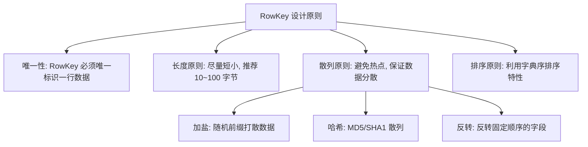

:::details 要点

RowKey 设计是 HBase 表设计中最关键的环节，直接决定了查询性能和数据分布的均匀性。

**核心设计原则**：

1. **唯一性**：RowKey 必须能够唯一标识一行数据，类似于关系型数据库的主键。
2. **长度原则**：RowKey 长度建议控制在 **10\~100 字节**，最好是 8 的倍数（利用 64 位 CPU 的对齐优化）。过长会增加 HFile 索引的存储开销，降低查询性能。
3. **散列原则**：确保数据在 Region 间均匀分布，避免**热点问题**（大量请求集中在少数 Region Server 上）。

**防止热点的常用策略**：

| 策略 | 原理 | 适用场景 |
| --- | --- | --- |
| **加盐（Salting）** | 在 RowKey 前添加随机前缀（如 hash 取模），将数据分散到多个 Region | 写多读少，无需范围扫描 |
| **哈希（Hashing）** | 使用 MD5/SHA1 等哈希函数计算 RowKey | 无需保持原始排序顺序 |
| **反转（Reversing）** | 反转固定顺序的字段（如时间戳反转） | 时间序列数据，避免最新数据集中写入 |

**RowKey 设计示例**：

```java
// 时间序列数据: 反转时间戳 + 业务ID
byte[] rowKey = Bytes.add(
    Bytes.toBytes(Long.MAX_VALUE - timestamp),  // 反转时间戳, 最新数据在前
    Bytes.toBytes(userId)                         // 用户ID
);

// 日志数据: 加盐 + 日期 + 业务ID
byte[] salt = Bytes.toBytes(Math.abs(userId.hashCode() % NUM_BUCKETS));
byte[] rowKey = Bytes.add(salt, Bytes.toBytes(dateStr), Bytes.toBytes(userId));
```

**常见反模式**：

- ❗ 使用自增 ID 作为 RowKey → 导致写入热点
- ❗ 使用日期字符串作为 RowKey → 导致同一日期数据集中
- ❗ RowKey 过长 → 增加存储开销，降低索引效率

:::

### 【困难】HBase 的 Compaction 机制是什么？⭐⭐⭐

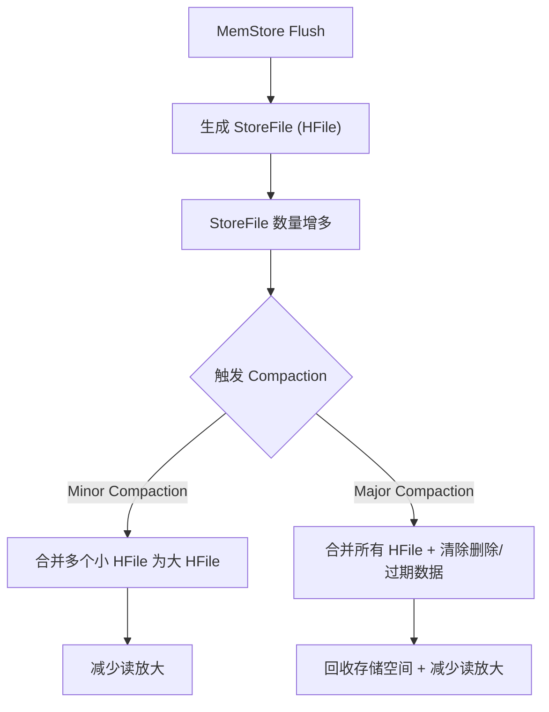

:::details 要点

**Compaction 是 HBase 的核心后台机制**，用于合并 HFile 文件、清理无效数据，保证读取性能。

**两种 Compaction 类型**：

| 类型 | 触发条件 | 合并范围 | 清理过期数据 | 影响 |
| --- | --- | --- | --- | --- |
| **Minor Compaction** | HFile 数量达到阈值（默认 3） | 选取部分小文件合并 | 不清理 | 轻量，对集群影响小 |
| **Major Compaction** | 定期触发（默认 7 天）或手动触发 | 合并 Store 下所有 HFile | 清理已删除/过期数据 | 较重，IO 开销大 |

**Compaction 配置优化**：

```xml
<!-- hbase-site.xml -->
<property>
  <name>hbase.hstore.compactionThreshold</name>
  <value>3</value> <!-- Minor Compaction 触发阈值 -->
</property>
<property>
  <name>hbase.hregion.majorcompaction</name>
  <value>604800000</value> <!-- Major Compaction 周期(7天), 设为0则禁用自动触发 -->
</property>
<property>
  <name>hbase.hstore.compaction.max</name>
  <value>10</value> <!-- 单次 Compaction 最大合并文件数 -->
</property>
```

**生产建议**：

- 在**业务低峰期**手动触发 Major Compaction，避免影响在线服务
- 对于写入量大的表，禁用自动 Major Compaction（设为 0），通过定时任务手动控制
- 合理设置 `compactionThreshold`，避免频繁 Minor Compaction 造成 IO 压力

:::

### 【困难】HBase 的布隆过滤器有什么作用？⭐⭐⭐

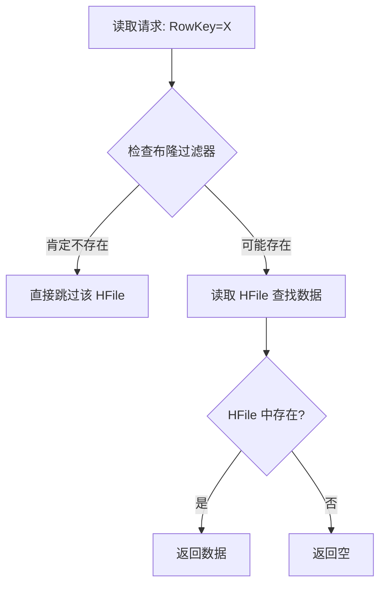

:::details 要点

**布隆过滤器（Bloom Filter）** 是 HBase 用于**优化读取性能**的概率型数据结构，核心作用是**快速判断某个 RowKey 或列是否存在于某个 HFile 中**，从而避免不必要的磁盘 IO。

**工作原理**：

- 写入 HFile 时，同时将 RowKey 通过多个哈希函数映射到位数组中
- 读取时，先查询布隆过滤器：
  - 若过滤器返回 **“不存在”** → 该 RowKey **肯定不在此 HFile**，直接跳过
  - 若过滤器返回 **“存在”** → 该 RowKey **可能在此 HFile**（有少量误判），需进一步读取确认

**两种布隆过滤器类型**：

| 类型 | 过滤维度 | 适用场景 |
| --- | --- | --- |
| **ROW** | 按 RowKey 过滤 | 基于 RowKey 的 Get 查询 |
| **ROWCOL** | 按 RowKey + Column 过滤 | 频繁查询特定列的场景，但空间开销更大 |

**配置方式**：

```java
// 建表时指定布隆过滤器类型
HTableDescriptor desc = new HTableDescriptor(TableName.valueOf("myTable"));
HColumnDescriptor cf = new HColumnDescriptor("cf");
cf.setBloomFilterType(BloomType.ROW);  // 默认开启 ROW 类型
desc.addFamily(cf);
```

**生产建议**：

- 默认开启 **ROW** 类型的布隆过滤器，对大多数场景有效
- 如果经常使用 `Get` 查询特定列，可考虑 **ROWCOL**
- 布隆过滤器会占用额外的内存和存储空间（约为 HFile 大小的 1%\~2%），但带来的读性能提升远超开销

:::

### 【困难】HBase 的 MemStore 和 StoreFile 如何协作？⭐⭐⭐

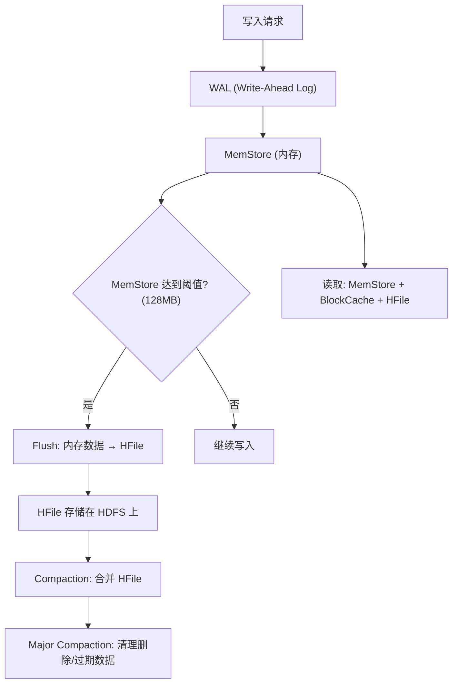

:::details 要点

HBase 采用 **LSM-Tree（Log-Structured Merge-Tree）** 架构，MemStore 和 StoreFile 是其核心组件：

| 组件 | 存储位置 | 作用 |
| --- | --- | --- |
| **WAL** | HDFS | 预写日志，保证数据持久性和故障恢复 |
| **MemStore** | 内存 | 缓存最新写入的数据，支持顺序写入 |
| **StoreFile (HFile)** | HDFS | MemStore Flush 后的持久化文件，不可变 |
| **BlockCache** | 内存 | 缓存热点读取数据，减少磁盘 IO |

**写入路径**：`Client → WAL → MemStore → Flush → HFile`

**读取路径**：`Client → BlockCache → MemStore → HFile（从新到旧依次查找）`

**关键机制**：

- **Flush 触发条件**：MemStore 大小达到阈值（默认 128MB）、Region 全局 MemStore 超限、WAL 文件数超限
- **HFile 特点**：一旦写入不可修改，删除操作通过写入**删除标记（Delete Marker）** 实现，在 Major Compaction 时物理删除
- **多版本读取**：从最新的 HFile 到最旧的 HFile 依次查找，合并返回结果

:::

## HBase 高可用

### 【困难】HBase 如何保证高可用？⭐⭐⭐

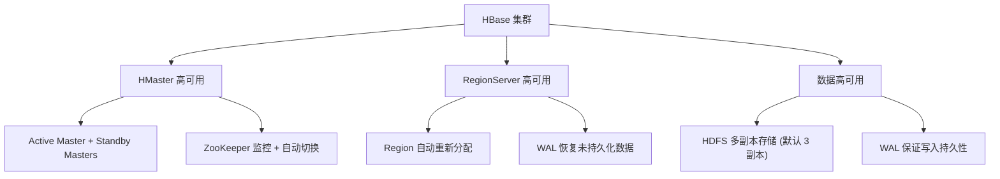

:::details 要点

HBase 的高可用保障涉及多个层面：

**1. HMaster 高可用**

- 集群中可以运行多个 HMaster（1 个 Active + 多个 Standby）
- 所有 Master 竞争性地向 ZooKeeper 创建临时节点，创建成功者成为 Active Master
- Active Master 故障时，ZooKeeper 会话超时触发 Watcher 事件，Standby Master 重新竞选

**2. RegionServer 高可用**

- 每个 RegionServer 在 ZooKeeper 上注册临时节点，Master 通过 Watcher 机制监控
- RegionServer 宕机后，Master 检测到其临时节点消失，自动将其承载的 Region 重新分配给其他 RegionServer
- 新 RegionServer 加载 Region 时，通过回放该 Region 的 **WAL** 恢复未 Flush 到 HFile 的数据

**3. 数据高可用**

- 底层依赖 HDFS 的多副本存储（默认 3 副本）保证数据不丢失
- WAL 保证数据写入的持久性，即使 MemStore 数据未 Flush 也能通过 WAL 恢复

**4. 故障恢复流程**

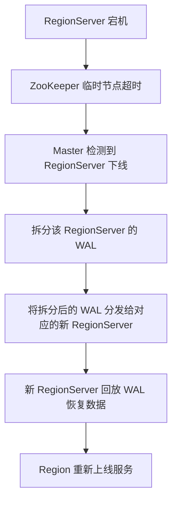

:::

### 【困难】HBase Region 分裂是如何工作的？⭐⭐⭐

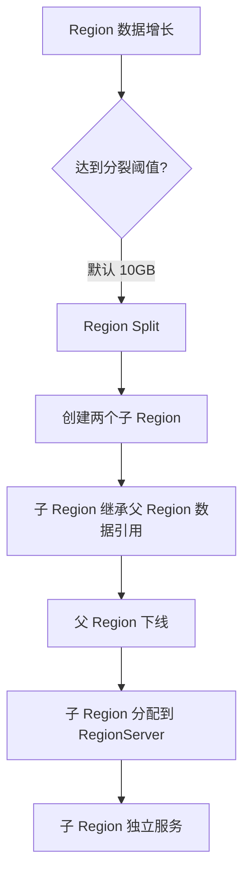

:::details 要点

Region 分裂是 HBase 实现**自动水平扩展**的核心机制：

**分裂触发条件**：

- Region 大小达到阈值（`hbase.hregion.max.filesize`，默认 10GB）
- 也可通过 `SplitRequest` 手动触发

**分裂流程**：

1. Region Server 在本地创建两个子 Region 目录（JIT Split）
2. 父 Region 停止服务，将数据引用分配给两个子 Region
3. 向 META 表写入分裂信息（原子操作）
4. 两个子 Region 上线服务，可能分配到不同的 Region Server

**生产建议**：

- **预分区（Pre-splitting）**：建表时根据预估数据量预先创建多个 Region，避免后期频繁分裂
- 分裂阈值不宜过小，否则会产生大量小 Region，增加管理开销

```java
// 建表时预分区
byte[][] splitKeys = new byte[][] {
    Bytes.toBytes("001"), Bytes.toBytes("002"),
    Bytes.toBytes("003"), Bytes.toBytes("004")
};
admin.createTable(tableDesc, splitKeys);
```

:::

## HBase 性能调优

### 【困难】HBase 有哪些常见的性能调优手段？⭐⭐⭐

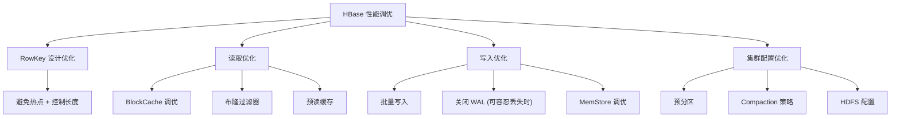

:::details 要点

**1. 读取优化**

| 手段 | 配置/方法 | 效果 |
| --- | --- | --- |
| **BlockCache 调优** | `hfile.block.cache.size`（默认 0.4） | 增大读缓存，减少磁盘 IO |
| **布隆过滤器** | 列族级别设置 `BLOOMFILTER=ROW` | 跳过无效 HFile，减少读放大 |
| **预读缓存** | Scan 时设置 `setCaching(100)` | 批量拉取数据，减少 RPC 次数 |
| **指定列查询** | Get/Scan 时只查询需要的列 | 减少 IO 开销 |

**2. 写入优化**

| 手段 | 配置/方法 | 效果 |
| --- | --- | --- |
| **批量写入** | 使用 `BufferedMutator` 批量提交 | 减少 RPC 次数，提升写入吞吐 |
| **关闭 WAL** | `Put.setWriteToWAL(false)` | 提升写入速度，但故障时会丢数据 |
| **MemStore 调优** | `hbase.hregion.memstore.flush.size` | 控制 Flush 频率，平衡内存和 IO |
| **多线程写入** | 客户端多线程并发写入 | 充分利用集群写入能力 |

**3. 集群配置优化**

| 配置项 | 默认值 | 优化建议 |
| --- | --- | --- |
| `hbase.regionserver.handler.count` | 10 | 调高至 50\~100，提升并发处理能力 |
| `hbase.hregion.majorcompaction` | 604800000 | 生产环境建议禁用自动触发，手动在低峰期执行 |
| `hbase.hstore.compactionThreshold` | 3 | 根据写入量调整，避免过于频繁 |
| `hbase.regionserver.global.memstore.size` | 0.4 | 根据读写比例调整内存分配 |

:::

### 【困难】HBase 的 Phoenix 是什么？⭐⭐

:::details 要点

**Apache Phoenix** 是 HBase 之上的 **SQL 引擎**，为 HBase 提供了标准 SQL 查询能力。

**核心特性**：

- **SQL 支持**：提供标准 SQL 语法（DDL/DML），降低 HBase 使用门槛
- **二级索引**：支持全局索引和本地索引，加速非 RowKey 列的查询
- **查询优化**：内置查询优化器，支持谓词下推、聚合下推
- **JDBC 驱动**：提供标准 JDBC 接口，可与 BI 工具集成

```sql
-- Phoenix SQL 示例
CREATE TABLE user_log (
    user_id VARCHAR NOT NULL,
    log_date DATE NOT NULL,
    action VARCHAR,
    detail VARCHAR,
    CONSTRAINT pk PRIMARY KEY (user_id, log_date)
);

-- 创建二级索引
CREATE INDEX idx_action ON user_log (action);

-- 查询
SELECT * FROM user_log WHERE action = 'login' AND log_date >= CURRENT_DATE() - 7;
```

**适用场景**：

- 需要对 HBase 数据进行 SQL 查询分析
- 非 RowKey 列查询性能要求高
- 需要与 BI/报表工具集成

**局限性**：

- JOIN 操作性能有限，不适合复杂关联查询
- 写入性能相比原生 HBase API 有一定损耗
- 二级索引会增加写入开销（维护索引一致性）

:::

## 参考资料

- [Apache HBase 官方文档](https://hbase.apache.org/book.html)
- [HBase 架构详解](https://hbase.apache.org/book.html#arch.overview)
- [HBase 参考指南 - RowKey 设计](https://hbase.apache.org/book.html#rowkey.design)
- [HBase 性能优化实战](https://hbase.apache.org/book.html#performance)