---
icon: logos:hbase
title: HBase 面试
date: 2025-03-04 10:05:51
categories:
  - 数据库
  - 列式数据库
  - HBase
tags:
  - 数据库
  - 列式数据库
  - 大数据
  - HBase
  - 面试
permalink: /pages/6a3851d6/
---

# HBase 面试

## HBase 简介

### 【简单】什么是 HBase？⭐

> 🎯 目标等级：L2 ｜ ⏱ 建议用时：5 min ｜ 🏷 标签：HBase 简介 / 基本概念

#### 💎 关键结论

HBase 是构建在 HDFS 之上的分布式列式数据库，核心能力是对海量数据（数十亿至数百亿行）进行随机实时读写，本质是 Google BigTable 的开源实现。

#### ⚡记忆卡片

- **口诀**：HDFS 存大文件，HBase 随机读写
- **关键词**：分布式列式数据库 ／ HDFS 之上 ／ 随机访问 ／ BigTable
- **链路**：HDFS 只能批处理顺序访问 → HBase 补充随机读写能力 → 成为 Hadoop 生态的实时查询层

#### 📖 核心知识

1. **定位**：HBase 是 Google BigTable 的开源实现，属于 Hadoop 生态系统，构建在 HDFS 之上，提供对海量数据的随机访问能力。


2. **分布式特性**：
   - **伸缩性**：支持通过增减机器进行水平扩展
   - **高可用**：支持 RegionServer 之间的自动故障转移
   - **自动分区**：Region 随数据增长自动分裂和再均衡
3. **超大数据集**：设计用于读写数十亿行至数百亿行的表。
4. **数据类型支持**：支持结构化、半结构化和非结构化数据（继承自 HDFS）。
5. **非关系型数据库**：不支持标准 SQL、没有真正的索引、仅支持行级事务（单行读写原子性）。

::: details 其他特性

- 读写操作遵循强一致性
- 过滤器支持谓词下推
- 提供 Java 客户端 API
- 支持 BlockCache 和布隆过滤器优化查询
- 可作为 MapReduce 作业的输入/输出源

:::

#### 🔀 发散问题

- **Q：HBase 与 Redis 都能做随机读写，区别是什么？** → Redis 是纯内存 KV 存储，适合低延迟小数据量场景；HBase 基于 HDFS 磁盘存储，适合数十亿行级别的超大数据集随机读写。

### 【简单】为什么需要 HBase？⭐

> 🎯 目标等级：L2 ｜ ⏱ 建议用时：5 min ｜ 🏷 标签：HBase 简介 / 设计动机

#### 💎 关键结论

HDFS 擅长海量数据的批量顺序访问，但无法随机访问；传统关系型数据库能随机访问却撑不住海量数据。HBase 同时解决这两个需求——海量存储 + 随机读写。

#### ⚡记忆卡片

- **口诀**：HDFS 能存不能查，RDBMS 能查不能存，HBase 两头都能
- **关键词**：随机访问 ／ 海量存储 ／ HDFS 补充
- **链路**：HDFS 只支持顺序批处理 → 传统 RDBMS 无法承载海量数据 → HBase 填补「海量存储 + 随机访问」的空白

#### 📖 核心知识

1. **HDFS 的局限**：HDFS 是海量数据存储的最佳方案（支持大文件存储、批量访问、流式访问、多副本容灾），但它只能执行批处理且以顺序方式访问数据，无法实现随机访问。
2. **传统 RDBMS 的局限**：关系型数据库擅长随机访问，但无法处理海量数据（通常在数据量达到千万行以上时性能急剧下降）。
3. **HBase 的定位**：同时解决海量数据存储和随机访问的问题，是 Hadoop 生态的实时查询层补充。

::: details 数据结构分类

- **结构化数据**：以关系型数据库表形式管理的数据
- **半结构化数据**：非关系模型的、有基本固定结构模式的数据（日志文件、XML、JSON、Email 等）
- **非结构化数据**：没有固定模式的数据（Word、PDF、图片、视频等）

:::

#### 🔀 发散问题

- **Q：除了 HBase，还有哪些系统能同时支持海量存储和随机访问？** → Cassandra、CouchDB、DynamoDB、MongoDB 等 NoSQL 数据库都能存储海量数据并支持随机访问，但各自的架构和数据模型有所不同。

### 【简单】HBase 有哪些应用场景？⭐

> 🎯 目标等级：L2 ｜ ⏱ 建议用时：5 min ｜ 🏷 标签：HBase 简介 / 应用场景

#### 💎 关键结论

HBase 适用于「实时随机访问超大数据集」的场景，典型用途包括日志存储、用户行为追踪、GPS 信息、监控数据等；不适用于需要索引、复杂事务或小数据量的场景。

#### ⚡记忆卡片

- **口诀**：量大实时随机查，日志行为 GPS
- **关键词**：海量数据 ／ 随机访问 ／ 宽表 ／ 日志存储
- **链路**：数据量十亿级以上 + 需要实时随机读 → HBase 适用场景

#### 📖 核心知识

1. **适用场景**：
   - 数据量级达到十亿级至百亿级，需要实时随机访问
   - 存储结构化、半结构化数据
   - 硬件资源充足的集群环境
2. **不适用场景**：
   - 需要二级索引的复杂查询
   - 需要跨行/跨表复杂事务
   - 数据量较小（不足几百万行）
3. **典型应用**：
   - 监控数据存储
   - 用户/车辆 GPS 信息存储
   - 用户行为数据（点击流、浏览记录）
   - 各类日志数据（访问日志、操作日志、推送日志）
   - 短信、邮件等消息类数据
   - 网页抓取数据

#### 🔀 发散问题

- **Q：HBase 和 Kafka 都能处理日志数据，如何选型？** → Kafka 是流式消息队列，擅长数据管道和实时流处理；HBase 是持久化存储，擅长按 RowKey 随机查询历史数据。两者常搭配使用：Kafka 采集 → HBase 落盘查询。

### 【简单】HBase vs. RDBMS？⭐

> 🎯 目标等级：L2 ｜ ⏱ 建议用时：5 min ｜ 🏷 标签：HBase 简介 / 对比分析

#### 💎 关键结论

HBase 无 Schema、基于 HDFS、仅支持行级事务，适合超大规模宽表；RDBMS 有固定模式、支持复杂事务，适合中小规模结构化数据。两者是互补关系而非替代。

#### ⚡记忆卡片

- **口诀**：HBase 宽表无模式，RDBMS 事务有 Schema
- **关键词**：无 Schema ／ HDFS ／ Row Key ／ 行级事务
- **链路**：RDBMS 擅长中小规模事务处理 → HBase 补充超大规模宽表的随机读写

#### 📖 核心知识

| RDBMS | HBase |
| --- | --- |
| 有固定 Schema，描述表结构约束 | 无 Schema，仅定义列族 |
| 支持 FAT、NTFS、EXT 等文件系统 | 仅支持 HDFS |
| 使用提交日志存储日志 | 使用 WAL（预写日志） |
| 使用特定协调系统 | 使用 ZooKeeper 协调集群 |
| 存储中小规模数据表 | 存储超大规模数据表，适合宽表 |
| 支持复杂事务 | 仅支持行级事务 |
| 适用于结构化数据 | 适用于半结构化、结构化数据 |
| 使用主键 | 使用 Row Key |

#### 🔀 发散问题

- **Q：HBase 能不能做跨行事务？** → 原生 HBase 不支持跨行事务。若需多行原子性，可用 Phoenix 事务或上层业务补偿（如 TCC、Saga 模式）。

### 【简单】HBase vs. HDFS？⭐

> 🎯 目标等级：L2 ｜ ⏱ 建议用时：5 min ｜ 🏷 标签：HBase 简介 / 对比分析

#### 💎 关键结论

HDFS 是底层文件系统，擅长大文件一次写入多次读取；HBase 是上层数据库，基于 HDFS 构建，提供表格化 KV 存储和随机读写优化。

#### ⚡记忆卡片

- **口诀**：HDFS 是地基，HBase 是楼房
- **关键词**：文件系统 ／ 表格存储 ／ 块文件 ／ KV 对 ／ 一次写多次读
- **链路**：HDFS 提供分布式文件存储 → HBase 在其上构建表格层 → 补充随机读写能力

#### 📖 核心知识

| HDFS | HBase |
| --- | --- |
| 分布式文件系统 | 面向表格列的数据存储 |
| 为大文件优化存储 | 为表格数据优化存储 |
| 使用块文件 | 使用 KV 对数据 |
| 数据模型不灵活 | 提供灵活的数据模型 |
| 使用文件系统和 MapReduce 处理框架 | 内置 MapReduce 支持的表格存储 |
| 一次写入多次读取优化 | 读写均优化 |

#### 🔀 发散问题

- **Q：HBase 的数据最终存在哪里？** → HBase 的 HFile 和 WAL 最终都存储在 HDFS 上，依赖 HDFS 的多副本机制保证数据可靠性。

### 【简单】行式数据库 vs. 列式数据库？⭐⭐

> 🎯 目标等级：L2 ｜ ⏱ 建议用时：5 min ｜ 🏷 标签：HBase 简介 / 存储模型对比

#### 💎 关键结论

行式数据库按行连续存储，适合 OLTP 写入和整行读取；列式数据库按列独立存储，适合聚合查询和压缩，读取时仅加载需要的列。

#### ⚡记忆卡片

- **口诀**：行存写整行，列存读所需
- **关键词**：行式存储 ／ 列式存储 ／ OLTP ／ 聚合查询 ／ 压缩
- **链路**：行存连续页内存适合 OLTP → 列存非连续页仅读所需列 → 聚合查询性能更优

#### 📖 核心知识

| 行式数据库 | 列式数据库 |
| --- | --- |
| 添加/修改操作更高效 | 读取操作更高效 |
| 读取整行数据 | 仅读取必要的列数据 |
| 最适合 OLTP 系统 | 不适合 OLTP 系统 |
| 行数据存储在连续页内存 | 列数据存储在非连续页内存 |

::: details 列式数据库优缺点

**优点**：

- 支持数据压缩，存储空间更小
- 快速数据检索，仅加载所需列
- 聚合查询（COUNT、SUM、AVG、MIN、MAX）性能优异
- 自动分片机制，分区效率高

**缺点**：

- JOIN 查询和多表关联查询未优化
- 频繁删除和更新会降低存储效率
- 分区和索引设计较困难

:::

## HBase 存储

### 【简单】HBase 表有什么特性？⭐⭐

> 🎯 目标等级：L2 ｜ ⏱ 建议用时：5 min ｜ 🏷 标签：HBase 存储 / 表特性

#### 💎 关键结论

HBase 表具备容量大、面向列、稀疏性、多版本和字节数组存储五大特性，一个表可容纳数十亿行、上百万列，空列不占空间。

#### ⚡记忆卡片

- **口诀**：大列稀多字（容量大、列存、稀疏、多版本、字节数组）
- **关键词**：容量大 ／ 面向列 ／ 稀疏性 ／ 多版本 ／ byte[]
- **链路**：列式存储 + 稀疏设计 → 空列不占空间 → 表可设计得非常稀疏且庞大

#### 📖 核心知识

1. **容量大**：一个表可以有数十亿行、上百万列。
2. **面向列**：数据按列存储，每一列单独存放，数据即索引，查询时可只访问指定列，有效降低 I/O 负担。
3. **稀疏性**：空（null）列不占用存储空间，表可以设计得非常稀疏。
4. **数据多版本**：每个 Cell 中的数据可以有多个版本，按时间戳排序，新数据在最上面。
5. **存储类型**：所有数据的底层存储格式都是字节数组（byte[]）。

#### 🔀 发散问题

- **Q：HBase 的多版本数据会不会无限占用存储？** → 不会。可以通过列族的 `VERSIONS` 参数限制保留版本数（默认 1），超出部分在 Major Compaction 时被物理清理。

### 【简单】HBase 的逻辑存储模型是怎样的？⭐⭐⭐

> 🎯 目标等级：L2 ｜ ⏱ 建议用时：8 min ｜ 🏷 标签：HBase 存储 / 数据模型

#### 💎 关键结论

HBase 是面向列族的数据库，核心层级为 Table → Row → Column Family → Column Qualifier → Cell，Cell 通过时间戳支持多版本，Row Key 按字典序排列。

#### ⚡记忆卡片

- **口诀**：表行族列格，时间戳排版本
- **关键词**：Table ／ Row Key ／ Column Family ／ Cell ／ Timestamp
- **链路**：Table 由 Row 组成 → Row 包含多个 Column Family → Family 下有 Column Qualifier → Cell 存储多版本数据

#### 📖 核心知识

1. **Table**：由 Row 和 Column 组成。
2. **Row Key**：用来检索记录的主键，是未解释的字节数组。表中行按 Row Key 字典序排序，访问方式包括指定 RowKey、RowKey 范围、全表扫描三种。
3. **Column Family（列族）**：表 Schema 的一部分，建表时必须定义。同一列族的列有相同前缀（如 `info:format`、`info:geo`）。
4. **Column Qualifier（列限定符）**：具体列名，不是 Schema 的一部分，可动态创建。列族和列限定符以冒号分隔。
5. **Cell**：由 Row + Column Family + Column Qualifier 确定的存储单元，包含值和多个时间戳版本。
6. **Timestamp**：Cell 的版本索引，64 位整型，可自动分配或显式指定。不同版本按时间戳倒序排列。


::: details 表结构示例

下图为 HBase 中一张表的示例：

- RowKey 为行的唯一标识，所有行按 RowKey 字典序排序
- 该表具有两个列族：personal 和 office
- personal 拥有 name、city、phone 三列，office 拥有 tel、address 两列


> _图片引用自：HBase 是列式存储数据库吗 https://www.iteblog.com/archives/2498.html_

:::

#### 🔀 发散问题

- **Q：RowKey 用整型字符串做主键会有什么坑？** → 字典序排序会导致整型顺序错乱（1,10,100,11,12…），必须用 0 左填充（如 001, 002, 010）才能保持自然序。

### 【中等】HBase 的物理存储模型是怎样的？⭐⭐

> 🎯 目标等级：L2-L3 ｜ ⏱ 建议用时：8 min ｜ 🏷 标签：HBase 存储 / 物理模型

#### 💎 关键结论

HBase 表通过 Row Key 范围被水平切分为多个 Region，Region 是分布式存储和负载均衡的最小单元，不同 Region 分布在不同 RegionServer 上，数据增长时自动分裂。

#### ⚡记忆卡片

- **口诀**：表切 Region，Region 分 Server，大了就分裂
- **关键词**：Region ／ Row Key 范围 ／ 水平切分 ／ 分布式最小单元
- **链路**：Table 按 Row Key 范围切分为 Region → Region 分配到不同 RegionServer → Region 超过阈值自动分裂

#### 📖 核心知识

1. **Region 切分**：HBase Table 中所有行按 Row Key 字典序排列，表通过 Row Key 范围被水平切分为多个 Region，每个 Region 包含 start key 和 end key 之间的所有行。


2. **自动分裂**：每个表一开始只有一个 Region，随着数据增长，Region 增大到阈值时等分为两个新 Region。


3. **分布式最小单元**：Region 是 HBase 中分布式存储和负载均衡的最小单元，不同 Region 可分布在不同 RegionServer 上，但一个 Region 不会拆分到多个 Server。


#### 🔬 扩展知识

::: details

- 【L3】HBase 2.x 的 Region 默认分裂策略为 IncreasingToUpperBoundSplitStrategy，分裂阈值随 Region 数量动态增大，并非固定 10GB。
- 【L3】分裂时子 Region 初始只持有父 HFile 的引用文件（Reference File），真正的数据拆分延迟到后续 Compaction 完成。

:::

## HBase 架构

### 【中等】HBase 读数据流程是怎样的？⭐⭐⭐

> 🎯 目标等级：L2-L3 ｜ ⏱ 建议用时：10 min ｜ 🏷 标签：HBase 架构 / 读流程

#### 💎 关键结论

HBase 读数据分三步：先从 ZooKeeper 获取 META 表位置，再查 META 表定位目标 RegionServer，最后从 RegionServer 的 BlockCache→MemStore→StoreFile 依次查找数据。

#### ⚡记忆卡片

- **口诀**：先找 ZK，再查 META，最后读数据
- **关键词**：ZooKeeper ／ META 表 ／ RegionServer ／ BlockCache ／ MemStore
- **链路**：ZooKeeper 获取 META 位置 → META 表定位目标 RegionServer → BlockCache→MemStore→StoreFile 查找

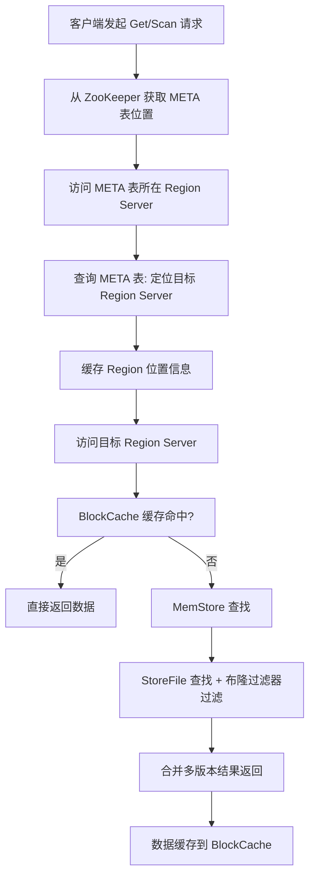
```mermaid
graph TB
    A["客户端发起 Get/Scan 请求"] --> B["从 ZooKeeper 获取 META 表位置"]
    B --> C["访问 META 表所在 Region Server"]
    C --> D["查询 META 表: 定位目标 Region Server"]
    D --> E["缓存 Region 位置信息"]
    E --> F["访问目标 Region Server"]
    F --> G["BlockCache 缓存命中?"]
    G -->|"是"| H["直接返回数据"]
    G -->|"否"| I["MemStore 查找"]
    I --> J["StoreFile 查找 + 布隆过滤器过滤"]
    J --> K["合并多版本结果返回"]
    K --> L["数据缓存到 BlockCache"]
```

#### 📖 核心知识

1. **获取 META 表位置**：客户端从 ZooKeeper 获取 META 表所在的 RegionServer。
2. **查询 META 表**：客户端访问 META 表所在 RegionServer，查询到目标行键所在的 RegionServer，并缓存这些信息。
3. **读取数据**：客户端从目标 RegionServer 上获取数据，内部查找顺序为 BlockCache → MemStore → StoreFile（从新到旧）。
4. **缓存复用**：再次读取时客户端从缓存获取 RegionServer 信息，无需再查 META 表，除非 Region 移动导致缓存失效。

::: details META 表说明

META 表是 HBase 中一张特殊的表，保存了所有 Region 的位置信息，META 表自己的位置信息则存储在 ZooKeeper 上。


> 更为详细读取数据流程参考：
>
> [HBase 原理－数据读取流程解析](http://hbasefly.com/2016/12/21/hbase-getorscan/)
>
> [HBase 原理－迟到的'数据读取流程部分细节](http://hbasefly.com/2017/06/11/hbase-scan-2/)

:::

#### 🔀 发散问题

- **Q：读数据时布隆过滤器在哪个环节起作用？** → 在查找 StoreFile 时，布隆过滤器可快速判断某个 HFile 是否包含目标 RowKey，避免无效磁盘 IO，见本文档「HBase 的布隆过滤器有什么作用？」。

### 【中等】HBase 写数据流程是怎样的？⭐⭐⭐

> 🎯 目标等级：L2-L3 ｜ ⏱ 建议用时：10 min ｜ 🏷 标签：HBase 架构 / 写流程

#### 💎 关键结论

HBase 写数据先写 WAL 保证持久性，再写 MemStore 缓存，MemStore 达到阈值后 Flush 为 StoreFile（HFile），整个过程对客户端是异步的。

#### ⚡记忆卡片

- **口诀**：先写 WAL，再写内存，满了落盘
- **关键词**：WAL ／ MemStore ／ Flush ／ StoreFile ／ HFile
- **链路**：Client 发起 Put → 写 WAL 保证持久性 → 写 MemStore 缓存 → 达到阈值 Flush 为 HFile

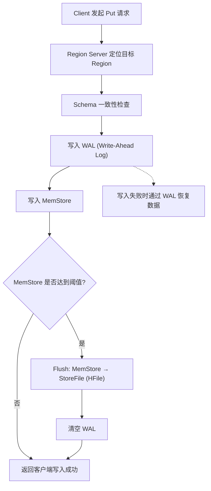
```mermaid
graph TB
    A["Client 发起 Put 请求"] --> B["Region Server 定位目标 Region"]
    B --> C["Schema 一致性检查"]
    C --> D["写入 WAL (Write-Ahead Log)"]
    D --> E["写入 MemStore"]
    E --> F{"MemStore 是否达到阈值?"}
    F -->|"否"| G["返回客户端写入成功"]
    F -->|"是"| H["Flush: MemStore → StoreFile (HFile)"]
    H --> I["清空 WAL"]
    I --> G
    D -.-> J["写入失败时通过 WAL 恢复数据"]
```

#### 📖 核心知识

1. **定位 Region**：Client 向 RegionServer 提交写请求，RegionServer 找到目标 Region。
2. **Schema 检查**：Region 检查数据是否与 Schema 一致。
3. **版本分配**：如果客户端未指定版本，获取当前系统时间作为数据版本。
4. **写 WAL**：将更新写入 WAL Log（预写日志），保证数据持久性和故障恢复。
5. **写 MemStore**：将更新写入内存缓存。
6. **Flush 判断**：MemStore 存储满时 flush 为 StoreFile（HFile）文件。

#### 🔀 发散问题

- **Q：写数据时 WAL 写入失败怎么办？** → WAL 写入失败时数据不会丢失，可通过回放 WAL 恢复未 Flush 到 HFile 的数据。如果 WAL 也无法写入，则拒绝本次写入以保证一致性。

### 【中等】HBase 有哪些核心组件？⭐⭐⭐

> 🎯 目标等级：L2-L3 ｜ ⏱ 建议用时：10 min ｜ 🏷 标签：HBase 架构 / 核心组件

#### 💎 关键结论

HBase 遵循 Master/Slave 架构，三大核心组件为 ZooKeeper（分布式协调）、HMaster（集群管理）、RegionServer（数据服务），通过 ZooKeeper 实现 Master 主备切换和 RegionServer 状态监控。

#### ⚡记忆卡片

- **口诀**：ZK 协调，Master 调度，RS 干活
- **关键词**：ZooKeeper ／ HMaster ／ RegionServer ／ 临时节点 ／ 心跳
- **链路**：ZooKeeper 维护集群状态 → HMaster 分配 Region 和负载均衡 → RegionServer 处理 IO 请求

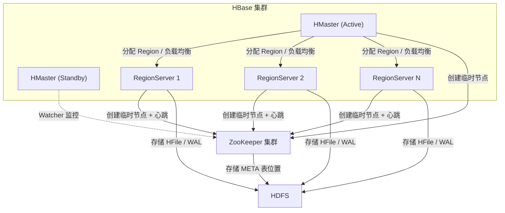
```mermaid
graph TB
    subgraph "HBase 集群"
        M["HMaster (Active)"]
        MS["HMaster (Standby)"]
        RS1["RegionServer 1"]
        RS2["RegionServer 2"]
        RS3["RegionServer N"]
    end
    ZK["ZooKeeper 集群"]
    HDFS["HDFS"]
    M -->|"分配 Region / 负载均衡"| RS1
    M -->|"分配 Region / 负载均衡"| RS2
    M -->|"分配 Region / 负载均衡"| RS3
    MS -.->|"Watcher 监控"| ZK
    M -->|"创建临时节点"| ZK
    RS1 -->|"创建临时节点 + 心跳"| ZK
    RS2 -->|"创建临时节点 + 心跳"| ZK
    RS3 -->|"创建临时节点 + 心跳"| ZK
    RS1 -->|"存储 HFile / WAL"| HDFS
    RS2 -->|"存储 HFile / WAL"| HDFS
    RS3 -->|"存储 HFile / WAL"| HDFS
    ZK -->|"存储 META 表位置"| HDFS
```

#### 📖 核心知识

1. **ZooKeeper**：
   - 保证集群中只有一个 Active Master
   - 存储所有 Region 的寻址入口
   - 实时监控 RegionServer 状态，通知 Master 上下线事件
   - 存储 HBase Schema（Table、Column Family 等）
2. **HMaster**：
   - 为 RegionServer 分配 Region
   - 负责 RegionServer 的负载均衡
   - 发现失效 RegionServer 并重新分配其 Region
   - 回收 HDFS 上的垃圾文件
   - 处理 Schema 更新请求
3. **RegionServer**：
   - 维护 Master 分配的 Region，处理 IO 请求
   - 负责切分过大的 Region


::: details ZooKeeper 主备切换机制

- 每个 RegionServer 在 ZooKeeper 上创建临时节点，Master 通过 Watcher 监控
- 所有 Master 竞争创建同一临时节点，成功者成为 Active Master，定期发送心跳
- Active Master 故障时心跳停止 → 临时节点删除 → 备用 Master 重新竞选


:::

#### 🔀 发散问题

- **Q：HMaster 宕机会影响数据读写吗？** → 短期内不影响，因为 RegionServer 仍在服务。但若 Master 长时间不可用，Region 分裂、负载均衡等管理操作无法执行，会影响集群稳定性。

## HBase 高级

### 【困难】HBase 的 RowKey 应该如何设计？⭐⭐⭐⭐

> 🎯 目标等级：L3-L4 ｜ ⏱ 建议用时：12 min ｜ 🏷 标签：HBase 高级 / RowKey 设计

#### 💎 关键结论

RowKey 设计是 HBase 表设计的核心，需满足唯一性、短小（10~100 字节）、散列三大原则，设计时必须先服务于最高频查询模式，再考虑散列避免热点。

#### ⚡记忆卡片

- **口诀**：唯一短小散列，查询模式优先
- **关键词**：唯一性 ／ 10~100 字节 ／ 加盐 ／ 哈希 ／ 反转
- **链路**：确定最高频查询模式 → 设计 RowKey 满足查询需求 → 加盐/哈希/反转避免热点

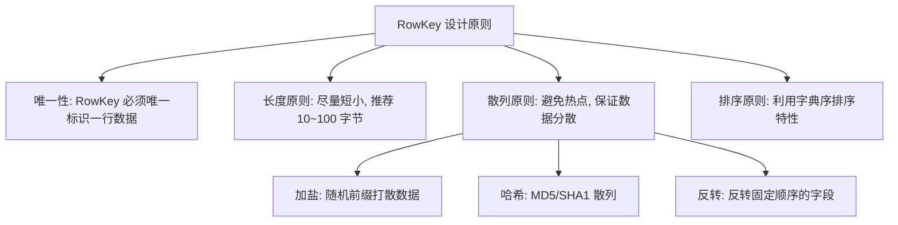
```mermaid
graph TB
    A["RowKey 设计原则"] --> B["唯一性: RowKey 必须唯一标识一行数据"]
    A --> C["长度原则: 尽量短小, 推荐 10~100 字节"]
    A --> D["散列原则: 避免热点, 保证数据分散"]
    D --> E["加盐: 随机前缀打散数据"]
    D --> F["哈希: MD5/SHA1 散列"]
    D --> G["反转: 反转固定顺序的字段"]
    A --> H["排序原则: 利用字典序排序特性"]
```

#### 📖 核心知识

1. **唯一性**：RowKey 必须唯一标识一行数据，类似关系型数据库的主键。
2. **长度原则**：RowKey 长度控制在 10~100 字节，最好是 8 的倍数（利用 64 位 CPU 对齐优化）。过长会增加 HFile 索引存储开销，降低查询性能。
3. **散列原则**：确保数据在 Region 间均匀分布，避免热点问题（大量请求集中在少数 RegionServer）。

::: details 防止热点的常用策略

| 策略 | 原理 | 适用场景 |
| --- | --- | --- |
| **加盐（Salting）** | RowKey 前添加随机前缀（如 hash 取模），将数据分散到多个 Region | 写多读少，无需范围扫描 |
| **哈希（Hashing）** | 使用 MD5/SHA1 等哈希函数计算 RowKey | 无需保持原始排序顺序 |
| **反转（Reversing）** | 反转固定顺序字段（如时间戳反转） | 时间序列数据，避免最新数据集中写入 |

:::

::: details RowKey 设计代码示例

```java
// 时间序列数据: 反转时间戳 + 业务ID
byte[] rowKey = Bytes.add(
    Bytes.toBytes(Long.MAX_VALUE - timestamp),  // 反转时间戳, 最新数据在前
    Bytes.toBytes(userId)                         // 用户ID
);

// 日志数据: 加盐 + 日期 + 业务ID
byte[] salt = Bytes.toBytes(Math.abs(userId.hashCode() % NUM_BUCKETS));
byte[] rowKey = Bytes.add(salt, Bytes.toBytes(dateStr), Bytes.toBytes(userId));
```

:::

#### 🔬 扩展知识

::: details

- 【L3】RowKey 设计的第一准则是服务于最高频查询模式，而非单纯追求散列。例如“查询某用户最近 N 条记录”应设计为 `userId + 反转时间戳`，同一用户数据落在相邻区间可范围扫描，且时间倒序天然满足“最新在前”。
- 【L3】加盐/哈希与范围扫描天然矛盾：打散后原始顺序丢失，无法按业务维度 range scan。折衷方案是“确定性散列前缀”（如 `userId % N` 作为桶前缀），扫描时并发查 N 个桶。
- 【L4】RowKey 过长会直接侵蚀 BlockCache 效率：HFile 的 Data Index Block 存的是 RowKey，RowKey 越长单个 16KB 块容纳的索引项越少，定位 HFile 需要的索引层级越多，读放大越严重。
- 【L4】预分区的 splitKey 必须与 RowKey 分布规律对齐，否则预分区反而造成数据倾斜。

:::

#### 🏭 实战场景

::: details

某日志平台日写入量 50 亿条，原 RowKey 为纯时间戳导致单个 RegionServer 承担 80% 写入负载（热点）。改用 `userId % 16 取模前缀 + 反转时间戳 + userId` 后，写入负载均匀分散到 16 台 RegionServer，P99 写入延迟从 120ms 降至 15ms。

:::

#### ⚠️ 常见误区

::: details

常见误区：

- ❌ "使用自增 ID 作为 RowKey" → 导致写入热点，所有写入集中在一个 Region
- ❌ "使用日期字符串作为 RowKey" → 导致同一日期数据集中写入同一 Region
- ❌ "RowKey 越长越好，信息越全" → RowKey 过长增加存储开销，降低索引效率

:::

#### 🔀 发散问题

- **Q：如何验证 RowKey 设计是否合理？** → 可以通过预分区后观察各 Region 的数据量分布和读写负载是否均匀，若出现明显倾斜则需调整 RowKey 设计或重新规划 splitKey。

### 【困难】HBase 的 Compaction 机制是什么？⭐⭐⭐⭐

> 🎯 目标等级：L3-L4 ｜ ⏱ 建议用时：12 min ｜ 🏷 标签：HBase 高级 / Compaction

#### 💎 关键结论

Compaction 是 HBase 的核心后台机制，用于合并 HFile 文件、清理无效数据。Minor Compaction 合并部分小文件，Major Compaction 合并所有文件并物理删除已删除/过期数据。

#### ⚡记忆卡片

- **口诀**：Minor 并小文件，Major 清全量
- **关键词**：Minor Compaction ／ Major Compaction ／ HFile 合并 ／ 删除标记
- **链路**：MemStore Flush 生成 HFile → HFile 数量增多触发 Compaction → Minor 合并小文件 → Major 合并全部 + 清理过期数据

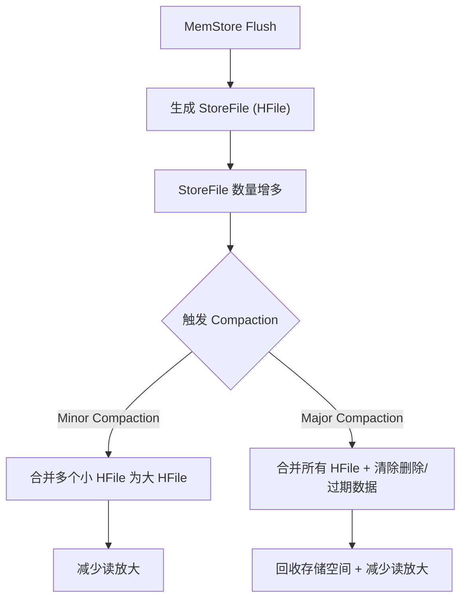
```mermaid
graph TB
    A["MemStore Flush"] --> B["生成 StoreFile (HFile)"]
    B --> C["StoreFile 数量增多"]
    C --> D{"触发 Compaction"}
    D -->|"Minor Compaction"| E["合并多个小 HFile 为大 HFile"]
    D -->|"Major Compaction"| F["合并所有 HFile + 清除删除/过期数据"]
    E --> G["减少读放大"]
    F --> H["回收存储空间 + 减少读放大"]
```

#### 📖 核心知识

1. **Minor Compaction**：HFile 数量达到阈值（默认 3）时触发，选取部分小文件合并，不清理过期数据，对集群影响小。
2. **Major Compaction**：定期触发（默认 7 天）或手动触发，合并 Store 下所有 HFile，清理已删除/过期数据，IO 开销大。
3. **配置优化**：
   - `hbase.hstore.compactionThreshold`：Minor Compaction 触发阈值（默认 3）
   - `hbase.hregion.majorcompaction`：Major Compaction 周期（默认 7 天，设为 0 禁用自动触发）
   - `hbase.hstore.compaction.max`：单次 Compaction 最大合并文件数（默认 10）

::: details 生产建议

- 在业务低峰期手动触发 Major Compaction，避免影响在线服务
- 写入量大的表禁用自动 Major Compaction（设为 0），通过定时任务手动控制
- 合理设置 `compactionThreshold`，避免频繁 Minor Compaction 造成 IO 压力

:::

#### 🔬 扩展知识

::: details

- 【L3】文件选择策略：HBase 默认使用 ExploringCompactionPolicy；此外还有 FIFOCompactionPolicy（TTL 表直接删文件）、DateTieredCompactionPolicy（按时间窗口分层合并，适合时序数据）。
- 【L3】Major Compaction 是唯一物理删除数据的时机：Delete Marker、超过 TTL 的数据、超过 `VERSIONS` 限制的旧版本，都只在 Major Compaction 时真正清理。“删除后磁盘空间没降”是正常现象。
- 【L4】Major Compaction 风暴的危害：全集群同时触发会造成 IO 风暴、读写延迟飙升，甚至引发 RegionServer GC/OOM。可通过 `hbase.hstore.compaction.throughput.lower.bound/upper.bound` 限流。

:::

#### 🏭 实战场景

::: details

某推荐系统 HBase 集群 200 台 RegionServer，单表 50TB 数据。自动 Major Compaction 导致每周一次 IO 风暴，P99 读延迟从 5ms 飙升至 200ms。改为禁用自动触发 + 凌晨低峰期手动执行 + 限流 50MB/s 后，IO 风暴消除，读延迟波动控制在 5~10ms。

:::

#### ⚠️ 常见误区

::: details

常见误区：

- ❌ "删除数据后磁盘空间应该立刻减少" → 删除只是写入 Delete Marker，物理删除需等 Major Compaction
- ❌ "Minor Compaction 也会清理删除标记" → Minor 只合并文件不清理过期数据
- ❌ "Compaction 越频繁越好" → 频繁 Compaction 带来持续 IO 压力，需根据写入量平衡

:::

#### 🔀 发散问题

- **Q：如何监控 Compaction 是否正常？** → 关注 `compactionQueueLength`（Compaction 队列长度）、HFile 数量、以及 RegionServer 的 IO 等待时间。队列积压或 HFile 数量持续增长说明 Compaction 跟不上写入速度。

### 【困难】HBase 的布隆过滤器有什么作用？⭐⭐

> 🎯 目标等级：L3-L4 ｜ ⏱ 建议用时：10 min ｜ 🏷 标签：HBase 高级 / 布隆过滤器

#### 💎 关键结论

布隆过滤器是 HBase 优化读性能的概率型数据结构，能快速判断 RowKey 或列是否存在于某个 HFile 中，“不存在”是确定的，“存在”有少量误判，从而避免无效磁盘 IO。

#### ⚡记忆卡片

- **口诀**：不存在一定准，存在可能误判
- **关键词**：布隆过滤器 ／ 位数组 ／ ROW ／ ROWCOL ／ 误判率
- **链路**：写入 HFile 时哈希映射到位数组 → 读取时先查过滤器 → “不存在”直接跳过 → “存在”再读 HFile 确认

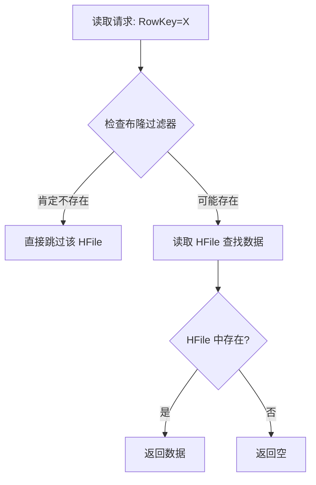
```mermaid
graph TB
    A["读取请求: RowKey=X"] --> B{"检查布隆过滤器"}
    B -->|"肯定不存在"| C["直接跳过该 HFile"]
    B -->|"可能存在"| D["读取 HFile 查找数据"]
    D --> E{"HFile 中存在?"}
    E -->|"是"| F["返回数据"]
    E -->|"否"| G["返回空"]
```

#### 📖 核心知识

1. **工作原理**：写入 HFile 时，将 RowKey 通过多个哈希函数映射到位数组；读取时先查询过滤器，“不存在”则直接跳过该 HFile，“存在”则进一步读取确认。
2. **两种类型**：
   - **ROW**：按 RowKey 过滤，适用于基于 RowKey 的 Get 查询（默认开启）
   - **ROWCOL**：按 RowKey + Column 过滤，适用于频繁查询特定列，但空间开销更大
3. **配置方式**：建表时通过 `cf.setBloomFilterType(BloomType.ROW)` 指定，默认开启 ROW 类型。
4. **生产建议**：默认开启 ROW，布隆过滤器占用约 HFile 大小的 1%~2% 额外内存和存储，但读性能提升远超开销。

#### 🔬 扩展知识

::: details

- 【L3】布隆过滤器的误判率（False Positive Rate）默认为 1%，可通过 `io.storefile.bloom.error.rate` 调整，误判率越低空间开销越大。
- 【L3】布隆过滤器仅在查找单个 HFile 时起作用，对 MemStore 和 BlockCache 无效，因为内存中的数据可以直接判断存在性。

:::

#### ⚠️ 常见误区

::: details

常见误区：

- ❌ "布隆过滤器返回‘存在’则数据一定存在" → 布隆过滤器有一定误判率，“存在”只是可能存在，需进一步读取 HFile 确认
- ❌ "关闭布隆过滤器可以节省内存" → 节省的 1%~2% 内存远不如因无效磁盘 IO 带来的性能损失

:::

#### 🔀 发散问题

- **Q：布隆过滤器和 BlockCache 如何配合？** → 布隆过滤器在 StoreFile 查找阶段起作用，先判断 HFile 是否包含目标数据；BlockCache 则缓存已读取的数据块，下次读取时直接命中。两者在不同层面优化读性能。

### 【困难】HBase 的 MemStore 和 StoreFile 如何协作？⭐⭐⭐⭐

> 🎯 目标等级：L3-L4 ｜ ⏱ 建议用时：12 min ｜ 🏷 标签：HBase 高级 / 存储协作

#### 💎 关键结论

HBase 采用 LSM-Tree 架构，写入路径为 WAL→MemStore→Flush→HFile，读取路径为 BlockCache→MemStore→HFile（从新到旧），MemStore 采用 active+snapshot 双缓冲实现无阻塞读写。

#### ⚡记忆卡片

- **口诀**：写 WAL 进 Mem，满了 Flush 成 File
- **关键词**：LSM-Tree ／ WAL ／ MemStore ／ StoreFile ／ Flush ／ BlockCache
- **链路**：写入 WAL 保证持久性 → 写入 MemStore 缓存 → 达到阈值 Flush 为 HFile → 读取时 BlockCache→MemStore→HFile 依次查找

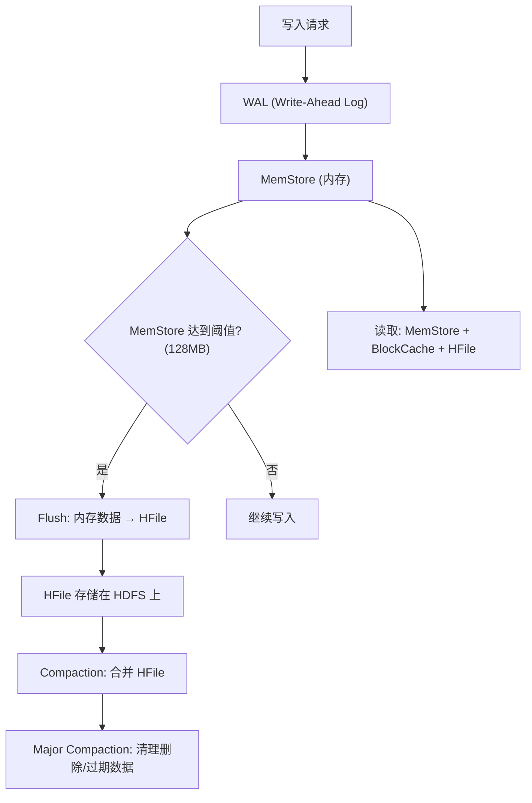
```mermaid
graph TB
    A["写入请求"] --> B["WAL (Write-Ahead Log)"]
    B --> C["MemStore (内存)"]
    C --> D{"MemStore 达到阈值? (128MB)"}
    D -->|"是"| E["Flush: 内存数据 → HFile"]
    D -->|"否"| F["继续写入"]
    E --> G["HFile 存储在 HDFS 上"]
    G --> H["Compaction: 合并 HFile"]
    H --> I["Major Compaction: 清理删除/过期数据"]
    C --> J["读取: MemStore + BlockCache + HFile"]
```

#### 📖 核心知识

1. **组件角色**：
   - **WAL**：预写日志，保证数据持久性和故障恢复（HDFS）
   - **MemStore**：内存缓存最新写入数据，支持顺序写入
   - **StoreFile（HFile）**：MemStore Flush 后的持久化文件，不可变（HDFS）
   - **BlockCache**：缓存热点读取数据，减少磁盘 IO（内存）
2. **写入路径**：Client → WAL → MemStore → Flush → HFile
3. **读取路径**：Client → BlockCache → MemStore → HFile（从新到旧依次查找）
4. **Flush 触发条件**：MemStore 达到阈值（默认 128MB）、RegionServer 全局 MemStore 水位超限、WAL 文件数超限
5. **HFile 特点**：一旦写入不可修改，删除操作通过写入 Delete Marker 实现，在 Major Compaction 时物理删除

#### 🔬 扩展知识

::: details

- 【L3】两级 MemStore 水位阻塞：RegionServer 全局 MemStore 使用率达到 `hbase.regionserver.global.memstore.size`（默认 0.4）时强制 Flush；再往上会阻塞写入，这是写吞吐突降时首先要排查的点。
- 【L3】MemStore 采用 active + snapshot 双缓冲：Flush 时 active 切换为 snapshot 落盘，新写入进入新的 active，读写不阻塞。
- 【L4】读写一致性基于 MVCC（ReadPoint）：每次读写获取递增的 sequenceId，读请求只看到 sequenceId ≤ ReadPoint 的已提交写入。
- 【L4】WAL 默认每条写入都 sync（`Durability.SYNC_WAL`）；可容忍丢数的链路可用 `ASYNC_WAL`/`SKIP_WAL` 换吞吐。

:::

#### 🏭 实战场景

::: details

某实时日志系统 HBase 集群写入吞吐从 20万/s 突降至 5万/s。排查发现 RegionServer 全局 MemStore 使用率达到上限（0.4），触发强制 Flush 阻塞写入。将 `hbase.regionserver.global.memstore.size` 从 0.4 调至 0.5，并将 MemStore flush size 从 128MB 调至 256MB 后，写入吞吐恢复至 25万/s。

:::

#### ⚠️ 常见误区

::: details

常见误区：

- ❌ "Flush 时会阻塞所有读写" → MemStore 采用双缓冲，Flush 时切换为 snapshot 落盘，新写入进入新 active，不阻塞
- ❌ "写入成功后数据已经在 HFile 了" → 写入成功时数据在 WAL 和 MemStore 中，HFile 是后续 Flush 生成的
- ❌ "MemStore 越大越好" → MemStore 占用堆内存，过大会挤压 BlockCache 空间，影响读性能

:::

#### 🔀 发散问题

- **Q：MemStore 和 BlockCache 的内存比例如何平衡？** → 两者共同占用 RegionServer 堆内存，典型配置为 MemStore 40% + BlockCache 40%，根据读写比例调整：写多读少可增大 MemStore，读多写少可增大 BlockCache。

### 【困难】HBase 如何保证并发读写的一致性？⭐⭐⭐⭐

> 🎯 目标等级：L3-L4 ｜ ⏱ 建议用时：12 min ｜ 🏷 标签：HBase 高级 / 并发一致性

#### 💎 关键结论

HBase 基于 MVCC + ReadPoint 机制保证并发读写一致性，每次写入获取递增 sequenceId，读请求只返回已提交的数据，实现单行读写原子性和读己之写的语义保证。

#### ⚡记忆卡片

- **口诀**：写增序号，读看快照，并发不可见
- **关键词**：MVCC ／ ReadPoint ／ sequenceId ／ 单行原子性
- **链路**：写入获取递增 sequenceId → 读请求获取 ReadPoint 快照 → 只返回 sequenceId ≤ ReadPoint 的已提交数据

#### 📖 核心知识

1. **sequenceId 机制**：RegionServer 维护全局递增的 sequenceId，每次成功写入（MemStore 更新 + WAL 持久化）都会推进 sequenceId。
2. **ReadPoint 快照**：读请求（Get/Scan）开始时获取当前 sequenceId 作为 ReadPoint，读取过程中只返回 sequenceId ≤ ReadPoint 的已提交数据，未完成的并发写入对读不可见。
3. **Flush 并发安全**：Flush 产生的 HFile 带上 `maxSequenceId`，读路径合并 MemStore 与 HFile 结果时按 sequenceId 过滤，保证不读到“半提交”状态。

::: details 语义保证

- **单行读写原子性**：对同一行的任意一次 Get，看到的是完整的某次写入结果
- **读己之写、单调读**：客户端顺序请求同一 RegionServer 时，后读不会比先读旧（注意跨 RegionServer 重试场景的边界）
- **不支持跨行/跨表事务**（原生 HBase），需多行原子性时可用 Phoenix 事务或上层业务补偿

:::

#### 🔬 扩展知识

::: details

- 【L3】HBase 的 MVCC 实现比 MySQL 更轻量：MySQL MVCC 基于 Undo Log 维护历史版本，HBase 直接基于 sequenceId + MemStore 多版本排序实现，无需额外的回滚段。
- 【L4】跨 RegionServer 重试场景的一致性问题：客户端重试可能请求到不同的 RegionServer，由于各 RegionServer 的 sequenceId 独立增长，单调读保证可能短暂打破，需要在业务层做幂等设计。

:::

#### 🏭 实战场景

::: details

某订单系统使用 HBase 存储订单状态，并发场景下发现“读到的订单状态比上次旧”（单调读被破坏）。排查发现是客户端重试跨 RegionServer 导致。通过在业务层引入本地版本号校验 + 重试时强制刷新客户端缓存，解决了该问题。

:::

#### ⚠️ 常见误区

::: details

常见误区：

- ❌ "HBase 支持完整的事务" → HBase 仅支持单行事务，不支持跨行/跨表事务
- ❌ "并发写入会互相覆盖导致数据丢失" → 并发写入各有独立的 sequenceId，读取时按 sequenceId 过滤，不会丢失
- ❌ "Get 和 Scan 的一致性保证相同" → Get 操作保证单行原子性，Scan 在扫描过程中可能看到不同行的不同时间点快照

:::

#### 🔀 发散问题

- **Q：HBase 的 MVCC 和 MySQL 的 MVCC 有什么本质区别？** → MySQL MVCC 基于 Undo Log 维护历史版本链，支持多版本并发控制（MVCC）+ 回滚；HBase MVCC 基于 sequenceId + 多版本时间戳，更轻量但不支持回滚，仅保证读写隔离。

## HBase 高可用

### 【困难】HBase 如何保证高可用？⭐⭐⭐

> 🎯 目标等级：L3-L4 ｜ ⏱ 建议用时：12 min ｜ 🏷 标签：HBase 高可用 / 故障恢复

#### 💎 关键结论

HBase 通过三个层面保证高可用：HMaster 主备切换（ZooKeeper 驱动）、RegionServer 宕机自动重新分配 Region + WAL 回放恢复、数据层依赖 HDFS 多副本存储。

#### ⚡记忆卡片

- **口诀**：Master ZK 切，RS 自动分配，数据 HDFS 副
- **关键词**：HMaster 主备 ／ RegionServer 重分配 ／ WAL 回放 ／ HDFS 多副本
- **链路**：HMaster 故障 → ZK 会话超时触发切换 → RegionServer 宕机 → Master 检测 → Region 重新分配 + WAL 回放恢复

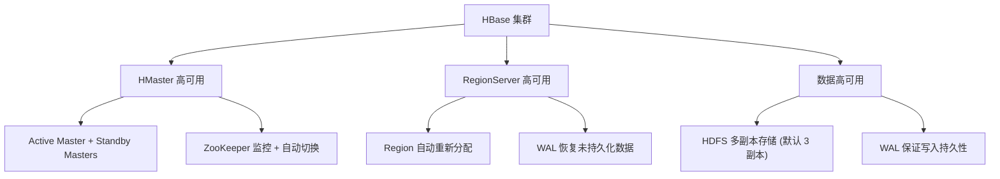
```mermaid
graph TB
    A["HBase 集群"] --> B["HMaster 高可用"]
    A --> C["RegionServer 高可用"]
    A --> D["数据高可用"]
    B --> B1["Active Master + Standby Masters"]
    B --> B2["ZooKeeper 监控 + 自动切换"]
    C --> C1["Region 自动重新分配"]
    C --> C2["WAL 恢复未持久化数据"]
    D --> D1["HDFS 多副本存储 (默认 3 副本)"]
    D --> D2["WAL 保证写入持久性"]
```

#### 📖 核心知识

1. **HMaster 高可用**：
   - 集群可运行多个 HMaster（1 个 Active + 多个 Standby）
   - 所有 Master 竞争创建 ZooKeeper 临时节点，成功者成为 Active Master
   - Active Master 故障时，ZooKeeper 会话超时触发 Watcher 事件，Standby Master 重新竞选
2. **RegionServer 高可用**：
   - 每个 RegionServer 在 ZooKeeper 注册临时节点，Master 通过 Watcher 监控
   - RegionServer 宕机后，Master 检测其临时节点消失，自动将其 Region 重新分配给其他 RegionServer
   - 新 RegionServer 加载 Region 时，通过回放该 Region 的 WAL 恢复未 Flush 的数据
3. **数据高可用**：
   - 底层依赖 HDFS 多副本存储（默认 3 副本）保证数据不丢失
   - WAL 保证写入持久性，即使 MemStore 未 Flush 也能通过 WAL 恢复

::: details 故障恢复流程

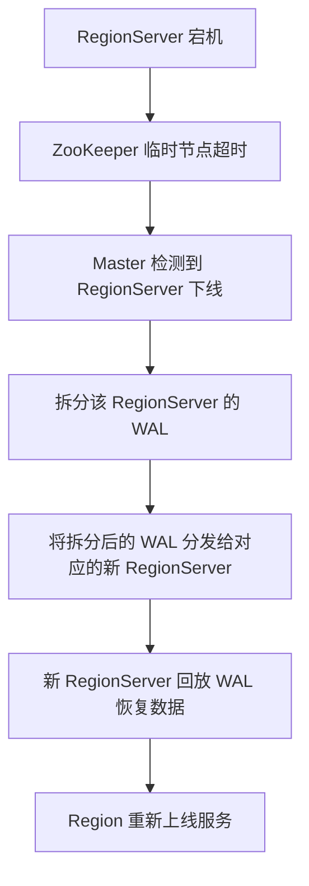
```mermaid
graph TB
    A["RegionServer 宕机"] --> B["ZooKeeper 临时节点超时"]
    B --> C["Master 检测到 RegionServer 下线"]
    C --> D["拆分该 RegionServer 的 WAL"]
    D --> E["将拆分后的 WAL 分发给对应的新 RegionServer"]
    E --> F["新 RegionServer 回放 WAL 恢复数据"]
    F --> G["Region 重新上线服务"]
```

:::

#### 🔬 扩展知识

::: details

- 【L3】WAL 拆分（Log Splitting）：宕机 RegionServer 的 WAL 文件中混杂多个 Region 的日志，必须按 Region 拆分成 recovered.edits 文件。HBase 2.x 默认使用 Procedure 框架驱动的 WAL Splitting，拆分速度直接影响 Region 恢复时间（RTO）。
- 【L3】大集群上 WAL 拆分是宕机恢复的主要耗时环节，可通过 `hbase.wal.split.count.threshold` 等参数调优。

:::

#### 🏭 实战场景

::: details

某生产集群 100 台 RegionServer，单台宕机后 WAL 拆分耗时 5 分钟，影响 200 个 Region 不可用。通过将 WAL Splitting 线程数从 2 调至 8，并启用 Distributed Log Splitting（HBase 1.x），WAL 拆分时间缩短至 1.5 分钟，Region 恢复时间降至 2 分钟。

:::

#### ⚠️ 常见误区

::: details

常见误区：

- ❌ "HMaster 宕机数据就丢了" → HMaster 只负责管理操作，数据读写由 RegionServer 处理，Master 短时宕机不影响数据读写
- ❌ "RegionServer 宕机后数据无法恢复" → 通过 WAL 回放可恢复未 Flush 到 HFile 的数据，HDFS 多副本保证已 Flush 数据不丢失

:::

#### 🔀 发散问题

- **Q：RegionServer 宕机期间落在该 Region 的写入请求会怎样？** → 客户端会收到异常并重试，Region 重新上线后重试成功。客户端重试次数和间隔可通过 `hbase.client.retries.number` 和 `hbase.client.pause` 配置。

### 【困难】HBase Region 分裂是如何工作的？⭐⭐⭐⭐

> 🎯 目标等级：L3-L4 ｜ ⏱ 建议用时：12 min ｜ 🏷 标签：HBase 高可用 / Region 分裂

#### 💎 关键结论

Region 分裂是 HBase 自动水平扩展的核心机制，Region 达到阈值（默认 10GB）时等分为两个子 Region，分裂不搬数据（只创建引用文件），但会造成短暂不可用（秒级）。

#### ⚡记忆卡片

- **口诀**：大了切两半，引用不搬数据
- **关键词**：Region Split ／ 分裂阈值 ／ Reference File ／ 预分区
- **链路**：Region 数据增长达到阈值 → 创建两个子 Region → 父 Region 下线 → 子 Region 分配到不同 RegionServer

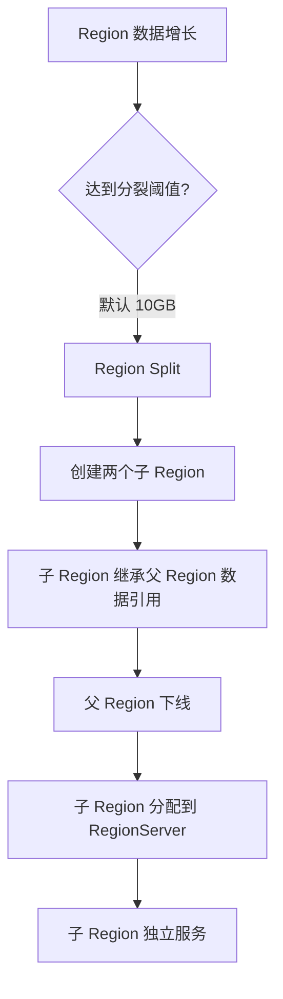
```mermaid
graph TB
    A["Region 数据增长"] --> B{"达到分裂阈值?"}
    B -->|"默认 10GB"| C["Region Split"]
    C --> D["创建两个子 Region"]
    D --> E["子 Region 继承父 Region 数据引用"]
    E --> F["父 Region 下线"]
    F --> G["子 Region 分配到 RegionServer"]
    G --> H["子 Region 独立服务"]
```

#### 📖 核心知识

1. **分裂触发条件**：
   - Region 大小达到阈值（`hbase.hregion.max.filesize`，默认 10GB）
   - 可通过 `SplitRequest` 手动触发
   - HBase 1.x+ 默认策略为 IncreasingToUpperBoundSplitStrategy，分裂阈值随 Region 数量动态增大
2. **分裂流程**：
   - RegionServer 本地创建两个子 Region 目录
   - 父 Region 停止服务，将数据引用分配给子 Region
   - 向 META 表写入分裂信息（原子操作）
   - 两个子 Region 上线，可能分配到不同 RegionServer

::: details 生产建议

- **预分区（Pre-splitting）**：建表时根据预估数据量预先创建多个 Region，避免后期频繁分裂
- 分裂阈值不宜过小，否则产生大量小 Region，增加管理开销

:::

#### 🔬 扩展知识

::: details

- 【L3】分裂不搬数据：子 Region 初始只持有父 HFile 的引用文件（Reference File），真正数据拆分延迟到后续 Compaction 完成，引用全部消除后删除父文件。分裂本身很快，但引用未消除前会加重读路径的多文件查找。
- 【L3】分裂会造成短暂不可用：父 Region 下线到子 Region 上线之间存在窗口期（秒级），落在该区间的请求会失败重试；客户端需配置合理的重试策略。
- 【L4】预分区策略选择：RowKey 均匀散列时用 `HexStringSplit`/`UniformSplit`；RowKey 有业务前缀时自定义 splitKeys，并确保分布与写入分布匹配。

:::

#### 🏭 实战场景

::: details

某用户行为表建表时未预分区，初始 1 个 Region。随着数据增长到 500GB，经历了 6 次自动分裂，每次分裂期间有 2~3 秒的写入失败。改为建表时预分区 64 个 Region（HexStringSplit），写入失败完全消除，各 Region 数据分布均匀。

:::

::: details 预分区代码示例

```java
// 建表时预分区
byte[][] splitKeys = new byte[][] {
    Bytes.toBytes("001"), Bytes.toBytes("002"),
    Bytes.toBytes("003"), Bytes.toBytes("004")
};
admin.createTable(tableDesc, splitKeys);
```

:::

#### ⚠️ 常见误区

::: details

常见误区：

- ❌ "分裂会立即将数据复制到两个子 Region" → 分裂只创建引用文件，真正数据拆分在后续 Compaction 完成
- ❌ "分裂对业务完全透明无影响" → 父 Region 下线到子 Region 上线之间有秒级窗口期，请求会失败重试
- ❌ "预分区越多越好" → 过多预分区会产生大量空/小 Region，增加管理开销和 RegionServer 内存压力

:::

#### 🔀 发散问题

- **Q：如何判断是否需要手动触发 Region 分裂？** → 观察各 Region 大小是否接近阈值、Region 数量是否合理、以及数据分布是否均匀。若某个 Region 明显偏大且长期未分裂，可手动触发。

## HBase 性能调优

### 【困难】HBase 有哪些常见的性能调优手段？⭐⭐⭐⭐

> 🎯 目标等级：L3-L4 ｜ ⏱ 建议用时：15 min ｜ 🏷 标签：HBase 性能调优 / 综合优化

#### 💎 关键结论

HBase 性能调优从四个维度入手：RowKey 设计避免热点、读取优化（BlockCache + 布隆过滤器 + 预读）、写入优化（批量 + WAL 策略）、集群配置（预分区 + Compaction 策略 + GC 调优）。

#### ⚡记忆卡片

- **口诀**：行键读写字集群，RowKey、读、写、集群四路调
- **关键词**：BlockCache ／ 布隆过滤器 ／ BufferedMutator ／ 预分区 ／ Compaction
- **链路**：RowKey 设计避免热点 → 读取优化降 IO → 写入优化提吞吐 → 集群配置保稳定

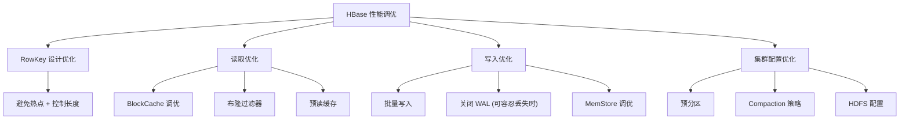
```mermaid
graph TB
    A["HBase 性能调优"] --> B["RowKey 设计优化"]
    A --> C["读取优化"]
    A --> D["写入优化"]
    A --> E["集群配置优化"]
    B --> B1["避免热点 + 控制长度"]
    C --> C1["BlockCache 调优"]
    C --> C2["布隆过滤器"]
    C --> C3["预读缓存"]
    D --> D1["批量写入"]
    D --> D2["关闭 WAL (可容忍丢失时)"]
    D --> D3["MemStore 调优"]
    E --> E1["预分区"]
    E --> E2["Compaction 策略"]
    E --> E3["HDFS 配置"]
```

#### 📖 核心知识

1. **读取优化**：

| 手段 | 配置/方法 | 效果 |
| --- | --- | --- |
| BlockCache 调优 | `hfile.block.cache.size`（默认 0.4） | 增大读缓存，减少磁盘 IO |
| 布隆过滤器 | 列族级别设置 `BLOOMFILTER=ROW` | 跳过无效 HFile，减少读放大 |
| 预读缓存 | Scan 时设置 `setCaching(100)` | 批量拉取数据，减少 RPC 次数 |
| 指定列查询 | Get/Scan 时只查需要的列 | 减少 IO 开销 |

2. **写入优化**：

| 手段 | 配置/方法 | 效果 |
| --- | --- | --- |
| 批量写入 | 使用 `BufferedMutator` 批量提交 | 减少 RPC 次数，提升写入吞吐 |
| 关闭 WAL | `Put.setWriteToWAL(false)` | 提升写入速度，但故障时会丢数据 |
| MemStore 调优 | `hbase.hregion.memstore.flush.size` | 控制 Flush 频率 |
| 多线程写入 | 客户端多线程并发写入 | 充分利用集群写入能力 |

3. **集群配置优化**：

| 配置项 | 默认值 | 优化建议 |
| --- | --- | --- |
| `hbase.regionserver.handler.count` | 30 | 根据并发量调高（如 100） |
| `hbase.hregion.majorcompaction` | 604800000 | 生产环境建议禁用自动触发 |
| `hbase.hstore.compactionThreshold` | 3 | 根据写入量调整 |
| `hbase.regionserver.global.memstore.size` | 0.4 | 根据读写比例调整 |

#### 🔬 扩展知识

::: details

- 【L3】热点 Region 治理：某 Region 读写量远超其他 Region（常见于预分区不均、RowKey 设计缺陷）。拆分热点 Region、Balancer 均衡、根治方案是重新设计 RowKey 散列。
- 【L3】客户端超时与重试：`hbase.client.operation.timeout`、`hbase.client.retries.number` 需与业务 SLA 匹配；重试叠加会放大对集群的压力，雪崩场景下应结合熔断限流。
- 【L4】GC 调优：RegionServer 堆内存通常 16~32GB，优先使用 G1 并控制停顿目标；MemStore + BlockCache 占用堆内存大，需监控 Old GC 频率，避免 Full GC 导致 ZooKeeper 会话超时。
- 【L4】慢读排查：区分是 HFile 过多（读放大，需 Compaction）、BlockCache 命中率低、还是 Region 热点，三者治理手段完全不同。

:::

#### 🏭 实战场景

::: details

某电商用户画像表 200 亿行数据，P99 读延迟 50ms。调优措施：(1) BlockCache 从 0.4 调至 0.5；(2) 开启 ROW 布隆过滤器；(3) Scan setCaching 从 10 调至 100；(4) 禁用自动 Major Compaction 改为凌晨手动执行。调优后 P99 读延迟降至 8ms，QPS 从 5万提升至 12万。

:::

#### ⚠️ 常见误区

::: details

常见误区：

- ❌ "堆内存越大越好" → 堆内存过大导致 GC 停顿时间过长，可能触发 ZooKeeper 会话超时，RegionServer 被踢出集群
- ❌ "关闭 WAL 能大幅提升写入性能" → 写入性能提升有限（约 10%~20%），但宕机时会丢失未 Flush 数据
- ❌ "Compaction 越频繁性能越好" → 频繁 Compaction 带来持续 IO 压力，反而降低读写性能

:::

#### 🔀 发散问题

- **Q：如何快速定位 HBase 性能瓶颈？** → 先看 RegionServer 监控指标（读写延迟、HFile 数量、MemStore 使用率、GC 时间），再查看 Compaction 队列长度和 BlockCache 命中率，最后检查 RowKey 设计是否存在热点。

### 【困难】HBase 的 Phoenix 是什么？⭐

> 🎯 目标等级：L3-L4 ｜ ⏱ 建议用时：8 min ｜ 🏷 标签：HBase 性能调优 / Phoenix

#### 💎 关键结论

Apache Phoenix 是 HBase 之上的 SQL 引擎，为 HBase 提供标准 SQL 查询能力、二级索引和 JDBC 接口，降低 HBase 使用门槛，但 JOIN 性能有限。

#### ⚡记忆卡片

- **口诀**：Phoenix 给 HBase 加 SQL，加索引，加 JDBC
- **关键词**：SQL 引擎 ／ 二级索引 ／ 查询优化 ／ JDBC
- **链路**：HBase 原生不支持 SQL → Phoenix 提供 SQL 层 → 编译为 HBase 原生 API 执行

#### 📖 核心知识

1. **SQL 支持**：提供标准 SQL 语法（DDL/DML），降低 HBase 使用门槛。
2. **二级索引**：支持全局索引和本地索引，加速非 RowKey 列的查询。
3. **查询优化**：内置查询优化器，支持谓词下推、聚合下推。
4. **JDBC 驱动**：提供标准 JDBC 接口，可与 BI 工具集成。

::: details Phoenix SQL 示例

```sql
-- Phoenix SQL 示例
CREATE TABLE user_log (
    user_id VARCHAR NOT NULL,
    log_date DATE NOT NULL,
    action VARCHAR,
    detail VARCHAR,
    CONSTRAINT pk PRIMARY KEY (user_id, log_date)
);

-- 创建二级索引
CREATE INDEX idx_action ON user_log (action);

-- 查询
SELECT * FROM user_log WHERE action = 'login' AND log_date >= CURRENT_DATE() - 7;
```

:::

5. **适用场景**：需要对 HBase 数据进行 SQL 查询分析、非 RowKey 列查询性能要求高、需要与 BI/报表工具集成。
6. **局限性**：JOIN 操作性能有限、写入性能相比原生 HBase API 有损耗、二级索引会增加写入开销。

#### 🔀 发散问题

- **Q：Phoenix 的二级索引和 HBase 原生查询有什么区别？** → HBase 原生只能按 RowKey 查询，非 RowKey 列需要全表扫描；Phoenix 二级索引为指定列创建独立的索引表，可将非 RowKey 查询转换为索引 RowKey 查询，大幅提升性能。

## 参考资料

- [Apache HBase 官方文档](https://hbase.apache.org/book.html)
- [HBase 架构详解](https://hbase.apache.org/book.html#arch.overview)
- [HBase 参考指南 - RowKey 设计](https://hbase.apache.org/book.html#rowkey.design)
- [HBase 性能优化实战](https://hbase.apache.org/book.html#performance)
