---
icon: logos:hbase
title: HBase 面试
date: 2025-03-04 10:05:51
categories:
  - 数据库
  - 列式数据库
  - HBase
tags:
  - 数据库
  - 列式数据库
  - 大数据
  - HBase
  - 面试
permalink: /pages/6a3851d6/
---

# HBase 面试

## HBase 简介

### 【简单】什么是 HBase？⭐⭐

> 🎯 目标等级：L2 ｜ ⏱ 建议用时：5 min ｜ 🏷 标签：HBase 简介 / 基本概念

#### 💎 关键结论

HBase 是构建在 HDFS 之上的**分布式、面向列族（Column Family）的稀疏多维排序 Map**，核心能力是对海量数据（数十亿至数百亿行）按 RowKey 做随机实时读写，本质是 Google BigTable 的开源实现。它**不是**列式分析数据库（Parquet/ORC/ClickHouse 那一类），适合海量宽表的点查与范围扫描，不适合全表聚合分析。

#### ⚡ 记忆卡片

- **口诀**：HDFS 存大文件，HBase 随机读写；列族不是列存，点查扫描才是本行
- **关键词**：面向列族 ／ 稀疏多维排序 Map ／ HDFS 之上 ／ 随机访问 ／ BigTable
- **链路**：HDFS 只能批处理顺序访问 → HBase 补充随机读写能力 → 成为 Hadoop 生态的实时查询层

#### 📖 核心知识

1. **定位**：HBase 是 Google BigTable 的开源实现，属于 Hadoop 生态系统，构建在 HDFS 之上，提供对海量数据的随机访问能力。


2. **本质数据结构**：一个**稀疏、多维、按 RowKey 字典序排序的 Map**。数据模型是 `(RowKey, ColumnFamily:Qualifier, Timestamp) → Value`——定位一个 Cell 需要四个坐标，这正是「多维」的含义。
3. **分布式特性**：
   - **伸缩性**：支持通过增减机器进行水平扩展
   - **高可用**：支持 RegionServer 之间的自动故障转移
   - **自动分区**：Region 随数据增长自动分裂和再均衡
4. **超大数据集**：设计用于读写数十亿行至数百亿行的表。
5. **数据类型支持**：支持结构化、半结构化和非结构化数据（继承自 HDFS）。底层一切皆 `byte[]`，HBase 不解释类型，序列化与反序列化由应用层负责。
6. **多版本**：同一 Cell 可保留多个版本，**按时间戳倒序存储**（最新的在最前），保留数量由列族的 `VERSIONS` 参数控制（默认 1）。
7. **非关系型数据库（能力边界必须说清）**：不支持标准 SQL（需 Phoenix）、**原生没有二级索引**、**没有跨行事务**（只有单行 ACID）、**没有 JOIN**。

::: details 其他特性

- 读写操作遵循单行强一致性
- 过滤器支持谓词下推
- 提供 Java 客户端 API
- 支持 BlockCache 和布隆过滤器优化查询
- 可作为 MapReduce 作业的输入/输出源

:::

#### ⚠️ 常见误区

::: details

- ❌ 「HBase 是列式数据库，所以适合 OLAP 分析」→ HBase 是**列族存储**：同一列族的数据物理上存在一起（同一 Store、同一批 HFile），同一行的不同列族才分开存。这与列式分析数据库「同一列的所有行连续存放，用于全表扫描聚合与高压缩比」完全不是一回事。HBase 的强项是**按 RowKey 的点查与范围扫描**，全表聚合分析应交给 ClickHouse/Doris。
- ❌ 「HBase 有索引」→ 只有 RowKey 这一条主键路径。HBase 靠 RowKey 字典序 + META 表定位 Region，靠布隆过滤器跳过无关 HFile，但**没有原生二级索引**，按非 RowKey 字段查询只能全表 Scan（或引入 Phoenix 的全局/本地索引）。

:::

#### 🔀 发散问题

- **Q：HBase 与 Redis 都能做随机读写，区别是什么？**

  → Redis 是纯内存 KV 存储，适合低延迟小数据量场景；HBase 基于 HDFS 磁盘存储，适合数十亿行级别的超大数据集随机读写。

### 【简单】为什么需要 HBase？⭐⭐

> 🎯 目标等级：L2 ｜ ⏱ 建议用时：5 min ｜ 🏷 标签：HBase 简介 / 设计动机

#### 💎 关键结论

HDFS 擅长海量数据的批量顺序访问，但无法随机访问；传统关系型数据库能随机访问却撑不住海量数据。HBase 同时解决这两个需求——海量存储 + 随机读写。

#### ⚡ 记忆卡片

- **口诀**：HDFS 能存不能查，RDBMS 能查不能存，HBase 两头都能
- **关键词**：随机访问 ／ 海量存储 ／ HDFS 补充
- **链路**：HDFS 只支持顺序批处理 → 传统 RDBMS 无法承载海量数据 → HBase 填补「海量存储 + 随机访问」的空白

#### 📖 核心知识

1. **HDFS 的局限**：HDFS 是海量数据存储的最佳方案（支持大文件存储、批量访问、流式访问、多副本容灾），但它只能执行批处理且以顺序方式访问数据，无法实现随机访问。
2. **传统 RDBMS 的局限**：关系型数据库擅长随机访问与复杂事务，但单机纵向扩展有天花板。当数据量大到必须分库分表时，跨分片查询、分布式事务与扩容迁移的复杂度会急剧上升，运维成本远高于一次水平扩展。
3. **HBase 的定位**：同时解决海量数据存储和随机访问的问题，是 Hadoop 生态的实时查询层补充。它把「分片」做成了内建能力——数据按 RowKey 范围自动切成 Region 并分布到各 RegionServer，扩容只需加机器，业务侧不需要感知分片规则。
4. **HBase 额外补上的三件事**：稀疏列（空列不占空间，适合动态扩展的宽表）、多版本（同一 Cell 按时间戳保留历史）、Schema-less 列（列限定符可动态新增，不需 DDL）。

::: details 数据结构分类

- **结构化数据**：以关系型数据库表形式管理的数据
- **半结构化数据**：非关系模型的、有基本固定结构模式的数据（日志文件、XML、JSON、Email 等）
- **非结构化数据**：没有固定模式的数据（Word、PDF、图片、视频等）

:::

#### ⚠️ 常见误区

::: details

- ❌ 「MySQL 到千万行就不行了，所以要换 HBase」→ 不存在通用的行数阈值。MySQL 的性能取决于表结构、索引设计与硬件配置，配合合理分库分表可以支撑很大数据量。换 HBase 的真正理由不是「行数多」，而是「需要稀疏宽表 + 动态列 + 按 RowKey 的海量随机读写，且可以接受没有 JOIN、没有二级索引、没有跨行事务」。
- ❌ 「HBase 是更快版的 MySQL」→ 两者能力集不重叠。HBase 换来了水平扩展与海量随机读写，代价是丢掉了 SQL、JOIN、二级索引与跨行事务；把它当 MySQL 用会在业务层付出巨额补偿成本。

:::

#### 🔀 发散问题

- **Q：除了 HBase，还有哪些系统能同时支持海量存储和随机访问？**

  → Cassandra、CouchDB、DynamoDB、MongoDB 等 NoSQL 数据库都能存储海量数据并支持随机访问，但各自的架构和数据模型有所不同。

### 【简单】HBase 有哪些应用场景？⭐⭐

> 🎯 目标等级：L2 ｜ ⏱ 建议用时：5 min ｜ 🏷 标签：HBase 简介 / 应用场景

#### 💎 关键结论

HBase 适用于「实时随机访问超大数据集」的场景，典型用途包括日志存储、用户行为追踪、GPS 信息、监控数据等；不适用于需要索引、复杂事务或小数据量的场景。

#### ⚡ 记忆卡片

- **口诀**：量大实时随机查，日志行为 GPS
- **关键词**：海量数据 ／ 随机访问 ／ 宽表 ／ 日志存储
- **链路**：数据量十亿级以上 + 需要实时随机读 → HBase 适用场景

#### 📖 核心知识

1. **适用场景**：
   - 数据量级达到十亿级至百亿级，需要实时随机访问
   - 存储结构化、半结构化数据
   - 硬件资源充足的集群环境
2. **不适用场景**：
   - 需要二级索引的复杂查询（HBase 原生不支持，只能全表 Scan 或引入 Phoenix）
   - 需要跨行/跨表复杂事务（HBase 只有单行 ACID）
   - 需要多表 JOIN 的 OLTP 业务
   - 需要全表聚合分析的 OLAP 场景（应选 ClickHouse / Doris 等列式分析引擎）
   - 数据量较小（不足几百万行，直接用 MySQL 即可，上 HBase 是纯负担）
3. **典型应用**：
   - 监控数据存储
   - 用户/车辆 GPS 信息存储
   - 用户行为数据（点击流、浏览记录）
   - 各类日志数据（访问日志、操作日志、推送日志）
   - 短信、邮件等消息类数据
   - 网页抓取数据
4. **P8 语境下的高价值场景**（这些才是真正会驱动 HBase 选型的业务）：
   - **海量宽表**：用户画像、风控特征库——每个用户一行，特征列可动态增加到成千上万个且高度稀疏，正是 HBase 稀疏列 + Schema-less 列的主场
   - **时序数据**：监控指标、IoT 设备上报——按「设备 + 时间」组织 RowKey，天然适合范围扫描
   - **消息 / Feed 流存储**：按用户 ID 做 RowKey 前缀，一次 Scan 拉取该用户的整条时间线
   - **订单与日志明细归档**：从 MySQL 冷备出来，保留可查明细的能力但不占在线库容量
   - **实时数仓明细层**：配合 Flink 实时写入，作为可回溯查询的明细底座（聚合层仍交给 OLAP 引擎）

#### ⚠️ 常见误区

::: details

- ❌ 「HBase 能做实时分析，所以实时数仓直接用它」→ HBase 只适合明细层的点查与范围扫描。真正的聚合分析（GROUP BY 全表、多维 OLAP）在 HBase 上是全表扫描，性能与成本都不可接受，必须由 ClickHouse/Doris 承担。
- ❌ 「HBase 适合所有大数据量场景」→ 如果查询模式是「按非 RowKey 字段灵活检索」，HBase 会让你退化成全表 Scan，此时 Elasticsearch 才是正确选择。

:::

#### 🔀 发散问题

- **Q：HBase 和 Kafka 都能处理日志数据，如何选型？**

  → Kafka 是流式消息队列，擅长数据管道和实时流处理；HBase 是持久化存储，擅长按 RowKey 随机查询历史数据。两者常搭配使用：Kafka 采集 → HBase 落盘查询。

### 【简单】HBase vs. RDBMS？⭐⭐

> 🎯 目标等级：L2 ｜ ⏱ 建议用时：5 min ｜ 🏷 标签：HBase 简介 / 对比分析

#### 💎 关键结论

HBase 无 Schema、基于 HDFS、仅支持行级事务，适合超大规模宽表；RDBMS 有固定模式、支持复杂事务，适合中小规模结构化数据。两者是互补关系而非替代。

#### ⚡ 记忆卡片

- **口诀**：HBase 宽表无模式，RDBMS 事务有 Schema
- **关键词**：无 Schema ／ HDFS ／ Row Key ／ 行级事务
- **链路**：RDBMS 擅长中小规模事务处理 → HBase 补充超大规模宽表的随机读写

#### 📖 核心知识

| RDBMS                          | HBase                                                   |
| ------------------------------ | ------------------------------------------------------- |
| 有固定 Schema，描述表结构约束  | 无 Schema，仅定义列族                                   |
| 支持 FAT、NTFS、EXT 等文件系统 | 仅支持 HDFS                                             |
| 使用提交日志存储日志           | 使用 WAL（预写日志）                                    |
| 使用特定协调系统               | 使用 ZooKeeper 协调集群                                 |
| 存储中小规模数据表             | 存储超大规模数据表，适合宽表                            |
| 支持复杂事务                   | 仅支持行级事务（单行 ACID），无跨行事务                 |
| 适用于结构化数据               | 适用于半结构化、结构化数据                              |
| 使用主键                       | 使用 Row Key                                            |
| 有二级索引、支持 JOIN          | 原生无二级索引、无 JOIN                                 |
| 标准 SQL                       | 无 SQL，需 Phoenix 提供 SQL 层                          |
| 纵向扩展为主，分库分表靠业务层 | 横向扩展内建，按 RowKey 范围自动切分 Region             |
| 面向行存储，整行读取高效       | 面向列族存储，按 RowKey 点查与范围扫描高效              |
| 查询模式灵活，任意字段可建索引 | 只能沿 RowKey 字典序访问，非 RowKey 查询退化为全表 Scan |

#### ⚠️ 常见误区

::: details

- ❌ 「HBase 无 Schema，所以建表很随意」→ 列族是 Schema 的一部分且**建表后修改代价极高**。列族数量直接决定 Store 数量，而每个 Store 独立 flush、独立 compaction，列族过多会成倍放大小文件与读放大。生产上列族应控制在 1-3 个。
- ❌ 「仅支持 HDFS 意味着 HBase 不能单独部署」→ 单机测试模式可以跑在本地文件系统上，但生产部署的持久性与副本能力完全依赖 HDFS（或其他 Hadoop 兼容文件系统），HBase 自身不做数据冗余。
- ❌ 「HBase 的行级事务等于没有事务保证」→ 单行 ACID 是真实可用的强保证：同一行的多列更新是原子的、读写不互相看见半成品（靠 MVCC）。它只是不跨行。业务上把需要原子性的字段设计到同一行，是 HBase 建模的核心技巧。

:::

#### 🔀 发散问题

- **Q：HBase 能不能做跨行事务？**

  → 原生 HBase 不支持跨行事务。若需多行原子性，可用 Phoenix 事务或上层业务补偿（如 TCC、Saga 模式）。

### 【简单】HBase vs. HDFS？⭐⭐

> 🎯 目标等级：L2 ｜ ⏱ 建议用时：5 min ｜ 🏷 标签：HBase 简介 / 对比分析

#### 💎 关键结论

HDFS 是底层文件系统，擅长大文件一次写入多次读取；HBase 是上层数据库，基于 HDFS 构建，提供表格化 KV 存储和随机读写优化。

#### ⚡ 记忆卡片

- **口诀**：HDFS 是地基，HBase 是楼房
- **关键词**：文件系统 ／ 表格存储 ／ 块文件 ／ KV 对 ／ 一次写多次读
- **链路**：HDFS 提供分布式文件存储 → HBase 在其上构建表格层 → 补充随机读写能力

#### 📖 核心知识

| HDFS                              | HBase                         |
| --------------------------------- | ----------------------------- |
| 分布式文件系统                    | 面向表格列族的数据存储        |
| 为大文件优化存储                  | 为表格数据优化存储            |
| 使用块文件                        | 使用 KV 对数据                |
| 数据模型不灵活                    | 提供灵活的数据模型            |
| 使用文件系统和 MapReduce 处理框架 | 内置 MapReduce 支持的表格存储 |
| 一次写入多次读取优化              | 读写均优化                    |

**两者的关系是「承载」而非「竞争」**，P8 应答出这一层：

1. **HDFS 的能力边界**：只提供「一次写入、多次读取」的**文件级**存储。它**不支持随机低延迟修改**（文件 append 也是受限的）、**没有索引**、**无法按文件名快速查找内容**——想找某条记录只能整文件扫描。
2. **HBase 在其上补的能力**：随机实时读写（按 RowKey 直接定位）、稀疏列、多版本、Region 级水平扩展、WAL 保证宕机不丢已确认的写。
3. **持久性由 HDFS 提供**：HBase 的数据文件（HFile）与 WAL 全部落在 HDFS 上，靠 **HDFS 三副本**保证不丢。**HBase 自己不做数据冗余**——这是「为什么 HBase 集群不需要像 MySQL 那样配主从」的答案。

#### ⚠️ 常见误区

::: details

- ❌ 「有了 HDFS 就不需要 HBase，直接读文件即可」→ HDFS 上没有索引，定位一条记录要扫整个文件（甚至跨 Block）。HBase 的价值正是用 Region 切分 + RowKey 字典序 + META 寻址 + 布隆过滤器，把「文件扫描」变成「文件内 Block 级定位」。
- ❌ 「HBase 需要自己保证数据多副本」→ 副本完全由底层 HDFS 负责。HBase 的 Region 是单点服务的（一个 Region 同时只在一个 RegionServer 上），它保证的是可用性（故障后重新分配 + WAL 回放）而非冗余。

:::

#### 🔀 发散问题

- **Q：HBase 的数据最终存在哪里？**

  → HBase 的 HFile 和 WAL 最终都存储在 HDFS 上，依赖 HDFS 的多副本机制保证数据可靠性。

### 【简单】行式数据库 vs. 列式数据库？⭐⭐⭐

> 🎯 目标等级：L2-L3 ｜ ⏱ 建议用时：5 min ｜ 🏷 标签：HBase 简介 / 存储模型对比

#### 💎 关键结论

行式数据库按行连续存储，适合 OLTP 写入和整行读取；列式数据库按列独立存储，适合聚合查询和压缩，读取时仅加载需要的列。

#### ⚡ 记忆卡片

- **口诀**：行存写整行，列存读所需
- **关键词**：行式存储 ／ 列式存储 ／ OLTP ／ 聚合查询 ／ 压缩
- **链路**：行存连续页内存适合 OLTP → 列存非连续页仅读所需列 → 聚合查询性能更优

#### 📖 核心知识

| 行式数据库             | 列式数据库               |
| ---------------------- | ------------------------ |
| 添加/修改操作更高效    | 读取操作更高效           |
| 读取整行数据           | 仅读取必要的列数据       |
| 最适合 OLTP 系统       | 不适合 OLTP 系统         |
| 行数据存储在连续页内存 | 列数据存储在非连续页内存 |

**🔴 三种存储模型必须分清（P8 高频失分点）**

上面这张表说的是**行式 vs 列式分析型存储**，而 HBase 属于**第三种：列族存储（Column-Family Storage）**。三者不可混为一谈：

| 存储模型               | 物理布局                                                                                | 代表                            | 擅长                                 |
| ---------------------- | --------------------------------------------------------------------------------------- | ------------------------------- | ------------------------------------ |
| **行式存储**           | 一行的所有字段连续存放                                                                  | MySQL InnoDB、Oracle            | OLTP：整行读写、事务                 |
| **列式存储（分析型）** | **同一列的所有行**连续存放                                                              | Parquet、ORC、ClickHouse、Doris | OLAP：全表扫描聚合、极高压缩比       |
| **列族存储**           | **同一列族内的所有列**存在一起（同一 Store / 同一批 HFile）；同一行的**不同列族分开存** | HBase、BigTable、Cassandra      | 海量稀疏宽表的 RowKey 点查与范围扫描 |

关键差异：

- 列式分析库按「列」物理拆分，读一列时**不需要触碰其他列的字节**，因此扫描聚合与压缩都极优；HBase 按「列族」物理拆分，**同一列族内不同列的数据是混在同一批 HFile 里的**，读取粒度是 Block（默认 64KB），不是单列。
- 所以 **「HBase 是列式数据库，因此适合 OLAP 分析」是错误的**。HBase 适合 OLTP-ish 的海量宽表点查/范围扫描，全表聚合分析必须交给列式分析引擎。
- 反过来，HBase 的列族拆分带来的真实收益是：**只读某个列族时不必加载其他列族的数据**（列族之间是独立的 Store），以及**不同列族可以配置不同的压缩算法、Block 大小、VERSIONS、TTL**。这才是「列族」的物理意义，而不是「按列存储」。

::: details 列式数据库优缺点

**优点**：

- 支持数据压缩，存储空间更小
- 快速数据检索，仅加载所需列
- 聚合查询（COUNT、SUM、AVG、MIN、MAX）性能优异
- 自动分片机制，分区效率高

**缺点**：

- JOIN 查询和多表关联查询未优化
- 频繁删除和更新会降低存储效率
- 分区和索引设计较困难

:::

#### ⚠️ 常见误区

::: details

- ❌ 「HBase 是列式数据库，所以适合做 OLAP 分析」→ HBase 是**列族存储**，不是列式分析存储。同一列族内的列混在同一批 HFile 中，读取粒度是 Block 而非单列，全表聚合扫描性能与压缩比都远不如 Parquet/ClickHouse。HBase 的主场是按 RowKey 的点查与范围扫描。
- ❌ 「列存一定比行存好」→ 列存对高频单行更新极不友好（一行数据分散在各列文件中，一次更新要触碰多个文件），所以 OLTP 系统仍然必须用行存。选型依据是查询模式（点查整行 vs 扫描聚合），不是「谁更先进」。
- ❌ 「HBase 一行数据是连续存放的」→ 只有同一列族内的数据才物理相邻。跨列族读取一行，实际是从多个 Store 分别读再归并，这是**列族数量应当控制在 1-3 个**的物理原因。

:::

#### 🔀 发散问题

- **Q：列式存储在数据压缩率上通常比行式存储高多少？为什么相同类型的数据连续存储能显著提升压缩效果？**

  → 方向上列存压缩率显著高于行存（业界常见说法是数倍量级，但**具体倍数高度依赖数据分布与编码方式，属示意值而非官方基准**）。原因是同一列的数据类型相同、值域相近，连续存放后字典编码、游程编码（RLE）、位图编码能高效识别重复模式；行式存储中不同类型数据交错排列，压缩算法难以找到长序列的重复模式。

- **Q：如果业务既需要按行查询完整记录，又需要按列做聚合分析，有什么混合存储方案？**

  → 可采用 HTAP（混合事务与分析处理）架构，如 TiDB 或 MySQL + ClickHouse 双写方案，事务写入行存引擎，分析查询路由到列存引擎。也可在 HBase 上配合 Phoenix 提供 SQL 层，或用 Lambda 架构将数据同步到专用 OLAP 系统。

## HBase 存储

### 【简单】HBase 表有什么特性？⭐⭐

> 🎯 目标等级：L2 ｜ ⏱ 建议用时：5 min ｜ 🏷 标签：HBase 存储 / 表特性

#### 💎 关键结论

HBase 表具备容量大、面向列、稀疏性、多版本和字节数组存储五大特性，一个表可容纳数十亿行、上百万列，空列不占空间。

#### ⚡ 记忆卡片

- **口诀**：大列稀多字（容量大、列存、稀疏、多版本、字节数组）
- **关键词**：容量大 ／ 面向列 ／ 稀疏性 ／ 多版本 ／ byte[]
- **链路**：列式存储 + 稀疏设计 → 空列不占空间 → 表可设计得非常稀疏且庞大

#### 📖 核心知识

1. **容量大**：一个表可以有数十亿行、上百万列。
2. **面向列族**：数据按**列族**分组存储——同一列族的所有列物理上存在一起（同一 Store / 同一批 HFile），不同列族分开存。查询时可只访问指定列族与列，有效降低 I/O 负担。注意这与「列式分析存储」（同一列的所有行连续存放）不是一回事，详见本文档「行式数据库 vs. 列式数据库？」。
3. **稀疏性**：空（null）列不占用存储空间，表可以设计得非常稀疏。这是 HBase 能支撑「上百万列的画像宽表」的根本原因——没有值的列根本不落盘。
4. **数据多版本**：每个 Cell 中的数据可以有多个版本，按时间戳**倒序**排列，新数据在最上面。保留数量由列族属性 `VERSIONS` 控制（默认 1），过期数据还可用 `TTL` 控制，两者都在 **Major Compaction** 时才被物理清理。
5. **存储类型**：所有数据的底层存储格式都是字节数组（`byte[]`）。**HBase 不解释类型**——RowKey、列族名、列限定符、值全是字节，类型语义完全由应用层的序列化方案决定。这也是「HBase 无法像 RDBMS 那样按字段类型建索引与做类型比较」的原因。
6. **按 RowKey 字典序组织**：行与行之间没有任何其他顺序保证，所有范围访问能力都来自 RowKey 的字节字典序。

#### ⚠️ 常见误区

::: details

- ❌ 「稀疏表所以可以随便加列，没有代价」→ 列**限定符**确实可以动态加，但列限定符名本身会存进每个 KeyValue。如果误把「值」放进了列名（例如给每个时间戳建一个列名），会导致列名爆炸，存储与内存开销急剧放大。
- ❌ 「多版本是免费的」→ `VERSIONS` 调大会线性放大存储，且旧版本要等到 Major Compaction 才清理，在此之前读路径仍可能扫到它们。
- ❌ 「HBase 表的数据模型和 MySQL 表差不多」→ HBase 的 Cell 坐标是四元组 `(RowKey, CF:Qualifier, Timestamp)`，多了一个时间维度；且列族属于 Schema、列限定符不属于 Schema，两者的变更代价天差地别。

:::

#### 🔀 发散问题

- **Q：HBase 的多版本数据会不会无限占用存储？**

  → 不会。可以通过列族的 `VERSIONS` 参数限制保留版本数（默认 1），超出部分在 Major Compaction 时被物理清理。

### 【简单】HBase 的逻辑存储模型是怎样的？⭐⭐

> 🎯 目标等级：L2-L3 ｜ ⏱ 建议用时：8 min ｜ 🏷 标签：HBase 存储 / 数据模型

#### 💎 关键结论

HBase 是面向列族的数据库，核心层级为 Table → Row → Column Family → Column Qualifier → Cell，Cell 通过时间戳支持多版本，Row Key 按字典序排列。

#### ⚡ 记忆卡片

- **口诀**：表行族列格，时间戳排版本
- **关键词**：Table ／ Row Key ／ Column Family ／ Cell ／ Timestamp
- **链路**：Table 由 Row 组成 → Row 包含多个 Column Family → Family 下有 Column Qualifier → Cell 存储多版本数据

#### 📖 核心知识

1. **Table**：由 Row 和 Column 组成。
2. **Row Key**：用来检索记录的主键，是未解释的字节数组。表中行按 Row Key 字典序排序，访问方式包括指定 RowKey、RowKey 范围、全表扫描三种。
3. **Column Family（列族）**：表 Schema 的一部分，建表时必须定义。同一列族的列有相同前缀（如 `info:format`、`info:geo`）。
4. **Column Qualifier（列限定符）**：具体列名，不是 Schema 的一部分，可动态创建。列族和列限定符以冒号分隔。
5. **Cell**：由 Row + Column Family + Column Qualifier 确定的存储单元，包含值和多个时间戳版本。完整坐标是四元组 `(RowKey, CF:Qualifier, Timestamp) → Value`，这就是「稀疏多维排序 Map」中「多维」的来源。
6. **Timestamp**：Cell 的版本索引，64 位整型，可自动分配或显式指定。不同版本按时间戳**倒序**排列（最新的在最前，读取时默认先命中）。保留版本数由列族属性 `VERSIONS` 控制（默认 1），配合 `TTL` 控制过期，两者都在 Major Compaction 时物理清理。
7. **列族是物理隔离单位**：一个列族对应一个 Store（内存中一个 MemStore + 磁盘上一批 HFile）。因此**列族数量直接决定 Store 数量**，而各 Store 独立 flush、独立 compaction——列族过多会成倍放大小文件数量与读放大，生产上应控制在 1-3 个。
8. **RowKey 的物理成本**：RowKey 会在**每一个 KeyValue 中重复存储**（HFile 的 KeyValue 结构包含完整 RowKey）。所以 RowKey 越短越好，官方建议不超过 100 字节，最好控制在几十字节内。长 RowKey 会显著放大存储与内存开销。


::: details 表结构示例

下图为 HBase 中一张表的示例：

- RowKey 为行的唯一标识，所有行按 RowKey 字典序排序
- 该表具有两个列族：personal 和 office
- personal 拥有 name、city、phone 三列，office 拥有 tel、address 两列


> _图片引用自：HBase 是列式存储数据库吗 https://www.iteblog.com/archives/2498.html_

:::

#### ⚠️ 常见误区

::: details

- ❌ 「列族和列限定符都是 Schema，改起来一样」→ 列族属于 Schema，建表时必须定义，增删改代价极高（涉及表级 DDL 与 Region 重新分配）；列限定符不属于 Schema，写入时即可动态创建，零成本。混淆两者会导致「为每个新字段加一个列族」的灾难性建模。
- ❌ 「HBase 逻辑模型和关系模型可以一一对应」→ 表对应表、行对应行、列族**不等于**表（虽然常被类比），但列限定符是动态的、Cell 是多版本的、没有类型系统。把关系模型直接映射到 HBase 通常会做出反范式的错误设计。
- ❌ 「Timestamp 是写入时间，不能改」→ 可以由客户端显式指定。这在数据回补、乱序到达、以及用时间戳实现「按版本回溯」时很有用，但也意味着重复写入同一 Timestamp 会覆盖而非新增版本。

:::

#### 🔀 发散问题

- **Q：RowKey 用整型字符串做主键会有什么坑？**

  → 字典序排序会导致整型顺序错乱（1,10,100,11,12…），必须用 0 左填充（如 001, 002, 010）才能保持自然序。

### 【中等】HBase 的物理存储模型是怎样的？⭐⭐⭐

> 🎯 目标等级：L2-L4 ｜ ⏱ 建议用时：8 min ｜ 🏷 标签：HBase 存储 / 物理模型

#### 💎 关键结论

HBase 表通过 Row Key 范围被水平切分为多个 Region，Region 是分布式存储和负载均衡的最小单元，不同 Region 分布在不同 RegionServer 上，数据增长时自动分裂。

#### ⚡ 记忆卡片

- **口诀**：表切 Region，Region 分 Server，大了就分裂
- **关键词**：Region ／ Row Key 范围 ／ 水平切分 ／ 分布式最小单元
- **链路**：Table 按 Row Key 范围切分为 Region → Region 分配到不同 RegionServer → Region 超过阈值自动分裂

#### 📖 核心知识

1. **Region 切分**：HBase Table 中所有行按 Row Key 字典序排列，表通过 Row Key 范围被水平切分为多个 Region，每个 Region 包含 start key 和 end key 之间的所有行。


2. **自动分裂**：每个表一开始只有一个 Region，随着数据增长，Region 增大到阈值时等分为两个新 Region。


3. **分布式最小单元**：Region 是 HBase 中分布式存储和负载均衡的最小单元，不同 Region 可分布在不同 RegionServer 上，但一个 Region 不会拆分到多个 Server。


#### 🔬 扩展知识

::: details

- 【L3】分裂策略随版本演进

  1.x 及更早默认 `IncreasingToUpperBoundRegionSplitPolicy`（阈值随同表 Region 数增长而放大，Region 越多阈值越大）；
  **HBase 2.0 起默认改为 `SteppingSplitPolicy`**——第一个 Region 只要达到 `2 × hbase.hregion.memstore.flush.size` 就分裂，
  之后才按 `hbase.hregion.max.filesize`（默认 10GB）判定。所以「2.x 仍是 IncreasingToUpperBound」是常见讹传。

- 【L3】分裂时子 Region 初始只持有父 HFile 的**引用文件**（Reference File，指向父 HFile 的一半），真正的物理数据拆分延迟到后续 Compaction 完成；在 Compaction 结束前，
  子 Region 的读要跨引用文件寻址，**读性能会明显下降**。

- 【L4】生产结论

  必须**预分区**（建表时指定 `SPLITS` / `NUMREGIONS`）并关闭或调大自动分裂阈值，否则动态分裂会带来不可预测的抖动（Region 短暂不可用 + 引用文件读放大 + Master 重新分配）。

  详见本文档「HBase Region 分裂是如何工作的？」。

:::

#### ⚠️ 常见误区

::: details

- ❌ 「一个 Region 可以横跨多个 RegionServer」→ 一个 Region 只会由一个 RegionServer 服务，这正是「单 Region 无法再水平拆分、只能靠分裂扩容」的原因，也是 RowKey 热点无法通过加机器解决的根因。
- ❌ 「Region 分裂就是把 HFile 一分为二」→ 分裂瞬间只生成引用文件（逻辑切分），物理拆分发生在后续 Compaction；把两者混为一谈会误判分裂的耗时与读性能影响。

:::

## HBase 架构

### 【中等】HBase 读数据流程是怎样的？⭐⭐⭐

> 🎯 目标等级：L2-L4 ｜ ⏱ 建议用时：10 min ｜ 🏷 标签：HBase 架构 / 读流程

#### 💎 关键结论

HBase 读数据分三步：先从 ZooKeeper 获取 META 表位置，再查 META 表定位目标 RegionServer，最后在 RegionServer 上对 MemStore 与全部 StoreFile 做**多路归并**——布隆过滤器跳过不含目标 RowKey 的 HFile，BlockCache 减少回 HDFS 读。

#### ⚡ 记忆卡片

- **口诀**：先找 ZK，再查 META，最后多路归并
- **关键词**：ZooKeeper ／ META 表 ／ RegionServer ／ BlockCache ／ MemStore
- **链路**：ZooKeeper 获取 META 位置 → META 表定位目标 RegionServer → MemStore + 各 StoreFile 多路归并（布隆过滤器 + BlockCache 加速）

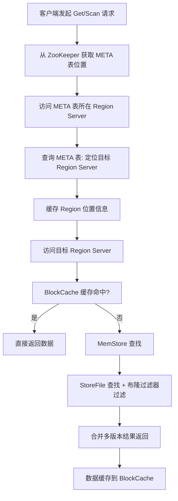
```mermaid
graph TB
    A["客户端发起 Get/Scan 请求"] --> B["从 ZooKeeper 获取 META 表位置"]
    B --> C["访问 META 表所在 Region Server"]
    C --> D["查询 META 表: 定位目标 Region Server"]
    D --> E["缓存 Region 位置信息"]
    E --> F["访问目标 Region Server"]
    F --> G["BlockCache 缓存命中?"]
    G -->|"是"| H["直接返回数据"]
    G -->|"否"| I["MemStore 查找"]
    I --> J["StoreFile 查找 + 布隆过滤器过滤"]
    J --> K["合并多版本结果返回"]
    K --> L["数据缓存到 BlockCache"]
```

#### 📖 核心知识

1. **获取 META 表位置**：客户端从 ZooKeeper 获取 META 表所在的 RegionServer。
2. **查询 META 表**：客户端访问 META 表所在 RegionServer，查询到目标行键所在的 RegionServer，并缓存这些信息。
3. **读取数据**：客户端从目标 RegionServer 上获取数据。常被简记为「BlockCache → MemStore → StoreFile」，但**准确的机制是多路归并而非串行三层**：RegionServer 为该 Store 建立一个 MemStore Scanner 加上**每个 StoreFile 一个 Scanner**，各自产出有序结果后做多路归并，按 RowKey 与时间戳排序取最新版本返回。
4. **单个 StoreFile Scanner 的读盘前过滤**：先用**布隆过滤器**判断该 HFile 是否可能包含目标 RowKey（不可能则直接跳过），再检查所需 Block 是否已在 **BlockCache** 中，**未命中才回 HDFS 读**，读到的 Block 回填 BlockCache。
5. **缓存复用**：再次读取时客户端从缓存获取 RegionServer 信息，无需再查 META 表，除非 Region 移动导致缓存失效。

::: details META 表说明

META 表是 HBase 中一张特殊的表，保存了所有 Region 的位置信息；META 表自己的位置信息则存储在 ZooKeeper 的 znode 中（**不是存在 HDFS 上**），而 META 表的数据本身仍作为普通 HFile 存在 HDFS 上。


> 更为详细读取数据流程参考：
>
> [HBase 原理－数据读取流程解析](http://hbasefly.com/2016/12/21/hbase-getorscan/)
>
> [HBase 原理－迟到的'数据读取流程部分细节](http://hbasefly.com/2017/06/11/hbase-scan-2/)

:::

#### 🔬 扩展知识

::: details

- 【L3】**读放大的来源与量化关系**

  一次点查最坏要访问的 HFile 数量，等于该 Store 当前的 HFile 数量。**Store 内 HFile 越多，点查要归并的路数越多、
  读放大越严重**。`hbase.hstore.blockingStoreFiles`（默认 16）达到后，**该 Region 的写入会被阻塞直到 compaction 把文件数降下来**——这就是「集群写入突然全部变慢」的经典根因。

  缓解手段是 compaction（减少文件数）、布隆过滤器（跳过无关文件）、BlockCache（减少回盘）。

- 【L3】**BlockCache 的两种实现**

  `LruBlockCache`（默认，堆内）实现简单但大堆下 GC 压力大；`BucketCache`（堆外/off-heap，
  常与 LRU 组成 L1/L2 两级）把缓存放到堆外内存或 SSD，避免大堆 GC 停顿，是大内存 RegionServer 的正解。

- 【L4】**布隆过滤器的边界**

  它只对「读某个具体 RowKey」有效，**对 Scan 范围查询无效**（范围扫描无法用单个 RowKey 去探测）。且布隆过滤器是 **per-HFile** 的，其索引要加载进内存，
  列族很多或 HFile 很多时内存开销不可忽视。

- 【L4】**Scan 与 Get 的读路径差异**

  Get 是单行点查，能吃到布隆过滤器全部收益；Scan 需要维持游标与多路归并状态，`setCaching`（每次 RPC 拉多少行，默认 100）过小会导致 RPC 往返次数爆炸，
  过大则会拉高 RegionServer 内存与客户端延迟。

:::

#### ⚠️ 常见误区

::: details

- ❌ 「读的时候先查 BlockCache，命中就不查 MemStore 了」→ MemStore 里是**尚未 flush 的最新数据**，任何读都必须扫它，否则读不到刚写入的数据。BlockCache 缓存的是 **HFile 的 Block**，它只作用于 StoreFile 这一路，不能替代 MemStore。
- ❌ 「布隆过滤器能加速范围扫描」→ 布隆过滤器回答的是「某个具体 RowKey 是否可能在这个 HFile 里」，Scan 是一个 RowKey 区间，无法用它跳过文件。范围扫描的加速手段是 RowKey 设计 + `setStartRow/setStopRow` 收窄区间 + BlockCache。
- ❌ 「布隆过滤器判定存在就一定存在」→ 布隆过滤器只能确定性地回答「**一定不存在**」；判定「可能存在」时是有误判率的，仍需真正读 Block 验证。

:::

#### 🔀 发散问题

- **Q：读数据时布隆过滤器在哪个环节起作用？**

  → 在查找 StoreFile 时，布隆过滤器可快速判断某个 HFile 是否包含目标 RowKey，避免无效磁盘 IO，见本文档「HBase 的布隆过滤器有什么作用？」。

### 【中等】HBase 写数据流程是怎样的？⭐⭐⭐

> 🎯 目标等级：L2-L4 ｜ ⏱ 建议用时：10 min ｜ 🏷 标签：HBase 架构 / 写流程

#### 💎 关键结论

HBase 写数据先写 WAL 保证持久性，再写 MemStore 缓存，MemStore 达到阈值后 Flush 为 StoreFile（HFile），整个过程对客户端是异步的。

#### ⚡ 记忆卡片

- **口诀**：先写 WAL，再写内存，满了落盘
- **关键词**：WAL ／ MemStore ／ Flush ／ StoreFile ／ HFile
- **链路**：Client 发起 Put → 写 WAL 保证持久性 → 写 MemStore 缓存 → 达到阈值 Flush 为 HFile

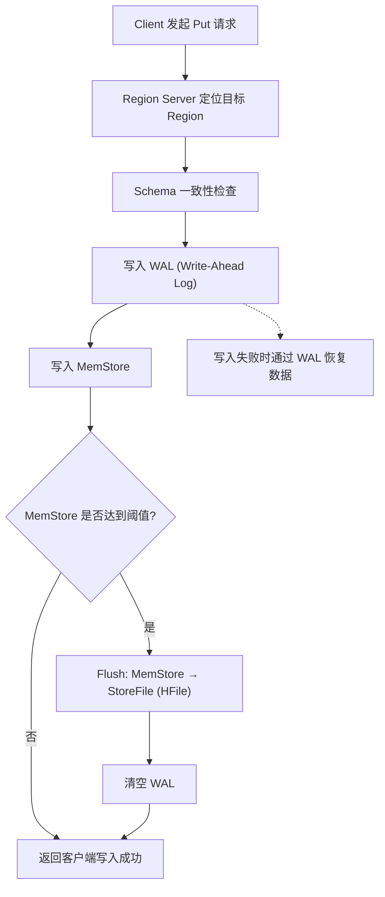
```mermaid
graph TB
    A["Client 发起 Put 请求"] --> B["Region Server 定位目标 Region"]
    B --> C["Schema 一致性检查"]
    C --> D["写入 WAL (Write-Ahead Log)"]
    D --> E["写入 MemStore"]
    E --> F{"MemStore 是否达到阈值?"}
    F -->|"否"| G["返回客户端写入成功"]
    F -->|"是"| H["Flush: MemStore → StoreFile (HFile)"]
    H --> I["清空 WAL"]
    I --> G
    D -.-> J["写入失败时通过 WAL 恢复数据"]
```

#### 📖 核心知识

1. **定位 Region**：Client 向 RegionServer 提交写请求，RegionServer 找到目标 Region。
2. **Schema 检查**：Region 检查数据是否与 Schema 一致。
3. **版本分配**：如果客户端未指定版本，获取当前系统时间作为数据版本。
4. **写 WAL**：将更新写入 WAL Log（预写日志），保证数据持久性和故障恢复。
5. **写 MemStore**：将更新写入内存缓存。
6. **Flush 判断**：MemStore 存储满时 flush 为 StoreFile（HFile）文件。

#### 🔬 扩展知识

::: details

- 【L3】**MemStore 的底层结构**

  `ConcurrentSkipListMap`（并发跳表），**按 RowKey 有序**。有序是 LSM Tree 的关键——正因为内存中已排序，
  flush 时才能一次性顺序写出一个**有序且不可变**的 HFile，后续归并读也才可能高效。

- 【L3】**两级 flush 阈值**

  单个 MemStore 达到 `hbase.hregion.memstore.flush.size`（默认 128MB）触发该 Region 的 flush；
  同时 RegionServer 有**全局 MemStore 水位**（`hbase.regionserver.global.memstore.size` 默认占堆 0.4），到达下限水位会强制 flush 最大的那些 MemStore，
  到达上限水位则**直接阻塞写入**。所以「写入变慢」不一定和单个 Region 有关，可能是全局内存水位触顶。

- 【L4】**WAL 的持久性语义**

  WAL 先于 MemStore 写入，宕机后靠回放 WAL 恢复未 flush 的数据。`SyncableFSHLog` / asyncfs provider 决定 WAL 是否同步刷盘；
  客户端也可通过 `setDurability(SKIP_WAL)` 关掉 WAL 换吞吐，但**代价是 RegionServer 宕机时丢失这部分已确认的写**——只有在数据可从上游重放时才可用。

- 【L4】**LSM Tree 的本质取舍**

  HBase 写路径是纯顺序写（WAL 顺序 append + flush 顺序写 HFile），所以写极快；代价是**读要归并多个有序文件**，即读放大。按 RUM 猜想，读放大、写放大、
  空间放大三者不可兼得——**LSM 是牺牲读性能换写性能**，Compaction 就是在读放大与写放大之间做再平衡的手段。

:::

#### ⚠️ 常见误区

::: details

- ❌ 「LSM Tree 读写都很快」→ 写快是真的（顺序写），读是**用归并 + 布隆过滤器 + BlockCache 硬撑回来的**，本质是牺牲读换写。说「读写都快」是对 LSM 的根本误解。
- ❌ 「写 WAL 和写 MemStore 可以并行，谁先都行」→ 必须**先 WAL 后 MemStore**。若先写 MemStore，WAL 写失败时就出现了「内存里有、日志里没有」的数据，宕机即丢，破坏持久性承诺。
- ❌ 「Flush 之后 WAL 就可以随便删了」→ 只有当该 WAL 覆盖的**所有 MemStore 都已成功 flush 成 HFile** 之后，对应的 WAL 才能被归档/清理。这也是 WAL Split 能在 RegionServer 宕机后恢复数据的前提。
- ❌ 「MemStore flush 出来的 HFile 还能被修改」→ HFile 是**不可变**的。删除与更新都只是追加带 Delete 标记或更新版本的新 KeyValue，真正的物理清理要等 Major Compaction。

:::

#### 🔀 发散问题

- **Q：写数据时 WAL 写入失败怎么办？**

  → WAL 写入失败时数据不会丢失，可通过回放 WAL 恢复未 Flush 到 HFile 的数据。如果 WAL 也无法写入，则拒绝本次写入以保证一致性。

### 【中等】HBase 有哪些核心组件？⭐⭐

> 🎯 目标等级：L2-L4 ｜ ⏱ 建议用时：10 min ｜ 🏷 标签：HBase 架构 / 核心组件

#### 💎 关键结论

HBase 遵循 Master/Slave 架构，三大核心组件为 ZooKeeper（分布式协调）、HMaster（集群管理）、RegionServer（数据服务），通过 ZooKeeper 实现 Master 主备切换和 RegionServer 状态监控。

#### ⚡ 记忆卡片

- **口诀**：ZK 协调，Master 调度，RS 干活
- **关键词**：ZooKeeper ／ HMaster ／ RegionServer ／ 临时节点 ／ 心跳
- **链路**：ZooKeeper 维护集群状态 → HMaster 分配 Region 和负载均衡 → RegionServer 处理 IO 请求

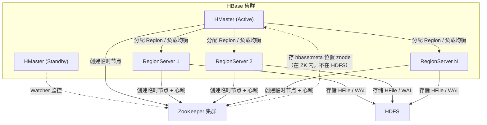
```mermaid
graph TB
    subgraph "HBase 集群"
        M["HMaster (Active)"]
        MS["HMaster (Standby)"]
        RS1["RegionServer 1"]
        RS2["RegionServer 2"]
        RS3["RegionServer N"]
    end
    ZK["ZooKeeper 集群"]
    HDFS["HDFS"]
    M -->|"分配 Region / 负载均衡"| RS1
    M -->|"分配 Region / 负载均衡"| RS2
    M -->|"分配 Region / 负载均衡"| RS3
    MS -.->|"Watcher 监控"| ZK
    M -->|"创建临时节点"| ZK
    RS1 -->|"创建临时节点 + 心跳"| ZK
    RS2 -->|"创建临时节点 + 心跳"| ZK
    RS3 -->|"创建临时节点 + 心跳"| ZK
    RS1 -->|"存储 HFile / WAL"| HDFS
    RS2 -->|"存储 HFile / WAL"| HDFS
    RS3 -->|"存储 HFile / WAL"| HDFS
    ZK -.->|"存 hbase:meta 位置 znode（在 ZK 内，不在 HDFS）"| M
```

#### 📖 核心知识

1. **ZooKeeper**：
   - 保证集群中只有一个 Active Master（Master 选举靠竞争创建同一个临时节点）
   - 存储 `hbase:meta` 表所在 RegionServer 的**寻址入口 znode**（客户端读数据的第一跳）
   - 实时监控 RegionServer 状态（每个 RS 一个临时节点 + 心跳），RS 宕机后 session 超时触发 Master 感知
   - 维护集群可用状态与 Region 分配进度
   - ⚠️ **表 Schema（Table Descriptor）在现代 HBase 中并不存在 ZooKeeper 里**：自 HBase 0.96 起，表描述符与 `.regioninfo` 存放在 HDFS 的 `/hbase/data/<namespace>/<table>/.tabledesc/` 下。「ZK 存 HBase Schema」是 0.94 及更早版本的旧说法。
2. **HMaster**：
   - 为 RegionServer 分配 Region（含 RS 宕机后的重新分配与 WAL Split）
   - 负责 RegionServer 的负载均衡（Region 迁移）
   - 发现失效 RegionServer 并重新分配其 Region
   - 回收 HDFS 上的垃圾文件
   - 处理 Schema 更新请求（建表、删表、改列族）
   - **关键认知：数据读写路径完全不经过 HMaster**。客户端从 ZK 拿到 meta 位置后直接与 RegionServer 通信，所以 HMaster 宕机不影响已有 Region 的读写
3. **RegionServer**：
   - 维护 Master 分配的 Region，处理客户端的 Get/Put/Scan 等 IO 请求
   - 负责切分过大的 Region（分裂由 RS 发起，Master 负责把子 Region 重新分配上线）
   - 内部三大件：**MemStore**（写缓存）、**BlockCache**（读缓存）、**WAL/HLog**（预写日志，落在 HDFS）
   - 执行 flush 与 compaction
4. **HDFS**：真正的持久化层，HFile 与 WAL 都存在其上，靠三副本保证数据不丢；HBase 自身不做数据冗余。

#### 🔬 扩展知识

::: details

- 【L3】**ZooKeeper session timeout 是典型的参数权衡题**（`zookeeper.session.timeout`，默认 90s）

  **调得太短**，
  RegionServer 一次较长的 GC 停顿就可能让 ZK 判定 session 过期，Master 把它的 Region 分给别人，而原 RS 恢复后仍在服务——造成**「Region 双活」，两个 RS 同时写同一 Region，
  数据损坏**；**调得太长**，真实故障要等很久才被发现，RTO 变差。这是「宁可慢，不可双活」的经典取舍，也解释了为什么 HBase 对 RegionServer 的 GC 停顿如此敏感。

- 【L4】**RegionServer 宕机的完整恢复链路**

  ZK session 超时 → Master 感知 → 把该 RS 的 Region 分配到其他 RS →
   对其 WAL 做 **WAL Split**（按 Region 切分日志）→ 各 Region 在新 RS 上回放自己的 WAL 重建 MemStore → Region 上线。**WAL Split 是恢复耗时的大头**，
  Region 越多、WAL 越大，恢复越慢。

- 【L4】**单 RegionServer 承载的 Region 数量是有上限的**

  建议控制在几百到上千的量级。Region 过多会导致每个 MemStore 都占一份内存、
  flush 与 compaction 高度碎片化（产生大量小 HFile），进而放大读放大与 GC 压力。这也是「不要无脑预分区分成成千上万个 Region」的原因。

:::

#### ⚠️ 常见误区

::: details

- ❌ 「HMaster 是主节点，挂了集群就不能读写」→ HMaster 只管控制面（DDL、Region 分配、负载均衡、分裂）。它挂掉期间已有 Region 的读写完全正常，只是无法做管理操作。这与 MySQL 主库挂了不能写是两回事。
- ❌ 「ZooKeeper 里存着 HBase 的数据或表结构」→ ZK 只存元信息的小 znode（meta 位置、master 选举、RS 临时节点、集群状态）。表结构在 HDFS，数据更在 HDFS。把 ZK 当元数据仓库会在容量规划上出错。
- ❌ 「RegionServer 越多越好，Region 随便分」→ Region 数量与 RegionServer 内存、flush/compaction 碎片化直接相关，过多 Region 会让集群整体变慢。

:::


::: details ZooKeeper 主备切换机制

- 每个 RegionServer 在 ZooKeeper 上创建临时节点，Master 通过 Watcher 监控
- 所有 Master 竞争创建同一临时节点，成功者成为 Active Master，定期发送心跳
- Active Master 故障时心跳停止 → 临时节点删除 → 备用 Master 重新竞选


:::

#### 🔀 发散问题

- **Q：HMaster 宕机会影响数据读写吗？**

  → **不影响**。数据读写路径完全不经过 HMaster：客户端从 ZooKeeper 拿到 `hbase:meta` 位置后，直接与目标 RegionServer 通信。HMaster 不可用只会让建表/删表等 DDL、Region 重新分配、负载均衡与分裂无法执行。但如果 Master 长时间不可用，一旦有 RegionServer 宕机就没人接管其 Region，集群会失去自愈能力，所以生产上仍要配 Master 主备。

## HBase 高级

### 【困难】HBase 的 RowKey 应该如何设计？⭐⭐⭐⭐

> 🎯 目标等级：L3-L4 ｜ ⏱ 建议用时：12 min ｜ 🏷 标签：HBase 高级 / RowKey 设计

#### 💎 关键结论

RowKey 设计是 HBase 表设计的核心，需满足唯一性、短小（10~100 字节）、散列三大原则，设计时必须先服务于最高频查询模式，再考虑散列避免热点。

#### ⚡ 记忆卡片

- **口诀**：唯一短小散列，查询模式优先
- **关键词**：唯一性 ／ 10~100 字节 ／ 加盐 ／ 哈希 ／ 反转
- **链路**：确定最高频查询模式 → 设计 RowKey 满足查询需求 → 加盐/哈希/反转避免热点

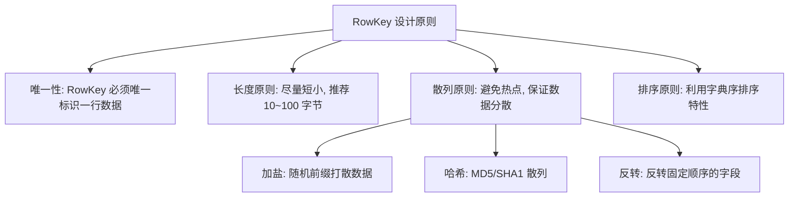
```mermaid
graph TB
    A["RowKey 设计原则"] --> B["唯一性: RowKey 必须唯一标识一行数据"]
    A --> C["长度原则: 尽量短小, 推荐 10~100 字节"]
    A --> D["散列原则: 避免热点, 保证数据分散"]
    D --> E["加盐: 随机前缀打散数据"]
    D --> F["哈希: MD5/SHA1 散列"]
    D --> G["反转: 反转固定顺序的字段"]
    A --> H["排序原则: 利用字典序排序特性"]
```

#### 📖 核心知识

1. **先理解核心矛盾（一切 RowKey 设计的出发点）**：HBase 按 RowKey **字典序**排序，并按 RowKey **范围**切分 Region。因此：
   - **顺序/单调 RowKey**（时间戳、自增 ID）→ 写入必然全部落在**最后一个 Region**，形成写热点，且**加机器无法解决**（热点 Region 不会被拆开）
   - **完全随机 RowKey**（纯哈希）→ 写入分散了，但**彻底丧失范围扫描能力**，也无法按业务前缀查询
   - RowKey 设计就是在这两端之间找平衡点，没有「一律加盐」的万能答案。
2. **唯一性**：RowKey 必须唯一标识一行数据，类似关系型数据库的主键。
3. **长度原则**：RowKey 长度控制在 10~100 字节（官方建议不超过 100 字节，最好压到几十字节），最好是 8 的倍数（利用 64 位 CPU 对齐优化）。过长会增加 HFile 索引存储开销，降低查询性能。**根本原因是 RowKey 会在每一个 KeyValue 中完整重复存储**——HFile 的 KeyValue 结构自带一份 RowKey，一行有 N 个 Cell 就存 N 份 RowKey。
4. **散列原则**：确保数据在 Region 间均匀分布，避免热点问题（大量请求集中在少数 RegionServer）。
5. **服务查询模式优先于散列**：先确定最高频的查询方式（点查？按用户扫一段时间？），再在这个前提下做散列。

::: details 防止热点的常用策略

| 策略                    | 原理                                                                             | 适用场景                                       |
| ----------------------- | -------------------------------------------------------------------------------- | ---------------------------------------------- |
| **加盐（Salting）**     | RowKey 前添加 N 个随机桶前缀（`hash(key) % bucketNum`），将数据分散到多个 Region | 写多读少，无需范围扫描                         |
| **哈希（Hashing）**     | 使用 MD5/MurmurHash 等取前若干字节作为前缀                                       | 无需保持原始排序顺序                           |
| **反转（Reversing）**   | 反转固定顺序字段（如 `Long.MAX_VALUE - timestamp`）                              | 时间序列数据，避免最新数据集中写入             |
| **组合键（Composite）** | 业务维度 + 时间，如 `userId_20260928`                                            | 天然按业务维度打散，且**保留组内范围扫描能力** |
| **预分区（Pre-split）** | 建表时用 `SPLITS => [...]` 或 `NUMREGIONS => n` 预先切出多个 Region              | 所有场景的地基；不做预分区，前四种手段都会打折 |

:::

::: details 各手段的取舍（P8 要能讲出代价）

- **加盐的桶数**应与 Region 数（或预分区数）**成整数倍关系**，否则桶与 Region 边界错位，仍会出现分布不均。
- **加盐/哈希后无法按业务前缀 Scan**：原来的顺序被打散了，想「查某用户最近 100 条」就得并发查 N 个桶再归并，或额外维护一张映射表。这是实打实的读放大与复杂度成本。
- **反转时间戳**保留了同一实体内的时间局部性，是「时序 + 需要按最新排序」场景下代价最小的方案，但如果 RowKey 只有时间戳没有业务前缀，反转后依然会在少数区间聚集。
- **组合键**通常是工程上的最优解：业务维度天然分散，且同一业务维度内数据相邻，Scan 效率高。

:::

::: details RowKey 设计代码示例

```java
// 时间序列数据: 反转时间戳 + 业务ID
byte[] rowKey = Bytes.add(
    Bytes.toBytes(Long.MAX_VALUE - timestamp),  // 反转时间戳, 最新数据在前
    Bytes.toBytes(userId)                         // 用户ID
);

// 日志数据: 加盐 + 日期 + 业务ID
byte[] salt = Bytes.toBytes(Math.abs(userId.hashCode() % NUM_BUCKETS));
byte[] rowKey = Bytes.add(salt, Bytes.toBytes(dateStr), Bytes.toBytes(userId));
```

:::

#### 🔬 扩展知识

::: details

- 【L3】RowKey 设计的第一准则是服务于最高频查询模式，而非单纯追求散列。例如“查询某用户最近 N 条记录”应设计为 `userId + 反转时间戳`，同一用户数据落在相邻区间可范围扫描，且时间倒序天然满足“最新在前”。

- 【L3】加盐/哈希与范围扫描天然矛盾

  打散后原始顺序丢失，无法按业务维度 range scan。折衷方案是“确定性散列前缀”（如 `userId % N` 作为桶前缀），扫描时并发查 N 个桶。

- 【L4】RowKey 过长会直接侵蚀 BlockCache 效率

  HFile 的 Data Index Block 存的是 RowKey，RowKey 越长单个 16KB 块容纳的索引项越少，定位 HFile 需要的索引层级越多，
  读放大越严重。

- 【L4】预分区的 splitKey 必须与 RowKey 分布规律对齐，否则预分区反而造成数据倾斜。

- 【L4】🔴 **RowKey 设计错误无法在线修复**——这是本题最重要的结论。HBase 没有「重建索引」这种低成本手段：RowKey 是数据的物理排序键与 Region 切分依据，一旦设计错了（热点、无法扫描、过长），
  **唯一出路是重建表 + 全量迁移**（BulkLoad / `CopyTable` / Spark 作业重写）。因此设计阶段就必须用真实数据分布做压测验证，而不是上线后发现问题再改。

:::

#### 🏭 实战场景

::: details

> ⚠️ 以下为教学示意场景，其中的量化数字为示意值，非官方基准或真实生产统计。

某日志平台日写入量 50 亿条，原 RowKey 为纯时间戳导致单个 RegionServer 承担 80% 写入负载（热点）。改用 `userId % 16 取模前缀 + 反转时间戳 + userId` 后，
写入负载均匀分散到 16 台 RegionServer，P99 写入延迟从 120ms 降至 15ms。

:::

#### ⚠️ 常见误区

::: details

- ❌ "使用自增 ID 作为 RowKey" → 导致写入热点，所有写入集中在一个 Region
- ❌ "使用日期字符串作为 RowKey" → 导致同一日期数据集中写入同一 Region
- ❌ "RowKey 越长越好，信息越全" → RowKey 过长增加存储开销，降低索引效率

:::

#### 🔀 发散问题

- **Q：如何验证 RowKey 设计是否合理？**

  → 可以通过预分区后观察各 Region 的数据量分布和读写负载是否均匀，若出现明显倾斜则需调整 RowKey 设计或重新规划 splitKey。

### 【困难】HBase 的 Compaction 机制是什么？⭐⭐⭐⭐

> 🎯 目标等级：L3-L4 ｜ ⏱ 建议用时：12 min ｜ 🏷 标签：HBase 高级 / Compaction

#### 💎 关键结论

Compaction 是 HBase 的核心后台机制，用于合并 HFile 文件、清理无效数据。Minor Compaction 合并部分小文件，Major Compaction 合并所有文件并物理删除已删除/过期数据。

#### ⚡ 记忆卡片

- **口诀**：Minor 并小文件，Major 清全量
- **关键词**：Minor Compaction ／ Major Compaction ／ HFile 合并 ／ 删除标记
- **链路**：MemStore Flush 生成 HFile → HFile 数量增多触发 Compaction → Minor 合并小文件 → Major 合并全部 + 清理过期数据

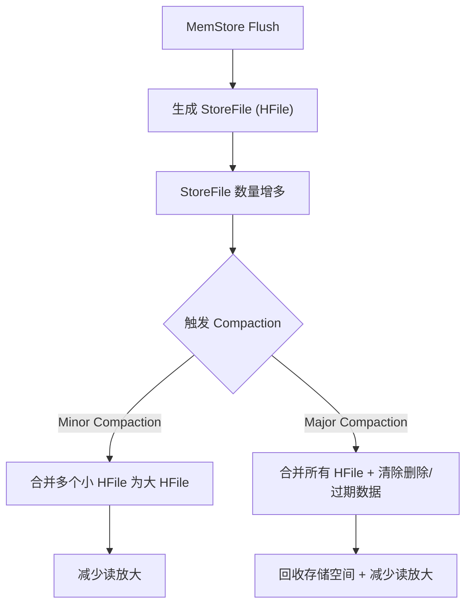
```mermaid
graph TB
    A["MemStore Flush"] --> B["生成 StoreFile (HFile)"]
    B --> C["StoreFile 数量增多"]
    C --> D{"触发 Compaction"}
    D -->|"Minor Compaction"| E["合并多个小 HFile 为大 HFile"]
    D -->|"Major Compaction"| F["合并所有 HFile + 清除删除/过期数据"]
    E --> G["减少读放大"]
    F --> H["回收存储空间 + 减少读放大"]
```

#### 📖 核心知识

1. **Minor Compaction**：HFile 数量达到阈值（默认 3）时触发，选取部分小文件合并，不清理过期数据，对集群影响小。
2. **Major Compaction**：定期触发（默认 7 天）或手动触发，合并 Store 下所有 HFile，清理已删除/过期数据，IO 开销大。
3. **配置优化**：
   - `hbase.hstore.compactionThreshold`：Minor Compaction 触发阈值（默认 3）
   - `hbase.hregion.majorcompaction`：Major Compaction 周期（默认 7 天 = 604800000 ms，**设为 0 禁用自动触发**）
   - `hbase.hstore.compaction.max`：单次 Compaction 最大合并文件数（默认 10）
   - 🔴 `hbase.hstore.blockingStoreFiles`（默认 16）：**Store 内 HFile 数达到该值后，会阻塞这个 Region 的写入，直到 compaction 把文件数降下来**。这是「集群写入突然全部变慢/卡死」最经典的根因，排查时第一件事就是看 `storeFileCount`。
4. **Minor 与 Major 的本质区别（必须答准）**：

| 维度          | Minor Compaction                                   | Major Compaction                                               |
| ------------- | -------------------------------------------------- | -------------------------------------------------------------- |
| 合并范围      | 选取若干个**相邻的小** HFile 合并成更大的          | 一个 Store 下的**全部** HFile 合并成**一个**                   |
| 清理过期数据  | **不清理** Delete Marker、TTL 过期数据、超版本数据 | **清理** Delete Marker、TTL 过期数据、超出 `VERSIONS` 的旧版本 |
| 触发频率      | 频繁（文件数达阈值即触发）                         | 稀疏（默认 7 天一次，或手动）                                  |
| IO / CPU 开销 | 小                                                 | **极大**（全量重写）                                           |
| 空间回收      | 基本不回收                                         | 真正回收磁盘空间                                               |

::: details 生产建议

- 在业务低峰期手动触发 Major Compaction，避免影响在线服务
- 写入量大的表禁用自动 Major Compaction（设为 0），通过定时任务手动控制
- 合理设置 `compactionThreshold`，避免频繁 Minor Compaction 造成 IO 压力

:::

#### 🔬 扩展知识

::: details

- 【L3】文件选择策略

  HBase 默认使用 ExploringCompactionPolicy；此外还有 FIFOCompactionPolicy（TTL 表直接删文件）、
  DateTieredCompactionPolicy（按时间窗口分层合并，适合时序数据）。

- 【L3】Major Compaction 是唯一物理删除数据的时机

  Delete Marker、超过 TTL 的数据、超过 `VERSIONS` 限制的旧版本，
  都只在 Major Compaction 时真正清理。“删除后磁盘空间没降”是正常现象。

- 【L4】Major Compaction 风暴的危害

  全集群同时触发会造成 IO 风暴、读写延迟飙升，甚至引发 RegionServer GC/OOM。

  **限流手段**：`hbase.hstore.compaction.throughput.lower.bound` / `upper.bound` 控制吞吐上下界；
  再配合 `hbase.hstore.compaction.throughput.offpeak`（off-peak 时段的更高限速）与 `hbase.offpeak.start.hour` / `hbase.offpeak.end.hour` 定义低峰时段，
  做到「低峰快跑、高峰慢跑」。

- 【L4】**生产环境的硬性结论**

  `hbase.hregion.majorcompaction` 必须设为 0 关闭自动触发，改由业务低峰期的定时任务或人工脚本执行。默认的「每 7 天自动一次」会让集群出现**周期性的、
  与业务无关的抖动**，且各 Region 的触发时刻分散在整周内，故障定位极其困难。

- 【L4】Compaction 与写入阻塞的联动

  写入速度长期高于 compaction 速度时，HFile 数会累积到 `blockingStoreFiles`（默认 16），此时该 Region **停止接受写入**。

  所以「compaction 跟不上」表现出的症状不是读变慢，而是**写直接卡住**。

:::

#### 🏭 实战场景

::: details

> ⚠️ 以下为教学示意场景，其中的量化数字为示意值，非官方基准或真实生产统计。

某推荐系统 HBase 集群 200 台 RegionServer，单表 50TB 数据。自动 Major Compaction 导致每周一次 IO 风暴，P99 读延迟从 5ms 飙升至 200ms。

改为禁用自动触发 + 凌晨低峰期手动执行 + 限流 50MB/s 后，IO 风暴消除，读延迟波动控制在 5~10ms。

:::

#### ⚠️ 常见误区

::: details

- ❌ "删除数据后磁盘空间应该立刻减少" → 删除只是写入 Delete Marker，物理删除需等 Major Compaction
- ❌ "Minor Compaction 也会清理删除标记" → Minor 只合并文件不清理过期数据
- ❌ "Compaction 越频繁越好" → 频繁 Compaction 带来持续 IO 压力，需根据写入量平衡

:::

#### 🔀 发散问题

- **Q：如何监控 Compaction 是否正常？**

  → 关注 `compactionQueueLength`（Compaction 队列长度）、HFile 数量、以及 RegionServer 的 IO 等待时间。队列积压或 HFile 数量持续增长说明 Compaction 跟不上写入速度。

### 【困难】HBase 的布隆过滤器有什么作用？⭐⭐

> 🎯 目标等级：L3-L4 ｜ ⏱ 建议用时：10 min ｜ 🏷 标签：HBase 高级 / 布隆过滤器

#### 💎 关键结论

布隆过滤器是 HBase 优化读性能的概率型数据结构，能快速判断 RowKey 或列是否存在于某个 HFile 中，“不存在”是确定的，“存在”有少量误判，从而避免无效磁盘 IO。

#### ⚡ 记忆卡片

- **口诀**：不存在一定准，存在可能误判
- **关键词**：布隆过滤器 ／ 位数组 ／ ROW ／ ROWCOL ／ 误判率
- **链路**：写入 HFile 时哈希映射到位数组 → 读取时先查过滤器 → “不存在”直接跳过 → “存在”再读 HFile 确认

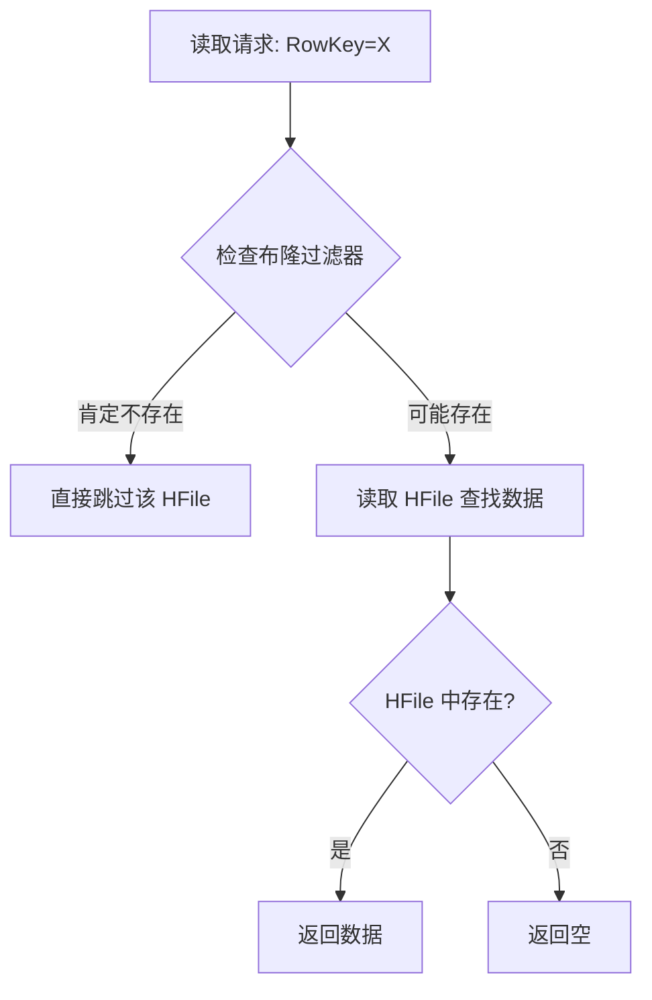
```mermaid
graph TB
    A["读取请求: RowKey=X"] --> B{"检查布隆过滤器"}
    B -->|"肯定不存在"| C["直接跳过该 HFile"]
    B -->|"可能存在"| D["读取 HFile 查找数据"]
    D --> E{"HFile 中存在?"}
    E -->|"是"| F["返回数据"]
    E -->|"否"| G["返回空"]
```

#### 📖 核心知识

1. **工作原理**：写入 HFile 时，将 RowKey 通过多个哈希函数映射到位数组；读取时先查询过滤器，“不存在”则直接跳过该 HFile，“存在”则进一步读取确认。
2. **两种类型**：
   - **ROW**：按 RowKey 过滤，适用于基于 RowKey 的 Get 查询（默认开启）
   - **ROWCOL**：按 RowKey + Column 过滤，适用于频繁查询特定列，但空间开销更大
3. **配置方式**：建表时通过 `cf.setBloomFilterType(BloomType.ROW)` 指定，默认开启 ROW 类型。
4. **生产建议**：默认开启 ROW；布隆过滤器会带来小比例的额外存储与内存开销，但在点查为主的场景下节省的无效磁盘 IO 远超这个成本。（注：常见的「约占 HFile 大小 1%~2%」是经验性示意值，实际取决于误判率配置与 RowKey 长度，非官方基准。）

#### 🔬 扩展知识

::: details

- 【L3】布隆过滤器的误判率（False Positive Rate）默认为 1%，可通过 `io.storefile.bloom.error.rate` 调整，误判率越低空间开销越大。

- 【L3】布隆过滤器仅在查找单个 HFile 时起作用，对 MemStore 和 BlockCache 无效，因为内存中的数据可以直接判断存在性。

- 【L4】🔴 **布隆过滤器对 Scan 范围查询无效**——这是最容易被忽略的边界。布隆过滤器回答的是「**某个具体 RowKey** 是否可能在这个 HFile 里」，而 Scan 是一个 RowKey **区间**，
  无法用单个 key 去探测，因此每个 HFile 都要老老实实参与归并。所以「加了布隆过滤器为什么 Scan 还是慢」的答案是：它本来就帮不上 Scan，Scan 的加速只能靠 RowKey 设计收窄区间、
  BlockCache 与 compaction 减少文件数。

- 【L4】**布隆过滤器是 per-HFile 的**，且其位数组需要加载进内存（占用 BlockCache / 堆内存）才能发挥作用。这意味着：**HFile 越多、列族越多，布隆过滤器的总内存开销越大**。

  在小文件泛滥（compaction 跟不上）的集群上，布隆过滤器反而会加剧内存压力——这也是「保持 compaction 健康」的又一个理由。

- 【L4】ROW 与 ROWCOL 的取舍

  ROWCOL 把 `RowKey + 列` 一起放进位数组，对「固定读某几列的宽表」能进一步跳过 Block，但位数组规模随列数膨胀。列数极多或列名动态变化的表用 ROWCOL 会得不偿失，
  应保持 ROW。

:::

#### ⚠️ 常见误区

::: details

- ❌ "布隆过滤器返回‘存在’则数据一定存在" → 布隆过滤器有一定误判率，“存在”只是可能存在，需进一步读取 HFile 确认。**它唯一能确定性回答的是「一定不存在」**。
- ❌ "关闭布隆过滤器可以节省内存" → 节省的那点内存远不如因无效磁盘 IO 带来的性能损失。
- ❌ "布隆过滤器能加速所有查询" → 只对按具体 RowKey 的点查（Get）有效，**对 Scan 范围查询完全无效**。
- ❌ "布隆过滤器是表级/Region 级的一个全局结构" → 它是 **per-HFile** 的，随 HFile 一起生成、一起被 compaction 合并重写。HFile 数量直接决定布隆过滤器的份数与内存占用。

:::

#### 🔀 发散问题

- **Q：布隆过滤器和 BlockCache 如何配合？**

  → 布隆过滤器在 StoreFile 查找阶段起作用，先判断 HFile 是否包含目标数据；BlockCache 则缓存已读取的数据块，下次读取时直接命中。两者在不同层面优化读性能。

### 【困难】HBase 的 MemStore 和 StoreFile 如何协作？⭐⭐⭐

> 🎯 目标等级：L3-L4 ｜ ⏱ 建议用时：12 min ｜ 🏷 标签：HBase 高级 / 存储协作

#### 💎 关键结论

HBase 采用 LSM-Tree 架构，写入路径为 WAL → MemStore → Flush → HFile；读取路径是对 MemStore 与全部 HFile 做**多路归并**（BlockCache 作用于 HFile 这一路，减少回盘）。MemStore 采用 active + snapshot 双缓冲实现 flush 期间不阻塞读写。

#### ⚡ 记忆卡片

- **口诀**：写 WAL 进 Mem，满了 Flush 成 File；读是多路归并，不是串行三层
- **关键词**：LSM-Tree ／ WAL ／ MemStore ／ StoreFile ／ Flush ／ BlockCache
- **链路**：写入 WAL 保证持久性 → 写入 MemStore 缓存 → 达到阈值 Flush 为 HFile → 读取时 MemStore + 各 HFile 多路归并（BlockCache 与布隆过滤器加速）

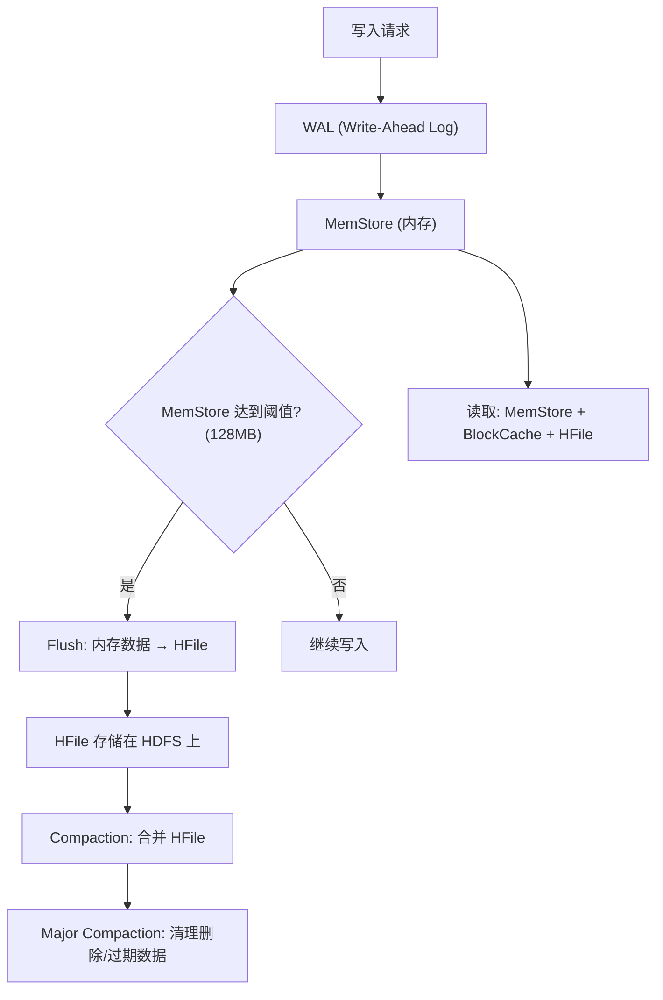
```mermaid
graph TB
    A["写入请求"] --> B["WAL (Write-Ahead Log)"]
    B --> C["MemStore (内存)"]
    C --> D{"MemStore 达到阈值? (128MB)"}
    D -->|"是"| E["Flush: 内存数据 → HFile"]
    D -->|"否"| F["继续写入"]
    E --> G["HFile 存储在 HDFS 上"]
    G --> H["Compaction: 合并 HFile"]
    H --> I["Major Compaction: 清理删除/过期数据"]
    C --> J["读取: MemStore + BlockCache + HFile"]
```

#### 📖 核心知识

1. **组件角色**：
   - **WAL**：预写日志，保证数据持久性和故障恢复（HDFS）
   - **MemStore**：内存缓存最新写入数据，支持顺序写入
   - **StoreFile（HFile）**：MemStore Flush 后的持久化文件，不可变（HDFS）
   - **BlockCache**：缓存热点读取数据，减少磁盘 IO（内存）
2. **写入路径**：Client → WAL → MemStore → Flush → HFile
3. **读取路径**：Client 发起读 → RegionServer 为该 Store 建立 **MemStore Scanner + 每个 StoreFile 一个 Scanner** → 多路归并取最新已提交版本。其中每个 StoreFile Scanner 先用布隆过滤器过滤、再查 BlockCache、未命中才回 HDFS。**不是「先查 BlockCache，命中就不查 MemStore」的串行三层**——MemStore 里是未 flush 的最新数据，任何读都必须扫它。
4. **Flush 触发条件**：单个 MemStore 达到 `hbase.hregion.memstore.flush.size`（默认 128MB）、RegionServer 全局 MemStore 水位超限、WAL 文件数超限、手动 flush
5. **HFile 特点**：一旦写入不可修改，删除操作通过写入 Delete Marker 实现，在 Major Compaction 时物理删除
6. **MemStore 的底层结构**：`ConcurrentSkipListMap`（并发跳表），**按 RowKey 有序**。正因为内存中已排序，flush 才能顺序写出一个有序且不可变的 HFile，多路归并读也才可能高效。

#### 🔴 内存三层预算（P8 深水区，必须能算）

RegionServer 的堆内存要在三块之间分配：

| 用途                     | 参数                                      | 默认     | 说明                                        |
| ------------------------ | ----------------------------------------- | -------- | ------------------------------------------- |
| **BlockCache**（读缓存） | `hfile.block.cache.size`                  | 堆的 0.4 | 缓存 HFile 的 Block，命中率低说明读缓存不足 |
| **MemStore**（写缓存）   | `hbase.regionserver.global.memstore.size` | 堆的 0.4 | 所有 Region 的 MemStore 总额                |
| **其他**                 | —                                         | 剩余     | RPC handler 线程栈、元数据、GC 余量         |

- 🔴 **两者之和不能超过 0.8，否则 RegionServer 启动时直接报错**。这是 HBase 主动设置的护栏——如果读缓存 + 写缓存吃满整个堆，就没有内存留给 RPC 与 GC，进程必然不稳定。
- **调整方向**：**读多写少 → 调大 BlockCache、调小 MemStore；写多读少 → 反之**。
- **堆外（off-heap）是解决「大内存 RegionServer GC 抖动」的正解**：
  - `MemStoreChunkPool`：把 MemStore 的写缓冲放到堆外，用固定大小的 Chunk 复用，避免大量短命对象进堆触发频繁 GC
  - `BucketCache`：把读缓存放到堆外内存（或 SSD），避免几十 GB 的缓存对象被 GC 扫描，消除长 GC 停顿
  - 两者常与 `LruBlockCache` 组成 L1（堆内小）/ L2（堆外大）两级缓存
- **堆大小不是越大越好**：一般控制在 16–32GB 以内并配 G1，超大堆会带来超长 GC 停顿；而 GC 停顿过长又会让 ZooKeeper 误判 RegionServer 死亡（见「HBase 如何保证高可用？」），造成 Region 双活。**加内存应该加到堆外，而不是加到堆内。**

#### 🔬 扩展知识

::: details

- 【L3】两级 MemStore 水位

  全局 MemStore 的**上限**是 `hbase.regionserver.global.memstore.size`（默认堆的 0.4）；
  达到 `hbase.regionserver.global.memstore.size.lower.limit`（默认为上限的 0.95）时会**强制 flush 占用最大的那些 MemStore**，
  真正触到 0.4 上限才**阻塞写入**。所以「写吞吐突降」要先分清是 lower limit 触发的强制 flush，还是上限触发的写入阻塞。

- 【L3】MemStore 采用 active + snapshot 双缓冲

  Flush 时 active 切换为 snapshot 落盘，新写入进入新的 active，读写不阻塞。

- 【L4】读写一致性基于 MVCC（ReadPoint）

  每次读写获取递增的 sequenceId，读请求只看到 sequenceId ≤ ReadPoint 的已提交写入。

- 【L4】WAL 默认每条写入都 sync（`Durability.SYNC_WAL`）；可容忍丢数的链路可用 `ASYNC_WAL`/`SKIP_WAL` 换吞吐。

- 【L4】`blockCacheHitRatio` 低于 90% 通常意味着两种情况之一

  读缓存内存不够，或者业务里存在大量 Scan（扫描会把冷数据灌进 BlockCache，把热数据挤出去）。

  HBase 提供 `setBlockCacheEnabled(false)` 让批量扫描类请求绕过 BlockCache，正是为了防这种缓存污染。

:::

#### 🏭 实战场景

::: details

> ⚠️ 以下为教学示意场景，其中的量化数字为示意值，非官方基准或真实生产统计。

某实时日志系统 HBase 集群写入吞吐从 20万/s 突降至 5万/s。排查发现 RegionServer 全局 MemStore 使用率触及水位，强制 Flush 与写入阻塞同时发生。处置方式是**成对调整**：

把 `hbase.regionserver.global.memstore.size` 从 0.4 提到 0.5 的同时，**必须把 `hfile.block.cache.size` 从 0.4 降到 0.3**（两者之和仍 ≤ 0.8，
否则 RegionServer 启动直接报错），并将 MemStore flush size 从 128MB 调至 256MB，之后写入吞吐恢复至 25万/s。

🔴 这个案例的关键教训不是「调大 MemStore」，而是**堆内读缓存与写缓存是零和的**——只调一边必然启动失败或挤压另一边。真正要「两个都变大」，
唯一出路是把缓存移到堆外（BucketCache + MemStoreChunkPool）。

:::

#### ⚠️ 常见误区

::: details

- ❌ "Flush 时会阻塞所有读写" → MemStore 采用双缓冲，Flush 时切换为 snapshot 落盘，新写入进入新 active，不阻塞
- ❌ "写入成功后数据已经在 HFile 了" → 写入成功时数据在 WAL 和 MemStore 中，HFile 是后续 Flush 生成的
- ❌ "MemStore 越大越好" → MemStore 占用堆内存，过大会挤压 BlockCache 空间，影响读性能

:::

#### 🔀 发散问题

- **Q：MemStore 和 BlockCache 的内存比例如何平衡？**

  → 两者共同占用 RegionServer 堆内存，默认各为堆的 0.4（`hfile.block.cache.size` 与 `hbase.regionserver.global.memstore.size`），按读写比例调整：写多读少可增大 MemStore，读多写少可增大 BlockCache。🔴 **硬性约束是两者之和不得超过 0.8，否则 RegionServer 启动直接报错**——必须给 RPC handler、元数据与 GC 留出至少 20% 的堆空间。如果确实需要更大的缓存，正确做法是把它们移到**堆外**（BucketCache + MemStoreChunkPool），而不是继续调大堆内比例。

### 【困难】HBase 如何保证并发读写的一致性？⭐⭐⭐

> 🎯 目标等级：L3-L4 ｜ ⏱ 建议用时：12 min ｜ 🏷 标签：HBase 高级 / 并发一致性

#### 💎 关键结论

HBase 基于 MVCC + ReadPoint 机制保证并发读写一致性，每次写入获取递增 sequenceId，读请求只返回已提交的数据，实现单行读写原子性和读己之写的语义保证。

#### ⚡ 记忆卡片

- **口诀**：写增序号，读看快照，并发不可见
- **关键词**：MVCC ／ ReadPoint ／ sequenceId ／ 单行原子性
- **链路**：写入获取递增 sequenceId → 读请求获取 ReadPoint 快照 → 只返回 sequenceId ≤ ReadPoint 的已提交数据

#### 📖 核心知识

1. **sequenceId 机制**：RegionServer 维护全局递增的 sequenceId，每次成功写入（MemStore 更新 + WAL 持久化）都会推进 sequenceId。
2. **ReadPoint 快照**：读请求（Get/Scan）开始时获取当前 sequenceId 作为 ReadPoint，读取过程中只返回 sequenceId ≤ ReadPoint 的已提交数据，未完成的并发写入对读不可见。
3. **Flush 并发安全**：Flush 产生的 HFile 带上 `maxSequenceId`，读路径合并 MemStore 与 HFile 结果时按 sequenceId 过滤，保证不读到“半提交”状态。

::: details 语义保证

- **单行读写原子性（single-row ACID）**：对同一行的任意一次 Get，看到的是完整的某次写入结果；同一行的多列更新是原子的，读不会看到「改了一半」的行。
- **读己之写、单调读**：客户端顺序请求同一 RegionServer 时，后读不会比先读旧（注意跨 RegionServer 重试场景的边界）。
- **不支持跨行/跨表事务**（原生 HBase）。需要有限的原子操作时，HBase 提供 **CAS 原语**：`checkAndPut` / `checkAndDelete`（先比较再写）、`Increment` / `Append`（原子自增与追加）；需要真正的跨行事务则要引入 **Tephra、Omid** 等外部事务框架，代价是吞吐与运维复杂度。
- **持久性由 WAL 保证**：WAL 同步刷盘（`SyncableFSHLog`）后才向客户端确认写入，因此 RegionServer 宕机不会丢失已确认的写。但 `hbase.wal.provider` 为 asyncfs 时的刷盘语义与 sync 版本不同，混用会造成对「已确认即已落盘」的错误预期。
- **Region 分裂期间该 Region 短暂不可用**：这不是一致性问题而是可用性问题，但客户端会看到请求失败并重试，业务侧必须能容忍。
- 🔴 **跨集群复制（Replication）是异步的**：主备集群之间通过 HLog 复制同步数据，**不保证强一致**，存在复制延迟。用 Replication 做双活/容灾时，故障切换会丢失尚未复制的写入（RPO > 0），这一点必须在容灾方案里明确写清。

:::

#### 🔬 扩展知识

::: details

- 【L3】HBase 的 MVCC 实现比 MySQL 更轻量

  MySQL MVCC 基于 Undo Log 维护历史版本，HBase 直接基于 sequenceId + MemStore 多版本排序实现，无需额外的回滚段。

- 【L4】跨 RegionServer 重试场景的一致性问题

  客户端重试可能请求到不同的 RegionServer，由于各 RegionServer 的 sequenceId 独立增长，单调读保证可能短暂打破，需要在业务层做幂等设计。

:::

#### 🏭 实战场景

::: details

某订单系统使用 HBase 存储订单状态，并发场景下发现“读到的订单状态比上次旧”（单调读被破坏）。排查发现是客户端重试跨 RegionServer 导致。通过在业务层引入本地版本号校验 + 重试时强制刷新客户端缓存，解决了该问题。

:::

#### ⚠️ 常见误区

::: details

- ❌ "HBase 支持完整的事务" → HBase 仅支持单行事务，不支持跨行/跨表事务。需要有限原子操作只能用 `checkAndPut`/`checkAndDelete`/`Increment`/`Append` 这些 CAS 原语，真正的跨行事务要引入 Tephra/Omid 等外部框架。
- ❌ "并发写入会互相覆盖导致数据丢失" → 并发写入各有独立的 sequenceId，读取时按 sequenceId 过滤，不会丢失
- ❌ "Get 和 Scan 的一致性保证相同" → Get 操作保证单行原子性，Scan 在扫描过程中可能看到不同行的不同时间点快照
- ❌ "HBase 单行强一致等于全表强一致" → 原子性的边界是**一行**。把「订单 + 库存 + 流水」拆到三行还期望它们一起提交，是 HBase 建模中最典型的事故来源；正确做法是把需要原子更新的字段收进同一行。
- ❌ "配了 Replication 就是双活/强一致容灾" → HBase 的跨集群复制是**异步**的，存在复制延迟，故障切换必然丢失尚未复制的写入（RPO > 0）。把它当强一致双活会在切换时造成数据不一致。

:::

#### 🔀 发散问题

- **Q：HBase 的 MVCC 和 MySQL 的 MVCC 有什么本质区别？**

  → MySQL MVCC 基于 Undo Log 维护历史版本链，支持多版本并发控制（MVCC）+ 回滚；HBase MVCC 基于 sequenceId + 多版本时间戳，更轻量但不支持回滚，仅保证读写隔离。

## HBase 高可用

### 【困难】HBase 如何保证高可用？⭐⭐⭐

> 🎯 目标等级：L3-L4 ｜ ⏱ 建议用时：12 min ｜ 🏷 标签：HBase 高可用 / 故障恢复

#### 💎 关键结论

HBase 通过三个层面保证高可用：HMaster 主备切换（ZooKeeper 驱动）、RegionServer 宕机自动重新分配 Region + WAL 回放恢复、数据层依赖 HDFS 多副本存储。

#### ⚡ 记忆卡片

- **口诀**：Master ZK 切，RS 自动分配，数据 HDFS 副
- **关键词**：HMaster 主备 ／ RegionServer 重分配 ／ WAL 回放 ／ HDFS 多副本
- **链路**：HMaster 故障 → ZK 会话超时触发切换 → RegionServer 宕机 → Master 检测 → Region 重新分配 + WAL 回放恢复

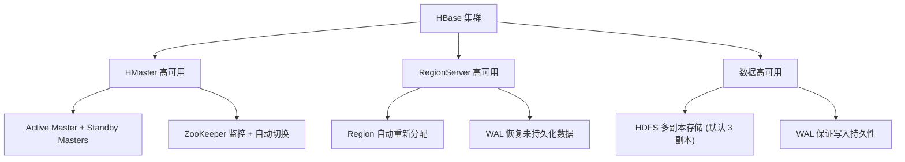
```mermaid
graph TB
    A["HBase 集群"] --> B["HMaster 高可用"]
    A --> C["RegionServer 高可用"]
    A --> D["数据高可用"]
    B --> B1["Active Master + Standby Masters"]
    B --> B2["ZooKeeper 监控 + 自动切换"]
    C --> C1["Region 自动重新分配"]
    C --> C2["WAL 恢复未持久化数据"]
    D --> D1["HDFS 多副本存储 (默认 3 副本)"]
    D --> D2["WAL 保证写入持久性"]
```

#### 📖 核心知识

1. **HMaster 高可用**：
   - 集群可运行多个 HMaster（1 个 Active + 多个 Standby）
   - 所有 Master 竞争创建 ZooKeeper 临时节点，成功者成为 Active Master
   - Active Master 故障时，ZooKeeper 会话超时触发 Watcher 事件，Standby Master 重新竞选
2. **RegionServer 高可用**：
   - 每个 RegionServer 在 ZooKeeper 注册临时节点，Master 通过 Watcher 监控
   - RegionServer 宕机后，Master 检测其临时节点消失，自动将其 Region 重新分配给其他 RegionServer
   - 新 RegionServer 加载 Region 时，通过回放该 Region 的 WAL 恢复未 Flush 的数据
3. **数据高可用**：
   - 底层依赖 HDFS 多副本存储（默认 3 副本）保证数据不丢失
   - WAL 保证写入持久性，即使 MemStore 未 Flush 也能通过 WAL 恢复

::: details 故障恢复流程

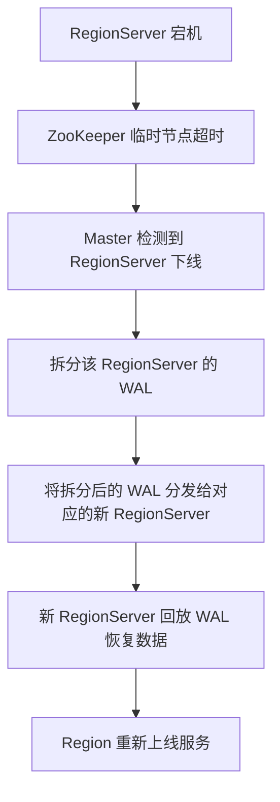
```mermaid
graph TB
    A["RegionServer 宕机"] --> B["ZooKeeper 临时节点超时"]
    B --> C["Master 检测到 RegionServer 下线"]
    C --> D["拆分该 RegionServer 的 WAL"]
    D --> E["将拆分后的 WAL 分发给对应的新 RegionServer"]
    E --> F["新 RegionServer 回放 WAL 恢复数据"]
    F --> G["Region 重新上线服务"]
```

:::

#### 🔬 扩展知识

::: details

- 【L3】WAL 拆分（Log Splitting）

  宕机 RegionServer 的 WAL 文件中混杂多个 Region 的日志，必须按 Region 拆分成 recovered.edits 文件。

  HBase 2.x 默认使用 Procedure 框架驱动的 WAL Splitting，拆分速度直接影响 Region 恢复时间（RTO）。

- 【L3】大集群上 WAL 拆分是宕机恢复的主要耗时环节，可通过 `hbase.wal.split.count.threshold` 等参数调优。

- 【L4】🔴 **ZooKeeper session timeout 是典型的参数权衡题**（`zookeeper.session.timeout`，默认 90s）：

  - **调得太短**：RegionServer 一次较长的 GC 停顿（大堆 + 非 G1 很容易出现秒级停顿）就会让 ZK 判定 session 过期，Master 立即把它的 Region 分配给别的 RS；
    而原 RS 从 GC 中恢复后并不知道自己已被判死，仍在继续服务 —— 于是出现 **「Region 双活」：两个 RegionServer 同时写同一个 Region，直接导致数据损坏**。这是 HBase 最严重的生产事故之一。

  - **调得太长**：真实宕机要等很久才被发现，Region 长时间不可服务，RTO 变差。

  - **正确的解法不是单方面调参**，而是「适度放宽 session timeout + 严格治理 GC 停顿」：堆控制在 16–32GB、用 G1、把大缓存移到堆外（BucketCache / MemStoreChunkPool）。

    **HBase 对 GC 停顿的敏感度，本质上来自它用 ZK session 做存活判定这件事。**

- 【L4】**HMaster 主备不是数据面的高可用**

  HMaster 挂掉完全不影响已有 Region 的读写（数据路径不经过 Master），只影响 DDL、Region 分配、负载均衡与分裂。

  真正决定数据面可用性的是 RegionServer 故障恢复速度（ZK session timeout + WAL Split 耗时）与 HDFS 三副本。

:::

#### 🏭 实战场景

::: details

> ⚠️ 以下为教学示意场景，其中的量化数字为示意值，非官方基准或真实生产统计。

某生产集群 100 台 RegionServer，单台宕机后 WAL 拆分耗时 5 分钟，影响 200 个 Region 不可用。通过将 WAL Splitting 线程数从 2 调至 8，
并启用 Distributed Log Splitting（HBase 1.x），WAL 拆分时间缩短至 1.5 分钟，Region 恢复时间降至 2 分钟。

:::

#### ⚠️ 常见误区

::: details

- ❌ "HMaster 宕机数据就丢了" → HMaster 只负责管理操作，数据读写由 RegionServer 处理，Master 短时宕机不影响数据读写
- ❌ "RegionServer 宕机后数据无法恢复" → 通过 WAL 回放可恢复未 Flush 到 HFile 的数据，HDFS 多副本保证已 Flush 数据不丢失
- ❌ "ZooKeeper session timeout 调短一点，故障恢复就更快" → 太短会让一次 GC 停顿被误判为 RS 死亡，Master 把 Region 分给别人，而原 RS 恢复后仍在服务，形成 **「Region 双活」，两个 RS 同时写同一 Region 导致数据损坏**。这是比恢复慢严重得多的后果，所以调参方向是「适度放宽 + 治理 GC 停顿」。
- ❌ "HBase 自己会做数据副本" → 数据冗余完全由底层 HDFS 三副本负责。一个 Region 在同一时刻只由一个 RegionServer 服务，HBase 保证的是**可用性**（故障后重新分配 + WAL 回放），不是**冗余**。
- ❌ "配了 Master 主备就高可用了" → Master 只覆盖控制面。数据面的可用性取决于 RegionServer 故障恢复链路（ZK session 超时 → WAL Split → Region 上线）与 HDFS 副本健康度，这两块才是 RTO 的决定因素。

:::

#### 🔀 发散问题

- **Q：RegionServer 宕机期间落在该 Region 的写入请求会怎样？**

  → 客户端会收到异常并重试，Region 重新上线后重试成功。客户端重试次数和间隔可通过 `hbase.client.retries.number` 和 `hbase.client.pause` 配置。

### 【困难】HBase Region 分裂是如何工作的？⭐⭐⭐⭐

> 🎯 目标等级：L3-L4 ｜ ⏱ 建议用时：12 min ｜ 🏷 标签：HBase 高可用 / Region 分裂

#### 💎 关键结论

Region 分裂是 HBase 自动水平扩展的核心机制。**分裂点并非简单取中**：HBase 2.0 起默认 `SteppingSplitPolicy`（表的第一个 Region 达到 `2 × flush size` 就分裂，之后按 `hbase.hregion.max.filesize` 默认 10GB 判定）；0.94–1.x 默认 `IncreasingToUpperBoundRegionSplitPolicy`（阈值随同表 Region 数增长而放大）。分裂不搬数据（只创建引用文件），但会造成短暂不可用（秒级）。

#### ⚡ 记忆卡片

- **口诀**：大了切两半，引用不搬数据
- **关键词**：Region Split ／ 分裂阈值 ／ Reference File ／ 预分区
- **链路**：Region 数据增长达到阈值 → 创建两个子 Region → 父 Region 下线 → 子 Region 分配到不同 RegionServer

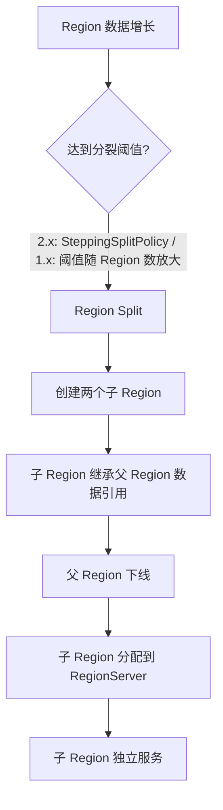
```mermaid
graph TB
    A["Region 数据增长"] --> B{"达到分裂阈值?"}
    B -->|"2.x: SteppingSplitPolicy / 1.x: 阈值随 Region 数放大"| C["Region Split"]
    C --> D["创建两个子 Region"]
    D --> E["子 Region 继承父 Region 数据引用"]
    E --> F["父 Region 下线"]
    F --> G["子 Region 分配到 RegionServer"]
    G --> H["子 Region 独立服务"]
```

#### 📖 核心知识

1. **分裂触发条件与分裂点选择**：
   - Region 大小达到阈值（`hbase.hregion.max.filesize`，默认 10GB）
   - 可通过 `SplitRequest` / HBase shell 的 `split` 命令手动触发
   - **分裂策略随版本演进（高频易错点）**：
     - HBase **0.94–1.x** 默认 `IncreasingToUpperBoundRegionSplitPolicy`：阈值随「同表 Region 数」增长而放大（约为 `Region 数^3 × flush size`，上限封顶在 `hbase.hregion.max.filesize`）。Region 越多、阈值越大，目的是让新表快速裂变出多个 Region。
     - HBase **2.0 起**默认 `SteppingSplitPolicy`：表的**第一个** Region 只要达到 `2 × hbase.hregion.memstore.flush.size` 就分裂（让新表尽早拥有两个 Region 以分散写入），**之后**才按 `hbase.hregion.max.filesize`（默认 10GB）判定。
     - 更早版本使用 `ConstantSizeRegionSplitPolicy`，即固定按 `max.filesize` 判定。
   - ⚠️ 常见讹传：「HBase 2.x 默认是 IncreasingToUpperBound、1.x 是固定 10GB」——**实际正好相反**。
2. **分裂流程**：
   - RegionServer 本地创建两个子 Region 目录
   - 父 Region 停止服务（关闭写入），将数据引用分配给子 Region
   - 向 META 表写入分裂信息（原子操作）
   - 两个子 Region 上线，可能分配到不同 RegionServer
3. **分裂的代价（P8 必答）**：
   - **引用文件导致读性能下降**：子 Region 初期只持有指向父 HFile 一半的 reference 文件，读要跨引用寻址，直到后续 compaction 把物理数据真正拆开
   - **分裂期间该 Region 不可用**：父 Region 下线到子 Region 上线之间有秒级窗口，落在该区间的请求失败重试
   - **Master 需重新分配**：子 Region 可能被迁到其他 RegionServer，引发额外的负载波动

::: details 生产建议

- **预分区（Pre-splitting）**：建表时根据预估数据量与 RowKey 分布规律预先创建多个 Region（`SPLITS => [...]` 指定分裂点，或 `NUMREGIONS => n` 配合 `HexStringSplit`），避免上线后频繁动态分裂
- **生产环境应关闭或调大自动分裂**：`hbase.hregion.max.filesize` 调大，或直接由运维在低峰期手动 split。动态分裂的时机不可控，会造成不可预测的抖动（引用文件读放大 + Region 短暂不可用 + Master 重新分配）
- 分裂阈值不宜过小，否则产生大量小 Region，增加管理开销与 RegionServer 内存压力（每个 Region 都占一份 MemStore）

:::

#### 🔬 扩展知识

::: details

- 【L3】分裂不搬数据

  子 Region 初始只持有父 HFile 的引用文件（Reference File），真正数据拆分延迟到后续 Compaction 完成，引用全部消除后删除父文件。分裂本身很快，
  但引用未消除前会加重读路径的多文件查找。

- 【L3】分裂会造成短暂不可用

  父 Region 下线到子 Region 上线之间存在窗口期（秒级），落在该区间的请求会失败重试；客户端需配置合理的重试策略。

- 【L4】预分区策略选择

  RowKey 均匀散列时用 `HexStringSplit`/`UniformSplit`；RowKey 有业务前缀时自定义 splitKeys，并确保分布与写入分布匹配。

:::

#### 🏭 实战场景

::: details

> ⚠️ 以下为教学示意场景，其中的量化数字为示意值，非官方基准或真实生产统计。

某用户行为表建表时未预分区，初始 1 个 Region。随着数据增长到 500GB，经历了 6 次自动分裂，每次分裂期间有 2~3 秒的写入失败。改为建表时预分区 64 个 Region（HexStringSplit），写入失败完全消除，
各 Region 数据分布均匀。

:::

::: details 预分区代码示例

```java
// 建表时预分区
byte[][] splitKeys = new byte[][] {
    Bytes.toBytes("001"), Bytes.toBytes("002"),
    Bytes.toBytes("003"), Bytes.toBytes("004")
};
admin.createTable(tableDesc, splitKeys);
```

:::

#### ⚠️ 常见误区

::: details

- ❌ "分裂会立即将数据复制到两个子 Region" → 分裂只创建引用文件，真正数据拆分在后续 Compaction 完成
- ❌ "分裂对业务完全透明无影响" → 父 Region 下线到子 Region 上线之间有秒级窗口期，请求会失败重试
- ❌ "预分区越多越好" → 过多预分区会产生大量空/小 Region，增加管理开销和 RegionServer 内存压力

:::

#### 🔀 发散问题

- **Q：如何判断是否需要手动触发 Region 分裂？**

  → 观察各 Region 大小是否接近阈值、Region 数量是否合理、以及数据分布是否均匀。若某个 Region 明显偏大且长期未分裂，可手动触发。

## HBase 性能调优

### 【困难】HBase 有哪些常见的性能调优手段？⭐⭐⭐⭐

> 🎯 目标等级：L3-L4 ｜ ⏱ 建议用时：15 min ｜ 🏷 标签：HBase 性能调优 / 综合优化

#### 💎 关键结论

HBase 性能调优要按「层」组织而不是罗列参数：客户端层（批量写、`setCaching`、连接复用）→ 表设计层（预分区、RowKey 避免热点、列族/布隆过滤器/BLOCKSIZE）→ RegionServer 层（BlockCache 与 MemStore 水位、Compaction 策略、堆外内存、GC）→ HDFS/OS 层（RAID 选型、short-circuit 读、swappiness），并用观测指标（`compactionQueueLength`、`blockCacheHitRatio`、`storeFileCount` 等）定位瓶颈在哪一层。

#### ⚡ 记忆卡片

- **口诀**：行键读写字集群，RowKey、读、写、集群四路调
- **关键词**：BlockCache ／ 布隆过滤器 ／ BufferedMutator ／ 预分区 ／ Compaction
- **链路**：RowKey 设计避免热点 → 读取优化降 IO → 写入优化提吞吐 → 集群配置保稳定

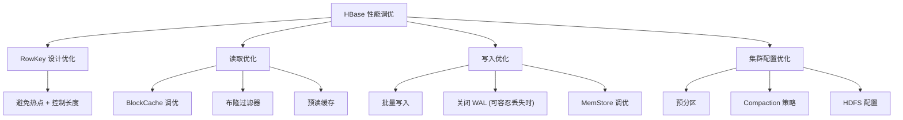
```mermaid
graph TB
    A["HBase 性能调优"] --> B["RowKey 设计优化"]
    A --> C["读取优化"]
    A --> D["写入优化"]
    A --> E["集群配置优化"]
    B --> B1["避免热点 + 控制长度"]
    C --> C1["BlockCache 调优"]
    C --> C2["布隆过滤器"]
    C --> C3["预读缓存"]
    D --> D1["批量写入"]
    D --> D2["关闭 WAL (可容忍丢失时)"]
    D --> D3["MemStore 调优"]
    E --> E1["预分区"]
    E --> E2["Compaction 策略"]
    E --> E3["HDFS 配置"]
```

#### 📖 核心知识

**P8 答题必须按「层」来讲，而不是罗列参数。** 下面按客户端层 → 表设计层 → RegionServer 层 → HDFS/OS 层 → 观测指标五层组织。

**（一）客户端层**（成本最低、收益最快，应最先做）

| 手段                 | 配置/方法                                                                                                 | 效果                                                                           |
| -------------------- | --------------------------------------------------------------------------------------------------------- | ------------------------------------------------------------------------------ |
| 批量写入             | `BufferedMutator` 或 `Table.batch()` 替代单条 put                                                         | 减少 RPC 往返，写入吞吐成倍提升                                                |
| Scan 设 `setCaching` | 每次 RPC 拉取的**行数**，**默认 100 往往偏小**，大扫描应上调                                              | 减少 RPC 次数；但过大会拉高 RS 内存与客户端延迟                                |
| Scan 设 `setBatch`   | 每次拉取的**列数**，超宽行必须设置                                                                        | 避免一次 RPC 拉回整行导致客户端 OOM                                            |
| 收窄扫描区间         | 必须设 `setStartRow` / `setStopRow`                                                                       | 避免退化成全表扫描                                                             |
| 只取需要的列         | `addColumn(cf, qualifier)` 而非 `addFamily`                                                               | 减少 IO 与网络传输                                                             |
| 关闭 WAL             | `put.setDurability(Durability.SKIP_WAL)`（旧 API `setWriteToWAL(false)` 已废弃）                          | 提升写入速度，但 **RS 宕机会丢失这部分已确认的写**，仅在数据可从上游重放时使用 |
| 连接复用             | `Connection` 是**重量级且线程安全**的，全局共享一个；`Table` 是**轻量且非线程安全**的，每次操作获取后关闭 | 避免反复建立连接耗尽资源                                                       |
| 扫描绕过 BlockCache  | 批量 Scan 设 `setBlockCacheEnabled(false)`                                                                | 防止冷数据灌进缓存把热数据挤出去（缓存污染）                                   |

**（二）表设计层**（改起来最贵，但决定上限）

| 手段              | 建议                                                    | 原因                                                                                 |
| ----------------- | ------------------------------------------------------- | ------------------------------------------------------------------------------------ |
| 预分区            | 建表时按 RowKey 分布规律指定 `SPLITS` / `NUMREGIONS`    | 避免上线后动态分裂抖动，避免初始单 Region 热点                                       |
| 列族数量          | **控制在 1-3 个**                                       | 每个列族是独立 Store，独立 flush / 独立 compaction，列族过多会成倍放大小文件与读放大 |
| RowKey 设计       | 见本文档「RowKey 应该如何设计」                         | 热点是 HBase 生产事故头号成因，且**无法在线修复**                                    |
| 布隆过滤器        | 点查为主的表保持 `BLOOMFILTER => 'ROW'`                 | 跳过不含目标 RowKey 的 HFile；注意对 Scan 无效                                       |
| `VERSIONS` 与 TTL | 按业务真实需要设置，不要留默认以外的冗余版本            | 多版本线性放大存储，且旧版本要等 Major Compaction 才清理                             |
| `BLOCKSIZE`       | 点查多调小（如 8KB），扫描多调大（如 128KB），默认 64KB | Block 是读 IO 与 BlockCache 的最小单位，大小直接决定读放大与缓存效率                 |

**（三）RegionServer 层**

| 配置项                                    | 默认值    | 优化建议                                                                              |
| ----------------------------------------- | --------- | ------------------------------------------------------------------------------------- |
| `hfile.block.cache.size`                  | 0.4       | 读多写少时调大；🔴 **与 MemStore 之和不得超过 0.8，否则 RS 启动报错**                 |
| `hbase.regionserver.global.memstore.size` | 0.4       | 写多读少时调大；同上受 0.8 约束                                                       |
| `hbase.regionserver.handler.count`        | 30        | 根据并发量调高（如 100）；过高会加剧上下文切换与内存占用                              |
| `hbase.hregion.majorcompaction`           | 604800000 | **生产环境建议设为 0 禁用自动触发**，改低峰期手动/脚本执行                            |
| `hbase.hstore.compactionThreshold`        | 3         | 根据写入量调整                                                                        |
| `hbase.hstore.blockingStoreFiles`         | 16        | 达到即**阻塞该 Region 写入**，是「写入突然卡死」的首要排查项                          |
| compaction 限流                           | —         | `hbase.hstore.compaction.throughput.lower.bound` / `upper.bound` + `offpeak` 时段配置 |
| 堆外内存                                  | 关闭      | `MemStoreChunkPool`（写缓冲）+ `BucketCache`（读缓存），解决大内存 RS 的 GC 抖动      |
| GC                                        | —         | G1，堆控制在 16~32GB；避免 Full GC 停顿触发 ZK 会话超时                               |

**（四）HDFS / OS 层**

- **DataNode 磁盘不要用 RAID5**：RAID5 的校验写会叠加在 HDFS 三副本之上，形成严重的写放大；HDFS 已经用副本保证了可靠性，应使用 JBOD 或 RAID0。
- **开启 short-circuit local read**（`dfs.client.read.shortcircuit=true`）：RegionServer 与 DataNode 同机时，绕过 DataNode 进程直接读本地文件，省掉一次网络往返与 TCP 拷贝。
- **关闭 swap 或设 `vm.swappiness=0`**：RegionServer 一旦有内存页被换出，延迟会出现不可预测的长尾；宁可 OOM 快速失败也不要 swap 拖死。
- 文件系统选择 XFS / ext4，并检查 `dfs.datanode.handler.count`、磁盘调度器（建议 `deadline`/`noop` 而非 `cfq`）。

**（五）必须盯的观测指标**

| 指标                    | 含义与告警方向                                                                       |
| ----------------------- | ------------------------------------------------------------------------------------ |
| `compactionQueueLength` | 持续积压说明 compaction 跟不上写入，HFile 会累积到 `blockingStoreFiles` 从而阻塞写入 |
| `flushQueueLength`      | 积压说明 MemStore 落盘跟不上，通常会连带触发全局水位阻塞                             |
| `memStoreSize`          | 逼近全局水位（默认堆的 0.4）就要准备扩容或调参                                       |
| `blockCacheHitRatio`    | **低于 90% 说明读缓存不足，或业务中存在大量 Scan 造成缓存污染**                      |
| `storeFileCount`        | 单 Store 文件数越多，点查读放大越严重；接近 16 即将阻塞写入                          |
| `regionCount`（单 RS）  | 建议不超过几百到上千；过多会导致 flush/compaction 碎片化、小文件泛滥与内存压力       |
| RPC 队列长度 / 调用时间 | 队列变长通常是 handler 线程不足或后端 IO 变慢的下游表现                              |
| GC 停顿时间             | 长停顿会触发 ZK 会话超时误判，进而导致 Region 双活                                   |

#### 🔬 扩展知识

::: details

- 【L3】热点 Region 治理

  某 Region 读写量远超其他 Region（常见于预分区不均、RowKey 设计缺陷）。拆分热点 Region、Balancer 均衡、根治方案是重新设计 RowKey 散列。

- 【L3】客户端超时与重试

  `hbase.client.operation.timeout`、`hbase.client.retries.number` 需与业务 SLA 匹配；重试叠加会放大对集群的压力，雪崩场景下应结合熔断限流。

- 【L4】GC 调优

  RegionServer 堆内存通常 16~32GB，优先使用 G1 并控制停顿目标；MemStore + BlockCache 占用堆内存大，需监控 Old GC 频率，
  避免 Full GC 导致 ZooKeeper 会话超时。

- 【L4】慢读排查

  区分是 HFile 过多（读放大，需 Compaction）、BlockCache 命中率低、还是 Region 热点，三者治理手段完全不同。

:::

#### 🏭 实战场景

::: details

某电商用户画像表 200 亿行数据，P99 读延迟 50ms。调优措施：(1) BlockCache 从 0.4 调至 0.5；(2) 开启 ROW 布隆过滤器；(3) Scan setCaching 从 10 调至 100；
(4) 禁用自动 Major Compaction 改为凌晨手动执行。调优后 P99 读延迟降至 8ms，QPS 从 5万提升至 12万。

:::

#### ⚠️ 常见误区

::: details

- ❌ "堆内存越大越好" → 堆内存过大导致 GC 停顿时间过长，可能触发 ZooKeeper 会话超时，RegionServer 被踢出集群
- ❌ "关闭 WAL 能大幅提升写入性能" → 写入性能提升有限（约 10%~20%），但宕机时会丢失未 Flush 数据
- ❌ "Compaction 越频繁性能越好" → 频繁 Compaction 带来持续 IO 压力，反而降低读写性能

:::

#### 🔀 发散问题

- **Q：如何快速定位 HBase 性能瓶颈？**

  → 先看 RegionServer 监控指标（读写延迟、HFile 数量、MemStore 使用率、GC 时间），再查看 Compaction 队列长度和 BlockCache 命中率，最后检查 RowKey 设计是否存在热点。

### 【困难】HBase 的 Phoenix 是什么？⭐⭐

> 🎯 目标等级：L2-L3 ｜ ⏱ 建议用时：8 min ｜ 🏷 标签：HBase 性能调优 / Phoenix

#### 💎 关键结论

Apache Phoenix 是 HBase 之上的**客户端内嵌式** SQL 引擎：SQL 在客户端被编译成 HBase 原生 Scan/Get 调用直连 RegionServer，没有独立的中转计算节点；它提供标准 SQL、二级索引与 JDBC 接口，表的主键直接映射为 RowKey，显著降低 HBase 使用门槛，但 JOIN 与复杂分析查询性能有限。

#### ⚡ 记忆卡片

- **口诀**：Phoenix 给 HBase 加 SQL，加索引，加 JDBC
- **关键词**：SQL 引擎 ／ 二级索引 ／ 查询优化 ／ JDBC
- **链路**：HBase 原生不支持 SQL → Phoenix 提供 SQL 层 → 编译为 HBase 原生 API 执行

#### 📖 核心知识

1. **SQL 支持**：提供标准 SQL 语法（DDL/DML），降低 HBase 使用门槛。
2. **二级索引**：支持全局索引和本地索引，加速非 RowKey 列的查询。
3. **查询优化**：内置查询优化器，支持谓词下推、聚合下推。
4. **JDBC 驱动**：提供标准 JDBC 接口，可与 BI 工具集成。
5. **客户端内嵌架构（与「SQL 网关」的本质区别）**：Phoenix 的 SQL 引擎运行在应用进程内（厚客户端模式），SQL 被编译为 HBase 原生 API 调用后直连 RegionServer，**没有独立的中间件服务器**；Phoenix Query Server 只是面向瘦客户端（如 Python/Go）的可选通道，不是必经节点。
6. **主键即 RowKey**：`PRIMARY KEY` 按声明顺序编码拼接成 HBase RowKey，命中主键前缀的 WHERE 条件会被编译成范围 Scan；主键分布单调时可用 `SALT_BUCKETS` 建表加盐预分区，避免写热点。

::: details Phoenix SQL 示例

```sql
-- Phoenix SQL 示例
CREATE TABLE user_log (
    user_id VARCHAR NOT NULL,
    log_date DATE NOT NULL,
    action VARCHAR,
    detail VARCHAR,
    CONSTRAINT pk PRIMARY KEY (user_id, log_date)
);

-- 创建二级索引
CREATE INDEX idx_action ON user_log (action);

-- 查询
SELECT * FROM user_log WHERE action = 'login' AND log_date >= CURRENT_DATE() - 7;
```

:::

7. **适用场景**：需要对 HBase 数据进行 SQL 查询分析、非 RowKey 列查询性能要求高、需要与 BI/报表工具集成。
8. **局限性**：JOIN 操作性能有限、写入性能相比原生 HBase API 有损耗、二级索引会增加写入开销。

#### 🔬 扩展知识

::: details

- 【L3】全局索引 vs 本地索引的维护代价

  全局索引是**独立的索引表**，写入路径由 RegionServer 侧的协处理器（coprocessor）钩子同步维护，每建一个全局索引就多一份写放大与故障面，适合读多写少的点查；
  本地索引（Phoenix 4.8+）与数据表同 Region 存储，写入开销小，但查询时要扇出到所有 Region 再归并，适合写多、查询本就范围化的场景。

- 【L3】JOIN 性能有限的根因

  Phoenix 没有分布式 shuffle 能力，大表 JOIN 主要靠把小表广播到各执行端做哈希连接，或对主键有序的表做跳跃归并；两张大表 JOIN 会退化为客户端侧的多轮扫描。

  这是它与 Presto/Doris 等 MPP 引擎的能力边界——Phoenix 定位是「HBase 上的 OLTP 风格 SQL 点查/短范围查询」，不是分析引擎。

- 【L3】`SALT_BUCKETS` 与预分区

  对单调主键（如时间戳前缀）加盐，把写入打散到多个 Region，等价于原生 HBase 的 RowKey 反转/加哈希前缀手法，但由 Phoenix 在 SQL 层透明处理。

:::

#### ⚠️ 常见误区

::: details

- ❌ "Phoenix 是部署在中间的 SQL 网关，多了一跳网络" → 厚客户端模式下 SQL 引擎内嵌在应用进程里，编译后直连 RegionServer，没有独立中转节点；Query Server 只是可选的瘦客户端通道。
- ❌ "加二级索引没有副作用" → 全局索引在写入路径由协处理器同步维护，多个索引会成倍放大写延迟与失败面，索引表自身还要参与 Compaction。
- ❌ "有了 Phoenix 就能像 MySQL 一样跑复杂 SQL" → 无 shuffle、无独立计算层，大表 JOIN 与全表聚合会退化为客户端侧扫描，复杂分析应交给 MPP 引擎。

:::

#### 🔀 发散问题

- **Q：Phoenix 的二级索引和 HBase 原生查询有什么区别？**

  → HBase 原生只能按 RowKey 查询，非 RowKey 列需要全表扫描；Phoenix 二级索引为指定列创建独立的索引表，可将非 RowKey 查询转换为索引 RowKey 查询，大幅提升性能。

## 参考资料

- [Apache HBase 官方文档](https://hbase.apache.org/book.html)
- [HBase 架构详解](https://hbase.apache.org/book.html#arch.overview)
- [HBase 参考指南 - RowKey 设计](https://hbase.apache.org/book.html#rowkey.design)
- [HBase 性能优化实战](https://hbase.apache.org/book.html#performance)
