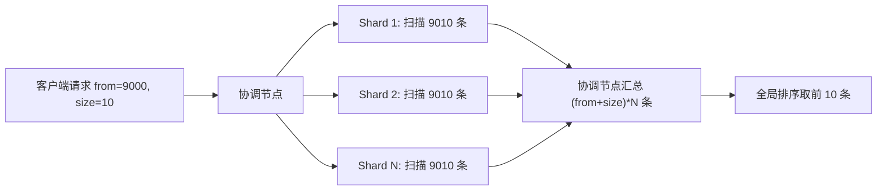
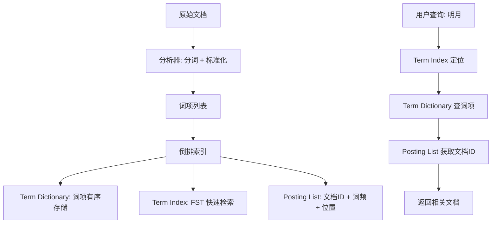
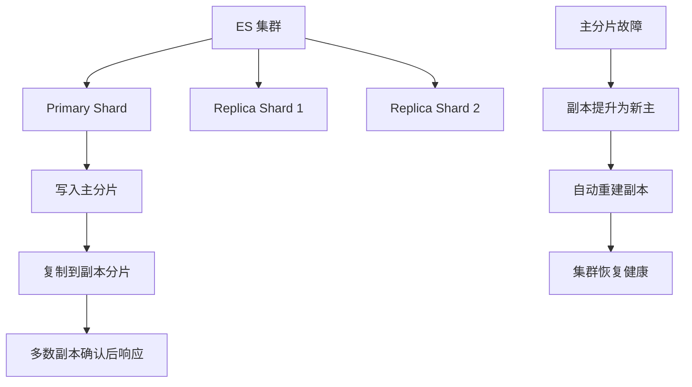
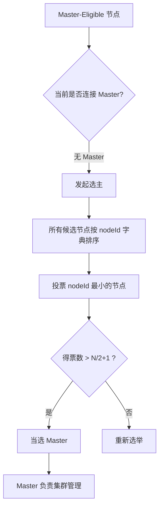
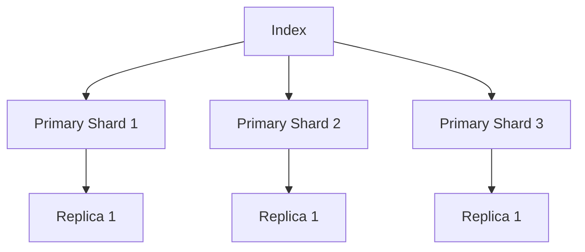
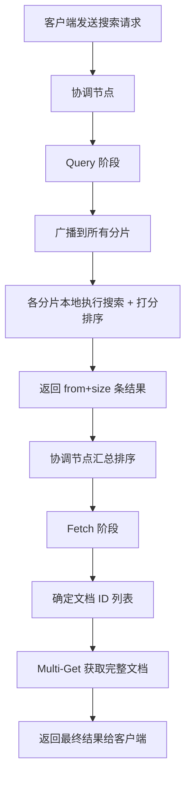
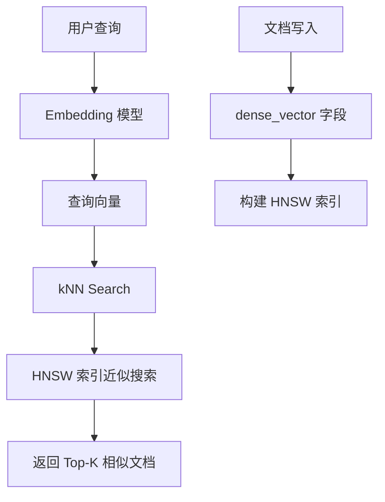
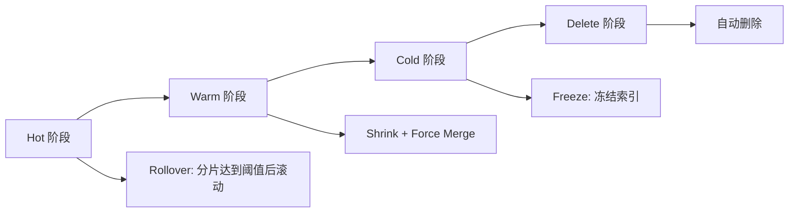

---
icon: logos:elasticsearch
title: Elasticsearch 面试
cover: https://raw.githubusercontent.com/dunwu/images/master/archive/2025/03/020ab2bf4af8401590e0291a34f873f8.jpg
date: 2020-06-16 07:10:44
categories:
  - 数据库
  - 搜索引擎数据库
  - Elasticsearch
tags:
  - 数据库
  - 搜索引擎数据库
  - Elasticsearch
  - 面试
permalink: /pages/447cbc4f/
---

# Elasticsearch 面试

::: tip 扩展

- [Elasticsearch 官方文档](https://www.elastic.co/guide/en/elasticsearch/reference/current/index.html)
- [Elasticsearch 从入门到实践](https://www.itshujia.com/books/elasticsearch)
- https://www.turing.com/interview-questions/elasticsearch
- https://github.com/rkm-ravi94/awesome-devops-interview/blob/main/elasticsearch.md

:::

## Elasticsearch 概述

::: tip 扩展

[Elasticsearch 官方文档之基础知识](https://www.elastic.co/guide/en/elasticsearch/reference/current/elasticsearch-intro-what-is-es.html)

:::

### 【简单】什么是 ES？⭐⭐⭐


> 🎯 目标等级：L2 ｜ ⏱ 建议用时：5 min ｜ 🏷 标签：Elasticsearch 概述

#### 💎 关键结论

ES 是基于 Lucene 的分布式搜索与分析引擎，面向文档、JSON 存储，提供近实时全文搜索能力，延迟约 1 秒。

#### ⚡记忆卡片

- **口诀**：Lucene 加壳、文档 JSON、近实时搜索
- **关键词**：Lucene ／ REST API ／ NRT ／ 分布式
- **链路**：Lucene → ES 封装 → REST API → 近实时搜索

#### 📖 核心知识

1. [**Elasticsearch**](https://github.com/elastic/elasticsearch) 是基于 [Lucene](https://github.com/apache/lucene-solr) 开发的开源分布式搜索和分析引擎，隐藏了 Lucene 的复杂性，提供 REST API / Java API 等多语言接口。
2. **面向文档**：将复杂数据结构序列化为 JSON 形式存储。
3. **近实时（NRT）**：写入到可搜索延迟约 1 秒；搜索和分析可达秒级响应。
4. 核心能力：**分布式存储**、**全文搜索**、**聚合分析**。

#### 🔀 发散问题

- **Q：ES 和 Solr 有什么区别？** → 二者都基于 Lucene，但 ES 天然支持分布式、近实时、RESTful API 更友好，社区生态更活跃；Solr 在传统企业搜索场景更成熟。
- **Q：什么是近实时（NRT）？** → 数据写入后约 1 秒（refresh 间隔）才可被搜索，不是真正的实时，见本文档「ES 存储数据的流程是怎样的？」。

### 【简单】ES 有哪些应用场景？⭐⭐⭐

> 🎯 目标等级：L2 ｜ ⏱ 建议用时：5 min ｜ 🏷 标签：Elasticsearch 概述

#### 💎 关键结论

ES 主要用于三大场景：搜索（全文检索、自动补全）、可观测性（日志/指标/追踪）、安全分析，底层支撑是分布式存储与近实时分析能力。

#### ⚡记忆卡片

- **口诀**：搜、观、安三大场景
- **关键词**：全文检索 ／ 可观测性 ／ 日志分析 ／ 地理空间
- **链路**：数据写入 → 近实时索引 → 搜索/聚合/分析

#### 📖 核心知识

Elasticsearch 的主要功能：**海量数据的分布式存储及集群管理**、**丰富的近实时搜索能力**、**海量数据的近实时分析（聚合）**。

1. **搜索**：全文检索、自动补全和拼写纠正、地理空间搜索、近实时分析推送。
2. **可观测性**：日志/指标/链路追踪采集分析、性能监控、OpenTelemetry 集成。
3. **安全分析**：安全事件检测与告警。


#### 🔀 发散问题

- **Q：ES 和传统数据库有什么区别？** → ES 面向文档（JSON）、Schema-free、擅长大规模全文搜索和聚合；RDBMS 擅长事务和复杂关联查询，见本文档「ES 有哪些基本概念？」。

### 【简单】ES 有哪些里程碑版本？⭐

> 🎯 目标等级：L2 ｜ ⏱ 建议用时：3 min ｜ 🏷 标签：Elasticsearch 概述

#### 💎 关键结论

ES 经历了 1.0→5.0→6.0→7.0→8.0 五个里程碑版本，关键变化是 5.0 引入 BM25、7.0 移除 Type、8.0 支持向量搜索。

#### ⚡记忆卡片

- **口诀**：五 BM 二五，七去 type，八向量
- **关键词**：BM25 ／ Type 移除 ／ 向量搜索 ／ Lucene
- **链路**：1.0 基础 → 5.0 BM25 → 7.0 去 Type → 8.0 向量

#### 📖 核心知识

1. **1.0（2014）**：首个正式发布。
2. **5.0（2016）**：Lucene 6.x，默认打分从 TF-IDF 改为 BM25，增加 Keyword 类型。
3. **6.0（2017）**：Lucene 7.x，跨集群复制、索引生命周期管理、SQL 支持。
4. **7.0（2019）**：Lucene 8.0，移除 Type、引入 ECK（K8S 支持）、集群协调重写、High Level Rest Client。
5. **8.0（2022）**：Lucene 9.0，原生向量搜索、支持 OpenTelemetry。

### 【简单】什么是 Elasic Stack(ELK)？⭐⭐⭐

> 🎯 目标等级：L2 ｜ ⏱ 建议用时：5 min ｜ 🏷 标签：Elasticsearch 概述

#### 💎 关键结论

Elastic Stack（ELK）是 Elasticsearch + Logstash + Kibana 的组合，常用于日志采集、检索、可视化，后加入 Beats 轻量采集器。

#### ⚡记忆卡片

- **口诀**：ES 存、Logstash 传、Kibana 看、Beats 采
- **关键词**：Elasticsearch ／ Logstash ／ Kibana ／ Beats
- **链路**：Beats 采集 → Logstash 处理 → ES 存储检索 → Kibana 可视化

#### 📖 核心知识

Elastic Stack 通常被用来作为日志采集、检索、可视化的解决方案。


1. [Elasticsearch](https://www.elastic.co/elasticsearch)：存储数据，提供检索和分析。
2. [Logstash](https://www.elastic.co/logstash)：传输和处理日志、事务等数据。
3. [Kibana](https://www.elastic.co/kibana)：分析并渲染可视化报表。
4. [Beats](https://www.elastic.co/beats)：轻量级数据采集器套件（ELK 基础上新增）。


#### 🔬 扩展知识

::: details

- 【L3】Beats 家族包括 Filebeat（日志文件）、Metricbeat（系统指标）、Packetbeat（网络数据）、Heartbeat（健康检查）等，可直接写入 ES 或经 Logstash 处理。
- 【L4】Elastic Agent（8.x）整合了多种 Beats 能力，支持 Fleet 集中管理，是未来采集层的统一方案。

> 📚 延伸阅读：[Elastic 官方文档](https://www.elastic.co/guide/en/elasticsearch/reference/current/index.html)

:::

#### 🔀 发散问题

- **Q：ELK 和 EFK 有什么区别？** → EFK 用 Fluentd 替代 Logstash 做数据采集处理，资源占用更低，常见于 Kubernetes 场景。

### 【简单】ES 有哪些基本概念？⭐⭐

> 🎯 目标等级：L2 ｜ ⏱ 建议用时：5 min ｜ 🏷 标签：Elasticsearch 概述

#### 💎 关键结论

ES 核心概念分两层：集群层（Cluster、Node、Shard、Replica）和数据层（Index、Document、Field、Mapping），Type 在 7.x 已移除。

#### ⚡记忆卡片

- **口诀**：集群节点分片副本，索引文档字段映射
- **关键词**：Cluster ／ Node ／ Shard ／ Index ／ Document
- **链路**：Cluster → Node → Shard → Index → Document → Field

#### 📖 核心知识

**集群维度**：

1. **Cluster（集群）**：多个协同工作的 ES 实例组合，具备高可用性和可扩展性。
2. **Node（节点）**：单个 ES 服务实例，本质是一个 Java 进程。
3. **Shard（分片）**：索引数据的切分单元，分布在多节点上实现水平扩展，每个 shard 都是一个 Lucene index。
4. **Replica（副本）**：shard 的备份，提供高可用和读性能提升。primary shard 数创建后不可修改（7.0 前默认 5 个，7.0 起默认 1 个），replica 默认 1 个。

**数据维度**：

1. **Index（索引）**：文档的集合，类似数据库。ES 会为所有字段建立倒排索引。
2. **Type（类型）**：索引的逻辑分类，ES 7.x 已彻底移除。
3. **Document（文档）**：索引中的单条记录，JSON 格式，有唯一 ID。
4. **Field（字段）**：文档中的键值对，每个字段都有专用的优化数据结构。
5. **Metadata Field**：以 `_` 开头的系统字段，如 `_index`、`_id`、`_source`。

| ES | DB |
|:---|:---|
| **索引（index）** | **数据库（database）** |
| **类型（type，6.0 废弃，7.0 移除）** | **数据表（table）** |
| **文档（document）** | **行（row）** |
| **字段（field）** | **列（column）** |
| **映射（mapping）** | **表结构（schema）** |

## Elasticsearch 建模

::: tip 扩展

- [Elasticsearch 官方文档之 Mapping](https://www.elastic.co/guide/en/elasticsearch/reference/current/mapping.html)
- [Elasticsearch 从入门到实践之 Mapping](https://www.itshujia.com/read/elasticsearch/351.html)
- [Elasticsearch 官方文档之数据类型](https://www.elastic.co/guide/en/elasticsearch/reference/current/mapping-types.html)

:::

### 【简单】ES 支持哪些数据类型？⭐

> 🎯 目标等级：L2 ｜ ⏱ 建议用时：3 min ｜ 🏷 标签：Elasticsearch 建模

#### 💎 关键结论

ES 支持文本、数值、日期、布尔、二进制、对象、嵌套、地理空间、向量等丰富数据类型，通过 Mapping 定义字段类型。

#### ⚡记忆卡片

- **口诀**：文数日布二，对嵌地向
- **关键词**：text ／ keyword ／ nested ／ dense_vector
- **链路**：字段定义 → Mapping 指定类型 → 倒排索引存储

#### 📖 核心知识

Elasticsearch 支持丰富的数据类型，常见的有：

- **文本类型**：[`text`](https://www.elastic.co/guide/en/elasticsearch/reference/current/text.html)、[`keyword`](https://www.elastic.co/guide/en/elasticsearch/reference/current/keyword.html#keyword-field-type)、[`constant_keyword`](https://www.elastic.co/guide/en/elasticsearch/reference/current/keyword.html#constant-keyword-field-type)、[`wildcard`](https://www.elastic.co/guide/en/elasticsearch/reference/current/keyword.html#wildcard-field-type)
- **二进制类型**：[`binary`](https://www.elastic.co/guide/en/elasticsearch/reference/current/binary.html)
- **数值类型**：`long`、`integer`、`float`、`double` 等
- **日期类型**：[`date`](https://www.elastic.co/guide/en/elasticsearch/reference/current/date.html)
- **布尔类型**：[`boolean`](https://www.elastic.co/guide/en/elasticsearch/reference/current/boolean.html)
- **对象类型**：[`object`](https://www.elastic.co/guide/en/elasticsearch/reference/current/object.html)、[`nested`](https://www.elastic.co/guide/en/elasticsearch/reference/current/nested.html)
- **地理空间类型**：`geo_point`、`geo_shape`
- **向量类型**：[`dense_vector`](https://www.elastic.co/guide/en/elasticsearch/reference/current/dense-vector.html)（8.0+）

### 【简单】ES 如何识别字段的数据类型？⭐⭐⭐

> 🎯 目标等级：L2 ｜ ⏱ 建议用时：8 min ｜ 🏷 标签：Elasticsearch 建模 / Mapping

#### 💎 关键结论

Mapping 定义字段类型和存储规则，分静态映射（手工指定）和动态映射（自动识别）两种方式，类似数据库建表。

#### ⚡记忆卡片

- **口诀**：静态手工建表，动态自动识别
- **关键词**：Mapping ／ 静态映射 ／ 动态映射 ／ properties
- **链路**：创建索引 → 定义 Mapping → 字段类型确定 → 倒排索引构建

#### 📖 核心知识

**Mapping** 定义索引中文档的字段如何被存储和索引，类似数据库的表定义。

1. **静态映射（Explicit Mapping）**：创建索引时手工指定字段类型，可以配置分词器、权重、是否索引等详细属性。
2. **动态映射（Dynamic Mapping）**：写入文档时 ES 自动识别字段类型，适合探索性数据，但可能产生不准确的类型推断。
3. ES 7.0 起，Mapping 不再需要指定 type 信息。

::: details 静态映射示例

创建索引时显式指定 mapping：

```javascript
PUT /my-index-000001
{
  "mappings": {
    "properties": {
      "age":    { "type": "integer" },
      "email":  { "type": "keyword"  },
      "name":   { "type": "text"  }
    }
  }
}
```

在已存在的索引中指定 field 属性：

```javascript
PUT /my-index-000001/_mapping
{
  "properties": {
    "employee-id": {
      "type": "keyword",
      "index": false
    }
  }
}
```

查看 mapping：`GET /my-index-000001/_mapping`

:::

::: details 动态映射示例

写入文档时 ES 自动识别字段类型：

```bash
PUT data/_doc/1
{ "count": 5 }
```

ES 自动推断 `count` 字段类型为 `long`。

:::

#### 🔬 扩展知识

::: details

- 【L3】动态映射可通过 `dynamic_templates` 自定义规则，例如将所有字符串字段默认映射为 keyword，避免 text 类型的额外开销。
- 【L4】动态映射可设置为 `strict`，遇到未定义字段时直接拒绝写入，防止 mapping 爆炸（mapping explosion）。

> 📚 延伸阅读：[Elasticsearch 官方文档之 Mapping](https://www.elastic.co/guide/en/elasticsearch/reference/current/mapping.html)

:::

#### ⚠️ 常见误区

::: details

常见误区：

- ❌ "动态映射可以替代静态映射" → 动态映射可能推断出错误类型（如将数字字符串推断为 text），生产环境建议静态映射优先。
- ❌ "Mapping 可以修改已有字段类型" → 已有字段的类型不可修改，只能重新创建索引（reindex）。

:::

#### 🔀 发散问题

- **Q：text 和 keyword 有什么区别？** → text 会分词，适合全文搜索；keyword 不分词，适合精确匹配、聚合和排序。
- **Q：动态映射可能导致什么问题？** → 可能产生 mapping explosion（字段数爆炸）或类型推断错误，见本文档「使用 ES 有哪些最佳实践？」。

### 【简单】ES 索引别名有什么用？⭐⭐⭐

> 🎯 目标等级：L2 ｜ ⏱ 建议用时：5 min ｜ 🏷 标签：Elasticsearch 建模

#### 💎 关键结论

索引别名用于隐藏底层索引复杂性，支持多索引聚合查询、索引重建时的零停机切换，是生产环境的必备实践。

#### ⚡记忆卡片

- **口诀**：别名挂载多索引，切换无感知
- **关键词**：Alias ／ 零停机 ／ 多索引聚合 ／ reindex
- **链路**：创建新索引 → 别名指向新索引 → 应用无感知切换

#### 📖 核心知识

Elasticsearch 中的别名可用于更轻松地管理和使用索引。别名允许同时对多个索引执行操作，或者通过隐藏底层索引结构的复杂性来简化索引管理。

1. **多索引聚合**：一个别名可挂载多个索引，查询别名即可同时搜索所有关联索引。
2. **零停机重建**：reindex 后将别名从旧索引切换到新索引，应用端无需修改。
3. **视图抽象**：通过别名隐藏索引命名细节（如日期后缀），对外提供统一入口。

#### 🔬 扩展知识

::: details

- 【L3】别名支持 `filter` 和 `routing` 参数，可创建带过滤条件的别名（类似视图），或指定路由以缩小查询范围。
- 【L4】别名下挂 50 个索引、每个 5 分片时，一次查询会产生 250 次 query+fetch，需警惕读放大。

> 📚 延伸阅读：[Elasticsearch 官方文档之别名](https://www.elastic.co/guide/en/elasticsearch/reference/current/aliases.html)

:::

#### 🔀 发散问题

- **Q：别名和索引模板有什么关系？** → 索引模板自动为新索引应用 mapping/settings，别名可将多个模板创建的索引统一起来，常见于按日期滚动的索引场景。

### 【中等】object 和 nested 类型有什么区别？⭐⭐⭐⭐

> 🎯 目标等级：L2-L3 ｜ ⏱ 建议用时：10 min ｜ 🏷 标签：Elasticsearch 建模 / 数据类型

#### 💎 关键结论

object 打平存储会丢失对象边界，导致跨对象误匹配；nested 每个对象独立存储为隐藏文档，保证同对象内精确匹配，但开销更高。

#### ⚡记忆卡片

- **口诀**：object 打平会串，nested 独立不串
- **关键词**：打平（flatten） ／ 跨对象误匹配 ／ 隐藏文档 ／ nested 查询
- **链路**：对象数组 → object 打平 / nested 独立文档 → 查询方式不同

#### 📖 核心知识

存储对象数组时，ES 默认使用 `object` 类型，其存储方式是**打平（flatten）**的——数组内对象之间的内部结构会丢失：

```json
// 原始文档
{ "users": [ { "name": "Alice", "age": 20 }, { "name": "Bob", "age": 30 } ] }

// object 类型打平后的实际存储形态
{ "users.name": ["Alice", "Bob"], "users.age": [20, 30] }
```

1. **object**：打平存储，查询 `users.name=Alice AND users.age=30` 会命中（跨对象误匹配）。
2. **nested**：每个嵌套对象作为独立的隐藏文档存储，查询时必须使用 `nested` 查询，保证条件在同一个对象内匹配。

| 方面 | object | nested |
|:---|:---|:---|
| 存储 | 打平，字段混合 | 每个嵌套对象独立文档 |
| 查询 | 存在跨对象误匹配 | 同对象内独立匹配 |
| 开销 | 低 | 每个嵌套对象占一个文档，写入/查询开销更高 |
| 更新 | 直接更新 | 嵌套数组需整体重写 |

#### 🔬 扩展知识

::: details

- 【L3】nested 对象数量默认上限为 10000（`index.mapping.nested_objects.limit`），滥用 nested 会导致文档数膨胀、聚合性能下降。
- 【L4】对于只需精确匹配“数组内对象组合关系”的场景才用 nested，否则 object 即可。大量嵌套对象可考虑 flatten 或 parent-child 关系替代。

:::

#### ⚠️ 常见误区

::: details

常见误区：

- ❌ "object 类型可以精确匹配数组内的对象组合" → object 打平后会丢失对象边界，必须用 nested 才能保证同对象内匹配。
- ❌ "nested 没有性能代价" → 每个嵌套对象占一个独立 Lucene 文档，写入和查询开销显著增加。

:::

#### 🔀 发散问题

- **Q：nested 和 parent-child 有什么区别？** → nested 在同一文档内存储隐藏子文档，查询快但更新需整体重写；parent-child 父子文档独立存储，更新灵活但查询开销更高。
- **Q：实践建议？** → 只有当需要精确匹配“数组内对象之间的组合关系”时才用 nested，否则 object 即可。

## Elasticsearch CRUD

::: tip 扩展

[Elasticsearch 官方文档之 REST API](https://www.elastic.co/guide/en/elasticsearch/reference/current/rest-apis.html)

:::

### 【简单】如何在 ES 中 CRUD？⭐⭐

> 🎯 目标等级：L2 ｜ ⏱ 建议用时：5 min ｜ 🏷 标签：Elasticsearch CRUD

#### 💎 关键结论

ES 通过 REST API 实现 CRUD，支持单文档操作和 bulk 批量操作，写入时需考虑 ID 策略和幂等性。

#### ⚡记忆卡片

- **口诀**：PUT 建、POST 增、DELETE 删、GET 查、bulk 批
- **关键词**：PUT ／ POST ／ DELETE ／ GET ／ bulk ／ _mget
- **链路**：REST 请求 → 路由分片 → 写入/读取 → 响应

#### 📖 核心知识

Elasticsearch 的基本 CRUD 方式如下：

- **创建文档**
  - `PUT <index>/_create/<id>`：指定 id，已存在则报错
  - `POST <index>/_doc`：自动生成 `_id`
- **删除文档**：`DELETE <index>/_doc/<id>`
- **更新文档**：`POST <index>/_update/<id>`
- **查询文档**：`GET <index>/_doc/<id>`
- **批量操作**：`bulk` API 支持 `index/create/update/delete`
- **批量查询**：`_mget` 和 `_msearch` 用于批量获取文档

> 📚 延伸阅读：[Quick starts](https://www.elastic.co/guide/en/elasticsearch/reference/current/quickstart.html)

## Elasticsearch 检索

::: tip 扩展

- [Elasticsearch 官方文档之搜索数据](https://www.elastic.co/guide/en/elasticsearch/reference/current/search-with-elasticsearch.html)
- [极客时间教程 - Elasticsearch 核心技术与实战](https://time.geekbang.org/course/detail/100030501-102659)
- [Elasticsearch 从入门到实践之分布式文档搜索机制](https://www.itshujia.com/read/elasticsearch/358.html)
- [Elasticsearch 官方文档之搜索数据](https://www.elastic.co/guide/en/elasticsearch/reference/current/search-with-elasticsearch.html)
- [Elasticsearch 官方文档之全文查询](https://www.elastic.co/guide/en/elasticsearch/reference/current/full-text-queries.html)
- [Elasticsearch 官方文档之词项查询](https://www.elastic.co/guide/en/elasticsearch/reference/current/term-level-queries.html)
- [Elasticsearch 官方文档之组合查询](https://www.elastic.co/guide/en/elasticsearch/reference/current/compound-queries.html)
- [Elasticsearch 官方文档之推荐查询](https://www.elastic.co/guide/en/elasticsearch/reference/current/search-suggesters.html)
- [Elasticsearch 官方文档之查询和过滤上下文](https://www.elastic.co/guide/en/elasticsearch/reference/current/query-filter-context.html)

:::

### 【简单】ES 中有哪些全文搜索 API？⭐

> 🎯 目标等级：L2 ｜ ⏱ 建议用时：3 min ｜ 🏷 标签：Elasticsearch 检索 / 全文搜索

#### 💎 关键结论

ES 全文搜索 API 以 match 系列为核心，查询前会对查询字符串进行分词分析，支持模糊匹配、短语匹配、多字段搜索等。

#### ⚡记忆卡片

- **口诀**：match 分词搜，phrase 短语配，multi 多字段
- **关键词**：match ／ match_phrase ／ multi_match ／ intervals
- **链路**：查询字符串 → 分析器分词 → 倒排索引查找 → 相关性打分

#### 📖 核心知识

ES 支持全文搜索的 API 主要有：

- [**match**](https://www.elastic.co/guide/en/elasticsearch/reference/current/query-dsl-match-query.html)：标准匹配查询，支持模糊匹配和短语查询。
- [**match_phrase**](https://www.elastic.co/guide/en/elasticsearch/reference/current/query-dsl-match-query-phrase.html)：短语匹配，分词后词语必须按顺序连续出现。
- [**match_bool_prefix**](https://www.elastic.co/guide/en/elasticsearch/reference/current/query-dsl-match-bool-prefix-query.html)：对最后一个分词执行 prefix 查询，其余执行 term 查询。
- [**match_phrase_prefix**](https://www.elastic.co/guide/en/elasticsearch/reference/current/query-dsl-match-query-phrase-prefix.html)：对最后一个单词执行通配符搜索。
- [**multi_match**](https://www.elastic.co/guide/en/elasticsearch/reference/current/query-dsl-multi-match-query.html)：多字段 match 查询。
- [**combined_fields**](https://www.elastic.co/guide/en/elasticsearch/reference/current/query-dsl-combined-fields-query.html)：多字段合并为一个组合字段搜索。
- [**intervals**](https://www.elastic.co/guide/en/elasticsearch/reference/current/query-dsl-intervals-query.html)：根据匹配词的顺序和近似度返回文档。
- [**query_string**](https://www.elastic.co/guide/en/elasticsearch/reference/current/query-dsl-query-string-query.html)：Lucene 查询字符串语法，支持 `AND|OR|NOT`，仅适合专家用户。
- [**simple_query_string**](https://www.elastic.co/guide/en/elasticsearch/reference/current/query-dsl-simple-query-string-query.html)：更简单健壮的 query_string 版本，适合直接暴露给用户。

> 📚 延伸阅读：[Elasticsearch 官方文档之全文查询](https://www.elastic.co/guide/en/elasticsearch/reference/current/full-text-queries.html)

### 【简单】ES 中有哪些词项搜索 API？⭐

> 🎯 目标等级：L2 ｜ ⏱ 建议用时：3 min ｜ 🏷 标签：Elasticsearch 检索 / 词项搜索

#### 💎 关键结论

词项查询不分词，将输入作为整体在倒排索引中精确匹配词项，通常用于结构化数据（数字、日期、枚举）。

#### ⚡记忆卡片

- **口诀**：词项不分词，精确匹配倒排索引
- **关键词**：term ／ terms ／ range ／ prefix ／ wildcard ／ fuzzy
- **链路**：查询输入 → 不分词 → 倒排索引精确查找 → 相关度计算

#### 📖 核心知识

**Term（词项）是表达语意的最小单位**。与全文查询不同，词项查询**不分词**，将输入作为整体在倒排索引中查找精确词项。

- [**term**](https://www.elastic.co/guide/en/elasticsearch/reference/current/query-dsl-term-query.html)：精确匹配指定词项。
- [**terms**](https://www.elastic.co/guide/en/elasticsearch/reference/current/query-dsl-terms-query.html)：多值精确匹配。
- [**range**](https://www.elastic.co/guide/en/elasticsearch/reference/current/query-dsl-range-query.html)：范围查询（数值、日期、字符串）。
- [**prefix**](https://www.elastic.co/guide/en/elasticsearch/reference/current/query-dsl-prefix-query.html)：前缀查询。
- [**wildcard**](https://www.elastic.co/guide/en/elasticsearch/reference/current/query-dsl-wildcard-query.html)：通配符查询。
- [**fuzzy**](https://www.elastic.co/guide/en/elasticsearch/reference/current/query-dsl-fuzzy-query.html)：模糊查询，匹配相似词项。
- [**regexp**](https://www.elastic.co/guide/en/elasticsearch/reference/current/query-dsl-regexp-query.html)：正则表达式匹配。
- [**exists**](https://www.elastic.co/guide/en/elasticsearch/reference/current/query-dsl-exists-query.html)：字段有值的文档。
- [**ids**](https://www.elastic.co/guide/en/elasticsearch/reference/current/query-dsl-ids-query.html)：按文档 ID 查询。
- [**terms set**](https://www.elastic.co/guide/en/elasticsearch/reference/current/query-dsl-terms-set-query.html)：指定最少匹配词项数。

> 📚 延伸阅读：[Elasticsearch 官方文档之词项查询](https://www.elastic.co/guide/en/elasticsearch/reference/current/term-level-queries.html)

### 【简单】ES 支持哪些组合查询？⭐

> 🎯 目标等级：L2 ｜ ⏱ 建议用时：3 min ｜ 🏷 标签：Elasticsearch 检索 / 组合查询

#### 💎 关键结论

组合查询将简单查询组合为复杂查询，bool 是最常用的组合器，支持 must/should/must_not/filter 多条件组合。

#### ⚡记忆卡片

- **口诀**：bool 组合一切，must/should/must_not/filter
- **关键词**：bool ／ boosting ／ constant_score ／ dis_max ／ function_score
- **链路**：简单查询 → bool 组合 → 相关性算分 → 结果返回

#### 📖 核心知识

复合查询把简单查询组合在一起实现更复杂的查询需求：

- [**bool**](https://www.elastic.co/guide/en/elasticsearch/reference/current/query-dsl-bool-query.html)：布尔查询，组合多个过滤语句（must/should/must_not/filter）。
- [**boosting**](https://www.elastic.co/guide/en/elasticsearch/reference/current/query-dsl-boosting-query.html)：调整相关性打分，positive 块匹配 + negative 块降分。
- [**constant_score**](https://www.elastic.co/guide/en/elasticsearch/reference/current/query-dsl-constant-score-query.html)：将 query 转化为 filter，忽略算分、利用缓存。
- [**dis_max**](https://www.elastic.co/guide/en/elasticsearch/reference/current/query-dsl-dis-max-query.html)：多查询取最佳匹配分数。
- [**function_score**](https://www.elastic.co/guide/en/elasticsearch/reference/current/query-dsl-function-score-query.html)：自定义函数修改查询分数。

> 📚 延伸阅读：[Elasticsearch 官方文档之组合查询](https://www.elastic.co/guide/en/elasticsearch/reference/current/compound-queries.html)

### 【简单】ES 中的 query 和 filter 有什么区别？⭐⭐⭐

> 🎯 目标等级：L2 ｜ ⏱ 建议用时：5 min ｜ 🏷 标签：Elasticsearch 检索 / 查询上下文

#### 💎 关键结论

query 上下文会计算相关性评分，filter 上下文不评分、可缓存，性能更好。生产环境应优先用 filter 处理不需要算分的条件。

#### ⚡记忆卡片

- **口诀**：query 算分，filter 不算分走缓存
- **关键词**：query context ／ filter context ／ _score ／ 缓存
- **链路**：请求 → query context 算分 / filter context 过滤 → 结果交集

#### 📖 核心知识

在 Elasticsearch 中，可以在两个不同的上下文中执行查询：

1. **query context**：**有相关性计算**，采用相关性算法计算文档与查询关键词之间的相关度，根据 `_score` 大小排序。
2. **filter context**：**无相关性计算**，可利用缓存（node query cache），性能更好。

最佳实践：不需要相关性算分的条件（如状态字段、时间范围）放在 filter 中，需要算分的条件放在 query 中。

#### 🔬 扩展知识

::: details

- 【L3】bool 查询中的 `filter` 子句就是 filter context，而 `must` 子句是 query context。filter 结果会被缓存在 node query cache 中，重复查询时直接命中缓存。
- 【L4】`constant_score` 可将任意 query 包装为 filter context，统一返回固定分数，适用于纯过滤场景。

> 📚 延伸阅读：[Elasticsearch 官方文档之查询和过滤上下文](https://www.elastic.co/guide/en/elasticsearch/reference/current/query-filter-context.html)

:::

#### 🔀 发散问题

- **Q：什么时候用 filter 而不是 query？** → 当条件不需要相关性评分时（如枚举值、时间范围），使用 filter 可以利用缓存提升性能，见本文档「ES 支持哪些组合查询？」。

### 【中等】ES 支持哪些推荐查询？⭐

> 🎯 目标等级：L2-L3 ｜ ⏱ 建议用时：8 min ｜ 🏷 标签：Elasticsearch 检索 / Suggester

#### 💎 关键结论

ES 通过 Suggester 提供推荐能力，包括词项纠错、短语纠错、自动补全、上下文感知四种类型。

#### ⚡记忆卡片

- **口诀**：Term 纠错、Phrase 纠短语、Completion 补全、Context 上下文
- **关键词**：Term Suggester ／ Phrase Suggester ／ Completion Suggester ／ Context Suggester
- **链路**：用户输入 → Suggester 分析 → 推荐候选项 → 返回建议

#### 📖 核心知识

ES 通过 [**Suggester**](https://www.elastic.co/guide/en/elasticsearch/reference/current/search-suggesters.html) 提供推荐搜索能力，用于文本纠错、自动补全等场景：

1. **Term Suggester**：基于词项的纠错补全。
2. **Phrase Suggester**：基于短语的纠错补全。
3. **Completion Suggester**：自动补全，输入前半部分自动补全单词，基于 FST 实现，性能极高。
4. **Context Suggester**：基于上下文的补全提示，实现上下文感知推荐。

#### 🔬 扩展知识

::: details

- 【L3】Completion Suggester 基于 FST 数据结构，全量加载到内存，查询延迟在毫秒级，是生产环境自动补全的首选方案。
- 【L4】Search as You Type（8.x）是新的字段类型，原生支持前缀、中缀和子词匹配，无需单独配置 Completion Suggester。

> 📚 延伸阅读：[Elasticsearch 官方文档之推荐查询](https://www.elastic.co/guide/en/elasticsearch/reference/current/search-suggesters.html)

:::

#### 🔀 发散问题

- **Q：Completion Suggester 和普通 prefix 查询有什么区别？** → Completion Suggester 基于 FST 内存索引，延迟极低；prefix 查询需扫描倒排索引，性能较差。

### 【困难】ES 为什么会有深分页问题？⭐⭐⭐⭐

> 🎯 目标等级：L3-L4 ｜ ⏱ 建议用时：15 min ｜ 🏷 标签：Elasticsearch 检索 / 深分页

#### 💎 关键结论

深分页问题源于 ES 两阶段搜索流程，每个分片需扫描 from+size 条，协调节点需汇总 (from+size)*分片数 条，代价随页深线性增长。

#### ⚡记忆卡片

- **口诀**：from 越大扫越多，协调节点压力爆
- **关键词**：from+size ／ 两阶段搜索 ／ search_after ／ PIT
- **链路**：深分页 → 每分片扫 from+size → 协调节点汇总 → 内存/CPU 爆炸

#### 📖 核心知识



ES 支持三种分页查询方式：

1. **from + size**：指定起始页和每页记录数，但深分页代价高。每个 shard 扫描 `from + size` 条，协调节点接收 `(from + size) * 分片数` 条。
2. [**search_after**](https://www.elastic.co/guide/en/elasticsearch/reference/current/paginate-search-results.html#search-after)：利用上一页最后一条的排序值作为起点，每个分片只扫 size 条，代价与页深无关。只能向后翻页，必须指定全局唯一排序。
3. [**scroll**](https://www.elastic.co/guide/en/elasticsearch/reference/current/paginate-search-results.html#scroll-search-results)：游标式翻页，生成快照后不允许实时查询，官方已不推荐。

ES 默认限制 `from + size` 不超过 10000（`index.max_result_window`）。

#### 🔬 扩展知识

::: details

- 【L3】**search_after 免疫深分页的原因**：利用上一页最后一条的排序值作为下次查询起点，每个分片只需扫描 size 条，代价与页深无关；代价是只能向后翻页、必须指定全局排序。
- 【L4】**PIT（Point in Time，7.10+）**：为 search_after 提供一致性快照视图，解决翻页期间数据变更导致的结果不一致/重复/丢失问题；scroll 同样基于快照但已弃用，新方案一律用 search_after + PIT。

:::

#### 🏭 实战场景

::: details

某电商平台商品搜索结果页，运营要求支持跳到第 10000 页（每页 20 条）。5 个分片下 from=200000 时，协调节点需汇总 100 万条数据，内存和 GC 压力极大。改为 search_after + PIT 后，每页查询耗时稳定在 50ms 以内，且结果一致性得到保证。

:::

#### ⚠️ 常见误区

::: details

常见误区：

- ❌ "调大 index.max_result_window 就能解决深分页" → 只是把问题延后，查询内存和 CPU 开销线性增长，正确做法是用 search_after 游标式翻页。
- ❌ "scroll 和 search_after 一样" → scroll 基于快照，不适合实时请求且长期占用上下文资源，已被官方弃用。

:::

#### 🔀 发散问题

- **Q：search_after 翻页期间数据变更怎么办？** → 配合 PIT（Point in Time）使用，PIT 提供一致性快照视图，保证翻页期间结果不重复不丢失。
- **Q：深分页对集群有什么影响？** → 大量深分页请求会导致协调节点内存溢出和 GC 停顿，严重影响集群稳定性。

## Elasticsearch 聚合

::: tip 扩展

- [极客时间教程 - Elasticsearch 核心技术与实战](https://time.geekbang.org/course/detail/100030501-102659)
- [Elasticsearch 官方文档之聚合](https://www.elastic.co/guide/en/elasticsearch/reference/current/search-aggregations.html)
- [Elasticsearch 从入门到实践之聚合](https://www.itshujia.com/read/elasticsearch/348.html)

:::

### 【简单】什么是聚合？ES 中有哪些聚合？⭐⭐

> 🎯 目标等级：L2 ｜ ⏱ 建议用时：5 min ｜ 🏷 标签：Elasticsearch 聚合

#### 💎 关键结论

ES 聚合分为 Metric（统计计算）、Bucket（分组）、Pipeline（二次聚合）三类，用于对数据进行汇总分析。

#### ⚡记忆卡片

- **口诀**：Metric 算、Bucket 分、Pipeline 再聚合
- **关键词**：Metric ／ Bucket ／ Pipeline ／ cardinality
- **链路**：查询结果 → Bucket 分组 → Metric 统计 → Pipeline 二次聚合

#### 📖 核心知识

聚合是将数据进行分组统计，得到汇总结果的操作（类似 SQL 的 GROUP BY + 聚合函数）。

| 类型 | 说明 |
|:---|:---|
| [**Metric（指标聚合）**](https://www.elastic.co/guide/en/elasticsearch/reference/current/search-aggregations-metrics.html) | 根据字段值进行**统计**计算（avg、sum、max、min、cardinality 等） |
| [**Bucket（桶聚合）**](https://www.elastic.co/guide/en/elasticsearch/reference/current/search-aggregations-bucket.html) | 根据字段值、范围或其他条件进行**分组**（terms、histogram、date_histogram 等） |
| [**Pipeline（管道聚合）**](https://www.elastic.co/guide/en/elasticsearch/reference/current/search-aggregations-pipeline.html) | 对其他聚合输出的结果进行**再次聚合** |

### 【中等】ES 如何对海量数据（过亿）进行聚合计算？⭐

> 🎯 目标等级：L2-L3 ｜ ⏱ 建议用时：8 min ｜ 🏷 标签：Elasticsearch 聚合 / 近似计算

#### 💎 关键结论

ES 通过 cardinality 聚合实现近似去重计数，基于 HLL 算法，内存使用仅与精度配置相关，与数据量无关，可处理数十亿级唯一值。

#### ⚡记忆卡片

- **口诀**：HLL 哈希估算，内存只跟精度走
- **关键词**：cardinality ／ HLL ／ 近似计算 ／ precision_threshold
- **链路**：海量数据 → cardinality 聚合 → HLL 哈希估算 → 近似去重数

#### 📖 核心知识

Elasticsearch 支持 [`cardinality`](https://www.elastic.co/guide/en/elasticsearch/reference/current/search-aggregations-metrics-cardinality-aggregation.html) 聚合（近似计算非重复值）：

1. 基于 **HLL（HyperLogLog）** 算法，对输入做哈希运算，根据哈希结果的 bits 做概率估算。
2. **可配置精度**：通过 `precision_threshold` 控制内存使用（更精确 = 更多内存）。
3. 无论数千还是数十亿的唯一值，内存使用量只与配置的精确度相关。
4. 小数据集精度非常高，大数据集可接受微小误差换取性能。

#### 🔬 扩展知识

::: details

- 【L3】对于 terms 聚合的海量数据场景，可设置 `shard_size` 参数扩大每个分片的计算范围，牺牲性能提高精准度。
- 【L4】对于日志场景的近似去重，可结合 rollup 预处理或 data stream + ILM 分层汇总，避免实时对原始数据做全量聚合。

:::

#### 🔀 发散问题

- **Q：cardinality 和精确去重有什么区别？** → cardinality 是近似值（误差约 1-6%），精确去重需要对所有唯一值排序，内存和计算代价极高。

## Elasticsearch 分析

### 【简单】什么是文本分析？为什么需要文本分析？⭐⭐⭐

> 🎯 目标等级：L2 ｜ ⏱ 建议用时：5 min ｜ 🏷 标签：Elasticsearch 分析

#### 💎 关键结论

文本分析是将非结构化文本转换为词项（term）的过程，包含分词化和标准化两个步骤，是全文搜索的基础。

#### ⚡记忆卡片

- **口诀**：分词 + 标准化 = 词项流
- **关键词**：Tokenization ／ Normalization ／ term ／ 分词器
- **链路**：原始文本 → 分词化 → 标准化 → 词项流 → 倒排索引

#### 📖 核心知识

**Elasticsearch 文本分析是将非结构化文本转换为一组词项（term）的过程**。

文本分析分两个方面：

1. **Tokenization（分词化）**：将文本分解成更小的块（分词/词项）。
2. **Normalization（标准化）**：对分词进行标准化处理，如同义词匹配、小写转换、词干提取等。例如将 `foxes` 标准化为 `fox`。

文本数据采用**全文搜索**（通过相关性评分评估相似性），词项数据采用**精确查询**（比较二进制是否相等）。

#### 🔬 扩展知识

::: details

- 【L3】分析在索引和搜索时都会执行：索引时对文档文本分析后写入倒排索引，搜索时对查询字符串分析后查找倒排索引。两次分析必须使用相同的分析器才能匹配。

:::

#### 🔀 发散问题

- **Q：text 字段和 keyword 字段的分析区别？** → text 字段会经过分析器分词处理，keyword 字段不分析，直接作为整体索引，见本文档「ES 中的分析器是什么？」。

### 【中等】ES 中的分析器是什么？⭐⭐⭐⭐

> 🎯 目标等级：L2-L3 ｜ ⏱ 建议用时：15 min ｜ 🏷 标签：Elasticsearch 分析 / Analyzer

#### 💎 关键结论

分析器由字符过滤器、分词器、分词过滤器三个组件组成，执行顺序为 character filters → tokenizer → token filters，将原始文本转换为最终的词项流。

#### ⚡记忆卡片

- **口诀**：字符过滤、分词、词项过滤三步走
- **关键词**：Character Filters ／ Tokenizer ／ Token Filters ／ analyzer
- **链路**：原始文本 → Character Filters → Tokenizer → Token Filters → 词项流 → 倒排索引

#### 📖 核心知识


[**analyzer（分析器）**](https://www.elastic.co/guide/en/elasticsearch/reference/current/analyzer-anatomy.html) 由三个组件组成：

1. 零个或多个 [Character Filters（字符过滤器）](https://www.elastic.co/guide/en/elasticsearch/reference/current/analysis-charfilters.html)：接收原始文本，添加、删除或更改字符。
2. 有且仅有一个 [Tokenizer（分词器）](https://www.elastic.co/guide/en/elasticsearch/reference/current/analysis-tokenizers.html)：将字符流分解为分词。
3. 零个或多个 [Token Filters（分词过滤器）](https://www.elastic.co/guide/en/elasticsearch/reference/current/analysis-tokenfilters.html)：接收分词流，添加、删除或更改分词。


**ES 内置分析器**：

- [`standard`](https://www.elastic.co/guide/en/elasticsearch/reference/current/analysis-standard-analyzer.html)：默认分析器，按单词边界分词，转小写。
- [`simple`](https://www.elastic.co/guide/en/elasticsearch/reference/current/analysis-simple-analyzer.html)：遇非字母分词，转小写。
- [`whitespace`](https://www.elastic.co/guide/en/elasticsearch/reference/current/analysis-whitespace-analyzer.html)：遇空格分词，不转小写。
- [`keyword`](https://www.elastic.co/guide/en/elasticsearch/reference/current/analysis-keyword-analyzer.html)：不分词，输入即输出。
- [`pattern`](https://www.elastic.co/guide/en/elasticsearch/reference/current/analysis-pattern-analyzer.html)：正则分词。
- [语言分析器](https://www.elastic.co/guide/en/elasticsearch/reference/current/analysis-lang-analyzer.html)：30 多种语言的分词器。

::: details Character Filters（字符过滤器）

将原始文本作为字符流接收，可以添加、删除或更改字符。分析器可以有零个或多个字符过滤器，按配置顺序执行。

内置字符过滤器：
- [`html_strip`](https://www.elastic.co/guide/en/elasticsearch/reference/current/analysis-htmlstrip-charfilter.html)：去除 HTML 元素。
- [`mapping`](https://www.elastic.co/guide/en/elasticsearch/reference/current/analysis-mapping-charfilter.html)：字符串替换。
- [`pattern_replace`](https://www.elastic.co/guide/en/elasticsearch/reference/current/analysis-pattern-replace-charfilter.html)：正则替换。

:::

::: details Tokenizer（分词器）

接收字符流，将其分解为分词。分析器有且仅有一个分词器。

常用内置分词器：
- [`standard`](https://www.elastic.co/guide/en/elasticsearch/reference/current/analysis-standard-tokenizer.html)：按单词边界分词，大多数语言的最佳选择。
- [`letter`](https://www.elastic.co/guide/en/elasticsearch/reference/current/analysis-letter-tokenizer.html)：遇非字母分词。
- [`whitespace`](https://www.elastic.co/guide/en/elasticsearch/reference/current/analysis-whitespace-tokenizer.html)：遇空格分词。
- [`n-gram`](https://www.elastic.co/guide/en/elasticsearch/reference/current/analysis-ngram-tokenizer.html)：返回 n-gram 滑动窗口。
- [`edge_n-gram`](https://www.elastic.co/guide/en/elasticsearch/reference/current/analysis-edgengram-tokenizer.html)：锚定开头的 n-gram。
- [`keyword`](https://www.elastic.co/guide/en/elasticsearch/reference/current/analysis-keyword-tokenizer.html)：输入即输出。
- [`path_hierarchy`](https://www.elastic.co/guide/en/elasticsearch/reference/current/analysis-pathhierarchy-tokenizer.html)：按路径分隔符拆分。

:::

::: details Token Filters（分词过滤器）

接收分词流，可以添加、删除或更改分词。分析器可以有零个或多个分词过滤器，按配置顺序执行。

常用内置分词过滤器：
- [`lowercase`](https://www.elastic.co/guide/en/elasticsearch/reference/current/analysis-lowercase-tokenfilter.html)：小写转换。
- [`stop`](https://www.elastic.co/guide/en/elasticsearch/reference/current/analysis-stop-tokenfilter.html)：删除停用词。
- [`synonym`](https://www.elastic.co/guide/en/elasticsearch/reference/current/analysis-synonym-tokenfilter.html)：同义词处理。
- [`classic`](https://www.elastic.co/guide/en/elasticsearch/reference/current/analysis-classic-tokenfilter.html)：英语所有格处理。

:::

#### 🔬 扩展知识

::: details

- 【L3】自定义分析器可以组合内置的 Character Filters + Tokenizer + Token Filters，例如中文分词场景常用 IK 分词器 + synonym + lowercase。
- 【L4】分析器可以在索引级别和字段级别分别配置。索引时和搜索时可以使用不同的分析器（search_analyzer），例如搜索时用同义词分析器提升召回率。

> 📚 延伸阅读：[Elasticsearch 官方文档之分析器](https://www.elastic.co/guide/en/elasticsearch/reference/current/analyzer-anatomy.html)

:::

#### ⚠️ 常见误区

::: details

常见误区：

- ❌ "standard 分析器适合中文" → standard 按 Unicode 文本分割，对中文是单字分词，效果很差，需要专用中文分词器。
- ❌ "分析器只在索引时执行" → 索引和搜索时都会执行分析，两次分析必须一致才能匹配。

:::

#### 🔀 发散问题

- **Q：如何自定义分析器？** → 在 settings 中定义 analysis，组合 char_filter + tokenizer + filter，然后在 mapping 中引用，见本文档「如果需要中文分词怎么办？」。

### 【中等】如果需要中文分词怎么办？⭐⭐⭐

> 🎯 目标等级：L2-L3 ｜ ⏱ 建议用时：8 min ｜ 🏷 标签：Elasticsearch 分析 / 中文分词

#### 💎 关键结论

中文无自然空格分隔，ES 默认分析器对中文单字分词效果差，需安装 IK、ICU 等分词插件获取更好的中文分析能力。

#### ⚡记忆卡片

- **口诀**：IK 词库热更新，ICU 亚语全能用
- **关键词**：IK 分词器 ／ ICU 插件 ／ 自定义词库 ／ 热更新
- **链路**：中文文本 → IK/ICU 分词插件 → 词项流 → 倒排索引

#### 📖 核心知识

中文分词的难点：

1. 中文不能根据单个汉字分词。
2. 中文一般不会有空格作为分隔。
3. 同一句话在不同上下文有不同理解，如：「这个苹果，不大好吃」vs「这个苹果，不大，好吃！」。

解决方案——安装分词插件：

- [**elasticsearch-analysis-ik**](https://github.com/infinilabs/analysis-ik)：最主流的中文分词插件，支持自定义词库、热更新分词字典。
- [**analysis-icu**](https://www.elastic.co/guide/en/elasticsearch/plugins/current/analysis-icu.html)：扩展 Unicode 支持，包括亚洲语言分析、Unicode 规范化、音译等。
- [**elasticsearch-thulac-plugin**](https://github.com/microbun/elasticsearch-thulac-plugin)：清华大学中文分词器。

#### 🔬 扩展知识

::: details

- 【L3】IK 分词器提供 `ik_smart`（粗粒度）和 `ik_max_word`（细粒度）两种模式。建议索引时用 `ik_max_word`，搜索时用 `ik_smart`，提高召回率和精确度的平衡。
- 【L4】IK 支持热更新词库，通过 HTTP 接口加载自定义词典，无需重启 ES。适合需要频繁更新业务词的场景。

:::

#### 🔀 发散问题

- **Q：IK 和 ICU 分词器有什么区别？** → IK 是中文专用分词器，支持自定义词库；ICU 是 ES 官方的国际化插件，支持多种亚洲语言但中文分词能力不如 IK。

## Elasticsearch 存储

::: tip 扩展

- [Elasticsearch 官方文档之索引](https://www.elastic.co/guide/en/elasticsearch/reference/current/index-modules.html)
- [Elasticsearch 从入门到实践之倒排索引的实现](https://www.itshujia.com/read/elasticsearch/354.html)
- https://blog.devgenius.io/elasticsearch-solution-to-searching-71116220c82f

:::

### 【简单】ES 的逻辑存储是怎样设计的？⭐⭐

> 🎯 目标等级：L2 ｜ ⏱ 建议用时：5 min ｜ 🏷 标签：Elasticsearch 存储 / 逻辑存储

#### 💎 关键结论

ES 逻辑存储自上而下为 Index → Type（已移除） → Document → Field，面向文档存储，每个字段都会建立倒排索引。

#### ⚡记忆卡片

- **口诀**：索引包文档，文档含字段，字段建倒排
- **关键词**：Index ／ Document ／ Field ／ Mapping ／ 倒排索引
- **链路**：Index → Document → Field → 倒排索引

#### 📖 核心知识

Elasticsearch 的逻辑存储被设计为层级结构：


1. **Index（索引）**：文档的集合，类似数据库。ES 会为所有字段建立倒排索引。
2. **Type（类型）**：文档的逻辑分类，ES 7.x 已彻底移除。
3. **Document（文档）**：索引中的单条记录，JSON 格式，有唯一 ID。无模式限制。
4. **Field（字段）**：文档中的键值对，每个字段都有专用的优化数据结构。
5. **Metadata Field**：以 `_` 开头的系统字段，如 `_index`、`_id`、`_source`。

| ES | DB |
|:---|:---|
| 索引（index） | 数据库（database） |
| 类型（type，6.0 废弃，7.0 移除） | 数据表（table） |
| 文档（document） | 行（row） |
| 字段（field） | 列（column） |
| 映射（mapping） | 表结构（schema） |

### 【简单】ES 的物理存储是怎样设计的？⭐⭐

> 🎯 目标等级：L2 ｜ ⏱ 建议用时：5 min ｜ 🏷 标签：Elasticsearch 存储 / 物理存储

#### 💎 关键结论

ES 物理存储天然分布式：Index → Shard → Lucene Index → Segment，Segment 不可变且定期合并，是分片内最小存储单元。

#### ⚡记忆卡片

- **口诀**：分片分布多节点，Segment 不可变
- **关键词**：Shard ／ Lucene Index ／ Segment ／ 不可变
- **链路**：Index → Shard → Lucene Index → Segment

#### 📖 核心知识

Elasticsearch 的物理存储天然使用分布式设计：

1. 每个 ES 进程属于一个 Cluster，一个 Cluster 有一个或多个 Node。
2. 每个 Index 分为多个 **Shard**，分布在集群中不同节点上，是数据迁移的最小单位。
3. 每个 Shard 对应一个 **Lucene Index**（包含倒排索引的文件目录）。
4. Lucene Index 分解为多个 **Segment**，Segment 不可变，定期合并以保持索引大小。


### 【中等】什么是倒排索引？⭐⭐⭐⭐

> 🎯 目标等级：L2-L3 ｜ ⏱ 建议用时：10 min ｜ 🏷 标签：Elasticsearch 存储 / 倒排索引

#### 💎 关键结论

倒排索引将文本分词后保存词项到文档 ID 的映射，配合词项字典和词频/位置信息，实现高效全文搜索，是 ES 的核心数据结构。

#### ⚡记忆卡片

- **口诀**：正排 ID 找数据，倒排词项找 ID
- **关键词**：倒排索引 ／ 正排索引 ／ 词项 ／ 文档 ID ／ 词频
- **链路**：文本 → 分词 → 词项列表 → 词项到 ID 映射 → 倒排索引

#### 📖 核心知识



**正排索引**是 ID 到数据的映射，查找内容需遍历文档，效率低。

**倒排索引**将文本分词后保存词项到文档 ID 的映射：

| 词项 | ID | 词频 |
|:---|:---|:---|
| 月 | 1, 2, 3, 4 | 1：1 次、2：1 次、3：2 次、4：1 次 |
| 明月 | 1, 2, 3 | 1：1 次、2：1 次、3：2 次 |
| 海 | 1, 2, 4 | 1：1 次、2：1 次、4：1 次 |

倒排索引还需保存词项在文档中的位置和偏移量，用于短语搜索和高亮。


两个重要细节：
1. 倒排索引中的所有词项对应一个或多个文档。
2. 倒排索引中的词项**根据字典顺序升序排列**。

#### 🔬 扩展知识

::: details

- 【L3】倒排索引由 Term Dictionary、Term Index（FST）、Posting List 三部分组成，详见本文档「ES 如何实现倒排索引？」。
- 【L4】正排索引在 ES 中以 Doc Values 形式存在，用于聚合和排序，与倒排索引互补。

:::

#### ⚠️ 常见误区

::: details

常见误区：

- ❌ "倒排索引和 B+ 树索引一样" → 倒排索引基于词项字典序 + FST 前缀压缩，B+ 树基于有序键值，适用场景不同。
- ❌ "倒排索引只能做精确匹配" → 配合分析器分词和模糊查询，可实现全文搜索、短语搜索、模糊匹配等。

:::

#### 🔀 发散问题

- **Q：倒排索引和正排索引分别适用什么场景？** → 倒排索引适合全文搜索，正排索引（Doc Values）适合聚合和排序，见本文档「Doc Values 和 Fielddata 有什么区别？」。

### 【中等】什么是字典树？⭐⭐

> 🎯 目标等级：L2-L3 ｜ ⏱ 建议用时：8 min ｜ 🏷 标签：Elasticsearch 存储 / 字典树

#### 💎 关键结论

字典树（Trie）是前缀树结构，支持前缀搜索和排序，比 Hash 更高效但占用更多空间，是 ES Term Index 的基础思想。

#### ⚡记忆卡片

- **口诀**：公共前缀共享祖先，前缀搜索 Hash 不行
- **关键词**：Trie ／ 前缀树 ／ 公共前缀 ／ FST
- **链路**：词项插入 → 公共前缀共享节点 → 前缀查询遍历子树

#### 📖 核心知识

Trie（字典树/前缀树）是一种树状数据结构，用于有效检索键值对。

- 规则：两个字符串有共同前缀，则在 Trie 中共享相同祖先节点。
- 比 Hash 更高效：支持**前缀搜索**和**排序**，Hash 不支持。
- 缺点：存储词项需要额外空间，长文本时空间可能很大。


#### 🔬 扩展知识

::: details

- 【L3】Lucene 的 Term Index 使用 FST（Finite State Transducer）而非纯 Trie，FST 复用前缀和后缀压缩空间，查询复杂度 O(len(prefix))。
- 【L4】FST 构建后不可修改，这也是 Lucene Segment 不允许修改的根本原因。

:::

#### 🔀 发散问题

- **Q：Trie 和 FST 有什么区别？** → FST 在 Trie 基础上复用后缀，压缩空间更优，是 Lucene Term Index 的核心数据结构，见本文档「ES 如何实现倒排索引？」。

### 【困难】ES 如何实现倒排索引？⭐⭐⭐⭐

> 🎯 目标等级：L3-L4 ｜ ⏱ 建议用时：15 min ｜ 🏷 标签：Elasticsearch 存储 / 倒排索引实现

#### 💎 关键结论

ES 倒排索引由 Term Dictionary（词项字典）、Term Index（FST 索引）、Posting List（文档映射）三部分组成，FST 常驻内存实现高效查询。

#### ⚡记忆卡片

- **口诀**：FST 找前缀，字典查词项，Posting 取文档
- **关键词**：Term Dictionary ／ Term Index（FST） ／ Posting List ／ FOR 编码 ／ Roaring Bitmap
- **链路**：查询 → FST 定位块 → Term Dictionary 查词项 → Posting List 取文档 ID

#### 📖 核心知识


ES 每个 Shard 对应一个 Lucene Index，Lucene Index 分解为多个 Segment（不可变）。

倒排索引由 3 部分组成：

1. **Term Dictionary**：保存所有词项，按字典序排列，公共前缀分块存储，块内只保存后缀。
2. **Term Index（FST）**：Term Dictionary 的索引，使用 FST 算法，复用前缀压缩空间，查询复杂度 O(len(prefix))，常驻内存。
3. **Posting List**：保存每个词项的文档 ID、词频、位置等信息，存储在 `.doc`、`.pos`、`.pay` 三个文件中。

#### 🔬 扩展知识

::: details

- 【L3】**Posting List 压缩与求交加速**：
  - **FOR（Frame of Reference）编码**：文档 ID 单调递增，分块后存储相邻 ID 的增量（delta），大幅降低空间占用。
  - **Roaring Bitmap**：多条件查询时对多个 Posting List 求交/求并，自动在数组、位图、RLE 三种存储结构间切换，兼顾内存与计算性能。
- 【L4】Term Index（FST）常驻内存 + Posting List 压缩，使得绝大多数查询不必全量读取磁盘上的 Term Dictionary，这是 ES 查询快于直接扫描磁盘的关键。

:::

#### 🏭 实战场景

::: details

某日志索引含 10 亿文档、5000 万唯一词项。Term Index（FST）约 200MB 常驻内存，Term Dictionary 在磁盘上按块存储。典型 term 查询只需读取 FST + 1-2 个磁盘块，延迟 < 1ms。多条件 AND 查询时，Roaring Bitmap 将多个 Posting List 的求交运算从 O(N) 降到 O(N/64)，整体查询耗时 < 10ms。

:::

#### ⚠️ 常见误区

::: details

常见误区：

- ❌ "Term Dictionary 全量加载到内存" → 只有 Term Index（FST）常驻内存，Term Dictionary 在磁盘上按需读取。
- ❌ "Posting List 未压缩" → 使用 FOR 编码压缩文档 ID，Roaring Bitmap 加速位图运算，实际存储远小于原始数据。

:::

#### 🔀 发散问题

- **Q：FST 和 Trie 的区别？** → FST 同时复用前缀和后缀，空间压缩更优，见本文档「什么是字典树？」。
- **Q：Segment 为什么不可变？** → FST 构建后不可修改，Segment 不可变保证了一致性和查询性能。

### 【中等】ES 如何处理删除操作？⭐⭐

> 🎯 目标等级：L2-L3 ｜ ⏱ 建议用时：8 min ｜ 🏷 标签：Elasticsearch 存储 / 删除机制

#### 💎 关键结论

ES 删除是标记删除而非物理删除，文档在 Segment 合并时才被彻底清除，可通过 force_merge 主动触发清理。

#### ⚡记忆卡片

- **口诀**：删除只打标，合并才真删
- **关键词**：标记删除 ／ Segment 合并 ／ .del 文件 ／ force_merge
- **链路**：删除请求 → 标记 .del → Segment 合并 → 物理删除

#### 📖 核心知识

ES 处理删除请求时，不会立即从磁盘物理删除文件：

1. 在 `.del` 文件中标记文档为已删除。
2. 搜索时过滤已删除文档，但磁盘空间不会立即释放。
3. 后台 Segment 合并时，彻底删除已标记的文档并回收空间。
4. 可通过 `POST /<index>/_forcemerge` 主动触发合并以回收空间。

#### 🔬 扩展知识

::: details

- 【L3】更新操作实际上是“删除旧文档 + 写入新文档”，两者都在 Segment 合并时才真正执行物理操作。
- 【L4】频繁 force_merge 会影响写入性能，建议在低峰期执行。对于日志场景，可结合 ILM 策略在 warm 阶段自动执行 force_merge。

:::

#### 🔀 发散问题

- **Q：删除后磁盘空间什么时候释放？** → 等到 Segment 合并时才会物理删除并回收空间，手动 force_merge 可立即触发。

## Elasticsearch 集群

### 【中等】ES 如何保证高可用？⭐⭐⭐⭐

> 🎯 目标等级：L2-L3 ｜ ⏱ 建议用时：10 min ｜ 🏷 标签：Elasticsearch 集群 / 高可用

#### 💎 关键结论

ES 通过副本机制实现高可用，主分片故障时副本提升为新主，参考 PacificA 算法，写入默认只需主分片确认（可用性优先）。

#### ⚡记忆卡片

- **口诀**：主写副复制，故障副本顶
- **关键词**：Primary Shard ／ Replica ／ PacificA ／ 副本提升
- **链路**：写入主分片 → 复制到副本 → 主故障副本提升 → 自动重建副本

#### 📖 核心知识



ES 通过副本机制实现高可用，参考 [PacificA 算法](https://www.microsoft.com/en-us/research/wp-content/uploads/2008/02/tr-2008-25.pdf)。

运行条件：
1. 至少选举一个主节点。
2. 每个角色至少一个节点。
3. 每个分片至少一个副本（主副本）。

写入默认只需主副本确认（可用性优先），读取可能读到未 commit 数据（不一致窗口）。数据恢复借助 GlobalCheckpoint 和 LocalCheckpoint 加速。

#### 🔬 扩展知识

::: details

- 【L3】`allocate_stale_primary` 可将旧副本提升为主分片，但会造成数据丢失，仅在紧急恢复时慎用。
- 【L4】写一致性通过 `wait_for_active_shards` 控制，默认 1（主分片可用即可），对丢数敏感的场景可调高。

> 📚 延伸阅读：[ES 官方文档之高可用](https://www.elastic.co/guide/en/elasticsearch/reference/current/high-availability.html)

:::

#### ⚠️ 常见误区

::: details

常见误区：

- ❌ "ES 写入保证强一致性" → ES 默认可用性优先，写入只确认主分片，副本异步复制，存在不一致窗口。

:::

#### 🔀 发散问题

- **Q：ES 写入会丢数据吗？** → 默认配置下极端场景可能丢数，调高 `wait_for_active_shards` 和 `translog.durability: request` 可避免，见本文档「ES 如何保证读写一致？」。

### 【中等】ES 是如何实现选主的？⭐⭐⭐⭐

> 🎯 目标等级：L2-L3 ｜ ⏱ 建议用时：10 min ｜ 🏷 标签：Elasticsearch 集群 / 选主

#### 💎 关键结论

ES 选主经历 ZenDiscovery（6.x 及之前）→ 借鉴 Raft 的集群协调（7.0+）两代演进，7.0+ 移除了手动 quorum 配置，自动维护法定人数，消除脑裂风险。

#### ⚡记忆卡片

- **口诀**：旧版 nodeId 排序投票，新版 Raft 任期自动 quorum
- **关键词**：ZenDiscovery ／ Raft ／ term ／ voting configuration ／ minimum_master_nodes
- **链路**：节点失联 → 发起选举 → 投票 → 多数确认 → 当选 Master

#### 📖 核心知识



**6.x 及之前：ZenDiscovery**
- master-eligible 节点通过 ping 发现无 master 时发起选举。
- 按 nodeId 字典排序，投票给最小的节点，得票 N/2+1 当选。
- 缺陷：`discovery.zen.minimum_master_nodes` 需人工配置，配错就脑裂。

**7.0+：借鉴 Raft 的集群协调子系统**
- 引入 term（任期）、voting configuration 等概念。
- 移除 `discovery.zen.minimum_master_nodes`，quorum 自动维护。
- 候选节点以 term+1 发起选举，同一 term 内每个节点最多投一票，多数票当选。
- 首次启动需 `cluster.initial_master_nodes` 显式引导。

#### 🔬 扩展知识

::: details

- 【L3】为什么 ES 没有直接照搬 Raft？ Raft 的日志复制模型适合小量状态同步，而 ES 集群状态（全量 mapping、分片分配表）体积大，不适合逐条日志复制。ES 只借鉴了选主与 quorum 提交思想，集群状态分发仍采用 master 发布 + 确认机制。
- 【L4】7.0+ 集群状态变更需多数 master-eligible 节点确认后才算提交，保证 master 切换时元数据不丢。

:::

#### ⚠️ 常见误区

::: details

常见误区：

- ❌ "ES 7.0+ 仍然需要配置 minimum_master_nodes" → 7.0+ 已移除该配置，quorum 由集群自动维护。
- ❌ "任何节点都可以发起选主" → 只有 master-eligible 节点才能参与选主。

:::

#### 🔀 发散问题

- **Q：ES 7.0+ 和 6.x 选主的本质区别？** → 6.x 依赖人工 quorum 配置，7.0+ 借鉴 Raft 自动维护，从根本上消除脑裂风险，见本文档「ES 如何避免脑裂问题？」。

### 【中等】ES 如何避免脑裂问题？⭐⭐

> 🎯 目标等级：L2-L3 ｜ ⏱ 建议用时：8 min ｜ 🏷 标签：Elasticsearch 集群 / 脑裂

#### 💎 关键结论

脑裂是网络分区导致出现多个 Master 的问题。ES 通过 Quorum 机制（多数派投票）避免脑裂，7.0+ 自动维护 quorum 彻底消除了人工配错风险。

#### ⚡记忆卡片

- **口诀**：Quorum 多数派，脑裂自然消
- **关键词**：Quorum ／ 多数派 ／ 网络分区 ／ minimum_master_nodes
- **链路**：网络分区 → 各自选主 → Quorum 不足 → 只有多数派能选主 → 避免脑裂

#### 📖 核心知识

脑裂场景：ES 集群部署在 2 个机房，网络断连后各自选主，产生 2 个 Master，数据不一致。

**Quorum 机制**：选主时需超过半数 Master 候选节点参与。公式：`Quorum = (Master 候选节点数 / 2) + 1`

- **6.x 及之前**：通过 `discovery.zen.minimum_master_nodes` 手动配置 Quorum。
- **7.0+**：移除手动配置，ES 自动维护 Quorum，集群扩充和缩减更安全。

#### 🔬 扩展知识

::: details

- 【L3】脑裂恢复后，以多数派的 Master 为准，少数派的数据可能丢失。7.0+ 的 voting configuration 机制进一步保证了元数据一致性。

:::

#### 🔀 发散问题

- **Q：为什么 5 个候选节点需要 3 个参与选主？** → 确保只有多数派能选出 Master，避免网络分区时双方都选主，见本文档「ES 是如何实现选主的？」。

### 【中等】Elasticsearch 集群中有哪些不同类型的节点？⭐⭐

> 🎯 目标等级：L2-L3 ｜ ⏱ 建议用时：8 min ｜ 🏷 标签：Elasticsearch 集群 / 节点类型

#### 💎 关键结论

ES 节点可配置不同角色：Master Eligible（集群管理）、Data（数据存储）、Coordinating（请求路由）、Ingest（数据预处理）、Warm/Hot（冷热分离）。

#### ⚡记忆卡片

- **口诀**：主管、数存、协调、摄入、冷热
- **关键词**：Master Eligible ／ Data Node ／ Coordinating Node ／ Ingest Node
- **链路**：请求 → Coordinating 路由 → Data 存储检索 → Master 集群管理

#### 📖 核心知识

节点是集群中的单个 ES 进程实例，通过 `node.roles` 配置角色：

| 节点类型 | 说明 | 配置建议 |
|:---|:---|:---|
| **Master Eligible** | 候选主节点，可管理索引、节点、分片分配 | 低配 CPU/内存/磁盘 |
| **Data** | 数据存储和读取 | 高配 CPU/内存/磁盘 |
| **Coordinating** | 请求分发和结果汇总 | 高配 CPU、中内存、低磁盘 |
| **Ingest** | 数据预处理和转换 | 高配 CPU、中内存、低磁盘 |
| **Warm/Hot** | 冷/热数据分离存储 | Hot 高配，Warm 中低配 |

#### 🔬 扩展知识

::: details

- 【L3】生产环境建议将 Master Eligible 节点独立部署（3 个专用 Master 节点），避免与 Data 节点资源竞争，提高集群稳定性。

:::

#### 🔀 发散问题

- **Q：Coordinating Node 和 Master Node 有什么区别？** → Coordinating Node 负责客户端请求路由和结果汇总，每个节点默认都是 Coordinating Node；Master Node 负责集群元数据管理。

### 【中等】ES 是如何实现水平扩展的？⭐⭐⭐

> 🎯 目标等级：L2-L3 ｜ ⏱ 建议用时：8 min ｜ 🏷 标签：Elasticsearch 集群 / 水平扩展

#### 💎 关键结论

ES 通过分片机制实现水平扩展，将索引数据切分为多个 Shard 分布在不同节点上，增加节点即可提升存储容量和查询吞吐。

#### ⚡记忆卡片

- **口诀**：分片分布多节点，加节点就扩展
- **关键词**：Primary Shard ／ Replica Shard ／ 分片分布 ／ 再均衡
- **链路**：Index → 多个 Shard → 分布多节点 → 并行查询 / 负载均衡

#### 📖 核心知识



ES 通过分片实现水平扩展：

1. **Primary Shard**：存储原始数据，增加主分片数可提升吞吐量和容量。
2. **Replica Shard**：数据备份，提升读性能和可用性。
3. 分片分布在不同节点上，查询可并行执行。
4. 新增节点时，ES 自动再均衡分片分布。

默认每个索引 1 个主分片（早期版本默认 5 个）。


#### 🔀 发散问题

- **Q：主分片数可以修改吗？** → 不可修改，需 reindex 重建索引，见本文档「ES 如何选择读写数据映射到哪个分片上？」。

### 【中等】ES 如何选择读写数据映射到哪个分片上？⭐⭐⭐

> 🎯 目标等级：L2-L3 ｜ ⏱ 建议用时：10 min ｜ 🏷 标签：Elasticsearch 集群 / 数据路由

#### 💎 关键结论

ES 通过哈希取模路由确定分片：`shard = hash(_routing) % primary_shards`，默认 routing key 是文档 ID，主分片数一旦设置不可修改。

#### ⚡记忆卡片

- **口诀**：哈希取模定分片，主分片数不可改
- **关键词**：hash ／ _routing ／ primary_shards ／ 路由算法
- **链路**：文档 ID → hash → 取模主分片数 → 确定目标分片

#### 📖 核心知识

ES 通过路由算法确定数据写入和读取的分片位置：

```
shard_number = hash(_routing) % number_of_primary_shards
```

1. **默认路由**：`_routing` 默认是文档 ID，哈希后取模确定目标分片。
2. **自定义路由**：可指定 routing key，让相关数据写入同一分片，提升查询性能。
3. **主分片数不可修改**：一旦设置，修改需 reindex（数据迁移），因为主分片数是哈希计算的变量。
4. 自动生成 ID 时数据均匀分布；指定 ID 或 routing key 可能导致数据倾斜。

::: details 自定义路由示例

```bash
PUT <index>/_doc/<id>?routing=routing_key
{
    "field1": "xxx",
    "field2": "xxx"
}
```

:::

#### 🔬 扩展知识

::: details

- 【L3】自定义 routing 可用于数据亲和性场景（如用户数据写入同一分片），但需注意热点分片问题。
- 【L4】Split API（7.0+）支持将索引拆分为更多分片，解决了主分片数不可增加的问题（但需提前在 settings 中预留 split 数）。

:::

#### 🔀 发散问题

- **Q：为什么主分片数不可修改？** → 因为路由公式依赖主分片数，修改后无法正确路由到原有数据，见本文档「如何合理设置 ES 分片？」。

### 【中等】如何合理设置 ES 分片？⭐⭐⭐

> 🎯 目标等级：L2-L3 ｜ ⏱ 建议用时：10 min ｜ 🏷 标签：Elasticsearch 集群 / 分片设置

#### 💎 关键结论

分片数应大于节点数以便扩展，但不宜过多（总分片 < 10w）；单分片容量：搜索型 10-30GB，日志型 30-50GB；文档数不超 2 亿。

#### ⚡记忆卡片

- **口诀**：分片大于节点，不超 10 万，单片 30-50G
- **关键词**：分片数 ／ 节点数 ／ 单分片容量 ／ 文档上限
- **链路**：预估数据量 → 确定分片数和大小 → 创建索引 → 监控调整

#### 📖 核心知识

多分片的好处：查询并行执行、数据均匀分布、避免数据倾斜。

分片设置原则：

1. **分片数 > 节点数**：新节点加入时可自动再均衡。
2. **总分片 < 10w**：分片元数据由 Master 维护，过多增加管理负担。
3. **单节点分片上限**：非冻结节点 1000 个（`cluster.max_shards_per_node`），冻结节点 3000 个。
4. **单分片文档上限**：理论约 20 亿（`Integer.MAX_VALUE - 128`），建议保持 2 亿以下。
5. **单分片容量**：搜索型 10-30GB，日志型 30-50GB。
6. 可通过 `max_primary_shard_size` 和 `min_primary_shard_size` 控制分片大小上下限。

#### 🔬 扩展知识

::: details

- 【L3】分片过多会导致 Master 压力增大、查询延迟增加（协调节点需汇总更多分片结果）；分片过少则无法充分利用集群资源。
- 【L4】对于时间序列数据（日志），可结合 ILM 策略和 Rollover 机制自动管理分片大小，见本文档「ES 如何实现索引生命周期管理（ILM）？」。

> 📚 延伸阅读：[ES 官方博客 - 分片数指南](https://www.elastic.co/cn/blog/how-many-shards-should-i-have-in-my-elasticsearch-cluster)

:::

#### ⚠️ 常见误区

::: details

常见误区：

- ❌ "分片越多越好" → 分片过多增加 Master 管理负担、查询延迟和文件句柄开销。
- ❌ "分片大小无所谓" → 单分片超过 50GB 会导致恢复和 Merge 性能下降。

:::

#### 🔀 发散问题

- **Q：分片数可以后期修改吗？** → 主分片数不可修改，需 reindex；副本数可随时调整，见本文档「ES 如何选择读写数据映射到哪个分片上？」。

## Elasticsearch 架构

### 【困难】ES 搜索数据的流程是怎样的？⭐⭐⭐⭐

> 🎯 目标等级：L3-L4 ｜ ⏱ 建议用时：15 min ｜ 🏷 标签：Elasticsearch 架构 / 搜索流程

#### 💎 关键结论

ES 搜索分 Query 和 Fetch 两阶段：Query 阶段各分片本地搜索+打分，协调节点全局排序；Fetch 阶段取回完整文档。

#### ⚡记忆卡片

- **口诀**：Query 定哪些，Fetch 取具体
- **关键词**：Query 阶段 ／ Fetch 阶段 ／ 协调节点 ／ 两阶段搜索
- **链路**：客户端 → 协调节点 → Query 各分片搜索 → 全局排序 → Fetch 取文档 → 返回

#### 📖 核心知识



**Query 阶段**：
1. 协调节点创建 from+size 的优先级队列。
2. 请求转发到各分片（主/副随机选，round-robin 负载均衡）。
3. 每个分片本地搜索、打分、排序，返回 from+size 条结果。
4. 协调节点汇总、合并、排序，得到全局前 N 条。

**Fetch 阶段**：
1. 协调节点确定需要取回的文档 ID，向相关节点发起 multi-get。
2. 分片节点读取文档，进行 `_source` 过滤、高亮处理，返回数据。
3. 协调节点汇总返回给客户端。

注意：同一节点的 N 个 Shard 不会合并请求，会发生 N 次请求。

#### 🔬 扩展知识

::: details

- 【L3】Query 阶段每个分片返回 from+size 条，深分页时协调节点需汇总 (from+size)*分片数 条，这是深分页问题的根源，见本文档「ES 为什么会有深分页问题？」。
- 【L4】Prefer 参数可控制查询优先路由到主分片或副本，`_primary` 可保证读到最新数据。

:::

#### 🏭 实战场景

::: details

5 分片 + 1 副本集群，查询 from=0, size=10。Query 阶段每个分片返回 10 条，协调节点汇总 50 条取前 10；Fetch 阶段只需获取 10 个文档。整体耗时主要由最慢的分片决定，通常在 10-50ms。

:::

#### ⚠️ 常见误区

::: details

常见误区：

- ❌ "ES 搜索是单次请求" → 实际是 Query + Fetch 两阶段，协调节点需要两次网络交互。
- ❌ "同一节点的多个分片会合并查询" → 不会合并，N 个分片发生 N 次请求。

:::

#### 🔀 发散问题

- **Q：Query 阶段和 Fetch 阶段为什么分开？** → 分离可以让协调节点先确定全局排序，再精确取回文档，避免不必要的数据传输。

### 【困难】ES 存储数据的流程是怎样的？⭐⭐⭐⭐

> 🎯 目标等级：L3-L4 ｜ ⏱ 建议用时：15 min ｜ 🏷 标签：Elasticsearch 架构 / 存储流程

#### 💎 关键结论

ES 写入流程为：路由到主分片 → 写 Index Buffer + Translog → Refresh（1s 可搜索） → Flush（fsync 刷盘） → Merge（合并 Segment）。

#### ⚡记忆卡片

- **口诀**：路由主写，Buffer+Translog，Refresh 可搜，Flush 持久
- **关键词**：Index Buffer ／ Translog ／ Refresh ／ Flush ／ Merge
- **链路**：写入 → Index Buffer + Translog → Refresh(1s) → Flush(fsync) → Merge

#### 📖 核心知识


从三个角度阐述：

1. **集群角度**：请求路由到主分片，主分片写入后复制到副本，确认后响应。
   
2. **分片角度**：对内容进行格式校验、分词处理。
3. **节点角度**：
   - **Refresh**（默认 1s）：Index Buffer 写入 Filesystem Cache，可被搜索（近实时原因）。
   - **Translog**：追加写入，默认 fsync 刷盘，保证数据不丢。
   - **Flush**（默认 30min 或 translog 满 512MB）：fsync 刷盘，清空 Translog。
   - **Merge**：合并 Segment，物理删除标记删除的文档。
   

#### 🔬 扩展知识

::: details

- 【L3】**近实时与持久性的本质**：写入到可搜索的延迟 = refresh 间隔（默认 1 秒）；写完立即要读需 `refresh=true`，但频繁 refresh 有性能代价。
- 【L4】**Translog 之于 Segment 类似 MySQL 的 redo log**：宕机时未 flush 的 Segment 通过重放 Translog 恢复。`index.translog.durability` 默认 `request`（每次写 fsync），调为 `async` 可提吞吐但宕机丢最近 5 秒数据。

> 📚 延伸阅读：[ES 从入门到实践之存储流程](https://www.itshujia.com/read/elasticsearch/359.html)

:::

#### 🏭 实战场景

::: details

某日志集群日增 500 万文档，默认 Refresh=1s、Translog durability=request。在批量写入时将 refresh_interval 调为 30s、translog 调为 async，写入吞吐从 5000 doc/s 提升到 20000 doc/s，代价是宕机可能丢失最近 5 秒数据。

:::

#### ⚠️ 常见误区

::: details

常见误区：

- ❌ "ES 写入立即可以搜索" → 需等待 Refresh（默认 1s）后才可搜索，近实时非实时。
- ❌ "Translog 不重要" → Translog 是宕机恢复的关键，关闭或丢失会导致数据丢失。

:::

#### 🔀 发散问题

- **Q：写入后如何立即搜索？** → 设置 `refresh=true` 或 `refresh=wait_for`，见本文档「ES 如何保证读写一致？」。

### 【中等】ES 相关性计算和聚合计算为什么会有计算偏差？⭐⭐

> 🎯 目标等级：L2-L3 ｜ ⏱ 建议用时：8 min ｜ 🏷 标签：Elasticsearch 架构 / 计算偏差

#### 💎 关键结论

ES 相关性评分和聚合在各分片本地独立计算，只基于数据子集，导致偏差。可通过单分片、调大 shard_size、DFS 查询等方式缓解。

#### ⚡记忆卡片

- **口诀**：分片本地算，子集有偏差
- **关键词**：本地计算 ／ 数据子集 ／ shard_size ／ DFS Query Then Fetch
- **链路**：各分片本地计算 → 协调节点汇总 → 结果偏差

#### 📖 核心知识

ES 的相关性评分和聚合先在每个分片本地计算，再由协调节点汇总。由于本地计算基于数据子集，难免产生偏差。


解决方式：
1. **单分片**：数据量不大时设置主分片数为 1，在全集上计算。
2. **调大 shard_size**：扩大每个分片的计算范围，牺牲性能提高精准度（默认 `size * 1.5 + 10`）。
3. **DFS Query Then Fetch**：先汇总各分片的词频/文档频率，再计算相关性，代价是更多 CPU 和内存。
4. **数据均匀分布**：尽量保证数据均匀分布在各分片。

#### 🔀 发散问题

- **Q：shard_size 调多大合适？** → 默认 `size * 1.5 + 10`，可逐步调大直到偏差可接受，但性能会下降。

### 【困难】ES 如何保证读写一致？⭐⭐⭐⭐

> 🎯 目标等级：L3-L4 ｜ ⏱ 建议用时：15 min ｜ 🏷 标签：Elasticsearch 架构 / 一致性

#### 💎 关键结论

ES 通过乐观并发控制（_seq_no + _primary_term）、写一致性（wait_for_active_shards）、读偏好（preference）来保证读写一致性。

#### ⚡记忆卡片

- **口诀**：乐观锁 seq_no，写一致性 active_shards，读主分片 preference
- **关键词**：_seq_no ／ _primary_term ／ wait_for_active_shards ／ preference ／ refresh
- **链路**：写入确认 → 乐观锁控制并发 → 读偏好保证一致性

#### 📖 核心知识

**乐观并发控制**：ES 为每个文档维护 `_seq_no` 和 `_primary_term`。更新时携带 `if_seq_no` 和 `if_primary_term`，版本不匹配则返回 409。

**写一致性**：通过 `wait_for_active_shards` 控制（默认 1，可设为具体数字或 `all`）。

**读一致性**：
- 读取在主分片与副本间轮询，副本异步复制，存在极短窗口读到未同步数据。
- 需读最新数据时，设置 `preference=primary` 强制读主分片。
- 写完立即要读需 `refresh=true`（默认 1 秒后才可搜索）。

#### 🔬 扩展知识

::: details

- 【L3】**丢数场景**：主分片写成功但副本未同步时宕机（副本重建期间数据丢失）；`translog.durability: async` 时宕机丢失未刷盘写入（默认 `request` 级别不会丢）。
- 【L4】**重复场景**：不指定 `_id`（自动生成 ID）时客户端超时重试会产生重复文档；解法是指定业务唯一 `_id`，写入天然幂等。

:::

#### 🏭 实战场景

::: details

某订单系统写入 ES 后立即查询订单状态，偶发查不到刚写入的订单。分析发现是近实时机制（refresh 1s 延迟）导致。改为写入时设置 `refresh=wait_for`，查询时设置 `preference=_primary`，彻底解决一致性问题。

:::

#### ⚠️ 常见误区

::: details

常见误区：

- ❌ "ES 写入后立即可以读到" → 近实时机制下默认 1 秒后才可搜索，需主动 refresh。
- ❌ "ES 是强一致性的" → ES 是最终一致性，副本异步复制，存在不一致窗口。

:::

#### 🔀 发散问题

- **Q：如何保证不丢数据？** → `translog.durability: request`（默认） + `wait_for_active_shards: all`，见本文档「ES 存储数据的流程是怎样的？」。

### 【困难】ES 查询速度为什么快？⭐⭐⭐

> 🎯 目标等级：L3-L4 ｜ ⏱ 建议用时：10 min ｜ 🏷 标签：Elasticsearch 架构 / 查询性能

#### 💎 关键结论

ES 查询快的核心原因是倒排索引 + FST 常驻内存 + 分片并行查询，三者结合实现毫秒级搜索。

#### ⚡记忆卡片

- **口诀**：倒排 + FST + 分片并行，毫秒级搜索
- **关键词**：倒排索引 ／ FST ／ 分片并行 ／ Posting List ／ 缓存
- **链路**：查询 → FST 定位词项 → Posting List 取文档 → 分片并行汇总

#### 📖 核心知识

1. **倒排索引**：将文档分词后建立词项到文档 ID 的映射，查询时只需查找词项而非遍历全文。
2. **FST 常驻内存**：Term Index（FST）常驻内存，快速定位词项在磁盘上的位置，避免全量扫描。
3. **Posting List 压缩**：FOR 编码 + Roaring Bitmap 压缩文档 ID 列表，加速多条件求交运算。
4. **分片并行**：查询在不同分片上并行执行，充分利用集群资源。
5. **Filter 缓存**：filter context 的查询结果可缓存在 node query cache 中，重复查询直接命中。

#### 🔬 扩展知识

::: details

- 【L3】ES 查询优化的多层次：FST 内存索引（微秒级） → Posting List 压缩解码（毫秒级） → 分片并行（水平扩展） → filter 缓存（重复查询零开销）。
- 【L4】对于高频查询，可结合 `routing` 将相关数据集中到同一分片，减少跨分片查询开销。

> 📚 延伸阅读：[ES 查询性能优化](https://cloud.tencent.com/developer/article/1922613)

:::

#### 🔀 发散问题

- **Q：倒排索引为什么比 B+ 树快？** → 倒排索引基于词项字典序 + FST 前缀压缩，适合全文搜索；B+ 树适合精确查找，见本文档「ES 如何实现倒排索引？」。

### 【中等】ES 生产环境部署情况是怎样的？⭐

> 🎯 目标等级：L2-L3 ｜ ⏱ 建议用时：5 min ｜ 🏷 标签：Elasticsearch 架构 / 生产部署

#### 💎 关键结论

生产部署需描述集群规模、节点配置、索引数、分片数、文档总量和日增量，展示对 ES 实际运维的经验。

#### ⚡记忆卡片

- **口诀**：版本、规模、容量、增量四要素
- **关键词**：集群规模 ／ 节点配置 ／ 分片数 ／ 日增量
- **链路**：版本 → 集群规模 → 容量 → 增量 → 运维经验

#### 📖 核心知识

根据实际 ES 集群情况描述，以下是一个案例：

- **版本**：6.3.2
- **集群规模**：21 个节点，8 核 16G 内存，400G 磁盘
- **容量**：6600GB/8400GB，900+ 索引、1.3 万分片、150 亿+ 文档
- **增量**：日增 4 百万文档，5 GB

#### 🔀 发散问题

- **Q：你们的 ES 集群遇到过什么问题？** → 可根据实际经验描述分片不均衡、深分页、GC 停顿等问题和解决方案。

## Elasticsearch 优化

### 【中等】使用 ES 有哪些最佳实践？⭐

> 🎯 目标等级：L2-L3 ｜ ⏱ 建议用时：8 min ｜ 🏷 标签：Elasticsearch 优化 / 最佳实践

#### 💎 关键结论

ES 最佳实践涵盖索引拆分、分片控制、字段类型选择、Mapping 优化、Refresh 调优和别名使用等方面。

#### ⚡记忆卡片

- **口诀**：索引拆、分片控、字段精、刷新调
- **关键词**：索引拆分 ／ 分片容量 ／ keyword vs text ／ Refresh ／ 别名
- **链路**：索引设计 → Mapping 优化 → 写入调优 → 查询优化

#### 📖 核心知识

- **索引**：大索引按日期拆分 `index_yyyyMMdd`，用 alias 映射。
- **分片**：非日志型不超 30GB，日志型不超 50GB，单分片文档不超 21 亿，单节点不超 600 个。
- **字段**：text 和 keyword 必须分清，keyword 默认只索引前 256 字符（`ignore_above` 可调）。
- **Mapping**：text 默认关闭 fielddata；关闭 `_source` 会导致无法 reindex；`copy_to` 会增加索引大小。
- **Settings**：分片数设置后不可修改，副本数默认 1 个。
- **Refresh**：写入时尽量不执行 refresh，并发大时 ES 负载可能被打满。
- **别名**：尽量使用别名，便于索引重建；但别名下挂多索引时注意读放大。

### 【中等】ES JVM 设置需要注意什么？⭐⭐

> 🎯 目标等级：L2-L3 ｜ ⏱ 建议用时：8 min ｜ 🏷 标签：Elasticsearch 优化 / JVM

#### 💎 关键结论

ES JVM 内存不超过 32GB（利用 Compressed Oops），Xms 和 Xmx 设置相同，一般分配 50% 可用内存给 ES。

#### ⚡记忆卡片

- **口诀**：Xms=Xmx，不超 32G，一半给 ES
- **关键词**：Xms ／ Xmx ／ 32GB ／ Compressed Oops
- **链路**：内存分配 → JVM 设置 → Compressed Oops 优化 → GC 调优

#### 📖 核心知识

1. 从 ES6 开始，支持 64 位 JVM。
2. 将 `-Xms` 和 `-Xmx` 设置相同，避免运行时内存重新分配。
3. 一般将 50% 可用内存分配给 ES，另外 50% 留给操作系统文件缓存。
4. **JVM 内存不超 32GB**：超过后 Compressed Oops 失效，对象指针占用翻倍，实际可用内存反而更少。

#### 🔬 扩展知识

::: details

- 【L3】**Compressed Oops**：Java 对象按 8 字节对齐，指针使用偏移量而非真实地址，可寻址最大 32GB。超过 32GB 后指针占用翻倍，性能下降。
- 【L4】ES 7.x 支持 G1 GC，对于大堆（>8GB）可考虑切换，减少 GC 停顿时间。

> 📚 延伸阅读：[A Heap of Trouble](https://www.elastic.co/blog/a-heap-of-trouble)

:::

#### ⚠️ 常见误区

::: details

常见误区：

- ❌ "内存越大越好" → 超过 32GB 后 Compressed Oops 失效，实际性能反而下降。
- ❌ "Xms 和 Xmx 可以不同" → 不同会导致运行时内存重新分配，产生 GC 停顿。

:::

#### 🔀 发散问题

- **Q：为什么 ES 只需要 50% 内存？** → 另外 50% 留给操作系统的文件系统缓存，用于缓存 Lucene Segment 文件，提升查询性能。

### 【中等】ES 主机有哪些优化点？⭐

> 🎯 目标等级：L2-L3 ｜ ⏱ 建议用时：5 min ｜ 🏷 标签：Elasticsearch 优化 / 主机优化

#### 💎 关键结论

ES 主机优化包括关闭 swap、合理设置堆内存、调整文件句柄数、优化线程池和磁盘 RAID。

#### ⚡记忆卡片

- **口诀**：关 swap、设内存、调句柄、RAID10
- **关键词**：swap ／ 堆内存 ／ 文件句柄 ／ RAID10
- **链路**：关闭 swap → 设置堆内存 → 调整句柄数 → 磁盘优化

#### 📖 核心知识

1. **关闭 swap**：避免内存交换到磁盘，严重影响性能。
2. **堆内存**：`Min(节点内存/2, 32GB)`。
3. **文件句柄数**：设置最大文件句柄数（ES 大量文件操作）。
4. **线程池 + 队列**：根据业务需要调整大小。
5. **磁盘 RAID**：有条件使用 RAID10，增加单节点性能并避免存储故障。

### 【中等】ES 索引数据多，如何优化？⭐⭐⭐

> 🎯 目标等级：L2-L3 ｜ ⏱ 建议用时：8 min ｜ 🏷 标签：Elasticsearch 优化 / 索引优化

#### 💎 关键结论

大量数据优化策略：动态索引按时间拆分、冷热数据分离、分区再均衡，结合 ILM 自动化管理。

#### ⚡记忆卡片

- **口诀**：索引拆、冷热分、再均衡
- **关键词**：动态索引 ／ 冷热分离 ／ force_merge ／ shrink ／ 再均衡
- **链路**：数据拆分 → 冷热分离 → 分区均衡 → ILM 自动化

#### 📖 核心知识

1. **动态索引**：单索引数据量过大时，创建索引模板周期性创建新索引（如 `blog_yyyyMMdd`）。
2. **冷热数据分离**：近期数据为热数据（高配节点），历史数据为冷数据（低配节点）。冷数据定期 force_merge + shrink 压缩。
3. **分区再均衡**：根据节点数变化动态调整分片分布，提前规划分片数。

#### 🔬 扩展知识

::: details

- 【L3】结合 ILM（Index Lifecycle Management）策略可自动化冷热分离和索引清理，见本文档「ES 如何实现索引生命周期管理（ILM）？」。
- 【L4】对于搜索型索引，可使用 `searchable_snapshots`（可搜索快照）将冷数据存储在廉价存储（如 S3）上，降低成本。

:::

#### 🔀 发散问题

- **Q：冷热分离具体怎么实现？** → 通过 ILM 策略的 Hot/Warm/Cold/Delete 阶段自动迁移索引到不同节点，见本文档「ES 如何实现索引生命周期管理（ILM）？」。

## Elasticsearch 高级

### 【困难】ES 如何实现向量搜索（kNN）？⭐⭐⭐

> 🎯 目标等级：L3-L4 ｜ ⏱ 建议用时：10 min ｜ 🏷 标签：Elasticsearch 高级 / 向量搜索

#### 💎 关键结论

ES 8.0+ 通过 dense_vector 字段和 HNSW 索引原生支持 kNN 向量搜索，时间复杂度 O(log N)，可与 BM25 混合搜索实现融合排序。

#### ⚡记忆卡片

- **口诀**：八向量、HNSW、混合搜
- **关键词**：dense_vector ／ HNSW ／ kNN ／ 混合搜索
- **链路**：Embedding 模型 → dense_vector 存储 → HNSW 索引 → kNN 查询 → 融合排序

#### 📖 核心知识

Elasticsearch 8.0 原生支持向量搜索，用于 AI/ML 场景下的相似性检索（如 RAG、图像搜索、推荐系统）。



1. **dense_vector 字段类型**：用于存储浮点数向量，支持 `cosine`、`dot_product`、`l2_norm` 等相似度度量。
2. **kNN Search**：近似最近邻搜索，基于 HNSW（Hierarchical Navigable Small World）索引实现，时间复杂度约 `O(log N)`。
3. **混合搜索**：可将 kNN 与传统 BM25 全文搜索组合，通过 `sub_searches` 实现融合排序。

::: details Mapping 示例

```json
{
  "mappings": {
    "properties": {
      "my_vector": {
        "type": "dense_vector",
        "dims": 768,
        "index": true,
        "similarity": "cosine"
      }
    }
  }
}
```

:::

::: details kNN 查询示例

```json
{
  "knn": {
    "field": "my_vector",
    "query_vector": [0.1, 0.2, ...],
    "k": 10,
    "num_candidates": 100
  }
}
```

:::

#### 🔬 扩展知识

::: details

- 【L3】**num_candidates** 控制搜索精度与性能的平衡：值越大结果越精确但速度越慢，建议设为 k 的 10-100 倍。
- 【L4】ES 8.x 支持 **quantized kNN**（量化向量），将 float32 压缩为 int8，内存占用降 75%，精度损失极小。

> 📚 延伸阅读：[Elasticsearch kNN Search](https://www.elastic.co/guide/en/elasticsearch/reference/current/knn-search.html)

:::

#### 🏭 实战场景

::: details

某电商平台使用 ES 8.x 实现商品图片搜索：10 亿商品向量（768 维），16 节点集群，kNN 查询 P99 < 50ms。通过 `num_candidates=200`、`k=20` 配置，召回率达 95%+，日均处理 500 万次向量搜索请求。

:::

#### ⚠️ 常见误区

::: details

常见误区：

- ❌ "kNN 是精确搜索" → kNN 基于 HNSW 是近似搜索（ANN），不是暴力遍历的精确 KNN，存在精度损失。
- ❌ "向量维度越高越好" → 维度增加会导致 HNSW 索引膨胀和查询变慢，应根据场景选择合适的维度（常用 128-1024）。

:::

#### 🔀 发散问题

- **Q：ES 向量搜索和专用向量数据库（如 Milvus）有什么区别？** → ES 优势在于与传统搜索融合（混合搜索）、运维一体化；专用向量库在纯向量场景下性能更极致。
- **Q：什么是 HNSW？** → Hierarchical Navigable Small World，一种图索引算法，通过多层跳表结构实现 O(log N) 的近似最近邻搜索。

### 【困难】ES 如何实现索引生命周期管理（ILM）？⭐

> 🎯 目标等级：L3-L4 ｜ ⏱ 建议用时：8 min ｜ 🏷 标签：Elasticsearch 高级 / ILM

#### 💎 关键结论

ILM 通过 Hot→Warm→Cold→Delete 四阶段自动化管理索引生命周期，特别适用于日志、指标等时间序列数据，减少人工运维成本。

#### ⚡记忆卡片

- **口诀**：热温冷删四阶段
- **关键词**：Hot ／ Warm ／ Cold ／ Delete ／ Rollover
- **链路**：Hot 写入 → Warm 压缩 → Cold 冻结 → Delete 清理

#### 📖 核心知识

Index Lifecycle Management（ILM）是 Elasticsearch 用于自动化索引生命周期管理的机制，特别适用于日志、指标等时间序列数据。



1. **Hot**：Rollover——当索引大小/文档数/年龄达到阈值时自动创建新索引。
2. **Warm**：Shrink + Force Merge——压缩分片、合并 Segment，降低资源占用。
3. **Cold**：Freeze——冻结索引，减少内存占用，仅支持查询。
4. **Delete**：Delete——自动删除过期数据。

::: details ILM 策略示例

```json
{
  "policy": {
    "phases": {
      "hot": {
        "actions": {
          "rollover": {
            "max_age": "7d",
            "max_primary_shard_size": "50gb"
          }
        }
      },
      "warm": {
        "min_age": "7d",
        "actions": {
          "shrink": { "number_of_shards": 1 },
          "forcemerge": { "max_num_segments": 1 }
        }
      },
      "cold": {
        "min_age": "30d",
        "actions": { "freeze": {} }
      },
      "delete": {
        "min_age": "90d",
        "actions": { "delete": {} }
      }
    }
  }
}
```

:::

#### 🔬 扩展知识

::: details

- 【L3】ILM 策略通过 `index.lifecycle.name` 绑定到索引，配合 Index Template 可自动应用到新创建的索引。
- 【L4】ES 8.x 引入了 **Searchable Snapshots**，可在 Cold 阶段将数据存储在 S3/HDFS 等廉价存储上，保持可搜索能力。

> 📚 延伸阅读：[Index Lifecycle Management](https://www.elastic.co/guide/en/elasticsearch/reference/current/index-lifecycle-management.html)

:::

#### 🏭 实战场景

::: details

某日志平台日均写入 50GB 日志数据，使用 ILM 策略：Hot 阶段 7 天 Rollover、Warm 阶段 Shrink 到 1 分片并 Force Merge、Cold 阶段 30 天后冻结、90 天自动删除。存储成本降低 60%，运维零人工干预。

:::

#### ⚠️ 常见误区

::: details

常见误区：

- ❌ "ILM 可以修改主分片数" → Shrink 只能减少分片数（且必须是原分片数的因子），不能增加。
- ❌ "Warm 阶段索引不可写也不可读" → Warm 阶段索引不可写但可正常查询，只是资源占用被压缩。

:::

#### 🔀 发散问题

- **Q：ILM 和手动管理索引有什么区别？** → ILM 全自动化，无需人工干预；手动管理需要定时脚本清理、合并，维护成本高。

### 【困难】ES 如何实现海量数据的高效写入？⭐⭐

> 🎯 目标等级：L3-L4 ｜ ⏱ 建议用时：10 min ｜ 🏷 标签：Elasticsearch 高级 / 写入优化

#### 💎 关键结论

海量写入核心是 Bulk 批量 + 调大 Refresh/Translog 间隔 + 减少副本 + 自动生成 ID，综合可提升写入吐量 5-10 倍。

#### ⚡记忆卡片

- **口诀**：批量写、慢刷新、少副本、自生ID
- **关键词**：Bulk API ／ Refresh Interval ／ Translog ／ 自动生成 ID
- **链路**：Bulk 批量 → 调大 Refresh → 异步 Translog → 减少副本 → 写入吐量提升

#### 📖 核心知识

1. **Bulk API 批量写入**：将多个操作打包成单次请求，显著减少网络开销。

::: details Bulk API 示例

```json
POST _bulk
{ "index": { "_index": "my-index" } }
{ "field1": "value1" }
{ "index": { "_index": "my-index" } }
{ "field1": "value2" }
```

:::

2. **增大 Refresh Interval**：`index.refresh_interval: 30s`，减少 Segment 生成频率。
3. **增大 Translog 刷盘间隔**：`index.translog.durability: async`（异步刷盘，有少量数据丢失风险）。
4. **减少副本数**：写入时将副本数设为 0，完成后再恢复。
5. **使用自动生成 ID**：避免版本检查开销。

#### 🔬 扩展知识

::: details

- 【L3】**关闭 `_source`**：如果不需要 reindex 和高亮，可关闭以节省存储；**调大 indexing buffer**：`indices.memory.index_buffer_size: 20%`。
- 【L4】对于超大规模初始加载（如数据迁移），可临时将 `number_of_replicas` 设为 0、`refresh_interval` 设为 `-1`，完成后恢复。

:::

#### 🏭 实战场景

::: details

某数据平台日常写入吐量 10 万 docs/s，通过以下优化提升到 80 万 docs/s：Bulk size 调整为 5000 条/批、refresh_interval 设为 30s、translog 改为 async、写入期间副本数设为 0。集群 6 节点，日写入量 50GB。

:::

#### ⚠️ 常见误区

::: details

常见误区：

- ❌ "Bulk 批量越大越好" → 过大的 Bulk 会导致单次请求占用过多内存，建议 5-15MB 或 500-1000 条/批。
- ❌ "异步 Translog 没有风险" → 异步刷盘在节点崩溃时可能丢失最近一次刷盘间隔内的数据。

:::

#### 🔀 发散问题

- **Q：Bulk 写入失败怎么处理？** → Bulk 响应中会标记失败的操作，可提取失败项重试，不影响其他成功操作。
- **Q：写入时副本数设为 0 有什么风险？** → 写入期间如果节点故障，没有副本可用，数据可能丢失，只适用于可重放的批量加载场景。

### 【困难】Doc Values 和 Fielddata 有什么区别？⭐⭐⭐

> 🎯 目标等级：L3-L4 ｜ ⏱ 建议用时：10 min ｜ 🏷 标签：Elasticsearch 高级 / 存储结构

#### 💎 关键结论

Doc Values 是索引时预构建的列式存储（磁盘、堆外），适用于 keyword/numeric；Fielddata 是查询时加载到堆内存的正排结构，仅用于 text，有 OOM 风险。

#### ⚡记忆卡片

- **口诀**：Doc Values 堆外稳，Fielddata 堆内险
- **关键词**：Doc Values ／ Fielddata ／ 堆外内存 ／ OOM ／ 列式存储
- **链路**：写入时构建 Doc Values（磁盘） → 查询时按需 mmap；text 字段查询时加载 Fielddata（堆内存）

#### 📖 核心知识

| 特性 | Fielddata | Doc Values |
|------|-----------|------------|
| 存储位置 | JVM Heap（内存） | 磁盘（按需 mmap） |
| 适用类型 | text | keyword, numeric, date |
| 构建时机 | 查询时加载 | 索引时预构建 |
| OOM 风险 | 高（占用堆内存） | 低（使用堆外内存） |
| 默认启用 | 否（text 默认关闭） | 是 |

1. **Fielddata**：在查询时将倒排索引转置为正排格式加载到堆内存，适用于 text 字段的聚合/排序，但大索引场景下容易导致 OOM。
2. **Doc Values**：索引时预构建的列式存储结构，写入磁盘，按需 mmap 到内存，适用于 keyword/numeric 等字段的聚合/排序，性能更稳定。
3. **选型原则**：需要聚合/排序的字段优先用 keyword（自动启用 Doc Values），text 字段仅在必要时开启 Fielddata。

#### 🔬 扩展知识

::: details

- 【L3】Doc Values 采用列式存储，每个字段一个文件，对聚合/排序场景非常高效，但不支持 text 字段（因为 text 会被分词，无法列式存储）。
- 【L4】ES 8.x 中，keyword 字段的 Doc Values 支持 **eager_global_ordinals** 优化，在聚合场景下提前加载全局序号表，减少查询时的计算开销。

:::

#### 🏭 实战场景

::: details

某日志平台曾对 text 字段开启 Fielddata 做聚合，导致 JVM Heap 频繁 GC，OOM 崩溃。改为 keyword 字段 + Doc Values 后，聚合性能提升 3 倍，堆内存占用降低 80%。

:::

#### ⚠️ 常见误区

::: details

常见误区：

- ❌ "Doc Values 和 Fielddata 是一样的" → 存储位置、构建时机、OOM 风险完全不同，Doc Values 是堆外磁盘存储，Fielddata 是堆内存加载。
- ❌ "text 字段也可以开启 Doc Values" → Doc Values 不支持 text 类型，text 字段只能用 Fielddata，建议改为 keyword。

:::

#### 🔀 发散问题

- **Q：为什么 text 字段不支持 Doc Values？** → text 字段会被分词为多个 term，无法构建固定的列式结构，只能在查询时动态加载。
- **Q：如何避免 Fielddata OOM？** → 使用 keyword 替代 text、设置 `fielddata` 断路器限制内存占用，或使用聚合专用的 keyword 子字段。

## 参考资料

- [Elasticsearch 官方文档](https://www.elastic.co/guide/en/elasticsearch/reference/current/index.html)
- [Elasticsearch 从入门到实践](https://www.itshujia.com/books/elasticsearch)
- [极客时间 - Elasticsearch 核心技术与实战](https://time.geekbang.org/course/detail/100030501-102659)
- [Elasticsearch 官方文档之聚合](https://www.elastic.co/guide/en/elasticsearch/reference/current/search-aggregations.html)
- [Elasticsearch kNN Search](https://www.elastic.co/guide/en/elasticsearch/reference/current/knn-search.html)
- [Index Lifecycle Management](https://www.elastic.co/guide/en/elasticsearch/reference/current/index-lifecycle-management.html)
- [A Heap of Trouble: Managing Elasticsearch's Managed Heap](https://www.elastic.co/blog/a-heap-of-trouble)
