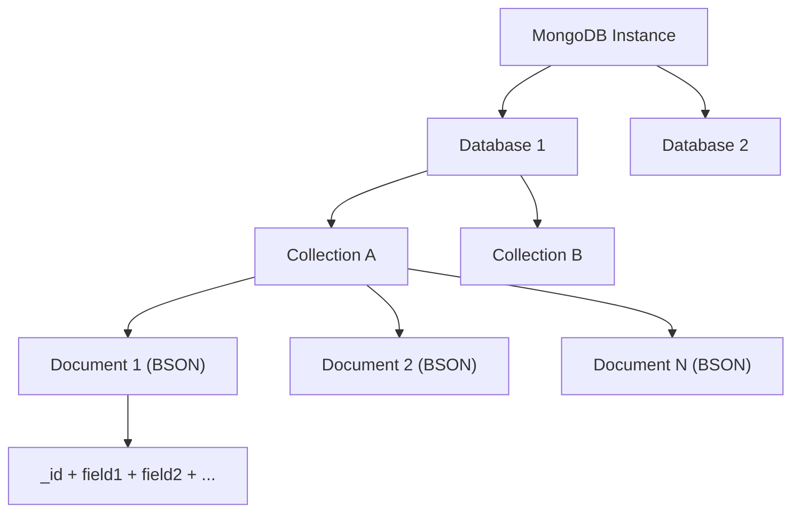
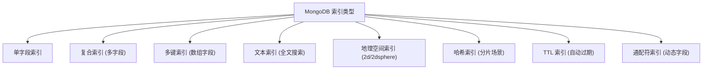
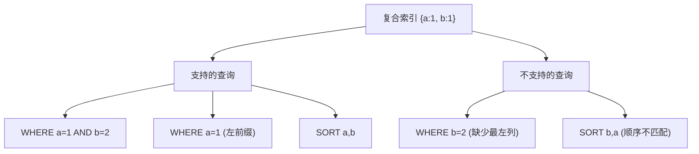
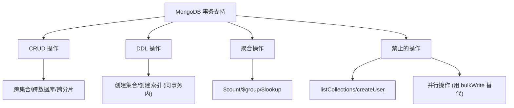
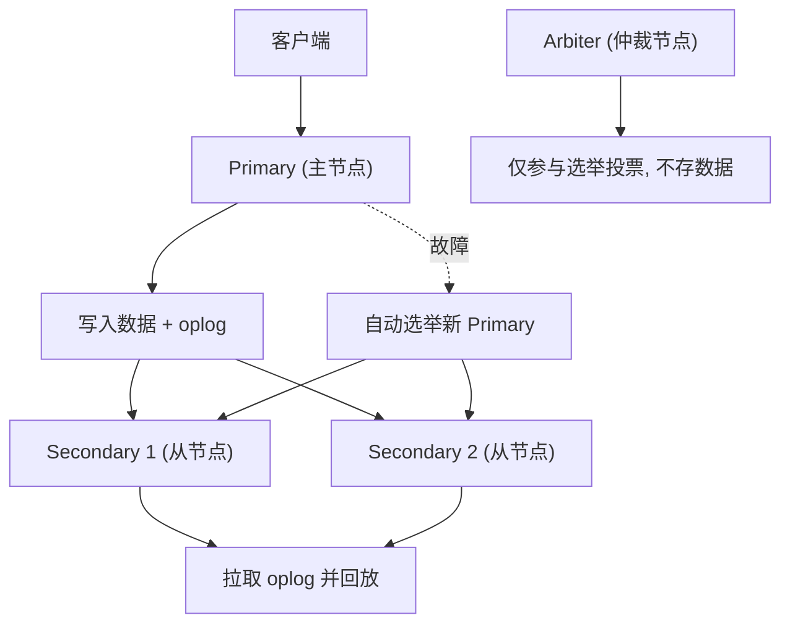
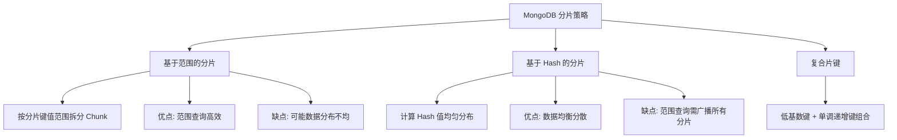
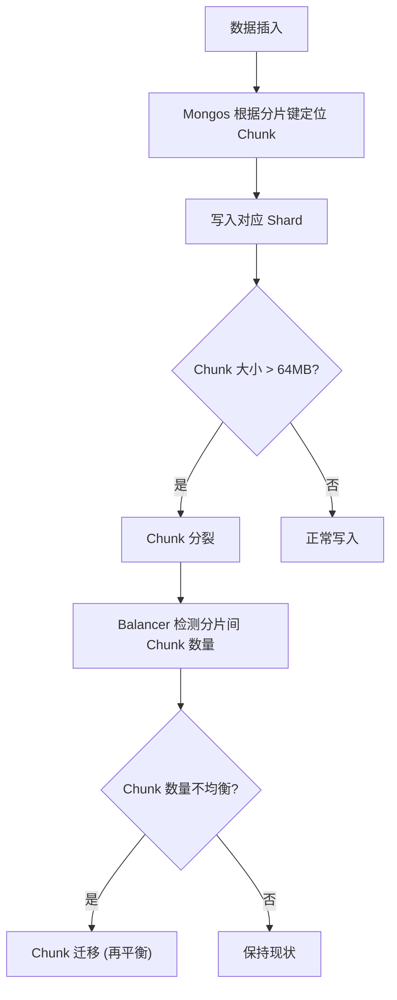
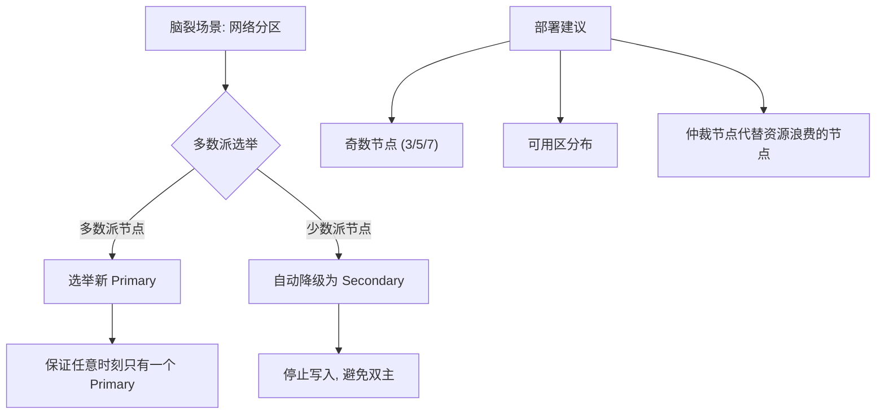
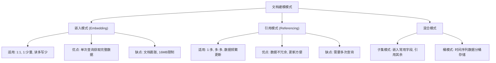

---
icon: logos:mongodb
title: MongoDB 面试
cover: https://raw.githubusercontent.com/dunwu/images/master/archive/2025/03/c395e54dfe444ffe8a7903e691994f60.jpg
date: 2025-03-04 21:03:08
categories:
  - 数据库
  - 文档数据库
  - MongoDB
tags:
  - 数据库
  - 文档数据库
  - MongoDB
  - 面试
permalink: /pages/cae9f346/
---

# MongoDB 面试

<!-- more -->

## MongoDB 概述

::: tip 扩展

- [MongoDB 官方文档之 MongoDB 简介](https://www.mongodb.com/zh-cn/docs/manual/introduction/)
- [MongoDB 简史](https://www.infoq.cn/article/3d4suwkc2fvikykemnvw)
- [MongoDB 发展历史及各主要版本新特性概述](https://blog.csdn.net/JiekeXu/article/details/143670868)

:::

### 【简单】MongoDB 是什么？⭐

> 🎯 目标等级：L2 ｜ ⏱ 建议用时：3 min ｜ 🏷 标签：MongoDB 概述 / 基本概念

#### 💎 关键结论

MongoDB 是面向文档的开源 NoSQL 数据库，用 C++ 编写，以 BSON 文档为基本数据单元。它天然支持无模式建模、水平扩展和高可用，适用于需要灵活数据模型与高并发读写的场景。

#### ⚡记忆卡片

- **口诀**：文档数据库，无模式，天然分布式
- **关键词**：BSON 文档 ／ 无模式 ／ NoSQL ／ C++
- **链路**：业务数据 → BSON 文档 → 集合（Collection） → 数据库

#### 📖 核心知识

1. **数据模型**：MongoDB 将数据存储为 [BSON 文档](https://www.mongodb.com/zh-cn/docs/manual/core/document/#std-label-bson-document-format)（JSON 的二进制表示），最大文档 16 MB；无需预定义模式（schema-free），同一集合内文档结构可以不同。
2. **核心能力**：
   - [读写操作（CRUD）](https://www.mongodb.com/zh-cn/docs/manual/crud/#std-label-crud)
   - [数据聚合](https://www.mongodb.com/zh-cn/docs/manual/core/aggregation-pipeline/#std-label-aggregation-pipeline)
   - [文本搜索](https://www.mongodb.com/zh-cn/docs/manual/text-search/#std-label-text-search)
   - [地理空间搜索](https://www.mongodb.com/zh-cn/docs/manual/tutorial/geospatial-tutorial/)
3. **分布式特性**：通过**副本集**实现高可用与自动故障转移，通过**分片**实现水平扩展。
4. **定位**：在 Web 应用、物联网、内容管理等场景中，可替代传统关系型数据库或 KV 存储，提供可扩展的高性能数据存储方案。

### 【简单】MongoDB 有什么特性？⭐

> 🎯 目标等级：L2 ｜ ⏱ 建议用时：5 min ｜ 🏷 标签：MongoDB 概述 / 特性总览

#### 💎 关键结论

MongoDB 的核心特性是面向文档 + 无模式 + 分布式。它以 BSON 文档为存储单元，支持丰富查询与聚合，4.0 起支持 ACID 事务，通过副本集实现高可用，通过分片实现水平扩展。

#### ⚡记忆卡片

- **口诀**：文档无模式，聚合加事务，副本加分片
- **关键词**：BSON 文档 ／ 无模式 ／ ACID 事务 ／ 副本集 ／ 分片 ／ GridFS
- **链路**：BSON 存储 → 丰富索引 → 聚合管道 → 事务保证 → 分布式扩展

#### 📖 核心知识

1. **面向文档 & 无模式**：数据以 [BSON 文档](https://www.mongodb.com/zh-cn/docs/manual/core/document/#std-label-bson-document-format) 存储（最大 16 MB），无预定义模式，按需增删字段。
2. **丰富的查询与索引**：支持 CRUD、聚合、文本搜索、地理空间查询；索引类型包括单字段、复合、多键、哈希、文本、地理空间等。
3. **ACID 事务**（4.0+）：
   - 单文档天然原子性
   - 4.0 支持副本集内多文档事务
   - 4.2 支持分片集群分布式事务
4. **分布式能力**：
   - **副本集**：通过数据复制实现高可用与自动故障转移
   - **分片**：通过 [分片键](https://www.mongodb.com/zh-cn/docs/manual/core/zone-sharding/#std-label-zone-sharding) 实现水平扩展
5. **其他特性**：数据压缩（Snappy/zlib/zstd）、GridFS 大文件存储、Map-Reduce（5.0 起已弃用，推荐聚合管道）。

### 【简单】MongoDB vs.RDBM？⭐

> 🎯 目标等级：L2 ｜ ⏱ 建议用时：5 min ｜ 🏷 标签：MongoDB 概述 / 对比选型

#### 💎 关键结论

MongoDB 用文档模型替代行列模型，以灵活 schema 和水平扩展见长；RDBMS 以强一致性和复杂关联查询见长。选型核心看数据模型是否需要灵活变动以及是否需要跨表 JOIN。

#### ⚡记忆卡片

- **口诀**：Mongo 灵活扩展强，RDBM 一致关联长
- **关键词**：文档模型 ／ MQL ／ 分片扩展 ／ 水平+垂直
- **链路**：灵活 Schema → 文档存储 → 分片扩容 → 适合快速迭代业务

#### 📖 核心知识

MongoDB vs.RDBM：

| 特性 | MongoDB | RDBMS |
| :--- | :--- | :--- |
| 数据模型 | 文档模型（BSON） | 关系型（行/列） |
| CRUD 操作 | MQL / SQL | SQL |
| 高可用 | 副本集（自动故障转移） | 主从/集群模式 |
| 扩展性 | 分片（水平+垂直） | 主要垂直扩展 |
| 索引类型 | B 树、全文、地理、多键、TTL、哈希等 | B 树为主 |
| 事务 | 4.0+ 多文档 ACID | 成熟 ACID |
| 数据容量 | 无理论上限 | 单表千万~亿级 |
| Schema | 无模式，灵活 | 预定义，严格 |

### 【简单】MongoDB 有哪些里程碑版本？⭐

> 🎯 目标等级：L2 ｜ ⏱ 建议用时：5 min ｜ 🏷 标签：MongoDB 概述 / 版本演进

#### 💎 关键结论

MongoDB 三大里程碑：1.0（2009）发布首版，3.0（2015）引入 WiredTiger 存储引擎，4.0（2018）支持 ACID 事务。4.2 进一步支持分布式事务。

#### ⚡记忆卡片

- **口诀**：一零首发三零引擎，四零事务四二分布
- **关键词**：1.0 首发 ／ 3.0 WiredTiger ／ 4.0 ACID ／ 4.2 分布式事务
- **链路**：首版发布 → WiredTiger 引擎 → 多文档事务 → 分布式事务

#### 📖 核心知识

MongoDB 由 **10gen** 开发（2007 年创立），2013 年更名为 MongoDB Inc.，2017 年上市。

里程碑版本：

- **1.0（2009）**：发布第一版
- **1.6（2010）**：引入分片（Sharding），支持水平扩展
- **2.2（2012）**：引入聚合管道（Pipeline）
- **2.4（2013）**：引入全文搜索
- **3.0（2015）**：全面支持 **WiredTiger** 存储引擎，支持可插拔存储引擎
- **4.0（2018）**：支持 ACID 事务（副本集内）
- **4.2（2019）**：支持分布式事务（分片集群）

::: details 扩展阅读

- [MongoDB 简史](https://www.infoq.cn/article/3d4suwkc2fvikykemnvw)
- [MongoDB 发展历史及各主要版本新特性概述](https://blog.csdn.net/JiekeXu/article/details/143670868)

:::

### 【简单】BSON 是什么？与 JSON 有何区别？⭐⭐

> 🎯 目标等级：L2 ｜ ⏱ 建议用时：5 min ｜ 🏷 标签：MongoDB 概述 / 数据格式

#### 💎 关键结论

BSON（Binary JSON）是 JSON 的二进制编码格式，是 MongoDB 存储和网络传输的数据格式。相比 JSON，BSON 支持更多数据类型（如 Date、Binary、ObjectId），且解析速度更快，但体积略大。

#### ⚡记忆卡片

- **口诀**：BSON 是 JSON 的二进制增强版
- **关键词**：Binary JSON ／ 类型丰富 ／ 16MB 上限 ／ 快速解析
- **链路**：JSON 文本 → BSON 二进制编码 → 支持更多类型 → 快速遍历

#### 📖 核心知识

1. **定义**：BSON（Binary JSON）是 [JSON](https://www.mongodb.com/zh-cn/docs/v8.0/reference/glossary/#std-term-JSON) 文档的二进制表示，主要用于 MongoDB 中文档存储和网络传输。
2. **与 JSON 的区别**：
   - BSON 支持更多数据类型：Date、Timestamp、ObjectId、Binary、Regex、JavaScript Code 等
   - BSON 是二进制格式，解析速度快但体积略大于 JSON 文本
   - BSON 支持快速遍历（通过长度前缀跳过不需要的字段）
3. **限制**：
   - 最大 BSON 文档大小为 **16 MB**
   - 每个文档必须有唯一的 `_id` 字段作为主键

#### 🔀 发散问题

- **Q：为什么 MongoDB 用 BSON 而不是直接用 JSON？** → JSON 缺少 Date、Binary 等类型，且文本解析性能低；BSON 在保持可读性的同时增加了类型支持和二进制高效性。
- **Q：BSON 的 16MB 限制怎么突破？** → 使用 GridFS 将大文件拆分为 256KB 的块存储，见本文档「如何使用 GridFS 存储大文件？」。

## MongoDB 建模

### 【简单】什么是主键 `_id`？⭐

> 🎯 目标等级：L2 ｜ ⏱ 建议用时：3 min ｜ 🏷 标签：MongoDB 建模 / 主键

#### 💎 关键结论

`_id` 是每个文档的唯一标识符，默认由系统自动生成 ObjectId。它由 12 字节组成（时间戳+机器标识+进程 ID+计数器），保证全局唯一且大致有序。

#### ⚡记忆卡片

- **口诀**：十二字节四部分，时空进计保唯一
- **关键词**：ObjectId ／ 12 字节 ／ 全局唯一 ／ 自动生成
- **链路**：时间戳 → 机器标识 → 进程 ID → 计数器 → 全局唯一 _id

#### 📖 核心知识

1. **作用**：`_id` 是每个文档的唯一标识符，默认自动生成，也可自定义。
2. **ObjectId 构成**（12 字节 BSON 类型）：
   - **时间戳**（4 字节）：文档创建时的 Unix 时间戳（秒级）
   - **机器标识**（5 字节）：随机值，标识生成该 ObjectId 的机器
   - **计数器**（3 字节）：随机初始化的自增序列，确保同一进程内不重复
3. **自定义 _id**：插入文档时可指定任意类型的 `_id` 值，只要保证集合内唯一即可。

#### 🔀 发散问题

- **Q：ObjectId 和自增 ID 哪个好？** → ObjectId 分布式友好、无需协调，但不可读；自增 ID 可读性好但需中心化发号器，分片场景下有写入热点问题。

### 【简单】MongoDB 支持哪些数据类型？⭐⭐⭐

> 🎯 目标等级：L2 ｜ ⏱ 建议用时：5 min ｜ 🏷 标签：MongoDB 建模 / 数据类型

#### 💎 关键结论

MongoDB 支持四类数据类型：基本类型（String/Integer/Boolean/Double/Decimal/Null）、时间类型（Date/Timestamp）、组合类型（Array/Embedded Document）和特殊类型（ObjectId/Binary/Regex/GeoJSON）。

#### ⚡记忆卡片

- **口诀**：基时组特四大类，字整双日数对嵌
- **关键词**：String ／ Integer ／ Date ／ Array ／ Embedded Document ／ ObjectId
- **链路**：基本标量 → 时间类型 → 组合嵌套 → 特殊类型

#### 📖 核心知识

1. **基本类型**：
   - **String**：UTF-8 字符串
   - **Integer**：32 位或 64 位整数
   - **Boolean**：true / false
   - **Double**：双精度浮点数
   - **Decimal**（Decimal128）：高精度浮点数，适合金融数据
   - **Null**：空值或缺失字段
2. **时间类型**：
   - **Date**：毫秒精度日期时间
   - **Timestamp**：内部操作用时间戳，示例 `Timestamp(1000, 1)`
3. **组合类型**：
   - **Array**：有序列表，可混合类型，如 `["apple", 42, true]`
   - **Embedded Document**：嵌套子文档，如 `{ address: { city: "Beijing" } }`
4. **特殊类型**：
   - **ObjectId**：文档唯一标识，如 `ObjectId("507f1f77bcf86cd799439011")`
   - **Binary Data**：二进制数据（图片、文件等）
   - **Regular Expression**：正则表达式
   - **JavaScript Code**：JS 代码片段
   - **GeoJSON**：地理坐标（点/线/多边形）

#### 🔀 发散问题

- **Q：Decimal 和 Double 有什么区别？** → Double 有浮点精度丢失问题（如 0.1+0.2≠0.3），Decimal128 支持 34 位有效数字，适合金融、账务场景。
- **Q：Timestamp 和 Date 有什么区别？** → Date 是通用日期时间，Timestamp 是 MongoDB 内部用于 oplog 复制的时间戳，业务代码一般用 Date。

## MongoDB CRUD

### 【简单】如何进行分页查询？⭐

> 🎯 目标等级：L2 ｜ ⏱ 建议用时：3 min ｜ 🏷 标签：MongoDB CRUD / 分页

#### 💎 关键结论

MongoDB 分页有两种方式：`skip()+limit()` 简单但深页性能差；基于游标（_id 或时间戳）的分页性能稳定，是生产环境首选。

#### ⚡记忆卡片

- **口诀**：深页 skip 慢如牛，游标分页快如风
- **关键词**：skip+limit ／ 游标分页 ／ _id 定位
- **链路**：skip 扫描前置文档 → 性能随页码下降 → 改用游标定位 → O(1) 跳转

#### 📖 核心知识

1. **skip + limit 分页**：`db.collection.find().skip(20).limit(10)`，简单直观，但深页时需扫描并跳过所有前置文档，性能差。
2. **游标分页**：记录上一页最后一条的 `_id`，下次查询用 `{ _id: { $gt: lastId } }` + `limit()`，性能稳定，不受页码深度影响。

### 【简单】如何实现数据的增删改查操作？⭐

> 🎯 目标等级：L2 ｜ ⏱ 建议用时：3 min ｜ 🏷 标签：MongoDB CRUD / 基础操作

#### 💎 关键结论

MongoDB 通过 insertOne/Many、updateOne/Many、deleteOne/Many、find 实现 CRUD，批量操作使用 bulkWrite 提升性能。

#### ⚡记忆卡片

- **口诀**：插更删查各 One/Many，批量操作 bulkWrite
- **关键词**：insertOne ／ updateMany ／ deleteOne ／ find ／ bulkWrite
- **链路**：单文档操作 → 多文档操作 → 批量操作（减少网络往返）

#### 📖 核心知识

1. **插入**：`insertOne()` / `insertMany()`
2. **更新**：`updateOne()` / `updateMany()` / `replaceOne()`
3. **删除**：`deleteOne()` / `deleteMany()`
4. **查询**：`find()` 返回游标，`findOne()` 返回单个文档
5. **批量操作**：`bulkWrite()` 将多个写操作合并为一次网络请求，提升吞吐量

### 【简单】如何使用 find() 方法查询文档？⭐

> 🎯 目标等级：L2 ｜ ⏱ 建议用时：3 min ｜ 🏷 标签：MongoDB CRUD / 查询

#### 💎 关键结论

`find(query, projection)` 是 MongoDB 最核心的查询方法。query 指定过滤条件，projection 指定返回字段（减少网络传输）。

#### ⚡记忆卡片

- **口诀**：find 两参数，条件加投影
- **关键词**：query ／ projection ／ 字段过滤 ／ 游标
- **链路**：构建 query 条件 → 指定 projection 字段 → find 返回游标 → 遍历结果

#### 📖 核心知识

1. **语法**：`db.collection.find(query, projection)`
   - `query`：查询条件（可选，`{}` 表示查全部）
   - `projection`：指定返回字段（`{ name: 1, status: 1 }` 表示只返回这两个字段）
2. **常用查询操作符**：`$gt/$gte/$lt/$lte`（比较）、`$in/$nin`（包含）、`$and/$or`（逻辑）、`$regex`（正则）

::: details 查询示例

```javascript
// 查询状态为 D 的数据
db.collection('test').find({ status: 'D' });

// 只返回 name 和 status 字段
db.collection('test').find({ status: 'D' }, { name: 1, status: 1 });

// 复合条件查询
db.collection('test').find({ age: { $gt: 18 }, status: { $in: ['A', 'B'] } });
```

:::

### 【简单】如何使用 GridFS 存储大文件？⭐

> 🎯 目标等级：L2 ｜ ⏱ 建议用时：3 min ｜ 🏷 标签：MongoDB CRUD / 大文件存储

#### 💎 关键结论

GridFS 是 MongoDB 存储超过 16MB 限制的大文件的标准方案，将文件拆分为 256KB 的块存入 `fs.chunks` 集合，元数据存入 `fs.files` 集合。

#### ⚡记忆卡片

- **口诀**：大文件超十六，GridFS 拆块存
- **关键词**：fs.files ／ fs.chunks ／ 256KB 块 ／ 16MB 限制
- **链路**：大文件 → 拆分为 256KB 块 → chunks 集合存数据 → files 集合存元数据

#### 📖 核心知识

1. **原理**：将大文件分割为多个块（默认 256KB/块），存入 `fs.chunks` 集合；文件元信息（文件名、大小、MD5 等）存入 `fs.files` 集合。
2. **使用场景**：存储图片、视频、日志文件等超过 16MB BSON 文档限制的大文件。
3. **操作方式**：通过 MongoDB 驱动程序或 `mongofiles` 命令行工具透明地上传/下载文件。

### 【简单】如何实现全文检索？⭐

> 🎯 目标等级：L2 ｜ ⏱ 建议用时：3 min ｜ 🏷 标签：MongoDB CRUD / 搜索

#### 💎 关键结论

MongoDB 全文检索分两步：先创建文本索引（text index），再用 `$text` + `$search` 操作符执行搜索。支持关键词匹配、短语搜索和相关性排序。

#### ⚡记忆卡片

- **口诀**：建 text 索引，用 $text 搜索
- **关键词**：text index ／ $text ／ $search ／ 相关性排序
- **链路**：创建文本索引 → $text + $search 查询 → 相关性评分排序

#### 📖 核心知识

1. **创建文本索引**：
```javascript
db.articles.createIndex({ title: 'text', content: 'text', tags: 'text' })
```
2. **执行全文搜索**：
```javascript
db.articles.find({ $text: { $search: 'mongodb tutorial' } })
```
3. **高级用法**：
   - 短语搜索：`$search: '"exact phrase"'`
   - 排除关键词：`$search: 'mongodb -tutorial'`
   - 相关性排序：`$sort: { score: { $meta: 'textScore' } }`
4. **限制**：每个集合只能有一个文本索引；对于复杂搜索需求，建议使用 Elasticsearch。

## MongoDB 聚合

::: tip 扩展

[MongoDB 官方文档之聚合](https://www.mongodb.com/zh-cn/docs/manual/aggregation/)

:::

### 【简单】MongoDB 支持哪些聚合方式？⭐⭐⭐

> 🎯 目标等级：L2 ｜ ⏱ 建议用时：5 min ｜ 🏷 标签：MongoDB 聚合 / 聚合方式

#### 💎 关键结论

MongoDB 提供三种聚合方式：**聚合管道**（首选）、**单一目的聚合方法**（count/distinct）、**Map-Reduce**（5.0 起已弃用）。聚合管道功能最强大，支持多阶段流水线处理。

#### ⚡记忆卡片

- **口诀**：管道优先，单一补充，MR 已废
- **关键词**：聚合管道 ／ count ／ distinct ／ Map-Reduce（已弃用）
- **链路**：聚合管道（多阶段） → 单一方法（简单计数/去重） → Map-Reduce（已废弃）

#### 📖 核心知识

1. **[聚合管道](https://www.mongodb.com/zh-cn/docs/manual/aggregation/#std-label-aggregation-pipeline-intro)**（首选）：
   - `$match`：过滤文档
   - `$group`：分组聚合
   - `$project`：指定返回字段
   - `$sort`：排序
   - `$limit/$skip`：限制/跳过结果
   - `$unwind`：展开数组
   - `$lookup`：关联查询（类似 SQL JOIN）
   - `$facet`：多分支聚合
2. **[单一目的聚合方法](https://www.mongodb.com/zh-cn/docs/manual/aggregation/#std-label-single-purpose-agg-methods)**：
   - `count()`：计数
   - `distinct()`：去重
   - `estimatedDocumentCount()`：快速估算计数
3. **[Map-Reduce](https://www.mongodb.com/zh-cn/docs/manual/core/Map-Reduce/)**（5.0 起已弃用，推荐聚合管道）
4. **聚合表达式**：
   - 数学：`$add`, `$subtract`, `$multiply`, `$divide`
   - 日期：`$year`, `$month`, `$dayOfMonth`
   - 字符串：`$concat`, `$substr`, `$toLower`
   - 逻辑：`$and`, `$or`, `$not`, `$cond`
   - 数组：`$arrayElemAt`, `$size`, `$slice`

#### 🔀 发散问题

- **Q：聚合管道和 Map-Reduce 哪个性能更好？** → 聚合管道性能更优，在 MongoDB 内部以原生代码执行，而 Map-Reduce 用 JavaScript 执行，开销更大。5.0 起官方已弃用 Map-Reduce。
- **Q：聚合管道有内存限制吗？** → 单个阶段内存限制 100MB，可通过 `allowDiskUse: true` 将中间结果写入磁盘突破限制。

### 【中等】什么是聚合管道？⭐⭐⭐

> 🎯 目标等级：L2-L3 ｜ ⏱ 建议用时：10 min ｜ 🏷 标签：MongoDB 聚合 / 聚合管道

#### 💎 关键结论

聚合管道是 MongoDB 执行聚合的首选方式，由多个阶段组成，每个阶段对输入文档执行操作后传递给下一阶段，类似 Unix 管道。它与 SQL 的 WHERE→GROUP BY→SELECT 流程对应。

#### ⚡记忆卡片

- **口诀**：阶段串联成管道，前一输出后一输入
- **关键词**：stage ／ pipeline ／ $match ／ $group ／ $lookup
- **链路**：$match 过滤 → $group 分组 → $sort 排序 → $project 投影 → 输出结果

#### 📖 核心知识

1. **基本概念**：聚合管道由一个或多个[阶段](https://www.mongodb.com/zh-cn/docs/manual/reference/operator/aggregation-pipeline/#std-label-aggregation-pipeline-operator-reference)组成，每个阶段对文档执行操作，输出传递给下一阶段。
2. **核心规则**：
   - 管道不会修改集合中的文档（除非包含 `$merge` 或 `$out` 阶段）
   - 同一阶段可多次出现，但 `$out`、`$merge`、`$geoNear` 除外
   - 阶段不必为每个输入文档输出一个文档


3. **SQL 与 MongoDB 聚合对应关系**：

| RDBM 操作 | MongoDB 聚合操作 |
| :--- | :--- |
| `WHERE` | `$match` |
| `GROUP BY` | `$group` |
| `HAVING` | `$match`（在 $group 后） |
| `SELECT` | `$project` |
| `ORDER BY` | `$sort` |
| `LIMIT` | `$limit` |
| `SUM()` | `$sum` |
| `COUNT()` | `$sum` / `$sortByCount` |
| `JOIN` | `$lookup` |
| `SELECT INTO` | `$out` |
| `MERGE INTO` | `$merge`（4.2+） |
| `UNION ALL` | `$unionWith`（4.4+） |

::: details 聚合管道示例

计算各款中号披萨的总订单数量：

```javascript
db.orders.aggregate([
  // Stage 1: 过滤中号披萨
  { $match: { size: 'medium' } },
  // Stage 2: 按名称分组并计算总数
  { $group: { _id: '$name', totalQuantity: { $sum: '$quantity' } } }
])
// 输出
[ { _id: 'Cheese', totalQuantity: 50 },
  { _id: 'Vegan', totalQuantity: 10 },
  { _id: 'Pepperoni', totalQuantity: 20 } ]
```

:::

#### 🔬 扩展知识

::: details

- 【L3】聚合管道优化：`$match` 和 `$sort` 应尽早放在管道前部，以便利用索引；`$match` 放在 `$project` 之前可减少投影开销。
- 【L3】`allowDiskUse: true`：单个阶段内存限制 100MB，开启后允许中间结果写入磁盘，适合大数据量聚合。
- 【L4】`$facet` 多分支聚合：在单个管道中并行执行多个子管道，一次查询返回多维度统计结果（如电商页面的分类统计、价格分布、评分分布）。

> 📚 延伸阅读：[MongoDB 官方文档之聚合](https://www.mongodb.com/zh-cn/docs/manual/aggregation/)

:::

#### 🔀 发散问题

- **Q：聚合管道和 SQL 的核心区别是什么？** → SQL 是声明式（描述结果），聚合管道是流式处理（描述过程）；但两者表达能力等价，且聚合管道的 `$lookup` 等价于 JOIN。

### 【简单】RDBM 聚合 vs. MongoDB 聚合？⭐⭐

> 🎯 目标等级：L2 ｜ ⏱ 建议用时：5 min ｜ 🏷 标签：MongoDB 聚合 / 对比选型

#### 💎 关键结论

MongoDB 聚合管道的阶段与 SQL 聚合函数一一对应：$match=WHERE、$group=GROUP BY、$project=SELECT、$lookup=JOIN。两者表达能力等价，但 MongoDB 是流式处理，SQL 是声明式。

#### ⚡记忆卡片

- **口诀**：match 对应 where，group 对应 group by，lookup 对应 join
- **关键词**：$match=WHERE ／ $group=GROUP BY ／ $lookup=JOIN ／ $out=SELECT INTO
- **链路**：SQL 声明式结果 → MongoDB 流式管道 → 功能等价，风格不同

#### 📖 核心知识

| RDBM 操作 | MongoDB 聚合操作 |
| :--- | :--- |
| `WHERE` | `$match` |
| `GROUP BY` | `$group` |
| `HAVING` | `$match`（在 $group 后） |
| `SELECT` | `$project` |
| `ORDER BY` | `$sort` |
| `LIMIT` | `$limit` |
| `SUM()` | `$sum` |
| `COUNT()` | `$sum` / `$sortByCount` |
| `JOIN` | `$lookup` |
| `SELECT INTO` | `$out` |
| `MERGE INTO` | `$merge`（4.2+） |
| `UNION ALL` | `$unionWith`（4.4+） |


### 【中等】MongoDB Map-Reduce 有什么用？⭐

> 🎯 目标等级：L2-L3 ｜ ⏱ 建议用时：5 min ｜ 🏷 标签：MongoDB 聚合 / Map-Reduce

#### 💎 关键结论

Map-Reduce 是 MongoDB 早期的分治聚合范式，通过 map 函数分发键值对、reduce 函数汇总结果。**从 5.0 起已弃用**，官方推荐用聚合管道替代，性能更优且 API 更友好。

#### ⚡记忆卡片

- **口诀**：Map 分发键值对，Reduce 汇总结果，5.0 已废弃
- **关键词**：map 函数 ／ reduce 函数 ／ JavaScript ／ 已弃用
- **链路**：map 阶段（每个文档）→ 分发键值对 → reduce 阶段（汇总）→ 输出结果

#### 📖 核心知识

1. **基本原理**：
   - **map 阶段**：对每个输入文档执行 map 函数，分发（emit）键值对
   - **reduce 阶段**：对相同键的值进行汇总
   - 可选 **finalize 函数**：进一步处理 reduce 输出


2. **特点**：所有 Map-Reduce 函数都是 JavaScript，在 mongod 进程中执行；可从一个 collection 读取，将结果写入另一个 collection 或直接返回。

#### 🔬 扩展知识

::: details

- 【L3】**为什么弃用 Map-Reduce？** → JavaScript 执行引擎开销大、无法利用内部优化；聚合管道以原生 C++ 执行，支持更多操作符，性能显著更优。
- 【L3】**迁移建议**：将 Map-Reduce 逻辑改写为聚合管道。例如 map+reduce 的分组求和可用 `$group` + `$sum` 替代。

> 📚 延伸阅读：[MongoDB 官方文档之聚合管道](https://www.mongodb.com/docs/manual/core/aggregation-pipeline/)

:::

## MongoDB 存储

### 【简单】MongoDB 的逻辑存储是怎样设计的？⭐⭐⭐⭐

> 🎯 目标等级：L2 ｜ ⏱ 建议用时：10 min ｜ 🏷 标签：MongoDB 存储 / 逻辑结构

#### 💎 关键结论

MongoDB 逻辑存储分四层：实例→数据库→集合→文档。文档是 BSON 格式的基本数据单元，集合是无模式的文档组，数据库是集合的容器。与 RDBMS 对应：数据库=database，表=collection，行=document，列=field。

#### ⚡记忆卡片

- **口诀**：实例库集合文档，四层结构记心头
- **关键词**：Database ／ Collection ／ Document ／ BSON ／ _id
- **链路**：MongoDB 实例 → Database → Collection → Document（BSON）

#### 📖 核心知识



1. **文档（Document）**：MongoDB 的基本数据单元，是一组有序键值对（BSON）。最大 16MB，必须有唯一 `_id` 字段。
   - 文档中键/值对是有序的，键是字符串，区分类型和大小写
   - 不能有重复的键
   - 键不能含 `\0`，`.` 和 `$` 有特殊含义，`_` 开头的键是保留的


2. **集合（Collection）**：文档组，类似 RDBMS 的表。无固定结构，插入第一个文档时自动创建。
   - 名称不能为空、不能含 `\0`、不能以 `system.` 开头


3. **数据库（Database）**：存储一个或多个集合。保留数据库：`admin`（权限）、`local`（不复制）、`config`（分片信息）。
4. **MongoDB vs RDBMS 概念对比**：

| RDBM 概念 | MongoDB 概念 |
| :--- | :--- |
| database | database |
| table | collection |
| row | document |
| column | field |
| index | index |
| primary key | `_id` |

5. **元数据**：系统命名空间 `dbname.system.*`，包含 `system.namespaces`、`system.indexes`、`system.profile`、`system.users` 等。

#### 🔀 发散问题

- **Q：为什么 MongoDB 的集合是无模式的？** → 文档数据库设计的核心思想是灵活，同一集合内文档可以有不同的字段和类型，适合快速迭代和异构数据存储。
- **Q：MongoDB 的 `_id` 和普通主键有什么区别？** → `_id` 默认为 ObjectId（12 字节，包含时间戳），分布式友好；见本文档「什么是主键 _id？」。

### 【中等】MongoDB 支持哪些存储引擎？⭐⭐

> 🎯 目标等级：L2-L3 ｜ ⏱ 建议用时：5 min ｜ 🏷 标签：MongoDB 存储 / 存储引擎

#### 💎 关键结论

MongoDB 采用可插拔存储引擎架构。当前主要有两种引擎：**WiredTiger**（3.2 起默认，支持 ACID 事务和压缩）和 **In-Memory**（企业版，数据存内存）。早期引擎 MMAPV1 已在 4.0 中移除。

#### ⚡记忆卡片

- **口诀**：WiredTiger 是默认，MMAPV1 已废弃
- **关键词**：WiredTiger ／ In-Memory ／ MMAPV1（已废弃） ／ 可插拔
- **链路**：MMAPV1（早期默认） → WiredTiger（3.2+ 默认） → In-Memory（企业版）

#### 📖 核心知识

1. **WiredTiger 存储引擎**（3.2+ 默认）：
   - 文档级并发、检查点、数据压缩
   - 支持 ACID 事务
   - 适合大多数工作负载
2. **In-Memory 存储引擎**（MongoDB Enterprise）：
   - 数据存储在内存中，获得更可预测的延迟
   - 不持久化到磁盘
3. **MMAPV1**（已废弃）：
   - MongoDB 早期默认引擎，4.0 起不再支持
4. **可插拔架构**：MongoDB 3.0 提供存储引擎 API，允许第三方开发引擎（类似 MySQL 的插件式架构）

#### 🔬 扩展知识

::: details

- 【L3】WiredTiger vs MMAPV1：WiredTiger 支持文档级锁（MMAPV1 是集合级锁），并发性能大幅提升；支持压缩减少磁盘占用。
- 【L3】In-Memory 引擎适用于对延迟极度敏感的场景（如实时报价系统），但数据不持久化，需配合副本集保证可用性。

:::

### 【中等】MongoDB 支持哪些压缩算法？⭐

> 🎯 目标等级：L2-L3 ｜ ⏱ 建议用时：3 min ｜ 🏷 标签：MongoDB 存储 / 压缩

#### 💎 关键结论

WiredTiger 引擎支持三种压缩算法：**Snappy**（默认，速度优先，3-5x）、**zlib**（压缩比优先，5-7x）、**zstd**（4.2+，综合最优）。

#### ⚡记忆卡片

- **口诀**：Snappy 快 zlib 小，zstd 又快又小
- **关键词**：Snappy（默认） ／ zlib ／ zstd（4.2+）
- **链路**：Snappy 快速压缩 → zlib 高压缩比 → zstd 综合最优

#### 📖 核心知识

1. **Snappy**（默认）：谷歌开源，压缩比 3-5x，速度优先；对集合使用块压缩，对索引使用前缀压缩。
2. **zlib**：高度压缩，压缩比 5-7x，适合存储空间紧张的场景。
3. **zstd**（4.2+）：Facebook 开源，比 zlib 压缩率更高且 CPU 开销更低。
4. **日志压缩**：WiredTiger 日志默认也用 Snappy 压缩，但小于 128 字节的日志记录不压缩。

#### 🔬 扩展知识

::: details

- 【L3】压缩算法选择：CPU 密集型场景用 Snappy 减少 CPU 开销；磁盘空间紧张用 zstd 获取更高压缩比。

:::

### 【中等】WiredTiger 数据结构采用 LSM Tree 还是 B+ Tree？⭐⭐

> 🎯 目标等级：L2-L3 ｜ ⏱ 建议用时：5 min ｜ 🏷 标签：MongoDB 存储 / WiredTiger

#### 💎 关键结论

WiredTiger 默认采用 **B+ Tree**，以 page 为基本单位读写磁盘。这与多数 NoSQL 引擎（如 HBase、RocksDB 用 LSM Tree）不同。WiredTiger 也支持 LSM Tree，但默认使用 B+ 树。

#### ⚡记忆卡片

- **口诀**：WT 默认 B 加树，页为单位读写盘
- **关键词**：B+ Tree ／ page ／ root/internal/leaf ／ 非 LSM
- **链路**：B+ Tree 结构 → root/internal/leaf page → 以 page 为单位磁盘读写

#### 📖 核心知识

1. **默认 B+ Tree**：WiredTiger 官方文档明确说明：
   > WiredTiger maintains a table's data in memory using a data structure called a B-Tree (B+ Tree to be specific), referring to the nodes of a B-Tree as pages.
2. **Page 结构**（B+ 树节点）：
   - **root page**：根节点
   - **internal page**：中间索引节点，不存数据
   - **leaf page**：叶子节点，存储 key/value，包含 page header + block header + 数据


3. **也支持 LSM Tree**：WiredTiger 提供 [LSM](https://source.wiredtiger.com/3.1.0/lsm.html) 树作为可选存储结构，但 MongoDB 默认使用 B+ 树。

#### 🔬 扩展知识

::: details

- 【L3】为什么 MongoDB 选 B+ Tree 而非 LSM Tree？→ B+ 树以页为单位读写，适合磁盘随机访问，读性能稳定；LSM Tree 写入更优但读放大严重，更适合写密集型场景。

> 📚 延伸阅读：[MongoDB 使用的是 B+ 树，不是 B 树](https://zhuanlan.zhihu.com/p/519658576)

:::

### 【困难】WiredTiger 如何保证数据持久性？⭐⭐⭐⭐

> 🎯 目标等级：L3-L4 ｜ ⏱ 建议用时：15 min ｜ 🏷 标签：MongoDB 存储 / WiredTiger 持久性

#### 💎 关键结论

WiredTiger 通过三大机制保证持久性：Cache（内存缓存）+ Checkpoint（检查点快照）+ Journal（WAL 日志），可类比 InnoDB 的 buffer pool、脏页刷盘和 redo log。崩溃恢复时从最后一个 checkpoint 重放 journal，保证已提交写入不丢。

#### ⚡记忆卡片

- **口诀**：缓存检查点日志，三者联动保持久
- **关键词**：Cache ／ Checkpoint ／ Journal（WAL） ／ 组提交
- **链路**：写入 → Cache 缓存 → Journal 追加 → Checkpoint 快照 → 崩溃恢复

#### 📖 核心知识

1. **Cache（内存缓存）**：
   - 默认大小为 `(内存 - 1GB) × 50%`
   - 写入先进入缓存，读取也优先命中缓存
   - 缓存中的脏页达到水位阈值时由 eviction 机制落盘
2. **Checkpoint（检查点）**：
   - 默认每 60 秒或 journal 达到 2GB 时创建
   - 将内存数据的一致快照持久化到磁盘
   - 是崩溃恢复的基线点
3. **Journal（WAL）**：
   - 所有写入先追加写 journal（类似 redo log）
   - 重启时从最后一个 checkpoint 开始重放 journal，保证已提交写入不丢
4. **组提交（Group Commit）**：
   - journal 采用组提交批量刷盘，降低 fsync 频率，提升写入吞吐

#### 🔬 扩展知识

::: details

- 【L3】Cache 大小建议只占内存 50% 左右，剩余留给 OS 文件系统缓存与连接开销，cache 过大反而增加 eviction/GC 压力。
- 【L3】Checkpoint 期间不会阻塞写入：基于 MVCC 获取一致性快照，与并发写入互不阻塞。
- 【L4】`journalCompressor` 与关闭 journal 的取舍：单节点关闭 journal（`journal.enabled: false`）可提升吞吐但宕机丢数据，副本集场景也不建议关闭。

:::

#### 🏭 实战场景

::: details

某金融系统 MongoDB 集群（64GB 内存），WT cache 配置 30GB，journal 开启 + Snappy 压缩。某次服务器掉电后重启，通过最后一个 checkpoint（宕机前 40 秒创建）重放 journal，所有已提交事务完整恢复，零数据丢失。对比测试中关闭 journal 的场景，同样掉电后丢失了约 200 条未刷盘的写入。

:::

#### ⚠️ 常见误区

::: details

常见误区：

- ❌ “Checkpoint 会阻塞所有写入” → Checkpoint 基于 MVCC 快照，与写入并发执行，互不阻塞
- ❌ “Cache 越大越好” → Cache 过大导致 eviction 压力和 GC 开销增加，官方建议 50% 内存
- ❌ “关闭 journal 可以提升写入性能，副本集可以补偿” → 副本集不能补偿单节点宕机的数据丢失，journal 是持久性的最后防线

:::

#### 🔀 发散问题

- **Q：WiredTiger 的 Journal 和 InnoDB 的 redo log 有什么区别？** → 两者原理相似（WAL），但 WiredTiger journal 支持压缩（默认 Snappy），InnoDB redo log 不压缩。
- **Q：Checkpoint 和 Journal 在崩溃恢复中分别扮演什么角色？** → Checkpoint 是恢复基线点，Journal 是从基线点重放到崩溃前的增量日志。

## MongoDB 索引

::: tip 扩展

- [MongoDB 官方文档之索引](https://www.mongodb.com/zh-cn/docs/manual/indexes/)
- [你真的会用索引么？[Mongo]](https://zhuanlan.zhihu.com/p/77971681)

:::

### 【简单】MongoDB 索引有什么用？⭐⭐

> 🎯 目标等级：L2 ｜ ⏱ 建议用时：3 min ｜ 🏷 标签：MongoDB 索引 / 索引作用

#### 💎 关键结论

索引是提升查询性能的关键数据结构。没有索引时 MongoDB 必须全集合扫描，有索引后通过 B-tree 结构快速定位文档，但索引也会增加写入开销。

#### ⚡记忆卡片

- **口诀**：无索引全表扫，有索引树查找
- **关键词**：B-tree ／ 查询加速 ／ 写放大 ／ 全集合扫描
- **链路**：无索引 → 全集合扫描 → 添加索引 → B-tree 快速定位 → 查询加速

#### 📖 核心知识

1. **无索引的代价**：扫描 collection 中每个文档，大数据量下耗时数十秒甚至数分钟。
2. **索引的作用**：索引是特殊数据结构（**B-tree**），存储字段值并排序，支持高效等值匹配和范围查询。
3. **索引的代价**：每次写入需同步更新所有索引，索引过多会显著影响写入性能。


### 【简单】MongoDB 支持哪些类型的索引？⭐⭐⭐⭐

> 🎯 目标等级：L2 ｜ ⏱ 建议用时：10 min ｜ 🏷 标签：MongoDB 索引 / 索引类型

#### 💎 关键结论

MongoDB 支持 8 种索引类型：单字段、复合、多键、文本、地理空间（2d/2dsphere）、哈希、TTL、通配符索引（4.2+）。每种适用于不同的查询场景。

#### ⚡记忆卡片

- **口诀**：单复多文地哈 T 通，八类索引各不同
- **关键词**：单字段 ／ 复合 ／ 多键 ／ 文本 ／ 地理空间 ／ 哈希 ／ TTL ／ 通配符
- **链路**：单字段索引 → 复合索引 → 多键索引 → 特殊索引（文本/地理/哈希/TTL/通配符）

#### 📖 核心知识



1. **单字段索引**：对单个字段建索引。
2. **复合索引**：对两个或多个字段建索引，数据先按第一字段排序，再按后续字段排序。
3. **多键索引**：对数组字段自动创建，收集数组中的值建索引。
4. **文本索引**：支持字符串内容的全文搜索查询。
5. **地理空间索引**：2d（平面几何）和 2dsphere（球面几何）。
6. **哈希索引**：对字段值的哈希建索引，支持哈希分片。
7. **TTL 索引**：自动删除过期文档，适合日志、会话等时效数据。
8. **通配符索引**（4.2+）：为动态/未知字段提供索引能力。

#### 🔬 扩展知识

::: details

- 【L3】**多键索引限制**：复合索引不能包含多个数组字段（笛卡尔积导致索引爆炸）；数组查询需用 `$elemMatch` 约束同元素匹配。
- 【L3】**通配符索引**：索引体积大、查询性能低，仅适合字段名不可枚举的场景，慎用。
- 【L3】**TTL 索引**：后台线程约每 60 秒扫描过期文档并删除，删除非实时；大规模集中过期可考虑按日期分集合替代。
- 【L4】**索引写放大**：每个索引在写入时需同步维护，先用 `$indexStats` 识别未使用索引再清理。

:::

#### 🔀 发散问题

- **Q：复合索引和多键索引有什么区别？** → 复合索引是多字段索引，多键索引是针对数组字段自动创建的索引。复合索引可以包含多个非数组字段，但不能包含多个数组字段。
- **Q：TTL 索引的删除是实时的吗？** → 不是，后台线程每约 60 秒扫描一次，删除有延迟；对时效性要求高的场景可用应用层定时任务补充。

### 【简单】复合索引中字段的顺序有影响吗？⭐⭐⭐⭐

> 🎯 目标等级：L2 ｜ ⏱ 建议用时：8 min ｜ 🏷 标签：MongoDB 索引 / 复合索引

#### 💎 关键结论

有影响。MongoDB 复合索引遵循**最左前缀原则**：索引 `{a:1, b:1}` 可支持 `{a:1}` 和 `{a:1, b:1}` 的查询，但不支持单独用 `{b:1}` 查询。排序键顺序也必须与索引中一致。

#### ⚡记忆卡片

- **口诀**：最左前缀不能缺，排序顺序要匹配
- **关键词**：最左前缀 ／ 排序顺序 ／ ESR 规则 ／ explain
- **链路**：索引 {a:1, b:1} → 支持 {a:1} 查询 → 不支持 {b:1} 查询

#### 📖 核心知识



1. **最左前缀原则**：索引 `{a:1, b:1, c:1}` 等价于 `{a:1}`、`{a:1,b:1}`、`{a:1,b:1,c:1}`，但不包含 `{b:1}` 等非左前缀子集。
2. **排序顺序匹配**：排序键顺序必须与索引中的顺序一致或完全反转。


::: details 排序示例

走复合索引 `{userid:1, score:-1}` 的排序：
```javascript
db.s2.find().sort({"userid": 1, "score": -1})
db.s2.find().sort({"userid": -1, "score": 1})  // 完全反转也可以
```

不走复合索引的排序：
```javascript
db.s2.find().sort({"userid": 1, "score": 1})    // 顺序不匹配
db.s2.find().sort({"score": 1, "userid": -1})   // 字段顺序不对
```

:::

#### 🔬 扩展知识

::: details

- 【L3】**ESR 索引设计规则**：Equality（等值条件）→ Sort（排序字段）→ Range（范围条件），比最左前缀更具操作性，同样适用于 MySQL 复合索引设计。

:::

#### 🔀 发散问题

- **Q：为什么完全反转排序也能走索引？** → B-tree 索引本身支持双向遍历，所以 `{a:1,b:-1}` 的索引既支持正序也支持完全反序的排序。

### 【中等】什么是覆盖索引查询？⭐⭐

> 🎯 目标等级：L2-L3 ｜ ⏱ 建议用时：5 min ｜ 🏷 标签：MongoDB 索引 / 覆盖索引

#### 💎 关键结论

覆盖索引查询（Covered Query）指查询条件和返回字段都在同一索引中的查询，可避免回表读取完整文档，性能最优。

#### ⚡记忆卡片

- **口诀**：查询返回都在索引，免回表最快
- **关键词**：覆盖查询 ／ 免回表 ／ _id:0 ／ 同一索引
- **链路**：查询字段在索引中 → 返回字段也在同一索引 → 直接从索引读取 → 无需回表

#### 📖 核心知识

1. **覆盖查询条件**：
   - 所有查询字段是索引的一部分
   - 结果中返回的所有字段都在同一索引中
   - 查询中没有字段等于 `null`
2. **关键细节**：必须显式指定 `_id: 0` 排除 `_id` 字段（因为索引不包括 `_id`），否则无法覆盖。

::: details 覆盖查询示例

```javascript
// 创建联合索引
db.users.createIndex({ gender: 1, user_name: 1 })

// 覆盖查询（必须排除 _id）
db.users.find({ gender: "M" }, { user_name: 1, _id: 0 })
```

:::

#### 🔬 扩展知识

::: details

- 【L3】explain 中 `indexOnly: true` 表示查询被索引覆盖；`totalDocsExamined: 0` 表示未回表。
- 【L3】覆盖索引对复合索引最有效；单字段索引通常无法覆盖（因为还需返回其他字段）。

:::

## MongoDB 事务

::: tip 扩展

- [MongoDB 官方文档之事务](https://www.mongodb.com/zh-cn/docs/manual/core/transactions/)
- [技术干货| MongoDB 事务原理](https://mongoing.com/archives/82187)
- [MongoDB 一致性模型设计与实现](https://developer.aliyun.com/article/782494)

:::

### 【简单】MongoDB 中如何使用事务？⭐⭐

> 🎯 目标等级：L2 ｜ ⏱ 建议用时：5 min ｜ 🏷 标签：MongoDB 事务 / 事务使用

#### 💎 关键结论

MongoDB 从 4.0 起支持多文档事务。使用流程：创建会话 → 开始事务 → 执行操作（传入 session）→ 提交或回滚 → 关闭会话。

#### ⚡记忆卡片

- **口诀**：开会话开事务，传 session 操作，提交或回滚
- **关键词**：startSession ／ startTransaction ／ commitTransaction ／ abortTransaction
- **链路**：startSession → startTransaction → 执行 CRUD → commit/abort → close

#### 📖 核心知识

1. **版本支持**：4.0 支持副本集内事务，4.2 支持分片集群分布式事务。
2. **操作步骤**：

```java
ClientSession session = mongoClient.startSession();
try {
    session.startTransaction(txnOptions);  // 1. 开始事务
    accountsCollection.updateOne(session, filterAlice, updateAlice);  // 2. 执行操作
    accountsCollection.updateOne(session, filterBob, updateBob);
    auditCollection.insertOne(session, auditLog);
    session.commitTransaction();  // 3. 提交事务
} catch (Exception e) {
    session.abortTransaction();  // 4. 回滚
} finally {
    session.close();  // 5. 关闭会话
}
```

### 【中等】MongoDB 事务支持哪些操作？⭐⭐⭐

> 🎯 目标等级：L2-L3 ｜ ⏱ 建议用时：8 min ｜ 🏷 标签：MongoDB 事务 / 事务操作

#### 💎 关键结论

MongoDB 事务支持跨集合/跨数据库/跨分片的 CRUD、DDL（创建集合/索引）和聚合操作。禁止 listCollections、createUser 等管理操作，并行操作需用 bulkWrite 替代。

#### ⚡记忆卡片

- **口诀**：CRUD DDL 聚合都支持，管理操作并行操作禁止
- **关键词**：跨集合 ／ 跨分片 ／ DDL ／ 禁止 listCollections
- **链路**：CRUD 操作 → DDL（创建集合/索引） → 聚合操作 → 禁止的操作

#### 📖 核心知识



1. **支持的操作**：
   - CRUD：跨集合、跨数据库、跨分片读写
   - DDL：在事务内创建集合和索引（索引必须在同事务新建的空集合上）
   - 聚合：`$count`、`$group`、`$lookup` 等
2. **计数操作**：事务内用 `$count` 或 `$group`+$sum` 替代 `count()` 命令。
3. **去重操作**：分片集合不能用 `distinct()`，需用 `$group`+`$addToSet` 替代。
4. **禁止的操作**：
   - `listCollections`、`listIndexes`
   - `createUser`、`getParameter`、`count` 命令
   - 并行操作（用 `bulkWrite` 替代）
   - 跨分片写事务中不能创建新集合

#### 🔬 扩展知识

::: details

- 【L3】事务中创建索引必须在同一事务中新建的空集合上创建，不能在已有集合上创建。
- 【L3】分片集合不能用 `distinct()` 命令，需用聚合管道 `$group`+`$addToSet` 替代。
- 【L4】事务中信息命令（如 `hello`、`buildInfo`）允许使用，但不能是事务的第一个操作。

:::

#### 🔀 发散问题

- **Q：MongoDB 事务和 MySQL 事务的隔离级别有什么区别？** → MongoDB 多文档事务默认快照隔离（Snapshot Isolation），基于 WiredTiger 的 MVCC 实现；MySQL InnoDB 支持四种隔离级别，默认可重复读。

## MongoDB 集群

### 【中等】MongoDB 的副本机制是怎样的？⭐⭐⭐⭐

> 🎯 目标等级：L2-L3 ｜ ⏱ 建议用时：12 min ｜ 🏷 标签：MongoDB 集群 / 副本集

#### 💎 关键结论

MongoDB 副本集是一组维护相同数据集的 mongod 进程，由 1 个 Primary + 多个 Secondary + 可选 Arbiter 组成。Primary 负责写入并通过 oplog 同步数据到 Secondary，Primary 故障时自动选举新主。

#### ⚡记忆卡片

- **口诀**：一主多从一仲裁，oplog 同步自选举
- **关键词**：Primary ／ Secondary ／ Arbiter ／ oplog ／ 自动选举
- **链路**：Primary 写入 → oplog 记录 → Secondary 拉取回放 → 故障时自动选举

#### 📖 核心知识



1. **节点角色**：
   - **Primary**：接收所有写操作，将变更写入 oplog
   - **Secondary**：从 Primary 拉取 oplog 并回放，同步数据；可配置为 0 优先级阻止成为 Primary
   - **Arbiter**：仅参与选举投票，不存储数据，用于节约资源或多机房容灾


2. **oplog（操作日志）**：local 库下的上限集合（Capped Collection），记录写操作增量日志，类似 MySQL binlog。Secondary 通过拉取 oplog 实现数据同步。


3. **选举机制**：Primary 故障时自动从 Secondary 中选举新主，保证新主数据最全。
4. **用途**：
   - **高可用（failover）**：自动故障转移，客户端无感知
   - **读写分离**：Secondary 可读（4.0+ 版本建议压力大时开启）

#### 🔬 扩展知识

::: details

- 【L3】**oplog 窗口**：oplog 是固定大小的 capped collection，容量决定了从节点能容忍多长时间的落后。宕机超过 oplog 窗口需全量 initial sync（代价高）。写入量大的集群应调大 oplog 或设置 `oplogMinRetentionHours`（4.4+）。
- 【L3】**选举耗时**：心跳间隔默认 2 秒，`electionTimeoutMillis` 默认 10 秒，故障到新主选出通常 12 秒以上。
- 【L4】**未提交写入会被回滚**：默认 `w:1` 只代表主节点写成功，若主节点在同步到多数派前宕机，这部分写入会被回滚（回滚数据写入 rollback 目录，上限约 300MB）。金融/账务场景必须用 `w:majority`。

:::

#### 🔀 发散问题

- **Q：oplog 和 MySQL binlog 有什么区别？** → 原理相似，都是增量日志；但 oplog 是 capped collection（固定大小循环覆盖），binlog 是顺序追加文件。
- **Q：为什么副本集建议奇数节点？** → 避免选举时平票，见本文档「MongoDB 如何解决脑裂问题？」。

### 【中等】什么是分片集群？⭐⭐⭐

> 🎯 目标等级：L2-L3 ｜ ⏱ 建议用时：8 min ｜ 🏷 标签：MongoDB 集群 / 分片集群

#### 💎 关键结论

分片集群是 MongoDB 的分布式架构，由 Config Servers（元数据）、Mongos（路由）和 Shard（数据分片）三部分组成。数据被均衡分布在不同分片中，提升容量和吞吐量。

#### ⚡记忆卡片

- **口诀**：Config 存元数据，Mongos 做路由，Shard 存数据
- **关键词**：Config Servers ／ Mongos ／ Shard ／ 分片键
- **链路**：客户端 → Mongos 路由 → Config 获取元数据 → Shard 存取数据

#### 📖 核心知识


1. **Config Servers**：配置服务器（本质是副本集），存储集群元数据和配置（分片地址、Chunks 等）
2. **Mongos**：路由服务，不存数据，从 Config 获取配置，将请求转发到特定分片，整合结果返回客户端
3. **Shard**：每个分片是数据的子集，从 3.6 起每个 Shard 必须部署为副本集

#### 🔀 发散问题

- **Q：分片集群和副本集有什么区别？** → 副本集是数据冗余（每个节点存全量数据），分片集群是数据分散（每个分片存部分数据）。生产环境通常两者结合：分片集群的每个 Shard 本身是一个副本集。

### 【简单】为什么要用分片集群？⭐

> 🎯 目标等级：L2 ｜ ⏱ 建议用时：3 min ｜ 🏷 标签：MongoDB 集群 / 分片动机

#### 💎 关键结论

分片集群通过水平扩展解决单机存储和吞吐瓶颈。当数据量或读写压力超过单机极限时，分片将数据分散到多个节点，成本更低且扩展更灵活。

#### ⚡记忆卡片

- **口诀**：单机不够就分片，水平扩展成本低
- **关键词**：水平扩展 ／ 存储瓶颈 ／ 读写瓶颈 ／ 成本优势
- **链路**：单机瓶颈 → 垂直扩展受限 → 水平扩展（分片） → 容量+吞吐提升

#### 📖 核心知识

1. **垂直扩展**：增加单机能力（磁盘、内存、CPU），成本高且有上限。
2. **水平扩展**（分片）：将数据分散到多台服务器，灵活且成本低。
3. **适用场景**：
   - 存储容量受单机磁盘限制
   - 读写能力受单机 CPU/内存/网卡限制

### 【简单】如何选择分片键？⭐⭐⭐

> 🎯 目标等级：L2 ｜ ⏱ 建议用时：8 min ｜ 🏷 标签：MongoDB 集群 / 分片键

#### 💎 关键结论

选择分片键需考虑四个因素：取值基数大、分布均匀、查询带分片键、避免单调递增。分片键近乎不可变，必须在上线前充分评估。

#### ⚡记忆卡片

- **口诀**：基数大分布均，查询带片键，莫单调递增
- **关键词**：取值基数 ／ 取值分布 ／ 查询带分片键 ／ 避免单调递增
- **链路**：高基数 → 均匀分布 → 查询定向 → 避免写入热点

#### 📖 核心知识

1. **取值基数大**：基数小则 chunk 数量有限，数据增多后 chunk 过大无法迁移（jumbo chunk）。
2. **取值分布均匀**：分布不均导致某些 chunk 数据量过大，数据分布不均。
3. **查询带分片键**：带分片键查询可直接定位分片（targeted），否则需广播所有分片（scatter-gather）。
4. **避免单调递增**：单调递增导致写入集中在最后一个分片，不断发生迁移。

#### 🔬 扩展知识

::: details

- 【L3】**分片键近乎不可变**：集合分片后无法更换分片键，文档的分片键字段值也不能更新。5.0 的 `refineCollectionShardKey` 只支持细化粒度，更换片键只能 dump/restore 重建。因此**片键必须在上线前充分评估并做好预分片**。

:::

#### 🔀 发散问题

- **Q：哈希分片键和范围分片键怎么选？** → 范围查询多用范围分片，写入密集且无范围查询用哈希分片；见本文档「MongoDB 的分片策略有哪些？」。

### 【中等】MongoDB 的分片策略有哪些？⭐⭐⭐

> 🎯 目标等级：L2-L3 ｜ ⏱ 建议用时：8 min ｜ 🏷 标签：MongoDB 集群 / 分片策略

#### 💎 关键结论

MongoDB 支持两种分片策略：**基于范围的分片**（范围查询高效，但可能不均）和**基于 Hash 的分片**（数据均匀分散，但范围查询需广播）。还可配置**复合片键**组合两者优势。

#### ⚡记忆卡片

- **口诀**：范围查询用范围片，写密集用哈希片
- **关键词**：范围分片 ／ Hash 分片 ／ 复合片键
- **链路**：范围分片（定向查询） vs Hash 分片（均匀分散） → 复合片键组合

#### 📖 核心知识



1. **基于范围的分片**：


   - 按分片键值的范围拆分为 Chunk
   - 优点：Mongos 可快速定位数据，范围查询高效
   - 缺点：可能数据分布不均，造成读写热点
   - 适用：非单调递增、基数大、需范围查询

2. **基于 Hash 的分片**：


   - 计算字段哈希值分布 Chunk
   - 优点：数据均衡分布，写分散
   - 缺点：范围查询需广播所有分片
   - 适用：单调递增、写入随机分发

3. **复合片键**：低基数键 + 单调递增键组合，兼顾分布均匀和查询定向。

#### 🔀 发散问题

- **Q：哈希分片键支持范围查询吗？** → 不支持，哈希打乱了值的顺序，范围查询需广播所有分片（scatter-gather），性能差。

### 【中等】MongoDB 的分片数据如何存储？⭐⭐⭐

> 🎯 目标等级：L2-L3 ｜ ⏱ 建议用时：8 min ｜ 🏷 标签：MongoDB 集群 / 分片存储

#### 💎 关键结论

分片数据以 **Chunk** 为逻辑单元存储，每个 Chunk 包含一定范围片键的数据（默认最大 64MB）。Chunk 超过上限时自动分裂，Balancer 组件监控各分片 Chunk 数量并自动迁移实现均衡。

#### ⚡记忆卡片

- **口诀**：Chunk 分裂增，Balancer 迁移均
- **关键词**：Chunk ／ 64MB ／ Chunk 分裂 ／ Balancer ／ Rebalance
- **链路**：数据写入 Chunk → 超过 64MB 分裂 → Balancer 检测不均衡 → Chunk 迁移

#### 📖 核心知识



1. **Chunk**：分片集群的逻辑数据单元，包含一定范围片键的数据，默认最大 64MB（可调 1-1024MB）。
2. **Chunk 分裂**：数据超过 Chunk 上限时自动分裂。


3. **Rebalance（再平衡）**：Balancer 运行在 Config Server Primary 节点上（3.4+），监控各分片 Chunk 数量，达到阈值时执行 Chunk 迁移。


4. **注意**：Chunk 只分裂不合并；Rebalance 耗资源，可通过低峰期执行、预分片或设置时间窗减少影响。

#### 🔀 发散问题

- **Q：Chunk 可以合并吗？** → 不可以，Chunk 只分裂不合并，即使 chunkSize 调大也不会合并。

### 【中等】MongoDB 如何解决脑裂问题？⭐⭐⭐

> 🎯 目标等级：L2-L3 ｜ ⏱ 建议用时：8 min ｜ 🏷 标签：MongoDB 集群 / 脑裂

#### 💎 关键结论

MongoDB 通过**多数派选举机制**防止脑裂：任何写入/选举必须获得多数节点支持。网络分区时，多数派继续服务，少数派自动降级停止写入，保证任何时刻只有一个 Primary。

#### ⚡记忆卡片

- **口诀**：多数派投票，少数派降级，奇数节点防平票
- **关键词**：多数派选举 ／ 奇数节点 ／ Arbiter ／ w:majority
- **链路**：网络分区 → 多数派选举新 Primary → 少数派降级 Secondary → 网络恢复后同步

#### 📖 核心知识



1. **多数派选举**：任何操作/选举必须获得多数节点支持（3 节点需 2 票，5 节点需 3 票）。
2. **奇数节点部署**：推荐 3、5、7 节点，避免偶数节点平票。资源不足时用 Arbiter 代替。
3. **网络分区处理**：
   - 多数派子集群选举新 Primary，继续服务
   - 少数派自动降级为 Secondary，停止接受写入
   - 网络恢复后，少数派重新同步数据
4. **Write Concern**：`w: majority` 确保写入被多数节点确认后返回，进一步保证一致性。

```javascript
db.collection.insertOne(
  { data: "important" },
  { writeConcern: { w: "majority", wtimeout: 5000 } }
)
```

#### 🔀 发散问题

- **Q：偶数节点副本集有什么风险？** → 4 节点集群需 3 票多数派，2 节点分区时双方都无法达成多数，均无法选举 Primary，服务完全不可用。奇数节点可避免此问题。

### 【困难】MongoDB 的 Read Concern 和 Write Concern 是什么？⭐⭐⭐⭐

> 🎯 目标等级：L3-L4 ｜ ⏱ 建议用时：15 min ｜ 🏷 标签：MongoDB 集群 / 一致性控制

#### 💎 关键结论

Read/Write Concern 是 MongoDB 一致性与可用性权衡的核心手段。Write Concern 控制写入确认级别（w:1/majority/0），Read Concern 控制读取一致性级别（local/majority/linearizable/snapshot）。金融级场景必须用 w:majority + readConcern:majority。

#### ⚡记忆卡片

- **口诀**：写关注确认级别，读关注一致级别
- **关键词**：w:1 ／ w:majority ／ readConcern:local ／ readConcern:majority ／ linearizable
- **链路**：Write Concern（写确认） → Read Concern（读一致性） → 组合决定一致性级别

#### 📖 核心知识

**Write Concern（写关注）**：

| 级别 | 含义 | 场景 |
| :--- | :--- | :--- |
| `w: 1`（默认） | 主节点写入成功即返回 | 性能最高；主节点宕机可能丢失未同步写入 |
| `w: majority` | 多数节点确认后才返回 | 防止写入被回滚，金融/账务场景必备 |
| `w: 0` | 发后即忘，不等待确认 | 容忍丢失的埋点类场景 |
| `j: true` | 要求 journal 落盘后才确认 | 防进程崩溃丢数 |

**Read Concern（读关注）**：

| 级别 | 含义 |
| :--- | :--- |
| `local`（默认） | 读本节点最新数据，可能读到未提交（可能回滚）的数据 |
| `available` | 类似 local，分片场景可能读到孤儿文档 |
| `majority` | 只读已被多数派确认的数据，永不回滚；事务必备 |
| `linearizable` | 线性一致性读，阻塞等待多数派最新数据，延迟最高，仅读主节点 |
| `snapshot` | 事务用的快照读 |

#### 🔬 扩展知识

::: details

- 【L3】**金融级组合**：`w: majority` + `readConcern: majority` 是标准组合；若用 w:1 写 + local 读，可能出现“读到的数据消失”：读到尚未多数派确认的写入，主节点随后宕机，该写入被回滚。
- 【L3】**readConcern majority 依赖 writeConcern majority**：只有以多数派持久化的数据才能在 majority 读级别可见。
- 【L4】MongoDB 4.0+ 多文档事务要求 readConcern majority；基于 WiredTiger 的文档级锁 + MVCC（majority 读基于 stable timestamp）实现快照隔离。

:::

#### 🏭 实战场景

::: details

某支付系统 MongoDB 副本集（3 节点），写入使用 w:1，某次主节点宕机后，约 50 笔已确认的支付记录未同步到多数派，选举新主后被回滚。切换为 `w: majority` + `readConcern: majority` 后，同样场景下零数据丢失，但写入延迟从 2ms 升至 8ms（需等待多数派确认）。

:::

#### ⚠️ 常见误区

::: details

常见误区：

- ❌ “w:1 就足够安全” → w:1 只代表主节点写成功，主节点宕机且未同步到多数派的写入会被回滚
- ❌ “readConcern local 和 majority 没区别” → local 可能读到未多数派确认的数据，majority 保证永不回滚
- ❌ “所有场景都用 w:majority” → w:majority 增加写入延迟，日志、埋点等非关键场景用 w:1 即可

:::

#### 🔀 发散问题

- **Q：linearizable 和 majority 读有什么区别？** → majority 读已多数派确认的历史数据，linearizable 保证读到多数派确认的**最新**数据（会阻塞等待），延迟更高。
- **Q：为什么事务必须用 readConcern majority？** → 事务基于快照隔离，需要保证读到的数据不会被回滚，只有 majority 级别能提供这个保证。

## MongoDB 高级

### 【困难】MongoDB 的 Change Streams 是什么？⭐⭐⭐

> 🎯 目标等级：L3-L4 ｜ ⏱ 建议用时：10 min ｜ 🏷 标签：MongoDB 高级 / Change Streams

#### 💎 关键结论

Change Streams 是 MongoDB 3.6 引入的实时数据变更通知机制，基于 oplog 构建但提供更高级的 API。支持订阅集合/数据库/全局的数据变更事件，支持断点续传（Resume Token）。

#### ⚡记忆卡片

- **口诀**：watch 监听变更，token 断点续传
- **关键词**：watch() ／ Resume Token ／ oplog ／ CDC ／ insert/update/delete
- **链路**：oplog 底层 → Change Streams API → watch() 订阅 → Resume Token 断点续传

#### 📖 核心知识

1. **核心特性**：
   - 基于 oplog 构建，但提供更高级的 API
   - 支持操作类型：insert、update、replace、delete、drop、rename
   - **Resume Token**：支持断点续传，应用重启后从上次位置继续消费
   - 可用聚合管道过滤特定变更
2. **使用示例**：
```javascript
// 监听集合变更
const changeStream = db.collection('orders').watch();
changeStream.on('change', (change) => {
  console.log('操作类型:', change.operationType);
  console.log('文档 ID:', change.documentKey._id);
  console.log('变更内容:', change.fullDocument);
});

// 带过滤条件
const pipeline = [{ $match: { 'fullDocument.status': 'completed' } }];
const filteredStream = db.collection('orders').watch(pipeline);
```
3. **应用场景**：实时数据同步（缓存失效、搜索引擎更新）、审计日志、事件驱动架构（CDC）、实时通知推送。

#### 🔬 扩展知识

::: details

- 【L3】Change Streams 要求副本集部署（因为依赖 oplog），单节点不可用。
- 【L4】Resume Token 存储在 `_resumeToken` 字段中，可在 `watch({ resumeAfter: token })` 中指定从特定位置恢复。

:::

#### 🏭 实战场景

::: details

某电商平台使用 Change Streams 监听订单集合，当订单状态变更为“已发货”时，自动触发物流通知和库存更新。日均处理约 50 万条变更事件，端到端延迟约 200ms。

:::

#### ⚠️ 常见误区

::: details

常见误区：

- ❌ “Change Streams 和直接读 oplog 一样” → Change Streams 提供更高级的 API（包括 Resume Token、聚合管道过滤），且只返回变更事件而非原始 oplog
- ❌ “Change Streams 可以在单节点使用” → 必须部署副本集，因为底层依赖 oplog

:::

#### 🔀 发散问题

- **Q：Change Streams 和 Kafka 有什么区别？** → Change Streams 是 MongoDB 内置的 CDC 能力，无需额外组件；Kafka 是独立的流平台，吞吐量更高但架构更复杂。小规模场景可用 Change Streams，大规模场景建议用 Debezium + Kafka。

### 【困难】MongoDB 文档建模有哪些设计模式？⭐⭐⭐⭐

> 🎯 目标等级：L3-L4 ｜ ⏱ 建议用时：15 min ｜ 🏷 标签：MongoDB 高级 / 文档建模

#### 💎 关键结论

MongoDB 文档建模的核心原则是**嵌入优先**：经常一起读取的数据嵌入同一文档。当数据独立更新、多对多关系或可能超过 16MB 时用引用。常见模式有嵌入、引用、子集、桶、多态模式。

#### ⚡记忆卡片

- **口诀**：嵌入优先，引用补充，子集桶多态
- **关键词**：嵌入模式 ／ 引用模式 ／ 子集模式 ／ 桶模式 ／ 多态模式
- **链路**：嵌入优先 → 16MB/独立更新 → 引用 → 特殊场景 → 子集/桶/多态

#### 📖 核心知识



1. **核心原则**：
   - **嵌入优先**：经常一起读取的数据嵌入同一文档
   - **引用原则**：数据独立更新、多对多关系或可能超过 16MB 时使用引用
   - **读写比原则**：读多写少适合嵌入，写多读少适合引用

2. **常见设计模式**：

| 模式 | 适用场景 | 示例 |
| :--- | :--- | :--- |
| **嵌入模式** | 1:1、1:少量、读多写少 | 用户 + 地址 |
| **引用模式** | 1:多、多:多、数据独立更新 | 用户 + 订单 |
| **子集模式** | 大文档但只查部分字段 | 产品 + 最新评论 |
| **桶模式** | 时间序列数据 | IoT 传感器数据按小时分桶 |
| **多态模式** | 不同类型但有共同字段 | 不同产品类型 |

::: details 建模示例

```javascript
// 嵌入模式: 博客文章 + 作者
db.posts.insertOne({
  title: "MongoDB 指南",
  author: { name: "张三", email: "zhang@example.com" },  // 嵌入
  tags: ["mongodb", "nosql"],                              // 嵌入数组
  comments: [{ user: "李四", text: "写得很好!" }]          // 嵌入少量评论
});

// 引用模式: 用户 + 订单
db.users.insertOne({ _id: ObjectId("u1"), name: "张三" });
db.orders.insertOne({
  userId: ObjectId("u1"),  // 引用用户ID
  items: [{ productId: ObjectId("p1"), qty: 2, price: 99.9 }]
});
```

:::

#### 🔬 扩展知识

::: details

- 【L3】**更新模式对建模的影响**：WiredTiger 中文档增长超出原存储空间时需重新分配并搬迁，频繁“增长型更新”造成存储碎片与性能下降。
- 【L3】**应对手段**：嵌入数组用 `$push` + `$slice` 限制长度；时序类增长数据用桶模式，天然避免文档增长。
- 【L4】**16MB 硬约束**：实践中单文档超过数 MB 就该考虑拆分（网络传输、索引、更新代价都会放大）。

:::

#### 🏭 实战场景

::: details

某社交平台用户文档嵌入最近 10 条评论（子集模式），其余评论用引用。查询用户详情时单次查询获取完整数据（含最近评论），平均响应时间从 150ms 降至 40ms。文档平均大小控制在 200KB 以内。

:::

#### ⚠️ 常见误区

::: details

常见误区：

- ❌ “什么都应该嵌入” → 数组无限增长的嵌入会导致文档超过 16MB 或更新性能下降，需用子集模式或引用
- ❌ “引用模式和关系型数据库一样” → MongoDB 没有 JOIN，引用需要应用层多次查询或聚合管道 `$lookup`
- ❌ “文档越大越好” → 文档过大会增加网络传输和索引维护开销，实践中建议控制在数 MB 以内

:::

#### 🔀 发散问题

- **Q：什么时候该用桶模式？** → 时间序列数据（如 IoT 传感器、日志、股票行情），按时间窗口分桶，每桶一个文档，避免单文档无限增长。

### 【困难】MongoDB 如何进行性能调优？⭐⭐⭐

> 🎯 目标等级：L3-L4 ｜ ⏱ 建议用时：12 min ｜ 🏷 标签：MongoDB 高级 / 性能调优

#### 💎 关键结论

MongoDB 性能调优四大方向：查询优化（索引+explain）、内存优化（WiredTiger cache）、架构优化（分片/副本集）、监控工具（profiler/mongostat）。核心是先用 explain 定位瓶颈，再针对性优化。

#### ⚡记忆卡片

- **口诀**：explain 先定位，索引加内存，分片扩架构
- **关键词**：explain ／ profiler ／ WiredTiger cache ／ 索引优化 ／ 分片
- **链路**：explain 分析瓶颈 → 添加索引 → 调优 cache → 架构扩展

#### 📖 核心知识

1. **查询优化**：
```javascript
// 使用 explain 分析查询性能
db.orders.find({ status: "active" }).explain("executionStats");
// 关注: executionTimeMillis, totalDocsExamined, totalKeysExamined

// 添加合适索引
db.orders.createIndex({ status: 1, createdAt: -1 });

// 使用投影减少数据传输
db.orders.find({ status: "active" }, { _id: 1, total: 1 });
```

2. **常见性能问题及优化**：

| 问题 | 原因 | 优化方案 |
| :--- | :--- | :--- |
| 慢查询 | 缺少索引/全集合扫描 | 添加索引，用 `explain()` 分析 |
| 内存不足 | 工作集超过 WT cache | 增加内存或优化查询 |
| 写入瓶颈 | 过多索引/文档过大 | 减少无用索引，控制文档大小 |
| 分片不均衡 | 片键选择不当 | 调整片键或用 Hash 分片 |

3. **监控工具**：
   - **mongostat**：实时查看数据库操作统计
   - **mongotop**：查看各集合读写耗时
   - **profiler**：记录慢查询日志

```javascript
// 开启慢查询日志 (记录超过 100ms 的查询)
db.setProfilingLevel(1, { slowms: 100 });
db.system.profile.find().sort({ ts: -1 }).limit(10);
```

4. **WiredTiger 配置优化**：
```yaml
storage:
  wiredTiger:
    engineConfig:
      cacheSizeGB: 8
      journalCompressor: snappy
    collectionConfig:
      blockCompressor: zstd
```

#### 🔬 扩展知识

::: details

- 【L3】**索引设计 ESR 规则**：Equality → Sort → Range，见本文档「复合索引中字段的顺序有影响吗？」。
- 【L3】**工作集大小**：工作集（活跃数据）应能完全放入 WiredTiger cache，否则频繁磁盘 I/O 导致性能下降。
- 【L4】**连接池优化**：MongoDB 驱动连接池默认最大值 100，高并发场景调大连接池并配合服务端 `maxIncomingConnections`。

:::

#### 🏭 实战场景

::: details

某订单系统慢查询频繁（平均 800ms），通过 explain 发现全集合扫描。添加复合索引 `{status:1, createdAt:-1}` 后查询降至 15ms。同时开启 profiler 记录慢查询，每周清理未使用索引（通过 `$indexStats` 识别），集合索引数从 12 个优化为 7 个，写入性能提升 20%。

:::

#### ⚠️ 常见误区

::: details

常见误区：

- ❌ “索引越多越好” → 每个索引在写入时同步维护，过多索引严重影响写入性能
- ❌ “explain 不需要在测试环境验证” → 生产环境 explain 也会消耗资源，应在测试环境验证后再应用到生产
- ❌ “cache 越大越好” → 超过 50% 内存反而增加 eviction/GC 压力

:::

#### 🔀 发散问题

- **Q：如何判断是否需要增加分片？** → 当单机 CPU/内存/磁盘已到极限、工作集无法放入 cache、读写延迟持续上升时，考虑分片扩展。

## 参考资料

- [MongoDB 官方文档](https://www.mongodb.com/zh-cn/docs/manual/)
- [MongoDB 官方文档之聚合](https://www.mongodb.com/zh-cn/docs/manual/aggregation/)
- [MongoDB 官方文档之索引](https://www.mongodb.com/zh-cn/docs/manual/indexes/)
- [MongoDB 官方文档之事务](https://www.mongodb.com/zh-cn/docs/manual/core/transactions/)
- [MongoDB 官方文档之副本集](https://www.mongodb.com/zh-cn/docs/manual/replication/)
- [MongoDB 官方文档之分片](https://www.mongodb.com/zh-cn/docs/manual/sharding/)
