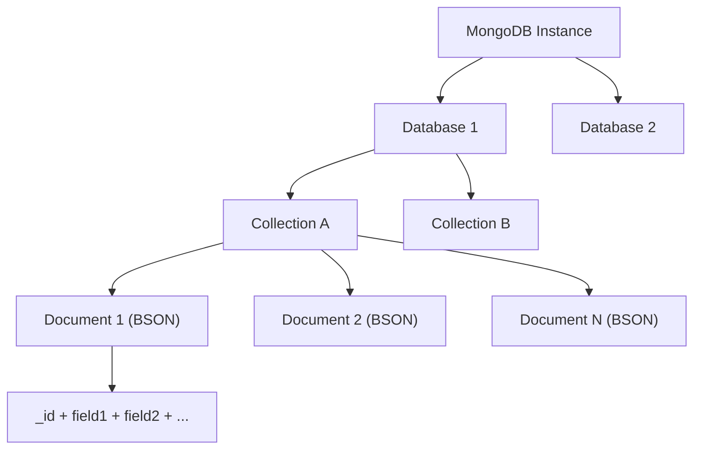
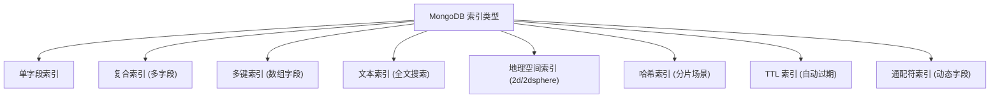
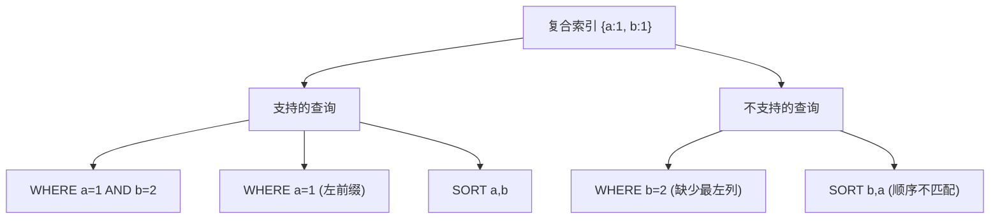
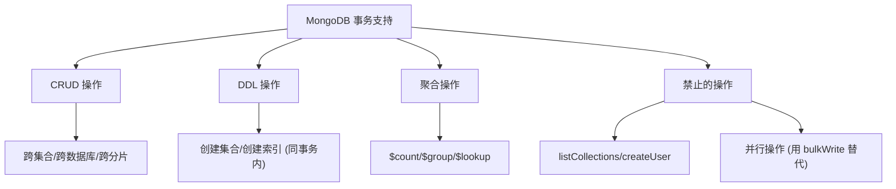
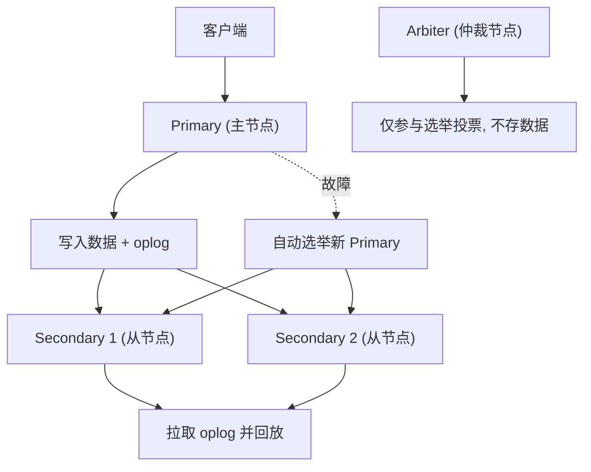
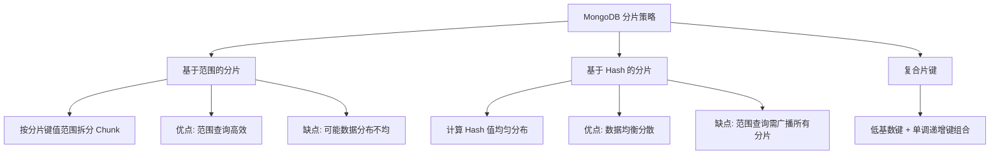
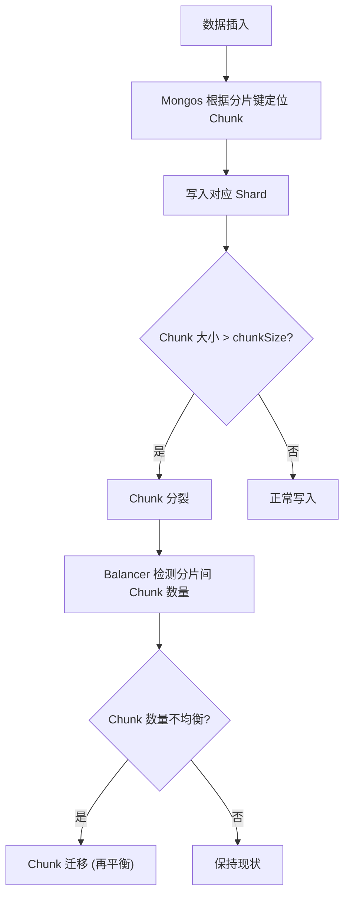
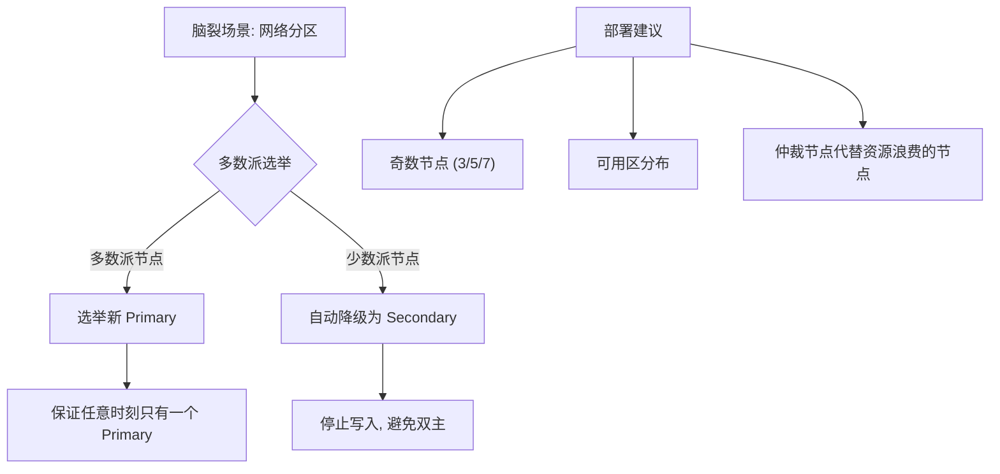
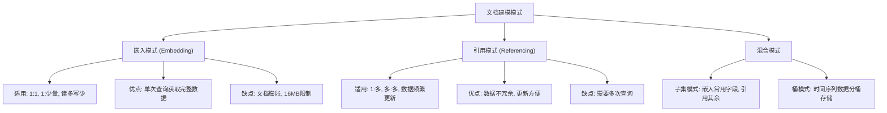

---
icon: logos:mongodb
title: MongoDB 面试
cover: https://raw.githubusercontent.com/dunwu/images/master/archive/2025/03/c395e54dfe444ffe8a7903e691994f60.jpg
date: 2025-03-04 21:03:08
categories:
  - 数据库
  - 文档数据库
  - MongoDB
tags:
  - 数据库
  - 文档数据库
  - MongoDB
  - 面试
permalink: /pages/cae9f346/
---

# MongoDB 面试

<!-- more -->

## MongoDB 概述

::: tip 扩展

- [MongoDB 官方文档之 MongoDB 简介](https://www.mongodb.com/zh-cn/docs/manual/introduction/)
- [MongoDB 简史](https://www.infoq.cn/article/3d4suwkc2fvikykemnvw)
- [MongoDB 发展历史及各主要版本新特性概述](https://blog.csdn.net/JiekeXu/article/details/143670868)

:::

### 【简单】MongoDB 是什么？⭐

> 🎯 目标等级：L2 ｜ ⏱ 建议用时：3 min ｜ 🏷 标签：MongoDB 概述 / 基本概念

#### 💎 关键结论

MongoDB 是面向文档的开源 NoSQL 数据库，用 C++ 编写，以 BSON 文档为基本数据单元。它是**模式灵活**（schema-flexible）而非「无模式」，天然支持水平扩展和高可用，适用于数据模型多变、需要高并发读写的场景。

#### ⚡ 记忆卡片

- **口诀**：文档数据库，模式灵活，天然分布式
- **关键词**：BSON 文档 ／ 模式灵活（非无模式）／ NoSQL ／ C++
- **链路**：业务数据 → BSON 文档 → 集合（Collection） → 数据库

#### 📖 核心知识

1. **数据模型**：MongoDB 将数据存储为 [BSON 文档](https://www.mongodb.com/zh-cn/docs/manual/core/document/#std-label-bson-document-format)（JSON 的二进制表示），最大文档 16 MB。无需预定义 DDL，同一集合内文档结构可以不同——但准确口径是**模式灵活**（schema-flexible）而非「无模式」，3.6 起还可用 `$jsonSchema` 给集合加写入校验。
2. **核心能力**：
   - [读写操作（CRUD）](https://www.mongodb.com/zh-cn/docs/manual/crud/#std-label-crud)
   - [数据聚合](https://www.mongodb.com/zh-cn/docs/manual/core/aggregation-pipeline/#std-label-aggregation-pipeline)
   - [文本搜索](https://www.mongodb.com/zh-cn/docs/manual/text-search/#std-label-text-search)
   - [地理空间搜索](https://www.mongodb.com/zh-cn/docs/manual/tutorial/geospatial-tutorial/)
3. **分布式特性**：通过**副本集**实现高可用与自动故障转移，通过**分片**实现水平扩展。
4. **定位**：在 Web 应用、物联网、内容管理等场景中，可替代传统关系型数据库或 KV 存储，提供可扩展的高性能数据存储方案。
5. **一致性与事务**：默认 Write Concern 为 `w:1`、Read Concern 为 `local`，**并非强一致**——`w:1` 下主库宕机会丢已确认的写入，`local` 下可能读到尚未提交到 majority、之后被回滚的数据。要线性一致必须显式配 `w:"majority"` + `readConcern:"linearizable"`。事务方面 4.0 起支持副本集内多文档 ACID，4.2 起支持分片集群分布式事务。

#### ⚠️ 常见误区

::: details

常见误区：

- ❌ "MongoDB 是无模式（schemaless）的，所以不用做数据建模" → 准确口径是 **schema-flexible**（模式灵活，写入时不强制校验结构）。业务语义上的模式依然存在，且**文档建模的重要性高于关系型建模**：关系型建模失误还能靠 JOIN、视图、加索引补救，文档模型失误（该内嵌的做成了引用、分片键选了低基数或单调递增字段）会直接导致跨分片广播查询与聚合管道层数爆炸，返工往往要重写全量数据。
- ❌ "MongoDB 是 NoSQL，所以不支持事务、也不保证一致性" → 4.0+ 已支持多文档 ACID；但一致性不是「默认最强」，而是由 Read Concern / Write Concern 组合决定，需要按业务显式选型。
- ❌ "无模式意味着比关系型更省设计成本" → 省下的是 DDL 变更流程成本，付出的是建模决策前置的压力：分片键一旦选定，后期 resharding 代价极高。

:::

#### 🔀 发散问题

- **Q：MongoDB 4.0 支持多文档事务后，和 MySQL 的事务隔离级别有什么差异？实际生产中用得多吗？**

  → MongoDB 仅支持快照隔离（Snapshot Isolation），不支持 MySQL 的 READ COMMITTED、REPEATABLE READ 等多级别选择；且事务跨分片时性能开销显著。生产中大多数场景通过单文档原子性和补偿机制即可满足需求，多文档事务使用较少。

- **Q：MongoDB 分片集群中，分片键的选择对查询性能有什么影响？选错分片键会导致什么问题？**

  → 分片键决定了数据在各分片上的分布，高频查询字段作为分片键可实现定向查询避免广播；选错分片键（如低基数或单调递增字段）会导致数据倾斜、热点分片或大量广播查询，严重影响性能。

### 【简单】MongoDB 有什么特性？⭐

> 🎯 目标等级：L2 ｜ ⏱ 建议用时：5 min ｜ 🏷 标签：MongoDB 概述 / 特性总览

#### 💎 关键结论

MongoDB 的核心特性是面向文档 + 模式灵活 + 分布式。它以 BSON 文档为存储单元，支持丰富查询与聚合，4.0 起支持 ACID 事务，通过副本集实现高可用，通过分片实现水平扩展。

#### ⚡ 记忆卡片

- **口诀**：文档模式灵活，聚合加事务，副本加分片
- **关键词**：BSON 文档 ／ 模式灵活 ／ ACID 事务 ／ 副本集 ／ 分片 ／ GridFS
- **链路**：BSON 存储 → 丰富索引 → 聚合管道 → 事务保证 → 分布式扩展

#### 📖 核心知识

1. **面向文档 & 模式灵活**：数据以 [BSON 文档](https://www.mongodb.com/zh-cn/docs/manual/core/document/#std-label-bson-document-format) 存储（最大 16 MB），无预定义 DDL，可按需增删字段；也可用 `$jsonSchema` 给集合加写入校验。「模式灵活」不等于「不用建模」——文档建模与分片键设计的决策成本高于关系型建模。
2. **丰富的查询与索引**：支持 CRUD、聚合、文本搜索、地理空间查询；索引类型包括单字段、复合、多键、哈希、文本、地理空间等。
3. **ACID 事务**（4.0+）：
   - 单文档天然原子性
   - 4.0 支持副本集内多文档事务
   - 4.2 支持分片集群分布式事务
4. **分布式能力**：
   - **副本集**：通过数据复制实现高可用与自动故障转移
   - **分片**：通过 [分片键](https://www.mongodb.com/zh-cn/docs/manual/core/zone-sharding/#std-label-zone-sharding) 实现水平扩展
5. **其他特性**：数据压缩（Snappy/zlib/zstd）、GridFS 大文件存储、Map-Reduce（5.0 起已弃用，推荐聚合管道）。

#### 🔀 发散问题

- **Q：MongoDB 4.0 引入的多文档事务与 RDBMS 事务相比有哪些限制？在生产中是否推荐大量使用？**

  → MongoDB 事务仅支持快照隔离级别，不支持跨分片事务的高效两阶段提交，且事务中不能创建集合或索引。生产中不推荐大量使用，应优先通过文档内嵌和单文档原子操作来满足一致性需求，仅在少数关键业务（如金融转账）中使用事务。

- **Q：GridFS 存储大文件时是如何分块的？什么场景下应该用 GridFS 而不是直接用对象存储（如 MinIO/S3）？**

  → GridFS 将大文件按 255KB 默认块大小拆分存储到 `fs.chunks` 集合中，元数据存储在 `fs.files` 集合中。适合文件不超过数 GB 且需要与 MongoDB 事务保持一致性的场景；对于大规模文件存储或需要 CDN 分发的场景，对象存储（S3/MinIO）更合适。

### 【简单】MongoDB vs.RDBM？⭐⭐

> 🎯 目标等级：L2 ｜ ⏱ 建议用时：5 min ｜ 🏷 标签：MongoDB 概述 / 对比选型

#### 💎 关键结论

MongoDB 用文档模型替代行列模型，以**模式灵活**与水平扩展见长；RDBMS 以成熟的事务、约束与复杂关联查询见长。选型核心看三点：数据模型是否频繁变动、是否需要跨集合强关联（JOIN）、能否接受「一致性必须显式配置」。特别要注意：MongoDB 默认**并非强一致**，其一致性等级由 Read Concern / Write Concern 组合决定。

#### ⚡ 记忆卡片

- **口诀**：Mongo 灵活扩展强，RDBM 关联约束长
- **关键词**：文档模型 ／ MQL ／ 原生分片 ／ Read/Write Concern
- **链路**：灵活 Schema → 文档存储 → 分片扩容 → 适合快速迭代业务

#### 📖 核心知识

MongoDB vs.RDBM：

| 特性     | MongoDB                                                              | RDBMS                                                |
| :------- | :------------------------------------------------------------------- | :--------------------------------------------------- |
| 数据模型 | 文档模型（BSON），层级内嵌                                           | 关系型（行/列），二维表                              |
| 查询语言 | MQL（`find` / 聚合管道）                                             | SQL（成熟的 JOIN、子查询、窗口函数）                 |
| Schema   | 模式灵活（schema-flexible），可选 `$jsonSchema` 校验                 | 预定义 DDL，强约束                                   |
| 高可用   | 副本集，多数派 `⌊N/2⌋+1` 选主，自动故障转移                          | 主从复制 / MHA / 各类集群方案                        |
| 扩展性   | 原生分片，水平扩展为主                                               | 垂直扩展为主，水平扩展需分库分表中间件或分布式数据库 |
| 索引类型 | B+ 树（WiredTiger）、复合、多键、全文、地理、哈希、TTL、部分、通配符 | B+ 树为主，另有全文、空间等                          |
| 关联查询 | `$lookup`（左连接，能力与优化器成熟度弱于 SQL JOIN）                 | 多表 JOIN + 代价优化器                               |
| 事务     | 4.0+ 多文档 ACID，仅快照隔离                                         | 成熟 ACID，隔离级别可选                              |
| 一致性   | 默认 `w:1` + `local`，**非强一致**；线性一致需显式配置               | 单机事务默认强一致                                   |
| 容量边界 | 单文档 ≤16 MB，总量靠分片扩展                                        | 单表工程经验值千万级（非硬上限）                     |

#### ⚠️ 常见误区

::: details

常见误区：

- ❌ "RDBMS 只能垂直扩展，MongoDB 才能水平扩展" → 分库分表（ShardingSphere 等）与分布式数据库（TiDB / OceanBase）早已让关系型水平扩展成为主流方案。二者真正的差异是「数据库原生支持」与「需要中间件/换产品」。
- ❌ "MongoDB 无模式，所以建模更省事" → 模式灵活省掉的是 DDL 变更流程，不是建模工作；内嵌 vs 引用、分片键选择这些决策的失误代价高于关系型建模失误。
- ❌ "选 MongoDB 是因为它更快" → 单点读写的快慢取决于存储引擎与索引设计，不是数据模型本身。选型的真实依据是数据形态（是否自包含、是否层级化、是否频繁变结构）与查询形态（点查/范围/聚合/关联）。

:::

#### 🔀 发散问题

- **Q：如果业务既需要灵活 Schema 又需要复杂 JOIN，实际架构中如何组合 MongoDB 和 RDBMS？**

  → 可采用 CQRS 模式：MongoDB 负责写入和灵活查询（如用户画像、内容管理），通过数据同步将核心数据写入 RDBMS 处理复杂关联查询和报表。也可在 MongoDB 中使用 `$lookup` 做简单关联，将复杂 JOIN 下沉到离线分析系统。

- **Q：MongoDB 的文档模型在什么情况下反而不如关系型模型？嵌套深度和文档大小有什么限制？**

  → 当数据关系复杂、需要频繁多表 JOIN 或要求严格 Schema 约束时，关系型模型更合适。MongoDB 文档大小限制为 16MB，嵌套深度建议不超过 3-4 层，过深嵌套会导致更新困难和内存占用过大。

### 【简单】MongoDB 有哪些里程碑版本？⭐

> 🎯 目标等级：L2 ｜ ⏱ 建议用时：5 min ｜ 🏷 标签：MongoDB 概述 / 版本演进

#### 💎 关键结论

MongoDB 三大里程碑：1.0（2009）发布首版，3.0（2015）引入 WiredTiger 存储引擎，4.0（2018）支持 ACID 事务。4.2 进一步支持分布式事务。

#### ⚡ 记忆卡片

- **口诀**：一零首发三零引擎，四零事务四二分布
- **关键词**：1.0 首发 ／ 3.0 WiredTiger ／ 4.0 ACID ／ 4.2 分布式事务
- **链路**：首版发布 → WiredTiger 引擎 → 多文档事务 → 分布式事务

#### 📖 核心知识

MongoDB 由 **10gen** 开发（2007 年创立），2013 年更名为 MongoDB Inc.，2017 年上市。

里程碑版本：

- **1.0（2009）**：发布第一版
- **1.6（2010）**：引入分片（Sharding），支持水平扩展
- **2.2（2012）**：引入聚合管道（Pipeline）
- **2.4（2013）**：引入全文搜索
- **3.0（2015）**：引入可插拔存储引擎架构，**WiredTiger** 首次可用
- **3.2（2015）**：WiredTiger 成为**默认**存储引擎
- **4.0（2018）**：支持 ACID 事务（副本集内多文档）；存储引擎层升级为**文档级锁 + MVCC**，写并发能力较 3.x 的集合级锁提升数量级
- **4.2（2019）**：支持分布式事务（分片集群）；**移除 MMAPv1 存储引擎**（3.2 起已不推荐）；新增通配符索引、zstd 压缩、按需物化视图
- **4.4（2020）**：新增 `$unionWith` 聚合阶段、可恢复的初始同步、副本集可重试读写增强
- **5.0（2021）**：**Map-Reduce 标记为废弃**（官方要求迁移到聚合管道）；新增时间序列集合（Time Series Collections）与在线重分片（Live Resharding）
- **6.0（2022）**：Change Streams 与时间序列能力增强、批量写入优化、可查询加密（Queryable Encryption）预览
- **8.0（2024）**：查询执行与批量写入路径的性能优化，官方定位「性能版本」

::: details 为什么 P8 要关心版本线

版本线不是背诵题，而是判断**存量集群能力边界**的依据：

- 「MongoDB 3.x 集群写并发上不去」→ 根因通常是 3.x 的**集合级锁**，4.0 才改为文档级锁 + MVCC；
- 「还在用 Map-Reduce 跑报表」→ 5.0 起官方已废弃，正解是聚合管道（Map-Reduce 单机执行、走 JavaScript 引擎，无法分布式并行）；
- 「磁盘上有一堆 `.ns` / `.0` / `.1` 文件」→ 说明还是 MMAPv1（4.2 已移除），迁到 WiredTiger 才能用上块压缩与文档级并发；WiredTiger 的数据文件后缀是 `.wt`；
- 「能不能用 zstd 压缩 / 通配符索引 / 分布式事务」→ 都要求 ≥ 4.2。

:::

::: details 扩展阅读

- [MongoDB 简史](https://www.infoq.cn/article/3d4suwkc2fvikykemnvw)
- [MongoDB 发展历史及各主要版本新特性概述](https://blog.csdn.net/JiekeXu/article/details/143670868)

:::

### 【简单】BSON 是什么？与 JSON 有何区别？⭐⭐

> 🎯 目标等级：L2 ｜ ⏱ 建议用时：5 min ｜ 🏷 标签：MongoDB 概述 / 数据格式

#### 💎 关键结论

BSON（Binary JSON）是 JSON 的二进制编码格式，是 MongoDB 存储和网络传输的数据格式。相比 JSON，BSON 增加了**类型信息**（Date、ObjectId、Decimal128、BinData、Int32/Int64/Double）与**长度前缀**：长度前缀让遍历时不必完整解析就能跳过整个子文档，这才是「BSON 解析更快」的准确理由——但代价是**存储体积通常比等价 JSON 文本更大**，不是「更省空间」。

#### ⚡ 记忆卡片

- **口诀**：BSON 是 JSON 的二进制增强版
- **关键词**：Binary JSON ／ 类型丰富 ／ 16MB 上限 ／ 快速解析
- **链路**：JSON 文本 → BSON 二进制编码 → 支持更多类型 → 快速遍历

#### 📖 核心知识

1. **定义**：BSON（Binary JSON）是 [JSON](https://www.mongodb.com/zh-cn/docs/v8.0/reference/glossary/#std-term-JSON) 文档的二进制表示，主要用于 MongoDB 中文档存储和网络传输。
2. **与 JSON 的区别**：
   - **类型更丰富**：Date、Timestamp、ObjectId、BinData、Decimal128、Regex、JavaScript Code、Int32 / Int64 / Double、MinKey / MaxKey 等；JSON 只有 string / number / boolean / null / object / array 六种，既区分不了 int 与 double，也没有原生日期与高精度小数类型
   - **带长度前缀**：每个文档与子文档都以 4 字节 int32 长度开头，读到不关心的子文档时可直接 seek 跳过，无需逐字节解析——这是「遍历/解析更快」的真正来源
   - **体积更大**：长度前缀、类型字节、字段名以 `\0` 结尾都是额外开销，BSON 通常比等价 JSON 文本更占空间（这部分开销在落盘时可被 WiredTiger 的块压缩大幅抵消）
3. **限制**：
   - 最大 BSON 文档大小为 **16 MB**（`maxBsonObjectSize`；批量写消息的网络上限是 48 MB）
   - 文档嵌套深度上限 **100 层**
   - 每个文档必须有唯一的 `_id` 字段作为主键

#### ⚠️ 常见误区

::: details

常见误区：

- ❌ "BSON 是二进制格式，所以比 JSON 更省空间" → 恰恰相反，BSON 因为长度前缀与类型字节，体积通常**大于**等价 JSON 文本；它换来的是遍历速度与类型保真。
- ❌ "BSON 快是因为二进制不需要解析" → 快在**能跳过**：长度前缀让引擎不必解析就能定位到下一个字段，而不是「免解析」。
- ❌ "金额用 Double 存就行" → BSON 的 Double 是 IEEE 754 浮点，与 Java `double` 同样丢精度；金额必须用 **Decimal128**（3.4+）或以分为单位的 Int64，口径与 MySQL 侧「金额不要用 FLOAT/DOUBLE」一致。

:::

#### 🔀 发散问题

- **Q：为什么 MongoDB 用 BSON 而不是直接用 JSON？**

  → JSON 缺少 Date、Binary 等类型，且文本解析性能低；BSON 在保持可读性的同时增加了类型支持和二进制高效性。

- **Q：BSON 的 16MB 限制怎么突破？**

  → 使用 GridFS 将大文件切分为块（默认 **255 KB**）分别存入 `fs.chunks` 与 `fs.files` 两个集合，见本文档「如何使用 GridFS 存储大文件？」。

## MongoDB 建模

### 【简单】什么是主键 `_id`？⭐⭐

> 🎯 目标等级：L2 ｜ ⏱ 建议用时：3 min ｜ 🏷 标签：MongoDB 建模 / 主键

#### 💎 关键结论

`_id` 是每个文档的唯一标识符，默认由系统自动生成 ObjectId。它由 12 字节组成（4 字节时间戳 + 5 字节随机值 + 3 字节计数器），保证全局唯一且大致有序。

#### ⚡ 记忆卡片

- **口诀**：十二字节三部分，时随机计保唯一
- **关键词**：ObjectId ／ 12 字节 ／ 全局唯一 ／ 自动生成
- **链路**：4 字节时间戳 → 5 字节随机值 → 3 字节计数器 → 全局唯一 \_id

#### 📖 核心知识

1. **作用**：`_id` 是每个文档的唯一标识符，MongoDB 会在其上自动创建**唯一索引**（不可删除），默认自动生成，也可自定义。
2. **ObjectId 构成**（12 字节 BSON 类型）：
   - **时间戳**（4 字节）：文档创建时的 Unix 时间戳（秒级）——这是 ObjectId「趋势递增」的来源
   - **随机值**（5 字节）：**进程级唯一**的随机值，进程启动时生成一次后复用。**注意版本差异**：MongoDB 3.4 之前这 5 字节是「3 字节机器标识 + 2 字节进程号」，3.4 起改为 5 字节随机值，既避免暴露机器/进程信息，也解决了容器环境下 MAC 地址重复导致的碰撞风险
   - **计数器**（3 字节）：随机初始化的自增序列，确保同一进程同一秒内生成的多个 ObjectId 互不相同
3. **自定义 `_id`**：插入文档时可指定任意类型的 `_id` 值，只要保证集合内唯一即可。

::: details 为什么 ObjectId 的「趋势递增」是关键（P8 追问点）

WiredTiger 的集合数据存在 **B+ 树**上，主键的顺序直接决定写入是**顺序追加**还是**随机插入**：

- **ObjectId 前 4 字节是秒级时间戳**，新文档的 `_id` 因此单调落在 B+ 树右侧叶子页附近 → 页分裂少、cache 命中率高、写吞吐稳定；
- **UUID 主键**是完全随机的 128 位 → 每次插入都可能命中 B+ 树的任意叶子页，造成**索引页随机写**、页面抖动、WiredTiger cache 命中率下降，与 MySQL InnoDB 用 UUID 做主键的问题同源；
- **业务自增 ID 主键**在分片集群里更糟：单调递增会让写入全部集中到持有最大 chunk 的那个分片，形成**写入热点**（这也是「不要用自增 ID 或纯时间戳做分片键」的原因）。

实践口径：既要递增又要避免热点时，用**复合分片键**（如 `{tenantId: 1, _id: 1}`）或对分片键做**哈希分片**；需要业务可读编号时，把业务号放在独立字段并建唯一索引，`_id` 仍交给 ObjectId。

:::

#### ⚠️ 常见误区

::: details

常见误区：

- ❌ "ObjectId 的 5 字节随机值是机器标识" → 3.4 起已改为进程级随机值；只有 3.4 之前才是「3 字节机器标识 + 2 字节进程号」。
- ❌ "用 UUID 做 `_id` 更规范、跨系统更通用" → 随机 UUID 会破坏 B+ 树的写入局部性，大集合下写放大与 cache miss 明显上升；确实需要全局唯一标识时用 ObjectId，或采用有序 UUID（如 UUIDv7）降低随机性。
- ❌ "`_id` 上的索引可以删掉换成别的" → `_id` 索引由系统强制创建且不可删除；副本集还依赖 `_id` 做幂等回放。

:::

#### 🔀 发散问题

- **Q：ObjectId 和自增 ID 哪个好？**

  → ObjectId 分布式友好、无需协调，但不可读；自增 ID 可读性好但需中心化发号器，分片场景下有写入热点问题。

### 【简单】MongoDB 支持哪些数据类型？⭐⭐

> 🎯 目标等级：L2 ｜ ⏱ 建议用时：5 min ｜ 🏷 标签：MongoDB 建模 / 数据类型

#### 💎 关键结论

MongoDB 支持四类数据类型：基本类型（String/Integer/Boolean/Double/Decimal/Null）、时间类型（Date/Timestamp）、组合类型（Array/Embedded Document）和特殊类型（ObjectId/Binary/Regex/GeoJSON）。

#### ⚡ 记忆卡片

- **口诀**：基时组特四大类，字整双日数对嵌
- **关键词**：String ／ Integer ／ Date ／ Array ／ Embedded Document ／ ObjectId
- **链路**：基本标量 → 时间类型 → 组合嵌套 → 特殊类型

#### 📖 核心知识

1. **基本类型**：
   - **String**：UTF-8 字符串
   - **Integer**：32 位或 64 位整数
   - **Boolean**：true / false
   - **Double**：双精度浮点数
   - **Decimal**（Decimal128）：高精度浮点数，适合金融数据
   - **Null**：空值或缺失字段
2. **时间类型**：
   - **Date**：毫秒精度日期时间
   - **Timestamp**：内部操作用时间戳，示例 `Timestamp(1000, 1)`
3. **组合类型**：
   - **Array**：有序列表，可混合类型，如 `["apple", 42, true]`
   - **Embedded Document**：嵌套子文档，如 `{ address: { city: "Beijing" } }`
4. **特殊类型**：
   - **ObjectId**：文档唯一标识，如 `ObjectId("507f1f77bcf86cd799439011")`
   - **Binary Data**：二进制数据（图片、文件等）
   - **Regular Expression**：正则表达式
   - **JavaScript Code**：JS 代码片段
   - **GeoJSON**：地理坐标（点/线/多边形）

#### 🔬 扩展知识

::: details

- 【L3】**类型选择直接决定索引成本**：数组字段会自动展开成**多键索引**（multikey index），一个含 N 个元素的数组文档产生 N 个索引项，写放大严重；且多键索引**不能作为分片键**，两个多键字段也无法组成复合索引。因此「数组别做长」是文档建模铁律，元素数量建议控制在百级以内。
- 【L3】**Date 是 UTC 毫秒时间戳**（BSON Date），本身不带时区。跨时区业务必须统一按 UTC 落库、在展示层换算——口径与 MySQL 侧 `TIMESTAMP` / `DATETIME` 的时区取舍一致。
- 【L4】**Decimal128 遵循 IEEE 754-2008 decimal128**：34 位有效数字，指数范围 -6143 至 +6176，是唯一能在数据库侧做精确十进制运算的类型。金额严禁用 Double（二进制浮点，`0.1 + 0.2 ≠ 0.3`），这与「MySQL 金额不要用 FLOAT/DOUBLE」是同一条工程纪律。
- 【L4】**类型混淆是「模式灵活」最典型的生产事故**：查询 `{ age: 30 }` 时，Int32 / Int64 / Double / Decimal128 之间会做跨类型数值比较，但如果历史数据里混进了字符串 `"30"`，这条查询就会静默漏数据，且索引照常生效、`explain` 看不出异常。治理手段是用 `$type` 做全量数据体检，并在写入侧加 `$jsonSchema` 校验。

:::

#### 🔀 发散问题

- **Q：Decimal 和 Double 有什么区别？**

  → Double 有浮点精度丢失问题（如 0.1+0.2≠0.3），Decimal128 支持 34 位有效数字，适合金融、账务场景。

- **Q：Timestamp 和 Date 有什么区别？**

  → Date 是通用日期时间，Timestamp 是 MongoDB 内部用于 oplog 复制的时间戳，业务代码一般用 Date。

## MongoDB CRUD

### 【简单】如何进行分页查询？⭐⭐

> 🎯 目标等级：L2-L3 ｜ ⏱ 建议用时：3 min ｜ 🏷 标签：MongoDB CRUD / 分页

#### 💎 关键结论

MongoDB 分页有两种方式：`skip()+limit()` 简单但深页性能差；基于游标（\_id 或时间戳）的分页性能稳定，是生产环境首选。

#### ⚡ 记忆卡片

- **口诀**：深页 skip 慢如牛，游标分页快如风
- **关键词**：skip+limit ／ 游标分页 ／ \_id 定位
- **链路**：skip 扫描前置文档 → 性能随页码下降 → 改用游标定位 → O(1) 跳转

#### 📖 核心知识

1. **skip + limit 分页**：`db.collection.find().skip(20).limit(10)`，简单直观，但深页时需扫描并跳过所有前置文档，性能差。
2. **游标分页**：记录上一页最后一条的 `_id`，下次查询用 `{ _id: { $gt: lastId } }` + `limit()`，性能稳定，不受页码深度影响。

#### 🔬 扩展知识

::: details

- 【L3】**`skip(N)` 的真实代价是「扫描并丢弃前 N 条」**：服务端仍然走完整的索引定位 + 文档取回流程，只是把结果扔掉，所以耗时随页码**线性劣化**，与 MySQL 的 `LIMIT N, M` 深分页同源。
- 【L3】**无索引排序会撞内存墙**：`sort()` 若无法被索引覆盖，会退化为阻塞式内存排序，超过 `internalQueryMaxBlockingSortMemoryUsageBytes`（早期默认 **32 MB**，4.4 起提升至 **100 MB**）直接报错 `Sort exceeded memory limit`。这才是「大结果集排序必须加索引」的真实原因，不是「加了索引更快」这么含糊。分页场景里 `sort + skip + limit` 三件套必须有对应的复合索引（按 **ESR 规则**：等值 → 排序 → 范围）才能走索引排序。
- 【L3】**游标分页必须带 tie-breaker**：排序字段有重复值时会漏数据或重复数据，正解是排序键补上唯一的 `_id`，游标条件写成 `{ $or: [{ time: { $gt: t } }, { time: t, _id: { $gt: id } }] }`，或直接用复合排序 `{ time: -1, _id: -1 }` 配合对应复合索引。
- 【L4】**分片集群下 `skip/limit` 代价被放大**：mongos 无法预知数据分布，必须让**每个分片都返回 `skip + limit` 条**，再由 mongos 归并后丢弃。100 个分片翻到第 1000 页，实际网络传输量是单机的百倍——这是分片集群里深分页比单机更致命的原因，也是「分页接口必须改游标式」的硬约束。
- 【L4】**深分页的产品级解法**：限制最大可翻页数（搜索引擎普遍只允许翻到 1 万条）、改用「加载更多」流式交互、或把可翻页的分析型查询下沉到 Elasticsearch / 数仓（`search_after`、SQL 窗口函数），MongoDB 只承担游标式读取。

:::

#### ⚠️ 常见误区

::: details

常见误区：

- ❌ "游标分页快是因为跳过了扫描" → 快在**用索引直接定位起点**（`_id > lastId` 是一次 B+ 树 seek），而不是「跳过」；`skip` 无论如何都要扫。
- ❌ "加了 `limit` 就不会慢" → `limit` 只限制返回条数，`sort` 无索引时仍要对全量候选集做阻塞排序，照样会撞阻塞排序内存上限。
- ❌ "分页慢就加 `skip` 的索引" → 索引救不了 `skip`，只能救 `sort` 与定位；`skip` 的开销来自「必须数到第 N 条」。

:::

#### 🔀 发散问题

- **Q：游标分页要求排序字段有索引且值唯一，如果排序字段有重复值（如按时间排序但多条记录时间戳相同），如何保证分页不遗漏不重复？**

  → 可在排序条件中加入唯一字段（如 `_id`）作为二级排序键，查询条件变为 `{ $or: [{ time: { $gt: lastTime } }, { time: lastTime, _id: { $gt: lastId } }] }`，确保重复值也能正确分页。

- **Q：前端需要"跳转到第 N 页"功能时，游标分页无法直接支持，这种场景该如何设计？**

  → 可结合两种方案：前几页使用 skip+limit 支持跳页，深页时切换为游标分页；或使用估算跳页，通过 `estimatedDocumentCount` 计算大致位置后配合游标定位。对于大数据量场景，建议引导用户使用"加载更多"而非跳页交互。

### 【简单】如何实现数据的增删改查操作？⭐

> 🎯 目标等级：L2 ｜ ⏱ 建议用时：3 min ｜ 🏷 标签：MongoDB CRUD / 基础操作

#### 💎 关键结论

MongoDB 通过 insertOne/Many、updateOne/Many、deleteOne/Many、find 实现 CRUD，批量操作使用 bulkWrite 提升性能。

#### ⚡ 记忆卡片

- **口诀**：插更删查各 One/Many，批量操作 bulkWrite
- **关键词**：insertOne ／ updateMany ／ deleteOne ／ find ／ bulkWrite
- **链路**：单文档操作 → 多文档操作 → 批量操作（减少网络往返）

#### 📖 核心知识

1. **插入**：`insertOne()` / `insertMany()`
2. **更新**：`updateOne()` / `updateMany()` / `replaceOne()`
3. **删除**：`deleteOne()` / `deleteMany()`
4. **查询**：`find()` 返回游标，`findOne()` 返回单个文档
5. **批量操作**：`bulkWrite()` 将多个写操作合并为一次网络请求，提升吞吐量
6. **更新操作符**：字段级用 `$set` / `$unset` / `$inc` / `$rename`，数组用 `$push` / `$pull` / `$addToSet` / `$pop`。并发场景**必须用操作符做服务端原子更新**，不能「读出—改—写回」。

::: details 为什么必须用更新操作符（P8 会追问）

- **单文档操作天然原子**：MongoDB 的最小原子单位是文档，一次 `updateOne` 内的多字段改动要么全成要么全败。所以 `{ $inc: { stock: -1 } }` 这种服务端自增不会丢更新；而 Java 侧 `find → 改对象 → replaceOne` 的读改写，在两个请求交叉时会**后写覆盖先写**，库存直接算错。
- **超出单文档就必须上事务或改建模**：4.0+ 可用多文档事务，但仅快照隔离、开销显著；生产中更常见的做法是**把需要原子变更的数据内嵌进同一文档**，用单文档原子性替代事务。
- **`upsert: true` 是幂等写入的关键**：配合唯一索引实现「不存在则插入、存在则更新」，是消费 MQ 消息做幂等落库的标准手法；但 upsert 在并发下可能因竞态抛 `E11000` 重复键错误，需要重试兜底。
- **Write Concern 决定「写成功」的语义**：默认 `w:1` 只代表主库内存与 journal 收下，主库宕机可能丢；真正持久需 `w:"majority"` + `j:true`。批量导入可降级换吞吐，资金类写入必须升级。

:::

### 【简单】如何使用 find() 方法查询文档？⭐

> 🎯 目标等级：L2 ｜ ⏱ 建议用时：3 min ｜ 🏷 标签：MongoDB CRUD / 查询

#### 💎 关键结论

`find(query, projection)` 是 MongoDB 最核心的查询方法。query 指定过滤条件，projection 指定返回字段（减少网络传输）。

#### ⚡ 记忆卡片

- **口诀**：find 两参数，条件加投影
- **关键词**：query ／ projection ／ 字段过滤 ／ 游标
- **链路**：构建 query 条件 → 指定 projection 字段 → find 返回游标 → 遍历结果

#### 📖 核心知识

1. **语法**：`db.collection.find(query, projection)`
   - `query`：查询条件（可选，`{}` 表示查全部）
   - `projection`：指定返回字段（`{ name: 1, status: 1 }` 表示只返回这两个字段）
2. **常用查询操作符**：`$gt/$gte/$lt/$lte`（比较）、`$in/$nin`（包含）、`$and/$or`（逻辑）、`$regex`（正则）、`$exists` / `$type`（字段存在性与类型）、`$elemMatch`（数组元素的多条件匹配）
3. **投影与覆盖索引**：`projection` 默认会附带 `_id`，因此只有显式写 `{ _id: 0, ... }` 排除 `_id`、且投影字段全部来自同一个二级索引时，查询才可能走**覆盖索引**（不回表），`explain` 里的判定标志是 `totalDocsExamined: 0`。
4. **`$regex` 的性能陷阱**：只有**前缀锚定**的正则（如 `/^abc/`）能借助索引做范围扫描；未锚定的 `/abc/`、带 `i` 选项的大小写不敏感匹配都会退化为全集合扫描（COLLSCAN），是线上 CPU 打满的常见元凶。

::: details 查询示例

```javascript
// 查询状态为 D 的数据
db.collection('test').find({ status: 'D' })

// 只返回 name 和 status 字段
db.collection('test').find({ status: 'D' }, { name: 1, status: 1 })

// 复合条件查询
db.collection('test').find({ age: { $gt: 18 }, status: { $in: ['A', 'B'] } })
```

:::

### 【简单】如何使用 GridFS 存储大文件？⭐

> 🎯 目标等级：L2 ｜ ⏱ 建议用时：3 min ｜ 🏷 标签：MongoDB CRUD / 大文件存储

#### 💎 关键结论

GridFS 是 MongoDB 存储超过 16 MB 文档上限的大文件的规范方案，把文件切成**默认 255 KB** 的块存入 `fs.chunks` 集合，元数据存入 `fs.files` 集合，支持流式读写与断点续传。但它是**兜底方案**，不是对象存储的替代品——云上正解仍是 OSS/S3 + 元数据入库。

#### ⚡ 记忆卡片

- **口诀**：大文件超十六，GridFS 拆块存
- **关键词**：fs.files ／ fs.chunks ／ 255 KB 块 ／ 16 MB 限制
- **链路**：大文件 → 切分为 255 KB 块 → chunks 集合存数据 → files 集合存元数据

#### 📖 核心知识

1. **原理**：将大文件分割为多个块（`chunkSize` 默认 **255 KB**，即 255 × 1024 字节），存入 `fs.chunks` 集合（核心字段 `files_id` / `n` / `data`）；文件元信息（文件名、长度、`chunkSize`、上传时间、校验和、自定义属性）存入 `fs.files` 集合，两者通过 `files_id` 关联。
2. **流式与断点**：文件已按序号 `n` 分块落库，读取时可以**按块流式返回**而不必把整个文件加载进内存，16 MB 单文档上限就此绕开；写入中断后可依据已存在的块号续传。
3. **操作方式**：通过各语言驱动的 GridFS API（`GridFSBucket`）或 `mongofiles` 命令行工具透明地上传/下载文件。
4. **适用场景**：文件超过 16 MB BSON 上限；需要与数据库**同生命周期备份、同副本集复制**（一次快照即可连文件一起带走）；文件必须与业务文档保持一致性。

#### ⚠️ 常见误区

::: details

常见误区：

- ❌ "大文件就该用 GridFS 存" → GridFS **不适合当对象存储用**。它无法水平扩展（`fs.chunks` 的分片键是 `files_id`，同一个文件的所有块必然落在同一分片），且大文件读写会**挤占业务查询的 IO、内存与 WiredTiger cache**，还会让副本集初始同步与备份体积暴涨。云上正解是 **OSS / S3 + URL 与元数据入库**。
- ❌ "默认块大小是 256 KB" → 是 **255 KB**。这个「不凑整」的取值是为了让块加上 BSON 头部开销后仍稳稳落在 16 MB 文档上限之内。
- ❌ "GridFS 能对文件内容做检索" → 只能按 `fs.files` 的元数据字段过滤，`data` 是不可查询的二进制；要按内容检索需另建体系。
- ❌ "GridFS 能替代 CDN" → 它没有任何分发能力，字节流直接由 mongod 吐出，高并发下载会把数据库连接池与网卡带宽打满。

:::

### 【简单】如何实现全文检索？⭐⭐

> 🎯 目标等级：L2-L3 ｜ ⏱ 建议用时：3 min ｜ 🏷 标签：MongoDB CRUD / 搜索

#### 💎 关键结论

MongoDB 全文检索分两步：先创建文本索引（text index），再用 `$text` + `$search` 操作符执行搜索，支持关键词匹配、短语搜索与相关性打分排序。但它的能力边界很窄：不支持自定义分词（中文等于不可用）、不支持相关性调优、一个集合只能有一个文本索引——生产环境的正解是 MongoDB + Elasticsearch / Atlas Search 双链路。

#### ⚡ 记忆卡片

- **口诀**：建 text 索引，用 `$text` 搜索
- **关键词**：text index ／ `$text` ／ `$search` ／ 相关性排序
- **链路**：创建文本索引 → `$text` + `$search` 查询 → 相关性评分排序

#### 📖 核心知识

1. **创建文本索引**：

```javascript
db.articles.createIndex({ title: 'text', content: 'text', tags: 'text' })
```

2. **执行全文搜索**：

```javascript
db.articles.find({ $text: { $search: 'mongodb tutorial' } })
```

3. **高级用法**：
   - 短语搜索：`$search: '"exact phrase"'`
   - 排除关键词：`$search: 'mongodb -tutorial'`
   - 相关性排序：`$sort: { score: { $meta: 'textScore' } }`
4. **打分与硬性限制**：`$text` 会按词频给命中文档算相关性分数，需先用 `{ score: { $meta: 'textScore' } }` 投影出来再 `$sort`。**每个集合只能有一个文本索引**（可覆盖多字段，但只能一个），且一个查询文档里 `$text` 只能出现一次。

#### 🔬 扩展知识

::: details

- 【L3】**文本索引做了什么**：对字段值做「分词 → 词干化（stemming）→ 去停用词（stop word）」后建倒排结构。默认语言为 English，可通过 `default_language` 或文档级 `language` 字段切换；`$search` 支持 `-词` 取反与 `"..."` 短语匹配，`createIndex` 时可用 `weights` 选项给字段配固定权重。
- 【L3】**能力边界**：
  - 不支持自定义分词器，**中文没有内置分词**——`default_language: "none"` 下整句中文会被当成一个 token，实际搜不到；
  - 不支持相关性调优：没有 BM25 参数、没有 function_score、没有同义词与拼写纠错，字段权重只能在建索引时写死；
  - 不支持高亮、模糊匹配、近邻查询，也不支持在搜索结果上做聚合分析；
  - `$text` 阶段与其他过滤条件的组合能力弱，先 `$text` 再过滤会显著放大扫描量。
- 【L4】**生产正解：MongoDB + 搜索引擎双链路**，三种同步方式的取舍：
  - 应用双写：实现最简单，但一致性靠业务代码保证，失败补偿要自己写，容易出现「DB 有、ES 没有」；
  - **Change Streams（CDC）订阅 oplog 同步**：解耦、可重放、失败可用 resume token 续传，是主流做法；代价是有秒级延迟，业务侧需容忍最终一致；
  - Atlas Search：托管在 MongoDB 内部的 Lucene 索引，运维成本最低，但绑定 Atlas 且能力弱于自建 Elasticsearch。
- 【L4】**选型论证口径**：不要答「ES 更强所以用 ES」。准确的说法是 MongoDB 的 `$text` 只解决「有没有」，搜索引擎解决「准不准、能不能调、能不能分析」——一旦产品要求搜索转化率、需要运营干预排序权重、需要中文分词与搜索日志聚合，`$text` 就不该进入候选集。

:::

#### ⚠️ 常见误区

::: details

常见误区：

- ❌ "建了 text 索引就能搜中文" → 默认英文分词器对中文无效，必须写入前用 IK / jieba 预分词到检索专用字段，或改用 Elasticsearch / Atlas Search。
- ❌ "`$regex` 模糊匹配可以当全文检索用" → 未锚定的正则走不了索引，是全集合扫描，数据量上来必然拖垮实例。
- ❌ "文本索引可以像普通索引一样随便加" → 一个集合只允许一个文本索引，且它要为每个词建倒排项，写入开销大，高频写入集合上要谨慎。
- ❌ "相关性排序默认就有" → 不显式投影 `$meta: 'textScore'` 并 `$sort`，返回顺序与相关性无关。

:::

## MongoDB 聚合

::: tip 扩展

[MongoDB 官方文档之聚合](https://www.mongodb.com/zh-cn/docs/manual/aggregation/)

:::

### 【简单】MongoDB 支持哪些聚合方式？⭐⭐

> 🎯 目标等级：L2 ｜ ⏱ 建议用时：5 min ｜ 🏷 标签：MongoDB 聚合 / 聚合方式

#### 💎 关键结论

MongoDB 提供三种聚合方式：**聚合管道**（首选）、**单一目的聚合方法**（count/distinct）、**Map-Reduce**（5.0 起已弃用）。聚合管道功能最强大，支持多阶段流水线处理。

#### ⚡ 记忆卡片

- **口诀**：管道优先，单一补充，MR 已废
- **关键词**：聚合管道 ／ count ／ distinct ／ Map-Reduce（已弃用）
- **链路**：聚合管道（多阶段） → 单一方法（简单计数/去重） → Map-Reduce（已废弃）

#### 📖 核心知识

1. **[聚合管道](https://www.mongodb.com/zh-cn/docs/manual/aggregation/#std-label-aggregation-pipeline-intro)**（首选）：
   - `$match`：过滤文档
   - `$group`：分组聚合
   - `$project`：指定返回字段
   - `$sort`：排序
   - `$limit/$skip`：限制/跳过结果
   - `$unwind`：展开数组
   - `$lookup`：关联查询（类似 SQL JOIN）
   - `$facet`：多分支聚合
2. **[单一目的聚合方法](https://www.mongodb.com/zh-cn/docs/manual/aggregation/#std-label-single-purpose-agg-methods)**：
   - `countDocuments(filter)`：精确计数（4.0 起推荐，底层是一个 `$group` 聚合）
   - `count()`：旧接口，**已弃用**（4.0 起），在分片集群与异常关闭后可能返回不准确的值
   - `estimatedDocumentCount()`：读集合元数据的估算计数，O(1) 但不带过滤条件
   - `distinct(field, filter)`：去重取值，结果受 16 MB BSON 上限约束，大基数字段会失败
3. **[Map-Reduce](https://www.mongodb.com/zh-cn/docs/manual/core/Map-Reduce/)**（5.0 起已弃用，官方要求迁移到聚合管道）
4. **聚合表达式**：
   - 数学：`$add`, `$subtract`, `$multiply`, `$divide`
   - 日期：`$year`, `$month`, `$dayOfMonth`
   - 字符串：`$concat`, `$substr`, `$toLower`
   - 逻辑：`$and`, `$or`, `$not`, `$cond`
   - 数组：`$arrayElemAt`, `$size`, `$slice`

::: details

**方案对比：**

| 方案         | 灵活性                                                                        | 性能                                                                     | 复杂度                             | 版本支持                                    | 典型场景                                   |
| ------------ | ----------------------------------------------------------------------------- | ------------------------------------------------------------------------ | ---------------------------------- | ------------------------------------------- | ------------------------------------------ |
| 聚合管道     | 最高：支持 `$match` / `$group` / `$lookup` / `$facet` 等 20+ 阶段，可任意组合 | 最优：原生 C++ 执行，支持索引优化与 `$merge` 落库                        | API 较丰富，学习成本中等           | 3.2+ 持续增强，5.0+ 新增 `$setWindowFields` | 多表关联、多维分析、窗口函数、复杂 ETL     |
| 单一目的方法 | 最低：仅 count / distinct / estimatedDocumentCount 三类固定操作               | 最快：estimatedDocumentCount 直接读集合元数据，O(1)                      | 极简，一行调用                     | 所有版本                                    | 简单计数、去重查询、快速估算集合大小       |
| Map-Reduce   | 高：可自定义任意 JS 逻辑，理论上无限制                                        | 最差：走 JavaScript 引擎、在 mongod 单机执行无法分布式并行、难以利用索引 | 需编写 map / reduce 函数，调试困难 | 5.0 起已弃用，官方要求迁移到聚合管道        | 遗留系统中的复杂自定义聚合（应迁移到管道） |

:::

#### 🔀 发散问题

- **Q：聚合管道和 Map-Reduce 哪个性能更好？**

  → 聚合管道性能更优，在 MongoDB 内部以原生代码执行，而 Map-Reduce 用 JavaScript 执行，开销更大。5.0 起官方已弃用 Map-Reduce。

- **Q：聚合管道有内存限制吗？**

  → 有。单阶段内存上限 **100 MB**，超限直接报 `Exceeded memory limit` 错；开启 `allowDiskUse: true` 可把中间结果落盘绕过限制，但**落盘即性能悬崖**（磁盘 IO + 序列化开销）。它是兜底手段而非优化手段，正解仍是用 `$match` / `$project` 前置把数据量压下来。

### 【中等】什么是聚合管道？⭐⭐⭐

> 🎯 目标等级：L2-L3 ｜ ⏱ 建议用时：10 min ｜ 🏷 标签：MongoDB 聚合 / 聚合管道

#### 💎 关键结论

聚合管道是 MongoDB 执行聚合的首选方式，由多个阶段组成，每个阶段对输入文档执行操作后传递给下一阶段，类似 Unix 管道。它与 SQL 的 WHERE→GROUP BY→SELECT 流程对应。

#### ⚡ 记忆卡片

- **口诀**：阶段串联成管道，前一输出后一输入
- **关键词**：stage ／ pipeline ／ `$match` ／ `$group` ／ `$lookup`
- **链路**：`$match` 过滤 → `$group` 分组 → `$sort` 排序 → `$project` 投影 → 输出结果

#### 📖 核心知识

1. **基本概念**：聚合管道由一个或多个[阶段](https://www.mongodb.com/zh-cn/docs/manual/reference/operator/aggregation-pipeline/#std-label-aggregation-pipeline-operator-reference)组成，每个阶段对文档执行操作，输出传递给下一阶段。
2. **核心规则**：
   - 管道不会修改集合中的文档（除非包含 `$merge` 或 `$out` 阶段）
   - 同一阶段可多次出现，但 `$out`、`$merge`、`$geoNear` 除外
   - 阶段不必为每个输入文档输出一个文档


3. **SQL 与 MongoDB 聚合对应关系**：

| RDBM 操作     | MongoDB 聚合操作           |
| :------------ | :------------------------- |
| `WHERE`       | `$match`                   |
| `GROUP BY`    | `$group`                   |
| `HAVING`      | `$match`（在 `$group` 后） |
| `SELECT`      | `$project`                 |
| `ORDER BY`    | `$sort`                    |
| `LIMIT`       | `$limit`                   |
| `SUM()`       | `$sum`                     |
| `COUNT()`     | `$sum` / `$sortByCount`    |
| `JOIN`        | `$lookup`                  |
| `SELECT INTO` | `$out`                     |
| `MERGE INTO`  | `$merge`（4.2+）           |
| `UNION ALL`   | `$unionWith`（4.4+）       |

::: details 聚合管道示例

计算各款中号披萨的总订单数量：

```javascript
db.orders.aggregate([
  // Stage 1: 过滤中号披萨
  { $match: { size: 'medium' } },
  // Stage 2: 按名称分组并计算总数
  { $group: { _id: '$name', totalQuantity: { $sum: '$quantity' } } }
])
```

输出：

```json
[
  { "_id": "Cheese", "totalQuantity": 50 },
  { "_id": "Vegan", "totalQuantity": 10 },
  { "_id": "Pepperoni", "totalQuantity": 20 }
]
```

:::

#### 🔬 扩展知识

::: details

- 【L3】**阶段顺序即性能**：`$match` 与 `$project` 必须尽量前置。`$match` 放在管道开头才能命中索引（放在 `$project` / `$unwind` / `$lookup` 之后就丧失了索引可用性，只能全量扫描后再过滤）；`$project` 前置则能让后续阶段处理更小的文档，显著降低内存与 CPU 开销。
- 【L3】**索引可用性的硬规则**：只有位于管道**最前面**的 `$match` 与紧随其后的 `$sort` 才能用上索引；`$sort` 之后若紧跟 `$limit`，MongoDB 会做 top-k 优化，把阻塞排序变成有界堆排序——所以 `sort + limit` 要成对写、中间不要插入别的阶段。
- 【L3】**`allowDiskUse: true` 是兜底不是优化**：单阶段内存上限 100 MB，超限报 `Exceeded memory limit`。开启落盘虽能跑通，但会引入磁盘 IO 与 BSON 序列化开销，属**性能悬崖**；正解是先减少进入该阶段的文档量与字段量。
- 【L4】**`$lookup` 的两种写法性能差一个数量级**：简单的 `localField / foreignField` 形式在大集合上容易退化，必须用 `let` + `pipeline` 子管道形式，把过滤条件下推进被连接集合，才能在被连接集合上命中索引：

```javascript
db.orders.aggregate([
  {
    $lookup: {
      from: 'users',
      let: { uid: '$userId' },
      pipeline: [
        { $match: { $expr: { $eq: ['$_id', '$$uid'] }, status: 'active' } },
        { $project: { name: 1, level: 1 } }
      ],
      as: 'user'
    }
  }
])
```

子管道里的 `$match` + `$project` 让被连接侧只回传必要字段，避免把整个 `users` 文档拖进内存。

- 【L4】**用 `explain("executionStats")` 定位低效阶段**：逐阶段看 `docsExamined` / `nReturned` 的比值，比值接近 1 是健康的，远大于 1 说明该阶段在「扫很多、出很少」，需要把过滤前置或补索引；同时看每个阶段的 `executionTimeMillis` 找出耗时集中点。
- 【L4】**`$facet` 的代价**：它在单个管道内并行执行多个子管道，一次查询拿到多维统计（分类分布、价格区间、评分分布），很方便；但 `$facet` **无法使用索引**，且每个分支的输入都是上游的全量结果，内存开销是分支数倍乘。分支多或数据量大时应拆成多次独立聚合，或改走离线预计算。
- 【L4】**分片集群上的管道额外约束**：能在分片内并行执行的阶段（`$match` / `$project` / `$group` 按分片键分组）由 mongos 下推，不能并行的阶段（`$sort` 全局排序、`$group` 按非分片键、`$lookup`）需要把数据汇聚到 mongos 归并，是分布式聚合的性能瓶颈点。

> 📚 延伸阅读：[MongoDB 官方文档之聚合](https://www.mongodb.com/zh-cn/docs/manual/aggregation/)

:::

#### 🔀 发散问题

- **Q：聚合管道和 SQL 的核心区别是什么？**

  → SQL 是声明式（只描述要什么结果，执行顺序由优化器决定），聚合管道是命令式流水线（阶段顺序由开发者写死，优化器只做有限的阶段移动与合并）。表达能力大体相当但**不完全等价**：`$lookup` 只等价于 **LEFT OUTER JOIN**，RIGHT / FULL OUTER 需靠 `$unionWith` 配合两次 lookup 模拟；SQL 的递归 CTE 在聚合管道里没有对应物；窗口函数要到 5.0 的 `$setWindowFields` 才补齐。

### 【简单】RDBM 聚合 vs. MongoDB 聚合？⭐⭐

> 🎯 目标等级：L2 ｜ ⏱ 建议用时：5 min ｜ 🏷 标签：MongoDB 聚合 / 对比选型

#### 💎 关键结论

MongoDB 聚合管道的阶段与 SQL 聚合函数一一对应：`$match`=WHERE、`$group`=GROUP BY、`$project`=SELECT、`$lookup`=JOIN。两者表达能力等价，但 MongoDB 是流式处理，SQL 是声明式。

#### ⚡ 记忆卡片

- **口诀**：match 对应 where，group 对应 group by，lookup 对应 join
- **关键词**：`$match`=WHERE ／ `$group`=GROUP BY ／ `$lookup`=JOIN ／ `$out`=SELECT INTO
- **链路**：SQL 声明式结果 → MongoDB 流式管道 → 功能等价，风格不同

#### 📖 核心知识

| RDBM 操作     | MongoDB 聚合操作           |
| :------------ | :------------------------- |
| `WHERE`       | `$match`                   |
| `GROUP BY`    | `$group`                   |
| `HAVING`      | `$match`（在 `$group` 后） |
| `SELECT`      | `$project`                 |
| `ORDER BY`    | `$sort`                    |
| `LIMIT`       | `$limit`                   |
| `SUM()`       | `$sum`                     |
| `COUNT()`     | `$sum` / `$sortByCount`    |
| `JOIN`        | `$lookup`                  |
| `SELECT INTO` | `$out`                     |
| `MERGE INTO`  | `$merge`（4.2+）           |
| `UNION ALL`   | `$unionWith`（4.4+）       |


#### 🔬 扩展知识

::: details

上面的映射表只是「翻译对照」，真正的差异在下面几点：

- 【L3】**执行模型不同**：SQL 由优化器基于统计信息重排 JOIN 顺序、选择访问路径；聚合管道的阶段顺序由开发者写死，优化器只做有限的阶段合并与移动（把 `$match` 前移、把 `$sort` + `$limit` 合成 top-k）。**聚合管道的性能因此高度依赖开发者写阶段的顺序**，而 SQL 的性能高度依赖优化器与统计信息是否新鲜。
- 【L3】**关联能力不对等**：`$lookup` 只是 LEFT OUTER JOIN，且默认把匹配结果作为**数组内嵌**进左表文档（SQL 是笛卡尔展开成行）。要还原成「一行一条」必须额外 `$unwind`，而 `$unwind` 会让文档数暴涨、内存压力陡升。RIGHT / FULL OUTER JOIN、递归 CTE 均无直接对应物。
- 【L3】**分片语义不同**：SQL 分库分表后跨库 JOIN 基本要靠中间件或应用层拼装；MongoDB 分片集群里 `$lookup` 由 mongos 做「分片内并行 + 归并」，但被连接集合若不共享分片键，仍需跨分片取数，代价与分库分表的跨库 JOIN 同源。
- 【L4】**选型口径**：报表 / BI 类重关联分析仍应下沉到数仓或 SQL 引擎；聚合管道的定位是「在文档模型内完成实体自包含的聚合」。一旦管道里出现两三个以上 `$lookup`，通常说明**建模时该内嵌的做成了引用**，正确处置是回头改文档模型，而不是继续堆管道阶段。

:::

### 【中等】MongoDB Map-Reduce 有什么用？⭐

> 🎯 目标等级：L2-L3 ｜ ⏱ 建议用时：5 min ｜ 🏷 标签：MongoDB 聚合 / Map-Reduce

#### 💎 关键结论

Map-Reduce 是 MongoDB 早期的分治聚合范式，通过 map 函数分发键值对、reduce 函数汇总结果。**从 5.0 起已弃用**，官方推荐用聚合管道替代，性能更优且 API 更友好。

#### ⚡ 记忆卡片

- **口诀**：Map 分发键值对，Reduce 汇总结果，5.0 已废弃
- **关键词**：map 函数 ／ reduce 函数 ／ JavaScript ／ 已弃用
- **链路**：map 阶段（每个文档）→ 分发键值对 → reduce 阶段（汇总）→ 输出结果

#### 📖 核心知识

1. **基本原理**：
   - **map 阶段**：对每个输入文档执行 map 函数，分发（emit）键值对
   - **reduce 阶段**：对相同键的值进行汇总
   - 可选 **finalize 函数**：进一步处理 reduce 输出


2. **特点**：所有 Map-Reduce 函数都是 JavaScript，在 mongod 进程中执行；可从一个 collection 读取，将结果写入另一个 collection 或直接返回。

#### 🔬 扩展知识

::: details

- 【L3】**为什么弃用 Map-Reduce？** → 三重劣势：① 走 JavaScript 引擎，每次调用都有引擎执行与 BSON ↔ JS 对象转换开销；② **在 mongod 单机执行，无法像聚合管道那样把阶段下推到各分片并行**；③ 优化器无法对其做阶段合并、索引下推等内部优化。聚合管道以原生 C++ 执行、操作符更丰富，性能显著更优。
- 【L3】**迁移建议**：`emit(key, value)` + reduce 求和 → `$group` + `$sum`；一个文档 emit 多个 key → 前置 `$unwind` 或改用 `$facet` 多分支；finalize 函数 → 末尾 `$project` / `$addFields`。
- 【L4】**面试口径**：答「用 Map-Reduce 做复杂聚合」是**过时口径**，会直接暴露版本认知停留在 3.x。正确表述是「Map-Reduce 自 5.0 起已废弃，复杂聚合一律走聚合管道；只有在维护遗留系统时才会遇到它，且应当排期迁移」。

> 📚 延伸阅读：[MongoDB 官方文档之聚合管道](https://www.mongodb.com/docs/manual/core/aggregation-pipeline/)

:::

## MongoDB 存储

### 【简单】MongoDB 的逻辑存储是怎样设计的？⭐⭐

> 🎯 目标等级：L2 ｜ ⏱ 建议用时：10 min ｜ 🏷 标签：MongoDB 存储 / 逻辑结构

#### 💎 关键结论

MongoDB 逻辑存储分四层：实例→数据库→集合→文档。文档是 BSON 格式的基本数据单元，集合是模式灵活（schema-flexible）的文档组，数据库是集合的容器。与 RDBMS 对应：数据库=database，表=collection，行=document，列=field。物理上 WiredTiger 为每个集合、每个索引各生成一个 `.wt` 文件。

#### ⚡ 记忆卡片

- **口诀**：实例库集合文档，四层结构记心头
- **关键词**：Database ／ Collection ／ Document ／ BSON ／ \_id
- **链路**：MongoDB 实例 → Database → Collection → Document（BSON）

#### 📖 核心知识


```mermaid
graph TB
    A["MongoDB Instance"] --> B["Database 1"]
    A --> C["Database 2"]
    B --> D["Collection A"]
    B --> E["Collection B"]
    D --> F["Document 1 (BSON)"]
    D --> G["Document 2 (BSON)"]
    D --> H["Document N (BSON)"]
    F --> I["_id + field1 + field2 + ..."]
```

1. **文档（Document）**：MongoDB 的基本数据单元，是一组有序键值对（BSON）。最大 16MB，必须有唯一 `_id` 字段。
   - 文档中键/值对是有序的，键是字符串，区分类型和大小写
   - 不能有重复的键
   - 键不能含 `\0`，`.` 和 `$` 有特殊含义，`_` 开头的键是保留的


2. **集合（Collection）**：文档组，类似 RDBMS 的表。无强制结构（schema-flexible，不是「无模式」），插入第一个文档时自动创建。
   - 名称不能为空、不能含 `\0`、不能以 `system.` 开头
   - **物理落盘**：WiredTiger 下每个集合对应一个 WT 表，即磁盘上一个 `.wt` 文件（形如 `collection-2--1234567890123456789.wt`）；每个索引另有一个 `index-*.wt`


3. **数据库（Database）**：存储一个或多个集合。保留数据库：`admin`（权限）、`local`（不复制）、`config`（分片信息）。
4. **MongoDB vs RDBMS 概念对比**：

| RDBM 概念   | MongoDB 概念 |
| :---------- | :----------- |
| database    | database     |
| table       | collection   |
| row         | document     |
| column      | field        |
| index       | index        |
| primary key | `_id`        |

5. **数据目录形态（WiredTiger）**：`WiredTiger.wt`（WT 元数据表）、`_mdb_catalog.wt`（MongoDB 的集合/索引目录）、各集合与索引的 `.wt` 文件、`journal/WiredTigerLog.*`（WAL）、`storage.bson`（部署级元数据）。这与 MMAPv1 时代「每集合一组 `.ns` + `.0` / `.1` 数据文件 + **集合级锁**」的模型完全不同；MMAPv1 自 3.2 起不推荐、**4.2 被移除**。
6. **系统命名空间**：`admin.system.users`（账号）、`admin.system.version`（版本与特性兼容）、`config.collections` / `config.chunks` / `config.shards`（分片元数据）、各库的 `<db>.system.profile`（慢查询剖析）。**注意版本差异**：`system.namespaces` 是 MMAPv1 的产物，WiredTiger 下并不存在；`system.indexes` 自 4.0 起弃用，索引定义改由 `_mdb_catalog.wt` 维护。

#### ⚠️ 常见误区

::: details

常见误区：

- ❌ "集合无模式，所以同一集合里放什么都行" → 准确口径是 **schema-flexible**：不强制校验不等于业务上没有模式。同一集合混放异构文档会让索引选择性崩塌（大量文档缺失索引字段）、聚合管道被迫写满 `$ifNull` 兜底，查询与建模成本反而高于关系型。
- ❌ "MongoDB 一个库就是一个文件" → WiredTiger 下是**一个集合 / 一个索引各对应一个 `.wt` 文件**，因此集合数量过多（数万级）会导致文件句柄与目录元数据膨胀、checkpoint 变慢。这正是「不要按租户逐个建集合」的物理原因。
- ❌ "用 `system.namespaces` / `system.indexes` 查元数据" → 前者是 MMAPv1 遗留、WiredTiger 下不存在，后者自 4.0 起弃用；现代版本用 `db.getCollectionInfos()` 与 `db.collection.getIndexes()`。

:::

#### 🔀 发散问题

- **Q：为什么 MongoDB 的集合是无模式的？**

  → 准确说法是**模式灵活**而非「无模式」。文档数据库把结构演进成本从 DDL 变更转移到了应用层：同一集合内文档可以有不同的字段与类型，适合快速迭代与异构数据。代价是失去数据库层的约束保障，需要靠 `$jsonSchema`、应用层校验与建模纪律来补偿——这不等于不需要建模。

- **Q：MongoDB 的 `_id` 和普通主键有什么区别？**

  → `_id` 默认为 ObjectId（12 字节，包含时间戳），分布式友好；见本文档「什么是主键 \_id？」。

### 【中等】MongoDB 支持哪些存储引擎？⭐⭐

> 🎯 目标等级：L2-L3 ｜ ⏱ 建议用时：5 min ｜ 🏷 标签：MongoDB 存储 / 存储引擎

#### 💎 关键结论

MongoDB 采用可插拔存储引擎架构。当前生产可用的主要是两种：**WiredTiger**（3.2 起默认，支持文档级并发、ACID 事务与压缩）和 **In-Memory**（企业版，数据只驻内存）。早期默认引擎 MMAPv1 是 **4.0 起弃用、4.2 起彻底移除**，此后无法通过配置回退。

#### ⚡ 记忆卡片

- **口诀**：WiredTiger 是默认，MMAPV1 已废弃
- **关键词**：WiredTiger ／ In-Memory ／ MMAPV1（已废弃） ／ 可插拔
- **链路**：MMAPV1（早期默认） → WiredTiger（3.2+ 默认） → In-Memory（企业版）

#### 📖 核心知识

1. **WiredTiger 存储引擎**（3.2+ 默认）：
   - 文档级并发、检查点、数据压缩
   - 支持 ACID 事务
   - 适合大多数工作负载
2. **In-Memory 存储引擎**（MongoDB Enterprise）：
   - 数据存储在内存中，获得更可预测的延迟
   - 不持久化到磁盘
3. **MMAPv1**（已移除）：
   - MongoDB 早期默认引擎，用 `mmap` 把数据文件映射进虚拟内存，由 OS 管理换入换出
   - **4.0 起标记弃用，4.2 起彻底移除**
   - 致命短板：**集合级锁**（写同一集合互斥）、无压缩、按「每集合一组 `.ns` + `.0` / `.1` 文件」的粗粒度模型，大集合下并发与空间都撑不住
4. **devnull 与第三方引擎**：`devnull` 仅用于压测（写入即丢弃）；3.0 的存储引擎 API 也催生了社区引擎（如基于 RocksDB 的 MongoRocks），但均未成为主流
5. **可插拔架构**：MongoDB 3.0 提供存储引擎 API，允许第三方开发引擎（类似 MySQL 的插件式架构）。3.0 至 3.2 期间还短暂提供过 **LSM 存储引擎选项**，后来被弃用移除——这是「MongoDB 到底是不是 LSM」这一追问的历史来源，详见本文档「WiredTiger 数据结构采用 LSM Tree 还是 B+ Tree？」

#### 🔬 扩展知识

::: details

- 【L3】**WiredTiger vs MMAPv1 的并发模型差异**：MMAPv1 是集合级锁，写同一集合的操作互斥；MongoDB **4.0 起把写锁粒度降到文档级**，配合 WiredTiger 自身的 **MVCC**（多版本，读写不互斥）实现文档级并发。这是 4.0 最重要的性能改进之一，写并发能力提升数量级——注意「文档级锁」是 4.0 的分水岭，不是 WiredTiger 一上线就有的。
- 【L3】**WiredTiger 的内存与持久化配套**：`wiredTigerCacheSizeGB` 默认 = `(RAM − 1 GB) / 2`（不小于 256 MB）；持久化靠 **journal（WAL）先写 + checkpoint**（默认每 60 秒、或 journal 累积达 2 GB 时触发一次）。cache 中缓存的是**解压后**的页，所以开压缩省的是磁盘而不是内存。
- 【L3】**In-Memory 引擎**适用于对延迟极度敏感、且数据可由上游重建的场景（实时报价、临时计算结果），但它不持久化业务数据（仅写少量日志），必须配合副本集保证可用性，且占用的是独立配置的内存而非 WT cache。
- 【L4】**引擎选型的真实决策点**：绝大多数场景没有选择余地，WiredTiger 是唯一生产默认。真正需要判断的是「从 MMAPv1 迁到 WiredTiger」——迁移必须走 `mongodump` / `mongorestore`，或副本集滚动换引擎（`--storageEngine wiredTiger` 要求空数据目录）；迁移期间磁盘要能同时容纳两份数据，且 WiredTiger 的 cache 会占掉 `(RAM − 1 GB) / 2`，需要重新核算与 OS page cache 的内存分配。
- 【L4】**长事务会撑大 WT 的历史版本**：MVCC 靠保留旧版本实现读写不互斥，长事务会让 oldest_timestamp 无法推进，历史版本堆积导致磁盘暴涨——与 MySQL 长事务撑大 undo 表空间同理。观测指标是 `serverStatus().wiredTiger.concurrentTransactions` 与 oldest_timestamp 的滞留时长。

:::

::: details

**方案对比：**

| 方案       | 持久化                                                                             | 并发控制                          | 压缩支持                            | 内存模型                                          | 适用场景                                       |
| ---------- | ---------------------------------------------------------------------------------- | --------------------------------- | ----------------------------------- | ------------------------------------------------- | ---------------------------------------------- |
| WiredTiger | journal（WAL）先写 + checkpoint 落盘；真正的持久化保证需 `w:"majority"` + `j:true` | 4.0 起文档级锁 + MVCC，读写不互斥 | Snappy（默认）/ zlib / zstd（4.2+） | cache 默认 `(RAM − 1 GB) / 2`，存**解压后**的页   | 绝大多数生产环境的唯一选择，读写混合负载       |
| In-Memory  | 不持久化业务数据，重启即丢                                                         | 文档级并发，与 WiredTiger 同源    | 无（数据不落盘）                    | 数据全量驻留独立配置的内存，无磁盘 IO 抖动        | 可重建的临时数据、缓存层、对延迟极度敏感的场景 |
| MMAPv1     | 有独立 journal（WAL），但 checkpoint 是按集合文件的粗粒度模型                      | 集合级锁：同一集合的写操作互斥    | 无压缩                              | `mmap` 映射进虚拟内存，由 OS 管理换入换出，不可控 | 4.0 弃用、4.2 移除，仅存于 ≤ 4.0 的遗留系统    |

:::

### 【中等】MongoDB 支持哪些压缩算法？⭐

> 🎯 目标等级：L2-L3 ｜ ⏱ 建议用时：3 min ｜ 🏷 标签：MongoDB 存储 / 压缩

#### 💎 关键结论

WiredTiger 引擎支持三种块压缩算法：**Snappy**（默认，速度优先）、**zlib**（压缩比优先）、**zstd**（4.2+，压缩比与 CPU 的折中最优）。三者的取舍本质是「CPU ↔ 磁盘空间」，且**压缩只省磁盘不省内存**——WiredTiger cache 里存的是解压后的数据。

#### ⚡ 记忆卡片

- **口诀**：Snappy 快 zlib 小，zstd 又快又小
- **关键词**：Snappy（默认） ／ zlib ／ zstd（4.2+） ／ 块压缩 ／ 索引前缀压缩
- **链路**：Snappy 快速压缩 → zlib 高压缩比 → zstd 综合最优

#### 📖 核心知识

1. **压缩分两个层面**（容易被混为一谈）：
   - **集合数据**用**块压缩**（block compression），算法可选 snappy / zlib / zstd / none，默认 snappy，配置项为 `storage.wiredTiger.collectionConfig.blockCompressor`；
   - **索引**用**前缀压缩**（prefix compression），利用 B+ 树叶子节点内相邻 key 的公共前缀只存一份，默认开启。两者是相互独立的机制。
2. **Snappy**（默认）：Google 开源，追求压缩/解压速度而非压缩比，CPU 开销最低，是绝大多数场景的合理默认。
3. **zlib**：压缩比明显高于 snappy，但 CPU 开销大得多，适合存储成本敏感、CPU 有余量的冷数据场景。
4. **zstd**（4.2+）：Facebook 开源，支持可调压缩级别，**同等 CPU 预算下压缩比更高、同等压缩比下 CPU 更省**，是 zlib 的现代替代；新集群若需要更高压缩比，优先选 zstd 而非 zlib。
5. **journal 压缩**：WiredTiger 的 journal 默认也用 snappy 压缩，且**小于 128 字节的日志记录不压缩**（压缩小记录得不偿失）。

> ⚠️ 网上流传的「snappy 3-5 倍、zlib 5-7 倍」这类具体压缩比，**取决于数据形态**（字段重复度、字符串占比、数值密度），并非官方基准。选型时应拿真实数据跑 `db.collection.stats()` 对比 `size` 与 `storageSize`，而不是引用通用倍数。

#### 🔬 扩展知识

::: details

- 【L3】**压缩省的是磁盘，不是内存**：WiredTiger cache（默认 `(RAM − 1 GB) / 2`）缓存的是**解压后**的页，所以开压缩不会缓解 cache 压力。它的真实收益是磁盘容量、备份体积，以及**单位 IO 能读进更多逻辑数据**——一个物理块解压后可能是数倍的逻辑数据，等于放大了有效 IO 带宽。
- 【L3】**压缩的代价是 CPU 与尾延迟**：解压发生在每次 cache miss 读页时，压缩发生在页被逐出/写盘时。CPU 已吃紧的实例换用 zlib 会直接抬高 P99；zstd 因为级别可调，是更可控的折中。
- 【L4】**选型口径**：默认 snappy 不用动；只有当「磁盘与备份成本已成为主要开销」且 CPU 有富余时才切 zstd（级别 1-3 通常足够），并且必须压测验证；zlib 在新集群上基本没有再选的理由。
- 【L4】**观测方式**：`db.collection.stats()` 里 `size`（未压缩逻辑大小）与 `storageSize`（磁盘占用）之比就是该集合的实际压缩收益；`serverStatus().wiredTiger.block-manager` 与 `concurrentTransactions` 用于判断是否已被 CPU 或并发卡住。

:::

### 【中等】WiredTiger 数据结构采用 LSM Tree 还是 B+ Tree？⭐⭐⭐

> 🎯 目标等级：L3 ｜ ⏱ 建议用时：5 min ｜ 🏷 标签：MongoDB 存储 / WiredTiger

#### 💎 关键结论

准确答案是 **B+ 树行存，不是 LSM**。WiredTiger 的表既支持 row-store（B+ 树）也支持 column-store（列族），MongoDB 默认使用 **B+ 树行存**，以 page 为基本单位读写磁盘。LSM 只是 WiredTiger 库层面的可选实现（MongoDB 3.0 至 3.2 曾暴露过 `lsm` 存储引擎选项，后被弃用移除），**生产路径上 MongoDB 走的从来不是 LSM**——这与 RocksDB / HBase / Cassandra 是本质差异，P8 要能说出这个差异的后果。

#### ⚡ 记忆卡片

- **口诀**：WT 默认 B 加树，页为单位读写盘
- **关键词**：B+ Tree ／ page ／ root/internal/leaf ／ 非 LSM
- **链路**：B+ Tree 结构 → root/internal/leaf page → 以 page 为单位磁盘读写

#### 📖 核心知识

1. **默认 B+ Tree**：WiredTiger 官方文档明确说明：
   > WiredTiger maintains a table's data in memory using a data structure called a B-Tree (B+ Tree to be specific), referring to the nodes of a B-Tree as pages.
2. **Page 结构**（B+ 树节点）：
   - **root page**：根节点
   - **internal page**：中间索引节点，不存数据
   - **leaf page**：叶子节点，存储 key/value，包含 page header + block header + 数据


3. **LSM 只是可选实现，且已被放弃**：WiredTiger 库层面提供过 [LSM](https://source.wiredtiger.com/3.1.0/lsm.html) 树表类型，MongoDB 3.0 至 3.2 期间也短暂暴露过 `lsm` 存储引擎选项，但两者后来都被弃用/移除，官方从未在生产路径上推荐 LSM。
4. **行存 vs 列存**：WiredTiger 同时支持 row-store 与 column-store（列族，按列分组压缩，适合定长大批量分析），MongoDB 一律使用 **row-store**——文档模型的读取单位是「整个文档的全部字段」，列存擅长的「只读少数列的宽表扫描」在这里几乎不出现。

::: details

**方案对比：**

| 维度     | B+ Tree                                                          | LSM Tree                                                                           |
| -------- | ---------------------------------------------------------------- | ---------------------------------------------------------------------------------- |
| 写入形态 | 原地更新（in-place），随机写 + 页分裂；WAL 与数据页双写          | 顺序追加 MemTable → flush 成不可变 SSTable，几乎无随机写                           |
| 写放大   | 中~高：写一行要刷整个 page（页粒度远大于行），页分裂还要额外写页 | 低~中：写入本身顺序；放大主要来自 leveled compaction 的反复搬运，层数越深越明显    |
| 读放大   | 低：从根到叶一条路径，点查 IO 次数可预测                         | 高：需逐层确认 key 是否存在，L0 还有多个重叠 SSTable，靠**布隆过滤器**压掉无效查找 |
| 范围查询 | 强：叶子节点有序且同层链式相连，直接顺序扫                       | 弱：同一范围的 key 散落在多层 SSTable，需要多路归并                                |
| 空间放大 | 较低：页内有碎片（受分裂/合并阈值影响），但没有过期副本          | 较高：多层 SSTable 保留同一 key 的旧版本，直到 compaction 才回收                   |
| 内存依赖 | cache 命中即可，未命中时一次点查若干次 IO                        | MemTable 必须驻内存，compaction 还要额外内存与 IO 预算                             |
| 典型系统 | MongoDB（WiredTiger）、MySQL（InnoDB）、PostgreSQL               | RocksDB、HBase、LevelDB、Cassandra                                                 |

> 表中「中~高 / 低~中」是机制层面的相对判断，不是精确倍数。流传的「LSM 写放大 10-30x」「B+ 树页利用率 70%」这类数字强依赖负载与配置（compaction 策略、页大小、行大小），**属示意值而非通用基准**，面试中不要当定论背诵。

:::

#### 🔬 扩展知识

::: details

- 【L3】**为什么 MongoDB 选 B+ 树而非 LSM**：MongoDB 的主负载是「按 `_id` 或索引点查整个文档 + 中小范围扫描」，属**读敏感**型；B+ 树读放大低、路径可预测，正好对上。LSM 的优势在写吞吐，代价是读放大与 compaction 抖动，更适合日志、时序等写多读少的场景。
- 【L3】**MongoDB 用什么弥补 B+ 树的写路径短板**：三件套——① **journal（WAL）顺序写**，把随机写转成顺序写并保证崩溃可恢复；② **checkpoint** 周期性把内存脏页批量刷盘（默认 60 秒，或 journal 累积达 2 GB），刷盘时是批量顺序 IO；③ **文档级并发控制 + MVCC**（4.0 起），写不阻塞读、读不阻塞写，锁竞争从集合级降到文档级。所以「B+ 树写放大高」在 MongoDB 里被 WAL + checkpoint + MVCC 大幅摊薄。
- 【L4】**这个差异的后果**（P8 要能推演）：
  - 选 B+ 树 → **读延迟稳定**（点查 IO 次数可预测），但大文档更新与页分裂会带来随机写，`_id` 必须趋势递增（这正是 ObjectId 前 4 字节放时间戳的设计动机），UUID 主键会显著恶化写局部性与 cache 命中率；
  - 选 LSM → 写吞吐高、压缩友好，但**读延迟会随 compaction 与层数抖动**，且需要布隆过滤器与大量调参（level 数、target file size、write buffer），运维复杂度高一个量级；
  - 结论口径：MongoDB 面向在线业务的文档读写、InnoDB 面向关系型事务读写，二者都选 B+ 树；HBase / Cassandra 面向海量追加写与扫描，所以选 LSM。**数据结构的选择由读写比与延迟 SLA 决定，不是先进与否的问题。**
- 【L4】**列存在文档数据库里为什么没用武之地**：WiredTiger 支持列族，但文档模型一次读取要拿回整个文档的全部字段，列存「只读少数列」的优势发挥不出来；真正的分析型需求通常下沉到 Atlas Data Federation 或数仓，而不是改存储布局。

> 📚 延伸阅读：[MongoDB 使用的是 B+ 树，不是 B 树](https://zhuanlan.zhihu.com/p/519658576)

:::

### 【困难】WiredTiger 如何保证数据持久性？⭐⭐⭐

> 🎯 目标等级：L3-L4 ｜ ⏱ 建议用时：15 min ｜ 🏷 标签：MongoDB 存储 / WiredTiger 持久性

#### 💎 关键结论

WiredTiger 通过三大机制保证持久性：Cache（内存缓存）+ Checkpoint（检查点快照）+ Journal（WAL 日志），可类比 InnoDB 的 buffer pool、脏页刷盘和 redo log。崩溃恢复时从最后一个 checkpoint 重放 journal，保证已提交写入不丢。

#### ⚡ 记忆卡片

- **口诀**：缓存检查点日志，三者联动保持久
- **关键词**：Cache ／ Checkpoint ／ Journal（WAL） ／ 组提交
- **链路**：写入 → Cache 缓存 → Journal 追加 → Checkpoint 快照 → 崩溃恢复

#### 📖 核心知识

1. **Cache（内存缓存）**：
   - 默认大小为 `(内存 - 1GB) × 50%`
   - 写入先进入缓存，读取也优先命中缓存
   - 缓存中的脏页达到水位阈值时由 eviction 机制落盘
2. **Checkpoint（检查点）**：
   - 默认每 60 秒或 journal 达到 2GB 时创建
   - 将内存数据的一致快照持久化到磁盘
   - 是崩溃恢复的基线点
3. **Journal（WAL）**：
   - 所有写入先追加写 journal（类似 redo log）
   - 重启时从最后一个 checkpoint 开始重放 journal，保证已提交写入不丢
4. **组提交（Group Commit）**：
   - journal 采用组提交批量刷盘，降低 fsync 频率，提升写入吞吐

#### 🔬 扩展知识

::: details

- 【L3】Cache 大小建议只占内存 50% 左右，剩余留给 OS 文件系统缓存与连接开销，cache 过大反而增加 eviction/GC 压力。
- 【L3】Checkpoint 期间不会阻塞写入：基于 MVCC 获取一致性快照，与并发写入互不阻塞。
- 【L3】Checkpoint 完成后，早于该 checkpoint 的 journal 不再参与恢复，会随日志文件滚动回收；崩溃恢复时长与需重放的 journal 量大致成正比——checkpoint 间隔越大，写入吞吐越好但恢复越慢。
- 【L4】`journalCompressor` 与关闭 journal 的取舍：单节点关闭 journal（`journal.enabled: false`）可提升吞吐但宕机丢数据，副本集场景也不建议关闭。

:::

#### 🏭 实战场景

::: details

某金融系统 MongoDB 集群（64GB 内存），WT cache 配置 30GB，journal 开启 + Snappy 压缩。某次服务器掉电后重启，通过最后一个 checkpoint（宕机前 40 秒创建）重放 journal，所有已提交事务完整恢复，零数据丢失。对比测试中关闭 journal 的场景，同样掉电后丢失了约 200 条未刷盘的写入。

:::

#### 📊 量化参考

| 指标              | 数值                             | 备注                                                 |
| ----------------- | -------------------------------- | ---------------------------------------------------- |
| WT cache 默认大小 | ≈ max(50% × (内存 − 1GB), 256MB) | 生产常手动指定（如 64GB 内存配 30GB）                |
| checkpoint 间隔   | 默认 60s 或累计写入 2GB          | 触发时生成一致性快照，宕机恢复从最近 checkpoint 开始 |
| journal 刷盘间隔  | `commitIntervalMs` 默认 100ms    | 掉电最多丢失约 100ms 的写入                          |
| journal 磁盘预留  | 至少 2GB                         | 写满前会强制执行 checkpoint                          |
| eviction 脏页上限 | 默认 20%                         | 超限触发激进淘汰，表现为写延迟抖动                   |

#### ⚠️ 常见误区

::: details

常见误区：

- ❌ “Checkpoint 会阻塞所有写入” → Checkpoint 基于 MVCC 快照，与写入并发执行，互不阻塞
- ❌ “Cache 越大越好” → Cache 过大导致 eviction 压力和 GC 开销增加，官方建议 50% 内存
- ❌ “关闭 journal 可以提升写入性能，副本集可以补偿” → 副本集不能补偿单节点宕机的数据丢失，journal 是持久性的最后防线

:::

#### 🔀 发散问题

- **Q：WiredTiger 的 Journal 和 InnoDB 的 redo log 有什么区别？**

  → 两者原理相似（WAL），但 WiredTiger journal 支持压缩（默认 Snappy），InnoDB redo log 不压缩。

- **Q：Checkpoint 和 Journal 在崩溃恢复中分别扮演什么角色？**

  → Checkpoint 是恢复基线点，Journal 是从基线点重放到崩溃前的增量日志。

## MongoDB 索引

::: tip 扩展

- [MongoDB 官方文档之索引](https://www.mongodb.com/zh-cn/docs/manual/indexes/)
- [你真的会用索引么？[Mongo]](https://zhuanlan.zhihu.com/p/77971681)

:::

### 【简单】MongoDB 索引有什么用？⭐⭐

> 🎯 目标等级：L2 ｜ ⏱ 建议用时：3 min ｜ 🏷 标签：MongoDB 索引 / 索引作用

#### 💎 关键结论

索引是提升查询性能的关键数据结构。没有索引时 MongoDB 必须全集合扫描，有索引后通过 B-tree 结构快速定位文档，但索引也会增加写入开销。

#### ⚡ 记忆卡片

- **口诀**：无索引全表扫，有索引树查找
- **关键词**：B-tree ／ 查询加速 ／ 写放大 ／ 全集合扫描
- **链路**：无索引 → 全集合扫描 → 添加索引 → B-tree 快速定位 → 查询加速

#### 📖 核心知识

1. **无索引的代价**：扫描 collection 中每个文档，大数据量下耗时数十秒甚至数分钟。
2. **索引的作用**：索引是特殊数据结构（**B-tree**），存储字段值并排序，支持高效等值匹配和范围查询。
3. **索引的代价**：每次写入需同步更新所有索引，索引过多会显著影响写入性能。


#### 🔀 发散问题

- **Q：索引数量过多为什么会影响写入性能？在写入密集的系统中如何平衡索引数量与查询性能？**

  → 每次写入操作都需要同步更新所有相关索引，索引越多写入延迟越大。在写入密集系统中应精简索引数量，优先为高频查询建立复合索引覆盖多个查询场景，并定期通过 `indexStats` 分析移除低使用率的冗余索引。

- **Q：复合索引的最左前缀原则是什么？如果查询条件不遵循最左前缀，索引会失效吗？**

  → 复合索引 `{a:1, b:1, c:1}` 可支持 `{a}`、`{a,b}`、`{a,b,c}` 的查询，但不能直接用于 `{b}` 或 `{c}` 开头的查询。查询条件跳过最左前缀时该索引无法被使用（索引失效），可通过调整索引字段顺序或使用多个专用索引来覆盖不同查询模式。

### 【简单】MongoDB 支持哪些类型的索引？⭐⭐

> 🎯 目标等级：L2 ｜ ⏱ 建议用时：10 min ｜ 🏷 标签：MongoDB 索引 / 索引类型

#### 💎 关键结论

MongoDB 支持 8 种索引类型：单字段、复合、多键、文本、地理空间（2d/2dsphere）、哈希、TTL、通配符索引（4.2+）。每种适用于不同的查询场景。

#### ⚡ 记忆卡片

- **口诀**：单复多文地哈 T 通，八类索引各不同
- **关键词**：单字段 ／ 复合 ／ 多键 ／ 文本 ／ 地理空间 ／ 哈希 ／ TTL ／ 通配符
- **链路**：单字段索引 → 复合索引 → 多键索引 → 特殊索引（文本/地理/哈希/TTL/通配符）

#### 📖 核心知识


```mermaid
graph TB
    A["MongoDB 索引类型"] --> B["单字段索引"]
    A --> C["复合索引 (多字段)"]
    A --> D["多键索引 (数组字段)"]
    A --> E["文本索引 (全文搜索)"]
    A --> F["地理空间索引 (2d/2dsphere)"]
    A --> G["哈希索引 (分片场景)"]
    A --> H["TTL 索引 (自动过期)"]
    A --> I["通配符索引 (动态字段)"]
```

1. **单字段索引**：对单个字段建索引。
2. **复合索引**：对两个或多个字段建索引，数据先按第一字段排序，再按后续字段排序。
3. **多键索引**：对数组字段自动创建，收集数组中的值建索引。
4. **文本索引**：支持字符串内容的全文搜索查询。
5. **地理空间索引**：2d（平面几何）和 2dsphere（球面几何）。
6. **哈希索引**：对字段值的哈希建索引，支持哈希分片。
7. **TTL 索引**：自动删除过期文档，适合日志、会话等时效数据。
8. **通配符索引**（4.2+）：为动态/未知字段提供索引能力。

#### 🔬 扩展知识

::: details

- 【L3】**多键索引限制**：复合索引不能包含多个数组字段（笛卡尔积导致索引爆炸）；数组查询需用 `$elemMatch` 约束同元素匹配。
- 【L3】**通配符索引**：索引体积大、查询性能低，仅适合字段名不可枚举的场景，慎用。
- 【L3】**TTL 索引**：后台线程约每 60 秒扫描过期文档并删除，删除非实时；大规模集中过期可考虑按日期分集合替代。
- 【L3】**索引属性 vs 类型**：unique、sparse（跳过字段缺失的文档）、partial（只索引满足过滤条件的文档）是索引选项/属性而非独立类型；sparse 常与 unique 搭配避免字段缺失导致唯一约束报错，partial 可显著缩小索引体积。
- 【L4】**索引写放大**：每个索引在写入时需同步维护，先用 `$indexStats` 识别未使用索引再清理。

:::

#### 🔀 发散问题

- **Q：复合索引和多键索引有什么区别？**

  → 复合索引是多字段索引，多键索引是针对数组字段自动创建的索引。复合索引可以包含多个非数组字段，但不能包含多个数组字段。

- **Q：TTL 索引的删除是实时的吗？**

  → 不是，后台线程每约 60 秒扫描一次，删除有延迟；对时效性要求高的场景可用应用层定时任务补充。

### 【简单】复合索引中字段的顺序有影响吗？⭐⭐⭐

> 🎯 目标等级：L2 ｜ ⏱ 建议用时：8 min ｜ 🏷 标签：MongoDB 索引 / 复合索引

#### 💎 关键结论

有影响。MongoDB 复合索引遵循**最左前缀原则**：索引 `{a:1, b:1}` 可支持 `{a:1}` 和 `{a:1, b:1}` 的查询，但不支持单独用 `{b:1}` 查询。排序键顺序也必须与索引中一致。

#### ⚡ 记忆卡片

- **口诀**：最左前缀不能缺，排序顺序要匹配
- **关键词**：最左前缀 ／ 排序顺序 ／ ESR 规则 ／ explain
- **链路**：索引 {a:1, b:1} → 支持 {a:1} 查询 → 不支持 {b:1} 查询

#### 📖 核心知识


```mermaid
graph TB
    A["复合索引 {a:1, b:1}"] --> B["支持的查询"]
    A --> C["不支持的查询"]
    B --> B1["WHERE a=1 AND b=2"]
    B --> B2["WHERE a=1 (左前缀)"]
    B --> B3["SORT a,b"]
    C --> C1["WHERE b=2 (缺少最左列)"]
    C --> C2["SORT b,a (顺序不匹配)"]
```

1. **最左前缀原则**：索引 `{a:1, b:1, c:1}` 等价于 `{a:1}`、`{a:1,b:1}`、`{a:1,b:1,c:1}`，但不包含 `{b:1}` 等非左前缀子集。
2. **排序顺序匹配**：排序键顺序必须与索引中的顺序一致或完全反转。


::: details 排序示例

走复合索引 `{userid:1, score:-1}` 的排序：

```javascript
db.s2.find().sort({ userid: 1, score: -1 })
db.s2.find().sort({ userid: -1, score: 1 }) // 完全反转也可以
```

不走复合索引的排序：

```javascript
db.s2.find().sort({ userid: 1, score: 1 }) // 顺序不匹配
db.s2.find().sort({ score: 1, userid: -1 }) // 字段顺序不对
```

:::

#### 🔬 扩展知识

::: details

- 【L3】**ESR 索引设计规则**：Equality（等值条件）→ Sort（排序字段）→ Range（范围条件），比最左前缀更具操作性，同样适用于 MySQL 复合索引设计。

:::

#### 🔀 发散问题

- **Q：为什么完全反转排序也能走索引？**

  → B-tree 索引本身支持双向遍历，所以 `{a:1,b:-1}` 的索引既支持正序也支持完全反序的排序。

### 【中等】什么是覆盖索引查询？⭐⭐

> 🎯 目标等级：L2-L3 ｜ ⏱ 建议用时：5 min ｜ 🏷 标签：MongoDB 索引 / 覆盖索引

#### 💎 关键结论

覆盖索引查询（Covered Query）指查询条件和返回字段都在同一索引中的查询，可避免回表读取完整文档，性能最优。

#### ⚡ 记忆卡片

- **口诀**：查询返回都在索引，免回表最快
- **关键词**：覆盖查询 ／ 免回表 ／ \_id:0 ／ 同一索引
- **链路**：查询字段在索引中 → 返回字段也在同一索引 → 直接从索引读取 → 无需回表

#### 📖 核心知识

1. **覆盖查询条件**：
   - 所有查询字段是索引的一部分
   - 结果中返回的所有字段都在同一索引中
   - 查询中没有字段等于 `null`
2. **关键细节**：必须显式指定 `_id: 0` 排除 `_id` 字段（因为索引不包括 `_id`），否则无法覆盖。

::: details 覆盖查询示例

```javascript
// 创建联合索引
db.users.createIndex({ gender: 1, user_name: 1 })

// 覆盖查询（必须排除 _id）
db.users.find({ gender: 'M' }, { user_name: 1, _id: 0 })
```

:::

#### 🔬 扩展知识

::: details

- 【L3】explain 中 `indexOnly: true` 表示查询被索引覆盖；`totalDocsExamined: 0` 表示未回表。
- 【L3】覆盖索引对复合索引最有效；单字段索引通常无法覆盖（因为还需返回其他字段）。

:::

## MongoDB 事务

::: tip 扩展

- [MongoDB 官方文档之事务](https://www.mongodb.com/zh-cn/docs/manual/core/transactions/)
- [技术干货| MongoDB 事务原理](https://mongoing.com/archives/82187)
- [MongoDB 一致性模型设计与实现](https://developer.aliyun.com/article/782494)

:::

### 【简单】MongoDB 中如何使用事务？⭐⭐

> 🎯 目标等级：L2-L3 ｜ ⏱ 建议用时：5 min ｜ 🏷 标签：MongoDB 事务 / 事务使用

#### 💎 关键结论

MongoDB 从 4.0 起支持多文档事务。使用流程：创建会话 → 开始事务 → 执行操作（传入 session）→ 提交或回滚 → 关闭会话。

#### ⚡ 记忆卡片

- **口诀**：开会话开事务，传 session 操作，提交或回滚
- **关键词**：startSession ／ startTransaction ／ commitTransaction ／ abortTransaction
- **链路**：startSession → startTransaction → 执行 CRUD → commit/abort → close

#### 📖 核心知识

1. **版本支持**：4.0 支持副本集内事务，4.2 支持分片集群分布式事务。
2. **操作步骤**：

```java
ClientSession session = mongoClient.startSession();
try {
    session.startTransaction(txnOptions);  // 1. 开始事务
    accountsCollection.updateOne(session, filterAlice, updateAlice);  // 2. 执行操作
    accountsCollection.updateOne(session, filterBob, updateBob);
    auditCollection.insertOne(session, auditLog);
    session.commitTransaction();  // 3. 提交事务
} catch (Exception e) {
    session.abortTransaction();  // 4. 回滚
} finally {
    session.close();  // 5. 关闭会话
}
```

#### 🔬 扩展知识

::: details

- 【L3】**事务有运行时长上限**：默认 `transactionLifetimeLimitSeconds` 为 60 秒，超时事务会被后台清理中止，长事务必须主动拆分。
- 【L3】**应用侧必须实现两类重试**：捕获 `TransientTransactionError` 时重试整个事务；捕获 `UnknownTransactionCommitResult` 时仅重试 commit，均配合指数退避——这是官方给定的事务可重试错误模型，不处理会在网络抖动下丢事务结果。
- 【L4】**分片集群事务是两阶段提交**：由事务协调者驱动 prepare/commit，提交时延与失败面都大于副本集事务，建模时应尽量避免跨分片事务。

:::

### 【中等】MongoDB 事务支持哪些操作？⭐⭐

> 🎯 目标等级：L2-L3 ｜ ⏱ 建议用时：8 min ｜ 🏷 标签：MongoDB 事务 / 事务操作

#### 💎 关键结论

MongoDB 事务支持跨集合/跨数据库/跨分片的 CRUD、DDL（创建集合/索引）和聚合操作。禁止 listCollections、createUser 等管理操作，并行操作需用 bulkWrite 替代。

#### ⚡ 记忆卡片

- **口诀**：CRUD DDL 聚合都支持，管理操作并行操作禁止
- **关键词**：跨集合 ／ 跨分片 ／ DDL ／ 禁止 listCollections
- **链路**：CRUD 操作 → DDL（创建集合/索引） → 聚合操作 → 禁止的操作

#### 📖 核心知识


```mermaid
graph TB
    A["MongoDB 事务支持"] --> B["CRUD 操作"]
    A --> C["DDL 操作"]
    A --> D["聚合操作"]
    A --> E["禁止的操作"]
    B --> B1["跨集合/跨数据库/跨分片"]
    C --> C1["创建集合/创建索引 (同事务内)"]
    D --> D1["$count/$group/$lookup"]
    E --> E1["listCollections/createUser"]
    E --> E2["并行操作 (用 bulkWrite 替代)"]
```

1. **支持的操作**：
   - CRUD：跨集合、跨数据库、跨分片读写
   - DDL：在事务内创建集合和索引（索引必须在同事务新建的空集合上）
   - 聚合：`$count`、`$group`、`$lookup` 等
2. **计数操作**：事务内不能使用 `count()` 命令，用 `$count` 阶段或 `$group` + `$sum` 聚合替代。
3. **去重操作**：分片集合不能用 `distinct()`，需用 `$group`+`$addToSet` 替代。
4. **禁止的操作**：
   - `listCollections`、`listIndexes`
   - `createUser`、`getParameter`、`count` 命令
   - 并行操作（用 `bulkWrite` 替代）
   - 跨分片写事务中不能创建新集合

#### 🔬 扩展知识

::: details

- 【L3】事务中创建索引必须在同一事务中新建的空集合上创建，不能在已有集合上创建。
- 【L3】分片集合不能用 `distinct()` 命令，需用聚合管道 `$group`+`$addToSet` 替代。
- 【L4】事务中信息命令（如 `hello`、`buildInfo`）允许使用，但不能是事务的第一个操作。

:::

#### 🔀 发散问题

- **Q：MongoDB 事务和 MySQL 事务的隔离级别有什么区别？**

  → MongoDB 多文档事务默认快照隔离（Snapshot Isolation），基于 WiredTiger 的 MVCC 实现；MySQL InnoDB 支持四种隔离级别，默认可重复读。

## MongoDB 集群

### 【困难】MongoDB 的副本机制是怎样的？⭐⭐⭐⭐

> 🎯 目标等级：L2-L3 ｜ ⏱ 建议用时：12 min ｜ 🏷 标签：MongoDB 集群 / 副本集

#### 💎 关键结论

MongoDB 副本集是一组维护相同数据集的 mongod 进程，由 1 个 Primary + 多个 Secondary + 可选 Arbiter 组成。Primary 负责写入并通过 oplog 同步数据到 Secondary，Primary 故障时自动选举新主。

#### ⚡ 记忆卡片

- **口诀**：一主多从一仲裁，oplog 同步自选举
- **关键词**：Primary ／ Secondary ／ Arbiter ／ oplog ／ 自动选举
- **链路**：Primary 写入 → oplog 记录 → Secondary 拉取回放 → 故障时自动选举

#### 📖 核心知识


```mermaid
graph TB
    A["客户端"] --> B["Primary (主节点)"]
    B --> C["写入数据 + oplog"]
    C --> D["Secondary 1 (从节点)"]
    C --> E["Secondary 2 (从节点)"]
    D --> F["拉取 oplog 并回放"]
    E --> F
    G["Arbiter (仲裁节点)"] --> H["仅参与选举投票, 不存数据"]
    B -.->|"故障"| I["自动选举新 Primary"]
    I --> D
    I --> E
```

1. **节点角色**：
   - **Primary**：接收所有写操作，将变更写入 oplog
   - **Secondary**：从 Primary 拉取 oplog 并回放，同步数据；可配置为 0 优先级阻止成为 Primary
   - **Arbiter**：仅参与选举投票，不存储数据，用于节约资源或多机房容灾


2. **oplog（操作日志）**：local 库下的上限集合（Capped Collection），记录写操作增量日志，类似 MySQL binlog。Secondary 通过拉取 oplog 实现数据同步。


3. **选举机制**：Primary 故障时自动从 Secondary 中选举新主，保证新主数据最全。
4. **用途**：
   - **高可用（failover）**：自动故障转移，客户端无感知
   - **读写分离**：Secondary 可读（4.0+ 版本建议压力大时开启）

#### 🔬 扩展知识

::: details

- 【L3】**oplog 窗口**：oplog 是固定大小的 capped collection，容量决定了从节点能容忍多长时间的落后。宕机超过 oplog 窗口需全量 initial sync（代价高）。写入量大的集群应调大 oplog 或设置 `oplogMinRetentionHours`（4.4+）。
- 【L3】**选举耗时**：心跳间隔默认 2 秒，`electionTimeoutMillis` 默认 10 秒，故障到新主选出通常 12 秒以上。
- 【L4】**未提交写入会被回滚**：默认 `w:1` 只代表主节点写成功，若主节点在同步到多数派前宕机，这部分写入会被回滚（回滚数据写入 rollback 目录，上限约 300MB）。金融/账务场景必须用 `w:majority`。

:::

#### 📊 量化参考

| 指标           | 数值                                       | 备注                                                |
| -------------- | ------------------------------------------ | --------------------------------------------------- |
| 心跳间隔       | 默认 2s                                    | 成员间相互探测存活状态                              |
| 选举超时       | `electionTimeoutMillis` 默认 10s           | 故障到新主选出通常 ≥12s                             |
| oplog 默认大小 | 磁盘的 5%（最小 990MB）                    | 写入量大时调大或设 `oplogMinRetentionHours`（4.4+） |
| 投票成员上限   | 最多 7 个投票成员（3.4+），成员总数上限 50 | 奇数个投票成员防脑裂                                |
| 回滚数据上限   | 约 300MB                                   | 超限时需人工介入处理 rollback 目录                  |
| 链式复制       | 默认开启（`chainingAllowed`）              | 从节点从最近成员同步，降低主节点压力                |

#### 🔀 发散问题

- **Q：oplog 和 MySQL binlog 有什么区别？**

  → 原理相似，都是增量日志；但 oplog 是 capped collection（固定大小循环覆盖），binlog 是顺序追加文件。

- **Q：为什么副本集建议奇数节点？**

  → 避免选举时平票，见本文档「MongoDB 如何解决脑裂问题？」。

### 【中等】什么是分片集群？⭐⭐

> 🎯 目标等级：L2-L3 ｜ ⏱ 建议用时：8 min ｜ 🏷 标签：MongoDB 集群 / 分片集群

#### 💎 关键结论

分片集群是 MongoDB 的分布式架构，由 Config Servers（元数据）、Mongos（路由）和 Shard（数据分片）三部分组成。数据被均衡分布在不同分片中，提升容量和吞吐量。

#### ⚡ 记忆卡片

- **口诀**：Config 存元数据，Mongos 做路由，Shard 存数据
- **关键词**：Config Servers ／ Mongos ／ Shard ／ 分片键
- **链路**：客户端 → Mongos 路由 → Config 获取元数据 → Shard 存取数据

#### 📖 核心知识


1. **Config Servers**：配置服务器（本质是副本集），存储集群元数据和配置（分片地址、Chunks 等）
2. **Mongos**：路由服务，不存数据，从 Config 获取配置，将请求转发到特定分片，整合结果返回客户端
3. **Shard**：每个分片是数据的子集，从 3.6 起每个 Shard 必须部署为副本集

#### 🔀 发散问题

- **Q：分片集群和副本集有什么区别？**

  → 副本集是数据冗余（每个节点存全量数据），分片集群是数据分散（每个分片存部分数据）。生产环境通常两者结合：分片集群的每个 Shard 本身是一个副本集。

### 【简单】为什么要用分片集群？⭐

> 🎯 目标等级：L2 ｜ ⏱ 建议用时：3 min ｜ 🏷 标签：MongoDB 集群 / 分片动机

#### 💎 关键结论

分片集群通过水平扩展解决单机存储和吞吐瓶颈。当数据量或读写压力超过单机极限时，分片将数据分散到多个节点，成本更低且扩展更灵活。

#### ⚡ 记忆卡片

- **口诀**：单机不够就分片，水平扩展成本低
- **关键词**：水平扩展 ／ 存储瓶颈 ／ 读写瓶颈 ／ 成本优势
- **链路**：单机瓶颈 → 垂直扩展受限 → 水平扩展（分片） → 容量+吞吐提升

#### 📖 核心知识

1. **垂直扩展**：增加单机能力（磁盘、内存、CPU），成本高且有上限。
2. **水平扩展**（分片）：将数据分散到多台服务器，灵活且成本低。
3. **适用场景**：
   - 存储容量受单机磁盘限制
   - 读写能力受单机 CPU/内存/网卡限制

#### 🔀 发散问题

- **Q：分片集群中 Config Server 的作用是什么？如果 Config Server 不可用，分片集群还能正常工作吗？**

  → Config Server 存储集群的元数据和路由配置（chunk 映射关系），Mongos 路由查询时依赖这些数据定位数据所在分片。如果 Config Server 不可用，已建立的连接可继续工作，但新的路由查询和集群拓扑变更将无法进行。

- **Q：数据量还没达到单机瓶颈时，提前做分片会带来哪些额外的运维复杂度和性能开销？**

  → 分片会引入跨分片查询的广播开销、chunk 迁移的平衡成本以及 Config Server 的元数据管理复杂度。数据量不大时这些开销远超收益，建议仅在单机存储或读写能力接近瓶颈时再启用分片，初期优先通过副本集实现高可用。

### 【简单】如何选择分片键？⭐⭐⭐⭐

> 🎯 目标等级：L2 ｜ ⏱ 建议用时：8 min ｜ 🏷 标签：MongoDB 集群 / 分片键

#### 💎 关键结论

选择分片键需考虑四个因素：取值基数大、分布均匀、查询带分片键、避免单调递增。分片键近乎不可变，必须在上线前充分评估。

#### ⚡ 记忆卡片

- **口诀**：基数大分布均，查询带片键，莫单调递增
- **关键词**：取值基数 ／ 取值分布 ／ 查询带分片键 ／ 避免单调递增
- **链路**：高基数 → 均匀分布 → 查询定向 → 避免写入热点

#### 📖 核心知识

1. **取值基数大**：基数小则 chunk 数量有限，数据增多后 chunk 过大无法迁移（jumbo chunk）。
2. **取值分布均匀**：分布不均导致某些 chunk 数据量过大，数据分布不均。
3. **查询带分片键**：带分片键查询可直接定位分片（targeted），否则需广播所有分片（scatter-gather）。
4. **避免单调递增**：单调递增导致写入集中在最后一个分片，不断发生迁移。

#### 🔬 扩展知识

::: details

- 【L3】**分片键近乎不可变**：文档的分片键字段值不能更新，`refineCollectionShardKey` 只支持为片键追加细化字段。5.0+ 提供 `reshardCollection` 在线重分片更换片键，但该能力仅 Enterprise Advanced / Atlas 提供，且迁移期间资源开销大；Community 版更换片键仍需 dump/restore 或双写重建。因此**片键必须在上线前充分评估并做好预分片**。

:::

#### 📊 量化参考

| 指标           | 数值                                | 备注                                                    |
| -------------- | ----------------------------------- | ------------------------------------------------------- |
| 分片键基数要求 | 至少数千~数万级                     | 基数过低导致 chunk 无法拆分、数据倾斜                   |
| chunk 默认大小 | 128MB（6.0.3+；此前 64MB）          | 超过阈值触发自动分裂                                    |
| 单分片数据量   | 建议 < 3TB                          | 过大时迁移与备份成本陡增                                |
| hash 预分片    | `numInitialChunks` 预建空 chunk     | 上线前均匀分布，避免前期频繁迁移                        |
| 分片键可变性   | 字段值不可更新；5.0+ 支持在线重分片 | `reshardCollection` 仅 Enterprise Advanced / Atlas 提供 |

#### 🔀 发散问题

- **Q：哈希分片键和范围分片键怎么选？**

  → 范围查询多用范围分片，写入密集且无范围查询用哈希分片；见本文档「MongoDB 的分片策略有哪些？」。

### 【中等】MongoDB 的分片策略有哪些？⭐⭐⭐

> 🎯 目标等级：L2-L3 ｜ ⏱ 建议用时：8 min ｜ 🏷 标签：MongoDB 集群 / 分片策略

#### 💎 关键结论

MongoDB 支持两种分片策略：**基于范围的分片**（范围查询高效，但可能不均）和**基于 Hash 的分片**（数据均匀分散，但范围查询需广播）。还可配置**复合片键**组合两者优势。

#### ⚡ 记忆卡片

- **口诀**：范围查询用范围片，写密集用哈希片
- **关键词**：范围分片 ／ Hash 分片 ／ 复合片键
- **链路**：范围分片（定向查询） vs Hash 分片（均匀分散） → 复合片键组合

#### 📖 核心知识


```mermaid
graph TB
    A["MongoDB 分片策略"] --> B["基于范围的分片"]
    A --> C["基于 Hash 的分片"]
    A --> D["复合片键"]
    B --> B1["按分片键值范围拆分 Chunk"]
    B --> B2["优点: 范围查询高效"]
    B --> B3["缺点: 可能数据分布不均"]
    C --> C1["计算 Hash 值均匀分布"]
    C --> C2["优点: 数据均衡分散"]
    C --> C3["缺点: 范围查询需广播所有分片"]
    D --> D1["低基数键 + 单调递增键组合"]
```

1. **基于范围的分片**：


- 按分片键值的范围拆分为 Chunk
- 优点：Mongos 可快速定位数据，范围查询高效
- 缺点：可能数据分布不均，造成读写热点
- 适用：非单调递增、基数大、需范围查询

2. **基于 Hash 的分片**：


- 计算字段哈希值分布 Chunk
- 优点：数据均衡分布，写分散
- 缺点：范围查询需广播所有分片
- 适用：单调递增、写入随机分发

3. **复合片键**：低基数键 + 单调递增键组合，兼顾分布均匀和查询定向。

#### 🔀 发散问题

- **Q：哈希分片键支持范围查询吗？**

  → 不支持，哈希打乱了值的顺序，范围查询需广播所有分片（scatter-gather），性能差。

### 【中等】MongoDB 的分片数据如何存储？⭐⭐⭐

> 🎯 目标等级：L2-L3 ｜ ⏱ 建议用时：8 min ｜ 🏷 标签：MongoDB 集群 / 分片存储

#### 💎 关键结论

分片数据以 **Chunk** 为逻辑单元存储，每个 Chunk 包含一定范围片键的数据（默认 64MB，6.0.3 起提升至 128MB）。Chunk 超过上限时自动分裂，Balancer 组件监控各分片 Chunk 数量并自动迁移实现均衡。

#### ⚡ 记忆卡片

- **口诀**：Chunk 分裂增，Balancer 迁移均
- **关键词**：Chunk ／ chunkSize ／ Chunk 分裂 ／ Balancer ／ Rebalance
- **链路**：数据写入 Chunk → 超过 chunkSize 分裂 → Balancer 检测不均衡 → Chunk 迁移

#### 📖 核心知识


```mermaid
graph TB
    A["数据插入"] --> B["Mongos 根据分片键定位 Chunk"]
    B --> C["写入对应 Shard"]
    C --> D{"Chunk 大小 > chunkSize?"}
    D -->|"是"| E["Chunk 分裂"]
    D -->|"否"| F["正常写入"]
    E --> G["Balancer 检测分片间 Chunk 数量"]
    G --> H{"Chunk 数量不均衡?"}
    H -->|"是"| I["Chunk 迁移 (再平衡)"]
    H -->|"否"| J["保持现状"]
```

1. **Chunk**：分片集群的逻辑数据单元，包含一定范围片键的数据，默认 64MB、6.0.3 起提升至 128MB（可在 1~1024MB 间调整）。
2. **Chunk 分裂**：数据超过 Chunk 上限时自动分裂。


3. **Rebalance（再平衡）**：Balancer 运行在 Config Server Primary 节点上（3.4+），监控各分片 Chunk 数量，达到阈值时执行 Chunk 迁移。


4. **注意**：Chunk 只分裂不合并；Rebalance 耗资源，可通过低峰期执行、预分片或设置时间窗减少影响。

#### 🔬 扩展知识

::: details

- 【L3】**Balancer 演进**：6.0 前的均衡只按各分片 Chunk 数量差判断，文档大小不均时分片实际数据量可能严重失衡；6.0+ 改为按**数据量**判断并支持按集合并行均衡，还引入了超大 Chunk 的自动碎片整理（defragmentation）。

:::

#### 🔀 发散问题

- **Q：Chunk 可以合并吗？**

  → 不可以，Chunk 只分裂不合并，即使 chunkSize 调大也不会合并。

### 【困难】MongoDB 如何解决脑裂问题？⭐⭐⭐⭐

> 🎯 目标等级：L2-L3 ｜ ⏱ 建议用时：8 min ｜ 🏷 标签：MongoDB 集群 / 脑裂

#### 💎 关键结论

MongoDB 通过**多数派选举机制**防止脑裂：任何写入/选举必须获得多数节点支持。网络分区时，多数派继续服务，少数派自动降级停止写入，保证任何时刻只有一个 Primary。

#### ⚡ 记忆卡片

- **口诀**：多数派投票，少数派降级，奇数节点防平票
- **关键词**：多数派选举 ／ 奇数节点 ／ Arbiter ／ w:majority
- **链路**：网络分区 → 多数派选举新 Primary → 少数派降级 Secondary → 网络恢复后同步

#### 📖 核心知识


```mermaid
graph TB
    A["脑裂场景: 网络分区"] --> B{"多数派选举"}
    B -->|"多数派节点"| C["选举新 Primary"]
    B -->|"少数派节点"| D["自动降级为 Secondary"]
    D --> E["停止写入, 避免双主"]
    C --> F["保证任意时刻只有一个 Primary"]
    G["部署建议"] --> H["奇数节点 (3/5/7)"]
    G --> I["可用区分布"]
    G --> J["仲裁节点代替资源浪费的节点"]
```

1. **多数派选举**：任何操作/选举必须获得多数节点支持（3 节点需 2 票，5 节点需 3 票）。
2. **奇数节点部署**：推荐 3、5、7 节点，避免偶数节点平票。资源不足时用 Arbiter 代替。
3. **网络分区处理**：
   - 多数派子集群选举新 Primary，继续服务
   - 少数派自动降级为 Secondary，停止接受写入
   - 网络恢复后，少数派重新同步数据
4. **Write Concern**：`w: majority` 确保写入被多数节点确认后返回，进一步保证一致性。

```javascript
db.collection.insertOne(
  { data: 'important' },
  { writeConcern: { w: 'majority', wtimeout: 5000 } }
)
```

#### 🔬 扩展知识

::: details

- 【L3】**MongoDB 没有真正的“双主同时写”**：网络分区时少数派侧 Primary 会在 `electionTimeoutMillis`（默认 10s）内自动 step down；step down 前以 w:1 确认的写入可能被回滚——脑裂的真实代价是这个「回滚窗口」，`w: majority` 才是防脑裂数据丢失的根本手段。
- 【L3】**Arbiter 部署陷阱**：2 数据节点 + 1 Arbiter 的组合，任一数据节点故障后剩余方无法凑齐多数派，整个副本集不可写；生产环境应优先 3 数据节点而非用 Arbiter 省资源。
- 【L4】**Dry election**：3.5.5 起 Secondary 发起真实选举前先做一轮 dry election 确认自己能胜出，避免无效选举把现有 Primary 拉下台，抑制网络抖动引发的「选举风暴」。

:::

#### 🔀 发散问题

- **Q：偶数节点副本集有什么风险？**

  → 4 节点集群需 3 票多数派，2 节点分区时双方都无法达成多数，均无法选举 Primary，服务完全不可用。奇数节点可避免此问题。

### 【困难】MongoDB 的 Read Concern 和 Write Concern 是什么？⭐⭐⭐⭐

> 🎯 目标等级：L3-L4 ｜ ⏱ 建议用时：15 min ｜ 🏷 标签：MongoDB 集群 / 一致性控制

#### 💎 关键结论

Read/Write Concern 是 MongoDB 一致性与可用性权衡的核心手段。Write Concern 控制写入确认级别（w:1/majority/0），Read Concern 控制读取一致性级别（local/majority/linearizable/snapshot）。金融级场景必须用 w:majority + readConcern:majority。

#### ⚡ 记忆卡片

- **口诀**：写关注确认级别，读关注一致级别
- **关键词**：w:1 ／ w:majority ／ readConcern:local ／ readConcern:majority ／ linearizable
- **链路**：Write Concern（写确认） → Read Concern（读一致性） → 组合决定一致性级别

#### 📖 核心知识

**Write Concern（写关注）**：

| 级别           | 含义                      | 场景                                   |
| :------------- | :------------------------ | :------------------------------------- |
| `w: 1`（默认） | 主节点写入成功即返回      | 性能最高；主节点宕机可能丢失未同步写入 |
| `w: majority`  | 多数节点确认后才返回      | 防止写入被回滚，金融/账务场景必备      |
| `w: 0`         | 发后即忘，不等待确认      | 容忍丢失的埋点类场景                   |
| `j: true`      | 要求 journal 落盘后才确认 | 防进程崩溃丢数                         |

**Read Concern（读关注）**：

| 级别            | 含义                                                       |
| :-------------- | :--------------------------------------------------------- |
| `local`（默认） | 读本节点最新数据，可能读到未提交（可能回滚）的数据         |
| `available`     | 类似 local，分片场景可能读到孤儿文档                       |
| `majority`      | 只读已被多数派确认的数据，永不回滚；事务必备               |
| `linearizable`  | 线性一致性读，阻塞等待多数派最新数据，延迟最高，仅读主节点 |
| `snapshot`      | 事务用的快照读                                             |

#### 🔬 扩展知识

::: details

- 【L3】**金融级组合**：`w: majority` + `readConcern: majority` 是标准组合；若用 w:1 写 + local 读，可能出现“读到的数据消失”：读到尚未多数派确认的写入，主节点随后宕机，该写入被回滚。
- 【L3】**readConcern majority 依赖 writeConcern majority**：只有以多数派持久化的数据才能在 majority 读级别可见。
- 【L4】MongoDB 4.0+ 多文档事务要求 readConcern majority；基于 WiredTiger 的文档级锁 + MVCC（majority 读基于 stable timestamp）实现快照隔离。

:::

#### 🏭 实战场景

::: details

某支付系统 MongoDB 副本集（3 节点），写入使用 w:1，某次主节点宕机后，约 50 笔已确认的支付记录未同步到多数派，选举新主后被回滚。切换为 `w: majority` + `readConcern: majority` 后，同样场景下零数据丢失，但写入延迟从 2ms 升至 8ms（需等待多数派确认）。

:::

#### ⚠️ 常见误区

::: details

常见误区：

- ❌ “w:1 就足够安全” → w:1 只代表主节点写成功，主节点宕机且未同步到多数派的写入会被回滚
- ❌ “readConcern local 和 majority 没区别” → local 可能读到未多数派确认的数据，majority 保证永不回滚
- ❌ “所有场景都用 w:majority” → w:majority 增加写入延迟，日志、埋点等非关键场景用 w:1 即可

:::

#### 🔀 发散问题

- **Q：linearizable 和 majority 读有什么区别？**

  → majority 读已多数派确认的历史数据，linearizable 保证读到多数派确认的**最新**数据（会阻塞等待），延迟更高。

- **Q：为什么事务必须用 readConcern majority？**

  → 事务基于快照隔离，需要保证读到的数据不会被回滚，只有 majority 级别能提供这个保证。

## MongoDB 高级

### 【困难】MongoDB 的 Change Streams 是什么？⭐⭐⭐

> 🎯 目标等级：L3-L4 ｜ ⏱ 建议用时：10 min ｜ 🏷 标签：MongoDB 高级 / Change Streams

#### 💎 关键结论

Change Streams 是 MongoDB 3.6 引入的实时数据变更通知机制，基于 oplog 构建但提供更高级的 API。支持订阅集合/数据库/全局的数据变更事件，支持断点续传（Resume Token）。

#### ⚡ 记忆卡片

- **口诀**：watch 监听变更，token 断点续传
- **关键词**：watch() ／ Resume Token ／ oplog ／ CDC ／ insert/update/delete
- **链路**：oplog 底层 → Change Streams API → watch() 订阅 → Resume Token 断点续传

#### 📖 核心知识

1. **核心特性**：
   - 基于 oplog 构建，但提供更高级的 API
   - 支持操作类型：insert、update、replace、delete、drop、rename
   - **Resume Token**：支持断点续传，应用重启后从上次位置继续消费
   - 可用聚合管道过滤特定变更
2. **使用示例**：

```javascript
// 监听集合变更
const changeStream = db.collection('orders').watch()
changeStream.on('change', (change) => {
  console.log('操作类型:', change.operationType)
  console.log('文档 ID:', change.documentKey._id)
  console.log('变更内容:', change.fullDocument)
})

// 带过滤条件
const pipeline = [{ $match: { 'fullDocument.status': 'completed' } }]
const filteredStream = db.collection('orders').watch(pipeline)
```

3. **应用场景**：实时数据同步（缓存失效、搜索引擎更新）、审计日志、事件驱动架构（CDC）、实时通知推送。

#### 🔬 扩展知识

::: details

- 【L3】Change Streams 要求副本集部署（因为依赖 oplog），单节点不可用。
- 【L3】**update 事件默认不含变更后全文**：只返回 `updateDescription` 增量字段；配置 `fullDocument: 'updateLookup'` 会在读取事件时回查当前最新文档，可能已被后续变更覆盖，消费端必须幂等并做好版本校验。
- 【L3】**只返回多数派确认的写入**：Change Streams 基于 majority 读语义，未提交或未复制到多数派的写入不可见；分片集群下还提供集群级的事件全序保证。
- 【L4】Resume Token 就是每个变更事件文档的 `_id` 字段，可在 `watch({ resumeAfter: token })` 中指定从特定位置恢复；token 单调递增，但其内部结构应视为不透明。

:::

#### 🏭 实战场景

::: details

某电商平台使用 Change Streams 监听订单集合，当订单状态变更为“已发货”时，自动触发物流通知和库存更新。日均处理约 50 万条变更事件，端到端延迟约 200ms。

:::

#### 🔄 迁移策略

**场景**：利用 Change Streams 做在线数据迁移（旧集合/旧集群 → 新结构），实现准零停机切换。

**前置检查**：

- 源端必须是副本集或分片集群（独立节点不支持 Change Streams）。
- 确认 oplog 窗口 > 全量同步预计耗时，否则增量尚未追平 oplog 已滚动；必要时调大 oplog 或设置 `oplogMinRetentionHours`。
- 设计 resumeToken 持久化方案（断点续传），下游消费保证幂等。

**迁移步骤**：

- 全量同步：按快照导出导入目标库（mongodump 或自研快照），并记录导出时间点的 resumeToken。
- 增量追赶：从该 resumeToken 开始监听 Change Streams 回放增量，直到延迟收敛到秒级以内。
- 数据校验：按 count、抽样、checksum 对账，差异部分从 checkpoint 重放。
- 切流：读流量灰度 10% → 50% → 100% 切到新库，旧集群保留 1~2 周观察期后再下线。

**回滚方案**：切流期间旧库保持可写主库地位，出现延迟超标或对账差异即切回旧写路径；resumeToken 与对账记录支持从任意检查点重放，不丢事件。

**监控指标**：增量回放延迟（事件产生到应用的时间差）、resumeToken 落库状态、oplog 窗口剩余时长、对账差异数、目标库写入吞吐与错误率。

#### ⚠️ 常见误区

::: details

常见误区：

- ❌ “Change Streams 和直接读 oplog 一样” → Change Streams 提供更高级的 API（包括 Resume Token、聚合管道过滤），且只返回变更事件而非原始 oplog
- ❌ “Change Streams 可以在单节点使用” → 必须部署副本集，因为底层依赖 oplog

:::

#### 🔀 发散问题

- **Q：Change Streams 和 Kafka 有什么区别？**

  → Change Streams 是 MongoDB 内置的 CDC 能力，无需额外组件；Kafka 是独立的流平台，吞吐量更高但架构更复杂。小规模场景可用 Change Streams，大规模场景建议用 Debezium + Kafka。

### 【困难】MongoDB 文档建模有哪些设计模式？⭐⭐⭐⭐

> 🎯 目标等级：L3-L4 ｜ ⏱ 建议用时：15 min ｜ 🏷 标签：MongoDB 高级 / 文档建模

#### 💎 关键结论

MongoDB 文档建模的核心原则是**嵌入优先**：经常一起读取的数据嵌入同一文档。当数据独立更新、多对多关系或可能超过 16MB 时用引用。常见模式有嵌入、引用、子集、桶、多态模式。

#### ⚡ 记忆卡片

- **口诀**：嵌入优先，引用补充，子集桶多态
- **关键词**：嵌入模式 ／ 引用模式 ／ 子集模式 ／ 桶模式 ／ 多态模式
- **链路**：嵌入优先 → 16MB/独立更新 → 引用 → 特殊场景 → 子集/桶/多态

#### 📖 核心知识


```mermaid
graph TB
    A["文档建模模式"] --> B["嵌入模式 (Embedding)"]
    A --> C["引用模式 (Referencing)"]
    A --> D["混合模式"]
    B --> B1["适用: 1:1, 1:少量, 读多写少"]
    B --> B2["优点: 单次查询获取完整数据"]
    B --> B3["缺点: 文档膨胀, 16MB限制"]
    C --> C1["适用: 1:多, 多:多, 数据频繁更新"]
    C --> C2["优点: 数据不冗余, 更新方便"]
    C --> C3["缺点: 需要多次查询"]
    D --> D1["子集模式: 嵌入常用字段, 引用其余"]
    D --> D2["桶模式: 时间序列数据分桶存储"]
```

1. **核心原则**：

   - **嵌入优先**：经常一起读取的数据嵌入同一文档
   - **引用原则**：数据独立更新、多对多关系或可能超过 16MB 时使用引用
   - **读写比原则**：读多写少适合嵌入，写多读少适合引用

2. **常见设计模式**：

| 模式         | 适用场景                  | 示例                     |
| :----------- | :------------------------ | :----------------------- |
| **嵌入模式** | 1:1、1:少量、读多写少     | 用户 + 地址              |
| **引用模式** | 1:多、多:多、数据独立更新 | 用户 + 订单              |
| **子集模式** | 大文档但只查部分字段      | 产品 + 最新评论          |
| **桶模式**   | 时间序列数据              | IoT 传感器数据按小时分桶 |
| **多态模式** | 不同类型但有共同字段      | 不同产品类型             |

::: details 建模示例

```javascript
// 嵌入模式: 博客文章 + 作者
db.posts.insertOne({
  title: 'MongoDB 指南',
  author: { name: '张三', email: 'zhang@example.com' }, // 嵌入
  tags: ['mongodb', 'nosql'], // 嵌入数组
  comments: [{ user: '李四', text: '写得很好!' }] // 嵌入少量评论
})

// 引用模式: 用户 + 订单
db.users.insertOne({ _id: ObjectId('u1'), name: '张三' })
db.orders.insertOne({
  userId: ObjectId('u1'), // 引用用户ID
  items: [{ productId: ObjectId('p1'), qty: 2, price: 99.9 }]
})
```

:::

#### 🔬 扩展知识

::: details

- 【L3】**更新模式对建模的影响**：WiredTiger 中文档增长超出原存储空间时需重新分配并搬迁，频繁“增长型更新”造成存储碎片与性能下降。
- 【L3】**应对手段**：嵌入数组用 `$push` + `$slice` 限制长度；时序类增长数据用桶模式，天然避免文档增长。
- 【L4】**16MB 硬约束**：实践中单文档超过数 MB 就该考虑拆分（网络传输、索引、更新代价都会放大）。

:::

#### 🏭 实战场景

::: details

某社交平台用户文档嵌入最近 10 条评论（子集模式），其余评论用引用。查询用户详情时单次查询获取完整数据（含最近评论），平均响应时间从 150ms 降至 40ms。文档平均大小控制在 200KB 以内。

:::

#### 🔄 迁移策略

**场景**：文档模型重构（内嵌改引用、宽表拆分等），线上已有海量文档需要平滑演进 schema。

**前置检查**：

- 用聚合统计旧 schema 分布（字段覆盖率、文档大小分布），确定兼容策略与脏数据范围。
- 无版本字段的集合先补 `schemaVersion`，为增量迁移和读取分支提供依据。
- 完成双读/双写代码改造，并提前创建新 schema 所需索引。

**迁移步骤**：

- 写入带版本号，读取按版本分支兼容旧结构（lazy migration），新文档一律用新 schema。
- 存量迁移：按 `_id` 分批（每批数千~数万条）脚本重写，错峰执行，避免挤占 WT cache 与工作集。
- 校验：新旧集合 count 对账 + 抽样深度比对；大文档检查是否逼近 16MB 上限。
- 切换：读逻辑切到新 schema，观察一个完整周期后下线旧 schema 兼容代码。

**回滚方案**：保留旧 schema 读兼容至少 1~2 个版本；迁移按 `_id` 记录批次进度，失败可断点续跑；未重写的文档天然走旧读取逻辑，无需回滚数据。

**监控指标**：迁移速率（条/秒）与预计剩余时间、分批失败率、主从延迟、慢查询与缓存命中率变化、迁移后文档平均大小（目标 <200KB）。

#### ⚠️ 常见误区

::: details

常见误区：

- ❌ “什么都应该嵌入” → 数组无限增长的嵌入会导致文档超过 16MB 或更新性能下降，需用子集模式或引用
- ❌ “引用模式和关系型数据库一样” → MongoDB 没有 JOIN，引用需要应用层多次查询或聚合管道 `$lookup`
- ❌ “文档越大越好” → 文档过大会增加网络传输和索引维护开销，实践中建议控制在数 MB 以内

:::

#### 🔀 发散问题

- **Q：什么时候该用桶模式？**

  → 时间序列数据（如 IoT 传感器、日志、股票行情），按时间窗口分桶，每桶一个文档，避免单文档无限增长。

### 【困难】MongoDB 如何进行性能调优？⭐⭐⭐

> 🎯 目标等级：L3-L4 ｜ ⏱ 建议用时：12 min ｜ 🏷 标签：MongoDB 高级 / 性能调优

#### 💎 关键结论

MongoDB 性能调优四大方向：查询优化（索引+explain）、内存优化（WiredTiger cache）、架构优化（分片/副本集）、监控工具（profiler/mongostat）。核心是先用 explain 定位瓶颈，再针对性优化。

#### ⚡ 记忆卡片

- **口诀**：explain 先定位，索引加内存，分片扩架构
- **关键词**：explain ／ profiler ／ WiredTiger cache ／ 索引优化 ／ 分片
- **链路**：explain 分析瓶颈 → 添加索引 → 调优 cache → 架构扩展

#### 📖 核心知识

1. **查询优化**：

```javascript
// 使用 explain 分析查询性能
db.orders.find({ status: 'active' }).explain('executionStats')
// 关注: executionTimeMillis, totalDocsExamined, totalKeysExamined

// 添加合适索引
db.orders.createIndex({ status: 1, createdAt: -1 })

// 使用投影减少数据传输
db.orders.find({ status: 'active' }, { _id: 1, total: 1 })
```

2. **常见性能问题及优化**：

| 问题       | 原因                | 优化方案                      |
| :--------- | :------------------ | :---------------------------- |
| 慢查询     | 缺少索引/全集合扫描 | 添加索引，用 `explain()` 分析 |
| 内存不足   | 工作集超过 WT cache | 增加内存或优化查询            |
| 写入瓶颈   | 过多索引/文档过大   | 减少无用索引，控制文档大小    |
| 分片不均衡 | 片键选择不当        | 调整片键或用 Hash 分片        |

3. **监控工具**：
   - **mongostat**：实时查看数据库操作统计
   - **mongotop**：查看各集合读写耗时
   - **profiler**：记录慢查询日志

```javascript
// 开启慢查询日志 (记录超过 100ms 的查询)
db.setProfilingLevel(1, { slowms: 100 })
db.system.profile.find().sort({ ts: -1 }).limit(10)
```

4. **WiredTiger 配置优化**：

```yaml
storage:
  wiredTiger:
    engineConfig:
      cacheSizeGB: 8
      journalCompressor: snappy
    collectionConfig:
      blockCompressor: zstd
```

#### 🔬 扩展知识

::: details

- 【L3】**索引设计 ESR 规则**：Equality → Sort → Range，见本文档「复合索引中字段的顺序有影响吗？」。
- 【L3】**工作集大小**：工作集（活跃数据）应能完全放入 WiredTiger cache，否则频繁磁盘 I/O 导致性能下降。
- 【L4】**连接池优化**：MongoDB 驱动连接池默认最大值 100，高并发场景调大连接池并配合服务端 `maxIncomingConnections`。
- 【L3】**读写分离分流**：`readPreference: secondary` 可分担读流量，但代价是可能读到旧数据，且 Secondary 同时承担 oplog 回放压力，需监控复制延迟后再分流。
- 【L4】**用 `db.currentOp()` 定位长查询与泄漏游标，`db.killOp()` 终止；配合每个操作的 `maxTimeMS` 上限，防止单个失控查询拖垮整个实例。**

:::

#### 🏭 实战场景

::: details

某订单系统慢查询频繁（平均 800ms），通过 explain 发现全集合扫描。添加复合索引 `{status:1, createdAt:-1}` 后查询降至 15ms。同时开启 profiler 记录慢查询，每周清理未使用索引（通过 `$indexStats` 识别），集合索引数从 12 个优化为 7 个，写入性能提升 20%。

:::

#### ⚠️ 常见误区

::: details

常见误区：

- ❌ “索引越多越好” → 每个索引在写入时同步维护，过多索引严重影响写入性能
- ❌ “explain 不需要在测试环境验证” → 生产环境 explain 也会消耗资源，应在测试环境验证后再应用到生产
- ❌ “cache 越大越好” → 超过 50% 内存反而增加 eviction/GC 压力

:::

#### 🔀 发散问题

- **Q：如何判断是否需要增加分片？**

  → 当单机 CPU/内存/磁盘已到极限、工作集无法放入 cache、读写延迟持续上升时，考虑分片扩展。

### 【困难】MongoDB 分片集群在生产环境中遇到过哪些典型故障？如何预防与恢复？⭐⭐⭐⭐

> 🎯 目标等级：L3-L4 ｜ ⏱ 建议用时：20 min ｜ 🏷 标签：MongoDB 高级 / 分片集群故障

#### 💎 关键结论

MongoDB 分片集群生产环境五大典型故障：Balancer 与 DDL/长事务锁竞争导致迁移停滞、Chunk 迁移风暴打满网络、Jumbo Chunk 无法拆分迁移、Config Server 故障阻断元数据变更与新 Mongos 启动、迁移中断产生孤儿文档导致重复统计。预防核心是预分片 + 低峰迁移 + 监控告警 + 运维 SOP。

#### ⚡ 记忆卡片

- **口诀**：均衡迁移风暴，巨型块配置挂，孤儿文档要清理
- **关键词**：Balancer Lock ／ Migration Storm ／ Jumbo Chunk ／ Config Server Failover ／ Orphaned Documents
- **链路**：Balancer 锁竞争 → 迁移风暴 → Jumbo Chunk 阻塞 → Config 故障 → 孤儿文档残留

#### 📖 核心知识

1. **Balancer 锁竞争与迁移阻塞**：

   - Balancer 运行在 Config Server Primary 上；3.4 起 Chunk 迁移**不再获取集群级锁**（早期版本全局锁导致迁移串行、是主要瓶颈），6.0+ 进一步支持按集合并行均衡
   - DDL（如创建索引）与长事务仍会持有库/集合级锁，阻塞相关集合的迁移
   - **预防**：设置 Balancer 时间窗（低峰期运行），避免在迁移窗口执行大事务/DDL

   ```javascript
   // 设置 Balancer 只在凌晨 2-6 点运行
   sh.setBalancerState(true)
   db.settings.update(
     { _id: 'balancer' },
     { $set: { activeWindow: { start: '02:00', stop: '06:00' } } },
     { upsert: true }
   )
   ```

2. **Chunk 迁移风暴**：

   - 大批量数据导入后 Balancer 检测到不均衡，触发大量并发迁移
   - 迁移消耗网络带宽和磁盘 I/O，影响正常业务读写
   - **预防**：导入前预分片（pre-split），手动均匀分配 Chunk 到各 Shard

   ```javascript
   // 预分片：先在规划好的片键点位切分 Chunk，再迁移到目标 Shard
   sh.splitAt('db.collection', { shardKey: 'A' })
   sh.moveChunk('db.collection', { shardKey: 'A' }, 'shard0001')
   ```

3. **Jumbo Chunk**：

   - Chunk 超过 1.5 倍 chunkSize（默认 64MB 时即 96MB；6.0.3 起 chunkSize 默认为 128MB）被标记为 Jumbo；另一常见成因是 Chunk 内单个文档过大无法再拆分
   - Jumbo Chunk 无法迁移（目标 Shard 可能放不下），导致数据倾斜持续恶化
   - **恢复**：手动拆分 Jumbo Chunk 或调整 chunkSize

   ```javascript
   // 查看 Jumbo Chunk
   db.chunks.find({ jumbo: true })
   // 手动拆分
   sh.splitFind('db.collection', { shardKey: 'value' })
   ```

4. **Config Server 故障**：

   - Config Server 是副本集部署；不可用时，已运行的 Mongos 使用**缓存的元数据**继续路由到既有 Shard，正常读写基本不受影响（查询走 targeted 还是 scatter-gather 由查询条件决定，与 Config 是否可用无关）
   - 真正被阻断的是：元数据变更、Chunk 迁移、加 Shard 等集群操作；**新启动的 Mongos 因拉不到配置而无法启动**
   - **预防**：Config Server 至少 3 节点，跨可用区部署，监控副本集健康状态与选举事件

5. **孤儿文档（Orphaned Documents）**：
   - 迁移中断/失败导致：文档已写入目标 Shard，但源 Shard 上的副本未及时清理，基于过期路由的广播查询会**重复统计**同一文档（表现为 count/聚合偏大，而非数据丢失）
   - 读 Secondary 最容易命中孤儿文档（其路由表更新滞后）；读 Primary 并配合 readConcern majority 可基本规避
   - **恢复**：`cleanupOrphaned` 命令 4.4 起已废弃（后续版本移除），孤儿清理改由后台 range deleter 自动完成；用 `db.collection.validate()` 校验结构、按数量对账发现异常
   ```javascript
   // 校验集合结构完整性
   db.collection.validate({ full: true })
   ```

#### 🔬 扩展知识

::: details

- 【L3】**监控关键指标**：`sh.status()` 查看 Chunk 分布，`db.adminCommand({ balancerStatus: 1 })` 查看 Balancer 状态，`db.chunks.aggregate([{$group:{_id:"$shard",count:{$sum:1}}}])` 统计各 Shard Chunk 数量。
- 【L4】**迁移失败排查**：查看 Config Server 日志中 `moveChunk` 相关错误，常见原因包括网络超时、目标 Shard 磁盘满、WiredTiger cache 不足。
- 【L4】**生产 SOP**：每次迁移前备份 Config Server 数据，迁移后执行 `db.collection.validate()` 校验数据完整性。

:::

#### 🏭 实战场景

::: details

某电商平台 MongoDB 分片集群（4 Shard，数据量 2TB），大促前批量导入商品数据后触发 Balancer 迁移风暴，网络带宽被打满，业务读写延迟从 5ms 飙升至 200ms。紧急处理：1）暂停 Balancer；2）手动预分片剩余数据；3）设置 Balancer 时间窗为凌晨 2-6 点。后续发现 3 个 Jumbo Chunk 导致数据倾斜，通过手动拆分恢复均衡。最终 Chunk 分布标准差从 35% 降至 5%。

:::

#### ⚠️ 常见误区

::: details

常见误区：

- ❌ "Balancer 一直开着更好" → Balancer 持续运行会与业务争抢资源，应设置低峰时间窗
- ❌ "Chunk 自动分裂就够了" → 大批量导入前必须预分片，否则 Balancer 来不及迁移导致热点
- ❌ "迁移失败不影响业务" → 迁移失败可能产生孤儿文档，必须校验数据一致性

:::

#### 🔀 发散问题

- **Q：Jumbo Chunk 为什么不能自动迁移？**

  → MongoDB 设计为防止目标 Shard 因接收超大 Chunk 而过载，Jumbo Chunk 需要手动拆分后才能迁移。

- **Q：Config Server 挂了，Mongos 还能路由吗？**

  → Config Server 短暂不可用时 Mongos 会使用缓存的路由表继续工作，但无法处理 Chunk 迁移和元数据变更；Config Server 长时间不可用时，新启动/重启的 Mongos 因无法拉取配置而不能启动，存量 Mongos 则可持续服务。

### 【困难】MongoDB 的聚合管道在大数据量下的性能优化策略有哪些？⭐⭐⭐

> 🎯 目标等级：L3-L4 ｜ ⏱ 建议用时：15 min ｜ 🏷 标签：MongoDB 高级 / 聚合优化

#### 💎 关键结论

聚合管道大数据量优化六大策略：`$match`/`$sort` 前置利用索引、`allowDiskUse` 突破内存限制、`$lookup` 优化避免全表关联、cursor batchSize 调优减少网络往返、索引覆盖管道避免回表、`$merge` 替代 `$out` 支持增量更新。核心原则是**尽早过滤、减少中间数据量**。

#### ⚡ 记忆卡片

- **口诀**：匹配排序要前置，磁盘游标索引盖
- **关键词**：`$match` 前置 ／ `allowDiskUse` ／ `$lookup` 优化 ／ batchSize ／ 覆盖管道 ／ `$merge`
- **链路**：`$match` 过滤 → `$sort` 利用索引 → `allowDiskUse` 扩展内存 → `$lookup` 优化 → batchSize 调优

#### 📖 核心知识

1. **`$match`/`$sort` 前置**：

   - `$match` 放在管道最前面，利用索引减少输入文档数
   - `$sort` 紧跟 `$match`，如果排序字段有索引可避免内存排序
   - MongoDB 优化器会自动将 `$match` 前移（Pipeline Optimization），但显式放置更可控

   ```javascript
   // 优化前：先 $lookup 再 $match（扫描全量）
   db.orders.aggregate([
     {
       $lookup: {
         from: 'products',
         localField: 'productId',
         foreignField: '_id',
         as: 'product'
       }
     },
     { $match: { status: 'completed' } } // 已经关联了全量数据才过滤
   ])

   // 优化后：先 $match 再 $lookup（只关联过滤后的数据）
   db.orders.aggregate([
     { $match: { status: 'completed' } }, // 先过滤，利用索引
     {
       $lookup: {
         from: 'products',
         localField: 'productId',
         foreignField: '_id',
         as: 'product'
       }
     }
   ])
   ```

2. **allowDiskUse**：

   - 单个阶段内存限制 100MB，超过会报错
   - `allowDiskUse: true` 允许中间结果写入临时文件

   ```javascript
   db.orders.aggregate(
     [
       { $group: { _id: '$category', total: { $sum: '$amount' } } },
       { $sort: { total: -1 } }
     ],
     { allowDiskUse: true }
   )
   ```

3. **`$lookup` 性能优化**：

   - `$lookup` 本质是嵌套循环关联，大数据量下性能差
   - 优化策略：确保 `foreignField` 有索引；先 `$match` 减少输入；用 `$unwind` 替代不必要的数组关联
   - 3.6+ 支持 `$lookup` 内嵌 pipeline（`let` 变量 + 子管道），可在关联前过滤外部集合数据

4. **cursor batchSize 调优**：

   - 聚合返回游标，`batchSize` 控制每批返回文档数
   - 太小增加网络往返，太大占用内存

   ```javascript
   db.orders.aggregate(
     [
       { $match: { status: 'completed' } },
       { $group: { _id: '$category', count: { $sum: 1 } } }
     ],
     { cursor: { batchSize: 1000 } }
   )
   ```

5. **索引覆盖管道**：

   - 如果 `$match`、`$sort`、`$project` 的字段都在同一索引中，整个管道可只读索引
   - 用 `explain()` 验证管道是否被索引覆盖

6. **`$merge` 替代 `$out`**：
   - `$out` 会替换整个目标集合，`$merge`（4.2+）支持增量合并
   - `$merge` 支持按 `_id` 匹配更新或插入，避免全量重写

#### 🔬 扩展知识

::: details

- 【L3】**Pipeline 优化器**：MongoDB 会自动执行 Pipeline Optimizer，包括 Section 1（语义等价变换，如 `$match` 前移）和 Section 2（基于代价的优化，如合并相邻 `$match`）。但复杂管道仍建议手动优化。
- 【L4】**`$facet` 多分支聚合**：一次查询返回多维度统计，但各分支独立执行，大数据量下注意内存限制，配合 `allowDiskUse` 使用。
- 【L4】**分片集群聚合**：Mongos 会将聚合下推到各 Shard 执行（distributed aggregation），但 `$lookup` 的外部集合若未分片，它只完整存在于 Primary Shard，跨分片关联需回 Primary Shard 执行或在 Mongos 合并，难以完全并行，是分片聚合的常见瓶颈。

:::

#### 🏭 实战场景

::: details

某日志分析系统 MongoDB 集合 5000 万条记录，聚合查询统计各错误类型 Top 10。初始管道无索引、无 allowDiskUse，执行时间 180 秒。优化后：1）添加 `{level:1, timestamp:-1}` 复合索引；2）`$match` 前置过滤 error 级别；3）开启 `allowDiskUse`；4）`batchSize` 从默认 101 调为 5000。最终执行时间降至 3 秒，性能提升 60 倍。

:::

#### ⚠️ 常见误区

::: details

常见误区：

- ❌ "聚合管道自动优化，不需要手动调整阶段顺序" → 虽然 MongoDB 有 Pipeline Optimizer，但 `$lookup` 等复杂操作的优化有限，手动前置 `$match` 仍是关键
- ❌ "allowDiskUse 开了就行，不需要关注内存" → allowDiskUse 会引入磁盘 I/O，应同时优化管道减少中间数据量
- ❌ "`$lookup` 和 SQL JOIN 性能一样" → `$lookup` 是嵌套循环实现，大数据量下远慢于 SQL JOIN，必须确保关联字段有索引

:::

#### 🔀 发散问题

- **Q：聚合管道和 Map-Reduce 在大数据量下哪个更好？**

  → 聚合管道以原生 C++ 执行，支持索引和磁盘溢出，性能远优于 Map-Reduce（JavaScript 执行引擎）。5.0 起 Map-Reduce 已弃用。

- **Q：分片集群上聚合管道如何并行？**

  → Mongos 将 `$match`、`$group` 等下推到各 Shard 并行执行，然后在 Mongos 合并结果；但 `$lookup` 的外部集合未分片时，关联阶段无法在各 Shard 本地完成，会成为分布式聚合的瓶颈。

### 【困难】如何将 MongoDB 从单副本集架构迁移到分片集群？在线迁移的关键步骤与风险？⭐⭐⭐⭐

> 🎯 目标等级：L3-L4 ｜ ⏱ 建议用时：20 min ｜ 🏷 标签：MongoDB 高级 / 架构迁移

#### 💎 关键结论

单副本集迁移到分片集群六步法：1）评估分片键并预分片；2）部署分片集群（Config Server + Mongos + 空 Shard）；3）将原副本集作为唯一 Shard 加入集群；4）低峰期开启 Balancer 逐步迁移数据；5）双写验证数据一致性；6）切换应用连接到 Mongos。核心风险是迁移窗口内的数据一致性和回滚能力。

#### ⚡ 记忆卡片

- **口诀**：评片键预分片，加旧集迁数据，双写验证切连接
- **关键词**：Pre-split Chunks ／ Drain Primary ／ Switchover Window ／ Data Consistency ／ Rollback Plan
- **链路**：评估分片键 → 预分片 → 部署集群 → 加入旧副本集 → 数据迁移 → 双写验证 → 切换连接

#### 📖 核心知识

1. **评估分片键与预分片**：

   - 分片键选择：高基数、均匀分布、查询常带、非单调递增
   - 预分片：空集合启用分片时可用 `numInitialChunks` 一次性预建均匀 Chunk；存量数据集合需按规划的片键区间用 `splitAt` + `moveChunk` 预拆分，或依赖 Balancer 渐进迁移，避免迁移后所有数据集中在一个 Shard

   ```javascript
   // 空集合预分片示例：按 userId 哈希分片，预创建 8 个均匀分布的 Chunk
   db.adminCommand({
     shardCollection: 'mydb.users',
     key: { userId: 'hashed' },
     numInitialChunks: 8
   })
   // 注意：numInitialChunks 仅对空集合生效；存量集合只能 splitAt + moveChunk 或交给 Balancer
   ```

2. **部署分片集群**：

   - 部署 Config Server 副本集（至少 3 节点）
   - 部署 Mongos 路由（至少 2 节点，负载均衡）
   - 部署新 Shard 副本集（空节点）

3. **将原副本集加入集群**：

   - 将原副本集作为第一个 Shard 加入分片集群

   ```javascript
   // 在 Mongos 上执行
   sh.addShard('original-rs/mongo1:27017,mongo2:27017,mongo3:27017')
   ```

   - 此时所有数据仍在原副本集，新 Shard 为空

4. **数据迁移（Drain Primary）**：

   - 开启 Balancer，数据从原 Shard 逐步迁移到新 Shard
   - 设置 Balancer 时间窗，低峰期迁移，避免影响业务
   - 监控迁移进度：`sh.status()` 查看各 Shard Chunk 数量

   ```javascript
   // 提升迁移期间的写确认级别，避免迁移写入压垮目标 Shard 的 Secondary
   db.adminCommand({
     setParameter: 1,
     _secondaryThrottleSettings: { w: 'majority' }
   })
   ```

5. **数据一致性验证**：

   - 迁移完成后执行 `db.collection.validate()` 校验数据完整性
   - 对比原 Shard 和新 Shard 的文档数量
   - 关键业务数据抽样校验（金额、订单号等）

6. **切换连接到 Mongos（Switchover）**：
   - 应用连接从直连副本集切换为连接 Mongos
   - 建议灰度切换：先切读流量验证，再切写流量
   - 保留原副本集作为回滚方案

#### 🔬 扩展知识

::: details

- 【L3】**在线迁移 vs 离线迁移**：在线迁移（上述方案）业务不停机，但迁移期间存在数据一致性风险；离线迁移需停机窗口，但数据一致性有保障。生产环境通常选在线迁移 + 双写验证。
- 【L4】**回滚计划**：切换后如果 Mongos 或分片集群出现问题，可快速将应用连接切回原副本集。前提是原副本集数据未被删除，且迁移期间的增量数据通过 Change Streams 同步回原副本集。
- 【L4】**分片键变更**：片键字段值不可更新，`refineCollectionShardKey` 只支持追加细化字段；5.0+ 提供 `reshardCollection` 在线重分片（仅 Enterprise Advanced / Atlas 可用，迁移期间资源开销大），Community 版分片键选错仍需 dump/restore 或双写重建。

:::

#### 🏭 实战场景

::: details

某 SaaS 平台 MongoDB 单副本集（3 节点，数据量 800GB），业务增长后单机存储和吞吐接近瓶颈。迁移方案：1）选择 tenantId 作为分片键（高基数、查询常带）；2）部署 4 Shard 分片集群，预分片 32 个 Chunk；3）将原副本集作为 Shard 0 加入；4）凌晨 2-6 点开启 Balancer 迁移，限速 50MB/s；5）迁移耗时 5 天，期间业务零停机；6）灰度切换：先切 10% 读流量到 Mongos 验证 1 天，再全量切换。回滚方案：保留原副本集 7 天，通过 Change Streams 同步增量数据。

:::

#### ⚠️ 常见误区

::: details

常见误区：

- ❌ "迁移前不需要预分片" → 不预分片会导致所有数据集中在原 Shard，Balancer 迁移时产生 Jumbo Chunk 和迁移风暴
- ❌ "迁移可以一步到位" → 必须灰度切换，先验证读流量再切写流量，保留回滚能力
- ❌ "分片键可以后续再改" → 在线重分片（`reshardCollection`）仅 Enterprise Advanced / Atlas 可用且开销大；Community 版选错片键只能 dump/restore 或双写重建，必须上线前充分评估

:::

#### 🔀 发散问题

- **Q：迁移期间双写如何保证一致性？**

  → 应用层同时写入原副本集和新分片集群，通过文档级时间戳或版本号解决冲突。更推荐用 Change Streams 捕获增量变更同步到目标集群。

- **Q：分片集群的每个 Shard 还需要是副本集吗？**

  → 必须。从 3.6 起每个 Shard 必须是副本集，保证数据高可用。分片集群解决水平扩展，副本集解决高可用，两者缺一不可。

## 参考资料

- [MongoDB 官方文档](https://www.mongodb.com/zh-cn/docs/manual/)
- [MongoDB 官方文档之聚合](https://www.mongodb.com/zh-cn/docs/manual/aggregation/)
- [MongoDB 官方文档之索引](https://www.mongodb.com/zh-cn/docs/manual/indexes/)
- [MongoDB 官方文档之事务](https://www.mongodb.com/zh-cn/docs/manual/core/transactions/)
- [MongoDB 官方文档之副本集](https://www.mongodb.com/zh-cn/docs/manual/replication/)
- [MongoDB 官方文档之分片](https://www.mongodb.com/zh-cn/docs/manual/sharding/)
