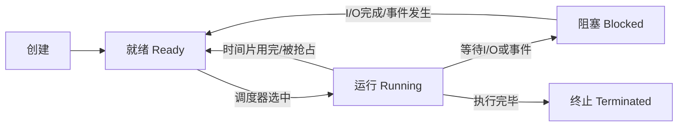

---
title: 操作系统面试
date: 2025-09-14 21:15:59
categories:
  - 操作系统
tags:
  - 操作系统
  - 面试
permalink: /pages/f4864173/
---

# 操作系统面试

::: tip 扩展

- 《现代操作系统》—— Andrew S. Tanenbaum
- 《深入理解计算机系统》（CSAPP）
- [小林 coding - 操作系统面试](https://xiaolincoding.com/os/)

:::

## 操作系统简介

### 【简单】什么是操作系统？操作系统有哪些核心功能？⭐⭐

> - 操作系统的本质是什么？
> - 操作系统为用户程序提供了哪些抽象？

**操作系统（Operating System, OS）是管理计算机硬件与软件资源的系统软件，是用户与硬件之间的桥梁**。

**核心功能**

| 功能模块 | 核心职责 | 关键机制 |
| :--- | :--- | :--- |
| **进程管理** | 创建、调度、终止进程 | 进程调度算法、上下文切换 |
| **内存管理** | 分配、回收、保护内存 | 分页、分段、虚拟内存 |
| **文件系统** | 组织、存储、检索文件 | 目录结构、索引节点、日志 |
| **设备管理** | 管理 I/O 设备 | 中断、DMA、缓冲、设备驱动 |
| **安全与保护** | 访问控制、身份认证 | 权限模型、用户态/内核态 |

**总结**：操作系统的本质是**资源管理者**和**硬件抽象层**，通过系统调用（System Call）向用户程序提供统一的接口，屏蔽底层硬件差异。

### 【简单】什么是用户态和内核态？为什么要区分？⭐⭐⭐

> - 用户态和内核态有什么区别？
> - 为什么需要两种模式？
> - 什么时候会从用户态切换到内核态？

**用户态（User Mode）**：运行用户程序，**只能访问受限的资源**，不能直接访问硬件或内核数据。

**内核态（Kernel Mode）**：运行操作系统内核代码，**拥有最高权限**，可访问所有硬件和内存资源。

**为什么区分？**

- **安全性**：防止用户程序直接操作硬件或破坏系统。
- **稳定性**：一个用户程序的崩溃不会影响整个系统。
- **隔离性**：进程间内存互相隔离。

**用户态 → 内核态的三种触发方式**

| 触发方式 | 说明 | 典型场景 |
| :--- | :--- | :--- |
| **系统调用** | 用户程序主动请求内核服务 | `read()`、`write()`、`fork()` |
| **异常** | 程序执行中出现异常 | 缺页异常、除零错误 |
| **中断** | 外部设备触发 | 键盘输入、网络数据到达、定时器 |

**总结**：用户态/内核态是操作系统的**核心安全机制**，通过**权限隔离**保证系统稳定，用户程序只能通过**系统调用**这一"受控入口"访问内核资源。

## 进程与线程

### 【中等】什么是进程和线程？二者有什么区别？⭐⭐⭐⭐

> - 进程和线程分别是什么？
> - 二者在资源占用、切换开销、通信方式上有何差异？
> - 什么场景用进程，什么场景用线程？

**进程（Process）**：是**正在运行的程序的实例**，拥有**独立的内存空间**（代码段、数据段、堆、栈）。

**线程（Thread）**：是**CPU 调度的最小单位**，隶属于进程，**共享进程的资源**（堆、全局变量），但拥有**独立的栈和寄存器**。

**核心对比**

| 对比维度 | 进程 | 线程 |
| :--- | :--- | :--- |
| **内存空间** | 独立地址空间 | 共享进程地址空间 |
| **切换开销** | 大（需切换页表、刷新 TLB） | 小（仅切换栈和寄存器） |
| **通信方式** | IPC（管道、消息队列、共享内存等） | 直接读写共享变量（需同步） |
| **创建/销毁** | 开销大 | 开销小 |
| **隔离性** | 强（一个进程崩溃不影响其他进程） | 弱（一个线程崩溃可能导致整个进程崩溃） |
| **适用场景** | 需要强隔离的任务（如浏览器多标签页） | 高并发任务（如 Web 服务器处理请求） |

**总结**：进程是**资源分配的基本单位**，线程是**CPU 调度的基本单位**。进程重隔离，线程重效率。现代高并发应用普遍采用**多进程 + 多线程**混合架构。

### 【中等】进程有哪些状态？状态之间如何转换？⭐⭐

> - 进程生命周期中有哪些状态？
> - 状态转换的触发条件是什么？



| 状态 | 含义 |
| :--- | :--- |
| **就绪（Ready）** | 已分配除 CPU 外的所有资源，等待调度 |
| **运行（Running）** | 正在 CPU 上执行 |
| **阻塞（Blocked）** | 等待某事件（I/O、锁、信号量），即使分配 CPU 也无法执行 |

**注意**：**阻塞 → 就绪**不能直接到**运行**，必须经过就绪队列等待调度。

### 【中等】进程间通信（IPC）有哪些方式？⭐⭐⭐

> - 进程之间如何交换数据？
> - 各种 IPC 方式的优缺点和适用场景？

| 通信方式 | 原理 | 优点 | 缺点 | 适用场景 |
| :--- | :--- | :--- | :--- | :--- |
| **管道（Pipe）** | 内核缓冲区，半双工 | 简单 | 只能用于父子进程 | 简单的单向数据流 |
| **命名管道（FIFO）** | 有文件路径的管道 | 可用于无关系进程 | 半双工 | 无关进程通信 |
| **消息队列** | 内核中的消息链表 | 消息有类型，可随机读取 | 拷贝开销大 | 结构化消息传递 |
| **共享内存** | 映射同一块物理内存 | **最快**（无内核拷贝） | 需自行同步 | 大数据量高性能通信 |
| **信号量（Semaphore）** | 计数器，用于同步 | 实现互斥与同步 | 不传数据，只传信号 | 进程同步/互斥 |
| **信号（Signal）** | 异步通知机制 | 轻量 | 信息量小 | 进程控制（如 `SIGKILL`） |
| **Socket** | 网络通信 | 可跨主机 | 开销大 | 分布式系统通信 |

**总结**：**共享内存**是最快的 IPC 方式（零拷贝），但需配合同步机制（如信号量）；**管道**最简单但限制多；**Socket** 是唯一支持跨主机通信的方式。

### 【中等】线程间有哪些通信方式？⭐⭐

| 通信方式 | 说明 |
| :--- | :--- |
| **共享内存** | 线程天然共享堆内存，需加锁保证一致性 |
| **锁（Mutex/Lock）** | 互斥访问共享资源，如 `synchronized`、`ReentrantLock` |
| **条件变量（Condition Variable）** | 配合锁实现"等待-通知"机制 |
| **信号量（Semaphore）** | 控制同时访问资源的线程数 |
| **管程（Monitor）** | 封装同步逻辑的高级抽象（如 Java `synchronized`） |
| **消息队列** | 线程间通过队列传递消息，解耦 |

### 【困难】什么是协程？协程和线程有什么区别？⭐⭐

**协程（Coroutine）** 是**用户态的轻量级线程**，由用户程序自行调度，不依赖操作系统内核。

| 对比维度 | 线程 | 协程 |
| :--- | :--- | :--- |
| **调度方** | 操作系统内核（抢占式） | 用户程序（协作式） |
| **切换开销** | 较大（内核态切换） | 极小（用户态跳转） |
| **内存占用** | 默认 1~8 MB 栈 | 通常仅 KB 级 |
| **并发能力** | 数千级 | 百万级 |
| **阻塞代价** | 整个 OS 线程阻塞 | 仅当前协程挂起 |
| **典型语言** | Java（传统线程）、C++ | Go（goroutine）、Kotlin（coroutine）、Python（asyncio）、Java 21（虚拟线程） |

**总结**：协程是**用户态调度的轻量级并发单元**，适合 I/O 密集型高并发场景。Java 21 引入的**虚拟线程（Virtual Thread）**本质就是协程。

## 进程调度

### 【中等】常见的进程调度算法有哪些？⭐⭐⭐

> - 有哪些经典的调度算法？
> - 各自的优缺点和适用场景？

| 调度算法 | 原理 | 优点 | 缺点 | 适用场景 |
| :--- | :--- | :--- | :--- | :--- |
| **先来先服务（FCFS）** | 按到达顺序 | 简单公平 | 短任务可能等待很长（护航效应） | 批处理 |
| **短作业优先（SJF）** | 优先执行运行时间最短的 | 平均等待时间最优 | 可能导致长任务饥饿 | 理论最优 |
| **时间片轮转（RR）** | 每个进程轮流执行一个时间片 | 公平、响应快 | 时间片大小影响性能 | **交互式系统** |
| **优先级调度** | 按优先级高低 | 重要任务优先 | 低优先级饥饿 | 实时系统 |
| **多级反馈队列** | 多个优先级队列 + 动态调整 | 综合各算法优点 | 实现复杂 | **通用操作系统** |

**Linux 调度器**：
- **CFS（Completely Fair Scheduler）**：基于红黑树，保证所有进程获得公平的 CPU 时间。
- **实时调度**：`SCHED_FIFO`（先到先服务）和 `SCHED_RR`（时间片轮转）。

**总结**：现代通用 OS 普遍采用**多级反馈队列**或**CFS**，兼顾公平性、响应性和吞吐量。

### 【中等】什么是上下文切换？为什么开销大？⭐⭐

**上下文切换（Context Switch）** 是 CPU 从一个进程/线程切换到另一个时，**保存当前状态（上下文）并加载新状态**的过程。

**上下文切换的步骤**：
1. 保存当前进程的 CPU 寄存器、程序计数器、栈指针到 PCB/TCB。
2. 选择下一个进程。
3. 加载下一个进程的上下文到 CPU。
4. 进程/线程切换可能还涉及**页表切换和 TLB 刷新**（进程切换时）。

**为什么开销大？**
- **直接开销**：保存/恢复寄存器的 CPU 时间。
- **间接开销**：TLB 刷新导致后续内存访问变慢（进程切换）；CPU 缓存失效（冷缓存）。

**进程切换 vs 线程切换**：进程切换需要切换页表、刷新 TLB，开销远大于线程切换。

## 死锁

### 【中等】什么是死锁？死锁产生的四个必要条件是什么？⭐⭐⭐⭐

> - 死锁是什么？
> - 死锁产生的条件有哪些？
> - 如何理解这四个条件？

**死锁（Deadlock）**：多个进程/线程因竞争资源而**相互等待**，导致**所有参与者都无法继续执行**的僵局。

**四个必要条件**（缺一不可）：

| 条件 | 含义 |
| :--- | :--- |
| **互斥（Mutual Exclusion）** | 资源一次只能被一个进程使用 |
| **占有并等待（Hold and Wait）** | 进程持有资源的同时等待获取其他资源 |
| **不可抢占（No Preemption）** | 已分配的资源不能被强制回收 |
| **循环等待（Circular Wait）** | 存在一条进程-资源的环形等待链 |

### 【困难】如何预防、避免和处理死锁？⭐⭐⭐

**预防（Prevention）** —— 破坏四个必要条件之一：

| 破坏的条件 | 方法 | 缺点 |
| :--- | :--- | :--- |
| 互斥 | 使用无锁数据结构 | 不是所有资源都能非互斥访问 |
| 占有并等待 | 一次性申请所有资源 | 资源利用率低，可能饥饿 |
| 不可抢占 | 允许抢占已分配资源 | 实现复杂 |
| 循环等待 | 按序申请资源（编号递增） | 可能限制编程灵活性 |

**避免（Avoidance）** —— 动态判断是否存在安全状态：
- **银行家算法（Banker's Algorithm）**：每次分配前检查系统是否处于安全状态，若是则分配，否则让进程等待。

**处理（Detection & Recovery）**：
- **检测**：维护资源分配图，定期检查是否存在环。
- **恢复**：终止进程、抢占资源、回滚。

**鸵鸟策略（Ostrich Algorithm）**：假装死锁不会发生。Linux/Windows 在大多数场景下采用此策略，因为死锁发生概率低，而预防成本高。

**总结**：实际系统中，**预防 > 避免 > 检测恢复 > 鸵鸟策略**，按场景选择。数据库系统常用**死锁检测 + 回滚**，而应用层更多依赖**良好的锁顺序设计**来预防死锁。

## 内存管理

### 【中等】什么是虚拟内存？为什么需要虚拟内存？⭐⭐⭐⭐

> - 什么是虚拟内存？
> - 虚拟内存解决了什么问题？
> - 虚拟地址如何转换为物理地址？

**虚拟内存（Virtual Memory）**：每个进程拥有**独立的虚拟地址空间**，由操作系统和 MMU（内存管理单元）负责**虚拟地址到物理地址的映射**。

**核心价值**

| 特性 | 说明 |
| :--- | :--- |
| **隔离性** | 每个进程以为自己独占全部内存，无法访问其他进程的空间 |
| **抽象性** | 屏蔽物理内存的大小和布局差异 |
| **共享** | 多个进程可映射同一物理页（如共享库） |
| **按需加载** | 只有访问到的页面才从磁盘加载到物理内存 |
| **保护** | 通过页表权限位实现读/写/执行保护 |

**地址转换过程**：

```
虚拟地址 → [MMU + 页表] → 物理地址
         ↓ TLB 命中？
         → 直接返回物理地址（快速路径）
         ↓ TLB 未命中？
         → 查页表 → 更新 TLB
```

- **TLB（Translation Lookaside Buffer）**：页表的高速缓存，加速地址转换。
- **缺页异常（Page Fault）**：虚拟页不在物理内存中时触发，由 OS 从磁盘加载对应页。

**总结**：虚拟内存是现代操作系统的**基石**，通过**地址空间抽象**实现了进程隔离、按需分配和内存保护。

### 【中等】分页和分段有什么区别？⭐⭐⭐

| 对比维度 | 分页（Paging） | 分段（Segmentation） |
| :--- | :--- | :--- |
| **划分方式** | 物理内存被等分为固定大小的**页框（Frame）**；虚拟地址空间也等分为**页（Page）** | 按**逻辑意义**划分为不等长的段（代码段、数据段、堆栈段等） |
| **大小** | 固定（通常 4KB） | 不固定，由编译器决定 |
| **地址结构** | 页号 + 页内偏移 | 段号 + 段内偏移 |
| **碎片** | 有**内部碎片**（页内未用空间） | 有**外部碎片**（段间空隙） |
| **共享与保护** | 以页为单位共享/保护 | 以段为单位，更符合逻辑 |

**段页式**：现代 OS（如 Linux）通常采用**段页式**——先用分段划分逻辑区域，再在段内分页，兼顾灵活性和效率。

### 【困难】什么是页面置换算法？有哪些常见的算法？⭐⭐

当物理内存不足时，需要将某些页面换出到磁盘（Swap），**页面置换算法**决定换出哪个页面。

| 算法 | 原理 | 优点 | 缺点 |
| :--- | :--- | :--- | :--- |
| **OPT（最优）** | 换出将来最久不用的页 | 理论最优 | 无法实现（需预知未来） |
| **FIFO** | 换出最早进入内存的页 | 简单 | 可能换出常用页（Belady 异常） |
| **LRU（最近最少使用）** | 换出最久未被访问的页 | 性能好 | 实现开销大（需维护时间戳/链表） |
| **Clock（时钟）** | LRU 的近似实现，循环扫描 | 开销适中 | 不如 LRU 精确 |
| **LFU（最不经常使用）** | 换出访问次数最少的页 | 照顾高频页 | 历史访问可能不代表未来 |

**Linux 的页面置换**：采用**改进的 Clock 算法**（Active/Inactive 双链表），将页面分为活跃列表和非活跃列表，优先换出非活跃页。

## I/O 模型

### 【困难】什么是 I/O 多路复用？select、poll、epoll 有什么区别？⭐⭐⭐⭐⭐

> - 什么是 I/O 多路复用？
> - select/poll/epoll 有什么区别？
> - 为什么 epoll 性能最好？

**I/O 多路复用**：让**单个线程**能够同时监控**多个 I/O 通道**（Socket），当某个通道就绪时进行相应处理。这是高并发服务器的核心技术。

**核心对比**

| 对比维度 | select | poll | epoll |
| :--- | :--- | :--- | :--- |
| **数据结构** | 位图（bitmap） | 链表（pollfd 数组） | 红黑树 + 就绪链表 |
| **最大连接数** | 通常 1024（FD_SETSIZE） | 无上限 | 无上限（受内存限制） |
| **检测方式** | 每次**全量遍历**所有 fd | 每次**全量遍历**所有 fd | **事件驱动回调**，仅返回就绪 fd |
| **fd 拷贝** | 每次调用需从用户态拷贝到内核态 | 同 select | `epoll_ctl` 增量添加，`epoll_wait` 仅拷贝就绪事件 |
| **时间复杂度** | O(n) | O(n) | O(1)（事件触发） |
| **性能随连接数** | 线性下降 | 线性下降 | **几乎不受影响** |
| **触发模式** | 仅水平触发（LT） | 仅水平触发（LT） | 支持水平触发（LT）和**边缘触发（ET）** |

**epoll 为什么快？**

1. **红黑树管理 fd**：增删改查 O(log n)。
2. **事件驱动回调**：fd 就绪时被回调函数直接加入就绪链表，无需全量扫描。
3. **mmap 共享内存**：内核与用户空间共享就绪事件信息，减少数据拷贝。

**总结**：**epoll**（Linux 2.6+）是高性能网络编程的基石，Nginx、Node.js、Redis 等高性能服务器都基于 epoll 实现 I/O 多路复用。其核心优势是**事件驱动 + O(1) 复杂度**，性能不随连接数增长而下降。

### 【困难】什么是零拷贝？mmap 和 sendfile 有什么区别？⭐⭐⭐⭐

> - 传统 I/O 为什么效率低？
> - 零拷贝解决了什么问题？
> - mmap 和 sendfile 各自的原理和适用场景？

**传统 I/O 的数据拷贝路径**（以 `read` + `write` 为例）：

```
磁盘 → [DMA] → 内核缓冲区 → [CPU] → 用户缓冲区 → [CPU] → Socket缓冲区 → [DMA] → 网卡
```

共 **4 次拷贝**（2 次 DMA + 2 次 CPU）、**4 次上下文切换**（用户态/内核态各 2 次）。

**零拷贝**的核心思想：**减少或消除 CPU 参与的数据拷贝，减少上下文切换次数**。

| 技术 | 原理 | 拷贝次数 | 上下文切换 | 适用场景 |
| :--- | :--- | :--- | :--- | :--- |
| **mmap** | 将内核缓冲区映射到用户空间，用户直接操作 | 3 次（1 CPU + 2 DMA） | 4 次 | 需要修改数据 |
| **sendfile** | 内核中直接传输，数据不经过用户空间 | 2 次（0~1 CPU + 2 DMA） | 2 次 | **纯文件传输**（如静态文件服务器） |
| **sendfile + DMA Scatter/Gather** | sendfile 优化版，DMA 从内核直接分散写到网卡 | 0 次 CPU 拷贝 | 2 次 | 高性能文件传输 |

**经典应用**：
- **Kafka**：使用 `mmap` 写入日志（Zero-Copy Write），使用 `sendfile` 发送日志（Zero-Copy Transfer）。
- **Nginx**：静态文件传输使用 `sendfile`。
- **Netty**：`FileRegion` 封装了 `sendfile`。

**总结**：零拷贝通过**减少数据在内核/用户空间之间的拷贝和上下文切换**来大幅提升 I/O 性能。`sendfile` 适合纯传输，`mmap` 适合需要修改数据的场景。

### 【中等】什么是阻塞 I/O、非阻塞 I/O、同步 I/O、异步 I/O？⭐⭐⭐

| I/O 模型 | 行为 | 特点 |
| :--- | :--- | :--- |
| **阻塞 I/O（BIO）** | 调用 `read`/`write` 时，线程**阻塞**直到数据就绪/完成 | 简单，但一个连接需一个线程 |
| **非阻塞 I/O（NIO）** | 调用立即返回，需**轮询**检查是否就绪 | 不阻塞但浪费 CPU |
| **I/O 多路复用** | 用 `select`/`poll`/`epoll` 监控多个 fd | 单线程处理多连接，**主流高性能方案** |
| **信号驱动 I/O** | 内核在 I/O 就绪时发信号通知 | 减少轮询开销 |
| **异步 I/O（AIO）** | 发起 I/O 请求后立即返回，内核完成后**回调通知** | 真正的异步，Linux 有 `io_uring` |

**POSIX 分类**：
- **同步 I/O**：阻塞 I/O、非阻塞 I/O、I/O 多路复用、信号驱动 I/O（I/O 操作本身会导致进程阻塞）。
- **异步 I/O**：I/O 操作完成后才通知进程，进程全程不阻塞。

## 文件系统

### 【简单】Linux 的文件系统层次结构是什么？⭐

Linux 文件系统遵循 **FHS（Filesystem Hierarchy Standard）**：

| 目录 | 用途 |
| :--- | :--- |
| `/` | 根目录 |
| `/home` | 用户主目录 |
| `/etc` | 系统配置文件 |
| `/var` | 可变数据（日志、缓存） |
| `/tmp` | 临时文件 |
| `/usr` | 用户程序 |
| `/bin`、`/sbin` | 系统命令 |
| `/dev` | 设备文件 |
| `/proc`、`/sys` | 虚拟文件系统（内核/进程信息） |

### 【中等】Linux 中的硬链接和软链接有什么区别？⭐⭐

| 对比维度 | 硬链接（Hard Link） | 软链接（Symbolic Link） |
| :--- | :--- | :--- |
| **本质** | 与原文件共享同一个 inode | 独立文件，内容是原文件的路径 |
| **inode** | 与原文件 **相同** | 拥有**独立** inode |
| **删除原文件** | 链接仍可用（inode 引用计数 > 0） | 链接失效（**悬空链接**） |
| **跨文件系统** | 不可以 | 可以 |
| **链接目录** | 不允许（避免循环引用） | 可以 |
| **文件大小** | 与原文件相同 | 存储路径的字节数 |

**总结**：硬链接是**同一个文件的不同名字**（共享 inode），软链接是**指向另一个文件的快捷方式**（独立 inode）。

## Linux 实用技能

### 【中等】如何在 Linux 中排查性能问题？常用哪些命令？⭐⭐⭐

| 排查维度 | 常用命令 | 说明 |
| :--- | :--- | :--- |
| **CPU** | `top`、`htop`、`mpstat`、`pidstat` | 查看 CPU 使用率、各核心负载 |
| **内存** | `free -h`、`vmstat`、`cat /proc/meminfo` | 查看内存/swap 使用 |
| **磁盘 I/O** | `iostat -x`、`iotop` | 磁盘读写速率、I/O 等待 |
| **网络** | `ss -tlnp`、`netstat`、`tcpdump`、`iftop` | 端口监听、抓包、流量监控 |
| **磁盘空间** | `df -h`、`du -sh *` | 磁盘/目录空间占用 |
| **进程** | `ps aux`、`lsof`、`strace -p <pid>` | 进程列表、打开文件、系统调用追踪 |
| **日志** | `journalctl`、`tail -f`、`grep`、`awk` | 系统日志、应用日志分析 |
| **综合** | `dmesg`、`sar`、`perf` | 内核消息、历史性能数据、性能剖析 |

**排查思路**（USE 方法）：
1. **U**tilization（利用率）：各资源是否接近饱和？
2. **S**aturation（饱和度）：是否有排队等待？
3. **E**rrors（错误）：是否有报错事件？

## 安全

### 【中等】什么是 CC 攻击、DDoS 攻击和 SQL 注入？⭐⭐

| 攻击类型 | 原理 | 防御措施 |
| :--- | :--- | :--- |
| **CC 攻击** | 模拟大量用户发起**合法 HTTP 请求**（如频繁访问搜索接口），耗尽服务器资源 | 限流、验证码、IP 黑名单、CDN 分流 |
| **DDoS 攻击** | 利用**大量僵尸主机**向目标发送海量请求，耗尽网络带宽或服务器资源 | 流量清洗、Anycast、CDN、云防护 |
| **SQL 注入** | 在输入中嵌入恶意 SQL，使后端数据库执行非预期操作 | **参数化查询**（PreparedStatement）、ORM、输入校验、WAF |

## 参考资料

- 《现代操作系统》（第 4 版）—— Andrew S. Tanenbaum
- 《深入理解计算机系统》（CSAPP）—— Randal E. Bryant
- 《Linux 性能优化实战》—— 倪朋飞（极客时间）
- [小林 coding - 图解操作系统](https://xiaolincoding.com/os/)
