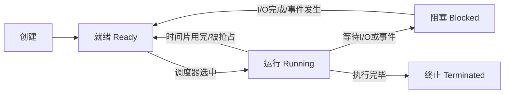

---
title: 操作系统面试
date: 2025-09-14 21:15:59
categories:
  - 操作系统
tags:
  - 操作系统
  - 面试
permalink: /pages/f4864173/
---

# 操作系统面试

::: tip 扩展

- 《现代操作系统》—— Andrew S. Tanenbaum
- 《深入理解计算机系统》（CSAPP）
- [小林 coding - 操作系统面试](https://xiaolincoding.com/os/)

:::

## 操作系统简介

### 【简单】什么是操作系统？操作系统有哪些核心功能？⭐⭐

> - 操作系统的本质是什么？
> - 操作系统为用户程序提供了哪些抽象？

**操作系统（Operating System, OS）是管理计算机硬件与软件资源的系统软件，是用户与硬件之间的桥梁**。

**核心功能**

| 功能模块       | 核心职责             | 关键机制                  |
| :------------- | :------------------- | :------------------------ |
| **进程管理**   | 创建、调度、终止进程 | 进程调度算法、上下文切换  |
| **内存管理**   | 分配、回收、保护内存 | 分页、分段、虚拟内存      |
| **文件系统**   | 组织、存储、检索文件 | 目录结构、索引节点、日志  |
| **设备管理**   | 管理 I/O 设备        | 中断、DMA、缓冲、设备驱动 |
| **安全与保护** | 访问控制、身份认证   | 权限模型、用户态/内核态   |

**总结**：操作系统的本质是**资源管理者**和**硬件抽象层**，通过系统调用（System Call）向用户程序提供统一的接口，屏蔽底层硬件差异。

### 【简单】什么是用户态和内核态？为什么要区分？⭐⭐⭐

> - 用户态和内核态有什么区别？
> - 为什么需要两种模式？
> - 什么时候会从用户态切换到内核态？

**用户态（User Mode）**：运行用户程序，**只能访问受限的资源**，不能直接访问硬件或内核数据。

**内核态（Kernel Mode）**：运行操作系统内核代码，**拥有最高权限**，可访问所有硬件和内存资源。

**为什么区分？**

- **安全性**：防止用户程序直接操作硬件或破坏系统。
- **稳定性**：一个用户程序的崩溃不会影响整个系统。
- **隔离性**：进程间内存互相隔离。

**用户态 → 内核态的三种触发方式**

| 触发方式     | 说明                     | 典型场景                       |
| :----------- | :----------------------- | :----------------------------- |
| **系统调用** | 用户程序主动请求内核服务 | `read()`、`write()`、`fork()`  |
| **异常**     | 程序执行中出现异常       | 缺页异常、除零错误             |
| **中断**     | 外部设备触发             | 键盘输入、网络数据到达、定时器 |

**总结**：用户态/内核态是操作系统的**核心安全机制**，通过**权限隔离**保证系统稳定，用户程序只能通过**系统调用**这一"受控入口"访问内核资源。

### 【中等】什么是中断和系统调用？它们有什么区别？⭐⭐⭐

> - 中断和系统调用分别是什么？
> - 两者有什么异同？

两者都是 CPU 从用户态切换到内核态的触发方式，但方向相反：**中断是"硬件找内核"，系统调用是"程序找内核"**。

**核心对比**

| 对比维度     | 中断（Interrupt）                | 系统调用（System Call）       |
| :----------- | :------------------------------- | :---------------------------- |
| **触发方**   | 外部硬件设备（异步）             | 用户程序主动发起（同步）      |
| **目的**     | 通知 CPU 处理外部事件            | 请求内核提供服务              |
| **典型场景** | 时钟中断、键盘输入、网卡收到数据 | `read()`、`write()`、`fork()` |
| **时机**     | 不可预测，随时发生               | 程序执行到特定指令时发生      |

**处理流程**

1. CPU 保存当前上下文（寄存器、程序计数器），切换到内核态。
2. 根据**中断号/系统调用号**查表（中断向量表/系统调用表），跳转到对应处理函数。
3. 执行处理逻辑（中断处理程序/内核服务）。
4. 恢复上下文，返回用户态继续执行。

**总结**：中断是异步的外部事件通知，系统调用是同步的主动服务请求，二者共同构成用户程序进入内核的两大入口，也是上下文切换最主要的开销来源。

## 进程与线程

### 【中等】什么是进程和线程？二者有什么区别？⭐⭐⭐⭐

> - 进程和线程分别是什么？
> - 二者在资源占用、切换开销、通信方式上有何差异？
> - 什么场景用进程，什么场景用线程？

**进程（Process）**：是**正在运行的程序的实例**，拥有**独立的内存空间**（代码段、数据段、堆、栈）。

**线程（Thread）**：是**CPU 调度的最小单位**，隶属于进程，**共享进程的资源**（堆、全局变量），但拥有**独立的栈和寄存器**。

**核心对比**

| 对比维度      | 进程                                 | 线程                                   |
| :------------ | :----------------------------------- | :------------------------------------- |
| **内存空间**  | 独立地址空间                         | 共享进程地址空间                       |
| **切换开销**  | 大（需切换页表、刷新 TLB）           | 小（仅切换栈和寄存器）                 |
| **通信方式**  | IPC（管道、消息队列、共享内存等）    | 直接读写共享变量（需同步）             |
| **创建/销毁** | 开销大                               | 开销小                                 |
| **隔离性**    | 强（一个进程崩溃不影响其他进程）     | 弱（一个线程崩溃可能导致整个进程崩溃） |
| **适用场景**  | 需要强隔离的任务（如浏览器多标签页） | 高并发任务（如 Web 服务器处理请求）    |

**总结**：进程是**资源分配的基本单位**，线程是**CPU 调度的基本单位**。进程重隔离，线程重效率。现代高并发应用普遍采用**多进程 + 多线程**混合架构。

**内核视角：调度实体与开销量化**

- 在 Linux 内核中，进程与线程统一由 `task_struct` 表示，线程只是**共享了 mm（地址空间）、files（fd 表）等结构**的 task_struct，调度器不区分二者。
- **上下文切换开销量化**：直接成本约 1~10 μs（保存/恢复寄存器 + 调度器选核），但间接成本更大——切换后 L1/L2 缓存变冷，实际单次有效开销可达几十微秒；进程切换额外切换页表并刷新 TLB，开销再高一截。单机每秒上万次切换时，sys% 会显著侵蚀 CPU。
- **内存开销量化**：线程栈默认 1~8 MB（虚拟地址预留，实际按需分配）；创建线程远快于 fork 后写时复制展开的进程。

**方案权衡**

| 模型               | 优点                                            | 适用边界 / 代价                             |
| :----------------- | :---------------------------------------------- | :------------------------------------------ |
| 多进程             | 隔离性强，单进程崩溃不波及全局；绕过 GIL 类限制 | 内存占用高，IPC 有拷贝开销                  |
| 多线程             | 共享内存通信零拷贝，创建/切换便宜               | 一个线程段错误整个进程崩溃；锁竞争成为瓶颈  |
| 多进程 + 共享内存  | 兼顾隔离与性能（Nginx 即此模型）                | 需自行处理同步与生命周期                    |
| 协程（用户态调度） | 切换仅纳秒级、无需陷入内核，百万级并发          | 仅适合 I/O 密集；一个协程阻塞会拖住整个线程 |

**失效场景**

- **线程模型下的全局崩溃**：任一线程访问非法内存，整个进程被 SIGSEGV 杀死，多进程隔离优势此时不存在。
- **切换风暴**：线程数远超核数时（如数千线程抢几十核），CPU 大量耗在调度与缓存重建上，吞吐不升反降。
- **fork 陷阱**：多线程程序中 fork 后只 exec 之外的路径可能继承未释放的锁，子进程永久卡死（POSIX 经典坑）。

**踩坑案例**

> 现象：某 Web 服务从百线程扩到数千线程后，QPS 不升反降，`top` 显示 sys% 高达 40%。排查：`vmstat` 的 cs（上下文切换）每秒超 10 万次，`perf` 火焰图中调度器与锁竞争占比异常。根因：线程数远超核数，大部分 CPU 耗在切换与缓存重建而非业务逻辑。修复：改为"少量工作线程 + 队列"模型，线程数收敛到核数的 2~4 倍，QPS 回升且 sys% 降至 5% 以内。

> synchronized、线程池等 Java 并发工具的用法属于 JavaCore 领域，本题聚焦 OS 层面的地址空间、调度实体与切换开销。

#### 拓展追问

1. 内核线程和普通线程切换的开销差异在哪？
   内核线程没有用户地址空间，切换时不需要切换页表、不刷 TLB，也没有用户态寄存器现场，开销显著小于用户线程；但它不能执行用户代码，仅用于内核自身工作（如 kswapd、kworker）。
2. 为什么说上下文切换的真实成本远超"保存寄存器"？
   直接成本只是微秒级，真正的大头是切换后缓存（L1/L2）与 TLB 变冷，新任务要从低速存储重新热载数据；所以优化方向是减少切换次数（绑核、减少线程数）而非压缩单次切换。
3. 同一进程的两个线程在 task_struct 层面到底独享什么、共享什么？
   独享：栈、寄存器现场、thread_struct（含 TLS）；共享：mm（地址空间）、files（fd 表）、fs、signal 处理。这解释了为什么线程间通信零拷贝但必须加锁，也解释了 fd 泄漏会影响整个进程。

#### 场景题

你要为一款百万级并发、I/O 密集型的接入网关选择并发模型（进程/线程/协程），如何决策？

- **应急处理**：若现有系统已接近崩溃，先扩容 + 限流保命，而不是在线重构并发模型。
- **根因分析**：I/O 密集型任务的瓶颈不在计算而在等待，并发单元大部分时间阻塞在 socket 上——此时每线程一连接的模型会被栈内存（百万连接 × 1 MB 栈 = 1 TB，荒谬）和切换风暴击沉；多进程则因内存重复与 IPC 成本同样不划算。
- **长期方案**：少量线程（≈核数）+ epoll 事件循环承载海量连接，业务逻辑用协程（Go goroutine / Java 21 虚拟线程）编写以保持同步编码风格；CPU 密集的旁路计算（如加解密）拆到独立线程池或进程避免阻塞事件循环。
- **权衡**：协程生态要求整条依赖链不阻塞（一个 JDBC 同步调用就能卡死整个线程），存量代码迁移成本需评估；折中方案是虚拟线程 + 有限的载体线程池。

### 【中等】什么是僵尸进程和孤儿进程？如何避免？⭐⭐⭐

> - 僵尸进程和孤儿进程分别是什么？
> - 它们有什么危害？如何处理？

**僵尸进程（Zombie Process）**

- 定义：子进程**已退出**，但父进程没有调用 `wait()`/`waitpid()` 回收其退出状态，子进程的 PCB（退出码、资源统计）仍残留在内核中。
- 危害：少量僵尸进程无害，但大量堆积会耗尽 PID，导致无法创建新进程。
- 处理：定期调用 `wait()`；或 `signal(SIGCHLD, SIG_IGN)` 让内核自动回收；或给父进程发 `SIGCHLD` 促使其回收。父进程若先退出，僵尸进程会被 init/systemd（PID 1）收养并回收。

**孤儿进程（Orphan Process）**

- 定义：父进程**先于子进程退出**，子进程被 PID 1（init/systemd）收养。
- 危害：**基本无害**，init 会自动 `wait()` 回收其退出状态，孤儿进程可继续正常运行（守护进程正是故意利用这一机制）。

**核心区别**

| 对比         | 僵尸进程       | 孤儿进程              |
| :----------- | :------------- | :-------------------- |
| **谁先退出** | 子进程先退出   | 父进程先退出          |
| **危害**     | 可能耗尽 PID   | 无害                  |
| **处理方**   | 父进程负责回收 | init（PID 1）自动回收 |

**总结**：僵尸进程是"死了没人收尸"，孤儿进程是"爹没了托孤给 init"——前者需要警惕，后者无需担心。

### 【中等】进程有哪些状态？状态之间如何转换？⭐⭐

> - 进程生命周期中有哪些状态？
> - 状态转换的触发条件是什么？


```mermaid
graph LR
    A[创建] --> B[就绪 Ready]
    B -->|调度器选中| C[运行 Running]
    C -->|时间片用完/被抢占| B
    C -->|等待I/O或事件| D[阻塞 Blocked]
    D -->|I/O完成/事件发生| B
    C -->|执行完毕| E[终止 Terminated]
```

| 状态                | 含义                                                   |
| :------------------ | :----------------------------------------------------- |
| **就绪（Ready）**   | 已分配除 CPU 外的所有资源，等待调度                    |
| **运行（Running）** | 正在 CPU 上执行                                        |
| **阻塞（Blocked）** | 等待某事件（I/O、锁、信号量），即使分配 CPU 也无法执行 |

**注意**：**阻塞 → 就绪**不能直接到**运行**，必须经过就绪队列等待调度。

### 【中等】进程间通信（IPC）有哪些方式？⭐⭐⭐

> - 进程之间如何交换数据？
> - 各种 IPC 方式的优缺点和适用场景？

| 通信方式                | 原理               | 优点                   | 缺点               | 适用场景                 |
| :---------------------- | :----------------- | :--------------------- | :----------------- | :----------------------- |
| **管道（Pipe）**        | 内核缓冲区，半双工 | 简单                   | 只能用于父子进程   | 简单的单向数据流         |
| **命名管道（FIFO）**    | 有文件路径的管道   | 可用于无关系进程       | 半双工             | 无关进程通信             |
| **消息队列**            | 内核中的消息链表   | 消息有类型，可随机读取 | 拷贝开销大         | 结构化消息传递           |
| **共享内存**            | 映射同一块物理内存 | **最快**（无内核拷贝） | 需自行同步         | 大数据量高性能通信       |
| **信号量（Semaphore）** | 计数器，用于同步   | 实现互斥与同步         | 不传数据，只传信号 | 进程同步/互斥            |
| **信号（Signal）**      | 异步通知机制       | 轻量                   | 信息量小           | 进程控制（如 `SIGKILL`） |
| **Socket**              | 网络通信           | 可跨主机               | 开销大             | 分布式系统通信           |

**总结**：**共享内存**是最快的 IPC 方式（零拷贝），但需配合同步机制（如信号量）；**管道**最简单但限制多；**Socket** 是唯一支持跨主机通信的方式。

### 【中等】线程间有哪些通信方式？⭐⭐

| 通信方式                           | 说明                                                 |
| :--------------------------------- | :--------------------------------------------------- |
| **共享内存**                       | 线程天然共享堆内存，需加锁保证一致性                 |
| **锁（Mutex/Lock）**               | 互斥访问共享资源，如 `synchronized`、`ReentrantLock` |
| **条件变量（Condition Variable）** | 配合锁实现"等待-通知"机制                            |
| **信号量（Semaphore）**            | 控制同时访问资源的线程数                             |
| **管程（Monitor）**                | 封装同步逻辑的高级抽象（如 Java `synchronized`）     |
| **消息队列**                       | 线程间通过队列传递消息，解耦                         |

### 【中等】常见的线程同步机制有哪些？互斥锁和自旋锁有什么区别？⭐⭐⭐

> - 有哪些常见的线程同步机制？
> - 互斥锁和自旋锁如何选择？

**常见同步机制**

| 机制                               | 原理                                                 | 适用场景                       |
| :--------------------------------- | :--------------------------------------------------- | :----------------------------- |
| **互斥锁（Mutex）**                | 获取失败则**休眠等待**，被唤醒后重新竞争             | 临界区较大、等待时间较长的场景 |
| **自旋锁（Spinlock）**             | 获取失败则**忙等循环**（不断检查锁状态），不让出 CPU | 临界区极短、多核环境           |
| **读写锁（RWLock）**               | 读读并发、读写/写写互斥                              | 读多写少的场景                 |
| **条件变量（Condition Variable）** | 配合锁实现**等待-通知**，等待某条件成立后被唤醒      | 生产者-消费者模式              |
| **信号量（Semaphore）**            | 计数器控制并发访问数量                               | 限流、资源池                   |

**互斥锁 vs 自旋锁**

- **互斥锁**：等待时休眠，涉及上下文切换，但**不浪费 CPU**；适合临界区大或锁竞争激烈的场景。
- **自旋锁**：等待时持续消耗 CPU，但**无切换开销、响应极快**；适合临界区执行时间远小于切换开销的场景。单核 CPU 上使用自旋锁通常无意义（持锁线程无法运行，白等）。

**总结**：临界区短用自旋锁换响应速度，临界区长用互斥锁换 CPU 利用率；条件变量解决"等待某条件成立"的问题，避免无效轮询。

### 【困难】什么是协程？协程和线程有什么区别？⭐⭐

**协程（Coroutine）** 是**用户态的轻量级线程**，由用户程序自行调度，不依赖操作系统内核。

| 对比维度     | 线程                   | 协程                                                                         |
| :----------- | :--------------------- | :--------------------------------------------------------------------------- |
| **调度方**   | 操作系统内核（抢占式） | 用户程序（协作式）                                                           |
| **切换开销** | 较大（内核态切换）     | 极小（用户态跳转）                                                           |
| **内存占用** | 默认 1~8 MB 栈         | 通常仅 KB 级                                                                 |
| **并发能力** | 数千级                 | 百万级                                                                       |
| **阻塞代价** | 整个 OS 线程阻塞       | 仅当前协程挂起                                                               |
| **典型语言** | Java（传统线程）、C++  | Go（goroutine）、Kotlin（coroutine）、Python（asyncio）、Java 21（虚拟线程） |

**总结**：协程是**用户态调度的轻量级并发单元**，适合 I/O 密集型高并发场景。Java 21 引入的**虚拟线程（Virtual Thread）**本质就是协程。

## 进程调度

### 【中等】常见的进程调度算法有哪些？⭐⭐⭐

> - 有哪些经典的调度算法？
> - 各自的优缺点和适用场景？

| 调度算法               | 原理                       | 优点             | 缺点                           | 适用场景         |
| :--------------------- | :------------------------- | :--------------- | :----------------------------- | :--------------- |
| **先来先服务（FCFS）** | 按到达顺序                 | 简单公平         | 短任务可能等待很长（护航效应） | 批处理           |
| **短作业优先（SJF）**  | 优先执行运行时间最短的     | 平均等待时间最优 | 可能导致长任务饥饿             | 理论最优         |
| **时间片轮转（RR）**   | 每个进程轮流执行一个时间片 | 公平、响应快     | 时间片大小影响性能             | **交互式系统**   |
| **优先级调度**         | 按优先级高低               | 重要任务优先     | 低优先级饥饿                   | 实时系统         |
| **多级反馈队列**       | 多个优先级队列 + 动态调整  | 综合各算法优点   | 实现复杂                       | **通用操作系统** |

**Linux 调度器**：

- **CFS（Completely Fair Scheduler）**：基于红黑树，保证所有进程获得公平的 CPU 时间。
- **实时调度**：`SCHED_FIFO`（先到先服务）和 `SCHED_RR`（时间片轮转）。

**总结**：现代通用 OS 普遍采用**多级反馈队列**或**CFS**，兼顾公平性、响应性和吞吐量。

### 【中等】Linux 的 CFS 调度算法是如何工作的？⭐⭐⭐

> - CFS 的核心思想是什么？
> - 虚拟运行时间和权重起什么作用？

**CFS（Completely Fair Scheduler，完全公平调度器）** 是 Linux 2.6.23 起的默认调度器，目标是让所有可运行进程**公平地分享 CPU 时间**，而不是维护固定优先级队列。

**核心思想**

- 每个进程记录一个**虚拟运行时间（vruntime）**，调度器总是选择 vruntime **最小**的进程来运行。
- vruntime 的增长速度受**权重（nice 值）**影响：nice 值越高（优先级越低），vruntime 增长越快，获得的 CPU 时间片占比越小。
- 效果：短时间内所有进程的 vruntime 趋于接近，实现"完全公平"。

**关键机制**

| 机制                          | 说明                                                                                 |
| :---------------------------- | :----------------------------------------------------------------------------------- |
| **红黑树**                    | 以 vruntime 为键组织可运行进程，每次取最左节点即 vruntime 最小者，O(log n)           |
| **目标延迟（sched_latency）** | 定义一个周期，保证每个进程在该周期内至少运行一次，兼顾响应性                         |
| **睡眠补偿**                  | 进程睡眠（如等待 I/O）时 vruntime 不增长，唤醒后可优先获得调度，**对交互式任务友好** |
| **动态时间片**                | 时间片长度不是固定的，而是根据 vruntime 差值动态计算                                 |

**总结**：CFS 用"虚拟运行时间 + 红黑树选最小者"替代传统固定时间片，实现了公平性与交互响应性的统一，是理解 Linux 调度行为的必备知识。

### 【中等】什么是上下文切换？为什么开销大？⭐⭐

**上下文切换（Context Switch）** 是 CPU 从一个进程/线程切换到另一个时，**保存当前状态（上下文）并加载新状态**的过程。

**上下文切换的步骤**：

1. 保存当前进程的 CPU 寄存器、程序计数器、栈指针到 PCB/TCB。
2. 选择下一个进程。
3. 加载下一个进程的上下文到 CPU。
4. 进程/线程切换可能还涉及**页表切换和 TLB 刷新**（进程切换时）。

**为什么开销大？**

- **直接开销**：保存/恢复寄存器的 CPU 时间。
- **间接开销**：TLB 刷新导致后续内存访问变慢（进程切换）；CPU 缓存失效（冷缓存）。

**进程切换 vs 线程切换**：进程切换需要切换页表、刷新 TLB，开销远大于线程切换。

## 死锁

### 【中等】什么是死锁？死锁产生的四个必要条件是什么？⭐⭐⭐⭐

> - 死锁是什么？
> - 死锁产生的条件有哪些？
> - 如何理解这四个条件？

**死锁（Deadlock）**：多个进程/线程因竞争资源而**相互等待**，导致**所有参与者都无法继续执行**的僵局。

**四个必要条件**（缺一不可）：

| 条件                            | 含义                               |
| :------------------------------ | :--------------------------------- |
| **互斥（Mutual Exclusion）**    | 资源一次只能被一个进程使用         |
| **占有并等待（Hold and Wait）** | 进程持有资源的同时等待获取其他资源 |
| **不可抢占（No Preemption）**   | 已分配的资源不能被强制回收         |
| **循环等待（Circular Wait）**   | 存在一条进程-资源的环形等待链      |

**方案权衡：破哪个条件最划算**

| 破坏的条件 | 手段                                  | 适用边界 / 代价                                     |
| :--------- | :------------------------------------ | :-------------------------------------------------- |
| 循环等待   | 全局锁序：所有线程按同一顺序加锁      | 工程首选，几乎零成本，但要求团队纪律 + 代码评审把关 |
| 不可抢占   | `tryLock(timeout)` 失败回滚释放已持锁 | 需要业务支持重试与回滚，实现复杂度中等              |
| 占有并等待 | 一次性申请全部资源                    | 资源利用率低，可能饥饿，适合资源种类少的场景        |
| 互斥       | 无锁结构/CAS                          | 仅适合简单数据结构，复杂临界区难以无锁化            |

**数据库场景的特殊性**：InnoDB 采用**死锁检测 + 回滚**而非预防——维护等待图（wait-for graph）周期性找环，发现即回滚代价最小的事务；高并发热点行场景下检测本身会消耗大量 CPU（MySQL 8.0 可用 `innodb_deadlock_detect = OFF` + `innodb_lock_wait_timeout` 替代，代价是超时而非即时检测）。

**失效场景**

- **锁序纪律在跨系统时失效**：全局锁序只能约束单进程内，跨服务/跨数据库的资源竞争（如应用锁 + DB 行锁嵌套）照样能形成环。
- **锁内 I/O 造成隐性死锁**：持锁期间发起网络调用，对端反过来依赖这把锁，等待时间从微秒级膨胀到秒级，表现如死锁但实为长阻塞。
- **自死锁**：线程重复申请已持有的不可重入锁，单线程即可卡死自己。

**踩坑案例**

> 现象：订单服务高峰期偶发请求永久挂起，重启后短暂恢复。排查：`jstack` 导出线程栈，发现两个线程分别 BLOCKED 在对方持有的锁上，形成标准的两锁成环。根因：支付回调与订单状态机两个模块由不同团队开发，加锁顺序相反，只有两笔特定订单并发时才会触发，故低概率复现。修复：统一按资源 ID 排序加锁，并用 ArchUnit 在编译期校验锁序约束。

#### 拓展追问

1. 活锁、饥饿和死锁有什么本质区别？
   死锁是都在等待、谁也不动；活锁是都在动（反复退让重试）但没有任何进展，如两人在走廊互相让路反复横跳；饥饿是低优先级者永远排不上资源。活锁可用随机退避打破，饥饿靠公平调度/老化机制解决。
2. 为什么 MySQL 选择"检测 + 回滚"而不是"预防"？
   事务的加锁顺序由 SQL 语义和执行计划决定，应用层无法完全控制，预防不现实；而数据库能低成本维护等待图并精确找到环，回滚最小代价事务即可恢复，这是把检测能力内建在引擎里的典型设计。
3. 分布式环境下还能用等待图检测死锁吗？
   很难：资源分散在多个节点，全局等待图需要跨节点收集且状态瞬息万变，一致快照成本极高。工程上主流做法是超时放弃 + 全局资源编号（按序加锁），或用 Chandy-Misra-Haas 等分布式检测算法，仅在强需求场景引入。

#### 场景题

大促压测时，数据库监控发现 `Lock wait timeout exceeded` 报错激增，部分请求卡住 50 s（`innodb_lock_wait_timeout`）才失败，你如何判断是死锁还是热点锁，并给出方案？

- **应急处理**：先对引发超时的入口限流降级，保住核心链路；若是单一热点行（如库存行），切到队列串行化或内存预扣方案止血。
- **根因分析**：查 `SHOW ENGINE INNODB STATUS` 的 LATEST DETECTED DEADLOCK 段——若引擎已自动检测并回滚事务，是死锁；若只有等待超时记录且多个会话 `SHOW PROCESSLIST` 都卡在同一行锁，则是热点锁而非环形等待。两者的治理方向完全不同。
- **长期方案**：死锁——审查事务加锁顺序与 SQL 执行计划（间隙锁是隐形杀手），缩短事务、避免事务内 RPC；热点锁——行锁改应用层串行化、分段库存（一行拆多行）或换乐观锁/CAS 更新。
- **权衡**：关闭死锁检测（`innodb_deadlock_detect = OFF`）能省高并发下的检测开销，但冲突变成超时等待，对延迟敏感的业务要同步调小 `innodb_lock_wait_timeout` 并评估失败率。

### 【困难】如何预防、避免和处理死锁？⭐⭐⭐

**预防（Prevention）** —— 破坏四个必要条件之一：

| 破坏的条件 | 方法                     | 缺点                       |
| :--------- | :----------------------- | :------------------------- |
| 互斥       | 使用无锁数据结构         | 不是所有资源都能非互斥访问 |
| 占有并等待 | 一次性申请所有资源       | 资源利用率低，可能饥饿     |
| 不可抢占   | 允许抢占已分配资源       | 实现复杂                   |
| 循环等待   | 按序申请资源（编号递增） | 可能限制编程灵活性         |

**避免（Avoidance）** —— 动态判断是否存在安全状态：

- **银行家算法（Banker's Algorithm）**：每次分配前检查系统是否处于安全状态，若是则分配，否则让进程等待。

**处理（Detection & Recovery）**：

- **检测**：维护资源分配图，定期检查是否存在环。
- **恢复**：终止进程、抢占资源、回滚。

**鸵鸟策略（Ostrich Algorithm）**：假装死锁不会发生。Linux/Windows 在大多数场景下采用此策略，因为死锁发生概率低，而预防成本高。

**总结**：实际系统中，**预防 > 避免 > 检测恢复 > 鸵鸟策略**，按场景选择。数据库系统常用**死锁检测 + 回滚**，而应用层更多依赖**良好的锁顺序设计**来预防死锁。

## 内存管理

### 【中等】什么是虚拟内存？为什么需要虚拟内存？⭐⭐⭐⭐

> - 什么是虚拟内存？
> - 虚拟内存解决了什么问题？
> - 虚拟地址如何转换为物理地址？

**虚拟内存（Virtual Memory）**：每个进程拥有**独立的虚拟地址空间**，由操作系统和 MMU（内存管理单元）负责**虚拟地址到物理地址的映射**。

**核心价值**

| 特性         | 说明                                                 |
| :----------- | :--------------------------------------------------- |
| **隔离性**   | 每个进程以为自己独占全部内存，无法访问其他进程的空间 |
| **抽象性**   | 屏蔽物理内存的大小和布局差异                         |
| **共享**     | 多个进程可映射同一物理页（如共享库）                 |
| **按需加载** | 只有访问到的页面才从磁盘加载到物理内存               |
| **保护**     | 通过页表权限位实现读/写/执行保护                     |

**地址转换过程**：

```
虚拟地址 → [MMU + 页表] → 物理地址
         ↓ TLB 命中？
         → 直接返回物理地址（快速路径）
         ↓ TLB 未命中？
         → 查页表 → 更新 TLB
```

- **TLB（Translation Lookaside Buffer）**：页表的高速缓存，加速地址转换。
- **缺页异常（Page Fault）**：虚拟页不在物理内存中时触发，由 OS 从磁盘加载对应页。

**量化认知**

| 环节                  | 典型开销                                                              |
| :-------------------- | :-------------------------------------------------------------------- |
| TLB 命中转换          | < 1 个时钟周期（硬件并行完成）                                        |
| TLB 未命中走 4 级页表 | 最多 4 次内存访问，约 400 ns，故 TLB 命中率（通常 > 99%）是性能生命线 |
| 软缺页（页已在内存）  | 微秒级，仅更新页表                                                    |
| 硬缺页（从磁盘读）    | SSD 约 100 μs，机械盘约 10 ms，比内存访问慢 5~6 个数量级              |

**方案权衡**

| 方案                        | 收益                                         | 适用边界 / 代价                                     |
| :-------------------------- | :------------------------------------------- | :-------------------------------------------------- |
| 4 KB 小页                   | 内存利用率高、按需分配灵活                   | 大内存应用 TLB 覆盖率不足，频繁走页表               |
| 2 MB/1 GB 大页（HugePages） | 单条 TLB 条目覆盖 512 倍空间，命中率显著提升 | 预分配不可换出、易碎片化，适合数据库/Redis/JVM 大堆 |
| 开启 Swap                   | 内存超用时不直接 OOM，多一层缓冲             | 一旦开始换页性能断崖式下跌                          |
| 关闭 Swap                   | 杜绝拖慢，故障快失败                         | 内存超用即触发 OOM Killer，可能误杀关键进程         |

**失效场景**

- **抖动（Thrashing）**：物理内存不足以容纳活跃页集，系统大部分时间在换页而非干活，负载极高但吞吐接近零。治本是加内存或降并发，调大 `vm.swappiness` 只会雪上加霜。
- **mmap 超限**：大量小文件 mmap 耗尽 VMA 数量，报 `Cannot allocate memory`，需调大 `vm.max_map_count`（Elasticsearch 部署的经典坑）。
- **透明大页（THP）毛刺**：内核后台合并/拆分大页时引发延迟抖动，数据库场景通常建议关闭 THP 改用静态大页。

**踩坑案例**

> 现象：Redis 实例每天凌晨出现分钟级延迟毛刺，慢查询日志无异常。排查：`vmstat` 显示毛刺时段 si/so（swap 换入换出）剧烈波动，`INFO persistence` 显示 RDB fork 耗时异常。根因：开启了透明大页，fork 生成 RDB 时 COW 复制粒度从 4 KB 膨胀到 2 MB，内存峰值接近翻倍触发换页。修复：关闭 THP、预留足够物理内存并将 RDB 错峰到低峰期，毛刺消失。

**总结**：虚拟内存是现代操作系统的**基石**，通过**地址空间抽象**实现了进程隔离、按需分配和内存保护。

#### 拓展追问

1. `malloc` 返回的内存为什么不是立即占用物理内存？
   malloc 通常只建立虚拟地址映射（小内存走 brk，大块走 mmap），首次访问时才触发缺页按需分配物理页并清零。这就是 Linux 能"超额承诺"内存的原因，也是 `vm.overcommit_memory` 与 OOM Killer 存在的背景。
2. 大页（HugePages）为什么能降低 TLB miss，代价是什么？
   TLB 条目数固定，单条覆盖从 4 KB 扩到 2 MB，同样容量的 TLB 能覆盖 512 倍地址空间，大内存顺序扫描类负载收益明显。代价是大页需预留且不可换出，粒度粗导致小内存应用浪费，且与 THP 的动态整理存在交互问题。
3. 进程访问了已映射但未分配物理页的地址，会发生什么？
   触发缺页异常，内核验证地址合法后分配物理页（通常全零）并更新页表，重新执行该指令——应用完全无感知。这也解释了为什么新分配的内存读到的总是 0，以及为什么"已用内存"要看 RSS 而非 VSZ。

#### 场景题

一台 16 GB 内存的 Java 服务所在主机，凌晨批量任务运行期间接口 P99 延迟从 50 ms 飙到 5 s，CPU 与 GC 日志均无异常，你如何定位？

- **应急处理**：临时暂停或错峰批量任务；若已影响线上，先把该实例从负载均衡摘除止血。
- **根因分析**：CPU/GC 正常但延迟毛刺，方向指向 I/O 或内存。`vmstat 1` 观察 si/so 是否在毛刺时段飙升，`sar -B` 看 majflt/s（硬缺页率）；发现批量任务把堆外内存（如文件缓存）挤到触发换页，JVM 堆被换出后每次 GC 与对象访问都陷入磁盘 I/O——延迟毛刺与 GC 无关而与内存压力相关。
- **长期方案**：为 JVM 配置 `vm.swappiness = 1` 或关闭 swap + 精细化 OOM 保护（`memory cgroup` 限制批量任务内存上限）；评估批量任务的内存占用并加限额；关键服务对堆内存使用 `mlock` 防换出（需权衡运维复杂度）。
- **权衡**：完全禁 swap 让故障快速暴露（fail fast），适合有成熟监控与自动扩容的环境；保留少量 swap 作为安全垫则要求对 si/so 设告警，两种策略没有绝对对错，取决于团队的故障响应能力。

### 【中等】缺页中断的处理流程是怎样的？⭐⭐⭐

> - 缺页中断什么时候发生？
> - 内核如何处理一次缺页？

**缺页中断（Page Fault）**：进程访问的虚拟页**尚未映射到物理页框**时，MMU 触发异常，CPU 转入内核态由 OS 处理。它是虚拟内存按需分页（Demand Paging）的核心机制。

**处理流程**

1. **触发异常**：MMU 查页表发现页表项无效（P=0），触发缺页异常，CPU 保存现场进入内核。
2. **合法性检查**：内核检查该虚拟地址是否合法（是否在进程的地址空间内、权限是否允许）。非法则发送 `SIGSEGV`（段错误）。
3. **寻找空闲页框**：若物理内存不足，选择一页换出（页面置换算法），若该页被修改过（脏页）需先写回磁盘。
4. **从磁盘读入**：发起磁盘 I/O，将所需页面读入空闲页框，当前进程**阻塞等待**。
5. **更新页表**：将虚拟页映射到新页框，置有效位。
6. **恢复执行**：磁盘 I/O 完成后唤醒进程，**重新执行**引发缺页的那条指令。

**常见类型**

- **硬缺页**：需要从磁盘读取，开销大（毫秒级）。
- **软缺页**：页面已在物理内存中（如共享库已被其他进程加载），只需更新页表。

**总结**：缺页中断是"访问触发 → 内核接管 → 磁盘换入 → 重新执行"的闭环，它让程序可以用远超物理内存的地址空间，代价是硬缺页时的磁盘 I/O。

### 【中等】什么是写时复制（COW）？⭐⭐⭐

> - 写时复制的原理是什么？
> - 主要应用在哪里？

**写时复制（Copy-On-Write, COW）**：多个进程共享同一物理页时，先**不复制**，只有当某个进程**真正写入**该页时，才由内核复制出一份独立副本。

**实现原理**

1. 共享时：多个页表项指向**同一物理页**，内核将该页标记为**只读**。
2. 写入时：触发**缺页异常**（保护故障），内核发现是 COW 页。
3. 复制：内核分配新页框，复制内容，修改写入者的页表指向新页并置为可写；其他进程仍指向原页。

**经典应用：`fork()` 系统调用**

- 传统 `fork()` 会复制父进程的整个地址空间，开销巨大。
- 现代 Linux 的 `fork()` 采用 COW：父子进程共享所有页面并标记只读，只有真正写入时才复制对应页。
- 配合 `exec()` 使用时（fork 后立即替换镜像），几乎所有页面都不需要复制，**fork 开销从 O(内存大小) 降为 O(页表大小)**。

**其他应用**：Linux 的 `vfork()`、Java 的 `String`/`StringBuilder`、Redis 持久化（RDB 利用 fork + COW 生成内存快照）、Linux 内核的页缓存。

**总结**：写时复制是"先共享、写时再分家"的延迟复制策略，以少量缺页开销换取大幅的内存复制优化，是 `fork()` 高性能的关键。

### 【中等】分页和分段有什么区别？⭐⭐⭐

| 对比维度       | 分页（Paging）                                                                  | 分段（Segmentation）                                       |
| :------------- | :------------------------------------------------------------------------------ | :--------------------------------------------------------- |
| **划分方式**   | 物理内存被等分为固定大小的**页框（Frame）**；虚拟地址空间也等分为**页（Page）** | 按**逻辑意义**划分为不等长的段（代码段、数据段、堆栈段等） |
| **大小**       | 固定（通常 4KB）                                                                | 不固定，由编译器决定                                       |
| **地址结构**   | 页号 + 页内偏移                                                                 | 段号 + 段内偏移                                            |
| **碎片**       | 有**内部碎片**（页内未用空间）                                                  | 有**外部碎片**（段间空隙）                                 |
| **共享与保护** | 以页为单位共享/保护                                                             | 以段为单位，更符合逻辑                                     |

**段页式**：现代 OS（如 Linux）通常采用**段页式**——先用分段划分逻辑区域，再在段内分页，兼顾灵活性和效率。

### 【困难】什么是页面置换算法？有哪些常见的算法？⭐⭐

当物理内存不足时，需要将某些页面换出到磁盘（Swap），**页面置换算法**决定换出哪个页面。

| 算法                    | 原理                     | 优点       | 缺点                            |
| :---------------------- | :----------------------- | :--------- | :------------------------------ |
| **OPT（最优）**         | 换出将来最久不用的页     | 理论最优   | 无法实现（需预知未来）          |
| **FIFO**                | 换出最早进入内存的页     | 简单       | 可能换出常用页（Belady 异常）   |
| **LRU（最近最少使用）** | 换出最久未被访问的页     | 性能好     | 实现开销大（需维护时间戳/链表） |
| **Clock（时钟）**       | LRU 的近似实现，循环扫描 | 开销适中   | 不如 LRU 精确                   |
| **LFU（最不经常使用）** | 换出访问次数最少的页     | 照顾高频页 | 历史访问可能不代表未来          |

**Linux 的页面置换**：采用**改进的 Clock 算法**（Active/Inactive 双链表），将页面分为活跃列表和非活跃列表，优先换出非活跃页。

## I/O 模型

### 【困难】什么是 I/O 多路复用？select、poll、epoll 有什么区别？⭐⭐⭐⭐⭐

> - 什么是 I/O 多路复用？
> - select/poll/epoll 有什么区别？
> - 为什么 epoll 性能最好？

**I/O 多路复用**：让**单个线程**能够同时监控**多个 I/O 通道**（Socket），当某个通道就绪时进行相应处理。这是高并发服务器的核心技术。

**核心对比**

| 对比维度         | select                         | poll                    | epoll                                             |
| :--------------- | :----------------------------- | :---------------------- | :------------------------------------------------ |
| **数据结构**     | 位图（bitmap）                 | 链表（pollfd 数组）     | 红黑树 + 就绪链表                                 |
| **最大连接数**   | 通常 1024（FD_SETSIZE）        | 无上限                  | 无上限（受内存限制）                              |
| **检测方式**     | 每次**全量遍历**所有 fd        | 每次**全量遍历**所有 fd | **事件驱动回调**，仅返回就绪 fd                   |
| **fd 拷贝**      | 每次调用需从用户态拷贝到内核态 | 同 select               | `epoll_ctl` 增量添加，`epoll_wait` 仅拷贝就绪事件 |
| **时间复杂度**   | O(n)                           | O(n)                    | O(1)（事件触发）                                  |
| **性能随连接数** | 线性下降                       | 线性下降                | **几乎不受影响**                                  |
| **触发模式**     | 仅水平触发（LT）               | 仅水平触发（LT）        | 支持水平触发（LT）和**边缘触发（ET）**            |

**epoll 为什么快？**

1. **红黑树管理 fd**：增删改查 O(log n)。
2. **事件驱动回调**：fd 就绪时被回调函数直接加入就绪链表，无需全量扫描。
3. **mmap 共享内存**：内核与用户空间共享就绪事件信息，减少数据拷贝。

**总结**：**epoll**（Linux 2.6+）是高性能网络编程的基石，Nginx、Node.js、Redis 等高性能服务器都基于 epoll 实现 I/O 多路复用。其核心优势是**事件驱动 + O(1) 复杂度**，性能不随连接数增长而下降。

**选型权衡**

| 方案                | 适用场景                         | 边界 / 代价                                                         |
| :------------------ | :------------------------------- | :------------------------------------------------------------------ |
| select              | 连接数少且需跨平台（含 Windows） | FD 上限 1024（FD_SETSIZE），每次调用全量拷贝 + 扫描                 |
| poll                | 连接数少、需跨平台的 POSIX 环境  | 去掉 FD 上限但仍是 O(n) 扫描 + 每次全量拷贝                         |
| epoll               | Linux 上万级连接、活跃连接占比低 | 仅 Linux；每次 `epoll_ctl` 是系统调用，极高频增删 fd 时开销反而明显 |
| 忙轮询（busy poll） | 连接极少且全部活跃、极致低延迟   | 空转烧 CPU，空闲连接多时完全不划算                                  |

**量化数据**：万级空闲连接场景下 epoll 仅维护红黑树 + 就绪链表，每连接开销在 KB 级，`epoll_wait` 耗时与**活跃**连接数相关而非总连接数；同样的连接数用 select，每次调用拷贝并扫描上万个 fd，吞吐随连接数线性崩塌。

**失效场景**

- **LT 模式重复触发**：LT（默认）只要 fd 处于就绪状态就反复返回事件；若不把可读数据一次读完，下次 `epoll_wait` 会重复通知同一个 fd，造成空转与延迟。
- **ET 模式事件丢失**：ET 只在状态变化时通知一次，必须用非阻塞 fd + 循环读到 `EAGAIN`；否则剩余数据再无事件触发，连接"假死"。
- **fd 数量上限**：受 `ulimit -n` 与 `/proc/sys/fs/file-max` 限制，万级连接必须同步调大，否则 accept 报 `EMFILE`。
- **惊群**：多个进程同时 epoll 同一个 listen socket，新连接到达时全部被唤醒；Linux 4.5+ 可用 `EPOLLEXCLUSIVE` 缓解。

**踩坑案例**

> 现象：自研网关连接数从 3 千涨到 1.2 万后，部分长连接开始间歇性无响应，CPU 却不高。排查：代码评审发现读事件回调只 `read` 一次固定大小的 buffer 就返回，且用的是 LT 模式但应用层按"一次事件 = 一条完整消息"处理。根因：大消息跨多个读事件，后续数据到达后应用层协议解析卡在半包上，表现为连接假死。修复：LT 模式下循环读到 `EAGAIN`（或按消息长度读完整），并补充消息边界校验，问题消除。

#### 拓展追问

1. ET 模式为什么必须配合非阻塞 fd 和循环读取？
   ET 只在就绪状态变化时通知一次：若用阻塞 fd，一次 read 可能卡在等待剩余数据上拖死整个事件循环；若不循环读完，残留数据不会再触发事件，连接从此假死。"非阻塞 + 读到 EAGAIN"是 ET 的强制配套约定。
2. epoll 宣称 O(1)，为什么连接全部活跃时优势会消失？
   O(1) 指 `epoll_wait` 的返回成本与总连接数无关，但就绪后的业务处理总量逃不掉：10 万连接全活跃意味着每次都要处理 10 万事件，此时 epoll 与轮询的差异被业务开销淹没，瓶颈转移到多核分摊（每核一个事件循环）与批处理策略上。
3. 为什么 Redis、Nginx 都用单线程/多进程事件循环而不是多线程共享一个 epoll？
   多线程共享 epoll 会面临惊群、锁竞争与负载不均，而单线程事件循环无锁、确定性强；吞吐靠多进程各持一个 epoll（Nginx worker）或 IO 多路复用 + 后台线程分工（Redis 6 的 I/O 线程）水平扩展，而非共享同一个实例。

#### 场景题

你们基于 epoll 的 TCP 长连接服务偶发出现连接"假死"：客户端持续发包、服务端无任何响应，日志无报错，重启服务后假死连接数缓慢重新累积，你如何定位与根治？

- **应急处理**：在服务端加空闲超时 + 应用层心跳探活，定期踢掉无有效读写的连接防止累积；对已假死连接可先行批量断开让客户端重连止血。
- **根因分析**：无日志报错 + 缓慢累积，优先怀疑两类：一是半开连接（中间设备静默丢弃 NAT 表项，双端都以为连接存活），靠 TCP keepalive 默认 2 小时根本发现不了；二是 ET 模式读事件处理未读完导致事件丢失。用 `tcpdump` 抓假死四元组的包验证是否有去无回，再审计读循环代码。
- **长期方案**：应用层双向心跳（比内核 keepalive 更可控）+ 读写双向空闲超时；ET 模式严格执行"非阻塞 + 读到 EAGAIN"；连接数、半开连接数纳入监控告警。
- **权衡**：心跳过密浪费带宽与 CPU，过疏则假死发现慢；通常取业务可容忍的无响应时长的一半作为心跳间隔，并与负载均衡器的连接超时参数对齐，避免 LB 先踢而应用后知。

### 【困难】什么是零拷贝？mmap 和 sendfile 有什么区别？⭐⭐⭐⭐

> - 传统 I/O 为什么效率低？
> - 零拷贝解决了什么问题？
> - mmap 和 sendfile 各自的原理和适用场景？

**传统 I/O 的数据拷贝路径**（以 `read` + `write` 为例）：

```
磁盘 → [DMA] → 内核缓冲区 → [CPU] → 用户缓冲区 → [CPU] → Socket缓冲区 → [DMA] → 网卡
```

共 **4 次拷贝**（2 次 DMA + 2 次 CPU）、**4 次上下文切换**（用户态/内核态各 2 次）。

**零拷贝**的核心思想：**减少或消除 CPU 参与的数据拷贝，减少上下文切换次数**。

| 技术                              | 原理                                        | 拷贝次数                | 上下文切换 | 适用场景                           |
| :-------------------------------- | :------------------------------------------ | :---------------------- | :--------- | :--------------------------------- |
| **mmap**                          | 将内核缓冲区映射到用户空间，用户直接操作    | 3 次（1 CPU + 2 DMA）   | 4 次       | 需要修改数据                       |
| **sendfile**                      | 内核中直接传输，数据不经过用户空间          | 2 次（0~1 CPU + 2 DMA） | 2 次       | **纯文件传输**（如静态文件服务器） |
| **sendfile + DMA Scatter/Gather** | sendfile 优化版，DMA 从内核直接分散写到网卡 | 0 次 CPU 拷贝           | 2 次       | 高性能文件传输                     |

**经典应用**：

- **Kafka**：使用 `mmap` 写入日志（Zero-Copy Write），使用 `sendfile` 发送日志（Zero-Copy Transfer）；其在消息系统层面的完整应用细节见分布式领域专题，此处不展开。
- **Nginx**：静态文件传输使用 `sendfile`。
- **Netty**：`FileRegion` 封装了 `sendfile`。

**方案权衡：mmap vs sendfile**

| 维度               | mmap                                                               | sendfile                                                   |
| :----------------- | :----------------------------------------------------------------- | :--------------------------------------------------------- |
| 数据是否进用户空间 | 是（映射可见，可读写修改）                                         | 否（全程留在内核，应用摸不到数据）                         |
| 上下文切换         | 4 次                                                               | 2 次                                                       |
| 适用               | 需要检查/修改数据（如索引构建、日志解析）                          | 纯转发：文件 → socket                                      |
| 风险               | 文件被删除/截断时访问映射区触发 **SIGBUS**，映射生命周期需精心管理 | 无法在传输前加工数据；目标必须是支持 splice/sendfile 的 fd |

**失效场景**

- **mmap 遇日志轮转**：被映射的文件在映射期间被 `truncate`/删除，进程再访问该区域直接 SIGBUS 崩溃（Kafka 早期版本就踩过）。
- **sendfile 不支持修改**：任何需要边读边改边发的场景（如压缩、加密）都退化为普通 read/write。
- **数据不经页缓存的代价**：部分存储栈（如 O_DIRECT）绕过页缓存时 sendfile 的缓存收益消失，需综合评估。
- **量化收益**：从 read+write 换成 sendfile，大文件传输的 CPU 拷贝从 2 次 CPU 拷贝降为 0~1 次，上下文切换从 4 次降为 2 次，同等带宽下 CPU 占用可降一半，直接决定单机能支撑的传输吞吐。

**踩坑案例**

> 现象：静态文件服务器在大文件下载高峰期 CPU 的 sys% 飙到 70%，吞吐却上不去。排查：`perf top` 显示 `copy_user_enhanced_fast_string`（内核拷贝函数）占比最高；代码确认用的是 read + write 两段式传输。根因：每个文件都经历"页缓存 → 用户缓冲 → socket 缓冲"两次 CPU 拷贝，千兆网卡跑满时 CPU 全耗在搬数据上。修复：改用 `sendfile`（配合支持 scatter/gather 的网卡实现真正 0 次 CPU 拷贝），sys% 降到 20%，吞吐提升约一倍。

**总结**：零拷贝通过**减少数据在内核/用户空间之间的拷贝和上下文切换**来大幅提升 I/O 性能。`sendfile` 适合纯传输，`mmap` 适合需要修改数据的场景。

#### 拓展追问

1. sendfile 真的完全没有 CPU 拷贝吗？
   不一定：只有网卡支持 scatter/gather DMA 时，才能只把"页缓存中数据的描述符"传给网卡，由 DMA 直接从页缓存取数，实现 0 次 CPU 拷贝；否则内核仍需把数据从页缓存拷到 socket 缓冲区（1 次 CPU 拷贝），但相比传统路径仍省一次且少了两次上下文切换。
2. splice/tee 和 sendfile 有什么区别，适合什么场景？
   splice 通过内核管道在两个 fd 之间传输数据不进用户空间，不限于"文件 → socket"，适合代理转发（socket → socket）；tee 负责复制管道数据而不消费。反向代理类中间件（不落地文件）用 splice 比 sendfile 更灵活。
3. io_uring 对零拷贝意味着什么？
   io_uring 用提交/完成两个共享环形队列消除系统调用开销，并支持 `IORING_OP_SEND_ZC` 等真正的异步零拷贝发送；它把"减少拷贝"进一步升级为"减少陷入内核的次数"，代表 Linux 高性能 I/O 的演进方向，但生态与调优经验仍在积累。

#### 场景题

你们的静态资源服务器在千兆网卡（约 125 MB/s）跑满时 CPU 先于带宽成为瓶颈，老板要求"同样机器再多扛 30% 流量"，你如何从 I/O 路径上优化？

- **应急处理**：先开 CDN 分流或压缩降低源站带宽压力，避免在线改传输路径引入故障。
- **根因分析**：网卡跑满而 CPU 先挂，说明每字节传输都在消耗 CPU——大概率是 read + write 传统路径：4 次拷贝中 2 次由 CPU 完成，外加 4 次上下文切换。用 `perf` 确认拷贝函数占比即可坐实。
- **长期方案**：按数据流选择零拷贝手段——纯文件下发改 `sendfile`（开启 scatter/gather 网卡后 0 次 CPU 拷贝）；需要加工数据的环节考虑 mmap 或把加工前置；若架构允许，用 Nginx `sendfile on` 类成熟方案替代自研。预期 CPU 拷贝次数从 2 降为 0~1，上下文切换减半，同机吞吐提升 30%+ 是合理预期。
- **权衡**：sendfile 放弃了传输前修改数据的能力（压缩/加密需另寻方案，如 TLS 硬件卸载）；mmap 则需处理文件轮转的 SIGBUS 风险与映射生命周期。选哪条路径取决于"数据是否需要过手加工"，而非单纯看哪个更快。

### 【中等】什么是阻塞 I/O、非阻塞 I/O、同步 I/O、异步 I/O？⭐⭐⭐

| I/O 模型              | 行为                                                  | 特点                                 |
| :-------------------- | :---------------------------------------------------- | :----------------------------------- |
| **阻塞 I/O（BIO）**   | 调用 `read`/`write` 时，线程**阻塞**直到数据就绪/完成 | 简单，但一个连接需一个线程           |
| **非阻塞 I/O（NIO）** | 调用立即返回，需**轮询**检查是否就绪                  | 不阻塞但浪费 CPU                     |
| **I/O 多路复用**      | 用 `select`/`poll`/`epoll` 监控多个 fd                | 单线程处理多连接，**主流高性能方案** |
| **信号驱动 I/O**      | 内核在 I/O 就绪时发信号通知                           | 减少轮询开销                         |
| **异步 I/O（AIO）**   | 发起 I/O 请求后立即返回，内核完成后**回调通知**       | 真正的异步，Linux 有 `io_uring`      |

**POSIX 分类**：

- **同步 I/O**：阻塞 I/O、非阻塞 I/O、I/O 多路复用、信号驱动 I/O（I/O 操作本身会导致进程阻塞）。
- **异步 I/O**：I/O 操作完成后才通知进程，进程全程不阻塞。

## 文件系统

### 【简单】Linux 的文件系统层次结构是什么？⭐

Linux 文件系统遵循 **FHS（Filesystem Hierarchy Standard）**：

| 目录            | 用途                          |
| :-------------- | :---------------------------- |
| `/`             | 根目录                        |
| `/home`         | 用户主目录                    |
| `/etc`          | 系统配置文件                  |
| `/var`          | 可变数据（日志、缓存）        |
| `/tmp`          | 临时文件                      |
| `/usr`          | 用户程序                      |
| `/bin`、`/sbin` | 系统命令                      |
| `/dev`          | 设备文件                      |
| `/proc`、`/sys` | 虚拟文件系统（内核/进程信息） |

### 【中等】Linux 中的硬链接和软链接有什么区别？⭐⭐

| 对比维度       | 硬链接（Hard Link）              | 软链接（Symbolic Link）      |
| :------------- | :------------------------------- | :--------------------------- |
| **本质**       | 与原文件共享同一个 inode         | 独立文件，内容是原文件的路径 |
| **inode**      | 与原文件 **相同**                | 拥有**独立** inode           |
| **删除原文件** | 链接仍可用（inode 引用计数 > 0） | 链接失效（**悬空链接**）     |
| **跨文件系统** | 不可以                           | 可以                         |
| **链接目录**   | 不允许（避免循环引用）           | 可以                         |
| **文件大小**   | 与原文件相同                     | 存储路径的字节数             |

**总结**：硬链接是**同一个文件的不同名字**（共享 inode），软链接是**指向另一个文件的快捷方式**（独立 inode）。

## Linux 实用技能

### 【中等】如何在 Linux 中排查性能问题？常用哪些命令？⭐⭐⭐

| 排查维度     | 常用命令                                  | 说明                             |
| :----------- | :---------------------------------------- | :------------------------------- |
| **CPU**      | `top`、`htop`、`mpstat`、`pidstat`        | 查看 CPU 使用率、各核心负载      |
| **内存**     | `free -h`、`vmstat`、`cat /proc/meminfo`  | 查看内存/swap 使用               |
| **磁盘 I/O** | `iostat -x`、`iotop`                      | 磁盘读写速率、I/O 等待           |
| **网络**     | `ss -tlnp`、`netstat`、`tcpdump`、`iftop` | 端口监听、抓包、流量监控         |
| **磁盘空间** | `df -h`、`du -sh *`                       | 磁盘/目录空间占用                |
| **进程**     | `ps aux`、`lsof`、`strace -p <pid>`       | 进程列表、打开文件、系统调用追踪 |
| **日志**     | `journalctl`、`tail -f`、`grep`、`awk`    | 系统日志、应用日志分析           |
| **综合**     | `dmesg`、`sar`、`perf`                    | 内核消息、历史性能数据、性能剖析 |

**排查思路**（USE 方法）：

1. **U**tilization（利用率）：各资源是否接近饱和？
2. **S**aturation（饱和度）：是否有排队等待？
3. **E**rrors（错误）：是否有报错事件？

## 安全

### 【中等】什么是 CC 攻击、DDoS 攻击和 SQL 注入？⭐⭐

| 攻击类型      | 原理                                                                     | 防御措施                                                |
| :------------ | :----------------------------------------------------------------------- | :------------------------------------------------------ |
| **CC 攻击**   | 模拟大量用户发起**合法 HTTP 请求**（如频繁访问搜索接口），耗尽服务器资源 | 限流、验证码、IP 黑名单、CDN 分流                       |
| **DDoS 攻击** | 利用**大量僵尸主机**向目标发送海量请求，耗尽网络带宽或服务器资源         | 流量清洗、Anycast、CDN、云防护                          |
| **SQL 注入**  | 在输入中嵌入恶意 SQL，使后端数据库执行非预期操作                         | **参数化查询**（PreparedStatement）、ORM、输入校验、WAF |

## 参考资料

- 《现代操作系统》（第 4 版）—— Andrew S. Tanenbaum
- 《深入理解计算机系统》（CSAPP）—— Randal E. Bryant
- 《Linux 性能优化实战》—— 倪朋飞（极客时间）
- [小林 coding - 图解操作系统](https://xiaolincoding.com/os/)
