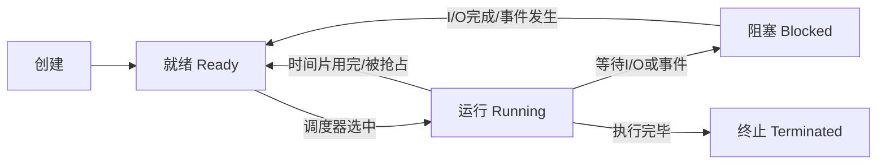

# 操作系统面试

## 操作系统简介

### 【简单】什么是操作系统？操作系统有哪些核心功能？⭐⭐

> 🎯 目标等级：L2 ｜ ⏱ 建议用时：5 min ｜ 🏷 标签：操作系统 / 操作系统简介

#### 💎 关键结论

操作系统是管理计算机硬件与软件资源的系统软件，是用户与硬件之间的桥梁。它的本质是**资源管理者**和**硬件抽象层**，核心功能可以概括为五大模块：进程管理、内存管理、文件系统、设备管理、安全与保护，并通过系统调用向用户程序提供统一接口，屏蔽底层硬件差异。

#### ⚡记忆卡片

- **口诀**：进内文设安，资源管理五件衫
- **关键词**：资源管理者 ／ 硬件抽象层 ／ 进程管理 ／ 内存管理 ／ 文件系统 ／ 设备管理 ／ 安全保护 ／ 系统调用
- **链路**：用户程序 → 系统调用 → 操作系统（资源管理 + 硬件抽象）→ 硬件

#### 📖 核心知识

**操作系统（Operating System, OS）是管理计算机硬件与软件资源的系统软件，是用户与硬件之间的桥梁**。

**核心功能**

| 功能模块       | 核心职责             | 关键机制                  |
| :------------- | :------------------- | :------------------------ |
| **进程管理**   | 创建、调度、终止进程 | 进程调度算法、上下文切换  |
| **内存管理**   | 分配、回收、保护内存 | 分页、分段、虚拟内存      |
| **文件系统**   | 组织、存储、检索文件 | 目录结构、索引节点、日志  |
| **设备管理**   | 管理 I/O 设备        | 中断、DMA、缓冲、设备驱动 |
| **安全与保护** | 访问控制、身份认证   | 权限模型、用户态/内核态   |

**总结**：操作系统的本质是**资源管理者**和**硬件抽象层**，通过系统调用（System Call）向用户程序提供统一的接口，屏蔽底层硬件差异。

#### 🔀 发散问题

- **Q：操作系统为用户程序提供了哪些抽象？** → 进程抽象（屏蔽 CPU 细节）、虚拟内存抽象（屏蔽物理内存布局）、文件系统抽象（屏蔽磁盘块）、设备驱动抽象（屏蔽硬件差异），以及统一的系统调用入口。
- **Q：操作系统和 JDK、数据库这类"管理者"有什么区别？** → 操作系统直接管理硬件资源并运行在内核态，是唯一能直接操作硬件的软件层；JDK、数据库都运行在操作系统之上，通过系统调用向 OS 申请资源。

### 【简单】什么是用户态和内核态？为什么要区分？⭐⭐⭐

> 🎯 目标等级：L2 ｜ ⏱ 建议用时：5 min ｜ 🏷 标签：操作系统 / 操作系统简介

#### 💎 关键结论

CPU 分用户态和内核态两种特权级：用户态只能访问受限资源，内核态拥有最高权限。区分两者是为了**安全、稳定、隔离**——防止用户程序直接操作硬件或破坏系统。进入内核只有三条路：系统调用、异常、中断，系统调用是唯一的"受控入口"。

#### ⚡记忆卡片

- **口诀**：两态隔离保安全，三径入内核
- **关键词**：用户态 ／ 内核态 ／ 特权级 ／ 隔离 ／ 系统调用 ／ 异常 ／ 中断
- **链路**：用户程序 → 系统调用/异常/中断 → 切换内核态 → 内核服务 → 返回用户态

#### 📖 核心知识

**用户态（User Mode）**：运行用户程序，**只能访问受限的资源**，不能直接访问硬件或内核数据。

**内核态（Kernel Mode）**：运行操作系统内核代码，**拥有最高权限**，可访问所有硬件和内存资源。

**为什么区分？**

- **安全性**：防止用户程序直接操作硬件或破坏系统。
- **稳定性**：一个用户程序的崩溃不会影响整个系统。
- **隔离性**：进程间内存互相隔离。

**用户态 → 内核态的三种触发方式**

| 触发方式     | 说明                     | 典型场景                       |
| :----------- | :----------------------- | :----------------------------- |
| **系统调用** | 用户程序主动请求内核服务 | `read()`、`write()`、`fork()`  |
| **异常**     | 程序执行中出现异常       | 缺页异常、除零错误             |
| **中断**     | 外部设备触发             | 键盘输入、网络数据到达、定时器 |

**总结**：用户态/内核态是操作系统的**核心安全机制**，通过**权限隔离**保证系统稳定，用户程序只能通过**系统调用**这一"受控入口"访问内核资源。

#### 🔬 扩展知识

::: details 扩展知识

- 【L3】态切换本身有成本：保存寄存器现场、切换栈到内核栈、刷新流水线，所以高频系统调用（如每次收发包都调一次）会成为性能瓶颈，这也是 io_uring 等"批量陷入内核"技术的动机。
- 【L4】x86 用 Ring 0~3 四个特权级，Linux 实际只使用 Ring 0（内核）与 Ring 3（用户）；虚拟化场景还会用到 Ring -1（Hypervisor）等概念。
  :::

#### 🔀 发散问题

- **Q：什么时候会从用户态切换到内核态？** → 三种时机：程序主动发起系统调用；程序执行中触发异常（如缺页、除零）；外部设备触发中断（如网卡收到数据）。
- **Q：为什么不能让用户程序直接访问硬件？** → 直接访问意味着任何程序都能读写任意设备与内存，一个 bug 或恶意程序即可摧毁整个系统；特权级隔离 + 系统调用审查是操作系统安全的根基。

### 【中等】什么是中断和系统调用？它们有什么区别？⭐⭐⭐

> 🎯 目标等级：L2 ｜ ⏱ 建议用时：10 min ｜ 🏷 标签：操作系统 / 操作系统简介

#### 💎 关键结论

中断和系统调用都是 CPU 从用户态切换到内核态的触发方式，但方向相反：**中断是"硬件找内核"（异步、被动），系统调用是"程序找内核"（同步、主动）**。两者处理流程相似——保存上下文、查表跳转、执行处理、恢复返回——共同构成进入内核的两大入口，也是上下文切换最主要的开销来源。

#### ⚡记忆卡片

- **口诀**：中断硬件找内核，调用程序找内核
- **关键词**：中断 ／ 系统调用 ／ 异步 ／ 同步 ／ 中断向量表 ／ 系统调用表 ／ 上下文切换
- **链路**：触发（中断/系统调用）→ 保存上下文 → 查表跳转 → 内核处理 → 恢复上下文 → 返回用户态

#### 📖 核心知识

**核心对比**

| 对比维度     | 中断（Interrupt）                | 系统调用（System Call）       |
| :----------- | :------------------------------- | :---------------------------- |
| **触发方**   | 外部硬件设备（异步）             | 用户程序主动发起（同步）      |
| **目的**     | 通知 CPU 处理外部事件            | 请求内核提供服务              |
| **典型场景** | 时钟中断、键盘输入、网卡收到数据 | `read()`、`write()`、`fork()` |
| **时机**     | 不可预测，随时发生               | 程序执行到特定指令时发生      |

**处理流程**

1. CPU 保存当前上下文（寄存器、程序计数器），切换到内核态。
2. 根据**中断号/系统调用号**查表（中断向量表/系统调用表），跳转到对应处理函数。
3. 执行处理逻辑（中断处理程序/内核服务）。
4. 恢复上下文，返回用户态继续执行。

**总结**：中断是异步的外部事件通知，系统调用是同步的主动服务请求，二者共同构成用户程序进入内核的两大入口，也是上下文切换最主要的开销来源。

#### 🔬 扩展知识

::: details 扩展知识

- 【L3】中断分为硬中断与软中断：硬中断要求快速返回，耗时工作推迟到软中断/tasklet/工作队列中执行（如网络收包的 NAPI 机制），避免长时间关中断影响系统响应。
- 【L4】现代系统调用陷入内核的方式因架构而异：x86 早期用 `int 0x80`，后来引入更快的 `sysenter`/`syscall` 指令；vDSO 机制让 `gettimeofday` 等只读调用无需陷入内核。
  :::

#### 🔀 发散问题

- **Q：中断和异常有什么区别？** → 中断来自 CPU 外部硬件、与当前指令无关（异步）；异常由当前指令执行引发（同步），如缺页、除零、非法指令，两者都会陷入内核处理。
- **Q：为什么高频系统调用会影响性能？** → 每次调用都要经历态切换、上下文保存与恢复，高频小包场景下这些固定开销占比显著，因此才有批量提交（如 io_uring）与零系统调用（vDSO）等优化方向。

## 进程与线程

### 【中等】什么是进程和线程？二者有什么区别？⭐⭐⭐⭐⭐

> 🎯 目标等级：L2 ｜ ⏱ 建议用时：10 min ｜ 🏷 标签：操作系统 / 进程与线程

#### 💎 关键结论

进程是**正在运行的程序的实例**，拥有独立地址空间，是**资源分配的基本单位**；线程是**CPU 调度的最小单位**，共享进程资源但有独立的栈和寄存器。一句话：**进程重隔离，线程重效率**。进程切换要换页表刷 TLB，开销远大于线程切换；现代高并发应用普遍采用多进程 + 多线程混合架构，I/O 密集型场景可进一步用协程。

#### ⚡记忆卡片

- **口诀**：进程管资源，线程管调度；进程重隔离，线程重效率
- **关键词**：进程 ／ 线程 ／ 地址空间 ／ task_struct ／ 上下文切换 ／ IPC ／ 协程
- **链路**：程序 → fork 进程（独立地址空间）→ 创建线程（共享堆、独立栈）→ CPU 调度线程 → 上下文切换

#### 📖 核心知识

**进程（Process）**：是**正在运行的程序的实例**，拥有**独立的内存空间**（代码段、数据段、堆、栈）。

**线程（Thread）**：是**CPU 调度的最小单位**，隶属于进程，**共享进程的资源**（堆、全局变量），但拥有**独立的栈和寄存器**。

**核心对比**

| 对比维度      | 进程                                 | 线程                                   |
| :------------ | :----------------------------------- | :------------------------------------- |
| **内存空间**  | 独立地址空间                         | 共享进程地址空间                       |
| **切换开销**  | 大（需切换页表、刷新 TLB）           | 小（仅切换栈和寄存器）                 |
| **通信方式**  | IPC（管道、消息队列、共享内存等）    | 直接读写共享变量（需同步）             |
| **创建/销毁** | 开销大                               | 开销小                                 |
| **隔离性**    | 强（一个进程崩溃不影响其他进程）     | 弱（一个线程崩溃可能导致整个进程崩溃） |
| **适用场景**  | 需要强隔离的任务（如浏览器多标签页） | 高并发任务（如 Web 服务器处理请求）    |

**总结**：进程是**资源分配的基本单位**，线程是**CPU 调度的基本单位**。进程重隔离，线程重效率。现代高并发应用普遍采用**多进程 + 多线程**混合架构。

**内核视角：调度实体与开销量化**

- 在 Linux 内核中，进程与线程统一由 `task_struct` 表示，线程只是**共享了 mm（地址空间）、files（fd 表）等结构**的 task_struct，调度器不区分二者。
- **上下文切换开销量化**：直接成本约 1~10 μs（保存/恢复寄存器 + 调度器选核），但间接成本更大——切换后 L1/L2 缓存变冷，实际单次有效开销可达几十微秒；进程切换额外切换页表并刷新 TLB，开销再高一截。单机每秒上万次切换时，sys% 会显著侵蚀 CPU。
- **内存开销量化**：线程栈默认 1~8 MB（虚拟地址预留，实际按需分配）；创建线程远快于 fork 后写时复制展开的进程。

**方案权衡**

| 模型               | 优点                                            | 适用边界 / 代价                             |
| :----------------- | :---------------------------------------------- | :------------------------------------------ |
| 多进程             | 隔离性强，单进程崩溃不波及全局；绕过 GIL 类限制 | 内存占用高，IPC 有拷贝开销                  |
| 多线程             | 共享内存通信零拷贝，创建/切换便宜               | 一个线程段错误整个进程崩溃；锁竞争成为瓶颈  |
| 多进程 + 共享内存  | 兼顾隔离与性能（Nginx 即此模型）                | 需自行处理同步与生命周期                    |
| 协程（用户态调度） | 切换仅纳秒级、无需陷入内核，百万级并发          | 仅适合 I/O 密集；一个协程阻塞会拖住整个线程 |

**失效场景**

- **线程模型下的全局崩溃**：任一线程访问非法内存，整个进程被 SIGSEGV 杀死，多进程隔离优势此时不存在。
- **切换风暴**：线程数远超核数时（如数千线程抢几十核），CPU 大量耗在调度与缓存重建上，吞吐不升反降。
- **fork 陷阱**：多线程程序中 fork 后只 exec 之外的路径可能继承未释放的锁，子进程永久卡死（POSIX 经典坑）。

::: details 并发模型选型示例
为百万级并发、I/O 密集型接入网关选型：瓶颈不在计算而在等待，每线程一连接模型会被栈内存（百万连接 × 1 MB 栈 = 1 TB）和切换风暴击沉，多进程则因内存重复与 IPC 成本不划算。合理方案是少量线程（≈核数）+ epoll 事件循环承载海量连接，业务逻辑用协程（Go goroutine / Java 21 虚拟线程）保持同步编码风格；CPU 密集的旁路计算拆到独立线程池或进程。折中方案是虚拟线程 + 有限的载体线程池，但要求整条依赖链不阻塞（一个 JDBC 同步调用就能卡死整个线程）。
:::

> synchronized、线程池等 Java 并发工具的用法属于 JavaCore 领域，本题聚焦 OS 层面的地址空间、调度实体与切换开销。

#### 🔬 扩展知识

::: details 扩展知识

- 【L3】内核线程（如 kswapd、kworker）没有用户地址空间，切换时不切换页表、不刷 TLB，开销显著小于用户线程，但不能执行用户代码。
- 【L3】同一进程的两个线程在 task_struct 层面：独享栈、寄存器现场、thread_struct（含 TLS）；共享 mm（地址空间）、files（fd 表）、fs、signal 处理。这解释了线程通信零拷贝但必须加锁，也解释了 fd 泄漏会影响整个进程。
- 【L4】用户态线程通过 M:N 模型映射到内核线程（Go 的 GMP 模型即典型实现）；Java 21 虚拟线程由 JVM 调度、挂载在载体线程上，本质是用户态调度。
  :::

#### 🏭 实战场景

::: details 线程数膨胀导致 QPS 不升反降
现象：某 Web 服务从百线程扩到数千线程后，QPS 不升反降，`top` 显示 sys% 高达 40%。排查：`vmstat` 的 cs（上下文切换）每秒超 10 万次，`perf` 火焰图中调度器与锁竞争占比异常。根因：线程数远超核数，大部分 CPU 耗在切换与缓存重建而非业务逻辑。修复：改为"少量工作线程 + 队列"模型，线程数收敛到核数的 2~4 倍，QPS 回升且 sys% 降至 5% 以内。
:::

#### ⚠️ 常见误区

::: details 常见误区

- ❌ "线程比进程快，所以并发越高就该开越多线程" → 线程数远超核数会引发切换风暴，CPU 耗在调度与缓存重建上，吞吐不升反降，线程数应控制在核数的合理倍数内。
- ❌ "协程无所不能，可以替代线程" → 协程只适合 I/O 密集场景，CPU 密集任务照样受核数限制，且一个阻塞调用会拖住整个载体线程。
- ❌ "一个线程崩溃只影响自己" → 线程共享进程地址空间，任一线程段错误会让整个进程被杀死，这正是浏览器用多进程隔离标签页的原因。
  :::

#### 🔀 发散问题

- **Q：内核线程和普通线程切换的开销差异在哪？** → 内核线程没有用户地址空间，切换不需要切换页表、不刷 TLB，也没有用户态寄存器现场，开销显著更小；但它不能执行用户代码，仅用于内核自身工作。
- **Q：为什么说上下文切换的真实成本远超"保存寄存器"？** → 直接成本只是微秒级，真正的大头是切换后缓存（L1/L2）与 TLB 变冷，新任务要从低速存储重新热载数据；优化方向是减少切换次数（绑核、减少线程数）而非压缩单次切换。
- **Q：什么场景用进程、什么场景用线程？** → 需要强隔离或故障域隔离用进程（如浏览器标签页、Nginx worker）；高并发共享数据的计算用线程；I/O 密集海量连接用协程 + 事件循环。

### 【中等】什么是僵尸进程和孤儿进程？如何避免？⭐⭐⭐

> 🎯 目标等级：L2 ｜ ⏱ 建议用时：10 min ｜ 🏷 标签：操作系统 / 进程与线程

#### 💎 关键结论

僵尸进程是"子进程死了没人收尸"——子进程已退出但父进程没有 `wait()` 回收，PCB 残留内核中，大量堆积会耗尽 PID；孤儿进程是"爹没了托孤给 init"——父进程先退出，子进程被 PID 1 收养，**基本无害**。记住：前者需要警惕并主动回收，后者无需担心（守护进程正是故意利用它）。

#### ⚡记忆卡片

- **口诀**：僵尸没人收尸，孤儿托孤 init
- **关键词**：僵尸进程 ／ 孤儿进程 ／ wait ／ SIGCHLD ／ PID 耗尽 ／ init 收养
- **链路**：子进程退出 → 父进程 wait 回收（否则成僵尸）；父进程先退出 → 子进程被 init 收养 → init 自动回收

#### 📖 核心知识

**僵尸进程（Zombie Process）**

- 定义：子进程**已退出**，但父进程没有调用 `wait()`/`waitpid()` 回收其退出状态，子进程的 PCB（退出码、资源统计）仍残留在内核中。
- 危害：少量僵尸进程无害，但大量堆积会耗尽 PID，导致无法创建新进程。
- 处理：定期调用 `wait()`；或 `signal(SIGCHLD, SIG_IGN)` 让内核自动回收；或给父进程发 `SIGCHLD` 促使其回收。父进程若先退出，僵尸进程会被 init/systemd（PID 1）收养并回收。

**孤儿进程（Orphan Process）**

- 定义：父进程**先于子进程退出**，子进程被 PID 1（init/systemd）收养。
- 危害：**基本无害**，init 会自动 `wait()` 回收其退出状态，孤儿进程可继续正常运行（守护进程正是故意利用这一机制）。

**核心区别**

| 对比         | 僵尸进程       | 孤儿进程              |
| :----------- | :------------- | :-------------------- |
| **谁先退出** | 子进程先退出   | 父进程先退出          |
| **危害**     | 可能耗尽 PID   | 无害                  |
| **处理方**   | 父进程负责回收 | init（PID 1）自动回收 |

**总结**：僵尸进程是"死了没人收尸"，孤儿进程是"爹没了托孤给 init"——前者需要警惕，后者无需担心。

#### 🔬 扩展知识

::: details 扩展知识

- 【L3】僵尸进程不占内存与 CPU（只剩 PCB 中一小块退出状态），唯一占用的是 PID 资源，因此监控 `ps` 中的 Z 状态进程数比担心资源占用更有意义。
- 【L4】守护进程的经典写法正是利用孤儿机制：fork 后父进程退出，子进程被 init 收养，再 setsid 脱离控制终端，实现后台常驻。
  :::

#### 🔀 发散问题

- **Q：如何清理已经产生的大量僵尸进程？** → kill 僵尸进程本身无效（它已经死了），正确做法是 kill 或重启其父进程促使父进程回收；父进程消亡后僵尸会被 init 收养并自动回收。
- **Q：为什么守护进程要故意让自己成为孤儿进程？** → 被 init 收养后进程生命周期与登录会话解耦，用户退出终端也不会带走它，且退出状态由 init 兜底回收，天然适合后台常驻服务。

### 【中等】进程有哪些状态？状态之间如何转换？⭐⭐

> 🎯 目标等级：L2 ｜ ⏱ 建议用时：10 min ｜ 🏷 标签：操作系统 / 进程与线程

#### 💎 关键结论

进程有三大基本状态：**就绪**（等 CPU）、**运行**（占 CPU）、**阻塞**（等事件）。转换规则：就绪→运行靠调度，运行→就绪因时间片用完或被抢占，运行→阻塞因等待 I/O 或事件，阻塞→就绪只能回到就绪队列等待调度——**阻塞不能直接变运行**。

#### ⚡记忆卡片

- **口诀**：就绪运行阻塞三态转，阻塞不能直接跑
- **关键词**：就绪 ／ 运行 ／ 阻塞 ／ 调度 ／ 时间片 ／ I/O 等待
- **链路**：创建 → 就绪 →（调度）运行 →（时间片到）就绪 ／（等 I/O）阻塞 →（I/O 完成）就绪 →（执行完毕）终止

#### 📖 核心知识


```mermaid
graph LR
    A[创建] --> B[就绪 Ready]
    B -->|调度器选中| C[运行 Running]
    C -->|时间片用完/被抢占| B
    C -->|等待I/O或事件| D[阻塞 Blocked]
    D -->|I/O完成/事件发生| B
    C -->|执行完毕| E[终止 Terminated]
```

| 状态                | 含义                                                   |
| :------------------ | :----------------------------------------------------- |
| **就绪（Ready）**   | 已分配除 CPU 外的所有资源，等待调度                    |
| **运行（Running）** | 正在 CPU 上执行                                        |
| **阻塞（Blocked）** | 等待某事件（I/O、锁、信号量），即使分配 CPU 也无法执行 |

**注意**：**阻塞 → 就绪**不能直接到**运行**，必须经过就绪队列等待调度。

#### 🔬 扩展知识

::: details 扩展知识

- 【L3】Linux 实际状态更细：可中断睡眠（S）、不可中断睡眠（D，常见于等待磁盘 I/O，`kill -9` 也杀不掉）、僵尸（Z）、停止（T）等，`top`/`ps` 中的状态列即对应这些状态。
- 【L4】多核环境下"运行"态可以有多个实例（每核一个），Linux 中还区分 TASK_RUNNING 与在 CPU 上实际执行的区别。
  :::

#### 🔀 发散问题

- **Q：为什么阻塞态不能直接进入运行态？** → I/O 完成只说明等待的事件发生了，进程能否上 CPU 还要由调度器按就绪队列统一决策，否则会破坏调度的公平性与优先级规则。
- **Q：什么是不可中断睡眠（D 状态）？** → 进程在内核中等待不可被打断的事件（典型是磁盘 I/O），此时连 SIGKILL 都不生效，大量 D 状态进程通常指向存储或 NFS 故障。

### 【中等】进程间通信（IPC）有哪些方式？⭐⭐⭐

> 🎯 目标等级：L2 ｜ ⏱ 建议用时：10 min ｜ 🏷 标签：操作系统 / 进程与线程

#### 💎 关键结论

IPC 七大方式：管道最简单（限父子进程）、命名管道可跨无关进程、消息队列传结构化消息、**共享内存最快（零拷贝但需自行同步）**、信号量管同步不传数据、信号做轻量异步通知、Socket 是唯一支持跨主机的选择。大数据量选共享内存 + 信号量，跨主机选 Socket。

#### ⚡记忆卡片

- **口诀**：管队共，信信套——共享内存最快，Socket 能跨机
- **关键词**：管道 ／ 命名管道 ／ 消息队列 ／ 共享内存 ／ 信号量 ／ 信号 ／ Socket ／ 零拷贝
- **链路**：进程 A → 内核缓冲/共享内存/网络 → 进程 B（同步用信号量，传输用共享内存或 Socket）

#### 📖 核心知识

| 通信方式                | 原理               | 优点                   | 缺点               | 适用场景                 |
| :---------------------- | :----------------- | :--------------------- | :----------------- | :----------------------- |
| **管道（Pipe）**        | 内核缓冲区，半双工 | 简单                   | 只能用于父子进程   | 简单的单向数据流         |
| **命名管道（FIFO）**    | 有文件路径的管道   | 可用于无关系进程       | 半双工             | 无关进程通信             |
| **消息队列**            | 内核中的消息链表   | 消息有类型，可随机读取 | 拷贝开销大         | 结构化消息传递           |
| **共享内存**            | 映射同一块物理内存 | **最快**（无内核拷贝） | 需自行同步         | 大数据量高性能通信       |
| **信号量（Semaphore）** | 计数器，用于同步   | 实现互斥与同步         | 不传数据，只传信号 | 进程同步/互斥            |
| **信号（Signal）**      | 异步通知机制       | 轻量                   | 信息量小           | 进程控制（如 `SIGKILL`） |
| **Socket**              | 网络通信           | 可跨主机               | 开销大             | 分布式系统通信           |

**总结**：**共享内存**是最快的 IPC 方式（零拷贝），但需配合同步机制（如信号量）；**管道**最简单但限制多；**Socket** 是唯一支持跨主机通信的方式。

#### 🔬 扩展知识

::: details 扩展知识

- 【L3】管道在 Shell 中无处不在（`cmd1 | cmd2`），其本质是内核维护的一块环形缓冲区，写满时写端阻塞、读空时读端阻塞。
- 【L4】现代 Linux 提供 io_uring 的共享环形队列、memfd + mmap 等更高效的进程间数据通道；高性能数据库常用共享内存 + 自旋锁传递大块数据。
  :::

#### 🔀 发散问题

- **Q：共享内存为什么最快，又为什么必须配合同步机制？** → 数据不需要在内核与用户空间之间来回拷贝，两个进程直接读写同一块物理内存；但正因如此，并发读写会产生竞态，必须用信号量、互斥锁等机制保证一致性。
- **Q：管道和消息队列如何选型？** → 管道是字节流、适合父子进程的简单单向流；消息队列有消息边界和类型、支持随机读取，适合结构化消息，但两次内核拷贝开销更大。

### 【中等】线程间有哪些通信方式？⭐⭐

> 🎯 目标等级：L2 ｜ ⏱ 建议用时：10 min ｜ 🏷 标签：操作系统 / 进程与线程

#### 💎 关键结论

线程天然共享进程的堆内存，**直接读写共享变量**就是最基本的通信方式，但必须加锁保证一致性。围绕共享内存衍生出锁、条件变量、信号量、管程等同步原语；想要解耦则用消息队列在线程间传递消息。

#### ⚡记忆卡片

- **口诀**：共享内存是根本，锁与条件变量保正确，队列解耦传消息
- **关键词**：共享内存 ／ 互斥锁 ／ 条件变量 ／ 信号量 ／ 管程 ／ 消息队列
- **链路**：线程 A 写共享变量（加锁）→ 条件变量通知 → 线程 B 读共享变量（加锁）；或用队列投递消息解耦

#### 📖 核心知识

| 通信方式                           | 说明                                                 |
| :--------------------------------- | :--------------------------------------------------- |
| **共享内存**                       | 线程天然共享堆内存，需加锁保证一致性                 |
| **锁（Mutex/Lock）**               | 互斥访问共享资源，如 `synchronized`、`ReentrantLock` |
| **条件变量（Condition Variable）** | 配合锁实现"等待-通知"机制                            |
| **信号量（Semaphore）**            | 控制同时访问资源的线程数                             |
| **管程（Monitor）**                | 封装同步逻辑的高级抽象（如 Java `synchronized`）     |
| **消息队列**                       | 线程间通过队列传递消息，解耦                         |

#### 🔬 扩展知识

::: details 扩展知识

- 【L3】条件变量的标准用法是"加锁 → while 条件不满足则 wait → 被通知后重新检查条件"，用 while 而非 if 是为了防虚假唤醒（spurious wakeup）。
- 【L4】无锁队列、原子变量（CAS）可以在简单场景替代锁，但 ABA 问题与内存序（memory order）需要仔细处理。
  :::

#### 🔀 发散问题

- **Q：线程通信为什么不需要像 IPC 那样借助内核通道？** → 同一进程的线程共享地址空间，直接读写堆上的共享变量即可通信，无需内核中转；代价是必须自行解决同步问题。
- **Q：什么时候用消息队列而不是直接共享变量？** → 需要解耦生产与消费节奏、传递结构化消息或做流量整形时用队列；追求极致低延迟且数据结构简单时用共享变量 + 锁。

### 【中等】常见的线程同步机制有哪些？互斥锁和自旋锁有什么区别？⭐⭐⭐

> 🎯 目标等级：L2 ｜ ⏱ 建议用时：10 min ｜ 🏷 标签：操作系统 / 进程与线程

#### 💎 关键结论

常见同步机制五件套：互斥锁（等待时休眠）、自旋锁（等待时忙等）、读写锁（读读并发）、条件变量（等待-通知）、信号量（限并发数）。选型核心：**临界区短用自旋锁换响应速度，临界区长用互斥锁换 CPU 利用率**；单核上用自旋锁通常无意义。

#### ⚡记忆卡片

- **口诀**：短临界自旋，长临界互斥；读多写少读写锁，等待条件用条件变量
- **关键词**：互斥锁 ／ 自旋锁 ／ 读写锁 ／ 条件变量 ／ 信号量 ／ 临界区
- **链路**：线程请求锁 → 获取成功进临界区 ／ 失败则自旋忙等或休眠等待 → 释放锁唤醒等待者

#### 📖 核心知识

**常见同步机制**

| 机制                               | 原理                                                 | 适用场景                       |
| :--------------------------------- | :--------------------------------------------------- | :----------------------------- |
| **互斥锁（Mutex）**                | 获取失败则**休眠等待**，被唤醒后重新竞争             | 临界区较大、等待时间较长的场景 |
| **自旋锁（Spinlock）**             | 获取失败则**忙等循环**（不断检查锁状态），不让出 CPU | 临界区极短、多核环境           |
| **读写锁（RWLock）**               | 读读并发、读写/写写互斥                              | 读多写少的场景                 |
| **条件变量（Condition Variable）** | 配合锁实现**等待-通知**，等待某条件成立后被唤醒      | 生产者-消费者模式              |
| **信号量（Semaphore）**            | 计数器控制并发访问数量                               | 限流、资源池                   |

**互斥锁 vs 自旋锁**

- **互斥锁**：等待时休眠，涉及上下文切换，但**不浪费 CPU**；适合临界区大或锁竞争激烈的场景。
- **自旋锁**：等待时持续消耗 CPU，但**无切换开销、响应极快**；适合临界区执行时间远小于切换开销的场景。单核 CPU 上使用自旋锁通常无意义（持锁线程无法运行，白等）。

**总结**：临界区短用自旋锁换响应速度，临界区长用互斥锁换 CPU 利用率；条件变量解决"等待某条件成立"的问题，避免无效轮询。

#### 🔬 扩展知识

::: details 扩展知识

- 【L3】现代互斥锁多为自适应实现（如 Linux 的 adaptive mutex、Java 的偏向锁→轻量级锁→重量级锁膨胀）：先短暂自旋，拿不到再休眠，兼顾两者优点。
- 【L4】条件变量等待必须配合 while 循环重检条件：除虚假唤醒外，多个等待者被唤醒后条件可能已被他人消费；信号量的 PV 操作（P 减一等待、V 加一唤醒）是同步原语的理论基础。
  :::

#### 🔀 发散问题

- **Q：读写锁在读多写少场景为什么收益大？** → 读读之间不互斥，大量读线程可并发执行，只有写操作才需要独占；但若写频繁，写锁会不断阻塞读，收益迅速消失。
- **Q：信号量和互斥锁有什么区别？** → 互斥锁强调所有权（谁加锁谁释放，计数只有 0/1），信号量是计数器、可由不同线程释放，常用于控制并发数量与生产者-消费者同步。

### 【困难】什么是协程？协程和线程有什么区别？⭐⭐

> 🎯 目标等级：L2 ｜ ⏱ 建议用时：15 min ｜ 🏷 标签：操作系统 / 进程与线程

#### 💎 关键结论

协程是**用户态的轻量级线程**，由用户程序自行调度（协作式），切换不陷入内核、栈仅 KB 级，可支撑百万级并发。与线程的核心区别：**线程由内核抢占式调度，协程由用户程序协作式调度**。协程适合 I/O 密集型高并发，Java 21 虚拟线程本质就是协程。

#### ⚡记忆卡片

- **口诀**：协程用户态，调度不陷核；IO 密集上百万，阻塞调用拖全线
- **关键词**：协程 ／ 用户态调度 ／ 协作式 ／ KB 级栈 ／ 百万并发 ／ 虚拟线程
- **链路**：协程让出（yield/await）→ 运行时切换上下文（用户态）→ 事件就绪 → 恢复执行

#### 📖 核心知识

**协程（Coroutine）** 是**用户态的轻量级线程**，由用户程序自行调度，不依赖操作系统内核。

| 对比维度     | 线程                   | 协程                                                                         |
| :----------- | :--------------------- | :--------------------------------------------------------------------------- |
| **调度方**   | 操作系统内核（抢占式） | 用户程序（协作式）                                                           |
| **切换开销** | 较大（内核态切换）     | 极小（用户态跳转）                                                           |
| **内存占用** | 默认 1~8 MB 栈         | 通常仅 KB 级                                                                 |
| **并发能力** | 数千级                 | 百万级                                                                       |
| **阻塞代价** | 整个 OS 线程阻塞       | 仅当前协程挂起                                                               |
| **典型语言** | Java（传统线程）、C++  | Go（goroutine）、Kotlin（coroutine）、Python（asyncio）、Java 21（虚拟线程） |

**总结**：协程是**用户态调度的轻量级并发单元**，适合 I/O 密集型高并发场景。Java 21 引入的**虚拟线程（Virtual Thread）**本质就是协程。

#### 🔬 扩展知识

::: details 扩展知识

- 【L3】协程分有栈（stackful，如 goroutine）与无栈（stackless，如 Rust async、C++20 coroutine）两类；有栈协程可在任意调用深度挂起，无栈协程依赖状态机转换。
- 【L4】协程调度的经典实现是 M:N 模型（如 Go 的 GMP：goroutine、机器线程、处理器），由运行时决定把哪些协程放到哪个内核线程上执行。
  :::

#### 🔀 发散问题

- **Q：协程为什么不能替代所有线程？** → 协程的切换靠主动让出，一个不协作的阻塞调用（如同步 JDBC）会拖住整个载体线程；CPU 密集任务也受核数限制，协程只放大 I/O 并发。
- **Q：为什么协程切换比线程切换快得多？** → 协程切换只是用户态的寄存器保存与跳转，无需陷入内核、不切换特权级，开销在纳秒级；线程切换要经过完整的内核调度路径。

## 进程调度

### 【中等】常见的进程调度算法有哪些？⭐⭐⭐

> 🎯 目标等级：L2 ｜ ⏱ 建议用时：10 min ｜ 🏷 标签：操作系统 / 进程调度

#### 💎 关键结论

五大经典调度算法：FCFS 简单但有护航效应，SJF 平均等待最优但会饿死长任务，RR 时间片轮转适合交互式系统，优先级调度适合实时系统但有饥饿问题，多级反馈队列综合各家之长是通用 OS 首选。Linux 用 CFS（公平）+ 实时调度（FIFO/RR）。

#### ⚡记忆卡片

- **口诀**：先来先服务，短者优先，时间片轮转，多级反馈最全面
- **关键词**：FCFS ／ SJF ／ RR 时间片 ／ 优先级 ／ 多级反馈队列 ／ CFS
- **链路**：进程到达 → 进入（多级）就绪队列 → 调度器按算法选择 → 上 CPU 执行 → 时间片到/阻塞/终止

#### 📖 核心知识

| 调度算法               | 原理                       | 优点             | 缺点                           | 适用场景         |
| :--------------------- | :------------------------- | :--------------- | :----------------------------- | :--------------- |
| **先来先服务（FCFS）** | 按到达顺序                 | 简单公平         | 短任务可能等待很长（护航效应） | 批处理           |
| **短作业优先（SJF）**  | 优先执行运行时间最短的     | 平均等待时间最优 | 可能导致长任务饥饿             | 理论最优         |
| **时间片轮转（RR）**   | 每个进程轮流执行一个时间片 | 公平、响应快     | 时间片大小影响性能             | **交互式系统**   |
| **优先级调度**         | 按优先级高低               | 重要任务优先     | 低优先级饥饿                   | 实时系统         |
| **多级反馈队列**       | 多个优先级队列 + 动态调整  | 综合各算法优点   | 实现复杂                       | **通用操作系统** |

**Linux 调度器**：

- **CFS（Completely Fair Scheduler）**：基于红黑树，保证所有进程获得公平的 CPU 时间。
- **实时调度**：`SCHED_FIFO`（先到先服务）和 `SCHED_RR`（时间片轮转）。

**总结**：现代通用 OS 普遍采用**多级反馈队列**或**CFS**，兼顾公平性、响应性和吞吐量。

#### 🔬 扩展知识

::: details 扩展知识

- 【L3】多级反馈队列的精髓：新进程进最高优先级队列，用完时间片逐级降级，I/O 等待后升级——既照顾短任务响应，又通过降级防止长任务饿死。
- 【L4】实时调度关注确定性而非吞吐：SCHED_FIFO 无时间片直到主动让出，SCHED_DEADLINE 按周期/运行时间/截止时间参数调度，适合工业控制等硬实时场景。
  :::

#### 🔀 发散问题

- **Q：为什么说 SJF 是"理论最优"？** → 数学上可以证明 SJF 的平均等待时间最短，但运行时长无法预先精确知道，且会饿死长任务，实际只能用多级反馈队列等方式近似它。
- **Q：时间片太大或太小分别有什么问题？** → 太大退化成 FCFS，响应慢；太小则上下文切换开销占比过高，有效吞吐下降，通常取略大于一次典型交互的 CPU 突发时长。

### 【中等】Linux 的 CFS 调度算法是如何工作的？⭐⭐⭐

> 🎯 目标等级：L2 ｜ ⏱ 建议用时：10 min ｜ 🏷 标签：操作系统 / 进程调度

#### 💎 关键结论

CFS（完全公平调度器）是 Linux 2.6.23 起的默认调度器：每个进程维护**虚拟运行时间 vruntime**，调度器用**红黑树**总选 vruntime 最小的进程运行；nice 值决定权重，睡眠进程 vruntime 不增长、唤醒后优先调度，因此对交互式任务友好。

#### ⚡记忆卡片

- **口诀**：虚拟时间记公平，红黑树里选最小
- **关键词**：CFS ／ vruntime ／ 红黑树 ／ nice 权重 ／ 目标延迟 ／ 睡眠补偿
- **链路**：进程运行 → vruntime 按权重增长 → 插入红黑树 → 调度取最左节点（最小 vruntime）→ 运行

#### 📖 核心知识

**CFS（Completely Fair Scheduler，完全公平调度器）** 是 Linux 2.6.23 起的默认调度器，目标是让所有可运行进程**公平地分享 CPU 时间**，而不是维护固定优先级队列。

**核心思想**

- 每个进程记录一个**虚拟运行时间（vruntime）**，调度器总是选择 vruntime **最小**的进程来运行。
- vruntime 的增长速度受**权重（nice 值）**影响：nice 值越高（优先级越低），vruntime 增长越快，获得的 CPU 时间片占比越小。
- 效果：短时间内所有进程的 vruntime 趋于接近，实现"完全公平"。

**关键机制**

| 机制                          | 说明                                                                                 |
| :---------------------------- | :----------------------------------------------------------------------------------- |
| **红黑树**                    | 以 vruntime 为键组织可运行进程，每次取最左节点即 vruntime 最小者，O(log n)           |
| **目标延迟（sched_latency）** | 定义一个周期，保证每个进程在该周期内至少运行一次，兼顾响应性                         |
| **睡眠补偿**                  | 进程睡眠（如等待 I/O）时 vruntime 不增长，唤醒后可优先获得调度，**对交互式任务友好** |
| **动态时间片**                | 时间片长度不是固定的，而是根据 vruntime 差值动态计算                                 |

**总结**：CFS 用"虚拟运行时间 + 红黑树选最小者"替代传统固定时间片，实现了公平性与交互响应性的统一，是理解 Linux 调度行为的必备知识。

#### 🔬 扩展知识

::: details 扩展知识

- 【L3】CFS 没有传统意义的固定时间片：每个进程的可运行时长由目标延迟与当前可运行进程数、自身权重共同决定，负载越高单进程单次运行越长以减少切换。
- 【L4】内核新引入的 EEVDF 调度器（在部分较新发行版中取代 CFS 成为默认）以"虚拟截止时间"替代部分补偿逻辑，进一步改善延迟敏感任务的表现；面试中了解演进脉络即可，不必深入实现。
  :::

#### 🔀 发散问题

- **Q：为什么 I/O 密集型进程在 CFS 下响应更快？** → 它们大部分时间在睡眠，vruntime 几乎不增长，一旦被 I/O 完成唤醒，其 vruntime 远小于 CPU 密集型进程，会被优先调度。
- **Q：nice 值是怎么影响调度的？** → nice 值映射为权重，权重越低 vruntime 增长越快，同样的真实运行时间会"记账"更多，从而获得更少的 CPU 份额。

### 【中等】什么是上下文切换？为什么开销大？⭐⭐

> 🎯 目标等级：L2 ｜ ⏱ 建议用时：10 min ｜ 🏷 标签：操作系统 / 进程调度

#### 💎 关键结论

上下文切换是 CPU 从一个进程/线程切到另一个时，**保存当前上下文并加载新上下文**的过程。开销大的原因不只是保存寄存器（直接开销），更在于**缓存与 TLB 变冷**（间接开销）——进程切换还要切页表刷 TLB，所以远贵于线程切换。优化方向是减少切换次数。

#### ⚡记忆卡片

- **口诀**：保存现场加载新，缓存变冷才要命
- **关键词**：上下文切换 ／ PCB/TCB ／ 寄存器 ／ TLB ／ 缓存失效 ／ 页表切换
- **链路**：时间片到/中断 → 保存寄存器与 PC → 调度选下一个 →（进程切换：换页表刷 TLB）→ 加载新上下文 → 继续执行

#### 📖 核心知识

**上下文切换（Context Switch）** 是 CPU 从一个进程/线程切换到另一个时，**保存当前状态（上下文）并加载新状态**的过程。

**上下文切换的步骤**：

1. 保存当前进程的 CPU 寄存器、程序计数器、栈指针到 PCB/TCB。
2. 选择下一个进程。
3. 加载下一个进程的上下文到 CPU。
4. 进程/线程切换可能还涉及**页表切换和 TLB 刷新**（进程切换时）。

**为什么开销大？**

- **直接开销**：保存/恢复寄存器的 CPU 时间。
- **间接开销**：TLB 刷新导致后续内存访问变慢（进程切换）；CPU 缓存失效（冷缓存）。

**进程切换 vs 线程切换**：进程切换需要切换页表、刷新 TLB，开销远大于线程切换。

#### 🔬 扩展知识

::: details 扩展知识

- 【L3】上下文切换次数可用 `vmstat` 的 cs 列或 `/proc/stat` 的 ctxt 观察；sys% 高 + cs 高通常指向线程数过多或锁竞争激烈。
- 【L4】减少切换的常用手段：控制线程数在核数的合理倍数、CPU 绑核（affinity）、无锁化减少阻塞唤醒、用事件循环替代每连接一线程。
  :::

#### 🔀 发散问题

- **Q：中断处理和上下文切换是一回事吗？** → 不是。中断只切换 CPU 到内核态处理中断（可能不切换进程）；上下文切换是在两个任务之间换人。但中断往往是触发上下文切换的契机（如时钟中断发现时间片用完）。
- **Q：为什么说"缓存变冷"比保存寄存器更贵？** → 保存寄存器是纳秒~微秒级固定成本，而切换后 L1/L2/TLB 全部失效，新任务要从低速存储重新加载数据，这段预热时间可达几十微秒，是真实成本的大头。

## 死锁

### 【中等】什么是死锁？死锁产生的四个必要条件是什么？⭐⭐⭐⭐⭐

> 🎯 目标等级：L2 ｜ ⏱ 建议用时：10 min ｜ 🏷 标签：操作系统 / 死锁

#### 💎 关键结论

死锁是多个进程/线程相互等待对方持有的资源，**全体卡死**的僵局。四个必要条件缺一不可：**互斥、占有并等待、不可抢占、循环等待**。工程上破"循环等待"最划算——全局统一加锁顺序；数据库则常用死锁检测 + 回滚事务。

#### ⚡记忆卡片

- **口诀**：互占不循，四件齐全锁必死；破其一环即解
- **关键词**：互斥 ／ 占有并等待 ／ 不可抢占 ／ 循环等待 ／ 锁序 ／ 死锁检测 ／ wait-for graph
- **链路**：线程 A 持锁 1 等锁 2 → 线程 B 持锁 2 等锁 1 → 等待成环 → 全体阻塞

#### 📖 核心知识

**死锁（Deadlock）**：多个进程/线程因竞争资源而**相互等待**，导致**所有参与者都无法继续执行**的僵局。

**四个必要条件**（缺一不可）：

| 条件                            | 含义                               |
| :------------------------------ | :--------------------------------- |
| **互斥（Mutual Exclusion）**    | 资源一次只能被一个进程使用         |
| **占有并等待（Hold and Wait）** | 进程持有资源的同时等待获取其他资源 |
| **不可抢占（No Preemption）**   | 已分配的资源不能被强制回收         |
| **循环等待（Circular Wait）**   | 存在一条进程-资源的环形等待链      |

**方案权衡：破哪个条件最划算**

| 破坏的条件 | 手段                                  | 适用边界 / 代价                                     |
| :--------- | :------------------------------------ | :-------------------------------------------------- |
| 循环等待   | 全局锁序：所有线程按同一顺序加锁      | 工程首选，几乎零成本，但要求团队纪律 + 代码评审把关 |
| 不可抢占   | `tryLock(timeout)` 失败回滚释放已持锁 | 需要业务支持重试与回滚，实现复杂度中等              |
| 占有并等待 | 一次性申请全部资源                    | 资源利用率低，可能饥饿，适合资源种类少的场景        |
| 互斥       | 无锁结构/CAS                          | 仅适合简单数据结构，复杂临界区难以无锁化            |

**数据库场景的特殊性**：InnoDB 采用**死锁检测 + 回滚**而非预防——维护等待图（wait-for graph）周期性找环，发现即回滚代价最小的事务；高并发热点行场景下检测本身会消耗大量 CPU（MySQL 8.0 可用 `innodb_deadlock_detect = OFF` + `innodb_lock_wait_timeout` 替代，代价是超时而非即时检测）。

**失效场景**

- **锁序纪律在跨系统时失效**：全局锁序只能约束单进程内，跨服务/跨数据库的资源竞争（如应用锁 + DB 行锁嵌套）照样能形成环。
- **锁内 I/O 造成隐性死锁**：持锁期间发起网络调用，对端反过来依赖这把锁，等待时间从微秒级膨胀到秒级，表现如死锁但实为长阻塞。
- **自死锁**：线程重复申请已持有的不可重入锁，单线程即可卡死自己。

#### 🔬 扩展知识

::: details 扩展知识

- 【L3】活锁是"都在动但无进展"（反复退让重试，如走廊互相让路），可用随机退避打破；饥饿是低优先级者永远排不上资源，靠公平调度/老化机制解决——三者本质不同。
- 【L4】分布式环境下全局等待图成本极高，主流做法是超时放弃 + 全局资源编号（按序加锁），或用 Chandy-Misra-Haas 等分布式检测算法，仅在强需求场景引入。
  :::

#### 🏭 实战场景

::: details 订单服务两锁成环导致请求永久挂起
现象：订单服务高峰期偶发请求永久挂起，重启后短暂恢复。排查：`jstack` 导出线程栈，发现两个线程分别 BLOCKED 在对方持有的锁上，形成标准的两锁成环。根因：支付回调与订单状态机两个模块由不同团队开发，加锁顺序相反，只有两笔特定订单并发时才会触发，故低概率复现。修复：统一按资源 ID 排序加锁，并用 ArchUnit 在编译期校验锁序约束。
:::

#### ⚠️ 常见误区

::: details 常见误区

- ❌ "死锁就是两个线程互相等对方的锁" → 两把锁成环只是最小案例，本质是等待图中存在环，三个以上资源同样能成环，且跨进程、跨数据库的锁也能构成环。
- ❌ "加了锁就一定会死锁" → 死锁需要四个必要条件同时成立，单一加锁只满足互斥；统一加锁顺序即可破坏循环等待。
- ❌ "MySQL 出现锁等待就是死锁" → 热点行争用表现为大量会话排队超时，没有环形等待；要用 `SHOW ENGINE INNODB STATUS` 的 LATEST DETECTED DEADLOCK 段区分死锁与热点锁。
  :::

#### 🔀 发散问题

- **Q：活锁、饥饿和死锁有什么本质区别？** → 死锁是都在等待、谁也不动；活锁是都在动（反复退让重试）但没有任何进展；饥饿是低优先级者永远排不上资源。活锁可用随机退避打破，饥饿靠公平调度/老化机制解决。
- **Q：为什么 MySQL 选择"检测 + 回滚"而不是"预防"？** → 事务的加锁顺序由 SQL 语义和执行计划决定，应用层无法完全控制，预防不现实；而数据库能低成本维护等待图并精确找环，回滚最小代价事务即可恢复。
- **Q：分布式环境下还能用等待图检测死锁吗？** → 很难：资源分散在多个节点，全局等待图需跨节点收集且状态瞬息万变，一致快照成本极高。工程上主流是超时放弃 + 全局资源编号按序加锁。

### 【困难】如何预防、避免和处理死锁？⭐⭐⭐

> 🎯 目标等级：L2 ｜ ⏱ 建议用时：15 min ｜ 🏷 标签：操作系统 / 死锁

#### 💎 关键结论

死锁治理四策：**预防**（破坏四条件之一，工程首选全局锁序）、**避免**（银行家算法动态判断安全状态）、**检测恢复**（找环后终止/抢占/回滚，数据库主流）、**鸵鸟策略**（假装不发生，通用 OS 常态）。优先级上**预防 > 避免 > 检测恢复 > 鸵鸟**，按场景选择。

#### ⚡记忆卡片

- **口诀**：预防破条件，避免找安全，检测找回滚，鸵鸟装不见
- **关键词**：预防 ／ 银行家算法 ／ 安全状态 ／ 检测恢复 ／ wait-for graph ／ 鸵鸟策略 ／ 锁序
- **链路**：设计期定锁序（预防）→ 运行期检测环 → 发现死锁 → 回滚/终止/抢占恢复

#### 📖 核心知识

**预防（Prevention）** —— 破坏四个必要条件之一：

| 破坏的条件 | 方法                     | 缺点                       |
| :--------- | :----------------------- | :------------------------- |
| 互斥       | 使用无锁数据结构         | 不是所有资源都能非互斥访问 |
| 占有并等待 | 一次性申请所有资源       | 资源利用率低，可能饥饿     |
| 不可抢占   | 允许抢占已分配资源       | 实现复杂                   |
| 循环等待   | 按序申请资源（编号递增） | 可能限制编程灵活性         |

**避免（Avoidance）** —— 动态判断是否存在安全状态：

- **银行家算法（Banker's Algorithm）**：每次分配前检查系统是否处于安全状态，若是则分配，否则让进程等待。

**处理（Detection & Recovery）**：

- **检测**：维护资源分配图，定期检查是否存在环。
- **恢复**：终止进程、抢占资源、回滚。

**鸵鸟策略（Ostrich Algorithm）**：假装死锁不会发生。Linux/Windows 在大多数场景下采用此策略，因为死锁发生概率低，而预防成本高。

**总结**：实际系统中，**预防 > 避免 > 检测恢复 > 鸵鸟策略**，按场景选择。数据库系统常用**死锁检测 + 回滚**，而应用层更多依赖**良好的锁顺序设计**来预防死锁。

#### 🔬 扩展知识

::: details 扩展知识

- 【L3】银行家算法要求进程预先声明最大资源需求，现实中几乎无法满足，因此"避免"策略在通用 OS 中基本只存在于教材，工程落地集中在预防与检测。
- 【L4】检测恢复的关键是选择"代价最小"的牺牲者：数据库按事务 undo 量选择回滚对象；操作系统按进程优先级、已运行时间、占用资源量综合决策。
  :::

#### 🔀 发散问题

- **Q：为什么应用层首选"破坏循环等待"？** → 全局锁序几乎零运行时成本、不改变资源利用率，唯一要求是团队纪律；相比之下破坏互斥（无锁化）和不可抢占（回滚重试）实现复杂度高得多。
- **Q：`tryLock(timeout)` 是怎么破坏"不可抢占"的？** → 等待超时后主动放弃并释放已持有的锁，相当于资源可被"变相抢占"，配合业务重试即可自愈，但要求业务支持幂等与回滚。
- **Q：数据库死锁检测会不会本身成为瓶颈？** → 会。高并发热点行场景下维护 wait-for graph 找环消耗大量 CPU，MySQL 8.0 允许 `innodb_deadlock_detect = OFF` 改用超时策略，代价是冲突变成等待超时。

## 内存管理

### 【中等】什么是虚拟内存？为什么需要虚拟内存？⭐⭐⭐⭐

> 🎯 目标等级：L2 ｜ ⏱ 建议用时：10 min ｜ 🏷 标签：操作系统 / 内存管理

#### 💎 关键结论

虚拟内存让每个进程拥有独立虚拟地址空间，由 OS + MMU 完成到物理地址的映射，一举实现**隔离、抽象、共享、按需加载、保护**五大价值。地址转换快路径靠 TLB（命中率通常 > 99%，是性能生命线），未命中查页表，页不在内存则触发缺页。一句话：虚拟内存是地址空间抽象的基石。

#### ⚡记忆卡片

- **口诀**：独立空间 MMU 映射，TLB 快路径，缺页慢路径
- **关键词**：虚拟地址 ／ 页表 ／ TLB ／ 缺页异常 ／ 按需加载 ／ 大页 ／ swap
- **链路**：虚拟地址 → TLB 命中直接返回 ／ 未命中查页表 → 页在内存则映射 ／ 不在则缺页从磁盘加载

#### 📖 核心知识

**虚拟内存（Virtual Memory）**：每个进程拥有**独立的虚拟地址空间**，由操作系统和 MMU（内存管理单元）负责**虚拟地址到物理地址的映射**。

**核心价值**

| 特性         | 说明                                                 |
| :----------- | :--------------------------------------------------- |
| **隔离性**   | 每个进程以为自己独占全部内存，无法访问其他进程的空间 |
| **抽象性**   | 屏蔽物理内存的大小和布局差异                         |
| **共享**     | 多个进程可映射同一物理页（如共享库）                 |
| **按需加载** | 只有访问到的页面才从磁盘加载到物理内存               |
| **保护**     | 通过页表权限位实现读/写/执行保护                     |

**地址转换过程**：

```
虚拟地址 → [MMU + 页表] → 物理地址
         ↓ TLB 命中？
         → 直接返回物理地址（快速路径）
         ↓ TLB 未命中？
         → 查页表 → 更新 TLB
```

- **TLB（Translation Lookaside Buffer）**：页表的高速缓存，加速地址转换。
- **缺页异常（Page Fault）**：虚拟页不在物理内存中时触发，由 OS 从磁盘加载对应页。

**量化认知**

| 环节                  | 典型开销                                                              |
| :-------------------- | :-------------------------------------------------------------------- |
| TLB 命中转换          | < 1 个时钟周期（硬件并行完成）                                        |
| TLB 未命中走 4 级页表 | 最多 4 次内存访问，约 400 ns，故 TLB 命中率（通常 > 99%）是性能生命线 |
| 软缺页（页已在内存）  | 微秒级，仅更新页表                                                    |
| 硬缺页（从磁盘读）    | SSD 约 100 μs，机械盘约 10 ms，比内存访问慢 5~6 个数量级              |

**方案权衡**

| 方案                        | 收益                                         | 适用边界 / 代价                                     |
| :-------------------------- | :------------------------------------------- | :-------------------------------------------------- |
| 4 KB 小页                   | 内存利用率高、按需分配灵活                   | 大内存应用 TLB 覆盖率不足，频繁走页表               |
| 2 MB/1 GB 大页（HugePages） | 单条 TLB 条目覆盖 512 倍空间，命中率显著提升 | 预分配不可换出、易碎片化，适合数据库/Redis/JVM 大堆 |
| 开启 Swap                   | 内存超用时不直接 OOM，多一层缓冲             | 一旦开始换页性能断崖式下跌                          |
| 关闭 Swap                   | 杜绝拖慢，故障快失败                         | 内存超用即触发 OOM Killer，可能误杀关键进程         |

**失效场景**

- **抖动（Thrashing）**：物理内存不足以容纳活跃页集，系统大部分时间在换页而非干活，负载极高但吞吐接近零。治本是加内存或降并发，调大 `vm.swappiness` 只会雪上加霜。
- **mmap 超限**：大量小文件 mmap 耗尽 VMA 数量，报 `Cannot allocate memory`，需调大 `vm.max_map_count`（Elasticsearch 部署的经典坑）。
- **透明大页（THP）毛刺**：内核后台合并/拆分大页时引发延迟抖动，数据库场景通常建议关闭 THP 改用静态大页。

::: details 延迟毛刺排查示例
一台 16 GB 内存的 Java 服务，凌晨批量任务期间接口 P99 从 50 ms 飙到 5 s，CPU 与 GC 日志均无异常：用 `vmstat 1` 看 si/so 是否飙升、`sar -B` 看硬缺页率，常见根因是批量任务挤占内存导致 JVM 堆被换出。长期方案是给关键服务配 `vm.swappiness = 1` 或关 swap + cgroup 限额，必要时对堆内存 `mlock` 防换出。
:::

**总结**：虚拟内存是现代操作系统的**基石**，通过**地址空间抽象**实现了进程隔离、按需分配和内存保护。

#### 🔬 扩展知识

::: details 扩展知识

- 【L3】`malloc` 返回的内存不是立即占用物理内存：malloc 通常只建立虚拟地址映射（小内存走 brk，大块走 mmap），首次访问才触发缺页按需分配并清零——这是 Linux 能"超额承诺"内存的原因，也是 `vm.overcommit_memory` 与 OOM Killer 存在的背景。
- 【L3】进程访问已映射但未分配物理页的地址会触发缺页，内核验证合法后分配全零物理页并更新页表、重新执行指令，应用无感知；这也是新分配内存读到的总是 0、"已用内存"要看 RSS 而非 VSZ 的原因。
- 【L4】大页降低 TLB miss 的原理：TLB 条目数固定，单条覆盖从 4 KB 扩到 2 MB（512 倍），大内存顺序扫描类负载收益明显；代价是需预留且不可换出、粒度粗，且与 THP 的动态整理存在交互问题。
  :::

#### 🏭 实战场景

::: details Redis 透明大页引发 RDB 毛刺
现象：Redis 实例每天凌晨出现分钟级延迟毛刺，慢查询日志无异常。排查：`vmstat` 显示毛刺时段 si/so（swap 换入换出）剧烈波动，`INFO persistence` 显示 RDB fork 耗时异常。根因：开启了透明大页，fork 生成 RDB 时 COW 复制粒度从 4 KB 膨胀到 2 MB，内存峰值接近翻倍触发换页。修复：关闭 THP、预留足够物理内存并将 RDB 错峰到低峰期，毛刺消失。
:::

#### ⚠️ 常见误区

::: details 常见误区

- ❌ "虚拟内存就是 swap，等于把磁盘当内存用" → 虚拟内存的核心是地址空间抽象（隔离、保护、按需加载），swap 只是缺页换入换出的后备手段之一，不装 swap 虚拟内存照样工作。
- ❌ "TLB 未命中只是慢一点，无所谓" → TLB 未命中要走多级页表（约 400 ns 级别），且伴随缓存污染；大内存应用必须关注 TLB 命中率，这正是大页存在的原因。
- ❌ "加大 swap 就能解决内存不足" → 内存不足时加大 swap 只会延长抖动（Thrashing）时间，系统在换页中空转，治本是加内存或降并发。
  :::

#### 🔀 发散问题

- **Q：`malloc` 返回的内存为什么不是立即占用物理内存？** → malloc 只建立虚拟地址映射（小内存走 brk，大块走 mmap），首次访问才触发缺页按需分配物理页并清零，这让 Linux 可以超额承诺内存。
- **Q：大页为什么能降低 TLB miss，代价是什么？** → 单条 TLB 覆盖空间从 4 KB 扩到 2 MB，同样容量覆盖 512 倍地址空间；代价是大页需预留不可换出、粒度粗易浪费，且与 THP 动态整理有交互问题。
- **Q：swap 开还是关？** → 有成熟监控与自动扩容的环境倾向关 swap（故障快速暴露）；否则保留少量 swap 作安全垫，但必须对 si/so 设告警，两种策略取决于团队故障响应能力。

### 【中等】缺页中断的处理流程是怎样的？⭐⭐⭐

> 🎯 目标等级：L2 ｜ ⏱ 建议用时：10 min ｜ 🏷 标签：操作系统 / 内存管理

#### 💎 关键结论

缺页中断发生在访问的虚拟页尚未映射物理页框时，由 MMU 触发异常、CPU 转入内核处理。流程六步：**触发异常 → 合法性检查 → 寻找空闲页框 → 磁盘读入 → 更新页表 → 重新执行指令**。硬缺页要读磁盘（毫秒级），软缺页页已在内存（微秒级），它是按需分页的核心机制。

#### ⚡记忆卡片

- **口诀**：一查二找三读盘，更新页表再执行
- **关键词**：缺页异常 ／ MMU ／ SIGSEGV ／ 页面置换 ／ 脏页写回 ／ 硬缺页 ／ 软缺页
- **链路**：访问虚拟页 → MMU 发现页表项无效 → 陷入内核 → 合法性检查 → 找/换页框 → 磁盘读入 → 更新页表 → 重新执行指令

#### 📖 核心知识

**缺页中断（Page Fault）**：进程访问的虚拟页**尚未映射到物理页框**时，MMU 触发异常，CPU 转入内核态由 OS 处理。它是虚拟内存按需分页（Demand Paging）的核心机制。

**处理流程**

1. **触发异常**：MMU 查页表发现页表项无效（P=0），触发缺页异常，CPU 保存现场进入内核。
2. **合法性检查**：内核检查该虚拟地址是否合法（是否在进程的地址空间内、权限是否允许）。非法则发送 `SIGSEGV`（段错误）。
3. **寻找空闲页框**：若物理内存不足，选择一页换出（页面置换算法），若该页被修改过（脏页）需先写回磁盘。
4. **从磁盘读入**：发起磁盘 I/O，将所需页面读入空闲页框，当前进程**阻塞等待**。
5. **更新页表**：将虚拟页映射到新页框，置有效位。
6. **恢复执行**：磁盘 I/O 完成后唤醒进程，**重新执行**引发缺页的那条指令。

**常见类型**

- **硬缺页**：需要从磁盘读取，开销大（毫秒级）。
- **软缺页**：页面已在物理内存中（如共享库已被其他进程加载），只需更新页表。

**总结**：缺页中断是"访问触发 → 内核接管 → 磁盘换入 → 重新执行"的闭环，它让程序可以用远超物理内存的地址空间，代价是硬缺页时的磁盘 I/O。

#### 🔬 扩展知识

::: details 扩展知识

- 【L3】缺页还承担多种"隐形工作"：malloc 后的首次访问分配物理页、COW 写入时复制页、mmap 文件按需加载、内存映射文件的脏页延迟写回，都是借缺页机制实现的。
- 【L4】缺页率可用 `sar -B` 的 majflt/s 或 `/proc/<pid>/stat` 观察；majflt 持续偏高通常意味着工作集超出物理内存或存在大量 swap 换入。
  :::

#### 🔀 发散问题

- **Q：缺页中断和一般中断有什么区别？** → 缺页属于异常（同步、由当前指令触发），处理完后要重新执行该指令；一般中断来自外部设备（异步），处理完继续执行下一条指令。
- **Q：为什么缺页后要"重新执行"那条指令？** → 触发缺页的指令因页不存在而未能完成，内核补齐物理页并更新页表后，必须重放该指令才能取得正确结果，应用层对此完全无感知。

### 【中等】什么是写时复制（COW）？⭐⭐⭐

> 🎯 目标等级：L2 ｜ ⏱ 建议用时：10 min ｜ 🏷 标签：操作系统 / 内存管理

#### 💎 关键结论

写时复制是"先共享、写时再分家"的延迟复制策略：多个进程共享同一物理页并标记只读，谁真正写入才触发缺页、由内核复制出独立副本。经典应用是 `fork()`——配合 `exec()` 时几乎无需复制，fork 开销从 O(内存大小) 降为 O(页表大小)；Redis RDB 快照也靠 fork + COW 实现。

#### ⚡记忆卡片

- **口诀**：先共享标只读，真写才分家
- **关键词**：COW ／ 只读标记 ／ 缺页触发 ／ fork ／ exec ／ Redis RDB
- **链路**：fork → 父子共享物理页（标记只读）→ 某方写入 → 保护异常 → 内核复制新页 → 写者指向新页

#### 📖 核心知识

**写时复制（Copy-On-Write, COW）**：多个进程共享同一物理页时，先**不复制**，只有当某个进程**真正写入**该页时，才由内核复制出一份独立副本。

**实现原理**

1. 共享时：多个页表项指向**同一物理页**，内核将该页标记为**只读**。
2. 写入时：触发**缺页异常**（保护故障），内核发现是 COW 页。
3. 复制：内核分配新页框，复制内容，修改写入者的页表指向新页并置为可写；其他进程仍指向原页。

**经典应用：`fork()` 系统调用**

- 传统 `fork()` 会复制父进程的整个地址空间，开销巨大。
- 现代 Linux 的 `fork()` 采用 COW：父子进程共享所有页面并标记只读，只有真正写入时才复制对应页。
- 配合 `exec()` 使用时（fork 后立即替换镜像），几乎所有页面都不需要复制，**fork 开销从 O(内存大小) 降为 O(页表大小)**。

**其他应用**：Linux 的 `vfork()`、Java 的 `String`/`StringBuilder`、Redis 持久化（RDB 利用 fork + COW 生成内存快照）、Linux 内核的页缓存。

**总结**：写时复制是"先共享、写时再分家"的延迟复制策略，以少量缺页开销换取大幅的内存复制优化，是 `fork()` 高性能的关键。

#### 🔬 扩展知识

::: details 扩展知识

- 【L3】COW 的实际成本取决于写入比例：fork 后父子写入重叠越多，复制的页越多、缺页风暴越猛；大内存进程 fork 时（如 Redis BGSAVE）要预留足够物理内存。
- 【L4】COW 与 THP 的交互：透明大页开启时，COW 的复制粒度从 4 KB 膨胀到 2 MB，一次小写入也可能触发整页复制，这是数据库场景建议关 THP 的原因之一。
  :::

#### 🔀 发散问题

- **Q：COW 为什么能提高 fork 性能？** → fork 不再复制整个地址空间，只复制页表；只有真正写入的页才会被复制，若紧接着 exec 则几乎零页复制。
- **Q：Redis 为什么用 fork + COW 做持久化？** → 子进程与父进程共享内存页做快照，不阻塞写入；写入新数据时才按页复制，代价集中在内存峰值与缺页上，换取了快照期间基本不停机。

### 【中等】分页和分段有什么区别？⭐⭐⭐

> 🎯 目标等级：L2 ｜ ⏱ 建议用时：10 min ｜ 🏷 标签：操作系统 / 内存管理

#### 💎 关键结论

分页是**物理等分**：内存切成固定大小的页框，虚拟空间切成页，产生内部碎片；分段是**逻辑划分**：按代码段/数据段/堆栈段等意义切分，大小不等，产生外部碎片。一句话：**分页是机器的选择，分段是程序员的视角**。现代 OS 以分页为主（段页式）。

#### ⚡记忆卡片

- **口诀**：分页等长有内碎，分段逻辑有外碎
- **关键词**：分页 ／ 分段 ／ 页框 ／ 内部碎片 ／ 外部碎片 ／ 段页式
- **链路**：虚拟地址 →（分段：段号+段内偏移 → 段表）→（分页：页号+页内偏移 → 页表）→ 物理地址

#### 📖 核心知识

| 对比维度       | 分页（Paging）                                                                  | 分段（Segmentation）                                       |
| :------------- | :------------------------------------------------------------------------------ | :--------------------------------------------------------- |
| **划分方式**   | 物理内存被等分为固定大小的**页框（Frame）**；虚拟地址空间也等分为**页（Page）** | 按**逻辑意义**划分为不等长的段（代码段、数据段、堆栈段等） |
| **大小**       | 固定（通常 4KB）                                                                | 不固定，由编译器决定                                       |
| **地址结构**   | 页号 + 页内偏移                                                                 | 段号 + 段内偏移                                            |
| **碎片**       | 有**内部碎片**（页内未用空间）                                                  | 有**外部碎片**（段间空隙）                                 |
| **共享与保护** | 以页为单位共享/保护                                                             | 以段为单位，更符合逻辑                                     |

**段页式**：现代 OS（如 Linux）通常采用**段页式**——先用分段划分逻辑区域，再在段内分页，兼顾灵活性和效率。

#### 🔬 扩展知识

::: details 扩展知识

- 【L3】分页对程序透明：程序员感知不到页的存在，地址转换由 MMU 硬件完成；分段则由编译器/链接器产生，段有明确语义（代码段只读可共享）。
- 【L4】x86-64 长模式下分段机制被大幅弱化（段基址基本固定为 0），Linux 实际几乎纯分页管理地址空间，段的概念主要用于权限与兼容性。
  :::

#### 🔀 发散问题

- **Q：为什么分页产生内部碎片、分段产生外部碎片？** → 页大小固定，最后一页往往用不满（内部）；段大小不一且可被释放，段间留下无法利用的空隙（外部），需紧凑（compaction）解决。
- **Q：现代 Linux 还用分段吗？** → 形式上保留段页式框架，但 x86-64 下段基址基本恒为 0，实际内存管理以分页为主，分段只剩权限与兼容意义。

### 【中等】什么是页面置换算法？有哪些常见的算法？⭐⭐⭐

> 🎯 目标等级：L2 ｜ ⏱ 建议用时：10 min ｜ 🏷 标签：操作系统 / 内存管理

#### 💎 关键结论

物理内存不足时要换出页面，页面置换算法决定换谁：OPT 理论最优但无法实现，FIFO 简单但有 Belady 异常，LRU 效果好但实现开销大，**Clock 用访问位近似 LRU、开销适中是性价比之选**，LFU 按访问频次淘汰。Linux 采用改进的 Clock（Active/Inactive 双链表）。

#### ⚡记忆卡片

- **口诀**：OPT 看未来，FIFO 看先来，LRU 看最近，Clock 近似 LRU
- **关键词**：OPT ／ FIFO ／ Belady 异常 ／ LRU ／ Clock ／ LFU ／ Active/Inactive
- **链路**：缺页且无空闲页框 → 按算法选牺牲页 →（脏页先写回）→ 换出 → 读入新页

#### 📖 核心知识

当物理内存不足时，需要将某些页面换出到磁盘（Swap），**页面置换算法**决定换出哪个页面。

| 算法                    | 原理                     | 优点       | 缺点                            |
| :---------------------- | :----------------------- | :--------- | :------------------------------ |
| **OPT（最优）**         | 换出将来最久不用的页     | 理论最优   | 无法实现（需预知未来）          |
| **FIFO**                | 换出最早进入内存的页     | 简单       | 可能换出常用页（Belady 异常）   |
| **LRU（最近最少使用）** | 换出最久未被访问的页     | 性能好     | 实现开销大（需维护时间戳/链表） |
| **Clock（时钟）**       | LRU 的近似实现，循环扫描 | 开销适中   | 不如 LRU 精确                   |
| **LFU（最不经常使用）** | 换出访问次数最少的页     | 照顾高频页 | 历史访问可能不代表未来          |

**Linux 的页面置换**：采用**改进的 Clock 算法**（Active/Inactive 双链表），将页面分为活跃列表和非活跃列表，优先换出非活跃页。

#### 🔬 扩展知识

::: details 扩展知识

- 【L3】Belady 异常：FIFO 下增加页框反而可能增加缺页次数，说明"更多内存不一定更少缺页"；LRU 与 OPT 属于栈算法，不会出现该异常。
- 【L4】LRU 的精确实现需要硬件记录访问时间戳或维护双向链表，开销大；工程近似方案有 Clock（访问位）、采样式 LRU（如 Redis 的近似 LRU 淘汰）。
  :::

#### 🔀 发散问题

- **Q：为什么说 OPT 无法实现？** → OPT 需要预知每个页面未来的访问时间序列，现实中不可能，它只作为评价其他算法的理论上界。
- **Q：Linux 为什么要用双链表（Active/Inactive）而不是单环 Clock？** → 双链表能把"最近被访问过的页"保护在活跃链表中，避免扫描型负载把热页冲掉，兼顾了工作集保护与回收效率。

## I/O 模型

### 【困难】什么是 I/O 多路复用？select、poll、epoll 有什么区别？⭐⭐⭐⭐⭐

> 🎯 目标等级：L2 ｜ ⏱ 建议用时：15 min ｜ 🏷 标签：操作系统 / I/O 模型

#### 💎 关键结论

I/O 多路复用让**单个线程同时监控多个 Socket**，是高并发服务器的核心技术。三代演进：select 用位图、上限 1024、每次全量拷贝扫描；poll 去掉上限但仍是 O(n) 扫描；**epoll 用红黑树 + 就绪链表 + 事件回调，O(1) 返回就绪事件，性能不随连接数下降**，还支持 LT/ET 两种触发模式。Nginx、Redis、Node.js 都基于 epoll。

#### ⚡记忆卡片

- **口诀**：select 位图有上限，poll 链表无上限，epoll 红黑树加回调
- **关键词**：select ／ poll ／ epoll ／ 红黑树 ／ 就绪链表 ／ LT ／ ET ／ 事件驱动
- **链路**：epoll_create → epoll_ctl 注册 fd → 设备就绪回调入就绪链表 → epoll_wait 返回就绪事件 → 业务处理

#### 📖 核心知识

**I/O 多路复用**：让**单个线程**能够同时监控**多个 I/O 通道**（Socket），当某个通道就绪时进行相应处理。这是高并发服务器的核心技术。

**核心对比**

| 对比维度         | select                         | poll                    | epoll                                             |
| :--------------- | :----------------------------- | :---------------------- | :------------------------------------------------ |
| **数据结构**     | 位图（bitmap）                 | 链表（pollfd 数组）     | 红黑树 + 就绪链表                                 |
| **最大连接数**   | 通常 1024（FD_SETSIZE）        | 无上限                  | 无上限（受内存限制）                              |
| **检测方式**     | 每次**全量遍历**所有 fd        | 每次**全量遍历**所有 fd | **事件驱动回调**，仅返回就绪 fd                   |
| **fd 拷贝**      | 每次调用需从用户态拷贝到内核态 | 同 select               | `epoll_ctl` 增量添加，`epoll_wait` 仅拷贝就绪事件 |
| **时间复杂度**   | O(n)                           | O(n)                    | O(1)（事件触发）                                  |
| **性能随连接数** | 线性下降                       | 线性下降                | **几乎不受影响**                                  |
| **触发模式**     | 仅水平触发（LT）               | 仅水平触发（LT）        | 支持水平触发（LT）和**边缘触发（ET）**            |

**epoll 为什么快？**

1. **红黑树管理 fd**：增删改查 O(log n)。
2. **事件驱动回调**：fd 就绪时被回调函数直接加入就绪链表，无需全量扫描。
3. **mmap 共享内存**：内核与用户空间共享就绪事件信息，减少数据拷贝。

**总结**：**epoll**（Linux 2.6+）是高性能网络编程的基石，Nginx、Node.js、Redis 等高性能服务器都基于 epoll 实现 I/O 多路复用。其核心优势是**事件驱动 + O(1) 复杂度**，性能不随连接数增长而下降。

**选型权衡**

| 方案                | 适用场景                         | 边界 / 代价                                                         |
| :------------------ | :------------------------------- | :------------------------------------------------------------------ |
| select              | 连接数少且需跨平台（含 Windows） | FD 上限 1024（FD_SETSIZE），每次调用全量拷贝 + 扫描                 |
| poll                | 连接数少、需跨平台的 POSIX 环境  | 去掉 FD 上限但仍是 O(n) 扫描 + 每次全量拷贝                         |
| epoll               | Linux 上万级连接、活跃连接占比低 | 仅 Linux；每次 `epoll_ctl` 是系统调用，极高频增删 fd 时开销反而明显 |
| 忙轮询（busy poll） | 连接极少且全部活跃、极致低延迟   | 空转烧 CPU，空闲连接多时完全不划算                                  |

**量化数据**：万级空闲连接场景下 epoll 仅维护红黑树 + 就绪链表，每连接开销在 KB 级，`epoll_wait` 耗时与**活跃**连接数相关而非总连接数；同样的连接数用 select，每次调用拷贝并扫描上万个 fd，吞吐随连接数线性崩塌。

**失效场景**

- **LT 模式重复触发**：LT（默认）只要 fd 处于就绪状态就反复返回事件；若不把可读数据一次读完，下次 `epoll_wait` 会重复通知同一个 fd，造成空转与延迟。
- **ET 模式事件丢失**：ET 只在状态变化时通知一次，必须用非阻塞 fd + 循环读到 `EAGAIN`；否则剩余数据再无事件触发，连接"假死"。
- **fd 数量上限**：受 `ulimit -n` 与 `/proc/sys/fs/file-max` 限制，万级连接必须同步调大，否则 accept 报 `EMFILE`。
- **惊群**：多个进程同时 epoll 同一个 listen socket，新连接到达时全部被唤醒；Linux 4.5+ 可用 `EPOLLEXCLUSIVE` 缓解。

#### 🔬 扩展知识

::: details 扩展知识

- 【L3】epoll 的 O(1) 指 `epoll_wait` 返回成本与总连接数无关，但就绪后的业务处理总量逃不掉：全部连接活跃时 epoll 与轮询的差异被业务开销淹没，瓶颈转移到多核分摊（每核一个事件循环）与批处理策略。
- 【L4】多线程共享一个 epoll 会面临惊群、锁竞争与负载不均；Redis、Nginx 选择单线程事件循环（无锁、确定性强），吞吐靠多进程各持 epoll（Nginx worker）或 I/O 线程分工（Redis 6）水平扩展。
  :::

#### 🏭 实战场景

::: details LT 模式半包处理导致连接假死
现象：自研网关连接数从 3 千涨到 1.2 万后，部分长连接开始间歇性无响应，CPU 却不高。排查：代码评审发现读事件回调只 `read` 一次固定大小的 buffer 就返回，且用的是 LT 模式但应用层按"一次事件 = 一条完整消息"处理。根因：大消息跨多个读事件，后续数据到达后应用层协议解析卡在半包上，表现为连接假死。修复：LT 模式下循环读到 `EAGAIN`（或按消息长度读完整），并补充消息边界校验，问题消除。
:::

#### ⚠️ 常见误区

::: details 常见误区

- ❌ "epoll 任何场景都比 select 快" → 连接数少且全部活跃时，select 的 O(n) 扫描与 epoll 差异不大，且 select 跨平台（含 Windows）；epoll 的优势在万级连接、活跃占比低的场景。
- ❌ "ET 模式更先进，一律用 ET" → ET 只在状态变化时通知一次，必须非阻塞 fd + 循环读到 EAGAIN，写错就丢事件假死；LT 更宽容，是多数框架的默认选择。
- ❌ "用了 epoll 就没有 fd 上限问题" → epoll 只是高效监控，fd 数量仍受 `ulimit -n` 与系统级限制约束，万级连接必须同步调大，否则 accept 报 EMFILE。
  :::

#### 🔀 发散问题

- **Q：ET 模式为什么必须配合非阻塞 fd 和循环读取？** → ET 只在就绪状态变化时通知一次：阻塞 fd 的一次 read 可能卡住拖死整个事件循环；不循环读完则残留数据不再触发事件，连接假死。"非阻塞 + 读到 EAGAIN"是 ET 的强制配套约定。
- **Q：epoll 宣称 O(1)，为什么连接全部活跃时优势消失？** → O(1) 只保证返回就绪事件的成本与总连接数无关，业务处理总量逃不掉；10 万连接全活跃意味着每次都要处理 10 万事件，瓶颈转移到多核分摊与批处理。
- **Q：为什么 Redis、Nginx 不用多线程共享一个 epoll？** → 多线程共享会面临惊群、锁竞争与负载不均；单线程事件循环无锁且确定性强，吞吐靠多进程/多事件循环水平扩展。

### 【困难】什么是零拷贝？mmap 和 sendfile 有什么区别？⭐⭐⭐⭐

> 🎯 目标等级：L2 ｜ ⏱ 建议用时：15 min ｜ 🏷 标签：操作系统 / I/O 模型

#### 💎 关键结论

传统 read + write 传输有 4 次拷贝（2 DMA + 2 CPU）、4 次上下文切换；零拷贝的核心是**减少 CPU 参与的拷贝与上下文切换**。mmap 把内核缓冲区映射到用户空间（3 次拷贝、4 次切换），适合需要修改数据的场景；sendfile 让数据全程留在内核（2 次拷贝、2 次切换），适合纯文件传输，配合 scatter/gather DMA 可做到 0 次 CPU 拷贝。Kafka 两者都用，Nginx 用 sendfile。

#### ⚡记忆卡片

- **口诀**：传统四拷四切，sendfile 两拷两切，mmap 能改数据，scatter 零 CPU 拷
- **关键词**：零拷贝 ／ DMA ／ mmap ／ sendfile ／ scatter/gather ／ 页缓存 ／ Kafka ／ Nginx
- **链路**：传统：磁盘 →DMA→ 内核缓冲 →CPU→ 用户缓冲 →CPU→ socket 缓冲 →DMA→ 网卡；sendfile：磁盘 →DMA→ 页缓存 →DMA→ 网卡（不进用户空间）

#### 📖 核心知识

**传统 I/O 的数据拷贝路径**（以 `read` + `write` 为例）：

```
磁盘 → [DMA] → 内核缓冲区 → [CPU] → 用户缓冲区 → [CPU] → Socket缓冲区 → [DMA] → 网卡
```

共 **4 次拷贝**（2 次 DMA + 2 次 CPU）、**4 次上下文切换**（用户态/内核态各 2 次）。

**零拷贝**的核心思想：**减少或消除 CPU 参与的数据拷贝，减少上下文切换次数**。

| 技术                              | 原理                                        | 拷贝次数                | 上下文切换 | 适用场景                           |
| :-------------------------------- | :------------------------------------------ | :---------------------- | :--------- | :--------------------------------- |
| **mmap**                          | 将内核缓冲区映射到用户空间，用户直接操作    | 3 次（1 CPU + 2 DMA）   | 4 次       | 需要修改数据                       |
| **sendfile**                      | 内核中直接传输，数据不经过用户空间          | 2 次（0~1 CPU + 2 DMA） | 2 次       | **纯文件传输**（如静态文件服务器） |
| **sendfile + DMA Scatter/Gather** | sendfile 优化版，DMA 从内核直接分散写到网卡 | 0 次 CPU 拷贝           | 2 次       | 高性能文件传输                     |

**经典应用**：

- **Kafka**：使用 `mmap` 写入日志（Zero-Copy Write），使用 `sendfile` 发送日志（Zero-Copy Transfer）；其在消息系统层面的完整应用细节见分布式领域专题，此处不展开。
- **Nginx**：静态文件传输使用 `sendfile`。
- **Netty**：`FileRegion` 封装了 `sendfile`。

**方案权衡：mmap vs sendfile**

| 维度               | mmap                                                               | sendfile                                                   |
| :----------------- | :----------------------------------------------------------------- | :--------------------------------------------------------- |
| 数据是否进用户空间 | 是（映射可见，可读写修改）                                         | 否（全程留在内核，应用摸不到数据）                         |
| 上下文切换         | 4 次                                                               | 2 次                                                       |
| 适用               | 需要检查/修改数据（如索引构建、日志解析）                          | 纯转发：文件 → socket                                      |
| 风险               | 文件被删除/截断时访问映射区触发 **SIGBUS**，映射生命周期需精心管理 | 无法在传输前加工数据；目标必须是支持 splice/sendfile 的 fd |

**失效场景**

- **mmap 遇日志轮转**：被映射的文件在映射期间被 `truncate`/删除，进程再访问该区域直接 SIGBUS 崩溃（Kafka 早期版本就踩过）。
- **sendfile 不支持修改**：任何需要边读边改边发的场景（如压缩、加密）都退化为普通 read/write。
- **数据不经页缓存的代价**：部分存储栈（如 O_DIRECT）绕过页缓存时 sendfile 的缓存收益消失，需综合评估。
- **量化收益**：从 read+write 换成 sendfile，大文件传输的 CPU 拷贝从 2 次降为 0~1 次，上下文切换从 4 次降为 2 次，同等带宽下 CPU 占用可降一半，直接决定单机能支撑的传输吞吐。

#### 🔬 扩展知识

::: details 扩展知识

- 【L3】sendfile 不一定零 CPU 拷贝：只有网卡支持 scatter/gather DMA 时，才能把"页缓存中数据的描述符"直接传给网卡由 DMA 取数；否则内核仍需把数据从页缓存拷到 socket 缓冲区（1 次 CPU 拷贝），但相比传统路径仍省一次拷贝且少两次上下文切换。
- 【L4】splice 通过内核管道在两个 fd 之间传输数据、不进用户空间，不限于"文件 → socket"，适合代理转发（socket → socket）；tee 负责复制管道数据而不消费。反向代理类中间件用 splice 比 sendfile 更灵活。
- 【L4】io_uring 用提交/完成两个共享环形队列消除系统调用开销，并支持真正的异步零拷贝发送（如 `IORING_OP_SEND_ZC`），把"减少拷贝"升级为"减少陷入内核的次数"，代表 Linux 高性能 I/O 的演进方向，但生态与调优经验仍在积累。
  :::

#### 🏭 实战场景

::: details 静态文件服务器 sendfile 改造 CPU 减半
现象：静态文件服务器在大文件下载高峰期 CPU 的 sys% 飙到 70%，吞吐却上不去。排查：`perf top` 显示 `copy_user_enhanced_fast_string`（内核拷贝函数）占比最高；代码确认用的是 read + write 两段式传输。根因：每个文件都经历"页缓存 → 用户缓冲 → socket 缓冲"两次 CPU 拷贝，千兆网卡跑满时 CPU 全耗在搬数据上。修复：改用 `sendfile`（配合支持 scatter/gather 的网卡实现真正 0 次 CPU 拷贝），sys% 降到 20%，吞吐提升约一倍。
:::

#### ⚠️ 常见误区

::: details 常见误区

- ❌ "sendfile 一定没有 CPU 拷贝" → 只有网卡支持 scatter/gather DMA 时才 0 次 CPU 拷贝，否则仍有一次页缓存→socket 缓冲的拷贝，只是比传统路径省一次且少两次上下文切换。
- ❌ "mmap 一定比 read/write 快" → mmap 省的是拷贝但仍有 4 次上下文切换，且文件被删除/截断时访问映射区会 SIGBUS；只有需要直接操作内核缓冲数据时才划算。
- ❌ "零拷贝适合所有 I/O 场景" → 需要压缩、加密等加工的传输必须把数据过一遍用户空间，零拷贝直接退化；选型看数据是否需要"过手加工"。
  :::

#### 🔀 发散问题

- **Q：sendfile 真的完全没有 CPU 拷贝吗？** → 不一定：只有网卡支持 scatter/gather DMA 时才能真正 0 次 CPU 拷贝；否则仍有 1 次，但相比传统路径仍省一次拷贝、少两次上下文切换。
- **Q：splice/tee 和 sendfile 有什么区别？** → splice 通过内核管道在任意两个 fd 间传输、不限文件→socket，适合代理转发；tee 复制管道数据而不消费。反向代理类中间件用 splice 比 sendfile 更灵活。
- **Q：io_uring 对零拷贝意味着什么？** → 它用共享环形队列消除系统调用开销并支持异步零拷贝发送，把优化重点从"减少拷贝"推进到"减少陷入内核的次数"，是 Linux 高性能 I/O 的演进方向。

### 【中等】什么是阻塞 I/O、非阻塞 I/O、同步 I/O、异步 I/O？⭐⭐⭐

> 🎯 目标等级：L2 ｜ ⏱ 建议用时：10 min ｜ 🏷 标签：操作系统 / I/O 模型

#### 💎 关键结论

五个 I/O 模型：阻塞 I/O（等到底）、非阻塞 I/O（立即返回需轮询）、I/O 多路复用（一人盯多 fd）、信号驱动 I/O（就绪发信号）、异步 I/O（内核做完再通知）。关键分类：**前四者都是同步 I/O**（数据拷贝阶段进程会阻塞），只有 AIO 是真正异步（全程不阻塞）。主流高性能方案是 I/O 多路复用。

#### ⚡记忆卡片

- **口诀**：阻塞等、非阻塞轮、多路复用人盯多、信号通知、AIO 真异步
- **关键词**：阻塞 ／ 非阻塞 ／ I/O 多路复用 ／ 信号驱动 ／ 异步 I/O ／ 同步 I/O ／ io_uring
- **链路**：应用发起 I/O →（同步）等待/轮询数据就绪并拷贝 → 完成；（异步）立即返回 → 内核完成拷贝 → 回调通知

#### 📖 核心知识

| I/O 模型              | 行为                                                  | 特点                                 |
| :-------------------- | :---------------------------------------------------- | :----------------------------------- |
| **阻塞 I/O（BIO）**   | 调用 `read`/`write` 时，线程**阻塞**直到数据就绪/完成 | 简单，但一个连接需一个线程           |
| **非阻塞 I/O（NIO）** | 调用立即返回，需**轮询**检查是否就绪                  | 不阻塞但浪费 CPU                     |
| **I/O 多路复用**      | 用 `select`/`poll`/`epoll` 监控多个 fd                | 单线程处理多连接，**主流高性能方案** |
| **信号驱动 I/O**      | 内核在 I/O 就绪时发信号通知                           | 减少轮询开销                         |
| **异步 I/O（AIO）**   | 发起 I/O 请求后立即返回，内核完成后**回调通知**       | 真正的异步，Linux 有 `io_uring`      |

**POSIX 分类**：

- **同步 I/O**：阻塞 I/O、非阻塞 I/O、I/O 多路复用、信号驱动 I/O（I/O 操作本身会导致进程阻塞）。
- **异步 I/O**：I/O 操作完成后才通知进程，进程全程不阻塞。

#### 🔬 扩展知识

::: details 扩展知识

- 【L3】"阻塞/非阻塞"与"同步/异步"是两个正交维度：前者描述线程调用时是否等待，后者描述数据拷贝阶段是否由内核代劳并通知；I/O 多路复用虽不阻塞线程，但拷贝阶段仍是同步的。
- 【L4】Linux 历史上的 AIO 接口（如 libaio）限制较多（常要求 O_DIRECT），io_uring 以共享环形队列提供通用异步能力并持续演进，正在成为新一代基础设施。
  :::

#### 🔀 发散问题

- **Q：非阻塞 I/O 轮询有什么问题？** → 轮询间隔难权衡：太密浪费 CPU，太疏增大延迟；因此实践中几乎总是配合 I/O 多路复用，由内核代为监视就绪状态。
- **Q：为什么说 I/O 多路复用仍是同步 I/O？** → epoll 只解决"等谁就绪"的问题，fd 就绪后的 read 拷贝阶段仍由用户线程参与并可能阻塞，按 POSIX 定义属于同步 I/O。

## 文件系统

### 【简单】Linux 的文件系统层次结构是什么？⭐

> 🎯 目标等级：L2 ｜ ⏱ 建议用时：5 min ｜ 🏷 标签：操作系统 / 文件系统

#### 💎 关键结论

Linux 文件系统遵循 **FHS（Filesystem Hierarchy Standard）**：一切从根目录 `/` 开始，配置在 `/etc`，可变数据（日志、缓存）在 `/var`，用户主目录在 `/home`，`/proc`、`/sys` 是暴露内核与进程信息的虚拟文件系统。

#### ⚡记忆卡片

- **口诀**：根统领，etc 配置，var 日志，home 家，proc 看内核
- **关键词**：FHS ／ 根目录 ／ /etc ／ /var ／ /home ／ /proc ／ /sys
- **链路**：/ 根目录 → 按用途分流到 etc（配置）／ var（可变数据）／ home（用户）／ usr（程序）／ proc（内核视图）

#### 📖 核心知识

Linux 文件系统遵循 **FHS（Filesystem Hierarchy Standard）**：

| 目录            | 用途                          |
| :-------------- | :---------------------------- |
| `/`             | 根目录                        |
| `/home`         | 用户主目录                    |
| `/etc`          | 系统配置文件                  |
| `/var`          | 可变数据（日志、缓存）        |
| `/tmp`          | 临时文件                      |
| `/usr`          | 用户程序                      |
| `/bin`、`/sbin` | 系统命令                      |
| `/dev`          | 设备文件                      |
| `/proc`、`/sys` | 虚拟文件系统（内核/进程信息） |

#### 🔀 发散问题

- **Q：/proc 和 /sys 有什么特别？** → 它们是虚拟文件系统，不占磁盘，内容是内核与设备状态的动态视图；性能排查常用的 `/proc/meminfo`、`/proc/<pid>` 都来自这里。
- **Q：为什么 Linux 没有 C 盘 D 盘？** → Linux 一切皆文件，所有设备与分区都挂载到根目录下的某个挂载点，形成统一的单棵树结构。

### 【简单】Linux 中的硬链接和软链接有什么区别？⭐⭐

> 🎯 目标等级：L2 ｜ ⏱ 建议用时：5 min ｜ 🏷 标签：操作系统 / 文件系统

#### 💎 关键结论

硬链接与原文件**共享同一个 inode**，是同一文件的不同名字，删除原文件后仍可用，但不能跨文件系统、不能链接目录；软链接是**独立 inode 的快捷方式**，内容只是一个路径，可跨文件系统、可链接目录，但原文件删除后会变成悬空链接。

#### ⚡记忆卡片

- **口诀**：硬链同 inode 共生死，软链存路径是快捷方式
- **关键词**：硬链接 ／ 软链接 ／ inode ／ 引用计数 ／ 悬空链接 ／ ln
- **链路**：文件名 → inode → 数据块；硬链接多一个名字指向同一 inode，软链接是新 inode 存目标路径

#### 📖 核心知识

| 对比维度       | 硬链接（Hard Link）              | 软链接（Symbolic Link）      |
| :------------- | :------------------------------- | :--------------------------- |
| **本质**       | 与原文件共享同一个 inode         | 独立文件，内容是原文件的路径 |
| **inode**      | 与原文件 **相同**                | 拥有**独立** inode           |
| **删除原文件** | 链接仍可用（inode 引用计数 > 0） | 链接失效（**悬空链接**）     |
| **跨文件系统** | 不可以                           | 可以                         |
| **链接目录**   | 不允许（避免循环引用）           | 可以                         |
| **文件大小**   | 与原文件相同                     | 存储路径的字节数             |

**总结**：硬链接是**同一个文件的不同名字**（共享 inode），软链接是**指向另一个文件的快捷方式**（独立 inode）。

#### 🔀 发散问题

- **Q：为什么硬链接不能跨文件系统？** → inode 编号只在单个文件系统内部唯一，跨文件系统无法引用同一个 inode，只能靠路径的软链接。
- **Q：删除原文件后硬链接为什么还能读到数据？** → 文件的真实数据由 inode 引用计数管理，删除一个文件名只是计数减一，计数归零时数据块才真正释放。

## Linux 实用技能

### 【中等】如何在 Linux 中排查性能问题？常用哪些命令？⭐⭐⭐

> 🎯 目标等级：L2 ｜ ⏱ 建议用时：10 min ｜ 🏷 标签：操作系统 / Linux 实用技能

#### 💎 关键结论

性能排查先定维度再选命令，按 **USE 方法**（Utilization 利用率、Saturation 饱和度、Errors 错误）逐项过一遍：CPU 用 `top`/`pidstat`，内存用 `free`/`vmstat`，磁盘 I/O 用 `iostat`/`iotop`，网络用 `ss`/`tcpdump`，进程与系统调用用 `ps`/`lsof`/`strace`，综合用 `dmesg`/`sar`/`perf`。

#### ⚡记忆卡片

- **口诀**：USE 三问：满了吗、排队吗、报错吗
- **关键词**：USE 方法 ／ top ／ vmstat ／ iostat ／ ss ／ strace ／ perf
- **链路**：现象 → 按维度（CPU/内存/磁盘/网络）观察 → USE 三问定位 → 选对应命令下钻

#### 📖 核心知识

| 排查维度     | 常用命令                                  | 说明                             |
| :----------- | :---------------------------------------- | :------------------------------- |
| **CPU**      | `top`、`htop`、`mpstat`、`pidstat`        | 查看 CPU 使用率、各核心负载      |
| **内存**     | `free -h`、`vmstat`、`cat /proc/meminfo`  | 查看内存/swap 使用               |
| **磁盘 I/O** | `iostat -x`、`iotop`                      | 磁盘读写速率、I/O 等待           |
| **网络**     | `ss -tlnp`、`netstat`、`tcpdump`、`iftop` | 端口监听、抓包、流量监控         |
| **磁盘空间** | `df -h`、`du -sh *`                       | 磁盘/目录空间占用                |
| **进程**     | `ps aux`、`lsof`、`strace -p <pid>`       | 进程列表、打开文件、系统调用追踪 |
| **日志**     | `journalctl`、`tail -f`、`grep`、`awk`    | 系统日志、应用日志分析           |
| **综合**     | `dmesg`、`sar`、`perf`                    | 内核消息、历史性能数据、性能剖析 |

**排查思路**（USE 方法）：

1. **U**tilization（利用率）：各资源是否接近饱和？
2. **S**aturation（饱和度）：是否有排队等待？
3. **E**rrors（错误）：是否有报错事件？

#### 🔬 扩展知识

::: details 扩展知识

- 【L3】USE 方法的互补是 RED 方法（Rate 请求率、Errors 错误率、Duration 时延），面向应用服务视角；排查时通常先 USE 看资源、再 RED 看业务指标。
- 【L4】`perf` 可以采样生成火焰图定位热点函数，`sar` 依赖历史采集数据可回溯故障时段——两者是把"现象"落到"根因"的关键工具。
  :::

#### 🔀 发散问题

- **Q：为什么先按维度看而不是直接上 perf？** → 先用 top/free/iostat 等确定瓶颈维度，能避免在错误方向深挖；perf 等剖析工具适合维度锁定后的热点下钻。
- **Q：iostat 中哪个指标最能说明磁盘瓶颈？** → 关注 `%util`（设备繁忙度）与 `await`（平均等待时间），持续高位说明 I/O 已饱和或排队严重。

## 安全

### 【中等】什么是 CC 攻击、DDoS 攻击和 SQL 注入？⭐⭐

> 🎯 目标等级：L2 ｜ ⏱ 建议用时：10 min ｜ 🏷 标签：操作系统 / 安全

#### 💎 关键结论

三类攻击目标不同：**CC 攻击用合法 HTTP 请求耗尽服务器资源**（防：限流、验证码、CDN），**DDoS 用海量流量耗尽带宽或资源**（防：流量清洗、Anycast、云防护），**SQL 注入把恶意 SQL 混入输入让数据库执行非预期操作**（防：参数化查询是根本）。

#### ⚡记忆卡片

- **口诀**：CC 耗资源，DDoS 耗带宽，SQL 注入偷数据
- **关键词**：CC 攻击 ／ DDoS ／ SQL 注入 ／ 限流 ／ 流量清洗 ／ 参数化查询 ／ WAF
- **链路**：攻击流量 → 边界防护（清洗/CDN/黑名单）→ 应用层（限流/验证码）→ 数据层（参数化查询/ORM）

#### 📖 核心知识

| 攻击类型      | 原理                                                                     | 防御措施                                                |
| :------------ | :----------------------------------------------------------------------- | :------------------------------------------------------ |
| **CC 攻击**   | 模拟大量用户发起**合法 HTTP 请求**（如频繁访问搜索接口），耗尽服务器资源 | 限流、验证码、IP 黑名单、CDN 分流                       |
| **DDoS 攻击** | 利用**大量僵尸主机**向目标发送海量请求，耗尽网络带宽或服务器资源         | 流量清洗、Anycast、CDN、云防护                          |
| **SQL 注入**  | 在输入中嵌入恶意 SQL，使后端数据库执行非预期操作                         | **参数化查询**（PreparedStatement）、ORM、输入校验、WAF |

#### 🔬 扩展知识

::: details 扩展知识

- 【L3】CC 与 DDoS 常组合出现：先用流量打满带宽，再用精心构造的慢请求打穿应用层；防御要同时在网络层（清洗）与应用层（限流/熔断）设防。
- 【L4】SQL 注入的纵深防御：参数化查询治本，辅以最小权限数据库账号、WAF 拦截、敏感数据加密，即使单点失守也限制损害面。
  :::

#### 🔀 发散问题

- **Q：CC 攻击为什么比传统 DDoS 更难防？** → CC 用的是语义合法的请求，与正常流量难以区分，只能靠行为特征（频率、路径分布）做限流与人机验证，纯带宽清洗无效。
- **Q：为什么参数化查询能根治 SQL 注入？** → 参数化查询把 SQL 结构与数据分离，输入只作为字面量参数传递，永远不可能改变语句结构，从机制上杜绝注入。

## 参考资料

- 《现代操作系统》（第 4 版）—— Andrew S. Tanenbaum
- 《深入理解计算机系统》（CSAPP）—— Randal E. Bryant
- 《Linux 性能优化实战》—— 倪朋飞（极客时间）
- [小林 coding - 图解操作系统](https://xiaolincoding.com/os/)
