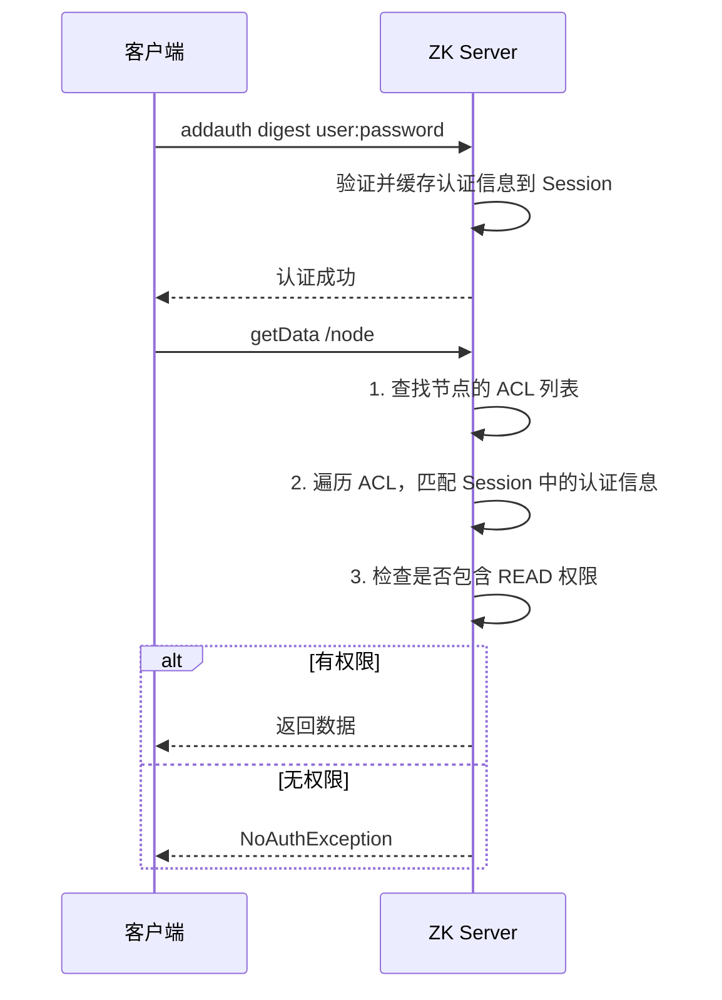

---
title: ZooKeeperAcl
date: 2022-02-19 13:27:21
categories:
  - 分布式
  - 分布式协同
  - ZooKeeper
tags:
  - 分布式
  - 协同
  - zookeeper
permalink: /pages/89b258dc/
---

# ZooKeeper ACL

> 为了避免存储在 Zookeeper 上的数据被其他程序或者人为误修改，Zookeeper 提供了 ACL(Access Control Lists) 进行权限控制。
>
> ACL 权限可以针对节点设置相关读写等权限，保障数据安全性。

## 简介

ZooKeeper 的 ACL（Access Control List，访问控制列表）是一种节点级别的权限控制机制。它不同于传统文件系统的用户/用户组模型，而是采用 `scheme:id:permissions` 三元组定义访问规则，支持基于密码、IP 等多种认证方式。

ACL 是 ZooKeeper 安全体系的核心。在多业务方共享同一 ZooKeeper 集群的环境下（如公司级中间件平台），ACL 可以有效隔离不同业务的节点访问权限，防止误操作或恶意修改。

需要注意的是，ZooKeeper 的 ACL **只控制节点的访问权限，不控制数据的加密存储**。znode 的数据在磁盘上仍是明文，若需加密需在应用层实现。

## 特性

| 特性 | 说明 |
| --- | --- |
| 节点级别 | ACL 针对单个 znode 设置，不继承（子节点不继承父节点 ACL） |
| 多 scheme | 支持 world、auth、digest、ip、super 五种认证方案 |
| 细粒度 | 支持 CREATE、READ、WRITE、DELETE、ADMIN 五种权限的任意组合 |
| 认证与授权分离 | 认证（addauth）和授权（setAcl）分离，灵活性高 |
| Session 级别 | 认证信息绑定在 Session 上，Session 结束需重新认证 |
| 不可逆 | digest 模式下密码经 SHA1+BASE64 加密，不可逆 |

## 原理

### ACL 校验流程



### 权限校验规则

ZooKeeper 在执行节点操作时按以下规则校验 ACL：

1. 读取节点的 ACL 列表（每个节点都有一个 ACL 列表）
2. 遍历 ACL 列表，找到与客户端 Session 认证信息匹配的项
3. 检查匹配项的 permissions 是否包含所需权限
4. 只要有任意一条 ACL 规则匹配并通过，即允许访问

### 认证与授权的区别

- **认证（Authentication）**：通过 `addauth` 命令向 Session 添加身份信息（如用户名密码、IP）。认证信息在整个 Session 生命周期内有效。
- **授权（Authorization）**：通过 `setAcl` 命令为节点设置访问规则。规则定义了"谁"（id）可以执行"什么操作"（permissions）。

## 应用场景

- **多业务隔离**：同一 ZooKeeper 集群中，不同业务方只能访问自己的节点
- **敏感配置保护**：数据库密码、密钥等敏感配置节点设置 digest 权限，只有认证后才能读取
- **运维与开发隔离**：运维节点（如 `/admin`）设置 ip 权限，只允许运维网段访问
- **只读共享**：公共配置节点设置 `world:anyone:r`，所有客户端只读
- **超级管理员**：通过 super 模式设置超级账户，用于紧急数据修复

## ACL 组成

Zookeeper 的 acl 通过 **`[scheme:id:permissions]`** 来构成权限列表。

- **scheme**：代表采用的某种权限机制，包括 world、auth、digest、ip、super 几种。
  - **world**：默认模式，所有客户端都拥有指定的权限。world 下只有一个 id 选项，就是 anyone，通常组合写法为 `world:anyone:[permissons]`；
  - **auth**：只有经过认证的用户才拥有指定的权限。通常组合写法为 `auth:user:password:[permissons]`，使用这种模式时，你需要先进行登录，之后采用 auth 模式设置权限时，`user` 和 `password` 都将使用登录的用户名和密码；
  - **digest**：只有经过认证的用户才拥有指定的权限。通常组合写法为 `auth:user:BASE64(SHA1(password)):[permissons]`，这种形式下的密码必须通过 SHA1 和 BASE64 进行双重加密；
  - **ip**：限制只有特定 IP 的客户端才拥有指定的权限。通常组成写法为 `ip:182.168.0.168:[permissions]`；
  - **super**：代表超级管理员，拥有所有的权限，需要修改 Zookeeper 启动脚本进行配置。
- **id**：代表允许访问的用户。
- **permissions**：权限组合字符串，由 cdrwa 组成，其中每个字母代表支持不同权限。可选项如下：
  - **CREATE**：允许创建子节点；
  - **READ**：允许从节点获取数据并列出其子节点；
  - **WRITE**：允许为节点设置数据；
  - **DELETE**：允许删除子节点；
  - **ADMIN**：允许为节点设置权限。

## 设置与查看权限

想要给某个节点设置权限 (ACL)，有以下两个可选的命令：

```bash
 # 1.给已有节点赋予权限
 setAcl path acl

 # 2.在创建节点时候指定权限
 create [-s] [-e] path data acl
```

查看指定节点的权限命令如下：

```bash
getAcl path
```

## 添加认证信息

可以使用如下所示的命令为当前 Session 添加用户认证信息，等价于登录操作。

```bash
# 格式
addauth scheme auth

#示例：添加用户名为test,密码为root的用户认证信息
addauth digest test:root
```

## 权限设置示例

### world 模式

world 是一种默认的模式，即创建时如果不指定权限，则默认的权限就是 world。

```bash
[zk: localhost:2181(CONNECTED) 32] create /mytest abc
Created /mytest
[zk: localhost:2181(CONNECTED) 4] getAcl /mytest
'world,'anyone # 默认的权限
: cdrwa
[zk: localhost:2181(CONNECTED) 34] setAcl /mytest world:anyone:cwda # 修改节点，不允许所有客户端读
....
[zk: localhost:2181(CONNECTED) 6] get /mytest
org.apache.zookeeper.KeeperException$NoAuthException: KeeperErrorCode = NoAuth for /mytest # 无权访问
```

### auth 模式

```bash
[zk: localhost:2181(CONNECTED) 36] addauth digest test:root # 登录
[zk: localhost:2181(CONNECTED) 37] setAcl /mytest auth::cdrwa # 设置权限
[zk: localhost:2181(CONNECTED) 38] getAcl /mytest # 查看权限信息
'digest,'heibai:sCxtVJ1gPG8UW/jzFHR0A1ZKY5s= # 用户名和密码 (密码经过加密处理)，注意返回的权限类型是 digest
: cdrwa

# 用户名和密码都是使用登录的用户名和密码，即使你在创建权限时候进行指定也是无效的
[zk: localhost:2181(CONNECTED) 39] setAcl /mytest auth:root:root:cdrwa    #指定用户名和密码为 root
[zk: localhost:2181(CONNECTED) 40] getAcl /mytest
'digest,'heibai:sCxtVJ1gPG8UW/jzFHR0A1ZKY5s=  #无效，使用的用户名和密码依然还是 test
: cdrwa
```

### digest 模式

```bash
[zk:44] create /spark "spark" digest:heibai:sCxtVJ1gPG8UW/jzFHR0A1ZKY5s=:cdrwa  #指定用户名和加密后的密码
[zk:45] getAcl /spark  #获取权限
'digest,'heibai:sCxtVJ1gPG8UW/jzFHR0A1ZKY5s=   # 返回的权限类型是 digest
: cdrwa
```

到这里你可以发现使用 `auth` 模式设置的权限和使用 `digest` 模式设置的权限，在最终结果上，得到的权限模式都是 `digest`。某种程度上，你可以把 `auth` 模式理解成是 `digest` 模式的一种简便实现。因为在 `digest` 模式下，每次设置都需要书写用户名和加密后的密码，这是比较繁琐的，采用 `auth` 模式就可以避免这种麻烦。

### ip 模式

限定只有特定的 ip 才能访问。

```bash
[zk: localhost:2181(CONNECTED) 46] create /Hive "hive" ip:192.168.0.108:cdrwa
[zk: localhost:2181(CONNECTED) 47] get /Hive
Authentication is not valid : /Hive  # 当前主机已经不能访问
```

这里可以看到当前主机已经不能访问，想要能够再次访问，可以使用对应 IP 的客户端，或使用下面介绍的 `super` 模式。

### super 模式

需要修改启动脚本 `zkServer.sh`，并在指定位置添加超级管理员账户和密码信息：

```bash
"-Dzookeeper.DigestAuthenticationProvider.superDigest=heibai:sCxtVJ1gPG8UW/jzFHR0A1ZKY5s="
```

修改完成后需要使用 `zkServer.sh restart` 重启服务，此时再次访问限制 IP 的节点：

```bash
[zk: localhost:2181(CONNECTED) 0] get /Hive  #访问受限
Authentication is not valid : /Hive
[zk: localhost:2181(CONNECTED) 1] addauth digest heibai:heibai  # 登录 (添加认证信息)
[zk: localhost:2181(CONNECTED) 2] get /Hive  #成功访问
Hive
cZxid = 0x158
ctime = Sat May 25 09:11:29 CST 2019
mZxid = 0x158
mtime = Sat May 25 09:11:29 CST 2019
pZxid = 0x158
cversion = 0
dataVersion = 0
aclVersion = 0
ephemeralOwner = 0x0
dataLength = 4
numChildren = 0
```

## 参考资料

- [Zookeeper 安装](https://www.w3cschool.cn/zookeeper/zookeeper_installation.html)
- [Zookeeper 单机环境和集群环境搭建](https://github.com/heibaiying/BigData-Notes/blob/master/notes/installation/Zookeeper%E5%8D%95%E6%9C%BA%E7%8E%AF%E5%A2%83%E5%92%8C%E9%9B%86%E7%BE%A4%E7%8E%AF%E5%A2%83%E6%90%AD%E5%BB%BA.md)
- [Zookeeper 客户端基础命令使用](https://www.runoob.com/w3cnote/zookeeper-bs-command.html)
