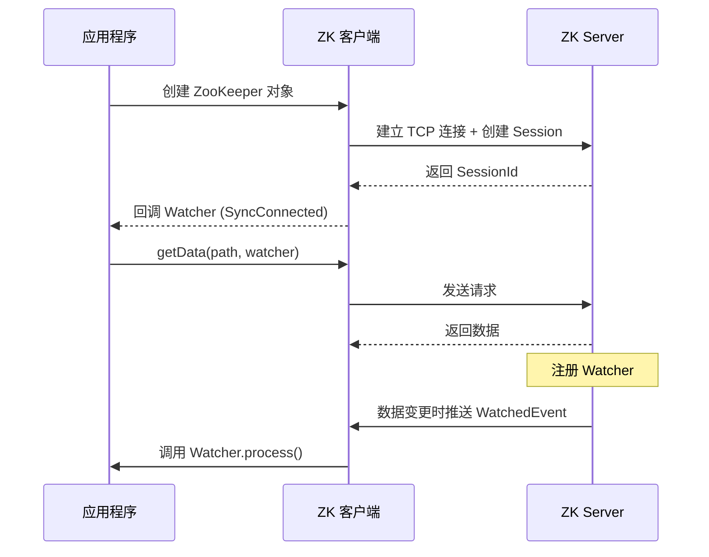

---
title: ZooKeeperJavaApi
date: 2022-02-19 13:27:21
categories:
  - 分布式
  - 分布式协同
  - ZooKeeper
tags:
  - 分布式
  - 协同
  - zookeeper
permalink: /pages/729fd98e/
---

# ZooKeeper Java Api

> ZooKeeper 是 Apache 的顶级项目。**ZooKeeper 为分布式应用提供了高效且可靠的分布式协调服务，提供了诸如统一命名服务、配置管理和分布式锁等分布式的基础服务。在解决分布式数据一致性方面，ZooKeeper 并没有直接采用 Paxos 算法，而是采用了名为 ZAB 的一致性协议**。
>
> ZooKeeper 主要用来解决分布式集群中应用系统的一致性问题，它能提供基于类似于文件系统的目录节点树方式的数据存储。但是 ZooKeeper 并不是用来专门存储数据的，它的作用主要是用来**维护和监控存储数据的状态变化。通过监控这些数据状态的变化，从而可以达到基于数据的集群管理**。
>
> 很多大名鼎鼎的框架都基于 ZooKeeper 来实现分布式高可用，如：Dubbo、Kafka 等。
>
> ZooKeeper 官方支持 Java 和 C 的 Client API。ZooKeeper 社区为大多数语言（.NET，python 等）提供非官方 API。

## 简介

ZooKeeper 客户端 API 是开发者与 ZooKeeper 服务端交互的核心接口，用于对 znode 进行增删改查、注册监听、管理 ACL 等操作。

Java 生态中主要有两种客户端：

- **ZooKeeper 官方客户端**（`org.apache.zookeeper:zookeeper`）：Apache 官方提供，API 较底层，需要开发者自行处理连接管理、重连、Watcher 重新注册等细节。
- **Curator 客户端**（`org.apache.curator:curator-recipes`）：Netflix 开源、Apache 孵化的高级封装客户端，提供了连接重连、持续监听、分布式锁、Leader 选举等开箱即用的 Recipe，是生产环境的主流选择。

## 特性

| 特性 | 官方客户端 | Curator 客户端 |
| --- | --- | --- |
| 连接管理 | 手动管理，需处理重连 | 内置重连策略（RetryPolicy） |
| Watcher | 一次性，需手动重新注册 | 持续监听（CuratorCache） |
| 分布式锁 | 需自行实现 | 内置 InterProcessMutex |
| Leader 选举 | 需自行实现 | 内置 LeaderSelector / LeaderLatch |
| 命名空间 | 不支持 | 支持 `.namespace()` |
| 流式 API | 否 | 是（Builder 模式） |
| 易用性 | 较低 | 高 |

## 原理

### 客户端与服务端交互流程



### Session 与连接管理

ZooKeeper 客户端启动时会初始化两个核心线程：

- **SendThread**：负责发送请求和接收响应，维护心跳（ping）。
- **EventThread**：负责处理事件回调（Watcher、连接状态变更）。

当连接断开时，客户端会根据 `RetryPolicy` 进行重连。Session 在超时时间内重连成功可保持临时节点不丢失。

### Watcher 触发机制

Watcher 的注册和触发涉及客户端和服务端两侧：

- **注册**：客户端调用 `getData(path, watcher)` 时，将 Watcher 存入本地 `ZKWatchManager`，并向服务端发送请求。
- **触发**：服务端数据变更时，找到该 path 对应的 Watcher 集合，生成 `WatchedEvent` 推送到客户端。
- **回调**：客户端 `EventThread` 接收事件，调用对应 Watcher 的 `process` 方法。

由于原生 Watcher 是一次性的，触发后服务端和客户端都会移除该 Watcher，需要重新注册。

## 应用场景

- **配置管理**：通过 `getData` + Watcher 实现配置的动态推送
- **服务注册与发现**：服务启动时 `create` 临时节点，宕机时自动删除
- **分布式锁**：基于顺序临时节点实现公平锁
- **Leader 选举**：多个节点竞争创建同一临时节点
- **集群监控**：通过 `getChildren` 监听子节点变化感知节点上下线
- **分布式计数器**：通过 `setData` + 版本号实现原子计数

## ZooKeeper 官方客户端

### ZooKeeper 客户端简介

客户端和服务端交互遵循以下基本步骤：

1. 客户端连接 ZooKeeper 服务端集群任意工作节点，该节点为客户端分配会话 ID。
2. 为了保持通信，客户端需要和服务端保持心跳（实质上就是 ping ）。否则，ZooKeeper 服务会话超时时间内未收到客户端请求，会将会话视为过期。这种情况下，客户端如果要通信，就需要重新连接。
3. 只要会话 ID 处于活动状态，就可以执行读写 znode 操作。
4. 所有任务完成后，客户端断开与 ZooKeeper 服务端集群的连接。如果客户端长时间不活动，则 ZooKeeper 集合将自动断开客户端。

ZooKeeper 官方客户端的核心是 **`ZooKeeper` 类**。它在其构造函数中提供了连接 ZooKeeper 服务的配置选项，并提供了访问 ZooKeeper 数据的方法。

> 其主要操作如下：
>
> - **`connect`** - 连接 ZooKeeper 服务
> - **`create`** - 创建 znode
> - **`exists`** - 检查 znode 是否存在及其信息
> - **`getACL`** / **`setACL`**- 获取/设置一个 znode 的 ACL
> - **`getData`** / **`setData`**- 获取/设置一个 znode 的数据
> - **`getChildren`** - 获取特定 znode 中的所有子节点
> - **`delete`** - 删除特定的 znode 及其所有子项
> - **`close`** - 关闭连接

ZooKeeper 官方客户端的使用方法是在 maven 项目的 pom.xml 中添加：

```xml
<dependency>
    <groupId>org.apache.zookeeper</groupId>
    <artifactId>zookeeper</artifactId>
    <version>3.7.0</version>
</dependency>
```

### 创建连接

ZooKeeper 类通过其构造函数提供连接 ZooKeeper 服务的功能。其构造函数的定义如下：

```java
ZooKeeper(String connectionString, int sessionTimeout, Watcher watcher)
```

> 参数说明：
>
> - **`connectionString`** - ZooKeeper 集群的主机列表。
> - **`sessionTimeout`** - 会话超时时间（以毫秒为单位）。
> - **watcher** - 实现监视机制的回调。当被监控的 znode 状态发生变化时，ZooKeeper 服务端的 `WatcherManager` 会主动调用传入的 Watcher ，推送状态变化给客户端。

【示例】连接 ZooKeeper

```java
import org.apache.zookeeper.Watcher;
import org.apache.zookeeper.ZooKeeper;
import org.junit.jupiter.api.*;

import java.io.IOException;
import java.util.concurrent.CountDownLatch;

/**
 * ZooKeeper 官方客户端测试例
 *
 * @author <a href="mailto:forbreak@163.com">Zhang Peng</a>
 * @since 2022-02-19
 */
@DisplayName("ZooKeeper 官方客户端测试例")
public class ZooKeeperTest {

    /**
     * ZooKeeper 连接实例
     */
    private static ZooKeeper zk;

    /**
     * 创建 ZooKeeper 连接
     */
    @BeforeAll
    public static void init() throws IOException, InterruptedException {
        final String HOST = "localhost:2181";
        CountDownLatch latch = new CountDownLatch(1);
        zk = new ZooKeeper(HOST, 5000, watcher -> {
            if (watcher.getState() == Watcher.Event.KeeperState.SyncConnected) {
                latch.countDown();
            }
        });
        latch.await();
    }

    /**
     * 关闭 ZooKeeper 连接
     */
    @AfterAll
    public static void destroy() throws InterruptedException {
        if (zk != null) {
            zk.close();
        }
    }

    /**
     * 建立连接
     */
    @Test
    public void getState() {
        ZooKeeper.States state = zk.getState();
        Assertions.assertTrue(state.isAlive());
    }

}
```

> 说明：
>
> 添加一个 `connect` 方法，用于创建一个 `ZooKeeper` 对象，用于连接到 ZooKeeper 服务。
>
> 这里 `CountDownLatch` 用于停止（等待）主进程，直到客户端与 ZooKeeper 集合连接。
>
> `ZooKeeper` 对象通过监听器回调来监听连接状态。一旦客户端与 ZooKeeper 建立连接，监听器回调就会被调用；并且监听器回调函数调用 `CountDownLatch` 的 `countDown` 方法来释放锁，在主进程中 `await`。

### 节点增删改查

#### 判断节点是否存在

ZooKeeper 类提供了 `exists` 方法来检查 znode 的存在。如果指定的 znode 存在，则返回一个 znode 的元数据。

`exists` 方法的签名如下：

```
exists(String path, boolean watcher)
```

- **path**- Znode 路径
- **watcher** - 布尔值，用于指定是否监视指定的 znode

【示例】

```java
Stat stat = zk.exists("/", true);
Assertions.assertNotNull(stat);
```

#### 创建节点

`ZooKeeper` 类的 `create` 方法用于在 ZooKeeper 中创建一个新节点（znode）。

`create` 方法的签名如下：

```
create(String path, byte[] data, List<ACL> acl, CreateMode createMode)
```

- **path** - Znode 路径。例如，/myapp1，/myapp2，/myapp1/mydata1，myapp2/mydata1/myanothersubdata
- **data** - 要存储在指定 znode 路径中的数据
- **acl** - 要创建的节点的访问控制列表。ZooKeeper API 提供了一个静态接口 **ZooDefs.Ids** 来获取一些基本的 acl 列表。例如，ZooDefs.Ids.OPEN_ACL_UNSAFE 返回打开 znode 的 acl 列表。
- **createMode** - 节点的类型，即临时，顺序或两者。这是一个**枚举**。

【示例】

```java
private static final String path = "/mytest";

String text = "My first zookeeper app";
zk.create(path, text.getBytes(), ZooDefs.Ids.OPEN_ACL_UNSAFE, CreateMode.PERSISTENT);
Stat stat = zk.exists(path, true);
Assertions.assertNotNull(stat);
```

#### 删除节点

ZooKeeper 类提供了 `delete` 方法来删除指定的 znode。

`delete` 方法的签名如下：

```
delete(String path, int version)
```

- **path** - Znode 路径。
- **version** - znode 的当前版本。

让我们创建一个新的 Java 应用程序来了解 ZooKeeper API 的 **delete** 功能。创建文件 **ZKDelete.java** 。在 main 方法中，使用 **ZooKeeperConnection** 对象创建一个 ZooKeeper 对象 **zk** 。然后，使用指定的路径和版本号调用 **zk** 对象的 **delete** 方法。

删除 znode 的完整程序代码如下：

【示例】

```java
zk.delete(path, zk.exists(path, true).getVersion());
Stat stat = zk.exists(path, true);
Assertions.assertNull(stat);
```

#### 获取节点数据

ZooKeeper 类提供 **getData** 方法来获取附加在指定 znode 中的数据及其状态。 **getData** 方法的签名如下：

```
getData(String path, Watcher watcher, Stat stat)
```

- **path** - Znode 路径。
- **watcher** - 监听器类型的回调函数。当指定的 znode 的数据改变时，ZooKeeper 集合将通过监听器回调进行通知。这是一次性通知。
- **stat** - 返回 znode 的元数据。

【示例】

```java
byte[] data = zk.getData(path, false, null);
String text1 = new String(data);
Assertions.assertEquals(text, text1);
System.out.println(text1);
```

#### 设置节点数据

ZooKeeper 类提供 **setData** 方法来修改指定 znode 中附加的数据。 **setData** 方法的签名如下：

```
setData(String path, byte[] data, int version)
```

- **path**- Znode 路径
- **data** - 要存储在指定 znode 路径中的数据。
- **version**- znode 的当前版本。每当数据更改时，ZooKeeper 会更新 znode 的版本号。

【示例】

```java
String text = "含子节点的节点";
zk.create(path, text.getBytes(), ZooDefs.Ids.OPEN_ACL_UNSAFE, CreateMode.PERSISTENT);
zk.create(path + "/1", "1".getBytes(), ZooDefs.Ids.OPEN_ACL_UNSAFE, CreateMode.PERSISTENT);
zk.create(path + "/2", "1".getBytes(), ZooDefs.Ids.OPEN_ACL_UNSAFE, CreateMode.PERSISTENT);
List<String> actualList = zk.getChildren(path, false);
for (String child : actualList) {
    System.out.println(child);
}
```

#### 获取子节点

ZooKeeper 类提供 **getChildren** 方法来获取特定 znode 的所有子节点。 **getChildren** 方法的签名如下：

```
getChildren(String path, Watcher watcher)
```

- **path** - Znode 路径。
- **watcher** - 监听器类型的回调函数。当指定的 znode 被删除或 znode 下的子节点被创建/删除时，ZooKeeper 集合将进行通知。这是一次性通知。

【示例】

```java
@Test
public void getChildren() throws InterruptedException, KeeperException {
    byte[] data = "My first zookeeper app".getBytes();
    zk.create(path, data, ZooDefs.Ids.OPEN_ACL_UNSAFE, CreateMode.PERSISTENT);
    zk.create(path + "/1", "1".getBytes(), ZooDefs.Ids.OPEN_ACL_UNSAFE, CreateMode.PERSISTENT);
    zk.create(path + "/2", "1".getBytes(), ZooDefs.Ids.OPEN_ACL_UNSAFE, CreateMode.PERSISTENT);
    List<String> actualList = zk.getChildren(path, false);
    List<String> expectedList = CollectionUtil.newArrayList("1", "2");
    Assertions.assertTrue(CollectionUtil.containsAll(expectedList, actualList));
    for (String child : actualList) {
        System.out.println(child);
    }
}
```

## Curator 客户端

### Curator 客户端简介

Curator 客户端的使用方法是在 maven 项目的 pom.xml 中添加：

```xml
<dependency>
    <groupId>org.apache.curator</groupId>
    <artifactId>curator-recipes</artifactId>
    <version>5.1.0</version>
</dependency>
```

### 创建连接

```java
import org.apache.curator.RetryPolicy;
import org.apache.curator.framework.CuratorFramework;
import org.apache.curator.framework.CuratorFrameworkFactory;
import org.apache.curator.framework.imps.CuratorFrameworkState;
import org.apache.curator.retry.RetryNTimes;
import org.apache.zookeeper.CreateMode;
import org.apache.zookeeper.ZooDefs;
import org.junit.jupiter.api.*;

import java.nio.charset.StandardCharsets;

public class CuratorTest {

    /**
     * Curator ZooKeeper 连接实例
     */
    private static CuratorFramework client = null;
    private static final String path = "/mytest";

    /**
     * 创建连接
     */
    @BeforeAll
    public static void init() {
        // 重试策略
        RetryPolicy retryPolicy = new RetryNTimes(3, 5000);
        client = CuratorFrameworkFactory.builder()
                                        .connectString("localhost:2181")
                                        .sessionTimeoutMs(10000).retryPolicy(retryPolicy)
                                        .namespace("workspace").build();  //指定命名空间后，client 的所有路径操作都会以 /workspace 开头
        client.start();
    }

    /**
     * 关闭连接
     */
    @AfterAll
    public static void destroy() {
        if (client != null) {
            client.close();
        }
    }

}
```

### 节点增删改查

#### 判断节点是否存在

```java
Stat stat = client.checkExists().forPath(path);
Assertions.assertNull(stat);
```

#### 判读服务状态

```java
CuratorFrameworkState state = client.getState();
Assertions.assertEquals(CuratorFrameworkState.STARTED, state);
```

#### 创建节点

```java
// 创建节点
String text = "Hello World";
client.create().creatingParentsIfNeeded()
      .withMode(CreateMode.PERSISTENT)      //节点类型
      .withACL(ZooDefs.Ids.OPEN_ACL_UNSAFE)
      .forPath(path, text.getBytes(StandardCharsets.UTF_8));
```

#### 删除节点

```java
client.delete()
      .guaranteed()                     // 如果删除失败，会继续执行，直到成功
      .deletingChildrenIfNeeded()       // 如果有子节点，则递归删除
      .withVersion(stat.getVersion())   // 传入版本号，如果版本号错误则拒绝删除操作，并抛出 BadVersion 异常
      .forPath(path);
```

#### 获取节点数据

```java
byte[] data = client.getData().forPath(path);
Assertions.assertEquals(text, new String(data));
System.out.println("修改前的节点数据：" + new String(data));
```

#### 设置节点数据

```java
String text2 = "try again";
client.setData()
      .withVersion(client.checkExists().forPath(path).getVersion())
      .forPath(path, text2.getBytes(StandardCharsets.UTF_8));
```

#### 获取子节点

```java
List<String> children = client.getChildren().forPath(path);
for (String s : children) {
    System.out.println(s);
}
List<String> expectedList = CollectionUtil.newArrayList("1", "2");
Assertions.assertTrue(CollectionUtil.containsAll(expectedList, children));
```

### 监听事件

#### 创建一次性监听

和 Zookeeper 原生监听一样，使用 `usingWatcher` 注册的监听是一次性的，即监听只会触发一次，触发后就销毁。

【示例】

```java
// 设置监听器
client.getData().usingWatcher(new CuratorWatcher() {
    public void process(WatchedEvent event) {
        System.out.println("节点 " + event.getPath() + " 发生了事件：" + event.getType());
    }
}).forPath(path);

// 第一次修改
client.setData()
      .withVersion(client.checkExists().forPath(path).getVersion())
      .forPath(path, "第一次修改".getBytes(StandardCharsets.UTF_8));

// 第二次修改
client.setData()
      .withVersion(client.checkExists().forPath(path).getVersion())
      .forPath(path, "第二次修改".getBytes(StandardCharsets.UTF_8));
```

输出

```
节点 /mytest 发生了事件：NodeDataChanged
```

说明

修改两次数据，但是监听器只会监听第一次修改。

#### 创建永久监听

Curator 还提供了创建永久监听的 API，其使用方式如下：

```java
// 设置监听器
CuratorCache curatorCache = CuratorCache.builder(client, path).build();
PathChildrenCacheListener pathChildrenCacheListener = new PathChildrenCacheListener() {
    @Override
    public void childEvent(CuratorFramework framework, PathChildrenCacheEvent event) throws Exception {
        System.out.println("节点 " + event.getData().getPath() + " 发生了事件：" + event.getType());
    }
};
CuratorCacheListener listener = CuratorCacheListener.builder()
                                                    .forPathChildrenCache(path, client,
                                                        pathChildrenCacheListener)
                                                    .build();
curatorCache.listenable().addListener(listener);
curatorCache.start();

// 第一次修改
client.setData()
      .withVersion(client.checkExists().forPath(path).getVersion())
      .forPath(path, "第一次修改".getBytes(StandardCharsets.UTF_8));

// 第二次修改
client.setData()
      .withVersion(client.checkExists().forPath(path).getVersion())
      .forPath(path, "第二次修改".getBytes(StandardCharsets.UTF_8));
```

#### 监听子节点

这里以监听 `/hadoop` 下所有子节点为例，实现方式如下：

```java
// 创建节点
String text = "Hello World";
client.create().creatingParentsIfNeeded()
      .withMode(CreateMode.PERSISTENT)      //节点类型
      .withACL(ZooDefs.Ids.OPEN_ACL_UNSAFE)
      .forPath(path, text.getBytes(StandardCharsets.UTF_8));
client.create().creatingParentsIfNeeded()
      .withMode(CreateMode.PERSISTENT)      //节点类型
      .withACL(ZooDefs.Ids.OPEN_ACL_UNSAFE)
      .forPath(path + "/1", text.getBytes(StandardCharsets.UTF_8));
client.create().creatingParentsIfNeeded()
      .withMode(CreateMode.PERSISTENT)      //节点类型
      .withACL(ZooDefs.Ids.OPEN_ACL_UNSAFE)
      .forPath(path + "/2", text.getBytes(StandardCharsets.UTF_8));

// 设置监听器
// 第三个参数代表除了节点状态外，是否还缓存节点内容
PathChildrenCache childrenCache = new PathChildrenCache(client, path, true);
/*
 * StartMode 代表初始化方式:
 *    NORMAL: 异步初始化
 *    BUILD_INITIAL_CACHE: 同步初始化
 *    POST_INITIALIZED_EVENT: 异步并通知,初始化之后会触发 INITIALIZED 事件
 */
childrenCache.start(PathChildrenCache.StartMode.POST_INITIALIZED_EVENT);

List<ChildData> childDataList = childrenCache.getCurrentData();
System.out.println("当前数据节点的子节点列表：");
childDataList.forEach(x -> System.out.println(x.getPath()));

childrenCache.getListenable().addListener(new PathChildrenCacheListener() {
    public void childEvent(CuratorFramework client, PathChildrenCacheEvent event) {
        switch (event.getType()) {
            case INITIALIZED:
                System.out.println("childrenCache 初始化完成");
                break;
            case CHILD_ADDED:
                // 需要注意的是: 即使是之前已经存在的子节点，也会触发该监听，因为会把该子节点加入 childrenCache 缓存中
                System.out.println("增加子节点:" + event.getData().getPath());
                break;
            case CHILD_REMOVED:
                System.out.println("删除子节点:" + event.getData().getPath());
                break;
            case CHILD_UPDATED:
                System.out.println("被修改的子节点的路径:" + event.getData().getPath());
                System.out.println("修改后的数据:" + new String(event.getData().getData()));
                break;
        }
    }
});

// 第一次修改
client.setData()
      .forPath(path + "/1", "第一次修改".getBytes(StandardCharsets.UTF_8));

// 第二次修改
client.setData()
      .forPath(path + "/1", "第二次修改".getBytes(StandardCharsets.UTF_8));
```

### ACL 权限管理

```java
public class AclOperation {

    private CuratorFramework client = null;
    private static final String zkServerPath = "192.168.0.226:2181";
    private static final String nodePath = "/mytest/hdfs";

    @Before
    public void prepare() {
        RetryPolicy retryPolicy = new RetryNTimes(3, 5000);
        client = CuratorFrameworkFactory.builder()
                .authorization("digest", "heibai:123456".getBytes()) //等价于 addauth 命令
                .connectString(zkServerPath)
                .sessionTimeoutMs(10000).retryPolicy(retryPolicy)
                .namespace("workspace").build();
        client.start();
    }

    /**
     * 新建节点并赋予权限
     */
    @Test
    public void createNodesWithAcl() throws Exception {
        List<ACL> aclList = new ArrayList<>();
        // 对密码进行加密
        String digest1 = DigestAuthenticationProvider.generateDigest("heibai:123456");
        String digest2 = DigestAuthenticationProvider.generateDigest("ying:123456");
        Id user01 = new Id("digest", digest1);
        Id user02 = new Id("digest", digest2);
        // 指定所有权限
        aclList.add(new ACL(Perms.ALL, user01));
        // 如果想要指定权限的组合，中间需要使用 | ,这里的|代表的是位运算中的 按位或
        aclList.add(new ACL(Perms.DELETE | Perms.CREATE, user02));

        // 创建节点
        byte[] data = "abc".getBytes();
        client.create().creatingParentsIfNeeded()
                .withMode(CreateMode.PERSISTENT)
                .withACL(aclList, true)
                .forPath(nodePath, data);
    }


    /**
     * 给已有节点设置权限,注意这会删除所有原来节点上已有的权限设置
     */
    @Test
    public void SetAcl() throws Exception {
        String digest = DigestAuthenticationProvider.generateDigest("admin:admin");
        Id user = new Id("digest", digest);
        client.setACL()
                .withACL(Collections.singletonList(new ACL(Perms.READ | Perms.DELETE, user)))
                .forPath(nodePath);
    }

    /**
     * 获取权限
     */
    @Test
    public void getAcl() throws Exception {
        List<ACL> aclList = client.getACL().forPath(nodePath);
        ACL acl = aclList.get(0);
        System.out.println(acl.getId().getId()
                           + "是否有删读权限:" + (acl.getPerms() == (Perms.READ | Perms.DELETE)));
    }

    @After
    public void destroy() {
        if (client != null) {
            client.close();
        }
    }
}
```

## 最佳实践

### 案例一：基于 Curator 实现服务注册与发现

**场景说明**：微服务架构中，服务提供者启动时需要将自己注册到 ZooKeeper，服务消费者从 ZooKeeper 获取可用的服务实例列表，并实时感知实例上下线。

**示例代码**：

```java
import org.apache.curator.framework.CuratorFramework;
import org.apache.curator.framework.CuratorFrameworkFactory;
import org.apache.curator.retry.ExponentialBackoffRetry;
import org.apache.curator.x.discovery.ServiceDiscovery;
import org.apache.curator.x.discovery.ServiceDiscoveryBuilder;
import org.apache.curator.x.discovery.ServiceInstance;
import org.apache.curator.x.discovery.ServiceProvider;
import org.apache.curator.x.discovery.details.JsonInstanceSerializer;

import java.util.Collection;

/**
 * 服务注册与发现示例
 */
public class ServiceRegistryDemo {

    private static final String ZK_ADDRESS = "localhost:2181";
    private static final String SERVICE_PATH = "/services";

    public static void main(String[] args) throws Exception {
        CuratorFramework client = CuratorFrameworkFactory.builder()
                .connectString(ZK_ADDRESS)
                .sessionTimeoutMs(30000)
                .retryPolicy(new ExponentialBackoffRetry(1000, 3))
                .build();
        client.start();

        // 1. 服务提供者注册服务
        ServiceDiscovery<String> discovery = ServiceDiscoveryBuilder.builder(String.class)
                .client(client)
                .basePath(SERVICE_PATH)
                .serializer(new JsonInstanceSerializer<>(String.class))
                .build();
        discovery.start();

        ServiceInstance<String> instance = ServiceInstance.<String>builder()
                .name("user-service")
                .address("192.168.1.100")
                .port(8080)
                .payload("user-service-instance-1")
                .build();
        discovery.registerService(instance);
        System.out.println("服务注册成功: " + instance.getName() + " @ " + instance.getAddress());

        // 2. 服务消费者发现服务
        ServiceProvider<String> provider = discovery.serviceProviderBuilder()
                .serviceName("user-service")
                .build();
        provider.start();

        Collection<ServiceInstance<String>> instances = provider.getAllInstances();
        System.out.println("发现 " + instances.size() + " 个实例:");
        for (ServiceInstance<String> si : instances) {
            System.out.println("  - " + si.getAddress() + ":" + si.getPort());
        }

        // 3. 模拟服务下线
        Thread.sleep(5000);
        discovery.unregisterService(instance);
        System.out.println("服务已下线");

        discovery.close();
        client.close();
    }
}
```

**说明**：

- `ServiceDiscovery` 基于 ZooKeeper 临时节点实现，服务宕机会话失效后节点自动删除。
- `ServiceProvider` 内部维护实例列表并自动监听变化，调用 `getInstance()` 可获取负载均衡后的实例。
- 需要引入 `curator-x-discovery` 依赖。

### 案例二：基于 Curator 实现分布式计数器

**场景说明**：分布式限流、库存扣减等场景需要跨节点的原子计数器，利用 ZooKeeper 的版本号机制可实现乐观锁计数。

**示例代码**：

```java
import org.apache.curator.framework.CuratorFramework;
import org.apache.curator.framework.CuratorFrameworkFactory;
import org.apache.curator.framework.recipes.shared.SharedCount;
import org.apache.curator.retry.ExponentialBackoffRetry;

/**
 * 分布式计数器示例
 */
public class DistributedCounterDemo {

    private static final String ZK_ADDRESS = "localhost:2181";
    private static final String COUNTER_PATH = "/counters/stock";

    public static void main(String[] args) throws Exception {
        CuratorFramework client = CuratorFrameworkFactory.builder()
                .connectString(ZK_ADDRESS)
                .retryPolicy(new ExponentialBackoffRetry(1000, 3))
                .build();
        client.start();

        // 1. 创建共享计数器
        SharedCount sharedCount = new SharedCount(client, COUNTER_PATH, 1000);
        sharedCount.start();

        System.out.println("初始库存: " + sharedCount.getCount());

        // 2. 模拟多个线程扣减库存
        for (int i = 0; i < 5; i++) {
            new Thread(() -> {
                for (int j = 0; j < 3; j++) {
                    boolean success = false;
                    while (!success) {
                        int current = sharedCount.getCount();
                        int newValue = current - 1;
                        // 尝试原子更新（基于版本号）
                        success = sharedCount.trySetCount(sharedCount.getVersion(), newValue);
                        if (success) {
                            System.out.println(Thread.currentThread().getName()
                                    + " 扣减成功，剩余: " + newValue);
                        }
                    }
                }
            }, "Thread-" + i).start();
        }

        Thread.sleep(5000);
        System.out.println("最终库存: " + sharedCount.getCount());

        sharedCount.close();
        client.close();
    }
}
```

**说明**：

- `SharedCount` 基于 ZooKeeper 的版本号机制实现 CAS（Compare-And-Swap）语义。
- `trySetCount` 失败时（版本号不匹配）需重试，保证原子性。
- 适合写入频率不高的场景；高频计数推荐使用 `DistributedAtomicInteger`。

### 案例三：基于 Curator 实现分布式屏障（Barrier）

**场景说明**：分布式批处理任务中，多个 Worker 需要等待所有任务就绪后才能统一执行下一阶段，类似 Java 的 `CyclicBarrier`。

**示例代码**：

```java
import org.apache.curator.framework.CuratorFramework;
import org.apache.curator.framework.CuratorFrameworkFactory;
import org.apache.curator.framework.recipes.barriers.DistributedBarrier;
import org.apache.curator.retry.ExponentialBackoffRetry;

/**
 * 分布式屏障示例
 */
public class DistributedBarrierDemo {

    private static final String ZK_ADDRESS = "localhost:2181";
    private static final String BARRIER_PATH = "/barriers/job1";

    public static void main(String[] args) throws Exception {
        CuratorFramework client = CuratorFrameworkFactory.builder()
                .connectString(ZK_ADDRESS)
                .retryPolicy(new ExponentialBackoffRetry(1000, 3))
                .build();
        client.start();

        // 1. 主线程设置屏障
        DistributedBarrier barrier = new DistributedBarrier(client, BARRIER_PATH);
        barrier.setBarrier();
        System.out.println("主线程已设置屏障，等待 Worker 就绪");

        // 2. 启动 3 个 Worker 线程
        int workerCount = 3;
        for (int i = 1; i <= workerCount; i++) {
            final int workerId = i;
            new Thread(() -> {
                try {
                    DistributedBarrier workerBarrier = new DistributedBarrier(client, BARRIER_PATH);
                    System.out.println("Worker-" + workerId + " 准备就绪，等待屏障移除");
                    workerBarrier.waitOnBarrier();  // 阻塞等待
                    System.out.println("Worker-" + workerId + " 开始执行任务");
                    Thread.sleep(1000);
                    System.out.println("Worker-" + workerId + " 任务完成");
                } catch (Exception e) {
                    e.printStackTrace();
                }
            }).start();
            Thread.sleep(500);
        }

        // 3. 主线程等待所有 Worker 就绪后移除屏障
        Thread.sleep(3000);
        System.out.println("主线程移除屏障，所有 Worker 开始执行");
        barrier.removeBarrier();

        Thread.sleep(5000);
        client.close();
    }
}
```

**说明**：

- `DistributedBarrier` 通过 ZooKeeper 节点的存在性实现屏障语义。
- `setBarrier()` 创建节点，`waitOnBarrier()` 在节点存在时阻塞，`removeBarrier()` 删除节点唤醒所有等待者。
- 适合分布式任务调度中"等待所有节点就绪"的场景。

## 常见问题

### 问题一：连接超时导致 ZooKeeper 对象不可用

**问题描述**：`new ZooKeeper(...)` 后立即调用 API 抛出 `ConnectionLoss` 或 `SessionExpired` 异常。

**原因分析**：

`ZooKeeper` 构造函数是异步的，返回时连接可能尚未建立。若在 `SyncConnected` 事件触发前调用 API，会因连接未就绪而失败。另外，`sessionTimeout` 设置过小或网络不稳定也会导致连接超时。

**解决方案**：

使用 `CountDownLatch` 等待连接建立后再执行业务；使用 Curator 则自动处理重连。

```java
import org.apache.zookeeper.Watcher;
import org.apache.zookeeper.ZooKeeper;

import java.io.IOException;
import java.util.concurrent.CountDownLatch;
import java.util.concurrent.TimeUnit;

public class SafeConnectionDemo {

    private static ZooKeeper zk;
    private static final CountDownLatch latch = new CountDownLatch(1);

    public static ZooKeeper connect(String host, int sessionTimeout) throws IOException {
        zk = new ZooKeeper(host, sessionTimeout, event -> {
            switch (event.getState()) {
                case SyncConnected:
                    latch.countDown();
                    break;
                case Expired:
                    System.out.println("Session 过期，需重新创建 ZooKeeper 实例");
                    break;
                case Disconnected:
                    System.out.println("连接断开，等待重连");
                    break;
                default:
                    break;
            }
        });
        try {
            // 等待连接建立，最多等 10 秒
            if (!latch.await(10, TimeUnit.SECONDS)) {
                throw new IOException("连接 ZooKeeper 超时");
            }
        } catch (InterruptedException e) {
            Thread.currentThread().interrupt();
            throw new IOException("连接被中断", e);
        }
        return zk;
    }

    public static void main(String[] args) throws Exception {
        ZooKeeper zk = connect("localhost:2181", 30000);
        System.out.println("连接成功，状态: " + zk.getState());
        zk.close();
    }
}
```

> **建议**：生产环境优先使用 Curator，其内置 `RetryPolicy` 会自动处理连接和重试，避免手动管理连接状态的复杂性。

### 问题二：并发 setData 导致数据覆盖

**问题描述**：多个客户端同时修改同一节点数据，后写入的覆盖了先写入的，导致数据丢失。

**原因分析**：

`setData(path, data, version)` 中如果不指定版本号（传 -1），会跳过版本检查直接覆盖。这是默认行为，在并发场景下会导致"更新丢失"问题。

**解决方案**：

使用乐观锁机制，先读取当前版本号，再带版本号写入；失败则重试。

```java
import org.apache.zookeeper.CreateMode;
import org.apache.zookeeper.KeeperException;
import org.apache.zookeeper.ZooDefs;
import org.apache.zookeeper.ZooKeeper;
import org.apache.zookeeper.data.Stat;

import java.nio.charset.StandardCharsets;
import java.util.concurrent.CountDownLatch;

public class OptimisticLockDemo {

    public static void main(String[] args) throws Exception {
        CountDownLatch latch = new CountDownLatch(1);
        ZooKeeper zk = new ZooKeeper("localhost:2181", 30000,
                e -> { if (e.getState() == org.apache.zookeeper.Watcher.Event.KeeperState.SyncConnected) latch.countDown(); });
        latch.await();

        String path = "/counter";
        if (zk.exists(path, false) == null) {
            zk.create(path, "0".getBytes(StandardCharsets.UTF_8),
                    ZooDefs.Ids.OPEN_ACL_UNSAFE, CreateMode.PERSISTENT);
        }

        // 并发安全地递增计数器
        for (int i = 0; i < 5; i++) {
            new Thread(() -> {
                for (int j = 0; j < 10; j++) {
                    safeIncrement(zk, path);
                }
            }).start();
        }

        Thread.sleep(3000);
        System.out.println("最终值: " + new String(zk.getData(path, false, null), StandardCharsets.UTF_8));
        zk.close();
    }

    /**
     * 基于乐观锁的安全递增
     */
    private static void safeIncrement(ZooKeeper zk, String path) {
        while (true) {
            try {
                Stat stat = new Stat();
                byte[] data = zk.getData(path, false, stat);
                int current = Integer.parseInt(new String(data, StandardCharsets.UTF_8));
                int newValue = current + 1;
                // 带版本号写入，版本不匹配会抛 BadVersionException
                zk.setData(path, String.valueOf(newValue).getBytes(StandardCharsets.UTF_8), stat.getVersion());
                return;
            } catch (KeeperException.BadVersionException e) {
                // 版本不匹配，重试
            } catch (Exception e) {
                e.printStackTrace();
                return;
            }
        }
    }
}
```

> **说明**：对于高频计数场景，推荐使用 Curator 的 `DistributedAtomicInteger`，它内部使用乐观锁 + 重试，并支持 PromotedLock 优化性能。

### 问题三：Watcher 回调阻塞 EventThread 导致事件丢失

**问题描述**：Watcher 的 `process` 方法中执行耗时操作（如 HTTP 调用），导致后续 Watcher 事件无法及时处理，甚至积压丢失。

**原因分析**：

ZooKeeper 客户端的所有 Watcher 回调都在单一的 `EventThread` 中串行执行。如果某个回调阻塞，会阻塞所有后续事件的处理。

**解决方案**：

在 Watcher 回调中避免耗时操作，将业务逻辑交给独立线程池处理。

```java
import org.apache.zookeeper.WatchedEvent;
import org.apache.zookeeper.Watcher;
import org.apache.zookeeper.ZooKeeper;

import java.nio.charset.StandardCharsets;
import java.util.concurrent.ExecutorService;
import java.util.concurrent.Executors;

public class AsyncWatcherDemo implements Watcher {

    // 独立线程池处理业务逻辑，避免阻塞 EventThread
    private static final ExecutorService businessPool = Executors.newFixedThreadPool(4);

    public static void main(String[] args) throws Exception {
        ZooKeeper zk = new ZooKeeper("localhost:2181", 30000, new AsyncWatcherDemo());
        // 注册监听
        zk.getData("/config", new AsyncWatcherDemo(), null);
        Thread.sleep(Long.MAX_VALUE);
    }

    @Override
    public void process(WatchedEvent event) {
        System.out.println("EventThread 收到事件: " + event.getType() + "，移交线程池处理");
        // 立即移交业务线程池，不阻塞 EventThread
        businessPool.submit(() -> handleBusinessLogic(event));
    }

    /**
     * 耗时的业务逻辑（如 HTTP 调用、数据库操作）
     */
    private void handleBusinessLogic(WatchedEvent event) {
        try {
            System.out.println("开始处理事件: " + event.getType() + " on " + event.getPath());
            // 模拟耗时操作
            Thread.sleep(2000);
            System.out.println("事件处理完成");
        } catch (InterruptedException e) {
            Thread.currentThread().interrupt();
        }
    }
}
```

> **说明**：注意异步处理后若需要重新注册 Watcher，也要在业务线程中调用 `getData(path, watcher)` 重新注册，避免漏注册导致后续事件丢失。

## 参考资料

- **官方**
  - [ZooKeeper 官网](http://zookeeper.apache.org/)
  - [ZooKeeper 官方文档](https://cwiki.apache.org/confluence/display/ZOOKEEPER)
  - [ZooKeeper Github](https://github.com/apache/zookeeper)
- **书籍**
  - [《Hadoop 权威指南（第四版）》](https://book.douban.com/subject/27115351/)
- **文章**
  - [分布式服务框架 ZooKeeper -- 管理分布式环境中的数据](https://www.ibm.com/developerworks/cn/opensource/os-cn-zookeeper/index.html)
  - [ZooKeeper 的功能以及工作原理](https://www.cnblogs.com/felixzh/p/5869212.html)
  - [ZooKeeper 简介及核心概念](https://github.com/heibaiying/BigData-Notes/blob/master/notes/ZooKeeper%E7%AE%80%E4%BB%8B%E5%8F%8A%E6%A0%B8%E5%BF%83%E6%A6%82%E5%BF%B5.md)
  - [详解分布式协调服务 ZooKeeper](https://draveness.me/zookeeper-chubby)
  - [深入浅出 Zookeeper（一） Zookeeper 架构及 FastLeaderElection 机制](http://www.jasongj.com/zookeeper/fastleaderelection/)
