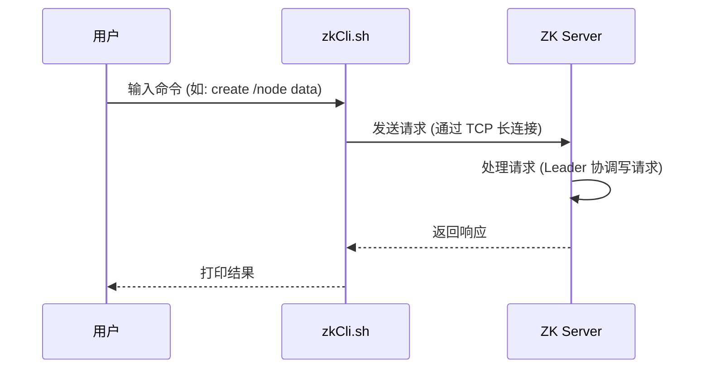

---
title: ZooKeeper命令
date: 2022-02-19 13:27:21
categories:
  - 分布式
  - 分布式协同
  - ZooKeeper
tags:
  - 分布式
  - 协同
  - zookeeper
permalink: /pages/408aef91/
---

# ZooKeeper 命令

> ZooKeeper 命令用于在 ZooKeeper 服务上执行操作。

## 简介

ZooKeeper 提供了两类命令行工具：**客户端命令**和**四字命令**。客户端命令通过 `zkCli.sh`（Linux）/ `zkCli.cmd`（Windows）连接到 ZooKeeper 服务端，对 znode 进行增删改查和监听等操作；四字命令则通过 `nc` 或 `telnet` 直接向服务端端口发送短指令，用于运维监控。

ZooKeeper 命令行工具是学习 ZooKeeper 数据模型、验证 Watcher 机制、排查生产问题的重要手段。开发人员和运维人员都需要熟练掌握。

## 特性

ZooKeeper 命令行工具具有以下特性：

| 特性 | 说明 |
| --- | --- |
| 交互式 | `zkCli.sh` 提供交互式 Shell，支持命令历史、Tab 补全 |
| 节点操作 | 支持创建、读取、修改、删除 znode |
| 监听机制 | 支持通过 `-w` 参数注册一次性 Watcher |
| ACL 管理 | 支持设置和查看节点权限 |
| 四字命令 | 提供运维监控专用命令（stat、ruok、cons 等） |
| 多版本 | 支持 `-v` 参数指定版本号实现乐观锁 |

## 原理

### 命令执行流程

`zkCli.sh` 本质上是一个 Java 客户端程序，启动后会与 ZooKeeper 服务端建立 TCP 长连接和 Session。所有命令通过该连接发送到服务端，服务端处理后返回结果。



### 命令版本演进

ZooKeeper 命令在不同版本有重要变化：

| 版本 | 变化 |
| --- | --- |
| 3.4 及以前 | 使用 `ls path [watch]`、`get path [watch]` 形式注册监听 |
| 3.5+ | 推荐使用 `-w` 参数，如 `get -w path`、`ls -w path` |
| 3.5+ | `ls2` 被废弃，推荐使用 `ls -s`（带状态信息） |
| 3.5+ | 新增 `deleteall`、`addauth` 等命令 |

## 应用场景

- **开发调试**：本地连接 ZooKeeper 验证节点数据、测试 Watcher 触发
- **运维监控**：通过四字命令（`ruok`、`stat`、`cons`）监控集群健康状态
- **数据修复**：手动删除异常节点、修正错误配置
- **权限管理**：通过 `setAcl`、`addauth` 管理节点访问权限
- **自动化脚本**：在 CI/CD 或运维脚本中通过 `zkCli.sh` 批量操作节点

## 启动服务和启动命令行

```bash
# 启动服务
bin/zkServer.sh start

# 启动命令行，不指定服务地址则默认连接到localhost:2181
bin/zkCli.sh -server hadoop001:2181
```

## 查看节点列表

### `ls` 命令

`ls` 命令用于查看某个路径下目录列表。

【语法】

```bash
ls path
```

> 说明：
>
> - **path**：代表路径。

【示例】

```
[zk: localhost:2181(CONNECTED) 0] ls /
[cluster, controller_epoch, brokers, storm, zookeeper, admin,  ...]
```

### `ls2` 命令

`ls2` 命令用于查看某个路径下目录列表，它比 ls 命令列出更多的详细信息。

【语法】

```bash
ls2 path
```

> 说明：
>
> - **path**：代表路径。

【示例】

```bash
[zk: localhost:2181(CONNECTED) 1] ls2 /
[cluster, controller_epoch, brokers, storm, zookeeper, admin, ....]
cZxid = 0x0
ctime = Thu Jan 01 08:00:00 CST 1970
mZxid = 0x0
mtime = Thu Jan 01 08:00:00 CST 1970
pZxid = 0x130
cversion = 19
dataVersion = 0
aclVersion = 0
ephemeralOwner = 0x0
dataLength = 0
numChildren = 11
```

## 节点的增删改查

### `get` 命令

`get` 命令用于获取节点数据和状态信息。

【语法】

```
get path [watch]
```

> 说明：
>
> - **path**：代表路径。
> - **[watch]**：对节点进行事件监听。

【示例】

```bash
[zk: localhost:2181(CONNECTED) 31] get /Hadoop
123456   #节点数据
cZxid = 0x14b
ctime = Fri May 24 17:03:06 CST 2019
mZxid = 0x14b
mtime = Fri May 24 17:03:06 CST 2019
pZxid = 0x14b
cversion = 0
dataVersion = 0
aclVersion = 0
ephemeralOwner = 0x0
dataLength = 6
numChildren = 0
```

> 说明：
>
> 节点各个属性如下表。其中一个重要的概念是 Zxid(ZooKeeper Transaction Id)，ZooKeeper 节点的每一次更改都具有唯一的 Zxid，如果 Zxid1 小于 Zxid2，则 Zxid1 的更改发生在 Zxid2 更改之前。
>
> | **状态属性**   | **说明**                                                                                   |
> | -------------- | ------------------------------------------------------------------------------------------ |
> | cZxid          | 数据节点创建时的事务 ID                                                                    |
> | ctime          | 数据节点创建时的时间                                                                       |
> | mZxid          | 数据节点最后一次更新时的事务 ID                                                            |
> | mtime          | 数据节点最后一次更新时的时间                                                               |
> | pZxid          | 数据节点的子节点最后一次被修改时的事务 ID                                                  |
> | cversion       | 子节点的更改次数                                                                           |
> | dataVersion    | 节点数据的更改次数                                                                         |
> | aclVersion     | 节点的 ACL 的更改次数                                                                      |
> | ephemeralOwner | 如果节点是临时节点，则表示创建该节点的会话的 SessionID；如果节点是持久节点，则该属性值为 0 |
> | dataLength     | 数据内容的长度                                                                             |
> | numChildren    | 数据节点当前的子节点个数                                                                   |

### `stat` 命令

`stat` 命令用于查看节点状态信息。它的返回值和 `get` 命令类似，但不会返回节点数据。

【语法】

```
stat path [watch]
```

- **path**：代表路径。
- **[watch]**：对节点进行事件监听。

【示例】

```bash
[zk: localhost:2181(CONNECTED) 32] stat /Hadoop
cZxid = 0x14b
ctime = Fri May 24 17:03:06 CST 2019
mZxid = 0x14b
mtime = Fri May 24 17:03:06 CST 2019
pZxid = 0x14b
cversion = 0
dataVersion = 0
aclVersion = 0
ephemeralOwner = 0x0
dataLength = 6
numChildren = 0
```

### `create` 命令

`create` 命令用于创建节点并赋值。

【语法】

```bash
create [-s] [-e] path data acl
```

> 说明：
>
> - **[-s][-e]**：-s 和 -e 都是可选的，-s 代表顺序节点，-e 代表临时节点，注意其中 -s 和 -e 可以同时使用的，并且临时节点不能再创建子节点。
>   - 默认情况下，所有 znode 都是持久的。
>   - 顺序节点保证 znode 路径将是唯一的。
>   - 临时节点会在会话过期或客户端断开连接时被自动删除。
> - **path**：指定要创建节点的路径，比如 **/hadoop**。
> - **data**：要在此节点存储的数据。
> - **acl**：访问权限相关，默认是 world，相当于全世界都能访问。

【示例】创建持久节点

```bash
[zk: localhost:2181(CONNECTED) 4] create /Hadoop 123456
Created /Hadoop
```

【示例】创建有序节点，此时创建的节点名为指定节点名 + 自增序号：

```bash
[zk: localhost:2181(CONNECTED) 23] create -s /a  "aaa"
Created /a0000000022
[zk: localhost:2181(CONNECTED) 24] create -s /b  "bbb"
Created /b0000000023
[zk: localhost:2181(CONNECTED) 25] create -s /c  "ccc"
Created /c0000000024
```

【示例】创建临时节点：

```bash
[zk: localhost:2181(CONNECTED) 26] create -e /tmp  "tmp"
Created /tmp
```

### `set` 命令

`set` 命令用于修改节点存储的数据。

【语法】

```
set path data [version]
```

> 说明：
>
> - **path**：节点路径。
> - **data**：需要存储的数据。
> - **[version]**：可选项，版本号(可用作乐观锁)。

【示例】

```bash
[zk: localhost:2181(CONNECTED) 33] set /Hadoop 345
cZxid = 0x14b
ctime = Fri May 24 17:03:06 CST 2019
mZxid = 0x14c
mtime = Fri May 24 17:13:05 CST 2019
pZxid = 0x14b
cversion = 0
dataVersion = 1  # 注意更改后此时版本号为 1，默认创建时为 0
aclVersion = 0
ephemeralOwner = 0x0
dataLength = 3
numChildren = 0
```

也可以基于版本号进行更改，此时类似于乐观锁机制，当你传入的数据版本号 (dataVersion) 和当前节点的数据版本号不符合时，zookeeper 会拒绝本次修改：

```bash
[zk: localhost:2181(CONNECTED) 34] set /Hadoop 678 0
version No is not valid : /Hadoop    #无效的版本号
```

### `delete` 命令

`delete` 命令用于删除某节点。

【语法】

```
delete path [version]
```

> 说明：
>
> - **path**：节点路径。
> - **[version]**：可选项，版本号（同 set 命令）。和更新节点数据一样，也可以传入版本号，当你传入的数据版本号 (dataVersion) 和当前节点的数据版本号不符合时，zookeeper 不会执行删除操作。

【示例】

```bash
[zk: localhost:2181(CONNECTED) 36] delete /Hadoop 0
version No is not valid : /Hadoop   #无效的版本号
[zk: localhost:2181(CONNECTED) 37] delete /Hadoop 1
[zk: localhost:2181(CONNECTED) 38]
```

`delete` 命令不能删除带有子节点的节点。如果想要删除节点及其子节点，可以使用 `deleteall path`

## 监听器

针对每个节点的操作，都会有一个监听者（watcher）。

- 当监听的某个对象（znode）发生了变化，则触发监听事件。
- zookeeper 中的监听事件是一次性的，触发后立即销毁。
- 父节点，子节点的增删改都能够触发其监听者（watcher）
- 针对不同类型的操作，触发的 watcher 事件也不同：
  - 父节点 Watcher 事件
    - 创建父节点触发：NodeCreated
    - 修改节点数据触发：NodeDatachanged
    - 删除节点数据触发：NodeDeleted
  - 子节点 Watcher 事件
    - 创建子节点触发：NodeChildrenChanged
    - 删除子节点触发：NodeChildrenChanged
    - 修改子节点不触发事件

### get path

使用 `get path -w` 注册的监听器能够在节点内容发生改变的时候，向客户端发出通知。需要注意的是 zookeeper 的触发器是一次性的 (One-time trigger)，即触发一次后就会立即失效。

```bash
[zk: localhost:2181(CONNECTED) 4] get /Hadoop -w
[zk: localhost:2181(CONNECTED) 5] set /Hadoop 45678
WATCHER::
WatchedEvent state:SyncConnected type:NodeDataChanged path:/Hadoop  #节点值改变
```

> get path [watch] 在当前版本已废弃

### stat path

使用 `stat path -w` 注册的监听器能够在节点状态发生改变的时候，向客户端发出通知。

```bash
[zk: localhost:2181(CONNECTED) 7] stat path -w
[zk: localhost:2181(CONNECTED) 8] set /Hadoop 112233
WATCHER::
WatchedEvent state:SyncConnected type:NodeDataChanged path:/Hadoop  #节点值改变
```

> stat path [watch] 在当前版本已废弃

### ls\ls2 path

使用 `ls path -w` 或 `ls2 path -w` 注册的监听器能够监听该节点下所有**子节点**的增加和删除操作。

```bash
[zk: localhost:2181(CONNECTED) 9] ls /Hadoop -w
[]
[zk: localhost:2181(CONNECTED) 10] create  /Hadoop/yarn "aaa"
WATCHER::
WatchedEvent state:SyncConnected type:NodeChildrenChanged path:/Hadoop
```

> ls path [watch] 和 ls2 path [watch] 在当前版本已废弃

## 辅助命令

使用 `help` 可以查看所有命令帮助信息。

使用 `history` 可以查看最近 10 条历史记录。

## zookeeper 四字命令

| 命令 | 功能描述                                                                                                                    |
| ---- | --------------------------------------------------------------------------------------------------------------------------- |
| conf | 打印服务配置的详细信息。                                                                                                    |
| cons | 列出连接到此服务器的所有客户端的完整连接/会话详细信息。包括接收/发送的数据包数量，会话 ID，操作延迟，上次执行的操作等信息。 |
| dump | 列出未完成的会话和临时节点。这只适用于 Leader 节点。                                                                        |
| envi | 打印服务环境的详细信息。                                                                                                    |
| ruok | 测试服务是否处于正确状态。如果正确则返回“imok”，否则不做任何相应。                                                          |
| stat | 列出服务器和连接客户端的简要详细信息。                                                                                      |
| wchs | 列出所有 watch 的简单信息。                                                                                                 |
| wchc | 按会话列出服务器 watch 的详细信息。                                                                                         |
| wchp | 按路径列出服务器 watch 的详细信息。                                                                                         |

> 更多四字命令可以参阅官方文档：[https://zookeeper.apache.org/doc/current/zookeeperAdmin.html](https://zookeeper.apache.org/doc/current/zookeeperAdmin.html)

使用前需要使用 `yum install nc` 安装 nc 命令，使用示例如下：

```bash
[root@hadoop001 bin]# echo stat | nc localhost 2181
Zookeeper version: 3.4.13-2d71af4dbe22557fda74f9a9b4309b15a7487f03,
built on 06/29/2018 04:05 GMT
Clients:
 /0:0:0:0:0:0:0:1:50584[1](queued=0,recved=371,sent=371)
 /0:0:0:0:0:0:0:1:50656[0](queued=0,recved=1,sent=0)
Latency min/avg/max: 0/0/19
Received: 372
Sent: 371
Connections: 2
Outstanding: 0
Zxid: 0x150
Mode: standalone
Node count: 167
```

## 最佳实践

### 案例一：通过命令行实现配置节点的增删改查

**场景说明**：开发人员需要手动维护微服务的注册中心节点，验证服务上下线和配置变更。

**示例操作**：

```bash
# 1. 连接 ZooKeeper 集群
bin/zkCli.sh -server hadoop001:2181,hadoop002:2181,hadoop003:2181

# 2. 查看根节点下的所有服务命名空间
[zk: hadoop001:2181(CONNECTED) 0] ls /
[services, config, zookeeper]

# 3. 查看现有的数据库配置节点
[zk: hadoop001:2181(CONNECTED) 1] ls /config
[db-url, db-username]

# 4. 读取 db-url 配置内容
[zk: hadoop001:2181(CONNECTED) 2] get /config/db-url
jdbc:mysql://localhost:3306/mydb
cZxid = 0x100000024
ctime = Mon Jan 01 10:00:00 CST 2024
mZxid = 0x100000024
mtime = Mon Jan 01 10:00:00 CST 2024
pZxid = 0x100000024
cversion = 0
dataVersion = 0
aclVersion = 0
ephemeralOwner = 0x0
dataLength = 32
numChildren = 0

# 5. 修改 db-url 配置（切换数据库地址）
[zk: hadoop001:2181(CONNECTED) 3] set /config/db-url "jdbc:mysql://192.168.1.100:3306/mydb"

# 6. 创建新的配置节点 db-password（持久节点）
[zk: hadoop001:2181(CONNECTED) 4] create /config/db-password "encrypted_password_here"
Created /config/db-password

# 7. 注册监听，当 db-url 变更时通知
[zk: hadoop001:2181(CONNECTED) 5] get -w /config/db-url
jdbc:mysql://192.168.1.100:3306/mydb
# 在另一个终端修改该节点后会收到通知
# WATCHER::
# WatchedEvent state:SyncConnected type:NodeDataChanged path:/config/db-url

# 8. 删除节点（需指定正确版本号）
[zk: hadoop001:2181(CONNECTED) 6] delete /config/db-password 0

# 9. 退出客户端
[zk: hadoop001:2181(CONNECTED) 7] quit
```

**说明**：

- 使用 `get -w` 注册监听是 3.5+ 推荐写法，等价于旧版的 `get path watch`。
- 修改和删除节点都可以带版本号实现乐观锁，避免并发覆盖。
- 连接集群时可以传入逗号分隔的多个地址，客户端会自动选择可用节点。

### 案例二：通过四字命令实现集群健康监控

**场景说明**：运维人员需要定期检查 ZooKeeper 集群的健康状态，集成到监控脚本中。

**示例脚本**：

```bash
#!/bin/bash
# zk_health_check.sh - ZooKeeper 集群健康检查脚本

ZK_NODES=("hadoop001:2181" "hadoop002:2181" "hadoop003:2181")
ALERT_EMAIL="ops@company.com"

for node in "${ZK_NODES[@]}"; do
    host=$(echo "$node" | cut -d: -f1)
    port=$(echo "$node" | cut -d: -f2)

    # 1. 检查服务是否存活（ruok 命令）
    response=$(echo "ruok" | nc -w 2 "$host" "$port")
    if [ "$response" != "imok" ]; then
        echo "[ERROR] $node 服务异常，返回: $response"
        echo "ZooKeeper 节点 $node 异常" | mail -s "ZK 告警" "$ALERT_EMAIL"
        continue
    fi

    # 2. 获取节点状态，判断角色（stat 命令）
    stat_info=$(echo "stat" | nc -w 2 "$host" "$port")
    mode=$(echo "$stat_info" | grep "Mode:")
    echo "[OK] $node 健康，角色: $mode"

    # 3. 检查连接数（cons 命令统计客户端数量）
    client_count=$(echo "cons" | nc -w 2 "$host" "$port" | grep -c "/")
    echo "      当前连接客户端数: $client_count"

    # 4. 检查 Watch 数量（wchs 命令）
    watch_info=$(echo "wchs" | nc -w 2 "$host" "$port")
    echo "      Watch 信息: $watch_info"
done

echo "健康检查完成"
```

**使用示例**：

```bash
# 赋予执行权限
chmod +x zk_health_check.sh

# 执行检查
./zk_health_check.sh
# 输出示例：
# [OK] hadoop001:2181 健康，角色: Mode: leader
#       当前连接客户端数: 15
#       Watch 信息: 18 connections watching 25 paths
# [OK] hadoop002:2181 健康，角色: Mode: follower
#       当前连接客户端数: 8
#       Watch 信息: 10 connections watching 12 paths
```

**说明**：

- `ruok` 命令返回 `imok` 表示服务正常，否则需要告警。
- `stat` 命令可查看节点角色（leader/follower/standalone），用于验证选举是否正常。
- 结合 `crontab` 定时执行可实现自动化监控。

### 案例三：批量操作节点的自动化脚本

**场景说明**：上线新服务时需要批量创建多个注册节点，手动操作效率低且易出错。

**示例脚本**：

```bash
#!/bin/bash
# zk_batch_register.sh - 批量注册服务节点

ZK_SERVER="hadoop001:2181"
SERVICE_LIST=("user-service" "order-service" "payment-service" "inventory-service")

# 通过 zkCli.sh 的命令管道批量执行
{
    for service in "${SERVICE_LIST[@]}"; do
        # 创建持久父节点
        echo "create /services/$service ''"
        # 创建临时子节点（模拟服务实例注册）
        echo "create -e /services/$service/instance-1 '192.168.1.100:8080'"
    done
    # 退出客户端
    echo "quit"
} | bin/zkCli.sh -server "$ZK_SERVER"

# 验证创建结果
echo "--- 验证注册结果 ---"
echo "ls /services" | bin/zkCli.sh -server "$ZK_SERVER" | grep -E "^\["
```

**说明**：

- 通过管道将多条命令输入 `zkCli.sh`，实现批量化操作。
- 临时节点（`-e`）会在会话结束时自动删除，适合服务实例注册。
- 生产环境推荐使用客户端 API（如 Curator）而非脚本，此方案适合一次性初始化。

## 常见问题

### 问题一：delete 命令无法删除带子节点的节点

**问题描述**：执行 `delete /parent` 时报错 `Node not empty`，无法删除节点。

**原因分析**：

`delete` 命令只能删除叶子节点。如果目标节点包含子节点，ZooKeeper 会拒绝删除以防止误操作。这是 ZooKeeper 的设计约束，保证数据操作的原子性和一致性。

**解决方案**：

使用 `deleteall` 命令递归删除节点及其所有子节点（3.5+ 版本支持）。

```bash
# 错误：使用 delete 删除带子节点的节点
[zk: localhost:2181(CONNECTED) 0] create /parent "parent"
[zk: localhost:2181(CONNECTED) 1] create /parent/child1 "child1"
[zk: localhost:2181(CONNECTED) 2] delete /parent
Node not empty: /parent   # 删除失败

# 正确：使用 deleteall 递归删除
[zk: localhost:2181(CONNECTED) 3] deleteall /parent
[zk: localhost:2181(CONNECTED) 4] ls /
# /parent 节点已不存在
```

> **注意**：`deleteall` 会递归删除所有子节点，操作不可逆，生产环境使用需谨慎。旧版本（3.4 及以前）不支持 `deleteall`，需要先递归删除所有子节点。

### 问题二：Watcher 监听只触发一次后失效

**问题描述**：使用 `get -w /node` 注册监听后，节点第一次修改收到了通知，第二次修改却没有收到通知。

**原因分析**：

ZooKeeper 原生 Watcher 是**一次性触发**的。Watcher 被触发后会立即从服务端移除，需要客户端在收到通知后重新注册才能监听后续变化。这种设计避免了数据一致性问题，但使用不便。

**解决方案**：

在收到 Watcher 通知后立即重新注册监听。

```bash
# 1. 注册监听
[zk: localhost:2181(CONNECTED) 0] get -w /config
myconfig
# 2. 第一次修改 - 收到通知
[zk: localhost:2181(CONNECTED) 1] set /config "newconfig1"
WATCHER::
WatchedEvent state:SyncConnected type:NodeDataChanged path:/config
# 3. 第二次修改 - 不会收到通知（Watcher 已失效）
[zk: localhost:2181(CONNECTED) 2] set /config "newconfig2"
# 无通知输出

# 正确做法：收到通知后重新注册
[zk: localhost:2181(CONNECTED) 3] get -w /config
newconfig2
[zk: localhost:2181(CONNECTED) 4] set /config "newconfig3"
WATCHER::
WatchedEvent state:SyncConnected type:NodeDataChanged path:/config
```

> **建议**：命令行场景下需要手动重新注册；生产环境推荐使用 Curator 的 `CuratorCache` 实现持续监听，无需手动维护。

### 问题三：四字命令无响应或被拒绝

**问题描述**：执行 `echo ruok | nc localhost 2181` 后没有输出，或返回 `ruok is not executed because it is not in the whitelist.`

**原因分析**：

从 ZooKeeper 3.5 版本开始，四字命令默认不在白名单中，需要显式配置才能使用。这是出于安全考虑的默认限制。

**解决方案**：

在 `zoo.cfg` 中配置 `4lw.commands.whitelist` 启用四字命令。

```properties
# zoo.cfg 配置文件
# 启用所有四字命令（开发/测试环境）
4lw.commands.whitelist=*

# 或者只启用特定命令（生产环境推荐）
4lw.commands.whitelist=stat,ruok,conf,isro,envi,mntr
```

```bash
# 修改配置后重启 ZooKeeper
bin/zkServer.sh restart

# 再次执行四字命令
[root@hadoop001 ~]# echo ruok | nc localhost 2181
imok

[root@hadoop001 ~]# echo mntr | nc localhost 2181
zk_version  3.7.0-e684fe235b4b8c8b5a1f6c1c0a4e8e8b5e8e8e8, built on 2021-03-30
zk_avg_latency  0
zk_max_latency  19
zk_min_latency  0
zk_packets_received 372
zk_packets_sent 371
zk_num_alive_connections 2
zk_outstanding_requests 0
zk_server_state follower
```

> **说明**：`mntr` 命令输出更详细的监控指标（延迟、包数、连接数等），适合集成到 Prometheus 等监控系统。生产环境建议只开放必要的命令，避免 `dump`、`envi` 等敏感命令被滥用。

## 参考资料

- [Zookeeper 客户端基础命令使用](https://www.runoob.com/w3cnote/zookeeper-bs-command.html)
