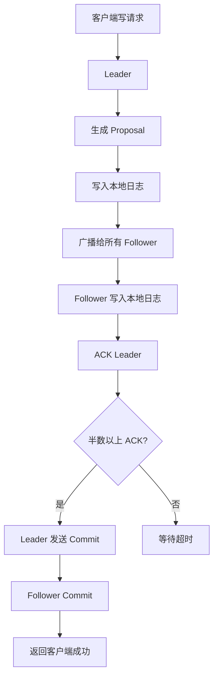
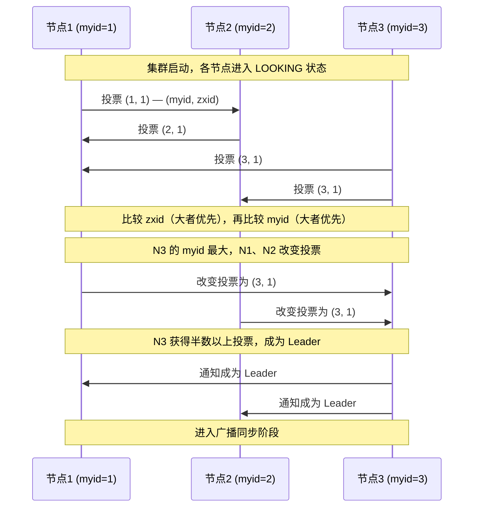
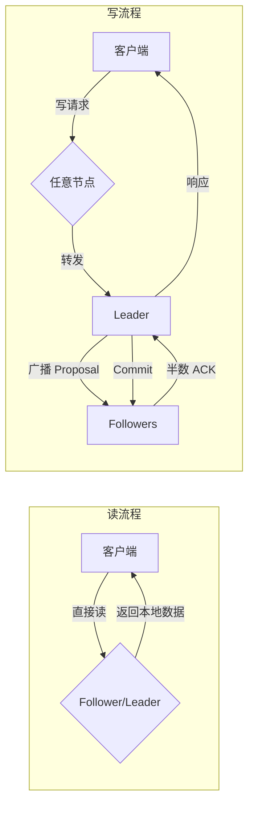

---
title: ZooKeeper运维
date: 2020-06-02 22:28:38
categories:
  - 分布式
  - 分布式协同
  - ZooKeeper
tags:
  - 分布式
  - 协同
  - zookeeper
permalink: /pages/184f9663/
---

# ZooKeeper 运维指南

## 简介

`ZooKeeper` 是一个开源的分布式协同服务，由 Apache 软件基金会维护。它最初由 Yahoo 开发，用于解决分布式应用中常见的协同问题。ZooKeeper 的设计目标是封装好分布式系统中复杂且易错的关键服务，将简单易用的接口和性能高效、功能稳定的系统提供给用户。

ZooKeeper 本质上是一个**分布式的小文件存储系统**，其数据模型类似 Unix 文件系统的树形目录结构。它通过 ZAB（ZooKeeper Atomic Broadcast）协议保证分布式数据的一致性，提供**顺序一致性、原子性、单一视图、可靠性、实时性**等保证。

在分布式系统中，ZooKeeper 解决了以下核心问题：

- **统一命名服务**：为分布式应用中的资源提供统一的命名规范。
- **配置管理**：集中存储和管理集群配置，配置变更时通知所有节点。
- **集群管理**：监控集群节点的上下线，实现主备切换。
- **分布式锁**：提供简单可靠的分布式互斥机制。
- **队列管理**：实现简单的 FIFO 队列。

本文从运维视角出发，介绍 ZooKeeper 的部署、配置、监控、故障处理等实践内容。

## 特性

ZooKeeper 的核心特性如下：

| 特性            | 说明                                                                       |
| --------------- | -------------------------------------------------------------------------- |
| 顺序一致性      | 客户端的更新请求按发送顺序应用                                             |
| 原子性          | 更新操作要么全部成功，要么全部失败，不存在部分成功                         |
| 单一视图        | 客户端无论连接到哪个 Server，看到的数据模型都是一致的                      |
| 可靠性          | 一旦更新操作成功应用，该状态将持久化，直到被下一次更新覆盖                 |
| 实时性          | 保证客户端在一定时间间隔内获得服务器的最新状态                             |
| 高性能          | 适合以读为主的数据存储场景，适合存储小数据量（建议单节点数据 < 1MB）       |
| 高可用          | 集群模式下，只要半数以上节点存活，服务就能正常对外提供                     |
| Watch 机制      | 客户端可以监听节点的变化，节点变化时触发事件通知                           |
| 临时节点        | 客户端会话失效时，对应的临时节点自动删除，适合实现分布式锁和心跳检测       |
| 顺序节点        | 创建节点时自动追加递增序号，适合实现分布式队列和选举                       |

## 原理

### 数据模型

ZooKeeper 的数据模型类似 Unix 文件系统，整体是一个**树形层次结构**。树的每个节点被称为 `ZNode`，每个 ZNode 可以存储数据，也可以拥有子节点。

```
/
├── app1
│   ├── config        (存储应用1的配置)
│   ├── leader        (标识应用1的 Leader)
│   └── members
│       ├── node1     (成员节点1)
│       └── node2     (成员节点2)
└── app2
    └── ...
```

ZNode 分为以下几种类型：

| 类型         | 说明                                                   |
| ------------ | ------------------------------------------------------ |
| 持久节点     | 客户端断开后节点依然存在                               |
| 持久顺序节点 | 在持久节点基础上，自动追加递增的序号后缀               |
| 临时节点     | 客户端会话失效时节点自动删除，不能有子节点             |
| 临时顺序节点 | 在临时节点基础上，自动追加递增的序号后缀               |

### ZAB 协议

ZooKeeper 通过 **ZAB（ZooKeeper Atomic Broadcast）协议** 保证集群各节点数据的一致性。ZAB 协议包含两个核心阶段：

1. **领导者选举（Leader Election）**：集群启动或 Leader 崩溃时，从 Followers 中选举出新的 Leader。
2. **原子广播（Atomic Broadcast）**：Leader 将所有写请求以事务 Proposal 形式广播给 Followers，半数以上 Followers 确认后提交。



### 领导者选举流程



### Watch 机制

客户端可以在读取 ZNode 时注册 Watch，当 ZNode 的数据或子节点发生变化时，ZooKeeper 会向客户端发送通知。Watch 的特点：

- **一次性触发**：事件触发后 Watch 失效，客户端需要重新注册才能继续监听。
- **客户端顺序接收**：客户端先收到事件通知，才能看到数据变化。
- **轻量级**：Watch 通知只告知事件类型和路径，不包含变更后的数据。

### 读写流程



## 单点服务部署

在安装 ZooKeeper 之前，请确保你的系统是在以下任一操作系统上运行：

- **任意 Linux OS** - 支持开发和部署。适合演示应用程序。
- **Windows OS** - 仅支持开发。
- **Mac OS** - 仅支持开发。

安装步骤如下：

### 下载解压

进入官方下载地址：[http://zookeeper.apache.org/releases.html#download](http://zookeeper.apache.org/releases.html#download) ，选择合适版本。

解压到本地：

```bash
tar -zxf zookeeper-3.4.6.tar.gz
cd zookeeper-3.4.6
```

### 环境变量

执行 `vim /etc/profile`，添加环境变量：

```bash
export ZOOKEEPER_HOME=/usr/app/zookeeper-3.4.14
export PATH=$ZOOKEEPER_HOME/bin:$PATH
```

再执行 `source /etc/profile` ， 使得配置的环境变量生效。

### 修改配置

你必须创建 `conf/zoo.cfg` 文件，否则启动时会提示你没有此文件。

初次尝试，不妨直接使用 Kafka 提供的模板配置文件 `conf/zoo_sample.cfg`：

```bash
cp conf/zoo_sample.cfg conf/zoo.cfg
```

修改后完整配置如下：

```properties
# The number of milliseconds of each tick
tickTime=2000
# The number of ticks that the initial
# synchronization phase can take
initLimit=10
# The number of ticks that can pass between
# sending a request and getting an acknowledgement
syncLimit=5
# the directory where the snapshot is stored.
# do not use /tmp for storage, /tmp here is just
# example sakes.
dataDir=/usr/local/zookeeper/data
dataLogDir=/usr/local/zookeeper/log
# the port at which the clients will connect
clientPort=2181
# the maximum number of client connections.
# increase this if you need to handle more clients
#maxClientCnxns=60
#
# Be sure to read the maintenance section of the
# administrator guide before turning on autopurge.
#
# http://zookeeper.apache.org/doc/current/zookeeperAdmin.html#sc_maintenance
#
# The number of snapshots to retain in dataDir
#autopurge.snapRetainCount=3
# Purge task interval in hours
# Set to "0" to disable auto purge feature
#autopurge.purgeInterval=1
```

配置参数说明：

- **tickTime**：用于计算的基础时间单元。比如 session 超时：N\*tickTime；
- **initLimit**：用于集群，允许从节点连接并同步到 master 节点的初始化连接时间，以 tickTime 的倍数来表示；
- **syncLimit**：用于集群， master 主节点与从节点之间发送消息，请求和应答时间长度（心跳机制）；
- **dataDir**：数据存储位置；
- **dataLogDir**：日志目录；
- **clientPort**：用于客户端连接的端口，默认 2181

### 启动服务

执行以下命令

```bash
bin/zkServer.sh start
```

执行此命令后，你将收到以下响应

```bash
JMX enabled by default
Using config: /Users/../zookeeper-3.4.6/bin/../conf/zoo.cfg
Starting zookeeper ... STARTED
```

### 停止服务

可以使用以下命令停止 zookeeper 服务器。

```bash
bin/zkServer.sh stop
```

## 集群服务部署

分布式系统节点数一般都要求是奇数，且最少为 3 个节点，Zookeeper 也不例外。

这里，规划一个含 3 个节点的最小 ZooKeeper 集群，主机名分别为 hadoop001，hadoop002，hadoop003 。

### 修改配置

修改配置文件 `zoo.cfg`，内容如下：

```properties
tickTime=2000
initLimit=10
syncLimit=5
dataDir=/usr/local/zookeeper-cluster/data/
dataLogDir=/usr/local/zookeeper-cluster/log/
clientPort=2181

# server.1 这个1是服务器的标识，可以是任意有效数字，标识这是第几个服务器节点，这个标识要写到dataDir目录下面myid文件里
# 指名集群间通讯端口和选举端口
server.1=hadoop001:2287:3387
server.2=hadoop002:2287:3387
server.3=hadoop003:2287:3387
```

### 标识节点

分别在三台主机的 `dataDir` 目录下新建 `myid` 文件,并写入对应的节点标识。Zookeeper 集群通过 `myid` 文件识别集群节点，并通过上文配置的节点通信端口和选举端口来进行节点通信，选举出 Leader 节点。

创建存储目录：

```bash
# 三台主机均执行该命令
mkdir -vp  /usr/local/zookeeper-cluster/data/
```

创建并写入节点标识到 `myid` 文件：

```bash
# hadoop001主机
echo "1" > /usr/local/zookeeper-cluster/data/myid
# hadoop002主机
echo "2" > /usr/local/zookeeper-cluster/data/myid
# hadoop003主机
echo "3" > /usr/local/zookeeper-cluster/data/myid
```

### 启动集群

分别在三台主机上，执行如下命令启动服务：

```bash
/usr/app/zookeeper-cluster/zookeeper/bin/zkServer.sh start
```

### 集群验证

启动后使用 `zkServer.sh status` 查看集群各个节点状态。

## 应用场景

ZooKeeper 在分布式系统中有丰富的应用场景，以下列举典型场景：

### 数据发布/订阅

将配置信息存储在 ZooKeeper 的 ZNode 中，客户端通过 Watch 机制监听配置节点。当配置变更时，ZooKeeper 通知所有订阅的客户端，实现配置的动态更新。

### 命名服务

在分布式系统中，为资源（如服务、数据库实例）分配全局唯一名称。利用 ZooKeeper 的顺序节点，可以方便地生成全局唯一的 ID。

### 集群管理

每个集群节点在 ZooKeeper 上创建临时节点，节点通过定期发送心跳维持会话。当节点宕机时，会话失效，临时节点自动删除，其他节点通过 Watch 得到通知，实现集群成员的动态感知。

### Master 选举

多个节点同时尝试在 ZooKeeper 创建同一个临时节点，只有一个节点能创建成功，该节点成为 Master。其他节点监听该临时节点，当 Master 宕机时，临时节点消失，触发选举，其他节点再次竞争。

### 分布式锁

基于 ZooKeeper 的临时顺序节点实现公平锁。所有客户端创建顺序节点，序号最小者获得锁，其余客户端监听前一个节点，前一个节点删除时获得锁。

### 分布式队列

基于顺序节点实现 FIFO 队列。入队创建顺序节点，出队删除序号最小的节点。

## 最佳实践

### 案例一：基于 ZooKeeper 实现分布式锁

**场景**：多个服务实例需要互斥地访问共享资源（如定时任务调度），避免任务重复执行。

**实现**：利用临时顺序节点实现公平锁。

`pom.xml` 依赖：

```xml
<dependencies>
    <dependency>
        <groupId>org.apache.curator</groupId>
        <artifactId>curator-recipes</artifactId>
        <version>5.5.0</version>
    </dependency>
    <dependency>
        <groupId>org.apache.curator</groupId>
        <artifactId>curator-framework</artifactId>
        <version>5.5.0</version>
    </dependency>
</dependencies>
```

基于 Curator 的分布式锁实现：

```java
import org.apache.curator.framework.CuratorFramework;
import org.apache.curator.framework.CuratorFrameworkFactory;
import org.apache.curator.framework.recipes.locks.InterProcessMutex;
import org.apache.curator.retry.ExponentialBackoffRetry;

import java.util.concurrent.TimeUnit;

public class ZooKeeperDistributedLockDemo {

    private static final String ZK_ADDRESS = "127.0.0.1:2181";
    private static final String LOCK_PATH = "/locks/order-task-lock";

    public static void main(String[] args) throws Exception {
        // 创建 Curator 客户端
        CuratorFramework client = CuratorFrameworkFactory.builder()
            .connectString(ZK_ADDRESS)
            .sessionTimeoutMs(60000)
            .connectionTimeoutMs(15000)
            .retryPolicy(new ExponentialBackoffRetry(1000, 3))
            .build();
        client.start();

        // 创建可重入的分布式锁
        InterProcessMutex lock = new InterProcessMutex(client, LOCK_PATH);

        try {
            // 尝试获取锁，最多等待 5 秒
            if (lock.acquire(5, TimeUnit.SECONDS)) {
                try {
                    System.out.println("成功获取分布式锁，开始执行业务逻辑");
                    // 模拟业务处理
                    TimeUnit.SECONDS.sleep(3);
                    System.out.println("业务逻辑执行完毕");
                } finally {
                    lock.release();
                    System.out.println("已释放分布式锁");
                }
            } else {
                System.out.println("获取分布式锁超时，放弃执行");
            }
        } finally {
            client.close();
        }
    }
}
```

**说明**：`InterProcessMutex` 是 Curator 提供的可重入分布式锁实现，底层基于临时顺序节点 + Watch 机制。锁释放时会自动删除节点，即使客户端会话失效（宕机），临时节点也会被 ZooKeeper 自动清除，避免死锁。

### 案例二：基于 ZooKeeper 实现动态配置管理

**场景**：微服务集群中，数据库连接信息等配置需要动态调整，不重启服务即可生效。

**实现**：将配置存储在 ZooKeeper，客户端监听节点变化。

```java
import org.apache.curator.framework.CuratorFramework;
import org.apache.curator.framework.CuratorFrameworkFactory;
import org.apache.curator.framework.recipes.cache.NodeCache;
import org.apache.curator.framework.recipes.cache.NodeCacheListener;
import org.apache.curator.retry.ExponentialBackoffRetry;

import java.nio.charset.StandardCharsets;

public class ZooKeeperConfigManagerDemo {

    private static final String ZK_ADDRESS = "127.0.0.1:2181";
    private static final String CONFIG_PATH = "/config/db-config";

    public static void main(String[] args) throws Exception {
        CuratorFramework client = CuratorFrameworkFactory.builder()
            .connectString(ZK_ADDRESS)
            .sessionTimeoutMs(60000)
            .connectionTimeoutMs(15000)
            .retryPolicy(new ExponentialBackoffRetry(1000, 3))
            .build();
        client.start();

        // 初始化配置节点（如果不存在）
        if (client.checkExists().forPath(CONFIG_PATH) == null) {
            client.create().creatingParentsIfNeeded().forPath(CONFIG_PATH,
                "{\"url\":\"jdbc:mysql://localhost:3306/db\",\"maxConn\":50}"
                    .getBytes(StandardCharsets.UTF_8));
        }

        // 使用 NodeCache 监听节点变化
        NodeCache nodeCache = new NodeCache(client, CONFIG_PATH);
        nodeCache.getListenable().addListener(new NodeCacheListener() {
            @Override
            public void nodeChanged() throws Exception {
                if (nodeCache.getCurrentData() != null) {
                    String config = new String(nodeCache.getCurrentData().getData(),
                        StandardCharsets.UTF_8);
                    System.out.println("配置已更新：" + config);
                    // 在此处触发应用内部的配置刷新逻辑
                } else {
                    System.out.println("配置节点被删除");
                }
            }
        });
        nodeCache.start(true);

        // 模拟配置更新
        TimeUnit.SECONDS.sleep(5);
        client.setData().forPath(CONFIG_PATH,
            "{\"url\":\"jdbc:mysql://localhost:3306/db\",\"maxConn\":100}"
                .getBytes(StandardCharsets.UTF_8));

        // 保持程序运行
        TimeUnit.SECONDS.sleep(10);
        client.close();
    }
}
```

**说明**：`NodeCache` 用于监听单个节点的数据变化。当配置节点被修改时，ZooKeeper 推送事件通知，客户端读取最新配置并触发刷新逻辑，实现配置的动态更新。

### 案例三：基于 ZooKeeper 实现 Master 选举

**场景**：集群中多个节点部署了相同的定时任务，但只允许一个节点执行，当执行节点宕机时自动切换到其他节点。

**实现**：利用临时节点实现 Master 选举。

```java
import org.apache.curator.framework.CuratorFramework;
import org.apache.curator.framework.CuratorFrameworkFactory;
import org.apache.curator.framework.recipes.leader.LeaderLatch;
import org.apache.curator.framework.recipes.leader.LeaderLatchListener;
import org.apache.curator.retry.ExponentialBackoffRetry;

import java.util.concurrent.TimeUnit;

public class ZooKeeperLeaderElectionDemo {

    private static final String ZK_ADDRESS = "127.0.0.1:2181";
    private static final String ELECTION_PATH = "/election/master";

    public static void main(String[] args) throws Exception {
        CuratorFramework client = CuratorFrameworkFactory.builder()
            .connectString(ZK_ADDRESS)
            .sessionTimeoutMs(60000)
            .connectionTimeoutMs(15000)
            .retryPolicy(new ExponentialBackoffRetry(1000, 3))
            .build();
        client.start();

        // 创建 LeaderLatch 参与选举
        LeaderLatch leaderLatch = new LeaderLatch(client, ELECTION_PATH, "node-1");
        leaderLatch.addListener(new LeaderLatchListener() {
            @Override
            public void isLeader() {
                System.out.println("被选举为 Leader，开始执行任务");
                startScheduledTask();
            }

            @Override
            public void notLeader() {
                System.out.println("不再是 Leader，停止执行任务");
                stopScheduledTask();
            }
        });
        leaderLatch.start();

        // 保持程序运行
        TimeUnit.MINUTES.sleep(5);

        leaderLatch.close();
        client.close();
    }

    private static void startScheduledTask() {
        // 启动定时任务
        System.out.println("定时任务已启动");
    }

    private static void stopScheduledTask() {
        // 停止定时任务
        System.out.println("定时任务已停止");
    }
}
```

**说明**：`LeaderLatch` 是 Curator 提供的选举实现，基于临时节点。所有参与选举的节点尝试创建同一临时节点，只有一个成功成为 Leader。当 Leader 宕机时，临时节点消失，触发新一轮选举。通过监听 `LeaderLatchListener` 可以感知角色的切换。

## 常见问题

### 问题一：ZooKeeper 集群脑裂

**问题描述**：在网络分区情况下，ZooKeeper 集群出现两个 Leader，导致数据不一致。

**原因分析**：ZooKeeper 的 ZAB 协议通过 **过半机制**（Quorum）防止脑裂。只有获得半数以上节点投票的节点才能成为 Leader。当网络分区将集群分成两半时，只有包含多数节点的一方能选出 Leader，少数节点方无法满足过半条件，保持 Looking 状态不对外服务。因此，理论上 ZooKeeper 不会出现真正的脑裂。

但如果集群节点数为偶数（如 4 个），网络分区可能将集群分成 2+2 的两部分，两方都无法获得过半数（需要 3 票），导致整个集群不可用。这就是为什么 ZooKeeper 集群**推荐奇数节点**的原因。

**解决方案**：

1. **使用奇数节点部署**：3 个或 5 个节点是常见选择。3 节点容忍 1 个故障，5 节点容忍 2 个故障。
2. **合理设置 sessionTimeout**：`sessionTimeout` 过小可能导致网络抖动时频繁选举，过大可能导致 Leader 宕机后切换缓慢。建议根据网络环境设置为 5-30 秒。

```properties
# zoo.cfg 中设置
tickTime=2000
initLimit=10
syncLimit=5
# sessionTimeout = 2 * tickTime * syncLimit = 20s（默认）
```

3. **部署跨机房集群时注意**：如果集群跨机房部署，确保任意一个机房故障时，剩余机房仍有过半数节点。例如 3 节点跨 2 机房部署为 2+1，主机房挂掉时剩余 1 节点无法满足过半。

### 问题二：ZooKeeper 日志和数据文件堆积导致磁盘满

**问题描述**：ZooKeeper 长期运行后，`dataDir` 目录下的 snapshot 文件和 `dataLogDir` 目录下的 transaction log 文件持续增长，最终占满磁盘。

**原因分析**：ZooKeeper 默认不会自动清理历史快照和事务日志文件。每次 snapshot 触发后会生成新文件，但旧文件不会被删除。

**解决方案**：启用 **自动清理（autopurge）** 机制。

在 `zoo.cfg` 中配置：

```properties
# 保留的快照数量（保留最近 3 个）
autopurge.snapRetainCount=3
# 自动清理任务执行间隔（小时），设为 0 表示禁用
autopurge.purgeInterval=1
```

说明：

- `autopurge.snapRetainCount`：保留最近的 N 个快照及其对应的事务日志，其余删除。
- `autopurge.purgeInterval`：清理任务的执行间隔，单位为小时。设为 `1` 表示每小时清理一次。

如果未启用自动清理，也可以手动执行清理脚本：

```bash
# 使用 ZooKeeper 自带的 PurgeTxnLog 工具手动清理
java -cp zookeeper.jar:lib/* org.apache.zookeeper.server.PurgeTxnLog /usr/local/zookeeper/data /usr/local/zookeeper/log -n 3
```

参数说明：前两个路径分别为 snapshot 目录和 log 目录，`-n 3` 表示保留最近 3 个快照。

### 问题三：ZooKeeper 客户端频繁断线重连

**问题描述**：应用日志中频繁出现 `Session expired` 或 `Connection loss` 异常，客户端不断重连，导致服务不稳定。

**原因分析**：

1. **sessionTimeout 设置过小**：网络抖动或 GC 停顿导致心跳超时，ZooKeeper 误判客户端下线，销毁会话和临时节点。
2. **网络不稳定**：客户端与 ZooKeeper 之间的网络存在丢包或延迟。
3. **JVM 长时间 GC**：应用 Full GC 导致 STW，无法及时发送心跳。
4. **ZooKeeper 服务器负载过高**：无法及时处理心跳请求。

**解决方案**：

1. **适当增大 sessionTimeout**：根据网络环境和应用 GC 情况调整。

```java
// Curator 客户端设置 sessionTimeout 为 30 秒
CuratorFramework client = CuratorFrameworkFactory.builder()
    .connectString("127.0.0.1:2181")
    .sessionTimeoutMs(30000)      // 会话超时时间
    .connectionTimeoutMs(15000)   // 连接超时时间
    .retryPolicy(new ExponentialBackoffRetry(1000, 3, 30000))
    .build();
```

2. **优化 JVM GC**：避免长时间 Full GC。

```bash
# JVM 参数建议，使用 G1 收集器，避免长停顿
JAVA_OPTS="-Xms2g -Xmx2g -XX:+UseG1GC -XX:MaxGCPauseMillis=200 -XX:+ParallelRefProcEnabled"
```

3. **使用合理的重试策略**：Curator 提供了多种重试策略，推荐使用指数退避重试。

```java
// 指数退避重试：初始休眠 1 秒，最多重试 3 次，最大休眠 30 秒
RetryPolicy retryPolicy = new ExponentialBackoffRetry(1000, 3, 30000);
```

4. **监控 ZooKeeper 服务器指标**：通过 JMX 或四字命令监控 ZooKeeper 的负载情况。

```bash
# 使用 stat 命令查看 ZooKeeper 状态
echo stat | nc 127.0.0.1 2181

# 使用 mntr 命令监控指标
echo mntr | nc 127.0.0.1 2181
```

`mntr` 输出示例：

```
zk_version	3.4.14-4c25d480e66aadd371de8bd2fd8da255ac204bc6, built on 03/06/2019 16:18 GMT
zk_avg_latency	1
zk_max_latency	35
zk_min_latency	0
zk_packets_received	12345
zk_packets_sent	12346
zk_num_alive_connections	5
zk_outstanding_requests	0
zk_server_state	follower
zk_znode_count	100
zk_watch_count	20
zk_ephemerals_count	5
zk_approximate_data_size	2048
zk_open_file_descriptor_count	32
zk_max_file_descriptor_count	65535
```

关注 `zk_avg_latency`（平均延迟）、`zk_max_latency`（最大延迟）、`zk_outstanding_requests`（堆积请求数）等指标，持续异常时需要扩容或排查。

## 参考资料

- [Zookeeper 安装](https://www.w3cschool.cn/zookeeper/zookeeper_installation.html)
- [Zookeeper 单机环境和集群环境搭建](https://github.com/heibaiying/BigData-Notes/blob/master/notes/installation/Zookeeper%E5%8D%95%E6%9C%BA%E7%8E%AF%E5%A2%83%E5%92%8C%E9%9B%86%E7%BE%A4%E7%8E%AF%E5%A2%83%E6%90%AD%E5%BB%BA.md)
- [Zookeeper 客户端基础命令使用](https://www.runoob.com/w3cnote/zookeeper-bs-command.html)
- [ZooKeeper 官方文档](https://zookeeper.apache.org/doc/current/)
- [Apache Curator 官方文档](https://curator.apache.org/)
- [从 Paxos 到 ZooKeeper 分布式一致性原理与实践](https://book.douban.com/subject/26292004/)
- [ZooKeeper 集群管理指南](https://zookeeper.apache.org/doc/current/zookeeperAdmin.html)
