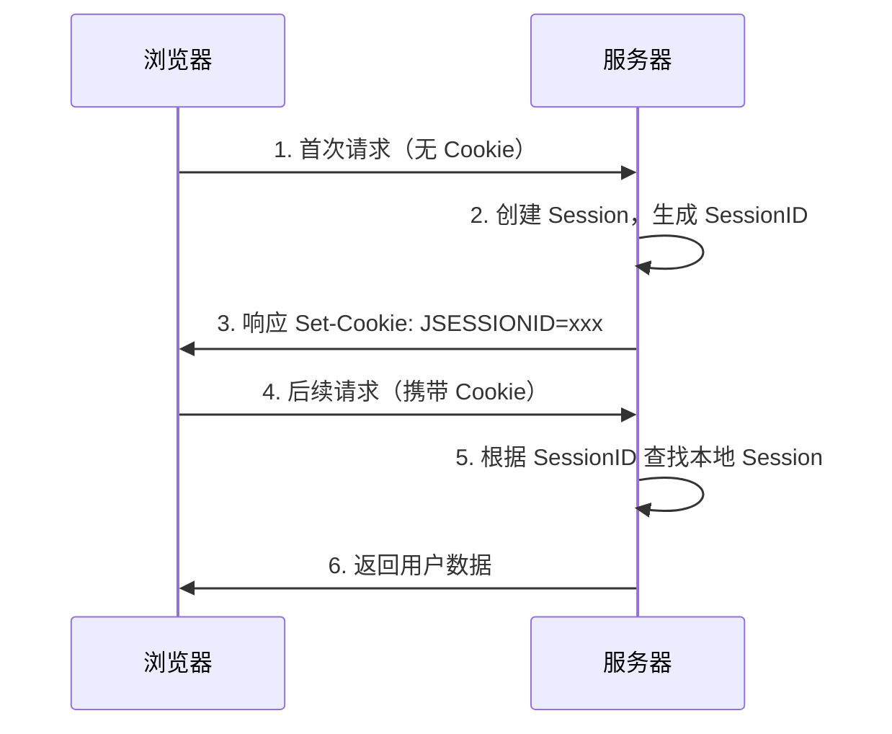
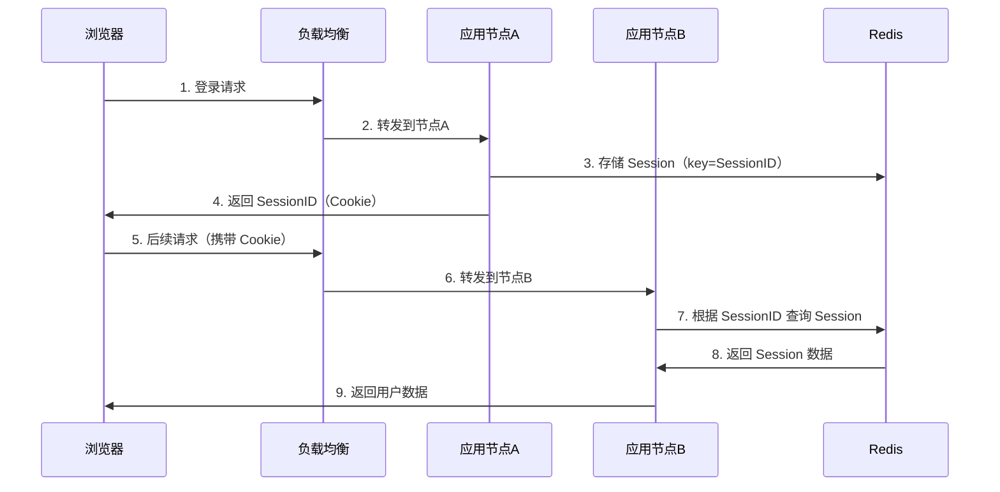

---
title: 分布式会话基本原理
date: 2019-06-04 23:42:00
categories:
  - 分布式
  - 分布式协同
tags:
  - 分布式
  - 协同
  - Cookie
  - Session
permalink: /pages/cd1269a0/
---

# 分布式会话基本原理

> 由于 Http 是一种无状态的协议，服务器单单从网络连接上无从知道客户身份。
>
> 会话跟踪是 Web 程序中常用的技术，用来跟踪用户的整个会话。常用会话跟踪技术是 Cookie 与 Session。

## 简介

HTTP 是一种无状态协议，服务器单从网络连接上无法识别用户身份。在单体应用中，服务器通过 `Session` 机制在服务端维护用户会话状态，并通过 `SessionID` 与客户端建立关联。然而，在分布式场景下，一个用户的请求可能被负载均衡器分发到不同的服务器节点，若 `Session` 仅存储在某一个节点上，就会出现用户登录状态丢失、需要反复登录等问题。

分布式会话（`Distributed Session`）就是为了解决这个问题而诞生的。它的核心思想是：**将会话数据从单个应用服务器中抽离出来，集中存储到一个共享的存储介质中**（如 `Redis`、`Memcached`、`数据库` 等），使得所有应用节点都能访问到同一份会话数据，从而实现用户在集群环境下无缝登录状态保持。

常见的分布式会话实现方案包括：粘性 `Session`、`Session` 复制、基于缓存的 `Session` 共享、以及基于 `JWT Token` 的无状态会话等。其中，**基于缓存的 `Session` 共享**（如 `Spring Session + Redis`）是目前业界最推荐的主流方案。

## 特性

分布式会话相比传统单机会话，具备以下核心特性：

| 特性 | 说明 |
| --- | --- |
| **共享性** | 会话数据集中存储，所有应用节点可共享访问，避免单点 `Session` 不一致问题 |
| **高可用性** | 依托外部存储（如 `Redis` 集群）的容错能力，即使部分应用节点宕机，会话仍不丢失 |
| **可扩展性** | 应用节点可水平扩展，会话存储也可独立扩容，二者解耦 |
| **透明性** | 对上层应用透明，业务代码仍可使用原生 `HttpSession` API，无需感知分布式细节 |
| **高性能** | 基于内存型存储（如 `Redis`）的读写性能远高于关系型数据库 |
| **时效性** | 支持会话过期机制，可灵活配置 `TTL`，自动清理失效会话 |

## 原理

分布式会话的核心原理是：**将会话的存储层与应用层解耦**。在传统单机架构中，`Session` 存储在应用服务器的内存中；在分布式架构中，`Session` 被外部化到一个共享存储中。

### 传统单机会话工作流程



### 分布式会话工作流程



### Spring Session 实现原理

`Spring Session` 通过 `Filter` 拦截机制替换了原生的 `HttpSession`，其核心组件包括：

- `SessionRepositoryFilter`：拦截所有请求，将原生的 `HttpSession` 替换为 `SessionRepository` 支持的实现。
- `SessionRepository`：会话存储抽象接口，有 `Redis`、`JDBC`、`Hazelcast` 等多种实现。
- `@EnableRedisHttpSession`：开启基于 `Redis` 的会话存储，自动注册相关 `Bean`。

## Cookie

由于 Http 是一种无状态的协议，服务器单从网络连接上无从知道客户身份。

由于 Http 是一种无状态的协议，服务器单从网络连接上无从知道客户身份。

所以服务器与浏览器为了进行会话跟踪（知道是谁在访问我），就必须主动的去维护一个状态，这个状态用于告知服务端前后两个请求是否来自同一浏览器。而这个状态需要通过 cookie 或者 session 去实现。

### 什么是 Cookie

Cookie 实际上是存储在用户浏览器上的文本信息，并保留了各种跟踪的信息。

一个简单的 cookie 设置如下：

```http
Set-Cookie: <cookie-name>=<cookie-value>
```

```http
HTTP/2.0 200 OK
Content-Type: text/html
Set-Cookie: yummy_cookie=choco
Set-Cookie: tasty_cookie=strawberry

[page content]
```

### Cookie 的工作步骤

1. 浏览器请求服务器，如果服务器需要记录该用户的状态，就是用 response 向浏览器颁发一个 Cookie。
2. 浏览器会把 Cookie 保存下来。
3. 当浏览器再请求该网站时，浏览器把该请求的网址连同 Cookie 一同提交给服务器。服务器检查该 Cookie，以此来辨认用户状态。

### Cookie 的作用

Cookie 主要用于以下三个方面：

- 会话状态管理（如用户登录状态、购物车、游戏分数或其它需要记录的信息）
- 个性化设置（如用户自定义设置、主题等）
- 浏览器行为跟踪（如跟踪分析用户行为等）

**_注：Cookie 功能需要浏览器的支持，如果浏览器不支持 Cookie 或者 Cookie 禁用了，Cookie 功能就会失效。_**

### Cookie 的重要属性

| 属性           | 说明                                                                                                                                                                                                                                   |
| -------------- | -------------------------------------------------------------------------------------------------------------------------------------------------------------------------------------------------------------------------------------- |
| **name=value** | 键值对，设置 Cookie 的名称及相对应的值，都必须是**字符串类型** - 如果值为 Unicode 字符，需要为字符编码。 - 如果值为二进制数据，则需要使用 BASE64 编码。                                                                                |
| **domain**     | 指定 cookie 所属域名，默认是当前域名                                                                                                                                                                                                   |
| **path**       | **指定 cookie 在哪个路径（路由）下生效，默认是 '/'**。 如果设置为 `/abc`，则只有 `/abc` 下的路由可以访问到该 cookie，如：`/abc/read`。                                                                                                 |
| **maxAge**     | cookie 失效的时间，单位秒。如果为整数，则该 cookie 在 maxAge 秒后失效。如果为负数，该 cookie 为临时 cookie ，关闭浏览器即失效，浏览器也不会以任何形式保存该 cookie 。如果为 0，表示删除该 cookie 。默认为 -1。 - **比 expires 好用**。 |
| **expires**    | 过期时间，在设置的某个时间点后该 cookie 就会失效。 一般浏览器的 cookie 都是默认储存的，当关闭浏览器结束这个会话的时候，这个 cookie 也就会被删除                                                                                        |
| **secure**     | 该 cookie 是否仅被使用安全协议传输。安全协议有 HTTPS，SSL 等，在网络上传输数据之前先将数据加密。默认为 false。 当 secure 值为 true 时，cookie 在 HTTP 中是无效，在 HTTPS 中才有效。                                                    |
| **httpOnly**   | **如果给某个 cookie 设置了 httpOnly 属性，则无法通过 JS 脚本 读取到该 cookie 的信息，但还是能通过 Application 中手动修改 cookie，所以只是在一定程度上可以防止 XSS 攻击，不是绝对的安全**                                               |

## Session

### 什么是 Session

Session 代表着服务器和客户端一次会话的过程。Session 对象存储特定用户会话所需的属性及配置信息。这样，当用户在应用程序的 Web 页之间跳转时，存储在 Session 对象中的变量将不会丢失，而是在整个用户会话中一直存在下去。当客户端关闭会话，或者 Session 超时失效时会话结束。

- **session 是另一种记录服务器和客户端会话状态的机制**
- **session 是基于 cookie 实现的，session 存储在服务器端，sessionId 会被存储到客户端的 cookie 中**


### Session 的工作步骤

1. 用户第一次请求服务器的时候，服务器根据用户提交的相关信息，创建对应的 Session。
2. 请求返回时将此 Session 的唯一标识信息 SessionID 返回给浏览器。
3. 浏览器接收到服务器返回的 SessionID 信息后，会将此信息存入到 Cookie 中，同时 Cookie 记录此 SessionID 属于哪个域名。
4. 当用户第二次访问服务器的时候，请求会自动判断此域名下是否存在 Cookie 信息，如果存在自动将 Cookie 信息也发送给服务端，服务端会从 Cookie 中获取 SessionID，再根据 SessionID 查找对应的 Session 信息，如果没有找到说明用户没有登录或者登录失效，如果找到 Session 证明用户已经登录可执行后面操作。

根据以上流程可知，**SessionID 是连接 Cookie 和 Session 的一道桥梁**，大部分系统也是根据此原理来验证用户登录状态。

## Cookie 和 Session 的区别

Cookie 和 Session 的主要区别可以参考以下表格：

|              | Cookie                                                        | Session                                                                                            |
| ------------ | ------------------------------------------------------------- | -------------------------------------------------------------------------------------------------- |
| **作用范围** | 保存在客户端（浏览器）                                        | 保存在服务器端                                                                                     |
| **隐私策略** | 存储在客户端，比较容易遭到非法获取                            | 存储在服务端，安全性相对 Cookie 要好一些                                                           |
| **存储方式** | 只能保存 ASCII                                                | 可以保存任意数据类型。<br/>一般情况下我们可以在 Session 中保持一些常用变量信息，比如说 UserId 等。 |
| **存储大小** | 不能超过 4K                                                   | 存储大小远高于 Cookie                                                                              |
| **生命周期** | 可设置为永久保存<br/>比如我们经常使用的默认登录（记住我）功能 | 一般失效时间较短<br/>客户端关闭或者 Session 超时都会失效。                                         |

## 如果禁用 Cookie 怎么办

既然服务端是根据 Cookie 中的信息判断用户是否登录，那么如果浏览器中禁止了 Cookie，如何保障整个机制的正常运转。

第一种方案，每次请求中都携带一个 SessionID 的参数，也可以 Post 的方式提交，也可以在请求的地址后面拼接 `xxx?SessionID=123456...`。

第二种方案，Token 机制。Token 机制多用于 App 客户端和服务器交互的模式，也可以用于 Web 端做用户状态管理。

Token 的意思是“令牌”，是服务端生成的一串字符串，作为客户端进行请求的一个标识。Token 机制和 Cookie 和 Session 的使用机制比较类似。

当用户第一次登录后，服务器根据提交的用户信息生成一个 Token，响应时将 Token 返回给客户端，以后客户端只需带上这个 Token 前来请求数据即可，无需再次登录验证。

## 分布式 Session

在分布式场景下，一个用户的 Session 如果只存储在一个服务器上，那么当负载均衡器把用户的下一个请求转发到另一个服务器上，该服务器没有用户的 Session，就可能导致用户需要重新进行登录等操作。

分布式 Session 的几种实现策略：

1. 粘性 session
2. 应用服务器间的 session 复制共享
3. 基于缓存的 session 共享 ✔️

> 推荐：基于缓存的 session 共享

### 粘性 Session

> 粘性 Session（Sticky Sessions）**需要配置负载均衡器，使得一个用户的所有请求都路由到一个服务器节点上**，这样就可以把用户的 Session 存放在该服务器节点中。
>
> 缺点：**当服务器节点宕机时，将丢失该服务器节点上的所有 Session**。


### Session 复制

> Session 复制共享（Session Replication）**在服务器节点之间进行 Session 同步操作**，这样的话用户可以访问任何一个服务器节点。
>
> 缺点：**占用过多内存**；**同步过程占用网络带宽以及服务器处理器时间**。


### Session 共享

> **使用一个单独的存储服务器存储 Session 数据**，可以存在 MySQL 数据库上，也可以存在 Redis 或者 Memcached 这种内存型数据库。
>
> 缺点：需要去实现存取 Session 的代码。


## 具体实现

### JWT Token

使用 JWT Token 储存用户身份，然后再从数据库或者 cache 中获取其他的信息。这样无论请求分配到哪个服务器都无所谓。

### Tomcat + Redis

这个其实还挺方便的，就是使用 session 的代码，跟以前一样，还是基于 Tomcat 原生的 session 支持即可，然后就是用一个叫做 `Tomcat RedisSessionManager` 的东西，让所有我们部署的 Tomcat 都将 session 数据存储到 Redis 即可。

在 Tomcat 的配置文件中配置：

```xml
<Valve className="com.orangefunction.tomcat.redissessions.RedisSessionHandlerValve" />

<Manager className="com.orangefunction.tomcat.redissessions.RedisSessionManager"
         host="{redis.host}"
         port="{redis.port}"
         database="{redis.dbnum}"
         maxInactiveInterval="60"/>
```

然后指定 redis 的 host 和 port 就 ok 了。

```xml
<Valve className="com.orangefunction.tomcat.redissessions.RedisSessionHandlerValve" />
<Manager className="com.orangefunction.tomcat.redissessions.RedisSessionManager"
	 sentinelMaster="mymaster"
	 sentinels="<sentinel1-ip>:26379,<sentinel2-ip>:26379,<sentinel3-ip>:26379"
	 maxInactiveInterval="60"/>
```

还可以用上面这种方式基于 redis 哨兵支持的 redis 高可用集群来保存 session 数据，都是 ok 的。

### Spring Session + Redis

上面那种 Tomcat + Redis 的方式好用，但是会**严重依赖于 Web 容器**，不好将代码移植到其他 Web 容器上去，尤其是你要是换了技术栈咋整？比如换成了 Spring Cloud 或者是 Spring Boot 之类的呢？

所以现在比较好的还是基于 Java 一站式解决方案，也就是 Spring。人家 Spring 基本上承包了大部分我们需要使用的框架，Spirng Cloud 做微服务，Spring Boot 做脚手架，所以用 [Sping Session](https://github.com/spring-projects/spring-session) 是一个很好的选择。

在 pom.xml 中配置：

```xml
<dependency>
  <groupId>org.springframework.session</groupId>
  <artifactId>spring-session-data-redis</artifactId>
  <version>1.2.1.RELEASE</version>
</dependency>
<dependency>
  <groupId>redis.clients</groupId>
  <artifactId>jedis</artifactId>
  <version>2.8.1</version>
</dependency>
```

在 spring 配置文件中配置：

```xml
<bean id="redisHttpSessionConfiguration"
     class="org.springframework.session.data.redis.config.annotation.web.http.RedisHttpSessionConfiguration">
    <property name="maxInactiveIntervalInSeconds" value="600"/>
</bean>

<bean id="jedisPoolConfig" class="redis.clients.jedis.JedisPoolConfig">
    <property name="maxTotal" value="100" />
    <property name="maxIdle" value="10" />
</bean>

<bean id="jedisConnectionFactory"
      class="org.springframework.data.redis.connection.jedis.JedisConnectionFactory" destroy-method="destroy">
    <property name="hostName" value="${redis_hostname}"/>
    <property name="port" value="${redis_port}"/>
    <property name="password" value="${redis_pwd}" />
    <property name="timeout" value="3000"/>
    <property name="usePool" value="true"/>
    <property name="poolConfig" ref="jedisPoolConfig"/>
</bean>
```

在 web.xml 中配置：

```xml
<filter>
    <filter-name>springSessionRepositoryFilter</filter-name>
    <filter-class>org.springframework.web.filter.DelegatingFilterProxy</filter-class>
</filter>
<filter-mapping>
    <filter-name>springSessionRepositoryFilter</filter-name>
    <url-pattern>/*</url-pattern>
</filter-mapping>
```

示例代码：

```java
@RestController
@RequestMapping("/test")
public class TestController {

    @RequestMapping("/putIntoSession")
    public String putIntoSession(HttpServletRequest request, String username) {
        request.getSession().setAttribute("name",  "leo");
        return "ok";
    }

    @RequestMapping("/getFromSession")
    public String getFromSession(HttpServletRequest request, Model model){
        String name = request.getSession().getAttribute("name");
        return name;
    }
}
```

上面的代码就是 ok 的，给 Spring Session 配置基于 Redis 来存储 session 数据，然后配置了一个 Spring Session 的过滤器，这样的话，session 相关操作都会交给 Spring Session 来管了。接着在代码中，就用原生的 session 操作，就是直接基于 Spring Sesion 从 Redis 中获取数据了。

实现分布式的会话有很多种方式，我说的只不过是比较常见的几种方式，Tomcat + Redis 早期比较常用，但是会重耦合到 Tomcat 中；近些年，通过 Spring Session 来实现。

## 应用场景

分布式会话在以下典型场景中应用广泛：

- **电商系统** - 用户登录后浏览商品、加入购物车、下单结算，整个流程跨越多个微服务，需要共享登录状态和购物车数据。
- **微服务架构** - 在 Spring Cloud / Spring Boot 微服务架构中，网关鉴权后需要将用户身份传递给下游多个服务，通常通过分布式 `Session` 或 `JWT Token` 实现。
- **多机房部署** - 业务部署在多个机房，用户请求可能被路由到任意机房，需要跨机房共享会话状态。
- **移动端 + Web 端** - 同一用户在 `App` 和 `Web` 两端登录，需要统一的会话管理机制。
- **SSO 单点登录** - 多个业务系统共享一套登录体系，用户登录一次即可访问所有互信系统，底层依赖分布式会话。
- **高可用容灾** - 应用节点宕机后，用户的会话不丢失，请求可无缝切换到其他节点继续服务。

## 最佳实践

### 案例一：Spring Boot + Spring Session + Redis 实现分布式会话

这是目前最主流的方案，配置简单、对业务代码侵入小。

**（1）引入依赖**

```xml
<dependency>
    <groupId>org.springframework.boot</groupId>
    <artifactId>spring-boot-starter-web</artifactId>
</dependency>
<dependency>
    <groupId>org.springframework.session</groupId>
    <artifactId>spring-session-data-redis</artifactId>
</dependency>
<dependency>
    <groupId>org.springframework.boot</groupId>
    <artifactId>spring-boot-starter-data-redis</artifactId>
</dependency>
```

**（2）配置 `application.yml`**

```yaml
spring:
  redis:
    host: 127.0.0.1
    port: 6379
    password: yourpassword
    timeout: 3000ms
    lettuce:
      pool:
        max-active: 100
        max-idle: 10
        min-idle: 2
  session:
    # session 存储类型，使用 redis
    store-type: redis
    # session 超时时间
    timeout: 1800s
    redis:
      # session 刷新模式：on_save（默认，响应提交时刷新）/ immediate（创建时立即写入）
      flush-mode: on_save
      # session 命名空间前缀，便于在 redis 中区分不同应用的 session
      namespace: spring:session:myapp
```

**（3）开启 Spring Session**

```java
import org.springframework.session.data.redis.config.annotation.web.http.EnableRedisHttpSession;
import org.springframework.context.annotation.Configuration;

@Configuration
@EnableRedisHttpSession(maxInactiveIntervalInSeconds = 1800)
public class SessionConfig {
    // maxInactiveIntervalInSeconds 设置 session 最大空闲时间（秒）
    // 默认 1800 秒（30 分钟）
}
```

**（4）业务代码使用（与原生 `HttpSession` 用法完全一致）**

```java
import org.springframework.web.bind.annotation.*;

import javax.servlet.http.HttpServletRequest;
import javax.servlet.http.HttpSession;

@RestController
@RequestMapping("/user")
public class UserController {

    @PostMapping("/login")
    public String login(HttpServletRequest request, @RequestParam String username,
                        @RequestParam String password) {
        // 模拟校验用户名密码
        if ("admin".equals(username) && "123456".equals(password)) {
            HttpSession session = request.getSession(true);
            session.setAttribute("username", username);
            session.setAttribute("userId", 1001L);
            return "登录成功，SessionID: " + session.getId();
        }
        return "用户名或密码错误";
    }

    @GetMapping("/info")
    public String info(HttpServletRequest request) {
        HttpSession session = request.getSession(false);
        if (session == null || session.getAttribute("username") == null) {
            return "未登录或会话已过期";
        }
        String username = (String) session.getAttribute("username");
        Long userId = (Long) session.getAttribute("userId");
        return "当前用户: " + username + ", userId: " + userId;
    }

    @PostMapping("/logout")
    public String logout(HttpServletRequest request) {
        HttpSession session = request.getSession(false);
        if (session != null) {
            session.invalidate();
        }
        return "已退出登录";
    }
}
```

> **说明**：业务代码无需任何改造，仍然使用标准的 `request.getSession()` API，`Spring Session` 会在底层自动将 `Session` 数据序列化到 `Redis` 中。

### 案例二：JWT Token 实现无状态会话

对于前后端分离架构，`JWT`（`JSON Web Token`）是一种轻量级的无状态会话方案，服务端不存储会话，每次请求由客户端携带 `Token`。

**（1）引入依赖**

```xml
<dependency>
    <groupId>io.jsonwebtoken</groupId>
    <artifactId>jjwt-api</artifactId>
    <version>0.11.5</version>
</dependency>
<dependency>
    <groupId>io.jsonwebtoken</groupId>
    <artifactId>jjwt-impl</artifactId>
    <version>0.11.5</version>
    <scope>runtime</scope>
</dependency>
<dependency>
    <groupId>io.jsonwebtoken</groupId>
    <artifactId>jjwt-jackson</artifactId>
    <version>0.11.5</version>
    <scope>runtime</scope>
</dependency>
```

**（2）JWT 工具类**

```java
import io.jsonwebtoken.Claims;
import io.jsonwebtoken.Jwts;
import io.jsonwebtoken.SignatureAlgorithm;
import io.jsonwebtoken.security.Keys;

import java.security.Key;
import java.util.Date;
import java.util.HashMap;
import java.util.Map;

public class JwtUtil {

    // 密钥，生产环境应从配置中心读取，且足够长（至少 256 位）
    private static final Key SECRET_KEY = Keys.secretKeyFor(SignatureAlgorithm.HS256);
    private static final long EXPIRATION = 1000L * 60 * 30; // 30 分钟

    /**
     * 生成 JWT Token
     */
    public static String generateToken(Long userId, String username) {
        Map<String, Object> claims = new HashMap<>();
        claims.put("userId", userId);
        claims.put("username", username);
        return Jwts.builder()
                .setClaims(claims)
                .setSubject(username)
                .setIssuedAt(new Date())
                .setExpiration(new Date(System.currentTimeMillis() + EXPIRATION))
                .signWith(SECRET_KEY)
                .compact();
    }

    /**
     * 解析 Token
     */
    public static Claims parseToken(String token) {
        return Jwts.parserBuilder()
                .setSigningKey(SECRET_KEY)
                .build()
                .parseClaimsJws(token)
                .getBody();
    }

    /**
     * 校验 Token 是否过期
     */
    public static boolean isExpired(String token) {
        try {
            return parseToken(token).getExpiration().before(new Date());
        } catch (Exception e) {
            return true;
        }
    }
}
```

**（3）拦截器校验 Token**

```java
import io.jsonwebtoken.Claims;
import org.springframework.stereotype.Component;
import org.springframework.web.servlet.HandlerInterceptor;

import javax.servlet.http.HttpServletRequest;
import javax.servlet.http.HttpServletResponse;

@Component
public class JwtInterceptor implements HandlerInterceptor {

    @Override
    public boolean preHandle(HttpServletRequest request, HttpServletResponse response,
                             Object handler) throws Exception {
        String token = request.getHeader("Authorization");
        if (token == null || !token.startsWith("Bearer ")) {
            response.setStatus(401);
            response.getWriter().write("未提供有效的 Token");
            return false;
        }
        token = token.substring(7);
        if (JwtUtil.isExpired(token)) {
            response.setStatus(401);
            response.getWriter().write("Token 已过期，请重新登录");
            return false;
        }
        Claims claims = JwtUtil.parseToken(token);
        request.setAttribute("userId", claims.get("userId"));
        request.setAttribute("username", claims.get("username"));
        return true;
    }
}
```

> **说明**：`JWT` 方案服务端无状态，易于水平扩展，但缺点是无法主动让 `Token` 失效（除非配合黑名单机制）。

### 案例三：Nginx 实现粘性 Session（Sticky Session）

对于不便改造代码的老旧系统，可通过 `Nginx` 的 `ip_hash` 或 `sticky` 模块实现粘性会话，让同一用户的请求始终路由到同一节点。

**（1）`ip_hash` 方式（基于客户端 `IP` 哈希）**

```nginx
upstream backend {
    ip_hash;
    server 192.168.1.101:8080;
    server 192.168.1.102:8080;
    server 192.168.1.103:8080;
}

server {
    listen 80;
    server_name www.example.com;

    location / {
        proxy_pass http://backend;
        proxy_set_header Host $host;
        proxy_set_header X-Real-IP $remote_addr;
        proxy_set_header X-Forwarded-For $proxy_add_x_forwarded_for;
    }
}
```

**（2）`sticky` 方式（基于 Cookie，需要 `nginx-sticky-module` 模块）**

```nginx
upstream backend {
    sticky;
    server 192.168.1.101:8080;
    server 192.168.1.102:8080;
    server 192.168.1.103:8080;
}
```

> **说明**：粘性 `Session` 方式配置最简单，但存在明显缺陷：当某个节点宕机，该节点上的所有 `Session` 都会丢失。仅适用于对会话持久性要求不高的场景，或作为过渡方案。

## 常见问题

### 问题一：Session 丢失，用户频繁掉线

**问题描述**

用户登录后，访问系统时频繁被要求重新登录，日志显示 `Session` 中获取不到用户信息。

**原因分析**

1. 使用了粘性 `Session`（如 `Nginx ip_hash`），但某个节点宕机导致该节点上的 `Session` 全部丢失。
2. `Spring Session` 配置的 `timeout` 过短，或 `Redis` 中 `key` 的 `TTL` 设置不合理。
3. 负载均衡器未正确转发 `Cookie`，导致 `SessionID` 丢失。
4. 多个应用使用了相同的 `namespace` 前缀，导致 `Session` 数据互相覆盖。

**解决方案**

1. 放弃粘性 `Session`，改用基于 `Redis` 的共享 `Session` 方案，避免单节点故障导致 `Session` 丢失。
2. 合理配置 `Session` 超时时间，确保 `Redis` 中 `key` 的 `TTL` 与业务期望一致。
3. 检查反向代理配置，确保 `Cookie` 正确传递。示例 `Nginx` 配置：

```nginx
location / {
    proxy_pass http://backend;
    proxy_set_header Host $host;
    proxy_set_header X-Real-IP $remote_addr;
    proxy_set_header X-Forwarded-For $proxy_add_x_forwarded_for;
    proxy_cookie_path / /;
}
```

4. 为不同应用设置不同的 `namespace`，避免 `Session` 冲突：

```yaml
spring:
  session:
    redis:
      namespace: spring:session:order-service  # 订单服务
      # namespace: spring:session:user-service  # 用户服务
```

### 问题二：Spring Session 序列化异常

**问题描述**

集成 `Spring Session + Redis` 后，向 `Session` 中存入自定义对象后报错：`SerializationException` 或 `ClassCastException`。

**原因分析**

`Spring Session` 默认使用 `JdkSerializationRedisSerializer` 序列化 `Session` 数据，要求存入的对象及其所有属性都实现 `Serializable` 接口。若自定义对象未实现序列化接口，就会抛出异常。

**解决方案**

**方案一**：让自定义对象实现 `Serializable` 接口。

```java
import java.io.Serializable;

public class UserDTO implements Serializable {
    private static final long serialVersionUID = 1L;
    private Long userId;
    private String username;
    // getter/setter 省略
}
```

**方案二**：切换为 `JSON` 序列化（推荐，可读性更好，跨语言兼容）。

```java
import org.springframework.context.annotation.Bean;
import org.springframework.context.annotation.Configuration;
import org.springframework.data.redis.serializer.GenericJackson2JsonRedisSerializer;
import org.springframework.data.redis.serializer.RedisSerializer;
import org.springframework.session.data.redis.config.ConfigureRedisAction;
import org.springframework.session.web.http.CookieSerializer;
import org.springframework.session.web.http.DefaultCookieSerializer;

@Configuration
public class SessionConfig {

    @Bean
    public RedisSerializer<Object> springSessionDefaultRedisSerializer() {
        return new GenericJackson2JsonRedisSerializer();
    }

    @Bean
    public CookieSerializer cookieSerializer() {
        DefaultCookieSerializer serializer = new DefaultCookieSerializer();
        serializer.setCookieName("MYSESSIONID");
        serializer.setCookiePath("/");
        serializer.setDomainNamePattern("^.+?\\.(\\w+\\.[a-z]+)$");
        return serializer;
    }
}
```

### 问题三：JWT Token 无法主动失效

**问题描述**

使用 `JWT` 实现会话管理后，发现用户修改密码或退出登录后，已签发的 `Token` 仍然有效，存在安全隐患。

**原因分析**

`JWT` 是无状态的，`Token` 一旦签发，在过期之前始终有效，服务端无法单方面使其失效。这是 `JWT` 方案固有的局限性。

**解决方案**

配合 `Redis` 实现 `Token` 黑名单机制：

```java
import org.springframework.beans.factory.annotation.Autowired;
import org.springframework.data.redis.core.StringRedisTemplate;
import org.springframework.stereotype.Service;

import java.util.concurrent.TimeUnit;

@Service
public class TokenBlacklistService {

    private static final String BLACKLIST_PREFIX = "jwt:blacklist:";

    @Autowired
    private StringRedisTemplate redisTemplate;

    /**
     * 将 Token 加入黑名单
     * @param token JWT Token
     * @param expiration 剩余有效时间（毫秒）
     */
    public void blacklist(String token, long expiration) {
        redisTemplate.opsForValue().set(
            BLACKLIST_PREFIX + token,
            "1",
            expiration,
            TimeUnit.MILLISECONDS
        );
    }

    /**
     * 检查 Token 是否在黑名单中
     */
    public boolean isBlacklisted(String token) {
        return Boolean.TRUE.equals(redisTemplate.hasKey(BLACKLIST_PREFIX + token));
    }
}
```

修改拦截器，增加黑名单校验：

```java
@Component
public class JwtInterceptor implements HandlerInterceptor {

    @Autowired
    private TokenBlacklistService tokenBlacklistService;

    @Override
    public boolean preHandle(HttpServletRequest request, HttpServletResponse response,
                             Object handler) throws Exception {
        String token = request.getHeader("Authorization");
        if (token == null || !token.startsWith("Bearer ")) {
            response.setStatus(401);
            return false;
        }
        token = token.substring(7);
        // 校验黑名单
        if (tokenBlacklistService.isBlacklisted(token)) {
            response.setStatus(401);
            response.getWriter().write("Token 已失效，请重新登录");
            return false;
        }
        if (JwtUtil.isExpired(token)) {
            response.setStatus(401);
            return false;
        }
        Claims claims = JwtUtil.parseToken(token);
        request.setAttribute("userId", claims.get("userId"));
        return true;
    }
}
```

退出登录时将 `Token` 加入黑名单：

```java
@RestController
@RequestMapping("/user")
public class UserController {

    @Autowired
    private TokenBlacklistService tokenBlacklistService;

    @PostMapping("/logout")
    public String logout(HttpServletRequest request) {
        String token = request.getHeader("Authorization").substring(7);
        // 计算 Token 剩余有效时间
        Claims claims = JwtUtil.parseToken(token);
        long expiration = claims.getExpiration().getTime() - System.currentTimeMillis();
        // 加入黑名单，TTL 为 Token 剩余有效时间
        tokenBlacklistService.blacklist(token, expiration);
        return "已退出登录";
    }
}
```

## 参考资料

- [集群/分布式环境 Session 的几种策略](https://github.com/L316476844/distributed-session)
- [你真的了解 Cookie 和 Session 吗](https://juejin.im/post/5cd9037ee51d456e5c5babca)
- [聊一聊 session 和 cookie](https://juejin.im/post/5aede266f265da0ba266e0ef)
- [YouTube 视频 - What is a cookie?](https://www.youtube.com/watch?v=I01XMRo2ESg)
- [YouTube 视频 - How cookies can track you (Simply Explained)](https://www.youtube.com/watch?v=QWw7Wd2gUJk)
- [MDN HTTP cookies](https://developer.mozilla.org/zh-CN/docs/Web/HTTP/Cookies)
- [Spring Session 官方文档](https://docs.spring.io/spring-session/docs/current/reference/html5/)
- [JWT 官方文档](https://jwt.io/introduction)
