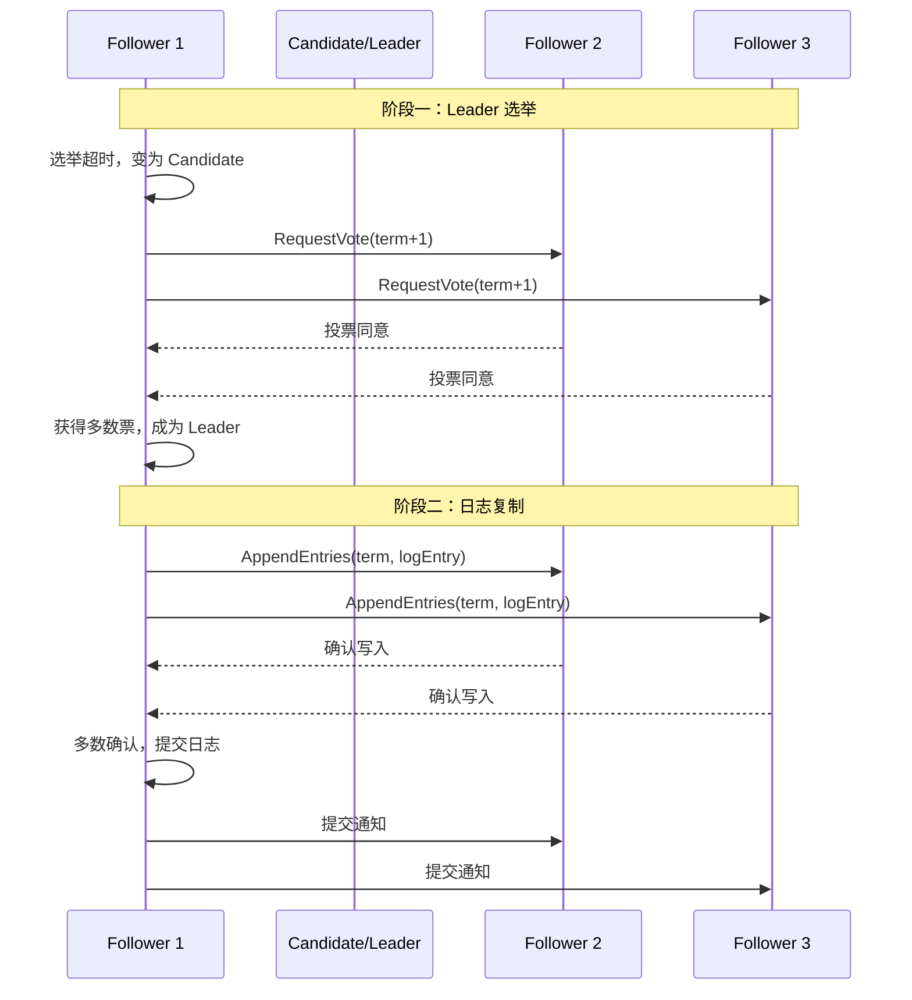
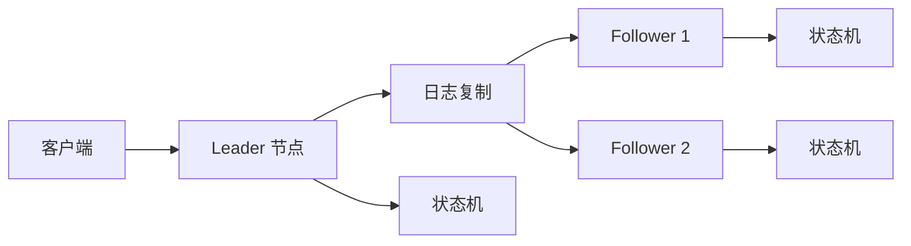

---
title: 分布式共识
date: 2024-05-07 06:34:08
categories:
  - 分布式
  - 分布式协同
tags:
  - 分布式
  - 协同
  - 共识
  - 广播
  - epoch
  - quorum
permalink: /pages/f868d27c/
---

# 分布式共识

## 什么是分布式共识

分布式系统最重要的抽象之一就是**共识（consensus）：所有的节点就某一项提议达成一致**。

共识问题通常形式化如下：一个或多个节点可以**提议（propose）** 某些值，而集群中的所有有效节点根据共识算法进行协商，最终**决议（decides）** 采纳某个节点的提议。

而共识算法必须满足以下性质：

1. 达成一致（Uniform agreement） - 没有两个节点的决定不同。
2. 完整性（Integrity） - 每个节点最多决议一次。
3. 有效性（Validity） - 如果一个节点决定了值 `v` ，则 `v` 由某个节点所提议。
4. 终止（Termination） - 由所有未崩溃的节点来最终决议。

**达成一致**和**完整性**定义了共识算法的核心思想：所有人同意了相同的结果，且一旦决定了，就不能改变主意。**有效性** 主要是为了排除无效的提案。如果不关心容错，那么满足前三个属性很容易：你可以将一个节点做为 “独裁者”，并让该节点做出所有的决定。但如果该节点失效，那么系统就无法再做出任何决定。事实上，2PC 就存在这种问题：如果协调者失效，那么存疑的参与者就无法决定提交还是中止。

**终止** 意味着：即使部分节点出现故障，其他节点也必须达成共识。当然，算法可以容忍的失效节点数是有限的：需要**超过半数以上**的服务器达成一致。假设有 N 台服务器， 大于等于 `N/2 + 1` 台服务器就算是半数以上了 。

> 共识（Consensus）与一致性（Consistency）的区别：一致性是指数据不同副本之间的差异；而共识是指达成一致性的方法与过程。很多中文资料把 Consensus 翻译为一致性，但其实是不准确的。

## 为什么需要分布式共识

对于一个主从复制的数据库，如果主节点发生失效，就需要切换到另一个节点。如果主节点故障了，集群就会天下大乱，就好比一个国家的皇帝驾崩了，国家大乱一样。比如，数据库集群中主节点故障后，可能导致每个节点上的数据会不一致。这，就应了那句话“国不可一日无君”，对应到分布式系统中就是“集群不可一刻无主”。集群中的有效节点可以**采用共识算法来选举新的主节点**。

某一时刻必须只有一个主节点，所有的节点必须就此达成一致。如果有两个节点都自认为是主节点，就会发生**脑裂**，导致数据丢失。正确实现共识算怯则可以避免此类问题。

## 一致性保证


## 线性化

线性化（一种流行的一致性模型） 其目标是使多副本对外看起来好像是单一副本，然后所有操作以原子方式运行，就像一个单线程程序操作变量一样。线性化的概念简单，容易理解，但它的主要问题在于性能，特别是在网络延迟较大的环境中。

## 顺序保证

线性化是将所有操作都放在唯一的、全局有序时间线上，而因果性则不同，它为我们提供了一个弱一致性模型： 允许存在某些井发事件，所以版本历史
是一个包含多个分支与合井的时间线。因果一致性避免了线性化昂贵的协调开销，且对网络延迟的敏感性要低很多。

## 分布式共识能否达成

Fischer、Lynch 和 Paterson （FLP）在 [**Impossibility of Distributed Consensus with One Faulty Process**](https://groups.csail.mit.edu/tds/papers/Lynch/jacm85.pdf) 论文中论证了：在一个**异步**系统中，即使只有一个进程出现了故障，也没有算法能**保证**达成共识。

简单来说，在一个异步系统中，由于进程可以随时发出响应，所以没有办法分辨一个进程是速度很慢还是已经崩溃，这不满足终止性（Termination）。

> **共识的不可能性**
>
> FLP 是一种限制性很强的模型，它假定共识性算法不能使用任何时钟或超时。如果允许算法使用 **超时** 或其他方法来识别可疑的崩溃节点（即使怀疑有时是错误的），则共识变为一个可解的问题。因此，虽然 FLP 是关于共识不可能性的重要理论结果，但现实中的分布式系统通常是可以达成共识的。

## 分布式共识算法

共识意味着就某一项提议，所有节点做出一致的决定，而且决定不可撤销。通过逐一分析，事实证明，多个广泛的问题最终都可以归结为共识，并且彼此等价（这就意味着，如果找到其中一个解决方案，就可以比较容易地将其转换为其他问题的解决方案）。这些等价的问题包括：

- 可线性化的比较－设置寄存器 - 寄存器需要根据当前值是否等于输入的参数， 来自动决定接下来是否应该设置新值。
- 原子事务提交 - 数据库需要决定是否提交或中止分布式事务。
- 全序广播 - 消息系统要决定以何种顺序发送消息。
- 锁与租约 - 当多个客户端争抢锁或租约时，要决定其中哪一个成功。
- 成员／协调服务 - 对于失败检测器（例如超时机制），系统要决定节点的存活状态（例如基于会i舌超时）。
- 唯一性约束 - 当多个事务在相同的主键上试图井发创建冲突资源时，约束条件要决定哪一个被允许，哪些违反约束因而必须失败。

如果系统只存在一个节点，或者愿意把所有决策功能都委托给某一个节点，那么事情就变得很简单。这和主从复制数据库的情形是一样的，即由主节点负责所有的决策事宜，正因如此，这样的数据库可以提供线性化操作、唯一性约束、完全有序的复制日志等。

然而，如果唯一的主节点发生故障，或者出现网络中断而导致主节点不可达，这样的系统就会陷入停顿状态。有以下三种基本思路来处理这种情况：

- 系统服务停止，井等待主节点恢复。许多XA I JTA 事务协调者采用了该方式。本质上，这种方怯并没有完全解决共识问题，因为它不满足终止性条件，试想如果主节点没法恢复，则系统就会永远处于停顿状态。
- 人为介入来选择新的主节点，并重新配置系统使之生效。许多关系数据库都采用这种方怯。本质上它引入了一种“上帝旨意” 的共识， 即在计算机系统之外由人
  类来决定最终命运。故障切换的速度完全取决于人类的操作，通常比计算机慢。
- 采用算i法来自动选择新的主节点。这需要一个共识算法，我们建议采用那些经过验证的共识系统来确保正确处理各种网络异常。

共识算法选举主节点的过程如同投票选举领导者（Leader），参选者（Candidate）需要说服大多数投票者（Follower）投票给他。一旦选举出领导者，就由领导者发号施令，所有追随者必须服从命令。

常见的分布式共识算法有：

- [Paxos 算法](https://dunwu.github.io/waterdrop/pages/a22fc1e4/)
- [Raft 算法](https://dunwu.github.io/waterdrop/pages/29586d95/) - 应用代表：Redis、etcd
- [Zab 算法](https://dunwu.github.io/waterdrop/pages/6f4382d3/) - 应用代表：ZooKeeper

这些算法之间有不少相似之处，但并不相同。下面，将大致介绍一下它们的共同思想。

### 全序广播

全序广播要求将消息按照相同的顺序，恰好传递一次，准确传送到所有节点。这相当于进行了几轮共识：在每一轮中，节点提议下一条要发送的消息，然后决定在全序中下一条要发送的消息。

所以，全序广播相当于重复进行多轮共识（每次共识决定与一次消息传递相对应）：

- 由于 **一致同意** 属性，所有节点决定以相同的顺序传递相同的消息。
- 由于 **完整性** 属性，消息不会重复。
- 由于 **有效性** 属性，消息不会被损坏，也不能凭空编造。
- 由于 **终止** 属性，消息不会丢失。

Raft 和 Zab 直接实现了全序广播，因为这样做比重复**一次一值（one value a time）**的共识更高效。在 Paxos 的情况下，这种优化被称为 Multi-Paxos。

### 主从复制和共识

主从复制将所有的写入操作都交给领导者，并以相同的顺序将状态变化广播同步到追随者，从而保持一致性。这实际上不就是一个全序广播吗？为什么不需要担心共识问题呢？

因为，这种场景下实际是一种独裁型的共识模型：只有一个节点被允许接收写入（即决定写入复制日志的顺序），如果该节点发生故障，则系统将无法写入，直到选出新的领导者。

### 纪元和法定人数

为了保证领导者是独一无二的，共识算法通常会定义一个逻辑时钟，用于表示选举领导者的投票轮次（纪元），而共识算法要保证每界选举得出的领导者是惟一的。不同算法中，对代表逻辑时钟的值定义不同，但作用是共通的：在 Paxos 中称其为选票（ballot）；在 Raft 中称其为任期（term）；在 Zab 中称其为纪元（epoch）。

每当现任领导者被认为宕机时，节点间就会发起一场投票，选举出新的领导者。这次选举被赋予一个全序且单调递增的纪元编号。如果出现两个不同时代的领导者，则以更高纪元编号的领导为主。

在每轮选举中，参选者如果要赢得选举，当选领导者，必须获得法定人数**（quorum）** 的选票。通常，会约定法定人数为**超过半数以上**，举例来说：假设总共有 N 张投票， 大于等于 `N/2 + 1` 张投票就算是半数以上了 。

### 共识的局限性

#### 共识对于集群节点数的限制

多数派共识算法的核心是少数服从多数，获得投票多的节点胜出。这对于集群节点数有以下限制：

- **集群中最多可以容忍半数以下的节点出现故障**。因为，一旦故障节点数达到半数，则无法在选举中获得半数以上投票。举例来说：如果集群有 3 个节点，最多允许 1 个节点出现故障；如果集群中有 5 个节点，最多允许 2 个节点出现故障。
- **集群的节点数一般要求是奇数**。如果集群节点数为偶数，就很有可能在选主时出现某两个节点均获得半数以上投票的情况，这种情况下就必须重新投票选举。

#### 选举会影响性能

共识系统通常依靠超时来检测失效的节点。在网络延迟高度变化的环境中，特别是在地理上散布的系统中，经常发生一个节点由于暂时的网络问题，错误地认为领导者已经失效。虽然这种错误不会损害安全属性，但频繁的领导者选举会导致糟糕的性能表现，因系统最后可能花在权力倾扎上的时间要比花在建设性工作的多得多。

## 特性

分布式共识算法具备以下核心特性：

| 特性 | 说明 |
| --- | --- |
| **安全性（Safety）** | 保证所有正确的节点永远不会达成错误的决定，包括一致同意、完整性、有效性 |
| **活性（Liveness）** | 在满足一定条件下（如多数节点存活），算法最终能够终止并达成决议 |
| **容错性（Fault Tolerance）** | 能够容忍部分节点崩溃、网络分区等故障，通常容忍 `f` 个节点故障需要 `2f+1` 个节点 |
| **领导者选举** | 大多数共识算法（`Raft`、`Zab`、`Multi-Paxos`）通过选举一个领导者来协调共识，简化协议复杂度 |
| **多数派（Quorum）** | 决议需要获得半数以上节点的同意，保证任何两个多数派必有交集，从而保证一致性 |
| **单调递增的纪元** | 通过 `term`/`epoch`/`ballot` 等逻辑时钟标识选举轮次，防止过期领导者干扰 |
| **全序广播** | 共识算法保证所有节点以相同顺序接收相同的消息，是构建复制状态机的基础 |

## 原理

### 共识算法的基本流程

大多数现代共识算法（`Raft`、`Zab`、`Multi-Paxos`）都采用了类似的核心思想，可以概括为以下几个阶段：



### 复制状态机模型

共识算法的核心应用场景是实现**复制状态机（`Replicated State Machine`）**。其基本思想是：

1. 多个节点上运行相同的状态机（如数据库）。
2. 所有操作以日志形式记录，并按相同顺序应用到每个节点。
3. 共识算法保证所有节点拥有相同的操作日志序列。



### 三大算法对比

| 特性 | Paxos | Raft | Zab |
| --- | --- | --- | --- |
| **提出者** | `Leslie Lamport` | `Diego Ongaro` | `Yahoo/ZooKeeper` |
| **领导者** | `Multi-Paxos` 引入 `Leader` 优化 | 强 `Leader` 模型 | 强 `Leader` 模型 |
| **选举** | 较复杂，未明确定义 | 随机超时选举，简单易懂 | 快速 `Leader` 选举 |
| **日志复制** | 允许日志空洞 | 不允许日志空洞（连续） | 不允许日志空洞 |
| **成员变更** | 支持但复杂 | 原生支持联合共识 | 支持 |
| **可理解性** | 较难，学术论文晦涩 | 易理解，专为教学设计 | 中等 |
| **典型应用** | `Chubby`、`Spanner` | `etcd`、`Consul`、`TiKV` | `ZooKeeper` |

## 应用场景

分布式共识算法在以下场景中应用广泛：

- **主节点选举** - 在主从复制数据库中，当主节点故障时，集群需要通过共识选举新的主节点。如 `ZooKeeper`、`etcd` 的 `Leader` 选举。
- **分布式锁服务** - `ZooKeeper`、`etcd` 提供分布式锁，底层依赖共识算法保证锁的互斥性。
- **配置管理** - 分布式系统的配置信息需要强一致性存储，如 `Kubernetes` 使用 `etcd` 存储集群配置。
- **服务发现** - 微服务架构中，服务实例的注册与发现依赖一致性存储，如 `ZooKeeper`、`Consul`、`Nacos`。
- **分布式事务协调** - 两阶段提交（`2PC`）的协调者可用共识算法实现高可用，避免协调者单点故障。
- **消息队列的元数据管理** - `Kafka` 早期依赖 `ZooKeeper`，新版 `KRaft` 使用 `Raft` 协议管理集群元数据。
- **分布式数据库** - `TiDB`、`CockroachDB`、`Spanner` 等分布式数据库底层依赖 `Raft` 或 `Paxos` 保证数据一致性。

## 最佳实践

### 案例一：基于 etcd 实现选主（Leader Election）

`etcd` 基于 `Raft` 算法实现，提供了强一致性的 `KV` 存储，常用于分布式选主场景。

**（1）引入依赖**

```xml
<dependency>
    <groupId>io.etcd</groupId>
    <artifactId>jetcd-core</artifactId>
    <version>0.7.5</version>
</dependency>
```

**（2）选主实现**

```java
import io.etcd.jetcd.ByteSequence;
import io.etcd.jetcd.Client;
import io.etcd.jetcd.Lease;
import io.etcd.jetcd.Lock;
import io.etcd.jetcd.lock.LockResponse;

import java.nio.charset.StandardCharsets;
import java.util.concurrent.TimeUnit;

public class EtcdLeaderElection {

    private static final String ETCD_ENDPOINT = "http://127.0.0.1:2379";
    private static final String LOCK_KEY = "/election/leader";
    private static final long LEASE_TTL = 10L; // 租约时间 10 秒

    private final Client client;
    private volatile boolean isLeader = false;

    public EtcdLeaderElection() {
        this.client = Client.builder().endpoints(ETCD_ENDPOINT).build();
    }

    /**
     * 竞选 Leader
     */
    public void campaignForLeader() {
        new Thread(() -> {
            try {
                Lock lockClient = client.getLockClient();
                Lease leaseClient = client.getLeaseClient();

                // 申请租约
                long leaseId = leaseClient.grant(LEASE_TTL).get().getID();

                // 加锁（阻塞式，获取不到会一直等待）
                while (true) {
                    LockResponse response = lockClient.lock(
                        ByteSequence.from(LOCK_KEY, StandardCharsets.UTF_8),
                        leaseId
                    ).get();
                    isLeader = true;
                    System.out.println("成为 Leader，开始执行主节点任务...");

                    // 定期续租
                    while (isLeader) {
                        try {
                            leaseClient.keepAliveOnce(leaseId).get();
                            Thread.sleep(LEASE_TTL * 1000 / 3);
                        } catch (Exception e) {
                            isLeader = false;
                            System.out.println("续租失败，失去 Leader 身份");
                            break;
                        }
                    }
                }
            } catch (Exception e) {
                e.printStackTrace();
            }
        }, "etcd-leader-election").start();
    }

    public boolean isLeader() {
        return isLeader;
    }

    public void close() {
        client.close();
    }

    public static void main(String[] args) throws InterruptedException {
        EtcdLeaderElection election = new EtcdLeaderElection();
        election.campaignForLeader();
        Thread.sleep(Long.MAX_VALUE);
    }
}
```

> **说明**：`etcd` 的 `Lock` 底层基于 `Lease`（租约）机制，当持有锁的节点宕机无法续租时，租约自动过期，锁随之释放，其他节点可竞选成为新的 `Leader`。

### 案例二：基于 ZooKeeper 实现分布式锁

`ZooKeeper` 基于 `Zab` 协议实现强一致性，其临时顺序节点天然适合实现分布式锁。

**（1）引入依赖**

```xml
<dependency>
    <groupId>org.apache.curator</groupId>
    <artifactId>curator-framework</artifactId>
    <version>5.5.0</version>
</dependency>
<dependency>
    <groupId>org.apache.curator</groupId>
    <artifactId>curator-recipes</artifactId>
    <version>5.5.0</version>
</dependency>
```

**（2）使用 Curator 的 InterProcessMutex**

```java
import org.apache.curator.framework.CuratorFramework;
import org.apache.curator.framework.CuratorFrameworkFactory;
import org.apache.curator.retry.ExponentialBackoffRetry;
import org.apache.curator.framework.recipes.locks.InterProcessMutex;

import java.util.concurrent.TimeUnit;

public class ZookeeperDistributedLockExample {

    private static final String ZK_ADDRESS = "127.0.0.1:2181";
    private static final String LOCK_PATH = "/locks/order";

    public static void main(String[] args) {
        CuratorFramework client = CuratorFrameworkFactory.builder()
                .connectString(ZK_ADDRESS)
                .sessionTimeoutMs(5000)
                .connectionTimeoutMs(3000)
                .retryPolicy(new ExponentialBackoffRetry(1000, 3))
                .build();
        client.start();

        InterProcessMutex lock = new InterProcessMutex(client, LOCK_PATH);

        try {
            // 尝试获取锁，最多等待 3 秒
            if (lock.acquire(3, TimeUnit.SECONDS)) {
                try {
                    System.out.println("获取锁成功，执行业务逻辑...");
                    // 模拟业务处理
                    Thread.sleep(1000);
                } finally {
                    lock.release();
                    System.out.println("释放锁成功");
                }
            } else {
                System.out.println("获取锁超时");
            }
        } catch (Exception e) {
            e.printStackTrace();
        } finally {
            client.close();
        }
    }
}
```

> **说明**：`InterProcessMutex` 是可重入的公平锁，基于 `ZooKeeper` 的临时顺序节点实现，客户端断连时节点自动删除，避免死锁。

### 案例三：使用 Spring Boot 集成 etcd 配置中心

`etcd` 常被用作分布式配置中心，利用其 `Watch` 机制可实现配置的动态更新。

**（1）配置存储**

```java
import io.etcd.jetcd.ByteSequence;
import io.etcd.jetcd.Client;
import io.etcd.jetcd.KV;
import io.etcd.jetcd.kv.PutResponse;

import java.nio.charset.StandardCharsets;
import java.util.concurrent.CompletableFuture;

public class EtcdConfigWriter {

    public static void main(String[] args) throws Exception {
        try (Client client = Client.builder().endpoints("http://127.0.0.1:2379").build()) {
            KV kvClient = client.getKVClient();
            ByteSequence key = ByteSequence.from("/config/myapp/timeout", StandardCharsets.UTF_8);
            ByteSequence value = ByteSequence.from("3000", StandardCharsets.UTF_8);
            CompletableFuture<PutResponse> future = kvClient.put(key, value);
            PutResponse response = future.get();
            System.out.println("配置写入成功，revision: " + response.getHeader().getRevision());
        }
    }
}
```

**（2）配置监听**

```java
import io.etcd.jetcd.ByteSequence;
import io.etcd.jetcd.Client;
import io.etcd.jetcd.Watch;
import io.etcd.jetcd.watch.WatchEvent;

import java.nio.charset.StandardCharsets;

public class EtcdConfigWatcher {

    public static void main(String[] args) throws Exception {
        try (Client client = Client.builder().endpoints("http://127.0.0.1:2379").build()) {
            Watch watchClient = client.getWatchClient();
            ByteSequence key = ByteSequence.from("/config/myapp/timeout", StandardCharsets.UTF_8);

            // 监听配置变化
            try (Watch.Watcher watcher = watchClient.watch(key, response -> {
                for (WatchEvent event : response.getEvents()) {
                    switch (event.getEventType()) {
                        case PUT:
                            System.out.println("配置更新: " +
                                event.getKeyValue().getValue().toString(StandardCharsets.UTF_8));
                            break;
                        case DELETE:
                            System.out.println("配置被删除");
                            break;
                    }
                }
            })) {
                System.out.println("开始监听配置变化...");
                Thread.sleep(Long.MAX_VALUE);
            }
        }
    }
}
```

> **说明**：`etcd` 的 `Watch` 机制基于 `Raft` 日志的 `revision` 实现，保证配置变更通知的可靠性和有序性。

## 常见问题

### 问题一：ZooKeeper 集群频繁发生 Leader 选举

**问题描述**

`ZooKeeper` 集群运行中频繁出现 `Leader` 切换，业务请求间歇性超时，日志中可见大量 `LEADER ELECTION` 记录。

**原因分析**

1. **`JVM GC` 停顿**：`Leader` 节点发生长时间 `Full GC`，无法在 `tickTime` 内响应心跳，被 `Follower` 判定为宕机。
2. **网络抖动**：机房网络不稳定，导致心跳包丢失或延迟超过 `initLimit * syncLimit`。
3. **超时参数配置过小**：`tickTime`、`initLimit`、`syncLimit` 设置不合理，在正常网络波动下就触发重新选举。
4. **磁盘 `I/O` 瓶颈**：`ZooKeeper` 事务日志写入磁盘，若磁盘 `I/O` 繁忙会导致写入延迟，触发超时。

**解决方案**

1. 优化 `JVM` 参数，避免 `Full GC`：

```bash
# 推荐 JVM 参数
-server
-Xms4g -Xmx4g
-XX:NewSize=1g -XX:MaxNewSize=1g
-XX:+UseG1GC
-XX:MaxGCPauseMillis=200
-XX:+ParallelRefProcEnabled
-XX:+ExplicitGCInvokesConcurrent
```

2. 合理配置 `zoo.cfg` 超时参数：

```properties
# 基本时间单元，毫秒
tickTime=2000
# Leader 初始化阶段允许的 tick 数
initLimit=10
# 同步阶段允许的 tick 数
syncLimit=5
# 适当增大以上参数可减少误判，但也不能过大，否则故障恢复慢
```

3. 使用独立磁盘存储事务日志：

```properties
# 事务日志单独存储在高性能 SSD 上
dataDir=/var/lib/zookeeper/data
dataLogDir=/var/lib/zookeeper/log
```

### 问题二：Raft 集群脑裂导致数据不一致

**问题描述**

基于 `Raft` 的集群在发生网络分区时，分区两侧各自选出了 `Leader` 并接受写入，网络恢复后出现数据不一致。

**原因分析**

`Raft` 算法本身通过**多数派（`Quorum`）**机制防止脑裂：只有获得多数节点同意才能成为 `Leader`。如果出现了两个 `Leader`，说明：

1. 集群节点数为偶数，分区后两侧各获得一半节点。
2. 实现存在 `bug`，未能正确处理 `term` 和投票计数。
3. 人工配置错误，导致两个独立的集群共用相同的节点信息。

**解决方案**

1. **集群节点数必须为奇数**，这是共识算法的基本要求。例如 `3` 节点或 `5` 节点集群，确保分区后只有包含多数节点的一侧能选出 `Leader`。

```yaml
# etcd 集群配置示例（3 节点）
ETCD_INITIAL_CLUSTER: "node1=http://10.0.0.1:2380,node2=http://10.0.0.2:2380,node3=http://10.0.0.3:2380"
ETCD_INITIAL_CLUSTER_STATE: new
```

2. 网络恢复后，少数派侧的 `Leader` 因 `term` 较低，其未提交的日志会被多数派 `Leader` 的日志覆盖。这是 `Raft` 的正常行为，不需要人工干预。

3. 验证集群状态：

```bash
# 检查 etcd 集群状态
etcdctl endpoint status --cluster -w table

# 输出示例：
# +---------------------------+------------------+---------+---------+-----------+------------+
# |         ENDPOINT          |        ID        | VERSION | DB SIZE | IS LEADER | IS LEARNER |
# +---------------------------+------------------+---------+---------+-----------+------------+
# | http://10.0.0.1:2379      | 8e9e05c52164694d |  3.5.0  |  20 kB  |      true |     false  |
# | http://10.0.0.2:2379      | 91bc3c398fb3c146 |  3.5.0  |  20 kB  |     false |     false  |
# | http://10.0.0.3:2379      | fd422379fda50e48 |  3.5.0  |  20 kB  |     false |     false  |
# +---------------------------+------------------+---------+---------+-----------+------------+
```

### 问题三：etcd 写入性能下降

**问题描述**

`etcd` 集群在数据量增大后，写入延迟明显上升，偶发写入超时。

**原因分析**

1. **`KV` 数据量过大**：`etcd` 默认数据大小上限为 `2GB`，数据量接近上限时 `BoltDB` 压缩和整理耗时增加。
2. **大 `Value` 写入**：`etcd` 设计用于存储小 `KV`（建议 `Value` 不超过 `1MB`），大 `Value` 会严重影响性能。
3. **历史版本未压缩**：`etcd` 保留所有历史版本，若未定期压缩，`MVCC` 数据持续膨胀。
4. **磁盘性能不足**：`Raft` 日志和 `BoltDB` 都依赖磁盘写入，磁盘 `I/O` 是性能瓶颈。

**解决方案**

1. 定期压缩和碎片整理：

```bash
# 压缩到当前 revision
etcdctl compact $(etcdctl endpoint status -w json | grep -o '"revision":[0-9]*' | grep -o '[0-9]*' | head -1)

# 去除碎片
etcdctl defrag --cluster

# 建议配置自动压缩
# etcd 启动参数
--auto-compaction-retention=1  # 保留 1 小时的历史版本
--auto-compaction-mode=periodic
```

2. 避免大 `Value`，将大配置拆分为多个小 `KV`：

```java
// 不推荐：单个 Value 过大
etcdClient.put(ByteSequence.from("/config/app"), ByteSequence.from(largeJsonString)).get();

// 推荐：拆分为多个小 KV
etcdClient.put(ByteSequence.from("/config/app/db"), ByteSequence.from(dbConfig)).get();
etcdClient.put(ByteSequence.from("/config/app/redis"), ByteSequence.from(redisConfig)).get();
etcdClient.put(ByteSequence.from("/config/app/mq"), ByteSequence.from(mqConfig)).get();
```

3. 配置监控告警：

```yaml
# Prometheus 监控关键指标
# etcd_server_proposals_failed_total - 提案失败次数
# etcd_disk_wal_fsync_duration_seconds - WAL 写入延迟
# etcd_mvcc_db_total_size_in_bytes - 数据库大小
```

## 参考资料

- [《数据密集型应用系统设计》](https://book.douban.com/subject/30329536/) - 这可能是目前最好的分布式存储书籍，强力推荐【进阶】
- [**Impossibility of Distributed Consensus with One Faulty Process**](https://groups.csail.mit.edu/tds/papers/Lynch/jacm85.pdf) - 论证了在一个异步系统中，即使只有一个进程出现了故障，也没有算法能保证达成共识。
- [Raft 论文（中文翻译）](https://github.com/maemual/raft-zh_cn)
- [etcd 官方文档](https://etcd.io/docs/)
- [ZooKeeper 官方文档](https://zookeeper.apache.org/doc/current/)
- [Apache Curator 官方文档](https://curator.apache.org/docs/about/)
